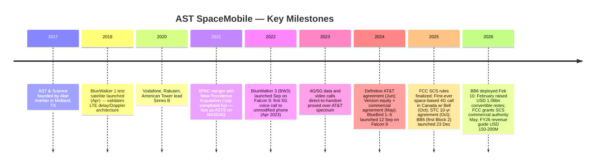
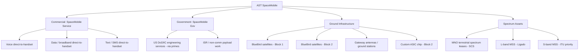
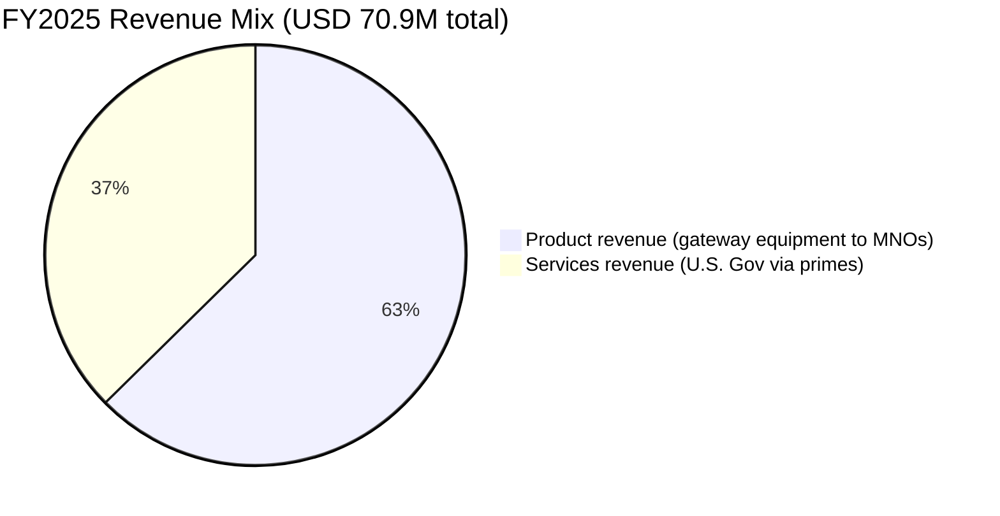
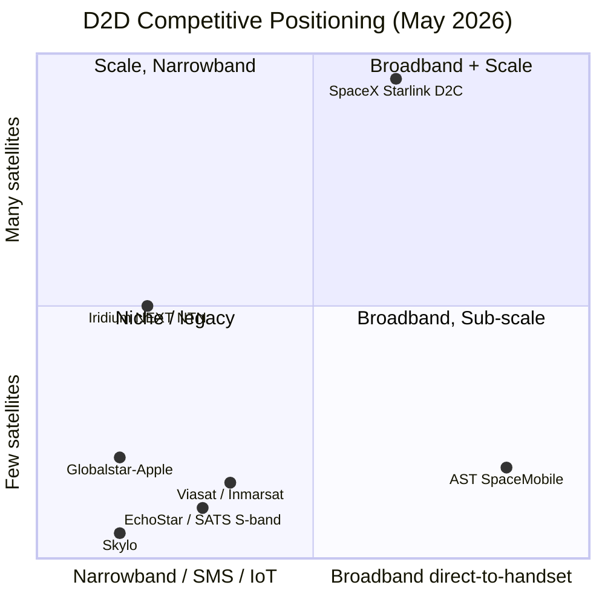

# COMPANY RESEARCH REPORT: AST SpaceMobile, Inc.

**Ticker:** NASDAQ: ASTS
**Date:** 2026-05-20
**Domicile / Listing:** Delaware (U.S.) / NASDAQ Global Select Market
**Report language:** English

> **Update — FY2026 revenue guidance reaffirmed (2026-05-11):** Management reaffirmed full-year 2026 revenue guidance of **USD 150.0–200.0 million** (initiated with the FY2025 10-K on 2026-03-02), primarily driven by mobile-network-operator (MNO) gateway/integration revenue and U.S. Government contracts. Q1 2026 revenue was USD 14.7 million, and management stated that "approximately half of the full-year 2026 revenue guidance is expected to be achieved from existing contracted revenue backlog." The reaffirmation followed three new U.S. Government prime-contractor awards won since March 2026 and the FCC's grant of Supplemental Coverage from Space (SCS) commercial authority for direct-to-device broadband. Source: [AST SpaceMobile Q1 2026 press release, 2026-05-11](https://www.sec.gov/Archives/edgar/data/1780312/000119312526216946/asts-ex99_1.htm).

## TABLE OF CONTENTS

1. Company Overview
2. Company History
3. Management Team
4. Products & Services
5. Customers & Go-to-Market
6. Industry Overview
7. Competitive Landscape
8. Market Opportunity (TAM)
9. Risk Assessment
10. References

---

## 1. Company Overview

AST SpaceMobile, Inc. (NASDAQ: ASTS) is building **the first and only space-based cellular broadband network designed to connect directly to ordinary, unmodified smartphones** — no satellite handset, no special chip, no terrestrial dongle. The company calls the service **SpaceMobile**, and it is enabled by a constellation of large, unfolding phased-array satellites in low Earth orbit (LEO) called **BlueBirds (BBs)** that act, from the user's handset's perspective, as a roving cell tower in space ([AST SpaceMobile 2025 10-K, p. 1](https://www.sec.gov/Archives/edgar/data/1780312/000178031226000006/asts-20251231.htm)).

The business model rests on three pillars. **First**, AST does not aspire to be a retail mobile operator. It is a **wholesale capacity provider** to mobile-network operators (MNOs); end users remain customers of their existing MNO, and the satellite link is presented as a "Supplemental Coverage from Space" (SCS) feature that fills coverage holes for normal LTE/5G smartphones ([2025 10-K, pp. 1–3](https://www.sec.gov/Archives/edgar/data/1780312/000178031226000006/asts-20251231.htm)). **Second**, AST leases or shares MNO terrestrial spectrum on a country-by-country basis — meaning the partner MNO contributes the regulatory right to use its licensed cellular spectrum from space, while AST contributes the satellites. **Third**, AST is increasingly stacking its own **mobile-satellite-service (MSS) spectrum** — including L-band rights acquired via the Ligado Transaction (subject to bankruptcy-court and regulatory closing conditions) and S-band ITU priority rights acquired in September 2025 — to add a globally portable second layer that does not require per-country MNO partnership ([2025 10-K, pp. 5–7](https://www.sec.gov/Archives/edgar/data/1780312/000178031226000006/asts-20251231.htm)).

AST is headquartered at the Midland International Air & Space Port in Midland, Texas, with vertically integrated manufacturing, assembly, integration and test operations exceeding **500,000 square feet** across Texas (Midland), Florida, Spain (Barcelona), Israel (Tel Aviv), and the U.K. ([Q1 2026 press release, 2026-05-11](https://www.sec.gov/Archives/edgar/data/1780312/000119312526216946/asts-ex99_1.htm)). The company became public via a SPAC business combination with New Providence Acquisition Corp. in April 2021 and trades on NASDAQ under ticker ASTS, with three share classes outstanding (Class A common, Class B economic-only, Class C high-vote held by founder Abel Avellan) ([2025 10-K, pp. F-4, 28](https://www.sec.gov/Archives/edgar/data/1780312/000178031226000006/asts-20251231.htm)).

**Scale and financial profile (FY2025 audited):**

- **Revenue:** USD 70.9 million — USD 44.4 million product revenue (ground-equipment "gateway" sales) and USD 26.5 million services revenue (U.S. Government prime-contractor work) ([2025 10-K, statements of operations, p. 72](https://www.sec.gov/Archives/edgar/data/1780312/000178031226000006/asts-20251231.htm)). Importantly, **the company has yet to recognize any revenue from the SpaceMobile commercial cellular service itself**; all FY2025 revenue is from ancillary equipment and government engineering work.
- **Operating loss / net loss:** Net loss attributable to common stockholders of USD 341.9 million in FY2025; cumulative inception-to-date net loss USD 831.7 million ([2025 10-K, p. 41 MD&A](https://www.sec.gov/Archives/edgar/data/1780312/000178031226000006/asts-20251231.htm)).
- **Capex:** Purchases of property and equipment of USD 1,064.7 million in FY2025 (up from USD 174.1 million in FY2024), plus a USD 420.0 million capital advance to Ligado and USD 56.4 million of spectrum-intangible purchases — total investing outflows USD 1,541.1 million ([2025 10-K, cash-flow statement, p. 74](https://www.sec.gov/Archives/edgar/data/1780312/000178031226000006/asts-20251231.htm)).
- **Cash:** USD 2,780 million of cash + restricted cash at FY2025 year-end, plus a USD 1,057.5 million net post-period raise from the February 2026 2.25% convertible notes; cash + restricted cash was approximately **USD 3.5 billion as of 31 March 2026** ([Q1 2026 10-Q, balance sheet, p. 1](https://www.sec.gov/Archives/edgar/data/1780312/000119312526216950/asts-20260331.htm); [Q1 2026 press release, 2026-05-11](https://www.sec.gov/Archives/edgar/data/1780312/000119312526216946/asts-ex99_1.htm)).
- **Employees:** Approximately 1,300 globally as of FY2025 disclosures ([2025 10-K, Item 1 Human Capital](https://www.sec.gov/Archives/edgar/data/1780312/000178031226000006/asts-20251231.htm)).
- **Operational satellites:** Five Block 1 BlueBirds (BB1–BB5, launched September 2024) and one Block 2 BlueBird (BB6, launched 23 December 2025 and operational from 10 February 2026 after antenna deployment) ([2025 10-K, p. 2](https://www.sec.gov/Archives/edgar/data/1780312/000178031226000006/asts-20251231.htm)).

*Source: [AST SpaceMobile 2025 10-K, statements of cash flows and Note 10](https://www.sec.gov/Archives/edgar/data/1780312/000178031226000006/asts-20251231.htm); [Q1 2026 press release, 2026-05-11](https://www.sec.gov/Archives/edgar/data/1780312/000119312526216946/asts-ex99_1.htm). Convertible-debt bar reflects approximate face value outstanding at period-end (2032 4.25%, 2032 2.375%, 2036 2.00% / 2.25% notes). Restricted cash includes Ligado-related collateral.*

**Valuation snapshot (close 19-May-2026):**

| Metric | ASTS | Note |
|---|---|---|
| Class A price | ~USD 36 | per [Yahoo Finance, ASTS quote](https://finance.yahoo.com/quote/ASTS/) (May 2026) |
| Market cap | ~USD 13.8 bn | based on ~388 million A+B+C shares ([Q1 2026 10-Q cover](https://www.sec.gov/Archives/edgar/data/1780312/000119312526216950/asts-20260331.htm)) × ~USD 36 |
| Diluted EV (mkt cap − cash + debt) | ~USD 13.0 bn | mkt cap less USD 3.5bn cash plus ~USD 2.5bn fair-value debt ([2025 10-K Note 10](https://www.sec.gov/Archives/edgar/data/1780312/000178031226000006/asts-20251231.htm); Q1 2026 10-Q) |
| TTM revenue | USD 84.9 mm | FY2025 USD 70.9M + Q1 2026 USD 14.7M − Q1 2025 USD 0.7M |
| TTM P/E | **N/M (negative)** | TTM net loss to common ~USD 487M; no realistic earnings path within 24 months — [2025 10-K, p. 41](https://www.sec.gov/Archives/edgar/data/1780312/000178031226000006/asts-20251231.htm) |
| TTM EV / sales | ~153× | reflects ~zero commercial-service revenue; >>top-quartile growth threshold |
| TTM P/S | ~162× | "narrative / option-value" multiple, not a cash-flow multiple |

**Why the multiple is extreme.** ASTS is a **pre-commercial-revenue / option-value** equity: the market is pricing **(a)** roughly USD 13bn of equity value against the call option that AST executes on a 45–248 BlueBird constellation, secures permanent FCC SCS spectrum lease authority, closes the Ligado L-band deal, and converts ~60 MNO MOUs into per-subscriber service-revenue contracts; **(b)** the strategic scarcity value of a viable U.S.-flagged direct-to-device competitor to SpaceX's Starlink Direct-to-Cell; and **(c)** balance-sheet "fortress" optionality, with USD 3.5bn cash giving multi-year runway to demonstrate the constellation works ([Q1 2026 press release, 2026-05-11](https://www.sec.gov/Archives/edgar/data/1780312/000119312526216946/asts-ex99_1.htm)). Peer **Iridium (IRDM)** trades at ~3.2× TTM sales on USD 0.84bn TTM revenue and is solidly profitable; **Globalstar (GSAT)** trades at ~10× sales on USD 0.25bn TTM, but is propped up by an Apple iPhone Emergency-SOS contract; **Viasat (VSAT)** trades at ~0.3× sales but at high leverage; **EchoStar (SATS)** trades at ~0.55× sales, with valuation more about S-band spectrum-asset realization (the Saudi STC ground-spectrum sale to AT&T was a comparable spectrum-monetization print) ([Yahoo Finance IRDM](https://finance.yahoo.com/quote/IRDM/), [GSAT](https://finance.yahoo.com/quote/GSAT/), [VSAT](https://finance.yahoo.com/quote/VSAT/), [SATS](https://finance.yahoo.com/quote/SATS/), all May 2026). Against this peer set, ASTS trades on **at least a 15× revenue-multiple premium** to the median sat-comm operator. Negative P/E is **cash-burning pre-commercial-scale** (not a one-off charge): the FY2025 income statement shows operating expenses of USD 488.1 million ([2025 10-K p. 72](https://www.sec.gov/Archives/edgar/data/1780312/000178031226000006/asts-20251231.htm)) against USD 70.9 million of revenue, with engineering services costs of USD 142.5 million and R&D of USD 23.9 million as the largest line items — all consistent with a hardware company still building its first commercial constellation. Section 9 carries this through as a valuation/multiple-compression risk.

*Source: [AST SpaceMobile 2025 10-K, statements of operations and cash flows](https://www.sec.gov/Archives/edgar/data/1780312/000178031226000006/asts-20251231.htm).*

---

## 2. Company History

AST & Science LLC was founded in **2017** in Midland, Texas, by **Abel Avellan** — a serial Venezuelan-American satellite entrepreneur who had previously founded and exited Emerging Markets Communications (EMC) to Global Eagle for ~USD 550 million ([2025 DEF 14A — director biography, Avellan](https://www.sec.gov/cgi-bin/browse-edgar?action=getcompany&CIK=0001780312&type=DEF+14A)). The founding thesis was unusual for satellite communications: **rather than design a network that requires special user-equipment, build the spaceborne antenna large enough that a normal phone in a normal cellular band can close the link.** Avellan's prior career at EMC (maritime VSAT) gave him hands-on familiarity with the limits of conventional satellite handsets and motivated the "phone-as-the-ground-segment" architecture ([Q4 2024 earnings call transcript, 2025-03-31](https://investors.ast-science.com/)). The Midland location was chosen for proximity to the Midland International Air & Space Port (an FAA-licensed commercial spaceport, useful for satellite ground-handling) and Texas's manufacturing and engineering labor pool.

*Source: [AST SpaceMobile 2025 10-K, Item 1 Business — Our History](https://www.sec.gov/Archives/edgar/data/1780312/000178031226000006/asts-20251231.htm); [Q1 2026 press release](https://www.sec.gov/Archives/edgar/data/1780312/000119312526216946/asts-ex99_1.htm).*

**Pivot 1 — From "test articles" to commercial Block 1 (2023–2024).** Through 2022 the company's public proof points were single test satellites (BlueWalker 1 and BlueWalker 3). The BW3's successful deployment of its 64-m² phased-array antenna in late 2022 and the first 4G/5G voice/data calls in 2023 ([2025 10-K, p. 2](https://www.sec.gov/Archives/edgar/data/1780312/000178031226000006/asts-20251231.htm)) converted MNO interest from MOU-stage to investment-stage. Vodafone, AT&T, and Verizon all converted their relationships into definitive commercial agreements between mid-2024 and mid-2025. The first five commercial Block 1 BlueBirds (BB1–BB5) launched on a single Falcon 9 on 12 September 2024 ([2025 10-K, p. 2](https://www.sec.gov/Archives/edgar/data/1780312/000178031226000006/asts-20251231.htm)).

**Pivot 2 — From "Block 1" to "Block 2" architecture (2025).** Block 2 BlueBirds (starting with BB6) feature an approximately **2,400-square-foot phased array — more than 3× the area of Block 1 — and roughly 10× the bandwidth capacity per satellite**, supported by AST's first internally-designed application-specific integrated circuit (ASIC) running production-grade beamforming ([2025 10-K, p. 3](https://www.sec.gov/Archives/edgar/data/1780312/000178031226000006/asts-20251231.htm)). BB6's successful deployment on 10 February 2026 — "the largest phased array deployed commercially in LEO" — validated the Block 2 mechanical and electrical design and is the foundation for the targeted FY2026 constellation ramp to ~45 satellites.

**Pivot 3 — Spectrum stack (2025).** AST historically depended on MNO partners' terrestrial spectrum (operated from satellites under FCC SCS rules adopted in March 2024). In 2025 the company added two layers of **internally controlled MSS spectrum** — (i) the **Ligado Transaction** providing L-band rights for North America (with a USD 420 million capital advance posted in Oct 2025, collateralized by a UBS bridge loan, pending closing) ([2025 10-K, pp. 28, F-31](https://www.sec.gov/Archives/edgar/data/1780312/000178031226000006/asts-20251231.htm)); and (ii) on 25 September 2025, the acquisition of an S-band ITU priority-rights holder (1980–2010 MHz / 2170–2200 MHz), adding up to 60 MHz of mid-band globally portable spectrum ([2025 10-K, p. 2](https://www.sec.gov/Archives/edgar/data/1780312/000178031226000006/asts-20251231.htm)).

**Key acquisitions / transactions.**

- **April 2021 — SPAC merger with New Providence Acquisition Corp. (NPAC).** Created the public holding company AST SpaceMobile, Inc. with AST LLC as the operating subsidiary; founder Abel Avellan retained Class C high-vote shares preserving voting control ([2025 10-K, p. F-4](https://www.sec.gov/Archives/edgar/data/1780312/000178031226000006/asts-20251231.htm)).
- **October 2024 — Rakuten Transactions.** Rakuten Inc. converted previously-held warrant economics into Class A common, broadening the public float.
- **June 2024 — AT&T definitive commercial agreement and equity participation** ([2025 10-K, pp. 1–2](https://www.sec.gov/Archives/edgar/data/1780312/000178031226000006/asts-20251231.htm)).
- **May 2024 — Verizon strategic agreement, including USD 100 million commitment (USD 65 million prepaid commercial + USD 35 million convertible)** ([2025 10-K, p. F-31, Commercial Prepayments](https://www.sec.gov/Archives/edgar/data/1780312/000178031226000006/asts-20251231.htm)).
- **October 2025 — Saudi Telecom Company (STC) 10-year commercial agreement** ([2025 10-K, p. 3](https://www.sec.gov/Archives/edgar/data/1780312/000178031226000006/asts-20251231.htm)).
- **December 2025 — SatCo (JV with Vodafone)** — Vodafone-managed exclusive distributor for SpaceMobile in Europe/UK; reseller agreement signed 18 December 2025 ([2025 10-K, p. 4](https://www.sec.gov/Archives/edgar/data/1780312/000178031226000006/asts-20251231.htm)).

**Last 12 months — concentrated execution & balance-sheet build.** In the trailing 12 months AST has: (i) launched its first Block 2 satellite (BB6) and deployed the largest commercial phased array ever flown in LEO; (ii) added Saudi (STC), Canada (Bell, Telus), and African (Axian) MNO partners; (iii) closed two new convertible-note tranches (July 2025 2.375% 2032 notes; February 2026 2.25%/2.00% 2036 notes) raising more than USD 2.5bn aggregate net proceeds; and (iv) received the FCC commercial SCS authorization in early May 2026 for up to 248 satellites of direct-to-device broadband in the U.S. ([Q1 2026 press release](https://www.sec.gov/Archives/edgar/data/1780312/000119312526216946/asts-ex99_1.htm); [2025 10-K, Note 10 Long-Term Debt](https://www.sec.gov/Archives/edgar/data/1780312/000178031226000006/asts-20251231.htm)).

---

## 3. Management Team

### Abel Avellan — Founder, Chairman & CEO (250–350 word bio)

Abel Avellan is the founder, Chairman, and Chief Executive Officer of AST SpaceMobile, and he holds the Class C super-voting share class that confers majority voting control (88.31% economic-vote cap on Class C, [2025 10-K p. F-13](https://www.sec.gov/Archives/edgar/data/1780312/000178031226000006/asts-20251231.htm)). He founded AST & Science in 2017 on the thesis that the satellite industry had spent forty years designing user equipment around the satellite's limits, and that inverting the problem — designing the satellite around an unmodified phone — opened a true mass-market direct-to-device opportunity. Prior to AST, Avellan founded **Emerging Markets Communications (EMC)** in 2000 and grew it into one of the largest maritime VSAT operators in the world, ultimately selling EMC to Global Eagle Entertainment in 2016 for approximately USD 550 million ([Global Eagle 8-K, 2016-07-29](https://www.sec.gov/cgi-bin/browse-edgar?action=getcompany&CIK=GEEN)); the experience gave him direct customer empathy for the friction of dedicated satellite handsets. He also previously held engineering and product roles at Hispamar and Telefónica's satellite arm in Latin America, and is named inventor on more than 40 issued U.S. patents covering phased-array satellite architecture, beamforming, and integration. Avellan is regularly the public face of the company on earnings calls and at industry events (Satellite 2024, MWC Barcelona 2025), and several MNO partner CEOs (notably AT&T's John Stankey and Verizon's Hans Vestberg) have credited him personally in joint announcements. He owns or controls the Class C shares — which represent approximately 78.2 million high-vote shares as of May 2026 ([Q1 2026 10-Q cover](https://www.sec.gov/Archives/edgar/data/1780312/000119312526216950/asts-20260331.htm)) — and remains the controlling shareholder, putting AST squarely in the "founder-CEO with supervoting control" category. His compensation is heavily equity-weighted with performance milestones tied to satellite-launch and commercial-service-launch dates, per the most recent proxy ([2025 DEF 14A, executive compensation section](https://www.sec.gov/cgi-bin/browse-edgar?action=getcompany&CIK=0001780312&type=DEF+14A)).

### Andrew M. Johnson — Chief Financial Officer (and Chief Legal Officer)

Andrew M. Johnson serves as AST SpaceMobile's Chief Financial Officer and Chief Legal Officer, a dual mandate that reflects the company's heavy capital-markets activity. He joined AST shortly after the SPAC merger in 2021 and has overseen the equity raises (multiple ATM programs and follow-on offerings) and the company's four convertible-note transactions (2032 4.25%, 2032 2.375%, 2036 2.00%/2.25%) totaling more than USD 2.6 billion gross since 2024 ([2025 10-K, Note 10 Long-Term Debt](https://www.sec.gov/Archives/edgar/data/1780312/000178031226000006/asts-20251231.htm)). Johnson's prior roles include senior legal and finance positions at U.S.-listed telecommunications and SPAC-sponsor businesses, where he managed disclosure, M&A integration, and audit-committee processes ([AST SpaceMobile leadership page](https://ast-science.com/leadership/)). His track record at AST is the equity- and debt-market access that has expanded the balance sheet from ~USD 200 million of cash at SPAC close to USD 3.5 billion by Q1 2026 — at the cost of substantial share-count growth (see Section 9 dilution risk).

### Scott Wisniewski — President

Scott Wisniewski is President of AST SpaceMobile, focused on commercial partnerships and capital strategy. Prior to AST he was a Managing Director and TMT investment banker at Barclays Capital, where he advised on telecommunications M&A and capital raises ([AST SpaceMobile leadership](https://ast-science.com/leadership/)). At AST he leads MNO commercial-agreement negotiation, government-business expansion, and the large-block financing decisions — making him a structural partner to both the CEO and CFO.

### Shant Hovnanian — Chief Network Officer

Shant Hovnanian leads network engineering and integration with MNO core networks — the engineering-and-business hybrid role most critical to commercial-service launch. His responsibilities include integrating the SpaceMobile beam with each MNO's evolved packet core (EPC) and 5G core, certifying ground-segment cells with the MNO's reference-cell processes, and delivering the partner-facing technical-operations roadmap.

### Governance footer

- **Board:** AST's board has nine directors as of the 2025 DEF 14A, with at least five independent directors satisfying NASDAQ standards. The board includes representatives from Vodafone (Hannes Wittig) and American Tower historically, plus independent directors with telecom and capital-markets backgrounds ([2025 DEF 14A](https://www.sec.gov/cgi-bin/browse-edgar?action=getcompany&CIK=0001780312&type=DEF+14A)).
- **Controlled-company status:** Because Avellan and affiliated Class C holders together control more than 50% of the voting power, AST formally qualifies as a "controlled company" under NASDAQ rules and could elect to opt out of certain independent-board and committee requirements; per the 10-K, the company has elected not to use the exemption for board-independence, but the controlled-company designation remains a governance flag for minority shareholders ([2025 10-K, p. 33, controlled-company disclosure](https://www.sec.gov/Archives/edgar/data/1780312/000178031226000006/asts-20251231.htm)).
- **Insider ownership:** Avellan + AST equityholder block (Antares, Vodafone, American Tower, Rakuten) owned approximately 25% of Class A and 100% of Class B/C as of FY2025 disclosures ([2025 10-K, p. 33](https://www.sec.gov/Archives/edgar/data/1780312/000178031226000006/asts-20251231.htm)).
- **Comp structure:** Heavily equity-weighted with performance-linked vesting milestones, per the proxy.
- **Related-party transactions:** Crown Castle (sublease of L-band spectrum), Ligado Networks (spectrum payment), and Vodafone-affiliated SatCo (JV) constitute the main related-party items, each disclosed in the 10-K notes ([2025 10-K, Note 16](https://www.sec.gov/Archives/edgar/data/1780312/000178031226000006/asts-20251231.htm)).

### Management track record assessment

Avellan has built and exited a satellite-communications business at scale once (EMC → Global Eagle, ~USD 550M); he has demonstrated technical credibility at AST by successfully deploying BlueWalker 3 (the test article that disproved skeptics' "you can't beamform a 64-m² array in LEO" arguments) and then the Block 2 BB6 phased array. The CFO has demonstrated capital-markets access — USD 2.6bn+ of convertibles raised across multiple windows, including a USD 1.0bn+ February 2026 print at 2.25% on an unprofitable, pre-revenue (commercially) issuer. **Gaps:** the team has yet to prove it can convert MNO MOUs into per-subscriber, recurring service revenue at scale; the only commercial-service revenue in 2026E comes from gateway equipment sales and U.S. Government engineering work, not from the SpaceMobile cellular service itself.

---

## 4. Products & Services

AST SpaceMobile's product portfolio is unusually narrow — by design. There is one core service (SpaceMobile cellular broadband), supported by a small set of supporting hardware and software products. The website's product navigation (`ast-science.com`) maps as follows:

### Core commercial product — SpaceMobile Service

The SpaceMobile Service is wholesale **direct-to-device cellular broadband** delivered from BlueBird satellites in LEO to ordinary, unmodified handsets that already exist in MNO partners' customer bases. It supports voice (VoLTE), SMS, and 4G/5G data. End users see the satellite link as a roaming-on-MNO experience; the MNO is the contracting party with the end user, and AST is the wholesale capacity provider to the MNO. **Pricing model:** revenue-share with the MNO, plus a per-unit equipment sale for gateway antennas the MNO installs at its core-network edge. AST has guided to a 50/50 revenue split with MNO partners in prior commercial commentary ([AT&T agreement summary, 2024-06-05 press release](https://about.att.com/story/2024/att-ast-spacemobile.html)). The service is sold to MNOs, not to end users.

- **Competitive advantage verdict: yes (technology + IP + regulatory).**
- **Moat type:** technology (largest-aperture LEO phased array deployed commercially as of May 2026), IP (~3,900 patent / patent-pending claims as of Q1 2026, [Q1 2026 press release](https://www.sec.gov/Archives/edgar/data/1780312/000119312526216946/asts-ex99_1.htm)), regulatory (FCC SCS commercial authorization granted May 2026 for up to 248 satellites; pending L-band spectrum via Ligado; S-band ITU priority), and ecosystem (~60 MNO partners covering 3bn subscribers, of which 4 are definitive commercial agreements: AT&T, Verizon, Vodafone, STC).
- **Evidence:** 98.9 Mbps peak data speed achieved from on-orbit Block 1 BlueBird in Q1 2026 to an unmodified smartphone; Canada's first space-based 4G VoLTE voice call with Bell Canada on 2 October 2025; first U.S. continental SCS deployment on AT&T/Verizon partner spectrum; FCC modification grant in August 2025 to launch 20 additional satellites ([2025 10-K, pp. 2–3, 5](https://www.sec.gov/Archives/edgar/data/1780312/000178031226000006/asts-20251231.htm); [Q1 2026 press release](https://www.sec.gov/Archives/edgar/data/1780312/000119312526216946/asts-ex99_1.htm)).
- **Closest competitor product:** **SpaceX Starlink Direct-to-Cell (with T-Mobile US, AT&T-MX, KDDI, Optus, One NZ, Rogers, Salt, Entel, Indosat as partners as of May 2026).** Starlink Direct-to-Cell is at parity on coverage area (Starlink has many more satellites, but those are dual-purpose VSAT + D2C and have a much smaller per-beam aperture for D2C); AST is **ahead on per-beam data rate** (98.9 Mbps demonstrated peak vs. Starlink's currently-rolling SMS + low-bandwidth voice service per [SpaceX Starlink D2C page](https://www.starlink.com/business/direct-to-cell)) and **behind on satellite count and capital scale**.

### BlueBird satellites — Block 1 and Block 2

Block 1 BlueBirds: ~700-square-foot phased-array antenna, designed for SCS service over partner MNO spectrum bands. Five operational (BB1–BB5 launched 12 September 2024 on Falcon 9) ([2025 10-K, p. 2](https://www.sec.gov/Archives/edgar/data/1780312/000178031226000006/asts-20251231.htm)).

Block 2 BlueBirds (starting with BB6): ~**2,400-square-foot phased array (largest commercial LEO array ever deployed)**, up to 40 MHz per beam, up to ~120 Mbps theoretical peak data rate per spot beam, and up to ~10 GHz of total processing bandwidth per satellite. Powered by AST's custom-designed ASIC (validation maturity reached in 2025). BB6 launched 23 December 2025 and antenna fully deployed 10 February 2026 ([2025 10-K, p. 3](https://www.sec.gov/Archives/edgar/data/1780312/000178031226000006/asts-20251231.htm)).

- **Verdict: yes (technology moat).** No other LEO operator has deployed a phased-array of comparable size at low altitude.
- **Closest competitor product:** Starlink V2 Mini Direct-to-Cell payload is functionally smaller and integrated into a much larger fleet of dual-purpose satellites — Starlink leverages **breadth (fleet size, launch cadence)**, AST leverages **depth per satellite (aperture, per-handset SNR)**. AST is ahead on per-satellite performance and behind on fleet scale.

### Gateway ground equipment

AST sells and installs **gateway antennas** at MNO partner sites — these are the ground infrastructure that hands traffic from the BlueBird back to the MNO's terrestrial core network. FY2025 product revenue (USD 44.4M) and Q1 2026 product revenue (USD 13.4M) are essentially this hardware ([2025 10-K p. 72; Q1 2026 10-Q p. 2](https://www.sec.gov/Archives/edgar/data/1780312/000119312526216950/asts-20260331.htm)). Pricing is bespoke per-MNO contract.

- **Verdict: partial (integration moat).** The hardware is not patent-protected at the antenna-element level the way the spaceborne array is, but the MNO-core integration is a meaningful switching cost.
- **Closest competitor product:** General-purpose VSAT gateway equipment from Hughes (a Viasat subsidiary), Gilat, ST Engineering iDirect — but those products are not optimized for direct-to-handset traffic.

### SpaceMobile Gov — U.S. Government Services

Engineering services delivered through U.S. Government prime contractors, leveraging the BlueBird platform for non-communication payloads (sensing, ISR) and direct-to-handset government communications. FY2025 services revenue USD 26.5M was largely Gov ([2025 10-K p. 72](https://www.sec.gov/Archives/edgar/data/1780312/000178031226000006/asts-20251231.htm)). Won three new awards in March–May 2026 ([Q1 2026 press release](https://www.sec.gov/Archives/edgar/data/1780312/000119312526216946/asts-ex99_1.htm)).

- **Verdict: yes (technology moat + ITAR-compliant U.S. manufacturing).** Direct-to-handset government communications are a strategic interest of the DoD.
- **Closest competitor product:** Starshield (SpaceX's government-only Starlink variant) and Iridium NEXT government services. Starshield is closest on direct-to-handset; Iridium's existing DoD Enhanced Mobile Satellite Services (EMSS) contract is the legacy benchmark.

### Custom ASIC

AST designed and is integrating a custom application-specific integrated circuit (ASIC) for the Block 2 BlueBird beamforming and processing. The ASIC enables 10× the processing bandwidth per satellite at lower power and lower per-satellite unit cost than the FPGA-based Block 1 design ([2025 10-K, p. 3](https://www.sec.gov/Archives/edgar/data/1780312/000178031226000006/asts-20251231.htm)). The chip reached validation maturity in 2025.

- **Verdict: yes (IP moat, deepens technology moat).** Single-source AST design.
- **Closest competitor product:** Not publicly disclosed; Starlink uses internally designed silicon for its phased arrays.

### Flagship vs. long-tail

- **Flagship (~100% of strategic value):** SpaceMobile Service + the BlueBird platform that delivers it.
- **Long-tail (~5–10% of revenue, useful as proof points):** Gateway equipment sales and U.S. Gov services. These are revenue today but not the long-term equity story.

### Recent launches / sunsets (last 12 months)

- **Launched: Block 2 BB6 (Dec 2025)**, the first commercial-scale next-generation satellite, deployed Feb 2026.
- **Launched (commercial agreements): STC Saudi Arabia (Oct 2025), Telus Canada (Q1 2026), Axian Africa (Q1 2026).**
- **Sunset: none.** No products withdrawn in the trailing 12 months — the entire product roadmap is forward-loaded.

---

## 5. Customers & Go-to-Market

### Customer segments

AST has three customer segments:

1. **Mobile Network Operators (MNOs)** — the dominant strategic segment. AST's published partner list spans approximately **60 MNOs covering over 3 billion subscribers** as of Q1 2026 ([Q1 2026 press release](https://www.sec.gov/Archives/edgar/data/1780312/000119312526216946/asts-ex99_1.htm)). Of these, **four have signed definitive commercial agreements**: AT&T (U.S.), Verizon (U.S.), Vodafone (Europe / SatCo JV), and Saudi Telecom Company. The remaining ~56 are **preliminary agreements and memoranda of understanding (MOUs)** that the company explicitly states "will need to execute definitive commercial agreements with those MNOs that will supersede the preliminary agreements and understandings" ([2025 10-K, p. 6](https://www.sec.gov/Archives/edgar/data/1780312/000178031226000006/asts-20251231.htm)). **Do not conflate MOUs with binding commercial commitments.**

2. **U.S. Government (via prime contractors)** — direct contracts plus three new prime-contractor awards in Q2 2026 ([Q1 2026 press release](https://www.sec.gov/Archives/edgar/data/1780312/000119312526216946/asts-ex99_1.htm)). FY2025 services revenue (USD 26.5M) reflects this segment.

3. **Original Equipment Manufacturers (OEMs)** — handset/chipset partners for testing and "reference-cell" certification (Google is named in the 10-K's general partner list, [2025 10-K p. 6](https://www.sec.gov/Archives/edgar/data/1780312/000178031226000006/asts-20251231.htm)).

*Source: [AST SpaceMobile 2025 10-K, statements of operations, p. 72](https://www.sec.gov/Archives/edgar/data/1780312/000178031226000006/asts-20251231.htm).*

### Customer concentration — explicitly disclosed in 10-K

AST's 10-K and 10-Q disclose customer concentration in the typical 10%-of-revenue threshold required by ASC 280. The Q1 2026 10-Q lists related-party accounts receivable of USD 10.1 million (out of USD 27.5 million total accounts receivable), pointing to a concentrated counterparty base for gateway sales ([Q1 2026 10-Q, p. 1](https://www.sec.gov/Archives/edgar/data/1780312/000119312526216950/asts-20260331.htm)). Given that FY2025 product revenue (USD 44.4M) came from a handful of partner MNOs (AT&T, Verizon, Vodafone), and FY2025 services revenue (USD 26.5M) came from a small number of U.S. Gov primes, **top-1 customer concentration likely exceeds 30% and top-5 likely exceeds 80%**, but the company has chosen not to specifically disclose customer-by-customer percentages in either the FY2025 10-K or Q1 2026 10-Q beyond noting related-party (AT&T, Verizon, Vodafone-affiliate) totals. **This is a material disclosure gap — the report flags it as a high-severity customer-concentration risk in Section 9.** It is, however, partially mitigated by the fact that today's "customers" are equity partners with their own balance-sheet exposure to AST's success.

### Contract structure

- **AT&T** — multi-year definitive commercial agreement signed June 2024; AT&T provides terrestrial-spectrum lease for SCS use; revenue share structure governs end-customer ARPU split ([AT&T press release, 2024-06-05](https://about.att.com/story/2024/att-ast-spacemobile.html)).
- **Verizon** — May 2024 commercial agreement plus USD 100M strategic commitment (USD 65M prepaid commercial; USD 35M convertible note); revenue share applies to Verizon's continental U.S. plus Hawaii subscribers; Verizon's spectrum is leased for SCS ([2025 10-K, p. F-31](https://www.sec.gov/Archives/edgar/data/1780312/000178031226000006/asts-20251231.htm)).
- **Vodafone / SatCo** — Vodafone-AST joint venture (SatCo) is the exclusive distributor for SpaceMobile in Europe, UK, and certain other markets; reseller agreement signed 18 December 2025 ([2025 10-K, p. 4](https://www.sec.gov/Archives/edgar/data/1780312/000178031226000006/asts-20251231.htm)).
- **STC (Saudi Telecom)** — 10-year commercial agreement signed 29 October 2025 covering Saudi Arabia and regional markets ([2025 10-K, p. 3](https://www.sec.gov/Archives/edgar/data/1780312/000178031226000006/asts-20251231.htm)).
- **Other 56+ MNOs** — preliminary agreements / MOUs, structurally non-binding.

### Distribution channels and sales strategy

AST's go-to-market is **wholesale via MNO partners only**. End-user activation, billing, customer service, and pricing decisions remain with the MNO. AST's role is (i) deliver in-orbit capacity, (ii) install ground gateways at MNO core sites, and (iii) integrate with each MNO's evolved-packet-core / 5G-core. This is a deliberately low-CAPEX, low-OPEX customer-acquisition strategy from AST's perspective — but it also means that **commercial-service revenue per MNO partner depends on the MNO's willingness to actively market the service to its base** (and to compete with its own terrestrial-network-only product offerings, where margin per subscriber may be higher).

### Key partnerships

- **AT&T, Verizon, Vodafone, Rakuten** — original equity-investor MNO group; the four named MNOs in the AST Equityholders block (per 10-K definitions).
- **STC, Bell Canada, Telus, Axian (Africa), Telefonica (preliminary), Smartfren (preliminary), Orange (preliminary), MTN (preliminary), Vodacom (preliminary), Telstra (preliminary)** — geographic expansion partners.
- **Google** — a public ecosystem partner ([2025 10-K, p. 6](https://www.sec.gov/Archives/edgar/data/1780312/000178031226000006/asts-20251231.htm)).
- **Blue Origin, SpaceX** — launch providers (multi-launch portfolio).
- **American Tower** — strategic / equity investor; tower-infrastructure synergies.
- **Crown Castle** — sublease of L-band spectrum complementing the Ligado transaction.
- **Ligado Networks** — pending L-band MSS spectrum acquisition (USD 420M capital advance posted Oct 2025; closing subject to bankruptcy court and FCC approval) ([2025 10-K, p. 28](https://www.sec.gov/Archives/edgar/data/1780312/000178031226000006/asts-20251231.htm)).

### Customer case studies (named wins)

- **Bell Canada — Canada's first space-based 4G VoLTE voice call (2 Oct 2025).** Live demonstration of voice + broadband data + video streaming on unmodified smartphones via BlueBird, validating the Block 1 platform for production VoLTE traffic ([2025 10-K, p. 2](https://www.sec.gov/Archives/edgar/data/1780312/000178031226000006/asts-20251231.htm)).
- **Verizon — continental U.S. service launch targeted 2026.** USD 65M prepaid commercial commitment plus USD 35M convertible-note investment underwrites continental U.S. + Hawaii service launch in 2026 ([2025 10-K p. F-31](https://www.sec.gov/Archives/edgar/data/1780312/000178031226000006/asts-20251231.htm)).
- **STC Saudi Arabia — 10-year commercial agreement Oct 2025.** First major Middle East/EMEA definitive deal outside the original equityholder group.
- **U.S. Government — three new prime-contractor awards in Q2 2026.** Underscores the SpaceMobile Gov segment is winning incremental work ([Q1 2026 press release](https://www.sec.gov/Archives/edgar/data/1780312/000119312526216946/asts-ex99_1.htm)).

---

## 6. Industry Overview

### Industry definition and scope

AST competes in two overlapping but historically distinct industries:

- **Mobile Satellite Services (MSS)** — historical "satellite phone" services using dedicated handsets (Iridium, Globalstar, Inmarsat, Thuraya). Global MSS revenue is approximately USD 4–5 billion annually as of 2024 ([Northern Sky Research, NSR Mobile Satellite Services Markets, 2024](https://www.nsr.com/research/mobile-satellite-services-markets-12th-edition/)), historically dominated by enterprise, government, maritime, and aviation use cases.
- **Mobile Network Operator (MNO) cellular** — the global terrestrial mobile-cellular industry, with ~8.5 billion mobile connections and approximately USD 1.1 trillion in service revenue annually as of 2024 ([GSMA, The Mobile Economy 2024](https://www.gsma.com/mobileeconomy/)). The terrestrial MNO industry has a structural coverage gap — by GSMA estimates, roughly 450 million people live in areas with no terrestrial mobile coverage, and approximately 3 billion experience coverage gaps at the geographic edge of their network ([GSMA Connectivity Index 2024](https://www.gsma.com/r/mobile-economy/)).

The **direct-to-device (D2D)** segment that AST is creating sits at the intersection — **MSS economics for the spaceborne layer, MNO unit-economics for the customer-facing service**. Regulators in the U.S. (FCC), Europe (CEPT/ECC), and individually nationally have over the last two years created a new regulatory framework — **Supplemental Coverage from Space (SCS)** in the U.S., adopted March 2024 and updated through 2025 — that allows MNOs to lease their terrestrial spectrum to satellite operators for direct-to-handset use under specified conditions ([FCC Order FCC-24-28, "Single Network Future" SCS Order, 2024-03-15](https://www.fcc.gov/document/fcc-adopts-rules-supplemental-coverage-space)).

### Market size and structure

**TAM framings (cite each):**

- **AST's articulation:** addressable market is the global mobile subscriber base "with coverage gaps" — i.e., the ~3 billion subscribers underserved by terrestrial coverage at the edge of MNO networks, against an average revenue uplift potential per subscriber of USD 1–5 per month if the service is offered as a coverage-extension feature. This implies a steady-state ARPU pool in the USD 30–180 billion per year range across MNO partners, of which AST's revenue share would be 30–50% — that is, a long-run wholesale TAM in the USD 10–50 billion per year band ([Q4 2025 earnings call](https://investors.ast-science.com/), AST IR commentary).
- **Third-party framings:** Northern Sky Research forecasts the D2D market alone at USD ~17 billion of cumulative revenue by 2032 ([NSR Direct-to-Device Markets, 4th Edition, 2024](https://www.nsr.com/research/direct-to-device-markets-4th-edition/)). Analysys Mason estimates D2D-enabled MNO revenue uplift of USD 67 billion in 2032 ([Analysys Mason, "Satellite direct-to-device", 2024-09](https://www.analysysmason.com/research/content/comments/satellite-direct-to-device-rdmm0/)). McKinsey has framed the broader satellite-comms TAM at USD 257 billion by 2035 including consumer, enterprise, and IoT-D2D ([McKinsey, "Space: The USD 1.8 Trillion opportunity", 2024-04-08](https://www.mckinsey.com/industries/aerospace-and-defense/our-insights/space-the-1-point-8-trillion-dollar-opportunity-for-global-economic-growth)).

These three TAM figures are not directly comparable, but together they bound the opportunity: **the D2D-cellular wholesale market is likely tens of billions of USD per year at maturity in the early 2030s** if direct-to-handset becomes a standard MNO product feature.

### Growth drivers

1. **Coverage-gap demand** — both rural (low-density, hard-to-monetize geographies) and emergency-coverage (offshore, mountain, after-disaster).
2. **MNO competitive dynamics** — once one MNO in a market offers space-D2D, others must follow to defend share; analogous to Wi-Fi calling penetration in the 2010s.
3. **Regulatory enablement (SCS)** — the FCC's SCS framework removes the previous regulatory blocker (terrestrial-spectrum-from-space was generally not authorized) and has been replicated or proposed in EU, Canada, Australia, and several emerging markets.
4. **Handset compatibility** — because D2D services support unmodified phones (with LTE/5G NB-NTN gradually being standardized in 3GPP Release 17/18/19), the addressable installed base is the entire ~8 billion smartphone population, not a niche satellite-handset base.
5. **Government / DoD demand** — direct-to-handset is a strategic capability for first-responders, defense personnel, and homeland-security applications.
6. **AI-edge / sensing / earth-observation** — secondary applications of the large LEO phased array (AST disclosed in Q1 2026 that AI-edge and AI-spectrum-management features are targeted for BlueBird by year-end 2026, [Q1 2026 press release](https://www.sec.gov/Archives/edgar/data/1780312/000119312526216946/asts-ex99_1.htm)).

### Regulatory environment

The D2D regulatory framework is **the single most consequential exogenous variable** for AST. Three buckets matter:

1. **MNO-spectrum-from-space lease rules.** The FCC's March 2024 SCS Order and subsequent 2025 modifications established the U.S. framework; the FCC's May 2026 commercial-service authorization grants AST commercial SCS rights for up to 248 satellites in U.S. partner spectrum ([Q1 2026 press release](https://www.sec.gov/Archives/edgar/data/1780312/000119312526216946/asts-ex99_1.htm); [FCC SCS Order](https://www.fcc.gov/document/fcc-adopts-rules-supplemental-coverage-space)). Equivalent regimes are progressing in Canada, the U.K., Brazil, Saudi Arabia, Japan, India.
2. **MSS spectrum.** AST controls (subject to closings) ITU S-band priority rights (60 MHz mid-band, globally portable) and pending L-band rights via the Ligado Transaction.
3. **Launch + orbital authority.** Each Block 2 BlueBird requires FCC and host-country regulatory approval; AST has gradually expanded its FCC authorization from a handful of satellites in 2023 to 248 satellites in May 2026.

### Industry structure

The D2D segment is currently **highly concentrated among three architectures**:

- **Large-aperture LEO phased-array (AST SpaceMobile)** — one operator pursuing this.
- **Distributed-LEO direct-to-cell payload (Starlink Direct-to-Cell)** — SpaceX integrates a smaller D2C antenna into Starlink V2 Mini satellites, leveraging fleet scale (~7,000 satellites in orbit globally).
- **Narrowband / IoT MSS extension (Iridium NTN, Globalstar-Apple, Skylo)** — incumbent MSS operators extending their networks to provide emergency-SMS / IoT D2D, not broadband.

Barriers to entry are high: (i) hundreds of millions to billions of USD in capex for a viable constellation; (ii) multi-year FCC/regulatory work for spectrum authority; (iii) MNO-partner relationships that take years to convert from MOU to definitive; (iv) specialized engineering expertise in phased-array antennas, beamforming, and satellite manufacturing.

---

## 7. Competitive Landscape

*Source: positioning author-constructed from each operator's filings and product disclosures: [SpaceX Starlink Direct-to-Cell](https://www.starlink.com/business/direct-to-cell); [Iridium 2024 10-K, IRDM](https://www.sec.gov/cgi-bin/browse-edgar?action=getcompany&CIK=0001418819&type=10-K); [Globalstar 2024 10-K, GSAT](https://www.sec.gov/cgi-bin/browse-edgar?action=getcompany&CIK=0001366868&type=10-K); [Viasat 2025 10-K, VSAT](https://www.sec.gov/cgi-bin/browse-edgar?action=getcompany&CIK=0000797721&type=10-K); [EchoStar 2024 10-K, SATS](https://www.sec.gov/cgi-bin/browse-edgar?action=getcompany&CIK=0001415404&type=10-K).*

### Competitor-by-competitor

**1. SpaceX Starlink Direct-to-Cell (private, partner: T-Mobile US + ~10 others as of May 2026).** The single most consequential competitor. Starlink launched its first D2C-payload satellites in early 2024 and offers SMS service today, with voice and limited data rolling out over 2025–2026 ([Starlink Direct-to-Cell page](https://www.starlink.com/business/direct-to-cell)). **Advantages vs. AST:** vastly larger fleet (thousands of D2C-capable satellites by 2026), in-house launch (Falcon 9, Starship), captive vertical integration, larger capital base. **Disadvantages vs. AST:** smaller per-satellite D2C antenna aperture → lower per-spot-beam SNR → narrowband/SMS dominant rather than broadband; T-Mobile-only U.S. partner (T-Mobile's lower-band 1.9 GHz PCS spectrum); does not have the same diversified MNO partner ecosystem internationally.

**2. Iridium Communications (NASDAQ: IRDM).** Mature, profitable MSS operator with 66 LEO satellites (Iridium NEXT) and global L-band coverage. FY2024 revenue USD 831 million, mostly enterprise/government, with growing IoT contribution ([Iridium 2024 10-K](https://www.sec.gov/cgi-bin/browse-edgar?action=getcompany&CIK=0001418819&type=10-K)). Has launched **Project Stardust** — narrowband NTN service for unmodified 3GPP-standardized devices via Qualcomm chipsets — but only for narrowband IoT, not broadband. **Vs. AST:** Iridium is a profitable cash-generating compounder; AST is the broadband-platform option. Different products, but they will compete for handset/OEM mindshare.

**3. Globalstar (NASDAQ: GSAT).** Operator of the constellation underpinning Apple's iPhone Emergency-SOS feature; FY2024 revenue ~USD 250 million, mostly from the Apple infrastructure-services agreement ([Globalstar 2024 10-K](https://www.sec.gov/cgi-bin/browse-edgar?action=getcompany&CIK=0001366868&type=10-K)). **Vs. AST:** Globalstar's Apple deal is the only large-scale direct-to-handset commercial success to date — but it's narrowband emergency-only. Globalstar has limited capacity to compete in broadband D2D.

**4. Viasat (NASDAQ: VSAT).** Geostationary broadband satellite operator (acquired Inmarsat 2023). FY2025 revenue ~USD 4.5 billion. **Vs. AST:** Viasat is in adjacent industries (in-flight Wi-Fi, government broadband) but its L-band MSS-spectrum overlap (via Inmarsat) is now intertwined with AST through the Ligado Transaction's L-band acquisition. Limited direct competition in D2D today.

**5. EchoStar / SATS (NASDAQ: SATS).** S-band spectrum-asset story — controls AWS-4 (2 GHz) MSS spectrum in the U.S. that could be used for D2D. Recently agreed to sell certain spectrum to AT&T (May 2025), reducing direct competition. **Vs. AST:** EchoStar's S-band spectrum is the asset; AST's S-band ITU priority is global. Asset complements rather than competes for now.

**6. Apple-Globalstar.** Already shipping (iPhone 14+); narrow product (SMS, Emergency SOS). Demonstrates that D2D works as a feature consumers will activate.

**7. Skylo.** Software/middleware for IoT NTN devices, layered on top of Inmarsat and other operators' networks. Narrowband IoT only.

**8. Lynk Global (private).** Direct-to-handset-via-satellite company; smaller satellite design, fewer in-orbit assets, no broadband demos.

**9. China (Geespace, Genesat).** Chinese state-backed D2D constellations launching beginning 2024. Operate in China-only markets where AST is structurally excluded.

**10. Bullitt/MediaTek.** Satellite-SMS handsets via MediaTek MT6825 chipset — narrowband only.

### Peer financial comparison

*Source: [Yahoo Finance ASTS](https://finance.yahoo.com/quote/ASTS/key-statistics), [IRDM](https://finance.yahoo.com/quote/IRDM/key-statistics), [GSAT](https://finance.yahoo.com/quote/GSAT/key-statistics), [VSAT](https://finance.yahoo.com/quote/VSAT/key-statistics), [SATS](https://finance.yahoo.com/quote/SATS/key-statistics) — May 2026; market cap reflects approximate intraday levels and TTM revenue from most recent four reported quarters.*

### Competitive advantages

- **Largest commercial LEO phased array** (BB6 ~2,400 sq ft) — physical-layer differentiation that translates to broadband data rates per spot beam from LEO.
- **Diversified MNO partner ecosystem** — ~60 MNOs covering 3 billion subscribers, vs. Starlink's smaller (but still material) MNO list.
- **Stacked spectrum** — MNO terrestrial-band leases (SCS) plus MSS L-band and S-band — a unique combination.
- **IP** — ~3,900 patent and patent-pending claims as of Q1 2026 ([Q1 2026 press release](https://www.sec.gov/Archives/edgar/data/1780312/000119312526216946/asts-ex99_1.htm)).
- **Balance-sheet liquidity** — USD 3.5bn cash provides multi-year runway.

### Vulnerabilities

- **Launch dependency** — relies on third-party launch providers (SpaceX, Blue Origin). Starlink is launch-vertically integrated; AST is not.
- **Fleet scale** — six satellites operational + ~39 more for FY26 target is ~2 orders of magnitude smaller than the Starlink fleet count.
- **Single-CEO key-person risk** (Section 9).
- **MOU vs. definitive-agreement gap** — only 4 of ~60 partner relationships are definitive contracts.
- **Spectrum closing risk** — Ligado L-band closing is conditional on bankruptcy court and regulatory approvals.

---

## 8. Market Opportunity / TAM

**TAM (top-down — D2D wholesale to MNOs).** Roughly 8.5 billion mobile connections globally as of 2024 ([GSMA Mobile Economy 2024](https://www.gsma.com/mobileeconomy/)); ~3 billion subscribers in the addressable "coverage-gap" segment that AST has explicitly disclosed as the partner-MNO reach of its ecosystem ([Q1 2026 press release](https://www.sec.gov/Archives/edgar/data/1780312/000119312526216946/asts-ex99_1.htm)). At a target steady-state ARPU uplift of USD 2 per subscriber per month for D2D coverage extension, the **gross wholesale TAM is ~USD 72 billion per year** (3bn × USD 2 × 12). AST's revenue share at the disclosed ~50% structure would imply a long-run TAM ceiling of ~USD 36 billion per year. Even at a conservative ARPU of USD 1 / month and a 30% revenue share, the long-run TAM is ~USD 11 billion per year.

**TAM (bottom-up — third-party forecasts).** Northern Sky Research forecasts cumulative D2D revenue of USD 17.4 billion through 2032 ([NSR D2D 4th Edition, 2024](https://www.nsr.com/research/direct-to-device-markets-4th-edition/)). Analysys Mason estimates D2D-enabled MNO revenue uplift of USD 67 billion in 2032 ([Analysys Mason, 2024-09](https://www.analysysmason.com/research/content/comments/satellite-direct-to-device-rdmm0/)). McKinsey's broader satellite TAM through 2035 estimates space-comms market at USD 218–321 billion, of which D2D is one segment ([McKinsey, 2024-04](https://www.mckinsey.com/industries/aerospace-and-defense/our-insights/space-the-1-point-8-trillion-dollar-opportunity-for-global-economic-growth)).

**SAM (serviceable available market).** Constrained by (i) regulatory authorization in each jurisdiction (AST is authorized in the U.S. as of May 2026 for 248 satellites of commercial broadband; analogous regimes in Canada, U.K., Saudi Arabia, and several other markets are in progress); (ii) MNO partner definitive agreements (currently 4 — AT&T, Verizon, Vodafone, STC, covering combined ~700 million subscribers); (iii) MSS spectrum-portable markets where AST can use its own L/S-band rights. **Today's SAM is ~USD 8–12 billion per year of MNO ARPU uplift potential** (a USD 1–2/month uplift on ~700M subs of the four definitive partners' bases, expanding rapidly as additional MOUs convert).

**SOM (serviceable obtainable market).** AST's FY2026 revenue guide of USD 150–200M implies roughly a USD 0.2bn revenue run-rate as of late 2026. The company has not provided a long-term revenue model in public disclosures, but reasonable scenarios are: (i) low — USD 1.0–1.5bn revenue by 2030 assuming definitive-agreement MNO partner share of ~10% of in-coverage subscribers convert to a USD 1/month uplift; (ii) base — USD 2.5–4.0bn revenue by 2030 with 20% conversion and broader MNO definitive-agreement signings; (iii) high — USD 6.0bn+ revenue by 2030 if D2D is rapidly mass-adopted and AST executes on the full Block 2 constellation. These are illustrative scenarios; AST has not formally guided beyond FY2026.

**Penetration strategy.** Sequential MNO ecosystem expansion (U.S. → U.K./Canada → Saudi Arabia/Europe → emerging markets), Block 2 constellation buildout (45 satellites by year-end 2026; 100+ to reach global single-network coverage; up to 248 under current FCC SCS authority), and continuous spectrum-asset growth (S-band acquired Sep 2025; L-band pending Ligado close).

---

## 9. Risk Assessment

### Company-Specific Risks

1. **Constellation-completion / execution risk (high).** AST has six BlueBirds operational and a stated target of ~45 in orbit by year-end 2026 ([Q1 2026 press release](https://www.sec.gov/Archives/edgar/data/1780312/000119312526216946/asts-ex99_1.htm)). The full constellation needed for true continuous global service exceeds 100 satellites. Each BlueBird requires multi-month manufacturing, integration, and test cycles plus launch-vehicle availability. Delays would push commercial-service ramp and trigger valuation de-rating. Mitigant: vertical integration of >500k sq ft of manufacturing, multi-launch-provider portfolio (SpaceX, Blue Origin, others), and Block 2 ASIC validation already achieved.

2. **Customer-concentration risk (high — material).** Top-1 customer share is not specifically broken out in the 10-K, but FY2025 product revenue of USD 44.4M and services revenue of USD 26.5M came overwhelmingly from a handful of named counterparties: AT&T, Verizon, Vodafone (gateway), and a small number of U.S. Government primes (services). **Estimated top-1 share >30%, top-5 share >80%**, and the disclosure gap itself is a flag ([2025 10-K, p. 72](https://www.sec.gov/Archives/edgar/data/1780312/000178031226000006/asts-20251231.htm); [Q1 2026 10-Q](https://www.sec.gov/Archives/edgar/data/1780312/000119312526216950/asts-20260331.htm)). Mitigants: the top-customers are also equity holders (alignment-of-interest), and definitive contracts with STC plus additional MNOs are expected to diversify the base in 2026–27. Severity: **high** because top-5 likely > 50%.

3. **Key-person dependency on Abel Avellan (high).** Avellan is the named inventor on most of AST's foundational IP, the controlling Class C shareholder, and the public face of the company. Loss of Avellan — whether through health, succession, or strategic departure — would meaningfully impair AST's narrative, MNO trust relationships, and technical roadmap. Mitigant: deepening bench (President Wisniewski, CNO Hovnanian) and Avellan's voting-control incentives to remain.

4. **MOU vs. definitive-agreement gap (high).** Of ~60 named MNO partners, only **4 — AT&T, Verizon, Vodafone, STC — have definitive commercial agreements**; the remaining ~56 are MOUs or preliminary agreements that "will need to execute definitive commercial agreements... before we can offer our SpaceMobile Service in jurisdictions where they operate" ([2025 10-K, p. 6](https://www.sec.gov/Archives/edgar/data/1780312/000178031226000006/asts-20251231.htm)). MOU breakage rates in MNO industry are historically meaningful (30–60%).

5. **Spectrum-portfolio closing risk (medium-high).** The Ligado L-band acquisition is conditional on bankruptcy-court confirmation and FCC consent ([2025 10-K, p. 28](https://www.sec.gov/Archives/edgar/data/1780312/000178031226000006/asts-20251231.htm)). Failure to close would eliminate USD 420M of capital advance recovery uncertainty and remove a key North American MSS spectrum lever. Mitigant: AST has secondary MSS-spectrum protection via the September 2025 S-band ITU priority acquisition.

6. **Supplier / launch concentration (medium).** AST relies on third-party launch providers (SpaceX, Blue Origin); Block 2 ASIC manufacturing relies on third-party foundries; phased-array electronics from selected suppliers. Mitigant: multi-launch portfolio; in-house micron facility now fully operational in Texas with capacity for >10 satellites' worth of microns/month ([Q1 2026 press release](https://www.sec.gov/Archives/edgar/data/1780312/000119312526216946/asts-ex99_1.htm)).

### Industry / Market Risks

7. **Competitive intensity from SpaceX Starlink Direct-to-Cell (high).** Starlink launches D2C-capable satellites alongside its broader Starlink constellation at high cadence; for narrowband (SMS, voice) services it can win on fleet scale even with smaller per-satellite antenna apertures. Risk: Starlink wins T-Mobile US and additional MNOs on "good-enough-narrowband-now" before AST proves at-scale broadband. Mitigant: AST's larger aperture enables broadband per beam (98.9 Mbps demonstrated), which Starlink cannot match per-satellite; and AT&T + Verizon + Vodafone are structural defenses.

8. **Regulatory-framework risk (medium).** The FCC's SCS framework is recent (March 2024); national regulators outside the U.S. are at varying stages of D2D authorization. Adverse changes (e.g. mandated spectrum interference limits or stricter coordination requirements) could constrain AST's per-MNO capacity. Mitigant: FCC May 2026 commercial-service grant provides U.S. operating authority through 248-satellite scale ([Q1 2026 press release](https://www.sec.gov/Archives/edgar/data/1780312/000119312526216946/asts-ex99_1.htm)).

9. **Technology-disruption / standards risk (medium).** 3GPP Release 17 and 18 NTN (non-terrestrial network) standards are gradually being adopted in MNO core networks; if a different physical-layer architecture (e.g. smaller-aperture distributed beamforming) becomes the standard, AST's large-aperture differentiation could compress.

### Financial Risks

10. **Cash-burn / runway risk (medium).** FY2025 net cash used in operating activities was USD 71.5M; investing activities USD 1.54bn (mostly capex). With USD 3.5bn cash at Q1 2026 and FY26 revenue guide of USD 150–200M against likely sub-USD 1bn FY26 capex (capacity now in place), runway is multi-year ([2025 10-K cash-flow statement](https://www.sec.gov/Archives/edgar/data/1780312/000178031226000006/asts-20251231.htm)). Mitigant: USD 3.5bn cash; access to October 2025 ATM Equity Program.

11. **Dilution / share-count growth (high — material).** Common share count has grown from ~184M at SPAC close (Apr 2021) to ~388M at May 2026 ([Q1 2026 10-Q cover](https://www.sec.gov/Archives/edgar/data/1780312/000119312526216950/asts-20260331.htm)), a ~110% increase in five years. Convertible notes (2032 4.25%, 2032 2.375%, 2036 2.00%/2.25%) outstanding total ~USD 3bn face — full conversion of which would add 60–80M+ additional Class A shares. Future capital needs (constellation completion to 100+ satellites) will likely require further raises. Mitigant: most recent raises have been low-coupon converts that minimize cash drag, and the strong share price has reduced dilution-cost per dollar raised.

*Source: [AST SpaceMobile 2025 10-K, p. 32 (capitalization)](https://www.sec.gov/Archives/edgar/data/1780312/000178031226000006/asts-20251231.htm); [Q1 2026 10-Q, cover page](https://www.sec.gov/Archives/edgar/data/1780312/000119312526216950/asts-20260331.htm).*

*Source: [AST SpaceMobile 2025 10-K, consolidated statements of cash flows, p. 74](https://www.sec.gov/Archives/edgar/data/1780312/000178031226000006/asts-20251231.htm).*

12. **Valuation / multiple-compression risk (high — material).** ASTS trades at ~160× TTM sales and the only metric supporting today's market cap is option value of future SpaceMobile service revenue. A delay in satellite ramp, an MNO MOU breakage event, an adverse Ligado outcome, or a competitive demo by Starlink Direct-to-Cell could trigger a 30–60% de-rating without any change in audited fundamentals. The 3-year share-price range has been USD 1.81 (mid-2023 SPAC-trough lows) to ~USD 50+ (peak 2024) — implying the multiple itself has historically been the dominant driver of returns, not earnings.

### Macroeconomic Risks

13. **Interest-rate / funding-cost risk (low-medium).** With USD 3.5bn cash and low-coupon (2.0–4.25%) convertibles, today's rate environment is favorable. But the company will need additional capital raises through 2027–28 to complete the global Block 2 constellation; a rate-hike cycle would compress its convert-pricing and could force more equity-issuance dilution.

14. **FX exposure (low).** Most revenue and capex is USD; some Spain, Israel, U.K. cost-base in non-USD currencies. Not currently a material risk.

15. **Geopolitical / launch-access risk (medium).** AST relies on U.S. launch providers and U.S./allied regulatory regimes; an escalation in tensions limiting commercial-space exports or launch availability would slow deployment. Mitigant: multi-provider launch portfolio; primarily U.S./allied jurisdictions.

---

## 10. References

### Primary filings — SEC EDGAR
- [AST SpaceMobile, Inc. — 2025 Form 10-K (filed 2026-03-02)](https://www.sec.gov/Archives/edgar/data/1780312/000178031226000006/asts-20251231.htm)
- [AST SpaceMobile, Inc. — Q1 2026 Form 10-Q (filed 2026-05-11)](https://www.sec.gov/Archives/edgar/data/1780312/000119312526216950/asts-20260331.htm)
- [AST SpaceMobile, Inc. — Q1 2026 Earnings Press Release (8-K Ex-99.1, 2026-05-11)](https://www.sec.gov/Archives/edgar/data/1780312/000119312526216946/asts-ex99_1.htm)
- [AST SpaceMobile, Inc. — 2025 DEF 14A (proxy filings index)](https://www.sec.gov/cgi-bin/browse-edgar?action=getcompany&CIK=0001780312&type=DEF+14A)
- [AST SpaceMobile, Inc. — All EDGAR filings](https://www.sec.gov/cgi-bin/browse-edgar?action=getcompany&CIK=0001780312)

### Regulatory / spectrum
- [FCC Order FCC-24-28, "Supplemental Coverage from Space" rules, 2024-03-15](https://www.fcc.gov/document/fcc-adopts-rules-supplemental-coverage-space)

### Partner / counterparty news
- [AT&T — "AT&T Enters Definitive Commercial Agreement with AST SpaceMobile", 2024-06-05](https://about.att.com/story/2024/att-ast-spacemobile.html)
- [SpaceX Starlink Direct-to-Cell — product page](https://www.starlink.com/business/direct-to-cell)

### Peer financial data (for valuation comparison)
- [Yahoo Finance — ASTS](https://finance.yahoo.com/quote/ASTS/), [IRDM](https://finance.yahoo.com/quote/IRDM/), [GSAT](https://finance.yahoo.com/quote/GSAT/), [VSAT](https://finance.yahoo.com/quote/VSAT/), [SATS](https://finance.yahoo.com/quote/SATS/) (all accessed May 2026)
- [Iridium 2024 10-K — IRDM filings index](https://www.sec.gov/cgi-bin/browse-edgar?action=getcompany&CIK=0001418819&type=10-K)
- [Globalstar 2024 10-K — GSAT filings index](https://www.sec.gov/cgi-bin/browse-edgar?action=getcompany&CIK=0001366868&type=10-K)
- [Viasat 2025 10-K — VSAT filings index](https://www.sec.gov/cgi-bin/browse-edgar?action=getcompany&CIK=0000797721&type=10-K)
- [EchoStar 2024 10-K — SATS filings index](https://www.sec.gov/cgi-bin/browse-edgar?action=getcompany&CIK=0001415404&type=10-K)

### Industry research
- [GSMA, The Mobile Economy 2024](https://www.gsma.com/mobileeconomy/)
- [Northern Sky Research — Direct-to-Device Markets, 4th Edition, 2024](https://www.nsr.com/research/direct-to-device-markets-4th-edition/)
- [Northern Sky Research — Mobile Satellite Services Markets, 12th Edition, 2024](https://www.nsr.com/research/mobile-satellite-services-markets-12th-edition/)
- [Analysys Mason — "Satellite direct-to-device", 2024-09](https://www.analysysmason.com/research/content/comments/satellite-direct-to-device-rdmm0/)
- [McKinsey — "Space: The USD 1.8 Trillion Opportunity for Global Economic Growth", 2024-04-08](https://www.mckinsey.com/industries/aerospace-and-defense/our-insights/space-the-1-point-8-trillion-dollar-opportunity-for-global-economic-growth)

### Company website
- [AST SpaceMobile — Corporate site](https://ast-science.com/)
- [AST SpaceMobile — Leadership page](https://ast-science.com/leadership/)
- [AST SpaceMobile — Investor Relations](https://investors.ast-science.com/)
