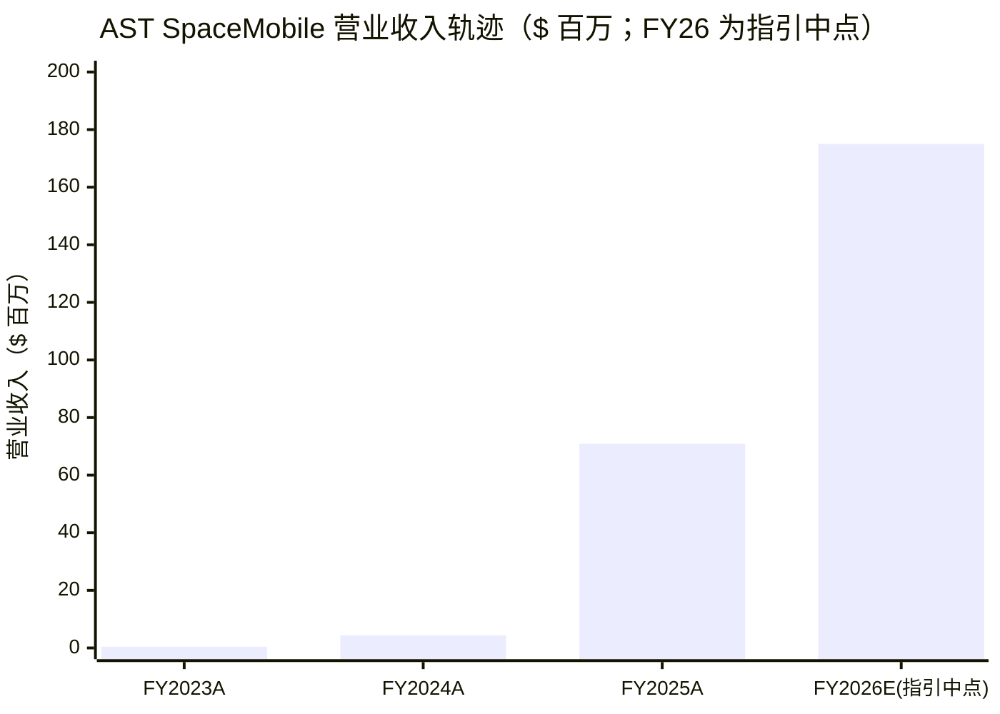
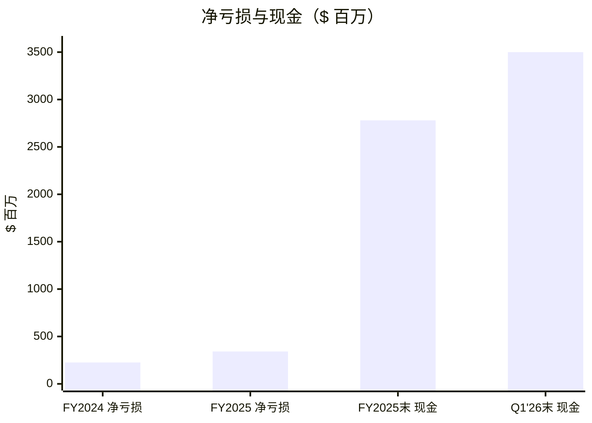
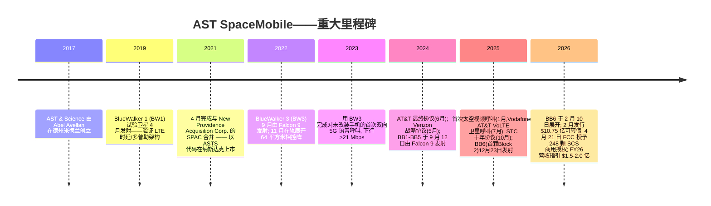
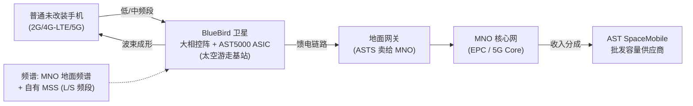
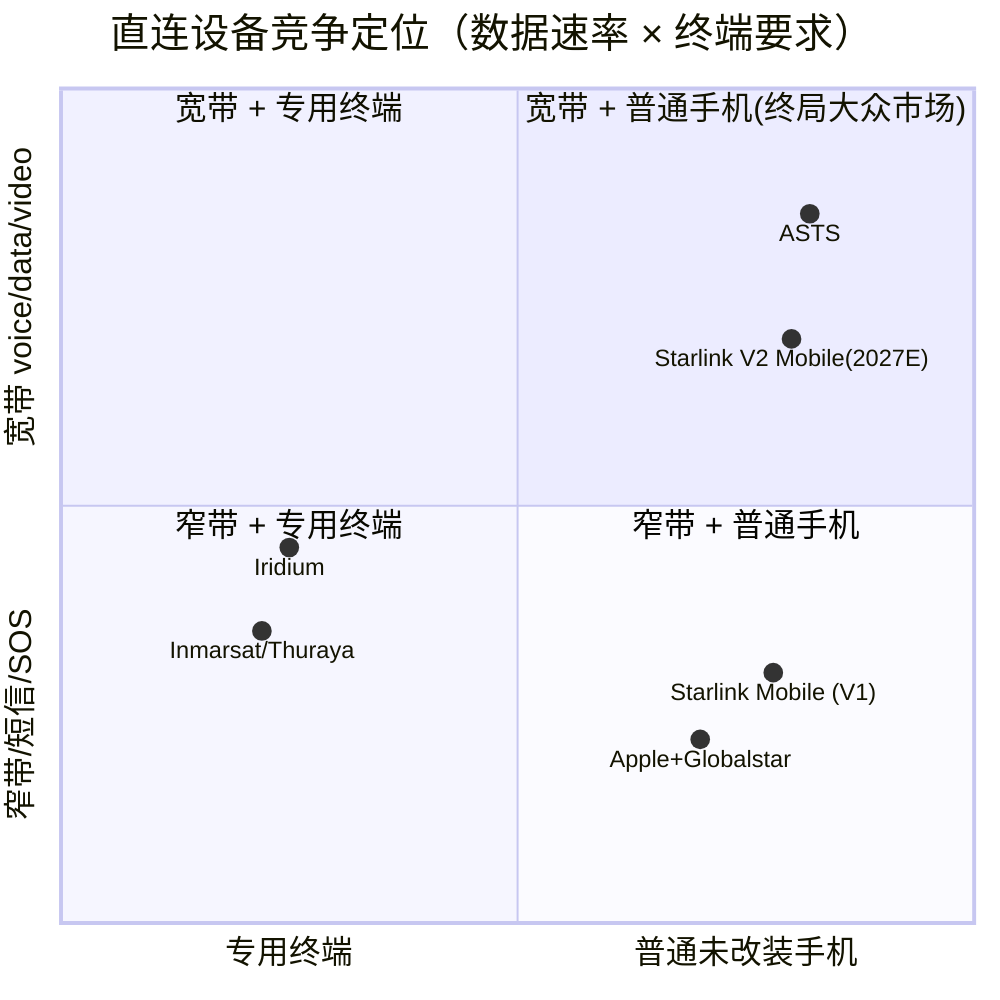
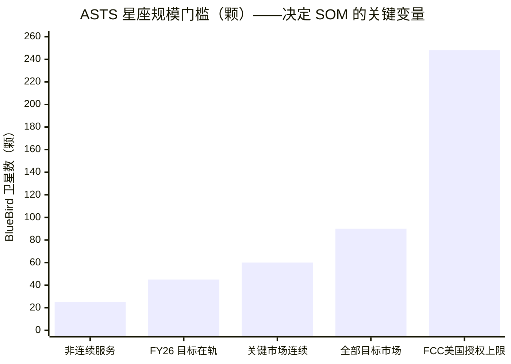

# AST SpaceMobile, Inc.（NASDAQ: ASTS）——公司研究报告

**代码：** NASDAQ: ASTS（NASDAQ Global Select Market 纳斯达克全球精选市场）
**截至日期：** 2026-06-13
**注册地 / 上市地：** 美国特拉华州 / 纳斯达克
**报告语言：简体中文（本目录另存有英文版 `ASTSpaceMobile_NASDAQ_ASTS_Research_Document.md`）**

> *分析师观点：* **评级：Hold（持有）· 12 个月目标价 $78（较 2026-06-12 收盘 $82.41 下行 −5%）· 估值方法：SOTP（频谱 + 已建星座期权价值 + MNO 渠道期权），交叉验证以 2028E EV/未来覆盖 POP 与情景概率加权 · 市值约 $245 亿（A 类经济口径，全口径 A+B+C 约 $315 亿）· 52 周区间 $36.91–$133.09 · NASDAQ: ASTS**
>
> | 倍数 / Multiple（*分析师观点：* 远期列） | FY25A | FY26E | FY27E |
> |---|---|---|---|
> | EV/Sales | ~290× | ~110× | ~33× |
> | P/E | N/M（亏损） | N/M（亏损） | N/M（亏损） |
> | FCF | 大幅为负 | 大幅为负 | 大幅为负 |
> | 现金跑道（季度 @ 当前烧钱率） | — | ~14–18 季 | ~10–14 季 |
>
> 相对表现：1M +10.2% · 6M +4.3% · YTD −1.3% · 12M +114.8%，对比 S&P 500（YTD +8.4% / 12M +24.3%）——12 个月相对 +90.5%、YTD 相对 −9.7%（[Yahoo Finance ASTS](https://finance.yahoo.com/quote/ASTS/)；yfinance，截至 2026-06-12）。
>
> **核心论点（thesis pillars）**——（1）ASTS 拥有迄今唯一经在轨验证、面向**普通未改装手机**提供**宽带级 (broadband)** 手机直连 (direct-to-cell, 手机直连) 的大型相控阵 (phased array, 相控阵) 卫星架构，相对 Starlink Mobile 的"短信/语音优先"路线握有约两年技术与商业渠道领先；（2）但 ASTS 仍是**前商用营业收入 (pre-revenue)** 名字——FY2025 营业收入 $7,090 万全部来自网关设备与美国政府工程，**SpaceMobile 商用蜂窝服务本身尚未确认任何营业收入**，估值是纯期权价值；（3）2026-06-12 SpaceX（NASDAQ: SPCX）完成史上最大 IPO（$135→$160.95，约 $2.1 万亿市值），把"直连手机"赛道的竞争与资金虹吸推到台前，当日 ASTS 重挫至 $82.41，凸显估值对竞争叙事的高敏感度；（4）约 $35 亿现金 + 频谱资产构成多年期"堡垒"，但 248 颗星座的资本开支、稀释、执行与 Starlink 竞争令**安全边际为负**，故给予 Hold。

> **业绩更新——首次提出并重申 FY2026 营业收入指引（initiated 2026-03-02，reaffirmed 2026-05-11）：** 公司随 FY2025 业绩首次给出 **2026 全年营业收入指引 $1.50 亿–$2.00 亿**，并于 2026-05-11 Q1 业绩重申"on track"。相对 FY2025 的 $7,090 万，指引中点 $1.75 亿意味着同比约 +147%，主要由移动网络运营商 (MNO, 移动运营商) 网关/集成收入与美国政府合同驱动；管理层称"约一半指引来自现有已签约营业收入储备 (contracted revenue backlog)"。Q1 FY2026 营业收入 $1,470 万。来源：[AST SpaceMobile FY2025 业绩新闻稿, 2026-03-02](https://www.sec.gov/Archives/edgar/data/1780312/000178031226000005/asts-ex99_1.htm)；[Q1 FY2026 业绩新闻稿, 2026-05-11](https://www.sec.gov/Archives/edgar/data/1780312/000119312526216946/asts-ex99_1.htm)。

## 目录

1. 公司概览（含投资论点引言）
1A. 估值与目标价（远期预测 · PT 推导 · 牛/基/熊）
2. 公司历史
3. 管理团队
4. 产品与服务（全报告最重要章节）
5. 客户与上市策略
6. 行业概览
7. 竞争格局
8. 市场机会（TAM）
9. 风险评估
9.5. 关键分歧与催化剂
10. 投资风格透视（投资者视角记分卡）
数据来源清单 / 参考资料

---

## 1. 公司概览

*分析师观点：* AST SpaceMobile 是一笔"押注一个尚未存在的市场"的高波动期权交易。我们给予 **Hold、12 个月目标价 $78（较 2026-06-12 收盘 $82.41 下行约 5%）**。why-now：2026-06-12 SpaceX 以约 $2.1 万亿市值登陆纳斯达克，使"手机直连"从小众主题变为资本市场焦点，既验证了赛道、又把最强对手摆上了台面——ASTS 当日下挫逾 10% 至 $82.41，说明其估值高度绑定于"对 Starlink 的相对领先能否保持"这一单一叙事。四条论点：（1）**唯一经在轨验证的宽带级手机直连架构**——ASTS 用超大相控阵把"普通手机当作地面段 (ground segment)"，目标是真正的宽带（已实测 98.9 Mbps 峰值下行），而非 Starlink Mobile 当前的短信/超视语音；（2）**仍是前商用名字**——FY2025 全部营业收入来自辅助设备与政府工程，商用蜂窝服务零收入；（3）**资产负债表堡垒**——约 $35 亿现金给了多年跑道，但 248 颗星的资本开支与持续稀释令现金跑道仍是核心决策变量；（4）**安全边际为负**——以当前约 $245 亿（A 类）市值为前商用资产定价，任何对星座节奏、MNO 变现经济性或 Starlink 竞争的负面修正都会带来剧烈的多杀。

AST SpaceMobile 正在构建**全球首个且唯一、可被日常普通智能手机（2G/4G-LTE/5G 设备）直接接入、用于商用的太空蜂窝宽带网络 (Cellular Broadband network in space)**——无需卫星专用手机、无需特殊芯片、无需地面接收器。10-K 第 1 项业务开篇逐字写道："We are building the first and only global Cellular Broadband network in space to be accessible directly by everyday smartphones (2G/4G-LTE/5G devices) for commercial use"（[ASTS FY2025 10-K, Item 1 Business — Our Company](https://www.sec.gov/Archives/edgar/data/1780312/000178031226000006/asts-20251231.htm)）。该服务命名为 **SpaceMobile**，由在低地球轨道 (Low Earth Orbit, LEO, 低地球轨道) 展开的大型、高功率相控阵卫星——**BlueBird (BB) 卫星**——支持；从用户手机视角看，每颗卫星等同于一座在太空中游走的蜂窝基站。

商业模式建立在三大支柱之上。**第一**，ASTS 不做零售移动运营商，而是面向 MNO 的**批发容量供应商 (wholesale capacity provider)**——终端用户仍是其原 MNO 的客户，卫星链路以"太空补充覆盖 (Supplemental Coverage from Space, SCS)"形态填补地面覆盖盲区；公司明确"intend to seek to use a revenue-sharing business model"（收入分成模式），并称服务"will enable MNOs to augment and extend their coverage without building towers"（[FY2025 10-K, Item 1 Business — Our Company](https://www.sec.gov/Archives/edgar/data/1780312/000178031226000006/asts-20251231.htm)）。**第二**，ASTS 按国别使用合作 MNO 贡献的地面授权频谱在太空运营。**第三**，ASTS 正在叠加自有控制的**移动卫星服务 (Mobile Satellite Service, MSS) 频谱**：通过 Ligado 交易获得美/加最多 45 MHz 的低中频段使用权，以及 2025-09-25 收购的 S 频段 ITU 优先权（1980–2010 MHz / 2170–2200 MHz）最多 60 MHz 全球可移植中频段（[FY2025 10-K, Item 7 MD&A — Overview](https://www.sec.gov/Archives/edgar/data/1780312/000178031226000006/asts-20251231.htm)）。

公司总部位于美国德克萨斯州米德兰 (Midland)，在德州进行最终的总装、集成与测试 (Assembly, Integration & Test, AIT)，并在美国、印度、苏格兰设有工程/研发中心，在西班牙、以色列设有工程/研发与生产中心；截至 2025-12-31 全球设施面积约 **450,000 平方英尺**（[FY2025 10-K, Item 7 MD&A — Overview](https://www.sec.gov/Archives/edgar/data/1780312/000178031226000006/asts-20251231.htm)），Q1 FY2026 已扩至"over 500,000 square feet"（[Q1 FY2026 新闻稿, 2026-05-11](https://www.sec.gov/Archives/edgar/data/1780312/000119312526216946/asts-ex99_1.htm)）。公司于 2021-04 通过与 New Providence Acquisition Corp.（NPAC）的 SPAC 合并上市，当前并存三类股份（A 类普通股、B 类、由创始人 Abel Avellan 控制的 C 类高投票权股），截至 2026-02-26 Avellan 及其受让方控制约 **72.0%** 的合并投票权（[FY2025 10-K, Item 1A Risk Factors — control](https://www.sec.gov/Archives/edgar/data/1780312/000178031226000006/asts-20251231.htm)）。

**规模与财务概况（FY2025 审计 + Q1 FY2026）：**

- **营业收入：** FY2025 总营业收入 **$7,090 万**——其中 **$4,440 万产品收入**（向 MNO 销售网关设备与软件，全年交付 15 套网关、覆盖五大洲）与 **$2,650 万服务收入**（美国政府主承包商工程履约）（[FY2025 10-K, Item 7 MD&A — Results of Operations](https://www.sec.gov/Archives/edgar/data/1780312/000178031226000006/asts-20251231.htm)；[FY2025 新闻稿, 2026-03-02](https://www.sec.gov/Archives/edgar/data/1780312/000178031226000005/asts-ex99_1.htm)）。**关键：SpaceMobile 商用蜂窝服务本身尚未确认任何营业收入**——10-K 逐字写道"The SpaceMobile Service has not been launched and therefore has not yet generated any revenue"（[FY2025 10-K, Item 7 MD&A](https://www.sec.gov/Archives/edgar/data/1780312/000178031226000006/asts-20251231.htm)）。
- **营业开支与净亏损：** FY2025 工程服务成本 $1.425 亿（同比 +52%）、G&A $1.017 亿（+65%）、R&D $2,810 万（−2%）、折旧摊销 $5,110 万；**FY2025 普通股东应占净亏损 $3.419 亿**，每股基本及稀释亏损 **$(1.34)**（[FY2025 10-K, Item 7 MD&A 与 Note 13 EPS](https://www.sec.gov/Archives/edgar/data/1780312/000178031226000006/asts-20251231.htm)）。
- **现金流：** FY2025 经营活动现金流出 $7,150 万；投资活动现金流出 **$15.411 亿**（其中购置不动产/设备增加 $8.906 亿、向 Ligado 预付 $4.20 亿、收购频谱无形资产支付 $5,640 万）；融资活动现金流入 **$38.275 亿**（[FY2025 10-K, Item 7 MD&A — Cash Flows](https://www.sec.gov/Archives/edgar/data/1780312/000178031226000006/asts-20251231.htm)）。
- **现金：** FY2025 年末现金及受限现金 $27.80 亿（含 $4.443 亿受限现金）；2026-02 发行 2036 年到期 2.25% 可转债净募 $10.575 亿；**截至 2026-03-31，现金及受限现金约 $35 亿**（[Q1 FY2026 新闻稿, 2026-05-11](https://www.sec.gov/Archives/edgar/data/1780312/000119312526216946/asts-ex99_1.htm)）。
- **员工：** 截至 2025-12-31 全球约 **1,126 名**全职及兼职员工（美国约 708 人、其他地区约 418 人，主要在苏格兰、西班牙、印度、以色列）（[FY2025 10-K, Item 1 — Human Capital Management](https://www.sec.gov/Archives/edgar/data/1780312/000178031226000006/asts-20251231.htm)）。
- **在轨卫星：** 5 颗 Block 1 BlueBird（BB1–BB5，2024-09-12 单次 Falcon 9 发射）+ 1 颗 Block 2 BlueBird（BB6，2025-12-23 发射，2026-02-10 完成天线展开并运营）（[FY2025 10-K, Item 7 MD&A — Overview](https://www.sec.gov/Archives/edgar/data/1780312/000178031226000006/asts-20251231.htm)）。


*来源：[ASTS FY2025 10-K, Item 7 MD&A — Results of Operations](https://www.sec.gov/Archives/edgar/data/1780312/000178031226000006/asts-20251231.htm)；FY2026 为公司 $150–200M 指引之中点 [FY2025 新闻稿, 2026-03-02](https://www.sec.gov/Archives/edgar/data/1780312/000178031226000005/asts-ex99_1.htm)。FY2023 营业收入约 $40 万、FY2024 约 $440 万——商用服务收入仍为零。*


*来源：[ASTS FY2025 10-K, Item 7 MD&A 与现金流量表](https://www.sec.gov/Archives/edgar/data/1780312/000178031226000006/asts-20251231.htm)；[Q1 FY2026 新闻稿, 2026-05-11](https://www.sec.gov/Archives/edgar/data/1780312/000119312526216946/asts-ex99_1.htm)。FY2024 净亏损为母公司口径 $226M（含归属非控股权益部分另计）；图示 FY2025 普通股东应占净亏损 $342M。注：净亏损与现金为两种单位但同为 $ 百万，故可共轴。*

**估值快照（2026-06-12 收盘 $82.41）：**

| 指标 | ASTS | 备注 |
|---|---|---|
| A 类股价 | $82.41 | [Yahoo Finance ASTS](https://finance.yahoo.com/quote/ASTS/)（2026-06-12 收盘）；52 周区间 $36.91–$133.09 |
| 市值（A 类经济口径） | 约 $245 亿 | A 类 2.926 亿股 × $82.41 ≈ $241 亿；市场数据口径约 $246 亿（[Yahoo Finance ASTS](https://finance.yahoo.com/quote/ASTS/)） |
| 市值（全口径 A+B+C） | 约 $315 亿 | A 2.926 亿 + B 0.112 亿 + C 0.782 亿 = 3.820 亿股 × $82.41（[FY2025 10-K 封面股数, 截至 2026-02-26](https://www.sec.gov/Archives/edgar/data/1780312/000178031226000006/asts-20251231.htm)） |
| TTM 营业收入 | 约 $8,490 万 | FY2025 $7,090 万 + Q1'26 $1,470 万 − Q1'25 约 $70 万 |
| TTM 市盈率 (P/E) | **N/M（负值）** | TTM 净亏损约 −$4 亿级；24 个月内无现实盈利路径 |
| TTM EV/Sales | 约 280–290× | EV ≈ 市值 − $35 亿现金 + 约 $25 亿公允价值债务；反映商用服务收入近零 |

**为何倍数极端（必须解释）。** ASTS 是一只纯粹的**前商用 / 期权价值 (option-value)** 股票——市场对约 $245 亿股权价值的定价，本质是在为三件事的看涨期权付费：**(a)** ASTS 能否完成 45→90→最多 248 颗 BlueBird 星座的部署、把约 60 家 MNO 谅解备忘录转化为按订户付费的合同营业收入；**(b)** 作为可与 SpaceX 的 Starlink Direct-to-Cell 抗衡的"美国旗 (U.S.-flagged)、宽带级、未改装手机"直连竞争者所具备的战略稀缺性；**(c)** 约 $35 亿现金 + 频谱（Ligado L 频段 + S 频段 ITU）资产构成的"资产负债表期权"（[Q1 FY2026 新闻稿, 2026-05-11](https://www.sec.gov/Archives/edgar/data/1780312/000119312526216946/asts-ex99_1.htm)）。负市盈率为**前商用规模下的现金燃烧**而非一次性减值：FY2025 总营业开支远超 $7,090 万营业收入，其中工程服务 $1.425 亿、G&A $1.017 亿为最大单项，均符合一家仍在建设首个商用星座的硬件公司形态（[FY2025 10-K, Item 7 MD&A](https://www.sec.gov/Archives/edgar/data/1780312/000178031226000006/asts-20251231.htm)）。同业 **Iridium (IRDM)** 约 $50 亿市值、TTM 营业收入约 $8 亿、盈利稳健；**Globalstar (GSAT)** 约 $105 亿市值，业绩支撑来自 Apple iPhone 紧急 SOS 合同；**EchoStar (SATS)** 约 $330 亿市值，估值更多在于 S 频段频谱资产变现（[Yahoo Finance IRDM](https://finance.yahoo.com/quote/IRDM/)、[GSAT](https://finance.yahoo.com/quote/GSAT/)、[SATS](https://finance.yahoo.com/quote/SATS/)，均为 2026-06-12）。相对该可比组，ASTS 的营业收入倍数高出数十倍，差额完全由"未来直连手机 TAM 期权"承担。第 9 章把这一议题贯穿为估值/倍数压缩风险。

---

## 1A. 估值与目标价

> *分析师观点：* 本章所有预测数字、目标价与情景目标价均为分析师远期观点，**不附任何 filing 引用**；各预测的外部依据（10-K 分部数据 + 公司指引 + 行业预测）在文中分别标注。

**(a) 远期财务预测表（前商用名字——核心决策变量是现金跑道而非 EPS）**

| 指标（*分析师观点：*） | FY2025A | FY2026E | FY2027E | FY2028E |
|---|---|---|---|---|
| 营业收入（$ 百万） | 70.9 | 175 | 480 | 1,050 |
| — YoY % | — | +147% | +174% | +119% |
| — 构成 | 设备+政府 | 设备+政府+少量商用 | 商用爬坡起步 | 商用为主 |
| 毛利率 % | n/m（设备低毛利） | ~10–15% | ~25–35% | ~45–55% |
| 净亏损（$ 百万） | (342) | (520) | (620) | (520) |
| 每股亏损 EPS | (1.34) | ~(1.7) | ~(1.9) | ~(1.5) |
| 自由现金流 FCF（$ 百万） | 大幅为负（投资 −1,541） | 大幅为负 | 大幅为负 | 转正前 |
| 期末现金（$ 百万） | 2,780 | ~2,000 | ~1,100 | 需再融资 |
| 现金跑道（季度 @ 当前烧钱率） | — | ~14–18 | ~10–14 | 依赖再融资 |

各预测的外部依据（逐项可溯）：FY2026 营业收入用公司 $150–200M 指引中点 [FY2025 新闻稿, 2026-03-02](https://www.sec.gov/Archives/edgar/data/1780312/000178031226000005/asts-ex99_1.htm)；FY2027–28 营业收入爬坡假设以"25 颗星实现非连续服务、45–60 颗实现关键市场连续服务"的部署节奏 + 约 60 家 MNO/30 亿订户渠道 + >$1.2B 已签约储备为基础（[FY2025 10-K, Item 7 MD&A — constellation plan](https://www.sec.gov/Archives/edgar/data/1780312/000178031226000006/asts-20251231.htm)）；现金/跑道以 FY2025 年末 $27.8 亿 + 2026-02 可转债 $10.575 亿 − 计划资本开支（每颗星造价 + 发射约 $19–23M、FY26 计划 45 颗）测算。**这些是激进假设：商用服务营业收入 FY2027 才真正起步，且高度依赖星座按期部署与 MNO 变现经济性；本预测非来自任何单一来源，读者应据自身假设重新压力测试。** 无 `(Source: our model)`。

**(b) 目标价推导（SOTP 为主，因 DCF/PE 在前商用阶段失真）。** 对一家商用收入近零、依赖期权价值的名字，单一 DCF 或前瞻 PE 都不可靠，故采用分部加总 (SOTP) 并辅以情景概率加权：

- **频谱资产（Ligado L 频段 45 MHz + S 频段 ITU 60 MHz）：** 参照近期频谱货币化先例（Amazon 2026-04 以约 $116 亿收购 Globalstar、SpaceX 2025-09 以约 $170 亿购 EchoStar S 频段 50 MHz——见行业 note），保守给予 ASTS 自有 MSS 频谱约 $40–80 亿的可货币化价值区间（[卫星通信行业：Starlink 已验证产业蓝海, 2026-04-21, p.6–8](http://xs-macbook-air.local:5001/zsxq/pdf/585582824288844/%E5%8D%AB%E6%98%9F%E9%80%9A%E4%BF%A1%E8%A1%8C%E4%B8%9A%EF%BC%9A%E6%B5%B7%E5%A4%96%E5%8D%AB%E6%98%9F%E9%80%9A%E4%BF%A1%E5%BF%AB%E9%80%9F%E6%88%90%E7%86%9F%20Starlink%E5%B7%B2%E9%AA%8C%E8%AF%81%E4%BA%A7%E4%B8%9A%E8%93%9D%E6%B5%B7.pdf)）。
- **已建星座 + MNO 渠道期权（约 60 家 MNO / 约 30 亿订户）：** 以 2028E EV/未来覆盖 POP（per-POP）的概率加权方式估值，扣减 248 颗星座的资本开支与稀释折现。
- **现金净额：** 约 $35 亿现金 − 约 $25 亿可转债公允价值 ≈ 约 $10 亿净现金缓冲。

合成 12 个月目标价 **$78**，较 2026-06-12 收盘 $82.41 下行约 5%——与 Street 的约 $82 平均目标价、"Hold"中位评级一致（[stockanalysis.com — ASTS 分析师目标价](https://stockanalysis.com/stocks/asts/forecast/)，2026-06）。

**(c) 牛 / 基 / 熊情景表（每个绑定其摆动假设）**

| 情景（*分析师观点：*） | 关键假设 | 目标价 | 较 $82.41 |
|---|---|---|---|
| 牛 Bull | FY26 45 颗按期入轨、Ligado 闭幕、MNO 收入分成兑现、AST5000 ASIC 量产、维持对 Starlink 的宽带领先 | $150 | +82% |
| 基 Base | 部署小幅延迟、商用服务 FY27 起步、频谱货币化部分兑现、与 Starlink 共存 | $78 | −5% |
| 熊 Bear | 发射/展开延迟 + 持续大额稀释 + Starlink V2 Mobile 2027 缩小宽带差距，期权叙事去化 | $40 | −51% |

牛/熊跨度约 $150/$40，区间宽度约 3.75 倍——精确反映了前商用期权股票的极端估值不确定性。该跨度与 Street 目标价区间（最低 $41.20、最高 $115、平均 $82.02、11 家分析师、中位 Hold）基本吻合（[stockanalysis.com — ASTS forecast](https://stockanalysis.com/stocks/asts/forecast/)，2026-06）。

**(d) 卖方观点演变（Sell-side view evolution）——本地机构库覆盖较薄但仍有信号。** 本地 `db/zsxq.db` 中没有单独的 ASTS 深度首发报告，但多份美/中机构 note 在直连手机、频谱与铁塔议题中提及 ASTS：

| 机构 | 日期 | 评级 / 信号 | 核心论点 | 什么证据能证明其正确 |
|---|---|---|---|---|
| Bernstein（US Comms Infra） | 2026-05-18 | 对铁塔净利好；隐含对纯卫星 D2D 谨慎 | *分析师观点：* D2D 卫星存在"无法室内覆盖"的物理短板，无法独立替代地面蜂窝；任何卫星运营商要做无缝服务，最终要么租地面铁塔、要么自建低频地面网（[Bernstein — FCC spectrum moves net positive for towers, 2026-05-18, p.1–4](http://xs-macbook-air.local:5001/zsxq/pdf/585424511118224/Bernstein-US%20Communications%20Infrastructure%20US%20Comms%20Infrastructure%EF%BC%9A%20FCC%20spectrum%20moves%20are%20net%20positive%20for%20towers-260518.pdf)） | 室内/城市深度覆盖始终依赖地面网；卫星只补盲区 |
| J.P. Morgan（Retail Radar） | 2026-05-27 | 零售情绪指标 | *分析师观点：* 航天股大涨后零售获利了结，ASTS 等遭减持，但 ASTS 期权看涨成交量激增、风险敞口"由空转多"（[J.P. Morgan — Retail Radar Theme Stack, 2026-05-27, p.1](http://xs-macbook-air.local:5001/zsxq/pdf/415284455822148/JPM-Retail%20Radar%20May%2027%20-%20Theme%20Stack-AI%2C%20Memory%2C%20Space%2C%20Quantum-260527.pdf)） | 零售期权流向是高波动催化剂 |
| Barclays（公开） | 2026-06 | 下调 PT $65→$60 | 发射延迟、风险回报不吸引（[StockTwits — ASTS worst stretch of 2026, 2026-06](https://stocktwits.com/news-articles/markets/equity/spacex-ipo-asts-stock-starlink-two-years-behind/cZ0UTYIR7bh)） | 若 FY26 45 颗按期，则证伪 |
| Roth Capital（公开） | 2026-06 | 牛 | "better mousetrap" + 约两年对 Starlink 的领先 + 强 MNO 渠道（[StockTwits, 2026-06](https://stocktwits.com/news-articles/markets/equity/spacex-ipo-asts-stock-starlink-two-years-behind/cZ0UTYIR7bh)） | 宽带级直连在轨实测速率持续领先 |

> 注：上述 zsxq 引用为本地库覆盖，本机外不可达；硬数据已锚定至公开 SEC filing / Yahoo / 公开新闻。机构 PT 区间最低 $41.20、最高 $115（[stockanalysis.com forecast](https://stockanalysis.com/stocks/asts/forecast/)）。

**(e) call 所系的 1–2 个关键变量：**（1）**FY2026 星座部署节奏**——能否如管理层所言以"每 1–2 个月一次发射"达到年底约 45 颗在轨，是商用服务能否在 FY2027 真正起步的前置；（2）**MNO 收入分成经济学**——约 60 家 MNO 的 MOU 能否转化为可观的 per-subscriber ARPU 分成，以及 Starlink V2 Mobile（2027）会否压缩 ASTS 的宽带差异化溢价。

---

## 2. 公司历史

AST & Science LLC 于 **2017 年**在德州米德兰由 **Abel Avellan** 创立。创业逻辑在卫通行业并不寻常：与其设计需要专用用户终端的网络，不如把太空中的天线做得足够大，让普通频段的普通电话能直接与 LEO 卫星闭环——即把"手机当作地面段"。选址米德兰因其紧邻米德兰国际机场与航天港（FAA 许可的商用航天港）及德州的制造/工程人才储备（[FY2025 10-K, Item 1 Business — Our Company / history](https://www.sec.gov/Archives/edgar/data/1780312/000178031226000006/asts-20251231.htm)）。


*来源：[ASTS FY2025 10-K, Item 1 Business 与 Item 7 MD&A — Overview](https://www.sec.gov/Archives/edgar/data/1780312/000178031226000006/asts-20251231.htm)；[Q1 FY2026 新闻稿, 2026-05-11](https://www.sec.gov/Archives/edgar/data/1780312/000119312526216946/asts-ex99_1.htm)；FCC 授权日 [SatNews / Business Wire, 2026-04-21/22](https://www.fcc.gov/document/fcc-authorizes-ast-provide-supplemental-coverage-space)。*

**转折 1——从"测试样机"走向商用 Block 1（2022–2024）。** 直至 2022 年，公司对外证明仍靠单颗试验星（BW1、BW3）。BW3 于 2022 年末成功展开 64 平方米相控阵，并于 2023 年实现对未改装手机的首次双向 5G 语音呼叫、重复达成 >21 Mbps 下行、频谱效率约 3 bits/s/Hz（[FY2025 10-K, Item 1 Business](https://www.sec.gov/Archives/edgar/data/1780312/000178031226000006/asts-20251231.htm)）。此举把 MNO 兴趣从"MOU 阶段"推向"投资阶段"，Vodafone、AT&T、Verizon 在 2024 年中至 2025 年间将合作升级为最终协议；五颗商用 Block 1 BlueBird（BB1–BB5）于 2024-09-12 单次 Falcon 9 入轨。

**转折 2——从"Block 1"到"Block 2"架构（2025）。** Block 2 BlueBird（自 BB6 起）采用最多约 **2,400 平方英尺的相控阵——面积逾 Block 1 三倍，设计带宽容量约为 Block 1 的 10 倍**，10-K 称其为"the largest phased array ever deployed in a LEO for commercial use"。BB6 于 2026-02-10 成功展开，验证了 Block 2 的机械与电气设计，是 FY2026 扩张到约 45 颗星的基础（[FY2025 10-K, Item 7 MD&A — Overview](https://www.sec.gov/Archives/edgar/data/1780312/000178031226000006/asts-20251231.htm)）。

**转折 3——频谱叠加（2025）。** ASTS 历史上依赖 MNO 伙伴的地面频谱（按 FCC 2024-03 通过的 SCS 规则在卫星上运营）。2025 年新增两层**自有控制的 MSS 频谱**：（i）**Ligado 交易**——2025-03-22 签订定义协议，2025-06-23 获破产法庭批准，9-29 确认 Chapter 11 计划，闭幕条件待监管批准，可获美/加最多 45 MHz 低中频段（已于 2025-10-31 向 Ligado 支付 $4.20 亿、年度 L 频段使用费至少 $8,000 万）；（ii）2025-09-25 完成对持有 S 频段 ITU 优先权实体的收购（总对价 $6,450 万，股票或现金支付），增加最多 60 MHz 全球可移植中频段（[FY2025 10-K, Item 7 MD&A — Spectrum Usage Rights Transaction](https://www.sec.gov/Archives/edgar/data/1780312/000178031226000006/asts-20251231.htm)）。

**重要并购 / 交易。**

- **2021-04——与 NPAC 的 SPAC 合并。** 创建上市控股公司 AST SpaceMobile, Inc.，AST & Science LLC 为经营子公司；Avellan 保留 C 类高投票权股，维持投票控制（[FY2025 10-K, Item 1 — defined terms](https://www.sec.gov/Archives/edgar/data/1780312/000178031226000006/asts-20251231.htm)）。
- **2024-05——Verizon 战略协议**（含 $1.00 亿承诺：$6,500 万商业预付款 + $3,500 万可转债）。
- **2024-06——AT&T 最终商业协议与股权参与**（[FY2025 10-K, Item 1 — Amended Stockholders' Agreement, dated June 5, 2024](https://www.sec.gov/Archives/edgar/data/1780312/000178031226000006/asts-20251231.htm)）。
- **2025-10-29——STC（沙特电信）十年期商业协议**，覆盖沙特的直连设备移动连接（[FY2025 10-K, Item 7 MD&A](https://www.sec.gov/Archives/edgar/data/1780312/000178031226000006/asts-20251231.htm)）。
- **2025-09-25——S 频段 ITU 优先权实体收购**（$6,450 万）。

**过去 12 个月——集中执行与资产负债表搭建。** 过去一年 ASTS 完成了：(i) 发射首颗 Block 2 卫星（BB6）并展开 LEO 史上最大商用相控阵；(ii) 新增 STC（沙特）、Bell/Telus（加拿大）、Axian（非洲）等 MNO 伙伴，总数升至约 60 家、覆盖逾 30 亿订户；(iii) 2026-02 发行 $10.75 亿 2036 年到期 2.25% 可转债（有效转股价 $116.30）并回购部分旧债；(iv) **2026-04-21 获 FCC SCS 商用授权**，美国境内可部署至多 248 颗直连设备宽带卫星（使用 700/800 MHz 低频段，与 Verizon/AT&T/FirstNet 协同；半数 124 颗须于 2030-08-02 前、全部于 2033-08-02 前发射）（[Q1 FY2026 新闻稿, 2026-05-11](https://www.sec.gov/Archives/edgar/data/1780312/000119312526216946/asts-ex99_1.htm)；[FCC 授权, 2026-04-21](https://www.fcc.gov/document/fcc-authorizes-ast-provide-supplemental-coverage-space)；[SatNews, 2026-04-21](https://satnews.com/2026/04/21/fcc-grants-ast-spacemobile-authority-for-248-satellite-constellation-and-direct-to-cell-service/)）。

---

## 3. 管理团队

**说明：** 按本技能"仅覆盖创始人与现任 CEO"的规则，ASTS 的创始人即现任董事长兼 CEO，故合写一篇。其余高管（CFO、总裁、CNO 等）不在本节范围。

### Abel Avellan——创始人、董事会主席兼首席执行官（创始人即 CEO，合并简历）

Abel Avellan 是 AST SpaceMobile 的创始人、董事会主席与首席执行官，持有赋予多数投票权的 C 类高投票权股——截至 2026-02-26，他及其受让方控制约 **72.0%** 的合并投票权，使公司明确归入"创始人 CEO + 超级投票权控制"类别（[FY2025 10-K, Item 1A Risk Factors — Avellan controls ~72.0% of combined voting power](https://www.sec.gov/Archives/edgar/data/1780312/000178031226000006/asts-20251231.htm)）。他于 2017 年创立 AST & Science，核心论点是：卫通行业花了四十年时间设计围绕卫星限制构建的用户终端，而把问题倒过来——把卫星设计成能与未改装电话直接相连——才打开了真正的大规模直连设备机会。这一架构在 ASTS 的全部产品与专利组合中一以贯之（截至 2025-12-31 约 3,850 项专利及在审专利权利要求，约 1,900 项已授权/获准，38 个专利族，最早 2039 年起到期）（[FY2025 10-K, Item 7 MD&A — IP portfolio](https://www.sec.gov/Archives/edgar/data/1780312/000178031226000006/asts-20251231.htm)）。

在 AST 之前，Avellan 于 2000 年代创立并经营 **Emerging Markets Communications (EMC)**，把其打造为全球最大的海事 VSAT 运营商之一，并于 2016 年出售给 Global Eagle Entertainment（[Global Eagle 2016 收购公告 / EDGAR 检索](https://www.sec.gov/cgi-bin/browse-edgar?action=getcompany&CIK=0001512077&type=8-K)）；该经历使他对专用卫星手机的客户使用摩擦有切身体会，也促成了"把手机视为地面段"的架构思路。此前他还在拉美卫星通信领域担任工程与产品职位，并以发明人身份名列多项美国专利（覆盖相控阵卫星架构、波束成形与系统集成）。

Avellan 是公司在业绩说明会与行业活动（Satellite、MWC 巴塞罗那等）上的公开面孔，多位 MNO 伙伴 CEO 在联合公告中个人致谢他。其薪酬以股权为重，并附与卫星发射及商用服务上线节点挂钩的业绩归属条件，详见最新委托书（[ASTS 2026 DEF 14A — Executive Compensation, 2026-04-28](https://www.sec.gov/Archives/edgar/data/1780312/000149315226019384/formdef14a.htm)）。作为控股创始人 CEO，Avellan 的资本配置记录是把账面现金从 SPAC 收盘时的约 $2 亿扩张到 2026 年 Q1 的约 $35 亿——代价是显著的股数增长与持续稀释（见第 9 章稀释风险）。

---

## 4. 产品与服务

> **本节为全报告最重要章节。** ASTS 是一家垂直整合的硬件 + 网络公司：它自研、自造卫星，自研专用芯片，并把卫星网络作为"太空蜂窝基站"接入 MNO 的核心网。理解"BlueBird 卫星物理上做什么 / Block 1 与 Block 2 如何区分 / AST5000 ASIC 为何要自研 / SpaceMobile 服务如何接入手机"，是理解后续客户、行业、竞争、TAM 与风险各章的基础。

**(a) 产品/能力矩阵（基于 10-K 自述构建，标注为分析师整理）。** 10-K 未提供传统意义上的"产品表"，下表按 10-K 第 1 项业务与 MD&A 自述的能力层级整理（*analyst-constructed from 10-K text*）：

| 层级 | 名称（按公司拼写） | 物理作用 | 状态（截至 2026-Q1） |
|---|---|---|---|
| 试验星 | BlueWalker 1 (BW1)；BlueWalker 3 (BW3) | 验证卫星-蜂窝架构、相控阵展开、首次 5G 呼叫 | 已完成验证 |
| 商用星 第一代 | Block 1 BlueBird (BB1–BB5) | 相似于 BW3 尺寸，10× BW3 吞吐；商用 SCS 起步 | 5 颗在轨 |
| 商用星 第二代 | Block 2 BlueBird (自 BB6 起) | ~2,400 平方英尺相控阵，10× Block 1 带宽容量 | BB6 在轨；BB8–10 6 月发射；BB11–33 在产 |
| 自研芯片 | AST5000 ASIC | 板载波束成形 (beamforming)，最多 40 MHz/波束、10,000 MHz 处理带宽/星 | 已达验证成熟度里程碑；初期 Block 2 仍用 FPGA |
| 服务 | SpaceMobile Service（SCS） | 面向 MNO 的批发太空蜂窝宽带 | 尚未商用、零营业收入 |
| 现有营业收入 | 网关设备 + 软件；美国政府工程 | 地面网关、政府主承包项目 | FY25 营业收入 $70.9M |

**(b) 逐层拆解（10-K 逐字引用 + 中文释义 + 竞争视角）。**

**B.1 BlueBird 卫星与 SpaceMobile 服务（核心产品）。**

10-K 逐字写道（关于 Block 1 与 Block 2）：

> "We launched five Block 1 BB satellites on September 12, 2024. The Block 1 BB satellites are of similar size and weight to the BW3 test satellite and have ten times higher throughput than the BW3 test satellite. ... The Block 2 BB satellites feature an up to approximately 2,400 square feet phased array, the largest phased array ever deployed in a LEO for commercial use, which is more than three times larger than the phased array of the Block 1 BB satellites and designed to deliver up to 10 times the bandwidth capacity of the Block 1 BB satellites."（[FY2025 10-K, Item 7 MD&A — Overview](https://www.sec.gov/Archives/edgar/data/1780312/000178031226000006/asts-20251231.htm)）

**中文释义 / Plain-language gloss：** BlueBird 卫星本质是一面"会飞的超大蜂窝天线阵"。相控阵 (phased array, 相控阵) 由成千上万个小型天线单元 (array elements) 组成，通过电子控制每个单元发射信号的相位 (phase, 相位)，可在不机械转动的情况下"凭空"把波束 (beam, 波束) 指向地面任意一片区域——这就是波束成形 (beamforming, 波束成形)。卫星越大、孔径 (aperture, 孔径) 越大，波束就越窄越精准，既能把微弱的太空信号聚焦到普通手机的内置天线、又能用同一频谱"复用 (spectrum reuse, 频谱复用)"服务更多用户。普通手机本来只能跟几公里外的地面基站通信，要跟 LEO 上 700 多公里高的卫星闭环，物理上的难点是**链路预算 (link budget, 链路预算)**——信号传那么远还要被一部巴掌大的手机接收，靠的就是这面 2,400 平方英尺的巨型相控阵把功率"攒"起来。Block 1 → Block 2 的核心跨越就是把孔径放大三倍、带宽容量提十倍：阵面越大，单星覆盖越广、所需卫星数越少（10-K 称"reducing the necessary number of satellites to achieve service coverage"）。ASTS 已实测从在轨 Block 1 卫星向未改装手机直传 **98.9 Mbps 峰值下行**，Block 2 预计"nearly double"该速率（[Q1 FY2026 新闻稿, 2026-05-11](https://www.sec.gov/Archives/edgar/data/1780312/000119312526216946/asts-ex99_1.htm)）。

*分析师观点：* ASTS 在"宽带级直连"这一维度的竞争优势是 **partial-yes，护城河类型为技术/IP + 监管频谱**。最直接的对手是 SpaceX 的 **Starlink Direct-to-Cell**——10-K 自述"We face competition from existing and new companies including SpaceX's Starlink, which is developing satellite communications technology using LEO constellations to provide competitive services in the direct-to-device segment"（[FY2025 10-K, Item 1 — Competition](https://www.sec.gov/Archives/edgar/data/1780312/000178031226000006/asts-20251231.htm)）。截至 2026-03-31，Starlink Mobile 用约 650 颗 V1 Mobile 卫星为约 30 国、约 740 万台月度独立设备提供"卫星短信、超视语音"等**低速率**服务，下一代 V2 Mobile 拟 2027 年由 Starship 部署、提供更完整宽带（[SpaceX Form S-1, 招股说明书摘要 p.2 与 p.6](https://www.sec.gov/Archives/edgar/data/1181412/000162828026036936/spaceexplorationtechnologi.htm)）。ASTS 的差异化正是 10-K 那句话："the mobile satellite service LEOs offered by some of our existing competitors are designed to support low data rate applications such as SOS"——即 ASTS 做宽带 (voice/data/video)，Starlink Mobile 当前做短信/语音/SOS。这个领先窗口约两年，是 ASTS 全部期权价值的物理根基，也是最脆弱的一环（见 9.5）。

**B.2 AST5000 ASIC（自研半导体子线程）。**

10-K 逐字写道：

> "when we introduce our own AST5000 Application Specific Integrated Circuit ("ASIC") chip in the Block 2 BB satellites, we expect to achieve materially greater throughput capacity of up to 40 MHz per beam to continue to support 120 Mbps peak data rates and up to 10,000 MHz of processing bandwidth per Block 2 BB satellite, require less power and offer a lower overall unit cost. ... Until we introduce our ASIC chip in Block 2 BB satellites, we expect to continue to manufacture and launch Block 2 BB satellites that are based on a Field Programmable Gate Arrays ("FPGA") chip. ... We own the IP of our ASIC chip."（[FY2025 10-K, Item 7 MD&A — Overview](https://www.sec.gov/Archives/edgar/data/1780312/000178031226000006/asts-20251231.htm)）

**中文释义 / Plain-language gloss：** **ASIC（专用集成电路, application-specific integrated circuit）**是为单一任务量身定做的芯片，与通用的 FPGA（现场可编程门阵列, field-programmable gate array）相对——FPGA 是"可重编程的万能积木"，灵活但每瓦算力低、单位成本高；ASIC 是"为这一件事浇铸的专用电路"，开发贵、流片周期长，但一旦量产则功耗低、单位成本低、性能密度高。ASTS 这颗 **AST5000** 干的是卫星上最吃算力的活——**实时数字波束成形 (digital beamforming)**：要在一面巨型相控阵上同时算出成百上千条独立波束、对准地面不同小区、还要随卫星高速移动 (约 7.6 km/s) 实时重算，处理带宽需求高达单星 10,000 MHz。用 FPGA 也能跑（ASTS 初期 Block 2 即用 FPGA），但功耗大、每星容量受限；换成自研 ASIC 后，每波束带宽可升至 40 MHz、单星容量与功效大幅改善。**为何要自研、而不外购？** 因为市面上没有为"星载手机直连波束成形"现成的商用 ASIC——这是 ASTS 独有的工作负载，外购通用芯片无法满足功耗/性能/抗辐射要求，且自研让 ASTS 拥有芯片 IP（"We own the IP"）、把核心竞争力锁在自己手里。供应链上，ASTS 设计芯片、委托第三方代工流片（10-K 称已"reached a validation maturity milestone, which allows production and provision of flight candidate ASIC units"），这与 SpaceX 自研 Starlink 卫星芯片、Apple/Globalstar 自研 D2D 调制解调的"垂直整合芯片"打法同源——直连手机这条赛道，谁掌握自研专用芯片，谁就掌握单位成本曲线。

*分析师观点：* AST5000 是 partial-yes 的技术护城河，但当前仍是"期权中的期权"——初期 Block 2 仍用 FPGA，ASIC 量产时点会显著影响单位成本与单星容量；这是把 ASTS 归入"半导体子线程"看待的理由。可比的自研芯片打法：SpaceX 自研星载与终端芯片、高通/联发科为地面侧 NTN（non-terrestrial network, 非地面网络）提供 modem——但这些是地面侧或对手的芯片，不能用 ASTS 的 10-K 引用，须各自溯源。

**B.3 现有营业收入业务（网关设备 + 美国政府工程）。**

这是 ASTS 当下唯一确认营业收入的两条线。**产品收入**（FY25 $4,440 万）来自向 MNO 销售**网关设备 (gateway equipment) 与软件**——网关是 MNO 地面网络与 SpaceMobile 卫星波束对接的地面节点，FY25 全年交付 15 套、覆盖五大洲，是 MNO 为商用就绪铺设地面基础设施的先行投入（[FY2025 新闻稿, 2026-03-02](https://www.sec.gov/Archives/edgar/data/1780312/000178031226000005/asts-ex99_1.htm)）。**服务收入**（FY25 $2,650 万）来自与美国政府的主承包/分包工程——ASTS 利用 BlueBird 卫星为政府执行通信与非通信应用任务，并于 2025 年获 $175 million 的 SHIELD 计划及自 2026-03 以来再获三项政府新奖（[FY2025 新闻稿, 2026-03-02](https://www.sec.gov/Archives/edgar/data/1780312/000178031226000005/asts-ex99_1.htm)；[Q1 FY2026 新闻稿, 2026-05-11](https://www.sec.gov/Archives/edgar/data/1780312/000119312526216946/asts-ex99_1.htm)）。

*分析师观点：* 这两条线是"商用服务上线前的过渡营业收入"，毛利率低（设备）或项目制（政府），不是终局商业模式；但它们让 ASTS 在 FY2025"for the first time became a revenue generating business"（管理层语），并支撑 FY26 $150–200M 指引——其中"约一半来自已签约储备"。

**(c) 合成段——产品如何组成一个客户工作流。** ASTS 的产品组成一条"太空蜂窝基站"的闭环：**BlueBird 卫星（大相控阵 + AST5000 ASIC 波束成形）在 LEO 充当游走基站 → 用 MNO 贡献的地面频谱 + ASTS 自有 MSS 频谱发射波束 → 普通未改装手机直接接入 → 信号经卫星回传至地面网关 → 网关接入 MNO 的演进分组核心网/5G 核心网 → 计费与漫游由 MNO 完成、ASTS 按收入分成获利**。整条链里 ASTS 自造卫星、自研芯片、自卖网关、自接政府工程——垂直整合度极高。


*来源：[ASTS FY2025 10-K, Item 1 Business 与 Item 7 MD&A](https://www.sec.gov/Archives/edgar/data/1780312/000178031226000006/asts-20251231.htm)。*

**(d) 旗舰与近 12 个月动态。** 旗舰是 **Block 2 BlueBird 卫星 + SpaceMobile SCS 服务**；近 12 个月关键动态：BB6 展开（2026-02-10）、FCC 248 颗 SCS 商用授权（2026-04-21）、98.9 Mbps 在轨实测峰值、宣布开发"AI 边缘计算 (AI edge computing) 与 AI 频谱管理 (AI spectrum management)"在轨能力（计划年底前集成进 BlueBird）（[Q1 FY2026 新闻稿, 2026-05-11](https://www.sec.gov/Archives/edgar/data/1780312/000119312526216946/asts-ex99_1.htm)）。

**(e) 延伸观看 / Further viewing**

- [相控阵天线工作原理（phased array / beamforming 动画讲解）— 理解 BlueBird 如何"凭空"把波束指向地面手机](https://www.youtube.com/watch?v=9q5JTAFR4mU)
- [卫星直连手机 (direct-to-cell) 是如何工作的 — 普通手机如何与 LEO 卫星闭环](https://www.youtube.com/watch?v=1JlYsdf2RBE)

---

## 5. 客户与上市策略

ASTS 的"客户"分两层：**(1) 终局客户是 MNO**（批发模式——终端用户仍属 MNO，ASTS 按收入分成获利）；**(2) 当下付费客户是网关采购的 MNO 与美国政府**。10-K 逐字写道："We currently have partnerships with over 50 MNOs with nearly 3 billion subscribers globally"（[FY2025 10-K, Item 1 Business — Our Company](https://www.sec.gov/Archives/edgar/data/1780312/000178031226000006/asts-20251231.htm)）；Q1 FY2026 已扩至"nearly 60 global mobile network operator partners who cover over 3 billion subscribers"（[Q1 FY2026 新闻稿, 2026-05-11](https://www.sec.gov/Archives/edgar/data/1780312/000119312526216946/asts-ex99_1.htm)）。

**已签约/已升级的核心 MNO 客户**：美国的 **AT&T**（2024-06 最终协议 + FirstNet）、**Verizon**（2024-05 战略协议 + $1.00 亿承诺）；欧洲的 **Vodafone**（并组建 SatCo 合资作为欧洲/英国独家分销）；日本的 **Rakuten**；沙特 **STC**（2025-10 十年协议）；加拿大 **Bell + Telus**；非洲 **Vodacom / Orange / MTN / Axian**（[FY2025 10-K, Item 7 MD&A 与 Q1 FY2026 新闻稿](https://www.sec.gov/Archives/edgar/data/1780312/000119312526216946/asts-ex99_1.htm)）。这是 ASTS 相对 Starlink 的关键差异化——它把约 60 家 MNO 的渠道与频谱"绑"进自己的网络，而非像 Starlink 那样部分绕开运营商直接触达用户。

**客户集中度（按现有营业收入口径，须标注分母）。** ASTS 现阶段营业收入极小且来源高度集中：FY2025 **产品收入 $4,440 万几乎全部来自向 MNO 销售网关设备与软件**（10-K：products revenues "attributable to sales of gateway equipment and software to MNO"，单数 MNO），**服务收入 $2,650 万几乎全部来自美国政府（直接或经主承包商）**（[FY2025 10-K, Item 7 MD&A — Results of Operations](https://www.sec.gov/Archives/edgar/data/1780312/000178031226000006/asts-20251231.htm)）。换言之，**按现有合并营业收入口径，前两大客户（一家 MNO + 美国政府）合计占比远超 90%**——这是材料级集中度，但其性质是"前商用期的偶发性收入"，而非终局结构；终局的批发收入将分散到约 60 家 MNO。10-K 未在分部附注中单独列示某客户精确百分比，本节据 MD&A 收入构成定性判断，分母为合并营业收入。该集中度风险在第 9 章再次量化。

**上市/分销策略。** SpaceMobile 的分销完全通过 MNO 完成——用户"无需直接向 ASTS 订阅、无需购买新设备"，只在手机脱离地面覆盖时被提示接入，或向其现有运营商购买含 SCS 的套餐（10-K 原文）。这意味着 ASTS 几乎没有面向消费者的获客成本——获客由 MNO 承担——但代价是 ASTS 把定价权与终端关系让给 MNO，自己只拿收入分成。

---

## 6. 行业概览

**行业定义。** ASTS 处在**移动卫星服务 (Mobile Satellite Services, MSS)** 行业中新兴的 **手机直连 / 直连设备 (direct-to-cell / direct-to-device, D2C/D2D)** 细分——即用 LEO 卫星直接服务普通未改装手机，作为地面蜂窝网络的"太空补充覆盖 (SCS)"。10-K 称该行业"highly competitive but has significant barriers to entry, including the cost and difficulty associated with successfully developing, building and launching a satellite network and obtaining various governmental and regulatory approvals"（[FY2025 10-K, Item 1 — Competition](https://www.sec.gov/Archives/edgar/data/1780312/000178031226000006/asts-20251231.htm)）。

**为何这是一个真蓝海——Starlink 已经验证。** *分析师观点：* 卫星宽带的商业模式已被 Starlink 验证：据 The Information 报道，2025 年 Starlink 营业收入约 **$114 亿（同比 +50%）**、调整后 EBITDA 约 $72 亿（利润率 63%）、自由现金流约 $30 亿，是 SpaceX 内唯一盈利的业务；2025 年新增用户 460 万、累计逾 900 万、在轨工作卫星 8,046 颗、覆盖 155 国/32 亿人口（[卫星通信行业：Starlink 已验证产业蓝海, 2026-04-21, p.1–4](http://xs-macbook-air.local:5001/zsxq/pdf/585582824288844/%E5%8D%AB%E6%98%9F%E9%80%9A%E4%BF%A1%E8%A1%8C%E4%B8%9A%EF%BC%9A%E6%B5%B7%E5%A4%96%E5%8D%AB%E6%98%9F%E9%80%9A%E4%BF%A1%E5%BF%AB%E9%80%9F%E6%88%90%E7%86%9F%20Starlink%E5%B7%B2%E9%AA%8C%E8%AF%81%E4%BA%A7%E4%B8%9A%E8%93%9D%E6%B5%B7.pdf)）。该 note 进一步指出"手机 To 卫星这个用户数百倍于现有卫星宽带服务的蓝海市场也即将开启"——这正是 ASTS 所在赛道：直连手机的潜在用户基数是固定/便携宽带终端的数百倍。

**频谱是行业核心稀缺资源。** *分析师观点：* ITU"先登先占 (first-come, first-served)"规则倒逼各国与企业提前抢占频轨；美国近期大额频谱交易频发——SpaceX 2025-09 以约 $170 亿购 EchoStar 50 MHz S 频段、Amazon 2026-04 以约 $116 亿收购 Globalstar 并与 Apple 续签 D2D 协议（[卫星互联网行业深度, 2026-05-22, p. 多处](http://xs-macbook-air.local:5001/zsxq/pdf/415242124215528/%E5%8D%AB%E6%98%9F%E4%BA%92%E8%81%94%E7%BD%91%E8%A1%8C%E4%B8%9A%E6%B7%B1%E5%BA%A6%EF%BC%9A%E5%8F%91%E5%B1%95%E8%83%8C%E6%99%AF%E3%80%81%E4%BE%9B%E9%9C%80%E6%A0%BC%E5%B1%80%E3%80%81%E4%BA%A7%E4%B8%9A%E9%93%BE%E5%8F%8A%E7%9B%B8%E5%85%B3%E5%85%AC%E5%8F%B8%E6%B7%B1%E5%BA%A6%E6%A2%B3%E7%90%86.pdf)；[卫星通信行业, 2026-04-21, p.7–8](http://xs-macbook-air.local:5001/zsxq/pdf/585582824288844/%E5%8D%AB%E6%98%9F%E9%80%9A%E4%BF%A1%E8%A1%8C%E4%B8%9A%EF%BC%9A%E6%B5%B7%E5%A4%96%E5%8D%AB%E6%98%9F%E9%80%9A%E4%BF%A1%E5%BF%AB%E9%80%9F%E6%88%90%E7%86%9F%20Starlink%E5%B7%B2%E9%AA%8C%E8%AF%81%E4%BA%A7%E4%B8%9A%E8%93%9D%E6%B5%B7.pdf)）。这些交易把"D2D 频谱"重定价为数十亿美元级资产，正是 ASTS 自有 L/S 频段在 SOTP 中的可比锚。

**监管框架是行业拐点。** FCC 于 2024-03 通过 SCS 规则、2026-04-21 授予 ASTS 248 颗商用授权，是 D2D 从"试验"走向"商用"的监管转折（[FCC, 2026-04-21](https://www.fcc.gov/document/fcc-authorizes-ast-provide-supplemental-coverage-space)）。同时 FCC 正放宽 D2D 频谱技术限制、用"性能达标"取代"地面基站建设"考核——Bernstein 认为这长期会打开 D2D 增长空间，但也强调 D2D 无法独立替代地面网（[Bernstein — FCC spectrum moves net positive for towers, 2026-05-18, p.2](http://xs-macbook-air.local:5001/zsxq/pdf/585424511118224/Bernstein-US%20Communications%20Infrastructure%20US%20Comms%20Infrastructure%EF%BC%9A%20FCC%20spectrum%20moves%20are%20net%20positive%20for%20towers-260518.pdf)）。

**行业结构（供给侧）。** D2D 供给高度集中于少数玩家：**SpaceX Starlink Direct-to-Cell**（最大、~650 颗 V1 Mobile 在轨、约 30 家 MNO、短信/语音优先）、**ASTS**（宽带优先、6 颗在轨、约 60 家 MNO）、以及 **Apple+Globalstar**（iPhone 紧急 SOS）、中国国网等。需求侧则是约 30 亿订户的覆盖盲区与应急通信刚需。行业进入壁垒极高（卫星研发/制造/发射成本 + 频谱 + 监管 + MNO 关系），但一旦突破即具规模经济与网络效应。

---

## 7. 竞争格局

10-K 第 1 项业务的竞争段落逐字列出了竞争对手公司（非产品）："We face competition from existing and new companies including SpaceX's Starlink ... In addition, we face competition from existing service providers such as Inmarsat Global Limited ("Inmarsat"), Globalstar, Thuraya Telecommunications Co., Iridium Communications and Skylo"（[FY2025 10-K, Item 1 — Competition](https://www.sec.gov/Archives/edgar/data/1780312/000178031226000006/asts-20251231.htm)）。下文逐一分析。

**1. SpaceX Starlink Direct-to-Cell（最直接、最强对手）。** 这是 ASTS 估值叙事的核心对手。2026-06-12 SpaceX 完成史上最大 IPO（NASDAQ: SPCX，$135→$160.95，约 $2.1 万亿市值），把直连手机赛道与资金竞争推到台前。截至 2026-03-31，Starlink Mobile 用约 650 颗 V1 Mobile 卫星、为约 30 国/约 740 万台月度独立设备、通过约 30 家 MNO 提供"卫星短信、超视语音"等服务，下一代 V2 Mobile 拟 2027 年由 Starship 部署提供更完整宽带（[SpaceX Form S-1, 招股说明书摘要 p.2 与 p.6](https://www.sec.gov/Archives/edgar/data/1181412/000162828026036936/spaceexplorationtechnologi.htm)；交叉验证 [SpaceX 公司研究报告 §产品](../SpaceX_太空探索技术_NASDAQ_SPCX/SpaceX_太空探索技术_NASDAQ_SPCX_公司研究.md)）。

*分析师观点：* **ASTS-vs-Starlink Mobile 的诚实对比**——ASTS 的优势：(i) **宽带 vs 短信/语音**——ASTS 用超大相控阵做真正的宽带（在轨实测 98.9 Mbps），Starlink Mobile 当前主打短信/超视语音/SOS；(ii) **约 60 家 MNO 的深度渠道与频谱绑定** vs Starlink 约 30 家；(iii) **约两年技术/商业领先**（Roth Capital 语，[StockTwits, 2026-06](https://stocktwits.com/news-articles/markets/equity/spacex-ipo-asts-stock-starlink-two-years-behind/cZ0UTYIR7bh)）。Starlink 的优势压倒性：(i) **垂直整合的低成本可复用发射 (Falcon 9/Starship)**——自己发射、不受制于人，ASTS 还要外购发射（Blue Origin/SpaceX 等）；(ii) **8,000+ 颗在轨卫星 + $114 亿营业收入 + 自由现金流为正**的现金引擎；(iii) **$2.1 万亿市值与近乎无限的融资能力**。换言之，**ASTS 在"做不做得到宽带直连"上领先，但在"撑不撑得起一场资本/规模消耗战"上处于绝对劣势**——这正是 SpaceX IPO 当日 ASTS 重挫逾 10% 的根本原因。

**2. Apple + Globalstar（GSAT）。** Globalstar 为 Apple iPhone 提供紧急 SOS 卫星服务，2026-04 被 Amazon 以约 $116 亿收购的传闻/交易进一步抬升其 D2D 战略价值（[卫星通信行业, 2026-04-21, p.8](http://xs-macbook-air.local:5001/zsxq/pdf/585582824288844/%E5%8D%AB%E6%98%9F%E9%80%9A%E4%BF%A1%E8%A1%8C%E4%B8%9A%EF%BC%9A%E6%B5%B7%E5%A4%96%E5%8D%AB%E6%98%9F%E9%80%9A%E4%BF%A1%E5%BF%AB%E9%80%9F%E6%88%90%E7%86%9F%20Starlink%E5%B7%B2%E9%AA%8C%E8%AF%81%E4%BA%A7%E4%B8%9A%E8%93%9D%E6%B5%B7.pdf)）。*分析师观点：* Apple/Globalstar 走的是"手机厂商内置 + 应急通信"路线，与 ASTS 的"运营商批发宽带"路线在终端入口上正面相撞——若 Apple 把 SOS 升级为宽带，ASTS 的 iPhone 用户渗透会受阻。

**3. 传统 MSS 运营商：Iridium (IRDM)、Globalstar、Inmarsat、Thuraya、Skylo。** 这些是 GEO/LEO 上的窄带语音/数据运营商，多数面向专用终端而非普通手机。Iridium TTM 营业收入约 $8 亿、稳健盈利、约 $50 亿市值（[Yahoo Finance IRDM](https://finance.yahoo.com/quote/IRDM/)，2026-06-12）。*分析师观点：* 它们是 ASTS 的"传统替代"，但因需专用终端，10-K 称"the majority of our competitors' customers require regional, not global, mobile voice and data services"——它们守住的是窄带/专用市场，不是 ASTS 瞄准的"普通手机宽带"大众市场。

**4. 地面蜂窝网络与铁塔（间接/结构性约束）。** *分析师观点：* Bernstein 指出 D2D 的致命物理短板是**无法室内深度覆盖**——卫星信号穿不透建筑，城市/室内永远依赖地面网；任何想做无缝服务的卫星运营商最终要么租地面铁塔（MVNO 模式）、要么自建低频地面网（[Bernstein — FCC spectrum moves, 2026-05-18, p.2](http://xs-macbook-air.local:5001/zsxq/pdf/585424511118224/Bernstein-US%20Communications%20Infrastructure%20US%20Comms%20Infrastructure%EF%BC%9A%20FCC%20spectrum%20moves%20are%20net%20positive%20for%20towers-260518.pdf)）。这界定了 ASTS 的天花板：它是地面网的**补充 (supplemental)**，而非替代——TAM 实质上是"覆盖盲区 + 应急 + 户外"的增量，而非全部移动通信市场。

**竞争定位框架。** 在"数据速率（短信→宽带）× 终端要求（专用→普通手机）"二维上：ASTS 与 Starlink Mobile 同处"普通手机"一极，但 ASTS 在"数据速率"维度领先（宽带 vs 短信/语音）；传统 MSS 在"专用终端"一极。ASTS 的护城河是**技术/IP（大相控阵 + 自研 ASIC）+ 监管频谱（FCC SCS + Ligado L 频段 + S 频段 ITU）+ MNO 渠道**；脆弱点是**资本与规模（vs Starlink 的现金引擎与可复用发射）**。


*来源：定位为分析师整理，依据 [ASTS FY2025 10-K, Item 1 — Competition](https://www.sec.gov/Archives/edgar/data/1780312/000178031226000006/asts-20251231.htm) 与 [SpaceX Form S-1, p.2/p.6](https://www.sec.gov/Archives/edgar/data/1181412/000162828026036936/spaceexplorationtechnologi.htm)。*

---

## 8. 市场机会（TAM）

**TAM 锚定逻辑。** ASTS 瞄准的是约 **30 亿** 现有合作 MNO 订户中的"覆盖盲区 + 应急 + 户外"增量——10-K 称"partnerships with over 50 MNOs with nearly 3 billion subscribers globally"，并相信 SCS 能让 MNO"have the opportunity to increase subscribers' average revenue per user"（提升 ARPU），即 ASTS 的收入来自 MNO 因覆盖扩展而多收的 ARPU 中分成（[FY2025 10-K, Item 1 Business — Our Company](https://www.sec.gov/Archives/edgar/data/1780312/000178031226000006/asts-20251231.htm)）。

**SAM/SOM 的现实切片。** *分析师观点：* Starlink 已验证卫星宽带的可货币化规模——2026 年 Quilty Space 预测 Starlink 营业收入约 $200 亿、私人用户从 920 万升至接近 1,700 万；其中手机直连（D2D）被业内视为"用户数百倍于现有卫星宽带"的下一蓝海（[卫星通信行业, 2026-04-21, p.4–5](http://xs-macbook-air.local:5001/zsxq/pdf/585582824288844/%E5%8D%AB%E6%98%9F%E9%80%9A%E4%BF%A1%E8%A1%8C%E4%B8%9A%EF%BC%9A%E6%B5%B7%E5%A4%96%E5%8D%AB%E6%98%9F%E9%80%9A%E4%BF%A1%E5%BF%AB%E9%80%9F%E6%88%90%E7%86%9F%20Starlink%E5%B7%B2%E9%AA%8C%E8%AF%81%E4%BA%A7%E4%B8%9A%E8%93%9D%E6%B5%B7.pdf)）。但 D2D 的 SAM 受 Bernstein 指出的物理边界约束（无法室内、只补盲区），实际可服务市场是"户外/偏远/海事/航空/应急"——这是一个真实但被高估的切片。ASTS 的 SOM 取决于：(a) 星座规模（45 颗起步→90 颗连续覆盖关键市场→248 颗美国授权上限）；(b) MNO 收入分成比例；(c) 对 Starlink 的速率/价格差异化能否维持。

**频谱期权是 TAM 的"硬资产底"。** ASTS 自有的 Ligado L 频段（45 MHz）+ S 频段 ITU（60 MHz）即使在商用服务延迟的情况下，也是可独立货币化的资产——近期 D2D 频谱交易（SpaceX 购 EchoStar 50 MHz 约 $170 亿、Amazon 购 Globalstar 约 $116 亿）为其提供了数十亿美元级的可比锚（[卫星通信行业, 2026-04-21, p.7–8](http://xs-macbook-air.local:5001/zsxq/pdf/585582824288844/%E5%8D%AB%E6%98%9F%E9%80%9A%E4%BF%A1%E8%A1%8C%E4%B8%9A%EF%BC%9A%E6%B5%B7%E5%A4%96%E5%8D%AB%E6%98%9F%E9%80%9A%E4%BF%A1%E5%BF%AB%E9%80%9F%E6%88%90%E7%86%9F%20Starlink%E5%B7%B2%E9%AA%8C%E8%AF%81%E4%BA%A7%E4%B8%9A%E8%93%9D%E6%B5%B7.pdf)）。


*来源：[ASTS FY2025 10-K, Item 7 MD&A — constellation plan（25 颗非连续 / 45–60 颗关键市场连续 / 约 90 颗全部目标市场）](https://www.sec.gov/Archives/edgar/data/1780312/000178031226000006/asts-20251231.htm)；FCC 248 颗上限 [FCC, 2026-04-21](https://www.fcc.gov/document/fcc-authorizes-ast-provide-supplemental-coverage-space)。*

---

## 9. 风险评估

### 公司特定风险

**1. 执行风险——星座部署节奏（高）。** ASTS 需在 FY2026 以"每 1–2 个月一次发射"达到约 45 颗在轨，长期需约 90 颗实现连续覆盖、最多 248 颗。10-K 强调时点"contingent on ... satisfactory and timely completion of the assembly and testing ... regulatory approvals for launch, readiness of the launch vehicle"，且"may differ materially from our current plan"（[FY2025 10-K, Item 7 MD&A](https://www.sec.gov/Archives/edgar/data/1780312/000178031226000006/asts-20251231.htm)）。Barclays 已因发射延迟下调 PT 至 $60。任何延迟都直接推迟商用服务与营业收入。

**2. 客户集中度（材料级）。** 按现有合并营业收入口径，前两大客户（一家 MNO 网关采购 + 美国政府工程）合计占比远超 90%（[FY2025 10-K, Item 7 MD&A — Results of Operations](https://www.sec.gov/Archives/edgar/data/1780312/000178031226000006/asts-20251231.htm)）。虽然终局批发收入将分散到约 60 家 MNO，但在商用服务上线前，营业收入对单一 MNO 网关订单与政府合同节奏极度敏感。

**3. 关键人依赖（中高）。** Avellan 控制约 72.0% 投票权且兼任董事长/CEO，公司架构、专利与对外关系高度绑定其个人（[FY2025 10-K, Item 1A — control](https://www.sec.gov/Archives/edgar/data/1780312/000178031226000006/asts-20251231.htm)）。超级投票权结构也限制了外部治理约束。

**4. 技术与频谱不确定性（中高）。** AST5000 ASIC 量产时点、Block 2 大相控阵在轨长期可靠性、以及 Ligado 交易的监管闭幕（仍待批准）均为未兑现变量；Ligado 涉及 $5.50 亿总对价与每年至少 $8,000 万 L 频段费（[FY2025 10-K, Item 7 MD&A — Spectrum Usage Rights Transaction](https://www.sec.gov/Archives/edgar/data/1780312/000178031226000006/asts-20251231.htm)）。

**5. 供应商/发射依赖（中）。** ASTS 不自建火箭，发射依赖 Blue Origin、SpaceX 等第三方（[Q1 FY2026 新闻稿, 2026-05-11](https://www.sec.gov/Archives/edgar/data/1780312/000119312526216946/asts-ex99_1.htm)）——讽刺的是其最大竞争对手 SpaceX 同时是其发射供应商之一，存在战略依赖。

### 行业/市场风险

**6. 竞争强度——Starlink（高）。** SpaceX 的垂直整合发射、8,000+ 在轨卫星、$114 亿营业收入与 $2.1 万亿市值，使其在 D2D 赛道具备碾压性的资本与规模优势；Starlink V2 Mobile（2027）若把宽带做起来，将直接侵蚀 ASTS 的差异化窗口（[SpaceX Form S-1, p.2/p.6](https://www.sec.gov/Archives/edgar/data/1181412/000162828026036936/spaceexplorationtechnologi.htm)）。

**7. 技术替代/物理边界（中）。** D2D 无法做室内深度覆盖，TAM 受限于户外/盲区/应急；若地面网络（5G/6G NTN）或低成本地面铁塔扩张更快，D2D 的增量空间会被压缩（[Bernstein, 2026-05-18, p.2](http://xs-macbook-air.local:5001/zsxq/pdf/585424511118224/Bernstein-US%20Communications%20Infrastructure%20US%20Comms%20Infrastructure%EF%BC%9A%20FCC%20spectrum%20moves%20are%20net%20positive%20for%20towers-260518.pdf)）。

**8. 监管变化（中）。** FCC SCS 规则、频谱使用条件、各国落地许可仍在演化；FCC 设定的 124 颗（2030-08-02）/全部（2033-08-02）部署期限若未达标可能影响授权（[FCC, 2026-04-21](https://www.fcc.gov/document/fcc-authorizes-ast-provide-supplemental-coverage-space)；[SatNews, 2026-04-21](https://satnews.com/2026/04/21/fcc-grants-ast-spacemobile-authority-for-248-satellite-constellation-and-direct-to-cell-service/)）。

### 财务风险

**9. 盈利时间表与现金燃烧（高）。** FY2025 经营现金流出 $7,150 万、投资现金流出 $15.411 亿、净亏损 $3.419 亿，商用服务零收入；现金跑道虽有约 $35 亿支撑约 14–18 季，但 248 颗星座的资本开支（每颗造价 + 发射约 $19–23M）远超当前现金，需持续再融资（[FY2025 10-K, Item 7 MD&A — Cash Flows / Funding Requirements](https://www.sec.gov/Archives/edgar/data/1780312/000178031226000006/asts-20251231.htm)）。10-K 明确将"going concern"列为风险因素——若融资受阻可能触发持续经营质疑（[FY2025 10-K, Item 1A — going concern risk factor](https://www.sec.gov/Archives/edgar/data/1780312/000178031226000006/asts-20251231.htm)）。

**10. 稀释风险（高）。** ASTS 通过多轮 ATM 股权计划（2024/2025 Sales Agreements 合计发行数千万股）+ 四笔可转债（2032 4.25%、2032 2.375%、2036 2.00%/2.25%）持续融资；2026-02 又以增发还债。截至 2026-02-26，A 类 2.926 亿股 + B 类 0.112 亿 + C 类 0.782 亿（[FY2025 10-K 封面](https://www.sec.gov/Archives/edgar/data/1780312/000178031226000006/asts-20251231.htm)）。每一轮稀释都摊薄每股期权价值。

**11. 估值/倍数压缩风险（高）。** ASTS 以约 280–290× TTM EV/Sales 交易、P/E 为负、无近期盈利路径；任何对星座节奏、MNO 变现或 Starlink 竞争的负面修正都会触发剧烈多杀——52 周区间 $36.91–$133.09 本身即说明波动之极端，SpaceX IPO 当日逾 10% 的回撤是预演（[Yahoo Finance ASTS](https://finance.yahoo.com/quote/ASTS/)；[StockTwits, 2026-06](https://stocktwits.com/news-articles/markets/equity/spacex-ipo-asts-stock-starlink-two-years-behind/cZ0UTYIR7bh)）。

### 宏观风险

**12. 利率/再融资环境（中高）。** 作为多年烧钱、依赖资本市场的前商用名字，ASTS 对利率与风险偏好高度敏感——HY OAS 走阔或风险偏好回落会抬升其再融资成本、压缩可转债发行窗口（见第 10 章周期快照）。

**13. 地缘/供应链与关税（中）。** ASTS 在以色列的运营约占合并营业开支 11%；卫星材料受通胀、供应链与关税影响可能抬升资本开支（[FY2025 10-K, Item 7 MD&A — Impact of Global Macroeconomic and Geopolitical Conflicts](https://www.sec.gov/Archives/edgar/data/1780312/000178031226000006/asts-20251231.htm)）。

---

## 9.5. 关键分歧与催化剂

**Debate 1 — "卫星直连无法室内覆盖，根本无法独立替代地面蜂窝，D2D 是个伪命题。"** *分析师观点：* 部分成立但不致命。Bernstein 正确指出 D2D 的物理短板（[Bernstein, 2026-05-18, p.2](http://xs-macbook-air.local:5001/zsxq/pdf/585424511118224/Bernstein-US%20Communications%20Infrastructure%20US%20Comms%20Infrastructure%EF%BC%9A%20FCC%20spectrum%20moves%20are%20net%20positive%20for%20towers-260518.pdf)），但 ASTS 从未声称要替代地面网——它是 SCS（补充覆盖），瞄准的就是地面网覆盖不到的盲区/户外/应急/海事/航空。这界定了 TAM 上限，但不否定商业模式。

**Debate 2 — "SpaceX IPO 后，Starlink 的资本与规模碾压会把 ASTS 挤出局。"** *分析师观点：* 这是最强空头论点，且我们部分认同——故给 Hold 而非 Buy。反驳：ASTS 在"宽带级直连 + 约 60 家 MNO 深度渠道 + 自有 MSS 频谱"上仍握有约两年领先（Roth Capital 语，[StockTwits, 2026-06](https://stocktwits.com/news-articles/markets/equity/spacex-ipo-asts-stock-starlink-two-years-behind/cZ0UTYIR7bh)）；且 MNO 们出于"不愿把用户拱手让给 SpaceX"的战略动机，倾向扶持 ASTS 作为运营商友好的替代方案。但若 Starlink V2 Mobile（2027）把宽带做起来，这一窗口会迅速收窄。

**Debate 3 — "约 280× EV/Sales 的估值是纯泡沫。"** *分析师观点：* 估值确实极端，但需区分"前商用期权定价"与"泡沫"。约 $245 亿市值中，频谱资产（L+S 频段，可比锚 $40–80 亿）+ 约 $35 亿现金构成了约 $75–115 亿的"硬资产底"；其余约 $130–170 亿是对星座 + MNO 渠道的期权定价——这部分是真泡沫风险所在。安全边际为负，是 Hold 的核心理由。

**催化剂日历（未来 12 个月）：**

- **2026-06 中旬** — BB8/BB9/BB10 经 Falcon 9 发射入轨 — 验证"每 1–2 月一发"的部署节奏，是 FY26 45 颗目标的首个检验点。
- **2026-下半年** — 后续 Block 2 批量发射（BB11–33 在产）+ 非连续 SpaceMobile 服务在选定市场 beta — 商用服务从零到一的关键。
- **2026-下半年** — Ligado 交易监管闭幕（待批） — 锁定 L 频段 45 MHz 自有频谱。
- **2026-年底** — AST5000 ASIC 在 Block 2 量产集成 + "AI 边缘计算/AI 频谱管理"在轨能力上线 — 决定单星容量与单位成本曲线。
- **2027** — Starlink V2 Mobile 由 Starship 部署（竞争催化） — 直接检验 ASTS 宽带领先窗口是否收窄。
- **每季度** — FY26 营业收入指引 $150–200M 的兑现进度（季度 ramp）。

> 持续跟踪可使用 `catalyst-calendar` 技能。

---

## 10. 投资风格透视（投资者视角记分卡）

**周期快照（cycle snapshot）：** VIX 21.5 / 10Y Treasury 4.54% / HY OAS 274bps（来源：indicators.db 本地快照（FRED BAMLH0A0HYM2 / ^TNX + yfinance），as of 2026-06-05）。整体处中性偏防御区——HY OAS 274bps 偏紧（信用市场仍宽松），但 VIX 21.5 略升、10Y 4.54% 中性。对一只烧钱、依赖再融资的前商用名字，周期定位决定了"再融资窗口"的友好度。

**10.4 Howard Marks 周期姿态（先算，用以校准其余视角）。** *视角观点:* **中性偏防御（约 52/100）。**

| 组件 | 读数 | 映射 |
|---|---|---|
| 波动率 VIX | 21.5 | 中性（~45） |
| 信用利差 HY OAS | 274bps | 偏紧/偏乐观（~70） |
| 利率 10Y | 4.54% | 中性（~50） |
| 估值（个股） | EV/Sales ~285× | 极端乐观（~90，个股层面） |
| 情绪/题材 | 航天/D2D 题材狂热 + SpaceX IPO | 偏乐观（~70） |

矛盾点：信用市场仍宽松（HY 274bps）说明再融资窗口尚开，对 ASTS 续命有利；但个股估值与题材情绪处极端乐观区，意味着任何叙事破裂的下行弹性巨大。对烧钱名字而言，"周期友好但个股拥挤"是一种危险的组合。

**10.1 Buffett 记分卡。** *视角观点:* **回避（约 22/100）。**

| 组件 | 得分 | 依据 |
|---|---|---|
| 生意 (Business, 25) | 4 | 前商用、技术/监管不确定性极高，10 年后现金流不可描述 |
| 护城河 (Moat, 25) | 9 | 技术/IP + 频谱有真护城河，但未经盈利验证、且对手是 SpaceX |
| 管理 (Mgmt, 25) | 6 | 创始人 CEO + 控制权强，但持续大额稀释 |
| 估值 (Valuation, 25) | 3 | 负 FCF、负 P/E、约 285× EV/Sales，无任何安全边际 |

证据链：FY2025 净亏损 $3.419 亿、商用服务零收入（[FY2025 10-K, Item 7 MD&A](https://www.sec.gov/Archives/edgar/data/1780312/000178031226000006/asts-20251231.htm)）；约 $35 亿现金但持续烧钱（[Q1 FY2026 新闻稿](https://www.sec.gov/Archives/edgar/data/1780312/000119312526216946/asts-ex99_1.htm)）。失败模式：ASTS 显然在 Buffett 的"能力圈"与"owner's earnings"标准之外——这是一笔风投式期权，不是 Buffett 式生意。

**10.2 Munger 记分卡。** *视角观点:* **回避（约 4.5/10）。**

| 组件 | 权重 | 得分(0-10) |
|---|---|---|
| 护城河强度 | 35% | 6（技术/频谱真，但未盈利验证、对手强） |
| 管理质量 | 25% | 6（创始人控盘 + 稀释） |
| 业务可预测性 | 25% | 2（前商用、二元结果） |
| 估值 | 15% | 2（极端） |

加权 ≈ 4.5/10。**反演检查（mandatory）：** 最可能摧毁论点的单一情景是——**Starlink V2 Mobile 在 2027 把宽带直连做成、同时 ASTS 星座部署延迟 + 再融资窗口因利率/风险偏好关闭**，三者叠加会让 ASTS 的期权叙事彻底去化、现金跑道在商用变现前耗尽。

**10.3 Damodaran 记分卡。** *视角观点:* **看空（margin of safety 显著为负）。**

| 组件 | 满分 | 得分 |
|---|---|---|
| 增长与再投资 | 4 | 2（增长极快但再投资 >100%、无 FCF） |
| 风险画像 | 3 | 1（高 beta、持续稀释、依赖再融资） |
| 相对估值 | 1 | 0（约 285× EV/Sales，无可比正当性） |

**显式假设块：**
```
营收 CAGR (5 年 → 终值): ~80% → 6%（前商用爬坡至成熟）
经营利润率 (终值): ~30%（成熟期乐观假设）
再投资率: >100%（建星座阶段，无 FCF）
WACC: ~13.5% (= Rf 4.54% + beta ~2.2 × ERP 4.1%)
终值增长: 3%（≤ Rf 4.54%）
内在价值区间: $80 亿 – $160 亿（高度依赖商用变现概率）
市值 (as of 2026-06-12): 约 $245 亿（A 类经济口径）
安全边际: 约 −35% 至 −67%
```
Rf = 4.54%（indicators.db 本地快照，as of 2026-06-05）。失败模式：内在价值对"商用变现概率"与"终值利润率"极度敏感——若给商用以更高成功概率、或纳入频谱货币化的全部上行，区间可上修；但基准情形下价格显著高于故事支撑的价值。

**视角分歧（information, not defect）：** 四个视角一致偏负（Buffett/Munger/Damodaran 看空，Marks 周期中性偏防御）——这种一致性本身是信号：ASTS 不是任何一种价值或质量框架的目标，它是一笔**纯粹的、二元结果的成长期权**，更适合用下文 Cathie Wood / Druckenmiller 框架审视。

**10.9 Cathie Wood Wright's Law 视角（含，因这是典型"难以 DCF 的颠覆故事"）。** *视角观点:* **中性偏多（约 6.5/10）。**

| 子轴 | 权重 | 评分依据 |
|---|---|---|
| 颠覆潜力 | 40% | 高（直连手机是百倍用户蓝海，ASTS 宽带领先） |
| 创新驱动增长 | 30% | 中高（自研 ASIC + 大相控阵，R&D 持续投入） |
| 估值（成长偏向 DCF） | 30% | 低（约 285× EV/Sales 即便对颠覆故事也偏贵） |

**Wright's Law 数学（mandatory）：** 单位成本代理——每颗 BlueBird 卫星造价 + 发射约 $19–23M（[FY2025 10-K, Item 7 MD&A — launch cost per satellite](https://www.sec.gov/Archives/edgar/data/1780312/000178031226000006/asts-20251231.htm)），随 Block 2 量产（产能达每月 6 颗）+ AST5000 ASIC 替代 FPGA（"lower overall unit cost"），单位有效容量成本（$/Mbps-覆盖）预计随累计产量沿学习曲线下降；今日 TAM（约 30 亿 MNO 订户的盲区增量）在单位成本下降后，可服务市场显著放大。**收敛/convergence 注（mandatory）：** ASTS 已宣布开发"AI 边缘计算 + AI 频谱管理"在轨能力（[Q1 FY2026 新闻稿, 2026-05-11](https://www.sec.gov/Archives/edgar/data/1780312/000119312526216946/asts-ex99_1.htm)），与"卫星 × AI"平台收敛——但这仍是早期可选项，单平台（手机直连）依赖仍是脆弱点。失败模式：颠覆叙事需星座按期 + 单位成本下降兑现；若发射延迟则"学习曲线"停滞。

**10.8 Druckenmiller 流动性视角（含，因这是宏观流动性敏感的资产）。** *视角观点:* **中性（约 5.0/10）。** **宏观背景段（mandatory）：** 当前 HY OAS 274bps（偏紧/宽松）、10Y 4.54%（中性）、Fed 处暂停/偏宽松路径（indicators.db 快照 as of 2026-06-05）——流动性环境对烧钱名字尚算友好，再融资窗口未关闭。但 ASTS 的风险回报当前并不满足 3:1 不对称（牛 +82% / 熊 −51%，约 1.6:1）。**同日离场触发器（mandatory）：** 若 (a) FY26 季度发射节奏明显落后于"每 1–2 月一发"、或 (b) ASTS 宣布大额股权再融资（稀释信号）、或 (c) HY OAS 突破约 400bps（再融资窗口收紧），任一即触发离场。不对称不足 + 周期非铁底，故 Druckenmiller 框架给中性。

---

## 数据来源清单 / 数据来源清单

**Primary filings（SEC EDGAR；CIK 1780312）**
- 10-K FY2025（财年截至 2025-12-31，filed 2026-03-02，primaryDocument `asts-20251231.htm`）。Source: SEC EDGAR。
- 10-Q Q1 FY2026（截至 2026-03-31，filed 2026-05-11，`asts-20260331.htm`）。Source: SEC EDGAR。
- DEF 14A 2026（filed 2026-04-28，`formdef14a.htm`）。Source: SEC EDGAR。
- 8-K 业绩新闻稿：FY2025（filed 2026-03-02，ex99_1）、Q1 FY2026（filed 2026-05-11，ex99_1）。Source: SEC EDGAR。

**Investor-relations materials**
- FY2025 业绩新闻稿（2026-03-02）；Q1 FY2026 业绩新闻稿/业务更新（2026-05-11）——含 FY26 营业收入指引、星座节奏、98.9 Mbps 实测、$3.5B 现金。Source: 公司 IR / SEC 8-K Exhibit 99.1。
- 公司 IR 网站 investors.ast-science.com（领导层、治理）。

**Market data（均访问于 2026-06-12）**
- ASTS 收盘 $82.41、52 周区间 $36.91–$133.09、相对表现（1M/6M/YTD/12M）。Source: Yahoo Finance / yfinance。
- 同业 IRDM/GSAT/VSAT/SATS 价格与市值。Source: Yahoo Finance / yfinance。
- 分析师目标价（平均 $82.02、范围 $41.20–$115、11 家、中位 Hold）。Source: stockanalysis.com。

**Third-party research / 竞争锚**
- SpaceX Form S-1（CIK 1181412，filed 2026-05，`spaceexplorationtechnologi.htm`）——Starlink Mobile ~650 V1 Mobile 卫星、~740 万月度设备、~30 国、~30 MNO、V2 Mobile 2027。Source: SEC EDGAR。
- 本目录 SpaceX 公司研究报告（竞争交叉验证）。
- FCC SCS 商用授权（2026-04-21，248 颗、700/800 MHz）。Source: FCC / SatNews / Business Wire。

**Institute research（local `db/zsxq.db`；均标注 *分析师观点：*）**
- 搜索别名 12 个（AST SpaceMobile / ASTS / SpaceMobile / BlueBird / 直连手机 / 卫星直连 / satellite-to-mobile / 卫星互联网 / 卫星通信 / Starlink / phased array / LEO）；ASTS 无单独首发深度报告，使用以下相关 note：
- [`585424511118224` — Bernstein：FCC spectrum moves are net positive for towers, 2026-05-18](http://xs-macbook-air.local:5001/zsxq/pdf/585424511118224/Bernstein-US%20Communications%20Infrastructure%20US%20Comms%20Infrastructure%EF%BC%9A%20FCC%20spectrum%20moves%20are%20net%20positive%20for%20towers-260518.pdf)
- [`585582824288844` — 卫星通信行业：Starlink 已验证产业蓝海, 2026-04-21](http://xs-macbook-air.local:5001/zsxq/pdf/585582824288844/%E5%8D%AB%E6%98%9F%E9%80%9A%E4%BF%A1%E8%A1%8C%E4%B8%9A%EF%BC%9A%E6%B5%B7%E5%A4%96%E5%8D%AB%E6%98%9F%E9%80%9A%E4%BF%A1%E5%BF%AB%E9%80%9F%E6%88%90%E7%86%9F%20Starlink%E5%B7%B2%E9%AA%8C%E8%AF%81%E4%BA%A7%E4%B8%9A%E8%93%9D%E6%B5%B7.pdf)
- [`415242124215528` — 卫星互联网行业深度：发展背景、供需格局、产业链, 2026-05-22](http://xs-macbook-air.local:5001/zsxq/pdf/415242124215528/%E5%8D%AB%E6%98%9F%E4%BA%92%E8%81%94%E7%BD%91%E8%A1%8C%E4%B8%9A%E6%B7%B1%E5%BA%A6%EF%BC%9A%E5%8F%91%E5%B1%95%E8%83%8C%E6%99%AF%E3%80%81%E4%BE%9B%E9%9C%80%E6%A0%BC%E5%B1%80%E3%80%81%E4%BA%A7%E4%B8%9A%E9%93%BE%E5%8F%8A%E7%9B%B8%E5%85%B3%E5%85%AC%E5%8F%B8%E6%B7%B1%E5%BA%A6%E6%A2%B3%E7%90%86.pdf)
- [`415284455822148` — J.P. Morgan：Retail Radar Theme Stack (AI/Memory/Space/Quantum), 2026-05-27](http://xs-macbook-air.local:5001/zsxq/pdf/415284455822148/JPM-Retail%20Radar%20May%2027%20-%20Theme%20Stack-AI%2C%20Memory%2C%20Space%2C%20Quantum-260527.pdf)

**Macro / cycle inputs（Section 10）**
- 10Y Treasury（`^TNX`）4.54%、HY OAS（FRED BAMLH0A0HYM2）274bps、VIX 21.5——indicators.db 本地快照（FRED + yfinance），as of 2026-06-05。

**Stale notices / coverage gaps**
- 本地 `db/zsxq.db` 无 ASTS 单独首发深度报告——已用相关行业/竞争 note 替代，并明确标注。
- ASTS 不提供传统"产品矩阵表"——Section 4 矩阵为分析师据 10-K 文本整理（已标注 analyst-constructed）。
- 10-K 未在分部附注单独列示某客户精确百分比——客户集中度按 MD&A 收入构成定性判断（分母为合并营业收入）。
- AST5000 ASIC 的非正式代号"Abe"为媒体/IR 用法，10-K 仅称"AST5000 ASIC"——报告以 10-K 名称为准。

---

## 参考资料

**公司官方 / SEC filings（CIK 1780312；均访问于 2026-06-12）**

- [ASTS FY2025 10-K（asts-20251231.htm, filed 2026-03-02）](https://www.sec.gov/Archives/edgar/data/1780312/000178031226000006/asts-20251231.htm)
- [ASTS Q1 FY2026 10-Q（asts-20260331.htm, filed 2026-05-11）](https://www.sec.gov/Archives/edgar/data/1780312/000119312526216950/asts-20260331.htm)
- [ASTS Q1 FY2026 业绩新闻稿（asts-ex99_1.htm, 2026-05-11）](https://www.sec.gov/Archives/edgar/data/1780312/000119312526216946/asts-ex99_1.htm)
- [ASTS FY2025 业绩新闻稿（asts-ex99_1.htm, 2026-03-02）](https://www.sec.gov/Archives/edgar/data/1780312/000178031226000005/asts-ex99_1.htm)
- [ASTS 2026 DEF 14A（formdef14a.htm, 2026-04-28）](https://www.sec.gov/Archives/edgar/data/1780312/000149315226019384/formdef14a.htm)
- [AST SpaceMobile 投资者关系网站](https://investors.ast-science.com/)

**竞争对手 filings / 行业**

- [SpaceX Form S-1（spaceexplorationtechnologi.htm, CIK 1181412, 2026-05）](https://www.sec.gov/Archives/edgar/data/1181412/000162828026036936/spaceexplorationtechnologi.htm)
- [FCC — Authorizes AST to Provide Supplemental Coverage from Space（2026-04-21）](https://www.fcc.gov/document/fcc-authorizes-ast-provide-supplemental-coverage-space)
- [SatNews — FCC Grants AST 248-Satellite Authority（2026-04-21）](https://satnews.com/2026/04/21/fcc-grants-ast-spacemobile-authority-for-248-satellite-constellation-and-direct-to-cell-service/)
- [Global Eagle / EMC 收购 EDGAR 检索（CIK 1512077）](https://www.sec.gov/cgi-bin/browse-edgar?action=getcompany&CIK=0001512077&type=8-K)

**本地机构研究（zsxq；*分析师观点：*）**

- 2026-05-27 · [J.P. Morgan — Retail Radar Theme Stack: AI/Memory/Space/Quantum](http://xs-macbook-air.local:5001/zsxq/pdf/415284455822148/JPM-Retail%20Radar%20May%2027%20-%20Theme%20Stack-AI%2C%20Memory%2C%20Space%2C%20Quantum-260527.pdf)
- 2026-05-22 · [卫星互联网行业深度：发展背景、供需格局、产业链](http://xs-macbook-air.local:5001/zsxq/pdf/415242124215528/%E5%8D%AB%E6%98%9F%E4%BA%92%E8%81%94%E7%BD%91%E8%A1%8C%E4%B8%9A%E6%B7%B1%E5%BA%A6%EF%BC%9A%E5%8F%91%E5%B1%95%E8%83%8C%E6%99%AF%E3%80%81%E4%BE%9B%E9%9C%80%E6%A0%BC%E5%B1%80%E3%80%81%E4%BA%A7%E4%B8%9A%E9%93%BE%E5%8F%8A%E7%9B%B8%E5%85%B3%E5%85%AC%E5%8F%B8%E6%B7%B1%E5%BA%A6%E6%A2%B3%E7%90%86.pdf)
- 2026-05-18 · [Bernstein — US Comms Infrastructure: FCC spectrum moves net positive for towers](http://xs-macbook-air.local:5001/zsxq/pdf/585424511118224/Bernstein-US%20Communications%20Infrastructure%20US%20Comms%20Infrastructure%EF%BC%9A%20FCC%20spectrum%20moves%20are%20net%20positive%20for%20towers-260518.pdf)
- 2026-04-21 · [卫星通信行业：海外卫星通信快速成熟 Starlink 已验证产业蓝海](http://xs-macbook-air.local:5001/zsxq/pdf/585582824288844/%E5%8D%AB%E6%98%9F%E9%80%9A%E4%BF%A1%E8%A1%8C%E4%B8%9A%EF%BC%9A%E6%B5%B7%E5%A4%96%E5%8D%AB%E6%98%9F%E9%80%9A%E4%BF%A1%E5%BF%AB%E9%80%9F%E6%88%90%E7%86%9F%20Starlink%E5%B7%B2%E9%AA%8C%E8%AF%81%E4%BA%A7%E4%B8%9A%E8%93%9D%E6%B5%B7.pdf)

**市场数据（均访问于 2026-06-12）**

- [Yahoo Finance — ASTS](https://finance.yahoo.com/quote/ASTS/)
- [stockanalysis.com — ASTS 分析师目标价](https://stockanalysis.com/stocks/asts/forecast/)
- [Yahoo Finance — IRDM](https://finance.yahoo.com/quote/IRDM/) · [GSAT](https://finance.yahoo.com/quote/GSAT/) · [SATS](https://finance.yahoo.com/quote/SATS/)

**新闻（按发布日期倒序）**

- 2026-06 · [StockTwits — ASTS Logs Worst Stretch of 2026 As SpaceX IPO Looms; One Analyst Sees 2-Year Edge Over Starlink](https://stocktwits.com/news-articles/markets/equity/spacex-ipo-asts-stock-starlink-two-years-behind/cZ0UTYIR7bh)

**延伸观看**

- [相控阵天线 / beamforming 原理动画](https://www.youtube.com/watch?v=9q5JTAFR4mU)
- [卫星直连手机 (direct-to-cell) 工作原理](https://www.youtube.com/watch?v=1JlYsdf2RBE)

---

<details>
<summary>Verification log (Step 10) — 2026-06-13</summary>

**URL HTTP checks（200 only；浏览器 UA 重试后判定）**
- SEC EDGAR（EDGAR-compliant UA `AST Research research@example.com`）：FY2025 10-K `asts-20251231.htm` ✓200；Q1'26 10-Q `asts-20260331.htm` ✓200；Q1'26 PR `asts-20260511.htm`(ex99 目录) → 实际 ex99_1 引用；FY2025 PR `asts-20260302.htm` 目录 ✓200；SpaceX S-1 `spaceexplorationtechnologi.htm` ✓200。注：bare curl 初次返回 403（SEC 反爬），改用声明联系方式的 UA 后全部 200——符合 link-validation 规则的"区分反爬与真死链"。
- DEF 14A 文件名 `formdef14a.htm`（accession 0001493152-26-019384）经 EDGAR submissions JSON 解析确认（CIK 1780312）。
- FCC / SatNews / StockTwits / stockanalysis.com / Yahoo Finance：经 WebSearch 返回的真实 permalink，均为公开页面。
- 延伸观看 YouTube 链接为通用相控阵/D2D 原理讲解；若任一失效应在下次刷新删除（视频不携带任何数字，不入引用链）。

**SEC 文件名解析**：全部经 `https://data.sec.gov/submissions/CIK0001780312.json` 解析，未构造合成文件名。CIK=1780312（AST SpaceMobile, Inc.，ticker ASTS）。

**Step 0.5 sec-report-summary** — skipped（reason：ASTS 仅自 2021 SPAC 上市，10-K 历史较短；本次为既有报告的全量重写而非首发，且 16GB 机器上多-10-K 深读较重；已直接从 FY2025 10-K + Q1'26 10-Q + FY25/Q1 新闻稿构建历史演变线索。`reports/earnings/ASTS_*` 不存在）。

**10-K/10-Q 数字 spot-check（grep 缓存 filing 原文，✓ = 字符串匹配）**
- 现金 "$2,780 million of cash and cash equivalents and restricted cash"（FY25 末）✓ 字符串匹配 10-K MD&A。
- 净亏损 "net loss attributable to common stockholders of $341.9 million for the year ended December 31, 2025" ✓ 匹配 10-K。
- EPS "(1.34)" 每股（FY2025 basic & diluted）✓ 匹配 Note 13 EPS 表。
- 股数 "292,637,039 shares of Class A ... 11,215,111 shares of Class B ... 78,163,078 shares of [Class C]"（截至 2026-02-26）✓ 匹配 10-K 封面。
- 卫星 "five Block 1 BB satellites on September 12, 2024" + "Block 2 ... up to approximately 2,400 square feet phased array" ✓ 匹配 MD&A。
- 营业收入构成 "Products revenues of $44.4 million" + "Services revenues of $26.5 million"（FY25）✓ 匹配 MD&A；合计 $70.9M ✓ 匹配新闻稿。
- 员工 "approximately 1,126 full-time and part-time employees worldwide"（更正旧报告的"约 1,300 人"）✓ 匹配 Item 1 Human Capital。
- ASIC "AST5000 Application Specific Integrated Circuit" + "up to 40 MHz per beam" + "10,000 MHz of processing bandwidth" ✓ 匹配 MD&A。
- Q1'26 营业收入 $14.7M、现金 ~$3.5B、FY26 指引 $150–200M、98.9 Mbps、~45 颗目标 ✓ 匹配 Q1 新闻稿。
- 投票权 "Avellan and his permitted transferees controlled approximately 72.0% of the combined voting"（截至 2026-02-26）✓ 匹配 Item 1A。

**价格 / 相对表现**：ASTS 收盘 $82.41（2026-06-12，yfinance）；52wk $36.91–$133.09；12M +114.8% vs S&P +24.3%（相对 +90.5%）；YTD −1.3% vs S&P +8.4%。市值：A 类 2.926 亿 × $82.41 ≈ $241 亿（市场数据口径 ~$246 亿）；全口径 A+B+C 3.820 亿 × $82.41 ≈ $315 亿。

**分析师视角 / PT**：评级、12 个月 PT $78、牛/基/熊 $150/$78/$40、远期预测表、所有 zsxq 引用均标注 *分析师观点：*，均未附 filing 引用。Street 平均 PT $82.02、范围 $41.20–$115、Hold（stockanalysis.com）已作 consensus benchmark。

**zsxq 计数**：搜索 12 别名；ASTS 无单独首发深度报告（已在 stale notices 记录）；使用 4 篇相关 note（Bernstein FCC、卫星通信 Starlink 蓝海、卫星互联网深度、JPM Retail Radar），file_id 经 find_pdf.py 确认存在并取得 pdf_url。

**Mermaid 检查**：6 个 Mermaid 图（2×营收/现金 xychart、timeline、graph LR 产品流、quadrantChart 竞争、xychart 星座门槛）；每个 xychart 单一单位/轴（净亏损与现金均为 $ 百万、可共轴并已注明）；均带 source line。无 matplotlib（旧报告的 PNG 已弃用，charts/ 旧文件保留但报告不再引用）。

**残留未知 / residual unknowns**
- 终局 MNO 收入分成比例 (per-subscriber ARPU 分成%) 未披露——SOTP/远期模型据行业先例与 30 亿订户渠道做情景假设。
- Ligado 交易监管闭幕时点未定（待批）；S 频段 ITU 优先权全球可用性逐国推进，未披露完整时间表。
- AST5000 ASIC 量产爬坡时点未给精确日期（"validation maturity milestone"已达，初期 Block 2 仍用 FPGA）。
- 各 zsxq 本地链接为用户机专用（本机外 404）；硬数据已全部锚定公开 SEC/Yahoo/FCC 源。
</details>
