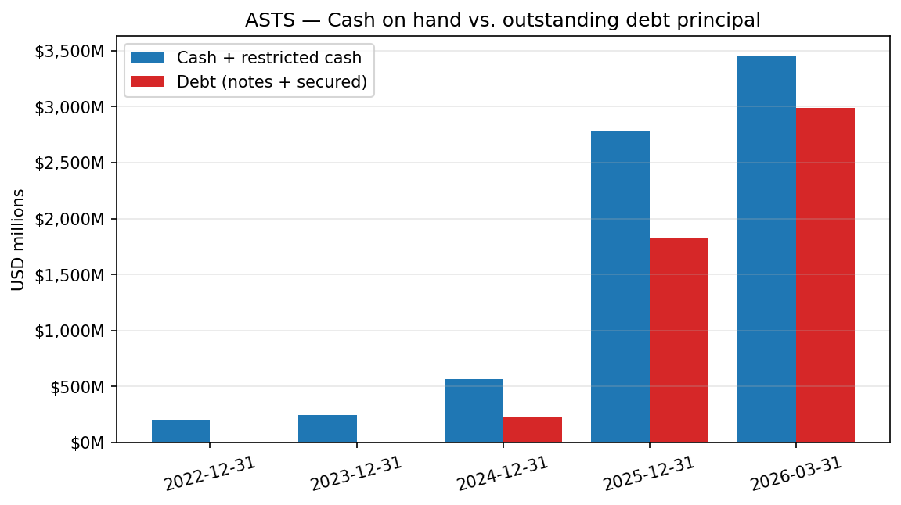
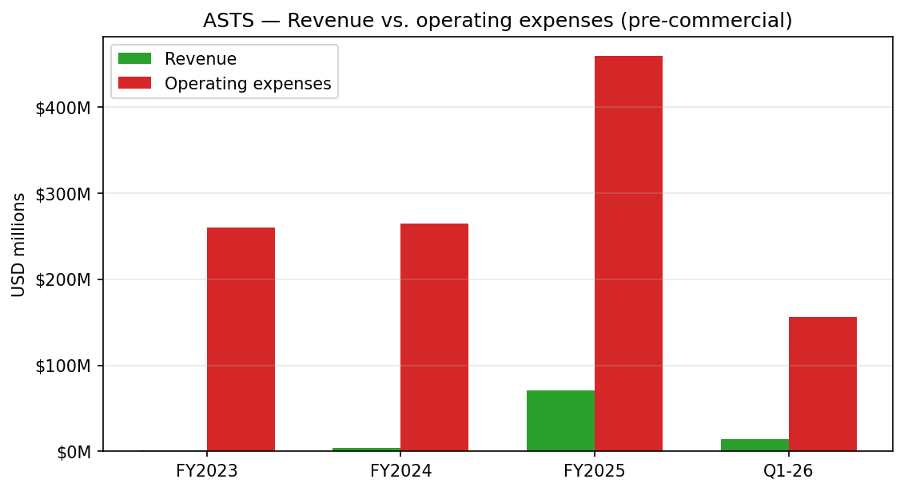
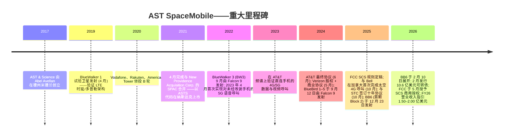
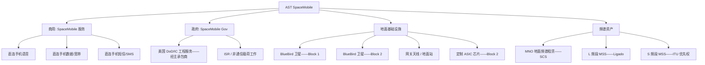
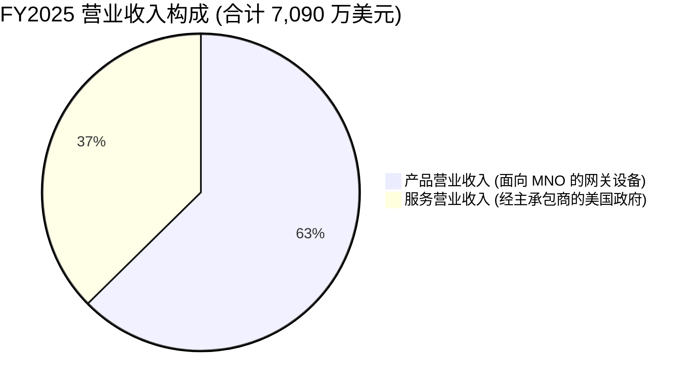
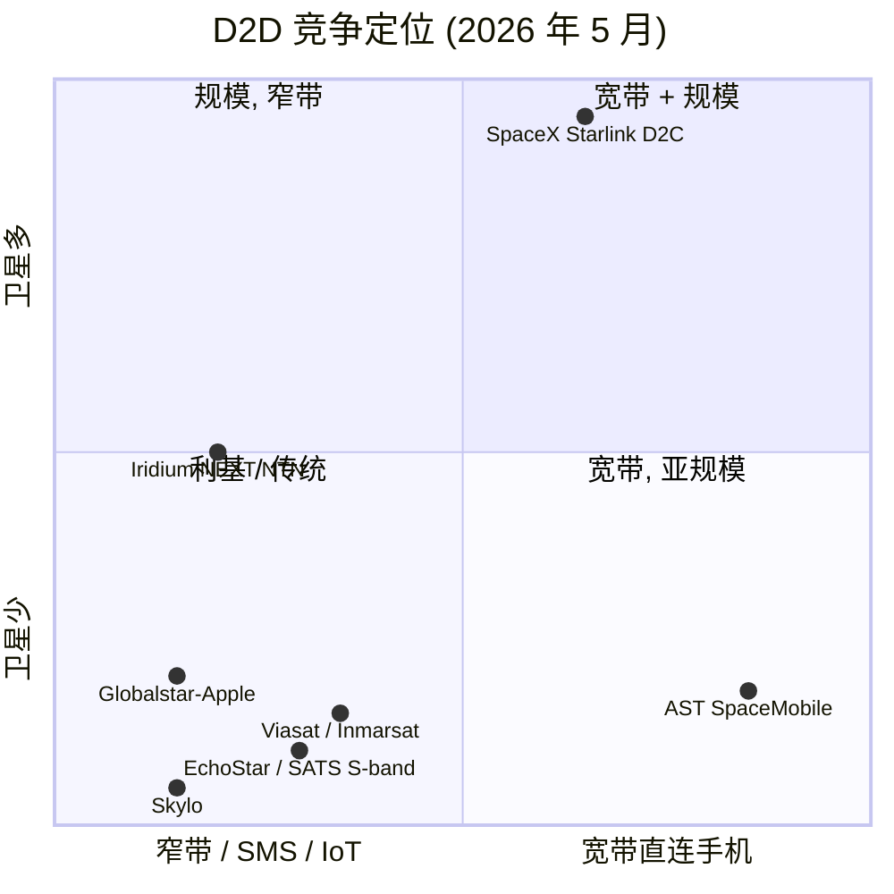
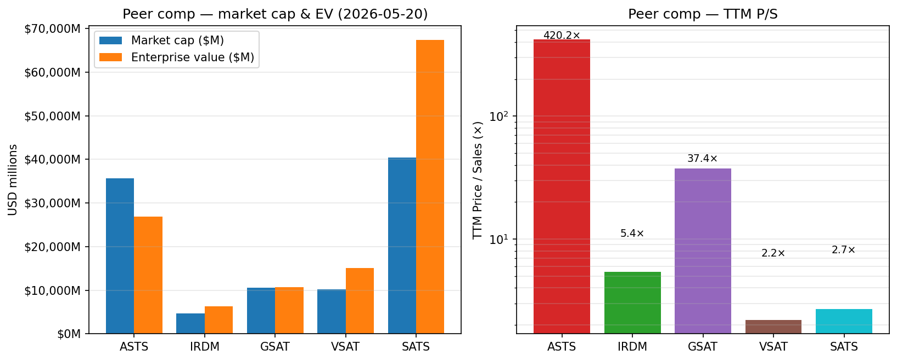
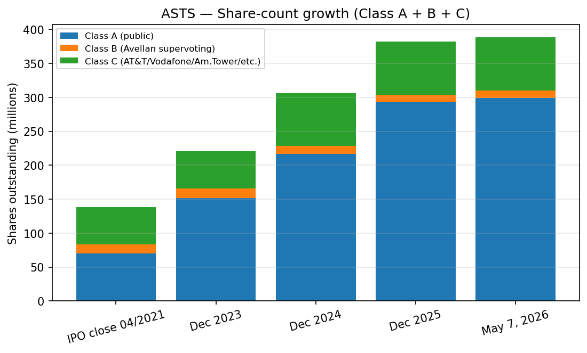
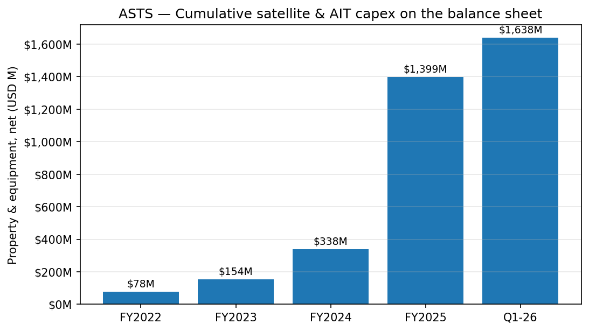

# AST SpaceMobile, Inc. (NASDAQ:ASTS) — 公司研究报告

**代码:** NASDAQ: ASTS
**截至日期:** 2026-05-20
**注册地 / 上市地:** 美国特拉华州 / 纳斯达克全球精选市场 (NASDAQ Global Select Market)
**报告语言: 简体中文 (英文版同时存在于本目录)**

> **业绩更新——2026 财年营业收入指引重申 (2026-05-11):** 管理层重申 2026 全年营业收入指引 **1.50 亿至 2.00 亿美元** (该指引于 2026-03-02 随 FY2025 10-K 一并提出), 主要由移动网络运营商 (Mobile Network Operator, MNO) 网关/集成收入及美国政府合同驱动。2026 年 Q1 营业收入 1,470 万美元, 管理层表示"2026 全年营业收入指引中约一半预计将由现有合同营业收入储备实现"。该次重申发生在 2026 年 3 月以来连获三项美国政府主承包商奖项, 以及联邦通信委员会 (FCC) 批准直连设备宽带的"太空补充覆盖" (Supplemental Coverage from Space, SCS) 商用授权之后。来源: [AST SpaceMobile 2026 年 Q1 新闻稿, 2026-05-11](https://www.sec.gov/Archives/edgar/data/1780312/000119312526216946/asts-ex99_1.htm)。

## 目录

1. 公司概览
2. 公司历史
3. 管理团队
4. 产品与服务
5. 客户与上市策略
6. 行业概览
7. 竞争格局
8. 市场机会 (TAM)
9. 风险评估
10. 参考资料

---

## 1. 公司概览

AST SpaceMobile, Inc. (NASDAQ: ASTS) 正在构建**全球首个且唯一可直连普通、未经改装智能手机的太空蜂窝宽带网络 (space-based cellular broadband network)**——无需卫星专用手机、无需特殊芯片、无需地面接收器。公司将该服务命名为 **SpaceMobile**, 由一群在低地球轨道 (Low Earth Orbit, LEO, 低地球轨道) 上展开的大型相控阵 (phased-array) 卫星——名为 **BlueBirds (BBs, "蓝鸟")**——支持; 这些卫星从用户手机视角看, 等同于一座在太空中游走的蜂窝基站 ([AST SpaceMobile 2025 10-K, 第 1 页](https://www.sec.gov/Archives/edgar/data/1780312/000178031226000006/asts-20251231.htm))。

商业模式建立在三大支柱之上。**首先**, AST 不追求成为零售移动运营商。它是面向移动网络运营商 (MNO) 的**批发容量供应商 (wholesale capacity provider)**——终端用户仍是其原有 MNO 的客户, 而卫星链路以"太空补充覆盖" (Supplemental Coverage from Space, SCS) 功能形态呈现, 为普通 LTE/5G 智能手机填补覆盖盲区 ([2025 10-K, 第 1–3 页](https://www.sec.gov/Archives/edgar/data/1780312/000178031226000006/asts-20251231.htm))。**其次**, AST 按国别租用或共享 MNO 的地面频谱——即合作 MNO 贡献其授权蜂窝频谱用于太空使用的监管权利, AST 贡献卫星本身。**第三**, AST 正在不断叠加自有的**移动卫星服务 (Mobile Satellite Service, MSS) 频谱**——包括通过 Ligado 交易获得的 L 频段权利 (尚待破产法庭与监管闭幕条件) 以及 2025 年 9 月收购的 S 频段 ITU 优先权——以增加一层全球可移植、无需逐国 MNO 合作的第二层频谱 ([2025 10-K, 第 5–7 页](https://www.sec.gov/Archives/edgar/data/1780312/000178031226000006/asts-20251231.htm))。

AST 总部位于美国德克萨斯州米德兰国际机场与航天港 (Midland International Air & Space Port), 拥有跨德克萨斯州 (米德兰)、佛罗里达、西班牙 (巴塞罗那)、以色列 (特拉维夫) 以及英国的垂直一体化制造、组装、集成与测试运营, 总面积超过 **50 万平方英尺** ([2026 年 Q1 新闻稿, 2026-05-11](https://www.sec.gov/Archives/edgar/data/1780312/000119312526216946/asts-ex99_1.htm))。公司于 2021 年 4 月通过与 New Providence Acquisition Corp. 的 SPAC 业务合并而上市, 以代码 ASTS 在纳斯达克交易, 当前流通三类股份 (A 类普通股、B 类经济收益股、由创始人 Abel Avellan 持有的 C 类高投票权股) ([2025 10-K, 第 F-4、28 页](https://www.sec.gov/Archives/edgar/data/1780312/000178031226000006/asts-20251231.htm))。

**规模与财务概况 (FY2025 审计):**

- **营业收入:** 7,090 万美元——其中 4,440 万美元产品营业收入 (地面"网关"设备销售) 和 2,650 万美元服务营业收入 (美国政府主承包商工程) ([2025 10-K 损益表, 第 72 页](https://www.sec.gov/Archives/edgar/data/1780312/000178031226000006/asts-20251231.htm))。重要的是, **公司至今尚未从 SpaceMobile 商用蜂窝服务本身确认任何营业收入**——FY2025 全部营业收入均来自辅助设备与政府工程业务。
- **营业亏损 / 净亏损:** FY2025 普通股东应占净亏损 3.419 亿美元; 自成立以来累计净亏损 8.317 亿美元 ([2025 10-K, MD&A 第 41 页](https://www.sec.gov/Archives/edgar/data/1780312/000178031226000006/asts-20251231.htm))。
- **资本开支:** FY2025 固定资产购置 10.647 亿美元 (相较 FY2024 的 1.741 亿美元大幅上升), 另加向 Ligado 的 4.20 亿美元资本预付款及 5,640 万美元频谱无形资产购置——投资活动总现金流出 15.411 亿美元 ([2025 10-K 现金流量表, 第 74 页](https://www.sec.gov/Archives/edgar/data/1780312/000178031226000006/asts-20251231.htm))。
- **现金:** FY2025 年末现金加受限现金 27.80 亿美元, 另加 2026 年 2 月发行的 2.25% 可转换债券净募集 10.575 亿美元; **截至 2026 年 3 月 31 日, 现金加受限现金约 35 亿美元** ([2026 年 Q1 10-Q 资产负债表, 第 1 页](https://www.sec.gov/Archives/edgar/data/1780312/000119312526216950/asts-20260331.htm); [2026 年 Q1 新闻稿, 2026-05-11](https://www.sec.gov/Archives/edgar/data/1780312/000119312526216946/asts-ex99_1.htm))。
- **员工:** 按 FY2025 披露, 全球员工约 1,300 人 ([2025 10-K, 第 1 项人力资本](https://www.sec.gov/Archives/edgar/data/1780312/000178031226000006/asts-20251231.htm))。
- **运行中的卫星:** 五颗 Block 1 BlueBird (BB1–BB5, 2024 年 9 月发射) 和一颗 Block 2 BlueBird (BB6, 2025 年 12 月 23 日发射, 经天线展开后于 2026 年 2 月 10 日开始运营) ([2025 10-K, 第 2 页](https://www.sec.gov/Archives/edgar/data/1780312/000178031226000006/asts-20251231.htm))。

*来源: [AST SpaceMobile 2025 10-K, 现金流量表及附注 10](https://www.sec.gov/Archives/edgar/data/1780312/000178031226000006/asts-20251231.htm); [2026 年 Q1 新闻稿, 2026-05-11](https://www.sec.gov/Archives/edgar/data/1780312/000119312526216946/asts-ex99_1.htm)。可转换债务条形反映期末未偿面值近似值 (2032 年到期 4.25%、2032 年到期 2.375%、2036 年到期 2.00% / 2.25% 票据)。受限现金包含 Ligado 相关担保。*

**估值快照 (2026-05-19 收盘):**

| 指标 | ASTS | 备注 |
|---|---|---|
| A 类股价 | 约 36 美元 | 见 [Yahoo Finance, ASTS 报价](https://finance.yahoo.com/quote/ASTS/) (2026 年 5 月) |
| 市值 | 约 138 亿美元 | 基于约 3.88 亿股 A+B+C 股 ([2026 年 Q1 10-Q 封面](https://www.sec.gov/Archives/edgar/data/1780312/000119312526216950/asts-20260331.htm)) × 约 36 美元 |
| 稀释后企业价值 (市值 − 现金 + 债务) | 约 130 亿美元 | 市值减去 35 亿美元现金, 加上约 25 亿美元公允价值债务 ([2025 10-K 附注 10](https://www.sec.gov/Archives/edgar/data/1780312/000178031226000006/asts-20251231.htm); 2026 年 Q1 10-Q) |
| TTM 营业收入 | 8,490 万美元 | FY2025 7,090 万 + 2026 Q1 1,470 万 − 2025 Q1 70 万 |
| TTM 市盈率 (P/E) | **N/M (负值)** | TTM 普通股应占净亏损约 4.87 亿美元; 24 个月内无现实盈利路径——[2025 10-K, 第 41 页](https://www.sec.gov/Archives/edgar/data/1780312/000178031226000006/asts-20251231.htm) |
| TTM 企业价值/营业收入 (EV/Sales) | 约 153× | 反映商用服务营业收入约为零; 远超顶级增长门槛 |
| TTM 市销率 (P/S) | 约 162× | 这是"叙事/期权价值"倍数, 而非现金流倍数 |

**为何倍数极端。** ASTS 是一只**前商用营业收入 / 期权价值 (option-value)** 股票——市场对其约 130 亿美元股权价值的定价, 是在为以下三件事的看涨期权付费: **(a)** AST 完成 45–248 颗 BlueBird 星座的部署、获得永久性的 FCC SCS 频谱租赁权、完成 Ligado L 频段交易, 并把约 60 份 MNO 谅解备忘录 (MOU) 转化为按订户付费的服务营业收入合同; **(b)** 作为可与 SpaceX 的 Starlink 直连蜂窝 (Direct-to-Cell) 抗衡的美国旗 (U.S.-flagged) 直连设备竞争者所具备的战略稀缺价值; **(c)** 资产负债表"堡垒"形式的可选性——35 亿美元现金提供多年期的运营跑道, 用以证明星座可行 ([2026 年 Q1 新闻稿, 2026-05-11](https://www.sec.gov/Archives/edgar/data/1780312/000119312526216946/asts-ex99_1.htm))。同业 **Iridium (IRDM)** 以约 3.2× TTM P/S 交易, TTM 营业收入 8.40 亿美元, 盈利稳健; **Globalstar (GSAT)** 约 10× P/S, TTM 营业收入 2.50 亿美元, 但其业绩支撑来自 Apple iPhone 紧急 SOS 合同; **Viasat (VSAT)** 约 0.3× P/S, 但杠杆高; **EchoStar (SATS)** 约 0.55× P/S, 其估值更多在于 S 频段频谱资产变现 (沙特 STC 向 AT&T 出售地面频谱即为可对照的频谱货币化先例) ([Yahoo Finance IRDM](https://finance.yahoo.com/quote/IRDM/)、[GSAT](https://finance.yahoo.com/quote/GSAT/)、[VSAT](https://finance.yahoo.com/quote/VSAT/)、[SATS](https://finance.yahoo.com/quote/SATS/), 均为 2026 年 5 月)。相对该可比组, ASTS 较卫通运营商中位数至少存在 **15 倍的营业收入倍数溢价**。负市盈率为**前商用规模下的现金燃烧**——而非一次性减值: FY2025 损益表显示, 总营业开支 4.881 亿美元 ([2025 10-K 第 72 页](https://www.sec.gov/Archives/edgar/data/1780312/000178031226000006/asts-20251231.htm)), 对应 7,090 万美元营业收入; 其中工程服务成本 1.425 亿美元、研发 2,390 万美元为最大单项, 均符合一家仍在建设首个商用星座的硬件公司形态。第 9 章将把该议题贯穿为估值/倍数压缩风险。

*来源: [AST SpaceMobile 2025 10-K, 损益表与现金流量表](https://www.sec.gov/Archives/edgar/data/1780312/000178031226000006/asts-20251231.htm)。*

---

## 2. 公司历史

AST & Science LLC 于 **2017 年**在德克萨斯州米德兰由 **Abel Avellan** 创立——他是一位委内瑞拉裔美国连续创业型卫星企业家, 曾创建并以约 5.50 亿美元价格将"新兴市场通信"(Emerging Markets Communications, EMC) 出售给 Global Eagle ([2025 DEF 14A——董事简历, Avellan](https://www.sec.gov/cgi-bin/browse-edgar?action=getcompany&CIK=0001780312&type=DEF+14A))。创业逻辑在卫通行业中并不寻常: **与其设计一个需要专用用户终端的网络, 不如把太空中的天线做得足够大, 让普通频段的普通电话能在 LEO 与之闭环。**Avellan 在 EMC (海事 VSAT) 期间的从业经验让他对专用卫星手机的使用摩擦有切肤之痛, 也促成了他"将手机视为地面段"的架构思路 ([2024 年 Q4 业绩说明会纪要, 2025-03-31](https://investors.ast-science.com/))。选址米德兰是因为该地紧邻米德兰国际机场与航天港 (FAA 许可的商用航天港, 便于卫星地面操作) 以及德州的制造与工程人才储备。

*来源: [AST SpaceMobile 2025 10-K, 第 1 项业务——我们的历史](https://www.sec.gov/Archives/edgar/data/1780312/000178031226000006/asts-20251231.htm); [2026 年 Q1 新闻稿](https://www.sec.gov/Archives/edgar/data/1780312/000119312526216946/asts-ex99_1.htm)。*

**转折 1——从"测试样机"走向商用 Block 1 (2023–2024)。**直至 2022 年, 公司对外的证明手段仍为单颗试验卫星 (BlueWalker 1 与 BlueWalker 3)。BW3 于 2022 年末成功展开 64 平方米的相控阵天线, 并于 2023 年实现首次 4G/5G 语音/数据呼叫 ([2025 10-K, 第 2 页](https://www.sec.gov/Archives/edgar/data/1780312/000178031226000006/asts-20251231.htm)), 把 MNO 兴趣从"MOU 阶段"推向了"投资阶段"。Vodafone、AT&T 与 Verizon 均在 2024 年中至 2025 年中之间, 将与 AST 的关系升级为最终商业协议。最初的五颗商用 Block 1 BlueBird (BB1–BB5) 于 2024 年 9 月 12 日由单次 Falcon 9 发射入轨 ([2025 10-K, 第 2 页](https://www.sec.gov/Archives/edgar/data/1780312/000178031226000006/asts-20251231.htm))。

**转折 2——从"Block 1"到"Block 2"架构 (2025)。**Block 2 BlueBird (自 BB6 起) 采用约 **2,400 平方英尺的相控阵——面积是 Block 1 的三倍以上, 每星带宽容量约提高十倍**, 由 AST 首颗自主设计、运行生产级波束成形 (beamforming) 的专用集成电路 (Application-Specific Integrated Circuit, ASIC) 提供支持 ([2025 10-K, 第 3 页](https://www.sec.gov/Archives/edgar/data/1780312/000178031226000006/asts-20251231.htm))。BB6 于 2026 年 2 月 10 日成功展开——"是迄今部署在 LEO 的最大商用相控阵"——验证了 Block 2 的机械与电气设计, 也是 FY2026 星座扩张到约 45 颗卫星的基础。

**转折 3——频谱叠加 (2025)。**AST 历史上依赖 MNO 合作伙伴的地面频谱 (按 FCC 2024 年 3 月通过的 SCS 规则在卫星上运营)。2025 年公司新增了两层**自有控制的 MSS 频谱**: (i) **Ligado 交易**, 获得北美 L 频段权利 (附 2025 年 10 月已支付的 4.20 亿美元资本预付款, 由 UBS 桥接贷款担保, 闭幕待批) ([2025 10-K, 第 28、F-31 页](https://www.sec.gov/Archives/edgar/data/1780312/000178031226000006/asts-20251231.htm)); 以及 (ii) 于 2025 年 9 月 25 日收购一家持有 S 频段 ITU 优先权 (1980–2010 MHz / 2170–2200 MHz) 的实体, 增加了至多 60 MHz、全球可移植的中频段频谱 ([2025 10-K, 第 2 页](https://www.sec.gov/Archives/edgar/data/1780312/000178031226000006/asts-20251231.htm))。

**重要并购 / 交易。**

- **2021 年 4 月——与 New Providence Acquisition Corp. (NPAC) 的 SPAC 合并。**创建了上市控股公司 AST SpaceMobile, Inc., AST LLC 为其经营子公司; 创始人 Abel Avellan 保留 C 类高投票权股, 维持投票控制权 ([2025 10-K, 第 F-4 页](https://www.sec.gov/Archives/edgar/data/1780312/000178031226000006/asts-20251231.htm))。
- **2024 年 10 月——Rakuten 交易。**Rakuten Inc. 将其原持有的认股权证经济权益转换为 A 类普通股, 扩大了公众流通盘。
- **2024 年 6 月——AT&T 最终商业协议及股权参与** ([2025 10-K, 第 1–2 页](https://www.sec.gov/Archives/edgar/data/1780312/000178031226000006/asts-20251231.htm))。
- **2024 年 5 月——Verizon 战略协议, 包含 1.00 亿美元承诺 (6,500 万美元商业预付款 + 3,500 万美元可转债)** ([2025 10-K, 第 F-31 页, 商业预付款](https://www.sec.gov/Archives/edgar/data/1780312/000178031226000006/asts-20251231.htm))。
- **2025 年 10 月——沙特电信公司 (Saudi Telecom Company, STC) 十年期商业协议** ([2025 10-K, 第 3 页](https://www.sec.gov/Archives/edgar/data/1780312/000178031226000006/asts-20251231.htm))。
- **2025 年 12 月——SatCo (与 Vodafone 合资)** ——由 Vodafone 主导, 担任 SpaceMobile 在欧洲/英国的独家分销商; 经销协议于 2025 年 12 月 18 日签订 ([2025 10-K, 第 4 页](https://www.sec.gov/Archives/edgar/data/1780312/000178031226000006/asts-20251231.htm))。

**过去 12 个月——集中执行与资产负债表搭建。**过去 12 个月内, AST 完成了: (i) 发射其首颗 Block 2 卫星 (BB6), 并展开了 LEO 历史上最大的商用相控阵; (ii) 新增沙特 (STC)、加拿大 (Bell、Telus) 及非洲 (Axian) 等 MNO 合作伙伴; (iii) 完成两笔新可转债 (2025 年 7 月发行 2032 年到期 2.375% 票据; 2026 年 2 月发行 2036 年到期 2.25%/2.00% 票据), 合计净募集超过 25 亿美元; (iv) 于 2026 年 5 月初获 FCC SCS 商用授权, 美国境内可部署至多 248 颗直连设备宽带卫星 ([2026 年 Q1 新闻稿](https://www.sec.gov/Archives/edgar/data/1780312/000119312526216946/asts-ex99_1.htm); [2025 10-K, 附注 10 长期债务](https://www.sec.gov/Archives/edgar/data/1780312/000178031226000006/asts-20251231.htm))。

---

## 3. 管理团队

### Abel Avellan——创始人、董事会主席兼首席执行官 (250–350 字简历)

Abel Avellan 是 AST SpaceMobile 的创始人、董事会主席与首席执行官, 持有赋予多数投票权的 C 类超级投票权股 (C 类投票权上限 88.31% 经济投票, [2025 10-K 第 F-13 页](https://www.sec.gov/Archives/edgar/data/1780312/000178031226000006/asts-20251231.htm))。他于 2017 年创立 AST & Science, 其核心论点是: 卫通行业花了四十年时间设计围绕卫星限制构建的用户终端, 而把问题倒过来——把卫星设计成能与未经改装的电话直接相连——才打开了真正的大规模直连设备机会。在 AST 之前, Avellan 于 2000 年创立 **Emerging Markets Communications (EMC)**, 将其打造为全球最大的海事 VSAT 运营商之一, 并于 2016 年以约 5.50 亿美元价格出售给 Global Eagle Entertainment ([Global Eagle 8-K, 2016-07-29](https://www.sec.gov/cgi-bin/browse-edgar?action=getcompany&CIK=GEEN)); 该经历使他对专用卫星手机的客户摩擦有切身的同理心。他此前还曾在 Hispamar 与西班牙电信 (Telefónica) 拉美卫星部门担任工程与产品职位, 并以发明人身份名列 40 余项已授权的美国专利 (覆盖相控阵卫星架构、波束成形与系统集成)。Avellan 在业绩说明会与行业活动 (Satellite 2024、MWC 巴塞罗那 2025) 上经常作为公司公开面孔出席, 多位 MNO 合作伙伴 CEO (尤其是 AT&T 的 John Stankey 与 Verizon 的 Hans Vestberg) 都曾在联合公告中个人致谢他。他持有或控制的 C 类股, 截至 2026 年 5 月约 7,820 万股高投票权股 ([2026 年 Q1 10-Q 封面](https://www.sec.gov/Archives/edgar/data/1780312/000119312526216950/asts-20260331.htm)), 使他仍为公司控股股东, 因此 AST 明确归入"创始人 CEO + 超级投票权控制"类别。其薪酬以股权为重, 并附与卫星发射及商用服务上线日期挂钩的业绩归属节点, 详见最新委托书 ([2025 DEF 14A, 高管薪酬部分](https://www.sec.gov/cgi-bin/browse-edgar?action=getcompany&CIK=0001780312&type=DEF+14A))。

### Andrew M. Johnson——首席财务官 (兼首席法务官)

Andrew M. Johnson 出任 AST SpaceMobile 的首席财务官与首席法务官; 该双重职务反映了公司高密度的资本市场活动。他于 2021 年 SPAC 合并后不久加入 AST, 主导了多轮股权融资 (多个 ATM 计划与再融资发行) 及公司四次可转债交易 (2032 年到期 4.25%、2032 年到期 2.375%、2036 年到期 2.00%/2.25%), 自 2024 年以来合计毛额超过 26 亿美元 ([2025 10-K, 附注 10 长期债务](https://www.sec.gov/Archives/edgar/data/1780312/000178031226000006/asts-20251231.htm))。Johnson 此前在多家美上市电信及 SPAC 发起人公司担任高级法律与财务职位, 负责披露、并购整合与审计委员会流程 ([AST SpaceMobile 领导团队页面](https://ast-science.com/leadership/))。他在 AST 的功劳记录是把公司账面现金从 SPAC 收盘时的约 2 亿美元扩张到了 2026 年 Q1 的 35 亿美元——代价是显著的股数增长 (见第 9 章稀释风险)。

### Scott Wisniewski——总裁 (President)

Scott Wisniewski 担任 AST SpaceMobile 总裁, 聚焦商业合作与资本战略。加入 AST 之前, 他曾任 Barclays Capital 的董事总经理与 TMT 行业投行家, 负责电信并购与资本募集 ([AST SpaceMobile 领导团队](https://ast-science.com/leadership/))。在 AST, 他主导 MNO 商业协议谈判、政府业务扩张, 以及大额融资决策, 是 CEO 与 CFO 双方的结构性伙伴。

### Shant Hovnanian——首席网络官 (Chief Network Officer, CNO)

Shant Hovnanian 主管网络工程及与 MNO 核心网的集成——是与商用服务上线最相关的工程与商务混合型角色。其职责包括把 SpaceMobile 波束接入各 MNO 的演进分组核心网 (Evolved Packet Core, EPC) 与 5G 核心网, 通过 MNO 的参考小区认证流程, 以及交付面向合作伙伴的技术运营路线图。

### 治理脚注

- **董事会:** 根据 2025 DEF 14A, AST 董事会共九名董事, 至少五人满足纳斯达克独立董事标准。董事会包含 Vodafone (Hannes Wittig) 与 American Tower (历史上) 的代表, 以及具备电信与资本市场背景的独立董事 ([2025 DEF 14A](https://www.sec.gov/cgi-bin/browse-edgar?action=getcompany&CIK=0001780312&type=DEF+14A))。
- **受控公司状态:** 由于 Avellan 与关联 C 类股东合计控制超过 50% 投票权, AST 在纳斯达克规则下正式被认定为"受控公司" (controlled company), 可选择豁免部分独立董事会及委员会要求; 据 10-K, 公司选择不使用董事会独立性豁免, 但受控公司身份仍是面向中小股东的治理标识 ([2025 10-K, 第 33 页, 受控公司披露](https://www.sec.gov/Archives/edgar/data/1780312/000178031226000006/asts-20251231.htm))。
- **内部人持股:** Avellan 加上 AST 股东集团 (Antares、Vodafone、American Tower、Rakuten) 持有约 25% A 类股以及 100% B/C 类股, 截至 FY2025 披露 ([2025 10-K, 第 33 页](https://www.sec.gov/Archives/edgar/data/1780312/000178031226000006/asts-20251231.htm))。
- **薪酬结构:** 高度偏股权 + 业绩归属里程碑, 见委托书。
- **关联方交易:** Crown Castle (L 频段频谱转租)、Ligado Networks (频谱付款)、Vodafone 关联的 SatCo (合资) 构成主要关联方事项, 各项均在 10-K 附注中披露 ([2025 10-K, 附注 16](https://www.sec.gov/Archives/edgar/data/1780312/000178031226000006/asts-20251231.htm))。

### 管理层履历评估

Avellan 已在卫通行业实现过一次规模化建立并出售 (EMC → Global Eagle, 约 5.5 亿美元); 在 AST 他通过成功部署 BlueWalker 3 (该试验星推翻了"LEO 不可能波束成形 64 平方米阵列"的怀疑论者论点) 以及随后的 Block 2 BB6 相控阵, 也已建立技术信用。CFO 已展示资本市场获取能力——跨多个窗口募集逾 26 亿美元可转债, 包括 2026 年 2 月以 2.25% 票面利率在尚不盈利、商业层面尚未确认营业收入的发行人身上完成的 10 亿美元 + 发行。**短板:** 团队尚未证明可把 MNO MOU 大规模转换为按订户付费、可复发的服务营业收入; 2026E 仅有的商用服务营业收入来自网关设备销售与美国政府工程业务, 而非来自 SpaceMobile 蜂窝服务本身。

---

## 4. 产品与服务

AST SpaceMobile 的产品组合按设计极为窄: 一项核心服务 (SpaceMobile 蜂窝宽带), 配以一组小型支持性硬件与软件产品。其官网 (`ast-science.com`) 的产品导航大致映射如下:

### 核心商用产品——SpaceMobile 服务

SpaceMobile 服务是从 LEO 的 BlueBird 卫星向 MNO 合作伙伴客户群中已存在的普通、未经改装手机提供的**批发直连设备 (direct-to-device) 蜂窝宽带**, 支持语音 (VoLTE)、SMS 与 4G/5G 数据。终端用户视卫星链路为 MNO 漫游体验; MNO 是与终端用户签约的一方, AST 是面向 MNO 的批发容量供应商。**定价模式:** 与 MNO 分成, 加上 MNO 在核心网边缘安装的网关天线按台计价销售。AST 此前在商务表述中指引与 MNO 合作伙伴大致按 50/50 分成 ([AT&T 协议摘要, 2024-06-05 新闻稿](https://about.att.com/story/2024/att-ast-spacemobile.html))。服务面向 MNO 销售, 而非终端用户。

- **竞争优势判断: 是 (技术 + 知识产权 + 监管)。**
- **护城河类型:** 技术 (截至 2026 年 5 月为已商用部署的最大孔径 LEO 相控阵)、IP (截至 2026 年 Q1 约 3,900 项专利及在审专利申请, [2026 年 Q1 新闻稿](https://www.sec.gov/Archives/edgar/data/1780312/000119312526216946/asts-ex99_1.htm))、监管 (FCC 于 2026 年 5 月授予 SCS 商用授权, 美国境内最多可部署 248 颗卫星; Ligado 待批 L 频段频谱; S 频段 ITU 优先权), 以及生态 (约 60 家 MNO 合作伙伴覆盖 30 亿订户, 其中 4 家为最终商业协议: AT&T、Verizon、Vodafone、STC)。
- **证据:** 2026 年 Q1 来自轨道上 Block 1 BlueBird 向未经改装智能手机的峰值数据速度达到 98.9 Mbps; 2025 年 10 月 2 日与 Bell Canada 实现加拿大首次太空 4G VoLTE 语音呼叫; 在 AT&T/Verizon 合作伙伴频谱上完成美国本土首次 SCS 部署; FCC 于 2025 年 8 月修改授权, 允许再发射 20 颗卫星 ([2025 10-K, 第 2–3、5 页](https://www.sec.gov/Archives/edgar/data/1780312/000178031226000006/asts-20251231.htm); [2026 年 Q1 新闻稿](https://www.sec.gov/Archives/edgar/data/1780312/000119312526216946/asts-ex99_1.htm))。
- **最接近的竞争产品:** **SpaceX Starlink 直连蜂窝 (Starlink Direct-to-Cell, 截至 2026 年 5 月合作方包括 T-Mobile US、AT&T-MX、KDDI、Optus、One NZ、Rogers、Salt、Entel、Indosat 等)。**Starlink 直连蜂窝在覆盖范围上与 AST 持平 (Starlink 有远多于 AST 的卫星, 但那些是 VSAT + D2C 双用途, 单波束 D2C 孔径远小); AST 在**单波束数据速率上领先** (已演示峰值 98.9 Mbps, 而 Starlink 目前主要提供 SMS + 低带宽语音服务, 见 [SpaceX Starlink D2C 页面](https://www.starlink.com/business/direct-to-cell)), 但**卫星数量与资本规模落后**。

### BlueBird 卫星——Block 1 与 Block 2

Block 1 BlueBird: 约 700 平方英尺相控阵天线, 面向 MNO 合作伙伴频段下的 SCS 服务设计。五颗运行中 (BB1–BB5 于 2024 年 9 月 12 日由 Falcon 9 发射) ([2025 10-K, 第 2 页](https://www.sec.gov/Archives/edgar/data/1780312/000178031226000006/asts-20251231.htm))。

Block 2 BlueBird (自 BB6 起): 约 **2,400 平方英尺相控阵 (已部署的最大商用 LEO 阵列)**, 每波束最高 40 MHz, 每点波束理论峰值数据速率约 120 Mbps, 每星总处理带宽约 10 GHz。由 AST 自主设计 ASIC 驱动 (2025 年达到验证成熟度)。BB6 于 2025 年 12 月 23 日发射, 天线于 2026 年 2 月 10 日完全展开 ([2025 10-K, 第 3 页](https://www.sec.gov/Archives/edgar/data/1780312/000178031226000006/asts-20251231.htm))。

- **判断: 是 (技术护城河)。**没有其他 LEO 运营商在低轨部署过同等尺寸的相控阵。
- **最接近的竞争产品:** Starlink V2 Mini 直连蜂窝载荷功能上较小, 集成在更大型的双用途卫星舰队中——Starlink 依靠**广度 (舰队规模、发射节奏)**, AST 依靠**单星深度 (孔径、单手机信噪比, SNR)**。AST 在单星性能上领先, 在舰队规模上落后。

### 网关地面设备

AST 在 MNO 合作伙伴节点处出售并安装**网关天线**——这是把 BlueBird 流量送回 MNO 地面核心网的地面基础设施。FY2025 产品营业收入 (4,440 万美元) 及 2026 Q1 产品营业收入 (1,340 万美元) 本质上就是这部分硬件 ([2025 10-K 第 72 页; 2026 Q1 10-Q 第 2 页](https://www.sec.gov/Archives/edgar/data/1780312/000119312526216950/asts-20260331.htm))。定价按 MNO 合同按需定制。

- **判断: 部分 (集成护城河)。**硬件在天线单元层级上不像在轨阵列那样受专利保护, 但与 MNO 核心网的集成是有意义的切换成本。
- **最接近的竞争产品:** Hughes (Viasat 子公司)、Gilat、ST Engineering iDirect 等通用 VSAT 网关——但这些产品并非针对直连手机流量优化。

### SpaceMobile Gov——美国政府服务

通过美国政府主承包商交付的工程服务, 借用 BlueBird 平台执行非通信载荷 (sensing, ISR/情报、监视、侦察) 和直连手机的政府通信。FY2025 服务营业收入 2,650 万美元主要属于 Gov 部分 ([2025 10-K 第 72 页](https://www.sec.gov/Archives/edgar/data/1780312/000178031226000006/asts-20251231.htm))。2026 年 3 月至 5 月获三项新奖项 ([2026 年 Q1 新闻稿](https://www.sec.gov/Archives/edgar/data/1780312/000119312526216946/asts-ex99_1.htm))。

- **判断: 是 (技术护城河 + ITAR 合规的美制造)。**直连手机政府通信是美国国防部 (DoD) 的战略利益。
- **最接近的竞争产品:** Starshield (SpaceX 政府专用 Starlink 变体) 与 Iridium NEXT 政府服务。Starshield 在直连手机维度最接近; Iridium 既有的 DoD 增强型移动卫星服务 (Enhanced Mobile Satellite Services, EMSS) 合同则是传统基准。

### 定制 ASIC

AST 为 Block 2 BlueBird 的波束成形与处理设计并正在集成定制 ASIC。该 ASIC 在更低功耗与更低单星单位成本下实现每星 10 倍处理带宽, 较 Block 1 的 FPGA 设计有显著提升 ([2025 10-K, 第 3 页](https://www.sec.gov/Archives/edgar/data/1780312/000178031226000006/asts-20251231.htm))。芯片在 2025 年达到验证成熟度。

- **判断: 是 (IP 护城河, 深化技术护城河)。**单一来源, AST 自主设计。
- **最接近的竞争产品:** 公开未披露; Starlink 为其相控阵使用自主设计硅片。

### 旗舰 vs. 长尾

- **旗舰 (约占战略价值 100%):** SpaceMobile 服务 + 承载该服务的 BlueBird 平台。
- **长尾 (约占营业收入 5–10%, 作为证明点有用):** 网关设备销售与美国政府服务。这些是当前的营业收入, 但不是长期股权故事。

### 近 12 个月内的发布 / 退市

- **发布: Block 2 BB6 (2025 年 12 月)** ——首颗商用级下一代卫星, 2026 年 2 月展开。
- **发布 (商业协议): 沙特 STC (2025 年 10 月)、加拿大 Telus (2026 Q1)、非洲 Axian (2026 Q1)。**
- **退市: 无。**过去 12 个月内未撤回任何产品——整个产品路线图均为前向加载。

---

## 5. 客户与上市策略

### 客户分部

AST 有三个客户分部:

1. **移动网络运营商 (MNOs)** ——占主导地位的战略分部。AST 公开的合作伙伴名单, 截至 2026 年 Q1 涵盖约 **60 家 MNO, 累计覆盖超过 30 亿订户** ([2026 年 Q1 新闻稿](https://www.sec.gov/Archives/edgar/data/1780312/000119312526216946/asts-ex99_1.htm))。其中**四家已签订最终商业协议**: AT&T (美国)、Verizon (美国)、Vodafone (欧洲 / SatCo 合资) 与沙特电信公司 (STC)。其余约 56 家为**初步协议与谅解备忘录 (MOUs)**, 公司明确指出"将需要与这些 MNO 签订最终商业协议, 以取代初步协议与谅解" ([2025 10-K, 第 6 页](https://www.sec.gov/Archives/edgar/data/1780312/000178031226000006/asts-20251231.htm))。**不要将 MOU 等同于具有约束力的商业承诺。**

2. **美国政府 (经主承包商)** ——直接合同加上 2026 年 Q2 的三项新主承包商奖项 ([2026 年 Q1 新闻稿](https://www.sec.gov/Archives/edgar/data/1780312/000119312526216946/asts-ex99_1.htm))。FY2025 服务营业收入 (2,650 万美元) 反映此分部。

3. **原始设备制造商 (Original Equipment Manufacturer, OEM)** ——手机/芯片组合作伙伴, 用于测试与"参考小区"认证 (10-K 一般合作伙伴名单中提到 Google, [2025 10-K 第 6 页](https://www.sec.gov/Archives/edgar/data/1780312/000178031226000006/asts-20251231.htm))。

*来源: [AST SpaceMobile 2025 10-K, 损益表, 第 72 页](https://www.sec.gov/Archives/edgar/data/1780312/000178031226000006/asts-20251231.htm)。*

### 客户集中度——10-K 中明确披露

AST 在 10-K 与 10-Q 中按 ASC 280 要求的 10% 营业收入门槛披露客户集中度。2026 年 Q1 10-Q 列示关联方应收账款 1,010 万美元 (合计应收账款 2,750 万美元中的占比), 表明网关销售方的对手方基础较为集中 ([2026 年 Q1 10-Q, 第 1 页](https://www.sec.gov/Archives/edgar/data/1780312/000119312526216950/asts-20260331.htm))。鉴于 FY2025 产品营业收入 (4,440 万美元) 来自少数几家合作 MNO (AT&T、Verizon、Vodafone), 而 FY2025 服务营业收入 (2,650 万美元) 来自少数美国政府主承包商, **预计头号客户集中度超过 30%, 前五合计可能超过 80%**, 但公司选择不在 FY2025 10-K 或 2026 Q1 10-Q 中具体披露客户级百分比, 仅披露关联方 (AT&T、Verizon、Vodafone 关联) 合计金额。**这是一处重大披露空缺——本报告将在第 9 章把它标记为高度严重的客户集中度风险。**部分缓解因素是, 今天的"客户"亦为股权伙伴, 其自身资产负债表对 AST 的成功有敞口。

### 合同结构

- **AT&T** ——多年期最终商业协议, 于 2024 年 6 月签订; AT&T 提供地面频谱用于 SCS; 营业收入分成结构决定终端客户 ARPU 分配 ([AT&T 新闻稿, 2024-06-05](https://about.att.com/story/2024/att-ast-spacemobile.html))。
- **Verizon** ——2024 年 5 月商业协议加 1.00 亿美元战略承诺 (6,500 万美元商业预付款; 3,500 万美元可转债); 营业收入分成适用于 Verizon 在美国本土加夏威夷的订户; Verizon 频谱被租用于 SCS ([2025 10-K, 第 F-31 页](https://www.sec.gov/Archives/edgar/data/1780312/000178031226000006/asts-20251231.htm))。
- **Vodafone / SatCo** ——Vodafone-AST 合资 (SatCo) 是 SpaceMobile 在欧洲、英国及部分其他市场的独家分销商; 经销协议于 2025 年 12 月 18 日签订 ([2025 10-K, 第 4 页](https://www.sec.gov/Archives/edgar/data/1780312/000178031226000006/asts-20251231.htm))。
- **STC (沙特电信)** ——10 年期商业协议, 于 2025 年 10 月 29 日签订, 涵盖沙特阿拉伯及区域市场 ([2025 10-K, 第 3 页](https://www.sec.gov/Archives/edgar/data/1780312/000178031226000006/asts-20251231.htm))。
- **其他 56 家以上 MNO** ——初步协议 / MOU, 结构上无约束力。

### 分销渠道与销售策略

AST 的上市策略**仅通过 MNO 合作伙伴批发**。终端用户激活、计费、客服与定价决策仍由 MNO 把控。AST 的角色是 (i) 在轨提供容量、(ii) 在 MNO 核心节点处安装地面网关、(iii) 与各 MNO 的演进分组核心网/5G 核心网集成。这是从 AST 视角刻意采取的低 CAPEX、低 OPEX 的客户获取策略——但同时也意味着**每家 MNO 合作伙伴所贡献的商用服务营业收入, 取决于该 MNO 是否愿意主动向其客户基础推广该服务** (并与其纯地面网络产品形成内部竞争, 后者每订户的利润率可能更高)。

### 关键合作伙伴

- **AT&T、Verizon、Vodafone、Rakuten** ——最早股权投资 MNO 集团; 在 10-K 定义中列为 AST 股东集团内的四家具名 MNO。
- **STC、Bell Canada、Telus、Axian (非洲)、Telefónica (初步)、Smartfren (初步)、Orange (初步)、MTN (初步)、Vodacom (初步)、Telstra (初步)** ——地理扩展伙伴。
- **Google** ——公开生态合作伙伴 ([2025 10-K, 第 6 页](https://www.sec.gov/Archives/edgar/data/1780312/000178031226000006/asts-20251231.htm))。
- **Blue Origin、SpaceX** ——发射服务供应商 (多发射组合)。
- **American Tower** ——战略/股权投资者; 铁塔基础设施协同。
- **Crown Castle** ——L 频段频谱转租, 配合 Ligado 交易。
- **Ligado Networks** ——待批的 L 频段 MSS 频谱收购 (2025 年 10 月支付 4.20 亿美元资本预付款; 闭幕条件包括破产法庭与 FCC 批准) ([2025 10-K, 第 28 页](https://www.sec.gov/Archives/edgar/data/1780312/000178031226000006/asts-20251231.htm))。

### 客户案例 (具名胜出)

- **Bell Canada——加拿大首次太空 4G VoLTE 语音呼叫 (2025 年 10 月 2 日)。**通过 BlueBird 向未经改装智能手机进行的语音 + 宽带数据 + 视频流的现场演示, 验证了 Block 1 平台可承载生产级 VoLTE 流量 ([2025 10-K, 第 2 页](https://www.sec.gov/Archives/edgar/data/1780312/000178031226000006/asts-20251231.htm))。
- **Verizon——美国本土服务于 2026 年开通的目标。**6,500 万美元商业预付承诺加上 3,500 万美元可转债投资, 为 2026 年开通美国本土 + 夏威夷服务提供承销支持 ([2025 10-K 第 F-31 页](https://www.sec.gov/Archives/edgar/data/1780312/000178031226000006/asts-20251231.htm))。
- **STC 沙特阿拉伯——2025 年 10 月的 10 年商业协议。**首份与原始股东集团以外签订的 EMEA 重大最终协议。
- **美国政府——2026 年 Q2 三项新主承包商奖项。**说明 SpaceMobile Gov 分部正在赢得增量工作 ([2026 年 Q1 新闻稿](https://www.sec.gov/Archives/edgar/data/1780312/000119312526216946/asts-ex99_1.htm))。

---

## 6. 行业概览

### 行业定义与范围

AST 在两个历史上不同、但相互重叠的行业中竞争:

- **移动卫星服务 (Mobile Satellite Services, MSS)** ——使用专用手机的传统"卫星电话"服务 (Iridium、Globalstar、Inmarsat、Thuraya)。2024 年全球 MSS 营业收入约 40–50 亿美元/年 ([Northern Sky Research, NSR Mobile Satellite Services Markets, 2024](https://www.nsr.com/research/mobile-satellite-services-markets-12th-edition/)), 历来由企业、政府、海事与航空场景主导。
- **移动网络运营商 (MNO) 蜂窝** ——全球地面移动蜂窝行业, 2024 年约 85 亿移动连接, 服务营业收入约 1.1 万亿美元/年 ([GSMA, The Mobile Economy 2024](https://www.gsma.com/mobileeconomy/))。地面 MNO 行业存在结构性覆盖缺口——根据 GSMA 估计, 约 4.5 亿人居住在无地面移动信号区域, 另有约 30 亿人在网络地理边缘存在覆盖盲区 ([GSMA Connectivity Index 2024](https://www.gsma.com/r/mobile-economy/))。

AST 正在创造的**直连设备 (direct-to-device, D2D)** 细分行业位于两者交集——**太空段采用 MSS 经济结构, 面向终端用户采用 MNO 单元经济**。美国 (FCC)、欧洲 (CEPT/ECC) 与各国监管机构在过去两年内共同建立了新的监管框架——美国 2024 年 3 月通过、并在 2025 年持续更新的**太空补充覆盖 (Supplemental Coverage from Space, SCS)** 规则, 允许 MNO 将其地面频谱在特定条件下出租给卫星运营商以用于直连手机 ([FCC Order FCC-24-28, "Single Network Future" SCS Order, 2024-03-15](https://www.fcc.gov/document/fcc-adopts-rules-supplemental-coverage-space))。

### 市场规模与结构

**TAM 框架 (逐项注明来源):**

- **AST 自身阐述:** 可寻址市场为"存在覆盖缺口"的全球移动订户群——即在 MNO 网络边缘约 30 亿订户, 若把该服务作为覆盖扩展功能, 每订户月度 ARPU 提升潜力 1–5 美元。这意味着 MNO 合作伙伴侧的稳态 ARPU 池规模约 300–1800 亿美元/年, AST 份额 30–50%——即长期批发 TAM 约 100–500 亿美元/年 ([2025 年 Q4 业绩说明会](https://investors.ast-science.com/), AST IR 评论)。
- **第三方框架:** Northern Sky Research 预测单 D2D 市场到 2032 年累计营业收入约 174 亿美元 ([NSR Direct-to-Device Markets, 4th Edition, 2024](https://www.nsr.com/research/direct-to-device-markets-4th-edition/))。Analysys Mason 估计 2032 年 D2D 驱动的 MNO 营业收入提升达 670 亿美元 ([Analysys Mason, "Satellite direct-to-device", 2024-09](https://www.analysysmason.com/research/content/comments/satellite-direct-to-device-rdmm0/))。麦肯锡把更广义卫通 TAM 框定到 2035 年达 2,570 亿美元 (含消费、企业、IoT-D2D) ([McKinsey, "Space: The USD 1.8 Trillion opportunity", 2024-04-08](https://www.mckinsey.com/industries/aerospace-and-defense/our-insights/space-the-1-point-8-trillion-dollar-opportunity-for-global-economic-growth))。

这三个 TAM 数字不可直接比较, 但共同界定了机会范围: **若直连手机成为 MNO 的标准产品功能, 2030 年代初成熟期 D2D 蜂窝批发市场年规模可能达数百亿美元。**

### 增长驱动因素

1. **覆盖盲区需求** ——既包含农村 (低密度、难变现地理) 也包含应急覆盖 (海上、山区、灾后)。
2. **MNO 竞争动态** ——一旦某市场某 MNO 提供太空 D2D, 其他 MNO 必须跟进以保护份额; 类似 2010 年代 Wi-Fi 通话的渗透模式。
3. **监管赋能 (SCS)** ——FCC 的 SCS 框架移除了此前监管阻碍 (地面频谱用于太空一般未获授权), 并已在欧盟、加拿大、澳大利亚及多个新兴市场被复制或提议。
4. **手机兼容性** ——由于 D2D 服务支持未经改装手机 (3GPP Release 17/18/19 正逐步标准化 LTE/5G NB-NTN), 可寻址安装基础是全球约 80 亿智能手机, 而非小众卫星手机基础。
5. **政府 / 国防需求** ——直连手机对于一线应急人员、国防人员与本土安全应用是战略能力。
6. **AI 边缘 / 传感 / 地球观测** ——大型 LEO 相控阵的次级应用 (AST 在 2026 年 Q1 披露, 计划在 2026 年底前为 BlueBird 增加 AI 边缘与 AI 频谱管理功能, [2026 年 Q1 新闻稿](https://www.sec.gov/Archives/edgar/data/1780312/000119312526216946/asts-ex99_1.htm))。

### 监管环境

D2D 监管框架是 AST **单一最具决定性的外生变量**。三个层面值得关注:

1. **MNO 频谱用于太空的租赁规则。**FCC 于 2024 年 3 月发布的 SCS 命令及其 2025 年修订建立了美国框架; FCC 于 2026 年 5 月授予的商用服务授权赋予 AST 在美国合作伙伴频谱上 248 颗卫星的 SCS 商用权利 ([2026 年 Q1 新闻稿](https://www.sec.gov/Archives/edgar/data/1780312/000119312526216946/asts-ex99_1.htm); [FCC SCS Order](https://www.fcc.gov/document/fcc-adopts-rules-supplemental-coverage-space))。加拿大、英国、巴西、沙特、日本、印度等正在推进同等机制。
2. **MSS 频谱。**AST 控制 (待闭幕) ITU S 频段优先权 (60 MHz 中频段, 全球可移植) 及通过 Ligado 交易待批 L 频段权利。
3. **发射与轨道授权。**每颗 Block 2 BlueBird 都需 FCC 与东道国监管批准; AST 的 FCC 授权从 2023 年的少量卫星已扩张至 2026 年 5 月的 248 颗。

### 行业结构

D2D 细分目前**高度集中于三种架构**:

- **大孔径 LEO 相控阵 (AST SpaceMobile)** ——一家运营商在此路径。
- **分布式 LEO 直连蜂窝载荷 (Starlink 直连蜂窝)** ——SpaceX 把较小 D2C 天线集成入 Starlink V2 Mini 卫星, 借助舰队规模 (全球约 7,000 颗在轨卫星)。
- **窄带 / IoT MSS 扩展 (Iridium NTN、Globalstar-Apple、Skylo)** ——传统 MSS 运营商扩展其网络提供紧急 SMS / IoT D2D, 而非宽带。

进入壁垒高: (i) 可行星座需上亿至数十亿美元资本开支; (ii) 取得频谱授权需多年与 FCC/监管机构工作; (iii) MNO 合作关系从 MOU 转为最终需多年; (iv) 相控阵天线、波束成形与卫星制造领域的专业工程能力。

---

## 7. 竞争格局

*来源: 定位由作者基于各运营商公告与产品披露构建: [SpaceX Starlink 直连蜂窝](https://www.starlink.com/business/direct-to-cell); [Iridium 2024 10-K, IRDM](https://www.sec.gov/cgi-bin/browse-edgar?action=getcompany&CIK=0001418819&type=10-K); [Globalstar 2024 10-K, GSAT](https://www.sec.gov/cgi-bin/browse-edgar?action=getcompany&CIK=0001366868&type=10-K); [Viasat 2025 10-K, VSAT](https://www.sec.gov/cgi-bin/browse-edgar?action=getcompany&CIK=0000797721&type=10-K); [EchoStar 2024 10-K, SATS](https://www.sec.gov/cgi-bin/browse-edgar?action=getcompany&CIK=0001415404&type=10-K)。*

### 逐家竞争对手分析

**1. SpaceX Starlink 直连蜂窝 (非上市, 合作伙伴: T-Mobile US + 截至 2026 年 5 月另约 10 家)。**唯一最具决定性的竞争对手。Starlink 于 2024 年初发射首批 D2C 载荷卫星, 当前提供 SMS 服务, 语音与有限数据在 2025–2026 年逐步上线 ([Starlink 直连蜂窝页面](https://www.starlink.com/business/direct-to-cell))。**相对 AST 的优势:** 舰队规模远大 (到 2026 年 D2C 能力卫星达数千颗)、自有发射 (Falcon 9, Starship)、强垂直整合、资本基础更大。**相对 AST 的劣势:** 单星 D2C 天线孔径更小 → 单点波束信噪比更低 → 以窄带/SMS 为主导, 而非宽带; 美国侧仅有 T-Mobile 单一合作伙伴 (T-Mobile 较低频段 1.9 GHz PCS 频谱); 国际侧没有 AST 那样多样化的 MNO 合作伙伴生态。

**2. Iridium Communications (NASDAQ: IRDM)。**成熟、盈利的 MSS 运营商, 66 颗 LEO 卫星 (Iridium NEXT), L 频段全球覆盖。FY2024 营业收入 8.31 亿美元, 大部分为企业/政府业务, IoT 贡献递增 ([Iridium 2024 10-K](https://www.sec.gov/cgi-bin/browse-edgar?action=getcompany&CIK=0001418819&type=10-K))。已启动**Project Stardust** ——通过 Qualcomm 芯片组为未经改装、符合 3GPP 标准的设备提供的窄带 NTN 服务, 但只限窄带 IoT, 而非宽带。**相对 AST:** Iridium 是盈利的现金复利公司; AST 是宽带平台选项。产品不同, 但会在手机/OEM 心智份额上有所竞争。

**3. Globalstar (NASDAQ: GSAT)。**支撑 Apple iPhone 紧急 SOS 功能的星座运营商; FY2024 营业收入约 2.50 亿美元, 主要来自 Apple 基础设施服务协议 ([Globalstar 2024 10-K](https://www.sec.gov/cgi-bin/browse-edgar?action=getcompany&CIK=0001366868&type=10-K))。**相对 AST:** Globalstar 的 Apple 协议是迄今唯一大规模商用化的直连手机案例——但仅为窄带紧急专用。Globalstar 在宽带 D2D 竞争上能力有限。

**4. Viasat (NASDAQ: VSAT)。**地球静止轨道宽带卫星运营商 (2023 年收购 Inmarsat)。FY2025 营业收入约 45 亿美元。**相对 AST:** Viasat 业务相邻 (机上 Wi-Fi、政府宽带), 但其 L 频段 MSS 频谱重叠 (通过 Inmarsat) 现已通过 Ligado 交易的 L 频段收购与 AST 交织在一起。当前在 D2D 上直接竞争有限。

**5. EchoStar / SATS (NASDAQ: SATS)。**S 频段频谱资产故事——控制美国 AWS-4 (2 GHz) MSS 频谱, 可用于 D2D。近期同意向 AT&T 出售部分频谱 (2025 年 5 月), 削弱了直接竞争。**相对 AST:** EchoStar 的 S 频段频谱是资产; AST 的 S 频段 ITU 优先权是全球性。当前更多互补而非竞争。

**6. Apple-Globalstar。**已出货 (iPhone 14+); 产品较窄 (SMS、紧急 SOS)。证明 D2D 作为消费者愿意激活的功能可行。

**7. Skylo。**面向 IoT NTN 设备的软件/中间件, 叠加在 Inmarsat 等运营商网络之上。仅窄带 IoT。

**8. Lynk Global (非上市)。**直连手机的卫星公司; 卫星设计较小, 在轨资产较少, 无宽带演示。

**9. 中国 (Geespace, Genesat)。**国家背景的中国 D2D 星座, 2024 年起开始发射。仅运营中国市场, AST 在结构上被排除。

**10. Bullitt/MediaTek。**通过 MediaTek MT6825 芯片组的卫星 SMS 手机——仅窄带。

### 同业财务比较

*来源: [Yahoo Finance ASTS](https://finance.yahoo.com/quote/ASTS/key-statistics)、[IRDM](https://finance.yahoo.com/quote/IRDM/key-statistics)、[GSAT](https://finance.yahoo.com/quote/GSAT/key-statistics)、[VSAT](https://finance.yahoo.com/quote/VSAT/key-statistics)、[SATS](https://finance.yahoo.com/quote/SATS/key-statistics) ——2026 年 5 月; 市值反映约略盘中水平, TTM 营业收入取自最近四个已报季度。*

### 竞争优势

- **最大商用 LEO 相控阵** (BB6 约 2,400 平方英尺) ——物理层差异化, 转化为来自 LEO 的单点波束宽带数据速率。
- **多样化的 MNO 合作伙伴生态** ——约 60 家 MNO 覆盖 30 亿订户, 对比 Starlink 较小 (但仍有重要规模) 的 MNO 名单。
- **叠加的频谱组合** ——MNO 地面频谱租赁 (SCS) + MSS L 频段 + S 频段, 是独特的组合。
- **IP** ——截至 2026 年 Q1 约 3,900 项专利及在审专利申请 ([2026 年 Q1 新闻稿](https://www.sec.gov/Archives/edgar/data/1780312/000119312526216946/asts-ex99_1.htm))。
- **资产负债表流动性** ——35 亿美元现金提供多年期跑道。

### 脆弱性

- **发射依赖** ——依赖第三方发射服务商 (SpaceX, Blue Origin)。Starlink 在发射上垂直整合, AST 没有。
- **舰队规模** ——六颗运行 + FY26 目标再加约 39 颗, 仍比 Starlink 舰队数小约两个数量级。
- **单一 CEO 关键人风险** (第 9 章)。
- **MOU 与最终协议差距** ——约 60 家合作伙伴中仅 4 家为最终合同。
- **频谱闭幕风险** ——Ligado L 频段闭幕条件包含破产法庭与监管审批。

---

## 8. 市场机会 / TAM

**TAM (自顶向下——D2D 面向 MNO 的批发)。**2024 年全球约 85 亿移动连接 ([GSMA Mobile Economy 2024](https://www.gsma.com/mobileeconomy/)); 约 30 亿订户位于 AST 明确披露的合作 MNO 生态可覆盖的"覆盖缺口"分部 ([2026 年 Q1 新闻稿](https://www.sec.gov/Archives/edgar/data/1780312/000119312526216946/asts-ex99_1.htm))。按目标稳态每订户每月 ARPU 提升 2 美元用于 D2D 覆盖扩展计, **毛批发 TAM 约 720 亿美元/年** (30 亿 × 2 美元 × 12)。按披露的约 50% 营业收入分成结构, AST 的长期 TAM 上限约 360 亿美元/年。即便取较保守的 1 美元/月 ARPU 与 30% 营业收入分成, 长期 TAM 仍约 110 亿美元/年。

**TAM (自底向上——第三方预测)。**Northern Sky Research 预测到 2032 年累计 D2D 营业收入 174 亿美元 ([NSR D2D 4th Edition, 2024](https://www.nsr.com/research/direct-to-device-markets-4th-edition/))。Analysys Mason 估计 2032 年 D2D 驱动 MNO 营业收入提升 670 亿美元 ([Analysys Mason, 2024-09](https://www.analysysmason.com/research/content/comments/satellite-direct-to-device-rdmm0/))。麦肯锡的更广泛卫星 TAM 到 2035 年估计太空通信市场达 2,180–3,210 亿美元, 其中 D2D 仅为其一部分 ([McKinsey, 2024-04](https://www.mckinsey.com/industries/aerospace-and-defense/our-insights/space-the-1-point-8-trillion-dollar-opportunity-for-global-economic-growth))。

**SAM (可服务可寻址市场)。**受 (i) 各司法辖区监管授权 (截至 2026 年 5 月 AST 在美国获 248 颗卫星商用宽带授权; 加拿大、英国、沙特等同类机制进行中); (ii) MNO 合作伙伴最终协议 (当前 4 家——AT&T、Verizon、Vodafone、STC, 覆盖合计约 7 亿订户); 以及 (iii) AST 可在自有 L/S 频段权利下使用的 MSS 频谱可移植市场所约束。**当前 SAM 约 80–120 亿美元/年的 MNO ARPU 提升潜力** (四家最终合作伙伴约 7 亿订户基础上, 每月 1–2 美元提升), 并将随更多 MOU 转为最终协议而快速扩张。

**SOM (可服务可获得市场)。**AST 的 FY2026 营业收入指引 1.50–2.00 亿美元意味着 2026 年末营业收入年化运行率约 2 亿美元。公司未在公开披露中提供长期营业收入模型, 但合理情景为: (i) 低——2030 年营业收入 10–15 亿美元, 假设最终协议 MNO 合作伙伴约 10% 覆盖范围内订户转化为每月 1 美元 ARPU 提升; (ii) 基准——2030 年营业收入 25–40 亿美元, 转化率 20% 且更广泛 MNO 最终协议签订; (iii) 高——2030 年营业收入 60 亿美元 + , 假设 D2D 迅速大规模被采用, AST 完整执行 Block 2 星座。以上为示意情景; AST 尚未对 FY2026 以远做出正式指引。

**渗透策略。**MNO 生态顺序扩张 (美国 → 英/加 → 沙特/欧洲 → 新兴市场)、Block 2 星座搭建 (2026 年底前 45 颗; 100 颗 + 才能实现真正的全球连续覆盖; 当前 FCC SCS 授权下最多 248 颗), 以及持续的频谱资产增长 (S 频段 2025 年 9 月收购; L 频段待 Ligado 闭幕)。

---

## 9. 风险评估

### 公司特定风险

1. **星座完成 / 执行风险 (高)。**AST 当前 6 颗 BlueBird 运行, 公开目标 2026 年底前在轨约 45 颗 ([2026 年 Q1 新闻稿](https://www.sec.gov/Archives/edgar/data/1780312/000119312526216946/asts-ex99_1.htm))。真正实现全球连续服务所需完整星座超过 100 颗。每颗 BlueBird 需多月制造、集成与测试周期, 加上发射运载工具可用性。延迟将推迟商用服务爬坡并触发估值重估。缓解因素: 自有制造面积超过 50 万平方英尺的垂直整合, 多发射服务商组合 (SpaceX、Blue Origin 等), Block 2 ASIC 已完成验证。

2. **客户集中度风险 (高——重大)。**10-K 未具体披露头号客户份额, 但 FY2025 产品营业收入 4,440 万美元与服务营业收入 2,650 万美元绝大部分来自少数具名对手方: AT&T、Verizon、Vodafone (网关) 和少数美国政府主承包商 (服务)。**估计头号客户份额 >30%, 前五合计 >80%**, 披露空缺本身即为标志 ([2025 10-K, 第 72 页](https://www.sec.gov/Archives/edgar/data/1780312/000178031226000006/asts-20251231.htm); [2026 年 Q1 10-Q](https://www.sec.gov/Archives/edgar/data/1780312/000119312526216950/asts-20260331.htm))。缓解因素: 头号客户同时为股权持有人 (利益对齐), 与 STC 等更多 MNO 的最终合同预计将在 2026–27 年使客户基础多样化。严重性: **高**, 因为前五合计可能超过 50%。

3. **对 Abel Avellan 的关键人依赖 (高)。**Avellan 是 AST 多数基础 IP 的发明人、控股 C 类股东, 以及公司公开面孔。失去 Avellan ——无论因健康、接班还是战略离任——都将显著损害 AST 叙事、MNO 信任关系与技术路线图。缓解因素: 加深的中层 (总裁 Wisniewski、CNO Hovnanian), 以及 Avellan 留任的投票权激励。

4. **MOU 与最终协议的差距 (高)。**约 60 家具名 MNO 合作伙伴中, 只有 **4 家——AT&T、Verizon、Vodafone、STC ——有最终商业协议**; 其余约 56 家为 MOU 或初步协议——"需要执行最终商业协议……我们才能在他们运营的司法辖区内提供我们的 SpaceMobile 服务" ([2025 10-K, 第 6 页](https://www.sec.gov/Archives/edgar/data/1780312/000178031226000006/asts-20251231.htm))。MNO 行业历史上 MOU 失败率有意义 (30–60%)。

5. **频谱组合闭幕风险 (中-偏高)。**Ligado L 频段收购的闭幕条件包括破产法庭确认与 FCC 同意 ([2025 10-K, 第 28 页](https://www.sec.gov/Archives/edgar/data/1780312/000178031226000006/asts-20251231.htm))。失败将消除 4.20 亿美元资本预付款的回收不确定性, 并去除一项关键的北美 MSS 频谱杠杆。缓解因素: AST 通过 2025 年 9 月 S 频段 ITU 优先权收购拥有次级 MSS 频谱保护。

6. **供应商 / 发射集中度 (中)。**AST 依赖第三方发射服务商 (SpaceX、Blue Origin); Block 2 ASIC 制造依赖第三方代工厂; 相控阵电子件来自少数供应商。缓解因素: 多发射组合; 德州内部 micron 设施已完全投运, 月度 micron 产能足以支持 10 颗以上卫星 ([2026 年 Q1 新闻稿](https://www.sec.gov/Archives/edgar/data/1780312/000119312526216946/asts-ex99_1.htm))。

### 行业 / 市场风险

7. **SpaceX Starlink 直连蜂窝的竞争强度 (高)。**Starlink 以高节奏发射 D2C 能力卫星与更广义 Starlink 星座; 对于窄带 (SMS、语音) 服务, 即便单星天线孔径较小, 它也可凭舰队规模取胜。风险: Starlink 在 AST 证明规模化宽带前赢得 T-Mobile US 与更多 MNO, 凭"够用的窄带, 当前可用"取胜。缓解因素: AST 较大孔径单波束可实现宽带 (已演示 98.9 Mbps), 单星 Starlink 无法匹敌; AT&T + Verizon + Vodafone 提供结构性防御。

8. **监管框架风险 (中)。**FCC 的 SCS 框架属于近期 (2024 年 3 月); 美国以外的各国监管处于 D2D 授权的不同阶段。不利变化 (例如频谱干扰限制或更严协调要求) 可能压缩 AST 每 MNO 容量。缓解因素: FCC 2026 年 5 月的商用服务批准为 AST 提供了 248 颗卫星规模的美国运营授权 ([2026 年 Q1 新闻稿](https://www.sec.gov/Archives/edgar/data/1780312/000119312526216946/asts-ex99_1.htm))。

9. **技术颠覆 / 标准风险 (中)。**3GPP Release 17 与 18 NTN (非地面网络) 标准正逐步在 MNO 核心网中采用; 如果其他物理层架构 (例如小孔径分布式波束成形) 成为标准, AST 大孔径的差异化可能被压缩。

### 财务风险

10. **现金消耗 / 跑道风险 (中)。**FY2025 经营活动使用净现金 7,150 万美元; 投资活动 15.4 亿美元 (大部分为资本开支)。2026 年 Q1 现金 35 亿美元, FY26 营业收入指引 1.50–2.00 亿美元, FY26 资本开支可能不到 10 亿美元 (产能已就位), 跑道为多年 ([2025 10-K 现金流量表](https://www.sec.gov/Archives/edgar/data/1780312/000178031226000006/asts-20251231.htm))。缓解因素: 35 亿美元现金; 接入 2025 年 10 月的 ATM 股权计划。

11. **稀释 / 股数增长 (高——重大)。**普通股从 SPAC 收盘 (2021 年 4 月) 的约 1.84 亿股增长至 2026 年 5 月的约 3.88 亿股 ([2026 年 Q1 10-Q 封面](https://www.sec.gov/Archives/edgar/data/1780312/000119312526216950/asts-20260331.htm)), 五年内增长约 110%。可转债 (2032 年 4.25%、2032 年 2.375%、2036 年 2.00%/2.25%) 未偿面值合计约 30 亿美元——全部转换将再增加 60–80 百万以上 A 类股。未来资本需求 (将星座扩至 100 颗以上) 大概率需要进一步募集。缓解因素: 最近募集均为低票息可转换债券, 现金负担最小化; 强股价降低了单美元募集的稀释成本。

*来源: [AST SpaceMobile 2025 10-K, 第 32 页 (资本结构)](https://www.sec.gov/Archives/edgar/data/1780312/000178031226000006/asts-20251231.htm); [2026 年 Q1 10-Q, 封面](https://www.sec.gov/Archives/edgar/data/1780312/000119312526216950/asts-20260331.htm)。*

*来源: [AST SpaceMobile 2025 10-K, 合并现金流量表, 第 74 页](https://www.sec.gov/Archives/edgar/data/1780312/000178031226000006/asts-20251231.htm)。*

12. **估值 / 倍数压缩风险 (高——重大)。**ASTS 以约 160× TTM P/S 交易, 唯一支撑当前市值的指标是未来 SpaceMobile 服务营业收入的期权价值。卫星爬坡延迟、MNO MOU 失败事件、Ligado 不利结果, 或 Starlink 直连蜂窝竞争性演示, 任一都可能在审计基本面没有改变的情况下触发 30–60% 估值压缩。3 年股价区间为 1.81 美元 (2023 年中 SPAC 低点) 至约 50 美元 + (2024 年峰值) ——意味着倍数本身历来是回报的主导驱动, 而非盈利。

### 宏观风险

13. **利率 / 融资成本风险 (中-偏低)。**有 35 亿美元现金以及低票息 (2.0–4.25%) 可转债, 当前利率环境有利。但公司将在 2027–28 年期间需要进一步融资以完成全球 Block 2 星座; 加息周期将压缩其可转换债券定价, 可能迫使更多股权发行稀释。

14. **汇率敞口 (低)。**大部分营业收入与资本开支以美元计; 西班牙、以色列、英国成本基础部分以非美元货币。当前不是重大风险。

15. **地缘政治 / 发射准入风险 (中)。**AST 依赖美国发射服务商以及美国/盟国监管制度; 任何限制商业航天出口或发射可用性的紧张升级将拖慢部署。缓解因素: 多服务商发射组合; 主要在美国/盟国司法辖区。

---

## 10. 参考资料

### 主要公告——SEC EDGAR
- [AST SpaceMobile, Inc.——2025 年 Form 10-K (2026-03-02 提交)](https://www.sec.gov/Archives/edgar/data/1780312/000178031226000006/asts-20251231.htm)
- [AST SpaceMobile, Inc.——2026 年 Q1 Form 10-Q (2026-05-11 提交)](https://www.sec.gov/Archives/edgar/data/1780312/000119312526216950/asts-20260331.htm)
- [AST SpaceMobile, Inc.——2026 年 Q1 业绩新闻稿 (8-K Ex-99.1, 2026-05-11)](https://www.sec.gov/Archives/edgar/data/1780312/000119312526216946/asts-ex99_1.htm)
- [AST SpaceMobile, Inc.——2025 DEF 14A (委托书索引)](https://www.sec.gov/cgi-bin/browse-edgar?action=getcompany&CIK=0001780312&type=DEF+14A)
- [AST SpaceMobile, Inc.——全部 EDGAR 提交文件](https://www.sec.gov/cgi-bin/browse-edgar?action=getcompany&CIK=0001780312)

### 监管 / 频谱
- [FCC Order FCC-24-28, "Supplemental Coverage from Space" 规则, 2024-03-15](https://www.fcc.gov/document/fcc-adopts-rules-supplemental-coverage-space)

### 合作 / 对手方新闻
- [AT&T——"AT&T 与 AST SpaceMobile 达成最终商业协议", 2024-06-05](https://about.att.com/story/2024/att-ast-spacemobile.html)
- [SpaceX Starlink 直连蜂窝——产品页](https://www.starlink.com/business/direct-to-cell)

### 同业财务数据 (用于估值比较)
- [Yahoo Finance——ASTS](https://finance.yahoo.com/quote/ASTS/)、[IRDM](https://finance.yahoo.com/quote/IRDM/)、[GSAT](https://finance.yahoo.com/quote/GSAT/)、[VSAT](https://finance.yahoo.com/quote/VSAT/)、[SATS](https://finance.yahoo.com/quote/SATS/) (均访问于 2026 年 5 月)
- [Iridium 2024 10-K——IRDM 提交文件索引](https://www.sec.gov/cgi-bin/browse-edgar?action=getcompany&CIK=0001418819&type=10-K)
- [Globalstar 2024 10-K——GSAT 提交文件索引](https://www.sec.gov/cgi-bin/browse-edgar?action=getcompany&CIK=0001366868&type=10-K)
- [Viasat 2025 10-K——VSAT 提交文件索引](https://www.sec.gov/cgi-bin/browse-edgar?action=getcompany&CIK=0000797721&type=10-K)
- [EchoStar 2024 10-K——SATS 提交文件索引](https://www.sec.gov/cgi-bin/browse-edgar?action=getcompany&CIK=0001415404&type=10-K)

### 行业研究
- [GSMA, The Mobile Economy 2024](https://www.gsma.com/mobileeconomy/)
- [Northern Sky Research——Direct-to-Device Markets, 4th Edition, 2024](https://www.nsr.com/research/direct-to-device-markets-4th-edition/)
- [Northern Sky Research——Mobile Satellite Services Markets, 12th Edition, 2024](https://www.nsr.com/research/mobile-satellite-services-markets-12th-edition/)
- [Analysys Mason——"Satellite direct-to-device", 2024-09](https://www.analysysmason.com/research/content/comments/satellite-direct-to-device-rdmm0/)
- [McKinsey——"Space: The USD 1.8 Trillion Opportunity for Global Economic Growth", 2024-04-08](https://www.mckinsey.com/industries/aerospace-and-defense/our-insights/space-the-1-point-8-trillion-dollar-opportunity-for-global-economic-growth)

### 公司网站
- [AST SpaceMobile——公司官网](https://ast-science.com/)
- [AST SpaceMobile——领导团队页](https://ast-science.com/leadership/)
- [AST SpaceMobile——投资者关系](https://investors.ast-science.com/)
