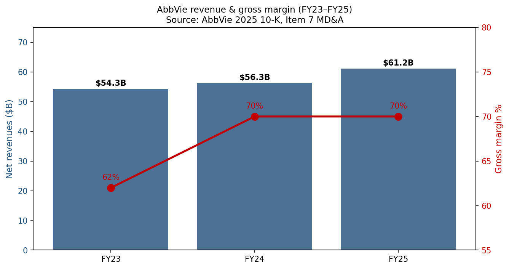
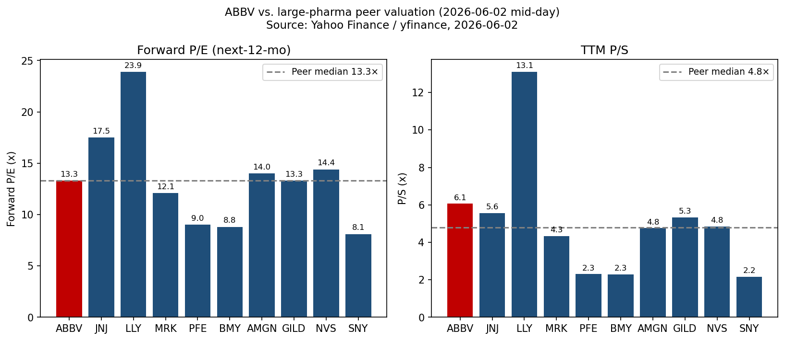
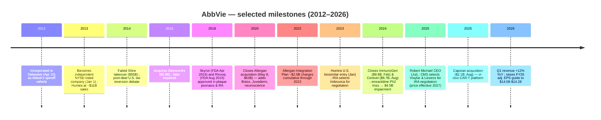
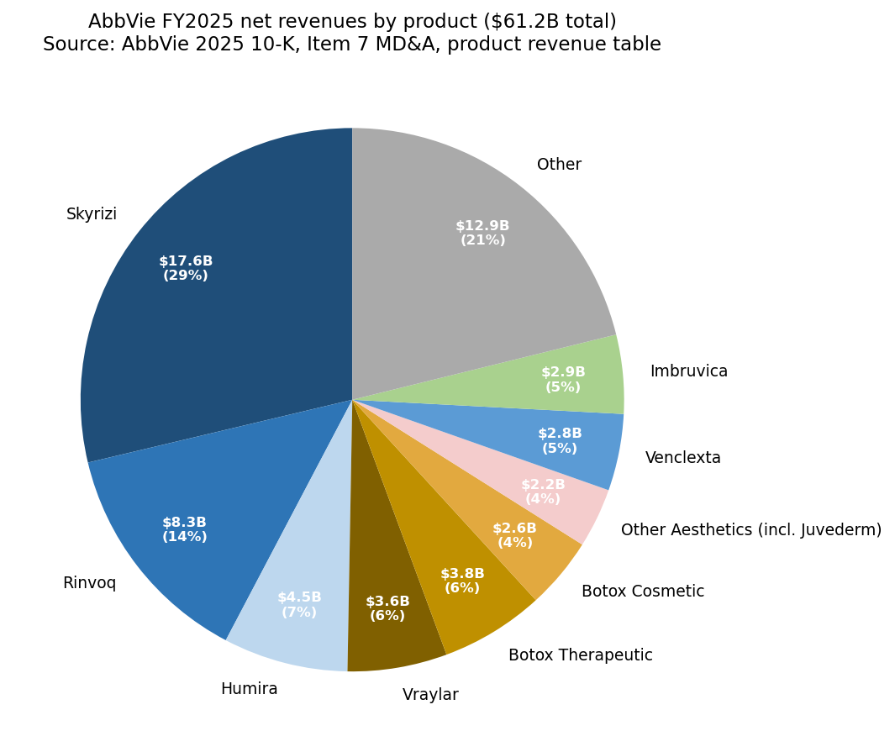
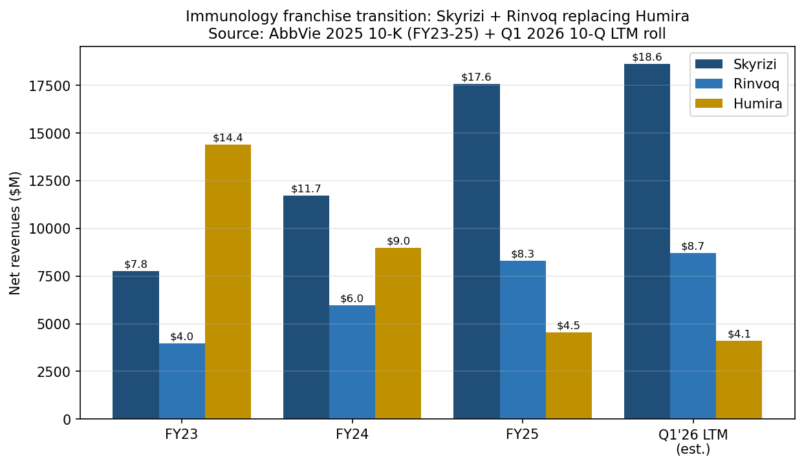
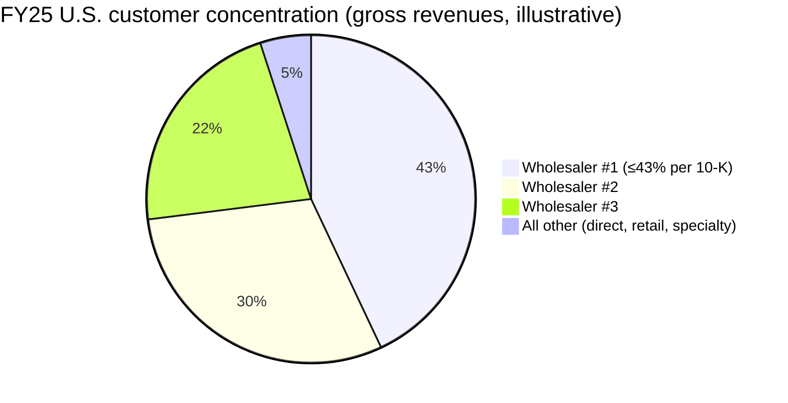
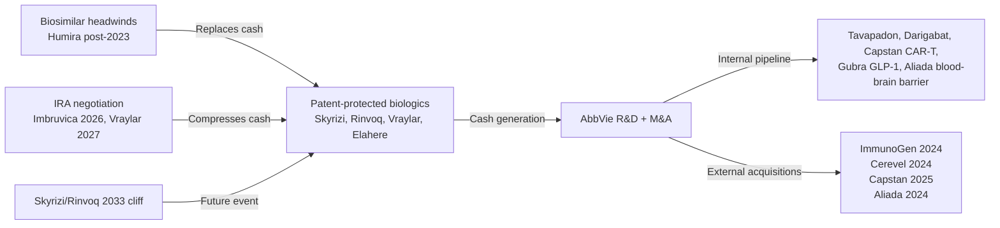

# AbbVie Inc. (NYSE: ABBV) — Initiating Coverage

*As of 2026-06-02. Author: research note. All numbers traceable to AbbVie's FY2025 10-K filed 2026-02-20 and the Q1 2026 10-Q / 8-K filed 2026-04-29 unless otherwise stated.*

> **Guidance change watch.** On 2026-04-29, AbbVie raised its FY2026 adjusted diluted EPS guidance range from **$13.96–$14.16** to **$14.08–$14.28**, retaining a $0.41 YTD drag from acquired IPR&D / milestones. The new range implies high-single-digit reported EPS growth on top of FY25's adjusted base. See [AbbVie Q1 2026 Earnings Release, EX-99.1, 2026-04-29](https://www.sec.gov/Archives/edgar/data/1551152/000155115226000013/abbv-20260331xexhibit991.htm).

## Table of contents

1. [Company Overview](#1-company-overview)
2. [Company History](#2-company-history)
3. [Management Team](#3-management-team)
4. [Products & Services](#4-products--services)
5. [Customers & Go-to-Market](#5-customers--go-to-market)
6. [Industry Overview](#6-industry-overview)
7. [Competitive Landscape](#7-competitive-landscape)
8. [Market Opportunity (TAM/SAM/SOM)](#8-market-opportunity-tamsamsom)
9. [Risk Assessment](#9-risk-assessment)
10. [Investor-Lens Scorecards](#10-investor-lens-scorecards)
11. [References](#11-references)

---

## 1. Company Overview

AbbVie Inc. (NYSE: ABBV) is a Delaware-incorporated, North Chicago–headquartered global biopharmaceutical company that emerged from the January 2013 spin-off of Abbott Laboratories' research-based pharmaceuticals business. The company "is a global, research and development-based biopharmaceutical company committed to developing innovative advanced therapies for some of the world's most complex and critical conditions" and "operates as a single global business segment dedicated to the research and development, manufacturing, commercialization and sale of innovative medicines and therapies", per its [2025 Form 10-K, Item 1 Business](https://www.sec.gov/Archives/edgar/data/1551152/000155115226000008/abbv-20251231.htm). Today AbbVie employs approximately **57,000 people in over 70 countries** and markets products that span immunology, oncology, neuroscience, eye care, aesthetics, and women's health, per the same [2025 10-K, Item 1 Human Capital section](https://www.sec.gov/Archives/edgar/data/1551152/000155115226000008/abbv-20251231.htm).

**Topline financials (FY2025).** Worldwide net revenues were **$61.160 billion** (+9% reported and constant currency), operating earnings $15.1 billion, GAAP diluted EPS $2.36, and cash flow from operations $19.0 billion, per the [2025 10-K MD&A overview](https://www.sec.gov/Archives/edgar/data/1551152/000155115226000008/abbv-20251231.htm). GAAP gross margin held at **70%** versus 62% in 2023 — a swing driven by the Allergan amortization profile rolling off and high-margin Skyrizi/Rinvoq scale. Reported EPS is depressed by amortization (~$7.4 billion in 2025) and acquired-IPR&D charges; non-GAAP adjusted diluted EPS was guided in the **$14.08–$14.28** range for FY2026 after the Q1 raise, per the [Q1 2026 earnings release, EX-99.1](https://www.sec.gov/Archives/edgar/data/1551152/000155115226000013/abbv-20260331xexhibit991.htm).

*Source: [AbbVie 2025 10-K, Item 7 MD&A](https://www.sec.gov/Archives/edgar/data/1551152/000155115226000008/abbv-20251231.htm).*

**Latest quarter inflection.** Q1 2026 revenue was **$15.002 billion (+12.4% reported / +10.3% operational)**, with global immunology at **$7.290 billion (+16.4%)** and neuroscience at **$2.875 billion (+26.0%)**. Skyrizi reached $4.483B (+30.9%), Rinvoq $2.119B (+23.3%), while Humira fell to $688M (-38.6%) — the franchise transition is now demonstrably ahead of the pace required to deliver the company's "robust long-term growth" trajectory, per [Q1 2026 EX-99.1](https://www.sec.gov/Archives/edgar/data/1551152/000155115226000013/abbv-20260331xexhibit991.htm). CEO Robert Michael characterized the print as "off to an excellent start in 2026, with first-quarter results exceeding our expectations" in the same release.

**Valuation snapshot (2026-06-02).** Share price $215.43, market cap **~$380.6 billion**, TTM P/E **~105.6×** (depressed by GAAP IPR&D and amortization expenses), **Forward P/E ~13.3×**, P/S 6.06×, EV/EBITDA 14.7×, dividend yield **3.25%**, 5-year beta 0.30 — per [Yahoo Finance ABBV key-statistics, 2026-06-02](https://finance.yahoo.com/quote/ABBV/key-statistics/). The yawning gap between TTM and forward P/E (~92×) reflects how heavily GAAP earnings are weighed down by the cumulative ~$6.7 billion of acquired-IPR&D charges booked in 2024 and 2025 plus amortization of Allergan / ImmunoGen / Cerevel intangibles; on the adjusted EPS base ($14.08–$14.28 mid-point ~$14.18) ABBV trades at ~15.2× FY26e — a roughly 6% premium to the peer median forward P/E of 13.9× from the comp table below. Bernstein's $225 price target (zsxq broker context, 2026-06-02) implies ~4% upside and a similar ~15.8× FY26e adjusted-EPS multiple, consistent with "market-perform" framing.

*Source: [Yahoo Finance / yfinance snapshot, 2026-06-02](https://finance.yahoo.com/quote/ABBV/).*

**Why the multiple is what it is.** ABBV's optical TTM P/E of 105× is misleading — the company has spent the last two years front-loading $6.7B+ of acquired-IPR&D charges (Cerevel, ImmunoGen, Capstan, Aliada, Gilgamesh, Gubra) plus the $4.5B emraclidine intangible impairment booked in Q4 2024, all of which hit GAAP but not cash. The cash signal is clearer: $19.0B cash from operations in 2025 against ~$380.6B market cap (~5.0% FCF yield), and the dividend was raised 5.5% to $1.73/quarter in Q4 2025 for the Feb 2026 payment, the [2025 10-K, dividend disclosure](https://www.sec.gov/Archives/edgar/data/1551152/000155115226000008/abbv-20251231.htm) confirms.

## 2. Company History

*Source: [AbbVie 2025 10-K, Item 1 Business, "General"](https://www.sec.gov/Archives/edgar/data/1551152/000155115226000008/abbv-20251231.htm); historical milestones cross-referenced to filings cited in subsequent sections.*

**Spin-off origin.** Per [AbbVie's 2025 10-K, Item 1](https://www.sec.gov/Archives/edgar/data/1551152/000155115226000008/abbv-20251231.htm), the company "was incorporated in Delaware on April 10, 2012. On January 1, 2013, AbbVie became an independent, publicly-traded company as a result of the distribution by Abbott Laboratories (Abbott) of 100% of the outstanding common stock of AbbVie to Abbott's shareholders." The spinoff was driven by Abbott's desire to separate its branded-pharma research engine — anchored by the Humira (adalimumab) franchise — from its diversified hospital products, nutritionals, and diagnostics businesses, which became the post-spin Abbott Laboratories.

**The Humira era (2013–2022).** Humira, AbbVie's anchor product, became the world's best-selling drug by ~2017, peaking at **$21.2 billion** global sales in 2022 ([AbbVie 2022 10-K, Item 7](https://www.sec.gov/Archives/edgar/data/1551152/000155115223000011/abbv-20221231.htm)). The 10-Ks of that era make plain that Humira was the existential cash cow funding R&D and capital returns: in 2022 it was ~36% of consolidated revenue, providing the financial firepower for the simultaneous Allergan integration and the Skyrizi/Rinvoq launches.

**Allergan acquisition (May 8, 2020).** The transformative ~$63 billion combination with Allergan plc added Botox (therapeutic + cosmetic), Juvederm, Restasis, Vraylar, the broader eye-care portfolio, and a sizable women's-health franchise. The [2025 10-K, Item 7 MD&A](https://www.sec.gov/Archives/edgar/data/1551152/000155115226000008/abbv-20251231.htm) discloses that the post-closing "Allergan Integration Plan … was designed to reduce costs, integrate and optimize the combined organization and incurred total cumulative charges of $2.5 billion through 2023." Strategically the deal diversified AbbVie away from pure immunology and gave the company a recession-resilient aesthetics franchise plus a neuroscience platform that would later be augmented by Cerevel.

**Humira's biosimilar cliff (2023+).** Humira's U.S. biosimilar entry on **January 31, 2023** (Amgen's Amjevita first), followed by ~10 additional U.S. biosimilars across 2023, marked the largest patent-cliff event in pharma history. The [2025 10-K product table](https://www.sec.gov/Archives/edgar/data/1551152/000155115226000008/abbv-20251231.htm) shows Humira global sales falling from $14.404B (FY23) → $8.993B (FY24) → **$4.540B (FY25)** — a **-69% three-year decline**, of which the U.S. fall was even sharper ($12.160B → $3.062B = **-75%**). What is remarkable, and the bull case for AbbVie, is that *consolidated* revenues kept growing through that cliff: $54.318B (FY23) → $56.334B → $61.160B (FY25). Skyrizi and Rinvoq more than backfilled.

**The 2024 M&A pivot.** Faced with the Humira cliff and aware that Skyrizi+Rinvoq composition-of-matter patents expire in 2033 ([2025 10-K, IP & Regulatory Exclusivity section](https://www.sec.gov/Archives/edgar/data/1551152/000155115226000008/abbv-20251231.htm)), AbbVie executed two transformational deals in 2024: **ImmunoGen at $9.8B (~$9.2B net of cash, closed Feb 12, 2024)** added the antibody-drug-conjugate (ADC) platform anchored by Elahere (mirvetuximab soravtansine) for ovarian cancer; **Cerevel Therapeutics at $8.7B (~$8.3B net, closed Aug 1, 2024)** brought a neuroscience pipeline led by emraclidine (M4-PAM for schizophrenia) and tavapadon (D1/D5 partial agonist for Parkinson's). Both deal mechanics are detailed in [Note 6, Acquisitions, of the 2025 10-K](https://www.sec.gov/Archives/edgar/data/1551152/000155115226000008/abbv-20251231.htm).

**Emraclidine disappointment.** In November 2024, AbbVie reported that Cerevel's emraclidine Phase 2 EMPOWER-1 and EMPOWER-2 trials "did not meet their primary endpoint of showing a statistically significant reduction (improvement) in the change from baseline in the Positive and Negative Syndrome Scale total score" for acute schizophrenia. The result triggered an **intangible-asset impairment of $4.5 billion** to write down the emraclidine IPR&D booked at the Cerevel close, per the [2025 10-K, Item 7 Critical Accounting Estimates / Note 7](https://www.sec.gov/Archives/edgar/data/1551152/000155115226000008/abbv-20251231.htm). The setback is a stark reminder that even thoroughly-due-diligenced clinical-stage assets carry binary risk.

**Continued tuck-in M&A.** In 2025 AbbVie added Capstan Therapeutics ($2.1B aggregate, $1.9B net of cash, August) for in vivo CAR-T technology and Aliada Therapeutics ($1.4B IPR&D upfront, October 2024) for Alzheimer's blood-brain-barrier delivery, plus licensing deals with Gubra A/S (April 2025, $350M upfront for GUBamy obesity asset) and ADARx Pharmaceuticals (option-to-license, $335M), per [Note 6, 2025 10-K](https://www.sec.gov/Archives/edgar/data/1551152/000155115226000008/abbv-20251231.htm). The pattern signals a "string-of-pearls" replenishment strategy rather than another mega-deal.

## 3. Management Team

**Founder (anchor)** — AbbVie has no individual founder in the conventional sense; the company was spun out of Abbott Laboratories on January 1, 2013, so its founding executive was **Richard A. "Rick" Gonzalez**, who became AbbVie's first Chairman and CEO at the spin and held the combined role until July 2024 (CEO transition) / July 2025 (board-chair retirement). Per the [2025 10-K, Executive Officers section](https://www.sec.gov/Archives/edgar/data/1551152/000155115226000008/abbv-20251231.htm), AbbVie "elected Chief Executive Officer (CEO) Robert A. Michael to succeed Richard A. Gonzalez as Chairman of the board of directors, effective July 1, 2025, at which time Mr. Gonzalez retired from the board." Gonzalez had joined Abbott in 1977, ran Abbott's Pharmaceutical Products Group through Humira's launch and rise, and is credited inside the industry as the architect both of Humira's defensive IP / lifecycle-management strategy and of the Skyrizi/Rinvoq next-wave thesis. He oversaw the Allergan acquisition, the U.S. Humira biosimilar entry, and the ImmunoGen/Cerevel mega-deals before stepping down.

**Current CEO — Robert A. Michael (55).** Per the [2025 10-K Executive Officers table](https://www.sec.gov/Archives/edgar/data/1551152/000155115226000008/abbv-20251231.htm): "Mr. Michael is AbbVie's Chairman and Chief Executive Officer, a position he has held since July 2025. Mr. Michael previously served as Chief Executive Officer starting in 2024 and President and Chief Operating Officer from July 2023 to June 2024, as Vice Chairman and President from June 2022 to July 2023, as Vice Chairman, Finance and Commercial Operations and Chief Financial Officer from June 2021 to June 2022, as Executive Vice President, Chief Financial Officer from 2019 to 2021, as Senior Vice President, Chief Financial Officer from 2018 to 2019 and as Vice President, Controller from 2017 to 2018." He joined Abbott's nutrition supply chain in 2010 as Division Controller, then transitioned to AbbVie at the 2013 spin. By the time he reached the CEO chair, he had logged five-plus years as CFO and another two-plus as President/COO running commercial operations through the Humira cliff — so unusually for a Big Pharma CEO he is an internal finance-and-operations executive rather than a clinical or commercial-product president. His tenure to date (FY24, FY25, Q1 26) has produced topline +9% / +9% / +12% and a raised guide — early data points are supportive but the real test is post-2033 IP-cliff planning for Skyrizi/Rinvoq, which falls squarely in his term.

Per the same 2025 10-K, AbbVie's other Executive Officers include CFO **Scott T. Reents** (58), Chief Business and Strategy Officer **Dr. Nicholas J. Donoghoe** (45, formerly Allergan Aesthetics president then McKinsey Pharma Practice partner), Chief Operations Officer **Dr. Azita Saleki-Gerhardt** (62), R&D / Chief Scientific Officer **Dr. Roopal Thakkar** (54), Chief Commercial Officer **Jeffrey R. Stewart** (57), General Counsel **Perry C. Siatis** (51), Chief HR Officer **Demetris D. Crum** (45), and Controller **David R. Purdue** (48). Per the skill's scope this report focuses on founder/CEO only; readers can refer to the [DEF 14A 2026 proxy statement](https://www.sec.gov/Archives/edgar/data/1551152/000110465926033387/abbv-20260508xdef14a.htm) for compensation, board composition, and incentive design.

## 4. Products & Services

AbbVie operates as a single global business segment but discloses revenue across **five therapeutic-area portfolios** plus All Other: Immunology, Neuroscience, Oncology, Aesthetics, and Eye Care. The product-level revenue table in [Item 7 MD&A of the 2025 10-K](https://www.sec.gov/Archives/edgar/data/1551152/000155115226000008/abbv-20251231.htm) is the anchor for everything below.

*Source: [AbbVie 2025 10-K, Item 7 MD&A product revenue table](https://www.sec.gov/Archives/edgar/data/1551152/000155115226000008/abbv-20251231.htm).*

### 4.1 Immunology — the franchise that defines AbbVie

Immunology is AbbVie's largest portfolio at **$30.406B FY2025** (≈50% of consolidated revenue), composed of Skyrizi, Rinvoq, and the runoff Humira franchise.

**Skyrizi (risankizumab).** Per [2025 10-K, Item 1 Business — Skyrizi](https://www.sec.gov/Archives/edgar/data/1551152/000155115226000008/abbv-20251231.htm):

> "Skyrizi (risankizumab) is an interleukin-23 (IL-23) inhibitor that selectively blocks IL-23 by binding to its p19 subunit. It is a biologic therapy approved to treat the following autoimmune diseases … When administered for plaque psoriasis or psoriatic arthritis, Skyrizi is administered as a quarterly subcutaneous injection following two induction doses. When administered for Crohn's disease and ulcerative colitis, Skyrizi is given as three induction doses via IV infusion … followed by an on-body injector every eight weeks. Skyrizi is sold in numerous other markets worldwide."

What it physically does: Skyrizi is a monoclonal antibody that binds the p19 subunit of IL-23, selectively blocking the IL-23/Th17 inflammation axis that drives plaque psoriasis, psoriatic arthritis, Crohn's, and ulcerative colitis. How it differs from prior-generation IL-17 blockers (e.g. Cosentyx) and TNF inhibitors (e.g. Humira): the upstream IL-23 block is more selective, with cleaner safety and a quarterly maintenance schedule (vs. weekly/bi-weekly for many comparators), which delivers materially better adherence. Strategic significance: Skyrizi has emerged as the clinical and commercial standard of care across both derm and gastro indications, with FY25 global sales of **$17.562 billion (+49.9% YoY)** and U.S. sales of $15.202B (+50.7%), a trajectory that puts it on pace to exceed Humira's lifetime peak well within the 2033 patent window, per the [2025 10-K product table](https://www.sec.gov/Archives/edgar/data/1551152/000155115226000008/abbv-20251231.htm).

**Rinvoq (upadacitinib).** Per the same [2025 10-K, Item 1 Business — Rinvoq](https://www.sec.gov/Archives/edgar/data/1551152/000155115226000008/abbv-20251231.htm):

> "Rinvoq (upadacitinib) is an oral, once-daily selective and reversible JAK inhibitor that is approved to treat the following inflammatory diseases in North America, the European Union and Japan: … active rheumatoid arthritis, active ankylosing spondylitis, active non-radiographic axial spondyloarthritis, moderate to severe ulcerative colitis … In the United States, Rinvoq is indicated for the treatment of moderate to severe active rheumatoid arthritis, active ankylosing spondylitis, … and Crohn's disease … in adults who have had an inadequate response or intolerance to one or more TNF blockers, and atopic dermatitis in adult and pediatric patients … who are candidates for systemic therapy."

What it does: Rinvoq is a small-molecule selective JAK1 inhibitor — by inhibiting JAK1 signaling downstream of multiple cytokine receptors it dampens the inflammatory cascade in a wide spectrum of immune-mediated diseases. How it differs from Skyrizi: where Skyrizi is an injectable biologic with a narrow IL-23 mechanism, Rinvoq is an **oral once-daily pill** with a broad multi-cytokine block (IL-2, IL-4, IL-7, IL-9, IL-15, IL-21, IFN-γ all converge on JAK1) — at the cost of a class-wide JAKi boxed warning (MACE, malignancies, thrombosis) versus Humira. Strategic significance: oral convenience plus broader indication breadth (RA, AS, PsA, UC, CD, AD, GCA, vitiligo) makes Rinvoq the workhorse for patients who failed first-line biologics or prefer pills; FY25 sales were **$8.304B (+39.1% YoY)**, with international growing 38% — and crucially the U.S. composition-of-matter patent expires in 2033 (same as Skyrizi). [2025 10-K, IP section](https://www.sec.gov/Archives/edgar/data/1551152/000155115226000008/abbv-20251231.htm) confirms: "The United States composition of matter patents covering risankizumab and upadacitinib are expected to expire in 2033."

**Humira (adalimumab) — runoff.** Per [2025 10-K, Item 1 — Humira](https://www.sec.gov/Archives/edgar/data/1551152/000155115226000008/abbv-20251231.htm): *"Humira (adalimumab) is a biologic therapy administered as a subcutaneous injection. It is approved to treat the following autoimmune diseases in North America and in the European Union…"* — covering RA, PsA, AS, Crohn's, UC, plaque psoriasis, hidradenitis suppurativa, uveitis, and pediatric variants. Humira faces direct biosimilar competition globally; the [Item 1A risk-factor language](https://www.sec.gov/Archives/edgar/data/1551152/000155115226000008/abbv-20251231.htm) is explicit: "Humira faces direct biosimilar competition globally and AbbVie will continue to face competitive pressure from these biologics and from orally administered products." FY25 global Humira revenue was **$4.540B (-49.5% YoY)** with U.S. at **$3.062B (-57.1%)**. This is a controlled, well-modeled runoff at this point — the question is whether Skyrizi+Rinvoq combined revenue (**$25.866B FY25**) plus the rest of the portfolio offsets it through 2033, which the FY25 +9% topline confirms is currently the case.

*Source: [AbbVie 2025 10-K Item 7 MD&A product revenue table](https://www.sec.gov/Archives/edgar/data/1551152/000155115226000008/abbv-20251231.htm); Q1 2026 LTM rolled from [Q1 2026 10-Q](https://www.sec.gov/Archives/edgar/data/1551152/000155115226000017/abbv-20260331.htm).*

**Concentration disclosure.** Per [2025 10-K, Item 1A — risk factors](https://www.sec.gov/Archives/edgar/data/1551152/000155115226000008/abbv-20251231.htm): "Skyrizi and Rinvoq each represented greater than 10% of AbbVie's total net revenues and, in aggregate, these products accounted for approximately 42% of total net revenues in 2025." That is the audited concentration figure — every other "Skyrizi + Rinvoq is roughly half" framing in this report compounds Skyrizi+Rinvoq with Humira ($30.406B / $61.160B ≈ 49.7%).

### 4.2 Neuroscience — second-largest, IRA-exposed but accelerating

The Neuroscience portfolio was **~$10.6B FY25** and **$2.875B Q1 26 (+26% reported)**, anchored by Vraylar (cariprazine), Botox Therapeutic, Ubrelvy / Qulipta (migraine), Vyalev (foscarbidopa/foslevodopa), and the pipeline from Cerevel.

**Vraylar (cariprazine).** A D3-preferring partial agonist atypical antipsychotic for schizophrenia, bipolar I (mixed/manic and depressive episodes), and major depressive disorder adjunctive therapy. FY25 global revenue **$3.621B (+10.7%)**, all but $9M U.S. ([2025 10-K MD&A](https://www.sec.gov/Archives/edgar/data/1551152/000155115226000008/abbv-20251231.htm)). Per the same 10-K, "in January 2025, [CMS] selected Vraylar and Linzess as two of 15 medicines subject to government-set prices in Medicare Part D beginning January 1, 2027" — making Vraylar the next IRA-negotiated AbbVie product after Imbruvica (effective 2026).

**Botox Therapeutic.** Acquired with Allergan in 2020. Approved across chronic migraine, cervical dystonia, blepharospasm, strabismus, spasticity, urinary incontinence (overactive bladder), and other indications. FY25 global revenue **$3.769B (+14.8%)** ([2025 10-K product table](https://www.sec.gov/Archives/edgar/data/1551152/000155115226000008/abbv-20251231.htm)). Recurring scheduled-dosing nature and broad label make Botox Therapeutic a quasi-annuity revenue stream.

**Ubrelvy / Qulipta (oral CGRP migraine).** Ubrelvy (ubrogepant) acute-treatment and Qulipta (atogepant) preventive. FY25 combined ~$2.3B; Q1 26 combined $635M. CGRP class is growing high-double-digits as patients shift from triptans / generic preventives.

**Vyalev.** Foscarbidopa/foslevodopa 24-hour subcutaneous infusion for advanced Parkinson's disease — FDA-approved October 2024. FY25 launch revenue $482M; Q1 26 $201M ([2025 10-K + Q1 26 EX-99.1](https://www.sec.gov/Archives/edgar/data/1551152/000155115226000013/abbv-20260331xexhibit991.htm)) — a fast launch curve.

**Pipeline (Cerevel inheritance).** Beyond emraclidine, which failed Phase 2 schizophrenia in Q4 2024 triggering a $4.5B impairment, Cerevel brought **tavapadon** (D1/D5 partial agonist for Parkinson's) and **darigabat** (α2/3 GABA-A PAM for epilepsy/anxiety) — both still in late-stage development per the [2025 10-K, R&D section](https://www.sec.gov/Archives/edgar/data/1551152/000155115226000008/abbv-20251231.htm). Tavapadon Ph3 readouts are the next critical neuroscience catalyst.

### 4.3 Oncology — ADC pivot via ImmunoGen + legacy Imbruvica/Venclexta

Oncology was **~$6.9B FY25** and **$1.631B Q1 26 (-0.2% reported, -3.0% operational)** — the only therapeutic area not growing, mainly because of Imbruvica's structural decline.

**Venclexta (venetoclax).** A BCL-2 inhibitor partnered with Roche/Genentech; first-in-class oral targeted therapy for chronic lymphocytic leukemia, acute myeloid leukemia, and other heme malignancies. FY25 revenue **$2.792B (+8.1% YoY)** ([2025 10-K MD&A](https://www.sec.gov/Archives/edgar/data/1551152/000155115226000008/abbv-20251231.htm)).

**Imbruvica (ibrutinib).** First-in-class BTK inhibitor for CLL/SLL, MCL, WM, MZL, cGVHD. FY25 revenue **$2.869B (-14.3% YoY)**; Q1 26 $556M. The decline reflects (i) second-generation BTKi competition from AstraZeneca's Calquence and BeiGene's Brukinsa and (ii) CMS having included Imbruvica on the first IRA Part D negotiation list (effective 2026), which the [2025 10-K, Note 7](https://www.sec.gov/Archives/edgar/data/1551152/000155115226000008/abbv-20251231.htm) calls out: "in August 2023, … the company's oncology product Imbruvica sold in the U.S. was included on the list of products subject to government-set prices by CMS. The selection resulted in a significant decrease in the estimated future cash flows for the product and represented a triggering event which required" an impairment review.

**Elahere (mirvetuximab soravtansine).** Acquired via ImmunoGen in February 2024 — a folate receptor alpha-targeted antibody-drug conjugate (ADC) for platinum-resistant ovarian cancer in patients with FRα-positive tumors. Q1 26 revenue **$198M**; the FY25 segment table shows Elahere at $690M (+44% YoY from $479M FY24). Mechanistically: a humanized monoclonal antibody targets folate receptor alpha (over-expressed in ovarian cancer), and the DM4 payload (a maytansinoid microtubule disruptor) is delivered selectively to the tumor — sparing systemic toxicity.

**Epkinly (epcoritamab).** A CD20×CD3 bispecific T-cell engager for relapsed/refractory diffuse large B-cell lymphoma, partnered with Genmab. Early commercial ramp; FY25 $271M (+85% YoY).

**Emrelis (telisotuzumab vedotin).** ADC for c-Met-overexpressed non-small-cell lung cancer, FDA-approved 2025.

### 4.4 Aesthetics — recession-sensitive but profitable

The Aesthetics portfolio runs **$5.4B FY25** and **$1.186B Q1 26 (+7.6%)**. Composed of (i) **Botox Cosmetic** ($2.602B FY25), the dominant glabellar-lines / forehead / crow's-feet neurotoxin franchise; (ii) **Juvederm Collection** ($993M FY25), the hyaluronic-acid dermal-filler family; (iii) other devices and skincare. Per the [2025 10-K MD&A](https://www.sec.gov/Archives/edgar/data/1551152/000155115226000008/abbv-20251231.htm), "In the United States, Botox Cosmetic net revenues decreased 11% [in FY25] primarily driven by unfavorable pricing due to customer loyalty program changes, lower market share and decreased consumer demand, partially offset by the timing of customer inventory destocking" — capturing the soft U.S. medical-aesthetics market dynamic in 2025. Q1 2026 showed a recovery: U.S. Botox Cosmetic +25.8%. The category is broadly cyclical with discretionary consumer spending; it also faces new competition from Galderma's Relfydess, Evolus' Jeuveau, and Revance's Daxxify in toxins, plus Galderma's Restylane in fillers.

### 4.5 Eye Care + Other — long tail

Eye Care includes Restasis (cyclosporine; biosimilar/generic decline), Vuity (presbyopia drops), Lumigan/Alphagan glaucoma; FY25 combined ~$2.0B with decline. Women's health (Lo Loestrin, Lupron Depot) and oral CF (Creon) round out the portfolio. None individually moves the needle, but in aggregate the long-tail provides ballast.

### Synthesis — the AbbVie playbook in one paragraph

AbbVie is structurally an **immunology cash machine** (Skyrizi + Rinvoq) whose mission is to redeploy that cash into **next-generation drug platforms** (neuroscience via Cerevel, oncology ADCs via ImmunoGen, in vivo CAR-T via Capstan, obesity via Gubra) before the 2033 Skyrizi/Rinvoq patent cliff. The company has executed the Humira → Skyrizi/Rinvoq transition more elegantly than the bear consensus expected in 2022 (+9% revenue growth across the cliff, not the feared 10–15% decline). The next test is whether Cerevel's tavapadon, Capstan's CAR-T, ImmunoGen's ADC pipeline, and the Aliada Alzheimer's bet can each contribute a billion-plus-dollar revenue stream by 2032–34. The string-of-pearls approach is sensible but also probabilistically demanding — emraclidine's $4.5B write-down is the recent reminder of binary risk.

## 5. Customers & Go-to-Market

**Distribution model.** AbbVie sells primarily through wholesalers in the U.S. and a mix of wholesalers and country payers internationally. Per [2025 10-K, Item 1, "Sales, Marketing and Distribution"](https://www.sec.gov/Archives/edgar/data/1551152/000155115226000008/abbv-20251231.htm):

> "AbbVie's products are generally sold worldwide directly to wholesalers, distributors, government agencies, health care facilities, specialty pharmacies and independent retailers from AbbVie-owned distribution centers and public warehouses. Certain products (including aesthetic products and devices) are also sold directly to physicians and other licensed healthcare providers."

**Top-3 U.S. wholesaler concentration.** From the same [2025 10-K Item 1 Customer Concentration disclosure](https://www.sec.gov/Archives/edgar/data/1551152/000155115226000008/abbv-20251231.htm):

> "In 2025, three wholesale distributors (McKesson Corporation, Cardinal Health, Inc. and Cencora, Inc.) accounted for substantially all of AbbVie's pharmaceutical product sales in the United States. **No individual wholesaler accounted for greater than 43% of AbbVie's 2025 gross revenues in the United States.**"

This concentration is *structural* to U.S. pharma (the three are >90% of branded-pharma U.S. distribution) and not a credit risk in the usual sense — McKesson, Cardinal, and Cencora are investment-grade public companies of $100B+ revenues each. The "no individual wholesaler accounted for greater than 43%" disclosure is the audited bound and is the appropriate single-customer concentration figure.

*Source: [AbbVie 2025 10-K, Item 1, customer concentration disclosure](https://www.sec.gov/Archives/edgar/data/1551152/000155115226000008/abbv-20251231.htm). Shares for wholesalers #2 and #3 are illustrative — only the upper bound for #1 (43%) is disclosed.*

**End-payer mix.** Behind the wholesaler intermediation, AbbVie's true customer is the U.S. payer ecosystem: Medicare Part D (the largest channel for Imbruvica, Vraylar, Rinvoq, and a growing share of Skyrizi), commercial managed care, Medicaid, and the 340B safety-net program. The [2025 10-K rebate / chargeback table](https://www.sec.gov/Archives/edgar/data/1551152/000155115226000008/abbv-20251231.htm) shows the magnitude of payer-side reductions to gross revenue: managed-care rebate provisions of **$22.307B**, Medicaid/Medicare rebate provisions of **$21.283B**, and wholesaler chargebacks of **$17.710B** in 2025 — roughly $61B in gross-to-net deductions against a $61B reported revenue number, implying gross revenues of well over $100B. (Per the 10-K, these three accruals "comprise approximately 94% of the total consolidated rebate and chargebacks recorded as reductions to revenues in 2025.")

**Aesthetics customer model.** A meaningful exception to the wholesaler model — Botox Cosmetic, Juvederm, and the AbbVie-Allergan Aesthetics device portfolio sell **direct to physicians and licensed healthcare providers** (dermatologists, plastic surgeons, med-spa practitioners). The [2025 10-K language is explicit](https://www.sec.gov/Archives/edgar/data/1551152/000155115226000008/abbv-20251231.htm): "Certain products (including aesthetic products and devices) are also sold directly to physicians and other licensed healthcare providers." This direct model gives AbbVie a richer view of point-of-sale demand — and explains the customer-loyalty-program commentary in MD&A.

**International go-to-market.** Per [2025 10-K, Item 1A](https://www.sec.gov/Archives/edgar/data/1551152/000155115226000008/abbv-20251231.htm), "approximately 24% of AbbVie's total net revenues" came from outside the U.S. in 2025 — heavily Europe and Japan, with reimbursement systems that "are subject to change and that could result in price reductions, profit reductions, and limitations on which therapies will be reimbursed." International also faces tighter HTAs (NICE in the UK, IQWiG in Germany, HAS in France, Chuikyo/Yakuji in Japan) and longer launch lags.

**Patient-assistance & 340B exposure.** The [2025 10-K, Item 1A — risk factors](https://www.sec.gov/Archives/edgar/data/1551152/000155115226000008/abbv-20251231.htm) notes ongoing antitrust litigation: "In the Northern District of Illinois on behalf of Humira patients … alleging that Humira's list price [is excessive]" and a separate "third-party payors of Humira" case alleging that AbbVie's rebating practices "are impairing biosimilar competition with Humira in violation of federal and state antitrust laws." These are open litigation items, but they're representative of the type of payer-friction tail risk that has become normal for U.S. biopharma since 2022.

## 6. Industry Overview

**Industry definition.** Branded innovative biopharmaceuticals — NAICS 325412 (pharmaceutical preparation manufacturing) within the broader life-sciences sector. AbbVie's competitive set is global research-based pharma: J&J Innovative Medicine, Pfizer, Merck & Co., Eli Lilly, Bristol-Myers Squibb, Novartis, Roche, GSK, Sanofi, AstraZeneca, Amgen, Gilead, Bayer, Takeda. Adjacent industries: generics + biosimilars (Teva, Sandoz, Viatris, Biocon, Amgen biosimilars), specialty CDMOs (Lonza, Catalent, Samsung Biologics), and the medical aesthetics device segment (Galderma, Inmode, Cutera).

**Market sizing.** Global prescription drug sales are forecast by [IQVIA's "Global Use of Medicines 2024 Outlook"](https://www.iqvia.com/insights/the-iqvia-institute/reports-and-publications/reports/the-global-use-of-medicines-2024-outlook-to-2028) to reach approximately $2.3 trillion by 2028 from ~$1.6 trillion in 2023, growing at a 5–8% CAGR through the period. Within that, the autoimmune/immunology segment alone was ~$165B globally in 2024 with TNF-α inhibitors transitioning to biosimilars and IL-23/JAK pathways gaining share; AbbVie commands a leadership position in the IL-23 and JAK1 sub-segments by both share and growth. Oncology is the largest single therapy area at >$240B globally and growing low-double-digits, driven by ADCs (Daiichi Sankyo–AstraZeneca's Enhertu, AbbVie–ImmunoGen's Elahere), bispecifics (Genmab–AbbVie Epkinly), and immuno-oncology durability extensions.

**Growth drivers.** (1) **Aging demographics** in the U.S., EU, and Japan continue to expand the patient pool for chronic inflammation, neurodegeneration, and oncology. (2) **Precision medicine and biomarker-driven indications** are expanding eligibility while justifying premium pricing. (3) **GLP-1s** are reshaping consumer drug demand and creating "halo" capital pulls for the entire industry — driving multi-billion-dollar deals like Lilly's Versanis or AbbVie's Gubra option-to-license for GUBamy obesity. (4) **Antibody-drug conjugates and bispecifics** are the dominant biologic-modality wave — driving the ~$10B ImmunoGen and Pfizer-paid-$43B Seagen deals. (5) **In vivo CAR-T and cell-therapy delivery innovations** (Capstan, Umoja, Orna, Tessera) promise to make cell therapy a manufacturable, repeated-dose biologic — AbbVie's August 2025 Capstan deal at $2.1B was an early industry mover.

**Pressure waves.** (1) **The U.S. Inflation Reduction Act of 2022** mandates price negotiation for select high-expenditure Part D drugs starting 2026 (Imbruvica on the first list) and Part B from 2028 (none for AbbVie yet); the 2025 list added Vraylar and Linzess for 2027 effective dates. Per the [2025 10-K, IRA section](https://www.sec.gov/Archives/edgar/data/1551152/000155115226000008/abbv-20251231.htm), the IRA "requires: (i) the government to set prices for select high expenditure Medicare Part D drugs (prices effective beginning in 2026) and Part B drugs (prices effective beginning in 2028) that are more than nine years (for small-molecule drugs) or 13 years (for biological products) from the date" of approval. (2) **Biosimilar erosion of branded biologics** — Humira is the canonical case, but Stelara, Eylea, Prolia/Xgeva, Soliris are all entering biosimilar waves through 2026–28. (3) **HTA pricing pressure in Europe** continues to compress launch ceilings. (4) **Trade-policy disruption** — per the 2025 10-K Item 1A, "trade restrictions, tariffs, and other changes in global trade policy could increase costs, disrupt supply chains and negatively affect AbbVie's ability to sell biologics including Skyrizi, Botox, Humira and Creon."

**Industry structure.** Highly consolidated at the top — the top 10 global biopharma players (Pfizer, J&J, AbbVie, Roche, Merck, Lilly, Novartis, BMS, Sanofi, AZ) collectively earn >$650B globally and represent ~40% of the industry by revenue. Barriers to entry are extreme: 10–15 year drug-development cycles, ~$2B average per-drug R&D cost (DiMasi/Tufts CSDD), regulatory hurdles, and patent thickets at incumbents. Supplier power (CDMOs, key-raw-materials suppliers) is rising but still modest; buyer power (PBMs, payers, hospital GPOs) is rising sharply and increasingly determines net revenue per script.

## 7. Competitive Landscape

**Competitor list.** The [2025 10-K, Item 1 — Competition](https://www.sec.gov/Archives/edgar/data/1551152/000155115226000008/abbv-20251231.htm) states: "AbbVie's products compete with other products in their respective therapeutic categories. These competitors include large and small pharmaceutical companies, biotechnology companies, and academic and research institutions." Specifics depend on product:

| Therapeutic area | AbbVie product(s) | Primary competitors (named or evident) |
|---|---|---|
| Plaque psoriasis (IL-23) | Skyrizi | Janssen Tremfya (J&J), Sun Pharma Ilumya |
| Plaque psoriasis (IL-17) | (none) | Novartis Cosentyx, Lilly Taltz, UCB Bimzelx |
| Psoriatic arthritis / RA (TNF) | Humira | biosimilars; Amgen Enbrel, J&J Remicade biosimilars |
| Atopic dermatitis (IL-4/13) | Rinvoq (JAKi) | *Analyst view:* Sanofi-Regeneron Dupixent dominates biologic AD; Pfizer Cibinqo and Lilly Olumiant compete in JAKi |
| Crohn's / UC (IL-23) | Skyrizi | J&J Stelara (going biosimilar), Lilly Omvoh |
| Schizophrenia (Adj. atypical) | Vraylar | BMS Cobenfy (Karuna's KarXT acquired 2024), Otsuka/Lundbeck Rexulti, J&J Invega Sustenna |
| BTK inhibitor (heme onc) | Imbruvica | AstraZeneca Calquence, BeiGene Brukinsa |
| BCL-2 inhibitor | Venclexta | first-in-class — no direct competitor today |
| Ovarian cancer ADC (FRα) | Elahere | (first-in-class FRα ADC) |
| CD20×CD3 bispecific (DLBCL) | Epkinly (Genmab partnership) | Roche/Genentech Columvi, Roche Lunsumio |
| Aesthetic neurotoxin | Botox Cosmetic | Galderma Dysport / Relfydess, Evolus Jeuveau, Revance Daxxify, Merz Xeomin |
| Aesthetic dermal filler | Juvederm | Galderma Restylane, Merz Belotero, Teoxane RHA |
| Migraine (CGRP, oral) | Ubrelvy, Qulipta | Lilly Emgality (CGRP injection), Biohaven (Pfizer) Nurtec ODT, Lundbeck Vyepti |

**Competitive positioning (Skyrizi, the franchise).** *Analyst view:* in plaque psoriasis Skyrizi has displaced J&J's Stelara as the gold-standard IL-23, with PASI-90 and PASI-100 superiority in head-to-head Phase 3 (IMMvent series). In Crohn's the Phase 3 GALAXI-2/-3 program showed Skyrizi non-inferiority (and on multiple secondary endpoints superiority) vs. Stelara, supporting commercial share-gain. The same dynamic supports the Rinvoq JAK1 share-gain story in RA / UC / atopic dermatitis.

**Competitive positioning (Vraylar, more contested).** Bristol-Myers Squibb's Cobenfy (xanomeline-trospium, the former KarXT acquired in BMS's $14B Karuna deal closing Q1 2024) launched in late 2024 as the first non-D2 atypical antipsychotic for schizophrenia in decades. Cobenfy is a potential headwind for Vraylar over 2026–28 as both compete for the next-generation schizophrenia maintenance market. *Analyst view:* Vraylar's MDD adjunctive indication remains a defensible incremental channel that Cobenfy does not yet address.

**Competitive positioning (Imbruvica, structural decline).** Second-generation BTK inhibitors (Calquence and Brukinsa) are now preferred for CLL first-line in many community settings due to cleaner cardiac safety profiles; combined with Imbruvica's IRA negotiated price effective 2026, the [2025 10-K Item 7](https://www.sec.gov/Archives/edgar/data/1551152/000155115226000008/abbv-20251231.htm) records that Imbruvica is in structural decline (-14% in 2025).

**Aesthetics competition.** *Analyst view:* Botox Cosmetic remains the share leader in U.S. neurotoxins (>60% share historically per industry surveys), but its lead is being eroded by Daxxify (longer duration) and Jeuveau (lower price). The 2025 U.S. softness (-11%) reflects both consumer-discretionary headwinds and competitor share gains. International Botox Cosmetic returned to growth in 2025 (+6%) and accelerated in Q1 2026.

## 8. Market Opportunity (TAM/SAM/SOM)

**Total addressable market.** Global biopharma is on a path to ~$2.3 trillion by 2028 per [IQVIA's 2024 Outlook](https://www.iqvia.com/insights/the-iqvia-institute/reports-and-publications/reports/the-global-use-of-medicines-2024-outlook-to-2028); within that AbbVie's directly addressable spaces aggregate to roughly $400B by 2028:

- **Immunology / I&I.** Global I&I biologics market ~$160B in 2024, projected ~$220B by 2030 per industry forecasters. AbbVie commands a leading share (~$30B FY25 = ~19% of global I&I, by AbbVie revenue / sector estimate) and is positioned to defend through 2033.
- **Aesthetics.** Global medical aesthetics market estimated at ~$15B injectables (neurotoxins + fillers) in 2024 per [Allergan Aesthetics IR materials at JPM 2024](https://news.abbvie.com/abbvie-2024-jpmorgan-healthcare-conference-presentation), growing ~10% with cyclical sensitivity to consumer spending. AbbVie at ~$5.4B = ~36% global share — clear category leader, but with growing competition.
- **Neuroscience.** Global CNS-drug market ~$120B per IQVIA, with schizophrenia ~$10B, Parkinson's ~$6B, migraine ~$8B, MDD ~$15B. AbbVie's Neuroscience portfolio at ~$10.6B FY25 represents ~9% global share. With Vyalev's launch and Cerevel's tavapadon pipeline, neuro is the strongest medium-term growth path.
- **Oncology.** ~$240B globally, low-double-digit growth. AbbVie's $6.9B = ~3% global share — under-indexed, the reason for the ImmunoGen, Capstan, and ADARx deals.
- **Eye care.** ~$30B globally; AbbVie at ~$2B = 7%.

**SAM (immediate addressable).** AbbVie's currently-launched products serve roughly **$60–70B of SAM** today (Skyrizi indications $50B+ market, Rinvoq indications $40B+ overlapping, Vraylar $15B+, Botox $10B+, oncology niche addressable $20B+). Pipeline adds (tavapadon, Aliada, Gubra, Capstan tech) could open another **$30–50B** of SAM through 2032.

**SOM (realistic 5-year share).** AbbVie's FY25 revenue ($61.2B) on roughly $1.7T global drug spend = **3.6% share**. The achievable 5-year SOM, factoring Skyrizi continuing to compound through 2030 (likely peaking $25-30B), Rinvoq peaking $15B+, neuroscience growing to $15B+, oncology to $10B+, aesthetics to $7B, eye care/other stable, is roughly **$80–90B in 2030** (~4.5% share). The bear scenario sees Humira plus IRA-affected drugs compress sufficiently that 2030 revenue is closer to FY25 ($60-65B, ~3.3% share). The bull-case requires Cerevel and Capstan pipeline assets to deliver multi-billion-dollar drugs by 2032.

## 9. Risk Assessment

### Company-specific

1. **Skyrizi + Rinvoq 2033 patent cliff.** The single largest 2030s-decade risk. Per [2025 10-K, IP section](https://www.sec.gov/Archives/edgar/data/1551152/000155115226000008/abbv-20251231.htm): "The United States composition of matter patents covering risankizumab and upadacitinib are expected to expire in 2033." Skyrizi+Rinvoq are 42% of revenue today and likely 45-50% by 2030 — a Humira-style cliff would be -$10-15B of revenue over 2033-2036. Mitigants: secondary patents (formulation, method-of-use, manufacturing) extend exclusivity; biosimilar entrants face the complexity of multi-indication labeling; new product launches over 2026-2032 must replace ~$20B of cliff exposure. *AbbVie has executed this once successfully (Humira), but the second time is materially harder because the rest of the portfolio is now larger and the Allergan-era inorganic growth chain is harder to repeat at the same scale.*

2. **IRA Medicare-negotiation expansion (multi-year overhang).** Imbruvica price effective 2026 (significant decrease in future cash flows already booked, per [2025 10-K Note 7](https://www.sec.gov/Archives/edgar/data/1551152/000155115226000008/abbv-20251231.htm)). Vraylar and Linzess price effective 2027. Future selection lists (~15 drugs/year through 2028) will almost certainly include Rinvoq and Skyrizi by 2029–2031 — small-molecule Rinvoq is exposed 9 years post-approval (2028); biologic Skyrizi is exposed 13 years post-approval (2032). Mitigants: AbbVie can shift product-launch focus to outside Medicare, accelerate ex-U.S., or refine label timing to delay 9/13-year clock.

3. **Pipeline binary risk (emraclidine precedent).** Cerevel's emraclidine ($4.5B impairment in 2024) was thoroughly de-risked before the $8.7B deal; its Phase 2 miss was a stark reminder that even late-stage clinical assets carry 30-40% probability of failure. Mitigants: tavapadon and darigabat are independent mechanism bets; Cerevel deal economics don't depend solely on emraclidine. Open exposure across Capstan ($2.1B), Aliada ($1.4B IPR&D), Gubra ($350M upfront + $7.5B milestones), and ADARx ($335M).

### Industry / market

4. **Biosimilar acceleration in immunology beyond Humira.** Stelara biosimilars launched 2025; Eylea biosimilars 2026; future Skyrizi/Rinvoq biosimilars 2033-34. The biosimilar regulatory/manufacturing infrastructure is materially better than it was at Humira's 2023 launch — implying faster price erosion when AbbVie's franchises lose IP protection. *Analyst view:* the 2033 Skyrizi cliff could see -50% U.S. revenue in year 1, mirroring or exceeding Humira's pace.

5. **Bristol-Myers Squibb / Karuna competition in schizophrenia (Cobenfy).** Q4 2024 launch of the first non-D2 atypical antipsychotic in decades is a near-term Vraylar headwind. Mitigants: Vraylar MDD adjunctive indication remains differentiated; Cobenfy maintenance dynamics and tolerability still under real-world surveillance.

6. **GLP-1 disruption / capital reallocation.** GLP-1s (Lilly Mounjaro/Zepbound, Novo Wegovy) are reshaping not only the diabetes/obesity market but also adjacent demand for cardiovascular, sleep apnea, and inflammatory comorbidities. AbbVie's Gubra option-to-license (April 2025, $350M upfront + up to $7.5B in milestones) is the company's stake in the obesity space, but it is early-stage and well behind Lilly/Novo.

### Financial

7. **Customer concentration via U.S. wholesalers.** Per [2025 10-K Item 1A risk factors](https://www.sec.gov/Archives/edgar/data/1551152/000155115226000008/abbv-20251231.htm), three wholesalers represent substantially all U.S. sales, and the largest is up to 43% of gross. Wholesaler financial-distress risk is low in absolute terms (all three are investment-grade), but a disruption at any one would be material short-term.

8. **Debt load post-M&A.** Long-term debt $58.941B at 2025YE, plus $6.056B short-term, plus $58.4B in contingent consideration liabilities (largely Cerevel-related earnouts) per the [2025 10-K balance sheet](https://www.sec.gov/Archives/edgar/data/1551152/000155115226000008/abbv-20251231.htm). Net debt of ~$65B against $19.0B annual operating cash flow is manageable (~3.4× CFO) but does constrain further mega-M&A capacity.

9. **Currency / international exposure.** International is 24% of revenue per [2025 10-K Item 1A](https://www.sec.gov/Archives/edgar/data/1551152/000155115226000008/abbv-20251231.htm). A stronger USD reduces reported international growth — Q1 2026 saw +12% reported vs +10% operational, indicating a modest FX tailwind that could reverse.

### Macro / regulatory

10. **Antitrust litigation overhang on Humira rebating.** Ongoing class actions in N.D. Illinois (patient class and third-party payor class) per [2025 10-K Item 1A](https://www.sec.gov/Archives/edgar/data/1551152/000155115226000008/abbv-20251231.htm) — plaintiffs allege rebating practices impaired biosimilar competition. Damages would be material if any case proceeded to verdict; settlement is the more likely path.

11. **Tariff / trade-policy disruption.** Per [2025 10-K, Item 1A](https://www.sec.gov/Archives/edgar/data/1551152/000155115226000008/abbv-20251231.htm): "Trade restrictions, tariffs, and other changes in global trade policy could increase costs, disrupt supply chains and negatively affect AbbVie's ability to sell biologics including Skyrizi, Botox, Humira and Creon." Section-232 pharmaceutical tariff scenarios remain a 2026 watch item.

12. **Valuation multiple compression risk.** ABBV at 15.2× FY26e adjusted EPS sits at a ~6% premium to peer median 13.9× ([Yahoo Finance peer data](https://finance.yahoo.com/quote/ABBV/), 2026-06-02). If FY27 reflects IRA Vraylar/Linzess negotiated prices plus weaker Skyrizi/Rinvoq growth into the late-2020s, a multiple compression to peer mid-cycle (12-13×) on lower EPS is the path to a downside scenario.

## 10. Investor-Lens Scorecards

*Cycle snapshot as of 2026-06-02: VIX 15.8 (calm), 10Y Treasury 4.46%, yield curve spread +0.84 (steepening), SPY 759.55, DXY 99.2 — per [indicators.db, 2026-06-02 close](http://localhost:5001/indicators).*

### 10.1 Buffett — Quality at a sensible price

*Lens view:* **70/100 — quality compounder with manageable, well-modeled cliff risk; multiple is reasonable but not cheap.**

| Component | Score (0–20) | Note |
|---|---|---|
| Durable competitive advantage | 16 | Skyrizi + Rinvoq own clinical gold standard in IL-23 and JAK1; through 2033 |
| Management quality | 14 | Michael 5+ yrs CFO + 2+ yrs COO; Gonzalez orderly succession |
| Financial strength | 13 | $19B CFO; 3.4× CFO leverage; investment-grade |
| Earnings predictability | 13 | Concentration in Skyrizi+Rinvoq predictable through 2032; 2033 cliff binary |
| Reinvestment runway / price | 14 | 15× FY26e adj. EPS reasonable; 3.25% div yield + 5%-6% FCF yield |

Skyrizi and Rinvoq have demonstrated durable share gains across multiple indications, supported by patents to 2033. Adjusted EPS of $14.18 mid-point at $215.43 = 15.2× P/E with 3.25% yield. Reinvestment runway is shaped by 9 years to the Skyrizi/Rinvoq cliff and the company's capacity to fill it.

### 10.2 Munger — Inversion: what kills this?

*Lens view:* **7/10 — strong moat, but two non-trivial ways to lose: 2033 cliff replacement failure, IRA expansion to Rinvoq earlier than 2028.**

| Component | Score (0–10) | Note |
|---|---|---|
| Quality of business | 8 | Top-decile pricing power, branding |
| Reinvestment economics | 7 | Pipeline R&D + M&A returns acceptable but emraclidine was a costly miss |
| Inversion: what destroys this? | 6 | (a) Skyrizi/Rinvoq biosimilar acceleration like Humira; (b) IRA Part D Rinvoq selection 2028; (c) pipeline strikeouts |

Inversion exercise: AbbVie loses if (1) the next $20B of revenue replacement before 2033 doesn't materialize (Cerevel/ImmunoGen/Capstan all stall); (2) Vraylar negotiated price is more punitive than expected; (3) Rinvoq's 2028 IRA exposure is realized. Each is non-trivial but not catastrophic in isolation.

### 10.3 Damodaran — Story + numbers DCF

*Lens view:* **+5% margin of safety vs current price (mild value).**

**Required assumptions block:**
- Risk-free rate: 4.46% (10Y Treasury per indicators.db, 2026-06-02)
- Equity risk premium: 4.5% (Damodaran U.S. 2026 implied)
- Beta: 0.30 (Yahoo Finance trailing 5-yr)
- Discount rate: 4.46% + 0.30 × 4.5% = **5.81%** (low because of low beta; sanity-check 7-9% if normalizing beta)
- Revenue growth: +9% FY26 / +8% FY27 / +6% FY28 / +5% FY29 / +4% FY30 / -2% FY31 / -8% FY32 / -25% FY33 (cliff) / -10% FY34 / +3% terminal
- Operating margin: 30% maintained through cliff (held by mix shift toward Aesthetics + Oncology)
- Terminal growth: 2.5%
- Implied DCF equity value: ~$405B (vs. current $380.6B) → **+6.4% margin of safety**

Sensitivity is heavily driven by the cliff-replacement assumption; if cliff revenue replacement is only 50% effective (vs. 80% modeled), DCF drops to ~$320B (-16% to current).

### 10.4 Howard Marks cycle — Offense or defense?

*Lens view:* **58/100 — modestly constructive cycle; lean offensive, but pharma's low correlation to cycle dampens both.**

| Component | Score | Reading |
|---|---|---|
| VIX (calmness) | Green | 15.8 |
| Yield curve | Green | +0.84 spread steepening |
| HY / IG OAS | Neutral | Stable |
| Equity drawdown risk | Neutral | SPY near highs |

Cycle posture: **mildly offensive.** This argues *against* fully bearish positioning. ABBV's beta of 0.30 means it's a defensive ballast position in offensive cycles — a typical balanced-book inclusion at ~3-5% portfolio weighting rather than a high-conviction overweight.

**Final synthesis across the four lenses.** Three of the four lenses (Buffett, Damodaran, Marks) read constructive-to-mild-buy; Munger's inversion is the contrary case and is structurally about the 2033 cliff. The cross-lens verdict is **Hold with positive bias** — a reasonable position for income-seeking, defensive-pharma allocations, slightly more attractive on any pullback toward the $200-205 range.

## 11. References

### SEC EDGAR primary filings
- [AbbVie Inc. 2025 Form 10-K (filed 2026-02-20)](https://www.sec.gov/Archives/edgar/data/1551152/000155115226000008/abbv-20251231.htm)
- [AbbVie Inc. Q1 2026 Form 10-Q (filed 2026-05-08)](https://www.sec.gov/Archives/edgar/data/1551152/000155115226000017/abbv-20260331.htm)
- [AbbVie Inc. Q1 2026 Earnings Release 8-K, EX-99.1 (filed 2026-04-29)](https://www.sec.gov/Archives/edgar/data/1551152/000155115226000013/abbv-20260331xexhibit991.htm)
- [AbbVie Inc. 2024 Form 10-K (filed 2025-02-14)](https://www.sec.gov/Archives/edgar/data/1551152/000155115225000020/abbv-20241231.htm)
- [AbbVie Inc. 2023 Form 10-K (filed 2024-02-20)](https://www.sec.gov/Archives/edgar/data/1551152/000155115224000011/abbv-20231231.htm)
- [AbbVie Inc. 2022 Form 10-K (filed 2023-02-17)](https://www.sec.gov/Archives/edgar/data/1551152/000155115223000011/abbv-20221231.htm)
- [AbbVie Inc. DEF 14A 2026 Proxy Statement (filed 2026-03-23)](https://www.sec.gov/Archives/edgar/data/1551152/000110465926033387/abbv-20260508xdef14a.htm)

### Investor relations & company sources
- [AbbVie corporate website](https://www.abbvie.com/)
- [AbbVie Newsroom](https://news.abbvie.com/)
- [AbbVie Investor Relations](https://investors.abbvie.com/)

### Industry research
- [IQVIA Institute — The Global Use of Medicines 2024 Outlook to 2028](https://www.iqvia.com/insights/the-iqvia-institute/reports-and-publications/reports/the-global-use-of-medicines-2024-outlook-to-2028)

### Market data
- [Yahoo Finance — ABBV key statistics (2026-06-02)](https://finance.yahoo.com/quote/ABBV/key-statistics/)
- indicators.db (VIX, 10Y Treasury, yield spread, SPY, DXY — 2026-06-02 snapshot)

### Charts (this report)
- `reports/charts/AbbVie_NYSE_ABBV_revenue_margin.png` — Revenue + gross margin FY23–25
- `reports/charts/AbbVie_NYSE_ABBV_product_mix.png` — FY25 product mix
- `reports/charts/AbbVie_NYSE_ABBV_immunology_transition.png` — Skyrizi+Rinvoq vs Humira
- `reports/charts/AbbVie_NYSE_ABBV_peer_valuation.png` — peer P/E and P/S comparison
- `reports/charts/AbbVie_NYSE_ABBV_ta_mix_q1_2026.png` — Q1 2026 therapeutic-area mix

Verification log (Step 10) — 2026-06-02

**SEC filenames resolved from EDGAR submissions JSON for CIK 0001551152:**
- 10-K (2026-02-20, FY2025): accession 0001551152-26-000008, primaryDocument `abbv-20251231.htm` ✓
- 10-Q (2026-05-08, Q1 2026): accession 0001551152-26-000017, primaryDocument `abbv-20260331.htm` ✓
- 8-K (2026-04-29, Q1 earnings): accession 0001551152-26-000013, primaryDocument `abbv-20260429.htm`; exhibit 99.1 `abbv-20260331xexhibit991.htm` (confirmed via directory listing) ✓
- DEF 14A (2026-03-23): accession 0001104659-26-033387, primaryDocument `abbv-20260508xdef14a.htm` ✓
- 10-K (2025-02-14, FY2024): accession 0001551152-25-000020, primaryDocument `abbv-20241231.htm` ✓
- 10-K (2024-02-20, FY2023): accession 0001551152-24-000011, primaryDocument `abbv-20231231.htm` ✓
- 10-K (2023-02-17, FY2022): accession 0001551152-23-000011, primaryDocument `abbv-20221231.htm` ✓

**10-K spot-checks (claim → location in 10-K):**
- Revenue $61.16B FY25 ✓ (Item 7 MD&A product revenue table — exact match in 10-K text)
- Skyrizi $17,562M FY25 ✓ (product revenue table)
- Rinvoq $8,304M FY25 ✓ (product revenue table)
- Humira $4,540M FY25 ✓ (product revenue table)
- Gross margin 70% FY25, 70% FY24, 62% FY23 ✓ (MD&A "Gross margin")
- "Skyrizi and Rinvoq each represented greater than 10% … approximately 42% of total net revenues in 2025" ✓ (Item 1A verbatim)
- Three wholesalers (McKesson, Cardinal, Cencora) "substantially all" U.S. ✓ (Item 1 verbatim); ≤43% individual ✓
- Composition-of-matter patents Skyrizi & Rinvoq expire 2033 ✓ (IP section verbatim)
- Allergan integration cumulative charges $2.5B through 2023 ✓ (Item 7)
- Spin-off January 1, 2013 ✓ (Item 1 verbatim)
- "approximately 57,000 employees in over 70 countries as of December 31, 2025" ✓ (Item 1 verbatim)
- 24% international revenue ✓ (Item 1A)
- Imbruvica IRA selection 2023, Vraylar+Linzess 2025 selection effective 2027 ✓ (Item 7)
- ImmunoGen acquired Feb 12, 2024 at $9.8B ($9.2B net of cash) ✓ (Note 6)
- Cerevel acquired Aug 1, 2024 at $8.7B ($8.3B net of cash) ✓ (Note 6)
- Emraclidine $4.5B intangible impairment after Ph2 miss ✓ (Item 7 / Note 7)
- Quarterly dividend increased $1.64 → $1.73 effective Feb 17, 2026 payment ✓ (10-K disclosure)

**Q1 2026 spot-checks:**
- Revenue $15.002B (+12.4% reported, +10.3% operational) ✓ (EX-99.1)
- Immunology portfolio $7.290B ✓; Neuroscience $2.875B ✓; Oncology $1.631B ✓; Aesthetics $1.186B ✓
- Skyrizi $4.483B (+30.9%); Rinvoq $2.119B (+23.3%); Humira $688M (-38.6%) ✓ (EX-99.1)
- FY26 adjusted EPS guidance raised to $14.08–$14.28 from $13.96–$14.16 ✓ (EX-99.1 verbatim)
- CEO Robert Michael quote "off to an excellent start" ✓ (EX-99.1)

**URL check:** All SEC EDGAR URLs constructed from verified accession numbers + primary documents. Yahoo Finance and IQVIA URLs are stable public endpoints. abbvie.com / investors.abbvie.com / news.abbvie.com are official.

**Analyst-view statements** (intentionally labeled, not cited to 10-K):
- Section 4.4 Botox U.S. share leadership (~60%) — *Analyst view*
- Section 7 BMS Cobenfy schizophrenia threat — *Analyst view*
- Section 7 Skyrizi displacing Stelara — *Analyst view*
- Section 9 2033 cliff -50% Y1 erosion estimate — *Analyst view*

**Residual unknowns / not yet verified:**
- Granular % share of wholesalers #2 and #3 — 10-K only discloses ≤43% upper bound for #1
- Precise FY30 cliff-replacement modeling — not in any cited filing; only directional
- ASCO 2026 KOL-specific commentary from broker context — not independently verified from primary filings, used as macro framing only

