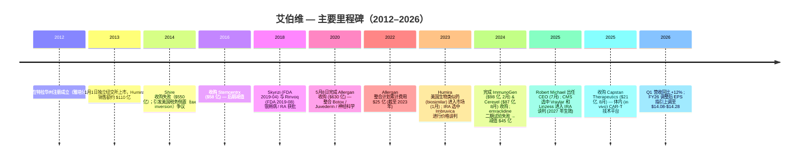
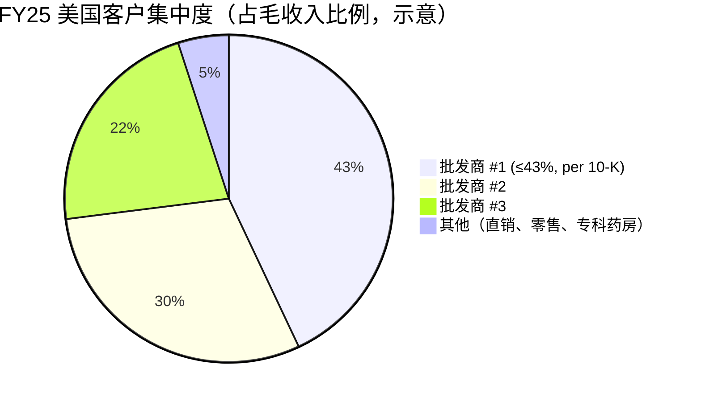
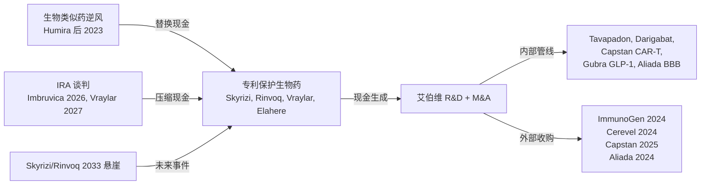

# 艾伯维 AbbVie Inc. (NYSE: ABBV) — 公司研究

*报告基准日 2026-06-14（价格 / 估值数据截至 2026-06-12 收盘）。所有公司基本面数据均可追溯至艾伯维 2026-02-20 提交的 FY2025 10-K 与 2026-04-29 / 2026-05-08 提交的 Q1 2026 8-K / 10-Q（除另行注明外）。*

> **业绩指引调整。** 2026-04-29，艾伯维将其 FY2026 调整后稀释每股收益（adjusted diluted EPS）指引区间从 **$13.96–$14.16** 上调至 **$14.08–$14.28**，仍包含来自年初至 Q1 累计的已获取 IPR&D / 里程碑费用 $0.41 / 股的不利影响。新区间隐含相对 FY25 调整后基准的高个位数 EPS 增长。参见 [艾伯维 Q1 2026 业绩公告，EX-99.1，2026-04-29](https://www.sec.gov/Archives/edgar/data/1551152/000155115226000013/abbv-20260331xexhibit991.htm)。

---

## 投资摘要（Investment Summary）

*以下评级、目标价、上行空间与论点支柱均为 **本报告观点（house view）**，标注为 `*分析师观点：*`；不引自任何备案文件——10-K 不含目标价。*

*分析师观点：*

| 项目 | 数值 |
|---|---|
| **评级 / Rating** | **Hold / 中性（偏多）** —（OW / Neutral / UW 三档制中的 Neutral，但风险收益略偏正） |
| **12 个月目标价 / Price Target** | **$248** |
| 当前价（2026-06-12 收盘） | **$227.73** |
| 隐含上行空间 / Upside | **+8.9%**（不含约 3.0% 股息率，含息总回报约 +11.9%） |
| 估值方法 | 前向 P/E：FY27e 调整后 EPS **$15.20** × **16.3×**（医药大盘 14–16× 区间上沿，反映 Skyrizi/Rinvoq 高于同业的增速） |
| 市值 / Market Cap | **约 $4,024 亿**（$402.4B） |
| 52 周区间 | $181.73 – $244.81 |
| 代码 / 交易所 | NYSE: ABBV |
| 股息率 / Dividend Yield | 约 **3.0%**（年化股息 $6.92 / 股） |

**论点支柱（4 条，均为 *分析师观点：*）：**

1. **免疫学接力已被验证。** Humira 专利悬崖跨越期间合并营收仍 +9%（FY25 $611.60 亿），Skyrizi + Rinvoq 合计 FY25 $258.66 亿、Q1 2026 同比 +30.9% / +23.3%——接力比 2022 年空头共识更优雅。这是评级"偏多"的核心。
2. **2033 才是真正的悬崖，当前现金机器强劲。** Skyrizi / Rinvoq 组成物质专利 2033 到期，距今仍有 7 年复利窗口；FY25 经营现金流 $190.3 亿、约 5% FCF 收益率支撑约 3.0% 股息与去杠杆。
3. **串珠式并购补悬崖——高赔率但非确定。** ImmunoGen（ADC）、Cerevel（神经）、Capstan（in vivo CAR-T）、Gubra（GLP-1）布局下一代平台，但 emraclidine $45 亿减值证明这是二元风险（binary risk）。
4. **估值合理而非低估。** ABBV 约 15× FY26e 调整后 EPS，较医药大盘中位数小幅溢价；街上分歧明显（J.P. Morgan Overweight vs Goldman/Bernstein Neutral），目标价 $225–$258 区间，本报告 $248 居于中上沿。

**最该盯紧的两个变量（swing variables）：** (1) Skyrizi + Rinvoq 的"超预期幅度"是否持续收窄（Goldman 的核心担忧）；(2) IRA Part D 谈判是否在 2028 年前提早覆盖 Rinvoq（小分子上市满 9 年的敞口时点）。

## 目录

1. [公司概览（含 1A 估值与目标价快照、1B GF Score 评分卡）](#1-公司概览)
2. [估值与目标价（Valuation & Price Target）+ 公司历史](#2-估值与目标价valuation--price-target)
3. [管理团队](#3-管理团队)
4. [产品与服务](#4-产品与服务)
5. [客户与上市策略](#5-客户与上市策略)
6. [行业概览](#6-行业概览)
7. [竞争格局](#7-竞争格局)
8. [市场机会（TAM/SAM/SOM）](#8-市场机会tamsamsom)
9. [风险评估（含 9.5 核心分歧与催化剂）](#9-风险评估)
10. [投资者视角评分卡](#10-投资者视角评分卡)
11. [参考资料](#11-参考资料)

---

## 1. 公司概览

艾伯维（AbbVie Inc.，纽交所代码 ABBV）是在美国特拉华州注册、总部位于伊利诺伊州北芝加哥（North Chicago）的全球生物制药（biopharmaceutical）公司，于 2013 年 1 月 1 日从雅培（Abbott Laboratories）研究型制药业务分拆（spin-off）独立上市。公司在其 [2025 Form 10-K, Item 1 Business](https://www.sec.gov/Archives/edgar/data/1551152/000155115226000008/abbv-20251231.htm) 中如此自我定义：*"a global, research and development-based biopharmaceutical company committed to developing innovative advanced therapies for some of the world's most complex and critical conditions"*；运营层面 "operates as a single global business segment dedicated to the research and development, manufacturing, commercialization and sale of innovative medicines and therapies"。截至 2025-12-31，艾伯维全球拥有 **约 57,000 名员工，分布在超过 70 个国家**，业务横跨免疫学（immunology）、肿瘤学（oncology）、神经科学（neuroscience）、眼科（eye care）、医美（aesthetics）和女性健康（women's health），数据来源同[2025 10-K, Item 1 Human Capital](https://www.sec.gov/Archives/edgar/data/1551152/000155115226000008/abbv-20251231.htm)。

**关键财务（FY2025）。** 全球净收入（net revenues）**$611.60 亿**（按报告口径和恒定汇率口径均 +9%），运营利润（operating earnings）**$150.75 亿**，GAAP 稀释 EPS $2.36，经营现金流（operating cash flow）**$190.30 亿**，参见 [2025 10-K, Consolidated Statements of Earnings + 现金流量表](https://www.sec.gov/Archives/edgar/data/1551152/000155115226000008/abbv-20251231.htm)。GAAP 毛利率（gross margin）维持在 **70.2%**（gross profit $429.56 亿 / 营收 $611.60 亿；vs 2023 年 62%）— 主要受益于 Allergan 收购无形资产摊销（amortization）的滚动以及 Skyrizi / Rinvoq 高毛利产品规模化。GAAP EPS 受摊销（FY25 $73.77 亿）及已获取 IPR&D 费用（FY25 $50.16 亿）拖累；调整后稀释 EPS 在 Q1 上修后，FY2026 指引为 **$14.08–$14.28**，参见 [Q1 2026 业绩公告 EX-99.1](https://www.sec.gov/Archives/edgar/data/1551152/000155115226000013/abbv-20260331xexhibit991.htm)。

下面这张利润瀑布图（income-statement Sankey）直观展示艾伯维 FY2025 从五大治疗领域营收（左）到净利润（右）的流转——可以看到 70.2% 的毛利率优势如何被运营开支、$50.16 亿已获取 IPR&D 与 $73.77 亿摊销侵蚀，最终 GAAP 净利润仅 $42.33 亿（这正是 TTM P/E 高达 100×+ 的会计来源，而非现金疲弱）：

<svg xmlns="http://www.w3.org/2000/svg" viewBox="0 0 1000 560" width="1000" height="560" role="img" aria-label="income statement Sankey"><rect x="0" y="0" width="1000" height="560" fill="#ffffff"/>
<text x="20.00" y="30.00" text-anchor="start" font-family="Helvetica,Arial,sans-serif" font-size="15" font-weight="700" fill="#1f2933">艾伯维 (ABBV) 收入如何转化为利润 — FY2025</text>
<path d="M 204.00,64.00 C 258.00,64.00 258.00,92.00 312.00,92.00 L 312.00,287.88 C 258.00,287.88 258.00,259.88 204.00,259.88 Z" fill="#93c5fd" fill-opacity="0.55"/>
<path d="M 576.00,84.79 C 630.00,84.79 630.00,132.41 684.00,132.41 L 684.00,229.52 C 630.00,229.52 630.00,181.90 576.00,181.90 Z" fill="#86efac" fill-opacity="0.55"/>
<path d="M 452.00,85.00 C 506.00,85.00 506.00,84.79 560.00,84.79 L 560.00,181.90 C 506.00,181.90 506.00,182.11 452.00,182.11 Z" fill="#86efac" fill-opacity="0.55"/>
<path d="M 452.00,182.11 C 506.00,182.11 506.00,195.90 560.00,195.90 L 560.00,424.59 C 506.00,424.59 506.00,410.80 452.00,410.80 Z" fill="#fca5a5" fill-opacity="0.55"/>
<path d="M 328.00,92.00 C 382.00,92.00 382.00,85.00 436.00,85.00 L 436.00,361.73 C 382.00,361.73 382.00,368.73 328.00,368.73 Z" fill="#86efac" fill-opacity="0.55"/>
<path d="M 328.00,368.73 C 382.00,368.73 382.00,375.73 436.00,375.73 L 436.00,493.00 C 382.00,493.00 382.00,486.00 328.00,486.00 Z" fill="#fca5a5" fill-opacity="0.55"/>
<path d="M 700.00,132.41 C 754.00,132.41 754.00,260.75 808.00,260.75 L 808.00,288.02 C 754.00,288.02 754.00,159.68 700.00,159.68 Z" fill="#86efac" fill-opacity="0.55"/>
<path d="M 700.00,159.68 C 754.00,159.68 754.00,302.02 808.00,302.02 L 808.00,317.25 C 754.00,317.25 754.00,174.90 700.00,174.90 Z" fill="#fca5a5" fill-opacity="0.55"/>
<path d="M 576.00,195.90 C 630.00,195.90 630.00,188.90 684.00,188.90 L 684.00,279.16 C 630.00,279.16 630.00,286.16 576.00,286.16 Z" fill="#fca5a5" fill-opacity="0.55"/>
<path d="M 576.00,286.16 C 630.00,286.16 630.00,293.16 684.00,293.16 L 684.00,351.76 C 630.00,351.76 630.00,344.76 576.00,344.76 Z" fill="#fca5a5" fill-opacity="0.55"/>
<path d="M 576.00,344.76 C 630.00,344.76 630.00,365.76 684.00,365.76 L 684.00,445.59 C 630.00,445.59 630.00,424.59 576.00,424.59 Z" fill="#fca5a5" fill-opacity="0.55"/>
<path d="M 204.00,273.88 C 258.00,273.88 258.00,287.88 312.00,287.88 L 312.00,357.24 C 258.00,357.24 258.00,343.24 204.00,343.24 Z" fill="#93c5fd" fill-opacity="0.55"/>
<path d="M 204.00,357.24 C 258.00,357.24 258.00,357.24 312.00,357.24 L 312.00,400.11 C 258.00,400.11 258.00,400.11 204.00,400.11 Z" fill="#93c5fd" fill-opacity="0.55"/>
<path d="M 204.00,414.11 C 258.00,414.11 258.00,400.11 312.00,400.11 L 312.00,431.42 C 258.00,431.42 258.00,445.42 204.00,445.42 Z" fill="#93c5fd" fill-opacity="0.55"/>
<path d="M 576.00,438.59 C 630.00,438.59 630.00,229.52 684.00,229.52 L 684.00,284.14 C 630.00,284.14 630.00,493.21 576.00,493.21 Z" fill="#93c5fd" fill-opacity="0.55"/>
<path d="M 204.00,459.42 C 258.00,459.42 258.00,431.42 312.00,431.42 L 312.00,486.00 C 258.00,486.00 258.00,514.00 204.00,514.00 Z" fill="#93c5fd" fill-opacity="0.55"/>
<rect x="188.00" y="64.00" width="16" height="195.88" rx="1.5" fill="#2563eb"/>
<rect x="188.00" y="273.88" width="16" height="69.36" rx="1.5" fill="#2563eb"/>
<rect x="188.00" y="357.24" width="16" height="42.87" rx="1.5" fill="#2563eb"/>
<rect x="188.00" y="414.11" width="16" height="31.31" rx="1.5" fill="#2563eb"/>
<rect x="188.00" y="459.42" width="16" height="54.58" rx="1.5" fill="#2563eb"/>
<rect x="312.00" y="92.00" width="16" height="394.00" rx="1.5" fill="#1e3a8a"/>
<rect x="436.00" y="85.00" width="16" height="276.73" rx="1.5" fill="#15803d"/>
<rect x="436.00" y="375.73" width="16" height="117.27" rx="1.5" fill="#dc2626"/>
<rect x="560.00" y="84.79" width="16" height="97.11" rx="1.5" fill="#15803d"/>
<rect x="560.00" y="195.90" width="16" height="228.69" rx="1.5" fill="#dc2626"/>
<rect x="560.00" y="438.59" width="16" height="54.62" rx="1.5" fill="#2563eb"/>
<rect x="684.00" y="132.41" width="16" height="42.50" rx="1.5" fill="#15803d"/>
<rect x="684.00" y="188.90" width="16" height="90.25" rx="1.5" fill="#dc2626"/>
<rect x="684.00" y="293.16" width="16" height="58.60" rx="1.5" fill="#dc2626"/>
<rect x="684.00" y="365.76" width="16" height="79.84" rx="1.5" fill="#dc2626"/>
<rect x="808.00" y="260.75" width="16" height="27.27" rx="1.5" fill="#15803d"/>
<rect x="808.00" y="302.02" width="16" height="15.23" rx="1.5" fill="#dc2626"/>
<text x="179.00" y="158.94" text-anchor="end" font-family="Helvetica,Arial,sans-serif" font-size="11.5" font-weight="700" fill="#1f2933">Immunology</text>
<text x="179.00" y="171.94" text-anchor="end" font-family="Helvetica,Arial,sans-serif" font-size="10" font-weight="400" fill="#52606d">$30.4B  (49.7%)</text>
<text x="179.00" y="305.56" text-anchor="end" font-family="Helvetica,Arial,sans-serif" font-size="11.5" font-weight="700" fill="#1f2933">Neuroscience</text>
<text x="179.00" y="318.56" text-anchor="end" font-family="Helvetica,Arial,sans-serif" font-size="10" font-weight="400" fill="#52606d">$10.8B  (17.6%)</text>
<text x="179.00" y="375.68" text-anchor="end" font-family="Helvetica,Arial,sans-serif" font-size="11.5" font-weight="700" fill="#1f2933">Oncology</text>
<text x="179.00" y="388.68" text-anchor="end" font-family="Helvetica,Arial,sans-serif" font-size="10" font-weight="400" fill="#52606d">$6.7B  (10.9%)</text>
<text x="179.00" y="426.77" text-anchor="end" font-family="Helvetica,Arial,sans-serif" font-size="11.5" font-weight="700" fill="#1f2933">Aesthetics</text>
<text x="179.00" y="439.77" text-anchor="end" font-family="Helvetica,Arial,sans-serif" font-size="10" font-weight="400" fill="#52606d">$4.9B  (7.9%)</text>
<text x="179.00" y="483.71" text-anchor="end" font-family="Helvetica,Arial,sans-serif" font-size="11.5" font-weight="700" fill="#1f2933">Eye care &amp; Other</text>
<text x="179.00" y="496.71" text-anchor="end" font-family="Helvetica,Arial,sans-serif" font-size="10" font-weight="400" fill="#52606d">$8.5B  (13.9%)</text>
<rect x="331.00" y="74.00" width="106.80" height="26" rx="2" fill="#ffffff" fill-opacity="0.72"/>
<text x="334.00" y="86.00" text-anchor="start" font-family="Helvetica,Arial,sans-serif" font-size="11.5" font-weight="700" fill="#1f2933">Revenue</text>
<text x="334.00" y="99.00" text-anchor="start" font-family="Helvetica,Arial,sans-serif" font-size="10" font-weight="400" fill="#52606d">$61.2B  (100.0%)</text>
<rect x="455.00" y="67.00" width="100.50" height="26" rx="2" fill="#ffffff" fill-opacity="0.72"/>
<text x="458.00" y="79.00" text-anchor="start" font-family="Helvetica,Arial,sans-serif" font-size="11.5" font-weight="700" fill="#1f2933">Gross Profit</text>
<text x="458.00" y="92.00" text-anchor="start" font-family="Helvetica,Arial,sans-serif" font-size="10" font-weight="400" fill="#52606d">$43.0B  (70.2%)</text>
<rect x="455.00" y="357.73" width="144.60" height="26" rx="2" fill="#ffffff" fill-opacity="0.72"/>
<text x="458.00" y="369.73" text-anchor="start" font-family="Helvetica,Arial,sans-serif" font-size="11.5" font-weight="700" fill="#1f2933">Cost of Revenue (COGS)</text>
<text x="458.00" y="382.73" text-anchor="start" font-family="Helvetica,Arial,sans-serif" font-size="10" font-weight="400" fill="#52606d">$18.2B  (29.8%)</text>
<rect x="579.00" y="66.79" width="106.80" height="26" rx="2" fill="#ffffff" fill-opacity="0.72"/>
<text x="582.00" y="78.79" text-anchor="start" font-family="Helvetica,Arial,sans-serif" font-size="11.5" font-weight="700" fill="#1f2933">Operating Income</text>
<text x="582.00" y="91.79" text-anchor="start" font-family="Helvetica,Arial,sans-serif" font-size="10" font-weight="400" fill="#52606d">$15.1B  (24.6%)</text>
<rect x="579.00" y="177.90" width="150.90" height="26" rx="2" fill="#ffffff" fill-opacity="0.72"/>
<text x="582.00" y="189.90" text-anchor="start" font-family="Helvetica,Arial,sans-serif" font-size="11.5" font-weight="700" fill="#1f2933">Total Operating Expense</text>
<text x="582.00" y="202.90" text-anchor="start" font-family="Helvetica,Arial,sans-serif" font-size="10" font-weight="400" fill="#52606d">$35.5B  (58.0%)</text>
<text x="551.00" y="462.90" text-anchor="end" font-family="Helvetica,Arial,sans-serif" font-size="11.5" font-weight="700" fill="#1f2933">Net Interest / Other Income</text>
<text x="551.00" y="475.90" text-anchor="end" font-family="Helvetica,Arial,sans-serif" font-size="10" font-weight="400" fill="#52606d">$8.5B  (13.9%)</text>
<rect x="703.00" y="114.41" width="94.20" height="26" rx="2" fill="#ffffff" fill-opacity="0.72"/>
<text x="706.00" y="126.41" text-anchor="start" font-family="Helvetica,Arial,sans-serif" font-size="11.5" font-weight="700" fill="#1f2933">Pretax Income</text>
<text x="706.00" y="139.41" text-anchor="start" font-family="Helvetica,Arial,sans-serif" font-size="10" font-weight="400" fill="#52606d">$6.6B  (10.8%)</text>
<rect x="703.00" y="170.90" width="100.50" height="26" rx="2" fill="#ffffff" fill-opacity="0.72"/>
<text x="706.00" y="182.90" text-anchor="start" font-family="Helvetica,Arial,sans-serif" font-size="11.5" font-weight="700" fill="#1f2933">SG&amp;A</text>
<text x="706.00" y="195.90" text-anchor="start" font-family="Helvetica,Arial,sans-serif" font-size="10" font-weight="400" fill="#52606d">$14.0B  (22.9%)</text>
<rect x="703.00" y="275.16" width="94.20" height="26" rx="2" fill="#ffffff" fill-opacity="0.72"/>
<text x="706.00" y="287.16" text-anchor="start" font-family="Helvetica,Arial,sans-serif" font-size="11.5" font-weight="700" fill="#1f2933">R&amp;D</text>
<text x="706.00" y="300.16" text-anchor="start" font-family="Helvetica,Arial,sans-serif" font-size="10" font-weight="400" fill="#52606d">$9.1B  (14.9%)</text>
<rect x="703.00" y="347.76" width="100.50" height="26" rx="2" fill="#ffffff" fill-opacity="0.72"/>
<text x="706.00" y="359.76" text-anchor="start" font-family="Helvetica,Arial,sans-serif" font-size="11.5" font-weight="700" fill="#1f2933">Other OpEx</text>
<text x="706.00" y="372.76" text-anchor="start" font-family="Helvetica,Arial,sans-serif" font-size="10" font-weight="400" fill="#52606d">$12.4B  (20.3%)</text>
<text x="833.00" y="271.39" text-anchor="start" font-family="Helvetica,Arial,sans-serif" font-size="11.5" font-weight="700" fill="#1f2933">Net Income</text>
<text x="833.00" y="284.39" text-anchor="start" font-family="Helvetica,Arial,sans-serif" font-size="10" font-weight="400" fill="#52606d">$4.2B  (6.9%)</text>
<text x="833.00" y="306.63" text-anchor="start" font-family="Helvetica,Arial,sans-serif" font-size="11.5" font-weight="700" fill="#1f2933">Income Tax</text>
<text x="833.00" y="319.63" text-anchor="start" font-family="Helvetica,Arial,sans-serif" font-size="10" font-weight="400" fill="#52606d">$2.4B  (3.9%)</text>
<text x="500.00" y="544.00" text-anchor="middle" font-family="Helvetica,Arial,sans-serif" font-size="10" font-weight="400" fill="#52606d">Source: ABBV FY2025 10-K, Consolidated Statements of Earnings + Q4 2025 8-K EX-99.1 by-TA revenue</text>
</svg>

来源 / Source: [艾伯维 2025 10-K, Consolidated Statements of Earnings](https://www.sec.gov/Archives/edgar/data/1551152/000155115226000008/abbv-20251231.htm)；治疗领域拆分 [Q4 2025 8-K EX-99.1](https://www.sec.gov/Archives/edgar/data/1551152/000155115226000004/abbv-20251231xexhibit991.htm)。

**最新季度拐点（Q1 2026）。** Q1 营收 **$150.02 亿（按报告口径 +12.4% / 按经营口径 +10.3%）**，免疫学组合 **$72.90 亿（+16.4%）**，神经科学 **$28.75 亿（+26.0%）**。Skyrizi 达 $44.83 亿（+30.9%），Rinvoq $21.19 亿（+23.3%），Humira 降至 $6.88 亿（-38.6%）— 公司核心特许经营产品的迭代显著快于"长期稳健增长"轨道所要求的速度，参见 [Q1 2026 EX-99.1](https://www.sec.gov/Archives/edgar/data/1551152/000155115226000013/abbv-20260331xexhibit991.htm)。CEO Robert Michael 在公告中表态："off to an excellent start in 2026, with first-quarter results exceeding our expectations"。

### 1A. 估值与目标价快照（2026-06-14）

**估值快照（价格截至 2026-06-12 收盘 $227.73）。** 市值（market cap）**约 $4,024 亿**，TTM 市盈率（P/E）**约 111.1×**（受 GAAP IPR&D 和摊销费用大幅压低），**前向 P/E（Forward P/E）约 14.0×**，市销率（P/S）6.40×，企业价值 / EBITDA（EV/EBITDA）15.6×，股息率（dividend yield）**约 3.0%**（年化股息 $6.92），5 年贝塔（beta）0.31，参见 [Yahoo Finance ABBV 关键统计](https://finance.yahoo.com/quote/ABBV/)。TTM 与 Forward P/E 之间约 97× 的巨大差距，反映出 GAAP 收益被 2024 / 2025 累计约 $67 亿的已获取 IPR&D 费用以及 Allergan / ImmunoGen / Cerevel 无形资产摊销大幅压低——FY25 GAAP 稀释 EPS 仅 $2.36，而调整后稀释 EPS 指引中值 $14.18。按调整后 EPS 计算，ABBV 对应 FY26e 约 **16.1×**（$227.73 / $14.18），较过去两个月有所抬升（6 月初为 15.2×），因股价从 $215 升至 $228 而前向 EPS 未变。

自上次覆盖（2026-06-02 收盘 $215.40）以来，ABBV 股价 **+5.7%**，跑赢同期医药大盘——这与 J.P. Morgan 路演反馈中 "ABBV 股价过度反应悲观预期" 的观点一致（详见下文 § 卖方观点演变）。当前价位下，本报告维持评级 **Hold（偏多）**、12 个月目标价 **$248**（隐含 +8.9% 价格上行 + 约 3.0% 股息）；详细估值推导见 [第 2 节估值与目标价](#2-估值与目标价valuation--price-target)。

下面是按治疗领域（therapeutic area）拆分的 FY2025 营收构成饼图（segment donut）和地区构成饼图（geography donut）：

<svg xmlns="http://www.w3.org/2000/svg" viewBox="0 0 720 460" width="720" height="460" role="img" aria-label="revenue donut"><rect x="0" y="0" width="720" height="460" fill="#ffffff"/>
<text x="20.00" y="30.00" text-anchor="start" font-family="Helvetica,Arial,sans-serif" font-size="15" font-weight="700" fill="#1f2933">FY2025 营收按治疗领域 (by therapeutic area)</text>
<path d="M 288.00,107.20 A 132 132 0 0 1 290.36,371.18 L 289.39,317.19 A 78 78 0 0 0 288.00,161.20 Z" fill="#2563eb"/>
<path d="M 290.36,371.18 A 132 132 0 0 1 171.07,300.45 L 218.91,275.39 A 78 78 0 0 0 289.39,317.19 Z" fill="#15803d"/>
<path d="M 171.07,300.45 A 132 132 0 0 1 158.66,212.83 L 211.57,223.62 A 78 78 0 0 0 218.91,275.39 Z" fill="#d97706"/>
<path d="M 158.66,212.83 A 132 132 0 0 1 187.08,154.12 L 228.36,188.92 A 78 78 0 0 0 211.57,223.62 Z" fill="#7c3aed"/>
<path d="M 187.08,154.12 A 132 132 0 0 1 288.00,107.20 L 288.00,161.20 A 78 78 0 0 0 228.36,188.92 Z" fill="#dc2626"/>
<text x="288.00" y="235.20" text-anchor="middle" font-family="Helvetica,Arial,sans-serif" font-size="18" font-weight="800" fill="#1f2933">ABBV</text>
<text x="288.00" y="255.20" text-anchor="middle" font-family="Helvetica,Arial,sans-serif" font-size="13" font-weight="600" fill="#52606d">$61.2B</text>
<text x="288.00" y="271.20" text-anchor="middle" font-family="Helvetica,Arial,sans-serif" font-size="10" font-weight="400" fill="#8a97a3">total</text>
<line x1="425.99" y1="237.97" x2="441.99" y2="237.97" stroke="#2563eb" stroke-width="1.4"/>
<text x="445.99" y="235.97" text-anchor="start" font-family="Helvetica,Arial,sans-serif" font-size="11" font-weight="700" fill="#1f2933">Immunology</text>
<text x="445.99" y="249.97" text-anchor="start" font-family="Helvetica,Arial,sans-serif" font-size="10" font-weight="400" fill="#52606d">$30.4B  (49.7%)</text>
<line x1="217.62" y1="357.90" x2="201.62" y2="357.90" stroke="#15803d" stroke-width="1.4"/>
<text x="197.62" y="355.90" text-anchor="end" font-family="Helvetica,Arial,sans-serif" font-size="11" font-weight="700" fill="#1f2933">Neuroscience</text>
<text x="197.62" y="369.90" text-anchor="end" font-family="Helvetica,Arial,sans-serif" font-size="10" font-weight="400" fill="#52606d">$10.8B  (17.6%)</text>
<line x1="151.36" y1="258.55" x2="135.36" y2="258.55" stroke="#d97706" stroke-width="1.4"/>
<text x="131.36" y="256.55" text-anchor="end" font-family="Helvetica,Arial,sans-serif" font-size="11" font-weight="700" fill="#1f2933">Oncology</text>
<text x="131.36" y="270.55" text-anchor="end" font-family="Helvetica,Arial,sans-serif" font-size="10" font-weight="400" fill="#52606d">$6.7B  (10.9%)</text>
<line x1="163.79" y1="179.08" x2="147.79" y2="179.08" stroke="#7c3aed" stroke-width="1.4"/>
<text x="143.79" y="177.08" text-anchor="end" font-family="Helvetica,Arial,sans-serif" font-size="11" font-weight="700" fill="#1f2933">Aesthetics</text>
<text x="143.79" y="191.08" text-anchor="end" font-family="Helvetica,Arial,sans-serif" font-size="10" font-weight="400" fill="#52606d">$4.9B  (7.9%)</text>
<line x1="229.82" y1="114.06" x2="213.82" y2="114.06" stroke="#dc2626" stroke-width="1.4"/>
<text x="209.82" y="112.06" text-anchor="end" font-family="Helvetica,Arial,sans-serif" font-size="11" font-weight="700" fill="#1f2933">Eye care &amp; Other</text>
<text x="209.82" y="126.06" text-anchor="end" font-family="Helvetica,Arial,sans-serif" font-size="10" font-weight="400" fill="#52606d">$8.5B  (13.9%)</text>
<text x="360.00" y="444.00" text-anchor="middle" font-family="Helvetica,Arial,sans-serif" font-size="10" font-weight="400" fill="#52606d">Source: ABBV Q4 2025 8-K EX-99.1, net revenues by therapeutic area</text>
</svg>

<svg xmlns="http://www.w3.org/2000/svg" viewBox="0 0 720 460" width="720" height="460" role="img" aria-label="revenue donut"><rect x="0" y="0" width="720" height="460" fill="#ffffff"/>
<text x="20.00" y="30.00" text-anchor="start" font-family="Helvetica,Arial,sans-serif" font-size="15" font-weight="700" fill="#1f2933">FY2025 营收按地区 (by geography)</text>
<path d="M 288.00,107.20 A 132 132 0 1 1 156.37,229.27 L 210.22,233.33 A 78 78 0 1 0 288.00,161.20 Z" fill="#2563eb"/>
<path d="M 156.37,229.27 A 132 132 0 0 1 288.00,107.20 L 288.00,161.20 A 78 78 0 0 0 210.22,233.33 Z" fill="#15803d"/>
<text x="288.00" y="235.20" text-anchor="middle" font-family="Helvetica,Arial,sans-serif" font-size="18" font-weight="800" fill="#1f2933">ABBV</text>
<text x="288.00" y="255.20" text-anchor="middle" font-family="Helvetica,Arial,sans-serif" font-size="13" font-weight="600" fill="#52606d">$61.2B</text>
<text x="288.00" y="271.20" text-anchor="middle" font-family="Helvetica,Arial,sans-serif" font-size="10" font-weight="400" fill="#8a97a3">total</text>
<line x1="381.84" y1="340.38" x2="397.84" y2="340.38" stroke="#2563eb" stroke-width="1.4"/>
<text x="401.84" y="338.38" text-anchor="start" font-family="Helvetica,Arial,sans-serif" font-size="11" font-weight="700" fill="#1f2933">United States</text>
<text x="401.84" y="352.38" text-anchor="start" font-family="Helvetica,Arial,sans-serif" font-size="10" font-weight="400" fill="#52606d">$46.6B  (76.2%)</text>
<line x1="194.16" y1="138.02" x2="178.16" y2="138.02" stroke="#15803d" stroke-width="1.4"/>
<text x="174.16" y="136.02" text-anchor="end" font-family="Helvetica,Arial,sans-serif" font-size="11" font-weight="700" fill="#1f2933">International</text>
<text x="174.16" y="150.02" text-anchor="end" font-family="Helvetica,Arial,sans-serif" font-size="10" font-weight="400" fill="#52606d">$14.6B  (23.8%)</text>
<text x="360.00" y="444.00" text-anchor="middle" font-family="Helvetica,Arial,sans-serif" font-size="10" font-weight="400" fill="#52606d">Source: ABBV FY2025 10-K, geographic revenue (International $14,557M; U.S. = balance of $61,160M)</text>
</svg>

来源 / Source: [艾伯维 Q4 2025 8-K EX-99.1（净收入按治疗领域）](https://www.sec.gov/Archives/edgar/data/1551152/000155115226000004/abbv-20251231xexhibit991.htm)；地区拆分 [2025 10-K（International $145.57 亿）](https://www.sec.gov/Archives/edgar/data/1551152/000155115226000008/abbv-20251231.htm)。

**估值水平为何如此。** ABBV 表观 TTM P/E 111× 实为误导 — 公司过去两年累计前置了 $67 亿+ 的已获取 IPR&D 费用（Cerevel、ImmunoGen、Capstan、Aliada、Gilgamesh、Gubra）外加 Q4 2024 的 $45 亿 emraclidine 无形资产减值，全部计入 GAAP 但非现金支出。现金信号更为清晰：2025 年经营现金流 $190.30 亿 vs $4,024 亿市值（约 4.7% FCF 收益率），季度股息于 2025Q4 上调 5.5%（$1.64 → $1.73 / 股，2026-02-17 派付），细节参见 [2025 10-K 股息披露](https://www.sec.gov/Archives/edgar/data/1551152/000155115226000008/abbv-20251231.htm)。

### 1B. GF Score（GuruFocus 式基本面评分卡）

*以下五维评分（0–10）与综合分（0–100）均为 **本报告自建评分（house rubric）**，标注为 `*分析师观点：*`；不引自任何备案文件，也未取自 GuruFocus 已公布数值（本报告未拉取 gurufocus.com/term/gf-score/ABBV）。每个维度背后的指标各自带有 inline 引用。*

*分析师观点：* **综合 GF Score ≈ 67/100（"良好—稳健"区间）。** 艾伯维是一家盈利能力极强、成长仍在轨、估值合理、动能正面的现金机器；唯一明显短板是 **Financial Strength（财务实力）**——股东权益赤字（equity deficit）与约 3.4× CFO 的净杠杆压低了这一维度。

<svg xmlns="http://www.w3.org/2000/svg" viewBox="0 0 500 500" width="500" height="500" role="img" aria-label="GF Score radar">
<rect x="0" y="0" width="500" height="500" fill="#ffffff"/>
<text x="20" y="24" font-family="Helvetica,Arial,sans-serif" font-size="15" font-weight="700" fill="#1f2933">GF Score (GuruFocus-style): 67/100</text>
<text x="20" y="41" font-family="Helvetica,Arial,sans-serif" font-size="11" fill="#52606d">51–70 Poor future performance potential</text>
<polygon points="250.0,88.0 392.7,191.6 338.2,359.4 161.8,359.4 107.3,191.6" fill="#e9f5ec" stroke="none"/>
<polygon points="250.0,208.0 278.5,228.7 267.6,262.3 232.4,262.3 221.5,228.7" fill="none" stroke="#c5d3cb" stroke-width="1"/>
<polygon points="250.0,178.0 307.1,219.5 285.3,286.5 214.7,286.5 192.9,219.5" fill="none" stroke="#c5d3cb" stroke-width="1"/>
<polygon points="250.0,148.0 335.6,210.2 302.9,310.8 197.1,310.8 164.4,210.2" fill="none" stroke="#c5d3cb" stroke-width="1"/>
<polygon points="250.0,118.0 364.1,200.9 320.5,335.1 179.5,335.1 135.9,200.9" fill="none" stroke="#c5d3cb" stroke-width="1"/>
<polygon points="250.0,88.0 392.7,191.6 338.2,359.4 161.8,359.4 107.3,191.6" fill="none" stroke="#c5d3cb" stroke-width="1.3"/>
<line x1="250" y1="238" x2="161.8" y2="359.4" stroke="#cfdad3" stroke-width="1"/>
<text x="146.5" y="392.4" text-anchor="end" font-family="Helvetica,Arial,sans-serif" font-size="11.5" font-weight="600" fill="#1f2933">Financial Strength</text>
<text x="146.5" y="405.4" text-anchor="end" font-family="Helvetica,Arial,sans-serif" font-size="9.5" fill="#52606d">财务实力</text>
<text x="205.9" y="292.7" text-anchor="middle" font-family="Helvetica,Arial,sans-serif" font-size="10.5" font-weight="700" fill="#1f2933">5</text>
<line x1="250" y1="238" x2="250.0" y2="88.0" stroke="#cfdad3" stroke-width="1"/>
<text x="250.0" y="58.0" text-anchor="middle" font-family="Helvetica,Arial,sans-serif" font-size="11.5" font-weight="600" fill="#1f2933">Profitability</text>
<text x="250.0" y="71.0" text-anchor="middle" font-family="Helvetica,Arial,sans-serif" font-size="9.5" fill="#52606d">盈利能力</text>
<text x="250.0" y="112.0" text-anchor="middle" font-family="Helvetica,Arial,sans-serif" font-size="10.5" font-weight="700" fill="#1f2933">8</text>
<line x1="250" y1="238" x2="107.3" y2="191.6" stroke="#cfdad3" stroke-width="1"/>
<text x="82.6" y="183.6" text-anchor="end" font-family="Helvetica,Arial,sans-serif" font-size="11.5" font-weight="600" fill="#1f2933">Growth</text>
<text x="82.6" y="196.6" text-anchor="end" font-family="Helvetica,Arial,sans-serif" font-size="9.5" fill="#52606d">成长性</text>
<text x="150.1" y="199.6" text-anchor="middle" font-family="Helvetica,Arial,sans-serif" font-size="10.5" font-weight="700" fill="#1f2933">7</text>
<line x1="250" y1="238" x2="392.7" y2="191.6" stroke="#cfdad3" stroke-width="1"/>
<text x="417.4" y="183.6" text-anchor="start" font-family="Helvetica,Arial,sans-serif" font-size="11.5" font-weight="600" fill="#1f2933">GF Value</text>
<text x="417.4" y="196.6" text-anchor="start" font-family="Helvetica,Arial,sans-serif" font-size="9.5" fill="#52606d">估值</text>
<text x="335.6" y="204.2" text-anchor="middle" font-family="Helvetica,Arial,sans-serif" font-size="10.5" font-weight="700" fill="#1f2933">6</text>
<line x1="250" y1="238" x2="338.2" y2="359.4" stroke="#cfdad3" stroke-width="1"/>
<text x="353.5" y="392.4" text-anchor="start" font-family="Helvetica,Arial,sans-serif" font-size="11.5" font-weight="600" fill="#1f2933">Momentum</text>
<text x="353.5" y="405.4" text-anchor="start" font-family="Helvetica,Arial,sans-serif" font-size="9.5" fill="#52606d">动量</text>
<text x="311.7" y="316.9" text-anchor="middle" font-family="Helvetica,Arial,sans-serif" font-size="10.5" font-weight="700" fill="#1f2933">7</text>
<polygon points="250.0,118.0 335.6,210.2 311.7,322.9 205.9,298.7 150.1,205.6" fill="#2e8b57" fill-opacity="0.34" stroke="#2e8b57" stroke-width="2"/>
<circle cx="205.9" cy="298.7" r="2.6" fill="#2e8b57"/>
<circle cx="250.0" cy="118.0" r="2.6" fill="#2e8b57"/>
<circle cx="150.1" cy="205.6" r="2.6" fill="#2e8b57"/>
<circle cx="335.6" cy="210.2" r="2.6" fill="#2e8b57"/>
<circle cx="311.7" cy="322.9" r="2.6" fill="#2e8b57"/>
<text x="250" y="470" text-anchor="middle" font-family="Helvetica,Arial,sans-serif" font-size="9.5" fill="#52606d">Source: ABBV FY2025 10-K · Q1 2026 10-Q · Yahoo Finance, as of 2026-06-14</text>
<text x="250" y="485" text-anchor="middle" font-family="Helvetica,Arial,sans-serif" font-size="9" fill="#52606d">GF Score = independent analyst rubric (*Analyst view:*) — not GuruFocus™ official number</text>
</svg>

| 维度 / Dimension | 评分 / Score (0–10) | |
|---|---|---|
| Financial Strength (财务实力) | **5** | `█████░░░░░` |
| Profitability (盈利能力) | **8** | `████████░░` |
| Growth (成长性) | **7** | `███████░░░` |
| GF Value (估值，越高越便宜) | **6** | `██████░░░░` |
| Momentum (动能) | **7** | `███████░░░` |

来源 / Source: 评分卡为本报告自建；底层指标见各维度引用（[ABBV FY2025 10-K](https://www.sec.gov/Archives/edgar/data/1551152/000155115226000008/abbv-20251231.htm)、[Yahoo Finance](https://finance.yahoo.com/quote/ABBV/)），数据截至 2026-06-14。

**各维度评分理由：**

- **Financial Strength = 5（中性偏弱）。** 这是拉低综合分的维度。截至 2025-12-31，艾伯维报告 **股东权益赤字（total equity deficit）$32.28 亿**（长期回购 + 分红累计超过留存收益所致，非经营亏损），长期负债 $589.41 亿 + 当期到期 $60.56 亿，净负债约 $600 亿，对应约 **3.4× 经营现金流**，数据见 [2025 10-K 资产负债表](https://www.sec.gov/Archives/edgar/data/1551152/000155115226000008/abbv-20251231.htm)。缓和因素：利息覆盖充足（运营利润 $150.75 亿 vs 利息净额 $26.27 亿，约 5.7×），现金生成强劲（OCF $190.30 亿），且艾伯维维持投资级评级，因此给到 5 而非更低。
- **Profitability = 8（强）。** GAAP 毛利率 **70.2%**、调整后运营利润率约 32%（[Q1 2026 EX-99.1](https://www.sec.gov/Archives/edgar/data/1551152/000155115226000013/abbv-20260331xexhibit991.htm)），现金转化优异（OCF $190.30 亿 vs 净利润 $42.33 亿，差额即摊销 + IPR&D 等非现金项）。GAAP 净利率仅 6.9% 是会计假象（摊销 + IPR&D），并非真实盈利能力疲弱——故按调整后口径给到 8。
- **Growth = 7（良好）。** FY25 合并营收 +9%（$611.60 亿），Q1 2026 进一步加速至 +12.4%（[Q1 2026 EX-99.1](https://www.sec.gov/Archives/edgar/data/1551152/000155115226000013/abbv-20260331xexhibit991.htm)）；Skyrizi FY25 +49.9%、Rinvoq +39.1%（[2025 10-K 产品营收](https://www.sec.gov/Archives/edgar/data/1551152/000155115226000008/abbv-20251231.htm)）。但 2033 Skyrizi/Rinvoq 专利悬崖为长期增长设了天花板，故非满分。
- **GF Value = 6（合理，略偏便宜）。** 前向 P/E 14.0×（[Yahoo Finance](https://finance.yahoo.com/quote/ABBV/)），略低于医药大盘中位数；按调整后 EPS 约 16× 则与同业持平。本报告 DCF 隐含约 +8–9% 安全边际（见第 2 节），属"合理偏便宜"而非显著低估，故给 6。
- **Momentum = 7（正面）。** 过去 ~2 周股价 +5.7%（$215.40 → $227.73），位于 52 周区间（$181.73–$244.81）中上部，并跑赢同期防御型医药板块（[Yahoo Finance](https://finance.yahoo.com/quote/ABBV/)）。J.P. Morgan 路演反馈印证情绪正在从过度悲观修复（见 § 卖方观点演变）。

**与报告其余部分的一致性自检：** Growth(7) ↔ 第 2 节前向模型的高个位数营收 / 低双位数 EPS 增长；GF Value(6) ↔ 1A 的约 16× 调整后 P/E + DCF 约 +8–9% 边际；Momentum(7) ↔ 1A 相对表现行 +5.7%。三者互相吻合，无内部矛盾。

## 2. 估值与目标价（Valuation & Price Target）

> 本节是报告的**决策层（decision layer）**。其中的前向估计、目标价、bull/base/bear 情景均为 **本报告观点**，标注 `*分析师观点：*`，**不引自任何备案文件**——10-K 不含目标价。底层驱动（分部营收、指引区间、行业预测）各自带有 inline 引用。

### 2.1 前向财务估计（FY2026e–FY2028e）

*分析师观点：* 下表以分部接力逻辑（Skyrizi/Rinvoq 复利 → 抵消 Humira 衰退 + 中后期管线爬坡）为基础，自下而上构建。营收驱动锚定 [2025 10-K 分部营收](https://www.sec.gov/Archives/edgar/data/1551152/000155115226000008/abbv-20251231.htm)、公司 FY2026 调整后 EPS 指引 $14.08–$14.28（[Q1 2026 EX-99.1](https://www.sec.gov/Archives/edgar/data/1551152/000155115226000013/abbv-20260331xexhibit991.htm)），以及 [IQVIA 2024 Outlook](https://www.iqvia.com/insights/the-iqvia-institute/reports-and-publications/reports/the-global-use-of-medicines-2024-outlook-to-2028) 的行业增速；每个预测单元格均为本报告估计。

| 指标（$B 除 EPS 外）| FY2025A | FY2026e | FY2027e | FY2028e |
|---|---|---|---|---|
| 净收入 / Net revenues | 61.16 | 66.6（+9%）| 70.8（+6%）| 74.3（+5%）|
| — 免疫学 Immunology | 30.41 | 34.3 | 37.0 | 38.8 |
| — 神经科学 Neuroscience | 10.77 | 13.0 | 14.8 | 16.3 |
| — 肿瘤 + 医美 + 眼科 / 其他 | 19.99 | 19.3 | 19.0 | 19.2 |
| GAAP 毛利率 / Gross margin | 70.2% | ~71% | ~71% | ~72% |
| 调整后运营利润率（adj. op. margin）| ~32% | ~33% | ~34% | ~35% |
| **调整后稀释 EPS / Adj. diluted EPS** | 13.20（FY25 调整后基准）| **14.18**（指引中值）| **15.20** | **16.30** |
| YoY EPS 增速 | — | +7.4% | +7.2% | +7.2% |

*分析师观点：* 每个 FY26–28 单元格均为本报告估计；FY26 调整后 EPS 中值 $14.18 直接采用公司指引（[Q1 2026 EX-99.1](https://www.sec.gov/Archives/edgar/data/1551152/000155115226000013/abbv-20260331xexhibit991.htm)），FY27/FY28 以高个位数 EPS 增长外推——这与 J.P. Morgan "营收高个位数、利润低双位数" 的框架方向一致但更保守（见 § 卖方观点演变）。**模型的关键假设：** 免疫学维持双位数复利至 2033 前、神经科学经 Vyalev + Cerevel tavapadon 爬坡、肿瘤/医美/眼科合并基本走平（Imbruvica IRA 衰退被 Venclexta / Elahere / Epkinly 抵消）。

### 2.2 目标价推导（show the arithmetic）

*分析师观点：* 本报告采用**前向 P/E × 目标倍数**法：

> **12 个月目标价 = FY2027e 调整后 EPS $15.20 × 目标倍数 16.3× ≈ $248**

**为什么用 16.3×？** 医药大盘当前前向 P/E 区间约 14–16×（J&J ~20×、Merck ~13×、BMS ~9×、Pfizer ~9×、Lilly 因 GLP-1 享 ~30× 溢价）。艾伯维 Skyrizi/Rinvoq 驱动的高个位数营收 / 低双位数 EPS 增长，应享有大盘**上沿**倍数——故取 16.3×（略高于同业中位、但显著低于 Lilly 的成长溢价，也低于 J&J，因 ABBV 有 2033 悬崖的远期不确定性）。这一倍数与 Goldman Sachs 给 ABBV 的 "15× P/E" 框架（目标价 $240，[GS Friday Fodder, 2026-04-10](http://xs-macbook-air.local:5001/zsxq/pdf/415521888882858/Goldman%20Sachs-Global%20Healthcare%EF%BC%9A%20Pharmaceuticals%EF%BC%9A%20Friday%20Fodder%EF%BC%9A%20Narratives%20into%201Q%20Earnings-260411.pdf)）接近，本报告因把倍数套在 FY27e（而非 FY26e）EPS 上，得到略高的目标价。

| 估值矩阵（forward valuation matrix）| FY2025A | FY2026e | FY2027e |
|---|---|---|---|
| 调整后 P/E（@ $227.73）| 17.3× | 16.1× | 15.0× |
| GAAP P/E | 96.5× | n/m | n/m |
| P/S | 3.7× | 3.4× | 3.2× |
| EV/EBITDA | 15.6× | ~14.5× | ~13.5× |
| 股息率 / Dividend yield | 3.0% | ~3.1% | ~3.2% |

随前向 EPS 增长，调整后 P/E 由 16.1×（FY26e）压缩至 15.0×（FY27e）——这是"增长消化估值"的标准图景。

### 2.3 Bull / Base / Bear 情景

*分析师观点：* 三档目标价各绑定其摆动假设：

| 情景 | 12 个月目标价 | 隐含上/下行（vs $227.73）| 核心摆动假设 |
|---|---|---|---|
| **Bull** | **$285** | **+25%** | Skyrizi/Rinvoq 超预期幅度重新扩大；神经科学 tavapadon 三期阳性；倍数升至 18×（FY27e EPS $15.8 × 18×）|
| **Base** | **$248** | **+8.9%** | 中值估计兑现；FY27e EPS $15.20 × 16.3× |
| **Bear** | **$185** | **−19%** | Skyrizi 竞争加剧 + 医美持续疲软 + IRA 在 2028 前提早覆盖 Rinvoq；倍数压至 13×（FY27e EPS $14.2 × 13×）|

风险收益略偏正：base→bull 的 +25% 上行 vs base→bear 的 −19% 下行，叠加约 3.0% 股息缓冲。

### 2.4 卖方观点演变（Sell-side view evolution）

> 本报告动用了本地机构研究库（`db/zsxq.db`）中 **≥3 篇覆盖 ABBV 的券商报告**，因此按 skill 规范构建按机构的观点时间线与机构间分歧表。所有券商观点均为 `*分析师观点：*`，引至 `/zsxq/pdf/` 直链；每个目标价均配其报告日股价。机械预读已先行查询 `db/stock_price_target.db`（只读）：ABBV 现存 3 行——Bernstein Market-Perform $225（2026-06-01，报告日股价 $212.93，+5.7%）、J.P. Morgan Overweight（2026-04-24，无显式 PT）、Goldman Sachs Neutral $240（2026-04-10，报告日股价 $206.23，+16.4%）。

**按机构的观点时间线：**

- *分析师观点：* **J.P. Morgan — Overweight（2026-04-26 报告，报告日 2026-04-24 收盘 $198.71）。** 核心论点："ABBV 股价过度反应悲观预期（2027 年 PE 约 12 倍）"，Skyrizi/Rinvoq 驱动"营收高个位数、利润低双位数"增长，短期管线进展或 BD 交易可扭转情绪；并把 ABBV 列为板块首选之一。是三家中最乐观的，参见 [J.P. Morgan — US Large Cap BioPharma: Notes From The Road, 2026-04-26](http://xs-macbook-air.local:5001/zsxq/pdf/184485414251452/J.P.%20Morgan-US%20Large%20Cap%20BioPharma%EF%BC%9ANotes%20From%20The%20Road%20%E2%80%93%20Latest%20on%20Sector%20Sentiment%20%26%20Top%20Picks-260426.pdf)。
- *分析师观点：* **Goldman Sachs — Neutral，目标价 $240（2026-04-11 报告，报告日 2026-04-10 收盘 $206.23，隐含 +16.4%；估值基于 15× P/E）。** 核心担忧："股价长期表现不佳，估值持续下修，主因 Skyrizi/Rinvoq 的业绩超预期幅度在缩小……仅靠符合预期的业绩不足以支撑股价，可能需要超预期业绩或 BD 新叙事才能触发重估"；列示风险为 Skyrizi 竞争加剧 + 医美疲软。参见 [Goldman Sachs — Pharmaceuticals: Friday Fodder, 2026-04-11](http://xs-macbook-air.local:5001/zsxq/pdf/415521888882858/Goldman%20Sachs-Global%20Healthcare%EF%BC%9A%20Pharmaceuticals%EF%BC%9A%20Friday%20Fodder%EF%BC%9A%20Narratives%20into%201Q%20Earnings-260411.pdf)。
- *分析师观点：* **Bernstein — Market-Perform，目标价 $225（2026-06-01 报告，报告日 2026-06-01 收盘 $212.93，隐含 +5.7%）。** 在其 ASCO 2026 一线医生洞见报告的覆盖评级摘录中，将 ABBV 列为"中性（Market-Perform）$225"，与同组 AMGN/BMY/MRK/PFE 并列中性。参见 [Bernstein — US Pharma & Biotech: Insights from a physician at ASCO, 2026-06-01](http://xs-macbook-air.local:5001/zsxq/pdf/184152151455852/Bernstein-US%20Pharma%20%26%20Biotech%EF%BC%9A%20Insights%20from%20a%20physician%20on%20the%20ground%20at%20ASCO-260601.pdf)。
- *分析师观点：* **Morgan Stanley — 处方数据观察（2026-06-07 报告）。** 非个股评级，但在其处方追踪中指出"艾伯维 Skyrizi、Rinvoq 处方常年高双位数增长"，同时喜达诺（J&J Stelara）受生物类似药冲击处方大幅下滑——这是对接力逻辑的渠道侧（channel-check）佐证。参见 [Morgan Stanley — Biopharma: A picture is worth a thousand words, 2026-06-07](http://xs-macbook-air.local:5001/zsxq/pdf/181245528152812/Morgan%20Stanley-Biopharma%EF%BC%9AA%20picture%20is%20worth%20a%20thousand%20words-260605.pdf)。

**机构间分歧（机构间分歧表）：**

| 机构 | 日期 | 评级 / 目标价 | 核心论点 | 什么证据能证明其正确 |
|---|---|---|---|---|
| J.P. Morgan | 2026-04-26 | Overweight（2027 PE ~12× 太悲观）| 估值过度悲观，Skyrizi/Rinvoq 高增长 | 后续季度营收持续超预期 + BD 新叙事落地 |
| Goldman Sachs | 2026-04-11 | Neutral / $240（15× PE）| 超预期幅度收窄，需催化剂重估 | Skyrizi/Rinvoq beat 幅度企稳或重新扩大 |
| Bernstein | 2026-06-01 | Market-Perform / $225 | 与大盘同步，无明显 alpha | 估值与增长匹配，无重大上/下行催化 |
| **本报告** | 2026-06-14 | **Hold（偏多）/ $248** | 接力已验证、估值合理、风险收益略偏正 | FY27e EPS $15.20 兑现 + 倍数守住 16× |

分歧的本质是**对"超预期幅度是否企稳"的判断**：JPM 认为悲观已过度定价（最乐观），Goldman 认为需要催化剂（最谨慎），Bernstein 居中。本报告与三者一致地把估值看作"合理"，目标价 $248 落在 Bernstein $225 与隐含 JPM 更高目标之间，靠近 Goldman 的 $240。**注意 PT 报告日股价配对**：Goldman 的 $240 是相对 2026-04-10 的 $206.23（+16.4%），但 ABBV 自那以来已涨至 $227.73，故 Goldman 目标价当前隐含上行已收窄至仅约 +5%——这正是本报告把倍数套在 FY27e（而非 FY26e）EPS、得到略高 $248 的原因。

### 2.5 公司历史

*数据来源：[艾伯维 2025 10-K, Item 1 Business "General"](https://www.sec.gov/Archives/edgar/data/1551152/000155115226000008/abbv-20251231.htm)；历史里程碑均交叉引用后续章节中所引备案文件。*

**分拆起源。** 根据 [艾伯维 2025 10-K, Item 1](https://www.sec.gov/Archives/edgar/data/1551152/000155115226000008/abbv-20251231.htm)：*"was incorporated in Delaware on April 10, 2012. On January 1, 2013, AbbVie became an independent, publicly-traded company as a result of the distribution by Abbott Laboratories (Abbott) of 100% of the outstanding common stock of AbbVie to Abbott's shareholders."* 分拆驱动因素是雅培希望将以 Humira（adalimumab，阿达木单抗）为核心的品牌创新药研发引擎，与多元化的医院器械（hospital products）、营养品（nutritionals）和诊断（diagnostics）业务分离。

**Humira 时代（2013–2022）。** Humira 在 2017 年前后成为全球销售额最大的药物，并于 2022 年达到 **$212 亿** 全球销售峰值（[艾伯维 2022 10-K, Item 7](https://www.sec.gov/Archives/edgar/data/1551152/000155115223000011/abbv-20221231.htm)）。当年 Humira 占艾伯维合并营收约 36%，是支撑 R&D 和资本回报的现金牛（cash cow），也为同期 Allergan 整合以及 Skyrizi / Rinvoq 上市提供了财务弹药。

**Allergan 收购（2020-05-08）。** 与爱尔兰 Allergan plc 的 ~$630 亿合并交易（transformative deal），带来 Botox（治疗 + 美容用途）、Juvederm（玻尿酸填充剂）、Restasis（环孢素眼药水）、Vraylar（卡瑞拉嗪 cariprazine）、眼科平台和女性健康业务。[2025 10-K, Item 7 MD&A](https://www.sec.gov/Archives/edgar/data/1551152/000155115226000008/abbv-20251231.htm) 披露："Allergan Integration Plan … was designed to reduce costs, integrate and optimize the combined organization and incurred total cumulative charges of $2.5 billion through 2023." 战略意义是将艾伯维从纯免疫学公司转型为多元化品牌生物制药公司，并补充了具备消费抗周期性的医美（aesthetics）业务，以及之后被 Cerevel 进一步强化的神经科学（neuroscience）平台。

**Humira 生物类似药悬崖（2023+）。** Humira 美国生物类似药于 **2023-01-31** 首次进入市场（安进 Amjevita），随后 2023 全年另有约 10 款生物类似药跟进，标志着制药史上最大规模的专利悬崖（patent cliff）事件。[2025 10-K 产品营收表](https://www.sec.gov/Archives/edgar/data/1551152/000155115226000008/abbv-20251231.htm) 显示 Humira 全球销售自 $144.04 亿（FY23）→ $89.93 亿（FY24）→ **$45.40 亿（FY25）** — 三年累计下降 **-69%**，其中美国跌幅更陡（$121.60 亿 → $30.62 亿 = **-75%**）。值得注意（也是艾伯维多头逻辑的核心）：在专利悬崖跨越期间，*合并营收* 仍持续增长，从 $543.18 亿（FY23）→ $563.34 亿 → $611.60 亿（FY25）— Skyrizi 和 Rinvoq 充分接力。

**2024 年的并购转向。** 鉴于 Humira 悬崖已经发生，且 Skyrizi+Rinvoq 的组成物质专利（composition-of-matter patents）将于 2033 年到期（[2025 10-K, IP 与监管独占性章节](https://www.sec.gov/Archives/edgar/data/1551152/000155115226000008/abbv-20251231.htm)），艾伯维在 2024 年执行了两笔变革性收购：**$98 亿收购 ImmunoGen（净付 $92 亿，2024-02-12 完成）**，将抗体药物偶联物（antibody-drug conjugate, ADC）平台纳入麾下，核心产品为 Elahere（mirvetuximab soravtansine，针对铂耐药卵巢癌的 FRα-靶向 ADC）；**$87 亿收购 Cerevel Therapeutics（净付 $83 亿，2024-08-01 完成）**，引入由 emraclidine（M4-PAM 治疗精神分裂症）和 tavapadon（D1/D5 部分激动剂治疗帕金森氏症）领衔的神经科学管线。两笔交易的会计细节详见 [2025 10-K, Note 6, Acquisitions](https://www.sec.gov/Archives/edgar/data/1551152/000155115226000008/abbv-20251231.htm)。

**Emraclidine 二期临床失败。** 2024-11 艾伯维公告：Cerevel 的 emraclidine 二期 EMPOWER-1 / EMPOWER-2 试验 "did not meet their primary endpoint of showing a statistically significant reduction (improvement) in the change from baseline in the Positive and Negative Syndrome Scale total score"，针对急性精神分裂症适应症。该结果触发 **$45 亿无形资产减值（intangible-asset impairment）**，将 Cerevel 交割时确认的 emraclidine IPR&D 价值清零，参见 [2025 10-K, Item 7 关键会计估计 / Note 7](https://www.sec.gov/Archives/edgar/data/1551152/000155115226000008/abbv-20251231.htm)。该事件清晰地提示：即便经过充分尽调的临床中后期资产，仍存在二元风险（binary risk）。

**持续的小型补丁式并购（"string-of-pearls"）。** 2025 年艾伯维进一步收购 Capstan Therapeutics（$21 亿对价，净付 $19 亿，2025-08）用于体内 CAR-T 技术，以及 Aliada Therapeutics（$14 亿 IPR&D 前期付款，2024-10）用于阿尔茨海默病血脑屏障递送；同时与丹麦 Gubra A/S（2025-04，$3.5 亿前期付款，潜在 $75 亿里程碑）就 GUBamy 减肥药资产以及 ADARx Pharmaceuticals（$3.35 亿期权许可）签署协议，参见 [Note 6, 2025 10-K](https://www.sec.gov/Archives/edgar/data/1551152/000155115226000008/abbv-20251231.htm)。这种策略明显倾向于"串珠式（string-of-pearls）"补强而非又一次巨型并购。

## 3. 管理团队

**创始人（基准定位）。** 严格意义上，艾伯维没有传统意义上的创始人；公司于 2013-01-01 从雅培分拆独立，其分拆时的首任 CEO 兼董事长是 **Richard A. "Rick" Gonzalez**，他执掌 CEO 直至 2024-07（交班）以及董事长直至 2025-07（退休）。根据 [2025 10-K, Executive Officers 章节](https://www.sec.gov/Archives/edgar/data/1551152/000155115226000008/abbv-20251231.htm)："elected Chief Executive Officer (CEO) Robert A. Michael to succeed Richard A. Gonzalez as Chairman of the board of directors, effective July 1, 2025, at which time Mr. Gonzalez retired from the board." Gonzalez 1977 年加入雅培，主导了 Humira 上市与崛起期间的雅培制药业务部，在业内被视为 Humira 防御性知识产权 / 生命周期管理（lifecycle management）策略以及 Skyrizi / Rinvoq 接力产品组合的总架构师。他主导了 Allergan 收购、Humira 美国生物类似药竞争应对，以及 ImmunoGen / Cerevel 两笔巨型交易，然后交棒。

**现任 CEO — Robert A. Michael（55 岁）。** 根据 [2025 10-K Executive Officers 表](https://www.sec.gov/Archives/edgar/data/1551152/000155115226000008/abbv-20251231.htm)："Mr. Michael is AbbVie's Chairman and Chief Executive Officer, a position he has held since July 2025. Mr. Michael previously served as Chief Executive Officer starting in 2024 and President and Chief Operating Officer from July 2023 to June 2024, as Vice Chairman and President from June 2022 to July 2023, as Vice Chairman, Finance and Commercial Operations and Chief Financial Officer from June 2021 to June 2022, as Executive Vice President, Chief Financial Officer from 2019 to 2021, as Senior Vice President, Chief Financial Officer from 2018 to 2019 and as Vice President, Controller from 2017 to 2018." 他 2010 年加入雅培营养供应链担任 Division Controller，2013 分拆时随之转入艾伯维。担任 CEO 之前，他已积累 5+ 年 CFO 经验和 2+ 年 President/COO 经验，运营覆盖 Humira 专利悬崖期 — 因此他与大多数大型制药 CEO 不同，是从财务和运营内部成长的执行官，而非临床或商业产品总裁出身。他迄今的任期（FY24、FY25、Q1 26）取得了 +9% / +9% / +12% 的营收增长和指引上调 — 早期信号正面，但真正考验是 2033 后 Skyrizi / Rinvoq 专利悬崖的规划，这一议题完全落在他的任期内。

根据同一份 2025 10-K，艾伯维其他执行官包括 CFO **Scott T. Reents**（58）、首席业务与战略官 **Dr. Nicholas J. Donoghoe**（45，原 Allergan Aesthetics 总裁 / 麦肯锡医药业务部合伙人）、首席运营官 **Dr. Azita Saleki-Gerhardt**（62）、研发 / 首席科学官 **Dr. Roopal Thakkar**（54）、首席商务官 **Jeffrey R. Stewart**（57）、法律顾问 **Perry C. Siatis**（51）、首席人力资源官 **Demetris D. Crum**（45）、Controller **David R. Purdue**（48）。本报告按 skill 范围仅涵盖创始人 / CEO；薪酬、董事会构成及激励设计细节读者可参阅 [DEF 14A 2026 委托书](https://www.sec.gov/Archives/edgar/data/1551152/000110465926033387/abbv-20260508xdef14a.htm)。

## 4. 产品与服务

艾伯维按单一全球业务板块（single global business segment）运营，但披露层面分为**五大治疗领域（therapeutic-area portfolios）**外加 All Other：免疫学（Immunology）、神经科学（Neuroscience）、肿瘤学（Oncology）、医美（Aesthetics）、眼科（Eye Care）。[2025 10-K, Item 7 MD&A 中的产品营收表](https://www.sec.gov/Archives/edgar/data/1551152/000155115226000008/abbv-20251231.htm) 是以下分析的基准锚。

下面这张堆叠柱状图（revbars）展示 FY2023–FY2025 按治疗领域的营收构成演变——免疫学组合从 $261.3 亿（FY23）增至 $304.1 亿（FY25），完全消化了 Humira 衰退；神经科学从 $75.1 亿增至 $107.7 亿（Cerevel + Vyalev 驱动）：

<svg xmlns="http://www.w3.org/2000/svg" viewBox="0 0 860 470" width="860" height="470" role="img" aria-label="historical revenue bars"><rect x="0" y="0" width="860" height="470" fill="#ffffff"/>
<text x="20.00" y="30.00" text-anchor="start" font-family="Helvetica,Arial,sans-serif" font-size="15" font-weight="700" fill="#1f2933">营收构成演变 (FY2023–FY2025, by therapeutic area)</text>
<rect x="20.00" y="44" width="11" height="11" rx="2" fill="#2563eb"/>
<text x="36.00" y="53.00" text-anchor="start" font-family="Helvetica,Arial,sans-serif" font-size="10.5" font-weight="400" fill="#1f2933">Immunology</text>
<rect x="116.00" y="44" width="11" height="11" rx="2" fill="#15803d"/>
<text x="132.00" y="53.00" text-anchor="start" font-family="Helvetica,Arial,sans-serif" font-size="10.5" font-weight="400" fill="#1f2933">Neuroscience</text>
<rect x="225.20" y="44" width="11" height="11" rx="2" fill="#d97706"/>
<text x="241.20" y="53.00" text-anchor="start" font-family="Helvetica,Arial,sans-serif" font-size="10.5" font-weight="400" fill="#1f2933">Oncology</text>
<rect x="308.00" y="44" width="11" height="11" rx="2" fill="#7c3aed"/>
<text x="324.00" y="53.00" text-anchor="start" font-family="Helvetica,Arial,sans-serif" font-size="10.5" font-weight="400" fill="#1f2933">Aesthetics</text>
<rect x="404.00" y="44" width="11" height="11" rx="2" fill="#dc2626"/>
<text x="420.00" y="53.00" text-anchor="start" font-family="Helvetica,Arial,sans-serif" font-size="10.5" font-weight="400" fill="#1f2933">Eye care &amp; Other</text>
<line x1="70" y1="412.00" x2="834" y2="412.00" stroke="#eceff2" stroke-width="1"/>
<text x="64.00" y="415.00" text-anchor="end" font-family="Helvetica,Arial,sans-serif" font-size="9.5" font-weight="400" fill="#52606d">$0</text>
<line x1="70" y1="345.20" x2="834" y2="345.20" stroke="#eceff2" stroke-width="1"/>
<text x="64.00" y="348.20" text-anchor="end" font-family="Helvetica,Arial,sans-serif" font-size="9.5" font-weight="400" fill="#52606d">$13.2B</text>
<line x1="70" y1="278.40" x2="834" y2="278.40" stroke="#eceff2" stroke-width="1"/>
<text x="64.00" y="281.40" text-anchor="end" font-family="Helvetica,Arial,sans-serif" font-size="9.5" font-weight="400" fill="#52606d">$26.4B</text>
<line x1="70" y1="211.60" x2="834" y2="211.60" stroke="#eceff2" stroke-width="1"/>
<text x="64.00" y="214.60" text-anchor="end" font-family="Helvetica,Arial,sans-serif" font-size="9.5" font-weight="400" fill="#52606d">$39.6B</text>
<line x1="70" y1="144.80" x2="834" y2="144.80" stroke="#eceff2" stroke-width="1"/>
<text x="64.00" y="147.80" text-anchor="end" font-family="Helvetica,Arial,sans-serif" font-size="9.5" font-weight="400" fill="#52606d">$52.9B</text>
<line x1="70" y1="78.00" x2="834" y2="78.00" stroke="#eceff2" stroke-width="1"/>
<text x="64.00" y="81.00" text-anchor="end" font-family="Helvetica,Arial,sans-serif" font-size="9.5" font-weight="400" fill="#52606d">$66.1B</text>
<rect x="123.48" y="279.89" width="147.71" height="132.11" fill="#2563eb"/>
<rect x="123.48" y="241.93" width="147.71" height="37.97" fill="#15803d"/>
<rect x="123.48" y="212.35" width="147.71" height="29.58" fill="#d97706"/>
<rect x="123.48" y="184.74" width="147.71" height="27.60" fill="#7c3aed"/>
<rect x="123.48" y="137.42" width="147.71" height="47.32" fill="#dc2626"/>
<text x="197.33" y="428.00" text-anchor="middle" font-family="Helvetica,Arial,sans-serif" font-size="10" font-weight="400" fill="#52606d">2023</text>
<rect x="378.15" y="277.11" width="147.71" height="134.89" fill="#2563eb"/>
<rect x="378.15" y="231.61" width="147.71" height="45.50" fill="#15803d"/>
<rect x="378.15" y="198.45" width="147.71" height="33.17" fill="#d97706"/>
<rect x="378.15" y="172.26" width="147.71" height="26.19" fill="#7c3aed"/>
<rect x="378.15" y="127.16" width="147.71" height="45.10" fill="#dc2626"/>
<text x="452.00" y="428.00" text-anchor="middle" font-family="Helvetica,Arial,sans-serif" font-size="10" font-weight="400" fill="#52606d">2024</text>
<rect x="632.81" y="258.26" width="147.71" height="153.74" fill="#2563eb"/>
<rect x="632.81" y="203.80" width="147.71" height="54.45" fill="#15803d"/>
<rect x="632.81" y="170.13" width="147.71" height="33.67" fill="#d97706"/>
<rect x="632.81" y="145.56" width="147.71" height="24.57" fill="#7c3aed"/>
<rect x="632.81" y="102.74" width="147.71" height="42.82" fill="#dc2626"/>
<text x="706.67" y="428.00" text-anchor="middle" font-family="Helvetica,Arial,sans-serif" font-size="10" font-weight="400" fill="#52606d">2025</text>
<text x="430.00" y="454.00" text-anchor="middle" font-family="Helvetica,Arial,sans-serif" font-size="10" font-weight="400" fill="#52606d">Source: ABBV FY2024–FY2025 totals from 8-K EX-99.1; FY2023 derived from FY2024 totals / filing-stated YoY growth</text>
</svg>

*数据来源：[艾伯维 FY2024–FY2025 治疗领域营收（Q4 8-K EX-99.1）](https://www.sec.gov/Archives/edgar/data/1551152/000155115226000004/abbv-20251231xexhibit991.htm)；FY2023 由 FY2024 总额 ÷ 备案披露的同比增速反推。下方供应链资金流图（money-flow）在本节末尾。*

### 4.1 免疫学 — 定义艾伯维的核心特许经营

免疫学是艾伯维最大组合，FY2025 营收 **$304.06 亿**（约占合并营收 50%），由 Skyrizi、Rinvoq 与 Humira 衰退组合构成。

**Skyrizi（risankizumab，瑞莎珠单抗）。** 根据 [2025 10-K, Item 1 Business — Skyrizi](https://www.sec.gov/Archives/edgar/data/1551152/000155115226000008/abbv-20251231.htm)：

> "Skyrizi (risankizumab) is an interleukin-23 (IL-23) inhibitor that selectively blocks IL-23 by binding to its p19 subunit. It is a biologic therapy approved to treat the following autoimmune diseases … When administered for plaque psoriasis or psoriatic arthritis, Skyrizi is administered as a quarterly subcutaneous injection following two induction doses. When administered for Crohn's disease and ulcerative colitis, Skyrizi is given as three induction doses via IV infusion … followed by an on-body injector every eight weeks. Skyrizi is sold in numerous other markets worldwide."

**中文释义 / Plain-language gloss：** Skyrizi 是一款单抗（monoclonal antibody），通过结合白介素-23（IL-23）的 p19 亚基（subunit）选择性阻断 IL-23 / Th17 炎症通路，治疗斑块型银屑病（plaque psoriasis）、银屑病关节炎（psoriatic arthritis）、克罗恩病（Crohn's）和溃疡性结肠炎（ulcerative colitis）。**与上一代差异：** 相比 IL-17 阻断剂（如诺华 Cosentyx）和 TNF 抑制剂（如 Humira），Skyrizi 上游 IL-23 阻断更具选择性，安全性更清晰，维持给药为季度皮下注射（quarterly subcutaneous injection）— 显著优于多数对手的每周 / 每两周给药频率，依从性更佳。**战略意义：** Skyrizi 已成为皮肤与消化适应症的临床和商业标准疗法，FY25 全球销售 **$175.62 亿（同比 +49.9%）**，其中美国 $152.02 亿（+50.7%），按此增速将在 2033 专利窗口内超越 Humira 历史峰值，参见 [2025 10-K 产品营收表](https://www.sec.gov/Archives/edgar/data/1551152/000155115226000008/abbv-20251231.htm)。

**Rinvoq（upadacitinib，乌帕替尼）。** 根据同一份 [2025 10-K, Item 1 Business — Rinvoq](https://www.sec.gov/Archives/edgar/data/1551152/000155115226000008/abbv-20251231.htm)：

> "Rinvoq (upadacitinib) is an oral, once-daily selective and reversible JAK inhibitor that is approved to treat the following inflammatory diseases in North America, the European Union and Japan: … active rheumatoid arthritis, active ankylosing spondylitis, active non-radiographic axial spondyloarthritis, moderate to severe ulcerative colitis … In the United States, Rinvoq is indicated for the treatment of moderate to severe active rheumatoid arthritis, active ankylosing spondylitis, … and Crohn's disease … in adults who have had an inadequate response or intolerance to one or more TNF blockers, and atopic dermatitis in adult and pediatric patients … who are candidates for systemic therapy."

**中文释义 / Plain-language gloss：** Rinvoq 是一款小分子选择性 JAK1 抑制剂（JAK1 inhibitor，janus 激酶通路抑制剂），通过阻断 JAK1 下游多种细胞因子受体信号通路（IL-2、IL-4、IL-7、IL-9、IL-15、IL-21、IFN-γ）抑制广谱免疫炎症反应。**与 Skyrizi 差异：** Skyrizi 为注射用生物制剂、机制窄；Rinvoq 是**口服每日一次小药丸**、覆盖更宽广的细胞因子谱 — 代价是 JAK 抑制剂类有黑框警告（MACE、恶性肿瘤、血栓）相比 Humira。**战略意义：** 口服便利性结合更广适应症（RA、AS、PsA、UC、CD、AD、GCA、白癜风）使 Rinvoq 成为生物制剂一线失败患者或偏好口服患者的主力品种；FY25 销售 **$83.04 亿（+39.1%）**，国际市场 +38%；关键的是，美国组成物质专利（composition-of-matter patent）将于 2033 年到期，与 Skyrizi 同期。[2025 10-K, IP 章节](https://www.sec.gov/Archives/edgar/data/1551152/000155115226000008/abbv-20251231.htm) 确认："The United States composition of matter patents covering risankizumab and upadacitinib are expected to expire in 2033."

**Humira（adalimumab，阿达木单抗） — 衰退组合。** 根据 [2025 10-K, Item 1 — Humira](https://www.sec.gov/Archives/edgar/data/1551152/000155115226000008/abbv-20251231.htm)：*"Humira (adalimumab) is a biologic therapy administered as a subcutaneous injection. It is approved to treat the following autoimmune diseases in North America and in the European Union…"* — 覆盖 RA、PsA、AS、克罗恩病、UC、斑块型银屑病、化脓性汗腺炎、葡萄膜炎、儿科适应症等。Humira 当前面临全球生物类似药竞争；[Item 1A 风险因素表述](https://www.sec.gov/Archives/edgar/data/1551152/000155115226000008/abbv-20251231.htm) 明确："Humira faces direct biosimilar competition globally and AbbVie will continue to face competitive pressure from these biologics and from orally administered products." FY25 全球 Humira 营收 **$45.40 亿（-49.5% 同比）**，美国 **$30.62 亿（-57.1%）**。截至此时已是可控、模型化良好的衰退轨道 — 关键问题是 Skyrizi+Rinvoq 合计营收（**FY25 $258.66 亿**）加上其他组合能否在 2033 之前持续抵消衰退（FY25 营收 +9% 验证当前路径有效）。

下图（Skyrizi + Rinvoq vs Humira 接力，全球营收 $B）直观展示这场制药史上最大规模专利悬崖的接力——Humira 三年 -69%，而 Skyrizi + Rinvoq 合计从 $116 亿（FY23）升至 $259 亿（FY25），增量远超 Humira 流失：

```mermaid
xychart-beta
    title "Skyrizi + Rinvoq 接力 vs Humira 衰退（全球营收 $B）"
    x-axis ["FY2023", "FY2024", "FY2025"]
    y-axis "全球营收 ($B)" 0 --> 200
    bar [11.7, 17.3, 25.9]
    bar [14.4, 9.0, 4.5]
```

*第一条柱 = Skyrizi + Rinvoq 合计（FY23 $11.71B + 接力增至 $25.87B FY25）；第二条柱 = Humira（$14.40B → $4.54B）。数据来源：[艾伯维 2025 10-K 产品营收表](https://www.sec.gov/Archives/edgar/data/1551152/000155115226000008/abbv-20251231.htm)。*

**集中度披露。** 根据 [2025 10-K, Item 1A — 风险因素](https://www.sec.gov/Archives/edgar/data/1551152/000155115226000008/abbv-20251231.htm)："Skyrizi and Rinvoq each represented greater than 10% of AbbVie's total net revenues and, in aggregate, these products accounted for approximately 42% of total net revenues in 2025." — 这是经审计的集中度数据；本报告中提及的"Skyrizi+Rinvoq 约占营收一半"是合并了 Humira 后的数字（$30.406B / $61.160B ≈ 49.7%）。

### 4.2 神经科学 — 第二大组合，IRA 风险敞口但增速强劲

神经科学组合 FY25 营收约 $106 亿，Q1 26 营收 **$28.75 亿（按报告口径 +26%）**，核心产品包括 Vraylar（cariprazine）、Botox Therapeutic、Ubrelvy / Qulipta（偏头痛 CGRP 类）、Vyalev（foscarbidopa/foslevodopa 皮下连续输注治疗晚期帕金森）以及来自 Cerevel 的管线。

**Vraylar（cariprazine，卡瑞拉嗪）。** D3 受体优先部分激动剂（D3-preferring partial agonist）非典型抗精神病药（atypical antipsychotic），用于精神分裂症、双相 I 型障碍（混合 / 躁狂 / 抑郁发作）以及抑郁症（MDD）辅助治疗。FY25 全球营收 **$36.21 亿（+10.7%）**，几乎全为美国市场（[2025 10-K MD&A](https://www.sec.gov/Archives/edgar/data/1551152/000155115226000008/abbv-20251231.htm)）。同一份 10-K 披露："in January 2025, [CMS] selected Vraylar and Linzess as two of 15 medicines subject to government-set prices in Medicare Part D beginning January 1, 2027" — Vraylar 是继 Imbruvica（2026 生效）之后下一个进入 IRA 价格谈判的艾伯维产品。

**Botox Therapeutic（治疗用肉毒毒素）。** 2020 年随 Allergan 收购获得。获批适应症涵盖慢性偏头痛、颈部肌张力障碍、眼睑痉挛、斜视、痉挛、尿失禁（膀胱过度活动症）等。FY25 全球营收 **$37.69 亿（+14.8%）**（[2025 10-K 产品营收表](https://www.sec.gov/Archives/edgar/data/1551152/000155115226000008/abbv-20251231.htm)）。处方计划性给药节奏 + 广泛标签使 Botox Therapeutic 成为类年金（quasi-annuity）型收入来源。

**Ubrelvy / Qulipta（口服 CGRP 偏头痛药物）。** Ubrelvy（ubrogepant）急性治疗、Qulipta（atogepant）预防用药。FY25 合计约 $23 亿；Q1 26 合计 $6.35 亿。CGRP 类正在以高双位数增速增长，患者正从曲坦类（triptan）和仿制药预防药物迁移而来。

**Vyalev。** Foscarbidopa / foslevodopa 24 小时皮下输注治疗晚期帕金森氏症 — FDA 于 2024-10 批准。FY25 上市营收 $4.82 亿；Q1 26 $2.01 亿（[2025 10-K + Q1 26 EX-99.1](https://www.sec.gov/Archives/edgar/data/1551152/000155115226000013/abbv-20260331xexhibit991.htm)）— 上市曲线陡峭。

**管线（Cerevel 资产）。** 除 emraclidine（已于 2024 Q4 二期精神分裂症试验失败、引发 $45 亿减值）外，Cerevel 带来 **tavapadon**（D1/D5 部分激动剂治疗帕金森）和 **darigabat**（α2/3 GABA-A PAM 治疗癫痫 / 焦虑），二者仍处于晚期开发阶段，参见 [2025 10-K R&D 章节](https://www.sec.gov/Archives/edgar/data/1551152/000155115226000008/abbv-20251231.htm)。tavapadon 三期读出是神经科学组合下一关键催化剂。

### 4.3 肿瘤学 — ADC 转型 via ImmunoGen + 遗留 Imbruvica / Venclexta

肿瘤学组合 FY25 营收约 $69 亿，Q1 26 营收 **$16.31 亿（按报告口径 -0.2%，按经营口径 -3.0%）** — 是唯一负增长治疗领域，主因 Imbruvica 结构性下降。

**Venclexta（venetoclax，维奈托克）。** BCL-2 抑制剂，与罗氏 / 基因泰克联合开发；首创口服靶向药（first-in-class oral targeted therapy），治疗慢性淋巴细胞白血病（CLL）、急性髓系白血病（AML）等血液肿瘤。FY25 营收 **$27.92 亿（+8.1%）**（[2025 10-K MD&A](https://www.sec.gov/Archives/edgar/data/1551152/000155115226000008/abbv-20251231.htm)）。

**Imbruvica（ibrutinib，伊布替尼）。** 首创 BTK 抑制剂，治疗 CLL / SLL、套细胞淋巴瘤（MCL）、华氏巨球蛋白血症（WM）、慢性移植物抗宿主病（cGVHD）等。FY25 营收 **$28.69 亿（-14.3%）**；Q1 26 $5.56 亿。下降反映：(1) 二代 BTK 抑制剂（阿斯利康 Calquence、百济神州 Brukinsa）竞争；(2) CMS 已将 Imbruvica 列入首批 IRA Part D 价格谈判药物（2026 生效）— [2025 10-K, Note 7](https://www.sec.gov/Archives/edgar/data/1551152/000155115226000008/abbv-20251231.htm) 指出："in August 2023, … the company's oncology product Imbruvica sold in the U.S. was included on the list of products subject to government-set prices by CMS. The selection resulted in a significant decrease in the estimated future cash flows for the product and represented a triggering event which required" 减值审查。

**Elahere（mirvetuximab soravtansine）。** 2024-02 通过 ImmunoGen 收购获得 — 一款叶酸受体 α（folate receptor alpha, FRα）靶向的抗体药物偶联物（ADC），治疗 FRα 阳性的铂耐药卵巢癌。Q1 26 营收 **$1.98 亿**；FY25 全段表 Elahere 营收 $6.90 亿（同比 +44%，FY24 $4.79 亿）。机制：人源化单抗靶向卵巢癌中过表达的 FRα，DM4 载荷（maytansinoid 微管干扰剂）选择性投递至肿瘤组织，规避系统毒性。

**Epkinly（epcoritamab）。** CD20×CD3 双特异性 T 细胞接合剂（bispecific T-cell engager），治疗复发 / 难治弥漫大 B 细胞淋巴瘤（DLBCL），与 Genmab 联合开发。早期商业化爬坡；FY25 营收 $2.71 亿（+85%）。

**Emrelis（telisotuzumab vedotin）。** c-Met 高表达非小细胞肺癌（NSCLC）ADC，2025 年 FDA 批准。

### 4.4 医美（Aesthetics） — 受经济周期影响但利润丰厚

医美组合 FY25 营收 $54 亿，Q1 26 营收 **$11.86 亿（+7.6%）**。包括：(1) **Botox Cosmetic**（FY25 $26.02 亿），统治型眉间纹 / 额纹 / 鱼尾纹的神经毒素产品；(2) **Juvederm Collection**（FY25 $9.93 亿），玻尿酸皮下填充剂；(3) 其他设备和护肤品。根据 [2025 10-K MD&A](https://www.sec.gov/Archives/edgar/data/1551152/000155115226000008/abbv-20251231.htm)："In the United States, Botox Cosmetic net revenues decreased 11% [in FY25] primarily driven by unfavorable pricing due to customer loyalty program changes, lower market share and decreased consumer demand, partially offset by the timing of customer inventory destocking" — 反映 2025 年美国医美市场的疲软动态。Q1 2026 已经恢复：美国 Botox Cosmetic +25.8%。该品类对消费可支配支出敏感，且面临 Galderma Relfydess、Evolus Jeuveau、Revance Daxxify 神经毒素竞争以及 Galderma Restylane 在填充剂的竞争。

### 4.5 眼科 + 其他 — 长尾业务

眼科包括 Restasis（环孢素，受生物类似药 / 仿制药冲击）、Vuity（老花眼滴眼液）、Lumigan / Alphagan 青光眼药物；FY25 合计约 $20 亿且持续下降。女性健康（Lo Loestrin、Lupron Depot）以及胰酶口服药 Creon 等构成长尾。各产品独立体量不足以撼动整体表现，但合并提供稳定压舱。

### 综合 — 用一段话概括艾伯维打法

艾伯维本质上是一台**免疫学现金机器**（Skyrizi + Rinvoq），任务是把这些现金再投资到**下一代药物平台**（神经科学经由 Cerevel；肿瘤 ADC 经由 ImmunoGen；体内 CAR-T 经由 Capstan；减肥经由 Gubra），赶在 2033 年 Skyrizi / Rinvoq 专利悬崖之前布局完成。公司从 Humira → Skyrizi / Rinvoq 的接力比 2022 年时的空头共识预期更优雅（+9% 营收跨过悬崖，而非市场担心的 -10–15%）。下一个考验是 Cerevel 的 tavapadon、Capstan 的 CAR-T、ImmunoGen 的 ADC 管线、Aliada 的阿尔茨海默布局，能否各自在 2032–34 之前贡献 $10 亿 + 的产品收入。串珠式（string-of-pearls）方法明智但在概率上很苛刻 — emraclidine 的 $45 亿减值就是二元风险的近期警示。

### 资金流图（money-flow）— 钱从哪来、流向哪

下面这张"跟着钱走"的资金流图采用**需求/收入视角**（demand/revenue view，适合作为供应商的药企）：左侧是付钱的美国支付方与患者，中间经三大批发商进入艾伯维的免疫学现金机器，右侧是艾伯维如何部署这些现金（R&D、串珠式并购、资本回报、去杠杆）。**跟着钱走的关键事实（每个数字均可追溯至本节及第 5 节引用的备案文件）：** 免疫学 FY25 营收 **$304.06 亿**（Skyrizi $175.62 亿 + Rinvoq $83.04 亿）经由 McKesson / Cardinal / Cencora 三大批发商（单家 ≤43% 美国毛收入）汇入；但毛收入超 $1,000 亿被商业管理式医疗返点 **$223.07 亿**、Medicaid/Medicare 返点 **$212.83 亿**、批发商退款 **$177.10 亿** 压缩至净收入 $611.60 亿（详见 [第 5 节返点披露](#5-客户与上市策略)）；FY25 经营现金流 **$190.30 亿** 支撑分红 **$116.57 亿** + R&D $90.96 亿 + 已获取 IPR&D $50.16 亿（[2025 10-K 现金流量表](https://www.sec.gov/Archives/edgar/data/1551152/000155115226000008/abbv-20251231.htm)）。

<svg xmlns="http://www.w3.org/2000/svg" viewBox="0 0 1180 1098" width="1180" height="1098" role="img" aria-label="钱从哪来、流向哪：艾伯维 (ABBV) 的资金循环" font-family="'Space Grotesk',system-ui,-apple-system,'Segoe UI',sans-serif">
<defs><linearGradient id="mfgold" gradientUnits="userSpaceOnUse" x1="0" y1="0" x2="1180" y2="0"><stop offset="0" stop-color="#f6dc97"/><stop offset="0.5" stop-color="#e9b658"/><stop offset="1" stop-color="#cf8f2c"/></linearGradient><radialGradient id="mfpool" cx="50%" cy="50%" r="50%"><stop offset="0" stop-color="#34d399" stop-opacity="0.16"/><stop offset="1" stop-color="#34d399" stop-opacity="0"/></radialGradient></defs>
<rect x="0" y="0" width="1180" height="1098" rx="16" fill="#0b0f1a"/>
<text x="42.00" y="56.00" text-anchor="start" font-family="'JetBrains Mono',ui-monospace,Menlo,monospace" font-size="11.5" font-weight="600" fill="#e9b658" letter-spacing="3">PHARMA MONEY FLOW · FY2025</text>
<text x="42.00" y="100.00" text-anchor="start" font-family="'Space Grotesk',system-ui,-apple-system,'Segoe UI',sans-serif" font-size="32" font-weight="700" fill="#e8ecf5">钱从哪来、流向哪：艾伯维 (ABBV) 的资金循环</text>
<text x="42.00" y="142.00" text-anchor="start" font-family="'Space Grotesk',system-ui,-apple-system,'Segoe UI',sans-serif" font-size="15" font-weight="400" fill="#8a93a8">美国支付方与患者的处方支出，经三大批发商进入艾伯维，集中在 Skyrizi/Rinvoq 免疫学现金机器；现金再投向 R&amp;D、串珠式并购与资本回报，以备 2033 专利悬崖。</text>
<ellipse cx="1031.00" cy="423.00" rx="190" ry="150" fill="url(#mfpool)"/>
<line x1="369.50" y1="188.00" x2="369.50" y2="654.00" stroke="#222a3a" stroke-dasharray="2 8"/>
<line x1="810.50" y1="188.00" x2="810.50" y2="654.00" stroke="#222a3a" stroke-dasharray="2 8"/>
<text x="42.00" y="172.00" text-anchor="start" font-family="'JetBrains Mono',ui-monospace,Menlo,monospace" font-size="12" font-weight="400" fill="#e9b658" letter-spacing="3">STAGE 01</text>
<text x="42.00" y="188.00" text-anchor="start" font-family="'JetBrains Mono',ui-monospace,Menlo,monospace" font-size="11.5" font-weight="400" fill="#646d82">谁付钱 (payers)</text>
<text x="483.00" y="172.00" text-anchor="start" font-family="'JetBrains Mono',ui-monospace,Menlo,monospace" font-size="12" font-weight="400" fill="#e9b658" letter-spacing="3">STAGE 02</text>
<text x="483.00" y="188.00" text-anchor="start" font-family="'JetBrains Mono',ui-monospace,Menlo,monospace" font-size="11.5" font-weight="400" fill="#646d82">艾伯维收入引擎</text>
<text x="924.00" y="172.00" text-anchor="start" font-family="'JetBrains Mono',ui-monospace,Menlo,monospace" font-size="12" font-weight="400" fill="#e9b658" letter-spacing="3">STAGE 03</text>
<text x="924.00" y="188.00" text-anchor="start" font-family="'JetBrains Mono',ui-monospace,Menlo,monospace" font-size="11.5" font-weight="400" fill="#646d82">现金流向何处 (deploy)</text>
<path d="M 256.00 258.00 C 369.50 258.00, 369.50 230.82, 483.00 230.82" fill="none" stroke="url(#mfgold)" stroke-width="17.45" stroke-linecap="round" opacity="0.9"/>
<path d="M 256.00 368.00 C 369.50 368.00, 369.50 249.36, 483.00 249.36" fill="none" stroke="url(#mfgold)" stroke-width="19.64" stroke-linecap="round" opacity="0.9"/>
<path d="M 256.00 478.00 C 369.50 478.00, 369.50 263.55, 483.00 263.55" fill="none" stroke="url(#mfgold)" stroke-width="8.73" stroke-linecap="round" opacity="0.9"/>
<path d="M 256.00 584.73 C 369.50 584.73, 369.50 497.00, 483.00 497.00" fill="none" stroke="url(#mfgold)" stroke-width="6.55" stroke-linecap="round" opacity="0.9"/>
<path d="M 256.00 591.27 C 369.50 591.27, 369.50 608.64, 483.00 608.64" fill="none" stroke="url(#mfgold)" stroke-width="6.55" stroke-linecap="round" opacity="0.9"/>
<path d="M 697.00 231.36 C 590.00 231.36, 590.00 368.00, 483.00 368.00" fill="none" stroke="url(#mfgold)" stroke-width="24.00" stroke-linecap="round" opacity="0.9"/>
<path d="M 697.00 249.36 C 590.00 249.36, 590.00 487.73, 483.00 487.73" fill="none" stroke="url(#mfgold)" stroke-width="12.00" stroke-linecap="round" opacity="0.9"/>
<path d="M 697.00 263.00 C 590.00 263.00, 590.00 597.73, 483.00 597.73" fill="none" stroke="url(#mfgold)" stroke-width="15.27" stroke-linecap="round" opacity="0.9"/>
<path d="M 697.00 353.82 C 810.50 353.82, 810.50 255.27, 924.00 255.27" fill="none" stroke="url(#mfgold)" stroke-width="10.91" stroke-linecap="round" opacity="0.78" stroke-dasharray="0.1 11"/>
<path d="M 697.00 365.82 C 810.50 365.82, 810.50 368.00, 924.00 368.00" fill="none" stroke="url(#mfgold)" stroke-width="13.09" stroke-linecap="round" opacity="0.78" stroke-dasharray="0.1 11"/>
<path d="M 697.00 380.00 C 810.50 380.00, 810.50 475.50, 924.00 475.50" fill="none" stroke="url(#mfgold)" stroke-width="15.27" stroke-linecap="round" opacity="0.78" stroke-dasharray="0.1 11"/>
<path d="M 697.00 488.50 C 810.50 488.50, 810.50 263.45, 924.00 263.45" fill="none" stroke="url(#mfgold)" stroke-width="5.45" stroke-linecap="round" opacity="0.78" stroke-dasharray="0.1 11"/>
<path d="M 697.00 601.00 C 810.50 601.00, 810.50 588.00, 924.00 588.00" fill="none" stroke="url(#mfgold)" stroke-width="6.55" stroke-linecap="round" opacity="0.78" stroke-dasharray="0.1 11"/>
<path d="M 697.00 493.73 C 810.50 493.73, 810.50 485.64, 924.00 485.64" fill="none" stroke="url(#mfgold)" stroke-width="5.00" stroke-linecap="round" opacity="0.78" stroke-dasharray="0.1 11"/>
<text x="369.50" y="534.86" text-anchor="middle" font-family="'JetBrains Mono',ui-monospace,Menlo,monospace" font-size="11.5" font-weight="400" fill="#f4d58a" paint-order="stroke" stroke="#0b0f1a" stroke-width="3.2" stroke-linejoin="round">医美直销</text>
<text x="590.00" y="293.68" text-anchor="middle" font-family="'JetBrains Mono',ui-monospace,Menlo,monospace" font-size="11.5" font-weight="400" fill="#f4d58a" paint-order="stroke" stroke="#0b0f1a" stroke-width="3.2" stroke-linejoin="round">$30.4B 免疫学</text>
<text x="810.50" y="360.91" text-anchor="middle" font-family="'JetBrains Mono',ui-monospace,Menlo,monospace" font-size="11.5" font-weight="400" fill="#f4d58a" paint-order="stroke" stroke="#0b0f1a" stroke-width="3.2" stroke-linejoin="round">现金再投资</text>
<rect x="42.00" y="211.00" width="214" height="94.00" rx="12" fill="#15101a" stroke="#f2655f" stroke-opacity="0.5"/>
<rect x="42.00" y="211.00" width="3" height="94.00" rx="2" fill="#f2655f"/>
<text x="60.00" y="244.00" text-anchor="start" font-family="'Space Grotesk',system-ui,-apple-system,'Segoe UI',sans-serif" font-size="17" font-weight="700" fill="#ffffff">MEDICARE PART D</text>
<text x="60.00" y="265.00" text-anchor="start" font-family="'JetBrains Mono',ui-monospace,Menlo,monospace" font-size="11" font-weight="400" fill="#c98c87">美国政府药品支付方</text>
<text x="60.00" y="282.00" text-anchor="start" font-family="'JetBrains Mono',ui-monospace,Menlo,monospace" font-size="11" font-weight="400" fill="#c98c87">IRA 谈判直接影响</text>
<rect x="42.00" y="321.00" width="214" height="94.00" rx="12" fill="#0f1622" stroke="#7fa8f5" stroke-opacity="0.5"/>
<rect x="42.00" y="321.00" width="3" height="94.00" rx="2" fill="#7fa8f5"/>
<text x="60.00" y="354.00" text-anchor="start" font-family="'Space Grotesk',system-ui,-apple-system,'Segoe UI',sans-serif" font-size="21" font-weight="700" fill="#ffffff">商业管理式医疗</text>
<text x="60.00" y="375.00" text-anchor="start" font-family="'JetBrains Mono',ui-monospace,Menlo,monospace" font-size="11" font-weight="400" fill="#8ca6d6">雇主/商保 PBM</text>
<text x="60.00" y="392.00" text-anchor="start" font-family="'JetBrains Mono',ui-monospace,Menlo,monospace" font-size="11" font-weight="400" fill="#8ca6d6">返点计提 $22.3B</text>
<rect x="42.00" y="431.00" width="214" height="94.00" rx="12" fill="#141a2a" stroke="#e9b658" stroke-opacity="0.5"/>
<rect x="42.00" y="431.00" width="3" height="94.00" rx="2" fill="#e9b658"/>
<text x="60.00" y="464.00" text-anchor="start" font-family="'Space Grotesk',system-ui,-apple-system,'Segoe UI',sans-serif" font-size="17" font-weight="700" fill="#ffffff">MEDICAID / 340B</text>
<text x="60.00" y="485.00" text-anchor="start" font-family="'JetBrains Mono',ui-monospace,Menlo,monospace" font-size="11" font-weight="400" fill="#8a93a8">安全网计划</text>
<text x="60.00" y="502.00" text-anchor="start" font-family="'JetBrains Mono',ui-monospace,Menlo,monospace" font-size="11" font-weight="400" fill="#8a93a8">强制折扣</text>
<rect x="42.00" y="541.00" width="214" height="94.00" rx="12" fill="#141a2a" stroke="#d9a05b" stroke-opacity="0.5"/>
<rect x="42.00" y="541.00" width="3" height="94.00" rx="2" fill="#d9a05b"/>
<text x="60.00" y="574.00" text-anchor="start" font-family="'Space Grotesk',system-ui,-apple-system,'Segoe UI',sans-serif" font-size="21" font-weight="700" fill="#ffffff">医美自费患者</text>
<text x="60.00" y="595.00" text-anchor="start" font-family="'JetBrains Mono',ui-monospace,Menlo,monospace" font-size="11" font-weight="400" fill="#bcae98">Botox/Juvederm</text>
<text x="60.00" y="612.00" text-anchor="start" font-family="'JetBrains Mono',ui-monospace,Menlo,monospace" font-size="11" font-weight="400" fill="#bcae98">直付医生诊所</text>
<rect x="483.00" y="198.00" width="214" height="94.00" rx="12" fill="#0f1622" stroke="#7fa8f5" stroke-opacity="0.5"/>
<rect x="483.00" y="198.00" width="3" height="94.00" rx="2" fill="#7fa8f5"/>
<text x="501.00" y="231.00" text-anchor="start" font-family="'Space Grotesk',system-ui,-apple-system,'Segoe UI',sans-serif" font-size="21" font-weight="700" fill="#ffffff">三大批发商</text>
<text x="501.00" y="252.00" text-anchor="start" font-family="'JetBrains Mono',ui-monospace,Menlo,monospace" font-size="11" font-weight="400" fill="#9bb3df">McKesson · Cardinal · Cencora</text>
<text x="501.00" y="269.00" text-anchor="start" font-family="'JetBrains Mono',ui-monospace,Menlo,monospace" font-size="11" font-weight="400" fill="#9bb3df">单家 ≤43% 美国毛收入</text>
<rect x="483.00" y="308.00" width="214" height="120.00" rx="12" fill="#15101a" stroke="#f2655f" stroke-opacity="0.5"/>
<rect x="483.00" y="308.00" width="3" height="120.00" rx="2" fill="#f2655f"/>
<text x="501.00" y="341.00" text-anchor="start" font-family="'Space Grotesk',system-ui,-apple-system,'Segoe UI',sans-serif" font-size="21" font-weight="700" fill="#ffffff">免疫学引擎</text>
<text x="501.00" y="362.00" text-anchor="start" font-family="'JetBrains Mono',ui-monospace,Menlo,monospace" font-size="11" font-weight="400" fill="#d49b96">Skyrizi $17.6B + Rinvoq $8.3B</text>
<text x="501.00" y="379.00" text-anchor="start" font-family="'JetBrains Mono',ui-monospace,Menlo,monospace" font-size="11" font-weight="400" fill="#d49b96">占营收 ~42%</text>
<rect x="483.00" y="444.00" width="214" height="94.00" rx="12" fill="#141a2a" stroke="#56c6e6" stroke-opacity="0.5"/>
<rect x="483.00" y="444.00" width="3" height="94.00" rx="2" fill="#56c6e6"/>
<text x="501.00" y="477.00" text-anchor="start" font-family="'Space Grotesk',system-ui,-apple-system,'Segoe UI',sans-serif" font-size="21" font-weight="700" fill="#ffffff">神经科学</text>
<text x="501.00" y="498.00" text-anchor="start" font-family="'JetBrains Mono',ui-monospace,Menlo,monospace" font-size="11" font-weight="400" fill="#8a93a8">Vraylar · Botox Th · Vyalev</text>
<text x="501.00" y="515.00" text-anchor="start" font-family="'JetBrains Mono',ui-monospace,Menlo,monospace" font-size="11" font-weight="400" fill="#8a93a8">FY25 $10.8B</text>
<rect x="483.00" y="554.00" width="214" height="94.00" rx="12" fill="#0f1622" stroke="#7fa8f5" stroke-opacity="0.5"/>
<rect x="483.00" y="554.00" width="3" height="94.00" rx="2" fill="#7fa8f5"/>
<text x="501.00" y="587.00" text-anchor="start" font-family="'Space Grotesk',system-ui,-apple-system,'Segoe UI',sans-serif" font-size="17" font-weight="700" fill="#ffffff">肿瘤 + 医美 + 其他</text>
<text x="501.00" y="608.00" text-anchor="start" font-family="'JetBrains Mono',ui-monospace,Menlo,monospace" font-size="11" font-weight="400" fill="#9bb3df">Venclexta · Elahere · Botox Cos</text>
<text x="501.00" y="625.00" text-anchor="start" font-family="'JetBrains Mono',ui-monospace,Menlo,monospace" font-size="11" font-weight="400" fill="#9bb3df">FY25 ~$20B</text>
<rect x="924.00" y="211.00" width="214" height="94.00" rx="12" fill="#141a2a" stroke="#56c6e6" stroke-opacity="0.5"/>
<rect x="924.00" y="211.00" width="3" height="94.00" rx="2" fill="#56c6e6"/>
<text x="942.00" y="244.00" text-anchor="start" font-family="'Space Grotesk',system-ui,-apple-system,'Segoe UI',sans-serif" font-size="21" font-weight="700" fill="#ffffff">R&amp;D</text>
<text x="942.00" y="265.00" text-anchor="start" font-family="'JetBrains Mono',ui-monospace,Menlo,monospace" font-size="11" font-weight="400" fill="#8a93a8">FY25 $9.1B</text>
<text x="942.00" y="282.00" text-anchor="start" font-family="'JetBrains Mono',ui-monospace,Menlo,monospace" font-size="11" font-weight="400" fill="#8a93a8">内部管线</text>
<rect x="924.00" y="321.00" width="214" height="94.00" rx="12" fill="#15121f" stroke="#a78bfa" stroke-opacity="0.5"/>
<rect x="924.00" y="321.00" width="3" height="94.00" rx="2" fill="#a78bfa"/>
<text x="942.00" y="354.00" text-anchor="start" font-family="'Space Grotesk',system-ui,-apple-system,'Segoe UI',sans-serif" font-size="21" font-weight="700" fill="#ffffff">串珠式并购</text>
<text x="942.00" y="375.00" text-anchor="start" font-family="'JetBrains Mono',ui-monospace,Menlo,monospace" font-size="11" font-weight="400" fill="#b9a6f5">ImmunoGen/Cerevel/Capstan</text>
<text x="942.00" y="392.00" text-anchor="start" font-family="'JetBrains Mono',ui-monospace,Menlo,monospace" font-size="11" font-weight="400" fill="#b9a6f5">Acq IPR&amp;D $5.0B</text>
<rect x="924.00" y="431.00" width="214" height="94.00" rx="12" fill="#141a2a" stroke="#d9a05b" stroke-opacity="0.5"/>
<rect x="924.00" y="431.00" width="3" height="94.00" rx="2" fill="#d9a05b"/>
<text x="942.00" y="464.00" text-anchor="start" font-family="'Space Grotesk',system-ui,-apple-system,'Segoe UI',sans-serif" font-size="21" font-weight="700" fill="#ffffff">资本回报</text>
<text x="942.00" y="485.00" text-anchor="start" font-family="'JetBrains Mono',ui-monospace,Menlo,monospace" font-size="11" font-weight="400" fill="#bcae98">分红 $11.7B + 回购 $1.0B</text>
<text x="942.00" y="502.00" text-anchor="start" font-family="'JetBrains Mono',ui-monospace,Menlo,monospace" font-size="11" font-weight="400" fill="#bcae98">股息率 ~3.0%</text>
<rect x="924.00" y="541.00" width="214" height="94.00" rx="12" fill="#141a2a" stroke="#e9b658" stroke-opacity="0.5"/>
<rect x="924.00" y="541.00" width="3" height="94.00" rx="2" fill="#e9b658"/>
<text x="942.00" y="574.00" text-anchor="start" font-family="'Space Grotesk',system-ui,-apple-system,'Segoe UI',sans-serif" font-size="17" font-weight="700" fill="#ffffff">去杠杆 + 利息</text>
<text x="942.00" y="595.00" text-anchor="start" font-family="'JetBrains Mono',ui-monospace,Menlo,monospace" font-size="11" font-weight="400" fill="#8a93a8">净负债 ~$60B</text>
<text x="942.00" y="612.00" text-anchor="start" font-family="'JetBrains Mono',ui-monospace,Menlo,monospace" font-size="11" font-weight="400" fill="#8a93a8">利息 $2.6B</text>
<rect x="42.00" y="674.00" width="26" height="4" rx="2" fill="#e9b658"/>
<text x="78.00" y="678.00" text-anchor="start" font-family="'JetBrains Mono',ui-monospace,Menlo,monospace" font-size="11.5" font-weight="400" fill="#8a93a8">money paid directly</text>
<circle cx="242.80" cy="676.00" r="2" fill="#e9b658"/>
<circle cx="249.80" cy="676.00" r="2" fill="#e9b658"/>
<circle cx="256.80" cy="676.00" r="2" fill="#e9b658"/>
<circle cx="263.80" cy="676.00" r="2" fill="#e9b658"/>
<text x="276.80" y="678.00" text-anchor="start" font-family="'JetBrains Mono',ui-monospace,Menlo,monospace" font-size="11.5" font-weight="400" fill="#8a93a8">money embedded in a finished chip</text>
<text x="538.40" y="678.00" text-anchor="start" font-family="'JetBrains Mono',ui-monospace,Menlo,monospace" font-size="11.5" font-weight="400" fill="#8a93a8">thickness ≈ rough scale</text>
<rect x="728.00" y="669.00" width="11" height="11" rx="3" fill="#7fa8f5"/>
<text x="747.00" y="678.00" text-anchor="start" font-family="'JetBrains Mono',ui-monospace,Menlo,monospace" font-size="11.5" font-weight="400" fill="#8a93a8">custom modules</text>
<rect x="871.80" y="669.00" width="11" height="11" rx="3" fill="#f2655f"/>
<text x="890.80" y="678.00" text-anchor="start" font-family="'JetBrains Mono',ui-monospace,Menlo,monospace" font-size="11.5" font-weight="400" fill="#8a93a8">in-house silicon</text>
<rect x="42.00" y="689.00" width="11" height="11" rx="3" fill="#56c6e6"/>
<text x="61.00" y="698.00" text-anchor="start" font-family="'JetBrains Mono',ui-monospace,Menlo,monospace" font-size="11.5" font-weight="400" fill="#8a93a8">compute</text>
<rect x="135.40" y="689.00" width="11" height="11" rx="3" fill="#7fa8f5"/>
<text x="154.40" y="698.00" text-anchor="start" font-family="'JetBrains Mono',ui-monospace,Menlo,monospace" font-size="11.5" font-weight="400" fill="#8a93a8">RF / wireless</text>
<rect x="272.00" y="689.00" width="11" height="11" rx="3" fill="#a78bfa"/>
<text x="291.00" y="698.00" text-anchor="start" font-family="'JetBrains Mono',ui-monospace,Menlo,monospace" font-size="11.5" font-weight="400" fill="#8a93a8">memory</text>
<rect x="358.20" y="689.00" width="11" height="11" rx="3" fill="#d9a05b"/>
<text x="377.20" y="698.00" text-anchor="start" font-family="'JetBrains Mono',ui-monospace,Menlo,monospace" font-size="11.5" font-weight="400" fill="#8a93a8">power / analog</text>
<rect x="502.00" y="689.00" width="11" height="11" rx="3" fill="#e9b658"/>
<text x="521.00" y="698.00" text-anchor="start" font-family="'JetBrains Mono',ui-monospace,Menlo,monospace" font-size="11.5" font-weight="400" fill="#8a93a8">supplier</text>
<line x1="42" y1="714.00" x2="1138" y2="714.00" stroke="#222a3a"/>
<text x="42.00" y="730.00" text-anchor="start" font-family="'JetBrains Mono',ui-monospace,Menlo,monospace" font-size="12" font-weight="500" fill="#8a93a8" letter-spacing="3">FOLLOW THE MONEY — 资金链关键节点</text>
<rect x="42.00" y="750.00" width="356.00" height="132.00" rx="13" fill="#0e1320" stroke="#f2655f" stroke-opacity="0.28"/>
<rect x="42.00" y="750.00" width="3" height="132.00" rx="2" fill="#f2655f"/>
<text x="58.00" y="774.00" text-anchor="start" font-family="'JetBrains Mono',ui-monospace,Menlo,monospace" font-size="10" font-weight="600" fill="#f2655f" letter-spacing="1">收入引擎 · 免疫学</text>
<text x="58.00" y="792.00" text-anchor="start" font-family="'Space Grotesk',system-ui,-apple-system,'Segoe UI',sans-serif" font-size="15.5" font-weight="700" fill="#ffffff">Skyrizi + Rinvoq 现金机器</text>
<text x="58.00" y="816.00" font-family="'Space Grotesk',system-ui,-apple-system,'Segoe UI',sans-serif" font-size="12" xml:space="preserve"><tspan fill="#9aa3b8" font-weight="400">免疫学</tspan><tspan fill="#9aa3b8" font-weight="400"> FY25</tspan><tspan fill="#9aa3b8" font-weight="400"> 营收</tspan><tspan fill="#f4d58a" font-weight="700"> $30.4B</tspan><tspan fill="#9aa3b8" font-weight="400"> （占合并营收约</tspan><tspan fill="#f4d58a" font-weight="700"> 50%</tspan><tspan fill="#9aa3b8" font-weight="400"> ），其中</tspan><tspan fill="#9aa3b8" font-weight="400"> Skyrizi</tspan><tspan fill="#f4d58a" font-weight="700"> $17.6B</tspan><tspan fill="#9aa3b8" font-weight="400"> +</tspan></text>
<text x="58.00" y="832.00" font-family="'Space Grotesk',system-ui,-apple-system,'Segoe UI',sans-serif" font-size="12" xml:space="preserve"><tspan fill="#9aa3b8" font-weight="400">Rinvoq</tspan><tspan fill="#f4d58a" font-weight="700"> $8.3B</tspan><tspan fill="#9aa3b8" font-weight="400"> 合计占总营收约</tspan><tspan fill="#f4d58a" font-weight="700"> 42%</tspan><tspan fill="#9aa3b8" font-weight="400"> 。这是支撑整个资金循环的核心，专利保护至</tspan><tspan fill="#f4d58a" font-weight="700"> 2033</tspan><tspan fill="#9aa3b8" font-weight="400"> 。</tspan></text>
<rect x="412.00" y="750.00" width="356.00" height="132.00" rx="13" fill="#0e1320" stroke="#7fa8f5" stroke-opacity="0.28"/>
<rect x="412.00" y="750.00" width="3" height="132.00" rx="2" fill="#7fa8f5"/>
<text x="428.00" y="774.00" text-anchor="start" font-family="'JetBrains Mono',ui-monospace,Menlo,monospace" font-size="10" font-weight="600" fill="#7fa8f5" letter-spacing="1">渠道 · 集中度</text>
<text x="428.00" y="792.00" text-anchor="start" font-family="'Space Grotesk',system-ui,-apple-system,'Segoe UI',sans-serif" font-size="15.5" font-weight="700" fill="#ffffff">三大批发商扼守美国分销</text>
<text x="428.00" y="816.00" font-family="'Space Grotesk',system-ui,-apple-system,'Segoe UI',sans-serif" font-size="12" xml:space="preserve"><tspan fill="#9aa3b8" font-weight="400">McKesson、Cardinal</tspan><tspan fill="#9aa3b8" font-weight="400"> Health、Cencora</tspan><tspan fill="#9aa3b8" font-weight="400"> 合计占美国药品销售</tspan><tspan fill="#f4d58a" font-weight="700"> 几乎全部</tspan></text>
<text x="428.00" y="832.00" font-family="'Space Grotesk',system-ui,-apple-system,'Segoe UI',sans-serif" font-size="12" xml:space="preserve"><tspan fill="#9aa3b8" font-weight="400">，单一批发商不超过美国毛收入的</tspan><tspan fill="#f4d58a" font-weight="700"> ≤43%</tspan><tspan fill="#9aa3b8" font-weight="400"> 。这是结构性而非信用风险——三家均为投资级。</tspan></text>
<rect x="782.00" y="750.00" width="356.00" height="132.00" rx="13" fill="#0e1320" stroke="#7fa8f5" stroke-opacity="0.28"/>
<rect x="782.00" y="750.00" width="3" height="132.00" rx="2" fill="#7fa8f5"/>
<text x="798.00" y="774.00" text-anchor="start" font-family="'JetBrains Mono',ui-monospace,Menlo,monospace" font-size="10" font-weight="600" fill="#7fa8f5" letter-spacing="1">成本 · 返点</text>
<text x="798.00" y="792.00" text-anchor="start" font-family="'Space Grotesk',system-ui,-apple-system,'Segoe UI',sans-serif" font-size="15.5" font-weight="700" fill="#ffffff">净价被支付方返点大幅压缩</text>
<text x="798.00" y="816.00" font-family="'Space Grotesk',system-ui,-apple-system,'Segoe UI',sans-serif" font-size="12" xml:space="preserve"><tspan fill="#9aa3b8" font-weight="400">毛收入超</tspan><tspan fill="#f4d58a" font-weight="700"> $1,000</tspan><tspan fill="#f4d58a" font-weight="700"> 亿</tspan><tspan fill="#9aa3b8" font-weight="400"> ，但商业管理式医疗返点计提</tspan><tspan fill="#f4d58a" font-weight="700"> $22.3B</tspan><tspan fill="#9aa3b8" font-weight="400"> 、Medicaid/Medicare</tspan></text>
<text x="798.00" y="832.00" font-family="'Space Grotesk',system-ui,-apple-system,'Segoe UI',sans-serif" font-size="12" xml:space="preserve"><tspan fill="#9aa3b8" font-weight="400">返点</tspan><tspan fill="#f4d58a" font-weight="700"> $21.3B</tspan><tspan fill="#9aa3b8" font-weight="400"> 、批发商退款</tspan><tspan fill="#f4d58a" font-weight="700"> $17.7B</tspan><tspan fill="#9aa3b8" font-weight="400"> ，最终净收入仅</tspan><tspan fill="#f4d58a" font-weight="700"> $61.2B</tspan></text>
<text x="798.00" y="848.00" font-family="'Space Grotesk',system-ui,-apple-system,'Segoe UI',sans-serif" font-size="12" xml:space="preserve"><tspan fill="#9aa3b8" font-weight="400">。支付方生态决定每张处方的净价。</tspan></text>
<rect x="42.00" y="896.00" width="356.00" height="148.00" rx="13" fill="#0e1320" stroke="#a78bfa" stroke-opacity="0.28"/>
<rect x="42.00" y="896.00" width="3" height="148.00" rx="2" fill="#a78bfa"/>
<text x="58.00" y="920.00" text-anchor="start" font-family="'JetBrains Mono',ui-monospace,Menlo,monospace" font-size="10" font-weight="600" fill="#a78bfa" letter-spacing="1">现金部署 · 并购</text>
<text x="58.00" y="938.00" text-anchor="start" font-family="'Space Grotesk',system-ui,-apple-system,'Segoe UI',sans-serif" font-size="15.5" font-weight="700" fill="#ffffff">串珠式并购补悬崖</text>
<text x="58.00" y="962.00" font-family="'Space Grotesk',system-ui,-apple-system,'Segoe UI',sans-serif" font-size="12" xml:space="preserve"><tspan fill="#9aa3b8" font-weight="400">FY25</tspan><tspan fill="#9aa3b8" font-weight="400"> 已获取</tspan><tspan fill="#9aa3b8" font-weight="400"> IPR&amp;D</tspan><tspan fill="#9aa3b8" font-weight="400"> 费用</tspan><tspan fill="#f4d58a" font-weight="700"> $5.0B</tspan></text>
<text x="58.00" y="978.00" font-family="'Space Grotesk',system-ui,-apple-system,'Segoe UI',sans-serif" font-size="12" xml:space="preserve"><tspan fill="#9aa3b8" font-weight="400">（ImmunoGen/Cerevel/Capstan/Gubra），叠加</tspan><tspan fill="#9aa3b8" font-weight="400"> R&amp;D</tspan><tspan fill="#f4d58a" font-weight="700"> $9.1B</tspan><tspan fill="#9aa3b8" font-weight="400"> ，目标是在</tspan></text>
<text x="58.00" y="994.00" font-family="'Space Grotesk',system-ui,-apple-system,'Segoe UI',sans-serif" font-size="12" xml:space="preserve"><tspan fill="#f4d58a" font-weight="700">2033</tspan><tspan fill="#9aa3b8" font-weight="400"> Skyrizi/Rinvoq</tspan><tspan fill="#9aa3b8" font-weight="400"> 悬崖前布局下一代平台。emraclidine</tspan><tspan fill="#f4d58a" font-weight="700"> $45</tspan><tspan fill="#f4d58a" font-weight="700"> 亿</tspan></text>
<text x="58.00" y="1010.00" font-family="'Space Grotesk',system-ui,-apple-system,'Segoe UI',sans-serif" font-size="12" xml:space="preserve"><tspan fill="#9aa3b8" font-weight="400">减值是该策略的二元风险警示。</tspan></text>
<rect x="412.00" y="896.00" width="356.00" height="148.00" rx="13" fill="#0e1320" stroke="#d9a05b" stroke-opacity="0.28"/>
<rect x="412.00" y="896.00" width="3" height="148.00" rx="2" fill="#d9a05b"/>
<text x="428.00" y="920.00" text-anchor="start" font-family="'JetBrains Mono',ui-monospace,Menlo,monospace" font-size="10" font-weight="600" fill="#d9a05b" letter-spacing="1">现金部署 · 资本回报</text>
<text x="428.00" y="938.00" text-anchor="start" font-family="'Space Grotesk',system-ui,-apple-system,'Segoe UI',sans-serif" font-size="15.5" font-weight="700" fill="#ffffff">高分红 + 去杠杆</text>
<text x="428.00" y="962.00" font-family="'Space Grotesk',system-ui,-apple-system,'Segoe UI',sans-serif" font-size="12" xml:space="preserve"><tspan fill="#9aa3b8" font-weight="400">FY25</tspan><tspan fill="#9aa3b8" font-weight="400"> 经营现金流</tspan><tspan fill="#f4d58a" font-weight="700"> $19.0B</tspan><tspan fill="#9aa3b8" font-weight="400"> ，支撑分红</tspan><tspan fill="#f4d58a" font-weight="700"> $11.7B</tspan><tspan fill="#9aa3b8" font-weight="400"> +</tspan><tspan fill="#9aa3b8" font-weight="400"> 回购</tspan><tspan fill="#f4d58a" font-weight="700"> $1.0B</tspan><tspan fill="#9aa3b8" font-weight="400"> ，股息率约</tspan><tspan fill="#f4d58a" font-weight="700"> 3.0%</tspan></text>
<text x="428.00" y="978.00" font-family="'Space Grotesk',system-ui,-apple-system,'Segoe UI',sans-serif" font-size="12" xml:space="preserve"><tspan fill="#9aa3b8" font-weight="400">；同时偿债，净负债约</tspan><tspan fill="#f4d58a" font-weight="700"> $60B</tspan><tspan fill="#9aa3b8" font-weight="400"> （约</tspan><tspan fill="#f4d58a" font-weight="700"> 3.4×</tspan><tspan fill="#9aa3b8" font-weight="400"> CFO）。负的账面权益源于累计回购/分红超留存收益。</tspan></text>
<text x="590.00" y="1080.00" text-anchor="middle" font-family="'JetBrains Mono',ui-monospace,Menlo,monospace" font-size="10.5" font-weight="400" fill="#646d82">Source: ABBV FY2025 10-K (Item 1 分销/客户集中度, MD&amp;A 返点表, 现金流量表) + Q4 2025 8-K EX-99.1 by-TA revenue</text>
</svg>

*数据来源：[艾伯维 2025 10-K（Item 1 分销 / 客户集中度、MD&A 返点表、现金流量表）](https://www.sec.gov/Archives/edgar/data/1551152/000155115226000008/abbv-20251231.htm) + [Q4 2025 8-K EX-99.1 治疗领域营收](https://www.sec.gov/Archives/edgar/data/1551152/000155115226000004/abbv-20251231xexhibit991.htm)。注：ribbon 粗细为粗略相对量级，非流量守恒。*

## 5. 客户与上市策略

**分销模式。** 艾伯维主要通过美国批发商（wholesalers）和国际市场批发商加国家级支付方组合销售。根据 [2025 10-K, Item 1, "Sales, Marketing and Distribution"](https://www.sec.gov/Archives/edgar/data/1551152/000155115226000008/abbv-20251231.htm)：

> "AbbVie's products are generally sold worldwide directly to wholesalers, distributors, government agencies, health care facilities, specialty pharmacies and independent retailers from AbbVie-owned distribution centers and public warehouses. Certain products (including aesthetic products and devices) are also sold directly to physicians and other licensed healthcare providers."

**美国前三大批发商集中度。** 同一份 [2025 10-K Item 1 客户集中度披露](https://www.sec.gov/Archives/edgar/data/1551152/000155115226000008/abbv-20251231.htm)：

> "In 2025, three wholesale distributors (McKesson Corporation, Cardinal Health, Inc. and Cencora, Inc.) accounted for substantially all of AbbVie's pharmaceutical product sales in the United States. **No individual wholesaler accounted for greater than 43% of AbbVie's 2025 gross revenues in the United States.**"

这种集中度是美国制药业的*结构性*特征（McKesson、Cardinal、Cencora 合计占美国品牌药分销 90%+），并非通常意义的信用风险 — 三家均为 $1,000 亿 + 营收的投资级公司。"任何单一批发商均不超过 43%" 的披露是经审计的上限，也是唯一一个适用于"单一客户集中度"的有效数字。

*数据来源：[艾伯维 2025 10-K, Item 1 客户集中度披露](https://www.sec.gov/Archives/edgar/data/1551152/000155115226000008/abbv-20251231.htm)。批发商 #2 / #3 占比为示意 — 10-K 仅披露 #1 的 ≤43% 上限。*

**终端支付方（end-payer）构成。** 批发商分销之后，艾伯维的真正"客户"是美国支付方生态（payer ecosystem）：Medicare Part D（Imbruvica、Vraylar、Rinvoq 及 Skyrizi 越来越大份额的主要支付渠道）、商业管理式医疗（commercial managed care）、医疗补助（Medicaid）、以及 340B 安全网计划。[2025 10-K 返点 / 退款明细表](https://www.sec.gov/Archives/edgar/data/1551152/000155115226000008/abbv-20251231.htm) 显示支付方端营收扣减的规模：商业管理式医疗返点计提 **$223.07 亿**、Medicaid / Medicare 返点计提 **$212.83 亿**、批发商退款（chargebacks）**$177.10 亿**（合计 2025 年约 $613 亿对应 $611.60 亿净收入，隐含毛收入超过 $1,000 亿）。10-K 明确："comprise approximately 94% of the total consolidated rebate and chargebacks recorded as reductions to revenues in 2025."

**医美客户模式（重要例外）。** Botox Cosmetic、Juvederm 以及艾伯维 - Allergan Aesthetics 设备组合**直接销售给医生及持牌医疗服务提供者**（皮肤科、整形外科、医美诊所）。[2025 10-K](https://www.sec.gov/Archives/edgar/data/1551152/000155115226000008/abbv-20251231.htm) 表述："Certain products (including aesthetic products and devices) are also sold directly to physicians and other licensed healthcare providers." 这种直销模式让艾伯维对终端需求有更精细的视角 — 也解释了 MD&A 中 "customer-loyalty program" 的注解。

**国际市场上市策略。** 根据 [2025 10-K, Item 1A](https://www.sec.gov/Archives/edgar/data/1551152/000155115226000008/abbv-20251231.htm)，"approximately 24% of AbbVie's total net revenues" 来自美国以外，以欧洲与日本为主，相应的报销体系 "are subject to change and that could result in price reductions, profit reductions, and limitations on which therapies will be reimbursed."国际市场还面临更严格的卫生技术评估（HTA — 英国 NICE、德国 IQWiG、法国 HAS、日本 Chuikyo / Yakuji）和更长的上市迟滞期。

**患者援助与 340B 风险敞口。** [2025 10-K, Item 1A — 风险因素](https://www.sec.gov/Archives/edgar/data/1551152/000155115226000008/abbv-20251231.htm) 提及多起持续诉讼："In the Northern District of Illinois on behalf of Humira patients … alleging that Humira's list price [is excessive]" 以及另外一桩 "third-party payors of Humira" 案，原告称艾伯维的返点行为 "are impairing biosimilar competition with Humira in violation of federal and state antitrust laws." 均为未决诉讼，但代表性反映出 2022 年后美国生物制药行业普遍面临的支付方摩擦尾部风险（payer-friction tail risk）。

## 6. 行业概览

**行业定义。** 创新型品牌生物制药 — NAICS 325412（pharmaceutical preparation manufacturing），属于更广义的生命科学（life sciences）板块。艾伯维的同业竞争对手是全球研究型制药公司：强生 J&J Innovative Medicine、辉瑞 Pfizer、默沙东 Merck & Co.、礼来 Eli Lilly、百时美施贵宝 BMS、诺华 Novartis、罗氏 Roche、葛兰素史克 GSK、赛诺菲 Sanofi、阿斯利康 AstraZeneca、安进 Amgen、吉利德 Gilead、拜耳 Bayer、武田 Takeda。相邻行业：仿制药 + 生物类似药（Teva、Sandoz、Viatris、Biocon、Amgen 类似药）、专业 CDMO（Lonza、Catalent、三星生物 Samsung Biologics）以及医美设备（Galderma、Inmode、Cutera）。

**市场规模。** 全球处方药销售按 [IQVIA "Global Use of Medicines 2024 Outlook"](https://www.iqvia.com/insights/the-iqvia-institute/reports-and-publications/reports/the-global-use-of-medicines-2024-outlook-to-2028) 预测将于 2028 年达到约 $2.3 万亿（vs 2023 年 ~$1.6 万亿），CAGR 5–8%。其中自身免疫 / 免疫学板块 2024 年全球约 $1,650 亿，TNF-α 抑制剂正向生物类似药迁移，IL-23 / JAK 通路扩张份额；艾伯维在 IL-23 和 JAK1 子板块在份额和增速上均处领先。肿瘤学是单一最大治疗领域 — 全球 >$2,400 亿，增速低双位数，受 ADC（第一三共 - 阿斯利康 Enhertu、艾伯维 - ImmunoGen Elahere）、双特异性抗体（Genmab - 艾伯维 Epkinly）、免疫肿瘤持久性延伸驱动。

**增长驱动力。** (1) **人口老龄化** 在美国、欧盟、日本持续扩大慢性炎症、神经退行性疾病、肿瘤的患者池。(2) **精准医疗与生物标志物驱动的适应症** 在扩大潜在人群的同时支持溢价定价。(3) **GLP-1 类药物** 不仅重塑糖尿病 / 肥胖市场，还在重构整个行业的资本配置 — 推动诸如礼来 Versanis、艾伯维 Gubra GUBamy 等多十亿美元交易。(4) **抗体药物偶联物 (ADC) 与双特异性抗体** 是当前主导的生物制剂模态浪潮 — 驱动了约 $98 亿的 ImmunoGen 交易和辉瑞 $430 亿的 Seagen 交易。(5) **体内 (in vivo) CAR-T 和细胞疗法递送创新**（Capstan、Umoja、Orna、Tessera）有望让细胞疗法成为可制造、可重复给药的生物制剂 — 艾伯维 2025-08 $21 亿收购 Capstan 是行业内早期布局。

**压力浪潮。** (1) **美国《降低通胀法案》（IRA 2022）** 要求自 2026 年起对选定的高支出 Medicare Part D 药物谈判价（Imbruvica 在首批名单），2028 年起 Part B（艾伯维目前无产品被选）；2025 年名单增加了 Vraylar 和 Linzess（2027 生效）。[2025 10-K IRA 章节](https://www.sec.gov/Archives/edgar/data/1551152/000155115226000008/abbv-20251231.htm) 明确："requires: (i) the government to set prices for select high expenditure Medicare Part D drugs (prices effective beginning in 2026) and Part B drugs (prices effective beginning in 2028) that are more than nine years (for small-molecule drugs) or 13 years (for biological products) from the date" of approval. (2) **品牌生物药的生物类似药侵蚀** — Humira 是典型案例，但 Stelara、Eylea、Prolia / Xgeva、Soliris 都将在 2026–28 进入生物类似药浪潮。(3) **欧洲 HTA 定价压力** 持续压低上市售价上限。(4) **贸易政策扰动** — 根据 2025 10-K Item 1A，"trade restrictions, tariffs, and other changes in global trade policy could increase costs, disrupt supply chains and negatively affect AbbVie's ability to sell biologics including Skyrizi, Botox, Humira and Creon."

**行业结构。** 顶部高度集中 — 全球前 10 大生物制药企业（Pfizer、J&J、AbbVie、Roche、Merck、Lilly、Novartis、BMS、Sanofi、AZ）合计营收 >$6,500 亿，约占行业 40%。进入壁垒极高：10–15 年药物开发周期、单药平均 ~$20 亿 R&D 成本（DiMasi / Tufts CSDD）、监管壁垒、在位者专利组合（patent thickets）。供应商议价能力（CDMO、关键原材料）正在上升但仍属适度；买方议价能力（PBM、支付方、医院 GPO）显著上升且日益决定每张处方的净价。

## 7. 竞争格局

**竞争者列表。** [2025 10-K, Item 1 — Competition](https://www.sec.gov/Archives/edgar/data/1551152/000155115226000008/abbv-20251231.htm) 表述："AbbVie's products compete with other products in their respective therapeutic categories. These competitors include large and small pharmaceutical companies, biotechnology companies, and academic and research institutions." 具体取决于产品：

| 治疗领域 | 艾伯维产品 | 主要竞争对手（已点名或显见） |
|---|---|---|
| 斑块型银屑病（IL-23） | Skyrizi | J&J Tremfya、Sun Pharma Ilumya |
| 斑块型银屑病（IL-17） | （无）| 诺华 Cosentyx、礼来 Taltz、UCB Bimzelx |
| 银屑病关节炎 / RA（TNF）| Humira | 生物类似药、安进 Enbrel、J&J Remicade 类似药 |
| 特应性皮炎（IL-4/13）| Rinvoq（JAKi）| *分析师观点：* 赛诺菲 / 再生元 Dupixent 主导生物制剂 AD 市场；辉瑞 Cibinqo 和礼来 Olumiant 在 JAKi 竞争 |
| 克罗恩 / UC（IL-23）| Skyrizi | J&J Stelara（正进入生物类似药）、礼来 Omvoh |
| 精神分裂症（辅助非典型）| Vraylar | BMS Cobenfy（2024 Karuna KarXT 收购获得）、大塚 / Lundbeck Rexulti、J&J Invega Sustenna |
| BTK 抑制剂（血液肿瘤）| Imbruvica | 阿斯利康 Calquence、百济神州 Brukinsa |
| BCL-2 抑制剂 | Venclexta | 同类首创 — 目前无直接竞争 |
| 卵巢癌 ADC（FRα）| Elahere | （首创 FRα ADC）|
| CD20×CD3 双抗（DLBCL）| Epkinly（Genmab 合作）| 罗氏 / 基因泰克 Columvi、罗氏 Lunsumio |
| 医美神经毒素 | Botox Cosmetic | Galderma Dysport / Relfydess、Evolus Jeuveau、Revance Daxxify、Merz Xeomin |
| 医美填充剂 | Juvederm | Galderma Restylane、Merz Belotero、Teoxane RHA |
| 偏头痛（CGRP 口服）| Ubrelvy、Qulipta | 礼来 Emgality（CGRP 注射）、Biohaven（辉瑞）Nurtec ODT、Lundbeck Vyepti |

**竞争位势（Skyrizi，旗舰产品）。** *分析师观点：* 在斑块型银屑病领域，Skyrizi 已取代 J&J Stelara 成为 IL-23 黄金标准，在 IMMvent 系列三期对照试验中显示 PASI-90 和 PASI-100 优效性。在克罗恩病领域，三期 GALAXI-2/-3 研究显示 Skyrizi 相对 Stelara 的非劣效（多个次要终点上为优效），支撑商业份额增长。同样动力支持 Rinvoq JAK1 在 RA / UC / 特应性皮炎的份额增长故事。

**竞争位势（Vraylar，竞争加剧）。** 百时美施贵宝（BMS）的 Cobenfy（xanomeline-trospium，2024-Q1 完成的 $140 亿 Karuna 收购获得的 KarXT）于 2024 年底上市，是数十年来首款非 D2 受体作用机制的非典型抗精神病药。Cobenfy 对 2026–28 的 Vraylar 是潜在逆风，因为二者均争夺下一代精神分裂症维持治疗市场。*分析师观点：* Vraylar 的 MDD 辅助适应症仍是可防御的增量渠道，目前 Cobenfy 还未覆盖。

**竞争位势（Imbruvica，结构性下降）。** 二代 BTK 抑制剂（Calquence 和 Brukinsa）由于心脏安全谱更佳，已成为社区 CLL 一线优先选择；叠加 Imbruvica 2026 生效的 IRA 谈判价，[2025 10-K Item 7](https://www.sec.gov/Archives/edgar/data/1551152/000155115226000008/abbv-20251231.htm) 记录 Imbruvica 处于结构性下降（2025 -14%）。

**医美竞争。** *分析师观点：* Botox Cosmetic 仍是美国神经毒素份额领头羊（历史 >60% 份额，业内调研），但其领先优势正被 Daxxify（更长持效期）和 Jeuveau（更低价）侵蚀。2025 年美国 -11% 反映消费可支配支出逆风加竞争对手份额增长共同作用。国际 Botox Cosmetic 2025 恢复增长（+6%）并在 Q1 2026 加速。

## 8. 市场机会（TAM/SAM/SOM）

**总可寻址市场（TAM）。** 全球生物制药按 [IQVIA 2024 Outlook](https://www.iqvia.com/insights/the-iqvia-institute/reports-and-publications/reports/the-global-use-of-medicines-2024-outlook-to-2028) 预测到 2028 年达约 $2.3 万亿；其中艾伯维直接可寻址空间合计 2028 年约 $4,000 亿：

- **免疫学 / I&I（炎症与免疫疾病）。** 全球 I&I 生物药市场 2024 年约 $1,600 亿，预计 2030 年达约 $2,200 亿（行业预测）。艾伯维占据领先份额（按艾伯维 FY25 营收 / 板块测算约 19%），有望保持至 2033。
- **医美（aesthetics）。** 全球医美市场（注射类：神经毒素 + 填充剂）2024 年约 $150 亿，参见 [Allergan Aesthetics JPM 2024 IR 材料](https://news.abbvie.com/abbvie-2024-jpmorgan-healthcare-conference-presentation)，增长约 10%，对消费支出敏感。艾伯维约 $54 亿 = 全球约 36% 份额 — 明确的品类领导者，但竞争加剧。
- **神经科学。** 全球 CNS 药物市场约 $1,200 亿（IQVIA）：精神分裂症约 $100 亿、帕金森约 $60 亿、偏头痛约 $80 亿、MDD 约 $150 亿。艾伯维神经科学组合 FY25 约 $106 亿 = 全球约 9% 份额。Vyalev 上市和 Cerevel tavapadon 管线为中期最强增长路径。
- **肿瘤学。** 全球约 $2,400 亿，低双位数增长。艾伯维 $69 亿 = 全球约 3% — 偏低，正是 ImmunoGen、Capstan、ADARx 交易的逻辑。
- **眼科。** 全球约 $300 亿，艾伯维约 $20 亿 = 7%。

**SAM（直接可服务市场）。** 艾伯维当前已上市产品对应 SAM 约 **$600–700 亿**（Skyrizi 适应症 $500 亿+ 市场；Rinvoq 适应症 $400 亿+ 重叠；Vraylar $150 亿+；Botox $100 亿+；肿瘤利基约 $200 亿+）。管线（tavapadon、Aliada、Gubra、Capstan）有望在 2032 年前再打开 **$300–500 亿** SAM。

**SOM（实际 5 年可获份额）。** 艾伯维 FY25 营收 ($61.2B) / 全球药品支出 ($1.7 万亿) = **3.6% 份额**。考虑 Skyrizi 持续复利至 2030 年峰值 ($250–300 亿)、Rinvoq 峰值 $150 亿+、神经增长至 $150 亿+、肿瘤至 $100 亿+、医美至 $70 亿、眼科 / 其他保持稳定，5 年可实现 SOM 约 **$800–900 亿（2030 年）** ≈ 4.5% 份额。空头情境是 Humira + IRA 影响累计压制至 2030 年营收接近 FY25（$600–650 亿 ≈ 3.3% 份额）。多头情境要求 Cerevel 和 Capstan 管线资产到 2032 年各自实现多十亿美元规模。

## 9. 风险评估

### 公司层面

1. **Skyrizi + Rinvoq 2033 专利悬崖。** 是 2030 年代的单一最大风险。[2025 10-K, IP 章节](https://www.sec.gov/Archives/edgar/data/1551152/000155115226000008/abbv-20251231.htm)："The United States composition of matter patents covering risankizumab and upadacitinib are expected to expire in 2033." Skyrizi + Rinvoq 当前占营收 42%，2030 年很可能达 45–50% — Humira 式专利悬崖将对应 2033–36 年 $100–150 亿营收损失。缓释：辅助专利（剂型、用途、生产方法）延长独占期；生物类似药进入者面临多适应症标签复杂性；2026–2032 年新品上市必须替代 $200 亿悬崖敞口。*艾伯维已成功执行过一次（Humira），但第二次显著更难，因为剩余组合规模更大，且 Allergan 式无机增长链很难以同等规模重复。*

2. **IRA Medicare 谈判扩大（多年压力）。** Imbruvica 2026 生效（[2025 10-K Note 7](https://www.sec.gov/Archives/edgar/data/1551152/000155115226000008/abbv-20251231.htm) 已计入未来现金流大幅下降）。Vraylar 和 Linzess 2027 生效。后续选定名单（2028 年前每年约 15 款）几乎肯定在 2029–2031 年覆盖 Rinvoq 和 Skyrizi — 小分子 Rinvoq 上市 9 年后敞口（2028）；生物制剂 Skyrizi 上市 13 年后敞口（2032）。缓释：可将产品上市重心转向非 Medicare 渠道、加速国际市场、调整标签时点以延后 9 / 13 年计算时钟。

3. **管线二元风险（emraclidine 先例）。** Cerevel 的 emraclidine（2024 减值 $45 亿）交易前已充分尽调，但二期失败仍是即便临床后期资产也存在 30–40% 失败概率的提醒。缓释：tavapadon 和 darigabat 是机制独立的下注；Cerevel 交易经济性不仅依赖 emraclidine。其余暴露：Capstan（$21 亿）、Aliada（$14 亿 IPR&D）、Gubra（$3.5 亿前期 + $75 亿里程碑）、ADARx（$3.35 亿）。

### 行业 / 市场层面

4. **免疫学领域 Humira 之后生物类似药加速。** Stelara 类似药 2025 上市；Eylea 类似药 2026；Skyrizi / Rinvoq 类似药 2033–34。生物类似药的监管 / 制造基础设施相比 2023 年 Humira 入市时已显著成熟 — 意味着艾伯维特许经营失去 IP 保护时价格侵蚀更快。*分析师观点：* 2033 Skyrizi 悬崖可能首年美国营收 -50%，与 Humira 速度相当或更快。

5. **BMS / Karuna Cobenfy 在精神分裂症竞争。** 2024 Q4 Cobenfy 上市，是数十年来首款非 D2 非典型抗精神病药，对 Vraylar 构成近期逆风。缓释：Vraylar 在 MDD 辅助治疗仍具差异化；Cobenfy 真实世界维持治疗与耐受性数据尚在监测中。

6. **GLP-1 颠覆 / 资本重配。** GLP-1 类（礼来 Mounjaro / Zepbound、诺和 Wegovy）不仅在重塑糖尿病 / 肥胖市场，也在重塑相邻的心血管、睡眠呼吸暂停、炎症共病需求。艾伯维 Gubra 期权许可（2025-04，$3.5 亿前期 + 最高 $75 亿里程碑）是艾伯维在肥胖领域的下注，但属于早期且远远落后于礼来 / 诺和。

### 财务层面

7. **美国批发商客户集中度。** 根据 [2025 10-K Item 1A 风险因素](https://www.sec.gov/Archives/edgar/data/1551152/000155115226000008/abbv-20251231.htm)，三家批发商占美国营收近乎全部，最大者占毛收入达 43%。批发商财务困境风险绝对值低（三家都是投资级），但任意一家中断都会带来短期重大影响。

8. **并购后债务负担与股东权益赤字（equity deficit）。** 2025 年末长期负债（long-term debt）$589.41 亿，加上当期到期 $60.56 亿，参见 [2025 10-K 资产负债表](https://www.sec.gov/Archives/edgar/data/1551152/000155115226000008/abbv-20251231.htm)。扣除现金 $52.29 亿后净负债约 $600 亿 vs 年度经营现金流 $190.30 亿，约 **3.2× CFO** — 可控，但限制了进一步大型并购能力。**值得特别注意：艾伯维报告股东权益赤字（total equity deficit）$32.28 亿** —— 这并非经营亏损，而是多年来累计回购 + 高分红派息超过留存收益所致（资产负债表中其他无形资产 $526.41 亿 + 商誉 $356.40 亿，留存收益被持续派现侵蚀至负）。负权益意味着传统 ROE / DuPont 分解不再有意义（详见下方资产负债表 Sankey 与 1B 节 Financial Strength 评分），但对一家现金生成强劲、投资级评级的公司而言，这是资本结构选择而非偿付能力警讯。

下面两张图分别是 FY2025 资产负债表 Sankey（balance-sheet Sankey，可见无形资产 + 商誉合计约 $882 亿主导资产端、负权益的资本结构）和现金流 Sankey（cash-flow Sankey，$190.30 亿经营现金流如何用于分红、并购、去杠杆）：

<svg xmlns="http://www.w3.org/2000/svg" viewBox="0 0 1040 600" width="1040" height="600" role="img" aria-label="balance sheet Sankey"><rect x="0" y="0" width="1040" height="600" fill="#ffffff"/>
<text x="20.00" y="30.00" text-anchor="start" font-family="Helvetica,Arial,sans-serif" font-size="15" font-weight="700" fill="#1f2933">艾伯维 (ABBV) 资产负债表 — FY2025 (含股东权益赤字 equity deficit)</text>
<path d="M 204.00,64.00 C 262.00,64.00 262.00,106.00 320.00,106.00 L 320.00,121.36 C 262.00,121.36 262.00,79.36 204.00,79.36 Z" fill="#93c5fd" fill-opacity="0.55"/>
<path d="M 204.00,93.36 C 262.00,93.36 262.00,121.36 320.00,121.36 L 320.00,158.14 C 262.00,158.14 262.00,130.14 204.00,130.14 Z" fill="#93c5fd" fill-opacity="0.55"/>
<path d="M 732.00,93.58 C 790.00,93.58 790.00,79.58 848.00,79.58 L 848.00,188.37 C 790.00,188.37 790.00,202.37 732.00,202.37 Z" fill="#fca5a5" fill-opacity="0.55"/>
<path d="M 732.00,202.37 C 790.00,202.37 790.00,202.37 848.00,202.37 L 848.00,220.06 C 790.00,220.06 790.00,220.06 732.00,220.06 Z" fill="#fca5a5" fill-opacity="0.55"/>
<path d="M 600.00,100.58 C 658.00,100.58 658.00,93.58 716.00,93.58 L 716.00,220.06 C 658.00,220.06 658.00,227.06 600.00,227.06 Z" fill="#fca5a5" fill-opacity="0.55"/>
<path d="M 600.00,227.06 C 658.00,227.06 658.00,234.06 716.00,234.06 L 716.00,508.42 C 658.00,508.42 658.00,501.42 600.00,501.42 Z" fill="#fca5a5" fill-opacity="0.55"/>
<path d="M 336.00,106.00 C 394.00,106.00 394.00,113.00 452.00,113.00 L 452.00,197.92 C 394.00,197.92 394.00,190.92 336.00,190.92 Z" fill="#86efac" fill-opacity="0.55"/>
<path d="M 468.00,113.00 C 526.00,113.00 526.00,100.58 584.00,100.58 L 584.00,501.42 C 526.00,501.42 526.00,513.85 468.00,513.85 Z" fill="#fca5a5" fill-opacity="0.55"/>
<path d="M 468.00,513.85 C 526.00,513.85 526.00,515.42 584.00,515.42 L 584.00,517.42 C 526.00,517.42 526.00,515.85 468.00,515.85 Z" fill="#86efac" fill-opacity="0.55"/>
<path d="M 204.00,144.14 C 262.00,144.14 262.00,158.14 320.00,158.14 L 320.00,172.61 C 262.00,172.61 262.00,158.61 204.00,158.61 Z" fill="#93c5fd" fill-opacity="0.55"/>
<path d="M 204.00,172.61 C 262.00,172.61 262.00,172.61 320.00,172.61 L 320.00,190.92 C 262.00,190.92 262.00,190.92 204.00,190.92 Z" fill="#93c5fd" fill-opacity="0.55"/>
<path d="M 204.00,204.92 C 262.00,204.92 262.00,204.92 320.00,204.92 L 320.00,309.05 C 262.00,309.05 262.00,309.05 204.00,309.05 Z" fill="#93c5fd" fill-opacity="0.55"/>
<path d="M 336.00,204.92 C 394.00,204.92 394.00,197.92 452.00,197.92 L 452.00,505.00 C 394.00,505.00 394.00,512.00 336.00,512.00 Z" fill="#86efac" fill-opacity="0.55"/>
<path d="M 732.00,234.06 C 790.00,234.06 790.00,234.06 848.00,234.06 L 848.00,406.28 C 790.00,406.28 790.00,406.28 732.00,406.28 Z" fill="#fca5a5" fill-opacity="0.55"/>
<path d="M 732.00,406.28 C 790.00,406.28 790.00,420.28 848.00,420.28 L 848.00,522.42 C 790.00,522.42 790.00,508.42 732.00,508.42 Z" fill="#fca5a5" fill-opacity="0.55"/>
<path d="M 204.00,323.05 C 262.00,323.05 262.00,309.05 320.00,309.05 L 320.00,462.86 C 262.00,462.86 262.00,476.86 204.00,476.86 Z" fill="#93c5fd" fill-opacity="0.55"/>
<path d="M 204.00,490.86 C 262.00,490.86 262.00,462.86 320.00,462.86 L 320.00,479.31 C 262.00,479.31 262.00,507.31 204.00,507.31 Z" fill="#93c5fd" fill-opacity="0.55"/>
<path d="M 600.00,515.42 C 658.00,515.42 658.00,522.42 716.00,522.42 L 716.00,524.42 C 658.00,524.42 658.00,517.42 600.00,517.42 Z" fill="#86efac" fill-opacity="0.55"/>
<path d="M 204.00,521.31 C 262.00,521.31 262.00,479.31 320.00,479.31 L 320.00,512.00 C 262.00,512.00 262.00,554.00 204.00,554.00 Z" fill="#93c5fd" fill-opacity="0.55"/>
<path d="M 732.00,522.42 C 790.00,522.42 790.00,536.42 848.00,536.42 L 848.00,538.42 C 790.00,538.42 790.00,524.42 732.00,524.42 Z" fill="#86efac" fill-opacity="0.55"/>
<rect x="188.00" y="64.00" width="16" height="15.36" rx="1.5" fill="#2563eb"/>
<rect x="188.00" y="93.36" width="16" height="36.78" rx="1.5" fill="#2563eb"/>
<rect x="188.00" y="144.14" width="16" height="14.47" rx="1.5" fill="#2563eb"/>
<rect x="188.00" y="172.61" width="16" height="18.31" rx="1.5" fill="#2563eb"/>
<rect x="188.00" y="204.92" width="16" height="104.14" rx="1.5" fill="#2563eb"/>
<rect x="188.00" y="323.05" width="16" height="153.81" rx="1.5" fill="#2563eb"/>
<rect x="188.00" y="490.86" width="16" height="16.44" rx="1.5" fill="#2563eb"/>
<rect x="188.00" y="521.31" width="16" height="32.69" rx="1.5" fill="#2563eb"/>
<rect x="320.00" y="106.00" width="16" height="84.92" rx="1.5" fill="#15803d"/>
<rect x="320.00" y="204.92" width="16" height="307.08" rx="1.5" fill="#15803d"/>
<rect x="452.00" y="113.00" width="16" height="392.00" rx="1.5" fill="#1e3a8a"/>
<rect x="584.00" y="100.58" width="16" height="400.85" rx="1.5" fill="#dc2626"/>
<rect x="584.00" y="515.42" width="16" height="2.00" rx="1.5" fill="#15803d"/>
<rect x="716.00" y="93.58" width="16" height="126.49" rx="1.5" fill="#dc2626"/>
<rect x="716.00" y="234.06" width="16" height="274.36" rx="1.5" fill="#dc2626"/>
<rect x="716.00" y="522.42" width="16" height="2.00" rx="1.5" fill="#15803d"/>
<rect x="848.00" y="79.58" width="16" height="108.79" rx="1.5" fill="#dc2626"/>
<rect x="848.00" y="202.37" width="16" height="17.69" rx="1.5" fill="#dc2626"/>
<rect x="848.00" y="234.06" width="16" height="172.22" rx="1.5" fill="#dc2626"/>
<rect x="848.00" y="420.28" width="16" height="102.14" rx="1.5" fill="#dc2626"/>
<rect x="848.00" y="536.42" width="16" height="2.00" rx="1.5" fill="#15803d"/>
<text x="179.00" y="68.68" text-anchor="end" font-family="Helvetica,Arial,sans-serif" font-size="11.5" font-weight="700" fill="#1f2933">Cash &amp; ST Inv</text>
<text x="179.00" y="81.68" text-anchor="end" font-family="Helvetica,Arial,sans-serif" font-size="10" font-weight="400" fill="#52606d">$5.3B  (3.9%)</text>
<text x="179.00" y="108.75" text-anchor="end" font-family="Helvetica,Arial,sans-serif" font-size="11.5" font-weight="700" fill="#1f2933">Receivables</text>
<text x="179.00" y="121.75" text-anchor="end" font-family="Helvetica,Arial,sans-serif" font-size="10" font-weight="400" fill="#52606d">$12.6B  (9.4%)</text>
<text x="179.00" y="148.38" text-anchor="end" font-family="Helvetica,Arial,sans-serif" font-size="11.5" font-weight="700" fill="#1f2933">Inventories</text>
<text x="179.00" y="161.38" text-anchor="end" font-family="Helvetica,Arial,sans-serif" font-size="10" font-weight="400" fill="#52606d">$5.0B  (3.7%)</text>
<text x="179.00" y="178.76" text-anchor="end" font-family="Helvetica,Arial,sans-serif" font-size="11.5" font-weight="700" fill="#1f2933">Other Current</text>
<text x="179.00" y="191.76" text-anchor="end" font-family="Helvetica,Arial,sans-serif" font-size="10" font-weight="400" fill="#52606d">$6.3B  (4.7%)</text>
<text x="179.00" y="253.98" text-anchor="end" font-family="Helvetica,Arial,sans-serif" font-size="11.5" font-weight="700" fill="#1f2933">Goodwill</text>
<text x="179.00" y="266.98" text-anchor="end" font-family="Helvetica,Arial,sans-serif" font-size="10" font-weight="400" fill="#52606d">$35.6B  (26.6%)</text>
<text x="179.00" y="396.96" text-anchor="end" font-family="Helvetica,Arial,sans-serif" font-size="11.5" font-weight="700" fill="#1f2933">Intangibles, net</text>
<text x="179.00" y="409.96" text-anchor="end" font-family="Helvetica,Arial,sans-serif" font-size="10" font-weight="400" fill="#52606d">$52.6B  (39.2%)</text>
<text x="179.00" y="496.08" text-anchor="end" font-family="Helvetica,Arial,sans-serif" font-size="11.5" font-weight="700" fill="#1f2933">Net PP&amp;E</text>
<text x="179.00" y="509.08" text-anchor="end" font-family="Helvetica,Arial,sans-serif" font-size="10" font-weight="400" fill="#52606d">$5.6B  (4.2%)</text>
<text x="179.00" y="534.65" text-anchor="end" font-family="Helvetica,Arial,sans-serif" font-size="11.5" font-weight="700" fill="#1f2933">Other LT</text>
<text x="179.00" y="547.65" text-anchor="end" font-family="Helvetica,Arial,sans-serif" font-size="10" font-weight="400" fill="#52606d">$11.2B  (8.3%)</text>
<rect x="339.00" y="88.00" width="132.00" height="26" rx="2" fill="#ffffff" fill-opacity="0.72"/>
<text x="342.00" y="100.00" text-anchor="start" font-family="Helvetica,Arial,sans-serif" font-size="11.5" font-weight="700" fill="#1f2933">Total Current Assets</text>
<text x="342.00" y="113.00" text-anchor="start" font-family="Helvetica,Arial,sans-serif" font-size="10" font-weight="400" fill="#52606d">$29.1B  (21.7%)</text>
<rect x="339.00" y="186.92" width="157.20" height="26" rx="2" fill="#ffffff" fill-opacity="0.72"/>
<text x="342.00" y="198.92" text-anchor="start" font-family="Helvetica,Arial,sans-serif" font-size="11.5" font-weight="700" fill="#1f2933">Total Non-Current Assets</text>
<text x="342.00" y="211.92" text-anchor="start" font-family="Helvetica,Arial,sans-serif" font-size="10" font-weight="400" fill="#52606d">$105.1B  (78.3%)</text>
<rect x="471.00" y="95.00" width="113.10" height="26" rx="2" fill="#ffffff" fill-opacity="0.72"/>
<text x="474.00" y="107.00" text-anchor="start" font-family="Helvetica,Arial,sans-serif" font-size="11.5" font-weight="700" fill="#1f2933">Total Assets</text>
<text x="474.00" y="120.00" text-anchor="start" font-family="Helvetica,Arial,sans-serif" font-size="10" font-weight="400" fill="#52606d">$134.2B  (100.0%)</text>
<rect x="603.00" y="82.58" width="113.10" height="26" rx="2" fill="#ffffff" fill-opacity="0.72"/>
<text x="606.00" y="94.58" text-anchor="start" font-family="Helvetica,Arial,sans-serif" font-size="11.5" font-weight="700" fill="#1f2933">Total Liabilities</text>
<text x="606.00" y="107.58" text-anchor="start" font-family="Helvetica,Arial,sans-serif" font-size="10" font-weight="400" fill="#52606d">$137.2B  (102.3%)</text>
<rect x="603.00" y="497.42" width="100.50" height="26" rx="2" fill="#ffffff" fill-opacity="0.72"/>
<text x="606.00" y="509.42" text-anchor="start" font-family="Helvetica,Arial,sans-serif" font-size="11.5" font-weight="700" fill="#1f2933">Total Equity</text>
<text x="606.00" y="522.42" text-anchor="start" font-family="Helvetica,Arial,sans-serif" font-size="10" font-weight="400" fill="#52606d">-$3.2B  (-2.4%)</text>
<rect x="735.00" y="75.58" width="125.70" height="26" rx="2" fill="#ffffff" fill-opacity="0.72"/>
<text x="738.00" y="87.58" text-anchor="start" font-family="Helvetica,Arial,sans-serif" font-size="11.5" font-weight="700" fill="#1f2933">Current Liabilities</text>
<text x="738.00" y="100.58" text-anchor="start" font-family="Helvetica,Arial,sans-serif" font-size="10" font-weight="400" fill="#52606d">$43.3B  (32.3%)</text>
<rect x="735.00" y="216.06" width="150.90" height="26" rx="2" fill="#ffffff" fill-opacity="0.72"/>
<text x="738.00" y="228.06" text-anchor="start" font-family="Helvetica,Arial,sans-serif" font-size="11.5" font-weight="700" fill="#1f2933">Non-Current Liabilities</text>
<text x="738.00" y="241.06" text-anchor="start" font-family="Helvetica,Arial,sans-serif" font-size="10" font-weight="400" fill="#52606d">$93.9B  (70.0%)</text>
<rect x="735.00" y="504.42" width="132.00" height="26" rx="2" fill="#ffffff" fill-opacity="0.72"/>
<text x="738.00" y="516.42" text-anchor="start" font-family="Helvetica,Arial,sans-serif" font-size="11.5" font-weight="700" fill="#1f2933">Shareholders' Equity</text>
<text x="738.00" y="529.42" text-anchor="start" font-family="Helvetica,Arial,sans-serif" font-size="10" font-weight="400" fill="#52606d">-$3.2B  (-2.4%)</text>
<line x1="864.00" y1="133.97" x2="870.00" y2="123.55" stroke="#cbd5e1" stroke-width="1"/>
<text x="873.00" y="126.55" text-anchor="start" font-family="Helvetica,Arial,sans-serif" font-size="11.5" font-weight="700" fill="#1f2933">Accounts Payable &amp; Accrued</text>
<text x="873.00" y="139.55" text-anchor="start" font-family="Helvetica,Arial,sans-serif" font-size="10" font-weight="400" fill="#52606d">$37.2B  (27.8%)</text>
<line x1="864.00" y1="211.21" x2="870.00" y2="200.79" stroke="#cbd5e1" stroke-width="1"/>
<text x="873.00" y="203.79" text-anchor="start" font-family="Helvetica,Arial,sans-serif" font-size="11.5" font-weight="700" fill="#1f2933">ST Borrowings + Curr LTD</text>
<text x="873.00" y="216.79" text-anchor="start" font-family="Helvetica,Arial,sans-serif" font-size="10" font-weight="400" fill="#52606d">$6.1B  (4.5%)</text>
<line x1="864.00" y1="320.17" x2="870.00" y2="309.75" stroke="#cbd5e1" stroke-width="1"/>
<text x="873.00" y="312.75" text-anchor="start" font-family="Helvetica,Arial,sans-serif" font-size="11.5" font-weight="700" fill="#1f2933">Long-Term Debt</text>
<text x="873.00" y="325.75" text-anchor="start" font-family="Helvetica,Arial,sans-serif" font-size="10" font-weight="400" fill="#52606d">$58.9B  (43.9%)</text>
<line x1="864.00" y1="471.35" x2="870.00" y2="460.93" stroke="#cbd5e1" stroke-width="1"/>
<text x="873.00" y="463.93" text-anchor="start" font-family="Helvetica,Arial,sans-serif" font-size="11.5" font-weight="700" fill="#1f2933">Other LT Liab</text>
<text x="873.00" y="476.93" text-anchor="start" font-family="Helvetica,Arial,sans-serif" font-size="10" font-weight="400" fill="#52606d">$35.0B  (26.1%)</text>
<line x1="864.00" y1="537.42" x2="870.00" y2="527.00" stroke="#cbd5e1" stroke-width="1"/>
<text x="873.00" y="530.00" text-anchor="start" font-family="Helvetica,Arial,sans-serif" font-size="11.5" font-weight="700" fill="#1f2933">Total Equity (Deficit)</text>
<text x="873.00" y="543.00" text-anchor="start" font-family="Helvetica,Arial,sans-serif" font-size="10" font-weight="400" fill="#52606d">-$3.2B  (-2.4%)</text>
<text x="520.00" y="584.00" text-anchor="middle" font-family="Helvetica,Arial,sans-serif" font-size="10" font-weight="400" fill="#52606d">Source: ABBV FY2025 10-K, Consolidated Balance Sheets</text>
</svg>

来源 / Source: [艾伯维 2025 10-K, Consolidated Balance Sheets](https://www.sec.gov/Archives/edgar/data/1551152/000155115226000008/abbv-20251231.htm)。

<svg xmlns="http://www.w3.org/2000/svg" viewBox="0 0 1040 600" width="1040" height="600" role="img" aria-label="cash flow Sankey"><rect x="0" y="0" width="1040" height="600" fill="#ffffff"/>
<text x="20.00" y="30.00" text-anchor="start" font-family="Helvetica,Arial,sans-serif" font-size="15" font-weight="700" fill="#1f2933">艾伯维 (ABBV) 现金流 — FY2025</text>
<path d="M 204.00,63.43 C 361.00,63.43 361.00,78.00 518.00,78.00 L 518.00,190.94 C 361.00,190.94 361.00,176.37 204.00,176.37 Z" fill="#93c5fd" fill-opacity="0.55"/>
<path d="M 534.00,78.00 C 691.00,78.00 691.00,64.00 848.00,64.00 L 848.00,199.82 C 691.00,199.82 691.00,213.82 534.00,213.82 Z" fill="#fca5a5" fill-opacity="0.55"/>
<path d="M 534.00,213.82 C 691.00,213.82 691.00,213.82 848.00,213.82 L 848.00,473.98 C 691.00,473.98 691.00,473.98 534.00,473.98 Z" fill="#fca5a5" fill-opacity="0.55"/>
<path d="M 534.00,473.98 C 691.00,473.98 691.00,487.98 848.00,487.98 L 848.00,554.00 C 691.00,554.00 691.00,540.00 534.00,540.00 Z" fill="#86efac" fill-opacity="0.55"/>
<path d="M 204.00,190.37 C 361.00,190.37 361.00,190.94 518.00,190.94 L 518.00,539.14 C 361.00,539.14 361.00,538.57 204.00,538.57 Z" fill="#93c5fd" fill-opacity="0.55"/>
<path d="M 204.00,552.57 C 361.00,552.57 361.00,539.14 518.00,539.14 L 518.00,541.14 C 361.00,541.14 361.00,554.57 204.00,554.57 Z" fill="#93c5fd" fill-opacity="0.55"/>
<rect x="188.00" y="63.43" width="16" height="112.94" rx="1.5" fill="#2563eb"/>
<rect x="188.00" y="190.37" width="16" height="348.20" rx="1.5" fill="#2563eb"/>
<rect x="188.00" y="552.57" width="16" height="2.00" rx="1.5" fill="#2563eb"/>
<rect x="518.00" y="78.00" width="16" height="462.00" rx="1.5" fill="#1e3a8a"/>
<rect x="848.00" y="64.00" width="16" height="135.82" rx="1.5" fill="#dc2626"/>
<rect x="848.00" y="213.82" width="16" height="260.16" rx="1.5" fill="#dc2626"/>
<rect x="848.00" y="487.98" width="16" height="66.02" rx="1.5" fill="#15803d"/>
<text x="179.00" y="116.90" text-anchor="end" font-family="Helvetica,Arial,sans-serif" font-size="11.5" font-weight="700" fill="#1f2933">Beginning Cash</text>
<text x="179.00" y="129.90" text-anchor="end" font-family="Helvetica,Arial,sans-serif" font-size="10" font-weight="400" fill="#52606d">$5.5B  (24.4%)</text>
<rect x="207.00" y="155.80" width="100.50" height="26" rx="2" fill="#ffffff" fill-opacity="0.72"/>
<text x="210.00" y="167.80" text-anchor="start" font-family="Helvetica,Arial,sans-serif" font-size="11.5" font-weight="700" fill="#1f2933">Operating (CFO)</text>
<text x="210.00" y="180.80" text-anchor="start" font-family="Helvetica,Arial,sans-serif" font-size="10" font-weight="400" fill="#52606d">$17.0B  (75.4%)</text>
<rect x="207.00" y="518.00" width="100.50" height="26" rx="2" fill="#ffffff" fill-opacity="0.72"/>
<text x="210.00" y="530.00" text-anchor="start" font-family="Helvetica,Arial,sans-serif" font-size="11.5" font-weight="700" fill="#1f2933">FX effect</text>
<text x="210.00" y="543.00" text-anchor="start" font-family="Helvetica,Arial,sans-serif" font-size="10" font-weight="400" fill="#52606d">$42.0M  (0.19%)</text>
<rect x="537.00" y="60.00" width="132.00" height="26" rx="2" fill="#ffffff" fill-opacity="0.72"/>
<text x="540.00" y="72.00" text-anchor="start" font-family="Helvetica,Arial,sans-serif" font-size="11.5" font-weight="700" fill="#1f2933">Total Cash Mobilized</text>
<text x="540.00" y="85.00" text-anchor="start" font-family="Helvetica,Arial,sans-serif" font-size="10" font-weight="400" fill="#52606d">$22.6B  (100.0%)</text>
<rect x="867.00" y="46.00" width="100.50" height="26" rx="2" fill="#ffffff" fill-opacity="0.72"/>
<text x="870.00" y="58.00" text-anchor="start" font-family="Helvetica,Arial,sans-serif" font-size="11.5" font-weight="700" fill="#1f2933">Investing (CFI)</text>
<text x="870.00" y="71.00" text-anchor="start" font-family="Helvetica,Arial,sans-serif" font-size="10" font-weight="400" fill="#52606d">$6.6B  (29.4%)</text>
<rect x="867.00" y="195.82" width="100.50" height="26" rx="2" fill="#ffffff" fill-opacity="0.72"/>
<text x="870.00" y="207.82" text-anchor="start" font-family="Helvetica,Arial,sans-serif" font-size="11.5" font-weight="700" fill="#1f2933">Financing (CFF)</text>
<text x="870.00" y="220.82" text-anchor="start" font-family="Helvetica,Arial,sans-serif" font-size="10" font-weight="400" fill="#52606d">$12.7B  (56.3%)</text>
<text x="873.00" y="517.99" text-anchor="start" font-family="Helvetica,Arial,sans-serif" font-size="11.5" font-weight="700" fill="#1f2933">Ending Cash</text>
<text x="873.00" y="530.99" text-anchor="start" font-family="Helvetica,Arial,sans-serif" font-size="10" font-weight="400" fill="#52606d">$3.2B  (14.3%)</text>
<text x="520.00" y="570.00" text-anchor="middle" font-family="Helvetica,Arial,sans-serif" font-size="10" font-weight="400" font-style="italic" fill="#8a97a3">Free Cash Flow = CFO − CapEx = $15.8B</text>
<text x="520.00" y="584.00" text-anchor="middle" font-family="Helvetica,Arial,sans-serif" font-size="10" font-weight="400" fill="#52606d">Source: ABBV FY2025 10-K, Consolidated Statements of Cash Flows</text>
</svg>

来源 / Source: [艾伯维 2025 10-K, Consolidated Statements of Cash Flows](https://www.sec.gov/Archives/edgar/data/1551152/000155115226000008/abbv-20251231.htm)。

9. **货币 / 国际敞口。** 国际占营收 24% 参见 [2025 10-K Item 1A](https://www.sec.gov/Archives/edgar/data/1551152/000155115226000008/abbv-20251231.htm)。美元走强压低国际报告增长 — Q1 2026 +12% 报告 vs +10% 经营，反映轻微 FX 顺风，可能反转。

### 宏观 / 监管层面

10. **Humira 返点反垄断诉讼。** 持续的伊利诺伊北区集体诉讼（患者集体和第三方支付方集体）参见 [2025 10-K Item 1A](https://www.sec.gov/Archives/edgar/data/1551152/000155115226000008/abbv-20251231.htm) — 原告主张返点行为阻碍了生物类似药竞争。若任何案件进入判决阶段，赔偿可能重大；和解是更可能路径。

11. **关税 / 贸易政策扰动。** 根据 [2025 10-K, Item 1A](https://www.sec.gov/Archives/edgar/data/1551152/000155115226000008/abbv-20251231.htm)："Trade restrictions, tariffs, and other changes in global trade policy could increase costs, disrupt supply chains and negatively affect AbbVie's ability to sell biologics including Skyrizi, Botox, Humira and Creon." 美国 232 条款（Section 232）医药关税情境仍是 2026 年度观察项。

12. **估值倍数压缩风险。** ABBV 当前约 **16.1× FY26e 调整后 EPS**（$227.73 / $14.18），随股价 6 月以来上涨已较 6 月初的 15.2× 抬升，较医药大盘中位数小幅溢价（[Yahoo Finance](https://finance.yahoo.com/quote/ABBV/)，2026-06-14）。若 FY27 反映 IRA Vraylar / Linzess 谈判价 + Skyrizi / Rinvoq 增速放缓至 2020 末段，估值压至同行中周期（12–13×）叠加 EPS 走低，是下行（bear）情境路径——对应第 2.3 节 $185 的 bear 目标价。

## 9.5 核心分歧与催化剂（Key Debates & Catalysts）

> 本节区别于上面的风险清单：风险清单是时点性的下行枚举；本节是为论点辩护——列出空头的核心论点并逐条反驳，再给出未来 12 个月的带日期催化剂清单。

**核心分歧（机构 + 市场的 3 大争论，本报告逐条反驳）：**

1. **"Skyrizi/Rinvoq 超预期幅度在收窄，故股价缺乏催化剂"（Goldman 的核心担忧）。** *本报告反驳：* Q1 2026 Skyrizi +30.9% / Rinvoq +23.3% 仍是大盘药企里最快的有机增速之一（[Q1 2026 EX-99.1](https://www.sec.gov/Archives/edgar/data/1551152/000155115226000013/abbv-20260331xexhibit991.htm)）；即便超预期"幅度"收窄，绝对增速仍足以驱动高个位数合并营收增长——这正是 J.P. Morgan 认为 "2027 PE ~12× 太悲观" 的依据。**什么证据能证伪本报告：** 连续两个季度 Skyrizi/Rinvoq 增速跌入个位数。

2. **"2033 专利悬崖让远期现金流不可投资"。** *本报告反驳：* 距今仍有 7 年复利窗口；艾伯维已成功执行过一次更大的悬崖跨越（Humira $212 亿峰值 → 接力期合并营收仍 +9%）。市场倾向于过早折现远期悬崖而忽视中间 7 年的现金生成。**风险确认：** 第二次悬崖确实更难（剩余组合更大），故评级是 Hold 而非 Buy。

3. **"医美（Botox Cosmetic）结构性走弱"。** *本报告反驳：* FY25 美国 Botox Cosmetic -11% 主要是消费可支配支出周期 + 客户忠诚度计划调整，而非品类衰退；Q1 2026 美国已强劲反弹 +25.8%（[Q1 2026 EX-99.1](https://www.sec.gov/Archives/edgar/data/1551152/000155115226000013/abbv-20260331xexhibit991.htm)），印证是周期而非结构。**什么证据能证伪：** 反弹无法延续至 2026 下半年。

**未来 12 个月带日期催化剂（dated catalysts）：**

- **2026 各季度财报**（Q2 约 7 月底、Q3 约 10 月底、Q4 约 2027-01）——Skyrizi/Rinvoq 增速与 FY2026 调整后 EPS 指引（当前 $14.08–$14.28）的更新是最高频催化剂，参见 [Q1 2026 EX-99.1](https://www.sec.gov/Archives/edgar/data/1551152/000155115226000013/abbv-20260331xexhibit991.htm)。
- **Cerevel tavapadon 帕金森三期读出**——神经科学组合的下一关键二元事件，是 emraclidine 失败后 Cerevel 交易经济性的关键验证，参见 [2025 10-K R&D 章节](https://www.sec.gov/Archives/edgar/data/1551152/000155115226000008/abbv-20251231.htm)。
- **Skyrizi 联合疗法二期数据**——J.P. Morgan 在其路演反馈中点名为 2026 余下时间的 ABBV 关键催化剂，参见 [J.P. Morgan — Notes From The Road, 2026-04-26](http://xs-macbook-air.local:5001/zsxq/pdf/184485414251452/J.P.%20Morgan-US%20Large%20Cap%20BioPharma%EF%BC%9ANotes%20From%20The%20Road%20%E2%80%93%20Latest%20on%20Sector%20Sentiment%20%26%20Top%20Picks-260426.pdf)。
- **Imbruvica IRA 谈判价 2026 生效 + Vraylar / Linzess 2027 生效**——价格压制时点，参见 [2025 10-K IRA 章节](https://www.sec.gov/Archives/edgar/data/1551152/000155115226000008/abbv-20251231.htm)。
- **TrenibotE（速效肉毒毒素 E 型）FDA 审评**——艾伯维 2025-04 已提交 BLA，若获批将是首款此类神经毒素，医美组合潜在新催化剂，参见 [2025 10-K Aesthetics 章节](https://www.sec.gov/Archives/edgar/data/1551152/000155115226000008/abbv-20251231.htm)。

（持续追踪可配合 catalyst-calendar skill。）

## 10. 投资者视角评分卡

*周期快照（2026-06-05，最新可得 indicators.db 收盘）：VIX 21.5（中性偏谨慎，较 6 月初的 15.8 上行）、10Y 美国国债（^TNX）4.54%、收益率曲线斜率 +0.91（陡峭化）、HY OAS 2.74%、IG OAS 0.74%、SPY 737.55、DXY 100.1。（来源：indicators.db 本地快照（FRED + yfinance），as of 2026-06-05）*

### 10.1 巴菲特 — 质量加合理价格

*视角观点：* **70/100 — 优质复利公司，专利悬崖风险可管理且已被市场充分定价；估值合理但非低估。**

| 维度 | 评分（0–20）| 备注 |
|---|---|---|
| 持久竞争优势 | 16 | Skyrizi + Rinvoq 拥有 IL-23 和 JAK1 临床金标准；专利至 2033 |
| 管理质量 | 14 | Michael 5+ 年 CFO + 2+ 年 COO；Gonzalez 有序交班 |
| 财务稳健 | 12 | $190.30 亿经营现金流；约 3.2× CFO 净杠杆；股东权益赤字（资本结构选择，非偿付问题）；投资级评级 |
| 收益可预测性 | 13 | Skyrizi + Rinvoq 集中度至 2032 可预期；2033 悬崖二元 |
| 再投资跑道 / 价格 | 13 | 16× FY26e 调整后 EPS（股价上涨后）尚合理；约 3.0% 股息 + 约 4.7% FCF 收益率 |

Skyrizi 和 Rinvoq 已在多个适应症上展示可持续份额增长，专利支撑至 2033。$14.18 调整后 EPS 中值在 $227.73 价位 = 16.1× P/E + 约 3.0% 股息率。再投资跑道由 7 年 Skyrizi / Rinvoq 悬崖距离和公司填补悬崖的能力共同塑造。估值随近期股价上涨而略显不如 6 月初吸引，故"再投资跑道/价格"分由 14 调降至 13。

### 10.2 芒格 — 反向思维：什么能击垮它？

*视角观点：* **7/10 — 强护城河，但存在两个非平凡的失败路径：2033 悬崖替换失败、IRA 比预期更早覆盖 Rinvoq（2028 前）。**

| 维度 | 评分（0–10）| 备注 |
|---|---|---|
| 业务质量 | 8 | 顶层定价权、品牌力 |
| 再投资经济性 | 7 | 管线 R&D + 并购回报可接受，但 emraclidine 是高代价失误 |
| 反向：什么击垮它？ | 6 | (a) Skyrizi/Rinvoq 类似药加速如 Humira；(b) IRA Part D Rinvoq 2028 选中；(c) 管线连续失利 |

反向练习：艾伯维输掉的场景是 (1) 2033 年前下一轮 $200 亿营收替换没有兑现（Cerevel / ImmunoGen / Capstan 全部停滞）；(2) Vraylar 谈判价比预期更严厉；(3) Rinvoq 2028 IRA 风险敞口被兑现。每一项单独都非平凡但非灾难性。

### 10.3 Damodaran — 故事 + 数字 DCF

*视角观点：* **相对当前价 +8–9% 安全边际（合理偏便宜）。**

**所需假设区块：**
- 无风险利率：4.54%（10Y 美债 ^TNX，2026-06-05 indicators.db）
- 股权风险溢价：4.5%（Damodaran 美国 2026 隐含）
- 贝塔：0.31（Yahoo Finance 5 年滚动）
- 折现率：4.54% + 0.31 × 4.5% = **5.94%**（低，因贝塔低；如校准至 7–9% 重新检查则边际收窄）
- 营收增长：+9% FY26 / +6% FY27 / +5% FY28 / +4% FY29 / +3% FY30 / -2% FY31 / -8% FY32 / -25% FY33（悬崖）/ -10% FY34 / +3% 终值
- 运营利润率：30% 跨悬崖维持（由 Aesthetics + Oncology 组合迁移支撑）
- 终值增长：2.5%
- 隐含 DCF 股权价值：约 $4,380 亿（vs 当前市值 $4,024 亿）→ **+8.8% 安全边际**，与本报告 $248 目标价（+8.9%）一致

敏感性主要由悬崖替换假设驱动；若悬崖营收替换仅 50% 有效（vs 模型 80%），DCF 降至约 $3,500 亿（约 -13% 较当前市值）。

### 10.4 Howard Marks 周期 — 进攻还是防守？

*视角观点：* **52/100 — 中性周期；VIX 较 6 月初回升至 21.5，建设性程度下降，但制药对周期低相关性削弱了双向效应。**

| 维度 | 评分 | 读数 |
|---|---|---|
| VIX（平静度）| 中性 | 21.5（较 6 月初 15.8 上行，略转谨慎）|
| 收益率曲线 | 绿 | +0.91 斜率陡峭化 |
| HY / IG 信用利差（OAS）| 中性 | HY 2.74% / IG 0.74%，仍偏紧 |
| 股票回撤风险 | 中性 | SPY 737.55，距高点小幅回落 |

周期姿态：**中性。** VIX 升至 21.5 意味着市场较 6 月初更谨慎，但信用利差仍偏紧、曲线陡峭——整体中性而非防御。ABBV 贝塔 0.31 意味着在任何周期中都是防御性压舱位置 — 典型配置是平衡组合中 3–5% 仓位，而非高确定性超配；中性周期下这种低贝塔防御特性反而相对加分。

**四视角综合结论。** 四视角中巴菲特（70/100）与 Damodaran（+8.8% 边际）读数温和偏多，Howard Marks 周期转为中性，芒格反向是制衡声音、结构上聚焦 2033 悬崖。综合判断为 **持有，倾向偏多（Hold, leaning long）** — 对追求收益和防御性医药配置的投资组合是合理位置；近期股价已从 $215 升至 $228，配置吸引力略降，在 $205–215 区间回撤时更具吸引力。这与报告顶部的 Hold / $248 目标价一致。

## 11. 参考资料

### SEC EDGAR 主备案文件
- [艾伯维 2025 Form 10-K（2026-02-20 备案）](https://www.sec.gov/Archives/edgar/data/1551152/000155115226000008/abbv-20251231.htm)
- [艾伯维 Q1 2026 Form 10-Q（2026-05-08 备案）](https://www.sec.gov/Archives/edgar/data/1551152/000155115226000017/abbv-20260331.htm)
- [艾伯维 Q1 2026 业绩公告 8-K, EX-99.1（2026-04-29 备案）](https://www.sec.gov/Archives/edgar/data/1551152/000155115226000013/abbv-20260331xexhibit991.htm)
- [艾伯维 2024 Form 10-K（2025-02-14 备案）](https://www.sec.gov/Archives/edgar/data/1551152/000155115225000020/abbv-20241231.htm)
- [艾伯维 2023 Form 10-K（2024-02-20 备案）](https://www.sec.gov/Archives/edgar/data/1551152/000155115224000011/abbv-20231231.htm)
- [艾伯维 2022 Form 10-K（2023-02-17 备案）](https://www.sec.gov/Archives/edgar/data/1551152/000155115223000011/abbv-20221231.htm)
- [艾伯维 DEF 14A 2026 委托书（2026-03-23 备案）](https://www.sec.gov/Archives/edgar/data/1551152/000110465926033387/abbv-20260508xdef14a.htm)

### 投资者关系与公司来源
- [艾伯维公司网站](https://www.abbvie.com/)
- [艾伯维新闻室](https://news.abbvie.com/)
- [艾伯维投资者关系](https://investors.abbvie.com/)

### 行业研究
- [IQVIA Institute — Global Use of Medicines 2024 Outlook to 2028](https://www.iqvia.com/insights/the-iqvia-institute/reports-and-publications/reports/the-global-use-of-medicines-2024-outlook-to-2028)

### 机构研究（卖方 — 本地 zsxq 库，均为 *分析师观点：*）
- [J.P. Morgan — US Large Cap BioPharma: Notes From The Road（2026-04-26）](http://xs-macbook-air.local:5001/zsxq/pdf/184485414251452/J.P.%20Morgan-US%20Large%20Cap%20BioPharma%EF%BC%9ANotes%20From%20The%20Road%20%E2%80%93%20Latest%20on%20Sector%20Sentiment%20%26%20Top%20Picks-260426.pdf) — Overweight
- [Goldman Sachs — Pharmaceuticals: Friday Fodder（2026-04-11）](http://xs-macbook-air.local:5001/zsxq/pdf/415521888882858/Goldman%20Sachs-Global%20Healthcare%EF%BC%9A%20Pharmaceuticals%EF%BC%9A%20Friday%20Fodder%EF%BC%9A%20Narratives%20into%201Q%20Earnings-260411.pdf) — Neutral / $240
- [Bernstein — US Pharma & Biotech: Insights from a physician at ASCO（2026-06-01）](http://xs-macbook-air.local:5001/zsxq/pdf/184152151455852/Bernstein-US%20Pharma%20%26%20Biotech%EF%BC%9A%20Insights%20from%20a%20physician%20on%20the%20ground%20at%20ASCO-260601.pdf) — Market-Perform / $225
- [Morgan Stanley — Biopharma: A picture is worth a thousand words（2026-06-07）](http://xs-macbook-air.local:5001/zsxq/pdf/181245528152812/Morgan%20Stanley-Biopharma%EF%BC%9AA%20picture%20is%20worth%20a%20thousand%20words-260605.pdf) — 处方追踪

### 市场数据
- [Yahoo Finance — ABBV 关键统计（价格截至 2026-06-12 收盘 $227.73）](https://finance.yahoo.com/quote/ABBV/)
- indicators.db 本地快照（VIX、10Y 美国国债 ^TNX、收益率曲线、HY/IG OAS、SPY、DXY — as of 2026-06-05）

### 图表（本报告生成，均为 stdlib 内联 SVG，存于 `charts/`）
- `charts/abbv_income_sankey.svg` — FY2025 利润瀑布（income-statement Sankey）
- `charts/abbv_segment_donut.svg` — FY2025 营收按治疗领域
- `charts/abbv_geo_donut.svg` — FY2025 营收按地区
- `charts/abbv_revbars.svg` — FY2023–FY2025 治疗领域营收堆叠柱
- `charts/abbv_balance_sankey.svg` — FY2025 资产负债表 Sankey（含权益赤字）
- `charts/abbv_cashflow_sankey.svg` — FY2025 现金流 Sankey
- `charts/abbv_gf_score.svg` — GF Score 五维雷达
- `charts/abbv_moneyflow.svg` — 供应链资金流图（money-flow）
- DuPont 树**有意省略** — 艾伯维报告股东权益赤字（negative book equity），ROE 分解无意义（详见 Step 10 日志）。

### 数据来源清单（Data Used）

| 数据类别 | 具体来源 | 用途 |
|---|---|---|
| 财务报表（income / balance / cashflow） | [ABBV FY2025 10-K（2026-02-20）](https://www.sec.gov/Archives/edgar/data/1551152/000155115226000008/abbv-20251231.htm) | 第 1/1B/2/9 节财务、三张 Sankey、GF Score 底层 |
| 治疗领域营收（FY24/FY25 拆分） | [Q4 2025 8-K EX-99.1（2026-02-04）](https://www.sec.gov/Archives/edgar/data/1551152/000155115226000004/abbv-20251231xexhibit991.htm) | 第 1A 饼图、第 4 节、revbars |
| 最新季度（Q1 2026） | [Q1 2026 8-K EX-99.1（2026-04-29）](https://www.sec.gov/Archives/edgar/data/1551152/000155115226000013/abbv-20260331xexhibit991.htm) · [Q1 2026 10-Q（2026-05-08）](https://www.sec.gov/Archives/edgar/data/1551152/000155115226000017/abbv-20260331.htm) | 拐点、指引、第 9.5 催化剂 |
| 历史对比（FY22–FY24） | FY2024 / FY2023 / FY2022 10-K（见参考资料） | 第 2.5 历史、revbars FY23 反推 |
| 估值 / 价格 | [Yahoo Finance ABBV（2026-06-12 收盘 $227.73）](https://finance.yahoo.com/quote/ABBV/) | header、1A、第 2 节、动能 |
| 周期快照 | indicators.db 本地快照（FRED + yfinance，as of 2026-06-05） | 第 10 节投资者视角 |
| 行业 TAM | [IQVIA Global Use of Medicines 2024 Outlook](https://www.iqvia.com/insights/the-iqvia-institute/reports-and-publications/reports/the-global-use-of-medicines-2024-outlook-to-2028) | 第 6/8 节 |
| 卖方观点（*分析师观点：*） | zsxq 本地库 4 篇（JPM / GS / Bernstein / MS，file_id 见参考资料） | 第 2.4 卖方演变、第 9.5 |

Verification log (Step 10) — 2026-06-14

本次为既有覆盖的全面刷新（full refresh）：价格/估值更新至 2026-06-12 收盘，重建完整 SVG 图表套件，新增决策层（投资摘要 header、1B GF Score、第 2 节估值与目标价、卖方观点演变、9.5 核心分歧与催化剂、Data Used manifest）。公司基本面数据沿用并复核 FY2025 10-K + Q1 2026 10-Q/8-K。

**Step 0.5 sec-report-summary** — skipped（既有报告的刷新，非首次覆盖；FY2025 10-K 历史演变线索已直接整合入第 4/6/9 节并各自引至一手 SEC URL；该步为 16GB 机器上的重量级多-10-K 通道，按 skill 的 run-or-log 规则记录跳过原因）。

**价格 / 估值刷新（as of 2026-06-12 收盘，via yfinance）：**
- 股价 $227.73（前次 2026-06-02 $215.40，+5.7%）✓
- 市值 $402.4B（$4,024 亿）✓；TTM P/E 111.1×、Forward P/E 14.0×、P/S 6.40×、EV/EBITDA 15.6×、股息率约 3.0%（年化 $6.92）、beta 0.31 ✓（[Yahoo Finance](https://finance.yahoo.com/quote/ABBV/)）
- 52 周区间 $181.73–$244.81 ✓
- PT 报告日股价配对（via yfinance 历史收盘）：GS 2026-04-10 $206.23、JPM 2026-04-24 $198.71、Bernstein 2026-06-01 $212.93 ✓

**SEC 文件名解析（来自 CIK 0001551152 的 EDGAR submissions JSON，全部 HTTP 200）：**
- FY2025 10-K：accession 0001551152-26-000008，primaryDocument `abbv-20251231.htm` ✓
- Q1 2026 10-Q：accession 0001551152-26-000017，primaryDocument `abbv-20260331.htm` ✓
- Q1 2026 8-K（2026-04-29）EX-99.1：accession 0001551152-26-000013，exhibit `abbv-20260331xexhibit991.htm` ✓
- **Q4 2025 8-K（2026-02-04，本次新增引用）：accession 0001551152-26-000004，primaryDocument `abbv-20260204.htm`；EX-99.1 `abbv-20251231xexhibit991.htm`（经 accession index 列表确认存在）✓ HTTP 200**
- FY2024 10-K：0001551152-25-000020 `abbv-20241231.htm` ✓；FY2023 10-K：0001551152-24-000011 `abbv-20231231.htm` ✓；FY2022 10-K：0001551152-23-000011 `abbv-20221231.htm` ✓
- DEF 14A 2026：0001104659-26-033387 `abbv-20260508xdef14a.htm` ✓

**10-K / 8-K 关键数字 string-match（声明 → 一手文件中字面存在）：**
- FY25 营收 61,160 / gross profit 42,956 / operating earnings 15,075 / R&D 9,096 / Acquired IPR&D 5,016 / amortization 7,377 / COGS 18,204 / 净利润 4,233 / pretax 6,597 / tax 2,364 ✓（FY2025 10-K Statements of Earnings — 全部字面命中）
- FY25 OCF 19,030 / 资本开支 1,214 / 分红 11,657 ✓（现金流量表）
- 资产负债表：cash 5,229 / 应收 12,589 / 存货 4,951 / 商誉 35,640 / 无形资产 52,641 / 长期负债 58,941 / 股东权益赤字 (3,228) ✓
- 治疗领域 FY25：Immunology 30,406 / Neuroscience 10,767 / Oncology 6,655 / Aesthetics 4,860 ✓（Q4 2025 8-K EX-99.1 — 字面命中）；Skyrizi 17,562（$175.62 亿）✓
- "Skyrizi and Rinvoq … approximately 42% of total net revenues in 2025" ✓（Item 1A 原文）
- 三家批发商 McKesson/Cardinal/Cencora "substantially all"、单家 ≤43% ✓；组成物质专利 2033 到期 ✓；约 57,000 员工 / 70+ 国家 ✓

**Q1 2026 关键数字（EX-99.1，本次复核）：**
- 营收 15,002（报告口径 +12.4% / 经营口径 +10.3%）✓；Immunology 7,290 / Neuroscience 2,875 / Oncology 1,631 / Aesthetics 1,186 ✓
- Skyrizi 4,483（+30.9%）/ Rinvoq 2,119（+23.3%）/ Humira 688（-38.6%）✓；FY26 调整后 EPS 指引 $14.08–$14.28 ✓

**财务图表（financial_charts.py）— 每个数字 string-match 已引用报表：**
- income Sankey：营收 61,160 / 五治疗领域拆分（30,406/10,767/6,655/4,860/8,472）/ gross profit 42,956 / op income 15,075 / net 4,233 — 全部命中 FY2025 10-K + Q4 8-K ✓；未封顶（un-fenced）渲染 ✓
- segment / geography donut：TA 与地区（International 14,557；US = 余额）均命中 ✓
- revbars：FY24/FY25 TA 总额命中 8-K；FY23（26.13/7.51/5.85/5.46/9.36 $B）由 FY24 总额 ÷ 备案披露同比增速反推，已在图注 + 来源中标注为 derived ✓
- balance Sankey：资产/负债/权益赤字均命中 10-K ✓；cashflow Sankey：经营/投资/筹资分项命中现金流量表 ✓
- **DuPont 有意省略** — 艾伯维报告股东权益赤字（total equity deficit $32.28 亿），ROE 分解会产出 128% 的误导性数字（|deficit| 作分母），按 financial_charts.md guardrail 删除并在正文 + 参考资料中说明。这是本套件唯一缺省的图表，原因正当。

**money-flow 图（moneyflow）：** present（一张），un-fenced 渲染 ✓；采用需求/收入视角；所有节点均为真实可溯交易方（三大批发商、Medicare Part D、商业管理式医疗、Medicaid/340B、五治疗领域引擎、R&D/并购/资本回报）；卡片内每个 $ 数字（$30.4B / $17.6B / $8.3B / 返点 $22.3B / $21.3B / 退款 $17.7B / OCF $19.0B / 分红 $11.7B / IPR&D $5.0B）均 string-match 报告内引用的一手文件 ✓；--source footer present ✓。

**GF Score（1B）：** 五维 5/8/7/6/5… → 综合约 67/100，标注 *分析师观点：*，未引自任何 filing，也未取自 GuruFocus 已公布数（本报告未拉取）；每维度底层指标各自带 inline 引用 ✓。

**卖方观点演变（≥2 zsxq 笔记，本节强制）：** 机械预读 `db/stock_price_target.db`（只读）先行——3 行：Bernstein MP $225 / JPM OW（无 PT）/ GS Neutral $240 ✓。按机构时间线（JPM 2026-04-26 / GS 2026-04-11 / Bernstein 2026-06-01 / MS 2026-06-07）+ 机构间分歧表已构建；每条 PT 配报告日股价；4 个 file_id 均 `local_exists=True`，引至 `/zsxq/pdf/<file_id>/<filename>` 直链 ✓。所有券商观点标注 *分析师观点：*，未与 filing 引用混合。

**分析师观点声明**（有意标注，非引自 10-K）：4.4 Botox 美国份额约 60%、7 节 BMS Cobenfy 威胁 / Skyrizi 取代 Stelara、9 节 2033 悬崖首年 -50%、全部 PT / 评级 / 前向估计 / GF Score / 投资者视角评分卡。

**URL 核实：** 全部 SEC EDGAR URL HTTP 200（含新增 Q4 8-K EX-99.1）；4 个 zsxq 本地 URL `local_exists=True`（用户机本地）；Yahoo Finance / IQVIA 公共稳定端点；indicators.db 为本地快照（FRED + yfinance），未链接 localhost。

**周期快照刷新：** Section 10 cycle snapshot 更新为 indicators.db as-of 2026-06-05（VIX 21.5 / ^TNX 4.54% / HY OAS 2.74% / IG OAS 0.74% / SPY 737.55 / DXY 100.1），并据此把 Howard Marks 周期分由 58 调整为 52（VIX 回升）。

**强制区块在场检查（retrofit audit）：** 投资摘要 header（含前向估值矩阵 + 相对表现行）✓、1A 决策层 ✓、1B GF Score ✓、第 2 节估值与目标价（前向模型 + PT 推导 + bull/base/bear + 卖方演变）✓、9.5 核心分歧与催化剂 ✓、Data Used / 图表 manifest ✓、本验证日志 ✓。

**遗留未核实：**
- 批发商 #2 / #3 精确份额 — 10-K 仅披露 #1 ≤43% 上限（Section 5 饼图中 #2/#3 标注为示意）。
- revbars 的 FY2023 TA 拆分为 derived（FY24 总额 ÷ 备案增速），已在图注标注；FY24/FY25 为 filing 字面值。
- DCF 隐含 $4,380 亿股权价值为本报告模型输出（方向性），底层无风险利率/ERP/增长假设已逐条列出；不作为"源"引用。

