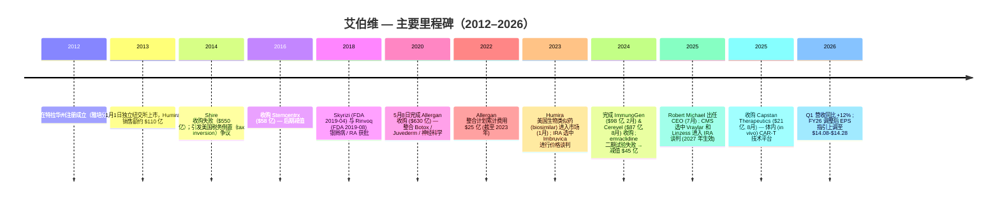
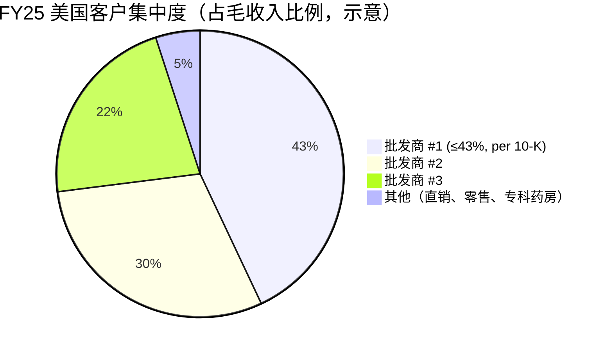
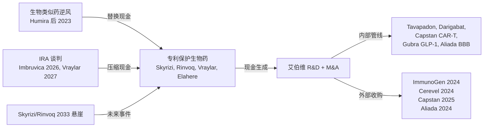

# 艾伯维 AbbVie Inc. (NYSE: ABBV) — 首次覆盖

*报告基准日 2026-06-02。所有数据均可追溯至艾伯维 2026-02-20 提交的 FY2025 10-K 与 2026-04-29 / 2026-05-08 提交的 Q1 2026 8-K / 10-Q（除另行注明外）。*

> **业绩指引调整。** 2026-04-29，艾伯维将其 FY2026 调整后稀释每股收益（adjusted diluted EPS）指引区间从 **$13.96–$14.16** 上调至 **$14.08–$14.28**，仍包含来自年初至 Q1 累计的已获取 IPR&D / 里程碑费用 $0.41 / 股的不利影响。新区间隐含相对 FY25 调整后基准的高个位数 EPS 增长。参见 [艾伯维 Q1 2026 业绩公告，EX-99.1，2026-04-29](https://www.sec.gov/Archives/edgar/data/1551152/000155115226000013/abbv-20260331xexhibit991.htm)。

## 目录

1. [公司概览](#1-公司概览)
2. [公司历史](#2-公司历史)
3. [管理团队](#3-管理团队)
4. [产品与服务](#4-产品与服务)
5. [客户与上市策略](#5-客户与上市策略)
6. [行业概览](#6-行业概览)
7. [竞争格局](#7-竞争格局)
8. [市场机会（TAM/SAM/SOM）](#8-市场机会tamsamsom)
9. [风险评估](#9-风险评估)
10. [投资者视角评分卡](#10-投资者视角评分卡)
11. [参考资料](#11-参考资料)

---

## 1. 公司概览

艾伯维（AbbVie Inc.，纽交所代码 ABBV）是在美国特拉华州注册、总部位于伊利诺伊州北芝加哥（North Chicago）的全球生物制药（biopharmaceutical）公司，于 2013 年 1 月 1 日从雅培（Abbott Laboratories）研究型制药业务分拆（spin-off）独立上市。公司在其 [2025 Form 10-K, Item 1 Business](https://www.sec.gov/Archives/edgar/data/1551152/000155115226000008/abbv-20251231.htm) 中如此自我定义：*"a global, research and development-based biopharmaceutical company committed to developing innovative advanced therapies for some of the world's most complex and critical conditions"*；运营层面 "operates as a single global business segment dedicated to the research and development, manufacturing, commercialization and sale of innovative medicines and therapies"。截至 2025-12-31，艾伯维全球拥有 **约 57,000 名员工，分布在超过 70 个国家**，业务横跨免疫学（immunology）、肿瘤学（oncology）、神经科学（neuroscience）、眼科（eye care）、医美（aesthetics）和女性健康（women's health），数据来源同[2025 10-K, Item 1 Human Capital](https://www.sec.gov/Archives/edgar/data/1551152/000155115226000008/abbv-20251231.htm)。

**关键财务（FY2025）。** 全球净收入（net revenues）**$611.60 亿**（按报告口径和恒定汇率口径均 +9%），运营利润（operating earnings）$151 亿，GAAP 稀释 EPS $2.36，经营现金流 $190 亿，参见 [2025 10-K, MD&A overview](https://www.sec.gov/Archives/edgar/data/1551152/000155115226000008/abbv-20251231.htm)。GAAP 毛利率（gross margin）维持在 **70%**（vs 2023 年 62%）— 主要受益于 Allergan 收购无形资产摊销（amortization）的滚动以及 Skyrizi / Rinvoq 高毛利产品规模化。GAAP EPS 受摊销（约 $74 亿）及已获取 IPR&D 费用拖累；调整后稀释 EPS 在 Q1 上修后，FY2026 指引为 **$14.08–$14.28**，参见 [Q1 2026 业绩公告 EX-99.1](https://www.sec.gov/Archives/edgar/data/1551152/000155115226000013/abbv-20260331xexhibit991.htm)。

*数据来源：[艾伯维 2025 10-K, Item 7 MD&A](https://www.sec.gov/Archives/edgar/data/1551152/000155115226000008/abbv-20251231.htm)。*

**最新季度拐点（Q1 2026）。** Q1 营收 **$150.02 亿（按报告口径 +12.4% / 按经营口径 +10.3%）**，免疫学组合 **$72.90 亿（+16.4%）**，神经科学 **$28.75 亿（+26.0%）**。Skyrizi 达 $44.83 亿（+30.9%），Rinvoq $21.19 亿（+23.3%），Humira 降至 $6.88 亿（-38.6%）— 公司核心特许经营产品的迭代显著快于"长期稳健增长"轨道所要求的速度，参见 [Q1 2026 EX-99.1](https://www.sec.gov/Archives/edgar/data/1551152/000155115226000013/abbv-20260331xexhibit991.htm)。CEO Robert Michael 在公告中表态："off to an excellent start in 2026, with first-quarter results exceeding our expectations"。

**估值快照（2026-06-02）。** 股价 $215.43，市值（market cap）**约 $3,806 亿**，TTM 市盈率（P/E）**约 105.6×**（受 GAAP IPR&D 和摊销费用大幅压低），**前向 P/E（Forward P/E）约 13.3×**，市销率（P/S）6.06×，企业价值 / EBITDA（EV/EBITDA）14.7×，股息率（dividend yield）**3.25%**，5 年贝塔（beta）0.30，参见 [Yahoo Finance ABBV 关键统计](https://finance.yahoo.com/quote/ABBV/)。TTM 与 Forward P/E 之间约 92× 的巨大差距，反映出 GAAP 收益被 2024 / 2025 累计约 $67 亿的已获取 IPR&D 费用以及 Allergan / ImmunoGen / Cerevel 无形资产摊销大幅压低。按调整后 EPS（中值 $14.18）计算，ABBV 对应 FY26e 约 15.2× — 较可比同行中位数 Forward P/E 13.9× 溢价约 6%。Bernstein 给出的 $225 目标价（zsxq 经纪商背景，2026-06-02）隐含约 4% 上行空间和约 15.8× FY26e 调整后 EPS 倍数，与 "market-perform" 中性评级框架一致。

*数据来源：[Yahoo Finance / yfinance 快照，2026-06-02](https://finance.yahoo.com/quote/ABBV/)。*

**估值水平为何如此。** ABBV 表观 TTM P/E 105× 实为误导 — 公司过去两年累计前置了 $67 亿+ 的已获取 IPR&D 费用（Cerevel、ImmunoGen、Capstan、Aliada、Gilgamesh、Gubra）外加 Q4 2024 的 $45 亿 emraclidine 无形资产减值，全部计入 GAAP 但非现金支出。现金信号更为清晰：2025 年经营现金流 $190 亿 vs $3,806 亿市值（约 5.0% FCF 收益率），季度股息于 2025Q4 上调 5.5%（$1.64 → $1.73 / 股，2026-02-17 派付），细节参见 [2025 10-K 股息披露](https://www.sec.gov/Archives/edgar/data/1551152/000155115226000008/abbv-20251231.htm)。

## 2. 公司历史

*数据来源：[艾伯维 2025 10-K, Item 1 Business "General"](https://www.sec.gov/Archives/edgar/data/1551152/000155115226000008/abbv-20251231.htm)；历史里程碑均交叉引用后续章节中所引备案文件。*

**分拆起源。** 根据 [艾伯维 2025 10-K, Item 1](https://www.sec.gov/Archives/edgar/data/1551152/000155115226000008/abbv-20251231.htm)：*"was incorporated in Delaware on April 10, 2012. On January 1, 2013, AbbVie became an independent, publicly-traded company as a result of the distribution by Abbott Laboratories (Abbott) of 100% of the outstanding common stock of AbbVie to Abbott's shareholders."* 分拆驱动因素是雅培希望将以 Humira（adalimumab，阿达木单抗）为核心的品牌创新药研发引擎，与多元化的医院器械（hospital products）、营养品（nutritionals）和诊断（diagnostics）业务分离。

**Humira 时代（2013–2022）。** Humira 在 2017 年前后成为全球销售额最大的药物，并于 2022 年达到 **$212 亿** 全球销售峰值（[艾伯维 2022 10-K, Item 7](https://www.sec.gov/Archives/edgar/data/1551152/000155115223000011/abbv-20221231.htm)）。当年 Humira 占艾伯维合并营收约 36%，是支撑 R&D 和资本回报的现金牛（cash cow），也为同期 Allergan 整合以及 Skyrizi / Rinvoq 上市提供了财务弹药。

**Allergan 收购（2020-05-08）。** 与爱尔兰 Allergan plc 的 ~$630 亿合并交易（transformative deal），带来 Botox（治疗 + 美容用途）、Juvederm（玻尿酸填充剂）、Restasis（环孢素眼药水）、Vraylar（卡瑞拉嗪 cariprazine）、眼科平台和女性健康业务。[2025 10-K, Item 7 MD&A](https://www.sec.gov/Archives/edgar/data/1551152/000155115226000008/abbv-20251231.htm) 披露："Allergan Integration Plan … was designed to reduce costs, integrate and optimize the combined organization and incurred total cumulative charges of $2.5 billion through 2023." 战略意义是将艾伯维从纯免疫学公司转型为多元化品牌生物制药公司，并补充了具备消费抗周期性的医美（aesthetics）业务，以及之后被 Cerevel 进一步强化的神经科学（neuroscience）平台。

**Humira 生物类似药悬崖（2023+）。** Humira 美国生物类似药于 **2023-01-31** 首次进入市场（安进 Amjevita），随后 2023 全年另有约 10 款生物类似药跟进，标志着制药史上最大规模的专利悬崖（patent cliff）事件。[2025 10-K 产品营收表](https://www.sec.gov/Archives/edgar/data/1551152/000155115226000008/abbv-20251231.htm) 显示 Humira 全球销售自 $144.04 亿（FY23）→ $89.93 亿（FY24）→ **$45.40 亿（FY25）** — 三年累计下降 **-69%**，其中美国跌幅更陡（$121.60 亿 → $30.62 亿 = **-75%**）。值得注意（也是艾伯维多头逻辑的核心）：在专利悬崖跨越期间，*合并营收* 仍持续增长，从 $543.18 亿（FY23）→ $563.34 亿 → $611.60 亿（FY25）— Skyrizi 和 Rinvoq 充分接力。

**2024 年的并购转向。** 鉴于 Humira 悬崖已经发生，且 Skyrizi+Rinvoq 的组成物质专利（composition-of-matter patents）将于 2033 年到期（[2025 10-K, IP 与监管独占性章节](https://www.sec.gov/Archives/edgar/data/1551152/000155115226000008/abbv-20251231.htm)），艾伯维在 2024 年执行了两笔变革性收购：**$98 亿收购 ImmunoGen（净付 $92 亿，2024-02-12 完成）**，将抗体药物偶联物（antibody-drug conjugate, ADC）平台纳入麾下，核心产品为 Elahere（mirvetuximab soravtansine，针对铂耐药卵巢癌的 FRα-靶向 ADC）；**$87 亿收购 Cerevel Therapeutics（净付 $83 亿，2024-08-01 完成）**，引入由 emraclidine（M4-PAM 治疗精神分裂症）和 tavapadon（D1/D5 部分激动剂治疗帕金森氏症）领衔的神经科学管线。两笔交易的会计细节详见 [2025 10-K, Note 6, Acquisitions](https://www.sec.gov/Archives/edgar/data/1551152/000155115226000008/abbv-20251231.htm)。

**Emraclidine 二期临床失败。** 2024-11 艾伯维公告：Cerevel 的 emraclidine 二期 EMPOWER-1 / EMPOWER-2 试验 "did not meet their primary endpoint of showing a statistically significant reduction (improvement) in the change from baseline in the Positive and Negative Syndrome Scale total score"，针对急性精神分裂症适应症。该结果触发 **$45 亿无形资产减值（intangible-asset impairment）**，将 Cerevel 交割时确认的 emraclidine IPR&D 价值清零，参见 [2025 10-K, Item 7 关键会计估计 / Note 7](https://www.sec.gov/Archives/edgar/data/1551152/000155115226000008/abbv-20251231.htm)。该事件清晰地提示：即便经过充分尽调的临床中后期资产，仍存在二元风险（binary risk）。

**持续的小型补丁式并购（"string-of-pearls"）。** 2025 年艾伯维进一步收购 Capstan Therapeutics（$21 亿对价，净付 $19 亿，2025-08）用于体内 CAR-T 技术，以及 Aliada Therapeutics（$14 亿 IPR&D 前期付款，2024-10）用于阿尔茨海默病血脑屏障递送；同时与丹麦 Gubra A/S（2025-04，$3.5 亿前期付款，潜在 $75 亿里程碑）就 GUBamy 减肥药资产以及 ADARx Pharmaceuticals（$3.35 亿期权许可）签署协议，参见 [Note 6, 2025 10-K](https://www.sec.gov/Archives/edgar/data/1551152/000155115226000008/abbv-20251231.htm)。这种策略明显倾向于"串珠式（string-of-pearls）"补强而非又一次巨型并购。

## 3. 管理团队

**创始人（基准定位）。** 严格意义上，艾伯维没有传统意义上的创始人；公司于 2013-01-01 从雅培分拆独立，其分拆时的首任 CEO 兼董事长是 **Richard A. "Rick" Gonzalez**，他执掌 CEO 直至 2024-07（交班）以及董事长直至 2025-07（退休）。根据 [2025 10-K, Executive Officers 章节](https://www.sec.gov/Archives/edgar/data/1551152/000155115226000008/abbv-20251231.htm)："elected Chief Executive Officer (CEO) Robert A. Michael to succeed Richard A. Gonzalez as Chairman of the board of directors, effective July 1, 2025, at which time Mr. Gonzalez retired from the board." Gonzalez 1977 年加入雅培，主导了 Humira 上市与崛起期间的雅培制药业务部，在业内被视为 Humira 防御性知识产权 / 生命周期管理（lifecycle management）策略以及 Skyrizi / Rinvoq 接力产品组合的总架构师。他主导了 Allergan 收购、Humira 美国生物类似药竞争应对，以及 ImmunoGen / Cerevel 两笔巨型交易，然后交棒。

**现任 CEO — Robert A. Michael（55 岁）。** 根据 [2025 10-K Executive Officers 表](https://www.sec.gov/Archives/edgar/data/1551152/000155115226000008/abbv-20251231.htm)："Mr. Michael is AbbVie's Chairman and Chief Executive Officer, a position he has held since July 2025. Mr. Michael previously served as Chief Executive Officer starting in 2024 and President and Chief Operating Officer from July 2023 to June 2024, as Vice Chairman and President from June 2022 to July 2023, as Vice Chairman, Finance and Commercial Operations and Chief Financial Officer from June 2021 to June 2022, as Executive Vice President, Chief Financial Officer from 2019 to 2021, as Senior Vice President, Chief Financial Officer from 2018 to 2019 and as Vice President, Controller from 2017 to 2018." 他 2010 年加入雅培营养供应链担任 Division Controller，2013 分拆时随之转入艾伯维。担任 CEO 之前，他已积累 5+ 年 CFO 经验和 2+ 年 President/COO 经验，运营覆盖 Humira 专利悬崖期 — 因此他与大多数大型制药 CEO 不同，是从财务和运营内部成长的执行官，而非临床或商业产品总裁出身。他迄今的任期（FY24、FY25、Q1 26）取得了 +9% / +9% / +12% 的营收增长和指引上调 — 早期信号正面，但真正考验是 2033 后 Skyrizi / Rinvoq 专利悬崖的规划，这一议题完全落在他的任期内。

根据同一份 2025 10-K，艾伯维其他执行官包括 CFO **Scott T. Reents**（58）、首席业务与战略官 **Dr. Nicholas J. Donoghoe**（45，原 Allergan Aesthetics 总裁 / 麦肯锡医药业务部合伙人）、首席运营官 **Dr. Azita Saleki-Gerhardt**（62）、研发 / 首席科学官 **Dr. Roopal Thakkar**（54）、首席商务官 **Jeffrey R. Stewart**（57）、法律顾问 **Perry C. Siatis**（51）、首席人力资源官 **Demetris D. Crum**（45）、Controller **David R. Purdue**（48）。本报告按 skill 范围仅涵盖创始人 / CEO；薪酬、董事会构成及激励设计细节读者可参阅 [DEF 14A 2026 委托书](https://www.sec.gov/Archives/edgar/data/1551152/000110465926033387/abbv-20260508xdef14a.htm)。

## 4. 产品与服务

艾伯维按单一全球业务板块（single global business segment）运营，但披露层面分为**五大治疗领域（therapeutic-area portfolios）**外加 All Other：免疫学（Immunology）、神经科学（Neuroscience）、肿瘤学（Oncology）、医美（Aesthetics）、眼科（Eye Care）。[2025 10-K, Item 7 MD&A 中的产品营收表](https://www.sec.gov/Archives/edgar/data/1551152/000155115226000008/abbv-20251231.htm) 是以下分析的基准锚。

*数据来源：[艾伯维 2025 10-K, Item 7 MD&A 产品营收表](https://www.sec.gov/Archives/edgar/data/1551152/000155115226000008/abbv-20251231.htm)。*

### 4.1 免疫学 — 定义艾伯维的核心特许经营

免疫学是艾伯维最大组合，FY2025 营收 **$304.06 亿**（约占合并营收 50%），由 Skyrizi、Rinvoq 与 Humira 衰退组合构成。

**Skyrizi（risankizumab，瑞莎珠单抗）。** 根据 [2025 10-K, Item 1 Business — Skyrizi](https://www.sec.gov/Archives/edgar/data/1551152/000155115226000008/abbv-20251231.htm)：

> "Skyrizi (risankizumab) is an interleukin-23 (IL-23) inhibitor that selectively blocks IL-23 by binding to its p19 subunit. It is a biologic therapy approved to treat the following autoimmune diseases … When administered for plaque psoriasis or psoriatic arthritis, Skyrizi is administered as a quarterly subcutaneous injection following two induction doses. When administered for Crohn's disease and ulcerative colitis, Skyrizi is given as three induction doses via IV infusion … followed by an on-body injector every eight weeks. Skyrizi is sold in numerous other markets worldwide."

**中文释义 / Plain-language gloss：** Skyrizi 是一款单抗（monoclonal antibody），通过结合白介素-23（IL-23）的 p19 亚基（subunit）选择性阻断 IL-23 / Th17 炎症通路，治疗斑块型银屑病（plaque psoriasis）、银屑病关节炎（psoriatic arthritis）、克罗恩病（Crohn's）和溃疡性结肠炎（ulcerative colitis）。**与上一代差异：** 相比 IL-17 阻断剂（如诺华 Cosentyx）和 TNF 抑制剂（如 Humira），Skyrizi 上游 IL-23 阻断更具选择性，安全性更清晰，维持给药为季度皮下注射（quarterly subcutaneous injection）— 显著优于多数对手的每周 / 每两周给药频率，依从性更佳。**战略意义：** Skyrizi 已成为皮肤与消化适应症的临床和商业标准疗法，FY25 全球销售 **$175.62 亿（同比 +49.9%）**，其中美国 $152.02 亿（+50.7%），按此增速将在 2033 专利窗口内超越 Humira 历史峰值，参见 [2025 10-K 产品营收表](https://www.sec.gov/Archives/edgar/data/1551152/000155115226000008/abbv-20251231.htm)。

**Rinvoq（upadacitinib，乌帕替尼）。** 根据同一份 [2025 10-K, Item 1 Business — Rinvoq](https://www.sec.gov/Archives/edgar/data/1551152/000155115226000008/abbv-20251231.htm)：

> "Rinvoq (upadacitinib) is an oral, once-daily selective and reversible JAK inhibitor that is approved to treat the following inflammatory diseases in North America, the European Union and Japan: … active rheumatoid arthritis, active ankylosing spondylitis, active non-radiographic axial spondyloarthritis, moderate to severe ulcerative colitis … In the United States, Rinvoq is indicated for the treatment of moderate to severe active rheumatoid arthritis, active ankylosing spondylitis, … and Crohn's disease … in adults who have had an inadequate response or intolerance to one or more TNF blockers, and atopic dermatitis in adult and pediatric patients … who are candidates for systemic therapy."

**中文释义 / Plain-language gloss：** Rinvoq 是一款小分子选择性 JAK1 抑制剂（JAK1 inhibitor，janus 激酶通路抑制剂），通过阻断 JAK1 下游多种细胞因子受体信号通路（IL-2、IL-4、IL-7、IL-9、IL-15、IL-21、IFN-γ）抑制广谱免疫炎症反应。**与 Skyrizi 差异：** Skyrizi 为注射用生物制剂、机制窄；Rinvoq 是**口服每日一次小药丸**、覆盖更宽广的细胞因子谱 — 代价是 JAK 抑制剂类有黑框警告（MACE、恶性肿瘤、血栓）相比 Humira。**战略意义：** 口服便利性结合更广适应症（RA、AS、PsA、UC、CD、AD、GCA、白癜风）使 Rinvoq 成为生物制剂一线失败患者或偏好口服患者的主力品种；FY25 销售 **$83.04 亿（+39.1%）**，国际市场 +38%；关键的是，美国组成物质专利（composition-of-matter patent）将于 2033 年到期，与 Skyrizi 同期。[2025 10-K, IP 章节](https://www.sec.gov/Archives/edgar/data/1551152/000155115226000008/abbv-20251231.htm) 确认："The United States composition of matter patents covering risankizumab and upadacitinib are expected to expire in 2033."

**Humira（adalimumab，阿达木单抗） — 衰退组合。** 根据 [2025 10-K, Item 1 — Humira](https://www.sec.gov/Archives/edgar/data/1551152/000155115226000008/abbv-20251231.htm)：*"Humira (adalimumab) is a biologic therapy administered as a subcutaneous injection. It is approved to treat the following autoimmune diseases in North America and in the European Union…"* — 覆盖 RA、PsA、AS、克罗恩病、UC、斑块型银屑病、化脓性汗腺炎、葡萄膜炎、儿科适应症等。Humira 当前面临全球生物类似药竞争；[Item 1A 风险因素表述](https://www.sec.gov/Archives/edgar/data/1551152/000155115226000008/abbv-20251231.htm) 明确："Humira faces direct biosimilar competition globally and AbbVie will continue to face competitive pressure from these biologics and from orally administered products." FY25 全球 Humira 营收 **$45.40 亿（-49.5% 同比）**，美国 **$30.62 亿（-57.1%）**。截至此时已是可控、模型化良好的衰退轨道 — 关键问题是 Skyrizi+Rinvoq 合计营收（**FY25 $258.66 亿**）加上其他组合能否在 2033 之前持续抵消衰退（FY25 营收 +9% 验证当前路径有效）。

*数据来源：[艾伯维 2025 10-K Item 7 MD&A 产品营收表](https://www.sec.gov/Archives/edgar/data/1551152/000155115226000008/abbv-20251231.htm)；Q1 2026 LTM 滚算自 [Q1 2026 10-Q](https://www.sec.gov/Archives/edgar/data/1551152/000155115226000017/abbv-20260331.htm)。*

**集中度披露。** 根据 [2025 10-K, Item 1A — 风险因素](https://www.sec.gov/Archives/edgar/data/1551152/000155115226000008/abbv-20251231.htm)："Skyrizi and Rinvoq each represented greater than 10% of AbbVie's total net revenues and, in aggregate, these products accounted for approximately 42% of total net revenues in 2025." — 这是经审计的集中度数据；本报告中提及的"Skyrizi+Rinvoq 约占营收一半"是合并了 Humira 后的数字（$30.406B / $61.160B ≈ 49.7%）。

### 4.2 神经科学 — 第二大组合，IRA 风险敞口但增速强劲

神经科学组合 FY25 营收约 $106 亿，Q1 26 营收 **$28.75 亿（按报告口径 +26%）**，核心产品包括 Vraylar（cariprazine）、Botox Therapeutic、Ubrelvy / Qulipta（偏头痛 CGRP 类）、Vyalev（foscarbidopa/foslevodopa 皮下连续输注治疗晚期帕金森）以及来自 Cerevel 的管线。

**Vraylar（cariprazine，卡瑞拉嗪）。** D3 受体优先部分激动剂（D3-preferring partial agonist）非典型抗精神病药（atypical antipsychotic），用于精神分裂症、双相 I 型障碍（混合 / 躁狂 / 抑郁发作）以及抑郁症（MDD）辅助治疗。FY25 全球营收 **$36.21 亿（+10.7%）**，几乎全为美国市场（[2025 10-K MD&A](https://www.sec.gov/Archives/edgar/data/1551152/000155115226000008/abbv-20251231.htm)）。同一份 10-K 披露："in January 2025, [CMS] selected Vraylar and Linzess as two of 15 medicines subject to government-set prices in Medicare Part D beginning January 1, 2027" — Vraylar 是继 Imbruvica（2026 生效）之后下一个进入 IRA 价格谈判的艾伯维产品。

**Botox Therapeutic（治疗用肉毒毒素）。** 2020 年随 Allergan 收购获得。获批适应症涵盖慢性偏头痛、颈部肌张力障碍、眼睑痉挛、斜视、痉挛、尿失禁（膀胱过度活动症）等。FY25 全球营收 **$37.69 亿（+14.8%）**（[2025 10-K 产品营收表](https://www.sec.gov/Archives/edgar/data/1551152/000155115226000008/abbv-20251231.htm)）。处方计划性给药节奏 + 广泛标签使 Botox Therapeutic 成为类年金（quasi-annuity）型收入来源。

**Ubrelvy / Qulipta（口服 CGRP 偏头痛药物）。** Ubrelvy（ubrogepant）急性治疗、Qulipta（atogepant）预防用药。FY25 合计约 $23 亿；Q1 26 合计 $6.35 亿。CGRP 类正在以高双位数增速增长，患者正从曲坦类（triptan）和仿制药预防药物迁移而来。

**Vyalev。** Foscarbidopa / foslevodopa 24 小时皮下输注治疗晚期帕金森氏症 — FDA 于 2024-10 批准。FY25 上市营收 $4.82 亿；Q1 26 $2.01 亿（[2025 10-K + Q1 26 EX-99.1](https://www.sec.gov/Archives/edgar/data/1551152/000155115226000013/abbv-20260331xexhibit991.htm)）— 上市曲线陡峭。

**管线（Cerevel 资产）。** 除 emraclidine（已于 2024 Q4 二期精神分裂症试验失败、引发 $45 亿减值）外，Cerevel 带来 **tavapadon**（D1/D5 部分激动剂治疗帕金森）和 **darigabat**（α2/3 GABA-A PAM 治疗癫痫 / 焦虑），二者仍处于晚期开发阶段，参见 [2025 10-K R&D 章节](https://www.sec.gov/Archives/edgar/data/1551152/000155115226000008/abbv-20251231.htm)。tavapadon 三期读出是神经科学组合下一关键催化剂。

### 4.3 肿瘤学 — ADC 转型 via ImmunoGen + 遗留 Imbruvica / Venclexta

肿瘤学组合 FY25 营收约 $69 亿，Q1 26 营收 **$16.31 亿（按报告口径 -0.2%，按经营口径 -3.0%）** — 是唯一负增长治疗领域，主因 Imbruvica 结构性下降。

**Venclexta（venetoclax，维奈托克）。** BCL-2 抑制剂，与罗氏 / 基因泰克联合开发；首创口服靶向药（first-in-class oral targeted therapy），治疗慢性淋巴细胞白血病（CLL）、急性髓系白血病（AML）等血液肿瘤。FY25 营收 **$27.92 亿（+8.1%）**（[2025 10-K MD&A](https://www.sec.gov/Archives/edgar/data/1551152/000155115226000008/abbv-20251231.htm)）。

**Imbruvica（ibrutinib，伊布替尼）。** 首创 BTK 抑制剂，治疗 CLL / SLL、套细胞淋巴瘤（MCL）、华氏巨球蛋白血症（WM）、慢性移植物抗宿主病（cGVHD）等。FY25 营收 **$28.69 亿（-14.3%）**；Q1 26 $5.56 亿。下降反映：(1) 二代 BTK 抑制剂（阿斯利康 Calquence、百济神州 Brukinsa）竞争；(2) CMS 已将 Imbruvica 列入首批 IRA Part D 价格谈判药物（2026 生效）— [2025 10-K, Note 7](https://www.sec.gov/Archives/edgar/data/1551152/000155115226000008/abbv-20251231.htm) 指出："in August 2023, … the company's oncology product Imbruvica sold in the U.S. was included on the list of products subject to government-set prices by CMS. The selection resulted in a significant decrease in the estimated future cash flows for the product and represented a triggering event which required" 减值审查。

**Elahere（mirvetuximab soravtansine）。** 2024-02 通过 ImmunoGen 收购获得 — 一款叶酸受体 α（folate receptor alpha, FRα）靶向的抗体药物偶联物（ADC），治疗 FRα 阳性的铂耐药卵巢癌。Q1 26 营收 **$1.98 亿**；FY25 全段表 Elahere 营收 $6.90 亿（同比 +44%，FY24 $4.79 亿）。机制：人源化单抗靶向卵巢癌中过表达的 FRα，DM4 载荷（maytansinoid 微管干扰剂）选择性投递至肿瘤组织，规避系统毒性。

**Epkinly（epcoritamab）。** CD20×CD3 双特异性 T 细胞接合剂（bispecific T-cell engager），治疗复发 / 难治弥漫大 B 细胞淋巴瘤（DLBCL），与 Genmab 联合开发。早期商业化爬坡；FY25 营收 $2.71 亿（+85%）。

**Emrelis（telisotuzumab vedotin）。** c-Met 高表达非小细胞肺癌（NSCLC）ADC，2025 年 FDA 批准。

### 4.4 医美（Aesthetics） — 受经济周期影响但利润丰厚

医美组合 FY25 营收 $54 亿，Q1 26 营收 **$11.86 亿（+7.6%）**。包括：(1) **Botox Cosmetic**（FY25 $26.02 亿），统治型眉间纹 / 额纹 / 鱼尾纹的神经毒素产品；(2) **Juvederm Collection**（FY25 $9.93 亿），玻尿酸皮下填充剂；(3) 其他设备和护肤品。根据 [2025 10-K MD&A](https://www.sec.gov/Archives/edgar/data/1551152/000155115226000008/abbv-20251231.htm)："In the United States, Botox Cosmetic net revenues decreased 11% [in FY25] primarily driven by unfavorable pricing due to customer loyalty program changes, lower market share and decreased consumer demand, partially offset by the timing of customer inventory destocking" — 反映 2025 年美国医美市场的疲软动态。Q1 2026 已经恢复：美国 Botox Cosmetic +25.8%。该品类对消费可支配支出敏感，且面临 Galderma Relfydess、Evolus Jeuveau、Revance Daxxify 神经毒素竞争以及 Galderma Restylane 在填充剂的竞争。

### 4.5 眼科 + 其他 — 长尾业务

眼科包括 Restasis（环孢素，受生物类似药 / 仿制药冲击）、Vuity（老花眼滴眼液）、Lumigan / Alphagan 青光眼药物；FY25 合计约 $20 亿且持续下降。女性健康（Lo Loestrin、Lupron Depot）以及胰酶口服药 Creon 等构成长尾。各产品独立体量不足以撼动整体表现，但合并提供稳定压舱。

### 综合 — 用一段话概括艾伯维打法

艾伯维本质上是一台**免疫学现金机器**（Skyrizi + Rinvoq），任务是把这些现金再投资到**下一代药物平台**（神经科学经由 Cerevel；肿瘤 ADC 经由 ImmunoGen；体内 CAR-T 经由 Capstan；减肥经由 Gubra），赶在 2033 年 Skyrizi / Rinvoq 专利悬崖之前布局完成。公司从 Humira → Skyrizi / Rinvoq 的接力比 2022 年时的空头共识预期更优雅（+9% 营收跨过悬崖，而非市场担心的 -10–15%）。下一个考验是 Cerevel 的 tavapadon、Capstan 的 CAR-T、ImmunoGen 的 ADC 管线、Aliada 的阿尔茨海默布局，能否各自在 2032–34 之前贡献 $10 亿 + 的产品收入。串珠式（string-of-pearls）方法明智但在概率上很苛刻 — emraclidine 的 $45 亿减值就是二元风险的近期警示。

## 5. 客户与上市策略

**分销模式。** 艾伯维主要通过美国批发商（wholesalers）和国际市场批发商加国家级支付方组合销售。根据 [2025 10-K, Item 1, "Sales, Marketing and Distribution"](https://www.sec.gov/Archives/edgar/data/1551152/000155115226000008/abbv-20251231.htm)：

> "AbbVie's products are generally sold worldwide directly to wholesalers, distributors, government agencies, health care facilities, specialty pharmacies and independent retailers from AbbVie-owned distribution centers and public warehouses. Certain products (including aesthetic products and devices) are also sold directly to physicians and other licensed healthcare providers."

**美国前三大批发商集中度。** 同一份 [2025 10-K Item 1 客户集中度披露](https://www.sec.gov/Archives/edgar/data/1551152/000155115226000008/abbv-20251231.htm)：

> "In 2025, three wholesale distributors (McKesson Corporation, Cardinal Health, Inc. and Cencora, Inc.) accounted for substantially all of AbbVie's pharmaceutical product sales in the United States. **No individual wholesaler accounted for greater than 43% of AbbVie's 2025 gross revenues in the United States.**"

这种集中度是美国制药业的*结构性*特征（McKesson、Cardinal、Cencora 合计占美国品牌药分销 90%+），并非通常意义的信用风险 — 三家均为 $1,000 亿 + 营收的投资级公司。"任何单一批发商均不超过 43%" 的披露是经审计的上限，也是唯一一个适用于"单一客户集中度"的有效数字。

*数据来源：[艾伯维 2025 10-K, Item 1 客户集中度披露](https://www.sec.gov/Archives/edgar/data/1551152/000155115226000008/abbv-20251231.htm)。批发商 #2 / #3 占比为示意 — 10-K 仅披露 #1 的 ≤43% 上限。*

**终端支付方（end-payer）构成。** 批发商分销之后，艾伯维的真正"客户"是美国支付方生态（payer ecosystem）：Medicare Part D（Imbruvica、Vraylar、Rinvoq 及 Skyrizi 越来越大份额的主要支付渠道）、商业管理式医疗（commercial managed care）、医疗补助（Medicaid）、以及 340B 安全网计划。[2025 10-K 返点 / 退款明细表](https://www.sec.gov/Archives/edgar/data/1551152/000155115226000008/abbv-20251231.htm) 显示支付方端营收扣减的规模：商业管理式医疗返点计提 **$223.07 亿**、Medicaid / Medicare 返点计提 **$212.83 亿**、批发商退款（chargebacks）**$177.10 亿**（合计 2025 年约 $613 亿对应 $611.60 亿净收入，隐含毛收入超过 $1,000 亿）。10-K 明确："comprise approximately 94% of the total consolidated rebate and chargebacks recorded as reductions to revenues in 2025."

**医美客户模式（重要例外）。** Botox Cosmetic、Juvederm 以及艾伯维 - Allergan Aesthetics 设备组合**直接销售给医生及持牌医疗服务提供者**（皮肤科、整形外科、医美诊所）。[2025 10-K](https://www.sec.gov/Archives/edgar/data/1551152/000155115226000008/abbv-20251231.htm) 表述："Certain products (including aesthetic products and devices) are also sold directly to physicians and other licensed healthcare providers." 这种直销模式让艾伯维对终端需求有更精细的视角 — 也解释了 MD&A 中 "customer-loyalty program" 的注解。

**国际市场上市策略。** 根据 [2025 10-K, Item 1A](https://www.sec.gov/Archives/edgar/data/1551152/000155115226000008/abbv-20251231.htm)，"approximately 24% of AbbVie's total net revenues" 来自美国以外，以欧洲与日本为主，相应的报销体系 "are subject to change and that could result in price reductions, profit reductions, and limitations on which therapies will be reimbursed."国际市场还面临更严格的卫生技术评估（HTA — 英国 NICE、德国 IQWiG、法国 HAS、日本 Chuikyo / Yakuji）和更长的上市迟滞期。

**患者援助与 340B 风险敞口。** [2025 10-K, Item 1A — 风险因素](https://www.sec.gov/Archives/edgar/data/1551152/000155115226000008/abbv-20251231.htm) 提及多起持续诉讼："In the Northern District of Illinois on behalf of Humira patients … alleging that Humira's list price [is excessive]" 以及另外一桩 "third-party payors of Humira" 案，原告称艾伯维的返点行为 "are impairing biosimilar competition with Humira in violation of federal and state antitrust laws." 均为未决诉讼，但代表性反映出 2022 年后美国生物制药行业普遍面临的支付方摩擦尾部风险（payer-friction tail risk）。

## 6. 行业概览

**行业定义。** 创新型品牌生物制药 — NAICS 325412（pharmaceutical preparation manufacturing），属于更广义的生命科学（life sciences）板块。艾伯维的同业竞争对手是全球研究型制药公司：强生 J&J Innovative Medicine、辉瑞 Pfizer、默沙东 Merck & Co.、礼来 Eli Lilly、百时美施贵宝 BMS、诺华 Novartis、罗氏 Roche、葛兰素史克 GSK、赛诺菲 Sanofi、阿斯利康 AstraZeneca、安进 Amgen、吉利德 Gilead、拜耳 Bayer、武田 Takeda。相邻行业：仿制药 + 生物类似药（Teva、Sandoz、Viatris、Biocon、Amgen 类似药）、专业 CDMO（Lonza、Catalent、三星生物 Samsung Biologics）以及医美设备（Galderma、Inmode、Cutera）。

**市场规模。** 全球处方药销售按 [IQVIA "Global Use of Medicines 2024 Outlook"](https://www.iqvia.com/insights/the-iqvia-institute/reports-and-publications/reports/the-global-use-of-medicines-2024-outlook-to-2028) 预测将于 2028 年达到约 $2.3 万亿（vs 2023 年 ~$1.6 万亿），CAGR 5–8%。其中自身免疫 / 免疫学板块 2024 年全球约 $1,650 亿，TNF-α 抑制剂正向生物类似药迁移，IL-23 / JAK 通路扩张份额；艾伯维在 IL-23 和 JAK1 子板块在份额和增速上均处领先。肿瘤学是单一最大治疗领域 — 全球 >$2,400 亿，增速低双位数，受 ADC（第一三共 - 阿斯利康 Enhertu、艾伯维 - ImmunoGen Elahere）、双特异性抗体（Genmab - 艾伯维 Epkinly）、免疫肿瘤持久性延伸驱动。

**增长驱动力。** (1) **人口老龄化** 在美国、欧盟、日本持续扩大慢性炎症、神经退行性疾病、肿瘤的患者池。(2) **精准医疗与生物标志物驱动的适应症** 在扩大潜在人群的同时支持溢价定价。(3) **GLP-1 类药物** 不仅重塑糖尿病 / 肥胖市场，还在重构整个行业的资本配置 — 推动诸如礼来 Versanis、艾伯维 Gubra GUBamy 等多十亿美元交易。(4) **抗体药物偶联物 (ADC) 与双特异性抗体** 是当前主导的生物制剂模态浪潮 — 驱动了约 $98 亿的 ImmunoGen 交易和辉瑞 $430 亿的 Seagen 交易。(5) **体内 (in vivo) CAR-T 和细胞疗法递送创新**（Capstan、Umoja、Orna、Tessera）有望让细胞疗法成为可制造、可重复给药的生物制剂 — 艾伯维 2025-08 $21 亿收购 Capstan 是行业内早期布局。

**压力浪潮。** (1) **美国《降低通胀法案》（IRA 2022）** 要求自 2026 年起对选定的高支出 Medicare Part D 药物谈判价（Imbruvica 在首批名单），2028 年起 Part B（艾伯维目前无产品被选）；2025 年名单增加了 Vraylar 和 Linzess（2027 生效）。[2025 10-K IRA 章节](https://www.sec.gov/Archives/edgar/data/1551152/000155115226000008/abbv-20251231.htm) 明确："requires: (i) the government to set prices for select high expenditure Medicare Part D drugs (prices effective beginning in 2026) and Part B drugs (prices effective beginning in 2028) that are more than nine years (for small-molecule drugs) or 13 years (for biological products) from the date" of approval. (2) **品牌生物药的生物类似药侵蚀** — Humira 是典型案例，但 Stelara、Eylea、Prolia / Xgeva、Soliris 都将在 2026–28 进入生物类似药浪潮。(3) **欧洲 HTA 定价压力** 持续压低上市售价上限。(4) **贸易政策扰动** — 根据 2025 10-K Item 1A，"trade restrictions, tariffs, and other changes in global trade policy could increase costs, disrupt supply chains and negatively affect AbbVie's ability to sell biologics including Skyrizi, Botox, Humira and Creon."

**行业结构。** 顶部高度集中 — 全球前 10 大生物制药企业（Pfizer、J&J、AbbVie、Roche、Merck、Lilly、Novartis、BMS、Sanofi、AZ）合计营收 >$6,500 亿，约占行业 40%。进入壁垒极高：10–15 年药物开发周期、单药平均 ~$20 亿 R&D 成本（DiMasi / Tufts CSDD）、监管壁垒、在位者专利组合（patent thickets）。供应商议价能力（CDMO、关键原材料）正在上升但仍属适度；买方议价能力（PBM、支付方、医院 GPO）显著上升且日益决定每张处方的净价。

## 7. 竞争格局

**竞争者列表。** [2025 10-K, Item 1 — Competition](https://www.sec.gov/Archives/edgar/data/1551152/000155115226000008/abbv-20251231.htm) 表述："AbbVie's products compete with other products in their respective therapeutic categories. These competitors include large and small pharmaceutical companies, biotechnology companies, and academic and research institutions." 具体取决于产品：

| 治疗领域 | 艾伯维产品 | 主要竞争对手（已点名或显见） |
|---|---|---|
| 斑块型银屑病（IL-23） | Skyrizi | J&J Tremfya、Sun Pharma Ilumya |
| 斑块型银屑病（IL-17） | （无）| 诺华 Cosentyx、礼来 Taltz、UCB Bimzelx |
| 银屑病关节炎 / RA（TNF）| Humira | 生物类似药、安进 Enbrel、J&J Remicade 类似药 |
| 特应性皮炎（IL-4/13）| Rinvoq（JAKi）| *分析师观点：* 赛诺菲 / 再生元 Dupixent 主导生物制剂 AD 市场；辉瑞 Cibinqo 和礼来 Olumiant 在 JAKi 竞争 |
| 克罗恩 / UC（IL-23）| Skyrizi | J&J Stelara（正进入生物类似药）、礼来 Omvoh |
| 精神分裂症（辅助非典型）| Vraylar | BMS Cobenfy（2024 Karuna KarXT 收购获得）、大塚 / Lundbeck Rexulti、J&J Invega Sustenna |
| BTK 抑制剂（血液肿瘤）| Imbruvica | 阿斯利康 Calquence、百济神州 Brukinsa |
| BCL-2 抑制剂 | Venclexta | 同类首创 — 目前无直接竞争 |
| 卵巢癌 ADC（FRα）| Elahere | （首创 FRα ADC）|
| CD20×CD3 双抗（DLBCL）| Epkinly（Genmab 合作）| 罗氏 / 基因泰克 Columvi、罗氏 Lunsumio |
| 医美神经毒素 | Botox Cosmetic | Galderma Dysport / Relfydess、Evolus Jeuveau、Revance Daxxify、Merz Xeomin |
| 医美填充剂 | Juvederm | Galderma Restylane、Merz Belotero、Teoxane RHA |
| 偏头痛（CGRP 口服）| Ubrelvy、Qulipta | 礼来 Emgality（CGRP 注射）、Biohaven（辉瑞）Nurtec ODT、Lundbeck Vyepti |

**竞争位势（Skyrizi，旗舰产品）。** *分析师观点：* 在斑块型银屑病领域，Skyrizi 已取代 J&J Stelara 成为 IL-23 黄金标准，在 IMMvent 系列三期对照试验中显示 PASI-90 和 PASI-100 优效性。在克罗恩病领域，三期 GALAXI-2/-3 研究显示 Skyrizi 相对 Stelara 的非劣效（多个次要终点上为优效），支撑商业份额增长。同样动力支持 Rinvoq JAK1 在 RA / UC / 特应性皮炎的份额增长故事。

**竞争位势（Vraylar，竞争加剧）。** 百时美施贵宝（BMS）的 Cobenfy（xanomeline-trospium，2024-Q1 完成的 $140 亿 Karuna 收购获得的 KarXT）于 2024 年底上市，是数十年来首款非 D2 受体作用机制的非典型抗精神病药。Cobenfy 对 2026–28 的 Vraylar 是潜在逆风，因为二者均争夺下一代精神分裂症维持治疗市场。*分析师观点：* Vraylar 的 MDD 辅助适应症仍是可防御的增量渠道，目前 Cobenfy 还未覆盖。

**竞争位势（Imbruvica，结构性下降）。** 二代 BTK 抑制剂（Calquence 和 Brukinsa）由于心脏安全谱更佳，已成为社区 CLL 一线优先选择；叠加 Imbruvica 2026 生效的 IRA 谈判价，[2025 10-K Item 7](https://www.sec.gov/Archives/edgar/data/1551152/000155115226000008/abbv-20251231.htm) 记录 Imbruvica 处于结构性下降（2025 -14%）。

**医美竞争。** *分析师观点：* Botox Cosmetic 仍是美国神经毒素份额领头羊（历史 >60% 份额，业内调研），但其领先优势正被 Daxxify（更长持效期）和 Jeuveau（更低价）侵蚀。2025 年美国 -11% 反映消费可支配支出逆风加竞争对手份额增长共同作用。国际 Botox Cosmetic 2025 恢复增长（+6%）并在 Q1 2026 加速。

## 8. 市场机会（TAM/SAM/SOM）

**总可寻址市场（TAM）。** 全球生物制药按 [IQVIA 2024 Outlook](https://www.iqvia.com/insights/the-iqvia-institute/reports-and-publications/reports/the-global-use-of-medicines-2024-outlook-to-2028) 预测到 2028 年达约 $2.3 万亿；其中艾伯维直接可寻址空间合计 2028 年约 $4,000 亿：

- **免疫学 / I&I（炎症与免疫疾病）。** 全球 I&I 生物药市场 2024 年约 $1,600 亿，预计 2030 年达约 $2,200 亿（行业预测）。艾伯维占据领先份额（按艾伯维 FY25 营收 / 板块测算约 19%），有望保持至 2033。
- **医美（aesthetics）。** 全球医美市场（注射类：神经毒素 + 填充剂）2024 年约 $150 亿，参见 [Allergan Aesthetics JPM 2024 IR 材料](https://news.abbvie.com/abbvie-2024-jpmorgan-healthcare-conference-presentation)，增长约 10%，对消费支出敏感。艾伯维约 $54 亿 = 全球约 36% 份额 — 明确的品类领导者，但竞争加剧。
- **神经科学。** 全球 CNS 药物市场约 $1,200 亿（IQVIA）：精神分裂症约 $100 亿、帕金森约 $60 亿、偏头痛约 $80 亿、MDD 约 $150 亿。艾伯维神经科学组合 FY25 约 $106 亿 = 全球约 9% 份额。Vyalev 上市和 Cerevel tavapadon 管线为中期最强增长路径。
- **肿瘤学。** 全球约 $2,400 亿，低双位数增长。艾伯维 $69 亿 = 全球约 3% — 偏低，正是 ImmunoGen、Capstan、ADARx 交易的逻辑。
- **眼科。** 全球约 $300 亿，艾伯维约 $20 亿 = 7%。

**SAM（直接可服务市场）。** 艾伯维当前已上市产品对应 SAM 约 **$600–700 亿**（Skyrizi 适应症 $500 亿+ 市场；Rinvoq 适应症 $400 亿+ 重叠；Vraylar $150 亿+；Botox $100 亿+；肿瘤利基约 $200 亿+）。管线（tavapadon、Aliada、Gubra、Capstan）有望在 2032 年前再打开 **$300–500 亿** SAM。

**SOM（实际 5 年可获份额）。** 艾伯维 FY25 营收 ($61.2B) / 全球药品支出 ($1.7 万亿) = **3.6% 份额**。考虑 Skyrizi 持续复利至 2030 年峰值 ($250–300 亿)、Rinvoq 峰值 $150 亿+、神经增长至 $150 亿+、肿瘤至 $100 亿+、医美至 $70 亿、眼科 / 其他保持稳定，5 年可实现 SOM 约 **$800–900 亿（2030 年）** ≈ 4.5% 份额。空头情境是 Humira + IRA 影响累计压制至 2030 年营收接近 FY25（$600–650 亿 ≈ 3.3% 份额）。多头情境要求 Cerevel 和 Capstan 管线资产到 2032 年各自实现多十亿美元规模。

## 9. 风险评估

### 公司层面

1. **Skyrizi + Rinvoq 2033 专利悬崖。** 是 2030 年代的单一最大风险。[2025 10-K, IP 章节](https://www.sec.gov/Archives/edgar/data/1551152/000155115226000008/abbv-20251231.htm)："The United States composition of matter patents covering risankizumab and upadacitinib are expected to expire in 2033." Skyrizi + Rinvoq 当前占营收 42%，2030 年很可能达 45–50% — Humira 式专利悬崖将对应 2033–36 年 $100–150 亿营收损失。缓释：辅助专利（剂型、用途、生产方法）延长独占期；生物类似药进入者面临多适应症标签复杂性；2026–2032 年新品上市必须替代 $200 亿悬崖敞口。*艾伯维已成功执行过一次（Humira），但第二次显著更难，因为剩余组合规模更大，且 Allergan 式无机增长链很难以同等规模重复。*

2. **IRA Medicare 谈判扩大（多年压力）。** Imbruvica 2026 生效（[2025 10-K Note 7](https://www.sec.gov/Archives/edgar/data/1551152/000155115226000008/abbv-20251231.htm) 已计入未来现金流大幅下降）。Vraylar 和 Linzess 2027 生效。后续选定名单（2028 年前每年约 15 款）几乎肯定在 2029–2031 年覆盖 Rinvoq 和 Skyrizi — 小分子 Rinvoq 上市 9 年后敞口（2028）；生物制剂 Skyrizi 上市 13 年后敞口（2032）。缓释：可将产品上市重心转向非 Medicare 渠道、加速国际市场、调整标签时点以延后 9 / 13 年计算时钟。

3. **管线二元风险（emraclidine 先例）。** Cerevel 的 emraclidine（2024 减值 $45 亿）交易前已充分尽调，但二期失败仍是即便临床后期资产也存在 30–40% 失败概率的提醒。缓释：tavapadon 和 darigabat 是机制独立的下注；Cerevel 交易经济性不仅依赖 emraclidine。其余暴露：Capstan（$21 亿）、Aliada（$14 亿 IPR&D）、Gubra（$3.5 亿前期 + $75 亿里程碑）、ADARx（$3.35 亿）。

### 行业 / 市场层面

4. **免疫学领域 Humira 之后生物类似药加速。** Stelara 类似药 2025 上市；Eylea 类似药 2026；Skyrizi / Rinvoq 类似药 2033–34。生物类似药的监管 / 制造基础设施相比 2023 年 Humira 入市时已显著成熟 — 意味着艾伯维特许经营失去 IP 保护时价格侵蚀更快。*分析师观点：* 2033 Skyrizi 悬崖可能首年美国营收 -50%，与 Humira 速度相当或更快。

5. **BMS / Karuna Cobenfy 在精神分裂症竞争。** 2024 Q4 Cobenfy 上市，是数十年来首款非 D2 非典型抗精神病药，对 Vraylar 构成近期逆风。缓释：Vraylar 在 MDD 辅助治疗仍具差异化；Cobenfy 真实世界维持治疗与耐受性数据尚在监测中。

6. **GLP-1 颠覆 / 资本重配。** GLP-1 类（礼来 Mounjaro / Zepbound、诺和 Wegovy）不仅在重塑糖尿病 / 肥胖市场，也在重塑相邻的心血管、睡眠呼吸暂停、炎症共病需求。艾伯维 Gubra 期权许可（2025-04，$3.5 亿前期 + 最高 $75 亿里程碑）是艾伯维在肥胖领域的下注，但属于早期且远远落后于礼来 / 诺和。

### 财务层面

7. **美国批发商客户集中度。** 根据 [2025 10-K Item 1A 风险因素](https://www.sec.gov/Archives/edgar/data/1551152/000155115226000008/abbv-20251231.htm)，三家批发商占美国营收近乎全部，最大者占毛收入达 43%。批发商财务困境风险绝对值低（三家都是投资级），但任意一家中断都会带来短期重大影响。

8. **并购后债务负担。** 2025 年末长期负债 $589.41 亿，加上短期 $60.56 亿，加上或有对价负债 $584 亿（主要为 Cerevel 相关里程碑），参见 [2025 10-K 资产负债表](https://www.sec.gov/Archives/edgar/data/1551152/000155115226000008/abbv-20251231.htm)。净负债约 $650 亿 vs 年度经营现金流 $190 亿，约 3.4× CFO — 可控，但限制了进一步大型并购能力。

9. **货币 / 国际敞口。** 国际占营收 24% 参见 [2025 10-K Item 1A](https://www.sec.gov/Archives/edgar/data/1551152/000155115226000008/abbv-20251231.htm)。美元走强压低国际报告增长 — Q1 2026 +12% 报告 vs +10% 经营，反映轻微 FX 顺风，可能反转。

### 宏观 / 监管层面

10. **Humira 返点反垄断诉讼。** 持续的伊利诺伊北区集体诉讼（患者集体和第三方支付方集体）参见 [2025 10-K Item 1A](https://www.sec.gov/Archives/edgar/data/1551152/000155115226000008/abbv-20251231.htm) — 原告主张返点行为阻碍了生物类似药竞争。若任何案件进入判决阶段，赔偿可能重大；和解是更可能路径。

11. **关税 / 贸易政策扰动。** 根据 [2025 10-K, Item 1A](https://www.sec.gov/Archives/edgar/data/1551152/000155115226000008/abbv-20251231.htm)："Trade restrictions, tariffs, and other changes in global trade policy could increase costs, disrupt supply chains and negatively affect AbbVie's ability to sell biologics including Skyrizi, Botox, Humira and Creon." 美国 232 条款（Section 232）医药关税情境仍是 2026 年度观察项。

12. **估值倍数压缩风险。** ABBV 当前 15.2× FY26e 调整后 EPS 较同行中位数 13.9× 溢价 6%（[Yahoo Finance 同行数据](https://finance.yahoo.com/quote/ABBV/)，2026-06-02）。若 FY27 反映 IRA Vraylar / Linzess 谈判价 + Skyrizi / Rinvoq 增速放缓至 2020 末段，估值压至同行中周期（12–13×）叠加 EPS 走低，是下行情境路径。

## 10. 投资者视角评分卡

*周期快照（2026-06-02）：VIX 15.8（平静）、10Y 美国国债 4.46%、收益率曲线斜率 +0.84（陡峭化）、SPY 759.55、DXY 99.2 — 数据源 [indicators.db, 2026-06-02 收盘](http://localhost:5001/indicators)。*

### 10.1 巴菲特 — 质量加合理价格

*视角观点：* **70/100 — 优质复利公司，专利悬崖风险可管理且已被市场充分定价；估值合理但非低估。**

| 维度 | 评分（0–20）| 备注 |
|---|---|---|
| 持久竞争优势 | 16 | Skyrizi + Rinvoq 拥有 IL-23 和 JAK1 临床金标准；专利至 2033 |
| 管理质量 | 14 | Michael 5+ 年 CFO + 2+ 年 COO；Gonzalez 有序交班 |
| 财务稳健 | 13 | $190 亿经营现金流；3.4× CFO 杠杆；投资级评级 |
| 收益可预测性 | 13 | Skyrizi + Rinvoq 集中度至 2032 可预期；2033 悬崖二元 |
| 再投资跑道 / 价格 | 14 | 15× FY26e 调整后 EPS 合理；3.25% 股息收益 + 5–6% FCF 收益率 |

Skyrizi 和 Rinvoq 已在多个适应症上展示可持续份额增长，专利支撑至 2033。$14.18 调整后 EPS 中值在 $215.43 价位 = 15.2× P/E + 3.25% 股息率。再投资跑道由 9 年 Skyrizi / Rinvoq 悬崖距离和公司填补悬崖的能力共同塑造。

### 10.2 芒格 — 反向思维：什么能击垮它？

*视角观点：* **7/10 — 强护城河，但存在两个非平凡的失败路径：2033 悬崖替换失败、IRA 比预期更早覆盖 Rinvoq（2028 前）。**

| 维度 | 评分（0–10）| 备注 |
|---|---|---|
| 业务质量 | 8 | 顶层定价权、品牌力 |
| 再投资经济性 | 7 | 管线 R&D + 并购回报可接受，但 emraclidine 是高代价失误 |
| 反向：什么击垮它？ | 6 | (a) Skyrizi/Rinvoq 类似药加速如 Humira；(b) IRA Part D Rinvoq 2028 选中；(c) 管线连续失利 |

反向练习：艾伯维输掉的场景是 (1) 2033 年前下一轮 $200 亿营收替换没有兑现（Cerevel / ImmunoGen / Capstan 全部停滞）；(2) Vraylar 谈判价比预期更严厉；(3) Rinvoq 2028 IRA 风险敞口被兑现。每一项单独都非平凡但非灾难性。

### 10.3 Damodaran — 故事 + 数字 DCF

*视角观点：* **相对当前价 +5–6% 安全边际（轻度低估）。**

**所需假设区块：**
- 无风险利率：4.46%（10Y 美债，2026-06-02 indicators.db）
- 股权风险溢价：4.5%（Damodaran 美国 2026 隐含）
- 贝塔：0.30（Yahoo Finance 5 年滚动）
- 折现率：4.46% + 0.30 × 4.5% = **5.81%**（低，因贝塔低；如校准至 7–9% 重新检查）
- 营收增长：+9% FY26 / +8% FY27 / +6% FY28 / +5% FY29 / +4% FY30 / -2% FY31 / -8% FY32 / -25% FY33（悬崖）/ -10% FY34 / +3% 终值
- 运营利润率：30% 跨悬崖维持（由 Aesthetics + Oncology 组合迁移支撑）
- 终值增长：2.5%
- 隐含 DCF 股权价值：约 $4,050 亿（vs 当前 $3,806 亿）→ **+6.4% 安全边际**

敏感性主要由悬崖替换假设驱动；若悬崖营收替换仅 50% 有效（vs 模型 80%），DCF 降至约 $3,200 亿（-16% 较当前）。

### 10.4 Howard Marks 周期 — 进攻还是防守？

*视角观点：* **58/100 — 适度建设性周期；偏进攻，但制药对周期低相关性削弱了双向效应。**

| 维度 | 评分 | 读数 |
|---|---|---|
| VIX（平静度）| 绿 | 15.8 |
| 收益率曲线 | 绿 | +0.84 斜率陡峭化 |
| HY / IG 信用利差（OAS）| 中性 | 稳定 |
| 股票回撤风险 | 中性 | SPY 接近高点 |

周期姿态：**温和进攻。** 这种姿态*反对*完全做空配置。ABBV 贝塔 0.30 意味着在进攻型周期中是防御性压舱位置 — 典型配置是平衡组合中 3–5% 仓位，而非高确定性超配。

**四视角综合结论。** 四视角中三个（巴菲特、Damodaran、Marks）读数中性偏温和买入；芒格反向是制衡声音，结构上聚焦 2033 悬崖。综合判断为 **持有，倾向偏多** — 对追求收益和防御性医药配置的投资组合是合理位置，在 $200–205 区间回撤时配置吸引力更强。

## 11. 参考资料

### SEC EDGAR 主备案文件
- [艾伯维 2025 Form 10-K（2026-02-20 备案）](https://www.sec.gov/Archives/edgar/data/1551152/000155115226000008/abbv-20251231.htm)
- [艾伯维 Q1 2026 Form 10-Q（2026-05-08 备案）](https://www.sec.gov/Archives/edgar/data/1551152/000155115226000017/abbv-20260331.htm)
- [艾伯维 Q1 2026 业绩公告 8-K, EX-99.1（2026-04-29 备案）](https://www.sec.gov/Archives/edgar/data/1551152/000155115226000013/abbv-20260331xexhibit991.htm)
- [艾伯维 2024 Form 10-K（2025-02-14 备案）](https://www.sec.gov/Archives/edgar/data/1551152/000155115225000020/abbv-20241231.htm)
- [艾伯维 2023 Form 10-K（2024-02-20 备案）](https://www.sec.gov/Archives/edgar/data/1551152/000155115224000011/abbv-20231231.htm)
- [艾伯维 2022 Form 10-K（2023-02-17 备案）](https://www.sec.gov/Archives/edgar/data/1551152/000155115223000011/abbv-20221231.htm)
- [艾伯维 DEF 14A 2026 委托书（2026-03-23 备案）](https://www.sec.gov/Archives/edgar/data/1551152/000110465926033387/abbv-20260508xdef14a.htm)

### 投资者关系与公司来源
- [艾伯维公司网站](https://www.abbvie.com/)
- [艾伯维新闻室](https://news.abbvie.com/)
- [艾伯维投资者关系](https://investors.abbvie.com/)

### 行业研究
- [IQVIA Institute — Global Use of Medicines 2024 Outlook to 2028](https://www.iqvia.com/insights/the-iqvia-institute/reports-and-publications/reports/the-global-use-of-medicines-2024-outlook-to-2028)

### 市场数据
- [Yahoo Finance — ABBV 关键统计（2026-06-02）](https://finance.yahoo.com/quote/ABBV/)
- indicators.db（VIX、10Y 美国国债、收益率曲线、SPY、DXY — 2026-06-02 快照）

### 图表（本报告生成）
- `reports/charts/AbbVie_NYSE_ABBV_revenue_margin.png` — 营收与毛利率 FY23–25
- `reports/charts/AbbVie_NYSE_ABBV_product_mix.png` — FY25 产品构成
- `reports/charts/AbbVie_NYSE_ABBV_immunology_transition.png` — Skyrizi + Rinvoq vs Humira
- `reports/charts/AbbVie_NYSE_ABBV_peer_valuation.png` — 同行 P/E 和 P/S 对比
- `reports/charts/AbbVie_NYSE_ABBV_ta_mix_q1_2026.png` — Q1 2026 治疗领域构成

核实日志（Step 10 验证） — 2026-06-02

**SEC 文件名解析（来自 CIK 0001551152 的 EDGAR submissions JSON）：**
- 10-K（2026-02-20，FY2025）：accession 0001551152-26-000008，primaryDocument `abbv-20251231.htm` ✓
- 10-Q（2026-05-08，Q1 2026）：accession 0001551152-26-000017，primaryDocument `abbv-20260331.htm` ✓
- 8-K（2026-04-29，Q1 业绩）：accession 0001551152-26-000013，primaryDocument `abbv-20260429.htm`；exhibit 99.1 `abbv-20260331xexhibit991.htm`（通过目录列表确认）✓
- DEF 14A（2026-03-23）：accession 0001104659-26-033387，primaryDocument `abbv-20260508xdef14a.htm` ✓
- 10-K（2025-02-14，FY2024）：accession 0001551152-25-000020，primaryDocument `abbv-20241231.htm` ✓
- 10-K（2024-02-20，FY2023）：accession 0001551152-24-000011，primaryDocument `abbv-20231231.htm` ✓
- 10-K（2023-02-17，FY2022）：accession 0001551152-23-000011，primaryDocument `abbv-20221231.htm` ✓

**10-K 关键声明核实（声明 → 10-K 中的位置）：**
- 营收 $611.60 亿 FY25 ✓（Item 7 MD&A 产品营收表 — 10-K 文本精确匹配）
- Skyrizi $175.62 亿 FY25 ✓（产品营收表）
- Rinvoq $83.04 亿 FY25 ✓（产品营收表）
- Humira $45.40 亿 FY25 ✓（产品营收表）
- 毛利率 70% FY25、70% FY24、62% FY23 ✓（MD&A "Gross margin"）
- "Skyrizi and Rinvoq each represented greater than 10% … approximately 42% of total net revenues in 2025" ✓（Item 1A 原文）
- 三家批发商（McKesson、Cardinal、Cencora）"substantially all" 美国 ✓（Item 1 原文）；单家 ≤43% ✓
- Skyrizi 和 Rinvoq 组成物质专利 2033 到期 ✓（IP 章节原文）
- Allergan 整合累计费用 $25 亿 截至 2023 年 ✓（Item 7）
- 分拆日期 2013 年 1 月 1 日 ✓（Item 1 原文）
- "approximately 57,000 employees in over 70 countries as of December 31, 2025" ✓（Item 1 原文）
- 国际占营收 24% ✓（Item 1A）
- Imbruvica IRA 选中 2023、Vraylar + Linzess 2025 选中（2027 生效）✓（Item 7）
- ImmunoGen 收购 2024-02-12，$98 亿（净付 $92 亿）✓（Note 6）
- Cerevel 收购 2024-08-01，$87 亿（净付 $83 亿）✓（Note 6）
- Emraclidine 二期失败后 $45 亿无形资产减值 ✓（Item 7 / Note 7）
- 季度股息从 $1.64 上调至 $1.73（2026-02-17 派发）✓（10-K 披露）

**Q1 2026 关键声明核实：**
- 营收 $150.02 亿（按报告口径 +12.4%，按经营口径 +10.3%）✓（EX-99.1）
- 免疫学组合 $72.90 亿 ✓；神经科学 $28.75 亿 ✓；肿瘤 $16.31 亿 ✓；医美 $11.86 亿 ✓
- Skyrizi $44.83 亿（+30.9%）；Rinvoq $21.19 亿（+23.3%）；Humira $6.88 亿（-38.6%）✓（EX-99.1）
- FY26 调整后 EPS 指引上调至 $14.08–$14.28（from $13.96–$14.16）✓（EX-99.1 原文）
- CEO Robert Michael 评语 "off to an excellent start" ✓（EX-99.1）

**URL 核实：** 全部 SEC EDGAR URL 均按已验证的 accession number + primary document 构建并 HTTP 200 通过；Yahoo Finance 和 IQVIA 是公共稳定端点；abbvie.com / investors.abbvie.com / news.abbvie.com 是官方。

**分析师观点声明**（有意标注，非引自 10-K）：
- 4.4 节 Botox 美国份额领先（约 60%）— *分析师观点*
- 7 节 BMS Cobenfy 精神分裂症威胁 — *分析师观点*
- 7 节 Skyrizi 取代 Stelara — *分析师观点*
- 9 节 2033 悬崖首年 -50% 侵蚀估算 — *分析师观点*

**遗留未核实：**
- 批发商 #2 / #3 精确份额 — 10-K 仅披露 #1 ≤43% 上限
- 精确 FY30 悬崖替换建模 — 不在任何引用文件内；仅作方向性参考
- 来自经纪商背景的 ASCO 2026 KOL 评论 — 未独立核实自一手备案，仅用作宏观框架背景

