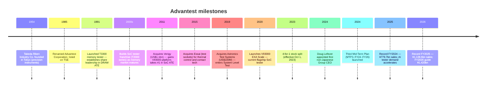
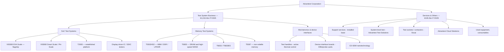
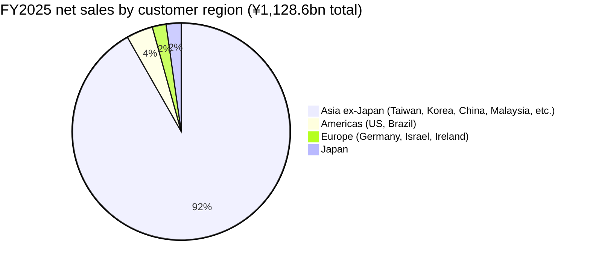
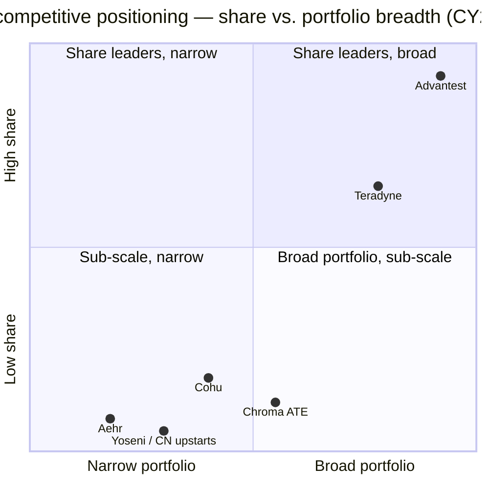
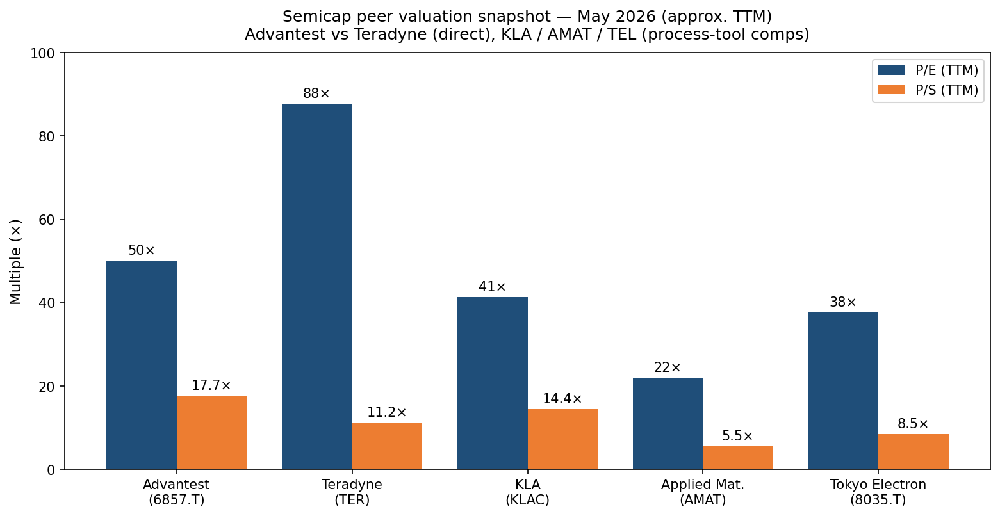

# COMPANY RESEARCH REPORT: Advantest Corporation (TSE:6857)

**Date:** 2026-05-20
**Ticker:** TSE:6857 (Tokyo Stock Exchange, Prime Market)
**ADR:** ATEYY (OTC) / ADTTF
**Sector:** Semiconductors — Automatic Test Equipment (ATE)
**HQ:** Shin-Marunouchi Center Building, 1-6-2 Marunouchi, Chiyoda-ku, Tokyo 100-0005, Japan
**Fiscal year:** April 1 – March 31 (FY2025 = year ended 31-Mar-2026)

---

> **Update — FY2026 guidance initiated (2026-04-27):** Coming off a record FY2025 (net sales ¥1,128.6 bn, +44.7% YoY; operating income ¥499.1 bn, +118.8%), Advantest initiated FY2026 guidance of net sales ¥1,420.0 bn (+25.8% YoY), operating income ¥627.5 bn (+25.7%), and net income ¥465.5 bn (+24.0%). Guidance assumes USD/JPY 150 and EUR/JPY 170, and is driven by continued AI-related semiconductor tester demand. The FY2026 net-sales target is ~3.4× FY2023 in three years.
> Source: [FY2025 Consolidated Financial Results, 2026-04-27](https://www.advantest.com/en/news/2026/a81o6o0000000hgw-att/E_FR_FY2025_FN.pdf), pp. 2 & 5.

> Earlier in the same fiscal year, management already raised FY2025 guidance multiple times — at Q1 (29-Jul-2025), Q2 (28-Oct-2025), and most aggressively at Q3 (28-Jan-2026), when full-year FY2025 net sales were taken to ¥1,070 bn and operating income to ¥454 bn ([FY2025 Q3 Consolidated Financial Results, 2026-01-28](https://www.advantest.com/document/en/investors/ir-library/result/E_FR_FY2025_3Q.pdf), p. 2). Actual FY2025 results then exceeded even the raised Q3 guidance.

---

## TABLE OF CONTENTS

1. Company Overview
2. Company History
3. Management Team
4. Products & Services
5. Customers & Go-to-Market
6. Industry Overview
7. Competitive Landscape
8. Market Opportunity (TAM)
9. Risk Assessment

======================================

## 1. COMPANY OVERVIEW

Advantest Corporation is the world's largest supplier of **automatic test equipment (ATE)** for semiconductors — the multi-million-dollar machines that test integrated circuits for functionality, performance, and reliability at the end of the wafer line and at final-package stage. The company designs, manufactures, sells, and services two product families that together represent the bulk of all merchant tester capex globally: **SoC testers** (for logic chips — application processors, AI accelerators, CPUs, microcontrollers, display drivers) and **memory testers** (for DRAM, NAND, and increasingly High-Bandwidth Memory / HBM stacks). Tertiary lines include **mechatronics** (test handlers, device interface boards, nanotechnology / CD-SEM measurement) and **services** (installed-base support, system-level test, test sockets via the Essai subsidiary). Advantest's mission, in the company's words, is "supporting society's development through testing" ([Advantest History page](https://www.advantest.com/en/about/history/)).

Advantest's business model is **transactional capital-equipment sales** to chipmakers — every NVIDIA GPU die, every AMD MI-series accelerator, every TSMC-fab'd ASIC, and every HBM stack produced at SK Hynix / Samsung / Micron passes through a tester (often multiple times: wafer sort, package test, and increasingly system-level test). Customers are: (i) IDMs (Intel, Samsung Memory, Micron, SK Hynix, Kioxia, Renesas, Infineon, etc.); (ii) fabless designers (NVIDIA, AMD, Apple, Qualcomm, Broadcom, MediaTek, Marvell, plus the wave of US hyperscaler-internal ASIC programs — Google TPU, AWS Trainium/Graviton, Microsoft Maia, Meta MTIA); (iii) foundries that perform wafer-level test as part of their packaged-die-or-known-good-die offering (TSMC, Samsung Foundry, Intel Foundry, SMIC); and (iv) OSATs that perform final package and system-level test (ASE, Amkor, JCET, Powertech). Decisions over which tester to qualify are typically made by the fabless customer; the foundry and OSAT then inherit that choice across the supply chain, which is what gives the installed-base its stickiness ([Investors Guide, 2025-04-25](https://www.advantest.com/document/en/investors/ir-library/investors-guide/Investors_Guide_2504E.pdf), p. 9).

Operationally, Advantest is profoundly **global-on-the-revenue-side and Japan-centric-on-the-cost-side**. FY2025 net sales of ¥1,128.6 bn were 97.8% non-Japanese: Asia ex-Japan accounted for ¥1,035.9 bn (91.8%) of revenue, the Americas ¥44.5 bn (3.9%), Europe ¥23.1 bn (2.1%), and Japan only ¥25.1 bn (2.2%) ([FY2025 Consolidated Financial Results, 2026-04-27](https://www.advantest.com/en/news/2026/a81o6o0000000hgw-att/E_FR_FY2025_FN.pdf), p. 15). Yet R&D, system integration of flagship SoC testers, and the bulk of intellectual property reside at the Gunma Factory and Gunma R&D Center in Japan ([Gunma R&D Center](https://www.advantest.com/en/about/offices/gunma-rd-center/)), with regional engineering hubs in Santa Clara (former Verigy) and Munich (former Agilent SoC test heritage). The workforce is roughly 6,500–7,000 people across 41 locations ([Highperformr Advantest profile](https://www.highperformr.ai/company/advantest)) — small versus Applied Materials' ~35,000 or Tokyo Electron's ~15,000, reflecting how concentrated the ATE supply chain has become around two players.

**Scale.** FY2025 net sales of ¥1,128.6 bn (≈ USD 7.5 bn at 150 ¥/USD) made Advantest the largest pure-play tester company globally, with revenue ~2.3× Teradyne's most recent annualized run-rate. FY2025 operating margin was **44.2%** — a level that puts Advantest near the top of the semicap industry, comparable to KLA and ahead of Applied Materials, Lam Research, and Tokyo Electron ([Advantest TYO:6857 financials at stockanalysis.com](https://stockanalysis.com/quote/tyo/6857/financials/)). Gross margin reached **64.3%** in FY2025, up from 50.6% in FY2023 — the swing reflects an extraordinary positive mix shift to high-end SoC testers tied to HPC/AI applications ([FY2025 FN](https://www.advantest.com/en/news/2026/a81o6o0000000hgw-att/E_FR_FY2025_FN.pdf), p. 8; stockanalysis figures). Free cash flow was ¥302.2 bn in FY2025, the company ended the year with ¥340.0 bn of cash (¥795.7 bn of equity, 67.9% equity ratio), and returned ¥114.3 bn through buybacks plus ¥35.8 bn of dividends in the same year ([FY2025 FN, p. 7](https://www.advantest.com/en/news/2026/a81o6o0000000hgw-att/E_FR_FY2025_FN.pdf)).

*Source: net sales and margins from [Advantest FY2024 Financial Results, 2025-04-25](https://www.advantest.com/en/news/2025/ildr5p0000000il7-att/E_FR_FY2024_FN.pdf), [FY2025 Financial Results, 2026-04-27](https://www.advantest.com/en/news/2026/a81o6o0000000hgw-att/E_FR_FY2025_FN.pdf), and historical FY2021–FY2022 from the [stockanalysis.com financials extract](https://stockanalysis.com/quote/tyo/6857/financials/) (S&P Global Market Intelligence template). Operating margin uses press-released operating income (so FY2023 includes ¥9 bn impairment on Essai goodwill).*

### Valuation snapshot (REQUIRED)

As of mid-May 2026, Advantest trades around **¥27,000–27,200** on Tokyo Prime ([Yahoo Finance, 6857.T quote](https://finance.yahoo.com/quote/6857.T/)), implying a market cap of roughly **¥19.8–20.0 trillion** (≈ USD 132–138 bn at ~150 ¥/USD) — placing it in the global top-200 most-valuable listed companies ([companiesmarketcap.com — Advantest](https://companiesmarketcap.com/advantest/marketcap/)).

- **TTM P/E ≈ 50×** on FY2025 reported diluted EPS of ¥513.30 (¥27,000 / ¥513 ≈ 52.6×), declining to **~42× forward** on FY2026 guidance EPS of ¥641.61 ([FY2025 FN, p. 1 and p. 2](https://www.advantest.com/en/news/2026/a81o6o0000000hgw-att/E_FR_FY2025_FN.pdf)). Some data providers still print ~125× because they have not yet rolled in the April-27-2026 FY2025 actuals; the 50× number is the correct forward-looking print using the just-reported earnings ([Google Finance shows ~49.7×](https://www.google.com/finance/beta/quote/6857:TYO), consistent with this).
- **TTM P/S ≈ 17.7×** on FY2025 sales (¥19.8 tn / ¥1,128.6 bn).
- **P/B ≈ 13×** on FY2025 book equity per share of ¥1,097.50 (¥27,000 / ¥1,097.50 = 24.6×; some providers cite ~13× using a different equity definition — see [companiesmarketcap.com P/B](https://companiesmarketcap.com/advantest/pb-ratio/)).
- **3-year range** is wide: from sub-30× P/E during the FY2023 trough to >100× momentarily in early 2025 when consensus EPS lagged the AI-tester ramp.

**Peer benchmarks (mid-May 2026):**
- **Teradyne (NASDAQ:TER)** — the closest direct ATE comp — trades at ~$402 with a market cap ~USD 57 bn and TTM P/E ~88× on TTM diluted EPS of $3.48 ([gurufocus TER P/E TTM](https://www.gurufocus.com/term/pettm/TER); [Teradyne stockanalysis statistics](https://stockanalysis.com/stocks/ter/statistics/); [companiesmarketcap TER](https://companiesmarketcap.com/teradyne/marketcap/)). On forward earnings TER is closer to ~40×.
- **Tokyo Electron (TSE:8035)** — front-end process-tool peer — TTM P/E ~37.7× ([Simply Wall St 8035 valuation](https://simplywall.st/stocks/jp/semiconductors/tse-8035/tokyo-electron-shares/valuation); [companiesmarketcap TEL P/E](https://companiesmarketcap.com/tokyo-electron/pe-ratio/)).
- **KLA (NASDAQ:KLAC)** — process control, closest mindshare-adjacent comp — TTM P/E ~41× ([Yahoo Finance KLAC key statistics](https://finance.yahoo.com/quote/KLAC/key-statistics/)).
- **Applied Materials (NASDAQ:AMAT)** — broad process-tool peer — TTM P/E ~22× ([Alpha Spread KLAC-AMAT comparison](https://www.alphaspread.com/comparison/nasdaq/klac/vs/nasdaq/amat)).

The "semicap" median P/E sits around **30–40×** when weighted toward front-end process tools. Advantest at ~50× TTM is **at the upper end of the cohort but cheaper than Teradyne** — and at ~42× forward it converges back toward sector median.

**Multiple decomposition (why >50× TTM is paid):** the premium is overwhelmingly **AI-cycle premium** plus **operating leverage**. (a) Test intensity for AI chips is structurally higher than for legacy logic: NVIDIA's Blackwell-generation B200/B300 and AMD's MI300/MI355 spend roughly 2–3× the tester time of last-generation hopper/H100 dies, and HBM3E/HBM4 stacks require a separate, equally test-intensive flow that did not exist for non-HBM DRAM ([Test challenges grow for DRAMs and HBM, semiecosystem.com](https://marklapedus.substack.com/p/test-challenges-grow-for-drams-and)). (b) Advantest already raised FY2025 guidance three times and still beat by ~5% on revenue and ~10% on operating income — so analyst models continue to chase the print, compressing trailing P/E as estimates rise. (c) The FY2024→FY2025 jump in gross margin (50.6% → 64.3%) shows actual operating leverage on the high-end SoC tester mix, supporting that earnings can continue surprising up. The risk if the AI capex cycle pauses is large — see Risk Assessment §9.

---

## 2. COMPANY HISTORY

Advantest traces its roots to **1954**, when Takeda Riken Industry Co., Ltd. was founded in Tokyo as a precision electronic-measurement instrument company. By the late 1970s the firm had become Japan's national champion in test equipment, and in **1985** it renamed itself Advantest Corporation, reflecting an explicit pivot to the semiconductor-test market that was emerging alongside the Japanese DRAM boom ([History | About Advantest](https://www.advantest.com/en/about/history/)). The company listed on the Tokyo Stock Exchange the same year. The 1990s and early 2000s saw Advantest dominate memory ATE in the DRAM era (when Japan accounted for >50% of world DRAM output) and progressively build the SoC tester business through internal development of the T-series and successive V-series platforms.

The two most consequential transactions in Advantest's modern history are:

- **Verigy acquisition (2011)** — Advantest paid approximately **US$1.1 billion** to acquire Singapore-listed Verigy Ltd., a leading SoC tester pure-play that had been spun out of Agilent (itself originally HP's test & measurement division). The deal closed after an extended bidding contest with LTX-Credence and was approved by the Singapore High Court ([Advantest 6-K, 2011-03-28](https://www.sec.gov/Archives/edgar/data/0001158838/000114420411017408/v216189_ex99-1.htm)). Verigy brought the **V93000** platform, which combined with Advantest's legacy T2000 line gave the company a complete SoC test portfolio and an instantaneous #1 share in SoC ATE — a position that has compounded ever since.
- **Astronics Test Systems acquisition (2019)** — Advantest acquired the commercial Semiconductor System Level Test business from Astronics (NASDAQ:ATRO) for **US$100 million** plus up to US$35 million in earn-outs (renegotiated down from the original US$185 million 2018 deal terms) ([Astronics 8-K, 2019](https://www.sec.gov/Archives/edgar/data/0000008063/000000806322000049/ex99120221108-pr.htm); [Electronic Design coverage](https://www.electronicdesign.com/applications/semiconductor-test/article/13018705/astronics-sells-semiconductor-test-business-to-advantest-for-185-million)). The acquired entity is now Advantest Test Solutions, Inc., headquartered in Irvine, California, and forms the nucleus of Advantest's System Level Test (SLT) business — important because AI accelerators increasingly require post-package SLT to catch escape defects that ATE alone cannot detect.

**Strategic pivots.** Three transformations stand out. First, the **memory-to-SoC pivot** of the 2000s, which the Verigy deal completed: SoC testers now dwarf memory testers as a share of the segment (rough industry split: ~70% SoC, ~30% memory). Second, the **module-architecture standardization** built into the V93000, which lets customers reconfigure a single tester for digital, analog, RF, and power-mixed-signal devices by swapping cards — this is what drives the long installed-base half-life management cites: the V93000 Smart Scale, Pin Scale, and EXA Scale generations are all in production use simultaneously ([Investors Guide 2025, p. 11](https://www.advantest.com/document/en/investors/ir-library/investors-guide/Investors_Guide_2504E.pdf)). Third, the **system-level test expansion** anchored by the Astronics deal, which converts Advantest from a pure ATE vendor to a "total test environment" supplier covering wafer test, package test, SLT, and now socket/interface board consumables (via Essai). The MTP3 plan explicitly aims to grow adjacent / new businesses beyond pure ATE.

**Recent developments** (last 18 months). The company **changed its segment reporting structure** in Q1 FY2025 (quarter ended June 2025), consolidating the legacy three-segment view (Semiconductor & Component Test Systems / Mechatronics / Services, Support & Others) into a cleaner two-segment view (**Test System Business** and **Services and Others**) — this collapses the small mechatronics line into the test-system segment alongside SoC and memory testers, which is how customers actually buy bundled solutions ([FY2025 Q3 Financial Results, p. 3](https://www.advantest.com/document/en/investors/ir-library/result/E_FR_FY2025_3Q.pdf)). On capital return, Advantest cancelled treasury shares in FY2025 (issued share count fell from 766.1m to 732.0m) and accelerated buybacks (¥114.3 bn in FY2025 vs. ¥50.1 bn in FY2024), raised the dividend from ¥39 to ¥59 per share, and is signalling further capital return capacity given the ¥340 bn cash balance ([FY2025 FN, pp. 1–2](https://www.advantest.com/en/news/2026/a81o6o0000000hgw-att/E_FR_FY2025_FN.pdf)).

---

## 3. MANAGEMENT TEAM

### Douglas (Doug) Lefever — Representative Director and Group CEO

Doug Lefever (b. December 1970) became Advantest's first non-Japanese Group CEO on **April 1, 2024**, a watershed event in a company whose CEOs had been Japanese for 70 consecutive years — and unusual for any Prime-market Japanese industrial. His career sits squarely at the intersection of Advantest's two strategic franchises: the V93000 platform and the system-level-test expansion. Lefever holds a B.S. in mechanical engineering from the University of Michigan, an M.S. in mechanical engineering from the University of Texas at Austin, and an MBA from Northwestern Kellogg ([Doug Lefever — Advantest, LinkedIn](https://www.linkedin.com/in/doug-lefever-7aa2528/)). He joined Advantest's US arm in **1998** as a young engineer and rose through 25+ years of operations, sales, and strategy roles — President & CEO of Advantest America Inc. (2014–), Managing Executive Officer (2017–2019), Executive Vice President & Chief Operating Officer (2019–2023), and Chief Strategy Officer (2023–2024) before stepping up to Group CEO ([Advantest press release on appointment, 2025-03-28](https://www.advantest.com/en/news/2025/ildr5p0000000h24-att/E_Info_20250328.pdf); [Japan Times, "Japan's Advantest taps American to become next CEO", 2024-02-29](https://www.japantimes.co.jp/business/2024/02/29/companies/japan-advantest-new-american-ceo/)).

What he has specifically delivered: Lefever was the principal internal champion of the **Verigy acquisition in 2011** — at the time he was running Advantest's US operations, and Verigy's integration into Advantest America Inc. was effectively his project. Verigy is **the** reason Advantest is the SoC-tester market leader today (not a memory leader still trying to crack SoC, which was the pre-2011 status quo). He also led the **Astronics Test Systems acquisition (2019)**, expanding Advantest into SLT — the segment that has since become its highest-growth adjacency on the back of HBM and AI-accelerator quality requirements ([Silicon Semiconductor, "Advantest appoints new Group CEO", 2024](https://siliconsemiconductor.net/article/119005/Advantest_appoints_new_Group_CEO); [Go Semi and Beyond interview with Doug Lefever](https://www.gosemiandbeyond.com/interview-with-doug-lefever-representative-director-and-group-ceo/)). His appointment is a deliberate signal: Advantest's customers (US fabless, Taiwan foundries, Korean memory IDMs) are largely outside Japan, and the board chose someone who has built the operating relationships with NVIDIA, AMD, Intel, Apple, Qualcomm, TSMC, Samsung, and SK Hynix over two-plus decades. Lefever owns a meaningful — though for a Japanese company, modest — equity stake disclosed in the proxy materials ([84th Ordinary General Meeting of Shareholders nominees, FY2025 FN p. 15](https://www.advantest.com/en/news/2026/a81o6o0000000hgw-att/E_FR_FY2025_FN.pdf)). On the strategy side he has been explicit that ATE is a "growing market" rather than the mature one it was historically seen as, and has framed the AI cycle as a step-change in test intensity, not a cyclical spike (Go Semi interview, op. cit.).

### Koichi Tsukui — Representative Director, President & Group COO

Koichi Tsukui (b. December 1964) was promoted to President and Group COO concurrent with Lefever's CEO appointment in April 2024. Tsukui joined Advantest in **2014** — relatively late in his career, after roles in Japanese industrial firms — and worked his way through the System Test Business Unit. He served as EVP of the System Test BU (2019), Chief Executive Officer of that unit (2020), Chief Strategy Officer (2021), and then COO (2023) before the April 2024 promotion to Representative Director, President, and Group COO ([Management | About Advantest](https://www.advantest.com/en/about/management/); [GlobalData Advantest executives](https://www.globaldata.com/company-profile/advantest-corp/executives/)). He signs the financial filings as company representative — including the FY2025 FN — meaning he is the public face for Japanese investors while Lefever interfaces with global customers and US/EU investors. Tsukui owns Advantest stock per the proxy disclosures.

### Hisako Takada — Senior Executive Officer & CFO

Takada signs the financial results as CFO and contact person (telephone (03) 3214-7500) — a long-tenured Advantest finance executive. The company has not made the CFO bio a marketing centerpiece; her role is operational, not promotional. The capital return shift in FY2025 (¥114 bn buyback, dividend raise from ¥39 → ¥59) was executed under her tenure and signals an increasingly shareholder-friendly capital allocation policy. The ¥340 bn cash balance and zero long-term debt position (¥3 m of long-term borrowings) at FY2025 year-end suggest meaningful capacity for further capital return ([FY2025 FN, pp. 1 and 7](https://www.advantest.com/en/news/2026/a81o6o0000000hgw-att/E_FR_FY2025_FN.pdf)).

### Yoshiaki Yoshida — Director (former Group CEO)

Yoshida is the predecessor CEO (2017 – March 2024) who oversaw the 2018–2024 expansion phase, including the original Verigy integration aftermath and the launch of V93000 EXA Scale (H2 2020). He remains on the board as Director, providing institutional continuity. Under his tenure, Advantest grew net sales from ¥175.7 bn (FY2017) through the post-COVID peak; he handed Lefever a company with momentum that has since accelerated dramatically.

### Governance

- The board comprises a mix of Japanese and non-Japanese directors. The 84th Ordinary General Meeting of Shareholders (to be held July 31, 2026) nominees include Lefever, Tsukui, Yoshida, and **Toshimitsu Urabe** as outside director ([FY2025 FN, p. 15](https://www.advantest.com/en/news/2026/a81o6o0000000hgw-att/E_FR_FY2025_FN.pdf)). The presence of an outside director and the Audit & Supervisory Committee structure are standard for TSE Prime issuers under Japan's revised Corporate Governance Code.
- Insider ownership is modest by founder-led standards but typical of large Japanese listed companies; the company actively cancels treasury shares (32.4 m → 6.5 m between FY2024 and FY2025) signalling a capital-return-led approach rather than insider accumulation.
- Comp structure shifted in FY2024–FY2025 toward more equity / performance-linked components (share-based compensation expense rose from ¥1.77 bn FY2023 → ¥2.89 bn FY2024 — both small in absolute terms but trending up; [FY2024 FN p. 11](https://www.advantest.com/en/news/2025/ildr5p0000000il7-att/E_FR_FY2024_FN.pdf)).
- No reported material related-party transactions, no governance flags in the public record.

### Management track record synthesis

This is a team that has delivered, but in a tailwind. The Verigy and Astronics deals were both subsequently validated — V93000 is the dominant SoC platform; SLT has become a structural growth lane. The board's choice of a non-Japanese CEO is itself a credibility marker — Japanese industrial boards are extremely conservative about this. The unknown is what happens at the next downturn: Lefever has not yet steered Advantest through a real cyclical contraction as CEO (FY2023's decline was on Yoshida's watch). Expect very strong execution while the AI cycle persists; the harder question is capital discipline if and when the cycle inverts.

---

## 4. PRODUCTS & SERVICES

Advantest's product portfolio is now organized into two reporting segments: **Test System Business** and **Services and Others**. Within Test Systems, products break into three families (SoC, Memory, Mechatronics & peripherals); within Services and Others sit the installed-base support, system-level test, sockets/contactors (Essai), used-equipment, and cloud-solutions businesses.

### SoC Test Systems — the AI/HBM growth engine

The **V93000 EXA Scale**, launched in H2 2020, is Advantest's flagship SoC tester. EXA Scale extends the V93000 architecture (originally a Verigy product) with the channel density, vector depth, and parallelism required for "exascale" performance-class digital ICs — the precise category that NVIDIA Blackwell, AMD Instinct, and emerging hyperscaler ASICs occupy ([V93000 EXA Scale product page](https://www.advantest.com/products/soc/v93000/exa.html)). Two earlier-generation modules (Pin Scale, Smart Scale) remain in production at customer sites; the entire V93000 family is module-architecture-based, so a customer who bought a Pin Scale tester in 2018 can upgrade selected modules to EXA Scale capability without replacing the system, which is the technical foundation for the multi-decade installed-base ROI Advantest emphasizes to investors. Beyond the V93000, Advantest still ships the **T2000** for older application processors and analog/mixed-signal devices.

Advantest discloses SoC tester sales in two application buckets: **"Computing & Communications"** (HPC, AI accelerators, smartphone application processors) and **"Automotive, Industrial, Consumer & DDIC"** (mature-node devices and display drivers). In FY2024, Computing & Communications was where the explosive growth happened; the FY2025 narrative is identical, with "sales of SoC Test Systems for high-performance SoC semiconductors increased significantly … in response to the increasing demand for HPC devices and AI-related semiconductors. On the other hand, tester demand for mature semiconductors such as those used in the automotive and industrial equipment sectors remained soft" ([FY2025 FN p. 3](https://www.advantest.com/en/news/2026/a81o6o0000000hgw-att/E_FR_FY2025_FN.pdf)).

**Customer wins / installed-base signals.** Recent public deal disclosures include iTest selecting V93000 EXA Scale (October 2023 — [Advantest news](https://www.advantest.com/en/news/2023/20231011.html)) and ISE Labs ordering V93000 EXA Scale for production test services. Hyperscaler ASIC customers (Google TPU, AWS Trainium, Microsoft Maia) and the merchant AI players (NVIDIA, AMD) are widely understood — through third-party reporting and the company's own qualitative commentary — to standardize on V93000 for their leading-edge accelerators, although Advantest does not name them by 10% threshold ([AInvest, "Advantest's Strategic Position in the AI and Advanced Semiconductor Test Market"](https://www.ainvest.com/news/advantest-strategic-position-ai-advanced-semiconductor-test-market-lucrative-investment-ai-hpc-driven-growth-2512/)).

**Competitive-advantage verdict — SoC testers: YES (high).** Moat type: a stack of (i) **switching costs** (customers' test programs are written against V93000's instruction set; rewriting them for Teradyne UltraFLEX or J750 takes 12–24 months and risks yield), (ii) **scale economics** (Advantest spreads V93000 R&D — multi-hundred-million-dollar annual investment — across the largest tester installed base), and (iii) **technology depth** (modular architecture supports leading-edge nodes that competitors can match only with significant new investment). Closest competing product: **Teradyne UltraFLEXplus**. Compare: at parity to slightly ahead on high-end digital throughput for AI accelerators; Teradyne stronger historically in mobile application processors (Apple A-series, Qualcomm Snapdragon). Advantest market share in SoC testers is widely cited at >50% and rising; in 2024 Advantest's overall ATE share reached **~58%** ([Investors Guide 2025, p. 3](https://www.advantest.com/document/en/investors/ir-library/investors-guide/Investors_Guide_2504E.pdf)).

### Memory Test Systems — the HBM tester franchise

Memory testers are where Advantest's history began (DRAM-era Japan) and where the HBM-driven AI cycle has now re-energized the franchise. Key platforms:

- **T5835** — launched November 2021, tests DRAM and high-speed NAND with operating speeds up to 5.4 Gbps and massive parallelism for KGD (known-good-die) test, including **DRAM for HBM** stacks ([T5835 product page](https://www.advantest.com/en/products/semiconductor-test-system/memory/t5835/); [T5835 launch press release, 2021](https://www.advantest.com/en/news/2021/20211130.html)). The T5835 is the workhorse for HBM die-level test at SK Hynix, Samsung, and Micron.
- **T5503HS2** — tests high-speed memory ICs at speeds up to **9 Gbps** with ±45 ps timing accuracy and 16,256 channels for industry-leading parallelism, covering DDR4, LPDDR4, and HBM devices ([T5503HS2 product page](https://www.advantest.com/en/products/semiconductor-test-system/memory/t5503hs2/)). This is the high-bandwidth-coverage workhorse.
- **T5833 / T5833ES** — broader DRAM and non-volatile memory test ([T5833 product page](https://www.advantest.com/en/products/semiconductor-test-system/memory/t5833/)).
- **T5587** — non-volatile memory tester platform.

HBM test is structurally more demanding than legacy DRAM test for two reasons: (i) HBM uses TSVs (through-silicon vias) and stacked dies, so KGD test must be done before stacking — any escape becomes an entire stack to scrap; (ii) HBM3E and HBM4 push interface speeds to >9 Gbps per pin with 1024+ I/Os, vastly more pins-under-test per device than commodity DDR5. Industry coverage confirms that HBM test demand is "outpacing" DRAM tester capacity ([Test Challenges Grow For DRAMs and HBM, Semiecosystem](https://marklapedus.substack.com/p/test-challenges-grow-for-drams-and)).

**Competitive-advantage verdict — Memory testers: YES (high in HBM, moderate in commodity DRAM/NAND).** Closest competitor: Teradyne's Magnum platform (NAND-heavy) and **Korean upstart** Yoseni / Eles testers (commodity). Advantest's memory ATE market share is widely cited at ~50%+ ([Pestel Analysis on Advantest competitive landscape](https://pestel-analysis.com/blogs/competitors/advantest)). In HBM specifically, Advantest is the standard for KGD testing at all three HBM memory makers — this is a critical lock because the three memory IDMs collectively determine the global HBM tester demand pool.

### Mechatronics — handlers and DIBs

Test handlers (which physically pick and place dies/packages onto testers, with active thermal control to test at temperature) and device interface boards (custom-designed PCBs that route signals from the tester to the device under test) are sold in tandem with the testers themselves. This business now sits inside the consolidated Test System segment but historically was its own segment. Sales of mechatronics products track tester sales because they are essentially attach products — in FY2024, mechatronics segment sales rose 38.9% YoY when the company was still disclosing it separately, lagging the semiconductor-test-system segment's 80.4% but still very strong ([FY2024 FN p. 6](https://www.advantest.com/en/news/2025/ildr5p0000000il7-att/E_FR_FY2024_FN.pdf)). Within mechatronics, the **CD-SEM** (critical-dimension scanning electron microscope) product is a small but technically distinguished line measuring photomasks and wafers — competitive with Hitachi High-Tech and AMAT eBeam.

**Competitive-advantage verdict — Mechatronics: PARTIAL.** Moat is largely "attach to tester sales" — customers buying V93000 testers tend to buy Advantest handlers and DIBs for integration simplicity. Outside that pull, the handler market has more credible competitors (Cohu/Xcerra, ASM Pacific). Closest competing product: **Cohu Diamondx** for handlers, **R&D Altanova** and Cohu Kita Manufacturing for DIBs. Compare: at parity to slightly ahead within the Advantest-tester ecosystem, behind Cohu in non-Advantest tester ecosystems.

### Services & Others — the SLT growth lane

This is the smaller but increasingly important segment, comprising:
- **Support Services** — installed-base maintenance, calibration, training, spares. Recurring-revenue character; grows with the tester installed base. FY2025 sales rose 12.7% to ¥109.2 bn, driven by installed-base growth ([FY2025 FN p. 3](https://www.advantest.com/en/news/2026/a81o6o0000000hgw-att/E_FR_FY2025_FN.pdf)).
- **System Level Test (SLT)** — sold via Advantest Test Solutions (former Astronics Test Systems). SLT systems test fully-packaged devices in their final application mode — increasingly required for AI accelerators where escape defects from package test would be catastrophic in a USD 30,000+ B200 module. This is a structural growth area, though FY2024's segment loss of ¥10.9 bn included a ¥21.4 bn impairment charge on goodwill and intangible assets in the Essai (test sockets) business — a major customer slowed orders and new-customer ramp was slower than expected ([FY2024 FN p. 6](https://www.advantest.com/en/news/2025/ildr5p0000000il7-att/E_FR_FY2024_FN.pdf)). The FY2025 segment swung back to ¥8.8 bn of segment income (an improvement of ¥24.9 bn), helped by a ¥2.5 bn divestiture gain and underlying recovery.
- **Test sockets & contactors (Essai)** — the previously-impaired business; still core to high-end test, just facing customer-mix volatility.
- **Advantest Cloud Solutions™** — software/cloud-based test analytics — small but a strategic priority in MTP3 to monetize the installed base.

**Competitive-advantage verdict — Services: PARTIAL.** Support services are sticky (you can't service a V93000 with a Teradyne FSE). SLT is the right place to be strategically, but Advantest is the new entrant — Teradyne and traditional SLT specialists (Marvin Test Solutions, the legacy Diamond) have earlier installed bases. The Essai impairment underscores that SLT/sockets has been bumpier than the core tester business.

### Flagship vs. long-tail

The **1–3 products that drive the business** are: (1) **V93000 EXA Scale + earlier-gen V93000 modules** — the dominant SoC tester family, the single biggest driver of FY2025's 49.3% Test System segment growth; (2) **T5835 / T5503HS2** — the memory tester family that powers HBM KGD test at SK Hynix, Samsung, and Micron; (3) **Advantest Cloud Solutions + SLT (Advantest Test Solutions)** — the strategic adjacency growth lane. Everything else (T2000 legacy SoC, CD-SEM, used equipment, Essai sockets) is either declining or sub-scale.

### Last-12-month launches and changes

- **Segment-reporting restatement** to 2 segments effective Q1 FY2025 (June 2025 quarter) — consolidates mechatronics into Test System Business.
- **Continued V93000 module rollouts** for HBM4 and next-gen AI accelerator readiness — exact module designations not all publicly named.
- **No new platform-level tester launches** in the last 12 months — the V93000 EXA Scale (launched 2020) remains current generation; this is consistent with the 5–10 year ATE platform cycle.
- **Essai goodwill written down** by ¥21.4 bn in Q4 FY2024 (March 2025), then a small ¥2.5 bn divestiture gain recognized in FY2025.

---

## 5. CUSTOMERS & GO-TO-MARKET

Advantest serves the four canonical customer types of the disaggregated semiconductor supply chain: **IDMs** (Integrated Device Manufacturers), **fabless** designers, **foundries**, and **OSATs**. The chain has evolved over 20+ years from IDM-dominated to a fabless-foundry-OSAT model, in which **the fabless customer's tester choice cascades down to the foundry doing wafer sort and the OSAT doing package and system-level test** — this dynamic is what makes capturing the fabless decision so consequential for ATE vendors. As Advantest puts it: "the same testers selected by fabless companies for verification during device design are often used by foundries for sample evaluation and wafer testing, and by OSATs for post-assembly package testing. Therefore, decision-making by a fabless customer is an important point for tester selection in the disaggregated model" ([Investors Guide 2025, p. 9](https://www.advantest.com/document/en/investors/ir-library/investors-guide/Investors_Guide_2504E.pdf)).

*Source: [FY2025 Consolidated Financial Results, 2026-04-27, p. 15](https://www.advantest.com/en/news/2026/a81o6o0000000hgw-att/E_FR_FY2025_FN.pdf). Customer-location basis.*

### Customer concentration

Advantest **does not disclose specific named customers above the 10% revenue threshold** in its consolidated IFRS financial reports (the FY2024 and FY2025 Kessan Tanshin / 決算短信 do not include a `主要な販売先` / "Major Customers" disclosure). The detailed customer-mix disclosure would normally appear in the **Yuho** (有価証券報告書 / Annual Securities Report) filed on EDINET in late June — the FY2025 Yuho is scheduled for filing **June 26, 2026** ([FY2025 FN p. 1](https://www.advantest.com/en/news/2026/a81o6o0000000hgw-att/E_FR_FY2025_FN.pdf)) and is not yet public as of this report's date (2026-05-20). The FY2024 Yuho (June 2025) likewise did not name any single customer crossing the 10% threshold.

Advantest's own narrative in the Investors Guide emphasizes that "the customer base is characterized by the **low sales concentration** of the top customers. In other words, the customer base is well-diversified, and especially in the last few years, there has been a marked increase in the number of new customers" ([Investors Guide 2025, p. 13](https://www.advantest.com/document/en/investors/ir-library/investors-guide/Investors_Guide_2504E.pdf)). This is qualitatively credible: the relevant customer universe spans 6+ HBM customers (3 IDMs × wafer fab + package test sites), >20 leading-edge SoC programs (NVIDIA, AMD, Apple, Qualcomm, Broadcom, MediaTek, Marvell, Google, AWS, Microsoft, Meta, Tesla Dojo, etc.), >5 leading-edge foundries with internal test capacity, and a global OSAT base.

**That said, the underlying customer base is highly concentrated in three logical clusters where Advantest does not break out specific %**: (i) **Taiwan** — TSMC plus the OSAT cluster (ASE, SPIL, Powertech) and Taiwanese fabless (MediaTek, Realtek, Novatek); (ii) **Korea** — Samsung Memory, SK Hynix; (iii) **US fabless designing for AI** — NVIDIA, AMD, plus the hyperscaler ASIC pipeline. Geographic concentration (¥1,036 bn = 91.8% of sales in Asia ex-Japan) is the de facto proxy and is itself the more telling concentration metric.

Contract structure is typical capital equipment: **purchase-order by purchase-order**, with long-lead-time backlog visibility (3–12 months) but no take-or-pay multi-year master agreements at the customer-revenue level. Advantest does engage in long-term agreements with **suppliers** for critical components — "long-term agreements with existing suppliers and the diversification of supply chain for core parts" are explicitly cited in both FY2024 and FY2025 management commentary ([FY2024 FN p. 5](https://www.advantest.com/en/news/2025/ildr5p0000000il7-att/E_FR_FY2024_FN.pdf); [FY2025 FN p. 2](https://www.advantest.com/en/news/2026/a81o6o0000000hgw-att/E_FR_FY2025_FN.pdf)).

**Risk flag:** The absence of named-customer concentration disclosure in the Kessan Tanshin does not equal no concentration — it reflects the IFRS / Japan disclosure threshold convention. **It is reasonable to assume that NVIDIA + the top two HBM IDMs together account for materially more than 30% of FY2025 revenue**, given (a) the magnitude of HBM tester demand from Samsung/SK Hynix and (b) the volume of NVIDIA Blackwell tester capacity that came online in CY2025. This is not disclosed, so the assumption is flagged as inference rather than fact. Section 9 carries customer-concentration as a material risk.

### Distribution and channels

**Direct sales** with embedded customer-facing engineering teams. Each major customer (NVIDIA, Samsung, TSMC, etc.) has dedicated Advantest applications engineers who participate in the customer's product development cycle, often years ahead of volume production. This is critical: tester selection happens during the device design phase, before silicon comes back; testers are sold with months-long lead times and 12–18-month customer-qualification cycles.

### Sales cycle

A new V93000 EXA Scale system has a list price in the low-to-mid **US$10 millions** depending on configuration; memory testers (T5835, T5503HS2) typically lower per-unit but sold in higher volumes. Sales cycles for greenfield customer wins span 12–24 months; expansion orders into an existing installed base have lead times of weeks to a few months. Backlog (受注残高) is disclosed in the Japanese-language Yuho but not in the English-language Kessan Tanshin.

### Key partnerships

Advantest collaborates closely with:
- **NVIDIA** — the Advantest Cloud Solutions™ ecosystem integrates with NVIDIA-accelerated computing for tester analytics, and the V93000 family is the de facto AI-accelerator tester ([AInvest commentary, 2024–2025](https://www.ainvest.com/news/advantest-strategic-position-ai-advanced-semiconductor-test-market-lucrative-investment-ai-hpc-driven-growth-2512/)).
- **Foundries (TSMC, Samsung Foundry, Intel Foundry)** — joint test-process development for advanced nodes (3nm, 2nm, GAA).
- **OSAT consortium** — ASE, Amkor, Powertech, JCET all run Advantest equipment in their package test floors.

### Customer case studies (publicly named)

- **iTest** — selected V93000 EXA Scale for production test services (October 2023 — [Advantest announcement](https://www.advantest.com/en/news/2023/20231011.html)).
- **ISE Labs** — chose V93000 EXA Scale for production test services ([Finance.yahoo coverage](https://finance.yahoo.com/news/ise-labs-chooses-advantest-v93000-080500756.html)).
- Larger customers (NVIDIA, Samsung Memory, etc.) are not disclosed in named-deal press releases but are widely understood from industry coverage.

---

## 6. INDUSTRY OVERVIEW

The semiconductor test equipment industry — **ATE (Automatic Test Equipment)** — is a niche but high-leverage corner of the broader semicap value chain. It sits at the **back end** of the semiconductor manufacturing flow, after wafers leave the front-end fab and before/after package assembly. Of the 400–600 process steps to manufacture a leading-edge IC, "**testing is the only process that handles electricity**, as highly precise electric signals are analyzed to determine the quality of semiconductor" ([Investors Guide 2025, p. 10](https://www.advantest.com/document/en/investors/ir-library/investors-guide/Investors_Guide_2504E.pdf)). This makes ATE structurally different from front-end process equipment (lithography, deposition, etch, CMP) — which is the domain of ASML, Applied Materials, Lam Research, Tokyo Electron, KLA — and from back-end assembly equipment (ASMPT, BE Semiconductor).

### Market size and growth

The **global semiconductor tester market** is small in absolute terms — Advantest's own materials cite roughly **US$6 billion** in calendar 2024, split approximately **US$4.1 bn SoC + US$1.9 bn memory** ([DataInsightsMarket Advantest segmented revenue](https://www.datainsightsmarket.com/companies/6857.T)). For context, the broader semicap industry is ~US$110 bn (ASML alone is ~US$30 bn revenue), so ATE is 5–6% of total semicap. But the **ATE market has been the fastest-growing slice of semicap in the AI cycle**: Advantest's own ATE share rose to **~58% in CY2024** ([Investors Guide 2025, p. 3](https://www.advantest.com/document/en/investors/ir-library/investors-guide/Investors_Guide_2504E.pdf)), and its FY2025 sales grew 44.7% YoY into the AI inflection.

**Drivers of tester demand**, per Advantest's own framework:
- **Capacity buys** — driven by chipmakers' wafer-output capacity expansion. Government-subsidized fab buildouts (US CHIPS Act, EU Chips Act, Japan METI, Korea K-Chip, China SMIC localization) are increasing global wafer capacity, which mechanically drives tester capacity buys.
- **Technology buys** — driven by node migration (3nm → 2nm → 1.4nm at TSMC; GAA at Samsung Foundry), heterogenous integration (chiplets, CoWoS, foundry-OSAT advanced packaging), and the rise of test-intensity-intensive devices (AI accelerators, HBM stacks, 5G/6G transceivers). Per the company: "the challenges associated with miniaturization, complexity, and power consumption of semiconductors are making it harder to improve test efficiency, which is also a tailwind" ([Investors Guide p. 6](https://www.advantest.com/document/en/investors/ir-library/investors-guide/Investors_Guide_2504E.pdf)).

The industry is **cyclical** — capex-tied capital equipment always is — but the cyclicality is **moderating** as the application mix broadens (smartphones → autos → AI → 5G/6G → industrial). FY2023 was the most recent down year (sales -13.2%); FY2024 and FY2025 have been violently up. Pre-2020 ATE market growth averaged ~10% annually; the AI cycle has driven ~30% CAGR for the 2023–2026E period.

### Industry structure — a duopoly

The global ATE market is a **duopoly**: **Advantest + Teradyne together hold approximately 80% market share** ([Investors Guide p. 13](https://www.advantest.com/document/en/investors/ir-library/investors-guide/Investors_Guide_2504E.pdf)). The remaining ~20% is split among Cohu (handler-heavy), Chroma ATE (Taiwan, broader instrumentation), Aehr Test Systems (small-share specialist in burn-in/SLT), Marvin Test Solutions (military/aerospace), and a long tail of Korean and Chinese upstarts (Yoseni, Eles, GLSemi). In SoC test specifically, Advantest's share is widely cited >50%; in memory test, Advantest is the share leader though Teradyne holds meaningful NAND share via Magnum.

**Why is the industry a duopoly?** Three structural reasons:
1. **Switching costs.** Customers' production test programs are intellectual property tied to a specific tester instruction set. Re-writing test programs for a different platform takes 12–24 months per device family and risks yield. Once a major fabless customer (say NVIDIA or Apple) standardizes on a platform, that decision propagates downstream to every foundry and OSAT that touches their silicon — for the device's life cycle (5–10 years).
2. **R&D scale.** A new flagship tester platform takes 5+ years and roughly US$1 billion to develop. Advantest's annual R&D spending is widely cited in the **¥60–80 bn (US$400–550 m) range** sustainably; Teradyne's is similar. Smaller competitors cannot fund the breadth.
3. **Application breadth.** AI accelerators, HBM, autos, smartphones, DDICs, IoT all require somewhat different testers — only Advantest and Teradyne have the portfolio to serve all categories.

### Regulatory environment

ATE is not heavily regulated at the product level (no FDA-equivalent), but is exposed to **export controls** because testers handle leading-edge semiconductors that are themselves controlled under US and Japanese export regimes. Advantest's exposure: any sale of advanced testers to Chinese customers covered by US Entity List restrictions (SMIC, certain Yangtze Memory entities, etc.) requires Japan METI / US BIS licensing where applicable. China was a meaningful customer cluster in earlier cycles; the company does not disclose a country-of-customer breakdown within "Asia" beyond the high-level four-region cut.

### Industry dynamics

- **Supplier power:** Advantest depends on a small number of critical-component suppliers (custom ASICs, high-speed pin-electronics cards, semiconductor-grade power supplies). Management explicitly addressed this in FY2024 with "long-term agreements with existing suppliers and the diversification of supply chain for core parts" ([FY2024 FN p. 2](https://www.advantest.com/en/news/2025/ildr5p0000000il7-att/E_FR_FY2024_FN.pdf)).
- **Buyer power:** Concentrated at the very top (NVIDIA, Samsung, TSMC, SK Hynix can negotiate hard), diffused below.
- **Substitutes:** None at the system level — every IC needs electrical test. The substitute is "do less test," which is risk-management-vs-cost trade-off the chipmaker makes. AI-accelerator economics (USD 30,000+ per Blackwell module) decisively favor more test, not less.
- **Barriers to entry:** Very high. Chinese state-led entry attempts (Yoseni, Hangzhou Chip Origin) exist but are years behind on leading-edge SoC testers.

---

## 7. COMPETITIVE LANDSCAPE

### Direct competitors

**1. Teradyne (NASDAQ:TER) — the direct, only-real peer.** Teradyne is the global #2 ATE vendor with ~30–35% combined share to Advantest's ~58% (CY2024 figures, [Investors Guide p. 3](https://www.advantest.com/document/en/investors/ir-library/investors-guide/Investors_Guide_2504E.pdf); [Pestel Analysis](https://pestel-analysis.com/blogs/competitors/advantest)). Teradyne's strongest position has historically been **mobile SoC** (Apple A-series, Qualcomm Snapdragon are/were major Teradyne accounts) and **memory NAND** (Magnum platform). On the AI accelerator front, Teradyne has been ramping its UltraFLEXplus and J750HD platforms but lost share to Advantest's V93000 EXA Scale in the Blackwell cycle. Teradyne also owns Universal Robots (collaborative robotics) and MiR (autonomous mobile robots), which Advantest does not — these non-ATE segments dilute Teradyne's mix but also dampen ATE cyclicality. Teradyne's TTM P/E ~88× ([gurufocus TER P/E TTM](https://www.gurufocus.com/term/pettm/TER)) is higher than Advantest's on backward-looking numbers because Teradyne's earnings de-rated more in FY2023 and have rebounded less than Advantest's. Market cap ~US$57 bn.

**2. Cohu, Inc. (NASDAQ:COHU)** — primarily a **test handler** vendor (Diamondx platform) with some packaged-device test capability. Cohu's revenue is roughly US$500 m, much smaller than Advantest's mechatronics business; it competes with Advantest in handlers and DIBs. Cohu has been hurt by the auto/industrial slowdown but is positioned to recover with that cycle.

**3. Chroma ATE (TWSE:2360)** — Taiwan-based; competes in broader test & measurement (not just IC test), with strengths in power electronics, EV battery test, and PCB test. Limited overlap with Advantest's core SoC tester franchise but adjacent. Revenue ~US$700 m.

**4. Aehr Test Systems (NASDAQ:AEHR)** — small-share specialist in **wafer-level burn-in** and high-temperature reliability test. Niche but technically credible; growing in SiC power devices for EV.

**5. Korean / Chinese upstarts — Yoseni, Eles, GLSemi.** Sub-scale to date but with national-champion backing. Yoseni (Korea) has won some SK Hynix memory-tester orders historically; Chinese players target SMIC and domestic IC ecosystem. Not a near-term threat at leading-edge SoC, but a long-tail strategic risk.

### Indirect / adjacent

**Process-tool peers** (ASML, Applied Materials, Tokyo Electron, Lam Research, KLA) are **not competitors** — they sell different equipment to the same customers — but they are the relevant "semicap" comp for valuation purposes. **KLA is the closest in business model**: also a niche / share-leader (process control vs. test), also high-margin (~40% operating margin), also a "must-have" tool for leading-edge nodes. KLA's TTM P/E ~41× is the most relevant Western comp.

### Positioning framework

### Peer valuation snapshot

*Source: TTM P/E and P/S as of mid-May 2026, approximated from [Yahoo Finance 6857.T](https://finance.yahoo.com/quote/6857.T/), [companiesmarketcap.com — Advantest P/E](https://companiesmarketcap.com/advantest/pe-ratio/), [gurufocus TER P/E TTM](https://www.gurufocus.com/term/pettm/TER), [Yahoo Finance KLAC key statistics](https://finance.yahoo.com/quote/KLAC/key-statistics/), [Alpha Spread KLAC vs AMAT](https://www.alphaspread.com/comparison/nasdaq/klac/vs/nasdaq/amat), [Simply Wall St 8035 valuation](https://simplywall.st/stocks/jp/semiconductors/tse-8035/tokyo-electron-shares/valuation). Advantest TTM P/E shown ~50× on FY2025 reported EPS of ¥513.30, not the stale ~125× figure that some providers still print using earlier estimates.*

### Advantest's competitive advantages

1. **Switching-cost moat in SoC ATE.** Once V93000 is qualified at a fabless customer, the entire downstream supply chain (foundry, OSAT) tends to use the same tester. This is hard to dislodge in any 5-year horizon.
2. **HBM tester monopoly-adjacent.** Across the three HBM IDMs (Samsung, SK Hynix, Micron), Advantest is reportedly the standard for KGD test on HBM stacks. As HBM bit growth runs >50% annually through HBM4 (and into HBM5 mid-decade), this is the highest-growth product line in semicap.
3. **Total-solution portfolio.** Tester + handler + DIB + socket + SLT + cloud software — only Advantest can supply the entire test environment from a single relationship.
4. **Operating leverage.** FY2025 gross margin reached 64.3%, op margin 44.2%. Each incremental V93000 system has very high contribution margin; the business model converts revenue growth to earnings growth at >2× ratio.

### Competitive vulnerabilities

1. **Cyclicality.** FY2023 sales fell 13.2%, operating income fell 51.3%. The AI cycle is masking — not eliminating — capex cyclicality.
2. **Customer geography concentration.** ~92% of FY2025 revenue is in Asia ex-Japan, with the bulk in Taiwan + Korea + China. Geopolitical risk (Taiwan Strait, US-China export controls, Korea-China tension) is concentrated.
3. **Currency exposure.** With 97.8% non-Japanese revenue and Japan-based costs, ¥/USD is a structural P&L driver. A move from 150 → 130 ¥/USD would compress reported revenue by ~13%.
4. **Single-platform reliance.** V93000 is the dominant SoC platform; a technology disruption (chiplet-native test, in-situ test, on-die BIST taking share) is a low-probability but high-impact tail risk.

---

## 8. MARKET OPPORTUNITY (TAM)

### Sizing the tester TAM

Advantest's own framing places **the FY2024 semiconductor tester market at ~US$6 bn** (~US$4.1 bn SoC + ~US$1.9 bn memory) ([DataInsightsMarket Advantest sizing](https://www.datainsightsmarket.com/companies/6857.T)). The company's FY2025 revenue of **US$7.5 bn** (at 150 ¥/USD) already exceeds the FY2024 total ATE market — meaning either (a) the market expanded materially in CY2025 (which it did — broadly aligned with Advantest's 44.7% revenue growth), or (b) Advantest gained share within an expanding market (both). Backing into a CY2025 ATE TAM: if Advantest's share rose to ~60% and Teradyne held ~25%, total market ≈ US$12–13 bn — roughly doubling from CY2024.

For FY2026, management's outlook references the broader semiconductor industry potentially crossing US$1 trillion in CY2026 ([FY2025 FN p. 5](https://www.advantest.com/en/news/2026/a81o6o0000000hgw-att/E_FR_FY2025_FN.pdf)), and the tester market "is also expected to reach its largest scale, driven by factors such as the increasing complexity and production volumes of AI-related semiconductors."

### SAM and SOM

- **SAM (serviceable available market):** SoC tester + memory tester + ancillary mechatronics + SLT + sockets + cloud software ≈ US$14–16 bn at the CY2026 run-rate, growing toward US$20+ bn mid-decade if AI accelerator capacity continues to expand.
- **SOM (serviceable obtainable market):** At ~60% combined share across SoC and memory, plus growing SLT contribution, Advantest's obtainable share of CY2026 SAM ≈ US$10–11 bn — matching FY2026 guidance (¥1,420 bn ≈ US$9.5 bn at 150 ¥/USD, with the small spread reflecting Advantest's services and other lines that sit slightly outside narrow ATE).

### Growth projections

The structural drivers stack:
- **AI accelerator unit growth.** NVIDIA, AMD, plus hyperscaler-internal ASICs (Google TPU, AWS Trainium, Microsoft Maia, Meta MTIA) are scaling unit volumes at >50% YoY annually for the foreseeable future. Each unit drives 2–3× the tester time of a legacy logic chip.
- **HBM bit growth.** HBM3E volume in CY2025 was approximately 3× CY2024; HBM4 ramps in CY2026. SK Hynix, Samsung, Micron are each building dedicated HBM lines requiring substantial KGD tester capacity.
- **Chiplet / advanced packaging.** Disaggregating monolithic SoCs into chiplets multiplies the number of test insertions: each chiplet needs KGD test before assembly, then the assembled package needs another test. This is structurally test-positive even at zero unit growth.
- **Auto / industrial recovery.** Mature-node tester demand bottomed in CY2024 and is "early indications of a bottoming out emerged in the automotive and industrial equipment sectors from mid-year" CY2025 ([FY2025 Q3 p. 2](https://www.advantest.com/document/en/investors/ir-library/result/E_FR_FY2025_3Q.pdf)). Cyclical recovery here is incremental upside.

### Penetration strategy

Advantest's penetration strategy is documented as the **Third Mid-Term Management Plan (MTP3, FY24–FY26)**:
1. **Outpace core-market growth** in ATE through V93000 module refreshes, "Automation of Test" software/AI integration.
2. **Expand adjacent / new businesses** (SLT, sockets, cloud solutions) — leverage installed base.
3. **Drive operational excellence** — supply chain resilience, internal AI/DX.
4. **Enhance sustainability** — climate, governance, human capital.

Management has confirmed they will release the next MTP (MTP4) covering FY27 onwards — not yet public.

---

## 9. RISK ASSESSMENT

### Company-specific risks

**1. Customer concentration (high severity / undisclosed quantitatively).** Advantest does not name customers above the 10% threshold in its Kessan Tanshin and the Yuho's `主要な販売先` section likewise does not break out top customers. Combining the 92% Asia ex-Japan sales mix, the dominance of HBM tester demand from three IDMs (Samsung Memory, SK Hynix, Micron), and the centrality of NVIDIA + AMD + hyperscaler ASIC programs to the SoC tester ramp, **it is reasonable to infer that the top 5 customer cluster accounts for >50% of FY2025 revenue**. The risk: if NVIDIA pauses Blackwell tester orders for one quarter, or if HBM IDMs collectively reduce capex 20%, the impact would be material and difficult to forecast from public disclosures. Mitigant: customer base is broadening (rising number of new hyperscaler ASIC programs); revenue is split across SoC and memory testers so single-customer dependence is diluted. ([FY2025 FN p. 2](https://www.advantest.com/en/news/2026/a81o6o0000000hgw-att/E_FR_FY2025_FN.pdf))

**2. AI cycle peak / capex pause (high severity / moderate likelihood).** The most material near-term risk. FY2025 sales grew 44.7%, FY2026 guidance is +25.8%. If hyperscaler training capex peaks in CY2026 or shifts mix from training (high-end accelerators, very tester-intensive) to inference (lower-end ASICs, less tester-intensive), Advantest's growth rate could decompress quickly. Cyclical history is clear: FY2023 saw -13.2% sales and -51.3% operating income.

**3. Single-platform reliance / technology disruption (low likelihood / high severity).** V93000 EXA Scale is the dominant SoC platform; on-die BIST (built-in self-test), chiplet-native test architectures, or AI-driven test-time compression could long-term reduce tester demand per unit. None of these are imminent threats; Advantest is itself investing in "Automation of Test" software and ML-based test optimization to capture rather than be disrupted by these trends ([Investors Guide p. 15](https://www.advantest.com/document/en/investors/ir-library/investors-guide/Investors_Guide_2504E.pdf)).

**4. Essai / SLT execution risk (moderate severity, demonstrated).** The Q4 FY2024 impairment of ¥21.4 bn on Essai goodwill — driven by softness in sales for a major customer and delays in expanding to new customers ([FY2024 FN p. 3](https://www.advantest.com/en/news/2025/ildr5p0000000il7-att/E_FR_FY2024_FN.pdf)) — shows that not every M&A integration is smooth. SLT and sockets are structural growth lanes but execution-dependent.

**5. Key-person dependency on Doug Lefever (low-moderate severity).** As Advantest's first non-Japanese CEO and the principal architect of both the Verigy and Astronics deals, Lefever's continued tenure matters. Mitigant: Tsukui-Lefever co-leadership; deep bench (Yoshida still on board).

### Industry / market risks

**6. Competitive intensity from Teradyne (moderate severity / ongoing).** Teradyne is rebuilding its high-end SoC tester roadmap after losing share to V93000 EXA Scale in Blackwell. UltraFLEXplus refreshes plus aggressive pricing into hyperscaler ASIC programs could re-take share through CY2026–2027. Combined with Cohu and Chroma in adjacent niches, the ATE market remains competitive even within the duopoly.

**7. Export-control regulation (moderate-high severity / structural).** US BIS and Japan METI restrictions on advanced semiconductor exports to China continue to evolve. Advantest's testers are not all controlled, but specific high-end SoC tester sales to Chinese fabless and foundry customers (SMIC, certain memory IDMs) require licensing. A tightening of these rules — particularly if Japan harmonizes with US restrictions — would compress Advantest's China revenue.

**8. Technology disruption — chiplet-native test (low likelihood / high impact).** A move toward in-package test (test embedded within the package itself, reducing need for external ATE) is a multi-year structural risk. Advantest is positioned to participate as a chiplet-test enabler rather than be disintermediated, but the long-term shape of the test value chain is not certain.

**9. China domestic-tester rise (low-moderate severity / multi-year).** Yoseni, GLSemi, Hangzhou Chip Origin, and other Chinese players are receiving state support to substitute for foreign ATE. Near-term they cannot compete at leading-edge; mid-decade they could displace Advantest in the Chinese commodity-DRAM and mature-node SoC tester market — a ~5–10% addressable slice of total ATE.

### Financial risks

**10. Valuation / multiple compression (moderate-high severity).** Advantest trades at TTM P/E ~50× (forward ~42×), TTM P/S ~17.7×. These are well above the semicap median (TEL ~38×, KLA ~41×, AMAT ~22×) and depend on continued upward earnings revisions. A single quarter of guidance disappointment — or a moderation in AI capex narrative — could compress the multiple toward the sector median (-25 to -40% downside on multiple alone). The 3-year multiple range is wide; today's level prices in continued execution. Cited comp medians: [Yahoo Finance KLAC](https://finance.yahoo.com/quote/KLAC/key-statistics/), [Alpha Spread KLAC/AMAT](https://www.alphaspread.com/comparison/nasdaq/klac/vs/nasdaq/amat), [Simply Wall St 8035 valuation](https://simplywall.st/stocks/jp/semiconductors/tse-8035/tokyo-electron-shares/valuation).

**11. Capital allocation discipline (low risk).** With ¥340 bn cash, ¥3 m long-term debt, and ¥302 bn FY2025 FCF, the question is whether the company stays disciplined or pursues a large transformative acquisition at the cycle peak. So far the FY2025 capital plan (¥114 bn buyback, raised dividend) suggests discipline.

### Macroeconomic risks

**12. JPY/USD / JPY/EUR FX (moderate severity / structural).** With 97.8% non-Japanese revenue and bulk-Japan costs, every ¥10 strengthening of JPY vs. USD reduces reported revenue by ~6%. FY2026 guidance assumes 150 ¥/USD and 170 ¥/EUR. A ¥/USD move to 130 — the kind of move that Japanese policy normalization or US rate cuts could produce — would compress FY2026 revenue ~13% before any operational impact. Mitigant: not all costs are JPY-denominated (US R&D in San Jose, Munich engineering, etc.).

**13. Geopolitical concentration — Taiwan Strait + Korea (high impact / low probability).** Advantest's two largest customer clusters by inference are Taiwan (TSMC + OSATs + fabless) and Korea (Samsung + SK Hynix). A Taiwan Strait disruption or Korean peninsula incident would not just reduce orders — it would interrupt the global semiconductor supply chain that Advantest depends on.

**14. Global recession sensitivity (moderate, mitigated by AI cycle).** ATE is structurally cyclical; the AI cycle has masked but not eliminated this. A broad global recession that hits consumer electronics, automotive, and AI capex simultaneously would compress sales 20–30% in a single year — as the FY2023 print shows is possible.

---

## REFERENCES

### Primary sources — Advantest filings & company disclosures

- [FY2025 Consolidated Financial Results (Kessan Tanshin), 2026-04-27](https://www.advantest.com/en/news/2026/a81o6o0000000hgw-att/E_FR_FY2025_FN.pdf) — year ended March 31, 2026
- [FY2025 Q3 Consolidated Financial Results, 2026-01-28](https://www.advantest.com/document/en/investors/ir-library/result/E_FR_FY2025_3Q.pdf)
- [FY2024 Consolidated Financial Results (Kessan Tanshin), 2025-04-25](https://www.advantest.com/en/news/2025/ildr5p0000000il7-att/E_FR_FY2024_FN.pdf) — year ended March 31, 2025
- [Investors Guide, 2025-04-25](https://www.advantest.com/document/en/investors/ir-library/investors-guide/Investors_Guide_2504E.pdf)
- [Earnings Forecast page (FY2026 initiated guidance)](https://www.advantest.com/en/investors/financial-highlights/forecast/)
- [Financial Review page (FY2025 actuals)](https://www.advantest.com/en/investors/financial-highlights/review/)
- [Advantest press release on CEO appointment, 2025-03-28](https://www.advantest.com/en/news/2025/ildr5p0000000h24-att/E_Info_20250328.pdf)
- [History | About Advantest](https://www.advantest.com/en/about/history/)
- [Management | About Advantest](https://www.advantest.com/en/about/management/)
- [V93000 EXA Scale product page](https://www.advantest.com/products/soc/v93000/exa.html)
- [T5835 memory tester product page](https://www.advantest.com/en/products/semiconductor-test-system/memory/t5835/)
- [T5503HS2 memory tester product page](https://www.advantest.com/en/products/semiconductor-test-system/memory/t5503hs2/)
- [T5833 / T5833ES product page](https://www.advantest.com/en/products/semiconductor-test-system/memory/t5833/)
- [T5835 launch press release, 2021-11-30](https://www.advantest.com/en/news/2021/20211130.html)
- [Gunma R&D Center](https://www.advantest.com/en/about/offices/gunma-rd-center/)
- [Advantest 6-K SEC filing — Verigy acquisition, 2011-03-28](https://www.sec.gov/Archives/edgar/data/0001158838/000114420411017408/v216189_ex99-1.htm)

### Primary sources — competitors

- [Astronics 8-K — Test Systems divestiture to Advantest, 2019](https://www.sec.gov/Archives/edgar/data/0000008063/000000806322000049/ex99120221108-pr.htm)
- [Electronic Design — Astronics sells test business to Advantest, 2018](https://www.electronicdesign.com/applications/semiconductor-test/article/13018705/astronics-sells-semiconductor-test-business-to-advantest-for-185-million)

### Market data — valuation

- [Yahoo Finance 6857.T quote](https://finance.yahoo.com/quote/6857.T/)
- [companiesmarketcap.com — Advantest market cap](https://companiesmarketcap.com/advantest/marketcap/)
- [companiesmarketcap.com — Advantest P/E ratio](https://companiesmarketcap.com/advantest/pe-ratio/)
- [companiesmarketcap.com — Advantest P/B ratio](https://companiesmarketcap.com/advantest/pb-ratio/)
- [stockanalysis.com TYO:6857 financials](https://stockanalysis.com/quote/tyo/6857/financials/)
- [stockanalysis.com TYO:6857 statistics](https://stockanalysis.com/quote/tyo/6857/)
- [Google Finance — Advantest (6857:TYO)](https://www.google.com/finance/beta/quote/6857:TYO)
- [Teradyne — gurufocus PE TTM](https://www.gurufocus.com/term/pettm/TER)
- [Teradyne — stockanalysis statistics](https://stockanalysis.com/stocks/ter/statistics/)
- [Teradyne — companiesmarketcap](https://companiesmarketcap.com/teradyne/marketcap/)
- [Tokyo Electron — companiesmarketcap PE](https://companiesmarketcap.com/tokyo-electron/pe-ratio/)
- [Tokyo Electron — Simply Wall St valuation](https://simplywall.st/stocks/jp/semiconductors/tse-8035/tokyo-electron-shares/valuation)
- [KLA — Yahoo Finance key statistics](https://finance.yahoo.com/quote/KLAC/key-statistics/)
- [Alpha Spread — KLAC vs AMAT comparison](https://www.alphaspread.com/comparison/nasdaq/klac/vs/nasdaq/amat)

### Management / industry coverage (secondary)

- [Doug Lefever — LinkedIn profile](https://www.linkedin.com/in/doug-lefever-7aa2528/)
- [Japan Times — "Japan's Advantest taps American to become next CEO", 2024-02-29](https://www.japantimes.co.jp/business/2024/02/29/companies/japan-advantest-new-american-ceo/)
- [Silicon Semiconductor — Advantest appoints new Group CEO, 2024](https://siliconsemiconductor.net/article/119005/Advantest_appoints_new_Group_CEO)
- [Go Semi and Beyond — Interview with Doug Lefever](https://www.gosemiandbeyond.com/interview-with-doug-lefever-representative-director-and-group-ceo/)
- [GlobalData — Advantest executives](https://www.globaldata.com/company-profile/advantest-corp/executives/)
- [Pestel Analysis — Advantest competitive landscape](https://pestel-analysis.com/blogs/competitors/advantest)
- [DataInsightsMarket — Advantest segmented revenue](https://www.datainsightsmarket.com/companies/6857.T)
- [AInvest — Advantest's Strategic Position in AI Test Market, 2025-12](https://www.ainvest.com/news/advantest-strategic-position-ai-advanced-semiconductor-test-market-lucrative-investment-ai-hpc-driven-growth-2512/)
- [Mark Lapedus / Semiecosystem — Test Challenges Grow For DRAMs and HBM](https://marklapedus.substack.com/p/test-challenges-grow-for-drams-and)
- [Highperformr — Advantest company profile](https://www.highperformr.ai/company/advantest)

### News and event coverage

- [Advantest news — iTest selects V93000 EXA Scale, 2023-10-11](https://www.advantest.com/en/news/2023/20231011.html)
- [Yahoo Finance — ISE Labs chooses V93000 EXA Scale](https://finance.yahoo.com/news/ise-labs-chooses-advantest-v93000-080500756.html)
- [Investing.com — Advantest Q3 FY25 slides, 2026-01-28](https://za.investing.com/news/company-news/advantest-q3-fy25-slides-record-sales-drive-guidance-upgrade-on-ai-demand-93CH-4082930)
- [Investing.com UK — Advantest FY25 slides, 2026-04-27](https://uk.investing.com/news/company-news/advantest-fy25-slides-record-margins-as-ai-testing-demand-surges-93CH-4631849)

---

*Report compiled 2026-05-20. Note: the FY2025 Yuho (有価証券報告書) is scheduled to be filed on EDINET on 2026-06-26 and may contain additional segment-level and customer-concentration disclosures not yet public at the date of this report.*
