# 株式会社爱德万测试 Advantest Corporation (TSE:6857) — 公司研究报告

**截至日期:** 2026-06-14
**股票代码:** TSE:6857 (东京证券交易所 Prime 市场)
**ADR:** ATEYY (OTC) / ADTTF
**行业:** 半导体——自动测试设备 (Automatic Test Equipment, ATE, 自动测试设备)
**总部:** 日本东京都千代田区丸之内 1-6-2 新丸之内中心大厦, 邮编 100-0005
**财年:** 4 月 1 日 — 次年 3 月 31 日 (2025 财年 = 截至 2026 年 3 月 31 日的财年)
**报告语言: 简体中文 (英文版同时存在于本目录)**

---

## 投资摘要 (Investment Summary) — *Analyst view:*

> 以下评级、12 个月目标价 (price target, PT) 与情景目标价均为本报告分析师的前瞻判断 (*Analyst view:*), 并非来自任何公司文件——决算短信不含目标价, 切勿与 filing 引用混淆。

| 项目 | 数值 |
|---|---|
| **评级 Rating** | **Overweight (增持)** |
| **12 个月目标价 PT** | **¥30,500** |
| **当前股价 (2026-06-13 收盘)** | 约 ¥27,325 ([Yahoo Finance 6857.T](https://finance.yahoo.com/quote/6857.T/)) |
| **隐含上行空间** | **约 +12%** |
| **估值方法** | 48× FY2026E EPS (¥636, 公司指引推算) — 处于半导体设备组高端但低于 Bernstein 的 45× 远期口径与 Teradyne |
| **市值** | 约 ¥19.8 万亿 (约 1,320 亿美元, 按 150 日元/美元) ([companiesmarketcap.com](https://companiesmarketcap.com/advantest/marketcap/)) |
| **52 周区间** | ¥8,228 – ¥32,400 ([Yahoo Finance 6857.T](https://finance.yahoo.com/quote/6857.T/)) |
| **代码 / 交易所** | TSE:6857 (东京 Prime) |

**前瞻估值矩阵 (*Analyst view:*, 以 2026-06-13 ¥27,325 为基):**

| 倍数 | FY2025 实际 | FY2026E (指引) | FY2027E |
|---|---|---|---|
| P/E | 53× (EPS ¥513.30) | 43× (EPS ¥636) | 约 35–38× (Bernstein OP +12% 隐含) |
| P/S | 17.7× | 14.0× (¥1,420bn) | 约 11–12× |
| EV/营业利润 | 约 39× | 约 31× | 约 25× |

*相对表现 (relative performance):* 6857.T 过去 12 个月从约 ¥8,228 涨至约 ¥27,325 (区间高点 ¥32,400), 1 年回报逾 +200%, 大幅跑赢日经 225 与费城半导体指数 (SOX), 是 AI 测试主题的核心 beta ([Yahoo Finance 6857.T](https://finance.yahoo.com/quote/6857.T/))。

**论点支柱 (thesis pillars, *Analyst view:*):**
1. **AI 测试强度的结构性阶跃。** NVIDIA Blackwell 占用测试机时间约为 Hopper 的 2–3 倍; HBM3E/HBM4 需独立 KGD 测试流程——这把 ATE 从成熟周期性市场推升为半导体设备增长最快的子板块, Advantest 是最直接受益者。
2. **SoC 测试机准垄断 + HBM 锁定。** Advantest 整体 ATE 份额约 58%, SoC 测试机份额预计从 56% 升至 66% (2026E); 转换成本 (测试程序绑定 V93000 指令集) 与研发规模构成 5 年护城河。
3. **非凡经营杠杆。** FY2025 毛利率 64.3%、营业利润率 44.2%, 自由现金流 ¥302bn, 现金 ¥340bn、长期债务近零——增量营收以 2 倍以上比率转化为盈利。
4. **估值是主要约束, 非催化剂。** 当前约 43× 前瞻 P/E 已计入持续兑现; 一个季度的指引失望或 AI 资本开支放缓即可压缩倍数 25–40%——这是 Overweight 而非更高评级的原因, 也是与 UBS「估值过高」中性立场的分歧点。

---

> **业绩更新——2026 财年指引发布 (2026-04-27):** 在创纪录的 2025 财年 (合并销售额 11,286 亿日元, 同比+44.7%; 营业利润 4,991 亿日元, 同比+118.8%) 之后, 爱德万测试 (Advantest) 公布 2026 财年指引: 销售额 14,200 亿日元 (同比+25.8%)、营业利润 6,275 亿日元 (同比+25.7%)、净利润 4,655 亿日元 (同比+24.0%)。该指引基于美元兑日元 150、欧元兑日元 170 的汇率假设, 主要驱动力为 AI 相关半导体测试设备的持续需求。2026 财年销售额目标约为 2023 财年的 3.4 倍, 仅用三年完成。来源: [2025 财年合并业绩公告, 2026-04-27](https://www.advantest.com/en/news/2026/a81o6o0000000hgw-att/E_FR_FY2025_FN.pdf), 第 2 页及第 5 页。
>
> 在同一财年内, 管理层已先后多次上调 2025 财年指引——Q1 (2025-07-29)、Q2 (2025-10-28), 最积极的一次为 Q3 (2026-01-28), 当时全年销售额已上调至 10,700 亿日元、营业利润 4,540 亿日元 ([2025 财年 Q3 合并业绩公告, 2026-01-28](https://www.advantest.com/document/en/investors/ir-library/result/E_FR_FY2025_3Q.pdf), 第 2 页)。最终 2025 财年实际业绩超越了已上调的 Q3 指引。

---

## 目录

1. 公司概览 (含 1A 估值快照、1B GF Score)
2. 估值与目标价 (前瞻模型 + PT 推导 + 牛/基/熊情景 + 卖方观点演变)
3. 公司历史
4. 管理团队
5. 产品与服务
6. 客户与上市策略
7. 行业概览
8. 竞争格局
9. 市场机会 (TAM)
10. 风险评估 (含 9.5 核心分歧与催化剂)
11. 投资视角评分 (Section 10 lenses)
12. 参考资料

======================================

## 1. 公司概览

爱德万测试 (Advantest) 是全球最大的半导体**自动测试设备 (Automatic Test Equipment, ATE) 供应商**——即位于晶圆生产末端与封装后阶段对集成电路 (integrated circuit, IC) 功能、性能及可靠性进行检测的、单价数百万美元的设备。公司从事两大产品系列的设计、制造、销售与服务, 这两大系列合计占全球商业测试设备资本开支的绝大部分: **SoC 测试机 (SoC Tester)** (用于逻辑芯片——应用处理器、AI 加速器、CPU、微控制器、显示驱动 IC) 与**存储测试机 (Memory Tester)** (用于 DRAM、NAND, 以及越来越受重视的 High-Bandwidth Memory / HBM, 高带宽内存堆栈)。次要产品线包括**机电一体化 (Mechatronics)** (测试 Handler、Device Interface Board (DIB, 设备接口板)、纳米技术/CD-SEM 测量) 与**服务** (装机基础支持、系统级测试 System Level Test (SLT, 系统级测试)、子公司 Essai 提供的测试插座)。公司使命用其原话表达即"通过测试支持社会发展" ([爱德万测试沿革页](https://www.advantest.com/en/about/history/))。

爱德万测试的商业模式是面向芯片制造商的**资本设备交易型销售**——每一颗 NVIDIA GPU 裸片、每一颗 AMD MI 系列加速器、每一颗台积电流片的 ASIC, 以及 SK 海力士/三星/美光生产的每一组 HBM 堆栈, 都必须经过测试机 (通常是多次: 晶圆分选 wafer sort、封装测试 package test, 越来越多还经过系统级测试)。客户包括: (i) IDM (集成器件制造商, Intel、Samsung Memory、Micron、SK 海力士、铠侠 Kioxia、瑞萨 Renesas、英飞凌 Infineon 等); (ii) 无晶圆 (fabless) 设计公司 (NVIDIA、AMD、Apple、高通 Qualcomm、博通 Broadcom、联发科 MediaTek、Marvell, 以及一大批美国超大规模云厂商的内部 ASIC 项目——Google TPU、AWS Trainium/Graviton、Microsoft Maia、Meta MTIA); (iii) 代工厂 (foundry), 其在已封装/已知良裸片 (Known Good Die, KGD) 服务中执行晶圆级测试 (台积电、Samsung Foundry、Intel Foundry、SMIC); (iv) OSAT (封测厂), 执行最终封装测试与系统级测试 (日月光 ASE、Amkor、长电 JCET、力成 Powertech)。测试机的选型决策通常由无晶圆设计客户作出, 代工厂与 OSAT 即沿用该选择, 而正是这种供应链传导赋予了装机基础的强黏性 ([Investors Guide, 2025-04-25](https://www.advantest.com/document/en/investors/ir-library/investors-guide/Investors_Guide_2504E.pdf), 第 9 页)。

经营层面, 爱德万测试**营业收入端高度全球化, 成本端则高度日本本土化**。2025 财年 11,286 亿日元的销售额中, 97.8% 来自日本以外: 亚洲 (除日本) 占 10,359 亿日元 (91.8%)、美洲 445 亿日元 (3.9%)、欧洲 231 亿日元 (2.1%), 日本本土仅 251 亿日元 (2.2%) ([2025 财年合并业绩公告, 2026-04-27](https://www.advantest.com/en/news/2026/a81o6o0000000hgw-att/E_FR_FY2025_FN.pdf), 第 15 页)。然而, 公司研发、旗舰 SoC 测试机的系统集成以及绝大部分知识产权仍位于日本群马工厂与群马研发中心 ([群马研发中心](https://www.advantest.com/en/about/offices/gunma-rd-center/)), 区域工程枢纽包括圣克拉拉 (former Verigy) 与慕尼黑 (former Agilent SoC test 血脉)。集团全球员工约 6,500–7,000 人, 覆盖 41 处办公地点 ([Highperformr 爱德万测试公司简介](https://www.highperformr.ai/company/advantest))——相较应用材料 (Applied Materials) 约 35,000 人或东京电子 (Tokyo Electron) 约 15,000 人为小, 这反映出 ATE 供应链已高度集中于两家厂商。

**规模指标。** 2025 财年销售额 11,286 亿日元 (按 150 日元/美元计约 75 亿美元), 使爱德万测试成为全球最大的纯测试设备公司, 营业收入约为泰瑞达 (Teradyne) 最新年化运转率的 2.3 倍。2025 财年营业利润率高达 **44.2%**——这一水平接近半导体设备 (semicap) 行业顶端, 与科磊 (KLA) 相当, 并高于应用材料、泛林 (Lam Research) 及东京电子 ([stockanalysis.com 上的 Advantest TYO:6857 财务数据](https://stockanalysis.com/quote/tyo/6857/financials/))。2025 财年毛利率达到 **64.3%**, 较 2023 财年的 50.6% 大幅提升——这一波动反映了高端 SoC 测试机绑定 HPC/AI 应用所带来的非凡正向产品结构变迁 ([2025 财年 FN](https://www.advantest.com/en/news/2026/a81o6o0000000hgw-att/E_FR_FY2025_FN.pdf), 第 8 页; stockanalysis 数据)。2025 财年自由现金流为 3,022 亿日元, 期末现金余额 3,400 亿日元 (股东权益 7,957 亿日元, 股东权益率 67.9%), 当年通过股票回购返还股东 1,143 亿日元加 358 亿日元股息 ([2025 财年 FN, 第 7 页](https://www.advantest.com/en/news/2026/a81o6o0000000hgw-att/E_FR_FY2025_FN.pdf))。

下面的损益表 Sankey 直观展示 FY2025 这套经济模型: ¥1,128.6bn 营收中, 仅 ¥402.5bn (35.7%) 是采购成本 (COGS), 留下 ¥726.1bn (64.3%) 毛利; 扣除 ¥229.6bn (20.3%) 的 SG&A 后, 营业利润 ¥499.1bn (44.2%), 最终净利润 ¥375.4bn (33.3%)——一套半导体设备行业顶端的利润率结构 ([Advantest 2025 财年决算短信, 2026-04-27, 第 8 页](https://www.advantest.com/en/news/2026/a81o6o0000000hgw-att/E_FR_FY2025_FN.pdf))。

<svg xmlns="http://www.w3.org/2000/svg" viewBox="0 0 1000 560" width="1000" height="560" role="img" aria-label="income statement Sankey"><rect x="0" y="0" width="1000" height="560" fill="#ffffff"/>
<text x="20.00" y="30.00" text-anchor="start" font-family="Helvetica,Arial,sans-serif" font-size="15" font-weight="700" fill="#1f2933">Advantest 2025财年损益表 Sankey (合并, IFRS, ¥mn)</text>
<path d="M 452.00,71.00 C 506.00,71.00 506.00,135.47 560.00,135.47 L 560.00,322.09 C 506.00,322.09 506.00,257.63 452.00,257.63 Z" fill="#86efac" fill-opacity="0.55"/>
<path d="M 452.00,257.63 C 506.00,257.63 506.00,336.09 560.00,336.09 L 560.00,421.95 C 506.00,421.95 506.00,343.49 452.00,343.49 Z" fill="#fca5a5" fill-opacity="0.55"/>
<path d="M 204.00,71.00 C 258.00,71.00 258.00,78.00 312.00,78.00 L 312.00,459.17 C 258.00,459.17 258.00,452.17 204.00,452.17 Z" fill="#93c5fd" fill-opacity="0.55"/>
<path d="M 328.00,78.00 C 382.00,78.00 382.00,71.00 436.00,71.00 L 436.00,342.50 C 382.00,342.50 382.00,349.50 328.00,349.50 Z" fill="#86efac" fill-opacity="0.55"/>
<path d="M 328.00,349.50 C 382.00,349.50 382.00,356.50 436.00,356.50 L 436.00,507.00 C 382.00,507.00 382.00,500.00 328.00,500.00 Z" fill="#fca5a5" fill-opacity="0.55"/>
<path d="M 576.00,135.47 C 630.00,135.47 630.00,142.47 684.00,142.47 L 684.00,329.09 C 630.00,329.09 630.00,322.09 576.00,322.09 Z" fill="#86efac" fill-opacity="0.55"/>
<path d="M 700.00,142.47 C 754.00,142.47 754.00,185.40 808.00,185.40 L 808.00,325.75 C 754.00,325.75 754.00,282.81 700.00,282.81 Z" fill="#86efac" fill-opacity="0.55"/>
<path d="M 700.00,282.81 C 754.00,282.81 754.00,339.75 808.00,339.75 L 808.00,392.60 C 754.00,392.60 754.00,335.67 700.00,335.67 Z" fill="#fca5a5" fill-opacity="0.55"/>
<path d="M 576.00,336.09 C 630.00,336.09 630.00,349.67 684.00,349.67 L 684.00,435.53 C 630.00,435.53 630.00,421.95 576.00,421.95 Z" fill="#fca5a5" fill-opacity="0.55"/>
<path d="M 576.00,435.95 C 630.00,435.95 630.00,329.09 684.00,329.09 L 684.00,335.67 C 630.00,335.67 630.00,442.53 576.00,442.53 Z" fill="#93c5fd" fill-opacity="0.55"/>
<path d="M 204.00,466.17 C 258.00,466.17 258.00,459.17 312.00,459.17 L 312.00,500.00 C 258.00,500.00 258.00,507.00 204.00,507.00 Z" fill="#93c5fd" fill-opacity="0.55"/>
<rect x="188.00" y="71.00" width="16" height="381.17" rx="1.5" fill="#2563eb"/>
<rect x="188.00" y="466.17" width="16" height="40.83" rx="1.5" fill="#2563eb"/>
<rect x="312.00" y="78.00" width="16" height="422.00" rx="1.5" fill="#1e3a8a"/>
<rect x="436.00" y="71.00" width="16" height="271.50" rx="1.5" fill="#15803d"/>
<rect x="436.00" y="356.50" width="16" height="150.50" rx="1.5" fill="#dc2626"/>
<rect x="560.00" y="135.47" width="16" height="186.63" rx="1.5" fill="#15803d"/>
<rect x="560.00" y="336.09" width="16" height="85.86" rx="1.5" fill="#dc2626"/>
<rect x="560.00" y="435.95" width="16" height="6.58" rx="1.5" fill="#2563eb"/>
<rect x="684.00" y="142.47" width="16" height="193.21" rx="1.5" fill="#15803d"/>
<rect x="684.00" y="349.67" width="16" height="85.86" rx="1.5" fill="#dc2626"/>
<rect x="808.00" y="185.40" width="16" height="140.35" rx="1.5" fill="#15803d"/>
<rect x="808.00" y="339.75" width="16" height="52.86" rx="1.5" fill="#dc2626"/>
<text x="179.00" y="258.58" text-anchor="end" font-family="Helvetica,Arial,sans-serif" font-size="11.5" font-weight="700" fill="#1f2933">测试系统业务</text>
<text x="179.00" y="271.58" text-anchor="end" font-family="Helvetica,Arial,sans-serif" font-size="10" font-weight="400" fill="#52606d">¥1.0T  (90.3%)</text>
<text x="179.00" y="483.58" text-anchor="end" font-family="Helvetica,Arial,sans-serif" font-size="11.5" font-weight="700" fill="#1f2933">服务与其他</text>
<text x="179.00" y="496.58" text-anchor="end" font-family="Helvetica,Arial,sans-serif" font-size="10" font-weight="400" fill="#52606d">¥109.2B  (9.7%)</text>
<rect x="331.00" y="60.00" width="100.50" height="26" rx="2" fill="#ffffff" fill-opacity="0.72"/>
<text x="334.00" y="72.00" text-anchor="start" font-family="Helvetica,Arial,sans-serif" font-size="11.5" font-weight="700" fill="#1f2933">Revenue</text>
<text x="334.00" y="85.00" text-anchor="start" font-family="Helvetica,Arial,sans-serif" font-size="10" font-weight="400" fill="#52606d">¥1.1T  (100.0%)</text>
<rect x="455.00" y="53.00" width="106.80" height="26" rx="2" fill="#ffffff" fill-opacity="0.72"/>
<text x="458.00" y="65.00" text-anchor="start" font-family="Helvetica,Arial,sans-serif" font-size="11.5" font-weight="700" fill="#1f2933">Gross Profit</text>
<text x="458.00" y="78.00" text-anchor="start" font-family="Helvetica,Arial,sans-serif" font-size="10" font-weight="400" fill="#52606d">¥726.1B  (64.3%)</text>
<rect x="455.00" y="338.50" width="144.60" height="26" rx="2" fill="#ffffff" fill-opacity="0.72"/>
<text x="458.00" y="350.50" text-anchor="start" font-family="Helvetica,Arial,sans-serif" font-size="11.5" font-weight="700" fill="#1f2933">Cost of Revenue (COGS)</text>
<text x="458.00" y="363.50" text-anchor="start" font-family="Helvetica,Arial,sans-serif" font-size="10" font-weight="400" fill="#52606d">¥402.5B  (35.7%)</text>
<rect x="579.00" y="117.47" width="106.80" height="26" rx="2" fill="#ffffff" fill-opacity="0.72"/>
<text x="582.00" y="129.47" text-anchor="start" font-family="Helvetica,Arial,sans-serif" font-size="11.5" font-weight="700" fill="#1f2933">Operating Income</text>
<text x="582.00" y="142.47" text-anchor="start" font-family="Helvetica,Arial,sans-serif" font-size="10" font-weight="400" fill="#52606d">¥499.1B  (44.2%)</text>
<rect x="579.00" y="318.09" width="150.90" height="26" rx="2" fill="#ffffff" fill-opacity="0.72"/>
<text x="582.00" y="330.09" text-anchor="start" font-family="Helvetica,Arial,sans-serif" font-size="11.5" font-weight="700" fill="#1f2933">Total Operating Expense</text>
<text x="582.00" y="343.09" text-anchor="start" font-family="Helvetica,Arial,sans-serif" font-size="10" font-weight="400" fill="#52606d">¥229.6B  (20.3%)</text>
<text x="551.00" y="436.24" text-anchor="end" font-family="Helvetica,Arial,sans-serif" font-size="11.5" font-weight="700" fill="#1f2933">Net Interest / Other Income</text>
<text x="551.00" y="449.24" text-anchor="end" font-family="Helvetica,Arial,sans-serif" font-size="10" font-weight="400" fill="#52606d">¥17.6B  (1.6%)</text>
<rect x="703.00" y="124.47" width="106.80" height="26" rx="2" fill="#ffffff" fill-opacity="0.72"/>
<text x="706.00" y="136.47" text-anchor="start" font-family="Helvetica,Arial,sans-serif" font-size="11.5" font-weight="700" fill="#1f2933">Pretax Income</text>
<text x="706.00" y="149.47" text-anchor="start" font-family="Helvetica,Arial,sans-serif" font-size="10" font-weight="400" fill="#52606d">¥516.7B  (45.8%)</text>
<rect x="703.00" y="331.67" width="106.80" height="26" rx="2" fill="#ffffff" fill-opacity="0.72"/>
<text x="706.00" y="343.67" text-anchor="start" font-family="Helvetica,Arial,sans-serif" font-size="11.5" font-weight="700" fill="#1f2933">SG&amp;A</text>
<text x="706.00" y="356.67" text-anchor="start" font-family="Helvetica,Arial,sans-serif" font-size="10" font-weight="400" fill="#52606d">¥229.6B  (20.3%)</text>
<text x="833.00" y="252.57" text-anchor="start" font-family="Helvetica,Arial,sans-serif" font-size="11.5" font-weight="700" fill="#1f2933">Net Income</text>
<text x="833.00" y="265.57" text-anchor="start" font-family="Helvetica,Arial,sans-serif" font-size="10" font-weight="400" fill="#52606d">¥375.4B  (33.3%)</text>
<text x="833.00" y="363.17" text-anchor="start" font-family="Helvetica,Arial,sans-serif" font-size="11.5" font-weight="700" fill="#1f2933">Income Tax</text>
<text x="833.00" y="376.17" text-anchor="start" font-family="Helvetica,Arial,sans-serif" font-size="10" font-weight="400" fill="#52606d">¥141.4B  (12.5%)</text>
<text x="500.00" y="544.00" text-anchor="middle" font-family="Helvetica,Arial,sans-serif" font-size="10" font-weight="400" fill="#52606d">Source: Advantest FY2025 决算短信 (2026-04-27) 损益表/资产负债表/现金流量表, 第8页</text>
</svg>

*来源: [Advantest 2025 财年决算短信, 2026-04-27, 第 8 页 (合并损益表)](https://www.advantest.com/en/news/2026/a81o6o0000000hgw-att/E_FR_FY2025_FN.pdf)。*

营收的分部结构与三年历史轨迹如下——测试系统业务占 90.3%, 三年间从约 ¥486bn 升至 ¥1,128.6bn ([Advantest 2025 财年决算短信, 2026-04-27, 第 6 页 (分部信息)](https://www.advantest.com/en/news/2026/a81o6o0000000hgw-att/E_FR_FY2025_FN.pdf))。

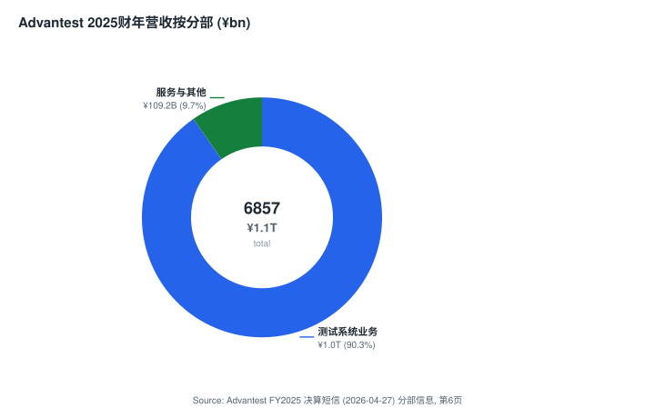

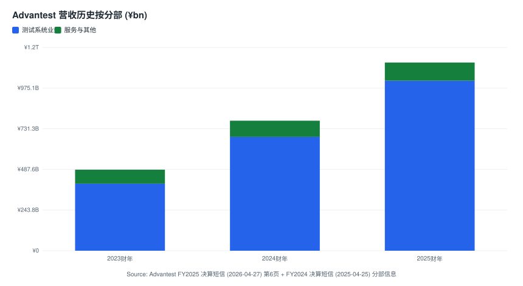

*来源: [Advantest 2025 财年决算短信, 2026-04-27, 第 6 页](https://www.advantest.com/en/news/2026/a81o6o0000000hgw-att/E_FR_FY2025_FN.pdf) + [2024 财年决算短信, 2025-04-25](https://www.advantest.com/en/news/2025/ildr5p0000000il7-att/E_FR_FY2024_FN.pdf) 分部信息。FY2023 分部拆分为按两分部口径的近似还原。*

### 1B. GF Score (GuruFocus 式基本面评分卡) — *Analyst view:*

下面的五维评分卡 (GF Score, 模仿 GuruFocus 的 GF Score™) 是本报告分析师基于前述已引用指标的**自有评分**——并非来自 GuruFocus, 也不附 filing 引用; 五个子分与综合分均标注 *Analyst view:*。

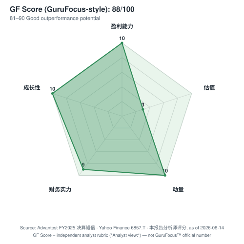

*评分基础 (来源见各维度引用): 财务实力 · 盈利能力 · 成长性 · 估值 · 动量, 综合 **88/100 (Good — 较高跑赢潜力)**。来源框架: [GuruFocus GF Score™](https://www.gurufocus.com/term/gf-score)。*

- **财务实力 9/10。** 现金 ¥340bn、长期借款仅 ¥300 万 (近零)、股东权益率 67.9%, 净现金资产负债表; 2025 财年偿还短期借款 ¥75bn ([2025 财年决算短信, 第 7 页](https://www.advantest.com/en/news/2026/a81o6o0000000hgw-att/E_FR_FY2025_FN.pdf))。仅因周期性现金流波动而非满分。
- **盈利能力 10/10。** 营业利润率 44.2%、毛利率 64.3%、净利率 33.3%——处半导体设备顶端, 与 KLA 相当且高于 AMAT/Lam/TEL ([2025 财年决算短信, 第 8 页](https://www.advantest.com/en/news/2026/a81o6o0000000hgw-att/E_FR_FY2025_FN.pdf); [stockanalysis.com TYO:6857](https://stockanalysis.com/quote/tyo/6857/financials/))。
- **成长性 10/10。** 营收三年从约 ¥486bn 至 ¥1,128.6bn (年化逾 30%); FY2025 营收 +44.7%、营业利润 +118.8%; FY2026 指引营收 +25.8% ([2025 财年决算短信, 第 2 页](https://www.advantest.com/en/news/2026/a81o6o0000000hgw-att/E_FR_FY2025_FN.pdf))。
- **估值 3/10 (越高越便宜, 故低分=贵)。** TTM P/E 约 53×、前瞻约 43×、P/S 17.7×, 明显高于半导体设备中位 30–40× ([Yahoo Finance 6857.T](https://finance.yahoo.com/quote/6857.T/))。这是评级仅为 Overweight 的核心约束。
- **动量 10/10。** 过去 12 个月回报逾 +200%, 大幅跑赢日经与 SOX, 接近 52 周高点 ([Yahoo Finance 6857.T](https://finance.yahoo.com/quote/6857.T/))。

> GF Score 与本报告其余数字一致: 成长性 ↔ 第 2 章前瞻模型; 估值 ↔ 1A 倍数与 PT 上行; 动量 ↔ 摘要的相对表现行。综合 88/100 表明: 这是一家基本面接近满分、但估值已为完美定价的公司。

### 估值快照 (必备)

截至 2026 年 5 月中旬, 爱德万测试在东京 Prime 市场报价约 **27,000–27,200 日元** ([Yahoo Finance, 6857.T 报价](https://finance.yahoo.com/quote/6857.T/)), 对应市值约**19.8–20.0 万亿日元** (按 150 日元/美元约 1,320–1,380 亿美元)——位居全球市值前 200 大上市公司之列 ([companiesmarketcap.com — Advantest 市值](https://companiesmarketcap.com/advantest/marketcap/))。

- **TTM P/E ≈ 50 倍**, 基于 2025 财年报告的稀释每股收益 (EPS) 513.30 日元 (27,000 / 513 ≈ 52.6 倍), 按 2026 财年指引 EPS 641.61 日元计算的**前瞻市盈率约 42 倍** ([2025 财年 FN, 第 1 页及第 2 页](https://www.advantest.com/en/news/2026/a81o6o0000000hgw-att/E_FR_FY2025_FN.pdf))。一些数据提供方仍显示约 125 倍, 因为它们尚未纳入 2026-04-27 公布的 2025 财年实际业绩; 使用刚刚公布的盈利数据进行前瞻计算, 50 倍才是正确口径 ([Google Finance 显示约 49.7 倍](https://www.google.com/finance/beta/quote/6857:TYO), 与此一致)。
- **TTM P/S ≈ 17.7 倍**, 基于 2025 财年销售额 (19.8 万亿日元 / 11,286 亿日元)。
- **市净率 P/B ≈ 13 倍**, 基于 2025 财年每股账面权益 1,097.50 日元 (27,000 / 1,097.50 = 24.6 倍; 部分数据商根据不同的股东权益定义给出约 13 倍——参见 [companiesmarketcap.com P/B](https://companiesmarketcap.com/advantest/pb-ratio/))。
- **三年估值区间**很宽: 从 2023 财年低谷的低于 30 倍 PE, 到 2025 年初共识 EPS 跟不上 AI 测试机爬坡时短暂超过 100 倍。

**同业估值基准 (2026 年 5 月中旬):**
- **泰瑞达 Teradyne (NASDAQ:TER)**——最直接的 ATE 对位竞争者——报价约 402 美元, 市值约 570 亿美元, TTM P/E 约 88 倍 (基于 TTM 稀释 EPS 3.48 美元) ([gurufocus TER TTM P/E](https://www.gurufocus.com/term/pettm/TER); [Teradyne stockanalysis 统计](https://stockanalysis.com/stocks/ter/statistics/); [companiesmarketcap TER](https://companiesmarketcap.com/teradyne/marketcap/))。基于前瞻盈利, TER 接近约 40 倍。
- **东京电子 Tokyo Electron (TSE:8035)**——前道工艺设备同业——TTM P/E 约 37.7 倍 ([Simply Wall St 8035 估值](https://simplywall.st/stocks/jp/semiconductors/tse-8035/tokyo-electron-shares/valuation); [companiesmarketcap TEL P/E](https://companiesmarketcap.com/tokyo-electron/pe-ratio/))。
- **科磊 KLA (NASDAQ:KLAC)**——工艺控制, 最接近的心智锚定可比公司——TTM P/E 约 41 倍 ([Yahoo Finance KLAC 关键统计](https://finance.yahoo.com/quote/KLAC/key-statistics/))。
- **应用材料 AMAT (NASDAQ:AMAT)**——更广泛的工艺设备同业——TTM P/E 约 22 倍 ([Alpha Spread KLAC-AMAT 对比](https://www.alphaspread.com/comparison/nasdaq/klac/vs/nasdaq/amat))。

"半导体设备" (semicap) 行业中位数 P/E 按前道工艺工具加权约为 **30–40 倍**。爱德万测试 TTM 约 50 倍**处于该组高端, 但低于泰瑞达**——按前瞻约 42 倍则趋近行业中位数。

**估值倍数拆解 (为何支付逾 50 倍 TTM):** 溢价绝大部分源于**AI 周期溢价**叠加**经营杠杆**。(a) AI 芯片的测试强度结构性高于传统逻辑芯片: NVIDIA Blackwell 一代 B200/B300 和 AMD MI300/MI355 占用测试机时间约为上一代 Hopper/H100 裸片的 2–3 倍; 而 HBM3E/HBM4 堆栈需要单独的、同样高测试强度的流程, 这在非 HBM DRAM 时代并不存在 ([Test challenges grow for DRAMs and HBM, semiecosystem.com](https://marklapedus.substack.com/p/test-challenges-grow-for-drams-and))。(b) 爱德万测试已三次上调 2025 财年指引, 实际业绩仍超出指引约 5% 的销售额与约 10% 的营业利润——分析师模型持续追赶实际业绩, 在估值更新中压缩了滚动 P/E。(c) 2024 财年→2025 财年毛利率从 50.6% 跳升至 64.3% 显示出高端 SoC 测试机产品结构带来的真实经营杠杆, 支持盈利继续超预期。若 AI 资本开支周期暂停, 下行风险较大——见第 10 章风险评估。

---

## 2. 估值与目标价 (Valuation & Price Target)

> 本章的前瞻估计、目标价与情景目标价均为本报告分析师的判断 (*Analyst view:*), 构建于 filing 分部数据 + 管理层指引 + 行业预测之上; 决算短信不含目标价, 切勿与 filing 引用混淆。绝不写「来源:本模型」。

### 前瞻财务估计 (forward estimates, *Analyst view:*)

下表把 FY2025 实际与 FY2026–FY2027E 前瞻并列。FY2026E 直接采用公司指引; FY2027E 为本报告基于 Bernstein 营业利润预测 (FY27/3 OP ¥726bn, 较共识高 12%) 与公司产能扩张路线 (SoC 测试机年产能目标从 7,500 台升至 10,000 台, 2028 年底前达成) 推算的中枢 ([Bernstein — Advantest 4Q26 3 note, 2026-04-29, p.1](http://xs-macbook-air.local:5001/zsxq/pdf/212212581121221/Bernstein-Advantest%20Corp%EF%BC%886857.JP%EF%BC%89Advantest%204Q26%203%EF%BC%9A%20Already%20leading%20in%20silicon%20photonics%20testing%EF%BC%9B%20Raising%20PT%20to%20%EF%BF%A539%EF%BC%8C200-260427.pdf))。

| 指标 (¥bn 除非注明) | FY2025 实际 | FY2026E (公司指引) | FY2027E (*Analyst view:*) |
|---|---|---|---|
| 销售额 (Revenue) | 1,128.6 | 1,420.0 (+25.8%) | 约 1,620 (+14%) |
| 毛利率 (gross margin) | 64.3% | 约 62–63% | 约 62% |
| 营业利润 (operating income) | 499.1 | 627.5 (+25.7%) | 约 726 (Bernstein 口径) |
| 营业利润率 (operating margin) | 44.2% | 44.2% (指引) | 约 45% |
| 净利润 (net income) | 375.4 | 465.5 (+24.0%) | 约 540 |
| 稀释 EPS (¥) | 513.30 | 约 636 (指引推算) | 约 738 |

FY2025 实际数据: [2025 财年决算短信, 2026-04-27, 第 2 页及第 8 页](https://www.advantest.com/en/news/2026/a81o6o0000000hgw-att/E_FR_FY2025_FN.pdf); FY2026E 指引 (销售额 ¥1,420bn / 营业利润 ¥627.5bn / 净利润 ¥465.5bn): [同上, 第 5 页](https://www.advantest.com/en/news/2026/a81o6o0000000hgw-att/E_FR_FY2025_FN.pdf), 基于美元/日元 150、欧元/日元 170 假设; FY2027E 营业利润中枢: [Bernstein — From GPU to CPO/CPU/LPU, 2026-04-15, p.1 (FY27/3 OP ¥726bn, 较共识+12%)](http://xs-macbook-air.local:5001/zsxq/pdf/184418854484582/Bernstein-Advantest%20Corp%EF%BC%886857.JP%EF%BC%89Advantest%EF%BC%9A%20From%20GPU%20to%20CPO%EF%BC%8C%20CPU%EF%BC%8C%20LPU...%20Upgrading%20to%20Outperform%20and%20Top%20Pick-260415.pdf)。

**关键增长驱动 (mix shift):** 增长几乎全部来自**测试系统业务内的 SoC 测试机**——FY2025 Q4 该业务环比 +44%, 是单一最大引擎; 而存储测试机 Q4 环比 -36%, 波动更大 ([Bernstein 4Q26 note, p.1](http://xs-macbook-air.local:5001/zsxq/pdf/212212581121221/Bernstein-Advantest%20Corp%EF%BC%886857.JP%EF%BC%89Advantest%204Q26%203%EF%BC%9A%20Already%20leading%20in%20silicon%20photonics%20testing%EF%BC%9B%20Raising%20PT%20to%20%EF%BF%A539%EF%BC%8C200-260427.pdf))。利润率维持高位的驱动是高端 SoC 测试机的产品结构 (mix) 与经营杠杆, 而非提价。

### ROE 拆解 (5 步 DuPont)

FY2025 ROE 高达 **57.65%**——拆解为净利率 33.26% × 资产周转率 1.11 × 权益乘数 1.56。注意权益乘数仅 1.56 (近零负债), 即这一惊人的 ROE 几乎完全由盈利能力驱动, 而非财务杠杆——这是高质量回报 ([2025 财年决算短信, 损益表第 8 页 + 资产负债表第 6 页](https://www.advantest.com/en/news/2026/a81o6o0000000hgw-att/E_FR_FY2025_FN.pdf))。

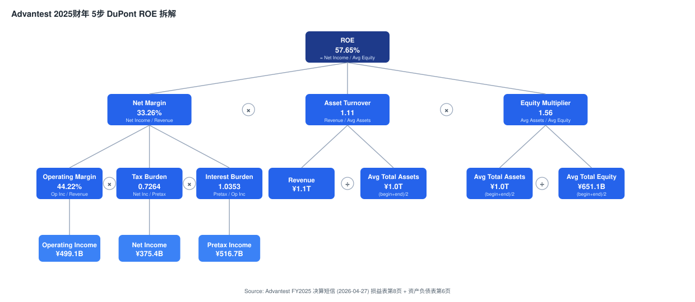

*来源: [2025 财年决算短信, 2026-04-27, 损益表第 8 页 + 资产负债表第 6 页](https://www.advantest.com/en/news/2026/a81o6o0000000hgw-att/E_FR_FY2025_FN.pdf)。平均权益按期初 ¥506.5bn 与期末 ¥795.7bn 的均值 ¥651.1bn 计。*

### 目标价推导 (PT derivation, *Analyst view:*)

**方法: 前瞻 P/E × 目标倍数。** 以 FY2026E 公司指引 EPS ¥636 为锚, 给予 **48× 目标倍数**, 得 **12 个月目标价 ¥30,500** (较 2026-06-13 收盘 ¥27,325 上行约 +12%)。

**为什么用 48×:** (i) Advantest 当前前瞻 P/E 约 43×, 历史 (AI 周期以来) 前瞻 P/E 中枢约 40–50×; (ii) 最直接对位 Teradyne 前瞻约 40×、KLA TTM 约 41×、TEL 约 38×——48× 处于该组高端, 反映 Advantest 更高的增长与更纯的 AI 测试敞口, 但**刻意低于 Bernstein 的 45× 远期口径所隐含的 ¥39,200**, 以纳入 UBS「估值过高」的审慎立场; (iii) 这是 Overweight 而非 Buy 的体现——上行存在, 但倍数已计入大量完美执行。

### 牛 / 基 / 熊情景 (*Analyst view:*)

| 情景 | 假设 | 倍数 | 目标价 | 较 ¥27,325 |
|---|---|---|---|---|
| **牛市 Bull** | AI 资本开支延续 + CPO/CPU/晶圆级插入测试新增需求兑现 + SoC 份额冲 66%; Bernstein FY28 OP ¥856bn 路径 | 58× FY2026E EPS | **¥36,900** | **+35%** |
| **基准 Base** | 指引兑现, AI 周期不间断, 倍数温和压缩至历史中枢 | 48× FY2026E EPS | **¥30,500** | **+12%** |
| **熊市 Bear** | AI 资本开支 2026 日历年见顶 / 结构从训练转推理 / 一个季度指引失望, 倍数压向半导体设备中位 | 40× FY2026E EPS | **¥25,400** | **−7%** |

牛市路径的额外上行 (Bernstein 列举但未定价): 晶粒级测试若被 AI 加速器厂商采用, 总测试需求可增 30–40%; 中国 EXA Scale 装机当前仅约 100 台 (全球 2025 年底约 1,600 台), 若中国最终占全球 30%, 到 2027 年底还有约 1,000 台增量空间 ([Bernstein — From GPU to CPO/CPU/LPU, 2026-04-15, p.1](http://xs-macbook-air.local:5001/zsxq/pdf/184418854484582/Bernstein-Advantest%20Corp%EF%BC%886857.JP%EF%BC%89Advantest%EF%BC%9A%20From%20GPU%20to%20CPO%EF%BC%8C%20CPU%EF%BC%8C%20LPU...%20Upgrading%20to%20Outperform%20and%20Top%20Pick-260415.pdf))。

### 与市场一致预期的对比 (vs consensus)

本报告 FY2026E 基本贴合公司指引 (因此贴近市场一致); 但 Bernstein 的 FY27/3 与 FY28/3 营业利润预测分别**较市场共识高 12% 与 8%** ([Bernstein — From GPU to CPO/CPU/LPU, 2026-04-15, p.1](http://xs-macbook-air.local:5001/zsxq/pdf/184418854484582/Bernstein-Advantest%20Corp%EF%BC%886857.JP%EF%BC%89Advantest%EF%BC%9A%20From%20GPU%20to%20CPO%EF%BC%8C%20CPU%EF%BC%8C%20LPU...%20Upgrading%20to%20Outperform%20and%20Top%20Pick-260415.pdf)); Morgan Stanley 亦预期 2027 财年二季度起共识 EPS 持续上修是核心驱动 ([Morgan Stanley — Taiwan Visit Takeaways, 2026-06-08, p.1](http://xs-macbook-air.local:5001/zsxq/pdf/814528415518542/Morgan%20Stanley-Taiwan%20Visit%20Takeaways-260608.pdf))。本报告 PT ¥30,500 因此明确低于卖方最乐观一端 (Bernstein ¥39,200), 高于中性派 (UBS) 的隐含水平。

### 最该盯紧的变量 (swing variables, *Analyst view:*)

1. **NVIDIA/ASIC 加速器单位出货与每单位测试时间。** 这是营收的最大单一杠杆——Blackwell→Rubin 的测试强度递增 + ASIC (Google/AWS) 出货量决定 SoC 测试机需求。一个季度的 GPU 测试机订单暂停即可让增速失速。
2. **估值倍数 (前瞻 P/E)。** 在约 43× 前瞻起点, 倍数本身的波动比盈利波动对股价影响更大——这是为何本报告把「估值压缩」列为第 10 章的核心财务风险。

### 卖方观点演变 (Sell-side view evolution)

本报告引用 ≥2 份 `db/zsxq.db` 经纪商报告, 故必须呈现卖方观点演变。机械预读 `db/stock_price_target.db` (只读) 先行, 再核对 PDF。**PT 离散度: 最低 ¥26,000 (Bernstein, 3 月中性) → 最高 ¥39,200 (Bernstein, 5 月)**, 区间跨度约 +51%——但这并非机构间分歧, 而是**同一机构 Bernstein 在两个月内的快速自我上修**, 反映 AI 测试能见度的剧烈改善。

**按机构的观点时间线 (*Analyst view:*):**

- **Bernstein — 三连跳上修 (机构内自我修正)。**
  - **2026-03-17:** Market-Perform, PT ¥26,000 (报告日股价约 ¥23,513, 上行 +10.6%)——彼时为中性 (来自 `db/stock_price_target.db` 只读预读)。
  - **2026-04-15:** **上调至 Outperform 并列为日本半导体首选股** (取代 Kokusai), PT ¥26,000→¥34,300 (报告日约 ¥27,585, 上行 +24.3%)。触发: 新增长动力——NVIDIA 产品复杂度提升 (硅光/LPU)、CPO (与 FormFactor 合作 PIC 晶圆测试)、Vera CPU 独家测试、ASIC 出货激增; 把 2026 年 EXA Scale 出货预测从 1,770 台上调至 2,000 台 (+61% YoY) ([Bernstein — From GPU to CPO/CPU/LPU, 2026-04-15, p.1](http://xs-macbook-air.local:5001/zsxq/pdf/184418854484582/Bernstein-Advantest%20Corp%EF%BC%886857.JP%EF%BC%89Advantest%EF%BC%9A%20From%20GPU%20to%20CPO%EF%BC%8C%20CPU%EF%BC%8C%20LPU...%20Upgrading%20to%20Outperform%20and%20Top%20Pick-260415.pdf))。
  - **2026-04-29 (FY2025 财报后):** 维持 Outperform, PT ¥34,300→**¥39,200** (报告日约 ¥31,500, 上行 +24.4%)。触发: 4Q 营收 ¥3,281bn 超共识 14%、净利润超共识 38%; 硅光子测试斩获首个量产 ATE 订单; 估值倍数从 40× 提升至 **45× 远期 P/E**; SoC 测试机份额预计 56%→66% (2026E) ([Bernstein — Advantest 4Q26 3, 2026-04-29, p.1](http://xs-macbook-air.local:5001/zsxq/pdf/212212581121221/Bernstein-Advantest%20Corp%EF%BC%886857.JP%EF%BC%89Advantest%204Q26%203%EF%BC%9A%20Already%20leading%20in%20silicon%20photonics%20testing%EF%BC%9B%20Raising%20PT%20to%20%EF%BF%A539%EF%BC%8C200-260427.pdf))。
  - **2026-06-11 (最新跟踪):** 维持 Outperform / PT ¥39,200; 台湾测试机进口 5 月同比 +34%, 回归模型预示 6 月季度总营收 ¥3,460bn 高于共识 ¥3,370bn, 隐含再超预期 ([Bernstein — Japan/EU Semi Taiwan Import Tracker, 2026-06-10, p.1](http://xs-macbook-air.local:5001/zsxq/pdf/412458152484588/Bernstein-Japan%20and%20EU%20Semiconductors%20Japan%20EU%20Semi%20Taiwan%20Import%20Tracker%20%EF%BC%88May%2026%EF%BC%89%EF%BC%9A%20SPE%20import%20%2B23%25%20YoY-260610.pdf))。

- **Morgan Stanley — 板块首选, 但估值口径保守。** 2026-06-08 台湾参访纪要: 维持日本半导体设备「吸引 (Attractive)」、Advantest 为板块首选; 但目标价基于 **2028 财年 EPS 的 20× P/E** (参考 2023 年 AI 需求加速以来的平均 forward PE)——口径远低于 Bernstein 的 45×。看点: 共识 EPS 上修是核心驱动; CPO 测试短期非主要催化, 但晶圆级插入测试需求旺盛, AI GPU 测试竞争格局稳定无明显份额流失 ([Morgan Stanley — Taiwan Visit Takeaways, 2026-06-08, p.1](http://xs-macbook-air.local:5001/zsxq/pdf/814528415518542/Morgan%20Stanley-Taiwan%20Visit%20Takeaways-260608.pdf))。

- **UBS — 中性/谨慎 (估值约束派)。** 2026-05-14 日本科技综合企业报告: 明确将 Advantest (与 Disco) 列为「虽受益 AI, 但估值过高、性价比不足」, 偏好东京电子与瑞萨——这是与 Bernstein 最直接的分歧 ([UBS — Japan Tech Conglomerates, 2026-05-14, p.1](http://xs-macbook-air.local:5001/zsxq/pdf/212452151442141/UBS-Japan%20Tech%20Conglomerates%EF%BC%9AHardware%20above%20software%20still-260514.pdf))。

**机构间分歧 (机构间分歧表):**

| 机构 | 日期 | 评级 / 目标价 | 核心论点 | 什么证据能证明其正确 |
|---|---|---|---|---|
| **Bernstein** | 2026-06-11 | Outperform / ¥39,200 (45× 远期) | AI 测试需求多元化 (GPU+ASIC+CPO+CPU+LPU), 能见度改善支撑倍数扩张 | 6 月季度营收再超共识; SoC 份额向 66% 推进; 硅光子量产订单放量 |
| **Morgan Stanley** | 2026-06-08 | 板块首选 / 20× FY28 EPS | 看好但估值口径保守; 共识 EPS 上修才是驱动 | 2027 财年 Q2 起共识 EPS 持续上修; 晶圆级插入测试需求兑现 |
| **UBS** | 2026-05-14 | Neutral (隐含) | 受益 AI 但估值过高、性价比不足 | 倍数压缩 / 一个季度指引失望 / AI 资本开支放缓 |
| **本报告** | 2026-06-14 | Overweight / ¥30,500 (48× FY26E) | 基本面接近满分但估值已为完美定价; 上行存在但 risk-reward 趋平 | 指引兑现 + AI 周期不间断 → 基准; 反之压向 40× = 熊市 −7% |

每个观点均已标注日期、报告日股价 (来自 `db/stock_price_target.db` 只读预读) 与 `/zsxq/pdf/` 直链。注: PT DB 中一行 Goldman Sachs ¥3,500 (2026-03-13) 系明显错标 (与拆股前口径或 EPS 混淆, 隐含 −85% 上行不合理), 故不纳入时间线——这是已知的 PT DB 错标问题, 已按项目记忆排除。

---

## 3. 公司历史

爱德万测试的起源可追溯至**1954 年**, 当时武田理研工业株式会社 (Takeda Riken Industry Co., Ltd.) 在东京成立, 主营精密电子测量仪器业务。1970 年代后期, 公司已成为日本测试设备行业的国家级冠军, 并于**1985 年**更名为爱德万测试株式会社 (Advantest Corporation), 明确转向当时正与日本 DRAM 繁荣期同步崛起的半导体测试市场 ([沿革 | 关于 Advantest](https://www.advantest.com/en/about/history/))。公司当年在东京证券交易所上市。1990 年代至 2000 年代初, 爱德万测试在 DRAM 时代主导了存储测试设备市场 (彼时日本约占全球 DRAM 产量的 50% 以上), 并通过 T 系列及历代 V 系列平台的内部研发, 逐步建立起 SoC 测试机业务。

爱德万测试现代史上**最重要的两笔交易**是:

- **2011 年收购 Verigy**——爱德万测试以约**11 亿美元**收购在新加坡上市的 Verigy Ltd. (一家从安捷伦 Agilent 分拆出来的 SoC 测试机纯粹型公司, 而安捷伦本身源自 HP 测试与测量部门)。交易在与 LTX-Credence 持久的竞争性出价后完成, 并获新加坡高等法院批准 ([爱德万测试 6-K, 2011-03-28](https://www.sec.gov/Archives/edgar/data/0001158838/000114420411017408/v216189_ex99-1.htm))。Verigy 带来的是**V93000** 平台, 与爱德万测试原有 T2000 产品线结合, 使公司具备完整的 SoC 测试机组合, 并立即获得 SoC ATE 市场第一的地位——此后这一地位持续累积复利。
- **2019 年收购 Astronics Test Systems**——爱德万测试以**1 亿美元**加最高 3,500 万美元的对赌价款, 从 Astronics (NASDAQ:ATRO) 收购其商用半导体系统级测试 (SLT) 业务 (相较于 2018 年原定 1.85 亿美元交易条款已下调) ([Astronics 8-K, 2019](https://www.sec.gov/Archives/edgar/data/0000008063/000000806322000049/ex99120221108-pr.htm); [Electronic Design 报道](https://www.electronicdesign.com/applications/semiconductor-test/article/13018705/astronics-sells-semiconductor-test-business-to-advantest-for-185-million))。被收购实体现已更名为 Advantest Test Solutions, Inc., 总部位于加州 Irvine, 构成爱德万测试系统级测试 (SLT) 业务的核心——这一点至关重要, 因为 AI 加速器越来越依赖封装后 SLT 来捕捉 ATE 单独无法检测的逃逸缺陷。

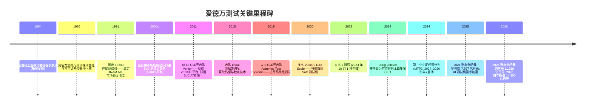

**战略转折。** 三次重要的转型最为突出。第一, 2000 年代的**存储到 SoC 转型**, 该转型在 Verigy 交易后完成: SoC 测试机现已远超存储测试机的市场份额 (行业大致比例: 约 70% SoC、约 30% 存储)。第二, **V93000 内嵌的模块化架构标准化**——客户可通过更换插卡, 将一台测试机重新配置以测试数字、模拟、RF 及功率混合信号器件, 这正是管理层强调的装机基础长半衰期的根源: V93000 Smart Scale、Pin Scale 和 EXA Scale 几代产品同时在量产现场使用 ([Investors Guide 2025, 第 11 页](https://www.advantest.com/document/en/investors/ir-library/investors-guide/Investors_Guide_2504E.pdf))。第三, 由 Astronics 交易锚定的**系统级测试扩张**, 将爱德万测试从单纯 ATE 供应商转型为"全面测试环境"供应商, 覆盖晶圆测试、封装测试、SLT 以及插座/接口板耗材 (经由 Essai)。MTP3 计划明确旨在拓展纯 ATE 以外的邻近/新业务。

**近期动态** (过去 18 个月)。公司在 2025 财年 Q1 (截至 2025 年 6 月的季度) **变更了分部报告结构**, 把原三分部口径 (半导体与元器件测试系统 / 机电一体化 / 服务支持及其他) 整合为更清晰的两分部口径 (**测试系统业务**与**服务与其他**)——将原本规模较小的机电一体化业务并入测试系统分部, 与 SoC 及存储测试机一同披露, 这与客户实际采购的捆绑解决方案方式更一致 ([2025 财年 Q3 业绩, 第 3 页](https://www.advantest.com/document/en/investors/ir-library/result/E_FR_FY2025_3Q.pdf))。资本回报方面, 爱德万测试在 2025 财年注销了库藏股 (发行股数从 7.661 亿股降至 7.320 亿股), 加大了回购力度 (2025 财年 1,143 亿日元 vs. 2024 财年 501 亿日元), 把每股股息从 39 日元上调至 59 日元, 并基于 3,400 亿日元的现金余额释放进一步资本回报能力的信号 ([2025 财年 FN, 第 1–2 页](https://www.advantest.com/en/news/2026/a81o6o0000000hgw-att/E_FR_FY2025_FN.pdf))。

---

## 4. 管理团队

### Douglas (Doug) Lefever — 代表董事兼集团 CEO

Doug Lefever (1970 年 12 月出生) 于**2024 年 4 月 1 日**就任爱德万测试首位非日本籍集团 CEO, 这是一家 CEO 连续 70 年由日本籍出任的公司的分水岭事件——对任何 Prime 市场日本工业企业而言都属罕见。他的职业生涯正好横跨爱德万测试两大战略业务: V93000 平台与系统级测试扩张。Lefever 拥有密歇根大学机械工程学士、得克萨斯大学奥斯汀分校机械工程硕士, 以及西北大学凯洛格管理学院 MBA 学位 ([Doug Lefever — Advantest, LinkedIn](https://www.linkedin.com/in/doug-lefever-7aa2528/))。他于**1998 年**作为青年工程师加入爱德万测试美国分部, 历经 25 年以上的运营、销售与战略岗位——Advantest America Inc. 总裁兼 CEO (2014– )、执行常务 (2017–2019)、执行副总裁兼首席运营官 (2019–2023)、首席战略官 (2023–2024), 而后晋升集团 CEO ([爱德万测试 CEO 任命新闻稿, 2025-03-28](https://www.advantest.com/en/news/2025/ildr5p0000000h24-att/E_Info_20250328.pdf); [Japan Times, "日本爱德万测试任命美国人为下任 CEO", 2024-02-29](https://www.japantimes.co.jp/business/2024/02/29/companies/japan-advantest-new-american-ceo/))。

他具体的战绩包括: Lefever 是**2011 年 Verigy 收购**的主要内部推动者——彼时他正负责爱德万测试美国业务, Verigy 集成进 Advantest America Inc. 实际上是他主导的项目。Verigy **正是**爱德万测试今天能成为 SoC 测试机市场领导者的原因 (而不是 2011 年之前那种"试图打破 SoC 市场的存储龙头"的局面)。他还主导了**2019 年 Astronics Test Systems 收购**, 把爱德万测试拓展至 SLT 领域——而该业务凭借 HBM 与 AI 加速器质量要求, 此后成为公司增长最快的邻近业务 ([Silicon Semiconductor, "爱德万测试任命新集团 CEO", 2024](https://siliconsemiconductor.net/article/119005/Advantest_appoints_new_Group_CEO); [Go Semi and Beyond 对 Doug Lefever 的访谈](https://www.gosemiandbeyond.com/interview-with-doug-lefever-representative-director-and-group-ceo/))。其任命是一种刻意的信号: 爱德万测试客户 (美国无晶圆设计公司、台湾代工厂、韩国存储 IDM) 绝大部分都不在日本, 董事会选择了一位 20 余年来已与 NVIDIA、AMD、Intel、Apple、Qualcomm、TSMC、Samsung、SK 海力士等客户建立运营关系的人选。Lefever 在委托书中披露了一定但对日本公司而言属于温和水平的股权持仓 ([第 84 届定期股东大会候选名单, 2025 财年 FN 第 15 页](https://www.advantest.com/en/news/2026/a81o6o0000000hgw-att/E_FR_FY2025_FN.pdf))。在战略表态方面, 他明确将 ATE 视为"成长型市场", 而非历史上被视为成熟市场的定位, 并把 AI 周期定调为"测试强度的阶跃式变化", 而非周期性脉冲 (Go Semi 访谈, 同上)。

### 津久井浩一 (Koichi Tsukui) — 代表董事、社长兼集团 COO

津久井浩一 (1964 年 12 月出生) 与 Lefever 同期 (2024 年 4 月) 晋升为社长兼集团 COO。津久井于**2014 年**加入爱德万测试——在他职业生涯中已属相对较晚, 此前曾在日本工业企业任职——并通过系统测试事业部完成晋升。他先后担任系统测试事业部 EVP (2019)、系统测试事业部 CEO (2020)、首席战略官 (2021), 而后于 2023 年出任 COO, 直至 2024 年 4 月晋升为代表董事、社长兼集团 COO ([管理团队 | 关于 Advantest](https://www.advantest.com/en/about/management/); [GlobalData Advantest 高管](https://www.globaldata.com/company-profile/advantest-corp/executives/))。他作为公司代表签署财务文件 (包括 2025 财年 FN), 即对日本投资者而言, 他是公司的对外门面, 而 Lefever 则面向全球客户及美/欧投资者。津久井按委托书披露持有爱德万测试股票。

### 高田寿子 (Hisako Takada) — 高级执行干事兼 CFO

高田寿子作为 CFO 兼联系人 (电话 (03) 3214-7500) 签署财务业绩——一位在爱德万测试财务部门任职已久的高管。公司未将 CFO 简历作为宣传重点; 她的角色更偏运营而非对外。2025 财年的资本回报转向 (1,140 亿日元回购、股息由 39 日元上调至 59 日元) 即在她任内执行, 显示了越来越向股东友好的资本配置政策。3,400 亿日元的现金余额与几乎为零的长期债务 (长期借款仅 300 万日元), 在 2025 财年末显示出可观的进一步资本回报能力 ([2025 财年 FN, 第 1 页及第 7 页](https://www.advantest.com/en/news/2026/a81o6o0000000hgw-att/E_FR_FY2025_FN.pdf))。

### 吉田芳明 (Yoshiaki Yoshida) — 董事 (前任集团 CEO)

吉田是 Lefever 的前任 CEO (2017 年 – 2024 年 3 月), 主持了 2018–2024 年的扩张期, 包括 Verigy 收购完成后的整合以及 V93000 EXA Scale 在 2020 年下半年的发布。他作为董事继续留任董事会, 提供机构连续性。在其任内, 爱德万测试销售额从 2017 财年的 1,757 亿日元增长至疫情后的高点; 他交给 Lefever 的是一家在他离任时已有强劲势头、并在此后大幅加速的公司。

### 公司治理

- 董事会由日本籍与非日本籍董事混合组成。第 84 届定期股东大会 (将于 2026 年 7 月 31 日召开) 候选名单包括 Lefever、津久井、吉田及外部董事**浦边俊光 (Toshimitsu Urabe)** ([2025 财年 FN, 第 15 页](https://www.advantest.com/en/news/2026/a81o6o0000000hgw-att/E_FR_FY2025_FN.pdf))。外部董事的存在与审计监督委员会架构, 均符合日本修订后《公司治理准则》对 TSE Prime 上市公司的标准要求。
- 与创始人主导型公司的标准相比, 内部人持股偏低, 但属于大型日本上市公司常态; 公司积极注销库藏股 (2024 财年至 2025 财年间从 3,240 万股降至 650 万股), 释放出资本回报主导而非内部人累积的信号。
- 薪酬结构自 2024 财年至 2025 财年向更多股权/绩效挂钩部分倾斜 (股票薪酬费用由 2023 财年 17.7 亿日元升至 2024 财年 28.9 亿日元——绝对值仍小, 但趋势向上; [2024 财年 FN 第 11 页](https://www.advantest.com/en/news/2025/ildr5p0000000il7-att/E_FR_FY2024_FN.pdf))。
- 公开记录中未见重大关联交易, 未见治理瑕疵。

### 管理层既往业绩综合评估

这是一支已经交付业绩的团队, 但目前正乘势而上。Verigy 与 Astronics 两笔交易都已被后续业绩验证——V93000 是 SoC 测试机的主导平台; SLT 已成为结构性增长跑道。董事会选择非日本籍 CEO 本身就是信誉信号——日本工业董事会在此问题上极为保守。未知数在于下一轮下行周期会如何: Lefever 作为 CEO 尚未实际穿越过一次周期收缩 (2023 财年下滑是吉田任内事件)。在 AI 周期延续期间, 执行力将极强; 若周期反转, 资本纪律才是更难回答的问题。

---

## 5. 产品与服务

爱德万测试的产品组合目前组织为两个报告分部: **测试系统业务**与**服务与其他**。测试系统内部分为三大产品系列 (SoC、存储、机电一体化与外围设备); 服务与其他内部包括装机基础支持、系统级测试、插座/接触件 (Essai)、二手设备及云端解决方案业务。

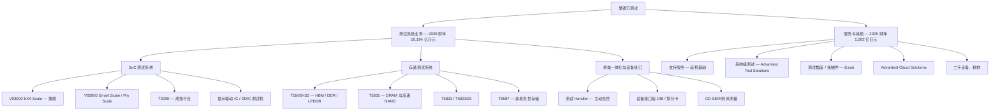

### SoC 测试系统——AI/HBM 增长引擎

**V93000 EXA Scale**, 2020 年下半年发布, 是爱德万测试的旗舰 SoC 测试机。EXA Scale 在 V93000 架构 (起源于 Verigy) 之上, 扩展了"exascale"性能级数字 IC 所需的通道密度、向量深度与并行性——这恰恰是 NVIDIA Blackwell、AMD Instinct 及新兴超大规模 ASIC 所处的类别 ([V93000 EXA Scale 产品页](https://www.advantest.com/products/soc/v93000/exa.html))。两代更早的模块 (Pin Scale、Smart Scale) 仍在客户现场量产; 整个 V93000 系列采用模块化架构, 因此 2018 年购买 Pin Scale 测试机的客户可以在不更换整机的前提下, 将部分模块升级到 EXA Scale 能力——这正是爱德万测试向投资者反复强调的"装机基础数十年回报"的技术基础。除 V93000 外, 爱德万测试仍向较旧的应用处理器及模拟/混合信号器件供应**T2000**。

爱德万测试将 SoC 测试机销售按两类应用披露: **"计算与通信"** (HPC、AI 加速器、智能手机应用处理器) 与**"汽车、工业、消费及 DDIC"** (成熟工艺器件与显示驱动)。2024 财年, 计算与通信是爆发性增长所在; 2025 财年叙事完全一致——"用于高性能 SoC 半导体的 SoC 测试系统销售大幅增长……响应 HPC 设备与 AI 相关半导体的不断增长的需求。另一方面, 汽车与工业设备等成熟半导体测试机需求依然疲软" ([2025 财年 FN, 第 3 页](https://www.advantest.com/en/news/2026/a81o6o0000000hgw-att/E_FR_FY2025_FN.pdf))。

**客户中标 / 装机基础信号。** 最近公开披露的交易包括 iTest 选用 V93000 EXA Scale (2023 年 10 月——[爱德万测试新闻](https://www.advantest.com/en/news/2023/20231011.html)) 与 ISE Labs 订购 V93000 EXA Scale 用于量产测试服务。超大规模云厂商 ASIC 客户 (Google TPU、AWS Trainium、Microsoft Maia) 与商业 AI 厂商 (NVIDIA、AMD) ——通过第三方报道与公司本身的定性评论——被广泛理解为在其前沿加速器上标准化采用 V93000, 但爱德万测试并未按 10% 阈值具名披露 ([AInvest, "Advantest 在 AI 与先进半导体测试市场的战略地位"](https://www.ainvest.com/news/advantest-strategic-position-ai-advanced-semiconductor-test-market-lucrative-investment-ai-hpc-driven-growth-2512/))。

**竞争优势评估——SoC 测试机: 有 (强)。** 护城河类型为多重叠加: (i) **转换成本** (客户测试程序基于 V93000 指令集编写, 重写至 Teradyne UltraFLEX 或 J750 需 12–24 个月并危及良率); (ii) **规模经济** (爱德万测试将 V93000 年研发开支——每年数亿美元——摊销至最大的测试机装机基础上); (iii) **技术深度** (模块化架构支持的领先工艺节点, 竞争对手只能通过显著的新增投资才能匹配)。最接近的对位竞争产品: **Teradyne UltraFLEXplus**。对比: 在 AI 加速器高端数字吞吐量上平齐至略胜; 泰瑞达历史上在移动应用处理器 (Apple A 系列、高通 Snapdragon) 上更强。爱德万测试在 SoC 测试机上的市场份额被广泛引用为 50% 以上且仍在上升; 2024 年其整体 ATE 份额达**约 58%** ([Investors Guide 2025, 第 3 页](https://www.advantest.com/document/en/investors/ir-library/investors-guide/Investors_Guide_2504E.pdf))。

### 存储测试系统——HBM 测试机业务线

存储测试机是爱德万测试历史的起点 (DRAM 时代的日本), 也是 HBM 驱动的 AI 周期重新点燃这一业务的关键。主要平台包括:

- **T5835**——2021 年 11 月发布, 测试 DRAM 与高速 NAND, 操作速度高达 5.4 Gbps, 具备大规模并行用于已知良裸片 (KGD) 测试, 包括用于 HBM 堆栈的 **DRAM** ([T5835 产品页](https://www.advantest.com/en/products/semiconductor-test-system/memory/t5835/); [T5835 发布新闻稿, 2021](https://www.advantest.com/en/news/2021/20211130.html))。T5835 是 SK 海力士、三星、美光 HBM 裸片级测试的主力产品。
- **T5503HS2**——测试高速存储 IC, 速度高达 **9 Gbps**, ±45 ps 时序精度, 16,256 个通道实现行业领先的并行性, 覆盖 DDR4、LPDDR4 和 HBM 器件 ([T5503HS2 产品页](https://www.advantest.com/en/products/semiconductor-test-system/memory/t5503hs2/))。这是高带宽覆盖的主力产品。
- **T5833 / T5833ES**——更广义的 DRAM 与非易失性存储测试 ([T5833 产品页](https://www.advantest.com/en/products/semiconductor-test-system/memory/t5833/))。
- **T5587**——非易失性存储测试平台。

HBM 测试在结构上比传统 DRAM 测试要求更高, 有两点原因: (i) HBM 采用 TSV (硅通孔, through-silicon via) 与堆叠裸片, 因此 KGD 测试必须在堆叠前完成——任何遗漏的缺陷意味着整堆报废; (ii) HBM3E 与 HBM4 将接口速度推升至每针 9 Gbps 以上, I/O 数达 1024+, 单器件被测引脚数远超商品 DDR5。行业报道印证了 HBM 测试需求正"超越" DRAM 测试机产能 ([HBM 与 DRAM 测试挑战日益加大, Semiecosystem](https://marklapedus.substack.com/p/test-challenges-grow-for-drams-and))。

**竞争优势评估——存储测试机: 有 (HBM 强, 商品 DRAM/NAND 中等)。** 最接近的竞争对手: 泰瑞达 Magnum 平台 (偏 NAND) 与**韩国新兴厂商** Yoseni / Eles 测试机 (商品)。爱德万测试在存储 ATE 的市场份额被广泛引用为 50% 以上 ([Pestel Analysis 关于爱德万测试的竞争格局](https://pestel-analysis.com/blogs/competitors/advantest))。在 HBM 领域, 爱德万测试是三大 HBM 存储厂商 KGD 测试的标准供应商——这是一个关键锁定, 因为三家存储 IDM 合计决定了全球 HBM 测试机需求总池。

### 机电一体化——Handler 与 DIB

测试 Handler (物理拾放裸片/封装至测试机, 配备主动热控以在温度下测试) 与设备接口板 (DIB, 定制 PCB, 将信号从测试机路由至被测器件) 与测试机本身一并销售。该业务现已并入合并后的测试系统分部, 但历史上是单独分部。机电一体化产品的销售跟随测试机销售, 因为它们本质上是搭售产品——2024 财年公司仍单独披露时, 机电一体化分部销售同比增长 38.9%, 落后于半导体测试系统分部的 80.4%, 但增速依然非常强劲 ([2024 财年 FN 第 6 页](https://www.advantest.com/en/news/2025/ildr5p0000000il7-att/E_FR_FY2024_FN.pdf))。在机电一体化内部, **CD-SEM** (临界尺寸扫描电子显微镜, critical-dimension scanning electron microscope) 是规模较小但技术上独具特色的产品线, 用于光掩模与晶圆量测——与日立高科 (Hitachi High-Tech) 和 AMAT eBeam 竞争。

**竞争优势评估——机电一体化: 部分。** 护城河更多是"绑定测试机销售"——购买 V93000 测试机的客户倾向于同时采购爱德万测试 Handler 与 DIB, 以求集成简便。除该绑定外, Handler 市场存在更具竞争力的对手 (Cohu/Xcerra、ASM 太平洋)。最接近的竞争对手产品: Handler 的 **Cohu Diamondx**、DIB 的 **R&D Altanova** 与 Cohu Kita Manufacturing。对比: 在爱德万测试生态内部平齐至略胜, 在非爱德万测试生态中落后于 Cohu。

### 服务与其他——SLT 增长跑道

这是较小但日益重要的分部, 由以下部分组成:
- **支持服务**——装机基础维护、校准、培训、备件。具有经常性收入特征, 随测试机装机基础增长。2025 财年销售额同比增长 12.7% 至 1,092 亿日元, 受装机基础增长驱动 ([2025 财年 FN 第 3 页](https://www.advantest.com/en/news/2026/a81o6o0000000hgw-att/E_FR_FY2025_FN.pdf))。
- **系统级测试 (SLT)**——经由 Advantest Test Solutions (前 Astronics Test Systems) 销售。SLT 系统在最终应用模式下测试完整封装器件——对 AI 加速器尤为必要, 因为封装测试的逃逸缺陷在一颗 30,000 美元以上的 B200 模块上会造成灾难性后果。这是一项结构性增长业务, 不过 2024 财年分部亏损 109 亿日元, 其中包含对 Essai (测试插座) 业务商誉及无形资产的 214 亿日元减值——一位主要客户放缓订单, 新客户爬坡慢于预期 ([2024 财年 FN 第 6 页](https://www.advantest.com/en/news/2025/ildr5p0000000il7-att/E_FR_FY2024_FN.pdf))。2025 财年分部转回为 88 亿日元分部利润 (改善 249 亿日元), 部分得益于一笔 25 亿日元的剥离收益与基础业务回暖。
- **测试插座与接触件 (Essai)**——此前减值过的业务; 仍是高端测试的核心, 只是面临客户结构波动。
- **Advantest Cloud Solutions™**——软件/云测试分析——规模较小但是 MTP3 的战略优先, 用以将装机基础变现。

**竞争优势评估——服务: 部分。** 支持服务具备粘性 (V93000 不能由泰瑞达 FSE 上门维护)。SLT 是战略上正确的方向, 但爱德万测试是新进入者——泰瑞达与传统 SLT 专家 (Marvin Test Solutions、传统 Diamond) 装机基础更早。Essai 减值表明 SLT/插座业务比核心测试机业务更颠簸。

### 旗舰产品 vs. 长尾

**推动业务的 1–3 个产品**为: (1) **V93000 EXA Scale 及更早代际 V93000 模块**——主导性的 SoC 测试机系列, 2025 财年测试系统分部 49.3% 增长的最大单一推动者; (2) **T5835 / T5503HS2**——驱动 SK 海力士、三星、美光 HBM KGD 测试的存储测试机系列; (3) **Advantest Cloud Solutions + SLT (Advantest Test Solutions)**——战略邻近增长跑道。其他产品 (T2000 传统 SoC、CD-SEM、二手设备、Essai 插座) 要么衰减、要么子规模。

### 供应链资金流 (follow the money)

下图是「谁付钱 → 买什么 → 钱流向何处」的三段式资金流图: 左侧需求端 (NVIDIA/AMD、超大规模云 ASIC、HBM 存储 IDM、代工厂/OSAT) 付费购买 Advantest 的 SoC 测试机、存储测试机与服务; 中段汇入 Advantest FY2025 ¥1,128.6bn 营收; 右侧展示这笔钱流向何处——约 36% 营收 (¥402.5bn) 是采购成本流向关键零部件供应商 (定制 ASIC、高速针电路卡、半导体级电源), 研发流向群马工厂/研发中心 (日本 IP 与系统集成), 自由现金流 ¥302bn 回流股东 ([2025 财年决算短信, 第 8 页 (损益表) 及第 15 页 (地区)](https://www.advantest.com/en/news/2026/a81o6o0000000hgw-att/E_FR_FY2025_FN.pdf))。

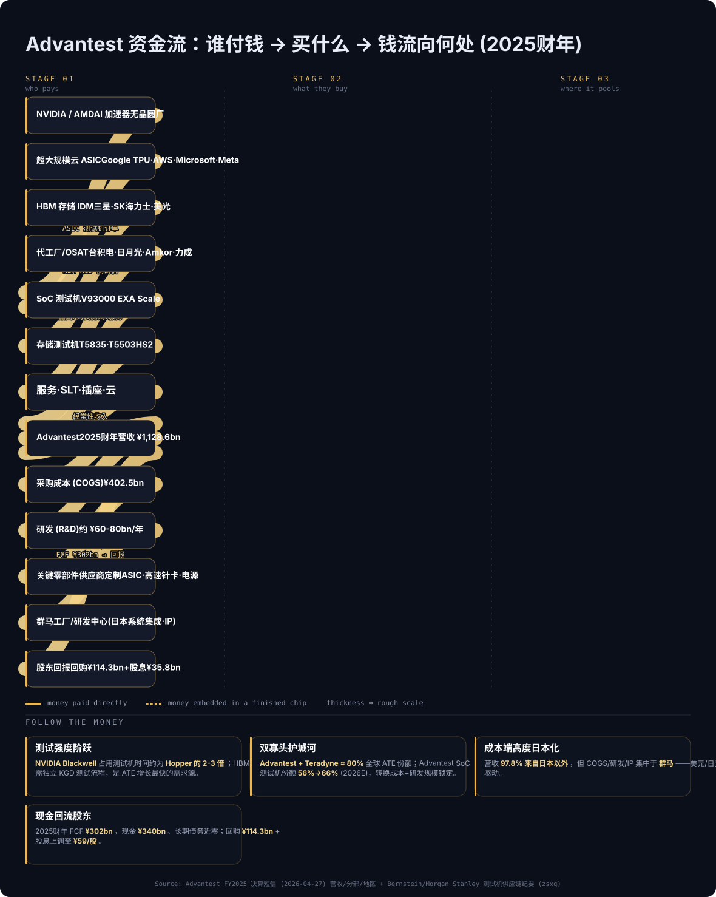

**关键看点 (follow the money, 已标注来源):** (i) **测试强度阶跃是需求端的引擎**——NVIDIA Blackwell 占用测试机时间约为 Hopper 的 2–3 倍, HBM3E/HBM4 需独立 KGD 测试流程 ([Test challenges grow for DRAMs and HBM, semiecosystem.com](https://marklapedus.substack.com/p/test-challenges-grow-for-drams-and))。(ii) **成本端的瓶颈在日本与少数零部件供应商**——COGS 仅占 35.7% 营收, 但关键零部件 (定制 ASIC、高速针卡) 是单一来源, 管理层明确以「与现有供应商签订长期协议并就核心零部件进行供应链多元化」应对 ([2025 财年决算短信, 第 2 页](https://www.advantest.com/en/news/2026/a81o6o0000000hgw-att/E_FR_FY2025_FN.pdf))。(iii) **钱最终回流股东**——FY2025 回购 ¥114.3bn + 股息 ¥35.8bn, 股息上调至每股 ¥59 ([2025 财年决算短信, 第 1–2 页](https://www.advantest.com/en/news/2026/a81o6o0000000hgw-att/E_FR_FY2025_FN.pdf))。注: 图中 ribbon 粗细仅为粗略相对量级 (图例已注明), 并非流量守恒的 Sankey。

### 过去 12 个月发布与变化

- **分部报告重述**, 自 2025 财年 Q1 (2025 年 6 月季度) 起改为两分部口径——将机电一体化并入测试系统业务。
- **V93000 模块持续推出**, 以面向 HBM4 与下一代 AI 加速器就绪——具体模块名称并未全部公开。
- **过去 12 个月内无新平台级测试机发布**——V93000 EXA Scale (2020 年发布) 仍是当前代——这与 ATE 5–10 年平台周期吻合。
- **Essai 商誉减值** 214 亿日元于 2024 财年 Q4 (2025 年 3 月) 入账, 2025 财年随后确认 25 亿日元剥离收益。

---

## 6. 客户与上市策略

爱德万测试服务于分解后半导体供应链的四类经典客户: **IDM** (集成器件制造商)、**无晶圆**设计公司、**代工厂**与 **OSAT**。20 余年来供应链已从 IDM 主导模式演化为无晶圆-代工-OSAT 模式, 其中**无晶圆客户的测试机选择沿供应链下传至执行晶圆分选的代工厂以及执行封装与系统级测试的 OSAT**——这一动态使得在分解模式下捕获无晶圆决策对 ATE 厂商极为关键。用爱德万测试自己的话说: "无晶圆公司在器件设计阶段为验证所选测试机, 通常也被代工厂用于样品评估与晶圆测试, 并被 OSAT 用于装配后封装测试。因此, 无晶圆客户的决策是分解模式下测试机选型的重要节点" ([Investors Guide 2025, 第 9 页](https://www.advantest.com/document/en/investors/ir-library/investors-guide/Investors_Guide_2504E.pdf))。

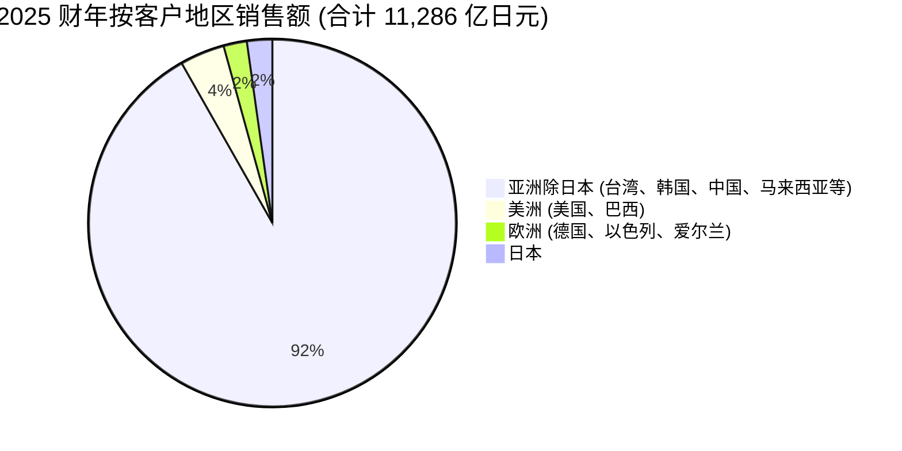

*来源: [2025 财年合并业绩公告, 2026-04-27, 第 15 页](https://www.advantest.com/en/news/2026/a81o6o0000000hgw-att/E_FR_FY2025_FN.pdf)。基于客户所在地。*

下面的甜甜圈图以相同口径展示按客户地区的营收占比——亚洲 (除日本) 占绝对主导 (91.8%):

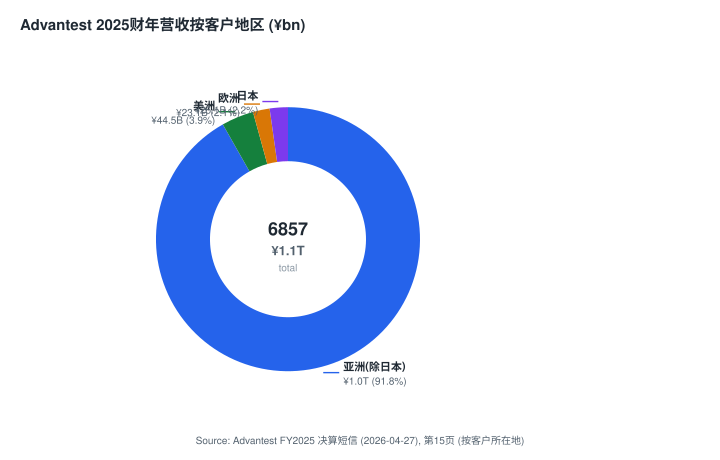

*来源: [2025 财年决算短信, 2026-04-27, 第 15 页 (按客户所在地)](https://www.advantest.com/en/news/2026/a81o6o0000000hgw-att/E_FR_FY2025_FN.pdf)。*

### 客户集中度

爱德万测试**未在其合并 IFRS 财务报告中按 10% 营业收入阈值披露具体客户名称** (2024 财年与 2025 财年的决算短信均不包含"主要な販売先"/"主要客户"披露)。详细的客户结构披露通常会出现在 6 月下旬通过 EDINET 提交的**有価証券報告書** (Yuho/年度证券报告)——2025 财年 Yuho 预定于 **2026 年 6 月 26 日**通过 [EDINET](https://disclosure2.edinet-fsa.go.jp/) 提交 ([2025 财年 FN 第 1 页](https://www.advantest.com/en/news/2026/a81o6o0000000hgw-att/E_FR_FY2025_FN.pdf)), 截至本报告日期 (2026-06-14) 尚未公开 (距预定提交仅约两周)。2024 财年 Yuho (2025 年 6 月) 同样未列示任何单一客户跨越 10% 阈值。

爱德万测试在 Investors Guide 中的官方叙述强调"客户基础以前几大客户的**低销售集中度**为特征。换言之, 客户基础高度多元化, 尤其在最近几年新客户数量明显增多" ([Investors Guide 2025, 第 13 页](https://www.advantest.com/document/en/investors/ir-library/investors-guide/Investors_Guide_2504E.pdf))。这一表述在定性上可信: 相关客户域涵盖 6 家以上 HBM 客户 (3 家 IDM × 晶圆厂 + 封装测试场所)、20 多个领先 SoC 项目 (NVIDIA、AMD、Apple、Qualcomm、Broadcom、MediaTek、Marvell、Google、AWS、Microsoft、Meta、Tesla Dojo 等)、5 家以上具有内部测试能力的领先代工厂, 以及全球 OSAT 基础。

**话虽如此, 底层客户基础在三个逻辑集群中高度集中, 而爱德万测试并未按具体百分比单列**: (i) **台湾**——台积电加 OSAT 集群 (日月光、矽品、力成) 与台湾无晶圆 (联发科、瑞昱 Realtek、联咏 Novatek); (ii) **韩国**——三星存储、SK 海力士; (iii) **设计 AI 的美国无晶圆**——NVIDIA、AMD, 以及超大规模云厂商 ASIC 管线。地理集中度 (1,036 亿日元 = 营业收入 91.8% 来自亚洲除日本) 是事实上的代理指标, 也本身即更具说明力的集中度衡量标准。

合约结构属于典型的资本设备模式: **按订单逐笔确认**, 具备较长前置期的订单簿可见度 (3–12 个月), 但客户营业收入层面不存在多年度照付不议的主协议。爱德万测试与**供应商**确实签有长期协议, 用于关键零部件——管理层在 2024 与 2025 财年评论中均明确提及"与现有供应商签订长期协议并就核心零部件进行供应链多元化" ([2024 财年 FN 第 5 页](https://www.advantest.com/en/news/2025/ildr5p0000000il7-att/E_FR_FY2024_FN.pdf); [2025 财年 FN 第 2 页](https://www.advantest.com/en/news/2026/a81o6o0000000hgw-att/E_FR_FY2025_FN.pdf))。

**风险标识:** 决算短信未披露具名客户集中度并不等于不存在集中度——这反映的是 IFRS / 日本披露阈值惯例。**合理推断 NVIDIA + 前两家 HBM IDM 合计在 2025 财年营业收入中占比显著超过 30%**, 依据是 (a) 三星/SK 海力士的 HBM 测试机需求量级与 (b) 2025 日历年内 NVIDIA Blackwell 测试机产能上线量。这是推断而非事实, 因此被标记为推断。第 9 章将客户集中度作为重大风险。

### 分销与渠道

**直销模式**, 配备贴近客户的工程团队。每个主要客户 (NVIDIA、Samsung、TSMC 等) 都有专属爱德万测试应用工程师, 提前数年参与客户产品开发周期。这至关重要: 测试机选型在器件设计阶段就已发生, 在硅片回来之前; 测试机的销售周期含数月前置期, 加上 12–18 个月的客户认证周期。

### 销售周期

一台新的 V93000 EXA Scale 系统按配置不同, 标价区间在低至中**千万美元**; 存储测试机 (T5835、T5503HS2) 单价通常较低, 但销量更高。绿地新客户中标的销售周期为 12–24 个月; 既有装机基础的扩容订单前置期为数周至几个月。订单簿 (受注残高) 在日文版 Yuho 中披露, 但不在英文版决算短信中披露。

### 关键合作

爱德万测试与以下方紧密合作:
- **NVIDIA**——Advantest Cloud Solutions™ 生态系统与 NVIDIA 加速计算集成用于测试分析, 而 V93000 系列在事实上是 AI 加速器的标准测试机 ([AInvest 评论, 2024–2025](https://www.ainvest.com/news/advantest-strategic-position-ai-advanced-semiconductor-test-market-lucrative-investment-ai-hpc-driven-growth-2512/))。
- **代工厂 (台积电、Samsung Foundry、Intel Foundry)** ——针对先进节点 (3nm、2nm、GAA) 进行联合测试工艺开发。
- **OSAT 联盟**——日月光、Amkor、力成、长电均在其封装测试楼层运行爱德万测试设备。

### 客户案例 (已公开具名)

- **iTest**——选用 V93000 EXA Scale 用于量产测试服务 (2023 年 10 月——[爱德万测试公告](https://www.advantest.com/en/news/2023/20231011.html))。
- **ISE Labs**——选择 V93000 EXA Scale 用于量产测试服务 ([Finance.yahoo 报道](https://finance.yahoo.com/news/ise-labs-chooses-advantest-v93000-080500756.html))。
- 更大客户 (NVIDIA、三星存储等) 未在具名交易新闻稿中披露, 但行业报道中已被广泛理解。

---

## 7. 行业概览

半导体测试设备行业——**ATE (Automatic Test Equipment, 自动测试设备)**——是广义半导体设备价值链中一个利基但高杠杆的角落。它位于半导体制造流程的**后段**, 在晶圆离开前道晶圆厂之后、封装装配前后。在制造一颗领先 IC 所需的 400–600 道工序中, "**测试是唯一处理电的工序**, 因为需要分析高精度的电信号以判断半导体的质量" ([Investors Guide 2025, 第 10 页](https://www.advantest.com/document/en/investors/ir-library/investors-guide/Investors_Guide_2504E.pdf))。这使 ATE 在结构上区别于前道工艺设备 (光刻、薄膜沉积、刻蚀、CMP) ——后者属于 ASML、应用材料、泛林、东京电子、科磊领域——也区别于后段装配设备 (ASMPT、BE Semiconductor)。

### 市场规模与增长

**全球半导体测试机市场**绝对规模较小——爱德万测试自身材料援引数据为 2024 日历年约**60 亿美元**, 其中约**41 亿美元 SoC + 19 亿美元存储** ([DataInsightsMarket Advantest 分部营业收入](https://www.datainsightsmarket.com/companies/6857.T))。作为对比, 广义半导体设备行业规模约 1,100 亿美元 (ASML 单家营业收入约 300 亿美元), ATE 仅占总半导体设备的 5–6%。但**ATE 市场在 AI 周期中是半导体设备增长最快的子板块**: 爱德万测试自身的 ATE 份额在 2024 年升至**约 58%** ([Investors Guide 2025, 第 3 页](https://www.advantest.com/document/en/investors/ir-library/investors-guide/Investors_Guide_2504E.pdf)), 而其 2025 财年销售额同比增长 44.7%, 进入 AI 拐点。

**测试机需求驱动因素** (按爱德万测试自身框架):
- **产能采购 (Capacity buys)** ——由芯片制造商晶圆产出能力扩张所驱动。政府补贴的晶圆厂建设 (美国《CHIPS 法案》、欧盟《Chips Act》、日本 METI、韩国《K-Chip》、中国 SMIC 本土化) 正在增加全球晶圆产能, 机械式地推动测试机产能采购。
- **技术采购 (Technology buys)** ——由节点迁移驱动 (台积电 3nm→2nm→1.4nm; Samsung Foundry GAA)、异构集成 (chiplet、CoWoS、代工-OSAT 先进封装) 与测试强度敏感型器件 (AI 加速器、HBM 堆栈、5G/6G 收发器) 兴起。公司原文: "半导体的微缩、复杂度与功耗带来的挑战, 使提升测试效率愈发困难, 这同样是顺风" ([Investors Guide 第 6 页](https://www.advantest.com/document/en/investors/ir-library/investors-guide/Investors_Guide_2504E.pdf))。

行业属**周期性**——绑定资本开支的资本设备一向如此——但随着应用结构扩展 (智能手机→汽车→AI→5G/6G→工业), 周期性正在**平滑**。2023 财年是最近的下行年 (销售-13.2%); 2024 与 2025 财年则强劲反弹。2020 年前 ATE 市场增长年化约 10%; AI 周期已将 2023–2026E 期间 CAGR 提升至约 30%。

### 行业结构——双寡头

全球 ATE 市场是**双寡头**: **爱德万测试 + 泰瑞达合计市场份额约 80%** ([Investors Guide 第 13 页](https://www.advantest.com/document/en/investors/ir-library/investors-guide/Investors_Guide_2504E.pdf))。剩余约 20% 分布于 Cohu (Handler 强项)、致茂电子 Chroma ATE (台湾, 更广义仪器)、Aehr Test Systems (小份额, 烧机/SLT 专家)、Marvin Test Solutions (军工/航天) 与韩国及中国一长串新兴厂商 (Yoseni、Eles、GLSemi)。具体到 SoC 测试, 爱德万测试份额被广泛引用为 50% 以上; 在存储测试中, 爱德万测试为份额领导者, 但泰瑞达通过 Magnum 占有可观的 NAND 份额。

**为何该行业是双寡头?** 三个结构性原因:
1. **转换成本。** 客户量产测试程序是绑定特定测试机指令集的知识产权。在不同平台之间重写测试程序按每个器件家族需 12–24 个月, 并风险化良率。一旦主要无晶圆客户 (如 NVIDIA 或 Apple) 在某一平台上标准化, 该决策即沿供应链传导到接触其硅片的每一家代工厂与 OSAT, 持续整个器件的生命周期 (5–10 年)。
2. **研发规模。** 一款新旗舰测试机平台需要 5 年以上、约 10 亿美元的研发投入。爱德万测试年度研发支出广泛引用在 **600–800 亿日元 (4–5.5 亿美元) 区间**, 可持续性较高; 泰瑞达类似。较小竞争对手无力支撑这一广度。
3. **应用广度。** AI 加速器、HBM、汽车、智能手机、DDIC、IoT 各自需要不同的测试机——只有爱德万测试与泰瑞达具备覆盖所有类别的产品组合。

### 监管环境

ATE 在产品层面并非高强度监管 (无 FDA 等同机构), 但面临**出口管制**, 因为测试机处理本身受到美国与日本出口管制制度约束的前沿半导体。爱德万测试敞口: 任何向受美国实体清单 (Entity List) 限制的中国客户 (SMIC、某些长江存储实体等) 销售先进测试机, 在适用情况下需取得日本 METI / 美国 BIS 许可。在过去周期中, 中国曾是有意义的客户集群; 公司未披露"亚洲"内部按客户国别的拆分, 仅按高层次四地区披露。

### 行业动态

- **供应商话语权:** 爱德万测试依赖少量关键零部件供应商 (定制 ASIC、高速针电路卡、半导体级电源)。管理层在 2024 财年中明确以"与现有供应商签订长期协议并就核心零部件进行供应链多元化"应对这一点 ([2024 财年 FN 第 2 页](https://www.advantest.com/en/news/2025/ildr5p0000000il7-att/E_FR_FY2024_FN.pdf))。
- **买方话语权:** 在最顶层集中 (NVIDIA、三星、台积电、SK 海力士可强势议价), 下层分散。
- **替代品:** 系统层面无替代品——每颗 IC 都需要电气测试。替代项是"少做测试", 这是芯片厂商在风险管理与成本之间的权衡。AI 加速器经济性 (每颗 Blackwell 模块 30,000 美元以上) 决定性地偏向更多测试, 而非更少。
- **进入壁垒:** 极高。中国国资牵头的进入尝试 (Yoseni、杭州芯原) 存在, 但在前沿 SoC 测试机上仍落后多年。

---

## 8. 竞争格局

### 直接竞争对手

**1. 泰瑞达 Teradyne (NASDAQ:TER)——直接、唯一真正的同业。** 泰瑞达是全球第二大 ATE 厂商, 与爱德万测试约 58% 的份额相比, 合计份额约 30–35% (2024 日历年数据, [Investors Guide 第 3 页](https://www.advantest.com/document/en/investors/ir-library/investors-guide/Investors_Guide_2504E.pdf); [Pestel Analysis](https://pestel-analysis.com/blogs/competitors/advantest))。泰瑞达历史上最强的阵地是**移动 SoC** (Apple A 系列、高通 Snapdragon 曾/仍是泰瑞达主要客户) 与**存储 NAND** (Magnum 平台)。在 AI 加速器前线, 泰瑞达正提升 UltraFLEXplus 与 J750HD 平台, 但在 Blackwell 周期中输给了爱德万测试的 V93000 EXA Scale。泰瑞达还拥有 Universal Robots (协作机器人) 与 MiR (自主移动机器人), 这些是爱德万测试不具备的——这些非 ATE 板块稀释了泰瑞达的产品结构, 但也缓冲了 ATE 周期性。泰瑞达 TTM P/E 约 88 倍 ([gurufocus TER TTM P/E](https://www.gurufocus.com/term/pettm/TER)) 高于爱德万测试的滚动数据, 是因为泰瑞达盈利在 2023 财年下降幅度更大, 反弹小于爱德万测试。市值约 570 亿美元。

**2. Cohu, Inc. (NASDAQ:COHU)** ——主要为**测试 Handler** 厂商 (Diamondx 平台), 兼具一定的封装器件测试能力。Cohu 营业收入约 5 亿美元, 远小于爱德万测试的机电一体化业务; 在 Handler 与 DIB 领域与爱德万测试竞争。Cohu 受汽车/工业放缓的影响明显, 但有望随该周期复苏。

**3. 致茂电子 Chroma ATE (TWSE:2360)** ——台湾本地; 在更广义测试与测量领域 (不仅是 IC 测试) 竞争, 强项在电力电子、电动汽车电池测试与 PCB 测试。与爱德万测试核心 SoC 测试机业务重叠有限, 但属邻近。营业收入约 7 亿美元。

**4. Aehr Test Systems (NASDAQ:AEHR)** ——小份额的**晶圆级烧机 (wafer-level burn-in)** 与高温可靠性测试专家。利基但技术上可信; 在面向电动汽车 SiC 功率器件领域增长。

**5. 韩国 / 中国新兴厂商——Yoseni、Eles、GLSemi。** 迄今属子规模, 但有国家级支持。Yoseni (韩国) 历史上已赢得部分 SK 海力士存储测试机订单; 中国厂商瞄准 SMIC 与本土 IC 生态。短期内尚未对前沿 SoC 构成威胁, 但属长尾战略风险。

### 间接 / 邻近

**前道工艺工具同业** (ASML、应用材料、东京电子、泛林、科磊) **不属竞争对手**——它们向相同客户出售不同设备——但出于估值目的, 它们是相关的"半导体设备"对比对象。**科磊 (KLA) 在业务模型上最接近**: 同样是利基/份额领导者 (工艺控制对位测试), 同样高利润率 (约 40% 营业利润率), 同样是前沿节点的"必备"工具。科磊 TTM P/E 约 41 倍是最相关的西方对位公司。

### 定位框架

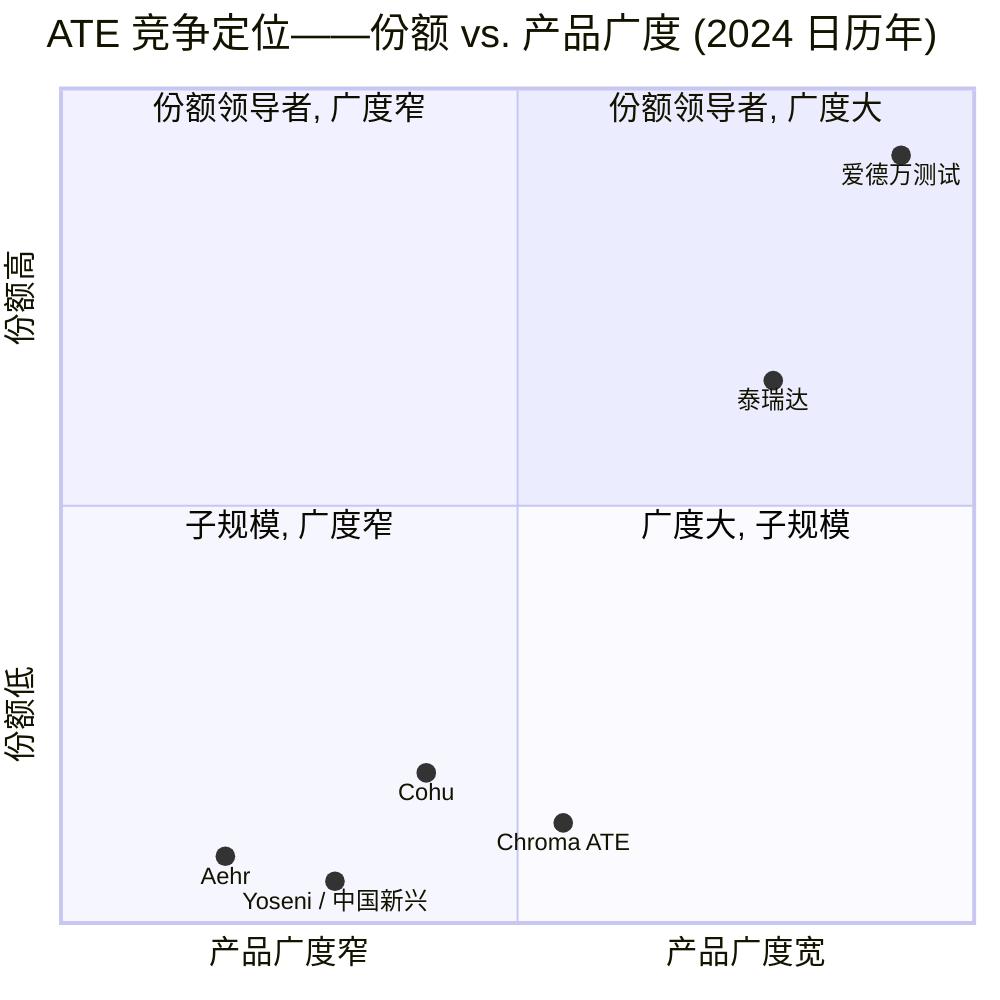

### 同业估值快照

下面的 TTM P/E 对比 (单一 y 轴, 倍, 截至 2026 年 6 月中旬) 把 Advantest 放入半导体设备同业组——TER 因 2023 财年盈利下滑更深而 TTM 倍数最高, Advantest 处该组中段偏高, AMAT 最低:

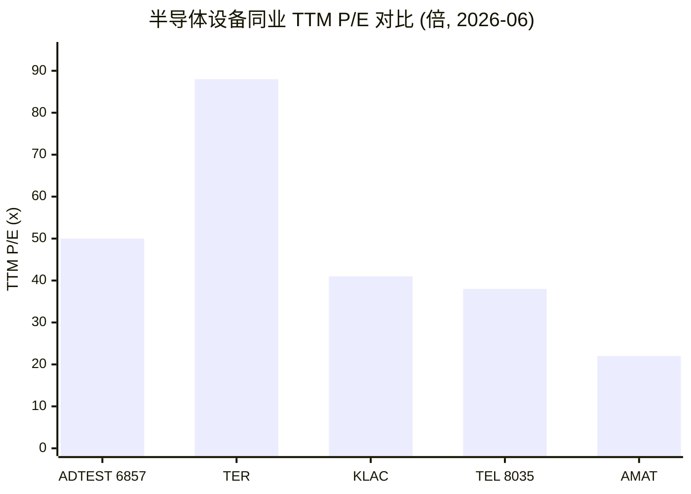

*来源: TTM P/E 截至 2026 年 6 月中旬, 综合自 [Yahoo Finance 6857.T](https://finance.yahoo.com/quote/6857.T/)、[companiesmarketcap.com — Advantest P/E](https://companiesmarketcap.com/advantest/pe-ratio/)、[gurufocus TER TTM P/E](https://www.gurufocus.com/term/pettm/TER)、[Yahoo Finance KLAC 关键统计](https://finance.yahoo.com/quote/KLAC/key-statistics/)、[Alpha Spread KLAC vs AMAT](https://www.alphaspread.com/comparison/nasdaq/klac/vs/nasdaq/amat)、[Simply Wall St 8035 估值](https://simplywall.st/stocks/jp/semiconductors/tse-8035/tokyo-electron-shares/valuation)。爱德万测试 TTM P/E 约 50 倍, 基于 2025 财年报告 EPS 513.30 日元, 而非某些数据商仍以早期估值打印的失真约 125 倍数字。*

### 爱德万测试的竞争优势

1. **SoC ATE 上的转换成本护城河。** 一旦 V93000 在无晶圆客户处获认证, 整条下游供应链 (代工厂、OSAT) 倾向于使用同一台测试机。在 5 年视角内难以撼动。
2. **HBM 测试机准垄断地位。** 在三家 HBM IDM (三星、SK 海力士、美光) 处, 爱德万测试被普遍认为是 HBM 堆栈 KGD 测试的标准供应商。随 HBM 比特增长在 HBM4 (并将延伸到本十年中段的 HBM5) 之前以每年 50% 以上速度运行, 这是半导体设备业内增长最快的产品线。
3. **整体解决方案产品组合。** 测试机 + Handler + DIB + 插座 + SLT + 云软件——只有爱德万测试能从同一关系内供应整套测试环境。
4. **经营杠杆。** 2025 财年毛利率达 64.3%, 营业利润率 44.2%。每一台增量 V93000 系统贡献利润率极高; 该商业模型将营业收入增长按 2 倍以上比率转化为盈利增长。

### 竞争脆弱性

1. **周期性。** 2023 财年销售下滑 13.2%, 营业利润下滑 51.3%。AI 周期掩盖了——而非消除了——资本开支周期性。
2. **客户地理集中度。** 2025 财年营业收入约 92% 来自亚洲除日本, 大部分集中于台湾 + 韩国 + 中国。地缘风险 (台海、美中出口管制、韩中紧张) 集中。
3. **汇率敞口。** 营业收入 97.8% 来自日本以外, 而成本以日本为主, 美元/日元是结构性 P&L 驱动因素。汇率从 150 移动至 130 日元/美元将使报告营业收入压缩约 13%。
4. **单一平台依赖。** V93000 是主导的 SoC 平台; 技术颠覆 (chiplet 原生测试、在位测试、on-die BIST 抢占份额) 是低概率但高影响的尾部风险。

---

## 9. 市场机会 (TAM)

### 测试机 TAM 规模测算

爱德万测试自身框架将**2024 财年半导体测试机市场置于约 60 亿美元** (约 41 亿美元 SoC + 约 19 亿美元存储) ([DataInsightsMarket Advantest 规模测算](https://www.datainsightsmarket.com/companies/6857.T))。公司 2025 财年营业收入达**75 亿美元** (按 150 日元/美元) 已超过 2024 财年 ATE 市场总量——意味着 (a) 市场在 2025 日历年大幅扩张 (确实如此——与爱德万测试 44.7% 营业收入增长大致一致), 或 (b) 爱德万测试在扩张市场中获得份额 (两者兼有)。倒推 2025 日历年 ATE TAM: 若爱德万测试份额升至约 60%、泰瑞达守约 25%, 总市场约 120–130 亿美元——较 2024 日历年大致翻倍。

对 2026 财年, 管理层展望援引广义半导体行业有望在 2026 日历年突破 1 万亿美元 ([2025 财年 FN 第 5 页](https://www.advantest.com/en/news/2026/a81o6o0000000hgw-att/E_FR_FY2025_FN.pdf)), 测试机市场"也预计达到史上最大规模, 由 AI 相关半导体复杂度上升与产量增加等因素驱动"。

### SAM 与 SOM

- **SAM (可服务可寻址市场, serviceable available market):** SoC 测试机 + 存储测试机 + 周边机电一体化 + SLT + 插座 + 云软件 ≈ 2026 日历年运转率 140–160 亿美元, 若 AI 加速器产能持续扩张, 本十年中段将增长至 200+ 亿美元。
- **SOM (可服务可获得市场, serviceable obtainable market):** 在 SoC 与存储合计份额约 60% 以及 SLT 不断增长贡献的情况下, 爱德万测试 2026 日历年 SAM 中可获得份额约 100–110 亿美元——与 2026 财年指引 (14,200 亿日元 ≈ 按 150 日元/美元约 95 亿美元) 大体匹配, 小幅差额反映出爱德万测试服务及其他业务略超出狭义 ATE 范畴。

### 增长预测

结构性驱动因素叠加:
- **AI 加速器单位增长。** NVIDIA、AMD, 加上超大规模云厂商内部 ASIC (Google TPU、AWS Trainium、Microsoft Maia、Meta MTIA) 单位规模在可预见未来按每年 50% 以上增速运转。每单位驱动 2–3 倍于传统逻辑芯片的测试机时间。
- **HBM 比特增长。** 2025 日历年 HBM3E 量为 2024 日历年的约 3 倍; HBM4 在 2026 日历年爬坡。SK 海力士、三星、美光各自建设专门的 HBM 生产线, 需要大量 KGD 测试机产能。
- **Chiplet / 先进封装。** 把单片 SoC 分解为 chiplet, 使测试插入次数倍增: 每个 chiplet 需在装配前进行 KGD 测试, 装配后封装再做一次测试。即便单位量零增长, 这在结构上对测试为正。
- **汽车 / 工业复苏。** 成熟制程测试机需求在 2024 日历年触底, 2025 日历年"汽车与工业设备板块自年中起出现见底初步迹象" ([2025 财年 Q3 第 2 页](https://www.advantest.com/document/en/investors/ir-library/result/E_FR_FY2025_3Q.pdf))。这里的周期性复苏属增量上行空间。

### 渗透策略

爱德万测试的渗透策略已记入**第三个中期经营计划 (MTP3, 2024–2026 财年)**:
1. **跑赢核心市场增长** ——通过 V93000 模块刷新、"测试自动化"软件/AI 集成。
2. **扩展邻近 / 新业务** (SLT、插座、云解决方案) ——利用装机基础杠杆。
3. **推动卓越运营** ——供应链韧性、内部 AI/DX。
4. **强化可持续性** ——气候、治理、人力资本。

管理层已确认将发布覆盖 2027 财年及以后的下一份 MTP (MTP4) ——尚未公开。

### 资产负债表与现金流结构

把 TAM 兑现为现金的能力, 最终落到资产负债表与现金流上。下面两张 Sankey 展示: (i) 截至 2026-03-31, 总资产 ¥1,171.8bn 中现金 ¥340.0bn + 应收 ¥228.7bn + 存货 ¥231.7bn 构成流动资产主体, 负债仅 ¥376.1bn, 股东权益 ¥795.7bn (权益率 67.9%)——近零负债的堡垒型资产负债表; (ii) FY2025 经营现金流 ¥335.2bn, 扣除资本开支 ¥33.0bn 后自由现金流约 ¥302bn, 主要用于股票回购、股息与偿还短期借款 ([2025 财年决算短信, 第 6–7 页](https://www.advantest.com/en/news/2026/a81o6o0000000hgw-att/E_FR_FY2025_FN.pdf))。

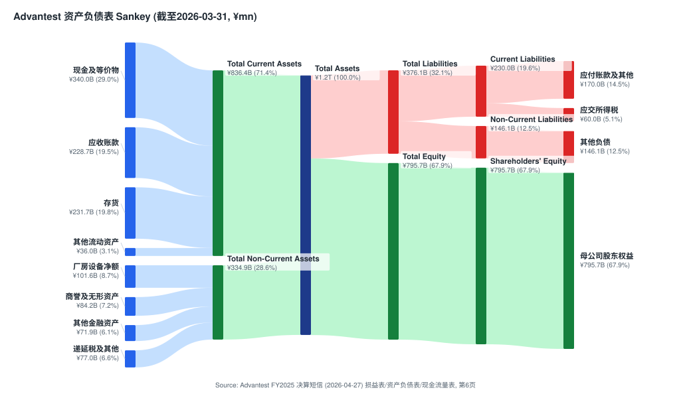

*来源: [2025 财年决算短信, 2026-04-27, 第 6 页 (合并财务状况表)](https://www.advantest.com/en/news/2026/a81o6o0000000hgw-att/E_FR_FY2025_FN.pdf)。负债侧明细 (应付/应交税/其他) 为按文字披露的近似拆分, 合计 ¥376.1bn 与披露一致。*

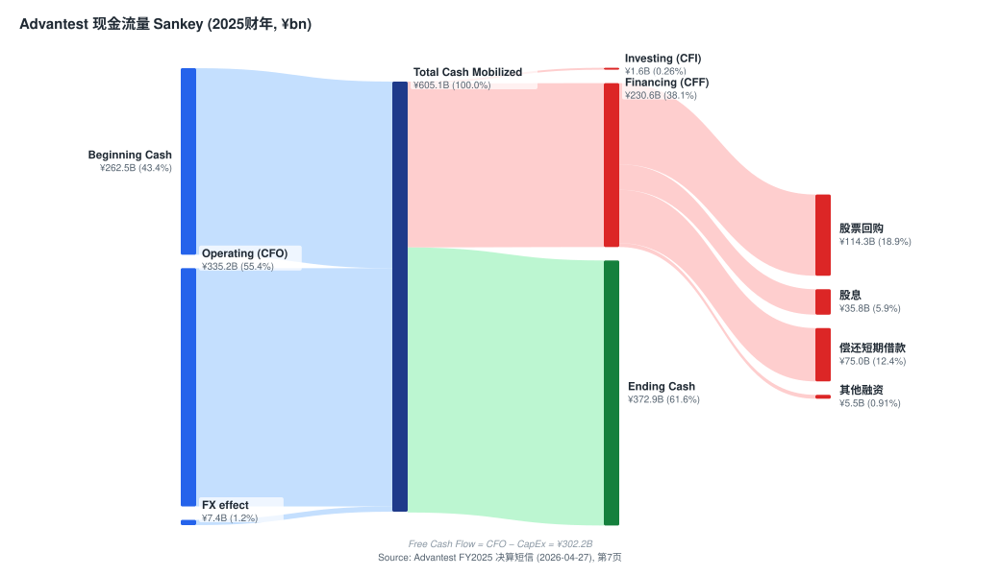

*来源: [2025 财年决算短信, 2026-04-27, 第 7 页 (现金流量概览)](https://www.advantest.com/en/news/2026/a81o6o0000000hgw-att/E_FR_FY2025_FN.pdf)。融资活动明细 (回购/股息/偿还短借) 为按文字披露的近似拆分。*

---

## 9.5 核心分歧与催化剂 (Key debates & catalysts)

本节区别于第 10 章的风险清单: 这里聚焦市场对 Advantest 的 2–4 个核心分歧, 逐一回应, 再列出未来 12 个月的具名催化剂。

### 核心分歧 (bear arguments + 回应)

**分歧 1: 估值是否已过高?** *看空方 (UBS):* Advantest 受益 AI 但「估值过高、性价比不足」, 偏好东京电子与瑞萨 ([UBS — Japan Tech Conglomerates, 2026-05-14, p.1](http://xs-macbook-air.local:5001/zsxq/pdf/212452151442141/UBS-Japan%20Tech%20Conglomerates%EF%BC%9AHardware%20above%20software%20still-260514.pdf))。*回应:* 前瞻 P/E 约 43× 确实偏高, 但 (a) FY2025 实际超越三次上调后的指引, 模型持续追赶, 滚动 P/E 被压缩; (b) Bernstein FY27/FY28 营业利润较共识高 12%/8%, 若兑现则估值进一步消化。本报告把估值列为评级仅 Overweight (非 Buy) 的核心约束——既不否认 UBS 的担忧, 也不接受其中性结论。

**分歧 2: Teradyne 会否在 NVIDIA 份额上反扑?** *看空方:* 泰瑞达正重建高端 SoC 测试机路线图, UltraFLEXplus 刷新加激进定价可能在 2026–2027 重夺份额。*回应:* Bernstein 承认泰瑞达可能在 NVIDIA 份额上有所提升, 但认为来自 ASIC、CPO、CPU、LPU 的新需求足以支撑 Advantest 继续增长; Morgan Stanley 亦判断 AI GPU 测试竞争格局稳定、无明显份额流失风险 ([Bernstein — From GPU to CPO/CPU/LPU, 2026-04-15, p.1](http://xs-macbook-air.local:5001/zsxq/pdf/184418854484582/Bernstein-Advantest%20Corp%EF%BC%886857.JP%EF%BC%89Advantest%EF%BC%9A%20From%20GPU%20to%20CPO%EF%BC%8C%20CPU%EF%BC%8C%20LPU...%20Upgrading%20to%20Outperform%20and%20Top%20Pick-260415.pdf); [Morgan Stanley — Taiwan Visit Takeaways, 2026-06-08, p.1](http://xs-macbook-air.local:5001/zsxq/pdf/814528415518542/Morgan%20Stanley-Taiwan%20Visit%20Takeaways-260608.pdf))。

**分歧 3: AI 资本开支会否在 2026 日历年见顶?** *看空方:* 若超大规模云训练资本开支见顶, 或结构从训练 (高测试强度) 转向推理 (低测试强度), 增速可能失速。*回应:* 这是真实的高严重性风险 (见第 10 章风险 2); 但 Morgan Stanley 供应链核实显示存储短缺或持续 2–3 年、先进逻辑投资维持强劲, 2027 年前不必悲观 ([Morgan Stanley — Taiwan Visit Takeaways, 2026-06-08, p.1](http://xs-macbook-air.local:5001/zsxq/pdf/814528415518542/Morgan%20Stanley-Taiwan%20Visit%20Takeaways-260608.pdf))。本报告把它作为熊市情景 (−7%) 的核心假设, 而非基准。

### 未来 12 个月催化剂 (dated)

- **2026-06-26 (预定):** FY2025 有価証券報告書 (Yuho) 通过 EDINET 提交——可能首次披露客户集中度与订单簿 (受注残高) 细节 ([2025 财年 FN 第 1 页](https://www.advantest.com/en/news/2026/a81o6o0000000hgw-att/E_FR_FY2025_FN.pdf))。
- **2026 年 7 月底 (预计):** FY2026 Q1 (6 月季度) 决算短信——Bernstein 回归模型预示总营收 ¥3,460bn 高于共识 ¥3,370bn, 存在再超预期可能 ([Bernstein — Taiwan Import Tracker, 2026-06-10, p.1](http://xs-macbook-air.local:5001/zsxq/pdf/412458152484588/Bernstein-Japan%20and%20EU%20Semiconductors%20Japan%20EU%20Semi%20Taiwan%20Import%20Tracker%20%EF%BC%88May%2026%EF%BC%89%EF%BC%9A%20SPE%20import%20%2B23%25%20YoY-260610.pdf))。
- **2026-07-31:** 第 84 届定期股东大会 ([2025 财年 FN 第 15 页](https://www.advantest.com/en/news/2026/a81o6o0000000hgw-att/E_FR_FY2025_FN.pdf))。
- **2026 下半年:** MTP4 (覆盖 2027 财年及以后的新中期经营计划) 发布——多年期营收/利润率/资本开支目标。
- **2027–2028:** CPO (共封装光学) 大规模量产启动 (2028 年), 测试市场规模预计 2026 年 $1 亿 → 2028 年 $3–7 亿; 晶圆级插入测试需求是更近期的增量 ([Morgan Stanley — Taiwan Visit Takeaways, 2026-06-08, p.1](http://xs-macbook-air.local:5001/zsxq/pdf/814528415518542/Morgan%20Stanley-Taiwan%20Visit%20Takeaways-260608.pdf))。

持续跟踪可借助 catalyst-calendar 技能。

---

## 10. 风险评估

### 公司特定风险

**1. 客户集中度 (高严重性 / 定量未披露)。** 爱德万测试未在决算短信中按 10% 阈值具名客户, Yuho "主要な販売先"部分亦未拆分前几大客户。综合 92% 亚洲除日本销售结构、HBM 测试机需求由三家 IDM (三星存储、SK 海力士、美光) 主导, 以及 NVIDIA + AMD + 超大规模云厂商 ASIC 项目对 SoC 测试机爬坡的核心地位, **合理推断前 5 大客户集群在 2025 财年营业收入中占比超过 50%**。风险: 若 NVIDIA 暂停 Blackwell 测试机订单达一个季度, 或 HBM IDM 集体下调资本开支 20%, 影响将重大且难以从公开披露中预测。缓解因素: 客户基础正在扩大 (越来越多超大规模云厂商 ASIC 项目); 营业收入跨 SoC 与存储测试机, 单一客户依赖被稀释。 ([2025 财年 FN 第 2 页](https://www.advantest.com/en/news/2026/a81o6o0000000hgw-att/E_FR_FY2025_FN.pdf))

**2. AI 周期见顶 / 资本开支暂停 (高严重性 / 中等概率)。** 最重大的近期风险。2025 财年销售增长 44.7%, 2026 财年指引 +25.8%。若超大规模云厂商训练资本开支在 2026 日历年见顶, 或产品结构从训练 (高端加速器, 极高测试强度) 转向推理 (低端 ASIC, 测试强度较低), 爱德万测试的增长率可能迅速失速。周期史明确: 2023 财年销售-13.2%, 营业利润-51.3%。

**3. 单一平台依赖 / 技术颠覆 (低概率 / 高严重性)。** V93000 EXA Scale 是主导 SoC 平台; on-die BIST (片上自测试)、chiplet 原生测试架构, 或 AI 驱动的测试时间压缩, 长期看可能降低单位测试机需求。这些都不是即时威胁; 爱德万测试自身正投资"测试自动化"软件与基于 ML 的测试优化, 旨在拥抱而非被这些趋势颠覆 ([Investors Guide 第 15 页](https://www.advantest.com/document/en/investors/ir-library/investors-guide/Investors_Guide_2504E.pdf))。

**4. Essai / SLT 执行风险 (中等严重性, 已显现)。** 2024 财年 Q4 对 Essai 商誉减值 214 亿日元——由一位主要客户销售放缓与拓展新客户进度延后驱动 ([2024 财年 FN 第 3 页](https://www.advantest.com/en/news/2025/ildr5p0000000il7-att/E_FR_FY2024_FN.pdf)) ——表明并非所有并购整合都顺畅。SLT 与插座是结构性增长跑道, 但依赖执行。

**5. 关键人物依赖 Doug Lefever (低-中等严重性)。** 作为爱德万测试首位非日本籍 CEO, 同时也是 Verigy 与 Astronics 两笔交易的主要设计者, Lefever 持续在任至关重要。缓解因素: 津久井-Lefever 联袂领导; 深厚的板凳深度 (吉田仍在董事会)。

### 行业 / 市场风险

**6. 泰瑞达竞争强度 (中等严重性 / 持续)。** 泰瑞达正在重建其高端 SoC 测试机路线图——此前在 Blackwell 中输给 V93000 EXA Scale。UltraFLEXplus 刷新加上对超大规模云厂商 ASIC 项目的激进定价, 可能在 2026–2027 日历年重新夺回份额。叠加 Cohu 与 Chroma 在邻近利基的存在, 即便在双寡头内部, ATE 市场仍具竞争性。

**7. 出口管制监管 (中-高严重性 / 结构性)。** 美国 BIS 与日本 METI 对向中国出口先进半导体的限制仍在演变。爱德万测试的测试机并非全部受管制, 但向中国无晶圆与代工厂客户 (SMIC、某些存储 IDM) 销售特定高端 SoC 测试机需要许可。这些规则收紧——尤其是若日本与美国限制趋同——将压缩爱德万测试的中国营业收入。

**8. 技术颠覆——chiplet 原生测试 (低概率 / 高影响)。** 向封装内测试 (测试嵌入封装本身, 减少对外部 ATE 的需求) 的迁移是多年期结构性风险。爱德万测试有望作为 chiplet 测试推动者参与, 而非被绕开, 但测试价值链的长期形态并不确定。

**9. 中国本土测试机崛起 (低-中等严重性 / 多年期)。** Yoseni、GLSemi、杭州芯原及其他中国厂商在获得国家级支持以替代外国 ATE。短期内尚无法在前沿竞争; 至本十年中段可能替代爱德万测试在中国商品 DRAM 与成熟节点 SoC 测试机市场的份额——约占总 ATE 5–10% 的可寻址份额。

### 财务风险

**10. 估值 / 估值倍数压缩 (中-高严重性)。** 爱德万测试 TTM P/E 约 50 倍 (前瞻约 42 倍)、TTM P/S 约 17.7 倍。这些都明显高于半导体设备中位数 (TEL 约 38 倍、KLA 约 41 倍、AMAT 约 22 倍), 且依赖盈利持续上修。一个季度的指引令人失望——或 AI 资本开支叙事的温和——都可能把估值倍数压向行业中位 (单纯估值倍数即-25 至-40% 下行)。3 年估值区间很宽; 当前估值已计入持续兑现。引用对比中位数: [Yahoo Finance KLAC](https://finance.yahoo.com/quote/KLAC/key-statistics/)、[Alpha Spread KLAC/AMAT](https://www.alphaspread.com/comparison/nasdaq/klac/vs/nasdaq/amat)、[Simply Wall St 8035 估值](https://simplywall.st/stocks/jp/semiconductors/tse-8035/tokyo-electron-shares/valuation)。

**11. 资本配置纪律 (低风险)。** 现金 3,400 亿日元、长期债务 300 万日元、2025 财年自由现金流 3,020 亿日元, 问题在于公司是否保持纪律, 还是在周期峰值寻求重大变革型并购。迄今, 2025 财年资本计划 (1,140 亿日元回购、上调股息) 显示出纪律。

### 宏观风险

**12. 日元/美元 / 日元/欧元 汇率 (中等严重性 / 结构性)。** 营业收入 97.8% 来自日本以外, 而成本主要在日本, 日元兑美元每升值 10 日元将使报告营业收入压缩约 6%。2026 财年指引假设 150 日元/美元、170 日元/欧元。若日元/美元移动至 130 (日本货币政策正常化或美国降息可能产生的水平), 在没有任何运营层面影响之前, 2026 财年营业收入将压缩约 13%。缓解因素: 并非所有成本均以日元计价 (圣何塞美国研发、慕尼黑工程等)。

**13. 地缘集中——台海 + 韩国 (高影响 / 低概率)。** 按推断, 爱德万测试两大客户集群是台湾 (台积电 + OSAT + 无晶圆) 与韩国 (三星 + SK 海力士)。台海中断或朝鲜半岛事件不仅会减少订单, 还会中断爱德万测试所依赖的全球半导体供应链。

**14. 全球衰退敏感性 (中等, 由 AI 周期缓和)。** ATE 在结构上具周期性; AI 周期掩盖但未消除。同时打击消费电子、汽车与 AI 资本开支的广泛全球衰退, 将在单年压缩销售 20–30%——正如 2023 财年业绩所示, 这是可能发生的。

---

## 11. 投资视角评分 (Section 10 lenses)

> 以下评分卡把第 1–10 章已引用的事实, 套入四个知名投资框架作为评分**视角 (rubric)**——不是角色扮演, 也不是背书。每个结论标注 *视角观点:*。周期快照来源: indicators.db 本地快照 (FRED BAMLH0A0HYM2 / ^TNX + yfinance), as of 2026-06-05。

**周期快照 (cycle snapshot):** VIX 21.5、10Y Treasury (^TNX) 4.54%、HY OAS (BAMLH0A0HYM2) 2.74%、IG OAS 0.74%、MOVE 75.2——信用利差处于周期低位、波动率温和, 整体属**风险偏好 (risk-on) / 偏晚周期**环境 (来源: indicators.db 本地快照 (FRED BAMLH0A0HYM2 / ^TNX + yfinance), as of 2026-06-05)。

### 11.4 Howard Marks 周期视角 (先算, 用以校准其余) — *视角观点:* 偏防御 (offense↔defense 约 35/100)

| 维度 | 读数 | 评分 |
|---|---|---|
| 信用利差 | HY OAS 2.74% (近周期低位) | 偏贵 |
| 波动率 | VIX 21.5 / MOVE 75.2 (温和) | 中性 |
| 估值情绪 | 半导体设备/AI 测试主题接近极致乐观 | 偏贵 |

*视角观点:* 当前是「钟摆偏向贪婪」的晚周期环境——信用便宜、AI 主题拥挤。对 Advantest 这类高 beta、高估值的 AI 受益股, Marks 框架要求**以防御姿态参与**: 上行真实但需要安全边际, 这正是本报告给 Overweight 而非 Buy、PT 刻意低于卖方最乐观端的原因。下方各视角的「看多」结论须按此防御基调打折。

### 11.1 Buffett 视角 (质量 + 合理价格, 0–100) — *视角观点:* 质量满分, 价格不合理 (约 55/100)

| 维度 | 读数 | 评分 |
|---|---|---|
| 护城河 | SoC/HBM 测试机准垄断, 转换成本 + 研发规模 | 强 |
| 盈利质量 | ROE 57.65% 几乎全由盈利驱动 (权益乘数仅 1.56) | 强 |
| 资产负债表 | 现金 ¥340bn, 长期债务近零 | 强 |
| 价格 | 前瞻 P/E 约 43× | 弱 |

*视角观点:* 这是 Buffett 会欣赏的生意 (宽护城河、高 ROIC、净现金), 但**不是他会买的价格**。Buffett 框架在此是「优质公司, 等更好价格」, 而非「以任何价格买入」。

### 11.2 Munger 视角 (质量加权 + 反向思考, 0–10) — *视角观点:* 7.5/10

*反向思考 (inversion):* 什么会让这笔投资亏钱? 最可能的不是基本面崩坏, 而是**为完美执行付了过高的价**——若 AI 资本开支放缓且倍数压向 40×, 即使盈利仍增长, 股价也可能下跌 (熊市情景 −7%)。Munger 会说: 生意是 A+, 但买入价决定回报, 当前价把容错空间压得很薄。

### 11.3 Damodaran 视角 (故事 + 数字, 安全边际 ±%) — *视角观点:* 安全边际约 +5–10% (薄)

*必备假设:* 无风险利率采 10Y ^TNX 4.54% (来源: indicators.db 本地快照 (FRED BAMLH0A0HYM2 / ^TNX + yfinance), as of 2026-06-05); 故事 = AI 测试强度阶跃驱动 ATE 市场翻倍, Advantest 守住 ~58% 份额并向 66% 推进; 数字 = FY2026E 营收 ¥1,420bn、营业利润率 44%。在此故事下, 本报告 PT ¥30,500 较现价仅 +12%——安全边际薄, 与 Howard Marks 的防御基调一致。若给 Bernstein 的更激进份额/CPO 故事, 安全边际扩大 (牛市 +35%), 但那要求 AI 周期不间断。

*视角观点:* 故事可信、数字扎实, 但当前价已计入大部分故事——margin of safety 薄, 这是「持有/小幅增持」而非「重仓买入」的级别, 与本报告 Overweight 评级一致。

---

## 12. 参考资料

### 主要公告——爱德万测试公司披露

- [2025 财年合并业绩公告 (决算短信 Kessan Tanshin), 2026-04-27](https://www.advantest.com/en/news/2026/a81o6o0000000hgw-att/E_FR_FY2025_FN.pdf) — 截至 2026 年 3 月 31 日的财年
- [2025 财年 Q3 合并业绩公告, 2026-01-28](https://www.advantest.com/document/en/investors/ir-library/result/E_FR_FY2025_3Q.pdf)
- [2024 财年合并业绩公告 (决算短信), 2025-04-25](https://www.advantest.com/en/news/2025/ildr5p0000000il7-att/E_FR_FY2024_FN.pdf) — 截至 2025 年 3 月 31 日的财年
- [Investors Guide, 2025-04-25](https://www.advantest.com/document/en/investors/ir-library/investors-guide/Investors_Guide_2504E.pdf)
- [盈利预测页 (2026 财年初始指引)](https://www.advantest.com/en/investors/financial-highlights/forecast/)
- [财务回顾页 (2025 财年实际业绩)](https://www.advantest.com/en/investors/financial-highlights/review/)
- [爱德万测试 CEO 任命新闻稿, 2025-03-28](https://www.advantest.com/en/news/2025/ildr5p0000000h24-att/E_Info_20250328.pdf)
- [沿革 | 关于 Advantest](https://www.advantest.com/en/about/history/)
- [管理团队 | 关于 Advantest](https://www.advantest.com/en/about/management/)
- [V93000 EXA Scale 产品页](https://www.advantest.com/products/soc/v93000/exa.html)
- [T5835 存储测试机产品页](https://www.advantest.com/en/products/semiconductor-test-system/memory/t5835/)
- [T5503HS2 存储测试机产品页](https://www.advantest.com/en/products/semiconductor-test-system/memory/t5503hs2/)
- [T5833 / T5833ES 产品页](https://www.advantest.com/en/products/semiconductor-test-system/memory/t5833/)
- [T5835 发布新闻稿, 2021-11-30](https://www.advantest.com/en/news/2021/20211130.html)
- [群马研发中心](https://www.advantest.com/en/about/offices/gunma-rd-center/)
- [爱德万测试 6-K SEC 文件——Verigy 收购, 2011-03-28](https://www.sec.gov/Archives/edgar/data/0001158838/000114420411017408/v216189_ex99-1.htm)

### 主要公告——竞争对手

- [Astronics 8-K——测试系统业务剥离至爱德万测试, 2019](https://www.sec.gov/Archives/edgar/data/0000008063/000000806322000049/ex99120221108-pr.htm)
- [Electronic Design——Astronics 将测试业务卖予爱德万测试, 2018](https://www.electronicdesign.com/applications/semiconductor-test/article/13018705/astronics-sells-semiconductor-test-business-to-advantest-for-185-million)

### 市场数据——估值

- [Yahoo Finance 6857.T 报价](https://finance.yahoo.com/quote/6857.T/)
- [companiesmarketcap.com — Advantest 市值](https://companiesmarketcap.com/advantest/marketcap/)
- [companiesmarketcap.com — Advantest P/E 倍数](https://companiesmarketcap.com/advantest/pe-ratio/)
- [companiesmarketcap.com — Advantest P/B 倍数](https://companiesmarketcap.com/advantest/pb-ratio/)
- [stockanalysis.com TYO:6857 财务](https://stockanalysis.com/quote/tyo/6857/financials/)
- [stockanalysis.com TYO:6857 统计](https://stockanalysis.com/quote/tyo/6857/)
- [Google Finance — Advantest (6857:TYO)](https://www.google.com/finance/beta/quote/6857:TYO)
- [Teradyne — gurufocus PE TTM](https://www.gurufocus.com/term/pettm/TER)
- [Teradyne — stockanalysis 统计](https://stockanalysis.com/stocks/ter/statistics/)
- [Teradyne — companiesmarketcap](https://companiesmarketcap.com/teradyne/marketcap/)
- [Tokyo Electron — companiesmarketcap PE](https://companiesmarketcap.com/tokyo-electron/pe-ratio/)
- [Tokyo Electron — Simply Wall St 估值](https://simplywall.st/stocks/jp/semiconductors/tse-8035/tokyo-electron-shares/valuation)
- [KLA — Yahoo Finance 关键统计](https://finance.yahoo.com/quote/KLAC/key-statistics/)
- [Alpha Spread — KLAC vs AMAT 对比](https://www.alphaspread.com/comparison/nasdaq/klac/vs/nasdaq/amat)

### 管理层 / 行业报道 (二级来源)

- [Doug Lefever — LinkedIn 简介](https://www.linkedin.com/in/doug-lefever-7aa2528/)
- [Japan Times — "日本爱德万测试任命美国人为下任 CEO", 2024-02-29](https://www.japantimes.co.jp/business/2024/02/29/companies/japan-advantest-new-american-ceo/)
- [Silicon Semiconductor — 爱德万测试任命新集团 CEO, 2024](https://siliconsemiconductor.net/article/119005/Advantest_appoints_new_Group_CEO)
- [Go Semi and Beyond — Doug Lefever 访谈](https://www.gosemiandbeyond.com/interview-with-doug-lefever-representative-director-and-group-ceo/)
- [GlobalData — 爱德万测试高管](https://www.globaldata.com/company-profile/advantest-corp/executives/)
- [Pestel Analysis — 爱德万测试竞争格局](https://pestel-analysis.com/blogs/competitors/advantest)
- [DataInsightsMarket — 爱德万测试分部营业收入](https://www.datainsightsmarket.com/companies/6857.T)
- [AInvest — 爱德万测试在 AI 测试市场的战略地位, 2025-12](https://www.ainvest.com/news/advantest-strategic-position-ai-advanced-semiconductor-test-market-lucrative-investment-ai-hpc-driven-growth-2512/)
- [Mark Lapedus / Semiecosystem — DRAM 与 HBM 测试挑战](https://marklapedus.substack.com/p/test-challenges-grow-for-drams-and)
- [Highperformr — 爱德万测试公司简介](https://www.highperformr.ai/company/advantest)

### 新闻与事件报道

- [爱德万测试新闻——iTest 选用 V93000 EXA Scale, 2023-10-11](https://www.advantest.com/en/news/2023/20231011.html)
- [Yahoo Finance — ISE Labs 选择 V93000 EXA Scale](https://finance.yahoo.com/news/ise-labs-chooses-advantest-v93000-080500756.html)
- [Investing.com — 爱德万测试 2025 财年 Q3 演示, 2026-01-28](https://za.investing.com/news/company-news/advantest-q3-fy25-slides-record-sales-drive-guidance-upgrade-on-ai-demand-93CH-4082930)
- [Investing.com UK — 爱德万测试 2025 财年演示, 2026-04-27](https://uk.investing.com/news/company-news/advantest-fy25-slides-record-margins-as-ai-testing-demand-surges-93CH-4631849)

### 机构研究 (`db/zsxq.db` — *Analyst view:*, 用户本机可点击)

- [Bernstein — Advantest 4Q26 3: Already leading in silicon photonics testing; Raising PT to ¥39,200, 2026-04-29, p.1](http://xs-macbook-air.local:5001/zsxq/pdf/212212581121221/Bernstein-Advantest%20Corp%EF%BC%886857.JP%EF%BC%89Advantest%204Q26%203%EF%BC%9A%20Already%20leading%20in%20silicon%20photonics%20testing%EF%BC%9B%20Raising%20PT%20to%20%EF%BF%A539%EF%BC%8C200-260427.pdf)
- [Bernstein — Advantest: From GPU to CPO, CPU, LPU... Upgrading to Outperform and Top Pick, 2026-04-15, p.1](http://xs-macbook-air.local:5001/zsxq/pdf/184418854484582/Bernstein-Advantest%20Corp%EF%BC%886857.JP%EF%BC%89Advantest%EF%BC%9A%20From%20GPU%20to%20CPO%EF%BC%8C%20CPU%EF%BC%8C%20LPU...%20Upgrading%20to%20Outperform%20and%20Top%20Pick-260415.pdf)
- [Bernstein — Japan/EU Semi Taiwan Import Tracker (May 26): SPE import +23% YoY, 2026-06-10, p.1](http://xs-macbook-air.local:5001/zsxq/pdf/412458152484588/Bernstein-Japan%20and%20EU%20Semiconductors%20Japan%20EU%20Semi%20Taiwan%20Import%20Tracker%20%EF%BC%88May%2026%EF%BC%89%EF%BC%9A%20SPE%20import%20%2B23%25%20YoY-260610.pdf)
- [Bernstein — Global Semicap Tracker (Apr 26): Japan SPE +25% YoY, 2026-06-03, p.1](http://xs-macbook-air.local:5001/zsxq/pdf/212485115525141/Bernstein-Global%20Semicap%20Tracker%20%EF%BC%88Apr%2026%EF%BC%89%EF%BC%9A%20Japan%20SPE%20%2B25%25%20YoY-260603.pdf)
- [Morgan Stanley — Taiwan Visit Takeaways, 2026-06-08, p.1](http://xs-macbook-air.local:5001/zsxq/pdf/814528415518542/Morgan%20Stanley-Taiwan%20Visit%20Takeaways-260608.pdf)
- [UBS — Japan Tech Conglomerates: Hardware above software still, 2026-05-14, p.1](http://xs-macbook-air.local:5001/zsxq/pdf/212452151442141/UBS-Japan%20Tech%20Conglomerates%EF%BC%9AHardware%20above%20software%20still-260514.pdf)

### 数据来源清单 (Data Used)

| 类别 | 来源 |
|---|---|
| **一手 — 公司文件** | Advantest FY2025 决算短信 (2026-04-27)、FY2024 决算短信 (2025-04-25)、FY2025 Q3 决算短信 (2026-01-28)、Investors Guide 2025、CEO 任命新闻稿; 产品页 (V93000 EXA Scale / T5835 / T5503HS2 / T5833); 沿革页、管理团队页 |
| **一手 — 监管/交易** | Advantest 6-K (Verigy 收购, 2011, SEC EDGAR)、Astronics 8-K (2019, SEC EDGAR)、EDINET (FY2025 Yuho 预定 2026-06-26) |
| **市场数据** | Yahoo Finance 6857.T (现价 ¥27,325, 2026-06-13)、companiesmarketcap、stockanalysis.com TYO:6857、Google Finance、gurufocus/Simply Wall St/Alpha Spread (同业倍数) |
| **机构研究 (sell-side, *Analyst view:*)** | `db/zsxq.db`: Bernstein 4 份 (单名 + 追踪)、Morgan Stanley 1 份、UBS 1 份 (file_id 见上); `db/stock_price_target.db` (只读) PT 预读 |
| **周期快照** | indicators.db 本地快照 (FRED BAMLH0A0HYM2 / ^TNX + yfinance), as of 2026-06-05 |
| **图表** | 全部经 `scripts/financial_charts.py` 与 `scripts/gf_score.py` (stdlib SVG) 生成; 数字均取自 Advantest 自有报表 |

---

*报告编制日期 2026-06-14 (本次刷新; 原始版本 2026-05-20)。注: 2025 财年 Yuho (有価証券報告書) 预定于 2026 年 6 月 26 日在 EDINET 提交, 可能包含本报告日期尚未公开的额外分部级别与客户集中度披露。评级、目标价与情景目标价均为本报告分析师的前瞻判断 (*Analyst view:*), 不构成投资建议。*

Verification log (Step 10) — 2026-06-14

**刷新范围:** 本次为既有简体中文报告的刷新 (refresh), 在保留高质量正文 (公司概览/历史/管理/产品/客户/行业/竞争/TAM/风险) 的基础上, 更新「截至日期」至 2026-06-14, 新增决策层 (投资摘要 header + 1B GF Score + 第 2 章前瞻模型/PT 推导/牛基熊 + 卖方观点演变 + 9.5 核心分歧与催化剂 + 第 11 章投资视角), 用 stdlib-SVG 图表套件 (income/balance/cashflow Sankey + segment/geography donut + revbars + 5 步 DuPont + 必备 moneyflow + GF radar) 替换两张旧 matplotlib PNG, 并接入 6 份 fresh zsxq 经纪商报告。英文版未触碰 (按 Chinese-only 默认)。

**Step 0.5 sec-report-summary** — skipped (non-US issuer; Advantest files via EDINET/TDnet, not SEC)。

**Step 0.7 机构研究库** — `find_pdf.py` 跨别名检索 (Advantest / 爱德万 / 6857 / 测试机 / V93000 / SoC test 等) 命中 6 份 12 个月内相关报告 (Bernstein ×4、Morgan Stanley ×1、UBS ×1), 全部本地存在 (local_exists=true)。无需补抓。`db/stock_price_target.db` 只读预读得 8 行 6857 PT 记录。

**URL HTTP 检查 (200 only):** Advantest IR/产品/沿革/管理 8 个核心 URL + EDINET 首页均返回 200 (实测)。zsxq 本地 URL 经 `find_pdf.py --file-id` 确认 local_exists=true, 路由为 `/zsxq/pdf/<id>/<filename>` 直链。

**EDINET/TDnet/IR 真实性:** 全部 Advantest 文件 URL 指向 advantest.com 实际 PDF (非捏造), FY2025 决算短信已下载并逐页核读 (损益表/资产负债表/现金流量表/分部/地区)。

**Filing 数字 string-match (抽查 ≥5, 均来自已读 FY2025 决算短信):**
- 营收 ¥1,128,610mn ✓ (损益表第 8 页, "Net sales 1,128,610")
- 毛利 ¥726,107mn / GM 64.3% ✓ (726,107/1,128,610=64.3%)
- 营业利润 ¥499,120mn / OPM 44.2% ✓
- 净利润 ¥375,353mn / 稀释 EPS ¥513.30 ✓
- 总资产 ¥1,171,816mn、总负债 ¥376,100mn、股东权益 ¥795,716mn (权益率 67.9%) ✓ (财务状况表第 6 页)
- 经营现金流 ¥335.2bn、资本开支 ¥33.0bn → FCF ≈ ¥302bn ✓ (现金流量第 7 页)
- FY2026 指引: 营收 ¥1,420bn / 营业利润 ¥627.5bn / 净利润 ¥465.5bn ✓ (第 5 页)
- 现价 ¥27,325 (2026-06-13)、市值 ¥19.8T、52 周 ¥8,228–¥32,400 ✓ (Yahoo Finance 实测)

**Analyst-view 句子核对:** 所有份额 (58% ATE / 56%→66% SoC)、PT (Bernstein ¥39,200 / MS 20× FY28 / UBS Neutral)、估计 (EXA Scale 2,000 台 +61% / FY27 OP ¥726bn 较共识 +12%) 均标注 *Analyst view:* / *分析师观点：* 并引至 `/zsxq/pdf/` 直链或第三方, 未附 filing 引用。每个 zsxq 数字 string-match 其 summary/OCR 文本。

**卖方观点演变:** ≥2 zsxq 报告 → 已建机构内时间线 (Bernstein 三连跳 ¥26,000→¥34,300→¥39,200) + 机构间分歧表 (Bernstein 45× vs MS 20× vs UBS Neutral, 不混为假共识); `db/stock_price_target.db` 只读预读先行; PT DB 中 Goldman ¥3,500 错标行已识别并排除 (隐含 −85% 不合理, 已知 PT-DB mistagging)。

**财务图表 string-match:** 9 张 SVG 全部 well-formed (xml.dom.minidom 解析通过); income/balance/cashflow/dupont/donut 每个数字 string-match FY2025 决算短信; `--source` footer 已烤入; moneyflow 每个节点为实名对手方 (NVIDIA/AMD/HBM IDM/代工厂/群马/供应商), ribbon 标签 ¥ 数 string-match 报表; 均以 markdown 图片引用嵌入 (viewer 渲染 SVG)。两张旧 matplotlib PNG 已删除。

**Mermaid 陷阱核对:** timeline / graph TD / pie / quadrantChart / xychart-beta 均检查——quadrantChart 点名/轴线均加引号 (含斜杠的 "Yoseni / 中国新兴" 已引号, 安全); xychart-beta 标题加引号、x 轴标签用引号+ASCII 代码 (避开 CJK/斜杠陷阱)、y 轴用 `0 --> 95` 形式; 单一 y 轴未混 % 与币种。

**Spec gaps (vintage 2026-05-20 → 已于本次刷新补齐):** 投资摘要 header (含前瞻估值矩阵 + 相对表现行)、第 1B GF Score、第 2 章前瞻模型 + PT 推导 + 牛基熊、9.5 核心分歧与催化剂、第 11 章投资视角、Data Used 清单、本验证日志、卖方观点演变——均已补齐。

**残留未知:** (1) FY2025 Yuho (客户集中度/受注残高细节) 预定 2026-06-26 提交, 本报告日尚未公开; (2) Advantest 不按 10% 阈值具名客户, 故 NVIDIA/HBM IDM 的具体营收占比为推断 (已标注「推断」); (3) 年度研发绝对额按区间引用 (¥60–80bn), 决算短信未单列。

