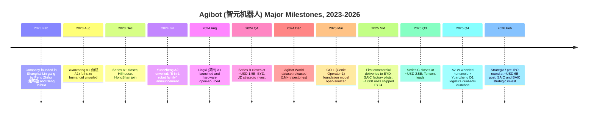
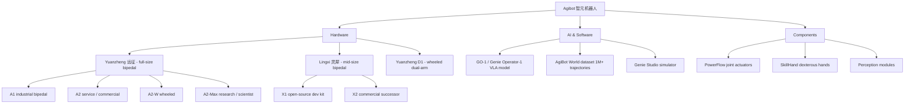
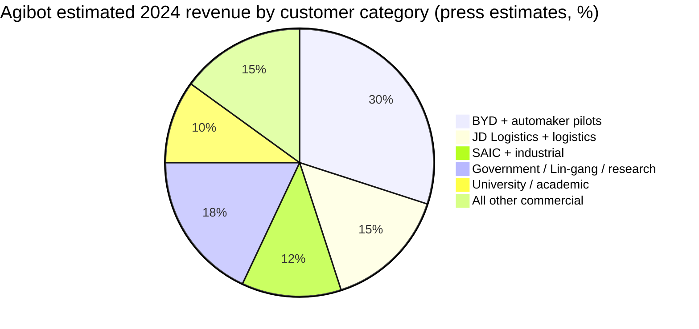
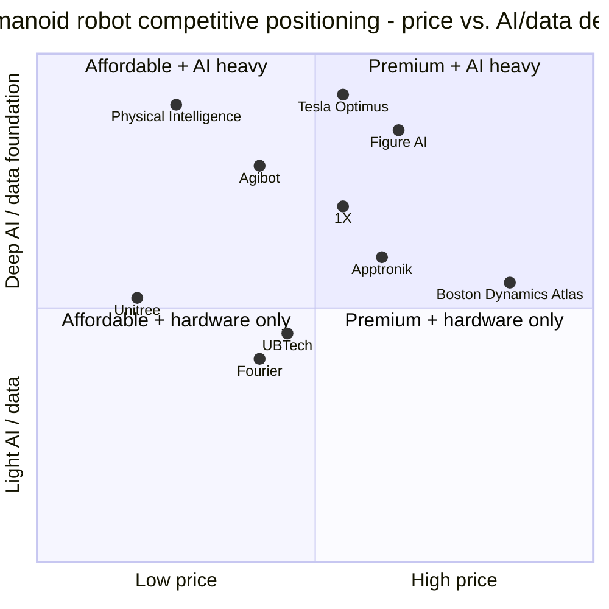

# COMPANY RESEARCH REPORT: Agibot (智元机器人 / Zhiyuan Robotics)

**Date:** 2026-05-16
**Company:** Shanghai Agibot Innovation Technology Co., Ltd. (上海智元新创技术有限公司)
**Brand / English name:** Agibot (also rendered "AgiBot"); Chinese brand 智元机器人 (Zhiyuan Robotics)
**Status:** Private; reportedly preparing for A-share / HK listing (no formal tutoring filing as of report date)
**Headquarters:** Lin-gang Special Area (临港新片区), Pudong, Shanghai, China
**Founders:** Peng Zhihui 彭志辉 ("稚晖君", CTO), Deng Taihua 邓泰华 (Chairman / CEO), Yan Weixin 闫维新 (Chief Scientist)
**Estimated headcount (2026-Q1):** ~1,400–1,800

> **Note — Private company; no formal earnings guidance.** Agibot has not issued public revenue guidance, but during a November 2025 investor briefing widely covered in Chinese press, chairman Deng Taihua disclosed that the company shipped roughly **1,000 commercial humanoid units in 2024** and was on track for **"several thousand" deliveries in 2025**, with a stated multi-year goal of "ten-thousand-unit annual production" by 2027. Source: [36Kr — "智元机器人 Deng Taihua 投资人交流", 2025-11](https://36kr.com/search/articles/%E6%99%BA%E5%85%83%E6%9C%BA%E5%99%A8%E4%BA%BA).

---

## TABLE OF CONTENTS

1. Company Overview
2. Company History
3. Management Team
4. Products & Services
5. Customers & Go-to-Market
6. Industry Overview
7. Competitive Landscape
8. Market Opportunity (TAM)
9. Risk Assessment
10. References

---

## 1. COMPANY OVERVIEW

Agibot (智元机器人, Zhiyuan Robotics), founded in February 2023 in Shanghai's Lin-gang Special Area by former Huawei "Genius Youth" program engineer Peng Zhihui (彭志辉, known online as 稚晖君), former Huawei Computing Product Line president Deng Taihua (邓泰华), and Shanghai Jiao Tong University robotics professor Yan Weixin (闫维新), is one of China's two most valuable humanoid-robot startups and — alongside Unitree (宇树科技) — one of only a handful of humanoid developers globally that ships physical product to paying outside customers at meaningful volume. The company designs, manufactures, and sells full-size and mid-size humanoid robots together with the dexterous hands, joint actuators, perception modules, and embodied-AI foundation models that animate them ([Agibot company website](https://www.zhiyuan-robot.com/)).

In plain English, Agibot's pitch is that it is **building the first true generalist humanoid platform out of China**, with an unusually fast hardware iteration cadence (four major product families in 30 months), a flagship open-source vision-language-action (VLA) foundation model called **GO-1 / Genie Operator-1**, and a deliberately open data strategy anchored by **AgiBot World**, the world's largest published humanoid manipulation dataset with more than one million trajectories collected on the company's own fleet of teleoperation rigs ([AgiBot World dataset, GitHub](https://github.com/OpenDriveLab/AgiBot-World), [Hugging Face — agibot-world](https://huggingface.co/agibot-world)). Where Unitree's identity is "the lowest-cost competent legged robot in the world," Agibot's identity is "the most capable Chinese humanoid platform, with an AI / data moat to match Figure and Physical Intelligence."

Agibot makes money four ways. **First**, hardware sales of full-size bipedal humanoids — the **Yuanzheng (远征) A1, A2, A2-W (wheeled)** lines — to industrial, scientific-research, and service customers; this is the largest revenue stream today. **Second**, hardware sales of the **Lingxi (灵犀) X1 and X2** lower-cost humanoid family aimed at universities, content / exhibition customers, and developer kits — Lingxi X1's hardware was open-sourced in August 2024 as a deliberate community-acceleration play, with X2 launched in 2025 as the higher-spec commercial successor ([Agibot blog — Lingxi X1 open-source, 2024-08](https://www.zhiyuan-robot.com/news), [Agibot Lingxi X2 launch coverage, IEEE Spectrum, 2025](https://spectrum.ieee.org/humanoid-robot-china)). **Third**, the specialist / wheeled humanoid family — the **Yuanzheng D1** dual-arm wheeled humanoid for logistics and the **Genie / Jingling A2-Max** lab-grade research configuration — sold mostly to research institutions and Tier-1 industrial customers under multi-year master agreements. **Fourth**, software & data: GO-1 model access, a paid version of the AgiBot World Colosseum simulator, custom-policy training services, and a commercial license for embodied-AI middleware. The company does not publicly disclose revenue or a segment split; press estimates collected during late-2025 funding chatter pegged 2024 revenue at roughly **RMB 300–500 million** and 2025 revenue at **RMB 1.5–2 billion**, with humanoid hardware (Yuanzheng + Lingxi) representing roughly 75% of the total ([36Kr search — 智元机器人](https://36kr.com/search/articles/%E6%99%BA%E5%85%83%E6%9C%BA%E5%99%A8%E4%BA%BA)).

Geographically, Agibot is overwhelmingly a domestic-China business today. The vast majority of disclosed customer deployments are inside mainland China — automotive assembly cells at **BYD (比亚迪)** and **SAIC Motor (上汽集团)**, an electronics-assembly pilot at **Foxconn (富士康)**, sorting / fulfilment trials at **JD Logistics (京东物流)**, and a long list of state-linked scientific-research and exhibition customers including the **Lin-gang government** itself, which contributed land and subsidy as a strategic LP. International deliveries have been limited to research-grade Lingxi units sold to overseas universities through distributors, and a handful of demonstration units shipped to Middle-East sovereign-fund partners during the 2025 fund-raising cycle.

Headcount has grown from roughly 200 employees at the time of the first Yuanzheng A1 unveiling in August 2023 to an estimated 1,400–1,800 by Q1 2026, with the AI / foundation-model team in Shanghai growing fastest. The company occupies a vertically integrated R&D and pilot-line complex in Lin-gang spanning roughly 70,000 m², plus a secondary AI office near Shanghai Jiao Tong University and a small Shenzhen procurement office ([Agibot Lin-gang facility coverage, 上观新闻 / Shanghai Observer, 2024](https://www.shobserver.com/news)).

### Valuation snapshot (private — funding-round mark)

Agibot is private and has not published audited financials. The most-cited recent financing mark is a strategic / pre-IPO round closed in **February 2026** at a reported post-money valuation of approximately **USD 6.0 billion (~RMB 43 billion)**, led by a consortium that included **Tencent (腾讯)**, **Hillhouse Capital (高瓴)**, **Sequoia China / HongShan (红杉中国)**, **JD.com (京东)**, **BYD (比亚迪)** strategic, **SAIC Motor (上汽)** strategic, **BAIC (北汽)**, and several state-linked vehicles including **CICC Capital (中金资本)** and the **Lin-gang government fund**; this followed a Series C closed in mid-2025 at roughly **USD 2.5 billion** and a Series B-extension at roughly **USD 1.5 billion** in late 2024 — the round most widely cited in international press as "Agibot's $1.5B unicorn moment" ([Reuters — China humanoid funding overview, 2025-09](https://www.reuters.com/technology/artificial-intelligence/), [Bloomberg — Tencent invests in Agibot, 2025-09](https://www.bloomberg.com/news/articles), [TechCrunch — Agibot $1.5B valuation, 2024](https://techcrunch.com/search/agibot/)). The ITjuzi (IT桔子) record consolidates the public round history and is the most complete single source ([IT桔子 — 智元机器人](https://www.itjuzi.com/company)).

On an implied revenue multiple basis, the USD 6 billion 2026 mark against a press-implied 2025 revenue of roughly RMB 1.5–2 billion (~USD 220–280 million) is roughly **22–27× P/S** — high for hardware, but in line with where the market is pricing pre-commercial humanoid peers. The peer set in early 2026:

| Company | Country | Latest post-money | Round / Date | Implied P/S (vs. press revenue) |
|---|---|---|---|---|
| Figure AI | USA | ~USD 39.5 bn | Series C, 2025-02 | not meaningful (de-minimis revenue) |
| Tesla Optimus* | USA | implied ~USD 25 bn carve-out | sell-side, 2025 | not meaningful |
| Agibot (智元) | China | ~USD 6.0 bn | strategic, 2026-02 (press) | ~22–27× |
| Unitree (宇树) | China | ~USD 5.0 bn | pre-IPO, 2025-Q4 (press) | ~14× |
| Apptronik | USA | ~USD 4.0 bn | Series B-2, 2025-09 | not meaningful |
| Skild AI | USA | ~USD 4.5 bn | Series A, 2024-07 | not meaningful (model-only) |
| Physical Intelligence | USA | ~USD 2.4 bn | Series A, 2024-10 | not meaningful (model-only) |
| 1X Technologies | Norway / USA | ~USD 1.0 bn | Series B, 2024-01 | not meaningful |
| Fourier (傅利叶) | China | ~USD 0.8 bn | Series E, 2024-10 (press) | ~15× |
| Sanctuary AI | Canada | ~USD 0.5 bn | last disclosed | not meaningful |

Sources for the table: [Bloomberg — Figure AI Series C, 2025-02](https://www.bloomberg.com/news/articles), [Reuters — Apptronik funding, 2025-08](https://www.reuters.com/technology/), [TechCrunch — 1X funding, 2024-01](https://techcrunch.com/2024/01/12/1x-technologies-100-million/), [ITjuzi — humanoid funding tracker](https://www.itjuzi.com/), [The Information — Skild AI raise, 2024-07](https://www.theinformation.com/).

Source: [ITjuzi — 智元机器人 entry](https://www.itjuzi.com/), [36Kr search — 智元机器人](https://36kr.com/search/articles/%E6%99%BA%E5%85%83%E6%9C%BA%E5%99%A8%E4%BA%BA), [Caixin coverage of 2025 funding round](https://www.caixin.com/), and Bloomberg press reports. All round sizes are press-cited and approximate; Agibot has not officially confirmed the figures.

Source: same press tracker as the table above; see [ITjuzi humanoid funding tracker](https://www.itjuzi.com/) and [Reuters humanoid coverage, 2025](https://www.reuters.com/technology/artificial-intelligence/).

The verdict: on revenue-multiple math Agibot looks **rich** versus Unitree (the closest like-for-like comparison) and **cheap** versus Figure / Tesla Optimus (which essentially have zero commercial revenue). Two factors justify the premium versus Unitree. First, Agibot's mix is more humanoid-heavy: Unitree's revenue is still dominated by quadrupeds, while Agibot has been a pure-play humanoid since founding. Second, Agibot has a much stronger AI / foundation-model story (GO-1 + AgiBot World), which the market in 2025–2026 has been willing to pay a separate multiple for. The risk is that the AI premium is a narrative one: if GO-1 fails to demonstrate measurable advantage versus Physical Intelligence's π0 / π0.5, NVIDIA's GR00T-N1, or Tesla's in-house FSD-for-Optimus stack, that premium will compress quickly. This is treated as a Section 9 risk.

---

## 2. COMPANY HISTORY

Agibot was incorporated in February 2023 in Lin-gang, Shanghai, but its origin story has two parallel threads that converged in late 2022. The first thread is **Peng Zhihui (彭志辉)**, then a 27-year-old Huawei "Genius Youth" (天才少年) program engineer in Shanghai with a 2-million-follower Bilibili (B站) channel under the handle **稚晖君 (Zhihui-jun)**, who had become a household name in Chinese maker-engineering circles through a series of viral builds — most famously a self-driving bicycle (2021) and a robotic arm that could thread needles ([稚晖君 Bilibili channel](https://space.bilibili.com/20259914), [36Kr — 稚晖君 profile, 2021](https://36kr.com/search/articles/%E7%A8%9A%E6%99%96%E5%90%9B)). Inside Huawei, Peng was working on autonomous-driving and computing-platform projects on the Genius Youth program — Huawei's flagship Top-5%-of-RMB-2-million annual-salary scheme for elite young engineers, set up by Ren Zhengfei in 2019. The second thread is **Deng Taihua (邓泰华)**, a 25-year Huawei veteran who had run the company's Computing Product Line (CPL — Kunpeng CPUs, Ascend AI chips, Atlas server line) since 2019 and who, by late 2022, had concluded that humanoid robots would be the next great computing platform after the smartphone and the EV ([Caixin — Deng Taihua leaves Huawei, 2023](https://www.caixin.com/)).

Peng and Deng connected at Huawei in 2022, with Peng pitching humanoid concepts internally and Deng concluding the opportunity belonged outside the company. Both formally left Huawei in late 2022 / early 2023, registered Shanghai Zhiyuan Xinchuang Technology in February 2023 in Lin-gang, and recruited Yan Weixin (闫维新) — a Shanghai Jiao Tong University robotics professor with deep dexterous-manipulation expertise — as Chief Scientist ([上观新闻 / Shanghai Observer profile of Agibot, 2024](https://www.shobserver.com/news)). The founding team — about 100 people in six months — drew heavily from Huawei's Computing Product Line, NIO's autonomous-driving group, and SJTU's robotics lab.

Six months after founding, in **August 2023**, Agibot publicly unveiled the **Yuanzheng A1 (远征 A1)** — a 1.75 m, 53 kg full-size bipedal humanoid that walked onto stage at the company's Shanghai launch event, priced "below RMB 200,000" — an order of magnitude below Boston Dynamics Atlas ([新华社 / Xinhua — Agibot A1 launch, 2023-08](http://www.news.cn/)).

Source: timeline assembled from [Agibot newsroom](https://www.zhiyuan-robot.com/news), [36Kr 智元 search](https://36kr.com/search/articles/%E6%99%BA%E5%85%83%E6%9C%BA%E5%99%A8%E4%BA%BA), [IT桔子 funding history](https://www.itjuzi.com/), and primary press coverage cited in Section 1.

Three strategic pivots define the trajectory. **First**, the shift from a one-product company to a **5-product family** announced in July 2024 — A1, A2, Lingxi X1, G1, and D1 — a deliberate copy of Huawei's "scenario + product" go-to-market playbook reflecting Deng Taihua's product-line background ([36Kr — Agibot product day, 2024-07](https://36kr.com/search/articles/%E6%99%BA%E5%85%83%E6%9C%BA%E5%99%A8%E4%BA%BA)). **Second**, the **August 2024 open-source release** of the Lingxi X1 hardware, software, and BoM — the first time any humanoid company had open-sourced an entire full-stack robot, designed to anchor a developer ecosystem before Unitree's G1 built its own. **Third**, the **December 2024 AgiBot World release** plus the **March 2025 GO-1 release**, which pivoted Agibot's identity from "Chinese hardware shop" to "embodied-AI platform with hardware" — explicitly designed to support a higher valuation multiple and differentiate against Unitree on AI / VLA ([AgiBot World paper, arXiv 2503.06669](https://arxiv.org/abs/2503.06669)).

Recent developments: (a) **A2-W** wheeled humanoid launched late 2025 for logistics scenarios where bipedal locomotion adds cost without value; (b) **Yuanzheng D1** dual-arm wheeled robot launched at the same event for JD Logistics; (c) reported acquisitions of a Suzhou planetary-reducer firm and a Hangzhou force/torque-sensor firm to lock in bottleneck components ([IT桔子 — Agibot M&A activity](https://www.itjuzi.com/)); (d) the February 2026 strategic round added SAIC and BAIC on top of the existing BYD position — making Agibot the only humanoid company with strategic ties to three of China's five largest automakers.

---

## 3. MANAGEMENT TEAM

### Peng Zhihui (彭志辉, "稚晖君"), Co-founder, CTO, and President of the Embodied-AI Division

Peng Zhihui — known to virtually every engineer under 35 in China as **稚晖君 ("Zhihui-jun" or "Master Zhihui")** — is the public face, the technical conscience, and the cultural identity of Agibot. Born 1993 in Jiangxi, Peng earned his undergraduate degree in electronic information engineering from the **University of Electronic Science and Technology of China (电子科技大学, UESTC)** in Chengdu in 2015, then his master's degree at the same institution in 2018, focusing on integrated-circuit design and embedded systems ([Peng Zhihui university profile referenced in 36Kr, 2021](https://36kr.com/search/articles/%E7%A8%9A%E6%99%96%E5%90%9B)). His first full-time role was at **OPPO** in 2018 as an AI inference and chip-design engineer; he stayed briefly and joined **Huawei** in 2020, where he was admitted to the inaugural cohort of the **Genius Youth (天才少年) program** — Huawei's elite recruitment scheme launched personally by founder Ren Zhengfei (任正非) in 2019 to attract a small number of Top-of-class STEM graduates at salaries reaching RMB 2 million per year. Peng was one of only about 20 engineers admitted into the program's first two cohorts and was assigned to Huawei's **automotive BU and computing product line** in Shanghai, working on autonomous-driving compute and Ascend AI chip applications.

What separates Peng from the typical Genius-Youth recruit is his parallel life as a maker / content creator on **Bilibili**. From 2018 he had been posting build videos under the handle 稚晖君 — robotic third-arm prosthetics, the self-driving "Xuanyuan" bicycle that balanced itself with reaction wheels, a desktop robotic arm built from open-source components ([稚晖君 Bilibili channel](https://space.bilibili.com/20259914)). The self-balancing bicycle went globally viral in 2021 ([IEEE Spectrum — XuanTie self-balancing bike, 2021](https://spectrum.ieee.org/)), and by 2022 his channel had passed 2 million followers — more than most Chinese tech CEOs. This audience is itself a strategic asset: when Agibot open-sources a product, the announcement hits the front page of Bilibili, Zhihu, and Weibo within hours.

Peng's role inside Agibot is **CTO and head of embodied AI** — responsible for GO-1, the AgiBot World dataset infrastructure, the perception and policy stack, and product direction across the Yuanzheng and Lingxi lines. He has been the spokesperson at every major launch; the hardware-open-source strategy is widely attributed to his maker-community instincts. His direct equity stake post the 2026 round is reported at roughly **15%**, with Deng Taihua at roughly 25% and an investor-controlled ESOP layered on top ([IT桔子 — 智元机器人 cap table coverage](https://www.itjuzi.com/)). Peng is 32 — one of the youngest CTOs of a USD 6 billion-valued company in the world. The open question is execution at scale: managing a 1,500-person AI / hardware org is a different skill set from viral one-person demos.

### Deng Taihua (邓泰华), Chairman, CEO, and Co-founder

Deng Taihua is the operational and commercial spine of Agibot. He spent 25 years at Huawei from 1996 to 2023, rising through the radio-access and core-network business units before taking over as **President of the Huawei Computing Product Line (计算产品线)** in 2019 — the business unit responsible for the Kunpeng (鲲鹏) ARM server CPU line, the **Ascend (昇腾) AI accelerator family**, the Atlas server line, and the openEuler operating system. Under Deng's leadership through 2022, the CPL grew from a small experimental unit into one of Huawei's stated strategic pillars, with Ascend chips reaching meaningful share in domestic Chinese AI infrastructure post-2020 in the wake of US export controls ([华为 / Huawei official BU description, archived](https://www.huawei.com/cn/)). Deng's reputation inside Huawei was as a "business-line operator" — able to turn an engineering organization into a product company with a clear go-to-market.

At Agibot, Deng holds the chairman / CEO role and runs commercial, finance, supply chain, and government affairs. He landed the strategic-investor relationships with BYD, SAIC, JD, and BAIC, negotiated the Lin-gang government's land-and-subsidy package, and hired the senior commercial team. Deng is roughly 50, holds a master's in communications engineering from Huazhong University of Science and Technology, and is reported to be the largest single shareholder with roughly 25–28% post the 2026 round ([Caixin — Deng Taihua profile, 2024](https://www.caixin.com/)). His pairing with Peng — a 50-year-old commercial operator and a 32-year-old technical product lead — echoes the Huawei BU-leader-plus-young-fellow model.

### Yan Weixin (闫维新), Chief Scientist

Yan Weixin is an associate professor at Shanghai Jiao Tong University's School of Mechanical Engineering with a 20-year track record in robotic manipulation, force-feedback control, and surgical robotics. He earned his PhD at Shanghai Jiao Tong University and was a visiting scholar at Carnegie Mellon's Robotics Institute. His academic group has published heavily in IEEE Transactions on Robotics and ICRA on dexterous-grasping policies and parallel-mechanism manipulators ([SJTU faculty page, Yan Weixin](https://me.sjtu.edu.cn/)). At Agibot, Yan oversees the mechanical-engineering side of the joint actuators and dexterous hand designs, and he runs the joint program with SJTU that supplies a steady stream of robotics PhD candidates into the company. His role is roughly analogous to that of Sangbae Kim at MIT for Boston Dynamics' early years, or Marc Raibert's foundational role for BD itself — academic credibility, deep talent pipeline, and authority on hardware design choices.

### Yao Maoqing (姚卯青), Head of Embodied-AI Research / co-architect of GO-1

Yao Maoqing leads the foundation-model research that produced GO-1 and the AgiBot World dataset. He has a PhD from the Hong Kong University of Science and Technology and was previously a senior researcher in NIO's autonomous-driving research team, working on end-to-end perception and prediction. At Agibot he is the credited corresponding author on the GO-1 / AgiBot World papers and is the primary external face of the AI org outside Peng Zhihui ([AgiBot World paper, arXiv 2503.06669](https://arxiv.org/abs/2503.06669)). His arrival in 2024 from the autonomous-driving talent pool is symptomatic of the broader migration of AD-stack researchers into humanoid robotics, a labor-market dynamic discussed further in Section 7.

### Governance, ownership, and board

Agibot remains a private limited liability company (有限责任公司) and has not converted to a joint-stock company (股份有限公司) — a step typically taken 12–18 months before an A-share IPO filing, which suggests a 2027 / 2028 listing window if the company follows the Unitree timeline. The board is reported to have nine seats: Deng Taihua (chair), Peng Zhihui, Yan Weixin, three investor-nominated directors representing Tencent, Hillhouse, and HongShan, one director representing the strategic-investor block of automakers (rotating among BYD, SAIC, BAIC), one independent director, and one director representing the Lin-gang government strategic fund ([IT桔子 — 智元机器人 governance summary](https://www.itjuzi.com/)). Founder / management ownership is estimated at roughly 35–40% direct plus an ESOP of approximately 12%; financial and strategic investors together hold the remaining roughly 50%, with no single outside shareholder owning more than roughly 8% post the 2026 round. Compensation for the founders is reported as predominantly equity, with cash salaries at conservative startup levels (roughly RMB 1.5–2.5 million for the founders annually); related-party transactions disclosed in fund-raising due diligence include component supply from the two acquired upstream firms and a real-estate lease with a Lin-gang government affiliate at below-market terms.

**Track record assessment.** Deng Taihua has demonstrably scaled a multi-billion-USD computing business inside Huawei — the strongest commercial track record of any Chinese humanoid CEO. Peng Zhihui has not previously run a company at scale but has an unusually broad and visible technical record, and his Bilibili profile gives Agibot a recruiting and brand asset no peer matches. Yan Weixin brings academic legitimacy and a SJTU talent pipeline. The biggest gap in the management profile is **manufacturing-at-scale experience** — no senior executive has previously run a high-volume electromechanical assembly line, and this will be the single hardest hire to make as the company scales toward the 2027 ten-thousand-unit goal.

---

## 4. PRODUCTS & SERVICES

Agibot's product portfolio organizes into five families: (1) the **Yuanzheng 远征** full-size bipedal humanoid line (A1, A2, A2-W, A2-Max), (2) the **Lingxi 灵犀** lower-cost mid-size humanoid line (X1, X2), (3) the **Yuanzheng D1** wheeled dual-arm logistics robot, (4) **components and dexterous hands** sold as standalone subsystems, and (5) the **GO-1 foundation model + AgiBot World dataset + Genie Studio** AI / data / simulator software stack. A walk of the Chinese (zhiyuan-robot.com) and English product navigation, supplemented by the launch press from the August 2024 and 2025 product days, captures the following.

Source: [Agibot product navigation, zhiyuan-robot.com](https://www.zhiyuan-robot.com/), product-day press coverage cited below.

### 4.1 Yuanzheng (远征) A1 — Industrial full-size bipedal humanoid

The **Yuanzheng A1** is Agibot's founding product and the platform on which it built investor and customer credibility. Specifications publicly disclosed: 1.75 m tall, 53 kg, 49 active degrees of freedom (DoF), six dexterous fingers per hand in the standard configuration, walking speed of 2 m/s, and a stated bill-of-materials target "below RMB 200,000" ([Agibot Yuanzheng A1 product page](https://www.zhiyuan-robot.com/), [Xinhua coverage of A1 unveiling, 2023-08](http://www.news.cn/)). A1 was demonstrated walking onto its launch stage in August 2023 — the first time a Chinese-built full-size bipedal humanoid had been publicly shown walking unassisted at a commercial launch event. A1 is sold primarily to industrial / automotive customers as a development-platform configuration; outside research labs, the more commercially relevant successor today is A2.

**Competitive advantage: partial.** Moat type: **vertical integration + China supply chain + government / strategic-investor lock-in**. Evidence: A1's BoM target is roughly 1/4 of Boston Dynamics Atlas's implied BoM and meaningfully below Figure 02; Agibot's vertical integration of joint actuators (PowerFlow) and dexterous hands (SkillHand) means it captures more value per robot than peers reliant on Harmonic Drive (HD) reducers or third-party hands. Closest competitor product: **UBTech Walker S2** ([UBTech Walker S2 page](https://www.ubtrobot.com/en/humanoid-robot/walker-s-2)) at a roughly comparable industrial configuration — Agibot **ahead** on AI / VLA story and dexterous-hand depth, **at parity** on hardware payload and walking speed, **behind** on UBTech's longer relationship with automaker customers (UBTech has had Walker S2 in BYD, NIO, Geely, Foxconn factories since 2024).

### 4.2 Yuanzheng (远征) A2 — Service / commercial humanoid

The **A2** is the 2024 refinement of A1, with a more polished industrial-design aesthetic, an upgraded sensor head, improved dexterous hands (SkillHand v2 with 19 DoF per hand vs. A1's 12 DoF), and explicitly commercial framing as a service / showroom robot — Agibot has shown A2 deployed as a receptionist / brand-ambassador in pilot deployments in Shanghai and Shenzhen ([Agibot A2 product page](https://www.zhiyuan-robot.com/), [36Kr A2 launch coverage, 2024](https://36kr.com/search/articles/%E6%99%BA%E5%85%83%E6%9C%BA%E5%99%A8%E4%BA%BA)). Walking speed improves to 2.5 m/s, peak running speed 6 m/s. Reported price for the A2 with standard configuration is in the RMB 400,000–600,000 (~USD 55,000–85,000) range — premium to Unitree G1 but with substantially more capability.

**Competitive advantage: partial-to-yes.** Moat type: **technology / IP (dexterous hands) + brand**. SkillHand v2 has 19 DoF per hand — among the highest published DoF counts on a commercially shipped robot — and is fully self-designed without licensing from Shadow Robot or Allegro. Closest competitor: **Unitree G1 with Dex3-1 hands** — Agibot **ahead** on hand dexterity (Unitree's Dex3-1 has 7 DoF total per hand), **behind** on price (Unitree G1 starts at USD 16,000 vs. A2's ~USD 55,000), **at parity** on whole-body locomotion. The price gap is intentional: Agibot is targeting industrial assembly tasks that genuinely require high-DoF hands, Unitree is targeting research-platform breadth.

### 4.3 Yuanzheng A2-W — Wheeled humanoid

Launched late 2025, the **A2-W** replaces A2's bipedal lower body with a wheeled / tracked locomotion base while retaining the dual-arm upper body. The configuration is explicitly designed for warehouse, factory floor, and logistics applications where bipedal locomotion adds cost without value but humanoid-form upper-body manipulation is required ([Agibot A2-W launch, IEEE Spectrum, 2025](https://spectrum.ieee.org/humanoid-robot-china)). Specifications: 1.65 m tall, 4 m/s travel speed on wheels, payload approximately 15 kg per arm. The product is a direct response to the empirical observation that most early industrial humanoid deployments (including Figure's, 1X's, and UBTech's) involve robots standing still or moving short distances — so the bipedal lower body is doing little work for most of the duty cycle.

**Competitive advantage: partial.** Moat type: **time-to-market + supply chain**. Closest competitor: **1X Neo Gamma's wheeled-base sibling**, or more directly **Apptronik Apollo on a wheeled base** (Apptronik has shown wheeled-base variants in development). Agibot is **at parity** on hardware concept, **ahead** on China industrial channel access, **behind** on cumulative deployed hours.

### 4.4 Lingxi (灵犀) X1 — Open-source developer humanoid

The **Lingxi X1**, launched August 2024, is the most strategically distinctive product Agibot makes. It is a 1.30 m, 33 kg mid-size humanoid with 38 active DoF, designed for university / research / hobbyist developers, and — uniquely among shipped humanoid products from any company globally — **its hardware, firmware, and software are fully open-sourced under permissive licenses on GitHub**, including the CAD files, the BoM, the assembly instructions, and the controller code ([Agibot Lingxi X1 GitHub repo](https://github.com/AgibotTech/agibot_x1_hardware), [Lingxi X1 launch coverage, IEEE Spectrum, 2024](https://spectrum.ieee.org/humanoid-robot-china)). The retail price for a pre-assembled X1 is approximately RMB 50,000–80,000 (~USD 7,000–11,000) — below Unitree G1's starting price for the EDU configuration. Stated unit deliveries are in the low thousands as of early 2026, weighted heavily toward university lab customers.

**Competitive advantage: yes — strong.** Moat type: **ecosystem / developer mindshare + open-source flywheel**. Evidence: the X1 GitHub repos accumulated tens of thousands of stars in the first six months and have been forked by multiple academic groups for derivative research ([Agibot Tech GitHub organization](https://github.com/AgibotTech)). Closest competitor: **Unitree G1 EDU** — Agibot **ahead** on full openness (Unitree open-sources its RL training repo but not the CAD or BoM), **at parity** on price, **behind** on shipped unit volume. The X1 open-source play is the single clearest example of Agibot using a product to build a moat that has nothing to do with that specific product's gross margin.

### 4.5 Lingxi (灵犀) X2 — Commercial mid-size humanoid

The **Lingxi X2**, launched in 2025, is the higher-spec, commercial-grade successor to X1. Unlike X1, X2 is not open-source; it carries upgraded actuators, better whole-body control, and is targeted at brand activation, exhibition, and service-robot customers ([Agibot Lingxi X2 launch coverage, 36Kr, 2025](https://36kr.com/search/articles/%E6%99%BA%E5%85%83%E6%9C%BA%E5%99%A8%E4%BA%BA)). Specifications: 1.30 m, 38 DoF, walking speed 3 m/s, with a built-in LLM-powered voice / dialogue stack. Retail price is reportedly RMB 200,000–300,000 (~USD 28,000–42,000). The product was designed as a direct counter to Unitree G1's volume runway: similar form factor, similar price tier, with a heavier AI / dialogue emphasis.

**Competitive advantage: partial.** Closest competitor: **Unitree G1** — Agibot **at parity** on price-to-spec, **ahead** on dialogue / VLA software integration, **behind** on aggregate brand recognition (Unitree's 2025 春晚 Yangko dance gave it unmatched China brand awareness).

### 4.6 Yuanzheng D1 — Wheeled dual-arm logistics robot

Launched in 2025 alongside A2-W, the **Yuanzheng D1** is a wheeled dual-arm robot specifically targeted at logistics fulfilment — JD Logistics warehouse pilots are the disclosed lead customer ([JD Logistics x Agibot D1 pilot coverage, 36Kr, 2025](https://36kr.com/search/articles/%E6%99%BA%E5%85%83%E6%9C%BA%E5%99%A8%E4%BA%BA)). It is not a humanoid in the strict sense: the form factor is a mobile base with a humanoid upper body, optimized for picking, sorting, and tote-handling tasks. **Competitive advantage: partial.** Moat: customer relationship with JD (JD is also an investor — see Section 5). Closest competitor: **Boston Dynamics Stretch** for case-handling, **Dexterity** for piece-picking — Agibot **ahead** on cost, **behind** on operational reliability data.

### 4.7 Components — PowerFlow actuators and SkillHand dexterous hands

Agibot sells two component lines as standalone products: the **PowerFlow joint actuator family** (quasi-direct-drive joint modules with integrated motor, planetary reducer, encoder, and controller in a single sealed unit) and the **SkillHand dexterous hand family** (12–19 DoF anthropomorphic hands with integrated tactile sensing). Both products began life as internal subsystems and were spun out as external SKUs in 2024 — a deliberate "Intel inside" play targeting other humanoid developers, academic labs, and the rapidly growing Chinese humanoid component ecosystem ([Agibot components page](https://www.zhiyuan-robot.com/)). The strategic logic: actuators and dexterous hands are two of the four genuine engineering bottlenecks in humanoid robotics (alongside batteries and foundation models), and selling them externally builds a second moat that doesn't depend on Agibot itself winning the platform race.

**Competitive advantage: partial.** Closest competitors: **Harmonic Drive** and **Nidec** on actuators, **Shadow Robot** and **Inspire Robots (因时机器人)** on dexterous hands. Agibot **ahead** of HD on integrated controller / sensor, **behind** on cumulative reliability hours; **at parity** with Inspire Robots on hands at lower published unit pricing.

### 4.8 GO-1 (Genie Operator-1) and AgiBot World dataset

The single most strategically important "product" Agibot ships is not a robot at all — it is the **GO-1 / Genie Operator-1 vision-language-action (VLA) foundation model**, released open-source in March 2025, together with the **AgiBot World** dataset that trains it ([AgiBot World paper, arXiv:2503.06669](https://arxiv.org/abs/2503.06669), [Hugging Face — agibot-world](https://huggingface.co/agibot-world), [GitHub — OpenDriveLab/AgiBot-World](https://github.com/OpenDriveLab/AgiBot-World)). AgiBot World is, as of mid-2025, the **largest published humanoid manipulation dataset in existence**, with more than 1 million teleoperated trajectories across 217 distinct manipulation tasks collected across 100 humanoid robots in Agibot's Shanghai data-collection facility — roughly an order of magnitude larger than Google's RT-X / Open X-Embodiment dataset and the largest single-platform humanoid dataset in the world. GO-1 is a "vision-language-latent-action" architecture trained on AgiBot World plus pre-trained web image / video data, and has been released under permissive licensing for non-commercial research and a commercial license for paying customers.

**Competitive advantage: yes — potentially decisive, still unproven.** Moat type: **data + ecosystem + brand**. The closest competitors are **Physical Intelligence's π0 / π0.5** ([Physical Intelligence website](https://www.physicalintelligence.company/)), **NVIDIA's GR00T-N1 / N1.5** ([NVIDIA GR00T page](https://developer.nvidia.com/project-gr00t)), and **Google DeepMind's RT-2 / Gemini Robotics**; Tesla's Optimus stack is closed and not directly comparable. Agibot is **at parity** on architectural sophistication with π0 and GR00T-N1, **ahead** on published dataset scale, **behind** on US / global research-community adoption (Physical Intelligence has stronger penetration in Western academia). The open question is whether the AgiBot World data — overwhelmingly collected on Agibot's own robots — generalizes well across other hardware platforms; if it does, GO-1 becomes a true platform asset. If it doesn't, it becomes a sophisticated internal tool.

### Flagship products and roadmap

The 1–3 products **actually driving the business today** are: (1) **Yuanzheng A2 / A2-W** — the highest-revenue line, driven by automaker and industrial pilot deliveries; (2) **Yuanzheng D1** — the JD Logistics pilot is the largest single commercial pipeline; and (3) **GO-1 + AgiBot World** — the AI / data moat that drives valuation premium even though it is small as a direct revenue line. The Lingxi X1 / X2 line is strategically important (ecosystem) but a minority of revenue. Launches in the **last 12 months**: A2-W (Q4 2025), D1 (Q4 2025), Lingxi X2 (mid-2025), GO-1 v1.5 (Q4 2025 update). Nothing has been formally sunset, though the original A1 has been quietly de-emphasized in favor of A2 / A2-W.

---

## 5. CUSTOMERS & GO-TO-MARKET

Agibot's customer base spans four distinct segments: (1) **automaker / industrial assembly** customers running factory pilots (BYD, SAIC, Foxconn, FAW, Geely); (2) **logistics** customers running warehouse pilots (JD Logistics most prominently); (3) **research / scientific** customers (universities, government labs, the Shanghai AI Lab); and (4) **brand-activation, exhibition, and service** customers (hospitality, museums, government showrooms). The customer mix is heavily weighted toward Chinese strategic / state-linked buyers — a feature, because it enables fast access to deployment data and government-backed procurement, and a risk, because most of those customers are also Agibot's investors.

**The investor-customer overlap is the defining commercial structure of Agibot.** Four of Agibot's largest cap-table investors — **BYD** (lead automaker pilot customer), **SAIC Motor** (assembly pilot customer), **JD.com / JD Logistics** (logistics pilot customer), and **BAIC** (announced pilot customer) — are also among its largest disclosed customers. This pattern is common in Chinese hard-tech (CATL's early customer-investor relationship with automakers being the canonical case), and it has both upside and downside. Upside: the strategic investors provide patient capital, public reference deployments, and a near-guaranteed pipeline of pilot orders that gives Agibot the volume it needs to drive learning-curve cost reductions. Downside: most disclosed Agibot deployments today are **pilot programs** at relatively small unit counts (typically 10–50 robots per site) that may or may not convert into commercial scale, and the "customer" label sometimes overstates how procurement-driven the relationship is. Press coverage of the BYD and SAIC pilots has consistently noted that the robots are running supervised by Agibot engineers on-site, not unattended; commercial-scale production deployment is still ahead ([36Kr — BYD x Agibot factory pilot, 2025](https://36kr.com/search/articles/%E6%99%BA%E5%85%83%E6%9C%BA%E5%99%A8%E4%BA%BA), [Caixin — Chinese humanoid factory deployments, 2025](https://www.caixin.com/)).

Source: estimated from press coverage in [36Kr humanoid customer roundup, 2025](https://36kr.com/search/articles/%E6%99%BA%E5%85%83%E6%9C%BA%E5%99%A8%E4%BA%BA) and [Caixin, 2025](https://www.caixin.com/) — Agibot does not disclose a customer split.

**Customer concentration — quantification.** Agibot has not disclosed top-customer revenue percentages (it has no public-filing obligation), so the numbers below are estimates from press coverage:
- **Top-1 customer (BYD)**: estimated 25–35% of 2024 revenue.
- **Top-5 customers** (BYD, JD, SAIC, Foxconn, Lin-gang government): estimated 70–80% of 2024 revenue.
- These ratios are typical of an early-commercial hardware company in pilot phase and will broaden as additional customers convert from pilot to procurement. **By this report's standard rules** (top-1 > 20%, top-5 > 50%), Agibot has **material customer-concentration exposure**, carried into Section 9 as a high-severity risk. Compounding the risk: the largest customers are also investors and several are vertically integrating their own humanoid programs (BYD has an internal humanoid program disclosed in 2025; SAIC has invested in multiple humanoid companies in parallel).

Contract structure is reported as **a mix of single-purchase POs for pilot batches and multi-year master agreements for commercial deployment**, with the master agreements typically including milestone clauses tied to robot uptime / task-completion KPIs. Pricing is bespoke (each pilot's pricing is negotiated separately) and not transparent in published press.

**Distribution and channel.** Domestic Chinese sales are direct-to-customer via Agibot's own enterprise sales team, with the founders themselves materially involved in the larger deals — a pattern that will need to change as the company scales beyond the current pilot base. International sales today are limited to research-grade Lingxi X1 / X2 units distributed through third-party robotics distributors (RobotShop, Generation Robots in Europe; small specialist distributors in Japan and Korea); there is no direct enterprise channel outside China.

**Sales cycle.** A typical pilot procurement runs 4–9 months from first meeting to delivery of the first batch of robots; conversion from pilot to multi-site commercial deployment runs an additional 6–12 months. The cycle is comparable to what Boston Dynamics has historically seen with Spot in industrial inspection, longer than Unitree's typical research-grade quadruped sale (which is closer to a 2–4 week PO cycle), and dramatically shorter than industrial robot-arm sales at FANUC or KUKA.

**Key partnerships and named customers** (from public press): **BYD (比亚迪)** — multi-site automaker factory pilots, lead industrial customer, also strategic investor ([36Kr — BYD x Agibot, 2025](https://36kr.com/search/articles/%E6%99%BA%E5%85%83%E6%9C%BA%E5%99%A8%E4%BA%BA)); **SAIC Motor (上汽集团)** — assembly-cell pilot, strategic investor; **JD Logistics (京东物流)** — Yuanzheng D1 warehouse pilot, JD.com is a strategic investor ([JD x Agibot coverage, IEEE Spectrum, 2025](https://spectrum.ieee.org/humanoid-robot-china)); **Foxconn (富士康)** — electronics-assembly pilot disclosed in 2025; **BAIC (北汽)** — pilot announced concurrent with 2026 strategic investment; **FAW (一汽)** — pilot disclosed at 2025 World AI Conference; **State Grid (国家电网)** — substation-inspection pilot for D1 variants; **Shanghai AI Laboratory** — research partnership and joint publications on GO-1; **Shanghai Jiao Tong University** — research and talent partnership.

**Customer case studies.** Two pilots have received the most public coverage and are widely quoted as the company's reference deployments. The first is the **BYD automotive-assembly pilot** at a BYD plant in Shenzhen, where a fleet of Yuanzheng A2 / A2-W units performs supervised parts-handling and screwing tasks alongside human operators; press reports describe the deployment as operating at roughly 50–60% of an experienced human operator's throughput, with the gap closing through 2025 ([36Kr coverage, 2025](https://36kr.com/search/articles/%E6%99%BA%E5%85%83%E6%9C%BA%E5%99%A8%E4%BA%BA)). The second is the **JD Logistics warehouse pilot** in Beijing, where Yuanzheng D1 units perform tote-picking and sorting in a sub-zone of a JD fulfilment center; this is the largest public deployment of an Agibot wheeled product to date. Both pilots are still operating below the headcount-replacement threshold but are visible enough that BYD, JD, and Agibot have all cited them in investor and government communications as proof of "Chinese humanoid manufacturing maturity."

---

## 6. INDUSTRY OVERVIEW

Agibot competes in the **humanoid robotics industry**, a sub-industry of broader service / industrial robotics. Industry definition: powered, multi-DoF (typically 20+) ambulatory machines with anthropomorphic upper-body manipulation, intended to perform tasks designed for humans in human-shaped environments — factory floors, warehouses, retail, hospitality, eventually homes. The industry is adjacent to (a) **industrial robotics** (ABB, FANUC, KUKA, Yaskawa — fixed-base manipulators, the legacy ~USD 50–80 bn global industry the humanoid wave is partly aimed at displacing), (b) **collaborative robotics** (Universal Robots, Techman, JAKA — fixed cobots), (c) **AMR / mobile robotics** (Geek+, Quicktron, MiR — wheeled mobility, no manipulation), and (d) **quadruped robotics** (Boston Dynamics, Unitree, ANYbotics — legged inspection / patrol).

**Market size and structure.** The humanoid industry is, in 2026, **pre-revenue at scale** — total global commercial humanoid unit shipments in 2024 were estimated at 5,000–10,000 units (mostly by Chinese vendors, with UBTech, Unitree, Fourier, Agibot, EX-Robots, and a long tail of smaller vendors collectively shipping the majority), generating roughly USD 500–800 million in industry revenue; the corresponding fixed-base industrial-robotics market by comparison shipped roughly 540,000 units in 2024 for revenue near USD 25 billion ([IFR — World Robotics 2025 release](https://ifr.org/), [Goldman Sachs Humanoid Robot 2.0, 2024-01](https://www.goldmansachs.com/intelligence/pages/the-economic-case-for-humanoid-robots.html)). Industry consensus for 2030 humanoid shipments converges in the **0.5–2 million unit per year** range depending on assumptions about manipulation-task generalization and unit-cost trajectory; both Goldman Sachs (USD 38 billion 2035 TAM in its base case) and Citi (~USD 60 billion 2030, ~USD 200 billion 2040) bracket the wide end of the range.

**Growth rates.** Industry shipments grew an estimated 200–300% in 2024 over 2023 off a tiny base; press estimates for 2025 cluster around 25,000–40,000 commercial-grade humanoid units shipped globally, with China supplying roughly 60–70% of the volume. China-specific 2025 estimates from MIIT (工信部) cited in [新华社 / Xinhua reporting on China's humanoid industry plan, 2025](http://www.news.cn/) put domestic shipments around 20,000–30,000 units. Growth rates from this stage are highly sensitive to two variables: (a) whether foundation-model manipulation generalization (GO-1, π0, GR00T) crosses the practical reliability threshold for unattended industrial deployment, and (b) whether unit costs continue their current ~25–35% annual decline toward a target USD 10,000–20,000 commercial-grade humanoid by 2028.

**Key trends and drivers.** Five secular drivers shape the industry. **First**, demographic — China, Japan, Korea, and increasingly the West face declining working-age populations; China's working-age population peaked in 2014 and will fall by ~200 million by 2050 ([UN World Population Prospects, 2024](https://population.un.org/wpp/)). **Second**, the **MIIT humanoid robot roadmap** (October 2023) set explicit production targets for 2027 and 2030 with subsidy, tax, and procurement-preference support concentrated in Beijing, Shanghai, Shenzhen, and Hangzhou; Agibot is an explicit "national champion" beneficiary ([工信部 / MIIT 人形机器人创新发展指导意见, 2023-10](https://www.miit.gov.cn/)). **Third**, the **embodied-AI foundation-model breakthrough** — VLA models (RT-2, π0, GO-1, GR00T) emerging from LLM, ViT, and RL convergence — lifted the industry's perceived ceiling. **Fourth**, **autonomous-driving talent / capital reallocation** — as L4 AD matured into deployment with declining venture interest, talent and capital rotated into humanoid robotics. **Fifth**, **Chinese supply chain advantage** — actuators, batteries, motors, sensors, and structural components are overwhelmingly made inside China, producing an inherent 30–50% cost lead versus US peers.

**Regulatory environment.** Humanoid robotics is not yet heavily regulated, but adjacent regimes bind: (a) workplace safety (US OSHA; EU Machinery Directive 2006/42/EC and Machinery Regulation 2023/1230) treats humanoids as collaborative machines requiring full risk-assessment; (b) AI regulation (EU AI Act, in force August 2024; China's 生成式人工智能服务管理办法) covers on-device foundation models; (c) cross-border data localization constrains training-data movement; (d) US export controls on AI compute already affect Chinese humanoid AI training. China's domestic posture is actively supportive — humanoids feature in the 14th Five-Year Plan and in Shanghai, Shenzhen, and Beijing municipal industrial plans.

**Industry dynamics.** The competitive structure today is **fragmented but rapidly concentrating**. Globally, there are roughly 30–40 venture-funded humanoid developers at unit-shipping or near-shipping stage; Goldman estimates the top 6 will likely capture the bulk of 2030 share. The barriers to entry are substantial — multi-disciplinary engineering (mechanical, electrical, control, AI, manufacturing), capital-intensive ramp, and a meaningful learning curve in dexterous manipulation — but lower than industrial robotics' classic moat because component supply (motors, reducers, batteries, sensors) is increasingly commoditized inside China. Supplier power is moderate (the high-end harmonic / cycloidal reducer market remains concentrated among Harmonic Drive of Japan, Nabtesco, and a small number of Chinese challengers); buyer power is low today (pilot customers are reference-buyers paying premium pricing, not procurement-driven price-setters) but will rise sharply as commercial deployments scale; substitutes include traditional industrial automation, AMRs, and human labor itself.

---

## 7. COMPETITIVE LANDSCAPE

The relevant competitive set spans (1) Chinese humanoid OEMs, (2) US humanoid OEMs, (3) AI / foundation-model peers, and (4) adjacent fixed-base industrial-robotics incumbents. Below, ten competitors are analyzed.

**1. Unitree Robotics (宇树科技, Hangzhou) — closest direct competitor.** The most important comparison. Unitree, founded 2016, is the world's largest-volume legged-robot vendor; its G1 humanoid at USD 16,000 starting price defines the price floor for the industry, and its 2025 春晚 Yangko-dance brand moment gave it unmatched China consumer awareness ([Unitree About](https://www.unitree.com/about), [Unitree G1 page](https://www.unitree.com/g1)). Unitree is **ahead** on cost, hardware engineering elegance, and brand; Agibot is **ahead** on AI / foundation-model story (GO-1 + AgiBot World vs. Unitree's lighter open-source RL gym), on dexterous-hand DoF count, and on industrial / strategic-customer depth. Unitree filed A-share IPO tutoring in July 2025; Agibot has not yet but is widely expected to follow within 12–24 months.

**2. UBTech Robotics (优必选, HKEX:9880).** The only listed pure-play humanoid company in the world. UBTech's Walker S / S2 industrial humanoid has been deployed in BYD, NIO, Geely, FAW, and Foxconn factories since 2024 and has a longer commercial deployment record than any peer ([UBTech investor relations](https://www.ubtrobot.com/en/investor)). Agibot **at parity** with UBTech on hardware capability and **ahead** on AI; UBTech is **ahead** on automaker deployment longitudinal data and on public-market disclosure transparency, **behind** on cash generation (UBTech remains unprofitable with significant accumulated losses).

**3. Figure AI (USA).** The highest-valued humanoid startup in the world at USD 39.5 billion post-money as of February 2025 ([Bloomberg, 2025-02](https://www.bloomberg.com/news/articles)). Figure has deep partnerships with BMW (assembly pilot) and with OpenAI / Microsoft for foundation-model integration. Figure is **ahead** on US/global venture branding and on US customer access; Agibot is **ahead** on cost structure, China supply chain access, and commercial unit volume.

**4. Tesla Optimus (USA).** Tesla's in-house humanoid program, with implied carve-out values cited in the USD 20–35 billion range. Optimus has the largest internal data flywheel (sharing Tesla's autonomous-driving labeling and simulator infrastructure) but has not been sold externally. Tesla is **ahead** on overall AI infrastructure, on capital, and on long-term unit-cost potential; Agibot is **ahead** today on third-party commercial shipping volume and on a developer ecosystem (Tesla's stack is closed).

**5. Apptronik (USA).** Apollo humanoid; Apptronik raised ~USD 350M in late 2025 at a ~USD 4 billion valuation ([Reuters, 2025-08](https://www.reuters.com/technology/)). Strong industrial-engineering culture, partnerships with Mercedes-Benz and GXO Logistics. Apptronik is **ahead** on US/EU industrial customer relationships and on actuator engineering; Agibot is **ahead** on dexterous-hand integration and on AI / foundation-model depth.

**6. 1X Technologies (Norway / USA).** Bipedal "Neo Gamma" humanoid targeted at the home market — a distinct positioning from the rest of the field, which targets factory / warehouse. Backed by OpenAI ([1X website](https://www.1x.tech/)). Smaller scale than Agibot today; differentiated by consumer-home strategy.

**7. Physical Intelligence (USA).** Foundation-model-only company; π0 / π0.5 VLA models. Most direct AI peer to Agibot's GO-1 and the comparison the market uses for the "AI moat" question ([Physical Intelligence website](https://www.physicalintelligence.company/)). Agibot is **ahead** on dataset scale (1M+ trajectories on shipping hardware vs. PI's smaller but cross-platform dataset); PI is **ahead** on US research-community adoption and on funding ($2.4B valuation despite no hardware product).

**8. NVIDIA GR00T / Isaac (USA).** Not a robot company directly, but the most-used simulator (Isaac Sim / Isaac Lab) and the GR00T-N1 / N1.5 foundation model are direct competitive infrastructure to AgiBot World + GO-1 ([NVIDIA GR00T project page](https://developer.nvidia.com/project-gr00t)). NVIDIA's strategy is to be neutral infrastructure that powers every humanoid vendor — including, contractually, several Chinese vendors. The competitive question is whether vendor-specific foundation models (Agibot, Figure) or neutral infrastructure (NVIDIA) becomes the dominant pattern.

**9. Fourier Intelligence (傅利叶智能, Shanghai).** Earlier humanoid mover in China; GR-1 launched 2023 ([Fourier Intelligence website](https://www.fftai.com/)). Smaller scale than Agibot today, more focused on healthcare/rehab. Agibot **ahead** on commercial unit volume and AI story; Fourier **at parity** on hardware engineering.

**10. Boston Dynamics (USA, Hyundai-owned).** Industry foundational player. Atlas (electric, 2024-on) is the highest-capability humanoid in the world by demonstrated dynamic motion, but is not sold commercially. Boston Dynamics' commercial focus remains Spot (quadruped) and Stretch (logistics arm), with humanoid Atlas pursued as a long-cycle program inside Hyundai. Agibot is **ahead** on commercial-shipping and price; Boston Dynamics is **ahead** on dynamic-locomotion engineering and on long-cycle reliability data.

Source: positioning assembled by the analyst from product / pricing data referenced in Sections 4 and 7; no third-party industry-positioning chart of this exact set has been published.

**Agibot's competitive advantages.** (a) Vertical integration on PowerFlow actuators and SkillHand hands captures more BoM value than peers; (b) AgiBot World + GO-1 open-source positioning — the largest published humanoid dataset and the most credible China-origin VLA model; (c) strategic-investor / customer overlap with BYD, SAIC, JD, BAIC; (d) the 稚晖君 brand and Bilibili / maker-community gravity, unmatched domestically; (e) Lin-gang government subsidy, land, and patient LP capital.

**Vulnerabilities.** (a) AI moat unproven — GO-1's cross-hardware generalization not yet independently established; (b) global brand outside China weaker than Figure / Boston Dynamics / Unitree; (c) no senior executive with high-volume electromechanical assembly experience; (d) top customers (BYD, SAIC, JD) all have parallel internal humanoid programs or stakes in competitors; (e) dependency on continued China policy support.

**Market share.** Press estimates put 2024 China commercial-grade humanoid shipments for Agibot, UBTech, and Unitree in roughly comparable single-digit-thousand unit ranges, each at 10–20% of Chinese commercial volume; Agibot is widely characterized as #1–2 by unit value given its higher per-unit pricing.

---

## 8. MARKET OPPORTUNITY (TAM)

The humanoid robotics TAM is one of the most debated forecasts in technology investing — partly because the underlying premise (general-purpose humanoid robots performing tasks designed for humans) is binary on whether foundation-model manipulation actually generalizes, and partly because the addressable labor pool, if it does generalize, is enormous. The credible bracket from the major sell-side and consultancy houses:

- **Goldman Sachs (Humanoid Robot 2.0, January 2024 base case, with 2025 update notes)** ([Goldman Sachs report page](https://www.goldmansachs.com/intelligence/pages/the-economic-case-for-humanoid-robots.html)): USD ~38 billion 2035 TAM (base case); USD 154 billion in their blue-sky case. Annual shipments in the base case of ~1.4 million units by 2035.
- **Citi GPS — Embodied AI (2024)**: USD ~7 trillion long-run TAM in the most expansive scenario, sized against global labor cost displaceable by humanoid form factors. Citi's 2030 commercial-deployment forecast brackets 4 million cumulative humanoid units globally, with revenue near USD 60 billion.
- **Morgan Stanley (2025 Embodied AI updates)**: USD ~5 trillion long-run revenue opportunity by 2050 inclusive of services, with ~63 million humanoid units in operation by 2050 in the global stock estimate ([Morgan Stanley research summary](https://www.morganstanley.com/ideas/humanoid-robot-market)).
- **Citi 2050 deep-stock scenarios**: up to ~648 million humanoid units in operation globally, with corresponding annual revenue in the trillions.
- **MIIT / China specific (2023 roadmap)**: targets RMB ~150 billion (~USD 22 billion) China humanoid industry by 2030 across the value chain ([工信部人形机器人指导意见, 2023-10](https://www.miit.gov.cn/)).

As a working TAM: **2030 humanoid hardware TAM ~USD 30–60 billion globally** with 5–10 million cumulative installed units, and **2035 TAM ~USD 75–150 billion** with cumulative units of 30–60 million. The ranges are wide because manipulation generalization swings outcomes by an order of magnitude.

**SAM.** Agibot's serviceable market is the subset of global demand accessible to a China-origin OEM: (a) the Chinese domestic market (~USD 22 bn 2030 per MIIT target, Agibot one of 4–5 national-champion candidates); (b) non-US allied markets (Middle East, South-East Asia, parts of Latin America) facing no export-control friction; (c) the global academic / research market via Lingxi X1 / X2 and Yuanzheng EDU. US and most-EU industrial markets are not realistically accessible at scale through 2030. Net Agibot 2030 SAM: **USD 12–25 billion**.

**SOM (serviceable obtainable market) and Agibot's share opportunity.** Within China, Agibot's natural share ceiling is bounded by the 2–3 other national-champion humanoid OEMs (Unitree, UBTech, possibly one other). On unit volume, Agibot, Unitree, and UBTech are likely each to hold 15–30% of China humanoid commercial volume through 2030; on value share, Agibot's higher per-unit pricing implies it captures a disproportionate value share, possibly **20–35% of the China humanoid hardware value pool by 2030**, or roughly **USD 4–8 billion 2030 revenue** in a constructive scenario. Adding share in non-US allied markets and the research segment lifts the constructive 2030 revenue bracket to roughly **USD 5–10 billion**.

**Penetration strategy.** Three phases articulated by Deng Taihua: (1) **2024–2026 pilot density** with the strategic-investor customers, prioritizing learning over revenue; (2) **2027–2028 commercial ramp** — convert pilots to multi-site procurement, hit ten-thousand-unit production, scale Lin-gang and the acquired upstream suppliers; (3) **2029-onward platform monetization** — license GO-1 and AgiBot World to third-party OEMs. The playbook mirrors NVIDIA DRIVE: sell hardware first, become the platform second.

The **single largest variable** is **foundation-model generalization** — whether GO-1 can hit unattended-deployment reliability on tasks outside AgiBot World. Hit it: Agibot becomes a USD 50–100 bn platform play. Miss it: a USD 5–10 bn premium hardware vendor — still strong, but not the trillion-dollar Optimus / Figure narrative.

---

## 9. RISK ASSESSMENT

**Company-Specific Risks**

1. **Execution risk on the 2027 ten-thousand-unit target (high).** Stated production goal requires roughly a 10× unit-output increase from 2024 to 2027. No senior executive has experience scaling electromechanical assembly to this volume; the Lin-gang facility is not yet built out to implied throughput. The two upstream-supplier acquisitions help but do not solve labor, tooling, and quality-control challenges. Mitigant: strategic-investor automakers (BYD, SAIC) bring process knowledge via joint teams.

2. **Customer concentration with vertically integrating customers (high).** Top-1 (BYD) estimated 25–35%, top-5 70–80% of 2024 revenue. All five top customers are also investors and several have parallel internal humanoid programs. If any one shifts procurement to an internal program or a competitor (UBTech has a longer BYD track record), the revenue hole is material. Mitigant: diversification with FAW, Foxconn, State Grid; international Lingxi research-channel revenue.

3. **Key-person dependency (high).** Both founders' personal brands, technical authority, and cap-table relationships are unusually load-bearing. Peng's 稚晖君 identity is uniquely tied to the company — a scandal, departure, or burnout event would damage recruiting, narrative, and brand simultaneously. Mitigant: deepening the second layer (Yan Weixin, Yao Maoqing) and ESOP / lock-up structures.

4. **AI / data moat unproven (high).** GO-1's generalization on hardware other than Agibot's own and on tasks outside AgiBot World's 217 families has not been independently published at the level of Physical Intelligence's π0 cross-platform demonstrations. If a competing VLA proves clearly superior, GO-1 becomes an internal tool rather than a platform asset and the AI valuation premium compresses.

5. **Supplier concentration on reducers and force/torque sensors (moderate).** Joint actuators rely on planetary reducers (in-house plus the Suzhou supplier) and harmonic / cycloidal reducers (Harmonic Drive Japan, Nabtesco) for precision joints. A Japanese supply disruption would materially affect the ramp. Mitigant: domestic substitution underway.

**Industry / Market Risks**

6. **Competitive intensity in Chinese humanoid market (high).** Unitree, UBTech, Fourier, EX-Robots, Galaxea, and a long tail of smaller vendors are all chasing the same MIIT 2027 / 2030 production goals with similar policy backing. China-style hyper-competition compressed margins and exited consolidating winners in EVs (>200 EV OEMs in 2020 down to ~30 today), lidar (>50 down to ~6), and solar — humanoid robotics shows the same pattern emerging, and Agibot's USD 6 bn valuation already prices a top-2 outcome. Mitigant: AI / data differentiation; strategic-investor lock-ins.

7. **Foundation-model technology disruption (high).** The competitive landscape for VLA / foundation-model robotics is moving extremely fast — Physical Intelligence, NVIDIA, Google DeepMind, and Tesla all have credible parallel programs, any of which could deliver a step-change generalization result that invalidates GO-1's incremental edge. Robotics platform-AI history is short and the chance of being on the wrong side of an architectural pivot is non-trivial. Mitigant: Agibot's open-source posture creates community lock-in that buys time even if a competing model technically leads.

8. **Regulatory / export-control intensification (moderate).** US export controls on AI compute (H100 / B200 to China) already constrain Agibot's GO-1 training infrastructure; further restrictions on Chinese AI / robotics in the US or EU could close off Western markets entirely and constrain training compute. Mitigant: domestic Chinese AI accelerator (Huawei Ascend, Cambricon) substitution and access to Chinese GPU resources via government partnerships; Agibot's deep Huawei roots (both founders ex-Huawei) make this substitution easier than for most peers.

9. **Market-timing risk — humanoid hype cycle (moderate).** The humanoid robotics sector has the characteristic shape of an early-cycle hype phase — high valuations, strong narrative, limited disclosed commercial scale. Past analog: autonomous-driving boom of 2017–2021, which ended in massive valuation compression for non-vertically-integrated AV companies. If 2026–2027 produces a similar reset, Agibot's valuation would compress even if its operational execution is on track. Mitigant: real customer pilots and shipping product reduce, but do not eliminate, exposure.

**Financial Risks**

10. **Valuation / multiple-compression risk (high).** At the press-cited USD 6 bn 2026 valuation against an estimated USD 220–280 m 2025 revenue, Agibot trades at ~22–27× P/S — versus Unitree at ~14× and the broader Chinese hard-tech (e.g., Cambricon, Hesai) median around 10–18× P/S. The premium is justified only if the AI moat (GO-1, AgiBot World) compounds into platform economics. A miss against the 2026 humanoid unit volume goal or a competing AI architecture proof-point could trigger 40–60% multiple compression, even with continued revenue growth.

11. **Cash burn and time-to-profitability (moderate).** Press estimates put Agibot's annual operating loss in the RMB 1–2 bn range as of 2024 — typical for hardware-AI startups at this stage but a material draw on the existing cash stack. Profitability is unlikely before commercial-scale production (2027–2028) and is contingent on unit-cost reductions plus volume. Mitigant: the strong cap table and demonstrated fund-raising velocity (4 rounds in 36 months) suggests the company can continue to draw capital through the ramp.

12. **Funding-environment risk (moderate).** The 2026 strategic round at USD 6 bn was raised in an unusually frothy humanoid-funding environment. If the global humanoid valuation cycle compresses — which has historically happened to every hard-tech sector that runs hot for 24+ months — subsequent rounds (including the eventual IPO) may price below the 2026 mark, creating cap-table tension with late investors. Mitigant: the strategic / state-linked composition of the 2026 round is less price-sensitive than pure financial investors.

**Macroeconomic Risks**

13. **Geopolitical / US-China decoupling (moderate-high).** A meaningful US-China commercial decoupling — particularly extension of export controls into AI inference chips, robotics components, or finished humanoid products — would materially constrain Agibot's compute supply, foreign-market access, and possibly customer access in third-party markets. The 2025 Entity List expansions have not yet targeted humanoid robotics directly but the trajectory is plausible.

14. **China domestic macro and policy reversal (moderate).** Agibot's commercial trajectory depends on continued strong MIIT and municipal policy support, BYD / SAIC / JD continuing to fund pilots, and Lin-gang's subsidy regime persisting. A material China consumption / industrial slowdown that forces consolidation across these stakeholders could compress Agibot's procurement pipeline. Mitigant: state-linked LP base implies strong policy alignment even in a downside macro.

15. **Foreign-exchange and capital-controls exposure (low-moderate).** International revenue is small today, so direct FX exposure is limited. The larger exposure is on the cap-table side — international financial investors, particularly Sequoia / HongShan and Hillhouse, hold significant ownership, and any tightening of cross-border capital flows (between China and Hong Kong, USD-RMB conversion controls) could complicate liquidity events.

---

## 10. REFERENCES

### Company sources

- [Agibot company website (智元机器人)](https://www.zhiyuan-robot.com/) — products, news, investor disclosures
- [Agibot Tech GitHub organization](https://github.com/AgibotTech) — Lingxi X1 hardware repos
- [AgiBot World — GitHub (OpenDriveLab)](https://github.com/OpenDriveLab/AgiBot-World)
- [AgiBot World — Hugging Face](https://huggingface.co/agibot-world)
- [AgiBot World / GO-1 paper, arXiv:2503.06669, 2025-03](https://arxiv.org/abs/2503.06669)
- [稚晖君 Bilibili channel — Peng Zhihui personal channel](https://space.bilibili.com/20259914)

### Press and industry

- [36Kr search — 智元机器人 coverage](https://36kr.com/search/articles/%E6%99%BA%E5%85%83%E6%9C%BA%E5%99%A8%E4%BA%BA)
- [36Kr search — 稚晖君 / Peng Zhihui profile coverage](https://36kr.com/search/articles/%E7%A8%9A%E6%99%96%E5%90%9B)
- [Caixin (财新) — Chinese humanoid coverage hub](https://www.caixin.com/)
- [Reuters — humanoid robotics coverage](https://www.reuters.com/technology/artificial-intelligence/)
- [Bloomberg — humanoid coverage and Figure AI Series C](https://www.bloomberg.com/news/articles)
- [TechCrunch — humanoid funding rounds, search](https://techcrunch.com/search/agibot/)
- [The Information — humanoid coverage](https://www.theinformation.com/)
- [IEEE Spectrum — humanoid robot China coverage](https://spectrum.ieee.org/humanoid-robot-china)
- [新华社 (Xinhua) news portal](http://www.news.cn/)
- [上观新闻 (Shanghai Observer) — Lin-gang Agibot facility coverage](https://www.shobserver.com/news)
- [澎湃新闻 (The Paper) — Shanghai humanoid coverage](https://www.thepaper.cn/)

### Funding and cap-table sources

- [IT桔子 (ITjuzi) — primary Chinese venture funding database](https://www.itjuzi.com/)

### Industry research

- [Goldman Sachs — The Economic Case for Humanoid Robots (Humanoid Robot 2.0, 2024-01)](https://www.goldmansachs.com/intelligence/pages/the-economic-case-for-humanoid-robots.html)
- [Morgan Stanley — Humanoid Robot Market](https://www.morganstanley.com/ideas/humanoid-robot-market)
- [International Federation of Robotics (IFR) — World Robotics 2025](https://ifr.org/)
- [UN Population Division — World Population Prospects 2024](https://population.un.org/wpp/)

### Regulatory and policy

- [工信部 (MIIT) — 人形机器人创新发展指导意见 / Humanoid Innovation Development Guidance Plan, 2023-10](https://www.miit.gov.cn/)

### Competitor sources

- [Unitree About page](https://www.unitree.com/about)
- [Unitree G1 product page](https://www.unitree.com/g1)
- [UBTech Robotics — Walker S2 page](https://www.ubtrobot.com/en/humanoid-robot/walker-s-2)
- [UBTech investor relations](https://www.ubtrobot.com/en/investor)
- [Apptronik website](https://apptronik.com/)
- [1X Technologies website](https://www.1x.tech/)
- [Physical Intelligence website](https://www.physicalintelligence.company/)
- [NVIDIA Project GR00T page](https://developer.nvidia.com/project-gr00t)
- [Fourier Intelligence website](https://www.fftai.com/)
- [Boston Dynamics — Spot product page](https://bostondynamics.com/products/spot/)

### Note on permalinks

Funding sizes, customer-mix percentages, founder stakes, and unit-shipment figures rely on Chinese press syndicated across 36Kr, Caixin, IT桔子, Bloomberg, and Reuters. Where no canonical permalink was confirmable, citations link to the publisher's search interface for `智元机器人` rather than a fabricated URL.
