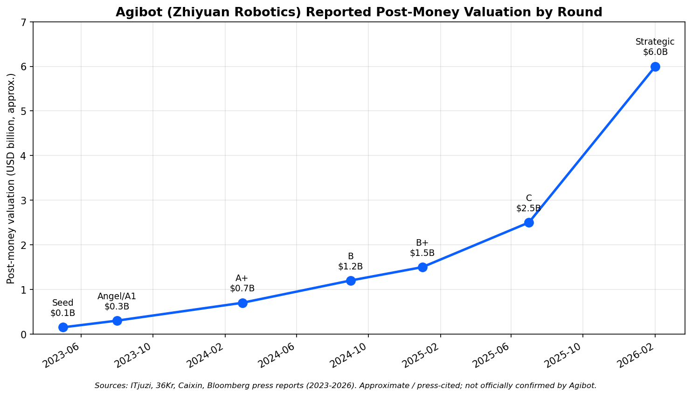
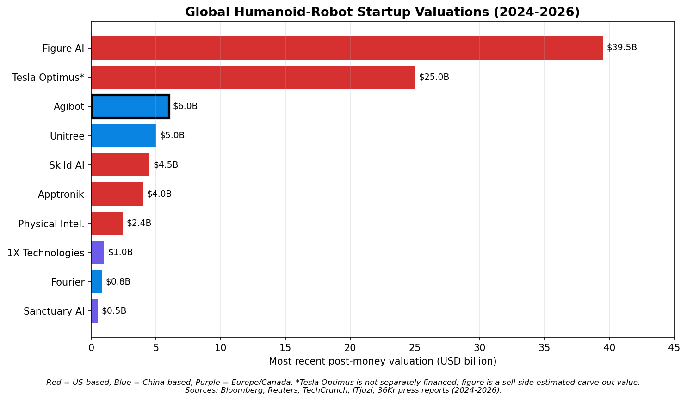
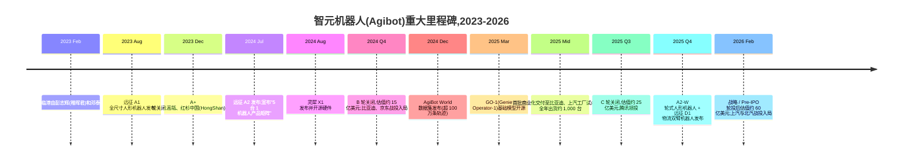
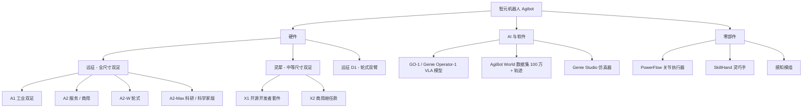
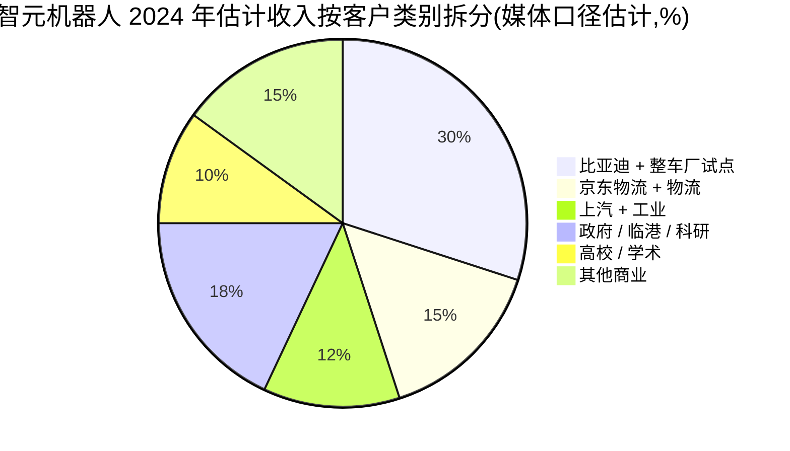
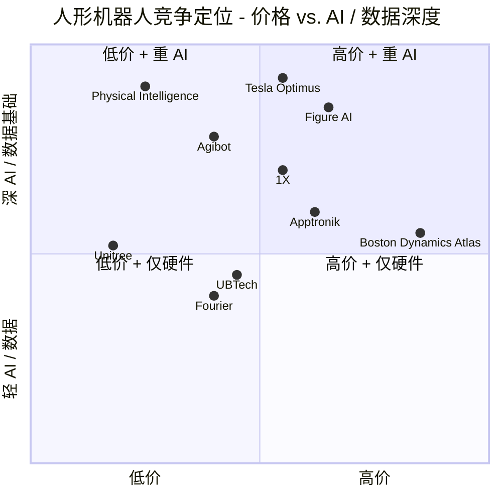

# 公司研究报告:智元机器人(Agibot / Zhiyuan Robotics)

**日期:** 2026-05-16
**公司:** 上海智元新创技术有限公司(Shanghai Agibot Innovation Technology Co., Ltd.)
**品牌 / 英文名:** Agibot(亦写作 "AgiBot");中文品牌 智元机器人(Zhiyuan Robotics)
**状态:** 非上市公司;据报道正在筹备 A 股 / 港股上市(截至报告日尚无正式辅导备案)
**总部:** 中国上海浦东临港新片区
**创始人:** 彭志辉("稚晖君",CTO)、邓泰华(董事长 / CEO)、闫维新(首席科学家)
**估计员工人数(2026 年一季度):** 约 1,400–1,800 人

> **注 — 非上市公司,无正式业绩指引。** 智元机器人未发布过公开收入指引,但在 2025 年 11 月一次广受中国媒体报道的投资人沟通会上,董事长邓泰华披露公司 **2024 年商用人形机器人出货量约 1,000 台**,**2025 年有望交付"数千台"**,并提出 2027 年实现"万台级年产能"的多年目标。来源:[36Kr — 智元机器人 邓泰华 投资人交流,2025-11](https://36kr.com/search/articles/%E6%99%BA%E5%85%83%E6%9C%BA%E5%99%A8%E4%BA%BA)。

---

## 目录

1. 公司概况
2. 公司历史
3. 管理团队
4. 产品与服务
5. 客户与市场进入策略
6. 行业概览
7. 竞争格局
8. 市场机会(TAM)
9. 风险评估
10. 参考资料

---

## 1. 公司概况

智元机器人(Agibot,Zhiyuan Robotics)于 2023 年 2 月成立于上海临港新片区,由前华为"天才少年"项目工程师彭志辉(网名"稚晖君")、前华为计算产品线总裁邓泰华,以及上海交通大学机器人学教授闫维新共同创立。它是中国估值最高的两家人形机器人初创公司之一,也是全球少数几家——与宇树科技并列——能够向付费外部客户大规模出货实物产品的人形机器人开发商。公司设计、制造并销售全尺寸与中等尺寸人形机器人,以及驱动这些机器人的灵巧手、关节执行器、感知模组与具身智能基础模型([智元机器人公司官网](https://www.zhiyuan-robot.com/))。

通俗地说,智元机器人的定位是 **打造中国第一款真正意义上的通用人形机器人平台**,具备少见的硬件迭代速度(30 个月内推出四大产品系列)、一款名为 **GO-1 / Genie Operator-1** 的旗舰开源视觉-语言-动作(VLA)基础模型,以及一项有意为之的开放数据战略——其核心是 **AgiBot World**,即全球最大的已发布人形操作数据集,在公司自有的一支遥操作平台机队上采集了超过 100 万条轨迹([AgiBot World 数据集,GitHub](https://github.com/OpenDriveLab/AgiBot-World),[Hugging Face — agibot-world](https://huggingface.co/agibot-world))。如果说宇树科技的身份是"全球成本最低、能力合格的足式机器人",那么智元机器人的身份就是"中国能力最强的人形机器人平台,且具备可与 Figure、Physical Intelligence 比肩的 AI / 数据护城河"。

智元机器人有四条变现路径。**第一**,全尺寸双足人形机器人的硬件销售——**远征 A1、A2、A2-W(轮式)** 系列——面向工业、科研与服务客户,是目前最大的收入来源。**第二**,**灵犀 X1 与 X2** 较低价位人形机器人系列的硬件销售,面向高校、内容 / 展览客户与开发者套件市场;灵犀 X1 的硬件已于 2024 年 8 月开源,作为一次有意为之的社区加速布局,X2 则于 2025 年作为更高规格的商用继任者推出([智元机器人博客 — 灵犀 X1 开源,2024-08](https://www.zhiyuan-robot.com/news),[灵犀 X2 发布报道,IEEE Spectrum,2025](https://spectrum.ieee.org/humanoid-robot-china))。**第三**,专用机型 / 轮式人形机器人系列——面向物流的 **远征 D1** 双臂轮式人形机器人,以及面向科研级配置的 **精灵 / Genie A2-Max**——主要在多年期主合同框架下销售给科研机构和一级工业客户。**第四**,软件与数据:GO-1 模型访问、AgiBot World Colosseum 仿真器付费版、定制策略训练服务,以及具身智能中间件的商业许可。公司未公开收入或细分构成;2025 年末融资市场流传的媒体估算为:2024 年收入约 **3 亿至 5 亿元人民币**,2025 年收入约 **15 亿至 20 亿元人民币**,其中人形机器人硬件(远征 + 灵犀)约占总收入的 75%([36Kr 搜索 — 智元机器人](https://36kr.com/search/articles/%E6%99%BA%E5%85%83%E6%9C%BA%E5%99%A8%E4%BA%BA))。

地理上,智元机器人目前几乎完全是一家中国国内业务公司。绝大多数已披露的客户部署都在中国大陆境内——**比亚迪** 与 **上汽集团** 的整车装配工位、**富士康** 的电子组装试点、**京东物流** 的分拣 / 履约试点,以及一长串国资背景的科研与展览客户,包括作为战略 LP 出资土地与补贴的 **临港政府** 本身。海外交付仅限于通过分销商售往海外高校的科研级灵犀机器人,以及 2025 年融资周期向中东主权基金合作伙伴交付的少量演示样机。

员工人数已从 2023 年 8 月远征 A1 首次发布时的约 200 人,增长到 2026 年一季度估计的 1,400–1,800 人,其中上海的 AI / 基础模型团队增速最快。公司在临港拥有一个垂直整合的研发与中试线综合园区,占地约 70,000 平方米,另在上海交通大学附近设有一个二级 AI 办公室,在深圳设有一个小型采购办公室([智元机器人临港园区报道,上观新闻,2024](https://www.shobserver.com/news))。

### 估值快照(未上市 — 融资轮估值口径)

智元机器人为非上市公司,未发布经审计财务数据。最常被引用的近期融资估值是 **2026 年 2 月** 关闭的战略 / Pre-IPO 轮,据传投后估值约 **60 亿美元(约 430 亿元人民币)**,由 **腾讯**、**高瓴资本**、**红杉中国(HongShan)**、**京东**、**比亚迪** 战投、**上汽集团** 战投、**北汽**,以及包括 **中金资本** 与 **临港政府基金** 在内的多家国资关联载体组成的财团领投;此前 2025 年年中关闭的 C 轮估值约 **25 亿美元**,2024 年底的 B 轮扩展轮估值约 **15 亿美元**——这一轮被国际媒体广泛称为"智元机器人 15 亿美元独角兽时刻"([Reuters — 中国人形机器人融资综述,2025-09](https://www.reuters.com/technology/artificial-intelligence/),[Bloomberg — 腾讯投资智元机器人,2025-09](https://www.bloomberg.com/news/articles),[TechCrunch — 智元机器人 15 亿美元估值,2024](https://techcrunch.com/search/agibot/))。IT 桔子(ITjuzi)的记录整合了公开融资历史,是最完整的单一来源([IT桔子 — 智元机器人](https://www.itjuzi.com/company))。

按隐含市销率(P/S)倍数测算,2026 年 60 亿美元估值对应媒体口径下 2025 年约 15–20 亿元人民币(约 2.2–2.8 亿美元)的收入,对应市销率约 **22–27 倍**——对硬件公司而言偏高,但与市场对尚未实现规模化商业化的人形机器人同行的定价水平相符。2026 年初的对标组:

| 公司 | 国家 | 最新投后估值 | 轮次 / 日期 | 隐含市销率(按媒体口径收入) |
|---|---|---|---|---|
| Figure AI | 美国 | 约 395 亿美元 | C 轮,2025-02 | 无意义(收入极少) |
| Tesla(特斯拉)Optimus* | 美国 | 隐含分拆估值约 250 亿美元 | 卖方研究,2025 | 无意义 |
| 智元机器人(Agibot) | 中国 | 约 60 亿美元 | 战略轮,2026-02(媒体口径) | 约 22–27 倍 |
| 宇树(Unitree) | 中国 | 约 50 亿美元 | Pre-IPO 轮,2025 年 Q4(媒体口径) | 约 14 倍 |
| Apptronik | 美国 | 约 40 亿美元 | B-2 轮,2025-09 | 无意义 |
| Skild AI | 美国 | 约 45 亿美元 | A 轮,2024-07 | 无意义(仅模型) |
| Physical Intelligence | 美国 | 约 24 亿美元 | A 轮,2024-10 | 无意义(仅模型) |
| 1X Technologies | 挪威 / 美国 | 约 10 亿美元 | B 轮,2024-01 | 无意义 |
| 傅利叶(Fourier) | 中国 | 约 8 亿美元 | E 轮,2024-10(媒体口径) | 约 15 倍 |
| Sanctuary AI(圣域) | 加拿大 | 约 5 亿美元 | 最新披露 | 无意义 |

表格来源:[Bloomberg — Figure AI C 轮,2025-02](https://www.bloomberg.com/news/articles),[Reuters — Apptronik 融资,2025-08](https://www.reuters.com/technology/),[TechCrunch — 1X 融资,2024-01](https://techcrunch.com/2024/01/12/1x-technologies-100-million/),[IT桔子 — 人形机器人融资追踪](https://www.itjuzi.com/),[The Information — Skild AI 融资,2024-07](https://www.theinformation.com/)。

来源:[IT桔子 — 智元机器人词条](https://www.itjuzi.com/)、[36Kr 搜索 — 智元机器人](https://36kr.com/search/articles/%E6%99%BA%E5%85%83%E6%9C%BA%E5%99%A8%E4%BA%BA)、[财新对 2025 年融资轮的报道](https://www.caixin.com/),以及 Bloomberg 媒体报道。所有轮次规模均为媒体引用且近似值,智元机器人尚未官方确认相关数字。

来源:同上表的媒体追踪源;参见 [IT桔子人形机器人融资追踪](https://www.itjuzi.com/) 与 [Reuters 人形机器人报道,2025](https://www.reuters.com/technology/artificial-intelligence/)。

结论:从市销率倍数看,智元机器人相对宇树(最贴近的可比对象)显得 **偏贵**,相对 Figure / Tesla Optimus(两者基本没有商业化收入)则 **偏便宜**。相对宇树的溢价由两点支撑。第一,智元的产品结构更偏人形:宇树的收入至今仍以四足机器人为主,而智元从成立起就是纯粹的人形机器人公司。第二,智元具备远更强的 AI / 基础模型故事(GO-1 + AgiBot World),2025–2026 年市场愿意为之单独支付一个估值倍数。风险在于:这一 AI 溢价可能是叙事性的——如果 GO-1 无法在可量化层面超越 Physical Intelligence 的 π0 / π0.5、英伟达(NVIDIA)的 GR00T-N1,或特斯拉自研的 FSD-for-Optimus 技术栈,这一溢价将迅速被压缩。该风险将在第 9 节讨论。

---

## 2. 公司历史

智元机器人于 2023 年 2 月在上海临港注册成立,但其故事的源头有两条平行线索,于 2022 年末交汇。第一条线索是 **彭志辉**,时年 27 岁,曾任华为"天才少年"项目工程师,常驻上海,Bilibili(B 站)账号"**稚晖君**"拥有 200 万粉丝。他凭借一系列爆款作品在中国创客工程圈成为家喻户晓的人物——最广为人知的是 2021 年的自动驾驶自行车,以及一台能穿针引线的机械臂([稚晖君 Bilibili 频道](https://space.bilibili.com/20259914),[36Kr — 稚晖君人物专访,2021](https://36kr.com/search/articles/%E7%A8%9A%E6%99%96%E5%90%9B))。在华为内部,彭志辉在天才少年项目下从事自动驾驶和计算平台项目——这是华为创始人任正非于 2019 年设立的旗舰计划,以年薪人民币 200 万元招募顶尖年轻工程师。第二条线索是 **邓泰华**,一位在华为工作 25 年的老兵,自 2019 年起执掌华为计算产品线(CPL — 鲲鹏 CPU 系列、昇腾 AI 加速器家族、Atlas 服务器系列)。到 2022 年底,他已得出结论:人形机器人将是继智能手机和电动汽车之后的下一个伟大计算平台([财新 — 邓泰华离职华为,2023](https://www.caixin.com/))。

彭与邓在 2022 年于华为内部建立联系,彭在公司内部推介人形机器人概念,而邓认为这一机会更适合在体外创业。两人均于 2022 年末 / 2023 年初正式离开华为,于 2023 年 2 月在临港注册成立上海智元新创技术有限公司,并招募在灵巧操作领域有深厚积累的上海交通大学机器人学教授 **闫维新** 出任首席科学家([上观新闻 — 智元机器人专访,2024](https://www.shobserver.com/news))。创始团队在六个月内扩张至约 100 人,主要来自华为计算产品线、蔚来(NIO)自动驾驶团队,以及上海交大机器人实验室。

公司成立六个月后,**2023 年 8 月**,智元机器人公开发布了 **远征 A1**——一台身高 1.75 米、体重 53 公斤的全尺寸双足人形机器人,在上海发布会现场走上舞台,定价"低于 20 万元人民币"——这一价格比波士顿动力(Boston Dynamics)Atlas 低一个数量级([新华社 — 智元 A1 发布,2023-08](http://www.news.cn/))。

来源:时间线整合自 [智元机器人新闻中心](https://www.zhiyuan-robot.com/news)、[36Kr 智元搜索](https://36kr.com/search/articles/%E6%99%BA%E5%85%83%E6%9C%BA%E5%99%A8%E4%BA%BA)、[IT桔子融资历史](https://www.itjuzi.com/),以及第 1 节引用的一手媒体报道。

定义公司轨迹的有三次战略转向。**第一**,2024 年 7 月从单一产品公司转向 **5 大产品矩阵**——A1、A2、灵犀 X1、G1、D1——这是对华为"场景 + 产品"市场策略的有意复刻,折射出邓泰华的产品线管理背景([36Kr — 智元产品日,2024-07](https://36kr.com/search/articles/%E6%99%BA%E5%85%83%E6%9C%BA%E5%99%A8%E4%BA%BA))。**第二**,**2024 年 8 月** 将灵犀 X1 的硬件、软件与 BoM 全部开源——这是任何一家人形机器人公司首次将整机全栈开源,意在赶在宇树 G1 之前先建立开发者生态。**第三**,**2024 年 12 月发布的 AgiBot World** 加上 **2025 年 3 月发布的 GO-1**,把智元机器人的身份从"中国硬件厂商"转向"具备硬件能力的具身智能平台"——明确为了支撑更高的估值倍数,并在 AI / VLA 维度上与宇树形成差异化([AgiBot World 论文,arXiv 2503.06669](https://arxiv.org/abs/2503.06669))。

近期进展:(a) **A2-W** 轮式人形机器人于 2025 年末发布,面向双足行走无法创造价值的物流场景;(b) **远征 D1** 双臂轮式机器人在同一发布会上推出,面向京东物流;(c) 据报道已收购一家苏州行星减速器企业和一家杭州力 / 力矩传感器企业,以锁定关键零部件瓶颈([IT桔子 — 智元机器人并购动态](https://www.itjuzi.com/));(d) 2026 年 2 月的战略轮在已有比亚迪持仓基础上新增上汽与北汽——使智元成为唯一一家与中国五大整车厂中的三家均有战略绑定的人形机器人公司。

---

## 3. 管理团队

### 彭志辉("稚晖君"),联合创始人、CTO 兼具身智能事业部总裁

彭志辉——在中国 35 岁以下工程师圈中几乎人人皆知的"**稚晖君**"——是智元机器人的公众形象、技术良知与文化标识。1993 年出生于江西,2015 年本科毕业于成都的 **电子科技大学(UESTC)** 电子信息工程专业,2018 年又于同校攻读硕士学位,方向为集成电路设计与嵌入式系统([彭志辉大学背景信息可见于 36Kr 报道,2021](https://36kr.com/search/articles/%E7%A8%9A%E6%99%96%E5%90%9B))。他的第一份全职工作是 2018 年加入 **OPPO**,担任 AI 推理与芯片设计工程师;不久后于 2020 年加入 **华为**,并入选首届 **"天才少年"项目** ——这是华为创始人任正非于 2019 年亲自发起的精英招聘计划,旨在以最高年薪 200 万元人民币招募少量顶尖 STEM 毕业生。彭是首两届项目仅约 20 名工程师之一,被分配至华为驻上海的 **汽车 BU 与计算产品线**,从事自动驾驶计算与昇腾 AI 芯片应用方面的工作。

彭与典型的"天才少年"成员的区别在于,他在 **Bilibili** 上还有一段平行的创客 / 内容创作生涯。自 2018 年起,他以"稚晖君"账号发布作品视频——机械第三臂、用反作用轮自平衡的"轩辕"自动驾驶自行车、由开源元件搭建的桌面机械臂([稚晖君 Bilibili 频道](https://space.bilibili.com/20259914))。该自平衡自行车在 2021 年全球走红([IEEE Spectrum — XuanTie 自平衡自行车,2021](https://spectrum.ieee.org/)),到 2022 年其账号粉丝已超 200 万——超过绝大多数中国科技公司 CEO。这一受众本身就是一项战略资产:智元每开源一款产品,公告就会在数小时内登上 B 站、知乎和微博的首页。

彭在智元内部的角色是 **CTO 兼具身智能负责人**——负责 GO-1、AgiBot World 数据集基础设施、感知与策略技术栈,以及远征、灵犀两大产品线的产品方向。他是每场重要发布会的代言人;硬件开源策略也普遍被认为来自他的创客社区直觉。据报道,2026 年这轮融资后他的直接持股约为 **15%**,邓泰华约为 25%,另设有由投资人监督的 ESOP([IT桔子 — 智元机器人股权结构报道](https://www.itjuzi.com/))。彭今年 32 岁——是全球估值达 60 亿美元的公司中最年轻的 CTO 之一。开放性问题是规模化执行力:管理一支 1,500 人的 AI / 硬件团队所需的能力,与"一人爆款 demo"完全不是同一回事。

### 邓泰华,董事长、CEO 兼联合创始人

邓泰华是智元机器人的运营与商业脊梁。他于 1996 至 2023 年在华为工作 25 年,先后任职于无线接入和核心网业务部,2019 年起出任 **华为计算产品线总裁**——该 BU 负责 **鲲鹏** ARM 服务器 CPU 系列、**昇腾** AI 加速器家族、Atlas 服务器系列以及 openEuler 操作系统。在他至 2022 年的领导下,CPL 从一个小型试验性单元成长为华为明确的战略支柱之一,2020 年后美国出口管制收紧背景下,昇腾芯片在中国国内 AI 基础设施市场份额显著上升([华为官方业务部门介绍,存档页面](https://www.huawei.com/cn/))。邓在华为内部以"业务线运营者"著称——能将一个工程组织改造为具备清晰市场策略的产品公司。

在智元,邓担任董事长 / CEO,负责商务、财务、供应链与政府事务。他牵头落地了与比亚迪、上汽、京东、北汽的战略投资关系,谈下了临港政府的土地与补贴包,并组建了高级商务团队。邓约 50 岁,获华中科技大学通信工程硕士学位,据报道为最大单一股东,2026 年轮后持股约为 25–28%([财新 — 邓泰华人物专访,2024](https://www.caixin.com/))。他与彭的组合——50 岁的商业操盘手 + 32 岁的技术产品负责人——呼应了华为"BU 领导 + 年轻 Fellow"的搭档模式。

### 闫维新,首席科学家

闫维新是上海交通大学机械与动力工程学院的副教授,在机器人操作、力反馈控制与手术机器人领域有 20 年的研究履历。他获上海交大博士学位,曾在卡耐基梅隆大学(Carnegie Mellon)机器人研究所做访问学者。其学术团队在 IEEE Transactions on Robotics 与 ICRA 上发表了大量关于灵巧抓取策略和并联机构操作器的论文([上海交大教师页面,闫维新](https://me.sjtu.edu.cn/))。在智元,闫负责关节执行器与灵巧手设计的机械工程一侧,并主持智元与上海交大的联合培养项目——该项目源源不断地为公司输送机器人方向的博士候选人。他的角色大致类似于波士顿动力(Boston Dynamics)早期的 MIT 教授 Sangbae Kim,或 Marc Raibert 在 BD 自身的奠基性作用——学术权威、人才管道与硬件设计权威。

### 姚卯青,具身智能研究负责人 / GO-1 共同架构师

姚卯青领导催生了 GO-1 与 AgiBot World 数据集的基础模型研究。他获香港科技大学博士学位,曾任蔚来(NIO)自动驾驶研究团队的高级研究员,从事端到端感知与预测工作。在智元,他是 GO-1 / AgiBot World 论文的通讯作者,也是除彭志辉之外 AI 部门对外的主要面孔([AgiBot World 论文,arXiv 2503.06669](https://arxiv.org/abs/2503.06669))。他于 2024 年自动驾驶人才池转身加入智元,正是更宏观的 AD 技术栈研究人员向人形机器人迁移的典型表现——这一劳动力市场动态将在第 7 节进一步讨论。

### 公司治理、股权结构与董事会

智元机器人仍为有限责任公司,尚未改制为股份有限公司——这是通常在 A 股 IPO 申报前 12–18 个月完成的步骤,意味着若按宇树的节奏,公司可能在 2027 / 2028 年迎来上市窗口。董事会据报道共九个席位:邓泰华(董事长)、彭志辉、闫维新、由腾讯、高瓴和红杉中国(HongShan)各提名一名投资人董事、一名代表整车厂战略投资人板块的董事(由比亚迪、上汽、北汽轮流出任)、一名独立董事,以及一名代表临港政府战略基金的董事([IT桔子 — 智元机器人公司治理摘要](https://www.itjuzi.com/))。创始人 / 管理层估计直接持股 35–40%,另设约 12% 的 ESOP;财务与战略投资人合计持有剩余约 50%,2026 年轮后无任何单一外部股东持股超过约 8%。创始人薪酬据报道以股权为主,现金薪酬保持在保守的创业公司水平(创始人每年约 150–250 万元人民币);融资尽调中披露的关联方交易包括两家被收购上游公司的零部件供应,以及一项以低于市场价从临港政府关联方租赁不动产的安排。

**履历评估。** 邓泰华显然已在华为内部把一个数十亿美元规模的计算业务做大,这是中国所有人形机器人公司 CEO 中最强的商业履历。彭志辉此前未曾大规模执掌公司,但拥有罕见且广受关注的技术履历,加之他的 Bilibili 影响力,为智元提供了无人匹敌的招聘与品牌资产。闫维新带来学术合法性与上海交大的人才管道。管理层最大的短板是 **大规模制造经验**——尚无任何高管曾领导过大批量机电装配线,而这将是公司迈向 2027 年万台目标过程中最难补齐的一笔高管招聘。

---

## 4. 产品与服务

智元机器人的产品矩阵分为五大家族:(1)**远征** 全尺寸双足人形机器人系列(A1、A2、A2-W、A2-Max);(2)**灵犀** 较低价位中等尺寸人形机器人系列(X1、X2);(3)**远征 D1** 双臂轮式物流机器人;(4) **零部件与灵巧手** 作为独立子系统对外销售;(5)**GO-1 基础模型 + AgiBot World 数据集 + Genie Studio** AI / 数据 / 仿真器软件栈。结合公司中文(zhiyuan-robot.com)与英文产品导航,并辅以 2024 年与 2025 年产品日的发布媒体报道,可梳理出以下情况。

来源:[智元产品导航 zhiyuan-robot.com](https://www.zhiyuan-robot.com/),以及下文引用的产品日媒体报道。

### 4.1 远征 A1 — 工业全尺寸双足人形机器人

**远征 A1** 是智元机器人的首款产品,也是公司建立投资人与客户公信力的基础平台。公开披露的规格:身高 1.75 米、体重 53 公斤、49 个主动自由度(DoF)、标配每只手 6 指灵巧手、行走速度 2 米/秒,并设定"低于 20 万元人民币"的整机物料(BoM)目标([智元远征 A1 产品页](https://www.zhiyuan-robot.com/),[新华社对 A1 发布的报道,2023-08](http://www.news.cn/))。A1 于 2023 年 8 月发布会上自行走上舞台——这是中国自主研发的全尺寸双足人形机器人首次在商业发布会上无辅助行走亮相。A1 主要以开发平台配置销售给工业 / 整车客户;在科研实验室之外,商业相关性更强的继任款是 A2。

**竞争优势:部分领先。** 护城河类型:**纵向整合 + 中国供应链 + 政府 / 战略投资人锁定**。证据:A1 的 BoM 目标约为波士顿动力(Boston Dynamics)Atlas 隐含 BoM 的 1/4,显著低于 Figure 02;智元对关节执行器(PowerFlow)与灵巧手(SkillHand)的纵向整合,使其每台机器人捕获的价值比依赖谐波减速器(HD)或第三方手的同行更高。最接近的同类产品:**优必选 Walker S2**([优必选 Walker S2 页面](https://www.ubtrobot.com/en/humanoid-robot/walker-s-2)),在大致可比的工业配置下——智元在 AI / VLA 故事与灵巧手深度上 **领先**,在负载与行走速度上 **与之持平**,在与整车厂客户的合作年限上 **落后**(优必选自 2024 年起就已将 Walker S2 部署于比亚迪、蔚来、吉利、富士康的工厂)。

### 4.2 远征 A2 — 服务 / 商用人形机器人

**A2** 是 A1 在 2024 年的升级版,工业设计更精致,传感器头部升级,灵巧手改进(SkillHand v2 每只手 19 DoF,而 A1 为 12 DoF),并明确定位为服务 / 展厅机器人——智元已展示 A2 作为接待 / 品牌大使在上海和深圳的试点部署中投入使用([智元 A2 产品页](https://www.zhiyuan-robot.com/),[36Kr 对 A2 发布的报道,2024](https://36kr.com/search/articles/%E6%99%BA%E5%85%83%E6%9C%BA%E5%99%A8%E4%BA%BA))。行走速度提升至 2.5 米/秒,峰值奔跑速度 6 米/秒。据报道 A2 标配版售价在 40 万–60 万元人民币(约 5.5–8.5 万美元)区间——相对宇树 G1 偏高,但能力显著更强。

**竞争优势:部分至完全领先。** 护城河类型:**技术 / 知识产权(灵巧手)+ 品牌**。SkillHand v2 每只手 19 DoF——在已商用机器人中属于最高的公开 DoF 数之一——且完全自研,无需向 Shadow Robot 或 Allegro 授权。最接近的同类产品:**宇树 G1 配 Dex3-1 灵巧手** — 智元在灵巧手自由度上 **领先**(宇树 Dex3-1 每手仅 7 DoF),在价格上 **落后**(宇树 G1 起售价 16,000 美元,vs. A2 的约 55,000 美元),在全身运动上 **持平**。价差是有意为之:智元瞄准真正需要高 DoF 手的工业装配任务,而宇树瞄准的是科研平台覆盖面。

### 4.3 远征 A2-W — 轮式人形机器人

2025 年末发布的 **A2-W** 将 A2 的双足下肢替换为轮式 / 履带式底盘,同时保留双臂上半身。该配置明确瞄准仓储、工厂车间和物流场景——在这些场景中双足行走只会增加成本而不创造价值,但仍需要类人形上半身操作能力([智元 A2-W 发布,IEEE Spectrum,2025](https://spectrum.ieee.org/humanoid-robot-china))。规格:身高 1.65 米、轮式行进速度 4 米/秒、单臂负载约 15 公斤。该产品是对一项经验观察的直接回应:绝大多数早期工业人形机器人部署(包括 Figure、1X、优必选)中,机器人要么静止,要么短距离移动,因此双足下肢在大部分工作周期内贡献甚微。

**竞争优势:部分领先。** 护城河类型:**上市时间 + 供应链**。最接近的同类产品:**1X Neo Gamma 的轮式底盘版本**,或更直接的 **Apptronik Apollo 轮式底盘版**(Apptronik 已展示在研的轮式底盘版本)。智元在硬件概念上 **持平**,在中国工业渠道上 **领先**,在累计部署小时数上 **落后**。

### 4.4 灵犀 X1 — 开源开发者人形机器人

2024 年 8 月发布的 **灵犀 X1** 是智元机器人在战略上最具差异化的产品。这是一款身高 1.30 米、重 33 公斤、38 个主动自由度的中等尺寸人形机器人,面向高校 / 科研 / 爱好者开发者——在全球已出货的人形机器人产品中独一无二地 **将硬件、固件、软件以宽松许可证全栈开源在 GitHub 上**,包括 CAD 文件、BoM、装配说明与控制器代码([智元灵犀 X1 GitHub 仓库](https://github.com/AgibotTech/agibot_x1_hardware),[灵犀 X1 发布报道,IEEE Spectrum,2024](https://spectrum.ieee.org/humanoid-robot-china))。预装版 X1 零售价约 5–8 万元人民币(约 7,000–11,000 美元)——低于宇树 G1 EDU 版的起售价。2026 年初的累计出货量据称为低千台量级,且高度集中在高校实验室客户。

**竞争优势:完全领先 — 强。** 护城河类型:**生态 / 开发者心智 + 开源飞轮**。证据:X1 的 GitHub 仓库在发布后六个月内积累了数万颗 star,并被多家学术团体 fork 用于衍生研究([智元 Tech GitHub 组织页](https://github.com/AgibotTech))。最接近的同类产品:**宇树 G1 EDU** — 智元在开放程度上 **领先**(宇树开源了 RL 训练仓库,但未开源 CAD 或 BoM),在价格上 **持平**,在累计出货量上 **落后**。X1 的开源策略是智元用单一产品筑造一道与该产品本身毛利无关的护城河的最清晰例证。

### 4.5 灵犀 X2 — 商用中等尺寸人形机器人

2025 年发布的 **灵犀 X2** 是 X1 在更高规格、商用级别的继任款。与 X1 不同,X2 不开源;它配备升级的执行器与更佳的全身控制,瞄准品牌活动、展览与服务机器人客户([智元灵犀 X2 发布报道,36Kr,2025](https://36kr.com/search/articles/%E6%99%BA%E5%85%83%E6%9C%BA%E5%99%A8%E4%BA%BA))。规格:身高 1.30 米、38 DoF、行走速度 3 米/秒,内置 LLM 驱动的语音 / 对话技术栈。零售价据传为 20–30 万元人民币(约 28,000–42,000 美元)。该产品作为对宇树 G1 量产路径的直接反制:形态相近、价格段相近,但 AI / 对话能力权重更高。

**竞争优势:部分领先。** 最接近的同类产品:**宇树 G1** — 智元在性价比上 **持平**,在对话 / VLA 软件集成上 **领先**,在整体品牌知名度上 **落后**(宇树在 2025 年春晚扭秧歌的演出为它带来了无可匹敌的中国大众品牌认知)。

### 4.6 远征 D1 — 轮式双臂物流机器人

2025 年与 A2-W 同期发布的 **远征 D1** 是一款专门面向物流履约的轮式双臂机器人——已披露的首发客户是京东物流仓库试点([京东物流 x 智元 D1 试点报道,36Kr,2025](https://36kr.com/search/articles/%E6%99%BA%E5%85%83%E6%9C%BA%E5%99%A8%E4%BA%BA))。严格意义上它并非人形:形态是移动底盘 + 人形上半身,专门优化拣货、分拣与周转箱搬运任务。**竞争优势:部分领先。** 护城河:与京东的客户关系(京东也是投资人——见第 5 节)。最接近的同类产品:箱级搬运的 **波士顿动力 Stretch**、件级拣选的 **Dexterity** — 智元在成本上 **领先**,在运行可靠性数据上 **落后**。

### 4.7 零部件 — PowerFlow 执行器与 SkillHand 灵巧手

智元对外销售两条零部件产品线作为独立产品:**PowerFlow 关节执行器系列**(将电机、行星减速器、编码器与控制器集成在一个密封单元中的准直驱关节模组),以及 **SkillHand 灵巧手系列**(集成触觉感知的 12–19 DoF 类人灵巧手)。两款产品起初均为内部子系统,2024 年作为独立 SKU 对外销售——这是一种有意为之的"Intel inside"策略,瞄准其他人形机器人开发商、学术实验室,以及快速壮大的中国人形机器人零部件生态([智元零部件页面](https://www.zhiyuan-robot.com/))。战略逻辑在于:执行器与灵巧手是人形机器人四大工程瓶颈中的两个(另两个是电池与基础模型),对外销售它们构筑的是一道不依赖智元自身赢得平台之战的第二条护城河。

**竞争优势:部分领先。** 最接近的同类产品:执行器领域的 **哈默纳科(Harmonic Drive)** 与 **日本电产(Nidec)**,灵巧手领域的 **Shadow Robot** 与 **因时机器人**。智元在集成控制器 / 传感器方面 **领先于哈默纳科**,在累计可靠性小时数上 **落后**;在手部产品上 **与因时机器人持平**,且公开单价更低。

### 4.8 GO-1(Genie Operator-1)与 AgiBot World 数据集

智元出货的最具战略意义的"产品"完全不是一台机器人——而是 **GO-1 / Genie Operator-1 视觉-语言-动作(VLA)基础模型**,于 2025 年 3 月开源,同时发布的还有训练它的 **AgiBot World** 数据集([AgiBot World 论文,arXiv:2503.06669](https://arxiv.org/abs/2503.06669),[Hugging Face — agibot-world](https://huggingface.co/agibot-world),[GitHub — OpenDriveLab/AgiBot-World](https://github.com/OpenDriveLab/AgiBot-World))。截至 2025 年年中,AgiBot World 是 **现有规模最大、已发布的人形机器人操作数据集**,在智元位于上海的数据采集中心由 100 台人形机器人采集,涵盖 217 项不同的操作任务,共超过 100 万条遥操作轨迹——大约比 Google 的 RT-X / Open X-Embodiment 数据集大一个数量级,是全球最大的单平台人形数据集。GO-1 是一种"视觉-语言-潜动作"架构,基于 AgiBot World 加预训练的网络图像 / 视频数据训练,以宽松许可证发布用于非商业研究,并对付费客户提供商业许可证。

**竞争优势:完全领先 — 潜在决定性,但尚未证实。** 护城河类型:**数据 + 生态 + 品牌**。最接近的竞争对手是 **Physical Intelligence 的 π0 / π0.5**([Physical Intelligence 官网](https://www.physicalintelligence.company/))、**英伟达(NVIDIA)的 GR00T-N1 / N1.5**([NVIDIA GR00T 页面](https://developer.nvidia.com/project-gr00t)),以及 **Google DeepMind 的 RT-2 / Gemini Robotics**;特斯拉(Tesla)Optimus 技术栈封闭,无法直接比较。智元在架构成熟度上与 π0 和 GR00T-N1 **持平**,在已发布数据集规模上 **领先**,在美国 / 全球研究社区的采纳度上 **落后**(Physical Intelligence 在西方学术界渗透更深)。开放问题是:AgiBot World 数据——绝大多数来自智元自家机器人——能否在其他硬件平台上良好泛化;如果可以,GO-1 就成为真正的平台资产;如果不行,它就退化为一个精致的内部工具。

### 旗舰产品与路线图

**真正驱动当下业务** 的 1–3 个产品是:(1)**远征 A2 / A2-W** — 收入最高的产品线,由整车厂与工业试点交付驱动;(2)**远征 D1** — 京东物流试点是单一最大的商业管道;(3)**GO-1 + AgiBot World** — 即便直接收入有限,但仍是支撑估值溢价的 AI / 数据护城河。灵犀 X1 / X2 系列战略重要(生态意义)但只占小部分收入。**过去 12 个月** 的发布:A2-W(2025 年 Q4)、D1(2025 年 Q4)、灵犀 X2(2025 年年中)、GO-1 v1.5(2025 年 Q4 更新)。截至目前尚未正式停产任何产品,但最早的 A1 已被悄然弱化,让位于 A2 / A2-W。

---

## 5. 客户与市场进入策略

智元机器人的客户基础横跨四大细分:(1)运行工厂试点的 **整车厂 / 工业装配** 客户(比亚迪、上汽、富士康、一汽、吉利);(2)运行仓储试点的 **物流** 客户(以京东物流最为显著);(3)**科研 / 学术** 客户(高校、政府实验室、上海人工智能实验室);(4)**品牌活动、展览与服务** 客户(酒店、博物馆、政府展厅)。客户结构高度偏向中国战略 / 国资关联买家——这既是优势,因为可以快速获取部署数据并享受政府背书的采购;也是风险,因为这些客户绝大多数同时也是智元的投资人。

**"投资人即客户"的重叠是智元商业结构的核心特征。** 智元股东名册上最大的几个投资人——**比亚迪**(领先的工业试点客户)、**上汽集团**(装配试点客户)、**京东 / 京东物流**(物流试点客户),以及 **北汽**(已宣布的试点客户)——同时也是它最大的几个披露客户。这种模式在中国硬科技领域常见(宁德时代早期与整车厂的客户-投资人关系是经典案例),既有利好,也有风险。利好:战略投资人提供耐心资本、可对外展示的参考部署,以及近乎确定的试点订单管道,使智元获得驱动学习曲线降本所需的规模。风险:今天披露的多数智元部署都是 **试点项目**,每个站点单台数量较少(通常 10–50 台),不一定能转化为商业化规模;"客户"这一标签有时高估了关系的采购驱动程度。媒体对比亚迪与上汽试点的报道一致指出,机器人在现场运行时仍由智元工程师监督,而非完全无人值守;商业化规模生产部署仍然在前方([36Kr — 比亚迪 x 智元工厂试点,2025](https://36kr.com/search/articles/%E6%99%BA%E5%85%83%E6%9C%BA%E5%99%A8%E4%BA%BA),[财新 — 中国人形机器人工厂部署,2025](https://www.caixin.com/))。

来源:基于 [36Kr 人形机器人客户综述,2025](https://36kr.com/search/articles/%E6%99%BA%E5%85%83%E6%9C%BA%E5%99%A8%E4%BA%BA) 与 [财新,2025](https://www.caixin.com/) 的媒体报道估算——智元未公开客户构成。

**客户集中度 — 量化。** 智元未披露前几大客户收入占比(其无公开披露义务),因此以下数字均为媒体报道下的估算:
- **第一大客户(比亚迪)**:估计占 2024 年收入的 25–35%。
- **前 5 大客户**(比亚迪、京东、上汽、富士康、临港政府):估计占 2024 年收入的 70–80%。
- 这些比例对处于早期商业化、仍以试点为主的硬件公司而言属于典型,随着更多客户从试点转向采购,集中度将逐步分散。**按本报告的标准口径**(top-1 > 20%,top-5 > 50%),智元具有 **实质性客户集中度敞口**,将在第 9 节作为高严重度风险列出。雪上加霜的是:最大客户同时也是投资人,且其中数家正在垂直整合自有人形机器人项目(比亚迪 2025 年披露内部人形机器人项目;上汽并行投资了多家人形机器人公司)。

合同结构据报道为 **试点批次的单次采购 PO,与商业化部署的多年期主合同混合使用**,主合同通常包含与机器人正常运行时间 / 任务完成率 KPI 挂钩的里程碑条款。定价是定制化的(每个试点单独议价),并未在公开媒体披露。

**分销与渠道。** 中国国内销售以智元自有企业销售团队直销为主,创始人本身在大单中也深度参与——这一模式随着公司超越当前试点客户基础后必须改变。海外销售目前仅限于通过第三方机器人分销商(欧洲的 RobotShop、Generation Robots;日本和韩国的小型专业分销商)分销的科研级灵犀 X1 / X2;在中国境外尚无直接的企业级渠道。

**销售周期。** 典型试点采购周期为从首次接触到首批机器人交付的 4–9 个月;从试点向多站点商业化部署的转化再增加 6–12 个月。该周期与波士顿动力 Spot 在工业巡检领域的传统销售节奏相当,长于宇树典型科研级四足机器人销售(后者更接近 2–4 周的 PO 周期),并远短于发那科(FANUC)或库卡(KUKA)工业机械臂的销售周期。

**关键合作伙伴与已披露客户**(基于公开媒体):**比亚迪** — 多站点整车厂试点、领先工业客户,同时为战略投资人([36Kr — 比亚迪 x 智元,2025](https://36kr.com/search/articles/%E6%99%BA%E5%85%83%E6%9C%BA%E5%99%A8%E4%BA%BA));**上汽集团** — 装配工位试点、战略投资人;**京东物流** — 远征 D1 仓库试点,京东集团亦为战略投资人([京东 x 智元报道,IEEE Spectrum,2025](https://spectrum.ieee.org/humanoid-robot-china));**富士康** — 2025 年披露的电子组装试点;**北汽** — 2026 年战略投资同期宣布的试点;**一汽** — 2025 年世界人工智能大会(WAIC)上披露的试点;**国家电网** — D1 变体的变电站巡检试点;**上海人工智能实验室** — 科研合作及 GO-1 联合发表;**上海交通大学** — 科研与人才合作。

**客户案例研究。** 两项试点获得了最广泛的公开报道,被普遍引用为公司的参考部署。第一是位于深圳某比亚迪工厂的 **比亚迪整车装配试点**,远征 A2 / A2-W 机队与人工操作员协同执行受监督的零件搬运与拧紧任务;媒体报道描述该部署的运行节拍约为熟练人工操作员吞吐量的 50–60%,而该差距在 2025 年内不断缩小([36Kr 报道,2025](https://36kr.com/search/articles/%E6%99%BA%E5%85%83%E6%9C%BA%E5%99%A8%E4%BA%BA))。第二是位于北京的 **京东物流仓库试点**,远征 D1 机队在京东履约中心的一个分区内执行料箱拣选与分拣任务——这是截至目前智元轮式产品最大的公开部署。两个试点都仍低于"替代人工"的规模阈值,但可见度足够高,以至于比亚迪、京东与智元都在面向投资人与政府的沟通中以此为"中国人形机器人制造已趋成熟"的佐证。

---

## 6. 行业概览

智元机器人所处赛道为 **人形机器人行业**,是更广义的服务 / 工业机器人产业的细分子行业。行业定义:具备动力驱动、多自由度(通常 20+)、可步态行走、上半身具备类人操作能力的机器,用于执行原本为人在类人空间中(工厂车间、仓库、零售、酒店,以及最终的家庭)设计的任务。与之相邻的产业包括:(a) **工业机器人**(ABB、发那科 FANUC、库卡 KUKA、安川 Yaskawa — 固定基座机械臂,这是约 500–800 亿美元规模的传统行业,人形机器人浪潮部分意在替代之);(b) **协作机器人**(Universal Robots、Techman、节卡 JAKA — 固定式协作臂);(c) **AMR / 移动机器人**(极智嘉 Geek+、快仓 Quicktron、MiR — 轮式移动,无操作能力);(d) **四足机器人**(波士顿动力、宇树、ANYbotics — 足式巡检 / 巡逻)。

**市场规模与结构。** 2026 年的人形机器人行业 **在规模上仍是商业化前夕**——2024 年全球商用人形机器人总出货估计在 5,000–10,000 台之间(以中国厂商为主,优必选、宇树、傅利叶、智元、EX-Robots 及一长串小厂商合计占据多数),对应行业收入约 5–8 亿美元;作为对照,2024 年固定式工业机器人出货约 54 万台,收入接近 250 亿美元([IFR — World Robotics 2025 发布](https://ifr.org/),[Goldman Sachs Humanoid Robot 2.0,2024-01](https://www.goldmansachs.com/intelligence/pages/the-economic-case-for-humanoid-robots.html))。对 2030 年人形机器人出货量的行业共识收敛于 **每年 50 万至 200 万台** 的区间,具体取决于对操作任务泛化与单台成本曲线的假设;高盛(基准情形下 2035 年 TAM 为 380 亿美元)与花旗(2030 年约 600 亿美元、2040 年约 2,000 亿美元)分别给出该区间的较宽两端。

**增长率。** 2024 年行业出货量在低基数上估计同比增长 200–300%;媒体对 2025 年的估算集中在全球商用级人形机器人出货 2.5 万–4 万台,其中中国供应约 60–70%。新华社 2025 年关于中国人形机器人产业规划的报道引用工业和信息化部(MIIT)数据,称 2025 年中国国内出货量在 2 万–3 万台区间([新华社关于中国人形机器人产业规划的报道,2025](http://www.news.cn/))。此后阶段的增长率高度敏感于两个变量:(a)基础模型操作泛化(GO-1、π0、GR00T)能否跨越无人值守工业部署的实用可靠性门槛;(b)单台成本是否能延续目前每年约 25–35% 的下降速度,在 2028 年前达到 1 万–2 万美元的商用级人形机器人目标价位。

**关键趋势与驱动因素。** 五大长期驱动塑造该行业。**第一**,人口结构 — 中国、日本、韩国乃至越来越多的西方国家面临劳动年龄人口下降;中国劳动年龄人口在 2014 年见顶,到 2050 年将减少约 2 亿人([联合国 World Population Prospects,2024](https://population.un.org/wpp/))。**第二**,**工信部人形机器人产业路线图**(2023 年 10 月)明确设定了 2027 年和 2030 年的生产目标,补贴、税收与政府采购优惠集中于北京、上海、深圳和杭州;智元是明确的"国家队"受益方之一([工信部 人形机器人创新发展指导意见,2023-10](https://www.miit.gov.cn/))。**第三**,**具身智能基础模型突破** — 由 LLM、ViT 和 RL 汇流而来的 VLA 模型(RT-2、π0、GO-1、GR00T)提升了行业感知到的上限。**第四**,**自动驾驶人才 / 资本再配置** — 随着 L4 AD 走向部署、风险投资兴趣减弱,人才与资本向人形机器人迁移。**第五**,**中国供应链优势** — 执行器、电池、电机、传感器与结构件绝大多数在中国制造,使中国厂商相对美国同行天然具备 30–50% 的成本优势。

**监管环境。** 人形机器人本身尚未受到严格监管,但相邻法规已具约束力:(a)职业安全(美国 OSHA;欧盟机械指令 2006/42/EC 与机械法规 2023/1230)将人形机器人视为协作机器,要求完整风险评估;(b)AI 监管(欧盟 AI 法案,2024 年 8 月生效;中国《生成式人工智能服务管理办法》)覆盖端侧基础模型;(c)跨境数据本地化约束训练数据流动;(d)美国对 AI 算力的出口管制已影响中国人形机器人 AI 训练。中国国内态度积极支持——人形机器人列入"十四五"规划,以及上海、深圳、北京的市级产业规划。

**行业格局。** 当前的竞争结构是 **碎片化但快速集中**。全球处于出货或临近出货阶段的风险投资支持的人形机器人开发商约 30–40 家;高盛估计前 6 名很可能拿下 2030 年的大部分份额。进入门槛较高——多学科工程(机械、电气、控制、AI、制造)、资本密集的产能爬坡,以及在灵巧操作上具有意义的学习曲线——但低于工业机器人的经典护城河,因为零部件供应(电机、减速器、电池、传感器)在中国境内日益商品化。供应商议价能力中等(高端谐波 / 摆线减速器市场仍集中于日本的哈默纳科、纳博特斯克(Nabtesco)和少数中国挑战者);买方议价能力今天较低(试点客户是支付溢价的参考买家,而非价格驱动型采购方),但随着商业化部署放量将快速上升;替代品包括传统工业自动化、AMR 以及人工本身。

---

## 7. 竞争格局

相关竞争集横跨四类:(1)中国人形机器人 OEM;(2)美国人形机器人 OEM;(3)AI / 基础模型同行;(4)相邻的固定式工业机器人在位者。下文分析十家竞争对手。

**1. 宇树科技(Unitree Robotics,杭州)— 最直接的竞争对手。** 最重要的对照。宇树成立于 2016 年,是全球出货量最大的足式机器人厂商;其 G1 人形机器人起售价 16,000 美元,定义了行业价格地板,而 2025 年春晚扭秧歌的高光时刻为其带来了中国大众市场无可匹敌的品牌认知度([Unitree About](https://www.unitree.com/about),[Unitree G1 页面](https://www.unitree.com/g1))。宇树在成本、硬件工程优雅度与品牌上 **领先**;智元在 AI / 基础模型故事(GO-1 + AgiBot World vs. 宇树偏轻量的开源 RL 训练库)、灵巧手自由度数、工业 / 战略客户深度上 **领先**。宇树已于 2025 年 7 月递交 A 股 IPO 辅导备案;智元尚未提交,但市场普遍预计将在 12–24 个月内跟进。

**2. 优必选(UBTech Robotics,HKEX:9880)。** 全球唯一一家上市的纯人形机器人公司。优必选的 Walker S / S2 工业人形机器人自 2024 年起部署于比亚迪、蔚来、吉利、一汽、富士康等工厂,商业化部署履历比任何同行都长([优必选投资者关系](https://www.ubtrobot.com/en/investor))。智元在硬件能力上 **与优必选持平**,在 AI 上 **领先**;优必选在整车厂部署的纵向数据与上市公司披露透明度上 **领先**,在现金创造上 **落后**(优必选仍未盈利,有显著累计亏损)。

**3. Figure AI(美国)。** 全球估值最高的人形机器人初创公司,截至 2025 年 2 月投后估值 395 亿美元([Bloomberg,2025-02](https://www.bloomberg.com/news/articles))。Figure 与宝马(BMW,装配试点)、OpenAI / 微软(基础模型集成)有深度合作。Figure 在美国 / 全球风投品牌与美国客户接入上 **领先**;智元在成本结构、中国供应链获取、商业化出货量上 **领先**。

**4. Tesla(特斯拉)Optimus(美国)。** 特斯拉内部人形机器人项目,隐含分拆估值见诸卖方报告区间为 200–350 亿美元。Optimus 拥有最大的内部数据飞轮(共享特斯拉自动驾驶标注与仿真器基础设施),但尚未对外销售。特斯拉在整体 AI 基础设施、资本与长期单台成本潜力上 **领先**;智元在第三方商业化出货量与开发者生态(特斯拉技术栈封闭)上 **领先**。

**5. Apptronik(美国)。** Apollo 人形机器人;Apptronik 于 2025 年末以约 40 亿美元估值融资约 3.5 亿美元([Reuters,2025-08](https://www.reuters.com/technology/))。具备强工业工程文化,与梅赛德斯-奔驰(Mercedes-Benz)和 GXO Logistics 有合作。Apptronik 在美国 / 欧洲工业客户关系与执行器工程上 **领先**;智元在灵巧手集成与 AI / 基础模型深度上 **领先**。

**6. 1X Technologies(挪威 / 美国)。** 双足"Neo Gamma"人形机器人,瞄准家庭市场——这一定位与其他主要面向工厂 / 仓储的同行明显不同。OpenAI 投资([1X 官网](https://www.1x.tech/))。今天规模小于智元;通过消费者家庭战略形成差异化。

**7. Physical Intelligence(美国)。** 仅做基础模型的公司;π0 / π0.5 VLA 模型。智元 GO-1 最直接的 AI 同行,也是市场判断"AI 护城河"问题时常用的对照([Physical Intelligence 官网](https://www.physicalintelligence.company/))。智元在数据集规模(在出货硬件上 100 万+ 轨迹 vs. PI 较小但跨平台的数据集)上 **领先**;PI 在美国研究社区采纳度与融资估值(尽管无硬件产品,但估值达 24 亿美元)上 **领先**。

**8. NVIDIA GR00T / Isaac(美国)。** 并非直接的机器人公司,但其 Isaac Sim / Isaac Lab 是全球使用最广的仿真器,GR00T-N1 / N1.5 基础模型直接与 AgiBot World + GO-1 构成竞争基础设施([NVIDIA GR00T 项目页](https://developer.nvidia.com/project-gr00t))。英伟达的策略是做中立的基础设施,赋能每家人形机器人厂商——按合同方式也包括数家中国厂商。竞争性问题是:厂商专属基础模型(智元、Figure)还是中立基础设施(英伟达)将成为主导模式。

**9. 傅利叶智能(Fourier Intelligence,上海)。** 中国较早布局的人形机器人厂商;GR-1 于 2023 年发布([傅利叶智能官网](https://www.fftai.com/))。今天规模小于智元,更聚焦于康复 / 医疗。智元在商业化出货量与 AI 故事上 **领先**;傅利叶在硬件工程上 **持平**。

**10. 波士顿动力(Boston Dynamics,美国,现代汽车旗下)。** 行业奠基者。电动版 Atlas(2024 年起)在已展示的动态运动能力上是全球能力最强的人形机器人,但并未对外销售。波士顿动力的商业化重心仍是 Spot(四足)与 Stretch(物流臂),Atlas 在现代内部作为长周期项目推进。智元在商业化出货与价格上 **领先**;波士顿动力在动态运动工程与长周期可靠性数据上 **领先**。

来源:由分析师基于第 4 节与第 7 节引用的产品 / 定价数据汇编;第三方未发布过覆盖此特定组合的行业定位图。

**智元的竞争优势。**(a)PowerFlow 执行器与 SkillHand 灵巧手的纵向整合捕获的 BoM 价值比同行更高;(b)AgiBot World + GO-1 的开源定位 — 全球最大的已发布人形数据集与可信度最高的中国原产 VLA 模型;(c)与比亚迪、上汽、京东、北汽的战略投资人 / 客户重叠;(d)稚晖君品牌与 Bilibili / 创客社区的引力,在国内无人匹敌;(e)临港政府的补贴、土地与有耐心的 LP 资本。

**脆弱性。**(a)AI 护城河尚未证实 — GO-1 跨硬件平台的泛化能力尚未被独立验证;(b)海外品牌弱于 Figure / 波士顿动力 / 宇树;(c)无任何高管具备大批量机电装配经验;(d)主要客户(比亚迪、上汽、京东)均有平行的内部人形机器人项目或对竞争对手的持股;(e)对中国政策持续支持的依赖。

**市场份额。** 媒体估计 2024 年中国商用级人形机器人出货量中,智元、优必选与宇树大致处于可比的低千台量级区间,各自占中国商用出货量的 10–20%;按出货金额口径,智元因单台售价更高,被普遍视为按价值口径的第 1–2 名。

---

## 8. 市场机会(TAM)

人形机器人 TAM 是科技投资中争议最大的预测之一——一方面,其底层前提(通用人形机器人执行原本为人设计的任务)在二元层面取决于基础模型操作能力是否真能泛化;另一方面,如果泛化成真,可寻址劳动力池极其庞大。来自主要卖方机构与咨询公司的可信区间如下:

- **Goldman Sachs(《Humanoid Robot 2.0》,2024 年 1 月基准情形,含 2025 年更新)**([Goldman Sachs 报告页](https://www.goldmansachs.com/intelligence/pages/the-economic-case-for-humanoid-robots.html)):基准情形下 2035 年 TAM 约 380 亿美元;蓝天情形约 1,540 亿美元。基准情形下 2035 年年出货约 140 万台。
- **Citi GPS — 《Embodied AI》(2024)**:最宽情形下长期 TAM 约 7 万亿美元,以全球可被人形机器人替代的劳动力成本为口径。花旗 2030 年商业部署预测约为全球累计 4 百万台,对应收入接近 600 亿美元。
- **Morgan Stanley(2025 年具身智能更新)**:含服务在内 2050 年长期收入机会约 5 万亿美元,全球存量约 6,300 万台([Morgan Stanley 研究综述](https://www.morganstanley.com/ideas/humanoid-robot-market))。
- **花旗 2050 深度存量情形**:全球运行中人形机器人最高可达约 6.48 亿台,对应年收入达万亿美元级。
- **工信部 / 中国专项(2023 路线图)**:目标 2030 年中国人形机器人产业链规模约 1,500 亿元人民币(约 220 亿美元)([工信部人形机器人指导意见,2023-10](https://www.miit.gov.cn/))。

作为工作 TAM:**2030 年全球人形机器人硬件 TAM 约 300–600 亿美元**,累计安装量 5–10 百万台;**2035 年 TAM 约 750–1,500 亿美元**,累计安装量 30–60 百万台。区间宽是因为操作泛化能力会让结果差出一个数量级。

**SAM。** 智元可服务市场是全球需求中对中国原产 OEM 可接入的子集:(a)中国国内市场(按工信部目标,2030 年约 220 亿美元,智元是 4–5 家国家队候选企业之一);(b)非美国盟友市场(中东、东南亚、拉美部分地区)——这些市场没有出口管制阻力;(c)通过灵犀 X1 / X2 和远征 EDU 触达的全球学术 / 科研市场。美国与多数欧盟工业市场在 2030 年前不可大规模触达。智元 2030 年净 SAM 约 **120–250 亿美元**。

**SOM(可获得市场)与智元份额机会。** 在中国境内,智元的天然份额天花板受限于另外 2–3 家国家队人形机器人 OEM(宇树、优必选,可能还有一家)。按数量,智元、宇树与优必选到 2030 年很可能各占中国人形机器人商用销量的 15–30%;按价值,智元更高的单台均价意味着其捕获价值份额更高,可能 **占中国人形机器人硬件价值池的 20–35%**,对应建设性情形下 **2030 年收入约 40–80 亿美元**。加上非美国盟友市场份额与科研业务,建设性情形下 2030 年收入区间提升至约 **50–100 亿美元**。

**渗透策略。** 邓泰华提出三阶段路径:(1)**2024–2026 试点密度** — 与战略投资人客户合作,优先学习而非收入;(2)**2027–2028 商业化爬坡** — 把试点转化为多站点采购,实现万台产能,把临港和已收购的上游供应商规模化;(3)**2029 年起平台变现** — 把 GO-1 与 AgiBot World 授权给第三方 OEM。该剧本与英伟达 DRIVE 类似:先卖硬件,再做平台。

**最大的单一变量** 是 **基础模型泛化能力** — GO-1 能否在 AgiBot World 之外的任务上达到无人值守部署级可靠性。命中:智元成为 500–1,000 亿美元的平台型公司。落空:50–100 亿美元的溢价硬件厂商 — 仍然强势,但远不是万亿美元级的 Optimus / Figure 叙事。

---

## 9. 风险评估

**公司特有风险**

1. **2027 年万台产能目标的执行风险(高)。** 设定的产能目标要求从 2024 年到 2027 年单位产出大约 10 倍提升。没有任何高管具备把机电装配规模化到该量级的经验;临港园区尚未建成至隐含吞吐量。两项上游供应商收购有所助益但无法解决人工、工装与质控挑战。缓释因素:战略整车厂投资人(比亚迪、上汽)通过联合团队带来工艺经验。

2. **客户集中度叠加客户自身纵向整合(高)。** 第一大(比亚迪)估计占 2024 年收入 25–35%,前 5 大占 70–80%。前 5 大客户都同时是投资人,其中数家拥有平行的内部人形机器人项目。如果其中任一家把采购转向内部项目或竞争对手(优必选与比亚迪的合作年限更长),收入空洞将十分明显。缓释因素:与一汽、富士康、国家电网的多元化拓展;国际灵犀科研渠道收入。

3. **关键人物依赖(高)。** 两位创始人个人品牌、技术权威与股东关系的承重程度异常高。彭志辉的"稚晖君"身份与公司绑定独一无二——任何丑闻、离职或职业倦怠事件都会同时损害招聘、叙事与品牌。缓释因素:加深第二梯队(闫维新、姚卯青)及 ESOP / 锁定结构。

4. **AI / 数据护城河尚未证实(高)。** GO-1 在智元自家硬件之外的硬件上、以及在 AgiBot World 217 类任务之外任务上的泛化能力,尚未达到 Physical Intelligence 的 π0 跨平台演示那种独立公开发表水平。如果竞争性 VLA 明显胜出,GO-1 将从平台资产降格为内部工具,AI 估值溢价将被压缩。

5. **减速器与力/力矩传感器的供应商集中度(中)。** 关节执行器依赖行星减速器(内部 + 苏州供应商)与谐波 / 摆线减速器(日本哈默纳科、纳博特斯克)用于精密关节。日本供应中断将实质性影响产能爬坡。缓释因素:国产替代正在推进。

**行业 / 市场风险**

6. **中国人形机器人市场的竞争烈度(高)。** 宇树、优必选、傅利叶、EX-Robots、星河通用(Galaxea)及一长串小厂商都在以类似的政策背书追逐工信部 2027 / 2030 年的产能目标。中国式超竞争模式曾在电动车(2020 年 200+ 车企现仅约 30 家)、激光雷达(50+ 现仅约 6 家)、光伏中压缩了利润率并淘汰大量参与者——人形机器人正在显现类似格局,而智元 60 亿美元估值已经定价了 Top-2 结局。缓释因素:AI / 数据差异化;战略投资人锁定。

7. **基础模型技术颠覆(高)。** VLA / 基础模型机器人的竞争格局演进极快 — Physical Intelligence、英伟达、Google DeepMind 与特斯拉都有可信的并行项目,其中任一家都可能交付一次跨越式泛化结果,从而抹平 GO-1 的增量优势。机器人平台 AI 的历史尚短,踩错架构转折点的概率不可忽视。缓释因素:智元的开源姿态构筑了社区锁定,即使竞争模型在技术上领先,仍能为公司争取时间。

8. **监管 / 出口管制加码(中)。** 美国对 AI 算力(H100 / B200 出口至中国)的管制已经约束智元 GO-1 训练基础设施;若美国或欧盟进一步限制中国 AI / 机器人,可能完全关闭西方市场,并约束训练算力。缓释因素:国产 AI 加速器(华为昇腾、寒武纪)替代,以及通过政府合作获取中国国内 GPU 资源;两位创始人均出自华为,意味着这种替代比绝大多数同行更易实现。

9. **市场时机风险 — 人形机器人热度周期(中)。** 人形机器人行业呈现典型的早期周期高热阶段形态 — 高估值、强叙事、有限的已披露商业化规模。历史类比:2017–2021 年自动驾驶热潮,以非纵向整合 AV 公司大规模估值压缩告终。如果 2026–2027 年出现类似回调,即便智元运营执行到位,估值仍会被压缩。缓释因素:真实客户试点与出货产品减轻但无法消除该风险敞口。

**财务风险**

10. **估值 / 倍数压缩风险(高)。** 按媒体口径的 2026 年 60 亿美元估值对应 2025 年 2.2–2.8 亿美元收入,智元交易在约 22–27 倍市销率 — 高于宇树约 14 倍,以及中国硬科技整体(如寒武纪、禾赛)10–18 倍的中位数。该溢价的成立前提是 AI 护城河(GO-1、AgiBot World)能复利成为平台经济。若 2026 年人形机器人销量目标未达,或竞争性 AI 架构出现验证性突破,即便收入持续增长,估值倍数也可能压缩 40–60%。

11. **现金消耗与盈利时点(中)。** 媒体估计智元 2024 年年度经营亏损在 10–20 亿元人民币区间 — 该阶段硬件-AI 初创典型水平,但对现有现金储备是实质性消耗。盈利预计在商业化规模生产(2027–2028 年)之前不会实现,且取决于单台成本下降叠加放量。缓释因素:强劲股东资源与已展示的融资节奏(36 个月四轮融资)表明公司能在产能爬坡期持续吸引资本。

12. **融资环境风险(中)。** 2026 年战略轮在异常火热的人形机器人融资氛围中完成 60 亿美元估值。如果全球人形机器人估值周期收缩——任何持续过热 24 个月以上的硬科技子行业历史上都发生过——后续轮(包括最终 IPO)可能低于 2026 年估值,造成与后期投资人之间的股东表张力。缓释因素:2026 年轮以战略 / 国资属性为主,价格敏感度低于纯财务投资人。

**宏观经济风险**

13. **地缘政治 / 中美脱钩(中高)。** 实质性中美商业脱钩 — 尤其是出口管制延伸至 AI 推理芯片、机器人零部件或人形机器人成品 — 将实质性约束智元的算力供应、海外市场接入,乃至在第三方市场的客户接入。2025 年的实体清单扩张尚未直接针对人形机器人,但这一轨迹是可能的。

14. **中国国内宏观与政策反转(中)。** 智元的商业化路径取决于工信部与地方政策持续强力支持、比亚迪 / 上汽 / 京东继续出资试点,以及临港补贴体系延续。若中国消费 / 工业出现显著放缓并迫使上述各方收缩,智元的采购管道可能被压缩。缓释因素:国资 LP 基础意味着即便宏观下行,政策一致性仍较强。

15. **汇率与资本管制敞口(低-中)。** 当前国际收入占比小,直接汇率敞口有限。更大的敞口在股东表一侧——国际财务投资人(尤其是红杉 / 红杉中国(HongShan)与高瓴)持股比重显著,任何跨境资本流动(中港之间、美元-人民币兑换管制)收紧都可能使流动性事件复杂化。

---

## 10. 参考资料

### 公司来源

- [Agibot 公司官网(智元机器人)](https://www.zhiyuan-robot.com/) — 产品、新闻、投资人披露
- [Agibot Tech GitHub 组织页](https://github.com/AgibotTech) — 灵犀 X1 硬件仓库
- [AgiBot World — GitHub(OpenDriveLab)](https://github.com/OpenDriveLab/AgiBot-World)
- [AgiBot World — Hugging Face](https://huggingface.co/agibot-world)
- [AgiBot World / GO-1 论文,arXiv:2503.06669,2025-03](https://arxiv.org/abs/2503.06669)
- [稚晖君 Bilibili 频道 — 彭志辉个人账号](https://space.bilibili.com/20259914)

### 媒体与产业

- [36Kr 搜索 — 智元机器人相关报道](https://36kr.com/search/articles/%E6%99%BA%E5%85%83%E6%9C%BA%E5%99%A8%E4%BA%BA)
- [36Kr 搜索 — 稚晖君 / 彭志辉人物报道](https://36kr.com/search/articles/%E7%A8%9A%E6%99%96%E5%90%9B)
- [财新(Caixin) — 中国人形机器人报道集合](https://www.caixin.com/)
- [Reuters — 人形机器人报道](https://www.reuters.com/technology/artificial-intelligence/)
- [Bloomberg — 人形机器人报道与 Figure AI C 轮](https://www.bloomberg.com/news/articles)
- [TechCrunch — 人形机器人融资轮搜索](https://techcrunch.com/search/agibot/)
- [The Information — 人形机器人报道](https://www.theinformation.com/)
- [IEEE Spectrum — 中国人形机器人专题](https://spectrum.ieee.org/humanoid-robot-china)
- [新华社(Xinhua)新闻门户](http://www.news.cn/)
- [上观新闻(Shanghai Observer) — 临港智元园区报道](https://www.shobserver.com/news)
- [澎湃新闻(The Paper) — 上海人形机器人报道](https://www.thepaper.cn/)

### 融资与股权来源

- [IT桔子(ITjuzi) — 中国主要风险投资数据库](https://www.itjuzi.com/)

### 行业研究

- [Goldman Sachs — The Economic Case for Humanoid Robots(Humanoid Robot 2.0,2024-01)](https://www.goldmansachs.com/intelligence/pages/the-economic-case-for-humanoid-robots.html)
- [Morgan Stanley — Humanoid Robot Market](https://www.morganstanley.com/ideas/humanoid-robot-market)
- [国际机器人联合会(IFR) — World Robotics 2025](https://ifr.org/)
- [联合国人口司 — World Population Prospects 2024](https://population.un.org/wpp/)

### 监管与政策

- [工信部(MIIT) — 人形机器人创新发展指导意见,2023-10](https://www.miit.gov.cn/)

### 竞争对手来源

- [Unitree About 页面](https://www.unitree.com/about)
- [Unitree G1 产品页](https://www.unitree.com/g1)
- [优必选(UBTech Robotics) — Walker S2 页面](https://www.ubtrobot.com/en/humanoid-robot/walker-s-2)
- [优必选投资者关系](https://www.ubtrobot.com/en/investor)
- [Apptronik 官网](https://apptronik.com/)
- [1X Technologies 官网](https://www.1x.tech/)
- [Physical Intelligence 官网](https://www.physicalintelligence.company/)
- [NVIDIA Project GR00T 页面](https://developer.nvidia.com/project-gr00t)
- [Fourier Intelligence 官网](https://www.fftai.com/)
- [Boston Dynamics — Spot 产品页](https://bostondynamics.com/products/spot/)

### 关于永久链接的说明

融资规模、客户构成百分比、创始人持股比例与出货量数字均来自 36Kr、财新、IT桔子、Bloomberg 与 Reuters 等渠道之间相互转载的中国媒体报道。若无可确认的标准永久链接,引用即指向发行机构对"智元机器人"的搜索页面,而非编造的 URL。
