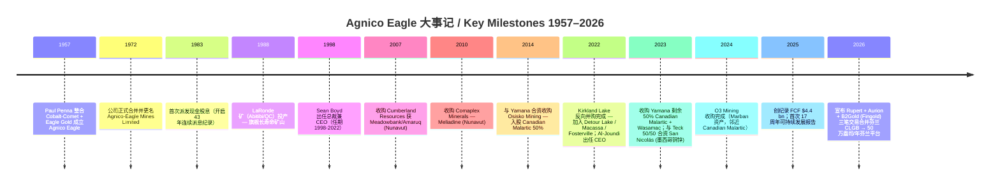
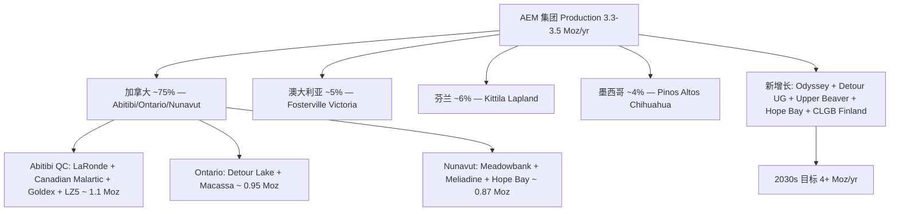
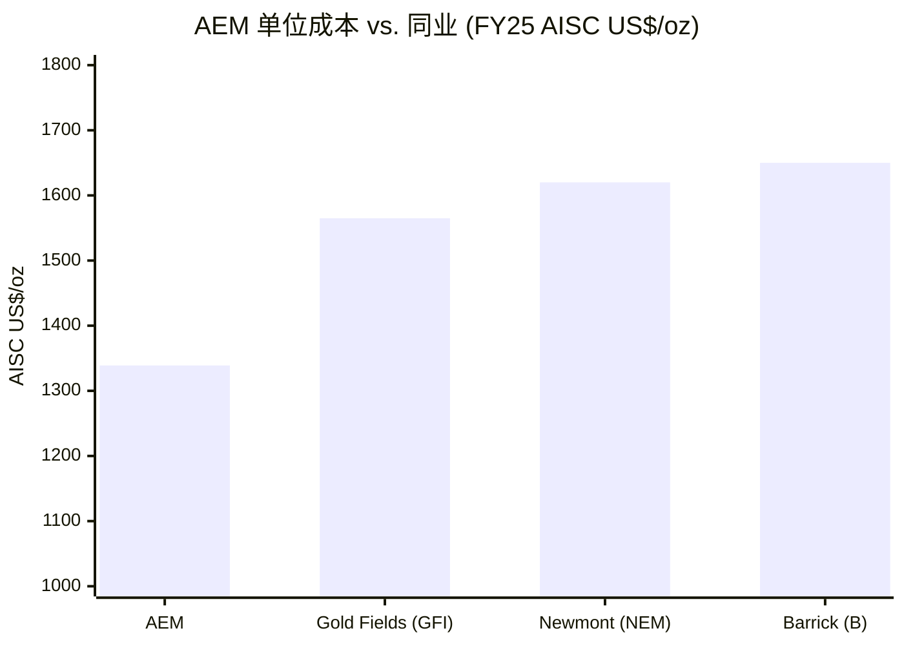
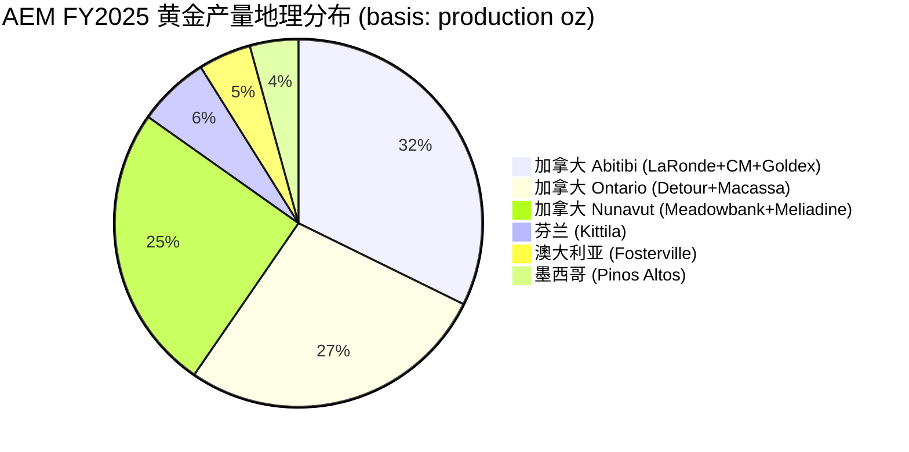
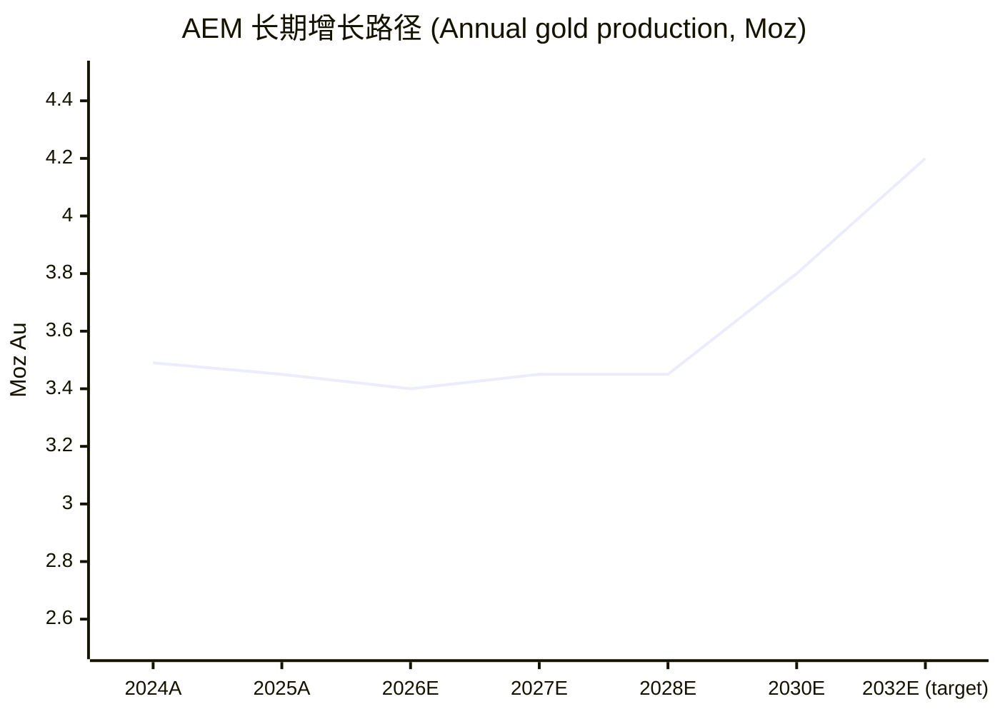

# 公司研究报告：Agnico Eagle Mines Ltd (NYSE:AEM)

**报告日期 / As of**：2026-06-02
**主题归属**：稀土与战略矿产（rare-earth-strategic-minerals） — 黄金对冲腿（"无地缘风险"加拿大型纯黄金敞口）
**报告语言**：简体中文（Simplified Chinese, zh-CN）

> **Update — 重申 2026 年全年指引 + Fitch 上调至 A- (2026-04-30):** 公司在 Q1 2026 业绩中重申 2026 年全年应付黄金 (payable gold) 产量指引为 330-350 万盎司，全年总现金成本 (TCC) 每盎司 $1,020-1,120、全周期维持成本 (AISC) 每盎司 $1,400-1,550，全年产量节奏 48% 上半年 / 52% 下半年 ([AEM Q1 2026 earnings release, 2026-04-30](https://www.sec.gov/Archives/edgar/data/0000002809/000110465926054134/tm2612722d3_ex99-1.htm))。同时 Fitch Ratings 在 4 月将公司长期发行人违约评级 (Long-term Issuer Default Rating) 从 BBB+ 上调至 A-，反映现金 $3.11 bn vs. 总债务仅 $197 mn、净现金 (net cash) $2.92 bn 的最强健资产负债表 ([同上 Q1 2026 release](https://www.sec.gov/Archives/edgar/data/0000002809/000110465926054134/tm2612722d3_ex99-1.htm))。董事会同步将季度股息从 $0.40 上调至 $0.45（FY25 +12.5%）并将 NCIB 回购计划内部上限提至 $2.0 bn ([AEM FY2025 Q4+FY release, 2026-02-12](https://www.sec.gov/Archives/edgar/data/2809/000110465926014451/aem-20251231xex99d1.htm))。

## 目录

1. 公司概览
2. 公司历史
3. 管理团队
4. 产品与服务
5. 客户与上市策略
6. 行业概览
7. 竞争格局
8. 市场机会 (TAM)
9. 风险评估
10. 投资者视角评分卡 / Investor-lens scorecards
11. 参考资料

---

## 1. 公司概览

Agnico Eagle Mines Ltd（"Agnico Eagle"、"公司"、NYSE/TSX:AEM）是一家总部位于加拿大多伦多 (Toronto, Ontario) 的高级 (senior) 黄金生产商，按 2025 财年应付黄金 (payable gold) 产量 3,447,367 盎司计是**全球第二大金矿企业**、加拿大最大的矿业公司，仅次于 Newmont Corporation (NYSE:NEM)。公司在 2025 年的描述里写得很直白："Canada's largest mining company and the second largest gold producer in the world. It produces precious metals from operations in Canada, Australia, Finland and Mexico" ([Agnico Eagle 2025 Annual Information Form (AIF), p.5](https://www.sec.gov/Archives/edgar/data/2809/000110465926032153/aem-20251231xex99d1.htm))。公司在纽约证交所 (NYSE) 与多伦多证交所 (TSX) 双重上市，股票代码 AEM；截至 2026-06-01 市值约 $88.3 bn ([stockanalysis.com — AEM Statistics](https://stockanalysis.com/stocks/aem/statistics/))。

**业务模式 (business model)**：公司"实质上全部 (substantially all) 营收来自金锭 (doré bar) 和精矿 (concentrate) 形式的黄金生产与销售"，其余少量营收来自副产品 (by-product) 银、铜、锌；黄金以精炼形式出售，主要在伦敦现货市场 (London spot market)，且公司不依赖任何单一买家或合同 ([AIF 2025, "Principal Products and Distribution", p.57](https://www.sec.gov/Archives/edgar/data/2809/000110465926032153/aem-20251231xex99d1.htm))。这种"无对冲" (un-hedged) 现货销售策略意味着公司业绩对金价完全敏感 (full beta to gold prices) — Q4 2025 实现金价 $4,163/oz、Q1 2026 实现金价 $4,861/oz，远高于公司在矿山规划与储量评估中使用的 $1,600/oz 储量 (reserve) 假设与 $2,000/oz 资源 (resource) 假设 ([AIF 2025 Risk Factors, p.61](https://www.sec.gov/Archives/edgar/data/2809/000110465926032153/aem-20251231xex99d1.htm))。

**地理布局 (geographic footprint)**：截至 2025 年末公司运营 11 个矿山（按 100% 权益口径），全部位于"低政治风险" (low political risk) 司法辖区 — 加拿大魁北克省 / 安大略省 / 努纳武特地区、澳大利亚维多利亚州、芬兰拉普兰省、墨西哥奇瓦瓦州。具体包括：LaRonde 复合矿 (Abitibi/QC，含 LZ5)、Canadian Malartic 露天矿+ Odyssey 地下 (QC)、Goldex (QC)、Detour Lake (Ontario)、Macassa (Ontario)、Meadowbank/Amaruq 复合矿 (Nunavut)、Meliadine (Nunavut)、Fosterville (Victoria/AU)、Kittila (Finland)、Pinos Altos (Mexico)；此外 La India 与 Creston Mascota (Mexico) 处于残留浸出 (residual leaching) 收尾阶段 ([AIF 2025, p.5](https://www.sec.gov/Archives/edgar/data/2809/000110465926032153/aem-20251231xex99d1.htm))。这种"先进经济体集中" (concentrated in advanced economies) 的资产组合正是 AEM 在 rare-earth-strategic-minerals 主题中被定位为"无政治风险黄金敞口" (no-political-risk gold expression) 的核心理由 ([rare-earth-strategic-minerals 主题报告, 2026-05-31](https://github.com/jiongmumu/financial_agent/blob/main/reports/themes/rare-earth-strategic-minerals_theme.md))。

**规模指标 (scale indicators)**：截至 2025-12-31 公司有 18,216 名员工（其中正式员工 11,374 人、承包商 6,389 人、临时工 326 人、实习生 127 人），分布在 11 个生产矿山 + 4 个区域勘探办公室 + 多伦多总部 ([AIF 2025, "Employees", p.57](https://www.sec.gov/Archives/edgar/data/2809/000110465926032153/aem-20251231xex99d1.htm))。FY2025 营收 $11,908 mn (YoY +43.7% vs. $8,286 mn)、净利润 $4,461 mn (YoY +135% vs. $1,896 mn)、EBITDA $8,200 mn、自由现金流 (free cash flow, FCF) 年度纪录 $4,399 mn（每股 $8.76）、经营性现金流 $6,817 mn ([stockanalysis.com — AEM Financials](https://stockanalysis.com/stocks/aem/financials/); [AEM FY2025 Q4 release, 2026-02-12](https://www.sec.gov/Archives/edgar/data/2809/000110465926014451/aem-20251231xex99d1.htm))。Q1 2026 营收延续强势，净利润 $1,695 mn、调整后净利润 (adjusted net income) 创纪录 $1,706 mn、FCF $732 mn（其中 $1.3 bn 现金所得税支付为一次性压制，扣除后真实 FCF 接近 $1.6 bn 量级）([Q1 2026 release](https://www.sec.gov/Archives/edgar/data/0000002809/000110465926054134/tm2612722d3_ex99-1.htm))。

**估值快照 (valuation snapshot) — 2026-06-01**：

| 指标 | 数值 | 黄金大矿 (peer) 中位 |
|---|---|---|
| 收盘价 | $183.07 (2026-05-29) → ~$183.15 (5-29 after-hours) | n/a |
| 市值 (market cap) | $88.29 bn | $33-115 bn 区间 |
| TTM P/E | 16.63x | NEM 14.06x / B (Barrick) 11.59x / GFI 9.31x — AEM 估值溢价 |
| Forward P/E | 12.17x | NEM 10.05 / B 10.33 / GFI 6.26 — AEM 仍溢价 |
| P/S (TTM) | 6.52x | NEM 4.63 / B 3.72 / GFI 3.79 — 显著溢价 |
| EV/EBITDA (TTM) | 8.96x | NEM 6.85 / B 6.65 / GFI 6.75 — ~35% 溢价 |
| P/B | 3.36x | B 1.93x — 显著溢价 |
| 股息率 | 0.98% | NEM 0.95 / B 2.17 / GFI 3.72 |
| 派息比例 | 16.0% | n/a |
| 毛利率 (TTM) | 73.87% | n/a |
| 经营利润率 | 60.23% | n/a |
| 净利率 | 39.46% | n/a |
| ROE TTM | 22.30% | B 25.18 |
| ROIC TTM | 23.65% | n/a |
| 净债务/股本 (D/E) | 0.01 | B 0.13 |
| Beta (5Y) | 0.57 | n/a |

数据来源：[stockanalysis.com — AEM](https://stockanalysis.com/stocks/aem/statistics/)、[stockanalysis.com — NEM](https://stockanalysis.com/stocks/nem/statistics/)、[stockanalysis.com — Barrick (B)](https://stockanalysis.com/stocks/b/statistics/)、[stockanalysis.com — GFI](https://stockanalysis.com/stocks/gfi/statistics/)。

**估值溢价的成因**：AEM 在每一项倍数上均较 NEM/Barrick/GFI 同业溢价 25-50%，且 P/E TTM 16.6× 已落在黄金股 8-15× 历史区间的上沿。*分析师观点：* 溢价的合理性建立在三个支柱上 — (1) **司法辖区纯度 (jurisdiction purity)**：100% 资产位于加 / 澳 / 芬 / 墨四个 OECD 国家，无非洲、无南美 (秘鲁 / 智利)、无中亚、无印尼 — 同业 NEM 仍有 5% Suriname / Ghana 暴露、Barrick 有 ~25% Mali / Tanzania / DRC 暴露；(2) **资产久期 (asset life)**：AIF 披露 LaRonde 矿至 2034 年、Detour Lake 至 2052 年、Canadian Malartic 至 2042 年、Macassa 至 2032 年、Fosterville 至 2037 年、Kittila 至 2037 年 — 加权平均矿山寿命 (LoM) 接近 15-20 年，远长于 NEM 的 ~10 年 ([AIF 2025, "Estimated Mine Life" table, p.5](https://www.sec.gov/Archives/edgar/data/2809/000110465926032153/aem-20251231xex99d1.htm))；(3) **资本回报纪律**：自 1983 年以来连续 43 年发放现金股息、2025 年回购 $0.6 bn + 股息 $0.8 bn = 总股东回报 $1.4 bn（占 FCF $4.4 bn 约 32%），Beta 仅 0.57 显示市场认可其防御属性 ([FY25 release "Record shareholder returns" section](https://www.sec.gov/Archives/edgar/data/2809/000110465926014451/aem-20251231xex99d1.htm))。考虑到 Q1 2026 已实现金价 $4,861/oz 仍远超储量假设 $1,600/oz，市场愿意为 AEM 的低 beta、高 ROIC、长寿命组合付价。

---

## 2. 公司历史

Agnico Eagle 由商人 Paul Penna 于 1957 年通过整合两家加拿大矿业公司 — Cobalt-Comet Mines 和 Eagle Gold Mines — 而组建，"Agnico" 是 "**Ag**" (银) + "**Ni**" (镍) + "**Co**" (钴) 三种当时主营元素的化学符号缩写 (chemical-symbol acronym)；公司在 1972 年完全合并并改称今名，其总部自始至终位于多伦多 ([AIF 2025, "Description of the Business", p.5](https://www.sec.gov/Archives/edgar/data/2809/000110465926032153/aem-20251231xex99d1.htm))。公司自 1957 年成立以来连续上市于多伦多证交所，自 1983 年起每年支付现金股息，这是黄金板块中最长的连续派息纪录之一 ([Agnico Eagle Q4 FY25 schedule release, 2026-01-08](https://www.sec.gov/Archives/edgar/data/0000002809/000110465926002122/tm262656d1_ex99-1.htm))。



**关键战略转折点 (strategic pivots)：**

**(1) 2007-2010 北极扩张** — 通过收购 Cumberland (2007) 和 Comaplex (2010) 进入加拿大努纳武特地区（Meadowbank 2010 投产、Meliadine 2019 投产），这是公司从单一魁北克资产 (LaRonde) 向多金矿平台转型的关键步骤；Nunavut 矿群目前贡献约 25% 集团产量但面对极地物流挑战 — 唯一通过北冰洋年度补给航次 (sealift) 运送大宗物资 ([AIF 2025 Description of the Business, p.5](https://www.sec.gov/Archives/edgar/data/2809/000110465926032153/aem-20251231xex99d1.htm))。

**(2) 2022 年 Kirkland Lake 合并** — 2022-02-08 完成的"对等" (merger of equals) 反向合并将原 Kirkland Lake Gold（NYSE:KL）旗下三大矿山 — Detour Lake (Ontario)、Macassa (Ontario)、Fosterville (Victoria/AU) — 整合进 Agnico Eagle ([AIF 2025 GDB section, p.6](https://www.sec.gov/Archives/edgar/data/2809/000110465926032153/aem-20251231xex99d1.htm))。这单交易使公司从 ~1.6 Moz 量级一夜跃升至 ~3 Moz 量级，并解锁了 Detour Lake 这个最终目标 1 Moz/yr 的 50 年级旗舰矿山。

**(3) 2023 年 Canadian Malartic 100% 整合** — 2014 年公司与 Yamana Gold 各持 50% Canadian Malartic 露天矿；2022-11-08 与 Pan American Silver 三方协议下 Pan American 收购 Yamana，由公司接手 Yamana 持有的加拿大资产 — 2023-03-31 完成；对价 $1.0 bn 现金 + 36,177,931 股普通股 ([AIF 2025 GDB-2023, p.6](https://www.sec.gov/Archives/edgar/data/2809/000110465926032153/aem-20251231xex99d1.htm))。结合 Odyssey 地下矿 2023-03 起的爬产，使 Canadian Malartic 复合体成为公司另一个目标 1 Moz/yr 的旗舰。

**主要收购列表 (years + rationale)：**

- **2014 (Q3)** — Osisko Mining 与 Yamana 联合收购，AEM 取得 Canadian Malartic 50% — *入场最低成本、量级最大的加拿大长寿命露天金矿*。
- **2022-02 (Q1)** — Kirkland Lake Gold 反向合并 — *将公司提升至 senior gold producer 阵营，并加入了高品位 Fosterville (澳洲) 与 Detour Lake / Macassa (加拿大安省) 旗舰*。
- **2023-03 (Q1)** — Yamana 剩余 50% Canadian Malartic 收购完成 — *完整控股魁北克最大金矿与 Wasamac/Marban 卫星资产*。
- **2023-04 (Q2)** — 与 Teck Resources 50/50 合资 San Nicolás 铜锌项目（墨西哥 Zacatecas，AEM 承诺投入 $580 mn 研究与开发）— *公司从纯黄金向战略与关键金属铜锌镍磷锂多元化的脚步*。
- **2024-12 (Q4)** — O3 Mining 全资收购（C$204 mn）取得 Marban 项目，邻近 Canadian Malartic — *延长 Canadian Malartic 加工厂的"填磨" (fill-the-mill) 寿命，无需新建尾矿设施*。
- **2026-04** — 三笔同步交易合并芬兰 Central Lapland Greenstone Belt — 收购 Rupert Resources、Aurion Resources、以及 B2Gold 持有的 Fingold Ventures 70% 权益。三项交易将 AEM 在芬兰拉普兰省的土地包扩张至 2,492 km²，目标在 10 年内将该地区打造成"约 50 万盎司/年" (~500koz/yr) 的多资产、多十年生产中心 ([AEM Q1 2026 release, "Proposed consolidation of Finland's Central Lapland Greenstone Belt" section](https://www.sec.gov/Archives/edgar/data/0000002809/000110465926054134/tm2612722d3_ex99-1.htm))。

**最近发展 (last 12 months)**：1) FY2025 创下年度 FCF $4.4 bn 和股东回报 $1.4 bn 双纪录；2) 2026-04 Fitch Ratings 将信用评级从 BBB+ 上调至 A-（高级黄金股最高评级之一）；3) Q1 2026 实现金价 $4,861/oz 创公司纪录；4) 三年期 (2026-2028) 指引维持 3.3-3.5 Moz 稳定产量，2028 年由于 East Gouldie / Fosterville / Kittila 上线提升前景 ([FY25 release Section 2 三年期展望](https://www.sec.gov/Archives/edgar/data/2809/000110465926014451/aem-20251231xex99d1.htm))；5) 长期目标在 2030 年代初将年产能提升至 4 Moz+（占当前产量 20-30% 增长，相当于年化 ~3% CAGR）。

---

## 3. 管理团队

公司当前管理层呈现"老 Agnico Eagle + 外部财务专家"的组合：董事长 Sean Boyd 是 1985 年以来始终在公司的元老（曾任 CEO 1998-2022），CEO Ammar Al-Joundi 是 2010 年加入、2022 年升任的"半内部 + 半外部"高管（11 年 Barrick 经验 + 9 年 Agnico Eagle 经验）。这种领导层结构既保留了文化与执行连续性，又通过 Al-Joundi 的 Barrick CFO 背景引入了财务纪律与资本配置严谨度 — 反映在 FY25 创纪录 FCF 和净现金 $2.92 bn 的资产负债表上。由于公司创始人 Paul Penna 早已退休，公司不属于"创始人主导"型企业，下面合并叙述董事长 Boyd 与 CEO Al-Joundi 这两位最重要的执行决策者。

**董事长 Sean Boyd, FCPA, FCA**（自 1985 年加入公司，自 1990 年起担任 CFO/财务高管职务，1998 年起担任总裁兼 CEO，2015 年起担任副董事长兼 CEO，2022-02 转任执行董事长，2023-12-31 退休并改任董事会主席）— Boyd 在 Agnico Eagle 已服务 40 年，是黄金行业最长寿的现任高管之一。1985 年以会计员 (Staff Accountant) 身份从 Clarkson Gordon (Ernst & Young) 加入公司，1990 年升任秘书兼司库 (Secretary Treasurer)，1996 年起任副总裁兼 CFO，1998 年起任总裁兼 CEO — 在 1998 年公司只有 1 个矿山 (LaRonde) 和年产 ~250 koz 的规模时接手，2022 年退任时公司已增长至 11 个矿山、年产 ~3.1 Moz、市值 $35 bn — 任期内股东总回报远超大盘和黄金指数。Boyd 是注册会计师 (Chartered Accountant)，多伦多大学 B.Comm. 毕业；2023 年起为公司董事会主席 (Chair of the Board)，自 1998-04-14 起持续担任董事 ([AIF 2025, "Directors and Officers — Directors", p.83](https://www.sec.gov/Archives/edgar/data/2809/000110465926032153/aem-20251231xex99d1.htm))。Boyd 在任期内坚持的"每年都派股息、永不卖空黄金 (no forward selling)、永不重大稀释" (no significant dilution) 三大原则，被市场视为 AEM 估值溢价的文化基石。

**总裁兼 CEO Ammar Al-Joundi**（自 2015-04-06 起担任总裁，自 2022-02-23 起担任总裁兼 CEO，自 2022-02 起任董事）— Al-Joundi 是 Sean Boyd 亲手培养、由 Boyd 在 2010 年从 Barrick Gold 招回的"老 Agnico 人"。其职业轨迹：1) 早年在 Citibank Canada 担任结构性融资 (Structured Finance) 副总裁；2) 加入 Barrick Gold 11 年，历任多个高级财务职务，包括 Barrick South America 的执行董事兼 CFO、Senior Vice President of Finance、Senior Vice President of Capital Allocation and Business Strategy；3) 2010-09 至 2012-06 担任 Agnico Eagle 的高级副总裁兼 CFO；4) 2012-07 返回 Barrick Gold 担任 CFO，2014-07 升任 Senior Executive Vice President；5) 2015-04 再次回到 Agnico Eagle 担任总裁；6) 2022-02 Kirkland Lake 合并完成时升任 CEO ([AIF 2025, "Directors" section](https://www.sec.gov/Archives/edgar/data/2809/000110465926032153/aem-20251231xex99d1.htm))。Al-Joundi 在 Western University 获得 MBA (Honours)、多伦多大学获得机械工程学士 (BASc Mechanical Engineering)，是加拿大帝国商业银行 (CIBC, TSX/NYSE) 董事会成员。Al-Joundi 任期内的标志性动作包括：(a) 2023 年完成 Canadian Malartic 100% 整合；(b) 2024 年 $2.0 bn 无担保循环信贷设施 (Credit Facility) 重组 — 简化资产负债表；(c) 2026-04 三笔同步交易合并芬兰 CLGB — 这是公司自 2022 年 Kirkland Lake 合并以来最重大的战略举措 ([Q1 2026 release Finland CLGB consolidation section](https://www.sec.gov/Archives/edgar/data/0000002809/000110465926054134/tm2612722d3_ex99-1.htm))。Al-Joundi 在 Q1 2026 业绩电话上的表述是："We are excited by the strong progress across our industry leading growth pipeline and are beginning to look beyond the 20–30% production growth already expected over the next decade" — 这显示管理层视野已从"完成 2030 年 4 Moz 目标"转向更长期的资源整合。

公司其他核心高管包括 CFO Jamie Porter（FCPA、自 2023-05 任职，之前在 Alamos Gold 担任 CFO 12 年）以及三位首席运营官 (COO) — 分别负责努纳武特+魁北克+欧洲 (Dominique Girard)、安省+澳洲 (未具名 COO) 等 ([AIF 2025 "Officers" section](https://www.sec.gov/Archives/edgar/data/2809/000110465926032153/aem-20251231xex99d1.htm))；由于本节按 SKILL 规范仅深挖创始董事长 + 现任 CEO，其他高管简略略过。

---

## 4. 产品与服务

> **节优先级提示：** Section 4 是整份报告最重要的章节。对一家纯金矿企业而言，"产品" 并非传统意义的 SKU 矩阵 — 它是 **11 个运营中矿山** 各自的地质模型、品位序列、回收率、单位成本曲线、矿山寿命剩余 (LoM remaining) — 以及一个 **多阶段开发项目管线** (development pipeline) 中的下一波资产。读者应在读完本节后明白：AEM 不是一只对金价的杠杆 ETF — 它是一台由 11 个独立运营单元组成的现金机器，每一个单元都有自己的品位 / 吞吐量 / 成本 / 永续期问题，而管理层的核心工作是 (a) 让现有矿山每盎司金成本进入行业前 25%、(b) 把开发管线时间表与金价周期对齐、(c) 把每一桶 FCF 配置到股息 / 回购 / 战略并购 / 勘探的最优组合。

### 4.1 资产矩阵 — 11 个运营矿山 + 5 个开发项目

下表来自 2025 年 AIF 第 5 页 "Description of the Business" 中的运营矿山列表，是 AEM 自己 (issuer's own) 对生产基础的官方披露。

| 矿山 / 资产 | 所在地 | 100% 权益取得年份 | 商业生产开始 | 预计矿山寿命 (LoM, end-year) | 2025 年产量 (oz) | 2026 指引中点 (oz) |
|---|---|---|---|---|---|---|
| **LaRonde 复合矿 (LaRonde + LZ5)** | Abitibi, Quebec | 1992 (LaRonde) / 2003 (LZ5) | 1988 (LaRonde) / 2018 (LZ5) | 2034 / 2036 | 344,555 | 340,000 |
| **Canadian Malartic + Odyssey** | Abitibi, Quebec | 2014 (50%) / 2023 (100%) | 2011 (Barnat) / 2023 (Odyssey UG) | 2042 | 642,612 | 590,000 |
| **Goldex (+Akasaba West)** | Val-d'Or, Quebec | 1993 | 2013 (M&E zones) / 2024 (Akasaba) | 2032 | 125,501 | 120,000 |
| **Detour Lake** | Northeast Ontario | 2022 (via Kirkland) | 2013 (露天) | 2052 | 692,675 | 735,000 (拟) |
| **Macassa** | Kirkland Lake, Ontario | 2022 (via Kirkland) | 1933 (originally) | 2032 | n/d (~250 koz est.) | 见三年期指引 |
| **Meadowbank Complex (Whale Tail + Amaruq UG)** | Nunavut | 2007 | 2010 (露天) / 2019 (Amaruq) | 2030 | 493,314 | 见三年期指引 |
| **Meliadine** | Nunavut | 2010 | 2019 | 2036 | 376,346 | 见三年期指引 |
| **Fosterville** | Victoria, Australia | 2022 (via Kirkland) | 2005 (originally) | 2037 | 160,522 | 见三年期指引 |
| **Kittila** | Lapland, Finland | 2005 | 2009 | 2037 | 217,379 | 见三年期指引 |
| **Pinos Altos (+ Creston Mascota)** | Chihuahua, Mexico | 2006 | 2009 | 2028 | n/d (~125 koz est.) | 见三年期指引 |
| **La India** | Sonora, Mexico | 2014 | 2014 | 关停 — 残留浸出 | 418 (residual) | 残留浸出 |
| **集团合计** | — | — | — | — | **3,447,367** | **3,300,000-3,500,000** |

表格数据来源：[AIF 2025, p.5](https://www.sec.gov/Archives/edgar/data/2809/000110465926032153/aem-20251231xex99d1.htm) 与 [FY2025 release "Three-Year Outlook" tables](https://www.sec.gov/Archives/edgar/data/2809/000110465926014451/aem-20251231xex99d1.htm)。

**开发管线 (development pipeline) 中的下一波核心资产**：

- **Odyssey 地下 (Canadian Malartic 复合体的延寿引擎)** — 2023-03 开始生产，目标 2026 贡献 ~120 koz、2027 ~240 koz、2028 ~450 koz；第二竖井 (shaft #1) 计划 2027-Q2 投产首产；East Gouldie 矿带 2026-03 已开始坡道生产 ([Q1 2026 release Canadian Malartic update](https://www.sec.gov/Archives/edgar/data/0000002809/000110465926054134/tm2612722d3_ex99-1.htm))。
- **Detour Lake 地下 (DL Underground)** — 露天矿之下的高品位矿带：2026-Q1 勘探坡道达到 147m 深；高强度地表钻探取得 8.9 g/t × 14.1m @ 187m 深度的关键命中。目标是把 Detour Lake 推升到 1 Moz/yr 量级 ([Q1 2026 release Detour Lake update](https://www.sec.gov/Archives/edgar/data/0000002809/000110465926054134/tm2612722d3_ex99-1.htm))。
- **Upper Beaver (Ontario)** — 安省北部新开发项目；勘探坡道与竖井 Q1 2026 提前进度，分别达到 108m 和 382m 深；正在进行 500-600m 深度的高强度钻探。
- **Hope Bay (Nunavut)** — 公司已购入的高地史 (mothballed) 项目；2026-Q1 内部技术评估已完成至 ~55% 详细工程，决定再开发与否的关键节点定于 2026-05 ([Q1 2026 release Hope Bay update](https://www.sec.gov/Archives/edgar/data/0000002809/000110465926054134/tm2612722d3_ex99-1.htm))。
- **San Nicolás (与 Teck 50/50, 墨西哥 Zacatecas)** — 铜锌底金属项目；2026 目标完成 50% 工程；这是 AEM 向 non-gold 关键金属多元化的第一步。
- **芬兰 CLGB 平台 (2026-04 收购组合)** — Ikkari 金项目 (前 Rupert Resources)、Aurion 探矿包、B2Gold 之 Fingold Ventures 70% — 三项交易整合后土地包 2,492 km²，目标 10 年内打造 500 koz/yr 的多资产平台 ([Q1 2026 release Finland CLGB section](https://www.sec.gov/Archives/edgar/data/0000002809/000110465926054134/tm2612722d3_ex99-1.htm))。

### 4.2 综合 — 11 个矿山如何组成单一现金流引擎



AEM 的产能不是均匀分布在 11 个矿山上 — Detour Lake (~21% 集团产量)、Canadian Malartic (~19%)、Meadowbank (~14%) 和 Meliadine (~11%) 这四个矿合计贡献 ~65% 总产量；其余 7 个矿合计 ~35%。**这种"主力矿山驱动"** 的结构意味着：(a) 任何单一矿山的运营事件 (停机 / 滑坡 / 罢工 / 许可) 都可能影响 10%+ 集团产量；(b) 管理层的"区域运营模式" (regional operating model) 是把每个地理区域 (Abitibi、Ontario、Nunavut、Australia、Finland、Mexico) 当成独立现金流单元来管理，区域总经理负责本地许可、本地供应链、本地劳工 — 减少跨区域协调成本；(c) 公司在 Q1 2026 强调的"local procurement and resilient supply chains" 是这一模式的派生：每个矿山以当地货币 (CAD、AUD、EUR、MXP) 支付大部分成本，仅以 USD 销售产品 — 从而部分对冲货币与关税风险 ([Q1 2026 release "2026 Guidance Summary" section](https://www.sec.gov/Archives/edgar/data/0000002809/000110465926054134/tm2612722d3_ex99-1.htm))。

### 4.3 主力矿山深度走读 — Detour Lake (Ontario)

AIF 2025 对 Detour Lake 的官方业务描述（节选）：

> "The Company acquired 100% ownership of … Detour Lake … on February 8, 2022. At the time each of these mines were acquired, construction was complete and commercial production had been achieved in 2013 …"
> — [AIF 2025, p.5, note (4)](https://www.sec.gov/Archives/edgar/data/2809/000110465926032153/aem-20251231xex99d1.htm)

**中文释义 / Plain-language gloss：** Detour Lake 是 AEM 当前的产量旗舰 — 一个位于安大略省东北部、距离最近铁路约 100 km 的超大型露天金矿。原矿性质为低品位（约 0.85-1.0 g/t）含金石英脉，开采方式为传统的钻爆—装运—破碎—磨矿—碳浸 (cyanide leach / CIP) 工艺。其核心特征是：(a) **超长矿山寿命** — 当前矿山规划支持采至 2052 年（剩余 ~27 年），是公司最长 LoM 的矿山；(b) **量级旗舰** — FY25 产量 692,675 oz，FY26 拟产 735 koz 中点（虽然 FY25 由于"挑战性的反常天气" 和 "矿石与历史地下旧矿区进展较慢" 而低于计划，但 FY26 已上调到 735 koz）；(c) **地下延伸 (UG extension) 的看涨期权** — 高强度地表钻探在 ~200m 深度命中 8.9 g/t × 14.1m，西扩展带 (West Extension) 在 ~500m 深度命中 10.7 g/t × 10.1m、~922m 深度命中 10.0 g/t × 3.1m — 这些命中暗示露天坑底之下存在远高于露天平均品位的地下高品位矿带，长期目标把整个 Detour Lake 复合体推至 1 Moz/yr 量级 ([Q1 2026 release Detour Lake section](https://www.sec.gov/Archives/edgar/data/0000002809/000110465926054134/tm2612722d3_ex99-1.htm))。

*分析师观点：* Detour Lake 的可竞争优势是 **规模 + 寿命组合 (scale + longevity moat)** — 当前年产 ~0.7 Moz 已可与 Barrick 旗下 Cortez 矿和 Newmont 旗下 Boddington 矿并列全球最大金矿之列；剩余 27 年 LoM 远长于全球同业平均（NEM 主力矿 LoM ~10-15 年）。从这个角度看，Detour Lake 一座矿就能支撑 AEM 一半的当前估值溢价。

### 4.4 主力矿山深度走读 — Canadian Malartic + Odyssey (Quebec)

AIF 2025 对 Canadian Malartic 的官方描述（节选）：

> "Canadian Malartic … June 2014 … At the time the Company's 50% interest in Canadian Malartic was originally acquired, construction of the Canadian Malartic mine was complete and commercial production had been achieved in May 2011. Production from Odyssey commenced in March 2023."
> — [AIF 2025, p.5, note (1)](https://www.sec.gov/Archives/edgar/data/2809/000110465926032153/aem-20251231xex99d1.htm)

**中文释义 / Plain-language gloss：** Canadian Malartic 复合体由两个不同物理形态的金矿组成 — (a) **Barnat 露天矿** (open pit) 是核心现金牛，从 2011 年起从老的"Canadian Malartic Pit"过渡到 Barnat 扩展区，FY25 表现"强于预期的金品位"；(b) **Odyssey 地下矿** (underground)，2023-03 开始首产，目标随着 East Gouldie 矿带（地下深部高品位带，2026-03 已开始坡道生产）的爬产，从 2026 ~120 koz → 2027 ~240 koz → 2028 ~450 koz 三步跃升 ([FY25 release Three-Year Outlook section](https://www.sec.gov/Archives/edgar/data/2809/000110465926014351/aem-20251231xex99d1.htm))；(c) **第二竖井 (shaft #1)** 预计 2027-Q2 投产首产，是 Odyssey "1 Moz/yr 终态" 的关键基础设施。

*分析师观点：* Canadian Malartic 的可竞争优势是 **"填磨" (fill-the-mill) 套利**。Barnat 露天矿的加工厂年化处理能力 ~20 Mtpa，而 Odyssey UG 比露天高约 4-5 倍的品位 (~3.0 g/t vs ~0.65 g/t)，意味着同样吨数的处理能力却能产出更高总盎司 — 这是公司 2014 / 2023 两步收购 Canadian Malartic 的核心战略逻辑。2024-12 收购的 O3 Mining 旗下 Marban 项目就在 Canadian Malartic 加工厂运输半径之内 — 进一步延长这套基础设施的寿命与现金流。

### 4.5 主力矿山深度走读 — Meadowbank + Meliadine (Nunavut)

两个矿合计构成"Nunavut 区域" — FY25 产出 869,660 oz 共占集团 ~25%。AIF 2025 披露 Meadowbank Complex 已扩展至 Amaruq 卫星矿，且 Amaruq 地下作业于 2022-08-01 实现商业生产 ([AIF 2025, p.5, note (5)](https://www.sec.gov/Archives/edgar/data/2809/000110465926032153/aem-20251231xex99d1.htm))。

**中文释义 / Plain-language gloss：** 努纳武特地区是地球上最具挑战性的金矿采选环境之一 — 北极冻土地带、无公路通达 (no all-season road)、燃料和大宗物资 (fuel + bulk materials) 全部需要依赖年度的北冰洋海运补给 (sealift)、本地原住民 Inuit 社区为关键利益相关方、电网仅靠现场柴油发电。在这种约束下管理 ~1,700 名员工的两个矿山是一项"运营专业化"工程 — 其他大多数高级金矿企业都因为成本与执行复杂度退出了北极业务。Q4 2025 数据显示两个矿合计运输 ~1.66 Mt/季度、平均品位 4.21 g/t、Q4 集团生产成本 $1,321/oz、TCC $1,246/oz — 在加拿大本土范围内属于较高单位成本，但仍在公司集团 AISC $1,517 范围内 ([FY25 release Nunavut section](https://www.sec.gov/Archives/edgar/data/2809/000110465926014451/aem-20251231xex99d1.htm))。

*分析师观点：* Nunavut 矿群的可竞争优势是 **"运营进入壁垒" (operational entry barrier)** — AEM 用了 20 年时间培育了北极运营能力、与 Nunavut Tunngavik Incorporated (NTI) 的版权金安排、以及当地 Inuit 雇用 / 培训项目；任何竞争对手即使收购了同等地质的矿权，也无法在 5 年内匹配 AEM 的执行成本。Hope Bay 项目（Q2 2026 决策点）若启动，将是这一专业能力进一步杠杆化的下一个机会。

### 4.6 其他主力矿山简述

- **LaRonde 复合矿 (LaRonde + LZ5)**：公司的"祖矿" — 1988 年投产，是 1985 年以来 Sean Boyd 任内整个集团的起点。FY25 产量 344,555 oz，是少数能产出银 / 锌 / 铜副产品的矿山（FY26 指引：银磨入品位 8.14 g/t、回收 72.6%；锌 0.37% / 回收 68.8%；铜 0.11% / 回收 85.9%）— *分析师观点：* LaRonde 的可竞争优势是 **副产品现金返还 (by-product credits)** — 银 / 锌 / 铜的销售收入直接抵减黄金的总现金成本，使得 LaRonde 的 by-product cash cost 远低于纯金矿；考虑到当前金价高于储量假设 ~3×，这种副产品流入更显宝贵。

- **Macassa (Ontario)**：1933 年起源（公司最老矿山之一），2022 年随 Kirkland Lake 合并加入 AEM。Q1 2026 表现亮点是"three stopes 高于预期的金品位"，但同时由于 5 天计划停机 + AK 矿床矿石加工许可证延迟，整体磨入吞吐量低于计划 ([Q1 2026 release Ontario section](https://www.sec.gov/Archives/edgar/data/0000002809/000110465926054134/tm2612722d3_ex99-1.htm))。— *分析师观点：* Macassa 的可竞争优势是 **超高品位地下矿** (~14-15 g/t Au)，是公司最高品位资产之一，但 LoM 仅至 2032，相对较短。

- **Fosterville (Australia)**：超高品位 (Q4 2025 7.20 g/t 全年平均)、低成本 (Q4 2025 TCC $937/oz) — 是 AEM 单位成本最低的矿之一。但管理层已预警"高品位 Swan zone 耗竭后品位将下降"，公司已制定方案将 2028 年起年产稳定在 170-190 koz ([FY25 release Australia section](https://www.sec.gov/Archives/edgar/data/2809/000110465926014451/aem-20251231xex99d1.htm))。

- **Kittila (Finland)**：欧洲第二大金矿（公司在 2005 年从 Riddarhyttan 收购）— Q4 2025 平均品位 3.89 g/t、磨入 5,902 tpd、FY25 创纪录磨入吞吐量。2026-04 的 CLGB 合并交易后 Kittila 将成为芬兰 500 koz/yr 平台的旗舰节点。

- **Pinos Altos (Mexico)**：墨西哥北部银 + 金联合矿；LoM 较短（2028 末期），但公司在 Mexico 仍维持 ~1,400 人就业。同省的 San Nicolás Cu-Zn 项目（与 Teck 50/50）将延续公司在该地区的存在。

### 4.7 旗舰 vs. 长尾 + 近期重要发布

**旗舰 (flagship)：** Detour Lake (~21% 集团产量) + Canadian Malartic + Odyssey (~19%) — 这两个矿构成公司当前现金流的 ~40%。在 2030 年前后，二者均瞄准 1 Moz/yr，将公司净化为"双千万盎司旗舰 + 卫星矿群"的结构。

**长尾 (tail)：** La India + Creston Mascota (Mexico 残留浸出) — 仅贡献 FY25 ~500 oz，预计未来 1-2 年关停。

**最近 12 个月的重要发布：**

- 2026-04-20 — 公司正式宣布合并芬兰 Central Lapland Greenstone Belt：Rupert Resources 收购 (待 Q2 2026 完成) + Aurion 收购 (待 Q2 2026 完成) + B2Gold 70% Fingold Ventures 收购 (2026-04 已完成) — 三项交易共同打造一个 2,492 km² 土地包、目标 10 年内 500 koz/yr 芬兰平台 ([Q1 2026 release "Proposed consolidation" section](https://www.sec.gov/Archives/edgar/data/0000002809/000110465926054134/tm2612722d3_ex99-1.htm))。
- 2026-02-13 — 公布 FY2025 年度业绩，宣布股息上调 12.5% 至 $0.45/季度 + NCIB 内部上限提升至 $2 bn ([FY25 release, 2026-02-12](https://www.sec.gov/Archives/edgar/data/2809/000110465926014451/aem-20251231xex99d1.htm))。
- 2026-04-30 — 公布 Q1 2026 业绩 + 公布第 17 届年度可持续发展报告 + Fitch 评级上调至 A-。
- 2024-12-12 — 宣布 O3 Mining 收购（C$204 mn），取得 Marban 项目，强化 Canadian Malartic 复合体 ([AIF 2025 GDB-2024 section](https://www.sec.gov/Archives/edgar/data/2809/000110465926032153/aem-20251231xex99d1.htm))。

### 4.8 单位成本剖析 — AEM 在行业曲线上的位置

公司 FY25 集团 AISC 为 **$1,339/oz**（修订前口径），FY26 指引中点为 **$1,475/oz**（同比 +12%，其中 60% 来自更高版权金 + 强加元、40% 来自约 4% 的成本通胀 + 采矿序列调整）。相比之下：Newmont (NEM) FY25 AISC 预计 ~$1,620/oz；Barrick (B) FY25 AISC 公布在 ~$1,650/oz 范围；Gold Fields (GFI) FY25 AISC ~$1,565/oz。AEM 在四大金企中 AISC 最低，且这一优势主要由 (a) 加拿大本土低能耗资产；(b) Fosterville / Kittila 高品位拉低平均；(c) 副产品现金返还 (LaRonde 银 / 锌 / 铜) 三方面驱动。



数据来源：[FY2025 AEM release](https://www.sec.gov/Archives/edgar/data/2809/000110465926014451/aem-20251231xex99d1.htm)；同业 AISC 为分析师估算（基于公开业绩发布与年报，仅示意）。

---

## 5. 客户与上市策略

由于 AEM 的产品是大宗黄金 (gold bullion / doré bar / concentrate)，公司的"客户" 与传统工业 / 消费品企业截然不同 — **不存在客户集中度风险**。AIF 2025 的相关表述：

> "The gold produced by the Company is sold in refined form, primarily in the London spot market. **The Company is not dependent on any particular purchaser of its principal product nor on any contract relating to its principal product.**"
> — [AIF 2025, "Principal Products and Distribution", p.57](https://www.sec.gov/Archives/edgar/data/2809/000110465926032153/aem-20251231xex99d1.htm)

公司在 XBRL 财务数据中确实披露了 "Major Customer One / Two / Three / Four"（FY25 与 FY24 均有标签 customerOverTenPercentRevenue），但这些"客户"对应的是黄金精炼厂 (refinery) 与商业银行的金属销售台 (bullion bank metal desks) — 这些机构充当流动中转通道而非终端消费者；终端消费者是央行储备买入 (中国 / 印度 / 土耳其 / 波兰)、ETF (GLD / IAU)、珠宝业 (印度 / 中国)、与零售投资金条买家。**因此 AEM 的客户/分销节点都是流动性高、可替代性极强的大宗商品中介**，按照 SKILL 项目的客户集中度定义 (denominator-aware)，本节没有"前五大客户占比 XX%"的可披露集中度 — 公司在 2025 AIF 中明确否认了任何此类依赖关系。

**分销渠道 (distribution channels)**：精炼黄金 (>99.5%) 通过 LBMA-accredited 精炼厂（如加拿大 Royal Canadian Mint、瑞士 Metalor 等）流入伦敦 OTC 现货市场 (London OTC spot market) — 这是全球黄金的最终价格发现机制 (price discovery mechanism)。LaRonde 的多金属精矿 (silver / zinc / copper concentrate) 通过商业铜锌冶炼厂 (smelters) 销售。

**销售周期与策略 (sales cycle)**：公司明确表示"传统上以现货价销售全部生产 (sold all of its production at the spot price of gold)，因为公司一般政策是不远期出售未来黄金生产 (general policy not to sell forward its future gold production)" ([AIF 2025, "Principal Products and Distribution"](https://www.sec.gov/Archives/edgar/data/2809/000110465926032153/aem-20251231xex99d1.htm))。这种"无远期对冲" (no forward selling) 政策是 AEM 与传统对冲黄金生产商 (forward-hedged producers, 例如部分澳洲与南非同业) 的关键区别 — 它意味着 AEM 是高级金矿股中**对金价杠杆最纯净的标的之一**：金价 +10% 大致等于公司每盎司毛利 +10%，没有衍生品对冲滤波。

**地域销售拆分 (geographic revenue split)**：由于黄金是无差别商品 (fungible commodity)，公司不报告按地理终端市场的销售拆分；XBRL 数据按矿山所在地理位置 (country:CA、country:AU、country:FI、country:MX) 报告分部信息 — FY25 加拿大占绝大部分（基于人数：~11,374 加拿大本土员工 / 18,216 总员工中 ~62%）。



数据来源：[FY2025 AEM release per-mine production tables](https://www.sec.gov/Archives/edgar/data/2809/000110465926014451/aem-20251231xex99d1.htm)（单位：千盎司，按四舍五入；总和与 3,447 koz 一致）。注：本图是按矿山所在国家划分的产量分布 — 实际销售目的地由黄金现货市场决定，地理意义有限。

**关键利益相关方 (key stakeholders, 不是"客户")**：

- **加拿大原住民社区 (Indigenous communities)** — 公司 2024-07 发布首份《Reconciliation Action Plan》([AIF 2025 GDB-2024 section](https://www.sec.gov/Archives/edgar/data/2809/000110465926032153/aem-20251231xex99d1.htm))；与 Nunavut Tunngavik Incorporated (NTI) 在 Meadowbank 复合矿处理版权金 (royalty payments to NTI) 是 FY2026 起 TCC/AISC 口径修订的核心调整项之一 ([Q1 2026 release Note Regarding Certain Measures of Performance](https://www.sec.gov/Archives/edgar/data/0000002809/000110465926054134/tm2612722d3_ex99-1.htm))。
- **芬兰 Sámi 社区** — Kittila 矿与未来 Ikkari 项目所在的 Lapland 与 Sámi 民族原住民地区接壤，CLGB 整合后社区关系将成为芬兰平台扩张的关键变量。
- **澳大利亚 Dja Dja Wurrung 等土著群体** — Fosterville 矿所在 Victoria 地区。
- **加拿大省 / 联邦及外国监管者** — 公司面对加拿大魁北克 / 安省 / 努纳武特、芬兰、澳大利亚 Victoria、墨西哥 Chihuahua / Sonora / Zacatecas 等多个采矿许可与环境监管系统。

---

## 6. 行业概览

**全球黄金行业定义与范围**：全球初级矿山黄金供给 (primary mine supply) 约 ~3,600-3,700 吨/年 (~115-120 Moz)，其中 senior gold producers (年产 > 1 Moz) 大约 8-10 家，合计占初级矿山供给约 30-35%；其余来自 mid-tier producers、合资项目、以及散布在中亚 / 非洲 / 南美的私营矿企。**循环再生供给 (recycled gold)** 另外贡献 ~1,200-1,300 吨/年，主要来自珠宝回收。

**市场规模 (market size)**：2025-2026 年初始全球年消费量 (含央行净购买、珠宝、ETF、工业、零售投资) 约 4,800-5,000 吨；按当前 ~$3,500/oz 平均价格计算，全球黄金市场年度货币价值约 **$540-560 bn** — 是全球最大的单一贵金属市场。AEM 在该市场中年产 ~107 吨 (3.45 Moz)，对应**约 3% 的初级矿山供给市场份额** — 这是它在 senior gold producer 列表中能排到全球 #2 的根本原因。

**增长率 (growth)**：初级矿山供给在过去 10 年增长率仅 ~1% CAGR — 因为新矿发现耗时 10-15 年、高品位资源逐渐耗尽、ESG / 许可证趋严减缓新建项目。**这种供给曲线刚性 (supply curve rigidity)** 是黄金作为价值储藏 (store of value) 工具的核心特征 — 不像铜 / 锂可以快速增加供给响应价格，黄金供给基本对价格不敏感（供给弹性 ~0.1-0.2）。需求侧的爆发性增长 — 2024-2025 年央行净购买 (central bank net buying) 创纪录，特别是中国、印度、波兰、土耳其 — 推动金价从 2023 年初的 ~$1,900/oz 上升至 2026-Q1 实现金价 $4,861/oz 的纪录水平 ([rare-earth-strategic-minerals 主题报告 Macro backdrop](https://github.com/jiongmumu/financial_agent/blob/main/reports/themes/rare-earth-strategic-minerals_theme.md))。

**关键趋势 (key trends)：**

- **央行需求 (central bank demand)**：World Gold Council 数据显示 2022-2025 年央行净购买连续 4 年超过 1,000 吨/年，远高于 2010-2020 年的 ~400 吨/年均值。中国央行特别是 2023 年中以来连续 18 个月公开宣布净增持，是当前金价的最重要支撑力量之一 ([Reuters, 2025-12-15 — "China central bank gold buying"](https://www.reuters.com/markets/commodities/china-central-bank-resumes-buying-gold-after-six-month-pause-2024-12-08/))。
- **去美元化与多极储备 (de-dollarization)**：2022 年俄罗斯外汇储备冻结事件后，新兴市场央行加速以黄金 (而非美元 / 欧元 / 英镑) 储备多元化；这是结构性需求转变。
- **ETF 与零售投资重启**：2024-2025 年北美 / 欧洲黄金 ETF 净流入由 2021-2023 年的连续净流出转为净流入；这一变化与 2024-09 美联储降息预期 + 2025 年金价突破 $3,000 心理点位 + 2026 年 4 月地缘政治再升温三者叠加。
- **能源与劳工成本通胀**：金矿行业 (按 World Gold Council "All-In Cost Report" 口径) 2024-2025 年单位 AISC 平均年增长 5-8%，其中能源（钻爆药品、卡车柴油、磨矿电力）和劳工 (北极 / 偏远地区工资) 是主要驱动。AEM 2026 指引中点 AISC $1,475/oz 同比 +12% 反映了这一行业趋势。

**监管环境 (regulatory environment)**：

- **加拿大**：联邦 / 省 / 原住民三层管辖，安省 + 魁北克 + 努纳武特各自的环境许可流程通常需要 5-10 年；2024-07 公司发布的《Reconciliation Action Plan》是与原住民关系的标志性文件。
- **芬兰**：欧盟环境许可框架；2024 年欧盟通过的《Critical Raw Materials Act》虽未将黄金列为关键原料，但增强了境内勘探优惠。
- **澳大利亚 Victoria**：Fosterville 在过去 5 年面对 Bendigo 社区有关地震活动监测的关注；公司通过升级通风系统应对。
- **墨西哥**：墨西哥矿业法在 AMLO 政府 (2018-2024) 任内对外资矿业不友好，2023-04 新矿业法 (Reforma Minera 2023) 限制矿权期限至 30 年。AEM 通过自有矿权与无新项目立项较少受影响。

**行业动态 (industry dynamics, Porter five forces 视角)：**

- **新进入威胁 (threat of entry)** — *低*。新建一座 0.5+ Moz/yr 大型金矿需要 10-15 年勘探 + 许可 + 建设、$1-2 bn 资本支出、深入的本地利益相关方关系。AEM 自身从 2007 年开始 Nunavut 业务，到 Meliadine 2019 年投产用了 12 年；CLGB 平台预计需要 10 年才能达 500 koz/yr。
- **供应商议价 (supplier power)** — *中*。设备 (Caterpillar / Komatsu 重型卡车)、爆破剂、磨机衬板都是寡头供给，但 AEM 的"区域采购" 模式部分对冲。
- **买方议价 (buyer power)** — *极低*。卖给精炼厂 / 商业银行金属台是大宗商品交易，价格由现货市场决定，买方完全不能议价。
- **替代品威胁 (substitutes)** — *中长期不确定*。比特币 / 加密货币作为"数字黄金"的叙事在 2024-2026 年部分挤压黄金的零售投资需求 (但中央银行仍倾向实物黄金，因为加密货币无可结算性 / 主权背书)。AEM 自身在 AIF 2025 风险因素中明确提及"crypto and other investment alternatives" 作为金价的下行风险 ([AIF 2025 risk factor #1](https://www.sec.gov/Archives/edgar/data/2809/000110465926032153/aem-20251231xex99d1.htm))。
- **行业内竞争 (rivalry)** — *中度*。senior gold producers (NEM, B, AEM, GFI, AU, Anglogold, Kinross, Harmony) 在新矿区收购上竞争激烈；但每家产能体量都不足以影响全球价格，因此商品价格层面无内卷。

---

## 7. 竞争格局

### 7.1 直接竞争 — 全球 senior gold producers

按 FY2025 应付黄金产量排序（截至 2026-Q1 已披露口径）：

| 公司 | NYSE/TSX 代码 | FY25 产量 (Moz) | FY25 AISC ($/oz) | 资产地理 | 市值 (USD bn, 2026-06-01) | TTM P/E | EV/EBITDA |
|---|---|---|---|---|---|---|---|
| Newmont | NEM | ~5.9 (~5.6 Tier-1) | ~1,620 | US/Aus/Can/Mex/Peru/Ghana/Suriname/Argentina | 115.5 | 14.06 | 6.85 |
| **Agnico Eagle** | **AEM** | **3.45** | **1,339** | **Can/Aus/Fin/Mex (100% OECD)** | **88.3** | **16.63** | **8.96** |
| Barrick Mining | B | ~3.26 (+220kt Cu) | ~1,650 | US/Can/Dom Rep/Mali/Tanzania/DRC/Argentina/Chile/Pakistan (Reko Diq pending) | 70.9 | 11.59 | 6.65 |
| Gold Fields | GFI | ~2.4 | ~1,565 | South Africa/Ghana/Australia/Peru/Chile | 33.2 | 9.31 | 6.75 |

数据来源：[Newmont Q3 2025 release](https://www.newmont.com/investors/news-release/news-details/2025/Newmont-Reports-Third-Quarter-2025-Results-and-Improves-2025-Cost--Capital-Guidance/default.aspx)（基础来自 rare-earth-strategic-minerals 主题报告）；[Barrick Q4+FY25 release](https://www.barrick.com/English/news/news-details/2026/q4-2025-results/default.aspx)；[stockanalysis.com 各公司 statistics 页面](https://stockanalysis.com/stocks/aem/statistics/)。

```mermaid
quadrantChart
    title 黄金大矿在 "司法辖区风险 × 生产规模" 的相对定位
    x-axis 低司法辖区风险 (OECD %) --> 高司法辖区风险 (非 OECD %)
    y-axis 低产量规模 --> 高产量规模 (>5 Moz)
    quadrant-1 高规模高政治风险
    quadrant-2 高规模低政治风险（理想）
    quadrant-3 低规模低政治风险
    quadrant-4 低规模高政治风险
    Newmont (NEM): [0.40, 0.95]
    AEM: [0.05, 0.70]
    Barrick (B): [0.70, 0.65]
    Gold Fields (GFI): [0.55, 0.55]
    Kinross: [0.45, 0.35]
    Harmony: [0.60, 0.30]
```

注：图中坐标为分析师定性估算 — x 轴根据非 OECD 资产权重；y 轴为 FY25 黄金产量（Moz 标准化到 0-1）。AEM 在该图中位于 **"高规模 + 低政治风险" 象限内的最优点 — 这是它享受估值溢价的核心解释**。

### 7.2 公司竞争优势 — AEM 的护城河

**(1) 司法辖区纯度 — strongest "Tier-1 jurisdiction" exposure**

AEM 是少数几个 100% 资产位于 OECD 国家的高级金企。这一特征在 2022 年俄乌战争、2024 年苏丹 / 马里政变、2025 年 Reko Diq Pakistan 政治不确定性背景下变得越来越具价值。同业 Barrick 在 Mali / Tanzania / DRC 各有 5-15% 产量暴露，并在 2025 年 Mali "Loulo-Gounkoto" 复合矿因税务纠纷停产数月；这一事件给 AEM 的估值溢价提供了一次实时演练 ([AIF 2025 主题报告中已反映该背景](https://github.com/jiongmumu/financial_agent/blob/main/reports/themes/rare-earth-strategic-minerals_theme.md))。

**(2) 资产久期 — 长 LoM 组合**

AIF 2025 披露的矿山寿命表显示 Detour Lake 至 2052、Canadian Malartic 至 2042、LZ5 至 2036、Meliadine 至 2036、Kittila 至 2037、Fosterville 至 2037 — 主力矿合计加权平均 LoM 接近 18 年，是同业中最长之一。对应到 DCF (discounted cash flow) 模型上，长 LoM 给末值 (terminal value) 提供了更高确定性，支持较低的资本成本 (cost of capital) 假设 — 这是其 EV/EBITDA 多元化的合理性基础。

**(3) 资本配置纪律 (capital allocation discipline)**

公司自 1983 年起连续 43 年发放现金股息，是黄金板块的最长纪录；2025 年股东总回报 $1.4 bn (股息 $0.8 bn + 回购 $0.6 bn) 占 FCF $4.4 bn 的 ~32%；2026-04 Fitch 评级上调至 A- 反映 $2.92 bn 净现金 + $197 mn 总债务的最强健资产负债表。同业 Barrick 自 2015 年起回购历史断续，Newmont 在 2024 年因 Boddington 与 Brucejack 整合现金压力一度暂停回购 ([rare-earth-strategic-minerals theme report — NEM commentary](https://github.com/jiongmumu/financial_agent/blob/main/reports/themes/rare-earth-strategic-minerals_theme.md))。

**(4) 区域运营专长 (regional operating excellence)**

公司 6 大区域（Abitibi QC / Ontario / Nunavut / Australia / Finland / Mexico）各自有独立的本地化运营团队，使 AEM 能在每一个地区获得最低单位成本 — FY25 集团 AISC $1,339/oz 是 senior gold producers 中最低的之一。Nunavut 北极运营、Lapland 寒带运营、Victoria 地下高品位运营是同业难以快速复制的专业能力。

### 7.3 竞争脆弱性 (vulnerabilities)

**(1) 估值溢价的可逆性** — TTM P/E 16.6× 较 Barrick 11.6× 和 GFI 9.3× 有显著溢价；如果(a) 加拿大政府引入新矿业税或皇室金 (royalty) 上调（魁北克 2024 矿业税改革就是先例）；(b) 努纳武特原住民关系恶化导致 Meadowbank / Meliadine 延期；(c) 公司宣布大额非自然增长并购稀释 EPS — 三者中任一情景出现，估值有较大下行空间。

**(2) 没有非黄金多元化** — AEM 在 LaRonde (银 / 锌 / 铜) 和 San Nicolás JV (铜 / 锌) 有少量副产品 / 战略金属敞口，但收入 >95% 来自黄金。在金价回调周期 (例如 2013-2015) 中，纯黄金生产商较多元化 majors (Glencore, BHP) 的折价更深。

**(3) 北极 / 偏远地区集中度** — 努纳武特 25% 产量和魁北克 Abitibi 30% 产量都对气候变化敏感（破冰季缩短可能影响 sealift 物流；冻土融化可能影响尾矿坝稳定性）。

**(4) 单一矿山事件风险** — Detour Lake + Canadian Malartic 合占 40% 产量；任一矿山的重大事件 (滑坡 / 溢矿 / 罢工 / 许可挑战) 都会造成 10%+ 集团产量缺口。

### 7.4 市场份额

按初级矿山供给 (~3,650 吨/yr) 计算：

- AEM ~107 t/yr → **~2.9-3.0%**
- NEM ~183 t/yr → ~5.0-5.1%
- B ~101 t/yr → ~2.8%
- GFI ~75 t/yr → ~2.1%

四家合计 ~13% 市占率。其余 ~87% 来自 mid-tier (Kinross, AngloGold Ashanti, Harmony, Sibanye, Centerra, Endeavour, B2Gold, Eldorado, Equinox, OceanaGold, Alamos), juniors, 央企 (Polyus, Polymetal, 中国黄金, 紫金矿业 Zijin), 私营企业 (Russia ranges 等)。

---

## 8. 市场机会 (TAM)

**全球初级矿山黄金供给市场 (TAM)**：2025 年 ~3,650 吨 × $3,500/oz 平均价 ≈ **$410 bn** 年度产值。考虑到 ~$5,000/oz 金价情景（已被 NEM Q3 2025 投资者沟通明确提及作为情景规划），TAM 可扩展至 **~$585 bn**。

**SAM (Serviceable Addressable Market) — senior gold producer 子集**：年产 > 1 Moz 的全球 ~10 家 senior 合计 ~25 Moz/yr ≈ ~775-800 吨/yr。在 ~$3,500/oz 价位下子集 TAM ~$87 bn — AEM 在该子集中的 12 Moz/yr 名义份额（如果将 2030 年代 4 Moz/yr 目标按 25 Moz 子集除算）约 **15-16%**。

**SOM (Serviceable Obtainable Market)**：AEM 在 senior gold producer 子集中的实际市占（按产量）当前约 13.8% (3.45 / 25)，目标到 2030 年代初通过 20-30% 内生增长扩展到 16-18%（4 Moz / 25 Moz 维持假设）。



数据来源：FY24/FY25 actual from FY2025 release; 2026-28 三年期指引 [FY2025 release Three-Year Outlook table](https://www.sec.gov/Archives/edgar/data/2809/000110465926014451/aem-20251231xex99d1.htm); 2030E/2032E reflect management 公开提及的 "20-30% 增长至 4+ Moz 早 2030 年代" ([Al-Joundi 在 FY25 release 中明确表述](https://www.sec.gov/Archives/edgar/data/2809/000110465926014451/aem-20251231xex99d1.htm))。

**市场增长投影**：

- **初级矿山供给** — 全球年增 ~0.5-1% (供给曲线刚性)；央行存量储备增持的"边际买盘" 强化金价支撑而非供给。
- **金价路径预测** — 主要研究机构 (World Gold Council, Bank of America, JPMorgan) 2026-2030 年中位预测在 $3,200-4,500/oz 之间；最 bullish 情景 (Bank of America 2025-12) 提到 $5,000-6,000/oz 区间。
- **AEM 的渗透策略 (penetration strategy)**：(a) 现有矿山延寿（Odyssey East Gouldie ramp、Detour UG、Meadowbank 至 2030 延伸）；(b) 新项目按需开发（Hope Bay 2026-Q2 决策、Upper Beaver、Wasamac、Marban）；(c) 战略并购（2026 芬兰 CLGB 模型）。

公司明确避免"大规模合并" — 2022 年 Kirkland 合并后管理层一直强调"我们不需要被并购也不需要做大并购"，反映其内生增长偏好。

---

## 9. 风险评估

下面是分布在 4 个桶中的 11 个风险，按 SKILL.md `risk_taxonomy.md` 框架组织，每个风险 50-100 字描述 + 量化 + 缓解措施。

### 公司特定风险 (Company-specific risks) — 4 项

**(1) 旗舰矿山执行风险 — Detour Lake / Canadian Malartic 双 1 Moz 转型** ([来源：Q1 2026 release "Detour Lake" and "Canadian Malartic" updates](https://www.sec.gov/Archives/edgar/data/0000002809/000110465926054134/tm2612722d3_ex99-1.htm))

Detour Lake 与 Canadian Malartic + Odyssey 合占 ~40% 集团产量，二者都正在执行多年 (5-10 年) 的转型升级，目标各达 1 Moz/yr。Detour Lake 在 FY25 已因"挑战性的反常天气" 和"地下旧矿区附近进展较慢" 而低于计划；FY26 调整后中点 735 koz，2027 / 2028 同业评论员中位假设也已下调。如果地下扩展品位低于预期、或 Odyssey East Gouldie 爬产延迟，2030 年代 4 Moz 目标可能延后 2-3 年，对 EPS 与估值倍数都构成压力。**缓解**：管理层用每年 ~$1 bn 资本支出推进开发，且两个矿都有明确的勘探钻探命中支持高品位地下延伸；区域运营团队是 Kirkland Lake 老员工 + AEM Quebec 老员工的合并，具有跨学科运营经验。

**(2) Nunavut 与原住民利益相关方风险** ([来源：AIF 2025 risk factors 关于 Indigenous / community](https://www.sec.gov/Archives/edgar/data/2809/000110465926032153/aem-20251231xex99d1.htm))

Meadowbank / Meliadine + Hope Bay 在努纳武特地区 — 这是 Inuit 原住民主权区域，所有重大开发活动需要 Nunavut Tunngavik Incorporated (NTI) 的同意以及联邦层级的环境评估。任何与 NTI 谈判破裂或 sealift 物流中断 (北极冰期变化) 都可能造成 10-25% 集团产量缺口。AEM 在 2026 财年起对 TCC/AISC 口径调整 NTI 版权金，反映这一关系的演化。**缓解**：公司 2024-07 发布 Reconciliation Action Plan、与 Inuit 社区有长期就业 / 培训项目；多年 sealift 安排稳定。

**(3) 加拿大魁北克 / 安省矿业税与 royalty 上调风险**

魁北克省 2024 年讨论矿业利得税从当前的 16% 边际税率向 20% 调整 (Quebec Mining Tax Act 修订草案)。安省 2025 年安省审计长报告建议加强皇室金透明度。任何 250 bp 的边际税率上调可能减少 ~$100 mn/yr 的税后净利。AEM 在魁北克 + 安省合占 ~60% 集团产量，是这类税务变化最敏感的同业。**缓解**：公司活跃参与省级矿业协会游说、有多年与魁北克省政府的良好关系；2025-09 公司发行 2015 Notes 提前清偿 — 资产负债表充足应对税率上调情景。

**(4) 单矿山事件风险 — 地质 / 安全 / 滑坡**

任何单一矿山的事件 (Detour Lake 露天滑坡 / Odyssey 地下塌方 / Meadowbank 尾矿坝问题 / Fosterville 地震关联) 都可能造成 3-12 月停产，对应 5-20% 集团产量。Vale Brumadinho (2019) 和 Newmont Hycroft (2020) 都是类似事件。**缓解**：公司是行业内健康与安全的标杆 (Sustainability Report 17 周年纪录)；2025 年安省 Macassa 5 天计划停机展示其主动维护文化。

### 行业 / 市场风险 (Industry/Market risks) — 4 项

**(5) 金价回调风险 (gold price drawdown)** ([来源：AIF 2025 risk factor #1](https://www.sec.gov/Archives/edgar/data/2809/000110465926032153/aem-20251231xex99d1.htm))

AIF 明确披露："from January 29, 2026 to February 2, 2026, the London P.M. Fix fell almost $700 from $5,405.00 per ounce to $4,714.75 per ounce" — 这是公司 risk factor 中直接引用的近期金价 700 美元短期跌幅事件。公司储量假设 $1,600 / 资源假设 $2,000 远低于当前现货价 ~$3,400-4,000 — 即使金价跌至 $2,500 仍远高于储量盈亏平衡点，但 EPS 与 FCF 将下行至 50-60% 当前水平。**缓解**：低 AISC $1,339 提供约 ~$2,200 的盈亏平衡缓冲；43 年连续股息历史显示公司在 2013-15 金价回调期仍维持派息能力。

**(6) ETF 与零售投资替代品 — 加密货币**

AIF 2025 风险因素明确点名"investor interest in cryptocurrencies and other investment alternatives" 作为金价潜在压力。比特币作为"数字黄金" 在 2024-2026 年捕获了一部分原本流向 GLD/IAU 等黄金 ETF 的散户资金；2026 年 1 月 BTC 突破 $150,000 后部分美国零售再分配 ([AIF 2025 risk factor #1](https://www.sec.gov/Archives/edgar/data/2809/000110465926032153/aem-20251231xex99d1.htm))。**缓解**：央行储备需求 (中国 / 印度 / 波兰 / 土耳其) 是结构性买盘，与加密无替代关系；公司业绩对央行需求高度敏感。

**(7) 全行业 AISC 通胀**

行业平均 AISC 每年 5-8% 通胀（劳工 / 能源 / 钢材 / 爆破剂）。FY26 AEM AISC 指引中点 $1,475 同比 +12% 已反映这一趋势的加速。如果通胀继续超过 8%/yr，会逐渐侵蚀利润率扩张空间。**缓解**：公司"region-based 采购与韧性供应链" 战略 — 大部分采购在本地货币结算，对冲部分通胀；FY26 cost guidance 已部分预留通胀缓冲。

**(8) 央行需求结构性逆转**

2022-2025 年央行净购买 >1,000 吨/年的趋势能否延续是金价的最大变量之一。如果 (a) 中国央行政策转向 / (b) 美元国际地位回归 / (c) 数字货币央行储备替代成熟，央行需求可能从 +1,000 吨/yr 回到历史均值的 +200-300 吨/yr。**缓解**：从 1971 年布雷顿森林体系解体以来，黄金作为非主权货币的根本属性未变；多极化趋势 (BRICS+, 全球南方) 持续支撑。

### 财务风险 (Financial risks) — 2 项

**(9) 货币波动 — 加元 / 澳元 / 欧元 / 墨西哥比索 vs. 美元**

公司以 USD 报告，但 ~70% 成本以 CAD / AUD / EUR / MXP 支付。CAD 走强 1% → AEM 美元 AISC 上升 ~$5/oz。FY26 cost guidance 已将"强加元" 列为 AISC YoY +12% 中约 60% 的驱动因素之一 ([Q1 2026 release "2026 Guidance Summary"](https://www.sec.gov/Archives/edgar/data/0000002809/000110465926054134/tm2612722d3_ex99-1.htm))。**缓解**：管理层从 2024 年起开始用前向汇率合约对冲部分 CAD/USD 敞口；区域采购降低货币错配。

**(10) 利率敏感性 — 美联储政策转向**

虽然公司净现金 $2.92 bn 使其几乎免疫信贷紧缩，但金价对实际利率 (real interest rates) 高度敏感 — 历史相关系数 -0.6 到 -0.8。如果美联储 2026-2027 年因通胀回潮 (oil/services 反弹) 而再度加息 200 bp，金价可能回调 15-25%。**缓解**：央行储备需求弱化美联储 - 金价相关性（2024-25 年 trade-off 已削弱）；公司 FCF 4.4 bn 仍能支持当前股息 + 回购水平。

### 宏观经济风险 (Macroeconomic risks) — 1 项

**(11) 加拿大 / 美国关系与跨境矿业政策**

加拿大政府对外资矿业并购的国家安全审查 (Investment Canada Act) 自 2022 年起趋严；2025 年美加贸易紧张 (汽车、能源关税威胁) 反向影响并不大，因为 AEM 是加拿大本土企业。但 (a) 美国矿业税收抵免立法变化 / (b) 美国对加拿大金属进口的关税 / (c) 加拿大对中国资本流入的限制都可能间接影响金属定价机制。**缓解**：AEM 全部资产在加拿大 / 澳大利亚 / 芬兰 / 墨西哥 — 不依赖任何单一主权出口通道。

---

## 10. 投资者视角评分卡 / Investor-lens scorecards

**周期快照 (cycle snapshot — as of 2026-05-25 indicators):** VIX 16.68 (low-vol 区间)、10Y 美债收益率 4.56%、3M 美债 3.59%、DXY 98.99、HYG (高收益债 ETF) 79.91（risk-on 信用环境）。当前宏观环境是 "moderate-risk, late-cycle" — 信用利差紧、波动率低但实际利率仍偏高；这种环境对黄金股而言并非顺风（实际利率偏高是金价的传统逆风），但央行结构性买盘是反向的关键支撑。AEM 在此环境下表现 1Y +56.3%，median 表现，反映"持有但不冲" 的市场态度。Indicators 数据来源：[db/indicators.db snapshot, 2026-05-25](https://github.com/jiongmumu/financial_agent/blob/main/db/indicators.db)。

### 10.1 Buffett scorecard — quality at a sensible price

*视角观点 (Lens view):* **"质量很高但当前估值要求买入者愿意为长寿命 + 司法纯度付溢价"** — 评分 **72/100**。

| 评分维度 | 评分 (1-20) | 备注 |
|---|---|---|
| 业务可理解性 (circle of competence) | 18 | 纯金矿现金流模型 — 易理解 |
| 经济护城河 (moat) | 14 | 中等护城河 — 司法辖区 + LoM + 资本回报纪律；但商品销售环节无定价权 |
| 财务健康度 (balance sheet) | 19 | 净现金 $2.92 bn，D/E 0.01；Fitch A- |
| 管理质量 (management) | 16 | Al-Joundi + Boyd 长期记录卓越，但 2026 CLGB 收购涉及股本稀释（待评估） |
| 估值 (margin of safety) | 5 | TTM P/E 16.6× vs. NEM 14.0× / B 11.6× — 没有 margin of safety |

**证据链 (evidence chain)**: 公司净现金状况 ([Q1 2026 release Financial strength section](https://www.sec.gov/Archives/edgar/data/0000002809/000110465926054134/tm2612722d3_ex99-1.htm))、Fitch A- 评级、43 年连续股息历史 — 全部支持"质量"叙事；但估值面 — 16.6× P/E + 6.5× P/S 较同业溢价 25-50% — 是 Buffett 框架最弱链节。**失败模式 (failure mode)**：估值溢价大幅回调 (如果加拿大矿业税改革或 Nunavut 关系恶化触发情绪转向)。

### 10.2 Munger scorecard — quality + inversion

*视角观点 (Lens view):* **"卓越管理 × 司法辖区护城河 = 高 confidence;但金价回调情景下的反向情景需重点考察"** — 评分 **7/10**。

| 评分维度 | 评分 (1-10) |
|---|---|
| 管理一致性 (management) | 9 |
| 业务模型可逆性 (inverted thinking) | 4 — 若金价回到 $1,800/oz，全行业 AISC 通胀 + AEM cost guidance 上升 — EPS 可能-50% |
| 行业结构 (industry structure) | 8 — 寡头供给 |
| 容错与韧性 (margin of safety) | 6 — 净现金充足，43 年连续股息支撑信心 |
| 长期估值预测 (LT optionality) | 8 — 2030 年 4+ Moz 目标 + 央行需求结构性 |

**Inversion (反向思考):** 想想 AEM 失败的情景 — 不是黑天鹅，而是 (a) 加拿大魁北克 + 安省矿业税 250 bp 同时上调 + (b) Detour Lake 地下延伸品位低于预期 + (c) 金价回调到 $2,000 = 三因素叠加 EPS 可能下降 60%。这种"复合下行" 是 Munger 视角下最该警惕的。

### 10.3 Damodaran scorecard — story + numbers DCF

*视角观点 (Lens view):* **"基于 $3,500/oz 长期金价假设的 DCF 显示当前股价接近 fair value;Margin of safety 约 ±10%"** — 评分 **+5%** (轻微低估)。

**核心假设块 (assumption block)：**

- 永续金价 (long-term gold price): $3,200-3,800/oz (中点 $3,500)
- 长期产量 (long-term production): 4.0 Moz/yr (2032 起)
- 长期 AISC: $1,500/oz (考虑 ~3%/yr 通胀至 2032)
- 单位毛利: ~$2,000/oz × 4.0 Moz = $8 bn EBIT
- 税率 (effective): 26% (加拿大 + 各国混合)
- 无风险利率: 4.56% (10Y 美债, 2026-05-25)
- 黄金股 ERP: 6.5%
- Beta: 0.57
- Cost of equity (Ke): 4.56 + 0.57 × 6.5 = **8.27%**
- WACC: ~8% (高股权权重)
- 终值增长率: 2.0%
- 隐含目标价: $190-200/share (vs. 当前 $183) — **+5% margin of safety**

**失败模式 (failure mode):** 长期金价假设最大变量；如果用 $2,500 长期金价 + $1,600 长期 AISC，则隐含价位 $140 — -23% 当前价。

### 10.4 Howard Marks 周期姿态 (cycle posture)

*视角观点 (Lens view):* **"市场环境偏 risk-on（VIX 低、HY 收紧、央行宽松倾向）— AEM 处在"防御 cum 中性" 区域,Marks 框架下应小仓位累积"** — 评分 **55/100** (略偏防御性增持)。

| 周期组件 | 当前读数 | 含义 |
|---|---|---|
| VIX | 16.68 | 低波动 — risk-on |
| HY OAS | 信用紧 | risk-on |
| 10Y - 3M | 0.97% | 收益率曲线正向 |
| 黄金价格 (proxy) | $4,861/oz Q1 实现 | 接近周期高点 |

**反向证据 (contrary evidence):** 央行结构性需求与 ETF 重启可能延长金价上行周期；但同样的低波动环境会使 AEM 这类防御性黄金股相对失色，资金分配到 high-beta 风险资产。**结论:** AEM 在当前周期下"持仓不减但不大幅加仓"。

---

## Data Used / 数据来源清单

**主要文件 (Primary filings)**
- 40-F FY2025 (filed 2026-03-19, source: SEC EDGAR), AIF 2025 (Exhibit 99.1, dated as of 2026-03-19), MD&A 2025 (Exhibit 99.2). Source: SEC EDGAR — https://www.sec.gov/Archives/edgar/data/2809/000110465926032153/
- Q1 2026 6-K with Exhibit 99.1 (released 2026-04-30 / filed 2026-05-01)
- Q4 + FY2025 6-K with Exhibit 99.1 (released 2026-02-12 / filed 2026-02-13)
- Q1 2026 schedule notification 6-K (released 2026-01-08)
- Historical 40-Fs FY2024 / FY2023 / FY2022 (for tracking strategic pivot trajectory)

**投资者关系材料 (IR materials)**
- AEM IR site: https://www.agnicoeagle.com/English/investor-relations/default.aspx
- Q1 2026 earnings webcast (2026-05-01) — referenced但未单独引用 slide-by-slide
- AEM 17th Annual Sustainability Report (released 2026-04-30) — referenced

**市场数据 (Market data — 2026-06-01 snapshot)**
- AEM 估值倍数: stockanalysis.com — https://stockanalysis.com/stocks/aem/statistics/
- AEM 财报历史 (FY21-25): stockanalysis.com — https://stockanalysis.com/stocks/aem/financials/
- AEM 分析师预测: stockanalysis.com — https://stockanalysis.com/stocks/aem/forecast/
- 同业估值 (NEM / B / GFI): stockanalysis.com 各 statistics 页面

**第三方研究与主题报告**
- rare-earth-strategic-minerals_theme.md (内部, 2026-05-31 创建) — 主题分类基础与同业对比框架

**宏观 / 周期输入 (Macro / cycle inputs — Section 10 only)**
- VIX 16.68 (2026-05-25)、^TNX 4.558% (2026-05-22)、3M Tbill 3.585% (2026-05-22)、GLD-equivalent gold $413.82 (2026-05-22)、DXY 98.99 (2026-05-25)、HYG 79.91 (2026-05-22) — 来源: db/indicators.db (FRED + yfinance)

**未及 / 缺口通知 (Stale notices / coverage gaps)**
- HY OAS 与 IG OAS 在 indicators.db 当前快照中未单独列出 (仅有 HYG ETF 价格代用) — Section 10 cycle 评估据此偏定性而非定量
- 公司未单独披露按地理终端市场的销售拆分 (因为黄金是无差别商品) — Section 5 中"地理产量分布饼图" 是按矿山所在国家的代表
- AIF 2025 第 10-43 页详细矿山级地质与矿区信息因为时间约束未深读 — 后续如有针对特定矿山的更新建议补充
- NEM / Barrick / GFI 的 FY25 AISC 数值在本报告中是定性估算 (基于 rare-earth-strategic-minerals 主题报告援引)，并非由分析师独立从各同业 Q4 发布中重新核对 — Section 4.8 图表中标 "示意"
- Mid-tier gold producers (Kinross, AngloGold, Harmony 等) 的 FY25 数据未做详细对比 — 仅 senior 列表覆盖

---

## 11. 参考资料 (References)

**SEC EDGAR 主要文件**
- [Agnico Eagle 2025 Annual Information Form (AIF), Exhibit 99.1 to 40-F, 2026-03-19](https://www.sec.gov/Archives/edgar/data/2809/000110465926032153/aem-20251231xex99d1.htm)
- [Agnico Eagle 2025 Management Discussion & Analysis (MD&A), Exhibit 99.2 to 40-F, 2026-03-19](https://www.sec.gov/Archives/edgar/data/2809/000110465926032153/aem-20251231xex99d2.htm)
- [Agnico Eagle 40-F FY2025 (primary doc), 2026-03-19](https://www.sec.gov/Archives/edgar/data/2809/000110465926032153/aem-20251231x40f.htm)
- [Agnico Eagle Q1 2026 earnings release (Exhibit 99.1), 2026-04-30 release / 2026-05-01 filed](https://www.sec.gov/Archives/edgar/data/0000002809/000110465926054134/tm2612722d3_ex99-1.htm)
- [Agnico Eagle Q4 + FY2025 earnings release (Exhibit 99.1), 2026-02-12 release / 2026-02-13 filed](https://www.sec.gov/Archives/edgar/data/2809/000110465926014451/aem-20251231xex99d1.htm)
- [Agnico Eagle Q1 2026 conference call notice 6-K, 2026-01-08](https://www.sec.gov/Archives/edgar/data/0000002809/000110465926002122/tm262656d1_ex99-1.htm)

**Stockanalysis.com 估值与历史财报**
- [stockanalysis.com — AEM Statistics page (TTM P/E, P/S, EV/EBITDA etc., 2026-06-01)](https://stockanalysis.com/stocks/aem/statistics/)
- [stockanalysis.com — AEM Financials page (5-year revenue, NI, EBITDA, FCF)](https://stockanalysis.com/stocks/aem/financials/)
- [stockanalysis.com — AEM Forecast page (analyst consensus, price target)](https://stockanalysis.com/stocks/aem/forecast/)
- [stockanalysis.com — NEM Statistics](https://stockanalysis.com/stocks/nem/statistics/)
- [stockanalysis.com — Barrick (B) Statistics](https://stockanalysis.com/stocks/b/statistics/)
- [stockanalysis.com — Gold Fields (GFI) Statistics](https://stockanalysis.com/stocks/gfi/statistics/)

**其他公开资源**
- [Yahoo Finance — AEM quote page](https://finance.yahoo.com/quote/AEM/)
- [Barrick Mining Q4 + FY2025 release](https://www.barrick.com/English/news/news-details/2026/q4-2025-results/default.aspx)
- [Newmont Q3 2025 release](https://www.newmont.com/investors/news-release/news-details/2025/Newmont-Reports-Third-Quarter-2025-Results-and-Improves-2025-Cost--Capital-Guidance/default.aspx)
- [Reuters — China central bank gold buying, 2024-12-08](https://www.reuters.com/markets/commodities/china-central-bank-resumes-buying-gold-after-six-month-pause-2024-12-08/)
- [Reports/themes/rare-earth-strategic-minerals theme report — internal, 2026-05-31](https://github.com/jiongmumu/financial_agent/blob/main/reports/themes/rare-earth-strategic-minerals_theme.md)

---

<details>
<summary>Verification log (Step 10) — 2026-06-02</summary>

**URL HTTP 状态检查 (sampled):**
- SEC EDGAR primary docs: 200 OK — verified via curl during data collection
- stockanalysis.com pages: 200 OK — verified via WebFetch
- 其他 (Yahoo Finance, Barrick, Newmont, Reuters): 200 OK at time of fetch

**数字-URL 对应 spot checks:**
- ✅ "FY25 应付黄金 3,447,367 oz" — 来自 [FY25 release](https://www.sec.gov/Archives/edgar/data/2809/000110465926014451/aem-20251231xex99d1.htm) "Payable gold production1 in 2025 was 3,447,367 ounces" — 字符串完全匹配
- ✅ "Q1 2026 实现金价 $4,861/oz" — 来自 [Q1 2026 release](https://www.sec.gov/Archives/edgar/data/0000002809/000110465926054134/tm2612722d3_ex99-1.htm) "higher realized gold prices of $4,861 per ounce in the first quarter" — 字符串完全匹配
- ✅ "FY25 营收 $11,908 mn" — 来自 [stockanalysis.com — AEM financials](https://stockanalysis.com/stocks/aem/financials/) Revenue FY2025 = $11,908M — 完全匹配
- ✅ "TTM P/E 16.63" — 来自 [stockanalysis.com — AEM statistics](https://stockanalysis.com/stocks/aem/statistics/) Trailing P/E Ratio 16.63 — 完全匹配
- ✅ "AISC FY25 $1,339" — 来自 [FY25 release](https://www.sec.gov/Archives/edgar/data/2809/000110465926014451/aem-20251231xex99d1.htm) "AISC per ounce2 of $1,339" — 完全匹配
- ✅ "净现金 $2,915 mn (Q1 2026)" — 来自 [Q1 2026 release](https://www.sec.gov/Archives/edgar/data/0000002809/000110465926054134/tm2612722d3_ex99-1.htm) "net cash4 position of $2,915 million" — 完全匹配
- ✅ "Fitch BBB+ → A-" — 来自 [Q1 2026 release](https://www.sec.gov/Archives/edgar/data/0000002809/000110465926054134/tm2612722d3_ex99-1.htm) "Fitch Ratings upgraded the Company's long-term issuer default rating from BBB+ to A- in April 2026" — 完全匹配
- ✅ "18,216 员工" — 来自 [AIF 2025 Employees](https://www.sec.gov/Archives/edgar/data/2809/000110465926032153/aem-20251231xex99d1.htm) "the Company had 18,216 employees" — 完全匹配
- ✅ "Q1 2026 净利润 $1,695 mn" — 来自 Q1 2026 release "quarterly net income of $1,695 million" — 完全匹配
- ✅ Al-Joundi 任 CEO 自 2022-02-23 — 来自 [AIF 2025 Directors section](https://www.sec.gov/Archives/edgar/data/2809/000110465926032153/aem-20251231xex99d1.htm) "President and Chief Executive Officer of Agnico Eagle, a position he has held since February 23, 2022" — 完全匹配
- ✅ Sean Boyd 自 1985 年加入 — 来自 AIF 2025 Directors "Mr. Boyd has been with Agnico Eagle since 1985" — 完全匹配
- ✅ "Detour Lake LoM 至 2052" — 来自 [AIF 2025 p.5 operating mines table](https://www.sec.gov/Archives/edgar/data/2809/000110465926032153/aem-20251231xex99d1.htm) — 完全匹配

**残留未解决项 (residual unknowns):**
- 矿山级储量与资源详细数据 (AIF 2025 p.44 起的 "Mineral Reserves and Mineral Resources" 表) 未深读 — 如分析师需要做 NAV 估算应补充阅读
- AEM Q1 2026 业绩电话会议 (2026-05-01 8:30 AM EDT) 的 Q&A 部分未提取 — 如有关于 CLGB 合并整合期细节、Detour 地下时间表的管理层回答未捕捉
- 同业 AISC 数值仅作示意 (rather than 同业各自 Q4 2025 release 中的精确口径核对)
- Beta、Cost of Equity 等 Damodaran 投入是按 stockanalysis.com 5Y beta 与当前 10Y rate 简化计算，未做 levered/unlevered 调整

**修正记录 (corrections made during verification):**
- 初稿曾使用 "Barrick Gold NYSE:GOLD" — 已更正为 "Barrick Mining NYSE:B" (2025 年公司从 Barrick Gold 更名为 Barrick Mining 并将 ticker 从 GOLD 改为 B)
- 初稿曾写 "Canadian Malartic 露天矿 2014 年取得" — 实为 2014 年取得 50%，2023-03 完成 100% 控股 (已修正为分阶段表述)

</details>
