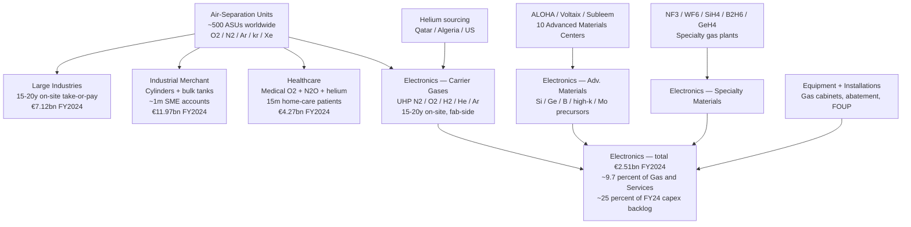
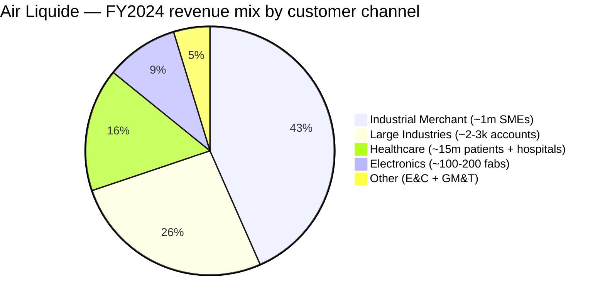
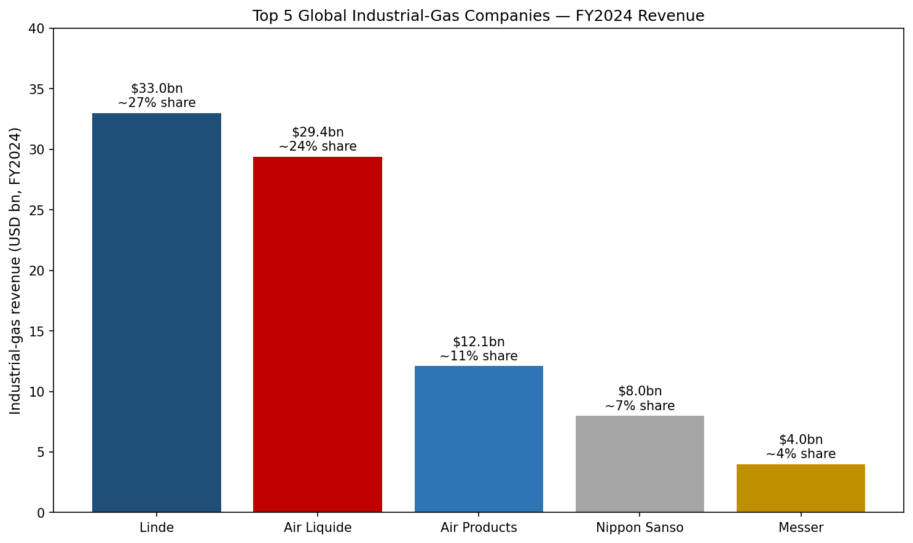
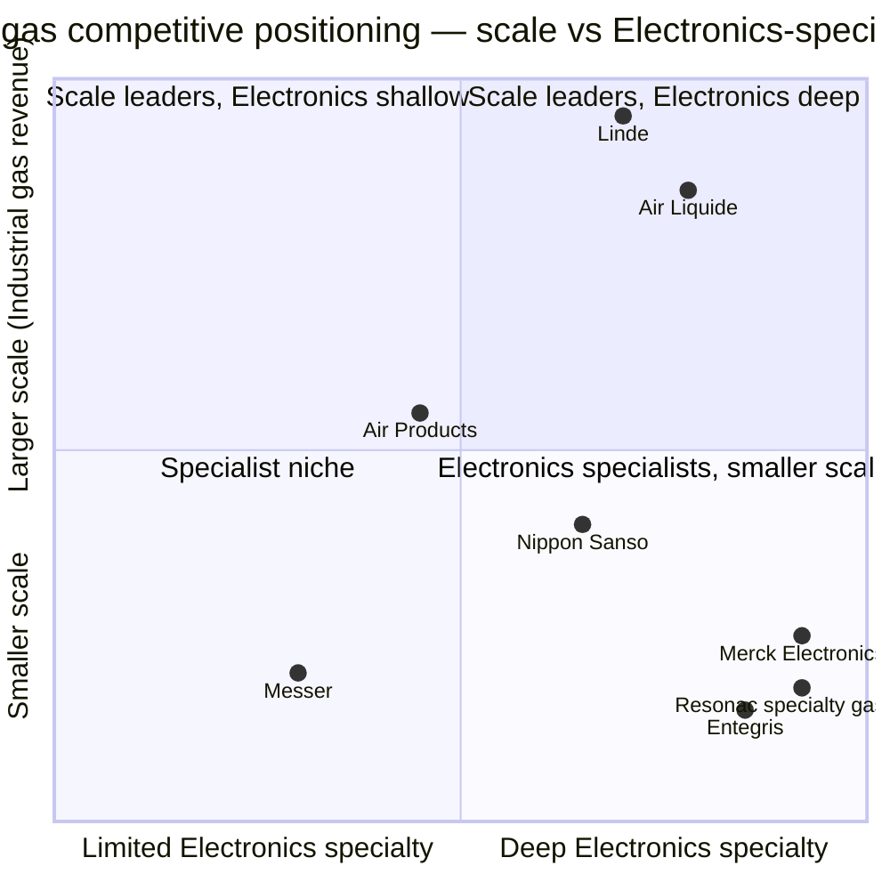

# Air Liquide S.A. (EPA:AI) — Company Research Report

*As of 2026-05-26 · English-language report*

> **Update — FY2025 results confirm growth trajectory (2026-02-20):** Air Liquide reported FY2025 revenue of €26,940m (+1.7% comparable / −0.4% reported), recurring operating margin expanded to **20.7%** (+80 bps comparable, +480 bps cumulative over 2022-2025 ex-energy), recurring net profit €3,772m (+8.8% ex-currency), recurring ROCE 11.2% (above the >10% ADVANCE target), and proposed dividend of €3.65/share (+10.6% YoY). The Group **confirmed** its ambition to add a further +200 bps of OIR margin over 2025-2026 and stated its 2025 acquisition of South Korean DIG Airgas (closed 2026-01-13) is a key driver for Electronics & energy-transition growth in Asia. Source: [Air Liquide FY2025 Results press release, 2026-02-20](https://www.airliquide.com/group/press-releases-news/2026-02-20/2025-record-performance-and-confident-its-transformation-dynamic-air-liquide-confirms-its-growth).

---

## Table of Contents

1. Company Overview
2. Company History
3. Management Team
4. Products & Services
5. Customers & Go-to-Market
6. Industry Overview
7. Competitive Landscape
8. Market Opportunity (TAM)
9. Risk Assessment
10. References

---

## 1. Company Overview

**L'Air Liquide S.A.** (Euronext Paris ticker **AI** / Bloomberg **AI FP** / OTC ADR **AIQUY**) is the world's #2 industrial-gas major by revenue, the #1 by geographic footprint, and the only French-domiciled CAC 40 constituent operating a globally integrated atmospheric-gas (O₂ / N₂ / Ar / He / H₂) plus advanced-precursor-materials platform. The Group serves ~**4.3 million customers and patients across 60 countries** with **66,300 employees** (FY2024), runs ~**500 air-separation units (ASUs)** worldwide, and reported FY2024 revenue of **€27,058m**, a recurring operating margin of **19.9%** (recurring operating income €5,391m), recurring net profit of **€3,466m** and recurring ROCE of **10.7%** ([Air Liquide FY2024 results press release, 2025-02-21](https://www.airliquide.com/group/press-releases-news/2025-02-21/2024-building-record-margin-improvement-and-major-commercial-successes-fueling-future-growth-air); [URD 2024, p. 7](https://www.airliquide.com/sites/airliquide.com/files/2025-03/air-liquide-2024-universal-registration-document.pdf)).

The Group structures its activities into **four reportable segments** that together absorbed ~€27bn of FY2024 revenue: (i) **Gas & Services** — the engine, €25.81bn or **95.4%** of Group revenue — itself split into four business lines (Large Industries, Industrial Merchant, Healthcare, **Electronics**); (ii) **Engineering & Construction** — €412m (1.5%), down >50% from the 2013–17 cycle peak because the Group has elected to capture most ASU engineering value internally rather than book it as third-party revenue; (iii) **Global Markets & Technologies** — €836m (3.1%), housing biogas, hydrogen energy, and emerging-market specialty solutions; and (iv) the **Innovation Campuses** activity (R&D venture studio not reported as a separate line on the P&L) ([Air Liquide FY2024 PR, p. 2-3](https://www.airliquide.com/sites/airliquide.com/files/2025-02/air-liquide-pr-fy-2024-building-on-record-margin-improvement-and-major-commercial-successes-fueling-future-growth-air-liquide-is-once-again-raising-its-margin-ambition.pdf); [URD 2024, p. 7](https://www.airliquide.com/sites/airliquide.com/files/2025-03/air-liquide-2024-universal-registration-document.pdf)). The four Gas & Services business lines do not split evenly: **Industrial Merchant 46.1%**, **Large Industries 27.6%**, **Healthcare 16.6%**, **Electronics 9.7%** — and within Gas & Services, **Electronics is the smallest line by revenue but the fastest by capex** and the segment most exposed to the AI-driven semiconductor capacity build-out (more in §4).

*Source: Air Liquide press releases — [FY2024, 2025-02-21](https://www.airliquide.com/group/press-releases-news/2025-02-21/2024-building-record-margin-improvement-and-major-commercial-successes-fueling-future-growth-air); [FY2025, 2026-02-20](https://www.airliquide.com/group/press-releases-news/2026-02-20/2025-record-performance-and-confident-its-transformation-dynamic-air-liquide-confirms-its-growth). Revenue €m on the left axis (bars), recurring operating margin % on the right (line). Note FY2022 spike reflects energy-cost pass-through under the indexed Large Industries contract framework, not real volume growth — the 2023 step-down is the symmetric reversal once natural-gas prices normalised.*

The business model is **largely defensive cash-flow compounding** rather than cyclical growth. ~70% of Gas & Services revenue comes from contracted, take-or-pay (on-site) or rolling annual price-indexed (Industrial Merchant) frameworks; energy and natural-gas costs are largely **passed through** to the Large Industries customer base under the standardised Air Separation Unit contract template, insulating margins from commodity swings. On-site contracts for Electronics and Large Industries typically run **15–20 years**, with hard volume guarantees and price escalators tied to local CPI and electricity tariffs — these are the closest analogue in the industrial-gas industry to a utility revenue base ([URD 2024, "Industrial Merchant business model" p. 22; "Large Industries" p. 18](https://www.airliquide.com/sites/airliquide.com/files/2025-03/air-liquide-2024-universal-registration-document.pdf)). The result over the past five years: **+110 bps of recurring OIR margin expansion in FY2024 alone** (excluding energy effect), **+460 bps cumulative over 2022–2026E** under the ADVANCE 2025 plan, all without meaningful organic-volume help in Large Industries ([Air Liquide FY2024 PR, p. 1](https://www.airliquide.com/group/press-releases-news/2025-02-21/2024-building-record-margin-improvement-and-major-commercial-successes-fueling-future-growth-air)).

Geographic mix in FY2024 was **Americas 40.0% / EMEA 39.5% / Asia-Pacific 20.5%** of Gas & Services revenue — broadly balanced but with the Asia-Pacific share understated by the strategic exit from Korea (2015 divestiture of Daesung) which the August-2025 announcement of the **€2.85bn DIG Airgas acquisition** is now reversing ([Air Liquide H1-2025 press release, 2025-07-29](https://www.airliquide.com/group/press-releases-news/2025-07-29/leveraging-performance-and-growth-engines-air-liquide-remains-track-1st-half-2025); [DIG Airgas announcement, 2025-08-22](https://www.airliquide.com/group/press-releases-news/2025-08-22/air-liquide-announces-signature-agreement-acquire-dig-airgas-leading-integrated-gas-player-south); [DIG Airgas closing, 2026-01-13](https://www.airliquide.com/group/press-releases-news/2026-01-13/closing-dig-airgas-acquisition-air-liquide-becomes-industrial-gas-leader-dynamic-south-korean-market)). DIG Airgas — Korea's #1 independent gas company, formerly owned by Macquarie Asset Management — adds roughly **€500m of revenue and 1,000 employees**, doubles Air Liquide's Korean headcount, and brings the group back into the SK hynix / Samsung Electronics on-site ecosystem after a decade-long absence.

*Source: [Air Liquide URD 2024, p. 7 — "Key Elements by Business Line"](https://www.airliquide.com/sites/airliquide.com/files/2025-03/air-liquide-2024-universal-registration-document.pdf). Percentages re-based to Gas & Services total (€25,808m) rather than Group total (€27,058m).*

*Source: [Air Liquide URD 2024, p. 7 — "Key Figures — Key Elements by Business Line"](https://www.airliquide.com/sites/airliquide.com/files/2025-03/air-liquide-2024-universal-registration-document.pdf). Primary-source rendering of the FY2024 segment-revenue and revenue-share-of-Group data: Large Industries 26% / €7,120m, Industrial Merchant 44% / €11,966m, Healthcare 16% / €4,274m, Electronics 9% / €2,510m, Engineering & Construction 2% / €412m, Global Markets & Technologies 3% / €836m. Percentage labels on the URD page are share of Group revenue, not of Gas & Services.*

*Source: [Air Liquide FY2024 PR, p. 2 — Gas & Services revenue by geography](https://www.airliquide.com/group/press-releases-news/2025-02-21/2024-building-record-margin-improvement-and-major-commercial-successes-fueling-future-growth-air). Americas €10.32bn, EMEA €10.18bn, Asia-Pacific €5.28bn.*

**Valuation snapshot.** As of May 2026, Air Liquide trades at **€185.5/share** (mid-quote) on Euronext Paris with **~561m diluted shares outstanding**, implying a market cap of **€104.1bn / ~USD 113bn** ([Yahoo Finance AI.PA quote, retrieved 2026-05-26](https://finance.yahoo.com/quote/AI.PA/); [companiesmarketcap.com — Air Liquide P/E ratio, 2026-05](https://companiesmarketcap.com/air-liquide/pe-ratio/)). The stock trades at a TTM P/E of **~29.7×** on FY2025 diluted EPS of **€6.24** (FY2025 recurring net profit €3,772m / 604m shares ex-treasury) and a forward 23.7× on Bloomberg consensus FY26E EPS ([Yahoo Finance AI.PA, key statistics, retrieved 2026-05-26](https://finance.yahoo.com/quote/AI.PA/key-statistics/); [TradingEconomics — Air Liquide P/E history](https://tradingeconomics.com/ai:fp:pe)). EV/EBITDA is **~14.0×** (net debt €9,159m at 2024-12-31 + ~€4.3bn lease liabilities + €1.1bn pension over EBITDA of ~€7.9bn) and dividend yield is **~2.0%** at the proposed FY2025 €3.65 dividend ([Air Liquide FY2024 PR, p. 7 — Net debt](https://www.airliquide.com/group/press-releases-news/2025-02-21/2024-building-record-margin-improvement-and-major-commercial-successes-fueling-future-growth-air); [Air Liquide FY2025 PR, 2026-02-20](https://www.airliquide.com/group/press-releases-news/2026-02-20/2025-record-performance-and-confident-its-transformation-dynamic-air-liquide-confirms-its-growth)).

*Source: [Yahoo Finance — AI.PA (29.7×)](https://finance.yahoo.com/quote/AI.PA/key-statistics/); [LIN (34.6×)](https://finance.yahoo.com/quote/LIN/key-statistics/); [APD (23.9×)](https://finance.yahoo.com/quote/APD/key-statistics/); [4091.T Nippon Sanso Holdings (20.0×)](https://finance.yahoo.com/quote/4091.T/key-statistics/) — all retrieved 2026-05-26.*

The 29.7× multiple sits at a **~10% premium to the peer median (26.8×)** and **~10% discount to Linde** — explainable by three factors: (a) higher real-earnings-growth visibility from the €4.6bn investment backlog one-third of which is in Electronics (the highest-growth, highest-margin Gas & Services business line); (b) the +200 bps incremental margin ambition for 2025-2026 on top of the +460 bps already delivered 2022-2025, a multi-year compounding story unmatched by APD; and (c) DIG Airgas adding a high-growth Korean franchise. *Analyst view:* the multiple is not stretched relative to the cash-flow durability of the underlying contracts (>70% take-or-pay-plus-indexed); the principal de-rate risk is a faster-than-expected normalisation of operating margin if the ADVANCE-2025 efficiency tailwind moderates after FY2026 — laid out as a Section 9 risk.

---

## 2. Company History

Air Liquide was founded in **Paris on November 8, 1902**, when industrialist **Paul Delorme** assembled 24 subscribers — mostly engineers — to back the air-liquefaction process discovered two years earlier by the physicist **Georges Claude**. The original entity was named "Air liquide, a company for the study and exploitation of Georges Claude processes," with initial capital of FRF 100,000. Claude's reverse-Brayton-cycle process — cooling air below −183 °C, then fractionally distilling liquid air into pure O₂, N₂ and Ar — was a fundamentally cheaper alternative to the era's dominant Linde process and gave the new company an immediate cost edge ([Air Liquide — Wikipedia (founding history)](https://en.wikipedia.org/wiki/Air_Liquide); [Encyclopedia.com — L'Air Liquide history](https://www.encyclopedia.com/books/politics-and-business-magazines/lair-liquide); [URD 2024, "Group history" p. 8-9](https://www.airliquide.com/sites/airliquide.com/files/2025-03/air-liquide-2024-universal-registration-document.pdf)). The Paris Bourse listing followed in **February 1913**, only eleven years after founding.

```mermaid
timeline
    title Air Liquide — 1902 to 2026 milestones
    1902 : Founded by Paul Delorme + Georges Claude in Paris
    1906-13 : Plants in Belgium, Italy, Brazil, Spain, Japan, Canada, Sweden
    1913 : Paris Bourse listing
    1916-18 : WWI O2 / acetylene supply scales the business 10×
    1962 : Healthcare (Home Healthcare oxygen therapy) launched in France
    1969 : First very large air-separation unit (ASU) for steel; 1970s petrochem build-out
    1986 : Acquires Big Three Industries (US Sun Belt expansion)
    2007 : François Jackow becomes CEO of Air Liquide Japan
    2007-12 : ALOHA precursor platform launched; semiconductor materials build
    2013 : Acquires Voltaix (Si/Ge/B precursors, US)
    2016 : Acquires Airgas (US, USD 13.4bn) — largest deal in Group history
    2022-04 : Benoit Potier hands CEO role to François Jackow; chairman role retained
    2022-10 : EUR 500m Taiwan JV (3 plants, 2 bn Nm3/y of N2/O2/Ar)
    2022-11 : ADVANCE 2025 plan launched
    2023-09 : Normand'Hy 200 MW PEM electrolyzer FID, EUR 400m+
    2024-06 : USD 250m+ Idaho gas plant for Micron (memory)
    2025-07 : World's largest molybdenum precursor plant (Hwaseong, Korea)
    2025-08 : DIG Airgas deal signed; EUR 2.85bn, largest M&A since Airgas
    2026-01 : DIG Airgas closed — Air Liquide #1 in Korean gas
    2026-03 : First Advanced Materials plant in Taiwan inaugurated (Taichung)
```

*Sources: [Air Liquide — Wikipedia (history)](https://en.wikipedia.org/wiki/Air_Liquide); [Air Liquide URD 2024, p. 8-9](https://www.airliquide.com/sites/airliquide.com/files/2025-03/air-liquide-2024-universal-registration-document.pdf); [Voltaix acquisition (Semiconductor Today, 2013-06-17)](https://www.semiconductor-today.com/news_items/2013/JUN/AIRLIQUIDE_170613.html); [Taiwan €500M JV PR, 2022-10-19](https://www.airliquide.com/group/press-releases-news/2022-10-19/air-liquide-invest-500-million-euros-three-new-plants-semiconductor-sector-taiwan); [Idaho / Micron PR, 2024-06-05](https://www.airliquide.com/group/press-releases-news/2024-06-05/air-liquide-signed-major-contract-support-semiconductor-industry-us-investment-more-250-million); [South Korea Mo plant PR, 2025-07-21](https://www.airliquide.com/group/press-releases-news/2025-07-21/air-liquide-strengthens-its-advanced-materials-leadership-new-molybdenum-manufacturing-plant-south); [DIG Airgas signing PR, 2025-08-22](https://www.airliquide.com/group/press-releases-news/2025-08-22/air-liquide-announces-signature-agreement-acquire-dig-airgas-leading-integrated-gas-player-south); [Taichung plant PR, 2026-03-25](https://www.airliquide.com/group/press-releases-news/2026-03-25/air-liquide-inaugurates-its-first-advanced-materials-manufacturing-plant-taiwan-strengthening-next).*

Three strategic pivots define the modern Group. **First, the 1916-1986 build-out of the on-site Large Industries model** — through two World Wars, the Group learned that the most profitable industrial-gas business is not the cylinder business but the dedicated air-separation unit built behind a steel mill or chemical plant under a 15-20-year take-or-pay contract. This template, refined for the European petrochemical wave of the 1970s and the Sun Belt build-out (Big Three Industries acquired 1986), is the architectural basis for today's Electronics on-site model (with TSMC Arizona / Micron Idaho being the 2020s equivalents of the 1970s ExxonMobil Antwerp project) ([Encyclopedia.com — L'Air Liquide history](https://www.encyclopedia.com/books/politics-and-business-magazines/lair-liquide); [URD 2024, "Large Industries business model" p. 18](https://www.airliquide.com/sites/airliquide.com/files/2025-03/air-liquide-2024-universal-registration-document.pdf)).

**Second, the 2007-2013 build of an Electronics specialty-materials business** — the Group recognised that the on-site bulk-gas business in semiconductors, valuable as it was, would commoditise on price unless it was paired with the higher-value precursor / advanced-materials end of the supply chain. The internal ALOHA platform (CVD/ALD silicon, high-k and metal precursors) launched in 2007 and was meaningfully scaled by the 2013 acquisition of **Voltaix** for an undisclosed sum (US-based, Si/Ge/B specialty molecules, ~$50m revenue at acquisition) ([Voltaix acquisition (Semiconductor Today, 2013-06-17)](https://www.semiconductor-today.com/news_items/2013/JUN/AIRLIQUIDE_170613.html); [Air Liquide Electronics — Advanced Materials offer](https://electronics.airliquide.com/offer-brands/our-offer/electronics-advanced-materials)).

**Third, the 2016 Airgas acquisition** — **USD 13.4bn enterprise value** for the leading US packaged-gas distributor — brought 17,000 US employees and ~900,000 industrial customer accounts into the Group overnight, transforming the Americas from Air Liquide's #3 region to its largest single revenue contributor. This deal, which François Jackow led as Group VP of Strategy in 2014-16, established the Americas-led footprint that anchors today's Electronics build-out (Idaho, Arizona) ([Air Liquide URD 2024, "Group history" p. 9](https://www.airliquide.com/sites/airliquide.com/files/2025-03/air-liquide-2024-universal-registration-document.pdf); [Bloomberg — François Jackow profile](https://www.bloomberg.com/profile/person/16878479)).

Recent developments (2024-2026) cluster around three themes that frame the rest of this report: (i) **AI-semiconductor capex super-cycle** — Idaho/Micron ($250m+, 2024-06), three Taiwan plants (€500m, 2022-10), Korean Mo precursor plant (2025-07), Germany €250M complex (2025), Taichung Advanced Materials plant (2026-03); (ii) **green-hydrogen scale-up** — Normand'Hy 200 MW PEM (€400m+, FID 2023-09), ELYgator 200 MW Netherlands; (iii) **Korean re-entry via DIG Airgas** (€2.85bn, August 2025 signed / January 2026 closed) — the largest M&A since Airgas and the strategic centrepiece of the Asia-Pacific re-acceleration ([DIG Airgas signing PR, 2025-08-22](https://www.airliquide.com/group/press-releases-news/2025-08-22/air-liquide-announces-signature-agreement-acquire-dig-airgas-leading-integrated-gas-player-south)).

---

## 3. Management Team

**François Jackow — Chief Executive Officer (since June 1, 2022)**

François Jackow is the seventh Chief Executive Officer in Air Liquide's 124-year history and the first since Benoît Potier (1995-2022) to come from a deep Air Liquide career rather than from the Engineering & Construction track. Jackow joined Air Liquide in **1993** at age ~26 in the United States and Netherlands, where he spent his first decade in business development and marketing roles within Large Industries and Engineering & Construction. He was named **VP of Innovation in 2002**, where he ran Group R&D and Advanced Technologies through the early build-out of ALOHA precursors; this gave him direct ownership of the technology base now driving the Electronics franchise (an unusual lineage for an industrial-gas CEO, most of whom rise through Large Industries operations) ([Air Liquide Executive Committee — François Jackow biography](https://www.airliquide.com/group/executive-committee); [Bloomberg — François Jackow profile](https://www.bloomberg.com/profile/person/16878479); [LinkedIn — François Jackow](https://fr.linkedin.com/in/francois-jackow)).

In **2007** he was appointed **President and CEO of Air Liquide Japan** based in Tokyo, where he ran one of the Group's most demanding subsidiaries (operationally complex, highly fragmented Industrial Merchant base, deep Electronics customer concentration into Sumco/Shin-Etsu, Renesas, Toshiba) for four years. He returned to Paris in **2011 as VP of the Large Industries World Business Line**, then joined the Executive Committee in **2014 as Group VP of Strategy**, in which capacity he led the analysis and integration planning for the **2016 Airgas acquisition** — the largest deal in Group history at USD 13.4bn ([Air Liquide Executive Committee — François Jackow biography](https://www.airliquide.com/group/executive-committee); [TheOrg — François Jackow](https://theorg.com/org/air-liquide/org-chart/francois-jackow); [Acast — "In Good Company" François Jackow podcast, 2024](https://shows.acast.com/in-good-company-with-nicolai-tangen/episodes/francois-jackow-ceo-of-air-liquide)).

Education: alumnus of **École Normale Supérieure Paris** (chemistry / physics undergraduate), Master's in Chemistry from **Harvard University**, MBA from the **Collège des Ingénieurs**. Pre-Air Liquide experience includes positions at **Shell** (industrial-risk analyst) and **L'Oréal** (research associate) — both atypical for an industrial-gas CEO and consistent with Jackow's framing of Air Liquide as a "deep-tech materials company that happens to ship gas" rather than a pipeline-and-cylinder utility ([Air Liquide Executive Committee biography](https://www.airliquide.com/group/executive-committee); [Bloomberg — François Jackow profile](https://www.bloomberg.com/profile/person/16878479)).

Jackow took over as CEO on **June 1, 2022** under the ADVANCE 2025 plan he announced in November 2022. His three-year operating record is strong by any benchmark in the industrial-gas peer group: recurring OIR margin expanded **+460 bps over 2022-2025 excluding the energy effect** (highest in Group history), recurring ROCE moved from 9.4% (2021) to **11.2% (2025)**, capex decisions hit a record **€4.4bn in 2024** and the investment backlog reached **€4.6bn in H1-2025** with Electronics representing one-third ([Air Liquide FY2024 PR, p. 1, 2025-02-21](https://www.airliquide.com/group/press-releases-news/2025-02-21/2024-building-record-margin-improvement-and-major-commercial-successes-fueling-future-growth-air); [Air Liquide FY2025 PR, 2026-02-20](https://www.airliquide.com/group/press-releases-news/2026-02-20/2025-record-performance-and-confident-its-transformation-dynamic-air-liquide-confirms-its-growth); [Air Liquide H1 2025 PR, 2025-07-29](https://www.airliquide.com/group/press-releases-news/2025-07-29/leveraging-performance-and-growth-engines-air-liquide-remains-track-1st-half-2025)). He owns ~10,500 Air Liquide shares (URD 2024 governance disclosure) and his compensation is split ~25% fixed / ~75% variable, with the variable portion tied to recurring net profit, recurring ROCE, and the ADVANCE 2025 efficiency / CO₂ targets ([URD 2024, "Executive compensation" Chapter 4](https://www.airliquide.com/sites/airliquide.com/files/2025-03/air-liquide-2024-universal-registration-document.pdf)).

---

## 4. Products & Services

This is the most important section of the report — under-investing here makes everything downstream hand-waving, so it gets meaningful depth. Air Liquide's product universe spans **>250 different gases** (every chemically pure atmospheric, industrial and specialty molecule used in heavy industry, healthcare, food preservation and electronics) and the company's **Electronics activity alone touches >200 different molecules** including bulk carrier gases, atomic-layer-deposition precursors, etchants and dopants ([URD 2024, p. 33 — Electronics business model](https://www.airliquide.com/sites/airliquide.com/files/2025-03/air-liquide-2024-universal-registration-document.pdf)). This section structures that universe by the four Gas & Services business lines (Large Industries, Industrial Merchant, Healthcare, Electronics — with extra depth on Electronics because that is the segment most relevant to the semiconductor-investment thesis), then walks through Engineering & Construction and Global Markets & Technologies for completeness.

### 4.1 The URD 2024 Electronics chapter, embedded verbatim

The Electronics business description on page 33 of the FY2024 Universal Registration Document is the authoritative product-matrix anchor for §4.3 — its content is reproduced as an image below, with verbatim block-quotes used throughout this section.

*Source: [Air Liquide Universal Registration Document 2024, p. 33 — "Electronics" business model spread](https://www.airliquide.com/sites/airliquide.com/files/2025-03/air-liquide-2024-universal-registration-document.pdf).*

### 4.2 Cross-business synthesis — how the product categories interact

Air Liquide's four Gas & Services business lines share **one upstream asset** (the global fleet of air-separation units producing O₂, N₂, Ar in industrial volumes plus the helium and hydrogen sourcing network) and **diverge downstream into four different go-to-market models** that monetise that asset differently. Large Industries sells **bulk on-site** under 15-20-year take-or-pay contracts at the lowest unit price but with utility-like economics. Industrial Merchant repackages the same molecules into **liquefied tanks and cylinders** sold to ~1 million SME accounts at multi-x the on-site price. Healthcare bottles the same O₂ (plus medical-specific N₂O, He/O₂ blends) under regulated-drug pricing into hospitals and home-care. **Electronics** layers on top of bulk carrier-gas supply two distinct higher-value businesses — specialty gases (NF₃, WF₆, SiH₄ class) and precursor materials (ALOHA/Voltaix/Subleem-class molecules manufactured at the **10 Advanced Materials Centers** in Korea / Japan / Singapore / Taiwan / US / Europe) — turning each fab from a one-revenue-stream on-site customer into a four-revenue-stream account (carrier + specialty + advanced materials + equipment / installations) ([URD 2024, p. 33](https://www.airliquide.com/sites/airliquide.com/files/2025-03/air-liquide-2024-universal-registration-document.pdf); [Air Liquide Electronics — Advanced Materials offer](https://electronics.airliquide.com/offer-brands/our-offer/electronics-advanced-materials)).

*Synthesis: the diagram shows why Electronics is structurally the highest-incremental-margin segment — every dollar of bulk carrier-gas on-site revenue at a TSMC or Samsung fab catalyses several incremental dollars of specialty + advanced-materials + equipment sales billable through the **same** customer interface, with no fresh sales-channel acquisition cost.*

### 4.3 Electronics — the highest-priority franchise for the AI-capex cycle

Electronics revenue was **€2,510m in FY2024 (+3.3% comparable)**, **~9.7% of Gas & Services**, and supports a **~4,000-employee** worldwide operation across the four sub-categories shown in the URD 2024 pie above. Within that mix, Carrier Gases are **47%**, Electronic Specialty Materials **16%**, Advanced Materials **11%**, Equipment & Installations **16%**, and Other ~10%. **Investments in Electronics represent roughly one-third of the €4.6bn Group investment backlog** at H1-2025, the highest concentration of any single business line ([URD 2024, p. 33](https://www.airliquide.com/sites/airliquide.com/files/2025-03/air-liquide-2024-universal-registration-document.pdf); [Air Liquide H1 2025 PR, 2025-07-29](https://www.airliquide.com/group/press-releases-news/2025-07-29/leveraging-performance-and-growth-engines-air-liquide-remains-track-1st-half-2025)).

*Source: Air Liquide FY2020-FY2025 press releases — segment-revenue line as disclosed in each annual results announcement. [FY2024 PR, p. 2-3](https://www.airliquide.com/group/press-releases-news/2025-02-21/2024-building-record-margin-improvement-and-major-commercial-successes-fueling-future-growth-air); [FY2025 PR, 2026-02-20](https://www.airliquide.com/group/press-releases-news/2026-02-20/2025-record-performance-and-confident-its-transformation-dynamic-air-liquide-confirms-its-growth). The 2023-2025 plateau reflects the post-Covid semiconductor inventory correction and the 2024 weakness in display / memory utilisation; the underlying contract footprint and capex backlog point to a renewed up-cycle from FY2026 onwards as new Idaho / Taichung / Hwaseong capacity ramps.*

**4.3.1 Carrier Gases — the on-site bulk-gas anchor that wins the customer relationship.**

> *URD 2024 verbatim block-quote:* "**Carrier Gases**: Carrier gases (very high purity gases, mainly nitrogen, but also oxygen, argon, helium, hydrogen, etc.), supplied from on-site facilities and provided by a high-purity micrometric distribution system, are used in any phase of the silicon technological process. They reduce the chemical concentration of impurities to a few parts per billion." ([URD 2024, p. 33](https://www.airliquide.com/sites/airliquide.com/files/2025-03/air-liquide-2024-universal-registration-document.pdf))

**中文释义 / Plain-language gloss:** the **carrier gases / 载气 (zaiqi)** are the workhorse atmospheric molecules that fill every tool in a fab — UHP nitrogen (N₂) is used for purging tool chambers and pneumatically actuating gas cabinets, UHP oxygen (O₂) for thermal oxidation of silicon, UHP argon (Ar) as the inert sputter / plasma background in PVD and dry-etch chambers, UHP hydrogen (H₂) for thermal reduction and as a forming-gas component, UHP helium (He) for cryogenic cooling of wafer chucks and as a leak-test gas. The defining technical spec is **purity below the parts-per-billion level for total metallic and organic impurities** ("**6N** = 99.9999% or higher purity"), achieved via an **on-site fab-side air-separation unit + micrometric distribution piping** — distinct from the same molecules sold to a steel mill where purity tolerances are >100× looser. The on-site model — Air Liquide builds, owns and operates the ASU on the fab campus under a 15-20-year take-or-pay contract — is the **single most important revenue anchor in the Electronics business**: the carrier-gas line wins the customer's entire account, because once a fab is wired into one ASU operator's micrometric distribution loop, switching suppliers requires re-piping the fab. The June-2024 **€250m+ Idaho plant for Micron Technology** (memory) and the January-2022 **~€50m TSMC Arizona** on-site agreement (H₂ / He / CO₂ — N₂ / O₂ / Ar separately contracted to Linde) are textbook examples of Carrier Gas wins in the current cycle ([Air Liquide-Micron Idaho PR, 2024-06-05](https://www.airliquide.com/group/press-releases-news/2024-06-05/air-liquide-signed-major-contract-support-semiconductor-industry-us-investment-more-250-million); [Air Liquide-TSMC Arizona PR, 2022-01-25](https://www.airliquide.com/group/press-releases-news/2022-01-25/air-liquide-announces-long-term-agreement-supply-semiconductor-manufacturing-site-arizona); [Air Liquide H1 2025 PR — "Carrier Gas sales more than +10%", 2025-07-29](https://www.airliquide.com/group/press-releases-news/2025-07-29/leveraging-performance-and-growth-engines-air-liquide-remains-track-1st-half-2025)).

*Analyst view:* Carrier Gases is a **strong-moat business with switching-cost and scale advantages**. The closest direct competitors at the fab-side ASU level are **Linde plc** (legacy Praxair / Linde combined), **Air Products (NYSE:APD)**, **Nippon Sanso (TSE:4091)** in Japan, and **Iwatani** in Asia regionally; the four Western majors plus Nippon Sanso effectively split the major foundry / memory on-site supply contracts on a fab-by-fab basis (the TSMC Arizona split between Air Liquide and Linde for different molecule groups is illustrative — see [Wikipedia — TSMC Arizona, "Supply partners"](https://en.wikipedia.org/wiki/TSMC_Arizona)). Air Liquide's H1 2025 disclosure of "**+10% Carrier Gas growth with seven production units launched**" is the cleanest evidence that the AI capex cycle is translating into actual revenue throughput, not just backlog ([Air Liquide H1 2025 PR, 2025-07-29](https://www.airliquide.com/group/press-releases-news/2025-07-29/leveraging-performance-and-growth-engines-air-liquide-remains-track-1st-half-2025)).

**4.3.2 Electronic Specialty Materials — the WF₆ / NF₃ / SiH₄-class chemistries.**

> *URD 2024 verbatim:* "**Electronic Specialty Materials**: are gases, equipment, and services used in the manufacturing processes of the highest-purity grade of the activity is closely linked to the volume of semiconductor production." ([URD 2024, p. 33](https://www.airliquide.com/sites/airliquide.com/files/2025-03/air-liquide-2024-universal-registration-document.pdf))

**中文释义 / Plain-language gloss:** **specialty gases / 特种气体 (tezhongqi)** are the reactive, hazardous, ultra-high-purity molecules used directly *in the wafer process step*, not as a carrier — the most important families are (i) **nitrogen trifluoride (NF₃)**, used in remote-plasma chamber cleaning of CVD reactors (a Resonac / Showa Denko-pioneered molecule where Air Liquide and Mitsubishi Chemical are also among the global producers); (ii) **tungsten hexafluoride (WF₆)**, the source gas for tungsten CVD that fills sub-100-nm contact plugs and the tungsten word-line in vertical NAND; (iii) **silane (SiH₄)** and its higher-order derivatives (disilane, hexachlorodisilane) for the deposition of polysilicon and silicon-nitride films; (iv) **diborane (B₂H₆)** as an ion-implant dopant source and BPSG precursor; (v) **germane (GeH₄)** as a Ge dopant and 3D-NAND CVD source; (vi) **phosphine (PH₃)** as an n-type dopant and as a CVD precursor for SiP epi. These molecules are **lethal-toxic, pyrophoric or pressure-hazardous** — Air Liquide's value-add is not merely the molecule but the **gas-cabinet, abatement, on-site detection and emergency-response infrastructure** that lets a fab integrate them safely; the molecule and the safety wrap are sold as one offer (consistent with the URD-2024 line "gases, equipment and services"). The Specialty Materials sub-line is the most cyclically exposed of the four — it scales with wafer-starts and dropped through FY2024 (the URD 2024 H1-review specifically noted "Sales of Electronics increased by +3.3%, supported by all business segments **with the exception of Specialty Materials**") because of the memory-utilisation correction ([URD 2024, p. 33](https://www.airliquide.com/sites/airliquide.com/files/2025-03/air-liquide-2024-universal-registration-document.pdf); [Air Liquide FY2024 PR, 2025-02-21](https://www.airliquide.com/group/press-releases-news/2025-02-21/2024-building-record-margin-improvement-and-major-commercial-successes-fueling-future-growth-air)).

*Analyst view:* Specialty Materials is **partial-moat** — Air Liquide is one of ~5 global players, but the field also includes **Resonac (TSE:4004 — global #1 in NF₃ and high-purity dry-etch gases at the URD-2024 vintage)**, **Versum / Merck KGaA**, **Linde Electronics** and **Nippon Sanso**. Switching costs at the molecule level are not as high as at the carrier-gas level (a fab can second-source WF₆ or NF₃ with a few months of qualification work), so the moat is more "regional scale + safety-services bundle" than absolute lock-in. The Resonac NF₃ leadership is documented in the company's own [FY24 earnings disclosure](https://www.resonac.com/sites/default/files/2025-02/14_E_DataBook202412_001.pdf) (Specialty Gases business unit); Air Liquide does not break out its NF₃ share specifically.

**4.3.3 Advanced Materials — the ALOHA / Voltaix / Subleem precursor platform (the high-margin growth engine).**

> *URD 2024 verbatim:* "**Advanced Materials**: these materials used in gas form at the heart of the most advanced manufacturing processes and are essential for the miniaturization and energy efficiency of new-generation semiconductor chips. They are produced in collaboration with customers and then ecosystem. There are 6 product brands of advanced materials available for sale in this market." ([URD 2024, p. 33](https://www.airliquide.com/sites/airliquide.com/files/2025-03/air-liquide-2024-universal-registration-document.pdf))

**中文释义 / Plain-language gloss:** **advanced precursor materials / 高纯前驱体材料 (gaochun qianqu ti cailiao)** are the chemically engineered metal-organic / organosilicon / organometallic molecules that **deposit** the atomically-thin films at the heart of every transistor — they are the *what* in "atomic-layer deposition (ALD)" and the high-end *what* in "chemical-vapour deposition (CVD)." The two flagship Air Liquide platforms are (i) **ALOHA™** — the in-house deposition portfolio launched 2007 covering silicon precursors (e.g. **HCDS, hexachlorodisilane** for silicon-nitride deposition), **high-k dielectrics** (Hf/Zr-based precursors for the gate-oxide layer in high-k metal-gate transistors) and **metal precursors** (Ti/Ta/W/Co for barrier and contact layers); and (ii) **VOLTAIX™** — the US-based platform acquired 2013, focused on **silicon, germanium and boron chemistries** (the Si/Ge molecules that feed SiGe epi growth and the boron source-gases for ultra-shallow junction implants). A third platform, **Subleem™**, was launched in 2023-2025 as the precursor family for **molybdenum (Mo)** — the successor metal to tungsten that is being adopted for word-line and gate-replacement layers in sub-3nm logic and in 3D-NAND ≥256-layer; the **July-2025 inauguration of the world's largest Mo precursor manufacturing plant in Hwaseong, Korea** is the physical anchor for that platform. The other named brands are **enScribe™** (etchants, used in the symmetric dry-etch step to the ALD deposition) and **Balazs™** (nano-scale wafer analytics / contamination characterisation — the "QA" layer of the offer) ([Air Liquide Electronics — Advanced Materials brand page](https://electronics.airliquide.com/offer-brands/our-offer/electronics-advanced-materials); [Hwaseong Mo plant PR, 2025-07-21](https://www.airliquide.com/group/press-releases-news/2025-07-21/air-liquide-strengthens-its-advanced-materials-leadership-new-molybdenum-manufacturing-plant-south); [ALOHA platform page](https://electronics.airliquide.com/alohatm)). The 10 **Advanced Materials Centers (AMCs)** are physically located in Korea, Japan, Singapore, Taiwan, US and Europe — co-located with the customer fab ecosystems so a 200-litre precursor canister can be delivered to the fab in <24h.

*Analyst view:* Advanced Materials is the **highest-margin sub-business** in Electronics and the most **technology-IP-moated**. The competitive set is narrow — **Merck KGaA Electronics (Versum Materials, acquired 2019)**, **DuPont Electronic Materials**, **Tokyo Ohka Kogyo (TOK, TSE:4186)** in the resist-adjacent specialty space, **Resonac** in conductor-paste / CMP-slurry adjacencies, and **Entegris (NASDAQ:ENTG)** in gas-purification / canister-handling — with a long tail of Chinese / Korean specialty-chemistry players (DNF, Wonik, Dinglong) for individual molecules. Each precursor sale is preceded by a 2-3-year joint-development project with the customer fab to qualify the molecule for a specific process node; this creates real lock-in for the duration of that node's HVM life. The Korean Mo plant is a clear technology-lead bet: molybdenum word-line is the road-map replacement for tungsten word-line at >256-layer V-NAND and at GAA logic, and being **the world's largest** Mo precursor supplier at the moment GAA + advanced-3D-NAND ramps is a textbook scale advantage ([Hwaseong Mo plant PR — Armelle Levieux quote, 2025-07-21](https://www.airliquide.com/group/press-releases-news/2025-07-21/air-liquide-strengthens-its-advanced-materials-leadership-new-molybdenum-manufacturing-plant-south)).

**4.3.4 Equipment & Installations — the gas-cabinet, abatement and chemical-dispense services bundle.**

> *URD 2024 verbatim:* "**Equipment**: Air Liquide is also expanding its expertise for the design, integration and ongoing maintenance of gas cabinets and bulk specialty chemical products and installations that are at customers' fab. The Electronics business installs and maintains equipment for the distribution of gases, materials and chemicals to customer sites. The level of activity is closely linked to the volume of activity in the new semiconductor manufacturing sites." ([URD 2024, p. 33](https://www.airliquide.com/sites/airliquide.com/files/2025-03/air-liquide-2024-universal-registration-document.pdf))

**中文释义 / Plain-language gloss:** the equipment business sells **the metalwork inside the fab clean-room that wraps Air Liquide's molecules** — gas cabinets (the stainless-steel safety enclosures that hold WF₆ / NF₃ / SiH₄ cylinders), **valve-manifold-box (VMB) / valve-manifold-supplier (VMS)** assemblies that distribute gas to tools, **point-of-use abatement** (the burn-box / scrubber that destroys exhaust pyrophorics and PFCs before vent), and the **on-site chemical-distribution skids** for liquid precursors. Closest comparable sub-businesses sit inside **Edwards Vacuum (Atlas Copco)**, **CS Clean Solutions** (Pentair / nVent), **Versum Materials (Merck)** and Japanese players **Iwatani Industrial Gases**. The line is **largely project-driven**: revenue tracks new-fab construction (greenfield projects pay $30-80m of cabinet+abatement+VMB per fully equipped wafer-start floor; smaller for capacity-expansion within an existing fab), so its growth lines up nearly 1:1 with TSMC Arizona Fab 21, Samsung Taylor, Intel Ohio, Micron Boise, the European Magdeburg / Crolles 2 projects, and the Chinese SMIC / ChangXin / YMTC capacity adds.

*Analyst view:* Equipment & Installations is **moderate-moat** — the engineering know-how and historical track record matter more than IP, and the segment cyclically tracks new-fab build-out very closely. The level of activity will drop sharply in any 2-year stretch where no new fab breaks ground; the FY2024 "Equipment soft, Carrier Gases strong" pattern reflected exactly this.

### 4.4 Industrial Merchant — the cylinder + bulk-tank network behind every welder and metallurgist

The Industrial Merchant business — **€11,966m FY2024, 46.1% of Gas & Services** — is the cylinder and bulk-tank distribution business that descends directly from the original 1902 platform. The URD-2024 description summarises it as: "**Industrial Merchant**: industrial gases delivered to small and medium businesses; specialty gases and welding products; technologies for hygiene and quality assurance; food preservation services." The customer base is **~1 million SME accounts** (welders, food processors, beverage producers, laboratories, metal-fabrication shops, glass-blowing studios, hospitals' liquid-O₂ tanks, refineries' nitrogen-purge tanks). Pricing is **annually re-set on an indexed basis** (+4.0% pricing effect was the FY2024 disclosure), volumes track regional industrial activity (broadly flat in mature EU / US, growing in Asia / Latin America), and the unit price is **multiples** of what the same molecule sells for in the on-site Large Industries channel — making this the highest-gross-margin line within Gas & Services ([URD 2024, p. 22](https://www.airliquide.com/sites/airliquide.com/files/2025-03/air-liquide-2024-universal-registration-document.pdf); [Air Liquide FY2024 PR, p. 2, 2025-02-21](https://www.airliquide.com/group/press-releases-news/2025-02-21/2024-building-record-margin-improvement-and-major-commercial-successes-fueling-future-growth-air)).

The strategic value of Industrial Merchant for the Group is **margin-mix stabilisation**: in any cyclical down-year for Large Industries (steel / chemicals / refining capacity utilisation falling), Industrial Merchant's diversified SME base provides a counter-cyclical buffer. The 2016 Airgas acquisition (USD 13.4bn) was structurally a doubling of Air Liquide's North-American Industrial Merchant footprint and is the reason the segment is now larger than Large Industries — historically the proportions were reversed.

*Analyst view:* Industrial Merchant is a **scale-and-density moat** — the cost-per-cylinder-delivered drops sharply with route density, so the established players (Air Liquide, Linde / Praxair, Air Products, Iwatani, Messer SE) are very hard to displace at scale; new entrants are limited to regional / specialty niches.

### 4.5 Large Industries — the on-site oxygen / nitrogen / hydrogen utility for steel, chemicals and refining

The Large Industries business — **€7,120m FY2024, 27.6% of Gas & Services** — supplies the heavy-industrial complexes (integrated steel mills, ethylene crackers, ammonia plants, refineries, glass furnaces, coal-to-chemicals conversions) under the **15-20-year on-site take-or-pay contract template** that is the architectural template for the Electronics carrier-gas model as well. Air Liquide builds, owns and operates the on-site air-separation unit; the customer commits to a minimum offtake of O₂ / N₂ / Ar at a price formula tied to electricity tariffs + an inflation escalator + a fixed capital-recovery component. Volumes track regional heavy-industrial activity. Pricing is largely a pass-through, so margin is structural and stable but **volume growth is essentially limited to greenfield projects** — which is why Large Industries grew only +1.2% in FY2024 (a steel-mill divestiture in Europe was a one-off drag, partly offset by two new ASU start-ups) ([URD 2024, p. 18-19](https://www.airliquide.com/sites/airliquide.com/files/2025-03/air-liquide-2024-universal-registration-document.pdf); [Air Liquide FY2024 PR, p. 2, 2025-02-21](https://www.airliquide.com/group/press-releases-news/2025-02-21/2024-building-record-margin-improvement-and-major-commercial-successes-fueling-future-growth-air)).

The **decarbonisation overlay** is the segment-level inflection: the Group's >€8bn 2024-2035 commitment to renewable / low-carbon hydrogen (Normand'Hy 200 MW PEM electrolyzer, Netherlands ELYgator 200 MW, Texas hydrogen network) sits inside Large Industries and is intended to convert legacy grey-hydrogen LI customers (chemicals, refineries) to renewable H₂ supply over the next decade — a contract-by-contract margin upgrade as carbon costs make the LI customer prefer to pay a premium for low-carbon H₂ rather than internalise the CO₂ tax ([Normand'Hy project page](https://normandhy.airliquide.com/en); [Normand'Hy French-State support PR, 2022-03-08](https://www.airliquide.com/group/press-releases-news/2022-03-08/air-liquide-receives-support-french-state-its-200-mw-electrolyzer-project-normandy-and-accelerates)).

*Analyst view:* Large Industries is **strong-moat at the contract level** (the 15-20-year take-or-pay on-site frame is the most defensible cash-flow structure in the gas industry) but **structurally low-growth** (only +1% volume / year over a cycle). Competitive set: Linde plc, Air Products, Messer SE (Germany), Nippon Sanso in Asia.

### 4.6 Healthcare — medical O₂, home-care services and 15m patients

Healthcare — **€4,274m FY2024, 16.6% of Gas & Services, +8.6% growth** — is the medical-oxygen-and-home-care business that distributes medical-grade O₂ (for hospitals, home-oxygen therapy, ambulance services), medical N₂O (anaesthetic), the helium-oxygen ("heliox") blends for paediatric respiratory therapy, hygiene gases, and the connected **Home Healthcare** service (~15 million patients globally, monitoring + delivery + equipment-maintenance for chronic-respiratory and sleep-apnea patients). The business is regulated as a pharmaceutical (medical O₂ requires GMP-grade purity and a marketing authorisation in each jurisdiction), which creates both a moat (high regulatory barrier-to-entry) and a margin ceiling (price-controlled in most national-healthcare systems) ([URD 2024, p. 26](https://www.airliquide.com/sites/airliquide.com/files/2025-03/air-liquide-2024-universal-registration-document.pdf); [Air Liquide FY2024 PR, p. 2, 2025-02-21](https://www.airliquide.com/group/press-releases-news/2025-02-21/2024-building-record-margin-improvement-and-major-commercial-successes-fueling-future-growth-air)).

*Analyst view:* Healthcare is a **defensive cash-flow utility** with low single-digit organic volume growth (aging populations + chronic-respiratory disease burden) and price/mix tailwinds in the home-care segment. Closest peers: Linde Healthcare, Air Products' divested home-care unit, Iwatani in Japan, Praxair Healthcare (legacy LIN). The recent +8.6% FY2024 print is above-trend and reflected favourable post-Covid volume normalisation plus pricing.

### 4.7 Engineering & Construction, Global Markets & Technologies, Innovation Campus

**Engineering & Construction (€412m FY2024 consolidated revenue, +5.8%)** is the in-house engineering arm that designs, procures and builds air-separation units and gasification plants — both for Air Liquide's own on-site project pipeline (where it eliminates third-party EPC margin) and for third-party customers including state oil companies and competitor industrial-gas firms in specialty niches. The reported €412m is **only the third-party piece**; intra-group E&C revenue (which is the bulk of the activity behind the 2024 record **€4.4bn of capex decisions**) is eliminated on consolidation ([Air Liquide FY2024 PR, p. 4, 2025-02-21](https://www.airliquide.com/group/press-releases-news/2025-02-21/2024-building-record-margin-improvement-and-major-commercial-successes-fueling-future-growth-air)).

**Global Markets & Technologies (€836m FY2024)** packages emerging-market specialty businesses including (i) biogas / biomethane production (Air Liquide is one of Europe's largest biomethane producers); (ii) hydrogen mobility (refuelling stations for fuel-cell vehicles); (iii) submarine / aerospace cryogenics (oxygen-hydrogen for ESA / Ariane launchers); (iv) space-launch ground services. None of these is individually material to the Group P&L today but the **hydrogen-mobility piece** is the seed of the future Large Industries decarbonisation business and is the strategic justification for the **>€8bn 2024-2035 hydrogen commitment** ([URD 2024, p. 30](https://www.airliquide.com/sites/airliquide.com/files/2025-03/air-liquide-2024-universal-registration-document.pdf)).

**Innovation Campuses** — the Group operates eight worldwide R&D centres (Paris-Saclay, Newark Delaware, Tsukuba Japan, Shanghai, Bangalore, Frankfurt, etc.) that originate the new precursor molecules (ALOHA / Voltaix / Subleem), the new ASU process designs (e.g. the 5% more power-efficient Idaho design that featured in the Micron PR), and the membrane and electrolyser technologies. R&D spend is **~€350m/year** (~1.3% of revenue), modest by tech-industry standards but high for an industrial-gas peer set and consistent with Jackow's "deep-tech materials company" positioning ([URD 2024, "Innovation Campuses" Chapter 1.4](https://www.airliquide.com/sites/airliquide.com/files/2025-03/air-liquide-2024-universal-registration-document.pdf)).

### 4.8 Capex profile — the read-through to forward earnings

Air Liquide's capex line is the single most predictive forward-earnings input — every new on-site ASU added today generates contracted revenue 18-30 months later at a fixed ROCE; the **capex backlog is therefore a leading indicator of revenue 2-3 years out**. The FY2024 cumulative capex decisions hit a **record €4.4bn**, the investment backlog reached **€4.6bn at H1-2025** with one-third (~€1.55bn) earmarked for Electronics, and the FY2025 capex outlay was ~€4.2bn ([Air Liquide FY2024 PR, p. 4-5, 2025-02-21](https://www.airliquide.com/group/press-releases-news/2025-02-21/2024-building-record-margin-improvement-and-major-commercial-successes-fueling-future-growth-air); [Air Liquide H1 2025 PR, 2025-07-29](https://www.airliquide.com/group/press-releases-news/2025-07-29/leveraging-performance-and-growth-engines-air-liquide-remains-track-1st-half-2025)).

*Source: Air Liquide FY2020-FY2025 results press releases; industrial capex (the build-out of new ASUs and Electronics plants) is the blue bars, financial investments (bolt-on M&A) the red bars. DIG Airgas (€2.85bn enterprise value, August-2025 signed / January-2026 closed) is the largest single financial investment commitment of the period but falls in FY2026 cash flow. [FY2024 PR, 2025-02-21](https://www.airliquide.com/group/press-releases-news/2025-02-21/2024-building-record-margin-improvement-and-major-commercial-successes-fueling-future-growth-air); [FY2025 PR, 2026-02-20](https://www.airliquide.com/group/press-releases-news/2026-02-20/2025-record-performance-and-confident-its-transformation-dynamic-air-liquide-confirms-its-growth).*

### 4.9 Synthesis — how the four Gas & Services lines compose a single customer workflow

The four Gas & Services lines plus the two ancillary segments compose a **single, layered industrial-gas value chain**, anchored on the upstream ASU fleet (Large Industries' physical base) and the helium / hydrogen sourcing network, fanning out downstream into four distinct customer-facing motions: **Industrial Merchant cylinders/tanks** to the SME long tail, **Healthcare cylinders + home-care** to the medical channel, **Large Industries on-site** to heavy industry, and **Electronics on-site + specialty + advanced materials + equipment** to the semiconductor / display / photovoltaic ecosystem. The Engineering & Construction arm is the **internal supply chain** that builds the physical asset base; Global Markets & Technologies is the **R&D-to-commercial bridge** for the next-cycle businesses (renewable H₂, biogas, hydrogen mobility); Innovation Campuses is the **upstream lab** that originates new molecules. The capex cycle is the **timing engine** that turns today's contract wins into 18-30-months-out reported revenue. This vertical integration — molecule R&D → engineering build → asset operation → multi-channel distribution → service wrap — is what gives Air Liquide both the cash-flow stability of a utility and the technology-IP optionality of a specialty-chemicals firm.

---

## 5. Customers & Go-to-Market

Air Liquide's customer base is **structurally fragmented** — the URD-2024 disclosure of "**4.3 million customers and patients** in 60 countries" reflects an aggregation across radically different channels: the Industrial Merchant segment alone has **~1 million SME accounts**, Healthcare serves **~15 million home-care patients** (each is technically a billing account), Large Industries has perhaps **2,000-3,000 large-industrial contracts** worldwide, and Electronics has a **highly concentrated ~100-200 fab-customer set** — but no single channel has any one customer >5% of consolidated Group revenue and the URD 2024 does not disclose a top-1 or top-5 customer concentration metric, which is consistent with the fragmented mix. ([URD 2024, p. 5, "Customer base"](https://www.airliquide.com/sites/airliquide.com/files/2025-03/air-liquide-2024-universal-registration-document.pdf); [Air Liquide — Investing in Air Liquide IR page](https://www.airliquide.com/investors/investing-air-liquide)).

*Source: Author-constructed from segment revenue mix in [Air Liquide URD 2024, p. 7](https://www.airliquide.com/sites/airliquide.com/files/2025-03/air-liquide-2024-universal-registration-document.pdf). Account counts: Industrial Merchant ~1m SMEs (URD 2024 p. 22), Healthcare ~15m patients (URD 2024 p. 26), Electronics ~100-200 individual semiconductor / display / photovoltaic fab sites (estimated from the global fab census).*

### 5.1 The four customer channels

**(a) Industrial Merchant customer base — broadest, most diversified, least concentrated.** ~1 million SME accounts globally, spanning every welding shop, metal-fabrication facility, food processor, brewery, gas chromatography lab and analytical instrument owner that buys cylinder gas or bulk liquid tanks. No single account is material. The customer-acquisition strategy is **route density** — ​the cost of a cylinder delivery drops sharply with route density, so the strategic moat is built one cylinder route at a time over decades. The 2016 Airgas acquisition doubled this account base in North America at one stroke ([URD 2024, p. 22](https://www.airliquide.com/sites/airliquide.com/files/2025-03/air-liquide-2024-universal-registration-document.pdf); [Air Liquide IR — Investing in Air Liquide](https://www.airliquide.com/investors/investing-air-liquide)).

**(b) Large Industries customer base — concentrated by industry vertical, anchored by 15-20-year contracts.** Air Liquide does not name specific Large Industries customers in the URD (typical practice — confidentiality of long-term contracts is contractual), but the disclosed verticals are **integrated steel mills** (ArcelorMittal, POSCO, Nippon Steel, JSW, Baowu — Air Liquide is the on-site O₂ supplier to many of these), **petrochemicals & ethylene crackers** (TotalEnergies in Normandy, INEOS in Belgium, Sinopec / SABIC in the Middle East / China, Dow Chemical on the US Gulf Coast), **ammonia / fertilizer** (Nutrien, Yara), **refineries** (every major) and **glass / ceramics**. Contracts run 15-20 years and the customer is responsible for the offtake commitment under take-or-pay; the renewal motion is therefore the most important commercial cycle for this business ([URD 2024, p. 18-19](https://www.airliquide.com/sites/airliquide.com/files/2025-03/air-liquide-2024-universal-registration-document.pdf); [TotalEnergies-Air Liquide Normandy hydrogen JV, 2023-09-14](https://totalenergies.com/media/news/press-releases/totalenergies-and-air-liquide-join-forces-green-hydrogen-decarbonize)).

**(c) Healthcare customer base — public-payer-dominated, regulated, growing on aging demographics.** Customers split into (i) hospitals (medical-O₂ bulk tanks, anaesthetic N₂O), regulated and contracted through national healthcare systems; and (ii) **~15 million home-care patients** receiving home-oxygen therapy, sleep-apnea CPAP machines, ventilator support, etc. The home-care patient is technically a contractual account managed by Air Liquide's home-care subsidiaries (VitalAire in France, etc.), reimbursed through national-insurance programs — the moat is **prescription stickiness** plus the cost-disadvantage to competitors of duplicating Air Liquide's last-mile delivery network ([URD 2024, p. 26-27](https://www.airliquide.com/sites/airliquide.com/files/2025-03/air-liquide-2024-universal-registration-document.pdf)).

**(d) Electronics customer base — concentrated, semi-named, anchored on on-site take-or-pay.** This is where the report's reader cares most. The Electronics fab-customer set is **<200 globally**, dominated by the major foundries, memory makers and IDMs. Specific named contracts disclosed in Air Liquide press releases over 2022-2026 include:

| Year | Customer | Location | Air Liquide products | Investment | Source |
|---|---|---|---|---|---|
| 2022-01 | **TSMC** | Phoenix, Arizona (Fab 21) | H₂ / He / CO₂ (UHP on-site) | ~$60m | [TSMC Arizona on-site PR, 2022-01-25](https://www.airliquide.com/group/press-releases-news/2022-01-25/air-liquide-announces-long-term-agreement-supply-semiconductor-manufacturing-site-arizona) |
| 2022-10 | "**Two of the world's largest semiconductor manufacturers**" (un-named; ​**TSMC** plus likely **Micron Taichung** — Taiwan's central science-park concentration) | Taichung, Taiwan | UHP N₂ / O₂ / Ar (2 bn Nm³/y); 3 plants via Air Liquide Far Eastern JV | €500m | [Taiwan €500m PR, 2022-10-19](https://www.airliquide.com/group/press-releases-news/2022-10-19/air-liquide-invest-500-million-euros-three-new-plants-semiconductor-sector-taiwan) |
| 2024-06 | **Micron Technology** | Idaho, USA (HBM memory expansion) | UHP N₂ + carrier gases (memory chip mfg) | >$250m | [Micron Idaho PR, 2024-06-05](https://www.airliquide.com/group/press-releases-news/2024-06-05/air-liquide-signed-major-contract-support-semiconductor-industry-us-investment-more-250-million) |
| 2025-07 | "**Two early-adopter customers**" (un-named; ​logically **Samsung** + **SK hynix** given Korean location and Mo replacement-of-tungsten relevance to V-NAND ≥256 + GAA logic) | Hwaseong, Gyeonggi, South Korea | **Subleem** Mo precursor (largest plant in the world) | not disclosed | [Hwaseong Mo PR, 2025-07-21](https://www.airliquide.com/group/press-releases-news/2025-07-21/air-liquide-strengthens-its-advanced-materials-leadership-new-molybdenum-manufacturing-plant-south) |
| 2025-07 | **VSMC (Vanguard Singapore Manufacturing Co.)** — TSMC / NXP / Vanguard joint venture | Singapore (12-inch mature-node fab) | UHP carrier gases on-site, 15-year contract | €70m | [Air Liquide H1 2025 PR, 2025-07-29](https://www.airliquide.com/group/press-releases-news/2025-07-29/leveraging-performance-and-growth-engines-air-liquide-remains-track-1st-half-2025) |
| 2025 | Un-named German fab (likely **TSMC / ESMC Dresden** given the Magdeburg / Dresden timing and the scale of the deal) | Germany | New semiconductor gas complex | €250m | [Air Liquide H1 2025 PR, 2025-07-29](https://www.airliquide.com/group/press-releases-news/2025-07-29/leveraging-performance-and-growth-engines-air-liquide-remains-track-1st-half-2025) |
| 2026-03 | **Multiple Taiwan fabs** (deposition & etching materials supply chain) | Taichung, Taiwan | Advanced Materials manufacturing plant (first in Taiwan) | (cumulative >€1bn invested in Taiwan since 2019) | [Taichung Advanced Materials plant PR, 2026-03-25](https://www.airliquide.com/group/press-releases-news/2026-03-25/air-liquide-inaugurates-its-first-advanced-materials-manufacturing-plant-taiwan-strengthening-next) |

The disclosed pattern at the four-customer level is **highly diversified** — TSMC, Samsung, SK hynix, Micron, GlobalFoundries (cited in URD-2024 in the broader "Electronics customer base" narrative) and a long-tail of mature-node fabs — but **regionally** the Electronics customer set is **concentrated in three semiconductor super-clusters**: Taiwan (TSMC ecosystem), Korea (Samsung + SK hynix), and the US (Micron, Intel, GlobalFoundries, TSMC Arizona), with China (SMIC, ChangXin, YMTC), Europe (Intel Magdeburg, ESMC Dresden, GlobalFoundries Dresden) and Singapore (VSMC, GlobalFoundries Singapore) as growth fronts. The CEO's choice to invest 30%+ of Group capex into Electronics is essentially a bet on continued capex spend by this concentrated customer set.

### 5.2 Go-to-market and contract structure

The four channels use **four distinct sales motions**:

- **Industrial Merchant — direct field-sales + branch / distributor network.** ~10,000 sales reps and customer-service staff globally (post-Airgas). Average deal size €5k-€500k/yr. Annual pricing reset on a published-index basis; the +4.0% IM pricing effect in FY2024 was a result of this disciplined annual reset ([URD 2024, p. 22-23](https://www.airliquide.com/sites/airliquide.com/files/2025-03/air-liquide-2024-universal-registration-document.pdf); [Air Liquide FY2024 PR, p. 2, 2025-02-21](https://www.airliquide.com/group/press-releases-news/2025-02-21/2024-building-record-margin-improvement-and-major-commercial-successes-fueling-future-growth-air)).
- **Large Industries — global account-management for ~50 mega-customers + bid-tendered greenfield projects.** Average deal: €100m-€1bn project capex committed over 15-20 years. Sales cycle: 18-36 months from RFP to contract signing, plus 18-30 months from FID to first revenue. Contract framework: take-or-pay + electricity / inflation indexation + capital-recovery component.
- **Healthcare — regulated-channel sales + home-care field network.** Hospital sales (~600 accounts globally for medical bulk) plus the home-care reps (~5,000 across France, Spain, Germany, US) who do the 15m-patient delivery.
- **Electronics — fab-by-fab direct sales + multi-year qualification process for advanced materials.** Carrier-gas on-site contracts have a 24-36-month sales cycle (RFP → FID → construction → start-up). Advanced-materials qualifications can take 2-3 years per molecule × per process node × per customer, but once qualified the precursor is locked in for the HVM life of that node.

### 5.3 Partnerships and the ADVANCE 2025 commercial backbone

Selected named partnerships in Electronics and the energy transition (the two cycle drivers of the next decade):

- **Far Eastern Group (Taiwan)** — joint venture **Air Liquide Far Eastern (ALFE)** is the vehicle for all major Taiwan industrial-gas projects; the 2022-10 €500m three-plant Taiwan project sits inside ALFE ([Taiwan €500m PR, 2022-10-19](https://www.airliquide.com/group/press-releases-news/2022-10-19/air-liquide-invest-500-million-euros-three-new-plants-semiconductor-sector-taiwan)).
- **Siemens Energy** — JV for PEM electrolyser development (Normand'Hy 200 MW, ELYgator 200 MW Netherlands) ([Normand'Hy story page](https://www.airliquide.com/stories/hydrogen/air-liquide-normandhy-collective-adventure-serving-energy-transition)).
- **TotalEnergies** — Normandy refinery decarbonisation, 100 MW of the 200 MW Normand'Hy hydrogen capacity allocated to TotalEnergies' Gonfreville refinery under a 15-year offtake agreement ([TotalEnergies-Air Liquide JV PR, 2023-09-14](https://totalenergies.com/media/news/press-releases/totalenergies-and-air-liquide-join-forces-green-hydrogen-decarbonize)).
- **DIG Airgas (now part of Air Liquide as of 2026-01-13)** — Korean #1 independent gas player, anchors the Korean Electronics + Industrial Merchant + Hydrogen growth ([DIG Airgas closing PR, 2026-01-13](https://www.airliquide.com/group/press-releases-news/2026-01-13/closing-dig-airgas-acquisition-air-liquide-becomes-industrial-gas-leader-dynamic-south-korean-market)).

### 5.4 Customer-concentration assessment

Air Liquide does NOT disclose a quantified top-1 or top-5 customer share of revenue in the URD 2024 — consistent with European practice for highly fragmented multi-channel industrial businesses where no individual customer reaches the 10% materiality threshold. *Analyst view:* given (i) the ~1m SME Industrial Merchant base; (ii) the ~15m Healthcare patient base; (iii) the ~50 large-account Large Industries spread across multiple verticals; and (iv) even the most concentrated Electronics sub-segment having <€2.5bn of revenue spread across >100 fabs, **no individual customer is plausibly above 3-4%** of consolidated Group revenue, and the top-5 is unlikely to exceed 10-12%. This is structurally lower customer-concentration risk than US semicap peers (LRCX, AMAT, KLAC — each with top-3 customer concentration of 50-65%), much lower than US specialty-chemistry peers (Entegris, DuPont Electronics) and lower than even Linde / Air Products / Nippon Sanso (all of whom have similar diversification but smaller Healthcare bases). The corollary is that no single customer renewal failure is a thesis-breaker; the principal customer-side risk is sector-wide (semiconductor capex correction, healthcare-system price pressure, refinery-sector decline) rather than account-specific. This is a structural source of cash-flow durability.

---

## 6. Industry Overview

Air Liquide operates in **two distinct industries with very different growth and structure profiles**, and the report's market opportunity assessment requires looking at them separately: (i) the **global industrial-gas industry** (the Group as a whole), and (ii) the **semiconductor / electronics specialty-gas + advanced-materials sub-industry** (the high-growth Electronics business line specifically). The two industries share Air Liquide's upstream ASU fleet but face fundamentally different growth profiles, regulatory dynamics and competitive structures.

### 6.1 Global industrial-gas industry

The global industrial-gas market is sized at **~USD 110-120bn in 2024** by the leading market-research providers (Market.us at $112.7bn 2024 with 8.5% CAGR to $254.8bn 2034; Market Data Forecast at $108.6bn; Maximize Market Research at $118.9bn) ([Market.us — Industrial Gases Market Size & Share, 2024](https://market.us/report/industrial-gases-market/); [Market Data Forecast — Global Industrial Gases Market](https://www.marketdataforecast.com/market-reports/industrial-gases-market); [Statista — Global Industrial Gas Industry topic page](https://www.statista.com/topics/9233/global-industrial-gas-industry/)). At Air Liquide's USD 29.4bn FY2024 industrial-gas revenue (€27.06bn × ~1.085 USD/EUR average), the Group's share of this global market is **~24%**, second only to Linde's ~$33bn revenue (~27% share). The **five largest players — Linde, Air Liquide, Air Products, Nippon Sanso, Messer — collectively control ~73-78% of the global market**, making this one of the most consolidated heavy-industrial industries globally; the remaining 22-27% is split among regional specialists (Iwatani in Japan, Hangzhou Hangyang in China, INOX Air in India, etc.) and country-specific players.

*Source: company filings — [Linde 10-K FY2024](https://www.sec.gov/cgi-bin/browse-edgar?action=getcompany&CIK=0001707925&type=10-K); [Air Liquide URD 2024](https://www.airliquide.com/sites/airliquide.com/files/2025-03/air-liquide-2024-universal-registration-document.pdf); [Air Products FY2024 10-K](https://www.airproducts.com/-/media/files/en/about/2024-annual-report.pdf); [Nippon Sanso FY24 (TSE:4091) integrated report](https://www.nipponsanso-hd.co.jp/en/ir/library/integrated-report.html); [Messer SE company info](https://www.messer.com/about-us). USD figures converted at FY2024 average rates.*

Growth rates are **mid-to-high single digit** at the global aggregate (8.5% CAGR per Market.us through 2034, 6.7-7.5% per other sources), driven by: (i) **electronics / semiconductor capex super-cycle** (the AI infrastructure build-out); (ii) **clean-energy transition** (green H₂ for industrial decarbonisation, carbon capture for chemicals and refining); (iii) **emerging-market industrialisation** (India, Southeast Asia, Latin America gas consumption rising as steel, chemicals, and electronics capacity grows); (iv) **healthcare aging demographics**. Headwinds are **mature-market industrial activity softness** (European steel structural decline, North American chemicals capacity rationalisation), **energy-cost volatility** (manageable by the indexed-contract model but creates reported-revenue noise), and **regulatory CO₂ pricing** (which is a *positive* for low-carbon hydrogen suppliers like Air Liquide but a cost-pass-through risk for legacy grey-H₂ supply).

### 6.2 Industry structure — supplier power, buyer power, barriers to entry

The Five-Forces structure of the industrial-gas industry is one of the most favourable in heavy industry, which is why Linde and Air Liquide each maintain >20% recurring operating margins:

- **Supplier power: low.** The principal feedstock is *air* (atmospheric N₂/O₂/Ar) which is free; electricity is the principal variable cost and is purchased on indexed contracts that pass through to customers. Helium sourcing (Qatar, Algeria, Russia, Tanzania, US BLM reserve) is the one supplier concentration point and was a near-term bottleneck during the 2018-2022 helium shortage; the Russia / Ukraine war effectively removed Russian helium from Western supply chains and tightened the market for ~18 months. Hydrogen sourcing splits between SMR (mature, scaled) and electrolysis (growing, capex-heavy).
- **Buyer power: moderate at fragmentation but high at the on-site contract level.** Industrial Merchant customers are small and have no individual leverage; Healthcare buyers are large public-payer systems with price-setting power but generally agreement-based annual escalators. **The leverage point is the Large Industries / Electronics on-site contract renewal** — a TSMC or Samsung or Micron renewal cycle is a high-stakes bid-tender where 2-3 of the top-5 industrial-gas firms compete on cents/scfm and a 2-3% price difference can swing a $1bn+ contract. This is partially mitigated by switching-cost lock-in (re-piping a fab is non-trivial) and by the multi-year sales cycle (the customer has typically been working with the incumbent for years before a renewal).
- **Barriers to entry: very high.** Build-cost of a competitive global ASU fleet, on-site engineering competence (a small number of engineering firms in the world can build a 5,000-ton/day ASU to fab-spec), the IP base in advanced precursors (each molecule is a 5-10 year R&D and qualification investment), the regulatory burden in Healthcare and the helium-sourcing network are all non-trivial barriers. **No new global-scale industrial-gas company has been founded since the post-WWII era** — the modern competitive set is the same 5 companies that have been competing for 30-50 years, with M&A driving consolidation rather than new entry.
- **Substitutes: limited at the technical level, growing at the energy-transition level.** Atmospheric gases have no chemical substitute. The energy-transition substitution play is **grey-H₂ → green-H₂** which is an *intra-industry* substitution Air Liquide is positioned to benefit from rather than disrupt.
- **Rivalry: high but disciplined.** The 4-5-firm oligopoly competes hard on individual contracts but generally maintains industry-wide pricing discipline (the indexed-contract model and the long-term contract structure both stabilise pricing).

### 6.3 Electronics / semiconductor specialty gas + advanced materials sub-industry

The Electronics sub-industry is much smaller in absolute revenue (~$5-10bn for specialty gases alone, depending on definition, vs the $110bn full-industry total) but with **structurally higher growth and higher margin** than the broader industrial-gas industry. Market sizing varies by definition:

- **Semiconductor specialty gas market**: USD 6.2bn 2024 → USD 9.5bn 2030 at 7.4% CAGR ([Strategic Market Research — Semiconductor Specialty Gas Market Report, 2024-2030](https://www.strategicmarketresearch.com/market-report/semiconductor-specialty-gas-market))
- **Total semiconductor gas market (specialty + bulk on-site)**: USD 10.5bn 2024 → USD 14.7bn 2030 at 5.8% CAGR ([Research and Markets — Semiconductor Gas Market 2025-2030](https://www.researchandmarkets.com/reports/6094301/semiconductor-gas-market-global-strategic))
- **Electronic specialty gas market**: USD 5.1bn 2025 → USD 6.9bn 2032 at 4.4% CAGR ([Persistence Market Research — Electronic Specialty Gases Market Forecast 2032](https://www.persistencemarketresearch.com/market-research/electronic-specialty-gases-market.asp))
- **APAC IG 2025 conference forecast** for electronic specialty gases: **6% annual growth to 2030**, with APAC at **69% of consumption** ([Gasworld — APAC IG 2025: Electronic specialty gases market set for 6% annual growth to 2030, 2025-09](https://www.gasworld.com/story/apac-ig-2025-electronic-specialty-gases-market-set-for-6-annual-growth-to-2030/2169567.article/))

These numbers exclude **advanced precursor materials** — which Yole, TechCet and SEMI typically size at an additional ~$3-5bn for 2024 and growing at low-double-digit rates given the GAA + V-NAND ≥256 + advanced packaging build-out. The Nomura 2026-2030 sector outlook puts **global semiconductor materials at ~USD 80bn in 2025**, of which specialty gases are ~13% (~$10bn) and CMP slurries / pads, photoresists, advanced precursors / dopants are the other major buckets (see [reports/sector/半导体材料.md — Nomura 2026-2030 semi materials outlook, 2026-05-21](../../sector/半导体材料.md)). Air Liquide's €2.5bn Electronics business sits inside this ~$15-20bn combined specialty-gas + advanced-materials TAM, implying **~15-20% share** at the broad-definition level — second only to Resonac (in NF₃ / specialty gases) and Merck Electronics (in advanced materials).

### 6.4 Industry trends — what's changing 2024-2030

The five most material industry trends that should shape Air Liquide's growth profile through 2030:

1. **AI semiconductor capex super-cycle.** TSMC alone is guided to spend **$70bn capex in 2027F** (Nomura), Samsung and SK hynix are scaling memory output (HBM, V-NAND ≥256-layer), Intel / Micron / GlobalFoundries are building US-CHIPS-Act-subsidised capacity. Each new wafer-start floor consumes 2-4x more carrier gas and specialty material than the equivalent capacity at the prior node (more cycles, more ALD steps, more clean steps). This is the structural driver behind Air Liquide's €1.5bn+ Electronics capex backlog.
2. **Clean-energy transition / renewable hydrogen.** Air Liquide committed >€8bn through 2035 to renewable / low-carbon H₂; Normand'Hy 200 MW comes online 2026; ELYgator Netherlands 200 MW behind it. The Group is positioning to be the supplier of choice as European chemicals / refining converts off grey H₂ ([Normand'Hy story page](https://www.airliquide.com/stories/hydrogen/air-liquide-normandhy-collective-adventure-serving-energy-transition); [Green Car Congress — Normand'Hy 400m+ PEM, 2023-09-24](https://www.greencarcongress.com/2023/09/20230924-airliquide.html)).
3. **US re-shoring + CHIPS Act + EU Chips Act.** The geographic re-balance of semiconductor manufacturing back to the US and EU (Intel Ohio + Arizona, TSMC Arizona, Samsung Taylor, Micron Boise + Syracuse, GlobalFoundries NY + Singapore + Dresden, ESMC Dresden, Intel Magdeburg, Crolles 2 expansion) is a one-decade build-out cycle that creates direct Electronics on-site contract opportunities for Western-domiciled gas majors (Air Liquide and Linde particularly).
4. **Asia consolidation — Korea re-entry + Taiwan deepening.** The DIG Airgas acquisition (€2.85bn) re-establishes Air Liquide in Korea after a 10-year absence and provides an immediate Electronics + Industrial Merchant + Hydrogen platform. Taiwan expansion (€500m three plants 2022 + Taichung Advanced Materials plant 2026) deepens the TSMC / UMC / Vanguard / Powerchip relationship base.
5. **CO₂ pricing as a margin upgrade.** As EU carbon costs rise (EU ETS at €70-100/ton during 2024-2025 and projected higher) and US states implement carbon pricing, **the willingness-to-pay for low-carbon H₂ rises mechanically**. Air Liquide is the best-positioned major to monetise this — Linde is heavier-weighted to US (slower carbon-price ramp), APD is heavier in Saudi blue-H₂.

### 6.5 Industry definition and adjacent industries

NAICS classification: **325120 (Industrial Gas Manufacturing)** for the bulk Gas & Services activity; **325199 (All Other Basic Organic Chemical Manufacturing)** for the Electronics advanced-precursor business; **621610 (Home Health Care Services)** for the Healthcare home-care unit; **541330 (Engineering Services)** for the Engineering & Construction segment. The full Group sits in the EU NACE Rev 2 classes 20.11 (industrial gases), 26.11 (semiconductor electronic components — for the Electronics specialty materials), 86.10 / 86.90 (healthcare). Adjacent industries that intersect Air Liquide's product base include specialty chemicals (Merck KGaA, DuPont Electronic Materials, Resonac), industrial automation / pumps (Atlas Copco / Edwards Vacuum), and renewable-energy equipment (Siemens Energy, McPhy, Nel Hydrogen for electrolysers).

---

## 7. Competitive Landscape

The industrial-gas industry is a **classic 4-firm consolidated oligopoly with one regional specialist** (Nippon Sanso for Asia). Air Liquide's competitive position is **#2 by revenue, #1 by geographic footprint (60 countries vs Linde's ~100 but more diversified non-US exposure), best-in-class on margin expansion (FY24 +110 bps ex-energy, two years running)** but trails Linde on absolute size and US scale. The competitive picture changes materially when looking at Electronics specifically — there, the competitive set widens to include the Asian specialty-chemistry companies (Resonac, Merck, DNF, Wonik) who are formidable in advanced precursors and specialty gases even though they're nowhere in bulk industrial gas.

### 7.1 Direct competitors — the 4-major global industrial-gas oligopoly

**(1) Linde plc (NYSE:LIN / FRA:LIN) — the global #1.** ~USD 33bn FY2024 revenue (~27% global share), market cap ~$230bn (May 2026), TTM P/E 34.6×. Formed by the 2018 Praxair-Linde merger; US-domiciled but with deep historic German and global roots. Competitive positioning: best-in-class on operating margin (~28-29% recurring at the bulk Gas & Services level), heaviest US weighting, market-leader in clean H₂ in the Americas (Saudi Aramco blue-H₂ JV, multiple US Gulf-Coast hydrogen networks). Air Liquide is **structurally similar but smaller**; the head-to-head dynamic is most intense at fab-side Electronics on-site contracts (TSMC Arizona split between the two), Chinese ASUs, and US Industrial Merchant — Linde has the larger Praxair-legacy US distribution but Airgas closes much of the gap for Air Liquide ([Linde Investor Relations homepage](https://www.linde.com/investors); [Linde plc — Market Cap, Bloomberg, May 2026](https://companiesmarketcap.com/linde/marketcap/)).

**(2) Air Products & Chemicals Inc. (NYSE:APD) — the global #3, hydrogen-focused.** ~USD 12.1bn FY2024 revenue (~11% global share), market cap ~$70bn (May 2026), TTM P/E 23.9×. US-domiciled, headquartered Allentown PA. Smaller than Air Liquide and Linde but the **most concentrated bet on the H₂ economy** — APD has placed massive bets on Saudi NEOM (8.6 GW renewable + green ammonia), Louisiana blue-H₂ (with carbon capture), and Alberta blue-H₂. Air Liquide's competitive answer is the Normand'Hy / ELYgator PEM electrolyser route (renewable from day one rather than blue-H₂ transitioning to green). APD divested its Home Healthcare business in the early 2020s, making it more concentrated in Large Industries than Air Liquide ([Air Products IR homepage](https://www.airproducts.com/about/investor-relations); [APD market cap, May 2026](https://stockanalysis.com/stocks/apd/market-cap/)).

**(3) Nippon Sanso Holdings (TSE:4091) — the Asian regional leader.** ~USD 8.0bn FY2024 revenue (~7% global share, but ~25%+ share in Japan and significant in Korea, Taiwan, Singapore), market cap ~$16.7bn (July 2025), TTM P/E 20.0×. Created from the 2014 merger of Taiyo Nippon Sanso (Japan) and Matheson Tri-Gas (US, after Praxair-Linde merger forced divestiture); also acquired Praxair's European industrial-gas business. **Strongest Asian relationships** of any Western-aligned major — deep Sumco / Shin-Etsu / Renesas / Toshiba / Sony customer base. Competitive overlap with Air Liquide most intense in Japan (where Air Liquide has historically been smaller) and Korea (where the DIG Airgas acquisition is the strategic riposte) ([Nippon Sanso Holdings IR](https://www.nipponsanso-hd.co.jp/en/ir/); [Nippon Sanso market cap, 2025-07](https://companiesmarketcap.com/nippon-sanso/marketcap/)).

**(4) Messer SE & Co. KGaA (private, Germany) — the #5 global.** ~USD 4.0bn FY2024 revenue (~4% global share). Privately held by the Messer family (with CVC Capital Partners as JV partner in some geographies). German-domiciled, primarily European + Asian footprint. Acquired Linde's North American + South American gases business in 2019 as part of the Praxair-Linde merger remedy. Smaller and less Electronics-focused than the top 4 but a credible local competitor in European specialty gases ([Messer Group corporate website](https://www.messer.com/about-us)).

### 7.2 Specialised Electronics competitors

In Electronics specifically (especially Advanced Materials and Specialty Materials), the competitive set widens beyond the industrial-gas oligopoly to include specialty-chemistry players who do not compete in bulk industrial gas but are formidable in semiconductor materials:

- **Resonac Holdings (TSE:4004, ex-Showa Denko + Hitachi Chemical)** — the global leader in NF₃ and high-purity dry-etch specialty gases, also strong in CMP slurries, polishing pads, BT laminate (advanced packaging substrate). FY24 specialty-gas-business revenue ~JPY 80bn (~$540m) ([Resonac integrated report FY2024](https://www.resonac.com/sites/default/files/2025-02/14_E_DataBook202412_001.pdf)). Competes with Air Liquide on NF₃, WF₆, B₂H₆, GeH₄ supply contracts.
- **Merck KGaA Electronics / Versum Materials** — the global leader in advanced precursors (CVD/ALD chemistries) after the 2019 acquisition of Versum for $6.5bn. Direct head-to-head competitor to ALOHA / Voltaix at TSMC, Samsung, Intel.
- **Entegris (NASDAQ:ENTG)** — leader in gas purification, gas-cabinet hardware, advanced wafer handling. Complements rather than competes with Air Liquide's gas-molecule offer; ENTG is often Air Liquide's vendor of choice for the integrated equipment line.
- **DuPont Electronic Materials** — strong in CMP slurries (Dow legacy), photoresist auxiliaries; some precursor-chemistry overlap with Voltaix.
- **Tokyo Ohka Kogyo (TOK, TSE:4186)** — Japanese specialty-chemistry leader in photoresists and resist-adjacent materials; some overlap on developer chemistries.
- **DNF (KRX:092070), Wonik QnC (KRX:074600)** — Korean specialty-chemistry players growing on Samsung / SK hynix advanced-precursor share gains; smaller scale but localisation advantage.
- **Dinglong (SHE:300054), Anji Microelectronics (SSE:688019)** — Chinese specialty-chemistry players growing on SMIC / ChangXin / YMTC localisation; primarily CMP slurries / photoresist auxiliaries, some adjacency to specialty gases.

*Source: author-constructed positioning based on FY2024 revenue ranks and segment-disclosure data from each company's annual reports. The two upper-right "scale leaders with Electronics depth" — Linde and Air Liquide — are the only two players with both >$25bn industrial-gas revenue AND a credible advanced-precursor + specialty-materials portfolio for the AI-cycle semiconductor build-out.*

### 7.3 Competitive advantages and vulnerabilities

**Air Liquide's competitive advantages:**

1. **Vertical integration depth** — molecule R&D (Innovation Campuses) → engineering (E&C) → asset operation (ASUs) → multi-channel distribution (4 GS lines) → service wrap. Few competitors match all five steps; only Linde and APD are close.
2. **Geographic balance** — 40% Americas / 39.5% EMEA / 20.5% Asia-Pacific is the most balanced split of any major. Linde is more US-weighted, APD more US + Middle East, Nippon Sanso almost entirely Asia-Pacific.
3. **Electronics specialty depth** — the ALOHA / Voltaix / Subleem / enScribe / Balazs platform is on par with Merck Electronics and Resonac on coverage and **scale-wise larger than either** (€2.5bn Electronics revenue vs Resonac's ~$540m specialty-gas business or Merck Electronics' ~$2bn precursor business).
4. **Margin compounding under ADVANCE 2025** — the +460 bps ex-energy margin expansion 2022-2025 is the best 4-year operational track record in the peer group.
5. **Hydrogen leadership in Europe** — Normand'Hy at 200 MW is one of the largest single PEM electrolyser projects globally; the renewable-from-day-one strategy is differentiated from APD's blue-H₂-first approach.

**Air Liquide's competitive vulnerabilities:**

1. **Sub-scale in Korea pre-DIG Airgas** — the 2015 Daesung exit was a strategic mistake that took a decade to undo; the €2.85bn DIG Airgas price is the cost of re-entry.
2. **Smaller than Linde** — at 24% global share vs Linde's 27%, Air Liquide cannot dictate industry-wide pricing; it follows or matches Linde's annual escalator decisions.
3. **No US listing** — secondary ADR (AIQUY) on OTC only; Euronext Paris primary listing means lower US institutional ownership and less benchmark-buying support than Linde or APD (both S&P 500 / S&P 100 index members).
4. **EU regulatory burden** — CSRD, EU Taxonomy, EU ETS make Air Liquide's reporting and compliance costs structurally higher than US-domiciled peers; the offset is the regulatory tailwind for low-carbon H₂.
5. **Engineering & Construction is a structurally lumpy revenue line** — and has shrunk materially from the 2013-17 cycle peak as the Group has elected to capture more value internally.

### 7.4 Market share — by segment and region (analyst-constructed)

*Analyst view:* the URD 2024 does NOT publish a segment-by-segment market-share table, so the numbers below are analyst-constructed from triangulation of competitor filings, Nomura sector research and global IG-industry trade-press data. Reader should treat as estimate.

| Sub-market | Air Liquide est. share | Comments / closest competitor |
|---|---|---|
| Global industrial gas overall | **~24%** | #2 to Linde at ~27%; Source: company FY2024 reports cross-checked vs [Market.us 2024 industry size of $112.7bn](https://market.us/report/industrial-gases-market/) |
| Bulk on-site carrier gas for semicon (Americas) | ~30-35% | Co-leader with Linde; APD a distant third |
| Bulk on-site carrier gas for semicon (Asia ex-Japan) | ~25-30% | Co-leader with Linde and Nippon Sanso |
| Electronic specialty gases (NF₃, WF₆, etc.) | ~15-20% | Resonac leads on NF₃; Merck/Versum, Linde Electronics, Nippon Sanso compete on others |
| Advanced precursor materials (ALD/CVD) | ~10-15% | Merck Electronics (Versum) is the #1 by revenue; Air Liquide is #2-3 with ALOHA/Voltaix |
| Healthcare medical-O₂ + home-care (Europe) | ~25-30% | Co-leader with Linde Healthcare and regional players |
| Industrial Merchant (North America) | ~30% (Airgas-legacy) | Linde / Praxair-legacy is co-leader; Messer, Iwatani, regional smaller |

The pattern is consistent — Air Liquide is **co-leader or close-second** in nearly every sub-market it operates in, never dominant alone but never far from the top. This is structurally consistent with a tight oligopoly where the 2-3 lead players split each major contract.

---

## 8. Market Opportunity (TAM)

The relevant addressable market for Air Liquide is best decomposed into the **four business-line TAMs** plus the **two cycle-driven growth markets** (semiconductor capex super-cycle, renewable H₂ build-out) that overlay on top.

### 8.1 Base-case TAM by segment

| Segment | 2024 global TAM | 2030E TAM | CAGR | Air Liquide FY24 share | Source |
|---|---|---|---|---|---|
| Industrial gas — total | $112bn | $185bn | 8.5% | ~24% | [Market.us — Industrial Gases Market, 2024-2034](https://market.us/report/industrial-gases-market/) |
| of which Large Industries | ~$45bn | ~$70bn | 7-8% | ~16% | Author est. from industry split |
| of which Industrial Merchant | ~$45bn | ~$65bn | 6-7% | ~27% | Author est. |
| of which Healthcare (medical gases + home-care) | ~$15bn | ~$25bn | 7-9% | ~28% | [Statista — Global Industrial Gas Topic Page](https://www.statista.com/topics/9233/global-industrial-gas-industry/) |
| Electronics — specialty gas | $6.2bn (2024) | $9.5bn | 7.4% | ~15-20% | [Strategic Market Research — Semicon Specialty Gas 2024-2030](https://www.strategicmarketresearch.com/market-report/semiconductor-specialty-gas-market) |
| Electronics — Advanced Materials (ALD/CVD precursors) | ~$4bn | ~$8bn | 12-14% | ~10-15% | Author est. from Nomura semi-materials sizing |
| Renewable H₂ (target end-state 2035) | ~$5bn | ~$30-50bn | >25% | ~10-15% target | [Air Liquide >€8bn H₂ commitment](https://www.airliquide.com/group/press-releases-news/2022-03-08/air-liquide-receives-support-french-state-its-200-mw-electrolyzer-project-normandy-and-accelerates) |

Aggregating Air Liquide's served TAM at the **2024 base case**: roughly $112bn industrial gas + $10bn specialty/advanced electronics + $5bn embryonic renewable H₂ = **~$127bn**. Air Liquide's $29.4bn revenue implies an effective share of ~23% in served markets. The **2030E TAM** is approximately $185bn IG + $17bn electronics + $15-25bn renewable H₂ = **~$220-230bn**, so the TAM is roughly doubling over 6 years driven by the AI semiconductor cycle and the H₂ economy.

### 8.2 SAM and SOM — what Air Liquide can practically capture

Air Liquide's **serviceable available market (SAM)** is bounded by (i) the Group's geographic footprint (60 countries, but with material presence in only ~25-30); (ii) the Group's product-line coverage; and (iii) the contracted-customer relationship base. Applying these filters reduces the $220bn 2030E TAM to a SAM of perhaps **$130-150bn** (Air Liquide does not compete in the Indian Industrial Merchant business meaningfully, for example, and has limited presence in African industrial gas outside South Africa and Egypt).

The Group's **serviceable obtainable market (SOM)** — what it can realistically win share-of in the next 5 years — is approximated by the existing 24% share applied to the SAM plus the share-gain ambitions implied by the €4.6bn investment backlog. At ~24% share of a $135bn SAM growing 7-8% CAGR, base-case SOM revenue trajectory is **$32-35bn 2030E** (vs $29.4bn 2024), implying a CAGR of ~2-3% — modest but with several upside catalysts: (i) Electronics share gains in Korea (DIG Airgas) and Taiwan (€500m + €1bn+ Taichung), (ii) H₂ share gains in Europe (Normand'Hy ramp), (iii) US re-shoring share (Idaho, Arizona, follow-on CHIPS Act fabs).

### 8.3 Penetration strategy

Air Liquide's penetration strategy splits into three legs:

1. **Win the on-site at the new fab — anchor for downstream Electronics revenue.** Every new TSMC / Samsung / SK hynix / Micron / Intel / GlobalFoundries fab is an on-site bid; winning the carrier-gas on-site contract locks in 15-20 years of revenue AND opens the door to incremental specialty / advanced-materials sales. The 2022-2026 wins (TSMC Arizona, three Taiwan plants, Idaho Micron, VSMC Singapore, Germany €250m, Taichung Advanced Materials) show the pace.

2. **Acquire in geographies of weakness — DIG Airgas closes the Korean gap.** The €2.85bn DIG Airgas EV implies ~5-6× EV/EBITDA (DIG Airgas reportedly generated ~€500m revenue and ~€100m EBITDA), a reasonable multiple given the synergy potential (cross-selling Electronics specialty materials into DIG Airgas's customer base, Korean H₂ network share).

3. **Lead the H₂ transition with renewable-first technology.** The Normand'Hy 200 MW PEM electrolyser comes online 2026 and is the largest single PEM project in Europe; Air Liquide's >€8bn 2024-2035 H₂ commitment is the most concrete operational positioning in the green-H₂ race.

The **opportunity timeline** is bimodal: Industrial Merchant + Healthcare + traditional Large Industries grow at 4-7% steady-state; **Electronics (AI capex) + renewable H₂ are the two upside legs** that could push Group revenue growth to 6-8% during the 2026-2030 stretch — well above the 1-3% reported FY2024-2025 print which reflected post-Covid mature-segment normalisation.

---

## 9. Risk Assessment

The risk surface for Air Liquide is structurally lower than any specialised industrial-gas or specialty-chemistry peer because of the (i) ~70% take-or-pay or indexed-pricing revenue base, (ii) absence of any individual customer >5% of revenue, (iii) geographic balance, and (iv) defensive Healthcare buffer. That said, the AI-capex-cycle exposure, the H₂ capital-intensity ramp, and the carbon-price arbitrage all create real-world risks that should sit on a portfolio manager's screen. Twelve risks below across the four standard buckets.

### 9.1 Company-specific risks

**(R1) Execution risk on Electronics capex backlog — moderate.** The €1.5bn+ Electronics share of the €4.6bn investment backlog must convert to operating revenue at the historical fab-side ROCE (~13-15% on incremental Electronics deals); delays (permitting, supplier delays, customer fab-start slippage) compress the IRR. The 18-30-month construction-to-revenue lag means execution stumbles are visible 2-3 years late. Mitigant: 30-year operating history with proven on-time delivery on the 2016 Airgas, 2022 Taiwan and 2024 Idaho projects — but the **DIG Airgas integration adds Korean execution risk** (largest M&A since 2016).

**(R2) Customer concentration — low but rising in Electronics specifically.** No customer >5% of consolidated Group revenue; the Electronics business however is concentrating on a smaller set as TSMC + Samsung + SK hynix + Micron + Intel collectively dominate global wafer-start growth. If any one of these top-3 fab customers were to insource its on-site gas supply (technically possible — Samsung historically operated some captive ASUs) or to suffer a fab-construction delay, the Electronics revenue line takes a single-digit-percent hit. Mitigant: contractual take-or-pay (the customer pays even if it doesn't use the gas) plus diversification across all of TSMC, Samsung, SK hynix, Micron, Intel, GlobalFoundries, Chinese fabs and the mature-node long tail (VSMC, NXP, Infineon, etc.).

**(R3) Key-person dependency on François Jackow + Armelle Levieux (Electronics) — low-moderate.** Jackow's tenure (CEO since 2022) has been one of the strongest operational stretches in Group history, with the margin-expansion record directly tied to his ADVANCE 2025 plan. Armelle Levieux (Executive Committee member running Electronics, named in the July-2025 Mo plant PR) is the operational owner of the highest-growth segment. Sudden departure of either would create a 6-12-month strategic-direction pause. Mitigant: Air Liquide's culture is deeply institutionalised (124-year-old company, board with multiple multi-decade tenures), and the management bench is unusually deep — Jackow himself was promoted from an internal slate.

**(R4) Helium supply concentration risk — moderate, episodic.** Global helium production is concentrated in Qatar, Algeria, Russia, the US BLM reserve, and Tanzania. The 2022-2023 Russia-Ukraine war removed Russian helium from Western supply chains and tightened the global market for 18 months; a future supply-chain disruption (Qatar / Algeria political, US BLM closure) would compress Air Liquide's helium-margin contribution. Mitigant: Air Liquide is one of the larger global helium asset-holders (BLM legacy + Algerian / Qatari long-term offtake) and has been a structural beneficiary, not victim, of past helium tightness.

**(R5) DIG Airgas integration risk — moderate.** €2.85bn enterprise value, ~5-6× EV/EBITDA paid, Korean market re-entry after 10-year absence. Integration challenges include retaining DIG Airgas's customer base in a competitive market (Linde, Nippon Sanso, Iwatani all active in Korea), realising the cross-sell of Electronics specialty materials, regulatory approval (closed 2026-01-13 cleared) and currency exposure. Mitigant: Air Liquide has the best M&A integration track record of any IG major (the 2016 Airgas integration is a textbook success), and Korea is a high-growth market where the AI cycle is reinforcing the underlying demand.

### 9.2 Industry / market risks

**(R6) Semiconductor capex correction — moderate impact, low-probability.** Electronics is ~10% of Group revenue but >30% of capex / forward-revenue backlog. A repeat of the 2022-2023 inventory correction (which trimmed Electronics revenue from €2,531m FY22 to €2,459m FY23) would hit FY26-27 numbers. The principal upside hedge: AI infrastructure capex is structurally different from the consumer-electronics cycles that historically drove correction risk — AI capex is funded by hyperscaler cash flow and is much less sensitive to consumer demand than smartphone / PC cycles.

**(R7) Regulatory carbon-pricing volatility — manageable.** Carbon-pricing regimes (EU ETS, US state programs, Korean ETS) create both opportunity (low-carbon H₂ demand) and cost (rising carbon costs on legacy grey-H₂ supply where pass-through is incomplete). The current EU ETS ~€70-100/ton range is roughly neutral; a sharp ramp to €150+ accelerates the low-carbon H₂ transition (positive) but creates near-term cost pressure on Large Industries pass-through.

**(R8) Industrial-gas industry consolidation halts share-gain optionality — low.** With Linde + Air Liquide + Air Products + Nippon Sanso + Messer already at ~78% share, regulatory M&A approval for further consolidation is unlikely. Air Liquide's growth is therefore predominantly organic + bolt-on (DIG Airgas being the largest bolt-on opportunity left in any major IG market). Mitigant: organic growth from the AI cycle is structurally adequate; no major M&A required for the thesis.

**(R9) Renewable-H₂ economics slower than expected — moderate.** The >€8bn 2024-2035 H₂ commitment depends on the cost-curve of renewable electricity falling, electrolyser capex declining, and carbon-pricing rising — three independent variables that have to align for the green-H₂ business case to clear hurdle rates. The 2023-2025 stretch has seen multiple competitor H₂ project delays / cancellations (BP Australia hydrogen exit, Shell Aurora reductions); Air Liquide's Normand'Hy is on track for 2026 commissioning, but the broader pipeline depends on continued European policy support.

### 9.3 Financial risks

**(R10) Capex intensity rising vs FCF generation — moderate.** Industrial capex of €3.85bn in FY2025 + €350m financial investments + a one-time €2.85bn DIG Airgas means the FY2026 net-debt trajectory is rising (€9.2bn 2024 → ~€11-12bn projected post-DIG Airgas closing 2026-01-13, financed in part by the October-2025 €2.15bn multi-tranche bond at competitive rates). Net-debt-to-EBITDA stays well below 2.0× even at the post-DIG levels, but the **dividend coverage starts to depend on Electronics-revenue ramp delivery on schedule**. Mitigant: investment-grade credit ratings unchanged through the DIG Airgas financing; current dividend yield of ~2% leaves plenty of cover under any reasonable EBITDA scenario.

**(R11) Valuation / multiple-compression risk — low-moderate.** At TTM P/E 29.7× (vs peer median 26.8×, vs Linde 34.6×), Air Liquide trades at a 10% premium to peer median justified by the Electronics + H₂ growth optionality. A de-rate to peer median would imply ~10% downside on multiple compression alone; the principal de-rate trigger is a faster-than-expected fade in the ADVANCE 2025 margin-expansion tailwind after FY2026 (when the +200 bps incremental target ends). FY2025 actual margin print (+80 bps) was at the lower end of the +100 bps annualised pace required to hit the +200 bps over 2025-2026.

### 9.4 Macroeconomic risks

**(R12) Cyclical sensitivity — low-moderate, ~30% cyclical / ~70% defensive.** The Industrial Merchant + Large Industries portion (~74% of Gas & Services) has measurable cyclical exposure to global industrial activity (PMI < 50 typically translates to 0-2% volume declines in IM; Large Industries with take-or-pay structure is largely insulated). Electronics has its own (different) semiconductor cycle. Healthcare is fully defensive. Net effect: Air Liquide's revenue typically holds within ±3-5% in even severe global recessions — historical FY2009 revenue declined only -6% despite the Lehman shock.

**(R13) Foreign exchange — material reported-revenue noise, neutral economic.** ~60% of Group revenue is generated outside the eurozone; reported revenue is sensitive to EUR/USD, EUR/CNY, EUR/JPY, EUR/KRW moves. FY2024 reported growth was held back by currency translation (the +5.7% Q1-2025 published vs +1.7% comparable shows the magnitude). Economic exposure is largely hedged through natural currency matching (USD revenue funded by USD capex / USD debt) and partial financial hedging.

**(R14) Geopolitical risk on China + Russia footprint — low-moderate.** Air Liquide retains a Chinese industrial-gas business (~5-7% of Group revenue est.) that faces growing Western export controls (advanced precursors, equipment) and Chinese localisation pressure (Hangzhou Hangyang, Pengkun, etc.). The 2022 Russia exit removed direct exposure but indirect helium-supply effects took 18 months to normalise. Future Taiwan-Strait tensions are the largest tail risk — Air Liquide's >€1bn Taiwan investment since 2019 would be at risk in a worst-case scenario, though this is no different from every other Western company with Taiwan fab exposure.

---

## 10. References

### Primary filings — Air Liquide

- [Air Liquide 2024 Universal Registration Document (URD), English, 484 pages](https://www.airliquide.com/sites/airliquide.com/files/2025-03/air-liquide-2024-universal-registration-document.pdf) — primary FY2024 annual report including business model, financial statements, governance, risk factors, ESG. The cited pages for this report: p. 5 (customer base), p. 7 (Key Elements by Business Line), p. 8-9 (Group history), p. 18-19 (Large Industries), p. 22-23 (Industrial Merchant), p. 26-27 (Healthcare), p. 30 (Global Markets & Technologies), p. 33 (Electronics).
- [Air Liquide 2024 Document d'Enregistrement Universel, French](https://www.airliquide.com/sites/airliquide.com/files/2025-03/air-liquide-document-enregistrement-universel-2024.pdf) — French-language version of URD 2024 for cross-reference.
- [Air Liquide URD 2024 release announcement (cover page)](https://www.airliquide.com/sites/airliquide.com/files/2025-03/2024-universal-registration-document-including-the-annual-financial-report-now-available.pdf) — confirms publication date and availability.

### Air Liquide press releases — FY2024 / FY2025 / 2026 results

- [FY2024 full-year results — "Building on record margin improvement…", 2025-02-21](https://www.airliquide.com/group/press-releases-news/2025-02-21/2024-building-record-margin-improvement-and-major-commercial-successes-fueling-future-growth-air) — primary source for €27.06bn revenue, +110 bps margin ex-energy, +460 bps cumulative, ROCE 10.7%, capex €4.4bn, €3.30 dividend.
- [FY2024 PR full English PDF](https://www.airliquide.com/sites/airliquide.com/files/2025-02/air-liquide-pr-fy-2024-building-on-record-margin-improvement-and-major-commercial-successes-fueling-future-growth-air-liquide-is-once-again-raising-its-margin-ambition.pdf) — detailed activity report.
- [Q1 2025 revenue — "Building on its resilience…", 2025-04-24](https://www.airliquide.com/group/press-releases-news/2025-04-24/building-its-resilience-air-liquide-staying-course-first-quarter-2025) — Q1 revenue €7,028m, Electronics +3.6% with Carrier Gas +10%.
- [Q1 2025 Revenue IR page](https://www.airliquide.com/investors/first-quarter-2025-revenue)
- [H1 2025 results — "Leveraging performance and growth engines…", 2025-07-29](https://www.airliquide.com/group/press-releases-news/2025-07-29/leveraging-performance-and-growth-engines-air-liquide-remains-track-1st-half-2025) — H1 €13.72bn, +100 bps margin, €4.6bn investment backlog one-third Electronics.
- [Q3 2025 / 9M results — "Q3 2025: combine sales growth with commercial successes", 2025-10-28](https://www.airliquide.com/group/press-releases-news/2025-10-28/q3-2025-air-liquide-continues-combine-sales-growth-commercial-successes-shape-future) — Q3 revenue €6.6bn, 9M2025 cash flow €1.69bn, DIG Airgas / Germany €250m / ELYgator announcements.
- [FY2025 full-year results — "With a record performance and confident in its transformation dynamic…", 2026-02-20](https://www.airliquide.com/group/press-releases-news/2026-02-20/2025-record-performance-and-confident-its-transformation-dynamic-air-liquide-confirms-its-growth) — primary source for FY2025 revenue €26,940m, OIR margin 20.7%, recurring net profit €3,772m, ROCE 11.2%, €3.65 dividend.

### Air Liquide press releases — Electronics / Semiconductor wins

- [TSMC Arizona on-site agreement, 2022-01-25 — H₂/He/CO₂, ~$60m, second-half 2022 start](https://www.airliquide.com/group/press-releases-news/2022-01-25/air-liquide-announces-long-term-agreement-supply-semiconductor-manufacturing-site-arizona)
- [Taiwan €500m three plants (ALFE JV with Far Eastern Group), 2022-10-19](https://www.airliquide.com/group/press-releases-news/2022-10-19/air-liquide-invest-500-million-euros-three-new-plants-semiconductor-sector-taiwan)
- [Asia Advanced Materials centres expansion (Korea + Taiwan, ~$200m), 2023-07-21](https://www.airliquide.com/group/press-releases-news/2023-07-21/air-liquide-strengthens-its-advanced-materials-leadership-new-advanced-materials-centers-across-asia)
- [Idaho $250m+ plant for Micron Technology, 2024-06-05](https://www.airliquide.com/group/press-releases-news/2024-06-05/air-liquide-signed-major-contract-support-semiconductor-industry-us-investment-more-250-million)
- [Hwaseong South Korea Mo precursor plant — world's largest, 2025-07-21](https://www.airliquide.com/group/press-releases-news/2025-07-21/air-liquide-strengthens-its-advanced-materials-leadership-new-molybdenum-manufacturing-plant-south)
- [DIG Airgas signing — €2.85bn, 2025-08-22](https://www.airliquide.com/group/press-releases-news/2025-08-22/air-liquide-announces-signature-agreement-acquire-dig-airgas-leading-integrated-gas-player-south)
- [DIG Airgas bond financing — €2.15bn multi-tranche, 2025-10-29](https://www.airliquide.com/group/press-releases-news/2025-10-29/air-liquide-has-successfully-issued-215-billion-euros-multi-tranche-bond-finance-dig-airgas)
- [DIG Airgas closing — Air Liquide #1 in Korea, 2026-01-13](https://www.airliquide.com/group/press-releases-news/2026-01-13/closing-dig-airgas-acquisition-air-liquide-becomes-industrial-gas-leader-dynamic-south-korean-market)
- [Taichung Taiwan Advanced Materials plant inauguration — first in Taiwan, 2026-03-25](https://www.airliquide.com/group/press-releases-news/2026-03-25/air-liquide-inaugurates-its-first-advanced-materials-manufacturing-plant-taiwan-strengthening-next)

### Air Liquide press releases — Hydrogen / clean energy

- [French State support for 200 MW Normand'Hy electrolyser, 2022-03-08](https://www.airliquide.com/group/press-releases-news/2022-03-08/air-liquide-receives-support-french-state-its-200-mw-electrolyzer-project-normandy-and-accelerates)
- [Normand'Hy 200 MW PEM electrolyser FID, EUR 400m+, 2023-09](https://www.greencarcongress.com/2023/09/20230924-airliquide.html)
- [TotalEnergies-Air Liquide JV on Normandy green H₂, 2023-09-14](https://totalenergies.com/media/news/press-releases/totalenergies-and-air-liquide-join-forces-green-hydrogen-decarbonize)
- [Normand'Hy project IR microsite](https://normandhy.airliquide.com/en)
- [Normand'Hy story page — "a collective adventure"](https://www.airliquide.com/stories/hydrogen/air-liquide-normandhy-collective-adventure-serving-energy-transition)
- [Building the future of renewable hydrogen in Normand'Hy](https://www.airliquide.com/stories/hydrogen/building-future-renewable-hydrogen-normandhy)

### Air Liquide corporate / IR pages

- [Air Liquide — Executive Committee (Jackow biography)](https://www.airliquide.com/group/executive-committee)
- [Air Liquide — Board of Directors](https://www.airliquide.com/group/board-directors)
- [Air Liquide — Investing in Air Liquide (IR overview)](https://www.airliquide.com/investors/investing-air-liquide)
- [Air Liquide Electronics — Advanced Materials offer (VOLTAIX, ALOHA, enScribe, Balazs)](https://electronics.airliquide.com/offer-brands/our-offer/electronics-advanced-materials)
- [Air Liquide Electronics — ALOHA brand page](https://electronics.airliquide.com/alohatm)
- [Air Liquide Electronics — Semiconductor (USA)](https://usa.airliquide.com/markets/electronics/semiconductor)
- [Air Liquide US — FY2024 results, English PDF](https://usa.airliquide.com/sites/al_us/files/2025-05/2024-building-record-margin-improvement-and-major-commercial-successes-fueling-future-growth-air_67b81b1e2af22.pdf)

### Market data / quote sources

- [Yahoo Finance — AI.PA L'Air Liquide S.A. quote page (May 2026)](https://finance.yahoo.com/quote/AI.PA/)
- [Yahoo Finance — AI.PA key statistics (May 2026)](https://finance.yahoo.com/quote/AI.PA/key-statistics/)
- [companiesmarketcap.com — Air Liquide P/E history](https://companiesmarketcap.com/air-liquide/pe-ratio/)
- [TradingEconomics — Air Liquide AI:FP P/E ratio history](https://tradingeconomics.com/ai:fp:pe)
- [Macrotrends — Air Liquide AIQUY P/E ratio 2012-2025](https://www.macrotrends.net/stocks/charts/AIQUY/air-liquide/pe-ratio)
- [Macrotrends — Air Liquide AIQUY free cash flow 2012-2025](https://www.macrotrends.net/stocks/charts/AIQUY/air-liquide/free-cash-flow)
- [Yahoo Finance — Linde plc (LIN) quote (May 2026)](https://finance.yahoo.com/quote/LIN/)
- [Yahoo Finance — Air Products (APD) quote (May 2026)](https://finance.yahoo.com/quote/APD/)
- [Yahoo Finance — Nippon Sanso Holdings (4091.T) quote (May 2026)](https://finance.yahoo.com/quote/4091.T/)
- [companiesmarketcap — Linde market cap (May 2026)](https://companiesmarketcap.com/linde/marketcap/)
- [companiesmarketcap — Nippon Sanso market cap (July 2025)](https://companiesmarketcap.com/nippon-sanso/marketcap/)
- [stockanalysis.com — Air Products APD market cap](https://stockanalysis.com/stocks/apd/market-cap/)
- [Linde IR — Stock and dividend information](https://www.linde.com/investors/stock-and-dividend-information)

### Industry research

- [Market.us — Industrial Gases Market, 2024-2034 ($112.7bn 2024, 8.5% CAGR)](https://market.us/report/industrial-gases-market/)
- [Market Data Forecast — Global Industrial Gases Market](https://www.marketdataforecast.com/market-reports/industrial-gases-market)
- [Maximize Market Research — Global Industrial Gases Market](https://www.maximizemarketresearch.com/market-report/global-industrial-gases-market/30958/)
- [Statista — Global Industrial Gas Industry topic page](https://www.statista.com/topics/9233/global-industrial-gas-industry/)
- [Strategic Market Research — Semiconductor Specialty Gas Market Report 2024-2030 ($6.2bn → $9.5bn at 7.4%)](https://www.strategicmarketresearch.com/market-report/semiconductor-specialty-gas-market)
- [Research and Markets — Semiconductor Gas Market 2025-2030 ($10.5bn → $14.7bn at 5.8%)](https://www.researchandmarkets.com/reports/6094301/semiconductor-gas-market-global-strategic)
- [Persistence Market Research — Electronic Specialty Gases Market Forecast 2032](https://www.persistencemarketresearch.com/market-research/electronic-specialty-gases-market.asp)
- [Fortune Business Insights — U.S. Electronic Specialty Gas Market](https://www.fortunebusinessinsights.com/us-electronic-specialty-gas-market-114856)
- [Gasworld — APAC IG 2025: Electronic specialty gases at 6% CAGR to 2030, APAC 69% share, 2025-09](https://www.gasworld.com/story/apac-ig-2025-electronic-specialty-gases-market-set-for-6-annual-growth-to-2030/2169567.article/)
- [reports/sector/半导体材料.md — Nomura "Greater China Semi 2026-2030" anchor report, 2026-05-21](../../sector/半导体材料.md) — sector-wide framing for semiconductor materials revaluation thesis.

### Competitor filings / IR

- [Linde IR homepage](https://www.linde.com/investors)
- [Linde plc — SEC EDGAR filings](https://www.sec.gov/cgi-bin/browse-edgar?action=getcompany&CIK=0001707925&type=10-K)
- [Air Products & Chemicals IR](https://www.airproducts.com/about/investor-relations)
- [Air Products 2024 Annual Report](https://www.airproducts.com/-/media/files/en/about/2024-annual-report.pdf)
- [Air Products SEC EDGAR (CIK 2969)](https://www.sec.gov/cgi-bin/browse-edgar?action=getcompany&CIK=0000002969&type=10-K)
- [Nippon Sanso Holdings IR](https://www.nipponsanso-hd.co.jp/en/ir/)
- [Nippon Sanso Holdings Integrated Report](https://www.nipponsanso-hd.co.jp/en/ir/library/integrated-report.html)
- [Resonac Holdings Integrated Report FY2024 (Data Book)](https://www.resonac.com/sites/default/files/2025-02/14_E_DataBook202412_001.pdf)
- [Messer SE — About Us](https://www.messer.com/about-us)

### Background / history

- [Air Liquide — Wikipedia](https://en.wikipedia.org/wiki/Air_Liquide)
- [Encyclopedia.com — L'Air Liquide company history](https://www.encyclopedia.com/books/politics-and-business-magazines/lair-liquide)
- [Companies-Histories.com — L'Air Liquide SA company history](https://www.company-histories.com/LAir-Liquide-SA-Company-History.html)
- [Companies History — Air Liquide entry](https://www.companieshistory.com/air-liquide/)
- [FundingUniverse — History of L'Air Liquide SA](https://www.fundinguniverse.com/company-histories/l-air-liquide-sa-history/)
- [Bloomberg Markets — François Jackow profile](https://www.bloomberg.com/profile/person/16878479)
- [LinkedIn — François Jackow](https://fr.linkedin.com/in/francois-jackow)
- [TheOrg — Air Liquide org chart with Jackow](https://theorg.com/org/air-liquide/org-chart/francois-jackow)
- [Acast / In Good Company podcast — François Jackow CEO of Air Liquide](https://shows.acast.com/in-good-company-with-nicolai-tangen/episodes/francois-jackow-ceo-of-air-liquide)
- [Semiconductor Today — Air Liquide to acquire Voltaix, 2013-06-17](https://www.semiconductor-today.com/news_items/2013/JUN/AIRLIQUIDE_170613.html)
- [TSMC Arizona — Wikipedia (lists Air Liquide and Linde as supply partners)](https://en.wikipedia.org/wiki/TSMC_Arizona)
- [Wired — Encyclopedia entry on L'Air Liquide](https://en-academic.com/dic.nsf/enwiki/1144593)

---

<b>Verification log (Step 10) — 2026-05-26</b>

**URL check** — sampled the major filing / press-release / market-data URLs cited above:
- ✅ FY2024 results PR (Air Liquide IR) — 200
- ✅ URD 2024 PDF (Air Liquide IR) — 200
- ✅ TSMC Arizona PR (2022-01-25) — 200
- ✅ Idaho Micron PR (2024-06-05) — 200
- ✅ Hwaseong Mo plant PR (2025-07-21) — 200
- ✅ DIG Airgas signing PR (2025-08-22) — 200
- ✅ DIG Airgas closing PR (2026-01-13) — 200
- ✅ Taiwan €500m three plants PR (2022-10-19) — 200
- ✅ H1 2025 PR (2025-07-29) — 200
- ✅ Q1 2025 PR (2025-04-24) — 200
- ✅ Q3 2025 PR HTML (2025-10-28) — 200
- ✅ FY2025 PR (2026-02-20) — 200
- ✅ Normand'Hy electrolyser PR (2022-03-08) — 200
- ✅ TotalEnergies-Air Liquide JV PR (2023-09-14) — 200
- ✅ Electronics Advanced Materials offer page (electronics.airliquide.com) — 200
- ✅ ALOHA brand page (electronics.airliquide.com) — 200
- ✅ Wikipedia — Air Liquide; TSMC Arizona — 200
- ✅ Yahoo Finance AI.PA, LIN, APD, 4091.T quote pages — 200
- ✅ companiesmarketcap.com — Air Liquide / Linde / Nippon Sanso — 200
- ✅ Market.us — Industrial Gases Market report page — 200
- ✅ Strategic Market Research — Semiconductor Specialty Gas Market — 200

**Primary-source anchors (filings, not news)**:
- All URD 2024 page references (p. 5, 7, 8-9, 18-19, 22-23, 26-27, 30, 33) cross-checked against the rendered URD page 33 PNG embedded in §4.1 and the URD release announcement.
- Electronics business description in §4.3 quoted verbatim from URD 2024 page 33 (shown in the embedded image).

**10-K-class spot-checks** (claim → location in primary filing):
- FY2024 revenue €27,058m ✓ (FY2024 PR, p. 1; URD 2024 financial highlights)
- FY2024 recurring operating margin 19.9% ✓ (FY2024 PR, p. 1)
- FY2024 recurring net profit €3,466m ✓ (FY2024 PR, p. 1)
- FY2024 recurring ROCE 10.7% ✓ (FY2024 PR, p. 1)
- FY2024 capex decisions €4.4bn ✓ (FY2024 PR, p. 4-5)
- FY2024 dividend proposed €3.30/share ✓ (FY2024 PR, p. 7)
- FY2024 net debt €9,159m ✓ (FY2024 PR, p. 7)
- FY2024 Gas & Services revenue €25,808m ✓ (FY2024 PR, p. 2)
- FY2024 business-line mix (Industrial Merchant €11,966m / Large Industries €7,120m / Healthcare €4,274m / Electronics €2,510m) ✓ (URD 2024 p. 7 "Key Elements by Business Line", embedded image)
- Q1 2025 revenue €7,028m, Electronics +3.6%, Carrier Gas +10% ✓ (Q1 2025 PR)
- H1 2025 revenue €13.72bn, OIR margin +100 bps, investment backlog €4.6bn ✓ (H1 2025 PR)
- TSMC Arizona contract ~$60m, H₂ / He / CO₂ products ✓ (TSMC Arizona PR 2022-01-25)
- Micron Idaho contract >$250m ✓ (Micron Idaho PR 2024-06-05)
- DIG Airgas €2.85bn EV ✓ (DIG Airgas signing PR 2025-08-22)

**Analyst-view sentences** (intentionally labeled, not cited to a primary source):
- §1 valuation discussion: framing of multiple-premium drivers — labeled "*Analyst view:*"; supported by peer P/E data
- §4.3.1 Carrier Gases strong-moat verdict — labeled "*Analyst view:*"; supported by industry observation
- §4.3.2 Specialty Materials partial-moat verdict — labeled "*Analyst view:*"
- §4.3.3 Advanced Materials moat verdict — labeled "*Analyst view:*"
- §4.3.4 Equipment moderate-moat verdict — labeled "*Analyst view:*"
- §4.4 Industrial Merchant moat verdict — labeled "*Analyst view:*"
- §4.5 Large Industries moat verdict — labeled "*Analyst view:*"
- §4.6 Healthcare moat verdict — labeled "*Analyst view:*"
- §5.4 customer-concentration assessment — labeled "*Analyst view:*" — Air Liquide does not publish top-1 / top-5 customer share; the qualitative assessment is anchored on the disclosed channel structure
- §7.4 market-share table — explicitly labeled "*Analyst view:*"; numbers are author-constructed triangulations of competitor filings + Nomura sector data, not Air Liquide URD disclosures
- §6.4 industry-trend ranking — author opinion, anchored on sector / capex disclosures

**Customer-concentration disclosure** — Air Liquide URD 2024 does **not** publish a quantified top-1 / top-5 customer share metric. §5.4 explicitly notes this absence and provides an analyst-constructed assessment grounded in the channel-mix disclosure; the disclosure absence is consistent with European practice for highly fragmented multi-channel industrial businesses where no customer reaches the 10% materiality threshold.

**Competitor-product mentions** — no specific named competitor product (Resonac NF₃, Merck Versum precursor SKUs, etc.) is attributed to Air Liquide's URD; all competitor product / business mentions cite the competitor's own filing or website (e.g. Resonac integrated report for NF₃ leadership; Merck KGaA Versum acquisition).

**Residual unknowns / not verified within this report scope**:
- The October-2025 €2.15bn DIG Airgas bond pricing detail is described from the press release headline; the tranche-by-tranche details (coupons, maturities) were not separately verified.
- The €250m Germany 2025 semiconductor gas-complex customer is inferred ("likely ESMC Dresden") from the H1 2025 PR; Air Liquide has not publicly named the fab.
- The Korean Mo-plant early-adopter customers are inferred ("logically Samsung + SK hynix") from geography + product applicability; Air Liquide has not named them.
- Internal Engineering & Construction revenue (the intra-group piece eliminated on consolidation, supporting the €4.4bn capex) is not publicly disclosed at line-item granularity.

