# Air Liquide S.A. (EPA:AI) — Company Research Report

*As of 2026-05-26 · English-language report*

> **Update — FY2025 results confirm growth trajectory (2026-02-20):** Air Liquide reported FY2025 revenue of €26,940m (+1.7% comparable / −0.4% reported), recurring operating margin expanded to **20.7%** (+80 bps comparable, +480 bps cumulative over 2022-2025 ex-energy), recurring net profit €3,772m (+8.8% ex-currency), recurring ROCE 11.2% (above the >10% ADVANCE target), and proposed dividend of €3.65/share (+10.6% YoY). The Group **confirmed** its ambition to add a further +200 bps of OIR margin over 2025-2026 and stated its 2025 acquisition of South Korean DIG Airgas (closed 2026-01-13) is a key driver for Electronics & energy-transition growth in Asia. Source: [Air Liquide FY2025 Results press release, 2026-02-20](https://www.airliquide.com/group/press-releases-news/2026-02-20/2025-record-performance-and-confident-its-transformation-dynamic-air-liquide-confirms-its-growth).

---

## Table of Contents

1. Company Overview
2. Company History
3. Management Team
4. Products & Services
5. Customers & Go-to-Market
6. Industry Overview
7. Competitive Landscape
8. Market Opportunity (TAM)
9. Risk Assessment
10. References

---

## 1. Company Overview

**L'Air Liquide S.A.** (Euronext Paris ticker **AI** / Bloomberg **AI FP** / OTC ADR **AIQUY**) is the world's #2 industrial-gas major by revenue, the #1 by geographic footprint, and the only French-domiciled CAC 40 constituent operating a globally integrated atmospheric-gas (O₂ / N₂ / Ar / He / H₂) plus advanced-precursor-materials platform. The Group serves ~**4.3 million customers and patients across 60 countries** with **66,300 employees** (FY2024), runs ~**500 air-separation units (ASUs)** worldwide, and reported FY2024 revenue of **€27,058m**, a recurring operating margin of **19.9%** (recurring operating income €5,391m), recurring net profit of **€3,466m** and recurring ROCE of **10.7%** ([Air Liquide FY2024 results press release, 2025-02-21](https://www.airliquide.com/group/press-releases-news/2025-02-21/2024-building-record-margin-improvement-and-major-commercial-successes-fueling-future-growth-air); [URD 2024, p. 7](https://www.airliquide.com/sites/airliquide.com/files/2025-03/air-liquide-2024-universal-registration-document.pdf)).

The Group structures its activities into **four reportable segments** that together absorbed ~€27bn of FY2024 revenue: (i) **Gas & Services** — the engine, €25.81bn or **95.4%** of Group revenue — itself split into four business lines (Large Industries, Industrial Merchant, Healthcare, **Electronics**); (ii) **Engineering & Construction** — €412m (1.5%), down >50% from the 2013–17 cycle peak because the Group has elected to capture most ASU engineering value internally rather than book it as third-party revenue; (iii) **Global Markets & Technologies** — €836m (3.1%), housing biogas, hydrogen energy, and emerging-market specialty solutions; and (iv) the **Innovation Campuses** activity (R&D venture studio not reported as a separate line on the P&L) ([Air Liquide FY2024 PR, p. 2-3](https://www.airliquide.com/sites/airliquide.com/files/2025-02/air-liquide-pr-fy-2024-building-on-record-margin-improvement-and-major-commercial-successes-fueling-future-growth-air-liquide-is-once-again-raising-its-margin-ambition.pdf); [URD 2024, p. 7](https://www.airliquide.com/sites/airliquide.com/files/2025-03/air-liquide-2024-universal-registration-document.pdf)). The four Gas & Services business lines do not split evenly: **Industrial Merchant 46.1%**, **Large Industries 27.6%**, **Healthcare 16.6%**, **Electronics 9.7%** — and within Gas & Services, **Electronics is the smallest line by revenue but the fastest by capex** and the segment most exposed to the AI-driven semiconductor capacity build-out (more in §4).

*Source: Air Liquide press releases — [FY2024, 2025-02-21](https://www.airliquide.com/group/press-releases-news/2025-02-21/2024-building-record-margin-improvement-and-major-commercial-successes-fueling-future-growth-air); [FY2025, 2026-02-20](https://www.airliquide.com/group/press-releases-news/2026-02-20/2025-record-performance-and-confident-its-transformation-dynamic-air-liquide-confirms-its-growth). Revenue €m on the left axis (bars), recurring operating margin % on the right (line). Note FY2022 spike reflects energy-cost pass-through under the indexed Large Industries contract framework, not real volume growth — the 2023 step-down is the symmetric reversal once natural-gas prices normalised.*

The business model is **largely defensive cash-flow compounding** rather than cyclical growth. ~70% of Gas & Services revenue comes from contracted, take-or-pay (on-site) or rolling annual price-indexed (Industrial Merchant) frameworks; energy and natural-gas costs are largely **passed through** to the Large Industries customer base under the standardised Air Separation Unit contract template, insulating margins from commodity swings. On-site contracts for Electronics and Large Industries typically run **15–20 years**, with hard volume guarantees and price escalators tied to local CPI and electricity tariffs — these are the closest analogue in the industrial-gas industry to a utility revenue base ([URD 2024, "Industrial Merchant business model" p. 22; "Large Industries" p. 18](https://www.airliquide.com/sites/airliquide.com/files/2025-03/air-liquide-2024-universal-registration-document.pdf)). The result over the past five years: **+110 bps of recurring OIR margin expansion in FY2024 alone** (excluding energy effect), **+460 bps cumulative over 2022–2026E** under the ADVANCE 2025 plan, all without meaningful organic-volume help in Large Industries ([Air Liquide FY2024 PR, p. 1](https://www.airliquide.com/group/press-releases-news/2025-02-21/2024-building-record-margin-improvement-and-major-commercial-successes-fueling-future-growth-air)).

Geographic mix in FY2024 was **Americas 40.0% / EMEA 39.5% / Asia-Pacific 20.5%** of Gas & Services revenue — broadly balanced but with the Asia-Pacific share understated by the strategic exit from Korea (2015 divestiture of Daesung) which the August-2025 announcement of the **€2.85bn DIG Airgas acquisition** is now reversing ([Air Liquide H1-2025 press release, 2025-07-29](https://www.airliquide.com/group/press-releases-news/2025-07-29/leveraging-performance-and-growth-engines-air-liquide-remains-track-1st-half-2025); [DIG Airgas announcement, 2025-08-22](https://www.airliquide.com/group/press-releases-news/2025-08-22/air-liquide-announces-signature-agreement-acquire-dig-airgas-leading-integrated-gas-player-south); [DIG Airgas closing, 2026-01-13](https://www.airliquide.com/group/press-releases-news/2026-01-13/closing-dig-airgas-acquisition-air-liquide-becomes-industrial-gas-leader-dynamic-south-korean-market)). DIG Airgas — Korea's #1 independent gas company, formerly owned by Macquarie Asset Management — adds roughly **€500m of revenue and 1,000 employees**, doubles Air Liquide's Korean headcount, and brings the group back into the SK hynix / Samsung Electronics on-site ecosystem after a decade-long absence.

*Source: [Air Liquide URD 2024, p. 7 — "Key Elements by Business Line"](https://www.airliquide.com/sites/airliquide.com/files/2025-03/air-liquide-2024-universal-registration-document.pdf). Percentages re-based to Gas & Services total (€25,808m) rather than Group total (€27,058m).*

*Source: [Air Liquide FY2024 PR, p. 2 — Gas & Services revenue by geography](https://www.airliquide.com/group/press-releases-news/2025-02-21/2024-building-record-margin-improvement-and-major-commercial-successes-fueling-future-growth-air). Americas €10.32bn, EMEA €10.18bn, Asia-Pacific €5.28bn.*

**Valuation snapshot.** As of May 2026, Air Liquide trades at **€185.5/share** (mid-quote) on Euronext Paris with **~561m diluted shares outstanding**, implying a market cap of **€104.1bn / ~USD 113bn** ([Yahoo Finance AI.PA quote, retrieved 2026-05-26](https://finance.yahoo.com/quote/AI.PA/); [companiesmarketcap.com — Air Liquide P/E ratio, 2026-05](https://companiesmarketcap.com/air-liquide/pe-ratio/)). The stock trades at a TTM P/E of **~29.7×** on FY2025 diluted EPS of **€6.24** (FY2025 recurring net profit €3,772m / 604m shares ex-treasury) and a forward 23.7× on Bloomberg consensus FY26E EPS ([Yahoo Finance AI.PA, key statistics, retrieved 2026-05-26](https://finance.yahoo.com/quote/AI.PA/key-statistics/); [TradingEconomics — Air Liquide P/E history](https://tradingeconomics.com/ai:fp:pe)). EV/EBITDA is **~14.0×** (net debt €9,159m at 2024-12-31 + ~€4.3bn lease liabilities + €1.1bn pension over EBITDA of ~€7.9bn) and dividend yield is **~2.0%** at the proposed FY2025 €3.65 dividend ([Air Liquide FY2024 PR, p. 7 — Net debt](https://www.airliquide.com/group/press-releases-news/2025-02-21/2024-building-record-margin-improvement-and-major-commercial-successes-fueling-future-growth-air); [Air Liquide FY2025 PR, 2026-02-20](https://www.airliquide.com/group/press-releases-news/2026-02-20/2025-record-performance-and-confident-its-transformation-dynamic-air-liquide-confirms-its-growth)).

*Source: [Yahoo Finance — AI.PA (29.7×)](https://finance.yahoo.com/quote/AI.PA/key-statistics/); [LIN (34.6×)](https://finance.yahoo.com/quote/LIN/key-statistics/); [APD (23.9×)](https://finance.yahoo.com/quote/APD/key-statistics/); [4091.T Nippon Sanso Holdings (20.0×)](https://finance.yahoo.com/quote/4091.T/key-statistics/) — all retrieved 2026-05-26.*

The 29.7× multiple sits at a **~10% premium to the peer median (26.8×)** and **~10% discount to Linde** — explainable by three factors: (a) higher real-earnings-growth visibility from the €4.6bn investment backlog one-third of which is in Electronics (the highest-growth, highest-margin Gas & Services business line); (b) the +200 bps incremental margin ambition for 2025-2026 on top of the +460 bps already delivered 2022-2025, a multi-year compounding story unmatched by APD; and (c) DIG Airgas adding a high-growth Korean franchise. *Analyst view:* the multiple is not stretched relative to the cash-flow durability of the underlying contracts (>70% take-or-pay-plus-indexed); the principal de-rate risk is a faster-than-expected normalisation of operating margin if the ADVANCE-2025 efficiency tailwind moderates after FY2026 — laid out as a Section 9 risk.

---

## 2. Company History

Air Liquide was founded in **Paris on November 8, 1902**, when industrialist **Paul Delorme** assembled 24 subscribers — mostly engineers — to back the air-liquefaction process discovered two years earlier by the physicist **Georges Claude**. The original entity was named "Air liquide, a company for the study and exploitation of Georges Claude processes," with initial capital of FRF 100,000. Claude's reverse-Brayton-cycle process — cooling air below −183 °C, then fractionally distilling liquid air into pure O₂, N₂ and Ar — was a fundamentally cheaper alternative to the era's dominant Linde process and gave the new company an immediate cost edge ([Air Liquide — Wikipedia (founding history)](https://en.wikipedia.org/wiki/Air_Liquide); [Encyclopedia.com — L'Air Liquide history](https://www.encyclopedia.com/books/politics-and-business-magazines/lair-liquide); [URD 2024, "Group history" p. 8-9](https://www.airliquide.com/sites/airliquide.com/files/2025-03/air-liquide-2024-universal-registration-document.pdf)). The Paris Bourse listing followed in **February 1913**, only eleven years after founding.

```mermaid
timeline
    title Air Liquide — 1902 to 2026 milestones
    1902 : Founded by Paul Delorme + Georges Claude in Paris
    1906-13 : Plants in Belgium, Italy, Brazil, Spain, Japan, Canada, Sweden
    1913 : Paris Bourse listing
    1916-18 : WWI O2 / acetylene supply scales the business 10×
    1962 : Healthcare (Home Healthcare oxygen therapy) launched in France
    1969 : First very large air-separation unit (ASU) for steel; 1970s petrochem build-out
    1986 : Acquires Big Three Industries (US Sun Belt expansion)
    2007 : François Jackow becomes CEO of Air Liquide Japan
    2007-12 : ALOHA precursor platform launched; semiconductor materials build
    2013 : Acquires Voltaix (Si/Ge/B precursors, US)
    2016 : Acquires Airgas (US, USD 13.4bn) — largest deal in Group history
    2022-04 : Benoit Potier hands CEO role to François Jackow; chairman role retained
    2022-10 : EUR 500m Taiwan JV (3 plants, 2 bn Nm3/y of N2/O2/Ar)
    2022-11 : ADVANCE 2025 plan launched
    2023-09 : Normand'Hy 200 MW PEM electrolyzer FID, EUR 400m+
    2024-06 : USD 250m+ Idaho gas plant for Micron (memory)
    2025-07 : World's largest molybdenum precursor plant (Hwaseong, Korea)
    2025-08 : DIG Airgas deal signed; EUR 2.85bn, largest M&A since Airgas
    2026-01 : DIG Airgas closed — Air Liquide #1 in Korean gas
    2026-03 : First Advanced Materials plant in Taiwan inaugurated (Taichung)
```

*Sources: [Air Liquide — Wikipedia (history)](https://en.wikipedia.org/wiki/Air_Liquide); [Air Liquide URD 2024, p. 8-9](https://www.airliquide.com/sites/airliquide.com/files/2025-03/air-liquide-2024-universal-registration-document.pdf); [Voltaix acquisition (Semiconductor Today, 2013-06-17)](https://www.semiconductor-today.com/news_items/2013/JUN/AIRLIQUIDE_170613.html); [Taiwan €500M JV PR, 2022-10-19](https://www.airliquide.com/group/press-releases-news/2022-10-19/air-liquide-invest-500-million-euros-three-new-plants-semiconductor-sector-taiwan); [Idaho / Micron PR, 2024-06-05](https://www.airliquide.com/group/press-releases-news/2024-06-05/air-liquide-signed-major-contract-support-semiconductor-industry-us-investment-more-250-million); [South Korea Mo plant PR, 2025-07-21](https://www.airliquide.com/group/press-releases-news/2025-07-21/air-liquide-strengthens-its-advanced-materials-leadership-new-molybdenum-manufacturing-plant-south); [DIG Airgas signing PR, 2025-08-22](https://www.airliquide.com/group/press-releases-news/2025-08-22/air-liquide-announces-signature-agreement-acquire-dig-airgas-leading-integrated-gas-player-south); [Taichung plant PR, 2026-03-25](https://www.airliquide.com/group/press-releases-news/2026-03-25/air-liquide-inaugurates-its-first-advanced-materials-manufacturing-plant-taiwan-strengthening-next).*

Three strategic pivots define the modern Group. **First, the 1916-1986 build-out of the on-site Large Industries model** — through two World Wars, the Group learned that the most profitable industrial-gas business is not the cylinder business but the dedicated air-separation unit built behind a steel mill or chemical plant under a 15-20-year take-or-pay contract. This template, refined for the European petrochemical wave of the 1970s and the Sun Belt build-out (Big Three Industries acquired 1986), is the architectural basis for today's Electronics on-site model (with TSMC Arizona / Micron Idaho being the 2020s equivalents of the 1970s ExxonMobil Antwerp project) ([Encyclopedia.com — L'Air Liquide history](https://www.encyclopedia.com/books/politics-and-business-magazines/lair-liquide); [URD 2024, "Large Industries business model" p. 18](https://www.airliquide.com/sites/airliquide.com/files/2025-03/air-liquide-2024-universal-registration-document.pdf)).

**Second, the 2007-2013 build of an Electronics specialty-materials business** — the Group recognised that the on-site bulk-gas business in semiconductors, valuable as it was, would commoditise on price unless it was paired with the higher-value precursor / advanced-materials end of the supply chain. The internal ALOHA platform (CVD/ALD silicon, high-k and metal precursors) launched in 2007 and was meaningfully scaled by the 2013 acquisition of **Voltaix** for an undisclosed sum (US-based, Si/Ge/B specialty molecules, ~$50m revenue at acquisition) ([Voltaix acquisition (Semiconductor Today, 2013-06-17)](https://www.semiconductor-today.com/news_items/2013/JUN/AIRLIQUIDE_170613.html); [Air Liquide Electronics — Advanced Materials offer](https://electronics.airliquide.com/offer-brands/our-offer/electronics-advanced-materials)).

**Third, the 2016 Airgas acquisition** — **USD 13.4bn enterprise value** for the leading US packaged-gas distributor — brought 17,000 US employees and ~900,000 industrial customer accounts into the Group overnight, transforming the Americas from Air Liquide's #3 region to its largest single revenue contributor. This deal, which François Jackow led as Group VP of Strategy in 2014-16, established the Americas-led footprint that anchors today's Electronics build-out (Idaho, Arizona) ([Air Liquide URD 2024, "Group history" p. 9](https://www.airliquide.com/sites/airliquide.com/files/2025-03/air-liquide-2024-universal-registration-document.pdf); [Bloomberg — François Jackow profile](https://www.bloomberg.com/profile/person/16878479)).

Recent developments (2024-2026) cluster around three themes that frame the rest of this report: (i) **AI-semiconductor capex super-cycle** — Idaho/Micron ($250m+, 2024-06), three Taiwan plants (€500m, 2022-10), Korean Mo precursor plant (2025-07), Germany €250M complex (2025), Taichung Advanced Materials plant (2026-03); (ii) **green-hydrogen scale-up** — Normand'Hy 200 MW PEM (€400m+, FID 2023-09), ELYgator 200 MW Netherlands; (iii) **Korean re-entry via DIG Airgas** (€2.85bn, August 2025 signed / January 2026 closed) — the largest M&A since Airgas and the strategic centrepiece of the Asia-Pacific re-acceleration ([DIG Airgas signing PR, 2025-08-22](https://www.airliquide.com/group/press-releases-news/2025-08-22/air-liquide-announces-signature-agreement-acquire-dig-airgas-leading-integrated-gas-player-south)).

---

## 3. Management Team

**François Jackow — Chief Executive Officer (since June 1, 2022)**

François Jackow is the seventh Chief Executive Officer in Air Liquide's 124-year history and the first since Benoît Potier (1995-2022) to come from a deep Air Liquide career rather than from the Engineering & Construction track. Jackow joined Air Liquide in **1993** at age ~26 in the United States and Netherlands, where he spent his first decade in business development and marketing roles within Large Industries and Engineering & Construction. He was named **VP of Innovation in 2002**, where he ran Group R&D and Advanced Technologies through the early build-out of ALOHA precursors; this gave him direct ownership of the technology base now driving the Electronics franchise (an unusual lineage for an industrial-gas CEO, most of whom rise through Large Industries operations) ([Air Liquide Executive Committee — François Jackow biography](https://www.airliquide.com/group/executive-committee); [Bloomberg — François Jackow profile](https://www.bloomberg.com/profile/person/16878479); [LinkedIn — François Jackow](https://fr.linkedin.com/in/francois-jackow)).

In **2007** he was appointed **President and CEO of Air Liquide Japan** based in Tokyo, where he ran one of the Group's most demanding subsidiaries (operationally complex, highly fragmented Industrial Merchant base, deep Electronics customer concentration into Sumco/Shin-Etsu, Renesas, Toshiba) for four years. He returned to Paris in **2011 as VP of the Large Industries World Business Line**, then joined the Executive Committee in **2014 as Group VP of Strategy**, in which capacity he led the analysis and integration planning for the **2016 Airgas acquisition** — the largest deal in Group history at USD 13.4bn ([Air Liquide Executive Committee — François Jackow biography](https://www.airliquide.com/group/executive-committee); [TheOrg — François Jackow](https://theorg.com/org/air-liquide/org-chart/francois-jackow); [Acast — "In Good Company" François Jackow podcast, 2024](https://shows.acast.com/in-good-company-with-nicolai-tangen/episodes/francois-jackow-ceo-of-air-liquide)).

Education: alumnus of **École Normale Supérieure Paris** (chemistry / physics undergraduate), Master's in Chemistry from **Harvard University**, MBA from the **Collège des Ingénieurs**. Pre-Air Liquide experience includes positions at **Shell** (industrial-risk analyst) and **L'Oréal** (research associate) — both atypical for an industrial-gas CEO and consistent with Jackow's framing of Air Liquide as a "deep-tech materials company that happens to ship gas" rather than a pipeline-and-cylinder utility ([Air Liquide Executive Committee biography](https://www.airliquide.com/group/executive-committee); [Bloomberg — François Jackow profile](https://www.bloomberg.com/profile/person/16878479)).

Jackow took over as CEO on **June 1, 2022** under the ADVANCE 2025 plan he announced in November 2022. His three-year operating record is strong by any benchmark in the industrial-gas peer group: recurring OIR margin expanded **+460 bps over 2022-2025 excluding the energy effect** (highest in Group history), recurring ROCE moved from 9.4% (2021) to **11.2% (2025)**, capex decisions hit a record **€4.4bn in 2024** and the investment backlog reached **€4.6bn in H1-2025** with Electronics representing one-third ([Air Liquide FY2024 PR, p. 1, 2025-02-21](https://www.airliquide.com/group/press-releases-news/2025-02-21/2024-building-record-margin-improvement-and-major-commercial-successes-fueling-future-growth-air); [Air Liquide FY2025 PR, 2026-02-20](https://www.airliquide.com/group/press-releases-news/2026-02-20/2025-record-performance-and-confident-its-transformation-dynamic-air-liquide-confirms-its-growth); [Air Liquide H1 2025 PR, 2025-07-29](https://www.airliquide.com/group/press-releases-news/2025-07-29/leveraging-performance-and-growth-engines-air-liquide-remains-track-1st-half-2025)). He owns ~10,500 Air Liquide shares (URD 2024 governance disclosure) and his compensation is split ~25% fixed / ~75% variable, with the variable portion tied to recurring net profit, recurring ROCE, and the ADVANCE 2025 efficiency / CO₂ targets ([URD 2024, "Executive compensation" Chapter 4](https://www.airliquide.com/sites/airliquide.com/files/2025-03/air-liquide-2024-universal-registration-document.pdf)).
