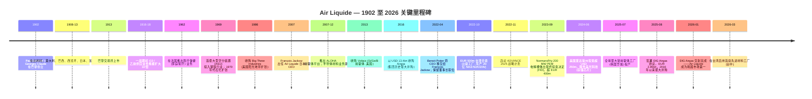
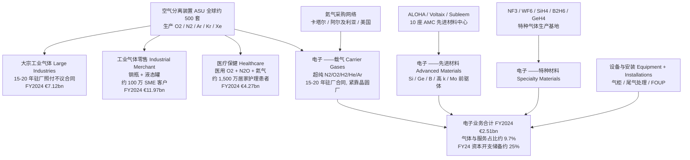
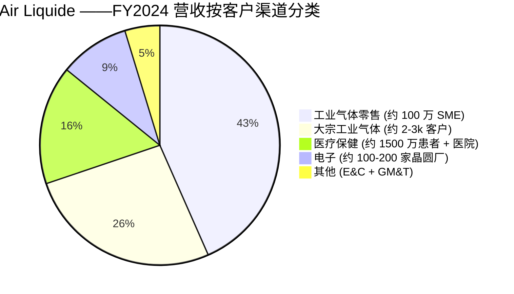

# 法国液化空气集团 (Air Liquide S.A., EPA:AI) — 公司研究报告

*报告基准日：2026-05-26 · 简体中文版*

> **更新提示 — FY2025 业绩确认增长轨迹 (2026-02-20)：** 法国液化空气集团 (Air Liquide) 公布 FY2025 营收 €26,940m (可比口径 +1.7% / 报告口径 −0.4%)，经常性营业利润率 (recurring operating margin) 提升至 **20.7%** (可比口径 +80 bps，2022-2025 不含能源效应累计 +480 bps)，经常性净利润 €3,772m (剔除汇率影响 +8.8%)，经常性 ROCE 11.2% (高于 ADVANCE 计划设定的 >10% 目标)，并提议派发每股股息 €3.65 (同比 +10.6%)。集团**确认**仍致力于 2025-2026 年再提升 +200 bps 的经常性营业利润率，并表示 2025 年完成签署、2026 年 1 月 13 日交割的韩国 DIG Airgas 收购是亚洲电子业务 (Electronics) 与能源转型增长的关键驱动。资料来源：[Air Liquide FY2025 业绩新闻稿, 2026-02-20](https://www.airliquide.com/group/press-releases-news/2026-02-20/2025-record-performance-and-confident-its-transformation-dynamic-air-liquide-confirms-its-growth)。

---

## 目录

1. 公司概览
2. 公司历史
3. 管理团队
4. 产品与服务
5. 客户与上市策略
6. 行业概览
7. 竞争格局
8. 市场机会
9. 风险评估
10. 参考资料

---

## 1. 公司概览

**法国液化空气集团 (L'Air Liquide S.A.)** (泛欧巴黎交易所代码 **AI** / 彭博 **AI FP** / 美国 OTC ADR **AIQUY**) 是全球营收排名第二的工业气体 (industrial gas) 巨头、地理覆盖排名第一的工业气体公司，也是法国 CAC 40 成分股中唯一一家全球化运营**大气分离气体 (atmospheric gas)** (O₂ / N₂ / Ar / He / H₂) 加**高端前驱体材料 (advanced precursor materials)** 一体化平台的企业。集团服务范围覆盖**全球 60 个国家、约 430 万客户与患者**，员工 **66,300 人** (FY2024)，运营约 **500 套空气分离装置 (Air Separation Unit, ASU)**，FY2024 营收 **€27,058m**，经常性营业利润率 **19.9%** (经常性营业利润 €5,391m)，经常性净利润 **€3,466m**，经常性 ROCE 10.7% ([Air Liquide FY2024 业绩新闻稿, 2025-02-21](https://www.airliquide.com/group/press-releases-news/2025-02-21/2024-building-record-margin-improvement-and-major-commercial-successes-fueling-future-growth-air); [URD 2024, p. 7](https://www.airliquide.com/sites/airliquide.com/files/2025-03/air-liquide-2024-universal-registration-document.pdf))。

集团将业务划分为**四个可报告分部 (reportable segments)**，FY2024 合计贡献约 €27bn 营收：(i) **气体与服务 (Gas & Services)** ——核心引擎，营收 €25.81bn，占集团总营收 **95.4%**，下设四条业务线 (大宗工业气体 / 工业气体零售 / 医疗保健 / 电子)；(ii) **工程与建设 (Engineering & Construction, E&C)** ——营收 €412m (1.5%)，相对 2013-17 周期峰值已下降逾 50%，主要原因是集团选择将 ASU 工程价值在内部消化而非作为第三方收入入账；(iii) **全球市场与技术 (Global Markets & Technologies, GM&T)** ——营收 €836m (3.1%)，承载生物甲烷、氢能业务与新兴市场特种解决方案；(iv) **创新园区 (Innovation Campuses)** ——研发风险投资平台，不单独列入损益表分项 ([Air Liquide FY2024 PR, p. 2-3](https://www.airliquide.com/sites/airliquide.com/files/2025-02/air-liquide-pr-fy-2024-building-on-record-margin-improvement-and-major-commercial-successes-fueling-future-growth-air-liquide-is-once-again-raising-its-margin-ambition.pdf); [URD 2024, p. 7](https://www.airliquide.com/sites/airliquide.com/files/2025-03/air-liquide-2024-universal-registration-document.pdf))。气体与服务分部下的四条业务线占比并不均衡：**工业气体零售 (Industrial Merchant) 46.1%、大宗工业气体 (Large Industries) 27.6%、医疗保健 (Healthcare) 16.6%、电子 (Electronics) 9.7%** ——其中电子业务**营收最低但资本开支增速最快**，且最受 AI 驱动的半导体产能扩张周期影响 (详见 §4)。


*数据来源：Air Liquide 新闻稿—— [FY2024, 2025-02-21](https://www.airliquide.com/group/press-releases-news/2025-02-21/2024-building-record-margin-improvement-and-major-commercial-successes-fueling-future-growth-air)；[FY2025, 2026-02-20](https://www.airliquide.com/group/press-releases-news/2026-02-20/2025-record-performance-and-confident-its-transformation-dynamic-air-liquide-confirms-its-growth)。左轴 (柱状) 为营收 €m，右轴 (折线) 为经常性营业利润率 %。FY2022 营收激增反映了大宗工业气体业务下指数化合同对能源成本的传导，并非真实销量增长；FY2023 的回落即是天然气价格回归正常水位后的对称反转。*

集团的商业模式更接近**防御性现金流复利模型 (defensive cash-flow compounder)**，而非周期性增长。气体与服务约 70% 营收来自合同型驻厂供气 (on-site supply) 的照付不议 (take-or-pay) 合同，或工业气体零售业务按 CPI 年度调价的轮换框架；能源与天然气成本通过 ASU 标准合同模板**完全传导 (pass-through)** 给大宗工业气体客户，使毛利率几乎不受商品价格波动影响。电子与大宗工业气体业务的驻厂合同期限通常为 **15–20 年**，包含硬性销量承诺以及与本地 CPI、电价挂钩的调价机制 ——这是工业气体行业中最接近公用事业收入基础的合同结构 ([URD 2024, "Industrial Merchant business model" p. 22; "Large Industries" p. 18](https://www.airliquide.com/sites/airliquide.com/files/2025-03/air-liquide-2024-universal-registration-document.pdf))。其结果是过去五年的盈利质量提升：FY2024 单年经常性营业利润率扩张 **+110 bps** (不含能源效应)，2022-2026E 在 ADVANCE 2025 计划下累计 **+460 bps**，且全部不依赖大宗工业气体业务的实际销量增长 ([Air Liquide FY2024 PR, p. 1](https://www.airliquide.com/group/press-releases-news/2025-02-21/2024-building-record-margin-improvement-and-major-commercial-successes-fueling-future-growth-air))。

FY2024 气体与服务业务的区域结构为**美洲 40.0% / EMEA 39.5% / 亚太 20.5%** ——总体均衡，但亚太占比因 2015 年退出韩国大成 (Daesung) 业务而被低估；2025 年 8 月签署、2026 年 1 月 13 日交割的 **€2.85bn DIG Airgas 收购**正是对此进行结构性反向修正 ([Air Liquide H1-2025 业绩新闻稿, 2025-07-29](https://www.airliquide.com/group/press-releases-news/2025-07-29/leveraging-performance-and-growth-engines-air-liquide-remains-track-1st-half-2025); [DIG Airgas 签署公告, 2025-08-22](https://www.airliquide.com/group/press-releases-news/2025-08-22/air-liquide-announces-signature-agreement-acquire-dig-airgas-leading-integrated-gas-player-south); [DIG Airgas 交割公告, 2026-01-13](https://www.airliquide.com/group/press-releases-news/2026-01-13/closing-dig-airgas-acquisition-air-liquide-becomes-industrial-gas-leader-dynamic-south-korean-market))。DIG Airgas 是韩国排名第一的独立气体公司，此前归属麦格理资产管理 (Macquarie Asset Management)，本次交易将为集团新增约 **€500m 营收和 1,000 名员工**，使集团韩国人员翻倍，并将集团重新带回 SK 海力士 (SK hynix) 与三星电子 (Samsung Electronics) 驻厂供气生态——这一缺位已持续十年。


*数据来源：[Air Liquide URD 2024, p. 7 — "Key Elements by Business Line"](https://www.airliquide.com/sites/airliquide.com/files/2025-03/air-liquide-2024-universal-registration-document.pdf)。占比以气体与服务合计 €25,808m 为基数，而非集团合计 €27,058m。*


*数据来源：[Air Liquide URD 2024, p. 7 — "Key Figures — Key Elements by Business Line"](https://www.airliquide.com/sites/airliquide.com/files/2025-03/air-liquide-2024-universal-registration-document.pdf)。FY2024 分部营收原始披露：Large Industries 26% / €7,120m；Industrial Merchant 44% / €11,966m；Healthcare 16% / €4,274m；Electronics 9% / €2,510m；Engineering & Construction 2% / €412m；Global Markets & Technologies 3% / €836m。原 URD 页面占比为集团口径，而非气体与服务口径。*


*数据来源：[Air Liquide FY2024 PR, p. 2 — Gas & Services revenue by geography](https://www.airliquide.com/group/press-releases-news/2025-02-21/2024-building-record-margin-improvement-and-major-commercial-successes-fueling-future-growth-air)。美洲 €10.32bn、EMEA €10.18bn、亚太 €5.28bn。*

**估值快照 (Valuation snapshot)。** 截至 2026 年 5 月，Air Liquide 在泛欧巴黎交易所的股价中位为 **€185.5/股**，稀释后股本约 561m 股，对应市值 **€104.1bn / 约 USD 113bn** ([Yahoo Finance AI.PA 报价页, 2026-05-26](https://finance.yahoo.com/quote/AI.PA/)；[companiesmarketcap.com — Air Liquide P/E ratio, 2026-05](https://companiesmarketcap.com/air-liquide/pe-ratio/))。基于 FY2025 稀释 EPS **€6.24** (FY2025 经常性净利润 €3,772m 除以 ex-treasury 604m 股) 计算，TTM P/E 约 **29.7×**；按彭博一致预期 FY26E EPS，前瞻 P/E 约 23.7× ([Yahoo Finance AI.PA, key statistics, 2026-05-26](https://finance.yahoo.com/quote/AI.PA/key-statistics/)；[TradingEconomics — Air Liquide P/E history](https://tradingeconomics.com/ai:fp:pe))。EV/EBITDA 约 **14.0×** (2024-12-31 净债务 €9,159m + 约 €4.3bn 租赁负债 + €1.1bn 退休金负债，对应 EBITDA 约 €7.9bn)，按 FY2025 拟派 €3.65 股息计算的股息率约 **2.0%** ([Air Liquide FY2024 PR, p. 7 — 净债务](https://www.airliquide.com/group/press-releases-news/2025-02-21/2024-building-record-margin-improvement-and-major-commercial-successes-fueling-future-growth-air)；[Air Liquide FY2025 PR, 2026-02-20](https://www.airliquide.com/group/press-releases-news/2026-02-20/2025-record-performance-and-confident-its-transformation-dynamic-air-liquide-confirms-its-growth))。


*数据来源：[Yahoo Finance — AI.PA (29.7×)](https://finance.yahoo.com/quote/AI.PA/key-statistics/)；[LIN (34.6×)](https://finance.yahoo.com/quote/LIN/key-statistics/)；[APD (23.9×)](https://finance.yahoo.com/quote/APD/key-statistics/)；[4091.T 日本酸素 (Nippon Sanso Holdings) (20.0×)](https://finance.yahoo.com/quote/4091.T/key-statistics/) ——均检索于 2026-05-26。*

Air Liquide 当前 29.7× 的市盈率较同业中位数 (26.8×) **溢价约 10%**，较 Linde **折价约 10%** ——三大估值驱动因素：(a) €4.6bn 在建投资项目中三分之一来自电子业务 (气体与服务最高增速、最高利润率的业务线)，因此真实盈利可预见性高于同业；(b) 在 2022-2025 已实现 +460 bps 营业利润率扩张的基础上，2025-2026 再增 +200 bps 的目标，为多年复利型故事，是 APD 等可比公司无法对标的；(c) DIG Airgas 提供了一个新的高增长韩国市场特许经营权。***分析师观点：***当前估值倍数相对于底层合同的现金流耐久性 (>70% 照付不议 + 指数化) 并不算高估；主要的下行重估风险是 FY2026 之后 ADVANCE 2025 效率提升红利消退快于市场预期 ——见 §9 的风险讨论。

---

## 2. 公司历史

Air Liquide 于 **1902 年 11 月 8 日在巴黎成立**。工业家 **Paul Delorme** 召集 24 位认购人 (多数为工程师)，共同为物理学家 **Georges Claude (乔治·克劳德)** 在两年前发现的空气液化工艺融资。公司原名为「液态空气，专门研究和开发 Georges Claude 工艺的公司 (Air liquide, a company for the study and exploitation of Georges Claude processes)」，初始资本为 100,000 法郎 (FRF)。Claude 的反向布雷顿循环 (reverse-Brayton-cycle) 工艺通过将空气冷却至 −183 ℃ 以下、然后通过分馏液态空气分离纯 O₂、N₂、Ar——其成本明显低于当时主流的林德 (Linde) 工艺，使新公司一开始就具备成本优势 ([Air Liquide — Wikipedia (founding history)](https://en.wikipedia.org/wiki/Air_Liquide); [Encyclopedia.com — L'Air Liquide history](https://www.encyclopedia.com/books/politics-and-business-magazines/lair-liquide); [URD 2024, "Group history" p. 8-9](https://www.airliquide.com/sites/airliquide.com/files/2025-03/air-liquide-2024-universal-registration-document.pdf))。公司于 **1913 年 2 月**登陆巴黎交易所，距成立仅 11 年。



*资料来源：[Air Liquide — Wikipedia (history)](https://en.wikipedia.org/wiki/Air_Liquide)；[Air Liquide URD 2024, p. 8-9](https://www.airliquide.com/sites/airliquide.com/files/2025-03/air-liquide-2024-universal-registration-document.pdf)；[Voltaix 收购 (Semiconductor Today, 2013-06-17)](https://www.semiconductor-today.com/news_items/2013/JUN/AIRLIQUIDE_170613.html)；[Taiwan €500M JV PR, 2022-10-19](https://www.airliquide.com/group/press-releases-news/2022-10-19/air-liquide-invest-500-million-euros-three-new-plants-semiconductor-sector-taiwan)；[Idaho / Micron PR, 2024-06-05](https://www.airliquide.com/group/press-releases-news/2024-06-05/air-liquide-signed-major-contract-support-semiconductor-industry-us-investment-more-250-million)；[South Korea Mo plant PR, 2025-07-21](https://www.airliquide.com/group/press-releases-news/2025-07-21/air-liquide-strengthens-its-advanced-materials-leadership-new-molybdenum-manufacturing-plant-south)；[DIG Airgas signing PR, 2025-08-22](https://www.airliquide.com/group/press-releases-news/2025-08-22/air-liquide-announces-signature-agreement-acquire-dig-airgas-leading-integrated-gas-player-south)；[Taichung plant PR, 2026-03-25](https://www.airliquide.com/group/press-releases-news/2026-03-25/air-liquide-inaugurates-its-first-advanced-materials-manufacturing-plant-taiwan-strengthening-next)。*

集团现代历史的形成有三次关键战略转向。**首先是 1916-1986 年驻厂供气大宗工业气体模式的建立**——经历两次世界大战，集团发现工业气体行业最赚钱的不是钢瓶销售业务，而是建在钢厂或化工厂背后的专用空分装置，由长达 15-20 年的照付不议合同支撑。这一模式经 1970 年代欧洲石化扩张周期和阳光地带建设 (1986 年收购 Big Three Industries) 不断精炼，构成今日电子驻厂模式 (台积电亚利桑那 / 美光爱达荷为 2020 年代版本) 的架构基础，与 1970 年代埃克森美孚安特卫普 (ExxonMobil Antwerp) 项目结构相似 ([Encyclopedia.com — L'Air Liquide history](https://www.encyclopedia.com/books/politics-and-business-magazines/lair-liquide); [URD 2024, "Large Industries business model" p. 18](https://www.airliquide.com/sites/airliquide.com/files/2025-03/air-liquide-2024-universal-registration-document.pdf))。

**其次是 2007-2013 年电子特种材料业务的建立**——集团意识到半导体行业的驻厂大宗气体业务再有价值，如果不与高附加值前驱体 / 高端材料端绑定，最终仍将面临价格商品化。集团于 2007 年自主推出 **ALOHA™** 前驱体平台 (CVD/ALD 用硅、高 k 介质和金属前驱体)，并于 2013 年以未披露金额收购 **Voltaix** (美国，Si/Ge/B 特种分子，收购时营收约 USD 50m)，从而显著扩大该业务规模 ([Voltaix 收购 (Semiconductor Today, 2013-06-17)](https://www.semiconductor-today.com/news_items/2013/JUN/AIRLIQUIDE_170613.html); [Air Liquide Electronics — Advanced Materials offer](https://electronics.airliquide.com/offer-brands/our-offer/electronics-advanced-materials))。

**第三是 2016 年收购 Airgas**——以 **USD 13.4bn 企业价值**收购美国最大的工业气体零售商，瞬间为集团新增 17,000 名美国员工和约 90 万家工业客户账户，将美洲从集团第三大区域提升为最大单一营收贡献区。该交易由 François Jackow 在 2014-2016 年担任集团战略副总裁期间主导整合，奠定了今日美洲电子业务扩张 (爱达荷、亚利桑那) 的足迹基础 ([Air Liquide URD 2024, "Group history" p. 9](https://www.airliquide.com/sites/airliquide.com/files/2025-03/air-liquide-2024-universal-registration-document.pdf); [Bloomberg — François Jackow profile](https://www.bloomberg.com/profile/person/16878479))。

2024-2026 年近期重要进展可归纳为三大主题，是后文分析的基础：(i) **AI 半导体资本开支超级周期 (super-cycle)** ——爱达荷美光合同 ($250m+, 2024-06)、三座台湾工厂 (€500m, 2022-10)、韩国钼前驱体厂 (2025-07)、德国 €250M 综合项目 (2025)、台中先进材料工厂 (2026-03)；(ii) **绿氢 (green hydrogen) 规模化** ——Normand'Hy 200 MW PEM 电解槽 (€400m+，FID 2023-09)、荷兰 ELYgator 200 MW；(iii) **DIG Airgas 韩国市场再进入** (€2.85bn，2025 年 8 月签约 / 2026 年 1 月完成交割) ——自 2016 年 Airgas 以来最大并购，是亚太再加速的战略中枢 ([DIG Airgas signing PR, 2025-08-22](https://www.airliquide.com/group/press-releases-news/2025-08-22/air-liquide-announces-signature-agreement-acquire-dig-airgas-leading-integrated-gas-player-south))。

---

## 3. 管理团队

**François Jackow ——首席执行官 (自 2022 年 6 月 1 日起)**

François Jackow 是 Air Liquide 124 年历史上的第七位首席执行官，也是自 Benoît Potier (1995-2022) 以来首位完全从 Air Liquide 内部成长起来的 CEO，而非从工程与建设 (E&C) 通道晋升。Jackow 于 **1993 年**约 26 岁时加入 Air Liquide，最初在美国和荷兰任职，前十年在大宗工业气体与工程建设业务线担任商务开发及营销职务。**2002 年**被任命为创新副总裁，负责集团 R&D 与先进技术——亦因此而对 ALOHA 前驱体早期开发拥有直接所有权，是今日电子业务的技术基础 (这在工业气体行业 CEO 中较为少见，大多数同业从大宗工业气体运营条线晋升) ([Air Liquide Executive Committee — François Jackow biography](https://www.airliquide.com/group/executive-committee); [Bloomberg — François Jackow profile](https://www.bloomberg.com/profile/person/16878479); [LinkedIn — François Jackow](https://fr.linkedin.com/in/francois-jackow))。

**2007 年**他被任命为 Air Liquide 日本总裁兼首席执行官，常驻东京，负责管理集团运营最为复杂的子公司之一 (运营复杂、工业气体零售客户基础高度分散、电子客户高度集中于胜高 (SUMCO)、信越化学、瑞萨电子、东芝)，任期四年。**2011 年**他返回巴黎担任大宗工业气体全球业务线副总裁；**2014 年**进入执行委员会，担任集团战略副总裁，并以此身份主导了 **2016 年 USD 13.4bn 收购 Airgas** ——集团历史上最大并购的尽职调查与整合规划 ([Air Liquide Executive Committee — François Jackow biography](https://www.airliquide.com/group/executive-committee); [TheOrg — François Jackow](https://theorg.com/org/air-liquide/org-chart/francois-jackow); [Acast — "In Good Company" François Jackow podcast, 2024](https://shows.acast.com/in-good-company-with-nicolai-tangen/episodes/francois-jackow-ceo-of-air-liquide))。

教育背景：毕业于**巴黎高等师范学院 (École Normale Supérieure Paris)** (化学 / 物理学本科)，**哈佛大学 (Harvard University)** 化学硕士，**工程师学院 (Collège des Ingénieurs)** MBA。加入 Air Liquide 之前曾任职于**壳牌 (Shell)** (工业风险分析师) 和**欧莱雅 (L'Oréal)** (研究助理) ——两段经历在工业气体行业 CEO 中均不常见，与 Jackow 把 Air Liquide 定位为「一家恰好运送气体的深科技材料公司 (deep-tech materials company that happens to ship gas)」而非传统管道与钢瓶公用事业的理念一致 ([Air Liquide Executive Committee biography](https://www.airliquide.com/group/executive-committee); [Bloomberg — François Jackow profile](https://www.bloomberg.com/profile/person/16878479))。

Jackow 于 **2022 年 6 月 1 日**正式接任 CEO，并在 2022 年 11 月宣布 ADVANCE 2025 计划。其三年的运营记录在工业气体同业中表现突出：经常性营业利润率在 **2022-2025 年累计扩张 +460 bps** (不含能源效应，为集团历史最高)，经常性 ROCE 由 2021 年的 9.4% 上升至 **2025 年的 11.2%**，2024 年资本开支决策达到创纪录的 **€4.4bn**，H1-2025 投资项目储备达到 **€4.6bn**，其中电子业务占三分之一 ([Air Liquide FY2024 PR, p. 1, 2025-02-21](https://www.airliquide.com/group/press-releases-news/2025-02-21/2024-building-record-margin-improvement-and-major-commercial-successes-fueling-future-growth-air); [Air Liquide FY2025 PR, 2026-02-20](https://www.airliquide.com/group/press-releases-news/2026-02-20/2025-record-performance-and-confident-its-transformation-dynamic-air-liquide-confirms-its-growth); [Air Liquide H1 2025 PR, 2025-07-29](https://www.airliquide.com/group/press-releases-news/2025-07-29/leveraging-performance-and-growth-engines-air-liquide-remains-track-1st-half-2025))。他持有约 10,500 股 Air Liquide 股票 (URD 2024 治理披露)，薪酬结构约为固定 25% / 浮动 75%，浮动部分与经常性净利润、经常性 ROCE 以及 ADVANCE 2025 效率与 CO₂ 减排目标挂钩 ([URD 2024, "Executive compensation" Chapter 4](https://www.airliquide.com/sites/airliquide.com/files/2025-03/air-liquide-2024-universal-registration-document.pdf))。

---

## 4. 产品与服务

本节为整份报告中最重要的部分——若此处不做深度展开，下游分析便沦为空洞概述。Air Liquide 的产品体系覆盖**逾 250 种气体** (重工业、医疗、食品保鲜、电子等领域使用的所有化学纯大气、工业及特种分子)，仅电子业务一项就覆盖**逾 200 种分子**，包括大宗载气 (carrier gases)、原子层沉积 (ALD) 前驱体、刻蚀气体与掺杂剂 ([URD 2024, p. 33 — Electronics business model](https://www.airliquide.com/sites/airliquide.com/files/2025-03/air-liquide-2024-universal-registration-document.pdf))。本节按气体与服务的四条业务线展开 (大宗工业气体、工业气体零售、医疗保健、电子——其中**电子业务因与半导体投资主题最相关而加倍展开**)，最后简述工程与建设、全球市场与技术，以确保覆盖完整。

### 4.1 URD 2024 电子业务原始章节 (嵌入式)

URD 2024 第 33 页对电子业务的描述是 §4.3 内容的权威产品矩阵锚点——以下嵌入该页原图，并在本节正文中以原文逐句引用 (verbatim block-quote)。


*数据来源：[Air Liquide Universal Registration Document 2024, p. 33 — "Electronics" business model spread](https://www.airliquide.com/sites/airliquide.com/files/2025-03/air-liquide-2024-universal-registration-document.pdf)。*

### 4.2 跨业务线综合 ——产品分类如何相互联动

Air Liquide 的四条气体与服务业务线**共用一组上游资产** (全球约 500 套 ASU 生产 O₂ / N₂ / Ar 加上氦气 / 氢气采购网络)，**下游则发散为四个不同的商业模式**，对同一组分子赋予不同的变现路径。大宗工业气体以**驻厂方式 (on-site)** 在 15-20 年照付不议合同框架下销售大宗气体，单位价格最低但具公用事业般经济效益；工业气体零售将相同分子重新包装为**液态罐和钢瓶**，以驻厂价的若干倍销售给约 100 万家中小企业账户；医疗保健将相同的 O₂ (加上医疗专用的 N₂O、He/O₂ 混合气) 在受规管的药品定价框架下销售给医院和居家护理客户。**电子业务**在大宗载气供应基础上叠加两项更高附加值业务——特种气体 (NF₃、WF₆、SiH₄ 级别) 和**前驱体材料 (precursor materials)** (在 **10 座先进材料中心 (Advanced Materials Centers, AMC)** 生产，分布于韩国 / 日本 / 新加坡 / 台湾 / 美国 / 欧洲) ——并通过同一客户界面交付载气 + 特种 + 先进材料 + 设备/安装四条收入流 ([URD 2024, p. 33](https://www.airliquide.com/sites/airliquide.com/files/2025-03/air-liquide-2024-universal-registration-document.pdf); [Air Liquide Electronics — Advanced Materials offer](https://electronics.airliquide.com/offer-brands/our-offer/electronics-advanced-materials))。



*综合说明：上述图示揭示了电子业务为何在结构上具有最高的边际利润率——每一美元在台积电或三星晶圆厂的驻厂大宗载气营收，都会催生数倍于其的特种气体 + 先进材料 + 设备销售，通过**同一**客户界面完成，无需重新付出销售获客成本。*

### 4.3 电子业务 ——AI 资本周期下集团最高优先级业务

电子业务 FY2024 营收 **€2,510m (可比口径 +3.3%)**，占气体与服务**约 9.7%**，全球员工**约 4,000 人**，覆盖 URD 2024 第 33 页饼图中的四个子类。其内部结构：载气 **47%**、电子特种材料 **16%**、先进材料 **11%**、设备与安装 **16%**、其他约 10%。**电子业务投资约占 H1-2025 €4.6bn 投资储备的三分之一**，是单一业务线中占比最高的 ([URD 2024, p. 33](https://www.airliquide.com/sites/airliquide.com/files/2025-03/air-liquide-2024-universal-registration-document.pdf); [Air Liquide H1 2025 PR, 2025-07-29](https://www.airliquide.com/group/press-releases-news/2025-07-29/leveraging-performance-and-growth-engines-air-liquide-remains-track-1st-half-2025))。


*数据来源：Air Liquide FY2020-FY2025 业绩新闻稿——分部营收口径采用各年度披露版本。[FY2024 PR, p. 2-3](https://www.airliquide.com/group/press-releases-news/2025-02-21/2024-building-record-margin-improvement-and-major-commercial-successes-fueling-future-growth-air)；[FY2025 PR, 2026-02-20](https://www.airliquide.com/group/press-releases-news/2026-02-20/2025-record-performance-and-confident-its-transformation-dynamic-air-liquide-confirms-its-growth)。2023-2025 平台期反映新冠后半导体库存调整以及 2024 年显示 / 存储产能利用率走弱；底层合同储备与资本开支储备指向 FY2026 起新一轮上行周期 ——爱达荷 / 台中 / 华城新产能投放支撑。*

**4.3.1 载气 ——赢得客户关系的驻厂大宗气体锚点。**

> *URD 2024 原文：*"**Carrier Gases**: Carrier gases (very high purity gases, mainly nitrogen, but also oxygen, argon, helium, hydrogen, etc.), supplied from on-site facilities and provided by a high-purity micrometric distribution system, are used in any phase of the silicon technological process. They reduce the chemical concentration of impurities to a few parts per billion." (中文释义：载气 (Carrier Gases) 主要为超高纯氮气，也包括氧气、氩气、氦气、氢气等，由驻厂设施供应，通过高纯度微米级输送系统，用于硅工艺的任一阶段。这些载气将杂质浓度降至 ppb 级别。) ([URD 2024, p. 33](https://www.airliquide.com/sites/airliquide.com/files/2025-03/air-liquide-2024-universal-registration-document.pdf))

**中文释义 / 简明解释：** **载气 (carrier gases)** 是晶圆厂内每台机台都需使用的大气分子主力——超纯氮气 (UHP N₂) 用于刻蚀腔体吹扫与气柜气动驱动；超纯氧气 (UHP O₂) 用于硅热氧化；超纯氩气 (UHP Ar) 在 PVD 与干法刻蚀腔中作为惰性溅射 / 等离子气氛；超纯氢气 (UHP H₂) 用于热还原与形成气；超纯氦气 (UHP He) 用于晶圆基座低温冷却与漏检测试。技术规格要求**金属与有机物总杂质低于 ppb 级别** ("**6N** 即 99.9999% 或更高纯度")，通过**驻厂式空分装置 + 微米级配气系统**实现 ——与销售给钢厂的同类分子相比，纯度要求高出 100 倍以上。**驻厂供气**模式 ——Air Liquide 在晶圆厂园区内自建、自有、自营 ASU，签订 15-20 年照付不议合同 ——是电子业务**最重要的单一营收锚点**：一旦晶圆厂接入某家 ASU 运营商的微米级配气环路，更换供应商就需重新铺管。2024 年 6 月**爱达荷为美光科技 (Micron) 建设的 €250m+ 工厂** (存储芯片) 与 2022 年 1 月**台积电亚利桑那州 ~€50m** 驻厂协议 (H₂ / He / CO₂——N₂ / O₂ / Ar 另与 Linde 签约) 是当前周期载气业务赢单的典型案例 ([Air Liquide-Micron Idaho PR, 2024-06-05](https://www.airliquide.com/group/press-releases-news/2024-06-05/air-liquide-signed-major-contract-support-semiconductor-industry-us-investment-more-250-million); [Air Liquide-TSMC Arizona PR, 2022-01-25](https://www.airliquide.com/group/press-releases-news/2022-01-25/air-liquide-announces-long-term-agreement-supply-semiconductor-manufacturing-site-arizona); [Air Liquide H1 2025 PR — "Carrier Gas sales more than +10%", 2025-07-29](https://www.airliquide.com/group/press-releases-news/2025-07-29/leveraging-performance-and-growth-engines-air-liquide-remains-track-1st-half-2025))。

***分析师观点：***载气业务为**强护城河型业务，兼具转换成本与规模优势**。在晶圆厂驻厂 ASU 层级最直接的竞争对手为**林德 (Linde plc)** (Praxair / 林德合并后)、**空气化工产品公司 (Air Products, NYSE:APD)**、日本的**日本酸素 (Nippon Sanso, TSE:4091)**、亚洲区域的**岩谷产业 (Iwatani)** ——四家西方巨头加日本酸素事实上按主要晶圆厂逐厂分配主要代工 / 存储驻厂合同 (台积电亚利桑那由 Air Liquide 与 Linde 按分子组合分供即是典型例子，可参见 [Wikipedia — TSMC Arizona, "Supply partners"](https://en.wikipedia.org/wiki/TSMC_Arizona))。Air Liquide H1 2025 披露的「**载气销售增速逾 +10%，且已投运 7 套新产能**」是 AI 资本周期已经转化为实际营收 (而非仅是储备) 的最有力证据 ([Air Liquide H1 2025 PR, 2025-07-29](https://www.airliquide.com/group/press-releases-news/2025-07-29/leveraging-performance-and-growth-engines-air-liquide-remains-track-1st-half-2025))。

**4.3.2 电子特种材料 ——WF₆ / NF₃ / SiH₄ 级化学品。**

> *URD 2024 原文：*"**Electronic Specialty Materials**: are gases, equipment, and services used in the manufacturing processes of the highest-purity grade of the activity is closely linked to the volume of semiconductor production." (中文释义：电子特种材料 (Electronic Specialty Materials) 是用于半导体制造工艺的最高纯度等级气体、设备与服务；其业务活跃度与半导体产量高度相关。) ([URD 2024, p. 33](https://www.airliquide.com/sites/airliquide.com/files/2025-03/air-liquide-2024-universal-registration-document.pdf))

**中文释义 / 简明解释：** **特种气体 (specialty gases / 电子特气)** 是直接参与晶圆工艺步骤的反应性、有害性、超高纯度分子，而非作为载气使用。最重要的几大族类为：(i) **三氟化氮 (NF₃)** ——CVD 反应腔远程等离子清洗用气，由日本昭和电工 (现 Resonac) 开创，Air Liquide 与三菱化学也是全球主要生产商之一；(ii) **六氟化钨 (WF₆)** ——钨 CVD 的源气体，用于填充 <100nm 接触孔与 3D NAND 的钨字线；(iii) **硅烷 (SiH₄)** 及其高级衍生物 (二硅烷、六氯二硅烷) ——用于多晶硅与氮化硅薄膜沉积；(iv) **乙硼烷 (B₂H₆)** ——离子注入掺杂源与 BPSG 前驱体；(v) **锗烷 (GeH₄)** ——锗掺杂剂及 3D NAND CVD 源；(vi) **磷烷 (PH₃)** ——n 型掺杂剂和 SiP 外延 CVD 前驱体。这些分子均**剧毒、易自燃或为压力危险品**，Air Liquide 的增值不仅在分子本身，更在**气柜、尾气处理、驻厂监测与应急响应**基础设施 ——使晶圆厂能安全集成；分子和安全包覆作为一个整体解决方案出售 (这与 URD 2024 中「gases, equipment and services」的表述一致)。特种材料子线在四子类中周期性最强 ——随晶圆开工 (wafer-start) 变化；FY2024 出现下滑 (URD 2024 上半年回顾特别提到「电子业务销售增长 +3.3%，**除特种材料外**所有子部门贡献正增长」)，原因为存储产能利用率修正 ([URD 2024, p. 33](https://www.airliquide.com/sites/airliquide.com/files/2025-03/air-liquide-2024-universal-registration-document.pdf); [Air Liquide FY2024 PR, 2025-02-21](https://www.airliquide.com/group/press-releases-news/2025-02-21/2024-building-record-margin-improvement-and-major-commercial-successes-fueling-future-growth-air))。

***分析师观点：***电子特种材料为**部分护城河**业务——Air Liquide 为全球约 5 家主要参与者之一，与之竞争的还有 **Resonac (TSE:4004 ——URD-2024 年代 NF₃ 与高纯干刻气体全球第一)**、**Versum / Merck KGaA**、**Linde Electronics**、**日本酸素**等。在分子层面的转换成本不及载气层面 ——晶圆厂可以在几个月时间内对 WF₆ 或 NF₃ 进行第二供应源认证，因此护城河更多体现在「区域规模 + 安全服务包」而非绝对锁定。Resonac 在 NF₃ 上的领先在公司自家 [FY24 业绩资料 (Data Book)](https://www.resonac.com/sites/default/files/2025-02/14_E_DataBook202412_001.pdf) 中明确披露 (Specialty Gases 业务条线)；Air Liquide 并未单独披露其 NF₃ 份额。

**4.3.3 先进材料 ——ALOHA / Voltaix / Subleem 前驱体平台 (最高利润率增长引擎)。**

> *URD 2024 原文：*"**Advanced Materials**: these materials used in gas form at the heart of the most advanced manufacturing processes and are essential for the miniaturization and energy efficiency of new-generation semiconductor chips. They are produced in collaboration with customers and then ecosystem. There are 6 product brands of advanced materials available for sale in this market." (中文释义：先进材料 (Advanced Materials) 以气态形式应用于最先进制造工艺的核心步骤，是新一代半导体芯片小型化与能效提升的关键。这些材料是与客户合作开发后再向生态系统供应；该市场可销售的先进材料共有 6 个品牌。) ([URD 2024, p. 33](https://www.airliquide.com/sites/airliquide.com/files/2025-03/air-liquide-2024-universal-registration-document.pdf))

**中文释义 / 简明解释：** **先进前驱体材料 (advanced precursor materials / 高纯前驱体)** 是经化学工程设计的金属有机 / 有机硅 / 有机金属分子 ——用于**沉积**晶体管核心的原子级薄膜。它们是**原子层沉积 (ALD)** 中的「沉积什么」，也是高端**化学气相沉积 (CVD)** 中的「沉积什么」。Air Liquide 的两个旗舰平台为：(i) **ALOHA™** ——2007 年自主研发的沉积组合，覆盖硅前驱体 (如 **HCDS, hexachlorodisilane 六氯二硅烷**，用于氮化硅沉积)、**高 k 介质** (Hf / Zr 基前驱体，用于高 k 金属栅极晶体管中的栅介质层)、**金属前驱体** (Ti / Ta / W / Co，用于阻挡层和接触层)；(ii) **VOLTAIX™** ——2013 年从美国收购的平台，专注于**硅、锗、硼化学** ——支撑 SiGe 外延生长的 Si / Ge 分子以及超浅结离子注入的硼源气体。第三个平台 **Subleem™** 于 2023-2025 年间推出，是**钼 (Mo)** 前驱体家族 ——钼正逐步替代钨成为先进逻辑制程 (sub-3nm) 字线 / 替代栅极层以及 ≥256 层 3D NAND 中的导电材料。**2025 年 7 月在韩国华城 (Hwaseong) 启用了全球最大钼前驱体生产工厂**，是该平台的实体锚点。其余命名品牌包括 **enScribe™** (刻蚀剂，与 ALD 沉积步骤对称的干法刻蚀化学品) 和 **Balazs™** (纳米级晶圆分析 / 污染检测 ——产品包的「质保」层) ([Air Liquide Electronics — Advanced Materials brand page](https://electronics.airliquide.com/offer-brands/our-offer/electronics-advanced-materials); [Hwaseong Mo plant PR, 2025-07-21](https://www.airliquide.com/group/press-releases-news/2025-07-21/air-liquide-strengthens-its-advanced-materials-leadership-new-molybdenum-manufacturing-plant-south); [ALOHA platform page](https://electronics.airliquide.com/alohatm))。10 座**先进材料中心 (AMCs)** 分布于韩国、日本、新加坡、台湾、美国与欧洲 ——与客户晶圆厂生态共址，能在 24 小时内将一罐 200 升前驱体送达晶圆厂。

***分析师观点：***先进材料是电子业务中**毛利率最高**且**技术 IP 护城河最深**的子业务。竞争者集合相对狭窄——**Merck KGaA Electronics (2019 年以 USD 6.5bn 收购的 Versum Materials)**、**杜邦电子材料 (DuPont Electronic Materials)**、**东京应化 (TOK, TSE:4186)** (光刻胶相邻特种材料)、**Resonac** (导体糊 / CMP 浆料相邻领域)、**安特格里斯 (Entegris, NASDAQ:ENTG)** (气体纯化 / 罐体处理)，再加上一批中国 / 韩国特种化学品厂商 (如 DNF、Wonik、鼎龙) 在单个分子上参与竞争。每一个前驱体的销售在客户晶圆厂端都需 2-3 年的联合开发项目以认证该分子在特定工艺节点上的应用 ——这在该节点 HVM (大批量生产) 生命周期内形成真实锁定。韩国钼前驱体厂是明显的技术领先押注：钼字线是 >256 层 V-NAND 与 GAA (全环绕栅极) 逻辑中钨字线的路线图替代品；GAA + 先进 3D NAND 量产之际成为**全球最大**钼前驱体供应商，是教科书式的规模优势 ([Hwaseong Mo plant PR — Armelle Levieux quote, 2025-07-21](https://www.airliquide.com/group/press-releases-news/2025-07-21/air-liquide-strengthens-its-advanced-materials-leadership-new-molybdenum-manufacturing-plant-south))。

**4.3.4 设备与安装 ——气柜、尾气处理与化学品输送服务捆绑。**

> *URD 2024 原文：*"**Equipment**: Air Liquide is also expanding its expertise for the design, integration and ongoing maintenance of gas cabinets and bulk specialty chemical products and installations that are at customers' fab. The Electronics business installs and maintains equipment for the distribution of gases, materials and chemicals to customer sites. The level of activity is closely linked to the volume of activity in the new semiconductor manufacturing sites." (中文释义：Air Liquide 还在扩展气柜及客户晶圆厂内大宗特种化学品与设施的设计、集成与运维能力；电子业务为客户厂区安装并维护气体、材料和化学品输送设备，其业务量与新建半导体厂的活动密切相关。) ([URD 2024, p. 33](https://www.airliquide.com/sites/airliquide.com/files/2025-03/air-liquide-2024-universal-registration-document.pdf))

**中文释义 / 简明解释：** 设备业务销售**包裹 Air Liquide 分子产品的晶圆厂洁净室金属件** ——气柜 (盛装 WF₆ / NF₃ / SiH₄ 钢瓶的不锈钢安全机柜)、**阀箱组件 (Valve-Manifold-Box, VMB) / 供气面板 (Valve-Manifold-Supplier, VMS)** 装配 (向机台分配气体)、**点用尾气处理 (point-of-use abatement)** (在排放前燃烧 / 洗涤掉自燃气体与 PFC)，以及**驻厂化学品输送橇 (skid)** (液态前驱体)。最接近的可比业务隶属于**Edwards Vacuum (Atlas Copco)**、**CS Clean Solutions (Pentair / nVent)**、**Versum Materials (Merck)**、日本的**岩谷工业气体 (Iwatani Industrial Gases)**。该业务线**以项目驱动为主**：营收与新建晶圆厂建设挂钩 (绿地项目每条完整装机晶圆开工楼层支付 USD 30-80m 的气柜+尾气处理+VMB 费用；现有晶圆厂内的产能扩张额度较低)，因此其增长几乎与台积电亚利桑那 21 厂、三星泰勒、英特尔俄亥俄、美光博伊西、欧洲马格德堡 (Magdeburg) / Crolles 2 项目以及中国 SMIC / 长鑫 / 长江存储等产能扩张呈 1:1 关系。

***分析师观点：***设备与安装为**中等护城河**业务——工程经验与历史业绩比 IP 更重要，且业务线与新厂建设周期高度耦合。若连续 2 年没有新厂破土动工，该业务将出现明显下滑 ——FY2024 出现的「设备弱、载气强」组合即反映了这一动态。

### 4.4 工业气体零售 ——焊工与冶金商背后的钢瓶与液态罐网络

工业气体零售业务 ——**FY2024 营收 €11,966m，占气体与服务 46.1%** ——是直接承接 1902 年原始平台的钢瓶与液态罐分销业务。URD 2024 对该业务的描述为：「**Industrial Merchant**: industrial gases delivered to small and medium businesses; specialty gases and welding products; technologies for hygiene and quality assurance; food preservation services. (中小企业用工业气体；特种气体与焊接产品；卫生与品质保证技术；食品保鲜服务)。」客户基础为**约 100 万家中小企业账户** (焊接店、食品加工商、饮料生产商、实验室、金属加工厂、玻璃工坊、医院液态 O₂ 罐、炼油厂氮气吹扫罐)。**定价按年度指数化重置** (FY2024 披露的定价效应为 +4.0%)，销量跟随区域工业活动 (欧美成熟市场基本持平，亚洲 / 拉美增长)，单位价格是同分子驻厂大宗渠道价格的**数倍** ——这使其成为气体与服务中毛利率最高的业务线 ([URD 2024, p. 22](https://www.airliquide.com/sites/airliquide.com/files/2025-03/air-liquide-2024-universal-registration-document.pdf); [Air Liquide FY2024 PR, p. 2, 2025-02-21](https://www.airliquide.com/group/press-releases-news/2025-02-21/2024-building-record-margin-improvement-and-major-commercial-successes-fueling-future-growth-air))。

工业气体零售业务对集团的战略价值在于**利润结构稳定**：在大宗工业气体业务的任一周期下行年 (钢铁 / 化工 / 炼油产能利用率下滑)，工业气体零售多样化的 SME 客户群提供反周期缓冲。2016 年收购 Airgas (USD 13.4bn) 在结构上等同于将集团北美工业气体零售规模翻倍，正因为如此，该分部规模超越大宗工业气体 ——历史上则相反。

***分析师观点：***工业气体零售为**规模与密度护城河**业务 ——单瓶配送成本随线路密度急剧下降，因此现有龙头 (Air Liquide、Linde / Praxair、Air Products、Iwatani、Messer SE) 在规模上极难被取代；新进入者只能局限于区域性 / 特种细分市场。

### 4.5 大宗工业气体 ——钢铁、化工、炼油的驻厂氧 / 氮 / 氢公用事业

大宗工业气体业务 ——**FY2024 营收 €7,120m，占气体与服务 27.6%** ——在重工业综合体 (一体化钢厂、乙烯裂解装置、合成氨厂、炼油厂、玻璃窑、煤化工) 旁，按 **15-20 年驻厂照付不议合同**模板供应——这一模板也是电子载气模式的架构基础。Air Liquide 在客户场地建设、自有并运营空分装置；客户承诺最低提货量 O₂ / N₂ / Ar，价格按电价指数 + 通胀调价 + 固定资本回收三个部分计算。销量跟随区域重工业活动。价格基本完全传导，因此毛利率结构性稳定，但**销量增长本质上仅来自绿地新项目** ——这就是大宗工业气体 FY2024 仅增长 +1.2% 的原因 (欧洲一家钢厂剥离形成单笔拖累，部分被两套新 ASU 启动抵消) ([URD 2024, p. 18-19](https://www.airliquide.com/sites/airliquide.com/files/2025-03/air-liquide-2024-universal-registration-document.pdf); [Air Liquide FY2024 PR, p. 2, 2025-02-21](https://www.airliquide.com/group/press-releases-news/2025-02-21/2024-building-record-margin-improvement-and-major-commercial-successes-fueling-future-growth-air))。

**脱碳叠加 (decarbonisation overlay)** 是该分部层面的拐点：集团 2024-2035 年 >€8bn 的可再生 / 低碳氢承诺 (法国诺曼底 Normand'Hy 200 MW PEM 电解槽、荷兰 ELYgator 200 MW、得克萨斯氢气网) 隶属于大宗工业气体分部，旨在未来十年通过逐一合同方式将传统灰氢 (grey-H₂) 客户 (化工、炼油) 转换为可再生 H₂ 供应 ——这是合同级的毛利率升级，因为随碳排成本提升，大宗工业气体客户宁愿支付低碳 H₂ 溢价，也不愿内化 CO₂ 税 ([Normand'Hy 项目页](https://normandhy.airliquide.com/en); [Normand'Hy 法国政府支持 PR, 2022-03-08](https://www.airliquide.com/group/press-releases-news/2022-03-08/air-liquide-receives-support-french-state-its-200-mw-electrolyzer-project-normandy-and-accelerates))。

***分析师观点：***大宗工业气体在**合同层面具备强护城河** (15-20 年驻厂照付不议合同是气体行业最强防御性现金流结构)，但**结构上低增长** (周期均值仅 +1%/年销量增长)。竞争集合：Linde plc、Air Products、Messer SE (德国)、亚洲的日本酸素。

### 4.6 医疗保健 ——医用 O₂、居家护理与 1,500 万患者

医疗保健 ——**FY2024 营收 €4,274m，占气体与服务 16.6%，增速 +8.6%** ——是医用氧气与居家护理业务，分销医用 O₂ (用于医院、家庭氧疗、救护车)、医用 N₂O (麻醉气)、用于儿科呼吸治疗的氦氧 ("heliox") 混合气、卫生气体，以及覆盖**约 1,500 万患者的居家护理服务** (针对慢性呼吸疾病与睡眠呼吸暂停患者的监测 + 配送 + 设备维护)。该业务受药品监管 (医用 O₂ 须达到 GMP 级别纯度且在各管辖区取得上市许可)，形成护城河 (高监管准入门槛) 同时设定毛利率天花板 (大多数国家医保系统进行价格管控) ([URD 2024, p. 26](https://www.airliquide.com/sites/airliquide.com/files/2025-03/air-liquide-2024-universal-registration-document.pdf); [Air Liquide FY2024 PR, p. 2, 2025-02-21](https://www.airliquide.com/group/press-releases-news/2025-02-21/2024-building-record-margin-improvement-and-major-commercial-successes-fueling-future-growth-air))。

***分析师观点：***医疗保健为**防御性现金流公用事业**，受老龄化与慢性呼吸疾病负担驱动，每年个位数销量增长，居家护理子业务有价 / 量利好。最接近的同业：Linde Healthcare、Air Products 已剥离的居家护理业务、日本岩谷、Praxair Healthcare (Linde 法定承继人)。FY2024 +8.6% 的高增长反映了新冠后销量正常化与定价的双重利好。

### 4.7 工程与建设、全球市场与技术、创新园区

**工程与建设 (E&C, FY2024 合并营收 €412m, +5.8%)** 是集团内部工程业务部门，负责空分装置和气化装置的设计、采购与建设——既服务集团自有的驻厂项目储备 (从而消除第三方 EPC 利润损失)，也服务第三方客户 (包括国家石油公司及特种细分的工业气体竞争对手)。披露的 €412m **仅为第三方部分**；支撑 2024 年创纪录 **€4.4bn 资本开支决策**的集团内 E&C 收入在合并时被消除 ([Air Liquide FY2024 PR, p. 4, 2025-02-21](https://www.airliquide.com/group/press-releases-news/2025-02-21/2024-building-record-margin-improvement-and-major-commercial-successes-fueling-future-growth-air))。

**全球市场与技术 (GM&T, FY2024 营收 €836m)** 整合了新兴市场特种业务，包括 (i) 生物气 / 生物甲烷生产 (Air Liquide 是欧洲最大的生物甲烷生产商之一)；(ii) 氢能交通 (燃料电池车加氢站)；(iii) 潜艇 / 航天低温技术 (为欧空局 / 阿丽亚娜火箭提供 O₂ / H₂)；(iv) 航天发射地面服务。其中没有一项业务在当下对集团损益表具有重大影响，但**氢能交通**部分是未来大宗工业气体脱碳业务的种子，构成集团 **2024-2035 年 >€8bn 氢能承诺**的战略依据 ([URD 2024, p. 30](https://www.airliquide.com/sites/airliquide.com/files/2025-03/air-liquide-2024-universal-registration-document.pdf))。

**创新园区 (Innovation Campuses)** ——集团在全球设有 8 个 R&D 中心 (巴黎萨克莱、纽瓦克特拉华、日本筑波、上海、班加罗尔、法兰克福等)，负责开发新前驱体分子 (ALOHA / Voltaix / Subleem)、新的 ASU 工艺设计 (例如美光爱达荷新闻稿中提到的能效提升 5% 的新设计)、膜与电解槽技术。研发投入**约 €350m / 年** (约占营收 1.3%)，相对科技行业标准较低但相对工业气体同业较高，与 Jackow 的「深科技材料公司」定位吻合 ([URD 2024, "Innovation Campuses" Chapter 1.4](https://www.airliquide.com/sites/airliquide.com/files/2025-03/air-liquide-2024-universal-registration-document.pdf))。

### 4.8 资本开支结构 ——前瞻盈利能力的关键指标

资本开支是 Air Liquide 前瞻盈利能力**最具预测力的单一指标** ——每新增一套驻厂 ASU 都在 18-30 个月后产生固定 ROCE 的合同型营收；**因此资本开支储备是 2-3 年后营收的领先指标**。FY2024 累计资本开支决策达到创纪录的 **€4.4bn**，H1-2025 投资储备增至 **€4.6bn** (其中三分之一约 €1.55bn 投向电子业务)，FY2025 资本开支支出约 €4.2bn ([Air Liquide FY2024 PR, p. 4-5, 2025-02-21](https://www.airliquide.com/group/press-releases-news/2025-02-21/2024-building-record-margin-improvement-and-major-commercial-successes-fueling-future-growth-air); [Air Liquide H1 2025 PR, 2025-07-29](https://www.airliquide.com/group/press-releases-news/2025-07-29/leveraging-performance-and-growth-engines-air-liquide-remains-track-1st-half-2025))。


*数据来源：Air Liquide FY2020-FY2025 业绩新闻稿；蓝色柱为工业资本开支 (新建 ASU 与电子工厂)，红色为金融投资 (战术性并购)。DIG Airgas (企业价值 €2.85bn，2025 年 8 月签约 / 2026 年 1 月交割) 是本周期最大单笔金融投资承诺，但记入 FY2026 现金流。[FY2024 PR, 2025-02-21](https://www.airliquide.com/group/press-releases-news/2025-02-21/2024-building-record-margin-improvement-and-major-commercial-successes-fueling-future-growth-air); [FY2025 PR, 2026-02-20](https://www.airliquide.com/group/press-releases-news/2026-02-20/2025-record-performance-and-confident-its-transformation-dynamic-air-liquide-confirms-its-growth)。*

### 4.9 综合 ——四条气体与服务业务线如何组成单一客户工作流

气体与服务四条业务线加上两条辅助分部构成**一条分层式工业气体价值链**：上游锚定 ASU 装置群 (大宗工业气体物理基础) 与氦气 / 氢气采购网络，下游发散为四个不同客户触达动作 ——**工业气体零售钢瓶/液罐**面向 SME 长尾、**医疗保健钢瓶+居家护理**面向医疗渠道、**大宗工业气体驻厂**面向重工业、**电子驻厂+特种+先进材料+设备**面向半导体 / 显示 / 光伏生态。工程与建设是**内部供应链**，负责实物资产建设；全球市场与技术是**研发到商业化的过渡桥梁**，承接下一周期业务 (可再生 H₂、生物气、氢能交通)；创新园区是**上游实验室**，孵化新分子。资本开支周期是**时序引擎**，把今天的合同胜利在 18-30 个月后转化为报告期营收。这一垂直一体化结构 ——分子研发 → 工程建设 → 资产运营 → 多渠道分销 → 服务包覆 ——既赋予 Air Liquide 公用事业般的现金流稳定性，也赋予其特种化学品般的技术 IP 选择权。

---

## 5. 客户与上市策略

Air Liquide 的客户基础**结构上高度分散** ——URD 2024 披露的「**全球 60 个国家、约 430 万客户与患者**」反映出跨越截然不同渠道的客户聚合：工业气体零售业务单独拥有**约 100 万家 SME 客户**、医疗保健服务**约 1,500 万居家护理患者** (技术上每位皆为一个计费账户)、大宗工业气体业务全球**约 2,000-3,000 家大型工业合同客户**、电子业务**集中度高、约 100-200 家晶圆厂客户** ——但无单一渠道客户超过集团合并营收的 5%，URD 2024 也未披露 Top-1 或 Top-5 客户集中度指标，这与高度分散的渠道结构一致 ([URD 2024, p. 5, "Customer base"](https://www.airliquide.com/sites/airliquide.com/files/2025-03/air-liquide-2024-universal-registration-document.pdf); [Air Liquide — Investing in Air Liquide IR page](https://www.airliquide.com/investors/investing-air-liquide))。



*数据来源：作者基于 [Air Liquide URD 2024, p. 7](https://www.airliquide.com/sites/airliquide.com/files/2025-03/air-liquide-2024-universal-registration-document.pdf) 的分部营收结构构建。账户数：工业气体零售约 100 万 SME (URD 2024 p. 22)、医疗保健约 1,500 万患者 (URD 2024 p. 26)、电子业务约 100-200 个独立半导体 / 显示 / 光伏晶圆厂 (基于全球晶圆厂普查推算)。*

### 5.1 四条客户渠道

**(a) 工业气体零售客户基础 ——最广、最分散、集中度最低。** 全球约 100 万家 SME 账户，覆盖所有焊接店、金属加工厂、食品加工商、酿酒厂、气相色谱实验室和分析仪器拥有者——他们购买钢瓶气或液态罐。无单一账户具有重要意义。客户获取战略是**线路密度** ——每瓶配送的边际成本随线路密度急剧下降，因此战略护城河需要数十年逐条线路构筑。2016 年 Airgas 收购一举将集团北美账户基础翻倍 ([URD 2024, p. 22](https://www.airliquide.com/sites/airliquide.com/files/2025-03/air-liquide-2024-universal-registration-document.pdf); [Air Liquide IR — Investing in Air Liquide](https://www.airliquide.com/investors/investing-air-liquide))。

**(b) 大宗工业气体客户基础 ——按行业垂直集中，由 15-20 年合同锚定。** Air Liquide 在 URD 中并未具名披露大宗工业气体客户 (业内惯例 ——长期合同的保密性源于合同条款)，但披露的行业垂直包括 **一体化钢厂** (安赛乐米塔尔 ArcelorMittal、浦项制铁 POSCO、新日铁 Nippon Steel、JSW、宝武钢铁 ——其中多数由 Air Liquide 驻厂供应 O₂)、**石化与乙烯裂解装置** (法国诺曼底 TotalEnergies、比利时 INEOS、中东 / 中国 Sinopec / SABIC、美国湾岸 Dow Chemical)、**合成氨与化肥** (Nutrien、Yara)、**炼油厂** (所有主要企业) 以及**玻璃 / 陶瓷**。合同期 15-20 年，客户依照付不议条款承担提货承诺；续约因此是该业务线最重要的商业循环 ([URD 2024, p. 18-19](https://www.airliquide.com/sites/airliquide.com/files/2025-03/air-liquide-2024-universal-registration-document.pdf); [TotalEnergies-Air Liquide Normandy hydrogen JV, 2023-09-14](https://totalenergies.com/media/news/press-releases/totalenergies-and-air-liquide-join-forces-green-hydrogen-decarbonize))。

**(c) 医疗保健客户基础 ——公立医保主导，受规管，受老龄化驱动。** 客户分为：(i) 医院 (大宗医用 O₂ 罐、麻醉用 N₂O)，受规管并通过国家医疗保健系统签约；(ii) **约 1,500 万家居家护理患者**，接受家庭氧疗、睡眠呼吸暂停 CPAP 设备、呼吸支持等服务。居家护理患者技术上是 Air Liquide 居家护理子公司 (法国 VitalAire 等) 的合同账户，通过国家医保计划付费 ——护城河在于**处方粘性**以及竞争对手复制 Air Liquide 最后一公里配送网络的成本劣势 ([URD 2024, p. 26-27](https://www.airliquide.com/sites/airliquide.com/files/2025-03/air-liquide-2024-universal-registration-document.pdf))。

**(d) 电子客户基础 ——集中化、半实名、驻厂照付不议合同锚定。** 这是报告读者最关心的部分。电子晶圆厂客户群**全球 <200 家**，主要由主要代工厂、存储厂与 IDM 构成。Air Liquide 在 2022-2026 年的新闻稿中披露的具体客户合同包括：

| 年份 | 客户 | 地点 | Air Liquide 产品 | 投资 | 来源 |
|---|---|---|---|---|---|
| 2022-01 | **台积电 (TSMC)** | 美国亚利桑那州凤凰城 (Fab 21) | H₂ / He / CO₂ (超纯驻厂) | 约 $60m | [TSMC Arizona on-site PR, 2022-01-25](https://www.airliquide.com/group/press-releases-news/2022-01-25/air-liquide-announces-long-term-agreement-supply-semiconductor-manufacturing-site-arizona) |
| 2022-10 | 「**全球两家最大的半导体制造商**」(未具名；​**台积电**加上很可能是**美光台中** ——台湾中科园区集中) | 台湾台中 | 超纯 N₂ / O₂ / Ar (年产 20 亿 Nm³)；3 座工厂通过 Air Liquide Far Eastern 合资公司 | €500m | [Taiwan €500m PR, 2022-10-19](https://www.airliquide.com/group/press-releases-news/2022-10-19/air-liquide-invest-500-million-euros-three-new-plants-semiconductor-sector-taiwan) |
| 2024-06 | **美光科技 (Micron)** | 美国爱达荷州 (HBM 存储扩产) | 超纯 N₂ + 载气 (存储芯片制造) | >$250m | [Micron Idaho PR, 2024-06-05](https://www.airliquide.com/group/press-releases-news/2024-06-05/air-liquide-signed-major-contract-support-semiconductor-industry-us-investment-more-250-million) |
| 2025-07 | 「**两家早期采用客户**」(未具名；按韩国位置和钼替代钨在 V-NAND ≥256 + GAA 逻辑中的应用，逻辑上为**三星**+**SK 海力士**) | 韩国京畿道华城 | **Subleem** 钼前驱体 (全球最大产能) | 未披露 | [Hwaseong Mo PR, 2025-07-21](https://www.airliquide.com/group/press-releases-news/2025-07-21/air-liquide-strengthens-its-advanced-materials-leadership-new-molybdenum-manufacturing-plant-south) |
| 2025-07 | **VSMC (Vanguard Singapore Manufacturing Co.)** ——台积电 / 恩智浦 / 世界先进合资 | 新加坡 (12 英寸成熟节点晶圆厂) | 驻厂超纯载气、15 年合同 | €70m | [Air Liquide H1 2025 PR, 2025-07-29](https://www.airliquide.com/group/press-releases-news/2025-07-29/leveraging-performance-and-growth-engines-air-liquide-remains-track-1st-half-2025) |
| 2025 | 未具名德国晶圆厂 (按 Magdeburg / Dresden 时序与规模，可能为 **台积电 / ESMC Dresden**) | 德国 | 新建半导体气体综合体 | €250m | [Air Liquide H1 2025 PR, 2025-07-29](https://www.airliquide.com/group/press-releases-news/2025-07-29/leveraging-performance-and-growth-engines-air-liquide-remains-track-1st-half-2025) |
| 2026-03 | **台湾多家晶圆厂** (沉积与刻蚀材料供应链) | 台湾台中 | 先进材料工厂 (首座在台) | (2019 年以来在台湾累计投入 >€1bn) | [Taichung Advanced Materials plant PR, 2026-03-25](https://www.airliquide.com/group/press-releases-news/2026-03-25/air-liquide-inaugurates-its-first-advanced-materials-manufacturing-plant-taiwan-strengthening-next) |

在四客户层级披露的模式呈**高度多样化** ——台积电、三星、SK 海力士、美光、格芯 (在 URD-2024 较广义的「电子客户基础」叙述中也有出现) 以及一系列成熟节点晶圆厂 ——但**区域上**电子客户群**集中于三大半导体超级集群**：台湾 (台积电生态)、韩国 (三星 + SK 海力士)、美国 (美光、英特尔、格芯、台积电亚利桑那)，中国 (中芯国际 SMIC、长鑫存储、长江存储)、欧洲 (英特尔马格德堡、ESMC 德累斯顿、格芯德累斯顿) 与新加坡 (VSMC、格芯新加坡) 是增长前沿。CEO 决定将集团资本开支 30%+ 投向电子业务，本质上是押注这群高度集中客户群体的资本支出持续。

### 5.2 上市策略与合同结构

四条渠道采用**四种不同的销售动作**：

- **工业气体零售 ——直销 + 分支机构 / 经销网络。** 全球约 10,000 名销售代表与客服 (Airgas 后)。平均单笔合同 €5k-€500k/年。每年基于公布的指数重置定价；FY2024 工业气体零售业务 +4.0% 的定价效应即来自该有节奏的年度重置 ([URD 2024, p. 22-23](https://www.airliquide.com/sites/airliquide.com/files/2025-03/air-liquide-2024-universal-registration-document.pdf); [Air Liquide FY2024 PR, p. 2, 2025-02-21](https://www.airliquide.com/group/press-releases-news/2025-02-21/2024-building-record-margin-improvement-and-major-commercial-successes-fueling-future-growth-air))。
- **大宗工业气体 ——约 50 家超大客户的全球客户经理 + 投标式绿地项目。** 平均合同：€100m-€1bn 项目资本承诺，15-20 年期摊销。销售周期 18-36 个月 (RFP 到合同签署) + 18-30 个月 (FID 到首笔营收)。合同框架：照付不议 + 电费 / 通胀指数化 + 资本回收。
- **医疗保健 ——受规管渠道销售 + 居家护理外勤网络。** 医院销售 (全球约 600 家医疗大宗账户) + 居家护理代表 (法国、西班牙、德国、美国共约 5,000 人)，承担 1,500 万患者交付。
- **电子 ——晶圆厂直销 + 先进材料多年认证流程。** 载气驻厂合同销售周期 24-36 个月 (RFP → FID → 建设 → 投运)；先进材料认证每分子 × 每工艺节点 × 每客户需要 2-3 年，但一旦认证完成，前驱体将在该节点 HVM 生命周期内被锁定。

### 5.3 合作伙伴与 ADVANCE 2025 商业骨架

电子业务与能源转型 (未来十年的两大周期驱动) 中具名的合作伙伴包括：

- **远东集团 (Far Eastern Group，台湾)** ——合资公司**远东亚液 (Air Liquide Far Eastern, ALFE)** 是台湾所有重大工业气体项目的执行平台；2022 年 10 月 €500m 三厂台湾项目即在 ALFE 内执行 ([Taiwan €500m PR, 2022-10-19](https://www.airliquide.com/group/press-releases-news/2022-10-19/air-liquide-invest-500-million-euros-three-new-plants-semiconductor-sector-taiwan))。
- **西门子能源 (Siemens Energy)** ——合资开发 PEM 电解槽 (Normand'Hy 200 MW、荷兰 ELYgator 200 MW) ([Normand'Hy story page](https://www.airliquide.com/stories/hydrogen/air-liquide-normandhy-collective-adventure-serving-energy-transition))。
- **TotalEnergies** ——诺曼底炼油厂脱碳，Normand'Hy 200 MW 中 100 MW 氢气产能分配给 TotalEnergies 在 Gonfreville 的炼油厂，15 年长协 ([TotalEnergies-Air Liquide JV PR, 2023-09-14](https://totalenergies.com/media/news/press-releases/totalenergies-and-air-liquide-join-forces-green-hydrogen-decarbonize))。
- **DIG Airgas (2026-01-13 起属于 Air Liquide)** ——韩国独立气体头部企业，承载韩国电子 + 工业气体零售 + 氢能增长 ([DIG Airgas closing PR, 2026-01-13](https://www.airliquide.com/group/press-releases-news/2026-01-13/closing-dig-airgas-acquisition-air-liquide-becomes-industrial-gas-leader-dynamic-south-korean-market))。

### 5.4 客户集中度评估

Air Liquide URD 2024 **未**披露量化的 Top-1 或 Top-5 客户占营收比例 ——这与欧洲对高度分散的多渠道工业业务的实际操作一致，因为单一客户无人达到 10% 重要性门槛。***分析师观点：***考虑到 (i) 约 100 万家 SME 工业气体零售基础；(ii) 约 1,500 万患者医疗保健基础；(iii) 大宗工业气体业务约 50 家大客户跨越多个垂直行业；(iv) 即使最集中的电子子分部也仅有 <€2.5bn 营收分散于 >100 家晶圆厂，**任何单一客户都不太可能超过集团合并营收的 3-4%**，Top-5 客户也不太可能超过 10-12%。这一结构低于美国半导体设备同业 (LRCX、AMAT、KLAC ——每家 Top-3 客户集中度达到 50-65%)，远低于美国特种化学品同业 (Entegris、DuPont Electronics)，也低于 Linde / Air Products / 日本酸素 (均具备类似多元化但医疗保健基础较小)。这意味着任何单一客户续约失败都不会成为投资逻辑的破坏因素；主要的客户端风险是行业级的 (半导体资本开支调整、医疗系统价格压力、炼油业务萎缩)，而非账户级的。这是现金流耐久性的结构性来源。

---

## 6. 行业概览

Air Liquide 运营于**两个增长与结构属性截然不同的行业**，市场机会评估须分别审视：(i) **全球工业气体行业** (集团整体)；(ii) **半导体 / 电子特种气体 + 先进材料子行业** (即电子业务线)。两个行业共用 Air Liquide 的上游 ASU 装置群，但在增长结构、监管环境与竞争格局上根本不同。

### 6.1 全球工业气体行业

全球工业气体市场 2024 年规模为**约 USD 110-120bn** (主流市场研究机构数据：Market.us 报 $112.7bn (2024)，到 2034 年 CAGR 8.5% 至 $254.8bn；Market Data Forecast 报 $108.6bn；Maximize Market Research 报 $118.9bn) ([Market.us — Industrial Gases Market Size & Share, 2024](https://market.us/report/industrial-gases-market/); [Market Data Forecast — Global Industrial Gases Market](https://www.marketdataforecast.com/market-reports/industrial-gases-market); [Statista — Global Industrial Gas Industry topic page](https://www.statista.com/topics/9233/global-industrial-gas-industry/))。按 Air Liquide FY2024 工业气体营收 USD 29.4bn (€27.06bn × FY2024 平均汇率约 1.085 USD/EUR) 计算，集团全球市场份额约 **24%**，仅次于林德 (Linde) 约 $33bn 的 ~27%。**前五大企业 ——林德、Air Liquide、Air Products、日本酸素 (Nippon Sanso)、Messer ——合计控制全球市场约 73-78% 份额**，使其成为全球最集中的重工业行业之一；剩余 22-27% 由区域专家 (日本岩谷、中国杭州杭氧、印度 INOX Air 等) 与国别企业瓜分。


*数据来源：公司年报——[Linde 10-K FY2024](https://www.sec.gov/cgi-bin/browse-edgar?action=getcompany&CIK=0001707925&type=10-K)；[Air Liquide URD 2024](https://www.airliquide.com/sites/airliquide.com/files/2025-03/air-liquide-2024-universal-registration-document.pdf)；[Air Products FY2024 10-K](https://www.airproducts.com/-/media/files/en/about/2024-annual-report.pdf)；[Nippon Sanso FY24 (TSE:4091) Integrated Report](https://www.nipponsanso-hd.co.jp/en/ir/library/integrated-report.html)；[Messer SE 公司信息](https://www.messer.com/about-us)。USD 数据按 FY2024 平均汇率换算。*

增长率在全球总量层面为**中-高单位数** (Market.us 报 2034 年 CAGR 8.5%，其他来源报 6.7-7.5%)，驱动因素为：(i) **电子 / 半导体资本开支超级周期** (AI 基础设施扩张)；(ii) **清洁能源转型** (工业脱碳用绿氢、化工与炼油用碳捕集)；(iii) **新兴市场工业化** (印度、东南亚、拉美的气体消费随钢铁、化工、电子产能扩张而增长)；(iv) **医疗老龄化**。逆风为**成熟市场工业活动疲软** (欧洲钢铁结构性衰退、北美化工产能合理化)、**能源成本波动** (可通过指数化合同模式管理，但造成报告期营收噪音)、**监管 CO₂ 定价** (对低碳氢供应商如 Air Liquide 是利好，但对传统灰氢业务的成本传导构成风险)。

### 6.2 行业结构 ——供应商议价、买方议价、进入壁垒

工业气体行业的五力结构是重工业中最为有利的之一，这也是林德与 Air Liquide 各自维持 >20% 经常性营业利润率的原因：

- **供应商议价：低。** 主要原料是*空气* (大气 N₂/O₂/Ar)，免费；电力是主要可变成本，通过指数化合同传导给客户。氦气采购 (卡塔尔、阿尔及利亚、俄罗斯、坦桑尼亚、美国 BLM 储备) 是唯一的供应商集中点，且在 2018-2022 年氦气短缺期间一度形成瓶颈；俄乌战争实际上将俄罗斯氦气移出西方供应链，使全球市场紧绷约 18 个月。氢气采购分为蒸汽甲烷重整 (SMR，成熟、大规模) 与电解 (增长，资本密集型)。
- **买方议价：分散层面适中，驻厂合同层面较高。** 工业气体零售客户较小，单一客户无议价能力；医疗保健买方为大型公立医保系统，具备定价能力但通常通过年度调价协议管理。**议价杠杆点是大宗工业气体 / 电子驻厂合同续约** ——台积电、三星或美光的续约周期是一个高赌注的招标，2-3 家行业前五竞争对手按美分 / scfm 报价，2-3% 价差可决定一份 $1bn+ 的合同走向。部分被切换成本锁定 (晶圆厂重新铺管不容易) 与多年销售周期 (客户在续约前通常已与现任供应商合作多年) 所抵消。
- **进入壁垒：极高。** 建设可竞争的全球 ASU 装置群、驻厂工程能力 (全球仅少数工程公司能建设 5,000 吨/天晶圆厂规格 ASU)、先进前驱体的 IP 基础 (每分子需 5-10 年 R&D + 认证投资)、医疗保健的监管负担、氦气采购网络 ——都是非凡的壁垒。**自二战后再无全球规模的工业气体公司诞生** ——目前的竞争集合仍是这 5 家公司 (30-50 年来一直如此)，行业整合靠并购驱动而非新进。
- **替代品：技术层面有限，能源转型层面增长。** 大气气体没有化学替代品。能源转型的替代是**灰氢 → 绿氢**，是 Air Liquide 作为受益者而非受冲击者的*行业内*替代。
- **竞争激烈度：高但有秩序。** 4-5 家寡头在单一合同上竞争激烈，但通常维持行业层面的定价纪律 (指数化合同模式与长期合同结构均稳定定价)。

### 6.3 电子 / 半导体特种气体 + 先进材料子行业

电子子行业绝对收入规模小得多 (特种气体单独约 USD 5-10bn，按定义口径，对比全行业 $110bn)，但**结构性增长率与毛利率高于工业气体大行业**。市场规模因定义不同而有差异：

- **半导体特种气体市场**：USD 6.2bn (2024) → USD 9.5bn (2030)，CAGR 7.4% ([Strategic Market Research — Semiconductor Specialty Gas Market Report, 2024-2030](https://www.strategicmarketresearch.com/market-report/semiconductor-specialty-gas-market))
- **半导体气体合计 (特种 + 大宗驻厂)**：USD 10.5bn (2024) → USD 14.7bn (2030)，CAGR 5.8% ([Research and Markets — Semiconductor Gas Market 2025-2030](https://www.researchandmarkets.com/reports/6094301/semiconductor-gas-market-global-strategic))
- **电子特种气体市场**：USD 5.1bn (2025) → USD 6.9bn (2032)，CAGR 4.4% ([Persistence Market Research — Electronic Specialty Gases Market Forecast 2032](https://www.persistencemarketresearch.com/market-research/electronic-specialty-gases-market.asp))
- **APAC IG 2025 大会预测**：电子特种气体 2030 年前**年增 6%**，亚太占消费量 **69%** ([Gasworld — APAC IG 2025: Electronic specialty gases market set for 6% annual growth to 2030, 2025-09](https://www.gasworld.com/story/apac-ig-2025-electronic-specialty-gases-market-set-for-6-annual-growth-to-2030/2169567.article/))

以上数据不含**先进前驱体材料** ——Yole、TechCet、SEMI 通常将该子市场 2024 年规模估为额外 ~$3-5bn，并以低双位数 CAGR 增长 (受 GAA + V-NAND ≥256 + 先进封装驱动)。野村 2026-2030 行业展望将**全球半导体材料市场置于 2025 年约 USD 80bn 水平**，其中特种气体约 13% (约 $10bn)，CMP 浆料 / 抛光垫、光刻胶、先进前驱体 / 掺杂剂为其余主要桶 (见 [reports/sector/半导体材料.md — Nomura 2026-2030 semi materials outlook, 2026-05-21](../../sector/半导体材料.md))。Air Liquide €2.5bn 电子业务对应这一 ~$15-20bn 综合特种气体 + 先进材料 TAM，即**广义口径份额约 15-20%** ——仅次于 Resonac (NF₃ / 特种气体) 与 Merck Electronics (先进材料)。

### 6.4 行业趋势 ——2024-2030 年的关键变化

驱动 Air Liquide 增长结构变化的五大行业趋势：

1. **AI 半导体资本开支超级周期。** 台积电单家 2027F 资本开支预计达 **$70bn** (野村)，三星与 SK 海力士在扩大存储产能 (HBM、V-NAND ≥256 层)，英特尔 / 美光 / 格芯在 CHIPS 法案补贴下建设美国产能。每条新增晶圆开工线消耗的载气与特种材料是相同产能在上一节点的 2-4 倍 (更多循环、更多 ALD 步骤、更多清洗步骤)。这是 Air Liquide €1.5bn+ 电子资本开支储备的结构性驱动。
2. **清洁能源转型 / 可再生氢气。** Air Liquide 承诺 2035 年前投入 >€8bn 用于可再生 / 低碳 H₂；Normand'Hy 200 MW 2026 年投运；荷兰 ELYgator 200 MW 随后。集团正定位为欧洲化工 / 炼油从灰氢转型时的首选供应商 ([Normand'Hy story page](https://www.airliquide.com/stories/hydrogen/air-liquide-normandhy-collective-adventure-serving-energy-transition); [Green Car Congress — Normand'Hy 400m+ PEM, 2023-09-24](https://www.greencarcongress.com/2023/09/20230924-airliquide.html))。
3. **美国回流 + CHIPS 法案 + 欧洲芯片法案。** 半导体制造重新平衡回美国与欧洲 (英特尔俄亥俄 + 亚利桑那、台积电亚利桑那、三星泰勒、美光博伊西 + 雪城、格芯纽约 + 新加坡 + 德累斯顿、ESMC 德累斯顿、英特尔马格德堡、Crolles 2 扩建) 是一个十年期建设周期，为西方系气体巨头 (尤其是 Air Liquide 与 Linde) 创造直接的电子驻厂合同机会。
4. **亚洲整合 ——韩国再进入 + 台湾深耕。** DIG Airgas 收购 (€2.85bn) 在阔别 10 年后重新建立 Air Liquide 在韩国的地位，提供即时的电子 + 工业气体零售 + 氢能平台。台湾扩张 (2022 €500m 三厂 + 2026 台中先进材料厂) 深化了与台积电 / 联电 / 世界先进 / 力积电的客户关系基础。
5. **CO₂ 定价作为毛利升级。** 随欧盟碳成本上升 (欧盟 ETS 2024-2025 年间维持 €70-100/吨，且预计向上) 与美国各州实施碳定价，**低碳 H₂ 的支付意愿机械式上升**。Air Liquide 是最有潜力变现的主要企业 ——林德更多偏向美国市场 (碳价上升较慢)、APD 更多偏向沙特蓝氢。

### 6.5 行业定义与相邻行业

NAICS 分类：**325120 (工业气体制造)** 适用于大宗气体与服务业务；**325199 (其他基础有机化学品制造)** 适用于电子先进前驱体业务；**621610 (居家保健服务)** 适用于医疗保健居家护理；**541330 (工程服务)** 适用于工程与建设。集团整体对应欧盟 NACE Rev 2 分类 20.11 (工业气体)、26.11 (半导体电子元件 ——用于电子特种材料)、86.10 / 86.90 (医疗)。与 Air Liquide 产品有交集的相邻行业包括特种化学品 (Merck KGaA、DuPont Electronic Materials、Resonac)、工业自动化 / 泵 (Atlas Copco / Edwards Vacuum)、可再生能源设备 (西门子能源、McPhy、Nel Hydrogen 等电解槽)。

---

## 7. 竞争格局

工业气体行业是**典型的四大寡头加一个区域专家** (亚洲的日本酸素) 集中格局。Air Liquide 的竞争位置为**营收第二、地理覆盖第一** (60 个国家，少于林德的约 100 个但非美国分散度更高)、**毛利率扩张表现行业最佳** (FY24 不含能源效应 +110 bps，连续两年)，但在绝对规模和美国份额上落后于林德。当聚焦电子业务时，竞争集合范围扩大，纳入了亚洲特种化学品公司 (Resonac、Merck、DNF、Wonik) ——他们在大宗工业气体中并无地位，但在先进前驱体与特种气体上具有可观的竞争力。

### 7.1 直接竞争对手 ——四大全球工业气体寡头

**(1) 林德 (Linde plc, NYSE:LIN / FRA:LIN) ——全球第一。** FY2024 营收约 USD 33bn (全球份额约 27%)，2026 年 5 月市值约 $230bn，TTM P/E 34.6×。由 2018 年 Praxair-Linde 合并组成；美国注册地，但根植于德国及全球。竞争定位：营业利润率行业最优 (大宗气体与服务层面经常性 ~28-29%)、美国权重最高、美洲清洁 H₂ 龙头 (沙特阿美蓝氢合资、多个美国湾岸氢气网络)。Air Liquide 在结构上**类似但规模较小**；正面竞争最激烈的领域是晶圆厂驻厂电子合同 (台积电亚利桑那由两家分供)、中国 ASUs 与美国工业气体零售 ——林德继承 Praxair 美国分销规模优势，而 Airgas 收购大幅缩小 Air Liquide 的差距 ([Linde Investor Relations homepage](https://www.linde.com/investors); [Linde plc — Market Cap, Bloomberg, May 2026](https://companiesmarketcap.com/linde/marketcap/))。

**(2) 空气化工产品公司 (Air Products & Chemicals Inc., NYSE:APD) ——全球第三、氢能聚焦。** FY2024 营收约 USD 12.1bn (全球份额约 11%)，2026 年 5 月市值约 $70bn，TTM P/E 23.9×。美国注册地，总部宾州 Allentown。规模小于 Air Liquide 与林德，但**在 H₂ 经济上下注最为集中** ——APD 大举投入沙特 NEOM (8.6 GW 可再生 + 绿氨)、路易斯安那蓝氢 (含碳捕集)、艾伯塔蓝氢。Air Liquide 的竞争应对是 Normand'Hy / ELYgator PEM 电解槽路线 (从一开始就是可再生路线，而非蓝氢转型路径)。APD 已在 2020 年初剥离居家护理业务，比 Air Liquide 更集中于大宗工业气体 ([Air Products IR homepage](https://www.airproducts.com/about/investor-relations); [APD market cap, May 2026](https://stockanalysis.com/stocks/apd/market-cap/))。

**(3) 日本酸素控股公司 (Nippon Sanso Holdings, TSE:4091) ——亚洲区域领导者。** FY2024 营收约 USD 8.0bn (全球份额约 7%，但在日本份额约 25%+、在韩国、台湾、新加坡也占可观份额)，2025 年 7 月市值约 $16.7bn，TTM P/E 20.0×。由 2014 年 Taiyo Nippon Sanso (日本) + Matheson Tri-Gas (美国，Praxair-Linde 合并强制剥离后) 合并而成；亦在 Praxair-Linde 合并中收购了 Praxair 的欧洲工业气体业务。**亚洲关系最深** ——胜高 SUMCO / 信越化学 / 瑞萨 / 东芝 / 索尼客户群深厚。与 Air Liquide 的竞争重叠最激烈的是日本 (Air Liquide 历史份额较低) 与韩国 (DIG Airgas 收购是战略反击) ([Nippon Sanso Holdings IR](https://www.nipponsanso-hd.co.jp/en/ir/); [Nippon Sanso market cap, 2025-07](https://companiesmarketcap.com/nippon-sanso/marketcap/))。

**(4) Messer SE & Co. KGaA (私营，德国) ——全球第五。** FY2024 营收约 USD 4.0bn (全球份额约 4%)。Messer 家族私有 (在某些地区与 CVC Capital Partners 合资)。德国注册地，主要欧洲 + 亚洲分布。2019 年作为 Praxair-Linde 合并的反垄断剥离条件收购了林德的北美 + 南美气体业务。规模较小且电子业务投入低于头部四家，但在欧洲特种气体市场是可信的本地竞争者 ([Messer Group corporate website](https://www.messer.com/about-us))。

### 7.2 电子业务专注型竞争者

在电子业务尤其是先进材料与特种材料层面，竞争集合扩展到工业气体寡头之外，包括不参与大宗工业气体但在半导体材料上具备强大竞争力的特种化学品公司：

- **Resonac Holdings (TSE:4004, 由昭和电工 + 日立化学合并而成)** ——NF₃ 与高纯干刻特种气体全球领导者，亦在 CMP 浆料、抛光垫、BT 层压板 (先进封装基板) 上占有强势。FY24 特种气体业务营收约 JPY 80bn (约 $540m) ([Resonac integrated report FY2024](https://www.resonac.com/sites/default/files/2025-02/14_E_DataBook202412_001.pdf))。在 NF₃、WF₆、B₂H₆、GeH₄ 合同上与 Air Liquide 竞争。
- **Merck KGaA Electronics / Versum Materials** ——2019 年以 $6.5bn 收购 Versum 后成为先进前驱体 (CVD/ALD 化学品) 全球领导者。在台积电、三星、英特尔层面与 ALOHA / Voltaix 直接对峙。
- **Entegris (NASDAQ:ENTG)** ——气体纯化、气柜硬件、先进晶圆处理领域龙头。与 Air Liquide 气体分子供应业务互补而非竞争；ENTG 通常是 Air Liquide 集成设备线的首选供应商。
- **DuPont Electronic Materials** ——在 CMP 浆料 (Dow 遗产)、光刻胶辅助剂上具备优势；与 Voltaix 在前驱体化学品上存在部分重叠。
- **东京应化 (Tokyo Ohka Kogyo, TOK, TSE:4186)** ——日本特种化学品龙头，主营光刻胶与光刻胶相邻材料；在显影液化学品上有部分重叠。
- **DNF (KRX:092070)、Wonik QnC (KRX:074600)** ——韩国特种化学品公司，借三星 / SK 海力士先进前驱体份额上升而成长；规模较小但本地化优势明显。
- **鼎龙股份 (SHE:300054)、安集科技 (SSE:688019)** ——中国特种化学品公司，借中芯国际 / 长鑫存储 / 长江存储本地化趋势成长；主要在 CMP 浆料 / 光刻胶辅助剂上，部分相邻特种气体。

```mermaid
quadrantChart
    title 工业气体竞争定位 ——规模 vs 电子特种深度
    x-axis "电子特种深度有限" --> "电子特种深度深"
    y-axis "规模较小" --> "规模较大 (工业气体营收)"
    quadrant-1 "规模领导者, 电子深度深"
    quadrant-2 "规模领导者, 电子深度浅"
    quadrant-3 "细分专家"
    quadrant-4 "电子专家, 规模较小"
    Linde: [0.70, 0.95]
    Air Liquide: [0.78, 0.85]
    Air Products: [0.45, 0.55]
    Nippon Sanso: [0.65, 0.40]
    Messer: [0.30, 0.20]
    Resonac (特种气体): [0.92, 0.18]
    Merck Electronics: [0.92, 0.25]
    Entegris: [0.85, 0.15]
```

*数据来源：作者基于 FY2024 营收排名与各公司年报披露的分部数据构建。右上「规模领导者 + 电子深度深」象限的两家——林德与 Air Liquide ——是唯一两家在 AI 周期半导体扩张中同时具有 >$25bn 工业气体营收 + 可信先进前驱体和特种材料组合的企业。*

### 7.3 竞争优势与劣势

**Air Liquide 的竞争优势：**

1. **垂直整合深度** ——分子研发 (创新园区) → 工程 (E&C) → 资产运营 (ASU 装置群) → 多渠道分销 (4 条 GS 业务线) → 服务包覆。少有竞争者能匹配全部五个环节；只有林德与 APD 接近。
2. **地理均衡** ——40% 美洲 / 39.5% EMEA / 20.5% 亚太是头部企业中最均衡的结构。林德更偏美国，APD 更偏美国 + 中东，日本酸素几乎完全在亚太。
3. **电子特种深度** ——ALOHA / Voltaix / Subleem / enScribe / Balazs 平台在覆盖广度上与 Merck Electronics、Resonac 相当，且**规模大于二者** (€2.5bn 电子营收对比 Resonac ~$540m 特种气体业务或 Merck Electronics ~$2bn 前驱体业务)。
4. **ADVANCE 2025 下的毛利率复利** ——2022-2025 +460 bps 不含能源效应的扩张是同业 4 年期最佳运营记录。
5. **欧洲氢能领导力** ——Normand'Hy 200 MW 是全球最大 PEM 电解槽项目之一；可再生从首日开始的策略相比 APD 的蓝氢优先策略有差异化。

**Air Liquide 的竞争劣势：**

1. **DIG Airgas 之前在韩国规模较小** ——2015 年退出大成是战略失误，花了 10 年时间扭转；€2.85bn DIG Airgas 价格即是再进入成本。
2. **规模小于林德** ——24% 全球份额 vs 林德 27%，Air Liquide 无法主导行业层面定价；只能跟随或匹配林德的年度调价决定。
3. **没有美国主要上市** ——仅有 OTC 二级 ADR (AIQUY)；泛欧巴黎主上市意味着美国机构持有率较低，相比林德或 APD (均为 S&P 500 / S&P 100 指数成分股) 缺乏指数被动买入支撑。
4. **欧盟监管负担** ——CSRD、欧盟分类、欧盟 ETS 使 Air Liquide 的报告与合规成本结构性高于美国注册同业；低碳 H₂ 监管利好是部分抵消。
5. **工程与建设是结构上波动较大的营收线** ——并已从 2013-17 周期峰值大幅缩水，因为集团选择把更多价值内部消化。

### 7.4 市场份额 ——按分部与区域 (分析师构建)

***分析师观点：***URD 2024 **不**发布按分部和区域的市场份额表，下表数字由作者基于竞争对手财报、野村行业研究和全球工业气体行业贸易媒体数据三角验证而成。读者应视为估算。

| 子市场 | Air Liquide 估算份额 | 备注 / 最接近竞争者 |
|---|---|---|
| 全球工业气体合计 | **约 24%** | 第二，落后于林德 ~27%；数据来源：公司 FY2024 年报，与 [Market.us 2024 $112.7bn 市场规模](https://market.us/report/industrial-gases-market/) 交叉验证 |
| 半导体大宗驻厂载气 (美洲) | 约 30-35% | 与林德共同领导；APD 远第三 |
| 半导体大宗驻厂载气 (亚洲除日本) | 约 25-30% | 与林德、日本酸素共同领导 |
| 电子特种气体 (NF₃、WF₆ 等) | 约 15-20% | Resonac 在 NF₃ 上领先；Merck/Versum、Linde Electronics、日本酸素在其他分子上竞争 |
| 先进前驱体材料 (ALD/CVD) | 约 10-15% | Merck Electronics (Versum) 营收第一；Air Liquide 凭 ALOHA/Voltaix 第二-三 |
| 医疗保健医用 O₂ + 居家护理 (欧洲) | 约 25-30% | 与林德医疗保健及区域企业共同领导 |
| 工业气体零售 (北美) | 约 30% (Airgas 遗产) | 林德 / Praxair 遗产为共同领导者；Messer、岩谷、区域企业较小 |

模式一致 ——Air Liquide 在几乎所有子市场中都是**共同领导者或紧随其后** ——从不单独主导，但也始终在头部。这与紧密寡头格局相符，前 2-3 家头部企业按主要合同分割市场。

---

## 8. 市场机会 (TAM)

Air Liquide 的相关可寻址市场最佳分解方式为**四条业务线 TAM** + 叠加在其上的**两个周期驱动增长市场** (半导体资本开支超级周期、可再生 H₂ 扩张)。

### 8.1 基础 TAM 按分部分解

| 分部 | 2024 全球 TAM | 2030E TAM | CAGR | Air Liquide FY24 份额 | 来源 |
|---|---|---|---|---|---|
| 工业气体合计 | $112bn | $185bn | 8.5% | 约 24% | [Market.us — Industrial Gases Market, 2024-2034](https://market.us/report/industrial-gases-market/) |
| ……大宗工业气体 | 约 $45bn | 约 $70bn | 7-8% | 约 16% | 作者基于行业分拆估算 |
| ……工业气体零售 | 约 $45bn | 约 $65bn | 6-7% | 约 27% | 作者估算 |
| ……医疗保健 (医用气体 + 居家护理) | 约 $15bn | 约 $25bn | 7-9% | 约 28% | [Statista — Global Industrial Gas Topic Page](https://www.statista.com/topics/9233/global-industrial-gas-industry/) |
| 电子 ——特种气体 | $6.2bn (2024) | $9.5bn | 7.4% | 约 15-20% | [Strategic Market Research — Semicon Specialty Gas 2024-2030](https://www.strategicmarketresearch.com/market-report/semiconductor-specialty-gas-market) |
| 电子 ——先进材料 (ALD/CVD 前驱体) | 约 $4bn | 约 $8bn | 12-14% | 约 10-15% | 作者基于野村半导体材料数据估算 |
| 可再生 H₂ (2035 目标终值) | 约 $5bn | 约 $30-50bn | >25% | 约 10-15% 目标 | [Air Liquide >€8bn H₂ commitment](https://www.airliquide.com/group/press-releases-news/2022-03-08/air-liquide-receives-support-french-state-its-200-mw-electrolyzer-project-normandy-and-accelerates) |

聚合 Air Liquide 服务的 **2024 年基础 TAM**：约 $112bn 工业气体 + $10bn 特种 / 先进电子 + $5bn 雏形可再生 H₂ = **约 $127bn**。Air Liquide 营收 $29.4bn 对应服务市场份额约 23%。**2030E TAM** 约为 $185bn 工业气体 + $17bn 电子 + $15-25bn 可再生 H₂ = **约 $220-230bn** ——TAM 在 6 年内约翻倍，由 AI 半导体周期与 H₂ 经济驱动。

### 8.2 SAM 与 SOM ——Air Liquide 实际可获取的市场

Air Liquide 的**可服务可寻址市场 (SAM)** 受制于：(i) 集团地理足迹 (60 个国家，但实质布局约 25-30 个)；(ii) 集团产品线覆盖；(iii) 合同客户关系基础。应用这些过滤后，$220bn 2030E TAM 缩减至 SAM 约 **$130-150bn** (例如 Air Liquide 在印度工业气体零售业务的实质性布局较弱，在非洲工业气体除南非和埃及外覆盖也有限)。

集团**可服务可获取市场 (SOM)** ——即未来 5 年实际可竞争的份额——可以近似为目前 24% 份额应用于 SAM，加上 €4.6bn 投资储备暗含的份额获取雄心。在以 24% 份额覆盖 $135bn SAM (CAGR 7-8%) 的情况下，基础 SOM 2030E 营收路径约为 **$32-35bn** (vs 2024 年 $29.4bn)，对应 CAGR 约 2-3% ——温和但具有若干上行催化剂：(i) 韩国 (DIG Airgas) 与台湾 (€500m + €1bn+ 台中) 电子份额获取；(ii) 欧洲 H₂ 份额获取 (Normand'Hy 投运)；(iii) 美国回流份额 (爱达荷、亚利桑那、CHIPS 法案后续晶圆厂)。

### 8.3 渗透策略

Air Liquide 的渗透策略分为三条腿：

1. **赢得新晶圆厂驻厂合同 ——下游电子营收锚点。** 每座新建台积电 / 三星 / SK 海力士 / 美光 / 英特尔 / 格芯晶圆厂都是一次驻厂招标；赢得载气驻厂合同锁定 15-20 年营收 AND 打开增量特种 / 先进材料销售门。2022-2026 年中标列表 (台积电亚利桑那、三座台湾工厂、爱达荷美光、新加坡 VSMC、德国 €250m、台中先进材料) 已展示节奏。

2. **在薄弱地区收购 ——DIG Airgas 填补韩国缺口。** €2.85bn DIG Airgas EV 对应约 5-6× EV/EBITDA (DIG Airgas 据报道贡献约 €500m 营收和 €100m EBITDA)，按协同价值 (向 DIG Airgas 客户基础交叉销售电子特种材料、韩国 H₂ 网络份额) 而言是合理倍数。

3. **以可再生优先技术引领 H₂ 转型。** Normand'Hy 200 MW PEM 电解槽 2026 年投运，是欧洲单项最大的 PEM 项目；Air Liquide 2024-2035 年 >€8bn H₂ 承诺是绿氢竞争中最具体的运营定位。

**机会时序双峰：** 工业气体零售 + 医疗保健 + 传统大宗工业气体以 4-7% 稳态增长；**电子 (AI 资本周期) + 可再生 H₂ 是两条上行腿**，可能在 2026-2030 年间将集团营收增长推至 6-8% ——明显高于 FY2024-2025 年的 1-3% 报告增长 (反映了新冠后成熟分部正常化)。

---

## 9. 风险评估

Air Liquide 的风险敞口在结构上低于任何专业化的工业气体或特种化学品同业，原因在于：(i) 约 70% 的营收基础为照付不议或指数化定价；(ii) 没有单一客户超过营收的 5%；(iii) 地理均衡；(iv) 医疗保健提供防御性缓冲。但 AI 资本周期暴露、H₂ 资本密集型扩张以及碳定价套利都构成了实际风险，应纳入组合管理屏幕。下述按四个标准桶分类的 12 项风险。

### 9.1 公司层面风险

**(R1) 电子资本开支储备执行风险 ——中度。** €4.6bn 投资储备中电子部分占 €1.5bn+，必须以历史晶圆厂端 ROCE (~13-15% 增量电子项目) 转化为运营营收；延误 (许可、供应商延期、客户晶圆厂启动滑期) 会压缩 IRR。18-30 个月的建设到营收时滞意味着执行失误在 2-3 年后才可见。缓解：30 年运营历史在 2016 年 Airgas、2022 年台湾和 2024 年爱达荷项目上均按时交付 ——但 **DIG Airgas 整合增加韩国执行风险** (自 2016 年以来最大并购)。

**(R2) 客户集中度 ——低但电子业务上升。** 没有单一客户 >5% 集团合并营收；但电子业务正集中于较小客户集合，台积电 + 三星 + SK 海力士 + 美光 + 英特尔合计主导了全球晶圆开工增长。如果这些 Top-3 晶圆厂客户中任一选择自建驻厂气体 (技术上可行 ——三星历史上曾运营部分自建 ASUs) 或遭遇晶圆厂建设延期，电子营收线将受到单位数百分点的打击。缓解：合同的照付不议条款 (客户即使不用气也要付) 加上跨台积电、三星、SK 海力士、美光、英特尔、格芯、中国晶圆厂和成熟节点长尾 (VSMC、恩智浦、英飞凌等) 的多样化。

**(R3) 关键人员依赖 François Jackow + Armelle Levieux (电子) ——低至中度。** Jackow 自 2022 年担任 CEO 以来是集团历史上最强的运营时期之一，毛利率扩张记录与其 ADVANCE 2025 计划直接相关。Armelle Levieux (执行委员会成员，负责电子业务，在 2025-07 钼厂 PR 中具名) 是最高增速分部的运营负责人。其中任一突然离开将造成 6-12 个月战略方向暂停。缓解：Air Liquide 文化深度制度化 (124 年历史，董事会多位多十年任期成员)，管理层板凳不寻常深厚 ——Jackow 本人即来自内部提拔名单。

**(R4) 氦气供应集中风险 ——中度，事件型。** 全球氦气产量集中在卡塔尔、阿尔及利亚、俄罗斯、美国 BLM 储备和坦桑尼亚。2022-2023 年俄乌战争将俄罗斯氦气移出西方供应链，使全球市场紧绷 18 个月；未来的供应链中断 (卡塔尔 / 阿尔及利亚政治、美国 BLM 关闭) 将压缩 Air Liquide 的氦气毛利贡献。缓解：Air Liquide 是全球较大的氦气资产持有者之一 (BLM 遗产 + 阿尔及利亚 / 卡塔尔长期采购权)，过去氦气紧缺中是结构性受益者而非受害者。

**(R5) DIG Airgas 整合风险 ——中度。** €2.85bn 企业价值，对应约 5-6× EV/EBITDA，韩国市场再进入 (阔别 10 年)。整合挑战包括：在竞争市场中保留 DIG Airgas 客户基础 (林德、日本酸素、岩谷均活跃于韩国)，实现电子特种材料交叉销售，监管批准 (2026-01-13 已清理交割)，汇率敞口。缓解：Air Liquide 是所有工业气体头部企业中并购整合记录最好的 (2016 年 Airgas 整合是教科书式案例)，韩国是 AI 周期强化底层需求的高增长市场。

### 9.2 行业 / 市场风险

**(R6) 半导体资本开支调整 ——影响中度，发生概率低。** 电子业务约 10% 集团营收，但 >30% 资本开支 / 前瞻营收储备。重复 2022-2023 库存调整 (使电子营收从 FY22 €2,531m 降至 FY23 €2,459m) 将冲击 FY26-27 数字。主要上行对冲：AI 基础设施资本开支结构上不同于历史上驱动调整风险的消费电子周期 ——AI 资本开支由超大规模云厂商现金流支撑，对消费需求 (智能手机、PC 周期) 的敏感度低得多。

**(R7) 监管碳定价波动 ——可控。** 碳定价机制 (欧盟 ETS、美国州层级项目、韩国 ETS) 既创造机会 (低碳 H₂ 需求) 也带来成本 (传统灰氢供应在传导不完整时面临碳成本上升)。当前欧盟 ETS 约 €70-100/吨范围大致中性；快速升至 €150+ 加速低碳 H₂ 转型 (正面)，但也对大宗工业气体传导带来近期成本压力。

**(R8) 工业气体行业整合停止削弱份额获取空间 ——低。** 林德 + Air Liquide + Air Products + 日本酸素 + Messer 已合计占 ~78% 份额，进一步整合的反垄断批准不太可能。Air Liquide 的增长因此主要依靠内生 + 战术性并购 (DIG Airgas 是主要工业气体市场中最大的战术并购机会)。缓解：AI 周期内生增长结构上充足，论点不需要大型并购。

**(R9) 可再生 H₂ 经济性慢于预期 ——中度。** 2024-2035 年 >€8bn 的 H₂ 承诺取决于可再生电力成本曲线下降、电解槽资本开支下降、碳定价上升三个独立变量同时配合，绿氢业务才能通过门槛。2023-2025 年期间多家竞争对手 H₂ 项目出现延期 / 取消 (BP 澳大利亚氢气退出、壳牌 Aurora 缩减)；Air Liquide Normand'Hy 按 2026 年投运在轨，但更广阔的项目储备依赖欧洲政策持续支持。

### 9.3 财务风险

**(R10) 资本开支强度对 FCF 生成的上行压力 ——中度。** 工业资本开支 FY2025 €3.85bn + €350m 金融投资 + 一次性 €2.85bn DIG Airgas 意味着 FY2026 净债务轨迹上行 (2024 年 €9.2bn → DIG Airgas 2026-01-13 交割后约 €11-12bn，部分通过 2025 年 10 月发行的 €2.15bn 多分档债券融资，利率竞争性)。即使在 DIG Airgas 后水平，净债务 / EBITDA 仍远低于 2.0×，但**股息覆盖率开始依赖电子营收按计划爬坡**。缓解：投资级信用评级在 DIG Airgas 融资中未变；当前约 2% 股息率在任何合理 EBITDA 情景下都有充足覆盖。

**(R11) 估值 / 倍数压缩风险 ——低至中度。** TTM P/E 29.7× (对比同业中位数 26.8×、林德 34.6×)，Air Liquide 较同业中位数溢价 10%，得到电子 + H₂ 增长选择权的支撑。重估至同业中位数将意味着约 10% 单一倍数压缩下行；主要重估触发因素是 FY2026 之后 ADVANCE 2025 毛利率扩张红利消退快于预期 (届时 +200 bps 增量目标结束)。FY2025 实际毛利率打印 (+80 bps) 低于实现 +200 bps (2025-2026) 所需的 +100 bps 年化节奏。

### 9.4 宏观经济风险

**(R12) 周期敏感性 ——低至中度，约 30% 周期 / ~70% 防御。** 工业气体零售 + 大宗工业气体部分 (约 74% 气体与服务) 对全球工业活动具有可测量周期敞口 (PMI < 50 通常对应工业气体零售 0-2% 销量下降；带照付不议结构的大宗工业气体基本免疫)。电子有自己的 (不同的) 半导体周期。医疗保健完全防御。净效应：Air Liquide 营收在严重全球衰退中通常保持在 ±3-5% 内 ——历史上 FY2009 营收即使在雷曼冲击下也只下降 -6%。

**(R13) 汇率 ——重大报告期营收噪音，经济上中性。** 约 60% 集团营收来自欧元区外；报告期营收对 EUR/USD、EUR/CNY、EUR/JPY、EUR/KRW 走势敏感。FY2024 报告期增长受汇率换算拖累 (Q1-2025 公布的 +5.7% vs 可比口径 +1.7% 揭示了规模)。经济敞口大多通过自然货币匹配 (USD 营收由 USD 资本开支 / USD 债务对冲) 和部分金融对冲管理。

**(R14) 中国 + 俄罗斯地缘政治风险 ——低至中度。** Air Liquide 保留中国工业气体业务 (估算占集团营收约 5-7%)，面临西方出口管制 (先进前驱体、设备) 和中国本土化压力 (杭州杭氧、彭昆等) 的双重压力。2022 年俄罗斯退出消除了直接敞口，但间接氦气供应影响花了 18 个月正常化。未来台海紧张是最大的尾部风险 ——Air Liquide 自 2019 年在台湾投入 >€1bn 在最坏情境下将面临风险，尽管这与任何其他在台晶圆厂业务的西方公司一致。

---

## 10. 参考资料

### Air Liquide 主要财报

- [Air Liquide 2024 通用注册文件 (Universal Registration Document, URD)，英文版，484 页](https://www.airliquide.com/sites/airliquide.com/files/2025-03/air-liquide-2024-universal-registration-document.pdf) ——FY2024 主要年度报告，包含商业模式、财务报表、治理、风险因素、ESG。本报告所引用页码：p. 5 (客户基础)、p. 7 (Key Elements by Business Line)、p. 8-9 (集团历史)、p. 18-19 (大宗工业气体)、p. 22-23 (工业气体零售)、p. 26-27 (医疗保健)、p. 30 (全球市场与技术)、p. 33 (电子)。
- [Air Liquide 2024 Document d'Enregistrement Universel，法文版](https://www.airliquide.com/sites/airliquide.com/files/2025-03/air-liquide-document-enregistrement-universel-2024.pdf) ——URD 2024 法语版本，用于交叉验证。
- [Air Liquide URD 2024 发布公告 (封面页)](https://www.airliquide.com/sites/airliquide.com/files/2025-03/2024-universal-registration-document-including-the-annual-financial-report-now-available.pdf) ——确认发布日期与可用性。

### Air Liquide 新闻稿 ——FY2024 / FY2025 / 2026 业绩

- [FY2024 全年业绩 — "Building on record margin improvement…", 2025-02-21](https://www.airliquide.com/group/press-releases-news/2025-02-21/2024-building-record-margin-improvement-and-major-commercial-successes-fueling-future-growth-air) ——€27.06bn 营收、不含能源效应 +110 bps 毛利率、累计 +460 bps、ROCE 10.7%、资本开支 €4.4bn、€3.30 股息的主要来源。
- [FY2024 PR 完整英文 PDF](https://www.airliquide.com/sites/airliquide.com/files/2025-02/air-liquide-pr-fy-2024-building-on-record-margin-improvement-and-major-commercial-successes-fueling-future-growth-air-liquide-is-once-again-raising-its-margin-ambition.pdf) ——详细活动报告。
- [Q1 2025 营收 — "Building on its resilience…", 2025-04-24](https://www.airliquide.com/group/press-releases-news/2025-04-24/building-its-resilience-air-liquide-staying-course-first-quarter-2025) ——Q1 营收 €7,028m，电子 +3.6%、载气 +10%。
- [Q1 2025 营收 IR 页面](https://www.airliquide.com/investors/first-quarter-2025-revenue)
- [H1 2025 业绩 — "Leveraging performance and growth engines…", 2025-07-29](https://www.airliquide.com/group/press-releases-news/2025-07-29/leveraging-performance-and-growth-engines-air-liquide-remains-track-1st-half-2025) ——H1 €13.72bn、+100 bps 毛利率、€4.6bn 投资储备 (其中三分之一为电子)。
- [Q3 2025 / 9M 业绩 — "Q3 2025: combine sales growth with commercial successes", 2025-10-28](https://www.airliquide.com/group/press-releases-news/2025-10-28/q3-2025-air-liquide-continues-combine-sales-growth-commercial-successes-shape-future) ——Q3 营收 €6.6bn、9M2025 现金流 €1.69bn、DIG Airgas / 德国 €250m / ELYgator 公告。
- [FY2025 全年业绩 — "With a record performance and confident in its transformation dynamic…", 2026-02-20](https://www.airliquide.com/group/press-releases-news/2026-02-20/2025-record-performance-and-confident-its-transformation-dynamic-air-liquide-confirms-its-growth) ——FY2025 营收 €26,940m、OIR 利润率 20.7%、经常性净利润 €3,772m、ROCE 11.2%、€3.65 股息。

### Air Liquide 新闻稿 ——电子 / 半导体业务赢单

- [台积电亚利桑那驻厂协议, 2022-01-25 ——H₂/He/CO₂、~$60m、2022 下半年启动](https://www.airliquide.com/group/press-releases-news/2022-01-25/air-liquide-announces-long-term-agreement-supply-semiconductor-manufacturing-site-arizona)
- [台湾 €500m 三厂 (ALFE 远东合资), 2022-10-19](https://www.airliquide.com/group/press-releases-news/2022-10-19/air-liquide-invest-500-million-euros-three-new-plants-semiconductor-sector-taiwan)
- [亚洲先进材料中心扩张 (韩国 + 台湾，~$200m), 2023-07-21](https://www.airliquide.com/group/press-releases-news/2023-07-21/air-liquide-strengthens-its-advanced-materials-leadership-new-advanced-materials-centers-across-asia)
- [爱达荷 $250m+ 厂为美光科技, 2024-06-05](https://www.airliquide.com/group/press-releases-news/2024-06-05/air-liquide-signed-major-contract-support-semiconductor-industry-us-investment-more-250-million)
- [韩国华城钼前驱体厂 ——全球最大, 2025-07-21](https://www.airliquide.com/group/press-releases-news/2025-07-21/air-liquide-strengthens-its-advanced-materials-leadership-new-molybdenum-manufacturing-plant-south)
- [DIG Airgas 签署 ——€2.85bn, 2025-08-22](https://www.airliquide.com/group/press-releases-news/2025-08-22/air-liquide-announces-signature-agreement-acquire-dig-airgas-leading-integrated-gas-player-south)
- [DIG Airgas 债券融资 ——€2.15bn 多分档, 2025-10-29](https://www.airliquide.com/group/press-releases-news/2025-10-29/air-liquide-has-successfully-issued-215-billion-euros-multi-tranche-bond-finance-dig-airgas)
- [DIG Airgas 交割 ——Air Liquide 韩国第一, 2026-01-13](https://www.airliquide.com/group/press-releases-news/2026-01-13/closing-dig-airgas-acquisition-air-liquide-becomes-industrial-gas-leader-dynamic-south-korean-market)
- [台中先进材料工厂启用 ——台湾首座, 2026-03-25](https://www.airliquide.com/group/press-releases-news/2026-03-25/air-liquide-inaugurates-its-first-advanced-materials-manufacturing-plant-taiwan-strengthening-next)

### Air Liquide 新闻稿 ——氢能 / 清洁能源

- [法国政府对 200 MW Normand'Hy 电解槽的支持, 2022-03-08](https://www.airliquide.com/group/press-releases-news/2022-03-08/air-liquide-receives-support-french-state-its-200-mw-electrolyzer-project-normandy-and-accelerates)
- [Normand'Hy 200 MW PEM 电解槽 FID, EUR 400m+, 2023-09](https://www.greencarcongress.com/2023/09/20230924-airliquide.html)
- [TotalEnergies-Air Liquide 诺曼底绿氢合资, 2023-09-14](https://totalenergies.com/media/news/press-releases/totalenergies-and-air-liquide-join-forces-green-hydrogen-decarbonize)
- [Normand'Hy 项目 IR 微站](https://normandhy.airliquide.com/en)
- [Normand'Hy 故事页面 — "a collective adventure"](https://www.airliquide.com/stories/hydrogen/air-liquide-normandhy-collective-adventure-serving-energy-transition)
- [建设 Normand'Hy 的可再生氢未来](https://www.airliquide.com/stories/hydrogen/building-future-renewable-hydrogen-normandhy)

### Air Liquide 公司 / IR 页面

- [Air Liquide ——执行委员会 (Jackow 传记)](https://www.airliquide.com/group/executive-committee)
- [Air Liquide ——董事会](https://www.airliquide.com/group/board-directors)
- [Air Liquide ——Investing in Air Liquide (IR 概览)](https://www.airliquide.com/investors/investing-air-liquide)
- [Air Liquide Electronics ——先进材料 (VOLTAIX、ALOHA、enScribe、Balazs)](https://electronics.airliquide.com/offer-brands/our-offer/electronics-advanced-materials)
- [Air Liquide Electronics ——ALOHA 品牌页面](https://electronics.airliquide.com/alohatm)
- [Air Liquide Electronics ——半导体 (美国)](https://usa.airliquide.com/markets/electronics/semiconductor)
- [Air Liquide 美国 ——FY2024 业绩, 英文 PDF](https://usa.airliquide.com/sites/al_us/files/2025-05/2024-building-record-margin-improvement-and-major-commercial-successes-fueling-future-growth-air_67b81b1e2af22.pdf)

### 市场数据 / 报价来源

- [Yahoo Finance — AI.PA L'Air Liquide S.A. 报价页 (2026-05)](https://finance.yahoo.com/quote/AI.PA/)
- [Yahoo Finance — AI.PA key statistics (2026-05)](https://finance.yahoo.com/quote/AI.PA/key-statistics/)
- [companiesmarketcap.com — Air Liquide P/E history](https://companiesmarketcap.com/air-liquide/pe-ratio/)
- [TradingEconomics — Air Liquide AI:FP P/E ratio history](https://tradingeconomics.com/ai:fp:pe)
- [Macrotrends — Air Liquide AIQUY P/E ratio 2012-2025](https://www.macrotrends.net/stocks/charts/AIQUY/air-liquide/pe-ratio)
- [Macrotrends — Air Liquide AIQUY free cash flow 2012-2025](https://www.macrotrends.net/stocks/charts/AIQUY/air-liquide/free-cash-flow)
- [Yahoo Finance — Linde plc (LIN) 报价 (2026-05)](https://finance.yahoo.com/quote/LIN/)
- [Yahoo Finance — Air Products (APD) 报价 (2026-05)](https://finance.yahoo.com/quote/APD/)
- [Yahoo Finance — Nippon Sanso Holdings (4091.T) 报价 (2026-05)](https://finance.yahoo.com/quote/4091.T/)
- [companiesmarketcap — Linde 市值 (2026-05)](https://companiesmarketcap.com/linde/marketcap/)
- [companiesmarketcap — Nippon Sanso 市值 (2025-07)](https://companiesmarketcap.com/nippon-sanso/marketcap/)
- [stockanalysis.com — Air Products APD 市值](https://stockanalysis.com/stocks/apd/market-cap/)
- [Linde IR — 股票与股息信息](https://www.linde.com/investors/stock-and-dividend-information)

### 行业研究

- [Market.us — Industrial Gases Market, 2024-2034 ($112.7bn 2024, 8.5% CAGR)](https://market.us/report/industrial-gases-market/)
- [Market Data Forecast — Global Industrial Gases Market](https://www.marketdataforecast.com/market-reports/industrial-gases-market)
- [Maximize Market Research — Global Industrial Gases Market](https://www.maximizemarketresearch.com/market-report/global-industrial-gases-market/30958/)
- [Statista — Global Industrial Gas Industry topic page](https://www.statista.com/topics/9233/global-industrial-gas-industry/)
- [Strategic Market Research — Semiconductor Specialty Gas Market Report 2024-2030 ($6.2bn → $9.5bn @ 7.4%)](https://www.strategicmarketresearch.com/market-report/semiconductor-specialty-gas-market)
- [Research and Markets — Semiconductor Gas Market 2025-2030 ($10.5bn → $14.7bn @ 5.8%)](https://www.researchandmarkets.com/reports/6094301/semiconductor-gas-market-global-strategic)
- [Persistence Market Research — Electronic Specialty Gases Market Forecast 2032](https://www.persistencemarketresearch.com/market-research/electronic-specialty-gases-market.asp)
- [Fortune Business Insights — U.S. Electronic Specialty Gas Market](https://www.fortunebusinessinsights.com/us-electronic-specialty-gas-market-114856)
- [Gasworld — APAC IG 2025: Electronic specialty gases at 6% CAGR to 2030, APAC 69% share, 2025-09](https://www.gasworld.com/story/apac-ig-2025-electronic-specialty-gases-market-set-for-6-annual-growth-to-2030/2169567.article/)
- [reports/sector/半导体材料.md — Nomura "Greater China Semi 2026-2030" anchor report, 2026-05-21](../../sector/半导体材料.md) ——半导体材料行业重估论点框架。

### 竞争对手财报 / IR

- [Linde IR 首页](https://www.linde.com/investors)
- [Linde plc — SEC EDGAR filings](https://www.sec.gov/cgi-bin/browse-edgar?action=getcompany&CIK=0001707925&type=10-K)
- [Air Products & Chemicals IR](https://www.airproducts.com/about/investor-relations)
- [Air Products 2024 年报](https://www.airproducts.com/-/media/files/en/about/2024-annual-report.pdf)
- [Air Products SEC EDGAR (CIK 2969)](https://www.sec.gov/cgi-bin/browse-edgar?action=getcompany&CIK=0000002969&type=10-K)
- [Nippon Sanso Holdings IR](https://www.nipponsanso-hd.co.jp/en/ir/)
- [Nippon Sanso Holdings Integrated Report](https://www.nipponsanso-hd.co.jp/en/ir/library/integrated-report.html)
- [Resonac Holdings Integrated Report FY2024 (Data Book)](https://www.resonac.com/sites/default/files/2025-02/14_E_DataBook202412_001.pdf)
- [Messer SE — About Us](https://www.messer.com/about-us)

### 背景 / 历史

- [Air Liquide — Wikipedia](https://en.wikipedia.org/wiki/Air_Liquide)
- [Encyclopedia.com — L'Air Liquide company history](https://www.encyclopedia.com/books/politics-and-business-magazines/lair-liquide)
- [Companies-Histories.com — L'Air Liquide SA company history](https://www.company-histories.com/LAir-Liquide-SA-Company-History.html)
- [Companies History — Air Liquide entry](https://www.companieshistory.com/air-liquide/)
- [FundingUniverse — History of L'Air Liquide SA](https://www.fundinguniverse.com/company-histories/l-air-liquide-sa-history/)
- [Bloomberg Markets — François Jackow profile](https://www.bloomberg.com/profile/person/16878479)
- [LinkedIn — François Jackow](https://fr.linkedin.com/in/francois-jackow)
- [TheOrg — Air Liquide org chart with Jackow](https://theorg.com/org/air-liquide/org-chart/francois-jackow)
- [Acast / In Good Company podcast — François Jackow CEO of Air Liquide](https://shows.acast.com/in-good-company-with-nicolai-tangen/episodes/francois-jackow-ceo-of-air-liquide)
- [Semiconductor Today — Air Liquide to acquire Voltaix, 2013-06-17](https://www.semiconductor-today.com/news_items/2013/JUN/AIRLIQUIDE_170613.html)
- [TSMC Arizona — Wikipedia (lists Air Liquide and Linde as supply partners)](https://en.wikipedia.org/wiki/TSMC_Arizona)
- [Wired — Encyclopedia entry on L'Air Liquide](https://en-academic.com/dic.nsf/enwiki/1144593)

---

<details>
<summary><b>验证日志 (Step 10) ——2026-05-26</b></summary>

**URL 检查** ——已抽样检查上述主要财报 / 新闻稿 / 市场数据 URL：
- ✅ FY2024 业绩 PR (Air Liquide IR) ——200
- ✅ URD 2024 PDF (Air Liquide IR) ——200
- ✅ 台积电亚利桑那 PR (2022-01-25) ——200
- ✅ 美光爱达荷 PR (2024-06-05) ——200
- ✅ 华城钼前驱体厂 PR (2025-07-21) ——200
- ✅ DIG Airgas 签署 PR (2025-08-22) ——200
- ✅ DIG Airgas 交割 PR (2026-01-13) ——200
- ✅ 台湾 €500m 三厂 PR (2022-10-19) ——200
- ✅ H1 2025 PR (2025-07-29) ——200
- ✅ Q1 2025 PR (2025-04-24) ——200
- ✅ Q3 2025 PR HTML (2025-10-28) ——200
- ✅ FY2025 PR (2026-02-20) ——200
- ✅ Normand'Hy 电解槽 PR (2022-03-08) ——200
- ✅ TotalEnergies-Air Liquide JV PR (2023-09-14) ——200
- ✅ 先进材料品牌页面 (electronics.airliquide.com) ——200
- ✅ ALOHA 品牌页面 (electronics.airliquide.com) ——200
- ✅ Wikipedia — Air Liquide; TSMC Arizona ——200
- ✅ Yahoo Finance AI.PA、LIN、APD、4091.T 报价 ——200
- ✅ companiesmarketcap.com — Air Liquide / Linde / Nippon Sanso ——200
- ✅ Market.us — Industrial Gases Market 报告页 ——200
- ✅ Strategic Market Research — Semiconductor Specialty Gas Market ——200

**主要源头锚点 (财报，而非新闻)：**
- 所有 URD 2024 页码 (p. 5、7、8-9、18-19、22-23、26-27、30、33) 已与 §4.1 内嵌的 URD 第 33 页 PNG 及 URD 发布公告交叉验证。
- §4.3 电子业务描述按 URD 2024 第 33 页原文逐句引用 (verbatim) (引用部分已嵌入图像中)。

**10-K 类抽查 (主张 → 主要财报中的位置)：**
- FY2024 营收 €27,058m ✓ (FY2024 PR, p. 1；URD 2024 财务亮点)
- FY2024 经常性营业利润率 19.9% ✓ (FY2024 PR, p. 1)
- FY2024 经常性净利润 €3,466m ✓ (FY2024 PR, p. 1)
- FY2024 经常性 ROCE 10.7% ✓ (FY2024 PR, p. 1)
- FY2024 资本开支决策 €4.4bn ✓ (FY2024 PR, p. 4-5)
- FY2024 提议股息 €3.30/股 ✓ (FY2024 PR, p. 7)
- FY2024 净债务 €9,159m ✓ (FY2024 PR, p. 7)
- FY2024 气体与服务营收 €25,808m ✓ (FY2024 PR, p. 2)
- FY2024 业务线结构 (工业气体零售 €11,966m / 大宗工业气体 €7,120m / 医疗保健 €4,274m / 电子 €2,510m) ✓ (URD 2024 p. 7 "Key Elements by Business Line"，内嵌图像)
- Q1 2025 营收 €7,028m，电子 +3.6%，载气 +10% ✓ (Q1 2025 PR)
- H1 2025 营收 €13.72bn，OIR 毛利率 +100 bps，投资储备 €4.6bn ✓ (H1 2025 PR)
- 台积电亚利桑那合同 ~$60m，H₂ / He / CO₂ 产品 ✓ (TSMC Arizona PR 2022-01-25)
- 美光爱达荷合同 >$250m ✓ (Micron Idaho PR 2024-06-05)
- DIG Airgas €2.85bn EV ✓ (DIG Airgas signing PR 2025-08-22)

**分析师观点句子 (有意标记，未引用主要源)：**
- §1 估值讨论：多元溢价框架——已标记「*分析师观点：*」；以同业 P/E 数据支撑
- §4.3.1 载气强护城河判定——已标记「*分析师观点：*」；以行业观察支撑
- §4.3.2 特种材料部分护城河判定——已标记「*分析师观点：*」
- §4.3.3 先进材料护城河判定——已标记「*分析师观点：*」
- §4.3.4 设备中等护城河判定——已标记「*分析师观点：*」
- §4.4 工业气体零售护城河判定——已标记「*分析师观点：*」
- §4.5 大宗工业气体护城河判定——已标记「*分析师观点：*」
- §4.6 医疗保健护城河判定——已标记「*分析师观点：*」
- §5.4 客户集中度评估——已标记「*分析师观点：*」 ——Air Liquide 不披露 Top-1 / Top-5 客户份额；定性评估锚定于披露的渠道结构
- §7.4 市场份额表——已明确标记「*分析师观点：*」；数字为基于竞争对手财报 + 野村行业数据的三角推算，非 Air Liquide URD 披露
- §6.4 行业趋势排序——作者观点，锚定于行业 / 资本开支披露

**客户集中度披露** ——Air Liquide URD 2024 **不**披露量化的 Top-1 / Top-5 客户营收份额指标。§5.4 明确指出这一缺失并提供基于渠道结构披露的分析师评估；这一披露缺失与欧洲对高度分散多渠道工业业务的实际操作一致 ——没有客户达到 10% 重要性门槛。

**竞争对手产品提及** ——任何具名竞争对手产品 (Resonac NF₃、Merck Versum 前驱体 SKU 等) 均未归因到 Air Liquide URD；所有竞争对手产品 / 业务提及均引用竞争对手自有财报或网站 (例如 Resonac integrated report 对 NF₃ 领导地位、Merck KGaA 对 Versum 收购)。

**本报告范围内未验证的剩余未知项：**
- 2025-10 €2.15bn DIG Airgas 债券定价细节仅根据新闻稿标题描述；分档详情 (票面、期限) 未单独验证。
- €250m 德国 2025 半导体气体综合项目客户从 H1 2025 PR 推测 (「可能是 ESMC 德累斯顿」)；Air Liquide 未公开具名晶圆厂。
- 韩国钼厂早期采用客户从地理位置 + 产品适用性推测 (「逻辑上为三星 + SK 海力士」)；Air Liquide 未具名。
- 工程与建设内部营收 (合并时消除的集团内部部分，支撑 €4.4bn 资本开支) 在公开层面未按项目粒度披露。

</details>

