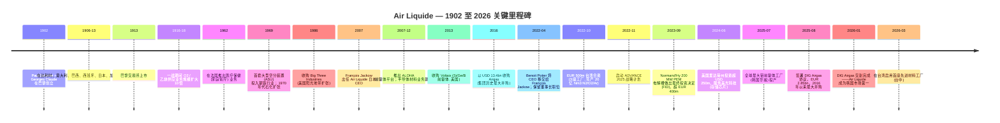

# 法国液化空气集团 (Air Liquide S.A., EPA:AI) — 公司研究报告

*报告基准日：2026-05-26 · 简体中文版*

> **更新提示 — FY2025 业绩确认增长轨迹 (2026-02-20)：** 法国液化空气集团 (Air Liquide) 公布 FY2025 营收 €26,940m (可比口径 +1.7% / 报告口径 −0.4%)，经常性营业利润率 (recurring operating margin) 提升至 **20.7%** (可比口径 +80 bps，2022-2025 不含能源效应累计 +480 bps)，经常性净利润 €3,772m (剔除汇率影响 +8.8%)，经常性 ROCE 11.2% (高于 ADVANCE 计划设定的 >10% 目标)，并提议派发每股股息 €3.65 (同比 +10.6%)。集团**确认**仍致力于 2025-2026 年再提升 +200 bps 的经常性营业利润率，并表示 2025 年完成签署、2026 年 1 月 13 日交割的韩国 DIG Airgas 收购是亚洲电子业务 (Electronics) 与能源转型增长的关键驱动。资料来源：[Air Liquide FY2025 业绩新闻稿, 2026-02-20](https://www.airliquide.com/group/press-releases-news/2026-02-20/2025-record-performance-and-confident-its-transformation-dynamic-air-liquide-confirms-its-growth)。

---

## 目录

1. 公司概览
2. 公司历史
3. 管理团队
4. 产品与服务
5. 客户与上市策略
6. 行业概览
7. 竞争格局
8. 市场机会
9. 风险评估
10. 参考资料

---

## 1. 公司概览

**法国液化空气集团 (L'Air Liquide S.A.)** (泛欧巴黎交易所代码 **AI** / 彭博 **AI FP** / 美国 OTC ADR **AIQUY**) 是全球营收排名第二的工业气体 (industrial gas) 巨头、地理覆盖排名第一的工业气体公司，也是法国 CAC 40 成分股中唯一一家全球化运营**大气分离气体 (atmospheric gas)** (O₂ / N₂ / Ar / He / H₂) 加**高端前驱体材料 (advanced precursor materials)** 一体化平台的企业。集团服务范围覆盖**全球 60 个国家、约 430 万客户与患者**，员工 **66,300 人** (FY2024)，运营约 **500 套空气分离装置 (Air Separation Unit, ASU)**，FY2024 营收 **€27,058m**，经常性营业利润率 **19.9%** (经常性营业利润 €5,391m)，经常性净利润 **€3,466m**，经常性 ROCE 10.7% ([Air Liquide FY2024 业绩新闻稿, 2025-02-21](https://www.airliquide.com/group/press-releases-news/2025-02-21/2024-building-record-margin-improvement-and-major-commercial-successes-fueling-future-growth-air); [URD 2024, p. 7](https://www.airliquide.com/sites/airliquide.com/files/2025-03/air-liquide-2024-universal-registration-document.pdf))。

集团将业务划分为**四个可报告分部 (reportable segments)**，FY2024 合计贡献约 €27bn 营收：(i) **气体与服务 (Gas & Services)** ——核心引擎，营收 €25.81bn，占集团总营收 **95.4%**，下设四条业务线 (大宗工业气体 / 工业气体零售 / 医疗保健 / 电子)；(ii) **工程与建设 (Engineering & Construction, E&C)** ——营收 €412m (1.5%)，相对 2013-17 周期峰值已下降逾 50%，主要原因是集团选择将 ASU 工程价值在内部消化而非作为第三方收入入账；(iii) **全球市场与技术 (Global Markets & Technologies, GM&T)** ——营收 €836m (3.1%)，承载生物甲烷、氢能业务与新兴市场特种解决方案；(iv) **创新园区 (Innovation Campuses)** ——研发风险投资平台，不单独列入损益表分项 ([Air Liquide FY2024 PR, p. 2-3](https://www.airliquide.com/sites/airliquide.com/files/2025-02/air-liquide-pr-fy-2024-building-on-record-margin-improvement-and-major-commercial-successes-fueling-future-growth-air-liquide-is-once-again-raising-its-margin-ambition.pdf); [URD 2024, p. 7](https://www.airliquide.com/sites/airliquide.com/files/2025-03/air-liquide-2024-universal-registration-document.pdf))。气体与服务分部下的四条业务线占比并不均衡：**工业气体零售 (Industrial Merchant) 46.1%、大宗工业气体 (Large Industries) 27.6%、医疗保健 (Healthcare) 16.6%、电子 (Electronics) 9.7%** ——其中电子业务**营收最低但资本开支增速最快**，且最受 AI 驱动的半导体产能扩张周期影响 (详见 §4)。

*数据来源：Air Liquide 新闻稿—— [FY2024, 2025-02-21](https://www.airliquide.com/group/press-releases-news/2025-02-21/2024-building-record-margin-improvement-and-major-commercial-successes-fueling-future-growth-air)；[FY2025, 2026-02-20](https://www.airliquide.com/group/press-releases-news/2026-02-20/2025-record-performance-and-confident-its-transformation-dynamic-air-liquide-confirms-its-growth)。左轴 (柱状) 为营收 €m，右轴 (折线) 为经常性营业利润率 %。FY2022 营收激增反映了大宗工业气体业务下指数化合同对能源成本的传导，并非真实销量增长；FY2023 的回落即是天然气价格回归正常水位后的对称反转。*

集团的商业模式更接近**防御性现金流复利模型 (defensive cash-flow compounder)**，而非周期性增长。气体与服务约 70% 营收来自合同型驻厂供气 (on-site supply) 的照付不议 (take-or-pay) 合同，或工业气体零售业务按 CPI 年度调价的轮换框架；能源与天然气成本通过 ASU 标准合同模板**完全传导 (pass-through)** 给大宗工业气体客户，使毛利率几乎不受商品价格波动影响。电子与大宗工业气体业务的驻厂合同期限通常为 **15–20 年**，包含硬性销量承诺以及与本地 CPI、电价挂钩的调价机制 ——这是工业气体行业中最接近公用事业收入基础的合同结构 ([URD 2024, "Industrial Merchant business model" p. 22; "Large Industries" p. 18](https://www.airliquide.com/sites/airliquide.com/files/2025-03/air-liquide-2024-universal-registration-document.pdf))。其结果是过去五年的盈利质量提升：FY2024 单年经常性营业利润率扩张 **+110 bps** (不含能源效应)，2022-2026E 在 ADVANCE 2025 计划下累计 **+460 bps**，且全部不依赖大宗工业气体业务的实际销量增长 ([Air Liquide FY2024 PR, p. 1](https://www.airliquide.com/group/press-releases-news/2025-02-21/2024-building-record-margin-improvement-and-major-commercial-successes-fueling-future-growth-air))。

FY2024 气体与服务业务的区域结构为**美洲 40.0% / EMEA 39.5% / 亚太 20.5%** ——总体均衡，但亚太占比因 2015 年退出韩国大成 (Daesung) 业务而被低估；2025 年 8 月签署、2026 年 1 月 13 日交割的 **€2.85bn DIG Airgas 收购**正是对此进行结构性反向修正 ([Air Liquide H1-2025 业绩新闻稿, 2025-07-29](https://www.airliquide.com/group/press-releases-news/2025-07-29/leveraging-performance-and-growth-engines-air-liquide-remains-track-1st-half-2025); [DIG Airgas 签署公告, 2025-08-22](https://www.airliquide.com/group/press-releases-news/2025-08-22/air-liquide-announces-signature-agreement-acquire-dig-airgas-leading-integrated-gas-player-south); [DIG Airgas 交割公告, 2026-01-13](https://www.airliquide.com/group/press-releases-news/2026-01-13/closing-dig-airgas-acquisition-air-liquide-becomes-industrial-gas-leader-dynamic-south-korean-market))。DIG Airgas 是韩国排名第一的独立气体公司，此前归属麦格理资产管理 (Macquarie Asset Management)，本次交易将为集团新增约 **€500m 营收和 1,000 名员工**，使集团韩国人员翻倍，并将集团重新带回 SK 海力士 (SK hynix) 与三星电子 (Samsung Electronics) 驻厂供气生态——这一缺位已持续十年。

*数据来源：[Air Liquide URD 2024, p. 7 — "Key Elements by Business Line"](https://www.airliquide.com/sites/airliquide.com/files/2025-03/air-liquide-2024-universal-registration-document.pdf)。占比以气体与服务合计 €25,808m 为基数，而非集团合计 €27,058m。*

*数据来源：[Air Liquide URD 2024, p. 7 — "Key Figures — Key Elements by Business Line"](https://www.airliquide.com/sites/airliquide.com/files/2025-03/air-liquide-2024-universal-registration-document.pdf)。FY2024 分部营收原始披露：Large Industries 26% / €7,120m；Industrial Merchant 44% / €11,966m；Healthcare 16% / €4,274m；Electronics 9% / €2,510m；Engineering & Construction 2% / €412m；Global Markets & Technologies 3% / €836m。原 URD 页面占比为集团口径，而非气体与服务口径。*

*数据来源：[Air Liquide FY2024 PR, p. 2 — Gas & Services revenue by geography](https://www.airliquide.com/group/press-releases-news/2025-02-21/2024-building-record-margin-improvement-and-major-commercial-successes-fueling-future-growth-air)。美洲 €10.32bn、EMEA €10.18bn、亚太 €5.28bn。*

**估值快照 (Valuation snapshot)。** 截至 2026 年 5 月，Air Liquide 在泛欧巴黎交易所的股价中位为 **€185.5/股**，稀释后股本约 561m 股，对应市值 **€104.1bn / 约 USD 113bn** ([Yahoo Finance AI.PA 报价页, 2026-05-26](https://finance.yahoo.com/quote/AI.PA/)；[companiesmarketcap.com — Air Liquide P/E ratio, 2026-05](https://companiesmarketcap.com/air-liquide/pe-ratio/))。基于 FY2025 稀释 EPS **€6.24** (FY2025 经常性净利润 €3,772m 除以 ex-treasury 604m 股) 计算，TTM P/E 约 **29.7×**；按彭博一致预期 FY26E EPS，前瞻 P/E 约 23.7× ([Yahoo Finance AI.PA, key statistics, 2026-05-26](https://finance.yahoo.com/quote/AI.PA/key-statistics/)；[TradingEconomics — Air Liquide P/E history](https://tradingeconomics.com/ai:fp:pe))。EV/EBITDA 约 **14.0×** (2024-12-31 净债务 €9,159m + 约 €4.3bn 租赁负债 + €1.1bn 退休金负债，对应 EBITDA 约 €7.9bn)，按 FY2025 拟派 €3.65 股息计算的股息率约 **2.0%** ([Air Liquide FY2024 PR, p. 7 — 净债务](https://www.airliquide.com/group/press-releases-news/2025-02-21/2024-building-record-margin-improvement-and-major-commercial-successes-fueling-future-growth-air)；[Air Liquide FY2025 PR, 2026-02-20](https://www.airliquide.com/group/press-releases-news/2026-02-20/2025-record-performance-and-confident-its-transformation-dynamic-air-liquide-confirms-its-growth))。

*数据来源：[Yahoo Finance — AI.PA (29.7×)](https://finance.yahoo.com/quote/AI.PA/key-statistics/)；[LIN (34.6×)](https://finance.yahoo.com/quote/LIN/key-statistics/)；[APD (23.9×)](https://finance.yahoo.com/quote/APD/key-statistics/)；[4091.T 日本酸素 (Nippon Sanso Holdings) (20.0×)](https://finance.yahoo.com/quote/4091.T/key-statistics/) ——均检索于 2026-05-26。*

Air Liquide 当前 29.7× 的市盈率较同业中位数 (26.8×) **溢价约 10%**，较 Linde **折价约 10%** ——三大估值驱动因素：(a) €4.6bn 在建投资项目中三分之一来自电子业务 (气体与服务最高增速、最高利润率的业务线)，因此真实盈利可预见性高于同业；(b) 在 2022-2025 已实现 +460 bps 营业利润率扩张的基础上，2025-2026 再增 +200 bps 的目标，为多年复利型故事，是 APD 等可比公司无法对标的；(c) DIG Airgas 提供了一个新的高增长韩国市场特许经营权。***分析师观点：***当前估值倍数相对于底层合同的现金流耐久性 (>70% 照付不议 + 指数化) 并不算高估；主要的下行重估风险是 FY2026 之后 ADVANCE 2025 效率提升红利消退快于市场预期 ——见 §9 的风险讨论。

---

## 2. 公司历史

Air Liquide 于 **1902 年 11 月 8 日在巴黎成立**。工业家 **Paul Delorme** 召集 24 位认购人 (多数为工程师)，共同为物理学家 **Georges Claude (乔治·克劳德)** 在两年前发现的空气液化工艺融资。公司原名为「液态空气，专门研究和开发 Georges Claude 工艺的公司 (Air liquide, a company for the study and exploitation of Georges Claude processes)」，初始资本为 100,000 法郎 (FRF)。Claude 的反向布雷顿循环 (reverse-Brayton-cycle) 工艺通过将空气冷却至 −183 ℃ 以下、然后通过分馏液态空气分离纯 O₂、N₂、Ar——其成本明显低于当时主流的林德 (Linde) 工艺，使新公司一开始就具备成本优势 ([Air Liquide — Wikipedia (founding history)](https://en.wikipedia.org/wiki/Air_Liquide); [Encyclopedia.com — L'Air Liquide history](https://www.encyclopedia.com/books/politics-and-business-magazines/lair-liquide); [URD 2024, "Group history" p. 8-9](https://www.airliquide.com/sites/airliquide.com/files/2025-03/air-liquide-2024-universal-registration-document.pdf))。公司于 **1913 年 2 月**登陆巴黎交易所，距成立仅 11 年。

*资料来源：[Air Liquide — Wikipedia (history)](https://en.wikipedia.org/wiki/Air_Liquide)；[Air Liquide URD 2024, p. 8-9](https://www.airliquide.com/sites/airliquide.com/files/2025-03/air-liquide-2024-universal-registration-document.pdf)；[Voltaix 收购 (Semiconductor Today, 2013-06-17)](https://www.semiconductor-today.com/news_items/2013/JUN/AIRLIQUIDE_170613.html)；[Taiwan €500M JV PR, 2022-10-19](https://www.airliquide.com/group/press-releases-news/2022-10-19/air-liquide-invest-500-million-euros-three-new-plants-semiconductor-sector-taiwan)；[Idaho / Micron PR, 2024-06-05](https://www.airliquide.com/group/press-releases-news/2024-06-05/air-liquide-signed-major-contract-support-semiconductor-industry-us-investment-more-250-million)；[South Korea Mo plant PR, 2025-07-21](https://www.airliquide.com/group/press-releases-news/2025-07-21/air-liquide-strengthens-its-advanced-materials-leadership-new-molybdenum-manufacturing-plant-south)；[DIG Airgas signing PR, 2025-08-22](https://www.airliquide.com/group/press-releases-news/2025-08-22/air-liquide-announces-signature-agreement-acquire-dig-airgas-leading-integrated-gas-player-south)；[Taichung plant PR, 2026-03-25](https://www.airliquide.com/group/press-releases-news/2026-03-25/air-liquide-inaugurates-its-first-advanced-materials-manufacturing-plant-taiwan-strengthening-next)。*

集团现代历史的形成有三次关键战略转向。**首先是 1916-1986 年驻厂供气大宗工业气体模式的建立**——经历两次世界大战，集团发现工业气体行业最赚钱的不是钢瓶销售业务，而是建在钢厂或化工厂背后的专用空分装置，由长达 15-20 年的照付不议合同支撑。这一模式经 1970 年代欧洲石化扩张周期和阳光地带建设 (1986 年收购 Big Three Industries) 不断精炼，构成今日电子驻厂模式 (台积电亚利桑那 / 美光爱达荷为 2020 年代版本) 的架构基础，与 1970 年代埃克森美孚安特卫普 (ExxonMobil Antwerp) 项目结构相似 ([Encyclopedia.com — L'Air Liquide history](https://www.encyclopedia.com/books/politics-and-business-magazines/lair-liquide); [URD 2024, "Large Industries business model" p. 18](https://www.airliquide.com/sites/airliquide.com/files/2025-03/air-liquide-2024-universal-registration-document.pdf))。

**其次是 2007-2013 年电子特种材料业务的建立**——集团意识到半导体行业的驻厂大宗气体业务再有价值，如果不与高附加值前驱体 / 高端材料端绑定，最终仍将面临价格商品化。集团于 2007 年自主推出 **ALOHA™** 前驱体平台 (CVD/ALD 用硅、高 k 介质和金属前驱体)，并于 2013 年以未披露金额收购 **Voltaix** (美国，Si/Ge/B 特种分子，收购时营收约 USD 50m)，从而显著扩大该业务规模 ([Voltaix 收购 (Semiconductor Today, 2013-06-17)](https://www.semiconductor-today.com/news_items/2013/JUN/AIRLIQUIDE_170613.html); [Air Liquide Electronics — Advanced Materials offer](https://electronics.airliquide.com/offer-brands/our-offer/electronics-advanced-materials))。

**第三是 2016 年收购 Airgas**——以 **USD 13.4bn 企业价值**收购美国最大的工业气体零售商，瞬间为集团新增 17,000 名美国员工和约 90 万家工业客户账户，将美洲从集团第三大区域提升为最大单一营收贡献区。该交易由 François Jackow 在 2014-2016 年担任集团战略副总裁期间主导整合，奠定了今日美洲电子业务扩张 (爱达荷、亚利桑那) 的足迹基础 ([Air Liquide URD 2024, "Group history" p. 9](https://www.airliquide.com/sites/airliquide.com/files/2025-03/air-liquide-2024-universal-registration-document.pdf); [Bloomberg — François Jackow profile](https://www.bloomberg.com/profile/person/16878479))。

2024-2026 年近期重要进展可归纳为三大主题，是后文分析的基础：(i) **AI 半导体资本开支超级周期 (super-cycle)** ——爱达荷美光合同 ($250m+, 2024-06)、三座台湾工厂 (€500m, 2022-10)、韩国钼前驱体厂 (2025-07)、德国 €250M 综合项目 (2025)、台中先进材料工厂 (2026-03)；(ii) **绿氢 (green hydrogen) 规模化** ——Normand'Hy 200 MW PEM 电解槽 (€400m+，FID 2023-09)、荷兰 ELYgator 200 MW；(iii) **DIG Airgas 韩国市场再进入** (€2.85bn，2025 年 8 月签约 / 2026 年 1 月完成交割) ——自 2016 年 Airgas 以来最大并购，是亚太再加速的战略中枢 ([DIG Airgas signing PR, 2025-08-22](https://www.airliquide.com/group/press-releases-news/2025-08-22/air-liquide-announces-signature-agreement-acquire-dig-airgas-leading-integrated-gas-player-south))。

---

## 3. 管理团队

**François Jackow ——首席执行官 (自 2022 年 6 月 1 日起)**

François Jackow 是 Air Liquide 124 年历史上的第七位首席执行官，也是自 Benoît Potier (1995-2022) 以来首位完全从 Air Liquide 内部成长起来的 CEO，而非从工程与建设 (E&C) 通道晋升。Jackow 于 **1993 年**约 26 岁时加入 Air Liquide，最初在美国和荷兰任职，前十年在大宗工业气体与工程建设业务线担任商务开发及营销职务。**2002 年**被任命为创新副总裁，负责集团 R&D 与先进技术——亦因此而对 ALOHA 前驱体早期开发拥有直接所有权，是今日电子业务的技术基础 (这在工业气体行业 CEO 中较为少见，大多数同业从大宗工业气体运营条线晋升) ([Air Liquide Executive Committee — François Jackow biography](https://www.airliquide.com/group/executive-committee); [Bloomberg — François Jackow profile](https://www.bloomberg.com/profile/person/16878479); [LinkedIn — François Jackow](https://fr.linkedin.com/in/francois-jackow))。

**2007 年**他被任命为 Air Liquide 日本总裁兼首席执行官，常驻东京，负责管理集团运营最为复杂的子公司之一 (运营复杂、工业气体零售客户基础高度分散、电子客户高度集中于胜高 (SUMCO)、信越化学、瑞萨电子、东芝)，任期四年。**2011 年**他返回巴黎担任大宗工业气体全球业务线副总裁；**2014 年**进入执行委员会，担任集团战略副总裁，并以此身份主导了 **2016 年 USD 13.4bn 收购 Airgas** ——集团历史上最大并购的尽职调查与整合规划 ([Air Liquide Executive Committee — François Jackow biography](https://www.airliquide.com/group/executive-committee); [TheOrg — François Jackow](https://theorg.com/org/air-liquide/org-chart/francois-jackow); [Acast — "In Good Company" François Jackow podcast, 2024](https://shows.acast.com/in-good-company-with-nicolai-tangen/episodes/francois-jackow-ceo-of-air-liquide))。

教育背景：毕业于**巴黎高等师范学院 (École Normale Supérieure Paris)** (化学 / 物理学本科)，**哈佛大学 (Harvard University)** 化学硕士，**工程师学院 (Collège des Ingénieurs)** MBA。加入 Air Liquide 之前曾任职于**壳牌 (Shell)** (工业风险分析师) 和**欧莱雅 (L'Oréal)** (研究助理) ——两段经历在工业气体行业 CEO 中均不常见，与 Jackow 把 Air Liquide 定位为「一家恰好运送气体的深科技材料公司 (deep-tech materials company that happens to ship gas)」而非传统管道与钢瓶公用事业的理念一致 ([Air Liquide Executive Committee biography](https://www.airliquide.com/group/executive-committee); [Bloomberg — François Jackow profile](https://www.bloomberg.com/profile/person/16878479))。

Jackow 于 **2022 年 6 月 1 日**正式接任 CEO，并在 2022 年 11 月宣布 ADVANCE 2025 计划。其三年的运营记录在工业气体同业中表现突出：经常性营业利润率在 **2022-2025 年累计扩张 +460 bps** (不含能源效应，为集团历史最高)，经常性 ROCE 由 2021 年的 9.4% 上升至 **2025 年的 11.2%**，2024 年资本开支决策达到创纪录的 **€4.4bn**，H1-2025 投资项目储备达到 **€4.6bn**，其中电子业务占三分之一 ([Air Liquide FY2024 PR, p. 1, 2025-02-21](https://www.airliquide.com/group/press-releases-news/2025-02-21/2024-building-record-margin-improvement-and-major-commercial-successes-fueling-future-growth-air); [Air Liquide FY2025 PR, 2026-02-20](https://www.airliquide.com/group/press-releases-news/2026-02-20/2025-record-performance-and-confident-its-transformation-dynamic-air-liquide-confirms-its-growth); [Air Liquide H1 2025 PR, 2025-07-29](https://www.airliquide.com/group/press-releases-news/2025-07-29/leveraging-performance-and-growth-engines-air-liquide-remains-track-1st-half-2025))。他持有约 10,500 股 Air Liquide 股票 (URD 2024 治理披露)，薪酬结构约为固定 25% / 浮动 75%，浮动部分与经常性净利润、经常性 ROCE 以及 ADVANCE 2025 效率与 CO₂ 减排目标挂钩 ([URD 2024, "Executive compensation" Chapter 4](https://www.airliquide.com/sites/airliquide.com/files/2025-03/air-liquide-2024-universal-registration-document.pdf))。

---
