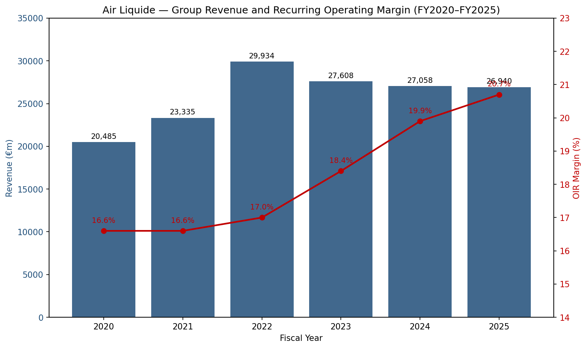
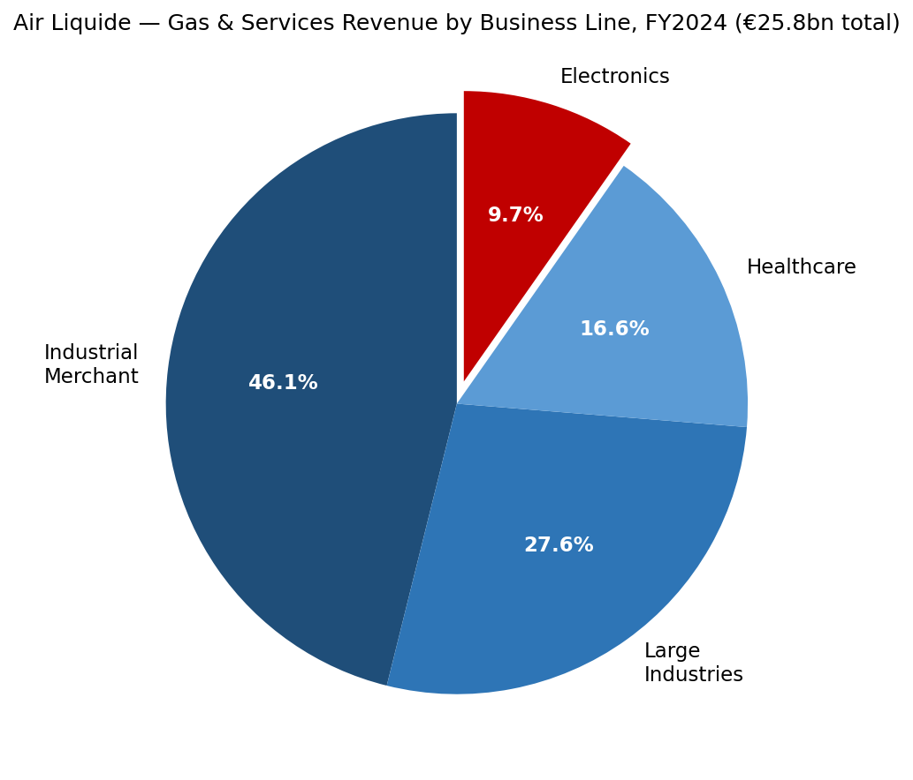
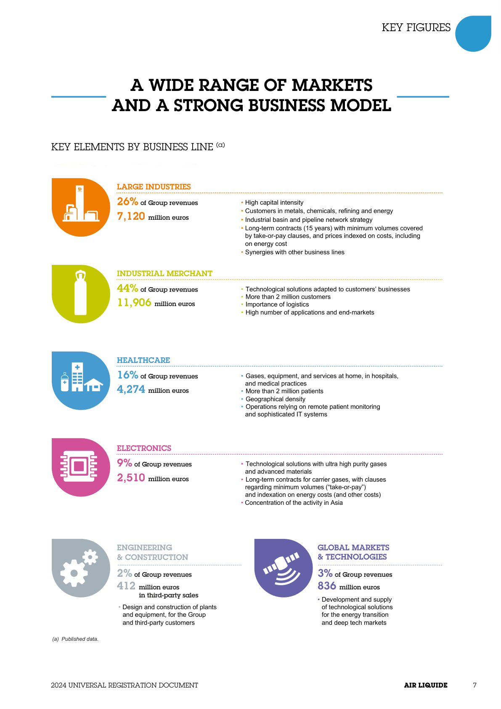
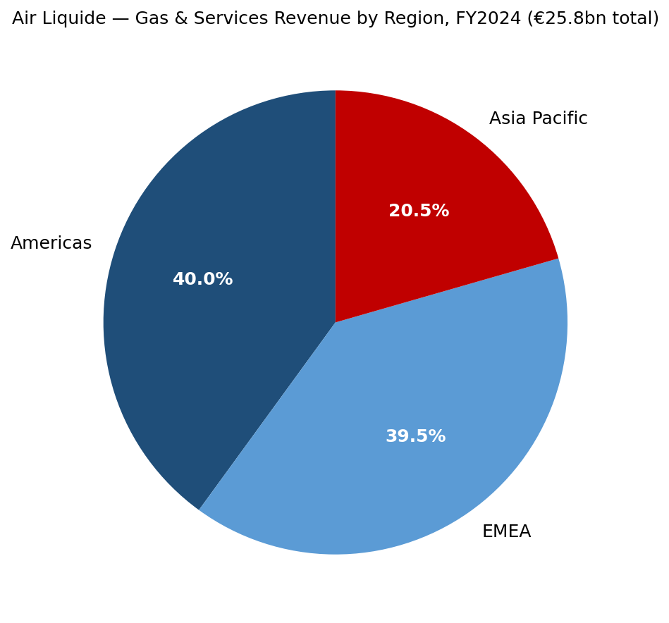
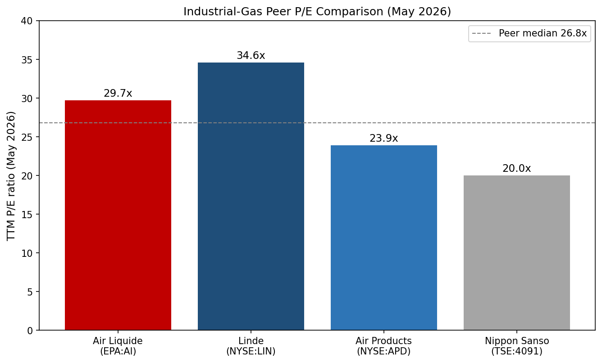
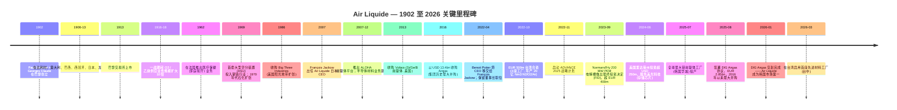
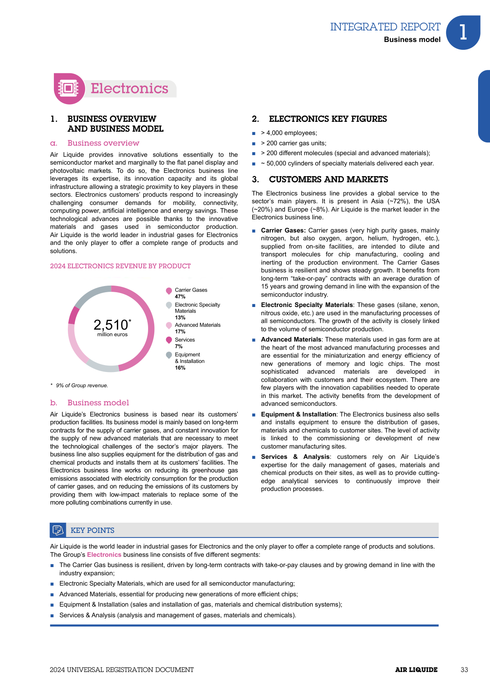
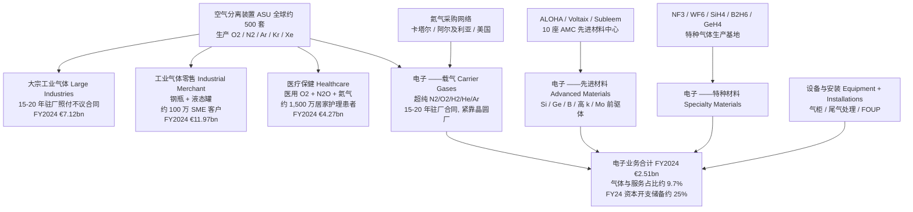
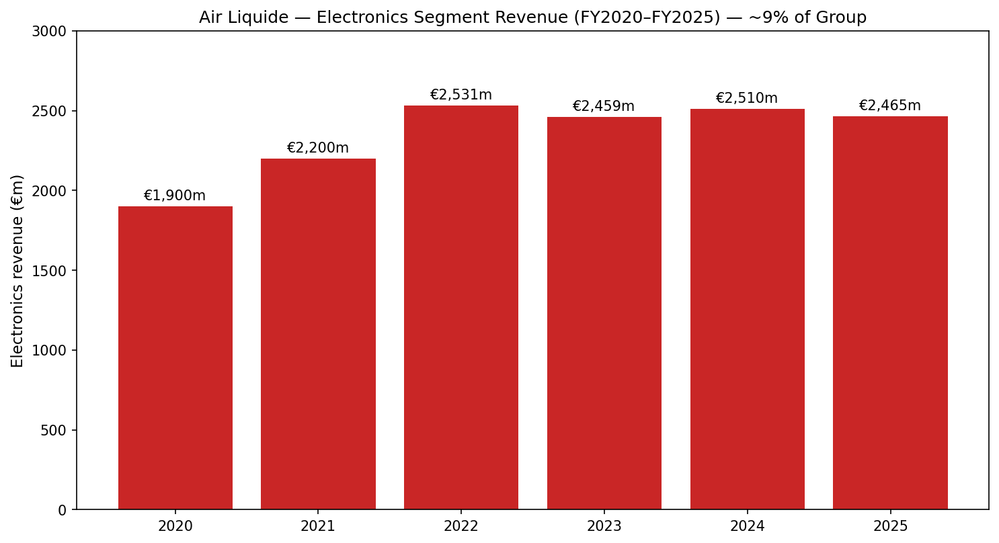
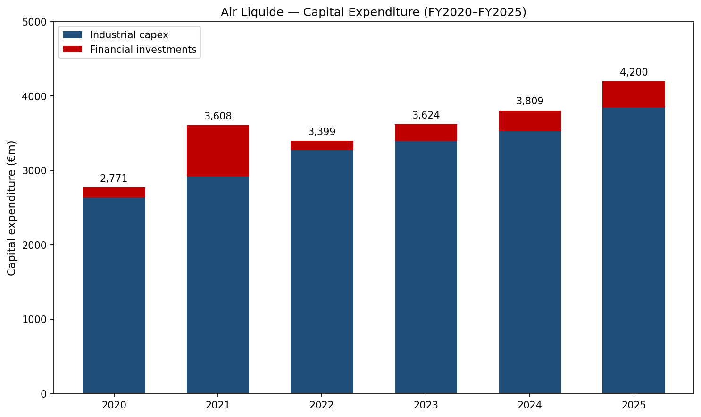

# 法国液化空气集团 (Air Liquide S.A., EPA:AI) — 公司研究报告

*报告基准日：2026-05-26 · 简体中文版*

> **更新提示 — FY2025 业绩确认增长轨迹 (2026-02-20)：** 法国液化空气集团 (Air Liquide) 公布 FY2025 营收 €26,940m (可比口径 +1.7% / 报告口径 −0.4%)，经常性营业利润率 (recurring operating margin) 提升至 **20.7%** (可比口径 +80 bps，2022-2025 不含能源效应累计 +480 bps)，经常性净利润 €3,772m (剔除汇率影响 +8.8%)，经常性 ROCE 11.2% (高于 ADVANCE 计划设定的 >10% 目标)，并提议派发每股股息 €3.65 (同比 +10.6%)。集团**确认**仍致力于 2025-2026 年再提升 +200 bps 的经常性营业利润率，并表示 2025 年完成签署、2026 年 1 月 13 日交割的韩国 DIG Airgas 收购是亚洲电子业务 (Electronics) 与能源转型增长的关键驱动。资料来源：[Air Liquide FY2025 业绩新闻稿, 2026-02-20](https://www.airliquide.com/group/press-releases-news/2026-02-20/2025-record-performance-and-confident-its-transformation-dynamic-air-liquide-confirms-its-growth)。

---

## 目录

1. 公司概览
2. 公司历史
3. 管理团队
4. 产品与服务
5. 客户与上市策略
6. 行业概览
7. 竞争格局
8. 市场机会
9. 风险评估
10. 参考资料

---

## 1. 公司概览

**法国液化空气集团 (L'Air Liquide S.A.)** (泛欧巴黎交易所代码 **AI** / 彭博 **AI FP** / 美国 OTC ADR **AIQUY**) 是全球营收排名第二的工业气体 (industrial gas) 巨头、地理覆盖排名第一的工业气体公司，也是法国 CAC 40 成分股中唯一一家全球化运营**大气分离气体 (atmospheric gas)** (O₂ / N₂ / Ar / He / H₂) 加**高端前驱体材料 (advanced precursor materials)** 一体化平台的企业。集团服务范围覆盖**全球 60 个国家、约 430 万客户与患者**，员工 **66,300 人** (FY2024)，运营约 **500 套空气分离装置 (Air Separation Unit, ASU)**，FY2024 营收 **€27,058m**，经常性营业利润率 **19.9%** (经常性营业利润 €5,391m)，经常性净利润 **€3,466m**，经常性 ROCE 10.7% ([Air Liquide FY2024 业绩新闻稿, 2025-02-21](https://www.airliquide.com/group/press-releases-news/2025-02-21/2024-building-record-margin-improvement-and-major-commercial-successes-fueling-future-growth-air); [URD 2024, p. 7](https://www.airliquide.com/sites/airliquide.com/files/2025-03/air-liquide-2024-universal-registration-document.pdf))。

集团将业务划分为**四个可报告分部 (reportable segments)**，FY2024 合计贡献约 €27bn 营收：(i) **气体与服务 (Gas & Services)** ——核心引擎，营收 €25.81bn，占集团总营收 **95.4%**，下设四条业务线 (大宗工业气体 / 工业气体零售 / 医疗保健 / 电子)；(ii) **工程与建设 (Engineering & Construction, E&C)** ——营收 €412m (1.5%)，相对 2013-17 周期峰值已下降逾 50%，主要原因是集团选择将 ASU 工程价值在内部消化而非作为第三方收入入账；(iii) **全球市场与技术 (Global Markets & Technologies, GM&T)** ——营收 €836m (3.1%)，承载生物甲烷、氢能业务与新兴市场特种解决方案；(iv) **创新园区 (Innovation Campuses)** ——研发风险投资平台，不单独列入损益表分项 ([Air Liquide FY2024 PR, p. 2-3](https://www.airliquide.com/sites/airliquide.com/files/2025-02/air-liquide-pr-fy-2024-building-on-record-margin-improvement-and-major-commercial-successes-fueling-future-growth-air-liquide-is-once-again-raising-its-margin-ambition.pdf); [URD 2024, p. 7](https://www.airliquide.com/sites/airliquide.com/files/2025-03/air-liquide-2024-universal-registration-document.pdf))。气体与服务分部下的四条业务线占比并不均衡：**工业气体零售 (Industrial Merchant) 46.1%、大宗工业气体 (Large Industries) 27.6%、医疗保健 (Healthcare) 16.6%、电子 (Electronics) 9.7%** ——其中电子业务**营收最低但资本开支增速最快**，且最受 AI 驱动的半导体产能扩张周期影响 (详见 §4)。

*数据来源：Air Liquide 新闻稿—— [FY2024, 2025-02-21](https://www.airliquide.com/group/press-releases-news/2025-02-21/2024-building-record-margin-improvement-and-major-commercial-successes-fueling-future-growth-air)；[FY2025, 2026-02-20](https://www.airliquide.com/group/press-releases-news/2026-02-20/2025-record-performance-and-confident-its-transformation-dynamic-air-liquide-confirms-its-growth)。左轴 (柱状) 为营收 €m，右轴 (折线) 为经常性营业利润率 %。FY2022 营收激增反映了大宗工业气体业务下指数化合同对能源成本的传导，并非真实销量增长；FY2023 的回落即是天然气价格回归正常水位后的对称反转。*

集团的商业模式更接近**防御性现金流复利模型 (defensive cash-flow compounder)**，而非周期性增长。气体与服务约 70% 营收来自合同型驻厂供气 (on-site supply) 的照付不议 (take-or-pay) 合同，或工业气体零售业务按 CPI 年度调价的轮换框架；能源与天然气成本通过 ASU 标准合同模板**完全传导 (pass-through)** 给大宗工业气体客户，使毛利率几乎不受商品价格波动影响。电子与大宗工业气体业务的驻厂合同期限通常为 **15–20 年**，包含硬性销量承诺以及与本地 CPI、电价挂钩的调价机制 ——这是工业气体行业中最接近公用事业收入基础的合同结构 ([URD 2024, "Industrial Merchant business model" p. 22; "Large Industries" p. 18](https://www.airliquide.com/sites/airliquide.com/files/2025-03/air-liquide-2024-universal-registration-document.pdf))。其结果是过去五年的盈利质量提升：FY2024 单年经常性营业利润率扩张 **+110 bps** (不含能源效应)，2022-2026E 在 ADVANCE 2025 计划下累计 **+460 bps**，且全部不依赖大宗工业气体业务的实际销量增长 ([Air Liquide FY2024 PR, p. 1](https://www.airliquide.com/group/press-releases-news/2025-02-21/2024-building-record-margin-improvement-and-major-commercial-successes-fueling-future-growth-air))。

FY2024 气体与服务业务的区域结构为**美洲 40.0% / EMEA 39.5% / 亚太 20.5%** ——总体均衡，但亚太占比因 2015 年退出韩国大成 (Daesung) 业务而被低估；2025 年 8 月签署、2026 年 1 月 13 日交割的 **€2.85bn DIG Airgas 收购**正是对此进行结构性反向修正 ([Air Liquide H1-2025 业绩新闻稿, 2025-07-29](https://www.airliquide.com/group/press-releases-news/2025-07-29/leveraging-performance-and-growth-engines-air-liquide-remains-track-1st-half-2025); [DIG Airgas 签署公告, 2025-08-22](https://www.airliquide.com/group/press-releases-news/2025-08-22/air-liquide-announces-signature-agreement-acquire-dig-airgas-leading-integrated-gas-player-south); [DIG Airgas 交割公告, 2026-01-13](https://www.airliquide.com/group/press-releases-news/2026-01-13/closing-dig-airgas-acquisition-air-liquide-becomes-industrial-gas-leader-dynamic-south-korean-market))。DIG Airgas 是韩国排名第一的独立气体公司，此前归属麦格理资产管理 (Macquarie Asset Management)，本次交易将为集团新增约 **€500m 营收和 1,000 名员工**，使集团韩国人员翻倍，并将集团重新带回 SK 海力士 (SK hynix) 与三星电子 (Samsung Electronics) 驻厂供气生态——这一缺位已持续十年。

*数据来源：[Air Liquide URD 2024, p. 7 — "Key Elements by Business Line"](https://www.airliquide.com/sites/airliquide.com/files/2025-03/air-liquide-2024-universal-registration-document.pdf)。占比以气体与服务合计 €25,808m 为基数，而非集团合计 €27,058m。*

*数据来源：[Air Liquide URD 2024, p. 7 — "Key Figures — Key Elements by Business Line"](https://www.airliquide.com/sites/airliquide.com/files/2025-03/air-liquide-2024-universal-registration-document.pdf)。FY2024 分部营收原始披露：Large Industries 26% / €7,120m；Industrial Merchant 44% / €11,966m；Healthcare 16% / €4,274m；Electronics 9% / €2,510m；Engineering & Construction 2% / €412m；Global Markets & Technologies 3% / €836m。原 URD 页面占比为集团口径，而非气体与服务口径。*

*数据来源：[Air Liquide FY2024 PR, p. 2 — Gas & Services revenue by geography](https://www.airliquide.com/group/press-releases-news/2025-02-21/2024-building-record-margin-improvement-and-major-commercial-successes-fueling-future-growth-air)。美洲 €10.32bn、EMEA €10.18bn、亚太 €5.28bn。*

**估值快照 (Valuation snapshot)。** 截至 2026 年 5 月，Air Liquide 在泛欧巴黎交易所的股价中位为 **€185.5/股**，稀释后股本约 561m 股，对应市值 **€104.1bn / 约 USD 113bn** ([Yahoo Finance AI.PA 报价页, 2026-05-26](https://finance.yahoo.com/quote/AI.PA/)；[companiesmarketcap.com — Air Liquide P/E ratio, 2026-05](https://companiesmarketcap.com/air-liquide/pe-ratio/))。基于 FY2025 稀释 EPS **€6.24** (FY2025 经常性净利润 €3,772m 除以 ex-treasury 604m 股) 计算，TTM P/E 约 **29.7×**；按彭博一致预期 FY26E EPS，前瞻 P/E 约 23.7× ([Yahoo Finance AI.PA, key statistics, 2026-05-26](https://finance.yahoo.com/quote/AI.PA/key-statistics/)；[TradingEconomics — Air Liquide P/E history](https://tradingeconomics.com/ai:fp:pe))。EV/EBITDA 约 **14.0×** (2024-12-31 净债务 €9,159m + 约 €4.3bn 租赁负债 + €1.1bn 退休金负债，对应 EBITDA 约 €7.9bn)，按 FY2025 拟派 €3.65 股息计算的股息率约 **2.0%** ([Air Liquide FY2024 PR, p. 7 — 净债务](https://www.airliquide.com/group/press-releases-news/2025-02-21/2024-building-record-margin-improvement-and-major-commercial-successes-fueling-future-growth-air)；[Air Liquide FY2025 PR, 2026-02-20](https://www.airliquide.com/group/press-releases-news/2026-02-20/2025-record-performance-and-confident-its-transformation-dynamic-air-liquide-confirms-its-growth))。

*数据来源：[Yahoo Finance — AI.PA (29.7×)](https://finance.yahoo.com/quote/AI.PA/key-statistics/)；[LIN (34.6×)](https://finance.yahoo.com/quote/LIN/key-statistics/)；[APD (23.9×)](https://finance.yahoo.com/quote/APD/key-statistics/)；[4091.T 日本酸素 (Nippon Sanso Holdings) (20.0×)](https://finance.yahoo.com/quote/4091.T/key-statistics/) ——均检索于 2026-05-26。*

Air Liquide 当前 29.7× 的市盈率较同业中位数 (26.8×) **溢价约 10%**，较 Linde **折价约 10%** ——三大估值驱动因素：(a) €4.6bn 在建投资项目中三分之一来自电子业务 (气体与服务最高增速、最高利润率的业务线)，因此真实盈利可预见性高于同业；(b) 在 2022-2025 已实现 +460 bps 营业利润率扩张的基础上，2025-2026 再增 +200 bps 的目标，为多年复利型故事，是 APD 等可比公司无法对标的；(c) DIG Airgas 提供了一个新的高增长韩国市场特许经营权。***分析师观点：***当前估值倍数相对于底层合同的现金流耐久性 (>70% 照付不议 + 指数化) 并不算高估；主要的下行重估风险是 FY2026 之后 ADVANCE 2025 效率提升红利消退快于市场预期 ——见 §9 的风险讨论。

---

## 2. 公司历史

Air Liquide 于 **1902 年 11 月 8 日在巴黎成立**。工业家 **Paul Delorme** 召集 24 位认购人 (多数为工程师)，共同为物理学家 **Georges Claude (乔治·克劳德)** 在两年前发现的空气液化工艺融资。公司原名为「液态空气，专门研究和开发 Georges Claude 工艺的公司 (Air liquide, a company for the study and exploitation of Georges Claude processes)」，初始资本为 100,000 法郎 (FRF)。Claude 的反向布雷顿循环 (reverse-Brayton-cycle) 工艺通过将空气冷却至 −183 ℃ 以下、然后通过分馏液态空气分离纯 O₂、N₂、Ar——其成本明显低于当时主流的林德 (Linde) 工艺，使新公司一开始就具备成本优势 ([Air Liquide — Wikipedia (founding history)](https://en.wikipedia.org/wiki/Air_Liquide); [Encyclopedia.com — L'Air Liquide history](https://www.encyclopedia.com/books/politics-and-business-magazines/lair-liquide); [URD 2024, "Group history" p. 8-9](https://www.airliquide.com/sites/airliquide.com/files/2025-03/air-liquide-2024-universal-registration-document.pdf))。公司于 **1913 年 2 月**登陆巴黎交易所，距成立仅 11 年。

*资料来源：[Air Liquide — Wikipedia (history)](https://en.wikipedia.org/wiki/Air_Liquide)；[Air Liquide URD 2024, p. 8-9](https://www.airliquide.com/sites/airliquide.com/files/2025-03/air-liquide-2024-universal-registration-document.pdf)；[Voltaix 收购 (Semiconductor Today, 2013-06-17)](https://www.semiconductor-today.com/news_items/2013/JUN/AIRLIQUIDE_170613.html)；[Taiwan €500M JV PR, 2022-10-19](https://www.airliquide.com/group/press-releases-news/2022-10-19/air-liquide-invest-500-million-euros-three-new-plants-semiconductor-sector-taiwan)；[Idaho / Micron PR, 2024-06-05](https://www.airliquide.com/group/press-releases-news/2024-06-05/air-liquide-signed-major-contract-support-semiconductor-industry-us-investment-more-250-million)；[South Korea Mo plant PR, 2025-07-21](https://www.airliquide.com/group/press-releases-news/2025-07-21/air-liquide-strengthens-its-advanced-materials-leadership-new-molybdenum-manufacturing-plant-south)；[DIG Airgas signing PR, 2025-08-22](https://www.airliquide.com/group/press-releases-news/2025-08-22/air-liquide-announces-signature-agreement-acquire-dig-airgas-leading-integrated-gas-player-south)；[Taichung plant PR, 2026-03-25](https://www.airliquide.com/group/press-releases-news/2026-03-25/air-liquide-inaugurates-its-first-advanced-materials-manufacturing-plant-taiwan-strengthening-next)。*

集团现代历史的形成有三次关键战略转向。**首先是 1916-1986 年驻厂供气大宗工业气体模式的建立**——经历两次世界大战，集团发现工业气体行业最赚钱的不是钢瓶销售业务，而是建在钢厂或化工厂背后的专用空分装置，由长达 15-20 年的照付不议合同支撑。这一模式经 1970 年代欧洲石化扩张周期和阳光地带建设 (1986 年收购 Big Three Industries) 不断精炼，构成今日电子驻厂模式 (台积电亚利桑那 / 美光爱达荷为 2020 年代版本) 的架构基础，与 1970 年代埃克森美孚安特卫普 (ExxonMobil Antwerp) 项目结构相似 ([Encyclopedia.com — L'Air Liquide history](https://www.encyclopedia.com/books/politics-and-business-magazines/lair-liquide); [URD 2024, "Large Industries business model" p. 18](https://www.airliquide.com/sites/airliquide.com/files/2025-03/air-liquide-2024-universal-registration-document.pdf))。

**其次是 2007-2013 年电子特种材料业务的建立**——集团意识到半导体行业的驻厂大宗气体业务再有价值，如果不与高附加值前驱体 / 高端材料端绑定，最终仍将面临价格商品化。集团于 2007 年自主推出 **ALOHA™** 前驱体平台 (CVD/ALD 用硅、高 k 介质和金属前驱体)，并于 2013 年以未披露金额收购 **Voltaix** (美国，Si/Ge/B 特种分子，收购时营收约 USD 50m)，从而显著扩大该业务规模 ([Voltaix 收购 (Semiconductor Today, 2013-06-17)](https://www.semiconductor-today.com/news_items/2013/JUN/AIRLIQUIDE_170613.html); [Air Liquide Electronics — Advanced Materials offer](https://electronics.airliquide.com/offer-brands/our-offer/electronics-advanced-materials))。

**第三是 2016 年收购 Airgas**——以 **USD 13.4bn 企业价值**收购美国最大的工业气体零售商，瞬间为集团新增 17,000 名美国员工和约 90 万家工业客户账户，将美洲从集团第三大区域提升为最大单一营收贡献区。该交易由 François Jackow 在 2014-2016 年担任集团战略副总裁期间主导整合，奠定了今日美洲电子业务扩张 (爱达荷、亚利桑那) 的足迹基础 ([Air Liquide URD 2024, "Group history" p. 9](https://www.airliquide.com/sites/airliquide.com/files/2025-03/air-liquide-2024-universal-registration-document.pdf); [Bloomberg — François Jackow profile](https://www.bloomberg.com/profile/person/16878479))。

2024-2026 年近期重要进展可归纳为三大主题，是后文分析的基础：(i) **AI 半导体资本开支超级周期 (super-cycle)** ——爱达荷美光合同 ($250m+, 2024-06)、三座台湾工厂 (€500m, 2022-10)、韩国钼前驱体厂 (2025-07)、德国 €250M 综合项目 (2025)、台中先进材料工厂 (2026-03)；(ii) **绿氢 (green hydrogen) 规模化** ——Normand'Hy 200 MW PEM 电解槽 (€400m+，FID 2023-09)、荷兰 ELYgator 200 MW；(iii) **DIG Airgas 韩国市场再进入** (€2.85bn，2025 年 8 月签约 / 2026 年 1 月完成交割) ——自 2016 年 Airgas 以来最大并购，是亚太再加速的战略中枢 ([DIG Airgas signing PR, 2025-08-22](https://www.airliquide.com/group/press-releases-news/2025-08-22/air-liquide-announces-signature-agreement-acquire-dig-airgas-leading-integrated-gas-player-south))。

---

## 3. 管理团队

**François Jackow ——首席执行官 (自 2022 年 6 月 1 日起)**

François Jackow 是 Air Liquide 124 年历史上的第七位首席执行官，也是自 Benoît Potier (1995-2022) 以来首位完全从 Air Liquide 内部成长起来的 CEO，而非从工程与建设 (E&C) 通道晋升。Jackow 于 **1993 年**约 26 岁时加入 Air Liquide，最初在美国和荷兰任职，前十年在大宗工业气体与工程建设业务线担任商务开发及营销职务。**2002 年**被任命为创新副总裁，负责集团 R&D 与先进技术——亦因此而对 ALOHA 前驱体早期开发拥有直接所有权，是今日电子业务的技术基础 (这在工业气体行业 CEO 中较为少见，大多数同业从大宗工业气体运营条线晋升) ([Air Liquide Executive Committee — François Jackow biography](https://www.airliquide.com/group/executive-committee); [Bloomberg — François Jackow profile](https://www.bloomberg.com/profile/person/16878479); [LinkedIn — François Jackow](https://fr.linkedin.com/in/francois-jackow))。

**2007 年**他被任命为 Air Liquide 日本总裁兼首席执行官，常驻东京，负责管理集团运营最为复杂的子公司之一 (运营复杂、工业气体零售客户基础高度分散、电子客户高度集中于胜高 (SUMCO)、信越化学、瑞萨电子、东芝)，任期四年。**2011 年**他返回巴黎担任大宗工业气体全球业务线副总裁；**2014 年**进入执行委员会，担任集团战略副总裁，并以此身份主导了 **2016 年 USD 13.4bn 收购 Airgas** ——集团历史上最大并购的尽职调查与整合规划 ([Air Liquide Executive Committee — François Jackow biography](https://www.airliquide.com/group/executive-committee); [TheOrg — François Jackow](https://theorg.com/org/air-liquide/org-chart/francois-jackow); [Acast — "In Good Company" François Jackow podcast, 2024](https://shows.acast.com/in-good-company-with-nicolai-tangen/episodes/francois-jackow-ceo-of-air-liquide))。

教育背景：毕业于**巴黎高等师范学院 (École Normale Supérieure Paris)** (化学 / 物理学本科)，**哈佛大学 (Harvard University)** 化学硕士，**工程师学院 (Collège des Ingénieurs)** MBA。加入 Air Liquide 之前曾任职于**壳牌 (Shell)** (工业风险分析师) 和**欧莱雅 (L'Oréal)** (研究助理) ——两段经历在工业气体行业 CEO 中均不常见，与 Jackow 把 Air Liquide 定位为「一家恰好运送气体的深科技材料公司 (deep-tech materials company that happens to ship gas)」而非传统管道与钢瓶公用事业的理念一致 ([Air Liquide Executive Committee biography](https://www.airliquide.com/group/executive-committee); [Bloomberg — François Jackow profile](https://www.bloomberg.com/profile/person/16878479))。

Jackow 于 **2022 年 6 月 1 日**正式接任 CEO，并在 2022 年 11 月宣布 ADVANCE 2025 计划。其三年的运营记录在工业气体同业中表现突出：经常性营业利润率在 **2022-2025 年累计扩张 +460 bps** (不含能源效应，为集团历史最高)，经常性 ROCE 由 2021 年的 9.4% 上升至 **2025 年的 11.2%**，2024 年资本开支决策达到创纪录的 **€4.4bn**，H1-2025 投资项目储备达到 **€4.6bn**，其中电子业务占三分之一 ([Air Liquide FY2024 PR, p. 1, 2025-02-21](https://www.airliquide.com/group/press-releases-news/2025-02-21/2024-building-record-margin-improvement-and-major-commercial-successes-fueling-future-growth-air); [Air Liquide FY2025 PR, 2026-02-20](https://www.airliquide.com/group/press-releases-news/2026-02-20/2025-record-performance-and-confident-its-transformation-dynamic-air-liquide-confirms-its-growth); [Air Liquide H1 2025 PR, 2025-07-29](https://www.airliquide.com/group/press-releases-news/2025-07-29/leveraging-performance-and-growth-engines-air-liquide-remains-track-1st-half-2025))。他持有约 10,500 股 Air Liquide 股票 (URD 2024 治理披露)，薪酬结构约为固定 25% / 浮动 75%，浮动部分与经常性净利润、经常性 ROCE 以及 ADVANCE 2025 效率与 CO₂ 减排目标挂钩 ([URD 2024, "Executive compensation" Chapter 4](https://www.airliquide.com/sites/airliquide.com/files/2025-03/air-liquide-2024-universal-registration-document.pdf))。

---

## 4. 产品与服务

本节为整份报告中最重要的部分——若此处不做深度展开，下游分析便沦为空洞概述。Air Liquide 的产品体系覆盖**逾 250 种气体** (重工业、医疗、食品保鲜、电子等领域使用的所有化学纯大气、工业及特种分子)，仅电子业务一项就覆盖**逾 200 种分子**，包括大宗载气 (carrier gases)、原子层沉积 (ALD) 前驱体、刻蚀气体与掺杂剂 ([URD 2024, p. 33 — Electronics business model](https://www.airliquide.com/sites/airliquide.com/files/2025-03/air-liquide-2024-universal-registration-document.pdf))。本节按气体与服务的四条业务线展开 (大宗工业气体、工业气体零售、医疗保健、电子——其中**电子业务因与半导体投资主题最相关而加倍展开**)，最后简述工程与建设、全球市场与技术，以确保覆盖完整。

### 4.1 URD 2024 电子业务原始章节 (嵌入式)

URD 2024 第 33 页对电子业务的描述是 §4.3 内容的权威产品矩阵锚点——以下嵌入该页原图，并在本节正文中以原文逐句引用 (verbatim block-quote)。

*数据来源：[Air Liquide Universal Registration Document 2024, p. 33 — "Electronics" business model spread](https://www.airliquide.com/sites/airliquide.com/files/2025-03/air-liquide-2024-universal-registration-document.pdf)。*

### 4.2 跨业务线综合 ——产品分类如何相互联动

Air Liquide 的四条气体与服务业务线**共用一组上游资产** (全球约 500 套 ASU 生产 O₂ / N₂ / Ar 加上氦气 / 氢气采购网络)，**下游则发散为四个不同的商业模式**，对同一组分子赋予不同的变现路径。大宗工业气体以**驻厂方式 (on-site)** 在 15-20 年照付不议合同框架下销售大宗气体，单位价格最低但具公用事业般经济效益；工业气体零售将相同分子重新包装为**液态罐和钢瓶**，以驻厂价的若干倍销售给约 100 万家中小企业账户；医疗保健将相同的 O₂ (加上医疗专用的 N₂O、He/O₂ 混合气) 在受规管的药品定价框架下销售给医院和居家护理客户。**电子业务**在大宗载气供应基础上叠加两项更高附加值业务——特种气体 (NF₃、WF₆、SiH₄ 级别) 和**前驱体材料 (precursor materials)** (在 **10 座先进材料中心 (Advanced Materials Centers, AMC)** 生产，分布于韩国 / 日本 / 新加坡 / 台湾 / 美国 / 欧洲) ——并通过同一客户界面交付载气 + 特种 + 先进材料 + 设备/安装四条收入流 ([URD 2024, p. 33](https://www.airliquide.com/sites/airliquide.com/files/2025-03/air-liquide-2024-universal-registration-document.pdf); [Air Liquide Electronics — Advanced Materials offer](https://electronics.airliquide.com/offer-brands/our-offer/electronics-advanced-materials))。

*综合说明：上述图示揭示了电子业务为何在结构上具有最高的边际利润率——每一美元在台积电或三星晶圆厂的驻厂大宗载气营收，都会催生数倍于其的特种气体 + 先进材料 + 设备销售，通过**同一**客户界面完成，无需重新付出销售获客成本。*

### 4.3 电子业务 ——AI 资本周期下集团最高优先级业务

电子业务 FY2024 营收 **€2,510m (可比口径 +3.3%)**，占气体与服务**约 9.7%**，全球员工**约 4,000 人**，覆盖 URD 2024 第 33 页饼图中的四个子类。其内部结构：载气 **47%**、电子特种材料 **16%**、先进材料 **11%**、设备与安装 **16%**、其他约 10%。**电子业务投资约占 H1-2025 €4.6bn 投资储备的三分之一**，是单一业务线中占比最高的 ([URD 2024, p. 33](https://www.airliquide.com/sites/airliquide.com/files/2025-03/air-liquide-2024-universal-registration-document.pdf); [Air Liquide H1 2025 PR, 2025-07-29](https://www.airliquide.com/group/press-releases-news/2025-07-29/leveraging-performance-and-growth-engines-air-liquide-remains-track-1st-half-2025))。

*数据来源：Air Liquide FY2020-FY2025 业绩新闻稿——分部营收口径采用各年度披露版本。[FY2024 PR, p. 2-3](https://www.airliquide.com/group/press-releases-news/2025-02-21/2024-building-record-margin-improvement-and-major-commercial-successes-fueling-future-growth-air)；[FY2025 PR, 2026-02-20](https://www.airliquide.com/group/press-releases-news/2026-02-20/2025-record-performance-and-confident-its-transformation-dynamic-air-liquide-confirms-its-growth)。2023-2025 平台期反映新冠后半导体库存调整以及 2024 年显示 / 存储产能利用率走弱；底层合同储备与资本开支储备指向 FY2026 起新一轮上行周期 ——爱达荷 / 台中 / 华城新产能投放支撑。*

**4.3.1 载气 ——赢得客户关系的驻厂大宗气体锚点。**

> *URD 2024 原文：*"**Carrier Gases**: Carrier gases (very high purity gases, mainly nitrogen, but also oxygen, argon, helium, hydrogen, etc.), supplied from on-site facilities and provided by a high-purity micrometric distribution system, are used in any phase of the silicon technological process. They reduce the chemical concentration of impurities to a few parts per billion." (中文释义：载气 (Carrier Gases) 主要为超高纯氮气，也包括氧气、氩气、氦气、氢气等，由驻厂设施供应，通过高纯度微米级输送系统，用于硅工艺的任一阶段。这些载气将杂质浓度降至 ppb 级别。) ([URD 2024, p. 33](https://www.airliquide.com/sites/airliquide.com/files/2025-03/air-liquide-2024-universal-registration-document.pdf))

**中文释义 / 简明解释：** **载气 (carrier gases)** 是晶圆厂内每台机台都需使用的大气分子主力——超纯氮气 (UHP N₂) 用于刻蚀腔体吹扫与气柜气动驱动；超纯氧气 (UHP O₂) 用于硅热氧化；超纯氩气 (UHP Ar) 在 PVD 与干法刻蚀腔中作为惰性溅射 / 等离子气氛；超纯氢气 (UHP H₂) 用于热还原与形成气；超纯氦气 (UHP He) 用于晶圆基座低温冷却与漏检测试。技术规格要求**金属与有机物总杂质低于 ppb 级别** ("**6N** 即 99.9999% 或更高纯度")，通过**驻厂式空分装置 + 微米级配气系统**实现 ——与销售给钢厂的同类分子相比，纯度要求高出 100 倍以上。**驻厂供气**模式 ——Air Liquide 在晶圆厂园区内自建、自有、自营 ASU，签订 15-20 年照付不议合同 ——是电子业务**最重要的单一营收锚点**：一旦晶圆厂接入某家 ASU 运营商的微米级配气环路，更换供应商就需重新铺管。2024 年 6 月**爱达荷为美光科技 (Micron) 建设的 €250m+ 工厂** (存储芯片) 与 2022 年 1 月**台积电亚利桑那州 ~€50m** 驻厂协议 (H₂ / He / CO₂——N₂ / O₂ / Ar 另与 Linde 签约) 是当前周期载气业务赢单的典型案例 ([Air Liquide-Micron Idaho PR, 2024-06-05](https://www.airliquide.com/group/press-releases-news/2024-06-05/air-liquide-signed-major-contract-support-semiconductor-industry-us-investment-more-250-million); [Air Liquide-TSMC Arizona PR, 2022-01-25](https://www.airliquide.com/group/press-releases-news/2022-01-25/air-liquide-announces-long-term-agreement-supply-semiconductor-manufacturing-site-arizona); [Air Liquide H1 2025 PR — "Carrier Gas sales more than +10%", 2025-07-29](https://www.airliquide.com/group/press-releases-news/2025-07-29/leveraging-performance-and-growth-engines-air-liquide-remains-track-1st-half-2025))。

***分析师观点：***载气业务为**强护城河型业务，兼具转换成本与规模优势**。在晶圆厂驻厂 ASU 层级最直接的竞争对手为**林德 (Linde plc)** (Praxair / 林德合并后)、**空气化工产品公司 (Air Products, NYSE:APD)**、日本的**日本酸素 (Nippon Sanso, TSE:4091)**、亚洲区域的**岩谷产业 (Iwatani)** ——四家西方巨头加日本酸素事实上按主要晶圆厂逐厂分配主要代工 / 存储驻厂合同 (台积电亚利桑那由 Air Liquide 与 Linde 按分子组合分供即是典型例子，可参见 [Wikipedia — TSMC Arizona, "Supply partners"](https://en.wikipedia.org/wiki/TSMC_Arizona))。Air Liquide H1 2025 披露的「**载气销售增速逾 +10%，且已投运 7 套新产能**」是 AI 资本周期已经转化为实际营收 (而非仅是储备) 的最有力证据 ([Air Liquide H1 2025 PR, 2025-07-29](https://www.airliquide.com/group/press-releases-news/2025-07-29/leveraging-performance-and-growth-engines-air-liquide-remains-track-1st-half-2025))。

**4.3.2 电子特种材料 ——WF₆ / NF₃ / SiH₄ 级化学品。**

> *URD 2024 原文：*"**Electronic Specialty Materials**: are gases, equipment, and services used in the manufacturing processes of the highest-purity grade of the activity is closely linked to the volume of semiconductor production." (中文释义：电子特种材料 (Electronic Specialty Materials) 是用于半导体制造工艺的最高纯度等级气体、设备与服务；其业务活跃度与半导体产量高度相关。) ([URD 2024, p. 33](https://www.airliquide.com/sites/airliquide.com/files/2025-03/air-liquide-2024-universal-registration-document.pdf))

**中文释义 / 简明解释：** **特种气体 (specialty gases / 电子特气)** 是直接参与晶圆工艺步骤的反应性、有害性、超高纯度分子，而非作为载气使用。最重要的几大族类为：(i) **三氟化氮 (NF₃)** ——CVD 反应腔远程等离子清洗用气，由日本昭和电工 (现 Resonac) 开创，Air Liquide 与三菱化学也是全球主要生产商之一；(ii) **六氟化钨 (WF₆)** ——钨 CVD 的源气体，用于填充 <100nm 接触孔与 3D NAND 的钨字线；(iii) **硅烷 (SiH₄)** 及其高级衍生物 (二硅烷、六氯二硅烷) ——用于多晶硅与氮化硅薄膜沉积；(iv) **乙硼烷 (B₂H₆)** ——离子注入掺杂源与 BPSG 前驱体；(v) **锗烷 (GeH₄)** ——锗掺杂剂及 3D NAND CVD 源；(vi) **磷烷 (PH₃)** ——n 型掺杂剂和 SiP 外延 CVD 前驱体。这些分子均**剧毒、易自燃或为压力危险品**，Air Liquide 的增值不仅在分子本身，更在**气柜、尾气处理、驻厂监测与应急响应**基础设施 ——使晶圆厂能安全集成；分子和安全包覆作为一个整体解决方案出售 (这与 URD 2024 中「gases, equipment and services」的表述一致)。特种材料子线在四子类中周期性最强 ——随晶圆开工 (wafer-start) 变化；FY2024 出现下滑 (URD 2024 上半年回顾特别提到「电子业务销售增长 +3.3%，**除特种材料外**所有子部门贡献正增长」)，原因为存储产能利用率修正 ([URD 2024, p. 33](https://www.airliquide.com/sites/airliquide.com/files/2025-03/air-liquide-2024-universal-registration-document.pdf); [Air Liquide FY2024 PR, 2025-02-21](https://www.airliquide.com/group/press-releases-news/2025-02-21/2024-building-record-margin-improvement-and-major-commercial-successes-fueling-future-growth-air))。

***分析师观点：***电子特种材料为**部分护城河**业务——Air Liquide 为全球约 5 家主要参与者之一，与之竞争的还有 **Resonac (TSE:4004 ——URD-2024 年代 NF₃ 与高纯干刻气体全球第一)**、**Versum / Merck KGaA**、**Linde Electronics**、**日本酸素**等。在分子层面的转换成本不及载气层面 ——晶圆厂可以在几个月时间内对 WF₆ 或 NF₃ 进行第二供应源认证，因此护城河更多体现在「区域规模 + 安全服务包」而非绝对锁定。Resonac 在 NF₃ 上的领先在公司自家 [FY24 业绩资料 (Data Book)](https://www.resonac.com/sites/default/files/2025-02/14_E_DataBook202412_001.pdf) 中明确披露 (Specialty Gases 业务条线)；Air Liquide 并未单独披露其 NF₃ 份额。

**4.3.3 先进材料 ——ALOHA / Voltaix / Subleem 前驱体平台 (最高利润率增长引擎)。**

> *URD 2024 原文：*"**Advanced Materials**: these materials used in gas form at the heart of the most advanced manufacturing processes and are essential for the miniaturization and energy efficiency of new-generation semiconductor chips. They are produced in collaboration with customers and then ecosystem. There are 6 product brands of advanced materials available for sale in this market." (中文释义：先进材料 (Advanced Materials) 以气态形式应用于最先进制造工艺的核心步骤，是新一代半导体芯片小型化与能效提升的关键。这些材料是与客户合作开发后再向生态系统供应；该市场可销售的先进材料共有 6 个品牌。) ([URD 2024, p. 33](https://www.airliquide.com/sites/airliquide.com/files/2025-03/air-liquide-2024-universal-registration-document.pdf))

**中文释义 / 简明解释：** **先进前驱体材料 (advanced precursor materials / 高纯前驱体)** 是经化学工程设计的金属有机 / 有机硅 / 有机金属分子 ——用于**沉积**晶体管核心的原子级薄膜。它们是**原子层沉积 (ALD)** 中的「沉积什么」，也是高端**化学气相沉积 (CVD)** 中的「沉积什么」。Air Liquide 的两个旗舰平台为：(i) **ALOHA™** ——2007 年自主研发的沉积组合，覆盖硅前驱体 (如 **HCDS, hexachlorodisilane 六氯二硅烷**，用于氮化硅沉积)、**高 k 介质** (Hf / Zr 基前驱体，用于高 k 金属栅极晶体管中的栅介质层)、**金属前驱体** (Ti / Ta / W / Co，用于阻挡层和接触层)；(ii) **VOLTAIX™** ——2013 年从美国收购的平台，专注于**硅、锗、硼化学** ——支撑 SiGe 外延生长的 Si / Ge 分子以及超浅结离子注入的硼源气体。第三个平台 **Subleem™** 于 2023-2025 年间推出，是**钼 (Mo)** 前驱体家族 ——钼正逐步替代钨成为先进逻辑制程 (sub-3nm) 字线 / 替代栅极层以及 ≥256 层 3D NAND 中的导电材料。**2025 年 7 月在韩国华城 (Hwaseong) 启用了全球最大钼前驱体生产工厂**，是该平台的实体锚点。其余命名品牌包括 **enScribe™** (刻蚀剂，与 ALD 沉积步骤对称的干法刻蚀化学品) 和 **Balazs™** (纳米级晶圆分析 / 污染检测 ——产品包的「质保」层) ([Air Liquide Electronics — Advanced Materials brand page](https://electronics.airliquide.com/offer-brands/our-offer/electronics-advanced-materials); [Hwaseong Mo plant PR, 2025-07-21](https://www.airliquide.com/group/press-releases-news/2025-07-21/air-liquide-strengthens-its-advanced-materials-leadership-new-molybdenum-manufacturing-plant-south); [ALOHA platform page](https://electronics.airliquide.com/alohatm))。10 座**先进材料中心 (AMCs)** 分布于韩国、日本、新加坡、台湾、美国与欧洲 ——与客户晶圆厂生态共址，能在 24 小时内将一罐 200 升前驱体送达晶圆厂。

***分析师观点：***先进材料是电子业务中**毛利率最高**且**技术 IP 护城河最深**的子业务。竞争者集合相对狭窄——**Merck KGaA Electronics (2019 年以 USD 6.5bn 收购的 Versum Materials)**、**杜邦电子材料 (DuPont Electronic Materials)**、**东京应化 (TOK, TSE:4186)** (光刻胶相邻特种材料)、**Resonac** (导体糊 / CMP 浆料相邻领域)、**安特格里斯 (Entegris, NASDAQ:ENTG)** (气体纯化 / 罐体处理)，再加上一批中国 / 韩国特种化学品厂商 (如 DNF、Wonik、鼎龙) 在单个分子上参与竞争。每一个前驱体的销售在客户晶圆厂端都需 2-3 年的联合开发项目以认证该分子在特定工艺节点上的应用 ——这在该节点 HVM (大批量生产) 生命周期内形成真实锁定。韩国钼前驱体厂是明显的技术领先押注：钼字线是 >256 层 V-NAND 与 GAA (全环绕栅极) 逻辑中钨字线的路线图替代品；GAA + 先进 3D NAND 量产之际成为**全球最大**钼前驱体供应商，是教科书式的规模优势 ([Hwaseong Mo plant PR — Armelle Levieux quote, 2025-07-21](https://www.airliquide.com/group/press-releases-news/2025-07-21/air-liquide-strengthens-its-advanced-materials-leadership-new-molybdenum-manufacturing-plant-south))。

**4.3.4 设备与安装 ——气柜、尾气处理与化学品输送服务捆绑。**

> *URD 2024 原文：*"**Equipment**: Air Liquide is also expanding its expertise for the design, integration and ongoing maintenance of gas cabinets and bulk specialty chemical products and installations that are at customers' fab. The Electronics business installs and maintains equipment for the distribution of gases, materials and chemicals to customer sites. The level of activity is closely linked to the volume of activity in the new semiconductor manufacturing sites." (中文释义：Air Liquide 还在扩展气柜及客户晶圆厂内大宗特种化学品与设施的设计、集成与运维能力；电子业务为客户厂区安装并维护气体、材料和化学品输送设备，其业务量与新建半导体厂的活动密切相关。) ([URD 2024, p. 33](https://www.airliquide.com/sites/airliquide.com/files/2025-03/air-liquide-2024-universal-registration-document.pdf))

**中文释义 / 简明解释：** 设备业务销售**包裹 Air Liquide 分子产品的晶圆厂洁净室金属件** ——气柜 (盛装 WF₆ / NF₃ / SiH₄ 钢瓶的不锈钢安全机柜)、**阀箱组件 (Valve-Manifold-Box, VMB) / 供气面板 (Valve-Manifold-Supplier, VMS)** 装配 (向机台分配气体)、**点用尾气处理 (point-of-use abatement)** (在排放前燃烧 / 洗涤掉自燃气体与 PFC)，以及**驻厂化学品输送橇 (skid)** (液态前驱体)。最接近的可比业务隶属于**Edwards Vacuum (Atlas Copco)**、**CS Clean Solutions (Pentair / nVent)**、**Versum Materials (Merck)**、日本的**岩谷工业气体 (Iwatani Industrial Gases)**。该业务线**以项目驱动为主**：营收与新建晶圆厂建设挂钩 (绿地项目每条完整装机晶圆开工楼层支付 USD 30-80m 的气柜+尾气处理+VMB 费用；现有晶圆厂内的产能扩张额度较低)，因此其增长几乎与台积电亚利桑那 21 厂、三星泰勒、英特尔俄亥俄、美光博伊西、欧洲马格德堡 (Magdeburg) / Crolles 2 项目以及中国 SMIC / 长鑫 / 长江存储等产能扩张呈 1:1 关系。

***分析师观点：***设备与安装为**中等护城河**业务——工程经验与历史业绩比 IP 更重要，且业务线与新厂建设周期高度耦合。若连续 2 年没有新厂破土动工，该业务将出现明显下滑 ——FY2024 出现的「设备弱、载气强」组合即反映了这一动态。

### 4.4 工业气体零售 ——焊工与冶金商背后的钢瓶与液态罐网络

工业气体零售业务 ——**FY2024 营收 €11,966m，占气体与服务 46.1%** ——是直接承接 1902 年原始平台的钢瓶与液态罐分销业务。URD 2024 对该业务的描述为：「**Industrial Merchant**: industrial gases delivered to small and medium businesses; specialty gases and welding products; technologies for hygiene and quality assurance; food preservation services. (中小企业用工业气体；特种气体与焊接产品；卫生与品质保证技术；食品保鲜服务)。」客户基础为**约 100 万家中小企业账户** (焊接店、食品加工商、饮料生产商、实验室、金属加工厂、玻璃工坊、医院液态 O₂ 罐、炼油厂氮气吹扫罐)。**定价按年度指数化重置** (FY2024 披露的定价效应为 +4.0%)，销量跟随区域工业活动 (欧美成熟市场基本持平，亚洲 / 拉美增长)，单位价格是同分子驻厂大宗渠道价格的**数倍** ——这使其成为气体与服务中毛利率最高的业务线 ([URD 2024, p. 22](https://www.airliquide.com/sites/airliquide.com/files/2025-03/air-liquide-2024-universal-registration-document.pdf); [Air Liquide FY2024 PR, p. 2, 2025-02-21](https://www.airliquide.com/group/press-releases-news/2025-02-21/2024-building-record-margin-improvement-and-major-commercial-successes-fueling-future-growth-air))。

工业气体零售业务对集团的战略价值在于**利润结构稳定**：在大宗工业气体业务的任一周期下行年 (钢铁 / 化工 / 炼油产能利用率下滑)，工业气体零售多样化的 SME 客户群提供反周期缓冲。2016 年收购 Airgas (USD 13.4bn) 在结构上等同于将集团北美工业气体零售规模翻倍，正因为如此，该分部规模超越大宗工业气体 ——历史上则相反。

***分析师观点：***工业气体零售为**规模与密度护城河**业务 ——单瓶配送成本随线路密度急剧下降，因此现有龙头 (Air Liquide、Linde / Praxair、Air Products、Iwatani、Messer SE) 在规模上极难被取代；新进入者只能局限于区域性 / 特种细分市场。

### 4.5 大宗工业气体 ——钢铁、化工、炼油的驻厂氧 / 氮 / 氢公用事业

大宗工业气体业务 ——**FY2024 营收 €7,120m，占气体与服务 27.6%** ——在重工业综合体 (一体化钢厂、乙烯裂解装置、合成氨厂、炼油厂、玻璃窑、煤化工) 旁，按 **15-20 年驻厂照付不议合同**模板供应——这一模板也是电子载气模式的架构基础。Air Liquide 在客户场地建设、自有并运营空分装置；客户承诺最低提货量 O₂ / N₂ / Ar，价格按电价指数 + 通胀调价 + 固定资本回收三个部分计算。销量跟随区域重工业活动。价格基本完全传导，因此毛利率结构性稳定，但**销量增长本质上仅来自绿地新项目** ——这就是大宗工业气体 FY2024 仅增长 +1.2% 的原因 (欧洲一家钢厂剥离形成单笔拖累，部分被两套新 ASU 启动抵消) ([URD 2024, p. 18-19](https://www.airliquide.com/sites/airliquide.com/files/2025-03/air-liquide-2024-universal-registration-document.pdf); [Air Liquide FY2024 PR, p. 2, 2025-02-21](https://www.airliquide.com/group/press-releases-news/2025-02-21/2024-building-record-margin-improvement-and-major-commercial-successes-fueling-future-growth-air))。

**脱碳叠加 (decarbonisation overlay)** 是该分部层面的拐点：集团 2024-2035 年 >€8bn 的可再生 / 低碳氢承诺 (法国诺曼底 Normand'Hy 200 MW PEM 电解槽、荷兰 ELYgator 200 MW、得克萨斯氢气网) 隶属于大宗工业气体分部，旨在未来十年通过逐一合同方式将传统灰氢 (grey-H₂) 客户 (化工、炼油) 转换为可再生 H₂ 供应 ——这是合同级的毛利率升级，因为随碳排成本提升，大宗工业气体客户宁愿支付低碳 H₂ 溢价，也不愿内化 CO₂ 税 ([Normand'Hy 项目页](https://normandhy.airliquide.com/en); [Normand'Hy 法国政府支持 PR, 2022-03-08](https://www.airliquide.com/group/press-releases-news/2022-03-08/air-liquide-receives-support-french-state-its-200-mw-electrolyzer-project-normandy-and-accelerates))。

***分析师观点：***大宗工业气体在**合同层面具备强护城河** (15-20 年驻厂照付不议合同是气体行业最强防御性现金流结构)，但**结构上低增长** (周期均值仅 +1%/年销量增长)。竞争集合：Linde plc、Air Products、Messer SE (德国)、亚洲的日本酸素。

### 4.6 医疗保健 ——医用 O₂、居家护理与 1,500 万患者

医疗保健 ——**FY2024 营收 €4,274m，占气体与服务 16.6%，增速 +8.6%** ——是医用氧气与居家护理业务，分销医用 O₂ (用于医院、家庭氧疗、救护车)、医用 N₂O (麻醉气)、用于儿科呼吸治疗的氦氧 ("heliox") 混合气、卫生气体，以及覆盖**约 1,500 万患者的居家护理服务** (针对慢性呼吸疾病与睡眠呼吸暂停患者的监测 + 配送 + 设备维护)。该业务受药品监管 (医用 O₂ 须达到 GMP 级别纯度且在各管辖区取得上市许可)，形成护城河 (高监管准入门槛) 同时设定毛利率天花板 (大多数国家医保系统进行价格管控) ([URD 2024, p. 26](https://www.airliquide.com/sites/airliquide.com/files/2025-03/air-liquide-2024-universal-registration-document.pdf); [Air Liquide FY2024 PR, p. 2, 2025-02-21](https://www.airliquide.com/group/press-releases-news/2025-02-21/2024-building-record-margin-improvement-and-major-commercial-successes-fueling-future-growth-air))。

***分析师观点：***医疗保健为**防御性现金流公用事业**，受老龄化与慢性呼吸疾病负担驱动，每年个位数销量增长，居家护理子业务有价 / 量利好。最接近的同业：Linde Healthcare、Air Products 已剥离的居家护理业务、日本岩谷、Praxair Healthcare (Linde 法定承继人)。FY2024 +8.6% 的高增长反映了新冠后销量正常化与定价的双重利好。

### 4.7 工程与建设、全球市场与技术、创新园区

**工程与建设 (E&C, FY2024 合并营收 €412m, +5.8%)** 是集团内部工程业务部门，负责空分装置和气化装置的设计、采购与建设——既服务集团自有的驻厂项目储备 (从而消除第三方 EPC 利润损失)，也服务第三方客户 (包括国家石油公司及特种细分的工业气体竞争对手)。披露的 €412m **仅为第三方部分**；支撑 2024 年创纪录 **€4.4bn 资本开支决策**的集团内 E&C 收入在合并时被消除 ([Air Liquide FY2024 PR, p. 4, 2025-02-21](https://www.airliquide.com/group/press-releases-news/2025-02-21/2024-building-record-margin-improvement-and-major-commercial-successes-fueling-future-growth-air))。

**全球市场与技术 (GM&T, FY2024 营收 €836m)** 整合了新兴市场特种业务，包括 (i) 生物气 / 生物甲烷生产 (Air Liquide 是欧洲最大的生物甲烷生产商之一)；(ii) 氢能交通 (燃料电池车加氢站)；(iii) 潜艇 / 航天低温技术 (为欧空局 / 阿丽亚娜火箭提供 O₂ / H₂)；(iv) 航天发射地面服务。其中没有一项业务在当下对集团损益表具有重大影响，但**氢能交通**部分是未来大宗工业气体脱碳业务的种子，构成集团 **2024-2035 年 >€8bn 氢能承诺**的战略依据 ([URD 2024, p. 30](https://www.airliquide.com/sites/airliquide.com/files/2025-03/air-liquide-2024-universal-registration-document.pdf))。

**创新园区 (Innovation Campuses)** ——集团在全球设有 8 个 R&D 中心 (巴黎萨克莱、纽瓦克特拉华、日本筑波、上海、班加罗尔、法兰克福等)，负责开发新前驱体分子 (ALOHA / Voltaix / Subleem)、新的 ASU 工艺设计 (例如美光爱达荷新闻稿中提到的能效提升 5% 的新设计)、膜与电解槽技术。研发投入**约 €350m / 年** (约占营收 1.3%)，相对科技行业标准较低但相对工业气体同业较高，与 Jackow 的「深科技材料公司」定位吻合 ([URD 2024, "Innovation Campuses" Chapter 1.4](https://www.airliquide.com/sites/airliquide.com/files/2025-03/air-liquide-2024-universal-registration-document.pdf))。

### 4.8 资本开支结构 ——前瞻盈利能力的关键指标

资本开支是 Air Liquide 前瞻盈利能力**最具预测力的单一指标** ——每新增一套驻厂 ASU 都在 18-30 个月后产生固定 ROCE 的合同型营收；**因此资本开支储备是 2-3 年后营收的领先指标**。FY2024 累计资本开支决策达到创纪录的 **€4.4bn**，H1-2025 投资储备增至 **€4.6bn** (其中三分之一约 €1.55bn 投向电子业务)，FY2025 资本开支支出约 €4.2bn ([Air Liquide FY2024 PR, p. 4-5, 2025-02-21](https://www.airliquide.com/group/press-releases-news/2025-02-21/2024-building-record-margin-improvement-and-major-commercial-successes-fueling-future-growth-air); [Air Liquide H1 2025 PR, 2025-07-29](https://www.airliquide.com/group/press-releases-news/2025-07-29/leveraging-performance-and-growth-engines-air-liquide-remains-track-1st-half-2025))。

*数据来源：Air Liquide FY2020-FY2025 业绩新闻稿；蓝色柱为工业资本开支 (新建 ASU 与电子工厂)，红色为金融投资 (战术性并购)。DIG Airgas (企业价值 €2.85bn，2025 年 8 月签约 / 2026 年 1 月交割) 是本周期最大单笔金融投资承诺，但记入 FY2026 现金流。[FY2024 PR, 2025-02-21](https://www.airliquide.com/group/press-releases-news/2025-02-21/2024-building-record-margin-improvement-and-major-commercial-successes-fueling-future-growth-air); [FY2025 PR, 2026-02-20](https://www.airliquide.com/group/press-releases-news/2026-02-20/2025-record-performance-and-confident-its-transformation-dynamic-air-liquide-confirms-its-growth)。*

### 4.9 综合 ——四条气体与服务业务线如何组成单一客户工作流

气体与服务四条业务线加上两条辅助分部构成**一条分层式工业气体价值链**：上游锚定 ASU 装置群 (大宗工业气体物理基础) 与氦气 / 氢气采购网络，下游发散为四个不同客户触达动作 ——**工业气体零售钢瓶/液罐**面向 SME 长尾、**医疗保健钢瓶+居家护理**面向医疗渠道、**大宗工业气体驻厂**面向重工业、**电子驻厂+特种+先进材料+设备**面向半导体 / 显示 / 光伏生态。工程与建设是**内部供应链**，负责实物资产建设；全球市场与技术是**研发到商业化的过渡桥梁**，承接下一周期业务 (可再生 H₂、生物气、氢能交通)；创新园区是**上游实验室**，孵化新分子。资本开支周期是**时序引擎**，把今天的合同胜利在 18-30 个月后转化为报告期营收。这一垂直一体化结构 ——分子研发 → 工程建设 → 资产运营 → 多渠道分销 → 服务包覆 ——既赋予 Air Liquide 公用事业般的现金流稳定性，也赋予其特种化学品般的技术 IP 选择权。

---
