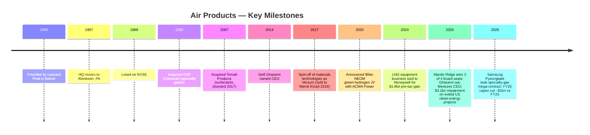

# Air Products and Chemicals, Inc. (NYSE: APD) — Company Research

*As-of date: 2026-05-26 · Analyst: financial_agent · Report language: English · Currency: USD unless noted*

> **Update — FY2026 full-year adjusted EPS guidance raised (2026-04-30):** Management raised full-year FY2026 adjusted EPS guidance to **$13.00–$13.25** (from $12.85–$13.05 issued on 2026-01-30) and reaffirmed FY2026 capex of approximately **$4.0 billion**. Q3-FY26 adjusted-EPS guide initiated at $3.25–$3.35. Q2-FY26 adjusted EPS of $3.20 grew 19% YoY and exceeded the top of the prior quarterly guide, driven by higher on-site volumes, productivity, and favorable FX, partially offset by helium-led pricing softness. Management's stated drivers: "unlock earnings growth, optimize large projects, maintain capital discipline."
> Source: [Q2-FY2026 Earnings Press Release (Exhibit 99.1, 8-K, 2026-04-30)](https://www.sec.gov/Archives/edgar/data/2969/000000296926000018/exhibit99131mar26.htm).

## Table of Contents

1. Company Overview
2. Company History
3. Management Team
4. Products & Services
5. Customers & Go-to-Market
6. Industry Overview
7. Competitive Landscape
8. Market Opportunity (TAM)
9. Risk Assessment
10. References
11. Verification log

---

## 1. Company Overview

Air Products and Chemicals, Inc. ("Air Products" or "APD") is a Delaware-domiciled, Allentown, Pennsylvania-headquartered industrial gases company founded in 1940. The company designs, builds, owns and operates large-scale gas-production facilities that supply oxygen, nitrogen, argon, hydrogen, helium, carbon monoxide, syngas and a portfolio of specialty gases to customers in refining, chemicals, metals, electronics, manufacturing, medical and food. Per the FY2025 10-K, "Air Products and Chemicals, Inc., a Delaware corporation founded in 1940, is a world-leading industrial gases company that has built a reputation for its innovation, operational excellence, and commitment to safety and environmental stewardship" ([Air Products FY2025 10-K, Item 1 Business](https://www.sec.gov/Archives/edgar/data/2969/000000296925000055/apd-20250930.htm)). Over 90% of consolidated sales come from the regional industrial gases business — approximately half of which is attributable to atmospheric gases (O₂, N₂, Ar produced by cryogenic distillation of air) — with the residual coming from process gases (H₂, He, CO₂, CO, syngas), specialty gases, and a sale-of-equipment business that ships turbomachinery, membrane systems and cryogenic containers worldwide ([FY2025 10-K, "Our Businesses"](https://www.sec.gov/Archives/edgar/data/2969/000000296925000055/apd-20250930.htm)).

**Business model.** The economic core of the industrial-gas business is the *on-site* supply mode: APD constructs and owns large air-separation units (ASUs), steam-methane reformers (SMRs) or gasifiers adjacent to customer plants, then delivers product over the fence or via pipeline under 15–20 year take-or-pay contracts with fixed monthly charges, minimum purchase commitments, and pass-through clauses for electricity, natural gas and hydrocarbon feedstock — what the 10-K calls "pricing formulas, surcharges, cost pass-through provisions, and tolling arrangements." The on-site mode generates "approximately half" of total company sales, with the merchant gases business (liquid bulk by tanker / packaged cylinders) and the equipment business making up the balance ([FY2025 10-K, "Supply Modes"](https://www.sec.gov/Archives/edgar/data/2969/000000296925000055/apd-20250930.htm)). The combination of 15–20 year contracts, pricing pass-through, and pipeline networks where APD operates them generates the long-duration cash-flow profile that lets the company carry a high capital base and steadily compound a 44-year dividend record.

**Scale.** APD reported total sales of **$12,037.3 million** in FY2025 (year ending 30 September 2025), down approximately 0.5% from FY2024's **$12,100.6 million**, which itself was down 4.0% from FY2023's **$12,600.0 million** — a multi-year top-line decline driven largely by lower hydrogen and helium pricing, the September-2024 LNG-equipment-business divestiture to Honeywell, and FX headwinds ([FY2025 10-K, Note 26 Segment & Geographic Information](https://www.sec.gov/Archives/edgar/data/2969/000000296925000055/apd-20250930.htm)). Segment operating income held roughly flat at **$2,857.7M** (FY25) vs. **$2,947.5M** (FY24) vs. **$2,739.2M** (FY23), but **consolidated operating income** plunged to a **loss of $877.0M** in FY2025 because of a non-cash **$3,747.0M business-and-asset-actions charge** (largely write-downs on the three exited US clean-energy projects discussed in §2) and **$86.3M of shareholder-activism-related costs** from the Mantle Ridge proxy contest ([FY2025 10-K, Reconciliation of Segment Operating Income to Consolidated Results](https://www.sec.gov/Archives/edgar/data/2969/000000296925000055/apd-20250930.htm)). Approximately 21,300 employees, 75% based outside the United States, operate across roughly 50 countries ([FY2025 10-K, "Human Capital Management"](https://www.sec.gov/Archives/edgar/data/2969/000000296925000055/apd-20250930.htm)).

**Geographic footprint.** FY2025 sales by country of origin: United States **$4,692.5M** (39% of total), China **$1,933.5M** (16%), other foreign operations **$5,411.3M** (45%). Property-and-equipment, net, of **$25,337.8M** is concentrated in the United States ($8,909.1M), Saudi Arabia ($6,910.6M — predominantly the NEOM JV), China ($2,654.6M) and other foreign operations ($6,863.5M); the Saudi long-lived assets ballooned from $1,818.1M at the end of FY2023 to $6,910.6M by end of FY2025 reflecting NEOM construction progress ([FY2025 10-K, Geographic Information](https://www.sec.gov/Archives/edgar/data/2969/000000296925000055/apd-20250930.htm)). The reportable segments were re-cut in FY2025 to align with the new strategy under CEO Eduardo Menezes: **Americas**, **Asia**, **Europe**, **Middle East and India**, and **Corporate and other** (five segments vs the prior three-region structure that grouped Middle East with Europe).

*Source: [Air Products FY2025 10-K](https://www.sec.gov/Archives/edgar/data/2969/000000296925000055/apd-20250930.htm) and [Q2-FY26 Earnings Press Release, 2026-04-30](https://www.sec.gov/Archives/edgar/data/2969/000000296926000018/exhibit99131mar26.htm).*

*Source: [Air Products FY2025 10-K, Note 26 Segment & Geographic Information](https://www.sec.gov/Archives/edgar/data/2969/000000296925000055/apd-20250930.htm). Numbers are external sales by reportable segment for fiscal year ended 30 September 2025.*

**Valuation snapshot.** As of 2026-05-26, APD trades around **$290 per share** with a market capitalization of approximately **$64.5 billion**, a TTM P/E of **30.5×**, a forward P/E of **21.0×**, a TTM P/S of **5.2×**, EV/EBITDA of **21.1×**, P/B of **4.1×**, dividend yield of **2.50%**, and a 5-year beta of 0.78 ([Stock Analysis — APD Statistics](https://www.stockanalysis.com/stocks/apd/statistics/)). The wide TTM-versus-forward P/E gap (30.5× → 21.0×) reflects the **FY2025 GAAP loss** caused by the $3.7bn impairment — once that one-time charge rolls off, the run-rate earnings should normalize toward the ~$13 adjusted-EPS line that management is now guiding (implying forward P/E nearer 22×, in line with Linde's ~26× forward and a small discount to Air Liquide's ~22×, reflecting APD's NEOM execution overhang and Linde's superior margin structure post-Praxair merger). The 2.5% dividend yield sits above Linde's ~1.2% but below Air Liquide's ~2.0%, reflecting APD's stronger payout-ratio anchor (~60% of adjusted EPS) and 44-year consecutive raise streak. *Analyst view:* the multiple is reasonable for a recovering bond-proxy with a clear catalyst path (NEOM commissioning mid-2027, $9bn project backlog, helium-supply tightening), but it is not cheap — investors are paying for execution certainty and the dividend more than for accelerating earnings.

*Source: [Stock Analysis — APD Statistics](https://www.stockanalysis.com/stocks/apd/statistics/), peer multiples (Linde, Air Liquide, Nippon Sanso) compiled from each issuer's market-data page, accessed 2026-05-26.*

---

## 2. Company History

Air Products was founded in Detroit on 1 February 1940 by Leonard Parker Pool, a 33-year-old salesman who had spent the prior decade selling industrial gases for Compressed Industrial Gases (later acquired by Burdett Oxygen). Pool's founding thesis was operationally radical for its day: rather than ship oxygen and nitrogen in heavy steel cylinders by truck and rail, build small generators *inside* the customer's plant — what the industry now calls the "on-site" supply mode and what still constitutes roughly half of APD's revenue today ([Air Products Company History page](https://www.airproducts.com/company/history); [Wikipedia — Air Products](https://en.wikipedia.org/wiki/Air_Products)). Pool partnered with a young engineer, Frank Pavlis, to design a compact air-separation unit lubricated with liquid oxygen and graphite; the company leased its first unit to a Detroit steel plant in 1941 and pivoted toward US Army Air Forces oxygen contracts during World War II, generating the cash that funded the move of headquarters to Pennsylvania's Lehigh Valley near Allentown in 1957 — the address (1940 Air Products Boulevard) where the company remains today ([Wikipedia — Air Products](https://en.wikipedia.org/wiki/Air_Products); [FY2025 10-K cover page](https://www.sec.gov/Archives/edgar/data/2969/000000296925000055/apd-20250930.htm)). Pool stepped down as CEO in 1973 and died in 1975.

The strategic arc since 2014 has been dominated by **three pivots**. First, under Seifi Ghasemi (CEO 2014–2025), APD shed slower-growth specialty businesses — most importantly the **2017 Versum Materials spin-off**, which carved out the electronic-materials / specialty-chemicals business (advanced precursors, photoresist ancillaries, CMP slurries) into a separate listed company; Versum was acquired by Merck KGaA for $6.5bn in 2019 ([Reuters, 2019-04-12, "Merck KGaA wins $6.5bn fight for Versum"](https://www.reuters.com/article/merck-kgaa-versum-materials-idINKCN1RO0PM)). The Versum spin permanently removed APD from the high-purity electronic-precursors competitive race against Resonac, Linde Electronics and Air Liquide Advanced Materials — APD's electronics exposure since then has been concentrated in *bulk* gases (N₂, O₂, He, H₂, Ar) and *bulk-specialty* gases supplied through pipelines and pads, not in the niche, high-margin etch / deposition / cleaning precursors that drive Resonac's or Linde's electronic-gas P&Ls.

Second, **the clean-hydrogen pivot (2018–2023).** Ghasemi committed APD to a series of multi-billion-dollar mega-projects intended to position the company as the global leader in low-carbon hydrogen production: the **$5bn NEOM Green Hydrogen Project** in Saudi Arabia (a 50/50 JV with ACWA Power and NEOM Company, with APD as off-taker for the entire ~600 t/d green ammonia output, [NEOM Green Hydrogen Company financial-close release, 2023](https://www.neom.com/en-us/newsroom/neom-green-hydrogen-investment)); a **$4.5bn Louisiana blue-hydrogen complex** in Ascension Parish targeting 2028 commissioning with on-site CO₂ sequestration ([Louisiana Economic Development announcement, 2021](https://www.opportunitylouisiana.gov/news/air-products-announces-4-5-billion-blue-hydrogen-clean-energy-complex)); a **$500M green-liquid-H₂ project in Massena, NY**; a **carbon-monoxide / SAF project in Paramount, CA** with World Energy; and a **carbon-monoxide project in Texas**. Together these projects pushed APD's capital expenditure profile from $1.6bn (FY2016) to a peak of **$7.0bn in FY2025**, ahead of any of the cash flow they were intended to generate — a strategic gamble that lifted leverage and depressed free-cash-flow conversion through fiscal 2024 ([FY2025 10-K capex disclosures](https://www.sec.gov/Archives/edgar/data/2969/000000296925000055/apd-20250930.htm)).

*Source: [Air Products FY2025 10-K, Capital Expenditures](https://www.sec.gov/Archives/edgar/data/2969/000000296925000055/apd-20250930.htm); FY2026E from [Q2-FY26 Earnings PR, 2026-04-30](https://www.sec.gov/Archives/edgar/data/2969/000000296926000018/exhibit99131mar26.htm) ("approximately $4.0 billion").*

Third — and the most consequential pivot in the company's modern history — **the Mantle Ridge activist intervention and 2025 strategic reset.** In October 2024, Paul Hilal's Mantle Ridge LP disclosed a ~$1bn stake and demanded board representation, a CEO succession plan, exit from sub-economic clean-energy commitments, and a more disciplined return-on-capital framework. The proxy contest concluded at the **January 23, 2025 Annual Meeting**, where shareholders elected **three of Mantle Ridge's four nominees** — Paul Hilal, Dennis Reilley (former Praxair CEO), and Andrew Evans (former Southern Company CFO) — and rejected one (Tracy McKibben) ([Chemical Week, Jan 2025, "Mantle Ridge wins three seats"](https://chemweek.mydigitalpublication.com/articles/mantle-ridge-wins-three-seats-in-air-products-proxy-battle); [APD 2026 DEF 14A — Mantle Ridge background](https://www.sec.gov/Archives/edgar/data/2969/000130817925000643/apd-20251210.htm)). Within two weeks, the Board appointed **Eduardo Menezes**, a 30-year Praxair veteran and former Linde EMEA EVP, as the new CEO effective February 7, 2025; Seifi Ghasemi exited after 10+ years ([Air Products news release, 2025-02-04](https://www.airproducts.com/company/news-center/2025/02/0204-air-products-board-appoints-eduardo-menezes-ceo)). On **February 24, 2025**, the new management announced the exit of three US clean-energy projects — World Energy SAF (Paramount, CA), Massena green-H₂ (NY), and the Texas CO project — with a **pre-tax impairment charge "not to exceed $3.1 billion"** ([Air Products press release, 2025-02-24](https://www.airproducts.com/company/news-center/2025/02/0224-air-products-to-exit-three-us-based-projects); [FY2025 8-K, 2025-02-24](https://www.sec.gov/Archives/edgar/data/2969/000119312525033509/d830166d8k.htm)). NEOM and Louisiana were explicitly *retained* — NEOM was reported at ~80% completion targeting mid-2027 commissioning; Louisiana startup pushed to 2028 with active equity-partner sourcing ([Inside Saudi, 2025-10-01](https://www.insidesaudi.media/articles/2025-10-01-a-hydrogen-superpower); [gasworld, 2025](https://www.gasworld.com/story/air-products-sees-potential-path-forward-for-paused-louisiana-blue-hydrogen-project/2168127.article/)). The Board separately authorized a **$24.7M cash reimbursement** to Mantle Ridge for its proxy-contest legal and advisory costs in Q3-FY25 ([APD 2026 DEF 14A, Corporate Governance section](https://www.sec.gov/Archives/edgar/data/2969/000130817925000643/apd-20251210.htm)).

The September 2024 sale of the **LNG process-technology equipment business to Honeywell** for a **pre-tax gain of approximately $1.6 billion** (recognized in Q4 FY2024) was Ghasemi's last major divestiture and pre-dates the Mantle Ridge intervention; the LNG business had been generating ~$135M of operating income annually and was treated as non-core to the gas-supply business model ([FY2025 10-K, Note 4 Gain on Sale of Business](https://www.sec.gov/Archives/edgar/data/2969/000000296925000055/apd-20250930.htm)). Outside the LNG sale, the company has done relatively little inorganic activity in the last decade; growth has come from greenfield on-site builds and contract extensions with existing customers.

Recent developments (last 12 months) compress into a single narrative: capital reset. Capex guidance was cut by roughly $1bn (FY2026 ~$4.0bn vs FY2025 actual $7.0bn) ([Q2-FY26 PR](https://www.sec.gov/Archives/edgar/data/2969/000000296926000018/exhibit99131mar26.htm)). Operating margin recovered to 23.7% adjusted (Q2-FY26) from 21.6% prior year. The Samsung Pyeongtaek mega-contract announced 29 April 2026 — APD's "largest investment to date in the semiconductor industry" — establishes Pyeongtaek as the company's "single largest operations site globally supporting the electronics industry" with phased start-ups 2028–2030 ([Air Products news release, 2026-04-29](https://www.airproducts.com/company/news-center/2026/04/0429-air-products-gas-supply-samsung-semiconductor-fab-south-korea)). The combination of activist-driven discipline, a CEO from inside the industry's most respected operator (Praxair), and a semiconductor-industrial-gas demand cycle that is just beginning is the investment debate today.

---

## 3. Management Team

**Leonard Parker Pool — founder (1906–1975).** Pool founded Air Products in 1940 with a starting capital of roughly $30,000 raised by liquidating his life-insurance policy and his schoolteacher wife's savings, after a decade selling oxygen and acetylene cylinders for Burdett Oxygen and Compressed Industrial Gases ([Air Products Company History](https://www.airproducts.com/company/history); [Prabook biography](https://prabook.com/web/leonard_parker.pool/1052656)). His founding thesis — that customers consuming oxygen in industrial volumes (steel mills, glass plants, chemical reactors) would prefer a generator at their own back door to truckloads of cylinders — was the genesis of the on-site supply mode that today underwrites the take-or-pay contract structure of the entire industrial-gas industry, not just APD's. Pool licensed a compact ASU design built around a graphite-and-liquid-oxygen-lubricated compressor (revolutionary in 1940; competing designs used flammable mineral-oil lubrication), leased the first unit to a Detroit steel customer in 1941, won wartime contracts to supply oxygen for high-altitude bomber crews, and moved the headquarters to Allentown's Lehigh Valley in 1957 — the geographic anchor APD still uses ([Air Products Company History](https://www.airproducts.com/company/history); [Wikipedia — Air Products](https://en.wikipedia.org/wiki/Air_Products)). Pool served as CEO from 1940 to 1973, took the company public on the NYSE in 1969, and stepped back to a Chairman-emeritus role in his final year before his death in December 1975. The Pool family does not hold a current named ownership stake; the company's equity is held overwhelmingly by institutional investors (Vanguard, BlackRock, State Street, and — as of 2024 — Mantle Ridge) with no founder-related blockholder, per the most recent proxy ([APD 2026 DEF 14A — Security Ownership table](https://www.sec.gov/Archives/edgar/data/2969/000130817925000643/apd-20251210.htm)).

**Eduardo F. Menezes — current Chief Executive Officer.** Menezes joined Air Products as CEO on **February 7, 2025**, succeeding Seifi Ghasemi as part of the Mantle Ridge–driven Board reset ([APD 2026 DEF 14A — Director Bio](https://www.sec.gov/Archives/edgar/data/2969/000130817925000643/apd-20251210.htm); [Air Products news release, 2025-02-04](https://www.airproducts.com/company/news-center/2025/02/0204-air-products-board-appoints-eduardo-menezes-ceo)). Age 62 at appointment, Brazilian-born, Menezes holds a chemical-engineering degree from the Federal University of Rio de Janeiro and an MBA from the State University of New York. He has spent essentially his entire career — over 35 years — inside the industrial-gas industry, first at **Praxair Inc.** (1989–2018, joining as a regional commercial manager and rising to Executive Vice President with oversight of Praxair's Asia, Europe, Mexico and South America businesses plus the global hydrogen operations) and then at **Linde plc** (2018–2021, Executive Vice President responsible for Europe, the Middle East and Africa post-merger, overseeing >40 countries, ~$8 billion in sales and ~18,000 employees) ([APD 2026 DEF 14A bio](https://www.sec.gov/Archives/edgar/data/2969/000130817925000643/apd-20251210.htm)). After Linde he spent ~4 years in advisory and private-equity roles before being recruited by APD's reconstituted Board.

Menezes's track record is dominated by two concrete operational wins. First, as President of Praxair Europe (2007–2010), he integrated the post-acquisition assets of BOC's German and Italian operations into Praxair's European platform, ultimately producing a doubling of European operating income over the 2007–2012 period (per Praxair 10-Ks of that vintage). Second, as Praxair EVP for Asia (2012–2018), he led the negotiation of the Praxair–Linde merger's Asia carve-outs (the divestiture of Praxair Asia operations was required by Chinese and Korean regulators to clear the merger). At APD his initial compensation package is reported at **$1.3M base salary, 145% target annual incentive (cash bonus), and a $9.9M sign-on equity grant** as disclosed in the appointment 8-K ([Air Products 8-K, 2025-02-04, Exhibit 99.1](https://www.sec.gov/Archives/edgar/data/2969/000000296925000012/exhibit99131dec24.htm); summary at [Chemical & Engineering News, 2025-02](https://cen.acs.org/business/Air-Products-names-Eduardo-Menezes/103/i3)). His direct ownership stake is small at this stage of tenure (his initial equity grant vests on a multi-year schedule per the proxy compensation disclosures) but the structure ties the bulk of his compensation to multi-year TSR performance, aligning him with the activist's return-on-capital thesis.

Menezes's first 16 months in the seat have produced a coherent reset story: capex cut roughly $1bn (FY2026 guide $4.0bn vs FY2025 actual $7.0bn); three sub-economic US clean-energy projects exited with the impairment taken in Q2-FY25; segment reporting re-cut into five regions to give the Middle East and India operations (NEOM, primarily) standalone visibility; and a discipline of "unlock earnings growth, optimize large projects, maintain capital discipline" repeated at every earnings call ([Q2-FY26 PR — CEO commentary](https://www.sec.gov/Archives/edgar/data/2969/000000296926000018/exhibit99131mar26.htm)). The Samsung Pyeongtaek mega-contract (April 2026), although announced under his tenure, was already in the commercial pipeline before he arrived — he gets credit for closing it, not originating it. The open question — and the principal test of his CEO tenure — is the trio of execution decisions around NEOM (commissioning mid-2027, ramp risk, off-take risk with Yara), Louisiana (equity-partner sourcing, 2028 startup), and the post-NEOM capital-allocation philosophy (further on-site mega-projects vs returning cash; share repurchase resumption vs continued reinvestment).

