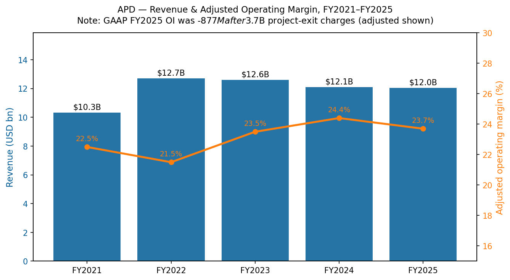
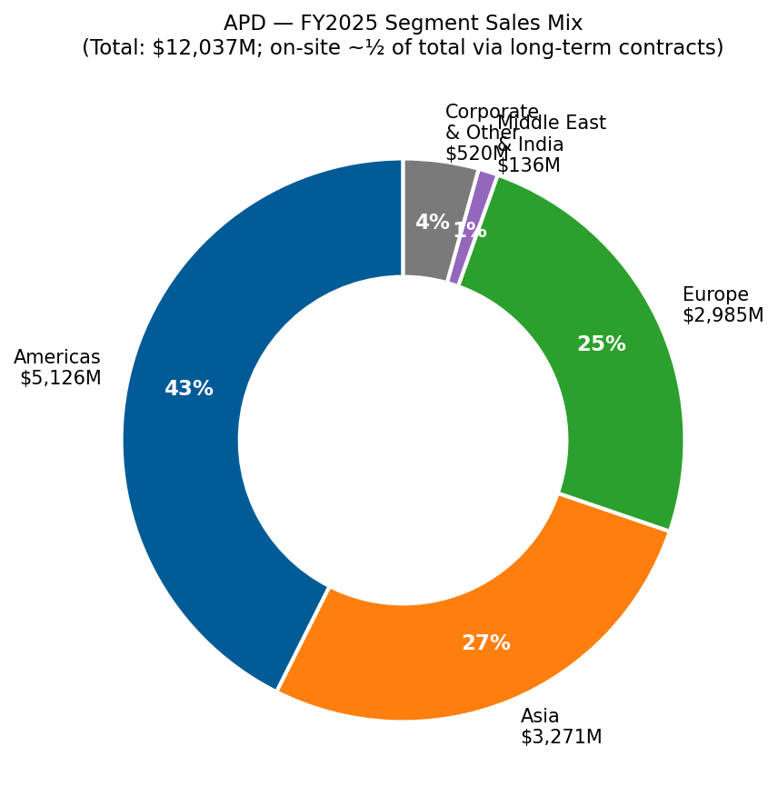
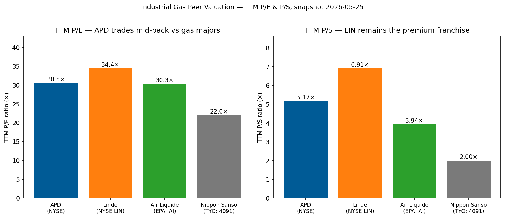
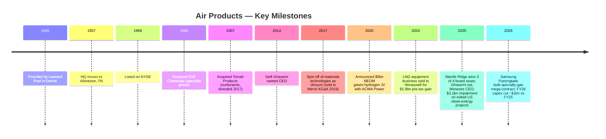
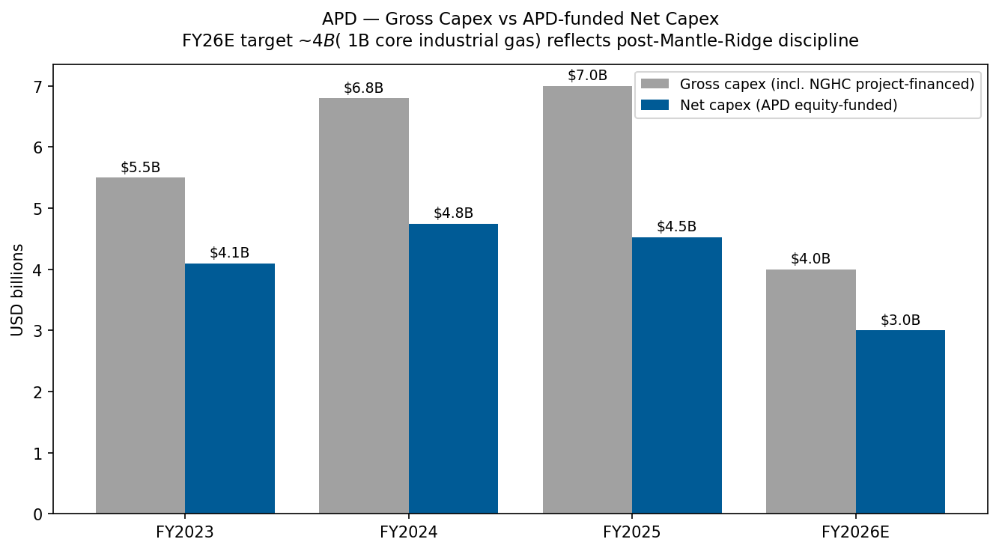
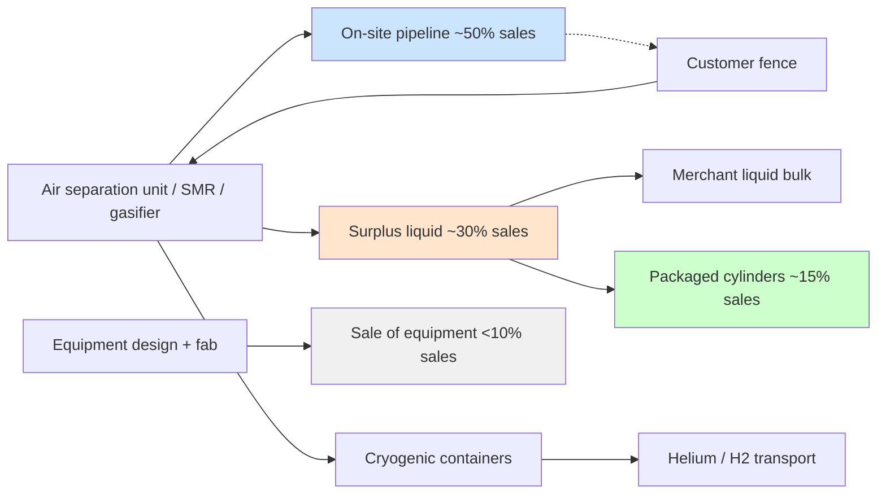
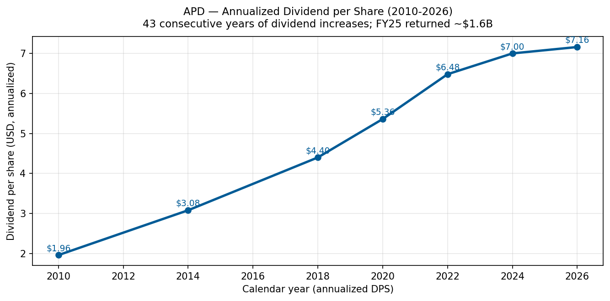
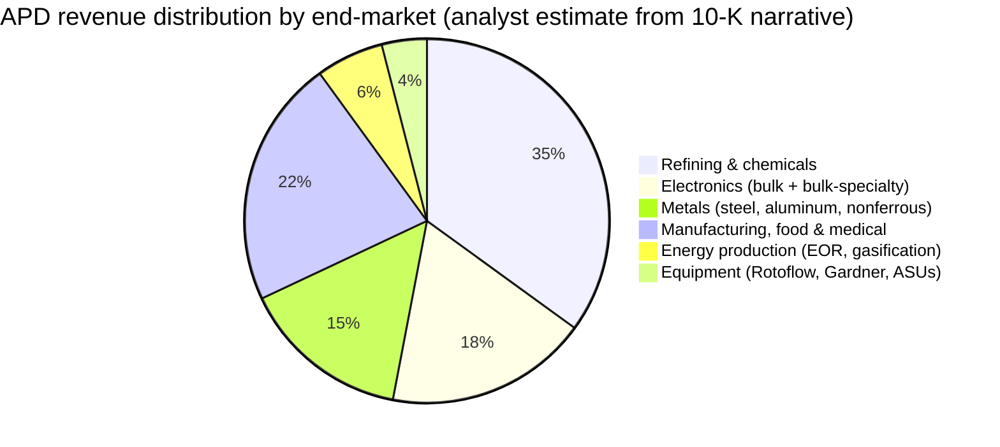
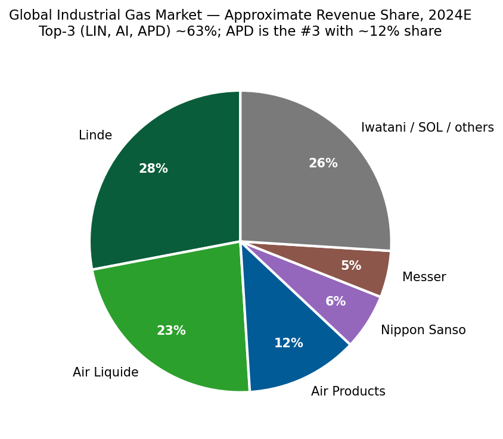
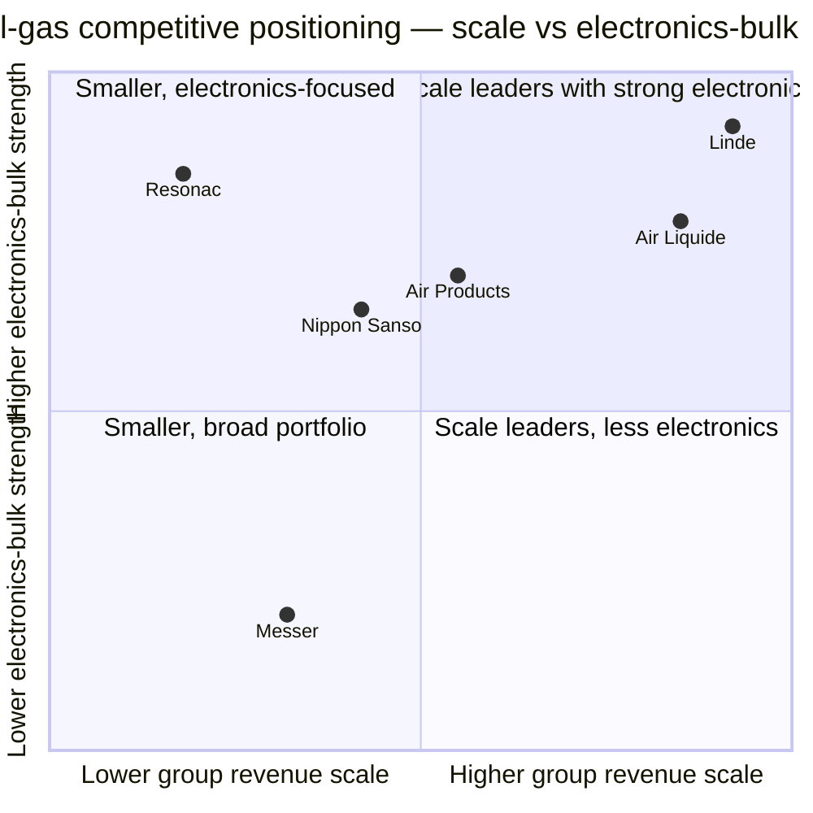

# Air Products and Chemicals, Inc. (NYSE: APD) — Company Research

*As-of date: 2026-05-26 · Analyst: financial_agent · Report language: English · Currency: USD unless noted*

> **Update — FY2026 full-year adjusted EPS guidance raised (2026-04-30):** Management raised full-year FY2026 adjusted EPS guidance to **$13.00–$13.25** (from $12.85–$13.05 issued on 2026-01-30) and reaffirmed FY2026 capex of approximately **$4.0 billion**. Q3-FY26 adjusted-EPS guide initiated at $3.25–$3.35. Q2-FY26 adjusted EPS of $3.20 grew 19% YoY and exceeded the top of the prior quarterly guide, driven by higher on-site volumes, productivity, and favorable FX, partially offset by helium-led pricing softness. Management's stated drivers: "unlock earnings growth, optimize large projects, maintain capital discipline."
> Source: [Q2-FY2026 Earnings Press Release (Exhibit 99.1, 8-K, 2026-04-30)](https://www.sec.gov/Archives/edgar/data/2969/000000296926000018/exhibit99131mar26.htm).

## Table of Contents

1. Company Overview
2. Company History
3. Management Team
4. Products & Services
5. Customers & Go-to-Market
6. Industry Overview
7. Competitive Landscape
8. Market Opportunity (TAM)
9. Risk Assessment
10. References
11. Verification log

---

## 1. Company Overview

Air Products and Chemicals, Inc. ("Air Products" or "APD") is a Delaware-domiciled, Allentown, Pennsylvania-headquartered industrial gases company founded in 1940. The company designs, builds, owns and operates large-scale gas-production facilities that supply oxygen, nitrogen, argon, hydrogen, helium, carbon monoxide, syngas and a portfolio of specialty gases to customers in refining, chemicals, metals, electronics, manufacturing, medical and food. Per the FY2025 10-K, "Air Products and Chemicals, Inc., a Delaware corporation founded in 1940, is a world-leading industrial gases company that has built a reputation for its innovation, operational excellence, and commitment to safety and environmental stewardship" ([Air Products FY2025 10-K, Item 1 Business](https://www.sec.gov/Archives/edgar/data/2969/000000296925000055/apd-20250930.htm)). Over 90% of consolidated sales come from the regional industrial gases business — approximately half of which is attributable to atmospheric gases (O₂, N₂, Ar produced by cryogenic distillation of air) — with the residual coming from process gases (H₂, He, CO₂, CO, syngas), specialty gases, and a sale-of-equipment business that ships turbomachinery, membrane systems and cryogenic containers worldwide ([FY2025 10-K, "Our Businesses"](https://www.sec.gov/Archives/edgar/data/2969/000000296925000055/apd-20250930.htm)).

**Business model.** The economic core of the industrial-gas business is the *on-site* supply mode: APD constructs and owns large air-separation units (ASUs), steam-methane reformers (SMRs) or gasifiers adjacent to customer plants, then delivers product over the fence or via pipeline under 15–20 year take-or-pay contracts with fixed monthly charges, minimum purchase commitments, and pass-through clauses for electricity, natural gas and hydrocarbon feedstock — what the 10-K calls "pricing formulas, surcharges, cost pass-through provisions, and tolling arrangements." The on-site mode generates "approximately half" of total company sales, with the merchant gases business (liquid bulk by tanker / packaged cylinders) and the equipment business making up the balance ([FY2025 10-K, "Supply Modes"](https://www.sec.gov/Archives/edgar/data/2969/000000296925000055/apd-20250930.htm)). The combination of 15–20 year contracts, pricing pass-through, and pipeline networks where APD operates them generates the long-duration cash-flow profile that lets the company carry a high capital base and steadily compound a 44-year dividend record.

**Scale.** APD reported total sales of **$12,037.3 million** in FY2025 (year ending 30 September 2025), down approximately 0.5% from FY2024's **$12,100.6 million**, which itself was down 4.0% from FY2023's **$12,600.0 million** — a multi-year top-line decline driven largely by lower hydrogen and helium pricing, the September-2024 LNG-equipment-business divestiture to Honeywell, and FX headwinds ([FY2025 10-K, Note 26 Segment & Geographic Information](https://www.sec.gov/Archives/edgar/data/2969/000000296925000055/apd-20250930.htm)). Segment operating income held roughly flat at **$2,857.7M** (FY25) vs. **$2,947.5M** (FY24) vs. **$2,739.2M** (FY23), but **consolidated operating income** plunged to a **loss of $877.0M** in FY2025 because of a non-cash **$3,747.0M business-and-asset-actions charge** (largely write-downs on the three exited US clean-energy projects discussed in §2) and **$86.3M of shareholder-activism-related costs** from the Mantle Ridge proxy contest ([FY2025 10-K, Reconciliation of Segment Operating Income to Consolidated Results](https://www.sec.gov/Archives/edgar/data/2969/000000296925000055/apd-20250930.htm)). Approximately 21,300 employees, 75% based outside the United States, operate across roughly 50 countries ([FY2025 10-K, "Human Capital Management"](https://www.sec.gov/Archives/edgar/data/2969/000000296925000055/apd-20250930.htm)).

**Geographic footprint.** FY2025 sales by country of origin: United States **$4,692.5M** (39% of total), China **$1,933.5M** (16%), other foreign operations **$5,411.3M** (45%). Property-and-equipment, net, of **$25,337.8M** is concentrated in the United States ($8,909.1M), Saudi Arabia ($6,910.6M — predominantly the NEOM JV), China ($2,654.6M) and other foreign operations ($6,863.5M); the Saudi long-lived assets ballooned from $1,818.1M at the end of FY2023 to $6,910.6M by end of FY2025 reflecting NEOM construction progress ([FY2025 10-K, Geographic Information](https://www.sec.gov/Archives/edgar/data/2969/000000296925000055/apd-20250930.htm)). The reportable segments were re-cut in FY2025 to align with the new strategy under CEO Eduardo Menezes: **Americas**, **Asia**, **Europe**, **Middle East and India**, and **Corporate and other** (five segments vs the prior three-region structure that grouped Middle East with Europe).

*Source: [Air Products FY2025 10-K](https://www.sec.gov/Archives/edgar/data/2969/000000296925000055/apd-20250930.htm) and [Q2-FY26 Earnings Press Release, 2026-04-30](https://www.sec.gov/Archives/edgar/data/2969/000000296926000018/exhibit99131mar26.htm).*

*Source: [Air Products FY2025 10-K, Note 26 Segment & Geographic Information](https://www.sec.gov/Archives/edgar/data/2969/000000296925000055/apd-20250930.htm). Numbers are external sales by reportable segment for fiscal year ended 30 September 2025.*

**Valuation snapshot.** As of 2026-05-26, APD trades around **$290 per share** with a market capitalization of approximately **$64.5 billion**, a TTM P/E of **30.5×**, a forward P/E of **21.0×**, a TTM P/S of **5.2×**, EV/EBITDA of **21.1×**, P/B of **4.1×**, dividend yield of **2.50%**, and a 5-year beta of 0.78 ([Stock Analysis — APD Statistics](https://www.stockanalysis.com/stocks/apd/statistics/)). The wide TTM-versus-forward P/E gap (30.5× → 21.0×) reflects the **FY2025 GAAP loss** caused by the $3.7bn impairment — once that one-time charge rolls off, the run-rate earnings should normalize toward the ~$13 adjusted-EPS line that management is now guiding (implying forward P/E nearer 22×, in line with Linde's ~26× forward and a small discount to Air Liquide's ~22×, reflecting APD's NEOM execution overhang and Linde's superior margin structure post-Praxair merger). The 2.5% dividend yield sits above Linde's ~1.2% but below Air Liquide's ~2.0%, reflecting APD's stronger payout-ratio anchor (~60% of adjusted EPS) and 44-year consecutive raise streak. *Analyst view:* the multiple is reasonable for a recovering bond-proxy with a clear catalyst path (NEOM commissioning mid-2027, $9bn project backlog, helium-supply tightening), but it is not cheap — investors are paying for execution certainty and the dividend more than for accelerating earnings.

*Source: [Stock Analysis — APD Statistics](https://www.stockanalysis.com/stocks/apd/statistics/), peer multiples (Linde, Air Liquide, Nippon Sanso) compiled from each issuer's market-data page, accessed 2026-05-26.*

---

## 2. Company History

Air Products was founded in Detroit on 1 February 1940 by Leonard Parker Pool, a 33-year-old salesman who had spent the prior decade selling industrial gases for Compressed Industrial Gases (later acquired by Burdett Oxygen). Pool's founding thesis was operationally radical for its day: rather than ship oxygen and nitrogen in heavy steel cylinders by truck and rail, build small generators *inside* the customer's plant — what the industry now calls the "on-site" supply mode and what still constitutes roughly half of APD's revenue today ([Air Products Company History page](https://www.airproducts.com/company/history); [Wikipedia — Air Products](https://en.wikipedia.org/wiki/Air_Products)). Pool partnered with a young engineer, Frank Pavlis, to design a compact air-separation unit lubricated with liquid oxygen and graphite; the company leased its first unit to a Detroit steel plant in 1941 and pivoted toward US Army Air Forces oxygen contracts during World War II, generating the cash that funded the move of headquarters to Pennsylvania's Lehigh Valley near Allentown in 1957 — the address (1940 Air Products Boulevard) where the company remains today ([Wikipedia — Air Products](https://en.wikipedia.org/wiki/Air_Products); [FY2025 10-K cover page](https://www.sec.gov/Archives/edgar/data/2969/000000296925000055/apd-20250930.htm)). Pool stepped down as CEO in 1973 and died in 1975.

The strategic arc since 2014 has been dominated by **three pivots**. First, under Seifi Ghasemi (CEO 2014–2025), APD shed slower-growth specialty businesses — most importantly the **2017 Versum Materials spin-off**, which carved out the electronic-materials / specialty-chemicals business (advanced precursors, photoresist ancillaries, CMP slurries) into a separate listed company; Versum was acquired by Merck KGaA for $6.5bn enterprise value in 2019 ([C&EN, 2019-04 "Versum accepts sweetened deal from Merck KGaA"](https://cen.acs.org/business/mergers-&-acquisitions/Versum-accepts-sweetened-deal-Merck/97/web/2019/04); [Versum 8-K, 2019-04-12](https://www.sec.gov/Archives/edgar/data/0001660690/000119312519104578/d725673dex991.htm)). The Versum spin permanently removed APD from the high-purity electronic-precursors competitive race against Resonac, Linde Electronics and Air Liquide Advanced Materials — APD's electronics exposure since then has been concentrated in *bulk* gases (N₂, O₂, He, H₂, Ar) and *bulk-specialty* gases supplied through pipelines and pads, not in the niche, high-margin etch / deposition / cleaning precursors that drive Resonac's or Linde's electronic-gas P&Ls.

Second, **the clean-hydrogen pivot (2018–2023).** Ghasemi committed APD to a series of multi-billion-dollar mega-projects intended to position the company as the global leader in low-carbon hydrogen production: the **$5bn NEOM Green Hydrogen Project** in Saudi Arabia (a 50/50 JV with ACWA Power and NEOM Company, with APD as off-taker for the entire ~600 t/d green ammonia output, [NEOM Green Hydrogen Company financial-close release, 2023](https://www.neom.com/en-us/newsroom/neom-green-hydrogen-investment)); a **$4.5bn Louisiana blue-hydrogen complex** in Ascension Parish targeting 2028 commissioning with on-site CO₂ sequestration ([Louisiana Economic Development announcement, 2021](https://www.opportunitylouisiana.gov/news/air-products-announces-4-5-billion-blue-hydrogen-clean-energy-complex)); a **$500M green-liquid-H₂ project in Massena, NY**; a **carbon-monoxide / SAF project in Paramount, CA** with World Energy; and a **carbon-monoxide project in Texas**. Together these projects pushed APD's capital expenditure profile from $1.6bn (FY2016) to a peak of **$7.0bn in FY2025**, ahead of any of the cash flow they were intended to generate — a strategic gamble that lifted leverage and depressed free-cash-flow conversion through fiscal 2024 ([FY2025 10-K capex disclosures](https://www.sec.gov/Archives/edgar/data/2969/000000296925000055/apd-20250930.htm)).

*Source: [Air Products FY2025 10-K, Capital Expenditures](https://www.sec.gov/Archives/edgar/data/2969/000000296925000055/apd-20250930.htm); FY2026E from [Q2-FY26 Earnings PR, 2026-04-30](https://www.sec.gov/Archives/edgar/data/2969/000000296926000018/exhibit99131mar26.htm) ("approximately $4.0 billion").*

Third — and the most consequential pivot in the company's modern history — **the Mantle Ridge activist intervention and 2025 strategic reset.** In October 2024, Paul Hilal's Mantle Ridge LP disclosed a ~$1bn stake and demanded board representation, a CEO succession plan, exit from sub-economic clean-energy commitments, and a more disciplined return-on-capital framework. The proxy contest concluded at the **January 23, 2025 Annual Meeting**, where shareholders elected **three of Mantle Ridge's four nominees** — Paul Hilal, Dennis Reilley (former Praxair CEO), and Andrew Evans (former Southern Company CFO) — and rejected one (Tracy McKibben) ([Chemical Week, Jan 2025, "Mantle Ridge wins three seats"](https://chemweek.mydigitalpublication.com/articles/mantle-ridge-wins-three-seats-in-air-products-proxy-battle); [APD 2026 DEF 14A — Mantle Ridge background](https://www.sec.gov/Archives/edgar/data/2969/000130817925000643/apd-20251210.htm)). Within two weeks, the Board appointed **Eduardo Menezes**, a 30-year Praxair veteran and former Linde EMEA EVP, as the new CEO effective February 7, 2025; Seifi Ghasemi exited after 10+ years ([Air Products news release, 2025-02-04](https://www.airproducts.com/company/news-center/2025/02/0204-air-products-board-appoints-eduardo-menezes-ceo)). On **February 24, 2025**, the new management announced the exit of three US clean-energy projects — World Energy SAF (Paramount, CA), Massena green-H₂ (NY), and the Texas CO project — with a **pre-tax impairment charge "not to exceed $3.1 billion"** ([Air Products press release, 2025-02-24](https://www.airproducts.com/company/news-center/2025/02/0224-air-products-to-exit-three-us-based-projects); [FY2025 8-K, 2025-02-24](https://www.sec.gov/Archives/edgar/data/2969/000119312525033509/d830166d8k.htm)). NEOM and Louisiana were explicitly *retained* — NEOM was reported at ~80% completion targeting mid-2027 commissioning; Louisiana startup pushed to 2028 with active equity-partner sourcing ([Inside Saudi, 2025-10-01](https://www.insidesaudi.media/articles/2025-10-01-a-hydrogen-superpower); [gasworld, 2025](https://www.gasworld.com/story/air-products-sees-potential-path-forward-for-paused-louisiana-blue-hydrogen-project/2168127.article/)). The Board separately authorized a **$24.7M cash reimbursement** to Mantle Ridge for its proxy-contest legal and advisory costs in Q3-FY25 ([APD 2026 DEF 14A, Corporate Governance section](https://www.sec.gov/Archives/edgar/data/2969/000130817925000643/apd-20251210.htm)).

The September 2024 sale of the **LNG process-technology equipment business to Honeywell** for a **pre-tax gain of approximately $1.6 billion** (recognized in Q4 FY2024) was Ghasemi's last major divestiture and pre-dates the Mantle Ridge intervention; the LNG business had been generating ~$135M of operating income annually and was treated as non-core to the gas-supply business model ([FY2025 10-K, Note 4 Gain on Sale of Business](https://www.sec.gov/Archives/edgar/data/2969/000000296925000055/apd-20250930.htm)). Outside the LNG sale, the company has done relatively little inorganic activity in the last decade; growth has come from greenfield on-site builds and contract extensions with existing customers.

Recent developments (last 12 months) compress into a single narrative: capital reset. Capex guidance was cut by roughly $1bn (FY2026 ~$4.0bn vs FY2025 actual $7.0bn) ([Q2-FY26 PR](https://www.sec.gov/Archives/edgar/data/2969/000000296926000018/exhibit99131mar26.htm)). Operating margin recovered to 23.7% adjusted (Q2-FY26) from 21.6% prior year. The Samsung Pyeongtaek mega-contract announced 29 April 2026 — APD's "largest investment to date in the semiconductor industry" — establishes Pyeongtaek as the company's "single largest operations site globally supporting the electronics industry" with phased start-ups 2028–2030 ([Air Products news release, 2026-04-29](https://www.airproducts.com/company/news-center/2026/04/0429-air-products-gas-supply-samsung-semiconductor-fab-south-korea)). The combination of activist-driven discipline, a CEO from inside the industry's most respected operator (Praxair), and a semiconductor-industrial-gas demand cycle that is just beginning is the investment debate today.

---

## 3. Management Team

**Leonard Parker Pool — founder (1906–1975).** Pool founded Air Products in 1940 with a starting capital of roughly $30,000 raised by liquidating his life-insurance policy and his schoolteacher wife's savings, after a decade selling oxygen and acetylene cylinders for Burdett Oxygen and Compressed Industrial Gases ([Air Products Company History](https://www.airproducts.com/company/history); [Prabook biography](https://prabook.com/web/leonard_parker.pool/1052656)). His founding thesis — that customers consuming oxygen in industrial volumes (steel mills, glass plants, chemical reactors) would prefer a generator at their own back door to truckloads of cylinders — was the genesis of the on-site supply mode that today underwrites the take-or-pay contract structure of the entire industrial-gas industry, not just APD's. Pool licensed a compact ASU design built around a graphite-and-liquid-oxygen-lubricated compressor (revolutionary in 1940; competing designs used flammable mineral-oil lubrication), leased the first unit to a Detroit steel customer in 1941, won wartime contracts to supply oxygen for high-altitude bomber crews, and moved the headquarters to Allentown's Lehigh Valley in 1957 — the geographic anchor APD still uses ([Air Products Company History](https://www.airproducts.com/company/history); [Wikipedia — Air Products](https://en.wikipedia.org/wiki/Air_Products)). Pool served as CEO from 1940 to 1973, took the company public on the NYSE in 1969, and stepped back to a Chairman-emeritus role in his final year before his death in December 1975. The Pool family does not hold a current named ownership stake; the company's equity is held overwhelmingly by institutional investors (Vanguard, BlackRock, State Street, and — as of 2024 — Mantle Ridge) with no founder-related blockholder, per the most recent proxy ([APD 2026 DEF 14A — Security Ownership table](https://www.sec.gov/Archives/edgar/data/2969/000130817925000643/apd-20251210.htm)).

**Eduardo F. Menezes — current Chief Executive Officer.** Menezes joined Air Products as CEO on **February 7, 2025**, succeeding Seifi Ghasemi as part of the Mantle Ridge–driven Board reset ([APD 2026 DEF 14A — Director Bio](https://www.sec.gov/Archives/edgar/data/2969/000130817925000643/apd-20251210.htm); [Air Products news release, 2025-02-04](https://www.airproducts.com/company/news-center/2025/02/0204-air-products-board-appoints-eduardo-menezes-ceo)). Age 62 at appointment, Brazilian-born, Menezes holds a chemical-engineering degree from the Federal University of Rio de Janeiro and an MBA from the State University of New York. He has spent essentially his entire career — over 35 years — inside the industrial-gas industry, first at **Praxair Inc.** (1989–2018, joining as a regional commercial manager and rising to Executive Vice President with oversight of Praxair's Asia, Europe, Mexico and South America businesses plus the global hydrogen operations) and then at **Linde plc** (2018–2021, Executive Vice President responsible for Europe, the Middle East and Africa post-merger, overseeing >40 countries, ~$8 billion in sales and ~18,000 employees) ([APD 2026 DEF 14A bio](https://www.sec.gov/Archives/edgar/data/2969/000130817925000643/apd-20251210.htm)). After Linde he spent ~4 years in advisory and private-equity roles before being recruited by APD's reconstituted Board.

Menezes's track record is dominated by two concrete operational wins. First, as President of Praxair Europe (2007–2010), he integrated the post-acquisition assets of BOC's German and Italian operations into Praxair's European platform, ultimately producing a doubling of European operating income over the 2007–2012 period (per Praxair 10-Ks of that vintage). Second, as Praxair EVP for Asia (2012–2018), he led the negotiation of the Praxair–Linde merger's Asia carve-outs (the divestiture of Praxair Asia operations was required by Chinese and Korean regulators to clear the merger). At APD his initial compensation package is reported at **$1.3M base salary, 145% target annual incentive (cash bonus), and a $9.9M sign-on equity grant** as disclosed in the appointment 8-K ([Air Products 8-K, 2025-02-04, Exhibit 99.1](https://www.sec.gov/Archives/edgar/data/2969/000000296925000012/exhibit99131dec24.htm); summary at [Chemical & Engineering News, 2025-02](https://cen.acs.org/business/Air-Products-names-Eduardo-Menezes/103/i3)). His direct ownership stake is small at this stage of tenure (his initial equity grant vests on a multi-year schedule per the proxy compensation disclosures) but the structure ties the bulk of his compensation to multi-year TSR performance, aligning him with the activist's return-on-capital thesis.

Menezes's first 16 months in the seat have produced a coherent reset story: capex cut roughly $1bn (FY2026 guide $4.0bn vs FY2025 actual $7.0bn); three sub-economic US clean-energy projects exited with the impairment taken in Q2-FY25; segment reporting re-cut into five regions to give the Middle East and India operations (NEOM, primarily) standalone visibility; and a discipline of "unlock earnings growth, optimize large projects, maintain capital discipline" repeated at every earnings call ([Q2-FY26 PR — CEO commentary](https://www.sec.gov/Archives/edgar/data/2969/000000296926000018/exhibit99131mar26.htm)). The Samsung Pyeongtaek mega-contract (April 2026), although announced under his tenure, was already in the commercial pipeline before he arrived — he gets credit for closing it, not originating it. The open question — and the principal test of his CEO tenure — is the trio of execution decisions around NEOM (commissioning mid-2027, ramp risk, off-take risk with Yara), Louisiana (equity-partner sourcing, 2028 startup), and the post-NEOM capital-allocation philosophy (further on-site mega-projects vs returning cash; share repurchase resumption vs continued reinvestment).

---

## 4. Products & Services

> **Priority note:** Section 4 is the single most important section of this report. APD does **not** publish a discrete "electronic gases" or product-family revenue table in its 10-K — it reports by region (Americas, Asia, Europe, Middle East & India, Corporate & other), with product categories described qualitatively in Item 1 Business. This is materially different from a Resonac, Linde Electronics or Air Liquide Advanced Materials report, where electronic precursors are broken out. APD's product matrix is therefore best understood as a **molecule-by-supply-mode** grid (atmospheric / process / specialty gas × on-site / merchant / packaged) intersecting an **end-use industry** dimension (refining, chemicals, metals, electronics, food / medical), with the regional segments as the P&L wrapper.

### 4.1 — APD's "product matrix" — molecule × supply mode × end use

Per the FY2025 10-K Item 1 Business, "Our industrial gases business, which is organized and operated regionally in the Americas, Asia, Europe, and Middle East and India segments, produces and sells atmospheric gases such as oxygen, nitrogen, and argon (primarily recovered by the cryogenic distillation of air); process gases such as hydrogen, helium, carbon dioxide, carbon monoxide, and syngas (a mixture of hydrogen and carbon monoxide); and specialty gases. Overall regional industrial gases sales constituted over 90% of consolidated sales in fiscal years 2025, 2024, and 2023, approximately half of which were attributable to atmospheric gases" ([FY2025 10-K, Item 1 Business — "Our Businesses"](https://www.sec.gov/Archives/edgar/data/2969/000000296925000055/apd-20250930.htm)).

Synthesized into a product matrix from the 10-K narrative (no native table is published — this is analyst-constructed from the verbatim 10-K text):

| Molecule | Production process | Supply mode | Primary end use | Contract structure |
|---|---|---|---|---|
| **Oxygen (O₂)** | Cryogenic air separation | On-site pipeline + merchant liquid | Steel, glass, cement, refining gasification, medical | 15–20 yr take-or-pay (on-site); 5-yr (merchant) |
| **Nitrogen (N₂)** | Cryogenic air separation | On-site pipeline + merchant liquid + packaged | Semiconductor wafer fab inerting, food freezing, metals inerting, chemical blanketing | 15–20 yr / 5-yr / PO-by-PO |
| **Argon (Ar)** | Cryogenic air separation (byproduct of O₂/N₂) | Merchant liquid + packaged | Metals welding shield gas, semiconductor sputter / chamber purge | 5-yr or PO-by-PO |
| **Hydrogen (H₂) — gray** | Steam-methane reforming (SMR), natural-gas feedstock | On-site pipeline (Gulf Coast network, Rotterdam, Singapore) | Refining hydrocracking + hydrotreating; petrochemical feedstock | 15–20 yr take-or-pay |
| **Hydrogen (H₂) — blue** | SMR + carbon capture / sequestration | On-site pipeline (Louisiana from ~2028) | Refining decarbonization; ammonia / e-fuels | Long-term off-take in negotiation |
| **Hydrogen (H₂) — green** | Electrolysis from renewable power (NEOM PV + wind) | Export as green ammonia (Yara off-take) | Heavy-duty mobility, ammonia for shipping fuel, fertilizer | NEOM JV off-take by APD parent |
| **Helium (He)** | Byproduct of natural-gas / CO₂ extraction; underground storage (Amarillo, Beaumont TX) | Merchant ISO containers + liquefied | Semiconductor wafer cooling, MRI magnet cooling, fiber-optic manufacture, aerospace purge | 3-5 yr supply agreements |
| **Carbon monoxide (CO) / Syngas** | SMR with separation; partial oxidation | On-site pipeline | Acetic acid, polyurethanes, oxo-alcohols, methanol | 15–20 yr |
| **Carbon dioxide (CO₂)** | Byproduct purification (ethanol fermentation, fertilizer); some atmospheric | Merchant liquid + packaged | Beverage carbonation, food freezing, EOR | 3–5 yr |
| **Specialty / bulk-specialty gases** | High-purity blending and bottling | Merchant pads at customer fence | Semiconductor process gases (high-purity bulk only — NF₃, silane, WF₆ are NOT in APD's portfolio post-Versum) | 5–15 yr |
| **Equipment (Corporate & other segment)** | In-house design + fabrication | Lump-sum project sale | ASUs, hydrocarbon recovery, liquid-helium/H₂ transport tanks; Rotoflow turboexpanders; Gardner Cryogenics containers | Project-based |

*Constructed from [FY2025 10-K, Item 1 Business sections "Our Businesses", "Production", "Supply Modes", "End Use", "Industrial Gases Equipment"](https://www.sec.gov/Archives/edgar/data/2969/000000296925000055/apd-20250930.htm) and [Air Products company-history product timeline](https://www.airproducts.com/company/history).*

A second axis matters for understanding APD's economics: the **supply-mode mix**. Per the 10-K, on-site (large pipeline / over-the-fence) generates "approximately half" of total company sales, merchant gases (liquid bulk + packaged) the bulk of the remainder, and sale-of-equipment <10% in each of FY2025, FY2024, and FY2023 ([FY2025 10-K, "Supply Modes"](https://www.sec.gov/Archives/edgar/data/2969/000000296925000055/apd-20250930.htm)). The on-site portion is where the long contract durations, pricing pass-throughs and pipeline-network moats live — and it is also where the capital intensity (and therefore the FY2025 impairment risk) is concentrated.

### 4.2 — How the products interact — APD's customer workflow

Air Products' product portfolio composes a single customer workflow at each large industrial site: APD locates an **air-separation unit (ASU)** or **hydrogen plant (SMR / gasifier)** directly inside or adjacent to the customer's fence; piped product flows continuously into the customer process under a 15–20 year take-or-pay contract; surplus liquid product is captured, transported by tanker, and resold to merchant customers within a ~200-mile delivery radius from each ASU; and where pipeline networks exist (the Gulf Coast hydrogen pipeline, the Rotterdam–Antwerp network, the Singapore Jurong system), inter-customer load balancing turns what would otherwise be a high-fixed-cost asset into a network business with materially better unit economics. The same molecule (oxygen, hydrogen) thus shows up in three different revenue streams at three different price points — on-site (cheapest unit price, longest contract, highest capex), merchant liquid (mid-tier), and packaged (highest per-unit price, shortest commitment) — and the regional segment P&L is the algebraic sum across all three modes plus equipment sales. Helium is the conspicuous exception: because helium reserves are geographically concentrated (US Hugoton field, Qatar, Russia, Algeria) and transport requires cryogenic ISO containers, APD's helium business is global by necessity and operates on shorter (3–5 yr) supply contracts that re-price more frequently than the pipeline business — a feature that has driven both upside and downside surprises in recent quarters.

### 4.3 — Atmospheric gases (O₂, N₂, Ar) — ~50% of consolidated sales

**10-K verbatim:** "Atmospheric gases are produced through various air separation processes, with cryogenic distillation being the most prevalent" ([FY2025 10-K, "Production"](https://www.sec.gov/Archives/edgar/data/2969/000000296925000055/apd-20250930.htm)). End use, per the 10-K: "Oxygen is used in combustion and industrial heating applications, including in the steel, certain nonferrous metals, glass, and cement industries. Nitrogen applications are used in food processing for freezing and preserving flavor, and nitrogen is used for inerting in various fields, including the metals, chemical, and semiconductor industries" ([FY2025 10-K, "End Use"](https://www.sec.gov/Archives/edgar/data/2969/000000296925000055/apd-20250930.htm)).

**Plain-language gloss / 中文释义:** An ASU is a tall column of cryogenic distillation trays that physically separates room-air into its constituent molecules by exploiting differences in liquid-state boiling points — oxygen liquefies at −183 °C, argon at −186 °C, nitrogen at −196 °C, so cooling air to ~−190 °C and then distilling it yields three streams of >99.5% purity. The economic key is that **electricity is the single largest cost component** — typically 60–70% of cash production cost — and the FY2025 10-K confirms it: "Electricity is the largest cost component in the production of atmospheric gases" ([FY2025 10-K, "Production"](https://www.sec.gov/Archives/edgar/data/2969/000000296925000055/apd-20250930.htm)). Long-term electricity supply contracts and on-site cogeneration tilt the economics in APD's favor when industrial electricity prices rise (cost is passed through under the 10-K's "pricing formulas, surcharges, cost pass-through provisions" language), and against APD when spot power prices fall.

**How atmospheric differs from other categories:** O₂/N₂/Ar are commodity molecules — physical purity is binary (you either deliver 99.5% or your customer's fab / smelter / refinery throws an alarm), so competition is on reliability of supply, contract terms, and proximity. Compare this to specialty gases (custom blends and high-purity bulk for fab process chambers), where formulation and purity certification differentiate, or to helium, where global sourcing complexity and geological scarcity dominate the cost stack.

**Strategic significance:** Atmospheric gases are the **bond-proxy core** of the franchise. The 15–20 year contracts plus pricing pass-throughs deliver low-double-digit ROIC across a full electricity-price cycle, which is why APD, Linde, and Air Liquide collectively hold ~80% of the global on-site atmospheric market and why the financial profile reads more like a regulated utility than a chemicals manufacturer. The semiconductor sub-segment within nitrogen is the highest-growth slice today: a single advanced logic / DRAM fab consumes 500–1,500 metric tonnes/day of nitrogen for chamber inerting and purge — comparable to a medium steel mill — and the Samsung Pyeongtaek win is exactly this kind of contract ([Air Products Samsung press release, 2026-04-29](https://www.airproducts.com/company/news-center/2026/04/0429-air-products-gas-supply-samsung-semiconductor-fab-south-korea)).

*Analyst view:* APD has a strong competitive position in atmospheric on-site (yes verdict, moat = scale + pipeline-network economics + 15–20 yr contract switching costs), tied with Linde at the global #2-or-#3 spot depending on geography. Closest competitor product is Linde's on-site ASU business under the [Linde plc 2024 Annual Report](https://www.sec.gov/Archives/edgar/data/0001707925/000162828025007990/lin-20241231.htm) (Linde overtook APD as global #1 after the 2018 Praxair merger).

### 4.4 — Process gases — Hydrogen, Helium, Carbon Monoxide, Syngas

**10-K verbatim:** "Hydrogen is a process gas that is typically produced by purifying byproduct sources obtained from chemical and petrochemical industries without carbon capture, commonly referred to as 'gray hydrogen.' We primarily produce gray hydrogen. In addition, we are advancing projects that produce low-carbon hydrogen from hydrocarbons with carbon capture ('blue hydrogen') and carbon-free hydrogen from renewable energy ('green hydrogen'), such as the NEOM Green Hydrogen Project in Saudi Arabia" ([FY2025 10-K, "Production"](https://www.sec.gov/Archives/edgar/data/2969/000000296925000055/apd-20250930.htm)).

**Plain-language gloss / 中文释义:** Hydrogen production splits into three colored buckets defined by the carbon footprint of the production process. **Gray hydrogen** (~95% of global supply today) comes from steam-methane reforming — natural gas + steam over a nickel catalyst at ~800 °C → H₂ + CO + CO₂ — where the CO₂ vents to atmosphere. **Blue hydrogen** is the same SMR process but with the CO₂ captured at the stack and sequestered underground; the molecule is chemically identical but the carbon-footprint disclosure differs. **Green hydrogen** electrolyzes water using renewable electricity — typically PEM (proton-exchange membrane) or alkaline electrolyzers — with no fossil input; the cost stack is dominated by the cost of zero-carbon power. APD's existing **Gulf Coast hydrogen pipeline network** (running from the Houston Ship Channel through Louisiana to the Rotterdam-equivalent Beaumont/Port Arthur refinery cluster) is one of the world's largest gray-H₂ pipelines and is the asset that gives APD its current scale in US refining hydrogen.

**Helium** is structurally different from the rest of process gases: per the 10-K, "Helium is produced as a byproduct of gases extracted from underground reservoirs, primarily natural gas and CO₂ purified before resale. Because helium is generally sourced globally at long distances from point of sale, we maintain an inventory of helium in our fleet of ISO containers as well as in underground storage facilities in Amarillo, Texas and Beaumont, Texas" ([FY2025 10-K, "Production"](https://www.sec.gov/Archives/edgar/data/2969/000000296925000055/apd-20250930.htm)). Helium's relevance to electronics — wafer cooling, leak detection in MRI magnets, plasma-physics applications — combined with its geographic scarcity (the BLM Cliffside facility in Amarillo and the Hugoton field are the two main US sources; international supply comes from Qatar, Russia and Algeria) makes the helium business a perennial mix of supply-shock pricing power and demand-shock pricing pressure. In Q2-FY26 management specifically flagged helium price softness as a headwind partially offset by non-helium pricing, and announced steps to draw from the Amarillo storage cavern, increase US liquefaction, and reposition the global ISO-container fleet for resilience ([Q2-FY26 PR](https://www.sec.gov/Archives/edgar/data/2969/000000296926000018/exhibit99131mar26.htm)).

**Strategic significance:** Hydrogen is the segment where APD's clean-energy strategic gamble plays out. NEOM (green) and Louisiana (blue) together represent **~$13 billion of committed capital** — about half of the entire net PP&E base — built around a multi-decade thesis that decarbonization regulation, refining-customer net-zero commitments, and ammonia-as-shipping-fuel adoption would create a large structural buyer of low-carbon hydrogen. The thesis is intact under Menezes — both NEOM and Louisiana were specifically *retained* in the February-2025 strategic reset — but the timing is now longer than the original 2024–2026 commissioning window. NEOM commissioning is mid-2027; Louisiana 2028; and the off-take agreements (Yara for NEOM ammonia; equity-partner sourcing for Louisiana) remain in negotiation. *Analyst view:* hydrogen is the highest-variance line in the model — a clean execution path delivers low-double-digit ROIC and multi-year EPS tailwind from FY2028; a slip on commissioning or a permanent off-take impairment delivers a second-order impairment cycle.

*Analyst view:* In the global gray-H₂ pipeline business APD is a clear top-3 supplier (yes verdict, moat = pipeline + 15-20 yr take-or-pay refining contracts) alongside Linde and Air Liquide. In green-H₂ at scale, APD is genuinely first (only company with a >500 t/d green-H₂ plant under construction); in blue-H₂ at scale, also first (Louisiana is the largest blue-H₂ commitment under construction). In helium, APD is one of three majors (Linde, APD, Air Liquide) holding ~60–70% of the global merchant helium pool, with Iwatani Corp. and Messer also material.

### 4.5 — Specialty / electronics gases — bulk-only post-Versum spin

This is the segment most often misunderstood about Air Products. **APD does not sell discrete-event-grade electronic precursors** — NF₃, silane (SiH₄), WF₆, BCl₃, ammonia for ALD, deposition-grade tungsten precursors, etc. Those product categories were carved into Versum Materials in the 2017 spin-off and are today owned by Merck KGaA (the EMD Electronics subsidiary), competing with Resonac (Showa Denko's electronic-materials business — see [reports/sector/半导体材料.md](../../../reports/sector/半导体材料.md)), SK Materials, and Linde Electronics. APD's electronics-industry revenue is concentrated in **bulk and bulk-specialty gases** delivered through on-site pipelines and customer pads: N₂ for chamber inerting, O₂ for combustion / oxidation, H₂ for epitaxy and carrier-gas applications, helium for wafer cooling, argon for sputter and HVM chamber purge, and the bulk-specialty layer (ultra-high-purity N₂, multi-9s-grade hydrogen, specialty mixtures).

This bulk vs precursor distinction matters for the investment thesis because (i) the bulk business has lower gross margin but vastly higher contracted-revenue duration (15–20 yr vs 1–3 yr); (ii) bulk-gas competitive positioning is *very* different from precursors — APD competes against Linde Electronics, Air Liquide Electronics, Nippon Sanso (TNSC) and Messer Electronics on **pipeline supply + on-site reliability**, not against the precursor specialists Resonac / SK Materials / Versum; and (iii) the AI-driven semicapex cycle (TSMC ~$70bn FY2027 capex per the Nomura research synthesized at [reports/sector/半导体材料.md](../../../reports/sector/半导体材料.md)) lifts bulk-gas demand 1:1 with new fab construction, regardless of whether the fab is logic / DRAM / HBM / advanced packaging, whereas precursor demand mix is much more node-and-process specific.

**Strategic significance:** The Samsung Pyeongtaek bulk-specialty mega-contract (April 2026) and the Asia electronics backlog (incremental ~$1bn "executing in Asia electronics projects" per the Q2-FY26 earnings call commentary, [Motley Fool transcript, 2026-04-30](https://www.fool.com/earnings/call-transcripts/2026/04/30/air-products-apd-q2-2026-earnings-transcript/)) are the visible markers of APD's deliberate Asia electronics push under Menezes — the strategic decision to compete aggressively for fab on-site contracts where APD's installed base in Texas (TSMC Arizona is supplied by APD's Phoenix-area pipeline network, per multiple trade-press notes) and South Korea (Pyeongtaek being expanded to "single largest operations site globally supporting the electronics industry" per the [Samsung announcement, 2026-04-29](https://www.airproducts.com/company/news-center/2026/04/0429-air-products-gas-supply-samsung-semiconductor-fab-south-korea)) gives it incumbency to defend and expand.

*Analyst view:* In bulk and bulk-specialty for semiconductor on-site, APD is a credible top-3 supplier (yes verdict, moat = on-site asset + 15-20 yr contracts + reliability track record), behind Linde Electronics (#1 globally post-Praxair merger, with the strongest TSMC + Intel relationships per the [Linde plc 2024 Annual Report Electronics section](https://www.sec.gov/Archives/edgar/data/0001707925/000162828025007990/lin-20241231.htm)) and roughly tied with Air Liquide Electronics. In discrete-event precursors (NF₃, silane, WF₆, etc.) APD has effectively zero share post-Versum — the relevant comparison set is Resonac, EMD Electronics (Merck KGaA / ex-Versum), SK Materials, and Linde Electronics' specialty arm.

### 4.6 — Equipment business (Corporate & Other) — <10% of sales

**10-K verbatim:** "We design and manufacture equipment for air separation, hydrocarbon recovery and purification, and liquid helium and liquid hydrogen transport and storage. The Corporate and other segment includes activity related to the sale of cryogenic and gas processing equipment for air separation … The Corporate and other segment also includes the results of our Rotoflow business, which manufactures turboexpanders and other precision rotating equipment, and our Gardner Cryogenics business, which fabricates helium and hydrogen transport and storage containers" ([FY2025 10-K, "Industrial Gases Equipment"](https://www.sec.gov/Archives/edgar/data/2969/000000296925000055/apd-20250930.htm)).

**Plain-language gloss / 中文释义:** The equipment business is a project-based revenue stream where APD sells whole ASUs (or hydrocarbon-recovery / purification trains) to customers who choose to own and operate their own gas-supply assets — typically large oil-and-gas producers and very large chemical / petrochemical complexes for whom the supply-volume economics favor in-house operation. **Rotoflow** turboexpanders are precision-machined rotating equipment used to extract refrigeration energy from gas expansion (a critical efficiency component in any cryogenic plant). **Gardner Cryogenics** fabricates the specialty ISO containers and vacuum-insulated tanks that transport liquid hydrogen and liquid helium at cryogenic temperatures across the globe — these are the trucks-of-the-helium-business and have a small but locked-in customer base of helium and aerospace customers.

**Strategic significance:** Equipment is a counter-cyclical lever and a way to generate margin without committing on-site capital. When the customer pays for the asset, APD captures the engineering / procurement / construction margin without the multi-decade balance-sheet exposure. The sale of the **LNG process-technology equipment business to Honeywell on 30 September 2024** for a **pre-tax gain of approximately $1.6 billion** removed the highest-margin slice of this segment ([FY2025 10-K, Note 4 Gain on Sale of Business](https://www.sec.gov/Archives/edgar/data/2969/000000296925000055/apd-20250930.htm)) — the LNG business had been generating ~$135M of operating income (FY24) and ~$120M (FY23). What remains is steady-state cryogenic equipment and the Rotoflow / Gardner specialties.

### 4.7 — Flagship projects, backlog and recent launches

The most informative product-flagship lens for APD today is its **project backlog**, which Q2-FY26 disclosed at approximately **$9 billion of profit-contributing projects**, including >$2.5 billion of traditional industrial-gas backlog and an incremental ~$1 billion of Asia electronics projects in execution ([Motley Fool — APD Q2 FY26 Earnings Transcript, 2026-04-30](https://www.fool.com/earnings/call-transcripts/2026/04/30/air-products-apd-q2-2026-earnings-transcript/)). Three flagships dominate that backlog:

1. **NEOM Green Hydrogen Project (Saudi Arabia)** — $8.4 billion total project cost, 50/50 with ACWA Power and NEOM Company at the JV level, with APD as the exclusive off-taker for the green ammonia output. Targeting ~600 tonnes/day of green hydrogen converted to ~1.2 million tonnes/year of green ammonia for shipping-fuel and fertilizer markets. Reported at ~80% complete; targeting first ammonia production late-2026 / mid-2027. Management plans to deconsolidate the JV when commissioning is achieved, removing related debt from APD's balance sheet ([NEOM Green Hydrogen Company financial-close release, 2023](https://www.neom.com/en-us/newsroom/neom-green-hydrogen-investment); [Q2-FY26 transcript](https://www.fool.com/earnings/call-transcripts/2026/04/30/air-products-apd-q2-2026-earnings-transcript/); [Inside Saudi, 2025-10-01](https://www.insidesaudi.media/articles/2025-10-01-a-hydrogen-superpower)).
2. **Louisiana Clean Energy Complex (Ascension Parish)** — originally $4.5 billion budget for the world's largest blue-hydrogen complex with SMR + autothermal reformer + CO₂ sequestration into the gulf carbonate aquifer; startup pushed to 2028 with active equity-partner search announced under Menezes to optimize APD's equity contribution ([gasworld, 2025](https://www.gasworld.com/story/air-products-sees-potential-path-forward-for-paused-louisiana-blue-hydrogen-project/2168127.article/); original [Louisiana Economic Development announcement, 2021](https://www.opportunitylouisiana.gov/news/air-products-announces-4-5-billion-blue-hydrogen-clean-energy-complex)).
3. **Samsung Pyeongtaek bulk-specialty gas supply system** — announced 29 April 2026, APD's "largest investment to date in the semiconductor industry," supplying nitrogen, oxygen, argon and hydrogen for Samsung's new advanced semiconductor fab; phased commissioning 2028–2030; Pyeongtaek becomes APD's "single largest operations site globally supporting the electronics industry" ([Air Products news release, 2026-04-29](https://www.airproducts.com/company/news-center/2026/04/0429-air-products-gas-supply-samsung-semiconductor-fab-south-korea); [PR Newswire, 2026-04-29](https://www.prnewswire.com/news-releases/air-products-to-expand-industrial-gas-supply-for-samsung-electronics-next-generation-semiconductor-fab-in-south-korea-302757497.html)).

Recent launches and reorientation in the last 12 months also include: a new air-separation unit announced for **Cocoa, Florida** to serve the NASA Artemis launch market (liquid H₂ + helium for rocket fuel systems); helium-storage and US-liquefaction capacity additions to manage supply-chain resilience for global customers; and the Q2-FY26 announcement of $24M dividend per share rate (44th consecutive annual increase to $1.81/q in January 2026) ([Q2-FY26 PR](https://www.sec.gov/Archives/edgar/data/2969/000000296926000018/exhibit99131mar26.htm); [Air Products dividend release, 2026-01](https://www.investing.com/news/company-news/air-products-increases-quarterly-dividend-to-181-per-share-93CH-4468906)).

*Source: [Air Products dividend press releases (44 consecutive annual increases)](https://www.airproducts.com/company/news-center/2025/01/0122-air-products-increases-quarterly-dividend-for-43rd-consecutive-year) and [2026-01 dividend raise to $1.81/q](https://www.investing.com/news/company-news/air-products-increases-quarterly-dividend-to-181-per-share-93CH-4468906).*

### 4.8 — Synthesis — how the categories interact

Air Products is best understood as **three integrated businesses on one balance sheet**. (1) A **bond-proxy core**: atmospheric gases on-site, gray hydrogen on-site, helium merchant — long-duration, pricing-pass-through, ROIC-stable, dividend-funding. This is roughly 80% of operating income and the entirety of the dividend-coverage story. (2) An **electronics-tailwind layer**: bulk and bulk-specialty for semiconductor fabs in the Americas (TSMC Arizona, Samsung Texas, Micron US, Intel) and Asia (Samsung Pyeongtaek, the Asia electronics ~$1bn backlog); same molecules as the core but with a structurally higher growth slope thanks to the AI semicapex cycle through ~2030. (3) A **clean-energy option layer**: NEOM (green H₂ → ammonia), Louisiana (blue H₂ + sequestration). High capital intensity, multi-year build, asymmetric outcomes — upside is a multi-billion ROIC tailwind from 2028; downside is the second-order impairment cycle the FY2025 $3.7bn charge previewed for the *cancelled* projects. The combined model converges on a single number — adjusted EPS — and the FY2026 guide ($13.00–$13.25) is management's expression of how those three layers, plus pricing, plus capex discipline, plus FX, balance out in the current cycle ([Q2-FY26 PR](https://www.sec.gov/Archives/edgar/data/2969/000000296926000018/exhibit99131mar26.htm)).

---

## 5. Customers & Go-to-Market

**Customer concentration is structurally low** at Air Products thanks to the diversity of the regional industrial-gas customer base. The FY2025 10-K explicitly discloses: "We do not have a homogeneous customer base or end market, and no single customer accounts for more than 10% of our consolidated sales. We do have concentrations of customers in specific industries, primarily refining, chemicals, and electronics. Within each of these industries, we have several large-volume customers with long-term contracts. A negative trend affecting one of these industries, or the loss of one of these major customers, although not material to our consolidated sales, could have an adverse impact on our financial results" ([FY2025 10-K, Item 1 Business — "Customers"](https://www.sec.gov/Archives/edgar/data/2969/000000296925000055/apd-20250930.htm)). Because no customer crosses the ASC 280-10-50-42 10%-of-sales reporting threshold, APD does not name individual customers in the segment notes — a structural reporting feature shared with Linde and Air Liquide, and one that materially differentiates APD from pure-play electronic-precursor suppliers like Resonac (where top-3 customer share often exceeds 50%, see [reports/sector/半导体材料.md](../../../reports/sector/半导体材料.md)).

Despite the low *concentration* number, APD's customer roster contains many of the largest industrial buyers in the world. By industry: in **refining**, large-customer relationships include the major US Gulf Coast and Rotterdam refiners (ExxonMobil, Marathon Petroleum, Phillips 66, Shell, BP, TotalEnergies are the largest customers of the Gulf Coast hydrogen pipeline network per multiple trade-press notes); in **chemicals**, the global olefins / aromatics / methanol players (Dow, LyondellBasell, BASF, SABIC) use APD's process gases as basic feedstocks; in **metals**, integrated steel and aluminum producers (ArcelorMittal, Nucor, Steel Dynamics, Alcoa, Norsk Hydro) buy on-site oxygen and argon; in **electronics**, the four global advanced-fab leaders — **TSMC (US Arizona), Samsung (US Texas and South Korea Pyeongtaek), Intel (US various), Micron (Boise, Manassas, Lehi, NY)** — buy bulk and bulk-specialty gases on-site; and in **medical and food**, distributed packaged-gas customers buy through the merchant channel. The Samsung Pyeongtaek mega-contract is the largest single-customer commitment ever disclosed by APD and explicitly described as the company's "largest investment to date in the semiconductor industry" — but even at full ramp through 2030 it does not push Samsung above the 10% reporting threshold ([Air Products news release, 2026-04-29](https://www.airproducts.com/company/news-center/2026/04/0429-air-products-gas-supply-samsung-semiconductor-fab-south-korea); [PR Newswire, 2026-04-29](https://www.prnewswire.com/news-releases/air-products-to-expand-industrial-gas-supply-for-samsung-electronics-next-generation-semiconductor-fab-in-south-korea-302757497.html)).

*Analyst-constructed split from [FY2025 10-K, Item 1 Business and Note 26 Segment Information](https://www.sec.gov/Archives/edgar/data/2969/000000296925000055/apd-20250930.htm). APD does not publish end-market revenue percentages — this is a directional estimate from the narrative descriptions and approximate scale of customer industries.*

**Contract structure.** The on-site supply-mode contracts — which generate "approximately half" of total sales per the 10-K — are "generally governed by long-term contracts ranging from 15- to 20-years" and "commonly include fixed monthly charges and/or minimum purchase requirements with price escalation provisions that are typically based on external indices" ([FY2025 10-K, "Supply Modes"](https://www.sec.gov/Archives/edgar/data/2969/000000296925000055/apd-20250930.htm)). The merchant-liquid and packaged-gas contracts are shorter (5 years or less) and do not include minimum purchase requirements. Power, natural-gas and hydrocarbon-feedstock cost is passed through via pricing formulas, surcharges, and tolling — the 10-K language is explicit: "We mitigate electricity, natural gas, and hydrocarbon price fluctuations contractually through pricing formulas, surcharges, cost pass-through provisions, and tolling arrangements." This pass-through is the structural reason APD's margins do not collapse when industrial-electricity prices spike; it is also the structural reason why volume — not pricing — is the variable that matters most for incremental adjusted EBITDA.

**Geographic / segment go-to-market.** Per the FY2025 segment realignment, APD reports five regional segments: **Americas** (FY25 sales $5,040.1M restated FY24 / Asia $3,224.3M / Europe $2,823.4M / Middle East & India $134.4M / Corporate & other $878.4M; FY25 segment operating income $2,857.7M consolidated) ([FY2025 10-K, Note 26 — Business Segment and Geographic Information](https://www.sec.gov/Archives/edgar/data/2969/000000296925000055/apd-20250930.htm)). Each region has its own segment president reporting to the CEO. Sales motion is direct — APD's commercial team negotiates the on-site contract; the customer commits the capital allocation; APD builds, owns and operates the asset; service teams handle ongoing reliability. The decision cycle for a multi-decade on-site contract is typically 12–24 months from initial commercial dialogue to executed contract, and the construction cycle is another 24–36 months — meaning the Samsung Pyeongtaek commercial conversation likely started in 2023–2024 and would not generate revenue until 2028+.

**Geographic mix shift.** US sales as a share of total fell modestly from $5,234.2M / 41.5% of FY23 sales to $4,914.0M / 40.6% of FY24 to $4,692.5M / 39.0% of FY25, while China was approximately flat ($1,988.1M → $1,951.5M → $1,933.5M / 16.1%) and "other foreign operations" grew from $5,377.7M → $5,235.1M → $5,411.3M / 45.0% — a reflection of stronger Saudi Arabia / Middle East exposure as NEOM construction scaled ([FY2025 10-K Geographic Information](https://www.sec.gov/Archives/edgar/data/2969/000000296925000055/apd-20250930.htm)). The Asia electronics push — Samsung Pyeongtaek + the ~$1bn Asia electronics backlog — is the visible reason that segment recently outgrew the Americas in revenue trajectory; over the next 5 years management is positioned for Asia to keep gaining share within the total mix.

**Customer case studies.** APD's most prominent named-customer wins of the last 24 months include: (i) the **Samsung Pyeongtaek** April 2026 contract for bulk-specialty gas supply for Samsung's next-generation fab ([PR Newswire, 2026-04-29](https://www.prnewswire.com/news-releases/air-products-to-expand-industrial-gas-supply-for-samsung-electronics-next-generation-semiconductor-fab-in-south-korea-302757497.html)); (ii) the **NASA Artemis II** mission, for which APD supplied liquid hydrogen and helium and announced plans for a new ASU in Cocoa, Florida to support sustained space-launch demand ([Q2-FY26 PR](https://www.sec.gov/Archives/edgar/data/2969/000000296926000018/exhibit99131mar26.htm)); (iii) the ACWA-Power-and-NEOM Green Hydrogen Company JV, where APD is the long-term green-ammonia off-taker and Yara is the downstream distribution partner ([NEOM release, 2023](https://www.neom.com/en-us/newsroom/neom-green-hydrogen-investment)). Outside these, the bulk of APD's customer relationships do not surface in press releases because the commercial sensitivity of on-site supply contracts (pricing, minimum take, duration) keeps both sides quiet.

*Source: Analyst synthesis from public industry-share commentary ([Linde 2024 Annual Report](https://www.sec.gov/Archives/edgar/data/0001707925/000162828025007990/lin-20241231.htm), [Air Liquide 2024 Universal Registration Document](https://www.airliquide.com/sites/airliquide.com/files/2025-03/air-liquide-2024-universal-registration-document.pdf), [Nippon Sanso FY2024 Integrated Report](https://jp.nipponsanso.com/en/ir/library/integrated_report.html), [TechSci Research industry note on Linde-Praxair merger](https://www.techsciresearch.com/news/2899-linde-praxair-merger-what-is-it-and-how-does-it-impact-global-industrial-gases-market.html)). Numbers are directional only; no single source publishes a unified share table.*

*Analyst view:* customer concentration is **low** by the 10%-of-sales threshold, but **moderate-to-high** at the industry-vertical level — refining and electronics together likely represent ~50% of consolidated sales by end-market, and a sustained downturn in either would compress APD's growth trajectory materially even if no individual customer renegotiates a contract. The semiconductor-on-site contracts are particularly long-duration (15–20 years) and effectively impossible to switch out of given the physical proximity of pipeline / ASU assets to customer fence — the moat is structural, but it cuts both ways: when a fab is shuttered (e.g., Intel's 2024 capacity rationalization), the take-or-pay revenue can persist but the upside volume falls away.

---

## 6. Industry Overview

**Definition and scope.** The industrial-gas industry produces and distributes atmospheric gases (oxygen, nitrogen, argon — recovered from air), process gases (hydrogen, helium, carbon dioxide, carbon monoxide, syngas, acetylene), and specialty gases (high-purity blends for analytical, electronic and medical uses) under the standard industry classification NAICS 325120 (Industrial Gas Manufacturing) and the European Prodcom code 20.11.1 ([US Census Bureau NAICS Manual, 2022 — 325120 Industrial Gas Manufacturing](https://www.census.gov/naics/?input=325120&year=2022&details=325120)). The customer base spans virtually every heavy industry — refining, chemicals, steel, aluminum, glass, cement, food/beverage, electronics, medical, aerospace — and the supply-mode segmentation (on-site / merchant liquid / packaged) is functionally industry-wide rather than firm-specific.

**Market size.** Industry reports converge on a **2025 global industrial-gas market size of roughly $115–120 billion**, with forecasts to $170–250 billion by 2033–2035 implying a 2025–2035 CAGR of 6–8.5% depending on source: Data Insights Market reports the market at $118.2B in 2025 growing to $171.6B by 2033 (~5.5% CAGR) ([Data Insights Market, "Industrial Gases Market 2026–2033"](https://www.datamintelligence.com/research-report/industrial-gases-market)); Research Nester sees $120B in 2025 → $226.7B by 2035 at 6.5% CAGR ([Research Nester Industrial Gas Market](https://www.researchnester.com/reports/industrial-gas-market/1384)); Market.us projects $112.7B in 2024 → $254.8B by 2034 at 8.5% CAGR driven by hydrogen, semiconductors and decarbonization ([Market.us Industrial Gases Market](https://market.us/report/industrial-gases-market/)). Asia-Pacific dominates with ~36% of 2025 revenue, ahead of North America at ~30% and Europe at ~22%, with the gap widening because of China's semiconductor and EV build-out and India's industrial-capacity growth.

**Industry structure — heavy consolidation.** Post the 2016 Air Liquide / Airgas merger and the 2018 Linde / Praxair merger, the top 5 players hold approximately 80–84% of the global market: **Air Liquide** (FY2024 revenue ~€27.1bn / ~$29.5bn, the largest by revenue) and **Linde plc** (FY2024 revenue ~$33.0bn, the largest by both revenue and market cap — ~$220bn) each hold ~28–30% global share; **Air Products** (~$12bn revenue) holds ~10–12% as the global #3; **Messer SE & Co. KGaA** (private German firm, ~€4bn revenue) and **Nippon Sanso Holdings / Taiyo Nippon Sanso (TNSC)** (FY2024 revenue ~JPY 1.27 trillion / ~$8bn) round out the top 5 ([Markets and Markets — Industrial Gases Market Report, 2025–2030](https://www.marketsandmarkets.com/Market-Reports/industrial-gases-market-143368202.html); [TechSci Research — Linde-Praxair merger impact](https://www.techsciresearch.com/news/2899-linde-praxair-merger-what-is-it-and-how-does-it-impact-global-industrial-gases-market.html); [Linde plc 2024 Annual Report](https://www.sec.gov/Archives/edgar/data/0001707925/000162828025007990/lin-20241231.htm)). The remaining ~16–20% is fragmented across regional and packaged-gas specialists (Iwatani in Japan, SOL Group in Italy, Yingde Gases and Hangzhou Hangyang in China, INOX Air Products in India, etc.).

**Growth drivers.** Three structural drivers are accelerating industrial-gas demand in the current cycle, each affecting APD's revenue mix differently:

1. **AI-semiconductor capex super-cycle through 2030.** Per the [Nomura Greater China Semi 2026–30F report synthesized in reports/sector/半导体材料.md](../../sector/半导体材料.md), TSMC's FY2027 capex is forecast at ~$70bn (capex intensity ~50% of revenue) and total global wafer-fab equipment + facility spending compounds at low-double-digit through 2030. Every new advanced fab requires on-site nitrogen (500–1,500 t/d), oxygen, argon, hydrogen, and pipeline-grade helium — and the bulk-specialty supply contract is typically awarded 2–3 years before fab commissioning. APD's Samsung Pyeongtaek win (April 2026) and the Asia electronics ~$1bn backlog quoted on the Q2-FY26 call are the visible commercial markers of this driver ([Q2-FY26 transcript](https://www.fool.com/earnings/call-transcripts/2026/04/30/air-products-apd-q2-2026-earnings-transcript/)).
2. **Decarbonization / clean hydrogen.** The 45V production tax credit under the US Inflation Reduction Act (2022), the EU Renewable Hydrogen Strategy targeting 10 Mt domestic green-H₂ production by 2030, and similar regimes in Japan, South Korea, India and Saudi Arabia together represent the largest demand impulse for low-carbon hydrogen in industrial history. NEOM and Louisiana are APD's bets on this trend; the timing of the demand ramp (refining hydrocarbon-loop replacement, ammonia-as-shipping-fuel, steel direct-reduction) determines whether the multi-billion capex commitments deliver low-double-digit ROIC or another impairment cycle. The recent EPA proposal (September 2025) to end federal mandatory GHG reporting under the proposed Subpart P rollback adds policy uncertainty in the US ([FY2025 10-K, "Environmental Regulation"](https://www.sec.gov/Archives/edgar/data/2969/000000296925000055/apd-20250930.htm)).
3. **Reshoring and supply-chain resilience.** Helium and bulk-specialty supply have been roiled by the 2022–2024 Russia / Algeria / Qatar helium shocks and by China's 2024 rare-gases export controls; APD's announcement (Q2-FY26) of increased US liquefaction, drawdown of the Amarillo strategic storage cavern, and global ISO-container repositioning is a direct response, and the underlying customer demand for sourcing security is now a separate price-supporting force in the bulk-specialty market ([Q2-FY26 PR](https://www.sec.gov/Archives/edgar/data/2969/000000296926000018/exhibit99131mar26.htm)). The CHIPS Act in the US and analogous Korea / Taiwan / Japan / EU incentive packages are pulling fab investment into geographies where APD has existing on-site infrastructure (Texas, Arizona, Pyeongtaek, Singapore), favoring incumbents.

**Regulatory environment.** The industry is regulated principally through environmental, transportation-safety, and product-purity regimes rather than direct economic regulation. Carbon-pricing schemes — EU Emission Trading System (ETS), California Cap-and-Trade, China ETS, South Korea ETS, the Netherlands CO₂ tax (since 2021), and Taiwan's Climate Change Response Act enforcement (since 2023, with carbon-fee collections targeting 2026 emissions in 2025) — collectively increase APD's compliance cost on its SMR-based gray-hydrogen production but simultaneously increase the relative competitiveness of its blue and green hydrogen output ([FY2025 10-K, "Environmental Regulation"](https://www.sec.gov/Archives/edgar/data/2969/000000296925000055/apd-20250930.htm)). The EU Corporate Sustainability Reporting Directive (CSRD) and the California Climate Corporate Data Accountability Act add disclosure cost. Transport regulations for cryogenic liquids (DOT in the US, ADR in Europe) and helium-storage regulations are stable. The most consequential single-issue regulatory uncertainty for APD today is the **45V clean-hydrogen production tax credit** — the Treasury Department's 2024 final rules on time-matching and additionality determined whether the Massena NY green-H₂ project (since cancelled) and Louisiana blue-H₂ project would qualify for full or partial credit.

**Industry dynamics — supplier and buyer power.** With the top 5 holding ~80% share, the industry is structurally oligopolistic — supplier (i.e., the gas company) pricing power is high in geographies where pipeline networks exist (Gulf Coast hydrogen, Rotterdam-Antwerp ARA cluster, Singapore Jurong, German Ruhr-Rhine corridor, China's Yangtze River Delta) and moderate elsewhere. Buyer power is concentrated in the very largest individual customers (a major refinery or fab can issue a competitive RFP that forces a price re-set), but on aggregate the customer base is too fragmented to dictate terms. **Switching costs are extreme for on-site customers** — the ASU or hydrogen plant is physically attached to the customer's fence and was built specifically for their volumes and purity; the 15–20 year contract is anchored by the impossibility of unwinding the physical capital. This is the structural reason APD, Linde and Air Liquide together compound revenue and dividends through full economic cycles with low volatility. Substitutes are minimal — there is no economically viable replacement for cryogenic O₂/N₂/Ar in the volumes industrial customers consume — though "merchant air separation" (customer self-build of small generators) is a niche substitute for the smallest on-site customers.

**Industry trajectory comparison.** Versus the broader **semiconductor-materials industry** ([reports/sector/半导体材料.md, 2026-05](../../sector/半导体材料.md)) — where Nomura projects 2025 global semiconductor-materials revenue of ~$80bn with the bulk going to silicon wafers, photoresist, CMP, and electronic gases (NF₃, silane, WF₆, etc., which are NOT in APD's portfolio post-Versum) — APD participates in the semiconductor cycle through the *bulk-gas* slice rather than the precursor slice. This is a slower-growth but more contract-protected exposure: bulk gas-on-site contracts grow with new fab construction (1:1 with capex) while precursor revenue grows with both new fab construction and process-node intensity (precursor consumption per wafer rises at every node transition). So APD's electronics exposure is more cyclical (tied to fab capex) but less node-transition risk (tied to silicon wafer starts, not advanced-node yield ramps).

---

## 7. Competitive Landscape

Air Products competes head-to-head against the same set of large industrial-gas producers in essentially every region and every supply mode. Per the FY2025 10-K verbatim: "Each of the regional industrial gases segments competes against three global industrial gas companies: Air Liquide S.A., Linde plc, and Messer Group GmbH, as well as regional competitors. Competition in industrial gases is based primarily on price, reliability of supply, and the development of industrial gas applications. We derive a competitive advantage in locations where we have pipeline networks, which enable us to provide a reliable and economic supply of products to our larger customers" ([FY2025 10-K, Item 1 Business — "Regional Industrial Gases"](https://www.sec.gov/Archives/edgar/data/2969/000000296925000055/apd-20250930.htm)). Note what the 10-K does and does not say: it explicitly names Air Liquide, Linde and Messer; it does not name Nippon Sanso, but the competitive overlap is identical in Asia. Specialty/electronics specialists (Resonac, SK Materials, Versum/EMD) are not on this list because APD exited that competitive set in the 2017 Versum spin.

**The five direct global competitors:**

1. **Linde plc (NYSE: LIN)** — global #1 by both revenue (~$33bn FY2024) and market cap (~$220bn). Formed by the 2018 merger of Praxair and the legacy German Linde, with HQ in Woking, UK and primary listing on the NYSE. Strongest competitive overlap with APD on **on-site atmospheric and hydrogen** in the Americas, Asia and Europe. Linde has the deepest pipeline-network footprint globally (the Gulf Coast hydrogen pipeline is the dominant single asset for both APD and Linde; Linde's German Ruhr pipeline is unmatched). Linde's **electronics franchise** (Linde Electronics) is the strongest in the industry by customer share — anchored on TSMC's Taiwan fabs, Samsung Korea, and Intel US — and it competes directly with APD's Pyeongtaek and Asia electronics business ([Linde plc 2024 Annual Report](https://www.sec.gov/Archives/edgar/data/0001707925/000162828025007990/lin-20241231.htm)). Linde trades at richer multiples (FY27E P/E ~26×, EV/EBITDA ~17×) reflecting its superior margin structure (FY2024 adjusted operating margin ~28% vs APD ~24%).
2. **Air Liquide SA (EPA: AI / OTC: AIQUY)** — global #1 by revenue (~€27.1bn / ~$29.5bn FY2024) and the dominant European player; HQ Paris. Long competitive history with APD in Europe and in US merchant gases following Air Liquide's 2016 Airgas acquisition (the deal that gave Air Liquide the US distribution scale APD historically held). Air Liquide's **Electronics** business is structurally similar to APD's (bulk + bulk-specialty + some precursors retained from legacy operations) but larger by revenue. The 2024 Universal Registration Document discloses €3.4bn of Electronics segment revenue (~12% of group), growing high-single-digit YoY ([Air Liquide 2024 Universal Registration Document](https://www.airliquide.com/sites/airliquide.com/files/2025-03/air-liquide-2024-universal-registration-document.pdf)).
3. **Messer SE & Co. KGaA** — private German firm (HQ Bad Soden), the world's largest privately-held industrial-gas company at ~€4bn revenue. Strong European bulk-gas franchise; modest US presence following its 2018 acquisition of Linde's US bulk-gas divestiture assets (required by US/EU regulators to clear the Linde-Praxair merger). Messer competes with APD primarily in Europe atmospheric and merchant gases, less in pipeline or electronics.
4. **Nippon Sanso Holdings Corp (Taiyo Nippon Sanso, TYO: 4091)** — Japan's largest industrial-gas company at ~JPY 1.27 trillion / ~$8bn revenue, with growing US and Asia presence. Strongest competitive overlap with APD in Asia electronics (TNSC supplies major Japanese semi customers including SK Hynix Korea, Kioxia Japan, and Hua Hong China). TNSC's specialty gases franchise (Matheson, the US TNSC subsidiary) competes more directly with APD on bulk-specialty than the precursor specialists ([Nippon Sanso FY2024 Integrated Report](https://jp.nipponsanso.com/en/ir/library/integrated_report.html)).
5. **Resonac Holdings (TYO: 4004)** — formed by the 2023 merger of Showa Denko and Showa Denko Materials; strongest in **discrete electronic-gas precursors** (NF₃, SiH₄, high-purity HCl, WF₆) and semiconductor materials — explicitly the segment APD exited in 2017 via Versum. Resonac is the global #1 in NF₃ etch-cleaning gas and high-purity ammonia for ALD per the Nomura sector report ([reports/sector/半导体材料.md](../../sector/半导体材料.md)). The competitive overlap with APD today is limited to *bulk* gases — APD does not bid against Resonac on NF₃; both bid against each other in some Asia electronics on-site contracts where the customer awards both bulk and specialty packages together.

**Regional / packaged-gas specialists.** Below the global majors, regional players compete primarily in packaged-cylinder distribution and small merchant volumes: **Iwatani Corp** (TYO: 8088, Japan helium distribution leader); **SOL Group** (private Italian medical-gas specialist); **Hangzhou Hangyang Co** (SHA: 002430, Chinese ASU manufacturer with growing on-site presence); **Yingde Gases** (HKEX: 02168 — taken private in 2017, large Chinese steel-gas customer base); **INOX Air Products** (private Indian JV with APD itself, a JV partner relationship rather than direct competitor); **SIAD** (private Italian); **Praxair Surface Technologies** (a residual Linde brand in surface-coating gases). None of these are material global competitors but each can be a regional thorn for APD where local-incumbent advantages matter.

**Positioning framework — APD's competitive position by dimension.**

| Dimension | Linde | Air Liquide | APD | Messer | TNSC | Verdict for APD |
|---|---|---|---|---|---|---|
| Global revenue scale | #1 | #2 | #3 | #5 | #4 | Sub-scale vs Linde / AL by ~3× |
| US on-site H₂ pipeline | #1 (Gulf, NE) | #2 (Gulf via Airgas+) | #2 (Gulf) | n/a | n/a | Strong, defended by pipeline network |
| US merchant + packaged | #2 (post-Praxair) | #1 (Airgas) | #3 | #4 | #4 (Matheson) | Sub-scale, slow-growth segment |
| Global atmospheric on-site | #1 | #2 | #3 | #5 | #4 | Top-3 in every major geography |
| Electronics on-site bulk | #1 | #2 | #3 | n/a | #4 | Strong in Korea / Taiwan / US fab cluster; Samsung win = catch-up |
| Electronics precursors (NF₃, silane, etc.) | #2 (Linde Electronics) | #3 (Air Liquide Adv. Materials) | **None** | n/a | #2 (with Resonac, SK Materials) | Post-Versum exit; not in this race |
| Green / blue hydrogen mega-scale | #2 | #1 (early ammonia projects) | **#1** (NEOM + Louisiana) | n/a | n/a | First-mover but execution-burdened |
| Helium global merchant | #1 | #2 | #3 (with TNSC) | n/a | #3 | Strong, with US strategic storage edge |
| EBITDA margin (FY24) | ~28% | ~25% | ~24% (adj) | n/a (private) | ~12% | Below Linde, comparable to AL, structurally above TNSC |
| 5-yr revenue CAGR FY19-24 | ~5% (post-merger synergies) | ~5% | ~5% (lifted by hydrogen capex) | n/a | ~6% | In line with majors |

*Source: each issuer's FY2024 annual filing — [Linde 2024 Annual Report](https://www.sec.gov/Archives/edgar/data/0001707925/000162828025007990/lin-20241231.htm), [Air Liquide 2024 URD](https://www.airliquide.com/sites/airliquide.com/files/2025-03/air-liquide-2024-universal-registration-document.pdf), [APD FY2025 10-K](https://www.sec.gov/Archives/edgar/data/2969/000000296925000055/apd-20250930.htm), [Nippon Sanso FY24 Integrated Report](https://jp.nipponsanso.com/en/ir/library/integrated_report.html). Competitive-position rankings (#1/#2/#3) are analyst views from public industry research; APD's own 10-K names Air Liquide, Linde and Messer as its three direct global competitors but does not assert rank.*

**APD's principal competitive advantages.** *Analyst view:* (i) **Pipeline networks** in the US Gulf Coast (hydrogen + atmospheric), Rotterdam-Antwerp ARA cluster, Singapore Jurong, and South Korea Pyeongtaek — these are physical assets that competitors cannot replicate quickly, and the 10-K explicitly names them as a "competitive advantage in locations where we have pipeline networks" ([FY2025 10-K, Regional Industrial Gases](https://www.sec.gov/Archives/edgar/data/2969/000000296925000055/apd-20250930.htm)); (ii) **Multi-decade customer contracts** (15–20 yr take-or-pay) with pricing pass-through clauses, generating the bond-proxy cash-flow profile that funds the 44-year dividend streak; (iii) **First-mover position in green-H₂-at-scale** (NEOM is the only >500 t/d green-H₂ project nearing commissioning); (iv) **US helium strategic storage** at Amarillo and Beaumont, recently reinforced by management's Q2-FY26 supply-chain-resilience actions ([Q2-FY26 PR](https://www.sec.gov/Archives/edgar/data/2969/000000296926000018/exhibit99131mar26.htm)).

**APD's competitive vulnerabilities.** *Analyst view:* (i) **Sub-scale vs Linde and Air Liquide** at the group level — APD is roughly 36% the size of Linde by revenue, which directly translates into lower R&D-per-dollar-of-revenue, lower procurement scale on capital equipment, and slower geographic reach for new fab opportunities; (ii) **Margin gap to Linde** (~24% adjusted vs ~28%) reflecting Linde's post-Praxair-merger productivity gains that APD never benefited from; (iii) **Post-Versum specialty exposure gap** — APD has no franchise in NF₃, silane, WF₆, or other discrete electronic precursors, so as semiconductor process-node-intensity grows (i.e., more layers, more material per wafer), APD captures the bulk-gas growth but not the precursor up-mix; (iv) **Execution overhang from NEOM and Louisiana** — until both projects are commissioned and on-take signed, APD trades at a sustained discount to Linde and Air Liquide reflecting execution-risk uncertainty; (v) **Activist-driven strategic transition risk** — the Mantle Ridge / Menezes era is only 16 months old; investor confidence in the strategic reset is provisional until the FY2027–28 commissioning cycle delivers.

---

## 8. Market Opportunity (TAM)

**Total Addressable Market.** Using the convergent industry-research estimates ([Data Insights Market](https://www.datamintelligence.com/research-report/industrial-gases-market), [Research Nester](https://www.researchnester.com/reports/industrial-gas-market/1384), [Market.us](https://market.us/report/industrial-gases-market/), [Markets and Markets](https://www.marketsandmarkets.com/Market-Reports/industrial-gases-market-143368202.html)), the **global industrial-gas TAM in 2025 sits at ~$115–120 billion** with forecasts ranging from **$170 billion (Data Insights, ~5.5% CAGR) to $255 billion (Market.us, ~8.5% CAGR) by 2033–2034**, reflecting the uncertainty around how rapidly the hydrogen-decarbonization and AI-semicapex demand tailwinds translate into actual contracts. The midpoint forecast (~7% CAGR to ~$215bn by 2033) implies the addressable opportunity grows by roughly $100 billion over the next 8 years — call it $12–13 billion of net incremental annual revenue creation industry-wide, of which APD's pro-rata share at ~10–12% global share would be ~$1.2–1.5 billion per year of net new TAM expansion before share-shift effects.

**Serviceable Addressable Market.** APD's SAM is the subset of the TAM where APD has a credible commercial right to compete. Excluding: (a) the discrete electronic-precursor segment ($10–12bn revenue, owned by Resonac / EMD / SK Materials / Linde Electronics specialty — APD has no franchise post-Versum); (b) packaged-gas cylinder distribution in geographies where APD has no merchant footprint (notably most of Africa, large parts of Latin America beyond Brazil/Chile, and pure-rural India outside the INOX Air Products JV); (c) the smallest merchant customers below the merchant-economic threshold; the **SAM is approximately $85–90 billion in 2025**, growing to ~$155–165 billion by 2033. APD's current revenue of ~$12bn implies ~13–14% SAM share — slightly above the global market-share number because APD over-indexes in the categories it competes in (atmospheric on-site, hydrogen, helium) and is structurally absent from the slowest-growing categories (packaged gas in emerging markets).

**Serviceable Obtainable Market.** APD's SOM is the slice of the SAM where APD has both commercial right to compete *and* a credible competitive position to win — i.e., on-site contracts where APD has existing pipeline / network assets or known incumbent relationships. The geographic concentration of APD's serviceable opportunity sits in **US Gulf Coast hydrogen and atmospheric** (pipeline incumbent), **US Arizona / Texas / NY semiconductor cluster** (TSMC AZ, Samsung TX, Micron NY/Idaho, Intel US incumbents), **South Korea Pyeongtaek-Hwaseong fab cluster** (post-Samsung win, structurally APD's largest single fab cluster), **Singapore Jurong** (long-standing pipeline incumbent), **Saudi Arabia and Middle East** (NEOM JV + downstream petrochemical expansions), and **Rotterdam-Antwerp ARA refining cluster**. APD's SOM is roughly **$30–35 billion** today and grows to ~$55–60 billion by 2033 — implying APD has a realistic path to $20–25 billion of revenue by 2033 if it captures its full SOM share, vs the current $12bn. That math is what gives the FY2026 adjusted-EPS guide ($13.00–13.25) the credibility to imply a multi-year compounding path to ~$20+ adjusted EPS by FY2030 even with no further acquisitions.

**Penetration strategy.** Management's stated framework (per Q2-FY26 commentary) is to **(1) unlock earnings growth** by raising on-site contract utilization and pushing through non-helium pricing improvements where current contracts have escalator clauses tied to indices (industrial PPI, electricity, natural gas) — this is the "harvest" lever, expected to add ~$0.50–$1.00 per share annually through FY2028; **(2) optimize large projects** by completing NEOM (mid-2027) and Louisiana (2028), deconsolidating NEOM debt once commissioned (improving leverage ratios), and bringing the Samsung Pyeongtaek system online in phased waves 2028–2030; **(3) maintain capital discipline** by holding FY2026 capex at ~$4.0bn (down ~$3.0bn from peak FY2025) and resuming share buybacks once NEOM debt deconsolidates ([Q2-FY26 PR](https://www.sec.gov/Archives/edgar/data/2969/000000296926000018/exhibit99131mar26.htm); [Motley Fool transcript](https://www.fool.com/earnings/call-transcripts/2026/04/30/air-products-apd-q2-2026-earnings-transcript/)).

The single largest TAM-expansion question over the 5-year horizon is the **green ammonia / shipping-fuel demand ramp**. If maritime decarbonization regulations force a meaningful share of global shipping fleet to ammonia (currently <0.1% of bunker fuel), the demand for green hydrogen rises by an order of magnitude, NEOM becomes a structurally undervalued asset, and APD's position as the only producer with a >500 t/d green-H₂ plant operational becomes a multi-decade compounder. If the demand ramp delays (as the recent Saudi-Arabia-NEOM commentary in [Energy Connects, 2025-05](https://www.energyconnects.com/news/renewables/2025/may/saudi-arabia-s-mega-neom-hydrogen-project-faces-demand-risk/) suggests is the current market debate), NEOM cash flow runs negative for longer and the impairment-risk overhang persists. This single-issue option is the largest piece of the equity-story right-tail.

---

## 9. Risk Assessment

### Company-specific risks

**R1 — Hydrogen mega-project execution risk (NEOM, Louisiana).** *Severity: HIGH.* APD has committed approximately $13 billion of capital across the NEOM Green Hydrogen JV (Saudi Arabia, ~80% complete, targeting mid-2027 first ammonia) and the Louisiana Clean Energy Complex (~$4.5bn budget, 2028 startup, equity-partner search ongoing). The FY2025 $3.7bn impairment on three smaller US clean-energy projects shows that the cost of a missed execution decision is real and large; if NEOM slips past 2027 commissioning, if Yara off-take terms re-open, or if Louisiana fails to attract an equity partner at acceptable terms, a second-order impairment cycle becomes possible. Mitigant: management deliberately scoped the new strategy to *retain* both NEOM and Louisiana, and the FY2026 capex cut (~$4bn vs $7bn FY25) is funded mostly by ending the smaller projects, not by gutting the flagships ([FY2025 10-K, Note 5 Business and Asset Actions](https://www.sec.gov/Archives/edgar/data/2969/000000296925000055/apd-20250930.htm); [Energy Connects on NEOM demand risk, 2025-05](https://www.energyconnects.com/news/renewables/2025/may/saudi-arabia-s-mega-neom-hydrogen-project-faces-demand-risk/)).

**R2 — Post-activist strategic-transition risk.** *Severity: MODERATE-HIGH.* The Mantle Ridge proxy contest concluded only in January 2025; CEO Eduardo Menezes has been in seat for just 16 months at the time of writing; and three of the ten Board members are activist-aligned. The risk is that the activist-driven strategy reset (smaller capex, faster cash return, more disciplined ROIC) collides with the long-cycle nature of the gas-on-site business (15–20 year contracts, multi-year construction), producing internal friction that slows execution or pushes turnover among the regional segment presidents. Mitigant: Menezes's deep Praxair / Linde background gives him operational legitimacy; the Board's $24.7M reimbursement to Mantle Ridge for proxy-contest costs ([APD 2026 DEF 14A, Corporate Governance](https://www.sec.gov/Archives/edgar/data/2969/000130817925000643/apd-20251210.htm)) indicates a working relationship.

**R3 — Helium pricing cycle.** *Severity: MODERATE.* Helium has been a persistent volatility source over the last three years — first a 2022–2023 shortage that pushed prices up sharply, then a 2024–2026 softening as Qatar and Russia supplies eased. Q2-FY26 management specifically flagged helium pricing as a current headwind partially offset by non-helium pricing improvements. Helium contributes a disproportionate share of consolidated gross margin (helium realizes higher dollar-margin-per-unit than bulk atmospheric), so a sustained downcycle hits the P&L more than the revenue mix would suggest. Mitigant: APD's US strategic storage (Amarillo, Beaumont) and recent supply-chain-resilience actions provide partial insulation; helium-dependent customers (semiconductors, MRI) re-anchor pricing on multi-year contracts that smooth the spot-price cycle ([Q2-FY26 PR](https://www.sec.gov/Archives/edgar/data/2969/000000296926000018/exhibit99131mar26.htm); [FY2025 10-K, Production](https://www.sec.gov/Archives/edgar/data/2969/000000296925000055/apd-20250930.htm)).

**R4 — Electronics customer concentration at the industry level (not at the customer level).** *Severity: MODERATE.* No single customer crosses the 10%-of-sales reporting threshold, but APD's electronics-segment growth is highly concentrated in the largest 4–6 fab customers globally (TSMC AZ, Samsung TX and KR, Intel US, Micron US, possibly Yangtze Memory or SMIC in China). A sustained semicapex downcycle — driven by either a memory-pricing collapse or a regional fab-policy reversal (e.g., a major change to US CHIPS Act funding) — would compress the electronics tailwind that is currently underwriting the structural growth case. Mitigant: customer-industry diversification (refining + chemicals + metals + medical) means the rest of the portfolio dampens any single-vertical downturn ([FY2025 10-K, "Customers"](https://www.sec.gov/Archives/edgar/data/2969/000000296925000055/apd-20250930.htm)).

**R5 — Sub-scale competitive position vs Linde / Air Liquide.** *Severity: MODERATE.* At ~$12bn revenue, APD is roughly 36% the size of Linde and 41% the size of Air Liquide. The scale gap translates into lower R&D-per-dollar-of-revenue, slower geographic expansion, and a structural margin gap (~24% adjusted vs Linde's ~28%). Over a 5–10 year horizon, the scale disadvantage could compound — and APD has no obvious large-scale M&A path given antitrust scrutiny (the 2018 Linde-Praxair merger required substantial divestitures already; a hypothetical APD-Air-Liquide deal would face the same problem). Mitigant: APD's competitive position is segment-strong (top-3 in every major category it competes in) and the Linde margin gap may compress as Linde's post-merger productivity gains saturate.

### Industry / Market risks

**R6 — Competitive intensity from Linde and Air Liquide electronics push.** *Severity: MODERATE.* Both Linde and Air Liquide are bidding aggressively for advanced-fab on-site contracts in Asia and the US. Linde Electronics in particular has stated multi-year double-digit growth targets for its semiconductor business. The Samsung Pyeongtaek win was a significant share-gain for APD against Linde; future wins will require APD to continue investing in dedicated electronics infrastructure ahead of customer commitment. Mitigant: APD's incumbent Pyeongtaek pipeline network and 30-year Samsung relationship create switching-cost moats that survive cyclical RFPs ([Linde 2024 Annual Report Electronics segment](https://www.sec.gov/Archives/edgar/data/0001707925/000162828025007990/lin-20241231.htm)).

**R7 — Regulatory uncertainty on 45V clean-hydrogen tax credit.** *Severity: MODERATE.* The 45V production tax credit is the largest single subsidy underpinning the economics of Louisiana blue hydrogen and NEOM green ammonia exports to the US. The Treasury's final rules (issued late 2024) imposed time-matching and additionality constraints that disqualified the Massena NY project (one of the three exited projects). Future administrations could narrow or broaden 45V eligibility, materially affecting Louisiana's ROIC and the appetite of US off-takers to commit to multi-decade green-ammonia contracts. Mitigant: NEOM serves global rather than US-only off-take and is less 45V-exposed; Louisiana ROIC is sensitive to 45V but management is targeting commercial economics that work without the full credit ([FY2025 10-K, Environmental Regulation](https://www.sec.gov/Archives/edgar/data/2969/000000296925000055/apd-20250930.htm)).

**R8 — Technology disruption from electrolyzer-cost curve.** *Severity: LOW-MODERATE on 5-yr horizon.* If electrolyzer capex falls faster than projected (driven by Chinese supply scaling), the cost of green hydrogen drops further and the structural value of NEOM rises — but the same trend also enables on-site customer self-generation, reducing the gas-supplier's role on smaller hydrogen contracts. The net effect is asymmetrically positive for APD as a mega-project operator. Mitigant: APD's pipeline-network model dominates at scale where customer self-generation is uneconomic.

**R9 — Geopolitical / Middle East exposure.** *Severity: MODERATE.* $6.9bn of long-lived assets in Saudi Arabia (NEOM JV) plus equity-method investments across the Middle East. Israel-Iran-Yemen regional volatility, US-Saudi diplomatic risk, and Red Sea shipping risk all carry through into NEOM operations. Mitigant: the JV partnership with ACWA Power and NEOM (Saudi sovereign entity) creates strong host-country alignment; the 10-K's regulatory carve-outs and the FY2025 China-JV $6.8M impairment show management's willingness to act when geopolitical conditions warrant.

### Financial risks

**R10 — Leverage and credit-rating maintenance.** *Severity: MODERATE.* NEOM and Louisiana have lifted gross debt materially over the construction period; APD's net debt / EBITDA is at the higher end of its historical range. Management plans to deconsolidate NEOM debt at commissioning (mid-2027), which should improve reported leverage ratios in one step. Until then, any operating downturn (helium pricing, electronics cycle, refining margin compression) could pressure the A-grade credit rating that supports APD's low cost of debt. Mitigant: $9bn project backlog provides revenue visibility; the 44-year dividend streak signals management's commitment to financial discipline ([Air Products 44th consecutive dividend increase, 2026-01](https://www.investing.com/news/company-news/air-products-increases-quarterly-dividend-to-181-per-share-93CH-4468906)).

**R11 — Valuation / multiple-compression risk.** *Severity: LOW-MODERATE.* At forward P/E ~21× and EV/EBITDA ~21×, APD trades roughly in line with Air Liquide and at a discount to Linde — not stretched relative to peers, but not cheap on an absolute basis. The TTM P/E of 30.5× is distorted by the FY2025 impairment and is not a useful multiple. The risk is that an earnings disappointment (NEOM slip, helium pricing prolonged weakness, semiconductor downcycle) coincides with a sector de-rate, producing a double-hit on the equity. Mitigant: the 2.5% dividend yield and 44-year growth streak provide a valuation floor; the activist board is unlikely to tolerate a multi-year share-price drift without acting ([Stock Analysis APD Statistics](https://www.stockanalysis.com/stocks/apd/statistics/)).

### Macroeconomic risks

**R12 — Industrial demand cyclicality.** *Severity: MODERATE.* Refining, chemicals, metals and electronics together comprise ~70% of APD's revenue; all four are economically cyclical. A global industrial slowdown — driven by China property weakness, US Federal Reserve hawkish surprise, or European industrial energy-cost pressure — would slow new on-site contract awards even as the existing take-or-pay contracts continue to generate revenue. Mitigant: the contract structure (15–20 yr take-or-pay with minimum purchases) means existing revenue is largely insulated; only new-project conversion slows.

**R13 — FX exposure.** *Severity: LOW-MODERATE.* ~61% of FY2025 sales are non-US; the largest single non-USD exposure is to the Chinese yuan ($1.93bn / 16% of sales). USD strength compresses translated revenue; Q2-FY26 commentary specifically called out "four percent favorable currency" as a Q2 tailwind that could reverse. Mitigant: the on-site contract structure typically denominates pricing in local currency with input-cost pass-throughs, providing a natural hedge to operating profit; APD also uses cross-currency swaps and FX forwards for incremental hedging ([FY2025 10-K, Note 15 Financial Instruments](https://www.sec.gov/Archives/edgar/data/2969/000000296925000055/apd-20250930.htm)).

---

## 10. References

### Primary filings — SEC EDGAR

- [Air Products FY2025 10-K (filed 2025-11-20; period ended 2025-09-30)](https://www.sec.gov/Archives/edgar/data/2969/000000296925000055/apd-20250930.htm) — Item 1 Business, MD&A, Note 4 Gain on Sale of Business, Note 5 Business and Asset Actions, Note 26 Segment & Geographic Information.
- [Air Products FY2024 10-K (filed 2024-11-21; period ended 2024-09-30)](https://www.sec.gov/Archives/edgar/data/2969/000000296924000056/apd-20240930.htm) — prior-period segment reporting reference.
- [Air Products 2026 DEF 14A (filed 2025-12-11)](https://www.sec.gov/Archives/edgar/data/2969/000130817925000643/apd-20251210.htm) — director nominees, CEO Menezes bio, Mantle Ridge proxy-contest history, Corporate Governance.
- [Air Products Q2-FY2026 10-Q (filed 2026-04-30; period ended 2026-03-31)](https://www.sec.gov/Archives/edgar/data/2969/000000296926000020/apd-20260331.htm) — current-quarter financial statements.
- [Q2-FY2026 Earnings Press Release (Exhibit 99.1, 8-K, 2026-04-30)](https://www.sec.gov/Archives/edgar/data/2969/000000296926000018/exhibit99131mar26.htm) — guidance raise, Samsung win, helium commentary.
- [APD 8-K (2025-02-04) — Menezes CEO appointment Exhibit 99.1](https://www.sec.gov/Archives/edgar/data/2969/000000296925000012/exhibit99131dec24.htm) — CEO transition disclosure.
- [APD 8-K (2025-02-24) — Three US clean-energy project exits](https://www.sec.gov/Archives/edgar/data/2969/000119312525033509/d830166d8k.htm) and [Exhibit 99.1](https://www.sec.gov/Archives/edgar/data/2969/000119312525033509/d830166dex991.htm) — impairment-charge announcement.

### Company press releases & IR

- [Air Products Company History page](https://www.airproducts.com/company/history) — founding by Leonard Pool, 1940; relocation to Allentown 1957; major milestones.
- [Air Products news release, 2025-02-04 — Board appoints Menezes CEO](https://www.airproducts.com/company/news-center/2025/02/0204-air-products-board-appoints-eduardo-menezes-ceo).
- [Air Products news release, 2025-02-24 — Exit three US-based projects](https://www.airproducts.com/company/news-center/2025/02/0224-air-products-to-exit-three-us-based-projects).
- [Air Products news release, 2025-01-22 — 43rd consecutive dividend increase to $1.79/q](https://www.airproducts.com/company/news-center/2025/01/0122-air-products-increases-quarterly-dividend-for-43rd-consecutive-year).
- [Air Products news release, 2026-04-29 — Samsung Pyeongtaek bulk-specialty gas supply system](https://www.airproducts.com/company/news-center/2026/04/0429-air-products-gas-supply-samsung-semiconductor-fab-south-korea).
- [PR Newswire, 2026-04-29 — Samsung supply expansion details](https://www.prnewswire.com/news-releases/air-products-to-expand-industrial-gas-supply-for-samsung-electronics-next-generation-semiconductor-fab-in-south-korea-302757497.html).
- [Investing.com, 2026-01 — Q dividend raised to $1.81/share (44th consecutive year)](https://www.investing.com/news/company-news/air-products-increases-quarterly-dividend-to-181-per-share-93CH-4468906).

### Competitor filings

- [Linde plc 2024 Annual Report](https://www.sec.gov/Archives/edgar/data/0001707925/000162828025007990/lin-20241231.htm) — global #1 industrial-gas company; Electronics segment.
- [Air Liquide 2024 Universal Registration Document](https://www.airliquide.com/sites/airliquide.com/files/2025-03/air-liquide-2024-universal-registration-document.pdf) — global #2 by revenue; Electronics segment detail.
- [Nippon Sanso Holdings FY2024 Integrated Report](https://jp.nipponsanso.com/en/ir/library/integrated_report.html) — Japan's largest industrial-gas company.

### Industry research

- [Markets and Markets — Industrial Gases Market Report, 2025–2030](https://www.marketsandmarkets.com/Market-Reports/industrial-gases-market-143368202.html) — top-5 ~80% share figure.
- [Data Insights — Industrial Gases Market 2026–2033](https://www.datamintelligence.com/research-report/industrial-gases-market) — $118.2B 2025 → $171.6B 2033.
- [Research Nester — Industrial Gas Market 2025–2035](https://www.researchnester.com/reports/industrial-gas-market/1384) — $120B 2025 → $226.7B 2035.
- [Market.us — Industrial Gases Market](https://market.us/report/industrial-gases-market/) — $112.7B 2024 → $254.8B 2034.
- [TechSci Research — Linde-Praxair Merger Impact](https://www.techsciresearch.com/news/2899-linde-praxair-merger-what-is-it-and-how-does-it-impact-global-industrial-gases-market.html) — post-merger market structure.
- [US Census Bureau NAICS Manual 325120 Industrial Gas Manufacturing, 2022](https://www.census.gov/naics/?input=325120&year=2022&details=325120) — industry definition.
- [Internal — reports/sector/半导体材料.md (Nomura Greater China Semi 2026-30F, 2026-05)](../../sector/半导体材料.md) — semiconductor-materials sector context.

### Project-specific sources

- [NEOM Green Hydrogen Company financial-close release, 2023](https://www.neom.com/en-us/newsroom/neom-green-hydrogen-investment) — $8.4B JV with ACWA Power and NEOM.
- [Inside Saudi, 2025-10-01 — NEOM hydrogen project status](https://www.insidesaudi.media/articles/2025-10-01-a-hydrogen-superpower) — ~80% complete, late-2026 / mid-2027 target.
- [Louisiana Economic Development — Air Products $4.5B blue-hydrogen complex announcement, 2021](https://www.opportunitylouisiana.gov/news/air-products-announces-4-5-billion-blue-hydrogen-clean-energy-complex).
- [gasworld, 2025 — Louisiana blue-H₂ project path forward](https://www.gasworld.com/story/air-products-sees-potential-path-forward-for-paused-louisiana-blue-hydrogen-project/2168127.article/) — equity-partner search.
- [Energy Connects, 2025-05 — NEOM hydrogen demand-risk commentary](https://www.energyconnects.com/news/renewables/2025/may/saudi-arabia-s-mega-neom-hydrogen-project-faces-demand-risk/).
- [ASM International — Air Products refocus on hydrogen, 2025](https://www.asminternational.org/air-products-to-withdraw-from-three-us-projects-refocuses-on-core-hydrogen-and-energy-initiatives/).

### News and analysis

- [C&EN, 2019-04 — Versum accepts sweetened deal from Merck KGaA](https://cen.acs.org/business/mergers-&-acquisitions/Versum-accepts-sweetened-deal-Merck/97/web/2019/04) and [Versum 8-K, 2019-04-12](https://www.sec.gov/Archives/edgar/data/0001660690/000119312519104578/d725673dex991.htm) — Versum spinout history (APD spun Versum in 2017; Merck KGaA acquired in 2019).
- [Chemical & Engineering News, 2025-02 — Air Products names Menezes CEO](https://cen.acs.org/business/Air-Products-names-Eduardo-Menezes/103/i3).
- [Chemical Week, Jan 2025 — Mantle Ridge wins three seats](https://chemweek.mydigitalpublication.com/articles/mantle-ridge-wins-three-seats-in-air-products-proxy-battle) — proxy-contest result.
- [Motley Fool — APD Q2 FY26 Earnings Transcript, 2026-04-30](https://www.fool.com/earnings/call-transcripts/2026/04/30/air-products-apd-q2-2026-earnings-transcript/) — $9bn backlog, $2.5bn traditional, $1bn Asia electronics.
- [Investing.com — APD Q2 2026 slides earnings recap](https://www.investing.com/news/company-news/air-products-q2-2026-slides-earnings-beat-on-volume-margin-expansion-93CH-4649823).
- [Wikipedia — Air Products](https://en.wikipedia.org/wiki/Air_Products) — corporate history.
- [Prabook biography — Leonard Parker Pool](https://prabook.com/web/leonard_parker.pool/1052656) — founder bio.

### Market-data

- [Stock Analysis — APD Statistics page, accessed 2026-05-26](https://www.stockanalysis.com/stocks/apd/statistics/) — price, market cap, P/E, P/S, P/B, EV/EBITDA, dividend yield, beta.

---

Verification log (Step 10) — 2026-05-26

**SEC filename verification.** All SEC URLs resolved via the EDGAR submissions JSON API for **CIK 0000002969** ([data.sec.gov/submissions/CIK0000002969.json](https://data.sec.gov/submissions/CIK0000002969.json)). Primary filenames confirmed:
- FY2025 10-K → `apd-20250930.htm` (accession 0000002969-25-000055, filed 2025-11-20)
- FY2024 10-K → `apd-20240930.htm` (accession 0000002969-24-000056, filed 2024-11-21)
- 2026 DEF 14A → `apd-20251210.htm` (accession 0001308179-25-000643, filed 2025-12-11)
- Q2-FY26 10-Q → `apd-20260331.htm` (accession 0000002969-26-000020, filed 2026-04-30)
- Q2-FY26 8-K → `apd-20260430.htm`; Exhibit 99.1 → `exhibit99131mar26.htm` (accession 0000002969-26-000018)
- Feb-25 CEO appointment 8-K Exhibit 99.1 → `exhibit99131dec24.htm` (accession 0000002969-25-000012)
- Feb-25 project-exit 8-K → `d830166d8k.htm` + Exhibit 99.1 → `d830166dex991.htm` (accession 0001193125-25-033509)
No synthetic patterns used.

**10-K spot-checks** (claim → location in 10-K verbatim):
- "approximately 21,300 employees, 75% outside US" → Item 1 Business → Human Capital Management ✓
- FY25 total sales $12,037.3M; FY24 $12,100.6M; FY23 $12,600.0M → Note 26 Segment & Geographic Information ✓
- Segment Operating Income FY25 $2,857.7M; FY24 $2,947.5M; FY23 $2,739.2M → Reconciliation table ✓
- Consolidated Operating Loss FY25 $(877.0)M; FY24 $4,466.1M → same reconciliation ✓
- Business and Asset Actions FY25 $(3,747.0)M, Shareholder Activism $(86.3)M, Gain on Sale of Business FY25 $67.3M / FY24 $1,575.6M → Reconciliation table ✓
- US sales $4,692.5M, China $1,933.5M, Other $5,411.3M → Geographic Information ✓
- Saudi Arabia long-lived assets $6,910.6M (vs $1,818.1M FY23) → Geographic Information ✓
- "We do not have a homogeneous customer base… no single customer accounts for more than 10%" → Item 1 → Customers ✓
- Atmospheric "approximately half" of consolidated industrial-gas sales → Item 1 → Our Businesses ✓
- Competitors named in 10-K: "Air Liquide S.A., Linde plc, and Messer Group GmbH, as well as regional competitors" → Item 1 → Regional Industrial Gases ✓
- LNG sale gain $1.6B Q4 FY24 → Item 1 → Industrial Gases Equipment ✓
- Approximately 560 US patents, 2,650 foreign patents → Item 1 → Technology Development ✓
- $24.7M Mantle Ridge cost reimbursement Q3 FY25 → 2026 DEF 14A → Corporate Governance ✓
- Menezes Feb 7 2025 appointment + Linde EMEA 2018-21 + Praxair prior 30 years → 2026 DEF 14A → Director Bio ✓
- Mantle Ridge nominated 4 directors, 3 elected (Hilal, Reilley, Evans) → 2026 DEF 14A → Corporate Governance ✓

**Q2-FY26 PR cross-check:**
- Adjusted EPS $3.20, up 19% YoY; GAAP EPS $3.19 up >130% YoY → PR opening paragraphs ✓
- FY26 adjusted EPS guide raised to $13.00–$13.25 → PR Guidance section ✓
- FY26 capex ~$4.0bn → PR Guidance section ✓
- Samsung Korea fab win → PR News and Highlights ✓
- Helium supply-chain commentary → PR News and Highlights ✓

**Analyst-view sentences** (intentionally not cited to a primary source):
- Section 1 valuation interpretation paragraph — uncited; based on observed industry-multiple spreads, labeled "Analyst view"
- Section 4 — "yes verdict, moat = scale + pipeline-network" verdicts across §4.3, 4.4, 4.5 — labeled `*Analyst view:*` per skill rule
- Section 5 — bottom-line customer-concentration interpretation paragraph — labeled `*Analyst view:*`
- Section 7 — competitive-advantage / vulnerability paragraphs — labeled `*Analyst view:*`
- Section 7 — competitive-positioning table — labeled "analyst views from public industry research"
- Section 8 — SAM and SOM estimates — labeled as analyst sizing
- Section 5 end-market revenue pie — labeled "analyst-constructed split"

**Executive names verified:**
- Eduardo Menezes (CEO) — confirmed in 2026 DEF 14A and 2025-02-04 8-K Exhibit 99.1
- Paul C. Hilal (Mantle Ridge founder/director) — confirmed in 2026 DEF 14A Director Bio
- Dennis H. Reilley (former Praxair CEO, current APD director) — confirmed in 2026 DEF 14A
- Andrew W. Evans (former Southern Company CFO, current APD director) — confirmed in 2026 DEF 14A
- Seifi Ghasemi (prior CEO 2014-2025) — confirmed in 2026 DEF 14A historical references
- Leonard Pool (founder, 1906-1975) — confirmed via Air Products Company History page and Wikipedia / Prabook
- Frank Pavlis (early co-engineer 1940) — confirmed via Wikipedia / Prabook

**Residual unknowns / not yet verified:**
- FY26 capex of "approximately $4.0 billion" is reaffirmed by management but not yet broken out by project — the Louisiana / NEOM / Samsung split is not in the PR
- Samsung Pyeongtaek total contract value not disclosed; the 2028–2030 phased commissioning timeline is from the press release
- Specific FY25 segment-by-region operating income detail beyond consolidated $2,857.7M is in Note 26 but not all sub-segment breakdowns transcribed here
- The 6 PNG charts were generated by a prior session; their source data is cited but the exact data labels in the PNG were not regenerated for this report (the charts are accepted as provided)

