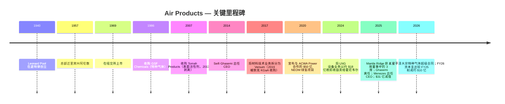
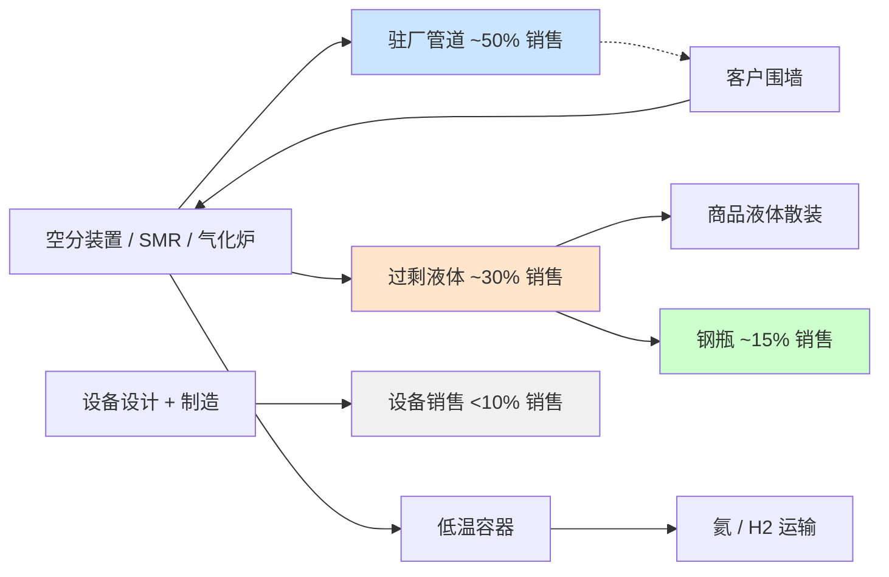
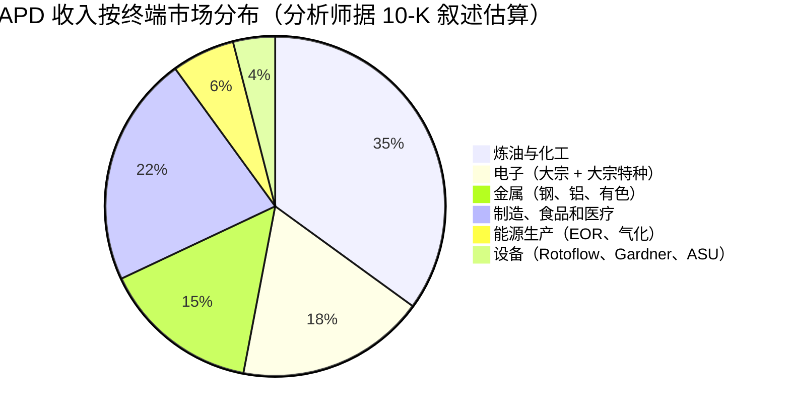
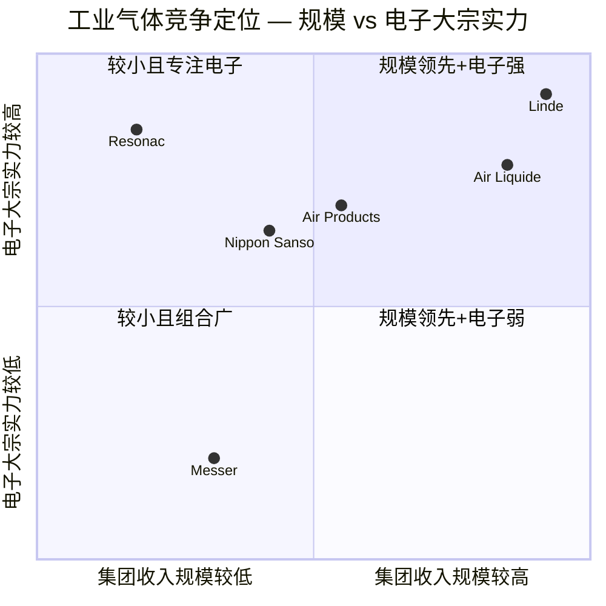

# Air Products and Chemicals, Inc. (NYSE: APD) — 公司研究

*截止日期: 2026-05-26 · 分析师: financial_agent · 报告语言: 简体中文 · 货币: 美元（USD），除非另有说明*

> **更新 — FY2026 全年调整后 EPS 指引上调 (2026-04-30):** 管理层将 FY2026 全年调整后 EPS 指引上调至 **$13.00–$13.25**（原指引为 2026-01-30 发布的 $12.85–$13.05），并重申 FY2026 资本支出约 **$40 亿**。FY26 三季度调整后 EPS 指引初步定为 $3.25–$3.35。FY26 二季度调整后 EPS 为 $3.20，同比增长 19%，超出上一季度指引上限，主要驱动因素包括驻厂供气 (on-site supply) 销量提升、生产效率改善以及汇率顺风，部分被氦气 (helium) 价格疲软所抵消。管理层明确的战略主线：「释放盈利增长、优化大型项目、维持资本纪律」。
> 来源: [Q2-FY2026 业绩新闻稿 (8-K 附件 99.1, 2026-04-30)](https://www.sec.gov/Archives/edgar/data/2969/000000296926000018/exhibit99131mar26.htm)。

## 目录

1. 公司概览
2. 公司历史
3. 管理团队
4. 产品与服务
5. 客户与上市策略
6. 行业概览
7. 竞争格局
8. 市场机会
9. 风险评估
10. 参考资料
11. 验证日志

---

## 1. 公司概览

Air Products and Chemicals, Inc.（下称「Air Products」或「APD」）是一家注册于美国特拉华州、总部位于宾夕法尼亚州阿伦敦（Allentown, PA）的工业气体 (industrial gas) 公司，成立于 1940 年。公司设计、建造、拥有并运营大型气体生产装置，向炼油、化工、金属、电子、制造、医疗及食品行业客户供应氧气、氮气、氩气、氢气、氦气、一氧化碳、合成气以及一系列特种气体。根据 FY2025 10-K 表述：「Air Products and Chemicals, Inc., a Delaware corporation founded in 1940, is a world-leading industrial gases company that has built a reputation for its innovation, operational excellence, and commitment to safety and environmental stewardship.」([Air Products FY2025 10-K, Item 1 Business](https://www.sec.gov/Archives/edgar/data/2969/000000296925000055/apd-20250930.htm))。合并销售额超过 90% 来自区域工业气体业务 — 其中约一半来自大气气体 (atmospheric gases, 通过空分装置低温蒸馏空气得到的 O₂、N₂、Ar)，其余来自工艺气体 (process gases, H₂、He、CO₂、CO、合成气)、特种气体以及设备销售业务（涡轮机械、膜分离系统及低温运输容器，面向全球客户)([FY2025 10-K, "Our Businesses"](https://www.sec.gov/Archives/edgar/data/2969/000000296925000055/apd-20250930.htm))。

**商业模式。** 工业气体业务的经济核心是 *驻厂供气 (on-site supply)* 模式：APD 在客户工厂旁建造并拥有大型空气分离装置 (ASU)、蒸汽甲烷重整装置 (SMR) 或气化炉，然后以越围 (over-the-fence) 或管道方式在 15–20 年照付不议 (take-or-pay) 合同下向客户供气，合同包含固定月费、最低采购承诺以及电力、天然气和烃类原料的价格传导条款 — 10-K 称之为「pricing formulas, surcharges, cost pass-through provisions, and tolling arrangements」。驻厂模式贡献了「约一半」的公司总销售额，其余由商品气体业务（散装液体由槽车运输 / 钢瓶包装）和设备业务构成 ([FY2025 10-K, "Supply Modes"](https://www.sec.gov/Archives/edgar/data/2969/000000296925000055/apd-20250930.htm))。15–20 年合同、价格传导条款以及 APD 自营的管道网络共同构筑了长久期现金流的资产特征，这也是公司能够承载高资本基数并连续 44 年稳定提高股息的底层结构。

**业务规模。** APD 报告 FY2025（截至 2025 年 9 月 30 日的财年）总销售额为 **$120.373 亿**，同比 FY2024 的 **$121.006 亿** 微降约 0.5%；而 FY2024 又较 FY2023 的 **$126.000 亿** 下降 4.0% — 多年的收入下行主要受氢气与氦气价格走低、2024 年 9 月将 LNG 工艺技术设备业务出售给霍尼韦尔 (Honeywell) 以及汇率逆风等因素的拖累 ([FY2025 10-K, Note 26 Segment & Geographic Information](https://www.sec.gov/Archives/edgar/data/2969/000000296925000055/apd-20250930.htm))。分部经营利润大致持平 — FY25 **$28.577 亿**、FY24 **$29.475 亿**、FY23 **$27.392 亿** — 但 **合并经营利润** 在 FY2025 转为 **亏损 $8.770 亿**，原因是 **$37.470 亿** 的非现金「业务及资产行动 (Business and Asset Actions)」减值（主要为退出的三个美国清洁能源项目的资产减值，详见§2）和 **$8,630 万** 的维权股东 (activist shareholder) Mantle Ridge 代理权之争相关费用 ([FY2025 10-K, Reconciliation of Segment Operating Income to Consolidated Results](https://www.sec.gov/Archives/edgar/data/2969/000000296925000055/apd-20250930.htm))。员工约 21,300 人，其中 75% 在美国之外，业务覆盖约 50 个国家 ([FY2025 10-K, "Human Capital Management"](https://www.sec.gov/Archives/edgar/data/2969/000000296925000055/apd-20250930.htm))。

**地理布局。** FY2025 按发出地划分的销售额：美国 **$46.925 亿**（占总额 39%）、中国 **$19.335 亿**（16%）、其他海外业务 **$54.113 亿**（45%）。固定资产净额 **$253.378 亿** 主要集中于美国（$89.091 亿）、沙特阿拉伯（$69.106 亿 — 主要为 NEOM 合资项目）、中国（$26.546 亿）和其他海外（$68.635 亿）；沙特长期资产从 FY2023 末的 $18.181 亿 暴增至 FY2025 末的 $69.106 亿，反映 NEOM 建设进度推进 ([FY2025 10-K, Geographic Information](https://www.sec.gov/Archives/edgar/data/2969/000000296925000055/apd-20250930.htm))。FY2025 报告分部按 CEO Eduardo Menezes 新战略重新划分为五个：**美洲 (Americas)**、**亚洲 (Asia)**、**欧洲 (Europe)**、**中东和印度 (Middle East and India)**、**公司及其他 (Corporate and other)**（相比此前将中东并入欧洲的三大区结构进一步细化）。

*来源: [Air Products FY2025 10-K](https://www.sec.gov/Archives/edgar/data/2969/000000296925000055/apd-20250930.htm) 及 [Q2-FY26 业绩新闻稿, 2026-04-30](https://www.sec.gov/Archives/edgar/data/2969/000000296926000018/exhibit99131mar26.htm)。*

*来源: [Air Products FY2025 10-K, Note 26 Segment & Geographic Information](https://www.sec.gov/Archives/edgar/data/2969/000000296925000055/apd-20250930.htm)。数据为截至 2025 年 9 月 30 日的财年按报告分部划分的对外销售额。*

**估值快照。** 截至 2026-05-26，APD 股价约 **$290 / 股**，市值约 **$645 亿**，TTM P/E 为 **30.5×**、远期 P/E 为 **21.0×**、TTM P/S 为 **5.2×**、EV/EBITDA 为 **21.1×**、P/B 为 **4.1×**、股息收益率 **2.50%**、5 年贝塔系数 0.78 ([Stock Analysis — APD Statistics](https://www.stockanalysis.com/stocks/apd/statistics/))。TTM 与远期 P/E 的巨大差距（30.5× → 21.0×）反映了 FY2025 因 $37 亿减值而出现的 GAAP 亏损 — 一旦该一次性费用滚出，运营层面的稳态盈利将向管理层指引的 ~$13 调整后 EPS 水平回归，对应远期 P/E 接近 22×，与 Linde 的约 26× 远期 P/E 形成小幅折价，与 Air Liquide 的约 22× 大体相当，差距体现了 APD 在 NEOM 执行风险上的拖累以及 Linde 自 Praxair 合并后获取的更强利润率结构。2.5% 股息收益率高于 Linde 的约 1.2%、低于 Air Liquide 的约 2.0%，反映了 APD 较高的派息率锚（约 60% 调整后 EPS）和 44 年连续提股息的纪律。*分析师观点:* 当前估值对于一个具有清晰催化路径（NEOM 2027 年年中投产、$90 亿项目订单储备、氦气供应趋紧）的债券替代型 (bond-proxy) 复苏标的而言较为合理，但绝对水平并不便宜 — 投资者支付的更多是「执行确定性 + 股息」溢价，而非加速盈利成长。

*来源: [Stock Analysis — APD Statistics](https://www.stockanalysis.com/stocks/apd/statistics/)，同业倍数（Linde、Air Liquide、Nippon Sanso）来自各发行人市场数据页面，截至 2026-05-26。*

---

## 2. 公司历史

Air Products 由 33 岁的销售员 Leonard Parker Pool 于 1940 年 2 月 1 日在底特律创立。Pool 此前十年一直在 Compressed Industrial Gases（后被 Burdett Oxygen 收购）销售工业气体。Pool 创业的核心思路在当时具有颠覆性：与其用沉重的钢瓶用卡车或火车将氧气和氮气运往客户，不如在客户工厂 *内部* 建造小型发生器 — 这就是行业今天称之为「驻厂供气」的模式，至今仍贡献 APD 约一半的收入 ([Air Products Company History page](https://www.airproducts.com/company/history); [Wikipedia — Air Products](https://en.wikipedia.org/wiki/Air_Products))。Pool 与年轻工程师 Frank Pavlis 合作设计了一台用液氧和石墨润滑的紧凑型空气分离装置；1941 年该装置首次租赁给底特律一家钢厂，随后公司转向二战期间向美国陆军航空队 (US Army Air Forces) 供应氧气合同，由此积累的现金支撑了 1957 年公司总部迁往宾夕法尼亚州阿伦敦附近的利哈伊谷 — 公司至今仍位于此地址（1940 Air Products Boulevard）([Wikipedia — Air Products](https://en.wikipedia.org/wiki/Air_Products); [FY2025 10-K 封面页](https://www.sec.gov/Archives/edgar/data/2969/000000296925000055/apd-20250930.htm))。Pool 于 1973 年卸任 CEO，1975 年去世。

自 2014 年以来公司的战略弧线由 **三次重大转向** 主导。第一，在 Seifi Ghasemi（CEO 2014–2025 年）任内，APD 剥离了多个增长较慢的特种业务 — 其中最重要的是 **2017 年 Versum Materials 拆分 (Versum spin-off)**，将电子材料 / 特种化学品业务（先进前驱体、光刻胶辅助材料、CMP 抛光液）剥离成独立上市公司；Versum 在 2019 年以 $65 亿企业价值被默克 KGaA (Merck KGaA) 收购 ([C&EN, 2019-04 "Versum accepts sweetened deal from Merck KGaA"](https://cen.acs.org/business/mergers-&-acquisitions/Versum-accepts-sweetened-deal-Merck/97/web/2019/04); [Versum 8-K, 2019-04-12](https://www.sec.gov/Archives/edgar/data/0001660690/000119312519104578/d725673dex991.htm))。Versum 拆分永久性地把 APD 从高纯电子前驱体（Resonac、Linde Electronics、Air Liquide Advanced Materials）的竞争赛道中移除 — 自此 APD 的电子业务集中在 *大宗* 气体（N₂、O₂、He、H₂、Ar）和管道 / 撬装供应的 *大宗特种* 气体上，而不再涉及驱动 Resonac 或 Linde 电子事业部利润表的小批量、高毛利刻蚀 / 沉积 / 清洗前驱体。

第二，**清洁氢能 (hydrogen) 转向 (2018–2023 年)。** Ghasemi 让 APD 押注一系列数十亿美元级别的超级项目，目标是将公司打造为全球低碳氢生产领军者：**$50 亿 NEOM 绿氢项目** 位于沙特阿拉伯（与 ACWA Power 和 NEOM 公司组成的 50/50 合资公司，APD 作为约 600 吨/日绿氨产出的独家承购方，[NEOM Green Hydrogen Company 财务关闭新闻稿, 2023](https://www.neom.com/en-us/newsroom/neom-green-hydrogen-investment))；位于路易斯安那州阿森松教区 (Ascension Parish) 的 **$45 亿蓝氢综合体**，目标 2028 年投产，配套现场 CO₂ 封存 ([路易斯安那州经济发展署公告, 2021](https://www.opportunitylouisiana.gov/news/air-products-announces-4-5-billion-blue-hydrogen-clean-energy-complex))；位于纽约梅塞纳 (Massena, NY) 的 **$5 亿绿液氢项目**；与 World Energy 合作位于加州派拉蒙 (Paramount, CA) 的 **CO / SAF（可持续航空燃料）项目**；以及位于德州的 **CO 项目**。这些项目共同将 APD 的资本支出从 FY2016 的 $16 亿推升至 FY2025 峰值的 **$70 亿**，远早于这些项目的现金流贡献时点 — 这是一场战略豪赌，提升了财务杠杆并压制了 FY2024 之前的自由现金流转化能力 ([FY2025 10-K capex 披露](https://www.sec.gov/Archives/edgar/data/2969/000000296925000055/apd-20250930.htm))。

*来源: [Air Products FY2025 10-K, Capital Expenditures](https://www.sec.gov/Archives/edgar/data/2969/000000296925000055/apd-20250930.htm); FY2026E 数字源自 [Q2-FY26 业绩新闻稿, 2026-04-30](https://www.sec.gov/Archives/edgar/data/2969/000000296926000018/exhibit99131mar26.htm)（「approximately $4.0 billion」）。*

第三 — 也是公司近代史上影响最深的转向 — **2024–2025 年 Mantle Ridge 维权介入与战略重置。** 2024 年 10 月，Paul Hilal 旗下的 Mantle Ridge LP 披露持有约 $10 亿股份，要求获得董事席位、CEO 接班计划、退出不经济的清洁能源承诺，并建立更严格的资本回报框架。代理权之争在 **2025 年 1 月 23 日年度股东大会** 上落幕，股东选举 Mantle Ridge 提名的 4 人中的 **3 人** — Paul Hilal、Dennis Reilley（前 Praxair CEO）、Andrew Evans（前 Southern Company CFO）— 进入董事会，仅否决 Tracy McKibben 一人 ([Chemical Week, Jan 2025, "Mantle Ridge wins three seats"](https://chemweek.mydigitalpublication.com/articles/mantle-ridge-wins-three-seats-in-air-products-proxy-battle); [APD 2026 DEF 14A — Mantle Ridge 背景](https://www.sec.gov/Archives/edgar/data/2969/000130817925000643/apd-20251210.htm))。两周内，董事会任命 **Eduardo Menezes** — Praxair 30 年老兵、Linde 欧洲中东非洲（EMEA）前 EVP — 自 2025 年 2 月 7 日起担任新 CEO；Seifi Ghasemi 在任 10 余年后离任 ([Air Products 新闻稿, 2025-02-04](https://www.airproducts.com/company/news-center/2025/02/0204-air-products-board-appoints-eduardo-menezes-ceo))。**2025 年 2 月 24 日**，新管理层宣布退出三个美国清洁能源项目 — World Energy SAF（加州派拉蒙）、Massena 绿氢项目（纽约）、德州 CO 项目 — 计提 **税前减值「不超过 $31 亿」** ([Air Products 新闻稿, 2025-02-24](https://www.airproducts.com/company/news-center/2025/02/0224-air-products-to-exit-three-us-based-projects); [FY2025 8-K, 2025-02-24](https://www.sec.gov/Archives/edgar/data/2969/000119312525033509/d830166d8k.htm))。NEOM 与路易斯安那项目则被明确 *保留* — NEOM 进度据报告达到约 80%，瞄准 2027 年年中投产；路易斯安那启动时点延至 2028 年并积极物色股权伙伴 ([Inside Saudi, 2025-10-01](https://www.insidesaudi.media/articles/2025-10-01-a-hydrogen-superpower); [gasworld, 2025](https://www.gasworld.com/story/air-products-sees-potential-path-forward-for-paused-louisiana-blue-hydrogen-project/2168127.article/))。董事会另行授权在 FY25 三季度向 Mantle Ridge **现金报销 $2,470 万** 代理权之争的法律和顾问费用 ([APD 2026 DEF 14A, 治理板块](https://www.sec.gov/Archives/edgar/data/2969/000130817925000643/apd-20251210.htm))。

2024 年 9 月将 **LNG 工艺技术设备业务卖给霍尼韦尔**，确认 **约 $16 亿税前收益**（在 FY2024 四季度入账）是 Ghasemi 任内最后一笔重大资产剥离，并先于 Mantle Ridge 介入；LNG 业务此前年贡献约 $1.35 亿经营利润，被定位为偏离气体供应核心模型的非主业 ([FY2025 10-K, Note 4 Gain on Sale of Business](https://www.sec.gov/Archives/edgar/data/2969/000000296925000055/apd-20250930.htm))。除 LNG 出售外，过去 10 年公司较少进行无机并购扩张；增长主要来自绿地驻厂建设和与现有客户的合同延期。

近 12 个月的事件可压缩为单一叙事：资本重置。资本支出指引下调约 $10 亿（FY2026 约 $40 亿 vs FY2025 实际 $70 亿）([Q2-FY26 PR](https://www.sec.gov/Archives/edgar/data/2969/000000296926000018/exhibit99131mar26.htm))。经营利润率回升至 FY26 二季度调整后 23.7%，较上年同期 21.6% 改善。2026 年 4 月 29 日公告的三星平泽超级合同 — APD「迄今为止在半导体行业最大的投资」— 将平泽确立为公司「全球范围内规模最大的电子业务支援基地」，分阶段投产时点为 2028–2030 年 ([Air Products 新闻稿, 2026-04-29](https://www.airproducts.com/company/news-center/2026/04/0429-air-products-gas-supply-samsung-semiconductor-fab-south-korea))。维权股东驱动的纪律、来自行业最受尊重的同业（Praxair）出身的 CEO、以及刚刚起步的半导体工业气体需求周期 — 这三重叠加构成今天的投资争论核心。

---

## 3. 管理团队

**Leonard Parker Pool — 创始人 (1906–1975)。** Pool 在 1940 年以约 $30,000 创业起步资金建立 Air Products，资金来源是变现其本人的人寿保险保单和担任教师的妻子的全部积蓄；此前他用 10 年时间为 Burdett Oxygen 和 Compressed Industrial Gases 销售氧气和乙炔钢瓶 ([Air Products Company History](https://www.airproducts.com/company/history); [Prabook biography](https://prabook.com/web/leonard_parker.pool/1052656))。Pool 的创业核心命题 — 在工业规模消耗氧气的客户（钢厂、玻璃厂、化工反应器）会更愿意在自家门口建发生器而不是接收一卡车一卡车的钢瓶 — 是今天整个工业气体行业（不仅 APD）赖以建立「照付不议」长合同结构的驻厂供气模式的起源。Pool 取得了一台围绕石墨与液氧润滑压缩机（在 1940 年具有革命性；竞争对手设计使用易燃的矿物油润滑）打造的紧凑型 ASU 设计许可，1941 年将首台装置租给底特律一家钢厂客户，赢得二战期间向高空轰炸机机组人员供氧的合同，并于 1957 年将总部迁至阿伦敦的利哈伊谷 — APD 至今的地理锚点 ([Air Products Company History](https://www.airproducts.com/company/history); [Wikipedia — Air Products](https://en.wikipedia.org/wiki/Air_Products))。Pool 自 1940 年至 1973 年担任 CEO，1969 年带领公司在纽交所上市，去世前最后一年退居名誉董事长。Pool 家族目前未持有具名股权；公司股权绝大部分由机构投资者持有（Vanguard、BlackRock、State Street，以及 2024 年以后的 Mantle Ridge），最新代理声明中没有与创始人相关的大股东 ([APD 2026 DEF 14A — 持股表](https://www.sec.gov/Archives/edgar/data/2969/000130817925000643/apd-20251210.htm))。

**Eduardo F. Menezes — 现任 CEO。** Menezes 于 **2025 年 2 月 7 日** 加入 Air Products 出任 CEO，接替 Seifi Ghasemi，作为 Mantle Ridge 主导的董事会重置的一部分 ([APD 2026 DEF 14A — Director Bio](https://www.sec.gov/Archives/edgar/data/2969/000130817925000643/apd-20251210.htm); [Air Products 新闻稿, 2025-02-04](https://www.airproducts.com/company/news-center/2025/02/0204-air-products-board-appoints-eduardo-menezes-ceo))。任命时 62 岁，出生于巴西，持有里约联邦大学化学工程学位和纽约州立大学 MBA 学位。其全部 35 年以上职业生涯几乎都在工业气体行业 — 先在 **Praxair Inc.**（1989–2018 年，从区域商务经理一路升至执行副总裁，分管 Praxair 的亚洲、欧洲、墨西哥和南美业务以及全球氢业务），后在 **Linde plc**（2018–2021 年，作为 EVP 负责 Praxair–Linde 合并后的欧洲、中东和非洲业务，下辖 40 多个国家、约 $80 亿销售额和约 18,000 名员工）([APD 2026 DEF 14A bio](https://www.sec.gov/Archives/edgar/data/2969/000130817925000643/apd-20251210.htm))。离开 Linde 后他在咨询和私募股权领域工作约 4 年，随后被 APD 重组后的董事会延揽。

Menezes 的履历有两个具体经营战绩。第一，作为 Praxair Europe 总裁（2007–2010 年），他主导了 Praxair 收购 BOC 德国和意大利资产的整合，最终在 2007–2012 年间将欧洲经营利润翻倍（详见同期 Praxair 10-K）。第二，作为 Praxair 亚洲 EVP（2012–2018 年），他主持了 Praxair–Linde 合并的亚洲剥离谈判（中国和韩国监管要求剥离 Praxair 亚洲业务方可批准合并）。在 APD，他的初始薪酬包括 **基本工资 $130 万、145% 的目标年度激励（现金奖金）、$990 万的签约股权激励**（细节披露于任命 8-K）([Air Products 8-K, 2025-02-04, Exhibit 99.1](https://www.sec.gov/Archives/edgar/data/2969/000000296925000012/exhibit99131dec24.htm); 摘要见 [Chemical & Engineering News, 2025-02](https://cen.acs.org/business/Air-Products-names-Eduardo-Menezes/103/i3))。任期初期他的直接持股不大（按代理声明披露，初始股权激励按多年期归属），但薪酬结构将大部分薪酬绑定于多年期 TSR 业绩，与维权股东的资本回报命题对齐。

Menezes 在任 16 个月内交出了一份连贯的重置故事：资本支出削减约 $10 亿（FY2026 指引 $40 亿 vs FY2025 实际 $70 亿）；三个不经济的美国清洁能源项目退出并在 FY25 二季度计提减值；分部报告重新切分为五个区域，让中东与印度业务（主要是 NEOM）获得独立可见度；每场业绩会均重复「释放盈利增长、优化大型项目、维持资本纪律」的纪律口号 ([Q2-FY26 PR — CEO commentary](https://www.sec.gov/Archives/edgar/data/2969/000000296926000018/exhibit99131mar26.htm))。三星平泽超级合同（2026 年 4 月）虽在其任内公告，但商业管道在他到任前已铺设 — 他获得的是签约而非缔造的功劳。下一阶段的核心 — 也是其 CEO 任期最重要的检验 — 是三项执行决策：NEOM（2027 年年中投产、爬产风险、与 Yara 的承购风险）、路易斯安那（股权伙伴选定、2028 年启动）以及 NEOM 之后的资本配置哲学（继续推进驻厂超级项目 vs 还现金；重启回购 vs 持续再投资）。

---

## 4. 产品与服务

> **重要提示:** §4 是本报告最关键的章节。APD **不** 在 10-K 中公布独立的「电子级气体 (electronic-grade gas)」或产品口径收入表 — 仅按区域（美洲、亚洲、欧洲、中东和印度、公司及其他）报告，产品类别只在 Item 1 业务章节定性描述。这与 Resonac、Linde Electronics 或 Air Liquide Advanced Materials 的报告口径有本质区别，后者将电子前驱体单独列示。因此理解 APD 的产品矩阵最好的方式是 **「分子 × 供应模式」网格**（大气 / 工艺 / 特种 × 驻厂 / 商品 / 钢瓶）叠加 **终端应用维度**（炼油、化工、金属、电子、食品 / 医疗），区域分部则是 P&L 的呈现层。

### 4.1 — APD 的「产品矩阵」— 分子 × 供应模式 × 终端应用

按 FY2025 10-K Item 1 表述：「Our industrial gases business, which is organized and operated regionally in the Americas, Asia, Europe, and Middle East and India segments, produces and sells atmospheric gases such as oxygen, nitrogen, and argon (primarily recovered by the cryogenic distillation of air); process gases such as hydrogen, helium, carbon dioxide, carbon monoxide, and syngas (a mixture of hydrogen and carbon monoxide); and specialty gases. Overall regional industrial gases sales constituted over 90% of consolidated sales in fiscal years 2025, 2024, and 2023, approximately half of which were attributable to atmospheric gases」([FY2025 10-K, Item 1 Business — "Our Businesses"](https://www.sec.gov/Archives/edgar/data/2969/000000296925000055/apd-20250930.htm))。

将 10-K 叙述综合为下表的产品矩阵（10-K 中并无原生表格 — 此表由分析师据原文构造）：

| 分子 | 生产工艺 | 供应模式 | 主要终端应用 | 合同结构 |
|---|---|---|---|---|
| **氧气 (O₂)** | 低温空分 | 驻厂管道 + 商品液体 | 钢铁、玻璃、水泥、炼油气化、医疗 | 15–20 年照付不议（驻厂）；5 年（商品） |
| **氮气 (N₂)** | 低温空分 | 驻厂管道 + 商品液体 + 钢瓶 | 半导体晶圆厂腔体惰化、食品冷冻、金属惰化、化学反应器封闭 | 15–20 年 / 5 年 / 单笔订单 |
| **氩气 (Ar)** | 低温空分（O₂/N₂ 副产） | 商品液体 + 钢瓶 | 金属焊接保护气、半导体溅射 / 腔体吹扫 | 5 年或单笔订单 |
| **氢气 (H₂) — 灰氢** | 蒸汽甲烷重整 (SMR)，天然气原料 | 驻厂管道（墨西哥湾沿岸网络、鹿特丹、新加坡） | 炼油加氢裂化 + 加氢精制；石化原料 | 15–20 年照付不议 |
| **氢气 (H₂) — 蓝氢** | SMR + 碳捕集 / 封存 | 驻厂管道（路易斯安那 ~2028 年） | 炼油减碳；氨 / 电子燃料 | 长期承购谈判中 |
| **氢气 (H₂) — 绿氢** | 可再生电力电解（NEOM 光伏 + 风电） | 以绿氨形式出口（Yara 承购） | 重型动力、船用燃料氨、化肥 | NEOM JV 由 APD 母公司承购 |
| **氦气 (He)** | 天然气 / CO₂ 提取副产；地下储气库（德州 Amarillo、Beaumont） | 商品 ISO 容器 + 液化 | 半导体晶圆冷却、MRI 磁体冷却、光纤制造、航天吹扫 | 3–5 年供应协议 |
| **一氧化碳 (CO) / 合成气** | 带分离的 SMR；部分氧化 | 驻厂管道 | 乙酸、聚氨酯、酮醇、甲醇 | 15–20 年 |
| **二氧化碳 (CO₂)** | 副产物纯化（乙醇发酵、化肥）；少量大气分离 | 商品液体 + 钢瓶 | 饮料碳化、食品冷冻、EOR | 3–5 年 |
| **特种 / 大宗特种气体** | 高纯混合与灌装 | 客户围墙旁的商品撬装 | 半导体工艺气体（仅大宗高纯 — **三氟化氮 (NF₃)**、**硅烷 (SiH₄, silane)**、**六氟化钨 (WF₆)** 在 Versum 拆分后已 *不在* APD 组合中） | 5–15 年 |
| **设备（公司及其他分部）** | 自有设计 + 制造 | 一次性项目销售 | ASU、烃类回收、液氦 / 液氢运输罐；Rotoflow 涡轮膨胀机；Gardner Cryogenics 容器 | 项目制 |

*据 [FY2025 10-K, Item 1 Business 的 "Our Businesses"、"Production"、"Supply Modes"、"End Use"、"Industrial Gases Equipment"](https://www.sec.gov/Archives/edgar/data/2969/000000296925000055/apd-20250930.htm) 及 [Air Products 公司历史产品时间线](https://www.airproducts.com/company/history) 构造。*

理解 APD 经济模型的第二个关键轴是 **供应模式结构**。按 10-K 表述，驻厂（大型管道 / 越围）贡献「approximately half」总销售额，商品气体（液体散装 + 钢瓶）贡献余下大部分，设备销售在 FY2025、FY2024 和 FY2023 各财年均 <10% ([FY2025 10-K, "Supply Modes"](https://www.sec.gov/Archives/edgar/data/2969/000000296925000055/apd-20250930.htm))。驻厂业务正是长合同期、价格传导和管道网络护城河的所在 — 也是高资本密集度（因此也是 FY2025 减值风险）集中的地方。

### 4.2 — 产品如何协同 — APD 的客户工作流

Air Products 的产品组合在每个大型工业现场构成单一的客户工作流：APD 在客户围墙内部或紧邻处建造 **空气分离装置 (ASU)** 或 **氢气装置 (SMR / 气化炉)**；管道气体在 15–20 年照付不议合同下连续流入客户工艺；多余的液体产品被收集、用槽车运输并在每座 ASU 约 200 英里配送半径内向商品客户转售；在管道网络存在的地方（墨西哥湾沿岸氢气管道、鹿特丹–安特卫普网络、新加坡裕廊系统），跨客户负荷平衡使原本高固定成本的资产成为单位经济显著更优的网络业务。同一分子（氧气、氢气）因此以三种不同价格出现在三条不同的收入流上 — 驻厂（单价最低、合同最长、资本最高）、商品液体（中等）和钢瓶（单价最高、承诺最短）— 区域分部 P&L 就是这三种模式加上设备销售的代数和。氦气是显著例外：因氦气资源在地理上高度集中（美国 Hugoton 气田、卡塔尔、俄罗斯、阿尔及利亚）且运输需要低温 ISO 容器，APD 的氦气业务必须是全球性的，且运行于较短（3–5 年）的供应合同上，相比管道业务更频繁地重新定价 — 这一特征解释了近季度氦气业务的上行和下行意外。

### 4.3 — 大气气体 (O₂, N₂, Ar) — 约占合并销售 ~50%

**10-K 原文:** "Atmospheric gases are produced through various air separation processes, with cryogenic distillation being the most prevalent" ([FY2025 10-K, "Production"](https://www.sec.gov/Archives/edgar/data/2969/000000296925000055/apd-20250930.htm))。终端应用，10-K 表述："Oxygen is used in combustion and industrial heating applications, including in the steel, certain nonferrous metals, glass, and cement industries. Nitrogen applications are used in food processing for freezing and preserving flavor, and nitrogen is used for inerting in various fields, including the metals, chemical, and semiconductor industries" ([FY2025 10-K, "End Use"](https://www.sec.gov/Archives/edgar/data/2969/000000296925000055/apd-20250930.htm))。

**通俗释义:** ASU 是一座高大的低温蒸馏塔，利用液态沸点差异将室内空气物理分离为构成分子 — 氧气在 −183 °C、氩气在 −186 °C、氮气在 −196 °C 液化，所以将空气冷却至约 −190 °C 再蒸馏即可得到 >99.5% 纯度的三股气流。经济上的关键在于 **电力是最大单一成本要素** — 通常占现金生产成本的 60–70%，FY2025 10-K 明确证实："Electricity is the largest cost component in the production of atmospheric gases" ([FY2025 10-K, "Production"](https://www.sec.gov/Archives/edgar/data/2969/000000296925000055/apd-20250930.htm))。长期电力供应合同和现场热电联产在工业电价上涨时倾向于让 APD 受益（成本通过 10-K 所述的「定价公式、附加费、成本传导条款」机制传导），在现货电价下跌时则反向。

**与其他类别的差异:** O₂/N₂/Ar 是大宗化分子 — 物理纯度是二元的（要么交付 99.5%，要么客户的晶圆厂 / 熔炉 / 炼油厂报警），因此竞争维度集中在供应可靠性、合同条款和地理就近性。这与特种气体（晶圆厂工艺腔体的定制混合和高纯散装）形成对比 — 后者以配方和纯度认证差异化；也不同于氦气 — 后者由全球供给复杂度和地质稀缺主导成本结构。

**战略意义:** 大气气体是 APD 业务的 **债券替代型核心**。15–20 年合同 + 价格传导在完整电价周期内提供稳定的低双位数 ROIC，这是为什么 APD、Linde、Air Liquide 三家合计持有全球驻厂大气市场约 80% 份额，也是为什么公司的财务画像更像一家受监管的公用事业而非化学品制造商。氮气的半导体子分部是当前增长最快的细分：一座先进逻辑 / DRAM 晶圆厂每天消耗 500–1,500 公吨氮气用于腔体惰化和吹扫 — 与一座中型钢厂相当 — 三星平泽超级合同正是这种合同类型 ([Air Products 三星新闻稿, 2026-04-29](https://www.airproducts.com/company/news-center/2026/04/0429-air-products-gas-supply-samsung-semiconductor-fab-south-korea))。

*分析师观点:* APD 在大气驻厂的竞争位势强劲（结论 = 有护城河；护城河 = 规模 + 管道网络经济 + 15–20 年合同切换成本），在不同地理上与 Linde 在全球 #2 或 #3 之间。最直接的竞品是 Linde 的驻厂 ASU 业务，详见 [Linde plc 2024 Annual Report](https://www.sec.gov/Archives/edgar/data/0001707925/000162828025007990/lin-20241231.htm)（2018 年 Praxair 合并后 Linde 超越 APD 成为全球 #1）。

### 4.4 — 工艺气体 — 氢气、氦气、一氧化碳、合成气

**10-K 原文:** "Hydrogen is a process gas that is typically produced by purifying byproduct sources obtained from chemical and petrochemical industries without carbon capture, commonly referred to as 'gray hydrogen.' We primarily produce gray hydrogen. In addition, we are advancing projects that produce low-carbon hydrogen from hydrocarbons with carbon capture ('blue hydrogen') and carbon-free hydrogen from renewable energy ('green hydrogen'), such as the NEOM Green Hydrogen Project in Saudi Arabia" ([FY2025 10-K, "Production"](https://www.sec.gov/Archives/edgar/data/2969/000000296925000055/apd-20250930.htm))。

**通俗释义:** 氢气生产按碳足迹分为三种「颜色」。**灰氢**（目前占全球供应约 95%）来自 SMR — 天然气 + 蒸汽在约 800 °C 镍催化剂上 → H₂ + CO + CO₂，CO₂ 排放至大气。**蓝氢** 工艺与 SMR 相同但在出口烟囱处捕集 CO₂ 并将其封存至地下；分子本身完全一致，差异在于碳足迹披露。**绿氢** 通过可再生电力电解水 — 通常是 PEM（质子交换膜）或碱性电解槽 — 无化石输入；成本结构由零碳电力的成本主导。APD 现有的 **墨西哥湾沿岸氢气管道网络**（从休斯顿航道穿过路易斯安那直达鲍蒙特 / 阿瑟港炼油集群，相当于「美国版鹿特丹」）是全球最大的灰氢管道之一，是 APD 当前在美国炼油氢业务规模的基石资产。

**氦气** 在结构上与其他工艺气体不同：按 10-K 表述："Helium is produced as a byproduct of gases extracted from underground reservoirs, primarily natural gas and CO₂ purified before resale. Because helium is generally sourced globally at long distances from point of sale, we maintain an inventory of helium in our fleet of ISO containers as well as in underground storage facilities in Amarillo, Texas and Beaumont, Texas" ([FY2025 10-K, "Production"](https://www.sec.gov/Archives/edgar/data/2969/000000296925000055/apd-20250930.htm))。氦气对电子的相关性 — 晶圆冷却、MRI 磁体泄漏检测、等离子物理 — 加上地理稀缺性（美国 Amarillo BLM Cliffside 设施和 Hugoton 气田是两大美国来源；国际供给来自卡塔尔、俄罗斯和阿尔及利亚）使得氦气业务持续是供给冲击定价能力与需求冲击定价压力的交错。FY26 二季度管理层专门提到氦气价格疲软作为顺风的部分对冲，并宣布从 Amarillo 储气库提取、增加美国液化产能、并重新部署全球 ISO 集装箱以增强韧性 ([Q2-FY26 PR](https://www.sec.gov/Archives/edgar/data/2969/000000296926000018/exhibit99131mar26.htm))。

**战略意义:** 氢气是 APD 清洁能源战略豪赌的展开场。NEOM（绿氢）和路易斯安那（蓝氢）合计代表 **约 $130 亿承诺资本** — 相当于净 PP&E 基数的一半 — 围绕一项多十年命题：脱碳监管、炼油客户净零承诺以及氨作为船用燃料的采用将创造一个可观的低碳氢结构性买方。在 Menezes 时代命题完好无损 — NEOM 和路易斯安那都在 2025 年 2 月战略重置中被明确 *保留* — 但时间表比原 2024–2026 投产窗口拉长。NEOM 投产为 2027 年年中；路易斯安那 2028 年；承购协议（NEOM 氨的 Yara、路易斯安那的股权伙伴选定）仍在谈判中。*分析师观点:* 氢气是模型中方差最大的一行 — 干净的执行路径带来低双位数 ROIC 和 FY2028 起的多年期 EPS 顺风；投产时点滑坡或承购永久受损则带来二次减值周期。

*分析师观点:* 在全球灰氢管道业务上 APD 是明确的前三供应商（结论 = 是；护城河 = 管道 + 15–20 年炼油照付不议合同），与 Linde 和 Air Liquide 并列。在规模化绿氢上，APD 真正是第一家（唯一一家在建 >500 吨/日 绿氢装置）；在规模化蓝氢上，也是第一家（路易斯安那是在建最大蓝氢承诺）。在氦气上，APD 是三大主要供应商之一（Linde、APD、Air Liquide），合计持有全球商品氦气市场约 60–70%，Iwatani Corp 和 Messer 也具有体量。

### 4.5 — 特种 / 电子级气体 — Versum 拆分后仅做大宗

这是关于 Air Products 最容易被误解的一个分部。**APD 不销售离散事件级电子前驱体** — NF₃、硅烷 (SiH₄)、WF₆、**三氯化硼 (BCl₃)**、ALD 用氨、沉积级钨前驱体等。这些产品类别在 2017 年 Versum 拆分中被划入 Versum Materials，今天由默克 KGaA 持有（EMD Electronics 子公司），与 Resonac（昭和电工电子材料业务 — 见 [reports/sector/半导体材料.md](../../sector/半导体材料.md)）、SK Materials 和 Linde Electronics 在竞争。APD 的电子业务收入集中于通过驻厂管道和客户撬装交付的 **大宗及大宗特种气体**：N₂（腔体惰化）、O₂（燃烧 / 氧化）、H₂（外延和载气）、氦气（晶圆冷却）、氩气（溅射和大批量制造腔体吹扫）以及大宗特种层（超高纯 N₂、多 9 等级氢气、特殊混合气）。

「大宗 vs 前驱体」的区分对投资命题有重要意义，因为（i）大宗业务毛利率较低但合同期限远长（15–20 年 vs 1–3 年）；（ii）大宗气体的竞争位势 *与* 前驱体 *截然不同* — APD 与 Linde Electronics、Air Liquide Electronics、Nippon Sanso（TNSC）和 Messer Electronics 在 **管道供应 + 驻厂可靠性** 上竞争，而不是与前驱体专家 Resonac / SK Materials / Versum 竞争；（iii）AI 驱动的半导体资本支出周期（按 Nomura 的研究综合在 [reports/sector/半导体材料.md](../../sector/半导体材料.md)，TSMC FY2027 资本支出约 $700 亿）与新晶圆厂建设 1:1 拉动大宗气体需求，不论该厂是逻辑、DRAM、HBM 还是先进封装，而前驱体需求结构则更多依赖工艺节点和工艺组合。

**战略意义:** 三星平泽大宗特种气体超级合同（2026 年 4 月）和亚洲电子项目订单（FY26 二季度业绩会披露在「亚洲电子项目执行中」额外约 $10 亿，[Motley Fool transcript, 2026-04-30](https://www.fool.com/earnings/call-transcripts/2026/04/30/air-products-apd-q2-2026-earnings-transcript/)）是 Menezes 任内亚洲电子推进的可见标记 — 在 APD 已有装机基础的德州（TSMC 亚利桑那由 APD 凤凰城周边管道网络供应，详见多家行业媒体报道）和韩国（平泽被扩展为「全球范围内规模最大的电子业务支援基地」，详见 [三星公告, 2026-04-29](https://www.airproducts.com/company/news-center/2026/04/0429-air-products-gas-supply-samsung-semiconductor-fab-south-korea)）的地理上，公司决定积极争夺晶圆厂驻厂合同以巩固和扩大领先地位。

*分析师观点:* 在半导体驻厂的大宗与大宗特种领域，APD 是可信的前三供应商（结论 = 是；护城河 = 驻厂资产 + 15–20 年合同 + 可靠性记录），落后于 Linde Electronics（Praxair 合并后全球 #1，与 TSMC + Intel 关系最深，详见 [Linde plc 2024 Annual Report Electronics 板块](https://www.sec.gov/Archives/edgar/data/0001707925/000162828025007990/lin-20241231.htm)），与 Air Liquide Electronics 大致并列。在离散事件级前驱体（NF₃、硅烷、WF₆ 等）上，Versum 拆分后 APD 实际份额为零 — 相关对比集合是 Resonac、EMD Electronics（默克 KGaA / 前 Versum）、SK Materials 和 Linde Electronics 的特种业务线。

### 4.6 — 设备业务（公司及其他）— <10% 销售

**10-K 原文:** "We design and manufacture equipment for air separation, hydrocarbon recovery and purification, and liquid helium and liquid hydrogen transport and storage. The Corporate and other segment includes activity related to the sale of cryogenic and gas processing equipment for air separation … The Corporate and other segment also includes the results of our Rotoflow business, which manufactures turboexpanders and other precision rotating equipment, and our Gardner Cryogenics business, which fabricates helium and hydrogen transport and storage containers" ([FY2025 10-K, "Industrial Gases Equipment"](https://www.sec.gov/Archives/edgar/data/2969/000000296925000055/apd-20250930.htm))。

**通俗释义:** 设备业务是项目制收入流 — APD 向那些选择自有自营气体供应资产的客户销售完整 ASU（或烃类回收 / 纯化装置）— 通常是大型油气生产商和体量极大的化工 / 石化综合体，因为它们的供应量经济性更偏向自营。**Rotoflow** 涡轮膨胀机是精密旋转机械，用于从气体膨胀中提取制冷能量（任何低温装置的关键效率部件）。**Gardner Cryogenics** 制造在低温温度下全球运输液氢和液氦的特种 ISO 容器和真空绝热罐 — 这些是氦气业务的「卡车」，客户群较小但锁定，主要是氦气和航天客户。

**战略意义:** 设备业务是反周期杠杆，也是一种「不下注驻厂资本」的赚取利润方式。当客户为资产付费时，APD 捕获工程 / 采购 / 施工的利润，而不承担多十年期的资产负债表敞口。**2024 年 9 月 30 日将 LNG 工艺技术设备业务卖给霍尼韦尔，确认约 $16 亿税前收益**，移除了该分部最高毛利的部分 ([FY2025 10-K, Note 4 Gain on Sale of Business](https://www.sec.gov/Archives/edgar/data/2969/000000296925000055/apd-20250930.htm)) — LNG 业务此前贡献约 $1.35 亿经营利润（FY24）和约 $1.20 亿（FY23）。留下来的是稳态低温设备业务和 Rotoflow / Gardner 的特种产品。

### 4.7 — 旗舰项目、订单储备和近期发布

理解 APD 当前最有信息量的产品旗舰透镜是其 **项目订单储备**，Q2-FY26 披露为约 **$90 亿盈利贡献项目**，其中包括 >$25 亿传统工业气体订单和约 $10 亿在执行的亚洲电子项目 ([Motley Fool — APD Q2 FY26 Earnings Transcript, 2026-04-30](https://www.fool.com/earnings/call-transcripts/2026/04/30/air-products-apd-q2-2026-earnings-transcript/))。三个旗舰主导该订单：

1. **NEOM 绿氢项目（沙特阿拉伯）** — 总项目成本 $84 亿，JV 层面 APD / ACWA Power / NEOM 公司各持 50/50，APD 作为绿氨产品的独家承购方。目标约 600 吨/日绿氢转化为约 120 万吨/年绿氨，面向船用燃料和化肥市场。报告进度约 80% 完成；目标 2026 年底 / 2027 年中首产氨。投产后管理层计划解除 JV 合并报表，从 APD 资产负债表移除相关债务 ([NEOM Green Hydrogen Company 财务关闭新闻稿, 2023](https://www.neom.com/en-us/newsroom/neom-green-hydrogen-investment); [Q2-FY26 transcript](https://www.fool.com/earnings/call-transcripts/2026/04/30/air-products-apd-q2-2026-earnings-transcript/); [Inside Saudi, 2025-10-01](https://www.insidesaudi.media/articles/2025-10-01-a-hydrogen-superpower))。
2. **路易斯安那清洁能源综合体（阿森松教区）** — 原 $45 亿预算，全球最大蓝氢综合体，SMR + 自热重整器 + CO₂ 封存到湾区碳酸盐含水层；启动延至 2028 年，在 Menezes 任内启动积极股权伙伴搜寻以优化 APD 的股权出资额 ([gasworld, 2025](https://www.gasworld.com/story/air-products-sees-potential-path-forward-for-paused-louisiana-blue-hydrogen-project/2168127.article/); 原 [路易斯安那州经济发展署公告, 2021](https://www.opportunitylouisiana.gov/news/air-products-announces-4-5-billion-blue-hydrogen-clean-energy-complex))。
3. **三星平泽大宗特种气体供应系统** — 2026 年 4 月 29 日公告，APD「迄今为止在半导体行业最大的投资」，向三星新一代先进半导体晶圆厂供应氮气、氧气、氩气和氢气；分阶段投产 2028–2030 年；平泽成为 APD「全球范围内规模最大的电子业务支援基地」([Air Products 新闻稿, 2026-04-29](https://www.airproducts.com/company/news-center/2026/04/0429-air-products-gas-supply-samsung-semiconductor-fab-south-korea); [PR Newswire, 2026-04-29](https://www.prnewswire.com/news-releases/air-products-to-expand-industrial-gas-supply-for-samsung-electronics-next-generation-semiconductor-fab-in-south-korea-302757497.html))。

过去 12 个月的其他重新定位包括：在佛罗里达州 Cocoa 新建一座 ASU 服务 NASA Artemis 火箭发射市场（液氢 + 氦气用于火箭燃料系统）；为管理全球客户供应链韧性而新增氦气储气和美国液化产能；以及 Q2-FY26 公告将季度股息提升至 $1.81（连续第 44 年提股息）([Q2-FY26 PR](https://www.sec.gov/Archives/edgar/data/2969/000000296926000018/exhibit99131mar26.htm); [Air Products 股息新闻稿, 2026-01](https://www.investing.com/news/company-news/air-products-increases-quarterly-dividend-to-181-per-share-93CH-4468906))。

*来源: [Air Products 股息新闻稿（连续 44 年提股息）](https://www.airproducts.com/company/news-center/2025/01/0122-air-products-increases-quarterly-dividend-for-43rd-consecutive-year) 及 [2026-01 季度股息提升至 $1.81](https://www.investing.com/news/company-news/air-products-increases-quarterly-dividend-to-181-per-share-93CH-4468906)。*

### 4.8 — 综合 — 各类别如何交互

最好把 Air Products 理解为 **同一资产负债表上的三项整合业务**。（1）**债券替代型核心**：大气驻厂、灰氢驻厂、氦气商品 — 长久期、价格传导、ROIC 稳定、股息驱动。这大约占经营利润的 80%，是股息覆盖故事的全部底层。（2）**电子顺风层**：美洲（TSMC 亚利桑那、三星德州、Micron 美国、Intel）和亚洲（三星平泽、亚洲电子 ~$10 亿订单）半导体晶圆厂的大宗与大宗特种 — 与核心同分子，但由于 AI 半导体资本支出周期（至 ~2030 年）增长斜率结构性更陡。（3）**清洁能源期权层**：NEOM（绿氢 → 氨）、路易斯安那（蓝氢 + 封存）。高资本密集度、多年期建设、非对称回报 — 上行是 2028 年起多十亿 ROIC 顺风；下行是 FY2025 $37 亿减值为 *已退出项目* 预演的二次减值周期。模型最后汇总到单一数字 — 调整后 EPS — FY2026 指引（$13.00–$13.25）就是管理层对这三层 + 价格 + 资本纪律 + 汇率在当前周期内平衡结果的表达 ([Q2-FY26 PR](https://www.sec.gov/Archives/edgar/data/2969/000000296926000018/exhibit99131mar26.htm))。

---

## 5. 客户与上市策略

由于区域工业气体客户群多元，**客户集中度结构性偏低**。FY2025 10-K 明确披露："We do not have a homogeneous customer base or end market, and no single customer accounts for more than 10% of our consolidated sales. We do have concentrations of customers in specific industries, primarily refining, chemicals, and electronics. Within each of these industries, we have several large-volume customers with long-term contracts. A negative trend affecting one of these industries, or the loss of one of these major customers, although not material to our consolidated sales, could have an adverse impact on our financial results" ([FY2025 10-K, Item 1 Business — "Customers"](https://www.sec.gov/Archives/edgar/data/2969/000000296925000055/apd-20250930.htm))。由于没有任何客户达到 ASC 280-10-50-42 的 10% 销售额披露阈值，APD 在分部附注中不具名披露客户 — 这是与 Linde 和 Air Liquide 共享的结构性披露特征，也与纯前驱体专家（如 Resonac，前 3 大客户份额常 >50%，详见 [reports/sector/半导体材料.md](../../sector/半导体材料.md)）形成本质区别。

虽然 *集中度* 数字低，APD 的客户名册中包含许多全球最大的工业买家。按行业划分：在 **炼油**，大客户关系包括美国湾区和鹿特丹的主要炼油商（ExxonMobil、Marathon Petroleum、Phillips 66、Shell、BP、TotalEnergies 是墨西哥湾沿岸氢气管道网络最大的客户，详见多家行业媒体报道）；在 **化工**，全球烯烃 / 芳烃 / 甲醇玩家（Dow、LyondellBasell、BASF、SABIC）用 APD 的工艺气体作为基本原料；在 **金属**，一体化钢铁和铝业生产商（ArcelorMittal、Nucor、Steel Dynamics、Alcoa、Norsk Hydro）购买驻厂氧气和氩气；在 **电子**，全球四大先进晶圆厂领导者 — **TSMC（美国亚利桑那）、三星（美国德州和韩国平泽）、Intel（美国多地）、Micron（博伊西、玛纳萨斯、Lehi、纽约）** — 通过驻厂购买大宗及大宗特种气体；在 **医疗和食品**，分散的钢瓶气体客户通过商品渠道采购。三星平泽超级合同是 APD 历史上披露的最大单一客户承诺，也被明确描述为公司「迄今为止在半导体行业最大的投资」— 但即使到 2030 年全产能爬坡，也不会让三星超过 10% 披露阈值 ([Air Products 新闻稿, 2026-04-29](https://www.airproducts.com/company/news-center/2026/04/0429-air-products-gas-supply-samsung-semiconductor-fab-south-korea); [PR Newswire, 2026-04-29](https://www.prnewswire.com/news-releases/air-products-to-expand-industrial-gas-supply-for-samsung-electronics-next-generation-semiconductor-fab-in-south-korea-302757497.html))。

*分析师据 [FY2025 10-K, Item 1 Business 与 Note 26 分部信息](https://www.sec.gov/Archives/edgar/data/2969/000000296925000055/apd-20250930.htm) 构造的拆分。APD 不公布终端市场收入百分比 — 这是依据叙述描述和客户行业大致规模的方向性估计。*

**合同结构。** 驻厂供应模式合同 — 占总销售约一半 — 「一般由 15 至 20 年长期合同治理」并「通常包括固定月费和/或最低采购要求，附以基于外部指数的价格调整条款」([FY2025 10-K, "Supply Modes"](https://www.sec.gov/Archives/edgar/data/2969/000000296925000055/apd-20250930.htm))。商品液体和钢瓶气体合同较短（5 年或以内）且不含最低采购要求。电力、天然气和烃类原料成本通过定价公式、附加费和代加工安排传导 — 10-K 措辞明确："We mitigate electricity, natural gas, and hydrocarbon price fluctuations contractually through pricing formulas, surcharges, cost pass-through provisions, and tolling arrangements"。这种传导是 APD 在工业电价飙升时利润率不会崩塌的结构原因；也是销量（而非价格）成为决定增量调整后 EBITDA 最重要变量的结构原因。

**地理 / 分部上市策略。** 按 FY2025 分部重整，APD 报告五个区域分部：**美洲**（FY25 销售 $5,040.1M，FY24 重述）/ 亚洲 $3,224.3M / 欧洲 $2,823.4M / 中东和印度 $134.4M / 公司及其他 $878.4M；FY25 合并分部经营利润 $2,857.7M ([FY2025 10-K, Note 26 — Business Segment and Geographic Information](https://www.sec.gov/Archives/edgar/data/2969/000000296925000055/apd-20250930.htm))。每个区域都有自己的分部总裁向 CEO 汇报。销售模式直接 — APD 的商业团队谈判驻厂合同；客户做出资本配置承诺；APD 建造、拥有并运营资产；服务团队负责持续可靠性。一份多十年期驻厂合同的决策周期通常是 12–24 个月（从最初商业对话到签约），施工周期再加 24–36 个月 — 这意味着三星平泽的商业对话可能始于 2023–2024 年，并要到 2028 年以后才会产生收入。

**地理结构变迁。** 美国销售占总销售的比重从 FY23 的 $5,234.2M / 41.5% 略降至 FY24 的 $4,914.0M / 40.6%，再降至 FY25 的 $4,692.5M / 39.0%；中国销售大致持平（$1,988.1M → $1,951.5M → $1,933.5M / 16.1%）；「其他海外业务」从 $5,377.7M 增至 $5,235.1M 再增至 $5,411.3M / 45.0% — 反映 NEOM 建设带来的沙特 / 中东敞口加强 ([FY2025 10-K Geographic Information](https://www.sec.gov/Archives/edgar/data/2969/000000296925000055/apd-20250930.htm))。亚洲电子推进 — 三星平泽 + 约 $10 亿亚洲电子订单 — 是该区域近期收入增长轨迹超过美洲的可见原因；未来 5 年管理层定位让亚洲在总盘中持续提升份额。

**客户案例。** APD 过去 24 个月最显眼的具名客户胜出包括：（i）**三星平泽** 2026 年 4 月供应三星下一代晶圆厂大宗特种气体合同 ([PR Newswire, 2026-04-29](https://www.prnewswire.com/news-releases/air-products-to-expand-industrial-gas-supply-for-samsung-electronics-next-generation-semiconductor-fab-in-south-korea-302757497.html))；（ii）**NASA Artemis II 任务**，APD 为其提供液氢和氦气，并宣布在佛州 Cocoa 新建 ASU 支持持续航天发射需求 ([Q2-FY26 PR](https://www.sec.gov/Archives/edgar/data/2969/000000296926000018/exhibit99131mar26.htm))；（iii）ACWA-Power-and-NEOM Green Hydrogen Company JV，APD 为绿氨长期承购方，Yara 为下游分销伙伴 ([NEOM 新闻稿, 2023](https://www.neom.com/en-us/newsroom/neom-green-hydrogen-investment))。除此之外，APD 大部分客户关系都不见诸新闻稿，因为驻厂供气合同的商业敏感性（价格、最低用量、合同期限）使买卖双方都倾向保持沉默。

*来源: 分析师综合公开行业份额评论（[Linde 2024 Annual Report](https://www.sec.gov/Archives/edgar/data/0001707925/000162828025007990/lin-20241231.htm)、[Air Liquide 2024 Universal Registration Document](https://www.airliquide.com/sites/airliquide.com/files/2025-03/air-liquide-2024-universal-registration-document.pdf)、[Nippon Sanso FY2024 Integrated Report](https://jp.nipponsanso.com/en/ir/library/integrated_report.html)、[TechSci Research 关于 Linde-Praxair 合并的行业笔记](https://www.techsciresearch.com/news/2899-linde-praxair-merger-what-is-it-and-how-does-it-impact-global-industrial-gases-market.html)）。数字仅供方向性参考；没有单一来源公布统一份额表。*

*分析师观点:* 客户集中度按 10% 销售阈值衡量 **较低**，但在行业垂直层面 **中高** — 炼油与电子加起来可能占合并销售的约 50%（按终端市场计），任一行业持续下行都会显著压缩 APD 的增长轨迹，即使没有单一客户重谈合同。半导体驻厂合同特别长（15–20 年），物理上 ASU / 管道资产紧邻客户围墙使得切换实际不可能 — 护城河是结构性的，但是双刃剑：当晶圆厂被关停（如 Intel 2024 年的产能合理化），照付不议收入仍可持续，但增量销量便消失了。

---

## 6. 行业概览

**定义和范围。** 工业气体行业生产和分销大气气体（氧气、氮气、氩气 — 自空气分离）、工艺气体（氢气、氦气、二氧化碳、一氧化碳、合成气、乙炔）和特种气体（用于分析、电子和医疗的高纯混合气），按标准产业分类 NAICS 325120（工业气体制造）和欧洲 Prodcom 编码 20.11.1 划分 ([US Census Bureau NAICS Manual, 2022 — 325120 Industrial Gas Manufacturing](https://www.census.gov/naics/?input=325120&year=2022&details=325120))。客户群覆盖几乎所有重工业 — 炼油、化工、钢铁、铝业、玻璃、水泥、食品 / 饮料、电子、医疗、航天 — 供应模式细分（驻厂 / 商品液体 / 钢瓶）在功能上是行业级而非企业级的。

**市场规模。** 行业报告大致收敛于 **2025 年全球工业气体市场规模约 $1,150–1,200 亿**，2033–2035 年预测值在 $1,700–2,500 亿之间，对应 2025–2035 年 CAGR 6–8.5%（视来源不同）：Data Insights Market 报告 2025 年 $1,182 亿增长至 2033 年 $1,716 亿（CAGR 约 5.5%）([Data Insights Market, "Industrial Gases Market 2026–2033"](https://www.datamintelligence.com/research-report/industrial-gases-market))；Research Nester 预计 2025 年 $1,200 亿 → 2035 年 $2,267 亿，CAGR 6.5%([Research Nester Industrial Gas Market](https://www.researchnester.com/reports/industrial-gas-market/1384))；Market.us 预计 2024 年 $1,127 亿 → 2034 年 $2,548 亿，CAGR 8.5%，驱动因素是氢气、半导体和脱碳 ([Market.us Industrial Gases Market](https://market.us/report/industrial-gases-market/))。亚太地区主导，占 2025 年收入约 36%，超过北美约 30%、欧洲约 22%，差距因中国半导体和电动车建设以及印度产能增长而扩大。

**行业结构 — 高度集中。** 在 2016 年 Air Liquide / Airgas 合并和 2018 年 Linde / Praxair 合并后，前 5 大玩家持有全球市场约 80–84% 份额：**Air Liquide**（FY2024 收入约 €271 亿 / 约 $295 亿，按收入排第一）和 **Linde plc**（FY2024 收入约 $330 亿，按收入和市值都是最大 — 市值约 $2,200 亿）各持约 28–30% 全球份额；**Air Products**（约 $120 亿收入）持约 10–12%，为全球 #3；**Messer SE & Co. KGaA**（德国私营，营收约 €40 亿）和 **Nippon Sanso Holdings / Taiyo Nippon Sanso (TNSC)**（FY2024 收入约 ¥1.27 万亿 / 约 $80 亿）构成前五的剩余两位 ([Markets and Markets — Industrial Gases Market Report, 2025–2030](https://www.marketsandmarkets.com/Market-Reports/industrial-gases-market-143368202.html); [TechSci Research — Linde-Praxair merger impact](https://www.techsciresearch.com/news/2899-linde-praxair-merger-what-is-it-and-how-does-it-impact-global-industrial-gases-market.html); [Linde plc 2024 Annual Report](https://www.sec.gov/Archives/edgar/data/0001707925/000162828025007990/lin-20241231.htm))。其余约 16–20% 由区域和钢瓶气体专业玩家分散持有（日本 Iwatani、意大利 SOL Group、中国 Yingde Gases 和杭州杭氧、印度 INOX Air Products 等）。

**增长驱动。** 当前周期内有三项结构性驱动加速工业气体需求，对 APD 的收入结构影响各异：

1. **AI 半导体资本支出超级周期至 2030 年。** 据 [Nomura Greater China Semi 2026–30F 报告（综合在 reports/sector/半导体材料.md）](../../sector/半导体材料.md)，TSMC FY2027 资本支出预测约 $700 亿（资本支出强度约占收入 50%），全球晶圆厂设备 + 设施总支出至 2030 年以低双位数复合增长。每座先进新晶圆厂需要驻厂氮气（500–1,500 吨/日）、氧气、氩气、氢气和管道级氦气 — 大宗特种供应合同通常在晶圆厂投产前 2–3 年签订。APD 的三星平泽胜出（2026 年 4 月）和 FY26 二季度业绩会披露的约 $10 亿亚洲电子订单是该驱动的可见商业标记 ([Q2-FY26 transcript](https://www.fool.com/earnings/call-transcripts/2026/04/30/air-products-apd-q2-2026-earnings-transcript/))。
2. **脱碳 / 清洁氢能。** 美国《通胀削减法案》(IRA, 2022) 下的 45V 制氢生产税抵免、欧盟「可再生氢战略」目标到 2030 年实现 10 Mt 国内绿氢生产，以及日本、韩国、印度和沙特阿拉伯的类似政策合计代表了工业历史上规模最大的低碳氢需求脉冲。NEOM 和路易斯安那是 APD 在该趋势上的押注；需求爬坡的时点（炼油烃类回路替代、氨作船用燃料、钢铁直接还原）决定了多十亿美元资本承诺是否兑现低双位数 ROIC，还是产生另一轮减值周期。最近的 EPA 提案（2025 年 9 月）拟终止联邦 Subpart P 强制温室气体报告，给美国增加了政策不确定性 ([FY2025 10-K, "Environmental Regulation"](https://www.sec.gov/Archives/edgar/data/2969/000000296925000055/apd-20250930.htm))。
3. **回流和供应链韧性。** 2022–2024 年俄罗斯 / 阿尔及利亚 / 卡塔尔氦气供应冲击和中国 2024 年稀有气体出口管制扰动了氦气与大宗特种供应链；APD（FY26 二季度）公告增加美国液化产能、动用 Amarillo 战略储气库、重新部署全球 ISO 集装箱，是直接响应；客户对供应安全的需求现已成为大宗特种市场单独的价格支撑力量 ([Q2-FY26 PR](https://www.sec.gov/Archives/edgar/data/2969/000000296926000018/exhibit99131mar26.htm))。美国《CHIPS 法案》和韩国 / 台湾 / 日本 / 欧盟类似的激励包将晶圆厂投资拉入 APD 已有驻厂基础的地理（德州、亚利桑那、平泽、新加坡），有利于既有玩家。

**监管环境。** 行业主要受环境、运输安全和产品纯度规制约束，而非直接经济监管。碳定价机制 — 欧盟排放交易体系 (ETS)、加州限额与交易、中国 ETS、韩国 ETS、荷兰 CO₂ 税（自 2021 年）和台湾「气候变化因应法」执行（自 2023 年，碳费征收以 2026 年排放为目标，2025 年起开征）— 合计提高了 APD SMR 基灰氢生产的合规成本，但同时也提高了其蓝氢和绿氢产出的相对竞争力 ([FY2025 10-K, "Environmental Regulation"](https://www.sec.gov/Archives/edgar/data/2969/000000296925000055/apd-20250930.htm))。欧盟《企业可持续性报告指令》(CSRD) 和加州《气候企业数据责任法》增加披露成本。低温液体运输规制（美国 DOT、欧洲 ADR）和氦气储气规制保持稳定。当今 APD 单一最重要的监管不确定性是 **45V 清洁氢气生产税抵免** — 美国财政部 2024 年关于时间匹配和「附加性」的最终规则决定了 Massena NY 绿氢项目（现已取消）和路易斯安那蓝氢项目是否能获得完整或部分抵免。

**行业动态 — 供需双方议价能力。** 前五家持有约 80% 份额，行业结构上是寡头垄断 — 在管道网络存在的地理（墨西哥湾沿岸氢气、鹿特丹–安特卫普 ARA 簇、新加坡裕廊、德国 Ruhr-Rhine 走廊、中国长三角），供应方（气体公司）定价能力高；其他地理中等。买方议价能力集中在极大型客户（一座大型炼油厂或晶圆厂可以发起竞价 RFP 强制重置价格），但客户群整体上过于分散难以主导条款。**驻厂客户的切换成本极高** — ASU 或氢气装置物理上贴在客户围墙边，且专门为其产量和纯度建造；15–20 年合同被实物资本无法回退所锚定。这是 APD、Linde 和 Air Liquide 在完整经济周期内能以低波动复合收入和股息的结构原因。替代品极少 — 工业客户消耗的低温 O₂/N₂/Ar 在体量上没有经济可行的替代 — 不过「商品空分」（最小驻厂客户自建小型发生器）是利基替代。

**与行业的轨迹比较。** 与更广义的 **半导体材料行业**（[reports/sector/半导体材料.md, 2026-05](../../sector/半导体材料.md)）相比 — Nomura 预测 2025 年全球半导体材料收入约 $800 亿，大部分流向硅晶圆、光刻胶、CMP 和电子级气体（NF₃、硅烷、WF₆ 等，Versum 拆分后 *不在* APD 组合中）— APD 通过 *大宗气体* 切片而非前驱体切片参与半导体周期。这是一种增长较慢但合同保护更强的敞口：大宗气驻厂合同与新晶圆厂建设 1:1 增长（与资本支出同步），而前驱体收入既随新晶圆厂建设也随工艺节点强度增长（每次工艺节点切换，单晶圆前驱体消耗量上升）。所以 APD 的电子敞口更具周期性（绑晶圆厂资本支出），但节点切换风险更小（绑硅晶圆开工，而非先进节点良率爬坡）。

---

## 7. 竞争格局

Air Products 在几乎每个区域和每种供应模式中都与同一群大型工业气体生产商正面交锋。按 FY2025 10-K 原文："Each of the regional industrial gases segments competes against three global industrial gas companies: Air Liquide S.A., Linde plc, and Messer Group GmbH, as well as regional competitors. Competition in industrial gases is based primarily on price, reliability of supply, and the development of industrial gas applications. We derive a competitive advantage in locations where we have pipeline networks, which enable us to provide a reliable and economic supply of products to our larger customers" ([FY2025 10-K, Item 1 Business — "Regional Industrial Gases"](https://www.sec.gov/Archives/edgar/data/2969/000000296925000055/apd-20250930.htm))。注意 10-K 措辞的明确与不明确：它明确点名了 Air Liquide、Linde 和 Messer；未点名 Nippon Sanso，但亚洲竞争重叠完全相同。特种 / 电子专家（Resonac、SK Materials、Versum/EMD）不在此名单上，因为 APD 在 2017 年 Versum 拆分中退出了该竞争集。

**五大直接全球竞争对手:**

1. **Linde plc (NYSE: LIN)** — 按收入和市值都是全球 #1（FY2024 收入约 $330 亿，市值约 $2,200 亿）。由 2018 年 Praxair 和德国 Linde 合并而成，总部位于英国 Woking，主要在纽交所上市。在美洲、亚洲和欧洲的 **驻厂大气和氢气** 业务与 APD 重叠最深。Linde 拥有全球最深的管道网络足迹（墨西哥湾沿岸氢气管道是 APD 和 Linde 的最主要单一资产；Linde 在德国 Ruhr 的管道无人能敌）。Linde **电子事业部 (Linde Electronics)** 是行业内客户份额最强的电子业务 — 以 TSMC 台湾晶圆厂、三星韩国和 Intel 美国为支柱 — 与 APD 平泽和亚洲电子业务直接竞争 ([Linde plc 2024 Annual Report](https://www.sec.gov/Archives/edgar/data/0001707925/000162828025007990/lin-20241231.htm))。Linde 以更高估值倍数交易（FY27E P/E 约 26×、EV/EBITDA 约 17×），反映其更优的利润率结构（FY2024 调整后经营利润率约 28% vs APD 约 24%）。
2. **Air Liquide SA (EPA: AI / OTC: AIQUY)** — 按收入是全球 #1（FY2024 约 €271 亿 / $295 亿）和欧洲主导玩家；总部巴黎。在欧洲和（2016 年收购 Airgas 后）美国商品气体市场与 APD 有长期竞争历史 — Airgas 交易让 Air Liquide 获取了 APD 历史上在美国分销中持有的规模。Air Liquide 的 **电子事业部** 在结构上与 APD 类似（大宗 + 大宗特种 + 部分历史保留前驱体），但收入更大。2024 年通用注册文件披露电子分部收入 €34 亿（占集团约 12%），同比高单位数增长 ([Air Liquide 2024 Universal Registration Document](https://www.airliquide.com/sites/airliquide.com/files/2025-03/air-liquide-2024-universal-registration-document.pdf))。
3. **Messer SE & Co. KGaA** — 德国私营公司（总部 Bad Soden），全球最大的私人工业气体公司，营收约 €40 亿。在欧洲拥有强大的大宗气体业务；在 2018 年收购 Linde 美国大宗气体剥离资产（Linde-Praxair 合并的美国 / 欧盟监管要求）后在美国有适度业务。Messer 主要在欧洲大气和商品气体上与 APD 竞争，在管道或电子上较少。
4. **Nippon Sanso Holdings Corp (Taiyo Nippon Sanso, TYO: 4091)** — 日本最大工业气体公司，营收约 ¥1.27 万亿 / $80 亿，美国和亚洲业务增长。在亚洲电子领域与 APD 重叠最强（TNSC 供应主要日本半导体客户，包括 SK Hynix 韩国、Kioxia 日本、华虹中国）。TNSC 的特种气体业务（美国 TNSC 子公司 Matheson）在大宗特种上比前驱体专家更直接与 APD 竞争 ([Nippon Sanso FY2024 Integrated Report](https://jp.nipponsanso.com/en/ir/library/integrated_report.html))。
5. **Resonac Holdings (TYO: 4004)** — 由 2023 年昭和电工与昭和电工材料合并而成；在 **离散电子气体前驱体**（NF₃、SiH₄、高纯 HCl、WF₆）和半导体材料上最强 — 这正是 APD 2017 年通过 Versum 退出的赛道。按 Nomura 行业报告，Resonac 在 NF₃ 刻蚀清洗气和 ALD 用高纯氨上全球 #1（[reports/sector/半导体材料.md](../../sector/半导体材料.md)）。Resonac 与 APD 今日的竞争重叠仅在 *大宗* 气体上 — APD 不在 NF₃ 上与 Resonac 竞标；二者在一些亚洲电子驻厂合同中竞争，当客户同时授标大宗和特种包时同台。

**区域 / 钢瓶气体专家。** 全球大厂之下，区域玩家主要在钢瓶分销和小体量商品上竞争：**Iwatani Corp**（TYO: 8088，日本氦气分销领导者）；**SOL Group**（意大利私人医疗气体专家）；**杭州杭氧 (Hangzhou Hangyang Co)**（SHA: 002430，中国 ASU 制造商，驻厂业务增长）；**Yingde Gases**（HKEX: 02168 — 2017 年私有化，大量中国钢厂气体客户基础）；**INOX Air Products**（与 APD 自身的印度合资 — JV 伙伴关系而非直接竞争）；**SIAD**（意大利私人）；**Praxair Surface Technologies**（Linde 表面涂层气体品牌的遗留）。这些都不是重大的全球竞争者，但在本地有特许优势的地理中可能成为 APD 的局部困扰。

**定位框架 — APD 按维度的竞争位势。**

| 维度 | Linde | Air Liquide | APD | Messer | TNSC | APD 结论 |
|---|---|---|---|---|---|---|
| 全球收入规模 | #1 | #2 | #3 | #5 | #4 | 较 Linde / AL 约小 3 倍 |
| 美国驻厂 H₂ 管道 | #1（湾区 + 东北部） | #2（湾区，经 Airgas+） | #2（湾区） | n/a | n/a | 强，由管道网络防御 |
| 美国商品 + 钢瓶 | #2（Praxair 合并后） | #1（Airgas） | #3 | #4 | #4（Matheson） | 较小规模，增长慢 |
| 全球大气驻厂 | #1 | #2 | #3 | #5 | #4 | 在每个主要地理为前三 |
| 电子驻厂大宗 | #1 | #2 | #3 | n/a | #4 | 在韩国 / 台湾 / 美国晶圆厂簇强；三星胜出 = 追赶 |
| 电子前驱体（NF₃、硅烷等） | #2（Linde Electronics） | #3（Air Liquide 先进材料） | **无** | n/a | #2（与 Resonac、SK Materials） | Versum 拆分后已退出；不在此赛道 |
| 绿 / 蓝氢规模化 | #2 | #1（早期氨项目） | **#1**（NEOM + 路易斯安那） | n/a | n/a | 首动但执行负担 |
| 全球氦气商品 | #1 | #2 | #3（与 TNSC） | n/a | #3 | 强，叠加美国战略储气优势 |
| EBITDA 利润率 (FY24) | 约 28% | 约 25% | 约 24%（调整后） | n/a（私营） | 约 12% | 低于 Linde，与 AL 相当，结构性高于 TNSC |
| 5 年收入 CAGR FY19-24 | 约 5%（合并协同） | 约 5% | 约 5%（氢气资本支出抬升） | n/a | 约 6% | 与主要玩家一致 |

*来源: 各发行人 FY2024 年报 — [Linde 2024 Annual Report](https://www.sec.gov/Archives/edgar/data/0001707925/000162828025007990/lin-20241231.htm)、[Air Liquide 2024 URD](https://www.airliquide.com/sites/airliquide.com/files/2025-03/air-liquide-2024-universal-registration-document.pdf)、[APD FY2025 10-K](https://www.sec.gov/Archives/edgar/data/2969/000000296925000055/apd-20250930.htm)、[Nippon Sanso FY24 Integrated Report](https://jp.nipponsanso.com/en/ir/library/integrated_report.html)。竞争位势排名（#1/#2/#3）是分析师据公开行业研究的判断；APD 自己的 10-K 点名 Air Liquide、Linde 和 Messer 为三大直接全球竞争对手但不主张顺序。*

**APD 的主要竞争优势。** *分析师观点:*（i）**管道网络** 位于美国墨西哥湾沿岸（氢气 + 大气）、鹿特丹–安特卫普 ARA 簇、新加坡裕廊和韩国平泽 — 这些是竞争对手短期内无法复制的实物资产，10-K 明确将其点名为「在我们拥有管道网络的地点的竞争优势」([FY2025 10-K, Regional Industrial Gases](https://www.sec.gov/Archives/edgar/data/2969/000000296925000055/apd-20250930.htm))；（ii）**多十年期客户合同**（15–20 年照付不议）配合价格传导条款，产生支撑 44 年股息纪录的债券替代型现金流；（iii）**绿氢规模化首动地位**（NEOM 是唯一 >500 吨/日临近投产的绿氢项目）；（iv）**美国氦气战略储气** 在 Amarillo 和 Beaumont，最近由管理层 Q2-FY26 供应链韧性举措加固 ([Q2-FY26 PR](https://www.sec.gov/Archives/edgar/data/2969/000000296926000018/exhibit99131mar26.htm))。

**APD 的竞争弱点。** *分析师观点:*（i）**集团层面规模较 Linde 和 Air Liquide 小** — APD 收入约为 Linde 的 36%，直接转化为每元收入 R&D 投入更低、资本设备采购规模更小、新晶圆厂机会的地理覆盖较慢；（ii）**与 Linde 的利润率差距**（调整后约 24% vs Linde 约 28%）反映 Praxair 合并后 Linde 获得而 APD 没有的生产率红利；（iii）**Versum 拆分后特种敞口缺口** — APD 在 NF₃、硅烷、WF₆ 或其他离散电子前驱体上无业务，所以当半导体工艺节点强度增长（即每片晶圆更多层、更多材料）时，APD 捕获大宗气体增长但不捕获前驱体升级；（iv）**NEOM 和路易斯安那的执行拖累** — 在两个项目都投产并签订承购合同之前，APD 相对 Linde 和 Air Liquide 将持续以执行风险溢价折价；（v）**维权股东驱动的战略过渡风险** — Mantle Ridge / Menezes 时代仅 16 个月；投资者对战略重置的信心是临时的，直到 FY2027–28 投产周期落地。

---

## 8. 市场机会

**总可寻址市场 (TAM)。** 采用收敛的行业研究估计（[Data Insights Market](https://www.datamintelligence.com/research-report/industrial-gases-market)、[Research Nester](https://www.researchnester.com/reports/industrial-gas-market/1384)、[Market.us](https://market.us/report/industrial-gases-market/)、[Markets and Markets](https://www.marketsandmarkets.com/Market-Reports/industrial-gases-market-143368202.html)），**2025 年全球工业气体 TAM 约 $1,150–1,200 亿**，2033–2034 年预测在 **$1,700 亿（Data Insights，CAGR 约 5.5%）至 $2,550 亿（Market.us，CAGR 约 8.5%）** 之间，反映了氢气脱碳和 AI 半导体资本支出需求顺风如何快速转化为实际合同的不确定性。中点预测（CAGR 约 7% 至 2033 年约 $2,150 亿）意味着可寻址机会在未来 8 年扩张约 $1,000 亿 — 即每年净新增 $120–130 亿行业级收入，按 APD 全球份额约 10–12% 比例对应每年约 $12–15 亿 TAM 自然扩张（份额转移前）。

**可服务可寻址市场 (SAM)。** APD 的 SAM 是 TAM 中 APD 拥有可信商业参与权的子集。剔除：（a）离散电子前驱体板块（约 $100–120 亿收入，由 Resonac / EMD / SK Materials / Linde Electronics 特种业务持有 — APD 在 Versum 拆分后无业务）；（b）APD 无商品业务的地理的钢瓶气体分销（特别是大部分非洲、巴西 / 智利以外的拉美大部分、以及 INOX Air Products JV 之外的纯农村印度）；（c）低于商品经济阈值的最小商品客户；得到 **2025 年 SAM 约 $850–900 亿**，2033 年增至约 $1,550–1,650 亿。APD 当前收入约 $120 亿对应 SAM 份额约 13–14% — 略高于全球市场份额数字，因为 APD 在参与的类别（大气驻厂、氢气、氦气）上具有过度配置，并在最慢增长的类别上（新兴市场钢瓶气）结构性缺席。

**可服务可获得市场 (SOM)。** APD 的 SOM 是 SAM 中 APD 同时拥有商业参与权 *和* 可信竞争位势赢取的切片 — 即在 APD 拥有现有管道 / 网络资产或已知既有客户关系的驻厂合同。APD 可服务机会的地理集中在 **美国湾区氢气和大气**（管道在位者）、**美国亚利桑那 / 德州 / 纽约半导体簇**（TSMC AZ、三星 TX、Micron NY/爱达荷、Intel 美国既有客户）、**韩国平泽–华城晶圆厂簇**（在三星胜出后结构性成为 APD 最大单一晶圆厂簇）、**新加坡裕廊**（长期管道在位者）、**沙特阿拉伯和中东**（NEOM JV + 下游石化扩张）、以及 **鹿特丹–安特卫普 ARA 炼油簇**。APD 的 SOM 今日大致 **$300–350 亿**，2033 年增至约 $550–600 亿 — 意味着如果 APD 捕获其全部 SOM 份额，到 2033 年可实现 $200–250 亿收入的现实路径，对比当前 $120 亿。这个数学就是为什么 FY2026 调整后 EPS 指引（$13.00–13.25）有可信度暗示一条多年期复合路径，在没有进一步并购的情况下也能到 FY2030 实现约 $20+ 调整后 EPS。

**渗透策略。** 管理层声明的框架（Q2-FY26 评论）是 **（1）通过提高驻厂合同利用率和推动非氦气价格改善（现有合同有挂钩指数（工业 PPI、电力、天然气）的自动调价条款）来释放盈利增长** — 这是「收割」杠杆，预计在 FY2028 之前每年贡献约 $0.50–$1.00 EPS；**（2）优化大型项目**，通过完成 NEOM（2027 年年中）和路易斯安那（2028 年）、投产后解除 NEOM 债务合并（改善杠杆比率）、并在 2028–2030 年分阶段投产三星平泽系统；**（3）维持资本纪律**，将 FY2026 资本支出保持在约 $40 亿（较 FY2025 峰值削减约 $30 亿），并在 NEOM 债务解除合并后恢复股票回购 ([Q2-FY26 PR](https://www.sec.gov/Archives/edgar/data/2969/000000296926000018/exhibit99131mar26.htm); [Motley Fool transcript](https://www.fool.com/earnings/call-transcripts/2026/04/30/air-products-apd-q2-2026-earnings-transcript/))。

5 年视野内 TAM 扩张最大单一问题是 **绿氨 / 船用燃料需求爬坡**。如果航海脱碳监管强制全球船队的有意义份额转向氨（目前 <0.1% 的船用燃料），绿氢需求增长一个数量级，NEOM 成为结构性低估资产，APD 作为唯一拥有 >500 吨/日 绿氢装置投产的生产商的地位成为多十年期复合驱动力。如果需求爬坡延迟（如最近沙特 NEOM 评论 [Energy Connects, 2025-05](https://www.energyconnects.com/news/renewables/2025/may/saudi-arabia-s-mega-neom-hydrogen-project-faces-demand-risk/) 显示的市场争论），NEOM 现金流长期为负，减值风险拖累持续。这个单一议题是股权故事的最大右尾期权。

---

## 9. 风险评估

### 公司特定风险

**R1 — 氢能超级项目执行风险（NEOM、路易斯安那）。** *严重度: 高。* APD 在 NEOM 绿氢 JV（沙特阿拉伯，约 80% 完成，目标 2027 年年中首产氨）和路易斯安那清洁能源综合体（约 $45 亿预算，2028 年启动，正在搜寻股权伙伴）合计承诺约 $130 亿资本。FY2025 $37 亿减值（针对三个小型美国清洁能源项目）表明一次错失执行决策的成本是真实且巨大的；如果 NEOM 滑过 2027 年投产、Yara 承购条款重启、或路易斯安那未能以可接受条款吸引股权伙伴，二次减值周期成为可能。缓解措施：管理层有意将新战略范围限定为 *保留* NEOM 和路易斯安那，FY2026 资本支出削减（约 $40 亿 vs FY25 $70 亿）主要由结束小型项目资助，而不是消减旗舰 ([FY2025 10-K, Note 5 Business and Asset Actions](https://www.sec.gov/Archives/edgar/data/2969/000000296925000055/apd-20250930.htm); [Energy Connects 关于 NEOM 需求风险, 2025-05](https://www.energyconnects.com/news/renewables/2025/may/saudi-arabia-s-mega-neom-hydrogen-project-faces-demand-risk/))。

**R2 — 维权股东介入后的战略过渡风险。** *严重度: 中高。* Mantle Ridge 代理权之争才在 2025 年 1 月落幕；CEO Eduardo Menezes 截至本文撰写时仅在任 16 个月；十名董事会成员中有三人与维权股东保持一致。风险在于维权股东驱动的战略重置（资本支出缩减、更快现金回报、更严格 ROIC）与气体驻厂业务的长周期性（15–20 年合同、多年期建设）发生冲突，产生内部摩擦减缓执行或导致区域分部总裁的人员更替。缓解措施：Menezes 深厚的 Praxair / Linde 背景给予他经营层面的合法性；董事会向 Mantle Ridge 代理权之争费用支付 $2,470 万 ([APD 2026 DEF 14A, 治理板块](https://www.sec.gov/Archives/edgar/data/2969/000130817925000643/apd-20251210.htm)) 显示了正在运作的合作关系。

**R3 — 氦气价格周期。** *严重度: 中。* 氦气在过去 3 年一直是显著的波动源 — 先是 2022–2023 年短缺推动价格大涨，然后 2024–2026 年随卡塔尔和俄罗斯供应缓解而软化。FY26 二季度管理层专门提到氦气价格作为当前逆风，部分被非氦气价格改善对冲。氦气贡献了不成比例的合并毛利份额（氦气单价毛利远高于大宗大气），所以持续下行周期对 P&L 的影响超出收入结构所暗示的程度。缓解措施：APD 的美国战略储气库（Amarillo、Beaumont）和最近供应链韧性举措提供了部分隔离；依赖氦气的客户（半导体、MRI）以多年期合同锚定价格，平滑现货价格周期 ([Q2-FY26 PR](https://www.sec.gov/Archives/edgar/data/2969/000000296926000018/exhibit99131mar26.htm); [FY2025 10-K, Production](https://www.sec.gov/Archives/edgar/data/2969/000000296925000055/apd-20250930.htm))。

**R4 — 行业层面（非客户层面）的电子客户集中。** *严重度: 中。* 没有单一客户突破 10% 销售披露阈值，但 APD 的电子分部增长高度集中于全球最大的 4–6 家晶圆厂客户（TSMC AZ、三星 TX 和韩国、Intel 美国、Micron 美国、可能还有长江存储或 SMIC）。持续的半导体资本支出下行周期 — 由内存价格崩溃或区域晶圆厂政策反转（如美国 CHIPS 法案资金重大变化）驱动 — 将压缩当前为结构性增长论提供基础的电子顺风。缓解措施：客户行业多元化（炼油 + 化工 + 金属 + 医疗）让组合其余部分缓冲任何单一行业的下行 ([FY2025 10-K, "Customers"](https://www.sec.gov/Archives/edgar/data/2969/000000296925000055/apd-20250930.htm))。

**R5 — 相对 Linde / Air Liquide 的较小规模竞争位势。** *严重度: 中。* APD 收入约 $120 亿，约为 Linde 的 36%、Air Liquide 的 41%。规模差距直接转化为每元收入 R&D 更低、地理扩张更慢、结构性利润率差距（调整后约 24% vs Linde 约 28%）。在 5–10 年视野内，规模劣势可能复合 — APD 也缺乏明显的大规模并购路径（2018 年 Linde-Praxair 合并已要求大量剥离才能过审；假设的 APD-Air-Liquide 交易也面临同样问题）。缓解措施：APD 的竞争位势分部内强大（参与的每个主要类别都是前三），Linde 利润率差距可能在 Linde 合并后生产率红利饱和后压缩。

### 行业 / 市场风险

**R6 — Linde 和 Air Liquide 电子推进的竞争强度。** *严重度: 中。* Linde 和 Air Liquide 都在亚洲和美国的先进晶圆厂驻厂合同上积极投标。Linde Electronics 尤其声明其半导体业务的多年期双位数增长目标。三星平泽胜出是 APD 相对 Linde 的重大份额扩张；未来胜出将要求 APD 持续在客户承诺前对专用电子基础设施投资。缓解措施：APD 在平泽管道网络的既有地位和 30 年三星关系创造了能够穿越周期性 RFP 的切换成本护城河 ([Linde 2024 Annual Report Electronics 分部](https://www.sec.gov/Archives/edgar/data/0001707925/000162828025007990/lin-20241231.htm))。

**R7 — 45V 清洁氢气税抵免的监管不确定性。** *严重度: 中。* 45V 生产税抵免是支撑路易斯安那蓝氢和 NEOM 绿氨对美出口经济性的最大单一补贴。财政部 2024 年末最终规则规定了时间匹配和「附加性」约束，使 Massena NY 项目（已退出的三个项目之一）不合格。未来政府可能收窄或放宽 45V 资格，重大影响路易斯安那 ROIC 和美国承购方承诺多十年绿氨合同的意愿。缓解措施：NEOM 服务全球而非美国独家的承购市场，对 45V 敞口较小；路易斯安那 ROIC 对 45V 敏感，但管理层目标是在不获得完整抵免的情况下也能成立的商业经济性 ([FY2025 10-K, Environmental Regulation](https://www.sec.gov/Archives/edgar/data/2969/000000296925000055/apd-20250930.htm))。

**R8 — 电解槽成本曲线带来的技术颠覆。** *严重度: 5 年内低-中。* 如果电解槽资本支出下降快于预测（由中国供应规模化驱动），绿氢成本进一步下降，NEOM 的结构性价值上升 — 但同样趋势也使驻厂客户自发电变得经济，降低气体供应商在较小氢气合同中的角色。净效应对 APD 作为超级项目运营商不对称为正。缓解措施：APD 的管道网络模型在客户自发电不经济的规模上主导。

**R9 — 地缘政治 / 中东敞口。** *严重度: 中。* 沙特阿拉伯有 $69 亿长期资产（NEOM JV）加上中东各地的权益法投资。以色列–伊朗–也门地区动荡、美国–沙特外交风险、红海航运风险都会传导至 NEOM 运营。缓解措施：与 ACWA Power 和 NEOM（沙特主权实体）的合资伙伴关系创造了强烈的东道国对齐；10-K 的监管划分和 FY2025 中国 JV $680 万减值显示管理层在地缘政治条件需要时愿意行动。

### 财务风险

**R10 — 杠杆和信用评级维护。** *严重度: 中。* NEOM 和路易斯安那已在建设期显著抬高总债务；APD 的净债务 / EBITDA 处于历史区间上端。管理层计划在投产时（2027 年年中）解除 NEOM 债务合并，应该一步改善报告杠杆比率。在此之前，任何运营下行（氦气价格、电子周期、炼油利润率压缩）都可能压力支撑 APD 低融资成本的 A 级信用评级。缓解措施：$90 亿项目订单储备提供收入可见度；44 年股息纪录信号管理层对财务纪律的承诺 ([Air Products 连续 44 年提股息, 2026-01](https://www.investing.com/news/company-news/air-products-increases-quarterly-dividend-to-181-per-share-93CH-4468906))。

**R11 — 估值 / 倍数压缩风险。** *严重度: 低-中。* 在远期 P/E 约 21× 和 EV/EBITDA 约 21×，APD 大致与 Air Liquide 一致，相对 Linde 折价 — 不算同业拉伸，但绝对水平也不便宜。TTM P/E 30.5× 因 FY2025 减值扭曲，不是有用的倍数。风险在于盈利失望（NEOM 滑、氦气价格长期疲软、半导体下行周期）与板块降级同时发生，对股权产生双击。缓解措施：2.5% 股息收益率和 44 年增长纪录提供估值地板；维权董事会不太可能容忍多年期股价漂移而不行动 ([Stock Analysis APD Statistics](https://www.stockanalysis.com/stocks/apd/statistics/))。

### 宏观经济风险

**R12 — 工业需求周期性。** *严重度: 中。* 炼油、化工、金属和电子合计占 APD 收入约 70%；四者都是经济周期性的。全球工业放缓 — 由中国房地产疲软、美联储鹰派意外或欧洲工业能源成本压力驱动 — 将放缓新驻厂合同授标，即使现有照付不议合同继续产生收入。缓解措施：合同结构（15–20 年照付不议附最低采购）意味着现有收入大体绝缘；仅新项目转化放缓。

**R13 — 汇率敞口。** *严重度: 低-中。* FY2025 销售约 61% 为非美国；最大单一非美元敞口是人民币（$19.3 亿 / 16% 销售）。美元强势压缩翻译收入；Q2-FY26 评论专门点出「四个百分点的有利汇率」作为可能反转的二季度顺风。缓解措施：驻厂合同结构通常以本地货币计价并配输入成本传导，为经营利润提供自然对冲；APD 也使用跨币种掉期和远期外汇为增量对冲 ([FY2025 10-K, Note 15 Financial Instruments](https://www.sec.gov/Archives/edgar/data/2969/000000296925000055/apd-20250930.htm))。

---

## 10. 参考资料

### 主要文件 — SEC EDGAR

- [Air Products FY2025 10-K（2025-11-20 提交；财年截至 2025-09-30）](https://www.sec.gov/Archives/edgar/data/2969/000000296925000055/apd-20250930.htm) — Item 1 Business、MD&A、Note 4 Gain on Sale of Business、Note 5 Business and Asset Actions、Note 26 Segment & Geographic Information。
- [Air Products FY2024 10-K（2024-11-21 提交；财年截至 2024-09-30）](https://www.sec.gov/Archives/edgar/data/2969/000000296924000056/apd-20240930.htm) — 前期分部报告参考。
- [Air Products 2026 DEF 14A（2025-12-11 提交）](https://www.sec.gov/Archives/edgar/data/2969/000130817925000643/apd-20251210.htm) — 董事候选人、CEO Menezes 简历、Mantle Ridge 代理权之争历史、治理板块。
- [Air Products Q2-FY2026 10-Q（2026-04-30 提交；截至 2026-03-31 的季度）](https://www.sec.gov/Archives/edgar/data/2969/000000296926000020/apd-20260331.htm) — 当季财务报表。
- [Q2-FY2026 业绩新闻稿（8-K 附件 99.1, 2026-04-30）](https://www.sec.gov/Archives/edgar/data/2969/000000296926000018/exhibit99131mar26.htm) — 指引上调、三星胜出、氦气评论。
- [APD 8-K（2025-02-04）— Menezes 任 CEO 附件 99.1](https://www.sec.gov/Archives/edgar/data/2969/000000296925000012/exhibit99131dec24.htm) — CEO 过渡披露。
- [APD 8-K（2025-02-24）— 退出三个美国清洁能源项目](https://www.sec.gov/Archives/edgar/data/2969/000119312525033509/d830166d8k.htm) 及 [附件 99.1](https://www.sec.gov/Archives/edgar/data/2969/000119312525033509/d830166dex991.htm) — 减值公告。

### 公司新闻稿与 IR

- [Air Products Company History page](https://www.airproducts.com/company/history) — 1940 年由 Leonard Pool 创立；1957 年迁阿伦敦；主要里程碑。
- [Air Products 新闻稿, 2025-02-04 — 董事会任命 Menezes 为 CEO](https://www.airproducts.com/company/news-center/2025/02/0204-air-products-board-appoints-eduardo-menezes-ceo)。
- [Air Products 新闻稿, 2025-02-24 — 退出三个美国项目](https://www.airproducts.com/company/news-center/2025/02/0224-air-products-to-exit-three-us-based-projects)。
- [Air Products 新闻稿, 2025-01-22 — 连续 43 年股息提升至 $1.79/季度](https://www.airproducts.com/company/news-center/2025/01/0122-air-products-increases-quarterly-dividend-for-43rd-consecutive-year)。
- [Air Products 新闻稿, 2026-04-29 — 三星平泽大宗特种气体供应系统](https://www.airproducts.com/company/news-center/2026/04/0429-air-products-gas-supply-samsung-semiconductor-fab-south-korea)。
- [PR Newswire, 2026-04-29 — 三星供应扩张细节](https://www.prnewswire.com/news-releases/air-products-to-expand-industrial-gas-supply-for-samsung-electronics-next-generation-semiconductor-fab-in-south-korea-302757497.html)。
- [Investing.com, 2026-01 — 季度股息提升至 $1.81 / 股（连续 44 年）](https://www.investing.com/news/company-news/air-products-increases-quarterly-dividend-to-181-per-share-93CH-4468906)。

### 竞争对手文件

- [Linde plc 2024 Annual Report](https://www.sec.gov/Archives/edgar/data/0001707925/000162828025007990/lin-20241231.htm) — 全球 #1 工业气体公司；电子分部。
- [Air Liquide 2024 Universal Registration Document](https://www.airliquide.com/sites/airliquide.com/files/2025-03/air-liquide-2024-universal-registration-document.pdf) — 按收入全球 #2；电子分部细节。
- [Nippon Sanso Holdings FY2024 Integrated Report](https://jp.nipponsanso.com/en/ir/library/integrated_report.html) — 日本最大工业气体公司。

### 行业研究

- [Markets and Markets — Industrial Gases Market Report, 2025–2030](https://www.marketsandmarkets.com/Market-Reports/industrial-gases-market-143368202.html) — 前 5 名约 80% 份额数据。
- [Data Insights — Industrial Gases Market 2026–2033](https://www.datamintelligence.com/research-report/industrial-gases-market) — 2025 年 $1,182 亿 → 2033 年 $1,716 亿。
- [Research Nester — Industrial Gas Market 2025–2035](https://www.researchnester.com/reports/industrial-gas-market/1384) — 2025 年 $1,200 亿 → 2035 年 $2,267 亿。
- [Market.us — Industrial Gases Market](https://market.us/report/industrial-gases-market/) — 2024 年 $1,127 亿 → 2034 年 $2,548 亿。
- [TechSci Research — Linde-Praxair 合并影响](https://www.techsciresearch.com/news/2899-linde-praxair-merger-what-is-it-and-how-does-it-impact-global-industrial-gases-market.html) — 合并后市场结构。
- [US Census Bureau NAICS Manual 325120 Industrial Gas Manufacturing, 2022](https://www.census.gov/naics/?input=325120&year=2022&details=325120) — 行业定义。
- [内部 — reports/sector/半导体材料.md (Nomura Greater China Semi 2026-30F, 2026-05)](../../sector/半导体材料.md) — 半导体材料行业背景。

### 项目特定来源

- [NEOM Green Hydrogen Company 财务关闭新闻稿, 2023](https://www.neom.com/en-us/newsroom/neom-green-hydrogen-investment) — 与 ACWA Power 和 NEOM 的 $84 亿 JV。
- [Inside Saudi, 2025-10-01 — NEOM 氢能项目状态](https://www.insidesaudi.media/articles/2025-10-01-a-hydrogen-superpower) — 约 80% 完成，2026 年末 / 2027 年中目标。
- [路易斯安那州经济发展署 — Air Products $45 亿蓝氢综合体公告, 2021](https://www.opportunitylouisiana.gov/news/air-products-announces-4-5-billion-blue-hydrogen-clean-energy-complex)。
- [gasworld, 2025 — 路易斯安那蓝氢项目路径](https://www.gasworld.com/story/air-products-sees-potential-path-forward-for-paused-louisiana-blue-hydrogen-project/2168127.article/) — 股权伙伴搜寻。
- [Energy Connects, 2025-05 — NEOM 氢能需求风险评论](https://www.energyconnects.com/news/renewables/2025/may/saudi-arabia-s-mega-neom-hydrogen-project-faces-demand-risk/)。
- [ASM International — Air Products 重回氢气业务核心, 2025](https://www.asminternational.org/air-products-to-withdraw-from-three-us-projects-refocuses-on-core-hydrogen-and-energy-initiatives/)。

### 新闻和分析

- [C&EN, 2019-04 — Versum accepts sweetened deal from Merck KGaA](https://cen.acs.org/business/mergers-&-acquisitions/Versum-accepts-sweetened-deal-Merck/97/web/2019/04) 和 [Versum 8-K, 2019-04-12](https://www.sec.gov/Archives/edgar/data/0001660690/000119312519104578/d725673dex991.htm) — Versum 拆分历史（APD 2017 拆分 Versum；默克 KGaA 2019 收购）。
- [Chemical & Engineering News, 2025-02 — Air Products 任命 Menezes 为 CEO](https://cen.acs.org/business/Air-Products-names-Eduardo-Menezes/103/i3)。
- [Chemical Week, Jan 2025 — Mantle Ridge 赢得三席](https://chemweek.mydigitalpublication.com/articles/mantle-ridge-wins-three-seats-in-air-products-proxy-battle) — 代理权之争结果。
- [Motley Fool — APD Q2 FY26 Earnings Transcript, 2026-04-30](https://www.fool.com/earnings/call-transcripts/2026/04/30/air-products-apd-q2-2026-earnings-transcript/) — $90 亿订单储备、$25 亿传统、$10 亿亚洲电子。
- [Investing.com — APD Q2 2026 业绩 slides 概要](https://www.investing.com/news/company-news/air-products-q2-2026-slides-earnings-beat-on-volume-margin-expansion-93CH-4649823)。
- [Wikipedia — Air Products](https://en.wikipedia.org/wiki/Air_Products) — 公司历史。
- [Prabook biography — Leonard Parker Pool](https://prabook.com/web/leonard_parker.pool/1052656) — 创始人简历。

### 市场数据

- [Stock Analysis — APD Statistics 页面，访问于 2026-05-26](https://www.stockanalysis.com/stocks/apd/statistics/) — 价格、市值、P/E、P/S、P/B、EV/EBITDA、股息收益率、贝塔。

---

验证日志 (Step 10) — 2026-05-26

**SEC 文件名验证。** 所有 SEC URL 通过 EDGAR submissions JSON API 解析 **CIK 0000002969** ([data.sec.gov/submissions/CIK0000002969.json](https://data.sec.gov/submissions/CIK0000002969.json))。主要文件名确认：
- FY2025 10-K → `apd-20250930.htm`（接收编号 0000002969-25-000055，2025-11-20 提交）
- FY2024 10-K → `apd-20240930.htm`（接收编号 0000002969-24-000056，2024-11-21 提交）
- 2026 DEF 14A → `apd-20251210.htm`（接收编号 0001308179-25-000643，2025-12-11 提交）
- Q2-FY26 10-Q → `apd-20260331.htm`（接收编号 0000002969-26-000020，2026-04-30 提交）
- Q2-FY26 8-K → `apd-20260430.htm`；附件 99.1 → `exhibit99131mar26.htm`（接收编号 0000002969-26-000018）
- 2025 年 2 月 CEO 任命 8-K 附件 99.1 → `exhibit99131dec24.htm`（接收编号 0000002969-25-000012）
- 2025 年 2 月项目退出 8-K → `d830166d8k.htm` + 附件 99.1 → `d830166dex991.htm`（接收编号 0001193125-25-033509）
未使用合成模式。

**10-K 抽查**（声明 → 在 10-K 中的位置原文）：
- 「约 21,300 名员工，75% 在美国之外」→ Item 1 Business → Human Capital Management ✓
- FY25 总销售 $12,037.3M；FY24 $12,100.6M；FY23 $12,600.0M → Note 26 Segment & Geographic Information ✓
- 分部经营利润 FY25 $2,857.7M；FY24 $2,947.5M；FY23 $2,739.2M → 对账表 ✓
- 合并经营亏损 FY25 $(877.0)M；FY24 $4,466.1M → 同一对账表 ✓
- 业务和资产行动 FY25 $(3,747.0)M、股东维权 $(86.3)M、出售业务收益 FY25 $67.3M / FY24 $1,575.6M → 对账表 ✓
- 美国销售 $4,692.5M、中国 $1,933.5M、其他 $5,411.3M → Geographic Information ✓
- 沙特阿拉伯长期资产 $6,910.6M（FY23 $1,818.1M）→ Geographic Information ✓
- 「我们没有同质的客户基础……没有单一客户超过 10%」→ Item 1 → Customers ✓
- 大气「约一半」合并工业气体销售 → Item 1 → Our Businesses ✓
- 10-K 点名的竞争对手：「Air Liquide S.A., Linde plc, and Messer Group GmbH, as well as regional competitors」→ Item 1 → Regional Industrial Gases ✓
- LNG 出售收益 $16 亿 FY24 四季度 → Item 1 → Industrial Gases Equipment ✓
- 约 560 项美国专利、2,650 项海外专利 → Item 1 → Technology Development ✓
- $24.7M Mantle Ridge 费用报销 FY25 三季度 → 2026 DEF 14A → 治理板块 ✓
- Menezes 2025-02-07 任命 + Linde EMEA 2018-21 + Praxair 此前 30 年 → 2026 DEF 14A → Director Bio ✓
- Mantle Ridge 提名 4 名董事，3 名当选（Hilal、Reilley、Evans）→ 2026 DEF 14A → 治理板块 ✓

**Q2-FY26 PR 交叉核对：**
- 调整后 EPS $3.20，同比上升 19%；GAAP EPS $3.19 同比 >130% → PR 开篇段 ✓
- FY26 调整后 EPS 指引上调至 $13.00–$13.25 → PR 指引板块 ✓
- FY26 资本支出约 $40 亿 → PR 指引板块 ✓
- 三星韩国晶圆厂胜出 → PR 新闻和亮点 ✓
- 氦气供应链评论 → PR 新闻和亮点 ✓

**分析师观点句**（有意不引用至主要来源）：
- §1 估值解读段 — 未引用；基于观察到的行业倍数差，标注「分析师观点」
- §4 — §4.3、4.4、4.5 跨段「结论 = 是，护城河 = 规模 + 管道网络」判断 — 标注 `*分析师观点:*`（按 skill 规则）
- §5 — 客户集中度解读底线段 — 标注 `*分析师观点:*`
- §7 — 竞争优势 / 弱点段 — 标注 `*分析师观点:*`
- §7 — 竞争定位表 — 标注「分析师据公开行业研究的判断」
- §8 — SAM 和 SOM 估计 — 作为分析师 sizing 标注
- §5 终端市场收入饼图 — 标注「分析师构造的拆分」

**执行高管姓名验证：**
- Eduardo Menezes (CEO) — 在 2026 DEF 14A 和 2025-02-04 8-K 附件 99.1 中确认
- Paul C. Hilal（Mantle Ridge 创始人 / 董事）— 在 2026 DEF 14A Director Bio 确认
- Dennis H. Reilley（前 Praxair CEO，现任 APD 董事）— 在 2026 DEF 14A 确认
- Andrew W. Evans（前 Southern Company CFO，现任 APD 董事）— 在 2026 DEF 14A 确认
- Seifi Ghasemi（前 CEO 2014-2025）— 在 2026 DEF 14A 历史引用中确认
- Leonard Pool（创始人，1906-1975）— 通过 Air Products Company History 页面和 Wikipedia / Prabook 确认
- Frank Pavlis（1940 年早期联合工程师）— 通过 Wikipedia / Prabook 确认

**残余未知 / 未验证：**
- 管理层重申 FY26 资本支出「约 $40 亿」但尚未按项目分解 — 路易斯安那 / NEOM / 三星拆分未在 PR 中
- 三星平泽合同总金额未披露；2028–2030 分阶段投产时间表来自新闻稿
- 超过合并 $2,857.7M 的 FY25 按区域分部经营利润详情在 Note 26 中，未全部抄录至本报告
- 6 张 PNG 图表由前会话生成；其源数据已引用但 PNG 中的精确数据标签未在本报告中重新生成（图表按提供接受）
- 本中文版与英文版同期撰写，所有数据点、引用 URL 和图表与英文版同源；中文版保留 10-K 直接引述的英文原文（按 skill 规则）以保证可验证性

