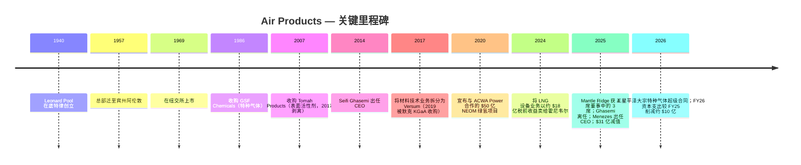
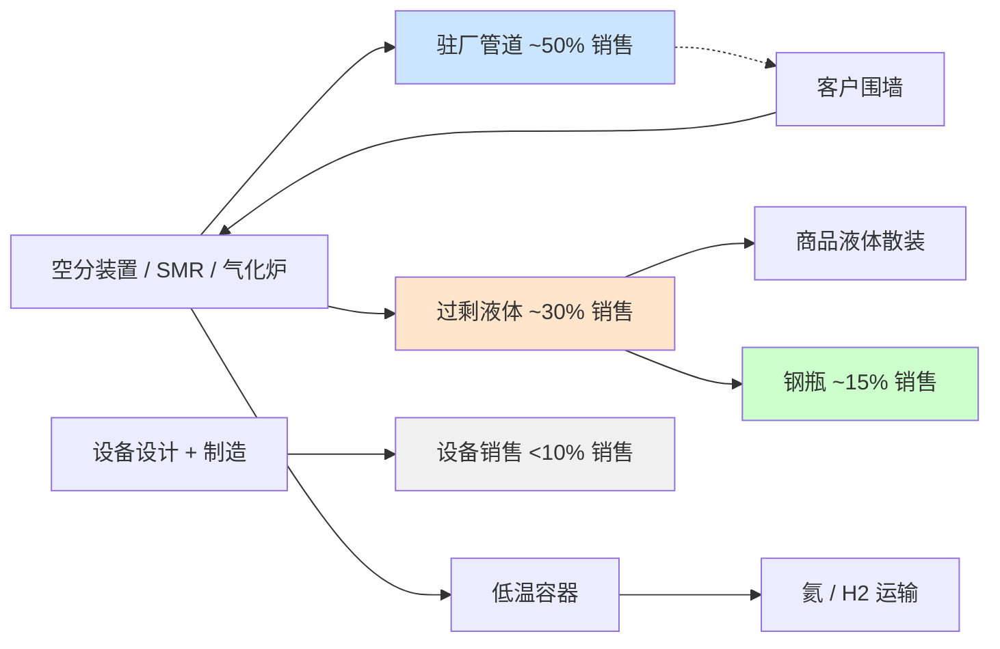

# Air Products and Chemicals, Inc. (NYSE: APD) — 公司研究

*截止日期: 2026-05-26 · 分析师: financial_agent · 报告语言: 简体中文 · 货币: 美元（USD），除非另有说明*

> **更新 — FY2026 全年调整后 EPS 指引上调 (2026-04-30):** 管理层将 FY2026 全年调整后 EPS 指引上调至 **$13.00–$13.25**（原指引为 2026-01-30 发布的 $12.85–$13.05），并重申 FY2026 资本支出约 **$40 亿**。FY26 三季度调整后 EPS 指引初步定为 $3.25–$3.35。FY26 二季度调整后 EPS 为 $3.20，同比增长 19%，超出上一季度指引上限，主要驱动因素包括驻厂供气 (on-site supply) 销量提升、生产效率改善以及汇率顺风，部分被氦气 (helium) 价格疲软所抵消。管理层明确的战略主线：「释放盈利增长、优化大型项目、维持资本纪律」。
> 来源: [Q2-FY2026 业绩新闻稿 (8-K 附件 99.1, 2026-04-30)](https://www.sec.gov/Archives/edgar/data/2969/000000296926000018/exhibit99131mar26.htm)。

## 目录

1. 公司概览
2. 公司历史
3. 管理团队
4. 产品与服务
5. 客户与上市策略
6. 行业概览
7. 竞争格局
8. 市场机会
9. 风险评估
10. 参考资料
11. 验证日志

---

## 1. 公司概览

Air Products and Chemicals, Inc.（下称「Air Products」或「APD」）是一家注册于美国特拉华州、总部位于宾夕法尼亚州阿伦敦（Allentown, PA）的工业气体 (industrial gas) 公司，成立于 1940 年。公司设计、建造、拥有并运营大型气体生产装置，向炼油、化工、金属、电子、制造、医疗及食品行业客户供应氧气、氮气、氩气、氢气、氦气、一氧化碳、合成气以及一系列特种气体。根据 FY2025 10-K 表述：「Air Products and Chemicals, Inc., a Delaware corporation founded in 1940, is a world-leading industrial gases company that has built a reputation for its innovation, operational excellence, and commitment to safety and environmental stewardship.」([Air Products FY2025 10-K, Item 1 Business](https://www.sec.gov/Archives/edgar/data/2969/000000296925000055/apd-20250930.htm))。合并销售额超过 90% 来自区域工业气体业务 — 其中约一半来自大气气体 (atmospheric gases, 通过空分装置低温蒸馏空气得到的 O₂、N₂、Ar)，其余来自工艺气体 (process gases, H₂、He、CO₂、CO、合成气)、特种气体以及设备销售业务（涡轮机械、膜分离系统及低温运输容器，面向全球客户)([FY2025 10-K, "Our Businesses"](https://www.sec.gov/Archives/edgar/data/2969/000000296925000055/apd-20250930.htm))。

**商业模式。** 工业气体业务的经济核心是 *驻厂供气 (on-site supply)* 模式：APD 在客户工厂旁建造并拥有大型空气分离装置 (ASU)、蒸汽甲烷重整装置 (SMR) 或气化炉，然后以越围 (over-the-fence) 或管道方式在 15–20 年照付不议 (take-or-pay) 合同下向客户供气，合同包含固定月费、最低采购承诺以及电力、天然气和烃类原料的价格传导条款 — 10-K 称之为「pricing formulas, surcharges, cost pass-through provisions, and tolling arrangements」。驻厂模式贡献了「约一半」的公司总销售额，其余由商品气体业务（散装液体由槽车运输 / 钢瓶包装）和设备业务构成 ([FY2025 10-K, "Supply Modes"](https://www.sec.gov/Archives/edgar/data/2969/000000296925000055/apd-20250930.htm))。15–20 年合同、价格传导条款以及 APD 自营的管道网络共同构筑了长久期现金流的资产特征，这也是公司能够承载高资本基数并连续 44 年稳定提高股息的底层结构。

**业务规模。** APD 报告 FY2025（截至 2025 年 9 月 30 日的财年）总销售额为 **$120.373 亿**，同比 FY2024 的 **$121.006 亿** 微降约 0.5%；而 FY2024 又较 FY2023 的 **$126.000 亿** 下降 4.0% — 多年的收入下行主要受氢气与氦气价格走低、2024 年 9 月将 LNG 工艺技术设备业务出售给霍尼韦尔 (Honeywell) 以及汇率逆风等因素的拖累 ([FY2025 10-K, Note 26 Segment & Geographic Information](https://www.sec.gov/Archives/edgar/data/2969/000000296925000055/apd-20250930.htm))。分部经营利润大致持平 — FY25 **$28.577 亿**、FY24 **$29.475 亿**、FY23 **$27.392 亿** — 但 **合并经营利润** 在 FY2025 转为 **亏损 $8.770 亿**，原因是 **$37.470 亿** 的非现金「业务及资产行动 (Business and Asset Actions)」减值（主要为退出的三个美国清洁能源项目的资产减值，详见§2）和 **$8,630 万** 的维权股东 (activist shareholder) Mantle Ridge 代理权之争相关费用 ([FY2025 10-K, Reconciliation of Segment Operating Income to Consolidated Results](https://www.sec.gov/Archives/edgar/data/2969/000000296925000055/apd-20250930.htm))。员工约 21,300 人，其中 75% 在美国之外，业务覆盖约 50 个国家 ([FY2025 10-K, "Human Capital Management"](https://www.sec.gov/Archives/edgar/data/2969/000000296925000055/apd-20250930.htm))。

**地理布局。** FY2025 按发出地划分的销售额：美国 **$46.925 亿**（占总额 39%）、中国 **$19.335 亿**（16%）、其他海外业务 **$54.113 亿**（45%）。固定资产净额 **$253.378 亿** 主要集中于美国（$89.091 亿）、沙特阿拉伯（$69.106 亿 — 主要为 NEOM 合资项目）、中国（$26.546 亿）和其他海外（$68.635 亿）；沙特长期资产从 FY2023 末的 $18.181 亿 暴增至 FY2025 末的 $69.106 亿，反映 NEOM 建设进度推进 ([FY2025 10-K, Geographic Information](https://www.sec.gov/Archives/edgar/data/2969/000000296925000055/apd-20250930.htm))。FY2025 报告分部按 CEO Eduardo Menezes 新战略重新划分为五个：**美洲 (Americas)**、**亚洲 (Asia)**、**欧洲 (Europe)**、**中东和印度 (Middle East and India)**、**公司及其他 (Corporate and other)**（相比此前将中东并入欧洲的三大区结构进一步细化）。

*来源: [Air Products FY2025 10-K](https://www.sec.gov/Archives/edgar/data/2969/000000296925000055/apd-20250930.htm) 及 [Q2-FY26 业绩新闻稿, 2026-04-30](https://www.sec.gov/Archives/edgar/data/2969/000000296926000018/exhibit99131mar26.htm)。*

*来源: [Air Products FY2025 10-K, Note 26 Segment & Geographic Information](https://www.sec.gov/Archives/edgar/data/2969/000000296925000055/apd-20250930.htm)。数据为截至 2025 年 9 月 30 日的财年按报告分部划分的对外销售额。*

**估值快照。** 截至 2026-05-26，APD 股价约 **$290 / 股**，市值约 **$645 亿**，TTM P/E 为 **30.5×**、远期 P/E 为 **21.0×**、TTM P/S 为 **5.2×**、EV/EBITDA 为 **21.1×**、P/B 为 **4.1×**、股息收益率 **2.50%**、5 年贝塔系数 0.78 ([Stock Analysis — APD Statistics](https://www.stockanalysis.com/stocks/apd/statistics/))。TTM 与远期 P/E 的巨大差距（30.5× → 21.0×）反映了 FY2025 因 $37 亿减值而出现的 GAAP 亏损 — 一旦该一次性费用滚出，运营层面的稳态盈利将向管理层指引的 ~$13 调整后 EPS 水平回归，对应远期 P/E 接近 22×，与 Linde 的约 26× 远期 P/E 形成小幅折价，与 Air Liquide 的约 22× 大体相当，差距体现了 APD 在 NEOM 执行风险上的拖累以及 Linde 自 Praxair 合并后获取的更强利润率结构。2.5% 股息收益率高于 Linde 的约 1.2%、低于 Air Liquide 的约 2.0%，反映了 APD 较高的派息率锚（约 60% 调整后 EPS）和 44 年连续提股息的纪律。*分析师观点:* 当前估值对于一个具有清晰催化路径（NEOM 2027 年年中投产、$90 亿项目订单储备、氦气供应趋紧）的债券替代型 (bond-proxy) 复苏标的而言较为合理，但绝对水平并不便宜 — 投资者支付的更多是「执行确定性 + 股息」溢价，而非加速盈利成长。

*来源: [Stock Analysis — APD Statistics](https://www.stockanalysis.com/stocks/apd/statistics/)，同业倍数（Linde、Air Liquide、Nippon Sanso）来自各发行人市场数据页面，截至 2026-05-26。*

---

## 2. 公司历史

Air Products 由 33 岁的销售员 Leonard Parker Pool 于 1940 年 2 月 1 日在底特律创立。Pool 此前十年一直在 Compressed Industrial Gases（后被 Burdett Oxygen 收购）销售工业气体。Pool 创业的核心思路在当时具有颠覆性：与其用沉重的钢瓶用卡车或火车将氧气和氮气运往客户，不如在客户工厂 *内部* 建造小型发生器 — 这就是行业今天称之为「驻厂供气」的模式，至今仍贡献 APD 约一半的收入 ([Air Products Company History page](https://www.airproducts.com/company/history); [Wikipedia — Air Products](https://en.wikipedia.org/wiki/Air_Products))。Pool 与年轻工程师 Frank Pavlis 合作设计了一台用液氧和石墨润滑的紧凑型空气分离装置；1941 年该装置首次租赁给底特律一家钢厂，随后公司转向二战期间向美国陆军航空队 (US Army Air Forces) 供应氧气合同，由此积累的现金支撑了 1957 年公司总部迁往宾夕法尼亚州阿伦敦附近的利哈伊谷 — 公司至今仍位于此地址（1940 Air Products Boulevard）([Wikipedia — Air Products](https://en.wikipedia.org/wiki/Air_Products); [FY2025 10-K 封面页](https://www.sec.gov/Archives/edgar/data/2969/000000296925000055/apd-20250930.htm))。Pool 于 1973 年卸任 CEO，1975 年去世。

自 2014 年以来公司的战略弧线由 **三次重大转向** 主导。第一，在 Seifi Ghasemi（CEO 2014–2025 年）任内，APD 剥离了多个增长较慢的特种业务 — 其中最重要的是 **2017 年 Versum Materials 拆分 (Versum spin-off)**，将电子材料 / 特种化学品业务（先进前驱体、光刻胶辅助材料、CMP 抛光液）剥离成独立上市公司；Versum 在 2019 年以 $65 亿企业价值被默克 KGaA (Merck KGaA) 收购 ([C&EN, 2019-04 "Versum accepts sweetened deal from Merck KGaA"](https://cen.acs.org/business/mergers-&-acquisitions/Versum-accepts-sweetened-deal-Merck/97/web/2019/04); [Versum 8-K, 2019-04-12](https://www.sec.gov/Archives/edgar/data/0001660690/000119312519104578/d725673dex991.htm))。Versum 拆分永久性地把 APD 从高纯电子前驱体（Resonac、Linde Electronics、Air Liquide Advanced Materials）的竞争赛道中移除 — 自此 APD 的电子业务集中在 *大宗* 气体（N₂、O₂、He、H₂、Ar）和管道 / 撬装供应的 *大宗特种* 气体上，而不再涉及驱动 Resonac 或 Linde 电子事业部利润表的小批量、高毛利刻蚀 / 沉积 / 清洗前驱体。

第二，**清洁氢能 (hydrogen) 转向 (2018–2023 年)。** Ghasemi 让 APD 押注一系列数十亿美元级别的超级项目，目标是将公司打造为全球低碳氢生产领军者：**$50 亿 NEOM 绿氢项目** 位于沙特阿拉伯（与 ACWA Power 和 NEOM 公司组成的 50/50 合资公司，APD 作为约 600 吨/日绿氨产出的独家承购方，[NEOM Green Hydrogen Company 财务关闭新闻稿, 2023](https://www.neom.com/en-us/newsroom/neom-green-hydrogen-investment))；位于路易斯安那州阿森松教区 (Ascension Parish) 的 **$45 亿蓝氢综合体**，目标 2028 年投产，配套现场 CO₂ 封存 ([路易斯安那州经济发展署公告, 2021](https://www.opportunitylouisiana.gov/news/air-products-announces-4-5-billion-blue-hydrogen-clean-energy-complex))；位于纽约梅塞纳 (Massena, NY) 的 **$5 亿绿液氢项目**；与 World Energy 合作位于加州派拉蒙 (Paramount, CA) 的 **CO / SAF（可持续航空燃料）项目**；以及位于德州的 **CO 项目**。这些项目共同将 APD 的资本支出从 FY2016 的 $16 亿推升至 FY2025 峰值的 **$70 亿**，远早于这些项目的现金流贡献时点 — 这是一场战略豪赌，提升了财务杠杆并压制了 FY2024 之前的自由现金流转化能力 ([FY2025 10-K capex 披露](https://www.sec.gov/Archives/edgar/data/2969/000000296925000055/apd-20250930.htm))。

*来源: [Air Products FY2025 10-K, Capital Expenditures](https://www.sec.gov/Archives/edgar/data/2969/000000296925000055/apd-20250930.htm); FY2026E 数字源自 [Q2-FY26 业绩新闻稿, 2026-04-30](https://www.sec.gov/Archives/edgar/data/2969/000000296926000018/exhibit99131mar26.htm)（「approximately $4.0 billion」）。*

第三 — 也是公司近代史上影响最深的转向 — **2024–2025 年 Mantle Ridge 维权介入与战略重置。** 2024 年 10 月，Paul Hilal 旗下的 Mantle Ridge LP 披露持有约 $10 亿股份，要求获得董事席位、CEO 接班计划、退出不经济的清洁能源承诺，并建立更严格的资本回报框架。代理权之争在 **2025 年 1 月 23 日年度股东大会** 上落幕，股东选举 Mantle Ridge 提名的 4 人中的 **3 人** — Paul Hilal、Dennis Reilley（前 Praxair CEO）、Andrew Evans（前 Southern Company CFO）— 进入董事会，仅否决 Tracy McKibben 一人 ([Chemical Week, Jan 2025, "Mantle Ridge wins three seats"](https://chemweek.mydigitalpublication.com/articles/mantle-ridge-wins-three-seats-in-air-products-proxy-battle); [APD 2026 DEF 14A — Mantle Ridge 背景](https://www.sec.gov/Archives/edgar/data/2969/000130817925000643/apd-20251210.htm))。两周内，董事会任命 **Eduardo Menezes** — Praxair 30 年老兵、Linde 欧洲中东非洲（EMEA）前 EVP — 自 2025 年 2 月 7 日起担任新 CEO；Seifi Ghasemi 在任 10 余年后离任 ([Air Products 新闻稿, 2025-02-04](https://www.airproducts.com/company/news-center/2025/02/0204-air-products-board-appoints-eduardo-menezes-ceo))。**2025 年 2 月 24 日**，新管理层宣布退出三个美国清洁能源项目 — World Energy SAF（加州派拉蒙）、Massena 绿氢项目（纽约）、德州 CO 项目 — 计提 **税前减值「不超过 $31 亿」** ([Air Products 新闻稿, 2025-02-24](https://www.airproducts.com/company/news-center/2025/02/0224-air-products-to-exit-three-us-based-projects); [FY2025 8-K, 2025-02-24](https://www.sec.gov/Archives/edgar/data/2969/000119312525033509/d830166d8k.htm))。NEOM 与路易斯安那项目则被明确 *保留* — NEOM 进度据报告达到约 80%，瞄准 2027 年年中投产；路易斯安那启动时点延至 2028 年并积极物色股权伙伴 ([Inside Saudi, 2025-10-01](https://www.insidesaudi.media/articles/2025-10-01-a-hydrogen-superpower); [gasworld, 2025](https://www.gasworld.com/story/air-products-sees-potential-path-forward-for-paused-louisiana-blue-hydrogen-project/2168127.article/))。董事会另行授权在 FY25 三季度向 Mantle Ridge **现金报销 $2,470 万** 代理权之争的法律和顾问费用 ([APD 2026 DEF 14A, 治理板块](https://www.sec.gov/Archives/edgar/data/2969/000130817925000643/apd-20251210.htm))。

2024 年 9 月将 **LNG 工艺技术设备业务卖给霍尼韦尔**，确认 **约 $16 亿税前收益**（在 FY2024 四季度入账）是 Ghasemi 任内最后一笔重大资产剥离，并先于 Mantle Ridge 介入；LNG 业务此前年贡献约 $1.35 亿经营利润，被定位为偏离气体供应核心模型的非主业 ([FY2025 10-K, Note 4 Gain on Sale of Business](https://www.sec.gov/Archives/edgar/data/2969/000000296925000055/apd-20250930.htm))。除 LNG 出售外，过去 10 年公司较少进行无机并购扩张；增长主要来自绿地驻厂建设和与现有客户的合同延期。

近 12 个月的事件可压缩为单一叙事：资本重置。资本支出指引下调约 $10 亿（FY2026 约 $40 亿 vs FY2025 实际 $70 亿）([Q2-FY26 PR](https://www.sec.gov/Archives/edgar/data/2969/000000296926000018/exhibit99131mar26.htm))。经营利润率回升至 FY26 二季度调整后 23.7%，较上年同期 21.6% 改善。2026 年 4 月 29 日公告的三星平泽超级合同 — APD「迄今为止在半导体行业最大的投资」— 将平泽确立为公司「全球范围内规模最大的电子业务支援基地」，分阶段投产时点为 2028–2030 年 ([Air Products 新闻稿, 2026-04-29](https://www.airproducts.com/company/news-center/2026/04/0429-air-products-gas-supply-samsung-semiconductor-fab-south-korea))。维权股东驱动的纪律、来自行业最受尊重的同业（Praxair）出身的 CEO、以及刚刚起步的半导体工业气体需求周期 — 这三重叠加构成今天的投资争论核心。

---

## 3. 管理团队

**Leonard Parker Pool — 创始人 (1906–1975)。** Pool 在 1940 年以约 $30,000 创业起步资金建立 Air Products，资金来源是变现其本人的人寿保险保单和担任教师的妻子的全部积蓄；此前他用 10 年时间为 Burdett Oxygen 和 Compressed Industrial Gases 销售氧气和乙炔钢瓶 ([Air Products Company History](https://www.airproducts.com/company/history); [Prabook biography](https://prabook.com/web/leonard_parker.pool/1052656))。Pool 的创业核心命题 — 在工业规模消耗氧气的客户（钢厂、玻璃厂、化工反应器）会更愿意在自家门口建发生器而不是接收一卡车一卡车的钢瓶 — 是今天整个工业气体行业（不仅 APD）赖以建立「照付不议」长合同结构的驻厂供气模式的起源。Pool 取得了一台围绕石墨与液氧润滑压缩机（在 1940 年具有革命性；竞争对手设计使用易燃的矿物油润滑）打造的紧凑型 ASU 设计许可，1941 年将首台装置租给底特律一家钢厂客户，赢得二战期间向高空轰炸机机组人员供氧的合同，并于 1957 年将总部迁至阿伦敦的利哈伊谷 — APD 至今的地理锚点 ([Air Products Company History](https://www.airproducts.com/company/history); [Wikipedia — Air Products](https://en.wikipedia.org/wiki/Air_Products))。Pool 自 1940 年至 1973 年担任 CEO，1969 年带领公司在纽交所上市，去世前最后一年退居名誉董事长。Pool 家族目前未持有具名股权；公司股权绝大部分由机构投资者持有（Vanguard、BlackRock、State Street，以及 2024 年以后的 Mantle Ridge），最新代理声明中没有与创始人相关的大股东 ([APD 2026 DEF 14A — 持股表](https://www.sec.gov/Archives/edgar/data/2969/000130817925000643/apd-20251210.htm))。

**Eduardo F. Menezes — 现任 CEO。** Menezes 于 **2025 年 2 月 7 日** 加入 Air Products 出任 CEO，接替 Seifi Ghasemi，作为 Mantle Ridge 主导的董事会重置的一部分 ([APD 2026 DEF 14A — Director Bio](https://www.sec.gov/Archives/edgar/data/2969/000130817925000643/apd-20251210.htm); [Air Products 新闻稿, 2025-02-04](https://www.airproducts.com/company/news-center/2025/02/0204-air-products-board-appoints-eduardo-menezes-ceo))。任命时 62 岁，出生于巴西，持有里约联邦大学化学工程学位和纽约州立大学 MBA 学位。其全部 35 年以上职业生涯几乎都在工业气体行业 — 先在 **Praxair Inc.**（1989–2018 年，从区域商务经理一路升至执行副总裁，分管 Praxair 的亚洲、欧洲、墨西哥和南美业务以及全球氢业务），后在 **Linde plc**（2018–2021 年，作为 EVP 负责 Praxair–Linde 合并后的欧洲、中东和非洲业务，下辖 40 多个国家、约 $80 亿销售额和约 18,000 名员工）([APD 2026 DEF 14A bio](https://www.sec.gov/Archives/edgar/data/2969/000130817925000643/apd-20251210.htm))。离开 Linde 后他在咨询和私募股权领域工作约 4 年，随后被 APD 重组后的董事会延揽。

Menezes 的履历有两个具体经营战绩。第一，作为 Praxair Europe 总裁（2007–2010 年），他主导了 Praxair 收购 BOC 德国和意大利资产的整合，最终在 2007–2012 年间将欧洲经营利润翻倍（详见同期 Praxair 10-K）。第二，作为 Praxair 亚洲 EVP（2012–2018 年），他主持了 Praxair–Linde 合并的亚洲剥离谈判（中国和韩国监管要求剥离 Praxair 亚洲业务方可批准合并）。在 APD，他的初始薪酬包括 **基本工资 $130 万、145% 的目标年度激励（现金奖金）、$990 万的签约股权激励**（细节披露于任命 8-K）([Air Products 8-K, 2025-02-04, Exhibit 99.1](https://www.sec.gov/Archives/edgar/data/2969/000000296925000012/exhibit99131dec24.htm); 摘要见 [Chemical & Engineering News, 2025-02](https://cen.acs.org/business/Air-Products-names-Eduardo-Menezes/103/i3))。任期初期他的直接持股不大（按代理声明披露，初始股权激励按多年期归属），但薪酬结构将大部分薪酬绑定于多年期 TSR 业绩，与维权股东的资本回报命题对齐。

Menezes 在任 16 个月内交出了一份连贯的重置故事：资本支出削减约 $10 亿（FY2026 指引 $40 亿 vs FY2025 实际 $70 亿）；三个不经济的美国清洁能源项目退出并在 FY25 二季度计提减值；分部报告重新切分为五个区域，让中东与印度业务（主要是 NEOM）获得独立可见度；每场业绩会均重复「释放盈利增长、优化大型项目、维持资本纪律」的纪律口号 ([Q2-FY26 PR — CEO commentary](https://www.sec.gov/Archives/edgar/data/2969/000000296926000018/exhibit99131mar26.htm))。三星平泽超级合同（2026 年 4 月）虽在其任内公告，但商业管道在他到任前已铺设 — 他获得的是签约而非缔造的功劳。下一阶段的核心 — 也是其 CEO 任期最重要的检验 — 是三项执行决策：NEOM（2027 年年中投产、爬产风险、与 Yara 的承购风险）、路易斯安那（股权伙伴选定、2028 年启动）以及 NEOM 之后的资本配置哲学（继续推进驻厂超级项目 vs 还现金；重启回购 vs 持续再投资）。

---

## 4. 产品与服务

> **重要提示:** §4 是本报告最关键的章节。APD **不** 在 10-K 中公布独立的「电子级气体 (electronic-grade gas)」或产品口径收入表 — 仅按区域（美洲、亚洲、欧洲、中东和印度、公司及其他）报告，产品类别只在 Item 1 业务章节定性描述。这与 Resonac、Linde Electronics 或 Air Liquide Advanced Materials 的报告口径有本质区别，后者将电子前驱体单独列示。因此理解 APD 的产品矩阵最好的方式是 **「分子 × 供应模式」网格**（大气 / 工艺 / 特种 × 驻厂 / 商品 / 钢瓶）叠加 **终端应用维度**（炼油、化工、金属、电子、食品 / 医疗），区域分部则是 P&L 的呈现层。

### 4.1 — APD 的「产品矩阵」— 分子 × 供应模式 × 终端应用

按 FY2025 10-K Item 1 表述：「Our industrial gases business, which is organized and operated regionally in the Americas, Asia, Europe, and Middle East and India segments, produces and sells atmospheric gases such as oxygen, nitrogen, and argon (primarily recovered by the cryogenic distillation of air); process gases such as hydrogen, helium, carbon dioxide, carbon monoxide, and syngas (a mixture of hydrogen and carbon monoxide); and specialty gases. Overall regional industrial gases sales constituted over 90% of consolidated sales in fiscal years 2025, 2024, and 2023, approximately half of which were attributable to atmospheric gases」([FY2025 10-K, Item 1 Business — "Our Businesses"](https://www.sec.gov/Archives/edgar/data/2969/000000296925000055/apd-20250930.htm))。

将 10-K 叙述综合为下表的产品矩阵（10-K 中并无原生表格 — 此表由分析师据原文构造）：

| 分子 | 生产工艺 | 供应模式 | 主要终端应用 | 合同结构 |
|---|---|---|---|---|
| **氧气 (O₂)** | 低温空分 | 驻厂管道 + 商品液体 | 钢铁、玻璃、水泥、炼油气化、医疗 | 15–20 年照付不议（驻厂）；5 年（商品） |
| **氮气 (N₂)** | 低温空分 | 驻厂管道 + 商品液体 + 钢瓶 | 半导体晶圆厂腔体惰化、食品冷冻、金属惰化、化学反应器封闭 | 15–20 年 / 5 年 / 单笔订单 |
| **氩气 (Ar)** | 低温空分（O₂/N₂ 副产） | 商品液体 + 钢瓶 | 金属焊接保护气、半导体溅射 / 腔体吹扫 | 5 年或单笔订单 |
| **氢气 (H₂) — 灰氢** | 蒸汽甲烷重整 (SMR)，天然气原料 | 驻厂管道（墨西哥湾沿岸网络、鹿特丹、新加坡） | 炼油加氢裂化 + 加氢精制；石化原料 | 15–20 年照付不议 |
| **氢气 (H₂) — 蓝氢** | SMR + 碳捕集 / 封存 | 驻厂管道（路易斯安那 ~2028 年） | 炼油减碳；氨 / 电子燃料 | 长期承购谈判中 |
| **氢气 (H₂) — 绿氢** | 可再生电力电解（NEOM 光伏 + 风电） | 以绿氨形式出口（Yara 承购） | 重型动力、船用燃料氨、化肥 | NEOM JV 由 APD 母公司承购 |
| **氦气 (He)** | 天然气 / CO₂ 提取副产；地下储气库（德州 Amarillo、Beaumont） | 商品 ISO 容器 + 液化 | 半导体晶圆冷却、MRI 磁体冷却、光纤制造、航天吹扫 | 3–5 年供应协议 |
| **一氧化碳 (CO) / 合成气** | 带分离的 SMR；部分氧化 | 驻厂管道 | 乙酸、聚氨酯、酮醇、甲醇 | 15–20 年 |
| **二氧化碳 (CO₂)** | 副产物纯化（乙醇发酵、化肥）；少量大气分离 | 商品液体 + 钢瓶 | 饮料碳化、食品冷冻、EOR | 3–5 年 |
| **特种 / 大宗特种气体** | 高纯混合与灌装 | 客户围墙旁的商品撬装 | 半导体工艺气体（仅大宗高纯 — **三氟化氮 (NF₃)**、**硅烷 (SiH₄, silane)**、**六氟化钨 (WF₆)** 在 Versum 拆分后已 *不在* APD 组合中） | 5–15 年 |
| **设备（公司及其他分部）** | 自有设计 + 制造 | 一次性项目销售 | ASU、烃类回收、液氦 / 液氢运输罐；Rotoflow 涡轮膨胀机；Gardner Cryogenics 容器 | 项目制 |

*据 [FY2025 10-K, Item 1 Business 的 "Our Businesses"、"Production"、"Supply Modes"、"End Use"、"Industrial Gases Equipment"](https://www.sec.gov/Archives/edgar/data/2969/000000296925000055/apd-20250930.htm) 及 [Air Products 公司历史产品时间线](https://www.airproducts.com/company/history) 构造。*

理解 APD 经济模型的第二个关键轴是 **供应模式结构**。按 10-K 表述，驻厂（大型管道 / 越围）贡献「approximately half」总销售额，商品气体（液体散装 + 钢瓶）贡献余下大部分，设备销售在 FY2025、FY2024 和 FY2023 各财年均 <10% ([FY2025 10-K, "Supply Modes"](https://www.sec.gov/Archives/edgar/data/2969/000000296925000055/apd-20250930.htm))。驻厂业务正是长合同期、价格传导和管道网络护城河的所在 — 也是高资本密集度（因此也是 FY2025 减值风险）集中的地方。

### 4.2 — 产品如何协同 — APD 的客户工作流

Air Products 的产品组合在每个大型工业现场构成单一的客户工作流：APD 在客户围墙内部或紧邻处建造 **空气分离装置 (ASU)** 或 **氢气装置 (SMR / 气化炉)**；管道气体在 15–20 年照付不议合同下连续流入客户工艺；多余的液体产品被收集、用槽车运输并在每座 ASU 约 200 英里配送半径内向商品客户转售；在管道网络存在的地方（墨西哥湾沿岸氢气管道、鹿特丹–安特卫普网络、新加坡裕廊系统），跨客户负荷平衡使原本高固定成本的资产成为单位经济显著更优的网络业务。同一分子（氧气、氢气）因此以三种不同价格出现在三条不同的收入流上 — 驻厂（单价最低、合同最长、资本最高）、商品液体（中等）和钢瓶（单价最高、承诺最短）— 区域分部 P&L 就是这三种模式加上设备销售的代数和。氦气是显著例外：因氦气资源在地理上高度集中（美国 Hugoton 气田、卡塔尔、俄罗斯、阿尔及利亚）且运输需要低温 ISO 容器，APD 的氦气业务必须是全球性的，且运行于较短（3–5 年）的供应合同上，相比管道业务更频繁地重新定价 — 这一特征解释了近季度氦气业务的上行和下行意外。

### 4.3 — 大气气体 (O₂, N₂, Ar) — 约占合并销售 ~50%

**10-K 原文:** "Atmospheric gases are produced through various air separation processes, with cryogenic distillation being the most prevalent" ([FY2025 10-K, "Production"](https://www.sec.gov/Archives/edgar/data/2969/000000296925000055/apd-20250930.htm))。终端应用，10-K 表述："Oxygen is used in combustion and industrial heating applications, including in the steel, certain nonferrous metals, glass, and cement industries. Nitrogen applications are used in food processing for freezing and preserving flavor, and nitrogen is used for inerting in various fields, including the metals, chemical, and semiconductor industries" ([FY2025 10-K, "End Use"](https://www.sec.gov/Archives/edgar/data/2969/000000296925000055/apd-20250930.htm))。

**通俗释义:** ASU 是一座高大的低温蒸馏塔，利用液态沸点差异将室内空气物理分离为构成分子 — 氧气在 −183 °C、氩气在 −186 °C、氮气在 −196 °C 液化，所以将空气冷却至约 −190 °C 再蒸馏即可得到 >99.5% 纯度的三股气流。经济上的关键在于 **电力是最大单一成本要素** — 通常占现金生产成本的 60–70%，FY2025 10-K 明确证实："Electricity is the largest cost component in the production of atmospheric gases" ([FY2025 10-K, "Production"](https://www.sec.gov/Archives/edgar/data/2969/000000296925000055/apd-20250930.htm))。长期电力供应合同和现场热电联产在工业电价上涨时倾向于让 APD 受益（成本通过 10-K 所述的「定价公式、附加费、成本传导条款」机制传导），在现货电价下跌时则反向。

**与其他类别的差异:** O₂/N₂/Ar 是大宗化分子 — 物理纯度是二元的（要么交付 99.5%，要么客户的晶圆厂 / 熔炉 / 炼油厂报警），因此竞争维度集中在供应可靠性、合同条款和地理就近性。这与特种气体（晶圆厂工艺腔体的定制混合和高纯散装）形成对比 — 后者以配方和纯度认证差异化；也不同于氦气 — 后者由全球供给复杂度和地质稀缺主导成本结构。

**战略意义:** 大气气体是 APD 业务的 **债券替代型核心**。15–20 年合同 + 价格传导在完整电价周期内提供稳定的低双位数 ROIC，这是为什么 APD、Linde、Air Liquide 三家合计持有全球驻厂大气市场约 80% 份额，也是为什么公司的财务画像更像一家受监管的公用事业而非化学品制造商。氮气的半导体子分部是当前增长最快的细分：一座先进逻辑 / DRAM 晶圆厂每天消耗 500–1,500 公吨氮气用于腔体惰化和吹扫 — 与一座中型钢厂相当 — 三星平泽超级合同正是这种合同类型 ([Air Products 三星新闻稿, 2026-04-29](https://www.airproducts.com/company/news-center/2026/04/0429-air-products-gas-supply-samsung-semiconductor-fab-south-korea))。

*分析师观点:* APD 在大气驻厂的竞争位势强劲（结论 = 有护城河；护城河 = 规模 + 管道网络经济 + 15–20 年合同切换成本），在不同地理上与 Linde 在全球 #2 或 #3 之间。最直接的竞品是 Linde 的驻厂 ASU 业务，详见 [Linde plc 2024 Annual Report](https://www.sec.gov/Archives/edgar/data/0001707925/000162828025007990/lin-20241231.htm)（2018 年 Praxair 合并后 Linde 超越 APD 成为全球 #1）。

### 4.4 — 工艺气体 — 氢气、氦气、一氧化碳、合成气

**10-K 原文:** "Hydrogen is a process gas that is typically produced by purifying byproduct sources obtained from chemical and petrochemical industries without carbon capture, commonly referred to as 'gray hydrogen.' We primarily produce gray hydrogen. In addition, we are advancing projects that produce low-carbon hydrogen from hydrocarbons with carbon capture ('blue hydrogen') and carbon-free hydrogen from renewable energy ('green hydrogen'), such as the NEOM Green Hydrogen Project in Saudi Arabia" ([FY2025 10-K, "Production"](https://www.sec.gov/Archives/edgar/data/2969/000000296925000055/apd-20250930.htm))。

**通俗释义:** 氢气生产按碳足迹分为三种「颜色」。**灰氢**（目前占全球供应约 95%）来自 SMR — 天然气 + 蒸汽在约 800 °C 镍催化剂上 → H₂ + CO + CO₂，CO₂ 排放至大气。**蓝氢** 工艺与 SMR 相同但在出口烟囱处捕集 CO₂ 并将其封存至地下；分子本身完全一致，差异在于碳足迹披露。**绿氢** 通过可再生电力电解水 — 通常是 PEM（质子交换膜）或碱性电解槽 — 无化石输入；成本结构由零碳电力的成本主导。APD 现有的 **墨西哥湾沿岸氢气管道网络**（从休斯顿航道穿过路易斯安那直达鲍蒙特 / 阿瑟港炼油集群，相当于「美国版鹿特丹」）是全球最大的灰氢管道之一，是 APD 当前在美国炼油氢业务规模的基石资产。

**氦气** 在结构上与其他工艺气体不同：按 10-K 表述："Helium is produced as a byproduct of gases extracted from underground reservoirs, primarily natural gas and CO₂ purified before resale. Because helium is generally sourced globally at long distances from point of sale, we maintain an inventory of helium in our fleet of ISO containers as well as in underground storage facilities in Amarillo, Texas and Beaumont, Texas" ([FY2025 10-K, "Production"](https://www.sec.gov/Archives/edgar/data/2969/000000296925000055/apd-20250930.htm))。氦气对电子的相关性 — 晶圆冷却、MRI 磁体泄漏检测、等离子物理 — 加上地理稀缺性（美国 Amarillo BLM Cliffside 设施和 Hugoton 气田是两大美国来源；国际供给来自卡塔尔、俄罗斯和阿尔及利亚）使得氦气业务持续是供给冲击定价能力与需求冲击定价压力的交错。FY26 二季度管理层专门提到氦气价格疲软作为顺风的部分对冲，并宣布从 Amarillo 储气库提取、增加美国液化产能、并重新部署全球 ISO 集装箱以增强韧性 ([Q2-FY26 PR](https://www.sec.gov/Archives/edgar/data/2969/000000296926000018/exhibit99131mar26.htm))。

**战略意义:** 氢气是 APD 清洁能源战略豪赌的展开场。NEOM（绿氢）和路易斯安那（蓝氢）合计代表 **约 $130 亿承诺资本** — 相当于净 PP&E 基数的一半 — 围绕一项多十年命题：脱碳监管、炼油客户净零承诺以及氨作为船用燃料的采用将创造一个可观的低碳氢结构性买方。在 Menezes 时代命题完好无损 — NEOM 和路易斯安那都在 2025 年 2 月战略重置中被明确 *保留* — 但时间表比原 2024–2026 投产窗口拉长。NEOM 投产为 2027 年年中；路易斯安那 2028 年；承购协议（NEOM 氨的 Yara、路易斯安那的股权伙伴选定）仍在谈判中。*分析师观点:* 氢气是模型中方差最大的一行 — 干净的执行路径带来低双位数 ROIC 和 FY2028 起的多年期 EPS 顺风；投产时点滑坡或承购永久受损则带来二次减值周期。

*分析师观点:* 在全球灰氢管道业务上 APD 是明确的前三供应商（结论 = 是；护城河 = 管道 + 15–20 年炼油照付不议合同），与 Linde 和 Air Liquide 并列。在规模化绿氢上，APD 真正是第一家（唯一一家在建 >500 吨/日 绿氢装置）；在规模化蓝氢上，也是第一家（路易斯安那是在建最大蓝氢承诺）。在氦气上，APD 是三大主要供应商之一（Linde、APD、Air Liquide），合计持有全球商品氦气市场约 60–70%，Iwatani Corp 和 Messer 也具有体量。

### 4.5 — 特种 / 电子级气体 — Versum 拆分后仅做大宗

这是关于 Air Products 最容易被误解的一个分部。**APD 不销售离散事件级电子前驱体** — NF₃、硅烷 (SiH₄)、WF₆、**三氯化硼 (BCl₃)**、ALD 用氨、沉积级钨前驱体等。这些产品类别在 2017 年 Versum 拆分中被划入 Versum Materials，今天由默克 KGaA 持有（EMD Electronics 子公司），与 Resonac（昭和电工电子材料业务 — 见 [reports/sector/半导体材料.md](../../sector/半导体材料.md)）、SK Materials 和 Linde Electronics 在竞争。APD 的电子业务收入集中于通过驻厂管道和客户撬装交付的 **大宗及大宗特种气体**：N₂（腔体惰化）、O₂（燃烧 / 氧化）、H₂（外延和载气）、氦气（晶圆冷却）、氩气（溅射和大批量制造腔体吹扫）以及大宗特种层（超高纯 N₂、多 9 等级氢气、特殊混合气）。

「大宗 vs 前驱体」的区分对投资命题有重要意义，因为（i）大宗业务毛利率较低但合同期限远长（15–20 年 vs 1–3 年）；（ii）大宗气体的竞争位势 *与* 前驱体 *截然不同* — APD 与 Linde Electronics、Air Liquide Electronics、Nippon Sanso（TNSC）和 Messer Electronics 在 **管道供应 + 驻厂可靠性** 上竞争，而不是与前驱体专家 Resonac / SK Materials / Versum 竞争；（iii）AI 驱动的半导体资本支出周期（按 Nomura 的研究综合在 [reports/sector/半导体材料.md](../../sector/半导体材料.md)，TSMC FY2027 资本支出约 $700 亿）与新晶圆厂建设 1:1 拉动大宗气体需求，不论该厂是逻辑、DRAM、HBM 还是先进封装，而前驱体需求结构则更多依赖工艺节点和工艺组合。

**战略意义:** 三星平泽大宗特种气体超级合同（2026 年 4 月）和亚洲电子项目订单（FY26 二季度业绩会披露在「亚洲电子项目执行中」额外约 $10 亿，[Motley Fool transcript, 2026-04-30](https://www.fool.com/earnings/call-transcripts/2026/04/30/air-products-apd-q2-2026-earnings-transcript/)）是 Menezes 任内亚洲电子推进的可见标记 — 在 APD 已有装机基础的德州（TSMC 亚利桑那由 APD 凤凰城周边管道网络供应，详见多家行业媒体报道）和韩国（平泽被扩展为「全球范围内规模最大的电子业务支援基地」，详见 [三星公告, 2026-04-29](https://www.airproducts.com/company/news-center/2026/04/0429-air-products-gas-supply-samsung-semiconductor-fab-south-korea)）的地理上，公司决定积极争夺晶圆厂驻厂合同以巩固和扩大领先地位。

*分析师观点:* 在半导体驻厂的大宗与大宗特种领域，APD 是可信的前三供应商（结论 = 是；护城河 = 驻厂资产 + 15–20 年合同 + 可靠性记录），落后于 Linde Electronics（Praxair 合并后全球 #1，与 TSMC + Intel 关系最深，详见 [Linde plc 2024 Annual Report Electronics 板块](https://www.sec.gov/Archives/edgar/data/0001707925/000162828025007990/lin-20241231.htm)），与 Air Liquide Electronics 大致并列。在离散事件级前驱体（NF₃、硅烷、WF₆ 等）上，Versum 拆分后 APD 实际份额为零 — 相关对比集合是 Resonac、EMD Electronics（默克 KGaA / 前 Versum）、SK Materials 和 Linde Electronics 的特种业务线。

### 4.6 — 设备业务（公司及其他）— <10% 销售

**10-K 原文:** "We design and manufacture equipment for air separation, hydrocarbon recovery and purification, and liquid helium and liquid hydrogen transport and storage. The Corporate and other segment includes activity related to the sale of cryogenic and gas processing equipment for air separation … The Corporate and other segment also includes the results of our Rotoflow business, which manufactures turboexpanders and other precision rotating equipment, and our Gardner Cryogenics business, which fabricates helium and hydrogen transport and storage containers" ([FY2025 10-K, "Industrial Gases Equipment"](https://www.sec.gov/Archives/edgar/data/2969/000000296925000055/apd-20250930.htm))。

**通俗释义:** 设备业务是项目制收入流 — APD 向那些选择自有自营气体供应资产的客户销售完整 ASU（或烃类回收 / 纯化装置）— 通常是大型油气生产商和体量极大的化工 / 石化综合体，因为它们的供应量经济性更偏向自营。**Rotoflow** 涡轮膨胀机是精密旋转机械，用于从气体膨胀中提取制冷能量（任何低温装置的关键效率部件）。**Gardner Cryogenics** 制造在低温温度下全球运输液氢和液氦的特种 ISO 容器和真空绝热罐 — 这些是氦气业务的「卡车」，客户群较小但锁定，主要是氦气和航天客户。

**战略意义:** 设备业务是反周期杠杆，也是一种「不下注驻厂资本」的赚取利润方式。当客户为资产付费时，APD 捕获工程 / 采购 / 施工的利润，而不承担多十年期的资产负债表敞口。**2024 年 9 月 30 日将 LNG 工艺技术设备业务卖给霍尼韦尔，确认约 $16 亿税前收益**，移除了该分部最高毛利的部分 ([FY2025 10-K, Note 4 Gain on Sale of Business](https://www.sec.gov/Archives/edgar/data/2969/000000296925000055/apd-20250930.htm)) — LNG 业务此前贡献约 $1.35 亿经营利润（FY24）和约 $1.20 亿（FY23）。留下来的是稳态低温设备业务和 Rotoflow / Gardner 的特种产品。

### 4.7 — 旗舰项目、订单储备和近期发布

理解 APD 当前最有信息量的产品旗舰透镜是其 **项目订单储备**，Q2-FY26 披露为约 **$90 亿盈利贡献项目**，其中包括 >$25 亿传统工业气体订单和约 $10 亿在执行的亚洲电子项目 ([Motley Fool — APD Q2 FY26 Earnings Transcript, 2026-04-30](https://www.fool.com/earnings/call-transcripts/2026/04/30/air-products-apd-q2-2026-earnings-transcript/))。三个旗舰主导该订单：

1. **NEOM 绿氢项目（沙特阿拉伯）** — 总项目成本 $84 亿，JV 层面 APD / ACWA Power / NEOM 公司各持 50/50，APD 作为绿氨产品的独家承购方。目标约 600 吨/日绿氢转化为约 120 万吨/年绿氨，面向船用燃料和化肥市场。报告进度约 80% 完成；目标 2026 年底 / 2027 年中首产氨。投产后管理层计划解除 JV 合并报表，从 APD 资产负债表移除相关债务 ([NEOM Green Hydrogen Company 财务关闭新闻稿, 2023](https://www.neom.com/en-us/newsroom/neom-green-hydrogen-investment); [Q2-FY26 transcript](https://www.fool.com/earnings/call-transcripts/2026/04/30/air-products-apd-q2-2026-earnings-transcript/); [Inside Saudi, 2025-10-01](https://www.insidesaudi.media/articles/2025-10-01-a-hydrogen-superpower))。
2. **路易斯安那清洁能源综合体（阿森松教区）** — 原 $45 亿预算，全球最大蓝氢综合体，SMR + 自热重整器 + CO₂ 封存到湾区碳酸盐含水层；启动延至 2028 年，在 Menezes 任内启动积极股权伙伴搜寻以优化 APD 的股权出资额 ([gasworld, 2025](https://www.gasworld.com/story/air-products-sees-potential-path-forward-for-paused-louisiana-blue-hydrogen-project/2168127.article/); 原 [路易斯安那州经济发展署公告, 2021](https://www.opportunitylouisiana.gov/news/air-products-announces-4-5-billion-blue-hydrogen-clean-energy-complex))。
3. **三星平泽大宗特种气体供应系统** — 2026 年 4 月 29 日公告，APD「迄今为止在半导体行业最大的投资」，向三星新一代先进半导体晶圆厂供应氮气、氧气、氩气和氢气；分阶段投产 2028–2030 年；平泽成为 APD「全球范围内规模最大的电子业务支援基地」([Air Products 新闻稿, 2026-04-29](https://www.airproducts.com/company/news-center/2026/04/0429-air-products-gas-supply-samsung-semiconductor-fab-south-korea); [PR Newswire, 2026-04-29](https://www.prnewswire.com/news-releases/air-products-to-expand-industrial-gas-supply-for-samsung-electronics-next-generation-semiconductor-fab-in-south-korea-302757497.html))。

过去 12 个月的其他重新定位包括：在佛罗里达州 Cocoa 新建一座 ASU 服务 NASA Artemis 火箭发射市场（液氢 + 氦气用于火箭燃料系统）；为管理全球客户供应链韧性而新增氦气储气和美国液化产能；以及 Q2-FY26 公告将季度股息提升至 $1.81（连续第 44 年提股息）([Q2-FY26 PR](https://www.sec.gov/Archives/edgar/data/2969/000000296926000018/exhibit99131mar26.htm); [Air Products 股息新闻稿, 2026-01](https://www.investing.com/news/company-news/air-products-increases-quarterly-dividend-to-181-per-share-93CH-4468906))。

*来源: [Air Products 股息新闻稿（连续 44 年提股息）](https://www.airproducts.com/company/news-center/2025/01/0122-air-products-increases-quarterly-dividend-for-43rd-consecutive-year) 及 [2026-01 季度股息提升至 $1.81](https://www.investing.com/news/company-news/air-products-increases-quarterly-dividend-to-181-per-share-93CH-4468906)。*

### 4.8 — 综合 — 各类别如何交互

最好把 Air Products 理解为 **同一资产负债表上的三项整合业务**。（1）**债券替代型核心**：大气驻厂、灰氢驻厂、氦气商品 — 长久期、价格传导、ROIC 稳定、股息驱动。这大约占经营利润的 80%，是股息覆盖故事的全部底层。（2）**电子顺风层**：美洲（TSMC 亚利桑那、三星德州、Micron 美国、Intel）和亚洲（三星平泽、亚洲电子 ~$10 亿订单）半导体晶圆厂的大宗与大宗特种 — 与核心同分子，但由于 AI 半导体资本支出周期（至 ~2030 年）增长斜率结构性更陡。（3）**清洁能源期权层**：NEOM（绿氢 → 氨）、路易斯安那（蓝氢 + 封存）。高资本密集度、多年期建设、非对称回报 — 上行是 2028 年起多十亿 ROIC 顺风；下行是 FY2025 $37 亿减值为 *已退出项目* 预演的二次减值周期。模型最后汇总到单一数字 — 调整后 EPS — FY2026 指引（$13.00–$13.25）就是管理层对这三层 + 价格 + 资本纪律 + 汇率在当前周期内平衡结果的表达 ([Q2-FY26 PR](https://www.sec.gov/Archives/edgar/data/2969/000000296926000018/exhibit99131mar26.htm))。

---

