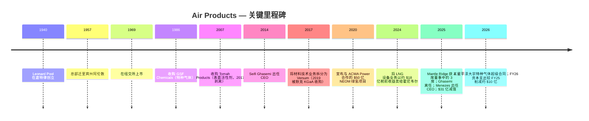

# Air Products and Chemicals, Inc. (NYSE: APD) — 公司研究

*截止日期: 2026-05-26 · 分析师: financial_agent · 报告语言: 简体中文 · 货币: 美元（USD），除非另有说明*

> **更新 — FY2026 全年调整后 EPS 指引上调 (2026-04-30):** 管理层将 FY2026 全年调整后 EPS 指引上调至 **$13.00–$13.25**（原指引为 2026-01-30 发布的 $12.85–$13.05），并重申 FY2026 资本支出约 **$40 亿**。FY26 三季度调整后 EPS 指引初步定为 $3.25–$3.35。FY26 二季度调整后 EPS 为 $3.20，同比增长 19%，超出上一季度指引上限，主要驱动因素包括驻厂供气 (on-site supply) 销量提升、生产效率改善以及汇率顺风，部分被氦气 (helium) 价格疲软所抵消。管理层明确的战略主线：「释放盈利增长、优化大型项目、维持资本纪律」。
> 来源: [Q2-FY2026 业绩新闻稿 (8-K 附件 99.1, 2026-04-30)](https://www.sec.gov/Archives/edgar/data/2969/000000296926000018/exhibit99131mar26.htm)。

## 目录

1. 公司概览
2. 公司历史
3. 管理团队
4. 产品与服务
5. 客户与上市策略
6. 行业概览
7. 竞争格局
8. 市场机会
9. 风险评估
10. 参考资料
11. 验证日志

---

## 1. 公司概览

Air Products and Chemicals, Inc.（下称「Air Products」或「APD」）是一家注册于美国特拉华州、总部位于宾夕法尼亚州阿伦敦（Allentown, PA）的工业气体 (industrial gas) 公司，成立于 1940 年。公司设计、建造、拥有并运营大型气体生产装置，向炼油、化工、金属、电子、制造、医疗及食品行业客户供应氧气、氮气、氩气、氢气、氦气、一氧化碳、合成气以及一系列特种气体。根据 FY2025 10-K 表述：「Air Products and Chemicals, Inc., a Delaware corporation founded in 1940, is a world-leading industrial gases company that has built a reputation for its innovation, operational excellence, and commitment to safety and environmental stewardship.」([Air Products FY2025 10-K, Item 1 Business](https://www.sec.gov/Archives/edgar/data/2969/000000296925000055/apd-20250930.htm))。合并销售额超过 90% 来自区域工业气体业务 — 其中约一半来自大气气体 (atmospheric gases, 通过空分装置低温蒸馏空气得到的 O₂、N₂、Ar)，其余来自工艺气体 (process gases, H₂、He、CO₂、CO、合成气)、特种气体以及设备销售业务（涡轮机械、膜分离系统及低温运输容器，面向全球客户)([FY2025 10-K, "Our Businesses"](https://www.sec.gov/Archives/edgar/data/2969/000000296925000055/apd-20250930.htm))。

**商业模式。** 工业气体业务的经济核心是 *驻厂供气 (on-site supply)* 模式：APD 在客户工厂旁建造并拥有大型空气分离装置 (ASU)、蒸汽甲烷重整装置 (SMR) 或气化炉，然后以越围 (over-the-fence) 或管道方式在 15–20 年照付不议 (take-or-pay) 合同下向客户供气，合同包含固定月费、最低采购承诺以及电力、天然气和烃类原料的价格传导条款 — 10-K 称之为「pricing formulas, surcharges, cost pass-through provisions, and tolling arrangements」。驻厂模式贡献了「约一半」的公司总销售额，其余由商品气体业务（散装液体由槽车运输 / 钢瓶包装）和设备业务构成 ([FY2025 10-K, "Supply Modes"](https://www.sec.gov/Archives/edgar/data/2969/000000296925000055/apd-20250930.htm))。15–20 年合同、价格传导条款以及 APD 自营的管道网络共同构筑了长久期现金流的资产特征，这也是公司能够承载高资本基数并连续 44 年稳定提高股息的底层结构。

**业务规模。** APD 报告 FY2025（截至 2025 年 9 月 30 日的财年）总销售额为 **$120.373 亿**，同比 FY2024 的 **$121.006 亿** 微降约 0.5%；而 FY2024 又较 FY2023 的 **$126.000 亿** 下降 4.0% — 多年的收入下行主要受氢气与氦气价格走低、2024 年 9 月将 LNG 工艺技术设备业务出售给霍尼韦尔 (Honeywell) 以及汇率逆风等因素的拖累 ([FY2025 10-K, Note 26 Segment & Geographic Information](https://www.sec.gov/Archives/edgar/data/2969/000000296925000055/apd-20250930.htm))。分部经营利润大致持平 — FY25 **$28.577 亿**、FY24 **$29.475 亿**、FY23 **$27.392 亿** — 但 **合并经营利润** 在 FY2025 转为 **亏损 $8.770 亿**，原因是 **$37.470 亿** 的非现金「业务及资产行动 (Business and Asset Actions)」减值（主要为退出的三个美国清洁能源项目的资产减值，详见§2）和 **$8,630 万** 的维权股东 (activist shareholder) Mantle Ridge 代理权之争相关费用 ([FY2025 10-K, Reconciliation of Segment Operating Income to Consolidated Results](https://www.sec.gov/Archives/edgar/data/2969/000000296925000055/apd-20250930.htm))。员工约 21,300 人，其中 75% 在美国之外，业务覆盖约 50 个国家 ([FY2025 10-K, "Human Capital Management"](https://www.sec.gov/Archives/edgar/data/2969/000000296925000055/apd-20250930.htm))。

**地理布局。** FY2025 按发出地划分的销售额：美国 **$46.925 亿**（占总额 39%）、中国 **$19.335 亿**（16%）、其他海外业务 **$54.113 亿**（45%）。固定资产净额 **$253.378 亿** 主要集中于美国（$89.091 亿）、沙特阿拉伯（$69.106 亿 — 主要为 NEOM 合资项目）、中国（$26.546 亿）和其他海外（$68.635 亿）；沙特长期资产从 FY2023 末的 $18.181 亿 暴增至 FY2025 末的 $69.106 亿，反映 NEOM 建设进度推进 ([FY2025 10-K, Geographic Information](https://www.sec.gov/Archives/edgar/data/2969/000000296925000055/apd-20250930.htm))。FY2025 报告分部按 CEO Eduardo Menezes 新战略重新划分为五个：**美洲 (Americas)**、**亚洲 (Asia)**、**欧洲 (Europe)**、**中东和印度 (Middle East and India)**、**公司及其他 (Corporate and other)**（相比此前将中东并入欧洲的三大区结构进一步细化）。

*来源: [Air Products FY2025 10-K](https://www.sec.gov/Archives/edgar/data/2969/000000296925000055/apd-20250930.htm) 及 [Q2-FY26 业绩新闻稿, 2026-04-30](https://www.sec.gov/Archives/edgar/data/2969/000000296926000018/exhibit99131mar26.htm)。*

*来源: [Air Products FY2025 10-K, Note 26 Segment & Geographic Information](https://www.sec.gov/Archives/edgar/data/2969/000000296925000055/apd-20250930.htm)。数据为截至 2025 年 9 月 30 日的财年按报告分部划分的对外销售额。*

**估值快照。** 截至 2026-05-26，APD 股价约 **$290 / 股**，市值约 **$645 亿**，TTM P/E 为 **30.5×**、远期 P/E 为 **21.0×**、TTM P/S 为 **5.2×**、EV/EBITDA 为 **21.1×**、P/B 为 **4.1×**、股息收益率 **2.50%**、5 年贝塔系数 0.78 ([Stock Analysis — APD Statistics](https://www.stockanalysis.com/stocks/apd/statistics/))。TTM 与远期 P/E 的巨大差距（30.5× → 21.0×）反映了 FY2025 因 $37 亿减值而出现的 GAAP 亏损 — 一旦该一次性费用滚出，运营层面的稳态盈利将向管理层指引的 ~$13 调整后 EPS 水平回归，对应远期 P/E 接近 22×，与 Linde 的约 26× 远期 P/E 形成小幅折价，与 Air Liquide 的约 22× 大体相当，差距体现了 APD 在 NEOM 执行风险上的拖累以及 Linde 自 Praxair 合并后获取的更强利润率结构。2.5% 股息收益率高于 Linde 的约 1.2%、低于 Air Liquide 的约 2.0%，反映了 APD 较高的派息率锚（约 60% 调整后 EPS）和 44 年连续提股息的纪律。*分析师观点:* 当前估值对于一个具有清晰催化路径（NEOM 2027 年年中投产、$90 亿项目订单储备、氦气供应趋紧）的债券替代型 (bond-proxy) 复苏标的而言较为合理，但绝对水平并不便宜 — 投资者支付的更多是「执行确定性 + 股息」溢价，而非加速盈利成长。

*来源: [Stock Analysis — APD Statistics](https://www.stockanalysis.com/stocks/apd/statistics/)，同业倍数（Linde、Air Liquide、Nippon Sanso）来自各发行人市场数据页面，截至 2026-05-26。*

---

## 2. 公司历史

Air Products 由 33 岁的销售员 Leonard Parker Pool 于 1940 年 2 月 1 日在底特律创立。Pool 此前十年一直在 Compressed Industrial Gases（后被 Burdett Oxygen 收购）销售工业气体。Pool 创业的核心思路在当时具有颠覆性：与其用沉重的钢瓶用卡车或火车将氧气和氮气运往客户，不如在客户工厂 *内部* 建造小型发生器 — 这就是行业今天称之为「驻厂供气」的模式，至今仍贡献 APD 约一半的收入 ([Air Products Company History page](https://www.airproducts.com/company/history); [Wikipedia — Air Products](https://en.wikipedia.org/wiki/Air_Products))。Pool 与年轻工程师 Frank Pavlis 合作设计了一台用液氧和石墨润滑的紧凑型空气分离装置；1941 年该装置首次租赁给底特律一家钢厂，随后公司转向二战期间向美国陆军航空队 (US Army Air Forces) 供应氧气合同，由此积累的现金支撑了 1957 年公司总部迁往宾夕法尼亚州阿伦敦附近的利哈伊谷 — 公司至今仍位于此地址（1940 Air Products Boulevard）([Wikipedia — Air Products](https://en.wikipedia.org/wiki/Air_Products); [FY2025 10-K 封面页](https://www.sec.gov/Archives/edgar/data/2969/000000296925000055/apd-20250930.htm))。Pool 于 1973 年卸任 CEO，1975 年去世。

自 2014 年以来公司的战略弧线由 **三次重大转向** 主导。第一，在 Seifi Ghasemi（CEO 2014–2025 年）任内，APD 剥离了多个增长较慢的特种业务 — 其中最重要的是 **2017 年 Versum Materials 拆分 (Versum spin-off)**，将电子材料 / 特种化学品业务（先进前驱体、光刻胶辅助材料、CMP 抛光液）剥离成独立上市公司；Versum 在 2019 年以 $65 亿企业价值被默克 KGaA (Merck KGaA) 收购 ([C&EN, 2019-04 "Versum accepts sweetened deal from Merck KGaA"](https://cen.acs.org/business/mergers-&-acquisitions/Versum-accepts-sweetened-deal-Merck/97/web/2019/04); [Versum 8-K, 2019-04-12](https://www.sec.gov/Archives/edgar/data/0001660690/000119312519104578/d725673dex991.htm))。Versum 拆分永久性地把 APD 从高纯电子前驱体（Resonac、Linde Electronics、Air Liquide Advanced Materials）的竞争赛道中移除 — 自此 APD 的电子业务集中在 *大宗* 气体（N₂、O₂、He、H₂、Ar）和管道 / 撬装供应的 *大宗特种* 气体上，而不再涉及驱动 Resonac 或 Linde 电子事业部利润表的小批量、高毛利刻蚀 / 沉积 / 清洗前驱体。

第二，**清洁氢能 (hydrogen) 转向 (2018–2023 年)。** Ghasemi 让 APD 押注一系列数十亿美元级别的超级项目，目标是将公司打造为全球低碳氢生产领军者：**$50 亿 NEOM 绿氢项目** 位于沙特阿拉伯（与 ACWA Power 和 NEOM 公司组成的 50/50 合资公司，APD 作为约 600 吨/日绿氨产出的独家承购方，[NEOM Green Hydrogen Company 财务关闭新闻稿, 2023](https://www.neom.com/en-us/newsroom/neom-green-hydrogen-investment))；位于路易斯安那州阿森松教区 (Ascension Parish) 的 **$45 亿蓝氢综合体**，目标 2028 年投产，配套现场 CO₂ 封存 ([路易斯安那州经济发展署公告, 2021](https://www.opportunitylouisiana.gov/news/air-products-announces-4-5-billion-blue-hydrogen-clean-energy-complex))；位于纽约梅塞纳 (Massena, NY) 的 **$5 亿绿液氢项目**；与 World Energy 合作位于加州派拉蒙 (Paramount, CA) 的 **CO / SAF（可持续航空燃料）项目**；以及位于德州的 **CO 项目**。这些项目共同将 APD 的资本支出从 FY2016 的 $16 亿推升至 FY2025 峰值的 **$70 亿**，远早于这些项目的现金流贡献时点 — 这是一场战略豪赌，提升了财务杠杆并压制了 FY2024 之前的自由现金流转化能力 ([FY2025 10-K capex 披露](https://www.sec.gov/Archives/edgar/data/2969/000000296925000055/apd-20250930.htm))。

*来源: [Air Products FY2025 10-K, Capital Expenditures](https://www.sec.gov/Archives/edgar/data/2969/000000296925000055/apd-20250930.htm); FY2026E 数字源自 [Q2-FY26 业绩新闻稿, 2026-04-30](https://www.sec.gov/Archives/edgar/data/2969/000000296926000018/exhibit99131mar26.htm)（「approximately $4.0 billion」）。*

第三 — 也是公司近代史上影响最深的转向 — **2024–2025 年 Mantle Ridge 维权介入与战略重置。** 2024 年 10 月，Paul Hilal 旗下的 Mantle Ridge LP 披露持有约 $10 亿股份，要求获得董事席位、CEO 接班计划、退出不经济的清洁能源承诺，并建立更严格的资本回报框架。代理权之争在 **2025 年 1 月 23 日年度股东大会** 上落幕，股东选举 Mantle Ridge 提名的 4 人中的 **3 人** — Paul Hilal、Dennis Reilley（前 Praxair CEO）、Andrew Evans（前 Southern Company CFO）— 进入董事会，仅否决 Tracy McKibben 一人 ([Chemical Week, Jan 2025, "Mantle Ridge wins three seats"](https://chemweek.mydigitalpublication.com/articles/mantle-ridge-wins-three-seats-in-air-products-proxy-battle); [APD 2026 DEF 14A — Mantle Ridge 背景](https://www.sec.gov/Archives/edgar/data/2969/000130817925000643/apd-20251210.htm))。两周内，董事会任命 **Eduardo Menezes** — Praxair 30 年老兵、Linde 欧洲中东非洲（EMEA）前 EVP — 自 2025 年 2 月 7 日起担任新 CEO；Seifi Ghasemi 在任 10 余年后离任 ([Air Products 新闻稿, 2025-02-04](https://www.airproducts.com/company/news-center/2025/02/0204-air-products-board-appoints-eduardo-menezes-ceo))。**2025 年 2 月 24 日**，新管理层宣布退出三个美国清洁能源项目 — World Energy SAF（加州派拉蒙）、Massena 绿氢项目（纽约）、德州 CO 项目 — 计提 **税前减值「不超过 $31 亿」** ([Air Products 新闻稿, 2025-02-24](https://www.airproducts.com/company/news-center/2025/02/0224-air-products-to-exit-three-us-based-projects); [FY2025 8-K, 2025-02-24](https://www.sec.gov/Archives/edgar/data/2969/000119312525033509/d830166d8k.htm))。NEOM 与路易斯安那项目则被明确 *保留* — NEOM 进度据报告达到约 80%，瞄准 2027 年年中投产；路易斯安那启动时点延至 2028 年并积极物色股权伙伴 ([Inside Saudi, 2025-10-01](https://www.insidesaudi.media/articles/2025-10-01-a-hydrogen-superpower); [gasworld, 2025](https://www.gasworld.com/story/air-products-sees-potential-path-forward-for-paused-louisiana-blue-hydrogen-project/2168127.article/))。董事会另行授权在 FY25 三季度向 Mantle Ridge **现金报销 $2,470 万** 代理权之争的法律和顾问费用 ([APD 2026 DEF 14A, 治理板块](https://www.sec.gov/Archives/edgar/data/2969/000130817925000643/apd-20251210.htm))。

2024 年 9 月将 **LNG 工艺技术设备业务卖给霍尼韦尔**，确认 **约 $16 亿税前收益**（在 FY2024 四季度入账）是 Ghasemi 任内最后一笔重大资产剥离，并先于 Mantle Ridge 介入；LNG 业务此前年贡献约 $1.35 亿经营利润，被定位为偏离气体供应核心模型的非主业 ([FY2025 10-K, Note 4 Gain on Sale of Business](https://www.sec.gov/Archives/edgar/data/2969/000000296925000055/apd-20250930.htm))。除 LNG 出售外，过去 10 年公司较少进行无机并购扩张；增长主要来自绿地驻厂建设和与现有客户的合同延期。

近 12 个月的事件可压缩为单一叙事：资本重置。资本支出指引下调约 $10 亿（FY2026 约 $40 亿 vs FY2025 实际 $70 亿）([Q2-FY26 PR](https://www.sec.gov/Archives/edgar/data/2969/000000296926000018/exhibit99131mar26.htm))。经营利润率回升至 FY26 二季度调整后 23.7%，较上年同期 21.6% 改善。2026 年 4 月 29 日公告的三星平泽超级合同 — APD「迄今为止在半导体行业最大的投资」— 将平泽确立为公司「全球范围内规模最大的电子业务支援基地」，分阶段投产时点为 2028–2030 年 ([Air Products 新闻稿, 2026-04-29](https://www.airproducts.com/company/news-center/2026/04/0429-air-products-gas-supply-samsung-semiconductor-fab-south-korea))。维权股东驱动的纪律、来自行业最受尊重的同业（Praxair）出身的 CEO、以及刚刚起步的半导体工业气体需求周期 — 这三重叠加构成今天的投资争论核心。

---

## 3. 管理团队

**Leonard Parker Pool — 创始人 (1906–1975)。** Pool 在 1940 年以约 $30,000 创业起步资金建立 Air Products，资金来源是变现其本人的人寿保险保单和担任教师的妻子的全部积蓄；此前他用 10 年时间为 Burdett Oxygen 和 Compressed Industrial Gases 销售氧气和乙炔钢瓶 ([Air Products Company History](https://www.airproducts.com/company/history); [Prabook biography](https://prabook.com/web/leonard_parker.pool/1052656))。Pool 的创业核心命题 — 在工业规模消耗氧气的客户（钢厂、玻璃厂、化工反应器）会更愿意在自家门口建发生器而不是接收一卡车一卡车的钢瓶 — 是今天整个工业气体行业（不仅 APD）赖以建立「照付不议」长合同结构的驻厂供气模式的起源。Pool 取得了一台围绕石墨与液氧润滑压缩机（在 1940 年具有革命性；竞争对手设计使用易燃的矿物油润滑）打造的紧凑型 ASU 设计许可，1941 年将首台装置租给底特律一家钢厂客户，赢得二战期间向高空轰炸机机组人员供氧的合同，并于 1957 年将总部迁至阿伦敦的利哈伊谷 — APD 至今的地理锚点 ([Air Products Company History](https://www.airproducts.com/company/history); [Wikipedia — Air Products](https://en.wikipedia.org/wiki/Air_Products))。Pool 自 1940 年至 1973 年担任 CEO，1969 年带领公司在纽交所上市，去世前最后一年退居名誉董事长。Pool 家族目前未持有具名股权；公司股权绝大部分由机构投资者持有（Vanguard、BlackRock、State Street，以及 2024 年以后的 Mantle Ridge），最新代理声明中没有与创始人相关的大股东 ([APD 2026 DEF 14A — 持股表](https://www.sec.gov/Archives/edgar/data/2969/000130817925000643/apd-20251210.htm))。

**Eduardo F. Menezes — 现任 CEO。** Menezes 于 **2025 年 2 月 7 日** 加入 Air Products 出任 CEO，接替 Seifi Ghasemi，作为 Mantle Ridge 主导的董事会重置的一部分 ([APD 2026 DEF 14A — Director Bio](https://www.sec.gov/Archives/edgar/data/2969/000130817925000643/apd-20251210.htm); [Air Products 新闻稿, 2025-02-04](https://www.airproducts.com/company/news-center/2025/02/0204-air-products-board-appoints-eduardo-menezes-ceo))。任命时 62 岁，出生于巴西，持有里约联邦大学化学工程学位和纽约州立大学 MBA 学位。其全部 35 年以上职业生涯几乎都在工业气体行业 — 先在 **Praxair Inc.**（1989–2018 年，从区域商务经理一路升至执行副总裁，分管 Praxair 的亚洲、欧洲、墨西哥和南美业务以及全球氢业务），后在 **Linde plc**（2018–2021 年，作为 EVP 负责 Praxair–Linde 合并后的欧洲、中东和非洲业务，下辖 40 多个国家、约 $80 亿销售额和约 18,000 名员工）([APD 2026 DEF 14A bio](https://www.sec.gov/Archives/edgar/data/2969/000130817925000643/apd-20251210.htm))。离开 Linde 后他在咨询和私募股权领域工作约 4 年，随后被 APD 重组后的董事会延揽。

Menezes 的履历有两个具体经营战绩。第一，作为 Praxair Europe 总裁（2007–2010 年），他主导了 Praxair 收购 BOC 德国和意大利资产的整合，最终在 2007–2012 年间将欧洲经营利润翻倍（详见同期 Praxair 10-K）。第二，作为 Praxair 亚洲 EVP（2012–2018 年），他主持了 Praxair–Linde 合并的亚洲剥离谈判（中国和韩国监管要求剥离 Praxair 亚洲业务方可批准合并）。在 APD，他的初始薪酬包括 **基本工资 $130 万、145% 的目标年度激励（现金奖金）、$990 万的签约股权激励**（细节披露于任命 8-K）([Air Products 8-K, 2025-02-04, Exhibit 99.1](https://www.sec.gov/Archives/edgar/data/2969/000000296925000012/exhibit99131dec24.htm); 摘要见 [Chemical & Engineering News, 2025-02](https://cen.acs.org/business/Air-Products-names-Eduardo-Menezes/103/i3))。任期初期他的直接持股不大（按代理声明披露，初始股权激励按多年期归属），但薪酬结构将大部分薪酬绑定于多年期 TSR 业绩，与维权股东的资本回报命题对齐。

Menezes 在任 16 个月内交出了一份连贯的重置故事：资本支出削减约 $10 亿（FY2026 指引 $40 亿 vs FY2025 实际 $70 亿）；三个不经济的美国清洁能源项目退出并在 FY25 二季度计提减值；分部报告重新切分为五个区域，让中东与印度业务（主要是 NEOM）获得独立可见度；每场业绩会均重复「释放盈利增长、优化大型项目、维持资本纪律」的纪律口号 ([Q2-FY26 PR — CEO commentary](https://www.sec.gov/Archives/edgar/data/2969/000000296926000018/exhibit99131mar26.htm))。三星平泽超级合同（2026 年 4 月）虽在其任内公告，但商业管道在他到任前已铺设 — 他获得的是签约而非缔造的功劳。下一阶段的核心 — 也是其 CEO 任期最重要的检验 — 是三项执行决策：NEOM（2027 年年中投产、爬产风险、与 Yara 的承购风险）、路易斯安那（股权伙伴选定、2028 年启动）以及 NEOM 之后的资本配置哲学（继续推进驻厂超级项目 vs 还现金；重启回购 vs 持续再投资）。

---

