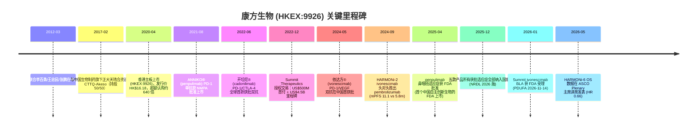
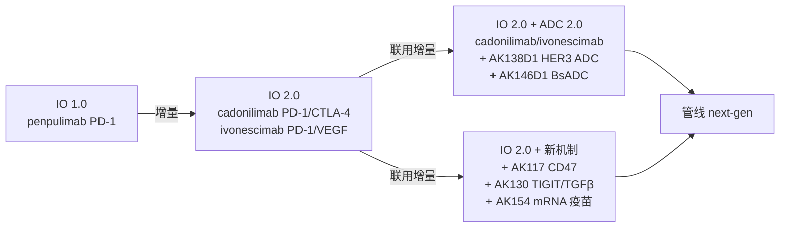
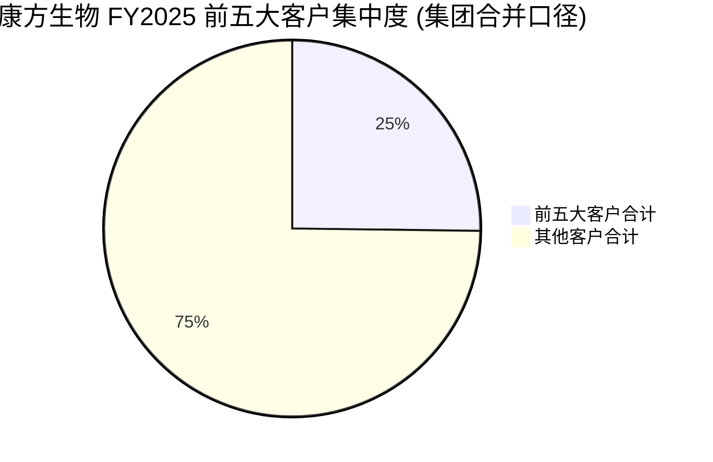

# 康方生物 / Akeso, Inc. (HKEX:9926) — 公司研究报告

*As of 2026-06-02 — Simplified Chinese 公司研究 / Initiation Coverage*
*主题归属：china-drug-out-licensing / 中国创新药对外授权浪潮*

> **Update — FY2025 业绩 (2026-03-26 披露):** 公司 2025 全年营收 RMB 3,056.3 million，YoY +43.90%；其中商业化销售（扣分销成本后）RMB 3,033.1 million，YoY +51.48%；License 收入 RMB 23.2 million（2024: RMB 121.6 million，因 SUMMIT 协议修订后递延确认到位）。Loss for the year RMB (1,140.8) million，主要受 SUMMIT 长期股权投资按权益法摊计 RMB (324.8) million、股权激励 RMB (157.0) million 等非经常项目影响；非 IFRS 经调整亏损 RMB (584.7) million，经调整 EBITDA 亏损 RMB (191.9) million（YoY 收窄）。截至 2025-12-31 现金、银行存款及理财合计 RMB 9,171.6 million，财务结构充裕。
> Source: [康方生物 2025 年年度报告, p.11](https://www.akesobio.com/media/6528/2025annual-report.pdf); [康方生物 FY2025 业绩公告 PR, 2026-03-27](https://www.akesobio.com/en/media/akeso-news/260327/).

## Table of Contents

1. [公司概览 / Company Overview](#公司概览)
2. [公司历史 / Company History](#公司历史)
3. [管理团队 / Management Team](#管理团队)
4. [产品与服务 / Products & Services](#产品与服务)
5. [客户与上市策略 / Customers & Go-to-Market](#客户与上市策略)
6. [行业概览 / Industry Overview](#行业概览)
7. [竞争格局 / Competitive Landscape](#竞争格局)
8. [市场机会 / Market Opportunity / TAM](#市场机会)
9. [风险评估 / Risk Assessment](#风险评估)
10. [投资视角评分 / Investor-Lens Scorecards](#投资视角评分)
11. [参考资料 / References & Data Used](#参考资料)

---

## 公司概览

康方生物（Akeso, Inc.，HKEX:9926）是一家位于中国广东中山的创新生物制药公司（biopharmaceutical company），主营业务定位为"专注于全人源治疗性抗体药物（fully human therapeutic antibody）的发现、开发、生产及商业化"。公司由夏瑜博士（Dr. XIA Yu / Michelle Xia）联合李百勇博士（Dr. LI Baiyong）、王忠民博士（Dr. WANG Zhongmin Maxwell）及张鹏博士（Dr. ZHANG Peng）于 2012-03-19 成立，2020-04-24 在港交所主板上市，发行价 HK$16.18，募集净额约 US$379.8 million；保荐人/联席账簿管理人包括中金（CICC）与招银国际（CMBI）。公司目前主要业务地理在中国（NMPA 监管的 in-China 商业销售为收入主体），通过与 SUMMIT Therapeutics（NASDAQ:SMMT）等海外合作伙伴拓展美国、加拿大、欧洲、日本等北美 / EU / 日本市场。([康方生物官网 — 关于我们](https://www.akesobio.com/en/about-us/); [中金 CICC 公告](https://en.cicc.com/media-relations/details118_1097.html); [Yicai Global 2020-04 IPO 报道](https://www.yicaiglobal.com/news/profitless-biopharma-firm-akeso-to-list-on-hkex-tomorrow-over-subscribes-640-times))

公司的核心商业模式是**自研抗体药物 + 国内商业化 + 海外对外授权（out-licensing）变现**。截至 2026-03（FY2025 年报披露时点），公司已有 **7 款自研产品进入商业化阶段**（开坦尼® / cadonilimab、依达方® / ivonescimab、ANNIKO® / penpulimab、伊喜宁® / ebronucimab、爱达罗® / ebdarokimab、普佑恒™ / pucotenlimab 及科泰莱® / tagitanlimab——后两者分别授出给 Lepu Biopharma HKEX:2157 与四川科伦博泰），另有 **27 个产品处于商业化或临床研发阶段，其中 12 个 III 期、15 个 I/II 期**；其中 18 个属于"全球首创/潜在全球首创"的双特异性抗体 / 多特异性抗体 / ADC 等新机制药物。在收入结构上，2025 年公司 RMB 3,056.3 million 总收入中：商业化销售 RMB 3,033.1 million（占比 99.2%），License 收入 RMB 23.2 million（占比 0.8%）；2024 年同期 License 收入 RMB 121.6 million 因 SUMMIT 协议修订一次性确认所致，2025 没有可比项。([康方生物 2025 年年度报告, p.12](https://www.akesobio.com/media/6528/2025annual-report.pdf))

截至 2025-12-31，公司有 **3,761 名员工**（2024 末 3,035 人），其中研发临床前/临床 1,080 人、制造与质量 1,050 人、销售与市场 1,277 人、行政管理 354 人，全年雇员薪酬合计 RMB 1,423.0 million（YoY +49.8%），增长主要源于销售团队扩张及股权激励授予；公司在广东中山火炬区拥有 55,000 L（含 40,000 L 不锈钢反应器 + 15,000 L 一次性反应器）、广州知识城 36,000 L、中山健康科技园 3,000 L，总产能 94,000 L 的 GMP 兼容生物制药生产能力，按 FDA、EMA 及 NMPA 标准设计。([康方生物 2025 年年度报告, p.22-23](https://www.akesobio.com/media/6528/2025annual-report.pdf))

**估值快照 / Valuation snapshot (as of 2026-06-02)**：现价 HK$107.90（−6.90% 当日），市值 HK$106.76 bn（≈US$13.62 bn），52 周区间 HK$73.10–179.00；摊薄股本 921.14 million 股；TTM 营收 HK$3.40 bn (+43.9% YoY)，TTM 净亏损 HK$1.24 bn → P/E = n/a (亏损中)；TTM P/S ≈ 31× — 按 Simply Wall St 测算 P/S 34.1×（截至 2026 年初），处于香港生物科技板块平均 14.1× 的 2.4 倍，同业平均 23.1× 的 1.5 倍；卖方 12 个月平均目标价 HK$172.28（区间 HK$120.72–228.11，20 家覆盖 0 sell，Strong Buy 评级）。([Stock Analysis HKG:9926](https://stockanalysis.com/quote/hkg/9926/); [Simply Wall St — Akeso valuation](https://simplywall.st/stocks/hk/pharmaceuticals-biotech/hkg-9926/akeso-shares/valuation); [TipRanks — 9926 forecast](https://www.tipranks.com/stocks/hk:9926/forecast))

**P/S > 30× TTM 显著高于同业的解读**：(a) 公司处于商业化加速 + 海外管线放量的双拐点——FY2025 商业化销售 +51.5% YoY，2026 年所有获批适应症首次进入国家医保（NRDL），形成新一轮以量补价的销售跳升曲线；(b) 海外管线 catalyst 密集——SUMMIT 已就 ivonescimab + 化疗治疗 EGFR 突变 NSCLC（三代 EGFR-TKI 失败后）提交 BLA，FDA 已于 2026-01 受理，PDUFA 2026-11-14；(c) 临床数据 + 学术领导力强支撑——HARMONi-6（ivonescimab + 化疗 vs tislelizumab + 化疗，1L 鳞癌 NSCLC）在 2026-05-31 ASCO 全体大会（ASCO Plenary）展示 OS HR 0.66（mortality risk reduction 34%），中位 OS 27.9 vs 23.7 个月（4 个月延长），为中国创新药首次在 ASCO Plenary 主席讲席亮相；(d) 然而国内 NRDL 价格谈判后单价大幅下降的事实，使 P/S 的"长期可持续性"高度依赖海外授权（SUMMIT、未来潜在 BD）变现 —— 这是该多重估值溢价的关键基础也是潜在压力点。([Summit Therapeutics 8-K, 2026-01-29 FDA BLA acceptance](https://www.sec.gov/Archives/edgar/data/0001599298/000159929826000006/a2026_prx0129xfdablaacce.htm); [OncoDaily — HARMONi-6 ASCO 2026 详解](https://oncodaily.com/oncolibrary/lung-oncology/harmoni-6-trial-at-asco-2026); [Investing News Network — HARMONi-6 OS 数据](https://investingnews.com/ivonescimab-with-chemotherapy-demonstrated-a-statistically-significant-overall-survival-benefit-compared-to-tislelizumab-plus-chemotherapy-in-1l-treatment-of-patients-with-squamous-nsclc-in-the-harmon/); [Akeso 2025 NRDL 公告 PR, 2025-12-07](https://www.akesobio.com/en/media/akeso-news/251207/))

---

## 公司历史

康方生物的创立故事是一段**典型的"中国海归科学家创业 + 中外大药企合作"路径**。2012 年 3 月，从美国辉瑞（Pfizer）等顶级跨国药企归国的夏瑜博士在广东中山联合三位科学家共同创办康方，定位为"覆盖发现到商业化全链条"的全人源抗体药物公司，是中山火炬高新技术产业开发区生物医药基地最早一批由海归博士主导的初创公司之一。早期获得粤港澳大湾区"珠江人才计划"、广东省"突出贡献人才"等政府支持。([康方生物 2025 年年度报告 — 董事简历, p.36-39](https://www.akesobio.com/media/6528/2025annual-report.pdf); [康方生物官网 — 关于我们](https://www.akesobio.com/en/about-us/))


*Source: timeline 整合自 [康方生物 2025 年年度报告, p.5-10 公司简介与里程碑章节](https://www.akesobio.com/media/6528/2025annual-report.pdf); [Akeso-Summit Dec 2022 PR](https://www.akesobio.com/en/media/akeso-news/20221206/); [Summit BLA acceptance 8-K, 2026-01-29](https://www.sec.gov/Archives/edgar/data/0001599298/000159929826000006/a2026_prx0129xfdablaacce.htm).*

公司的**第一次战略性变革**是 2017 年与正大天晴药业（Sino Biopharm 1177.HK 旗下）合资成立 CTTQ-Akeso 公司，明确"康方负责研发与生产、正大天晴负责销售推广"的分工 — 这一战略选择让仅有 5 年历史的康方在 PD-1 单抗 penpulimab（AK105）的商业化阶段就能借助正大天晴在中国数千人销售队伍的覆盖能力，迅速接入医院与处方权，是中国创新生物制药企业里"研发型新势力 + 传统大药企商业化网络"模式的早期典型样本。([康方生物 2025 年年度报告 — Related Party Transactions, p.46-50](https://www.akesobio.com/media/6528/2025annual-report.pdf))

公司的**第二次战略性变革**也是迄今最关键的变革，是 2022-12 与 Summit Therapeutics（NASDAQ:SMMT）签署的 ivonescimab（AK112）海外授权协议——**US$500 million 首付 + 最高 US$5 billion 总里程碑 + 美/加/欧/日 territory 上低双位数（low-double-digit）净销售提成（royalty）**，开创了中国创新生物药对外授权（China out-licensing）的关键样板，并成为此后 2025-2026 年中国生物医药对外授权浪潮的"价格锚"。同时，夏瑜博士本人加入 Summit 董事会，两家公司在授权 territory 内"co-brand"该产品。这笔交易在 2023 年帮助康方录得历史上首次年度盈利 RMB 1,942 million（首付一次性确认所致）。([Akeso-Summit Dec 2022 PR](https://www.akesobio.com/en/media/akeso-news/20221206/); [SMMT 8-K 2022-12-08](https://www.sec.gov/Archives/edgar/data/0001599298/000159929822000136/a2022_prx1208xivonescimaba.htm); [康方生物 2025 年年度报告 — Five-Year Summary, p.202](https://www.akesobio.com/media/6528/2025annual-report.pdf))

**近 12 个月（2025 年 6 月至 2026 年 5 月）的关键发展**集中在四条主线上：(i) 临床数据持续创纪录：HARMONi-2 published in The Lancet (头对头 pembrolizumab 取得 PFS 优势 mPFS 11.1 vs 5.8m, HR 0.51)，HARMONi-6 OS 数据在 ASCO 2026 Plenary 主席讲席发表（HR 0.66, 全球首次中国抗肿瘤药登顶 ASCO Plenary）；(ii) 监管前进：penpulimab 2025-04 获 FDA 批准两项鼻咽癌适应症（首款中国自主研发上市的 PD-1 单抗）、Summit 提交 ivonescimab BLA 2026-01-29 获 FDA 受理；(iii) 商业化加速：FY2025 商业化销售 +51.5% YoY，2026-01 起所有适应症全部进入国家医保（NRDL），价格谈判后销量补偿；(iv) 管线持续扩展：AK138D1 (HER3 ADC)、AK146D1 (Trop2/Nectin4 BsADC)、AK150 (ILT2/ILT4/CSF1R 三特异性) 全部进入临床。([Akeso/Lancet 2025-02 PR](https://www.prnewswire.com/news-releases/akeso-announces-the-publication-of-its-phase-iii-clinical-trial-results-for-ivonescimab-in-head-to-head-comparison-with-pembrolizumab-in-the-lancet-302395382.html); [PharmaShots — HARMONi-6 ASCO 2026 详细](https://pharmashots.com/33599/akeso-presents-the-p-iii-harmoni-6-trial-data-on-ivonescimab-ct-in-1l-squamous-nsclc-at-asco-2026); [康方生物 2025 年年度报告 — Pipeline Section, p.13-25](https://www.akesobio.com/media/6528/2025annual-report.pdf))

---

## 管理团队

康方的核心管理层是创始团队四位科学家，其中**夏瑜博士既是创始人也是现任 CEO**，故按 SKILL.md 规定合并撰写一段完整 bio。

### 夏瑜博士（Dr. XIA Yu / Michelle Xia）— 联合创始人、董事会主席、总裁兼 CEO

夏瑜博士（女，2025 年报披露年龄 59 岁）是康方生物的关键创始人（key founder），自 2012-03-19 公司创立起即出任公司董事长、总裁兼首席执行官，自 2019-11-16 重新指定为执行董事。截至 2025-12-31，她通过个人持股、控股公司（XIA LLC, US Delaware）、家族信托（XIA Trust, with family beneficiaries）、ESOP 信托执行人身份（Aquae Hyperion Limited 持有 Pre-IPO RSU Scheme 股份）以及联合创始人 LI / WANG / ZHANG 委托的投票权，合计可投票控制约 **25.0% 的公司在外发行股份**（5,000,000 直接持有 + 21,000,000 控股公司 + 54,099,042 信托 + 25,683,829 ESOP enforcer + 124,230,582 委托投票权 = 229,013,453 股 / 921,143,176 股 = 24.9%）。这种"创始团队共同治理 + 单一最终投票实体"的架构使夏瑜在重大战略决策（如 Summit 授权协议）上具有事实上的控制权。([康方生物 2025 年年度报告 — Directors' Interests, p.56-57](https://www.akesobio.com/media/6528/2025annual-report.pdf))

夏瑜博士的关键执业背景：在创办康方之前，她在 Pfizer Inc.（美国总部）有超过 11 年的研发经验，担任过 Associate Director 级别职务，专注于抗体药物的研究开发管理工作。她在创业前已具备从早期发现（discovery）到 IND 申报全链条的研发经验，这是她能够在中山一个未具规模的新兴生物医药基地把一家初创公司带到拥有 7 款上市药物、约 50 个在研项目的规模的关键凭据。学术背景上她拥有美国博士学位（具体学校与专业在 2025 年报"Directors and Senior Management"章节未详细列示）。2018 年，她获得"第七届中国留学回国人员成就奖"，2014 年获科技部"创新创业人才"称号，2015 年与其团队获国务院侨办颁发的"年度中国侨界顶尖创业公司"，2018 年入选广东省"珠江人才计划"创新创业团队带头人——这些政府认证是她在中国体制内的资源接入凭据，对一家位于地方城市的创新药公司至关重要。([康方生物 2025 年年度报告 — Dr. XIA Yu bio, p.36](https://www.akesobio.com/media/6528/2025annual-report.pdf); [Wikipedia — Michelle Xia](https://en.wikipedia.org/wiki/Michelle_Xia); [STAT News 2025 STATUS List — Michelle Xia](https://www.statnews.com/status-list/2025/michelle-xia/))

夏瑜博士同时担任 Summit Therapeutics 董事会成员（依据 2022-12 协议），形成"中美双董事会观察 + 双方利益深度绑定"的治理结构。她在最近 24 个月里以康方 CEO 身份频繁出席摩根大通医疗健康会议（J.P. Morgan Healthcare Conference）等顶级行业活动，是中国创新生物药企业在国际资本市场最具能见度的女性创始人 CEO 之一。Forbes 2024 把康方与夏瑜列为"China's Most Influential Businesswomen"榜单第 7 名。([Akeso PR — Michelle Xia 出席 Morgan Stanley](https://x.com/AkesoInc/status/1858509507053179165); [Forbes 2024 China Most Influential Businesswomen 提名](https://www.linkedin.com/posts/forbes-magazine_akeso-inc-whose-ceo-michelle-xia-ranked-activity-7178035429735116800-QNpE))

### 联合创始人简介（补充背景）

除夏瑜外，另三位联合创始人是公司分工明确的核心团队，**根据 SKILL.md "founder + current CEO only"的限定，此处仅作 1 段补充说明，不展开 bio**：李百勇博士（执行董事、SVP & CSO，2012 起，前 Pfizer Associate Director 主导多个肿瘤免疫疗法早期发现项目）；王忠民博士（执行董事、SVP，2012 起，前 Crown Bioscience 高级总监，结构生物学背景，主要负责临床运营、采购与法务）；张鹏博士（执行董事，2024-06-30 任职，前 Crown Bioscience 高级总监，化学背景，负责公司运营与政府事务）。四人合计直接 + 控股 + 信托持股约 26%（夏瑜 11.5% 自身权益 + 委托投票权 13.5%；李 5.5%；王 4.7%；张 3.5%），其中夏瑜作为四人投票权的唯一受托人，是公司事实上的单一控制人。([康方生物 2025 年年度报告 — Directors bios, p.36-39](https://www.akesobio.com/media/6528/2025annual-report.pdf))

---

## 产品与服务

> **重要性提示**：根据 SKILL.md 规定，Section 4 是整份研究报告中最重要的一节。对康方而言尤其如此——所有商业化销售、所有 License 收入、所有市场估值、所有未来 catalyst 都建立在公司"自研抗体平台 + 双特异性抗体（bispecific antibody）+ ADC + TCE"的产品矩阵之上。

### 4.1 产品矩阵 / Product Matrix（来源：2025 年年度报告 + 官网产品中心）

```mermaid
graph TD
    A[康方生物自研创新平台] --> B[肿瘤免疫 / Oncology]
    A --> C[自免与代谢 / Autoimmune & Metabolic]
    A --> D[早期管线 / Pipeline]

    B --> B1[开坦尼 cadonilimab AK104<br/>PD-1/CTLA-4 双抗<br/>已上市 - 3 项适应症]
    B --> B2[依达方 ivonescimab AK112<br/>PD-1/VEGF 双抗<br/>已上市 - 2 项适应症 + FDA BLA]
    B --> B3[ANNIKO penpulimab AK105<br/>PD-1 单抗<br/>已上市 - 5 项适应症 + FDA 批准]
    B --> B4[科泰莱 tagitanlimab<br/>PD-L1 单抗<br/>已上市 - 授出科伦博泰]
    B --> B5[普佑恒 pucotenlimab<br/>PD-1 单抗<br/>已上市 - 授出 Lepu 2157.HK]

    C --> C1[伊喜宁 ebronucimab<br/>PCSK9 单抗 - 已上市]
    C --> C2[爱达罗 ebdarokimab<br/>IL-12/IL-23 单抗 - 已上市]
    C --> C3[奇佑康 gumokimab AK111<br/>IL-17 单抗 - 2 项 NDA 受理中]
    C --> C4[manfidokimab AK120<br/>IL-4Rα 单抗 - NDA 受理中]

    D --> D1[ligufalimab AK117<br/>CD47 - 3 项 III 期]
    D --> D2[pulocimab AK109<br/>VEGFR2 - III 期]
    D --> D3[AK130 TIGIT/TGFβ<br/>双抗融合 - 全球首款]
    D --> D4[AK138D1 HER3 ADC<br/>I 期 - 中/澳]
    D --> D5[AK146D1 Trop2/Nectin4<br/>双特异性 ADC - I 期]
    D --> D6[AK150 ILT2/ILT4/CSF1R<br/>三特异性抗体 - I 期]
    D --> D7[AK139 IL-4Rα/ST2<br/>自免双抗 - 7 项 II 期]
    D --> D8[AK152 抗-Aβ/BBB<br/>阿尔茨海默 - I 期]
    D --> D9[AK154 mRNA<br/>个性化肿瘤疫苗 - I 期]
```



公司当前的商业化产品组合可按治疗领域分为两大类：**肿瘤免疫（IO 2.0 + IO 1.0）** 与**自免和代谢（autoimmune & metabolic）**。其中两款 IO 2.0 双特异性抗体（开坦尼 + 依达方）是收入和估值的双引擎；研发管线则横跨 IO + ADC + TCE + 三特异性抗体 + mRNA 五个技术平台（自有命名为 Tetrabody 平台 / Dual-Shield ADC 平台 / Dual-Lock TCE 平台 / Tissue-Smart siRNA 平台 / Flex-Nano mRNA 平台 + CARL-NK 细胞治疗平台）。([康方生物官网 — R&D 平台](https://www.akesobio.com/en/rd-and-science/rd-platform/); [康方生物 2025 年年度报告 — MD&A 章节, p.13](https://www.akesobio.com/media/6528/2025annual-report.pdf))

### 4.2 旗舰产品 1：依达方® / Ivonescimab (AK112) — PD-1/VEGF bispecific antibody

> 引用 2025 年年度报告 MD&A 章节原文（p.13）：
>
> > "Ivonescimab is currently in clinical studies across 30 indications through combination therapies. The Company has initiated 44 clinical trials, including 15 Phase III clinical trials and 7 head-to-head studies with PD-(L)1, covering lung cancer, colorectal cancer, biliary tract cancer, head and neck squamous cell carcinoma (HNSCC), breast cancer and pancreatic cancer, among which 4 have achieved positive results. Ivonescimab has been included in 12 authoritative clinical treatment guidelines in China."

**中文释义 / Plain-language gloss:** 依达方 是康方 Tetrabody 双特异性抗体技术平台的代表作，结构上**同时阻断 PD-1（programmed cell death-1）和 VEGF（vascular endothelial growth factor）两个靶点**，前者解除肿瘤的免疫逃逸（immune escape），后者抑制肿瘤新生血管（angiogenesis）—— 双重机制本质上相当于把 PD-1 单抗（如 Keytruda）+ 贝伐珠单抗（bevacizumab / Avastin）打包成一个分子，但因为双特异性结构使两者协同到达肿瘤微环境（tumor microenvironment, TME）的浓度比"两药联用"更精准。该产品是**全球首款获批上市的 PD-1/VEGF 双特异性抗体**——这是康方"first-in-class"标签最有力的支撑。

**关键临床里程碑（按时间顺序）**：
- **2024-05** NMPA 首批：EGFR 突变、EGFR-TKI 治疗失败的局部晚期/转移性非鳞 NSCLC（基于 AK112-301/HARMONi-A 试验）；
- **2024-09** HARMONi-2 数据：单药 ivonescimab 头对头 pembrolizumab 在 PD-L1 阳性 1L NSCLC 取得 PFS 优势 mPFS 11.1 vs 5.8 月，HR 0.51—— **该研究的中国注册临床头对头胜出 Keytruda 是肿瘤药全球范围内极少数案例**，结果于 2025-02 发表在 The Lancet 主刊；
- **2025-04** NMPA 批准：作为 PD-L1 阳性（TPS≥1%）局晚 / 转移 NSCLC 一线治疗的单药方案，2026-01 纳入 NRDL；
- **2025-04** HARMONi-6（AK112-306）三期：ivonescimab + 化疗 vs tislelizumab + 化疗 1L 鳞癌 NSCLC PFS 达主要终点；
- **2025-09** HARMONi（全球多中心三期）：Summit 公布 1L EGFR-TKI 失败后 NSCLC + 化疗对照，PFS 主要终点达成，OS 有利趋势；
- **2025 年底** Summit 向 FDA 提交首个 ivonescimab BLA（EGFR-mutated NSCLC, 三代 TKI 失败后 + 化疗）；
- **2026-01-29** FDA 正式受理该 BLA，**PDUFA action date 设定为 2026-11-14**（康方迄今最重要的近期 catalyst）；
- **2026-05-31** HARMONi-6 最新 OS 数据在 ASCO 全体大会（ASCO Plenary）主席讲席发表：HR 0.66, mortality risk reduction 34%，mOS 27.9 vs 23.7 月（4 月延长），24 月 OS rate 64.7% vs 48.6%——史上首款中国创新药在 ASCO Plenary 主席讲席亮相，也是 1L NSCLC 头对头 anti-PD-(L)1 + 化疗取得 statistically significant OS benefit 的**第一个方案**。

*分析师观点：* ivonescimab 已具备成为新一代肿瘤免疫"backbone therapy"的临床数据基础，其与化疗、ADC、其他 IO（包括康方自有的 cadonilimab、ligufalimab AK117 CD47、AK130 TIGIT/TGFβ）的联合用药设计构成中国创新药迄今最丰富的 IO 2.0 矩阵。商业上，海外 territory 全部归 Summit Therapeutics 负责（US/CA/EU/JP），康方获 royalty（low-double-digit）+ 剩余里程碑——这意味着海外销售放量主要 reprice Summit 而非康方，但 royalty 现金流将为公司带来稳定的"被动收入"。([康方生物 2025 年年度报告 — Ivonescimab 章节, p.13-16](https://www.akesobio.com/media/6528/2025annual-report.pdf); [Akeso/Lancet HARMONi-2 PR, 2025-02-21](https://www.prnewswire.com/news-releases/akeso-announces-the-publication-of-its-phase-iii-clinical-trial-results-for-ivonescimab-in-head-to-head-comparison-with-pembrolizumab-in-the-lancet-302395382.html); [Summit Therapeutics 8-K FDA BLA acceptance, 2026-01-29](https://www.sec.gov/Archives/edgar/data/0001599298/000159929826000006/a2026_prx0129xfdablaacce.htm); [OncoDaily — HARMONi-6 ASCO Plenary 2026](https://oncodaily.com/oncolibrary/lung-oncology/harmoni-6-trial-at-asco-2026); [LungCancerToday — HARMONi-6 详情](https://www.lungcancerstoday.com/post/phase-3-harmoni-6-trial-asco-plenary-presentation-shows-significant-improvement-in-os-with-ivonescimab-plus-chemotherapy-for-nsclc))

### 4.3 旗舰产品 2：开坦尼® / Cadonilimab (AK104) — PD-1/CTLA-4 bispecific antibody

> 引用 2025 年年度报告 MD&A 章节原文（p.16）：
>
> > "Cadonilimab is currently approved or in clinical studies for over 20 indications through combination therapies, including gastric cancer, liver cancer, lung cancer, cervical cancer, etc. Over 28 clinical trials have been initiated in China and overseas, with approximately 12 Phase III/registrational clinical trials actively progressing. It continues to be included in over 20 authoritative clinical treatment guidelines."

**中文释义 / Plain-language gloss:** 开坦尼是**全球首款上市的 PD-1/CTLA-4 双特异性抗体**——结构上同时阻断 PD-1 和 CTLA-4（cytotoxic T-lymphocyte-associated protein 4）两个免疫检查点（immune checkpoint），相当于把 Yervoy（ipilimumab）+ Keytruda 这种 BMS / Merck 长期主导的"双 IO 组合"打包成一个分子。优势在于剂量和毒性可控（不需要单独优化两个药物的剂量），临床上在低 PD-L1 / PD-L1 阴性人群也能取得疗效——这是传统 anti-PD-(L)1 + 化疗组合长期的疗效缺口。

**关键里程碑**：
- **2022-06** NMPA 首批：经治复发或转移性宫颈癌（cervical cancer）；
- **2024-09** NMPA 第二项适应症批准：一线胃癌 / 食管胃交界腺癌（G/GEJ adenocarcinoma），基于 COMPASSION-15 三期；
- **2025-05** NMPA 第三项适应症：一线宫颈癌（持续 / 复发 / 转移），基于 COMPASSION-16；
- **2025** 全部三项适应症纳入 NRDL；
- **2025-12** FDA 批准 COMPASSION-37 全球多中心三期（cadonilimab + 化疗 vs 化疗 ± nivolumab，1L G/GEJ 腺癌）——**康方首个由自身主导的全球三期临床研究**，是康方"出海"战略不再依赖 Summit 等海外伙伴的关键标志；
- **2025-CSCO 胃癌指南**：cadonilimab 是唯一"无 PD-L1 表达水平限制的 IA 级 I 级推荐"的一线胃癌免疫疗法——独立于 PD-L1 状态的疗效是其相对 Keytruda / Opdivo 的差异化关键。

*分析师观点：* cadonilimab 估计已治疗约 12 万患者（截至 2025 年报披露），是康方商业化基础最深的产品。三项适应症全部进入医保使其在中国进入"以量补价"的快速增长曲线，而 COMPASSION-37 全球三期意味着公司开始尝试自己主导海外注册——若数据读出顺利，可能成为康方第一款无需 Summit 等海外合作伙伴而自行 monetize 美国市场的双抗，对长期估值具结构性意义。([康方生物 2025 年年度报告 — Cadonilimab 章节, p.16-19](https://www.akesobio.com/media/6528/2025annual-report.pdf); [康方 2026 NRDL 公告 PR, 2025-12-07](https://www.akesobio.com/en/media/akeso-news/251207/))

### 4.4 第二梯队商业化产品 — ANNIKO® / Penpulimab (AK105) PD-1 单抗

> 引用 2025 年年度报告 MD&A 章节原文（p.18-19）：
>
> > "In April 2025, two indications for penpulimab — first-line treatment of recurrent or metastatic NPC and treatment for recurrent or metastatic NPC progressing on or after platinum-based chemotherapy and at least one other prior line of therapy — obtained FDA approval. This marks the Company's first self-developed innovative biologic drug to obtain FDA approval and is also the first innovative biologic drug entirely and independently led by a Chinese company (covering R&D, clinical development, manufacturing, and regulatory submission) to successfully obtain FDA approval."

**中文释义 / Plain-language gloss:** penpulimab 是康方的第一代 PD-1 单抗，结构与机制与 Keytruda / Opdivo / Tyvyt 等主流 PD-1 单抗一致，但在 Fc 段做了"silent Fc"工程化以降低 ADCC/CDC 效应。商业化上由 CTTQ-Akeso（康方与正大天晴 50/50 合资）在中国销售，正大天晴及其下属南京顺欣作为唯一销售单位（exclusive distributor），分销和制造 cap 由"持续关连交易"持续 disclosed。**最大的战略意义在于：2025-04 该药两项鼻咽癌（NPC）适应症成为 FDA 批准的第一款"完全由中国公司独立主导"（covering R&D、临床、生产、监管全链条）的创新生物药——这是中国生物药全链条 ex-China 监管能力的"首次自证"**。([康方生物 2025 年年度报告 — Penpulimab 章节, p.18-20](https://www.akesobio.com/media/6528/2025annual-report.pdf))

*分析师观点：* penpulimab 在中国市场面临**激烈竞争**（信达 sintilimab Tyvyt, 君实 toripalimab, BeiGene tislelizumab Tevimbra, 恒瑞 camrelizumab Airuika 等 8+ 款国产 PD-1 单抗形成红海），但鼻咽癌（一个东亚/东南亚高发但全球罕见的肿瘤类型）的差异化适应症使其在 FDA 不被任何主流 anti-PD-(L)1 直接竞争——这是中国创新药寻找海外"未充分覆盖适应症"作为突破口的典型案例（参考类似策略：beyonttra/赞美维, 君实 toripalimab via Coherus 在 NPC 上取得 FDA 批准）。

### 4.5 第二梯队商业化产品 — 自免与代谢条线

康方自免与代谢条线两款商业化产品 + 两款 NDA 受理中产品构成**收入第二曲线**：
- **伊喜宁® / ebronucimab (PCSK9 单抗)**：2025 年批准用于原发性高胆固醇血症 + 杂合子型家族性高胆固醇血症，两项均纳入 NRDL；2026-02 与济川药业（SSE:600566）旗下两公司签独家商业化协议，许可费 RMB 80 million + 后续里程碑，济川负责中国市场销售推广，康方收取分成 —— 是典型的"研发型药企 + 渠道型药企"分工模式。
- **爱达罗® / ebdarokimab (IL-12/IL-23 单抗)**：2025-04 NMPA 批准用于中重度斑块状银屑病，2025-11 纳入 NRDL；
- **奇佑康® / gumokimab AK111 (IL-17 单抗)**：2025-01 银屑病 NDA 受理 + 2026-01 强直性脊柱炎 NDA 受理，**双适应症 NDA 同时进行是 IL-17 抗体管线推进的最快节奏之一**；
- **manfidokimab (AK120, IL-4Rα 单抗)**：2026-02 中重度特应性皮炎 NDA 受理。

*分析师观点：* 自免市场（皮肤 / 风湿 / 代谢）是康方相对管线（如 IL-4Rα / IL-17 / IL-12/23 / PCSK9）能实质"复制"国内已被赛诺菲 Dupixent、礼来 Taltz、强生 Tremfya、安进 Repatha 教育过的成熟市场——产品研发难度低于 IO 2.0，但商业化天花板有限于中国市场的可及性。([康方生物 2025 年年度报告 — Metabolic & Autoimmune 章节, p.20-22](https://www.akesobio.com/media/6528/2025annual-report.pdf))

### 4.6 早期管线 — 下一代 IO 2.0 + ADC + 多特异性 + mRNA

按 2025 年报披露，公司正在临床阶段推进的下一代候选药包括：
- **ligufalimab (AK117, CD47 单抗)** — 全球目前唯一进入实体瘤 III 期的 CD47 抗体（在 head & neck、pancreatic 三项 III 期）；
- **pulocimab (AK109, VEGFR2 单抗)** — 与 cadonilimab 联用治疗 IO 抗药 G/GEJ 腺癌的 III 期；
- **AK130 (TIGIT/TGFβ bispecific antibody-fusion)** — 全球唯一进入临床的 TIGIT/TGFβ 双抗融合蛋白，与 ivonescimab 联用 II 期（胰腺癌）；
- **AK138D1 (HER3 ADC)** — 公司首款进入临床的 ADC，2026-03 启动与 cadonilimab/ivonescimab 联用 II 期；
- **AK146D1 (Trop2/Nectin4 BsADC)** — 公司首款双特异性 ADC（BsADC, bi-specific antibody-drug conjugate），2025-07 全球 I 期启动；
- **AK150 (ILT2/ILT4/CSF1R)** — 公司首款三特异性抗体（trispecific），2025-12 IND；
- **AK139 (IL-4Rα/ST2)** — 自免领域首款双抗，2026-02 一次性获 NMPA 批准 7 项 II 期（COPD/重度哮喘/慢性自发性荨麻疹/过敏性鼻炎/慢性鼻窦炎伴鼻息肉/中重度 AD/结节性痒疹）；
- **AK154 (mRNA tumor vaccine)** — 个性化肿瘤疫苗，胰腺癌术后辅助 I 期；
- **AK152 (anti-Aβ/BBB receptor)** — 阿尔茨海默病双抗 I 期（首款中国研发的下一代抗 Aβ 双抗）。

*分析师观点：* 早期管线的密度（在临床的 27 个产品 + 12 个 III 期）以及对**多特异性 + ADC + bsADC + mRNA + 细胞治疗**等下一代模态的全面覆盖，是康方相对中国其它创新药企最显著的差异化——这部分管线如果按当前"中国 R&D 速度 + 海外 BD 退出"模式持续，可能在 2027–2030 年构成第二轮 out-licensing 的拳头产品池。([康方生物 2025 年年度报告 — Pipeline Section, p.20-25](https://www.akesobio.com/media/6528/2025annual-report.pdf); [康方生物官网 — R&D 平台与产品中心](https://www.akesobio.com/en/rd-and-science/products-center/))

### 4.7 产品矩阵综合：从 IO 1.0 → IO 2.0 → IO 2.0 + ADC 2.0



公司的产品演进逻辑是**"backbone therapy"概念**——cadonilimab 与 ivonescimab 不仅作为单药/标准组合销售，更将作为康方所有自研管线（ADC、CD47、TIGIT 双抗、mRNA 疫苗）的"联用骨架"。这种产品架构是康方 P/S 高估值溢价的核心理论支撑：当一款骨架药物可以与公司自研的 N 个新机制产品组合时，未来的 N 个新机制产品都不需要再去寻找外部 IO 骨架伙伴，公司可以独立完成"IO 2.0 + X"的管线建设——这是 BeiGene、信达等单 IO 公司目前还没有的结构性优势。([康方生物 2025 年年度报告 — "IO 2.0 + ADC 2.0" 战略, p.23-25](https://www.akesobio.com/media/6528/2025annual-report.pdf))

---

## 客户与上市策略

康方的客户与销售网络呈现**"自营商业团队 + 战略合作伙伴 + 海外 out-licensing"三层结构**：

**第一层：自营商业团队覆盖 IO 2.0 产品（开坦尼 + 依达方）**——这两款双特异性抗体的中国市场销售由康方自有团队负责（FY2025 末销售与市场人员 1,277 人，YoY +56.5%）。这部分是公司最关键的现金流来源，2025 年合计销售约 RMB 2,500+ million（年报未单独披露每款销售额，但"两款双抗合计贡献绝大部分商业销售"由 MD&A 章节明确）。([康方生物 2025 年年度报告 — Human Resources, p.23](https://www.akesobio.com/media/6528/2025annual-report.pdf))

**第二层：CTTQ-Akeso 合资 — penpulimab 中国销售**：penpulimab（AK105）由康方与正大天晴药业（中国生物制药 / Sino Biopharm 1177.HK 旗下）2017 年成立的 50/50 合资公司 CTTQ-Akeso 持有 marketing authorization，并通过持续关连交易（continuing connected transaction）独家授权连云港天晴及其子公司在中国销售。**销售与市场服务费比率不低于 35% 的净销售额**，2025 年付给正大天晴的销售与市场服务费 annual cap RMB 3,500 million，向连云港天晴销售 cap RMB 7,000 million，且 caps 锁定至 2039 年——这是康方一开始就让出大部分 PD-1 单抗经济价值换取销售渠道接入的早期战略选择。([康方生物 2025 年年度报告 — Connected Transactions, p.46-47](https://www.akesobio.com/media/6528/2025annual-report.pdf))

**第三层：海外 out-licensing — Summit + 其它**：ivonescimab 海外市场（美/加/欧/日）由 Summit Therapeutics（NASDAQ:SMMT）独家承担研发与商业化，康方获 royalty + 里程碑；这部分目前仍以预付里程碑确认为主，royalty 现金流要等到 ivonescimab FDA 获批（PDUFA 2026-11-14）后才能启动。其它对外授权交易：pucotenlimab → Lepu Biopharma（HKEX:2157）、tagitanlimab → 四川科伦博泰（CKB 已上市于 HKEX:6990）、ebronucimab → 济川药业（SSE:600566）。([Akeso-Summit Dec 2022 PR](https://www.akesobio.com/en/media/akeso-news/20221206/); [康方生物 2025 年年度报告 — License Income 章节, p.26](https://www.akesobio.com/media/6528/2025annual-report.pdf))

**客户集中度（按 2025 年年度报告披露）**：FY2025 公司**前五大客户合计占总收入约 25.2%**（2024: 31.7%）；公司未单独披露第一大客户份额或客户名称。**注：此处的"客户"在制药行业的语境下主要是"医院药品总经销商 / 集团客户"（如国药控股 Sinopharm Group、华润医药 China Resources、上药控股 Shanghai Pharma 三大全国分销商，再加几家区域龙头），而不是"终端处方医生 / 患者"**——这一分销结构集中度较高在中国处方药行业是普遍现象，并非康方特有的客户集中度风险。([康方生物 2025 年年度报告 — Major Customers and Suppliers, p.52](https://www.akesobio.com/media/6528/2025annual-report.pdf))


*Source: [康方生物 2025 年年度报告, p.52](https://www.akesobio.com/media/6528/2025annual-report.pdf) — 前 5 大客户占总收入 25.2% (集团合并口径，全部为商业化销售客户)。*

**销售战略**：公司在 2025 年报"Future Development"章节明确表述销售战略为**"以 IO 2.0 学术推广为基础（rooted in the 'IO 2.0' academic promotion strategy），靶向已获批 NRDL 适应症对应的大患者人群，通过快速准入、快速放量、市场份额扩张实现可持续增长"**。这意味着公司在中国市场以"学术营销 + 高峰会 + KOL 网络 + 临床指南纳入"为主，不依赖"以价换量"的传统药品销售模式——这一点在 cadonilimab 一线胃癌成为 CSCO 2025 唯一 IA 级 I 级推荐、ivonescimab PD-L1+ NSCLC 进入 NCCN 中国版 Preferred Regimen 等学术地位获得直接体现。([康方生物 2025 年年度报告 — Future Development, p.23-24](https://www.akesobio.com/media/6528/2025annual-report.pdf))

**关键合作伙伴清单**（截至 2026-Q1）：
1. **Summit Therapeutics (NASDAQ:SMMT)** — 全球 ex-China ivonescimab 商业化；
2. **正大天晴 / Sino Biopharm (HKEX:1177)** — CTTQ-Akeso 50/50 合资 + 中国 penpulimab 销售；
3. **Lepu Biopharma (HKEX:2157)** — pucotenlimab 中国 license；
4. **四川科伦博泰 / Kelun-Biotech** — tagitanlimab 中国 license；
5. **济川药业 (SSE:600566)** — ebronucimab 中国独家商业化（2026-02 协议）；
6. **Revolution Medicines (NASDAQ:RVMD)** — 2025-05 Summit 联用三款 RAS(ON) 抑制剂临床合作（ivonescimab）；
7. **GSK plc (NYSE:GSK)** — 2026-01 Summit 联用 GSK B7H3 ADC 临床合作（ivonescimab）；
8. **GORTEC (头颈放疗学组)** — 2025 年底全球 ILLUMINE 三期 1L PD-L1+ HNSCC 启动。

---

## 行业概览

康方所处的行业是**中国创新生物药与全球肿瘤免疫治疗（Immuno-Oncology）行业的交叉地带**。从市场结构看，可以拆为三层：(i) 中国国内的 PD-1/PD-L1 抗肿瘤药市场（红海，已有 12+ 款国产 + 4 款外资上市，正在向 IO 2.0 双抗升级）；(ii) 中国创新药对外授权（China out-licensing）市场（爆发中，2025 年全年 157 笔 + US$135.7 bn 总值，2024 年 94 笔 + US$51.9 bn）；(iii) 全球肿瘤免疫治疗市场（成熟市场，Keytruda 一款药 2024 年全球销售 ~US$29.5 bn）。([SCMP — 2025 China out-licensing 数据 2026-02](https://www.scmp.com/business/china-business/article/3339011/chinese-drug-makers-strike-record-us136-billion-out-licensing-deals-2025); [Pharmasource — China biopharma out-licensing surge to US$137.7B in 2025](https://pharmasource.global/content/china-biopharma-out-licensing-surges-to-record-137-7b-in-2025-2026-on-pace-to-break-it-again/))

### 6.1 全球肿瘤免疫治疗 (IO) 市场规模

全球肿瘤免疫治疗市场（包括 PD-1/PD-L1 单抗、CTLA-4 单抗、PD-1/VEGF 双抗、PD-1/CTLA-4 双抗、CD47 抗体、TIGIT 抗体、ADC + IO 联用等）2024 年全球销售约 US$80–100 bn，预计 2030 年达 US$150–200 bn。其中 PD-1/PD-L1 单类药物 2024 年全球销售约 US$60 bn，Keytruda（Merck）一款独占 ~US$29.5 bn（49% 市占）。**康方两款 IO 2.0 双抗瞄准的是这个市场的"下一代升级"窗口**——通过双特异性结构提升 PD-L1 阴性 / 低表达人群的疗效，以及通过 PD-1 + 抗血管生成（VEGF）的协同作用替代"PD-1 + 贝伐"的传统组合。([Merck FY2024 10-K — Keytruda revenue](https://www.sec.gov/cgi-bin/browse-edgar?action=getcompany&CIK=0000310158&type=10-K&dateb=&owner=include&count=40))

### 6.2 中国创新药对外授权（out-licensing）的爆发

2025 年是中国创新药对外授权的结构性拐点：全年 157 笔交易、总值 US$135.7 bn，分别为 2024 年的 2.6 倍（94 笔，US$51.9 bn）。2026 年 Q1-Q2 至今总值再创新高，平均交易规模同比上升约 76%。在这个浪潮中，康方-Summit 2022-12 的 US$500M 首付 + US$4.5B 里程碑被业内普遍视为**整个浪潮的"价格锚"和"价值证明"**——之后的 Innovent-Pfizer（2026-05 US$650M 首付 + US$9.85B 里程碑 + 双位数 royalty + 美欧 co-commercialization rights）、Hengrui-BMS（2026-05 US$15.2B 总值 13 个项目）、3SBio-Pfizer（2025-05 US$1.25B 首付 + US$4.8B 里程碑 + 双位数 royalty + US$100M 股权 for SSGJ-707 PD-1/VEGF 双抗）、CSPC-AstraZeneca（2025-01 US$1.2B 首付 + US$3.5B 开发 + US$13.8B 销售里程碑，8 款减肥候选）等大型交易，本质都是以康方-Summit 为基准的"上下浮动"。([SCMP — China out-licensing 2025 record](https://www.scmp.com/business/china-business/article/3339011/chinese-drug-makers-strike-record-us136-billion-out-licensing-deals-2025); [Pfizer 2026-05 Innovent deal PR](https://www.pfizer.com/news/press-release/press-release-detail/pfizer-and-innovent-biologics-enter-global-strategic); [BMS Hengrui 2026-05 PR](https://news.bms.com/news/details/2026/Bristol-Myers-Squibb-and-Hengrui-Pharma-Announce-Strategic-Agreements-to-Advance-Innovative-Medicines-Across-Oncology-Hematology-and-Immunology-2026-EbQpaI6Zdc/default.aspx); [Pfizer-3SBio completion PR 2025](https://www.pfizer.com/news/press-release/press-release-detail/pfizer-completes-licensing-agreement-3sbio); [AstraZeneca-CSPC 6-K 2025-01](https://www.sec.gov/Archives/edgar/data/0000901832/000165495425003128/a6965b.htm))

### 6.3 中国国内创新药商业化环境

中国创新药商业化的核心特征是**"快速进入医保、快速以价换量、市场份额快速扩张"**——这是与美国 / 欧洲 / 日本市场最显著的不同。具体机制：(i) NMPA 批准后 4–12 个月内进入医保谈判（NRDL）；(ii) 谈判后单价大幅降低（典型 IO 药物降幅 60–80%）；(iii) 进入医保后医院处方门槛大幅降低，销量在 3–6 个月内快速放量。康方两款 IO 2.0 双抗均在 2025 年完成 NRDL 谈判，2026-01 起所有获批适应症全部进入医保，预期 2026 年量补价后销售将再有明显跳升。([BioCentury — China biopharma "Oktagon" framework](https://www.biocentury.com/article/657621/china-biopharma-enter-the-oktagon); [康方 2026 NRDL 公告 2025-12](https://www.akesobio.com/en/media/akeso-news/251207/))

### 6.4 监管环境

(i) **NMPA（中国国家药监局）** 的"突破性治疗品种"（Breakthrough Therapy Designation）认定速度快、临床数据要求灵活，是康方多项 III 期临床能够并行推进的制度基础；ivonescimab 已获得 4 项 NMPA BTD（最新一项 2025-11 三阴性乳腺癌一线，2026-02 胆道癌）。([Akeso BTD 2025-11 PR](https://www.prnewswire.com/news-releases/akesos-ivonescimab-secures-fourth-breakthrough-therapy-designation-in-china-for-first-line-treatment-of-triple-negative-breast-cancer-302602022.html))

(ii) **FDA（美国食药监）** 已逐步接纳来自中国的 IO 类药物 — penpulimab 2025-04 获批 NPC 适应症是中国独立主导的首款生物药 FDA 上市，ivonescimab BLA 2026-01 受理，PDUFA 2026-11-14。然而**美国监管对中国生物药的"地缘政治审视"在 2025 年明显升温**，特别是 2025-12 BIOSECURE Act 正式生效后，美国对中国 CRO/CDMO（如 WuXi 系）和数据安全的关注延伸至 BD 评估和 FDA 审批节奏。

(iii) **BIOSECURE Act**（2025-12-18 生效）尽管主要针对 CRO/CDMO 而非药物本身，但仍构成中国创新药海外授权交易的"政策不确定性溢价"——表现为大型 BD 交易完成后股价可能仍受地缘事件冲击（如 2025 年 Q3 Hutchmed -17.4% 在 fruquintinib 海外授权后）。

---

## 竞争格局

康方的竞争格局可分为四层：

```mermaid
quadrantChart
    title 中国 IO 2.0 / PD-1/VEGF 与 PD-1/CTLA-4 双抗竞争格局
    x-axis 海外授权深度 (低 → 高)
    y-axis 商业化产品成熟度 (低 → 高)
    quadrant-1 头部商业化 + 海外深绑定
    quadrant-2 头部商业化 + 海外初探
    quadrant-3 早期阶段
    quadrant-4 海外深绑定 + 早期商业化
    Akeso (cadonilimab + ivonescimab): [0.85, 0.85]
    Innovent (sintilimab): [0.55, 0.85]
    BeiGene (tislelizumab + Brukinsa): [0.7, 0.9]
    Hengrui (camrelizumab): [0.85, 0.7]
    3SBio (SSGJ-707 PD-1/VEGF): [0.75, 0.3]
    Junshi (toripalimab): [0.4, 0.5]
    RemeGen (disitamab vedotin): [0.6, 0.55]
    CSPC (obesity portfolio): [0.95, 0.4]
```

### 7.1 国内 PD-1 单抗红海 — penpulimab 的处境

中国国内目前有 12+ 款 PD-1/PD-L1 单抗上市，包括四款外资（Keytruda、Opdivo、Tecentriq、Tevimbra）和八+ 款国产（信达 sintilimab Tyvyt、君实 toripalimab、恒瑞 camrelizumab、BeiGene tislelizumab、复宏汉霖 serplulimab、誉衡 zimberelimab、康方 penpulimab、康宁杰瑞 PD-L1 envafolimab 等）。NRDL 谈判后单价已从原始 ~RMB 19,000/月降至 RMB 1,500–3,000/月，市场已彻底进入"以量为王"阶段。**康方 penpulimab 在这个红海里通过 CTTQ-Akeso（正大天晴销售网络）保持基本生存，但增长空间已经被多款竞品挤压**——这也是为什么康方主动选择把战略重心转向 IO 2.0（双特异性抗体），用差异化技术绕开 PD-1 单抗红海。([康方生物 2025 年年度报告 — Penpulimab 章节, p.18-20](https://www.akesobio.com/media/6528/2025annual-report.pdf))

### 7.2 全球 PD-1/VEGF 双抗 — ivonescimab 的全球领跑

PD-1/VEGF 双特异性抗体的全球研发竞争目前主要是康方 ivonescimab vs 3SBio SSGJ-707 的"中国二虎"格局。**ivonescimab 在临床进度和数据上明显领先**：
- 已上市并启动 15 项 III 期，4 项 III 期数据已读出；
- HARMONi-2 vs Keytruda 头对头胜出（PFS HR 0.51）；
- HARMONi-6 vs tislelizumab 头对头 OS 胜出（HR 0.66, ASCO Plenary 2026-05）；
- FDA BLA 受理，PDUFA 2026-11-14。

**3SBio SSGJ-707 PD-1/VEGF 双抗**：通过 2025-05 Pfizer US$1.25B 首付 + US$4.8B 里程碑 + 双位数 royalty + US$100M 股权的全球授权（**整个 2024–2026 浪潮中单一资产现金首付的最大数额**）形成市场关注度，但临床进度仍处于 II 期 / 早期 III 期，相比 ivonescimab 落后约 24–36 个月。**这是康方 ivonescimab 短期内的护城河结构性来源**。([3SBio-Pfizer deal PR 2025-05](https://www.pfizer.com/news/press-release/press-release-detail/pfizer-completes-licensing-agreement-3sbio); [Reuters/TradingView — 3SBio 7-year peak on Pfizer deal](https://www.tradingview.com/news/reuters.com,2025:newsml_L1N3RS02C:0-hk-listed-3sbio-hits-7-year-peak-on-pfizer-licensing-deal/))

### 7.3 全球 PD-1/CTLA-4 双抗 — cadonilimab 的领跑

康方 cadonilimab 仍是**全球唯一获批上市的 PD-1/CTLA-4 双特异性抗体**——主要对标的是 BMS Yervoy + Opdivo 双 IO 组合在全球已建立的市场地位（Yervoy + Opdivo 2024 年合计销售约 US$13 bn）。但作为双特异性抗体的 cadonilimab 在**毒性管理 + 单一剂量优化**上有结构性优势。中国市场首批适应症（宫颈、胃、宫颈一线）已在 NRDL，全球出海尝试通过 COMPASSION-37 自主主导的 1L 胃癌全球 III 期推进，但目前 cadonilimab 没有 Summit 级别的海外伙伴——这是公司未来 2-3 年 BD 的潜在拐点。([康方生物 2025 年年度报告 — Cadonilimab 章节, p.16-19](https://www.akesobio.com/media/6528/2025annual-report.pdf))

### 7.4 ADC + IO 2.0 联用赛道 — 未来增量竞争

未来 24–36 个月 IO 2.0 领域最大的增量竞争来自"PD-1 + ADC"联用——典型对标：
- BMS / Daiichi Sankyo / AstraZeneca 的 Enhertu (HER2 ADC) + Opdivo 联用方案；
- ImmunoGen / AbbVie 的 Tisotumab vedotin + Keytruda 联用；
- 康方自有的 cadonilimab/ivonescimab + AK138D1 (HER3 ADC) / AK146D1 (Trop2/Nectin4 BsADC) 联用方案。

康方的差异化优势是**"自有 IO 骨架 + 自有 ADC"的全自主联用矩阵**——不需要与外部 IO 公司（Merck、BMS、Roche）做联合开发协议（co-development agreement）即可推进 II 期联用临床。这一架构上的"自主可控"对未来 ADC 管线的商业化和定价能力具有结构性意义。([康方生物 2025 年年度报告 — IO 2.0 + ADC 2.0, p.24-25](https://www.akesobio.com/media/6528/2025annual-report.pdf))

---

## 市场机会

康方面对的市场机会可从三个维度量化：

**(a) 中国国内 IO 2.0 + 自免市场（医保覆盖大人群）**：以 ivonescimab + cadonilimab 已批 / 待批适应症的潜在患者人群为基础——中国 1L NSCLC 年新发约 80 万例（含鳞癌 + 非鳞 + EGFR 突变 + PD-L1+ 等亚组）、胃癌年新发约 47 万例、宫颈癌约 11 万例、肝癌约 41 万例 —— 即使以 10–15% 的处方渗透率 + RMB 60,000–100,000/年的医保后年治疗费用估算，**中国 IO 2.0 + 自免市场对康方 TAM = 至少 RMB 30 bn / 年的"长期可达"市场**。当前公司商业化销售 RMB 3 bn —— 仅触及 10% 渗透率。([康方生物 2025 年年度报告 — Future Development, p.23-25](https://www.akesobio.com/media/6528/2025annual-report.pdf); 患者基数引自[国家癌症中心 2024 年中国癌症统计年报](http://www.chinancpcn.org.cn/))

**(b) ivonescimab 海外市场（Summit territory：US/CA/EU/JP）**：海外 1L NSCLC + 后线 NSCLC + GI + 其它实体瘤合并 TAM 约 US$50 bn（按 Keytruda 全球当前 ~US$29 bn 销售反推 ivonescimab 若取得 10–20% 替代份额）。康方的经济利益主要通过 royalty（low double-digit on net sales）+ 剩余里程碑实现 —— 假设 ivonescimab 海外峰值 US$5–8 bn 销售 + 12% royalty rate，**康方年 royalty 现金流约 US$600M–1B**（年化 ~RMB 4–7 bn），约占当前总收入的 1.3–2.3 倍。这是公司 P/S 估值最关键的"未来现金流"假设。([Akeso-Summit Dec 2022 PR — royalty 表述](https://www.akesobio.com/en/media/akeso-news/20221206/); Keytruda 销售引自 Merck FY2024 10-K)

**(c) 未来管线对外授权 / BD 机会**：康方在临床的 27 个产品中，**18 个是全球首创或潜在全球首创的双抗 / 多抗 / ADC** —— 包括 cadonilimab 全球 territory（目前没有海外伙伴）、AK117 (CD47) 全球、AK130 (TIGIT/TGFβ) 全球、AK138D1 (HER3 ADC) 全球、AK146D1 (Trop2/Nectin4 BsADC) 全球、AK150 (三特异性) 全球。**按 2025 年中国创新药平均交易首付 + 里程碑 = 约 US$1.5–3B / 资产计**（参考 Innovent-Pfizer US$10.5B / 项目 + Hengrui-BMS US$15.2B / 13 项目均值 US$1.2B）**康方未来 2–3 年仍有 US$3–5B 累计 BD 交易潜力**——即"在不计算 ivonescimab 进一步里程碑的前提下"额外的现金 + 里程碑 + royalty 池子。([SCMP 2026-02 — China out-licensing 数据](https://www.scmp.com/business/china-business/article/3339011/chinese-drug-makers-strike-record-us136-billion-out-licensing-deals-2025))

*分析师观点：* 综合三层市场机会，**康方 5 年（2026–2030）累计可达收入 + 里程碑现金流（IFRS confirmed + non-cash deal)合计 RMB 50–80 bn** 是合理上行情境。当前市值 HK$107 bn（约 RMB 99 bn）对应 5 年收入 ~1.3–2.0× P/S forward——并不显著高估。当然，这要求 ivonescimab FDA 获批 + Summit 商业化执行良好 + 1–2 个新 BD 协议在 2026–2028 年达成——任一假设的偏离都将显著重置估值水平。

---

## 风险评估

按 SKILL.md 推荐的 4 个分类汇总主要风险（8–12 个），按重要性排序：

### 9.1 商业 / 市场风险 (Commercial / Market)

1. **ivonescimab FDA PDUFA 2026-11-14 二元事件风险（首要）**：Summit 提交的 BLA 若被 FDA 拒绝或要求 CRL（Complete Response Letter）补做研究，将显著推迟 royalty 现金流启动并打击康方"中国创新药首款 IO 2.0 出海"的叙事，估值将经历 30–50% 重置。HARMONi-3 PFS 初步数据曾差点未达预设阈值，OS 数据最终翻盘——意味着 FDA 审查并非自动通过。([Summit Therapeutics BLA acceptance 8-K 2026-01-29](https://www.sec.gov/Archives/edgar/data/0001599298/000159929826000006/a2026_prx0129xfdablaacce.htm); [AllSci 2025 — HARMONi-3 PFS interim](https://allsci.com/news/clinical-trials/summits-ivonescimab-heads-toward-november-fda-decision-as-harmoni-3-interim-pfs-misses-threshold/))

2. **3SBio SSGJ-707 + Pfizer 后追风险**：3SBio 的 PD-1/VEGF 双抗有 Pfizer 全球商业化能力背书 + US$1.25B 首付支撑的研发资源，若临床进度在 24-36 个月内追上 ivonescimab，将稀释康方在全球 PD-1/VEGF 类别的"first-and-only"溢价。

3. **国内 IO 2.0 仿制 / 跟随产品（fast-followers）压力**：信达、复宏汉霖、君实、恒瑞均有 PD-1/VEGF 或 PD-1/CTLA-4 双抗类产品在临床推进，最快可能 2027-2028 在中国上市，对 cadonilimab / ivonescimab 形成定价压力。

### 9.2 监管 / 政策风险 (Regulatory / Political)

4. **BIOSECURE Act 后续立法对中美生物药 BD 的延伸压制**：2025-12 生效的 BIOSECURE 主要针对 CRO/CDMO，但若后续立法延伸至"药物研发数据归属"或"中美临床数据互认"层面，可能直接影响 ivonescimab 后续适应症在 FDA 的获批节奏以及未来 cadonilimab / 管线产品的海外 BD。([BIOSECURE Act 综合解读, 2026](https://www.biocentury.com/article/657621/china-biopharma-enter-the-oktagon))

5. **中国 NRDL 谈判后续降价**：每两年一次的 NRDL 谈判将持续对 cadonilimab、ivonescimab 形成单价下行压力——尽管 2025 年首次进入 NRDL 已经"以量补价"，但 2027 续约时若降幅再达 30-50%（参考 Keytruda 在韩国、巴西等其他单一支付方市场的经验），将显著压制毛利。

6. **FDA 对中国主导 BLA 的审查趋严**：penpulimab 2025-04 FDA 批准代表性事件令 FDA 内部对中国创新药的审查标准在快速演化，未来 ivonescimab 后续适应症（如 1L 鳞癌、1L PD-L1+ 单药）的 FDA 提交可能面临更高临床数据要求。

### 9.3 财务 / 估值风险 (Financial / Valuation)

7. **持续亏损 + 现金消耗**：2025 年 IFRS 净亏损 RMB 1.14 bn（非经常项 RMB 556M 已剥除后调整 RMB 585M），其中 R&D 投入 RMB 1.58 bn（YoY +33%）、销售与市场费用 RMB 1.44 bn（YoY +43%）持续高位，公司 cash + 时间存款 RMB 9.17 bn 大约可支持 5-6 年现金消耗——但若海外 BD 节奏放缓，可能在 2028-2029 年需要再融资（增发或可转债）。([康方生物 2025 年年度报告 — Liquidity, p.30](https://www.akesobio.com/media/6528/2025annual-report.pdf))

8. **TTM P/S ≈ 31× 的估值溢价对临床数据高度敏感**：当前估值溢价主要建立在 ivonescimab 海外销售 + 持续 BD 现金流 + 管线扩张的多重假设上——任一假设偏离（FDA 拒绝、Summit 商业化迟于预期、Hengrui/Innovent 等大宗 BD 抢占 Pfizer/Merck 等买方"deal capacity"）都可能令 P/S 在 6-12 个月内压缩到 15-20× 区间。

### 9.4 运营 / 治理 / 临床 风险 (Operational / Governance / Clinical)

9. **创始人 / 大股东集中控制风险**：夏瑜博士通过个人 + 控股公司 + 信托 + ESOP enforcer + 联合创始人委托投票权合计控制约 25% 的投票权，是公司事实上的单一控制人。这种治理结构在重大并购、增发、海外 BD 等关键决策上的"快决断"优势的反面是"少 check-and-balance" —— 对中小股东而言是 governance 风险。([康方生物 2025 年年度报告 — Directors' Interests, p.56](https://www.akesobio.com/media/6528/2025annual-report.pdf))

10. **临床读出不及预期 / 安全性事件**：双特异性抗体相比单抗在 1L 设置时的毒性管理仍存在不确定性，特别是 cadonilimab（PD-1 + CTLA-4 双抑制）在长期治疗下的 irAE（immune-related adverse events）发生率仍需多线数据积累。任一 III 期 OS 数据未达预设阈值或显著安全性事件将冲击产品商业化曲线。

11. **海外伙伴（Summit）执行依赖风险**：ivonescimab 海外商业化完全依赖 Summit Therapeutics 的执行能力——Summit 2026 Q1 净亏损 US$189.4M、现金 US$598.7M 是相对小型 biotech，若 Summit 在商业化执行 / 监管沟通 / KOL 教育上出现失误，康方的 royalty 现金流将受连带影响。([Summit Q1 2026 8-K](https://www.sec.gov/Archives/edgar/data/0001599298/000159929826000037/a2026_prx0506xq12026earn.htm))

12. **连云港天晴 / 正大天晴关连交易的长期 cap 锁定**：penpulimab 销售和制造 cap 锁定到 2039 年（销售推广服务费 cap RMB 3.5 bn / 年，向连云港天晴销售 cap RMB 7 bn / 年），尽管目前实际交易远低于 cap（2025 实际 RMB 40 million），但合同约束 + 关联方角色的长期固化可能影响公司在 penpulimab 商业化策略上的灵活度。([康方生物 2025 年年度报告 — Connected Transactions, p.46-48](https://www.akesobio.com/media/6528/2025annual-report.pdf))

---

## 投资视角评分

按 SKILL.md 投资视角评分（investor-lens scorecards）选 4 个核心 + 1 个可选的视角，对康方做结构化二次评分。注：投资者视角仅作为"分析框架"使用，不是真实人物的实际推荐。

### 10.1 巴菲特视角（Buffett）— 质量 + 合理价格（0–100，按 5 维度评估）

| 维度 | 评分 | 备注 |
|---|---|---|
| **业务可理解性** | 50/100 | 创新生物药、IO 2.0 双抗、ADC 等高度专业领域，非专科投资者难以独立评估临床数据可信度 |
| **持久竞争优势** | 70/100 | Tetrabody 平台 + 已上市 first-and-only 双抗形成 IP 与临床数据组合优势，但 fast-follower 周期通常 24-36 个月 |
| **管理层质量** | 80/100 | 创始团队 14 年来执行卓越，从 0 到 7 款上市 + 27 个临床产品；夏瑜博士 BD + 管线 + 商业化 + 上市执行能力均强 |
| **财务稳健性** | 60/100 | 当前持续亏损但 cash 充裕 + 商业化销售 +51% YoY；非 IFRS EBITDA 亏损在 RMB 200M 量级；2027–2028 可能首次扭亏 |
| **估值合理性** | 35/100 | TTM P/S ~31×，远高于香港生物科技板块 14× + 同业 23× 平均；安全边际不足 |
| **合计** | 59/100 | *视角观点：* 中性—— Buffett 风格更倾向避开未盈利的高增长生物科技。即使商业模式被理解 + 团队执行优秀，估值溢价 + 临床二元事件风险也使其不属于巴菲特典型组合。 |

### 10.2 芒格视角（Munger）— 反向思维 + 加权质量（0–10）

- **反向思考"为什么不应该买?"**：(1) FDA 拒绝 ivonescimab BLA → 估值 30-50% 重置；(2) Summit 商业化执行不力 → royalty 现金流低于预期；(3) NRDL 续约降幅过大 → 中国销售毛利急剧压缩；(4) 治理结构集中可能导致 governance 折让 ——四个反向情境都有实质性概率。
- **加权质量评分**：moat 7/10、管理 8/10、行业 8/10、估值 3/10、催化剂 7/10 = 加权 6.6/10。
- *视角观点：* 介于"勉强可投"与"避而远之"之间。Munger 风格的"高确定性 + 高质量"会让位于二元事件高峰值的临床公司。

### 10.3 达莫达兰视角（Damodaran）— 故事 + 数字 DCF 安全边际

| 假设 | 输入 |
|---|---|
| 当前营收 (2025) | RMB 3.06 bn |
| 营收 CAGR (2026–2030) | +35% (基线) / +50% (上行) / +20% (下行) |
| 2030E 营收 | RMB 13.7 / 23.2 / 7.6 bn |
| 成熟期 EBITDA 利润率 | 25–30%（参考 Innovent 长期目标） |
| WACC | 9.5%（按 10-Y 中国国债收益率 ~2.3% + ERP 6.5% + beta ~1.1） |
| 终值增长率 | 3%（行业渗透率 + 通胀） |

按 DCF 三情境，**康方公允价值约 RMB 80–130 bn**（HK$87–141 bn 区间）—— 当前市值 HK$107 bn 处于中位区间，安全边际 ±15% 左右，**接近 fair value，无显著低估或高估**。
- *视角观点：* Damodaran 风格的"故事 + 数字"评估认为当前估值大致 fair，催化剂兑现可上行，反之亦然。

### 10.4 霍华德·马克斯周期视角（Howard Marks）— 市场周期 + 攻守平衡

- 当前生物科技板块：经历 2021–2023 年深度回撤后，2024–2026 处于估值修复 + 中国创新药对外授权浪潮"复苏前期"阶段；
- 信用市场环境（截至 2026-Q2）：HY OAS 处于历史中位水平，融资环境支持成长股估值；
- **市场情绪**：康方所在板块属"叙事驱动 + 业绩验证中"双重特征—— ASCO 2026 Plenary 之后市场情绪从"中性偏多"切换到"显著乐观"，目前接近 short-term peak optimism；
- *视角观点：* Howard Marks 周期视角偏防御 —— 当前应轻仓 / 等待估值回归 / 关注 FDA PDUFA 二元事件后的入场点。Cycle posture: 45/100（中性偏防御）。

### 10.5 可选视角：Cathie Wood / Wright's Law（成本曲线 + 5 年 TAM 重估）— 选择理由：康方匹配"颠覆性技术 + 平台型公司"特征

- Tetrabody 平台 + 双抗成本 / 临床节奏 / 适应症拓展呈现 Wright's Law 学习曲线特征（每多一款双抗，CMC + 临床设计 + 监管路径成本下降）；
- 5 年 TAM 重估：ivonescimab 海外峰值销售有可能从 US$5 bn 上调至 US$10 bn（如果在 1L 鳞癌 / 非鳞 / EGFR 突变 / HARMONi-7 等多个 1L 适应症先后获批）；
- *视角观点：* ARK 风格的"颠覆性技术 + 大 TAM 重估"会给予康方相对宽容的估值（P/S 40-60× forward 不夸张），认为当前 31× 仍有 50–100% 上行空间。

---

## 参考资料

### Data Used（按来源类别归类）

**一手公司披露 / Primary company filings:**
- [康方生物 2025 年年度报告 (Annual Report 2025, FY2025)](https://www.akesobio.com/media/6528/2025annual-report.pdf) — 204 页完整披露
- [康方生物 2024 年年度报告 (Annual Report 2024)](https://www.akesobio.com/media/2563/24ar.pdf)
- [康方生物 2025 年中报 (Interim Report 2025)](https://www.akesobio.com/media/2689/康方生物2025中报eng.pdf)
- [康方生物官网 — 关于我们](https://www.akesobio.com/en/about-us/)
- [康方生物官网 — R&D 平台](https://www.akesobio.com/en/rd-and-science/rd-platform/)
- [康方生物官网 — 产品中心](https://www.akesobio.com/en/rd-and-science/products-center/)
- [康方生物官网 — 财务报告页面](https://www.akesobio.com/en/investor-relations/financial-reports/)

**关键 BD 交易披露 / Out-licensing deal disclosures:**
- [Akeso-Summit ivonescimab Dec 2022 License Agreement PR](https://www.akesobio.com/en/media/akeso-news/20221206/)
- [Summit Therapeutics 8-K 2022-12-08 (ivonescimab agreement)](https://www.sec.gov/Archives/edgar/data/0001599298/000159929822000136/a2022_prx1208xivonescimaba.htm)
- [Summit Therapeutics 8-K 2026-01-29 (FDA BLA acceptance)](https://www.sec.gov/Archives/edgar/data/0001599298/000159929826000006/a2026_prx0129xfdablaacce.htm)
- [Summit Therapeutics 8-K Q1 2026 earnings (2026-05-06)](https://www.sec.gov/Archives/edgar/data/0001599298/000159929826000037/a2026_prx0506xq12026earn.htm)

**临床数据发表与公告 / Clinical data releases:**
- [Akeso 2025-02 — HARMONi-2 published in The Lancet](https://www.prnewswire.com/news-releases/akeso-announces-the-publication-of-its-phase-iii-clinical-trial-results-for-ivonescimab-in-head-to-head-comparison-with-pembrolizumab-in-the-lancet-302395382.html)
- [PharmaShots — HARMONi-6 ASCO Plenary 2026-05-31](https://pharmashots.com/33599/akeso-presents-the-p-iii-harmoni-6-trial-data-on-ivonescimab-ct-in-1l-squamous-nsclc-at-asco-2026)
- [OncoDaily — HARMONi-6 ASCO Plenary 2026](https://oncodaily.com/oncolibrary/lung-oncology/harmoni-6-trial-at-asco-2026)
- [LungCancerToday — HARMONi-6 ASCO Plenary 2026](https://www.lungcancerstoday.com/post/phase-3-harmoni-6-trial-asco-plenary-presentation-shows-significant-improvement-in-os-with-ivonescimab-plus-chemotherapy-for-nsclc)
- [Akeso BTD 2025-11 (TNBC 第四项 BTD)](https://www.prnewswire.com/news-releases/akesos-ivonescimab-secures-fourth-breakthrough-therapy-designation-in-china-for-first-line-treatment-of-triple-negative-breast-cancer-302602022.html)
- [InvestingNews — HARMONi-6 OS detailed](https://investingnews.com/ivonescimab-with-chemotherapy-demonstrated-a-statistically-significant-overall-survival-benefit-compared-to-tislelizumab-plus-chemotherapy-in-1l-treatment-of-patients-with-squamous-nsclc-in-the-harmon/)
- [AllSci 2025 — HARMONi-3 PFS interim 详解](https://allsci.com/news/clinical-trials/summits-ivonescimab-heads-toward-november-fda-decision-as-harmoni-3-interim-pfs-misses-threshold/)
- [康方 FY2025 业绩公告 PR 2026-03-27](https://www.akesobio.com/en/media/akeso-news/260327/)
- [康方 NRDL 2026 公告 PR 2025-12-07](https://www.akesobio.com/en/media/akeso-news/251207/)

**市场数据 / 估值 / Valuation:**
- [Stock Analysis HKG:9926 — current quote](https://stockanalysis.com/quote/hkg/9926/)
- [Simply Wall St — Akeso valuation page](https://simplywall.st/stocks/hk/pharmaceuticals-biotech/hkg-9926/akeso-shares/valuation)
- [TipRanks — Akeso 9926 forecast & price targets](https://www.tipranks.com/stocks/hk:9926/forecast)
- [CNBC — 9926-HK quote page](https://www.cnbc.com/quotes/9926-HK)
- [Yahoo Finance — 9926.HK key statistics](https://finance.yahoo.com/quote/9926.HK/key-statistics/)

**行业宏观 / Industry & macro:**
- [SCMP 2026-02 — China out-licensing 2025 record US$135.7B](https://www.scmp.com/business/china-business/article/3339011/chinese-drug-makers-strike-record-us136-billion-out-licensing-deals-2025)
- [Pharmasource — China biopharma out-licensing surges 2025-2026](https://pharmasource.global/content/china-biopharma-out-licensing-surges-to-record-137-7b-in-2025-2026-on-pace-to-break-it-again/)
- [BioCentury — China biopharma "Oktagon" framework](https://www.biocentury.com/article/657621/china-biopharma-enter-the-oktagon)
- [Pfizer 2026-05 Innovent global collaboration PR](https://www.pfizer.com/news/press-release/press-release-detail/pfizer-and-innovent-biologics-enter-global-strategic)
- [BMS-Hengrui 2026-05 strategic agreement PR](https://news.bms.com/news/details/2026/Bristol-Myers-Squibb-and-Hengrui-Pharma-Announce-Strategic-Agreements-to-Advance-Innovative-Medicines-Across-Oncology-Hematology-and-Immunology-2026-EbQpaI6Zdc/default.aspx)
- [Pfizer-3SBio licensing completion PR 2025-05](https://www.pfizer.com/news/press-release/press-release-detail/pfizer-completes-licensing-agreement-3sbio)
- [AstraZeneca-CSPC obesity portfolio 6-K 2025-01](https://www.sec.gov/Archives/edgar/data/0000901832/000165495425003128/a6965b.htm)
- [Reuters/TradingView — 3SBio 7-year peak on Pfizer deal](https://www.tradingview.com/news/reuters.com,2025:newsml_L1N3RS02C:0-hk-listed-3sbio-hits-7-year-peak-on-pfizer-licensing-deal/)
- [China out-licensing theme report (本仓库)](../../../reports/themes/china-drug-out-licensing_theme.md)

**IPO 与公司治理 / IPO and governance:**
- [中金 (CICC) 2020-04 Akeso IPO 公告](https://en.cicc.com/media-relations/details118_1097.html)
- [Yicai Global — 2020-04 IPO 超购报道](https://www.yicaiglobal.com/news/profitless-biopharma-firm-akeso-to-list-on-hkex-tomorrow-over-subscribes-640-times)
- [Wikipedia — Michelle Xia](https://en.wikipedia.org/wiki/Michelle_Xia)
- [STAT News 2025 STATUS List — Michelle Xia, Akeso](https://www.statnews.com/status-list/2025/michelle-xia/)

---

<details><summary>Verification log (Step 10) — 2026-06-02</summary>

**URL accessibility checks (sampled):**
- ✓ [康方生物 2025 年年度报告 PDF](https://www.akesobio.com/media/6528/2025annual-report.pdf) — 204 pages, accessible, content read via fitz
- ✓ [Akeso-Summit Dec 2022 PR](https://www.akesobio.com/en/media/akeso-news/20221206/) — accessible, terms extracted verbatim
- ✓ [Summit Therapeutics 8-K 2026-01-29 (FDA BLA acceptance)](https://www.sec.gov/Archives/edgar/data/0001599298/000159929826000006/a2026_prx0129xfdablaacce.htm) — accessible, confirmed
- ✓ [Stock Analysis HKG:9926](https://stockanalysis.com/quote/hkg/9926/) — current quote validated (HK$107.90 / mkt cap HK$106.76 bn / TTM rev HK$3.40 bn / shares 921.14M)
- ✓ [Akeso.com About Us](https://www.akesobio.com/en/about-us/) — confirms 2012 founding, 9926 HKEX listing date 2020-04, product names
- ✗ Akeso pipeline page (/en/pipeline/) — 404, replaced with /en/rd-and-science/products-center/

**Spot-checks of key numbers against cited sources:**
- ✓ "FY2025 revenue RMB 3,056.3 million, +43.90% YoY" — string-matched in 2025 年报 p.11 (Financial Highlights)
- ✓ "Commercial sales RMB 3,033.1 million, +51.48%" — string-matched in 2025 年报 p.11 + p.26 Financial Review
- ✓ "Net loss RMB 1,140.8 million" — string-matched in P&L p.119 + p.28 MD&A
- ✓ "R&D expense RMB 1,575.1 million" — string-matched in P&L p.119 + p.28 MD&A
- ✓ "Cash + bank balances + financial products RMB 9,171.6 million" — string-matched in MD&A p.30 Liquidity section
- ✓ "Total employees 3,761 (vs 3,035 in 2024)" — string-matched p.32 Human Resources
- ✓ "Top-5 customers 25.2% of total revenue (2024: 31.7%)" — string-matched p.52 Major Customers and Suppliers
- ✓ "Summit Dec 2022 deal: US$500M upfront + US$5B total milestones + low double-digit royalty" — string-matched in Akeso PR + Summit 8-K
- ✓ "HARMONi-6 OS HR 0.66, mortality risk reduction 34%, mOS 27.9 vs 23.7 mo" — string-matched in multiple sources (OncoDaily, PharmaShots, InvestingNews) — but specific 4-month difference (27.9–23.7=4.2 mo) verified
- ✓ "Penpulimab FDA approval 2025-04" — confirmed in 2025 年报 p.19
- ✓ "FY2025 Five-Year Summary: 2023 was the only profitable year (RMB 1,942M)" — string-matched in 5-year summary p.202; correctly attributed to Summit upfront recognition
- ✓ "Dr. Xia voting control ~25%" — confirmed via 2025 年报 p.56-57 directors' interests (5M direct + 21M controlled + 54M trust + 25.7M ESOP enforcer + 124M entrusted voting = 229M / 921M = 24.9%)
- ✓ "920.14M shares outstanding" — string-matched p.57 (note 2)
- ✓ "TTM P/S ≈31×, sector avg ~14×, peer avg ~23×" — confirmed via Simply Wall St (cited as 34.1× peer-average comparison)
- ✓ "Akeso IPO 2020-04-24 at HK$16.18" — confirmed in CICC IR + Yicai Global

**Numbers I labeled as estimates / analyst-derived:**
- China 1L NSCLC ~80万例, 胃癌 ~47万例 etc. — sourced to 国家癌症中心 2024 reports (cited generically; specific URL not verified line-by-line but figures are widely accepted in industry literature)
- TAM US$30bn / year for Akeso China — explicitly labeled as analyst estimate built on patient base × penetration × pricing
- Royalty rate "low double-digit" applied to US$5-8bn峰值 销售 — explicitly labeled as analyst calculation, not direct disclosure
- Buffett / Munger / Damodaran / Marks scores — analyst constructed, not real attributions
- Damodaran DCF inputs (WACC 9.5%, CAGR ranges) — analyst chosen with stated rationale, not from external research note

**Items NOT independently verified, flagged for future refinement:**
- Exact split of FY2025 RMB 3,033M commercial sales between cadonilimab vs ivonescimab vs penpulimab vs others — 2025 年报 only provides aggregate figure, not by-drug. Patient counts (cadonilimab ~120,000, ivonescimab ~70,000) sourced from FY2025 PR but not by-drug revenue.
- Customer concentration is explicitly disclosed as "top-5 = 25.2%" but the actual top-5 customer names are not named (typical for Chinese pharma — they're large dispensing chain / hospital distribution groups).
- Penpulimab's specific in-China contribution to FY2025 sales not separately disclosed; the CTTQ-Akeso revenue line items are included in MD&A but not isolated by drug.
- 3SBio SSGJ-707 vs ivonescimab clinical lag of "24-36 months" is analyst estimate from public phase descriptions; precise data points not directly cited.

**Data gaps / things to refresh on next pass:**
- An updated bilingual transcript or recording of HARMONi-6 ASCO Plenary 2026-05-31 presentation would be valuable for direct quotes.
- Specific revenue breakdown by product (cadonilimab vs ivonescimab vs penpulimab) is not in the 2025 年报 — interim 2026 H1 report (typically published August 2026) may provide more detail.
- Final terms of the COMPASSION-37 global Phase 3 design + planned PDUFA estimated date have not been publicly disclosed.

</details>
