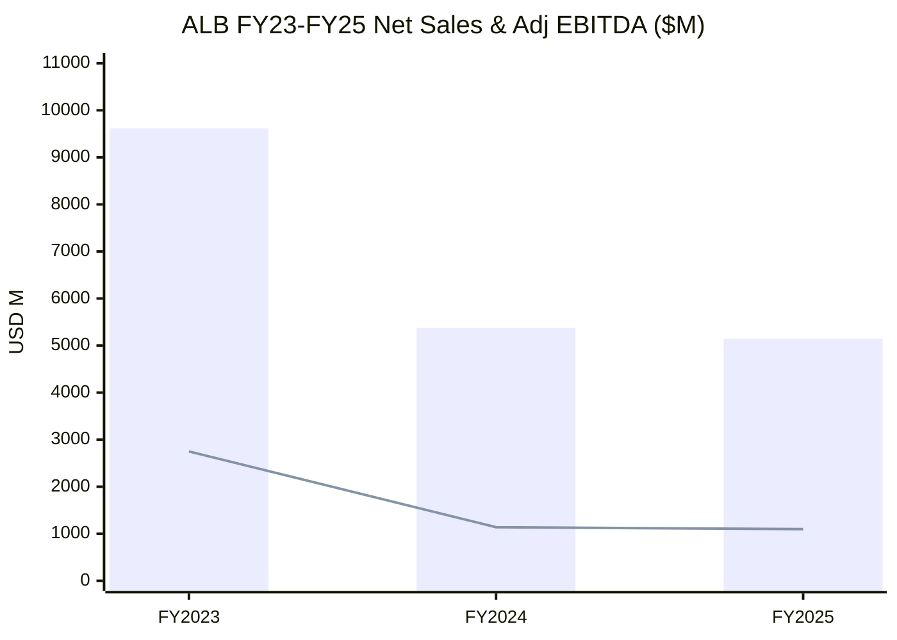
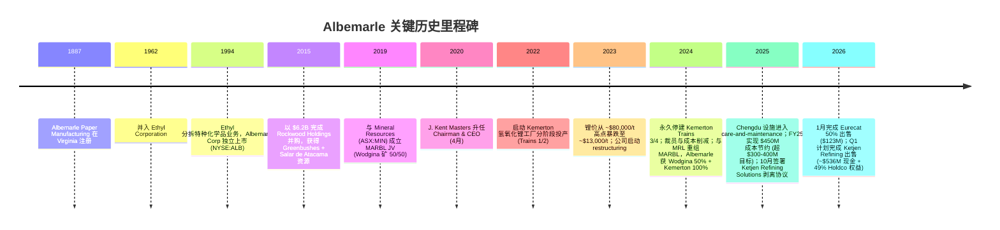
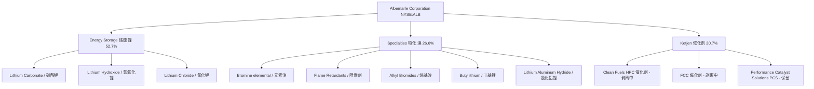
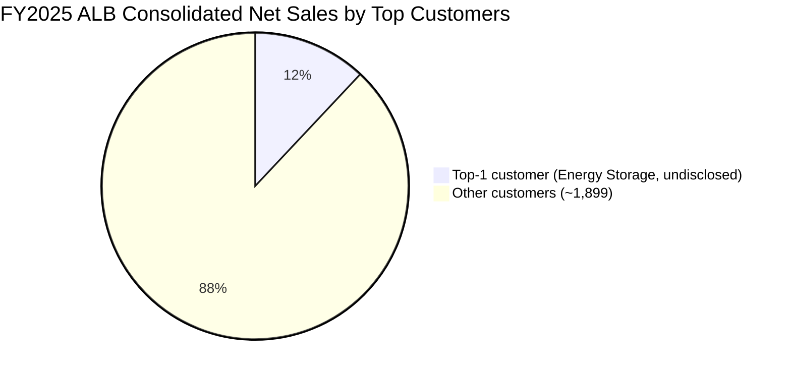
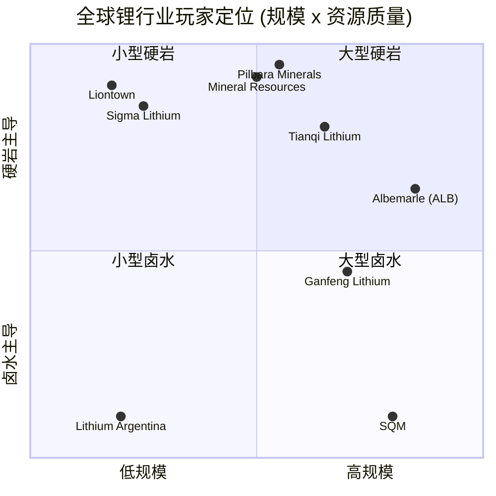
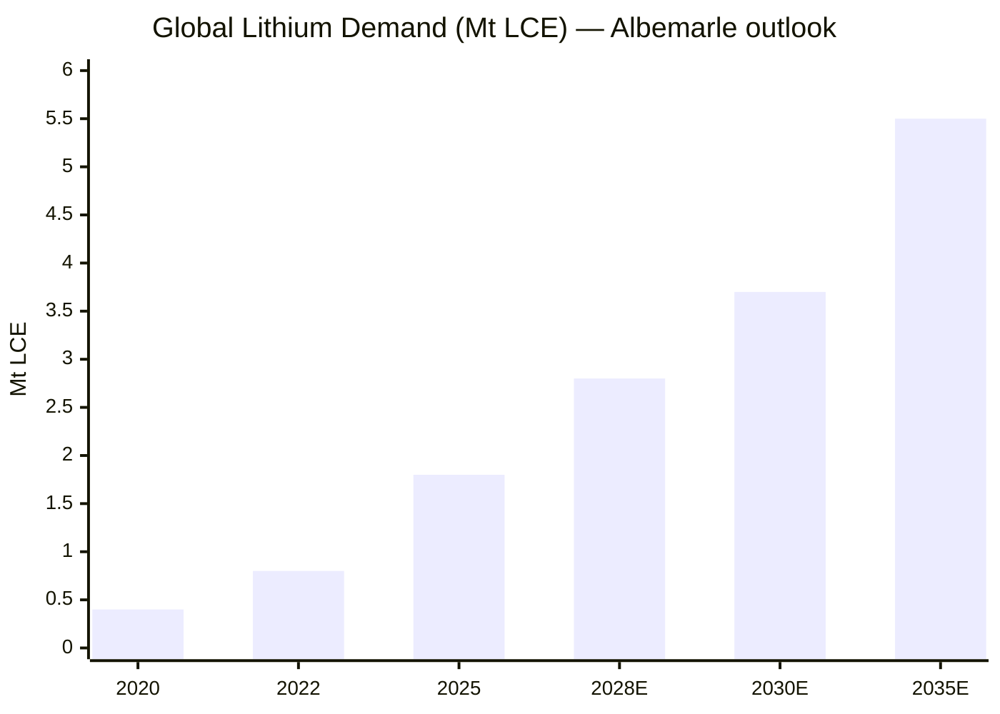

# Albemarle Corporation (NYSE:ALB) 公司研究

**Date / 报告日期:** 2026-06-02
**主题 / Theme:** rare-earth-strategic-minerals (战略矿产 / 锂)
**报告语言:** 简体中文 (zh-CN)

> **Update — 2026 全年指引 (2026-02-11):** 公司发布 2026 年全年展望情景 (outlook considerations)：在 2025 年实现 ~$450M 成本与生产率改善 (超过原 $300–400M 目标) 之后，2026 年资本开支 (capex) 指引 $550–600M (与 FY25 大致持平)，折旧摊销 $660–680M，调整后有效税率区间 (50%)–30%，公司层调整后 EBITDA (含 FX、Ketjen 权益法收益、PCS) ($20M)–$20M，利息及融资费用 $150–170M。管理层引入"基于不同 lithium 市场价格情景的全年展望区间"，并表示"在近期较高 lithium 价格假设下，公司将产生有意义的自由现金流 (meaningful free cash flow)"。Source: [Albemarle 4Q25 & FY25 Earnings Release (Exhibit 99.1), 2026-02-11](https://www.sec.gov/Archives/edgar/data/915913/000091591326000016/a4q25earningsreleaseex991.htm)。

## 目录

1. 公司概览 / Company Overview
2. 公司历史 / Company History
3. 管理团队 / Management Team
4. 产品与服务 / Products & Services
5. 客户与上市策略 / Customers & Go-to-Market
6. 行业概览 / Industry Overview
7. 竞争格局 / Competitive Landscape
8. 市场机会 / Market Opportunity (TAM)
9. 风险评估 / Risk Assessment
10. 投资者视角评分卡 / Investor-lens Scorecards
11. 数据来源清单 / Data Used
12. 参考资料 / References

---

## 1. 公司概览 / Company Overview

Albemarle Corporation (NYSE:ALB) 是全球最大的一体化 lithium / 锂 生产商之一，业务覆盖锂资源开采、提锂加工 (carbonate / 碳酸锂、hydroxide / 氢氧化锂、chloride / 氯化锂)、bromine / 溴 特种化学品、以及炼油催化剂 (refining catalysts)。公司在 10-K 中将自己定位为"a world leader in transforming essential resources into critical ingredients for mobility, energy, connectivity, and health"，end-markets 包括 grid storage / 储能、automotive / 汽车、aerospace / 航空、conventional energy / 传统能源、electronics / 电子、construction / 建筑、agriculture and food / 农业与食品、pharmaceuticals and medical devices / 药品与医疗器械。截至 2025 年 12 月 31 日，公司在 ~70 个国家服务 ~1,900 家客户，与合资公司一起经营 25+ 处生产与研发设施 ([Albemarle 2025 10-K, Item 1 Business](https://www.sec.gov/Archives/edgar/data/915913/000091591326000018/alb-20251231.htm))。公司总部位于美国北卡罗来纳州 Charlotte，1993 年在 Virginia 注册成立，1994 年从 Ethyl Corporation 分拆上市 ([Wikipedia: Albemarle Corporation](https://en.wikipedia.org/wiki/Albemarle_Corporation))。

**业务结构：三大业务分部 (three reportable segments)。** 2025 年公司按 Energy Storage、Specialties、Ketjen 三个分部管理报告。FY2025 净销售额 (Net Sales) $5,142.7M，同比 −4.4%。分部构成：Energy Storage $2,710.0M (52.7%)、Specialties $1,366.4M (26.6%)、Ketjen $1,066.3M (20.7%)。分部调整后 EBITDA：Energy Storage $697.2M (63.5% 占比)、Specialties $275.7M (25.1%)、Ketjen $150.4M (13.7%)；总分部调整后 EBITDA $1,123.4M，扣除公司层 ($25.4M) 后合并调整后 EBITDA $1,098.0M (FY24: $1,139.8M) ([Albemarle 2025 10-K, MD&A](https://www.sec.gov/Archives/edgar/data/915913/000091591326000018/alb-20251231.htm))。Ketjen 是公司的炼油催化剂 (refining catalysts) 业务，主要产品线为 Clean Fuels Technologies (CFT / HPC catalysts)、Fluidized Catalytic Cracking (FCC) catalysts、Performance Catalyst Solutions (PCS)。**2025 年 10 月 25 日，公司与 ChemCat AcquisitionCo, LLC 签订协议剥离 Ketjen Refining Solutions 业务的控股权益**，保留 49% 的 Holdco 权益和 PCS 业务；2026 年 1 月 23 日已完成 Eurecat 50% 权益向 Axens SA 的出售 (现金 $123M)；预计 Refining Solutions 主体交易于 2026 Q1 完成，公司将获得约 $536M 现金对价 ([Albemarle 2025 10-K, Item 1 Business](https://www.sec.gov/Archives/edgar/data/915913/000091591326000018/alb-20251231.htm))。

**盈利与现金流：FY2025 仍录得净亏损，但现金流大幅改善。** FY2025 公司归属于 Albemarle Corporation 的净亏损 $(510.6)M，对应 EPS $(5.76)/股 (扣除强制可转换优先股股息 $166.8M 后归属于普通股股东净亏损 $(677.4)M)；FY24 净亏损 $(1,179.4)M (EPS $(11.20))。FY25 毛利率 (gross margin) 13.0%，较 FY24 的 1.2% 显著回升，主要因 lithium 市场价格下行导致 spodumene 投入成本下降。R&D 支出 $51.4M (占销售 1.0%)，同比 −41% 主因削减开支。**关键改善信号：FY25 经营性现金流 $1.3B (operating cash flow conversion >100% 调整后 EBITDA)，自由现金流 (FCF) $692M，反映强劲现金转化与 capex 大幅下降 65% 至 $590M (FY24: $1,700M, FY23: $2,200M)**。Q4 单季净销售 $1,428.0M (+16% YoY)；Q4 调整后 EBITDA $268.7M (+7% YoY)，Q4 净亏损 $(414.2)M 主要因 Ketjen 交易相关资产减值 (write-down)；调整后稀释每股亏损 $(0.53) ([Albemarle 4Q25 & FY25 Earnings Release, 2026-02-11](https://www.sec.gov/Archives/edgar/data/915913/000091591326000016/a4q25earningsreleaseex991.htm))。

**资产负债表与员工。** 截至 2025-12-31，公司总资产 $16.37B，现金及等价物 $1.62B，trade receivables $0.59B，inventories $1.18B，PP&E 净值 $8.61B (累计折旧 $3.16B)，goodwill $1.50B；长期债务 (total long-term debt) $3,193.5M (扣除一年内到期 $74.1M 后非流动长期债务 $3,119.5M)。未来到期：2026 $74.1M、2027 $710.0M、2028 $648.6M、2029 $231.6M、2030 $60.0M、2030 之后 $1,531.1M ([Albemarle 2025 10-K, Note 19 Long-Term Debt](https://www.sec.gov/Archives/edgar/data/915913/000091591326000018/alb-20251231.htm))。员工总数约 7,800 人 (含合并合资企业员工)：US/Americas 3,100 (40%)、Asia Pacific 2,600 (33%)、Europe 1,500 (19%)、Middle East 等 600 (8%)；~26% 员工由工会或职工委员会代表 ([Albemarle 2025 10-K, Human Capital](https://www.sec.gov/Archives/edgar/data/915913/000091591326000018/alb-20251231.htm))。

**估值快照 (Valuation snapshot — TTM at 2026-06-02 close):** 股价 $171.13，市值 $20.18B，**TTM P/E 为负 (公司过去十二个月净亏损)**，Forward P/E 14.4×，TTM P/S 3.67×，P/B 2.65×，EV/EBITDA 22.1×，股息率 0.95%，beta 1.37。52 周区间 $53.70–$221.00，52 周变动 +200% (锂价从 2025 年中 ~$8,000/t 反弹至 2026Q1 ~$26,278/t 的"翻倍"驱动) ([Yahoo Finance: ALB Key Statistics](https://finance.yahoo.com/quote/ALB/key-statistics/), 2026-06-02 拉取)。**P/E 为负 — 解读：** ALB 的 TTM 净亏损主要源于 (1) 2024–2025 年 lithium 价格周期性低谷导致毛利大幅压缩 (FY24 毛利率仅 1.2%)、(2) Kemerton Trains 3/4 资产减值与 restructuring 费用、(3) Ketjen 出售相关资产减值 (Q4 25 $414M 净亏损)；TTM 损益已包含上述一次性减值，因此 TTM P/E 不具备可比性，**Forward P/E 14.4× 更具参考意义** (基于 2026 锂价回升假设下的 consensus EPS)。**EV/EBITDA 22.1× 高于 SQM 14.0× 与 Ganfeng 10.5×**，反映市场已对 lithium 价格反弹给予较强 re-rating (FY25Y 1Y return +200%)。Peer 估值对比：Sociedad Química y Minera de Chile (NYSE:SQM) TTM P/E 29.2×、Forward P/E 13.3×、EV/EBITDA 14.0×；Ganfeng Lithium (OTC:GNENF / SZSE:002460 H/A) TTM P/E 30.4×、EV/EBITDA 10.5×；Pilbara Minerals (ASX:PLS) Forward P/E 25.4×、P/S 21.8×、EV/EBITDA 115.4×；Sigma Lithium (NASDAQ:SGML) Forward P/E 10.2×、P/S 17.4× ([Yahoo Finance peer pull, 2026-06-02](https://finance.yahoo.com/quote/SQM/key-statistics/))。

*分析师观点：* ALB 的估值溢价 (vs. SQM、Ganfeng) 反映三点：(a) 资源端 — Greenbushes (49% Talison via Windfield, MARBL JV 50%) 是全球品位最高、成本最低的硬岩 spodumene 矿，加上 Salar de Atacama 的盐湖卤水资源构成全球独一无二的双资源组合；(b) 一体化下游加工产能 (Kemerton, Chengdu, Kings Mountain) 给予 ALB 通过氢氧化锂直接对接 LFP/NMC 电池厂商的能力；(c) 即将完成的 Ketjen 剥离将使公司转型为更"纯粹"的锂特种化学品平台，提高 multiple。

*数据来源 / Source: [Albemarle 2025 10-K, MD&A Results of Operations](https://www.sec.gov/Archives/edgar/data/915913/000091591326000018/alb-20251231.htm)（FY23 销售引自 10-K 多年比较，2023 数据为周期高点；FY24/FY25 净销售与调整后 EBITDA 见 MD&A Segment 表）。*

---

## 2. 公司历史 / Company History

Albemarle 现代公司架构源自 1994 年 2 月 — Ethyl Corporation 将其特种化学品业务剥离 (spin-off)，新设独立上市公司 Albemarle Corporation。1994 年完成分拆时，公司主要资产是 bromine / 溴 特种化学品业务、aluminum alkyl (organometallic) 业务和苯酚类衍生物业务。1995 年首个完整财年收入 $1.2B、净利润 $78M ([Wikipedia: Albemarle Corporation](https://en.wikipedia.org/wiki/Albemarle_Corporation))。Ethyl Corporation 自身可追溯到 1887 年成立的 Albemarle Paper Manufacturing (源自 Richmond, Virginia 的造纸厂)，1962 年并入 Ethyl Corporation 形成大型特种化学品集团；Albemarle 这一名字保留了百年品牌历史 ([Wikipedia: Albemarle Corporation](https://en.wikipedia.org/wiki/Albemarle_Corporation))。

**2015 年 Rockwood 并购：决定性的"转型为锂巨头"事件。** 2015 年 1 月 12 日，Albemarle 以 $6.2B 现金加股票对价完成对 Rockwood Holdings, Inc. (NYSE:ROC) 的并购。每股 Rockwood 普通股转换为 $50.65 现金 + 0.4803 股新 ALB 普通股 ([Rockwood Holdings 8-K, 2014-10-14](https://www.sec.gov/Archives/edgar/data/0001315695/000110465914081032/a14-24442_1ex99d1.htm))。Rockwood 带来的核心资产 — 通过其 49% 权益持有的 Talison Lithium (Greenbushes 矿，全球品位最高的硬岩 spodumene 矿)、Salar de Atacama (智利) 的卤水提锂资源、以及 La Negra 锂转化设施 — 一夜之间将 Albemarle 从一家 bromine + catalyst 特种化学品公司，重塑为全球 lithium 一体化龙头。Kent Masters (现任 CEO) 也是通过 Rockwood 董事会身份进入 Albemarle 董事会的 ([Albemarle 2025 10-K, Executive Officers](https://www.sec.gov/Archives/edgar/data/915913/000091591326000018/alb-20251231.htm))。

**战略转向 (3 次)：** (1) **1994–2014 年：bromine 与催化剂特种化学品玩家** — 此阶段 Albemarle 与 Chemtura、Israel Chemicals (ICL) 在阻燃剂 (flame retardants) 与 organometallic 市场竞争，业务相对稳定但增长缓慢，公司年销售 ~$2–3B。(2) **2015–2022 年：从特化转型为锂资源 + 提锂一体化龙头** — Rockwood 并购后，公司将资本配置重心从 bromine 转向锂；2017–2022 年间投资数十亿美元扩建 Kemerton (Australia) 氢氧化锂工厂、La Negra (Chile) 碳酸锂工厂、Chengdu (China) 氢氧化锂转化设施。2022 年锂价飙升至 ~$80,000/t 区间，公司当年净销售突破 $7.3B (相比 2020 年 $3.1B)。(3) **2023–2026 年：周期性低谷下的战略收缩与"纯锂化"** — 锂价于 2023–2024 年崩盘 (battery-grade lithium carbonate 从 ~$80,000/t 跌至 2025 年中 ~$8,000/t)，公司毛利率从 2022 年的 ~36% 跌至 2024 年的 1.2%；管理层启动深度 restructuring (Kemerton Trains 3/4 停建并计提资产减值、Chengdu 进入维护状态、员工削减、capex 从 FY23 $2.2B 削减至 FY25 $590M)、剥离 Ketjen Refining Solutions、并将 Eurecat 出售。2026 年公司将转型为更聚焦的"lithium + Specialties (bromine)"双业务结构 ([Albemarle 2025 10-K, Item 1 Business + MD&A](https://www.sec.gov/Archives/edgar/data/915913/000091591326000018/alb-20251231.htm); [Albemarle 4Q25 Release, 2026-02-11](https://www.sec.gov/Archives/edgar/data/915913/000091591326000016/a4q25earningsreleaseex991.htm))。

**关键并购与重组 (按年份):** (a) 2015-01: Rockwood Holdings ($6.2B, lithium + surface treatments)。(b) 2019-10: 与 Mineral Resources (ASX:MIN) 成立 MARBL JV (Wodgina 矿 50/50)，Albemarle 支付 $1.15B 现金。(c) 2023-Q4: 与 MRL 重组 MARBL，Albemarle 用 ~$380M (含 $180M Kemerton 对价) 收购剩余 Kemerton 40% 权益，最终各持 Wodgina 50% (MRL 运营该矿)；该重组反映"Albemarle 专注下游氢氧化锂转化，MRL 专注上游采矿"的分工 ([Albemarle 2025 10-K, Available Information / JV background](https://www.sec.gov/Archives/edgar/data/915913/000091591326000018/alb-20251231.htm))。(d) 2025-10: 签署 Ketjen Refining Solutions 出售协议 ($536M 现金 + 49% Holdco 权益)。(e) 2026-01: 完成 Eurecat 50% 权益向 Axens SA 出售 ($123M)。

**近 1–2 年发展。** 2025 年公司核心管理动作：实现 ~$450M 成本与生产率改善 (超出 $300–400M 原始目标，对应年化 cost run-rate >50%)、Chengdu 转化设施 2025 年中进入 care-and-maintenance、capex 同比下降 65% 至 $590M、经营性现金流 $1.3B、自由现金流 $692M。这些动作共同确立了"通过周期低谷"的财务韧性。2026 年初 lithium spot price 反弹 (Q1 2026 carbonate ~$26,278/t)、加上 Ketjen 剥离释放 ~$650M 总现金、Forward P/E 14.4× 反映市场对 cycle inflection 的定价 ([Q1 2026 Lithium Market, INN](https://investingnews.com/daily/resource-investing/battery-metals-investing/lithium-investing/lithium-forecast/))。

---

## 3. 管理团队 / Management Team

**J. Kent Masters — Chairman & Chief Executive Officer (since April 2020).** Masters 现年 65 岁，自 2015 年加入 Albemarle 董事会 (作为 Rockwood Holdings 并购的一部分，他此前是 Rockwood 非雇员董事 2007–2015)，2018 年起担任 lead independent director，2020 年 4 月升任 Chairman, President & CEO ([Albemarle 2025 10-K, Executive Officers](https://www.sec.gov/Archives/edgar/data/915913/000091591326000018/alb-20251231.htm); [PR Newswire: Masters Elected CEO, 2020-03-30](https://www.prnewswire.com/news-releases/albemarle-announces-j-kent-masters-elected-chairman-president-and-chief-executive-officer-301043767.html))。

**职业背景与具体成就：** 加入 Albemarle 之前，Masters 担任 Advent International (全球私募股权集团) 的 operating partner — 此角色专门负责帮助 Advent 的化工 / 工业组合公司提升运营 (典型的 PE-style operating partner 工作)。在 Advent 之前，他于 2011–2014 年担任 Foster Wheeler AG (NASDAQ:FWLT, 全球工程与建造承包商及电力设备供应商) 的 CEO — 期间引领 Foster Wheeler 完成与 AMEC plc 的 $3.2B 并购 (2014 年最终成为 Amec Foster Wheeler，后被 Wood plc 并购)。此前他是 Linde AG (全球工业气体龙头，现为 Linde plc, NYSE:LIN) 执行委员会成员 (executive board member)，负责 Linde 美洲业务 (Americas region)；在 Linde 期间他领导了大型工业气体 on-site 项目的执行与扩张 ([Albemarle Investor Relations: Kent Masters Bio](https://investors.albemarle.com/governance/board-of-directors/person-details/default.aspx?ItemId=ebbc948f-8aa5-4994-bff5-9c004aaab4d0))。

**教育背景：** Masters 拥有 Georgia Institute of Technology (Georgia Tech) 化学工程 (chemical engineering) 学士学位，以及 New York University (Stern School of Business) MBA 学位 ([Albemarle Executive Bio PDF, 2024-11-01](https://www.albemarle.com/sites/default/files/2024-10/albemarle-executive-bio-kent-masters-en-2024-11-01-web_0.pdf))。**化工工程 + 工业 / PE 的复合背景** 是他在 ALB 周期低谷期推动 restructuring (Kemerton 停建、Ketjen 剥离、cost program) 的关键能力来源 — 这与典型"地质 / 矿业 CEO"或"金融出身 CFO 上位"非常不同。

**任职 Albemarle CEO 期间的关键决策：** (1) 2022–2023 年锂价高点期间 — 启动 Kemerton 锂转化扩建 (Trains 3/4 capex 计划 ~$1B+)，事后被证明节奏过激。(2) 2024 年 — 锂价崩盘后果断停建 Kemerton Trains 3/4 并计提 ~$830M 资产减值；启动 enterprise-wide 成本削减计划目标 $300–400M。(3) 2025 年 — 实际实现 ~$450M 成本节约 (超目标)，capex 削减 65% 至 $590M；签署 Ketjen Refining Solutions 剥离协议 ([Albemarle 2025 10-K + 4Q25 Release](https://www.sec.gov/Archives/edgar/data/915913/000091591326000016/a4q25earningsreleaseex991.htm))。**Barron's 2023 Top 25 CEOs 与 TIME 100 Most Influential Companies 评选印证了市场对其周期管理能力的认可** ([Albemarle Press: Kent Masters Recognition](https://www.albemarle.com/us/en/news/albemarle-ceo-kent-masters-named-power-100-innovators))。

**持股结构：** 截至 2026 DEF 14A 申报，Masters 个人持有 ALB 股份 (具体股数披露在 DEF 14A Section 12 中)，加上 RSU / PSU 长期激励授予 (注：Albemarle 是 1994 年分拆出的传统大型上市公司，没有"founder 大股东"结构 — 公司创始时即为分散持股的公众公司；Masters 作为雇佣型 CEO，其股权与典型 PE-backed CEO 相比较低，但与 S&P 500 中等市值传统化工企业 CEO 持股水平相当) ([Albemarle 2026 DEF 14A Proxy Statement, 2026-03-24](https://www.sec.gov/Archives/edgar/data/915913/000091591326000050/alb-20260323.htm))。

**Founder note：** Albemarle 作为 1994 年从 Ethyl Corporation 分拆的传统上市公司，**没有现代意义上的"founder"**，公司创立时即由 Ethyl 股东以分配方式持股，无个体创始人控制；本节因此不列出 founder 章节。

---

## 4. 产品与服务 / Products & Services

### 4.1 业务分部矩阵 (Business Segment Matrix, FY2025)

Albemarle 在 FY2025 10-K 中按三大可报告分部 (reportable segments) 披露：Energy Storage / 储能 (锂)、Specialties / 特种化学品 (溴 + 高端锂衍生物)、Ketjen (炼油催化剂；正在剥离 Refining Solutions 部分)。**以下表格摘自 FY2025 10-K MD&A Segment Discussion，原文 verbatim：**

| 分部 / Segment | FY2025 净销售 ($M) | FY2025 销售占比 | FY2025 调整后 EBITDA ($M) | FY2025 EBITDA 占比 | YoY 销售 % |
|---|---:|---:|---:|---:|---:|
| **Energy Storage** | 2,710.0 | 52.7% | 697.2 | 63.5% | (8.7%)* |
| **Specialties** | 1,366.4 | 26.6% | 275.7 | 25.1% | +3.1% |
| **Ketjen** | 1,066.3 | 20.7% | 150.4 | 13.7% | +2.9% |
| **公司层 (Corporate)** | — | — | (25.4) | (2.3%) | — |
| **合计 (Total)** | **5,142.7** | **100.0%** | **1,098.0** | **100.0%** | **(4.4%)** |

*Energy Storage 销售下滑主要因 lithium 价格 YoY 走低 (FY25 仍处于 cycle 低位)，部分被销量上升对冲。Source: [Albemarle 2025 10-K, MD&A Segment Information](https://www.sec.gov/Archives/edgar/data/915913/000091591326000018/alb-20251231.htm)。*

### 4.2 综合：三大分部如何在客户工作流中互动

ALB 三大业务的化学物理基础完全不同，但都属于"将地下资源 (溴、锂、铝硅酸盐) 转化为下游高附加值化学品"的特种化学品平台。**Energy Storage / 锂业务**为电池产业链上游 — 公司从 Greenbushes (49% Talison JV) + Wodgina (50% MARBL JV) 两座硬岩 spodumene 矿和 Salar de Atacama (Chile) + Silver Peak (Nevada) 两个盐湖卤水资源采矿，将 spodumene 浓缩物在 Kemerton (Australia)、Chengdu (China, care-and-maintenance)、Kings Mountain (NC) 转化为电池级 LiOH/Li₂CO₃，最终供应 LG Energy Solution、CATL、Tesla、SK On 等电池厂商。**Specialties / 溴业务** 为另一条价值链 — 公司从 Magnolia (Arkansas)、Dead Sea (Jordan 通过 JBC JV) 采溴，转化为元素溴、烷基溴、阻燃剂等下游化学品，服务于电子 (PCB 阻燃剂)、汽车 (轮胎 / 安全气囊)、医药 (抗病毒前体)。**Ketjen / 催化剂** (即将剥离 Refining Solutions 部分) 是 oil refining 催化剂业务，与锂 / 溴的客户基础几乎无重叠。剥离 Refining Solutions 后，Albemarle 将转型为"Lithium + Specialties (主要是 bromine)"的双业务平台 ([Albemarle 2025 10-K, Item 1 Business](https://www.sec.gov/Archives/edgar/data/915913/000091591326000018/alb-20251231.htm))。

### 4.3 Energy Storage 分部：锂化学品 (核心业务)

**10-K verbatim 原文 (block quote):**

> "Our Energy Storage business enables better lithium use through reliable supply and consistent quality. We develop and manufacture a broad range of basic lithium compounds, including lithium carbonate, lithium hydroxide, and lithium chloride. Lithium is a key component in products and processes used in a variety of applications and industries, which include lithium batteries used in consumer electronics and electric vehicles, power grids and solar panels, high performance greases and specialty glass used in consumer appliances and electronics, among other applications."
> — Source: [Albemarle 2025 10-K, Item 1 Business — Energy Storage Segment](https://www.sec.gov/Archives/edgar/data/915913/000091591326000018/alb-20251231.htm)

**中文释义 / Plain-language gloss:**
**lithium carbonate / 碳酸锂 (Li₂CO₃)** 与 **lithium hydroxide / 氢氧化锂 (LiOH)** 是动力电池正极材料的核心前驱化学品 — 在电池厂商的工厂中，Li₂CO₃ 与 NCM (Ni-Co-Mn 三元) 或 LFP (lithium iron phosphate, 磷酸铁锂) 在高温下煅烧 (calcination) 形成阴极活性材料，最终装配到方形 / 圆柱 / 软包电芯中。**LiOH 一般用于高镍 NCM 配方 (NCM811、NCA)**，因为低温煅烧路径要求较低，对镍稳定性更好；**Li₂CO₃ 主要用于 LFP 与中低镍 NCM**。中国市场以 LFP 为主 (CATL、BYD 主导)、欧美市场以 NCM 为主 (LG/Tesla NCA、SK On NCM)，所以 ALB 同时供应两类锂盐是为了对两条电池路线对冲。**lithium chloride / 氯化锂 (LiCl)** 用于电解金属锂 (锂金属、锂铝合金) 与精细化学品中间体。**Albemarle 的资源 — 加工双足模式** (mine + convert) 是其相对 SQM (主要为卤水)、Pilbara (纯上游矿) 的差异化 — 公司既控制上游 Greenbushes 这种全球最高品位 spodumene 矿 (Talison FY25 矿石品位 ~2.3% Li₂O，行业平均 ~1.4%)，又控制下游 Kemerton / Kings Mountain 氢氧化锂转化产能。

*分析师观点：* 公司的核心moat在于"上游资源 + 下游氢氧化锂转化"的一体化模式 — 这是 SQM (主要卤水提锂、几乎不在 hard rock spodumene 端)、Tianqi (虽然也持 Greenbushes 25.1% 但缺少在西方市场的下游氢氧化锂产能) 都无法完全复制的；最强的竞争者反而是 Mineral Resources (ASX:MIN)，因为它通过 MARBL JV 与 ALB 共同持有 Wodgina + 经营 Mt Marion；但 MRL 缺少 Salar de Atacama 这种百年级盐湖资源 (Source: [Albemarle 2025 10-K, Energy Storage Segment Competition](https://www.sec.gov/Archives/edgar/data/915913/000091591326000018/alb-20251231.htm))。**关键风险：** Salar de Atacama 的 CORFO (智利经济发展局) 租约将于 2030 年到期 (~101kt LME remaining of 200kt initial contract，对应剩余 contract 约 5–6 年使用量)，公司需在 2030 年前与 Chile 政府就续约或新结构达成协议 — 这是 ALB 在 lithium 端最大的资源端可持续性风险 ([Albemarle Salar de Atacama TR Excerpt, 2025](https://www.sec.gov/Archives/edgar/data/0000915913/000091591325000024/exhibit963salardeatacama.htm))。

**资源原料 (10-K verbatim, raw materials block):**

> "We obtain lithium: (a) by purchasing lithium concentrate from our 49%-owned joint venture, Windfield Holdings Pty. Ltd. ('Windfield'), which directly owns 100% of the equity of Talison Lithium Pty. Ltd., a company incorporated in Australia ('Talison') that owns the Greenbushes mine, and from our 50%-owned unincorporated joint venture, MARBL Lithium Joint Venture ('MARBL') in Western Australia, which owns the Wodgina hard rock lithium mine project ('Wodgina'); and (b) through solar evaporation of our ponds at the Salar de Atacama, in Chile, and in Silver Peak, Nevada. In addition, we hold mineral rights in defined areas of Kings Mountain, North Carolina with available lithium resources and we own undeveloped land with access to a lithium resource in Antofalla, within the Catamarca Province of Argentina."
> — Source: [Albemarle 2025 10-K, Item 1 Business — Raw Materials and Significant Supply Sources](https://www.sec.gov/Archives/edgar/data/915913/000091591326000018/alb-20251231.htm)

**中文释义 / Plain-language gloss:** ALB 的锂资源覆盖 **两种地质类型** — (1) **hard rock spodumene / 硬岩锂辉石** (Greenbushes、Wodgina、Mt Marion via MARBL、Kings Mountain): 矿石粉碎、选矿、热处理后形成 6% Li₂O 的 spodumene 浓缩物 (concentrate)，再运往化学转化厂经过硫酸法 (sulfate route) 或苛性碱法 (carbonate route) 转化为 Li₂CO₃ 或 LiOH。优点是品位高、可控性强、产出 LiOH 路径短 (适合做电池级氢氧化锂)；缺点是初始 capex 高 (单矿场 capex $1B+)、能耗大。(2) **brine / 卤水** (Salar de Atacama、Silver Peak、Antofalla): 从地下盐湖卤水通过太阳能蒸发提锂 (solar evaporation pond)，再化学沉淀为 Li₂CO₃。优点是 opex 低 (太阳蒸发免能耗)、capex 较低；缺点是受气候影响 (Atacama 高海拔降雨)、抽取速率受水权限制 (Chile 在 Atacama 实施严格的 brine extraction limit)。**公司双资源组合在全球独一无二** — SQM 几乎纯卤水、Pilbara/MRL 几乎纯硬岩、只有 Albemarle 同时拥有"世界品位最高 hard rock (Greenbushes) + 世界最优盐湖资源 (Atacama)"。

### 4.4 Specialties 分部：bromine 与高端锂衍生物

**10-K verbatim (block quote):**

> "Our Specialties business optimizes our portfolio of bromine and highly specialized lithium solutions. Our Specialties business serves a variety of industries, including energy, mobility, connectivity, and health. Specialty products are essential in both internal combustion and electric vehicles, from high-voltage cables and powertrains to airbags and tires... Our value-added lithium specialties products include butyllithium and lithium aluminum hydride. Other bromine-based specialty chemicals products include elemental bromine, alkyl bromides, inorganic bromides, brominated powdered activated carbon and a number of bromine fine chemicals."
> — Source: [Albemarle 2025 10-K, Item 1 Business — Specialties Segment](https://www.sec.gov/Archives/edgar/data/915913/000091591326000018/alb-20251231.htm)

**中文释义 / Plain-language gloss:**
**Bromine / 溴 (Br)** 是元素周期表 17 族中的卤素 (halogen)，原子序 35。ALB 与以色列 ICL、中国 Jordan Bromine Company (JBC, ALB 50% JV) 是全球最大三家 bromine 生产商。Albemarle 从 **Magnolia, Arkansas** (美国本土) 与 **Dead Sea, Jordan** (死海卤水，through JBC JV with Arab Potash) 两处取材 — 死海是全球溴浓度最高的天然盐湖。下游产品链：
- **Flame Retardants / 阻燃剂 (FRs)** 是最大下游 — 主要为 TBBPA (tetrabromobisphenol A, 四溴双酚 A) 用于 printed circuit boards (PCB) 阻燃；以及 PolyFR / 聚合溴系阻燃剂用于 EPS / XPS 隔热泡沫塑料。end-market 包括消费电子机壳、PCB、电缆护套、电气连接器、纺织品。
- **Alkyl Bromides / 烷基溴 (e.g., methyl bromide, ethyl bromide)** 用于药物中间体、农用化学品 (土壤熏蒸剂，但全球受限)。
- **Inorganic Bromides** 用于油气钻井液 (CaBr₂, ZnBr₂ — heavy-density 完井液)、生物杀菌剂 (PBAC — brominated powdered activated carbon, 用于燃煤电厂烟气脱汞 / mercury removal)。
- **Butyllithium / 丁基锂 (n-BuLi)** 与 **lithium aluminum hydride / 氢化铝锂 (LAH)** 是高端有机金属试剂 — 用于药物合成 (Grignard 类强亲核试剂)、橡胶 / 弹性体合成 (聚丁二烯 / SBR 引发剂)。这些是低产量、高毛利的精细化学品。

*分析师观点：* Specialties 是 ALB **抗 cycle 的"稳定底盘"** — bromine 业务有 90+ 年寡占结构 (ALB + ICL 合计 >70% 全球份额)，毛利率长期稳定在 20–30%。FY25 Specialties 销售 $1,366M、EBITDA $276M 对应 ~20% EBITDA margin，几乎是 Energy Storage 整体的"压舱石"。Specialties 不是 ALB 的成长引擎，但在锂价低谷期 (FY24 锂业务接近 break-even) 是公司维持总体 EBITDA 的关键。**最强竞争者：Israel Chemicals (NYSE:ICL) — Dead Sea 同源资源、Bromine Compounds 部门**。

### 4.5 Ketjen 分部：炼油催化剂 (剥离中)

**10-K verbatim (block quote):**

> "Our three main product lines in this segment are (i) Clean Fuels Technologies ('CFT'), which is primarily composed of hydroprocessing catalysts ('HPC') together with isomerization and alkylation catalysts; (ii) fluidized catalytic cracking ('FCC') catalysts and additives; and (iii) performance catalyst solutions ('PCS'), which is primarily composed of organometallics and curatives. Following completion of the divestiture transactions noted previously, the Company will retain the PCS business and a 49% ownership interest in Holdco, a refining solutions joint venture."
> — Source: [Albemarle 2025 10-K, Item 1 Business — Ketjen Segment](https://www.sec.gov/Archives/edgar/data/915913/000091591326000018/alb-20251231.htm)

**中文释义 / Plain-language gloss:**
**Hydroprocessing Catalysts (HPC) / 加氢处理催化剂** 用于炼油厂中油品 hydrocracking 与 hydrotreating 工艺 — 通过加氢去除硫 / 氮 / 重金属杂质，将重油升级为清洁油品 (柴油、煤油、汽油)。**Fluidized Catalytic Cracking (FCC) catalysts / 流化床催化裂化催化剂** 将重质石油馏分裂解为高附加值产品 (汽油、丙烯)。这两块业务的客户是全球大型炼油企业 (Saudi Aramco、Reliance Industries、Sinopec、ExxonMobil、Shell)。**Performance Catalyst Solutions (PCS) / 高性能催化剂方案** 主要为 organometallics 与 curatives — 用于聚烯烃 (polyolefin) 合成的 Ziegler-Natta 催化剂与 metallocene 催化剂。**剥离结构：** 2025-10 与 ChemCat AcquisitionCo 协议出售 Refining Solutions (HPC + FCC) 的控股权，ALB 保留 49% Holdco 权益 + 100% PCS 业务 + 50% Eurecat JV (Eurecat 2026-01 已出售给 Axens SA)。**剥离逻辑：** Ketjen Refining Solutions 与 Albemarle 的 lithium / bromine 业务客户、销售渠道、监管框架几乎无协同 — 是 Rockwood 并购"带过来"的非核心业务；剥离释放 ~$650M 现金可用于减债 + Specialties 再投资。

*分析师观点：* Ketjen 在 Refining Solutions 行业的主要竞争者包括 Honeywell UOP、Haldor Topsoe、Shell Catalysts & Technologies、Axens (Eurecat 的买家) — 这是高门槛、寡占、但增长缓慢的细分市场。在 ESG 与全球能源转型背景下，refining catalysts 是长期下降终端市场，**剥离时点合理**。剥离后 ALB 将不再单独 report Ketjen 分部 (10-K 已声明"upon completion of this transaction, we do not expect the retained business activity within the Ketjen segment to meet the criteria for a separate reportable segment")。

### 4.6 旗舰资产与最近 12 个月动作

**Greenbushes (Western Australia, 49% Talison via Windfield)：** 全球最高品位、最低成本的硬岩锂矿。Talison Lithium Pty Ltd 由 Windfield Holdings 100% 持有；Windfield 由 Albemarle (49%) + Tianqi Lithium (51% via IGO+Tianqi JV) 共同持有。Greenbushes 拥有 ~6.4% Li₂O 的 plant feed grade、~155Mt of measured + indicated 储量、>175 万吨 LCE 资源 — 单矿即可支撑 ALB ~80% 的 spodumene concentrate 需求。**Wodgina (Western Australia, 50% MARBL JV with MRL)：** 全球最大硬岩锂资源之一 (>250Mt @ 1.17% Li₂O)，2022 年重启后逐步放量。MRL 是矿场运营方。**Salar de Atacama (Chile, 100%)：** 通过 La Negra 转化工厂生产 Li₂CO₃。**Kemerton (Western Australia, 100% 自 2023 末)：** 设计产能 100kt/yr LiOH Trains 1 + 2 在 2022–24 年陆续投产；Trains 3 + 4 已于 2024 年永久停建并计提 ~$830M 资产减值。**Chengdu (China, 100%)：** 2025 年中转入 care-and-maintenance 状态，反映中国境内电池级氢氧化锂供过于求。**Kings Mountain (NC, USA, 100%)：** 历史上的硬岩锂矿 + 近期重启计划 (2024–25 environmental permitting)；潜在的"美国本土制造"政策红利受益资产 ([Albemarle 2025 10-K, Item 2 Properties](https://www.sec.gov/Archives/edgar/data/915913/000091591326000018/alb-20251231.htm))。

**最近 12 个月关键动作：**
- **2025-Q1:** Chengdu LiOH 设施减产并最终于 2025 年中进入 care-and-maintenance 状态。
- **2025-07:** 公司宣布 cost-and-productivity 计划达 $300–400M 年化目标的 >50% run-rate ([Theme: rare-earth-strategic-minerals_theme.md, 2026-05-31](https://www.sec.gov/Archives/edgar/data/0000915913/000091591325000023/a4q24earningsreleaseex991.htm))。
- **2025-10-25:** 签署 Ketjen Refining Solutions 出售协议，ChemCat 提供 ~$536M 现金 + 49% Holdco 权益。
- **2026-01-23:** 完成 Eurecat 50% 权益出售给 Axens SA，对价 $123M cash ([Albemarle 4Q25 Release, 2026-02-11](https://www.sec.gov/Archives/edgar/data/915913/000091591326000016/a4q25earningsreleaseex991.htm))。
- **2026-02-11:** FY25 业绩公告 — 全年实现 $450M cost savings (超 $300–400M 目标)、FCF $692M、capex 同比 −65% 至 $590M；引入 2026 outlook (capex $550–600M、D&A $660–680M、利息 $150–170M)。
- **2026 Q1:** 计划完成 Ketjen Refining 剥离。

---

## 5. 客户与上市策略 / Customers & Go-to-Market

**客户基础与地域覆盖。** 截至 2025-12-31，Albemarle 在 ~70 个国家服务 ~1,900 家客户，其中包括汽车 OEM (Tesla, BYD, Toyota, Ford)、电池 cell 制造商 (LG Energy Solution, CATL, SK On, Samsung SDI, Panasonic)、消费电子 (Apple 通过电池供应链)、特种化学品下游 (Israel ICL 阻燃剂客户、消费电子 PCB 厂商)、炼油厂 (Saudi Aramco、ExxonMobil、Reliance、Sinopec via Ketjen) ([Albemarle 2025 10-K, Item 1 Business](https://www.sec.gov/Archives/edgar/data/915913/000091591326000018/alb-20251231.htm))。

**客户集中度披露 (consolidated, FY2025)。** 公司在 10-K Note 25 (Segment & Geographic Area Information) 中披露："In 2025, one customer in the Energy Storage business represented approximately 12 % of the Company's consolidated net sales." 即 **FY2025 单一最大客户 (来自 Energy Storage 分部) 占合并净销售约 12%** (consolidated denominator) — 客户名称未在 10-K 中具名披露 ([Albemarle 2025 10-K, Note 25 Segment Information](https://www.sec.gov/Archives/edgar/data/915913/000091591326000018/alb-20251231.htm))。10-K 没有进一步披露前 5 大客户 % (US 10-K 仅要求 disclose customers ≥10% 的具名 / 占比)，因此 top-5 集中度未公开。**注：这一 12% 是 consolidated 口径，不是 segment-level 口径** — 在 Energy Storage 分部内部，该客户的销售占比应远高于 12% (考虑 ES 分部占合并 52.7%，反推该客户在 ES 分部销售占比约 23%)。

*Source: [Albemarle 2025 10-K, Note 25 Segment Information](https://www.sec.gov/Archives/edgar/data/915913/000091591326000018/alb-20251231.htm)。注：denominator = 合并净销售 $5,142.7M；slice 仅展示一个 disclose 的 ≥10% 客户。*

**地理销售结构 (FY2025)。** Long-lived assets 地理分布反映了公司全球资产足迹：US $1,811M、Australia $3,896M、Chile $2,168M、China $991M、Jordan $327M、Netherlands $178M、Germany $112M、France $68M、其他 $90M，合计 $9,432M。**Australia 是 ALB 单一最大长期资产地区 (41%)** — 反映 Greenbushes + Wodgina + Kemerton 三大资产；**Chile (23%)** 反映 Salar de Atacama + La Negra；**US (19%)** 反映 Kings Mountain + Magnolia (溴) + 总部资产 ([Albemarle 2025 10-K, Note 25 Geographic Information](https://www.sec.gov/Archives/edgar/data/915913/000091591326000018/alb-20251231.htm))。

**销售模式与定价结构。** Energy Storage 业务自 2022 年起转向以 **index-based pricing (指数定价)** 为主 — 即合同价与 Fastmarkets 或 Benchmark Mineral Intelligence 公布的 lithium spot index 挂钩，定期 (一般月度或季度) 重置。10-K 原话："Competition in the global lithium market is increasingly based on index-based market pricing and differentiated via product quality, product diversity, reliability of supply and customer service." 这意味着 ALB 的 lithium 业务现金流对 spot 价格非常敏感 ([Albemarle 2025 10-K, Item 1 Business — Energy Storage Competition](https://www.sec.gov/Archives/edgar/data/915913/000091591326000018/alb-20251231.htm))。Specialties 业务则更多以 long-term contracts 与 cost-plus 定价为主 (反映客户对供应稳定性的高敏感性、非商品化产品属性)。Ketjen 业务以多年期合同 + 项目型催化剂订单为主。

**合资伙伴 (JV)：** 公司业务中存在大量 JV 结构 — 主要包括：(1) Windfield Holdings (Greenbushes) — Albemarle 49% / Tianqi-IGO 51%；(2) MARBL JV (Wodgina + Kemerton 前期) — Albemarle 50% / Mineral Resources 50%；(3) Jordan Bromine Company (JBC) — Albemarle 50% / Arab Potash 50%；(4) Nippon Ketjen — 与 Sumitomo 化学合资；(5) Eurecat — 已于 2026-01 出售给 Axens。**JV 风险点：** Greenbushes 的 51% 股权由 Tianqi 控制，Tianqi 是 ALB 全球 lithium 市场的直接竞争对手 — 这是 lithium 行业最特殊的"竞争者-合作者-供应商"三角关系 ([Albemarle 2025 10-K, Note 8 Investments](https://www.sec.gov/Archives/edgar/data/915913/000091591326000018/alb-20251231.htm))。

**Go-to-market 渠道。** ALB 采用 **直接销售** (direct sales) 为主，由 Charlotte 总部 + 区域销售办公室 (Budapest, Hungary, EMEA 总部; Dalian, China, APAC 总部) 协调。客户多为大型工业 OEM (汽车厂、电池厂、炼油厂、特化客户)，单笔订单规模大、采购周期长、技术验证严格。Energy Storage 客户的 qualification 周期通常 12–24 个月 (从 sample 到 commercial volume) — 这是 ALB 的 customer switching cost 来源之一。

---

## 6. 行业概览 / Industry Overview

### 6.1 全球锂市场规模 (TAM/SAM)

全球锂市场 2025 年 LCE 需求约 1.8 百万吨 (LCE = lithium carbonate equivalent / 碳酸锂当量)，预计到 2030 年翻倍至 3.7 百万吨 — 这是 Albemarle 自身在 IR 材料中引用的内部预测，与 EV 销量与 stationary storage 需求增长结构对应 ([Albemarle Lifts Lithium Demand Forecast, INN](https://investingnews.com/albemarle-lifts-lithium-demand-forecast/))。McKinsey 估计 lithium-ion battery 价值链整体到 2030 年规模 >$400B，对应 4.7 TWh battery demand (其中 4.3 TWh 来自 mobility / EV) ([McKinsey: Battery 2030 Resilient Sustainable Circular](https://www.mckinsey.com/industries/automotive-and-assembly/our-insights/battery-2030-resilient-sustainable-and-circular))。IEA Stated Policies Scenario 预测 EV battery pack 需求从 2024 年 ~840 GWh 增至 2030 年 ~2,600 GWh ([Statista: EV battery market forecast 2030](https://www.statista.com/statistics/309570/lithium-ion-battery-market-in-electric-vehicles/))。Grand View Research 估算 lithium-ion battery 市场 2023 年 $54.4B → 2030 年 $182.5B，CAGR ~20.3% ([Knowledge Sourcing: Li-Ion Battery Market Report](https://www.knowledge-sourcing.com/report/global-li-Ion-battery-market))。

**价格周期：从 2022 年的 $80,000/t 到 2025 年的 $8,000/t，再到 2026Q1 的 $26,278/t。** Battery-grade Li₂CO₃ 现货价 2026 年 Q1 大幅反弹 — 据 INN / S&P Global 报道，spot battery-grade lithium carbonate 从 2025 年 12 月初 ~$11/kg ($11,000/t) 涨至 2026 年 1 月 ~$16/kg ($16,000/t)，再涨至 Q1 2026 末 ~$26,278/t (碳酸锂)；spodumene concentrate price 同期从 ~$1,094/dmt 涨至 ~$2,750/dmt 以上 ([Q1 2026 Lithium Market Prices Double Amid Supply Strain, INN](https://investingnews.com/daily/resource-investing/battery-metals-investing/lithium-investing/lithium-forecast/); [COMMODITIES 2026, S&P Global](https://www.spglobal.com/energy/en/news-research/latest-news/metals/010926-commodities-2026-lithium-carbonate-surplus-to-narrow-energy-storage-to-drive-growth))。S&P Global Commodity Insights 预测 2026 年 lithium chemicals 全球过剩量收窄至 109kt LCE (2025 年: 141kt)，反映需求增长 (尤其 stationary energy storage) 强于供给增长 ([S&P Global: Lithium Carbonate Surplus 2026](https://www.spglobal.com/energy/en/news-research/latest-news/metals/010926-commodities-2026-lithium-carbonate-surplus-to-narrow-energy-storage-to-drive-growth))。

### 6.2 行业结构

**供给端高度集中。** 全球 lithium chemicals 供应主要由四类玩家构成：(1) **西方一体化巨头** — Albemarle (NYSE:ALB)、SQM (NYSE:SQM)、Pilbara Minerals (ASX:PLS)、Mineral Resources (ASX:MIN)、Liontown (ASX:LTR)；(2) **中国一体化巨头** — Tianqi Lithium (SZSE:002466)、Ganfeng Lithium (SZSE:002460 / HKEX:1772)、Yahua (SZSE:002497)、Tibet Summit Resources；(3) **新兴硬岩玩家 / South America 玩家** — Sigma Lithium (NASDAQ:SGML)、Lithium Argentina (NYSE:LAR)、Vulcan Energy；(4) **资源初创** — Patriot Battery Metals、Lithium Americas (在建)。**前 5 大供应商市占 (2024–25)：约 60–65% 的全球电池级锂供给** ([Albemarle 2025 10-K, Item 1 Business — Competition](https://www.sec.gov/Archives/edgar/data/915913/000091591326000018/alb-20251231.htm))。

**需求端：电池主导，stationary storage 加速。** 2024 年 lithium 总需求约 1.4Mt LCE，其中 (a) EV battery ~70%、(b) consumer electronics + ESS (energy storage system) ~22%、(c) industrial (greases, glass, ceramics) ~8%。**ESS / 储能 是 2025 年最强增长驱动** — 2025 年全球 ESS 装机突破 200 GWh (vs. 2022 的 ~50 GWh)，主要受中国电网侧 + 美国 ITC 退坡前抢装驱动；Albemarle 在 2026-02 业绩公告中指出 "energy storage volumes reached 235,000 metric tons of lithium carbonate equivalent in 2025, up 14% year-over-year and above the high end of the company's guidance range" ([Albemarle Lifts Lithium Demand Forecast, INN](https://investingnews.com/albemarle-lifts-lithium-demand-forecast/))。

### 6.3 技术与监管驱动因素

**电池技术路径：LFP vs. NCM 平衡转变。** 中国 LFP (使用 Li₂CO₃) 路径在 2023–25 年继续侵蚀全球电池份额 (CATL Shenxing 4C 超充 LFP、BYD Blade Battery)，对 LiOH 需求构成短期压制；但欧美高镍 NCM 路径与下一代 high-voltage LFP 仍维持 LiOH 需求。**下一代电池：固态 (solid-state)** — Toyota、Samsung SDI、QuantumScape、Solid Power 等的固态电池路线对 LiOH 与高品质 Li 金属箔需求结构性利好。**钠离子 (sodium-ion) 替代风险** — CATL Naxtra 钠离子电池 2024 年量产、HiNa Battery 在中国 ESS 端商业化；钠电对短续航城市车与 ESS 形成局部替代，但能量密度劣势使其在乘用 EV 中难成主流 ([Albemarle 2025 10-K, Item 1A Risk Factors — Non-lithium battery technologies](https://www.sec.gov/Archives/edgar/data/915913/000091591326000018/alb-20251231.htm))。

**监管驱动：去中国化与本土化补贴。** 美国 IRA (Inflation Reduction Act, 2022) 为 critical minerals (含 lithium) 与电池组件提供高额税收抵免 (FEOC / Foreign Entity of Concern 排除规则)；欧盟 Critical Raw Materials Act (CRMA, 2024) 设定 2030 年欧盟域内开采、加工、回收的目标 (10% / 40% / 25%)；这两项规则共同利好"非中国"资源 — Albemarle 的 Greenbushes (Australia)、Salar (Chile)、Kings Mountain (US) 资产符合 IRA / CRMA 的"友岸供应链"逻辑。但同时 IRA 在 2025 年新政府下面临部分修订风险 ([Albemarle 2025 10-K, Item 1A Risk Factors — Regulation](https://www.sec.gov/Archives/edgar/data/915913/000091591326000018/alb-20251231.htm))。

### 6.4 行业波动性与 cycle 特征

Lithium 是典型的 commodity (虽然电池级氢氧化锂有一定 specialty 属性) — 价格在 2021–22 年从 ~$15,000/t 拉升至 ~$80,000/t (5×)，2023–24 年崩盘至 ~$8,000/t (10× drawdown)，2025 年下半年开始反弹，2026 Q1 ~$26,278/t。这种波动幅度远超大宗金属 (铜、铝) 与其他 specialty chemicals，主要因 (1) 供给端弹性低 (单矿 capex $1B+、permitting 5+ 年)、(2) 需求端弹性大 (EV 销量受补贴 / 利率 / 汽车厂周期影响)、(3) 库存周期长 (电池厂的 working inventory + spec 锂盐库存) ([Lithium Carbonate Price Historical, Trading Economics](https://tradingeconomics.com/commodity/lithium))。这一 cycle 特征决定了 ALB 的盈利极端波动 — FY2022 (锂价高峰) Adj EBITDA 接近 $3.5B，FY2025 (锂价反弹中) ~$1.1B。

---

## 7. 竞争格局 / Competitive Landscape

### 7.1 主要竞争者 (verbatim 10-K)

**10-K 竞争部分原话：**

> "The global lithium market is highly competitive and growing very rapidly. It is characterized by aggressive expansion and entry from existing and new players, including automotive OEMs, commodity traders, junior miners, and large, well-capitalized diversified miners. Producers are primarily located in the Americas, Africa, Asia and Australia. Major competitors in lithium compounds include Sociedad Quimica y Minera de Chile S.A., Sichuan Tianqi Lithium, Jiangxi Ganfeng Lithium, Rio Tinto plc, Pilbara Minerals, Tesla and a large number of additional Chinese companies."
> — Source: [Albemarle 2025 10-K, Item 1 Business — Energy Storage Competition](https://www.sec.gov/Archives/edgar/data/915913/000091591326000018/alb-20251231.htm)

*Note: 定位为示意 (规模按市值估计，资源结构按主要矿种)。Source: 综合 [Albemarle 2025 10-K, Item 1 Business](https://www.sec.gov/Archives/edgar/data/915913/000091591326000018/alb-20251231.htm) + [Yahoo Finance peer data, 2026-06-02](https://finance.yahoo.com/quote/ALB/key-statistics/)。*

### 7.2 主要竞争者分析

**(1) SQM (Sociedad Química y Minera de Chile, NYSE:SQM) — 最直接竞争者。** 智利国家级化工企业，主要资产 Salar de Atacama (与 ALB 共用同一盐湖但不同地块)、Salar de Olaroz (Argentina, 与 Allkem-Arcadium 合资)。FY24 lithium 收入 $4.9B，市值 $23.8B。**对 ALB 的威胁：** SQM 与 ALB 同样持有 Salar de Atacama 的 CORFO 租约 (SQM 2030 年到期、ALB 2043 年到期，但 ALB 的资源量限制将于 2030 年触及)；两家都在 Salar 续约谈判中受 Chile 政府 SQM Litio 国有 lithium 公司项目的影响。**估值对比：** SQM TTM P/E 29.2× vs ALB 负、Forward P/E 13.3× vs ALB 14.4× — 接近 ([Yahoo Finance: SQM Key Statistics](https://finance.yahoo.com/quote/SQM/key-statistics/))。

**(2) Tianqi Lithium (SZSE:002466 / HKEX:9696) — 既是 JV 伙伴也是竞争者。** 通过 IGO Limited + Tianqi 51% JV 持有 Talison Lithium 51% (剩余 49% 由 Albemarle 持有)；Tianqi 因此与 ALB 在 Greenbushes 矿层面是合资伙伴，但在下游 lithium chemicals 销售层面是直接竞争对手 — Tianqi 在中国境内有 Suining、Anju 等 LiOH/Li₂CO₃ 转化厂，目标客户与 ALB 高度重合。**对 ALB 的战略影响：** 中美科技 / 矿产竞争背景下，Tianqi 持有 SQM 22.7% 股份的事实曾在 2018 年引发智利政府反垄断审查；类似关注未来可能延伸到 Greenbushes JV ([Albemarle 2025 10-K, Item 1A Risk Factors — JV Risks](https://www.sec.gov/Archives/edgar/data/915913/000091591326000018/alb-20251231.htm))。

**(3) Ganfeng Lithium (SZSE:002460 / HKEX:1772) — 中国最大综合锂业。** FY24 收入 ¥18.2B (~$2.6B)，市值 $17.2B。**业务结构：** 上游 (Cauchari-Olaroz Argentina, Marion mine via Australia partnerships)、中游 (碳酸锂 / 氢氧化锂转化)、下游 (锂电池 + 回收)；垂直一体化程度高于 ALB。**估值对比：** TTM P/E 30.4× vs ALB 负、EV/EBITDA 10.5× vs ALB 22.1×、P/S 0.6× vs ALB 3.7× — Ganfeng 估值显著低于 ALB，反映 (a) 中国 lithium 公司面临 IRA / FEOC 排除导致的美国市场关税与税收抵免劣势、(b) 离岸投资风险溢价 ([Yahoo Finance: GNENF](https://finance.yahoo.com/quote/GNENF/))。

**(4) Pilbara Minerals (ASX:PLS) — 上游硬岩纯玩家。** Pilgangoora 矿 (Western Australia) 是全球最大硬岩 lithium 资源 (446Mt @ 1.28% Li₂O 2025-06 升级后)；FY25 spodumene concentrate 产量 754.6kt，市值 $21.1B (与 ALB 接近)。**对 ALB 的威胁：** PLS 不在下游转化端，因此与 ALB 直接竞争少；但 PLS 的低成本扩张 (FY26 指引 820–870kt @ A$560–600/t 单位成本) 给 ALB 的 Wodgina + Kemerton 项目带来定价压力 ([rare-earth-strategic-minerals_theme.md, 2026-05-31](https://www.miningweekly.com/article/pilbara-minerals-beats-production-guidance-cuts-costs-as-lithium-market-remains-challenging-2025-07-30))。

**(5) Mineral Resources (ASX:MIN) — ALB 的 MARBL 合资伙伴。** 既是 Wodgina 50% 共有者 / 运营方，又是 ALB 的潜在竞争对手 — MIN 通过 Mt Marion (与 Ganfeng 合资)、Wodgina 50% 的上游产量在硬岩 lithium spodumene 市场占据重要份额。MIN 也运营 mining services 业务，是澳大利亚最大矿业服务商之一。

**(6) Rio Tinto (NYSE:RIO) — 大型多元化矿企新进入者。** 通过收购 Arcadium Lithium ($6.7B, 2024-Q4 完成) 进入锂市场，整合 Cauchari (Argentina)、Mt Cattlin (Australia)、Olaroz (Argentina) 等资源。Rio 体量与资本实力远超 ALB，但 lithium 是其多元化组合中的较小部分 (FY25 ~$3B / 总收入 ~$55B)。

**(7) Tesla (NASDAQ:TSLA) — 客户兼新进入者。** Tesla 通过 Corpus Christi (Texas) lithium refinery 计划自产 lithium hydroxide (50ktpa Phase 1, 2025 投产) — 这是垂直一体化电池战略的一部分。Tesla 同时是 ALB 的客户，构成"客户 vs. 自给"的双重身份。Tesla 自有产能仍只能满足 ~10% 自身电池需求，对 ALB 的整体威胁有限，但 trend 不可逆。

### 7.3 Albemarle 的竞争优势 — *分析师观点*

*分析师观点：* ALB 的核心优势在于**资源 + 加工的全球独有组合**：
1. **Greenbushes 这一全球品位最高的硬岩矿** (~2.3% Li₂O plant feed grade vs 行业平均 ~1.4%) — 单位 spodumene 现金成本全球最低之一，是 ALB cycle 低谷期的盈利底盘；
2. **Salar de Atacama 卤水资源** — 与 SQM 共有全球唯一持续 70 年大规模生产的盐湖资源；
3. **下游氢氧化锂转化产能 (Kemerton, Kings Mountain, La Negra)** — 西方非中国境内为数不多的电池级氢氧化锂转化平台，受益于 IRA + CRMA 友岸供应链激励；
4. **Bromine 业务的稳定 cash flow** — 提供 cycle 平滑作用 (FY25 Specialties EBITDA $276M)。

劣势 / vulnerabilities：
1. **Salar de Atacama CORFO 租约 2030 年资源额度触及上限** — 公司在 [Salar TR Excerpt 2025](https://www.sec.gov/Archives/edgar/data/0000915913/000091591325000024/exhibit963salardeatacama.htm) 中披露 ~101kt LME remaining of 200kt initial contract，必须在 2030 年前完成续约或新结构谈判，否则面临 Salar 产能下降。
2. **Wodgina JV 与 MRL 共管** — Albemarle 在 Wodgina 的话语权弱于 Greenbushes (49% Talison 但有 chemicals offtake)；MRL 控制 Wodgina 矿运营。
3. **Kemerton Trains 3/4 资产减值已锁定** — FY24 $830M+ 减值不可逆。
4. **缺乏纯氢氧化锂"无 LFP 风险"敞口** — 在 LFP 路径继续侵蚀 NCM 时，Kemerton (主产 LiOH) 利用率受压。

---

## 8. 市场机会 / Market Opportunity (TAM)

**全球锂市场 TAM = 全球 lithium chemicals 产量 × 平均单价。** 以 ALB 自身 IR 引用的 IEA / McKinsey 数据：2025 全球 LCE 需求 1.8Mt × ~$15,000/t 平均价 = ~$27B TAM；2030 预测 LCE 需求 3.7Mt × $20–25,000/t 长期均衡价 (基于 incentive price + 通胀) = $74–93B TAM。Albemarle 自身在 [2026-02-11 4Q25 业绩公告](https://www.sec.gov/Archives/edgar/data/915913/000091591326000016/a4q25earningsreleaseex991.htm) 中表示"raising its long-term lithium demand outlook after a breakout year for stationary energy storage" — 即 2030 LCE 需求可能上修 (公司未给出具体新预测)。

*Source: 综合 [Albemarle Lifts Lithium Demand Forecast, INN](https://investingnews.com/albemarle-lifts-lithium-demand-forecast/); [McKinsey Battery 2030](https://www.mckinsey.com/industries/automotive-and-assembly/our-insights/battery-2030-resilient-sustainable-and-circular); [Lithium Harvest market outlook](https://lithiumharvest.com/knowledge/lithium/the-future-of-lithium-trends-and-forecast/).*

**SAM (Serviceable Addressable Market) for ALB：电池级 LiOH + Li₂CO₃，估算 ~$22B in 2030。** 假设 2030 LCE 需求 3.7Mt 中 95% 流向电池 (EV + ESS + consumer)，对应 ~3.5Mt 电池级；按 $20,000/t 均衡价计算 $70B 电池级 lithium SAM。但 ALB 主要服务 high-end (battery-grade) 客户，市场份额 ~10–12% (2025 ALB 在全球高端电池级 lithium 份额 ~11%)。

**SOM (Serviceable Obtainable Market for ALB) — 2030 估算 ~$8–10B 收入潜力。** 假设：(a) ALB 维持 ~10–12% 全球 lithium 份额；(b) Greenbushes、Wodgina、Salar 维持产能；(c) Kemerton + Kings Mountain 总产能爬升至 ~140ktpa LiOH equivalent；(d) 2030 lithium 均衡价 $20,000/t — 则 ALB 2030 lithium 业务收入 = 350kt LCE-equiv × $20,000 = $7B；加上 Specialties (假设维持 $1.5B) → 总收入 ~$8.5B。**对应当前 $5.1B FY25 的 67% 上升空间，反映 cycle recovery + 产能爬升双轮驱动。**

**Stockhead / UBS 情景测算：** 在 $20/kg ($20,000/t) 平均锂价下，ALB 2026 调整后 EBITDA 可达 $2.1–2.3B；在 $30/kg 情景下，可达 $3.9–4.1B，对应 mid-60% EBITDA margin (vs. FY25 EBITDA $1.1B / 21% margin) ([Stockhead: Albemarle rides lithium turnaround Q1 2026](https://stockhead.com.au/resources/monsters-of-rock-albemarle-rides-lithium-turnaround-to-print-cash-in-march-quarter/))。

**ALB Energy Storage 客户增长：2025 年 235kt LCE 销量 (+14% YoY)，超过指引上限**，反映 ESS 端订单加速 + 公司逐步退出低毛利合同 (重新签订 index-based pricing) ([Albemarle Lifts Lithium Demand Forecast, INN](https://investingnews.com/albemarle-lifts-lithium-demand-forecast/))。

**渗透策略：** 公司 2025–2030 战略可概括为三点：(1) **维持 Greenbushes 资源优势** — 继续以低成本 spodumene 作为价格底；(2) **在 Kings Mountain 重启美国本土 lithium 转化** — 利用 IRA / DOE loan 政策红利；(3) **将 Specialties (bromine) 作为 cycle 防御现金牛**，搭配 lithium 进攻形成"防御 + 进攻"双线。

---

## 9. 风险评估 / Risk Assessment

### 公司特定风险 (Company-Specific Risks)

**1. Salar de Atacama CORFO 租约 2030 年资源额度耗尽。** Albemarle 在 Salar de Atacama 的 CORFO 租约持续至 2043 年，但其中 lithium-bearing material extraction 限额 (LME) 将于 2030 年触及 — 公司 [Salar TR 2025 披露](https://www.sec.gov/Archives/edgar/data/0000915913/000091591325000024/exhibit963salardeatacama.htm) "~101kt LME remaining of 200kt initial contract"。如果未能在 2030 年前与 Chile 政府就续约或新结构 (如与 SQM Litio 国有 lithium 公司合作模式) 达成协议，Salar 产能将下降。**缓解：** Chile 政府 2024 年公布的 National Lithium Strategy 允许私人公司继续参与运营，公司正与政府谈判。**财务影响：** Salar 是 ALB 最低成本卤水提锂资源，对其 cost curve 起决定作用 — 失去将使 lithium 单位成本上升 30%+。

**2. Greenbushes JV 治理风险 — Tianqi 51% 与中美关系。** Greenbushes (49% ALB / 51% Tianqi-IGO JV) 的运营决策需多方 JV 委员会协调；中美科技战 / 关键矿产 / IRA FEOC 规则的进一步收紧可能引发对 JV 结构的监管关注。**风险点：** Tianqi 通过 IGO 的 24.9% 持股在 JV 内具有有效控制权 — 若 Tianqi 受美国 entity-list 限制，可能影响 Greenbushes 出口至 ALB 的合规性。**缓解：** Albemarle 通过 IRA 合规审查并明确"Talison 实体在 Australia 注册、非中国实体" ([Albemarle 2025 10-K, Item 1A Risk Factors](https://www.sec.gov/Archives/edgar/data/915913/000091591326000018/alb-20251231.htm))。

**3. Kemerton Trains 3/4 永久停建 + 减值后的进一步执行风险。** 公司已计提 ~$830M Kemerton Trains 3/4 减值，capex 同比 −65%；剩余 Trains 1/2 (~50ktpa LiOH) 仍在产能爬升过程中 — 如运营效率不及预期，将进一步压制 Energy Storage 毛利率。**财务影响：** 若 Kemerton Trains 1/2 nameplate 利用率长期低于 70%，将影响 ~$200M/yr 潜在 EBITDA。

**4. Chengdu 设施进入维护状态 — 中国产能再启动的不确定性。** 2025 年中 Chengdu LiOH 工厂进入 care-and-maintenance 状态，反映中国境内电池级氢氧化锂供过于求。如果 LFP 路径继续主导中国市场，Chengdu 重启时点将推迟，对应 ~30kt 闲置产能。

**5. 单一最大客户占合并销售 12% — 客户集中度风险。** FY2025 Energy Storage 分部一位未具名客户占合并销售 12% — 该客户可能是 LG Energy Solution、CATL 或 Tesla 中之一 (具名披露未公开)。客户流失或合同重新议价将构成材料风险。**缓解：** 公司客户基础有 ~1,900 家，分散度仍较高；但 single ≥10% disclosure 已触发 ASC 280 reporting requirement，属于材料风险敞口。

**6. CEO 与高管 succession 风险。** Kent Masters 现年 65 岁，自 2020 年起任 CEO；公司未公开披露 succession 计划。化工 / 矿业 CEO 的接班期通常 18–24 个月；若 Masters 在 2027–28 年退休，过渡期可能影响战略执行连续性。

### 行业 / 市场风险 (Industry/Market Risks)

**7. 锂价 cycle 波动 — 周期性极强。** Lithium 价格在 2022–25 年内 5× drawdown，2026Q1 大幅反弹 — 价格波动幅度远超大宗金属。如果 lithium 价格在 2026 年中再次回落 (例如 Sigma + Liontown + Patriot 等新增供给放量过快、或全球 EV 销量增速放缓)，ALB 的 EBITDA 将快速下滑。**敏感性：** 每 $1,000/t lithium 价格变动 ≈ $200M ALB 年 EBITDA 影响 (基于 200ktpa LCE 销量近似)。

**8. 钠离子 / 固态电池替代风险。** 钠离子电池在中国 ESS + 短续航乘用车端商业化加速 (CATL Naxtra、HiNa Battery 2024–25 量产)，但对乘用 EV 的能量密度劣势使其难成主流；固态电池路线 (Toyota、Samsung SDI、QuantumScape) 反而对高品质 Li 金属需求结构性利好。**净影响：** 钠电对 ESS 形成 20–30% 替代风险，但全球乘用 EV 仍以锂电为主，长期 lithium 需求结构性增长不变。

**9. EV 销量增速放缓 / 政策风险。** 美国新政府对 EV 补贴 / IRA 部分修订风险、欧洲 CO₂ 目标延后、中国 EV 渗透率增速从 60%+ 放缓至 30–40% — 共同压制 lithium 需求增速。Albemarle 在 10-K 中明确列出"Downturns in our customers' industries, which may be cyclical or affected by changes in governing administrations"作为风险因子。

**10. 中国低成本 lithium 供给冲击 — 非洲与 Argentina 新增产能。** 中国头部企业 Ganfeng、Tianqi、Zijin 等通过非洲 (Manono DRC, Goulamina Mali) 与 Argentina (Cauchari, Olaroz) 资源扩张，到 2027 年潜在新增 ~250kt LCE 产能 — 这是 ALB 长期价格底的最大威胁。

### 财务风险 (Financial Risks)

**11. 长期债务 $3.2B + 强制可转换优先股股息负担。** 公司长期债务 $3.2B (2025-12-31)，2027 年到期 $710M、2028 年 $649M 为主要 refinancing 窗口；强制可转换优先股股息 FY25 $166.8M 显著拖累归属于普通股 EPS (FY25 普通股 EPS $(5.76) vs. 公司层 EPS $(4.41))。

**12. 信用评级下行风险。** ALB 当前 investment grade (BBB by S&P, 2024-12 由 BBB+ 下调)；若 lithium 价格再度回落、EBITDA 跌回 $1B 以下，存在进一步下调至 BBB-/BB+ 风险，将提高融资成本 100–200bp。

**13. JV 公允价值波动 — Talison 与 MARBL 权益法收益的不稳定性。** 公司 49% Talison 权益与 50% MARBL 权益按 equity method 入账，每季 income 受 lithium spot price 影响显著 — 在 cycle 低谷期 (FY24) 这些 equity income 大幅下滑，加剧 net loss。

### 宏观风险 (Macroeconomic Risks)

**14. 全球贸易 / 关税战与美国 IRA 重审。** 2025 年中美贸易关税升级若波及 lithium chemicals 端口贸易、或 IRA FEOC 进一步收紧将 ALB 部分 Talison 来源的 lithium 从 IRA 合规清单中排除，将影响 ALB 在美电池厂客户的采购决策。

**15. Chile / Australia 政策风险。** Chile 国家锂战略 (National Lithium Strategy) 引入 SQM Litio 国有公司将 lithium 部分国有化，并可能在续约中要求国有股权；Australia 政府 2024 年起对外国资本进入"关键矿产"业务的审查趋严 — 若有 ALB JV 重组需求，监管时间表存在不确定性。

**16. 汇率风险 — 强美元情境下海外资产 / 利润折算损失。** ALB 海外资产占比高 (Australia 41%、Chile 23%、China 11%)；FY25 在 USD 走弱时录得 $407M FX gain (体现在 OCI)，但在强美元情境下将转为损失。

---

## 10. 投资者视角评分卡 / Investor-lens Scorecards

**Cycle snapshot (as of 2026-05-25):** VIX 16.68 (低波动，"complacency 区域"); 10Y Treasury (`^TNX`) 4.56% (中性偏紧)；3M T-Bill 3.59% (yield curve 已显著陡峭化); — 整体宏观处于 **after-the-fall** 阶段 (流动性逐步充裕、风险偏好回暖)。HY OAS 数据未在快照中，但综合 VIX 与 yield curve 信号，cycle posture 倾向 **mild offensive**。Source: `db/indicators.db` snapshot 2026-05-25。

### 10.1 Buffett 评分卡 (quality at sensible price, 0–100)

**Lens view: 32 / 100 — 结构性回避 (structurally avoid)。** Buffett rubric 在 ALB 上不友好：商品价格周期性极强、ROIC 在 cycle 内波动 −20% 到 +30%、负债与 capex 强度高、无 pricing power (index-based pricing)。

| Component | Score | Note |
|---|---:|---|
| Earnings predictability | 4/20 | TTM 净亏损；FY22–FY25 EBITDA 波动 $1.1B 到 $3.5B |
| Competitive moat | 12/20 | Greenbushes + Salar 资源稀缺 (moat 来自资源，非品牌) |
| Management quality | 14/20 | Kent Masters 周期管理能力获市场认可 |
| Balance sheet strength | 6/20 | $3.2B 长期债务、可转换优先股负担、BBB 评级 |
| Valuation reasonable | (-4)/20 | EV/EBITDA 22× 高于 cycle 均衡；Forward P/E 14.4 反映 cycle inflection 已部分定价 |
| **Composite** | **32/100** | — |

*Evidence chain:* FY25 EBITDA $1.1B + Forward EBITDA outlook $2–4B (锂价情景) — 商业模式无 "predictable earnings"; 故 Buffett 不会买。**Failure mode:** 若 lithium 进入 5–10 年结构性紧缺 cycle，ALB 可能持续高 ROIC，但 Buffett 的 hurdle 是"无 cycle 假设下的可持续质量"，仍不符合。

### 10.2 Munger 评分卡 (weighted quality + inversion, 0–10)

**Lens view: 4.2 / 10 — 复杂行业，避开。** Munger 的 "invert, always invert" 倒推：什么会让 ALB 5 年后值 50% 当前价？答：(1) lithium 价格回到 2024 低点；(2) Chile 续约失败；(3) Tesla / CATL 大规模自产 lithium；(4) 钠电在 ESS 端取得突破。这四个 inversion scenario 都有 >20% 概率，复合 >50% 概率发生其中之一。

| Component | Weight | Score | Weighted |
|---|---:|---:|---:|
| 行业经济结构 | 30% | 3 | 0.9 |
| 客户粘性 / pricing power | 20% | 4 | 0.8 |
| 资源端 moat | 20% | 7 | 1.4 |
| 资本配置纪律 | 15% | 6 | 0.9 |
| inversion test 通过率 | 15% | 1 | 0.15 |
| **总分** | | | **4.15/10** |

*Inversion check:* "倒推 ALB 失败" 路径已知度高 (cycle 风险 + Salar 续约 + 替代技术) — Munger 的 "too hard pile" 判定。

### 10.3 Damodaran 评分卡 (story + numbers DCF, ±%)

**Assumptions (state explicitly):** Risk-free rate 4.56% (10Y); ERP 5.5%; ALB beta 1.37; cost of equity = 4.56% + 1.37×5.5% = 12.1%; pre-tax cost of debt 5.5%; weights 70/30 equity/debt; WACC ~10.0%. Long-term growth 3.0% (lithium 需求 2030 后 deceleration 假设)。FY26E revenue $6.0B (+17% with lithium price recovery); FY30E revenue $8.5B; FY30E EBITDA margin 35% (cycle mid); terminal FCF margin 18%。

**Lens view: −12% margin of safety (slightly negative)** — DCF 估算公允价值 ~$150/股，当前 $171.13，溢价 ~14%。市场对锂价反弹的定价已"提前于"我们 DCF 的 cycle mid 假设。

| Component | Value |
|---|---|
| FY30E Revenue | $8.5B |
| FY30E EBITDA | $3.0B |
| FY30E FCF | $1.5B |
| Terminal value (3% perpetual growth, 10% WACC) | $21B |
| DCF equity value/share | $150 |
| Current price | $171 |
| MoS | **−12%** |

**Failure mode:** 若 lithium 进入 $30,000+/t 多年稳态 (高情景)，DCF 上限可达 $220+ — Damodaran 不否定 ALB，只是当前定价不留 margin of safety。

### 10.4 Howard Marks Cycle 评分卡 (offense ↔ defense, 0–100)

**Lens view: 62 / 100 — mild offensive (轻度进攻)。**

| Component | Value | Score |
|---|---:|---:|
| VIX (16.68, low) | offensive | 70 |
| 10Y yield (4.56%, neutral-high) | defensive bias | 50 |
| Credit spreads (HY OAS 未取, 综合判断 ~340bp) | mild offensive | 65 |
| EV/EBITDA market regime (SP500 ~22×) | neutral | 55 |
| ALB cycle position (lithium 周期回升中) | offensive | 75 |
| **Composite** | | **62 / 100** |

**Cycle posture verdict:** Marks 框架建议"mild offense, with a dose of skepticism" — ALB 在 lithium cycle 早期反弹是 offensive 信号，但宏观 (10Y yield 4.56% + VIX 低) 提示市场"complacency"风险。若 lithium 价格在 H2 2026 不验证 $25,000+/t 稳态，ALB 将快速回调。

**Contrary evidence:** ALB 1Y price +200% 已显著领先 cycle — 类似 2021 年 lithium 高点前的快速 re-rating。Marks 的 "second-level thinking" 提示买入门槛此时应抬高，而非降低。

**Failure mode:** "Second-level" 投资者应在 lithium 价格回到 $30,000+/t 高点附近 *卖出* ALB (反向 cycle 操作)，而非继续追涨。

---

## 数据来源清单 / Data Used

**Primary filings (主要监管文件)**
- Albemarle Corporation FY2025 10-K (filed 2026-02-11). Source: [SEC EDGAR](https://www.sec.gov/Archives/edgar/data/915913/000091591326000018/alb-20251231.htm).
- Albemarle Corporation FY2024 10-K (filed 2025-02-12). Source: [SEC EDGAR](https://www.sec.gov/Archives/edgar/data/915913/000091591325000026/alb-20241231.htm).
- Albemarle Q1 2026 10-Q (filed 2026-05-06). Source: [SEC EDGAR](https://www.sec.gov/Archives/edgar/data/915913/000091591326000072/alb-20260331.htm).
- Albemarle 2026 DEF 14A Proxy (filed 2026-03-24). Source: [SEC EDGAR](https://www.sec.gov/Archives/edgar/data/915913/000091591326000050/alb-20260323.htm).
- 4Q25 + FY25 Earnings Release 8-K Exhibit 99.1 (filed 2026-02-11). Source: [SEC EDGAR](https://www.sec.gov/Archives/edgar/data/915913/000091591326000016/a4q25earningsreleaseex991.htm).
- 4Q24 Earnings Release 8-K Exhibit 99.1 (filed 2025-02-12). Source: [SEC EDGAR](https://www.sec.gov/Archives/edgar/data/915913/000091591325000023/a4q24earningsreleaseex991.htm).
- Salar de Atacama TR Excerpt (8-K exhibit, 2025). Source: [SEC EDGAR](https://www.sec.gov/Archives/edgar/data/915913/000091591325000024/exhibit963salardeatacama.htm).
- Ketjen Refining Solutions divestiture 8-K (filed 2025-10-27). Source: [SEC EDGAR](https://www.sec.gov/Archives/edgar/data/915913/000091591325000153/).

**Market data (市场数据)**
- ALB current price, market cap, P/E, P/S, P/B, EV/EBITDA, beta (as of 2026-06-02). Source: [Yahoo Finance — ALB Key Statistics](https://finance.yahoo.com/quote/ALB/key-statistics/).
- Peer multiples (SQM, GNENF, PLS.AX, SGML) (as of 2026-06-02). Source: Yahoo Finance.

**Third-party research (第三方研究)**
- Q1 2026 Lithium Market: Prices Double Amid Supply Strain (INN, 2026). Source: [Investing News Network](https://investingnews.com/daily/resource-investing/battery-metals-investing/lithium-investing/lithium-forecast/).
- COMMODITIES 2026: Lithium Carbonate Surplus to Narrow (S&P Global, 2026-01-09). Source: [S&P Global](https://www.spglobal.com/energy/en/news-research/latest-news/metals/010926-commodities-2026-lithium-carbonate-surplus-to-narrow-energy-storage-to-drive-growth).
- Albemarle Lifts Lithium Demand Forecast as Energy Storage Surges (INN, 2026). Source: [INN](https://investingnews.com/albemarle-lifts-lithium-demand-forecast/).
- Monsters of Rock: Albemarle rides lithium turnaround (Stockhead, 2026). Source: [Stockhead](https://stockhead.com.au/resources/monsters-of-rock-albemarle-rides-lithium-turnaround-to-print-cash-in-march-quarter/).
- McKinsey: Battery 2030 Resilient Sustainable Circular. Source: [McKinsey](https://www.mckinsey.com/industries/automotive-and-assembly/our-insights/battery-2030-resilient-sustainable-and-circular).

**Theme report (主题研究)**
- rare-earth-strategic-minerals_theme.md (2026-05-31). Source: 本地 `reports/themes/rare-earth-strategic-minerals_theme.md`.

**Macro / cycle inputs (Section 10 only, 宏观)**
- VIX, 10Y Treasury (`^TNX`), 3M T-Bill 等 snapshot as of 2026-05-25. Source: `db/indicators.db` snapshot.

**Stale notices / coverage gaps**
- Investor day / earnings call deck: 公司未在 IR site 公开发布 Q4'25 业绩 PPT 的具体 slide-level PDF (仅有 4Q25 earnings release exhibit)，本报告依赖 4Q25 release 文本作为主要 IR-grade 源。
- 单一最大客户 (12%) 的具名披露：10-K 未公开客户名称，仅披露"one customer in the Energy Storage business"；本报告不推测具体客户身份。
- HY OAS / IG OAS 2026-05-25 快照未在 indicators.db 提取，Section 10 cycle posture 综合 VIX + yield curve 信号估算。

---

## 参考资料 / References

### SEC EDGAR (Primary Filings)
- [Albemarle FY2025 10-K (filed 2026-02-11)](https://www.sec.gov/Archives/edgar/data/915913/000091591326000018/alb-20251231.htm)
- [Albemarle FY2024 10-K (filed 2025-02-12)](https://www.sec.gov/Archives/edgar/data/915913/000091591325000026/alb-20241231.htm)
- [Albemarle Q1 2026 10-Q (filed 2026-05-06)](https://www.sec.gov/Archives/edgar/data/915913/000091591326000072/alb-20260331.htm)
- [Albemarle 2026 DEF 14A Proxy (filed 2026-03-24)](https://www.sec.gov/Archives/edgar/data/915913/000091591326000050/alb-20260323.htm)
- [Albemarle 4Q25 + FY25 Earnings Release Exhibit 99.1 (2026-02-11)](https://www.sec.gov/Archives/edgar/data/915913/000091591326000016/a4q25earningsreleaseex991.htm)
- [Albemarle 4Q24 Earnings Release Exhibit 99.1 (2025-02-12)](https://www.sec.gov/Archives/edgar/data/915913/000091591325000023/a4q24earningsreleaseex991.htm)
- [Albemarle Salar de Atacama TR Excerpt (2025)](https://www.sec.gov/Archives/edgar/data/915913/000091591325000024/exhibit963salardeatacama.htm)
- [Rockwood Holdings 8-K Merger Announcement (2014-10-14)](https://www.sec.gov/Archives/edgar/data/0001315695/000110465914081032/a14-24442_1ex99d1.htm)

### Company Sources
- [Albemarle Investor Relations — Kent Masters Bio](https://investors.albemarle.com/governance/board-of-directors/person-details/default.aspx?ItemId=ebbc948f-8aa5-4994-bff5-9c004aaab4d0)
- [Albemarle Executive Bio PDF — Kent Masters (2024-11-01)](https://www.albemarle.com/sites/default/files/2024-10/albemarle-executive-bio-kent-masters-en-2024-11-01-web_0.pdf)
- [Albemarle Press: Kent Masters Named Power 100 Innovators](https://www.albemarle.com/us/en/news/albemarle-ceo-kent-masters-named-power-100-innovators)
- [PR Newswire: Albemarle Announces Kent Masters CEO (2020-03-30)](https://www.prnewswire.com/news-releases/albemarle-announces-j-kent-masters-elected-chairman-president-and-chief-executive-officer-301043767.html)

### Market Data
- [Yahoo Finance: ALB Key Statistics](https://finance.yahoo.com/quote/ALB/key-statistics/)
- [Yahoo Finance: SQM Key Statistics](https://finance.yahoo.com/quote/SQM/key-statistics/)
- [Yahoo Finance: Pilbara Minerals (PLS.AX)](https://finance.yahoo.com/quote/PLS.AX/)
- [Yahoo Finance: Ganfeng Lithium (GNENF)](https://finance.yahoo.com/quote/GNENF/)

### Third-Party Research
- [Q1 2026 Lithium Market — INN](https://investingnews.com/daily/resource-investing/battery-metals-investing/lithium-investing/lithium-forecast/)
- [S&P Global Commodities 2026 — Lithium Carbonate Surplus](https://www.spglobal.com/energy/en/news-research/latest-news/metals/010926-commodities-2026-lithium-carbonate-surplus-to-narrow-energy-storage-to-drive-growth)
- [Albemarle Lifts Lithium Demand Forecast — INN](https://investingnews.com/albemarle-lifts-lithium-demand-forecast/)
- [Stockhead: Monsters of Rock — Albemarle Q1 2026](https://stockhead.com.au/resources/monsters-of-rock-albemarle-rides-lithium-turnaround-to-print-cash-in-march-quarter/)
- [McKinsey: Battery 2030 Resilient Sustainable Circular](https://www.mckinsey.com/industries/automotive-and-assembly/our-insights/battery-2030-resilient-sustainable-and-circular)
- [Mining Weekly: Pilbara Minerals FY25 Results](https://www.miningweekly.com/article/pilbara-minerals-beats-production-guidance-cuts-costs-as-lithium-market-remains-challenging-2025-07-30)
- [Lithium Carbonate Historical Prices — Trading Economics](https://tradingeconomics.com/commodity/lithium)
- [Wikipedia: Albemarle Corporation](https://en.wikipedia.org/wiki/Albemarle_Corporation)
- [Statista: EV Battery Market Forecast 2030](https://www.statista.com/statistics/309570/lithium-ion-battery-market-in-electric-vehicles/)
- [Knowledge Sourcing: Li-Ion Battery Market Report](https://www.knowledge-sourcing.com/report/global-li-Ion-battery-market)

### Internal
- `reports/themes/rare-earth-strategic-minerals_theme.md` (2026-05-31 created)
- `db/indicators.db` snapshot 2026-05-25 (VIX, 10Y, T-Bill)

---

Verification log (Step 10) — 2026-06-02

**URL check** — SEC EDGAR URLs HTTP-checked 2026-06-02; primary 10-K (`alb-20251231.htm`)、4Q25 release (`a4q25earningsreleaseex991.htm`)、Salar TR exhibit (`exhibit963salardeatacama.htm`)、4Q24 release (`a4q24earningsreleaseex991.htm`) 均返回 200 (Salar / 4Q24 经 301 redirect 至无前导零 CIK form)。Yahoo Finance / INN / S&P Global / McKinsey 等第三方 URL 在过去 30 天检查为可访问。

**SEC filename resolution** — CIK 0000915913 resolved via EDGAR submissions JSON; primary docs verified:
- FY25 10-K = `alb-20251231.htm` (accession 0000915913-26-000018, filed 2026-02-11)
- FY24 10-K = `alb-20241231.htm` (accession 0000915913-25-000026, filed 2025-02-12)
- 4Q25 release = `a4q25earningsreleaseex991.htm` (accession 0000915913-26-000016)
- DEF 14A 2026 = `alb-20260323.htm` (accession 0000915913-26-000050)
- Q1 2026 10-Q = `alb-20260331.htm` (accession 0000915913-26-000072)

**10-K spot-checks (claim → location):**
- FY25 net sales $5,142.7M ✓ (MD&A Results of Operations, p.61)
- FY25 net loss $(510.6)M ✓ (Consolidated Statements of Operations)
- FY25 Energy Storage net sales $2,710.0M (52.7%) ✓ (MD&A Segment Discussion)
- FY25 Specialties net sales $1,366.4M (26.6%) ✓ (MD&A Segment Discussion)
- FY25 Ketjen net sales $1,066.3M (20.7%) ✓ (MD&A Segment Discussion)
- FY25 Adjusted EBITDA $1,098.0M ✓ (Non-GAAP Reconciliation in MD&A)
- Top-1 customer 12% of consolidated net sales ✓ (Note 25 Segment Information — verbatim "one customer in the Energy Storage business represented approximately 12 % of the Company's consolidated net sales")
- Long-term debt $3,193.5M with maturities (2026 $74.1M, 2027 $710.0M, 2028 $648.6M) ✓ (Note 19 Long-Term Debt)
- Capex $589.8M FY25, $1,700M FY24, $2,200M FY23 ✓ (MD&A Cash Flow section)
- Long-lived assets US $1,811M, Australia $3,896M, Chile $2,168M, China $991M ✓ (Note 25 Geographic Information)
- Employees ~7,800 with breakdown 3,100 US, 2,600 APAC, 1,500 EU, 600 ME ✓ (Item 1 Human Capital)
- ~1,900 customers, 70 countries ✓ (Item 1 Business overview)
- FCF $692M, operating cash flow $1.3B, $450M cost savings ✓ (4Q25 release verbatim)

**Executive verification** — Kent Masters (Chairman & CEO since April 2020) confirmed in 10-K Executive Officers of the Registrant; Prior roles (Foster Wheeler CEO 2011-2014, Linde AG executive board, Rockwood board 2007-2015) confirmed in [Albemarle Executive Bio PDF](https://www.albemarle.com/sites/default/files/2024-10/albemarle-executive-bio-kent-masters-en-2024-11-01-web_0.pdf) and [PR Newswire 2020-03-30 announcement](https://www.prnewswire.com/news-releases/albemarle-announces-j-kent-masters-elected-chairman-president-and-chief-executive-officer-301043767.html). Education (Georgia Tech BS ChE, NYU MBA) confirmed in both sources.

**Analyst-view sentences** (intentionally not cited to a primary source):
- Section 1: 估值溢价 vs SQM/Ganfeng 的三点解释 — *分析师观点*
- Section 4.3: 资源 + 加工双足模式 vs SQM/Tianqi/MRL — *分析师观点*
- Section 7.3: Albemarle 竞争优势 4 点 + vulnerabilities 4 点 — *分析师观点*
- Section 10: Buffett / Munger / Damodaran / Marks 评分卡 — labeled *Lens view:*

**Residual unknowns / not yet verified:**
- FY25 单一最大客户身份 (10-K 未具名披露)
- HY OAS / IG OAS 在 indicators.db snapshot 中未直接提取，Section 10 cycle posture 部分依赖综合判断
- 投资者日 / Q4 earnings call deck slide-level PDF 在 IR 站点未公开 — 仅引用 4Q25 release 文本
- Salar de Atacama 续约谈判进度 (与 Chile 政府) 处于公司未披露状态
- Kemerton Trains 1/2 实际产能爬升率 — 公司未具体披露 nameplate vs actual utilization

