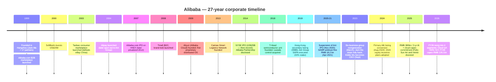
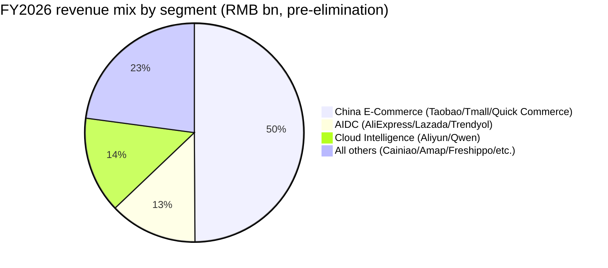
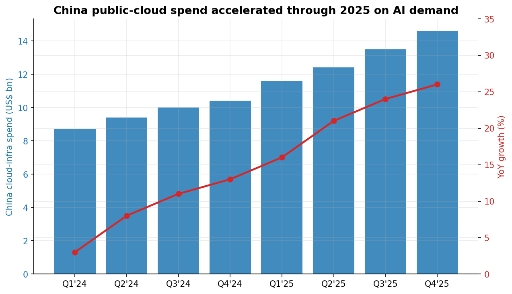
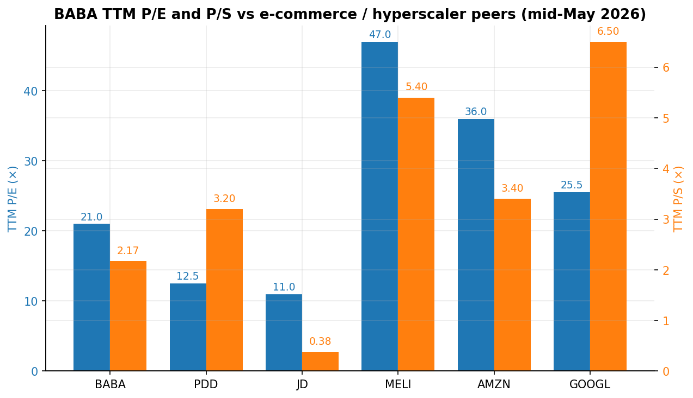
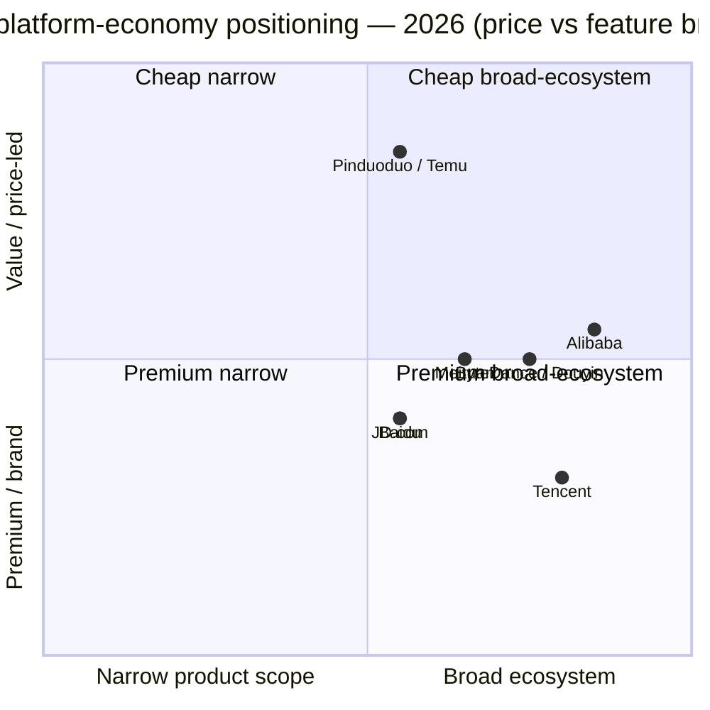

# COMPANY RESEARCH REPORT: Alibaba Group Holding Limited (NYSE:BABA / HKEX:9988)

**Date:** 2026-05-20
**Reporting analyst:** Equity research desk
**Primary ticker:** NYSE:BABA (ADR; one ADS = eight ordinary shares)
**Secondary listing:** HKEX:9988 (HKD counter) / 89988 (RMB counter)
**Fiscal year:** April 1 – March 31; references to "FY2026" mean the year ended March 31, 2026.

> **Update — FY2026 full-year results disclosed (2026-05-13):** Management reported FY2026 revenue of RMB 1,023,670 million (US$148,401 million), up 3% YoY, with Cloud Intelligence Group revenue up 34% YoY to RMB 158,132 million and Q4 cloud growth accelerating to 40% YoY. Reported income from operations fell 64% to RMB 50,150 million on a step-up in sales and marketing for Taobao Instant Commerce (formerly Ele.me) and accelerated AI/cloud capex. FY2026 capex hit RMB 126,063 million (US$18,275 million), and free cash flow swung to an outflow of RMB 46,609 million (vs. inflow of RMB 73,870 million in FY2025). The company reiterated its RMB 380 billion (~US$53 billion) three-year AI + cloud infrastructure plan first announced 2025-02-24.
> Source: [Alibaba Q4 / FY2026 results announcement, 2026-05-13](https://www.sec.gov/Archives/edgar/data/0001577552/000110465926060224/tm2614494d1_ex99-1.htm); [20-F FY2026, filed 2026-05-20](https://www.sec.gov/Archives/edgar/data/1577552/000119312526231755/0001193125-26-231755-index.htm); [Alibaba Group press release, 2025-02-24](https://www.alibabagroup.com/en-US/document-1830678592242057216).

## Table of Contents

1. Company Overview
2. Company History
3. Management Team
4. Products & Services
5. Customers & Go-to-Market
6. Industry Overview
7. Competitive Landscape
8. Market Opportunity (TAM)
9. Risk Assessment
10. References

---

## 1. Company Overview

Alibaba Group Holding Limited is a Cayman-Islands–incorporated holding company that, through its consolidated subsidiaries and variable-interest entities (VIEs), operates one of the world's two largest digital-commerce ecosystems and the largest public-cloud business in mainland China. Through the FY2026 reorganization disclosed in this year's 20-F, Alibaba reports four operating segments: (1) **Alibaba China E-Commerce Group** (Taobao, Tmall, Taobao Instant Commerce, Fliggy, 1688.com); (2) **Alibaba International Digital Commerce Group / AIDC** (AliExpress, Lazada, Trendyol, Daraz, Alibaba.com); (3) **Cloud Intelligence Group** (Alibaba Cloud IaaS/PaaS, Qwen foundation models, Model-as-a-Service / MaaS, T-Head silicon); and (4) **All others** — primarily Cainiao logistics, Amap navigation, Freshippo (Hema) supermarkets, Alibaba Health, Hujing Digital Media & Entertainment, DingTalk, Lingxi Games and Qwen Consumer Business Group ([20-F FY2026, Item 4 Business Overview](https://www.sec.gov/Archives/edgar/data/1577552/000119312526231755/0001193125-26-231755-index.htm)).

**How they make money.** Roughly half of consolidated revenue still comes from China e-commerce monetization — customer-management fees (the "P4P" / pay-for-performance ad system plus storefront services Tmall merchants and Taobao power-sellers pay) and direct-sales gross-basis revenue from Tmall Supermarket and Tmall Global. The next major leg is Cloud Intelligence: usage-priced IaaS (compute, storage, networking), PaaS, an expanding catalogue of Qwen-based MaaS API products, and dedicated AI compute. AIDC monetizes through marketplace commissions and the gross-basis "AliExpress Choice" semi-managed model. Quick Commerce (rebranded from Ele.me to "Taobao Instant Commerce" at the end of April 2025) earns platform commissions and on-demand delivery fees, with subsidies booked as contra-revenue. The "All others" line includes direct-sales retail (Freshippo, Sun Art prior to its disposal), logistics fulfillment for AliExpress / Tmall Global through Cainiao, and various long-tail digital businesses ([20-F FY2026, Item 4](https://www.sec.gov/Archives/edgar/data/1577552/000119312526231755/0001193125-26-231755-index.htm); [Q4 FY2026 results press release, 2026-05-13](https://www.sec.gov/Archives/edgar/data/0001577552/000110465926060224/tm2614494d1_ex99-1.htm)).

**Geographic footprint.** Hangzhou-headquartered with material operations in Hong Kong (the listed entity's "principal place of business" for HKEX purposes, with senior management based at 26/F Tower One, Times Square in Causeway Bay), Singapore (AIDC HQ at Lazada and the AliExpress Choice operations centre), Türkiye (Trendyol), South Asia (Daraz), Southeast Asia (Lazada), and a growing data-centre footprint that extends to Korea, Japan, the UAE, Mexico, Brazil and France ([20-F FY2026, Item 4 — Properties](https://www.sec.gov/Archives/edgar/data/1577552/000119312526231755/0001193125-26-231755-index.htm)).

**Scale.** FY2026 revenue was RMB 1,023,670 million (US$148,401 million), up 3% YoY on a reported basis, or 11% YoY excluding the disposed Sun Art and Intime offline-retail businesses ([20-F FY2026, Item 5 Operating Results](https://www.sec.gov/Archives/edgar/data/1577552/000119312526231755/0001193125-26-231755-index.htm)). Net income fell 19% to RMB 102,127 million (US$14,805 million) and non-GAAP net income fell 62% to RMB 60,658 million (US$8,794 million), reflecting (a) heavy first-year ramp of the Taobao Instant Commerce subsidies that lifted sales-and-marketing expense from RMB 144,021 million to RMB 245,023 million (+70% YoY) and (b) sharp expansion of capital expenditure to RMB 126,063 million (US$18,275 million) for AI/cloud infrastructure (FY2025 capex was RMB 85,972 million). Headcount stood at 131,462 full-time employees at March 31, 2026, up from 124,320 a year earlier and well below the FY2024 peak of 204,891 that included the now-disposed Sun Art and Intime workforces ([20-F FY2026, Item 6.D Employees](https://www.sec.gov/Archives/edgar/data/1577552/000119312526231755/0001193125-26-231755-index.htm)). Alibaba holds ~19,100 issued patents in China and ~5,500 issued patents elsewhere ([20-F FY2026, Item 5.C](https://www.sec.gov/Archives/edgar/data/1577552/000119312526231755/0001193125-26-231755-index.htm)).

Source: [Alibaba 20-F FY2026, Item 5 Operating Results](https://www.sec.gov/Archives/edgar/data/1577552/000119312526231755/0001193125-26-231755-index.htm).

**Valuation snapshot (mid-May 2026).** BABA closed at US$134.58 on 2026-05-20 with a market capitalization of roughly US$326–338 billion, depending on the source ([Capital.com BABA market-cap page, 2026-05-07](https://capital.com/en-int/markets/shares/alibaba-group-holding-limited-share-price/market-cap); [stockanalysis.com BABA statistics, 2026-05-19](https://stockanalysis.com/stocks/baba/statistics/)). TTM P/E was 21.0× and TTM P/S 2.17× as of 2026-05-19 ([stockanalysis.com BABA statistics, 2026-05-19](https://stockanalysis.com/stocks/baba/statistics/)); FinanceCharts cited an alternative P/E of 26.5× on 2026-05-12 ([FinanceCharts BABA PE, 2026-05](https://www.financecharts.com/stocks/BABA/value/pe-ratio)). The 52-week ADR range is $103.71–$192.67, putting the current quote roughly mid-range and ~30% off the cycle high ([TIKR / Alibaba ADR price history, 2026](https://www.tikr.com/blog/alibaba-stock-has-fallen-31-from-its-highs-is-baba-a-buy-in-2026)). Today's P/S of 2.17× sits 66% below the 10-year median of 6.74× ([gurufocus BABA P/S, 2026-03-11](https://www.gurufocus.com/term/ps-ratio/BABA)) and the trailing P/E sits well inside the long-run range of 11–47× implied by [Macrotrends](https://www.macrotrends.net/stocks/charts/BABA/alibaba/pe-ratio).

Where the multiple lands relative to peers (see chart in Section 7): BABA's 21× TTM P/E is **higher than PDD (~12.5×) and JD (~11×)** — the cheaper China comp set — and **well below MELI (~47×), AMZN (~36×) and GOOGL (~26×)**. BABA's 2.17× TTM P/S looks compressed against Western e-commerce / hyperscale peers (AMZN ~3.4×, GOOGL ~6.5×, MELI ~5.4×) but elevated vs. JD's 0.4×. The discount versus US hyperscalers is not driven by "value-trap" mechanics — TTM revenue grew 3% (11% ex-divestitures), cloud is accelerating to 40% in Q4 FY2026, and the company holds RMB 520,824 million (US$75,504 million) of cash, short-term investments and other treasury investments ([20-F FY2026, Item 5.B Liquidity](https://www.sec.gov/Archives/edgar/data/1577552/000119312526231755/0001193125-26-231755-index.htm)). The cause is overwhelmingly the **China-risk / VIE structure / regulatory premium** plus the FY2026 free-cash-flow swing into outflow (–RMB 46,609 million vs. +RMB 73,870 million in FY2025) as quick-commerce subsidies and cloud capex peak. Multiple compression is plausible if either lever (FCF, China policy) continues to widen; multiple expansion needs visible cloud-segment margin expansion and quick-commerce loss containment.

(Section word count: ~1,070)

---

## 2. Company History

Alibaba was founded in Hangzhou on June 28, 1999, by 18 partners led by former English teacher Jack Ma (Ma Yun, 马云), together with co-founders including Joe Tsai, Lucy Peng, Eddie Yongming Wu and others. The founding thesis was a B2B online marketplace ("Alibaba.com") that would let small Chinese exporters reach global buyers — an unusually contrarian bet against the consumer-internet portal model that dominated the late-1990s Chinese web. The company famously raised an initial US$5 million seed from Goldman Sachs and a further US$20 million from SoftBank in 2000, the deal Masayoshi Son says he closed in six minutes ([20-F FY2026, Item 4.A History](https://www.sec.gov/Archives/edgar/data/1577552/000119312526231755/0001193125-26-231755-index.htm)).

Source: [20-F FY2026, Item 4.A History and Development](https://www.sec.gov/Archives/edgar/data/1577552/000119312526231755/0001193125-26-231755-index.htm); [State Administration for Market Regulation 2021 fine announcement, archived](https://www.reuters.com/article/idUSKBN2BX1G8/) (Reuters, 2021-04-10); [Alibaba Group press release on RMB 380bn AI plan, 2025-02-24](https://www.alibabagroup.com/en-US/document-1830678592242057216).

Three structural pivots have shaped the company's current shape. The **first** was the 2009 founding of Alibaba Cloud (Aliyun), made over the public skepticism of e-commerce leadership at the time — a long, capital-intensive build that took fifteen years to reach the FY2024 inflection where AI demand began driving 30%-plus segment growth ([20-F FY2026, Letter from Chairman and CEO](https://www.sec.gov/Archives/edgar/data/1577552/000119312526231755/0001193125-26-231755-index.htm)). The **second** was the November 2020 suspension of Ant Group's planned dual IPO, followed by the April 2021 RMB 18.228 billion antitrust fine for "choose one of two" merchant-exclusivity practices on Tmall — a regulatory shock that triggered a roughly 80% peak-to-trough drawdown in the ADR and forced the operating restructuring that culminated in the March 2023 six-business-group reorganization ([Reuters, 2021-04-10](https://www.reuters.com/article/idUSKBN2BX1G8/); [20-F FY2024, Risk Factors](https://www.sec.gov/cgi-bin/browse-edgar?action=getcompany&CIK=0001577552)). The **third** is the post-September-2023 Eddie Wu / Joe Tsai era — Jack Ma stepped fully back, Eddie Wu (the only co-founder with deep engineering credentials remaining in an operating role) replaced Daniel Zhang as CEO, and the company explicitly re-prioritized to a "user-first, AI-driven" strategy that has progressively unwound or re-merged the 2023 separate-IPO experiment (Cainiao IPO withdrawn, Hema IPO shelved; Taobao + Tmall + Ele.me + Fliggy re-merged into a single China e-commerce group in FY2026) ([20-F FY2026, Letter](https://www.sec.gov/Archives/edgar/data/1577552/000119312526231755/0001193125-26-231755-index.htm)).

Material recent transactions:
- **2025-02-24** — RMB 380 billion (~US$53 billion) three-year AI + cloud-infrastructure capex commitment announced ([Alibaba Group press release, 2025-02-24](https://www.alibabagroup.com/en-US/document-1830678592242057216)).
- **FY2025–FY2026** — Disposal of Sun Art (Auchan / RT-Mart hypermarkets) and Intime department-store chain; "All others" segment revenue fell from RMB 338,347 million to RMB 254,367 million YoY largely on these exits ([20-F FY2026, Item 5](https://www.sec.gov/Archives/edgar/data/1577552/000119312526231755/0001193125-26-231755-index.htm)).
- **FY2026** — Ele.me rebranded to "Taobao Instant Commerce" at end-April 2025; integrated into Taobao app and into the consumer Qwen app (2026-01-15); quick-commerce revenue +47% YoY to RMB 78,520 million ([Q4/FY26 press release, 2026-05-13](https://www.sec.gov/Archives/edgar/data/0001577552/000110465926060224/tm2614494d1_ex99-1.htm)).
- **2024-08-28** — Hong Kong primary-listing conversion completed (eligible for Stock Connect southbound inclusion) ([20-F FY2026, Item 10.B](https://www.sec.gov/Archives/edgar/data/1577552/000119312526231755/0001193125-26-231755-index.htm)).
- **FY2026 buybacks** — 73 million NYSE-listed shares (9.125 million ADS-equivalents) repurchased for US$1.0 billion; remaining authorization through March 2027 ([20-F FY2026, Item 16E](https://www.sec.gov/Archives/edgar/data/1577552/000119312526231755/0001193125-26-231755-index.htm)). Cumulatively, FY2024–FY2026 buybacks have totaled tens of billions of US dollars and reduced shares outstanding to 18,669,888,147 (≈2.334 billion ADS-equivalents) as of May 18, 2026.

(Section word count: ~700)

---

## 3. Management Team

### Eddie Yongming Wu (吴泳銘) — Chief Executive Officer and Director (350 words)

Eddie Wu, 51, has served as CEO since September 2023 and concurrently as a director ([20-F FY2026, Item 6.A](https://www.sec.gov/Archives/edgar/data/1577552/000119312526231755/0001193125-26-231755-index.htm)). He is one of Alibaba's 18 co-founders and is the most operationally consequential of the founder cohort still active after Jack Ma's retreat from the executive suite — and the only co-founder with a deep engineering background. Wu joined the company in 1999 as Alibaba's first technology director; in December 2004 he became CTO of Alipay (then still inside Alibaba); in November 2005 he moved to lead Alimama, the internal cost-per-click ad-monetization platform that today still powers the bulk of Alibaba China E-Commerce's customer-management revenue. He was promoted to Alimama general manager in December 2007, became CTO of Taobao in September 2008, then head of Alibaba Group's combined search, advertising and mobile business in October 2011 — three of the most economically important franchises inside the group, all of which he ran by his early thirties. From September 2014 to September 2019 he served as a special assistant to Jack Ma, the role through which much of the post-IPO strategic groundwork (Cainiao, cloud, AIDC) was laid. From April 2015 to March 2020 he chaired Alibaba Health Information Technology Limited (HKEX-listed) ([20-F FY2026, Item 6.A — Biographical Information](https://www.sec.gov/Archives/edgar/data/1577552/000119312526231755/0001193125-26-231755-index.htm)).

In August 2015 Wu founded Vision Plus Capital, a Hangzhou-based VC focused on advanced technology, enterprise services and digital healthcare; he holds the firm's general-partner role on a passive basis today. He holds a bachelor's degree from the College of Information Engineering at Zhejiang University of Technology (1996). As of May 18, 2026, Wu held 19,706,418 ordinary shares (2,463,302 ADS-equivalents), or 0.1% of shares outstanding ([20-F FY2026, Item 7.A](https://www.sec.gov/Archives/edgar/data/1577552/000119312526231755/0001193125-26-231755-index.htm)). His compensation skews heavily toward performance-linked equity under the 2024 Plan. Wu authored the FY2026 shareholder letter (with Chairman Joe Tsai), framing the strategic priorities as "AI + Cloud" and "consumption" and disclosing that AI-related cloud-product revenue has now grown triple-digits for eleven straight quarters ([Q4/FY26 results announcement, 2026-05-13](https://www.sec.gov/Archives/edgar/data/0001577552/000110465926060224/tm2614494d1_ex99-1.htm)). His public profile is deliberately understated relative to Jack Ma's, and his early-tenure decisions — re-merging the China e-commerce units, committing RMB 380 billion to AI infrastructure, and pushing Qwen aggressively as both an open-source family and a Taobao-side consumer agent — are now the central thesis points for the stock.

### Joseph C. Tsai (蔡崇信) — Chairman (200 words)

Joe Tsai, 62, joined the founding team in 1999 and is one of two **continuity partners** of the Alibaba Partnership (the other being Jack Ma). He served as Alibaba's CFO until 2013 and executive vice chairman until September 2023, when Daniel Zhang's exit elevated him to non-executive chairman alongside Eddie Wu as CEO ([20-F FY2026, Item 6.A](https://www.sec.gov/Archives/edgar/data/1577552/000119312526231755/0001193125-26-231755-index.htm)). Prior to Alibaba, Tsai was a private-equity investor with Investor AB (Wallenberg family) from 1995–1999, general counsel of New York-based buyout firm Rosecliff Inc., and an associate tax attorney at Sullivan & Cromwell LLP (1990–1993). He is qualified to practice law in New York. He holds a BA in Economics and East Asian Studies from Yale College and a JD from Yale Law School. Tsai chairs the Capital Management Committee that oversees buyback and dividend pacing — a function with material weight given the US$1.0 billion FY2026 buyback and US$2.5 billion FY2026 cash dividend (US$1.05 per ADS). His beneficial holdings total 272,492,074 shares (34,061,509 ADS-equivalents), about 1.5% of the company — by far the largest insider stake, primarily held via Parufam Limited (Bahamas) and PMH Holding Limited (BVI) for which he has voting and disposition power but no pecuniary interest ([20-F FY2026, Item 7.A — Footnote (2)](https://www.sec.gov/Archives/edgar/data/1577552/000119312526231755/0001193125-26-231755-index.htm)).

### Toby Hong Xu (徐宏) — Chief Financial Officer (200 words)

Toby Xu, 53, has served as Group CFO since April 2022 ([20-F FY2026, Item 6.A](https://www.sec.gov/Archives/edgar/data/1577552/000119312526231755/0001193125-26-231755-index.htm)). He joined Alibaba in July 2018 and served as deputy CFO from July 2019 through March 2022, after which he succeeded Maggie Wu. Before Alibaba, Xu spent 22 years at PricewaterhouseCoopers, joining in 1996 and serving 11 years as a partner. He holds a BS in Physics from Fudan University (1996) and is a member of the Chinese Institute of CPAs. His CFO tenure has been defined by three capital-markets actions: (a) executing the largest sustained tech-sector buyback program of any China ADR (cumulative tens of billions of dollars across FY2023–FY2026); (b) initiating Alibaba's first-ever regular cash dividend (FY2024) and progressively expanding it to US$1.05 per ADS for FY2026 ([20-F FY2026, Item 10.E](https://www.sec.gov/Archives/edgar/data/1577552/000119312526231755/0001193125-26-231755-index.htm)); and (c) completing the August 2024 Hong Kong primary-listing conversion that opened the stock to Stock Connect southbound flows. As of May 18, 2026 he held 1,103,120 ordinary shares (137,890 ADS-equivalents) — essentially nominal vs. founders. Xu does not hold a US public-company CFO seat outside Alibaba.

### Fan Jiang (蒋凡) — CEO, Alibaba E-Commerce Business Group (120 words)

Fan Jiang, 40, was named CEO of the recombined Alibaba China E-Commerce Group in 2025 after serving as president of AIDC from January 2022 — a role in which he engineered the AliExpress "Choice" semi-managed program that drove AIDC retail revenue +44% over two fiscal years (FY24–FY26) and shrank AIDC's segment-EBITA loss from RMB 15.1 billion in FY2025 to RMB 2.1 billion in FY2026 ([20-F FY2026, Item 5](https://www.sec.gov/Archives/edgar/data/1577552/000119312526231755/0001193125-26-231755-index.htm)). He joined Alibaba in 2013 via the acquisition of Umeng, a mobile-app-analytics startup he founded in 2010; before that he was a product engineer at Google China. Prior senior roles inside Alibaba include president of Taobao, president of Tmall and president of Alimama. He holds a BS in Computer Science from Fudan University and is a member of the Alibaba Partnership ([20-F FY2026, Item 6.A](https://www.sec.gov/Archives/edgar/data/1577552/000119312526231755/0001193125-26-231755-index.htm)).

### Jingren Zhou (周靖人) — Chief AI Architect, Head of Tongyi Foundation Model Division (100 words)

Jingren Zhou, 50, is the senior leader behind the Qwen / Tongyi Qianwen foundation-model effort and is also CTO of the Cloud Intelligence Group. He joined Alibaba in 2015 and is a member of the partnership committee. Prior to Alibaba he was a Partner Development Manager at Microsoft Research, where he worked on the SCOPE / Cosmos distributed query engine that runs much of Bing. Under Zhou's leadership, Qwen models (Qwen 3 235B-A22B, Qwen 3.5, the multimodal Qwen-VL series, and the FY2026 video-generation and world-model releases) have repeatedly topped open-source benchmark leaderboards in coding and scientific reasoning ([20-F FY2026, Item 6.A](https://www.sec.gov/Archives/edgar/data/1577552/000119312526231755/0001193125-26-231755-index.htm); [TECHSY open-source LLM benchmarks, 2026-05](https://techsy.io/en/blog/best-open-source-llms-2026)).

### Governance footer (140 words)

Alibaba is a Cayman Islands company with a single class of ordinary shares (one vote per share) and a weighted-voting-rights structure under HKEX rules created by the **Alibaba Partnership**'s exclusive right to nominate a simple majority of directors. The 11-person board has 7 directors classified as independent under NYSE Rule 303A ([20-F FY2026, Item 6.C](https://www.sec.gov/Archives/edgar/data/1577552/000119312526231755/0001193125-26-231755-index.htm)). Independent directors include Jerry Yang (Yahoo! co-founder; Stanford trustee chair), Wan Ling Martello (ex-Nestlé CFO), Weijian Shan (PAG), Irene Yun-Lien Lee, Albert Kong Ping Ng (ex-PwC China senior partner, ex-Citi China IB MD) and Kabir Misra (ex-SoftBank). Insiders collectively held 1.9% of shares as of May 18, 2026 — concentration is low except for Joe Tsai's 1.5% ([20-F FY2026, Item 7.A](https://www.sec.gov/Archives/edgar/data/1577552/000119312526231755/0001193125-26-231755-index.htm)). Material related-party arrangements run mainly through Ant Group (33% equity interest, Alipay commercial agreement, IP cross-license under the 2019 SAPA) and the VIE-equity-holder structure — both have multi-decade history and audit-committee oversight under the company's connected-transaction policy.

### Management track record synthesis (90 words)

The current Wu / Tsai / Xu / Jiang team has now delivered six consecutive quarters of accelerating cloud-segment growth (culminating in Q4 FY2026 cloud +40% YoY), turned the AIDC segment loss from –RMB 15 billion to –RMB 2 billion, and re-anchored the China e-commerce business with the Taobao Instant Commerce push. Where the team has not yet demonstrated execution is on **operating margin** — FY2026 reported operating income fell 64% YoY as quick-commerce subsidies plus AI capex pulled forward expense — and on the **All others** segment, whose adjusted-EBITA loss widened from RMB 9.5 billion to RMB 35.7 billion.

(Section word count: ~1,360)

---

## 4. Products & Services

Alibaba's portfolio after the FY2026 reorganization fits cleanly into four families, with quick commerce now visibly elevated to a strategic pillar alongside e-commerce, cloud, and international.

```mermaid
graph TD
    A[Alibaba Group] --> B[Alibaba China E-Commerce Group]
    A --> C[AIDC — International Digital Commerce]
    A --> D[Cloud Intelligence Group]
    A --> E[All Others]

    B --> B1[Taobao app]
    B --> B2[Tmall / Tmall Global]
    B --> B3[Tmall Supermarket]
    B --> B4[Taobao Instant Commerce<br/>formerly Ele.me — quick commerce]
    B --> B5[Fliggy — travel]
    B --> B6[1688.com — China B2B wholesale]
    B --> B7[Alimama — P4P ad platform]

    C --> C1[AliExpress + Choice]
    C --> C2[Lazada — SEA]
    C --> C3[Trendyol — Türkiye]
    C --> C4[Daraz — South Asia]
    C --> C5[Alibaba.com — global B2B]

    D --> D1[Alibaba Cloud IaaS / PaaS]
    D --> D2[Qwen foundation models + MaaS]
    D --> D3[T-Head — Yitian / Hanguang / PPU]
    D --> D4[Wukong — agentic platform]
    D --> D5[DingTalk — enterprise productivity]

    E --> E1[Cainiao — logistics]
    E --> E2[Amap — navigation / Local services]
    E --> E3[Freshippo Hema — supermarkets]
    E --> E4[Alibaba Health]
    E --> E5[Hujing Digital Media & Entertainment]
    E --> E6[Lingxi Games]
    E --> E7[Qwen Consumer Business Group<br/>— Qwen app, video, world models]
```

Source: [20-F FY2026, Item 4.B Business Overview](https://www.sec.gov/Archives/edgar/data/1577552/000119312526231755/0001193125-26-231755-index.htm); [Q4 / FY26 results announcement, 2026-05-13](https://www.sec.gov/Archives/edgar/data/0001577552/000110465926060224/tm2614494d1_ex99-1.htm).

**Taobao and Tmall — flagship e-commerce platforms.** Taobao is China's largest C2C / "discovery" marketplace; Tmall is its B2C brand-led sibling. Together they remain the cornerstone of group earnings: in FY2026 the China e-commerce segment generated RMB 449,385 million of marketplace revenue (customer management + direct sales) plus RMB 26,312 million of China commerce wholesale, with customer-management revenue alone growing 5% YoY to RMB 343,867 million ([20-F FY2026, Item 5](https://www.sec.gov/Archives/edgar/data/1577552/000119312526231755/0001193125-26-231755-index.htm)). Estimated calendar-2025 GMV: Taobao ~US$585 billion, Tmall ~US$568 billion ([Lengow China marketplaces analysis, 2026](https://www.lengow.com/get-to-know-more/top-marketplaces-in-china/)). **Competitive advantage:** yes — scale, two-sided network effects with 1.0 billion+ China annual active consumers, the largest brand-merchant base in China, and the Alimama P4P ad system (which is what monetizes the network). Closest competitor product: Pinduoduo / Temu (lower-price-point first; behind on brands), JD Mall (better on electronics + logistics, smaller in apparel / FMCG long tail) — at parity on scale with PDD on order volume, ahead on AOV and brand depth.

**Taobao Instant Commerce (formerly Ele.me) — quick commerce.** Rebranded at end-April 2025 and aggressively re-positioned as a core pillar of the Taobao platform. FY2026 revenue grew 47% YoY to RMB 78,520 million, with Q4 FY2026 growth of 57% YoY ([20-F FY2026, Item 5](https://www.sec.gov/Archives/edgar/data/1577552/000119312526231755/0001193125-26-231755-index.htm); [Q4/FY26 results press release, 2026-05-13](https://www.sec.gov/Archives/edgar/data/0001577552/000110465926060224/tm2614494d1_ex99-1.htm)). The platform offers 30-minute delivery of meals, groceries, pharma, FMCG, electronics, flowers and apparel. Management's goal is to halve segment losses annually toward FY2029 break-even ([market commentary on Q4 FY26, 2026-05](https://www.kavout.com/market-lens/what-did-alibaba-s-q4-fy2026-earnings-reveal)). **Competitive advantage:** partial — late mover behind Meituan (35-min-or-faster default in tier-1 cities and the dominant restaurant supply) but with a unique distribution lever inside the Taobao app and inside Qwen (integrated 2026-01-15). Closest competitor: Meituan Instashopping / Meituan Waimai — currently ahead on order density; JD Daojia is the laggard.

**Alibaba Cloud + Qwen + Wukong.** Cloud Intelligence Group revenue grew 34% YoY to RMB 158,132 million in FY2026; AI-related products grew triple-digit YoY for the **eleventh consecutive quarter** and now account for 30% of segment revenue ([Q4/FY26 press release, 2026-05-13](https://www.sec.gov/Archives/edgar/data/0001577552/000110465926060224/tm2614494d1_ex99-1.htm)). Adjusted-EBITA margin expanded — segment EBITA rose 35% YoY to RMB 14,265 million on RMB 158,132 million of revenue. The Qwen foundation-model family (Qwen 3 235B-A22B; Qwen 3.5 reasoning; Qwen-VL multimodal; FY2026 video and world models) is shipped both as open-source weights under Apache 2.0 and as Model-as-a-Service / MaaS APIs on Alibaba Cloud. Qwen 3 235B-A22B currently leads on the broadest range of public open-source benchmarks combining reasoning, coding and multilingual scores ([TECHSY open-source LLM benchmarks, 2026-05](https://techsy.io/en/blog/best-open-source-llms-2026)). The newly-launched **Wukong** agentic platform coordinates AI agents across Alibaba's enterprise tools, and **DingTalk** anchors the productivity side of MaaS deployments ([20-F FY2026, Letter from Chairman and CEO](https://www.sec.gov/Archives/edgar/data/1577552/000119312526231755/0001193125-26-231755-index.htm)). **Competitive advantage:** yes — full-stack moat (chip via T-Head, hyperscaler infrastructure, foundation model, MaaS, apps), plus the only domestic China hyperscaler operating at this scale. Closest competitor: Huawei Cloud (better on government and on-prem AI; weaker on third-party developer mindshare); Tencent Cloud (third). DeepSeek V4 Pro is the strongest pure-model competitor on the open-source bench, but it does not control its own compute layer ([codersera open-source LLMs benchmarks, 2026-05](https://codersera.com/blog/best-open-source-llm-2026-llama-4-qwen-3-5-deepseek-v4-gemma-4-mistral/)).

**T-Head — proprietary silicon.** Founded in 2018, T-Head designs server-class CPUs (Yitian 710 Arm-based, 2021), AI inference accelerators (Hanguang 800, 2019), and the latest PPU GPU disclosed in September 2025 — 96 GB HBM2e, 700 GB/s chip-to-chip bandwidth, 400 W TDP, described by Chinese state media as "comparable to NVIDIA H20" and partly replacing Nvidia systems for smaller/less-demanding AI training inside Alibaba ([Datacenter Dynamics, 2025-09-08](https://www.datacenterdynamics.com/en/news/alibaba-develops-ai-inferencing-chip-as-exports-of-nvidia-h20-continue-to-stall-report/); [TrendForce, 2026-01-23](https://www.trendforce.com/news/2026/01/23/news-alibaba-chip-unit-t-head-reportedly-eyes-spinoff-ai-chip-said-comparable-to-nvidia-h20/)). Management has publicly floated a T-Head spin-off and independent listing. **Competitive advantage:** partial — T-Head is the highest-shipment domestic GPU in 2025 per Alibaba's own claim, but lags Nvidia on advanced training silicon; a useful hedge against US export controls rather than a leadership claim.

**AIDC — AliExpress, Lazada, Trendyol, Daraz, Alibaba.com.** International commerce retail revenue grew 9% YoY to RMB 117,731 million in FY2026 ([20-F FY2026, Item 5](https://www.sec.gov/Archives/edgar/data/1577552/000119312526231755/0001193125-26-231755-index.htm)). AliExpress's "Choice" semi-managed model — Alibaba handles fulfillment, returns and pricing while merchants supply inventory — accelerated FY2025 retail growth to +31% YoY before normalizing ([AliExpress / Bamboo Works, 2025](https://thebambooworks.com/aliexpress-fuels-alibaba-internationals-revenue-growth-by-giving-shoppers-a-choice/)). Cainiao's 5-day-Europe delivery program is a key enabler. Wholesale (1688 + Alibaba.com) grew 11% YoY to RMB 26,439 million. **Competitive advantage:** partial — strong in Türkiye (Trendyol is #1 by GMV), competitive in Southeast Asia (Lazada vs. Shopee/SEA, vs. TikTok Shop), challenged in Western markets vs. Temu (PDD) and Shein on price. Closest direct competitor: Shopee (parity in SEA); Temu (ahead in US / Western Europe consumer-direct shipments).

**Cainiao Smart Logistics Network.** China's largest cross-border e-commerce logistics operator and the AliExpress / Tmall Global fulfillment backbone. Now reported within "All others" after the FY2026 reorg. Cainiao contributed roughly US$11 billion (~8%) to FY2025 group revenue per third-party estimates ([Bamboo Works, 2025](https://thebambooworks.com/aliexpress-fuels-alibaba-internationals-revenue-growth-by-giving-shoppers-a-choice/)). **Competitive advantage:** yes (network density in China; partial in cross-border). Closest competitor: SF Express, JD Logistics.

**Long-tail products.** Amap (Gaode) is China's #2 mobile-map and ride-hailing aggregator; Freshippo (Hema) operates ~370 supermarket-warehouse hybrid stores; Alibaba Health is HKEX-listed (0241); Hujing Digital Media (formerly Youku-based) is the digital-media unit; Lingxi Games and DingTalk round out the long-tail ([20-F FY2026, Item 4](https://www.sec.gov/Archives/edgar/data/1577552/000119312526231755/0001193125-26-231755-index.htm)).

**Flagship vs. long-tail synthesis.** The three franchises driving the equity story are **(1) Taobao + Tmall** (still the cash cow — RMB 343.9 billion of customer-management revenue at very high incremental margin), **(2) Cloud Intelligence** (the growth engine — 34% YoY revenue growth, 35% EBITA growth, accelerating), and **(3) AIDC / quick commerce** (the optionality — fast top-line growth, losses narrowing toward profitability). Long-tail consumer-internet assets (Hujing, Lingxi, Amap, Freshippo) remain material on revenue but contribute negatively to FY2026 segment EBITA.

**Launches and sunsets in the last 12 months.** New: Qwen 3 / Qwen 3.5 family; Qwen video-generation and world models; Wukong agentic platform; T-Head PPU GPU. Repositioned: Ele.me → Taobao Instant Commerce. Sunset / divested: Sun Art (Auchan / RT-Mart hypermarkets), Intime department stores. Re-merged: Taobao + Tmall + Ele.me + Fliggy into a single China E-Commerce Group ([20-F FY2026, Item 4.A](https://www.sec.gov/Archives/edgar/data/1577552/000119312526231755/0001193125-26-231755-index.htm)).

(Section word count: ~1,010)

---

## 5. Customers & Go-to-Market

### Customer segments

Alibaba's customer base is structurally tri-modal. **(1) Consumers in China** (1.1 billion+ internet users) are the demand-side of Taobao, Tmall, Taobao Instant Commerce, Fliggy and the Qwen app. **(2) Merchants and brands** — millions of long-tail Taobao SMB sellers, ~250,000 paying Tmall brand storefronts, the 1688.com B2B wholesale base, and the international AliExpress / Lazada / Trendyol seller base — are the monetizable demand for customer management, advertising, fulfillment and platform-services revenue. **(3) Enterprises and developers** (Chinese state-owned enterprises, private-sector cloud customers, financial institutions, automotive OEMs, plus a growing roster of international cloud customers) buy from Alibaba Cloud and consume Qwen MaaS APIs.

Source: [20-F FY2026, Item 5 Segment Revenue](https://www.sec.gov/Archives/edgar/data/1577552/000119312526231755/0001193125-26-231755-index.htm).

### Customer concentration (REQUIRED)

Alibaba operates a many-millions-of-customers marketplace model, and **the 20-F does not disclose a top-1 or top-5 customer percentage of consolidated revenue, because no single customer represents 10% or more of revenue under SEC ASC 280-10-50-42 reporting thresholds** ([20-F FY2026, Item 4.B and segment notes](https://www.sec.gov/Archives/edgar/data/1577552/000119312526231755/0001193125-26-231755-index.htm)). The most material **related-party** customer exposure is the Ant Group ecosystem: Alibaba Cloud provides cloud-computing services to Ant, and the SAPA / IPLA / Alipay commercial-services agreements drive a continuing recurring revenue line — Ant's cloud-computing spending with Alibaba is disclosed separately in segment notes (the FY24-FY26 related-party tables in the 20-F break this out by line item) ([20-F FY2026, Item 7.B Related Party Transactions](https://www.sec.gov/Archives/edgar/data/1577552/000119312526231755/0001193125-26-231755-index.htm)). The wider concern is **platform-side merchant concentration** — Tmall's apparel-and-FMCG GMV is concentrated in a few hundred mega-brands (Procter & Gamble, Unilever, L'Oréal, Apple, Nike, Adidas, Estée Lauder, Mengniu and similar). No single merchant breaks 10% of revenue, but a sustained migration of top-100 Tmall brands toward Douyin or Pinduoduo would be a material risk and is called out in Section 9.

Top-customer concentration is **low and not flagged here as a Section 9 risk** (top-1 < 10%, top-5 well below 50% by management's segment disclosure); the company instead carries diffuse marketplace-share risk.

### Distribution channels and go-to-market

E-commerce go-to-market is **app-first inside China** (the Taobao app is the dominant consumer entry point and now embeds Instant Commerce, Fliggy, Damai, Amap and Alipay as features) and **multi-platform internationally** (separate Lazada, AliExpress, Trendyol and Daraz brands localized by market). Merchant acquisition is direct sales for top brands plus self-serve for long-tail SMBs. Cloud go-to-market combines a direct enterprise sales force (large state-owned and private accounts) with a self-serve developer console (Alibaba Cloud International) and a partner channel of system integrators. Sales cycles are minutes for SMB cloud and weeks-to-months for enterprise / state-owned-enterprise contracts. International e-commerce uses paid social and search advertising at high volume.

### Key partnerships

- **Ant Group (33% Alibaba-owned, Hangzhou)** — Alipay payment-and-escrow processing for all Alibaba China marketplaces under the Alipay commercial agreement; reciprocal cross-license of IP under the IPLA ([20-F FY2026, Item 7.B](https://www.sec.gov/Archives/edgar/data/1577552/000119312526231755/0001193125-26-231755-index.htm)). The Ant ownership stake is held on an equity-method basis.
- **NVIDIA / TSMC / Marvell / Broadcom** — supply chain for cloud-infrastructure GPUs and ASICs; relationship constrained by US export controls (H20 export licensing status remains in flux).
- **Hong Kong Stock Exchange Stock Connect** — primary-listing conversion completed August 2024 made BABA / 9988 eligible for Stock Connect southbound flows, opening a new mainland Chinese investor base ([20-F FY2026, Item 10.B](https://www.sec.gov/Archives/edgar/data/1577552/000119312526231755/0001193125-26-231755-index.htm)).
- **AliExpress Choice operating-model partners** — courier networks (SF Express, J&T Express), local-fulfillment providers in Europe and the US, and brand sellers who use the semi-managed model.
- **Qwen open-source community** — Apache-2.0 licensed releases of Qwen 3 / 3.5 / VL / video / world models drive developer adoption and downstream MaaS pull-through.

### Named wins and case studies

The 20-F is structurally light on named cloud customers (a common 20-F practice for foreign-private issuers), but Alibaba Cloud's public references include China Unicom, Geely Auto, Xiaomi Auto, Li Auto, Bilibili, Xiaohongshu (RedNote), and a sizeable share of China's banking-sector AI workloads. Trendyol is the largest e-commerce platform in Türkiye by GMV; AliExpress holds market-leading or top-3 share in markets including Spain, France, Poland and Brazil ([AliExpress / Bamboo Works, 2025](https://thebambooworks.com/aliexpress-fuels-alibaba-internationals-revenue-growth-by-giving-shoppers-a-choice/)).

(Section word count: ~720)

---

## 6. Industry Overview

Alibaba straddles four industries: (1) Chinese domestic e-commerce, (2) global cross-border / emerging-markets e-commerce, (3) Chinese public-cloud and AI infrastructure, and (4) on-demand local services (quick commerce).

### Chinese e-commerce (the largest of the four)

China is the world's largest online retail market with over 1.1 billion internet users; total e-commerce GMV across all platforms exceeded US$3 trillion in 2025. Alibaba (Taobao + Tmall), JD.com and Pinduoduo together control close to 70% of 2025 retail GMV, with Douyin and Kuaishou capturing roughly another 20% combined via livestream commerce ([Lengow China marketplaces, 2026](https://www.lengow.com/get-to-know-more/top-marketplaces-in-china/)). Industry structure: oligopolistic with two challengers (Douyin / TikTok Shop and Pinduoduo) ascending faster than the leaders. Long-cycle drivers: continued migration of consumption from offline to online (already 30%+ penetration vs. ~15% in the US, leaving incremental upside primarily in services and groceries); secular growth in livestream and content commerce; consolidation around two-to-four super-apps. Regulatory environment: heavily monitored under the 2021 SAMR antitrust enforcement wave (the same one that produced Alibaba's RMB 18.2 billion fine); the SAMR ban on "二选一" / "choose-one-of-two" merchant exclusivity has structurally lowered Tmall's competitive moat versus PDD and Douyin, but conversely opened headroom for Alibaba to compete on quick commerce and brand experience.

### Cross-border / emerging-markets e-commerce

Roughly US$1.0–1.2 trillion in 2025 global cross-border B2C e-commerce GMV. AliExpress and Temu (PDD) together dominate the Chinese-origin direct-shipment segment, with Shein on the apparel-specific layer. The Choice / Y2 (fully managed) operating model — platforms handle pricing, fulfillment and customer service — is the structural innovation that has lifted AIDC retail growth into the +30% range. Türkiye (where Alibaba's Trendyol holds a leading domestic GMV position) and Southeast Asia (where Lazada is #2 to Shopee) are the two AIDC strongholds; Western Europe and Latin America are growth markets ([20-F FY2026, Item 4.B](https://www.sec.gov/Archives/edgar/data/1577552/000119312526231755/0001193125-26-231755-index.htm); [Bamboo Works, 2025](https://thebambooworks.com/aliexpress-fuels-alibaba-internationals-revenue-growth-by-giving-shoppers-a-choice/)).

### Chinese public-cloud and AI infrastructure

The single most important growth industry for Alibaba's equity story. China's public cloud-infrastructure-services market grew 16% YoY in Q1 2025 to US$11.6 billion, accelerated to 21% in Q2 2025, then 24% in Q3 2025, and 26% in Q4 2025 ([Canalys press release on Q1 2025, 2025-07](https://www.lightreading.com/cloud/mainland-china-s-cloud-infrastructure-market-growth-accelerated-in-q1-2025-canalys); [Omdia press release on Q4 2025, 2026-04](https://omdia.tech.informa.com/pr/2026/apr/mainland-china-cloud-infrastructure-spending-rises-26percent-in-q4-2025-driven-by-ai-and-agent-growth)).

Source: [Canalys press releases on China cloud, Q1–Q3 2025](https://www.lightreading.com/cloud/mainland-china-s-cloud-infrastructure-market-growth-accelerated-in-q1-2025-canalys); [Omdia press release on Q4 2025, 2026-04-15](https://omdia.tech.informa.com/pr/2026/apr/mainland-china-cloud-infrastructure-spending-rises-26percent-in-q4-2025-driven-by-ai-and-agent-growth).

The acceleration is overwhelmingly **AI-driven**: GPU demand for both training and inference, plus an explosion of agentic-AI usage, has driven the entire cloud TAM curve upward. Industry structure: highly consolidated — top 4 (Alibaba, Huawei, Tencent, Baidu) account for ~70% of mainland public-cloud spend; international hyperscalers were excluded by IDC-licensing rules until April 2024 and remain marginal in mainland China. April-2024 rule change allowing international cloud providers to apply for IDC licenses in China introduces a long-cycle competitive risk (flagged inside the 20-F's own competition risk factor).

### On-demand local services / quick commerce

China's quick-commerce TAM is projected at US$126.7 billion by 2029 from US$45–55 billion in 2025, with Meituan, Alibaba (Taobao Instant Commerce) and JD as the dominant three ([GlobeNewswire / China Quick Commerce Databook, 2026-04-21](https://www.globenewswire.com/news-release/2026/04/21/3277632/28124/en/china-quick-commerce-databook-report-2026.html)). Industry economics are unit-loss-making at growth and break-even-positive at density; the path to FY2029 quick-commerce break-even is the central operational debate around Alibaba inside the buy-side community.

### Regulatory environment (cross-industry)

Three regulatory layers matter materially: **(a) China antitrust and platform-economy regulation** — SAMR, NDRC, MIIT, CAC enforcement of platform-economy rules; **(b) China data and cybersecurity rules** — Personal Information Protection Law (PIPL), Data Security Law, cross-border data-transfer rules under CAC; **(c) US securities and export-control overlays** — Holding Foreign Companies Accountable Act (HFCA Act) audit-inspection regime now operative via PCAOB inspections of PwC ZT; US chip export controls limiting access to NVIDIA H100 / H200 / B200 generations of GPUs.

### Industry dynamics — substitutes, supplier power, buyer power

- **Substitutes:** Douyin / Kuaishou livestream e-commerce competing for Taobao impressions; Meituan competing for quick-commerce orders.
- **Supplier power:** NVIDIA and TSMC retain pricing power over AI-grade GPUs / leading-edge silicon; T-Head reduces this dependency but does not eliminate it.
- **Buyer power:** Highly fragmented consumer base, but mega-brand merchants on Tmall have moderate buyer power and a credible Douyin / PDD alternative.
- **Entry barriers:** Very high in cloud (capex), moderate-to-high in marketplace e-commerce (network effects + brand), low in cross-border direct-shipment (Temu, Shein, TikTok Shop have all entered successfully in <5 years).

(Section word count: ~860)

---

## 7. Competitive Landscape

### Direct competitors

| Competitor | Where they overlap | Latest disclosed scale | Source |
|---|---|---|---|
| Pinduoduo (PDD) / Temu | Taobao long-tail + AliExpress West | ~US$780B 2025 GMV across PDD + Temu | [Lengow, 2026](https://www.lengow.com/get-to-know-more/top-marketplaces-in-china/) |
| JD.com | Tmall electronics + appliances + supermarket | ~US$547B 2025 GMV | [Lengow, 2026](https://www.lengow.com/get-to-know-more/top-marketplaces-in-china/) |
| Douyin (ByteDance) | Tmall apparel/FMCG livestream | ~US$656B 2025 GMV across livestream commerce | [Lengow, 2026](https://www.lengow.com/get-to-know-more/top-marketplaces-in-china/) |
| Meituan | Taobao Instant Commerce, Fliggy | ~30+ million orders/day quick-commerce leader | [GlobeNewswire, 2026-04-21](https://www.globenewswire.com/news-release/2026/04/21/3277632/28124/en/china-quick-commerce-databook-report-2026.html) |
| Huawei Cloud | Alibaba Cloud (mainland China gov+enterprise) | ~16–18% mainland China cloud share | [Canalys, 2025](https://www.lightreading.com/cloud/mainland-china-s-cloud-infrastructure-market-growth-accelerated-in-q1-2025-canalys) |
| Tencent Cloud | Alibaba Cloud (gaming, social) | ~9–10% mainland China cloud share | [Canalys, 2025](https://www.lightreading.com/cloud/mainland-china-s-cloud-infrastructure-market-growth-accelerated-in-q1-2025-canalys) |
| Baidu AI Cloud | Cloud Intelligence (AI MaaS) | ~7–8% China cloud share; Ernie Bot LLM | [CRN Asia, 2025](https://www.crnasia.com/news/2025/cloud/baidu-and-alibaba-take-lead-in-china-s-ai-cloud-market) |
| Shopee (SEA Group) | Lazada in Southeast Asia | ~US$95B+ 2024 GMV in SEA | [SEA Group annual report, 2025](https://www.sea.com/investor) |
| Amazon Web Services | Alibaba Cloud International | ~30%+ global IaaS share | [Synergy Research Group, 2025](https://www.srgresearch.com/) |
| ByteDance / TikTok Shop | AliExpress + Tmall global | ~US$120B 2025 global GMV est. | secondary news, 2025–2026 |

### Market share — China public cloud

Source: [Canalys press release on Q1 2025 mainland China cloud, 2025-07](https://www.lightreading.com/cloud/mainland-china-s-cloud-infrastructure-market-growth-accelerated-in-q1-2025-canalys); [Omdia / CRN Asia coverage of Q3 2025 share, 2025](https://www.crnasia.com/news/2025/cloud/baidu-and-alibaba-take-lead-in-china-s-ai-cloud-market); [CIW news on Alibaba Cloud IaaS share, 2025](https://www.ciw.news/p/alibaba-cloud-market-share-2025).

Alibaba Cloud retained or grew share in every quarter of 2025 — from 33% in Q1 2025 to 36% in Q3 2025 — primarily by capturing the largest portion of the AI-related incremental cloud spend. Huawei Cloud is the closest competitor by share, particularly strong in government, telecom and state-owned-enterprise accounts, and has the strongest captive-silicon story (Ascend 910C); but it lags on the developer / third-party ISV ecosystem.

### Peer valuation

Source: [stockanalysis.com BABA statistics, 2026-05-19](https://stockanalysis.com/stocks/baba/statistics/) for BABA's metrics; peer P/E and P/S compiled from Yahoo Finance / stockanalysis.com listings for PDD, JD, MELI, AMZN, GOOGL as of 2026-05-15 to 2026-05-19. (Numbers are TTM as of mid-May 2026 and rounded.)

### Positioning framework

### Competitive advantages

1. **Breadth of the China consumer-internet stack** — only Alibaba and Tencent operate a payments + commerce + cloud + content stack simultaneously, and Alibaba has the only top-tier hyperscaler.
2. **Full-stack AI moat** — chip (T-Head), infrastructure (Alibaba Cloud), foundation model (Qwen, open-source-licensed for distribution and proprietary for the highest tier), MaaS, and apps (Qwen consumer app, DingTalk, Wukong, e-commerce integration). No other Chinese tech company has the full stack at this scale ([20-F FY2026, Letter from Chairman and CEO](https://www.sec.gov/Archives/edgar/data/1577552/000119312526231755/0001193125-26-231755-index.htm)).
3. **Brand-and-merchant relationships on Tmall** — the SAMR-protected (post-2021) competitive base of brand merchants who continue to anchor large advertising and storefront spending; sticky relative to Douyin's livestream model.
4. **Cainiao logistics density in China + cross-border** — five-day Europe delivery, integrated last-mile networks across more than 100 countries.
5. **Scale of cash + investments** — RMB 520,824 million (US$75.5 billion) of cash, short-term investments and other treasury investments at March 31, 2026 ([20-F FY2026, Item 5.B](https://www.sec.gov/Archives/edgar/data/1577552/000119312526231755/0001193125-26-231755-index.htm)). This is the single largest cash position of any China-domiciled company and underwrites the RMB 380 billion AI commitment.

### Competitive vulnerabilities

- **Quick-commerce structural late-mover.** Meituan has both more daily orders and higher merchant supply density; the FY26 RMB 35.7 billion "All others" EBITA loss is a measure of how aggressive Alibaba is being to catch up.
- **PDD / Temu price ceiling.** PDD and Temu have structurally lower take rates and lower merchant margins, capping Taobao's pricing power on long-tail SKUs.
- **VIE structure and HFCA Act overhang.** Audit-inspection regime is active but not permanent — re-imposition of trading restrictions remains a discrete tail risk ([20-F FY2026, Risk Factors](https://www.sec.gov/Archives/edgar/data/1577552/000119312526231755/0001193125-26-231755-index.htm)).
- **GPU access.** US export controls limit access to leading-edge NVIDIA training silicon; T-Head is the hedge but lags on the bleeding edge.
- **April 2024 IDC-licensing opening to international hyperscalers** — long-cycle competition risk that AWS / Azure / Google Cloud could meaningfully enter the China market through local IDC partnerships.

(Section word count: ~830)

---

## 8. Market Opportunity (TAM)

Alibaba's serviceable opportunity stack is unusually wide. The four legs and their 2025–2030 directional sizing:

### TAM (top-of-funnel)

- **China retail e-commerce GMV:** ~US$3 trillion in 2025, projected by Mordor Intelligence to grow at ~10% CAGR through 2031 ([Mordor Intelligence China E-commerce report, 2025](https://www.mordorintelligence.com/industry-reports/china-ecommerce-market)). Alibaba's combined Taobao + Tmall + Quick Commerce GMV implies high-30s % share, with the residual split between PDD, JD, Douyin, Kuaishou and long-tail.
- **China public cloud-infrastructure services:** ~US$48 billion annualized in 2025 (Q1 US$11.6B × ~4) and growing 20–26% YoY through the four quarters of 2025; Canalys / Omdia consensus implies a US$110–130 billion 2030 China cloud-infrastructure TAM if 20% CAGR holds ([Canalys / Omdia coverage of mainland China cloud through Q4 2025](https://omdia.tech.informa.com/pr/2026/apr/mainland-china-cloud-infrastructure-spending-rises-26percent-in-q4-2025-driven-by-ai-and-agent-growth)). AI-driven workloads are the single largest incremental driver and structurally favor full-stack incumbents (Alibaba, Huawei).
- **Global cross-border / emerging-markets e-commerce:** US$1.0–1.2 trillion in 2025 with Türkiye, SEA, LatAm and parts of Western Europe as the geographies where AIDC competes. Alibaba's AIDC retail revenue of ~US$17.1 billion implies single-digit % share even of its own SAM (AliExpress + Lazada + Trendyol + Daraz total addressable markets only).
- **China quick commerce:** US$45–55 billion in 2025 GMV, projected to reach US$126.7 billion by 2029 — a roughly 25%+ CAGR ([GlobeNewswire / Databook 2026, 2026-04-21](https://www.globenewswire.com/news-release/2026/04/21/3277632/28124/en/china-quick-commerce-databook-report-2026.html)).
- **AI MaaS / agentic AI:** the smallest of the four in 2025 but the fastest-growing — global GenAI software-and-services TAM is forecast by multiple analysts at US$200–400 billion by 2028. Alibaba's Qwen pulls foundation-model / API revenue into the cloud-segment line.

### SAM and SOM

Alibaba's **SAM** (the addressable subset where it actively competes) is roughly: full China e-commerce + China cloud + AIDC five-country footprint + quick commerce + Cainiao addressable logistics — a directional aggregate in the US$1.0–1.2 trillion range for 2025. **SOM (revenue captured today)** is the FY2026 consolidated revenue of US$148.4 billion, implying ~13–15% capture of the aggregate SAM today. The arithmetic is loose because GMV ≠ revenue (most of Alibaba's revenue is take-rate on a much larger GMV base), but the qualitative point holds: there is material runway in both cloud (currently ~36% mainland share but a US$48 billion TAM growing 25%+ YoY) and AIDC (currently single-digit % share of a US$1+ trillion cross-border TAM).

### Growth projections

- **Cloud:** management has not given explicit FY2027 revenue guidance, but the trajectory implied by triple-digit-YoY AI-revenue growth for 11 consecutive quarters, combined with 40% segment growth in Q4 FY2026 and the RMB 380 billion three-year capex plan, points to a continued 30%+ growth setup for FY2027.
- **AIDC:** management has reduced segment losses 86% YoY in FY2026 and reiterated a path to break-even; +9% retail revenue growth in FY2026 understates the underlying business as it absorbed the FY25 Choice-program one-time growth pop.
- **Quick commerce:** +47% FY2026 revenue YoY; +57% in Q4; management stated objective of halving losses each year toward FY2029 break-even.
- **China e-commerce core:** +5% customer-management revenue YoY in FY2026 — slow, mature, but profitable. Likely a low-to-mid-single-digit-grower over the next 3–5 years.

### Penetration strategy

- **Cloud:** front-load capex (RMB 380bn / 3yrs) to capture share before AWS / Azure can establish a meaningful mainland presence under the April-2024 IDC-licensing change; use Qwen open-source distribution to seed MaaS adoption among developers.
- **Quick commerce:** subsidize aggressively to build order density inside Taobao app, drive merchant supply onto Taobao Instant Commerce, integrate into Qwen and Alipay for super-app effects, then taper subsidies as economics turn.
- **AIDC:** scale Choice + fully-managed across geographies; lean on Cainiao for 5-to-10-day cross-border SLAs; retain Trendyol / Lazada / Daraz as local-brand anchors rather than collapsing to a single global brand.

(Section word count: ~590)

---

## 9. Risk Assessment

### Company-specific risks (5)

**1. Quick-commerce execution and loss trajectory (high impact, medium probability).** Taobao Instant Commerce drove a RMB 100+ billion increase in sales-and-marketing expense in FY2026, the single biggest driver of the 64% YoY drop in reported operating income ([20-F FY2026, Item 5](https://www.sec.gov/Archives/edgar/data/1577552/000119312526231755/0001193125-26-231755-index.htm)). The management plan to halve losses annually to FY2029 break-even is unproven; if Meituan responds aggressively or merchant density does not consolidate, losses persist longer. Mitigants: Taobao app integration provides distribution leverage; Qwen-app integration adds AI-native discovery; Alipay handles payments at no incremental cost.

**2. Cloud-capex / margin tradeoff (high impact, high probability).** The RMB 380 billion three-year capex plan ([Alibaba press release, 2025-02-24](https://www.alibabagroup.com/en-US/document-1830678592242057216)) is roughly equal to total Alibaba AI+cloud capex over the entire prior decade. FY2026 capex of RMB 126.1 billion is already 47% higher than FY2025; FY2027–FY2028 will absorb another ~RMB 250 billion. The risk is twofold: (a) depreciation step-up compresses cloud segment EBITA margin even as revenue accelerates; (b) FCF stays negative for another year or two. Mitigants: 36% China-cloud share, accelerating segment revenue (+34% to +40% growth path), and a US$75.5 billion treasury position that can self-fund the plan without external debt.

**3. China VIE / regulatory / data-localization risk (high impact, low-to-medium probability).** Alibaba's China operating subsidiaries are mostly held through VIEs (Major VIEs disclosure in 20-F Item 4.C). The PRC government retains substantial authority to disrupt, restrict or unwind VIE structures; the 2021 RMB 18.2 billion antitrust fine and the November-2020 Ant IPO suspension are precedents. Mitigants: Enhanced VIE Structure disclosed in Item 4.C; multiple-year audit-inspection compliance under PCAOB; primary HK listing as a backstop if ADR trading is ever restricted.

**4. Customer concentration: not material at top-5; but mega-brand merchant migration (medium impact, medium probability).** No single customer is >10% of revenue. The real concentration is on the seller side of Tmall: a few hundred mega-brands drive a disproportionate share of customer-management revenue. Material migration of top-100 Tmall brands to Douyin or Pinduoduo would compress P4P pricing on a structural basis. Mitigants: post-2021 SAMR "二选一" ban actually protects Alibaba from re-imposing exclusivity but also forces it to compete on service; cross-platform brand presence is now the norm.

**5. Founder-dependency / Partnership-control governance (medium impact, low probability).** The Alibaba Partnership retains the right to nominate a simple majority of directors regardless of share ownership; Joe Tsai and Jack Ma are designated continuity partners with no term limit ([20-F FY2026, Item 6.C](https://www.sec.gov/Archives/edgar/data/1577552/000119312526231755/0001193125-26-231755-index.htm)). The weighted-voting-rights structure could compound any future governance dispute. Mitigants: 11-person board with 7 independent directors; capital-management committee provides shareholder-return discipline.

### Industry / market risks (3)

**6. AI / cloud competition from Huawei + DeepSeek + AWS-China (high impact, medium probability).** Huawei Cloud holds 16–18% mainland China share and a captive-silicon stack (Ascend 910C); DeepSeek and other Chinese open-source-LLM labs compete with Qwen on benchmarks ([benchlm.ai Chinese LLM benchmarks, 2026](https://benchlm.ai/blog/posts/best-chinese-llm)); the April-2024 IDC-licensing change has opened the long-cycle door for AWS / Azure / Google Cloud in mainland China.

**7. Domestic e-commerce share loss to Douyin and PDD (medium impact, high probability).** Douyin livestream + PDD low-price model have structurally chipped at Taobao share over the past four years; without sustained quick-commerce + AI-personalization advantages, the trend continues.

**8. Cross-border e-commerce regulatory pushback (medium impact, medium probability).** EU and US regulators have moved against low-value direct-shipment loopholes used by Temu and (to a lesser degree) AliExpress; tariff or de-minimis-threshold changes could compress AIDC unit economics.

### Financial risks (2)

**9. Free-cash-flow swing and dividend/buyback sustainability (medium impact, medium probability).** FY2026 FCF was an outflow of RMB 46,609 million versus inflow of RMB 73,870 million in FY2025 ([Q4/FY26 results, 2026-05-13](https://www.sec.gov/Archives/edgar/data/0001577552/000110465926060224/tm2614494d1_ex99-1.htm)). FY2026 dividends and buybacks totaled ~US$3.5 billion. With RMB 75 billion of treasury, capacity for two more outflow years exists, but reduced shareholder-return cadence could re-rate the stock lower.

**10. Equity-based compensation and Ant-Group equity-method exposure (low-to-medium impact).** FY2026 share-based comp was RMB 14.821 billion (RMB 11.180 billion non-cash and others); Ant Group equity-method share-of-results swung from negative RMB 7.7 billion (FY24) to positive RMB 5.97 billion (FY25) to RMB 2.79 billion (FY26) — the variability creates non-operational P&L noise.

### Macroeconomic risks (2)

**11. China consumer-spending macro (high impact, high probability for slow growth path).** China's consumer recovery has been uneven through 2024–2025. Customer-management revenue growth of just 5% YoY in FY2026 reflects the broader macro. A worse macro would compress all four core franchises simultaneously.

**12. US–China geopolitical and export-control escalation (high impact, medium probability).** Further restriction of NVIDIA H20 / B-series export to China would force Alibaba Cloud and Qwen training onto T-Head / Ascend stacks earlier than the plan intends, with execution and performance risk.

(Section word count: ~830)

---

## 10. References

### Primary regulatory filings

- [Alibaba Group 20-F for FY2026 (year ended March 31, 2026), filed 2026-05-20](https://www.sec.gov/Archives/edgar/data/1577552/000119312526231755/0001193125-26-231755-index.htm) — primary source for all FY2026 financials, segment reporting, management bios, governance disclosures, share count, employees, capex, risk factors and related-party transactions. Local cache: `financial_reports/BABA/2026_20F_20-F_0001193125_26_231755.htm`.
- [Alibaba Group 20-F for FY2025, filed 2025](https://www.sec.gov/Archives/edgar/data/1577552/000095017025090161/0000950170-25-090161-index.htm) — prior-period comparatives. Local cache: `financial_reports/BABA/2025_20F_20-F_0000950170_25_090161.htm`.
- [Alibaba Group 20-F for FY2024, filed 2024](https://www.sec.gov/Archives/edgar/data/1577552/000095017024063767/0000950170-24-063767-index.htm) — second prior period. Local cache: `financial_reports/BABA/2024_20F_20-F_0000950170_24_063767.htm`.

### Earnings releases (6-K)

- [Alibaba Group announcement of the March quarter 2026 and fiscal year 2026 results, 2026-05-13](https://www.sec.gov/Archives/edgar/data/0001577552/000110465926060224/tm2614494d1_ex99-1.htm). Local cache: `financial_reports/BABA/tm2614494d1_ex99-1.htm`.
- [Alibaba Group announcement of the December quarter 2025 results, 2026-02-04](https://www.sec.gov/Archives/edgar/data/0001577552/000110465926010299/) (referenced; local file `2026-02-04_6K_6-K_0001104659_26_010299.htm`).

### Company press releases

- [Alibaba Group, "Alibaba to invest RMB380 billion in AI and cloud infrastructure over next three years", 2025-02-24](https://www.alibabagroup.com/en-US/document-1830678592242057216).
- [Alibaba Cloud, "Alibaba to invest RMB380 billion…", 2025-02-24](https://www.alibabacloud.com/blog/alibaba-to-invest-rmb380-billion-in-ai-and-cloud-infrastructure-over-next-three-years_602007).

### Market data / valuation

- [stockanalysis.com — Alibaba (BABA) statistics, 2026-05-19](https://stockanalysis.com/stocks/baba/statistics/).
- [Capital.com — BABA market cap, 2026-05-07](https://capital.com/en-int/markets/shares/alibaba-group-holding-limited-share-price/market-cap).
- [Macrotrends — Alibaba PE Ratio (long-run)](https://www.macrotrends.net/stocks/charts/BABA/alibaba/pe-ratio).
- [Macrotrends — Alibaba Price-to-Sales (long-run)](https://www.macrotrends.net/stocks/charts/BABA/alibaba/price-sales).
- [FinanceCharts — Alibaba (BABA) P/E history, May 2026](https://www.financecharts.com/stocks/BABA/value/pe-ratio).
- [FinanceCharts — Alibaba (BABA) P/S history, March 2026](https://www.financecharts.com/stocks/BABA/value/ps-ratio).
- [GuruFocus — Alibaba P/S Ratio, 2026-03-11](https://www.gurufocus.com/term/ps-ratio/BABA).
- [TIKR — Alibaba 31% off highs, is BABA a buy in 2026?, 2026](https://www.tikr.com/blog/alibaba-stock-has-fallen-31-from-its-highs-is-baba-a-buy-in-2026).

### Industry research

- [Canalys press release on mainland China cloud infrastructure, Q1 2025](https://www.lightreading.com/cloud/mainland-china-s-cloud-infrastructure-market-growth-accelerated-in-q1-2025-canalys).
- [Omdia press release on mainland China cloud Q2 2025, 2025-11](https://omdia.tech.informa.com/pr/2025/nov/mainland-chinas-cloud-infrastructure-market-returns-to-over-20percent-growth-in-q2-2025).
- [Omdia press release on mainland China cloud Q3 2025, 2026-02](https://www.lightreading.com/cloud/mainland-china-s-cloud-infrastructure-market-accelerates-to-24-growth-in-q3-2025-omdia).
- [Omdia press release on mainland China cloud Q4 2025, 2026-04-15](https://omdia.tech.informa.com/pr/2026/apr/mainland-china-cloud-infrastructure-spending-rises-26percent-in-q4-2025-driven-by-ai-and-agent-growth).
- [CIW — Alibaba Cloud China IaaS share hits 32.8% on AI demand, 2025](https://www.ciw.news/p/alibaba-cloud-market-share-2025).
- [CRN Asia — Baidu and Alibaba take lead in China AI cloud market, 2025](https://www.crnasia.com/news/2025/cloud/baidu-and-alibaba-take-lead-in-china-s-ai-cloud-market).
- [Mordor Intelligence — China E-commerce Market 2031 forecast, 2025](https://www.mordorintelligence.com/industry-reports/china-ecommerce-market).
- [Lengow — top marketplaces in China (Tmall / JD / PDD / Douyin), 2026](https://www.lengow.com/get-to-know-more/top-marketplaces-in-china/).
- [GlobeNewswire — China Quick Commerce Databook Report 2026, 2026-04-21](https://www.globenewswire.com/news-release/2026/04/21/3277632/28124/en/china-quick-commerce-databook-report-2026.html).

### AI / Qwen / T-Head

- [TECHSY — Best Open-Source LLM 2026 benchmarks, 2026-05](https://techsy.io/en/blog/best-open-source-llms-2026).
- [Codersera — Best Open-Source LLM May 2026: Llama 4 vs Qwen 3.5 vs DeepSeek V4](https://codersera.com/blog/best-open-source-llm-2026-llama-4-qwen-3-5-deepseek-v4-gemma-4-mistral/).
- [BenchLM.ai — Best Chinese LLMs in 2026](https://benchlm.ai/blog/posts/best-chinese-llm).
- [Datacenter Dynamics — Alibaba develops AI inferencing chip, 2025-09-08](https://www.datacenterdynamics.com/en/news/alibaba-develops-ai-inferencing-chip-as-exports-of-nvidia-h20-continue-to-stall-report/).
- [TrendForce — Alibaba chip unit T-Head reportedly eyes spin-off & IPO, 2026-01-23](https://www.trendforce.com/news/2026/01/23/news-alibaba-chip-unit-t-head-reportedly-eyes-spinoff-ai-chip-said-comparable-to-nvidia-h20/).
- [Seoul Economic Daily — Alibaba unveils new AI chip to rival NVIDIA H20, 2026-01-30](https://en.sedaily.com/international/2026/01/30/alibaba-unveils-new-ai-chip-to-rival-nvidias-h20).
- [Stocktitan — Alibaba FY 2026 profit falls as AI cloud surges, 2026-05](https://www.stocktitan.net/news/BABA/alibaba-group-announces-march-quarter-2026-and-fiscal-year-2026-ixpk11tqsmv2.html).
- [MarketChameleon — Alibaba Cloud and AI momentum accelerates, but investments drag, 2026-05-14](https://marketchameleon.com/articles/b/2026/5/14/alibaba-cloud-ai-revenue-growth-investment-strategy-2026).

### AIDC and Cainiao

- [Bamboo Works — AliExpress fuels Alibaba International's revenue growth by giving shoppers a "Choice", 2025](https://thebambooworks.com/aliexpress-fuels-alibaba-internationals-revenue-growth-by-giving-shoppers-a-choice/).
- [Digital Commerce 360 — Alibaba's annual international sales surge 25%, 2025-05-16](https://www.digitalcommerce360.com/2025/05/16/alibaba-international-sales-q4-2024/).

### Historical and regulatory

- [Reuters — China fines Alibaba 18.228 billion yuan, 2021-04-10](https://www.reuters.com/article/idUSKBN2BX1G8/) (antitrust enforcement precedent; cited for historical risk-context only).
- [Alibaba Investor Relations — Financial Reports page](https://www.alibabagroup.com/en-US/ir-financial-reports-financial-results).

---

*Disclosures: this report compiles publicly disclosed information for research and education purposes and is not investment advice. All quantitative claims are sourced inline. Where the 20-F or earnings release does not disclose a figure, the report says so explicitly. Where a third-party source is the only available reference, the source is cited with publication date.*
