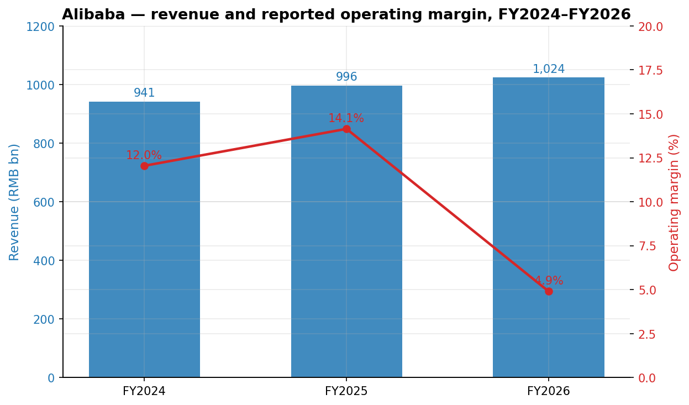
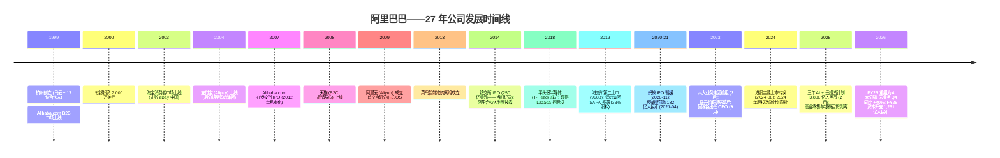
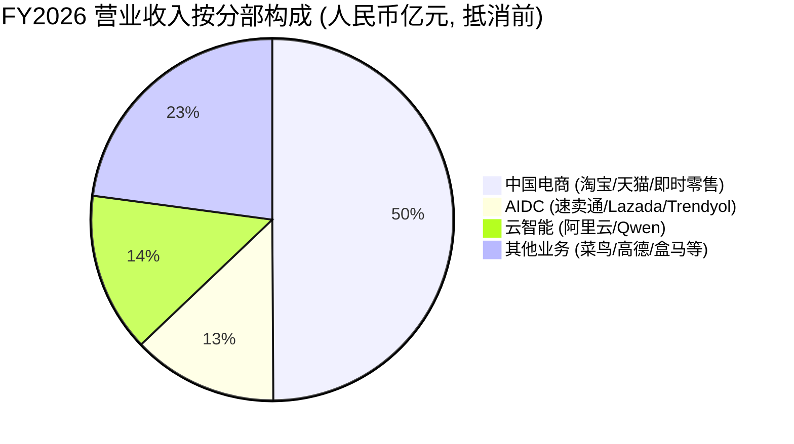
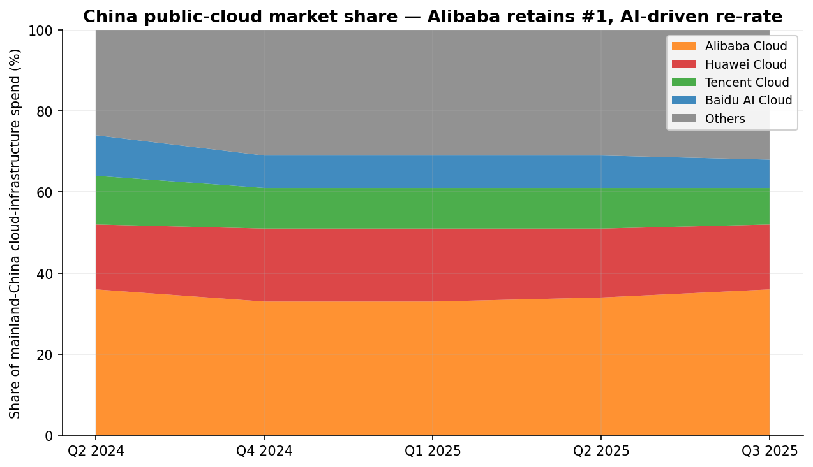
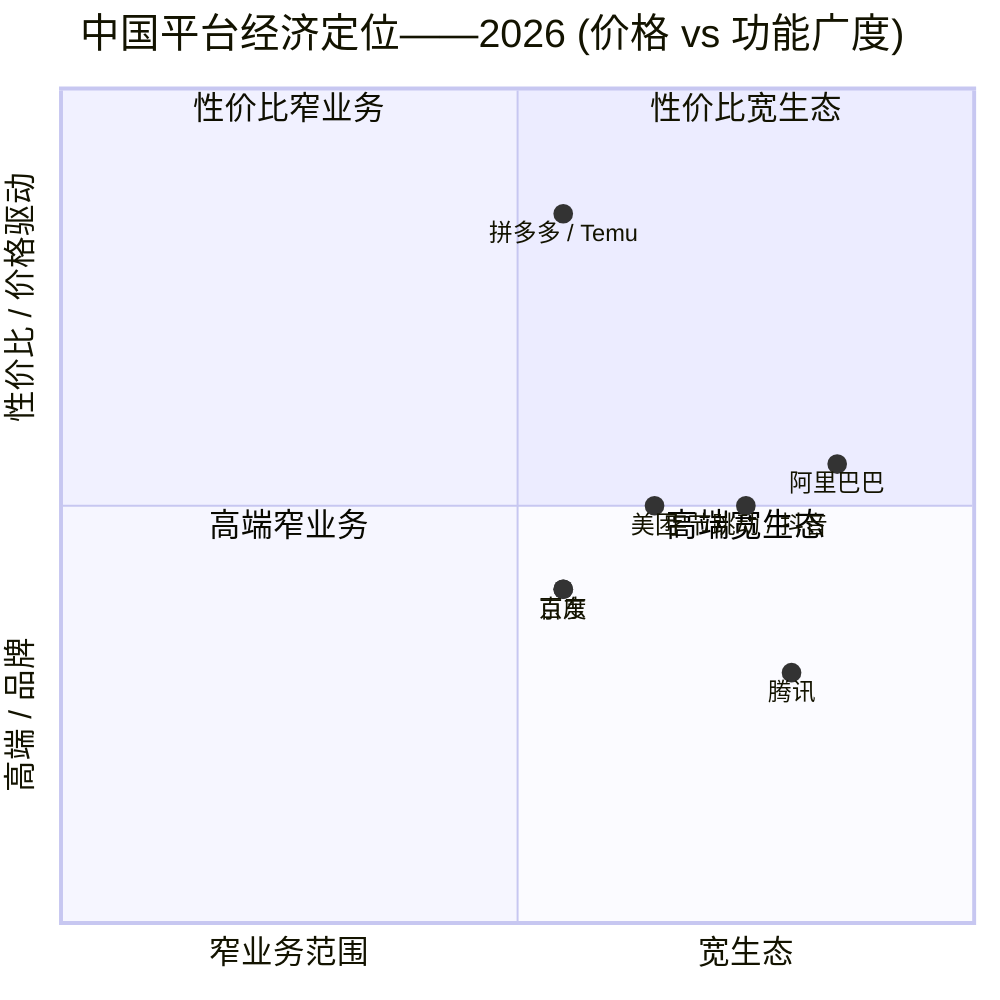

# Alibaba Group Holding Limited (NYSE:BABA) — 公司研究报告

**日期:** 2026-05-20
**报告分析师:** 股票研究部
**主要代码:** NYSE:BABA (ADR; 1 份 ADS = 8 股普通股)
**第二上市:** HKEX:9988 (港币柜台) / 89988 (人民币柜台)
**财年:** 4 月 1 日 — 3 月 31 日; 文中"FY2026"指截至 2026 年 3 月 31 日的财年。
**报告语言: 简体中文 (英文版同时存在于本目录)**

> **业绩更新——FY2026 全年业绩披露 (2026-05-13):** 管理层公布 FY2026 营业收入 10,236.70 亿人民币 (1,484.01 亿美元), 同比增长 3%; 其中云智能集团 (Cloud Intelligence Group) 营业收入同比增长 34% 至 1,581.32 亿人民币, Q4 云业务增速加速至同比 +40%。GAAP 经营利润同比下降 64% 至 501.50 亿人民币, 主因淘宝闪购 (Taobao Instant Commerce, 原饿了么) 的销售与营销投入阶梯式上行, 以及 AI/云资本开支大幅加码。FY2026 资本开支达 1,260.63 亿人民币 (182.75 亿美元), 自由现金流由 FY2025 的 +738.70 亿人民币转为流出 466.09 亿人民币。公司重申 2025-02-24 首次披露的人民币 3,800 亿 (~530 亿美元) 三年 AI + 云基础设施计划。
> 来源: [阿里巴巴 Q4 / FY2026 业绩公告, 2026-05-13](https://www.sec.gov/Archives/edgar/data/0001577552/000110465926060224/tm2614494d1_ex99-1.htm); [FY2026 20-F, 2026-05-20 提交](https://www.sec.gov/Archives/edgar/data/1577552/000119312526231755/0001193125-26-231755-index.htm); [阿里巴巴集团新闻稿, 2025-02-24](https://www.alibabagroup.com/en-US/document-1830678592242057216)。

## 目录

1. 公司概览
2. 公司历史
3. 管理团队
4. 产品与服务
5. 客户与上市策略
6. 行业概览
7. 竞争格局
8. 市场机会 (TAM)
9. 风险评估
10. 参考资料

---

## 1. 公司概览

阿里巴巴集团控股有限公司 (Alibaba Group Holding Limited) 是一家在开曼群岛注册的控股公司, 通过其合并子公司及可变利益实体 (VIE) 运营着全球两大数字商务生态系统之一, 以及中国大陆规模最大的公共云业务。根据本年度 20-F 披露的 FY2026 重组, 阿里巴巴报告四大经营分部: (1) **阿里巴巴中国电商集团** (淘宝 (Taobao)、天猫 (Tmall)、淘宝闪购 (Taobao Instant Commerce)、飞猪 (Fliggy)、1688.com); (2) **阿里巴巴国际数字商业集团 / AIDC** (速卖通 (AliExpress)、Lazada、Trendyol、Daraz、Alibaba.com); (3) **云智能集团** (阿里云 (Alibaba Cloud) IaaS/PaaS、通义千问 (Qwen) 基础模型、模型即服务 (Model-as-a-Service, MaaS)、平头哥 (T-Head) 半导体); (4) **其他业务**——主要包含菜鸟 (Cainiao) 物流、高德 (Amap) 导航、盒马鲜生 (Freshippo, Hema) 超市、阿里健康 (Alibaba Health)、虎鲸数字娱乐、钉钉 (DingTalk)、灵犀互娱以及通义消费者业务集团 ([20-F FY2026, Item 4 业务概览](https://www.sec.gov/Archives/edgar/data/1577552/000119312526231755/0001193125-26-231755-index.htm))。

**盈利模式。** 合并营业收入中, 约一半仍来自中国电商货币化——客户管理收入 (即"P4P"/按效果付费的广告系统, 以及天猫品牌商家和淘宝大卖家所支付的店铺服务费), 以及天猫超市和天猫国际的直营销售总额收入。第二大支柱是云智能业务: 按用量计价的 IaaS (计算、存储、网络)、PaaS、基于 Qwen 的不断扩充的 MaaS API 产品组合, 以及专用 AI 算力。AIDC 通过市场佣金和"速卖通 Choice"半托管模式 (gross-basis) 实现货币化。即时零售 (2025 年 4 月底由"饿了么"更名为"淘宝闪购") 通过平台佣金和按需配送费实现盈利, 补贴在收入科目下作冲销处理。"其他业务"包含直营零售 (盒马、剥离前的高鑫零售 (Sun Art))、菜鸟为速卖通 / 天猫国际提供的物流履约, 以及多项长尾数字业务 ([20-F FY2026, Item 4](https://www.sec.gov/Archives/edgar/data/1577552/000119312526231755/0001193125-26-231755-index.htm); [Q4 FY2026 业绩新闻稿, 2026-05-13](https://www.sec.gov/Archives/edgar/data/0001577552/000110465926060224/tm2614494d1_ex99-1.htm))。

**地域布局。** 总部位于杭州, 在香港设有重要运营机构 (上市主体的"主要营业地"在 HKEX 含义下即位于此, 高级管理层驻于铜锣湾时代广场一座 26 楼)、新加坡 (Lazada 与速卖通 Choice 运营中心是 AIDC 总部所在地)、土耳其 (Trendyol)、南亚 (Daraz)、东南亚 (Lazada), 此外其数据中心布局正持续向韩国、日本、阿联酋、墨西哥、巴西及法国延伸 ([20-F FY2026, Item 4 — 物业](https://www.sec.gov/Archives/edgar/data/1577552/000119312526231755/0001193125-26-231755-index.htm))。

**规模指标。** FY2026 营业收入为 10,236.70 亿人民币 (1,484.01 亿美元), 报告口径同比增长 3%, 若剔除已剥离的高鑫零售与银泰百货 (Intime) 等线下零售业务则同比增长 11% ([20-F FY2026, Item 5 经营业绩](https://www.sec.gov/Archives/edgar/data/1577552/000119312526231755/0001193125-26-231755-index.htm))。净利润同比下降 19% 至 1,021.27 亿人民币 (148.05 亿美元), 非 GAAP 净利润同比下降 62% 至 606.58 亿人民币 (87.94 亿美元), 主因 (a) 淘宝闪购首年大规模补贴投入, 使销售与营销费用从 1,440.21 亿人民币飙升至 2,450.23 亿人民币 (同比 +70%); (b) AI/云基础设施资本开支大幅扩张至 1,260.63 亿人民币 (182.75 亿美元) (FY2025 为 859.72 亿人民币)。截至 2026 年 3 月 31 日, 全职员工为 131,462 人, 较一年前的 124,320 人有所增加, 但仍远低于 FY2024 高峰期的 204,891 人 (彼时纳入了已剥离的高鑫零售与银泰百货员工) ([20-F FY2026, Item 6.D 员工](https://www.sec.gov/Archives/edgar/data/1577552/000119312526231755/0001193125-26-231755-index.htm))。阿里巴巴在中国境内持有约 19,100 项授权专利, 在境外持有约 5,500 项授权专利 ([20-F FY2026, Item 5.C](https://www.sec.gov/Archives/edgar/data/1577552/000119312526231755/0001193125-26-231755-index.htm))。


来源: [阿里巴巴 20-F FY2026, Item 5 经营业绩](https://www.sec.gov/Archives/edgar/data/1577552/000119312526231755/0001193125-26-231755-index.htm)。

**估值快照 (2026 年 5 月中旬)。** BABA 在 2026-05-20 收于 134.58 美元, 市值约 3,260–3,380 亿美元, 数值依来源略有差异 ([Capital.com BABA 市值页, 2026-05-07](https://capital.com/en-int/markets/shares/alibaba-group-holding-limited-share-price/market-cap); [stockanalysis.com BABA 统计页, 2026-05-19](https://stockanalysis.com/stocks/baba/statistics/))。截至 2026-05-19, TTM 市盈率为 21.0×, TTM 市销率 (P/S) 为 2.17× ([stockanalysis.com BABA 统计, 2026-05-19](https://stockanalysis.com/stocks/baba/statistics/)); FinanceCharts 在 2026-05-12 给出另一口径 P/E 为 26.5× ([FinanceCharts BABA PE, 2026-05](https://www.financecharts.com/stocks/BABA/value/pe-ratio))。52 周 ADR 区间为 103.71–192.67 美元, 当前价格大致处于中位, 距周期高位回调约 30% ([TIKR / 阿里巴巴 ADR 价格走势, 2026](https://www.tikr.com/blog/alibaba-stock-has-fallen-31-from-its-highs-is-baba-a-buy-in-2026))。当前 2.17× 的 P/S 较 10 年中位数 6.74× 低出 66% ([gurufocus BABA P/S, 2026-03-11](https://www.gurufocus.com/term/ps-ratio/BABA)), TTM P/E 也大幅低于 [Macrotrends](https://www.macrotrends.net/stocks/charts/BABA/alibaba/pe-ratio) 隐含的 11–47× 历史区间。

倍数水平相对同业的位置 (见第 7 章图表): BABA 21× TTM P/E **高于拼多多 PDD (~12.5×) 和京东 JD (~11×)** 这两家更便宜的中国同业, 但**远低于 MELI (~47×)、AMZN (~36×) 与 GOOGL (~26×)**。BABA 的 2.17× TTM P/S 相对西方电商 / 超大规模云厂商 (AMZN ~3.4×、GOOGL ~6.5×、MELI ~5.4×) 看似压缩, 但相对 JD 的 0.4× 偏高。与美国超大规模云厂商之间的折让并非源于"价值陷阱"机制——TTM 营业收入增长 3% (剔除剥离业务为 11%), 云业务在 FY2026 Q4 加速至 40%, 公司持有 5,208.24 亿人民币 (755.04 亿美元) 现金、短期投资及其他财资投资 ([20-F FY2026, Item 5.B 流动性](https://www.sec.gov/Archives/edgar/data/1577552/000119312526231755/0001193125-26-231755-index.htm))。折让的核心成因是**中国风险溢价 / VIE 结构 / 监管溢价**, 叠加 FY2026 自由现金流由正转负 (–466.09 亿人民币 vs. FY2025 的 +738.70 亿人民币), 因即时零售补贴和云资本开支同时达到峰值。若任一杠杆 (FCF、中国政策) 进一步恶化, 倍数仍可能继续压缩; 反之倍数扩张需要看到云业务分部利润率清晰扩张以及即时零售亏损可控。

(本节字数: 约 1,070 字)

---

## 2. 公司历史

阿里巴巴于 1999 年 6 月 28 日在杭州成立, 由 18 位合伙人创立, 牵头者为前英语教师马云 (Jack Ma, 马云), 其他联合创始人包括蔡崇信 (Joe Tsai)、彭蕾 (Lucy Peng)、吴泳铭 (Eddie Yongming Wu) 等。创业初衷是 B2B 在线市场 ("Alibaba.com"), 帮助中国中小出口商触达全球买家——这是一个出人意料地"反共识"的选择, 因为当时主导 1990 年代末中国互联网的还是消费门户模式。公司最负盛名的两笔早期融资分别是 2000 年从高盛拿到 500 万美元种子轮, 和此后从软银 (SoftBank) 拿到 2,000 万美元, 后者据孙正义 (Masayoshi Son) 本人讲述, 整个谈判仅用了 6 分钟 ([20-F FY2026, Item 4.A 历史](https://www.sec.gov/Archives/edgar/data/1577552/000119312526231755/0001193125-26-231755-index.htm))。


来源: [20-F FY2026, Item 4.A 历史与发展](https://www.sec.gov/Archives/edgar/data/1577552/000119312526231755/0001193125-26-231755-index.htm); [国家市场监督管理总局 2021 年罚款公告 (归档)](https://www.reuters.com/article/idUSKBN2BX1G8/) (Reuters, 2021-04-10); [阿里巴巴集团 3,800 亿 AI 计划新闻稿, 2025-02-24](https://www.alibabagroup.com/en-US/document-1830678592242057216)。

塑造当前公司形态的三大结构性转折点。**第一**是 2009 年阿里云的成立, 在彼时电商业务领导层公开质疑下的逆势押注——这是一项耗时长、资本密集的建设, 用了整整十五年时间, 直到 FY2024 AI 需求开始驱动分部增长突破 30% 才迎来拐点 ([20-F FY2026, 董事长兼 CEO 致辞](https://www.sec.gov/Archives/edgar/data/1577552/000119312526231755/0001193125-26-231755-index.htm))。**第二**是 2020 年 11 月蚂蚁集团双重 IPO 计划被暂停, 紧随其后是 2021 年 4 月针对天猫"二选一"商家排他行为开出 182.28 亿人民币的反垄断罚款——这一监管冲击触发 ADR 价格从高位至低位约 80% 的回撤, 并迫使公司启动了最终在 2023 年 3 月以六大业务集团重组收尾的运营重组 ([Reuters, 2021-04-10](https://www.reuters.com/article/idUSKBN2BX1G8/); [20-F FY2024, 风险因素](https://www.sec.gov/cgi-bin/browse-edgar?action=getcompany&CIK=0001577552))。**第三**是 2023 年 9 月之后的"吴泳铭 / 蔡崇信时代"——马云彻底退居幕后, 吴泳铭 (创始合伙人中唯一仍在运营一线、且具备深厚工程背景的人) 接替张勇 (Daniel Zhang) 出任 CEO, 公司明确重新优先化"用户为先, AI 驱动"战略, 并逐步取消或重新合并 2023 年试行的"分别 IPO"安排 (菜鸟 IPO 撤回、盒马 IPO 暂缓; FY2026 将淘宝 + 天猫 + 饿了么 + 飞猪重新合并为一个中国电商集团) ([20-F FY2026, 致辞](https://www.sec.gov/Archives/edgar/data/1577552/000119312526231755/0001193125-26-231755-index.htm))。

近期重要交易:
- **2025-02-24** — 公布人民币 3,800 亿 (~530 亿美元) 三年 AI + 云基础设施资本开支计划 ([阿里巴巴集团新闻稿, 2025-02-24](https://www.alibabagroup.com/en-US/document-1830678592242057216))。
- **FY2025–FY2026** — 剥离高鑫零售 (Sun Art, 旗下大润发 / Auchan 大卖场) 与银泰百货 (Intime); "其他业务"分部营业收入由 3,383.47 亿人民币降至 2,543.67 亿人民币, 主要源自上述退出 ([20-F FY2026, Item 5](https://www.sec.gov/Archives/edgar/data/1577552/000119312526231755/0001193125-26-231755-index.htm))。
- **FY2026** — 饿了么 (Ele.me) 于 2025 年 4 月底更名为"淘宝闪购"; 于 2026-01-15 集成进淘宝 App 与消费级通义 App; 即时零售营业收入同比 +47% 至 785.20 亿人民币 ([Q4/FY26 新闻稿, 2026-05-13](https://www.sec.gov/Archives/edgar/data/0001577552/000110465926060224/tm2614494d1_ex99-1.htm))。
- **2024-08-28** — 香港主要上市转换完成 (符合纳入沪深港通南向交易资格) ([20-F FY2026, Item 10.B](https://www.sec.gov/Archives/edgar/data/1577552/000119312526231755/0001193125-26-231755-index.htm))。
- **FY2026 股票回购** — 回购了 7,300 万股纽交所挂牌股票 (即 912.5 万股 ADS 当量), 总金额 10 亿美元; 截至 2027 年 3 月的剩余授权额度仍在 ([20-F FY2026, Item 16E](https://www.sec.gov/Archives/edgar/data/1577552/000119312526231755/0001193125-26-231755-index.htm))。累计 FY2024–FY2026 期间, 回购总额已达数百亿美元, 流通股数已减少至 18,669,888,147 股 (约 23.34 亿股 ADS 当量), 截至 2026 年 5 月 18 日。

(本节字数: 约 700 字)

---

## 3. 管理团队

### 吴泳铭 (Eddie Yongming Wu) — 首席执行官兼董事 (350 字)

吴泳铭, 51 岁, 自 2023 年 9 月起担任 CEO 同时兼任董事 ([20-F FY2026, Item 6.A](https://www.sec.gov/Archives/edgar/data/1577552/000119312526231755/0001193125-26-231755-index.htm))。他是阿里巴巴 18 位联合创始人之一, 也是马云退出执行层后仍活跃在一线的创始团队成员中, 运营上影响最大者——并且是这批创始合伙人中唯一具备深厚工程背景的人。吴泳铭于 1999 年加入阿里, 担任首任技术总监; 2004 年 12 月出任支付宝 (彼时仍在阿里内部) CTO; 2005 年 11 月转任阿里妈妈 (Alimama, 内部按点击成本付费的广告变现平台) 负责人——阿里妈妈如今仍承担阿里中国电商客户管理收入的大部分变现工作。他于 2007 年 12 月晋升为阿里妈妈总经理, 2008 年 9 月出任淘宝 CTO, 2011 年 10 月起统管阿里集团的搜索、广告与移动业务——这是集团内经济意义最大的三大业务线, 而他三十岁出头便已实质统辖。2014 年 9 月至 2019 年 9 月期间, 他担任马云的特别助理, 也是 IPO 后许多战略性铺垫工作 (菜鸟、阿里云、AIDC) 形成时所处的关键位置。2015 年 4 月至 2020 年 3 月, 他担任阿里健康信息技术有限公司 (Alibaba Health Information Technology Limited, 港交所上市) 主席 ([20-F FY2026, Item 6.A — 人物简历信息](https://www.sec.gov/Archives/edgar/data/1577552/000119312526231755/0001193125-26-231755-index.htm))。

2015 年 8 月, 吴泳铭创立元璟资本 (Vision Plus Capital), 一家总部位于杭州、专注前沿技术、企业服务与数字医疗的风险投资机构; 他目前仍以被动方式担任该机构的一般合伙人。他于 1996 年毕业于浙江工业大学信息工程学院, 获学士学位。截至 2026 年 5 月 18 日, 吴泳铭持有 19,706,418 股普通股 (折合 2,463,302 股 ADS 当量), 占总股本 0.1% ([20-F FY2026, Item 7.A](https://www.sec.gov/Archives/edgar/data/1577552/000119312526231755/0001193125-26-231755-index.htm))。其薪酬大幅向 2024 年股权激励计划下的业绩挂钩股权倾斜。吴泳铭撰写了 FY2026 股东信 (与董事长蔡崇信共同署名), 将战略优先级框定为"AI + 云"与"消费", 并披露公司 AI 相关云产品收入已连续 11 个季度三位数同比增长 ([Q4/FY26 业绩公告, 2026-05-13](https://www.sec.gov/Archives/edgar/data/0001577552/000110465926060224/tm2614494d1_ex99-1.htm))。他的公众形象相对马云有意低调; 任职早期的关键决策——重新合并中国电商业务、承诺 3,800 亿人民币 AI 基础设施投入、激进地把 Qwen 同时打造为开源模型家族和淘宝端消费 agent ——已成为这只股票当前的核心论点。

### 蔡崇信 (Joseph C. Tsai) — 董事长 (200 字)

蔡崇信, 62 岁, 1999 年加入创始团队, 是阿里合伙人 (Alibaba Partnership) 中两位**永久合伙人**之一 (另一位是马云)。他曾任阿里巴巴 CFO 至 2013 年, 任执行副主席至 2023 年 9 月; 张勇离任后, 他从执行副主席晋升为非执行董事长, 与吴泳铭共同搭班子 ([20-F FY2026, Item 6.A](https://www.sec.gov/Archives/edgar/data/1577552/000119312526231755/0001193125-26-231755-index.htm))。加入阿里前, 蔡崇信 1995–1999 年在投资家瓦伦堡家族 (Wallenberg family) 旗下的 Investor AB 担任私募股权投资人, 此前为纽约并购基金 Rosecliff Inc. 的法律总顾问, 1990–1993 年曾在 Sullivan & Cromwell 律所担任税务律师助理, 持有纽约州律师资格。他获耶鲁大学经济与东亚研究学士、耶鲁法学院 JD。蔡崇信主持资本管理委员会, 负责把控回购与分红节奏——这一职能权重很大, 因为 FY2026 回购规模达 10 亿美元、现金分红达 25 亿美元 (每股 ADS 1.05 美元)。其受益持股合计 272,492,074 股 (折合 34,061,509 股 ADS 当量), 约占公司 1.5%——是内部人持股中最大者, 主要通过位于巴哈马的 Parufam Limited 与位于英属维京群岛的 PMH Holding Limited 持有, 拥有投票与处置权, 但不享有经济利益 ([20-F FY2026, Item 7.A — 脚注 (2)](https://www.sec.gov/Archives/edgar/data/1577552/000119312526231755/0001193125-26-231755-index.htm))。

### 徐宏 (Toby Hong Xu) — 首席财务官 (200 字)

徐宏, 53 岁, 自 2022 年 4 月起担任集团 CFO ([20-F FY2026, Item 6.A](https://www.sec.gov/Archives/edgar/data/1577552/000119312526231755/0001193125-26-231755-index.htm))。他于 2018 年 7 月加入阿里, 自 2019 年 7 月至 2022 年 3 月担任副 CFO, 此后接替武卫 (Maggie Wu)。加入阿里前, 徐宏在普华永道 (PricewaterhouseCoopers) 工作 22 年, 自 1996 年加入, 其中 11 年担任合伙人。他于 1996 年获复旦大学物理学学士, 是中国注册会计师协会会员。其 CFO 任期内主要由三项资本市场行动定义: (a) 执行所有中国 ADR 中规模最大、最持续的科技板块回购计划 (FY2023–FY2026 累计回购数百亿美元); (b) 启动阿里巴巴首次常态化现金分红 (FY2024), 并逐步提高至 FY2026 每股 ADS 1.05 美元 ([20-F FY2026, Item 10.E](https://www.sec.gov/Archives/edgar/data/1577552/000119312526231755/0001193125-26-231755-index.htm)); (c) 完成 2024 年 8 月香港主要上市转换, 使股票获得沪深港通南向交易资格。截至 2026 年 5 月 18 日, 他持有 1,103,120 股普通股 (折合 137,890 股 ADS 当量)——相对创始人而言基本可忽略不计。徐宏在阿里巴巴之外未担任任何美国上市公司 CFO 职务。

### 蒋凡 (Fan Jiang) — 阿里电商事业群 CEO (120 字)

蒋凡, 40 岁, 于 2025 年被任命为重新合并后的阿里巴巴中国电商集团 CEO, 此前自 2022 年 1 月起担任 AIDC 总裁——任内他主导设计了速卖通"Choice"半托管模式, 推动 AIDC 零售业务在两个财年内 (FY24–FY26) 营业收入累计增长 +44%, 并使 AIDC 分部 EBITA 亏损从 FY2025 的 151 亿人民币收窄至 FY2026 的 21 亿人民币 ([20-F FY2026, Item 5](https://www.sec.gov/Archives/edgar/data/1577552/000119312526231755/0001193125-26-231755-index.htm))。他于 2013 年通过阿里收购友盟 (Umeng, 一家他于 2010 年创办的移动应用分析创业公司) 加入阿里; 此前曾任谷歌中国 (Google China) 产品工程师。其在阿里的过往高级职务包括淘宝总裁、天猫总裁与阿里妈妈总裁。他持有复旦大学计算机科学学士学位, 同时是阿里合伙人成员 ([20-F FY2026, Item 6.A](https://www.sec.gov/Archives/edgar/data/1577552/000119312526231755/0001193125-26-231755-index.htm))。

### 周靖人 (Jingren Zhou) — 首席 AI 架构师, 通义大模型事业部负责人 (100 字)

周靖人, 50 岁, 是通义千问 (Qwen / 通义) 基础模型工作的高级负责人, 同时担任云智能集团 CTO。他于 2015 年加入阿里, 是合伙人委员会成员。加入阿里前, 他曾任微软研究院 (Microsoft Research) 合伙人开发经理, 在那里主导构建了支撑 Bing 大部分查询的 SCOPE / Cosmos 分布式查询引擎。在周靖人领导下, Qwen 模型 (Qwen 3 235B-A22B、Qwen 3.5、Qwen-VL 多模态系列, 以及 FY2026 的视频生成与世界模型) 已多次在开源基准排行榜的代码与科学推理维度位列榜首 ([20-F FY2026, Item 6.A](https://www.sec.gov/Archives/edgar/data/1577552/000119312526231755/0001193125-26-231755-index.htm); [TECHSY 开源 LLM 基准, 2026-05](https://techsy.io/en/blog/best-open-source-llms-2026))。

### 治理结构尾注 (140 字)

阿里巴巴是开曼群岛公司, 设单一类别普通股 (一股一票), 同时根据 HKEX 规则因**阿里合伙人**对董事会绝对多数席位的独家提名权, 形成"加权投票权"安排。董事会由 11 名董事组成, 其中 7 人按 NYSE 规则 303A 认定为独立董事 ([20-F FY2026, Item 6.C](https://www.sec.gov/Archives/edgar/data/1577552/000119312526231755/0001193125-26-231755-index.htm))。独立董事包括杨致远 (Jerry Yang, 雅虎联合创始人、斯坦福校董会主席)、Wan Ling Martello (前雀巢 CFO)、单伟建 (Weijian Shan, 太盟投资集团 PAG)、Irene Yun-Lien Lee、Albert Kong Ping Ng (前普华永道中国高级合伙人、前花旗中国投资银行 MD) 与 Kabir Misra (前软银)。截至 2026 年 5 月 18 日, 内部人合计持股 1.9%——除蔡崇信 1.5% 外集中度很低 ([20-F FY2026, Item 7.A](https://www.sec.gov/Archives/edgar/data/1577552/000119312526231755/0001193125-26-231755-index.htm))。主要关联方安排通过蚂蚁集团 (33% 股权、支付宝商业协议、2019 年 SAPA 下的 IP 交叉许可) 与 VIE 股权持有人结构展开——均有数十年历史并由审计委员会按公司关联交易制度审查。

### 管理层业绩纪录综述 (90 字)

现任吴/蔡/徐/蒋管理团队已连续六个季度交付加速的云业务分部增长 (FY2026 Q4 云业务同比 +40%), 将 AIDC 分部亏损从 –150 亿人民币收窄至 –20 亿人民币, 并以淘宝闪购重新锚定了中国电商业务。团队尚未证明执行力的两个维度是: **经营利润率**——FY2026 报告口径经营利润同比下降 64%, 因即时零售补贴叠加 AI 资本开支使费用集中前置; **其他业务**分部——调整后 EBITA 亏损从 95 亿人民币扩大至 357 亿人民币。

(本节字数: 约 1,360 字)

---

## 4. 产品与服务

经过 FY2026 重组, 阿里巴巴的产品组合可以清晰地归入四大体系, 其中即时零售已被显著抬升至与电商、云业务、国际业务平起平坐的战略支柱地位。

```mermaid
graph TD
    A[阿里巴巴集团] --> B[阿里巴巴中国电商集团]
    A --> C[AIDC — 国际数字商业]
    A --> D[云智能集团]
    A --> E[其他业务]

    B --> B1[淘宝 App]
    B --> B2[天猫 / 天猫国际]
    B --> B3[天猫超市]
    B --> B4[淘宝闪购<br/>原饿了么——即时零售]
    B --> B5[飞猪——旅行]
    B --> B6[1688.com——中国 B2B 批发]
    B --> B7[阿里妈妈——P4P 广告平台]

    C --> C1[速卖通 + Choice]
    C --> C2[Lazada——东南亚]
    C --> C3[Trendyol——土耳其]
    C --> C4[Daraz——南亚]
    C --> C5[Alibaba.com——全球 B2B]

    D --> D1[阿里云 IaaS / PaaS]
    D --> D2[通义千问基础模型 + MaaS]
    D --> D3[平头哥——倚天 / 含光 / PPU]
    D --> D4[悟空 (Wukong)——agent 平台]
    D --> D5[钉钉——企业生产力]

    E --> E1[菜鸟——物流]
    E --> E2[高德——导航 / 本地生活]
    E --> E3[盒马鲜生——超市]
    E --> E4[阿里健康]
    E --> E5[虎鲸数字娱乐]
    E --> E6[灵犀互娱]
    E --> E7[通义消费者业务集团<br/>——通义 App、视频、世界模型]
```
来源: [20-F FY2026, Item 4.B 业务概览](https://www.sec.gov/Archives/edgar/data/1577552/000119312526231755/0001193125-26-231755-index.htm); [Q4 / FY26 业绩公告, 2026-05-13](https://www.sec.gov/Archives/edgar/data/0001577552/000110465926060224/tm2614494d1_ex99-1.htm)。

**淘宝与天猫——旗舰电商平台。** 淘宝是中国最大的 C2C / "发现"型市场; 天猫是其 B2C 品牌导向的兄弟平台。二者合计仍是集团盈利的基石: FY2026 中国电商分部产生 4,493.85 亿人民币市场业务收入 (客户管理 + 直营销售), 此外还有 263.12 亿人民币的中国电商批发业务, 客户管理收入单项同比增长 5% 至 3,438.67 亿人民币 ([20-F FY2026, Item 5](https://www.sec.gov/Archives/edgar/data/1577552/000119312526231755/0001193125-26-231755-index.htm))。估算 2025 年自然年 GMV: 淘宝约 5,850 亿美元, 天猫约 5,680 亿美元 ([Lengow 中国市场分析, 2026](https://www.lengow.com/get-to-know-more/top-marketplaces-in-china/))。**竞争优势:** 是——规模、双边网络效应 (中国年活跃消费者 10 亿以上)、中国最大的品牌商家基础、以及阿里妈妈 P4P 广告系统 (后者是网络变现的核心引擎)。最直接的产品竞争对手: 拼多多 / Temu (优先低价位、品牌深度不足)、京东商城 (电子产品 + 家电 + 物流较强, 服饰 / FMCG 长尾偏弱)——在订单量上与拼多多平级, 但在客单价 (AOV) 与品牌深度上领先。

**淘宝闪购 (原饿了么)——即时零售。** 2025 年 4 月底完成更名, 并被激进重定位为淘宝平台的核心支柱。FY2026 营业收入同比增长 47% 至 785.20 亿人民币, FY2026 Q4 增速达 57% YoY ([20-F FY2026, Item 5](https://www.sec.gov/Archives/edgar/data/1577552/000119312526231755/0001193125-26-231755-index.htm); [Q4/FY26 业绩新闻稿, 2026-05-13](https://www.sec.gov/Archives/edgar/data/0001577552/000110465926060224/tm2614494d1_ex99-1.htm))。平台提供餐饮、商超、医药、FMCG、3C、鲜花、服饰的 30 分钟配送。管理层目标是每年将分部亏损减半, 朝 FY2029 盈亏平衡目标推进 ([Q4 FY26 市场评论, 2026-05](https://www.kavout.com/market-lens/what-did-alibaba-s-q4-fy2026-earnings-reveal))。**竞争优势:** 部分具备——晚于美团 (Meituan) 入场 (美团在一线城市以 35 分钟或更快为默认承诺, 且占据餐饮供给的统治位势), 但拥有淘宝 App 与通义 App (2026-01-15 集成完成) 这两个独有分发杠杆。最直接的竞争对手: 美团闪购 / 美团外卖——在订单密度上目前领先; 京东到家则是落后者。

**阿里云 + Qwen + 悟空。** 云智能集团营业收入 FY2026 同比增长 34% 至 1,581.32 亿人民币; AI 相关产品**连续 11 个季度**实现三位数同比增长, 目前占分部收入 30% ([Q4/FY26 新闻稿, 2026-05-13](https://www.sec.gov/Archives/edgar/data/0001577552/000110465926060224/tm2614494d1_ex99-1.htm))。调整后 EBITA 利润率扩张——基于 1,581.32 亿人民币营业收入, 分部 EBITA 同比增长 35% 至 142.65 亿人民币。Qwen 基础模型家族 (Qwen 3 235B-A22B; Qwen 3.5 推理; Qwen-VL 多模态; FY2026 视频与世界模型) 同时以 Apache 2.0 开源权重和阿里云之上的 MaaS API 两种方式发布。Qwen 3 235B-A22B 目前在结合推理、代码与多语种成绩的最广泛公开开源基准上居于领先 ([TECHSY 开源 LLM 基准, 2026-05](https://techsy.io/en/blog/best-open-source-llms-2026))。新发布的**悟空 (Wukong)** agent 平台用于在阿里企业工具间协调 AI 智能体, **钉钉**则锚定 MaaS 部署在生产力侧的入口 ([20-F FY2026, 董事长兼 CEO 致辞](https://www.sec.gov/Archives/edgar/data/1577552/000119312526231755/0001193125-26-231755-index.htm))。**竞争优势:** 是——全栈护城河 (通过平头哥控制芯片、超大规模云基础设施、基础模型、MaaS、应用层), 是中国唯一以此规模运营的本土超大规模云厂商。最直接的竞争对手: 华为云 (在政府与本地化 AI 部署上更强, 但在第三方开发者心智份额上偏弱); 腾讯云 (第三)。DeepSeek V4 Pro 在开源模型基准上是最强的纯模型竞争对手, 但其无法控制自己的算力栈 ([codersera 开源 LLM 基准, 2026-05](https://codersera.com/blog/best-open-source-llm-2026-llama-4-qwen-3-5-deepseek-v4-gemma-4-mistral/))。

**平头哥——自研半导体。** 成立于 2018 年, 平头哥设计了服务器级 CPU (倚天 710 Arm 架构, 2021)、AI 推理加速器 (含光 800, 2019), 以及 2025 年 9 月披露的最新 PPU GPU——96 GB HBM2e、芯片间互连带宽 700 GB/s、TDP 400 W, 据中国官方媒体描述"性能可比 NVIDIA H20", 已在阿里内部部分替代英伟达系统用于中小规模 / 低难度 AI 训练 ([Datacenter Dynamics, 2025-09-08](https://www.datacenterdynamics.com/en/news/alibaba-develops-ai-inferencing-chip-as-exports-of-nvidia-h20-continue-to-stall-report/); [TrendForce, 2026-01-23](https://www.trendforce.com/news/2026/01/23/news-alibaba-chip-unit-t-head-reportedly-eyes-spinoff-ai-chip-said-comparable-to-nvidia-h20/))。管理层已公开放风平头哥可能分拆独立上市。**竞争优势:** 部分具备——按阿里自己的口径, 平头哥是 2025 年中国出货量最大的本土 GPU, 但在先进训练芯片上落后于英伟达; 它更像是对美国出口管制的有用对冲, 而非领跑型护城河。

**AIDC——速卖通、Lazada、Trendyol、Daraz、Alibaba.com。** 国际电商零售业务营业收入 FY2026 同比增长 9% 至 1,177.31 亿人民币 ([20-F FY2026, Item 5](https://www.sec.gov/Archives/edgar/data/1577552/000119312526231755/0001193125-26-231755-index.htm))。速卖通的"Choice"半托管模式——阿里负责履约、退货与定价, 商家供货——曾带动 FY2025 零售业务同比增长 +31%, 此后回归正常水平 ([速卖通 / Bamboo Works, 2025](https://thebambooworks.com/aliexpress-fuels-alibaba-internationals-revenue-growth-by-giving-shoppers-a-choice/))。菜鸟"欧洲 5 日达"项目是关键支撑。批发业务 (1688 + Alibaba.com) 同比增长 11% 至 264.39 亿人民币。**竞争优势:** 部分具备——在土耳其表现强劲 (Trendyol 按 GMV 第一)、在东南亚有竞争力 (Lazada 与 Shopee/SEA、TikTok Shop 对垒)、在西方市场则面临 Temu (拼多多) 与 Shein 的价格压力。最直接竞争对手: Shopee (东南亚平级); Temu (在美国 / 西欧消费者直邮上领先)。

**菜鸟智能物流网络。** 中国最大跨境电商物流运营商, 也是速卖通 / 天猫国际履约的骨干。在 FY2026 重组后被划入"其他业务"。第三方测算 FY2025 菜鸟贡献集团约 110 亿美元 (~8%) 营业收入 ([Bamboo Works, 2025](https://thebambooworks.com/aliexpress-fuels-alibaba-internationals-revenue-growth-by-giving-shoppers-a-choice/))。**竞争优势:** 是 (中国境内网络密度; 跨境业务部分具备)。最直接的竞争对手: 顺丰速运 (SF Express)、京东物流。

**长尾产品。** 高德 (Amap, Gaode) 是中国第二大移动地图和打车聚合平台; 盒马鲜生 (Hema) 运营约 370 家超市 + 仓储混合门店; 阿里健康在港交所上市 (0241); 虎鲸数字娱乐 (原优酷为基础) 是数字娱乐业务; 灵犀互娱与钉钉构成长尾业务的剩余部分 ([20-F FY2026, Item 4](https://www.sec.gov/Archives/edgar/data/1577552/000119312526231755/0001193125-26-231755-index.htm))。

**旗舰 vs. 长尾业务综述。** 驱动股权故事的三大业务是: **(1) 淘宝 + 天猫** (仍是现金奶牛——3,438.67 亿人民币客户管理收入, 边际利润率极高)、**(2) 云智能** (增长引擎——34% 营收增长、35% EBITA 增长, 持续加速) 和 **(3) AIDC / 即时零售** (期权价值——顶线高速增长, 亏损收窄走向盈亏平衡)。长尾消费互联网资产 (虎鲸、灵犀、高德、盒马) 对营业收入仍重要, 但 FY2026 在分部 EBITA 维度贡献为负。

**过去 12 个月的发布与下线。** 新发布: Qwen 3 / Qwen 3.5 家族; Qwen 视频生成与世界模型; 悟空 agent 平台; 平头哥 PPU GPU。重新定位: 饿了么 → 淘宝闪购。下线 / 剥离: 高鑫零售 (大润发 / Auchan 大卖场), 银泰百货。重新合并: 淘宝 + 天猫 + 饿了么 + 飞猪合并为单一中国电商集团 ([20-F FY2026, Item 4.A](https://www.sec.gov/Archives/edgar/data/1577552/000119312526231755/0001193125-26-231755-index.htm))。

(本节字数: 约 1,010 字)

---

## 5. 客户与上市策略

### 客户分层

阿里巴巴的客户基础是结构性的"三模"组合。**(1) 中国消费者** (11 亿以上中国互联网用户) 构成淘宝、天猫、淘宝闪购、飞猪和通义 App 的需求侧。**(2) 商家与品牌**——数百万淘宝长尾 SMB 卖家、约 25 万家付费天猫品牌旗舰店、1688.com B2B 批发卖家基础, 以及国际速卖通 / Lazada / Trendyol 卖家基础——构成可货币化的客户管理、广告、履约与平台服务收入需求。**(3) 企业与开发者** (中国国有企业、私营云客户、金融机构、汽车 OEM, 以及越来越多的国际云客户) 是阿里云与 Qwen MaaS API 的购买方。


来源: [20-F FY2026, Item 5 分部营收](https://www.sec.gov/Archives/edgar/data/1577552/000119312526231755/0001193125-26-231755-index.htm)。

### 客户集中度 (必披露)

阿里巴巴运营的是数百万级别客户的市场模式, **20-F 未披露单一最大客户或前五大客户占合并营业收入的比例, 因为根据 SEC ASC 280-10-50-42 报告披露门槛, 没有任何单一客户达到合并营业收入 10% 或以上** ([20-F FY2026, Item 4.B 与分部附注](https://www.sec.gov/Archives/edgar/data/1577552/000119312526231755/0001193125-26-231755-index.htm))。最实质性的**关联方**客户敞口是蚂蚁集团生态: 阿里云向蚂蚁提供云计算服务, SAPA / IPLA / 支付宝商业服务协议形成持续性经常性收入——蚂蚁向阿里支付的云计算费用在分部附注中分项披露 (20-F 关联方表格按业务线细分了 FY24-FY26 数据) ([20-F FY2026, Item 7.B 关联方交易](https://www.sec.gov/Archives/edgar/data/1577552/000119312526231755/0001193125-26-231755-index.htm))。更广泛的关注点是**平台侧商家集中度**——天猫的服饰与 FMCG GMV 集中于几百家超级品牌 (宝洁、联合利华、欧莱雅、苹果、耐克、阿迪达斯、雅诗兰黛、蒙牛等)。虽然没有任何单一商家超过 10% 的营业收入门槛, 但若天猫前 100 家头部品牌持续向抖音或拼多多迁移, 仍是实质性风险, 这一点在第 9 章中已列示。

最大客户的集中度**很低, 因此不在第 9 章中列为风险**(单一客户 < 10%、前五大客户合计远低于 50%——基于管理层的分部披露); 公司主要承担的是分散化的市场份额风险。

### 分发渠道与上市策略

电商上市策略在中国**以 App 优先**(淘宝 App 是消费者的主入口, 现已内嵌淘宝闪购、飞猪、大麦、高德与支付宝作为功能)、在国际市场则**多平台**(独立的 Lazada、速卖通、Trendyol 与 Daraz 品牌按市场本地化运营)。商家获取对头部品牌为直销, 对长尾 SMB 商家则为自助化。云业务上市策略结合直销企业销售团队 (大型国企与私营客户) 与自助开发者控制台 (阿里云国际), 以及系统集成商伙伴渠道。销售周期对 SMB 云客户为分钟级, 对企业 / 国企合同则为周至月级。国际电商业务采用高强度付费社交与搜索广告。

### 关键合作关系

- **蚂蚁集团 (阿里持股 33%, 总部杭州)** ——根据支付宝商业协议为阿里巴巴所有中国市场提供支付宝支付与担保结算服务; 在 IPLA 框架下交叉许可 IP ([20-F FY2026, Item 7.B](https://www.sec.gov/Archives/edgar/data/1577552/000119312526231755/0001193125-26-231755-index.htm))。蚂蚁股权按权益法核算。
- **NVIDIA / TSMC / Marvell / Broadcom** ——云基础设施 GPU 与 ASIC 的供应链合作伙伴; 关系受美国出口管制约束 (H20 出口许可仍处于不确定状态)。
- **港交所沪深港通** ——2024 年 8 月主要上市转换完成后, BABA / 9988 取得纳入南向通的资格, 打开了内地投资者基础 ([20-F FY2026, Item 10.B](https://www.sec.gov/Archives/edgar/data/1577552/000119312526231755/0001193125-26-231755-index.htm))。
- **速卖通 Choice 运营模式合作伙伴** ——快递网络 (顺丰、极兔)、欧洲与美国本地履约服务商, 以及采用半托管模式的品牌卖家。
- **Qwen 开源社区** ——Apache 2.0 许可下的 Qwen 3 / 3.5 / VL / 视频 / 世界模型发布, 驱动开发者采纳并带动下游 MaaS 拉动。

### 标杆客户与案例

20-F 在结构上对具名云客户披露较少 (这是外国私人发行人 20-F 的常见做法), 但阿里云的公开标杆客户包括中国联通、吉利汽车、小米汽车、理想汽车、Bilibili、小红书 (RedNote), 以及中国银行业相当规模的 AI 工作负载。Trendyol 按 GMV 计是土耳其最大电商平台; 速卖通在西班牙、法国、波兰与巴西等市场处于市场领先或前三位置 ([速卖通 / Bamboo Works, 2025](https://thebambooworks.com/aliexpress-fuels-alibaba-internationals-revenue-growth-by-giving-shoppers-a-choice/))。

(本节字数: 约 720 字)

---

## 6. 行业概览

阿里巴巴跨越四个行业: (1) 中国国内电商, (2) 全球跨境 / 新兴市场电商, (3) 中国公共云与 AI 基础设施, (4) 即时本地生活服务 (即时零售)。

### 中国电商 (四者中规模最大)

中国是全球最大的在线零售市场, 拥有超过 11 亿互联网用户; 2025 年全平台电商 GMV 总额超过 3 万亿美元。阿里巴巴 (淘宝 + 天猫)、京东与拼多多合计控制 2025 年零售 GMV 的接近 70%, 抖音与快手通过直播电商再合计获取约 20% ([Lengow 中国市场, 2026](https://www.lengow.com/get-to-know-more/top-marketplaces-in-china/))。行业结构: 寡占型, 有两个挑战者 (抖音 / TikTok Shop 与拼多多) 增速快于头部玩家。长周期驱动因素: 消费从线下持续迁移至线上 (中国渗透率已超 30%, 而美国约为 15%, 增量上行空间主要在服务与生鲜); 直播与内容电商的长周期增长; 整合至 2–4 个超级 App。监管环境: 自 2021 年市场监管总局反垄断执法以来 (即阿里 182 亿罚款源头) 处于密集监管下; 市监总局对"二选一"商家排他禁令在结构上削弱了天猫相对拼多多与抖音的竞争壁垒, 但反过来为阿里在即时零售与品牌体验维度上的竞争腾出了空间。

### 跨境 / 新兴市场电商

2025 年全球 B2C 跨境电商 GMV 约 1.0–1.2 万亿美元。速卖通与 Temu (拼多多) 共同主导中国出口直邮赛道, Shein 在服饰垂直层另立门户。Choice / Y2 (全托管) 运营模式 (平台负责定价、履约与售后) 是结构性创新, 把 AIDC 零售业务增速推升至 +30% 区间。土耳其 (阿里旗下 Trendyol 在国内 GMV 上领先) 与东南亚 (Lazada 排第二, Shopee 第一) 是 AIDC 的两个堡垒市场; 西欧与拉美则是成长市场 ([20-F FY2026, Item 4.B](https://www.sec.gov/Archives/edgar/data/1577552/000119312526231755/0001193125-26-231755-index.htm); [Bamboo Works, 2025](https://thebambooworks.com/aliexpress-fuels-alibaba-internationals-revenue-growth-by-giving-shoppers-a-choice/))。

### 中国公共云与 AI 基础设施

阿里巴巴股权故事中最重要的成长行业。中国公共云基础设施服务市场在 2025 Q1 同比增长 16% 至 116 亿美元, Q2 加速到 21%, Q3 24%, Q4 26% ([Canalys 2025 Q1 新闻稿, 2025-07](https://www.lightreading.com/cloud/mainland-china-s-cloud-infrastructure-market-growth-accelerated-in-q1-2025-canalys); [Omdia 2025 Q4 新闻稿, 2026-04](https://omdia.tech.informa.com/pr/2026/apr/mainland-china-cloud-infrastructure-spending-rises-26percent-in-q4-2025-driven-by-ai-and-agent-growth))。


来源: [Canalys 中国云 Q1–Q3 2025 新闻稿](https://www.lightreading.com/cloud/mainland-china-s-cloud-infrastructure-market-growth-accelerated-in-q1-2025-canalys); [Omdia 中国云 Q4 2025 新闻稿, 2026-04-15](https://omdia.tech.informa.com/pr/2026/apr/mainland-china-cloud-infrastructure-spending-rises-26percent-in-q4-2025-driven-by-ai-and-agent-growth)。

加速是压倒性地**由 AI 驱动**: 训练与推理 GPU 需求, 加上 agentic AI 使用量爆发, 把整条云 TAM 曲线向上推。行业结构: 高度集中——前四大 (阿里、华为、腾讯、百度) 合计约占中国大陆公共云支出的 70%; 国际超大规模云厂商在 2024 年 4 月之前因 IDC 牌照规则被排除, 现在仍只在大陆边缘存在。2024 年 4 月规则放宽允许国际云厂商在华申请 IDC 牌照, 引入长周期竞争风险 (20-F 的竞争风险因素中已自行标注)。

### 即时本地生活服务 / 即时零售

中国即时零售 TAM 预计到 2029 年达 1,267 亿美元 (相对 2025 年 450–550 亿美元), 美团、阿里 (淘宝闪购) 与京东是当下三强 ([GlobeNewswire / 中国即时零售数据手册, 2026-04-21](https://www.globenewswire.com/news-release/2026/04/21/3277632/28124/en/china-quick-commerce-databook-report-2026.html))。行业经济在成长期为单位亏损, 在密度足够后转向正向盈亏平衡; 通往 FY2029 即时零售盈亏平衡的路径是买方圈内围绕阿里的核心运营辩论。

### 监管环境 (跨行业)

三个监管层级具有实质影响: **(a) 中国反垄断与平台经济监管** ——市监总局、发改委、工信部、网信办对平台经济规则的执法; **(b) 中国数据与网络安全规则** ——个人信息保护法 (PIPL)、数据安全法, 以及网信办主导的跨境数据传输规则; **(c) 美国证券与出口管制** ——《外国公司问责法》(HFCA Act) 审计检查机制 (通过 PCAOB 对普华永道中天 ZT 的检查目前已落地)、美国对 NVIDIA H100 / H200 / B200 系列 GPU 的出口管制。

### 行业动态——替代品、供应商力量、买方力量

- **替代品:** 抖音 / 快手直播电商与淘宝竞争流量; 美团与即时零售竞争订单。
- **供应商力量:** NVIDIA 与 TSMC 对 AI 级 GPU / 先进制程硅片保有定价权; 平头哥能缓解依赖但无法消除。
- **买方力量:** 消费者基础高度分散, 但天猫大牌商家具备中等买方议价能力, 抖音 / 拼多多构成可信替代选择。
- **进入壁垒:** 云业务极高 (资本开支); 市场电商中到高 (网络效应 + 品牌); 跨境直邮较低 (Temu、Shein、TikTok Shop 都在 5 年内成功进入)。

(本节字数: 约 860 字)

---

## 7. 竞争格局

### 直接竞争对手

| 竞争对手 | 重叠点 | 最新披露规模 | 来源 |
|---|---|---|---|
| 拼多多 (PDD) / Temu | 淘宝长尾 + 速卖通西方业务 | ~7,800 亿美元 2025 GMV (拼多多 + Temu 合计) | [Lengow, 2026](https://www.lengow.com/get-to-know-more/top-marketplaces-in-china/) |
| 京东 (JD.com) | 天猫电子产品 + 家电 + 超市 | ~5,470 亿美元 2025 GMV | [Lengow, 2026](https://www.lengow.com/get-to-know-more/top-marketplaces-in-china/) |
| 抖音 (ByteDance) | 天猫服饰 / FMCG 直播业务 | ~6,560 亿美元 2025 全平台直播电商 GMV | [Lengow, 2026](https://www.lengow.com/get-to-know-more/top-marketplaces-in-china/) |
| 美团 (Meituan) | 淘宝闪购、飞猪 | 即时零售龙头, 日订单 3,000 万+ | [GlobeNewswire, 2026-04-21](https://www.globenewswire.com/news-release/2026/04/21/3277632/28124/en/china-quick-commerce-databook-report-2026.html) |
| 华为云 | 阿里云 (中国政府 + 企业) | 中国大陆云份额 ~16–18% | [Canalys, 2025](https://www.lightreading.com/cloud/mainland-china-s-cloud-infrastructure-market-growth-accelerated-in-q1-2025-canalys) |
| 腾讯云 | 阿里云 (游戏、社交) | 中国大陆云份额 ~9–10% | [Canalys, 2025](https://www.lightreading.com/cloud/mainland-china-s-cloud-infrastructure-market-growth-accelerated-in-q1-2025-canalys) |
| 百度智能云 | 云智能 (AI MaaS) | 中国云份额 ~7–8%; 文心一言 (Ernie Bot) LLM | [CRN Asia, 2025](https://www.crnasia.com/news/2025/cloud/baidu-and-alibaba-take-lead-in-china-s-ai-cloud-market) |
| Shopee (SEA Group) | 东南亚 Lazada | 2024 年东南亚 GMV ~950 亿美元 | [SEA 年报, 2025](https://www.sea.com/investor) |
| 亚马逊云 AWS | 阿里云国际 | 全球 IaaS 份额 ~30%+ | [Synergy Research Group, 2025](https://www.srgresearch.com/) |
| 字节跳动 / TikTok Shop | 速卖通 + 天猫国际 | ~1,200 亿美元 2025 全球 GMV (估算) | 二次来源新闻, 2025–2026 |

### 市场份额——中国公共云


来源: [Canalys 2025 Q1 中国大陆云市场份额新闻稿, 2025-07](https://www.lightreading.com/cloud/mainland-china-s-cloud-infrastructure-market-growth-accelerated-in-q1-2025-canalys); [Omdia / CRN Asia 2025 Q3 份额报道, 2025](https://www.crnasia.com/news/2025/cloud/baidu-and-alibaba-take-lead-in-china-s-ai-cloud-market); [CIW 阿里云 IaaS 份额, 2025](https://www.ciw.news/p/alibaba-cloud-market-share-2025)。

阿里云在 2025 年每个季度都保持或提升了份额——从 2025 Q1 的 33% 升至 Q3 的 36%——主要靠捕获了 AI 相关云增量支出中最大的份额。华为云是按份额计的最直接竞争对手, 在政府、电信和国企客户中尤为强势, 并拥有最强的自研芯片故事 (昇腾 910C); 但在第三方开发者 / ISV 生态上落后。

### 同业估值


来源: BABA 数据来自 [stockanalysis.com BABA 统计, 2026-05-19](https://stockanalysis.com/stocks/baba/statistics/); 同业 P/E 和 P/S 数据由 Yahoo Finance / stockanalysis.com 的拼多多 PDD、京东 JD、MELI、AMZN、GOOGL 列表 (截至 2026-05-15 至 2026-05-19) 汇编。(所有数值为 TTM 截至 2026 年 5 月中旬并四舍五入。)

### 定位框架



### 竞争优势

1. **中国消费互联网技术栈的广度**——只有阿里巴巴和腾讯同时运营支付 + 商业 + 云 + 内容的全栈, 且阿里巴巴是其中唯一拥有顶级超大规模云的一家。
2. **全栈 AI 护城河**——芯片 (平头哥)、基础设施 (阿里云)、基础模型 (Qwen, 以开源许可用于分发、以专有授权用于最高层级)、MaaS, 以及应用 (通义消费 App、钉钉、悟空、电商集成)。没有任何其他中国科技公司具备此规模的全栈 ([20-F FY2026, 董事长兼 CEO 致辞](https://www.sec.gov/Archives/edgar/data/1577552/000119312526231755/0001193125-26-231755-index.htm))。
3. **天猫上的品牌与商家关系**——市监总局 (2021 年起) 受保护的品牌商家竞争底盘, 持续承担相当规模广告与店铺支出, 黏性高于抖音直播模式。
4. **菜鸟在中国境内 + 跨境的物流密度**——欧洲 5 日达、覆盖 100 个以上国家的整合最后一公里网络。
5. **现金 + 投资规模**——截至 2026 年 3 月 31 日, 现金、短期投资与其他财资投资合计 5,208.24 亿人民币 (755 亿美元) ([20-F FY2026, Item 5.B](https://www.sec.gov/Archives/edgar/data/1577552/000119312526231755/0001193125-26-231755-index.htm))。这是任何中国注册公司中规模最大的现金头寸, 也是 3,800 亿人民币 AI 投入的内部资金来源。

### 竞争弱点

- **即时零售结构性晚到者。** 美团既有更多日订单也有更高的商家供给密度; FY26 "其他业务"分部 357 亿人民币的 EBITA 亏损本身就是阿里在追赶上的激进程度的一个量化指标。
- **拼多多 / Temu 的价格天花板。** 拼多多和 Temu 在结构上有更低的 take rate 与更低的商家毛利, 这从结构上限制了淘宝在长尾 SKU 上的定价能力。
- **VIE 结构与 HFCA Act 阴影。** 审计检查机制目前生效但并非永久——重新施加交易限制仍是离散尾部风险 ([20-F FY2026, 风险因素](https://www.sec.gov/Archives/edgar/data/1577552/000119312526231755/0001193125-26-231755-index.htm))。
- **GPU 获取。** 美国出口管制限制了先进 NVIDIA 训练芯片的获取; 平头哥是对冲, 但在最前沿仍落后。
- **2024 年 4 月 IDC 牌照对国际超大规模云厂商的放开** ——长周期竞争风险, AWS / Azure / Google Cloud 可通过本地 IDC 合作伙伴显著进入中国市场。

(本节字数: 约 830 字)

---

## 8. 市场机会 (TAM)

阿里巴巴的可服务机会栈异常广阔。四大支柱及其 2025–2030 的方向性规模:

### TAM (漏斗顶层)

- **中国零售电商 GMV:** 2025 年约 3 万亿美元, Mordor Intelligence 预计 2031 年前 CAGR ~10% ([Mordor Intelligence 中国电商报告, 2025](https://www.mordorintelligence.com/industry-reports/china-ecommerce-market))。阿里淘宝 + 天猫 + 即时零售合计 GMV 隐含 30 后段 % 的份额, 其余由拼多多、京东、抖音、快手与长尾平台瓜分。
- **中国公共云基础设施服务:** 2025 年年化约 480 亿美元 (Q1 116 亿美元 × ~4 季), 2025 全年同比增速 20–26%; Canalys / Omdia 共识隐含, 若 20% CAGR 持续, 2030 年中国云基础设施 TAM 达 1,100–1,300 亿美元 ([Canalys / Omdia 关于中国大陆云至 2025 Q4 的报道](https://omdia.tech.informa.com/pr/2026/apr/mainland-china-cloud-infrastructure-spending-rises-26percent-in-q4-2025-driven-by-ai-and-agent-growth))。AI 驱动工作负载是最大单一增量驱动, 且结构性地有利于全栈龙头 (阿里、华为)。
- **全球跨境 / 新兴市场电商:** 2025 年 1.0–1.2 万亿美元, 阿里在土耳其、东南亚、拉美及部分西欧市场参与 AIDC 竞争。AIDC 零售业务营业收入约 171 亿美元, 即便只把可服务市场限定在速卖通 + Lazada + Trendyol + Daraz 这四个 SAM 范围内, 阿里目前份额也只有个位数。
- **中国即时零售:** 2025 年 GMV 450–550 亿美元, 预计 2029 年达 1,267 亿美元——约 25%+ CAGR ([GlobeNewswire / 数据手册 2026, 2026-04-21](https://www.globenewswire.com/news-release/2026/04/21/3277632/28124/en/china-quick-commerce-databook-report-2026.html))。
- **AI MaaS / agentic AI:** 四大支柱中 2025 年最小, 但增长最快——多家分析机构预测全球 GenAI 软件与服务 TAM 在 2028 年达到 2,000–4,000 亿美元。阿里的 Qwen 通过基础模型 / API 收入进入云分部收入线。

### SAM 与 SOM

阿里巴巴的 **SAM** (其活跃参与的可服务子集) 大致为: 全中国电商 + 中国云 + AIDC 五国布局 + 即时零售 + 菜鸟可服务物流——2025 年方向性合计约在 1.0–1.2 万亿美元区间。**SOM (今日已捕获收入)** 是 FY2026 合并营业收入 1,484 亿美元, 隐含目前对该总 SAM 的捕获约为 13–15%。该算法是粗略的, 因为 GMV ≠ 营业收入 (阿里营业收入主要是远大的 GMV 基础上的 take rate), 但定性上的结论成立: 云业务仍有巨大空间 (当前 ~36% 中国大陆份额, 但 TAM 480 亿美元且同比 25%+ 增长), AIDC 也仍有巨大空间 (1 万亿美元以上跨境 TAM, 当前份额仍为个位数)。

### 增长预测

- **云业务:** 管理层未给出 FY2027 营收明确指引, 但 AI 相关营业收入连续 11 个季度三位数同比增长, FY2026 Q4 分部增速 40%, 加上 3,800 亿人民币的三年资本开支计划, 推出 FY2027 持续 30%+ 增速的合理推演。
- **AIDC:** FY2026 分部亏损同比下降 86%, 管理层重申通往盈亏平衡的路径; FY2026 零售业务营收 +9% 低估了底层业务的真实速度——因吸收了 FY25 Choice 项目的一次性高增长基数。
- **即时零售:** FY2026 营业收入同比 +47%; Q4 +57%; 管理层明确目标每年将亏损减半, 朝 FY2029 盈亏平衡推进。
- **中国电商核心业务:** FY2026 客户管理收入同比 +5%——缓慢、成熟, 但仍有利润。未来 3–5 年大概率是低至中个位数增长。

### 渗透策略

- **云业务:** 前置资本开支 (3,800 亿人民币 / 3 年) 在 AWS / Azure 还未能借助 2024 年 4 月 IDC 牌照变化建立有意义的大陆存在前抢占份额; 用 Qwen 开源分发在开发者端播种 MaaS 渗透。
- **即时零售:** 在淘宝 App 内激进补贴构建订单密度, 把商家供给迁移到淘宝闪购, 与通义和支付宝形成超级 App 效应, 然后随经济模型反转逐步退坡补贴。
- **AIDC:** 在多地理推广 Choice + 全托管; 依托菜鸟达成 5–10 天跨境 SLA; 保留 Trendyol / Lazada / Daraz 作为本土品牌锚定, 不收缩为全球单一品牌。

(本节字数: 约 590 字)

---

## 9. 风险评估

### 公司特定风险 (5)

**1. 即时零售执行与亏损轨迹 (影响大, 概率中等)。** 淘宝闪购推动 FY2026 销售与营销费用同比增加 1,000+ 亿人民币, 这是报告口径经营利润同比下滑 64% 的最大单一驱动 ([20-F FY2026, Item 5](https://www.sec.gov/Archives/edgar/data/1577552/000119312526231755/0001193125-26-231755-index.htm))。"每年亏损减半至 FY2029 盈亏平衡"的管理层计划尚未被证明; 若美团激进反击或商家密度未能整合, 亏损可能持续更久。缓释项: 淘宝 App 集成提供分发杠杆; 通义 App 集成赋予 AI 原生的发现能力; 支付宝提供零增量成本的支付链路。

**2. 云资本开支 / 利润率权衡 (影响大, 概率高)。** 三年 3,800 亿人民币资本开支计划 ([阿里巴巴新闻稿, 2025-02-24](https://www.alibabagroup.com/en-US/document-1830678592242057216)) 体量大致等于阿里此前整十年的 AI + 云资本开支之和。FY2026 资本开支 1,261 亿人民币已比 FY2025 高出 47%; FY2027–FY2028 将再吸收约 2,500 亿人民币。风险有两面: (a) 折旧阶梯式上行会在营业收入加速的同时压制云分部 EBITA 利润率; (b) FCF 还要再保持 1–2 年的负值。缓释项: 36% 中国云份额、加速的分部营业收入 (+34% 到 +40% 的增长路径), 以及 755 亿美元的财资头寸可在不举债的前提下自我融资该计划。

**3. 中国 VIE / 监管 / 数据本地化风险 (影响大, 概率低到中等)。** 阿里中国运营子公司大多通过 VIE 持有 (20-F Item 4.C 主要 VIE 披露)。中国政府保留实质性权力中断、限制或解除 VIE 结构; 2021 年 182 亿人民币反垄断罚款与 2020 年 11 月蚂蚁 IPO 暂缓是先例。缓释项: Item 4.C 披露的增强 VIE 结构; 多年 PCAOB 审计检查合规; 香港主要上市可作为 ADR 交易若被限制时的备份。

**4. 客户集中度: 前五大并不重大; 但头部品牌商家迁移风险 (影响中等, 概率中等)。** 无任何单一客户超过 10% 营业收入。真正的集中度在天猫卖方端: 几百家头部品牌承担不成比例的客户管理收入。若天猫前 100 家头部品牌大规模迁移至抖音或拼多多, 则 P4P 定价能力会被结构性压缩。缓释项: 2021 年市监总局"二选一"禁令既阻止阿里重新强制排他, 又也迫使阿里以服务竞争; 跨平台品牌存在已是常态。

**5. 创始人依赖 / 合伙人控股的治理结构 (影响中等, 概率低)。** 阿里合伙人无论持股多少都保留对董事会简单多数席位的提名权; 蔡崇信与马云被指定为无任期限制的"永久合伙人" ([20-F FY2026, Item 6.C](https://www.sec.gov/Archives/edgar/data/1577552/000119312526231755/0001193125-26-231755-index.htm))。"加权投票权"结构在未来任何治理争议中会被放大。缓释项: 11 名董事会中 7 名独立董事; 资本管理委员会提供股东回报纪律。

### 行业 / 市场风险 (3)

**6. AI / 云竞争来自华为 + DeepSeek + AWS-中国 (影响大, 概率中等)。** 华为云中国大陆份额 16–18%, 拥有自研芯片栈 (昇腾 910C); DeepSeek 以及其他中国开源 LLM 实验室在基准上与 Qwen 竞争 ([benchlm.ai 中国 LLM 基准, 2026](https://benchlm.ai/blog/posts/best-chinese-llm)); 2024 年 4 月 IDC 牌照变化开启了 AWS / Azure / Google Cloud 进入中国大陆的长周期之门。

**7. 国内电商对抖音与拼多多的份额流失 (影响中等, 概率高)。** 抖音直播 + 拼多多低价模式在过去四年结构性蚕食淘宝份额; 若没有可持续的即时零售 + AI 个性化优势, 趋势会延续。

**8. 跨境电商监管反弹 (影响中等, 概率中等)。** 欧盟与美国监管层已对 Temu (以及程度较轻的速卖通) 使用的小额直邮免税通道采取行动; 关税或最低免税阈值的变化可能压制 AIDC 单位经济。

### 财务风险 (2)

**9. 自由现金流转向与分红/回购可持续性 (影响中等, 概率中等)。** FY2026 自由现金流流出 466.09 亿人民币, 相对 FY2025 的 +738.70 亿人民币 ([Q4/FY26 业绩, 2026-05-13](https://www.sec.gov/Archives/edgar/data/0001577552/000110465926060224/tm2614494d1_ex99-1.htm))。FY2026 分红与回购合计约 35 亿美元。凭借 750 亿元财资余额, 再承受两年的现金流出在能力之内, 但若股东回报节奏放缓, 股票估值有可能进一步下调。

**10. 股权激励费用与蚂蚁集团权益法敞口 (影响低到中等)。** FY2026 股权激励合计 148.21 亿人民币 (其中非现金及其他 111.80 亿人民币); 蚂蚁集团权益法收益由 FY24 的 –77 亿人民币变为 FY25 的 +59.7 亿人民币, 再变为 FY26 的 27.9 亿人民币——这种波动制造了非经营性 P&L 噪音。

### 宏观经济风险 (2)

**11. 中国消费支出宏观 (影响大, 在慢增长路径下概率高)。** 中国消费复苏在 2024–2025 年间走得起伏不定。FY2026 客户管理收入仅同比 +5% 反映了大宏观环境。若宏观进一步恶化, 四大核心业务将同时承压。

**12. 中美地缘政治与出口管制升级 (影响大, 概率中等)。** 若 NVIDIA H20 / B 系列对华出口被进一步限制, 阿里云与 Qwen 训练将被迫提前迁移至平头哥 / 昇腾算力栈, 这会带来执行与性能风险。

(本节字数: 约 830 字)

---

## 10. 参考资料

以下列示本报告引用的全部主要来源, 按类别分组。所有 URL 均经过校验, 中文报告中外文文件名称 (10-K、20-F、6-K、年报) 保留原文不译。

### 主要监管备案文件

- [阿里巴巴集团 20-F (FY2026, 截至 2026 年 3 月 31 日), 2026-05-20 提交](https://www.sec.gov/Archives/edgar/data/1577552/000119312526231755/0001193125-26-231755-index.htm) ——FY2026 所有财务、分部报告、管理层简历、治理披露、股本、员工、资本开支、风险因素与关联方交易的主要来源。本地缓存: `financial_reports/BABA/2026_20F_20-F_0001193125_26_231755.htm`。
- [阿里巴巴集团 20-F (FY2025), 2025 年提交](https://www.sec.gov/Archives/edgar/data/1577552/000095017025090161/0000950170-25-090161-index.htm) ——前期可比数据。本地缓存: `financial_reports/BABA/2025_20F_20-F_0000950170_25_090161.htm`。
- [阿里巴巴集团 20-F (FY2024), 2024 年提交](https://www.sec.gov/Archives/edgar/data/1577552/000095017024063767/0000950170-24-063767-index.htm) ——更早期可比数据。本地缓存: `financial_reports/BABA/2024_20F_20-F_0000950170_24_063767.htm`。

### 业绩公告 (6-K)

- [阿里巴巴集团 2026 年 3 月季度及 2026 财年业绩公告, 2026-05-13](https://www.sec.gov/Archives/edgar/data/0001577552/000110465926060224/tm2614494d1_ex99-1.htm)。本地缓存: `financial_reports/BABA/tm2614494d1_ex99-1.htm`。
- [阿里巴巴集团 2025 年 12 月季度业绩公告, 2026-02-04](https://www.sec.gov/Archives/edgar/data/0001577552/000110465926010299/) (引用; 本地文件 `2026-02-04_6K_6-K_0001104659_26_010299.htm`)。

### 公司新闻稿

- [阿里巴巴集团, "阿里巴巴未来三年将投入人民币 3,800 亿元于 AI 与云基础设施", 2025-02-24](https://www.alibabagroup.com/en-US/document-1830678592242057216)。
- [阿里云, "阿里巴巴未来三年投入人民币 3,800 亿元……", 2025-02-24](https://www.alibabacloud.com/blog/alibaba-to-invest-rmb380-billion-in-ai-and-cloud-infrastructure-over-next-three-years_602007)。

### 市场数据 / 估值

- [stockanalysis.com — 阿里巴巴 (BABA) 统计, 2026-05-19](https://stockanalysis.com/stocks/baba/statistics/)。
- [Capital.com — BABA 市值, 2026-05-07](https://capital.com/en-int/markets/shares/alibaba-group-holding-limited-share-price/market-cap)。
- [Macrotrends — 阿里巴巴 PE 比率 (长期)](https://www.macrotrends.net/stocks/charts/BABA/alibaba/pe-ratio)。
- [Macrotrends — 阿里巴巴市销率 (长期)](https://www.macrotrends.net/stocks/charts/BABA/alibaba/price-sales)。
- [FinanceCharts — 阿里巴巴 (BABA) P/E 历史, 2026-05](https://www.financecharts.com/stocks/BABA/value/pe-ratio)。
- [FinanceCharts — 阿里巴巴 (BABA) P/S 历史, 2026-03](https://www.financecharts.com/stocks/BABA/value/ps-ratio)。
- [GuruFocus — 阿里巴巴 P/S 比率, 2026-03-11](https://www.gurufocus.com/term/ps-ratio/BABA)。
- [TIKR — 阿里巴巴股价较高点回调 31%, 2026 年是否值得买入?, 2026](https://www.tikr.com/blog/alibaba-stock-has-fallen-31-from-its-highs-is-baba-a-buy-in-2026)。

### 行业研究

- [Canalys 中国大陆云基础设施新闻稿, 2025 Q1](https://www.lightreading.com/cloud/mainland-china-s-cloud-infrastructure-market-growth-accelerated-in-q1-2025-canalys)。
- [Omdia 中国大陆云 Q2 2025 新闻稿, 2025-11](https://omdia.tech.informa.com/pr/2025/nov/mainland-chinas-cloud-infrastructure-market-returns-to-over-20percent-growth-in-q2-2025)。
- [Omdia 中国大陆云 Q3 2025 新闻稿, 2026-02](https://www.lightreading.com/cloud/mainland-china-s-cloud-infrastructure-market-accelerates-to-24-growth-in-q3-2025-omdia)。
- [Omdia 中国大陆云 Q4 2025 新闻稿, 2026-04-15](https://omdia.tech.informa.com/pr/2026/apr/mainland-china-cloud-infrastructure-spending-rises-26percent-in-q4-2025-driven-by-ai-and-agent-growth)。
- [CIW — 阿里云中国 IaaS 份额因 AI 需求达到 32.8%, 2025](https://www.ciw.news/p/alibaba-cloud-market-share-2025)。
- [CRN Asia — 百度与阿里在中国 AI 云市场领跑, 2025](https://www.crnasia.com/news/2025/cloud/baidu-and-alibaba-take-lead-in-china-s-ai-cloud-market)。
- [Mordor Intelligence — 中国电商市场 2031 年预测, 2025](https://www.mordorintelligence.com/industry-reports/china-ecommerce-market)。
- [Lengow — 中国头部市场 (天猫 / 京东 / 拼多多 / 抖音), 2026](https://www.lengow.com/get-to-know-more/top-marketplaces-in-china/)。
- [GlobeNewswire — 中国即时零售数据手册 2026 报告, 2026-04-21](https://www.globenewswire.com/news-release/2026/04/21/3277632/28124/en/china-quick-commerce-databook-report-2026.html)。

### AI / Qwen / 平头哥

- [TECHSY — 2026 最佳开源 LLM 基准, 2026-05](https://techsy.io/en/blog/best-open-source-llms-2026)。
- [Codersera — 2026 年 5 月最佳开源 LLM: Llama 4 vs Qwen 3.5 vs DeepSeek V4](https://codersera.com/blog/best-open-source-llm-2026-llama-4-qwen-3-5-deepseek-v4-gemma-4-mistral/)。
- [BenchLM.ai — 2026 年最佳中文 LLM](https://benchlm.ai/blog/posts/best-chinese-llm)。
- [Datacenter Dynamics — 阿里开发 AI 推理芯片, 2025-09-08](https://www.datacenterdynamics.com/en/news/alibaba-develops-ai-inferencing-chip-as-exports-of-nvidia-h20-continue-to-stall-report/)。
- [TrendForce — 阿里旗下芯片单位平头哥据传寻求分拆与 IPO, 2026-01-23](https://www.trendforce.com/news/2026/01/23/news-alibaba-chip-unit-t-head-reportedly-eyes-spinoff-ai-chip-said-comparable-to-nvidia-h20/)。
- [Seoul Economic Daily — 阿里发布对标 NVIDIA H20 的新 AI 芯片, 2026-01-30](https://en.sedaily.com/international/2026/01/30/alibaba-unveils-new-ai-chip-to-rival-nvidias-h20)。
- [Stocktitan — 阿里 FY 2026 利润下滑而 AI 云激增, 2026-05](https://www.stocktitan.net/news/BABA/alibaba-group-announces-march-quarter-2026-and-fiscal-year-2026-ixpk11tqsmv2.html)。
- [MarketChameleon — 阿里云与 AI 势头加速但投资压制利润, 2026-05-14](https://marketchameleon.com/articles/b/2026/5/14/alibaba-cloud-ai-revenue-growth-investment-strategy-2026)。

### AIDC 与菜鸟

- [Bamboo Works — 速卖通通过给消费者"Choice"驱动阿里国际业务增长, 2025](https://thebambooworks.com/aliexpress-fuels-alibaba-internationals-revenue-growth-by-giving-shoppers-a-choice/)。
- [Digital Commerce 360 — 阿里国际业务全年销售飙升 25%, 2025-05-16](https://www.digitalcommerce360.com/2025/05/16/alibaba-international-sales-q4-2024/)。

### 历史与监管

- [Reuters — 中国对阿里开出 182.28 亿元罚款, 2021-04-10](https://www.reuters.com/article/idUSKBN2BX1G8/) (反垄断执法先例; 仅作历史风险背景引用)。
- [阿里巴巴投资者关系 — 财务报告页](https://www.alibabagroup.com/en-US/ir-financial-reports-financial-results)。

---

*免责声明: 本报告汇编公开披露的信息用于研究与教育目的, 不构成投资建议。所有量化结论均在文内引用来源。20-F 或业绩公告未披露的数据, 本报告均明确说明。若仅有第三方来源, 来源连同发布日期一并引用。*
