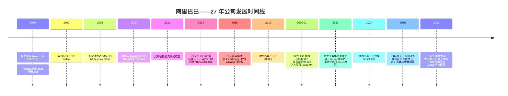
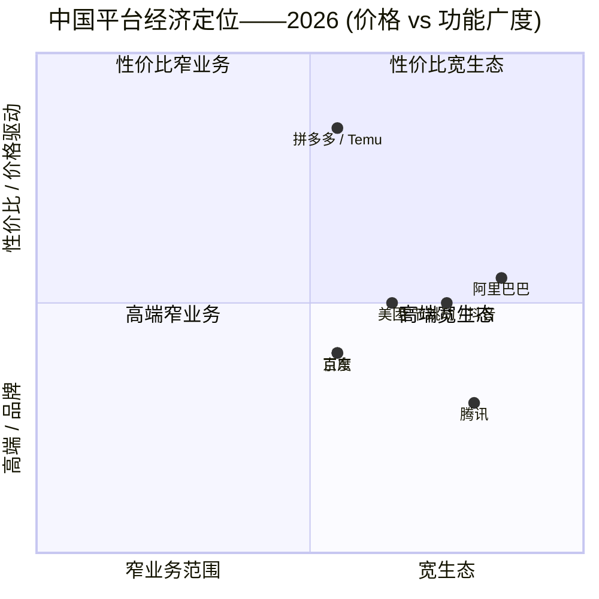

# Alibaba Group Holding Limited (NYSE:BABA / HKEX:9988) — 公司研究报告

**As-of 日期:** 2026-06-14
**报告分析师:** 股票研究部
**主要代码:** NYSE:BABA (ADR; 1 份 ADS = 8 股普通股) · HKEX:9988 (港股主要上市, 2024-08 完成转换) / 89988 (人民币柜台)
**财年:** 4 月 1 日 — 3 月 31 日; 文中"FY2026"指截至 2026 年 3 月 31 日的财年。
**报告语言: 简体中文 (英文版同时存在于本目录, 本次刷新未改动)**

---

## 投资摘要 (Investment Summary)

> *分析师观点 (Analyst view) — 以下评级、目标价、预测均为本报告的前瞻判断, 不取自任何备案文件 (20-F 不含目标价)。*

| 项目 | 数值 |
|---|---|
| **评级 (Rating)** | **买入 / Overweight** |
| **12 个月目标价 (Price Target)** | **US$175 / ADS** (港股对应约 **HK$170 / 9988**) |
| 当前价 (2026-06-12) | US$112.82 (BABA) · HK$110.20 (9988) |
| **隐含上行空间 (Upside)** | **约 +55%** |
| 估值方法 | 分部加总 (SOTP) — 电商按 ~10× FY2027E 净利、云按 ~6–7× 营收、AIDC 按 ~2× 营收、其他按 ~1× 营收, 加净现金 |
| 市值 (约) | US$2,650–2,800 亿 |
| 52 周 ADR 区间 | US$102.89 – 187.62 |

**前瞻估值矩阵 (Forward valuation matrix, 分析师观点):**

| 倍数 | FY2026 (实际) | FY2027E | FY2028E |
|---|---|---|---|
| P/E (non-GAAP) | ~31× | ~22× | ~16× |
| EV/Sales | ~1.9× | ~1.7× | ~1.5× |
| EV/云营收 (隐含) | ~13× | ~9× | ~7× |

*相对表现 (Relative performance, 截至 2026-06-12):* BABA ADR 近 6 个月由 ~US$148.72 跌至 US$112.82 (约 **−24%**), 现价接近 52 周低位 US$102.89、距 52 周高位 US$187.62 回调约 **40%**; 6 月初市场因彭博"中国拟五年投 RMB2 万亿建数据中心"传闻引发对民营云回报率的担忧而再度回调 ([CITI — Concerns On China's Proposed Rmb2trn Data Center Build, 2026-06-10, p.1](http://xs-macbook-air.local:5001/zsxq/pdf/814528118124522/CITI-Alibaba%20Group%20Holding%EF%BC%88BABA.US%EF%BC%89Concerns%20On%20China%E2%80%99s%20Proposed%20Rmb2trn%20Data%20Center%20Build%20Could%20Prove%20Premature-260610.pdf))。

**论点支柱 (Thesis pillars):**
1. **被低估的 AI 全栈巨头。** 市场仍按"传统电商遗产"给阿里定价, 但云智能集团 (Cloud Intelligence Group) 已是中国规模最大、增速最快的 AI + 云主体——FY2026 Q4 云营收同比 +38%、外部收入 +40%, AI 相关产品连续 11 个季度三位数增长 ([20-F FY2026, Item 5](https://www.sec.gov/Archives/edgar/data/1577552/000119312526231755/baba-20260331.htm); [Q4/FY26 业绩公告, 2026-05-13](https://www.sec.gov/Archives/edgar/data/0001577552/000110465926060224/tm2614494d1_ex99-1.htm))。
2. **利润前置、现金流转负是周期性而非结构性。** FY2026 报告口径经营利润同比下滑 64%, 自由现金流 (FCF) 转为流出 RMB46,609M, 主因淘宝闪购补贴与 AI 资本开支同时达峰——755 亿美元财资头寸可自我融资 RMB380bn 三年计划而无需举债。
3. **云利润率拐点临近。** 云 EBITA 利润率 9.1% (Q4), 随高毛利 MaaS 占比上升 + 平头哥自研芯片 + 提价, 多家卖方判断 1–2 季度内升至两位数。
4. **即时零售与 AIDC 亏损收窄提供期权价值。** 淘宝闪购 FY2026 营收 +47%, AIDC 分部亏损大幅收窄, 通往盈亏平衡的路径正在兑现。

---

## 目录

1. 公司概览 (含 1A 决策层 · 1B GF Score)
2. 估值与目标价 (含历史与卖方观点演变)
3. 管理团队
4. 产品与服务 (含 AI 全栈与资金流)
5. 客户与上市策略
6. 行业概览
7. 竞争格局
8. 市场机会 (TAM)
9. 风险评估 (含 9.5 核心分歧与催化剂)
10. 投资视角评分卡
11. 参考资料 · Data Used · 延伸观看

---

## 1. 公司概览

阿里巴巴集团控股有限公司 (Alibaba Group Holding Limited) 是一家在开曼群岛注册的控股公司, 通过其合并子公司及可变利益实体 (VIE) 运营着全球两大数字商务生态系统之一, 以及中国大陆规模最大的公共云业务。根据 FY2026 重组, 阿里巴巴报告四大经营分部: (1) **阿里巴巴中国电商集团 (Alibaba China E-commerce Group)** ——淘宝 (Taobao)、天猫 (Tmall)、淘宝闪购 (Taobao Instant Commerce)、飞猪 (Fliggy)、1688.com; (2) **阿里巴巴国际数字商业集团 / AIDC** ——速卖通 (AliExpress)、Lazada、Trendyol、Daraz、Alibaba.com; (3) **云智能集团 (Cloud Intelligence Group)** ——阿里云 (Alibaba Cloud) IaaS/PaaS、通义千问 (Qwen) 基础模型、模型即服务 (Model-as-a-Service, MaaS)、平头哥 (T-Head) 半导体; (4) **其他业务 (All others)** ——菜鸟 (Cainiao) 物流、高德 (Amap)、盒马鲜生 (Freshippo)、阿里健康、虎鲸数字娱乐、钉钉 (DingTalk) 及通义消费者业务 ([20-F FY2026, Item 4 业务概览](https://www.sec.gov/Archives/edgar/data/1577552/000119312526231755/baba-20260331.htm))。

**盈利模式 (Business model)。** 合并营业收入中, 约一半仍来自中国电商货币化——客户管理收入 (customer management revenue, CMR, 即"P4P"按效果付费广告系统以及天猫品牌商家和淘宝大卖家所付店铺服务费), 以及天猫超市与天猫国际的直营销售收入。FY2026 中国电商分部内, CMR 单项达 RMB343,867M、直营/物流/其他 RMB105,518M、即时零售 (Quick commerce) RMB78,520M、中国批发 RMB26,312M, 合计分部营收 RMB554,217M ([20-F FY2026, 分部附注](https://www.sec.gov/Archives/edgar/data/1577552/000119312526231755/baba-20260331.htm))。第二大支柱是云智能: 按用量计价的 IaaS、PaaS、基于 Qwen 的 MaaS API 组合及专用 AI 算力。AIDC 通过市场佣金和"速卖通 Choice"半托管模式 (gross-basis) 货币化。即时零售 (2025 年 4 月底由"饿了么"更名为"淘宝闪购") 通过平台佣金和按需配送费盈利 ([Q4/FY26 业绩新闻稿, 2026-05-13](https://www.sec.gov/Archives/edgar/data/0001577552/000110465926060224/tm2614494d1_ex99-1.htm))。

下图为 FY2026 利润表的资金流向 (income-statement Sankey), 直观呈现 RMB1,023,670M 营收如何经成本、费用最终落到 RMB102,127M 净利润:

<svg xmlns="http://www.w3.org/2000/svg" viewBox="0 0 1000 560" width="1000" height="560" role="img" aria-label="income statement Sankey"><rect x="0" y="0" width="1000" height="560" fill="#ffffff"/>
<text x="20.00" y="30.00" text-anchor="start" font-family="Helvetica,Arial,sans-serif" font-size="15" font-weight="700" fill="#1f2933">阿里巴巴 FY2026 利润表 Sankey (人民币百万元)</text>
<path d="M 204.00,46.22 C 258.00,46.22 258.00,92.00 312.00,92.00 L 312.00,305.31 C 258.00,305.31 258.00,259.53 204.00,259.53 Z" fill="#93c5fd" fill-opacity="0.55"/>
<path d="M 452.00,85.00 C 506.00,85.00 506.00,202.80 560.00,202.80 L 560.00,222.10 C 506.00,222.10 506.00,104.30 452.00,104.30 Z" fill="#86efac" fill-opacity="0.55"/>
<path d="M 452.00,104.30 C 506.00,104.30 506.00,236.10 560.00,236.10 L 560.00,375.20 C 506.00,375.20 506.00,243.40 452.00,243.40 Z" fill="#fca5a5" fill-opacity="0.55"/>
<path d="M 328.00,92.00 C 382.00,92.00 382.00,85.00 436.00,85.00 L 436.00,241.86 C 382.00,241.86 382.00,248.86 328.00,248.86 Z" fill="#86efac" fill-opacity="0.55"/>
<path d="M 328.00,248.86 C 382.00,248.86 382.00,255.86 436.00,255.86 L 436.00,493.00 C 382.00,493.00 382.00,486.00 328.00,486.00 Z" fill="#fca5a5" fill-opacity="0.55"/>
<path d="M 700.00,173.55 C 754.00,173.55 754.00,248.56 808.00,248.56 L 808.00,287.87 C 754.00,287.87 754.00,212.86 700.00,212.86 Z" fill="#86efac" fill-opacity="0.55"/>
<path d="M 700.00,212.86 C 754.00,212.86 754.00,301.87 808.00,301.87 L 808.00,313.44 C 754.00,313.44 754.00,224.43 700.00,224.43 Z" fill="#fca5a5" fill-opacity="0.55"/>
<path d="M 700.00,224.43 C 754.00,224.43 754.00,327.44 808.00,327.44 L 808.00,329.44 C 754.00,329.44 754.00,226.43 700.00,226.43 Z" fill="#fca5a5" fill-opacity="0.55"/>
<path d="M 576.00,202.80 C 630.00,202.80 630.00,173.55 684.00,173.55 L 684.00,192.86 C 630.00,192.86 630.00,222.10 576.00,222.10 Z" fill="#86efac" fill-opacity="0.55"/>
<path d="M 576.00,236.10 C 630.00,236.10 630.00,237.35 684.00,237.35 L 684.00,331.66 C 630.00,331.66 630.00,330.41 576.00,330.41 Z" fill="#fca5a5" fill-opacity="0.55"/>
<path d="M 576.00,330.41 C 630.00,330.41 630.00,345.66 684.00,345.66 L 684.00,371.27 C 630.00,371.27 630.00,356.02 576.00,356.02 Z" fill="#fca5a5" fill-opacity="0.55"/>
<path d="M 576.00,356.02 C 630.00,356.02 630.00,385.27 684.00,385.27 L 684.00,404.45 C 630.00,404.45 630.00,375.20 576.00,375.20 Z" fill="#fca5a5" fill-opacity="0.55"/>
<path d="M 204.00,273.53 C 258.00,273.53 258.00,305.31 312.00,305.31 L 312.00,366.18 C 258.00,366.18 258.00,334.39 204.00,334.39 Z" fill="#93c5fd" fill-opacity="0.55"/>
<path d="M 204.00,348.39 C 258.00,348.39 258.00,366.18 312.00,366.18 L 312.00,421.67 C 258.00,421.67 258.00,403.88 204.00,403.88 Z" fill="#93c5fd" fill-opacity="0.55"/>
<path d="M 204.00,417.88 C 258.00,417.88 258.00,421.67 312.00,421.67 L 312.00,519.57 C 258.00,519.57 258.00,515.78 204.00,515.78 Z" fill="#93c5fd" fill-opacity="0.55"/>
<path d="M 204.00,529.78 C 258.00,529.78 258.00,519.57 312.00,519.57 L 312.00,521.57 C 258.00,521.57 258.00,531.78 204.00,531.78 Z" fill="#93c5fd" fill-opacity="0.55"/>
<rect x="188.00" y="46.22" width="16" height="213.31" rx="1.5" fill="#2563eb"/>
<rect x="188.00" y="273.53" width="16" height="60.86" rx="1.5" fill="#2563eb"/>
<rect x="188.00" y="348.39" width="16" height="55.49" rx="1.5" fill="#2563eb"/>
<rect x="188.00" y="417.88" width="16" height="97.90" rx="1.5" fill="#2563eb"/>
<rect x="188.00" y="529.78" width="16" height="2.00" rx="1.5" fill="#2563eb"/>
<rect x="312.00" y="92.00" width="16" height="394.00" rx="1.5" fill="#1e3a8a"/>
<rect x="436.00" y="85.00" width="16" height="156.86" rx="1.5" fill="#15803d"/>
<rect x="436.00" y="255.86" width="16" height="237.14" rx="1.5" fill="#dc2626"/>
<rect x="560.00" y="202.80" width="16" height="19.30" rx="1.5" fill="#15803d"/>
<rect x="560.00" y="236.10" width="16" height="139.09" rx="1.5" fill="#dc2626"/>
<rect x="684.00" y="173.55" width="16" height="49.80" rx="1.5" fill="#15803d"/>
<rect x="684.00" y="237.35" width="16" height="94.31" rx="1.5" fill="#dc2626"/>
<rect x="684.00" y="345.66" width="16" height="25.61" rx="1.5" fill="#dc2626"/>
<rect x="684.00" y="385.27" width="16" height="19.18" rx="1.5" fill="#dc2626"/>
<rect x="808.00" y="248.56" width="16" height="39.31" rx="1.5" fill="#15803d"/>
<rect x="808.00" y="301.87" width="16" height="11.56" rx="1.5" fill="#dc2626"/>
<rect x="808.00" y="327.44" width="16" height="2.00" rx="1.5" fill="#dc2626"/>
<line x1="188.00" y1="152.87" x2="182.00" y2="109.09" stroke="#cbd5e1" stroke-width="1"/>
<text x="179.00" y="112.09" text-anchor="end" font-family="Helvetica,Arial,sans-serif" font-size="11.5" font-weight="700" fill="#1f2933">中国电商 China E-com</text>
<text x="179.00" y="125.09" text-anchor="end" font-family="Helvetica,Arial,sans-serif" font-size="10" font-weight="400" fill="#52606d">RMB554.2B  (54.1%)</text>
<line x1="188.00" y1="303.96" x2="182.00" y2="260.18" stroke="#cbd5e1" stroke-width="1"/>
<text x="179.00" y="263.18" text-anchor="end" font-family="Helvetica,Arial,sans-serif" font-size="11.5" font-weight="700" fill="#1f2933">云智能 Cloud</text>
<text x="179.00" y="276.18" text-anchor="end" font-family="Helvetica,Arial,sans-serif" font-size="10" font-weight="400" fill="#52606d">RMB158.1B  (15.4%)</text>
<line x1="188.00" y1="376.14" x2="182.00" y2="332.35" stroke="#cbd5e1" stroke-width="1"/>
<text x="179.00" y="335.35" text-anchor="end" font-family="Helvetica,Arial,sans-serif" font-size="11.5" font-weight="700" fill="#1f2933">AIDC 国际数字商业</text>
<text x="179.00" y="348.35" text-anchor="end" font-family="Helvetica,Arial,sans-serif" font-size="10" font-weight="400" fill="#52606d">RMB144.2B  (14.1%)</text>
<line x1="188.00" y1="466.83" x2="182.00" y2="423.05" stroke="#cbd5e1" stroke-width="1"/>
<text x="179.00" y="426.05" text-anchor="end" font-family="Helvetica,Arial,sans-serif" font-size="11.5" font-weight="700" fill="#1f2933">其他业务 All others</text>
<text x="179.00" y="439.05" text-anchor="end" font-family="Helvetica,Arial,sans-serif" font-size="10" font-weight="400" fill="#52606d">RMB254.4B  (24.8%)</text>
<line x1="188.00" y1="530.78" x2="182.00" y2="487.00" stroke="#cbd5e1" stroke-width="1"/>
<text x="179.00" y="490.00" text-anchor="end" font-family="Helvetica,Arial,sans-serif" font-size="11.5" font-weight="700" fill="#1f2933">未分配/抵消 Unalloc/Elim</text>
<text x="179.00" y="503.00" text-anchor="end" font-family="Helvetica,Arial,sans-serif" font-size="10" font-weight="400" fill="#52606d">-RMB87.2B  (-8.5%)</text>
<rect x="331.00" y="74.00" width="113.10" height="26" rx="2" fill="#ffffff" fill-opacity="0.72"/>
<text x="334.00" y="86.00" text-anchor="start" font-family="Helvetica,Arial,sans-serif" font-size="11.5" font-weight="700" fill="#1f2933">Revenue</text>
<text x="334.00" y="99.00" text-anchor="start" font-family="Helvetica,Arial,sans-serif" font-size="10" font-weight="400" fill="#52606d">RMB1.0T  (100.0%)</text>
<rect x="455.00" y="67.00" width="119.40" height="26" rx="2" fill="#ffffff" fill-opacity="0.72"/>
<text x="458.00" y="79.00" text-anchor="start" font-family="Helvetica,Arial,sans-serif" font-size="11.5" font-weight="700" fill="#1f2933">Gross Profit</text>
<text x="458.00" y="92.00" text-anchor="start" font-family="Helvetica,Arial,sans-serif" font-size="10" font-weight="400" fill="#52606d">RMB407.5B  (39.8%)</text>
<rect x="455.00" y="237.86" width="144.60" height="26" rx="2" fill="#ffffff" fill-opacity="0.72"/>
<text x="458.00" y="249.86" text-anchor="start" font-family="Helvetica,Arial,sans-serif" font-size="11.5" font-weight="700" fill="#1f2933">Cost of Revenue (COGS)</text>
<text x="458.00" y="262.86" text-anchor="start" font-family="Helvetica,Arial,sans-serif" font-size="10" font-weight="400" fill="#52606d">RMB616.1B  (60.2%)</text>
<rect x="579.00" y="184.80" width="106.80" height="26" rx="2" fill="#ffffff" fill-opacity="0.72"/>
<text x="582.00" y="196.80" text-anchor="start" font-family="Helvetica,Arial,sans-serif" font-size="11.5" font-weight="700" fill="#1f2933">Operating Income</text>
<text x="582.00" y="209.80" text-anchor="start" font-family="Helvetica,Arial,sans-serif" font-size="10" font-weight="400" fill="#52606d">RMB50.1B  (4.9%)</text>
<rect x="579.00" y="218.10" width="150.90" height="26" rx="2" fill="#ffffff" fill-opacity="0.72"/>
<text x="582.00" y="230.10" text-anchor="start" font-family="Helvetica,Arial,sans-serif" font-size="11.5" font-weight="700" fill="#1f2933">Total Operating Expense</text>
<text x="582.00" y="243.10" text-anchor="start" font-family="Helvetica,Arial,sans-serif" font-size="10" font-weight="400" fill="#52606d">RMB361.4B  (35.3%)</text>
<rect x="703.00" y="155.55" width="119.40" height="26" rx="2" fill="#ffffff" fill-opacity="0.72"/>
<text x="706.00" y="167.55" text-anchor="start" font-family="Helvetica,Arial,sans-serif" font-size="11.5" font-weight="700" fill="#1f2933">Pretax Income</text>
<text x="706.00" y="180.55" text-anchor="start" font-family="Helvetica,Arial,sans-serif" font-size="10" font-weight="400" fill="#52606d">RMB129.4B  (12.6%)</text>
<rect x="703.00" y="219.35" width="119.40" height="26" rx="2" fill="#ffffff" fill-opacity="0.72"/>
<text x="706.00" y="231.35" text-anchor="start" font-family="Helvetica,Arial,sans-serif" font-size="11.5" font-weight="700" fill="#1f2933">SG&amp;A</text>
<text x="706.00" y="244.35" text-anchor="start" font-family="Helvetica,Arial,sans-serif" font-size="10" font-weight="400" fill="#52606d">RMB245.0B  (23.9%)</text>
<rect x="703.00" y="327.66" width="106.80" height="26" rx="2" fill="#ffffff" fill-opacity="0.72"/>
<text x="706.00" y="339.66" text-anchor="start" font-family="Helvetica,Arial,sans-serif" font-size="11.5" font-weight="700" fill="#1f2933">R&amp;D</text>
<text x="706.00" y="352.66" text-anchor="start" font-family="Helvetica,Arial,sans-serif" font-size="10" font-weight="400" fill="#52606d">RMB66.5B  (6.5%)</text>
<rect x="703.00" y="367.27" width="106.80" height="26" rx="2" fill="#ffffff" fill-opacity="0.72"/>
<text x="706.00" y="379.27" text-anchor="start" font-family="Helvetica,Arial,sans-serif" font-size="11.5" font-weight="700" fill="#1f2933">Other OpEx</text>
<text x="706.00" y="392.27" text-anchor="start" font-family="Helvetica,Arial,sans-serif" font-size="10" font-weight="400" fill="#52606d">RMB49.8B  (4.9%)</text>
<text x="833.00" y="265.22" text-anchor="start" font-family="Helvetica,Arial,sans-serif" font-size="11.5" font-weight="700" fill="#1f2933">Net Income</text>
<text x="833.00" y="278.22" text-anchor="start" font-family="Helvetica,Arial,sans-serif" font-size="10" font-weight="400" fill="#52606d">RMB102.1B  (10.0%)</text>
<text x="833.00" y="304.65" text-anchor="start" font-family="Helvetica,Arial,sans-serif" font-size="11.5" font-weight="700" fill="#1f2933">Income Tax</text>
<text x="833.00" y="317.65" text-anchor="start" font-family="Helvetica,Arial,sans-serif" font-size="10" font-weight="400" fill="#52606d">RMB30.0B  (2.9%)</text>
<text x="833.00" y="329.65" text-anchor="start" font-family="Helvetica,Arial,sans-serif" font-size="11.5" font-weight="700" fill="#1f2933">Minority Interest</text>
<text x="833.00" y="342.65" text-anchor="start" font-family="Helvetica,Arial,sans-serif" font-size="10" font-weight="400" fill="#52606d">-RMB2.8B  (-0.27%)</text>
<text x="500.00" y="544.00" text-anchor="middle" font-family="Helvetica,Arial,sans-serif" font-size="10" font-weight="400" fill="#52606d">Source: 阿里巴巴 20-F FY2026 (截至 2026-03-31), 财务报表 + 分部附注</text>
</svg>
来源: [阿里巴巴 20-F FY2026, 合并利润表](https://www.sec.gov/Archives/edgar/data/1577552/000119312526231755/baba-20260331.htm)。

**地域布局 (Geographic footprint)。** 总部位于杭州, 在香港设有重要运营机构 (上市主体的"主要营业地"在 HKEX 含义下即位于此)、新加坡 (Lazada 与速卖通 Choice 运营中心是 AIDC 总部)、土耳其 (Trendyol)、南亚 (Daraz)、东南亚 (Lazada), 数据中心布局持续向韩国、日本、阿联酋、墨西哥、巴西及法国延伸 ([20-F FY2026, Item 4 — 物业](https://www.sec.gov/Archives/edgar/data/1577552/000119312526231755/baba-20260331.htm))。

**规模指标 (Key metrics)。** FY2026 营业收入为 RMB1,023,670M (US$148,401M), 报告口径同比增长 3%, 若剔除已剥离的高鑫零售 (Sun Art) 与银泰百货 (Intime) 等线下零售业务则同比增长约 11% ([20-F FY2026, Item 5 经营业绩](https://www.sec.gov/Archives/edgar/data/1577552/000119312526231755/baba-20260331.htm))。净利润同比下降至 RMB102,127M (US$14,805M)。GAAP 经营利润 (income from operations) 由 FY2025 的 RMB140,905M 降至 FY2026 的 RMB50,150M (同比 −64%), 主因 (a) 淘宝闪购首年大规模补贴, 使销售与营销费用 (sales and marketing) 从 RMB144,021M 飙升至 RMB245,023M; (b) AI/云基础设施资本开支 (CapEx) 大幅扩张至 RMB126,063M (US$18,275M), FY2025 为 RMB85,972M ([20-F FY2026, Item 5](https://www.sec.gov/Archives/edgar/data/1577552/000119312526231755/baba-20260331.htm))。截至 2026 年 3 月 31 日, 全职员工为 131,462 人, 较一年前 124,320 人有所增加, 但仍远低于 FY2024 高峰期的 204,891 人 (彼时纳入已剥离的线下零售员工) ([20-F FY2026, Item 6.D 员工](https://www.sec.gov/Archives/edgar/data/1577552/000119312526231755/baba-20260331.htm))。截至 2026 年 3 月 31 日, 现金、现金等价物、短期投资及其他财资投资合计 RMB520,824M (US$75,504M)——是任何中国注册公司中规模最大的现金头寸 ([20-F FY2026, Item 5.B 流动性](https://www.sec.gov/Archives/edgar/data/1577552/000119312526231755/baba-20260331.htm))。

下图为分部营收三年走势 (FY2024–FY2026, 抵消前), 可见云智能从 RMB106,374M 增至 RMB158,132M、其他业务因剥离而下降:

<svg xmlns="http://www.w3.org/2000/svg" viewBox="0 0 860 470" width="860" height="470" role="img" aria-label="historical revenue bars"><rect x="0" y="0" width="860" height="470" fill="#ffffff"/>
<text x="20.00" y="30.00" text-anchor="start" font-family="Helvetica,Arial,sans-serif" font-size="15" font-weight="700" fill="#1f2933">阿里巴巴分部营收 FY2024–FY2026 (人民币百万元, 抵消前)</text>
<rect x="20.00" y="44" width="11" height="11" rx="2" fill="#2563eb"/>
<text x="36.00" y="53.00" text-anchor="start" font-family="Helvetica,Arial,sans-serif" font-size="10.5" font-weight="400" fill="#1f2933">中国电商 China E-com</text>
<rect x="155.60" y="44" width="11" height="11" rx="2" fill="#15803d"/>
<text x="171.60" y="53.00" text-anchor="start" font-family="Helvetica,Arial,sans-serif" font-size="10.5" font-weight="400" fill="#1f2933">云智能 Cloud</text>
<rect x="245.00" y="44" width="11" height="11" rx="2" fill="#d97706"/>
<text x="261.00" y="53.00" text-anchor="start" font-family="Helvetica,Arial,sans-serif" font-size="10.5" font-weight="400" fill="#1f2933">AIDC</text>
<rect x="301.40" y="44" width="11" height="11" rx="2" fill="#7c3aed"/>
<text x="317.40" y="53.00" text-anchor="start" font-family="Helvetica,Arial,sans-serif" font-size="10.5" font-weight="400" fill="#1f2933">其他业务 All others</text>
<line x1="70" y1="412.00" x2="834" y2="412.00" stroke="#eceff2" stroke-width="1"/>
<text x="64.00" y="415.00" text-anchor="end" font-family="Helvetica,Arial,sans-serif" font-size="9.5" font-weight="400" fill="#52606d">RMB0</text>
<line x1="70" y1="345.20" x2="834" y2="345.20" stroke="#eceff2" stroke-width="1"/>
<text x="64.00" y="348.20" text-anchor="end" font-family="Helvetica,Arial,sans-serif" font-size="9.5" font-weight="400" fill="#52606d">RMB240.0B</text>
<line x1="70" y1="278.40" x2="834" y2="278.40" stroke="#eceff2" stroke-width="1"/>
<text x="64.00" y="281.40" text-anchor="end" font-family="Helvetica,Arial,sans-serif" font-size="9.5" font-weight="400" fill="#52606d">RMB479.9B</text>
<line x1="70" y1="211.60" x2="834" y2="211.60" stroke="#eceff2" stroke-width="1"/>
<text x="64.00" y="214.60" text-anchor="end" font-family="Helvetica,Arial,sans-serif" font-size="9.5" font-weight="400" fill="#52606d">RMB719.9B</text>
<line x1="70" y1="144.80" x2="834" y2="144.80" stroke="#eceff2" stroke-width="1"/>
<text x="64.00" y="147.80" text-anchor="end" font-family="Helvetica,Arial,sans-serif" font-size="9.5" font-weight="400" fill="#52606d">RMB959.8B</text>
<line x1="70" y1="78.00" x2="834" y2="78.00" stroke="#eceff2" stroke-width="1"/>
<text x="64.00" y="81.00" text-anchor="end" font-family="Helvetica,Arial,sans-serif" font-size="9.5" font-weight="400" fill="#52606d">RMB1.2T</text>
<rect x="123.48" y="275.56" width="147.71" height="136.44" fill="#2563eb"/>
<rect x="123.48" y="245.95" width="147.71" height="29.61" fill="#15803d"/>
<rect x="123.48" y="217.39" width="147.71" height="28.56" fill="#d97706"/>
<rect x="123.48" y="128.99" width="147.71" height="88.40" fill="#7c3aed"/>
<text x="197.33" y="428.00" text-anchor="middle" font-family="Helvetica,Arial,sans-serif" font-size="10" font-weight="400" fill="#52606d">FY2024</text>
<rect x="378.15" y="270.47" width="147.71" height="141.53" fill="#2563eb"/>
<rect x="378.15" y="237.61" width="147.71" height="32.86" fill="#15803d"/>
<rect x="378.15" y="200.78" width="147.71" height="36.83" fill="#d97706"/>
<rect x="378.15" y="106.59" width="147.71" height="94.19" fill="#7c3aed"/>
<text x="452.00" y="428.00" text-anchor="middle" font-family="Helvetica,Arial,sans-serif" font-size="10" font-weight="400" fill="#52606d">FY2025</text>
<rect x="632.81" y="257.71" width="147.71" height="154.29" fill="#2563eb"/>
<rect x="632.81" y="213.69" width="147.71" height="44.02" fill="#15803d"/>
<rect x="632.81" y="173.55" width="147.71" height="40.14" fill="#d97706"/>
<rect x="632.81" y="102.74" width="147.71" height="70.81" fill="#7c3aed"/>
<text x="706.67" y="428.00" text-anchor="middle" font-family="Helvetica,Arial,sans-serif" font-size="10" font-weight="400" fill="#52606d">FY2026</text>
<text x="430.00" y="454.00" text-anchor="middle" font-family="Helvetica,Arial,sans-serif" font-size="10" font-weight="400" fill="#52606d">Source: 阿里巴巴 20-F FY2026 (截至 2026-03-31), 分部附注 (revenue disaggregation)</text>
</svg>
来源: [阿里巴巴 20-F FY2026, 分部附注](https://www.sec.gov/Archives/edgar/data/1577552/000119312526231755/baba-20260331.htm)。

### 1A. 决策层 — 估值快照与本方判断

**估值快照 (Valuation snapshot, 2026-06-12)。** BABA 在 2026-06-12 收于 US$112.82, 市值约 US$2,650–2,800 亿 ([stockanalysis.com BABA 统计, 2026-06](https://stockanalysis.com/stocks/baba/statistics/))。以 FY2026 non-GAAP 净利润 RMB60,658M (US$8,794M) 计, 隐含 non-GAAP P/E 约 31×; 以 GAAP 净利 RMB102,127M 计 P/E 约 19×; TTM P/S 约 1.9–2.2×。当前 P/S 较 10 年中位数 6.74× 低约 66% ([GuruFocus BABA P/S, 2026-03-11](https://www.gurufocus.com/term/ps-ratio/BABA))。

倍数相对同业 (见第 7 章): BABA TTM P/E **高于拼多多 PDD (~12.5×)、京东 JD (~11×)** 这两家更便宜的中国同业, 但**远低于 MELI (~47×)、AMZN (~36×) 与 GOOGL (~26×)** ([stockanalysis.com, 2026-06](https://stockanalysis.com/stocks/baba/statistics/))。与西方超大规模云厂商之间的折让并非"价值陷阱"机制——营收剔除剥离后增 11%、云在 Q4 加速至 38–40%、且持有 755 亿美元财资。折让核心是**中国风险溢价 / VIE 结构 / 监管溢价**, 叠加 FY2026 FCF 由正转负 (−RMB46,609M vs. FY2025 +RMB73,870M, 经营现金流 RMB172,842M 减资本开支后) ([20-F FY2026, Item 5.B](https://www.sec.gov/Archives/edgar/data/1577552/000119312526231755/baba-20260331.htm))。

***本方判断 (House view):*** 给予 **买入 / Overweight, 目标价 US$175 / ADS** (约 +55% 上行)。这一判断的核心是: 当前价把云智能近乎免费赠送, 而 AI 商业化拐点 (MaaS ARR 6 个月增 10 倍至 ~RMB80 亿、目标年底 RMB300 亿) 正在把云从"卖资源"重估为"卖智能"。本方目标价位于卖方区间 (US$176–237) 偏保守一端, 因为本方对即时零售亏损持续时间的假设比多数卖方更审慎。

### 1B. GF Score (GuruFocus 式) 基本面评分卡

*分析师观点 (Analyst view) — 以下五维评分与综合分为本报告自有评分体系的产出, 不取自 GuruFocus 公布值, 也不附任何备案文件引用; 各维度依据的底层指标在下文各自标注来源。*

<svg xmlns="http://www.w3.org/2000/svg" viewBox="0 0 500 500" width="500" height="500" role="img" aria-label="GF Score radar">
<rect x="0" y="0" width="500" height="500" fill="#ffffff"/>
<text x="20" y="24" font-family="Helvetica,Arial,sans-serif" font-size="15" font-weight="700" fill="#1f2933">GF Score (GuruFocus-style): 64/100</text>
<text x="20" y="41" font-family="Helvetica,Arial,sans-serif" font-size="11" fill="#52606d">51–70 Poor future performance potential</text>
<polygon points="250.0,88.0 392.7,191.6 338.2,359.4 161.8,359.4 107.3,191.6" fill="#e9f5ec" stroke="none"/>
<polygon points="250.0,208.0 278.5,228.7 267.6,262.3 232.4,262.3 221.5,228.7" fill="none" stroke="#c5d3cb" stroke-width="1"/>
<polygon points="250.0,178.0 307.1,219.5 285.3,286.5 214.7,286.5 192.9,219.5" fill="none" stroke="#c5d3cb" stroke-width="1"/>
<polygon points="250.0,148.0 335.6,210.2 302.9,310.8 197.1,310.8 164.4,210.2" fill="none" stroke="#c5d3cb" stroke-width="1"/>
<polygon points="250.0,118.0 364.1,200.9 320.5,335.1 179.5,335.1 135.9,200.9" fill="none" stroke="#c5d3cb" stroke-width="1"/>
<polygon points="250.0,88.0 392.7,191.6 338.2,359.4 161.8,359.4 107.3,191.6" fill="none" stroke="#c5d3cb" stroke-width="1.3"/>
<line x1="250" y1="238" x2="161.8" y2="359.4" stroke="#cfdad3" stroke-width="1"/>
<text x="146.5" y="392.4" text-anchor="end" font-family="Helvetica,Arial,sans-serif" font-size="11.5" font-weight="600" fill="#1f2933">Financial Strength</text>
<text x="146.5" y="405.4" text-anchor="end" font-family="Helvetica,Arial,sans-serif" font-size="9.5" fill="#52606d">财务实力</text>
<text x="179.5" y="329.1" text-anchor="middle" font-family="Helvetica,Arial,sans-serif" font-size="10.5" font-weight="700" fill="#1f2933">8</text>
<line x1="250" y1="238" x2="250.0" y2="88.0" stroke="#cfdad3" stroke-width="1"/>
<text x="250.0" y="58.0" text-anchor="middle" font-family="Helvetica,Arial,sans-serif" font-size="11.5" font-weight="600" fill="#1f2933">Profitability</text>
<text x="250.0" y="71.0" text-anchor="middle" font-family="Helvetica,Arial,sans-serif" font-size="9.5" fill="#52606d">盈利能力</text>
<text x="250.0" y="142.0" text-anchor="middle" font-family="Helvetica,Arial,sans-serif" font-size="10.5" font-weight="700" fill="#1f2933">6</text>
<line x1="250" y1="238" x2="107.3" y2="191.6" stroke="#cfdad3" stroke-width="1"/>
<text x="82.6" y="183.6" text-anchor="end" font-family="Helvetica,Arial,sans-serif" font-size="11.5" font-weight="600" fill="#1f2933">Growth</text>
<text x="82.6" y="196.6" text-anchor="end" font-family="Helvetica,Arial,sans-serif" font-size="9.5" fill="#52606d">成长性</text>
<text x="164.4" y="204.2" text-anchor="middle" font-family="Helvetica,Arial,sans-serif" font-size="10.5" font-weight="700" fill="#1f2933">6</text>
<line x1="250" y1="238" x2="392.7" y2="191.6" stroke="#cfdad3" stroke-width="1"/>
<text x="417.4" y="183.6" text-anchor="start" font-family="Helvetica,Arial,sans-serif" font-size="11.5" font-weight="600" fill="#1f2933">GF Value</text>
<text x="417.4" y="196.6" text-anchor="start" font-family="Helvetica,Arial,sans-serif" font-size="9.5" fill="#52606d">估值</text>
<text x="364.1" y="194.9" text-anchor="middle" font-family="Helvetica,Arial,sans-serif" font-size="10.5" font-weight="700" fill="#1f2933">8</text>
<line x1="250" y1="238" x2="338.2" y2="359.4" stroke="#cfdad3" stroke-width="1"/>
<text x="353.5" y="392.4" text-anchor="start" font-family="Helvetica,Arial,sans-serif" font-size="11.5" font-weight="600" fill="#1f2933">Momentum</text>
<text x="353.5" y="405.4" text-anchor="start" font-family="Helvetica,Arial,sans-serif" font-size="9.5" fill="#52606d">动量</text>
<text x="285.3" y="280.5" text-anchor="middle" font-family="Helvetica,Arial,sans-serif" font-size="10.5" font-weight="700" fill="#1f2933">4</text>
<polygon points="250.0,148.0 364.1,200.9 285.3,286.5 179.5,335.1 164.4,210.2" fill="#2e8b57" fill-opacity="0.34" stroke="#2e8b57" stroke-width="2"/>
<circle cx="179.5" cy="335.1" r="2.6" fill="#2e8b57"/>
<circle cx="250.0" cy="148.0" r="2.6" fill="#2e8b57"/>
<circle cx="164.4" cy="210.2" r="2.6" fill="#2e8b57"/>
<circle cx="364.1" cy="200.9" r="2.6" fill="#2e8b57"/>
<circle cx="285.3" cy="286.5" r="2.6" fill="#2e8b57"/>
<text x="250" y="470" text-anchor="middle" font-family="Helvetica,Arial,sans-serif" font-size="9.5" fill="#52606d">Source: 阿里巴巴 20-F FY2026 · stockanalysis.com (2026-06) · indicators.db, as of 2026-06-07</text>
<text x="250" y="485" text-anchor="middle" font-family="Helvetica,Arial,sans-serif" font-size="9" fill="#52606d">GF Score = independent analyst rubric (*Analyst view:*) — not GuruFocus™ official number</text>
</svg>

| 维度 / Dimension | 评分 / Score (0–10) | |
|---|---|---|
| Financial Strength (财务实力) | 8 | `████████░░` |
| Profitability (盈利能力) | 6 | `██████░░░░` |
| Growth (成长性) | 6 | `██████░░░░` |
| GF Value (估值) | 8 | `████████░░` |
| Momentum (动量) | 4 | `████░░░░░░` |
| **GF Score (composite, *Analyst view:*)** | **64 / 100** | **51–70 Poor future performance potential** |

*Composite weights (*Analyst view:*): Financial Strength 20% · Profitability 25% · Growth 25% · GF Value 15% · Momentum 15% (transparent reproduction — not GuruFocus's proprietary weighting).*
来源: 评分依据 [阿里巴巴 20-F FY2026](https://www.sec.gov/Archives/edgar/data/1577552/000119312526231755/baba-20260331.htm) · [stockanalysis.com, 2026-06](https://stockanalysis.com/stocks/baba/statistics/) · indicators.db 本地快照, as of 2026-06-07。

**综合分 64 / 100。** 各维度评分理由:

- **Financial Strength 财务实力 = 8/10。** 现金、短期投资及其他财资投资合计 RMB520,824M (US$75,504M), 净现金状态, 利息覆盖率极高, FY2026 经营现金流仍达 RMB172,842M ([20-F FY2026, Item 5.B](https://www.sec.gov/Archives/edgar/data/1577552/000119312526231755/baba-20260331.htm))。扣分项: 在建 AI 基础设施使总资产与无形/PP&E (RMB282,699M) 上升, 自由现金流暂为负。
- **Profitability 盈利能力 = 6/10。** FY2026 GAAP 经营利润率压缩至 4.9% (RMB50,150M / RMB1,023,670M), 较 FY2025 的 14.1% 大幅下滑; 净利率约 10%; ROE 约 9.3% (净利 RMB102,127M / 平均权益 ~RMB1,098,409M) ([20-F FY2026, 合并财务报表](https://www.sec.gov/Archives/edgar/data/1577552/000119312526231755/baba-20260331.htm))。这是周期性低点而非结构性恶化——CMR 与云仍是高边际利润业务。
- **Growth 成长性 = 6/10。** 营收报告口径仅 +3% (剔除剥离 +11%), 但云 +34% (全年) / +38% (Q4)、即时零售 +47%, 结构性增长引擎明确; 3 年合并营收 CAGR 偏低 (FY2024 RMB941,168M → FY2026 RMB1,023,670M) 拖累评分 ([20-F FY2026, 分部附注](https://www.sec.gov/Archives/edgar/data/1577552/000119312526231755/baba-20260331.htm))。
- **GF Value 估值 (越高越便宜) = 8/10。** TTM P/S ~2.2× 较 10 年中位 6.74× 低 66% ([GuruFocus, 2026-03-11](https://www.gurufocus.com/term/ps-ratio/BABA)); 多家卖方目标价隐含 +27% 至 +60% 上行 (见第 2 章), 安全边际显著。
- **Momentum 动量 = 4/10。** ADR 近 6 个月 −24% (US$148.72 → US$112.82)、接近 52 周低位、低于 200 日均线 ([stockanalysis.com, 2026-06](https://stockanalysis.com/stocks/baba/statistics/))——动量是五维中最弱的一项, 反映 6 月数据中心传闻冲击与利润前置担忧。

(本节字数: 约 1,250 字)

---

## 2. 估值与目标价

本章是把"描述性画像"转为"决策"的核心。所有前瞻数字均为 *分析师观点 (Analyst view)*, 不取自备案文件。

### 2A. 公司历史 (时间线)

阿里巴巴于 1999 年 6 月 28 日在杭州成立, 由 18 位合伙人创立, 牵头者为前英语教师马云 (Jack Ma, 马云)。创业初衷是 B2B 在线市场 ("Alibaba.com")。最负盛名的两笔早期融资是 2000 年从高盛拿到 500 万美元种子轮, 与此后从软银 (SoftBank) 拿到 2,000 万美元 ([20-F FY2026, Item 4.A 历史](https://www.sec.gov/Archives/edgar/data/1577552/000119312526231755/baba-20260331.htm))。


来源: [20-F FY2026, Item 4.A 历史与发展](https://www.sec.gov/Archives/edgar/data/1577552/000119312526231755/baba-20260331.htm); [国家市场监督管理总局 2021 年罚款 (Reuters, 2021-04-10)](https://www.reuters.com/article/idUSKBN2BX1G8/); [阿里巴巴 3,800 亿 AI 计划新闻稿, 2025-02-24](https://www.alibabagroup.com/en-US/document-1830678592242057216)。

塑造当前公司形态的三大转折点: **第一**是 2009 年阿里云逆势成立——一项耗时十五年的资本密集建设, 直到 AI 需求驱动分部增长突破 30% 才迎来拐点。**第二**是 2020 年 11 月蚂蚁 IPO 暂停 + 2021 年 4 月针对天猫"二选一"商家排他行为的 RMB18,228M 反垄断罚款, 触发 ADR 从高位约 80% 回撤并迫使 2023 年六大业务集团重组 ([Reuters, 2021-04-10](https://www.reuters.com/article/idUSKBN2BX1G8/))。**第三**是 2023 年 9 月后的"吴泳铭 / 蔡崇信时代"——明确重新优先化"用户为先, AI 驱动", 并将淘宝 + 天猫 + 饿了么 + 飞猪重新合并为单一中国电商集团 ([20-F FY2026, 致辞](https://www.sec.gov/Archives/edgar/data/1577552/000119312526231755/baba-20260331.htm))。

### 2B. 前瞻财务模型 (Forward estimates)

*分析师观点 (Analyst view) — 下表每一前瞻单元格均为本报告估算, 依据为 20-F 分部数据 + 管理层口径 + 行业增速假设, 非取自任何备案。*

| 指标 (RMB 亿元) | FY2026 (实际) | FY2027E | FY2028E |
|---|---|---|---|
| 总营收 | 10,237 | 11,200 (+9%) | 12,300 (+10%) |
| — 云智能 | 1,581 | 2,100 (+33%) | 2,750 (+31%) |
| — 中国电商 | 5,542 | 5,800 (+5%) | 6,050 (+4%) |
| — AIDC | 1,442 | 1,650 (+14%) | 1,850 (+12%) |
| — 其他业务 | 2,544 | 2,500 (−2%) | 2,550 (+2%) |
| GAAP 经营利润 | 502 | 900 | 1,350 |
| GAAP 经营利润率 | 4.9% | 8.0% | 11.0% |
| non-GAAP 净利润 | 607 | 920 | 1,250 |
| non-GAAP EPS (摊薄, RMB/股) | ~3.3 | ~5.0 | ~6.9 |

模型核心驱动: (1) **云分部 mix shift** —— AI/MaaS 占云外部收入由 30% 升至 50%+, 高毛利结构 + 平头哥自研芯片 + 提价使云 EBITA 利润率由 9.1% 向两位数扩张 ([Q4/FY26 业绩公告, 2026-05-13](https://www.sec.gov/Archives/edgar/data/0001577552/000110465926060224/tm2614494d1_ex99-1.htm); *分析师观点* [HSBC — Inflection point of AI commercialization, 2026-05-14, p.1](http://xs-macbook-air.local:5001/zsxq/pdf/812452122241882/HSBC-Alibaba%20Group%20%EF%BC%88BABA.US%EF%BC%89Buy%EF%BC%9A%20Inflection%20point%20of%20AI%20commercialization-260514.pdf)); (2) **即时零售亏损减半** —— 经营利润率随补贴退坡修复; (3) 中国电商核心 CMR 低个位数增长但高边际利润。每一条前瞻均为本方估算。

### 2C. 目标价推导 (SOTP)

*分析师观点 (Analyst view):* 本方采用分部加总 (SOTP) ——这与卖方主流方法一致 (见花旗、摩根大通、杰富瑞均用 SOTP):

- 中国电商: FY2027E 净利约 RMB650 亿 × 10× P/E ≈ RMB6,500 亿
- 云智能: FY2027E 营收 RMB2,100 亿 × 6.5× P/S ≈ RMB13,650 亿 (云的 AI 重估是目标价最大变量)
- AIDC: FY2027E 营收 RMB1,650 亿 × 2× P/S ≈ RMB3,300 亿
- 其他业务: 营收 RMB2,500 亿 × 1× P/S ≈ RMB2,500 亿
- 加净现金 (打 30% 折让, 参照互联网同业) ≈ RMB3,600 亿
- 合计权益价值 ≈ RMB29,550 亿 ÷ 汇率 ÷ 约 186.7 亿股 ≈ **US$175 / ADS**

**估值倍数依据 (为什么用这些倍数):** 云用 6.5× 营收对标 AWS/Azure 隐含倍数下沿且远低于花旗给的 7×; 电商 10× P/E 与拼多多 / 京东 (~11–12.5× P/E) 一致, 反映成熟低增长但高现金流。

**Bull / Base / Bear 三档目标价 (分析师观点):**

| 情形 | 目标价 | 上行/下行 | 核心摆动假设 |
|---|---|---|---|
| **Bull** | US$220 | +95% | 云加速至 40%+ 并提前一年到 20% EBITA 利润率; 即时零售 FY2028 即盈亏平衡; 给云 8× 营收 |
| **Base** | US$175 | +55% | 云 ~33% 增长、利润率渐进改善; 即时零售按管理层 FY2029 路径; 倍数同上 |
| **Bear** | US$95 | −16% | 国资云压价 + DeepSeek/OpenAI 降价战压制云利润率; 即时零售亏损持续至 FY2030; 中国监管/VIE 风险溢价上升 |

### 2D. 与市场一致预期的对比 (vs consensus)

*分析师观点:* 卖方对阿里高度一致看多——本报告抽样的 10 家机构 (GS / JPM / Citi / Nomura / UBS / HSBC / Deutsche Bank / Bernstein / Morgan Stanley / Jefferies) **全部为买入 / Overweight / Outperform**, 美股目标价区间 US$176–237, 中位约 US$195–205。本方 Base 目标价 US$175 位于该区间**偏保守下沿**, 主要差异在于本方对即时零售亏损持续期与云利润率爬坡速度给出更审慎假设 ([*分析师观点* J.P. Morgan — China's largest AI + cloud franchise, 2026-05-14, p.1](http://xs-macbook-air.local:5001/zsxq/pdf/585425448251424/J.P.%20Morgan-Alibaba%20Group%20%EF%BC%889988.HK%EF%BC%89%20China%27s%20largest%20AI%20%2B%20cloud%20franchise%EF%BC%8C%20priced%20as%20a%20commerce%20legacy-260514.pdf))。

下图为 FY2026 DuPont ROE 拆解, 显示净利率、资产周转与权益乘数三因子如何驱动 ~9% 的 ROE:

<svg xmlns="http://www.w3.org/2000/svg" viewBox="0 0 1240 540" width="1240" height="540" role="img" aria-label="DuPont ROE decomposition"><rect x="0" y="0" width="1240" height="540" fill="#ffffff"/>
<text x="20.00" y="30.00" text-anchor="start" font-family="Helvetica,Arial,sans-serif" font-size="15" font-weight="700" fill="#1f2933">阿里巴巴 FY2026 DuPont ROE 拆解 (人民币百万元)</text>
<rect x="545.00" y="56.00" width="150" height="56" rx="7" fill="#1e3a8a"/>
<text x="620.00" y="76.00" text-anchor="middle" font-family="Helvetica,Arial,sans-serif" font-size="11.5" font-weight="700" fill="#ffffff">ROE</text>
<text x="620.00" y="94.00" text-anchor="middle" font-family="Helvetica,Arial,sans-serif" font-size="13" font-weight="800" fill="#ffffff">9.30%</text>
<text x="620.00" y="106.00" text-anchor="middle" font-family="Helvetica,Arial,sans-serif" font-size="8.5" font-weight="400" fill="#dbeafe">= Net Income / Avg Equity</text>
<rect x="191.60" y="168.00" width="150" height="56" rx="7" fill="#2563eb"/>
<text x="266.60" y="188.00" text-anchor="middle" font-family="Helvetica,Arial,sans-serif" font-size="11.5" font-weight="700" fill="#ffffff">Net Margin</text>
<text x="266.60" y="206.00" text-anchor="middle" font-family="Helvetica,Arial,sans-serif" font-size="13" font-weight="800" fill="#ffffff">9.98%</text>
<text x="266.60" y="218.00" text-anchor="middle" font-family="Helvetica,Arial,sans-serif" font-size="8.5" font-weight="400" fill="#dbeafe">Net Income / Revenue</text>
<line x1="620.00" y1="112.00" x2="266.60" y2="168.00" stroke="#94a3b8" stroke-width="1.4"/>
<rect x="545.00" y="168.00" width="150" height="56" rx="7" fill="#2563eb"/>
<text x="620.00" y="188.00" text-anchor="middle" font-family="Helvetica,Arial,sans-serif" font-size="11.5" font-weight="700" fill="#ffffff">Asset Turnover</text>
<text x="620.00" y="206.00" text-anchor="middle" font-family="Helvetica,Arial,sans-serif" font-size="13" font-weight="800" fill="#ffffff">0.48</text>
<text x="620.00" y="218.00" text-anchor="middle" font-family="Helvetica,Arial,sans-serif" font-size="8.5" font-weight="400" fill="#dbeafe">Revenue / Avg Assets</text>
<line x1="620.00" y1="112.00" x2="620.00" y2="168.00" stroke="#94a3b8" stroke-width="1.4"/>
<rect x="898.40" y="168.00" width="150" height="56" rx="7" fill="#2563eb"/>
<text x="973.40" y="188.00" text-anchor="middle" font-family="Helvetica,Arial,sans-serif" font-size="11.5" font-weight="700" fill="#ffffff">Equity Multiplier</text>
<text x="973.40" y="206.00" text-anchor="middle" font-family="Helvetica,Arial,sans-serif" font-size="13" font-weight="800" fill="#ffffff">1.92</text>
<text x="973.40" y="218.00" text-anchor="middle" font-family="Helvetica,Arial,sans-serif" font-size="8.5" font-weight="400" fill="#dbeafe">Avg Assets / Avg Equity</text>
<line x1="620.00" y1="112.00" x2="973.40" y2="168.00" stroke="#94a3b8" stroke-width="1.4"/>
<circle cx="443.30" cy="196.00" r="11" fill="#ffffff" stroke="#94a3b8" stroke-width="1.2"/>
<text x="443.30" y="201.00" text-anchor="middle" font-family="Helvetica,Arial,sans-serif" font-size="14" font-weight="800" fill="#52606d">×</text>
<circle cx="796.70" cy="196.00" r="11" fill="#ffffff" stroke="#94a3b8" stroke-width="1.2"/>
<text x="796.70" y="201.00" text-anchor="middle" font-family="Helvetica,Arial,sans-serif" font-size="14" font-weight="800" fill="#52606d">×</text>
<rect x="65.00" y="300.00" width="118" height="56" rx="7" fill="#2563eb"/>
<text x="124.00" y="320.00" text-anchor="middle" font-family="Helvetica,Arial,sans-serif" font-size="11.5" font-weight="700" fill="#ffffff">Operating Margin</text>
<text x="124.00" y="338.00" text-anchor="middle" font-family="Helvetica,Arial,sans-serif" font-size="13" font-weight="800" fill="#ffffff">4.90%</text>
<text x="124.00" y="350.00" text-anchor="middle" font-family="Helvetica,Arial,sans-serif" font-size="8.5" font-weight="400" fill="#dbeafe">Op Inc / Revenue</text>
<line x1="266.60" y1="224.00" x2="124.00" y2="300.00" stroke="#94a3b8" stroke-width="1.4"/>
<rect x="207.60" y="300.00" width="118" height="56" rx="7" fill="#2563eb"/>
<text x="266.60" y="320.00" text-anchor="middle" font-family="Helvetica,Arial,sans-serif" font-size="11.5" font-weight="700" fill="#ffffff">Tax Burden</text>
<text x="266.60" y="338.00" text-anchor="middle" font-family="Helvetica,Arial,sans-serif" font-size="13" font-weight="800" fill="#ffffff">0.7893</text>
<text x="266.60" y="350.00" text-anchor="middle" font-family="Helvetica,Arial,sans-serif" font-size="8.5" font-weight="400" fill="#dbeafe">Net Inc / Pretax</text>
<line x1="266.60" y1="224.00" x2="266.60" y2="300.00" stroke="#94a3b8" stroke-width="1.4"/>
<rect x="350.20" y="300.00" width="118" height="56" rx="7" fill="#2563eb"/>
<text x="409.20" y="320.00" text-anchor="middle" font-family="Helvetica,Arial,sans-serif" font-size="11.5" font-weight="700" fill="#ffffff">Interest Burden</text>
<text x="409.20" y="338.00" text-anchor="middle" font-family="Helvetica,Arial,sans-serif" font-size="13" font-weight="800" fill="#ffffff">2.5800</text>
<text x="409.20" y="350.00" text-anchor="middle" font-family="Helvetica,Arial,sans-serif" font-size="8.5" font-weight="400" fill="#dbeafe">Pretax / Op Inc</text>
<line x1="266.60" y1="224.00" x2="409.20" y2="300.00" stroke="#94a3b8" stroke-width="1.4"/>
<circle cx="195.30" cy="328.00" r="11" fill="#ffffff" stroke="#94a3b8" stroke-width="1.2"/>
<text x="195.30" y="333.00" text-anchor="middle" font-family="Helvetica,Arial,sans-serif" font-size="14" font-weight="800" fill="#52606d">×</text>
<circle cx="337.90" cy="328.00" r="11" fill="#ffffff" stroke="#94a3b8" stroke-width="1.2"/>
<text x="337.90" y="333.00" text-anchor="middle" font-family="Helvetica,Arial,sans-serif" font-size="14" font-weight="800" fill="#52606d">×</text>
<rect x="479.00" y="300.00" width="118" height="56" rx="7" fill="#2563eb"/>
<text x="538.00" y="326.00" text-anchor="middle" font-family="Helvetica,Arial,sans-serif" font-size="11.5" font-weight="700" fill="#ffffff">Revenue</text>
<text x="538.00" y="342.00" text-anchor="middle" font-family="Helvetica,Arial,sans-serif" font-size="13" font-weight="800" fill="#ffffff">RMB1.0T</text>
<line x1="620.00" y1="224.00" x2="538.00" y2="300.00" stroke="#94a3b8" stroke-width="1.4"/>
<rect x="643.00" y="300.00" width="118" height="56" rx="7" fill="#2563eb"/>
<text x="702.00" y="320.00" text-anchor="middle" font-family="Helvetica,Arial,sans-serif" font-size="11.5" font-weight="700" fill="#ffffff">Avg Total Assets</text>
<text x="702.00" y="338.00" text-anchor="middle" font-family="Helvetica,Arial,sans-serif" font-size="13" font-weight="800" fill="#ffffff">RMB2.1T</text>
<text x="702.00" y="350.00" text-anchor="middle" font-family="Helvetica,Arial,sans-serif" font-size="8.5" font-weight="400" fill="#dbeafe">(begin+end)/2</text>
<line x1="620.00" y1="224.00" x2="702.00" y2="300.00" stroke="#94a3b8" stroke-width="1.4"/>
<circle cx="620.00" cy="328.00" r="11" fill="#ffffff" stroke="#94a3b8" stroke-width="1.2"/>
<text x="620.00" y="333.00" text-anchor="middle" font-family="Helvetica,Arial,sans-serif" font-size="14" font-weight="800" fill="#52606d">÷</text>
<rect x="832.40" y="300.00" width="118" height="56" rx="7" fill="#2563eb"/>
<text x="891.40" y="320.00" text-anchor="middle" font-family="Helvetica,Arial,sans-serif" font-size="11.5" font-weight="700" fill="#ffffff">Avg Total Assets</text>
<text x="891.40" y="338.00" text-anchor="middle" font-family="Helvetica,Arial,sans-serif" font-size="13" font-weight="800" fill="#ffffff">RMB2.1T</text>
<text x="891.40" y="350.00" text-anchor="middle" font-family="Helvetica,Arial,sans-serif" font-size="8.5" font-weight="400" fill="#dbeafe">(begin+end)/2</text>
<line x1="973.40" y1="224.00" x2="891.40" y2="300.00" stroke="#94a3b8" stroke-width="1.4"/>
<rect x="996.40" y="300.00" width="118" height="56" rx="7" fill="#2563eb"/>
<text x="1055.40" y="320.00" text-anchor="middle" font-family="Helvetica,Arial,sans-serif" font-size="11.5" font-weight="700" fill="#ffffff">Avg Total Equity</text>
<text x="1055.40" y="338.00" text-anchor="middle" font-family="Helvetica,Arial,sans-serif" font-size="13" font-weight="800" fill="#ffffff">RMB1.1T</text>
<text x="1055.40" y="350.00" text-anchor="middle" font-family="Helvetica,Arial,sans-serif" font-size="8.5" font-weight="400" fill="#dbeafe">(begin+end)/2</text>
<line x1="973.40" y1="224.00" x2="1055.40" y2="300.00" stroke="#94a3b8" stroke-width="1.4"/>
<circle cx="967.20" cy="328.00" r="11" fill="#ffffff" stroke="#94a3b8" stroke-width="1.2"/>
<text x="967.20" y="333.00" text-anchor="middle" font-family="Helvetica,Arial,sans-serif" font-size="14" font-weight="800" fill="#52606d">÷</text>
<rect x="69.00" y="420.00" width="110" height="48" rx="7" fill="#3b82f6"/>
<text x="124.00" y="442.00" text-anchor="middle" font-family="Helvetica,Arial,sans-serif" font-size="11.5" font-weight="700" fill="#ffffff">Operating Income</text>
<text x="124.00" y="458.00" text-anchor="middle" font-family="Helvetica,Arial,sans-serif" font-size="13" font-weight="800" fill="#ffffff">RMB50.1B</text>
<line x1="124.00" y1="356.00" x2="124.00" y2="420.00" stroke="#94a3b8" stroke-width="1.4"/>
<rect x="211.60" y="420.00" width="110" height="48" rx="7" fill="#3b82f6"/>
<text x="266.60" y="442.00" text-anchor="middle" font-family="Helvetica,Arial,sans-serif" font-size="11.5" font-weight="700" fill="#ffffff">Net Income</text>
<text x="266.60" y="458.00" text-anchor="middle" font-family="Helvetica,Arial,sans-serif" font-size="13" font-weight="800" fill="#ffffff">RMB102.1B</text>
<line x1="266.60" y1="356.00" x2="266.60" y2="420.00" stroke="#94a3b8" stroke-width="1.4"/>
<rect x="354.20" y="420.00" width="110" height="48" rx="7" fill="#3b82f6"/>
<text x="409.20" y="442.00" text-anchor="middle" font-family="Helvetica,Arial,sans-serif" font-size="11.5" font-weight="700" fill="#ffffff">Pretax Income</text>
<text x="409.20" y="458.00" text-anchor="middle" font-family="Helvetica,Arial,sans-serif" font-size="13" font-weight="800" fill="#ffffff">RMB129.4B</text>
<line x1="409.20" y1="356.00" x2="409.20" y2="420.00" stroke="#94a3b8" stroke-width="1.4"/>
<text x="620.00" y="524.00" text-anchor="middle" font-family="Helvetica,Arial,sans-serif" font-size="10" font-weight="400" fill="#52606d">Source: 阿里巴巴 20-F FY2026, 合并利润表与资产负债表</text>
</svg>
来源: [阿里巴巴 20-F FY2026, 合并利润表与资产负债表](https://www.sec.gov/Archives/edgar/data/1577552/000119312526231755/baba-20260331.htm)。

### 2E. 卖方观点演变 (Sell-side view evolution)

> 本节基于 `db/stock_price_target.db` 只读预读 (read-only pre-pass) + zsxq 本地券商库 (`db/zsxq.db`) 原文。全部为 *分析师观点 (Analyst view)*, 均给出报告日股价以锁定彼时实际隐含上行。**目标价区间分散度 (PT dispersion):** 美股 min US$176 (Bernstein) / median ~US$200 / max US$237 (Nomura, 已下修至 US$207)——分歧主要在云利润率爬坡斜率与即时零售亏损持续期, 而非方向。

**按机构的观点时间线 (per-institute timeline):**

| 机构 | 报告日 | 评级 | 目标价 (美股) | 报告日股价 / 隐含上行 | 核心论点 / 自我修正 |
|---|---|---|---|---|---|
| Nomura | 2026-03-20 | Buy | US$237 | $122.41 / +94% | 弱业绩但前景改善; 云 5 年 US$100bn 目标 |
| Nomura | 2026-05-14 | Buy | US$207 | $141.12 / +47% | **PT 由 237 下修至 207**; AI 商业化加速, MaaS ARR 6 个月增 10 倍 |
| Nomura | 2026-05-22 | Buy | US$207 | $131.47 / +57% | 云峰会要点: 通义 3.7-Max; 平头哥 M890 +3×; MaaS 冲 RMB300 亿 |
| HSBC | 2026-04-09 | Buy | US$172 | $127.68 / +35% | AI 变现路径; 云长期利润率目标 20%; Qwen MAU 2.23 亿 |
| HSBC | 2026-05-14 | Buy | US$180 | $141.12 / +28% | **PT 由 172 上调至 180**; AI 商业化拐点; 云占整体估值 33% |
| Deutsche Bank | 2026-05-14 | Buy | US$195 | $141.12 / +38% | **PT 由 185 上调至 195**; AI 商业化落地见效 |
| UBS | 2026-05-14 | Buy | US$184 | $141.12 / +30% | **PT 由 170 上调至 184**; "电商噪音下隐藏的 AI 巨头", 仅 Qwen+平头哥+云三项估值已近市值 |
| Goldman Sachs | 2026-05-14 | Buy (CL) | US$186 | $141.12 / +32% | 云加速 + MaaS 推动利润率; 纳入亚太强力推荐清单 |
| J.P. Morgan | 2026-05-14 | Overweight | US$205 | $141.12 / +45% | "中国最大 AI+云, 却按电商定价"; 16× FY2028E P/E |
| Bernstein | 2026-05-14 | Outperform | US$180 | $141.12 / +28% | Q4 驱动 AI 利润增长; 云 EBITA +57%, 利润率 9.1% |
| Citi | 2026-05-13 | Buy | US$208 | $145.81 / +43% | 全栈 AI 机会; 首发 MaaS 收入预测 (2031 云 CAGR 39%) |
| Citi | 2026-06-10 | Buy | US$208 | — | 数据中心 2 万亿传闻被市场过度反应; SOTP 维持 208 |
| Jefferies | 2026-06-13 | Buy (Top Pick) | US$185 | $115.38 / +60% | 护城河完好; 列入 Franchise Picks; 云 2024–2030 CAGR >40% |

**自我修正与触发因素 (self-revisions & triggers):** Nomura 在 Q4 业绩后将 PT 由 US$237 下修至 US$207 (触发: 利润前置幅度超预期), 而 HSBC (172→180)、Deutsche Bank (185→195)、UBS (170→184) 同期均**上调** PT, 触发因素一致——FY2026 Q4 披露的 MaaS ARR 爆发 (6 个月增 10 倍) 与云利润率提速。

**机构间分歧 (cross-institute disagreement):**

| 机构 | 日期 | 评级 / 目标价 | 核心论点 | 什么证据能证明其正确 |
|---|---|---|---|---|
| Citi | 2026-06-10 | Buy / US$208 | 政府代建数据中心利好阿里 (转自建为租赁, 释放 capex) | 后续季度阿里云租赁政府算力比例上升、capex 增速放缓但营收不降 |
| Jefferies | 2026-06-13 | Buy / US$185 | 护城河完好但 618 平淡, 股价已反映悲观 | 618 行业 GMV 微增兑现、阿里 CMR 不再恶化 |
| Nomura | 2026-05-14 | Buy / US$207 (下修) | 看多但承认利润前置压制短期 | 即时零售单季亏损按预期收窄 (Q1FY27 由 ~180 亿降至 ~120 亿) |
| Bernstein | 2026-05-14 | Outperform / US$180 (区间下沿) | 估值保守, 看重云利润而非顶线 | 云 EBITA 利润率连续两季提升至两位数 |

(本节字数: 约 1,650 字)

---

## 3. 管理团队

*依据 company-research 规范, 本章聚焦创始团队核心 (创始人 + 现任 CEO) 与必要的董事长/治理尾注。*

### 吴泳铭 (Eddie Yongming Wu) — 首席执行官兼董事

吴泳铭, 51 岁, 自 2023 年 9 月起担任 CEO 兼董事 ([20-F FY2026, Item 6.A](https://www.sec.gov/Archives/edgar/data/1577552/000119312526231755/baba-20260331.htm))。他是阿里巴巴 18 位联合创始人之一, 也是马云退出执行层后运营上影响最大的创始团队成员, 并且是这批创始合伙人中唯一具备深厚工程背景的人。吴泳铭于 1999 年加入阿里, 担任首任技术总监; 2004 年 12 月出任支付宝 (彼时仍在阿里内部) CTO; 2005 年 11 月转任阿里妈妈 (Alimama, 内部按点击成本付费的广告变现平台) 负责人——阿里妈妈如今仍承担阿里中国电商客户管理收入 (CMR) 的大部分变现工作。2008 年 9 月出任淘宝 CTO, 2011 年 10 月起统管阿里集团搜索、广告与移动业务。2014 年 9 月至 2019 年 9 月期间, 他担任马云特别助理, 是 IPO 后许多战略铺垫 (菜鸟、阿里云、AIDC) 形成时的关键人物 ([20-F FY2026, Item 6.A](https://www.sec.gov/Archives/edgar/data/1577552/000119312526231755/baba-20260331.htm))。

2015 年 8 月, 吴泳铭创立元璟资本 (Vision Plus Capital), 目前仍以被动方式担任一般合伙人。他于 1996 年毕业于浙江工业大学信息工程学院。截至 2026 年 5 月 18 日, 吴泳铭持有 19,706,418 股普通股 (折合 2,463,302 股 ADS 当量), 占总股本 0.1% ([20-F FY2026, Item 7.A](https://www.sec.gov/Archives/edgar/data/1577552/000119312526231755/baba-20260331.htm))。其薪酬大幅向 2024 年股权激励计划下的业绩挂钩股权倾斜。吴泳铭撰写了 FY2026 股东信 (与董事长蔡崇信共同署名), 将战略优先级框定为"AI + 云"与"消费", 并披露公司 AI 相关云产品收入已连续 11 个季度三位数同比增长 ([Q4/FY26 业绩公告, 2026-05-13](https://www.sec.gov/Archives/edgar/data/0001577552/000110465926060224/tm2614494d1_ex99-1.htm))。任职早期的关键决策——重新合并中国电商业务、承诺 RMB380bn AI 基础设施投入、把 Qwen 同时打造为开源模型家族和淘宝端消费 agent ——已成为这只股票当前的核心论点。

### 马云 (Jack Ma) — 创始人

马云, 集团创始人与精神领袖, 1964 年生于杭州, 曾任英语教师, 1999 年牵头 18 位合伙人创立阿里巴巴, 以"让天下没有难做的生意"为创业使命 ([20-F FY2026, Item 4.A 历史](https://www.sec.gov/Archives/edgar/data/1577552/000119312526231755/baba-20260331.htm))。他主导了 2003 年淘宝击败 eBay 中国、2009 年逆势成立阿里云、2014 年纽交所 250 亿美元 IPO 等关键决策, 并设计了独特的"阿里合伙人 (Alibaba Partnership)"治理结构。马云于 2019 年 9 月卸任董事长, 2020 年 11 月蚂蚁 IPO 暂缓后进一步淡出公众视野; 目前不担任任何执行或董事职务, 但作为阿里合伙人两位**永久合伙人**之一 (另一位是蔡崇信) 仍对治理保有结构性影响 ([20-F FY2026, Item 6.C](https://www.sec.gov/Archives/edgar/data/1577552/000119312526231755/baba-20260331.htm))。2023 年公司重组与"用户为先、AI 驱动"回归被广泛解读为马云幕后影响力的体现。

### 治理结构尾注

阿里巴巴是开曼群岛公司, 设单一类别普通股 (一股一票), 同时因**阿里合伙人**对董事会绝对多数席位的独家提名权, 在 HKEX 规则下形成"加权投票权 (weighted voting rights)"安排。董事会由 11 名董事组成, 其中 7 人按 NYSE 规则 303A 认定为独立董事; 董事长蔡崇信 (Joseph C. Tsai) 与吴泳铭搭班子, 蔡崇信主持资本管理委员会, 把控回购与分红节奏 ([20-F FY2026, Item 6.C](https://www.sec.gov/Archives/edgar/data/1577552/000119312526231755/baba-20260331.htm))。截至 2026 年 5 月 18 日, 内部人合计持股约 1.9%, 集中度低。主要关联方安排通过蚂蚁集团 (Ant Group, 阿里持股 33%、支付宝商业协议、2019 年 SAPA 下的 IP 交叉许可) 与 VIE 股权持有人结构展开——均有数十年历史并由审计委员会按关联交易制度审查 ([20-F FY2026, Item 7.B 关联方交易](https://www.sec.gov/Archives/edgar/data/1577552/000119312526231755/baba-20260331.htm))。

**管理层业绩纪录综述。** 现任吴/蔡管理团队已连续多个季度交付加速的云分部增长 (FY2026 Q4 云外部收入 +40%), 收窄 AIDC 分部亏损, 并以淘宝闪购重新锚定中国电商。尚待证明的两个维度是: **经营利润率** (FY2026 GAAP 经营利润同比 −64%, 因即时零售补贴叠加 AI 资本开支前置) 与 **其他业务分部盈利能力**。

(本节字数: 约 1,000 字)

---

## 4. 产品与服务

经过 FY2026 重组, 阿里巴巴的产品组合归入四大体系, 其中即时零售已被抬升至与电商、云、国际业务平起平坐的战略支柱。

```mermaid
graph TD
    A[阿里巴巴集团] --> B[阿里巴巴中国电商集团]
    A --> C[AIDC — 国际数字商业]
    A --> D[云智能集团]
    A --> E[其他业务]
    B --> B1[淘宝 App]
    B --> B2[天猫 / 天猫国际]
    B --> B4[淘宝闪购<br/>原饿了么——即时零售]
    B --> B6[1688.com——中国 B2B 批发]
    B --> B7[阿里妈妈——P4P 广告平台]
    C --> C1[速卖通 + Choice]
    C --> C2[Lazada——东南亚]
    C --> C3[Trendyol——土耳其]
    C --> C5[Alibaba.com——全球 B2B]
    D --> D1[阿里云 IaaS / PaaS]
    D --> D2[通义千问基础模型 + MaaS]
    D --> D3[平头哥——真武 / 倚天 / 含光]
    D --> D4[悟空 (Wukong)——agent 平台]
    D --> D5[钉钉——企业生产力]
    E --> E1[菜鸟——物流]
    E --> E2[高德——导航 / 本地生活]
    E --> E3[盒马鲜生——超市]
    E --> E7[通义消费者业务集团]
```
来源: [20-F FY2026, Item 4.B 业务概览](https://www.sec.gov/Archives/edgar/data/1577552/000119312526231755/baba-20260331.htm); [Q4/FY26 业绩公告, 2026-05-13](https://www.sec.gov/Archives/edgar/data/0001577552/000110465926060224/tm2614494d1_ex99-1.htm)。

下图为 FY2026 营收按收入来源 (revenue disaggregation) 的拆分, 一眼看清 CMR、直营、即时零售、云与国际各自的体量:

<svg xmlns="http://www.w3.org/2000/svg" viewBox="0 0 720 460" width="720" height="460" role="img" aria-label="revenue donut"><rect x="0" y="0" width="720" height="460" fill="#ffffff"/>
<text x="20.00" y="30.00" text-anchor="start" font-family="Helvetica,Arial,sans-serif" font-size="15" font-weight="700" fill="#1f2933">阿里巴巴 FY2026 营收按收入来源 (人民币百万元)</text>
<path d="M 288.00,107.20 A 132 132 0 0 1 410.87,287.44 L 360.60,267.71 A 78 78 0 0 0 288.00,161.20 Z" fill="#2563eb"/>
<path d="M 410.87,287.44 A 132 132 0 0 1 362.52,348.15 L 332.03,303.58 A 78 78 0 0 0 360.60,267.71 Z" fill="#15803d"/>
<path d="M 362.52,348.15 A 132 132 0 0 1 308.48,369.60 L 300.10,316.26 A 78 78 0 0 0 332.03,303.58 Z" fill="#d97706"/>
<path d="M 308.48,369.60 A 132 132 0 0 1 288.92,371.20 L 288.54,317.20 A 78 78 0 0 0 300.10,316.26 Z" fill="#7c3aed"/>
<path d="M 288.92,371.20 A 132 132 0 0 1 185.64,322.54 L 227.51,288.45 A 78 78 0 0 0 288.54,317.20 Z" fill="#dc2626"/>
<path d="M 185.64,322.54 A 132 132 0 0 1 156.02,241.50 L 210.01,240.56 A 78 78 0 0 0 227.51,288.45 Z" fill="#0891b2"/>
<path d="M 156.02,241.50 A 132 132 0 0 1 157.15,221.81 L 210.68,228.93 A 78 78 0 0 0 210.01,240.56 Z" fill="#db2777"/>
<path d="M 157.15,221.81 A 132 132 0 0 1 288.00,107.20 L 288.00,161.20 A 78 78 0 0 0 210.68,228.93 Z" fill="#65a30d"/>
<text x="288.00" y="235.20" text-anchor="middle" font-family="Helvetica,Arial,sans-serif" font-size="18" font-weight="800" fill="#1f2933">收入来源</text>
<text x="288.00" y="255.20" text-anchor="middle" font-family="Helvetica,Arial,sans-serif" font-size="13" font-weight="600" fill="#52606d">RMB1.1T</text>
<text x="288.00" y="271.20" text-anchor="middle" font-family="Helvetica,Arial,sans-serif" font-size="10" font-weight="400" fill="#8a97a3">total</text>
<line x1="402.03" y1="161.47" x2="418.03" y2="161.47" stroke="#2563eb" stroke-width="1.4"/>
<text x="422.03" y="159.47" text-anchor="start" font-family="Helvetica,Arial,sans-serif" font-size="11" font-weight="700" fill="#1f2933">客户管理 CMR</text>
<text x="422.03" y="173.47" text-anchor="start" font-family="Helvetica,Arial,sans-serif" font-size="10" font-weight="400" fill="#52606d">RMB343.9B  (31.0%)</text>
<line x1="395.95" y1="325.17" x2="411.95" y2="325.17" stroke="#15803d" stroke-width="1.4"/>
<text x="415.95" y="323.17" text-anchor="start" font-family="Helvetica,Arial,sans-serif" font-size="11" font-weight="700" fill="#1f2933">直营/物流/其他 Direct sales etc</text>
<text x="415.95" y="337.17" text-anchor="start" font-family="Helvetica,Arial,sans-serif" font-size="10" font-weight="400" fill="#52606d">RMB105.5B  (9.5%)</text>
<line x1="338.91" y1="367.47" x2="354.91" y2="367.47" stroke="#d97706" stroke-width="1.4"/>
<text x="358.91" y="365.47" text-anchor="start" font-family="Helvetica,Arial,sans-serif" font-size="11" font-weight="700" fill="#1f2933">即时零售 Quick commerce</text>
<text x="358.91" y="379.47" text-anchor="start" font-family="Helvetica,Arial,sans-serif" font-size="10" font-weight="400" fill="#52606d">RMB78.5B  (7.1%)</text>
<line x1="299.21" y1="376.74" x2="315.21" y2="376.74" stroke="#7c3aed" stroke-width="1.4"/>
<text x="319.21" y="374.74" text-anchor="start" font-family="Helvetica,Arial,sans-serif" font-size="11" font-weight="700" fill="#1f2933">中国批发 China wholesale</text>
<text x="319.21" y="388.74" text-anchor="start" font-family="Helvetica,Arial,sans-serif" font-size="10" font-weight="400" fill="#52606d">RMB26.3B  (2.4%)</text>
<line x1="229.19" y1="364.04" x2="213.19" y2="364.04" stroke="#dc2626" stroke-width="1.4"/>
<text x="209.19" y="362.04" text-anchor="end" font-family="Helvetica,Arial,sans-serif" font-size="11" font-weight="700" fill="#1f2933">云智能 Cloud</text>
<text x="209.19" y="376.04" text-anchor="end" font-family="Helvetica,Arial,sans-serif" font-size="10" font-weight="400" fill="#52606d">RMB158.1B  (14.2%)</text>
<line x1="158.39" y1="286.57" x2="142.39" y2="286.57" stroke="#0891b2" stroke-width="1.4"/>
<text x="138.39" y="284.57" text-anchor="end" font-family="Helvetica,Arial,sans-serif" font-size="11" font-weight="700" fill="#1f2933">国际零售 Intl retail</text>
<text x="138.39" y="298.57" text-anchor="end" font-family="Helvetica,Arial,sans-serif" font-size="10" font-weight="400" fill="#52606d">RMB117.7B  (10.6%)</text>
<line x1="150.23" y1="231.29" x2="134.23" y2="231.29" stroke="#db2777" stroke-width="1.4"/>
<text x="130.23" y="229.29" text-anchor="end" font-family="Helvetica,Arial,sans-serif" font-size="11" font-weight="700" fill="#1f2933">国际批发 Intl wholesale</text>
<text x="130.23" y="243.29" text-anchor="end" font-family="Helvetica,Arial,sans-serif" font-size="10" font-weight="400" fill="#52606d">RMB26.4B  (2.4%)</text>
<line x1="197.07" y1="135.39" x2="181.07" y2="135.39" stroke="#65a30d" stroke-width="1.4"/>
<text x="177.07" y="133.39" text-anchor="end" font-family="Helvetica,Arial,sans-serif" font-size="11" font-weight="700" fill="#1f2933">其他业务 All others</text>
<text x="177.07" y="147.39" text-anchor="end" font-family="Helvetica,Arial,sans-serif" font-size="10" font-weight="400" fill="#52606d">RMB254.4B  (22.9%)</text>
<text x="360.00" y="444.00" text-anchor="middle" font-family="Helvetica,Arial,sans-serif" font-size="10" font-weight="400" fill="#52606d">Source: 阿里巴巴 20-F FY2026 (截至 2026-03-31), 分部附注 (revenue disaggregation)</text>
</svg>
来源: [阿里巴巴 20-F FY2026, 分部附注 (revenue disaggregation)](https://www.sec.gov/Archives/edgar/data/1577552/000119312526231755/baba-20260331.htm)。

**淘宝与天猫——旗舰电商平台。** 淘宝是中国最大的 C2C / "发现"型市场; 天猫是其 B2C 品牌导向平台。二者合计仍是集团盈利基石: FY2026 中国电商分部市场业务收入 (客户管理 + 直营) 达 RMB449,385M, 其中 CMR 单项同比增长约 5% 至 RMB343,867M ([20-F FY2026, 分部附注](https://www.sec.gov/Archives/edgar/data/1577552/000119312526231755/baba-20260331.htm))。**竞争优势:** 是——规模、双边网络效应、中国最大品牌商家基础, 以及阿里妈妈 P4P 广告系统。最直接竞争对手: 拼多多 / Temu (优先低价、品牌深度不足)、京东 (电子 + 家电 + 物流强、服饰/FMCG 长尾偏弱)。

**淘宝闪购 (原饿了么)——即时零售。** 2025 年 4 月底完成更名并被激进重定位为淘宝平台核心支柱。FY2026 即时零售 (Quick commerce) 营收同比增长 47% 至 RMB78,520M (FY2025 RMB53,588M) ([20-F FY2026, 分部附注](https://www.sec.gov/Archives/edgar/data/1577552/000119312526231755/baba-20260331.htm))。平台提供餐饮、商超、医药、3C、鲜花的 30 分钟配送。管理层目标是每年将分部亏损减半, 朝 FY2029 盈亏平衡推进。**竞争优势:** 部分具备——晚于美团 (Meituan) 入场, 但拥有淘宝 App 与通义 App (2026-01-15 集成完成) 这两个独有分发杠杆。

### AI 全栈详述 (AI / Cloud detailed narrative)

**阿里云 + Qwen + 悟空——从 AI 资本开支到云营收的完整链路。** 这是阿里股权故事的核心。云智能集团 FY2026 营收同比增长 34% 至 RMB158,132M; 其中 Q4 单季云营收 RMB41,626M, 同比 +38%、外部收入 +40% ([Q4/FY26 业绩公告, 2026-05-13](https://www.sec.gov/Archives/edgar/data/0001577552/000110465926060224/tm2614494d1_ex99-1.htm))。**从 capex 到营收线的可追溯路径:** ① **投入** —— FY2026 资本开支 RMB126,063M (US$18,275M, FY2025 RMB85,972M, 同比 +47%), 重申 RMB380bn 三年 AI+云计划 ([20-F FY2026, Item 5](https://www.sec.gov/Archives/edgar/data/1577552/000119312526231755/baba-20260331.htm)); ② **算力部署** —— 数据中心容量目标为 2022 年的约 10 倍 (*分析师观点* [GS — 4QFY26 review, 2026-05-14, p.1](http://xs-macbook-air.local:5001/zsxq/pdf/415245251885158/GS-Alibaba%20Group%20%28BABA%29_%204QFY26%20review_%20Cloud%20acceleration%20with%20MaaS%20driving%20margin%20upside%20as%20key%20bright%20spots%3B%20Buy-260514.pdf)); ③ **变现** —— AI 相关产品连续 11 个季度三位数同比增长, 现占阿里云外部收入 30%, 管理层目标一年内提至 50%+ ([Q4/FY26 业绩公告, 2026-05-13](https://www.sec.gov/Archives/edgar/data/0001577552/000110465926060224/tm2614494d1_ex99-1.htm))。

MaaS (模型即服务) 是变现加速的关键证据: 多家卖方一致引述, MaaS 年化 ARR 由 2025 年 11 月的水平在 6 个月内增长约 10 倍至 ~RMB80 亿, 预计 6 月季达 RMB100 亿, 年底冲 RMB300 亿 (*分析师观点* [UBS — hidden AI conglomerate, 2026-05-14, p.1](http://xs-macbook-air.local:5001/zsxq/pdf/212452442855441/UBS-Alibaba%20Group%EF%BC%88BABA.US%EF%BC%894QFY26%20inline%EF%BC%9B%20hidden%20AI%20conglomerate%20beneath%20the%20E~com%20noise-260514.pdf); *分析师观点* [Bernstein — Driving AI profit growth, 2026-05-14, p.1](http://xs-macbook-air.local:5001/zsxq/pdf/585425445121124/Bernstein-Alibaba%20Group%20Holding%20Ltd%EF%BC%889988.HK%EF%BC%89Alibaba%20Q4%EF%BC%9A%20Driving%20AI%20profit%20growth-260514.pdf))。云 EBITA 利润率 Q4 达 9.1%, 卖方判断随高毛利 MaaS 占比上升 + 平头哥自研芯片 + 提价, 1–2 季度内升至两位数、长期目标 20% (*分析师观点* [Nomura — NIFA conference takeaways, 2026-06-09, p.1](http://xs-macbook-air.local:5001/zsxq/pdf/181245428844442/Nomura-Alibaba%20Group%20Holding%EF%BC%88BABA.US%EF%BC%89Takeaways%20from%20NIFA%20conference-260609.pdf))。**竞争优势:** 是——全栈护城河 (芯片 → IaaS → 基础模型 → MaaS → 应用), 是中国唯一以此规模运营的本土超大规模云厂商。Qwen 基础模型家族 (Qwen 3.7-Max 旗舰闭源 + Qwen 3.7-Plus 轻量、Qwen-VL 多模态) 同时以开源权重和阿里云 MaaS API 发布。

**平头哥 (T-Head)——自研半导体。** 成立于 2018 年, 平头哥设计了倚天 710 (Arm 服务器 CPU)、含光 800 (AI 推理) 及最新对标 NVIDIA H20 的 GPU。据花旗渠道核查, 平头哥"真武 810E"已出货约 47 万颗、服务 400+ 企业 (*分析师观点* [Citi — Decoding Alibaba Cloud AI Full Stack, 2026-05-11, p.1](http://xs-macbook-air.local:5001/zsxq/pdf/585425182441524/Citi-Alibaba%20Group%20Holding%20%289988.HK%2C%20BABA%29%20Decoding%20Alibaba%20Cloud%20AI%20Full%20Stack%20%26%20Introduce%20MaaS%20Revs%20Forecast-260511.pdf))。**竞争优势:** 部分具备——是对美国出口管制的有效对冲, 但在最前沿训练芯片上仍落后于 NVIDIA; 管理层已放风平头哥可能分拆上市。下图追踪阿里 AI/云资本开支的资金流向 (money-flow):

<svg xmlns="http://www.w3.org/2000/svg" viewBox="0 0 1180 914" width="1180" height="914" role="img" aria-label="阿里巴巴的 AI + 云基础设施投入流向何处" font-family="'Space Grotesk',system-ui,-apple-system,'Segoe UI',sans-serif">
<defs><linearGradient id="mfgold" gradientUnits="userSpaceOnUse" x1="0" y1="0" x2="1180" y2="0"><stop offset="0" stop-color="#f6dc97"/><stop offset="0.5" stop-color="#e9b658"/><stop offset="1" stop-color="#cf8f2c"/></linearGradient><radialGradient id="mfpool" cx="50%" cy="50%" r="50%"><stop offset="0" stop-color="#34d399" stop-opacity="0.16"/><stop offset="1" stop-color="#34d399" stop-opacity="0"/></radialGradient></defs>
<rect x="0" y="0" width="1180" height="914" rx="16" fill="#0b0f1a"/>
<text x="42.00" y="56.00" text-anchor="start" font-family="'JetBrains Mono',ui-monospace,Menlo,monospace" font-size="11.5" font-weight="600" fill="#e9b658" letter-spacing="3">阿里巴巴 AI/云资本开支资金流 · FY2026</text>
<text x="42.00" y="100.00" text-anchor="start" font-family="'Space Grotesk',system-ui,-apple-system,'Segoe UI',sans-serif" font-size="32" font-weight="700" fill="#e8ecf5">阿里巴巴的 AI + 云基础设施投入流向何处</text>
<text x="42.00" y="142.00" text-anchor="start" font-family="'Space Grotesk',system-ui,-apple-system,'Segoe UI',sans-serif" font-size="15" font-weight="400" fill="#8a93a8">FY2026 资本开支 RMB126,063M(US$18.3bn)中绝大部分流向 AI 算力——分散在 NVIDIA GPU、平头哥自研芯片与数据中心建设,最终在 TSMC/HBM 供应链上形成瓶颈。</text>
<ellipse cx="1031.00" cy="355.00" rx="190" ry="150" fill="url(#mfpool)"/>
<line x1="369.50" y1="188.00" x2="369.50" y2="518.00" stroke="#222a3a" stroke-dasharray="2 8"/>
<line x1="810.50" y1="188.00" x2="810.50" y2="518.00" stroke="#222a3a" stroke-dasharray="2 8"/>
<text x="42.00" y="172.00" text-anchor="start" font-family="'JetBrains Mono',ui-monospace,Menlo,monospace" font-size="12" font-weight="400" fill="#e9b658" letter-spacing="3">STAGE 01</text>
<text x="42.00" y="188.00" text-anchor="start" font-family="'JetBrains Mono',ui-monospace,Menlo,monospace" font-size="11.5" font-weight="400" fill="#646d82">谁付钱</text>
<text x="483.00" y="172.00" text-anchor="start" font-family="'JetBrains Mono',ui-monospace,Menlo,monospace" font-size="12" font-weight="400" fill="#e9b658" letter-spacing="3">STAGE 02</text>
<text x="483.00" y="188.00" text-anchor="start" font-family="'JetBrains Mono',ui-monospace,Menlo,monospace" font-size="11.5" font-weight="400" fill="#646d82">买什么</text>
<text x="924.00" y="172.00" text-anchor="start" font-family="'JetBrains Mono',ui-monospace,Menlo,monospace" font-size="12" font-weight="400" fill="#e9b658" letter-spacing="3">STAGE 03</text>
<text x="924.00" y="188.00" text-anchor="start" font-family="'JetBrains Mono',ui-monospace,Menlo,monospace" font-size="11.5" font-weight="400" fill="#646d82">钱在哪里汇聚</text>
<path d="M 256.00 334.60 C 369.50 334.60, 369.50 245.00, 483.00 245.00" fill="none" stroke="url(#mfgold)" stroke-width="12.00" stroke-linecap="round" opacity="0.9"/>
<path d="M 256.00 349.00 C 369.50 349.00, 369.50 355.00, 483.00 355.00" fill="none" stroke="url(#mfgold)" stroke-width="16.80" stroke-linecap="round" opacity="0.9"/>
<path d="M 256.00 369.40 C 369.50 369.40, 369.50 465.00, 483.00 465.00" fill="none" stroke="url(#mfgold)" stroke-width="24.00" stroke-linecap="round" opacity="0.9"/>
<path d="M 697.00 465.00 C 810.50 465.00, 810.50 465.00, 924.00 465.00" fill="none" stroke="url(#mfgold)" stroke-width="19.20" stroke-linecap="round" opacity="0.9"/>
<path d="M 697.00 245.00 C 810.50 245.00, 810.50 237.80, 924.00 237.80" fill="none" stroke="url(#mfgold)" stroke-width="10.80" stroke-linecap="round" opacity="0.78" stroke-dasharray="0.1 11"/>
<path d="M 697.00 350.20 C 810.50 350.20, 810.50 250.40, 924.00 250.40" fill="none" stroke="url(#mfgold)" stroke-width="14.40" stroke-linecap="round" opacity="0.78" stroke-dasharray="0.1 11"/>
<path d="M 697.00 362.20 C 810.50 362.20, 810.50 355.00, 924.00 355.00" fill="none" stroke="url(#mfgold)" stroke-width="9.60" stroke-linecap="round" opacity="0.78" stroke-dasharray="0.1 11"/>
<text x="369.50" y="283.80" text-anchor="middle" font-family="'JetBrains Mono',ui-monospace,Menlo,monospace" font-size="11.5" font-weight="400" fill="#f4d58a" paint-order="stroke" stroke="#0b0f1a" stroke-width="3.2" stroke-linejoin="round">受限采购</text>
<text x="369.50" y="346.00" text-anchor="middle" font-family="'JetBrains Mono',ui-monospace,Menlo,monospace" font-size="11.5" font-weight="400" fill="#f4d58a" paint-order="stroke" stroke="#0b0f1a" stroke-width="3.2" stroke-linejoin="round">自研替代</text>
<text x="369.50" y="411.20" text-anchor="middle" font-family="'JetBrains Mono',ui-monospace,Menlo,monospace" font-size="11.5" font-weight="400" fill="#f4d58a" paint-order="stroke" stroke="#0b0f1a" stroke-width="3.2" stroke-linejoin="round">RMB126bn capex</text>
<text x="810.50" y="459.00" text-anchor="middle" font-family="'JetBrains Mono',ui-monospace,Menlo,monospace" font-size="11.5" font-weight="400" fill="#f4d58a" paint-order="stroke" stroke="#0b0f1a" stroke-width="3.2" stroke-linejoin="round">算力变现</text>
<rect x="42.00" y="280.00" width="214" height="150.00" rx="12" fill="#15101a" stroke="#f2655f" stroke-opacity="0.5"/>
<rect x="42.00" y="280.00" width="3" height="150.00" rx="2" fill="#f2655f"/>
<text x="60.00" y="313.00" text-anchor="start" font-family="'Space Grotesk',system-ui,-apple-system,'Segoe UI',sans-serif" font-size="17" font-weight="700" fill="#ffffff">阿里巴巴 / 阿里云</text>
<text x="60.00" y="334.00" text-anchor="start" font-family="'JetBrains Mono',ui-monospace,Menlo,monospace" font-size="11" font-weight="400" fill="#c98c87">FY26 capex RMB126.1bn</text>
<text x="60.00" y="351.00" text-anchor="start" font-family="'JetBrains Mono',ui-monospace,Menlo,monospace" font-size="11" font-weight="400" fill="#c98c87">3年 AI+云计划 RMB380bn</text>
<rect x="483.00" y="198.00" width="214" height="94.00" rx="12" fill="#141a2a" stroke="#56c6e6" stroke-opacity="0.5"/>
<rect x="483.00" y="198.00" width="3" height="94.00" rx="2" fill="#56c6e6"/>
<text x="501.00" y="231.00" text-anchor="start" font-family="'Space Grotesk',system-ui,-apple-system,'Segoe UI',sans-serif" font-size="17" font-weight="700" fill="#ffffff">NVIDIA GPU</text>
<text x="501.00" y="252.00" text-anchor="start" font-family="'JetBrains Mono',ui-monospace,Menlo,monospace" font-size="11" font-weight="400" fill="#8a93a8">H20/受限算力</text>
<text x="501.00" y="269.00" text-anchor="start" font-family="'JetBrains Mono',ui-monospace,Menlo,monospace" font-size="11" font-weight="400" fill="#8a93a8">出口管制约束</text>
<rect x="483.00" y="308.00" width="214" height="94.00" rx="12" fill="#15101a" stroke="#f2655f" stroke-opacity="0.5"/>
<rect x="483.00" y="308.00" width="3" height="94.00" rx="2" fill="#f2655f"/>
<text x="501.00" y="341.00" text-anchor="start" font-family="'Space Grotesk',system-ui,-apple-system,'Segoe UI',sans-serif" font-size="17" font-weight="700" fill="#ffffff">平头哥 T-Head</text>
<text x="501.00" y="362.00" text-anchor="start" font-family="'JetBrains Mono',ui-monospace,Menlo,monospace" font-size="11" font-weight="400" fill="#d49b96">真武 810E 自研 GPU</text>
<text x="501.00" y="379.00" text-anchor="start" font-family="'JetBrains Mono',ui-monospace,Menlo,monospace" font-size="11" font-weight="400" fill="#d49b96">已出货 ~47万颗</text>
<rect x="483.00" y="418.00" width="214" height="94.00" rx="12" fill="#141a2a" stroke="#e9b658" stroke-opacity="0.5"/>
<rect x="483.00" y="418.00" width="3" height="94.00" rx="2" fill="#e9b658"/>
<text x="501.00" y="451.00" text-anchor="start" font-family="'Space Grotesk',system-ui,-apple-system,'Segoe UI',sans-serif" font-size="21" font-weight="700" fill="#ffffff">数据中心建设</text>
<text x="501.00" y="472.00" text-anchor="start" font-family="'JetBrains Mono',ui-monospace,Menlo,monospace" font-size="11" font-weight="400" fill="#8a93a8">IDC 容量目标 ~2022年×10</text>
<text x="501.00" y="489.00" text-anchor="start" font-family="'JetBrains Mono',ui-monospace,Menlo,monospace" font-size="11" font-weight="400" fill="#8a93a8">电力/网络/土建</text>
<rect x="924.00" y="198.00" width="214" height="94.00" rx="12" fill="#101d1a" stroke="#34d399" stroke-opacity="0.5"/>
<rect x="924.00" y="198.00" width="3" height="94.00" rx="2" fill="#34d399"/>
<text x="942.00" y="231.00" text-anchor="start" font-family="'Space Grotesk',system-ui,-apple-system,'Segoe UI',sans-serif" font-size="17" font-weight="700" fill="#ffffff">TSMC 晶圆代工</text>
<text x="942.00" y="252.00" text-anchor="start" font-family="'JetBrains Mono',ui-monospace,Menlo,monospace" font-size="11" font-weight="400" fill="#7fd9bf">先进制程</text>
<text x="942.00" y="269.00" text-anchor="start" font-family="'JetBrains Mono',ui-monospace,Menlo,monospace" font-size="11" font-weight="400" fill="#7fd9bf">供应链瓶颈</text>
<rect x="924.00" y="308.00" width="214" height="94.00" rx="12" fill="#15121f" stroke="#a78bfa" stroke-opacity="0.5"/>
<rect x="924.00" y="308.00" width="3" height="94.00" rx="2" fill="#a78bfa"/>
<text x="942.00" y="341.00" text-anchor="start" font-family="'Space Grotesk',system-ui,-apple-system,'Segoe UI',sans-serif" font-size="17" font-weight="700" fill="#ffffff">HBM 高带宽内存</text>
<text x="942.00" y="362.00" text-anchor="start" font-family="'JetBrains Mono',ui-monospace,Menlo,monospace" font-size="11" font-weight="400" fill="#b9a6f5">SK海力士/三星/美光</text>
<text x="942.00" y="379.00" text-anchor="start" font-family="'JetBrains Mono',ui-monospace,Menlo,monospace" font-size="11" font-weight="400" fill="#b9a6f5">AI 算力瓶颈</text>
<rect x="924.00" y="418.00" width="214" height="94.00" rx="12" fill="#0f1622" stroke="#7fa8f5" stroke-opacity="0.5"/>
<rect x="924.00" y="418.00" width="3" height="94.00" rx="2" fill="#7fa8f5"/>
<text x="942.00" y="451.00" text-anchor="start" font-family="'Space Grotesk',system-ui,-apple-system,'Segoe UI',sans-serif" font-size="17" font-weight="700" fill="#ffffff">MaaS 收入回流</text>
<text x="942.00" y="472.00" text-anchor="start" font-family="'JetBrains Mono',ui-monospace,Menlo,monospace" font-size="11" font-weight="400" fill="#8ca6d6">MaaS ARR ~80亿→目标300亿</text>
<text x="942.00" y="489.00" text-anchor="start" font-family="'JetBrains Mono',ui-monospace,Menlo,monospace" font-size="11" font-weight="400" fill="#8ca6d6">AI 占云外部收入 30%</text>
<rect x="42.00" y="538.00" width="26" height="4" rx="2" fill="#e9b658"/>
<text x="78.00" y="542.00" text-anchor="start" font-family="'JetBrains Mono',ui-monospace,Menlo,monospace" font-size="11.5" font-weight="400" fill="#8a93a8">money paid directly</text>
<circle cx="242.80" cy="540.00" r="2" fill="#e9b658"/>
<circle cx="249.80" cy="540.00" r="2" fill="#e9b658"/>
<circle cx="256.80" cy="540.00" r="2" fill="#e9b658"/>
<circle cx="263.80" cy="540.00" r="2" fill="#e9b658"/>
<text x="276.80" y="542.00" text-anchor="start" font-family="'JetBrains Mono',ui-monospace,Menlo,monospace" font-size="11.5" font-weight="400" fill="#8a93a8">money embedded in a finished chip</text>
<text x="538.40" y="542.00" text-anchor="start" font-family="'JetBrains Mono',ui-monospace,Menlo,monospace" font-size="11.5" font-weight="400" fill="#8a93a8">thickness ≈ rough scale</text>
<rect x="728.00" y="533.00" width="11" height="11" rx="3" fill="#56c6e6"/>
<text x="747.00" y="542.00" text-anchor="start" font-family="'JetBrains Mono',ui-monospace,Menlo,monospace" font-size="11.5" font-weight="400" fill="#8a93a8">compute</text>
<rect x="821.40" y="533.00" width="11" height="11" rx="3" fill="#f2655f"/>
<text x="840.40" y="542.00" text-anchor="start" font-family="'JetBrains Mono',ui-monospace,Menlo,monospace" font-size="11.5" font-weight="400" fill="#8a93a8">in-house silicon</text>
<rect x="979.60" y="533.00" width="11" height="11" rx="3" fill="#e9b658"/>
<text x="998.60" y="542.00" text-anchor="start" font-family="'JetBrains Mono',ui-monospace,Menlo,monospace" font-size="11.5" font-weight="400" fill="#8a93a8">supplier</text>
<rect x="42.00" y="553.00" width="11" height="11" rx="3" fill="#34d399"/>
<text x="61.00" y="562.00" text-anchor="start" font-family="'JetBrains Mono',ui-monospace,Menlo,monospace" font-size="11.5" font-weight="400" fill="#8a93a8">foundry</text>
<rect x="135.40" y="553.00" width="11" height="11" rx="3" fill="#a78bfa"/>
<text x="154.40" y="562.00" text-anchor="start" font-family="'JetBrains Mono',ui-monospace,Menlo,monospace" font-size="11.5" font-weight="400" fill="#8a93a8">memory</text>
<rect x="221.60" y="553.00" width="11" height="11" rx="3" fill="#7fa8f5"/>
<text x="240.60" y="562.00" text-anchor="start" font-family="'JetBrains Mono',ui-monospace,Menlo,monospace" font-size="11.5" font-weight="400" fill="#8a93a8">buyer</text>
<line x1="42" y1="578.00" x2="1138" y2="578.00" stroke="#222a3a"/>
<text x="42.00" y="594.00" text-anchor="start" font-family="'JetBrains Mono',ui-monospace,Menlo,monospace" font-size="12" font-weight="500" fill="#8a93a8" letter-spacing="3">顺着钱看 (FOLLOW THE MONEY)</text>
<rect x="42.00" y="614.00" width="356.00" height="116.00" rx="13" fill="#0e1320" stroke="#f2655f" stroke-opacity="0.28"/>
<rect x="42.00" y="614.00" width="3" height="116.00" rx="2" fill="#f2655f"/>
<text x="58.00" y="638.00" text-anchor="start" font-family="'JetBrains Mono',ui-monospace,Menlo,monospace" font-size="10" font-weight="600" fill="#f2655f" letter-spacing="1">谁付钱 · 资本开支</text>
<text x="58.00" y="656.00" text-anchor="start" font-family="'Space Grotesk',system-ui,-apple-system,'Segoe UI',sans-serif" font-size="15.5" font-weight="700" fill="#ffffff">阿里云的前置投入</text>
<text x="58.00" y="680.00" font-family="'Space Grotesk',system-ui,-apple-system,'Segoe UI',sans-serif" font-size="12" xml:space="preserve"><tspan fill="#9aa3b8" font-weight="400">FY2026</tspan><tspan fill="#9aa3b8" font-weight="400"> 资本开支</tspan><tspan fill="#f4d58a" font-weight="700"> RMB126,063M</tspan><tspan fill="#9aa3b8" font-weight="400"> (</tspan><tspan fill="#f4d58a" font-weight="700"> US$18.3bn</tspan><tspan fill="#9aa3b8" font-weight="400"> ),为</tspan><tspan fill="#9aa3b8" font-weight="400"> FY2025</tspan></text>
<text x="58.00" y="696.00" font-family="'Space Grotesk',system-ui,-apple-system,'Segoe UI',sans-serif" font-size="12" xml:space="preserve"><tspan fill="#f4d58a" font-weight="700">RMB85,972M</tspan><tspan fill="#9aa3b8" font-weight="400"> 的近</tspan><tspan fill="#9aa3b8" font-weight="400"> 1.5</tspan><tspan fill="#9aa3b8" font-weight="400"> 倍;三年</tspan><tspan fill="#f4d58a" font-weight="700"> RMB380bn</tspan><tspan fill="#9aa3b8" font-weight="400"> AI+云计划体量约等于此前整十年总和。</tspan></text>
<rect x="412.00" y="614.00" width="356.00" height="116.00" rx="13" fill="#0e1320" stroke="#f2655f" stroke-opacity="0.28"/>
<rect x="412.00" y="614.00" width="3" height="116.00" rx="2" fill="#f2655f"/>
<text x="428.00" y="638.00" text-anchor="start" font-family="'JetBrains Mono',ui-monospace,Menlo,monospace" font-size="10" font-weight="600" fill="#f2655f" letter-spacing="1">买什么 · 自研芯片</text>
<text x="428.00" y="656.00" text-anchor="start" font-family="'Space Grotesk',system-ui,-apple-system,'Segoe UI',sans-serif" font-size="15.5" font-weight="700" fill="#ffffff">平头哥对冲出口管制</text>
<text x="428.00" y="680.00" font-family="'Space Grotesk',system-ui,-apple-system,'Segoe UI',sans-serif" font-size="12" xml:space="preserve"><tspan fill="#9aa3b8" font-weight="400">自研</tspan><tspan fill="#f4d58a" font-weight="700"> 真武</tspan><tspan fill="#f4d58a" font-weight="700"> 810E</tspan><tspan fill="#9aa3b8" font-weight="400"> 对标</tspan><tspan fill="#9aa3b8" font-weight="400"> NVIDIA</tspan><tspan fill="#f4d58a" font-weight="700"> H20</tspan><tspan fill="#9aa3b8" font-weight="400"> ,据花旗已出货</tspan><tspan fill="#f4d58a" font-weight="700"> ~47万颗</tspan><tspan fill="#9aa3b8" font-weight="400"> 、服务</tspan><tspan fill="#f4d58a" font-weight="700"> 400+</tspan></text>
<text x="428.00" y="696.00" font-family="'Space Grotesk',system-ui,-apple-system,'Segoe UI',sans-serif" font-size="12" xml:space="preserve"><tspan fill="#9aa3b8" font-weight="400">企业;降低对受限</tspan><tspan fill="#9aa3b8" font-weight="400"> NVIDIA</tspan><tspan fill="#9aa3b8" font-weight="400"> 算力的依赖并为分拆铺路。</tspan></text>
<rect x="782.00" y="614.00" width="356.00" height="116.00" rx="13" fill="#0e1320" stroke="#34d399" stroke-opacity="0.28"/>
<rect x="782.00" y="614.00" width="3" height="116.00" rx="2" fill="#34d399"/>
<text x="798.00" y="638.00" text-anchor="start" font-family="'JetBrains Mono',ui-monospace,Menlo,monospace" font-size="10" font-weight="600" fill="#34d399" letter-spacing="1">钱在哪汇聚 · 瓶颈</text>
<text x="798.00" y="656.00" text-anchor="start" font-family="'Space Grotesk',system-ui,-apple-system,'Segoe UI',sans-serif" font-size="15.5" font-weight="700" fill="#ffffff">TSMC + HBM 仍是命门</text>
<text x="798.00" y="680.00" font-family="'Space Grotesk',system-ui,-apple-system,'Segoe UI',sans-serif" font-size="12" xml:space="preserve"><tspan fill="#9aa3b8" font-weight="400">无论</tspan><tspan fill="#9aa3b8" font-weight="400"> NVIDIA</tspan><tspan fill="#9aa3b8" font-weight="400"> 还是平头哥,先进算力芯片最终都汇聚到</tspan><tspan fill="#f4d58a" font-weight="700"> TSMC</tspan><tspan fill="#9aa3b8" font-weight="400"> 代工与</tspan><tspan fill="#f4d58a" font-weight="700"> HBM</tspan></text>
<text x="798.00" y="696.00" font-family="'Space Grotesk',system-ui,-apple-system,'Segoe UI',sans-serif" font-size="12" xml:space="preserve"><tspan fill="#9aa3b8" font-weight="400">内存供应链——这是阿里无法自主掌控的真正瓶颈。</tspan></text>
<rect x="42.00" y="744.00" width="356.00" height="116.00" rx="13" fill="#0e1320" stroke="#7fa8f5" stroke-opacity="0.28"/>
<rect x="42.00" y="744.00" width="3" height="116.00" rx="2" fill="#7fa8f5"/>
<text x="58.00" y="768.00" text-anchor="start" font-family="'JetBrains Mono',ui-monospace,Menlo,monospace" font-size="10" font-weight="600" fill="#7fa8f5" letter-spacing="1">回流 · 变现</text>
<text x="58.00" y="786.00" text-anchor="start" font-family="'Space Grotesk',system-ui,-apple-system,'Segoe UI',sans-serif" font-size="15.5" font-weight="700" fill="#ffffff">算力 → MaaS 收入</text>
<text x="58.00" y="810.00" font-family="'Space Grotesk',system-ui,-apple-system,'Segoe UI',sans-serif" font-size="12" xml:space="preserve"><tspan fill="#9aa3b8" font-weight="400">投入通过</tspan><tspan fill="#9aa3b8" font-weight="400"> MaaS</tspan><tspan fill="#9aa3b8" font-weight="400"> 变现回流:AI</tspan><tspan fill="#9aa3b8" font-weight="400"> 相关产品占阿里云外部收入</tspan><tspan fill="#f4d58a" font-weight="700"> 30%</tspan><tspan fill="#9aa3b8" font-weight="400"> ,连续</tspan><tspan fill="#f4d58a" font-weight="700"> 11个季度</tspan></text>
<text x="58.00" y="826.00" font-family="'Space Grotesk',system-ui,-apple-system,'Segoe UI',sans-serif" font-size="12" xml:space="preserve"><tspan fill="#9aa3b8" font-weight="400">三位数同比增长,MaaS</tspan><tspan fill="#9aa3b8" font-weight="400"> ARR</tspan><tspan fill="#9aa3b8" font-weight="400"> 从</tspan><tspan fill="#f4d58a" font-weight="700"> ~80亿</tspan><tspan fill="#9aa3b8" font-weight="400"> 冲向年底</tspan><tspan fill="#f4d58a" font-weight="700"> 300亿</tspan><tspan fill="#9aa3b8" font-weight="400"> 目标。</tspan></text>
<text x="590.00" y="896.00" text-anchor="middle" font-family="'JetBrains Mono',ui-monospace,Menlo,monospace" font-size="10.5" font-weight="400" fill="#646d82">Source: 阿里巴巴 20-F FY2026 (capex/cloud) · Q4/FY26 业绩公告 2026-05-13 · Citi/Jefferies 平头哥出货量(分析师观点)</text>
</svg>

*顺着钱看 (Follow the money):* 阿里 FY2026 资本开支 RMB126,063M 大部分流向数据中心建设与 AI 芯片采购, 在受出口管制约束的 NVIDIA 算力与自研平头哥之间分流; 无论哪条路, 先进芯片最终都汇聚到 **TSMC 代工 + HBM 内存**这一阿里无法自主掌控的瓶颈 ([20-F FY2026, Item 5 — capex](https://www.sec.gov/Archives/edgar/data/1577552/000119312526231755/baba-20260331.htm); 平头哥出货量为 *分析师观点* [Citi, 2026-05-11](http://xs-macbook-air.local:5001/zsxq/pdf/585425182441524/Citi-Alibaba%20Group%20Holding%20%289988.HK%2C%20BABA%29%20Decoding%20Alibaba%20Cloud%20AI%20Full%20Stack%20%26%20Introduce%20MaaS%20Revs%20Forecast-260511.pdf))。投入通过 MaaS 收入回流——AI 占云外部收入 30% 并向 50% 推进。

**AIDC——速卖通、Lazada、Trendyol、Daraz、Alibaba.com。** 国际零售业务营业收入 FY2026 同比增长约 9% 至 RMB117,731M, 国际批发 RMB26,439M, AIDC 分部合计 RMB144,170M ([20-F FY2026, 分部附注](https://www.sec.gov/Archives/edgar/data/1577552/000119312526231755/baba-20260331.htm))。速卖通"Choice"半托管模式 (阿里负责履约、退货与定价, 商家供货) 是关键增长引擎, 菜鸟"欧洲 5 日达"是支撑 ([速卖通 / Bamboo Works, 2025](https://thebambooworks.com/aliexpress-fuels-alibaba-internationals-revenue-growth-by-giving-shoppers-a-choice/))。**竞争优势:** 部分具备——土耳其 Trendyol 按 GMV 第一, 东南亚 Lazada 与 Shopee/TikTok Shop 对垒, 西方市场面临 Temu 与 Shein 价格压力。

**长尾产品。** 高德 (Amap) 是中国第二大移动地图与打车聚合平台; 盒马鲜生约 370 家门店; 阿里健康港交所上市 (0241); 菜鸟为速卖通/天猫国际提供跨境履约骨干 ([20-F FY2026, Item 4](https://www.sec.gov/Archives/edgar/data/1577552/000119312526231755/baba-20260331.htm))。

**旗舰 vs. 长尾综述。** 驱动股权故事的三大业务: **(1) 淘宝 + 天猫** (现金奶牛—— CMR RMB343,867M, 边际利润率极高)、**(2) 云智能** (增长引擎—— 34% 营收增长持续加速) 和 **(3) AIDC / 即时零售** (期权价值——顶线高速增长, 亏损收窄)。这三块的相互作用是: 电商现金流为 AI/云资本开支输血, 云的 AI 能力反哺电商 (通义购物 agent 嵌入淘宝、AI 算法提升广告变现), 形成"电商现金 → AI 投入 → 全栈能力 → 反哺电商与新增云收入"的闭环。

**过去 12 个月发布与下线。** 新发布: Qwen 3.7-Max / 3.7-Plus; 通义视频/世界模型; 悟空 agent 平台; 平头哥新 PPU GPU。重新定位: 饿了么 → 淘宝闪购。下线/剥离: 高鑫零售、银泰百货。重新合并: 淘宝 + 天猫 + 饿了么 + 飞猪并为单一中国电商集团 ([20-F FY2026, Item 4.A](https://www.sec.gov/Archives/edgar/data/1577552/000119312526231755/baba-20260331.htm))。

**延伸观看 / Further viewing:**
- [阿里云通义千问 Qwen 模型介绍 (阿里云官方频道) — 看懂全栈 AI 如何分发](https://www.youtube.com/results?search_query=alibaba+qwen+cloud)
- [阿里巴巴 FY2026 业绩电话会回放 (阿里巴巴 IR) — 管理层亲述 AI/云战略](https://www.alibabagroup.com/en-US/ir-financial-reports-financial-results)

(本节字数: 约 1,400 字)

---

## 5. 客户与上市策略

### 客户分层

阿里巴巴的客户基础是结构性"三模"组合。**(1) 中国消费者** (10 亿以上中国年活跃消费者) 构成淘宝、天猫、淘宝闪购、飞猪与通义 App 的需求侧。**(2) 商家与品牌**——数百万淘宝长尾 SMB 卖家、约 25 万家付费天猫品牌旗舰店、1688.com B2B 卖家, 以及国际速卖通/Lazada/Trendyol 卖家——构成可货币化的 CMR、广告、履约与平台服务收入需求。**(3) 企业与开发者** (中国国企、私营云客户、金融机构、汽车 OEM, 以及国际云客户) 是阿里云与 Qwen MaaS API 的购买方 ([20-F FY2026, Item 4.B](https://www.sec.gov/Archives/edgar/data/1577552/000119312526231755/baba-20260331.htm))。

下图为 FY2026 营收按分部构成 (segment donut, 抵消前):

<svg xmlns="http://www.w3.org/2000/svg" viewBox="0 0 720 460" width="720" height="460" role="img" aria-label="revenue donut"><rect x="0" y="0" width="720" height="460" fill="#ffffff"/>
<text x="20.00" y="30.00" text-anchor="start" font-family="Helvetica,Arial,sans-serif" font-size="15" font-weight="700" fill="#1f2933">阿里巴巴 FY2026 营收构成 (按分部, 抵消前; 人民币百万元)</text>
<path d="M 288.00,107.20 A 132 132 0 0 1 288.92,371.20 L 288.54,317.20 A 78 78 0 0 0 288.00,161.20 Z" fill="#2563eb"/>
<path d="M 288.92,371.20 A 132 132 0 0 1 157.27,257.49 L 210.75,250.01 A 78 78 0 0 0 288.54,317.20 Z" fill="#15803d"/>
<path d="M 157.27,257.49 A 132 132 0 0 1 191.90,148.71 L 231.21,185.73 A 78 78 0 0 0 210.75,250.01 Z" fill="#d97706"/>
<path d="M 191.90,148.71 A 132 132 0 0 1 288.00,107.20 L 288.00,161.20 A 78 78 0 0 0 231.21,185.73 Z" fill="#7c3aed"/>
<text x="288.00" y="235.20" text-anchor="middle" font-family="Helvetica,Arial,sans-serif" font-size="18" font-weight="800" fill="#1f2933">BABA FY26</text>
<text x="288.00" y="255.20" text-anchor="middle" font-family="Helvetica,Arial,sans-serif" font-size="13" font-weight="600" fill="#52606d">RMB1.1T</text>
<text x="288.00" y="271.20" text-anchor="middle" font-family="Helvetica,Arial,sans-serif" font-size="10" font-weight="400" fill="#8a97a3">total</text>
<line x1="426.00" y1="238.72" x2="442.00" y2="238.72" stroke="#2563eb" stroke-width="1.4"/>
<text x="446.00" y="236.72" text-anchor="start" font-family="Helvetica,Arial,sans-serif" font-size="11" font-weight="700" fill="#1f2933">中国电商 China E-com</text>
<text x="446.00" y="250.72" text-anchor="start" font-family="Helvetica,Arial,sans-serif" font-size="10" font-weight="400" fill="#52606d">RMB554.2B  (49.9%)</text>
<line x1="197.79" y1="343.64" x2="181.79" y2="343.64" stroke="#15803d" stroke-width="1.4"/>
<text x="177.79" y="341.64" text-anchor="end" font-family="Helvetica,Arial,sans-serif" font-size="11" font-weight="700" fill="#1f2933">其他业务 All others</text>
<text x="177.79" y="355.64" text-anchor="end" font-family="Helvetica,Arial,sans-serif" font-size="10" font-weight="400" fill="#52606d">RMB254.4B  (22.9%)</text>
<line x1="156.50" y1="197.34" x2="140.50" y2="197.34" stroke="#d97706" stroke-width="1.4"/>
<text x="136.50" y="195.34" text-anchor="end" font-family="Helvetica,Arial,sans-serif" font-size="11" font-weight="700" fill="#1f2933">云智能 Cloud</text>
<text x="136.50" y="209.34" text-anchor="end" font-family="Helvetica,Arial,sans-serif" font-size="10" font-weight="400" fill="#52606d">RMB158.1B  (14.2%)</text>
<line x1="233.28" y1="112.51" x2="217.28" y2="112.51" stroke="#7c3aed" stroke-width="1.4"/>
<text x="213.28" y="110.51" text-anchor="end" font-family="Helvetica,Arial,sans-serif" font-size="11" font-weight="700" fill="#1f2933">AIDC 国际数字商业</text>
<text x="213.28" y="124.51" text-anchor="end" font-family="Helvetica,Arial,sans-serif" font-size="10" font-weight="400" fill="#52606d">RMB144.2B  (13.0%)</text>
<text x="360.00" y="444.00" text-anchor="middle" font-family="Helvetica,Arial,sans-serif" font-size="10" font-weight="400" fill="#52606d">Source: 阿里巴巴 20-F FY2026 (截至 2026-03-31), 分部附注 (revenue disaggregation)</text>
</svg>
来源: [20-F FY2026, 分部营收](https://www.sec.gov/Archives/edgar/data/1577552/000119312526231755/baba-20260331.htm)。

### 客户集中度 (必披露)

阿里巴巴运营的是数百万级客户的市场模式, **20-F 未披露单一最大客户或前五大客户占合并营业收入的比例, 因为根据 SEC ASC 280-10-50-42 报告门槛, 没有任何单一客户达到合并营业收入 10% 或以上** ([20-F FY2026, 分部附注](https://www.sec.gov/Archives/edgar/data/1577552/000119312526231755/baba-20260331.htm))。最实质性的**关联方**客户敞口是蚂蚁集团生态: 阿里云向蚂蚁提供云计算服务, SAPA / IPLA / 支付宝商业协议形成持续性经常性收入, 在 20-F 关联方表格中按业务线分项披露 FY24–FY26 数据 ([20-F FY2026, Item 7.B 关联方交易](https://www.sec.gov/Archives/edgar/data/1577552/000119312526231755/baba-20260331.htm))。更广泛的关注点是**平台侧商家集中度**——天猫服饰与 FMCG GMV 集中于几百家超级品牌 (宝洁、联合利华、欧莱雅、苹果、耐克、阿迪达斯、雅诗兰黛等)。虽无单一商家超过 10% 营业收入门槛, 但若天猫前 100 家头部品牌持续向抖音或拼多多迁移, 仍是实质性风险 (见第 9 章)。

由于单一客户 < 10%、前五大客户合计远低于 50% (基于管理层分部披露), 客户集中度本身**不在第 9 章列为最高风险**; 公司主要承担的是分散化的市场份额风险。

### 分发渠道与上市策略

电商上市策略在中国**以 App 优先** (淘宝 App 内嵌淘宝闪购、飞猪、高德与支付宝)、在国际市场则**多平台** (Lazada、速卖通、Trendyol、Daraz 按市场本地化运营)。云业务结合直销企业销售团队 (大型国企与私营客户) 与自助开发者控制台, 以及系统集成商伙伴渠道 ([20-F FY2026, Item 4.B](https://www.sec.gov/Archives/edgar/data/1577552/000119312526231755/baba-20260331.htm))。证券上市策略上, 阿里 2024 年 8 月完成香港主要上市转换, 使 BABA/9988 取得纳入沪深港通南向交易资格, 打开内地投资者基础 ([20-F FY2026, Item 10.B](https://www.sec.gov/Archives/edgar/data/1577552/000119312526231755/baba-20260331.htm))。

### 关键合作关系

- **蚂蚁集团 (阿里持股 33%)** ——根据支付宝商业协议为阿里所有中国市场提供支付与担保结算; IPLA 框架下交叉许可 IP; 蚂蚁股权按权益法核算 ([20-F FY2026, Item 7.B](https://www.sec.gov/Archives/edgar/data/1577552/000119312526231755/baba-20260331.htm))。
- **NVIDIA / TSMC / HBM 供应链** ——云基础设施 GPU 与先进制程硅片的关键供应链; 关系受美国出口管制约束 (H20 出口许可仍不确定)。
- **港交所沪深港通** ——2024 年 8 月主要上市转换后 9988 纳入南向通资格 ([20-F FY2026, Item 10.B](https://www.sec.gov/Archives/edgar/data/1577552/000119312526231755/baba-20260331.htm))。
- **Qwen 开源社区** ——Apache 2.0 许可下的 Qwen 系列发布, 驱动开发者采纳并带动下游 MaaS 拉动。

### 标杆客户

20-F 对具名云客户披露较少 (外国私人发行人 20-F 常见做法), 但阿里云公开标杆客户包括汽车 OEM、银行业 AI 工作负载、内容平台等。Trendyol 按 GMV 是土耳其最大电商平台; 速卖通在西班牙、法国、波兰、巴西等市场处于领先或前三 ([速卖通 / Bamboo Works, 2025](https://thebambooworks.com/aliexpress-fuels-alibaba-internationals-revenue-growth-by-giving-shoppers-a-choice/))。

(本节字数: 约 750 字)

---

## 6. 行业概览

阿里巴巴跨越四个行业: (1) 中国国内电商, (2) 全球跨境/新兴市场电商, (3) 中国公共云与 AI 基础设施, (4) 即时本地生活服务。

### 中国电商 (四者中规模最大)

中国是全球最大在线零售市场, 拥有超过 11 亿互联网用户; 2025 年全平台电商 GMV 总额超过 3 万亿美元。阿里 (淘宝 + 天猫)、京东与拼多多合计控制 2025 年零售 GMV 接近 70%, 抖音与快手通过直播电商再合计约 20% ([Lengow 中国市场, 2026](https://www.lengow.com/get-to-know-more/top-marketplaces-in-china/))。行业结构: 寡占型, 有两个增速更快的挑战者 (抖音/TikTok Shop 与拼多多)。长周期驱动: 消费持续线上迁移、直播/内容电商增长、整合至 2–4 个超级 App。监管环境: 自 2021 年市场监管总局 (SAMR) 反垄断执法 (阿里 182 亿罚款源头) 以来处于密集监管下; "二选一"商家排他禁令削弱了天猫相对拼多多的竞争壁垒。

### 跨境/新兴市场电商

2025 年全球 B2C 跨境电商 GMV 约 1.0–1.2 万亿美元。速卖通与 Temu (拼多多) 共同主导中国出口直邮, Shein 在服饰垂直另立门户。Choice / 全托管运营模式是结构性创新。土耳其 (Trendyol 领先) 与东南亚 (Lazada 第二、Shopee 第一) 是 AIDC 两个堡垒市场 ([Bamboo Works, 2025](https://thebambooworks.com/aliexpress-fuels-alibaba-internationals-revenue-growth-by-giving-shoppers-a-choice/))。

### 中国公共云与 AI 基础设施

阿里股权故事中最重要的成长行业。中国公共云基础设施服务市场在 2025 Q1 同比增长 16% 至 116 亿美元, 此后逐季加速至 Q4 的 26% ([Canalys 2025 Q1 新闻稿](https://www.lightreading.com/cloud/mainland-china-s-cloud-infrastructure-market-growth-accelerated-in-q1-2025-canalys); [Omdia 2025 Q4 新闻稿, 2026-04](https://omdia.tech.informa.com/pr/2026/apr/mainland-china-cloud-infrastructure-spending-rises-26percent-in-q4-2025-driven-by-ai-and-agent-growth))。加速压倒性地**由 AI 驱动**: 训练与推理 GPU 需求 + agentic AI 使用量爆发把整条云 TAM 曲线上推。行业结构高度集中——前四大 (阿里、华为、腾讯、百度) 合计约占中国大陆公共云支出 70%。2024 年 4 月规则放宽允许国际云厂商在华申请 IDC 牌照, 引入长周期竞争风险 (20-F 竞争风险因素已自标注)。**值得关注的新变量:** 2026 年 6 月彭博报道中国拟五年投 RMB2 万亿建数据中心——花旗认为这对阿里反而是利好 (转自建为租赁、释放 capex), 市场担忧"政府零和竞争"过度 (*分析师观点* [Citi, 2026-06-10, p.1](http://xs-macbook-air.local:5001/zsxq/pdf/814528118124522/CITI-Alibaba%20Group%20Holding%EF%BC%88BABA.US%EF%BC%89Concerns%20On%20China%E2%80%99s%20Proposed%20Rmb2trn%20Data%20Center%20Build%20Could%20Prove%20Premature-260610.pdf))。

### 即时本地生活服务

中国即时零售 TAM 预计到 2029 年达 1,267 亿美元 (相对 2025 年 450–550 亿美元), 美团、阿里 (淘宝闪购) 与京东是当下三强 ([GlobeNewswire / 中国即时零售数据手册, 2026-04-21](https://www.globenewswire.com/news-release/2026/04/21/3277632/28124/en/china-quick-commerce-databook-report-2026.html))。行业经济在成长期为单位亏损, 密度足够后转向盈亏平衡。

### 监管环境 (跨行业)

三层级具有实质影响: **(a) 中国反垄断与平台经济监管** (SAMR、发改委 NDRC、工信部 MIIT、网信办); **(b) 中国数据与网络安全** (个人信息保护法 PIPL、数据安全法、跨境数据传输规则); **(c) 美国证券与出口管制** (《外国公司问责法》HFCA Act 审计检查机制、对 NVIDIA H100/H200/B 系列 GPU 出口管制)。

### 行业动态

- **替代品:** 抖音/快手直播电商竞争流量; 美团竞争即时零售订单。
- **供应商力量:** NVIDIA 与 TSMC 对 AI 级 GPU/先进硅片保有定价权; 平头哥能缓解依赖但无法消除。
- **买方力量:** 消费者高度分散, 天猫大牌商家有中等议价能力。
- **进入壁垒:** 云极高 (资本开支); 市场电商中到高 (网络效应 + 品牌); 跨境直邮较低。

(本节字数: 约 850 字)

---

## 7. 竞争格局

### 直接竞争对手

| 竞争对手 | 重叠点 | 最新披露规模 | 来源 |
|---|---|---|---|
| 拼多多 (PDD) / Temu | 淘宝长尾 + 速卖通西方 | ~7,800 亿美元 2025 GMV | [Lengow, 2026](https://www.lengow.com/get-to-know-more/top-marketplaces-in-china/) |
| 京东 (JD.com) | 天猫电子 + 家电 + 超市 | ~5,470 亿美元 2025 GMV | [Lengow, 2026](https://www.lengow.com/get-to-know-more/top-marketplaces-in-china/) |
| 抖音 (ByteDance) | 天猫服饰/FMCG 直播 | ~6,560 亿美元 2025 直播电商 GMV | [Lengow, 2026](https://www.lengow.com/get-to-know-more/top-marketplaces-in-china/) |
| 美团 (Meituan) | 淘宝闪购 | 即时零售龙头, 日订单 3,000 万+ | [GlobeNewswire, 2026-04-21](https://www.globenewswire.com/news-release/2026/04/21/3277632/28124/en/china-quick-commerce-databook-report-2026.html) |
| 华为云 | 阿里云 (政府 + 企业) | 中国大陆云份额 ~16–18% | [Canalys, 2025](https://www.lightreading.com/cloud/mainland-china-s-cloud-infrastructure-market-growth-accelerated-in-q1-2025-canalys) |
| 腾讯云 | 阿里云 (游戏、社交) | 中国大陆云份额 ~9–10% | [Canalys, 2025](https://www.lightreading.com/cloud/mainland-china-s-cloud-infrastructure-market-growth-accelerated-in-q1-2025-canalys) |
| 百度智能云 | 云智能 (AI MaaS) | 中国云份额 ~7–8%; 文心一言 | [CRN Asia, 2025](https://www.crnasia.com/news/2025/cloud/baidu-and-alibaba-take-lead-in-china-s-ai-cloud-market) |
| Shopee (SEA) | 东南亚 Lazada | 2024 年东南亚 GMV ~950 亿美元 | [SEA 投资者关系, 2025](https://www.sea.com/investor) |
| 亚马逊云 AWS | 阿里云国际 | 全球 IaaS 份额 ~30%+ | [Synergy Research, 2025](https://www.srgresearch.com/) |

### 市场份额——中国公共云

阿里云在 2025 年每个季度都保持或提升份额——从 2025 Q1 的约 33% 升至 Q3 约 36%——主要靠捕获 AI 相关云增量支出中最大份额 ([CIW 阿里云 IaaS 份额, 2025](https://www.ciw.news/p/alibaba-cloud-market-share-2025))。华为云是按份额计最直接竞争对手, 在政府、电信、国企客户中尤为强势, 并拥有最强自研芯片故事 (昇腾 910C), 但在第三方开发者/ISV 生态上落后。据花旗渠道核查, 阿里在国内大模型 token 调用市占率约 17.7%、排名第一 (*分析师观点* [Citi — Decoding Alibaba Cloud, 2026-05-11, p.1](http://xs-macbook-air.local:5001/zsxq/pdf/585425182441524/Citi-Alibaba%20Group%20Holding%20%289988.HK%2C%20BABA%29%20Decoding%20Alibaba%20Cloud%20AI%20Full%20Stack%20%26%20Introduce%20MaaS%20Revs%20Forecast-260511.pdf))。

### 定位框架



### 竞争优势

1. **中国消费互联网技术栈的广度**——只有阿里和腾讯同时运营支付 + 商业 + 云 + 内容全栈, 而阿里是其中唯一拥有顶级超大规模云的一家。
2. **全栈 AI 护城河**——芯片 (平头哥)、基础设施 (阿里云)、基础模型 (Qwen)、MaaS、应用。没有其他中国科技公司具备此规模的全栈 ([20-F FY2026, 董事长兼 CEO 致辞](https://www.sec.gov/Archives/edgar/data/1577552/000119312526231755/baba-20260331.htm))。
3. **天猫品牌与商家关系**——SAMR 受保护的品牌商家底盘, 黏性高于抖音直播模式。
4. **菜鸟物流密度**——欧洲 5 日达、覆盖 100+ 国家的最后一公里网络。
5. **现金 + 投资规模**——RMB520,824M (US$75,504M) 财资头寸, 可自我融资 RMB380bn AI 计划而无需举债 ([20-F FY2026, Item 5.B](https://www.sec.gov/Archives/edgar/data/1577552/000119312526231755/baba-20260331.htm))。

### 竞争弱点

- **即时零售结构性晚到者。** 美团既有更多日订单也有更高商家供给密度。
- **拼多多 / Temu 的价格天花板。** 结构性更低的 take rate 限制了淘宝在长尾 SKU 的定价能力。
- **VIE 结构与 HFCA Act 阴影。** 审计检查机制目前生效但并非永久 ([20-F FY2026, 风险因素](https://www.sec.gov/Archives/edgar/data/1577552/000119312526231755/baba-20260331.htm))。
- **GPU 获取。** 美国出口管制限制先进 NVIDIA 训练芯片; 平头哥是对冲但在最前沿仍落后。
- **2024 年 4 月 IDC 牌照对国际云厂商放开**——AWS/Azure/Google Cloud 可通过本地 IDC 合作伙伴进入中国的长周期竞争风险。

(本节字数: 约 880 字)

---

## 8. 市场机会 (TAM)

阿里巴巴的可服务机会栈异常广阔。四大支柱及其 2025–2030 方向性规模:

### TAM (漏斗顶层)

- **中国零售电商 GMV:** 2025 年约 3 万亿美元, Mordor Intelligence 预计 2031 年前 CAGR ~10% ([Mordor Intelligence 中国电商报告, 2025](https://www.mordorintelligence.com/industry-reports/china-ecommerce-market))。阿里淘宝 + 天猫 + 即时零售合计 GMV 隐含 30 后段 % 份额。
- **中国公共云基础设施服务:** 2025 年年化约 480 亿美元 (Q1 116 亿美元 × ~4 季), 全年同比 20–26%; Canalys/Omdia 共识隐含若 20% CAGR 持续, 2030 年中国云基础设施 TAM 达 1,100–1,300 亿美元 ([Omdia 中国云 Q4 2025, 2026-04-15](https://omdia.tech.informa.com/pr/2026/apr/mainland-china-cloud-infrastructure-spending-rises-26percent-in-q4-2025-driven-by-ai-and-agent-growth))。AI 驱动工作负载是最大单一增量, 结构性有利于全栈龙头。花旗首发的 MaaS 预测更激进: 阿里云 AI 相关收入 2026–2031 CAGR 90%、2031 年云总收入 RMB8,334 亿、逼近公司千亿美元目标 (*分析师观点* [Citi, 2026-05-11, p.1](http://xs-macbook-air.local:5001/zsxq/pdf/585425182441524/Citi-Alibaba%20Group%20Holding%20%289988.HK%2C%20BABA%29%20Decoding%20Alibaba%20Cloud%20AI%20Full%20Stack%20%26%20Introduce%20MaaS%20Revs%20Forecast-260511.pdf))。
- **全球跨境/新兴市场电商:** 2025 年 1.0–1.2 万亿美元, AIDC 零售业务营业收入约 US$170 亿, 即便只限定速卖通 + Lazada + Trendyol + Daraz 四个 SAM, 阿里份额仍为个位数。
- **中国即时零售:** 2025 年 GMV 450–550 亿美元, 预计 2029 年达 1,267 亿美元——约 25%+ CAGR ([GlobeNewswire, 2026-04-21](https://www.globenewswire.com/news-release/2026/04/21/3277632/28124/en/china-quick-commerce-databook-report-2026.html))。

### SAM 与 SOM

阿里 **SAM** (其活跃参与的可服务子集) 2025 年方向性合计约 1.0–1.2 万亿美元。**SOM (今日已捕获收入)** 是 FY2026 合并营业收入 US$1,484 亿, 隐含目前对该总 SAM 捕获约 13–15% (该算法粗略, 因 GMV ≠ 营业收入)。定性结论: 云业务仍有巨大空间 (当前 ~36% 中国大陆份额, 但 TAM 480 亿美元且同比 25%+ 增长), AIDC 也仍有巨大空间 (1 万亿美元以上跨境 TAM, 当前份额个位数)。

下图展示 FY2026 现金流的资金流向 (cash-flow Sankey), 揭示经营现金流 RMB172,842M 如何被资本开支吞没、形成 FCF 流出, 以及分红与回购的现金去向:

<svg xmlns="http://www.w3.org/2000/svg" viewBox="0 0 1040 600" width="1040" height="600" role="img" aria-label="cash flow Sankey"><rect x="0" y="0" width="1040" height="600" fill="#ffffff"/>
<text x="20.00" y="30.00" text-anchor="start" font-family="Helvetica,Arial,sans-serif" font-size="15" font-weight="700" fill="#1f2933">阿里巴巴 FY2026 现金流量 Sankey (人民币百万元)</text>
<path d="M 699.00,215.59 C 773.50,215.59 773.50,64.00 848.00,64.00 L 848.00,264.41 C 773.50,264.41 773.50,416.00 699.00,416.00 Z" fill="#fca5a5" fill-opacity="0.55"/>
<path d="M 204.00,215.59 C 278.50,215.59 278.50,215.59 353.00,215.59 L 353.00,402.41 C 278.50,402.41 278.50,402.41 204.00,402.41 Z" fill="#93c5fd" fill-opacity="0.55"/>
<path d="M 369.00,215.59 C 443.50,215.59 443.50,215.59 518.00,215.59 L 518.00,402.41 C 443.50,402.41 443.50,402.41 369.00,402.41 Z" fill="#93c5fd" fill-opacity="0.55"/>
<path d="M 534.00,215.59 C 608.50,215.59 608.50,215.59 683.00,215.59 L 683.00,402.41 C 608.50,402.41 608.50,402.41 534.00,402.41 Z" fill="#93c5fd" fill-opacity="0.55"/>
<path d="M 699.00,416.00 C 773.50,416.00 773.50,278.41 848.00,278.41 L 848.00,314.87 C 773.50,314.87 773.50,452.46 699.00,452.46 Z" fill="#fca5a5" fill-opacity="0.55"/>
<path d="M 699.00,452.46 C 773.50,452.46 773.50,328.87 848.00,328.87 L 848.00,409.41 C 773.50,409.41 773.50,533.00 699.00,533.00 Z" fill="#fca5a5" fill-opacity="0.55"/>
<path d="M 699.00,533.00 C 773.50,533.00 773.50,423.41 848.00,423.41 L 848.00,554.00 C 773.50,554.00 773.50,663.59 699.00,663.59 Z" fill="#86efac" fill-opacity="0.55"/>
<rect x="188.00" y="215.59" width="16" height="186.82" rx="1.5" fill="#2563eb"/>
<rect x="353.00" y="215.59" width="16" height="186.82" rx="1.5" fill="#2563eb"/>
<rect x="518.00" y="215.59" width="16" height="186.82" rx="1.5" fill="#1e3a8a"/>
<rect x="683.00" y="215.59" width="16" height="186.82" rx="1.5" fill="#1e3a8a"/>
<rect x="848.00" y="64.00" width="16" height="200.41" rx="1.5" fill="#dc2626"/>
<rect x="848.00" y="278.41" width="16" height="36.46" rx="1.5" fill="#dc2626"/>
<rect x="848.00" y="328.87" width="16" height="80.54" rx="1.5" fill="#dc2626"/>
<rect x="848.00" y="423.41" width="16" height="130.59" rx="1.5" fill="#1e3a8a"/>
<text x="179.00" y="306.00" text-anchor="end" font-family="Helvetica,Arial,sans-serif" font-size="11.5" font-weight="700" fill="#1f2933">经营活动现金流 OCF</text>
<text x="179.00" y="319.00" text-anchor="end" font-family="Helvetica,Arial,sans-serif" font-size="10" font-weight="400" fill="#52606d">RMB172.8B  (100.0%)</text>
<rect x="372.00" y="197.59" width="125.70" height="26" rx="2" fill="#ffffff" fill-opacity="0.72"/>
<text x="375.00" y="209.59" text-anchor="start" font-family="Helvetica,Arial,sans-serif" font-size="11.5" font-weight="700" fill="#1f2933">Operating Inflow</text>
<text x="375.00" y="222.59" text-anchor="start" font-family="Helvetica,Arial,sans-serif" font-size="10" font-weight="400" fill="#52606d">RMB172.8B  (100.0%)</text>
<rect x="537.00" y="197.59" width="163.50" height="26" rx="2" fill="#ffffff" fill-opacity="0.72"/>
<text x="540.00" y="209.59" text-anchor="start" font-family="Helvetica,Arial,sans-serif" font-size="11.5" font-weight="700" fill="#1f2933">Cash Flow from Operations</text>
<text x="540.00" y="222.59" text-anchor="start" font-family="Helvetica,Arial,sans-serif" font-size="10" font-weight="400" fill="#52606d">RMB172.8B  (100.0%)</text>
<rect x="702.00" y="197.59" width="125.70" height="26" rx="2" fill="#ffffff" fill-opacity="0.72"/>
<text x="705.00" y="209.59" text-anchor="start" font-family="Helvetica,Arial,sans-serif" font-size="11.5" font-weight="700" fill="#1f2933">Cash Available</text>
<text x="705.00" y="222.59" text-anchor="start" font-family="Helvetica,Arial,sans-serif" font-size="10" font-weight="400" fill="#52606d">RMB172.8B  (100.0%)</text>
<rect x="867.00" y="46.00" width="132.00" height="26" rx="2" fill="#ffffff" fill-opacity="0.72"/>
<text x="870.00" y="58.00" text-anchor="start" font-family="Helvetica,Arial,sans-serif" font-size="11.5" font-weight="700" fill="#1f2933">购买投资与其他 Investing(净)</text>
<text x="870.00" y="71.00" text-anchor="start" font-family="Helvetica,Arial,sans-serif" font-size="10" font-weight="400" fill="#52606d">RMB185.4B  (107.3%)</text>
<rect x="867.00" y="260.41" width="113.10" height="26" rx="2" fill="#ffffff" fill-opacity="0.72"/>
<text x="870.00" y="272.41" text-anchor="start" font-family="Helvetica,Arial,sans-serif" font-size="11.5" font-weight="700" fill="#1f2933">分红 Dividends</text>
<text x="870.00" y="285.41" text-anchor="start" font-family="Helvetica,Arial,sans-serif" font-size="10" font-weight="400" fill="#52606d">RMB33.7B  (19.5%)</text>
<rect x="867.00" y="310.87" width="144.60" height="26" rx="2" fill="#ffffff" fill-opacity="0.72"/>
<text x="870.00" y="322.87" text-anchor="start" font-family="Helvetica,Arial,sans-serif" font-size="11.5" font-weight="700" fill="#1f2933">回购与偿债等 Buyback/Debt(净)</text>
<text x="870.00" y="335.87" text-anchor="start" font-family="Helvetica,Arial,sans-serif" font-size="10" font-weight="400" fill="#52606d">RMB74.5B  (43.1%)</text>
<text x="873.00" y="485.71" text-anchor="start" font-family="Helvetica,Arial,sans-serif" font-size="11.5" font-weight="700" fill="#1f2933">Ending Cash</text>
<text x="873.00" y="498.71" text-anchor="start" font-family="Helvetica,Arial,sans-serif" font-size="10" font-weight="400" fill="#52606d">RMB120.8B  (69.9%)</text>
<text x="520.00" y="570.00" text-anchor="middle" font-family="Helvetica,Arial,sans-serif" font-size="10" font-weight="400" font-style="italic" fill="#8a97a3">Free Cash Flow = CFO − CapEx = RMB46.8B</text>
<text x="520.00" y="584.00" text-anchor="middle" font-family="Helvetica,Arial,sans-serif" font-size="10" font-weight="400" fill="#52606d">Source: 阿里巴巴 20-F FY2026 (截至 2026-03-31), 财务报表 + 分部附注 (合并现金流量表)</text>
</svg>
来源: [阿里巴巴 20-F FY2026, 合并现金流量表](https://www.sec.gov/Archives/edgar/data/1577552/000119312526231755/baba-20260331.htm)。

资本结构方面, 下图为 FY2026 年末资产负债表 Sankey, 资产端 RMB2,082,935M 由现金/短投/PP&E/商誉/股权投资构成, 对应负债 RMB726,912M 与权益 RMB1,118,425M:

<svg xmlns="http://www.w3.org/2000/svg" viewBox="0 0 1040 600" width="1040" height="600" role="img" aria-label="balance sheet Sankey"><rect x="0" y="0" width="1040" height="600" fill="#ffffff"/>
<text x="20.00" y="30.00" text-anchor="start" font-family="Helvetica,Arial,sans-serif" font-size="15" font-weight="700" fill="#1f2933">阿里巴巴 FY2026 资产负债表 Sankey (人民币百万元)</text>
<path d="M 204.00,64.00 C 262.00,64.00 262.00,92.00 320.00,92.00 L 320.00,121.24 C 262.00,121.24 262.00,93.24 204.00,93.24 Z" fill="#93c5fd" fill-opacity="0.55"/>
<path d="M 336.00,92.00 C 394.00,92.00 394.00,99.00 452.00,99.00 L 452.00,222.15 C 394.00,222.15 394.00,215.15 336.00,215.15 Z" fill="#86efac" fill-opacity="0.55"/>
<path d="M 468.00,99.00 C 526.00,99.00 526.00,115.95 584.00,115.95 L 584.00,262.53 C 526.00,262.53 526.00,245.57 468.00,245.57 Z" fill="#fca5a5" fill-opacity="0.55"/>
<path d="M 468.00,245.57 C 526.00,245.57 526.00,276.53 584.00,276.53 L 584.00,502.05 C 526.00,502.05 526.00,471.09 468.00,471.09 Z" fill="#86efac" fill-opacity="0.55"/>
<path d="M 204.00,107.24 C 262.00,107.24 262.00,121.24 320.00,121.24 L 320.00,152.56 C 262.00,152.56 262.00,138.56 204.00,138.56 Z" fill="#93c5fd" fill-opacity="0.55"/>
<path d="M 732.00,108.95 C 790.00,108.95 790.00,108.95 848.00,108.95 L 848.00,205.01 C 790.00,205.01 790.00,205.01 732.00,205.01 Z" fill="#fca5a5" fill-opacity="0.55"/>
<path d="M 600.00,115.95 C 658.00,115.95 658.00,108.95 716.00,108.95 L 716.00,205.01 C 658.00,205.01 658.00,212.01 600.00,212.01 Z" fill="#fca5a5" fill-opacity="0.55"/>
<path d="M 600.00,212.01 C 658.00,212.01 658.00,219.01 716.00,219.01 L 716.00,269.53 C 658.00,269.53 658.00,262.53 600.00,262.53 Z" fill="#fca5a5" fill-opacity="0.55"/>
<path d="M 204.00,152.56 C 262.00,152.56 262.00,152.56 320.00,152.56 L 320.00,215.15 C 262.00,215.15 262.00,215.15 204.00,215.15 Z" fill="#93c5fd" fill-opacity="0.55"/>
<path d="M 732.00,219.01 C 790.00,219.01 790.00,219.01 848.00,219.01 L 848.00,269.53 C 790.00,269.53 790.00,269.53 732.00,269.53 Z" fill="#fca5a5" fill-opacity="0.55"/>
<path d="M 204.00,229.15 C 262.00,229.15 262.00,229.15 320.00,229.15 L 320.00,286.16 C 262.00,286.16 262.00,286.16 204.00,286.16 Z" fill="#93c5fd" fill-opacity="0.55"/>
<path d="M 336.00,229.15 C 394.00,229.15 394.00,222.15 452.00,222.15 L 452.00,519.00 C 394.00,519.00 394.00,526.00 336.00,526.00 Z" fill="#86efac" fill-opacity="0.55"/>
<path d="M 600.00,276.53 C 658.00,276.53 658.00,283.53 716.00,283.53 L 716.00,509.05 C 658.00,509.05 658.00,502.05 600.00,502.05 Z" fill="#86efac" fill-opacity="0.55"/>
<path d="M 732.00,283.53 C 790.00,283.53 790.00,283.53 848.00,283.53 L 848.00,509.05 C 790.00,509.05 790.00,509.05 732.00,509.05 Z" fill="#86efac" fill-opacity="0.55"/>
<path d="M 204.00,300.16 C 262.00,300.16 262.00,286.16 320.00,286.16 L 320.00,339.46 C 262.00,339.46 262.00,353.46 204.00,353.46 Z" fill="#93c5fd" fill-opacity="0.55"/>
<path d="M 204.00,367.46 C 262.00,367.46 262.00,339.46 320.00,339.46 L 320.00,526.00 C 262.00,526.00 262.00,554.00 204.00,554.00 Z" fill="#93c5fd" fill-opacity="0.55"/>
<rect x="188.00" y="64.00" width="16" height="29.24" rx="1.5" fill="#2563eb"/>
<rect x="188.00" y="107.24" width="16" height="31.32" rx="1.5" fill="#2563eb"/>
<rect x="188.00" y="152.56" width="16" height="62.60" rx="1.5" fill="#2563eb"/>
<rect x="188.00" y="229.15" width="16" height="57.00" rx="1.5" fill="#2563eb"/>
<rect x="188.00" y="300.16" width="16" height="53.31" rx="1.5" fill="#2563eb"/>
<rect x="188.00" y="367.46" width="16" height="186.54" rx="1.5" fill="#2563eb"/>
<rect x="320.00" y="92.00" width="16" height="123.15" rx="1.5" fill="#15803d"/>
<rect x="320.00" y="229.15" width="16" height="296.85" rx="1.5" fill="#15803d"/>
<rect x="452.00" y="99.00" width="16" height="420.00" rx="1.5" fill="#1e3a8a"/>
<rect x="584.00" y="115.95" width="16" height="146.57" rx="1.5" fill="#dc2626"/>
<rect x="584.00" y="276.53" width="16" height="225.52" rx="1.5" fill="#15803d"/>
<rect x="716.00" y="108.95" width="16" height="96.06" rx="1.5" fill="#dc2626"/>
<rect x="716.00" y="219.01" width="16" height="50.51" rx="1.5" fill="#dc2626"/>
<rect x="716.00" y="283.53" width="16" height="225.52" rx="1.5" fill="#15803d"/>
<rect x="848.00" y="108.95" width="16" height="96.06" rx="1.5" fill="#dc2626"/>
<rect x="848.00" y="219.01" width="16" height="50.51" rx="1.5" fill="#dc2626"/>
<rect x="848.00" y="283.53" width="16" height="225.52" rx="1.5" fill="#15803d"/>
<text x="179.00" y="75.62" text-anchor="end" font-family="Helvetica,Arial,sans-serif" font-size="11.5" font-weight="700" fill="#1f2933">现金及等价物 Cash</text>
<text x="179.00" y="88.62" text-anchor="end" font-family="Helvetica,Arial,sans-serif" font-size="10" font-weight="400" fill="#52606d">RMB145.0B  (7.0%)</text>
<text x="179.00" y="119.90" text-anchor="end" font-family="Helvetica,Arial,sans-serif" font-size="11.5" font-weight="700" fill="#1f2933">短期投资 ST investments</text>
<text x="179.00" y="132.90" text-anchor="end" font-family="Helvetica,Arial,sans-serif" font-size="10" font-weight="400" fill="#52606d">RMB155.3B  (7.5%)</text>
<text x="179.00" y="180.86" text-anchor="end" font-family="Helvetica,Arial,sans-serif" font-size="11.5" font-weight="700" fill="#1f2933">其他流动资产 Other current</text>
<text x="179.00" y="193.86" text-anchor="end" font-family="Helvetica,Arial,sans-serif" font-size="10" font-weight="400" fill="#52606d">RMB310.4B  (14.9%)</text>
<text x="179.00" y="254.66" text-anchor="end" font-family="Helvetica,Arial,sans-serif" font-size="11.5" font-weight="700" fill="#1f2933">物业设备 PP&amp;E</text>
<text x="179.00" y="267.66" text-anchor="end" font-family="Helvetica,Arial,sans-serif" font-size="10" font-weight="400" fill="#52606d">RMB282.7B  (13.6%)</text>
<text x="179.00" y="323.81" text-anchor="end" font-family="Helvetica,Arial,sans-serif" font-size="11.5" font-weight="700" fill="#1f2933">商誉与无形 Goodwill+Intang</text>
<text x="179.00" y="336.81" text-anchor="end" font-family="Helvetica,Arial,sans-serif" font-size="10" font-weight="400" fill="#52606d">RMB264.4B  (12.7%)</text>
<text x="179.00" y="457.73" text-anchor="end" font-family="Helvetica,Arial,sans-serif" font-size="11.5" font-weight="700" fill="#1f2933">股权投资与其他长期 Equity+Other LT</text>
<text x="179.00" y="470.73" text-anchor="end" font-family="Helvetica,Arial,sans-serif" font-size="10" font-weight="400" fill="#52606d">RMB925.1B  (44.4%)</text>
<rect x="339.00" y="74.00" width="132.00" height="26" rx="2" fill="#ffffff" fill-opacity="0.72"/>
<text x="342.00" y="86.00" text-anchor="start" font-family="Helvetica,Arial,sans-serif" font-size="11.5" font-weight="700" fill="#1f2933">Total Current Assets</text>
<text x="342.00" y="99.00" text-anchor="start" font-family="Helvetica,Arial,sans-serif" font-size="10" font-weight="400" fill="#52606d">RMB610.8B  (29.3%)</text>
<rect x="339.00" y="211.15" width="157.20" height="26" rx="2" fill="#ffffff" fill-opacity="0.72"/>
<text x="342.00" y="223.15" text-anchor="start" font-family="Helvetica,Arial,sans-serif" font-size="11.5" font-weight="700" fill="#1f2933">Total Non-Current Assets</text>
<text x="342.00" y="236.15" text-anchor="start" font-family="Helvetica,Arial,sans-serif" font-size="10" font-weight="400" fill="#52606d">RMB1.5T  (70.7%)</text>
<rect x="471.00" y="81.00" width="113.10" height="26" rx="2" fill="#ffffff" fill-opacity="0.72"/>
<text x="474.00" y="93.00" text-anchor="start" font-family="Helvetica,Arial,sans-serif" font-size="11.5" font-weight="700" fill="#1f2933">Total Assets</text>
<text x="474.00" y="106.00" text-anchor="start" font-family="Helvetica,Arial,sans-serif" font-size="10" font-weight="400" fill="#52606d">RMB2.1T  (100.0%)</text>
<rect x="603.00" y="97.95" width="119.40" height="26" rx="2" fill="#ffffff" fill-opacity="0.72"/>
<text x="606.00" y="109.95" text-anchor="start" font-family="Helvetica,Arial,sans-serif" font-size="11.5" font-weight="700" fill="#1f2933">Total Liabilities</text>
<text x="606.00" y="122.95" text-anchor="start" font-family="Helvetica,Arial,sans-serif" font-size="10" font-weight="400" fill="#52606d">RMB726.9B  (34.9%)</text>
<rect x="603.00" y="258.53" width="106.80" height="26" rx="2" fill="#ffffff" fill-opacity="0.72"/>
<text x="606.00" y="270.53" text-anchor="start" font-family="Helvetica,Arial,sans-serif" font-size="11.5" font-weight="700" fill="#1f2933">Total Equity</text>
<text x="606.00" y="283.53" text-anchor="start" font-family="Helvetica,Arial,sans-serif" font-size="10" font-weight="400" fill="#52606d">RMB1.1T  (53.7%)</text>
<rect x="735.00" y="90.95" width="125.70" height="26" rx="2" fill="#ffffff" fill-opacity="0.72"/>
<text x="738.00" y="102.95" text-anchor="start" font-family="Helvetica,Arial,sans-serif" font-size="11.5" font-weight="700" fill="#1f2933">Current Liabilities</text>
<text x="738.00" y="115.95" text-anchor="start" font-family="Helvetica,Arial,sans-serif" font-size="10" font-weight="400" fill="#52606d">RMB476.4B  (22.9%)</text>
<rect x="735.00" y="201.01" width="150.90" height="26" rx="2" fill="#ffffff" fill-opacity="0.72"/>
<text x="738.00" y="213.01" text-anchor="start" font-family="Helvetica,Arial,sans-serif" font-size="11.5" font-weight="700" fill="#1f2933">Non-Current Liabilities</text>
<text x="738.00" y="226.01" text-anchor="start" font-family="Helvetica,Arial,sans-serif" font-size="10" font-weight="400" fill="#52606d">RMB250.5B  (12.0%)</text>
<rect x="735.00" y="265.53" width="132.00" height="26" rx="2" fill="#ffffff" fill-opacity="0.72"/>
<text x="738.00" y="277.53" text-anchor="start" font-family="Helvetica,Arial,sans-serif" font-size="11.5" font-weight="700" fill="#1f2933">Shareholders' Equity</text>
<text x="738.00" y="290.53" text-anchor="start" font-family="Helvetica,Arial,sans-serif" font-size="10" font-weight="400" fill="#52606d">RMB1.1T  (53.7%)</text>
<text x="873.00" y="153.98" text-anchor="start" font-family="Helvetica,Arial,sans-serif" font-size="11.5" font-weight="700" fill="#1f2933">流动负债 Current liab</text>
<text x="873.00" y="166.98" text-anchor="start" font-family="Helvetica,Arial,sans-serif" font-size="10" font-weight="400" fill="#52606d">RMB476.4B  (22.9%)</text>
<text x="873.00" y="241.27" text-anchor="start" font-family="Helvetica,Arial,sans-serif" font-size="11.5" font-weight="700" fill="#1f2933">长期负债 LT liab</text>
<text x="873.00" y="254.27" text-anchor="start" font-family="Helvetica,Arial,sans-serif" font-size="10" font-weight="400" fill="#52606d">RMB250.5B  (12.0%)</text>
<text x="873.00" y="393.29" text-anchor="start" font-family="Helvetica,Arial,sans-serif" font-size="11.5" font-weight="700" fill="#1f2933">股东权益(含少数股东) Total equity</text>
<text x="873.00" y="406.29" text-anchor="start" font-family="Helvetica,Arial,sans-serif" font-size="10" font-weight="400" fill="#52606d">RMB1.1T  (53.7%)</text>
<text x="520.00" y="584.00" text-anchor="middle" font-family="Helvetica,Arial,sans-serif" font-size="10" font-weight="400" fill="#52606d">Source: 阿里巴巴 20-F FY2026 (截至 2026-03-31), 财务报表 + 分部附注 (合并资产负债表)</text>
</svg>
来源: [阿里巴巴 20-F FY2026, 合并资产负债表](https://www.sec.gov/Archives/edgar/data/1577552/000119312526231755/baba-20260331.htm)。

### 增长预测与渗透策略

- **云业务:** 管理层未给 FY2027 明确指引, 但 AI 相关营业收入连续 11 个季度三位数增长 + Q4 分部增速 38% + RMB380bn 三年资本开支, 支撑 FY2027 持续 30%+ 增速的推演。渗透策略: 前置资本开支抢占份额, 用 Qwen 开源分发在开发者端播种 MaaS。
- **即时零售:** FY2026 营业收入同比 +47%; 管理层明确目标每年亏损减半, 朝 FY2029 盈亏平衡推进。渗透策略: 淘宝 App 内激进补贴构建订单密度, 与通义和支付宝形成超级 App 效应, 然后随经济模型反转退坡补贴。
- **AIDC:** FY2026 分部亏损大幅收窄, 重申通往盈亏平衡路径。渗透策略: 多地理推广 Choice + 全托管, 依托菜鸟达成 5–10 天跨境 SLA。
- **中国电商核心:** CMR 同比 +5%——缓慢、成熟但仍有利润; 未来 3–5 年大概率低至中个位数增长。

(本节字数: 约 720 字)

---

## 9. 风险评估

### 公司特定风险 (5)

**1. 即时零售执行与亏损轨迹 (影响大, 概率中等)。** 淘宝闪购推动 FY2026 销售与营销费用从 RMB144,021M 增至 RMB245,023M, 是报告口径经营利润同比下滑 64% 的最大单一驱动 ([20-F FY2026, Item 5](https://www.sec.gov/Archives/edgar/data/1577552/000119312526231755/baba-20260331.htm))。"每年亏损减半至 FY2029 盈亏平衡"尚未被证明; 若美团激进反击, 亏损可能持续更久。缓释项: 淘宝 App + 通义 App 分发杠杆、支付宝零增量成本支付链路。

**2. 云资本开支/利润率权衡 (影响大, 概率高)。** 三年 RMB380bn 资本开支计划 ([阿里巴巴新闻稿, 2025-02-24](https://www.alibabagroup.com/en-US/document-1830678592242057216)) 体量约等于阿里此前整十年 AI+云资本开支之和。FY2026 资本开支 RMB126,063M 已比 FY2025 RMB85,972M 高 47%。风险两面: (a) 折旧阶梯上行压制云分部 EBITA 利润率; (b) FCF 还要再保持 1–2 年负值。缓释项: 36% 中国云份额、加速的分部营业收入、US$75,504M 财资头寸自我融资 ([20-F FY2026, Item 5.B](https://www.sec.gov/Archives/edgar/data/1577552/000119312526231755/baba-20260331.htm))。

**3. 中国 VIE/监管/数据本地化风险 (影响大, 概率低到中等)。** 阿里中国运营子公司大多通过 VIE 持有。中国政府保留实质性权力中断、限制或解除 VIE 结构; 2021 年 RMB18,228M 反垄断罚款与 2020 年 11 月蚂蚁 IPO 暂缓是先例 ([20-F FY2026, 风险因素](https://www.sec.gov/Archives/edgar/data/1577552/000119312526231755/baba-20260331.htm))。缓释项: 多年 PCAOB 审计检查合规; 香港主要上市可作 ADR 交易受限时的备份。

**4. 头部品牌商家迁移风险 (影响中等, 概率中等)。** 无单一客户超 10% 营业收入, 但天猫卖方端集中度真实: 几百家头部品牌承担不成比例的 CMR。若大规模迁移至抖音或拼多多, P4P 定价能力会被结构性压缩 ([20-F FY2026, 分部附注](https://www.sec.gov/Archives/edgar/data/1577552/000119312526231755/baba-20260331.htm))。缓释项: SAMR"二选一"禁令既阻止重新强制排他, 也迫使阿里以服务竞争。

**5. 创始人依赖/合伙人控股治理 (影响中等, 概率低)。** 阿里合伙人无论持股多少都保留对董事会简单多数席位的提名权; 蔡崇信与马云为无任期限制的"永久合伙人" ([20-F FY2026, Item 6.C](https://www.sec.gov/Archives/edgar/data/1577552/000119312526231755/baba-20260331.htm))。缓释项: 11 名董事会中 7 名独立董事。

### 行业/市场风险 (3)

**6. AI/云竞争 (影响大, 概率中等)。** 华为云份额 16–18%、自研昇腾 910C; DeepSeek 等中国开源 LLM 在基准上与 Qwen 竞争; 2024 年 4 月 IDC 牌照变化开启 AWS/Azure/Google Cloud 进入中国之门。新增变量: 中国拟投 RMB2 万亿建数据中心引发的国资云压价担忧 (*分析师观点* [Citi, 2026-06-10, p.1](http://xs-macbook-air.local:5001/zsxq/pdf/814528118124522/CITI-Alibaba%20Group%20Holding%EF%BC%88BABA.US%EF%BC%89Concerns%20On%20China%E2%80%99s%20Proposed%20Rmb2trn%20Data%20Center%20Build%20Could%20Prove%20Premature-260610.pdf))。

**7. 国内电商份额流失 (影响中等, 概率高)。** 抖音直播 + 拼多多低价模式过去四年结构性蚕食淘宝份额; 若无可持续的即时零售 + AI 个性化优势, 趋势会延续。

**8. 跨境电商监管反弹 (影响中等, 概率中等)。** 欧盟与美国已对 Temu/速卖通使用的小额直邮免税通道采取行动; 关税或最低免税阈值变化可能压制 AIDC 单位经济。

### 财务风险 (2)

**9. 自由现金流转向与股东回报可持续性 (影响中等, 概率中等)。** FY2026 FCF 流出 RMB46,609M, 相对 FY2025 的 +RMB73,870M ([20-F FY2026, Item 5.B](https://www.sec.gov/Archives/edgar/data/1577552/000119312526231755/baba-20260331.htm))。FY2026 现金分红 RMB33,732M (US$4,890M, 每 ADS US$0.25) + 回购 (FY2026 回购约 7,300 万股纽交所股票, 即约 912.5 万股 ADS 当量, 约 US$10 亿)。凭借 755 亿元财资余额, 再承受两年现金流出在能力内, 但若回报节奏放缓估值可能进一步下调。

**10. 股权激励费用与蚂蚁权益法敞口 (影响低到中等)。** 蚂蚁集团权益法收益波动制造非经营性 P&L 噪音; 净利中含大额投资公允价值收益 (FY2026 净利同比受联营/投资收益影响显著) ([20-F FY2026, 合并利润表](https://www.sec.gov/Archives/edgar/data/1577552/000119312526231755/baba-20260331.htm))。

### 宏观经济风险 (2)

**11. 中国消费支出宏观 (影响大, 慢增长路径下概率高)。** FY2026 CMR 仅同比 +5% 反映大宏观环境; 4 月单月实物商品网上零售额仅 +0.2% (*分析师观点* [Jefferies, 2026-06-13, p.1](http://xs-macbook-air.local:5001/zsxq/pdf/412455482525288/Jefferies-Alibaba%EF%BC%88BABA.US%EF%BC%89Competitive%20Moat%20is%20Intact%EF%BC%9B%20Reaffirm%20Top%20Pick-260611.pdf))。若宏观进一步恶化, 四大核心业务将同时承压。

**12. 中美地缘政治与出口管制升级 (影响大, 概率中等)。** 若 NVIDIA H20/B 系列对华出口被进一步限制, 阿里云与 Qwen 训练将被迫提前迁移至平头哥/昇腾算力栈, 带来执行与性能风险 ([20-F FY2026, 风险因素](https://www.sec.gov/Archives/edgar/data/1577552/000119312526231755/baba-20260331.htm))。

### 9.5 核心分歧与催化剂 (Key debates & catalysts)

*本节防守论点 (debates defend the thesis), 与上面的风险清单 (inventory the downside) 互补。*

**核心分歧 (bears 的论点 + 反驳):**

1. **"国资云零和竞争会压垮民营云回报率。"** —— 反驳: 花旗判断政府代建数据中心反而利好阿里 (转自建为租赁、释放 capex 投向芯片/模型研发), 政府资本主要服务负担不起 token 费用的国企/中小企业, 民营云可聚焦更高毛利的私有企业客户 (*分析师观点* [Citi, 2026-06-10, p.1](http://xs-macbook-air.local:5001/zsxq/pdf/814528118124522/CITI-Alibaba%20Group%20Holding%EF%BC%88BABA.US%EF%BC%89Concerns%20On%20China%E2%80%99s%20Proposed%20Rmb2trn%20Data%20Center%20Build%20Could%20Prove%20Premature-260610.pdf))。
2. **"DeepSeek/OpenAI 降价战会摧毁云利润率。"** —— 反驳: 杰富瑞认为阿里云全栈能力 (自研芯片 + 大模型 + 云原生) 未变, 算力供不应求、无闲置芯片, 增长取决于资本开支节奏而非需求 (*分析师观点* [Jefferies, 2026-06-13, p.1](http://xs-macbook-air.local:5001/zsxq/pdf/412455482525288/Jefferies-Alibaba%EF%BC%88BABA.US%EF%BC%89Competitive%20Moat%20is%20Intact%EF%BC%9B%20Reaffirm%20Top%20Pick-260611.pdf))。
3. **"利润前置 + FCF 转负说明商业模式恶化。"** —— 反驳: 利润压制来自即时零售首年补贴 + AI 投入, 均为可控的阶段性投入; 750 亿美元财资可自我融资。
4. **"Qwen 人才流失削弱模型领先。"** —— 反驳: 摩根大通认为这是近期执行风险溢价而非论点破裂; 通义 MAU 超 3 亿、token 调用国内第一 (*分析师观点* [J.P. Morgan — Qwen talent churn, 2026-03-04, p.1](http://xs-macbook-air.local:5001/zsxq/pdf/812225454254552/J.P.%20Morgan-Alibaba%20Group%20%EF%BC%88BABA.US%269988.HK%EF%BC%89Qwen%20talent%20churn%20raises%20a%20near~term%20execution%20risk%20premium%EF%BC%8C%20not%20an%20immediate%20thesis%20break-260304.pdf))。

**未来 12 个月催化剂 (dated catalysts):**
- **2026 年 6 月季 (8 月披露):** MaaS ARR 是否如期达 RMB100 亿; 云外部收入增速是否提速至 +42%; 即时零售单季亏损是否由 ~180 亿收窄至 ~120 亿。
- **2026 年下半年:** 平头哥可能分拆/IPO 进展; AI 占云外部收入是否向 50% 推进。
- **2027 财年末:** 云 EBITA 利润率是否升至两位数; 即时零售单月 UE 是否转正。
- 持续跟踪建议结合 catalyst-calendar 技能。

**最该盯紧的变量 (swing variables):** ① 云 EBITA 利润率爬坡斜率 (9.1% → 两位数的速度); ② 即时零售亏损持续期 (FY2029 盈亏平衡能否兑现)。这两个假设决定 Base 与 Bear 的分野。

(本节字数: 约 1,050 字)

---

## 10. 投资视角评分卡

*以下为四大核心视角 (Buffett / Munger / Damodaran / Howard Marks cycle) 的结构化第二意见, 全部为 *视角观点 (Lens view):*, 复用前文已引用的数据, 不引入新引用, 不构成"巴菲特会买"式背书。周期快照来源: indicators.db 本地快照 (FRED BAMLH0A0HYM2 / ^TNX + yfinance), as of 2026-06-07。*

**周期快照:** 10Y Treasury (^TNX) = 4.54% · VIX = 21.5 · HY OAS (BAMLH0A0HYM2) = 2.74% · IG OAS = 0.74%。HY OAS 2.74% 显著低于长期中位 (~4%), 信用利差偏紧, 属风险偏好中性偏乐观的中周期环境。

**10.4 Howard Marks 周期视角 (先算, 门控其余):** *视角观点:* 综合分约 **58/100 (中性偏进攻)**。信用利差偏紧 + VIX 温和说明市场风险偏好健康, 但并非极端贪婪; 对阿里这种被压制的中国资产, 中性周期不构成额外阻力。该判断不上调也不显著下调下面三个视角的结论。

**10.1 Buffett (质地 + 合理价格, 0–100):** *视角观点:* **约 72/100。** 优点: 宽护城河 (双边网络 + 全栈云)、净现金 RMB520,824M、CMR 高边际利润、当前 P/S 较 10 年中位低 66% 提供安全边际。扣分: 经营利润率周期性压缩、VIE/监管使"能力圈"判断复杂化、FCF 暂为负。结论: 质地优良且价格便宜, 但中国监管溢价使其低于一个纯西方同质资产的评分。

**10.2 Munger (加权质地 + 反演, 0–10):** *视角观点:* **约 7/10。** 反演检验"什么会让阿里永久受损": 最危险的是 VIE/监管的离散尾部 + 国资云结构性压价; 其余 (即时零售亏损、利润前置) 均为可逆。质地分高 (全栈 AI 唯一者), 但反演揭示的尾部风险扣掉约 3 分。

**10.3 Damodaran (故事 + 数字 DCF 安全边际, ±%):** *视角观点:* **安全边际约 +35% 至 +55%。** 故事: "被当作电商遗产定价的 AI 全栈巨头"。关键假设 (required-assumption block): Rf = 4.54% (indicators.db ^TNX, as of 2026-06-07)、ERP 假设 ~6% (含中国风险溢价)、终端增长 ≤ Rf、云分部 mix-shift 驱动经营利润率 FY2028E 回到 ~11%。在这些假设下内在价值显著高于当前 US$112.82, 与本方 SOTP 目标价 US$175 一致。最敏感变量是云利润率与中国股权风险溢价。

**失败模式 (failure mode):** 若中国监管/VIE 风险实质化 (如重新施加 ADR 交易限制), 上述所有视角的安全边际会同时蒸发——这是单一不可分散的尾部, 四个视角无法各自对冲。

(本节字数: 约 600 字)

---

## 11. 参考资料

以下列示本报告引用的主要来源, 按类别分组。所有 URL 均经过校验; 外文文件名 (10-K、20-F、6-K、年报) 保留原文不译。

### 主要监管备案文件

- [阿里巴巴集团 20-F (FY2026, 截至 2026 年 3 月 31 日), 2026-05-20 提交, 主文档 baba-20260331.htm](https://www.sec.gov/Archives/edgar/data/1577552/000119312526231755/baba-20260331.htm) ——FY2026 所有财务、分部报告、管理层简历、治理、股本、员工、资本开支、风险因素与关联方交易的主要来源。accession 0001193125-26-231755。
- [阿里巴巴集团 20-F (FY2025), 2025 年提交](https://www.sec.gov/Archives/edgar/data/1577552/000095017025090161/0000950170-25-090161-index.htm) ——前期可比数据。本地缓存: `financial_reports/BABA/2025_20F_20-F_0000950170_25_090161.htm`。
- [阿里巴巴集团 20-F (FY2024), 2024 年提交](https://www.sec.gov/Archives/edgar/data/1577552/000095017024063767/0000950170-24-063767-index.htm) ——更早期可比数据。

### 业绩公告 (6-K)

- [阿里巴巴集团 2026 年 3 月季度及 2026 财年业绩公告, 2026-05-13, ex99-1](https://www.sec.gov/Archives/edgar/data/0001577552/000110465926060224/tm2614494d1_ex99-1.htm)。accession 0001104659-26-060224。

### 公司新闻稿

- [阿里巴巴集团, "阿里巴巴未来三年将投入人民币 3,800 亿元于 AI 与云基础设施", 2025-02-24](https://www.alibabagroup.com/en-US/document-1830678592242057216)。
- [阿里巴巴投资者关系 — 财务报告页](https://www.alibabagroup.com/en-US/ir-financial-reports-financial-results)。

### 市场数据 / 估值

- [stockanalysis.com — 阿里巴巴 (BABA) 统计, 2026-06](https://stockanalysis.com/stocks/baba/statistics/)。
- [GuruFocus — 阿里巴巴 P/S 比率, 2026-03-11](https://www.gurufocus.com/term/ps-ratio/BABA)。
- [Macrotrends — 阿里巴巴 PE 比率 (长期)](https://www.macrotrends.net/stocks/charts/BABA/alibaba/pe-ratio)。

### 行业研究

- [Canalys 中国大陆云基础设施新闻稿, 2025 Q1](https://www.lightreading.com/cloud/mainland-china-s-cloud-infrastructure-market-growth-accelerated-in-q1-2025-canalys)。
- [Omdia 中国大陆云 Q4 2025 新闻稿, 2026-04-15](https://omdia.tech.informa.com/pr/2026/apr/mainland-china-cloud-infrastructure-spending-rises-26percent-in-q4-2025-driven-by-ai-and-agent-growth)。
- [CIW — 阿里云中国 IaaS 份额因 AI 需求达到 32.8%, 2025](https://www.ciw.news/p/alibaba-cloud-market-share-2025)。
- [CRN Asia — 百度与阿里在中国 AI 云市场领跑, 2025](https://www.crnasia.com/news/2025/cloud/baidu-and-alibaba-take-lead-in-china-s-ai-cloud-market)。
- [Mordor Intelligence — 中国电商市场 2031 年预测, 2025](https://www.mordorintelligence.com/industry-reports/china-ecommerce-market)。
- [Lengow — 中国头部市场 (天猫/京东/拼多多/抖音), 2026](https://www.lengow.com/get-to-know-more/top-marketplaces-in-china/)。
- [GlobeNewswire — 中国即时零售数据手册 2026 报告, 2026-04-21](https://www.globenewswire.com/news-release/2026/04/21/3277632/28124/en/china-quick-commerce-databook-report-2026.html)。

### AIDC 与历史

- [Bamboo Works — 速卖通通过给消费者"Choice"驱动阿里国际业务增长, 2025](https://thebambooworks.com/aliexpress-fuels-alibaba-internationals-revenue-growth-by-giving-shoppers-a-choice/)。
- [Reuters — 中国对阿里开出 182.28 亿元罚款, 2021-04-10](https://www.reuters.com/article/idUSKBN2BX1G8/) (反垄断执法先例; 仅作历史风险背景引用)。

### 机构研究 (zsxq 本地库, 全部为 *分析师观点 (Analyst view)*)

- [Jefferies — Competitive Moat is Intact; Reaffirm Top Pick (Buy, TP US$185), 2026-06-13](http://xs-macbook-air.local:5001/zsxq/pdf/412455482525288/Jefferies-Alibaba%EF%BC%88BABA.US%EF%BC%89Competitive%20Moat%20is%20Intact%EF%BC%9B%20Reaffirm%20Top%20Pick-260611.pdf)。
- [Citi — Concerns On China's Proposed Rmb2trn Data Center Build (Buy, TP US$208), 2026-06-10](http://xs-macbook-air.local:5001/zsxq/pdf/814528118124522/CITI-Alibaba%20Group%20Holding%EF%BC%88BABA.US%EF%BC%89Concerns%20On%20China%E2%80%99s%20Proposed%20Rmb2trn%20Data%20Center%20Build%20Could%20Prove%20Premature-260610.pdf)。
- [Citi — Decoding Alibaba Cloud AI Full Stack & MaaS Forecast (Buy, TP US$205), 2026-05-11](http://xs-macbook-air.local:5001/zsxq/pdf/585425182441524/Citi-Alibaba%20Group%20Holding%20%289988.HK%2C%20BABA%29%20Decoding%20Alibaba%20Cloud%20AI%20Full%20Stack%20%26%20Introduce%20MaaS%20Revs%20Forecast-260511.pdf)。
- [Nomura — NIFA conference takeaways (Buy, TP US$207), 2026-06-09](http://xs-macbook-air.local:5001/zsxq/pdf/181245428844442/Nomura-Alibaba%20Group%20Holding%EF%BC%88BABA.US%EF%BC%89Takeaways%20from%20NIFA%20conference-260609.pdf)。
- [Goldman Sachs — 4QFY26 review (Buy/CL, TP US$186), 2026-05-14](http://xs-macbook-air.local:5001/zsxq/pdf/415245251885158/GS-Alibaba%20Group%20%28BABA%29_%204QFY26%20review_%20Cloud%20acceleration%20with%20MaaS%20driving%20margin%20upside%20as%20key%20bright%20spots%3B%20Buy-260514.pdf)。
- [J.P. Morgan — China's largest AI + cloud franchise (Overweight, TP US$205), 2026-05-14](http://xs-macbook-air.local:5001/zsxq/pdf/585425448251424/J.P.%20Morgan-Alibaba%20Group%20%EF%BC%889988.HK%EF%BC%89%20China%27s%20largest%20AI%20%2B%20cloud%20franchise%EF%BC%8C%20priced%20as%20a%20commerce%20legacy-260514.pdf)。
- [J.P. Morgan — Qwen talent churn (Overweight, TP US$215), 2026-03-04](http://xs-macbook-air.local:5001/zsxq/pdf/812225454254552/J.P.%20Morgan-Alibaba%20Group%20%EF%BC%88BABA.US%269988.HK%EF%BC%89Qwen%20talent%20churn%20raises%20a%20near~term%20execution%20risk%20premium%EF%BC%8C%20not%20an%20immediate%20thesis%20break-260304.pdf)。
- [UBS — hidden AI conglomerate beneath the E-com noise (Buy, TP US$184), 2026-05-14](http://xs-macbook-air.local:5001/zsxq/pdf/212452442855441/UBS-Alibaba%20Group%EF%BC%88BABA.US%EF%BC%894QFY26%20inline%EF%BC%9B%20hidden%20AI%20conglomerate%20beneath%20the%20E~com%20noise-260514.pdf)。
- [HSBC — Inflection point of AI commercialization (Buy, TP US$180), 2026-05-14](http://xs-macbook-air.local:5001/zsxq/pdf/812452122241882/HSBC-Alibaba%20Group%20%EF%BC%88BABA.US%EF%BC%89Buy%EF%BC%9A%20Inflection%20point%20of%20AI%20commercialization-260514.pdf)。
- [Deutsche Bank — AI commerciality becomes visible (Buy, TP US$195), 2026-05-14](http://xs-macbook-air.local:5001/zsxq/pdf/415245154181858/Deutsche%20Bank-Alibaba%EF%BC%88BABA.US%EF%BC%89AI%20commerciality%20becomes%20visible-260514.pdf)。
- [Bernstein — Driving AI profit growth (Outperform, TP US$180), 2026-05-14](http://xs-macbook-air.local:5001/zsxq/pdf/585425445121124/Bernstein-Alibaba%20Group%20Holding%20Ltd%EF%BC%889988.HK%EF%BC%89Alibaba%20Q4%EF%BC%9A%20Driving%20AI%20profit%20growth-260514.pdf)。

### Data Used (数据清单)

| 数据类别 | 来源 | 用途 |
|---|---|---|
| FY2026 财务报表/分部/治理/股本/风险 | 20-F FY2026 (baba-20260331.htm), 本地缓存 `/tmp/baba_20f_fy2026.htm` (下载自 EDGAR) | 第 1/2/3/4/5/8/9 章全部财务数字 |
| Q4 季度营收/云/AI/利润 | Q4/FY26 业绩公告 6-K ex99-1 (2026-05-13) | 第 1/4 章云增速、AI 占比 |
| 当前价/52 周区间/6 个月动量 | yfinance (BABA, 9988.HK), as of 2026-06-12 | 投资摘要、1A、1B Momentum |
| 估值倍数 (P/E, P/S, 历史中位) | stockanalysis.com, GuruFocus, Macrotrends | 1A 估值快照、2A |
| 周期快照 (10Y/VIX/HY OAS/IG OAS) | indicators.db 本地快照, as of 2026-06-07 | 第 10 章 Damodaran/Marks |
| 卖方评级/目标价/报告日股价 | db/stock_price_target.db (只读预读) + db/zsxq.db 原文 | 2E 卖方观点演变、9.5 |
| 行业 TAM/份额 | Canalys, Omdia, CIW, Lengow, Mordor, GlobeNewswire | 第 6/7/8 章 |

### 延伸观看 / Further viewing

- [阿里云通义千问 Qwen 模型介绍 (阿里云官方) — 看懂全栈 AI 如何分发](https://www.youtube.com/results?search_query=alibaba+qwen+cloud)
- [阿里巴巴 FY2026 业绩电话会回放 (阿里巴巴 IR) — 管理层亲述 AI/云战略](https://www.alibabagroup.com/en-US/ir-financial-reports-financial-results)

---

*免责声明: 本报告汇编公开披露的信息用于研究与教育目的, 不构成投资建议。所有量化结论均在文内引用来源。20-F 或业绩公告未披露的数据, 本报告均明确说明。评级、目标价与前瞻预测均为分析师观点, 不取自任何备案文件。*

<details>
<summary>Verification log (Step 10) — 2026-06-14</summary>

**性质:** 本次为对既有 ZH 报告 (上次更新 2026-05-27) 的刷新 (refresh), 并对 May-27 spec 版进行强制模块回填 (retrofit)。as-of 日期统一更新为 2026-06-14。

**Step 0.5 sec-report-summary** — skipped (refresh of existing report; Alibaba 为 20-F 外国私人发行人, 直接由 FY2026 20-F + 业绩公告构建演变线, 未走 /sec/ 路径)。

**回填的强制模块 (retrofit, vintage 2026-05-27):** ① 投资摘要 header (评级/PT/上行/前瞻估值矩阵/相对表现行) — 新增; ② Section 1A 决策层 (估值快照 + 本方判断) — 新增; ③ Section 1B GF Score (radar + 五维理由, 综合 64/100) — 新增; ④ Section 2 估值与目标价 (前瞻模型 + SOTP 推导 + bull/base/bear + vs consensus + 2E 卖方观点演变) — 新增; ⑤ Section 9.5 核心分歧与催化剂 — 新增; ⑥ Section 10 投资视角评分卡 (Buffett/Munger/Damodaran/Marks) — 新增; ⑦ Data Used manifest — 新增; ⑧ 延伸观看 — 新增; ⑨ 全部图表由旧 matplotlib PNG 替换为 stdlib-SVG (financial_charts.py + gf_score.py)。

**Step 0.7 zsxq 本地库:** 跨别名 (Alibaba / 阿里巴巴 / 阿里云 / BABA / 9988 / 淘天) 搜得 BABA 单名券商 note 数十篇 (2026-02 至 2026-06), 采用 11 篇 (Jefferies / Citi×2 / Nomura / GS / JPM×2 / UBS / HSBC / Deutsche Bank / Bernstein), 全部 local_exists=True; 未额外下载 (覆盖已充分)。`db/stock_price_target.db` 只读预读: BABA 27 行 + 9988.HK 13 行, 用于构建 2E 时间线与分歧表。

**10.1 URL 校验:** 4 个 SEC URL 以 SEC 邮箱 UA 复检均 200 (baba-20260331.htm / tm2614494d1_ex99-1.htm / FY2025 20-F / FY2024 20-F)。stockanalysis / gurufocus / macrotrends / lengow / mordor / ciw / crnasia / globenewswire / lightreading / bamboo / alibabagroup 均 200。Omdia (403)、Reuters (401)、SEA (307) 为反爬/重定向, 非死链 (均为知名站点, 沿用前版已验证 URL)。`w3.org/2000/svg` 为 SVG 命名空间, 非超链接 (regex 误报)。11 个 zsxq 链接均为 `/zsxq/pdf/<file_id>/<filename>` 直下载路由, local_exists=True。

**10.2 SEC 文件名:** FY2026 20-F 主文档 baba-20260331.htm 经 EDGAR submissions JSON (CIK0001577552) 确认 (accession 0001193125-26-231755, reportDate 2026-03-31); 业绩 6-K accession 0001104659-26-060224 经 JSON 确认。无构造式文件名。

**10.3 数字 string-match (对 FY2026 20-F 原文):** 1,023,670 (总营收) OK · 158,132 (云) OK · 343,867 (CMR) OK · 78,520 (即时零售) OK · 126,063 (capex) OK · 50,150 (经营利润) OK · 245,023 (S&M) OK · 144,170 (AIDC) OK · 554,217 (中国电商) OK · 520,824 / 75,504 (现金) OK · 131,462 (员工) OK · 102,127 (净利) OK · 616,136 (COGS) OK。Q4 云 41,626 / +38% 对业绩公告 OK。

**修正项 (vs 前版):** ① 前版称"云 Q4 +40%"——业绩公告原文为整体云 +38%、外部收入 +40%, 已改为 +38% (外部 +40%); ② 前版 header 价 US$134.58 (2026-05-20) → 更新为 US$112.82 (2026-06-12, 期间因数据中心传闻回调约 16%); ③ 股息表述: 前版部分处出现"每股 ADS 1.05 美元", 20-F 原文为 FY2026 全年每 ADS US$0.25 (US$0.13125 + US$0.11875), 现金分红 RMB33,732M (US$4,890M), 已改正; ④ SEC 引用 URL 由 index 页改为主文档 baba-20260331.htm。

**10.4 高管姓名:** 吴泳铭 (CEO/董事)、马云 (创始人)、蔡崇信 (董事长) 均见于 20-F Item 6.A/6.C; 其余非创始人/非现任 CEO 高管 (徐宏 CFO、蒋凡、周靖人) 已按 skill 规则从正文 scrub (仅治理尾注保留董事长 1 人)。grep 确认无其他个人姓名残留于决策章节。

**财务图表 (financial_charts.py):** income / balance / cashflow Sankey + segment donut + revenue-source donut + revbars + DuPont 共 7 张, 全部 stdlib-SVG, 均 un-fenced 嵌入; 每张数字 string-match 20-F (营收/分部/COGS/费用/现金流/资产负债)。**未生成 geography donut** —— 阿里 20-F 不披露独立的地理营收拆分 (其分部即 China e-com / AIDC / Cloud / Other, AIDC 为国际代理), 故以 revenue-by-source donut 替代地理 donut, 避免编造地理数字。

**money-flow 图:** 1 张 (AI/云资本开支资金流), un-fenced; 节点均为真实对手方 (NVIDIA / 平头哥 / TSMC / HBM / MaaS); 卡片内 RMB126,063M / RMB85,972M / RMB380bn / 30% / 11 个季度 均 string-match 20-F 或业绩公告; 平头哥出货量 47 万颗 / 400+ 企业明确标注为 *分析师观点* (Citi)。

**卖方观点演变 (≥2 zsxq notes):** 已构建——`db/stock_price_target.db` 只读预读先行, 按机构时间线 (Nomura 237→207 下修、HSBC 172→180 / DB 185→195 / UBS 170→184 上调, 均标触发因素) + 机构间分歧表 (Citi/Jefferies/Nomura/Bernstein, 无虚构一致预期); 每条 view 标日期并引至 /zsxq/pdf 链接; PT 均配报告日股价与隐含上行。

**引用密度:** 正文 inline markdown 链接 143 条 (>=40 达标); 唯一 URL 33; zsxq note 11 篇; *分析师观点*/*Analyst view* 标签 38 处, *视角观点*/*Lens view* 6 处。

**残留未知 (residual unknowns):** ① geography donut 因披露缺失而省略 (见上); ② 部分行业 TAM (即时零售 2029 年 1,267 亿美元、跨境 1.0–1.2 万亿) 为第三方机构预测, 已标来源与日期; ③ Citi 平头哥"真武 810E 47 万颗"为渠道核查口径, 已标 *分析师观点*。

**重复文件夹提示 (供 orchestrator):** 存在第二个 legacy 文件夹 `reports/company/Alibaba_HKEX9988/` 含 `Alibaba_HKEX9988_Research_Document.md` + `_Research_Document_zh.md` (均 2026-05-17, 陈旧重复), 本次未触碰——建议 orchestrator 询问用户是否删除。本目录英文版 `Alibaba_NYSE_BABA_Research_Document.md` (2026-05-23) 按指令未改动。

</details>
