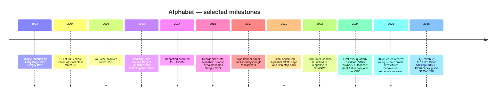
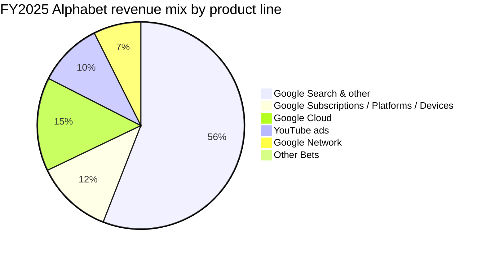
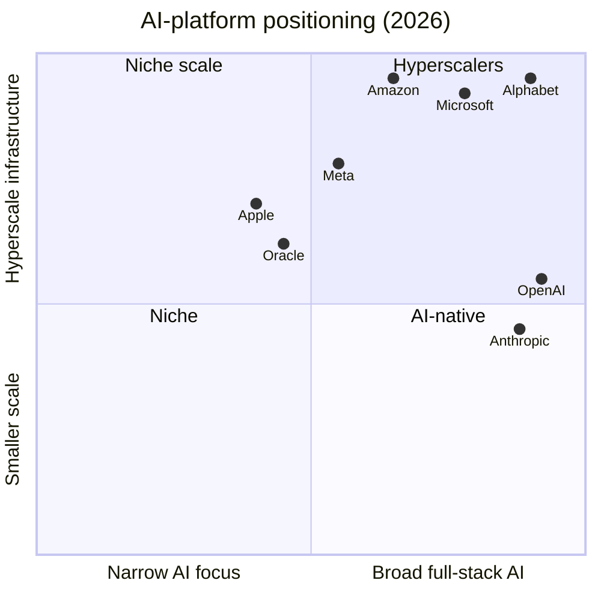

# COMPANY RESEARCH REPORT: Alphabet Inc. (NASDAQ: GOOG / GOOGL)

**Date:** 2026-05-20
**Analyst note:** Initiating coverage. All figures are sourced inline; primary sources are Alphabet's FY2025 10-K, Q1 2026 8-K and 2026 DEF 14A filed with the SEC, supplemented by recent third-party data points (each cited inline).

> **Update — Q1 2026 prints reset expectations (2026-04-29):** Alphabet's Q1 2026 revenue grew **22% YoY to $109.9 B** — its 11th consecutive quarter of double-digit growth — Google Cloud accelerated to **+63% YoY at $20.0 B**, and the Cloud backlog **nearly doubled QoQ to >$460 B**. Operating margin expanded 2 points to **36.1%**, and EPS rose 82% to $5.11. Management did not pre-announce full-year 2026 revenue/EPS guidance but reaffirmed the **$175–185 B capex range** for FY2026 (vs. $91.4 B in FY2025) and raised the dividend 5% to $0.22/quarter. Source: [Alphabet Q1 2026 earnings release (Ex. 99.1 to 8-K, 2026-04-29)](https://www.sec.gov/Archives/edgar/data/0001652044/000165204426000043/googexhibit991q12026.htm).

---

## TABLE OF CONTENTS
1. Company Overview
2. Company History
3. Management Team
4. Products & Services
5. Customers & Go-to-Market
6. Industry Overview
7. Competitive Landscape
8. Market Opportunity (TAM)
9. Risk Assessment
10. References

---

## 1. Company Overview

Alphabet Inc. is the holding company of **Google** and a portfolio of "Other Bets" businesses, headquartered in Mountain View, California and incorporated in Delaware (commission file no. 001-37580) ([Alphabet 2025 10-K, cover page](https://www.sec.gov/Archives/edgar/data/0001652044/000165204426000018/goog-20251231.htm)). The company operates the most consequential consumer-internet franchise in the world — Google Search, YouTube, Android, Chrome, Gmail, Google Maps and Google Play — together reaching billions of users daily — and the third-largest cloud-infrastructure platform, Google Cloud. Through DeepMind and Google Research, Alphabet also builds the **Gemini** family of frontier large-language models that increasingly mediate the user experience across every one of those properties. Alphabet had **190,820 employees** at year-end 2025 and 194,668 at Q1 2026 ([Alphabet 2025 10-K, "Human Capital"](https://www.sec.gov/Archives/edgar/data/0001652044/000165204426000018/goog-20251231.htm); [Q1 2026 earnings release](https://www.sec.gov/Archives/edgar/data/0001652044/000165204426000043/googexhibit991q12026.htm)).

**How Alphabet makes money.** The business reports two Google segments and an "Other Bets" bucket. **Google Services** (FY2025 revenue **$342.7 B**, 85% of total) earns from advertising on Google Search, YouTube and the Google Network (AdSense / AdMob / Ad Manager) plus subscription, hardware and Play revenue (`Google subscriptions, platforms, and devices`). **Google Cloud** (FY2025 **$58.7 B**, 15%) sells consumption-based GCP infrastructure / AI / data services and Google Workspace seats. **Other Bets** ($1.5 B, 0.4%) houses Waymo, Verily, X, Wing, GFiber and a handful of long-cycle, mostly pre-profit ventures, plus an Alphabet-level cost line for shared AI R&D ([Alphabet 2025 10-K, Note 15 "Information about Segments"](https://www.sec.gov/Archives/edgar/data/0001652044/000165204426000018/goog-20251231.htm)).

**Scale.** Consolidated FY2025 revenue was **$402.836 B**, up **15% YoY** from $350.018 B in FY2024; operating income of **$129.039 B** (32.0% margin) was up 15%, and net income of **$132.170 B** (32.8% net margin) was up **32%**, with diluted EPS of **$10.81** vs. $8.04 ([Alphabet 2025 10-K, "Executive Overview"](https://www.sec.gov/Archives/edgar/data/0001652044/000165204426000018/goog-20251231.htm)). The U.S. accounted for **48%** of revenue, EMEA 29%, APAC 17% and Other Americas 6%. Operating cash flow was **$164.7 B** and Alphabet ended FY2025 with **$126.8 B** in cash, cash equivalents and short-term marketable securities against **$46.5 B** in long-term debt (post a $64.6 B debt issuance, predominantly to pre-fund the AI capex ramp) ([Alphabet 2025 10-K, "Liquidity"](https://www.sec.gov/Archives/edgar/data/0001652044/000165204426000018/goog-20251231.htm)).

Source: [Alphabet 2025 10-K, "Consolidated Statements of Income"](https://www.sec.gov/Archives/edgar/data/0001652044/000165204426000018/goog-20251231.htm) (FY2021–FY2025 revenue and operating-income line items).

**The defining macro signal for 2026 is the capex step-up.** Purchases of property and equipment jumped from **$32.3 B in 2023 → $52.5 B in 2024 → $91.4 B in 2025**, and management has guided FY2026 capex to **$175–185 B** — roughly 60% servers and 40% data centres / networking — to satisfy Google Cloud demand and to scale Gemini training and inference ([Alphabet 2025 10-K, "Capital Expenditures"](https://www.sec.gov/Archives/edgar/data/0001652044/000165204426000018/goog-20251231.htm); [CNBC, 2026-02-04 "Alphabet resets the bar for AI infrastructure spending"](https://www.cnbc.com/2026/02/04/alphabet-resets-the-bar-for-ai-infrastructure-spending.html)). The number is meaningful because it dwarfs every prior capital cycle in Alphabet's history and is being recovered against a cloud backlog of **$242.8 B at YE2025** and >$460 B exiting Q1 2026 ([Alphabet 2025 10-K, "Revenue Backlog"](https://www.sec.gov/Archives/edgar/data/0001652044/000165204426000018/goog-20251231.htm); [Q1 2026 earnings release](https://www.sec.gov/Archives/edgar/data/0001652044/000165204426000043/googexhibit991q12026.htm)).

### Valuation snapshot

| Metric (TTM unless noted) | GOOG (2026-05-20) | Source |
|---|---|---|
| Share price | **$383.83** (Class C) | [Yahoo Finance, GOOG](https://finance.yahoo.com/quote/GOOG/) |
| Market cap | **$4.65 trillion** | [Yahoo Finance, GOOG key statistics](https://finance.yahoo.com/quote/GOOG/key-statistics) |
| TTM P/E | **29.2×** | [Yahoo Finance, GOOG](https://finance.yahoo.com/quote/GOOG/) |
| Forward P/E (FY26E) | **26.6×** | [Yahoo Finance, GOOG](https://finance.yahoo.com/quote/GOOG/) |
| TTM P/S | **11.0×** | [Yahoo Finance, GOOG](https://finance.yahoo.com/quote/GOOG/) |
| P/B | 9.7× | [Yahoo Finance, GOOG](https://finance.yahoo.com/quote/GOOG/) |
| EV / EBITDA | 28.7× | [Yahoo Finance, GOOG](https://finance.yahoo.com/quote/GOOG/) |
| Operating margin | 36.1% | [Yahoo Finance, GOOG](https://finance.yahoo.com/quote/GOOG/) |
| ROE | 38.9% | [Yahoo Finance, GOOG](https://finance.yahoo.com/quote/GOOG/) |
| 3-yr avg TTM P/E | ~23× | [MacroTrends, GOOGL P/E history](https://www.macrotrends.net/stocks/charts/GOOGL/alphabet/pe-ratio) |

**Peer comparison (Mag-7, TTM, pulled 2026-05-20 from yfinance / Yahoo Finance):**

| Ticker | TTM P/E | TTM P/S | Op. margin |
|---|---|---|---|
| **GOOG** | **29.2×** | **11.0×** | 36.1% |
| META | 22.1× | 7.2× | 40.6% |
| MSFT | 25.0× | 9.8× | 46.3% |
| AMZN | 32.2× | 3.8× | 13.1% |
| AAPL | 36.6× | 9.8× | 32.3% |
| NVDA | 45.5× | 25.0× | 65.0% |

Source: [Yahoo Finance key-statistics pages, 2026-05-20](https://finance.yahoo.com/quote/GOOG/key-statistics) (peer tickers individually).

Source: Yahoo Finance, [GOOG](https://finance.yahoo.com/quote/GOOG/), [META](https://finance.yahoo.com/quote/META/), [MSFT](https://finance.yahoo.com/quote/MSFT/), [AMZN](https://finance.yahoo.com/quote/AMZN/), [AAPL](https://finance.yahoo.com/quote/AAPL/), [NVDA](https://finance.yahoo.com/quote/NVDA/) (TTM multiples pulled 2026-05-20).

**Interpretation.** At ~29× TTM and ~27× forward, GOOG trades **above its own ~23× three-year average** ([MacroTrends, GOOGL P/E history](https://www.macrotrends.net/stocks/charts/GOOGL/alphabet/pe-ratio)) but **below the Mag-7 cohort median** of ~32× — cheaper than AAPL (36.6×) and AMZN (32.2×), and much cheaper than NVDA (45.5×). The premium versus META (22×) reflects (a) Google Cloud's 63% growth versus META's narrower, ads-only model, and (b) the option value of DeepMind / Gemini / Waymo, which are not yet near peak earnings power. The discount to AAPL reflects more direct AI-disruption exposure in Search. We do not classify the stock as stretched: P/E < 50×, P/S < 15×, and earnings are still accelerating (+82% YoY in Q1 2026). However, the **forward P/E expansion** of FY2026 will be heavily dependent on Google Cloud sustaining 50%-plus growth and operating-margin discipline as capex flows into D&A — those linkages are discussed in Sections 7 and 9.

---

## 2. Company History

**Founding.** Google was founded in September 1998 by **Larry Page** and **Sergey Brin** while they were Ph.D. candidates at Stanford University, building on their 1996 BackRub research project that ranked web pages using a citation-style algorithm later patented as PageRank ([Stanford University Press release, "Stanford's BackRub becomes Google"](https://about.google/our-story/)). The company went public in August 2004 at a $23 B valuation. In **October 2015** the company reorganised under a new parent — **Alphabet Inc.** — separating Google's core advertising business from speculative ventures like self-driving cars, life sciences and balloons-as-internet to give investors clearer disclosure and give the experimental businesses independent leadership ([Larry Page, "G is for Google" letter, 2015](https://abc.xyz/investor/founders-letters/2015/index.html)).

Source for milestones: [Alphabet "Our History" page](https://about.google/our-story/); [2026 DEF 14A, "Founder" director bios](https://www.sec.gov/Archives/edgar/data/0001652044/000130817926000342/d918244ddef14a.htm); [Reuters, "Google reorganises into Alphabet", 2015-08-10](https://www.reuters.com/article/idUSKCN0QF1IA20150810/); [NPR, "In a major antitrust ruling, a judge lets Google keep Chrome", 2025-09-02](https://www.npr.org/2025/09/02/nx-s1-5478625/google-chrome-doj-antitrust-ruling); [Alphabet Q1 2026 earnings release](https://www.sec.gov/Archives/edgar/data/0001652044/000165204426000043/googexhibit991q12026.htm).

**Three strategic pivots define the modern Alphabet.**

First, the **mobile pivot (2008–2014).** Android (acquired in 2005, launched in 2008) and Chrome (2008) defended Google's distribution as the smartphone replaced the PC. Android is the world's most-installed operating system, and the bundling of Google Search / Chrome / Play on Android underpins both the user funnel and one of the key remedies of the recent DOJ antitrust case ([Alphabet 2025 10-K, Item 1 "Business"](https://www.sec.gov/Archives/edgar/data/0001652044/000165204426000018/goog-20251231.htm); [NPR, 2025-09-02](https://www.npr.org/2025/09/02/nx-s1-5478625/google-chrome-doj-antitrust-ruling)).

Second, the **cloud / enterprise pivot (2018–present).** The decision to hire Thomas Kurian from Oracle as Google Cloud CEO in late 2018 marked an explicit shift from a research-led to a sales-led posture in the enterprise. Google Cloud's revenue grew from $13 B in 2020 to **$58.7 B in 2025** and turned operating-profitable in 2023 — operating income reached **$13.9 B in 2025** (23.7% margin) ([Alphabet 2025 10-K, Note 15](https://www.sec.gov/Archives/edgar/data/0001652044/000165204426000018/goog-20251231.htm)).

Third, the **AI re-tooling (2023–present).** Following OpenAI's release of ChatGPT in late 2022, CEO Sundar Pichai declared Alphabet "an AI-first company" and consolidated DeepMind, Google Research and the Brain team. Gemini 1.0 launched in December 2023; the Gemini 3 family is now the default consumer model in the Gemini app, with the Pro tier targeting June 2026 ([Google Gemini release notes](https://gemini.google/release-notes/)). Pichai called 2026's start "terrific" and cited "16 billion tokens per minute" of first-party Gemini API traffic — up 60% QoQ — as evidence the rebuild is generating real product velocity ([Q1 2026 earnings release](https://www.sec.gov/Archives/edgar/data/0001652044/000165204426000043/googexhibit991q12026.htm)).

**Key acquisitions:** YouTube ($1.65 B, 2006), DoubleClick ($3.1 B, 2008), Motorola Mobility ($12.5 B in 2012, divested 2014 except patents), Nest ($3.2 B, 2014), DeepMind (~$500 M, 2014), Mandiant ($5.4 B, 2022), Wiz (announced $32 B, the largest cybersecurity deal in history, closing into 2026) ([Reuters, "Google to buy Wiz for $32 billion", 2025-03-18](https://www.reuters.com/technology/google-buy-cyber-startup-wiz-32-billion-2025-03-18/)). Goodwill at YE2025 was **$33.4 B** and acquisitions were **$2.2 B** of net cash use in 2025 ([Alphabet 2025 10-K, "Consolidated Statements of Cash Flows"](https://www.sec.gov/Archives/edgar/data/0001652044/000165204426000018/goog-20251231.htm)).

**Recent developments (last 24 months):** initiation of the cash dividend in April 2024 ($0.20/quarter, raised to $0.21 in 2025 and $0.22 in April 2026); $70 B incremental Class A/C buyback authorised in April 2025 ([Alphabet 2025 10-K, "Repurchase Program"](https://www.sec.gov/Archives/edgar/data/0001652044/000165204426000018/goog-20251231.htm)); first-time issuance of senior unsecured notes in 2025 ($64.6 B in gross proceeds) and another $31.1 B in Q1 2026; CFO Anat Ashkenazi joined from Eli Lilly in July 2024; Judge Mehta's antitrust remedies order in September 2025 ([Alphabet Q1 2026 earnings release](https://www.sec.gov/Archives/edgar/data/0001652044/000165204426000043/googexhibit991q12026.htm); [NPR, 2025-09-02](https://www.npr.org/2025/09/02/nx-s1-5478625/google-chrome-doj-antitrust-ruling)).

---

## 3. Management Team

### Sundar Pichai — Chief Executive Officer, Alphabet & Google (age 53)

Pichai joined Google in 2004 as a product manager and rose through Chrome and Android; he was named **Google CEO in October 2015** when the Alphabet structure was created, and **Alphabet CEO in December 2019** when Larry Page and Sergey Brin stepped back from day-to-day roles ([2026 DEF 14A, "Director Biographies"](https://www.sec.gov/Archives/edgar/data/0001652044/000130817926000342/d918244ddef14a.htm)). He holds a B.Tech. from IIT Kharagpur, an M.S. from Stanford (materials science) and an MBA from Wharton (where he was a Siebel Scholar). Before his CEO appointment he led the Chrome browser launch (2008) — now ~3.5 B users and the second largest installed-base programme in computing — and the Android product organisation (2013–2014), the OS that today runs roughly seven in ten smartphones worldwide ([2026 DEF 14A](https://www.sec.gov/Archives/edgar/data/0001652044/000130817926000342/d918244ddef14a.htm)).

As CEO, his **two defining strategic decisions** have been (1) the AI re-platforming announced in early 2023 — the consolidation of DeepMind, Brain and Google Research; the elevation of Gemini as the single model family across consumer, developer and enterprise; and the gating of every product roadmap to AI — and (2) the **capex acceleration** that has tripled annual property-and-equipment purchases inside three years to a guided $180 B run-rate ([Alphabet 2025 10-K, "Capital Expenditures"](https://www.sec.gov/Archives/edgar/data/0001652044/000165204426000018/goog-20251231.htm); [CNBC, 2026-02-04](https://www.cnbc.com/2026/02/04/alphabet-resets-the-bar-for-ai-infrastructure-spending.html)). The early returns on those choices are visible in the Q1 2026 print: Google Cloud +63% YoY, paid subscriptions at 350 million across YouTube and One, Search revenue +19% YoY (the strongest growth in over a decade) and 16 billion tokens/minute through the Gemini API, +60% QoQ ([Q1 2026 earnings release](https://www.sec.gov/Archives/edgar/data/0001652044/000165204426000043/googexhibit991q12026.htm)).

Pichai owns **227,560 shares** of Class A common stock (less than 1% of any class), reflecting a non-founder, professional-manager comp profile ([2026 DEF 14A, "Security Ownership"](https://www.sec.gov/Archives/edgar/data/0001652044/000130817926000342/d918244ddef14a.htm)). His annual compensation is heavily equity-weighted; the company restructured NEO compensation in 2025 to a model of $1 M base salary plus a target combination of GSUs (time-vesting) and PSUs (TSR-vesting vs. S&P 100). In 2023 Pichai earned $8.8 M in total compensation, including ~$6.8 M of personal security ([TheStreet, "Sundar Pichai's net worth"](https://www.thestreet.com/personalities/sundar-pichai-net-worth)) — he typically takes the bulk of comp in periodic multi-year equity grants rather than annual awards, so headline-year totals fluctuate sharply. Externally he chairs Alphabet's Executive Committee and is a director-nominee (continuously since 2017) ([2026 DEF 14A](https://www.sec.gov/Archives/edgar/data/0001652044/000130817926000342/d918244ddef14a.htm)).

### Anat Ashkenazi — Senior Vice President & Chief Financial Officer, Alphabet & Google (age 53)

Ashkenazi joined as CFO in **July 2024** from Eli Lilly, where she had been EVP & CFO since February 2021 and a 23-year veteran of the company across positions including CFO of the Oncology, Diabetes, Manufacturing and Research divisions ([2026 DEF 14A, "Executive Officer Biographies"](https://www.sec.gov/Archives/edgar/data/0001652044/000130817926000342/d918244ddef14a.htm)). She is an Israeli-American executive with a B.A. in economics and business administration from Hebrew University and an MBA from Tel Aviv University ([Wikipedia — Anat Ashkenazi](https://en.wikipedia.org/wiki/Anat_Ashkenazi); [Jewish Insider, 2026-02 "Alphabet's AI bet shows early returns under Israeli-American CFO"](https://jewishinsider.com/2026/02/anat-ashkenazi-ai-alphabet-cfo-eli-lilly-tech-google-israeli-american/)). During her three-year tenure as Lilly CFO the company's market capitalisation tripled on the back of the Mounjaro / Zepbound GLP-1 ramp, and she is widely credited with executing the capacity build-out that converted demand into delivered revenue ([CNBC, "Alphabet CFO Anat Ashkenazi jumps from GLP-1 boom to generative AI", 2024-06-06](https://www.cnbc.com/2024/06/06/alphabet-cfo-anat-ashkenazi-jumps-from-glp-1-boom-to-generative-ai.html)). At Alphabet, her early signature has been (a) the **first formal long-term capex guidance** in Alphabet's history ($175–185 B FY26) and (b) the deepening of debt financing to pre-fund the AI infrastructure build — Alphabet went from $10.9 B of long-term debt at YE2024 to **$46.5 B at YE2025** plus another $31.1 B raised in Q1 2026 ([Alphabet 2025 10-K, "Long-term debt"](https://www.sec.gov/Archives/edgar/data/0001652044/000165204426000018/goog-20251231.htm); [Q1 2026 earnings release](https://www.sec.gov/Archives/edgar/data/0001652044/000165204426000043/googexhibit991q12026.htm)). She also continues to serve on the boards of Maravai LifeSciences and (previously) Varian Medical Systems.

### Philipp Schindler — SVP & Chief Business Officer, Google (age 55)

Schindler has run Google's worldwide sales and partner organisation since **August 2015** and is the executive accountable for advertising revenue — i.e., ~73% of Alphabet's top line ([2026 DEF 14A, "Executive Officer Biographies"](https://www.sec.gov/Archives/edgar/data/0001652044/000130817926000342/d918244ddef14a.htm)). He has been with Google for over 20 years, previously running EMEA sales out of Hamburg. His remit covers Google's Search & display ads, the YouTube and DV360 advertising stack, partner agreements (including the Apple Safari default-search agreement that was the focus of the DOJ case), and country operations. 2025 NEO target total compensation: $40.6 M (PSU + GSU + cash, target award value), per [2026 DEF 14A "NEO Compensation"](https://www.sec.gov/Archives/edgar/data/0001652044/000130817926000342/d918244ddef14a.htm).

### Kent Walker — President of Global Affairs, Chief Legal Officer & Secretary (age 65)

Walker has been Chief Legal Officer since 2017 and President of Global Affairs since November 2021, making him the lead executive on the antitrust, privacy and AI-regulation frontier that increasingly defines Alphabet's risk profile ([2026 DEF 14A](https://www.sec.gov/Archives/edgar/data/0001652044/000130817926000342/d918244ddef14a.htm)). He coordinates the response to the U.S. DOJ Search and Ad-Tech cases, the EU Digital Markets Act and Digital Services Act compliance regime, the UK CMA market investigations and the multi-jurisdictional inquiries into generative AI. He sits on the boards of Evidence Action and TechNet and the Council on Foreign Relations.

### Governance footer

- **Dual-class structure with founder control.** Class A (1 vote/share) and Class B (10 votes/share); Class C (no votes). **Larry Page personally controls 46.5% of Class B (27.4% of total voting power); Sergey Brin 42.9% / 25.3%.** Together the founders hold approximately **52.7%** of Alphabet's voting power despite owning a small fraction of total equity ([2026 DEF 14A, "Beneficial Ownership Table"](https://www.sec.gov/Archives/edgar/data/0001652044/000130817926000342/d918244ddef14a.htm)).
- **Board:** 10 director nominees for 2026 — Page, Brin, Pichai (executive); independent Chair **John L. Hennessy** (former Stanford President); plus Frances H. Arnold (Nobel laureate, Caltech), Marty Chávez, John Doerr (KP), Roger Ferguson Jr., Ram Shriram and Robin Washington. Auditor: **Ernst & Young LLP** ([2026 DEF 14A, Proposals 1 and 2](https://www.sec.gov/Archives/edgar/data/0001652044/000130817926000342/d918244ddef14a.htm)).
- **Compensation philosophy:** NEOs (ex-CEO) take $1 M cash salary plus a mix of GSU + PSU; PSUs vest on three-year relative TSR vs. the S&P 100, mirroring the prior multi-year design.
- **Insider ownership:** all executive officers and directors as a group own 2.5 m+ shares; ownership is concentrated in the two founders. Pichai owns 227,560 Class A shares.

**Management track-record synthesis (50–100 w).** This is the most experienced operating team in big-tech: a 22-year veteran CEO who has delivered both the mobile and cloud transitions; a Lilly-trained CFO with a documented record of converting demand into supply at scale; and a CBO who has compounded Google ads ~6× since 2015. The team's open question is whether the AI shift will compress Search economics — but management's willingness to spend at scale and the **+19% Search revenue growth in Q1 2026** suggest they are not in a defensive posture ([Q1 2026 earnings release](https://www.sec.gov/Archives/edgar/data/0001652044/000165204426000043/googexhibit991q12026.htm)).

---

## 4. Products & Services

Alphabet operates one of the broadest consumer-and-enterprise software portfolios in the industry. The 10-K enumerates Google Services as comprising "ads, Android, Chrome, devices, Gmail, Google Drive, Google Gemini, Google Maps, Google Photos, Google Play, Search and YouTube" ([Alphabet 2025 10-K, Item 1 "Business — Google Services"](https://www.sec.gov/Archives/edgar/data/0001652044/000165204426000018/goog-20251231.htm)). The product map below organises the portfolio as the company itself reports it.

```mermaid
graph TD
    Alphabet[Alphabet Inc.]
    Alphabet --> Services[Google Services - $342.7B / 85%]
    Alphabet --> Cloud[Google Cloud - $58.7B / 15%]
    Alphabet --> Other[Other Bets - $1.5B / 0.4%]

    Services --> Search[Google Search and other]
    Services --> YT[YouTube ads + subscriptions]
    Services --> Net[Google Network - AdMob/AdSense/Ad Manager]
    Services --> SubPlat[Subscriptions, Platforms and Devices]
    SubPlat --> Android[Android OS]
    SubPlat --> Chrome[Chrome browser]
    SubPlat --> Play[Google Play]
    SubPlat --> Pixel[Pixel phones, Watch, Buds, Nest]
    SubPlat --> One[Google One / AI Pro / AI Ultra]
    SubPlat --> Workspace[Workspace consumer]
    SubPlat --> Maps[Maps]
    SubPlat --> Gemini[Gemini app]

    Cloud --> GCP[Google Cloud Platform]
    GCP --> Vertex[Vertex AI / Gemini Enterprise]
    GCP --> Compute[Compute, Storage, Networking]
    GCP --> Data[BigQuery, Spanner, Looker]
    GCP --> Sec[Security - Mandiant / Wiz pending]
    Cloud --> WS[Workspace Enterprise]

    Other --> Waymo[Waymo - autonomous ride-hail]
    Other --> Verily[Verily - life sciences]
    Other --> X[X - the moonshot factory]
    Other --> Wing[Wing - drone delivery]
    Other --> GFiber[Google Fiber]
```

Source: [Alphabet 2025 10-K, Item 1 "Business"](https://www.sec.gov/Archives/edgar/data/0001652044/000165204426000018/goog-20251231.htm); revenue contributions from Note 15 of the same filing.

Source: [Alphabet 2025 10-K, Note 15 "Information about Segments"](https://www.sec.gov/Archives/edgar/data/0001652044/000165204426000018/goog-20251231.htm).

### Flagship products — competitive-advantage assessment

**Google Search & other ($224.5 B, FY2025; +13% YoY).** The single largest revenue line in technology. Search monetises an estimated >5 billion users via the auction-based AdWords / Performance Max system. **Moat: yes — multi-layer.** (a) Data network effects: 25+ years of click data, query-intent matching and crawled web content; (b) ecosystem lock-in via Android default search and the (now-restricted, post-DOJ ruling) Apple Safari default agreement; (c) scale economies in indexing and serving. **Threat:** AI Overviews answer 18% of queries in-line and 57% of long-tail queries, lifting zero-click rates to 43% (and 93% with AI Mode active) — a structural risk to the click economy ([TechnologyChecker.io, 2026 "Search Engine Market Share"](https://technologychecker.io/blog/search-engine-market-share); [Stackmatix, 2026-03 "AI Search Market Share"](https://www.stackmatix.com/blog/ai-search-market-share-2026)). Yet Search revenue **accelerated to +19% in Q1 2026**, and Pichai noted "queries at an all-time high" — for now, AI integration is incremental, not cannibalising ([Q1 2026 earnings release](https://www.sec.gov/Archives/edgar/data/0001652044/000165204426000043/googexhibit991q12026.htm)). Closest competing product: **Microsoft Bing + Copilot** (~5% search share, growing in AI assistants), and **ChatGPT** (60.7% of the AI-chat search subset but only ~17% of US total search volume). At parity in answer quality on many factual queries; **ahead** in transactional / commercial intent monetisation.

**YouTube — ads + subscriptions ($40.4 B ads + share of $48.0 B subs in FY2025).** YouTube is the world's largest video platform and the world's second-largest music platform. **Moat: yes — network effects + content library.** Combined YouTube ads + subscription revenue exceeded **$60 B for 2025** ([Yahoo Finance / Variety, "How Big Is YouTube?", 2026-02](https://finance.yahoo.com/news/big-youtube-revenue-topped-60-223942275.html)). YouTube Music + Premium passed **125 million paid subscribers** in 2025 ([Variety, "YouTube: 125 Million Music & Premium Subscribers", 2025-03](https://variety.com/2025/digital/news/youtube-125-million-music-premium-subscribers-lite-tier-1236328177/)). The subscription business across YouTube + Google One is generating ~$20 B/year ([Music Business Worldwide, "YouTube's subscription business is now generating roughly $20bn a year", 2026-02-05](https://www.musicbusinessworldwide.com/youtubes-subscription-business-is-now-generating-around-20bn-a-year-with-music-a-key-growth-driver/)). Closest competing products: **Meta Reels / Instagram** in short-form (at parity / ahead in time-spent for Gen Z), **Netflix / Spotify** in paid streaming (subscale on ad-supported, ahead on premium UX), **TikTok** in short-form video globally (at parity outside the U.S., ahead on watch time per user inside it). **At parity overall** with the strongest competitor in any single mode; **ahead** on the breadth-of-format basis.

**Android + Chrome + Play (Subscriptions, Platforms and Devices, $48.0 B FY2025; +19% YoY).** Two of the three biggest consumer-software platforms in the world. **Moat: partial.** Android remains the dominant smartphone OS but is open source; the lock-in is via Google Mobile Services bundling — a practice that has been a recurring antitrust pressure point. Play monetises Android via in-app payments and app distribution. The platforms anchor the distribution funnel into Search, YouTube and Workspace and provide an installed-base flywheel. **Closest competing products:** **Apple iOS / App Store** — ahead on premium-tier monetisation per user, behind on global unit share.

**Google Cloud / GCP + Workspace ($58.7 B FY2025, +36% YoY; $20.0 B Q1 2026, +63% YoY).** The fastest-accelerating large segment. Operating income **$13.9 B (23.7% margin) FY2025** vs. $6.1 B (14.1%) FY2024 ([Alphabet 2025 10-K, Note 15](https://www.sec.gov/Archives/edgar/data/0001652044/000165204426000018/goog-20251231.htm)). **Moat: yes (and improving).** Differentiators: (a) **TPU v6 "Trillium" and v7 "Ironwood"** silicon — the latter a 9,216-chip pod with >40 ExaFLOPS FP8 designed for inference — providing a vertically integrated alternative to Nvidia GPUs ([Data Center Frontier, "Google's TPU Roadmap", 2026-01](https://www.datacenterfrontier.com/machine-learning/article/55336429/googles-tpu-roadmap-challenging-nvidias-dominance-in-ai-infrastructure)); (b) Gemini 2.5 / 3.x models that customers can fine-tune via Vertex AI; (c) BigQuery and the world's largest planetary-scale data warehouse footprint; (d) Mandiant security and the pending **$32 B Wiz acquisition** for cloud security ([Reuters, 2025-03-18](https://www.reuters.com/technology/google-buy-cyber-startup-wiz-32-billion-2025-03-18/)). **Anthropic in November 2025 closed the largest TPU deal in Google's history**, committing to hundreds of thousands of Trillium chips and scaling toward one million by 2027 ([Data Center Frontier, 2026-01](https://www.datacenterfrontier.com/machine-learning/article/55336429/googles-tpu-roadmap-challenging-nvidias-dominance-in-ai-infrastructure)). Closest competing products: **AWS** (S3, EC2, Bedrock, Trainium chips; ahead on revenue scale, behind on growth) and **Azure** (with Microsoft AI / OpenAI; ahead on enterprise distribution, similar growth profile). **At parity / catching up** on enterprise mind-share; **ahead** on AI-native workload performance per dollar in many published benchmarks.

**Gemini App + AI Pro / AI Ultra.** The newest flagship is the Gemini app, which Pichai called "our strongest quarter ever for our consumer AI plans" in Q1 2026, with 350 million paid subscriptions across all Alphabet's consumer services ([Q1 2026 earnings release](https://www.sec.gov/Archives/edgar/data/0001652044/000165204426000043/googexhibit991q12026.htm)). The consumer Gemini app holds **15.0–18.2% of AI-chatbot / AI-search share** in independent Similarweb-style trackers, up from ~5% a year earlier and second only to ChatGPT ([Vertu, "AI Chatbot Market Share 2026", 2026](https://vertu.com/lifestyle/ai-chatbot-market-share-2026-chatgpt-drops-to-68-as-google-gemini-surges-to-18-2)). **Moat: partial** today — closing fast vs. ChatGPT. Closest competing products: **OpenAI ChatGPT** (~60–68% share, ahead on mind-share); **Anthropic Claude** (smaller share, ahead on long-context coding benchmarks); **Microsoft Copilot** (~13% share, distribution-led).

**Waymo — Other Bets flagship.** Waymo surpassed **500,000 fully-autonomous paid rides per week** across 10 U.S. cities as of Q1 2026, with **20+ additional cities** including Tokyo and London targeted for 2026, and a coverage area of **>1,400 square miles** ([Q1 2026 earnings release](https://www.sec.gov/Archives/edgar/data/0001652044/000165204426000043/googexhibit991q12026.htm); [TechCrunch, "Waymo's skyrocketing ridership in one chart", 2026-03-27](https://techcrunch.com/2026/03/27/waymo-skyrocketing-ridership-in-one-chart/); [Electrek, "Waymo expands robotaxi coverage", 2026-05-13](https://electrek.co/2026/05/13/waymo-expands-coverage-1400-square-miles-11-cities/)). Last private valuation: >$45 B in October 2024; press reports indicate an internal mark-up materially above that following the 2026 ride-volume inflection ([TheStreet, "Alphabet's quiet $110B Waymo move", 2026](https://www.thestreet.com/investing/alphabets-quiet-110b-waymo-move-blows-up-other-bets-narrative)). **Moat: yes (technology + regulatory).** Closest competing products: **Tesla Robotaxi / FSD** (more vehicles, no commercial driverless service at scale), **Cruise** (suspended), **Baidu Apollo Go** (largest in China, ahead in city count but behind in safety record outside China). **Ahead** on commercial driverless miles and city diversity in the U.S.

### Long-tail and recent launches/sunsets

- **Pixel hardware family** (Pixel 10 phones, Pixel Watch 4, Pixel Buds Pro 2, Pixel Tablet) — material brand asset but small share of revenue ([Google Store](https://store.google.com/)).
- **Workspace consumer (Gmail / Drive / Docs / Meet)** — the basis of Google One bundles; rebranded with AI features in 2025.
- **Nest / Google Home** — smart-home category, repositioned around Gemini.
- **Google Fi** — MVNO mobile service.
- **Verily** — health and life sciences.
- **Wing** — drone delivery, expanded in Texas in 2025.
- **GFiber** — wholesale-style fibre internet.
- **Sunsets / repositionings (last 12 months):** the Google Bard brand was fully retired in favour of "Gemini" across all surfaces; **Pichai consolidated Google Search and Ads under Nick Fox**; the **Pixel-only "Tensor" mobile-SoC team has been merged with the Cloud silicon group**; X division shutdowns continue at a controlled pace as ventures are graduated, spun out or wound down.

---

## 5. Customers & Go-to-Market

### Customer segments

Alphabet has the broadest customer footprint of any technology company. The user base for Google Search / YouTube / Android / Chrome / Gmail / Maps is consumer-mass-market and crosses **every country, language and demographic** ([Alphabet 2025 10-K, Item 1 "Business"](https://www.sec.gov/Archives/edgar/data/0001652044/000165204426000018/goog-20251231.htm)). The revenue-bearing customer base, however, is concentrated in three groups:

1. **Advertisers** — generate the $294.7 B Google Advertising revenue line (73% of Alphabet revenue). Ranges from millions of long-tail SMBs running self-serve Performance Max campaigns, to the world's largest CMOs (Procter & Gamble, Unilever, Samsung, Amazon, Toyota) buying integrated YouTube + Search + Display deals.
2. **Cloud customers** — the named-account universe served by Google Cloud's enterprise sales force, including **public sector** (U.S. Department of Defense JWCC contract, U.K. government, several Latin American sovereigns), **financial services** (HSBC, Deutsche Bank, PayPal), **retail** (Walmart, Home Depot, Wayfair), **manufacturing / auto** (Toyota, Mercedes), and notably **AI labs and AI-native enterprises** including a multi-year, multi-billion-dollar TPU agreement with **Anthropic**.
3. **Consumers buying subscriptions and devices** — 350 million paid consumer subscribers (YouTube Premium / Music, YouTube TV, Google One, AI Pro / AI Ultra, NFL Sunday Ticket) plus Pixel hardware buyers.

Source: [Alphabet 2025 10-K, Note 15 "Information about Segments"](https://www.sec.gov/Archives/edgar/data/0001652044/000165204426000018/goog-20251231.htm).

### Customer concentration

Alphabet does **not** disclose any customer representing 10% or more of consolidated revenue and the 10-K states no individual customer accounted for a material portion of revenue ([Alphabet 2025 10-K, Item 7A & "Concentration of Credit Risk" notes](https://www.sec.gov/Archives/edgar/data/0001652044/000165204426000018/goog-20251231.htm)). This is consistent with the **millions-of-advertisers** ad business model and is one of the most diversified customer bases in mega-cap technology. The risk of customer concentration at Alphabet is therefore very low — top-1 is materially under 5% — and the report does not carry it as a Section 9 risk (we do, however, flag **distribution-partner** concentration in the form of the Apple Safari default-search agreement and the Android OEM relationships, in Section 9).

### Geographic distribution

| Region | FY2023 ($B / %) | FY2024 ($B / %) | FY2025 ($B / %) |
|---|---|---|---|
| United States | 146.286 / 47% | 170.447 / 49% | 194.229 / 48% |
| EMEA | 91.038 / 30% | 102.127 / 29% | 117.152 / 29% |
| APAC | 51.514 / 17% | 56.815 / 16% | 67.680 / 17% |
| Other Americas | 18.320 / 6% | 20.418 / 6% | 23.902 / 6% |
| Hedging | 0.236 / 0% | 0.211 / 0% | (0.127) / 0% |
| **Total** | **$307.4 B** | **$350.0 B** | **$402.8 B** |

Source: [Alphabet 2025 10-K, Note 2 "Revenue Recognition — Disaggregation of Revenues"](https://www.sec.gov/Archives/edgar/data/0001652044/000165204426000018/goog-20251231.htm).

Source: [Alphabet 2025 10-K, Note 2](https://www.sec.gov/Archives/edgar/data/0001652044/000165204426000018/goog-20251231.htm).

### Go-to-market

**Ads:** programmatic self-serve auction (AdWords / Performance Max, Display & Video 360, YouTube Select) for the bulk of revenue; a global Google Customer Solutions and Large Customer Sales organisation under CBO Philipp Schindler covers the named accounts.

**Cloud:** direct sales (under Thomas Kurian) organised by region and by vertical (financial services, retail, manufacturing, media, public sector); a growing ISV / GSI ecosystem (Accenture, Deloitte, Capgemini, Wipro, TCS); marketplace listings; co-sell with Salesforce / SAP / ServiceNow.

**Consumer subscriptions:** in-product upsell across YouTube and Gmail / Drive; bundle promotions (e.g., AI Pro included with new Pixel devices).

### Key partnerships

- **Apple — default-search agreement on Safari.** Long the single most-cited distribution arrangement in technology. The 2025 DOJ remedies order restricts Google from "entering or maintaining exclusive contracts" relating to Search distribution but does not prohibit revenue-sharing payments outright ([NPR, 2025-09-02](https://www.npr.org/2025/09/02/nx-s1-5478625/google-chrome-doj-antitrust-ruling); [Congress.gov CRS Legal Sidebar LSB11362](https://www.congress.gov/crs-product/LSB11362)).
- **Anthropic — TPU + cloud + equity.** Alphabet holds an ~14% stake; Anthropic's February 2026 Series G priced the company at **$380 B** (one of the two largest VC rounds ever) and the October 2025 TPU expansion is "worth tens of billions of dollars" and brings >1 GW of compute online in 2026 ([Reuters / TheStreet coverage, 2026](https://www.thestreet.com/investing/alphabets-quiet-110b-waymo-move-blows-up-other-bets-narrative)).
- **Samsung and the Android OEM ecosystem.**
- **Auto OEMs for Android Auto and Waymo platform partnerships** (Hyundai, JLR, Zeekr for Waymo).

---

## 6. Industry Overview

Alphabet straddles three of the largest, fastest-growing industries in software — **digital advertising, cloud infrastructure / AI services, and the early-innings autonomous mobility market** — alongside an ecosystem of consumer-software, payments and devices that we treat as adjacent.

### 6.1 Digital advertising

Global advertising will pass the **$1 trillion mark in 2026 for the first time**, with digital ad spend reaching approximately **$835.8 billion (68.7% of the total)** ([MAGNA / Dentsu / GroupM forecast composite, 2026-03](https://magnaglobal.com/ad-forecast-media-innovation-to-propel-the-global-ad-market/); [PPCChief, "Digital Ad Spend Statistics 2026"](https://ppcchief.com/digital-ad-spend-statistics)). U.S. ad spend alone will pass **$400 B in 2026 (+7.8% YoY)** ([MAGNA forecast, 2026](https://magnaglobal.com/ad-forecast-media-innovation-to-propel-the-global-ad-market/)). The fastest-growing channels are social (+14.6%), connected TV (+13.8%) and commerce / retail media (+12.1%). Search advertising remains the single largest digital category, and Google holds **87.5% of global search referral traffic** observed by Cloudflare Radar in the four weeks ending April 20, 2026 ([TechnologyChecker.io, "Search Engine Market Share 2026"](https://technologychecker.io/blog/search-engine-market-share)).

**Structural dynamics.** The category is consolidating around a duopoly-plus: Google ~28% of all global digital ads, Meta ~22%, Amazon ~10% and ByteDance ~9% per common third-party estimates. Net-new dollar growth has shifted decisively to AI-augmented placements (Performance Max, Advantage+, Sponsored Brands with generative content). The most important shift in 2026 is the **conditional integration of generative answers into search results** — Google's AI Overviews now appear on ~18% of all queries and 57% of long-tail queries, which raises zero-click rates and forces ad-product re-engineering ([Stackmatix, 2026-03 "AI Search Market Share"](https://www.stackmatix.com/blog/ai-search-market-share-2026)).

**Regulation.** Major regulatory pressure points: the U.S. DOJ Search remedies (no Chrome divestiture but mandatory data-sharing; appeal underway), the U.S. DOJ Ad-Tech case (still in remedies phase), the EU Digital Markets Act (Google is a designated gatekeeper for ads, search, Android, Chrome, Maps, YouTube), and the EU AI Act. The result is a meaningful but bounded compliance overhead; structural separation is no longer the central scenario ([NPR, 2025-09-02](https://www.npr.org/2025/09/02/nx-s1-5478625/google-chrome-doj-antitrust-ruling); [Department of Justice, "DOJ wins significant remedies against Google", 2025-09](https://www.justice.gov/opa/pr/department-justice-wins-significant-remedies-against-google)).

### 6.2 Cloud infrastructure & AI services

Cloud is on an estimated **~$800 B** total addressable market trajectory for 2026 (combined IaaS, PaaS and SaaS) and **>20% annual growth** in the AI-infrastructure sub-segment ([Programming-Helper, "Cloud Computing Market Share 2026"](https://www.programming-helper.com/tech/cloud-computing-market-share-2026-aws-azure-google-cloud-analysis); [Synergy Research data summarised in HeyGoTrade, "AWS vs Google Cloud vs Azure", 2026](https://www.heygotrade.com/en/blog/aws-vs-google-cloud-vs-azure-hyperscaler-race/)). The three hyperscalers collectively account for **~68%** of enterprise cloud spend; **AWS holds ~30%, Microsoft Azure ~25%, Google Cloud ~13%** as of Q1 2026.

Source: [Synergy Research / HeyGoTrade, "AWS vs Google Cloud vs Azure", Q1 2026](https://www.heygotrade.com/en/blog/aws-vs-google-cloud-vs-azure-hyperscaler-race/); growth rates from each issuer's Q1 2026 earnings release.

Source: [Alphabet 2025 10-K, Note 15](https://www.sec.gov/Archives/edgar/data/0001652044/000165204426000018/goog-20251231.htm); [Q1 2026 earnings release](https://www.sec.gov/Archives/edgar/data/0001652044/000165204426000043/googexhibit991q12026.htm) (Q1'26 annualised = $20.028B × 4).

The shape of the AI-infrastructure cycle is what matters: Anthropic, OpenAI / Microsoft, Meta, xAI, Alphabet and a long tail of sovereign and enterprise AI workloads are all racing to commit power, real estate and silicon for 2026–2028 deliveries. **Combined hyperscaler capex (Alphabet + Microsoft + Amazon + Meta) is on track to exceed $500 B in 2026**, of which Alphabet alone is ~$180 B ([Ferguson Wellman, "The Magnificent Capex", 2026-05-08](https://www.fergusonwellman.com/blog/2026/5/8/the-magnificent-capex-ai-infrastructure-spending-and-who-actually-benefits)). This is at least an order of magnitude larger than any prior software-infrastructure cycle in history and will determine the relative power-law positioning in the next decade.

Source: [Alphabet 2025 10-K, "Investing Activities"](https://www.sec.gov/Archives/edgar/data/0001652044/000165204426000018/goog-20251231.htm); FY2026E midpoint per [CNBC, 2026-02-04 "Alphabet resets the bar for AI infrastructure spending"](https://www.cnbc.com/2026/02/04/alphabet-resets-the-bar-for-ai-infrastructure-spending.html).

### 6.3 Autonomous mobility

The U.S. robotaxi industry is at a clear inflection: Waymo grew weekly paid driverless rides from ~150,000 in early 2025 to **500,000 by Q1 2026**, with a stated goal of 1 million per week by year-end ([TechCrunch, 2026-03-27](https://techcrunch.com/2026/03/27/waymo-skyrocketing-ridership-in-one-chart/)). The 2026 expansion into Tokyo and London also opens the first material non-U.S. revenue from autonomy. We estimate the U.S. addressable robotaxi market at $250–400 B at maturity (rough math: 250 M passenger-car rideshare miles per year at $0.60–1.20 per mile gross). Competing players include Tesla, Baidu Apollo Go (China), Zoox (Amazon), Aurora and a handful of smaller AV trucking companies.

### 6.4 Adjacent industries

- **Smartphone hardware** (Pixel) — global TAM ~$485 B; Alphabet competes via a small but premium-margin Pixel line.
- **Smart-home / IoT** — Nest and Google Home; competing with Amazon Echo / Apple HomeKit.
- **Streaming video / music** — YouTube TV / Music: combined paying-user base of 125M+ on YT Premium / Music ([Variety, 2025-03](https://variety.com/2025/digital/news/youtube-125-million-music-premium-subscribers-lite-tier-1236328177/)).

---

## 7. Competitive Landscape

Alphabet competes with **five distinct cohorts of rivals**, none of which is replicating the entirety of the portfolio. The most useful framing is product-by-product, because the company that's most threatening to Search (OpenAI / Microsoft) is not the company most threatening to Cloud (AWS) or YouTube (Meta / TikTok).

### Search / consumer AI

- **OpenAI (private; backed by Microsoft).** ChatGPT remains the share leader in standalone AI-chatbot usage at **~60–68%** depending on source ([Vertu, 2026](https://vertu.com/lifestyle/ai-chatbot-market-share-2026-chatgpt-drops-to-68-as-google-gemini-surges-to-18-2)). It is now distributed across Apple Intelligence and Microsoft Copilot. Direct ChatGPT search queries are estimated at ~28% of global search-replacement volume but only ~17% in the U.S. proper ([Stackmatix, 2026-03](https://www.stackmatix.com/blog/ai-search-market-share-2026)). **Ahead** in conversational mind-share; **behind** in monetisation per session and in indexed-web coverage.
- **Microsoft (MSFT).** Bing + Copilot has not materially eroded Google Search share since the late-2023 ChatGPT integration, but the OpenAI partnership remains the single most-strategic external alliance in tech. Combined Microsoft Copilot + OpenAI share of AI-assistant usage is **73.9%** ([Vertu, 2026](https://vertu.com/lifestyle/ai-chatbot-market-share-2026-chatgpt-drops-to-68-as-google-gemini-surges-to-18-2)). MSFT trades at TTM P/E **25.0×** vs. GOOG's 29.2× — i.e., the market does not assign Microsoft a Search-disruption premium ([Yahoo Finance, MSFT key statistics](https://finance.yahoo.com/quote/MSFT/key-statistics)).
- **Anthropic (private; backed by Alphabet 14% and Amazon).** Claude is the leading enterprise-coding model. Anthropic is paradoxically both a key Google Cloud customer (the largest TPU deal in Google's history) and a competitor to Gemini.
- **Perplexity, You.com, Brave Search.** Long-tail conversational search startups. Strategic, not existential.

### Cloud infrastructure & AI services

- **Amazon Web Services (AMZN).** Market leader at ~30% share. AWS reported ~19% growth in its most recent quarter — sharply below Google Cloud's 63% and Azure's 40% ([HeyGoTrade, 2026](https://www.heygotrade.com/en/blog/aws-vs-google-cloud-vs-azure-hyperscaler-race/)). AWS's response: Trainium and Bedrock for AI; deep partnership with Anthropic for Claude on AWS.
- **Microsoft Azure (MSFT).** Number two at ~25% share. Distribution moat via Office and Active Directory; OpenAI is its flagship AI partnership. Azure AI revenue is the most-cited single proof-point in AI workload demand.
- **Oracle Cloud (ORCL).** Smaller but rising — won large multi-year AI infrastructure deals through 2025–2026 (notably with OpenAI for parts of Stargate). Bull case is that Oracle becomes the fourth hyperscaler; bear case is that its growth is dependent on a small number of named customers.
- **CoreWeave, Crusoe, Lambda, Nebius.** AI-native specialty GPU cloud providers. Niche but fast-growing; relevant chiefly because they pull GPU supply away from the hyperscalers.

### Video / short-form

- **Meta Platforms (META).** Instagram Reels and Facebook are direct attention competitors to YouTube. Meta's operating margin of **40.6%** is the highest in the cohort outside Microsoft, and META trades at a discount to GOOG (22× vs. 29×) — suggesting the market discounts META's regulatory and metaverse-spend tail risks more than GOOG's AI risks ([Yahoo Finance, META key statistics](https://finance.yahoo.com/quote/META/key-statistics)).
- **TikTok / ByteDance (private).** The dominant short-form video platform outside the U.S. and a top-three globally. Continues to face U.S. regulatory action; Pichai noted in past calls that any forced TikTok divestiture would be a YouTube tailwind.
- **Netflix, Disney+, Spotify.** Subscription competitors to YouTube TV and YouTube Music.

### Autonomous mobility

- **Tesla (TSLA).** Cybercab and FSD; competing on a "vision-only" architecture. Larger consumer brand, smaller commercial driverless footprint.
- **Baidu Apollo Go.** Largest by city count in China.
- **Cruise (GM, suspended), Zoox (AMZN), Aurora.** Smaller players or non-passenger vehicles.

### Productivity & devices

- **Apple (AAPL).** Long-time partner (Safari default search) and long-time competitor (iOS / iPadOS / Mac vs. Android / ChromeOS; iPhone vs. Pixel; iCloud vs. Google One). Apple Intelligence in 2026 still leans on third-party model partnerships (OpenAI today; Anthropic and Google reportedly in conversation). AAPL TTM P/E 36.6× is well above GOOG's, reflecting the market's higher confidence in Apple's services moat ([Yahoo Finance, AAPL key statistics](https://finance.yahoo.com/quote/AAPL/key-statistics)).

### Positioning framework

**Alphabet's relative advantages.**
1. **Vertical integration.** Only Alphabet has its own foundation models (Gemini), its own AI accelerators (TPU v5/v6/v7), its own search index, its own consumer distribution (Search, YouTube, Android, Chrome, Gmail, Maps) and its own ad-monetisation system in one company. AWS lacks the consumer surface; OpenAI lacks the index; Apple lacks the model. The Q1 2026 stat that Gemini-on-Vertex processes "16 billion tokens per minute via direct API use, up 60% QoQ" is a direct measure of the stack pulling through customers ([Q1 2026 earnings release](https://www.sec.gov/Archives/edgar/data/0001652044/000165204426000043/googexhibit991q12026.htm)).
2. **Data network effects.** 25+ years of click, query and engagement data on what is essentially the master index of the web.
3. **Free cash flow funding.** $164.7 B operating cash flow in 2025 funds the $180 B capex without dependence on capital markets or equity dilution.
4. **Talent magnet.** DeepMind, Google Research and Brain.

**Vulnerabilities.**
1. **Single-product dependence on Search ads.** 56% of revenue in one product line; the AI-search transition is the largest demand-side change in the company's history.
2. **Regulatory cap.** Both U.S. (DOJ Search and Ad-Tech) and EU (DMA / DSA / AI Act) — see Section 9.
3. **Distribution dependency on Apple.** The default-search agreement with Apple has historically been worth approximately $20 B+ annually to Apple; post-DOJ remedies it cannot be exclusive, raising re-negotiation risk.
4. **Cloud is still subscale**, with ~$58.7 B vs. AWS at $100 B+; the gap is closing but is not closed.

---

## 8. Market Opportunity (TAM)

We size Alphabet's TAM along three independent vectors.

### 8.1 Digital advertising — TAM ~$835 B in 2026, growing to ~$1.0 T by 2028E

The most recent MAGNA forecast points to **$835.8 B in global digital ad spend** for 2026, on a path to over $1 T by 2028 ([PPCChief, citing MAGNA / GroupM / Dentsu, 2026](https://ppcchief.com/digital-ad-spend-statistics); [MAGNA, 2026](https://magnaglobal.com/ad-forecast-media-innovation-to-propel-the-global-ad-market/)). Alphabet's Google Advertising line was **$294.7 B in FY2025**, or roughly **35% of global digital ad spend** — already a dominant share. The serviceable opportunity for incremental dollar capture comes from **(a) connected TV / YouTube Shorts**, **(b) commerce / retail-media** (where Amazon currently leads), and **(c) AI-generated creative and bidding** (Performance Max with Gemini-generated assets). We estimate Alphabet's SAM (i.e., excluding closed ecosystems like WeChat where Google does not operate) at ~$650 B in 2026 and conservatively assume 36–38% share — implying a ~$240–250 B advertising SOM, in line with the FY2026 advertising run-rate.

### 8.2 Cloud + AI services — TAM expanding to $800 B+ by 2028E

Cloud infrastructure spend is on track for ~$800 B by 2026 and consensus forecasts compounding at **20%+ CAGR through 2028**, driven primarily by AI workloads ([Programming-Helper, 2026](https://www.programming-helper.com/tech/cloud-computing-market-share-2026-aws-azure-google-cloud-analysis)). At a 13% market share today and **63% revenue growth in Q1 2026**, Google Cloud is the share-gainer in the segment. The Q1 2026 backlog of **>$460 B** — which the company expects to recognise "just over 50% over the next 24 months" ([Alphabet 2025 10-K, "Revenue Backlog"](https://www.sec.gov/Archives/edgar/data/0001652044/000165204426000018/goog-20251231.htm)) — provides high visibility into 2026–2028 Cloud revenue ramp. If Google Cloud captures 18–20% of the 2028 hyperscaler share, that is approximately **$160–200 B of Cloud revenue by 2028E**, against the current $80 B Q1'26-annualised run-rate.

### 8.3 Autonomous mobility — TAM in tens of billions in the near term; hundreds of billions at maturity

Industry rideshare gross billings in the U.S. alone are >$50 B/year today. Replacing the driver share of the cost (typically ~70%) and adding higher utilisation suggests the **U.S. robotaxi gross TAM is $150–250 B at maturity** (15+ years out). Waymo's current run-rate of 500,000 rides/week annualises to ~26 M rides/year — still <0.5% of U.S. rideshare volume. The 20+ city expansion plus Tokyo and London opens a new addressable market; we view Waymo as a 2030+ revenue contributor of meaningful scale and a 2026–2028 valuation-mark contributor as it raises external capital. Last private valuation: >$45 B (Oct-2024).

### 8.4 Penetration strategy

Alphabet's growth strategy is most accurately described as **"continue to be the AI default across every surface, then monetise through ads (where mature) and Cloud (where accelerating)."** Specific 2026–2028 vectors:

- **AI-Powered Search.** Roll out AI Overviews and AI Mode incrementally to defend Search query share and embed commercial intent into AI responses.
- **Gemini Enterprise + Vertex.** Cross-sell Gemini Enterprise into the existing Google Workspace base (3+ B users) and into named GCP accounts; Pichai noted **+40% QoQ paid-monthly-active growth** in Q1 2026 ([Q1 2026 earnings release](https://www.sec.gov/Archives/edgar/data/0001652044/000165204426000043/googexhibit991q12026.htm)).
- **Bundle subscriptions.** YouTube Premium / Music + Google One AI Pro/Ultra into 350 M+ ARPUs — large headroom against MAU base.
- **Waymo as a credible robotaxi network.** Cities, fleet, and platform partnerships (Hyundai, JLR, Zeekr).
- **Optionality from Other Bets / minority stakes** — most consequentially the 14% Anthropic stake at the $380 B Series G valuation (~$53 B paper mark) ([Reuters / TheStreet coverage, 2026](https://www.thestreet.com/investing/alphabets-quiet-110b-waymo-move-blows-up-other-bets-narrative)).

---

## 9. Risk Assessment

### Company-Specific Risks

1. **AI disruption of Search economics (high).** Generative answers compress click-through volume (zero-click 43%, 93% with AI Mode active) ([Stackmatix, 2026-03](https://www.stackmatix.com/blog/ai-search-market-share-2026)). The risk is not that Google loses query share — share has held — but that the per-query monetisation falls if commercial intent is satisfied before a click. Mitigants: AI Overviews now appear with sponsored placements; Search revenue actually accelerated to **+19% YoY in Q1 2026**, indicating the transition is currently net-positive for monetisation. We continue to view this as the single largest fundamental risk.

2. **U.S. DOJ Search and Ad-Tech remedies execution (high).** Judge Mehta's September 2025 order: no Chrome divestiture but mandatory data-sharing (search index + user-interaction, not ads data), prohibition on exclusive distribution deals, and a technical-committee oversight regime ([NPR, 2025-09-02](https://www.npr.org/2025/09/02/nx-s1-5478625/google-chrome-doj-antitrust-ruling); [Congress.gov LSB11362](https://www.congress.gov/crs-product/LSB11362)). Google filed its appeal on January 16, 2026, and DOJ cross-appealed by February 3, 2026 ([PYMNTS, "Justice Department to Appeal", 2026](https://www.pymnts.com/google/2026/justice-department-to-appeal-ruling-in-google-search-antitrust-case/)). Mitigants: structural separation is the central bear scenario averted; Alphabet retains Chrome and Android; the data-sharing obligation is limited and excludes ads data.

3. **Distribution-partner concentration (Apple Safari default).** The single Apple Safari relationship has historically been Search's largest single distribution channel. The remedies order forbids exclusive distribution agreements, opening a renegotiation window where Apple could entertain OpenAI or other partners.

4. **Capex execution and depreciation drag (medium).** $180 B FY2026 capex enters depreciation over ~5–6 years, implying ~$30 B+ of incremental annual D&A by 2028 that must be matched by Cloud revenue / Search efficiency gains. If Cloud growth decelerates or backlog conversion slips, operating margin could compress. Mitigants: $242.8 B backlog at YE2025 and >$460 B at Q1 2026 implies high revenue visibility ([Alphabet 2025 10-K](https://www.sec.gov/Archives/edgar/data/0001652044/000165204426000018/goog-20251231.htm); [Q1 2026 earnings release](https://www.sec.gov/Archives/edgar/data/0001652044/000165204426000043/googexhibit991q12026.htm)).

5. **Founder-controlled governance.** Page (46.5% of Class B / 27.4% total voting) and Brin (42.9% / 25.3%) together control ~52.7% of voting power despite owning a small share of total equity ([2026 DEF 14A](https://www.sec.gov/Archives/edgar/data/0001652044/000130817926000342/d918244ddef14a.htm)). Independent-shareholder leverage on capital-allocation, strategy or M&A is structurally limited.

6. **Talent / key-person risk in the Gemini era.** DeepMind / Research head Demis Hassabis and a long tail of senior researchers are sought-after free agents in the AI talent market. Compensation inflation is the primary financial expression of this risk; Alphabet's 2025 R&D expense was **$61.1 B (+23.8% YoY)** ([Alphabet 2025 10-K, "Income Statement"](https://www.sec.gov/Archives/edgar/data/0001652044/000165204426000018/goog-20251231.htm)).

### Industry / Market Risks

7. **AI-platform competitive intensity.** OpenAI / Microsoft alliance, Anthropic (which is simultaneously a Cloud customer and an investee), Meta open-source LLaMA, xAI, and a long tail of Chinese labs all crowd the model layer. Differentiation has to come from infrastructure economics, distribution and product integration — which Alphabet is well-positioned for but must continue to execute on.

8. **EU regulation — DMA, DSA, AI Act.** Designated-gatekeeper obligations for Search, Android, Chrome, YouTube, Maps and Google Ads. Risk: ongoing compliance cost and additional unbundling demands (e.g., choice screens, data-portability mandates). Mitigant: most of these are now in mature implementation rather than open-ended enforcement.

9. **Cyclical advertising sensitivity.** Although Alphabet is multi-channel, ~73% of revenue is still ad-funded and a recession would compress brand-budget categories first. Mitigant: Performance-based, ROI-attributable ads (Search, Performance Max) tend to hold up better than brand TV in a slowdown.

10. **Cybersecurity / privacy incident risk.** A material breach of Gmail, Drive, Workspace or Cloud customer data would be both a regulatory and reputational hit. The pending Wiz acquisition is in part a defence and tooling investment against this.

### Financial Risks

11. **Capex / FCF compression risk.** FY2025 free cash flow (operating cash flow $164.7 B less capex $91.4 B) was ~$73 B. FY2026, on the $180 B capex guide and even on a +15% operating cash flow assumption, implies FCF compressing to roughly $10–20 B — a sharp narrowing. The buyback ($45.7 B in 2025) and the now-$0.22 dividend are not under threat at this level of underlying earnings, but the **free-cash-flow optics** will be a focus of scrutiny through 2026 ([Alphabet 2025 10-K, "Consolidated Statements of Cash Flows"](https://www.sec.gov/Archives/edgar/data/0001652044/000165204426000018/goog-20251231.htm)).

12. **Multiple-compression risk.** GOOG trades at 29.2× TTM P/E vs. its 3-year average of ~23× ([MacroTrends, GOOGL P/E](https://www.macrotrends.net/stocks/charts/GOOGL/alphabet/pe-ratio)). The current multiple is justified by re-acceleration in Search (+19%) and Cloud (+63%) and by the rapid build-out of FCF after capex normalises in 2028+, but a perceived miss on either Cloud growth or Search ad-rate would likely trigger a fast re-rating toward META's ~22× or MSFT's ~25× — a 15–25% derate. P/S of 11× is also above META (7.2×) but below NVDA (25×). This is a watchlist risk rather than an immediate red flag, since the multiple is well below the >50× threshold flagged in the skill's quality checklist.

### Macroeconomic Risks

13. **Foreign exchange.** 52% of revenue is non-U.S.; a stronger dollar compresses reported growth (Q1 2026 reported +22% vs. constant-currency +19%). Mitigant: ongoing hedging programme.

14. **Geopolitics — U.S./China tech decoupling and AI export controls.** Google Search and most Google services are blocked in China, so direct revenue risk is limited; however, GPU / TPU supply chain (TSMC, SK Hynix HBM), data-centre energy and the AI-export rules around model weights and chips are upstream constraints. Mitigant: Google has substantial in-house silicon (TPU) and a globally diversified data-centre footprint.

---

## 10. References

### Primary — SEC filings (Alphabet Inc.)

- [Alphabet 2025 Annual Report on Form 10-K (filed Feb-2026; fiscal year ended Dec 31, 2025)](https://www.sec.gov/Archives/edgar/data/0001652044/000165204426000018/goog-20251231.htm) — primary source for FY2025 financials, segment data, geographic mix, capex, employee count, antitrust disclosures, share repurchase, debt, dividends and risk factors.
- [Alphabet Q1 2026 Earnings Press Release (Exhibit 99.1 to 8-K filed Apr-29, 2026)](https://www.sec.gov/Archives/edgar/data/0001652044/000165204426000043/googexhibit991q12026.htm) — primary source for Q1 2026 revenue, segment growth, EPS, dividend raise, Waymo, Gemini, backlog.
- [Alphabet Q1 2026 10-Q (filed Apr-2026)](https://www.sec.gov/Archives/edgar/data/0001652044/000165204426000048/goog-20260331.htm) — Q1 2026 detailed financials.
- [Alphabet 2026 Definitive Proxy Statement (DEF 14A) — filed Apr-2026](https://www.sec.gov/Archives/edgar/data/0001652044/000130817926000342/d918244ddef14a.htm) — executive bios, NEO compensation, beneficial ownership table, governance.

### Primary — Company website / IR

- [Alphabet Investor Relations](https://abc.xyz/investor)
- [Alphabet "Our History" page](https://about.google/our-story/)
- [Google Gemini release notes](https://gemini.google/release-notes/)
- [Larry Page, "G is for Google" letter, 2015](https://abc.xyz/investor/founders-letters/2015/index.html)
- [Google Store](https://store.google.com/)

### Secondary — News & analyst (last 12 months)

- [CNBC, "Alphabet resets the bar for AI infrastructure spending", 2026-02-04](https://www.cnbc.com/2026/02/04/alphabet-resets-the-bar-for-ai-infrastructure-spending.html)
- [Reuters, "Google to buy Wiz for $32 billion", 2025-03-18](https://www.reuters.com/technology/google-buy-cyber-startup-wiz-32-billion-2025-03-18/)
- [NPR, "In a major antitrust ruling, a judge lets Google keep Chrome but levies other penalties", 2025-09-02](https://www.npr.org/2025/09/02/nx-s1-5478625/google-chrome-doj-antitrust-ruling)
- [U.S. DOJ, "Department of Justice Wins Significant Remedies Against Google", 2025-09](https://www.justice.gov/opa/pr/department-justice-wins-significant-remedies-against-google)
- [Congress.gov CRS Legal Sidebar LSB11362, "remedies decision"](https://www.congress.gov/crs-product/LSB11362)
- [PYMNTS, "Justice Department to Appeal Ruling in Google Search Antitrust Case", 2026-02](https://www.pymnts.com/google/2026/justice-department-to-appeal-ruling-in-google-search-antitrust-case/)
- [Jewish Insider, "Alphabet's AI bet shows early returns under Israeli-American CFO Anat Ashkenazi", 2026-02](https://jewishinsider.com/2026/02/anat-ashkenazi-ai-alphabet-cfo-eli-lilly-tech-google-israeli-american/)
- [CNBC, "Alphabet CFO Anat Ashkenazi jumps from GLP-1 boom to generative AI", 2024-06-06](https://www.cnbc.com/2024/06/06/alphabet-cfo-anat-ashkenazi-jumps-from-glp-1-boom-to-generative-ai.html)
- [Wikipedia — Anat Ashkenazi](https://en.wikipedia.org/wiki/Anat_Ashkenazi)
- [TheStreet, "Alphabet's quiet $110B Waymo move blows up 'other bets' narrative", 2026](https://www.thestreet.com/investing/alphabets-quiet-110b-waymo-move-blows-up-other-bets-narrative)
- [TechCrunch, "Waymo's skyrocketing ridership in one chart", 2026-03-27](https://techcrunch.com/2026/03/27/waymo-skyrocketing-ridership-in-one-chart/)
- [Electrek, "Waymo expands robotaxi coverage more than 20%", 2026-05-13](https://electrek.co/2026/05/13/waymo-expands-coverage-1400-square-miles-11-cities/)
- [Data Center Frontier, "Google's TPU Roadmap: Challenging Nvidia's Dominance", 2026-01](https://www.datacenterfrontier.com/machine-learning/article/55336429/googles-tpu-roadmap-challenging-nvidias-dominance-in-ai-infrastructure)
- [Variety, "YouTube: 125 Million Music & Premium Subscribers", 2025-03](https://variety.com/2025/digital/news/youtube-125-million-music-premium-subscribers-lite-tier-1236328177/)
- [Music Business Worldwide, "YouTube's subscription business is now generating roughly $20bn a year", 2026-02-05](https://www.musicbusinessworldwide.com/youtubes-subscription-business-is-now-generating-around-20bn-a-year-with-music-a-key-growth-driver/)
- [Yahoo Finance / Variety, "How Big Is YouTube? Revenue Topped $60 Billion In 2025", 2026-02](https://finance.yahoo.com/news/big-youtube-revenue-topped-60-223942275.html)
- [TheStreet, "Sundar Pichai's net worth: How much does Alphabet's CEO make?"](https://www.thestreet.com/personalities/sundar-pichai-net-worth)
- [Ferguson Wellman, "The Magnificent Capex: AI Infrastructure Spending and Who Actually Benefits", 2026-05-08](https://www.fergusonwellman.com/blog/2026/5/8/the-magnificent-capex-ai-infrastructure-spending-and-who-actually-benefits)

### Secondary — Industry data

- [MAGNA Global Advertising Forecast, 2026](https://magnaglobal.com/ad-forecast-media-innovation-to-propel-the-global-ad-market/)
- [PPCChief, "Digital Ad Spend Statistics 2026"](https://ppcchief.com/digital-ad-spend-statistics)
- [HeyGoTrade, "AWS vs Google Cloud vs Azure: Hyperscaler Stocks 2026"](https://www.heygotrade.com/en/blog/aws-vs-google-cloud-vs-azure-hyperscaler-race/)
- [Programming-Helper, "Cloud Computing Market Share 2026: AWS, Azure, and Google Cloud"](https://www.programming-helper.com/tech/cloud-computing-market-share-2026-aws-azure-google-cloud-analysis)
- [TechnologyChecker.io, "Search Engine Market Share 2026"](https://technologychecker.io/blog/search-engine-market-share)
- [Stackmatix, "AI Search Market Share 2026: ChatGPT, Gemini & Perplexity Stats", 2026-03](https://www.stackmatix.com/blog/ai-search-market-share-2026)
- [Vertu, "AI Chatbot Market Share 2026: ChatGPT Drops to 68% as Google Gemini Surges to 18.2%", 2026](https://vertu.com/lifestyle/ai-chatbot-market-share-2026-chatgpt-drops-to-68-as-google-gemini-surges-to-18-2)

### Market data (valuation snapshot, pulled 2026-05-20)

- [Yahoo Finance — GOOG (Alphabet Class C)](https://finance.yahoo.com/quote/GOOG/key-statistics)
- [Yahoo Finance — MSFT](https://finance.yahoo.com/quote/MSFT/key-statistics)
- [Yahoo Finance — META](https://finance.yahoo.com/quote/META/key-statistics)
- [Yahoo Finance — AMZN](https://finance.yahoo.com/quote/AMZN/key-statistics)
- [Yahoo Finance — AAPL](https://finance.yahoo.com/quote/AAPL/key-statistics)
- [Yahoo Finance — NVDA](https://finance.yahoo.com/quote/NVDA/key-statistics)
- [MacroTrends, GOOGL P/E ratio history 2012–2026](https://www.macrotrends.net/stocks/charts/GOOGL/alphabet/pe-ratio)

---

*End of report. This document is an analyst-prepared research initiation; figures sourced as cited and not independently audited. The author has no position in any security mentioned. Last updated 2026-05-20.*
