# Alphabet Inc. (NASDAQ:GOOG / GOOGL) — 公司研究报告

**截至日期: 2026-05-20**
**上市地: 纳斯达克全球精选市场, 代码 GOOG (C 类) / GOOGL (A 类)**
**注册地: 美国特拉华州**
**总部: 美国加利福尼亚州山景城**
**报告语言: 简体中文 (英文版同时存在于本目录)**
**分析师备注:** 首次覆盖。所有数据均逐句标注来源; 主要一手来源为 Alphabet 向美国证券交易委员会 (SEC) 提交的 FY2025 10-K 年报、Q1 2026 8-K 业绩公告及 2026 DEF 14A 委托书, 并辅以近期第三方数据 (均已逐句引用)。

> **业绩更新——Q1 2026 业绩重置市场预期 (2026-04-29):** Alphabet Q1 2026 营业收入同比增长 **22% 至 1,099 亿美元**——已连续 11 个季度实现两位数增长——谷歌云 (Google Cloud) 加速至 **同比 +63%, 200 亿美元规模**, 云业务积压订单 (backlog) **环比近乎翻倍至 4,600+ 亿美元**。营业利润率扩张 2 个百分点至 **36.1%**, EPS 同比上升 82% 至 5.11 美元。管理层未给出 2026 全年营收/EPS 指引, 但重申 FY2026 资本开支 (capex) 区间为 **1,750–1,850 亿美元** (相较 FY2025 的 914 亿美元), 并将股息上调 5% 至每股每季度 0.22 美元。来源: [Alphabet Q1 2026 业绩公告 (8-K 附件 99.1, 2026-04-29)](https://www.sec.gov/Archives/edgar/data/0001652044/000165204426000043/googexhibit991q12026.htm)。

---

## 目录
1. 公司概览
2. 公司历史
3. 管理团队
4. 产品与服务
5. 客户与上市策略
6. 行业概览
7. 竞争格局
8. 市场机会 (TAM)
9. 风险评估
10. 参考资料

---

## 1. 公司概览

Alphabet Inc. 是 **谷歌 (Google)** 及一组 "Other Bets (其他赌注)" 业务的控股公司, 总部位于美国加利福尼亚州山景城, 注册地为特拉华州 (SEC 备案号 001-37580) ([Alphabet 2025 10-K, 封面](https://www.sec.gov/Archives/edgar/data/0001652044/000165204426000018/goog-20251231.htm))。公司运营着全球最具影响力的消费互联网业务矩阵——Google Search (搜索引擎)、YouTube、Android、Chrome、Gmail、Google Maps (地图) 和 Google Play——日均触达数十亿用户; 同时还运营着全球第三大云基础设施平台 Google Cloud。通过 DeepMind 和 Google Research, Alphabet 还构建了 **Gemini** 系列前沿大语言模型 (LLM, Large Language Model), 这些模型正越来越多地中介起公司各条业务线的用户体验。Alphabet 截至 2025 年底员工数为 **190,820 人**, 截至 Q1 2026 增至 194,668 人 ([Alphabet 2025 10-K, "Human Capital"](https://www.sec.gov/Archives/edgar/data/0001652044/000165204426000018/goog-20251231.htm); [Q1 2026 业绩公告](https://www.sec.gov/Archives/edgar/data/0001652044/000165204426000043/googexhibit991q12026.htm))。

**Alphabet 如何赚钱。** 公司财报披露两个谷歌板块加一个 "Other Bets" 板块。**Google Services (谷歌服务)** (FY2025 营业收入 **3,427 亿美元**, 占整体 85%) 通过 Google Search、YouTube 与 Google Network 网络 (AdSense / AdMob / Ad Manager) 上的广告, 以及订阅、硬件与 Play 收入 (即 `Google subscriptions, platforms, and devices`) 变现。**Google Cloud** (FY2025 **587 亿美元**, 占 15%) 销售按用量计费的 GCP 基础设施 / AI / 数据服务以及 Google Workspace 席位订阅。**Other Bets** (15 亿美元, 占 0.4%) 包含 Waymo (无人驾驶)、Verily、X、Wing、GFiber 以及若干长周期、多数尚未盈利的风险投资业务, 另加 Alphabet 层面的共享 AI 研发成本项 ([Alphabet 2025 10-K, 注 15 "Information about Segments"](https://www.sec.gov/Archives/edgar/data/0001652044/000165204426000018/goog-20251231.htm))。

**规模指标。** FY2025 合并营业收入为 **4,028.36 亿美元**, 较 FY2024 的 3,500.18 亿美元同比增长 **15%**; 营业利润 **1,290.39 亿美元** (营业利润率 32.0%) 同比增长 15%, 净利润 **1,321.70 亿美元** (净利率 32.8%) 同比大涨 **32%**, 摊薄后每股收益 (diluted EPS) 为 **10.81 美元** vs. 上年的 8.04 美元 ([Alphabet 2025 10-K, "Executive Overview"](https://www.sec.gov/Archives/edgar/data/0001652044/000165204426000018/goog-20251231.htm))。美国本土贡献 **48%** 的收入, EMEA (欧洲/中东/非洲) 占 29%, APAC (亚太) 占 17%, 其他美洲占 6%。经营活动现金流为 **1,647 亿美元**, FY2025 末持有现金、现金等价物与短期可交易证券共计 **1,268 亿美元**, 长期负债 **465 亿美元** (这是在新发行 646 亿美元债券后的余额, 主要用于预先融资 AI 资本开支爬坡) ([Alphabet 2025 10-K, "Liquidity"](https://www.sec.gov/Archives/edgar/data/0001652044/000165204426000018/goog-20251231.htm))。

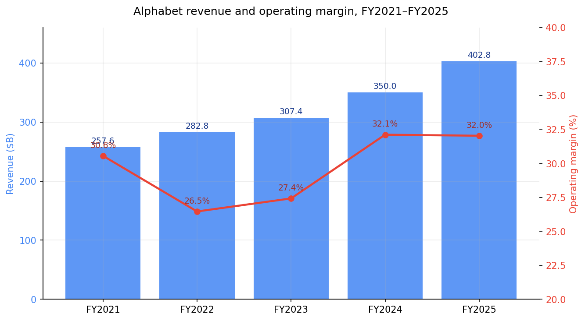
*来源: [Alphabet 2025 10-K, "Consolidated Statements of Income"](https://www.sec.gov/Archives/edgar/data/0001652044/000165204426000018/goog-20251231.htm) (FY2021–FY2025 营业收入与营业利润项)。*

**2026 年最具决定性意义的宏观信号是资本开支跃升。** 物业与设备购置支出 (capex) 从 **2023 年的 323 亿美元 → 2024 年的 525 亿美元 → 2025 年的 914 亿美元**, 且管理层 FY2026 资本开支指引为 **1,750–1,850 亿美元**——其中约 60% 为服务器, 40% 为数据中心 / 网络——以满足 Google Cloud 需求并支撑 Gemini 训练与推理 (inference) 规模化 ([Alphabet 2025 10-K, "Capital Expenditures"](https://www.sec.gov/Archives/edgar/data/0001652044/000165204426000018/goog-20251231.htm); [CNBC, 2026-02-04 "Alphabet resets the bar for AI infrastructure spending"](https://www.cnbc.com/2026/02/04/alphabet-resets-the-bar-for-ai-infrastructure-spending.html))。该数字之所以重要, 是因为它远远超过 Alphabet 历史上任何一轮资本周期, 且回收预期建立在 2025 年末 **2,428 亿美元** 的云业务积压订单及 Q1 2026 末 **超过 4,600 亿美元** 的基础之上 ([Alphabet 2025 10-K, "Revenue Backlog"](https://www.sec.gov/Archives/edgar/data/0001652044/000165204426000018/goog-20251231.htm); [Q1 2026 业绩公告](https://www.sec.gov/Archives/edgar/data/0001652044/000165204426000043/googexhibit991q12026.htm))。

### 估值快照

| 指标 (TTM 除注明外) | GOOG (2026-05-20) | 来源 |
|---|---|---|
| 股价 | **383.83 美元** (C 类) | [Yahoo Finance, GOOG](https://finance.yahoo.com/quote/GOOG/) |
| 市值 | **4.65 万亿美元** | [Yahoo Finance, GOOG 核心统计](https://finance.yahoo.com/quote/GOOG/key-statistics) |
| TTM 市盈率 (P/E) | **29.2 倍** | [Yahoo Finance, GOOG](https://finance.yahoo.com/quote/GOOG/) |
| 前瞻 P/E (FY26E) | **26.6 倍** | [Yahoo Finance, GOOG](https://finance.yahoo.com/quote/GOOG/) |
| TTM 市销率 (P/S) | **11.0 倍** | [Yahoo Finance, GOOG](https://finance.yahoo.com/quote/GOOG/) |
| 市净率 (P/B) | 9.7 倍 | [Yahoo Finance, GOOG](https://finance.yahoo.com/quote/GOOG/) |
| EV / EBITDA | 28.7 倍 | [Yahoo Finance, GOOG](https://finance.yahoo.com/quote/GOOG/) |
| 营业利润率 | 36.1% | [Yahoo Finance, GOOG](https://finance.yahoo.com/quote/GOOG/) |
| 净资产收益率 (ROE) | 38.9% | [Yahoo Finance, GOOG](https://finance.yahoo.com/quote/GOOG/) |
| 三年期 TTM P/E 均值 | ~23 倍 | [MacroTrends, GOOGL P/E 历史](https://www.macrotrends.net/stocks/charts/GOOGL/alphabet/pe-ratio) |

**同业可比 (Mag-7, TTM 基础, 2026-05-20 取自 yfinance / Yahoo Finance):**

| 代码 | TTM P/E | TTM P/S | 营业利润率 |
|---|---|---|---|
| **GOOG** | **29.2 倍** | **11.0 倍** | 36.1% |
| META | 22.1 倍 | 7.2 倍 | 40.6% |
| MSFT | 25.0 倍 | 9.8 倍 | 46.3% |
| AMZN | 32.2 倍 | 3.8 倍 | 13.1% |
| AAPL | 36.6 倍 | 9.8 倍 | 32.3% |
| NVDA | 45.5 倍 | 25.0 倍 | 65.0% |

*来源: [Yahoo Finance 各同业核心统计页, 2026-05-20](https://finance.yahoo.com/quote/GOOG/key-statistics) (同业代码逐一取数)。*

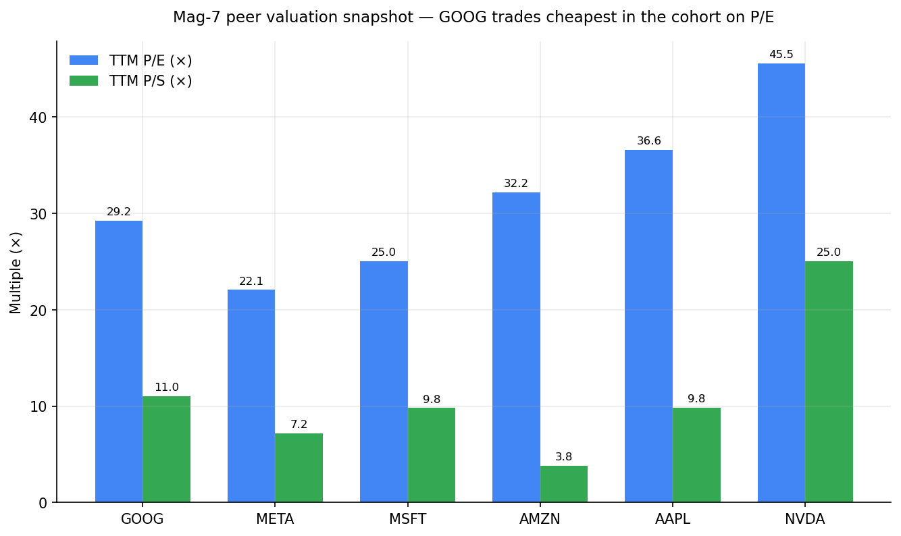
*来源: Yahoo Finance, [GOOG](https://finance.yahoo.com/quote/GOOG/)、[META](https://finance.yahoo.com/quote/META/)、[MSFT](https://finance.yahoo.com/quote/MSFT/)、[AMZN](https://finance.yahoo.com/quote/AMZN/)、[AAPL](https://finance.yahoo.com/quote/AAPL/)、[NVDA](https://finance.yahoo.com/quote/NVDA/) (TTM 倍数 2026-05-20 取数)。*

*分析师观点:* 按 ~29 倍 TTM 与 ~27 倍前瞻计, GOOG 当前估值 **高于自身 ~23 倍的三年均值** ([MacroTrends, GOOGL P/E 历史](https://www.macrotrends.net/stocks/charts/GOOGL/alphabet/pe-ratio)), 但 **低于 Mag-7 同组的中位数 ~32 倍**——比 AAPL (36.6 倍) 和 AMZN (32.2 倍) 便宜, 比 NVDA (45.5 倍) 便宜得多。相较 META (22 倍) 的溢价反映了 (a) 谷歌云 63% 的增速对比 META 仅有的、广告单一的商业模式, 以及 (b) DeepMind / Gemini / Waymo 的期权价值, 这些业务尚未接近盈利能力峰值。相较 AAPL 的折价则反映了 Search 业务在 AI 颠覆下更直接的暴露。我们不将该股归入估值过度延伸区间: P/E < 50 倍、P/S < 15 倍, 且盈利仍在加速 (Q1 2026 同比 +82%)。然而, FY2026 前瞻 P/E 的扩张将高度依赖谷歌云能否维持 50%+ 的增长以及资本开支转入折旧摊销过程中营业利润率的纪律性——这些联动机制将在第 7 章与第 9 章详述。

---

## 2. 公司历史

**创立。** 谷歌 (Google) 由 **Larry Page** 与 **Sergey Brin** 于 1998 年 9 月在斯坦福大学攻读博士期间共同创立, 基于他们 1996 年开始的 BackRub 研究项目, 该项目利用一种类引文式算法对网页进行排序, 该算法后来以 PageRank (网页排名) 之名获得专利 ([Stanford 大学新闻稿, "Stanford's BackRub becomes Google"](https://about.google/our-story/))。公司于 2004 年 8 月以 230 亿美元估值 IPO 上市。**2015 年 10 月**, 公司在新的母公司 **Alphabet Inc.** 之下重组——将谷歌的核心广告业务与自动驾驶汽车、生命科学、互联网气球等投机性项目分离, 以便为投资者提供更清晰的披露, 并使实验性业务拥有独立的领导团队 ([Larry Page, "G is for Google" 致股东信, 2015](https://abc.xyz/investor/founders-letters/2015/index.html))。

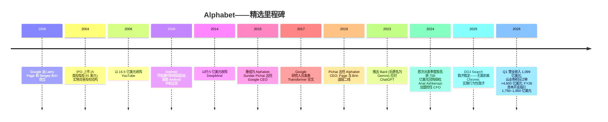
*里程碑来源: [Alphabet "Our History" 页面](https://about.google/our-story/); [2026 DEF 14A, "Founder" 董事简介](https://www.sec.gov/Archives/edgar/data/0001652044/000130817926000342/d918244ddef14a.htm); [Reuters, "Google reorganises into Alphabet", 2015-08-10](https://www.reuters.com/article/idUSKCN0QF1IA20150810/); [NPR, "In a major antitrust ruling, a judge lets Google keep Chrome", 2025-09-02](https://www.npr.org/2025/09/02/nx-s1-5478625/google-chrome-doj-antitrust-ruling); [Alphabet Q1 2026 业绩公告](https://www.sec.gov/Archives/edgar/data/0001652044/000165204426000043/googexhibit991q12026.htm)。*

**三大战略性转折定义了现代 Alphabet。**

第一, **移动转型 (2008–2014)。** Android (2005 年收购, 2008 年发布) 与 Chrome (2008 年) 在智能手机取代 PC 时捍卫了谷歌的分发渠道。Android 是全球安装量最大的操作系统, 而在 Android 上对 Google Search / Chrome / Play 的捆绑既支撑了用户漏斗, 又成为近期 DOJ 反垄断案核心救济措施的关注点 ([Alphabet 2025 10-K, 第 1 项 "Business"](https://www.sec.gov/Archives/edgar/data/0001652044/000165204426000018/goog-20251231.htm); [NPR, 2025-09-02](https://www.npr.org/2025/09/02/nx-s1-5478625/google-chrome-doj-antitrust-ruling))。

第二, **云 / 企业转型 (2018 年至今)。** 2018 年末从甲骨文 (Oracle) 聘请 Thomas Kurian 出任谷歌云 CEO 是一个明确信号: 在企业市场上, 公司从研究主导转向销售主导。谷歌云营业收入从 2020 年的 130 亿美元增长至 **2025 年的 587 亿美元**, 并于 2023 年转为运营层面盈利——2025 年营业利润达到 **139 亿美元 (营业利润率 23.7%)** ([Alphabet 2025 10-K, 注 15](https://www.sec.gov/Archives/edgar/data/0001652044/000165204426000018/goog-20251231.htm))。

第三, **AI 再造工程 (2023 年至今)。** 在 OpenAI 于 2022 年底发布 ChatGPT 之后, CEO Sundar Pichai 宣布 Alphabet 为 "AI 优先公司", 并合并了 DeepMind、Google Research 与 Brain 团队。Gemini 1.0 于 2023 年 12 月发布; Gemini 3 系列现已成为 Gemini 应用 (consumer Gemini app) 中默认的消费级模型, Pro 版瞄准 2026 年 6 月发布 ([Google Gemini 发布说明](https://gemini.google/release-notes/))。Pichai 称 2026 开年 "出色 (terrific)", 并引用 Gemini API 一手吞吐量已达 "每分钟 160 亿 token" (环比增长 60%) 作为证据, 表明这一重塑正在产出真实的产品速度 ([Q1 2026 业绩公告](https://www.sec.gov/Archives/edgar/data/0001652044/000165204426000043/googexhibit991q12026.htm))。

**关键并购:** YouTube (16.5 亿美元, 2006)、DoubleClick (31 亿美元, 2008)、Motorola Mobility (2012 年以 125 亿美元收购, 2014 年除专利外剥离)、Nest (32 亿美元, 2014)、DeepMind (约 5 亿美元, 2014)、Mandiant (54 亿美元, 2022)、Wiz (公告 320 亿美元, 史上最大网络安全交易, 计划于 2026 年内完成交割) ([Reuters, "Google to buy Wiz for $32 billion", 2025-03-18](https://www.reuters.com/technology/google-buy-cyber-startup-wiz-32-billion-2025-03-18/))。2025 年底商誉为 **334 亿美元**, 2025 年并购净现金支出为 **22 亿美元** ([Alphabet 2025 10-K, "Consolidated Statements of Cash Flows"](https://www.sec.gov/Archives/edgar/data/0001652044/000165204426000018/goog-20251231.htm))。

**近期重要动态 (过去 24 个月):** 2024 年 4 月开始派发现金股息 (每股每季度 0.20 美元, 2025 年提高到 0.21 美元, 2026 年 4 月再提高到 0.22 美元); 2025 年 4 月新增 700 亿美元 A/C 类股回购授权 ([Alphabet 2025 10-K, "Repurchase Program"](https://www.sec.gov/Archives/edgar/data/0001652044/000165204426000018/goog-20251231.htm)); 2025 年首次发行高级无担保票据 (Senior Unsecured Notes), 总募资 646 亿美元, Q1 2026 再发 311 亿美元; CFO Anat Ashkenazi 于 2024 年 7 月自礼来 (Eli Lilly) 加盟; Mehta 法官的反垄断救济令于 2025 年 9 月颁布 ([Alphabet Q1 2026 业绩公告](https://www.sec.gov/Archives/edgar/data/0001652044/000165204426000043/googexhibit991q12026.htm); [NPR, 2025-09-02](https://www.npr.org/2025/09/02/nx-s1-5478625/google-chrome-doj-antitrust-ruling))。

---

## 3. 管理团队

### Sundar Pichai——Alphabet 及 Google 首席执行官 (CEO, 53 岁)

Pichai 于 2004 年作为产品经理加入 Google, 从 Chrome 和 Android 一路晋升; **2015 年 10 月** Alphabet 控股架构搭建时被任命为 **Google CEO**, **2019 年 12 月** Larry Page 和 Sergey Brin 退居二线后接任 **Alphabet CEO** ([2026 DEF 14A, "Director Biographies"](https://www.sec.gov/Archives/edgar/data/0001652044/000130817926000342/d918244ddef14a.htm))。他持有印度理工学院 (IIT) 卡拉格普尔分校学士学位、斯坦福大学材料科学硕士学位以及宾夕法尼亚大学沃顿商学院 (Wharton) MBA 学位 (沃顿西贝尔学者 Siebel Scholar)。在出任 CEO 之前, 他主导了 Chrome 浏览器的发布 (2008 年)——现拥有约 35 亿用户, 是计算机历史上第二大装机量项目——并领导了 Android 产品组织 (2013–2014 年), 该操作系统目前在全球智能手机中占据约 70% 的份额 ([2026 DEF 14A](https://www.sec.gov/Archives/edgar/data/0001652044/000130817926000342/d918244ddef14a.htm))。

作为 CEO, 他**两个最具定义性的战略决策**是 (1) 2023 年初宣布的 AI 再平台化——合并 DeepMind、Brain 与 Google Research; 将 Gemini 提升为消费、开发者和企业领域统一的模型家族; 以及将每条产品路线图都置于 AI 优先门控之下——以及 (2) **资本开支加速**, 该决策已在三年内将物业与设备购置规模增长两倍, 指引至 1,800 亿美元的年度运行率 ([Alphabet 2025 10-K, "Capital Expenditures"](https://www.sec.gov/Archives/edgar/data/0001652044/000165204426000018/goog-20251231.htm); [CNBC, 2026-02-04](https://www.cnbc.com/2026/02/04/alphabet-resets-the-bar-for-ai-infrastructure-spending.html))。这些决策的早期回报在 Q1 2026 业绩中清晰可见: 谷歌云同比 +63%, YouTube 与 One 合计付费订阅达 3.5 亿, Search 营业收入同比 +19% (十多年来最强增速), 以及通过 Gemini API 实现的每分钟 160 亿 token (环比 +60%) ([Q1 2026 业绩公告](https://www.sec.gov/Archives/edgar/data/0001652044/000165204426000043/googexhibit991q12026.htm))。

Pichai 持有 **227,560 股** A 类普通股 (任一股票类别中的占比均不到 1%), 反映了非创始人、职业经理人的薪酬结构 ([2026 DEF 14A, "Security Ownership"](https://www.sec.gov/Archives/edgar/data/0001652044/000130817926000342/d918244ddef14a.htm))。他的年度薪酬高度倾向于股权; 公司于 2025 年将命名执行官 (NEO) 薪酬结构重组为 100 万美元基本工资加 GSU (时间归属的股权单位) 与 PSU (按 S&P 100 相对总股东回报 TSR 归属) 的目标组合。2023 年 Pichai 总薪酬为 880 万美元, 其中约 680 万美元为个人安保支出 ([TheStreet, "Sundar Pichai 净资产"](https://www.thestreet.com/personalities/sundar-pichai-net-worth))——他通常以多年期股权一次性大额授予的形式获取大部分薪酬, 而非每年常规授予, 因此年度总额波动剧烈。对外, 他兼任 Alphabet 执行委员会主席, 并自 2017 年起连续担任董事提名人 ([2026 DEF 14A](https://www.sec.gov/Archives/edgar/data/0001652044/000130817926000342/d918244ddef14a.htm))。

### Anat Ashkenazi——Alphabet 及 Google 高级副总裁兼首席财务官 (CFO, 53 岁)

Ashkenazi 于 **2024 年 7 月** 从礼来公司加盟出任 CFO, 此前自 2021 年 2 月起担任礼来执行副总裁兼 CFO, 在公司任职 23 年, 横跨肿瘤、糖尿病、制造与研究等多个事业部 CFO 等职务 ([2026 DEF 14A, "Executive Officer Biographies"](https://www.sec.gov/Archives/edgar/data/0001652044/000130817926000342/d918244ddef14a.htm))。她是一位以色列裔美国高管, 持有耶路撒冷希伯来大学经济学与工商管理学士学位以及特拉维夫大学 MBA 学位 ([Wikipedia — Anat Ashkenazi](https://en.wikipedia.org/wiki/Anat_Ashkenazi); [Jewish Insider, 2026-02 "Alphabet's AI bet shows early returns under Israeli-American CFO"](https://jewishinsider.com/2026/02/anat-ashkenazi-ai-alphabet-cfo-eli-lilly-tech-google-israeli-american/))。在她担任礼来 CFO 的三年期间, 公司市值在 Mounjaro / Zepbound (GLP-1 减重药) 放量的推动下增长三倍, 业内广泛认为她负责执行了将需求转化为已交付收入的产能扩张工作 ([CNBC, "Alphabet CFO Anat Ashkenazi jumps from GLP-1 boom to generative AI", 2024-06-06](https://www.cnbc.com/2024/06/06/alphabet-cfo-anat-ashkenazi-jumps-from-glp-1-boom-to-generative-ai.html))。在 Alphabet, 她的早期标志性举措是 (a) **Alphabet 历史上第一份正式的长期资本开支指引** (FY26 1,750–1,850 亿美元) 以及 (b) 深化债务融资以预先为 AI 基础设施搭建提供资金——Alphabet 长期负债从 2024 年末的 109 亿美元增至 **2025 年末的 465 亿美元**, Q1 2026 再发行 311 亿美元 ([Alphabet 2025 10-K, "Long-term debt"](https://www.sec.gov/Archives/edgar/data/0001652044/000165204426000018/goog-20251231.htm); [Q1 2026 业绩公告](https://www.sec.gov/Archives/edgar/data/0001652044/000165204426000043/googexhibit991q12026.htm))。她目前还兼任 Maravai LifeSciences 董事 (此前曾任 Varian Medical Systems 董事)。

### Philipp Schindler——Google 高级副总裁兼首席业务官 (CBO, 55 岁)

Schindler 自 **2015 年 8 月** 起负责 Google 全球销售与合作伙伴组织, 是为广告营收负责的高管——即 Alphabet 整体营业收入约 73% 的部分 ([2026 DEF 14A, "Executive Officer Biographies"](https://www.sec.gov/Archives/edgar/data/0001652044/000130817926000342/d918244ddef14a.htm))。他在 Google 工作 20 余年, 此前在汉堡负责 EMEA 区域销售。他的职责包括 Google 搜索与展示广告、YouTube 与 DV360 广告堆栈、合作伙伴协议 (包括 DOJ 反垄断案核心的 Apple Safari 默认搜索协议) 以及各国运营。2025 年 NEO 目标总薪酬为 4,060 万美元 (PSU + GSU + 现金, 按目标授予价值计), 见 [2026 DEF 14A "NEO Compensation"](https://www.sec.gov/Archives/edgar/data/0001652044/000130817926000342/d918244ddef14a.htm)。

### Kent Walker——全球事务总裁、首席法务官兼公司秘书 (65 岁)

Walker 自 2017 年起担任首席法务官, 自 2021 年 11 月起兼任全球事务总裁, 使他成为反垄断、隐私与 AI 监管前沿——这些领域日益定义着 Alphabet 的风险特征——的负责高管 ([2026 DEF 14A](https://www.sec.gov/Archives/edgar/data/0001652044/000130817926000342/d918244ddef14a.htm))。他协调应对美国 DOJ 的 Search 和 Ad-Tech 案件、欧盟《数字市场法》(DMA, Digital Markets Act) 与《数字服务法》(DSA, Digital Services Act) 合规体系、英国 CMA 的市场调查, 以及多个司法管辖区对生成式 AI 的调查。他兼任 Evidence Action 与 TechNet 以及外交关系协会 (Council on Foreign Relations) 董事。

### 公司治理简评

- **双重股权结构与创始人控制权。** A 类 (每股 1 票)、B 类 (每股 10 票); C 类 (无投票权)。**Larry Page 个人控制 46.5% 的 B 类 (27.4% 的总投票权); Sergey Brin 控制 42.9% / 25.3%。** 两位创始人合计持有 Alphabet 约 **52.7%** 的投票权, 尽管他们仅占总股本的较小比例 ([2026 DEF 14A, "Beneficial Ownership Table"](https://www.sec.gov/Archives/edgar/data/0001652044/000130817926000342/d918244ddef14a.htm))。
- **董事会:** 2026 年 10 位董事提名人——Page、Brin、Pichai (执行董事); 独立董事会主席 **John L. Hennessy** (斯坦福大学前校长); 以及 Frances H. Arnold (诺贝尔奖得主、加州理工学院教授)、Marty Chávez、John Doerr (KP)、Roger Ferguson Jr.、Ram Shriram 与 Robin Washington。审计机构: **安永会计师事务所 (Ernst & Young LLP)** ([2026 DEF 14A, 议案 1 与议案 2](https://www.sec.gov/Archives/edgar/data/0001652044/000130817926000342/d918244ddef14a.htm))。
- **薪酬理念:** NEO (除 CEO 外) 取得 100 万美元现金基本工资加 GSU + PSU 组合; PSU 按三年相对 TSR (Total Shareholder Return, 总股东回报) 与 S&P 100 比较归属, 与此前的多年期设计一脉相承。
- **内部人持股:** 所有执行高管与董事合计持有 250 万+ 股; 持股集中度高度集中在两位创始人。Pichai 持有 227,560 股 A 类。

**管理团队过往业绩综述 (50–100 字)。** 这是大型科技公司中经验最丰富的运营团队: 一位 22 年司龄的 CEO, 完整带领公司经历了移动和云两次重大转型; 一位经礼来训练、有据可查地将需求大规模转化为供应的 CFO; 以及一位自 2015 年以来将 Google 广告复合放大约 6 倍的 CBO。团队的待解问题在于 AI 转型是否会压缩 Search 经济性——但管理层愿意大规模投入支出, 加之 Q1 2026 Search 营业收入 **+19%** 的增长, 表明他们并未处于防守姿态 ([Q1 2026 业绩公告](https://www.sec.gov/Archives/edgar/data/0001652044/000165204426000043/googexhibit991q12026.htm))。

---

## 4. 产品与服务

Alphabet 拥有业内最广泛的消费 + 企业软件组合之一。10-K 将 Google Services 列为包含 "广告、Android、Chrome、设备、Gmail、Google Drive、Google Gemini、Google Maps、Google Photos、Google Play、Search 与 YouTube" ([Alphabet 2025 10-K, 第 1 项 "Business — Google Services"](https://www.sec.gov/Archives/edgar/data/0001652044/000165204426000018/goog-20251231.htm))。下图按公司自身披露的方式组织产品组合。

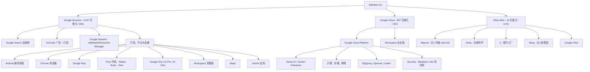
*来源: [Alphabet 2025 10-K, 第 1 项 "Business"](https://www.sec.gov/Archives/edgar/data/0001652044/000165204426000018/goog-20251231.htm); 营业收入贡献数据出自同一文件注 15。*

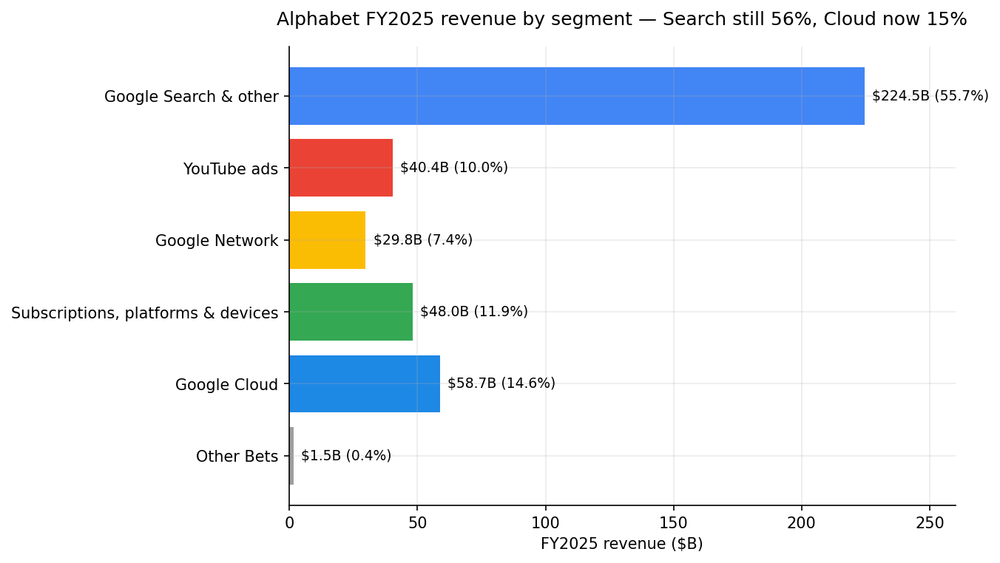
*来源: [Alphabet 2025 10-K, 注 15 "Information about Segments"](https://www.sec.gov/Archives/edgar/data/0001652044/000165204426000018/goog-20251231.htm)。*

### 旗舰产品——竞争优势评估

**Google Search & other (FY2025 营业收入 2,245 亿美元; 同比 +13%)。** 科技业中规模最大的单项营业收入来源。Search 通过基于拍卖机制的 AdWords / Performance Max 系统向估计超过 50 亿用户进行变现。**护城河: 有——多层结构。** (a) 数据网络效应: 25+ 年的点击数据、查询意图匹配和已抓取的网页内容; (b) 通过 Android 默认搜索以及 (现已受限、DOJ 裁定之后的) Apple Safari 默认协议形成的生态系统锁定; (c) 索引与服务的规模经济。**威胁:** AI Overviews (AI 概览) 已在 18% 的查询中内联回答, 在长尾查询中占比 57%, 将零点击率推升至 43% (在 AI Mode 模式下则达 93%)——这构成对点击经济模型的结构性风险 ([TechnologyChecker.io, 2026 "Search Engine Market Share"](https://technologychecker.io/blog/search-engine-market-share); [Stackmatix, 2026-03 "AI Search Market Share"](https://www.stackmatix.com/blog/ai-search-market-share-2026))。然而, Search 营业收入在 **Q1 2026 加速至 +19%**, Pichai 指出 "查询量达到历史新高"——至少目前 AI 整合是增量的而非吞噬性的 ([Q1 2026 业绩公告](https://www.sec.gov/Archives/edgar/data/0001652044/000165204426000043/googexhibit991q12026.htm))。最接近的竞争产品: **Microsoft Bing + Copilot** (约 5% 搜索份额, 在 AI 助手中增长), 以及 **ChatGPT** (在 AI 聊天搜索子集中占 60.7%, 但仅占美国总搜索量的约 17%)。在许多事实性查询的答案质量方面与对手 **持平**; 在交易性 / 商业意图变现方面 **领先**。

**YouTube——广告 + 订阅 (FY2025 广告 404 亿美元, 加上 480 亿美元订阅营业收入中的部分)。** YouTube 是全球最大的视频平台和全球第二大音乐平台。**护城河: 有——网络效应 + 内容库。** YouTube 广告 + 订阅合并营业收入在 2025 年 **超过 600 亿美元** ([Yahoo Finance / Variety, "How Big Is YouTube?", 2026-02](https://finance.yahoo.com/news/big-youtube-revenue-topped-60-223942275.html))。YouTube Music + Premium 在 2025 年突破 **1.25 亿付费订阅用户** ([Variety, "YouTube: 125 Million Music & Premium Subscribers", 2025-03](https://variety.com/2025/digital/news/youtube-125-million-music-premium-subscribers-lite-tier-1236328177/))。YouTube + Google One 跨业务订阅业务每年产生约 200 亿美元营业收入 ([Music Business Worldwide, "YouTube's subscription business is now generating roughly $20bn a year", 2026-02-05](https://www.musicbusinessworldwide.com/youtubes-subscription-business-is-now-generating-around-20bn-a-year-with-music-a-key-growth-driver/))。最接近的竞争产品: **Meta Reels / Instagram** 在短视频领域 (在 Gen Z 时长占比方面持平 / 领先), **Netflix / Spotify** 在付费流媒体领域 (在广告支持版本上不足规模, 在 Premium UX 上领先), **TikTok** 在全球短视频领域 (在美国之外持平, 在美国境内每用户观看时长上领先)。在任一单一模式下与最强对手 **整体持平**; 但在多形式覆盖度方面 **领先**。

**Android + Chrome + Play (订阅、平台与设备, FY2025 480 亿美元; 同比 +19%)。** 全球三大消费软件平台中的两个。**护城河: 部分。** Android 仍是占主导地位的智能手机操作系统, 但属于开源; 锁定通过 Google Mobile Services 捆绑实现——这一做法长期是反垄断的压力点。Play 通过应用内支付和应用分发对 Android 进行变现。这些平台锚定了通往 Search、YouTube 与 Workspace 的分发漏斗, 并提供装机量飞轮效应。**最接近的竞争产品:** **Apple iOS / App Store**——在每用户高端层级变现上领先, 在全球单元份额上落后。

**Google Cloud / GCP + Workspace (FY2025 587 亿美元, 同比 +36%; Q1 2026 200 亿美元, 同比 +63%)。** 加速最快的大型板块。营业利润 **FY2025 139 亿美元 (营业利润率 23.7%)** vs. FY2024 的 61 亿美元 (14.1%) ([Alphabet 2025 10-K, 注 15](https://www.sec.gov/Archives/edgar/data/0001652044/000165204426000018/goog-20251231.htm))。**护城河: 有 (且在加强)。** 差异化点: (a) **TPU v6 "Trillium" 和 v7 "Ironwood"** 自研芯片——后者为一组 9,216 颗芯片的 pod, 拥有 >40 ExaFLOPS FP8 性能, 专为推理设计——提供了相对 Nvidia GPU 的垂直整合替代方案 ([Data Center Frontier, "Google's TPU Roadmap", 2026-01](https://www.datacenterfrontier.com/machine-learning/article/55336429/googles-tpu-roadmap-challenging-nvidias-dominance-in-ai-infrastructure)); (b) Gemini 2.5 / 3.x 模型客户可通过 Vertex AI 进行微调; (c) BigQuery 以及全球最大的星球级数据仓库覆盖; (d) Mandiant 安全业务及待交割的 **320 亿美元 Wiz 收购** (云安全) ([Reuters, 2025-03-18](https://www.reuters.com/technology/google-buy-cyber-startup-wiz-32-billion-2025-03-18/))。**2025 年 11 月 Anthropic 与 Google 达成史上最大单笔 TPU 交易**, 承诺采购数十万颗 Trillium 芯片, 并规划在 2027 年扩至 100 万颗规模 ([Data Center Frontier, 2026-01](https://www.datacenterfrontier.com/machine-learning/article/55336429/googles-tpu-roadmap-challenging-nvidias-dominance-in-ai-infrastructure))。最接近的竞争产品: **AWS** (S3、EC2、Bedrock、Trainium 芯片; 在营业收入规模上领先, 在增速上落后) 和 **Azure** (与 Microsoft AI / OpenAI 协同; 在企业分发上领先, 增速概貌相似)。在企业心智份额方面 **持平 / 追赶中**; 在多项发布的基准测试中, 在 AI 原生工作负载的单位美元性能上 **领先**。

**Gemini 应用 + AI Pro / AI Ultra。** 最新旗舰是 Gemini 应用, Pichai 在 Q1 2026 称之为 "我们消费级 AI 套餐有史以来最强的一个季度", 公司全部消费业务付费订阅合计达 3.5 亿份 ([Q1 2026 业绩公告](https://www.sec.gov/Archives/edgar/data/0001652044/000165204426000043/googexhibit991q12026.htm))。在独立的 Similarweb 风格追踪中, 消费版 Gemini 应用占 **AI 聊天机器人 / AI 搜索的 15.0–18.2% 份额**, 较一年前的 ~5% 显著提升, 仅次于 ChatGPT ([Vertu, "AI Chatbot Market Share 2026", 2026](https://vertu.com/lifestyle/ai-chatbot-market-share-2026-chatgpt-drops-to-68-as-google-gemini-surges-to-18-2))。**护城河: 部分**, 但正快速向 ChatGPT 靠拢。最接近的竞争产品: **OpenAI ChatGPT** (~60–68% 份额, 在心智份额上领先); **Anthropic Claude** (份额较小, 在长上下文编码基准上领先); **Microsoft Copilot** (~13% 份额, 由分发驱动)。

**Waymo——Other Bets 旗舰。** Waymo 在 Q1 2026 已突破 **每周 50 万次完全自动驾驶付费搭乘**, 覆盖 10 个美国城市, 2026 年瞄准 **额外 20+ 个城市**, 包括东京和伦敦, 覆盖区域达 **>1,400 平方英里** ([Q1 2026 业绩公告](https://www.sec.gov/Archives/edgar/data/0001652044/000165204426000043/googexhibit991q12026.htm); [TechCrunch, "Waymo's skyrocketing ridership in one chart", 2026-03-27](https://techcrunch.com/2026/03/27/waymo-skyrocketing-ridership-in-one-chart/); [Electrek, "Waymo expands robotaxi coverage", 2026-05-13](https://electrek.co/2026/05/13/waymo-expands-coverage-1400-square-miles-11-cities/))。上一轮私募估值: 2024 年 10 月达到 >450 亿美元; 媒体报道指出 2026 年搭乘量拐点之后, 内部估值显著高于此 ([TheStreet, "Alphabet's quiet $110B Waymo move", 2026](https://www.thestreet.com/investing/alphabets-quiet-110b-waymo-move-blows-up-other-bets-narrative))。**护城河: 有 (技术 + 监管)。** 最接近的竞争产品: **Tesla Robotaxi / FSD** (车辆数更多, 但尚无规模化商业无人服务), **Cruise** (已暂停), **百度 Apollo Go** (中国规模最大, 在城市数量上领先但中国境外安全记录落后)。在美国商业无人驾驶里程数和城市多样性方面 **领先**。

### 长尾产品及近期发布 / 下线

- **Pixel 硬件家族** (Pixel 10 手机、Pixel Watch 4、Pixel Buds Pro 2、Pixel Tablet)——重要品牌资产, 但营业收入占比小 ([Google Store](https://store.google.com/))。
- **Workspace 消费版 (Gmail / Drive / Docs / Meet)**——Google One 套餐的基础; 2025 年通过 AI 功能再品牌化。
- **Nest / Google Home**——智能家居品类, 围绕 Gemini 重新定位。
- **Google Fi**——MVNO 移动通讯服务。
- **Verily**——健康与生命科学。
- **Wing**——无人机配送, 2025 年于德州扩张。
- **GFiber**——批发式光纤互联网。
- **下线 / 重定位 (过去 12 个月):** Google Bard 品牌全面退役, 各平台统一替换为 "Gemini"; **Pichai 将 Google Search 和 Ads 合并至 Nick Fox 治下**; **仅供 Pixel 使用的 "Tensor" 移动 SoC 团队已与云端芯片团队合并**; X 部门继续以受控节奏关闭项目, 风险投资业务被分阶段毕业、剥离或清算。

---

## 5. 客户与上市策略

### 客户细分

Alphabet 拥有任何科技公司中最广泛的客户覆盖。Google Search / YouTube / Android / Chrome / Gmail / Maps 的用户基础是消费大众市场, **横跨各个国家、语言与人口结构** ([Alphabet 2025 10-K, 第 1 项 "Business"](https://www.sec.gov/Archives/edgar/data/0001652044/000165204426000018/goog-20251231.htm))。但承担营业收入的客户基础则集中在三组:

1. **广告主**——产生 Google 广告 2,947 亿美元营业收入 (占 Alphabet 营业收入的 73%)。从数百万中小企业 (SMB) 长尾自助式 Performance Max 投放, 到全球最大的首席营销官 (CMO) (宝洁、联合利华、三星、亚马逊、丰田) 购买 YouTube + Search + Display 集成投放协议。
2. **云客户**——由 Google Cloud 企业销售团队服务的命名账户群体, 包括 **公共部门** (美国国防部 JWCC 合同、英国政府、若干拉美主权机构)、**金融服务** (汇丰、德意志银行、PayPal)、**零售** (沃尔玛、家得宝、Wayfair)、**制造业 / 汽车** (丰田、奔驰), 以及尤其值得注意的 **AI 实验室与 AI 原生企业**, 包括与 **Anthropic** 的一份多年、数百亿美元规模的 TPU 协议。
3. **消费订阅与设备购买者**——3.5 亿付费消费订阅用户 (YouTube Premium / Music、YouTube TV、Google One、AI Pro / AI Ultra、NFL Sunday Ticket) 加上 Pixel 硬件购买者。

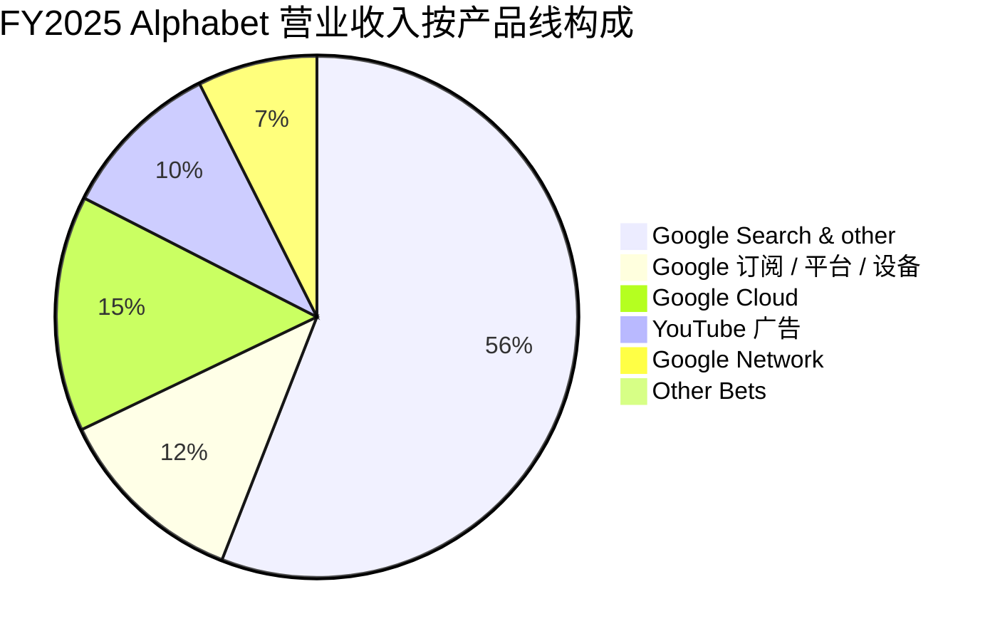
*来源: [Alphabet 2025 10-K, 注 15 "Information about Segments"](https://www.sec.gov/Archives/edgar/data/0001652044/000165204426000018/goog-20251231.htm)。*

### 客户集中度

Alphabet **没有** 任何单一客户营业收入达到合并营业收入的 10% 或以上, 10-K 明确表示没有单一客户占据公司营业收入的重大比例 ([Alphabet 2025 10-K, 第 7A 项 & "Concentration of Credit Risk" 注释](https://www.sec.gov/Archives/edgar/data/0001652044/000165204426000018/goog-20251231.htm))。这与 **数百万广告主**广告业务模式相一致, 是巨型科技公司中最分散的客户基础之一。因此, Alphabet 的客户集中度风险非常低——单一最大客户占比远低于 5%——本报告未将其列为第 9 章风险 (然而, 我们将 **分发合作伙伴** 集中度风险标记为 Apple Safari 默认搜索协议与 Android OEM 合作关系, 详见第 9 章)。

### 地理分布

| 地区 | FY2023 (亿美元 / %) | FY2024 (亿美元 / %) | FY2025 (亿美元 / %) |
|---|---|---|---|
| 美国 | 1,462.86 / 47% | 1,704.47 / 49% | 1,942.29 / 48% |
| EMEA | 910.38 / 30% | 1,021.27 / 29% | 1,171.52 / 29% |
| APAC | 515.14 / 17% | 568.15 / 16% | 676.80 / 17% |
| 其他美洲 | 183.20 / 6% | 204.18 / 6% | 239.02 / 6% |
| 套保 | 2.36 / 0% | 2.11 / 0% | (1.27) / 0% |
| **合计** | **3,074 亿美元** | **3,500 亿美元** | **4,028 亿美元** |

*来源: [Alphabet 2025 10-K, 注 2 "Revenue Recognition — Disaggregation of Revenues"](https://www.sec.gov/Archives/edgar/data/0001652044/000165204426000018/goog-20251231.htm)。*

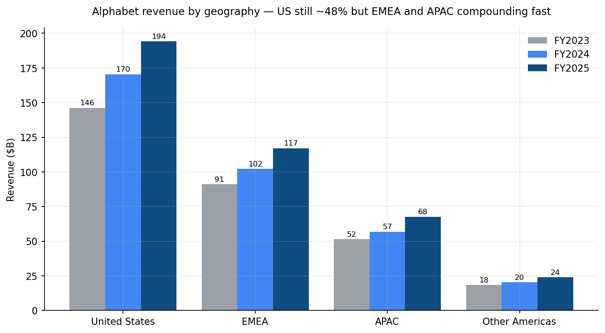
*来源: [Alphabet 2025 10-K, 注 2](https://www.sec.gov/Archives/edgar/data/0001652044/000165204426000018/goog-20251231.htm)。*

### 上市策略 (Go-to-Market)

**广告:** 大部分营业收入采用程序化自助拍卖 (AdWords / Performance Max、Display & Video 360、YouTube Select); 在 CBO Philipp Schindler 治下的全球 Google Customer Solutions 与 Large Customer Sales 组织覆盖命名账户。

**云:** 直销 (在 Thomas Kurian 治下), 按区域与按行业 (金融服务、零售、制造、媒体、公共部门) 组织; 不断扩大的 ISV / GSI 生态系统 (埃森哲、德勤、凯捷、Wipro、TCS); 市场列表; 与 Salesforce / SAP / ServiceNow 联合销售。

**消费订阅:** 在 YouTube 与 Gmail / Drive 中通过产品内升级; 套餐促销 (例如, 购买新 Pixel 设备附赠 AI Pro)。

### 关键合作伙伴关系

- **苹果——Safari 默认搜索协议。** 长期以来是科技业被引用最多的分发安排。2025 年 DOJ 救济令禁止 Google "签订或维持有关 Search 分发的排他性合同", 但并未完全禁止收入分成支付 ([NPR, 2025-09-02](https://www.npr.org/2025/09/02/nx-s1-5478625/google-chrome-doj-antitrust-ruling); [Congress.gov CRS Legal Sidebar LSB11362](https://www.congress.gov/crs-product/LSB11362))。
- **Anthropic——TPU + 云 + 股权。** Alphabet 持有约 14% 股权; Anthropic 2026 年 2 月 Series G 估值达 **3,800 亿美元** (史上两大风险投资轮之一), 2025 年 10 月的 TPU 扩张 "价值数百亿美元", 并在 2026 年上线 >1 GW 算力 ([Reuters / TheStreet 报道, 2026](https://www.thestreet.com/investing/alphabets-quiet-110b-waymo-move-blows-up-other-bets-narrative))。
- **三星及 Android OEM 生态系统。**
- **车企对 Android Auto 与 Waymo 平台合作关系** (现代、捷豹路虎 JLR、极氪 Zeekr 与 Waymo 合作)。

---

## 6. 行业概览

Alphabet 横跨软件业三大最庞大、增长最快的行业——**数字广告、云基础设施 / AI 服务以及处于早期阶段的无人驾驶移动出行市场**——以及一系列被视为邻近业务的消费软件、支付与设备生态。

### 6.1 数字广告

2026 年, 全球广告将首次跨过 **1 万亿美元** 大关, 其中数字广告支出将达到约 **8,358 亿美元 (占整体 68.7%)** ([MAGNA / Dentsu / GroupM 综合预测, 2026-03](https://magnaglobal.com/ad-forecast-media-innovation-to-propel-the-global-ad-market/); [PPCChief, "Digital Ad Spend Statistics 2026"](https://ppcchief.com/digital-ad-spend-statistics))。仅美国广告支出在 2026 年将突破 **4,000 亿美元 (同比 +7.8%)** ([MAGNA 预测, 2026](https://magnaglobal.com/ad-forecast-media-innovation-to-propel-the-global-ad-market/))。增长最快的渠道为社交 (+14.6%)、联网电视 (CTV, +13.8%) 和零售媒体 / 商务媒体 (+12.1%)。搜索广告仍是数字单一最大类别, Google 在 Cloudflare Radar 截至 2026 年 4 月 20 日 4 周的观察中, 持有 **全球搜索引荐流量的 87.5%** ([TechnologyChecker.io, "Search Engine Market Share 2026"](https://technologychecker.io/blog/search-engine-market-share))。

**结构性动态。** 该品类正围绕 "双寡头 + 跟随者" 整合: 按通行第三方估算, Google 约占全球数字广告 28%, Meta 约 22%, Amazon 约 10%, 字节跳动约 9%。净新增美元已果断转向 AI 增强投放 (Performance Max、Advantage+、含生成式内容的 Sponsored Brands)。2026 年最重要的变化是 **生成式答案有条件融入搜索结果**——Google 的 AI Overviews 现已在约 18% 的全部查询和 57% 的长尾查询中出现, 推高零点击率并迫使广告产品重新工程化 ([Stackmatix, 2026-03 "AI Search Market Share"](https://www.stackmatix.com/blog/ai-search-market-share-2026))。

**监管。** 主要监管压力点: 美国 DOJ Search 救济 (无需剥离 Chrome 但强制数据共享; 上诉进行中)、美国 DOJ Ad-Tech 案 (仍在救济阶段)、欧盟《数字市场法》(DMA, Google 被指定为广告、搜索、Android、Chrome、Maps、YouTube 等的看门人) 和欧盟《人工智能法》(AI Act)。结果是合规成本显著但有边界; 结构性分拆已不再是核心情境 ([NPR, 2025-09-02](https://www.npr.org/2025/09/02/nx-s1-5478625/google-chrome-doj-antitrust-ruling); [美国司法部, "DOJ wins significant remedies against Google", 2025-09](https://www.justice.gov/opa/pr/department-justice-wins-significant-remedies-against-google))。

### 6.2 云基础设施与 AI 服务

云行业 2026 年 TAM (总潜在市场) 路径估计约为 **~8,000 亿美元** (IaaS、PaaS 与 SaaS 合计), AI 基础设施子板块 **每年 >20% 增长** ([Programming-Helper, "Cloud Computing Market Share 2026"](https://www.programming-helper.com/tech/cloud-computing-market-share-2026-aws-azure-google-cloud-analysis); [HeyGoTrade 汇总的 Synergy Research 数据, "AWS vs Google Cloud vs Azure", 2026](https://www.heygotrade.com/en/blog/aws-vs-google-cloud-vs-azure-hyperscaler-race/))。三家超大规模云服务商合计占企业云支出的 **约 68%**; 截至 Q1 2026, **AWS 约 30%、Microsoft Azure 约 25%、Google Cloud 约 13%**。

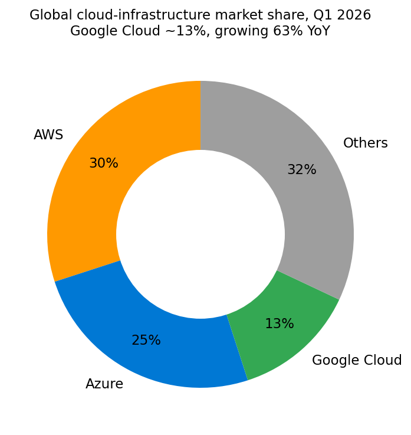
*来源: [Synergy Research / HeyGoTrade, "AWS vs Google Cloud vs Azure", Q1 2026](https://www.heygotrade.com/en/blog/aws-vs-google-cloud-vs-azure-hyperscaler-race/); 增速取自各发行方 Q1 2026 业绩公告。*

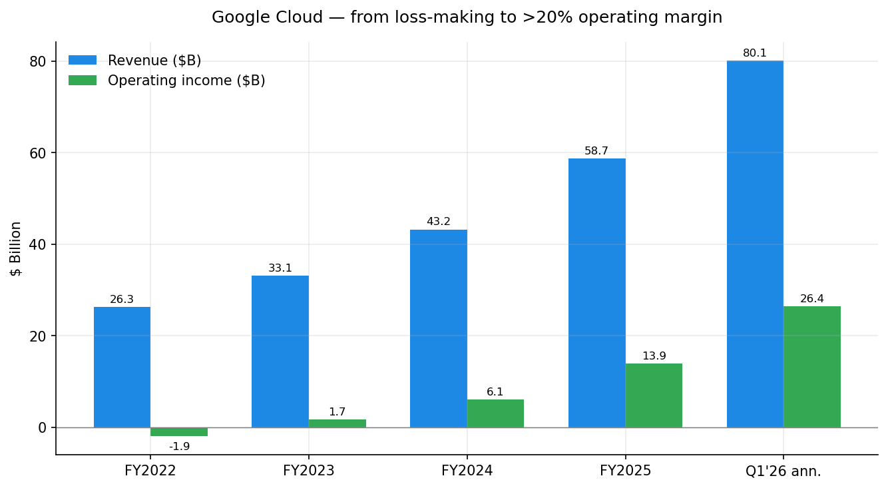
*来源: [Alphabet 2025 10-K, 注 15](https://www.sec.gov/Archives/edgar/data/0001652044/000165204426000018/goog-20251231.htm); [Q1 2026 业绩公告](https://www.sec.gov/Archives/edgar/data/0001652044/000165204426000043/googexhibit991q12026.htm) (Q1'26 年化 = 200.28 亿美元 × 4)。*

AI 基础设施周期的形态才是关键: Anthropic、OpenAI / Microsoft、Meta、xAI、Alphabet 及一长串主权与企业 AI 工作负载, 都在竞相为 2026–2028 交付的算力、土地和硅资源下订单。**四家超大规模云服务商 (Alphabet + Microsoft + Amazon + Meta) 合计资本开支预计 2026 年将超过 5,000 亿美元**, 其中 Alphabet 一家就约占 1,800 亿美元 ([Ferguson Wellman, "The Magnificent Capex", 2026-05-08](https://www.fergusonwellman.com/blog/2026/5/8/the-magnificent-capex-ai-infrastructure-spending-and-who-actually-benefits))。这至少比历史上任何此前的软件基础设施周期高出一个数量级, 并将决定未来十年的相对幂律定位。

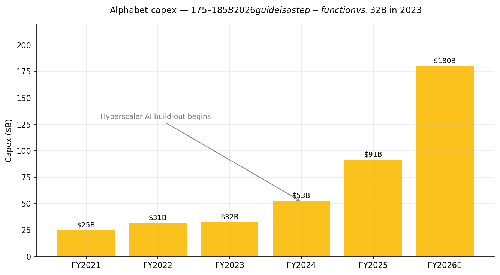
*来源: [Alphabet 2025 10-K, "Investing Activities"](https://www.sec.gov/Archives/edgar/data/0001652044/000165204426000018/goog-20251231.htm); FY2026E 中点取自 [CNBC, 2026-02-04 "Alphabet resets the bar for AI infrastructure spending"](https://www.cnbc.com/2026/02/04/alphabet-resets-the-bar-for-ai-infrastructure-spending.html)。*

### 6.3 无人驾驶移动出行

美国 Robotaxi 行业正处于明显拐点: Waymo 每周付费无人驾驶搭乘次数从 2025 年初的约 15 万次增长至 **Q1 2026 的 50 万次**, 明确目标为年底达到 100 万次/周 ([TechCrunch, 2026-03-27](https://techcrunch.com/2026/03/27/waymo-skyrocketing-ridership-in-one-chart/))。2026 年向东京和伦敦的扩张也开启了首批有意义的美国之外无人驾驶营业收入。我们估计美国可寻址 Robotaxi 市场成熟期 TAM 为 2,500–4,000 亿美元 (简单测算: 每年 2.5 亿乘客车里程, 每英里毛收入 0.60–1.20 美元)。其他相关竞争者包括 Tesla、百度 Apollo Go (中国)、Zoox (Amazon)、Aurora 以及若干较小的 AV 卡车公司。

### 6.4 邻近行业

- **智能手机硬件** (Pixel)——全球 TAM ~4,850 亿美元; Alphabet 凭借规模小但毛利率高的 Pixel 产品线参与竞争。
- **智能家居 / IoT**——Nest 和 Google Home; 与亚马逊 Echo / Apple HomeKit 竞争。
- **流媒体视频 / 音乐**——YouTube TV / Music: YT Premium / Music 合计付费用户 1.25 亿+ ([Variety, 2025-03](https://variety.com/2025/digital/news/youtube-125-million-music-premium-subscribers-lite-tier-1236328177/))。

---

## 7. 竞争格局

Alphabet 与 **五个不同群组的竞争对手** 同台竞技, 但没有任何一家复制了其全部业务组合。最有用的框架是逐产品分析, 因为对 Search 威胁最大的公司 (OpenAI / Microsoft) 不是对 Cloud 威胁最大的 (AWS), 也不是对 YouTube 威胁最大的 (Meta / TikTok)。

### Search / 消费 AI

- **OpenAI (未上市; Microsoft 支持)。** 在独立 AI 聊天机器人使用方面, ChatGPT 仍是份额领先者, 视来源不同占比约 **60–68%** ([Vertu, 2026](https://vertu.com/lifestyle/ai-chatbot-market-share-2026-chatgpt-drops-to-68-as-google-gemini-surges-to-18-2))。现已在 Apple Intelligence 和 Microsoft Copilot 中分发。直接 ChatGPT 搜索查询估计占全球搜索替代量的约 28%, 但在美国本土仅占 ~17% ([Stackmatix, 2026-03](https://www.stackmatix.com/blog/ai-search-market-share-2026))。在对话心智份额方面 **领先**; 在每会话变现与已索引网页覆盖范围方面 **落后**。
- **Microsoft (MSFT)。** 自 2023 年底 ChatGPT 整合以来, Bing + Copilot 并未实质性侵蚀 Google Search 份额, 但 OpenAI 合作仍是科技业最具战略意义的外部联盟。Microsoft Copilot + OpenAI 在 AI 助手使用中合计占 **73.9%** ([Vertu, 2026](https://vertu.com/lifestyle/ai-chatbot-market-share-2026-chatgpt-drops-to-68-as-google-gemini-surges-to-18-2))。MSFT 当前 TTM P/E 为 **25.0 倍** vs. GOOG 的 29.2 倍——即, 市场并未对微软赋予 Search 颠覆溢价 ([Yahoo Finance, MSFT 核心统计](https://finance.yahoo.com/quote/MSFT/key-statistics))。
- **Anthropic (未上市; Alphabet 持 14%、Amazon 共同支持)。** Claude 是企业级编码的领先模型。Anthropic 同时是 Google Cloud 的关键客户 (公司史上最大 TPU 交易) 又是 Gemini 的竞争者, 处境耐人寻味。
- **Perplexity、You.com、Brave Search。** 长尾对话式搜索初创公司。具战略意义, 但非存亡威胁。

### 云基础设施与 AI 服务

- **Amazon Web Services (AMZN)。** 市场领导者, 份额约 30%。AWS 最新一季增速约 19%——远低于谷歌云的 63% 和 Azure 的 40% ([HeyGoTrade, 2026](https://www.heygotrade.com/en/blog/aws-vs-google-cloud-vs-azure-hyperscaler-race/))。AWS 的应对: Trainium 与 Bedrock 用于 AI; 与 Anthropic 在 AWS 上深度合作 Claude。
- **Microsoft Azure (MSFT)。** 第二名, 份额约 25%。通过 Office 与 Active Directory 构建分发护城河; OpenAI 是其旗舰 AI 合作。Azure AI 营业收入是 AI 工作负载需求最常被引用的单一验证点。
- **Oracle Cloud (ORCL)。** 规模较小但正在崛起——2025–2026 期间赢得多年 AI 基础设施大单 (尤其是与 OpenAI 部分参与 Stargate 项目)。多头观点是 Oracle 将成为第四大超大规模云服务商; 空头观点是其增长依赖少数命名客户。
- **CoreWeave、Crusoe、Lambda、Nebius。** AI 原生 GPU 云专业供应商。细分但增长迅速; 之所以相关, 主要是因其从超大规模云服务商手中抽走 GPU 供应。

### 视频 / 短视频

- **Meta Platforms (META)。** Instagram Reels 与 Facebook 是 YouTube 的直接注意力竞争者。Meta 营业利润率达 **40.6%**, 在同组中除微软外最高, 且 META 相对 GOOG 折价交易 (22 倍 vs. 29 倍)——这表明市场对 META 的监管与元宇宙开支尾部风险的折价大于对 GOOG 的 AI 风险折价 ([Yahoo Finance, META 核心统计](https://finance.yahoo.com/quote/META/key-statistics))。
- **TikTok / 字节跳动 (未上市)。** 在美国之外是短视频主导平台, 全球前三。仍面临美国监管压力; Pichai 在过往业绩说明会中指出, 强制 TikTok 剥离将利好 YouTube。
- **Netflix、Disney+、Spotify。** YouTube TV 与 YouTube Music 的订阅竞争者。

### 无人驾驶移动出行

- **特斯拉 (TSLA)。** Cybercab 与 FSD; 基于 "纯视觉" 架构竞争。消费品牌更大, 商业无人驾驶规模更小。
- **百度 Apollo Go。** 中国按城市数量计最大。
- **Cruise (GM, 已暂停)、Zoox (AMZN)、Aurora。** 较小的参与者或非乘用车业务。

### 生产力工具与设备

- **苹果 (AAPL)。** 长期合作伙伴 (Safari 默认搜索) 又长期是竞争对手 (iOS / iPadOS / Mac vs. Android / ChromeOS; iPhone vs. Pixel; iCloud vs. Google One)。Apple Intelligence 在 2026 年仍依赖第三方模型合作伙伴 (今天是 OpenAI; 据传与 Anthropic 与 Google 也在洽谈)。AAPL TTM P/E 36.6 倍远高于 GOOG, 反映市场对苹果服务护城河更高的信心 ([Yahoo Finance, AAPL 核心统计](https://finance.yahoo.com/quote/AAPL/key-statistics))。

### 定位框架

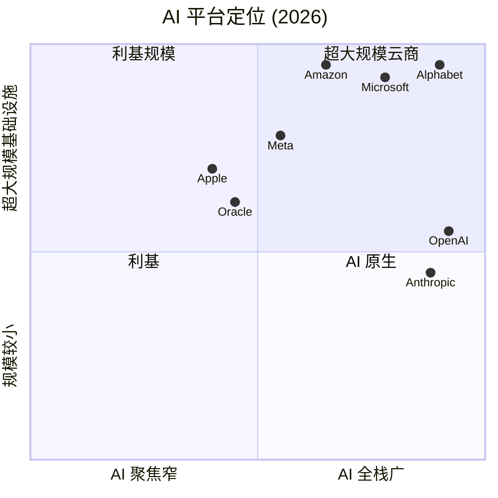

**Alphabet 的相对优势。**
1. **垂直整合。** 只有 Alphabet 一家在同一公司内同时拥有自己的基础模型 (Gemini)、自研 AI 加速器 (TPU v5/v6/v7)、自己的搜索索引、自己的消费分发渠道 (Search、YouTube、Android、Chrome、Gmail、Maps) 以及自己的广告变现系统。AWS 缺少消费触点; OpenAI 缺少索引; Apple 缺少模型。Q1 2026 中 Gemini-on-Vertex "通过直接 API 使用每分钟处理 160 亿 token, 环比增长 60%" 这一统计数字, 正是整套堆栈拉动客户的直接度量 ([Q1 2026 业绩公告](https://www.sec.gov/Archives/edgar/data/0001652044/000165204426000043/googexhibit991q12026.htm))。
2. **数据网络效应。** 25 余年的点击、查询和互动数据, 建立在事实上是网络主索引的基础之上。
3. **自由现金流融资。** 2025 年经营现金流 1,647 亿美元, 足以为 1,800 亿美元资本开支提供资金, 而无需依赖资本市场或股权稀释。
4. **人才磁石。** DeepMind、Google Research 与 Brain。

**脆弱性。**
1. **单一产品对 Search 广告的依赖。** 单一产品线占营业收入的 56%; AI 搜索转型是公司历史上最大的需求侧变化。
2. **监管天花板。** 美国 (DOJ Search 与 Ad-Tech) 和欧盟 (DMA / DSA / AI Act)——见第 9 章。
3. **对苹果的分发依赖。** 苹果默认搜索协议从历史上看每年价值苹果约 200 亿+ 美元; DOJ 救济后该协议不能是排他性的, 增加了重新谈判风险。
4. **云仍处于亚规模**, 587 亿美元 vs. AWS 的 1,000 亿美元+; 差距在缩小但尚未闭合。

---

## 8. 市场机会 (TAM)

我们沿三个独立向量量化 Alphabet 的 TAM。

### 8.1 数字广告——2026 年 TAM ~8,350 亿美元, 至 2028E 增长至 ~1.0 万亿美元

最新 MAGNA 预测指出 2026 年全球数字广告支出为 **8,358 亿美元**, 在 2028 年前增长至 1 万亿美元以上的路径 ([PPCChief, 引自 MAGNA / GroupM / Dentsu, 2026](https://ppcchief.com/digital-ad-spend-statistics); [MAGNA, 2026](https://magnaglobal.com/ad-forecast-media-innovation-to-propel-the-global-ad-market/))。Alphabet 的 Google 广告业务在 **FY2025 营业收入为 2,947 亿美元**, 即约占全球数字广告支出的 **35%**——已经是主导份额。增量营业收入的可服务机会来自 **(a) 联网电视 / YouTube Shorts**、**(b) 商务 / 零售媒体** (目前 Amazon 领先) 以及 **(c) AI 生成创意与竞价** (含 Gemini 生成素材的 Performance Max)。我们估计 Alphabet 的 SAM (即排除微信等 Google 不运营的封闭生态系统) 2026 年约为 6,500 亿美元, 保守假设 36–38% 份额——意味着广告 SOM 约为 2,400–2,500 亿美元, 与 FY2026 广告业务运行率一致。

### 8.2 云 + AI 服务——TAM 扩展至 2028E 8,000 亿美元+

云基础设施支出有望在 2026 年达到约 8,000 亿美元, 一致预测以 **2028 年前 20%+ CAGR** 复合增长, 主要由 AI 工作负载驱动 ([Programming-Helper, 2026](https://www.programming-helper.com/tech/cloud-computing-market-share-2026-aws-azure-google-cloud-analysis))。在当前 13% 市场份额和 **Q1 2026 营业收入增长 63%** 的情况下, Google Cloud 是该板块的份额获取者。Q1 2026 积压订单 **>4,600 亿美元**——公司预期 "略多于 50% 将在未来 24 个月内确认" ([Alphabet 2025 10-K, "Revenue Backlog"](https://www.sec.gov/Archives/edgar/data/0001652044/000165204426000018/goog-20251231.htm))——为 2026–2028 云营业收入爬坡提供了高可见度。如果 Google Cloud 在 2028 年的超大规模云服务商份额中拿下 18–20%, 这意味着 **2028E 云营业收入约 1,600–2,000 亿美元**, 相较当前 800 亿美元 Q1'26 年化运行率。

### 8.3 无人驾驶移动出行——短期 TAM 数百亿美元; 成熟期数千亿美元

仅美国 Rideshare 业务今日年化总账单已 >500 亿美元。替换驾驶员份额成本 (通常约 70%) 并加上更高利用率, 意味着 **美国 Robotaxi 总 TAM 在成熟期为 1,500–2,500 亿美元** (15 年以上)。Waymo 当前 50 万次/周搭乘运行率年化约为 2,600 万次/年——仍不到美国 Rideshare 总量的 0.5%。20+ 城市扩张加上东京和伦敦开启了新的可寻址市场; 我们将 Waymo 视为 2030 年以后规模有意义的营业收入贡献者, 以及 2026–2028 期间通过外部融资带来估值标记的贡献者。上一轮私募估值: >450 亿美元 (2024-10)。

### 8.4 渗透策略

Alphabet 的增长策略最准确的表述是 **"在每个触点继续保持 AI 默认, 然后通过广告 (已成熟) 与云 (正加速) 变现"**。具体 2026–2028 向量:

- **AI 驱动的搜索。** 增量推出 AI Overviews 与 AI Mode, 以防御 Search 查询份额并将商业意图嵌入 AI 响应。
- **Gemini Enterprise + Vertex。** 将 Gemini Enterprise 交叉销售给现有 Google Workspace 客户基础 (30 亿+ 用户) 和命名 GCP 账户; Pichai 指出 Q1 2026 **付费月活环比增长 +40%** ([Q1 2026 业绩公告](https://www.sec.gov/Archives/edgar/data/0001652044/000165204426000043/googexhibit991q12026.htm))。
- **打包订阅。** 在 3.5 亿+ ARPU 上叠加 YouTube Premium / Music + Google One AI Pro/Ultra——相对 MAU 基础仍有大量空间。
- **Waymo 作为可信的 Robotaxi 网络。** 城市、车队与平台合作 (现代、JLR、极氪 Zeekr)。
- **Other Bets / 少数股权的期权价值**——最具影响力的是按 3,800 亿美元 Series G 估值持有的 14% Anthropic 股权 (约 530 亿美元账面标记) ([Reuters / TheStreet 报道, 2026](https://www.thestreet.com/investing/alphabets-quiet-110b-waymo-move-blows-up-other-bets-narrative))。

---

## 9. 风险评估

### 公司特定风险

1. **AI 颠覆 Search 经济性 (高)。** 生成式答案压缩点击率 (零点击 43%, AI Mode 模式下 93%) ([Stackmatix, 2026-03](https://www.stackmatix.com/blog/ai-search-market-share-2026))。风险不在于 Google 失去查询份额——份额仍在保持——而在于如果商业意图在点击之前就得到满足, 每次查询变现可能下降。缓解措施: AI Overviews 现在会同时展示赞助商投放; Search 营业收入在 **Q1 2026 同比加速至 +19%**, 表明转型在目前对变现实际上是净正向的。我们仍将其视为单一最大的基本面风险。

2. **美国 DOJ Search 与 Ad-Tech 救济执行 (高)。** Mehta 法官 2025 年 9 月的裁定: 无需剥离 Chrome, 但强制数据共享 (搜索索引 + 用户交互, 不含广告数据)、禁止排他性分发协议、设立技术委员会监督机制 ([NPR, 2025-09-02](https://www.npr.org/2025/09/02/nx-s1-5478625/google-chrome-doj-antitrust-ruling); [Congress.gov LSB11362](https://www.congress.gov/crs-product/LSB11362))。Google 于 2026 年 1 月 16 日提出上诉, DOJ 于 2026 年 2 月 3 日提出交叉上诉 ([PYMNTS, "Justice Department to Appeal", 2026](https://www.pymnts.com/google/2026/justice-department-to-appeal-ruling-in-google-search-antitrust-case/))。缓解: 结构性分拆这一核心熊市情境已规避; Alphabet 保留 Chrome 和 Android; 数据共享义务有限, 不含广告数据。

3. **分发合作伙伴集中度 (Apple Safari 默认)。** 单一 Apple Safari 关系从历史上看是 Search 最大的单一分发渠道。救济令禁止排他性分发协议, 打开了重新谈判窗口, 苹果可能考虑 OpenAI 或其他合作伙伴。

4. **资本开支执行与折旧拖累 (中)。** FY2026 1,800 亿美元资本开支以 ~5–6 年的折旧周期摊销, 意味着 2028 年前每年增量 D&A (折旧与摊销) ~300 亿美元+, 必须与云营业收入 / Search 效率提升相匹配。如果云增速放缓或积压订单转化滞后, 营业利润率可能压缩。缓解: 2025 年末积压订单 2,428 亿美元和 Q1 2026 末 >4,600 亿美元意味着高度营业收入可见性 ([Alphabet 2025 10-K](https://www.sec.gov/Archives/edgar/data/0001652044/000165204426000018/goog-20251231.htm); [Q1 2026 业绩公告](https://www.sec.gov/Archives/edgar/data/0001652044/000165204426000043/googexhibit991q12026.htm))。

5. **创始人控制权治理。** Page (B 类 46.5% / 总投票权 27.4%) 与 Brin (42.9% / 25.3%) 合计控制 ~52.7% 的投票权, 尽管他们持股比例总体较小 ([2026 DEF 14A](https://www.sec.gov/Archives/edgar/data/0001652044/000130817926000342/d918244ddef14a.htm))。独立股东在资本配置、战略或并购上的杠杆结构性受限。

6. **Gemini 时代的人才 / 关键人物风险。** DeepMind / Research 负责人 Demis Hassabis 及一大批资深研究员都是 AI 人才市场上的抢手自由人。薪酬通胀是该风险的主要财务表现; Alphabet 2025 年研发费用为 **611 亿美元 (同比 +23.8%)** ([Alphabet 2025 10-K, "Income Statement"](https://www.sec.gov/Archives/edgar/data/0001652044/000165204426000018/goog-20251231.htm))。

### 行业 / 市场风险

7. **AI 平台竞争强度。** OpenAI / Microsoft 联盟、Anthropic (同时是云客户与被投企业)、Meta 开源 LLaMA、xAI 以及一长串中国实验室都拥挤在模型层。差异化必须来自基础设施经济性、分发和产品集成——Alphabet 在这些方面定位良好, 但需要持续执行。

8. **欧盟监管——DMA、DSA、AI Act。** Search、Android、Chrome、YouTube、Maps 与 Google Ads 的指定看门人义务。风险: 持续的合规成本和额外的解绑要求 (如选择屏幕、数据可移植性指令)。缓解: 这些大多已进入成熟实施阶段, 而非开放式执法阶段。

9. **广告周期敏感性。** 尽管 Alphabet 是多渠道公司, 仍有约 73% 营业收入来自广告, 经济衰退将首先压缩品牌预算类目。缓解: 基于绩效、ROI 可归因的广告 (Search、Performance Max) 在经济放缓中比品牌电视广告表现更好。

10. **网络安全 / 隐私事件风险。** Gmail、Drive、Workspace 或云客户数据的重大泄露既是监管打击也是声誉打击。待交割的 Wiz 收购在某种程度上正是针对这一点的防御与工具投资。

### 财务风险

11. **资本开支 / 自由现金流压缩风险。** FY2025 自由现金流 (经营现金流 1,647 亿美元减去资本开支 914 亿美元) 约为 733 亿美元。FY2026 在 1,800 亿美元资本开支指引下, 即使经营现金流同比增长 +15%, 自由现金流也将压缩至大约 100–200 亿美元——大幅收窄。在此底层盈利水平下, 回购 (2025 年 457 亿美元) 与现已为 0.22 美元的股息并未受到威胁, 但 **自由现金流的视觉效应** 将成为 2026 全年关注焦点 ([Alphabet 2025 10-K, "Consolidated Statements of Cash Flows"](https://www.sec.gov/Archives/edgar/data/0001652044/000165204426000018/goog-20251231.htm))。

12. **估值倍数收缩风险。** GOOG 当前 TTM P/E 29.2 倍, 高于其 3 年均值 ~23 倍 ([MacroTrends, GOOGL P/E](https://www.macrotrends.net/stocks/charts/GOOGL/alphabet/pe-ratio))。当前倍数由 Search 再加速 (+19%) 和云 (+63%) 以及 2028 年以后资本开支正常化后自由现金流快速搭建支撑, 但任何关于云增速或 Search 广告费率的预期未达将可能触发快速再评级至 META 的 ~22 倍或 MSFT 的 ~25 倍——即 15–25% 的折价。P/S 11 倍也高于 META (7.2 倍) 但低于 NVDA (25 倍)。这是一个观察清单风险, 而非即时红旗, 因为该倍数远低于技能清单中标记的 >50 倍门槛。

### 宏观经济风险

13. **外汇风险。** 52% 营业收入来自非美国; 美元走强压缩报表增速 (Q1 2026 报表 +22% vs. 不变汇率口径 +19%)。缓解: 持续的套保项目。

14. **地缘政治——美国/中国科技脱钩与 AI 出口管制。** Google Search 与大部分 Google 服务在中国被屏蔽, 因此直接营业收入风险有限; 然而, GPU / TPU 供应链 (台积电、SK 海力士 HBM)、数据中心能源以及围绕模型权重与芯片的 AI 出口规则是上游约束。缓解: Google 有大量自研芯片 (TPU) 和全球多元化数据中心覆盖。

---

## 10. 参考资料

### 一手——SEC 文件 (Alphabet Inc.)

- [Alphabet 2025 年度报告 Form 10-K (2026 年 2 月提交; 财年截至 2025 年 12 月 31 日)](https://www.sec.gov/Archives/edgar/data/0001652044/000165204426000018/goog-20251231.htm)——FY2025 财务数据、板块数据、地理构成、资本开支、员工人数、反垄断披露、回购、债务、股息和风险因子的一手来源。
- [Alphabet Q1 2026 业绩新闻稿 (8-K 附件 99.1, 2026-04-29 提交)](https://www.sec.gov/Archives/edgar/data/0001652044/000165204426000043/googexhibit991q12026.htm)——Q1 2026 营业收入、板块增长、EPS、股息上调、Waymo、Gemini、积压订单的一手来源。
- [Alphabet Q1 2026 10-Q (2026 年 4 月提交)](https://www.sec.gov/Archives/edgar/data/0001652044/000165204426000048/goog-20260331.htm)——Q1 2026 详细财务数据。
- [Alphabet 2026 委托书 DEF 14A——2026 年 4 月提交](https://www.sec.gov/Archives/edgar/data/0001652044/000130817926000342/d918244ddef14a.htm)——执行高管简历、NEO 薪酬、受益所有权表、公司治理。

### 一手——公司官网 / 投资者关系

- [Alphabet 投资者关系](https://abc.xyz/investor)
- [Alphabet "Our History" 页面](https://about.google/our-story/)
- [Google Gemini 发布说明](https://gemini.google/release-notes/)
- [Larry Page, "G is for Google" 致股东信, 2015](https://abc.xyz/investor/founders-letters/2015/index.html)
- [Google Store](https://store.google.com/)

### 二手——新闻与分析师 (过去 12 个月)

- [CNBC, "Alphabet resets the bar for AI infrastructure spending", 2026-02-04](https://www.cnbc.com/2026/02/04/alphabet-resets-the-bar-for-ai-infrastructure-spending.html)
- [Reuters, "Google to buy Wiz for $32 billion", 2025-03-18](https://www.reuters.com/technology/google-buy-cyber-startup-wiz-32-billion-2025-03-18/)
- [NPR, "In a major antitrust ruling, a judge lets Google keep Chrome but levies other penalties", 2025-09-02](https://www.npr.org/2025/09/02/nx-s1-5478625/google-chrome-doj-antitrust-ruling)
- [U.S. DOJ, "Department of Justice Wins Significant Remedies Against Google", 2025-09](https://www.justice.gov/opa/pr/department-justice-wins-significant-remedies-against-google)
- [Congress.gov CRS Legal Sidebar LSB11362, "remedies decision"](https://www.congress.gov/crs-product/LSB11362)
- [PYMNTS, "Justice Department to Appeal Ruling in Google Search Antitrust Case", 2026-02](https://www.pymnts.com/google/2026/justice-department-to-appeal-ruling-in-google-search-antitrust-case/)
- [Jewish Insider, "Alphabet's AI bet shows early returns under Israeli-American CFO Anat Ashkenazi", 2026-02](https://jewishinsider.com/2026/02/anat-ashkenazi-ai-alphabet-cfo-eli-lilly-tech-google-israeli-american/)
- [CNBC, "Alphabet CFO Anat Ashkenazi jumps from GLP-1 boom to generative AI", 2024-06-06](https://www.cnbc.com/2024/06/06/alphabet-cfo-anat-ashkenazi-jumps-from-glp-1-boom-to-generative-ai.html)
- [Wikipedia — Anat Ashkenazi](https://en.wikipedia.org/wiki/Anat_Ashkenazi)
- [TheStreet, "Alphabet's quiet $110B Waymo move blows up 'other bets' narrative", 2026](https://www.thestreet.com/investing/alphabets-quiet-110b-waymo-move-blows-up-other-bets-narrative)
- [TechCrunch, "Waymo's skyrocketing ridership in one chart", 2026-03-27](https://techcrunch.com/2026/03/27/waymo-skyrocketing-ridership-in-one-chart/)
- [Electrek, "Waymo expands robotaxi coverage more than 20%", 2026-05-13](https://electrek.co/2026/05/13/waymo-expands-coverage-1400-square-miles-11-cities/)
- [Data Center Frontier, "Google's TPU Roadmap: Challenging Nvidia's Dominance", 2026-01](https://www.datacenterfrontier.com/machine-learning/article/55336429/googles-tpu-roadmap-challenging-nvidias-dominance-in-ai-infrastructure)
- [Variety, "YouTube: 125 Million Music & Premium Subscribers", 2025-03](https://variety.com/2025/digital/news/youtube-125-million-music-premium-subscribers-lite-tier-1236328177/)
- [Music Business Worldwide, "YouTube's subscription business is now generating roughly $20bn a year", 2026-02-05](https://www.musicbusinessworldwide.com/youtubes-subscription-business-is-now-generating-around-20bn-a-year-with-music-a-key-growth-driver/)
- [Yahoo Finance / Variety, "How Big Is YouTube? Revenue Topped $60 Billion In 2025", 2026-02](https://finance.yahoo.com/news/big-youtube-revenue-topped-60-223942275.html)
- [TheStreet, "Sundar Pichai's net worth: How much does Alphabet's CEO make?"](https://www.thestreet.com/personalities/sundar-pichai-net-worth)
- [Ferguson Wellman, "The Magnificent Capex: AI Infrastructure Spending and Who Actually Benefits", 2026-05-08](https://www.fergusonwellman.com/blog/2026/5/8/the-magnificent-capex-ai-infrastructure-spending-and-who-actually-benefits)

### 二手——行业数据

- [MAGNA 全球广告预测, 2026](https://magnaglobal.com/ad-forecast-media-innovation-to-propel-the-global-ad-market/)
- [PPCChief, "Digital Ad Spend Statistics 2026"](https://ppcchief.com/digital-ad-spend-statistics)
- [HeyGoTrade, "AWS vs Google Cloud vs Azure: Hyperscaler Stocks 2026"](https://www.heygotrade.com/en/blog/aws-vs-google-cloud-vs-azure-hyperscaler-race/)
- [Programming-Helper, "Cloud Computing Market Share 2026: AWS, Azure, and Google Cloud"](https://www.programming-helper.com/tech/cloud-computing-market-share-2026-aws-azure-google-cloud-analysis)
- [TechnologyChecker.io, "Search Engine Market Share 2026"](https://technologychecker.io/blog/search-engine-market-share)
- [Stackmatix, "AI Search Market Share 2026: ChatGPT, Gemini & Perplexity Stats", 2026-03](https://www.stackmatix.com/blog/ai-search-market-share-2026)
- [Vertu, "AI Chatbot Market Share 2026: ChatGPT Drops to 68% as Google Gemini Surges to 18.2%", 2026](https://vertu.com/lifestyle/ai-chatbot-market-share-2026-chatgpt-drops-to-68-as-google-gemini-surges-to-18-2)

### 市场数据 (估值快照, 2026-05-20 取数)

- [Yahoo Finance — GOOG (Alphabet C 类)](https://finance.yahoo.com/quote/GOOG/key-statistics)
- [Yahoo Finance — MSFT](https://finance.yahoo.com/quote/MSFT/key-statistics)
- [Yahoo Finance — META](https://finance.yahoo.com/quote/META/key-statistics)
- [Yahoo Finance — AMZN](https://finance.yahoo.com/quote/AMZN/key-statistics)
- [Yahoo Finance — AAPL](https://finance.yahoo.com/quote/AAPL/key-statistics)
- [Yahoo Finance — NVDA](https://finance.yahoo.com/quote/NVDA/key-statistics)
- [MacroTrends, GOOGL 市盈率历史 2012–2026](https://www.macrotrends.net/stocks/charts/GOOGL/alphabet/pe-ratio)

---

*报告完。本文档为分析师准备的研究首次覆盖报告; 数据按所引用来源标注, 未经独立审计。作者在文中提及任何证券中均无持仓。最后更新于 2026-05-20。*
