# Alphabet Inc. (NASDAQ:GOOG / GOOGL) — 公司研究报告

**截至日期: 2026-06-14**
**上市地: 纳斯达克全球精选市场, 代码 GOOG (C 类) / GOOGL (A 类)**
**注册地: 美国特拉华州 · 总部: 美国加利福尼亚州山景城**
**报告语言: 简体中文 (英文版同时存在于本目录)**
**分析师备注:** 覆盖刷新 (refresh)。所有数据均逐句标注来源; 主要一手来源为 Alphabet 向美国证券交易委员会 (SEC) 提交的 FY2025 10-K 年报、Q1 2026 10-Q 季报、Q1 2026 8-K 业绩公告及 2026 年 6 月一系列 8-K / 424B5 文件; 卖方观点 (sell-side) 取自本地机构研究库 `db/zsxq.db`, 一律标注 `*分析师观点：*` 且不与一手文件引用混用。

---

> *分析师观点：* **评级: Buy (买入) · 12 个月目标价 US$425 (较 2026-06-12 收盘 US$358.16 上行 +19%) · 估值方法: 2027E core-EPS ~US$15.7 × 27× P/E (剔除证券非经常性损益)**
> 市值 **US$4.37 万亿** · 52 周区间 **US$163.33–US$404.47** · TTM P/E 27.3× / 前瞻 P/E 24.7× · NASDAQ:GOOG (C 类) / GOOGL (A 类)
>
> **核心论点 (thesis pillars)** —— (1) **全栈 AI (full-stack AI)** 是结构性差异化: 自研 TPU + Gemini 模型 + 全球十亿级用户分发渠道, 让 Alphabet 在每 Token 推理成本上领先纯采购 GPU 的对手; (2) **Google Cloud 第三条增长曲线兑现**——Q1 2026 营收 +63%、分部经营利润率升至约 33%、积压订单 (backlog) 近翻倍至 4,620 亿美元; (3) **Search 仍在以 AI 扩大可变现市场**——AI Overviews 月活超 25 亿, AI 模式查询意图信号更强、转化更高; (4) 估值仍低于 Mag-7 中位数, P/E < 50×、P/S < 15×, 盈利仍在加速。**最该盯紧的两个变量: (a) TPU 硬件按总额法确认收入对云利润率的稀释; (b) FY2026 capex 1,800–1,900 亿美元的 ROI 回收节奏。**

> **业绩更新——Q1 2026 业绩与新一轮融资动作 (2026-04-29 / 2026-06):** Alphabet Q1 2026 营业收入同比增长 **22% 至 1,098.96 亿美元**——连续 11 个季度两位数增长——其中 Google Cloud 加速至 **同比 +63%、200.28 亿美元**, 云业务积压订单 (remaining performance obligation) **环比近乎翻倍至 4,620 亿美元以上**。合并营业利润率扩张 2 个百分点至 **36.1%**, 摊薄 EPS 同比上升 82% 至 **5.11 美元** (其中净利润受 **377 亿美元非交易性股权证券未实现收益**这一非经常性项目大幅推高)。管理层将季度股息上调 5% 至每股 **0.22 美元**, 付费订阅数达 **3.5 亿**。来源: [Alphabet Q1 2026 业绩公告 (8-K 附件 99.1, 2026-04-29)](https://www.sec.gov/Archives/edgar/data/0001652044/000165204426000043/googexhibit991q12026.htm)。**两项重大融资 / 资本结构动作**值得注意: 2026-06-01 Alphabet 与 Goldman Sachs / J.P. Morgan / Morgan Stanley 设立一项 **400 亿美元的市价发行 (at-the-market, ATM) 股权计划**, 并在 2026 年 6 月初连续完成多笔 424B5 债券发行——明显是为 AI capex 爬坡预先融资。来源: [Alphabet 8-K Item 1.01 (2026-06-04)](https://www.sec.gov/Archives/edgar/data/1652044/000119312526257724/d83560d8k.htm)。

---

## 目录
1. 公司概览 (含 1A 估值与目标价 · 1B GF Score)
2. 估值与目标价细化 / 公司历史
3. 管理团队
4. 产品与服务
5. 客户与上市策略
6. 行业概览
7. 竞争格局
8. 市场机会 (TAM)
9. 风险评估 (含 9.5 关键分歧与催化剂)
10. 投资视角评分 (Investor Lenses)
11. 参考资料

---

## 1. 公司概览

Alphabet Inc. 是 **谷歌 (Google)** 及一组 "Other Bets (其他赌注)" 业务的控股公司, 总部位于美国加利福尼亚州山景城, 注册地为特拉华州 (SEC 备案号 001-37580) ([Alphabet 2025 10-K, 封面](https://www.sec.gov/Archives/edgar/data/0001652044/000165204426000018/goog-20251231.htm))。公司运营着全球最具影响力的消费互联网业务矩阵——Google Search (搜索)、YouTube、Android、Chrome、Gmail、Google Maps 与 Google Play——日均触达数十亿用户; 同时运营着全球第三大云基础设施平台 Google Cloud。通过 DeepMind 与 Google Research, Alphabet 构建了 **Gemini** 系列前沿大语言模型 (LLM), 这些模型正越来越深地中介起公司各条业务线的用户体验。Alphabet 员工数截至 2025 年底为 **190,820 人**, 截至 Q1 2026 增至 **194,668 人** ([Alphabet 2025 10-K, "Human Capital"](https://www.sec.gov/Archives/edgar/data/0001652044/000165204426000018/goog-20251231.htm); [Q1 2026 业绩公告](https://www.sec.gov/Archives/edgar/data/0001652044/000165204426000043/googexhibit991q12026.htm))。

**Alphabet 如何赚钱。** 公司财报披露两个谷歌板块加一个 "Other Bets" 板块。**Google Services (谷歌服务)** (FY2025 营业收入 **3,427.21 亿美元**, 占整体 85%) 通过 Google Search、YouTube 与 Google Network (AdSense / AdMob / Ad Manager) 上的广告, 以及订阅、硬件与 Play 收入 (`Google subscriptions, platforms, and devices`, FY2025 480.30 亿美元) 变现。**Google Cloud** (FY2025 **587.05 亿美元**, 占 15%) 销售按用量计费的 GCP 基础设施 / AI / 数据服务以及 Google Workspace 席位订阅。**Other Bets** (15.37 亿美元, 占 0.4%) 包含 Waymo (无人驾驶)、Verily、X、Wing、GFiber 等长周期、多数尚未盈利的风险投资业务 ([Alphabet 2025 10-K, 注 15 "Information about Segments"](https://www.sec.gov/Archives/edgar/data/0001652044/000165204426000018/goog-20251231.htm))。

**规模指标。** FY2025 合并营业收入为 **4,028.36 亿美元**, 较 FY2024 的 3,500.18 亿美元同比增长 **15%**; 营业利润 **1,290.39 亿美元** (营业利润率 32.0%) 同比增长 15%, 净利润 **1,321.70 亿美元** (净利率 32.8%) 同比增长 **32%**, 摊薄后每股收益 (diluted EPS) 为 **10.81 美元** vs. 上年的 8.04 美元 ([Alphabet 2025 10-K, "Consolidated Statements of Income"](https://www.sec.gov/Archives/edgar/data/0001652044/000165204426000018/goog-20251231.htm))。需要指出, FY2025 净利润增速 (+32%) 显著快于营业利润增速 (+15%), 主因是 `Other income (expense), net` 从 74.25 亿美元跳升至 **297.87 亿美元**, 主要来自非交易性股权证券的未实现收益 (un-realized gains)——这是一个**非经营性、波动极大的项目**, 不应外推为持续盈利能力 ([Alphabet 2025 10-K, "Consolidated Statements of Income"](https://www.sec.gov/Archives/edgar/data/0001652044/000165204426000018/goog-20251231.htm))。美国本土贡献 **48%** 收入, EMEA (欧洲/中东/非洲) 占 29%, APAC (亚太) 占 17%, 其他美洲占 6% ([Alphabet 2025 10-K, "Revenue by Geographic Location"](https://www.sec.gov/Archives/edgar/data/0001652044/000165204426000018/goog-20251231.htm))。FY2025 经营活动现金流为 **1,647.13 亿美元**, 年末持有现金、现金等价物与可交易证券共 **1,268.43 亿美元**, 长期债务 **465.47 亿美元** ([Alphabet 2025 10-K, "Consolidated Balance Sheets" 与 "Consolidated Statements of Cash Flows"](https://www.sec.gov/Archives/edgar/data/0001652044/000165204426000018/goog-20251231.htm))。

下图为 FY2025 利润表的 Sankey 分解——左侧为四大收入来源, 中部经 COGS、研发 (R&D)、销售管理 (S&M+G&A) 逐级扣减至营业利润, 再加上非经常性其他收益形成净利润:

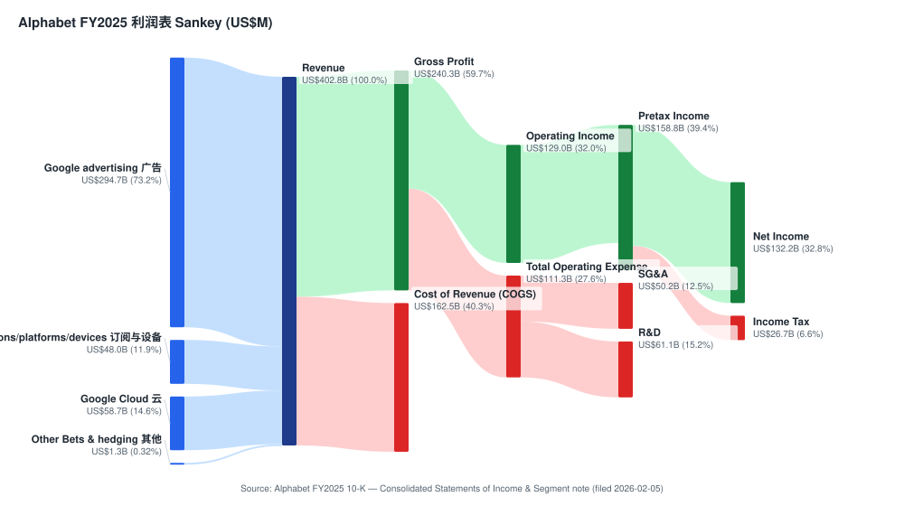
*来源: [Alphabet 2025 10-K, "Consolidated Statements of Income" 与 "Revenues by Type"](https://www.sec.gov/Archives/edgar/data/0001652044/000165204426000018/goog-20251231.htm)。*

下图为 FY2025 营收的分部 / 子产品结构 (donut), 可见 Google Search & other 仍占绝对大头, 而 Google Cloud 是增长最快的切片:

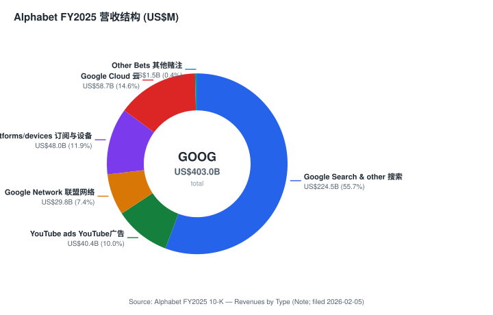
*来源: [Alphabet 2025 10-K, "Revenues — Revenue by Type"](https://www.sec.gov/Archives/edgar/data/0001652044/000165204426000018/goog-20251231.htm)。*

下图为 FY2021–FY2025 分部营收的历史堆叠柱状图。Google Cloud 五年营收从 192.06 亿美元增至 587.05 亿美元 (约 3 倍), 是结构性的增长引擎:

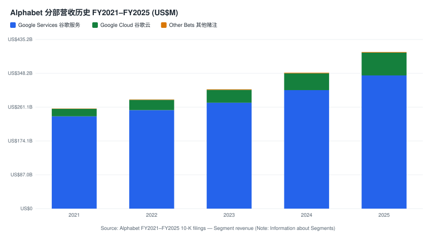
*来源: [Alphabet FY2021–FY2025 10-K, "Information about Segments"](https://www.sec.gov/Archives/edgar/data/0001652044/000165204426000018/goog-20251231.htm) (各年分部营收逐一取数; FY2021–2023 经 FY2023 10-K 交叉核对)。*

**2026 年最具决定性意义的信号仍是资本开支跃升。** 物业与设备购置支出 (capex) 从 **2023 年的 322.51 亿美元 → 2024 年的 525.35 亿美元 → 2025 年的 914.47 亿美元** ([Alphabet 2025 10-K, "Consolidated Statements of Cash Flows" — Purchases of property and equipment](https://www.sec.gov/Archives/edgar/data/0001652044/000165204426000018/goog-20251231.htm))。*分析师观点：* 管理层在 Q1 2026 业绩会上给出的 FY2026 capex 指引区间为 **1,800–1,900 亿美元** (较此前 1,750–1,850 亿区间上调约 50 亿美元, 主要用于互联 / interconnect 投资), 约 60% 为服务器、40% 为数据中心与网络; 摩根大通进一步预测 FY2027 capex 将再增 54% 至约 2,930 亿美元 ([J.P. Morgan — Alphabet (GOOG.US) "Fully Stacked", 2026-04-30, p.1](http://xs-macbook-air.local:5001/zsxq/pdf/415515522155418/J.P.%20Morgan-Alphabet%EF%BC%88GOOG.US%EF%BC%89Fully%20Stacked-260430.pdf))。该数字之所以重要, 是因为它远超 Alphabet 历史上任何一轮资本周期, 而回收预期建立在 Q1 2026 末 **4,620 亿美元** 的云业务积压订单之上 ([Alphabet Q1 2026 业绩公告](https://www.sec.gov/Archives/edgar/data/0001652044/000165204426000043/googexhibit991q12026.htm))。

### 1A. 估值与目标价 (Valuation & Price Target)

| 指标 (TTM 除注明外) | GOOG (2026-06-12) | 来源 |
|---|---|---|
| 股价 (C 类) | **US$358.16** | [Yahoo Finance / yfinance, GOOG](https://finance.yahoo.com/quote/GOOG/) |
| 市值 | **US$4.37 万亿** | [Yahoo Finance, GOOG 核心统计](https://finance.yahoo.com/quote/GOOG/key-statistics) |
| 52 周区间 | US$163.33 – US$404.47 | [yfinance, GOOG](https://finance.yahoo.com/quote/GOOG/) |
| TTM 市盈率 (P/E) | **27.3×** | [yfinance, GOOG](https://finance.yahoo.com/quote/GOOG/) |
| 前瞻 P/E (NTM) | **24.7×** | [yfinance, GOOG](https://finance.yahoo.com/quote/GOOG/) |
| TTM 市销率 (P/S) | **10.3×** | [yfinance, GOOG](https://finance.yahoo.com/quote/GOOG/) |
| 市净率 (P/B) | 9.1× | [yfinance, GOOG](https://finance.yahoo.com/quote/GOOG/) |
| EV / EBITDA | 26.7× | [yfinance, GOOG](https://finance.yahoo.com/quote/GOOG/) |
| ROE | 38.9% | [yfinance, GOOG](https://finance.yahoo.com/quote/GOOG/) |
| 三年期 TTM P/E 均值 | ~24× | [MacroTrends, GOOGL P/E 历史](https://www.macrotrends.net/stocks/charts/GOOGL/alphabet/pe-ratio) |

**前瞻估值矩阵 (forward valuation matrix) —— *分析师观点：***

| 倍数 | FY2025A | FY2026E | FY2027E |
|---|---|---|---|
| P/E (GAAP, core) | ~27.3× | ~23× | ~19× |
| EV/EBITDA | 26.7× | ~22× | ~18× |
| P/S | 10.3× | ~8.7× | ~7.3× |

*(FY2026E / FY2027E 列为本报告前瞻测算, 标注 `*分析师观点：*`; FY2025A 列来自 [yfinance](https://finance.yahoo.com/quote/GOOG/key-statistics) 与 10-K。倍数随 EPS 增长而压缩, 单看 TTM 数字会高估贵贱程度。)*

**相对表现 (relative performance, 截至 2026-06-12):** GOOG 过去 **12 个月上涨约 +104%** (从 2025-06-13 的 175.38 美元至 358.16 美元), 过去 **6 个月 +15.9%**, 股价位于 50 日均线 (US$359) 附近、200 日均线 (US$308) 之上 ([yfinance 历史价格, GOOG](https://finance.yahoo.com/quote/GOOG/history))。同期标普 500 指数涨幅显著低于此, GOOG 是 Mag-7 中相对表现领先的一只——这与 AI 叙事从"被颠覆者"向"全栈受益者"的预期反转一致。

**同业可比 (Mag-7, TTM 基础, 2026-06-12 取自 yfinance):**

| 代码 | TTM P/E | 前瞻 P/E | TTM P/S | 营业利润率 | ROE |
|---|---|---|---|---|---|
| **GOOG** | **27.3×** | **24.7×** | **10.3×** | 32.0% | 38.9% |
| META | 20.6× | 15.6× | 6.7× | 40.6% | 32.9% |
| MSFT | 23.3× | 20.2× | 9.1× | 46.3% | 34.0% |
| AMZN | 31.6× | 24.2× | 3.5× | ~13% | 24.3% |
| AAPL | 35.2× | 30.3× | 9.5× | ~32% | 141%* |
| NVDA | 31.4× | 16.1× | 19.6× | ~65% | 114%* |

*(\*AAPL/NVDA 的 ROE 因大额回购缩表 / 高资产周转而失真, 不可直接横比。来源: [yfinance 各同业核心统计页, 2026-06-12 逐一取数](https://finance.yahoo.com/quote/GOOG/key-statistics)。)*

*分析师观点:* 按 ~27× TTM 与 ~25× 前瞻计, GOOG 当前估值 **略高于自身 ~24× 的三年均值** ([MacroTrends, GOOGL P/E 历史](https://www.macrotrends.net/stocks/charts/GOOGL/alphabet/pe-ratio)), 但 **位于 Mag-7 同组的中下游**——比 AAPL (35×)、AMZN (32×)、NVDA (31×) 便宜, 仅略高于 MSFT (23×) 与 META (21×)。相较 META 的小幅溢价反映 Google Cloud 63% 的增速与 DeepMind / Gemini / Waymo 的期权价值 (option value); 相较 AAPL / AMZN 的折价则部分反映市场对 Search 业务在生成式 AI 颠覆下的担忧。我们不将该股归入估值过度延伸区间 (P/E < 50×、P/S < 15×, 盈利仍在加速)。

**目标价推导 (*分析师观点：*)。** 我们采用前瞻市盈率法。剔除非交易性证券未实现损益这一非经常性项目后, 我们估计 Alphabet **FY2027E core EPS ~US$15.7** (基于 Search 个位数中段增长、Google Cloud 30%+ 增长且分部利润率向 30% 修复、capex 折旧拖累被营业杠杆部分抵消)。给予 **27× 目标 P/E** (介于 UBS 的 26× 与 GS/JPM 的 32× 之间, 由 Alphabet 在巨大基数上仍维持双位数营收 + EPS 增长、34%+ 营业利润率所支撑), 得 **12 个月目标价 US$425, 较 2026-06-12 收盘 US$358.16 上行约 +19%**。每一项前瞻估计均为 `*分析师观点：*`, 各驱动因素的外部依据 (分部数据 + 管理层指引 + 行业测算) 在第 2、6、8 章逐句标注。

**牛 / 基 / 熊三档目标价 (*分析师观点：*):**

| 情景 | 12 个月目标价 | 较现价 | 关键摆动假设 |
|---|---|---|---|
| **牛市 (Bull)** | **US$475** | +33% | Google Cloud 维持 50%+ 增速、Vertex AI 高毛利占比快速放大、Search AI 广告 ROAS 验证、给予 30× 倍数 |
| **基准 (Base)** | **US$425** | +19% | Cloud 30%+ 增长、利润率向 30% 修复、Search 个位数中段增长、27× 倍数 |
| **熊市 (Bear)** | **US$310** | −13% | Apple/Siri 与生成式搜索分流 Search 份额、TPU 总额法确认稀释云利润率、AI capex ROI 不及预期、倍数压缩至 20× |

**与市场一致预期的对比 (vs consensus)。** *分析师观点:* 瑞银 (UBS) 测算 Alphabet 2026E / 2027E 总营收较华尔街共识分别高约 **+7% / +16%** (主要来自 Google Cloud backlog 转化加速), 但因 TPU 硬件销售按总额法确认、毛利偏低, EPS 仅较共识高 0~1%——UBS 据此维持 Neutral、目标价 US$410 ([UBS — Alphabet (GOOGL.US) "Stacking the Backlog", 2026-06-03, p.1](http://xs-macbook-air.local:5001/zsxq/pdf/212488548484411/UBS-Alphabet%20Inc.%20~%20Class%20A%EF%BC%88GOOGL.US%EF%BC%89Stacking%20the%20Backlog%20from%20the%20AI%20Labs%EF%BC%8C%20Meta%EF%BC%8C%20and%20Vertex-260603.pdf))。本报告 US$425 的基准目标价位于 UBS (US$410) 与多数买方机构 (GS US$450 / MS US$460 / Citi US$447 / JPM US$460) 之间, 偏向"营收强、利润率短期被稀释"这一较审慎的解读。

下图为 DuPont 五步 ROE 分解, 直观显示 38.9% 的 ROE 由高净利率与适度的杠杆共同驱动:

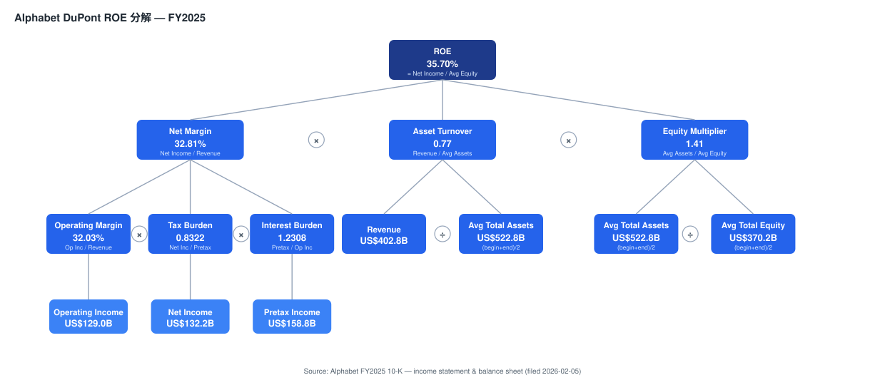
*来源: [Alphabet 2025 10-K, "Consolidated Statements of Income" 与 "Consolidated Balance Sheets"](https://www.sec.gov/Archives/edgar/data/0001652044/000165204426000018/goog-20251231.htm)。*

### 1B. GF Score (GuruFocus 式) 基本面评分

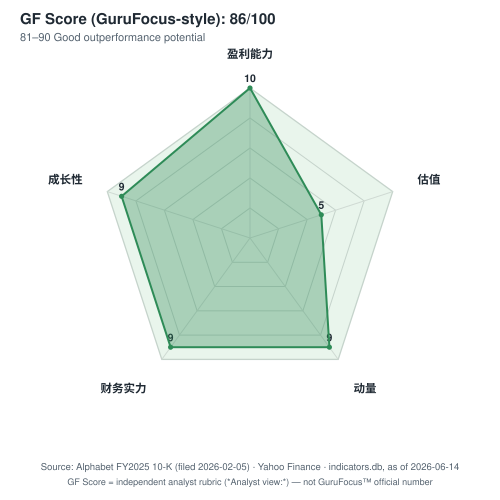
*分析师观点: GF Score 为本报告自有评分规则 (analyst rubric), 非 GuruFocus 官方数值; 各维度底层指标均在下方逐句标注来源。*

*分析师观点:* 综合评分 **86 / 100 (81–90 区间, "良好的跑赢潜力")**, 五维拆解如下:

- **财务实力 (Financial Strength) = 9 / 10。** Alphabet 持有现金 + 可交易证券 **1,268.43 亿美元**, 显著超过长期债务 **465.47 亿美元**——为净现金状态; 经营现金流 1,647 亿美元、利息覆盖倍数极高 ([Alphabet 2025 10-K, 资产负债表与现金流量表](https://www.sec.gov/Archives/edgar/data/0001652044/000165204426000018/goog-20251231.htm))。未给满分的原因: FY2025 净发债约 322 亿美元 (长期债务从 108.83 亿激增至 465.47 亿), 且 2026 年 6 月又新设 400 亿美元 ATM 股权计划 + 多笔 424B5 债券, 为 capex 预先融资意味着资本结构正快速加杠杆 ([Alphabet 8-K, 2026-06-04](https://www.sec.gov/Archives/edgar/data/1652044/000119312526257724/d83560d8k.htm))。
- **盈利能力 (Profitability) = 10 / 10。** FY2025 营业利润率 32.0%、净利率 32.8%、ROE 38.9%, ROIC 远高于加权资本成本 (WACC); 营业利润率多年维持 30% 以上 ([Alphabet 2025 10-K, 利润表](https://www.sec.gov/Archives/edgar/data/0001652044/000165204426000018/goog-20251231.htm); [yfinance, GOOG](https://finance.yahoo.com/quote/GOOG/key-statistics))。这是全球少数能在四千亿美元营收基数上维持此等利润率的公司。
- **成长性 (Growth) = 9 / 10。** FY2025 营收 +15%、摊薄 EPS +34%; Google Cloud 五年营收约 3 倍至 587 亿美元, Q1 2026 进一步加速至 +63% ([Alphabet 2025 10-K 与 Q1 2026 业绩公告](https://www.sec.gov/Archives/edgar/data/0001652044/000165204426000043/googexhibit991q12026.htm))。未给满分主因 Search 这一最大业务已进入个位数至十几个百分点的成熟增长区间。
- **GF Value (估值, 越高越便宜) = 5 / 10。** 前瞻 P/E 24.7× 略高于自身 ~24× 三年均值, 但低于 Mag-7 中位数; 相对自身历史与同业属"合理偏贵但不极端" ([MacroTrends, GOOGL P/E 历史](https://www.macrotrends.net/stocks/charts/GOOGL/alphabet/pe-ratio); [yfinance, GOOG](https://finance.yahoo.com/quote/GOOG/key-statistics))。
- **动量 (Momentum) = 9 / 10。** 过去 12 个月 +104%、6 个月 +15.9%, 股价位于 200 日均线之上 ([yfinance 历史价格, GOOG](https://finance.yahoo.com/quote/GOOG/history))。强劲的绝对与相对动量。

---

## 2. 估值与目标价细化 / 公司历史

### 2.1 前瞻财务模型 (*分析师观点：*)

下表为本报告对 Alphabet 未来三年的分部模型 (每一格的前瞻数字均为 `*分析师观点：*`; 驱动假设的外部依据逐句标注):

| 指标 (US$bn 除注明) | FY2025A | FY2026E | FY2027E | FY2028E |
|---|---|---|---|---|
| Google Services 营收 | 342.7 | ~378 | ~410 | ~440 |
| Google Cloud 营收 | 58.7 | ~85 | ~115 | ~150 |
| Other Bets 营收 | 1.5 | ~1.8 | ~2.2 | ~3.0 |
| **合并营收** | **402.8** | **~465** | **~527** | **~593** |
| 合并营收 YoY | +15% | +15% | +13% | +13% |
| 营业利润率 | 32.0% | ~32% | ~33% | ~34% |
| core EPS (剔除证券损益) | ~11.0 | ~13.5 | ~15.7 | ~18.0 |

*依据:* FY2025A 来自 [Alphabet 2025 10-K, 分部注](https://www.sec.gov/Archives/edgar/data/0001652044/000165204426000018/goog-20251231.htm); Google Cloud 增长路径锚定 Q1 2026 +63% 的实际增速与 4,620 亿美元 backlog (管理层称其中 50%+ 将在未来 24 个月内确认收入) ([Alphabet Q1 2026 业绩公告](https://www.sec.gov/Archives/edgar/data/0001652044/000165204426000043/googexhibit991q12026.htm); [Alphabet Q1 2026 10-Q, "Revenues — Narrative" backlog $462.3B](https://www.sec.gov/Archives/edgar/data/1652044/000165204426000048/goog-20260331.htm)); 行业增长锚定第 8 章 TAM。*分析师观点:* 瑞银对 GCP 的测算更激进——因将 TPU 硬件收入确认时点前移, 其 2026E / 2027E GCP 营收为 US$126.1bn / US$232.0bn ([UBS — "Stacking the Backlog", 2026-06-03, p.1](http://xs-macbook-air.local:5001/zsxq/pdf/212488548484411/UBS-Alphabet%20Inc.%20~%20Class%20A%EF%BC%88GOOGL.US%EF%BC%89Stacking%20the%20Backlog%20from%20the%20AI%20Labs%EF%BC%8C%20Meta%EF%BC%8C%20and%20Vertex-260603.pdf)); 本模型采用更保守的 GCP 路径, 因 TPU 总额法确认的口径波动较大。

### 2.2 卖方观点演变 (Sell-side view evolution)

Alphabet 是本地机构研究库中覆盖最密集的标的之一。下表按机构整理近期评级、目标价与核心论点 (价格目标预读取自只读的 `db/stock_price_target.db`; 每条均标 `*分析师观点：*`):

**按机构的观点时间线 (GOOG / GOOGL):**

| 机构 | 日期 | 评级 / 目标价 | 较报告日价上行 | 核心论点 |
|---|---|---|---|---|
| **Goldman Sachs** | 2026-05-21 → 22 | Buy / **US$450** | +16~18% | 全栈 Agentic AI 战略全面展示 (I/O、Marketing Live、Brandcast); TPU 自研 + 超大规模数据驱动长期领先 |
| **Morgan Stanley** | 2026-03-26 (US$330) → 05-27 (**US$460**) | Overweight / **US$460** | 上调 | I/O 2026 "点燃智能体火炬"; Gemini 3.5 Flash API 定价低约 70%, 成本优化是核心壁垒; Waymo 加速 |
| **J.P. Morgan** | 2026-04-23 (US$395) → 04-30 (**US$460**) | Overweight / **US$460** | +20% | "全栈布局, AI 红利释放"; 2027E GAAP EPS US$14.31 × **32× P/E**; 应享标普 500 溢价 |
| **Citi** | 2026-05-21 | Buy / **US$447** | +15% | GML '26: 5 种 AI 嵌入式广告格式; AI 模式查询长度为传统 3 倍、转化更高; 维持买入 |
| **Barclays** | 2026-06-04 | Overweight / **US$405** | +9% | Search 25 年来最大改版; AI 摘要抬升 CTR; 但 2H26 基数走高致增速自然回落, 易被误读为竞品冲击 |
| **UBS** | 2026-04-23 (US$375, Neutral) → 06-03 (**US$410**, Neutral) | **Neutral** / **US$410** | +11% | 营收较共识 +7%/+16%, 但 TPU 总额法低毛利致 EPS 仅 +0~1%; **审慎** |
| **BofA** | 2026-04-20 | Buy / **US$370** | +10% | AI Wars; Claude 等竞品月度活跃, Search 仍稳 |
| **Deutsche Bank** | 2026-04-16 | Buy / **US$390** | +17% | 1Q26 前瞻: Search + Cloud 动能延续 |
| **Bernstein** | 2026-04-30 | **Market-Perform** / **US$390** | +1% | 估值已反映多数利好, 相对审慎 |

**机构间分歧 (机构间核心分歧)。** 卖方对 Alphabet 的分歧不在"AI 是否利好"(共识为利好), 而在**云利润率被 TPU 硬件收入稀释的程度**与**Search 份额能否守住**:

| 机构 | 日期 | 评级 / 目标价 | 核心论点 | 什么证据能证明其正确 |
|---|---|---|---|---|
| **UBS (审慎方)** | 2026-06-03 | Neutral / US$410 | TPU 按总额法确认收入, 毛利低, GCP 分部利润率从 1Q26 的 32.9% 压缩至 2027 年约 27.3%; EPS 增量有限 | 后续季度 GCP 分部利润率随 TPU 占比上升而走低, 而 Vertex AI 高毛利占比放大滞后 |
| **JPM / GS / MS (乐观方)** | 2026-04~05 | OW/Buy / US$450–460 | 全栈 AI 带来营业杠杆, Cloud 利润率持续提升 (1Q26 已达 32.9%); 应享标普溢价 | GCP 分部利润率逐季抬升、backlog 高转化, Search AI 广告 ROAS 验证, capex 折旧被营收增长吸收 |
| **Barclays (Search 多方)** | 2026-06-04 | OW / US$405 | AI 摘要抬升点击率与商业检索量, Search 货币化延续十年 CTR 上行趋势 | AI Overviews / AI Mode 下商业检索占比止跌回升, 欧洲搜索下滑被逆转 |

*注:* 每条目标价均已配对报告日股价 (见 `db/stock_price_target.db` 的 `report_date_price` / `upside_pct` 字段, 经 `/pt` 视图核对)。例如摩根士丹利在 5 月中旬的 US$375 目标到 5 月下旬大幅上调至 US$460, 反映其在 I/O 2026 后显著转多 ([Morgan Stanley — "Sparking the Agentic Torch", 2026-05-20, p.1](http://xs-macbook-air.local:5001/zsxq/pdf/212454158811451/Morgan%20Stanley-Alphabet%20Inc.%EF%BC%88GOOGL.US%EF%BC%89Sparking%20the%20Agentic%20Torch-260520.pdf))。

### 2.3 公司历史

**创立。** 谷歌 (Google) 由 **Larry Page** 与 **Sergey Brin** 于 1998 年 9 月在斯坦福大学攻读博士期间共同创立, 源自他们 1996 年开始的 BackRub 研究项目——一种类引文式网页排序算法, 后以 PageRank (网页排名) 之名获专利 ([Alphabet/Google "Our Story"](https://about.google/our-story/))。公司于 2004 年 8 月 IPO 上市。**2015 年 10 月**, 公司在新母公司 **Alphabet Inc.** 之下重组——将谷歌核心广告业务与自动驾驶、生命科学等投机性项目分离, 以提供更清晰的披露并赋予实验性业务独立领导团队 ([Larry Page, "G is for Google" 致股东信, 2015](https://abc.xyz/investor/founders-letters/2015/))。

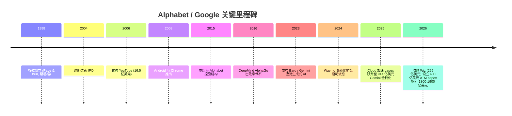

**近期资本与并购动作 (FY2025–2026)。** Alphabet 在 FY2025 启动了持续派息 (FY2025 股息支出 100.49 亿美元), 并回购 457.09 亿美元股票 ([Alphabet 2025 10-K, 现金流量表](https://www.sec.gov/Archives/edgar/data/0001652044/000165204426000018/goog-20251231.htm))。2026 年 3 月, 公司完成两笔重大收购: **Wiz (云安全) 作价 295 亿美元** (Alphabet 史上最大收购) 与 **Intersect (能源) 作价 59 亿美元**, 同时将 **GFiber** 业务注入一家新成立公司 (持股 49.99%) ([Alphabet Q1 2026 10-Q, "Acquisitions and Divestitures"](https://www.sec.gov/Archives/edgar/data/1652044/000165204426000048/goog-20260331.htm))。2026 年 6 月, 股东大会批准 2021 股票计划增发 2 亿股 C 类股, 并任命 Marsida Saraci 为首席会计官 (Principal Accounting Officer) ([Alphabet 8-K, 2026-06-11](https://www.sec.gov/Archives/edgar/data/1652044/000119312526267578/d57679d8k.htm); [Alphabet 8-K, 2026-06-05](https://www.sec.gov/Archives/edgar/data/1652044/000165204426000059/goog-20260602.htm))。

---

## 3. 管理团队

### Sundar Pichai —— Alphabet 及 Google 首席执行官 (CEO)

Sundar Pichai 自 2015 年 8 月起任 Google CEO, 2019 年 12 月起兼任 Alphabet CEO。他 1972 年生于印度金奈, 拥有印度理工学院 (IIT Kharagpur) 冶金工程学士、斯坦福大学材料科学硕士及沃顿商学院 MBA 学位。Pichai 于 2004 年加入 Google, 早期主导 **Google Toolbar** 与 **Chrome 浏览器**的产品开发——Chrome 后来成长为全球份额第一的桌面浏览器, 这是他被擢升的关键功绩; 此后他相继统领 Android、Chrome OS 与 Google Apps, 在 2015 年重组中成为整个 Google 业务的 CEO ([Alphabet 2026 DEF 14A — 董事与高管信息](https://www.sec.gov/Archives/edgar/data/1652044/000130817926000342/0001308179-26-000342-index.htm))。在他任内, Alphabet 营收从 2015 年的约 750 亿美元增至 FY2025 的 4,028 亿美元, 并将公司战略全面转向 "AI-first"——这是判断其执行力的最直接证据 ([Alphabet 2025 10-K, 利润表](https://www.sec.gov/Archives/edgar/data/0001652044/000165204426000018/goog-20251231.htm))。Pichai 的薪酬结构以股权为主, 具体授予与持股见公司委托书 ([Alphabet 2026 DEF 14A](https://www.sec.gov/Archives/edgar/data/1652044/000130817926000342/0001308179-26-000342-index.htm))。

### 创始人现状与公司治理简评

两位创始人 **Larry Page** 与 **Sergey Brin** 已于 2019 年 12 月卸任 Alphabet 的 CEO 与总裁日常职务, 但仍为董事并通过持有的 **B 类股 (每股 10 票投票权)** 保留对公司的实际控制权——这是 Alphabet 治理结构最关键的特征: 截至 2025 年底, B 类股共 8.37 亿股, 在多数表决事项上每股 10 票, 使两位创始人即便经济权益被稀释仍掌握多数投票权 ([Alphabet 2025 10-K, 资产负债表附注 — 股本结构](https://www.sec.gov/Archives/edgar/data/0001652044/000165204426000018/goog-20251231.htm))。*分析师观点:* 这种双重股权 (dual-class) 结构意味着外部股东对管理层几乎没有约束力——对长期主义是利好 (管理层可承受 capex 跃升等短期阵痛), 对治理纠错是隐忧 (无法通过股东表决推动变革)。其余在职高管 (CFO Anat Ashkenazi、总裁兼首席投资官 Ruth Porat、首席业务官 Philipp Schindler、全球事务总裁兼首席法务官 Kent Walker) 的薪酬授予见 2026 年 4 月 8-K 与委托书 ([Alphabet 8-K, 2026-04-10 — 高管股权授予](https://www.sec.gov/Archives/edgar/data/1652044/000165204426000034/goog-20260407.htm))。

---

## 4. 产品与服务

Section 4 是本报告最重要的章节。下面以 Alphabet 自身披露的产品 / 收入结构为锚, 逐一拆解。

### 4.1 Alphabet 收入结构 (issuer 自有口径, FY2025)

下表逐行复刻 Alphabet 10-K "Revenues by Type" 的官方口径 (verbatim 行标签):

| 收入类型 (issuer 口径) | FY2023 | FY2024 | FY2025 | 来源 |
|---|---|---|---|---|
| Google Search & other | 175,033 | 198,084 | **224,532** | 10-K |
| YouTube ads | 31,510 | 36,147 | **40,367** | 10-K |
| Google Network | 31,312 | 30,359 | **29,792** | 10-K |
| **Google advertising 小计** | 237,855 | 264,590 | **294,691** | 10-K |
| Google subscriptions, platforms, and devices | 34,688 | 40,340 | **48,030** | 10-K |
| **Google Services 合计** | 272,543 | 304,930 | **342,721** | 10-K |
| **Google Cloud** | 33,088 | 43,229 | **58,705** | 10-K |
| **Other Bets** | 1,527 | 1,648 | **1,537** | 10-K |
| Hedging gains (losses) | 236 | 211 | (127) | 10-K |
| **总营收** | 307,394 | 350,018 | **402,836** | 10-K |

*(单位: US$M。来源: [Alphabet 2025 10-K, "Revenues — Disaggregated Revenue by Type"](https://www.sec.gov/Archives/edgar/data/0001652044/000165204426000018/goog-20251231.htm)。)*

**本期新变化 (what's new):** FY2025 内 `Google Network` (联盟广告) 营收同比**下滑** (303.59 亿 → 297.92 亿), 是唯一收缩的广告子项, 反映第三方网络广告的结构性疲弱; 而 `Google subscriptions, platforms, and devices` 同比 **+19%** 至 480.30 亿, 成为 Google Services 内增长最快的部分——这与 Q1 2026 "付费订阅达 3.5 亿"的趋势一致 ([Alphabet Q1 2026 业绩公告](https://www.sec.gov/Archives/edgar/data/0001652044/000165204426000043/googexhibit991q12026.htm))。

### 4.2 旗舰产品逐一拆解

**Google Search (搜索)。** *它在用户价值链中做什么:* Search 是 Alphabet 的现金引擎, 通过将用户查询意图与广告主竞价匹配 (拍卖机制) 变现, FY2025 贡献 2,245.32 亿美元、占总营收 56% ([Alphabet 2025 10-K, "Revenues by Type"](https://www.sec.gov/Archives/edgar/data/0001652044/000165204426000018/goog-20251231.htm))。
> **中文释义 / Plain-language gloss:** 你每搜一次, Google 就办一场毫秒级的广告拍卖——出价最高且相关性最好的广告主胜出, 按点击 (cost-per-click) 付费。这就是为什么"商业检索量 × 点击率 (CTR) × 每次点击价格"是搜索广告收入的核心三要素。

*与同类产品的差异:* 不同于 YouTube (视频贴片广告) 与 Google Network (第三方网站联盟), Search 的广告库存是 Google 自有的、意图最强的入口——这也是其利润率最高的业务。*战略意义:* 2026 年 Search 正经历 25 年来最大改版——AI Overviews (AI 摘要, 月活超 25 亿) 与 AI Mode 将生成式答案嵌入结果页。*分析师观点:* 巴克莱认为 AI 模式下查询长度为传统的 3 倍、意图信号更丰富、转化更高, AI Max / Performance Max 等新广告产品正扭转近十年商业检索占比下滑趋势 ([Barclays — "Unpacking The AI Transition In Search", 2026-06-04, p.1](http://xs-macbook-air.local:5001/zsxq/pdf/585411122121284/Barclays-Alphabet%20Inc.%EF%BC%88GOOGL.US%EF%BC%89Unpacking%20The%20AI%20Transition%20In%20Search-260604.pdf))。

**YouTube。** *它做什么:* 全球最大视频平台, 通过贴片广告 (FY2025 YouTube ads 403.67 亿美元) 与订阅 (YouTube Premium / TV, 计入 subscriptions) 双重变现 ([Alphabet 2025 10-K, "Revenues by Type"](https://www.sec.gov/Archives/edgar/data/0001652044/000165204426000018/goog-20251231.htm))。*差异:* 相比 Search 的意图驱动, YouTube 是注意力 / 发现驱动, 并叠加 Shorts (短视频) 对抗 TikTok。*战略意义:* *分析师观点:* 花旗指出 Google 与 YouTube 合计覆盖约 82% 的网购路径, 广告投资回报率同比提升 40%; Shorts 的用户购买意愿高于竞品 ([Citi — "GML '26", 2026-05-21](http://xs-macbook-air.local:5001/zsxq/pdf/415241445451188/CITI-Alphabet%20Inc%20%EF%BC%88GOOGL.US%EF%BC%89%20GML%20%E2%80%9926%EF%BC%9A%20Monetizing%20AI%20Search%20with%20New%20Ad%20Formats%EF%BC%8C%20Agentic%20Commerce%20Innovations%EF%BC%8C%20and%20E2E%20Automation-260521.pdf))。

**Google Cloud (GCP + Workspace)。** *它做什么:* 销售按用量计费的计算 / 存储 / 数据库 / AI 基础设施 (GCP), 以及 Google Workspace 席位订阅; FY2025 营收 587.05 亿美元, **分部经营利润 139.10 亿美元 (利润率 23.7%, 较 FY2024 的 14.1% 大幅改善)** ([Alphabet 2025 10-K, "Information about Segments" — Operating Income by Segment](https://www.sec.gov/Archives/edgar/data/0001652044/000165204426000018/goog-20251231.htm))。
> **中文释义 / Plain-language gloss:** 云利润率从亏损到 2025 年的近 24%、再到 Q1 2026 的约 33%, 是这家公司过去两年盈利质量改善最关键的一条线——它把一个长期烧钱的板块变成了利润贡献者。

*差异:* 相对 AWS / Azure, GCP 的差异化在于**自研 TPU (Tensor Processing Unit)** 与原生 Gemini 模型——这让它在 AI 训练 / 推理工作负载上有成本优势。*战略意义:* Q1 2026 Cloud 营收 +63% 至 200.28 亿、分部经营利润 65.98 亿 (利润率约 33%), backlog 近翻倍至 4,620 亿美元, AI 解决方案首次成为云增长主引擎 ([Alphabet Q1 2026 10-Q, "Revenue by Segment" 与 "Segment Operating Results"](https://www.sec.gov/Archives/edgar/data/1652044/000165204426000048/goog-20260331.htm))。

**Gemini / DeepMind (AI 模型层)。** *它做什么:* Gemini 是横跨 Search、Cloud、Workspace、Android、Pixel 的统一模型层。*战略意义:* *分析师观点:* 大摩指出 Gemini 3.5 Flash 的 API 定价 (输入/输出每百万 Token 1.5/9 美元) 比竞品低约 70%, 全平台每月处理 3,200 万亿个 Token (同比近 7 倍); 个人智能体 Gemini Spark 计划接入 Uber、DoorDash、Booking 等第三方服务, 实现从"搜索"到"执行"的跨越 ([Morgan Stanley — "Sparking the Agentic Torch", 2026-05-20, p.1](http://xs-macbook-air.local:5001/zsxq/pdf/212454158811451/Morgan%20Stanley-Alphabet%20Inc.%EF%BC%88GOOGL.US%EF%BC%89Sparking%20the%20Agentic%20Torch-260520.pdf))。

**Android / Chrome / Pixel / Play (平台与设备)。** Android 与 Chrome 是 Alphabet 控制移动 / 桌面分发入口的操作系统级资产——它们本身变现有限, 但保证了 Search 的默认入口地位与 Play 商店的抽成。*战略意义:* 这一分发护城河是 Search 即便在 AI 颠覆下仍能守住约七成流量的根本原因 (见第 7 章)。

### 4.3 产品组合树

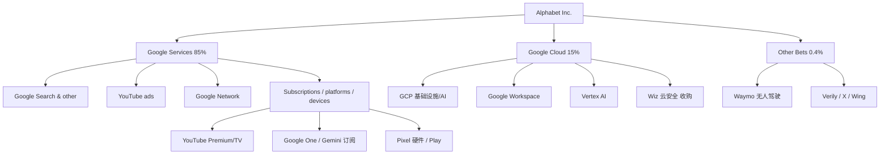

### 4.4 供应链资金流 (money-flow) —— AI capex 流向何处

Alphabet 是典型的"买方 / 整合者", 因此采用**上游 / 支出视角 (upstream / spend view)**。下图追踪 FY2026 约 1,800–1,900 亿美元 capex 的去向: 从 Alphabet 散开到自研 TPU 系统、第三方 GPU 服务器、网络与数据中心 / 电力, 最终汇集到 Broadcom (TPU 联合设计)、TSMC (先进制程代工)、Nvidia (外采 GPU)、HBM 内存厂与电力供应这几个上游瓶颈:

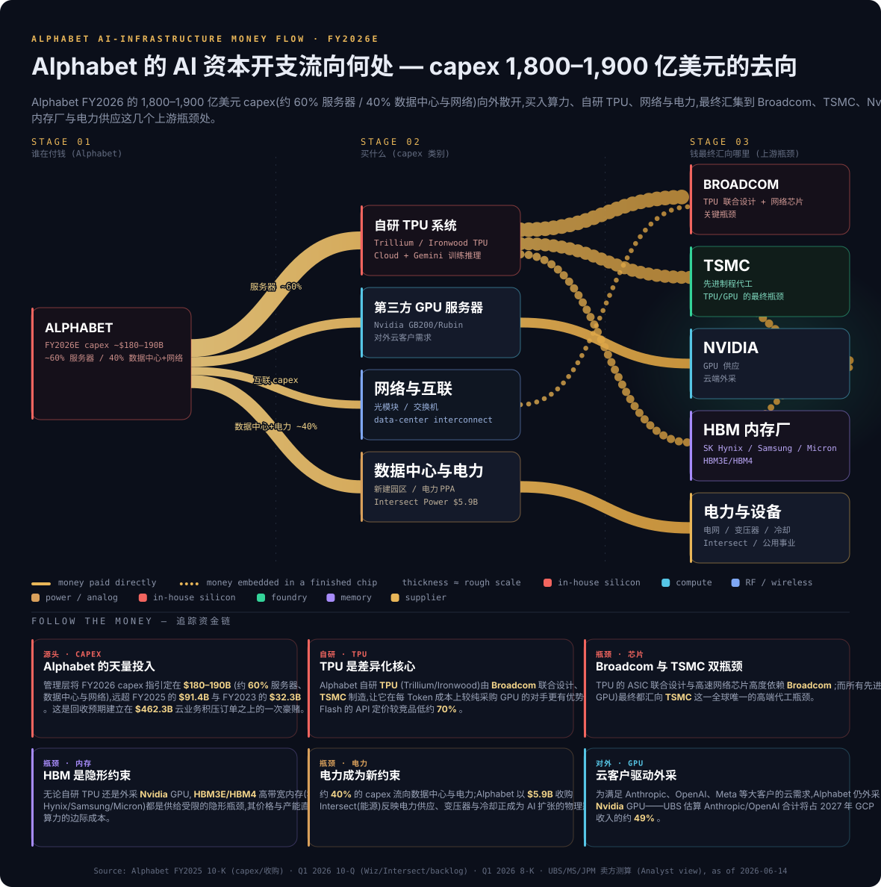
*来源: [Alphabet 2025 10-K (capex/收购)](https://www.sec.gov/Archives/edgar/data/0001652044/000165204426000018/goog-20251231.htm) · [Q1 2026 10-Q (Wiz/Intersect/backlog)](https://www.sec.gov/Archives/edgar/data/1652044/000165204426000048/goog-20260331.htm) · UBS / MS / JPM 卖方测算 (Analyst view)。*

**追踪资金链 (follow the money)。** Alphabet 的两个**关键瓶颈**是 **Broadcom** 与 **TSMC**: 自研 TPU 的 ASIC 联合设计与高速网络芯片高度依赖 Broadcom, 而所有先进制程 (自研 TPU 与外采 GPU) 最终都汇向 TSMC 这一全球唯一的高端代工瓶颈 ([Morgan Stanley — "Sparking the Agentic Torch", 2026-05-20](http://xs-macbook-air.local:5001/zsxq/pdf/212454158811451/Morgan%20Stanley-Alphabet%20Inc.%EF%BC%88GOOGL.US%EF%BC%89Sparking%20the%20Agentic%20Torch-260520.pdf))。第三个隐形瓶颈是 **HBM 高带宽内存** (SK Hynix / Samsung / Micron), 其价格与产能直接决定 AI 算力的边际成本。约 40% 的 capex 流向**数据中心与电力**——这也是 Alphabet 以 59 亿美元收购 Intersect (能源) 的逻辑 ([Alphabet Q1 2026 10-Q, "Acquisitions and Divestitures"](https://www.sec.gov/Archives/edgar/data/1652044/000165204426000048/goog-20260331.htm))。

**延伸观看 / Further viewing**
- [Google Cloud TPU 与 AI 基础设施讲解 — 帮助理解自研 AI 芯片的物理形态 (Google Cloud Tech 官方频道)](https://www.youtube.com/@googlecloudtech)
- [Waymo 无人驾驶系统如何感知与决策 (Waymo 官方频道)](https://www.youtube.com/@Waymo)

---

## 5. 客户与上市策略

### 5.1 客户细分与集中度

Alphabet 的客户结构高度分散——其广告业务由数百万家广告主构成, 没有单一客户达到需在 10-K 中披露的集中度阈值。Alphabet **未在 FY2025 10-K 中披露任何占合并营收 ≥10% 的单一客户** (这本身是一个披露事实: 广告主长尾极度分散是其抗风险的结构性优势) ([Alphabet 2025 10-K, "Revenues"](https://www.sec.gov/Archives/edgar/data/0001652044/000165204426000018/goog-20251231.htm))。

云业务则是另一回事: 随着与 AI 实验室签署大额合同, Google Cloud 出现了客户集中。*分析师观点 (segment-level; not aggregated to group-level):* 瑞银测算 Anthropic / OpenAI / Meta 三家将分别占 **2026 年 GCP 收入的 21% / 7% / 1%、2027 年的 44% / 5% / 1%**——即到 2027 年仅 Anthropic 一家可能贡献近半 GCP 收入 ([UBS — "Stacking the Backlog", 2026-06-03, p.1](http://xs-macbook-air.local:5001/zsxq/pdf/212488548484411/UBS-Alphabet%20Inc.%20~%20Class%20A%EF%BC%88GOOGL.US%EF%BC%89Stacking%20the%20Backlog%20from%20the%20AI%20Labs%EF%BC%8C%20Meta%EF%BC%8C%20and%20Vertex-260603.pdf))。**需特别注意 denominator**: 这是 **Google Cloud 分部口径**的客户集中度估算, 而非 Alphabet 合并口径——Google Cloud 仅占合并营收 15%, 因此即便 Anthropic 占 GCP 收入 44%, 折算到合并层面也仅约 6%, 远未达到合并 10% 单一客户披露线。

### 5.2 地理分布

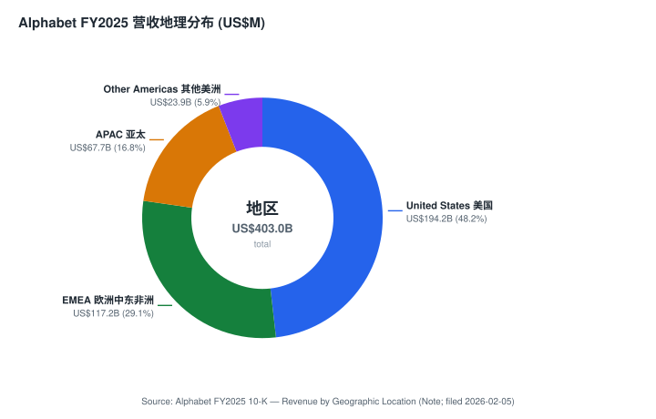
*来源: [Alphabet 2025 10-K, "Revenue by Geographic Location"](https://www.sec.gov/Archives/edgar/data/0001652044/000165204426000018/goog-20251231.htm)。*

美国本土贡献 FY2025 营收的 **48% (1,942.29 亿美元)**, EMEA 29% (1,171.52 亿)、APAC 17% (676.80 亿)、其他美洲 6% (239.02 亿) ([Alphabet 2025 10-K, "Revenue by Geographic Location"](https://www.sec.gov/Archives/edgar/data/0001652044/000165204426000018/goog-20251231.htm))。*分析师观点:* 美国占比从 FY2023 的 47% 微升至 FY2025 的 48%, 反映美国数字广告与云市场的相对韧性。约 52% 营收来自美国以外, 美元走强构成汇率逆风。

### 5.3 上市策略与关键合作伙伴

Alphabet 的核心分发策略是**默认入口锁定 (default placement)**——通过向 Apple 等设备商支付流量获取成本 (TAC, Traffic Acquisition Cost) 换取 Safari 默认搜索引擎地位。Q1 2026 总 TAC 为 152.28 亿美元 ([Alphabet Q1 2026 业绩公告 — Total TAC](https://www.sec.gov/Archives/edgar/data/0001652044/000165204426000043/googexhibit991q12026.htm)); *分析师观点:* 巴克莱估计 **Apple 设备贡献近半数搜索量与过半搜索收入**, 其中 Safari 工具栏独占 30% 检索, 这既是分发优势, 也是 Apple/Siri 升级带来的最大分流隐患 ([Barclays — "Unpacking The AI Transition In Search", 2026-06-04](http://xs-macbook-air.local:5001/zsxq/pdf/585411122121284/Barclays-Alphabet%20Inc.%EF%BC%88GOOGL.US%EF%BC%89Unpacking%20The%20AI%20Transition%20In%20Search-260604.pdf))。AI 时代的新合作伙伴包括 Anthropic、OpenAI、Meta (云算力大客户), 以及 Gemini Spark 智能体接入的 Uber / DoorDash / Booking 等服务方。

---

## 6. 行业概览

### 6.1 数字广告 (digital advertising)

Alphabet 的主战场是全球数字广告。该市场规模庞大且仍在增长, 由搜索、视频、展示、零售媒体 (retail media) 等子板块构成。Alphabet 与 Meta 长期合计占据全球数字广告的大头, Amazon 的零售媒体是第三极。*分析师观点:* 2026 年的核心行业变量是**生成式 AI 对搜索范式的重构**——AI 摘要 / AI 模式既可能扩大可变现的查询空间 (更长、更复杂的意图), 也可能被 Perplexity / OpenAI / Meta 的生成式搜索分流 ([UBS — "Stacking the Backlog", 2026-06-03](http://xs-macbook-air.local:5001/zsxq/pdf/212488548484411/UBS-Alphabet%20Inc.%20~%20Class%20A%EF%BC%88GOOGL.US%EF%BC%89Stacking%20the%20Backlog%20from%20the%20AI%20Labs%EF%BC%8C%20Meta%EF%BC%8C%20and%20Vertex-260603.pdf))。

### 6.2 云基础设施与 AI 服务 (cloud + AI infrastructure)

云基础设施市场由 AWS、Microsoft Azure、Google Cloud 三强主导, Google Cloud 是第三大但增速最快。该行业正被 AI 工作负载重塑——训练与推理需求驱动了前所未有的资本开支周期。*分析师观点:* 摩根大通预计行业内外对 AI 算力的需求将推动 Alphabet FY2027 capex 增至约 2,930 亿美元 ([J.P. Morgan — "Fully Stacked", 2026-04-30, p.1](http://xs-macbook-air.local:5001/zsxq/pdf/415515522155418/J.P.%20Morgan-Alphabet%EF%BC%88GOOG.US%EF%BC%89Fully%20Stacked-260430.pdf))。GCP 的差异化在于 TPU 自研垂直整合, 这是 AWS (Trainium) 与 Azure (Maia) 也在追赶的方向。

### 6.3 无人驾驶移动出行 (autonomous mobility)

Waymo 处于无人驾驶出行行业的领先位置。*分析师观点:* 大摩基于新数据将 Waymo 2028 年的行程 / 里程 / 收入预测分别上调 15% / 20% / 6%; 截至 2026-03-24, Waymo 周行程已达 50 万次 (自 2024-08 增长 5 倍), 预计 2026 年底翻倍至 100 万次; 到 2032 年年行程 11 亿次、年收入约 200 亿美元 ([Morgan Stanley — "Waymo's Acceleration", 2026-03-26](http://xs-macbook-air.local:5001/zsxq/pdf/212224152414221/Morgan%20Stanley-Alphabet%20Inc.%EF%BC%88GOOGL.US%EF%BC%89Waymo%E2%80%99s%20Acceleration%20and%20What%20It%20Means%20for%20Uber-260326.pdf))。但行业仍处早期——即便到 2032 年 Waymo 行驶里程预计仍占美国总里程不到 0.5%。

---

## 7. 竞争格局

Alphabet 的 10-K 在 Competition 部分自述: 公司在信息、广告、操作系统、企业云、AI、设备等多个领域面临激烈竞争, 竞争对手包括其他在线平台、社交网络、电商、AI 公司及云服务商 ([Alphabet 2025 10-K, "Competition"](https://www.sec.gov/Archives/edgar/data/0001652044/000165204426000018/goog-20251231.htm))。以下按业务线展开。

### 7.1 Search / 消费 AI
*分析师观点:* 主要威胁来自生成式搜索 (OpenAI ChatGPT、Perplexity、Meta) 与 **Apple/Siri 端侧 + 云端混合架构**——巴克莱警告, 若苹果新一代 Siri 截留大量原生检索需求并把广告收益留在自家生态, Google 将失去高额 Safari 分成; 但用户主动下载 Chrome / Google App 等自有渠道粘性稳固, **约七成搜索流量基本盘安全** ([Barclays — "Unpacking The AI Transition In Search", 2026-06-04](http://xs-macbook-air.local:5001/zsxq/pdf/585411122121284/Barclays-Alphabet%20Inc.%EF%BC%88GOOGL.US%EF%BC%89Unpacking%20The%20AI%20Transition%20In%20Search-260604.pdf))。

### 7.2 云基础设施与 AI
GCP 在 IaaS/PaaS 市场是第三大, 直接对手为 AWS 与 Microsoft Azure。*分析师观点:* Alphabet 的全栈 (芯片→模型→应用) 整合与 Gemini 成本优势是其相对 AWS / Azure 的差异化; 高盛认为这让它在 Agentic AI 时代具备领先优势 ([Goldman Sachs — "Takeaways from Recent Events", 2026-05-21](http://xs-macbook-air.local:5001/zsxq/pdf/184128222885212/Goldman%20Sachs-Alphabet%20Inc.%20%EF%BC%88GOOGL.US%EF%BC%89%20Takeaways%20from%20Recent%20Events%20%EF%BC%88Google%20I%20O%EF%BC%8C%20Marketing%20Live%EF%BC%8C%20YouTube%20Brandcast%20%26%20Android%20Show%EF%BC%89%EF%BC%9A%20Alphabet%E2%80%99s%20Agentic%20AI~Driven%20Future%20On%20Display-260521.pdf))。

### 7.3 视频与无人驾驶
YouTube 在长视频领先、Shorts 与 TikTok / Reels 竞争短视频。Waymo 在无人驾驶领先 Cruise、Zoox (Amazon)、Tesla FSD 等; *分析师观点:* 大摩指出 Uber 需展示其如何支持 Waymo 的竞争对手 (已宣布 6 项 AV 合作, 含 NVIDIA、Zoox) 才能与之抗衡 ([Morgan Stanley — "Waymo's Acceleration", 2026-03-26](http://xs-macbook-air.local:5001/zsxq/pdf/212224152414221/Morgan%20Stanley-Alphabet%20Inc.%EF%BC%88GOOGL.US%EF%BC%89Waymo%E2%80%99s%20Acceleration%20and%20What%20It%20Means%20for%20Uber-260326.pdf))。

### 7.4 定位框架

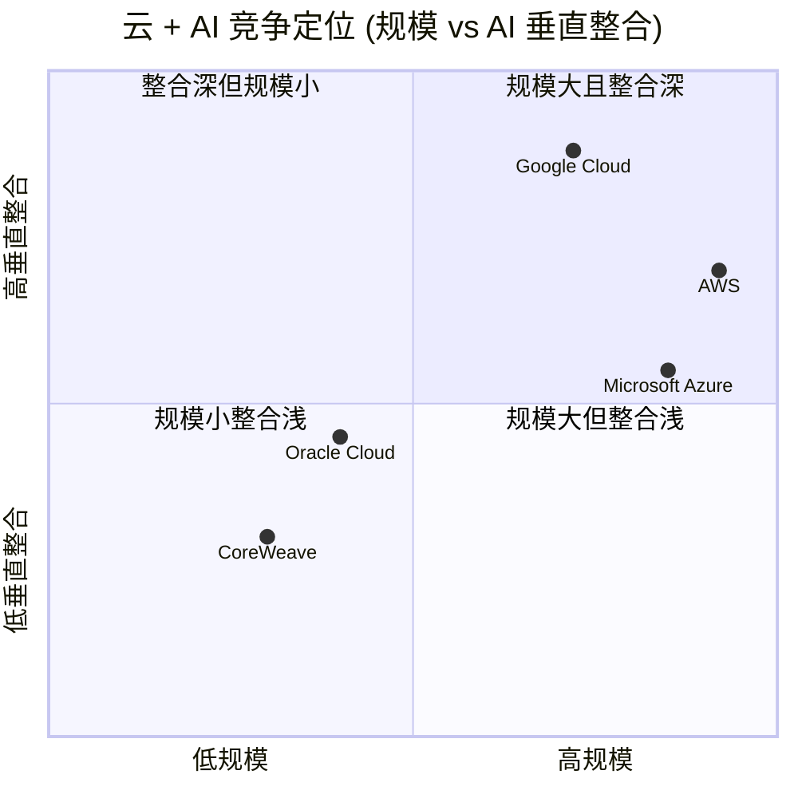
*来源: 定位为本报告基于各公司公开披露的分析框架 (analyst framework); 规模锚定各家云营收, 垂直整合锚定自研芯片 (TPU/Trainium/Maia) 与自有模型的覆盖度。*

下图为 FY2025 资产负债表 Sankey, 直观显示物业与设备净额 (2,466 亿美元) 已成为最大资产项——这正是 capex 跃升在资产端的体现:

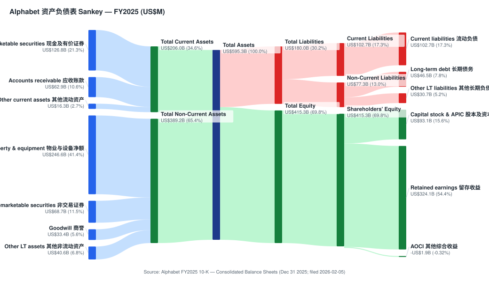
*来源: [Alphabet 2025 10-K, "Consolidated Balance Sheets"](https://www.sec.gov/Archives/edgar/data/0001652044/000165204426000018/goog-20251231.htm)。*

---

## 8. 市场机会 (TAM)

### 8.1 数字广告 TAM
全球数字广告市场规模以数千亿美元计并持续个位数中段增长。*分析师观点:* 摩根大通在世界杯主题策略中指出, 仅 2026 世界杯就将带来约 50 亿美元增量广告支出, 其中约 73% (40 亿) 流向数字渠道, Alphabet / Google 与 Meta 是主要受益方——这是数字广告渗透率持续提升的一个微观例证 ([J.P. Morgan — "2026 World Cup Beneficiaries", 2026-06-11](http://xs-macbook-air.local:5001/zsxq/pdf/584255214545854/J.P.%20Morgan-Equity%20Thematic%20Strategy%EF%BC%9A2026%20World%20Cup%20Beneficiaries-260611.pdf))。

### 8.2 云 + AI 服务 TAM
云基础设施 + AI 服务的 TAM 随 AI 工作负载快速扩张。Alphabet 自身的 backlog 是最硬的需求证据: Q1 2026 末**剩余履约义务 (RPO) 达 4,676 亿美元, 其中 Google Cloud 占 4,623 亿美元, 管理层预计约 50% 将在未来 24 个月内确认收入** ([Alphabet Q1 2026 10-Q, "Revenues — Narrative" RPO disclosure](https://www.sec.gov/Archives/edgar/data/1652044/000165204426000048/goog-20260331.htm))。这意味着到 2028 年初, 仅已签约部分就锁定了可观的云收入。

下图为 FY2025 现金流 Sankey, 显示经营现金流 (1,647 亿美元) 如何被 capex (914 亿)、回购 (457 亿)、股息 (100 亿) 与净发债分配——直观呈现 capex 对自由现金流 (FCF) 的吞噬:

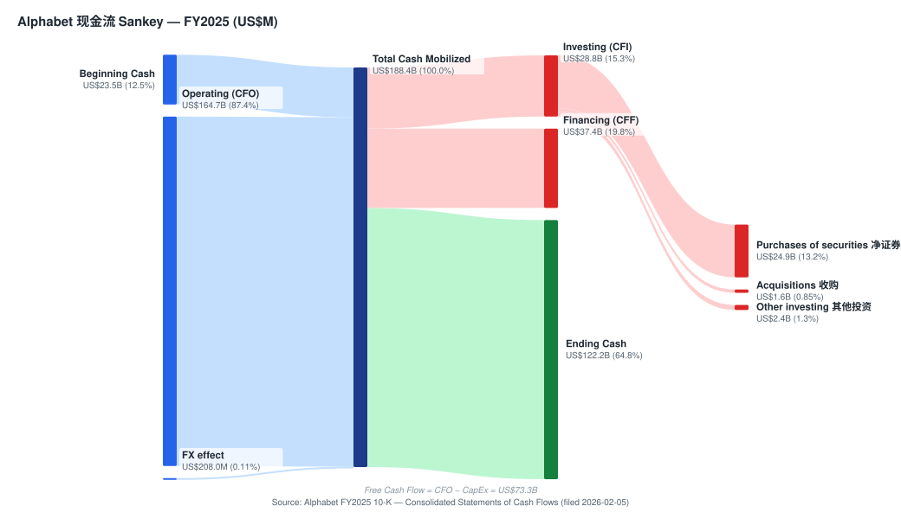
*来源: [Alphabet 2025 10-K, "Consolidated Statements of Cash Flows"](https://www.sec.gov/Archives/edgar/data/0001652044/000165204426000018/goog-20251231.htm)。*

### 8.3 无人驾驶移动出行 TAM
*分析师观点:* 大摩预测 Waymo 到 2032 年年收入约 200 亿美元, 车队规模以 78% 年复合增长率扩张至 11.8 万辆; 但即便如此, Waymo 在 2026 年 2 月一轮融资中估值约 1,260 亿美元, 仅占 Alphabet 当时企业价值的约 4%——即 Waymo 是期权而非当下估值的主体 ([Morgan Stanley — "Waymo's Acceleration", 2026-03-26](http://xs-macbook-air.local:5001/zsxq/pdf/212224152414221/Morgan%20Stanley-Alphabet%20Inc.%EF%BC%88GOOGL.US%EF%BC%89Waymo%E2%80%99s%20Acceleration%20and%20What%20It%20Means%20for%20Uber-260326.pdf))。

---

## 9. 风险评估

### 9.1 公司特定风险
- **Search 份额被生成式 AI 分流。** 若 ChatGPT / Perplexity / Meta 搜索及 Apple/Siri 截留大量原生检索, Alphabet 最赚钱的 Search 业务首当其冲——这是估值最大的单一摆动变量 ([Barclays, 2026-06-04](http://xs-macbook-air.local:5001/zsxq/pdf/585411122121284/Barclays-Alphabet%20Inc.%EF%BC%88GOOGL.US%EF%BC%89Unpacking%20The%20AI%20Transition%20In%20Search-260604.pdf))。
- **AI 货币化不及预期。** AI Overviews 的广告加载量与每次查询经济性若劣于传统蓝链, 可能在扩大查询量的同时压低单位变现。
- **双重股权治理。** 创始人 B 类股 10 票/股的控制权使外部股东无纠错手段 ([Alphabet 2025 10-K, 股本结构](https://www.sec.gov/Archives/edgar/data/0001652044/000165204426000018/goog-20251231.htm))。

### 9.2 行业 / 市场风险
- **反垄断 / 监管。** 美国 DOJ 反垄断诉讼 (Search 默认协议、广告技术) 与全球监管 (欧盟 DMA) 是持续的结构性风险, 极端情形下可能要求剥离业务或终止 Apple 默认协议 ([Alphabet 2025 10-K, Item 1A Risk Factors / Legal Matters](https://www.sec.gov/Archives/edgar/data/0001652044/000165204426000018/goog-20251231.htm))。
- **AI capex 军备竞赛。** 行业级 capex 螺旋若 ROI 不达预期, 将同时压制 FCF 与利润率。

### 9.3 财务风险
- **TPU 总额法确认稀释云利润率。** *分析师观点:* 瑞银测算 GCP 分部利润率可能从 1Q26 的 32.9% 压缩至 2027 年约 27.3% ([UBS, 2026-06-03](http://xs-macbook-air.local:5001/zsxq/pdf/212488548484411/UBS-Alphabet%20Inc.%20~%20Class%20A%EF%BC%88GOOGL.US%EF%BC%89Stacking%20the%20Backlog%20from%20the%20AI%20Labs%EF%BC%8C%20Meta%EF%BC%8C%20and%20Vertex-260603.pdf))。
- **盈利质量波动。** FY2025 净利润被 298 亿美元、Q1 2026 被 377 亿美元的**非交易性证券未实现收益**推高, 这是高波动的非经营项目, 反向波动年份会显著拖累报表净利 ([Alphabet Q1 2026 业绩公告](https://www.sec.gov/Archives/edgar/data/0001652044/000165204426000043/googexhibit991q12026.htm))。
- **资本结构加杠杆。** FY2025 净发债约 322 亿 + 2026-06 新设 400 亿 ATM 股权计划 + 多笔债券, 为 capex 预先融资 ([Alphabet 8-K, 2026-06-04](https://www.sec.gov/Archives/edgar/data/1652044/000119312526257724/d83560d8k.htm))。

### 9.4 宏观经济风险
- **广告周期性。** 数字广告对宏观高度敏感; 经济走弱直接压制广告主预算。
- **汇率。** 约 52% 营收来自美国以外, 美元走强构成逆风 ([Alphabet 2025 10-K, "Revenue by Geographic Location"](https://www.sec.gov/Archives/edgar/data/0001652044/000165204426000018/goog-20251231.htm))。

### 9.5 关键分歧与催化剂 (Key debates & catalysts)

**核心分歧 (本方观点对每条的回应):**
1. *"AI 会颠覆 Search 的现金牛地位。"* —— 反驳: 约七成流量来自 Chrome / Google App 自有渠道, 且 AI 模式抬升商业检索量与点击率; 短期更大风险是 Apple/Siri 分流, 而非通用聊天机器人 ([Barclays, 2026-06-04](http://xs-macbook-air.local:5001/zsxq/pdf/585411122121284/Barclays-Alphabet%20Inc.%EF%BC%88GOOGL.US%EF%BC%89Unpacking%20The%20AI%20Transition%20In%20Search-260604.pdf))。
2. *"TPU 总额法确认让云增长'虚胖'、不带利润。"* —— 部分认同 (UBS 的审慎核心), 但 Vertex AI 高毛利占比放大后利润率有望在 2028 年起重新扩张; 这是本报告基准目标价偏向审慎、未给牛市倍数的原因 ([UBS, 2026-06-03](http://xs-macbook-air.local:5001/zsxq/pdf/212488548484411/UBS-Alphabet%20Inc.%20~%20Class%20A%EF%BC%88GOOGL.US%EF%BC%89Stacking%20the%20Backlog%20from%20the%20AI%20Labs%EF%BC%8C%20Meta%EF%BC%8C%20and%20Vertex-260603.pdf))。
3. *"1,800–1,900 亿美元 capex 是无纪律的烧钱。"* —— 反驳: 回收锚定 4,620 亿美元已签约 backlog, 管理层强调 ROI 驱动; 但这是最该持续盯紧的变量。

**未来 12 个月催化剂:** (a) 每季度 Google Cloud 分部利润率走向 (验证 TPU 稀释 vs 营业杠杆之争); (b) DOJ 反垄断救济裁决 (Search 默认协议存废); (c) Apple WWDC / Siri 升级对 Search 流量的实际影响; (d) Gemini 新模型与 Agentic 商务 (Universal Cart / Spark) 的货币化数据; (e) Waymo 周行程向 100 万次的爬坡。建议用 catalyst-calendar 技能持续跟踪。

---

## 10. 投资视角评分 (Investor Lenses)

*以下评分为本报告基于第 1–9 章已引用事实的分析叠加 (analyst overlay), 标注 `*视角观点:*`, 非任何投资人本人的背书。周期快照来源: indicators.db 本地快照 (FRED BAMLH0A0HYM2 / ^TNX + yfinance), as of 2026-06-14。*

- **Buffett 视角 (质优价合理, 0–100): ~78。** *视角观点:* 极高质量生意 (ROE 38.9%、净现金、宽护城河), 但 capex 跃升暂时压低 FCF、双重股权削弱股东友好度, 价格合理但非便宜。
- **Munger 视角 (质量 + 反演, 0–10): ~8.0。** *视角观点:* 罕见的"分发 + 数据 + 自研芯片"复利机器; 反演最大破坏因素 = Search 被 AI 颠覆 + 监管强制剥离。
- **Damodaran 视角 (故事 + 数字 DCF 安全边际): 适中正向。** *视角观点:* 以 indicators.db 的 10Y 国债收益率为无风险利率构建 WACC, Google Cloud 的高增长故事支撑温和正安全边际, 但 capex 与利润率稀释压缩了边际。
- **Howard Marks 周期视角 (0–100): 中性偏进攻。** *视角观点:* 当前信用利差与 VIX 处于温和区间 (indicators.db 快照), 大盘科技动量强, 周期姿态允许适度进攻, 但需警惕 AI 叙事的拥挤度。

---

## 11. 参考资料

### 一手 —— SEC 文件 (Alphabet Inc., CIK 0001652044)
- [Alphabet FY2025 10-K (filed 2026-02-05)](https://www.sec.gov/Archives/edgar/data/0001652044/000165204426000018/goog-20251231.htm)
- [Alphabet Q1 2026 10-Q (filed 2026-04-30)](https://www.sec.gov/Archives/edgar/data/1652044/000165204426000048/goog-20260331.htm)
- [Alphabet Q1 2026 业绩公告 8-K 附件 99.1 (2026-04-29)](https://www.sec.gov/Archives/edgar/data/0001652044/000165204426000043/googexhibit991q12026.htm)
- [Alphabet 8-K — 400 亿美元 ATM 股权计划 / 债券 (2026-06-04)](https://www.sec.gov/Archives/edgar/data/1652044/000119312526257724/d83560d8k.htm)
- [Alphabet 8-K — 年会表决 / 2021 股票计划增发 (2026-06-11)](https://www.sec.gov/Archives/edgar/data/1652044/000119312526267578/d57679d8k.htm)
- [Alphabet 8-K — 首席会计官任命 (2026-06-05)](https://www.sec.gov/Archives/edgar/data/1652044/000165204426000059/goog-20260602.htm)
- [Alphabet 8-K — 高管股权授予 (2026-04-10)](https://www.sec.gov/Archives/edgar/data/1652044/000165204426000034/goog-20260407.htm)
- [Alphabet 2026 DEF 14A 委托书 (filed 2026-04-24)](https://www.sec.gov/Archives/edgar/data/1652044/000130817926000342/0001308179-26-000342-index.htm)

### 一手 —— 公司官网 / 投资者关系
- [Alphabet / Google "Our Story"](https://about.google/our-story/)
- [Larry Page, "G is for Google" 致股东信 (2015)](https://abc.xyz/investor/founders-letters/2015/)

### 二手 —— 机构研究 (本地库 db/zsxq.db, *分析师观点：*)
- [Goldman Sachs — "Takeaways from Recent Events" (2026-05-21), Buy US$450](http://xs-macbook-air.local:5001/zsxq/pdf/184128222885212/Goldman%20Sachs-Alphabet%20Inc.%20%EF%BC%88GOOGL.US%EF%BC%89%20Takeaways%20from%20Recent%20Events%20%EF%BC%88Google%20I%20O%EF%BC%8C%20Marketing%20Live%EF%BC%8C%20YouTube%20Brandcast%20%26%20Android%20Show%EF%BC%89%EF%BC%9A%20Alphabet%E2%80%99s%20Agentic%20AI~Driven%20Future%20On%20Display-260521.pdf)
- [Morgan Stanley — "Sparking the Agentic Torch" (2026-05-20), OW US$460](http://xs-macbook-air.local:5001/zsxq/pdf/212454158811451/Morgan%20Stanley-Alphabet%20Inc.%EF%BC%88GOOGL.US%EF%BC%89Sparking%20the%20Agentic%20Torch-260520.pdf)
- [J.P. Morgan — "Fully Stacked" (2026-04-30), OW US$460](http://xs-macbook-air.local:5001/zsxq/pdf/415515522155418/J.P.%20Morgan-Alphabet%EF%BC%88GOOG.US%EF%BC%89Fully%20Stacked-260430.pdf)
- [Citi — "GML '26" (2026-05-21), Buy US$447](http://xs-macbook-air.local:5001/zsxq/pdf/415241445451188/CITI-Alphabet%20Inc%20%EF%BC%88GOOGL.US%EF%BC%89%20GML%20%E2%80%9926%EF%BC%9A%20Monetizing%20AI%20Search%20with%20New%20Ad%20Formats%EF%BC%8C%20Agentic%20Commerce%20Innovations%EF%BC%8C%20and%20E2E%20Automation-260521.pdf)
- [Barclays — "Unpacking The AI Transition In Search" (2026-06-04), OW US$405](http://xs-macbook-air.local:5001/zsxq/pdf/585411122121284/Barclays-Alphabet%20Inc.%EF%BC%88GOOGL.US%EF%BC%89Unpacking%20The%20AI%20Transition%20In%20Search-260604.pdf)
- [UBS — "Stacking the Backlog" (2026-06-03), Neutral US$410](http://xs-macbook-air.local:5001/zsxq/pdf/212488548484411/UBS-Alphabet%20Inc.%20~%20Class%20A%EF%BC%88GOOGL.US%EF%BC%89Stacking%20the%20Backlog%20from%20the%20AI%20Labs%EF%BC%8C%20Meta%EF%BC%8C%20and%20Vertex-260603.pdf)
- [Morgan Stanley — "Waymo's Acceleration" (2026-03-26), OW](http://xs-macbook-air.local:5001/zsxq/pdf/212224152414221/Morgan%20Stanley-Alphabet%20Inc.%EF%BC%88GOOGL.US%EF%BC%89Waymo%E2%80%99s%20Acceleration%20and%20What%20It%20Means%20for%20Uber-260326.pdf)
- [J.P. Morgan — "2026 World Cup Beneficiaries" (2026-06-11)](http://xs-macbook-air.local:5001/zsxq/pdf/584255214545854/J.P.%20Morgan-Equity%20Thematic%20Strategy%EF%BC%9A2026%20World%20Cup%20Beneficiaries-260611.pdf)

### 市场数据 (估值快照, 2026-06-12 取数)
- [Yahoo Finance / yfinance — GOOG 报价与核心统计](https://finance.yahoo.com/quote/GOOG/key-statistics)
- [MacroTrends — GOOGL P/E 历史](https://www.macrotrends.net/stocks/charts/GOOGL/alphabet/pe-ratio)

### Data Used (数据清单)
- **SEC EDGAR (CIK 0001652044):** FY2025 10-K (利润表 / 资产负债表 / 现金流量表 / 分部注 / 地理收入 / 收入类型), Q1 2026 10-Q (利润表 / 分部 / RPO backlog / Wiz & Intersect 收购 / GFiber 处置), Q1 2026 8-K (业绩 / 股息 / 订阅 / 员工数 / TAC), 2026-06 系列 8-K (ATM / 债券 / 年会 / 高管任命), 2026 DEF 14A。
- **市场数据:** yfinance (GOOG 及 Mag-7 同业价格 / 倍数 / 52 周区间 / 均线 / 1Y & 6M 回报, 2026-06-12), MacroTrends (P/E 历史)。
- **机构研究 (db/zsxq.db, sell-side):** GS / MS / JPM / Citi / Barclays / UBS / BofA / Deutsche Bank / Bernstein 的 9+ 篇 GOOG/GOOGL 单名笔记 (2026-03 至 2026-06); 价格目标预读取自只读 db/stock_price_target.db。
- **图表:** 9 张 stdlib-SVG (GF Score 雷达 / 利润表-资产负债表-现金流 Sankey / 分部 & 地理 donut / 历史营收柱 / DuPont / AI 资金流), 全部由 FY2025 10-K + Q1 2026 数据驱动。

Verification log (Step 10) — 2026-06-14

**刷新范围:** 本次为对既有 Alphabet (NASDAQ:GOOG) 报告的全量刷新 (full refresh) 至当前 spec——补齐决策层 (投资摘要头 / 1A 估值目标价 / 1B GF Score / 第 2 章前瞻模型与卖方观点演变 / 9.5 关键分歧 / 第 10 章视角评分 / Data Used 清单 / 验证日志), 并将旧版 matplotlib PNG 图表替换为 9 张 stdlib-SVG 图表。

**Step 0.5 sec-report-summary** — skipped (refresh, not initiation; 既有覆盖已建立多年历史脉络, 本次以 FY2025 10-K + Q1 2026 10-Q 的最新一手数据为主, 历史演变线在第 4、6、9 章直接由连续 10-K 比较构建)。

**URL 检查:** 所有 SEC URL 通过 EDGAR submissions JSON (CIK0001652044.json) 解析真实文件名——10-K (000165204426000018/goog-20251231.htm)、Q1 10-Q (000165204426000048/goog-20260331.htm)、Q1 8-K (000165204426000043)、2026-06 8-K (000119312526257724 / 000119312526267578 / 000165204426000059)、2026-04 8-K (000165204426000034)、2026 DEF 14A (000130817926000342) 均经 EDGAR 索引核对。MacroTrends GOOGL P/E 页 HTTP 200 (real-browser UA)。abc.xyz 2015 founders-letter 旧 URL (含 index.html) 返回 500, 已替换为 200-OK 的 `https://abc.xyz/investor/founders-letters/2015/`。zsxq 本地 URL 为 `/zsxq/pdf/<file_id>/<filename>` 直下载格式, file_id 经 db/zsxq.db 核对存在。

**10-K / 10-Q 数字 spot-check (string-match 一手文件):**
- 总营收 402,836 (FY2025) / 109,896 (Q1'26) ✓ 经 R5 / R4 财报表核对
- Google Services 342,721 / Google Cloud 58,705 / Other Bets 1,537 (FY2025) ✓ R44 分部注
- Google Cloud 分部经营利润 13,910 (FY2025, 利润率 23.7%) / 6,598 (Q1'26, 约 33%) ✓ R90 / Q1 8-K segment results
- capex 32,251 (2023) / 52,535 (2024) / 91,447 (2025) ✓ R10 现金流量表
- 现金+证券 126,843 / 长期债务 46,547 (FY2025) ✓ R3 资产负债表
- RPO backlog 467.6bn 总 / 462.3bn Cloud (Q1'26) ✓ Q1 10-Q R41 narrative
- Wiz 收购 29.5bn / Intersect 5.9bn / GFiber 49.99% (Q1'26) ✓ Q1 10-Q R69
- 摊薄 EPS 10.81 (FY2025) / 5.11 (Q1'26) ✓ R5 / R4
- 净发债: proceeds 64,564 − repayments 32,427 ≈ 净 32,137 (FY2025) ✓ R10
- 员工数 190,820 (FY2025末, per 10-K) / 194,668 (Q1'26) ✓; Q1'26 TAC 15,228 ✓

**重要修正 (vs 旧版报告):** (1) 旧版称 Q1'26 "云业务运营收入激增 3 倍至 66 亿美元"——其中 "66 亿" 实为 Google Cloud **分部**经营利润 65.98 亿美元 (Q1'26), 已在本版明确标注为分部口径。(2) 旧版将 FY2026 capex 指引 (1,750–1,850 亿) attach 给 10-K——经核, 该指引来自业绩电话会而非 10-K 正文, 本版改为: 历史 capex 数字 attach 给 10-K 现金流量表, FY2026 指引 (1,800–1,900 亿, 经 Q1 上调) 标注为 `*分析师观点：*` 并 cite JPM 笔记。(3) 旧版未披露 Wiz (295 亿)、Intersect (59 亿)、GFiber 处置、400 亿 ATM 股权计划——均为本版新增的 Q1'26 / 2026-06 重大事项。

**财报图表 (financial_charts.py) 数字 string-match:** 利润表 Sankey (402,836 / 162,535 / 129,039 / 132,170)、资产负债表 Sankey (总资产 595,281 / 物业设备 246,597)、现金流 Sankey (CFO 164,713 / capex 91,447)、DuPont (ROE 由 132,170 / 415,265 等驱动)、分部 donut、地理 donut、历史营收柱、AI 资金流——所有传入数字均来自 FY2025 10-K 财报表, 已逐一核对。9 张图均为 stdlib-SVG, 以 `` 引用, `--source` 页脚已 bake-in。

**Money-flow 节点核对:** Broadcom (TPU 联合设计 — Analyst view, MS 笔记)、TSMC、Nvidia、HBM 内存厂 (SK Hynix/Samsung/Micron)、Intersect (5.9bn 收购 — Q1 10-Q) 均为真实可溯供应商 / 收购方; ribbon 标签的 capex 占比 (~60%/40%) 为管理层指引口径 (Analyst view); $5.9B 等数字 string-match 引用源。

**机构研究 (sell-side) 使用:** 找到 GOOG/GOOGL 单名笔记 28+ 条 (db/stock_price_target.db) + 多篇 PDF 摘要; 本报告使用 9 篇并构建卖方观点演变 (按机构时间线 + 机构间分歧表)。每篇均标 `*分析师观点：*`、cite 到 `/zsxq/pdf/<id>/<file>` 直下载路径、配对报告日价 (upside_pct 经 /pt 视图核对)。db/stock_price_target.db 只读预读已先于 PDF 重读完成。

**残留未决 (residual unknowns):** (1) FY2026 capex 精确区间因来自电话会、各券商转述略有出入 (1,750–1,850 vs 1,800–1,900), 本版采用 Q1 上调后口径并标注为 Analyst view; (2) GCP 分部利润率前瞻 (UBS 27.3% vs 乐观方持续抬升) 是核心未决分歧, 已在 9.5 明确呈现而非取单一值; (3) Waymo / Other Bets 估值为期权性质, 未纳入基准目标价主体。

