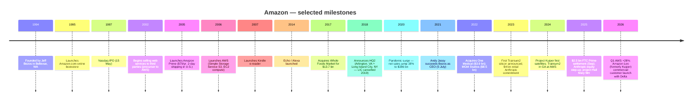
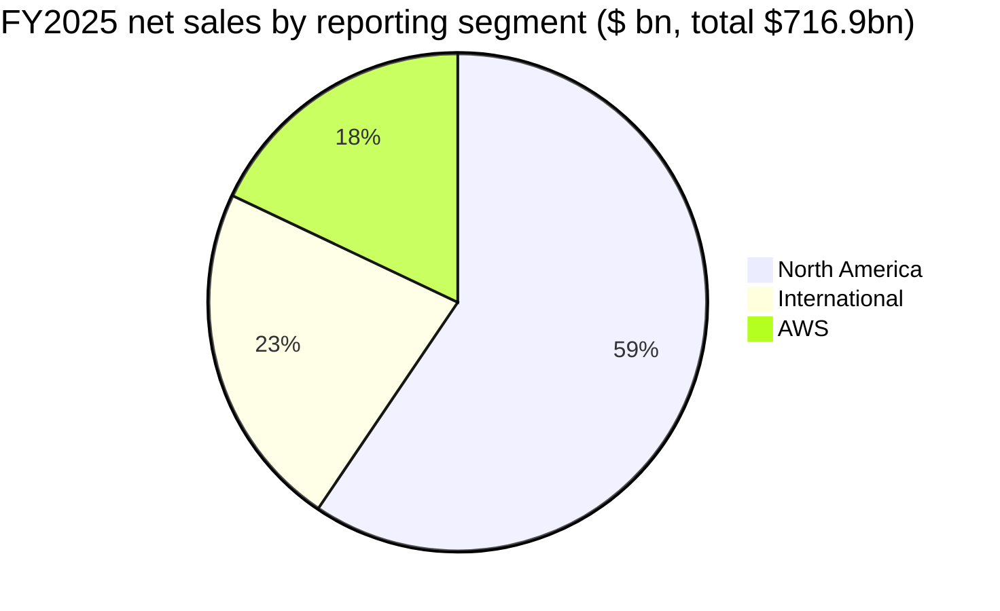

# Amazon.com, Inc. (NASDAQ: AMZN) — Company Research

**Date:** 2026-05-20
**Coverage:** Initiation
**Ticker:** NASDAQ:AMZN  ·  **HQ:** Seattle, Washington  ·  **CEO:** Andrew R. (Andy) Jassy
**Last close:** USD 264.13  ·  **Market cap:** ~USD 2.84 trn  ·  **TTM P/E:** 32.2×  ·  **TTM P/S:** 3.83×

> **Update — Q1-FY2026 beat, FY2026 capex outlook elevated (filed 2026-04-29):** Q1 net sales of $181.5 bn (+17% Y/Y) and operating income of $23.9 bn came in above the company's own $173.5–178.5 bn / $16.5–21.5 bn guide. Management initiated Q2-FY2026 guidance of $194.0–199.0 bn net sales (+16–19% Y/Y) and $20.0–24.0 bn operating income, while flagging "approximately $1 billion of higher year-over-year Amazon Leo costs as we scale in 2026" and continued record capex tied to AI infrastructure (FY2025 gross capex was $131.8 bn, up 59% Y/Y). AWS grew 28% — "our fastest growth in 15 quarters" — and Amazon's custom-silicon business (Graviton + Trainium + Nitro) topped a $20 bn annualised revenue run-rate.
> Source: [Amazon Q1-2026 earnings press release, 2026-04-29](https://www.sec.gov/Archives/edgar/data/1018724/000101872426000012/amzn-20260331xex991.htm).

## Table of Contents

1. Company Overview
2. Company History
3. Management Team
4. Products & Services
5. Customers & Go-to-Market
6. Industry Overview
7. Competitive Landscape
8. Market Opportunity (TAM)
9. Risk Assessment
10. References

---

## 1. Company Overview

Amazon.com, Inc. is the world's largest e-commerce platform, the world's largest cloud-computing provider, the #3 digital-advertising network in the United States, and — by store count — one of the country's largest grocery chains (615 North American physical stores at year-end 2025, principally Whole Foods Market and Amazon Fresh) ([Amazon 10-K FY2025, p. 18](https://www.sec.gov/Archives/edgar/data/1018724/000101872426000004/amzn-20251231.htm)). The company reports its results in three segments — North America, International, and Amazon Web Services (AWS) — and operates "two primary sets of customers, consumers and developers" through "online and physical stores, our advertising services, AWS, and our subscription services" ([Amazon 10-K FY2025, p. 3](https://www.sec.gov/Archives/edgar/data/1018724/000101872426000004/amzn-20251231.htm)).

In FY2025, Amazon generated **$716.92 bn in net sales**, **$79.98 bn in GAAP operating income**, and **$77.67 bn in net income**, on roughly **10.66 bn diluted average shares** and **$7.17 of diluted EPS** ([Amazon 10-K FY2025, p. 37–38](https://www.sec.gov/Archives/edgar/data/1018724/000101872426000004/amzn-20251231.htm)). The split: North America $426.31 bn (+10%), International $161.89 bn (+13%), AWS $128.73 bn (+20%) ([10-K FY2025, p. 68, Note 10 — Segment Information](https://www.sec.gov/Archives/edgar/data/1018724/000101872426000004/amzn-20251231.htm)). The U.S. is the single largest geography at $489.66 bn (68% of revenue); Germany ($45.9 bn), the U.K. ($43.2 bn) and Japan ($30.7 bn) follow ([10-K FY2025, p. 69](https://www.sec.gov/Archives/edgar/data/1018724/000101872426000004/amzn-20251231.htm)).

**How Amazon makes money.** The 10-K breaks revenue into seven service/product lines, all reaching record highs in FY2025: Online stores $269.29 bn (first-party retail, gross), Third-party seller services $172.16 bn (commissions + Fulfillment-by-Amazon), AWS $128.73 bn (compute, storage, AI), Advertising services $68.64 bn (Sponsored Products, display, Prime Video ads, DSP), Subscription services $49.62 bn (Prime + digital subs), Physical stores $22.56 bn, Other $5.94 bn ([10-K FY2025, p. 68](https://www.sec.gov/Archives/edgar/data/1018724/000101872426000004/amzn-20251231.htm)). The four "high-margin" lines (AWS, ads, subs, 3P services) together produced ~$419 bn in FY2025 revenue — 58% of total — and account for the great majority of consolidated operating profit.

Source: [Amazon 10-K FY2025, Note 10 — Segment Information, p. 68](https://www.sec.gov/Archives/edgar/data/1018724/000101872426000004/amzn-20251231.htm).

**Scale.** Amazon employed **approximately 1,576,000 full-time and part-time employees** at year-end 2025 ([10-K FY2025, p. 4](https://www.sec.gov/Archives/edgar/data/1018724/000101872426000004/amzn-20251231.htm)) and operated 741.5 million sq ft of leased/owned property worldwide, including ~474 million sq ft of fulfillment and data-center space ([10-K FY2025, p. 18](https://www.sec.gov/Archives/edgar/data/1018724/000101872426000004/amzn-20251231.htm)). FY2025 gross purchases of property and equipment reached a record **$131.8 bn** (up from $83.0 bn in 2024 and $52.7 bn in 2023), of which AWS absorbed $96.5 bn — 68% of the total — primarily for AI compute build-out ([10-K FY2025, p. 70, Note 10](https://www.sec.gov/Archives/edgar/data/1018724/000101872426000004/amzn-20251231.htm)). Operating cash flow was $139.5 bn for FY2025 ([10-K FY2025, p. 35](https://www.sec.gov/Archives/edgar/data/1018724/000101872426000004/amzn-20251231.htm)), but heavy investment compressed FY2025 free cash flow and the company disclosed only **$1.2 bn of trailing-twelve-month free cash flow as of 31 March 2026**, down from $25.9 bn the year prior ([Q1-2026 earnings release](https://www.sec.gov/Archives/edgar/data/1018724/000101872426000012/amzn-20260331xex991.htm)).

**Valuation snapshot (2026-05-20).** Current price $264.13; market cap ~$2.84 trn; **TTM P/E 32.2×; TTM P/S 3.83×; P/B 6.4×; EV/EBITDA 18.5×**; forward P/E 26.9× ([yfinance, 2026-05-20](https://finance.yahoo.com/quote/AMZN/key-statistics/)). Against the mega-cap-tech peer set, Amazon sits near the middle on P/E (MSFT 25.1×, META 22.1×, GOOG 29.2×, AAPL 36.6×) but **at the absolute bottom on P/S** because retail dilutes the revenue mix — $269 bn of low-margin Online Stores revenue means the consolidated company prints a sub-4× multiple even though AWS alone, valued as a peer to Azure / GCP, would warrant 8–12×.

Source: live pull, [yfinance, 2026-05-20](https://finance.yahoo.com/quote/AMZN/key-statistics/) for AMZN/MSFT/GOOG/META/AAPL/WMT.

Today's 32× TTM P/E is at a modest premium to its post-COVID range (low-to-mid 20s) but is **distorted by two material 2025 items**: (a) a **$2.5 bn FTC settlement charge** ($1.0 bn civil penalty, $1.5 bn restitution) recorded in Q3 2025 ([10-K FY2025, p. 23](https://www.sec.gov/Archives/edgar/data/1018724/000101872426000004/amzn-20251231.htm); [FTC press release, 2025-09-25](https://www.ftc.gov/news-events/news/press-releases/2025/09/ftc-secures-historic-25-billion-settlement-against-amazon)) and (b) **$2.7 bn of severance** charges in FY2025 from headcount actions ($1.8 bn in Q3, $730 mn in Q4) ([10-K FY2025, p. 41](https://www.sec.gov/Archives/edgar/data/1018724/000101872426000004/amzn-20251231.htm)). Conversely, **non-operating income added $17.3 bn**, dominated by a $15.2 bn fair-value step-up on Amazon's nonvoting preferred stock in Anthropic and reclassification gains on the prior convertible notes ([10-K FY2025, p. 50, Note 8](https://www.sec.gov/Archives/edgar/data/1018724/000101872426000004/amzn-20251231.htm)). Adjusting for these, GAAP EPS would be meaningfully lower than reported, but a 26.9× forward P/E and a 3.83× TTM P/S still imply the market is paying a sector-proxy premium — AI infrastructure leadership, retail-margin recovery, and 20%+ AWS growth are all already in the multiple.

---

## 2. Company History

Amazon was incorporated in Washington State in **July 1994** by **Jeffrey P. Bezos** as "Cadabra Inc." and re-named Amazon.com, Inc. ahead of the July 1995 launch of its online bookstore from a Bellevue, WA garage. It IPO'd on Nasdaq on **15 May 1997** at a split-adjusted price of roughly $0.075 and the company is today the third or fourth most valuable listed corporation in the world.

The company's history is best read as **four overlapping strategic pivots**:

1. **From bookseller to "Everything Store" (1995–2005).** Bezos expanded category by category — music (1998), DVDs/VHS (1998), electronics, toys, apparel — turning logistical sprawl into a moat that small specialists could not replicate. By 2000 Amazon had survived the dot-com bust by aggressively cutting costs and embracing third-party sellers (zShops, later Marketplace) — a decision that, twenty-five years later, generates $172 bn in commissions and FBA fees ([10-K FY2025, p. 68](https://www.sec.gov/Archives/edgar/data/1018724/000101872426000004/amzn-20251231.htm)).

2. **From retailer to platform: AWS (2002–2010).** Internal infrastructure pain ("we kept solving the same scaling problems with each new feature team") led Bezos and Jassy to externalise it. S3 and EC2 launched in 2006; AWS broke out as a reported segment in Q1 2015 at a $5 bn run-rate. AWS grew to **$128.7 bn FY2025 revenue and $45.6 bn operating income** ([10-K FY2025, p. 68](https://www.sec.gov/Archives/edgar/data/1018724/000101872426000004/amzn-20251231.htm)) — i.e. AWS by itself, at 35% operating margin, generates more EBIT than all but a handful of public companies.

3. **From platform to membership economy (2005–present).** Prime (launched February 2005, $79/yr, U.S. only) bundled free fast shipping; today it bundles Prime Video, Music, Photos, Pharmacy, virtual healthcare (One Medical), gaming (Luna), grocery delivery and ads-free streaming under a tiered structure (U.S. monthly $14.99, annual $139). Subscription services revenue — a proxy for Prime plus a handful of smaller subs — reached $49.62 bn in FY2025, up 12% Y/Y ([10-K FY2025, p. 68](https://www.sec.gov/Archives/edgar/data/1018724/000101872426000004/amzn-20251231.htm)).

4. **From retailer/platform to AI infrastructure provider (2023–present).** The Bezos-to-Jassy handoff in July 2021 brought an explicit reorientation: Jassy's first three shareholder letters emphasised generative AI, custom silicon and accelerated capex. Trainium and Inferentia chips, the multi-tranche $8 bn investment in Anthropic ($2.7 bn added in 2025), the Q4-2025 disclosure of a five-gigawatt Trainium commitment from Anthropic and an "approximately two gigawatt" Trainium commitment from OpenAI announced in Q1 2026 ([Q1-2026 release](https://www.sec.gov/Archives/edgar/data/1018724/000101872426000012/amzn-20260331xex991.htm)) — these collectively redefine AWS from generic cloud to one of three credible "AI cloud" platforms globally.

Notable acquisitions: Whole Foods Market (2017, $13.7 bn — entry into grocery), Ring (2018, ~$1 bn), PillPack (2018, $753 mn — basis for Amazon Pharmacy), MGM (2022, $8.5 bn — Prime Video content), One Medical (2023, $3.9 bn — primary-care clinic chain), and iRobot (terminated in January 2024 after EU antitrust objection).

---

## 3. Management Team

### Andrew R. ("Andy") Jassy — President & CEO (since July 2021); Director

Jassy, age 58, is the second CEO in Amazon's history. He joined Amazon in **1997**, immediately after earning his MBA from Harvard Business School (he was also a Harvard College alumnus, government major, cum laude — and advertising manager of The Harvard Crimson) ([Wikipedia](https://en.wikipedia.org/wiki/Andy_Jassy); [Amazon IR — Officers & Directors](https://ir.aboutamazon.com/officers-and-directors/person-details/default.aspx?ItemId=7601ef7b-4732-44e2-84ef-2cccb54ac11a)). His first significant role was as a "shadow advisor" to Bezos — a now-famous Amazon institution in which a hand-picked executive accompanies the CEO to every meeting and helps frame the agenda. In 2003 Jassy authored, with Bezos, the original "Amazon Web Services" memo proposing that Amazon externalise its infrastructure. He launched S3 (March 2006) and EC2 (August 2006), built AWS into Amazon's growth engine, was promoted to CEO of AWS in April 2016, and was designated Bezos's successor in February 2021. The handoff took place on **5 July 2021**.

Jassy's accomplishments are unusually quantifiable: under his AWS leadership, the segment grew from <$100 mn run-rate in 2006 to $62 bn FY2021 revenue at a ~30% operating margin — i.e. he is responsible for building one of the three largest software platforms ever created. As CEO of Amazon, his first major moves were (i) ~27,000 layoffs in late 2022 / early 2023 — the largest in company history — to absorb pandemic over-hiring; (ii) a $4 bn (later $8 bn) investment in Anthropic; (iii) re-staking AWS on custom silicon (Trainium, Inferentia, Graviton); (iv) restructuring the cost base of the retail business — North America operating margin recovered from –0.9% in FY2022 to **6.95% in FY2025** ([10-K FY2025, p. 68](https://www.sec.gov/Archives/edgar/data/1018724/000101872426000004/amzn-20251231.htm)). Reported 2025 compensation was just **$2.1 mn** ($365K salary, $1.7 mn of mostly security/travel attribution) — his last equity grant was in 2021 (a 10-year RSU package valued at >$200 mn at grant) and he received no new equity in 2022–2025 ([Yahoo Finance — 2025 proxy summary, 2026-04-10](https://finance.yahoo.com/markets/stocks/articles/amazon-ceo-andy-jassys-pay-173844407.html); [Amazon 2025 Proxy Statement (DEF 14A)](https://www.sec.gov/Archives/edgar/data/0001018724/000110465925033442/tm252295-1_def14a.htm)). He owned **2,119,566 Amazon shares** as of the 2025 proxy date — roughly $560 mn at current price.

Jassy is widely regarded as Bezos's most direct cultural heir: long, narrative-style annual shareholder letters; a focus on "long-term, customer-obsessed thinking"; and an explicit commitment to the 16 Leadership Principles. The single biggest open question on his tenure is whether the consumer business can sustain margin expansion through tariff/recession cycles while AI capex peaks.

### Brian T. Olsavsky — Senior Vice President & Chief Financial Officer (since June 2015)

Olsavsky, 62, has been Amazon CFO for over a decade — making him one of the longest-tenured CFOs in mega-cap tech. He joined Amazon in 2002 from MedPartners and has held VP-Finance roles across Operations, Worldwide Operations, and the North America Retail segment. He succeeded Tom Szkutak as CFO in 2015 and has overseen Amazon's net sales roughly quadrupling from $107 bn (2015) to $717 bn (2025) and capex tripling. Olsavsky's investor communication style is famously dry and disciplined — analysts on the quarterly call appreciate precise commentary on segment margins, capex pacing, AWS backlog and capacity constraints. Per the 2025 proxy, his FY2024 total compensation was ~$26 mn, dominated by RSU vestings. He is not a director.

### Matt Garman — CEO, Amazon Web Services (since June 2024)

Garman, ~50, succeeded Adam Selipsky in June 2024 after a 19-year career inside AWS (he joined as the first product manager on EC2 in 2005). Prior to becoming AWS CEO he ran AWS Sales, Marketing and Global Services — i.e. he was the most senior commercial leader at the unit before being promoted. His mandate is unusually concrete: keep AWS's organic growth ahead of Azure and GCP, capture the AI workload migration, and deliver the Trainium/Graviton silicon roadmap. The early scorecard is favourable — AWS reaccelerated from 17% Y/Y in 1Q25 to **28% in 1Q26** ("our fastest growth in 15 quarters") ([Q1-2026 release](https://www.sec.gov/Archives/edgar/data/1018724/000101872426000012/amzn-20260331xex991.htm)) and the chips business (Graviton + Trainium + Nitro) crossed a $20 bn run-rate growing triple-digit Y/Y.

### Douglas J. Herrington — CEO, Worldwide Amazon Stores (since July 2022)

Herrington, age 61, runs the consumer retail business — Online Stores, Physical Stores, 3P seller services, Advertising and Subscriptions in the North America and International segments. He joined Amazon in 2005 from Webvan, and built the consumables / private-label businesses before being elevated by Jassy to run all of Stores. Herrington's tenure has coincided with the dramatic margin recovery — NA went from –$2.85 bn operating loss (2022) to **$29.6 bn operating income (2025)** — driven by regionalised "8 sub-networks" fulfillment redesign, robotics density (Amazon now operates 750,000+ mobile robots), and ad-load expansion across Sponsored Products / Prime Video.

### Governance footer

- **Board:** 13 directors as of the 2025 proxy, including Bezos (Executive Chair), Jassy (CEO), and 11 independent directors. The lead independent director is **Judith ("Judy") McGrath**. Other directors include Daniel Huttenlocher (MIT), Patricia ("Patty") Stonesifer (formerly Gates Foundation), Brad Smith (Microsoft Vice Chair), Indra Nooyi (formerly PepsiCo CEO), and Edith Cooper (formerly Goldman). ([Amazon 2025 Proxy Statement](https://www.sec.gov/Archives/edgar/data/0001018724/000110465925033442/tm252295-1_def14a.htm)).
- **Insider ownership:** Jeff Bezos owned **1.023 bn shares** as of 24 February 2025 (~9.6% of common) per the proxy ([Variety, 2025-03-05](https://variety.com/2025/digital/news/jeff-bezos-stock-sale-share-ownership-1236385238/)). Bezos adopted a Rule 10b5-1 plan on 4 March 2025 to sell up to 25 mn shares by 29 May 2026 — a recurring monetisation pattern.
- **Compensation structure:** Heavily equity-weighted for NEOs other than Jassy (whose 2021 grant was front-loaded for a decade). Performance-linked equity is the dominant pay vehicle.
- **Say-on-pay:** 78% support in 2024 — below mega-cap-tech medians (90%+) but stable.
- **Related-party transactions:** Limited disclosed dealings; Bezos's continued use of Amazon-related services (Blue Origin contracts, Project Kuiper / Amazon Leo) is structured at arm's length.

**Track record synthesis.** The team has executed both a once-in-a-generation cost-out (NA retail) and an AI re-positioning of AWS in parallel. The principal gap is the founder transition risk: Jassy is in year 5 and still establishes credibility on each new vector (healthcare, satellite, robotics, original content). The board is broad and credentialed but light on retail-CEO experience — a function of Amazon's identity drift toward "tech infrastructure."

---

## 4. Products & Services

Amazon does not publish a SKU count, but a walk of the consumer site (amazon.com), Business site (business.amazon.com), AWS console (aws.amazon.com) and Alexa devices catalogue surfaces **>200 distinct, branded product/service lines**. We group them by reporting segment and then by sub-business.

```mermaid
graph TD
  A[Amazon.com Inc.] --> B[North America segment]
  A --> C[International segment]
  A --> D[AWS segment]
  B --> B1[Online Stores 1P retail]
  B --> B2[3P Marketplace / FBA]
  B --> B3[Physical stores: Whole Foods, Fresh, Go, 4-star, Books]
  B --> B4[Advertising services]
  B --> B5[Subscriptions: Prime, Audible, Kindle Unlimited, Music, Luna]
  B --> B6[Devices: Echo / Alexa, Fire TV, Kindle, Ring, Blink, eero]
  B --> B7[Healthcare: Pharmacy, One Medical, Clinic, Health AI]
  B --> B8[Logistics: Buy with Prime, Multi-Channel Fulfillment]
  C --> C1[Local marketplaces: amazon.co.uk, .de, .jp, .in, .com.br, etc.]
  C --> C2[Prime Video, Music, ads-supported]
  C --> C3[International Stores 1P + 3P, FBA, Devices, Ads]
  D --> D1[Compute: EC2, Graviton, Trainium, Inferentia, ECS, EKS, Lambda]
  D --> D2[Storage / DB: S3, EBS, Glacier, RDS, DynamoDB, Aurora, Redshift]
  D --> D3[AI/ML: Bedrock, SageMaker, Q, Kiro, AgentCore, Bio Discovery]
  D --> D4[Networking: VPC, CloudFront, Route 53, Direct Connect]
  D --> D5[Productivity: Connect, Quick, WorkSpaces, Chime]
  D --> D6[Satellite: Amazon Leo / Project Kuiper]
```

### 4.1 Online Stores & 1P retail ($269.3 bn FY2025, +9% Y/Y)

The largest line by revenue, this is Amazon's first-party retail business across consumables, electronics, apparel, home, books and digital content recorded gross. Selection now spans hundreds of millions of items globally; FY2025 launched "more than 600 new notable brands" on Amazon.com ([Q1-2026 release](https://www.sec.gov/Archives/edgar/data/1018724/000101872426000012/amzn-20260331xex991.htm)). **Competitive advantage: yes — scale + logistics moat.** Amazon owns the largest U.S. e-commerce share at roughly 40% per eMarketer ([eMarketer, 2025](https://www.emarketer.com/content/us-ecommerce-market-shares-2025)). Closest rival: Walmart.com (~9% U.S. share); Walmart's GMV is growing faster off a smaller base, but its 1P retail margin is structurally below Amazon's. Same-day / overnight delivery — "more than 1 billion items same-day or overnight in 2026 [year-to-date]" ([Q1-2026 release](https://www.sec.gov/Archives/edgar/data/1018724/000101872426000012/amzn-20260331xex991.htm)) — is the operational differentiator.

### 4.2 Third-party seller services ($172.2 bn FY2025, +10% Y/Y)

Commissions plus Fulfillment-by-Amazon (FBA) fees from ~2 mn active sellers. FBA stores inventory in Amazon's fulfillment network and ships within the Prime SLA — sellers pay a referral fee (typically 8–17% of sale price) plus per-unit FBA fees. **Competitive advantage: yes — two-sided network effects and switching costs.** A seller running an Amazon-native catalogue, ad campaign, FBA inventory plan and reviews history cannot easily replicate that on Shopify or Walmart Marketplace without losing traffic. Closest competitor: Shopify (different model — store-front software, not a marketplace; ~$292 bn 2025 GMV vs. Amazon 3P GMV implied at >$500 bn). Buy with Prime — Amazon's checkout/logistics offering for off-Amazon stores — directly attacks Shopify's perimeter.

### 4.3 Advertising services ($68.6 bn FY2025, +22% Y/Y)

Sponsored Products and Sponsored Brands inside Amazon search results, display through Amazon DSP, video ads in Prime Video (ad-tier launched January 2024 in U.S. as default), Twitch, IMDb TV, and Streaming TV ads via Fire TV. **Competitive advantage: yes — retail-data moat.** Amazon owns first-party purchase intent data that Google and Meta do not. Ad TAM share: Amazon is the #3 US digital ad seller behind Google and Meta — the triopoly held ~72% of US digital ad spend in 2025 with Amazon ~$69 bn worldwide ([Marketing Charts, 2025](https://www.marketingcharts.com/charts/us-digital-ad-spend-share-google-vs-meta-vs-amazon)). Closest competitors: Google Search Ads, Meta Ads, Walmart Connect, Microsoft Advertising / Retail Media. Growth is accelerating, not decelerating, as Prime Video and inventory expansion add reach.

Source: [Amazon 10-Ks, FY2020–FY2025, "Net sales by similar product/service group"](https://www.sec.gov/Archives/edgar/data/1018724/000101872426000004/amzn-20251231.htm).

### 4.4 Subscription services ($49.6 bn FY2025, +12% Y/Y)

Prime is the dominant component. Bundled benefits: free fast shipping; Prime Video (with ad-tier and ad-free upgrade); Prime Music; Prime Reading; Twitch turbo; Prime Gaming; access to Whole Foods discounts; up to five free virtual care visits through Amazon Health AI ([Q1-2026 release](https://www.sec.gov/Archives/edgar/data/1018724/000101872426000012/amzn-20260331xex991.htm)); Amazon Pharmacy benefits. Amazon does not publicly disclose Prime member count, but multiple third-party estimates put global members at ~230 mn at end-2025 (~180 mn in the U.S.). **Competitive advantage: yes — bundle + switching costs.** Closest competitors: Walmart+ (~25 mn U.S. subscribers, smaller bundle), Costco membership (~75 mn member households, retail-only). The FTC's September 2025 settlement now constrains the "dark-pattern" enrollment / cancellation flows that previously inflated retention — see Section 9.

### 4.5 AWS ($128.7 bn FY2025, +20% Y/Y; $37.6 bn 1Q26 +28% Y/Y)

The world's largest cloud platform, with **~28% global market share** in Q4 2025 ([Synergy Research Group](https://www.srgresearch.com/articles/cloud-market-share-trends-big-three-together-hold-63-while-oracle-and-the-neoclouds-inch-higher)). Three product families matter most for the thesis:

1. **Compute & custom silicon** — EC2 across general-purpose, accelerated, HPC; Graviton (AWS's ARM CPU, now Graviton4); Trainium (AWS training accelerator, Trainium2 GA, Trainium3 ramping); Inferentia (inference). The chips business crossed a **$20 bn annualised revenue run-rate** in Q1 2026, "growing triple-digit percentages Y/Y" ([Q1-2026 release](https://www.sec.gov/Archives/edgar/data/1018724/000101872426000012/amzn-20260331xex991.htm)). Strategically, custom silicon is Amazon's hedge against NVIDIA dependence and a margin lever (AWS lands more compute per dollar of NVIDIA allocation by mixing in Trainium for training and Graviton for general compute).

2. **AI platform — Bedrock, SageMaker, Q, Kiro, AgentCore.** Bedrock is the multi-model API service (Claude Opus 4.7, OpenAI GPT-5.4 in limited preview on Bedrock, plus Amazon's own Titan and Nova models). "Bedrock processed more tokens in the first quarter than all prior years combined, and Bedrock saw 170% growth in customer spend quarter-over-quarter" ([Q1-2026 release](https://www.sec.gov/Archives/edgar/data/1018724/000101872426000012/amzn-20260331xex991.htm)). Bedrock AgentCore — an agent runtime — added a registry, managed harness, evaluations and policy controls in 2026. Kiro (agentic coding) more than doubled developer count Q/Q.

3. **AI partnerships.** Q1 2026 disclosed two seismic commitments: (a) **OpenAI committing to consume ~2 GW of Trainium capacity through AWS** beginning to ramp in 2027, and (b) **Anthropic securing up to 5 GW of current/future Trainium**. Combined with Meta's "tens of millions of Graviton cores" and the 2.1 mn+ AI chips landed in the past 12 months (over half Trainium), AWS is the only cloud with first-party silicon at hyperscaler scale plus deep partnerships with three of the top four foundation-model developers. Closest competitor: Microsoft Azure (which has OpenAI as both partner and primary infrastructure customer historically — partly disrupted by the OpenAI–Amazon Trainium deal); Google Cloud (TPU, in-house Gemini, the #3 hyperscaler at ~14% share).

### 4.6 Physical stores ($22.6 bn FY2025, +6% Y/Y)

615 stores in North America at end-FY2025 ([10-K FY2025, p. 18](https://www.sec.gov/Archives/edgar/data/1018724/000101872426000004/amzn-20251231.htm)), almost all Whole Foods Market and Amazon Fresh; the Amazon Go convenience-store concept and Amazon Books / 4-star concepts have been mostly sunset. **Competitive advantage: partial.** Whole Foods is a strong premium-grocery brand; Amazon Fresh has yet to find its differentiated identity vs. Kroger, Walmart, Costco, Trader Joe's.

### 4.7 Devices

Echo speakers (Alexa); Fire TV (the #1 connected TV OS in the U.S.); Kindle; Ring (cameras, doorbells); Blink (low-cost cameras); eero (mesh Wi-Fi); Astro (consumer robot — limited availability). **Competitive advantage: partial.** Strong in smart-speaker (Alexa) and low-end CTV; weak in flagship smartphones / tablets vs. Apple/Samsung.

### 4.8 Amazon Leo (formerly Project Kuiper)

Low-Earth-orbit broadband constellation — direct competitor to SpaceX's Starlink. Q1 2026 disclosed Delta Airlines as a sign-on, with O2 Telefónica, NTT DOCOMO, Telenor and Vodafone-style partners cited in earlier prints. Management guides "approximately $1 bn of higher Y/Y Amazon Leo costs as we scale in 2026" ([10-K FY2025, p. 30](https://www.sec.gov/Archives/edgar/data/1018724/000101872426000004/amzn-20251231.htm)). Material drag on FY2026 NA operating income.

### 4.9 Healthcare

Amazon Pharmacy (built on the 2018 PillPack acquisition); One Medical (primary-care clinics, 2023 acquisition); Amazon Clinic (virtual care marketplace); Amazon Health AI (Q1-2026 launch — five free virtual visits/year embedded into Prime). Amazon Pharmacy is expanding same-day delivery to ~4,500 U.S. cities by year-end 2026 ([Q1-2026 release](https://www.sec.gov/Archives/edgar/data/1018724/000101872426000012/amzn-20260331xex991.htm)). **Competitive advantage: partial — early days.** Closest competitors: Mark Cuban Cost-Plus Drug Company, CVS Health, Walgreens-Cigna.

### Flagship vs. long-tail

The 1–3 products driving the consolidated thesis are: **AWS** (operating income $45.6 bn, 57% of consolidated EBIT — by far the most important segment for the stock); **Advertising services** (~$70 bn TTM revenue, high incremental margin — second most valuable line); **Prime / Subscriptions** ($49.6 bn revenue plus a halo on 1P + 3P retention). Online Stores is the largest revenue line but the lowest-margin. Long-tail bets — Amazon Leo, Health, Devices ex-Echo, robotics commercialisation, Hail Mary-style original content — represent optionality but absorb capex.

---

## 5. Customers & Go-to-Market

Amazon serves two customer cohorts:

1. **Consumers and small businesses** — hundreds of millions globally, no individual customer >1% of revenue; ~230 mn Prime members; over 2 mn active third-party sellers. Acquisition: search-engine indexing, Prime member retention, app/device install base (Echo, Fire TV, Kindle), strategic partnerships (Pop-up retail, brand collaborations), and increasingly TV/streaming brand campaigns.

2. **Enterprise customers** — AWS, Amazon Advertising DSP, Amazon Business (B2B procurement), Amazon Logistics. AWS has a published "millions of active customers" and counts the U.S. federal government, the U.S. Army (announced Q1-2026), Bloomberg, Fox Corporation, Southwest Airlines, AT&T, U.S. Bank, DTCC, Nokia, NTT DOCOMO, O2 Telefónica, Telenor, Uber, Meta, Pfizer, Capital One, BMW and Mercedes among named users ([Q1-2026 release](https://www.sec.gov/Archives/edgar/data/1018724/000101872426000012/amzn-20260331xex991.htm)).

### Customer concentration

Amazon's 10-K does **not disclose any individual customer accounting for ≥ 10% of consolidated revenue** in FY2023, FY2024 or FY2025. The company's revenue base is among the most diversified in the S&P 500 — by geography (U.S. 68%, Germany 6.4%, UK 6.0%, Japan 4.3%, Rest of World 15%), by segment (NA 59%, International 23%, AWS 18%), and by line (largest is Online Stores at 37.6% of total). At the customer level: even the largest AWS customers (Anthropic, Meta, presumably Netflix and several U.S. federal agencies) likely each represent low-single-digit percentages of AWS revenue, which itself is 18% of consolidated. Top-1 customer of consolidated Amazon is therefore comfortably <5% and top-5 likely <15% — i.e. **no material customer concentration risk at the consolidated level**, an unusually clean profile vs. typical large-cap tech.

That said, **AWS itself has growing concentration in named AI deals** — the announced 5 GW Anthropic Trainium commitment and ~2 GW OpenAI Trainium commitment, while priced/structured as long-dated contracts, mean AWS is committing 7+ GW of dedicated AI capacity to two counterparties. If either pulls or renegotiates, AWS would have to find substitution demand on a comparable timeframe.

### Go-to-market

- **Consumer retail:** Amazon.com plus mobile apps; Prime is the dominant retention engine; same-day / overnight delivery + Subscribe & Save lock in repeat purchase.
- **AWS:** Field sales (AWS sellers); Solutions Architects; AWS Partner Network (~100,000 partners); AWS Marketplace; AWS Activate for startups; AWS re:Invent annual event.
- **Advertising:** Self-serve console for SMB advertisers; Amazon Ads sales teams for enterprise; agencies (WPP, Publicis, Omnicom); the **Amazon-WPP "Open Intelligence" partnership announced in 2025** institutionalises an agency channel.
- **Amazon Business:** Direct sales + Marketplace; >5 mn business customers; >$50 bn run-rate (last disclosed in 2023 reInvent commentary).

### Contract structure

AWS contracts are typically a mix of pay-as-you-go (default) plus **Compute Savings Plans / Reserved Instances** (1- and 3-year commitments) and large **Enterprise Discount Programs (EDPs)** for committed spend. The 10-K reports **$337.7 bn in remaining performance obligations** as of 31 December 2025 ([10-K FY2025, p. 56, Note 7](https://www.sec.gov/Archives/edgar/data/1018724/000101872426000004/amzn-20251231.htm)) — almost three years of AWS revenue committed — a structural visibility asset that materially de-risks the AI capex.

---

## 6. Industry Overview

Amazon operates across multiple massive industries simultaneously. We size each in turn.

### 6.1 Global e-commerce

Global retail e-commerce is forecast at **~$7 trillion in 2025**, growing high-single-digit annually toward ~$8 trn by 2027 (eMarketer/Insider Intelligence). The U.S. e-commerce market is ~$1.2 trn, ~16% of total U.S. retail. Penetration continues to climb, with grocery and pharmacy remaining the largest under-penetrated verticals. **Structure:** highly consolidated at the top in the U.S. (Amazon ~40% share; Walmart.com ~9%; Apple ~3%; long tail ~48% combined including Shopify-powered storefronts) ([eMarketer, 2025](https://www.emarketer.com/content/us-ecommerce-market-shares-2025); [Statista, 2025](https://www.statista.com/statistics/274255/market-share-of-the-leading-retailers-in-us-e-commerce/)). Globally more fragmented — Alibaba/JD/Pinduoduo dominate China; Mercado Libre in LatAm; Coupang in Korea; Flipkart/Meesho in India.

### 6.2 Cloud infrastructure (IaaS + PaaS)

Synergy Research pegs the **global cloud infrastructure-services market at $419 bn in 2025** with Q4 2025 at $119 bn, growing ~30% Y/Y on AI tailwinds — "growth rates like these have not been seen since early 2022, when the market was less than half the size it is today" ([Synergy Research, 2026-02](https://www.srgresearch.com/articles/cloud-market-share-trends-big-three-together-hold-63-while-oracle-and-the-neoclouds-inch-higher)). Big three (AWS, Azure, GCP) hold 63% combined; AWS alone holds **~28%**. Growth drivers: generative-AI training and inference (the largest single workload class created in the last decade), agentic AI, code-assist (Kiro, GitHub Copilot), enterprise data-platform modernisation, and ongoing on-premise → cloud migration. Substitutes are limited at scale: hyperscale cloud has structural cost-of-capital and capex-flexibility advantages that on-premise cannot match.

Source: [Synergy Research Group, "Cloud Market Share Trends," 2026-02](https://www.srgresearch.com/articles/cloud-market-share-trends-big-three-together-hold-63-while-oracle-and-the-neoclouds-inch-higher).

### 6.3 Digital advertising

The U.S. digital ad market is ~$370 bn in 2025; global ~$735 bn. The triopoly — Google ($214 bn worldwide net ad revenue), Meta ($196 bn), Amazon ($69 bn) — controls a growing share, **~72% of US digital ad spend** ([Marketing Charts, 2025](https://www.marketingcharts.com/charts/us-digital-ad-spend-share-google-vs-meta-vs-amazon)). Retail-media is the fastest-growing sub-segment (Amazon's home turf), driven by retailers' first-party purchase data, the deprecation of cross-site cookies, and the rise of CTV ad inventory (Prime Video ad-tier launched 2024).

### 6.4 Subscription streaming / video

Global SVoD/AVoD reached ~$170 bn in 2025 (Ampere Analysis). Netflix (~300 mn subs), Disney+, Amazon Prime Video, Max, Paramount+, Apple TV+, YouTube. Prime Video is one of three or four top-tier global services and now monetises both via the Prime bundle and via ads (the ad-supported tier became default in 2024).

### 6.5 Smart speakers / consumer devices, LEO satellite broadband, healthcare delivery

Each adjacent industry — smart speakers (Amazon leads U.S. via Alexa), LEO satellite broadband (Starlink dominant, Amazon Leo ramping), Pharmacy + virtual care (Amazon Pharmacy + One Medical + Health AI) — is large enough on its own ($10–100 bn TAM) to matter on the margin.

### 6.6 Regulation

Amazon faces an unusually broad regulatory perimeter: U.S. FTC (the $2.5 bn Prime settlement of September 2025 plus an ongoing antitrust monopolisation case filed in 2023 alleging anti-competitive conduct around Marketplace and Prime); EU Digital Markets Act (Amazon designated as a gatekeeper in 2023 with ongoing compliance obligations); state attorneys general antitrust cases; UK CMA cloud-services market investigation; Italy / Germany / France tax disputes — see the **$1.1 bn Italy stores tax-dispute charge** in Q4 2025 ([10-K FY2025, p. 41](https://www.sec.gov/Archives/edgar/data/1018724/000101872426000004/amzn-20251231.htm)). The 10-K names "antitrust, privacy, data use, data protection, data security, data localization, network security, consumer protection, commercial disputes, goods and services offered by us and by third parties (including artificial intelligence technologies and services), healthcare, and other matters" as material litigation domains ([10-K FY2025, p. 15](https://www.sec.gov/Archives/edgar/data/1018724/000101872426000004/amzn-20251231.htm)).

---

## 7. Competitive Landscape

Amazon is a true multi-vertical conglomerate; there is no single "Amazon competitor". We treat the competitive landscape by segment.

### 7.1 Cloud — AWS vs. Microsoft Azure vs. Google Cloud vs. Oracle / Alibaba / Neoclouds (CoreWeave, Lambda, Crusoe)

AWS has held the #1 share for >15 years but has been growing slower than Azure and GCP through 2024 — Synergy reports Microsoft and Google "are seeing higher growth rates" with shares of 21% and 14% respectively in Q4 2025 ([Synergy Research, 2026-02](https://www.srgresearch.com/articles/cloud-market-share-trends-big-three-together-hold-63-while-oracle-and-the-neoclouds-inch-higher)). The **28% Y/Y AWS reacceleration in Q1 2026** narrows the growth gap. Differentiators: AWS has the broadest service catalogue (200+ services), the strongest custom silicon roadmap (Graviton 4 / Trainium 3), and the deepest partner ecosystem; Azure has tight integration with Microsoft 365 and (historically) an exclusive OpenAI relationship (now partially eroded by the OpenAI/Trainium deal); GCP has Gemini and TPU and strong AI/data platform reputation. Neoclouds (CoreWeave, Lambda, Crusoe, Nebius) provide cheaper raw NVIDIA capacity but lack platform breadth.

### 7.2 E-commerce — Amazon vs. Walmart vs. Costco vs. Shopify vs. Temu / Pinduoduo / Shein

- **Walmart.com** ~9% U.S. e-commerce share, growing GMV at low-20s% Y/Y. Walmart Marketplace, Walmart+ ($98/yr) and Walmart Connect (retail-media ads) are direct attacks on Marketplace, Prime and Amazon Ads.
- **Costco** — $250 bn+ revenue, paid-membership warehouse model. Costco.com is small but the brand is the closest Prime analogue.
- **Shopify** — ~10% of U.S. e-commerce by GMV (~$292 bn 2025 GMV) via merchant tools. Buy with Prime is Amazon's flank attack.
- **Temu / Pinduoduo / Shein** — Chinese-origin discount marketplaces; Temu reached ~$50 bn GMV in 2024 via aggressive ads + direct-from-factory pricing. The U.S. de-minimis tariff change in 2025 weakened their margin model, but they remain a structural Amazon-low-price competitor.
- **Specialty leaders:** Best Buy (electronics), Wayfair (home), Chewy (pet), eBay (used/specialty), Etsy (handmade), Mercado Libre (LatAm), Coupang (Korea), Flipkart (India).

### 7.3 Digital advertising — Amazon vs. Google vs. Meta vs. Walmart Connect vs. Microsoft / TikTok

Amazon is structurally smaller than Google and Meta but is the **fastest-growing of the three triopoly members** in 2024–25 and has unique purchase-intent data + Prime Video CTV inventory. Walmart Connect is the closest peer in retail-media; it is smaller but growing fast off Walmart's first-party data.

### 7.4 Subscription video — Amazon Prime Video vs. Netflix, Disney+, Max, Apple TV+, YouTube

Prime Video has the unique distinction of being free for Prime members and of monetising via both ads and subscription upgrades. Netflix's standalone scale (>300 mn subs, ad-tier ramping) is still larger; Disney+/Hulu/ESPN and Warner Bros. Discovery's Max have stronger live-sports and IP libraries in their categories.

### 7.5 Logistics

Amazon Logistics is now one of the largest U.S. parcel carriers — handling ~6 bn+ packages/yr — competing with UPS, FedEx and USPS. Buy with Prime extends fulfillment to merchants off Amazon.com.

### 7.6 Healthcare

Amazon Pharmacy + One Medical + Amazon Clinic + Amazon Health AI. Competitors: CVS / Aetna, Walgreens, Mark Cuban Cost-Plus Drug Co., Hims & Hers, Teladoc.

### 7.7 LEO satellite broadband

SpaceX Starlink dominates with ~6 mn subscribers and several million active users. Amazon Leo, Eutelsat OneWeb and (smaller) Telesat Lightspeed are challengers.

### Competitive advantage synthesis

Amazon's three durable moats: (1) **Logistics scale** in retail — fulfillment density, the ~750 K-strong robotics fleet, Prime same-day SLA, and capital intensity that would take a competitor a decade and >$100 bn to replicate; (2) **AWS service breadth and custom silicon** — 200+ services, Graviton/Trainium hedging the NVIDIA cost curve, $337.7 bn of contracted backlog ([10-K FY2025, p. 56](https://www.sec.gov/Archives/edgar/data/1018724/000101872426000004/amzn-20251231.htm)); (3) **Data flywheel across retail + ads + Prime + AWS** — first-party purchase data into ads, ads revenue funding lower retail prices, Prime locking in retention, AWS hosting the data — none of MSFT/GOOG/META/WMT individually has all four pieces. Vulnerabilities: AWS growth concentration in a handful of large AI partners; the FTC consent decree's drag on Prime enrollment friction; macroeconomic exposure of the retail segment to tariff/trade policy; and capex peak risk (FY2025 $132 bn capex with sub-1× FCF coverage on a TTM basis).

---

## 8. Market Opportunity (TAM)

Aggregating Amazon's served markets:

| TAM bucket | 2025 size | 2030E size | CAGR | Amazon share today |
|---|---|---|---|---|
| Global retail e-commerce | ~$7 trn | ~$10 trn | ~7% | ~$525 bn GMV across 1P + 3P (~7.5%) |
| Global cloud infrastructure | ~$420 bn | ~$1.0 trn | ~19% | ~28% (#1) |
| Global digital advertising | ~$735 bn | ~$1.2 trn | ~10% | ~9% (#3) |
| Global subscription video | ~$170 bn | ~$260 bn | ~9% | Top 4 |
| Global enterprise SaaS / agents | ~$300 bn | ~$700 bn+ | ~18% | Indirect via AWS partners |
| U.S. retail grocery (Whole Foods + Fresh + Pharmacy) | ~$1.6 trn | ~$2.0 trn | ~5% | ~1.5% |
| LEO satellite broadband | ~$8 bn | ~$60 bn+ | ~50% | Pre-revenue (ramping) |
| Healthcare delivery / Rx | ~$600 bn | ~$800 bn | ~6% | <0.5% |

**Sum of TAMs:** ~$9.8 trn in 2025 → ~$14 trn by 2030. Amazon's $717 bn FY2025 revenue equates to a ~7.3% share of total TAM — and in the three highest-margin lines (cloud, ads, subs), Amazon is **demonstrably gaining share**, not losing it. The most asymmetric upside is:

- **AI workload migration** within cloud. If 30%+ of global enterprise AI training settles on AWS Trainium / Bedrock (the OpenAI 2 GW + Anthropic 5 GW commitments imply this is plausible), AWS revenue could compound at 25%+ CAGR through 2028, lifting consolidated revenue growth into the high-teens.
- **Advertising mix-shift to retail media** as cookie-deprecated channels (Google Search, Meta) hand share to first-party-data-rich platforms. Amazon Ads growing 22% Y/Y in FY2025 — vs. ~14% for Google Search ads and ~22% for Meta — supports a "Amazon Ads doubles to >$130 bn by 2028" path.
- **International retail** as Amazon's prior multi-year structural losses ($–8 bn op income 2022) have turned to a 2.9% operating margin in FY2025 and are still well below NA's 6.95% — the convergence path implies $5–10 bn of incremental International operating income capacity.
- **Adjacent businesses** (Leo, Health, Robotics commercialisation): collectively $50–100 bn of TAM that today contributes near-zero revenue but absorbs material capex.

---

## 9. Risk Assessment

### Company-specific risks

1. **FTC / antitrust overhang.** The September 2025 $2.5 bn Prime settlement consent decree restricts enrollment / cancellation UX changes and imposes monitoring ([FTC, 2025-09-25](https://www.ftc.gov/news-events/news/press-releases/2025/09/ftc-secures-historic-25-billion-settlement-against-amazon)). A larger **FTC v. Amazon antitrust case filed September 2023** alleging Marketplace monopolisation and "anti-discounting" practices is still in active litigation; an adverse outcome could force structural separation of Marketplace from 1P retail. EU DMA gatekeeper obligations add a parallel constraint set.
2. **Founder transition and management depth.** Jassy is in year 5; Bezos remains Executive Chair but has steadily monetised his stake (Rule 10b5-1 plan up to 25 mn shares by May 2026). Garman at AWS is new in role; the consumer business has had three CEOs (Wilke → Olsavsky-as-acting → Herrington) since 2021. A wrong hire in any of these slots over 2026–2028 could derail one of the three big segments.
3. **AWS growth concentration in named AI partners.** The disclosed 5 GW Anthropic commitment and ~2 GW OpenAI Trainium commitment are unusually concentrated for a $128 bn business. If either party renegotiates capacity, defects to a competitor, or fails to commercialise its own products, AWS would have to backfill demand against a multi-year capex curve.
4. **Capex peak / FCF compression.** FY2025 gross capex of **$131.8 bn** (+59% Y/Y) drove TTM FCF down to **$1.2 bn** (vs. $25.9 bn a year prior) ([Q1-2026 release](https://www.sec.gov/Archives/edgar/data/1018724/000101872426000012/amzn-20260331xex991.htm)). The Street is implicitly assuming AI demand absorbs this capacity; a 12-month demand air-pocket (e.g. an AI capex pause across hyperscalers) would expose Amazon to underutilised infrastructure and higher depreciation.
5. **Severance and headcount actions.** $2.7 bn of FY2025 severance — $1.8 bn in Q3, $730 mn in Q4 — and "planned role eliminations" continuing into 2026 risk culture and execution disruption ([10-K FY2025, p. 41](https://www.sec.gov/Archives/edgar/data/1018724/000101872426000004/amzn-20251231.htm)).
6. **Project Hail Mary / original content P&L drag.** Amazon spends ~$15 bn/yr on Prime Video originals + MGM library + live sports (Thursday Night Football, NBA from 2025). Returns on this content investment have been modest relative to Netflix's per-dollar performance.

### Industry / market risks

7. **Cloud-market commoditisation / pricing pressure.** As Azure, GCP and the neoclouds (CoreWeave, Lambda) build out NVIDIA-rich capacity, AWS faces incremental pricing pressure on raw compute. Custom silicon is a partial hedge but is itself capex-intensive.
8. **Ad-market cyclicality.** A 2026–27 ad-spend downturn would pressure Amazon's highest-incremental-margin line, even if retail-media's structural share gain continues.
9. **Tariff / trade policy on cross-border retail.** A meaningful share of 3P GMV is sourced from China; tariff escalation or de-minimis rule changes raise cost-of-goods through Marketplace.
10. **Consumer-spending sensitivity.** Subscription and 3P services revenue is correlated with discretionary spending; a U.S. recession would compress retail GMV.

### Financial risks

11. **Anthropic mark-to-market volatility.** The $15.2 bn 2025 step-up on Anthropic preferred stock — and the broader $7.7 bn upward private-company valuation adjustment — flows through GAAP net income but is non-cash and reversible if Anthropic's funding-round prices retrace ([10-K FY2025, p. 50, Note 8](https://www.sec.gov/Archives/edgar/data/1018724/000101872426000004/amzn-20251231.htm)).
12. **Effective tax rate normalisation.** FY2025 ETR was 19.6% (vs. 13.5% in 2024) and the 10-K notes the 2025 Tax Act will have a "similar effect on our cash taxes in 2026" — i.e. the cash-tax benefit could narrow.

### Macro risks

13. **Currency.** A strong USD compresses International segment reported sales (the Q1 2026 FX tailwind of $2.9 bn was a one-quarter benefit; the comparison may swing the other way later in 2026).
14. **Interest rates & WACC.** With $119 bn of long-term debt at end-Q1 2026 ([10-Q 1Q26](https://www.sec.gov/Archives/edgar/data/1018724/000101872426000014/amzn-20260331.htm)) and a multi-year capex plan funded partly via debt issuance ($25 bn of long-term debt issued in 2025) ([10-K FY2025, p. 32](https://www.sec.gov/Archives/edgar/data/1018724/000101872426000004/amzn-20251231.htm)), a 100–200 bps rise in long rates would meaningfully raise WACC and discount the AI-capex IRR profile.
15. **Geopolitical / sanctions.** AWS has limited Russia / China exposure but the broader retail and cloud businesses are exposed to U.S.–China trade-policy shocks.

---

## 10. References

### Primary filings

- [Amazon.com, Inc. — Form 10-K for fiscal year ended 31 December 2025 (filed 2026-02-05)](https://www.sec.gov/Archives/edgar/data/1018724/000101872426000004/amzn-20251231.htm).
- [Amazon.com, Inc. — Form 10-Q for the quarter ended 31 March 2026 (filed 2026-04-29)](https://www.sec.gov/Archives/edgar/data/1018724/000101872426000014/amzn-20260331.htm).
- [Amazon.com, Inc. — Q1-2026 earnings press release (Exhibit 99.1 to Form 8-K, 2026-04-29)](https://www.sec.gov/Archives/edgar/data/1018724/000101872426000012/amzn-20260331xex991.htm).
- [Amazon.com, Inc. — 2025 Proxy Statement (DEF 14A, filed 2025-04-10)](https://www.sec.gov/Archives/edgar/data/0001018724/000110465925033442/tm252295-1_def14a.htm).
- Amazon.com, Inc. — Form 10-Ks for fiscal years 2023 and 2024 (referenced for prior-period figures), retrievable from [SEC EDGAR — AMZN filings index](https://www.sec.gov/cgi-bin/browse-edgar?action=getcompany&CIK=0001018724&type=10-K).

### Government / regulatory

- [FTC — "FTC Secures Historic $2.5 Billion Settlement Against Amazon," 2025-09-25](https://www.ftc.gov/news-events/news/press-releases/2025/09/ftc-secures-historic-25-billion-settlement-against-amazon).
- [Regulatory Oversight — "Amazon Settles FTC Lawsuit Highlighting Regulatory Scrutiny of Subscription Practices," 2025-10](https://www.regulatoryoversight.com/2025/10/amazon-settles-ftc-lawsuit-highlighting-regulatory-scrutiny-of-subscription-practices/).

### Industry research

- [Synergy Research Group — "Cloud Market Share Trends: Big Three Together Hold 63%," 2026-02](https://www.srgresearch.com/articles/cloud-market-share-trends-big-three-together-hold-63-while-oracle-and-the-neoclouds-inch-higher).
- [eMarketer — "US Ecommerce Market Shares 2025"](https://www.emarketer.com/content/us-ecommerce-market-shares-2025).
- [Statista — "Largest online retailers in the U.S. 2025"](https://www.statista.com/statistics/274255/market-share-of-the-leading-retailers-in-us-e-commerce/).
- [Marketing Charts — "US Digital Ad Spend Share: Google vs. Meta vs. Amazon"](https://www.marketingcharts.com/charts/us-digital-ad-spend-share-google-vs-meta-vs-amazon).

### Market data

- [Yahoo Finance — AMZN key statistics, 2026-05-20](https://finance.yahoo.com/quote/AMZN/key-statistics/) (and live yfinance pulls for MSFT, GOOG, META, AAPL, WMT).

### Press / secondary

- [Yahoo Finance — "Amazon CEO Andy Jassy's pay rose to $2.1 million in 2025," 2026-04-10](https://finance.yahoo.com/markets/stocks/articles/amazon-ceo-andy-jassys-pay-173844407.html).
- [Variety — "Jeff Bezos Files to Sell $4.8 Billion Worth of Amazon Stock," 2025-03-05](https://variety.com/2025/digital/news/jeff-bezos-stock-sale-share-ownership-1236385238/).
- [Wikipedia — Andy Jassy biographical entry](https://en.wikipedia.org/wiki/Andy_Jassy).
- [Amazon Investor Relations — Officers & Directors: Andrew R. Jassy](https://ir.aboutamazon.com/officers-and-directors/person-details/default.aspx?ItemId=7601ef7b-4732-44e2-84ef-2cccb54ac11a).
- [NPR — "Amazon to pay $2.5 billion to settle U.S. lawsuit," 2025-09-25](https://www.npr.org/2025/09/25/nx-s1-5551026/amazon-prime-lawsuit-ftc-settlement).
- [Marketplace Pulse — "Amazon and Shopify Are Now Half of U.S. E-Commerce"](https://www.marketplacepulse.com/articles/amazon-and-shopify-are-now-half-of-us-e-commerce).

---

## Appendix — Segment & financial summary

### Segment net sales and operating income (USD millions, FY2023 / 2024 / 2025)

| Segment | 2023 sales | 2024 sales | 2025 sales | 2023 OpInc | 2024 OpInc | 2025 OpInc |
|---|---:|---:|---:|---:|---:|---:|
| North America | 352,828 | 387,497 | 426,305 | 14,877 | 24,967 | 29,619 |
| International | 131,200 | 142,906 | 161,894 | (2,656) | 3,792 | 4,750 |
| AWS | 90,757 | 107,556 | 128,725 | 24,631 | 39,834 | 45,606 |
| **Consolidated** | **574,785** | **637,959** | **716,924** | **36,852** | **68,593** | **79,975** |

Source: [Amazon 10-K FY2025, Note 10 — Segment Information, p. 68](https://www.sec.gov/Archives/edgar/data/1018724/000101872426000004/amzn-20251231.htm).

### Selected balance-sheet items (USD millions, 31 December 2025 / 31 March 2026)

| Item | 31-Dec-25 | 31-Mar-26 |
|---|---:|---:|
| Cash + cash equivalents | 86,810 | (see 10-Q) |
| Marketable securities | 36,219 | (see 10-Q) |
| Property and equipment, net | 357,025 | (see 10-Q) |
| Long-term debt | 65,648 | 119,074 |
| Total stockholders' equity | 411,065 | 441,914 |
| Total assets | 818,042 | 916,630 |

Sources: [10-K FY2025, p. 39](https://www.sec.gov/Archives/edgar/data/1018724/000101872426000004/amzn-20251231.htm); [10-Q 1Q26, p. 2](https://www.sec.gov/Archives/edgar/data/1018724/000101872426000014/amzn-20260331.htm).

*This report is a synthesis of primary disclosures and third-party industry data as of 2026-05-20. It is not investment advice. Every quantitative claim above is sourced to a filing or a third-party publication linked inline.*
