# Amazon.com, Inc. (NASDAQ:AMZN) — 公司研究报告

**截至日期: 2026-05-20**
**覆盖类型: 首次覆盖 (Initiation)**
**代码: NASDAQ:AMZN  ·  总部: 美国华盛顿州西雅图  ·  CEO: Andrew R. ("Andy") Jassy**
**最新收盘价: 264.13 美元  ·  市值: 约 2.84 万亿美元  ·  TTM 市盈率 (P/E): 32.2 倍  ·  TTM 市销率 (P/S): 3.83 倍**
**报告语言: 简体中文 (英文版同时存在于本目录)**

> **业绩更新——2026 财年 Q1 超预期, 2026 财年资本开支指引上调 (2026-04-29 披露):** Q1 净销售额为 **1,815 亿美元** (同比 +17%), 营业利润 **239 亿美元**, 双双超过公司自身指引区间 1,735–1,785 亿美元 / 165–215 亿美元。管理层就 2026 财年 Q2 给出指引——净销售额 1,940–1,990 亿美元 (同比 +16–19%)、营业利润 200–240 亿美元, 同时提示"2026 年随 Amazon Leo 扩张, 预计同比新增约 10 亿美元成本", AI 基础设施驱动的资本开支也将延续历史高位 (2025 财年总资本开支 1,318 亿美元, 同比 +59%)。亚马逊云科技 (Amazon Web Services, AWS) 同比增长 28%——"近 15 个季度以来最快增速"——亚马逊自研芯片业务 (Graviton + Trainium + Nitro) 年化收入运行率突破 200 亿美元。
> 来源: [Amazon 2026 Q1 业绩公告, 2026-04-29](https://www.sec.gov/Archives/edgar/data/1018724/000101872426000012/amzn-20260331xex991.htm)。

## 目录

1. 公司概览
2. 公司历史
3. 管理团队
4. 产品与服务
5. 客户与上市策略
6. 行业概览
7. 竞争格局
8. 市场机会 (TAM)
9. 风险评估
10. 参考资料

---

## 1. 公司概览

Amazon.com, Inc. 是全球最大的电子商务 (e-commerce) 平台、全球最大的云计算服务商、美国第三大数字广告网络, 同时以门店数计算也跻身美国最大的杂货连锁之一 (2025 年末北美 615 家实体门店, 主要为 Whole Foods Market 和 Amazon Fresh) ([Amazon 10-K FY2025, p. 18](https://www.sec.gov/Archives/edgar/data/1018724/000101872426000004/amzn-20251231.htm))。公司按三大业务分部披露——北美 (North America)、国际 (International)、亚马逊云科技 (AWS)——并通过"在线及实体门店、广告服务、AWS 以及订阅服务"服务"两类主要客户群: 消费者和开发者" ([Amazon 10-K FY2025, p. 3](https://www.sec.gov/Archives/edgar/data/1018724/000101872426000004/amzn-20251231.htm))。

2025 财年, 亚马逊实现**净销售额 7,169.2 亿美元**、**GAAP 营业利润 799.8 亿美元**、**净利润 776.7 亿美元**, 摊薄平均股本约 **106.6 亿股**, **摊薄每股收益 (EPS) 7.17 美元** ([Amazon 10-K FY2025, p. 37–38](https://www.sec.gov/Archives/edgar/data/1018724/000101872426000004/amzn-20251231.htm))。分部拆分: 北美 4,263.1 亿美元 (+10%)、国际 1,618.9 亿美元 (+13%)、AWS 1,287.3 亿美元 (+20%) ([10-K FY2025, p. 68, Note 10 — Segment Information](https://www.sec.gov/Archives/edgar/data/1018724/000101872426000004/amzn-20251231.htm))。美国是公司单一最大地理市场, 收入达 4,896.6 亿美元 (占总收入 68%); 其后依次为德国 (459 亿美元)、英国 (432 亿美元) 和日本 (307 亿美元) ([10-K FY2025, p. 69](https://www.sec.gov/Archives/edgar/data/1018724/000101872426000004/amzn-20251231.htm))。

**亚马逊的盈利方式。** 10-K 将收入拆分为 7 条产品/服务线, 2025 财年全部创历史新高: 在线商店 (Online Stores) 2,692.9 亿美元 (第一方自营零售, 总额口径)、第三方卖家服务 (Third-party seller services) 1,721.6 亿美元 (佣金 + Fulfillment-by-Amazon, FBA)、AWS 1,287.3 亿美元 (计算、存储、AI)、广告服务 (Advertising services) 686.4 亿美元 (Sponsored Products、展示广告、Prime Video 广告、DSP)、订阅服务 (Subscription services) 496.2 亿美元 (Prime 会员 + 数字订阅)、实体门店 (Physical stores) 225.6 亿美元、其他 59.4 亿美元 ([10-K FY2025, p. 68](https://www.sec.gov/Archives/edgar/data/1018724/000101872426000004/amzn-20251231.htm))。其中 4 条"高毛利"业务线 (AWS、广告、订阅、3P 服务) 2025 财年合计贡献约 4,190 亿美元收入——占总收入 58%——并贡献了合并营业利润的绝大部分。

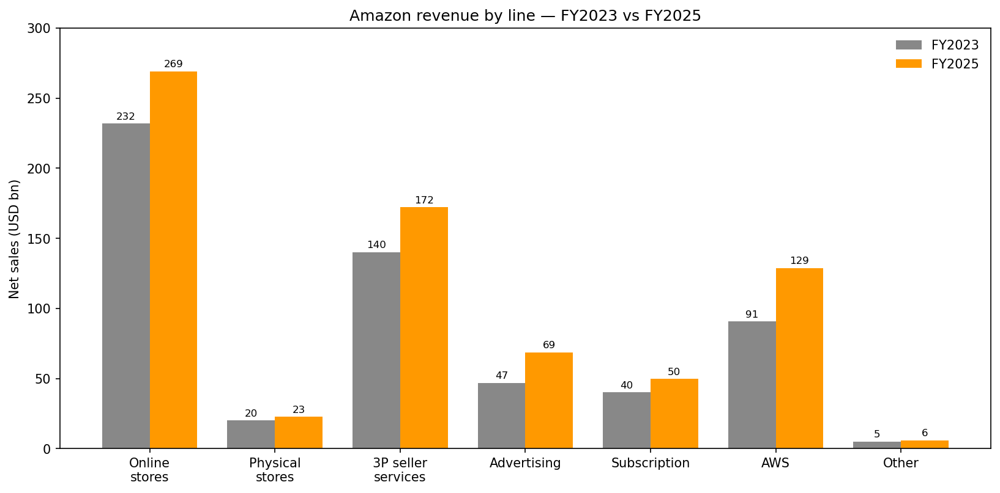
来源: [Amazon 10-K FY2025, Note 10 — Segment Information, p. 68](https://www.sec.gov/Archives/edgar/data/1018724/000101872426000004/amzn-20251231.htm)。

**规模。** 2025 年末亚马逊有**约 1,576,000 名全职和兼职员工** ([10-K FY2025, p. 4](https://www.sec.gov/Archives/edgar/data/1018724/000101872426000004/amzn-20251231.htm)), 在全球运营 7.415 亿平方英尺的自有或租赁物业, 其中约 4.74 亿平方英尺为履约与数据中心空间 ([10-K FY2025, p. 18](https://www.sec.gov/Archives/edgar/data/1018724/000101872426000004/amzn-20251231.htm))。2025 财年总资本开支创纪录达**1,318 亿美元** (2024 年为 830 亿美元, 2023 年为 527 亿美元), 其中 AWS 占 965 亿美元——占总投入的 68%——主要用于 AI 算力扩建 ([10-K FY2025, p. 70, Note 10](https://www.sec.gov/Archives/edgar/data/1018724/000101872426000004/amzn-20251231.htm))。2025 财年经营性现金流为 1,395 亿美元 ([10-K FY2025, p. 35](https://www.sec.gov/Archives/edgar/data/1018724/000101872426000004/amzn-20251231.htm)), 但高资本开支严重压缩了自由现金流 (Free Cash Flow, FCF), 截至 **2026 年 3 月 31 日**, 公司披露的 TTM (过去十二个月) FCF 仅有 **12 亿美元**, 较去年同期的 259 亿美元大幅下滑 ([Amazon 2026 Q1 业绩公告](https://www.sec.gov/Archives/edgar/data/1018724/000101872426000012/amzn-20260331xex991.htm))。

**估值快照 (2026-05-20)。** 当前股价 264.13 美元; 市值约 2.84 万亿美元; **TTM P/E 32.2 倍; TTM P/S 3.83 倍; 市净率 (P/B) 6.4 倍; EV/EBITDA 18.5 倍**; 前瞻市盈率 (Forward P/E) 26.9 倍 ([yfinance, 2026-05-20](https://finance.yahoo.com/quote/AMZN/key-statistics/))。在大盘科技股可比集合中, 亚马逊的 P/E 处于中段 (微软 25.1 倍、Meta 22.1 倍、Google 29.2 倍、苹果 36.6 倍), 但**在 P/S 维度处于绝对底部**, 因为零售业务稀释了收入构成——2,690 亿美元低毛利的在线商店收入意味着合并报表 P/S 不足 4 倍, 即便仅就 AWS 单独估值 (作为 Azure / GCP 的可比项), 也应享有 8–12 倍的市销率。

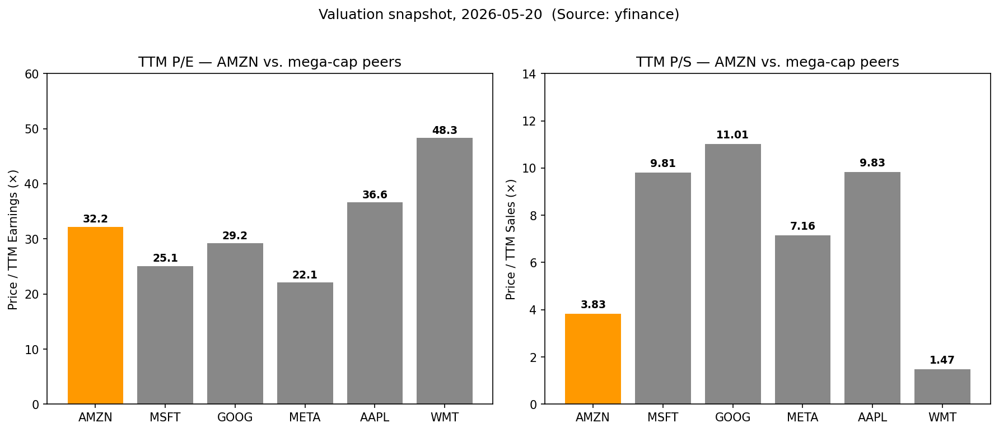
来源: 实时拉取自 [yfinance, 2026-05-20](https://finance.yahoo.com/quote/AMZN/key-statistics/), 覆盖 AMZN/MSFT/GOOG/META/AAPL/WMT。

当前 32 倍 TTM P/E 略高于其后疫情时代区间 (20 倍出头到 20 多倍), 但**受 2025 年两笔重大事项扭曲**: (a) 2025 年 Q3 计入 **25 亿美元 FTC (美国联邦贸易委员会) 和解费用** (10 亿美元民事罚款 + 15 亿美元赔偿) ([10-K FY2025, p. 23](https://www.sec.gov/Archives/edgar/data/1018724/000101872426000004/amzn-20251231.htm); [FTC 新闻稿, 2025-09-25](https://www.ftc.gov/news-events/news/press-releases/2025/09/ftc-secures-historic-25-billion-settlement-against-amazon)); (b) 2025 财年因人员调整产生**27 亿美元遣散费** (Q3 18 亿美元, Q4 7.3 亿美元) ([10-K FY2025, p. 41](https://www.sec.gov/Archives/edgar/data/1018724/000101872426000004/amzn-20251231.htm))。另一方面, **营业外收益贡献 173 亿美元**, 其中 152 亿美元来自亚马逊持有的 Anthropic 无投票权优先股的公允价值重估, 以及前期可转换票据的重分类收益 ([10-K FY2025, p. 50, Note 8](https://www.sec.gov/Archives/edgar/data/1018724/000101872426000004/amzn-20251231.htm))。剔除上述事项后, GAAP EPS 将明显低于报表数, 但 26.9 倍前瞻 P/E 与 3.83 倍 TTM P/S 仍然意味着市场已为 AI 基础设施龙头地位、零售利润率修复以及 AWS 20%+ 增速支付了行业代理性溢价。

---

## 2. 公司历史

亚马逊于**1994 年 7 月**由 **Jeffrey P. Bezos** 在华盛顿州以"Cadabra Inc."的名义成立, 1995 年 7 月在贝尔维尤 (Bellevue, WA) 车库中推出网络书店前更名为 Amazon.com, Inc.。公司于 **1997 年 5 月 15 日**在纳斯达克 (Nasdaq) IPO 上市, 拆股调整后发行价约 0.075 美元/股; 现今市值位居全球上市公司前三或前四。

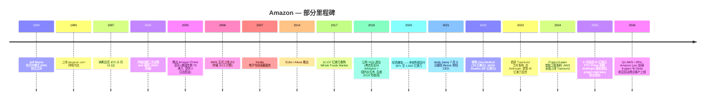

公司历史最好被视为**四次相互重叠的战略转型**:

1. **从书商到"万货商店" (1995–2005)。** Bezos 按品类逐步扩张——音乐 (1998)、DVD/录像带 (1998)、电子产品、玩具、服装——将后勤复杂度转化为小型专业商家无法复制的护城河。到 2000 年, 亚马逊通过激进降本与拥抱第三方卖家 (zShops, 后演变为 Marketplace) 熬过了互联网泡沫——这一二十五年前的决定, 今天每年贡献 1,720 亿美元的佣金与 FBA 费用 ([10-K FY2025, p. 68](https://www.sec.gov/Archives/edgar/data/1018724/000101872426000004/amzn-20251231.htm))。

2. **从零售商到平台: AWS (2002–2010)。** 内部基础设施痛点 ("我们在每个新功能团队上反复解决同样的扩展问题") 推动 Bezos 与 Jassy 将其外化。S3 与 EC2 于 2006 年上线; AWS 在 2015 年 Q1 以 50 亿美元年化运行率作为独立分部对外披露。AWS 已增长至 **2025 财年收入 1,287 亿美元、营业利润 456 亿美元** ([10-K FY2025, p. 68](https://www.sec.gov/Archives/edgar/data/1018724/000101872426000004/amzn-20251231.htm))——也就是说, 仅 AWS 一家以 35% 营业利润率创造的 EBIT, 已超过全球绝大多数上市公司。

3. **从平台到会员制经济 (2005 至今)。** Prime (2005 年 2 月推出, 美国年费 79 美元) 最初是绑定免费快速配送; 如今已捆绑 Prime Video、Music、Photos、Pharmacy、虚拟医疗 (One Medical)、游戏 (Luna)、生鲜配送和无广告流媒体, 采用分层定价 (美国月度 14.99 美元、年度 139 美元)。订阅服务收入——Prime 加上若干小型订阅的代理项——2025 财年达 496.2 亿美元, 同比 +12% ([10-K FY2025, p. 68](https://www.sec.gov/Archives/edgar/data/1018724/000101872426000004/amzn-20251231.htm))。

4. **从零售商/平台到 AI 基础设施供应商 (2023 至今)。** 2021 年 7 月 Bezos 到 Jassy 的权杖交接带来明显的方向重置: Jassy 的前三封股东信均突出生成式 AI (Generative AI)、自研芯片和加速资本开支。Trainium 与 Inferentia 芯片、对 Anthropic 多轮累计 80 亿美元的投资 (2025 年新增 27 亿美元)、Q4 2025 披露 Anthropic 承诺 5 吉瓦 (GW) Trainium 容量, 以及 2026 Q1 公告 OpenAI 承诺"约 2 吉瓦"Trainium ([2026 Q1 公告](https://www.sec.gov/Archives/edgar/data/1018724/000101872426000012/amzn-20260331xex991.htm))——这些举措共同将 AWS 从通用云重新定义为全球三大可信"AI 云"平台之一。

主要并购: Whole Foods Market (2017 年, 137 亿美元——进入生鲜杂货)、Ring (2018 年, 约 10 亿美元)、PillPack (2018 年, 7.53 亿美元——Amazon Pharmacy 的基础)、MGM (2022 年, 85 亿美元——Prime Video 内容)、One Medical (2023 年, 39 亿美元——初级诊所连锁), 以及 iRobot (2024 年 1 月因欧盟反垄断异议终止交易)。

---

## 3. 管理团队

### Andrew R. ("Andy") Jassy——总裁兼 CEO (2021 年 7 月至今); 董事

Jassy 现年 58 岁, 是亚马逊历史上第二任 CEO。他于**1997 年**加入亚马逊, 即在取得哈佛商学院 MBA 学位后立即入职 (他也是哈佛学院校友, 政府学专业, cum laude——曾任《哈佛深红报》(The Harvard Crimson) 广告经理) ([Wikipedia](https://en.wikipedia.org/wiki/Andy_Jassy); [亚马逊 IR——高管与董事](https://ir.aboutamazon.com/officers-and-directors/person-details/default.aspx?ItemId=7601ef7b-4732-44e2-84ef-2cccb54ac11a))。他在亚马逊的首个重要职位是 Bezos 的"影子顾问"——这是亚马逊著名的内部制度, 由精选的高管陪同 CEO 出席所有会议并协助制定议程。2003 年, Jassy 与 Bezos 合著了那份提议亚马逊外部化基础设施的原始"Amazon Web Services"备忘录。他于 2006 年 3 月推出 S3、8 月推出 EC2, 将 AWS 打造为亚马逊增长引擎; 2016 年 4 月升任 AWS CEO; 2021 年 2 月被指定为 Bezos 的继任者。权杖交接于 **2021 年 7 月 5 日**完成。

Jassy 的业绩异常可量化: 在他领导下, AWS 从 2006 年不到 1 亿美元年化运行率, 增长至 **2021 财年 620 亿美元收入**, 营业利润率约 30%——也就是说, 他亲手打造了人类历史上规模前三的软件平台之一。担任亚马逊 CEO 后, 他的主要动作包括: (i) 2022 年末至 2023 年初约 27,000 人裁员——公司史上最大规模——以消化疫情期间的过度招聘; (ii) 对 Anthropic 投资 40 亿美元 (后增至 80 亿美元); (iii) 押注 AWS 自研芯片 (Trainium、Inferentia、Graviton); (iv) 重塑零售业务成本结构——北美营业利润率从 2022 财年的 –0.9% 修复至 **2025 财年的 6.95%** ([10-K FY2025, p. 68](https://www.sec.gov/Archives/edgar/data/1018724/000101872426000004/amzn-20251231.htm))。其披露的 2025 年总薪酬仅为 **210 万美元** (基本工资 36.5 万美元, 170 万美元主要为安保与差旅归属费用)——他上一笔股权激励是在 2021 年 (一笔 10 年期 RSU 授予, 授予时估值超过 2 亿美元), 2022–2025 年未获得新增股权 ([Yahoo Finance——2025 委托声明摘要, 2026-04-10](https://finance.yahoo.com/markets/stocks/articles/amazon-ceo-andy-jassys-pay-173844407.html); [Amazon 2025 委托声明 (DEF 14A)](https://www.sec.gov/Archives/edgar/data/0001018724/000110465925033442/tm252295-1_def14a.htm))。截至 2025 年委托声明日期, 他持有 **2,119,566 股亚马逊股票**——按当前股价约合 5.6 亿美元。

业界普遍认为, Jassy 是 Bezos 最直接的文化继承人: 长篇叙事式的年度股东信、聚焦"以客户为中心的长期思维", 以及对 16 条领导力原则的明确承诺。他任期内最大的悬念在于: 在 AI 资本开支顶峰的同时, 消费业务是否能够穿越关税/衰退周期持续扩张利润率。

### Brian T. Olsavsky——高级副总裁兼 CFO (2015 年 6 月至今)

Olsavsky 现年 62 岁, 担任 CFO 已超过十年——使他成为大盘科技股中任期最长的 CFO 之一。他 2002 年自 MedPartners 加入亚马逊, 此前在运营 (Operations)、全球运营 (Worldwide Operations) 及北美零售分部担任 VP-Finance 职位。他于 2015 年接替 Tom Szkutak 出任 CFO, 此后亚马逊净销售额从 1,070 亿美元 (2015) 大致翻两番至 7,170 亿美元 (2025), 资本开支翻了三倍。Olsavsky 的投资者沟通风格以严谨冷静著称——分析师在季度电话会议上欣赏他对分部利润率、资本开支节奏、AWS 待履行合约 (backlog) 和产能瓶颈的精确表述。根据 2025 委托声明, 他 2024 财年的总薪酬约为 2,600 万美元, 主要来自 RSU 归属。他不是董事。

### Matt Garman——AWS CEO (2024 年 6 月至今)

Garman 现年约 50 岁, 于 2024 年 6 月接替 Adam Selipsky 出任 AWS CEO, 此前他在 AWS 内部已经工作 19 年 (2005 年作为 EC2 第一位产品经理加入)。在升任 AWS CEO 之前, 他负责 AWS 销售、市场及全球服务——也就是说, 升职前他已经是 AWS 内最高级别的商务主管。他肩负的使命异常具体: 让 AWS 的有机增长保持领先 Azure 与 GCP、捕获 AI 工作负载迁移、按计划交付 Trainium/Graviton 芯片路线图。早期成绩单令人满意——AWS 同比增速从 1Q25 的 17% 重新加速至 **1Q26 的 28%** ("近 15 个季度以来最快增速") ([2026 Q1 公告](https://www.sec.gov/Archives/edgar/data/1018724/000101872426000012/amzn-20260331xex991.htm)), 自研芯片业务 (Graviton + Trainium + Nitro) 突破 200 亿美元年化运行率, 同比三位数增长。

### Douglas J. Herrington——全球亚马逊门店 CEO (2022 年 7 月至今)

Herrington 现年 61 岁, 主管消费者零售业务——北美与国际分部下的在线商店、实体门店、3P 卖家服务、广告与订阅业务。他于 2005 年自 Webvan 加入亚马逊, 在被 Jassy 提拔统管全部门店业务前, 主导消费品/自有品牌业务。Herrington 任期与北美零售利润率的剧烈修复同步——北美营业利润从 2022 年 –28.5 亿美元亏损, 反转至 **2025 年 296 亿美元营业利润**——主要驱动力包括区域化的"8 个子网络"履约重新设计、机器人密度提升 (亚马逊现运营 750,000 台以上移动机器人), 以及 Sponsored Products / Prime Video 上的广告负载扩张。

### 治理脚注

- **董事会:** 2025 委托声明披露共 13 位董事, 包括 Bezos (执行董事长)、Jassy (CEO) 和 11 位独立董事。首席独立董事为 **Judith ("Judy") McGrath**。其他董事包括 Daniel Huttenlocher (MIT)、Patricia ("Patty") Stonesifer (前 Gates 基金会)、Brad Smith (微软副董事长)、Indra Nooyi (前百事可乐 CEO) 以及 Edith Cooper (前高盛)。([Amazon 2025 委托声明](https://www.sec.gov/Archives/edgar/data/0001018724/000110465925033442/tm252295-1_def14a.htm))。
- **内部持股:** 委托声明披露, 截至 2025 年 2 月 24 日, Jeff Bezos 持有 **10.23 亿股** (约占普通股 9.6%) ([Variety, 2025-03-05](https://variety.com/2025/digital/news/jeff-bezos-stock-sale-share-ownership-1236385238/))。Bezos 于 2025 年 3 月 4 日设立 Rule 10b5-1 计划, 拟于 2026 年 5 月 29 日前出售最多 2,500 万股——这是一种持续性的变现模式。
- **薪酬结构:** 除 Jassy 外, NEO (Named Executive Officers) 的薪酬严重偏向股权 (Jassy 的 2021 年授予已经一次性为他十年预付)。绩效挂钩股权是主导支付工具。
- **薪酬投票:** 2024 年获 78% 支持——低于大盘科技股中位数 (90%+), 但保持稳定。
- **关联方交易:** 披露的关联交易较少; Bezos 持续使用亚马逊相关服务 (Blue Origin 合同、Project Kuiper / Amazon Leo) 均按公允原则结构化。

**业绩纪录综合判断。** 团队同时执行了一次百年一遇的成本优化 (北美零售) 和 AWS 的 AI 重新定位。最主要的薄弱点是创始人交接风险: Jassy 已经进入第 5 年, 但在每个新方向上 (医疗、卫星、机器人、原创内容) 仍处于建立信誉的阶段。董事会成员构成多元且具公信力, 但零售 CEO 经验偏薄——这反映了亚马逊向"科技基础设施"身份漂移的事实。

---

## 4. 产品与服务

亚马逊不公布 SKU 数量, 但对消费者站点 (amazon.com)、商务站点 (business.amazon.com)、AWS 控制台 (aws.amazon.com) 和 Alexa 设备目录的扫描表明, 该公司有 **200 多条独立品牌的产品/服务线**。我们按报告分部及子业务进行分组。

```mermaid
graph TD
  A[Amazon.com Inc.] --> B[北美分部]
  A --> C[国际分部]
  A --> D[AWS 分部]
  B --> B1[在线商店 1P 零售]
  B --> B2[3P 市场 / FBA]
  B --> B3[实体门店: Whole Foods, Fresh, Go, 4-star, Books]
  B --> B4[广告服务]
  B --> B5[订阅: Prime, Audible, Kindle Unlimited, Music, Luna]
  B --> B6[设备: Echo / Alexa, Fire TV, Kindle, Ring, Blink, eero]
  B --> B7[医疗: Pharmacy, One Medical, Clinic, Health AI]
  B --> B8[物流: Buy with Prime, Multi-Channel Fulfillment]
  C --> C1[本地市场: amazon.co.uk, .de, .jp, .in, .com.br 等]
  C --> C2[Prime Video, Music, 广告支持]
  C --> C3[国际店 1P + 3P, FBA, 设备, 广告]
  D --> D1[计算: EC2, Graviton, Trainium, Inferentia, ECS, EKS, Lambda]
  D --> D2[存储 / 数据库: S3, EBS, Glacier, RDS, DynamoDB, Aurora, Redshift]
  D --> D3[AI/ML: Bedrock, SageMaker, Q, Kiro, AgentCore, Bio Discovery]
  D --> D4[网络: VPC, CloudFront, Route 53, Direct Connect]
  D --> D5[办公生产力: Connect, Quick, WorkSpaces, Chime]
  D --> D6[卫星: Amazon Leo / Project Kuiper]
```

### 4.1 在线商店与第一方 (1P) 零售 (2025 财年 2,693 亿美元, 同比 +9%)

按收入计是最大业务线, 这是亚马逊在消费品、电子产品、服装、家居、图书及数字内容领域的第一方自营零售业务, 以总额口径列示。商品选择目前涵盖全球数亿条 SKU; 2025 财年在 Amazon.com 推出"超过 600 个新值得关注品牌" ([2026 Q1 公告](https://www.sec.gov/Archives/edgar/data/1018724/000101872426000012/amzn-20260331xex991.htm))。**竞争优势: 有——规模 + 物流护城河。** 根据 eMarketer 数据, 亚马逊以约 40% 的美国电商份额领跑 ([eMarketer, 2025](https://www.emarketer.com/content/us-ecommerce-market-shares-2025))。最接近的竞争对手: Walmart.com (约 9% 美国份额); 沃尔玛 GMV 增速因基数小而较高, 但其 1P 零售利润率结构性低于亚马逊。当日达 / 隔夜达——"2026 年度迄今已交付超 10 亿件当日或隔夜商品" ([2026 Q1 公告](https://www.sec.gov/Archives/edgar/data/1018724/000101872426000012/amzn-20260331xex991.htm))——是运营层面的差异化。

### 4.2 第三方卖家服务 (2025 财年 1,722 亿美元, 同比 +10%)

包括佣金以及来自约 200 万活跃卖家的 FBA (Fulfillment-by-Amazon) 费用。FBA 将卖家库存存储于亚马逊履约网络中并按 Prime SLA 发货——卖家支付佣金 (通常为售价的 8–17%) 加 FBA 每件费用。**竞争优势: 有——双边网络效应 + 切换成本。** 一位以亚马逊为中心运营商品目录、广告活动、FBA 库存计划与评价历史的卖家, 无法在不丢失流量的前提下迁移至 Shopify 或 Walmart Marketplace。最接近的竞争对手: Shopify (模式不同——店面软件而非市场, 2025 年 GMV 约 2,920 亿美元, 对比亚马逊 3P GMV 隐含值 5,000 亿美元以上)。Buy with Prime——亚马逊为非亚马逊站外商家提供的结账/物流服务——直接攻击 Shopify 的护城河。

### 4.3 广告服务 (2025 财年 686 亿美元, 同比 +22%)

包括亚马逊搜索结果中的 Sponsored Products 与 Sponsored Brands、通过 Amazon DSP 投放的展示广告、Prime Video 中的视频广告 (2024 年 1 月在美国推出广告分层为默认)、Twitch、IMDb TV, 以及通过 Fire TV 投放的流媒体电视广告。**竞争优势: 有——零售数据护城河。** 亚马逊掌握 Google 与 Meta 都不具备的第一方购买意图数据。广告 TAM 份额: 亚马逊是美国第三大数字广告卖家, 落后于 Google 和 Meta——三巨头在 2025 年占据约 72% 的美国数字广告支出, 亚马逊全球广告规模约 690 亿美元 ([Marketing Charts, 2025](https://www.marketingcharts.com/charts/us-digital-ad-spend-share-google-vs-meta-vs-amazon))。最接近的竞争对手: Google 搜索广告、Meta 广告、Walmart Connect、Microsoft Advertising / 零售媒体。随着 Prime Video 与库存扩张拓宽触达, 增长在加速而非减速。

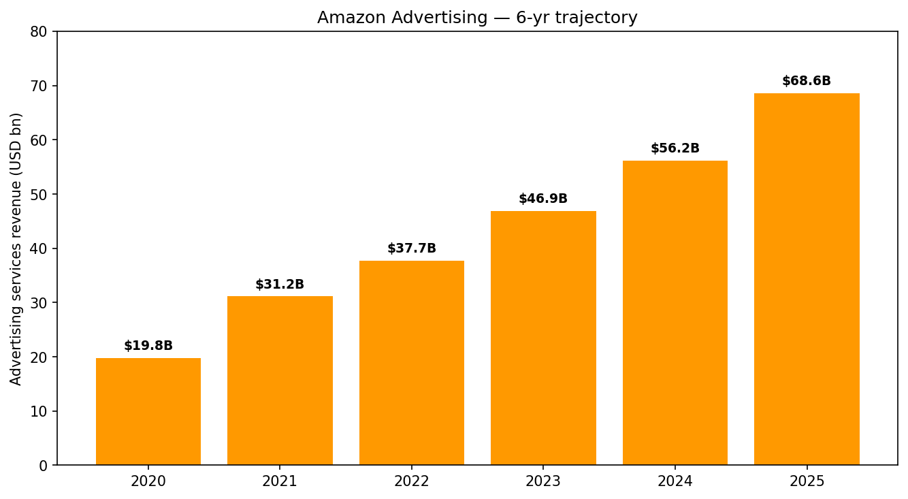
来源: [Amazon 10-Ks, FY2020–FY2025, "净销售额按相似产品/服务组"](https://www.sec.gov/Archives/edgar/data/1018724/000101872426000004/amzn-20251231.htm)。

### 4.4 订阅服务 (2025 财年 496 亿美元, 同比 +12%)

Prime 是核心组件。捆绑权益: 免费快速配送; Prime Video (含广告分层及无广告升级); Prime Music; Prime Reading; Twitch turbo; Prime Gaming; Whole Foods 折扣权益; 通过 Amazon Health AI 每年最多 5 次免费虚拟医疗咨询 ([2026 Q1 公告](https://www.sec.gov/Archives/edgar/data/1018724/000101872426000012/amzn-20260331xex991.htm)); Amazon Pharmacy 优惠权益。亚马逊未公开披露 Prime 会员数, 但多个第三方估测在 2025 年末全球会员约 2.3 亿 (其中美国约 1.8 亿)。**竞争优势: 有——捆绑 + 切换成本。** 最接近的竞争对手: Walmart+ (约 2,500 万美国订阅, 捆绑包较小)、Costco 会员 (约 7,500 万会员家庭, 仅限零售)。FTC 2025 年 9 月和解现在限制了过往用于提升留存率的"暗黑模式"开通/取消流程——见第 9 节。

### 4.5 AWS (2025 财年 1,287 亿美元, 同比 +20%; 1Q26 376 亿美元, 同比 +28%)

全球最大的云平台, 2025 年 Q4 全球市场份额约 **28%** ([Synergy Research Group](https://www.srgresearch.com/articles/cloud-market-share-trends-big-three-together-hold-63-while-oracle-and-the-neoclouds-inch-higher))。投资逻辑中最重要的三大产品组合:

1. **计算与自研芯片**——EC2 涵盖通用型、加速型、HPC; Graviton (AWS 的 ARM 架构 CPU, 当前为 Graviton4); Trainium (AWS 训练加速器, Trainium2 已 GA, Trainium3 正在爬坡); Inferentia (推理)。该自研芯片业务在 2026 Q1 突破**200 亿美元年化运行率**, "同比三位数增长" ([2026 Q1 公告](https://www.sec.gov/Archives/edgar/data/1018724/000101872426000012/amzn-20260331xex991.htm))。从战略上看, 自研芯片是亚马逊对冲 NVIDIA 依赖的工具, 也是利润率撬杆 (AWS 通过在训练场景混入 Trainium、通用计算场景混入 Graviton, 从而在每一美元 NVIDIA 分配上获得更多算力)。

2. **AI 平台——Bedrock、SageMaker、Q、Kiro、AgentCore。** Bedrock 是多模型 API 服务 (Claude Opus 4.7、OpenAI GPT-5.4 在 Bedrock 限量预览, 加上亚马逊自家的 Titan 与 Nova 模型)。"Bedrock 第一季度处理的 token 数量超过此前所有年份总和, 客户支出环比增长 170%" ([2026 Q1 公告](https://www.sec.gov/Archives/edgar/data/1018724/000101872426000012/amzn-20260331xex991.htm))。Bedrock AgentCore——代理运行时——在 2026 年加入了注册中心、托管脚手架、评估与策略管控。Kiro (agentic coding) 开发者数量环比翻倍以上。

3. **AI 合作伙伴。** 2026 Q1 披露两项震撼承诺: (a) **OpenAI 承诺自 2027 年起通过 AWS 消耗约 2 GW 的 Trainium 容量**; (b) **Anthropic 锁定多达 5 GW 的当前及未来 Trainium**。再叠加 Meta 的"数千万 Graviton 核心"以及过去 12 个月 210 万颗以上 AI 芯片落地 (其中半数以上为 Trainium), AWS 是全球唯一一家在自研芯片上达到超大规模 (hyperscaler) 部署、同时与前四大基础模型开发商中的三家建立深度合作的云。最接近的竞争对手: 微软 Azure (其 OpenAI 既是合作伙伴, 历史上也是主要基础设施客户——OpenAI–亚马逊 Trainium 协议已部分打破这一格局); Google Cloud (TPU、自研 Gemini, 全球第三大超大规模云, 份额约 14%)。

### 4.6 实体门店 (2025 财年 226 亿美元, 同比 +6%)

2025 财年末北美共有 615 家门店 ([10-K FY2025, p. 18](https://www.sec.gov/Archives/edgar/data/1018724/000101872426000004/amzn-20251231.htm)), 几乎全部为 Whole Foods Market 和 Amazon Fresh; Amazon Go 便利店概念以及 Amazon Books / 4-star 概念基本已关闭。**竞争优势: 部分有。** Whole Foods 是高端生鲜的强势品牌; Amazon Fresh 相对 Kroger、沃尔玛、Costco、Trader Joe's 仍未找到清晰差异化定位。

### 4.7 设备

Echo 智能音箱 (Alexa); Fire TV (美国第一大互联电视操作系统); Kindle; Ring (摄像头、门铃); Blink (低价摄像头); eero (Mesh Wi-Fi); Astro (家用机器人——有限发售)。**竞争优势: 部分有。** 在智能音箱 (Alexa) 与低端 CTV 领域强势; 在旗舰智能手机 / 平板领域相对 Apple/Samsung 偏弱。

### 4.8 Amazon Leo (前身 Project Kuiper)

低地球轨道 (Low-Earth-Orbit, LEO) 宽带星座——SpaceX Starlink 的直接竞争对手。2026 Q1 披露 Delta 航空作为签约客户, 此前披露还包括 O2 Telefónica、NTT DOCOMO、Telenor 及类沃达丰 (Vodafone) 风格的合作伙伴。管理层指引"2026 年 Amazon Leo 扩张将使同比成本增加约 10 亿美元" ([10-K FY2025, p. 30](https://www.sec.gov/Archives/edgar/data/1018724/000101872426000004/amzn-20251231.htm))。对 2026 财年北美营业利润形成实质性拖累。

### 4.9 医疗

Amazon Pharmacy (基于 2018 年收购 PillPack 构建); One Medical (初级诊所, 2023 年收购); Amazon Clinic (虚拟医疗市场); Amazon Health AI (2026 Q1 上线——每年 5 次免费虚拟咨询嵌入 Prime)。Amazon Pharmacy 计划在 2026 年末将当日达配送扩展至约 4,500 个美国城市 ([2026 Q1 公告](https://www.sec.gov/Archives/edgar/data/1018724/000101872426000012/amzn-20260331xex991.htm))。**竞争优势: 部分有——尚处于初期。** 最接近的竞争对手: Mark Cuban Cost-Plus Drug Company、CVS Health、Walgreens-Cigna。

### 旗舰业务 vs 长尾业务

驱动合并报表投资逻辑的 1–3 项产品是: **AWS** (营业利润 456 亿美元, 占合并 EBIT 57%——对股价最重要的分部); **广告服务** (TTM 约 700 亿美元收入, 增量利润率高——价值第二高的业务线); **Prime / 订阅** (496 亿美元收入加上对 1P + 3P 留存的光环效应)。在线商店是最大收入线但利润率最低。长尾押注 (Amazon Leo、医疗、Echo 以外的设备、机器人商业化、Hail Mary 式原创内容) 代表选择权, 但会消耗资本开支。

---

## 5. 客户与上市策略

亚马逊服务两类客户:

1. **消费者和小企业**——全球数亿规模, 无单一客户占公司收入 1% 以上; 约 2.3 亿 Prime 会员; 超过 200 万活跃第三方卖家。客户获取: 搜索引擎收录、Prime 会员留存、应用/设备装机量 (Echo、Fire TV、Kindle)、战略合作 (快闪零售、品牌联名), 以及日益增多的电视/流媒体品牌广告投放。

2. **企业客户**——AWS、Amazon Advertising DSP、Amazon Business (B2B 采购)、Amazon Logistics。AWS 公布"数百万活跃客户", 名义客户包括美国联邦政府、美国陆军 (2026 Q1 公告)、Bloomberg、Fox Corporation、Southwest 航空、AT&T、U.S. Bank、DTCC、Nokia、NTT DOCOMO、O2 Telefónica、Telenor、Uber、Meta、Pfizer、Capital One、BMW 以及 Mercedes ([2026 Q1 公告](https://www.sec.gov/Archives/edgar/data/1018724/000101872426000012/amzn-20260331xex991.htm))。

### 客户集中度

亚马逊 10-K **未披露任何单一客户在 FY2023、FY2024 或 FY2025 占合并收入 10% 以上**。公司收入基础是标普 500 中最分散的之一——按地理 (美国 68%、德国 6.4%、英国 6.0%、日本 4.3%、其他 15%)、按分部 (北美 59%、国际 23%、AWS 18%)、按业务线 (最大是在线商店占总额 37.6%)。客户层面: 即使是 AWS 最大客户 (Anthropic、Meta, 推测 Netflix 和数家美国联邦机构) 也可能各自仅占 AWS 收入的低个位数百分比, 而 AWS 本身仅占合并收入的 18%。因此, 合并报表的单一最大客户应明显低于 5%, 前五客户合计可能不到 15%——**合并层面无重大客户集中风险**, 这在典型大盘科技股中是异常干净的画像。

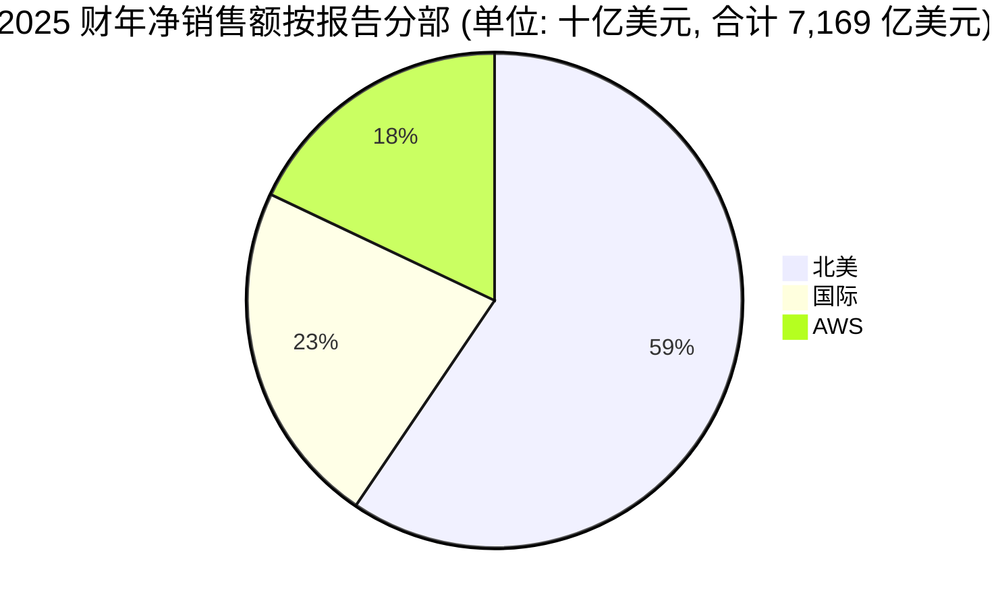

话虽如此, **AWS 内部对几个具名 AI 协议存在增长集中度**——已公布的 5 GW Anthropic Trainium 承诺与约 2 GW OpenAI Trainium 承诺, 即便以远期合约定价/结构, 也意味着 AWS 将向两个对手方承诺超过 7 GW 的专用 AI 容量。如其中任何一方退出或重新议价, AWS 将必须在相似时间维度内寻找替代需求。

### 上市策略

- **消费者零售:** Amazon.com 与移动应用; Prime 是核心留存引擎; 当日 / 隔夜配送 + Subscribe & Save 锁定复购。
- **AWS:** 现场销售 (AWS 销售); 解决方案架构师; AWS 合作伙伴网络 (约 100,000 个合作伙伴); AWS Marketplace; AWS Activate (面向初创); AWS re:Invent 年度大会。
- **广告:** 面向 SMB 广告主的自助控制台; 面向企业的 Amazon Ads 销售团队; 代理商 (WPP、Publicis、Omnicom); 2025 年宣布的 **Amazon-WPP "Open Intelligence" 合作**将代理商渠道制度化。
- **Amazon Business:** 直销 + 市场; 超过 500 万家商业客户; 运行率超过 500 亿美元 (最近一次披露见 2023 年 re:Invent)。

### 合同结构

AWS 合同通常是按需付费 (默认) 加 **Compute Savings Plans / 预留实例** (1 年期与 3 年期承诺), 大客户使用 **Enterprise Discount Programs (EDP)** 对承诺支出进行折扣。10-K 报告显示, 截至 2025 年 12 月 31 日, **剩余履约义务 (Remaining Performance Obligations, RPO) 达 3,377 亿美元** ([10-K FY2025, p. 56, Note 7](https://www.sec.gov/Archives/edgar/data/1018724/000101872426000004/amzn-20251231.htm))——相当于将近 3 年的 AWS 收入已锁定承诺——这是一个对 AI 资本开支具有实质性去风险作用的结构性可见度资产。

---

## 6. 行业概览

亚马逊同时跨多个巨型行业经营。以下逐一估算各行业规模。

### 6.1 全球电子商务

全球零售电商规模在 2025 年预计**约 7 万亿美元**, 每年高个位数增速将在 2027 年达到约 8 万亿美元 (eMarketer/Insider Intelligence)。美国电商市场约 1.2 万亿美元, 占美国零售总额约 16%。渗透率持续上升, 生鲜与药品仍是最大未渗透垂直领域。**结构:** 美国市场头部高度集中 (亚马逊约 40% 份额; Walmart.com 约 9%; Apple 约 3%; 含 Shopify 驱动店面的长尾合计约 48%) ([eMarketer, 2025](https://www.emarketer.com/content/us-ecommerce-market-shares-2025); [Statista, 2025](https://www.statista.com/statistics/274255/market-share-of-the-leading-retailers-in-us-e-commerce/))。全球更加碎片化——阿里巴巴/京东/拼多多主导中国; MercadoLibre 主导拉美; Coupang 主导韩国; Flipkart/Meesho 主导印度。

### 6.2 云基础设施 (IaaS + PaaS)

Synergy Research 估计**全球云基础设施服务市场 2025 年达 4,190 亿美元**, 2025 Q4 达 1,190 亿美元, 因 AI 顺风同比增长约 30%——"这样的增速自 2022 年初以来未曾出现, 而当时市场规模还不到现在的一半" ([Synergy Research, 2026-02](https://www.srgresearch.com/articles/cloud-market-share-trends-big-three-together-hold-63-while-oracle-and-the-neoclouds-inch-higher))。前三 (AWS、Azure、GCP) 合计占 63%; AWS 单家占**约 28%**。增长驱动: 生成式 AI 训练与推理 (近十年新增的单一最大工作负载类别)、agentic AI、代码助手 (Kiro、GitHub Copilot)、企业数据平台现代化, 以及持续的本地→云迁移。规模化的替代选项有限: 超大规模云在资本成本与资本开支灵活性上具备本地部署无法匹敌的结构性优势。

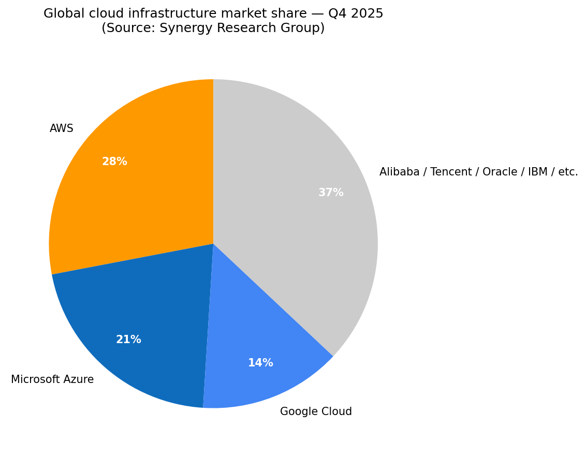
来源: [Synergy Research Group, "Cloud Market Share Trends," 2026-02](https://www.srgresearch.com/articles/cloud-market-share-trends-big-three-together-hold-63-while-oracle-and-the-neoclouds-inch-higher)。

### 6.3 数字广告

美国数字广告市场 2025 年约 3,700 亿美元; 全球约 7,350 亿美元。三巨头——Google (全球净广告收入 2,140 亿美元)、Meta (1,960 亿美元)、亚马逊 (690 亿美元)——控制份额持续上升, 占**美国数字广告支出约 72%** ([Marketing Charts, 2025](https://www.marketingcharts.com/charts/us-digital-ad-spend-share-google-vs-meta-vs-amazon))。零售媒体 (Retail Media) 是增长最快的细分领域 (亚马逊的主场), 其驱动力来自零售商第一方购买数据、跨站 Cookie 的废弃, 以及 CTV (互联电视) 广告库存的崛起 (Prime Video 广告分层 2024 年上线)。

### 6.4 订阅流媒体 / 视频

全球 SVoD/AVoD (订阅/广告流媒体) 2025 年达约 1,700 亿美元 (Ampere Analysis)。Netflix (约 3 亿订阅)、Disney+、Amazon Prime Video、Max、Paramount+、Apple TV+、YouTube。Prime Video 是全球三到四大顶级服务之一, 既通过 Prime 捆绑变现, 也通过广告变现 (广告支持分层于 2024 年成为默认)。

### 6.5 智能音箱 / 消费电子设备、LEO 卫星宽带、医疗服务

每一个相邻行业——智能音箱 (亚马逊通过 Alexa 主导美国)、LEO 卫星宽带 (Starlink 主导, Amazon Leo 爬坡中)、药品 + 虚拟医疗 (Amazon Pharmacy + One Medical + Health AI)——单独 TAM 都足够大 (100–1,000 亿美元) 以构成边际影响。

### 6.6 监管

亚马逊面临异常宽泛的监管边界: 美国 FTC (2025 年 9 月的 25 亿美元 Prime 和解, 加上 2023 年提起的反垄断专卖案, 指控其在 Marketplace 与 Prime 上的反竞争行为); 欧盟数字市场法案 (Digital Markets Act, DMA, 亚马逊 2023 年被指定为"看门人 (gatekeeper)"并持续承担合规义务); 美国各州总检察长反垄断诉讼; 英国 CMA 云服务市场调查; 意大利 / 德国 / 法国税务争议——见 Q4 2025 的 **11 亿美元意大利门店税务争议费用** ([10-K FY2025, p. 41](https://www.sec.gov/Archives/edgar/data/1018724/000101872426000004/amzn-20251231.htm))。10-K 将"反垄断、隐私、数据使用、数据保护、数据安全、数据本地化、网络安全、消费者保护、商业争议、我们和第三方提供的商品和服务 (包括人工智能技术和服务)、医疗以及其他事项"列为重大诉讼范畴 ([10-K FY2025, p. 15](https://www.sec.gov/Archives/edgar/data/1018724/000101872426000004/amzn-20251231.htm))。

---

## 7. 竞争格局

亚马逊是真正意义上的多垂直综合集团; 不存在单一的"亚马逊竞争对手"。我们按分部讨论竞争格局。

### 7.1 云——AWS vs Microsoft Azure vs Google Cloud vs Oracle / 阿里 / Neoclouds (CoreWeave, Lambda, Crusoe)

AWS 已占据云市场份额第一长达 15 年以上, 但 2024 年前增速一直落后于 Azure 与 GCP——Synergy 报告显示, 2025 Q4 微软与 Google "增长率更高", 份额分别为 21% 与 14% ([Synergy Research, 2026-02](https://www.srgresearch.com/articles/cloud-market-share-trends-big-three-together-hold-63-while-oracle-and-the-neoclouds-inch-higher))。**2026 Q1 AWS 同比 28% 重新加速**缩小了增速差距。差异化因素: AWS 拥有最广的服务目录 (200+ 项服务)、最强的自研芯片路线图 (Graviton 4 / Trainium 3) 以及最深的合作伙伴生态; Azure 与 Microsoft 365 紧密集成, 历史上与 OpenAI 独家合作 (因 OpenAI/Trainium 协议部分削弱); GCP 拥有 Gemini 与 TPU, 在 AI/数据平台口碑强势。Neoclouds (CoreWeave、Lambda、Crusoe、Nebius) 提供更便宜的原始 NVIDIA 容量, 但缺乏平台广度。

### 7.2 电商——亚马逊 vs 沃尔玛 vs Costco vs Shopify vs Temu / 拼多多 / Shein

- **Walmart.com** 约 9% 美国电商份额, GMV 同比低 20% 区间增长。Walmart Marketplace、Walmart+ (年费 98 美元) 和 Walmart Connect (零售媒体广告) 是对 Marketplace、Prime 和 Amazon Ads 的直接攻击。
- **Costco**——2,500 亿美元以上收入, 付费会员仓库式模式。Costco.com 规模较小, 但其品牌是最接近 Prime 的对照。
- **Shopify**——通过商家工具占美国 GMV 约 10% (2025 年 GMV 约 2,920 亿美元)。Buy with Prime 是亚马逊的侧翼攻击。
- **Temu / 拼多多 / Shein**——中国背景的折扣市场; Temu 2024 年 GMV 达到约 500 亿美元, 依靠激进广告 + 工厂直发定价。美国 2025 年 de-minimis (小额免税) 关税变化削弱了其利润模型, 但仍是亚马逊低价段的结构性竞争对手。
- **细分龙头:** Best Buy (电子产品)、Wayfair (家居)、Chewy (宠物)、eBay (二手/小众)、Etsy (手工)、MercadoLibre (拉美)、Coupang (韩国)、Flipkart (印度)。

### 7.3 数字广告——亚马逊 vs Google vs Meta vs Walmart Connect vs Microsoft / TikTok

亚马逊结构上小于 Google 与 Meta, 但在 2024–25 年是三巨头中**增长最快的成员**, 拥有独特的购买意图数据 + Prime Video CTV 库存。Walmart Connect 是零售媒体最接近的对照; 体量较小但凭借沃尔玛第一方数据快速增长。

### 7.4 订阅视频——Amazon Prime Video vs Netflix、Disney+、Max、Apple TV+、YouTube

Prime Video 拥有独特身份: 对 Prime 会员免费, 同时通过广告与订阅升级双向变现。Netflix 单体规模仍更大 (>3 亿订阅, 广告分层爬坡中); Disney+/Hulu/ESPN 与华纳兄弟探索的 Max 在直播体育与 IP 库分类上更强。

### 7.5 物流

Amazon Logistics 现已成为美国最大的包裹承运商之一——年处理 60 亿件以上包裹——与 UPS、FedEx 和 USPS 竞争。Buy with Prime 将履约延伸至 Amazon.com 之外的商家。

### 7.6 医疗

Amazon Pharmacy + One Medical + Amazon Clinic + Amazon Health AI。竞争对手: CVS / Aetna、Walgreens、Mark Cuban Cost-Plus Drug Co.、Hims & Hers、Teladoc。

### 7.7 LEO 卫星宽带

SpaceX Starlink 以约 600 万订阅 + 数百万活跃用户主导市场。Amazon Leo、Eutelsat OneWeb 与 (规模较小的) Telesat Lightspeed 为挑战者。

### 竞争优势综合

亚马逊三大持久护城河: (1) **零售物流规模**——履约密度、约 75 万台机器人编队、Prime 当日 SLA, 以及竞争对手需要十年与 1,000 亿美元以上才能复制的资本密集度; (2) **AWS 服务广度与自研芯片**——200+ 项服务、Graviton/Trainium 对冲 NVIDIA 成本曲线、3,377 亿美元合约 backlog ([10-K FY2025, p. 56](https://www.sec.gov/Archives/edgar/data/1018724/000101872426000004/amzn-20251231.htm)); (3) **零售 + 广告 + Prime + AWS 跨业务数据飞轮**——第一方购买数据进入广告、广告收入助推零售更低价格、Prime 锁定留存、AWS 托管数据——MSFT/GOOG/META/WMT 中任何单一公司都无法同时具备这四块拼图。脆弱点: AWS 增长向少数大型 AI 合作伙伴集中; FTC 同意令对 Prime 开通摩擦的拖累; 零售分部对关税/贸易政策的宏观敞口; 以及资本开支顶点风险 (2025 财年 1,320 亿美元资本开支, 对应 TTM 自由现金流覆盖不到 1 倍)。

---

## 8. 市场机会 (TAM)

汇总亚马逊已服务的市场:

| TAM 类别 | 2025 规模 | 2030E 规模 | CAGR | 亚马逊当前份额 |
|---|---|---|---|---|
| 全球零售电商 | 约 7 万亿美元 | 约 10 万亿美元 | 约 7% | 约 5,250 亿美元 GMV (1P + 3P, 约 7.5%) |
| 全球云基础设施 | 约 4,200 亿美元 | 约 1.0 万亿美元 | 约 19% | 约 28% (第 1) |
| 全球数字广告 | 约 7,350 亿美元 | 约 1.2 万亿美元 | 约 10% | 约 9% (第 3) |
| 全球订阅视频 | 约 1,700 亿美元 | 约 2,600 亿美元 | 约 9% | 前 4 |
| 全球企业 SaaS / 智能体 | 约 3,000 亿美元 | 约 7,000 亿美元+ | 约 18% | 通过 AWS 合作伙伴间接 |
| 美国零售生鲜 (Whole Foods + Fresh + Pharmacy) | 约 1.6 万亿美元 | 约 2.0 万亿美元 | 约 5% | 约 1.5% |
| LEO 卫星宽带 | 约 80 亿美元 | 约 600 亿美元+ | 约 50% | 尚未产生收入 (爬坡中) |
| 医疗服务 / 药品 | 约 6,000 亿美元 | 约 8,000 亿美元 | 约 6% | <0.5% |

**TAM 合计:** 2025 年约 9.8 万亿美元 → 2030 年约 14 万亿美元。亚马逊 2025 财年 7,170 亿美元收入相当于 TAM 的约 7.3%——而在三大最高利润业务 (云、广告、订阅) 上, 亚马逊**正在持续抢占份额, 而非流失**。最具非对称上行机会:

- 云市场内的 **AI 工作负载迁移**。如果 30%+ 的全球企业 AI 训练落到 AWS Trainium / Bedrock 上 (OpenAI 2 GW + Anthropic 5 GW 承诺暗示这一情景可信), AWS 收入 CAGR 可在 2028 年前维持 25% 以上, 将合并报表收入增长拉至高十几。
- **广告组合向零售媒体迁移**, 因为 Cookie 弃用渠道 (Google 搜索、Meta) 将份额让给富第一方数据的平台。亚马逊广告 2025 财年同比 22%——相比 Google 搜索广告约 14%、Meta 约 22%——支持"Amazon Ads 在 2028 年翻倍至 1,300 亿美元以上"路径。
- **国际零售**: 此前亚马逊国际分部多年结构性亏损 (2022 年 -80 亿美元营业利润) 已在 2025 财年转正至 2.9% 营业利润率, 但仍远低于北美的 6.95%——收敛路径意味着 50–100 亿美元的国际营业利润增量空间。
- **邻接业务** (Leo、医疗、机器人商业化): 合计 500–1,000 亿美元 TAM, 目前几乎零收入但消耗大量资本开支。

---

## 9. 风险评估

### 公司特定风险

1. **FTC / 反垄断阴影。** 2025 年 9 月 25 亿美元 Prime 和解同意令限制开通 / 取消 UX 调整, 并实施监管 ([FTC, 2025-09-25](https://www.ftc.gov/news-events/news/press-releases/2025/09/ftc-secures-historic-25-billion-settlement-against-amazon))。**2023 年 9 月提起的更大规模的 FTC v. Amazon 反垄断案**, 指控 Marketplace 专卖与"反折扣"行为, 仍处于积极诉讼阶段; 不利判决可能强制 Marketplace 与 1P 零售结构性分离。欧盟 DMA 看门人义务形成平行约束。
2. **创始人交接与管理层深度。** Jassy 已担任 CEO 第 5 年; Bezos 仍为执行董事长, 但持续兑现持股 (Rule 10b5-1 计划至 2026 年 5 月前出售最多 2,500 万股)。AWS 的 Garman 是新任; 消费业务自 2021 年以来已经历三位 CEO (Wilke → Olsavsky 代任 → Herrington)。在 2026–2028 任一岗位上选错人, 都可能让三大分部之一失序。
3. **AWS 增长集中于具名 AI 合作伙伴。** 已披露的 5 GW Anthropic 承诺和约 2 GW OpenAI Trainium 承诺, 对一项 1,280 亿美元的业务而言异常集中。若任何一方重新议价容量、转向竞品或未能商业化, AWS 将不得不在多年资本开支曲线下回填需求。
4. **资本开支顶点 / 自由现金流压缩。** 2025 财年总资本开支 **1,318 亿美元** (+59%) 将 TTM FCF 压到 **12 亿美元** (上年同期 259 亿美元) ([2026 Q1 公告](https://www.sec.gov/Archives/edgar/data/1018724/000101872426000012/amzn-20260331xex991.htm))。市场隐含假设 AI 需求将吸收这部分容量; 一旦出现 12 个月的需求空窗 (例如超大规模云厂商集体放缓 AI 资本开支), 亚马逊将暴露于未充分利用的基础设施和更高的折旧。
5. **遣散与人员调整。** 2025 财年 27 亿美元遣散费——Q3 18 亿美元, Q4 7.3 亿美元——以及"持续到 2026 年的岗位调整计划", 可能扰乱文化与执行 ([10-K FY2025, p. 41](https://www.sec.gov/Archives/edgar/data/1018724/000101872426000004/amzn-20251231.htm))。
6. **Project Hail Mary / 原创内容利润拖累。** 亚马逊每年约 150 亿美元投入 Prime Video 原创 + MGM 片库 + 直播体育 (Thursday Night Football, 2025 年起 NBA)。相对 Netflix 的每美元产出, 这部分内容投资回报较为温和。

### 行业 / 市场风险

7. **云市场商品化 / 价格压力。** 随着 Azure、GCP 和 Neoclouds (CoreWeave、Lambda) 不断扩建 NVIDIA-rich 容量, AWS 在原始算力上面临增量价格压力。自研芯片是部分对冲, 但本身仍是高资本投入。
8. **广告市场周期性。** 2026–27 年广告支出下行将压低亚马逊增量利润率最高的业务线, 即使零售媒体结构性份额增长不变。
9. **跨境零售关税 / 贸易政策。** 3P GMV 中相当一部分来自中国; 关税升级或 de-minimis 规则变化将抬升 Marketplace 商品成本。
10. **消费者支出敏感性。** 订阅与 3P 服务收入与可选消费相关性高; 美国衰退将压低零售 GMV。

### 财务风险

11. **Anthropic 公允价值波动。** 2025 年 152 亿美元 Anthropic 优先股重估——以及更大范围的 77 亿美元未上市公司估值上调——通过 GAAP 净利润反映, 但属非现金且若 Anthropic 后续轮次估值回撤将反向冲销 ([10-K FY2025, p. 50, Note 8](https://www.sec.gov/Archives/edgar/data/1018724/000101872426000004/amzn-20251231.htm))。
12. **有效税率正常化。** 2025 财年 ETR 为 19.6% (2024 年为 13.5%), 10-K 提示 2025 年税法对"2026 年现金税赋将有类似影响"——即现金税赋红利可能收窄。

### 宏观风险

13. **汇率。** 强势美元会压低国际分部报告销售额 (2026 Q1 的 29 亿美元汇率顺风是一个季度的红利; 2026 年后期的对比可能反向)。
14. **利率与 WACC。** 2026 Q1 末长期债务 1,190 亿美元 ([10-Q 1Q26](https://www.sec.gov/Archives/edgar/data/1018724/000101872426000014/amzn-20260331.htm)), 多年期资本开支计划部分通过债务融资 (2025 年新发 250 亿美元长期债务) ([10-K FY2025, p. 32](https://www.sec.gov/Archives/edgar/data/1018724/000101872426000004/amzn-20251231.htm)), 长端利率上行 100–200 个基点将明显抬高 WACC, 折现 AI 资本开支的 IRR 曲线。
15. **地缘政治 / 制裁。** AWS 在俄罗斯 / 中国的敞口有限, 但更广泛的零售与云业务对美中贸易政策冲击存在敞口。

---

## 10. 参考资料

### 主要披露文件

- [Amazon.com, Inc. — 截至 2025 年 12 月 31 日财年的 Form 10-K (2026-02-05 提交)](https://www.sec.gov/Archives/edgar/data/1018724/000101872426000004/amzn-20251231.htm)。
- [Amazon.com, Inc. — 截至 2026 年 3 月 31 日季度的 Form 10-Q (2026-04-29 提交)](https://www.sec.gov/Archives/edgar/data/1018724/000101872426000014/amzn-20260331.htm)。
- [Amazon.com, Inc. — 2026 Q1 业绩公告 (8-K 附件 99.1, 2026-04-29)](https://www.sec.gov/Archives/edgar/data/1018724/000101872426000012/amzn-20260331xex991.htm)。
- [Amazon.com, Inc. — 2025 委托声明 (DEF 14A, 2025-04-10 提交)](https://www.sec.gov/Archives/edgar/data/0001018724/000110465925033442/tm252295-1_def14a.htm)。
- Amazon.com, Inc. — 2023 与 2024 财年 10-K (用于历史数据), 可在 [SEC EDGAR — AMZN 申报索引](https://www.sec.gov/cgi-bin/browse-edgar?action=getcompany&CIK=0001018724&type=10-K) 检索。

### 政府 / 监管

- [FTC — "FTC Secures Historic $2.5 Billion Settlement Against Amazon," 2025-09-25](https://www.ftc.gov/news-events/news/press-releases/2025/09/ftc-secures-historic-25-billion-settlement-against-amazon)。
- [Regulatory Oversight — "Amazon Settles FTC Lawsuit Highlighting Regulatory Scrutiny of Subscription Practices," 2025-10](https://www.regulatoryoversight.com/2025/10/amazon-settles-ftc-lawsuit-highlighting-regulatory-scrutiny-of-subscription-practices/)。

### 行业研究

- [Synergy Research Group — "Cloud Market Share Trends: Big Three Together Hold 63%," 2026-02](https://www.srgresearch.com/articles/cloud-market-share-trends-big-three-together-hold-63-while-oracle-and-the-neoclouds-inch-higher)。
- [eMarketer — "US Ecommerce Market Shares 2025"](https://www.emarketer.com/content/us-ecommerce-market-shares-2025)。
- [Statista — "Largest online retailers in the U.S. 2025"](https://www.statista.com/statistics/274255/market-share-of-the-leading-retailers-in-us-e-commerce/)。
- [Marketing Charts — "US Digital Ad Spend Share: Google vs. Meta vs. Amazon"](https://www.marketingcharts.com/charts/us-digital-ad-spend-share-google-vs-meta-vs-amazon)。

### 市场数据

- [Yahoo Finance — AMZN 关键统计, 2026-05-20](https://finance.yahoo.com/quote/AMZN/key-statistics/) (以及 MSFT、GOOG、META、AAPL、WMT 的实时 yfinance 拉取)。

### 媒体 / 二次资料

- [Yahoo Finance — "Amazon CEO Andy Jassy's pay rose to $2.1 million in 2025," 2026-04-10](https://finance.yahoo.com/markets/stocks/articles/amazon-ceo-andy-jassys-pay-173844407.html)。
- [Variety — "Jeff Bezos Files to Sell $4.8 Billion Worth of Amazon Stock," 2025-03-05](https://variety.com/2025/digital/news/jeff-bezos-stock-sale-share-ownership-1236385238/)。
- [Wikipedia — Andy Jassy 个人传记词条](https://en.wikipedia.org/wiki/Andy_Jassy)。
- [Amazon Investor Relations — 高管与董事: Andrew R. Jassy](https://ir.aboutamazon.com/officers-and-directors/person-details/default.aspx?ItemId=7601ef7b-4732-44e2-84ef-2cccb54ac11a)。
- [NPR — "Amazon to pay $2.5 billion to settle U.S. lawsuit," 2025-09-25](https://www.npr.org/2025/09/25/nx-s1-5551026/amazon-prime-lawsuit-ftc-settlement)。
- [Marketplace Pulse — "Amazon and Shopify Are Now Half of U.S. E-Commerce"](https://www.marketplacepulse.com/articles/amazon-and-shopify-are-now-half-of-us-e-commerce)。

---

## 附录——分部与财务摘要

### 分部净销售额与营业利润 (单位: 百万美元, FY2023 / 2024 / 2025)

| 分部 | 2023 销售 | 2024 销售 | 2025 销售 | 2023 营业利润 | 2024 营业利润 | 2025 营业利润 |
|---|---:|---:|---:|---:|---:|---:|
| 北美 | 352,828 | 387,497 | 426,305 | 14,877 | 24,967 | 29,619 |
| 国际 | 131,200 | 142,906 | 161,894 | (2,656) | 3,792 | 4,750 |
| AWS | 90,757 | 107,556 | 128,725 | 24,631 | 39,834 | 45,606 |
| **合并** | **574,785** | **637,959** | **716,924** | **36,852** | **68,593** | **79,975** |

来源: [Amazon 10-K FY2025, Note 10 — Segment Information, p. 68](https://www.sec.gov/Archives/edgar/data/1018724/000101872426000004/amzn-20251231.htm)。

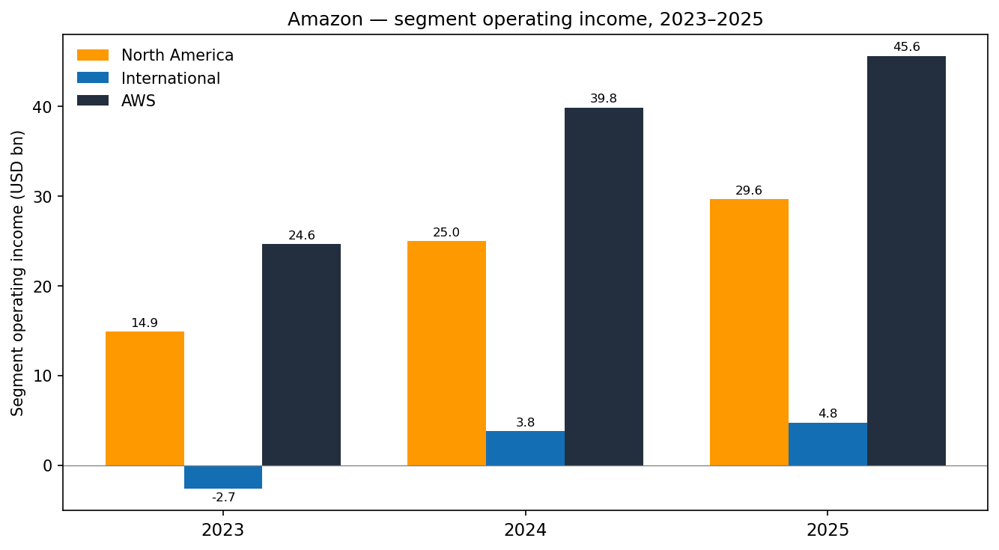

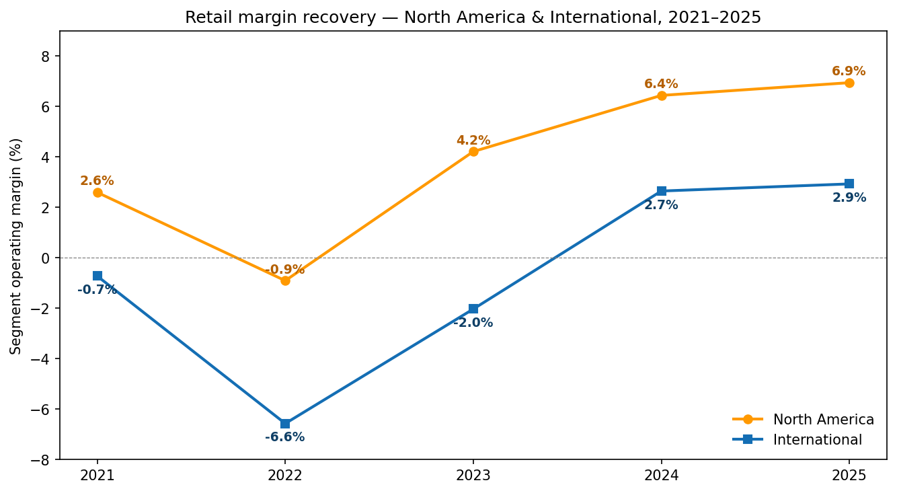

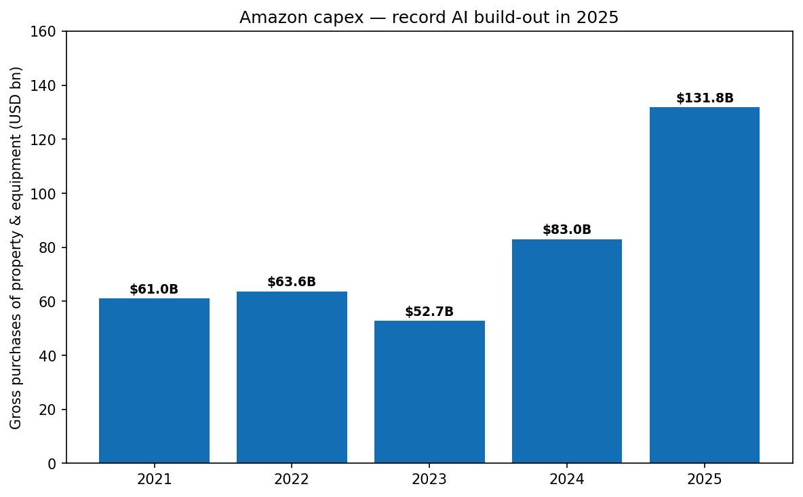

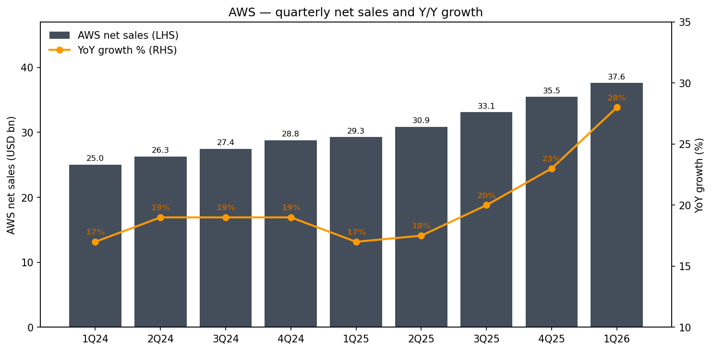

### 部分资产负债表项目 (单位: 百万美元, 2025 年 12 月 31 日 / 2026 年 3 月 31 日)

| 项目 | 25-12-31 | 26-03-31 |
|---|---:|---:|
| 现金及现金等价物 | 86,810 | (见 10-Q) |
| 可销售证券 | 36,219 | (见 10-Q) |
| 固定资产, 净额 | 357,025 | (见 10-Q) |
| 长期债务 | 65,648 | 119,074 |
| 股东权益合计 | 411,065 | 441,914 |
| 资产合计 | 818,042 | 916,630 |

来源: [10-K FY2025, p. 39](https://www.sec.gov/Archives/edgar/data/1018724/000101872426000004/amzn-20251231.htm); [10-Q 1Q26, p. 2](https://www.sec.gov/Archives/edgar/data/1018724/000101872426000014/amzn-20260331.htm)。

*本报告综合了截至 2026-05-20 的主要披露文件与第三方行业数据。本文不构成投资建议。文中每一项量化主张均通过内联链接对应至原始申报文件或第三方出版物。*
