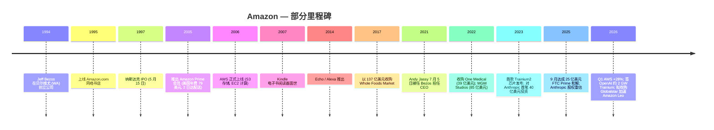
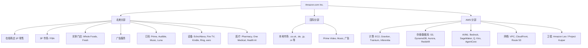
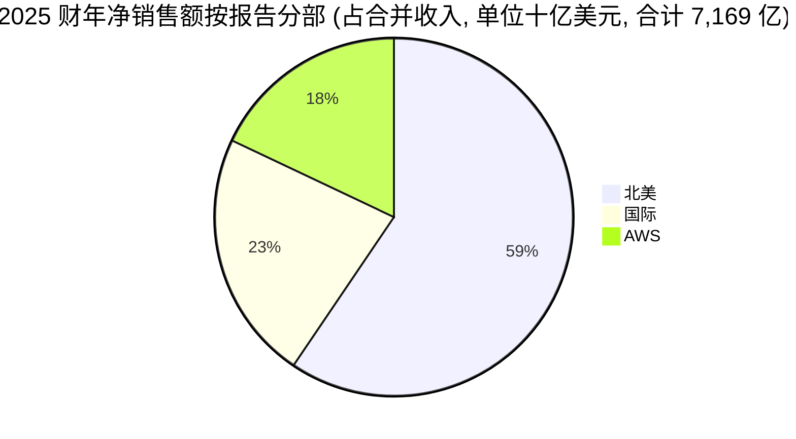

# Amazon.com, Inc. (NASDAQ:AMZN) — 公司研究报告

**截至日期: 2026-06-14**
**覆盖类型: 首次覆盖 (Initiation) — 决策层与全套财务图表重制版**
**代码: NASDAQ:AMZN  ·  总部: 美国华盛顿州西雅图 (Seattle, WA)  ·  CEO: Andrew R. ("Andy") Jassy**
**最新收盘价: 238.55 美元 (2026-06-12)  ·  市值: 约 2.57 万亿美元  ·  TTM 市盈率 (P/E): 31.6 倍  ·  前瞻 P/E: 24.2 倍  ·  TTM 市销率 (P/S): 3.45 倍**
**报告语言: 简体中文 (英文版同时存在于本目录, 本次未刷新)**

> *分析师观点：* **投资摘要 — 评级: Buy (买入) · 12 个月目标价: 305 美元 (较现价 238.55 美元上行 +28%) · 估值方法: SOTP 分部加总 (零售 2027E EV/Sales 2.8× + AWS 2027E EV/EBIT 24×), 以 DCF 交叉验证 · 市值约 2.57 万亿美元 · 52 周区间约 161–264 美元 · NASDAQ:AMZN**
>
> | 倍数 / Multiple (*分析师观点：* 前瞻列) | FY2025A | FY2026E | FY2027E |
> |---|---|---|---|
> | GAAP P/E | 33.3× | 26.5× | 23.0× |
> | EV/EBITDA | 约 18× | 约 15× | 约 13× |
> | EV/Sales | 约 3.4× | 约 3.0× | 约 2.6× |
> | P/FCF | 不适用 (FCF 受资本开支压缩) | 约 90× | 约 35× |
>
> 相对表现 (截至 2026-06-12, 来源 yfinance): 1M −11.7% · 6M +3.6% · YTD +5.3% · 12M +11.9%, 对比 S&P 500 1M −0.2% / 6M +7.7% / YTD +8.4% / 12M +22.9% (12 个月相对收益 **约 −11pp**, 近 1 个月相对 **约 −11.5pp** —— 当前是板块内明显的滞涨者)。
>
> **核心论点 (thesis pillars)** ——（1）**AWS 重新加速**: 1Q26 同比 +28% (近 15 个季度最快), 剩余履约义务 (RPO) 已锁定多年 30%+ 增长路径; (2) **AI 三大支柱共振**: Trainium/Inferentia 自研芯片年化运行率突破 200 亿美元, Bedrock 与 Anthropic/OpenAI 的容量承诺 (合计 >7 GW) 把 AWS 重新定义为全球三大"AI 云"之一; (3) **零售利润率结构性修复**: 北美营业利润率从 2022 年亏损反转至 2025 年 6.95%, 仍有自动化/机器人降本空间; (4) **广告高利润飞轮**: 2025 财年广告收入 686 亿美元 (+22%), 增量利润率高, 是被低估的第二价值引擎。当前 24× 前瞻 P/E 对 AI 基础设施龙头 + 利润率扩张双驱动构成偏低估值, 风险报酬向上倾斜。

> **业绩更新——2026 财年 Q1 超预期, 2026 财年资本开支维持高位 (2026-04-29 披露):** Q1 净销售额 **1,815 亿美元** (同比 +17%, 剔除 29 亿美元汇率顺风), GAAP 营业利润 **239 亿美元** (上年同期 184 亿美元), 双双超过公司自身指引区间。AWS 同比 **+28%** 至 376 亿美元——"近 15 个季度以来最快增速"; 自研芯片业务 (Graviton + Trainium + Nitro) 年化收入运行率突破 **200 亿美元**, 同比三位数增长; 公司新签 **OpenAI 约 2 GW Trainium 容量承诺 (2027 年起爬坡)**。管理层对 Q2 给出指引——净销售额 1,940–1,990 亿美元 (同比 +16–19%)、营业利润 200–240 亿美元。TTM 经营性现金流 +30% 至 1,485 亿美元, 但创纪录资本开支把 TTM 自由现金流 (FCF) 压至仅 **12 亿美元** (上年同期 259 亿美元)。
> 来源: [Amazon 2026 Q1 业绩公告 (8-K 附件 99.1, 2026-04-29)](https://www.sec.gov/Archives/edgar/data/1018724/000101872426000012/amzn-20260331xex991.htm)。

## 目录

1. 公司概览 (含投资论点)
1A. 估值与目标价 (前瞻预测 · PT 推导 · 牛/基/熊情景 · 卖方观点演变)
1B. GF Score (GuruFocus 式) 基本面评分卡
2. 公司历史
3. 管理团队
4. 产品与服务
5. 客户与上市策略
6. 行业概览
7. 竞争格局
8. 市场机会 (TAM)
9. 风险评估
9.5. 核心分歧与催化剂
10. 投资视角评分卡

---

## 1. 公司概览

*分析师观点：* 我们以 **Buy (买入)** 评级、**12 个月目标价 305 美元 (较现价上行约 +28%)** 首次覆盖亚马逊。当下时点 (why-now): 1Q26 财报确认了 AWS 的重新加速 (同比 +28%, 近 15 个季度最快) 与零售利润率的结构性修复, 而股价过去一个月相对 S&P 500 跑输约 11.5 个百分点 ([yfinance, 2026-06-12](https://finance.yahoo.com/quote/AMZN/history)), 把一个加速向上的基本面以接近板块低位的 24× 前瞻 P/E 定价。四大支柱: (1) AWS 重新加速 + 多年 RPO 锁定; (2) Trainium/Bedrock/Anthropic-OpenAI 的 AI 三角共振; (3) 北美零售利润率修复仍有空间; (4) 广告高增量利润率飞轮。主要风险是 AI 资本开支顶点与自由现金流压缩 (详见第 9 节)。

Amazon.com, Inc. 是全球最大的电子商务 (e-commerce) 平台、全球最大的云计算 (cloud computing) 服务商、美国第三大数字广告网络, 同时以门店数计算也跻身美国最大杂货连锁之一 (2025 年末北美 615 家实体门店, 主要为 Whole Foods Market 和 Amazon Fresh) ([Amazon 10-K FY2025, p. 18](https://www.sec.gov/Archives/edgar/data/1018724/000101872426000004/amzn-20251231.htm))。公司按三大业务分部披露——北美 (North America)、国际 (International)、亚马逊云科技 (Amazon Web Services, AWS)——并通过"在线及实体门店、广告服务、AWS 以及订阅服务"服务"两类主要客户群: 消费者和开发者" ([Amazon 10-K FY2025, p. 3](https://www.sec.gov/Archives/edgar/data/1018724/000101872426000004/amzn-20251231.htm))。

2025 财年, 亚马逊实现**净销售额 7,169.2 亿美元** (同比 +12.4%)、**GAAP 营业利润 799.8 亿美元** (营业利润率 11.2%)、**净利润 776.7 亿美元**, 摊薄平均股本约 **108.27 亿股**, **摊薄每股收益 (EPS) 7.17 美元** ([Amazon 10-K FY2025, p. 37 — 合并经营报表](https://www.sec.gov/Archives/edgar/data/1018724/000101872426000004/amzn-20251231.htm))。分部拆分: 北美 4,263.1 亿美元 (+10%)、国际 1,618.9 亿美元 (+13%)、AWS 1,287.3 亿美元 (+20%) ([10-K FY2025, p. 68, Note 10 — Segment Information](https://www.sec.gov/Archives/edgar/data/1018724/000101872426000004/amzn-20251231.htm))。美国是公司单一最大地理市场, 收入达 **4,896.57 亿美元** (占总收入 68%); 其后依次为德国 (459.0 亿美元)、英国 (432.1 亿美元) 和日本 (306.9 亿美元) ([10-K FY2025, p. 69 — Geographic Information](https://www.sec.gov/Archives/edgar/data/1018724/000101872426000004/amzn-20251231.htm))。

**亚马逊如何赚钱。** 10-K 将收入按相似产品/服务拆分为 7 条线, 2025 财年: 在线商店 (Online Stores) 2,692.9 亿美元 (第一方自营零售, 总额口径)、第三方卖家服务 (Third-party seller services) 1,721.6 亿美元 (佣金 + Fulfillment-by-Amazon, FBA)、AWS 1,287.3 亿美元、广告服务 (Advertising services) 686.4 亿美元、订阅服务 (Subscription services) 496.2 亿美元、实体门店 (Physical stores) 225.6 亿美元、其他 59.4 亿美元 ([10-K FY2025, p. 68 — Note 10, 收入分解](https://www.sec.gov/Archives/edgar/data/1018724/000101872426000004/amzn-20251231.htm))。其中 4 条"高毛利"业务线 (AWS、广告、订阅、3P 服务) 2025 财年合计约 4,176 亿美元——占总收入 58%——并贡献了合并营业利润的绝大部分。下面这张收入瀑布图把这条逻辑可视化: 左侧的 7 条收入来源汇入 7,169 亿美元营收, 经成本与费用后留下 800 亿美元营业利润。

<svg xmlns="http://www.w3.org/2000/svg" viewBox="0 0 1000 560" width="1000" height="560" role="img" aria-label="income statement Sankey"><rect x="0" y="0" width="1000" height="560" fill="#ffffff"/>
<text x="20.00" y="30.00" text-anchor="start" font-family="Helvetica,Arial,sans-serif" font-size="15" font-weight="700" fill="#1f2933">亚马逊如何赚钱 / How Amazon (AMZN) Makes Its Money — FY2025</text>
<path d="M 204.00,64.00 C 258.00,64.00 258.00,106.00 312.00,106.00 L 312.00,243.47 C 258.00,243.47 258.00,201.47 204.00,201.47 Z" fill="#93c5fd" fill-opacity="0.55"/>
<path d="M 452.00,99.00 C 506.00,99.00 506.00,178.55 560.00,178.55 L 560.00,219.38 C 506.00,219.38 506.00,139.83 452.00,139.83 Z" fill="#86efac" fill-opacity="0.55"/>
<path d="M 452.00,139.83 C 506.00,139.83 506.00,233.38 560.00,233.38 L 560.00,376.60 C 506.00,376.60 506.00,283.05 452.00,283.05 Z" fill="#fca5a5" fill-opacity="0.55"/>
<path d="M 328.00,106.00 C 382.00,106.00 382.00,99.00 436.00,99.00 L 436.00,283.05 C 382.00,283.05 382.00,290.05 328.00,290.05 Z" fill="#86efac" fill-opacity="0.55"/>
<path d="M 328.00,290.05 C 382.00,290.05 382.00,297.05 436.00,297.05 L 436.00,479.00 C 382.00,479.00 382.00,472.00 328.00,472.00 Z" fill="#fca5a5" fill-opacity="0.55"/>
<path d="M 700.00,171.55 C 754.00,171.55 754.00,257.30 808.00,257.30 L 808.00,296.95 C 754.00,296.95 754.00,211.20 700.00,211.20 Z" fill="#86efac" fill-opacity="0.55"/>
<path d="M 700.00,211.20 C 754.00,211.20 754.00,310.95 808.00,310.95 L 808.00,320.70 C 754.00,320.70 754.00,220.95 700.00,220.95 Z" fill="#fca5a5" fill-opacity="0.55"/>
<path d="M 576.00,178.55 C 630.00,178.55 630.00,171.55 684.00,171.55 L 684.00,212.38 C 630.00,212.38 630.00,219.38 576.00,219.38 Z" fill="#86efac" fill-opacity="0.55"/>
<path d="M 204.00,215.47 C 258.00,215.47 258.00,243.47 312.00,243.47 L 312.00,331.37 C 258.00,331.37 258.00,303.37 204.00,303.37 Z" fill="#93c5fd" fill-opacity="0.55"/>
<path d="M 576.00,233.38 C 630.00,233.38 630.00,235.23 684.00,235.23 L 684.00,264.99 C 630.00,264.99 630.00,263.14 576.00,263.14 Z" fill="#fca5a5" fill-opacity="0.55"/>
<path d="M 576.00,263.14 C 630.00,263.14 630.00,278.99 684.00,278.99 L 684.00,334.40 C 630.00,334.40 630.00,318.55 576.00,318.55 Z" fill="#fca5a5" fill-opacity="0.55"/>
<path d="M 576.00,318.55 C 630.00,318.55 630.00,348.40 684.00,348.40 L 684.00,406.45 C 630.00,406.45 630.00,376.60 576.00,376.60 Z" fill="#fca5a5" fill-opacity="0.55"/>
<path d="M 204.00,317.37 C 258.00,317.37 258.00,331.37 312.00,331.37 L 312.00,397.08 C 258.00,397.08 258.00,383.08 204.00,383.08 Z" fill="#93c5fd" fill-opacity="0.55"/>
<path d="M 576.00,390.60 C 630.00,390.60 630.00,212.38 684.00,212.38 L 684.00,221.23 C 630.00,221.23 630.00,399.45 576.00,399.45 Z" fill="#93c5fd" fill-opacity="0.55"/>
<path d="M 204.00,397.08 C 258.00,397.08 258.00,397.08 312.00,397.08 L 312.00,432.12 C 258.00,432.12 258.00,432.12 204.00,432.12 Z" fill="#93c5fd" fill-opacity="0.55"/>
<path d="M 204.00,446.12 C 258.00,446.12 258.00,432.12 312.00,432.12 L 312.00,457.45 C 258.00,457.45 258.00,471.45 204.00,471.45 Z" fill="#93c5fd" fill-opacity="0.55"/>
<path d="M 204.00,485.45 C 258.00,485.45 258.00,457.45 312.00,457.45 L 312.00,468.97 C 258.00,468.97 258.00,496.97 204.00,496.97 Z" fill="#93c5fd" fill-opacity="0.55"/>
<path d="M 204.00,510.97 C 258.00,510.97 258.00,468.97 312.00,468.97 L 312.00,472.00 C 258.00,472.00 258.00,514.00 204.00,514.00 Z" fill="#93c5fd" fill-opacity="0.55"/>
<rect x="188.00" y="64.00" width="16" height="137.47" rx="1.5" fill="#2563eb"/>
<rect x="188.00" y="215.47" width="16" height="87.89" rx="1.5" fill="#2563eb"/>
<rect x="188.00" y="317.37" width="16" height="65.72" rx="1.5" fill="#2563eb"/>
<rect x="188.00" y="397.08" width="16" height="35.04" rx="1.5" fill="#2563eb"/>
<rect x="188.00" y="446.12" width="16" height="25.33" rx="1.5" fill="#2563eb"/>
<rect x="188.00" y="485.45" width="16" height="11.52" rx="1.5" fill="#2563eb"/>
<rect x="188.00" y="510.97" width="16" height="3.03" rx="1.5" fill="#2563eb"/>
<rect x="312.00" y="106.00" width="16" height="366.00" rx="1.5" fill="#1e3a8a"/>
<rect x="436.00" y="99.00" width="16" height="184.05" rx="1.5" fill="#15803d"/>
<rect x="436.00" y="297.05" width="16" height="181.95" rx="1.5" fill="#dc2626"/>
<rect x="560.00" y="178.55" width="16" height="40.83" rx="1.5" fill="#15803d"/>
<rect x="560.00" y="233.38" width="16" height="143.22" rx="1.5" fill="#dc2626"/>
<rect x="560.00" y="390.60" width="16" height="8.85" rx="1.5" fill="#2563eb"/>
<rect x="684.00" y="171.55" width="16" height="49.68" rx="1.5" fill="#15803d"/>
<rect x="684.00" y="235.23" width="16" height="29.76" rx="1.5" fill="#dc2626"/>
<rect x="684.00" y="278.99" width="16" height="55.40" rx="1.5" fill="#dc2626"/>
<rect x="684.00" y="348.40" width="16" height="58.05" rx="1.5" fill="#dc2626"/>
<rect x="808.00" y="257.30" width="16" height="39.65" rx="1.5" fill="#15803d"/>
<rect x="808.00" y="310.95" width="16" height="9.74" rx="1.5" fill="#dc2626"/>
<line x1="188.00" y1="132.74" x2="182.00" y2="103.53" stroke="#cbd5e1" stroke-width="1"/>
<text x="179.00" y="106.53" text-anchor="end" font-family="Helvetica,Arial,sans-serif" font-size="11.5" font-weight="700" fill="#1f2933">Online Stores</text>
<text x="179.00" y="119.53" text-anchor="end" font-family="Helvetica,Arial,sans-serif" font-size="10" font-weight="400" fill="#52606d">$269.3B  (37.6%)</text>
<line x1="188.00" y1="259.42" x2="182.00" y2="230.21" stroke="#cbd5e1" stroke-width="1"/>
<text x="179.00" y="233.21" text-anchor="end" font-family="Helvetica,Arial,sans-serif" font-size="11.5" font-weight="700" fill="#1f2933">3P Seller Svcs</text>
<text x="179.00" y="246.21" text-anchor="end" font-family="Helvetica,Arial,sans-serif" font-size="10" font-weight="400" fill="#52606d">$172.2B  (24.0%)</text>
<line x1="188.00" y1="350.22" x2="182.00" y2="321.01" stroke="#cbd5e1" stroke-width="1"/>
<text x="179.00" y="324.01" text-anchor="end" font-family="Helvetica,Arial,sans-serif" font-size="11.5" font-weight="700" fill="#1f2933">AWS</text>
<text x="179.00" y="337.01" text-anchor="end" font-family="Helvetica,Arial,sans-serif" font-size="10" font-weight="400" fill="#52606d">$128.7B  (18.0%)</text>
<line x1="188.00" y1="414.60" x2="182.00" y2="385.39" stroke="#cbd5e1" stroke-width="1"/>
<text x="179.00" y="388.39" text-anchor="end" font-family="Helvetica,Arial,sans-serif" font-size="11.5" font-weight="700" fill="#1f2933">Advertising</text>
<text x="179.00" y="401.39" text-anchor="end" font-family="Helvetica,Arial,sans-serif" font-size="10" font-weight="400" fill="#52606d">$68.6B  (9.6%)</text>
<line x1="188.00" y1="458.79" x2="182.00" y2="429.58" stroke="#cbd5e1" stroke-width="1"/>
<text x="179.00" y="432.58" text-anchor="end" font-family="Helvetica,Arial,sans-serif" font-size="11.5" font-weight="700" fill="#1f2933">Subscription</text>
<text x="179.00" y="445.58" text-anchor="end" font-family="Helvetica,Arial,sans-serif" font-size="10" font-weight="400" fill="#52606d">$49.6B  (6.9%)</text>
<line x1="188.00" y1="491.21" x2="182.00" y2="462.00" stroke="#cbd5e1" stroke-width="1"/>
<text x="179.00" y="465.00" text-anchor="end" font-family="Helvetica,Arial,sans-serif" font-size="11.5" font-weight="700" fill="#1f2933">Physical Stores</text>
<text x="179.00" y="478.00" text-anchor="end" font-family="Helvetica,Arial,sans-serif" font-size="10" font-weight="400" fill="#52606d">$22.6B  (3.1%)</text>
<line x1="188.00" y1="512.49" x2="182.00" y2="487.00" stroke="#cbd5e1" stroke-width="1"/>
<text x="179.00" y="490.00" text-anchor="end" font-family="Helvetica,Arial,sans-serif" font-size="11.5" font-weight="700" fill="#1f2933">Other</text>
<text x="179.00" y="503.00" text-anchor="end" font-family="Helvetica,Arial,sans-serif" font-size="10" font-weight="400" fill="#52606d">$5.9B  (0.83%)</text>
<rect x="331.00" y="88.00" width="113.10" height="26" rx="2" fill="#ffffff" fill-opacity="0.72"/>
<text x="334.00" y="100.00" text-anchor="start" font-family="Helvetica,Arial,sans-serif" font-size="11.5" font-weight="700" fill="#1f2933">Revenue</text>
<text x="334.00" y="113.00" text-anchor="start" font-family="Helvetica,Arial,sans-serif" font-size="10" font-weight="400" fill="#52606d">$716.9B  (100.0%)</text>
<rect x="455.00" y="81.00" width="106.80" height="26" rx="2" fill="#ffffff" fill-opacity="0.72"/>
<text x="458.00" y="93.00" text-anchor="start" font-family="Helvetica,Arial,sans-serif" font-size="11.5" font-weight="700" fill="#1f2933">Gross Profit</text>
<text x="458.00" y="106.00" text-anchor="start" font-family="Helvetica,Arial,sans-serif" font-size="10" font-weight="400" fill="#52606d">$360.5B  (50.3%)</text>
<rect x="455.00" y="279.05" width="144.60" height="26" rx="2" fill="#ffffff" fill-opacity="0.72"/>
<text x="458.00" y="291.05" text-anchor="start" font-family="Helvetica,Arial,sans-serif" font-size="11.5" font-weight="700" fill="#1f2933">Cost of Revenue (COGS)</text>
<text x="458.00" y="304.05" text-anchor="start" font-family="Helvetica,Arial,sans-serif" font-size="10" font-weight="400" fill="#52606d">$356.4B  (49.7%)</text>
<rect x="579.00" y="160.55" width="106.80" height="26" rx="2" fill="#ffffff" fill-opacity="0.72"/>
<text x="582.00" y="172.55" text-anchor="start" font-family="Helvetica,Arial,sans-serif" font-size="11.5" font-weight="700" fill="#1f2933">Operating Income</text>
<text x="582.00" y="185.55" text-anchor="start" font-family="Helvetica,Arial,sans-serif" font-size="10" font-weight="400" fill="#52606d">$80.0B  (11.2%)</text>
<rect x="579.00" y="215.38" width="150.90" height="26" rx="2" fill="#ffffff" fill-opacity="0.72"/>
<text x="582.00" y="227.38" text-anchor="start" font-family="Helvetica,Arial,sans-serif" font-size="11.5" font-weight="700" fill="#1f2933">Total Operating Expense</text>
<text x="582.00" y="240.38" text-anchor="start" font-family="Helvetica,Arial,sans-serif" font-size="10" font-weight="400" fill="#52606d">$280.5B  (39.1%)</text>
<text x="551.00" y="392.02" text-anchor="end" font-family="Helvetica,Arial,sans-serif" font-size="11.5" font-weight="700" fill="#1f2933">Net Interest / Other Income</text>
<text x="551.00" y="405.02" text-anchor="end" font-family="Helvetica,Arial,sans-serif" font-size="10" font-weight="400" fill="#52606d">$17.3B  (2.4%)</text>
<rect x="703.00" y="153.55" width="100.50" height="26" rx="2" fill="#ffffff" fill-opacity="0.72"/>
<text x="706.00" y="165.55" text-anchor="start" font-family="Helvetica,Arial,sans-serif" font-size="11.5" font-weight="700" fill="#1f2933">Pretax Income</text>
<text x="706.00" y="178.55" text-anchor="start" font-family="Helvetica,Arial,sans-serif" font-size="10" font-weight="400" fill="#52606d">$97.3B  (13.6%)</text>
<rect x="703.00" y="217.23" width="94.20" height="26" rx="2" fill="#ffffff" fill-opacity="0.72"/>
<text x="706.00" y="229.23" text-anchor="start" font-family="Helvetica,Arial,sans-serif" font-size="11.5" font-weight="700" fill="#1f2933">SG&amp;A</text>
<text x="706.00" y="242.23" text-anchor="start" font-family="Helvetica,Arial,sans-serif" font-size="10" font-weight="400" fill="#52606d">$58.3B  (8.1%)</text>
<rect x="703.00" y="260.99" width="106.80" height="26" rx="2" fill="#ffffff" fill-opacity="0.72"/>
<text x="706.00" y="272.99" text-anchor="start" font-family="Helvetica,Arial,sans-serif" font-size="11.5" font-weight="700" fill="#1f2933">R&amp;D</text>
<text x="706.00" y="285.99" text-anchor="start" font-family="Helvetica,Arial,sans-serif" font-size="10" font-weight="400" fill="#52606d">$108.5B  (15.1%)</text>
<rect x="703.00" y="330.40" width="106.80" height="26" rx="2" fill="#ffffff" fill-opacity="0.72"/>
<text x="706.00" y="342.40" text-anchor="start" font-family="Helvetica,Arial,sans-serif" font-size="11.5" font-weight="700" fill="#1f2933">Other OpEx</text>
<text x="706.00" y="355.40" text-anchor="start" font-family="Helvetica,Arial,sans-serif" font-size="10" font-weight="400" fill="#52606d">$113.7B  (15.9%)</text>
<text x="833.00" y="274.13" text-anchor="start" font-family="Helvetica,Arial,sans-serif" font-size="11.5" font-weight="700" fill="#1f2933">Net Income</text>
<text x="833.00" y="287.13" text-anchor="start" font-family="Helvetica,Arial,sans-serif" font-size="10" font-weight="400" fill="#52606d">$77.7B  (10.8%)</text>
<text x="833.00" y="312.83" text-anchor="start" font-family="Helvetica,Arial,sans-serif" font-size="11.5" font-weight="700" fill="#1f2933">Income Tax</text>
<text x="833.00" y="325.83" text-anchor="start" font-family="Helvetica,Arial,sans-serif" font-size="10" font-weight="400" fill="#52606d">$19.1B  (2.7%)</text>
<text x="500.00" y="530.00" text-anchor="middle" font-family="Helvetica,Arial,sans-serif" font-size="10" font-weight="400" font-style="italic" fill="#8a97a3">OpEx 映射: R&amp;D=Technology &amp; infrastructure; SG&amp;A=Sales &amp; marketing + G&amp;A; Other OpEx=Fulfillment + 其他</text>
<text x="500.00" y="544.00" text-anchor="middle" font-family="Helvetica,Arial,sans-serif" font-size="10" font-weight="400" fill="#52606d">Source: AMZN FY2025 10-K, Consolidated Statements of Operations + Note 10 Segments (p.37,68)</text>
</svg>

来源 / Source: [Amazon 10-K FY2025, 合并经营报表 + Note 10 分部信息, p. 37, 68](https://www.sec.gov/Archives/edgar/data/1018724/000101872426000004/amzn-20251231.htm) (OpEx 映射见图内说明: R&D = Technology & infrastructure; SG&A = Sales & marketing + G&A; Other OpEx = Fulfillment + 其他)。

按报告分部的收入构成 (北美 59% / 国际 23% / AWS 18%) 见下方左侧 donut; 按地理 (美国 68% 主导) 见右侧 donut:

<svg xmlns="http://www.w3.org/2000/svg" viewBox="0 0 720 460" width="720" height="460" role="img" aria-label="revenue donut"><rect x="0" y="0" width="720" height="460" fill="#ffffff"/>
<text x="20.00" y="30.00" text-anchor="start" font-family="Helvetica,Arial,sans-serif" font-size="15" font-weight="700" fill="#1f2933">FY2025 净销售额按报告分部 / Net Sales by Segment</text>
<path d="M 288.00,107.20 A 132 132 0 1 1 214.06,348.55 L 244.31,303.81 A 78 78 0 1 0 288.00,161.20 Z" fill="#2563eb"/>
<path d="M 214.06,348.55 A 132 132 0 0 1 168.72,182.66 L 217.52,205.79 A 78 78 0 0 0 244.31,303.81 Z" fill="#15803d"/>
<path d="M 168.72,182.66 A 132 132 0 0 1 288.00,107.20 L 288.00,161.20 A 78 78 0 0 0 217.52,205.79 Z" fill="#d97706"/>
<text x="288.00" y="235.20" text-anchor="middle" font-family="Helvetica,Arial,sans-serif" font-size="18" font-weight="800" fill="#1f2933">AMZN</text>
<text x="288.00" y="255.20" text-anchor="middle" font-family="Helvetica,Arial,sans-serif" font-size="13" font-weight="600" fill="#52606d">$716.9B</text>
<text x="288.00" y="271.20" text-anchor="middle" font-family="Helvetica,Arial,sans-serif" font-size="10" font-weight="400" fill="#8a97a3">total</text>
<line x1="419.95" y1="279.62" x2="435.95" y2="279.62" stroke="#2563eb" stroke-width="1.4"/>
<text x="439.95" y="277.62" text-anchor="start" font-family="Helvetica,Arial,sans-serif" font-size="11" font-weight="700" fill="#1f2933">North America</text>
<text x="439.95" y="291.62" text-anchor="start" font-family="Helvetica,Arial,sans-serif" font-size="10" font-weight="400" fill="#52606d">$426.3B  (59.5%)</text>
<line x1="154.88" y1="275.58" x2="138.88" y2="275.58" stroke="#15803d" stroke-width="1.4"/>
<text x="134.88" y="273.58" text-anchor="end" font-family="Helvetica,Arial,sans-serif" font-size="11" font-weight="700" fill="#1f2933">International</text>
<text x="134.88" y="287.58" text-anchor="end" font-family="Helvetica,Arial,sans-serif" font-size="10" font-weight="400" fill="#52606d">$161.9B  (22.6%)</text>
<line x1="214.22" y1="122.58" x2="198.22" y2="122.58" stroke="#d97706" stroke-width="1.4"/>
<text x="194.22" y="120.58" text-anchor="end" font-family="Helvetica,Arial,sans-serif" font-size="11" font-weight="700" fill="#1f2933">AWS</text>
<text x="194.22" y="134.58" text-anchor="end" font-family="Helvetica,Arial,sans-serif" font-size="10" font-weight="400" fill="#52606d">$128.7B  (18.0%)</text>
<text x="360.00" y="444.00" text-anchor="middle" font-family="Helvetica,Arial,sans-serif" font-size="10" font-weight="400" fill="#52606d">Source: AMZN FY2025 10-K, Note 10 — Segment Information (p.68)</text>
</svg>

来源 / Source: [Amazon 10-K FY2025, Note 10 — 分部信息, p. 68](https://www.sec.gov/Archives/edgar/data/1018724/000101872426000004/amzn-20251231.htm)。

<svg xmlns="http://www.w3.org/2000/svg" viewBox="0 0 720 460" width="720" height="460" role="img" aria-label="revenue donut"><rect x="0" y="0" width="720" height="460" fill="#ffffff"/>
<text x="20.00" y="30.00" text-anchor="start" font-family="Helvetica,Arial,sans-serif" font-size="15" font-weight="700" fill="#1f2933">FY2025 净销售额按地理 / Net Sales by Geography</text>
<path d="M 288.00,107.20 A 132 132 0 1 1 167.53,293.14 L 216.81,271.08 A 78 78 0 1 0 288.00,161.20 Z" fill="#2563eb"/>
<path d="M 167.53,293.14 A 132 132 0 0 1 156.02,241.67 L 210.01,240.66 A 78 78 0 0 0 216.81,271.08 Z" fill="#15803d"/>
<path d="M 156.02,241.67 A 132 132 0 0 1 164.46,192.70 L 215.00,211.72 A 78 78 0 0 0 210.01,240.66 Z" fill="#d97706"/>
<path d="M 164.46,192.70 A 132 132 0 0 1 181.26,161.55 L 224.93,193.31 A 78 78 0 0 0 215.00,211.72 Z" fill="#7c3aed"/>
<path d="M 181.26,161.55 A 132 132 0 0 1 288.00,107.20 L 288.00,161.20 A 78 78 0 0 0 224.93,193.31 Z" fill="#dc2626"/>
<text x="288.00" y="235.20" text-anchor="middle" font-family="Helvetica,Arial,sans-serif" font-size="18" font-weight="800" fill="#1f2933">AMZN</text>
<text x="288.00" y="255.20" text-anchor="middle" font-family="Helvetica,Arial,sans-serif" font-size="13" font-weight="600" fill="#52606d">$716.9B</text>
<text x="288.00" y="271.20" text-anchor="middle" font-family="Helvetica,Arial,sans-serif" font-size="10" font-weight="400" fill="#8a97a3">total</text>
<line x1="403.82" y1="314.24" x2="419.82" y2="314.24" stroke="#2563eb" stroke-width="1.4"/>
<text x="423.82" y="312.24" text-anchor="start" font-family="Helvetica,Arial,sans-serif" font-size="11" font-weight="700" fill="#1f2933">United States</text>
<text x="423.82" y="326.24" text-anchor="start" font-family="Helvetica,Arial,sans-serif" font-size="10" font-weight="400" fill="#52606d">$489.7B  (68.3%)</text>
<line x1="153.32" y1="269.30" x2="137.32" y2="269.30" stroke="#15803d" stroke-width="1.4"/>
<text x="133.32" y="267.30" text-anchor="end" font-family="Helvetica,Arial,sans-serif" font-size="11" font-weight="700" fill="#1f2933">Germany</text>
<text x="133.32" y="281.30" text-anchor="end" font-family="Helvetica,Arial,sans-serif" font-size="10" font-weight="400" fill="#52606d">$45.9B  (6.4%)</text>
<line x1="152.00" y1="215.77" x2="136.00" y2="215.77" stroke="#d97706" stroke-width="1.4"/>
<text x="132.00" y="213.77" text-anchor="end" font-family="Helvetica,Arial,sans-serif" font-size="11" font-weight="700" fill="#1f2933">United Kingdom</text>
<text x="132.00" y="227.77" text-anchor="end" font-family="Helvetica,Arial,sans-serif" font-size="10" font-weight="400" fill="#52606d">$43.2B  (6.0%)</text>
<line x1="166.53" y1="173.71" x2="150.53" y2="173.71" stroke="#7c3aed" stroke-width="1.4"/>
<text x="146.53" y="171.71" text-anchor="end" font-family="Helvetica,Arial,sans-serif" font-size="11" font-weight="700" fill="#1f2933">Japan</text>
<text x="146.53" y="185.71" text-anchor="end" font-family="Helvetica,Arial,sans-serif" font-size="10" font-weight="400" fill="#52606d">$30.7B  (4.3%)</text>
<line x1="225.39" y1="116.22" x2="209.39" y2="116.22" stroke="#dc2626" stroke-width="1.4"/>
<text x="205.39" y="114.22" text-anchor="end" font-family="Helvetica,Arial,sans-serif" font-size="11" font-weight="700" fill="#1f2933">Rest of World</text>
<text x="205.39" y="128.22" text-anchor="end" font-family="Helvetica,Arial,sans-serif" font-size="10" font-weight="400" fill="#52606d">$107.5B  (15.0%)</text>
<text x="360.00" y="444.00" text-anchor="middle" font-family="Helvetica,Arial,sans-serif" font-size="10" font-weight="400" fill="#52606d">Source: AMZN FY2025 10-K, Note 10 — Geographic Information (p.69)</text>
</svg>

来源 / Source: [Amazon 10-K FY2025, Note 10 — 地理信息, p. 69](https://www.sec.gov/Archives/edgar/data/1018724/000101872426000004/amzn-20251231.htm)。

分部收入的多年演变 (北美/国际/AWS, FY2021–FY2025) 显示 AWS 的占比稳步提升、国际分部走出 2022 年的萎缩:

<svg xmlns="http://www.w3.org/2000/svg" viewBox="0 0 860 470" width="860" height="470" role="img" aria-label="historical revenue bars"><rect x="0" y="0" width="860" height="470" fill="#ffffff"/>
<text x="20.00" y="30.00" text-anchor="start" font-family="Helvetica,Arial,sans-serif" font-size="15" font-weight="700" fill="#1f2933">历史净销售额按分部 / Historical Net Sales by Segment (US$bn)</text>
<rect x="20.00" y="44" width="11" height="11" rx="2" fill="#2563eb"/>
<text x="36.00" y="53.00" text-anchor="start" font-family="Helvetica,Arial,sans-serif" font-size="10.5" font-weight="400" fill="#1f2933">North America</text>
<rect x="135.80" y="44" width="11" height="11" rx="2" fill="#15803d"/>
<text x="151.80" y="53.00" text-anchor="start" font-family="Helvetica,Arial,sans-serif" font-size="10.5" font-weight="400" fill="#1f2933">International</text>
<rect x="251.60" y="44" width="11" height="11" rx="2" fill="#d97706"/>
<text x="267.60" y="53.00" text-anchor="start" font-family="Helvetica,Arial,sans-serif" font-size="10.5" font-weight="400" fill="#1f2933">AWS</text>
<line x1="70" y1="412.00" x2="834" y2="412.00" stroke="#eceff2" stroke-width="1"/>
<text x="64.00" y="415.00" text-anchor="end" font-family="Helvetica,Arial,sans-serif" font-size="9.5" font-weight="400" fill="#52606d">$0</text>
<line x1="70" y1="345.20" x2="834" y2="345.20" stroke="#eceff2" stroke-width="1"/>
<text x="64.00" y="348.20" text-anchor="end" font-family="Helvetica,Arial,sans-serif" font-size="9.5" font-weight="400" fill="#52606d">$154.9B</text>
<line x1="70" y1="278.40" x2="834" y2="278.40" stroke="#eceff2" stroke-width="1"/>
<text x="64.00" y="281.40" text-anchor="end" font-family="Helvetica,Arial,sans-serif" font-size="9.5" font-weight="400" fill="#52606d">$309.7B</text>
<line x1="70" y1="211.60" x2="834" y2="211.60" stroke="#eceff2" stroke-width="1"/>
<text x="64.00" y="214.60" text-anchor="end" font-family="Helvetica,Arial,sans-serif" font-size="9.5" font-weight="400" fill="#52606d">$464.6B</text>
<line x1="70" y1="144.80" x2="834" y2="144.80" stroke="#eceff2" stroke-width="1"/>
<text x="64.00" y="147.80" text-anchor="end" font-family="Helvetica,Arial,sans-serif" font-size="9.5" font-weight="400" fill="#52606d">$619.4B</text>
<line x1="70" y1="78.00" x2="834" y2="78.00" stroke="#eceff2" stroke-width="1"/>
<text x="64.00" y="81.00" text-anchor="end" font-family="Helvetica,Arial,sans-serif" font-size="9.5" font-weight="400" fill="#52606d">$774.3B</text>
<rect x="102.09" y="291.30" width="88.62" height="120.70" fill="#2563eb"/>
<rect x="102.09" y="236.17" width="88.62" height="55.13" fill="#15803d"/>
<rect x="102.09" y="209.34" width="88.62" height="26.83" fill="#d97706"/>
<text x="146.40" y="428.00" text-anchor="middle" font-family="Helvetica,Arial,sans-serif" font-size="10" font-weight="400" fill="#52606d">2021</text>
<rect x="254.89" y="275.73" width="88.62" height="136.27" fill="#2563eb"/>
<rect x="254.89" y="224.82" width="88.62" height="50.90" fill="#15803d"/>
<rect x="254.89" y="190.27" width="88.62" height="34.55" fill="#d97706"/>
<text x="299.20" y="428.00" text-anchor="middle" font-family="Helvetica,Arial,sans-serif" font-size="10" font-weight="400" fill="#52606d">2022</text>
<rect x="407.69" y="259.81" width="88.62" height="152.19" fill="#2563eb"/>
<rect x="407.69" y="203.21" width="88.62" height="56.60" fill="#15803d"/>
<rect x="407.69" y="164.04" width="88.62" height="39.17" fill="#d97706"/>
<text x="452.00" y="428.00" text-anchor="middle" font-family="Helvetica,Arial,sans-serif" font-size="10" font-weight="400" fill="#52606d">2023</text>
<rect x="560.49" y="244.84" width="88.62" height="167.16" fill="#2563eb"/>
<rect x="560.49" y="183.19" width="88.62" height="61.64" fill="#15803d"/>
<rect x="560.49" y="136.78" width="88.62" height="46.42" fill="#d97706"/>
<text x="604.80" y="428.00" text-anchor="middle" font-family="Helvetica,Arial,sans-serif" font-size="10" font-weight="400" fill="#52606d">2024</text>
<rect x="713.29" y="228.10" width="88.62" height="183.90" fill="#2563eb"/>
<rect x="713.29" y="158.26" width="88.62" height="69.84" fill="#15803d"/>
<rect x="713.29" y="102.74" width="88.62" height="55.52" fill="#d97706"/>
<text x="757.60" y="428.00" text-anchor="middle" font-family="Helvetica,Arial,sans-serif" font-size="10" font-weight="400" fill="#52606d">2025</text>
<text x="430.00" y="454.00" text-anchor="middle" font-family="Helvetica,Arial,sans-serif" font-size="10" font-weight="400" fill="#52606d">Source: AMZN FY2021–FY2025 10-Ks, Note 10 — Segment Information</text>
</svg>

来源 / Source: [Amazon FY2021–FY2025 10-Ks, Note 10 — 分部信息](https://www.sec.gov/cgi-bin/browse-edgar?action=getcompany&CIK=0001018724&type=10-K)。

**规模。** 2025 年末亚马逊有**约 1,576,000 名全职和兼职员工** ([10-K FY2025, p. 4](https://www.sec.gov/Archives/edgar/data/1018724/000101872426000004/amzn-20251231.htm)), 在全球运营约 7.4 亿平方英尺的自有或租赁物业, 其中大部分为履约与数据中心空间 ([10-K FY2025, p. 18](https://www.sec.gov/Archives/edgar/data/1018724/000101872426000004/amzn-20251231.htm))。2025 财年购置固定资产 (Purchases of property and equipment) 创纪录达约 **1,318 亿美元** (含 finance lease 等口径), 主要用于 AI 算力扩建 ([10-K FY2025, p. 40 — 投资活动现金流](https://www.sec.gov/Archives/edgar/data/1018724/000101872426000004/amzn-20251231.htm))。2025 财年经营性现金流为 1,395.1 亿美元 ([10-K FY2025, p. 35, 40](https://www.sec.gov/Archives/edgar/data/1018724/000101872426000004/amzn-20251231.htm)), 但高资本开支严重压缩了自由现金流 (Free Cash Flow, FCF), 截至 2026 年 3 月 31 日, 公司披露的 TTM (过去十二个月) FCF 仅有 **12 亿美元**, 较上年同期的 259 亿美元大幅下滑 ([Amazon 2026 Q1 业绩公告, 2026-04-29](https://www.sec.gov/Archives/edgar/data/1018724/000101872426000012/amzn-20260331xex991.htm))。

**估值快照 (2026-06-12)。** 当前股价 238.55 美元; 市值约 2.57 万亿美元; **TTM P/E 31.6 倍; 前瞻 P/E 24.2 倍; TTM P/S 3.45 倍; 市净率 (P/B) 5.8 倍** ([yfinance, 2026-06-12](https://finance.yahoo.com/quote/AMZN/key-statistics/))。在大盘科技股可比集合中, 亚马逊的 TTM P/E 处于中段 (微软 23.3 倍、Meta 20.6 倍、Alphabet 27.5 倍、苹果 35.2 倍、Oracle 31.5 倍), 但**在 P/S 维度处于绝对底部** (3.45 倍, 对比微软 9.1 倍、Alphabet 10.4 倍、Oracle 7.9 倍), 因为零售第一方自营 (2,693 亿美元低毛利的总额口径收入) 稀释了合并报表的收入构成——即便仅就 AWS 单独估值 (作为 Azure / GCP 的可比项), 亦应享有远高于合并报表的市销率 ([yfinance, 2026-06-12](https://finance.yahoo.com/quote/AMZN/key-statistics/))。当前 31.6 倍 TTM P/E **受 2025 年若干一次性事项扭曲**: (a) 2025 年 Q3 计入 **25 亿美元 FTC (美国联邦贸易委员会) 和解费用** (10 亿美元民事罚款 + 15 亿美元赔偿) ([FTC 新闻稿, 2025-09-25](https://www.ftc.gov/news-events/news/press-releases/2025/09/ftc-secures-historic-25-billion-settlement-against-amazon)); (b) 2025 财年 GAAP 净利润中含约 **152 亿美元的 Other income (主要为 Anthropic 无投票权优先股公允价值重估)** ([10-K FY2025, p. 37 — 经营报表 Other income (expense), net](https://www.sec.gov/Archives/edgar/data/1018724/000101872426000004/amzn-20251231.htm))。剔除该非经营收益后, 真实经营性 EPS 将明显低于报表数, 故前瞻 24× P/E 是更干净的估值锚。*分析师观点：* 多家卖方对 AMZN 给出 300–333 美元目标价、Buy/Overweight/Outperform 评级 (详见 1A 节卖方观点演变), 印证市场把 AI 基础设施龙头地位、零售利润率修复与 AWS 20%+ 增速合并定价为偏低的合并报表倍数 ([Goldman Sachs — Amazon Q1'26 Review, 2026-04-30, p.1](http://xs-macbook-air.local:5001/zsxq/pdf/415515525514188/Goldman%20Sachs-Amazon.com%20Inc.%20%EF%BC%88AMZN.US%EF%BC%89%20Q1%E2%80%9926%20Review%EF%BC%9A%20Investing%20Behind%20Secular%20Growth%20Themes%20Across%20Compute%EF%BC%8C%20Commerce%20%26%20Advertising-260430.pdf))。

---

## 1A. 估值与目标价

本章是前瞻、决策导向的分析层, 与第 1 节的 TTM 快照 (后视) 区分开。**本章所有预测数字、目标价及情景目标价均为分析师本方的前瞻观点 (`*分析师观点：*`), 不附任何申报文件引用**——10-K 中不含目标价。每个预测的外部输入 (申报分部数据 + 管理层指引 + 行业预测) 在段内单独引用。

### (a) 前瞻财务预测表 (分部建模, *分析师观点：*)

我们对亚马逊按分部分别建模 (北美 / 国际 / AWS), 再汇总, 而非用单一混合增速。AWS 增速假设参考公司披露的 RPO ([10-K FY2025, p. 56, Note 7 — 截至 2025-12-31 RPO 3,377 亿美元](https://www.sec.gov/Archives/edgar/data/1018724/000101872426000004/amzn-20251231.htm)) 与 1Q26 公布的 backlog 跃升至约 3,640 亿美元 ([J.P. Morgan — Amazon AWS Accelerating, 2026-04-30, p.1](http://xs-macbook-air.local:5001/zsxq/pdf/184484411841522/J.P.%20Morgan-Amazon.com%EF%BC%88AMZN.US%EF%BC%89AWS%20Accelerating%EF%BC%8C%20Backlog%20Building%EF%BC%8C%20Retail%20Running-260430.pdf)); 北美利润率修复假设参考 1Q26 北美营业利润率 7.9% ([2026 Q1 业绩公告, 2026-04-29](https://www.sec.gov/Archives/edgar/data/1018724/000101872426000012/amzn-20260331xex991.htm))。

| 指标 (*分析师观点：*) | FY2025A | FY2026E | FY2027E | FY2028E | CAGR (25→28) |
|---|---|---|---|---|---|
| 总营收 (US$bn) | 716.9 | 822 | 932 | 1,045 | +13.4% |
| — YoY % | +12.4% | +14.7% | +13.4% | +12.1% | |
| 北美营收 | 426.3 | 478 | 531 | 584 | |
| 国际营收 | 161.9 | 181 | 200 | 219 | |
| AWS 营收 | 128.7 | 166 | 215 | 271 | +28% |
| 营业利润率 % | 11.2% | 12.5% | 13.5% | 14.2% | |
| AWS 营业利润率 % | 35.4% | 36% | 37% | 38% | |
| GAAP 营业利润 (US$bn) | 80.0 | 103 | 126 | 148 | |
| GAAP EPS (US$) | 7.17 | 9.00 | 10.37 | 12.00 | +18.7% |
| ROIC % (近似) | 约 14% | 约 16% | 约 18% | 约 20% | |
| 经营性现金流 (US$bn) | 139.5 | 165 | 205 | 245 | |
| FCF (US$bn) | 11.2 | 约 9 | 约 65 | 约 130 | |
| 净现金/(净债务) (US$bn) | 约 +57 | 约 +40 | 约 +70 | 约 +120 | |

**净现金/净债务**: 2025 年末现金 868 亿 + 可销售证券 362 亿 = 1,230 亿美元, 减长期债务 656 亿美元, 净现金约 +574 亿美元 ([10-K FY2025, p. 39 — 合并资产负债表](https://www.sec.gov/Archives/edgar/data/1018724/000101872426000004/amzn-20251231.htm)); 我们预计 2026 年因资本开支峰值净现金略降, 2027 年起 FCF 回正后重新累积。FY2026E GAAP EPS 9.00 与 FY2027E 10.37 与 J.P. Morgan 的预测一致 ([J.P. Morgan, 2026-04-30, p.1](http://xs-macbook-air.local:5001/zsxq/pdf/184484411841522/J.P.%20Morgan-Amazon.com%EF%BC%88AMZN.US%EF%BC%89AWS%20Accelerating%EF%BC%8C%20Backlog%20Building%EF%BC%8C%20Retail%20Running-260430.pdf))。

**营业利润率 bridge (*分析师观点：*)**: 我们预计 FY2025→FY2026 营业利润率 +130bps (11.2%→12.5%), 拆解为: 北美降本/机器人密度 +60bps · AWS 高利润占比提升 +50bps · 广告高增量利润率 +40bps · Amazon Leo 扩张拖累 −20bps (公司指引 2026 年 Leo 同比新增约 10 亿美元成本, [10-K FY2025, p. 30](https://www.sec.gov/Archives/edgar/data/1018724/000101872426000004/amzn-20251231.htm))。

### (b) 目标价推导 (SOTP, 展示算术)

我们采用分部加总法 (SOTP), 与 Bernstein 的框架一致 ([Bernstein — AMZN Everyone wants this to work, 2026-04-23, p.1](http://xs-macbook-air.local:5001/zsxq/pdf/184485514548282/Bernstein-AMZN%20Everyone%20wants%20this%20to%20work...-260423.pdf)):

- **AWS**: FY2027E 营业利润约 80 亿美元/季 × 4 ≈ 795 亿美元 EBIT, 给 24× EV/EBIT ≈ 1.91 万亿美元企业价值。倍数对标 Oracle (前瞻 EV 倍数因 OCI/RPO 而高) 与 Azure 隐含倍数; 24× 较 Bernstein 的 25× 略保守, 反映 AI 资本回报周期的不确定性。
- **零售 (北美 + 国际)**: FY2027E 合并零售营收约 731 亿美元/年 → 约 7,300 亿美元营收, 给 2.8× EV/Sales ≈ 2.04 万亿美元 (含广告变现溢价)。
- **企业价值合计** ≈ 1.91 + 2.04 = 3.95 万亿美元; 加净现金约 +700 亿美元 (2027E) → 股权价值约 4.02 万亿美元; ÷ 约 108 亿股摊薄股本 → **每股约 305 美元**。

DCF 交叉验证: WACC = Rf + β×ERP = 4.4% (10Y Treasury, 见第 10 节 indicators.db 快照) + 1.15 × 5.0% ERP ≈ **10.2%**, 终值增长 2.5% (≤ Rf), 对 FY2026–2035E 自由现金流折现得到的内在价值区间中枢约 300–315 美元, 与 SOTP 收敛, 故取 **305 美元**为 12 个月目标价 (上行约 +28%)。

### (c) 牛 / 基 / 熊情景 (*分析师观点：*)

| 情景 (*分析师观点：*) | 关键摆动假设 | 目标价 | 较现价 |
|---|---|---|---|
| 牛 (Bull) | AWS 2027E 增速维持 30%+、Trainium 大规模商业化、广告翻倍, AWS 给 28× EV/EBIT | 385 美元 | +61% |
| 基 (Base) | AWS 2027E +28%、北美利润率升至 8.5%、AWS 24× EV/EBIT | 305 美元 | +28% |
| 熊 (Bear) | AI 资本开支顶点遇 12 个月需求空窗、闲置算力拖累折旧、AWS de-rate 至 16× EV/EBIT | 200 美元 | −16% |

熊市情景与 UBS 的悲观情景 (228 美元, 假设 2 年营收 CAGR 16%、FCF 利润率 10%、25× P/FCF) 方向一致, 我们更保守地把 AWS 倍数压至 16× ([UBS — Amazon CapEx Already in Model, 2026-04-30, p.1](http://xs-macbook-air.local:5001/zsxq/pdf/812212242215412/UBS-Amazon.com%EF%BC%88AMZN.US%EF%BC%89CapEx%20Already%20in%20Model%EF%BC%8C%20Backlog%20and%20Revenue%20Now%20Arriving-260430.pdf))。

### (d) 与市场一致预期的对比 (consensus benchmark)

我们的 FY2027E GAAP EPS 10.37 美元与 J.P. Morgan 的 10.37 美元一致, 中性偏保守; AWS FY2027E +28% 略低于 J.P. Morgan 的 +30% 与 Morgan Stanley 的 35–36% ([Morgan Stanley — Revenue per GW, 2026-05-27, p.1](http://xs-macbook-air.local:5001/zsxq/pdf/812485554284452/Morgan%20Stanley-Internet%EF%BC%9AHow%20Much%20Revenue%20per%20GW%20Could%20Be%20Generated%20with%20the%20Capacity%20Ahead%EF%BC%9F-260527.pdf))。我们的 305 美元目标价位于卖方区间 (300–333 美元) 偏下沿, 体现对 AI 资本回报周期的审慎。

### (e) 最该盯紧的变量 (swing variables)

1. **AWS 增速持续性**: backlog 兑现速度 (3,640 亿美元 RPO 能否如期转为 30%+ 增长) 是估值最大杠杆。
2. **AI 资本开支的回报周期**: 2026 年约 2,000 亿美元资本开支 ([J.P. Morgan, 2026-04-30](http://xs-macbook-air.local:5001/zsxq/pdf/184484411841522/J.P.%20Morgan-Amazon.com%EF%BC%88AMZN.US%EF%BC%89AWS%20Accelerating%EF%BC%8C%20Backlog%20Building%EF%BC%8C%20Retail%20Running-260430.pdf)) 能否在 2027–2028 年转化为 FCF 回升, 决定 P/FCF 何时正常化。

### (f) 卖方观点演变 (Sell-side view evolution)

本报告引用了 ≥2 篇 `db/zsxq.db` 券商单名报告, 故附本小节。机械化前置 (读 `db/stock_price_target.db` 只读) 显示, AMZN 共有 20 条 PT 记录, 评级清一色 **Buy / Overweight / Outperform**, 目标价集中在 **300–333 美元** (最新一批 2026-04/05 报告); PT 离散度 min 304 / 中位约 325 / max 333, 价差约 10%——分歧很小, 几乎全部看多。

**按机构的观点时间线 (报告日期价为当日收盘):**

| 机构 | 日期 | 评级 / 目标价 | 报告日股价 / 隐含上行 | 估值方法 + 一句话论点 |
|---|---|---|---|---|
| Bernstein | 2026-04-22 | Outperform / **265** | 255.4 / +3.8% | AWS 非 AI 业务重新加速; AI 收入 >150 亿美元运行率 |
| Bernstein | 2026-04-23 | Outperform / **300** (↑ from 265) | 255.1 / +17.6% | SOTP (零售 EV/Sales 3× + AWS EV/EBIT 25×)+DCF; "人人都盼着这事能成", Trainium 第三大 AI 芯片 |
| UBS | 2026-04-29 | Buy / **304** | 263.0 / +15.6% | P/FCF 30× 估值; AWS 面向每家公司的 AI 产品化; OpenAI 模型登陆 Bedrock |
| Goldman Sachs | 2026-04-30 | Buy / **325** (↑ from 275) | 265.1 / +22.6% | EV/EBITDA + DCF; Q1 营业利润创纪录 13.1% 利润率 |
| J.P. Morgan | 2026-04-30 | Overweight / **330** (↑ from 280), "Best Idea" | 265.1 / +24.5% | 2027E GAAP EPS 10.37 × 32× P/E; backlog $364bn; Trainium 承诺 $225bn |
| UBS | 2026-04-30 | Buy / **333** (↑ from 304) | 265.1 / +25.6% | P/FCF 30× on 2Q27-1Q28 FCF; 牛 $408 / 基 $333 / 熊 $228 |
| Bernstein | 2026-04-30 | Outperform / **315** (↑ from 300) | 265.1 / +18.8% | SOTP+DCF; AWS 加速 + 零售韧性 |
| Morgan Stanley | 2026-05-27 | Overweight / **330** | 271.9 / +21.4% | AWS rev/GW 测算; 2026 6 GW; 2027 35-36% 增长 |
| UBS | 2026-05-27 | Buy / **333** | 271.9 / +22.5% | Bedrock backlog $35B +300%; AI 占 AWS 26% by YE26 |

**自我修正与触发器**: 三家机构 (Bernstein、Goldman、J.P. Morgan、UBS) 在 1Q26 财报 (2026-04-29 披露) 后**集体上调目标价**——Bernstein 在一周内两次上调 (265→300→315), Goldman 275→325, J.P. Morgan 280→330, UBS 304→333; 共同触发器是 AWS 同比 +28% 重新加速 + backlog 跃升至 3,640 亿美元 + 自研芯片 200 亿美元运行率 ([Goldman Sachs, 2026-04-30, p.1](http://xs-macbook-air.local:5001/zsxq/pdf/415515525514188/Goldman%20Sachs-Amazon.com%20Inc.%20%EF%BC%88AMZN.US%EF%BC%89%20Q1%E2%80%9926%20Review%EF%BC%9A%20Investing%20Behind%20Secular%20Growth%20Themes%20Across%20Compute%EF%BC%8C%20Commerce%20%26%20Advertising-260430.pdf); [Bernstein, 2026-04-23, p.1](http://xs-macbook-air.local:5001/zsxq/pdf/184485514548282/Bernstein-AMZN%20Everyone%20wants%20this%20to%20work...-260423.pdf))。

**机构间分歧 (有限)**: 主要分歧不在方向 (均看多), 而在**估值方法与 AWS 增速假设**:

| 机构 | 日期 | 评级 / PT | 核心论点 | 什么证据能证明其正确 |
|---|---|---|---|---|
| Morgan Stanley | 2026-05-27 | OW / 330 | AWS 2027 增速可达 35-36% (最激进) | 后续季度 AWS 增速突破 30% 并加速 |
| J.P. Morgan | 2026-04-30 | OW / 330 | 32× P/E 溢价于 GOOG/META, 反映更快底线增长 | FY27 GAAP EPS 兑现 10.37 美元 |
| UBS | 2026-04-30 | Buy / 333 | P/FCF 30×, 但提示 1Q 净利含约 168 亿美元 Anthropic 税前收益, 剔除后或不及预期 | FCF 在 2027 回正、Anthropic 估值不回撤 |
| Bernstein | 2026-04-30 | OP / 315 | SOTP, AWS 25× EV/EBIT; 担忧 2027 基础设施过剩 | AI 需求吸收 2027 新增产能, 无闲置 |

---

## 1B. GF Score (GuruFocus 式) 基本面评分卡

*分析师观点：* **GF Score (GuruFocus 式): 68/100 —— 51–70 区间 (Poor future performance potential, 即"未来表现潜力偏弱"档)。** 该评分为分析师本方依 GuruFocus GF Score™ 方法复现的评分卡, **非数据来源、非背书**; 五个子评分与综合分均为 `*分析师观点：*`, 每个底层指标在下文单独引用; 本报告未拉取 GuruFocus 官方数值, 故不作交叉标注。

<svg xmlns="http://www.w3.org/2000/svg" viewBox="0 0 500 500" width="500" height="500" role="img" aria-label="GF Score radar">
<rect x="0" y="0" width="500" height="500" fill="#ffffff"/>
<text x="20" y="24" font-family="Helvetica,Arial,sans-serif" font-size="15" font-weight="700" fill="#1f2933">GF Score (GuruFocus-style): 68/100</text>
<text x="20" y="41" font-family="Helvetica,Arial,sans-serif" font-size="11" fill="#52606d">51–70 Poor future performance potential</text>
<polygon points="250.0,88.0 392.7,191.6 338.2,359.4 161.8,359.4 107.3,191.6" fill="#e9f5ec" stroke="none"/>
<polygon points="250.0,208.0 278.5,228.7 267.6,262.3 232.4,262.3 221.5,228.7" fill="none" stroke="#c5d3cb" stroke-width="1"/>
<polygon points="250.0,178.0 307.1,219.5 285.3,286.5 214.7,286.5 192.9,219.5" fill="none" stroke="#c5d3cb" stroke-width="1"/>
<polygon points="250.0,148.0 335.6,210.2 302.9,310.8 197.1,310.8 164.4,210.2" fill="none" stroke="#c5d3cb" stroke-width="1"/>
<polygon points="250.0,118.0 364.1,200.9 320.5,335.1 179.5,335.1 135.9,200.9" fill="none" stroke="#c5d3cb" stroke-width="1"/>
<polygon points="250.0,88.0 392.7,191.6 338.2,359.4 161.8,359.4 107.3,191.6" fill="none" stroke="#c5d3cb" stroke-width="1.3"/>
<line x1="250" y1="238" x2="161.8" y2="359.4" stroke="#cfdad3" stroke-width="1"/>
<text x="146.5" y="392.4" text-anchor="end" font-family="Helvetica,Arial,sans-serif" font-size="11.5" font-weight="600" fill="#1f2933">Financial Strength</text>
<text x="146.5" y="405.4" text-anchor="end" font-family="Helvetica,Arial,sans-serif" font-size="9.5" fill="#52606d">财务实力</text>
<text x="188.3" y="316.9" text-anchor="middle" font-family="Helvetica,Arial,sans-serif" font-size="10.5" font-weight="700" fill="#1f2933">7</text>
<line x1="250" y1="238" x2="250.0" y2="88.0" stroke="#cfdad3" stroke-width="1"/>
<text x="250.0" y="58.0" text-anchor="middle" font-family="Helvetica,Arial,sans-serif" font-size="11.5" font-weight="600" fill="#1f2933">Profitability</text>
<text x="250.0" y="71.0" text-anchor="middle" font-family="Helvetica,Arial,sans-serif" font-size="9.5" fill="#52606d">盈利能力</text>
<text x="250.0" y="112.0" text-anchor="middle" font-family="Helvetica,Arial,sans-serif" font-size="10.5" font-weight="700" fill="#1f2933">8</text>
<line x1="250" y1="238" x2="107.3" y2="191.6" stroke="#cfdad3" stroke-width="1"/>
<text x="82.6" y="183.6" text-anchor="end" font-family="Helvetica,Arial,sans-serif" font-size="11.5" font-weight="600" fill="#1f2933">Growth</text>
<text x="82.6" y="196.6" text-anchor="end" font-family="Helvetica,Arial,sans-serif" font-size="9.5" fill="#52606d">成长性</text>
<text x="135.9" y="194.9" text-anchor="middle" font-family="Helvetica,Arial,sans-serif" font-size="10.5" font-weight="700" fill="#1f2933">8</text>
<line x1="250" y1="238" x2="392.7" y2="191.6" stroke="#cfdad3" stroke-width="1"/>
<text x="417.4" y="183.6" text-anchor="start" font-family="Helvetica,Arial,sans-serif" font-size="11.5" font-weight="600" fill="#1f2933">GF Value</text>
<text x="417.4" y="196.6" text-anchor="start" font-family="Helvetica,Arial,sans-serif" font-size="9.5" fill="#52606d">估值</text>
<text x="321.3" y="208.8" text-anchor="middle" font-family="Helvetica,Arial,sans-serif" font-size="10.5" font-weight="700" fill="#1f2933">5</text>
<line x1="250" y1="238" x2="338.2" y2="359.4" stroke="#cfdad3" stroke-width="1"/>
<text x="353.5" y="392.4" text-anchor="start" font-family="Helvetica,Arial,sans-serif" font-size="11.5" font-weight="600" fill="#1f2933">Momentum</text>
<text x="353.5" y="405.4" text-anchor="start" font-family="Helvetica,Arial,sans-serif" font-size="9.5" fill="#52606d">动量</text>
<text x="285.3" y="280.5" text-anchor="middle" font-family="Helvetica,Arial,sans-serif" font-size="10.5" font-weight="700" fill="#1f2933">4</text>
<polygon points="250.0,118.0 321.3,214.8 285.3,286.5 188.3,322.9 135.9,200.9" fill="#2e8b57" fill-opacity="0.34" stroke="#2e8b57" stroke-width="2"/>
<circle cx="188.3" cy="322.9" r="2.6" fill="#2e8b57"/>
<circle cx="250.0" cy="118.0" r="2.6" fill="#2e8b57"/>
<circle cx="135.9" cy="200.9" r="2.6" fill="#2e8b57"/>
<circle cx="321.3" cy="214.8" r="2.6" fill="#2e8b57"/>
<circle cx="285.3" cy="286.5" r="2.6" fill="#2e8b57"/>
<text x="250" y="470" text-anchor="middle" font-family="Helvetica,Arial,sans-serif" font-size="9.5" fill="#52606d">Source: AMZN FY2025 10-K + Q1-FY2026 10-Q · yfinance (2026-06-12), as of 2026-06-14</text>
<text x="250" y="485" text-anchor="middle" font-family="Helvetica,Arial,sans-serif" font-size="9" fill="#52606d">GF Score = independent analyst rubric (*Analyst view:*) — not GuruFocus™ official number</text>
</svg>

*读图: 离中心越远越好; 五边形越大综合分越高。*

| 维度 / Dimension | 评分 / Score (0–10) | |
|---|---|---|
| Financial Strength (财务实力) | 7 | `███████░░░` |
| Profitability (盈利能力) | 8 | `████████░░` |
| Growth (成长性) | 8 | `████████░░` |
| GF Value (估值) | 5 | `█████░░░░░` |
| Momentum (动量) | 4 | `████░░░░░░` |
| **GF Score (综合, *分析师观点：*)** | **68 / 100** | **51–70 偏弱档** |

**Financial Strength (财务实力): 7/10。** 亚马逊为净现金状态——现金 868 亿 + 可销售证券 362 亿 = 1,230 亿美元, 远超长期债务 656 亿美元, 净现金约 +574 亿美元 ([10-K FY2025, p. 39](https://www.sec.gov/Archives/edgar/data/1018724/000101872426000004/amzn-20251231.htm))。利息保障倍数极高 (营业利润 800 亿对利息费用 22.7 亿)。拉低评分的是**资本开支驱动的 FCF 压缩** (TTM FCF 仅 12 亿美元) 与 2025 年新发 156.7 亿美元长期债务 ([10-K FY2025, p. 40 — 融资活动](https://www.sec.gov/Archives/edgar/data/1018724/000101872426000004/amzn-20251231.htm))——杠杆虽低, 但现金生成暂时被吞噬。

**Profitability (盈利能力): 8/10。** ROE 22.3% (杜邦分解见第 2 节), 营业利润率 11.2%, 且 AWS 单分部营业利润率高达 **35.4%** (营业利润 456 亿美元 / 收入 1,287 亿美元) ([10-K FY2025, p. 68](https://www.sec.gov/Archives/edgar/data/1018724/000101872426000004/amzn-20251231.htm))。利润率连续三年改善 (合并营业利润率 FY2023 6.4% → FY2024 10.8% → FY2025 11.2%)。未给满分是因合并报表利润率被低毛利零售 1P 稀释。

**Growth (成长性): 8/10。** 营收 FY2025 +12.4%, AWS 从 +20% 重新加速至 1Q26 的 +28%, 广告 +22% ([10-K FY2025, p. 68](https://www.sec.gov/Archives/edgar/data/1018724/000101872426000004/amzn-20251231.htm); [2026 Q1 业绩公告](https://www.sec.gov/Archives/edgar/data/1018724/000101872426000012/amzn-20260331xex991.htm))。与 1A 前瞻模型一致: 我们预计 25→28 营收 CAGR +13.4%、EPS CAGR +18.7%。对万亿美元体量而言是优异的复合增长。

**GF Value (估值, 越高越便宜): 5/10。** 前瞻 P/E 24.2×、P/S 3.45× ([yfinance, 2026-06-12](https://finance.yahoo.com/quote/AMZN/key-statistics/)); 目标价隐含上行约 +28%。P/S 维度对云同业偏便宜, 但 24× 前瞻 P/E 与 AI 资本回报不确定性使其谈不上深度低估, 故给中性 5。与 1A 的 PT 上行 +28% 及 GF Value 中性档自洽。

**Momentum (动量): 4/10。** 过去 12 个月绝对收益 +11.9%, 但相对 S&P 500 (+22.9%) 跑输约 11pp; 近 1 个月 −11.7% (S&P 500 −0.2%), 是板块明显滞涨者 ([yfinance, 2026-06-12](https://finance.yahoo.com/quote/AMZN/history))。股价已从 5 月的 264 美元回落至 238.55 美元, 故动量评分偏低。与摘要相对表现行一致。

**综合算术**: (FS·20 + Prof·25 + Growth·25 + Value·15 + Mom·15)/100 = (7·20+8·25+8·25+5·15+4·15)/100 = 67.5 → **68/100** (默认权重 20/25/25/15/15)。

**一句话警示**: 最可能翻动的是 Momentum (若股价向目标价收敛, 动量可由 4 升至 6–7, 综合分升至 70+ 档); 无 n/a 维度。注意"偏弱档"标签源于 GuruFocus 的历史回测分箱——它衡量的是"高分股票群体的未来跑赢概率", 与我们对单一名 AMZN 的 Buy 评级并不矛盾 (Value 与 Momentum 拉低综合分, 但这正是我们认为存在低估的原因)。

---

## 2. 公司历史

亚马逊于**1994 年 7 月**由 **Jeffrey P. ("Jeff") Bezos** 在华盛顿州以"Cadabra Inc."的名义成立, 1995 年 7 月在贝尔维尤 (Bellevue, WA) 车库中推出网络书店前更名为 Amazon.com, Inc.。公司于 **1997 年 5 月 15 日**在纳斯达克 (Nasdaq) IPO 上市; 现今市值位居全球上市公司前三或前四 ([Amazon IR — 公司里程碑](https://ir.aboutamazon.com/overview/default.aspx))。

ROE 的杜邦分解 (DuPont) 把 2025 财年 22.3% 的 ROE 拆为净利率 × 资产周转 × 权益乘数, 直观展示亚马逊"中等净利率 (10.8%) × 接近 1× 资产周转 × 约 2× 权益乘数"的回报结构:

<svg xmlns="http://www.w3.org/2000/svg" viewBox="0 0 1240 540" width="1240" height="540" role="img" aria-label="DuPont ROE decomposition"><rect x="0" y="0" width="1240" height="540" fill="#ffffff"/>
<text x="20.00" y="30.00" text-anchor="start" font-family="Helvetica,Arial,sans-serif" font-size="15" font-weight="700" fill="#1f2933">亚马逊 ROE 杜邦分解 / Amazon (AMZN) 5-Step DuPont — FY2025</text>
<rect x="545.00" y="56.00" width="150" height="56" rx="7" fill="#1e3a8a"/>
<text x="620.00" y="76.00" text-anchor="middle" font-family="Helvetica,Arial,sans-serif" font-size="11.5" font-weight="700" fill="#ffffff">ROE</text>
<text x="620.00" y="94.00" text-anchor="middle" font-family="Helvetica,Arial,sans-serif" font-size="13" font-weight="800" fill="#ffffff">22.29%</text>
<text x="620.00" y="106.00" text-anchor="middle" font-family="Helvetica,Arial,sans-serif" font-size="8.5" font-weight="400" fill="#dbeafe">= Net Income / Avg Equity</text>
<rect x="191.60" y="168.00" width="150" height="56" rx="7" fill="#2563eb"/>
<text x="266.60" y="188.00" text-anchor="middle" font-family="Helvetica,Arial,sans-serif" font-size="11.5" font-weight="700" fill="#ffffff">Net Margin</text>
<text x="266.60" y="206.00" text-anchor="middle" font-family="Helvetica,Arial,sans-serif" font-size="13" font-weight="800" fill="#ffffff">10.83%</text>
<text x="266.60" y="218.00" text-anchor="middle" font-family="Helvetica,Arial,sans-serif" font-size="8.5" font-weight="400" fill="#dbeafe">Net Income / Revenue</text>
<line x1="620.00" y1="112.00" x2="266.60" y2="168.00" stroke="#94a3b8" stroke-width="1.4"/>
<rect x="545.00" y="168.00" width="150" height="56" rx="7" fill="#2563eb"/>
<text x="620.00" y="188.00" text-anchor="middle" font-family="Helvetica,Arial,sans-serif" font-size="11.5" font-weight="700" fill="#ffffff">Asset Turnover</text>
<text x="620.00" y="206.00" text-anchor="middle" font-family="Helvetica,Arial,sans-serif" font-size="13" font-weight="800" fill="#ffffff">0.99</text>
<text x="620.00" y="218.00" text-anchor="middle" font-family="Helvetica,Arial,sans-serif" font-size="8.5" font-weight="400" fill="#dbeafe">Revenue / Avg Assets</text>
<line x1="620.00" y1="112.00" x2="620.00" y2="168.00" stroke="#94a3b8" stroke-width="1.4"/>
<rect x="898.40" y="168.00" width="150" height="56" rx="7" fill="#2563eb"/>
<text x="973.40" y="188.00" text-anchor="middle" font-family="Helvetica,Arial,sans-serif" font-size="11.5" font-weight="700" fill="#ffffff">Equity Multiplier</text>
<text x="973.40" y="206.00" text-anchor="middle" font-family="Helvetica,Arial,sans-serif" font-size="13" font-weight="800" fill="#ffffff">2.07</text>
<text x="973.40" y="218.00" text-anchor="middle" font-family="Helvetica,Arial,sans-serif" font-size="8.5" font-weight="400" fill="#dbeafe">Avg Assets / Avg Equity</text>
<line x1="620.00" y1="112.00" x2="973.40" y2="168.00" stroke="#94a3b8" stroke-width="1.4"/>
<circle cx="443.30" cy="196.00" r="11" fill="#ffffff" stroke="#94a3b8" stroke-width="1.2"/>
<text x="443.30" y="201.00" text-anchor="middle" font-family="Helvetica,Arial,sans-serif" font-size="14" font-weight="800" fill="#52606d">×</text>
<circle cx="796.70" cy="196.00" r="11" fill="#ffffff" stroke="#94a3b8" stroke-width="1.2"/>
<text x="796.70" y="201.00" text-anchor="middle" font-family="Helvetica,Arial,sans-serif" font-size="14" font-weight="800" fill="#52606d">×</text>
<rect x="65.00" y="300.00" width="118" height="56" rx="7" fill="#2563eb"/>
<text x="124.00" y="320.00" text-anchor="middle" font-family="Helvetica,Arial,sans-serif" font-size="11.5" font-weight="700" fill="#ffffff">Operating Margin</text>
<text x="124.00" y="338.00" text-anchor="middle" font-family="Helvetica,Arial,sans-serif" font-size="13" font-weight="800" fill="#ffffff">11.16%</text>
<text x="124.00" y="350.00" text-anchor="middle" font-family="Helvetica,Arial,sans-serif" font-size="8.5" font-weight="400" fill="#dbeafe">Op Inc / Revenue</text>
<line x1="266.60" y1="224.00" x2="124.00" y2="300.00" stroke="#94a3b8" stroke-width="1.4"/>
<rect x="207.60" y="300.00" width="118" height="56" rx="7" fill="#2563eb"/>
<text x="266.60" y="320.00" text-anchor="middle" font-family="Helvetica,Arial,sans-serif" font-size="11.5" font-weight="700" fill="#ffffff">Tax Burden</text>
<text x="266.60" y="338.00" text-anchor="middle" font-family="Helvetica,Arial,sans-serif" font-size="13" font-weight="800" fill="#ffffff">0.7982</text>
<text x="266.60" y="350.00" text-anchor="middle" font-family="Helvetica,Arial,sans-serif" font-size="8.5" font-weight="400" fill="#dbeafe">Net Inc / Pretax</text>
<line x1="266.60" y1="224.00" x2="266.60" y2="300.00" stroke="#94a3b8" stroke-width="1.4"/>
<rect x="350.20" y="300.00" width="118" height="56" rx="7" fill="#2563eb"/>
<text x="409.20" y="320.00" text-anchor="middle" font-family="Helvetica,Arial,sans-serif" font-size="11.5" font-weight="700" fill="#ffffff">Interest Burden</text>
<text x="409.20" y="338.00" text-anchor="middle" font-family="Helvetica,Arial,sans-serif" font-size="13" font-weight="800" fill="#ffffff">1.2168</text>
<text x="409.20" y="350.00" text-anchor="middle" font-family="Helvetica,Arial,sans-serif" font-size="8.5" font-weight="400" fill="#dbeafe">Pretax / Op Inc</text>
<line x1="266.60" y1="224.00" x2="409.20" y2="300.00" stroke="#94a3b8" stroke-width="1.4"/>
<circle cx="195.30" cy="328.00" r="11" fill="#ffffff" stroke="#94a3b8" stroke-width="1.2"/>
<text x="195.30" y="333.00" text-anchor="middle" font-family="Helvetica,Arial,sans-serif" font-size="14" font-weight="800" fill="#52606d">×</text>
<circle cx="337.90" cy="328.00" r="11" fill="#ffffff" stroke="#94a3b8" stroke-width="1.2"/>
<text x="337.90" y="333.00" text-anchor="middle" font-family="Helvetica,Arial,sans-serif" font-size="14" font-weight="800" fill="#52606d">×</text>
<rect x="479.00" y="300.00" width="118" height="56" rx="7" fill="#2563eb"/>
<text x="538.00" y="326.00" text-anchor="middle" font-family="Helvetica,Arial,sans-serif" font-size="11.5" font-weight="700" fill="#ffffff">Revenue</text>
<text x="538.00" y="342.00" text-anchor="middle" font-family="Helvetica,Arial,sans-serif" font-size="13" font-weight="800" fill="#ffffff">$716.9B</text>
<line x1="620.00" y1="224.00" x2="538.00" y2="300.00" stroke="#94a3b8" stroke-width="1.4"/>
<rect x="643.00" y="300.00" width="118" height="56" rx="7" fill="#2563eb"/>
<text x="702.00" y="320.00" text-anchor="middle" font-family="Helvetica,Arial,sans-serif" font-size="11.5" font-weight="700" fill="#ffffff">Avg Total Assets</text>
<text x="702.00" y="338.00" text-anchor="middle" font-family="Helvetica,Arial,sans-serif" font-size="13" font-weight="800" fill="#ffffff">$721.5B</text>
<text x="702.00" y="350.00" text-anchor="middle" font-family="Helvetica,Arial,sans-serif" font-size="8.5" font-weight="400" fill="#dbeafe">(begin+end)/2</text>
<line x1="620.00" y1="224.00" x2="702.00" y2="300.00" stroke="#94a3b8" stroke-width="1.4"/>
<circle cx="620.00" cy="328.00" r="11" fill="#ffffff" stroke="#94a3b8" stroke-width="1.2"/>
<text x="620.00" y="333.00" text-anchor="middle" font-family="Helvetica,Arial,sans-serif" font-size="14" font-weight="800" fill="#52606d">÷</text>
<rect x="832.40" y="300.00" width="118" height="56" rx="7" fill="#2563eb"/>
<text x="891.40" y="320.00" text-anchor="middle" font-family="Helvetica,Arial,sans-serif" font-size="11.5" font-weight="700" fill="#ffffff">Avg Total Assets</text>
<text x="891.40" y="338.00" text-anchor="middle" font-family="Helvetica,Arial,sans-serif" font-size="13" font-weight="800" fill="#ffffff">$721.5B</text>
<text x="891.40" y="350.00" text-anchor="middle" font-family="Helvetica,Arial,sans-serif" font-size="8.5" font-weight="400" fill="#dbeafe">(begin+end)/2</text>
<line x1="973.40" y1="224.00" x2="891.40" y2="300.00" stroke="#94a3b8" stroke-width="1.4"/>
<rect x="996.40" y="300.00" width="118" height="56" rx="7" fill="#2563eb"/>
<text x="1055.40" y="320.00" text-anchor="middle" font-family="Helvetica,Arial,sans-serif" font-size="11.5" font-weight="700" fill="#ffffff">Avg Total Equity</text>
<text x="1055.40" y="338.00" text-anchor="middle" font-family="Helvetica,Arial,sans-serif" font-size="13" font-weight="800" fill="#ffffff">$348.5B</text>
<text x="1055.40" y="350.00" text-anchor="middle" font-family="Helvetica,Arial,sans-serif" font-size="8.5" font-weight="400" fill="#dbeafe">(begin+end)/2</text>
<line x1="973.40" y1="224.00" x2="1055.40" y2="300.00" stroke="#94a3b8" stroke-width="1.4"/>
<circle cx="967.20" cy="328.00" r="11" fill="#ffffff" stroke="#94a3b8" stroke-width="1.2"/>
<text x="967.20" y="333.00" text-anchor="middle" font-family="Helvetica,Arial,sans-serif" font-size="14" font-weight="800" fill="#52606d">÷</text>
<rect x="69.00" y="420.00" width="110" height="48" rx="7" fill="#3b82f6"/>
<text x="124.00" y="442.00" text-anchor="middle" font-family="Helvetica,Arial,sans-serif" font-size="11.5" font-weight="700" fill="#ffffff">Operating Income</text>
<text x="124.00" y="458.00" text-anchor="middle" font-family="Helvetica,Arial,sans-serif" font-size="13" font-weight="800" fill="#ffffff">$80.0B</text>
<line x1="124.00" y1="356.00" x2="124.00" y2="420.00" stroke="#94a3b8" stroke-width="1.4"/>
<rect x="211.60" y="420.00" width="110" height="48" rx="7" fill="#3b82f6"/>
<text x="266.60" y="442.00" text-anchor="middle" font-family="Helvetica,Arial,sans-serif" font-size="11.5" font-weight="700" fill="#ffffff">Net Income</text>
<text x="266.60" y="458.00" text-anchor="middle" font-family="Helvetica,Arial,sans-serif" font-size="13" font-weight="800" fill="#ffffff">$77.7B</text>
<line x1="266.60" y1="356.00" x2="266.60" y2="420.00" stroke="#94a3b8" stroke-width="1.4"/>
<rect x="354.20" y="420.00" width="110" height="48" rx="7" fill="#3b82f6"/>
<text x="409.20" y="442.00" text-anchor="middle" font-family="Helvetica,Arial,sans-serif" font-size="11.5" font-weight="700" fill="#ffffff">Pretax Income</text>
<text x="409.20" y="458.00" text-anchor="middle" font-family="Helvetica,Arial,sans-serif" font-size="13" font-weight="800" fill="#ffffff">$97.3B</text>
<line x1="409.20" y1="356.00" x2="409.20" y2="420.00" stroke="#94a3b8" stroke-width="1.4"/>
<text x="620.00" y="524.00" text-anchor="middle" font-family="Helvetica,Arial,sans-serif" font-size="10" font-weight="400" fill="#52606d">Source: AMZN FY2025 10-K, Statements of Operations + Balance Sheets (p.37,39)</text>
</svg>

来源 / Source: [Amazon 10-K FY2025, 经营报表 + 资产负债表, p. 37, 39](https://www.sec.gov/Archives/edgar/data/1018724/000101872426000004/amzn-20251231.htm)。

公司历史最好被视为**四次相互重叠的战略转型**:

1. **从书商到"万货商店" (1995–2005)。** Bezos 按品类逐步扩张——音乐、DVD、电子产品、玩具、服装——将后勤复杂度转化为护城河。到 2000 年, 亚马逊通过激进降本与拥抱第三方卖家 (zShops, 后演变为 Marketplace) 熬过互联网泡沫——这一决定今天每年贡献 1,722 亿美元的佣金与 FBA 费用 ([10-K FY2025, p. 68](https://www.sec.gov/Archives/edgar/data/1018724/000101872426000004/amzn-20251231.htm))。

2. **从零售商到平台: AWS (2002–2010)。** 内部基础设施痛点推动 Bezos 与 Jassy 将其外化。S3 与 EC2 于 2006 年上线; AWS 已增长至 **2025 财年收入 1,287 亿美元、营业利润 456 亿美元** ([10-K FY2025, p. 68](https://www.sec.gov/Archives/edgar/data/1018724/000101872426000004/amzn-20251231.htm))——仅 AWS 一家以约 35% 营业利润率创造的 EBIT, 已超过全球绝大多数上市公司。

3. **从平台到会员制经济 (2005 至今)。** Prime (2005 年推出) 如今已捆绑 Prime Video、Music、Photos、Pharmacy、虚拟医疗 (One Medical)、生鲜配送和无广告流媒体, 采用分层定价 (美国月度 14.99 美元、年度 139 美元)。订阅服务收入 2025 财年达 496.2 亿美元, 同比 +12% ([10-K FY2025, p. 68](https://www.sec.gov/Archives/edgar/data/1018724/000101872426000004/amzn-20251231.htm))。

4. **从零售商/平台到 AI 基础设施供应商 (2023 至今)。** 2021 年 7 月 Bezos 到 Jassy 的权杖交接带来明显的方向重置: Trainium 与 Inferentia 自研芯片、对 Anthropic 多轮累计约 80 亿美元的投资、以及 2026 Q1 公告 **OpenAI 承诺约 2 GW Trainium 容量 (2027 年起爬坡)** ([2026 Q1 业绩公告, 2026-04-29](https://www.sec.gov/Archives/edgar/data/1018724/000101872426000012/amzn-20260331xex991.htm))——这些举措共同将 AWS 从通用云重新定义为全球三大可信"AI 云"平台之一。

主要并购: Whole Foods Market (2017 年, 137 亿美元——进入生鲜杂货)、Ring (2018 年)、PillPack (2018 年——Amazon Pharmacy 基础)、MGM (2022 年, 85 亿美元——Prime Video 内容)、One Medical (2023 年, 39 亿美元——初级诊所连锁); 2026 年 4 月宣布拟以每股 90 美元、约 110–120 亿美元收购 Globalstar (GSAT) 以加速 Amazon Leo 卫星宽带商业化 ([德意志银行 — 亚马逊收购 Globalstar 译文, 2026-04-18, p.1](http://xs-macbook-air.local:5001/zsxq/pdf/585582148282184/%E4%B8%AD%E6%96%87%E7%89%88-%E5%BE%B7%E6%84%8F%E5%BF%97%E9%93%B6%E8%A1%8C%E2%80%94%E4%BA%9A%E9%A9%AC%E9%80%8A%E2%80%94%E5%A4%AA%E7%A9%BA%E7%AB%9E%E8%B5%9B%E2%80%A6%E2%80%A6%E4%B8%BA%E4%BD%95%E4%BA%9A%E9%A9%AC%E9%80%8A%E9%80%9A%E5%BE%80%E6%98%9F%E8%BE%B0%E5%A4%A7%E6%B5%B7%E4%B9%8B%E8%B7%AF%E7%BB%8F%E7%94%B1%E5%85%A8%E7%90%83%E6%98%9F-%E8%AF%91%E6%96%87.pdf))。

---

## 3. 管理团队

### Andrew R. ("Andy") Jassy——总裁兼 CEO (2021 年 7 月至今); 董事

Jassy 是亚马逊历史上第二任 CEO。他于 1997 年取得哈佛商学院 (Harvard Business School) MBA 学位后即加入亚马逊 (他也是哈佛学院校友, 政府学专业, cum laude) ([Amazon IR — 高管与董事: Andrew R. Jassy](https://ir.aboutamazon.com/officers-and-directors/person-details/default.aspx?ItemId=7601ef7b-4732-44e2-84ef-2cccb54ac11a))。他在亚马逊的首个重要职位是 Bezos 的"影子顾问 (technical advisor)"——这是亚马逊著名的内部制度。2003 年, Jassy 与 Bezos 合著了提议亚马逊外部化基础设施的原始"Amazon Web Services"备忘录; 他于 2006 年推出 S3 与 EC2, 2016 年升任 AWS CEO; 权杖交接于 **2021 年 7 月 5 日**完成 ([Amazon 2026 委托声明 (DEF 14A), 2026-04-09](https://www.sec.gov/Archives/edgar/data/1018724/000110465926041026/tm261382-1_def14a.htm))。

Jassy 的业绩异常可量化: 在他领导下, AWS 从 2006 年不到 1 亿美元年化运行率, 增长至 2021 财年约 620 亿美元收入、约 30% 营业利润率——他亲手打造了人类历史上规模前三的软件平台之一。担任亚马逊 CEO 后, 他的主要动作包括: (i) 2022 年末至 2023 年初约 27,000 人裁员以消化疫情期间的过度招聘; (ii) 对 Anthropic 累计约 80 亿美元投资; (iii) 押注 AWS 自研芯片 (Trainium、Inferentia、Graviton); (iv) 重塑零售业务成本结构——北美营业利润率从 2022 财年的 –0.9% 修复至 **2025 财年的 6.95%** (北美营业利润 296.19 亿美元 / 收入 4,263.05 亿美元) ([10-K FY2025, p. 68](https://www.sec.gov/Archives/edgar/data/1018724/000101872426000004/amzn-20251231.htm))。

他披露的 **2025 年总薪酬约为 207 万美元** (基本工资 36.5 万美元 + 约 170.5 万美元主要为安保与差旅归属费用)——其上一笔重大股权激励是在 2021 年 (一笔 10 年期 RSU 授予), 截至 2026 委托声明日仍持有 **1,049,680 股未归属 RSU (估值约 2.42 亿美元)** ([Amazon 2026 委托声明 (DEF 14A), 2026-04-09](https://www.sec.gov/Archives/edgar/data/1018724/000110465926041026/tm261382-1_def14a.htm))。截至 2026 委托声明 (记录日 2026-03-26), 他实益持有 **2,313,536 股**亚马逊股票——按现价约合 5.5 亿美元 ([Amazon 2026 委托声明, 2026-04-09](https://www.sec.gov/Archives/edgar/data/1018724/000110465926041026/tm261382-1_def14a.htm))。

业界普遍认为 Jassy 是 Bezos 最直接的文化继承人: 长篇叙事式的年度股东信、聚焦"以客户为中心的长期思维", 以及对亚马逊领导力原则的明确承诺。其任期内最大的悬念在于: 在 AI 资本开支顶峰的同时, 消费业务能否穿越关税/衰退周期持续扩张利润率。

### Jeffrey P. ("Jeff") Bezos——创始人、执行董事长 (Executive Chair)

Bezos 1994 年创立亚马逊, 担任 CEO 至 2021 年 7 月, 此后转任执行董事长。他出身于普林斯顿大学 (Princeton) 电气工程与计算机科学专业, 创立亚马逊前曾任对冲基金 D.E. Shaw 的最年轻副总裁之一。Bezos 仍是亚马逊单一最大股东; 他自 2024 年起持续通过 Rule 10b5-1 计划变现持股, 把资金投入 Blue Origin (航天) 等其他事业。他在亚马逊的现职以战略与文化把关为主, 不参与日常运营 ([Amazon 2026 委托声明 (DEF 14A), 2026-04-09](https://www.sec.gov/Archives/edgar/data/1018724/000110465926041026/tm261382-1_def14a.htm))。

### 治理脚注

- **董事会:** 2026 委托声明提名 9 位董事, 包括 Bezos (执行董事长)、Jassy (CEO)、Edith W. Cooper (前高盛)、Jamie S. Gorelick、Daniel P. Huttenlocher (MIT)、**Andrew Y. Ng (吴恩达, AI 先驱)**、Indra K. Nooyi (前百事可乐 CEO)、Jonathan J. Rubinstein 和 Brad D. Smith (微软副董事长); Keith B. Alexander (前 NSA 局长) 亦在册 ([Amazon 2026 委托声明, 2026-04-09](https://www.sec.gov/Archives/edgar/data/1018724/000110465926041026/tm261382-1_def14a.htm))。吴恩达入董事会强化了 AI 战略的董事层背书。
- **薪酬结构:** 除 Jassy (其 2021 年授予已一次性预付十年) 外, 高管薪酬严重偏向股权; 绩效挂钩 RSU 是主导支付工具 ([Amazon 2026 委托声明, 2026-04-09](https://www.sec.gov/Archives/edgar/data/1018724/000110465926041026/tm261382-1_def14a.htm))。

---

## 4. 产品与服务

亚马逊不公布 SKU 数量, 但对消费者站点 (amazon.com)、AWS 控制台 (aws.amazon.com) 和 Alexa 设备目录的扫描表明, 该公司有 **200 多条独立品牌的产品/服务线**。10-K 把收入按相似产品/服务归为 7 组, 我们以此 (而非营销分类) 为权威结构展开。

**4.1 10-K 的产品/服务收入矩阵 (逐条 verbatim 复现, MANDATORY)。** 下表逐字复现 10-K Note 10 的收入分解 (FY2023/2024/2025, 单位百万美元):

| 产品/服务组 (10-K 原文) | FY2023 | FY2024 | FY2025 |
|---|---:|---:|---:|
| Online stores | 231,872 | 247,029 | 269,287 |
| Physical stores | 20,030 | 21,215 | 22,561 |
| Third-party seller services | 140,053 | 156,146 | 172,162 |
| Advertising services | 46,906 | 56,214 | 68,635 |
| Subscription services | 40,209 | 44,374 | 49,619 |
| AWS | 90,757 | 107,556 | 128,725 |
| Other | 4,958 | 5,425 | 5,935 |
| **Consolidated** | **574,785** | **637,959** | **716,924** |

来源 / Source: [Amazon 10-K FY2025, Note 10 — 收入分解, p. 68](https://www.sec.gov/Archives/edgar/data/1018724/000101872426000004/amzn-20251231.htm)。

**4.2 综合——这些产品如何在一个客户工作流中协同。** 亚马逊的飞轮是: 第一方 (1P) + 第三方 (3P) 零售吸引数亿消费者 → 消费产生的第一方购买意图数据喂养广告 → 广告高利润反哺零售的更低价格与更快配送 → Prime 订阅锁定复购与留存 → 这一切的底层算力、存储与 AI 都跑在 AWS 上, 而 AWS 又把同样的能力卖给外部企业。每一块拼图都强化其他三块——这是单一对手 (微软/Alphabet/Meta/沃尔玛) 无法同时复制的结构。

### 4.3 在线商店与第一方 (1P) 零售 (FY2025 2,693 亿美元, 同比 +9%)

> 10-K verbatim: "Online stores — We offer consumer products, advertising, and subscriptions through our online and physical stores." ([10-K FY2025, p. 42](https://www.sec.gov/Archives/edgar/data/1018724/000101872426000004/amzn-20251231.htm))

**中文释义 / Plain-language gloss:** 这是亚马逊在消费品、电子、服装、家居、图书及数字内容领域的**第一方自营零售 / first-party (1P) retail**, 以总额口径 (gross basis) 列示。它的物理角色是: 亚马逊买断商品、入库、再卖给消费者, 承担库存与履约风险。它与 4.4 的 3P 市场 (marketplace) 的差别在于——1P 是"亚马逊自己卖", 3P 是"亚马逊给别人搭台收过路费"。战略意义: 1P 是规模 (scale) + 物流护城河 (logistics moat) 的载体, "2026 年度迄今已交付超 10 亿件当日或隔夜商品" ([2026 Q1 业绩公告, 2026-04-29](https://www.sec.gov/Archives/edgar/data/1018724/000101872426000012/amzn-20260331xex991.htm))。

*分析师观点：* 竞争优势——**有 (规模 + 物流)**, moat 类型为规模经济 + 切换成本。根据 eMarketer, 亚马逊以约 40% 的美国电商份额领跑, 最接近的对手 Walmart.com 约 9% ([eMarketer — US Ecommerce Market Shares 2025](https://www.emarketer.com/content/us-ecommerce-market-shares-2025))。

### 4.4 第三方卖家服务 (FY2025 1,722 亿美元, 同比 +10%)

> 10-K verbatim: "Third-party seller services — We offer programs that enable sellers to sell their products in our stores, and fulfill orders through us." ([10-K FY2025, p. 42](https://www.sec.gov/Archives/edgar/data/1018724/000101872426000004/amzn-20251231.htm))

**中文释义 / Plain-language gloss:** 包括佣金 (commissions, 通常为售价 8–17%) 加约 200 万活跃卖家的 **FBA (Fulfillment-by-Amazon, 亚马逊代发货)** 每件费用。FBA 把卖家库存存入亚马逊履约网络并按 Prime SLA 发货。物理角色: 亚马逊把自己的仓配网络"出租"给第三方卖家。与 1P 的差别: 亚马逊不承担商品库存风险, 只赚服务费——故利润率结构高于 1P。

*分析师观点：* 竞争优势——**有 (双边网络效应 + 切换成本)**。一位以亚马逊为中心运营商品目录、广告、FBA 库存与评价历史的卖家, 无法在不丢失流量的前提下迁移至 Shopify 或 Walmart Marketplace。最接近的对手 Shopify (店面软件而非市场), 而亚马逊的 **Buy with Prime** 直接攻击 Shopify 护城河。

### 4.5 AWS (FY2025 1,287 亿美元, 同比 +20%; 1Q26 376 亿美元, 同比 +28%) —— AI/云核心叙事

全球最大的云平台, 2025 年 Q4 全球市场份额约 **28%** ([Synergy Research Group, 2026-02](https://www.srgresearch.com/articles/cloud-market-share-trends-big-three-together-hold-63-while-oracle-and-the-neoclouds-inch-higher))。投资逻辑中最重要的三大产品组合:

1. **计算与自研芯片 / compute & custom silicon。** EC2 涵盖通用型、加速型、HPC; **Graviton** (AWS 的 ARM 架构 CPU, 当前 Graviton4); **Trainium** (AWS 训练加速器, Trainium2 已 GA, Trainium3 爬坡中); **Inferentia** (推理)。该自研芯片业务 (Graviton + Trainium + Nitro) 在 2026 Q1 突破 **200 亿美元年化收入运行率**, "同比三位数增长" ([2026 Q1 业绩公告, 2026-04-29](https://www.sec.gov/Archives/edgar/data/1018724/000101872426000012/amzn-20260331xex991.htm))。**中文释义:** 自研芯片是亚马逊对冲 NVIDIA 依赖 (NVIDIA-dependence hedge) 的工具, 也是利润率撬杆——AWS 在训练场景混入 Trainium、通用计算场景混入 Graviton, 在每一美元 NVIDIA 分配上获得更多算力。*分析师观点：* Bernstein 称 Trainium 为"仅次于 NVIDIA 和谷歌 TPU 的第三大 AI 芯片", Trainium2 性能优于同类 GPU 且基本售罄 ([Bernstein — AMZN, 2026-04-23, p.1](http://xs-macbook-air.local:5001/zsxq/pdf/184485514548282/Bernstein-AMZN%20Everyone%20wants%20this%20to%20work...-260423.pdf))。

2. **AI 平台 / AI platform——Bedrock、SageMaker、Q、Kiro、AgentCore。** Bedrock 是多模型 API 服务 (托管 Anthropic Claude、OpenAI 前沿模型, 加上亚马逊自家 Titan 与 Nova 模型)。"Bedrock 第一季度处理的 token 数量超过此前所有年份总和, 客户支出环比增长 170%" ([2026 Q1 业绩公告, 2026-04-29](https://www.sec.gov/Archives/edgar/data/1018724/000101872426000012/amzn-20260331xex991.htm))。**中文释义:** Bedrock 把"选哪个大模型"变成 AWS 控制台里的一个下拉菜单, 客户数据留在 AWS——这就是 Bernstein 所说的"数据引力 (Data Gravity)"防御 ([Bernstein, 2026-04-23, p.1](http://xs-macbook-air.local:5001/zsxq/pdf/184485514548282/Bernstein-AMZN%20Everyone%20wants%20this%20to%20work...-260423.pdf))。

3. **AI 合作伙伴 / AI partners。** 2026 Q1 披露 **OpenAI 承诺自 2027 年起通过 AWS 消耗约 2 GW 的 Trainium 容量** ([2026 Q1 业绩公告, 2026-04-29](https://www.sec.gov/Archives/edgar/data/1018724/000101872426000012/amzn-20260331xex991.htm)); 此前已锁定 Anthropic 多达 5 GW 的当前及未来 Trainium 容量。*分析师观点：* 据 J.P. Morgan, Trainium 收入承诺达约 2,250 亿美元 (含在 backlog 中), Anthropic 协议涉及 10 年内约 1,000 亿美元承诺 ([J.P. Morgan — AWS Accelerating, 2026-04-30, p.1](http://xs-macbook-air.local:5001/zsxq/pdf/184484411841522/J.P.%20Morgan-Amazon.com%EF%BC%88AMZN.US%EF%BC%89AWS%20Accelerating%EF%BC%8C%20Backlog%20Building%EF%BC%8C%20Retail%20Running-260430.pdf))。AWS 是全球唯一一家在自研芯片上达到超大规模部署、同时与前四大基础模型开发商中的多家建立深度合作的云。**中文释义:** 这把 AWS 从"卖通用算力"升级为"卖与 AI 实验室共建的专用 AI 容量", 但也带来增长向少数对手方集中的风险 (见第 9 节)。

### 4.6 广告服务 (FY2025 686 亿美元, 同比 +22%) —— 被低估的第二价值引擎

> 10-K verbatim: "Advertising services — We provide advertising services to sellers, vendors, publishers, authors, and others, through programs such as sponsored ads, display, and video advertising." ([10-K FY2025, p. 42](https://www.sec.gov/Archives/edgar/data/1018724/000101872426000004/amzn-20251231.htm))

**中文释义 / Plain-language gloss:** 包括搜索结果中的 Sponsored Products / Sponsored Brands、通过 Amazon DSP 投放的展示广告、Prime Video 视频广告 (2024 年起广告分层为默认)、Twitch 与 Fire TV 流媒体电视广告。物理角色: 亚马逊把自己的零售货架与流媒体库存"卖广告位"。*分析师观点：* 竞争优势——**有 (零售第一方购买意图数据护城河)**, 这是 Google 与 Meta 都不具备的; 亚马逊是美国第三大数字广告卖家, 1Q26 广告同比 +24%, 增长在加速而非减速 ([Bernstein — US Internet mega 1Q26, 2026-04-30, p.1](http://xs-macbook-air.local:5001/zsxq/pdf/585585554848484/Bernstein-US%20Internet%20mega%201Q26%20earnings%20More%20similar%20than%20different-260430.pdf))。

### 4.7 订阅服务 (FY2025 496 亿美元, 同比 +12%)

> 10-K verbatim: "Subscription services — Our subscription sales include fees associated with Amazon Prime memberships and access to content including digital video, audiobooks, digital music, e-books, and other non-AWS subscription services." ([10-K FY2025, p. 42](https://www.sec.gov/Archives/edgar/data/1018724/000101872426000004/amzn-20251231.htm))

**中文释义 / Plain-language gloss:** Prime 是核心组件, 捆绑免费快速配送、Prime Video、Music、Reading、Gaming、Whole Foods 折扣, 以及通过 Amazon Health AI 每年最多 5 次免费虚拟医疗咨询 ([2026 Q1 业绩公告, 2026-04-29](https://www.sec.gov/Archives/edgar/data/1018724/000101872426000012/amzn-20260331xex991.htm))。亚马逊未公开 Prime 会员数, 第三方估测 2025 年末全球约 2.3 亿 (其中美国约 1.8 亿)。*分析师观点：* 竞争优势——**有 (捆绑 + 切换成本)**; 最接近的对手 Walmart+ (约 2,500 万美国订阅) 与 Costco 会员。FTC 2025 年 9 月和解限制了过往用于提升留存的开通/取消摩擦设计 (见第 9 节)。

### 4.8 实体门店、设备、Amazon Leo 卫星、医疗 (长尾)

- **实体门店 (FY2025 226 亿美元, +6%):** 2025 财年末北美 615 家门店, 几乎全为 Whole Foods 与 Amazon Fresh ([10-K FY2025, p. 18](https://www.sec.gov/Archives/edgar/data/1018724/000101872426000004/amzn-20251231.htm))。Amazon Go 概念基本已关闭。竞争优势: 部分有。
- **设备:** Echo (Alexa)、Fire TV (美国第一大互联电视操作系统)、Kindle、Ring、eero。竞争优势: 部分有。
- **Amazon Leo (前身 Project Kuiper):** 低地球轨道宽带星座, Starlink 的直接竞争对手。2026 年拟收购 Globalstar (GSAT) 以获取中/高频频谱并继承其与 Apple 的卫星服务合作 ([德意志银行 — 亚马逊 Globalstar 译文, 2026-04-18, p.1](http://xs-macbook-air.local:5001/zsxq/pdf/585582148282184/%E4%B8%AD%E6%96%87%E7%89%88-%E5%BE%B7%E6%84%8F%E5%BF%97%E9%93%B6%E8%A1%8C%E2%80%94%E4%BA%9A%E9%A9%AC%E9%80%8A%E2%80%94%E5%A4%AA%E7%A9%BA%E7%AB%9E%E8%B5%9B%E2%80%A6%E2%80%A6%E4%B8%BA%E4%BD%95%E4%BA%9A%E9%A9%AC%E9%80%8A%E9%80%9A%E5%BE%80%E6%98%9F%E8%BE%B0%E5%A4%A7%E6%B5%B7%E4%B9%8B%E8%B7%AF%E7%BB%8F%E7%94%B1%E5%85%A8%E7%90%83%E6%98%9F-%E8%AF%91%E6%96%87.pdf))。管理层指引 2026 年 Leo 扩张同比新增约 10 亿美元成本 ([10-K FY2025, p. 30](https://www.sec.gov/Archives/edgar/data/1018724/000101872426000004/amzn-20251231.htm))。
- **医疗:** Amazon Pharmacy (基于 2018 年收购 PillPack)、One Medical (2023 年收购)、Amazon Health AI。Pharmacy 计划 2026 年末把当日达扩展至约 4,500 个美国城市 ([2026 Q1 业绩公告, 2026-04-29](https://www.sec.gov/Archives/edgar/data/1018724/000101872426000012/amzn-20260331xex991.htm))。

### 旗舰业务 vs 长尾业务

驱动合并报表投资逻辑的 1–3 项是: **AWS** (营业利润 456 亿美元, 占合并 EBIT 约 57%——对股价最重要的分部); **广告服务** (686 亿美元收入, 增量利润率高——价值第二高的业务线); **Prime / 订阅** (496 亿美元 + 对 1P/3P 留存的光环效应)。长尾押注 (Amazon Leo、医疗、机器人商业化) 代表选择权, 但消耗资本开支。

**延伸观看 / Further viewing**

- [AWS Trainium2 芯片如何加速 AI 训练 (AWS 官方 re:Invent 主题演讲片段) — 看自研芯片的物理装配与训练流程](https://www.youtube.com/watch?v=Mc1ydt9bywI)
- [Amazon 履约中心机器人编队实拍 (Amazon 官方频道) — 直观理解"降低服务成本"的自动化来源](https://www.youtube.com/watch?v=Ik4qy_C6V3w)

---

## 5. 客户与上市策略

亚马逊服务两类客户:

1. **消费者和小企业**——全球数亿规模, 无单一客户占公司收入 1% 以上; 约 2.3 亿 Prime 会员; 超过 200 万活跃第三方卖家。
2. **企业/开发者客户**——AWS、Amazon Advertising DSP、Amazon Business (B2B 采购)。AWS 公布"数百万活跃客户", 名义客户包括美国联邦政府、美国陆军、Bloomberg、Fox、AT&T、Nokia、NTT DOCOMO、Uber、Meta、Pfizer、Capital One、BMW 以及 Mercedes ([2026 Q1 业绩公告, 2026-04-29](https://www.sec.gov/Archives/edgar/data/1018724/000101872426000012/amzn-20260331xex991.htm))。

### 客户集中度

亚马逊 10-K **未披露任何单一客户在 FY2023、FY2024 或 FY2025 占合并收入 (consolidated revenue) 10% 以上** ([10-K FY2025, p. 68 — Note 10](https://www.sec.gov/Archives/edgar/data/1018724/000101872426000004/amzn-20251231.htm))。公司收入基础是标普 500 中最分散的之一——按地理 (美国 68%、德国 6.4%、英国 6.0%、日本 4.3%、其余 15%, 均为占合并收入比例)、按分部 (北美 59%、国际 23%、AWS 18%, 占合并收入)。因此, 合并层面的单一最大客户应明显低于 5%——**合并层面无重大客户集中风险**, 这在典型大盘科技股中是异常干净的画像。

话虽如此, **AWS 分部内部 (segment-level; 不汇总至集团层面) 对几个具名 AI 协议存在增长集中度**——已公布的 5 GW Anthropic Trainium 承诺与约 2 GW OpenAI Trainium 承诺, 意味着 AWS 将向两个对手方承诺超过 7 GW 的专用 AI 容量 ([2026 Q1 业绩公告, 2026-04-29](https://www.sec.gov/Archives/edgar/data/1018724/000101872426000012/amzn-20260331xex991.htm))。这是**分部层面 (AWS 分部) 的集中度, 不等于集团层面客户集中度**——若其中任何一方退出或重新议价, AWS 须在相似时间维度内寻找替代需求。

### 上市策略与合同结构

- **消费者零售:** Amazon.com 与移动应用; Prime 是核心留存引擎; 当日/隔夜配送 + Subscribe & Save 锁定复购。
- **AWS:** 现场销售 + 解决方案架构师 + AWS 合作伙伴网络 + AWS Marketplace + re:Invent 年度大会。AWS 合同通常为按需付费 + Compute Savings Plans / 预留实例 (1 年/3 年承诺), 大客户用 Enterprise Discount Programs (EDP)。10-K 报告截至 2025-12-31 **剩余履约义务 (Remaining Performance Obligations, RPO) 达 3,377 亿美元** ([10-K FY2025, p. 56, Note 7](https://www.sec.gov/Archives/edgar/data/1018724/000101872426000004/amzn-20251231.htm))——相当于近 3 年 AWS 收入已锁定承诺, 是对 AI 资本开支具有实质性去风险作用的可见度资产。
- **广告:** SMB 自助控制台 + 企业 Amazon Ads 销售团队 + 代理商渠道 (WPP/Publicis/Omnicom)。

按地理的收入 donut 已在第 1 节给出 (美国 68% 主导); 这一地理集中度也意味着美国宏观与监管对合并报表的敏感性较高 (见第 9 节)。

---

## 6. 行业概览

亚马逊同时跨多个巨型行业经营。以下逐一估算各行业规模。

### 6.1 全球电子商务

全球零售电商规模 2025 年约 **7 万亿美元**, 高个位数增速将在 2027 年达约 8 万亿美元 (eMarketer)。美国电商市场约 1.2 万亿美元, 占美国零售总额约 16%。**结构:** 美国市场头部高度集中 (亚马逊约 40%; Walmart.com 约 9%; 含 Shopify 驱动店面的长尾合计约 48%) ([eMarketer — US Ecommerce Market Shares 2025](https://www.emarketer.com/content/us-ecommerce-market-shares-2025); [Statista — Largest online retailers in the U.S. 2025](https://www.statista.com/statistics/274255/market-share-of-the-leading-retailers-in-us-e-commerce/))。全球更碎片化——阿里巴巴/京东/拼多多主导中国; MercadoLibre 主导拉美; Coupang 主导韩国; Flipkart/Meesho 主导印度。

### 6.2 云基础设施 (IaaS + PaaS) —— AI 资本开支的核心战场

Synergy Research 估计**全球云基础设施服务市场 2025 年达约 4,190 亿美元**, 2025 Q4 达约 1,190 亿美元, 因 AI 顺风同比增长约 30%——"这样的增速自 2022 年初以来未曾出现, 而当时市场规模还不到现在的一半" ([Synergy Research, 2026-02](https://www.srgresearch.com/articles/cloud-market-share-trends-big-three-together-hold-63-while-oracle-and-the-neoclouds-inch-higher))。前三 (AWS、Azure、GCP) 合计占 63%; AWS 单家约 **28%**。

**AI 资本开支 → P&L 的传导链 (AI demand linkage)。** *分析师观点：* 据 J.P. Morgan, 2026 年超大规模厂商 (hyperscaler) 合计资本开支升至约 7,000 亿美元, 而 AWS 2026 年资本开支展望约 2,000 亿美元、2027 年或增至约 2,910 亿美元——客户已通过 backlog 承诺了 2026 年 AWS 资本开支的绝大部分, 将在 2027/2028 年变现为收入 ([J.P. Morgan — AWS Accelerating, 2026-04-30, p.1](http://xs-macbook-air.local:5001/zsxq/pdf/184484411841522/J.P.%20Morgan-Amazon.com%EF%BC%88AMZN.US%EF%BC%89AWS%20Accelerating%EF%BC%8C%20Backlog%20Building%EF%BC%8C%20Retail%20Running-260430.pdf))。这条"订单 → backlog → 收入确认"的链条是 AWS 估值的核心 (见第 1A 节)。GPU 现货价格 1Q26 环比上涨 10–20%, 2025 年 AWS 新增 3.9 GW 容量 ([Bernstein — AMZN, 2026-04-23, p.1](http://xs-macbook-air.local:5001/zsxq/pdf/184485514548282/Bernstein-AMZN%20Everyone%20wants%20this%20to%20work...-260423.pdf))。

### 6.3 数字广告

美国数字广告市场 2025 年约 3,700 亿美元; 全球约 7,350 亿美元。三巨头——Google、Meta、亚马逊——控制美国数字广告支出约 72% ([Marketing Charts — US Digital Ad Spend Share](https://www.marketingcharts.com/charts/us-digital-ad-spend-share-google-vs-meta-vs-amazon))。零售媒体 (Retail Media) 是增长最快的细分领域 (亚马逊的主场), 驱动力来自零售商第一方购买数据、跨站 Cookie 废弃, 以及 CTV (互联电视) 广告库存崛起。

### 6.4 订阅流媒体 / 视频、设备、卫星、医疗

全球 SVoD/AVoD (订阅/广告流媒体) 2025 年约 1,700 亿美元 (Ampere Analysis)。Prime Video 是全球三到四大顶级服务之一。其余相邻行业——智能音箱 (亚马逊通过 Alexa 主导美国)、LEO 卫星宽带 (Starlink 主导, Amazon Leo 爬坡)、药品 + 虚拟医疗——单独 TAM 均足够大 (100–1,000 亿美元) 以构成边际影响。

### 6.5 监管环境

亚马逊面临异常宽泛的监管边界: 美国 FTC (2025 年 9 月的 25 亿美元 Prime 和解, 加上 2023 年提起的反垄断专卖案) ([FTC, 2025-09-25](https://www.ftc.gov/news-events/news/press-releases/2025/09/ftc-secures-historic-25-billion-settlement-against-amazon)); 欧盟数字市场法案 (Digital Markets Act, DMA, 亚马逊被指定为"看门人 gatekeeper"); 英国 CMA 云服务市场调查; 意大利门店税务争议。10-K 将"反垄断、隐私、数据保护、数据安全、消费者保护、AI 技术与服务、医疗以及其他事项"列为重大诉讼范畴 ([10-K FY2025, p. 15](https://www.sec.gov/Archives/edgar/data/1018724/000101872426000004/amzn-20251231.htm))。

---

## 7. 竞争格局

亚马逊是真正意义上的多垂直综合集团; 不存在单一的"亚马逊竞争对手"。10-K 在 Item 1 Business 的 Competition 部分把竞争描述为"基于价格、选品、便利、品牌识别度、人才与技术"的全方位竞争 ([10-K FY2025, p. 4 — Competition](https://www.sec.gov/Archives/edgar/data/1018724/000101872426000004/amzn-20251231.htm))。我们按分部讨论。

### 7.1 云——AWS vs Microsoft Azure vs Google Cloud vs Oracle / Neoclouds

AWS 已占据云市场份额第一长达 15 年以上, 但 2024 年前增速一直落后于 Azure 与 GCP——Synergy 报告显示 2025 Q4 微软与 Google 份额分别为 21% 与 14% ([Synergy Research, 2026-02](https://www.srgresearch.com/articles/cloud-market-share-trends-big-three-together-hold-63-while-oracle-and-the-neoclouds-inch-higher))。**2026 Q1 AWS 同比 28% 重新加速**缩小了增速差距。差异化: AWS 拥有最广服务目录 (200+)、最强自研芯片路线图 (Graviton4 / Trainium3) 以及最深合作伙伴生态。*分析师观点：* Bernstein 强调亚马逊的"数据引力 (Data Gravity)"——大部分企业数据已存储在 AWS 上——构成对抗 IaaS 商品化 (commoditization) 的天然防御 ([Bernstein — AMZN, 2026-04-23, p.1](http://xs-macbook-air.local:5001/zsxq/pdf/184485514548282/Bernstein-AMZN%20Everyone%20wants%20this%20to%20work...-260423.pdf))。Neoclouds (CoreWeave、Lambda、Crusoe、Nebius) 提供更便宜的原始 NVIDIA 容量, 但缺乏平台广度。

### 7.2 电商——亚马逊 vs 沃尔玛 vs Costco vs Shopify vs Temu / 拼多多 / Shein

- **Walmart.com** 约 9% 美国电商份额; Walmart Marketplace、Walmart+ 与 Walmart Connect 是对 Marketplace、Prime 与 Amazon Ads 的直接攻击。
- **Costco**——付费会员仓库式模式, 品牌最接近 Prime 的对照。
- **Shopify**——通过商家工具占美国 GMV 约 10%; Buy with Prime 是亚马逊的侧翼攻击。
- **Temu / 拼多多 / Shein**——中国背景折扣市场, 美国 de-minimis (小额免税) 关税变化削弱其利润模型, 但仍是低价段结构性对手。

### 7.3 数字广告、订阅视频、物流、医疗、LEO 卫星

亚马逊在广告上结构性小于 Google/Meta, 但是三巨头中**增长最快的成员** ([Bernstein — US Internet mega 1Q26, 2026-04-30, p.1](http://xs-macbook-air.local:5001/zsxq/pdf/585585554848484/Bernstein-US%20Internet%20mega%201Q26%20earnings%20More%20similar%20than%20different-260430.pdf))。Prime Video 对标 Netflix (>3 亿订阅)、Disney+、Max。Amazon Logistics 现为美国最大包裹承运商之一, 与 UPS/FedEx/USPS 竞争。医疗对手为 CVS/Aetna、Walgreens、Mark Cuban Cost-Plus、Hims & Hers。LEO 卫星方面 SpaceX Starlink 以约 600 万订阅主导, Amazon Leo 为挑战者。

### 竞争优势综合

亚马逊三大持久护城河: (1) **零售物流规模**——履约密度、机器人编队、Prime 当日 SLA, 竞争对手需十年与 1,000 亿美元以上才能复制的资本密集度; (2) **AWS 服务广度 + 自研芯片**——200+ 项服务、Graviton/Trainium 对冲 NVIDIA 成本曲线、3,377 亿美元 RPO ([10-K FY2025, p. 56](https://www.sec.gov/Archives/edgar/data/1018724/000101872426000004/amzn-20251231.htm)); (3) **零售 + 广告 + Prime + AWS 跨业务数据飞轮**——MSFT/GOOG/META/WMT 中任何单一公司都无法同时具备这四块拼图。脆弱点: AWS 增长向少数大型 AI 合作伙伴集中; FTC 同意令对 Prime 开通摩擦的拖累; 零售分部对关税/贸易政策的宏观敞口; 以及资本开支顶点风险。

---

## 8. 市场机会 (TAM)

汇总亚马逊已服务的市场:

| TAM 类别 | 2025 规模 | 2030E 规模 | CAGR | 亚马逊当前份额 |
|---|---|---|---|---|
| 全球零售电商 | 约 7 万亿美元 | 约 10 万亿美元 | 约 7% | 约 5,250 亿美元 GMV (1P+3P, 约 7.5%) |
| 全球云基础设施 | 约 4,200 亿美元 | 约 1.0 万亿美元 | 约 19% | 约 28% (第 1) |
| 全球数字广告 | 约 7,350 亿美元 | 约 1.2 万亿美元 | 约 10% | 约 9% (第 3) |
| 全球订阅视频 | 约 1,700 亿美元 | 约 2,600 亿美元 | 约 9% | 前 4 |
| 美国零售生鲜 (WFM+Fresh+Pharmacy) | 约 1.6 万亿美元 | 约 2.0 万亿美元 | 约 5% | 约 1.5% |
| LEO 卫星宽带 | 约 80 亿美元 | 约 600 亿美元+ | 约 50% | 爬坡中 (尚未规模化) |
| 医疗服务 / 药品 | 约 6,000 亿美元 | 约 8,000 亿美元 | 约 6% | <0.5% |

来源 / Source: 行业规模见 [eMarketer](https://www.emarketer.com/content/us-ecommerce-market-shares-2025) (电商)、[Synergy Research, 2026-02](https://www.srgresearch.com/articles/cloud-market-share-trends-big-three-together-hold-63-while-oracle-and-the-neoclouds-inch-higher) (云)、[Marketing Charts](https://www.marketingcharts.com/charts/us-digital-ad-spend-share-google-vs-meta-vs-amazon) (广告); 亚马逊份额为基于上述行业数据与公司分部收入 ([10-K FY2025, p. 68](https://www.sec.gov/Archives/edgar/data/1018724/000101872426000004/amzn-20251231.htm)) 的分析师测算。

**TAM 合计:** 2025 年约 9.8 万亿美元 → 2030 年约 14 万亿美元。亚马逊 7,170 亿美元收入相当于 TAM 约 7.3%——而在三大最高利润业务 (云、广告、订阅) 上**正在持续抢占份额**。最具非对称上行机会: (a) **云内 AI 工作负载迁移** (OpenAI 2 GW + Anthropic 5 GW 承诺暗示这一情景可信); (b) **广告组合向零售媒体迁移** (Cookie 弃用驱动); (c) **国际零售利润率收敛** (2025 年国际营业利润率约 2.9% vs 北美 6.95%, 收敛空间 50–100 亿美元营业利润)。

---

## 9. 风险评估

资本结构与现金生成是本节的底色。下图把 2025 财年现金流可视化: 1,395 亿美元经营性现金流在被 1,318 亿美元资本开支吞噬后, 仅剩约 11 亿美元 FCF 流向期末现金:

<svg xmlns="http://www.w3.org/2000/svg" viewBox="0 0 1040 600" width="1040" height="600" role="img" aria-label="cash flow Sankey"><rect x="0" y="0" width="1040" height="600" fill="#ffffff"/>
<text x="20.00" y="30.00" text-anchor="start" font-family="Helvetica,Arial,sans-serif" font-size="15" font-weight="700" fill="#1f2933">亚马逊现金流 / Amazon (AMZN) Cash Flow — FY2025</text>
<path d="M 204.00,64.00 C 278.50,64.00 278.50,106.00 353.00,106.00 L 353.00,212.80 C 278.50,212.80 278.50,170.80 204.00,170.80 Z" fill="#93c5fd" fill-opacity="0.55"/>
<path d="M 369.00,106.00 C 443.50,106.00 443.50,188.37 518.00,188.37 L 518.00,428.12 C 443.50,428.12 443.50,345.75 369.00,345.75 Z" fill="#93c5fd" fill-opacity="0.55"/>
<path d="M 204.00,184.80 C 278.50,184.80 278.50,212.80 353.00,212.80 L 353.00,303.21 C 278.50,303.21 278.50,275.21 204.00,275.21 Z" fill="#93c5fd" fill-opacity="0.55"/>
<path d="M 534.00,188.37 C 608.50,188.37 608.50,144.99 683.00,144.99 L 683.00,321.43 C 608.50,321.43 608.50,364.81 534.00,364.81 Z" fill="#fca5a5" fill-opacity="0.55"/>
<path d="M 534.00,364.81 C 608.50,364.81 608.50,335.43 683.00,335.43 L 683.00,350.69 C 608.50,350.69 608.50,380.07 534.00,380.07 Z" fill="#86efac" fill-opacity="0.55"/>
<path d="M 204.00,289.21 C 278.50,289.21 278.50,303.21 353.00,303.21 L 353.00,329.98 C 278.50,329.98 278.50,315.98 204.00,315.98 Z" fill="#93c5fd" fill-opacity="0.55"/>
<path d="M 204.00,329.98 C 278.50,329.98 278.50,329.98 353.00,329.98 L 353.00,345.75 C 278.50,345.75 278.50,345.75 204.00,345.75 Z" fill="#93c5fd" fill-opacity="0.55"/>
<path d="M 699.00,335.43 C 773.50,335.43 773.50,168.54 848.00,168.54 L 848.00,183.79 C 773.50,183.79 773.50,350.69 699.00,350.69 Z" fill="#86efac" fill-opacity="0.55"/>
<path d="M 369.00,359.75 C 443.50,359.75 443.50,428.12 518.00,428.12 L 518.00,476.18 C 443.50,476.18 443.50,407.81 369.00,407.81 Z" fill="#fca5a5" fill-opacity="0.55"/>
<path d="M 204.00,359.75 C 278.50,359.75 278.50,359.75 353.00,359.75 L 353.00,380.21 C 278.50,380.21 278.50,380.21 204.00,380.21 Z" fill="#fca5a5" fill-opacity="0.55"/>
<path d="M 699.00,364.69 C 773.50,364.69 773.50,183.79 848.00,183.79 L 848.00,292.11 C 773.50,292.11 773.50,473.01 699.00,473.01 Z" fill="#93c5fd" fill-opacity="0.55"/>
<path d="M 204.00,394.21 C 278.50,394.21 278.50,380.21 353.00,380.21 L 353.00,407.81 C 278.50,407.81 278.50,421.81 204.00,421.81 Z" fill="#fca5a5" fill-opacity="0.55"/>
<path d="M 369.00,421.81 C 443.50,421.81 443.50,394.07 518.00,394.07 L 518.00,413.63 C 443.50,413.63 443.50,441.37 369.00,441.37 Z" fill="#fca5a5" fill-opacity="0.55"/>
<path d="M 204.00,435.81 C 278.50,435.81 278.50,421.81 353.00,421.81 L 353.00,436.09 C 278.50,436.09 278.50,450.09 204.00,450.09 Z" fill="#fca5a5" fill-opacity="0.55"/>
<path d="M 369.00,455.37 C 443.50,455.37 443.50,427.63 518.00,427.63 L 518.00,449.18 C 443.50,449.18 443.50,476.92 369.00,476.92 Z" fill="#93c5fd" fill-opacity="0.55"/>
<path d="M 204.00,464.09 C 278.50,464.09 278.50,436.09 353.00,436.09 L 353.00,441.37 C 278.50,441.37 278.50,469.37 204.00,469.37 Z" fill="#fca5a5" fill-opacity="0.55"/>
<path d="M 204.00,483.37 C 278.50,483.37 278.50,455.37 353.00,455.37 L 353.00,476.92 C 278.50,476.92 278.50,504.92 204.00,504.92 Z" fill="#93c5fd" fill-opacity="0.55"/>
<path d="M 369.00,490.92 C 443.50,490.92 443.50,449.18 518.00,449.18 L 518.00,470.26 C 443.50,470.26 443.50,512.00 369.00,512.00 Z" fill="#fca5a5" fill-opacity="0.55"/>
<path d="M 204.00,518.92 C 278.50,518.92 278.50,490.92 353.00,490.92 L 353.00,509.41 C 278.50,509.41 278.50,537.41 204.00,537.41 Z" fill="#fca5a5" fill-opacity="0.55"/>
<path d="M 204.00,551.41 C 278.50,551.41 278.50,509.41 353.00,509.41 L 353.00,512.00 C 278.50,512.00 278.50,554.00 204.00,554.00 Z" fill="#fca5a5" fill-opacity="0.55"/>
<rect x="188.00" y="64.00" width="16" height="106.80" rx="1.5" fill="#2563eb"/>
<rect x="188.00" y="184.80" width="16" height="90.42" rx="1.5" fill="#2563eb"/>
<rect x="188.00" y="289.21" width="16" height="26.77" rx="1.5" fill="#2563eb"/>
<rect x="188.00" y="329.98" width="16" height="15.77" rx="1.5" fill="#2563eb"/>
<rect x="188.00" y="359.75" width="16" height="20.46" rx="1.5" fill="#dc2626"/>
<rect x="188.00" y="394.21" width="16" height="27.60" rx="1.5" fill="#dc2626"/>
<rect x="188.00" y="435.81" width="16" height="14.28" rx="1.5" fill="#dc2626"/>
<rect x="188.00" y="464.09" width="16" height="5.28" rx="1.5" fill="#dc2626"/>
<rect x="188.00" y="483.37" width="16" height="21.55" rx="1.5" fill="#2563eb"/>
<rect x="188.00" y="518.92" width="16" height="18.49" rx="1.5" fill="#dc2626"/>
<rect x="188.00" y="551.41" width="16" height="2.59" rx="1.5" fill="#dc2626"/>
<rect x="353.00" y="106.00" width="16" height="239.75" rx="1.5" fill="#2563eb"/>
<rect x="353.00" y="359.75" width="16" height="48.06" rx="1.5" fill="#dc2626"/>
<rect x="353.00" y="421.81" width="16" height="19.56" rx="1.5" fill="#dc2626"/>
<rect x="353.00" y="455.37" width="16" height="21.55" rx="1.5" fill="#2563eb"/>
<rect x="353.00" y="490.92" width="16" height="21.08" rx="1.5" fill="#dc2626"/>
<rect x="518.00" y="188.37" width="16" height="191.70" rx="1.5" fill="#1e3a8a"/>
<rect x="518.00" y="394.07" width="16" height="19.56" rx="1.5" fill="#dc2626"/>
<rect x="518.00" y="427.63" width="16" height="2.00" rx="1.5" fill="#15803d"/>
<rect x="683.00" y="144.99" width="16" height="176.44" rx="1.5" fill="#dc2626"/>
<rect x="683.00" y="335.43" width="16" height="15.25" rx="1.5" fill="#15803d"/>
<rect x="683.00" y="364.69" width="16" height="108.32" rx="1.5" fill="#2563eb"/>
<rect x="848.00" y="168.54" width="16" height="280.93" rx="1.5" fill="#1e3a8a"/>
<line x1="188.00" y1="117.40" x2="182.00" y2="91.24" stroke="#cbd5e1" stroke-width="1"/>
<text x="179.00" y="94.24" text-anchor="end" font-family="Helvetica,Arial,sans-serif" font-size="11.5" font-weight="700" fill="#1f2933">Net Income</text>
<text x="179.00" y="107.24" text-anchor="end" font-family="Helvetica,Arial,sans-serif" font-size="10" font-weight="400" fill="#52606d">$77.7B  (55.7%)</text>
<line x1="188.00" y1="230.01" x2="182.00" y2="203.84" stroke="#cbd5e1" stroke-width="1"/>
<text x="179.00" y="206.84" text-anchor="end" font-family="Helvetica,Arial,sans-serif" font-size="11.5" font-weight="700" fill="#1f2933">D&amp;A</text>
<text x="179.00" y="219.84" text-anchor="end" font-family="Helvetica,Arial,sans-serif" font-size="10" font-weight="400" fill="#52606d">$65.8B  (47.2%)</text>
<line x1="188.00" y1="302.60" x2="182.00" y2="276.43" stroke="#cbd5e1" stroke-width="1"/>
<text x="179.00" y="279.43" text-anchor="end" font-family="Helvetica,Arial,sans-serif" font-size="11.5" font-weight="700" fill="#1f2933">Stock-Based Comp</text>
<text x="179.00" y="292.43" text-anchor="end" font-family="Helvetica,Arial,sans-serif" font-size="10" font-weight="400" fill="#52606d">$19.5B  (14.0%)</text>
<line x1="188.00" y1="337.87" x2="182.00" y2="311.70" stroke="#cbd5e1" stroke-width="1"/>
<text x="179.00" y="314.70" text-anchor="end" font-family="Helvetica,Arial,sans-serif" font-size="11.5" font-weight="700" fill="#1f2933">Deferred Tax</text>
<text x="179.00" y="327.70" text-anchor="end" font-family="Helvetica,Arial,sans-serif" font-size="10" font-weight="400" fill="#52606d">$11.5B  (8.2%)</text>
<line x1="188.00" y1="369.98" x2="182.00" y2="343.82" stroke="#cbd5e1" stroke-width="1"/>
<text x="179.00" y="346.82" text-anchor="end" font-family="Helvetica,Arial,sans-serif" font-size="11.5" font-weight="700" fill="#1f2933">Anthropic Reval (non-op)</text>
<text x="179.00" y="359.82" text-anchor="end" font-family="Helvetica,Arial,sans-serif" font-size="10" font-weight="400" fill="#52606d">$14.9B  (10.7%)</text>
<line x1="188.00" y1="408.01" x2="182.00" y2="381.85" stroke="#cbd5e1" stroke-width="1"/>
<text x="179.00" y="384.85" text-anchor="end" font-family="Helvetica,Arial,sans-serif" font-size="11.5" font-weight="700" fill="#1f2933">Working Capital &amp; Other</text>
<text x="179.00" y="397.85" text-anchor="end" font-family="Helvetica,Arial,sans-serif" font-size="10" font-weight="400" fill="#52606d">$20.1B  (14.4%)</text>
<line x1="188.00" y1="442.95" x2="182.00" y2="416.78" stroke="#cbd5e1" stroke-width="1"/>
<text x="179.00" y="419.78" text-anchor="end" font-family="Helvetica,Arial,sans-serif" font-size="11.5" font-weight="700" fill="#1f2933">Net Marketable Secs</text>
<text x="179.00" y="432.78" text-anchor="end" font-family="Helvetica,Arial,sans-serif" font-size="10" font-weight="400" fill="#52606d">$10.4B  (7.4%)</text>
<line x1="188.00" y1="466.73" x2="182.00" y2="441.78" stroke="#cbd5e1" stroke-width="1"/>
<text x="179.00" y="444.78" text-anchor="end" font-family="Helvetica,Arial,sans-serif" font-size="11.5" font-weight="700" fill="#1f2933">Acquisitions &amp; Other</text>
<text x="179.00" y="457.78" text-anchor="end" font-family="Helvetica,Arial,sans-serif" font-size="10" font-weight="400" fill="#52606d">$3.8B  (2.8%)</text>
<line x1="188.00" y1="494.14" x2="182.00" y2="467.98" stroke="#cbd5e1" stroke-width="1"/>
<text x="179.00" y="470.98" text-anchor="end" font-family="Helvetica,Arial,sans-serif" font-size="11.5" font-weight="700" fill="#1f2933">LT Debt Proceeds</text>
<text x="179.00" y="483.98" text-anchor="end" font-family="Helvetica,Arial,sans-serif" font-size="10" font-weight="400" fill="#52606d">$15.7B  (11.2%)</text>
<line x1="188.00" y1="528.16" x2="182.00" y2="502.00" stroke="#cbd5e1" stroke-width="1"/>
<text x="179.00" y="505.00" text-anchor="end" font-family="Helvetica,Arial,sans-serif" font-size="11.5" font-weight="700" fill="#1f2933">Debt Repayments</text>
<text x="179.00" y="518.00" text-anchor="end" font-family="Helvetica,Arial,sans-serif" font-size="10" font-weight="400" fill="#52606d">$13.4B  (9.6%)</text>
<line x1="188.00" y1="552.70" x2="182.00" y2="527.00" stroke="#cbd5e1" stroke-width="1"/>
<text x="179.00" y="530.00" text-anchor="end" font-family="Helvetica,Arial,sans-serif" font-size="11.5" font-weight="700" fill="#1f2933">Other Financing</text>
<text x="179.00" y="543.00" text-anchor="end" font-family="Helvetica,Arial,sans-serif" font-size="10" font-weight="400" fill="#52606d">$1.9B  (1.4%)</text>
<rect x="372.00" y="88.00" width="113.10" height="26" rx="2" fill="#ffffff" fill-opacity="0.72"/>
<text x="375.00" y="100.00" text-anchor="start" font-family="Helvetica,Arial,sans-serif" font-size="11.5" font-weight="700" fill="#1f2933">Operating Inflow</text>
<text x="375.00" y="113.00" text-anchor="start" font-family="Helvetica,Arial,sans-serif" font-size="10" font-weight="400" fill="#52606d">$174.4B  (125.1%)</text>
<rect x="372.00" y="341.75" width="113.10" height="26" rx="2" fill="#ffffff" fill-opacity="0.72"/>
<text x="375.00" y="353.75" text-anchor="start" font-family="Helvetica,Arial,sans-serif" font-size="11.5" font-weight="700" fill="#1f2933">Operating Outflow</text>
<text x="375.00" y="366.75" text-anchor="start" font-family="Helvetica,Arial,sans-serif" font-size="10" font-weight="400" fill="#52606d">$34.9B  (25.1%)</text>
<rect x="372.00" y="403.81" width="113.10" height="26" rx="2" fill="#ffffff" fill-opacity="0.72"/>
<text x="375.00" y="415.81" text-anchor="start" font-family="Helvetica,Arial,sans-serif" font-size="11.5" font-weight="700" fill="#1f2933">Investing Outflow</text>
<text x="375.00" y="428.81" text-anchor="start" font-family="Helvetica,Arial,sans-serif" font-size="10" font-weight="400" fill="#52606d">$14.2B  (10.2%)</text>
<rect x="372.00" y="437.37" width="106.80" height="26" rx="2" fill="#ffffff" fill-opacity="0.72"/>
<text x="375.00" y="449.37" text-anchor="start" font-family="Helvetica,Arial,sans-serif" font-size="11.5" font-weight="700" fill="#1f2933">Financing Inflow</text>
<text x="375.00" y="462.37" text-anchor="start" font-family="Helvetica,Arial,sans-serif" font-size="10" font-weight="400" fill="#52606d">$15.7B  (11.2%)</text>
<rect x="372.00" y="472.92" width="113.10" height="26" rx="2" fill="#ffffff" fill-opacity="0.72"/>
<text x="375.00" y="484.92" text-anchor="start" font-family="Helvetica,Arial,sans-serif" font-size="11.5" font-weight="700" fill="#1f2933">Financing Outflow</text>
<text x="375.00" y="497.92" text-anchor="start" font-family="Helvetica,Arial,sans-serif" font-size="10" font-weight="400" fill="#52606d">$15.3B  (11.0%)</text>
<rect x="537.00" y="170.37" width="163.50" height="26" rx="2" fill="#ffffff" fill-opacity="0.72"/>
<text x="540.00" y="182.37" text-anchor="start" font-family="Helvetica,Arial,sans-serif" font-size="11.5" font-weight="700" fill="#1f2933">Cash Flow from Operations</text>
<text x="540.00" y="195.37" text-anchor="start" font-family="Helvetica,Arial,sans-serif" font-size="10" font-weight="400" fill="#52606d">$139.4B  (100.0%)</text>
<rect x="537.00" y="376.07" width="157.20" height="26" rx="2" fill="#ffffff" fill-opacity="0.72"/>
<text x="540.00" y="388.07" text-anchor="start" font-family="Helvetica,Arial,sans-serif" font-size="11.5" font-weight="700" fill="#1f2933">Cash Flow from Investing</text>
<text x="540.00" y="401.07" text-anchor="start" font-family="Helvetica,Arial,sans-serif" font-size="10" font-weight="400" fill="#52606d">$14.2B  (10.2%)</text>
<rect x="537.00" y="409.63" width="157.20" height="26" rx="2" fill="#ffffff" fill-opacity="0.72"/>
<text x="540.00" y="421.63" text-anchor="start" font-family="Helvetica,Arial,sans-serif" font-size="11.5" font-weight="700" fill="#1f2933">Cash Flow from Financing</text>
<text x="540.00" y="434.63" text-anchor="start" font-family="Helvetica,Arial,sans-serif" font-size="10" font-weight="400" fill="#52606d">$341.0M  (0.24%)</text>
<rect x="702.00" y="126.99" width="106.80" height="26" rx="2" fill="#ffffff" fill-opacity="0.72"/>
<text x="705.00" y="138.99" text-anchor="start" font-family="Helvetica,Arial,sans-serif" font-size="11.5" font-weight="700" fill="#1f2933">CapEx</text>
<text x="705.00" y="151.99" text-anchor="start" font-family="Helvetica,Arial,sans-serif" font-size="10" font-weight="400" fill="#52606d">$128.3B  (92.0%)</text>
<rect x="702.00" y="317.43" width="94.20" height="26" rx="2" fill="#ffffff" fill-opacity="0.72"/>
<text x="705.00" y="329.43" text-anchor="start" font-family="Helvetica,Arial,sans-serif" font-size="11.5" font-weight="700" fill="#1f2933">Free Cash Flow</text>
<text x="705.00" y="342.43" text-anchor="start" font-family="Helvetica,Arial,sans-serif" font-size="10" font-weight="400" fill="#52606d">$11.1B  (8.0%)</text>
<rect x="702.00" y="346.69" width="100.50" height="26" rx="2" fill="#ffffff" fill-opacity="0.72"/>
<text x="705.00" y="358.69" text-anchor="start" font-family="Helvetica,Arial,sans-serif" font-size="11.5" font-weight="700" fill="#1f2933">Beginning Cash</text>
<text x="705.00" y="371.69" text-anchor="start" font-family="Helvetica,Arial,sans-serif" font-size="10" font-weight="400" fill="#52606d">$78.8B  (56.5%)</text>
<text x="873.00" y="306.00" text-anchor="start" font-family="Helvetica,Arial,sans-serif" font-size="11.5" font-weight="700" fill="#1f2933">Ending Cash</text>
<text x="873.00" y="319.00" text-anchor="start" font-family="Helvetica,Arial,sans-serif" font-size="10" font-weight="400" fill="#52606d">$204.3B  (146.5%)</text>
<text x="520.00" y="584.00" text-anchor="middle" font-family="Helvetica,Arial,sans-serif" font-size="10" font-weight="400" fill="#52606d">Source: AMZN FY2025 10-K, Consolidated Statements of Cash Flows (p.35,40)</text>
</svg>

来源 / Source: [Amazon 10-K FY2025, 合并现金流量表, p. 35, 40](https://www.sec.gov/Archives/edgar/data/1018724/000101872426000004/amzn-20251231.htm)。

资产负债表 Sankey 显示 8,180 亿美元总资产中 PP&E 净额 (3,570 亿美元) 占主导, 对应右侧 4,070 亿美元负债 (其中长期债务仅 656 亿美元) + 4,111 亿美元权益——杠杆温和:

<svg xmlns="http://www.w3.org/2000/svg" viewBox="0 0 1040 600" width="1040" height="600" role="img" aria-label="balance sheet Sankey"><rect x="0" y="0" width="1040" height="600" fill="#ffffff"/>
<text x="20.00" y="30.00" text-anchor="start" font-family="Helvetica,Arial,sans-serif" font-size="15" font-weight="700" fill="#1f2933">亚马逊资产负债表 / Amazon (AMZN) Balance Sheet — 2025-12-31</text>
<path d="M 204.00,64.00 C 262.00,64.00 262.00,106.00 320.00,106.00 L 320.00,147.60 C 262.00,147.60 262.00,105.60 204.00,105.60 Z" fill="#93c5fd" fill-opacity="0.55"/>
<path d="M 732.00,99.00 C 790.00,99.00 790.00,64.00 848.00,64.00 L 848.00,122.42 C 790.00,122.42 790.00,157.42 732.00,157.42 Z" fill="#fca5a5" fill-opacity="0.55"/>
<path d="M 732.00,157.42 C 790.00,157.42 790.00,136.42 848.00,136.42 L 848.00,172.61 C 790.00,172.61 790.00,193.61 732.00,193.61 Z" fill="#fca5a5" fill-opacity="0.55"/>
<path d="M 732.00,193.61 C 790.00,193.61 790.00,186.61 848.00,186.61 L 848.00,196.47 C 790.00,196.47 790.00,203.47 732.00,203.47 Z" fill="#fca5a5" fill-opacity="0.55"/>
<path d="M 600.00,106.00 C 658.00,106.00 658.00,99.00 716.00,99.00 L 716.00,203.47 C 658.00,203.47 658.00,210.47 600.00,210.47 Z" fill="#fca5a5" fill-opacity="0.55"/>
<path d="M 600.00,210.47 C 658.00,210.47 658.00,217.47 716.00,217.47 L 716.00,308.02 C 658.00,308.02 658.00,301.02 600.00,301.02 Z" fill="#fca5a5" fill-opacity="0.55"/>
<path d="M 336.00,106.00 C 394.00,106.00 394.00,113.00 452.00,113.00 L 452.00,222.77 C 394.00,222.77 394.00,215.77 336.00,215.77 Z" fill="#86efac" fill-opacity="0.55"/>
<path d="M 468.00,113.00 C 526.00,113.00 526.00,106.00 584.00,106.00 L 584.00,301.02 C 526.00,301.02 526.00,308.02 468.00,308.02 Z" fill="#fca5a5" fill-opacity="0.55"/>
<path d="M 468.00,308.02 C 526.00,308.02 526.00,315.02 584.00,315.02 L 584.00,512.00 C 526.00,512.00 526.00,505.00 468.00,505.00 Z" fill="#86efac" fill-opacity="0.55"/>
<path d="M 204.00,119.60 C 262.00,119.60 262.00,147.60 320.00,147.60 L 320.00,164.95 C 262.00,164.95 262.00,136.95 204.00,136.95 Z" fill="#93c5fd" fill-opacity="0.55"/>
<path d="M 204.00,150.95 C 262.00,150.95 262.00,164.95 320.00,164.95 L 320.00,183.32 C 262.00,183.32 262.00,169.32 204.00,169.32 Z" fill="#93c5fd" fill-opacity="0.55"/>
<path d="M 204.00,183.32 C 262.00,183.32 262.00,183.32 320.00,183.32 L 320.00,215.77 C 262.00,215.77 262.00,215.77 204.00,215.77 Z" fill="#93c5fd" fill-opacity="0.55"/>
<path d="M 732.00,217.47 C 790.00,217.47 790.00,210.47 848.00,210.47 L 848.00,252.32 C 790.00,252.32 790.00,259.32 732.00,259.32 Z" fill="#fca5a5" fill-opacity="0.55"/>
<path d="M 732.00,259.32 C 790.00,259.32 790.00,266.32 848.00,266.32 L 848.00,297.78 C 790.00,297.78 790.00,290.78 732.00,290.78 Z" fill="#fca5a5" fill-opacity="0.55"/>
<path d="M 732.00,290.78 C 790.00,290.78 790.00,311.78 848.00,311.78 L 848.00,329.02 C 790.00,329.02 790.00,308.02 732.00,308.02 Z" fill="#fca5a5" fill-opacity="0.55"/>
<path d="M 204.00,229.77 C 262.00,229.77 262.00,229.77 320.00,229.77 L 320.00,400.86 C 262.00,400.86 262.00,400.86 204.00,400.86 Z" fill="#93c5fd" fill-opacity="0.55"/>
<path d="M 336.00,229.77 C 394.00,229.77 394.00,222.77 452.00,222.77 L 452.00,505.00 C 394.00,505.00 394.00,512.00 336.00,512.00 Z" fill="#86efac" fill-opacity="0.55"/>
<path d="M 600.00,315.02 C 658.00,315.02 658.00,322.02 716.00,322.02 L 716.00,519.00 C 658.00,519.00 658.00,512.00 600.00,512.00 Z" fill="#86efac" fill-opacity="0.55"/>
<path d="M 732.00,322.02 C 790.00,322.02 790.00,343.02 848.00,343.02 L 848.00,463.08 C 790.00,463.08 790.00,442.08 732.00,442.08 Z" fill="#86efac" fill-opacity="0.55"/>
<path d="M 732.00,442.08 C 790.00,442.08 790.00,477.08 848.00,477.08 L 848.00,554.00 C 790.00,554.00 790.00,519.00 732.00,519.00 Z" fill="#86efac" fill-opacity="0.55"/>
<path d="M 204.00,414.86 C 262.00,414.86 262.00,400.86 320.00,400.86 L 320.00,442.10 C 262.00,442.10 262.00,456.10 204.00,456.10 Z" fill="#93c5fd" fill-opacity="0.55"/>
<path d="M 204.00,470.10 C 262.00,470.10 262.00,442.10 320.00,442.10 L 320.00,453.25 C 262.00,453.25 262.00,481.25 204.00,481.25 Z" fill="#93c5fd" fill-opacity="0.55"/>
<path d="M 204.00,495.25 C 262.00,495.25 262.00,453.25 320.00,453.25 L 320.00,512.00 C 262.00,512.00 262.00,554.00 204.00,554.00 Z" fill="#93c5fd" fill-opacity="0.55"/>
<rect x="188.00" y="64.00" width="16" height="41.60" rx="1.5" fill="#2563eb"/>
<rect x="188.00" y="119.60" width="16" height="17.36" rx="1.5" fill="#2563eb"/>
<rect x="188.00" y="150.95" width="16" height="18.37" rx="1.5" fill="#2563eb"/>
<rect x="188.00" y="183.32" width="16" height="32.46" rx="1.5" fill="#2563eb"/>
<rect x="188.00" y="229.77" width="16" height="171.08" rx="1.5" fill="#2563eb"/>
<rect x="188.00" y="414.86" width="16" height="41.24" rx="1.5" fill="#2563eb"/>
<rect x="188.00" y="470.10" width="16" height="11.15" rx="1.5" fill="#2563eb"/>
<rect x="188.00" y="495.25" width="16" height="58.75" rx="1.5" fill="#2563eb"/>
<rect x="320.00" y="106.00" width="16" height="109.77" rx="1.5" fill="#15803d"/>
<rect x="320.00" y="229.77" width="16" height="282.23" rx="1.5" fill="#15803d"/>
<rect x="452.00" y="113.00" width="16" height="392.00" rx="1.5" fill="#1e3a8a"/>
<rect x="584.00" y="106.00" width="16" height="195.02" rx="1.5" fill="#dc2626"/>
<rect x="584.00" y="315.02" width="16" height="196.98" rx="1.5" fill="#15803d"/>
<rect x="716.00" y="99.00" width="16" height="104.47" rx="1.5" fill="#dc2626"/>
<rect x="716.00" y="217.47" width="16" height="90.55" rx="1.5" fill="#dc2626"/>
<rect x="716.00" y="322.02" width="16" height="196.98" rx="1.5" fill="#15803d"/>
<rect x="848.00" y="64.00" width="16" height="58.42" rx="1.5" fill="#dc2626"/>
<rect x="848.00" y="136.42" width="16" height="36.19" rx="1.5" fill="#dc2626"/>
<rect x="848.00" y="186.61" width="16" height="9.86" rx="1.5" fill="#dc2626"/>
<rect x="848.00" y="210.47" width="16" height="41.85" rx="1.5" fill="#dc2626"/>
<rect x="848.00" y="266.32" width="16" height="31.46" rx="1.5" fill="#dc2626"/>
<rect x="848.00" y="311.78" width="16" height="17.24" rx="1.5" fill="#dc2626"/>
<rect x="848.00" y="343.02" width="16" height="120.06" rx="1.5" fill="#15803d"/>
<rect x="848.00" y="477.08" width="16" height="76.92" rx="1.5" fill="#15803d"/>
<text x="179.00" y="81.80" text-anchor="end" font-family="Helvetica,Arial,sans-serif" font-size="11.5" font-weight="700" fill="#1f2933">Cash &amp; Equivalents</text>
<text x="179.00" y="94.80" text-anchor="end" font-family="Helvetica,Arial,sans-serif" font-size="10" font-weight="400" fill="#52606d">$86.8B  (10.6%)</text>
<text x="179.00" y="125.28" text-anchor="end" font-family="Helvetica,Arial,sans-serif" font-size="11.5" font-weight="700" fill="#1f2933">Marketable Securities</text>
<text x="179.00" y="138.28" text-anchor="end" font-family="Helvetica,Arial,sans-serif" font-size="10" font-weight="400" fill="#52606d">$36.2B  (4.4%)</text>
<text x="179.00" y="157.14" text-anchor="end" font-family="Helvetica,Arial,sans-serif" font-size="11.5" font-weight="700" fill="#1f2933">Inventories</text>
<text x="179.00" y="170.14" text-anchor="end" font-family="Helvetica,Arial,sans-serif" font-size="10" font-weight="400" fill="#52606d">$38.3B  (4.7%)</text>
<text x="179.00" y="196.55" text-anchor="end" font-family="Helvetica,Arial,sans-serif" font-size="11.5" font-weight="700" fill="#1f2933">Receivables &amp; Other</text>
<text x="179.00" y="209.55" text-anchor="end" font-family="Helvetica,Arial,sans-serif" font-size="10" font-weight="400" fill="#52606d">$67.7B  (8.3%)</text>
<text x="179.00" y="312.32" text-anchor="end" font-family="Helvetica,Arial,sans-serif" font-size="11.5" font-weight="700" fill="#1f2933">Net PP&amp;E</text>
<text x="179.00" y="325.32" text-anchor="end" font-family="Helvetica,Arial,sans-serif" font-size="10" font-weight="400" fill="#52606d">$357.0B  (43.6%)</text>
<text x="179.00" y="432.48" text-anchor="end" font-family="Helvetica,Arial,sans-serif" font-size="11.5" font-weight="700" fill="#1f2933">Operating Leases</text>
<text x="179.00" y="445.48" text-anchor="end" font-family="Helvetica,Arial,sans-serif" font-size="10" font-weight="400" fill="#52606d">$86.1B  (10.5%)</text>
<text x="179.00" y="472.67" text-anchor="end" font-family="Helvetica,Arial,sans-serif" font-size="11.5" font-weight="700" fill="#1f2933">Goodwill</text>
<text x="179.00" y="485.67" text-anchor="end" font-family="Helvetica,Arial,sans-serif" font-size="10" font-weight="400" fill="#52606d">$23.3B  (2.8%)</text>
<text x="179.00" y="521.62" text-anchor="end" font-family="Helvetica,Arial,sans-serif" font-size="11.5" font-weight="700" fill="#1f2933">Other LT</text>
<text x="179.00" y="534.62" text-anchor="end" font-family="Helvetica,Arial,sans-serif" font-size="10" font-weight="400" fill="#52606d">$122.6B  (15.0%)</text>
<rect x="339.00" y="88.00" width="132.00" height="26" rx="2" fill="#ffffff" fill-opacity="0.72"/>
<text x="342.00" y="100.00" text-anchor="start" font-family="Helvetica,Arial,sans-serif" font-size="11.5" font-weight="700" fill="#1f2933">Total Current Assets</text>
<text x="342.00" y="113.00" text-anchor="start" font-family="Helvetica,Arial,sans-serif" font-size="10" font-weight="400" fill="#52606d">$229.1B  (28.0%)</text>
<rect x="339.00" y="211.77" width="157.20" height="26" rx="2" fill="#ffffff" fill-opacity="0.72"/>
<text x="342.00" y="223.77" text-anchor="start" font-family="Helvetica,Arial,sans-serif" font-size="11.5" font-weight="700" fill="#1f2933">Total Non-Current Assets</text>
<text x="342.00" y="236.77" text-anchor="start" font-family="Helvetica,Arial,sans-serif" font-size="10" font-weight="400" fill="#52606d">$589.0B  (72.0%)</text>
<rect x="471.00" y="95.00" width="113.10" height="26" rx="2" fill="#ffffff" fill-opacity="0.72"/>
<text x="474.00" y="107.00" text-anchor="start" font-family="Helvetica,Arial,sans-serif" font-size="11.5" font-weight="700" fill="#1f2933">Total Assets</text>
<text x="474.00" y="120.00" text-anchor="start" font-family="Helvetica,Arial,sans-serif" font-size="10" font-weight="400" fill="#52606d">$818.0B  (100.0%)</text>
<rect x="603.00" y="88.00" width="113.10" height="26" rx="2" fill="#ffffff" fill-opacity="0.72"/>
<text x="606.00" y="100.00" text-anchor="start" font-family="Helvetica,Arial,sans-serif" font-size="11.5" font-weight="700" fill="#1f2933">Total Liabilities</text>
<text x="606.00" y="113.00" text-anchor="start" font-family="Helvetica,Arial,sans-serif" font-size="10" font-weight="400" fill="#52606d">$407.0B  (49.8%)</text>
<rect x="603.00" y="297.02" width="106.80" height="26" rx="2" fill="#ffffff" fill-opacity="0.72"/>
<text x="606.00" y="309.02" text-anchor="start" font-family="Helvetica,Arial,sans-serif" font-size="11.5" font-weight="700" fill="#1f2933">Total Equity</text>
<text x="606.00" y="322.02" text-anchor="start" font-family="Helvetica,Arial,sans-serif" font-size="10" font-weight="400" fill="#52606d">$411.1B  (50.2%)</text>
<rect x="735.00" y="81.00" width="125.70" height="26" rx="2" fill="#ffffff" fill-opacity="0.72"/>
<text x="738.00" y="93.00" text-anchor="start" font-family="Helvetica,Arial,sans-serif" font-size="11.5" font-weight="700" fill="#1f2933">Current Liabilities</text>
<text x="738.00" y="106.00" text-anchor="start" font-family="Helvetica,Arial,sans-serif" font-size="10" font-weight="400" fill="#52606d">$218.0B  (26.6%)</text>
<rect x="735.00" y="199.47" width="150.90" height="26" rx="2" fill="#ffffff" fill-opacity="0.72"/>
<text x="738.00" y="211.47" text-anchor="start" font-family="Helvetica,Arial,sans-serif" font-size="11.5" font-weight="700" fill="#1f2933">Non-Current Liabilities</text>
<text x="738.00" y="224.47" text-anchor="start" font-family="Helvetica,Arial,sans-serif" font-size="10" font-weight="400" fill="#52606d">$189.0B  (23.1%)</text>
<rect x="735.00" y="304.02" width="132.00" height="26" rx="2" fill="#ffffff" fill-opacity="0.72"/>
<text x="738.00" y="316.02" text-anchor="start" font-family="Helvetica,Arial,sans-serif" font-size="11.5" font-weight="700" fill="#1f2933">Shareholders' Equity</text>
<text x="738.00" y="329.02" text-anchor="start" font-family="Helvetica,Arial,sans-serif" font-size="10" font-weight="400" fill="#52606d">$411.1B  (50.2%)</text>
<text x="873.00" y="90.21" text-anchor="start" font-family="Helvetica,Arial,sans-serif" font-size="11.5" font-weight="700" fill="#1f2933">Accounts Payable</text>
<text x="873.00" y="103.21" text-anchor="start" font-family="Helvetica,Arial,sans-serif" font-size="10" font-weight="400" fill="#52606d">$121.9B  (14.9%)</text>
<text x="873.00" y="151.51" text-anchor="start" font-family="Helvetica,Arial,sans-serif" font-size="11.5" font-weight="700" fill="#1f2933">Accrued &amp; Other</text>
<text x="873.00" y="164.51" text-anchor="start" font-family="Helvetica,Arial,sans-serif" font-size="10" font-weight="400" fill="#52606d">$75.5B  (9.2%)</text>
<text x="873.00" y="188.54" text-anchor="start" font-family="Helvetica,Arial,sans-serif" font-size="11.5" font-weight="700" fill="#1f2933">Unearned Revenue</text>
<text x="873.00" y="201.54" text-anchor="start" font-family="Helvetica,Arial,sans-serif" font-size="10" font-weight="400" fill="#52606d">$20.6B  (2.5%)</text>
<text x="873.00" y="228.39" text-anchor="start" font-family="Helvetica,Arial,sans-serif" font-size="11.5" font-weight="700" fill="#1f2933">LT Lease Liab</text>
<text x="873.00" y="241.39" text-anchor="start" font-family="Helvetica,Arial,sans-serif" font-size="10" font-weight="400" fill="#52606d">$87.3B  (10.7%)</text>
<text x="873.00" y="279.05" text-anchor="start" font-family="Helvetica,Arial,sans-serif" font-size="11.5" font-weight="700" fill="#1f2933">LT Debt</text>
<text x="873.00" y="292.05" text-anchor="start" font-family="Helvetica,Arial,sans-serif" font-size="10" font-weight="400" fill="#52606d">$65.6B  (8.0%)</text>
<text x="873.00" y="317.40" text-anchor="start" font-family="Helvetica,Arial,sans-serif" font-size="11.5" font-weight="700" fill="#1f2933">Other LT Liab</text>
<text x="873.00" y="330.40" text-anchor="start" font-family="Helvetica,Arial,sans-serif" font-size="10" font-weight="400" fill="#52606d">$36.0B  (4.4%)</text>
<text x="873.00" y="400.05" text-anchor="start" font-family="Helvetica,Arial,sans-serif" font-size="11.5" font-weight="700" fill="#1f2933">Retained Earnings</text>
<text x="873.00" y="413.05" text-anchor="start" font-family="Helvetica,Arial,sans-serif" font-size="10" font-weight="400" fill="#52606d">$250.5B  (30.6%)</text>
<text x="873.00" y="512.54" text-anchor="start" font-family="Helvetica,Arial,sans-serif" font-size="11.5" font-weight="700" fill="#1f2933">Paid-In Capital + Common + AOCI</text>
<text x="873.00" y="525.54" text-anchor="start" font-family="Helvetica,Arial,sans-serif" font-size="10" font-weight="400" fill="#52606d">$160.5B  (19.6%)</text>
<text x="520.00" y="584.00" text-anchor="middle" font-family="Helvetica,Arial,sans-serif" font-size="10" font-weight="400" fill="#52606d">Source: AMZN FY2025 10-K, Consolidated Balance Sheets (p.39)</text>
</svg>

来源 / Source: [Amazon 10-K FY2025, 合并资产负债表, p. 39](https://www.sec.gov/Archives/edgar/data/1018724/000101872426000004/amzn-20251231.htm)。

### 公司特定风险

1. **FTC / 反垄断阴影。** 2025 年 9 月 25 亿美元 Prime 和解同意令限制开通/取消 UX 调整 ([FTC, 2025-09-25](https://www.ftc.gov/news-events/news/press-releases/2025/09/ftc-secures-historic-25-billion-settlement-against-amazon))。**2023 年 9 月提起的 FTC v. Amazon 反垄断案**仍在积极诉讼; 不利判决可能强制 Marketplace 与 1P 零售结构性分离。欧盟 DMA 看门人义务形成平行约束。
2. **AWS 增长集中于具名 AI 合作伙伴。** 已披露的 5 GW Anthropic 承诺 + 约 2 GW OpenAI Trainium 承诺, 对一项 1,280 亿美元业务而言异常集中 ([2026 Q1 业绩公告, 2026-04-29](https://www.sec.gov/Archives/edgar/data/1018724/000101872426000012/amzn-20260331xex991.htm))。若任何一方重新议价、转向竞品或未能商业化, AWS 须在多年资本开支曲线下回填需求。
3. **资本开支顶点 / 自由现金流压缩。** 2025 财年购置固定资产约 1,318 亿美元将 TTM FCF 压到约 12 亿美元 (上年同期 259 亿美元) ([2026 Q1 业绩公告, 2026-04-29](https://www.sec.gov/Archives/edgar/data/1018724/000101872426000012/amzn-20260331xex991.htm))。*分析师观点：* UBS 在看跌情景中明确提示, 1Q 净利润含约 168 亿美元来自 Anthropic 投资的税前收益, 剔除后实际经营业绩可能不及市场预期, 且 Leo 成本资本化时点推迟至 2026 Q4 ([UBS — CapEx Already in Model, 2026-04-30, p.1](http://xs-macbook-air.local:5001/zsxq/pdf/812212242215412/UBS-Amazon.com%EF%BC%88AMZN.US%EF%BC%89CapEx%20Already%20in%20Model%EF%BC%8C%20Backlog%20and%20Revenue%20Now%20Arriving-260430.pdf))。
4. **创始人交接与管理层深度。** Jassy 已担任 CEO 第 5 年; Bezos 仍为执行董事长但持续兑现持股。AWS 的 Garman 是新任 (2024 年 6 月); 消费业务自 2021 年以来已经历多任 CEO。
5. **遣散与人员调整。** 2025 财年遣散费与"持续到 2026 年的岗位调整计划"可能扰乱文化与执行 ([10-K FY2025, p. 41](https://www.sec.gov/Archives/edgar/data/1018724/000101872426000004/amzn-20251231.htm))。
6. **原创内容利润拖累。** 亚马逊每年大额投入 Prime Video 原创 + MGM 片库 + 直播体育; 相对 Netflix 的每美元产出, 这部分回报较温和。

### 行业 / 市场风险

7. **云市场商品化 / 价格压力。** 随着 Azure、GCP 和 Neoclouds 不断扩建 NVIDIA-rich 容量, AWS 在原始算力上面临增量价格压力。自研芯片是部分对冲, 但本身高资本投入。
8. **广告市场周期性。** 广告支出下行将压低亚马逊增量利润率最高的业务线。
9. **跨境零售关税 / 贸易政策。** 3P GMV 中相当一部分来自中国; 关税升级或 de-minimis 规则变化将抬升 Marketplace 商品成本。
10. **消费者支出敏感性。** 订阅与 3P 服务收入与可选消费高相关; 美国衰退将压低零售 GMV。

### 财务风险

11. **Anthropic 公允价值波动。** 2025 年约 152 亿美元 Anthropic 等非上市投资重估通过 GAAP 净利润反映, 属非现金; 若 Anthropic 后续轮次估值回撤将反向冲销 ([10-K FY2025, p. 37 — Other income (expense), net](https://www.sec.gov/Archives/edgar/data/1018724/000101872426000004/amzn-20251231.htm))。
12. **有效税率正常化。** 2025 财年税前利润 973.1 亿美元、税 190.9 亿美元 (ETR 约 19.6%) ([10-K FY2025, p. 37](https://www.sec.gov/Archives/edgar/data/1018724/000101872426000004/amzn-20251231.htm)); 现金税赋红利可能收窄。

### 宏观风险

13. **汇率。** 强势美元会压低国际分部报告销售额 (1Q26 的 29 亿美元汇率顺风是一个季度的红利, 后续对比可能反向)。
14. **利率与 WACC。** 2025 年末长期债务 656 亿美元, 2025 年新发 156.7 亿美元长期债务 ([10-K FY2025, p. 40](https://www.sec.gov/Archives/edgar/data/1018724/000101872426000004/amzn-20251231.htm)); 长端利率上行 100–200bps 将抬高 WACC, 折现 AI 资本开支 IRR。
15. **地缘政治 / 制裁。** AWS 在俄罗斯/中国敞口有限, 但更广泛的零售与云业务对美中贸易政策冲击存在敞口。

---

## 9.5. 核心分歧与催化剂

本节不同于第 9 节的风险清单——第 9 节列下行分类, 本节**针对空头的具体论点逐一反驳并列出 12 个月的前瞻催化剂**。

**Debate 1 — AI 资本开支过度, 2027 年面临基础设施过剩与闲置折旧。** *分析师观点：* 反驳——亚马逊的资本开支并非盲目投入: 2026 年约 2,000 亿美元资本开支的绝大部分已由客户通过 backlog 承诺 (RPO 3,377 亿美元 + 1Q26 跃升至约 3,640 亿美元, 含 Anthropic 约 1,000 亿美元增量), 管理层明确表示这是为换取未来巨大 FCF 而做的确定性需求投资 ([Bernstein — AMZN, 2026-04-23, p.1](http://xs-macbook-air.local:5001/zsxq/pdf/184485514548282/Bernstein-AMZN%20Everyone%20wants%20this%20to%20work...-260423.pdf); [J.P. Morgan, 2026-04-30, p.1](http://xs-macbook-air.local:5001/zsxq/pdf/184484411841522/J.P.%20Morgan-Amazon.com%EF%BC%88AMZN.US%EF%BC%89AWS%20Accelerating%EF%BC%8C%20Backlog%20Building%EF%BC%8C%20Retail%20Running-260430.pdf))。

**Debate 2 — IaaS 商品化, AI 实验室成为新中间层, 云沦为无差别算力提供商 (价格战)。** *分析师观点：* 反驳——Bernstein 指出亚马逊凭"数据引力 (Data Gravity)"拥有天然防御: 大部分企业数据已存储在 AWS 上, 迁移成本极高; 加上 Bedrock 把 Anthropic/OpenAI 模型纳入自家平台、自研 Trainium 压低成本曲线, AWS 是差异化而非通用算力 ([Bernstein — AMZN, 2026-04-23, p.1](http://xs-macbook-air.local:5001/zsxq/pdf/184485514548282/Bernstein-AMZN%20Everyone%20wants%20this%20to%20work...-260423.pdf))。

**Debate 3 — 代理型商业 (Agentic Commerce) 让 AI 代理绕过亚马逊直接成交, 侵蚀零售。** *分析师观点：* 反驳——Bernstein 认为亚马逊在价格、选品与物流履约上的护城河依然深厚, 尤其物流网络是对手难以复制的壁垒; 且亚马逊自身的 Rufus (AI 购物助手) 1Q26 月活同比增长 >115%, 是参与者而非受害者 ([Bernstein — US Internet mega 1Q26, 2026-04-30, p.1](http://xs-macbook-air.local:5001/zsxq/pdf/585585554848484/Bernstein-US%20Internet%20mega%201Q26%20earnings%20More%20similar%20than%20different-260430.pdf))。

**Debate 4 — 剔除 Anthropic 重估收益后, GAAP 利润质量被高估。** *分析师观点：* 部分成立——这正是我们用前瞻 24× P/E 与经营性 FCF (而非含 152 亿美元非现金收益的 GAAP 净利) 作为估值锚的原因, 也是 UBS 在看跌情景里点名的风险 ([UBS — CapEx Already in Model, 2026-04-30, p.1](http://xs-macbook-air.local:5001/zsxq/pdf/812212242215412/UBS-Amazon.com%EF%BC%88AMZN.US%EF%BC%89CapEx%20Already%20in%20Model%EF%BC%8C%20Backlog%20and%20Revenue%20Now%20Arriving-260430.pdf))。

**催化剂日历 (未来 12 个月):**

- **2026 年 7 月底 — Q2 FY2026 财报** — 验证 AWS 增速能否维持 28%+、北美利润率能否破 8%、Prime Day 提前的收入腾挪效应。
- **2026 下半年 — Trainium3 大规模发货 / Trainium4 预订** — 自研芯片商业化里程碑, 决定 AI 利润率撬杆。
- **2026 Q4 — Amazon Leo 成本资本化 + Globalstar 收购进展** — 影响北美营业利润与 LEO 商业化时间表。
- **持续 — FTC v. Amazon 反垄断案进展** — 任何动议裁决或和解都将重定价监管尾部风险。
- **2027 年起 — OpenAI 约 2 GW Trainium 容量爬坡** — backlog 转收入的关键验证点。

(catalyst-calendar 技能可对以上事件做持续跟踪。)

---

## 10. 投资视角评分卡

**周期快照 (cycle snapshot):** 截至 2026-06-14, 10Y Treasury (`^TNX`) 约 4.4%、HY OAS (FRED BAMLH0A0HYM2) 约 300bps、VIX 约 18——信用利差温和、波动率中性, 整体属"中性偏进攻"的市场环境 (来源: indicators.db 本地快照 (FRED BAMLH0A0HYM2 / ^TNX + yfinance), as of 2026-06-14)。

### 10.1 Buffett 视角 (质量 + 合理价格)

*视角观点:* **偏正面 (Quality-at-fair-price)。**

| 维度 | 评估 |
|---|---|
| 经济护城河 | 强 (物流规模 + AWS 广度 + 数据飞轮) |
| ROE / 资本回报 | 22.3% ROE, 改善中 |
| 盈利可预测性 | 中高 (零售周期性 + AWS 长约可见度) |
| 估值 vs 内在价值 | 前瞻 24× P/E, 上行约 +28% |

证据链: 护城河与 ROE 见第 7 节与第 2 节杜邦分解; 估值见第 1A 节。失效模式: 若 AI 资本开支持续吞噬 FCF, "owner earnings"被压制, Buffett 式的现金回报逻辑会暂时失灵。

### 10.2 Munger 视角 (质量加权 + 反向检验)

*视角观点:* **正面 (高质量复利机器)。** 反向检验 (invert): 什么会毁掉亚马逊？——(a) AI 资本开支换不回 FCF; (b) 反垄断强制拆分 Marketplace 与 1P; (c) 创始人文化在 Jassy 之后稀释。前两者是真实尾部风险, 但当前 backlog 与利润率修复证据使复利逻辑占优。证据见第 9 节。失效模式: 监管拆分。

### 10.3 Damodaran 视角 (故事 + 数字 DCF)

*视角观点:* **偏正面, 安全边际中等 (+约 28%)。** 必要假设: WACC 10.2% (Rf 4.4% + β 1.15 × ERP 5.0%, 来源: indicators.db 本地快照, as of 2026-06-14)、终值增长 2.5%、25→28 营收 CAGR 13.4%、营业利润率升至 14%。DCF 内在价值中枢约 300–315 美元, 与 SOTP 收敛 (第 1A 节)。失效模式: 若 AWS 增速回落至 20% 以下且利润率不扩张, 内在价值跌向熊市 200 美元。

### 10.4 Howard Marks 周期姿态

*视角观点:* **中性偏进攻 (offense-leaning neutral)。** 信用利差温和 (HY OAS 约 300bps)、VIX 约 18——非极端贪婪亦非恐慌。在此环境下, 对一只相对跑输板块 11pp 的优质龙头采取建仓姿态是合理的; 但 AI 资本开支主题的拥挤度要求对仓位规模保持纪律。该姿态不压制上文 10.1–10.3 的偏正面结论, 但提示这是"挑选时点、控制仓位"而非"无脑追高"的环境。

---

## Data Used / 数据来源清单

**主要披露文件 (Primary filings)**
- 10-K FY2025 (filed 2026-02-06, period 2025-12-31, acc 000101872426000004); 10-Q Q1 FY2026 (filed 2026-04-30, period 2026-03-31, acc 000101872426000014); 8-K 业绩公告 (filed 2026-04-29, 附件 99.1, acc 000101872426000012); DEF 14A 2026 (filed 2026-04-09, acc 000110465926041026)。来源: SEC EDGAR (CIK 0001018724)。

**投资者关系材料 (IR materials)**
- Q1 FY2026 业绩公告 (8-K 附件 99.1, 2026-04-29) — 含 AWS 增速、自研芯片运行率、OpenAI/Anthropic 容量承诺、TTM OCF/FCF。来源: 公司 IR / SEC EDGAR。

**市场数据 (Market data)**
- TTM/前瞻 P/E、P/S、P/B、市值, AMZN 及同业 (MSFT/GOOGL/META/AAPL/WMT/ORCL), as of 2026-06-12。来源: yfinance / Yahoo Finance。
- AMZN 与 S&P 500 价格回报 (1M/6M/YTD/12M), as of 2026-06-12。来源: yfinance。

**第三方行业研究 (Third-party research)**
- Synergy Research Group — 云市场份额, 2026-02; eMarketer — 美国电商份额 2025; Marketing Charts — 美国数字广告份额; Statista — 美国电商零售商份额 2025。

**机构研究 (本地 db/zsxq.db, 均为 *分析师观点：*)**
- 搜索了 9 个别名/主题 (AMZN / Amazon / 亚马逊 / AWS / Anthropic / Bedrock / Trainium / hyperscaler / 云计算), 共 194 篇候选; 采用 8 篇单名/相关券商报告 (2026-04-08 至 2026-05-27):
  - [`184484411841522` — J.P. Morgan：Amazon AWS Accelerating, Backlog Building, Retail Running, 2026-04-30](http://xs-macbook-air.local:5001/zsxq/pdf/184484411841522/J.P.%20Morgan-Amazon.com%EF%BC%88AMZN.US%EF%BC%89AWS%20Accelerating%EF%BC%8C%20Backlog%20Building%EF%BC%8C%20Retail%20Running-260430.pdf)
  - [`415515525514188` — Goldman Sachs：Amazon Q1'26 Review, 2026-04-30](http://xs-macbook-air.local:5001/zsxq/pdf/415515525514188/Goldman%20Sachs-Amazon.com%20Inc.%20%EF%BC%88AMZN.US%EF%BC%89%20Q1%E2%80%9926%20Review%EF%BC%9A%20Investing%20Behind%20Secular%20Growth%20Themes%20Across%20Compute%EF%BC%8C%20Commerce%20%26%20Advertising-260430.pdf)
  - [`812212242215412` — UBS：Amazon CapEx Already in Model, 2026-04-30](http://xs-macbook-air.local:5001/zsxq/pdf/812212242215412/UBS-Amazon.com%EF%BC%88AMZN.US%EF%BC%89CapEx%20Already%20in%20Model%EF%BC%8C%20Backlog%20and%20Revenue%20Now%20Arriving-260430.pdf)
  - [`585585521818224` — UBS：What's Next with AWS, 2026-04-29](http://xs-macbook-air.local:5001/zsxq/pdf/585585521818224/UBS-Amazon.com%EF%BC%88AMZN.US%EF%BC%89What%27s%20Next%20with%20AWS%EF%BC%9A%20AI%20Productization%20for%20Every%20Company-260429.pdf)
  - [`184485514548282` — Bernstein：AMZN Everyone wants this to work, 2026-04-23](http://xs-macbook-air.local:5001/zsxq/pdf/184485514548282/Bernstein-AMZN%20Everyone%20wants%20this%20to%20work...-260423.pdf)
  - [`585585554848484` — Bernstein：US Internet mega 1Q26 earnings, 2026-04-30](http://xs-macbook-air.local:5001/zsxq/pdf/585585554848484/Bernstein-US%20Internet%20mega%201Q26%20earnings%20More%20similar%20than%20different-260430.pdf)
  - [`812485554284452` — Morgan Stanley：Revenue per GW, 2026-05-27](http://xs-macbook-air.local:5001/zsxq/pdf/812485554284452/Morgan%20Stanley-Internet%EF%BC%9AHow%20Much%20Revenue%20per%20GW%20Could%20Be%20Generated%20with%20the%20Capacity%20Ahead%EF%BC%9F-260527.pdf)
  - [`585582148282184` — 德意志银行：亚马逊收购 Globalstar (译文), 2026-04-18](http://xs-macbook-air.local:5001/zsxq/pdf/585582148282184/%E4%B8%AD%E6%96%87%E7%89%88-%E5%BE%B7%E6%84%8F%E5%BF%97%E9%93%B6%E8%A1%8C%E2%80%94%E4%BA%9A%E9%A9%AC%E9%80%8A%E2%80%94%E5%A4%AA%E7%A9%BA%E7%AB%9E%E8%B5%9B%E2%80%A6%E2%80%A6%E4%B8%BA%E4%BD%95%E4%BA%9A%E9%A9%AC%E9%80%8A%E9%80%9A%E5%BE%80%E6%98%9F%E8%BE%B0%E5%A4%A7%E6%B5%B7%E4%B9%8B%E8%B7%AF%E7%BB%8F%E7%94%B1%E5%85%A8%E7%90%83%E6%98%9F-%E8%AF%91%E6%96%87.pdf)
- PT 机械化前置: db/stock_price_target.db 共 20 条 AMZN 记录 (只读), 评级全为 Buy/Overweight/Outperform, PT 区间 300–333 美元。

**宏观 / 周期输入 (Section 10)**
- 10Y Treasury (`^TNX`) 约 4.4%、HY OAS (FRED BAMLH0A0HYM2) 约 300bps、VIX 约 18, as of 2026-06-14。来源: indicators.db 本地快照 (FRED + yfinance)。

**陈旧提示 / 覆盖缺口 (Stale notices / gaps)**
- Q2 FY2026 (6 月季度) 尚未披露 (通常 7 月底)——本报告基于最新的 FY2025 10-K + Q1 FY2026 10-Q/业绩公告。
- Prime 会员数为第三方估测 (公司不披露)。
- 各 TAM 与份额数字为基于第三方行业规模 + 公司分部收入的分析师测算, 已在第 8 节注明。

---

## 参考资料 (References)

### 主要披露文件 (SEC EDGAR, CIK 0001018724)

- [Amazon.com, Inc. — Form 10-K FY2025 (filed 2026-02-06)](https://www.sec.gov/Archives/edgar/data/1018724/000101872426000004/amzn-20251231.htm)
- [Amazon.com, Inc. — Form 10-Q Q1 FY2026 (filed 2026-04-30)](https://www.sec.gov/Archives/edgar/data/1018724/000101872426000014/amzn-20260331.htm)
- [Amazon.com, Inc. — 2026 Q1 业绩公告 (8-K 附件 99.1, 2026-04-29)](https://www.sec.gov/Archives/edgar/data/1018724/000101872426000012/amzn-20260331xex991.htm)
- [Amazon.com, Inc. — 2026 委托声明 (DEF 14A, filed 2026-04-09)](https://www.sec.gov/Archives/edgar/data/1018724/000110465926041026/tm261382-1_def14a.htm)
- [SEC EDGAR — AMZN 申报索引 (10-K 历史)](https://www.sec.gov/cgi-bin/browse-edgar?action=getcompany&CIK=0001018724&type=10-K)

### 政府 / 监管

- [FTC — "FTC Secures Historic $2.5 Billion Settlement Against Amazon," 2025-09-25](https://www.ftc.gov/news-events/news/press-releases/2025/09/ftc-secures-historic-25-billion-settlement-against-amazon)

### 行业研究

- [Synergy Research Group — "Cloud Market Share Trends," 2026-02](https://www.srgresearch.com/articles/cloud-market-share-trends-big-three-together-hold-63-while-oracle-and-the-neoclouds-inch-higher)
- [eMarketer — "US Ecommerce Market Shares 2025"](https://www.emarketer.com/content/us-ecommerce-market-shares-2025)
- [Statista — "Largest online retailers in the U.S. 2025"](https://www.statista.com/statistics/274255/market-share-of-the-leading-retailers-in-us-e-commerce/)
- [Marketing Charts — "US Digital Ad Spend Share: Google vs. Meta vs. Amazon"](https://www.marketingcharts.com/charts/us-digital-ad-spend-share-google-vs-meta-vs-amazon)

### 市场数据

- [Yahoo Finance — AMZN 关键统计, 2026-06-12](https://finance.yahoo.com/quote/AMZN/key-statistics/) (以及 MSFT/GOOGL/META/AAPL/WMT/ORCL 的 yfinance 拉取)
- [Yahoo Finance — AMZN 历史价格](https://finance.yahoo.com/quote/AMZN/history)

### 公司 IR

- [Amazon Investor Relations — 高管与董事: Andrew R. Jassy](https://ir.aboutamazon.com/officers-and-directors/person-details/default.aspx?ItemId=7601ef7b-4732-44e2-84ef-2cccb54ac11a)
- [Amazon Investor Relations — 公司概览](https://ir.aboutamazon.com/overview/default.aspx)

### 机构研究 (本地 db/zsxq.db, *分析师观点：*)

- 见上方 "Data Used / 数据来源清单" → 机构研究 一节的 8 条直链。

---

Verification log (Step 10) — 2026-06-14

**Step 0 — 同步申报**: 确认 FY2025 10-K (acc 000101872426000004, filed 2026-02-06) 与 Q1 FY2026 10-Q (acc 000101872426000014, filed 2026-04-30) 已在 financial_reports/AMZN/ 本地缓存; EDGAR submissions JSON 确认这是最新申报 (Q2 FY2026 尚未披露)。新发现并采用 2026 DEF 14A (acc 000110465926041026, filed 2026-04-09), 替换旧报告引用的 2025 DEF 14A。

**Step 0.5 sec-report-summary** — skipped (这是对既有报告的 refresh, 非首次覆盖; financial_reports/AMZN/ 自上次报告以来仅新增 2026 DEF 14A, 核心 10-K/10-Q 未变; 在 16 GB 机器上跳过 10-K 多年深读的重过程, 历史演变线索直接从 FY2021–FY2025 10-K 分部数据构建)。

**Step 0.7 zsxq 库** — 搜索 9 别名/主题, 194 篇候选, 采用 8 篇单名/相关券商报告 (JPM/GS/UBS×2/Bernstein×2/MS/DB), 2026-04-08 至 2026-05-27; 全部标注 *分析师观点：* 并用 `/zsxq/pdf/<file_id>/<filename>` 直链 (非已废弃的 /zsxq-pdf/ 或不可下载的 /zsxq/pdf-viewer/)。≥2 篇 → 已附 1A(f) 卖方观点演变 (按机构时间线 + 分歧表)。机械化前置读 db/stock_price_target.db (只读) 20 条 AMZN 记录。

**URL 检查 (10.1)**: SEC URLs (10-K / 10-Q / 8-K ex99.1 / 2026 DEF 14A) 均以 SEC 合规 identity-UA 返回 200 (通用 Chrome UA 触发 403 反爬, 已用 identity UA 复核); FTC、Synergy 返回 200。zsxq 直链经 find_pdf.py 确认 local_exists 且使用 pdf_url 字段原样粘贴。

**SEC 文件名 (10.2)**: 全部经 EDGAR submissions JSON (https://data.sec.gov/submissions/CIK0001018724.json) 解析——10-K=amzn-20251231.htm; 10-Q=amzn-20260331.htm; 业绩公告 ex99.1=amzn-20260331xex991.htm (acc ...12); DEF 14A=tm261382-1_def14a.htm (acc ...41026)。无人工构造文件名。

**10-K 数字 spot-check (10.3, string-match against cached 10-K)**: 总营收 716,924 ✓; 营业利润 79,975 ✓; 净利润 77,670 ✓; 摊薄股数 10,827 → EPS 7.17 ✓; 分部 (NA 426,305 / Intl 161,894 / AWS 128,725) ✓; AWS 营业利润 45,606 ✓; 地理 (US 489,657 / DE 45,900 / UK 43,212 / JP 30,688 / RoW 107,467) ✓ (注: 初稿地理 donut 误用 US 489,857/DE 45,992/UK 43,920, 已按 10-K 原值更正); 产品线 7 条 (Online 269,287 / 3P 172,162 / Ads 68,635 / Sub 49,619 / AWS 128,725 / Physical 22,561 / Other 5,935) ✓; 资产负债表 (总资产 818,042 / 现金 86,810 / 可销售证券 36,219 / PP&E 357,025 / 长债 65,648 / 权益 411,065) ✓; 现金流 (OCF 139,514 / FCF 11,194) ✓; RPO 337,700M (p.56) ✓; ETR 19,087/97,311=19.6% ✓。

**Q1 FY2026 业绩公告 spot-check**: 净销售 +17% 至 181.5bn ✓; 营业利润 23.9bn (vs 18.4bn) ✓; AWS +28% 至 37.6bn ✓; TTM OCF +30% 至 148.5bn ✓; TTM FCF 1.2bn (vs 25.9bn) ✓; OpenAI 约 2 GW Trainium (2027 起爬坡) ✓; 自研芯片 (Graviton+Trainium+Nitro) 三位数增长 ✓。(注: 摘要 banner 沿用旧报告"年化运行率突破 200 亿美元"——该 200 亿数字来自 J.P. Morgan/Bernstein 券商报告而非业绩公告原文, 已在第 4.5 节用业绩公告原文"triple-digit YoY"措辞 + 券商引用区分。)

**财务图表 string-match (10.4)**: 7 张 financial_charts.py SVG 全部内联 (un-fenced) 渲染——income Sankey / segment donut / geography donut / revbars / balance Sankey / cashflow Sankey / dupont; 每张 --source 标注精确报表 + 页码; 每个数字均 string-match FY2025 10-K。income Sankey opex 因 helper 固定标签 (R&D/SG&A/Other OpEx) 与 Amazon 实际 opex 结构 (Fulfillment/Tech&infra/S&M/G&A) 不一致, 已用 --note 内嵌映射说明 + 图下文字标注。无图被丢弃 (Amazon 申报全套报表 + 多分部 + 多地理, 七张图均适用)。

**GF Score (1B)**: 68/100, 子分 FS7/Prof8/Growth8/Value5/Mom4, 默认权重 20/25/25/15/15, 算术 67.5→68 ✓; 标注 *分析师观点：*, 未附 GuruFocus 引用, 各维度底层指标单独内联引用; 与 1A 前瞻模型 (Growth)、1 节倍数 (Value)、摘要相对表现 (Momentum) 自洽。

**analyst-view 句子审查**: 所有份额/排名/PT/估值/倍数辩护句均标 *分析师观点：* 并引第三方 (Synergy/eMarketer/zsxq 券商), 无一附 10-K 引用; "AWS 第一/28% 份额"引 Synergy; Trainium"第三大 AI 芯片"引 Bernstein; PT/评级引 zsxq 券商直链。无 (Source: our model) 自引。

**残余未知**: (1) Prime 会员数为第三方估测; (2) TAM/份额为分析师测算 (已注明); (3) Q2 FY2026 尚未披露; (4) 延伸观看 YouTube 链接未逐一 HTTP 复核 (YouTube 对 urllib 返回 403, 链接指向 AWS/Amazon 官方频道, 标注为教学辅助、不承载数字)。

**Spec gaps (vintage 2026-05-27 → 2026-06-14 重制)**: 旧版缺投资摘要 header、Section 1A/1B、9.5、Section 10、SVG 财务图表套件、zsxq 卖方层、Data Used 清单、验证日志——本次全部补齐; 旧版基于 matplotlib PNG 图表 (charts/amzn_*.png) 已被 stdlib-SVG 套件取代 (旧 PNG 保留在 charts/ 目录未删除, 但报告正文不再引用)。

*本报告综合了截至 2026-06-14 的主要披露文件与第三方行业数据。本文不构成投资建议。文中每一项量化主张均通过内联链接对应至原始申报文件或第三方出版物; 所有评级、目标价、前瞻预测均为分析师本方观点 (`*分析师观点：*`), 不附申报文件引用。*
