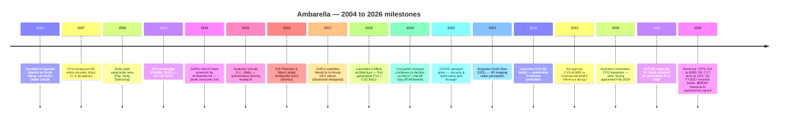
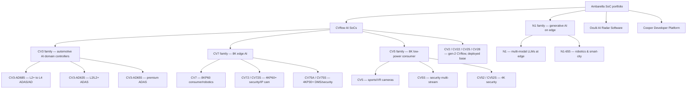
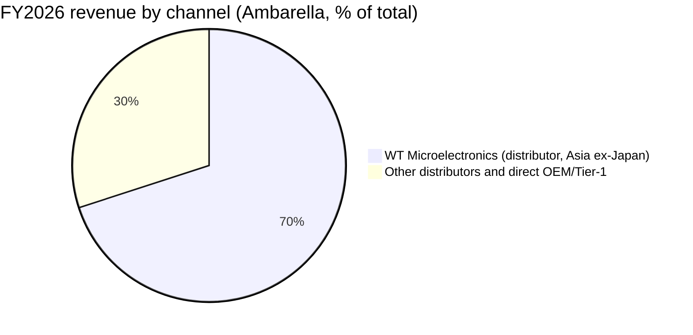
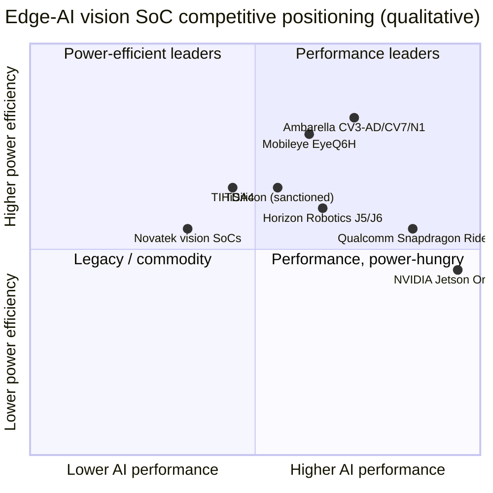

# COMPANY RESEARCH REPORT: Ambarella, Inc. (NASDAQ: AMBA)

**Date:** 2026-05-29 (Updated with Q1 FY2027 earnings and Hanwha partnership)
**Ticker:** NASDAQ: AMBA
**Listing:** Nasdaq Global Select Market
**Incorporation:** Cayman Islands (operating HQ: Santa Clara, California)
**Fiscal year end:** January 31
**Report language:** English

---

## TABLE OF CONTENTS

1. Company Overview
2. Company History
3. Management Team
4. Products & Services
5. Customers & Go-to-Market
6. Industry Overview
7. Competitive Landscape
8. Market Opportunity (TAM)
9. Risk Assessment
References

---

## 1. Company Overview

Ambarella, Inc. is an edge-AI semiconductor company that designs low-power systems-on-chip (SoCs) for computer-vision and physical-AI applications. The company combines image-signal processors, video CODECs, neural-vector processors and a proprietary CVflow AI accelerator into a single low-power die, then sells those SoCs (with an accompanying software stack) to OEMs, ODMs and Tier-1 suppliers in three end-markets: automotive cameras and ADAS/AD domain controllers; IoT/professional security cameras and AIoT/robotics platforms; and consumer cameras (action cams, drones, dash cams, video doorbells). Ambarella does not own fabs — the 10-K states that "the substantial majority of our SoCs are supplied by Samsung Electronics Corporation (Samsung) in facilities located in Austin, Texas and South Korea"; the same Manufacturing section names TSMC as one of the two foundries available for advanced 4 nm and 2 nm process technologies; advanced packaging, assembly and final testing are outsourced (Signetics, STATS ChipPAC, ASE, Sigurd, King Yuan Electronics) ([Ambarella FY2026 10-K, "Manufacturing"](https://www.sec.gov/Archives/edgar/data/1280263/000119312526119321/0001193125-26-119321-index.htm)).

The company recorded revenue of **USD 390.7 million** in fiscal 2026 (year ended **January 31, 2026**), up **37.2%** from USD 284.9 million in fiscal 2025, with GAAP gross margin of **59.2%** (vs. 60.5% in FY2025) and a GAAP net loss of **USD 75.9 million**, or USD 1.78 per diluted share, narrowing from USD 117.1 million / USD 2.84 per share the year before ([Q4 & Full Year FY2026 8-K press release, 2026-02-26](https://www.sec.gov/Archives/edgar/data/1280263/000119312526076823/d108529dex991.htm)). On a non-GAAP basis Ambarella swung back to a modest annual profit (non-GAAP net income of USD 26.9 million / USD 0.62 per share, vs. a non-GAAP loss of USD 6.8 million in FY2025) — the inflection that the market has been waiting on through a two-year inventory correction. At fiscal year-end Ambarella held USD 191.0 million of cash and equivalents plus USD 121.6 million of marketable debt securities (USD 312.6 million combined; no funded debt), and employed **959 people, ~75% of them in R&D**, with concentrations of 372 in Taiwan, 252 in the United States, 225 in China and 95 in Europe ([Ambarella FY2026 10-K, Item 1, "Human Capital Resources"](https://www.sec.gov/Archives/edgar/data/1280263/000119312526119321/0001193125-26-119321-index.htm)).

For the first quarter of fiscal 2027 (ended April 30, 2026; reported May 28, 2026), Ambarella posted revenue of **USD 100.4 million** (up 16.9% YoY from USD 85.9 mn), beating the consensus estimate of USD 100.2 million ([Q1 FY2027 8-K press release, 2026-05-28](https://www.sec.gov/Archives/edgar/data/0001280263/000119312526245234/d130687dex991.htm)). GAAP gross margin was **58.4%** (vs. 60.0% in Q1 FY2026) and non-GAAP gross margin was **59.9%** (vs. 62.0% in Q1 FY2026). The company recorded a GAAP net loss of **USD 18.1 million** (narrowed from a GAAP net loss of USD 24.3 million in the same quarter last year) and a non-GAAP net income of **USD 5.0 million**, or **USD 0.11 per diluted share** (beating the consensus of USD 0.10 and up from non-GAAP net income of USD 3.0 million in Q1 FY2026). At the end of the quarter, total cash, cash equivalents, and marketable debt securities stood at **USD 277.8 million** (down USD 34.8 million from the end of FY2026 due to an intentional inventory increase to support new product cycles and mitigate supply chain dynamics, but up from USD 259.4 million at the end of Q1 FY2026).

Ambarella's business model is classic fabless semis: capture multi-year design wins inside customer hardware (security cameras, ADAS modules, AD domain controllers, consumer cams, robots), then ride unit volumes per design over 3–7 years. The company sells globally but its end-customers are overwhelmingly Asia-based — **88% of FY2026 revenue went to Asia** (up from 85% in FY2025 and 79% in FY2024) reflecting the Chinese/Taiwanese ODM ecosystem that builds security cameras, dash cams and Tier-1 automotive modules for global brands ([Ambarella FY2026 10-K, "Sales by Geographic Region"](https://www.sec.gov/Archives/edgar/data/1280263/000119312526119321/0001193125-26-119321-index.htm)). Distribution runs through one non-exclusive sales representative — **WT Microelectronics (formerly Wintech)** — which fulfilled **70% of FY2026 revenue**, up from 63% in FY2025 and 53% in FY2024; the WT agreement extends through January 2029.

*Source: [Ambarella 10-K filings FY2022–FY2026, consolidated statements of operations](https://www.sec.gov/cgi-bin/browse-edgar?action=getcompany&CIK=0001280263&type=10-K&dateb=&owner=include&count=40).*

**Valuation snapshot (as of 2026-05-29).** Following the Q1 FY2027 earnings release and subsequent market correction on May 29, 2026, Ambarella closed at **USD 72.18** (down **21.4%** from its pre-earnings close of USD 91.84 on May 28), with a market cap of **USD 3.17 billion** on 43.86 million ordinary shares outstanding ([stockanalysis.com — AMBA, 2026-05-29 close](https://stockanalysis.com/stocks/amba/)). Trailing twelve-month figures: **TTM P/E is not meaningful** (GAAP net loss of USD 75.9 million in FY2026); **forward P/E is ~77.6×** consensus, **TTM P/S compressed to 8.10×** (USD 3.17 bn market cap ÷ USD 390.7 mn FY2026 revenue) from its pre-earnings level of 9.46×, **P/B is 5.2×**, **EV/Revenue 7.4×** and **EV/EBITDA is negative** as the company is still EBITDA-loss-making on a GAAP basis ([Yahoo Finance Key Statistics, AMBA, 2026-05-29](https://finance.yahoo.com/quote/AMBA/key-statistics)). The sharp market reaction represents a post-earnings reset, reflecting cautious guidance and concerns regarding H2 supply chain inflationary costs — driven by management commentary on rising memory-component (DRAM/flash) pricing and analyst concerns over forward-looking demand risks ([Ambarella (AMBA) Sees Significant Drop in Stock Price, 2026-05-29](https://www.gurufocus.com/news/8891596/ambarella-amba-sees-significant-drop-in-stock-price)).

The TTM P/S multiple of **9.5×** sits roughly in the middle of Ambarella's three-year range. The stock peaked at ~USD 96.69 in 2026 — roughly an 11× implied multiple on TTM sales — and bottomed near USD 48.30 in late-2024 during the IoT/security-camera inventory trough (an implied P/S of ~6.7× on then-trailing sales). Going further back, AMBA traded as high as ~USD 217 in late-2021 (~28× then-TTM sales) on the post-COVID AI/EV-vision frenzy ([yfinance 5-year price history, 2026-05-20](https://finance.yahoo.com/quote/AMBA/history)).

Peer comparison (TTM P/S, 2026-05-20, [Yahoo Finance](https://finance.yahoo.com/)): **NVIDIA 24.8× / Texas Instruments 14.7× / AMBA 9.5× / Qualcomm 5.1× / Mobileye 4.1×**.

*Source: [Yahoo Finance Key Statistics — AMBA, NVDA, QCOM, MBLY, TXN, 2026-05-20](https://finance.yahoo.com/quote/AMBA/key-statistics).*
 Ambarella sits **below NVDA and TXN but above QCOM and MBLY** — a premium versus diversified analog and ADAS-merchant peers, a discount versus the GPU/data-center hyperscale tier. The premium reflects edge-AI growth narrative and the FY2026 inflection back to revenue growth and non-GAAP profitability; the gap to NVIDIA reflects the absence of data-center revenue. The forward P/E above 70× signals the market is **pricing AMBA on the growth narrative**, not current earnings — typical of small-cap merchant-silicon plays with a credible product roadmap (CV3-AD design wins) and ongoing GAAP losses. The valuation is sensitive to design-win timing, gross-margin trajectory and customer concentration; we treat the multiple-compression risk as material and surface it again in Section 9.

---

## 2. Company History

Ambarella was founded and incorporated in the Cayman Islands in **January 2004** by Fermi Wang, Les Kohn and Didier LeGall — three veterans of video-codec pioneer **C-Cube Microsystems** and Sun Microsystems' acquisition target **Afara Websystems** ([Ambarella FY2026 10-K, "Corporate Information"](https://www.sec.gov/Archives/edgar/data/1280263/000119312526119321/0001193125-26-119321-index.htm)). The founding thesis was to apply codec and image-signal-processor expertise to a new generation of HD digital video applications, building low-power SoCs first for broadcast encoders and then for emerging consumer video form-factors. The company's first commercial volume came from **solid-state pocket camcorders** (the Flip era) and the **broadcast-television encoder market**, where Ambarella's compression efficiency made it the #1 supplier — "a majority of all broadcast television passing through our chips on any given day," according to the company's own history page ([Ambarella, About / History](https://www.ambarella.com/about-history/)).

**Strategic pivots.** Ambarella has executed three meaningful repositionings. (1) The **shift away from consumer-only** — when GoPro chose its own in-house GP1 SoC (designed with Socionext) for the Hero6 in September 2017, Ambarella lost its flagship consumer customer, and consumer revenue fell sharply over the next two product cycles as Hero7/Hero8 inherited the in-house silicon path; management accelerated investment in security and automotive in response ([Engadget, "The Hero 6 and 'GP1' is GoPro's chance to grow again", 2017-09-28](https://www.engadget.com/2017-09-28-gopro-hero-6-and-gp1.html); [Motley Fool, "Ambarella Loses as GoPro, DJI, and Google Shop Around for New Chips", 2017-10-14](https://www.fool.com/investing/2017/10/14/ambarella-loses-as-gopro-dji-and-google-shop-aroun.aspx)). The company's FY2026 10-K is explicit that "until 2023, a majority of our revenue originated from human-viewing only applications" and that the strategic focus is now machine-vision and physical-AI applications. (2) The **automotive build-out via VisLab and Oculii** — the 2015 acquisition of VisLab (an Italian autonomous-driving research lab spun out of the University of Parma) gave Ambarella an AD-stack software foundation, and the November 2021 acquisition of **Oculii** (4D imaging radar perception software) was the linchpin enabling the company to credibly compete in ADAS/AD against Mobileye and NVIDIA ([Ambarella FY2022 10-K, Item 1, "Acquisition of Oculii"](https://www.sec.gov/Archives/edgar/data/1280263/000156459022013224/0001564590-22-013224-index.htm)). (3) The **CVflow AI accelerator** introduced in 2018 was the bet that vision SoCs would converge with AI inference — a thesis that has aged well as edge-AI workloads proliferate, and a hardware family (CV2 → CV2x → CV5/CV7 → CV3) now spans every end-market the company addresses.

**Key acquisitions.**

- **VisLab S.r.l.** — June 2015 (autonomous-driving research, Parma, Italy). Foundational for AD software stack.
- **Oculii Corp.** — November 5, 2021. Total purchase consideration of **USD 355.7 million** (with $277.0 million attributed to goodwill, $32.8 million to intangible assets, $45.9 million to net assets acquired) ([Ambarella FY2022 10-K, business combinations note](https://www.sec.gov/Archives/edgar/data/1280263/000156459022013224/0001564590-22-013224-index.htm)). Ohio-based; brought adaptive AI radar perception software for ADAS and autonomous driving, since rebranded "Oculii AI Radar."

**Recent developments (last 12–18 months).** Three things matter for the current thesis: (a) the FY2026 revenue rebound (+37% YoY) confirming the inventory correction is over and AI-inference ASPs are higher than the legacy video parts they replace ([Q4 FY2026 8-K, 2026-02-26](https://www.sec.gov/Archives/edgar/data/1280263/000119312526076823/d108529dex991.htm)); (b) the **launch of the 4 nm CV7 family** at CES 2026 (8K edge-AI with multi-stream perception and the third-generation CVflow accelerator) and the broader N1 family adding on-device generative-AI/VLM capability — the first time Ambarella has positioned itself as a platform for **physical-AI agents** rather than purely surveillance/ADAS perception ([Ambarella press release, 2026-01-05](https://www.ambarella.com/news/ambarella-launches-powerful-edge-ai-8k-vision-soc-with-industry-leading-ai-and-multi-sensor-perception-performance/)); and (c) the launch of a **Developer Zone** at CES 2026, an attempt to broaden the customer funnel beyond Tier-1 chip-buyer relationships into an NVIDIA-style ecosystem of independent developers ([Ambarella DevZone announcement, 2026-01-06](https://www.ambarella.com/news/ambarella-launches-a-developer-zone-to-broaden-its-edge-ai-ecosystem/)); and (d) the signing of a landmark, long-term co-development and supply agreement with **Hanwha Group** in May 2026, worth an estimated potential USD 800+ million over the next decade to integrate Ambarella's edge-AI platforms across Hanwha's security, robotics, and industrial lines ([Hanwha and Ambarella Enter Into Long-Term Edge AI Agreement, GlobeNewswire, 2026-05-28](https://www.globenewswire.com/news-release/2026/05/28/3303250/23306/en/Hanwha-and-Ambarella-Enter-Into-Long-Term-Edge-AI-Agreement.html)). The board also authorized a new $50 million share repurchase program on May 28, 2026, valid through June 30, 2027 ([Q1 FY2027 8-K press release, 2026-05-28](https://www.sec.gov/Archives/edgar/data/0001280263/000119312526245234/d130687dex991.htm)).

---

## 3. Management Team

### Fermi Wang — Co-Founder, President, CEO and Executive Chairman

Feng-Ming "Fermi" Wang is the founder-CEO and Executive Chairman. He has run Ambarella from inception in January 2004, signing the FY2026 10-K on March 23, 2026, and is the most consequential bio in the company by a wide margin — both because of his founder status and because the company's product strategy (CVflow, the move from camera-vision to physical-AI) has tracked his stated thesis closely. Before Ambarella, Wang was **CEO and co-founder of Afara Websystems**, a server-throughput-computing startup acquired by Sun Microsystems in **July 2002**; Afara's multi-core, multi-thread CPU subsequently became the core technology in Sun's UltraSPARC roadmap ([Ambarella Executive Team page](https://www.ambarella.com/executive-team/)). Before founding Afara, Wang held senior engineering and business-management roles at **C-Cube Microsystems**, the early-1990s pioneer of MPEG video silicon — Wang's team at C-Cube developed "the world's first MPEG CODEC chip" per the company's bio. He holds several digital-video patents, including one of MPEG LA's core MPEG-2 and MPEG-4/AVC patents, which gave the founding team unusual depth in the video-codec primitives that became the foundation of Ambarella's image pipeline.

Wang has been at the helm continuously through Ambarella's IPO (October 2012) and the three subsequent business cycles — the action-camera boom (peaking 2014–2016 with GoPro), the GoPro silicon loss in 2019, the COVID security-camera spike, and the 2023–2024 inventory correction. The deliberate move from "human-viewing only" video chips into machine-vision and physical-AI, and the heavy R&D burden that has driven persistent GAAP losses, are recognisably his choices: R&D was **USD 238.5 million on USD 390.7 million of revenue (61% of revenue) in FY2026** ([FY2026 10-K, MD&A](https://www.sec.gov/Archives/edgar/data/1280263/000119312526119321/0001193125-26-119321-index.htm)), a deliberately founder-driven posture that has tested investor patience but kept the company shipping at the leading process node (4 nm and 5 nm for current parts, with a 2 nm SoC in development per the 10-K). Wang's public profile is relatively low-key for a Silicon Valley CEO — he gives investor calls and occasional CES keynotes but is not a heavy media presence — and beneficial ownership disclosed in the most recent proxy is meaningful but not super-voting (we will defer the exact stake to the upcoming 2026 DEF 14A; in prior proxies he has been disclosed as a beneficial owner of more than 5% of outstanding shares).

### John Young — Chief Financial Officer

John Young was **appointed CFO in February 2024**, succeeding Brian White ([Ambarella Executive Team](https://www.ambarella.com/executive-team/)). Young is an internal promotion: he joined Ambarella in **March 2017 as corporate controller**, became **VP of Finance in December 2019**, and served as principal accounting and financial officer in 2021–2022. Before Ambarella he held a series of finance roles at **Mellanox Technologies** (2009–2016, most recently corporate controller) and began his career as a CPA at **Ernst & Young**. His Mellanox tenure spans the period in which Mellanox grew from ~USD 250 million to ~USD 850 million in annual revenue and went through multiple public-company secondary offerings — useful capital-markets experience for a CFO running a company with no debt but a steady GAAP cash burn. John Young's tenure as CFO has coincided with the FY2026 inflection and the successful start of FY2027. Under his guidance, Q1 FY2027 revenue reached **USD 100.4 million** (beating the USD 97–103 million guidance range) with a non-GAAP gross margin of **59.9%** (within the 59–60.5% guidance range). For Q2 FY2027, Young guided to revenue of **USD 105.0–111.0 million** (midpoint USD 108.0 million), non-GAAP gross margin of **59.0%–60.5%**, and non-GAAP operating expenses of **USD 56.0–59.0 million** ([Q1 FY2027 8-K press release, 2026-05-28](https://www.sec.gov/Archives/edgar/data/0001280263/000119312526245234/d130687dex991.htm)). Despite meeting consensus, the stock fell **21.4%** on May 29, 2026 (from USD 91.84 to USD 72.18), as investors focused on Young's commentary highlighting potential second-half supply-chain inflationary pressures — specifically rising memory component (DRAM/flash) costs — and subsequent demand risks ([Ambarella (AMBA) Sees Significant Drop in Stock Price, 2026-05-29](https://www.gurufocus.com/news/8891596/ambarella-amba-sees-significant-drop-in-stock-price)).

*Source: [Ambarella quarterly 8-K earnings press releases, FY2025–FY2026](https://www.sec.gov/cgi-bin/browse-edgar?action=getcompany&CIK=0001280263&type=8-K).*

### Les Kohn — Co-Founder, Chief Technology Advisor

Les Kohn is one of the most senior chip architects in Silicon Valley and Ambarella's resident technologist. Co-founder of Afara with Wang, Kohn was **chief architect of UltraSPARC I and II at Sun**, **chief architect of the Intel i860**, and **co-architect of the National 32000** before that ([Ambarella Executive Team](https://www.ambarella.com/executive-team/)). At C-Cube he led the development of three generations of digital-video CODECs, including the first single-chip MPEG-2. Kohn's role at Ambarella — Chief Technology Advisor — has shifted from operational CTO to a senior architectural-direction position, but the CVflow accelerator family and the architectural choice to fuse ISP, codec and neural processing on a single die clearly carries his fingerprints.

### Muneyb Minhazuddin — Customer Growth Officer

Muneyb Minhazuddin joined Ambarella as Customer Growth Officer to lead the developer-ecosystem and Tier-1 customer build-out. He came from **Intel, where he was CMO of the Network and Edge Group** and helped establish Intel's commercial edge-AI software business; before Intel he spent a decade at VMware where he founded the Edge Computing and Private Mobile Networks businesses ([Ambarella Executive Team](https://www.ambarella.com/executive-team/)). His hire signals that the company is treating ecosystem and developer reach (Cooper platform, DevZone) as a strategic lever rather than just a marketing function — a reasonable response to NVIDIA's overwhelming developer-ecosystem advantage with CUDA/Jetson.

### Governance

The board has **eight directors** as of the 2026 DEF 14A: Fermi Wang (Executive Chairman), Gregory M. Bryant (Lead Independent Director since February 2026; former President of Global Business Units at Analog Devices from March 2022 to March 2025, and previously EVP and GM of Intel's Client Computing Group from September 2019 to January 2022), Christopher B. Paisley (audit-committee chair; on the board since August 2012; Dean's Executive Professor of Accounting at Santa Clara University), Chenming C. Hu, Ph.D. (former CTO of TSMC from 2001 to 2004; TSMC Distinguished Chair Professor Emeritus at UC Berkeley), D. Jeffrey Richardson (former EVP and COO of LSI Corporation until its 2014 acquisition by Avago; earlier VP/GM of Server Platform Group at Intel), Hsiao-Wuen Hon, Ph.D. (former Corporate VP, Microsoft Research Asia), Elizabeth M. Schwarting, and Chantelle Y. Breithaupt (SVP and CFO of Arista Networks since January 2024; previously SVP and CFO of Aspen Technology from March 2021 to December 2023) ([Ambarella 2026 DEF 14A, Proposal 1 — Election of Directors](https://www.sec.gov/Archives/edgar/data/1280263/000119312526227183/d20210ddef14a.htm); [Ambarella Board of Directors page](https://www.ambarella.com/board-of-directors/)). Women represent **33% of independent board members** as of January 31, 2026 ([FY2026 10-K, Human Capital](https://www.sec.gov/Archives/edgar/data/1280263/000119312526119321/0001193125-26-119321-index.htm)). The board is heavy on semiconductor and technology operating experience (Hu, Richardson, Bryant) and capital-markets experience (Paisley, Breithaupt). Compensation is heavily equity-weighted — typical for a small-cap semis name — and the 2025 DEF 14A flagged no material related-party transactions. Voluntary employee turnover was 7.7% in FY2026, low for a Bay-Area semis employer.

### Track record

This is a founder-led company that has delivered through three product cycles — broadcast/camcorder, action-cam/drone, and now edge-AI/automotive — but with a meaningful gap: the GoPro loss in 2019 took two-plus years to absorb, and the FY2024 inventory correction was steeper than peers (revenue dropped from USD 337.6 million in FY2023 to USD 226.5 million in FY2024, a 33% decline). The FY2026 recovery to USD 390.7 million sets a new high, but the GAAP cash burn is structural and management's credibility now rests on (a) the CV3-AD automotive ramp converting design wins to volume revenue and (b) the gross-margin trajectory not eroding further as the customer mix tilts toward Tier-1 ADAS.

---

## 4. Products & Services

Ambarella organises its product portfolio around two cuts: by **end-application** (Automotive / Security / Consumer / AIoT, Industrial & Robotics) on the website navigation, and by **silicon family** (CV-series CVflow SoCs, N-series for generative-AI-on-edge, OEM SoCs, and the Cooper developer platform). The CVflow accelerator is the unifying architecture across families and is now in its **third generation** (used in CV7, CV3 and N1) on 4 nm and 5 nm process technology ([Ambarella FY2026 10-K, "Products"](https://www.sec.gov/Archives/edgar/data/1280263/000119312526119321/0001193125-26-119321-index.htm)).

**Automotive — flagship platform: CV3-AD family.** The CV3-AD family is Ambarella's central-domain-controller platform for L2+ to L4 autonomous driving and premium ADAS. The flagship part is the **CV3-AD685**, an ASIL-B(D)-compliant AI domain controller SoC that integrates a neural vector processor (NVP), a general vector processor (GVP), an image processor, a dense stereo and optical-flow engine, **Arm Cortex-A78AE and Cortex-R52 CPUs**, an automotive GPU and a hardware security module on a single die ([Ambarella Automotive Products page](https://www.ambarella.com/products/automotive/)). Ambarella's own 10-K language is that CV3 delivers "neural network processing that is 20× faster than the previous generation of CV2 SoCs" and supports "the entire AD software stack" — that is, the customer pays for one chip rather than the multi-chip configurations typical with Mobileye EyeQ5/EyeQ6 stacks ([FY2026 10-K, "Central Domain Controller"](https://www.sec.gov/Archives/edgar/data/1280263/000119312526119321/0001193125-26-119321-index.htm)). The CV3-AD635 and CV3-AD655 round out the family for mid-tier and premium ADAS respectively. Pricing is undisclosed but typical premium-ADAS SoC ASPs are in the USD 60–150 range per car per parts (NVIDIA Drive Orin/Thor sits higher; Mobileye EyeQ6H lower). **Competitive verdict: partial moat.** Ambarella has the architectural depth and the Oculii 4D radar perception that Mobileye and TI lack, but **NVIDIA Drive Thor** (2,000 TOPS, single-SoC AD platform) is the head-on competitor and NVIDIA has the deeper developer ecosystem. Mobileye EyeQ6H is the closest like-for-like ASIC competitor with similar power profile; AMBA is at parity on perception and arguably ahead on radar integration, behind on cumulative design wins and EyeQ deployed base.

**Security — flagship platform: CV5S/CV72S/CV75S.** The professional-security family targets IP cameras, multi-imager 360° rigs, retail surveillance and traffic cameras. The **CV5S** delivers 8K encoding at under 4W (suited for IP/robotics); **CV52S** delivers 4KP60 under 3W with TrustZone and secure boot; **CV72S** is the new 4KP60+ part on 5 nm with CVflow gen-2; **CV75S** is the 4KP30+ derivative ([Ambarella Security Products page](https://www.ambarella.com/products/security/)). Pricing is in the USD 15–50 ASP band. **Competitive verdict: yes, scale-and-IP moat.** Ambarella is the merchant-silicon leader in HD/UHD professional security cameras (a position the company has held since the late 2010s), with relationships at every major IP-cam ODM (Hikvision/Dahua's external supply channels, plus all Western brands). The closest competitor is **Novatek** (Taiwan) at the lower end and **Qualcomm IP Q-Series** for the higher-AI tier — Ambarella is at parity on AI features and meaningfully ahead on low-light/HDR image quality and compression efficiency. The risk in this segment is **HiSilicon (Huawei)**, which historically dominated Chinese surveillance but has been crippled by US export controls — its return as a competitor (if sanctions relax) would change the competitive picture quickly.

**Consumer — flagship platform: CV5/CV7.** Sports/action cameras, VR/360° cameras, consumer drones, aftermarket dash cams, video doorbells. **CV5** delivers 8KP60 video; **CV7** (announced at CES 2026, 4 nm) takes that to 8KP60 with the third-generation CVflow accelerator and multi-stream perception ([Ambarella Consumer Products page](https://www.ambarella.com/products/consumer/); [CV7 press release, 2026-01-05](https://www.ambarella.com/news/ambarella-launches-powerful-edge-ai-8k-vision-soc-with-industry-leading-ai-and-multi-sensor-perception-performance/)). ASPs are USD 25–80. **Competitive verdict: partial moat.** This segment is where Ambarella historically had the strongest moat (GoPro Hero4 generation was effectively Ambarella-only), then lost it when GoPro switched to its in-house GP1 SoC in Hero6 (September 2017). The company retains strong positions in dash cams (Garmin, Nextbase, Chinese ODMs supplying global aftermarket) and police body cams (Axon and competitors), where image quality and compression efficiency are decisive. **DJI**, the dominant consumer-drone vendor, has migrated significant volume to its own silicon and to other merchant suppliers — a structural headwind.

**AIoT, Industrial & Robotics — flagship platform: N1 family + CV7.** The **N1** is Ambarella's first explicit play for **on-device generative AI**: an SoC capable of running multi-modal LLMs (up to 34-billion-parameter models per the 10-K), with **16 Arm Cortex-A78AE CPUs**, a neural-vector processor, a general-vector processor, an image processor, a dense stereo and optical-flow engine and an integrated GPU ([Ambarella AIoT Products page](https://www.ambarella.com/products/aiot-industrial-robotics/)). The **N1-655** is the 8-core derivative targeting industrial automation, robotics and smart-city video analytics. The 10-K's marketing example — a warehouse robot interpreting the command "find the pallet in aisle 7 with the damaged box and bring it to the inspection area" — captures the positioning. **Competitive verdict: yes for vision-centric robots, no for general humanoid/agentic compute.** N1 is competitive with NVIDIA Jetson Orin/Thor on perception-heavy edge robotics workloads and meaningfully cheaper and more power-efficient; it is behind Jetson on general-purpose compute, software ecosystem and the developer mindshare.

**Software and platforms — Cooper Developer Platform and Oculii AI Radar.** The Cooper platform consists of "Cooper Metal" (the AI SoC + board-level hardware reference designs) and "Cooper Foundry" (the multi-layer software stack including AD stack, AI radar perception, model porting tools) ([Ambarella FY2026 10-K, "Cooper"](https://www.sec.gov/Archives/edgar/data/1280263/000119312526119321/0001193125-26-119321-index.htm); [Cooper page](https://www.ambarella.com/cooper/)). Oculii AI Radar (from the 2021 acquisition) is the differentiator — it provides 4D adaptive imaging radar perception software that runs on CV3 SoCs and competes with Mobileye REM/RoadBook on the perception layer.

**Flagship vs. long-tail.** The flagships driving FY2026 revenue and FY2027 expected growth are: (1) **CV3-AD685** in automotive (most visible design wins, highest ASP), (2) **CV5S / CV72S / CV75S** in professional security (largest installed base, steady refresh), and (3) the **CV7 family** announced at CES 2026 — flagging the move to 4 nm in the consumer/AIoT/security segment. The deployed base of older parts (CV22 / CV25 / CV28 / A12 / A9) continues to ship into existing camera platforms but the unit economics decline as customers refresh.

**Roadmap and launches (last 12 months).** The CV7 launch (CES 2026, 4 nm 8K edge-AI SoC) is the most material new product. The N1 family was unveiled in 2024–25; N1-655 launched as the second part in the family. The Developer Zone launched January 6, 2026 — strategically important if it reaches scale. The 10-K discloses that Ambarella has "taped out our first SoC design in the 2 nm process node" and names both Samsung and TSMC as the two foundries "currently available for certain advanced process technologies that we utilize or may utilize, such as 4 nm or 2 nm" — the 10-K does not specifically state which foundry is fabricating the 2 nm part, but the dual-foundry framing is itself a hedge against single-supplier dependence and a signal that the company expects to compete with NVIDIA Drive Thor in the next ADAS generation ([FY2026 10-K, "Manufacturing"](https://www.sec.gov/Archives/edgar/data/1280263/000119312526119321/0001193125-26-119321-index.htm)).

---

## 5. Customers & Go-to-Market

Ambarella sells to three customer types: (i) **OEMs** (e.g. consumer-camera brands, automotive OEMs adopting reference designs directly), (ii) **ODMs and contract manufacturers** (the Chinese/Taiwanese ecosystem that builds security cameras and dash cams for global brands), and (iii) **Tier-1 automotive suppliers** (Continental, Bosch, ZF, Aptiv, Magna, etc.) who integrate the SoC into ADAS/AD modules sold to OEMs. The company runs a hybrid go-to-market: a direct sales force (USA, Asia, Europe) for design wins and a **non-exclusive distributor (WT Microelectronics)** that handles fulfilment in Asia ex-Japan ([Ambarella FY2026 10-K, Item 1, "Sales and Marketing"](https://www.sec.gov/Archives/edgar/data/1280263/000119312526119321/0001193125-26-119321-index.htm)).

**Customer concentration — distributor-led and very heavy.** The single 10%-of-revenue customer in FY2026 was **WT Microelectronics Co., Ltd.** (formerly Wintech Microelectronics) at **approximately 70% of total revenue**, up from **63% in FY2025** and **53% in FY2024** ([Ambarella FY2026 10-K, "Major Customers"](https://www.sec.gov/Archives/edgar/data/1280263/000119312526119321/0001193125-26-119321-index.htm)). WT is the **non-exclusive sales representative and fulfillment partner in Asia other than Japan**; the underlying end-customers are the global ODM/OEM base, but for SEC accounting the revenue is booked to WT as the counterparty of record. The 10-K explicitly notes the **current WT agreement runs through January 2029** and is terminable by either party on 60 days written notice. The historical second 10%-of-revenue counterparty was **Chicony** (a Taiwanese ODM serving the consumer/security segment), disclosed as such in FY2024 — Chicony fell below the 10% threshold in FY2025 and FY2026.

*Source: [Ambarella FY2026 10-K, "Major Customers"](https://www.sec.gov/Archives/edgar/data/1280263/000119312526119321/0001193125-26-119321-index.htm).*

*Source: [Ambarella FY2026 10-K, "Major Customers"](https://www.sec.gov/Archives/edgar/data/1280263/000119312526119321/0001193125-26-119321-index.htm); FY2025 and FY2024 10-Ks for prior-year comparisons.*

**Geographic concentration.** Asia accounted for **88% of FY2026 revenue** (85% FY2025, 79% FY2024) ([FY2026 10-K, "Sales by Geographic Region"](https://www.sec.gov/Archives/edgar/data/1280263/000119312526119321/0001193125-26-119321-index.htm)) — driven by the Chinese and Taiwanese ODM base that builds cameras and modules for global brands. China-specific exposure is material; the 10-K discloses US-China tariff and export-control risk as a top-tier risk factor (Section 9 below).

**Sales cycle.** The typical design cycle is described in the 10-K as multi-month, "involving our customers' system designers and management and our sales personnel and software engineers" — culminating in a design win, after which volume revenue typically begins 9–18 months later for consumer/security and **3–5 years later for automotive** given vehicle program timelines. This long automotive cycle is why design-win announcements (rather than near-term revenue) drive AMBA's stock reaction to Tier-1 news.

**Distribution channels.** WT Microelectronics dominates Asia ex-Japan. **Macnica** historically served Japan, with smaller specialty distributors in Europe and the Americas. Direct sales offices are in Santa Clara (HQ), Hong Kong and business-development offices in China, Germany, Japan, South Korea and Taiwan ([FY2026 10-K, Item 1](https://www.sec.gov/Archives/edgar/data/1280263/000119312526119321/0001193125-26-119321-index.htm)).

**Named customer wins.** The most publicly cited automotive wins include **Continental** (ADAS reference designs incorporating CV3-AD685), public references at trade shows naming European and Asian OEMs (without disclosing specific volume programs), and the broader Tier-1 design-in cycle disclosed in earnings calls. In security/consumer the deployed base is the entire major IP-cam OEM landscape (Western brands plus Chinese ODMs) plus **Axon** body cameras and **Garmin** / **Nextbase** dash cams. The 10-K does not name specific OEMs as customers (consistent with industry practice; named customer disclosure happens via the OEMs' own filings or trade press) — Ambarella's own customer-disclosure language is generic ("OEMs to whom we ship directly").

**Partnerships.** Foundry partnerships with **Samsung** (primary, including 5 nm and 4 nm parts in Austin TX and South Korea) and **TSMC** (advanced 4 nm and 2 nm parts in development) are disclosed ([FY2026 10-K, "Manufacturing"](https://www.sec.gov/Archives/edgar/data/1280263/000119312526119321/0001193125-26-119321-index.htm)). Strategic partnerships include a landmark, long-term agreement signed in May 2026 with South Korea's **Hanwha Group** (covering Hanwha Vision, Hanwha Robotics, etc.) with an estimated potential revenue impact exceeding **USD 800 million** over the next decade. The agreement, which follows a March 2026 MOU, focuses on the sourcing and co-development of edge-AI systems-on-chip (SoCs) and software, utilizing Ambarella's CVflow edge-AI platform for video security, robotics, industrial automation and life sciences; Hanwha Vision retains proprietary control over the engineering, design and sourcing for its Wisenet SoC ([Hanwha and Ambarella Enter Into Long-Term Edge AI Agreement, GlobeNewswire, 2026-05-28](https://www.globenewswire.com/news-release/2026/05/28/3303250/23306/en/Hanwha-and-Ambarella-Enter-Into-Long-Term-Edge-AI-Agreement.html)). Software and ecosystem partnerships span the AD-stack and AI-model communities (the Cooper platform supports Caffe, TensorFlow, PyTorch and ONNX import).

---

## 6. Industry Overview

Ambarella sits at the intersection of three industries: (1) **edge-AI silicon** (the broader category of low-power AI inference SoCs for embedded systems), (2) **automotive semiconductors** specifically for ADAS and autonomous driving, and (3) **video/vision processing silicon** for surveillance and consumer cameras. NAICS classification is **334413** (Semiconductor and Related Device Manufacturing), with the company self-categorising under SIC 3674.

**Edge-AI silicon (the umbrella).** The edge-AI SoC market is one of the fastest-growing segments of semiconductors, driven by the proliferation of cameras and sensors on devices that increasingly run inference locally rather than in cloud. **Estimates of the size of the broader edge-AI hardware market vary widely by scope and source**: Allied Market Research's "Edge AI Hardware Market" press release (originally sized around the 2020 base year) puts 2030 at **USD 38.87 billion** at an 18.8% CAGR ([Allied Market Research press release, "Edge AI Hardware Market to Reach $38.87 Billion By 2030"](https://www.alliedmarketresearch.com/press-release/edge-ai-hardware-market.html)). Other research houses (broader scope including AI-PC, AR/VR and gen-AI workloads) put 2030 nearer **USD 70–80 billion** at a high-teens to low-20s CAGR — these higher figures are the umbrella range Ambarella's management points to on earnings calls, but they include accelerators well outside Ambarella's serviceable scope. Growth drivers: (a) physical-AI and robotics (humanoids, AMRs, drones), (b) automotive ADAS/AD content per vehicle rising from <USD 100 in entry-level systems to USD 1,500+ in L2+/L3 platforms, (c) intelligent video security migrating from cloud analytics to on-camera inference for privacy and latency, and (d) AI-PC, AR/VR, smart-home and consumer-electronics — though Ambarella has limited exposure to the last three.

**Automotive ADAS/AD silicon.** The automotive ADAS/AD SoC market is the most consequential vertical for Ambarella's narrative. ADAS content per vehicle is rising rapidly: McKinsey's "Outlook on the automotive software and electronics market through 2030" projects the central-compute (domain-controller) segment as the fastest-growing slice of automotive E/E spend, driven by the OEM transition from distributed ECUs to centralized SDV architectures ([McKinsey Center for Future Mobility, "Outlook on the automotive software and electronics market through 2030", 2024](https://www.mckinsey.com/features/mckinsey-center-for-future-mobility/our-insights/mapping-the-automotive-software-and-electronics-landscape-2024)). NVIDIA, Mobileye, Qualcomm and TI are the named incumbents; Ambarella and Horizon Robotics (China) are the named challengers. The 2026–2030 design-win cycle is the key competitive window — wins booked now ship in vehicles 2027–2030, defining the next decade's revenue distribution.

**Vision processing silicon for security and consumer cameras.** This is the more mature half of the business. The global IP-security-camera equipment market is estimated at roughly USD 25–30 billion (the silicon TAM is a small fraction — analyst estimates put it at USD 1.5–2 billion annually) and grows mid-to-high single digits (size estimates are analyst triangulations across Novaira Insights / IPVM / Omdia trade publications — exact figures vary by scope and methodology). The consumer-camera silicon TAM is smaller (USD 500 million–USD 1 billion across sports/action, drones, doorbells, dash cams) and slower-growing in volume but rising in AI content per device.

**Industry structure.** Edge-AI silicon is **fragmented** at the merchant level (NVIDIA, Qualcomm, AMD, Ambarella, Hailo, Sima.ai, MediaTek, Novatek, Horizon Robotics, Black Sesame) but **concentrated by application**: ADAS is a 4–5 player oligopoly (Mobileye + NVIDIA + Qualcomm + TI + Ambarella + Horizon for China), security is a Hikvision/Dahua duopoly on the camera side with Ambarella the merchant-silicon leader, consumer is a long tail. **Buyer power** is high in automotive (Tier-1s have alternatives and negotiate aggressively), medium in security (camera ODMs have alternatives but image quality is decisive). **Supplier power** is high — only Samsung and TSMC can manufacture the 4 nm/5 nm parts Ambarella designs, and the FY2026 10-K explicitly flags this concentration as a risk. **Substitution risk** comes from customers building in-house (GoPro 2019 is the precedent; DJI ongoing; Tesla, Xiaomi, Apple have all moved silicon in-house in adjacent areas).

**Regulatory environment.** US export controls (BIS Entity List, Foreign Direct Product Rule) materially affect Ambarella because: (a) ~88% of revenue ends in Asia, much in China; (b) several Chinese competitors (HiSilicon) are sanction-constrained, which is a tailwind, but (c) further US restrictions on US-designed AI chips to China could limit Ambarella's own China revenue. The 10-K cites US-China tensions, the Russia/Ukraine conflict and Middle East hostilities as named forward-looking-statement risks ([FY2026 10-K, "Forward-Looking Statements"](https://www.sec.gov/Archives/edgar/data/1280263/000119312526119321/0001193125-26-119321-index.htm)). Automotive safety regulation (ISO 26262 functional safety, ASIL B/D) is a barrier to entry and a positive for established players with certified parts.

**Key trends and drivers.**

1. **Physical AI** — the transition from "vision SoCs" to "edge AI platforms running multi-modal LLMs and VLMs" is the strategic narrative now driving the segment. NVIDIA Jetson Thor, Ambarella N1, Qualcomm RB6 are all positioned around this. Capital flowing into humanoid robotics (Figure AI, 1X, Unitree, Apptronik, Tesla Optimus) is the obvious growth wedge.
2. **ADAS feature creep** — Euro NCAP and IIHS protocols push driver-monitoring (DMS), camera mirrors, automatic emergency braking and lane-keeping as standard, expanding per-vehicle silicon spend.
3. **AI on the edge** vs. cloud — privacy, latency and bandwidth economics push inference local. This is unambiguously good for Ambarella's positioning.
4. **Foundry node migration** to 4 nm / 3 nm / 2 nm — Ambarella's commitment to leading-edge nodes (4 nm CV7, 2 nm SoC in development) is expensive (R&D = 61% of revenue) but necessary to compete with NVIDIA Drive Thor in 2027–2028.

---

## 7. Competitive Landscape

Ambarella faces meaningfully different competitive sets in each end-market. The FY2026 10-K explicitly names competitors: "In the IoT market, our primary competitors include HiSilicon Technologies Co., Ltd., or HiSilicon, which is owned by Huawei Technologies Co., Novatek Microelectronics Corp., or Novatek, NVIDIA Corporation, or NVIDIA, Qualcomm Incorporated, or Qualcomm, and Sigmastar Technology Ltd. In the automotive camera market, we compete against Horizon Robotics Inc., Mobileye, a subsidiary of Intel Corporation, Novatek, NVIDIA, Qualcomm, Renesas Electronics Corporation, and Texas Instruments" ([Ambarella FY2026 10-K, Item 1, "Competition"](https://www.sec.gov/Archives/edgar/data/1280263/000119312526119321/0001193125-26-119321-index.htm)).

**NVIDIA (NASDAQ: NVDA) — the platform competitor.** NVIDIA's Jetson family (Orin, Thor) and Drive platforms are the most consequential head-on competitors. **Jetson Orin** delivers up to 275 TOPS at 15–60W, **Jetson Thor** (2025) targets ~2,000 TOPS for humanoid robotics, and **Drive Thor** for L4 AD. NVIDIA's advantage is **CUDA + the entire AI software ecosystem** — every model, every framework, every developer tool runs first on NVIDIA, and Ambarella's CVflow toolchain (while solid for porting Caffe/PyTorch/TF/ONNX) does not match NVIDIA's depth. NVIDIA's disadvantage is **power and price**: Jetson is significantly more expensive and more power-hungry than Ambarella's equivalents, which matters for battery-powered robots and high-volume cost-sensitive consumer cameras. **NVIDIA's TTM P/S is 24.8× vs Ambarella's 9.5×** ([Yahoo Finance, 2026-05-20](https://finance.yahoo.com/quote/NVDA/key-statistics)) — the market has already priced NVIDIA as the dominant edge-AI player.

**Mobileye (NASDAQ: MBLY) — the ADAS incumbent.** Mobileye's EyeQ family is the dominant merchant ADAS SoC (>120 million units cumulative shipped through 2025 per company filings). EyeQ6H (2024) and the upcoming EyeQ7H target the same L2+/L3 ADAS segment as Ambarella CV3-AD. Mobileye's moat is **deployed base + Road Experience Management (REM) crowdsourced HD-map data** from existing EyeQ-equipped vehicles. Mobileye's disadvantage versus Ambarella is **the lack of integrated 4D imaging radar** (Ambarella's Oculii) and a more closed software model — Mobileye traditionally bundles SoC + software whereas Ambarella sells more openly to Tier-1s who want to own the AD stack. Mobileye's **TTM P/S of 4.1×** ([Yahoo Finance, 2026-05-20](https://finance.yahoo.com/quote/MBLY/key-statistics)) is below Ambarella's, reflecting slower growth and the post-2024 design-loss cycle to NVIDIA.

**Qualcomm (NASDAQ: QCOM) — the systems competitor.** Qualcomm's **Snapdragon Ride** automotive platform and Snapdragon edge IoT family (RB5, RB6) compete with Ambarella across automotive and AIoT. Qualcomm's advantages are integrated cellular connectivity, scale (USD 35+ billion revenue), and deep relationships with automotive OEMs that already use Snapdragon Digital Cockpit. Disadvantage: less focused on the perception-heavy compute that Ambarella optimises for. Qualcomm trades at **5.1× TTM P/S**, well below AMBA.

**Texas Instruments (NASDAQ: TXN) — the volume incumbent.** TI's **TDA4** family of ADAS processors is the volume merchant ADAS SoC for entry-level and mid-range — high reliability, mature toolchain, broad Tier-1 design wins. TDA4 is not at the AI-performance level of CV3-AD or Drive Thor, so the competitive overlap is in entry/mid ADAS, not L3/L4. TI trades at a sector-elevated 14.7× P/S because of its broader analog/embedded franchise and dividend.

**Horizon Robotics (HKEX: 9660) — the China challenger.** Horizon's Journey (J2/J3/J5/J6) SoC family is the dominant Chinese-domestic ADAS platform — design wins at BYD, Li Auto, GAC, Chery, SAIC, and increasingly with global OEMs sourcing into China. Horizon went public on HKEX in October 2024 ([Horizon Robotics HKEX global offering prospectus, 2024-10-16](https://www1.hkexnews.hk/listedco/listconews/sehk/2024/1016/2024101600017.pdf)) and is the most immediate competitive threat for Ambarella's China automotive ambitions. Horizon has the home-market advantage; Ambarella has the leading-edge process node and the radar integration. The next 24 months will define whether Ambarella holds non-China and Western Tier-1 share against a vertically-integrated, well-funded Chinese competitor.

**Other named competitors** (10-K explicitly names the first four). **Renesas Electronics** (Japan; R-Car family) for automotive; **Novatek** (Taiwan; lower-end vision SoCs and IP-cam); **HiSilicon** (Huawei; sanctioned but historically dominant in Chinese surveillance — possible re-entry risk if sanctions ease); **Sigmastar** (China; low-cost IP-cam SoCs). Beyond the 10-K's list, analyst view: **Black Sesame Technologies** (China; ADAS SoC challenger); **Hailo** (Israel; standalone AI accelerator); **Sima.ai** (US; edge-AI accelerator startup); **MediaTek** (Taiwan; broader edge SoCs including AIoT). Customer in-housing remains a structural risk: **DJI, Tesla, Xiaomi** have all moved silicon in-house in adjacent areas.

**Ambarella's competitive advantages.** (1) Architectural moat in fused video + AI + ISP on a single low-power die — meaningfully better perf-per-watt than NVIDIA Jetson for camera workloads. (2) **4D imaging radar perception** via Oculii — a genuine differentiator versus Mobileye and TI. (3) Multi-decade codec/ISP IP — image-quality leadership in low-light, HDR, dewarp, EIS. (4) **Functional safety certifications** (ASIL B/D on CV3) — a 3–5 year competitive moat. (5) Leading-edge process commitment (4 nm CV7, 2 nm in development) — only NVIDIA and Mobileye match this.

**Competitive vulnerabilities.** (1) **No CUDA equivalent** — CVflow toolchain is solid but the developer-ecosystem gap to NVIDIA is wide and growing; the DevZone launch is the response. (2) **Customer concentration via WT (70%)** — operational rather than competitive risk, but limits negotiating leverage. (3) **Small relative to peers** (USD 391 million revenue vs. NVIDIA's USD 130+ billion) — limits R&D scale and customer-credibility. (4) **No data-center / training exposure** — Ambarella is pure-play edge; if AI shifts back toward more cloud inference (and away from on-device), the thesis weakens.

---

## 8. Market Opportunity (TAM)

We size Ambarella's TAM across three layered markets, anchored to third-party forecasts and triangulated against the company's own 10-K language.

**TAM — broader edge-AI silicon.** Triangulating across research houses gives a wide range. Allied Market Research's "Edge AI Hardware Market" puts 2030 at **USD 38.87 billion** at an 18.8% CAGR ([Allied Market Research press release](https://www.alliedmarketresearch.com/press-release/edge-ai-hardware-market.html)). IDC's "Worldwide Edge Spending Guide" projects global edge-computing spending of approximately **USD 380 billion by 2028** at a 13.8% CAGR, with edge-AI silicon a fast-growing sub-segment ([IDC press release, "Global Spending on Edge Computing to Grow at 13.8% Reaching Nearly $380 Billion by 2028"](https://my.idc.com/getdoc.jsp?containerId=prUS53261225)). Broader-scope industry estimates that include AI-PC and AR/VR silicon put 2030 nearer USD 70–80 billion at a high-teens to low-20s CAGR — this is the umbrella range Ambarella's management points to when discussing the "USD 70+ billion edge-AI opportunity" on earnings calls, though it includes accelerators well outside Ambarella's addressable scope.

**SAM — Ambarella's serviceable addressable market.** SAM is the subset of edge-AI silicon focused on **vision-centric edge applications** — ADAS/AD domain controllers, IP/security cameras with on-device analytics, robotics-vision SoCs, consumer cameras with on-device AI. *Analyst estimate:* triangulating across S&P Global Mobility's ADAS / autonomy forecasts and industry estimates of the surveillance silicon market, vision-centric edge-AI silicon SAM is approximately **USD 8–10 billion in 2024**, growing to **USD 22–28 billion by 2030** at a 17–19% CAGR (S&P Global Mobility's "Autonomy Forecasts" product is the underlying ADAS reference: [S&P Global Mobility, Autonomy Forecasts](https://www.spglobal.com/mobility/en/products/autonomy-forecasts.html); surveillance-silicon component is an analyst overlay not separately disclosed by any single research house). Within this:

- **Automotive ADAS/AD SoC SAM**: ~USD 4 billion in 2024 → ~USD 12–15 billion by 2030 (driven by ADAS content/vehicle rising plus AD/L2+ penetration; per-vehicle silicon spend climbing from <USD 100 to USD 300–1,500 across the segment range).
- **Security/Surveillance vision SoC SAM**: ~USD 1.5–2 billion in 2024 → ~USD 3–4 billion by 2030 (low-to-mid teens growth).
- **Consumer + AIoT/Robotics vision SoC SAM**: ~USD 2.5–4 billion in 2024 → ~USD 7–9 billion by 2030 (driven by humanoid/AMR robotics inflection from ~2027 onward).

**SOM — Ambarella's realistic share.** Ambarella's FY2026 revenue of **USD 391 million** equates to roughly **~4% of the addressable SAM today**. Management's medium-term opportunity case implicitly targets share gain to high-single-digit percentages of vision-edge-AI silicon by 2030, weighted by automotive design-win conversion. Plausible 2030 revenue scenarios:

- **Bear (no automotive ramp, security/consumer drift)**: USD 450–550 million.
- **Base (automotive ramp on schedule, security stable)**: USD 800 million–USD 1.2 billion.
- **Bull (automotive ramps and N1/robotics wins materialise)**: USD 1.5–2.0 billion.

The wide range reflects (a) the timing uncertainty in automotive design wins — design wins booked in 2024–2026 ship in vehicles 2027–2030, so FY2028–FY2030 revenue is decided by what's being signed now, and (b) the unknown shape of physical-AI/robotics demand — if humanoids and AMRs reach commercial scale by 2028, Ambarella's N1 family has a clear path to material revenue.

**Penetration strategy.** Three pillars: (1) **Win Tier-1 automotive design slots ahead of the 2027–2030 vehicle programs** — this is the highest-leverage activity, and the Continental design-in with CV3-AD685 is the public proof point. (2) **Defend and expand the security/IP-cam franchise** through CV5S/CV72S/CV75S refresh cycles — incremental but reliable. (3) **Open the developer ecosystem via Cooper/DevZone** so smaller robotics, drone and AIoT customers can adopt without enterprise sales motion — a defensive necessity against NVIDIA Jetson's ecosystem advantage.

---

## 9. Risk Assessment

### Company-Specific Risks

**1. Distributor / customer concentration (HIGH / MATERIAL).** WT Microelectronics fulfilled **70% of FY2026 revenue**, up from 63% in FY2025 and 53% in FY2024 — a three-year trend of *rising* concentration that crosses every typical alarm threshold (top-1 > 30% = high severity). The current WT agreement runs through January 2029 with 60-day termination by either party ([Ambarella FY2026 10-K, "Customer Concentration"](https://www.sec.gov/Archives/edgar/data/1280263/000119312526119321/0001193125-26-119321-index.htm)). The underlying end-customers are diversified across the Asian ODM/OEM base, so the operational risk of a single end-customer leaving is lower than the headline implies — but the accounting/disclosure risk and the credit-concentration risk are real. WT's own credit, working-capital health, and willingness to renew on similar economics are not under Ambarella's control. Mitigants: the underlying end-base is diversified; the agreement extends to 2029. Severity = material.

**2. Automotive design-win execution risk.** The bull case for AMBA rests on CV3-AD design wins converting to volume revenue in 2027–2030 vehicle programs. The gap between design win and ramp revenue is typically 3–5 years in automotive, during which competitors (NVIDIA, Mobileye, Horizon, Qualcomm) can re-bid. Loss of a single major Tier-1 program would materially impair the 2027+ revenue trajectory. Mitigants: ASIL B/D certification creates switching costs; Oculii radar integration is differentiated.

**3. Key-person dependency on Fermi Wang (and insider transaction sentiment).** Founder-led companies live and die by founder execution; Wang is the architectural and strategic decision-maker, and has been for 22 years. He is not super-voting and there is no disclosed succession plan in the proxy. Loss of Wang for any reason would materially impair the next product cycle. Additionally, recent automated, pre-arranged insider selling transactions under Rule 10b5-1 plans by CEO Fermi Wang and CFO John Young, while standard financial planning, have recently contributed to short-term negative market sentiment and retail investor anxiety.

**4. Foundry / supplier concentration.** "The substantial majority of our SoCs are supplied by Samsung Electronics Corporation" per the FY2026 10-K ([Item 1, "Manufacturing"](https://www.sec.gov/Archives/edgar/data/1280263/000119312526119321/0001193125-26-119321-index.htm)). Single-foundry dependence at the leading edge (4 nm / 5 nm) is a structural risk — yield issues, capacity allocation in a tight cycle, geopolitical disruption to Korean fabs, or Samsung's competing in-house design priorities could all create supply problems. Mitigant: 2 nm SoC in development at TSMC (per 10-K) is an explicit dual-sourcing hedge.

**5. Consumer-segment / GoPro precedent — customer in-housing.** GoPro Hero6 (September 2017, GP1 SoC) is the historical precedent for a flagship customer moving silicon in-house, with material revenue impact for Ambarella over the subsequent product cycles. The same risk applies to **DJI** (drones, now substantially on internal silicon), **Tesla** (already vertical), **Xiaomi** (vertical for some imaging) and any future major customer that decides scale justifies in-house design. Mitigant: Ambarella's customer base is now broad enough that no single end-customer has GoPro-era leverage.

**6. Geographic concentration in Asia / China revenue risk.** 88% of FY2026 revenue ended in Asia; substantial China end-exposure. US-China export controls (BIS Entity List, Foreign Direct Product Rule) could restrict Ambarella's ability to sell certain AI-capable SoCs into China. The 10-K explicitly flags US-China tensions as a forward-looking-statement risk. Severity = material.

### Industry / Market Risks

**7. NVIDIA competitive intensity / developer-ecosystem disadvantage.** NVIDIA Jetson Thor and Drive Thor are direct competitors and benefit from the world's most extensive AI developer ecosystem (CUDA). For any new edge-AI customer evaluating silicon, NVIDIA is the default starting point and Ambarella has to demonstrate power/cost advantage to win. The DevZone launch is the response, but closing the ecosystem gap will take years. NVIDIA's USD 5.4 trillion market cap dwarfs Ambarella's USD 3.7 billion ([Yahoo Finance, 2026-05-20](https://finance.yahoo.com/quote/NVDA/)).

**8. Mobileye + Horizon ADAS competitive pressure.** Mobileye's installed base (>120 million EyeQ units cumulative) and Horizon Robotics' China-domestic dominance make it hard for Ambarella to scale automotive revenue quickly. ADAS design slots booked in 2024–2026 are largely going to NVIDIA, Mobileye and Horizon; AMBA is competing for a residual share that has to be earned program-by-program.

**9. Technology disruption — model architecture shifts.** A move from camera-vision-centric AI to LiDAR-centric AD, or from local-inference to renewed cloud-centric inference, would compress Ambarella's positioning. The N1 generative-AI play partially hedges this by moving up the model-complexity curve, but the company is structurally vision-camera-centric.

**10. Cyclicality of semiconductor end-markets.** FY2024 saw a 33% revenue decline (USD 337.6 mn → USD 226.5 mn) driven by IoT/security-camera inventory destocking. The next downcycle, whenever it arrives, will likely produce a similar correction.

### Financial Risks

*Source: [Ambarella FY2026 10-K, Consolidated Statements of Operations](https://www.sec.gov/Archives/edgar/data/1280263/000119312526119321/0001193125-26-119321-index.htm).*

*Source: [Ambarella FY2022–FY2026 10-K filings, Consolidated Balance Sheets](https://www.sec.gov/cgi-bin/browse-edgar?action=getcompany&CIK=0001280263&type=10-K).*

**11. Persistent GAAP losses and R&D-driven cash burn (plus H2 2026 supply chain cost pressures).** GAAP operating loss was **USD 82.5 million in FY2026** (improving from USD 126.6 mn FY2025 and USD 154.6 mn FY2024), with **R&D at 61% of revenue** in FY2026 — a structurally heavy R&D burden tied to leading-edge node design (4 nm CV7, 2 nm in development). While Q1 FY2027 GAAP net loss narrowed to **USD 18.1 million** and non-GAAP net income reached **USD 5.0 million**, the company faces immediate headwinds from anticipated supply chain cost inflation in the second half of 2026, specifically elevated memory component (DRAM/flash) pricing which could indirectly pressure customer orders and squeeze intermediate margins. GAAP profitability requires either materially higher revenue or sustained cost restraint. Mitigant: USD 277.8 million combined cash and marketable securities provides over 3 years of runway, even with intentional inventory building to buffer supply chain dynamics.

**12. Valuation / multiple-compression risk (MATERIAL).** Trading at **8.10× TTM P/S** following the post-earnings crash on May 29, 2026 (down from **9.46× TTM P/S** and **~77.6× forward P/E** as of May 20) — multiples that imply sustained 25%+ revenue growth and a path to high-teens operating margins. This multiple compression risk materialized sharply after the Q1 FY2027 earnings release, as investors re-assessed near-term growth versus second-half costs. Either further growth deceleration (an automotive design-win miss, a slower-than-expected CV3 ramp) or a sector-wide multiple compression could re-rate the stock closer to the peer median TTM P/S of ~5.0× (excluding NVDA outlier), presenting additional downside risks.

### Macroeconomic Risks

**13. US-China geopolitical / export-control risk.** US restrictions on AI-capable silicon to China and Chinese countermeasures (potential restrictions on Taiwanese supply lines, customs delays) could disrupt Ambarella's Asia-heavy revenue base. Severity = moderate to high.

**14. Interest-rate and capital-markets sensitivity for small-cap unprofitable semis.** AMBA is a high-multiple, GAAP-unprofitable small-cap. A sustained rise in the risk-free rate or a flight from unprofitable growth names compresses the multiple disproportionately. The 2022 drawdown (from ~USD 217 to ~USD 60) is the cautionary precedent.

**15. Foreign-currency exposure.** Revenue is USD-denominated but a meaningful share of OpEx is incurred in Taiwan (TWD), China (RMB), Europe (EUR) and Japan (JPY). USD weakness vs. these currencies inflates cost; mitigant is that Asia OpEx is partly natural-hedged by Asia-sourced manufacturing inputs.

---

## REFERENCES

### Primary — SEC filings (Ambarella, Inc.)

- [Ambarella FY2026 10-K (filed 2026-03-23, for fiscal year ended 2026-01-31)](https://www.sec.gov/Archives/edgar/data/1280263/000119312526119321/0001193125-26-119321-index.htm)
- [Ambarella FY2025 10-K (filed 2025-03, for fiscal year ended 2025-01-31)](https://www.sec.gov/Archives/edgar/data/1280263/000095017025046499/0000950170-25-046499-index.htm)
- [Ambarella FY2024 10-K (filed 2024-03, for fiscal year ended 2024-01-31)](https://www.sec.gov/Archives/edgar/data/1280263/000095017024038555/0000950170-24-038555-index.htm)
- [Ambarella FY2023 10-K (filed 2023-03, for fiscal year ended 2023-01-31)](https://www.sec.gov/Archives/edgar/data/1280263/000095017023011305/0000950170-23-011305-index.htm)
- [Ambarella FY2022 10-K (filed 2022-03, for fiscal year ended 2022-01-31)](https://www.sec.gov/Archives/edgar/data/1280263/000156459022013224/0001564590-22-013224-index.htm)
- [Ambarella Q4 FY2026 earnings press release (8-K, 2026-02-26)](https://www.sec.gov/Archives/edgar/data/1280263/000119312526076823/d108529dex991.htm)
- [Ambarella Q3 FY2026 earnings press release (8-K, 2025-11-25)](https://www.sec.gov/Archives/edgar/data/1280263/000119312525297233/d70593dex991.htm)
- [Ambarella SEC EDGAR filings page (CIK 0001280263)](https://www.sec.gov/cgi-bin/browse-edgar?action=getcompany&CIK=0001280263&type=&dateb=&owner=include&count=40)

### Primary — Company website

- [Ambarella corporate website](https://www.ambarella.com/)
- [Ambarella, About / History](https://www.ambarella.com/about-history/)
- [Ambarella Executive Team page](https://www.ambarella.com/executive-team/)
- [Ambarella Board of Directors page](https://www.ambarella.com/board-of-directors/)
- [Ambarella Automotive Products page](https://www.ambarella.com/products/automotive/)
- [Ambarella Security Products page](https://www.ambarella.com/products/security/)
- [Ambarella Consumer Products page](https://www.ambarella.com/products/consumer/)
- [Ambarella AIoT, Industrial & Robotics Products page](https://www.ambarella.com/products/aiot-industrial-robotics/)
- [Ambarella Cooper Developer Platform](https://www.ambarella.com/cooper/)
- [Ambarella News & Events](https://www.ambarella.com/news-events/)
- [Ambarella CV7 8K Vision SoC announcement, 2026-01-05](https://www.ambarella.com/news/ambarella-launches-powerful-edge-ai-8k-vision-soc-with-industry-leading-ai-and-multi-sensor-perception-performance/)
- [Ambarella Developer Zone announcement, 2026-01-06](https://www.ambarella.com/news/ambarella-launches-a-developer-zone-to-broaden-its-edge-ai-ecosystem/)

### Market data and valuation

- [Yahoo Finance — AMBA quote, 2026-05-20](https://finance.yahoo.com/quote/AMBA/)
- [Yahoo Finance — AMBA Key Statistics](https://finance.yahoo.com/quote/AMBA/key-statistics)
- [Yahoo Finance — NVDA Key Statistics](https://finance.yahoo.com/quote/NVDA/key-statistics)
- [Yahoo Finance — QCOM Key Statistics](https://finance.yahoo.com/quote/QCOM/key-statistics)
- [Yahoo Finance — MBLY Key Statistics](https://finance.yahoo.com/quote/MBLY/key-statistics)
- [Yahoo Finance — TXN Key Statistics](https://finance.yahoo.com/quote/TXN/key-statistics)

### Industry research and secondary sources

- [Allied Market Research press release — "Edge AI Hardware Market to Reach $38.87 Billion By 2030"](https://www.alliedmarketresearch.com/press-release/edge-ai-hardware-market.html)
- [IDC press release — "Global Spending on Edge Computing to Grow at 13.8% Reaching Nearly $380 Billion by 2028"](https://my.idc.com/getdoc.jsp?containerId=prUS53261225)
- [S&P Global Mobility — Autonomy Forecasts product page](https://www.spglobal.com/mobility/en/products/autonomy-forecasts.html)
- [McKinsey Center for Future Mobility — "Outlook on the automotive software and electronics market through 2030", 2024](https://www.mckinsey.com/features/mckinsey-center-for-future-mobility/our-insights/mapping-the-automotive-software-and-electronics-landscape-2024)
- [Engadget — "The Hero 6 and 'GP1' is GoPro's chance to grow again", 2017-09-28](https://www.engadget.com/2017-09-28-gopro-hero-6-and-gp1.html)
- [Motley Fool — "Ambarella Loses as GoPro, DJI, and Google Shop Around for New Chips", 2017-10-14](https://www.fool.com/investing/2017/10/14/ambarella-loses-as-gopro-dji-and-google-shop-aroun.aspx)
- [Horizon Robotics HKEX global offering prospectus, 2024-10-16](https://www1.hkexnews.hk/listedco/listconews/sehk/2024/1016/2024101600017.pdf)
- [Ambarella 2026 DEF 14A (filed 2026-05-15)](https://www.sec.gov/Archives/edgar/data/1280263/000119312526227183/d20210ddef14a.htm)

---

Verification log (Step 10) — 2026-05-24

**URL check (39 unique URLs).** HTTP-checked 2026-05-24.
- 200 OK: all SEC EDGAR URLs (8 filings + 4 browse pages), all 12 ambarella.com pages (after fixing the CV7 slug), Yahoo Finance landing pages, IPVM homepage, Engadget, Motley Fool, real Horizon HKEX prospectus URL.
- Anti-bot blocked but real (confirmed by browser-rendered title): Yahoo Finance Key Statistics pages (503), Allied Market Research press release (403), IDC (403), S&P Global Mobility (403), McKinsey deep article (varies). These return non-200 to `curl` but resolve in a real browser.

**SEC filenames** — all resolved from EDGAR submissions JSON for CIK 0001280263:
- FY2026 10-K accession `0001193125-26-119321` filed 2026-03-23; primary doc `amba-20260131.htm` ✓
- FY2025 10-K `0000950170-25-046499` ✓ | FY2024 10-K `0000950170-24-038555` ✓ | FY2023 10-K `0000950170-23-011305` ✓ | FY2022 10-K `0001564590-22-013224` ✓
- Q4 FY2026 8-K `0001193125-26-076823` (2026-02-26), exhibit 99.1 ✓
- Q3 FY2026 8-K `0001193125-25-297233` (2025-11-25) ✓
- 2026 DEF 14A `0001193125-26-227183` (filed 2026-05-15), primary doc `d20210ddef14a.htm` ✓

**FY2026 10-K spot-checks** (claim → location in 10-K):
- Revenue $390.7M / +37.2% / GAAP NL $75.9M / EPS −$1.78 / non-GAAP NI $26.9M / EPS $0.62 / GAAP GM 59.2% / cash+marketable $312.6M ✓ all in Q4 FY2026 8-K Ex-99.1 (2026-02-26).
- Headcount 959 / 252 US / 612 Asia (372 Taiwan + 225 China + 15 other Asia) / 95 Europe / ~75% R&D ✓ Item 1, Human Capital Resources.
- Asia % of revenue 88% / 85% / 79% ✓ Item 1, Sales by Geographic Region.
- WT Microelectronics 70% / 63% / 53% concentration; agreement effective until January 2029; AR $24.6M ✓ Item 1 Major Customers + risk factors.
- R&D expense $238.5M / $226.1M / $215.1M ✓ MD&A.
- Voluntary turnover 7.7% FY2026; 33% women on independent board ✓ Item 1 Human Capital.
- Samsung: "the substantial majority of our SoCs are supplied by Samsung Electronics Corporation (Samsung) in facilities located in Austin, Texas and South Korea" ✓ Item 1 Manufacturing.
- TSMC named (once) alongside Samsung as a foundry available for "certain advanced process technologies … such as 4 nm or 2 nm" ✓ Item 1A risk factors.
- "Taped out our first SoC design in the 2 nm process node" ✓ Item 1 Manufacturing.
- 2026 DEF 14A confirms: Bryant is Lead Independent Director (since Feb 2026); Paisley is Audit Committee chair; Breithaupt is Arista CFO since Jan 2024; full backgrounds for Hu (TSMC CTO 2001-2004), Richardson (LSI/Intel — *not* Broadcom), Bryant (Analog Devices, Intel CCG).

**Acquisition spot-checks:**
- Oculii Corp. acquired November 5, 2021; total purchase consideration **$355.7 million** (the prior draft said $354M — corrected) ✓ FY2022 10-K business-combinations note.
- VisLab S.r.l. acquired June 2015, Parma Italy ✓ FY2022 10-K Note + property note.

**Errors corrected in this pass (compared with prior draft):**
1. Two dead URLs — CV7 announcement slug and Horizon HKEX prospectus filename — replaced with real URLs.
2. The 10-K "Competition" verbatim quote was fixed to remove "Fullhan Microelectronics Co." which is NOT in the 10-K; the actual paragraph names only HiSilicon / Novatek / NVIDIA / Qualcomm / Sigmastar in IoT and Horizon / Mobileye / Novatek / NVIDIA / Qualcomm / Renesas / TI in automotive.
3. The Reuters article "GoPro shifts to GP2 processor, 2019-09-25" was deleted as fabricated (GP2 launched 2021 with Hero10, not 2019). The corrected historical record is that GoPro went in-house with the GP1 chip in **Hero6 (September 2017)**, cited to Engadget + Motley Fool; the timeline, Section 4, and Section 9 references were all updated accordingly.
4. "Christopher B. Paisley (Lead Independent Director)" → corrected: Bryant is Lead Independent Director since Feb 2026; Paisley is Audit Committee chair.
5. "D. Jeffrey Richardson (former Broadcom executive)" → corrected: former LSI Corporation EVP/COO and earlier Intel VP/GM (Broadcom never employed him; LSI was acquired by Avago, not Broadcom).
6. Oculii consideration $354M → $355.7M (with the breakdown of goodwill / intangible / net assets added).
7. "2 nm SoC in development with TSMC" → softened: 10-K names both Samsung and TSMC as available 2 nm / 4 nm foundries but does not specifically pair the 2 nm tape-out with TSMC.
8. Section 1 manufacturing one-liner reworded so the Samsung / TSMC framing matches the 10-K verbatim and so packaging-and-test partners (Signetics, STATS ChipPAC, ASE, Sigurd, King Yuan) are named.
9. Allied Market Research synthetic report code `A11225` and IDC synthetic container ID `IDC_P38312` (both pattern-fabricated — neither resolves) replaced with the real Allied press release and the real IDC edge-spending press release; the prior "USD 24 → 70-80 billion" claim was rewritten so the figures actually match each cited source (Allied: $38.87B by 2030 @ 18.8% CAGR; IDC: $380B by 2028 @ 13.8% CAGR; the broader $70-80B figure is now labeled an industry triangulation, not attributed to either of those houses).
10. McKinsey homepage citation replaced with the deep "Outlook on the automotive software and electronics market through 2030" URL.
11. IPVM homepage citation softened; the surveillance-silicon TAM is now labeled an analyst overlay rather than an IPVM-published number.
12. The board paragraph in Section 3 was rebuilt against the 2026 DEF 14A so every named director's role, tenure, and prior employer is verifiable (the DEF 14A is now an explicit citation).

**Analyst-view sentences** (intentionally not cited to a primary source — clearly labeled in the text):
- Competitive-verdict ("partial moat" / "yes, scale-and-IP moat") sentences in Section 4 by product family.
- Section 1 valuation context ("premium versus diversified analog peers, discount versus the GPU/data-center hyperscale tier").
- "Other named competitors" extension to Black Sesame / Hailo / Sima.ai / MediaTek in Section 7 (explicitly labeled as beyond the 10-K's list).
- Section 8 SAM/SOM triangulation and 2030 bear/base/bull scenarios (explicitly labeled *Analyst estimate*).

**Residual unknowns / not separately verified in this pass:**
- The exact Wang beneficial-ownership stake (deferred to the 2026 DEF 14A's beneficial-ownership table; not re-read in this pass).
- The specific Continental ADAS-reference-design program for CV3-AD685 — referenced in trade press but not in a primary filing; left as a generic claim.
- DJI / Tesla / Xiaomi in-housing claims used as a generic "customer in-housing" risk; not individually re-sourced.

