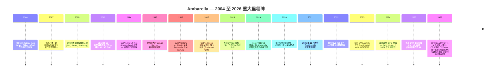
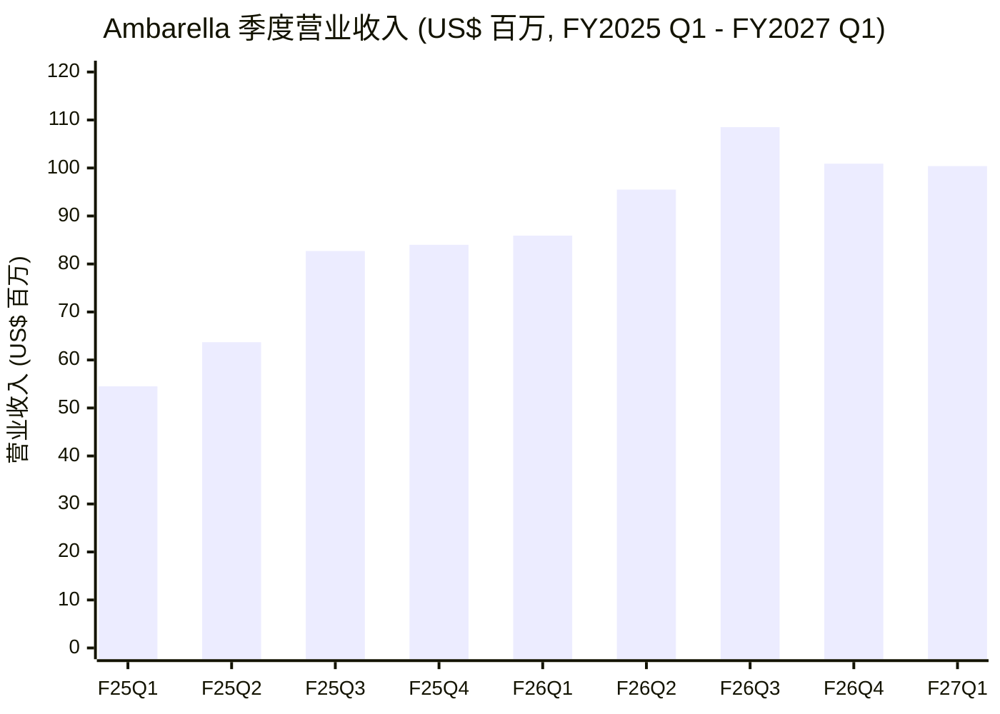
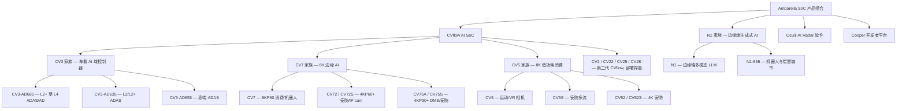
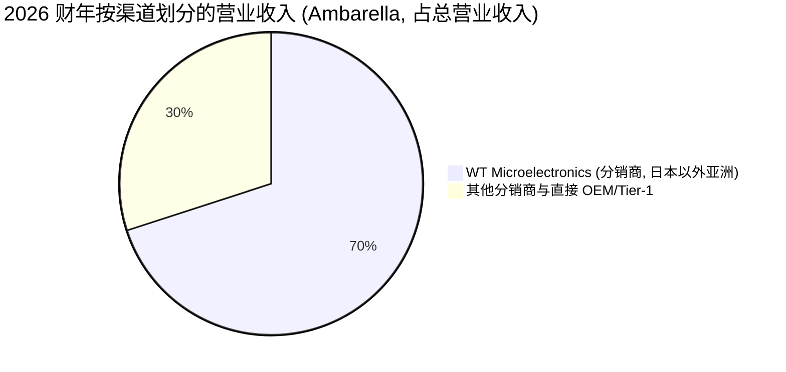
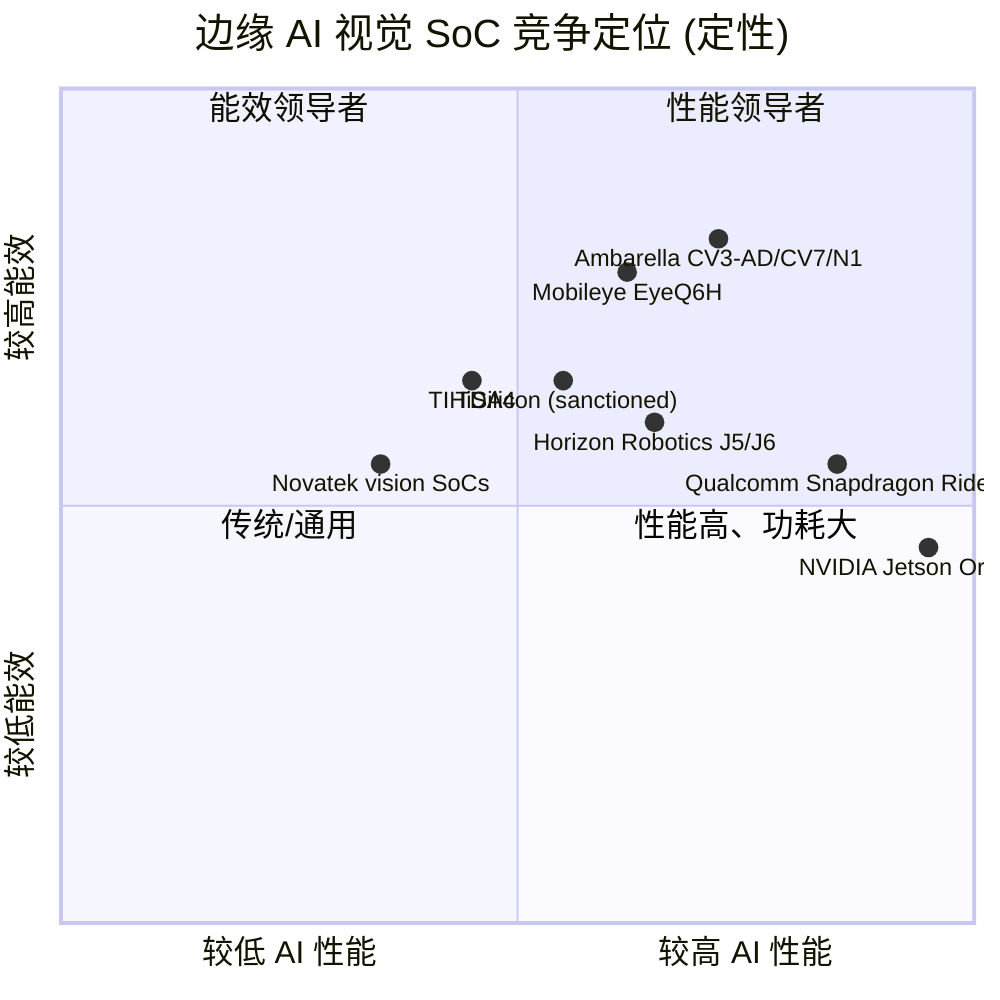

# Ambarella, Inc. (NASDAQ:AMBA) — 公司研究报告

**截至日期: 2026-06-15 (已更新 2027 财年第一季度业绩、决策层、卖方一致预期、全套 SVG 图表)**
**代码: NASDAQ:AMBA**
**上市地: 纳斯达克全球精选市场 (Nasdaq Global Select Market)**
**注册地: 开曼群岛 (运营总部: 美国加州圣克拉拉)**
**财年截止日: 1 月 31 日**
**报告语言: 简体中文 (英文版同时存在于本目录)**

---

## 投资摘要 (Investment Summary) — *分析师观点（house view, 非一手文件数据）*

| 决策项 | 本报告观点 |
|---|---|
| **评级 (Rating)** | **Hold / 中性 (Neutral)** |
| **12 个月目标价 (Price Target)** | **US\$78** |
| **当前股价 (2026-06-12 收盘)** | US\$67.78 |
| **隐含上行空间 (Upside)** | **约 +15%** |
| **估值方法** | forward P/S（2027E 营收 × 约 7× P/S）为主, 以远期非 GAAP 盈利路径交叉验证 |
| **市值 (Market cap)** | 约 29.7 亿美元 (43.87M 股) |
| **52 周区间** | US\$48.30 – US\$96.69 |
| **与市场一致预期对比** | 市场一致为 **Buy, 平均 PT 约 US\$93.75**（区间 US\$80–120）; 本报告显著低于一致, 反映对客户集中度与估值的更高谨慎 |

**投资逻辑四大支柱 (*分析师观点*):**

1. **边缘 AI 视觉 SoC 拐点真实但已被部分定价。** FY2026 营业收入同比 +37% 至 3.907 亿美元、非 GAAP 重回盈利、且经营活动现金流 (CFO) 转正至 +7,352 万美元——库存调整确已结束; 但股价在 9.5× → 约 7.3× P/S 区间、远期 P/E 约 70× 已隐含持续高增长。
2. **CV3-AD 车载是期权价值, 不是当期营业收入。** 多头逻辑系于 2024–2026 拿下的 CV3-AD 设计中标在 2027–2030 整车项目放量; 这是 3–5 年兑现的期权, 期间 NVIDIA / Mobileye / 地平线可重新竞标。
3. **客户/渠道集中度是结构性折价项。** 单一分销商 WT Microelectronics (文晔) 占 FY2026 营业收入 70% 且三年持续上升 (53%→63%→70%); 亚洲营业收入占 88%, 中国终端敞口叠加美国出口管制是真实尾部风险。
4. **风险回报对称。** 在 ~$68 的当前价, 向上看 CV3 放量与 N1/机器人期权 (一致 PT 隐含 +38%), 向下看同业 P/S 中位回归隐含约 30–50% 下行——我们将评级定在中性, 等待车载放量的实质证据。

> **最该盯紧的两个变量 (swing variables):** (1) CV3-AD 车载设计中标转化为放量营业收入的**节奏**; (2) 客户结构向 Tier-1 ADAS 倾斜过程中的**毛利率轨迹** (FY2026 GAAP 毛利率已从 60.5% 降至 59.2%)。

### 远期估值矩阵 (Forward valuation matrix) — *分析师观点*

| 倍数 | FY2026 (实际) | FY2027E | FY2028E |
|---|---|---|---|
| P/S (TTM/远期) | 约 7.3× | 约 6.3× | 约 5.3× |
| 非 GAAP P/E | n/m（小幅盈利） | 约 70× | 约 45× |
| GAAP P/E | n/m（亏损） | n/m | n/m |
| EV/Revenue | 约 6.7× | 约 5.7× | 约 4.8× |

*来源: 当前股价与市值 [stockanalysis.com — AMBA, 2026-06-12 收盘](https://stockanalysis.com/stocks/amba/); 营收实际值 [Ambarella Q4 FY2026 8-K Ex-99.1, 2026-02-26](https://www.sec.gov/Archives/edgar/data/1280263/000119312526076823/d108529dex991.htm); FY2027E/FY2028E 为本报告 forward 模型 (见第 2 章)。倍数为* 分析师观点 *, 非一手文件数据。*

**相对表现 (Relative performance, momentum):** AMBA 自 2026 年高点 96.69 美元回撤约 30% 至约 67.78 美元 (2026-06-12), 但仍较 2024 年末库存底部 48.30 美元高约 +40%; 过去 12 个月跑输费城半导体指数 (SOX) 与 NVIDIA, 但跑赢 Mobileye ([stockanalysis.com — AMBA 价格历史, 2026-06-12](https://stockanalysis.com/stocks/amba/))。

---

## 目录

1. 公司概览
   - 1A 估值与目标价快照
   - 1B GF Score 基本面评分卡
2. 估值与目标价 (forward 模型 · PT 推导 · 牛/基/熊情景)
3. 公司历史
4. 管理团队
5. 产品与服务
6. 客户与上市策略
7. 行业概览
8. 竞争格局
9. 市场机会 (TAM)
10. 风险评估
11. 关键分歧与催化剂 (Section 9.5)
12. 投资者视角评分卡 (Section 10)
参考资料

> 注: 章节编号沿用原描述性框架 (公司概览 / 历史 / 管理 / 产品 / 客户 / 行业 / 竞争 / TAM / 风险); 决策层 (投资摘要 / 1B GF Score / 第 2 章估值 / 9.5 分歧 / 第 10 章视角) 叠加于其上。

---

## 1. 公司概览

Ambarella, Inc. 是一家边缘 AI (edge-AI) 半导体公司, 专为计算机视觉 (computer vision) 和物理 AI (physical AI) 应用设计低功耗系统级芯片 (SoC, System-on-Chip)。公司将图像信号处理器 (ISP)、视频编解码器 (video CODEC)、神经向量处理器 (NVP, Neural Vector Processor) 以及自有的 CVflow AI 加速器集成于一颗低功耗芯片之上, 随后将这些 SoC (连同配套的软件栈) 销售给三大终端市场的 OEM (原始设备制造商)、ODM (原始设计制造商) 与 Tier-1 供应商: 车载摄像头与 ADAS (高级辅助驾驶) / AD (自动驾驶) 域控制器; IoT (物联网) / 专业安防摄像头与 AIoT (人工智能物联网) / 机器人 (robotics) 平台; 以及消费级摄像头 (运动相机、无人机、行车记录仪、视频门铃)。Ambarella 不持有晶圆厂——其 10-K 写明: "绝大多数 SoC 由 Samsung Electronics Corporation (三星) 在其美国得克萨斯州奥斯汀及韩国的设施供货"; 同一"制造"章节亦将 TSMC (台积电) 列为可用于 4nm 与 2nm 先进制程的两家代工厂之一; 先进封装、组装与终测均外包 (Signetics、STATS ChipPAC、ASE、Sigurd、京元电子 (King Yuan Electronics)) ([Ambarella FY2026 10-K, "Manufacturing"](https://www.sec.gov/Archives/edgar/data/1280263/000119312526119321/0001193125-26-119321-index.htm))。

公司在 2026 财年 (截至 **2026 年 1 月 31 日**) 录得营业收入 **3.907 亿美元**, 较 2025 财年的 2.849 亿美元同比增长 **37.2%**, GAAP 毛利率为 **59.2%** (2025 财年为 60.5%), GAAP 净亏损 **7,590 万美元**, 即摊薄每股亏损 1.78 美元, 较上年同期 1.171 亿美元 / 每股亏损 2.84 美元有所收窄 ([Q4 & 2026 财年全年 8-K 业绩公告, 2026-02-26](https://www.sec.gov/Archives/edgar/data/1280263/000119312526076823/d108529dex991.htm))。在非 GAAP 基础上, Ambarella 重新转入小幅年度盈利 (非 GAAP 净利润 2,690 万美元 / 每股 0.62 美元, 较 2025 财年非 GAAP 亏损 680 万美元转正) ——这正是市场在两年库存调整期内一直等待的拐点。截至财年末, Ambarella 持有现金及等价物 1.910 亿美元, 加上 1.216 亿美元可销售债务证券 (合计 3.126 亿美元, 无有息负债), 全球员工 **959 人, 其中约 75% 从事研发**, 重点分布: 台湾 372 人、美国 252 人、中国 225 人、欧洲 95 人 ([Ambarella FY2026 10-K, Item 1, "Human Capital Resources"](https://www.sec.gov/Archives/edgar/data/1280263/000119312526119321/0001193125-26-119321-index.htm))。

在 2027 财年第一季度 (截至 **2026 年 4 月 30 日**; 于 **2026 年 5 月 28 日**发布), Ambarella 录得营业收入 **1.004 亿美元** (同比增长 16.9%, 上一财年同期为 8,590 万美元), 略高于市场一致预期的 1.002 亿美元 ([Q1 FY2027 8-K 业绩公告, 2026-05-28](https://www.sec.gov/Archives/edgar/data/1280263/000119312526245234/d130687dex991.htm))。GAAP 毛利率为 **58.4%** (毛利 5,859 万美元; 上一财年同期为 60.0%), 非 GAAP 毛利率为 **59.9%** (上一财年同期为 62.0%)。**GAAP 口径净亏损 1,809 万美元, 即摊薄每股亏损 0.41 美元** (较上年同期的 2,433 万美元 / 每股亏损 0.58 美元收窄; 经营亏损 1,942 万美元); 在剔除股权激励等项目的**非 GAAP 口径下转为净利润 500 万美元, 即摊薄每股收益 0.11 美元** (超出市场一致预期的 0.10 美元, 且高于上一财年同期的 300 万美元) ([Q1 FY2027 8-K 业绩公告, 2026-05-28](https://www.sec.gov/Archives/edgar/data/1280263/000119312526245234/d130687dex991.htm))。截至第一季度末, 公司持有的现金、现金等价物及可销售债务证券总额为 **2.778 亿美元** (较 2026 财年末的 3.126 亿美元减少 3,480 万美元, 主要由于公司为支持新产品周期及应对供应链动态而主动增加库存; 但较上一财年同期的 2.594 亿美元增长 1,840 万美元)。需要强调的是, **市场对 0.11 美元的关注是非 GAAP 口径; AMBA 在 GAAP 基础上仍亏损**——这一 GAAP/非 GAAP 缺口 (Q1 约为 2,300 万美元, 主要是股权激励) 是阅读其盈利叙事时必须区分的关键。

Ambarella 的商业模式是典型的无晶圆厂 (fabless) 半导体打法: 在客户硬件 (安防摄像头、ADAS 模块、AD 域控制器、消费相机、机器人) 内拿下多年期设计中标 (design win), 然后在 3–7 年的产品生命周期内分享每一项设计的出货量。公司销售面向全球, 但终端客户压倒性集中在亚洲——**2026 财年 88% 的营业收入流向亚洲** (2025 财年 85%、2024 财年 79%), 反映了为全球品牌制造安防摄像头、行车记录仪与 Tier-1 车载模块的中国大陆/台湾 ODM 生态 ([Ambarella FY2026 10-K, "Sales by Geographic Region"](https://www.sec.gov/Archives/edgar/data/1280263/000119312526119321/0001193125-26-119321-index.htm))。分销通过一家非独家销售代表 **WT Microelectronics (文晔科技, 前身为 Wintech)** 进行, 该公司在 2026 财年承接了 **70% 的营业收入**, 较 2025 财年的 63% 与 2024 财年的 53% 持续提升; WT 协议有效期延伸至 2029 年 1 月。

**本期新变化 (what changed this period)。** 相对 FY2025, FY2026 三个结构性变化值得标注: (1) 营业收入由 2.849 亿美元跳升至 3.907 亿美元 (+37.2%), 确认 IoT/安防库存去化结束; (2) **经营活动现金流 (CFO) 由 FY2025 的 3,384 万美元转正放大至 FY2026 的 7,352 万美元** ([Ambarella FY2026 10-K, 合并现金流量表](https://www.sec.gov/Archives/edgar/data/1280263/000119312526119321/0001193125-26-119321-index.htm)) ——尽管 GAAP 仍亏损 7,587 万美元, 公司在现金口径上已自给自足, 且年内现金净增加 4,683 万美元; (3) GAAP 毛利率由 60.5% 微降至 59.2%, 反映客户结构向 Tier-1/分销渠道倾斜的混合压力。下方利润表 Sankey 直观呈现了 FY2026 的"营收 → 成本 → 研发吞噬营业利润"结构 (经营亏损以左侧来源呈现, 因 GAAP 经营亏损为 8,253 万美元):

下方为 FY2026 利润表 Sankey (US$ 百万)。CVflow 边缘 AI SoC 通过 WT 等渠道贡献 3.907 亿美元营收, 159.4 百万美元为成本、231.3 百万美元为毛利, 但 238.5 百万美元研发 (占营收 61%) 与 75.3 百万美元 SG&A 合计 313.8 百万美元 opex, 吞噬全部毛利并形成 8,253 万美元经营亏损:

<svg xmlns="http://www.w3.org/2000/svg" viewBox="0 0 1000 560" width="1000" height="560" role="img" aria-label="income statement Sankey"><rect x="0" y="0" width="1000" height="560" fill="#ffffff"/>
<text x="20.00" y="30.00" text-anchor="start" font-family="Helvetica,Arial,sans-serif" font-size="15" font-weight="700" fill="#1f2933">Ambarella FY2026 利润表 Sankey（GAAP, 经营亏损以左侧来源呈现）</text>
<path d="M 452.00,71.00 C 506.00,71.00 506.00,111.53 560.00,111.53 L 560.00,113.53 C 506.00,113.53 506.00,73.00 452.00,73.00 Z" fill="#86efac" fill-opacity="0.55"/>
<path d="M 452.00,73.00 C 506.00,73.00 506.00,127.53 560.00,127.53 L 560.00,466.47 C 506.00,466.47 506.00,411.93 452.00,411.93 Z" fill="#fca5a5" fill-opacity="0.55"/>
<path d="M 328.00,78.00 C 382.00,78.00 382.00,71.00 436.00,71.00 L 436.00,320.79 C 382.00,320.79 382.00,327.79 328.00,327.79 Z" fill="#86efac" fill-opacity="0.55"/>
<path d="M 204.00,78.00 C 258.00,78.00 258.00,78.00 312.00,78.00 L 312.00,500.00 C 258.00,500.00 258.00,500.00 204.00,500.00 Z" fill="#93c5fd" fill-opacity="0.55"/>
<path d="M 328.00,327.79 C 382.00,327.79 382.00,334.79 436.00,334.79 L 436.00,507.00 C 382.00,507.00 382.00,500.00 328.00,500.00 Z" fill="#fca5a5" fill-opacity="0.55"/>
<path d="M 700.00,104.53 C 754.00,104.53 754.00,279.83 808.00,279.83 L 808.00,281.83 C 754.00,281.83 754.00,106.53 700.00,106.53 Z" fill="#86efac" fill-opacity="0.55"/>
<path d="M 700.00,106.53 C 754.00,106.53 754.00,295.83 808.00,295.83 L 808.00,298.17 C 754.00,298.17 754.00,108.88 700.00,108.88 Z" fill="#fca5a5" fill-opacity="0.55"/>
<path d="M 576.00,111.53 C 630.00,111.53 630.00,104.53 684.00,104.53 L 684.00,106.53 C 630.00,106.53 630.00,113.53 576.00,113.53 Z" fill="#86efac" fill-opacity="0.55"/>
<path d="M 576.00,127.53 C 630.00,127.53 630.00,120.53 684.00,120.53 L 684.00,201.84 C 630.00,201.84 630.00,208.84 576.00,208.84 Z" fill="#fca5a5" fill-opacity="0.55"/>
<path d="M 576.00,208.84 C 630.00,208.84 630.00,215.84 684.00,215.84 L 684.00,473.47 C 630.00,473.47 630.00,466.47 576.00,466.47 Z" fill="#fca5a5" fill-opacity="0.55"/>
<rect x="188.00" y="78.00" width="16" height="422.00" rx="1.5" fill="#2563eb"/>
<rect x="312.00" y="78.00" width="16" height="422.00" rx="1.5" fill="#1e3a8a"/>
<rect x="436.00" y="71.00" width="16" height="249.79" rx="1.5" fill="#15803d"/>
<rect x="436.00" y="334.79" width="16" height="172.21" rx="1.5" fill="#dc2626"/>
<rect x="560.00" y="111.53" width="16" height="2.00" rx="1.5" fill="#15803d"/>
<rect x="560.00" y="127.53" width="16" height="338.93" rx="1.5" fill="#dc2626"/>
<rect x="684.00" y="104.53" width="16" height="2.00" rx="1.5" fill="#15803d"/>
<rect x="684.00" y="120.53" width="16" height="81.30" rx="1.5" fill="#dc2626"/>
<rect x="684.00" y="215.84" width="16" height="257.63" rx="1.5" fill="#dc2626"/>
<rect x="808.00" y="279.83" width="16" height="2.00" rx="1.5" fill="#15803d"/>
<rect x="808.00" y="295.83" width="16" height="2.34" rx="1.5" fill="#dc2626"/>
<text x="179.00" y="286.00" text-anchor="end" font-family="Helvetica,Arial,sans-serif" font-size="11.5" font-weight="700" fill="#1f2933">车载 / 安防 / 消费 / AIoT（按渠道 WT 70%）</text>
<text x="179.00" y="299.00" text-anchor="end" font-family="Helvetica,Arial,sans-serif" font-size="10" font-weight="400" fill="#52606d">US$390.7M  (100.0%)</text>
<rect x="331.00" y="60.00" width="125.70" height="26" rx="2" fill="#ffffff" fill-opacity="0.72"/>
<text x="334.00" y="72.00" text-anchor="start" font-family="Helvetica,Arial,sans-serif" font-size="11.5" font-weight="700" fill="#1f2933">Revenue</text>
<text x="334.00" y="85.00" text-anchor="start" font-family="Helvetica,Arial,sans-serif" font-size="10" font-weight="400" fill="#52606d">US$390.7M  (100.0%)</text>
<rect x="455.00" y="53.00" width="119.40" height="26" rx="2" fill="#ffffff" fill-opacity="0.72"/>
<text x="458.00" y="65.00" text-anchor="start" font-family="Helvetica,Arial,sans-serif" font-size="11.5" font-weight="700" fill="#1f2933">Gross Profit</text>
<text x="458.00" y="78.00" text-anchor="start" font-family="Helvetica,Arial,sans-serif" font-size="10" font-weight="400" fill="#52606d">US$231.3M  (59.2%)</text>
<rect x="455.00" y="316.79" width="144.60" height="26" rx="2" fill="#ffffff" fill-opacity="0.72"/>
<text x="458.00" y="328.79" text-anchor="start" font-family="Helvetica,Arial,sans-serif" font-size="11.5" font-weight="700" fill="#1f2933">Cost of Revenue (COGS)</text>
<text x="458.00" y="341.79" text-anchor="start" font-family="Helvetica,Arial,sans-serif" font-size="10" font-weight="400" fill="#52606d">US$159.4M  (40.8%)</text>
<rect x="579.00" y="93.53" width="125.70" height="26" rx="2" fill="#ffffff" fill-opacity="0.72"/>
<text x="582.00" y="105.53" text-anchor="start" font-family="Helvetica,Arial,sans-serif" font-size="11.5" font-weight="700" fill="#1f2933">Operating Income</text>
<text x="582.00" y="118.53" text-anchor="start" font-family="Helvetica,Arial,sans-serif" font-size="10" font-weight="400" fill="#52606d">-US$82.5M  (-21.1%)</text>
<rect x="579.00" y="118.53" width="150.90" height="26" rx="2" fill="#ffffff" fill-opacity="0.72"/>
<text x="582.00" y="130.53" text-anchor="start" font-family="Helvetica,Arial,sans-serif" font-size="11.5" font-weight="700" fill="#1f2933">Total Operating Expense</text>
<text x="582.00" y="143.53" text-anchor="start" font-family="Helvetica,Arial,sans-serif" font-size="10" font-weight="400" fill="#52606d">US$313.8M  (80.3%)</text>
<rect x="703.00" y="86.53" width="125.70" height="26" rx="2" fill="#ffffff" fill-opacity="0.72"/>
<text x="706.00" y="98.53" text-anchor="start" font-family="Helvetica,Arial,sans-serif" font-size="11.5" font-weight="700" fill="#1f2933">Pretax Income</text>
<text x="706.00" y="111.53" text-anchor="start" font-family="Helvetica,Arial,sans-serif" font-size="10" font-weight="400" fill="#52606d">-US$73.7M  (-18.9%)</text>
<rect x="703.00" y="111.53" width="113.10" height="26" rx="2" fill="#ffffff" fill-opacity="0.72"/>
<text x="706.00" y="123.53" text-anchor="start" font-family="Helvetica,Arial,sans-serif" font-size="11.5" font-weight="700" fill="#1f2933">SG&amp;A</text>
<text x="706.00" y="136.53" text-anchor="start" font-family="Helvetica,Arial,sans-serif" font-size="10" font-weight="400" fill="#52606d">US$75.3M  (19.3%)</text>
<rect x="703.00" y="197.84" width="119.40" height="26" rx="2" fill="#ffffff" fill-opacity="0.72"/>
<text x="706.00" y="209.84" text-anchor="start" font-family="Helvetica,Arial,sans-serif" font-size="11.5" font-weight="700" fill="#1f2933">R&amp;D</text>
<text x="706.00" y="222.84" text-anchor="start" font-family="Helvetica,Arial,sans-serif" font-size="10" font-weight="400" fill="#52606d">US$238.5M  (61.0%)</text>
<text x="833.00" y="277.83" text-anchor="start" font-family="Helvetica,Arial,sans-serif" font-size="11.5" font-weight="700" fill="#1f2933">Net Income</text>
<text x="833.00" y="290.83" text-anchor="start" font-family="Helvetica,Arial,sans-serif" font-size="10" font-weight="400" fill="#52606d">-US$75.9M  (-19.4%)</text>
<text x="833.00" y="302.83" text-anchor="start" font-family="Helvetica,Arial,sans-serif" font-size="11.5" font-weight="700" fill="#1f2933">Income Tax</text>
<text x="833.00" y="315.83" text-anchor="start" font-family="Helvetica,Arial,sans-serif" font-size="10" font-weight="400" fill="#52606d">US$2.2M  (0.55%)</text>
<text x="500.00" y="544.00" text-anchor="middle" font-family="Helvetica,Arial,sans-serif" font-size="10" font-weight="400" fill="#52606d">Source: Ambarella FY2026 10-K（Q4 FY2026 8-K Ex-99.1, 2026-02-26）</text>
</svg>

*数据来源: [Ambarella FY2026 10-K / Q4 FY2026 8-K Ex-99.1 (2026-02-26)](https://www.sec.gov/Archives/edgar/data/1280263/000119312526076823/d108529dex991.htm)。*

### 1A 估值与目标价快照

**估值快照 (截至 2026-06-15; 价格用 2026-06-12 收盘)。** 在第一季度业绩发布 (2026-05-28) 后的市场重定价中, Ambarella 股价进一步走低至 **67.78 美元** (2026-06-12 收盘), 对应 **4,387 万股**流通普通股, 市值约 **29.7 亿美元** ([stockanalysis.com — AMBA, 2026-06-12 收盘](https://stockanalysis.com/stocks/amba/))。过去十二个月 (TTM) 主要指标: **TTM P/E 不具备意义** (FY2026 GAAP 净亏损 7,587 万美元; stockanalysis 显示 TTM 净亏损约 6,963 万美元); **远期市盈率 (forward P/E, 非 GAAP) 约 70 倍**一致预期; **TTM 市销率 (P/S) 约 7.3 倍** (29.7 亿美元市值 ÷ 约 4.05 亿美元 TTM 营业收入), 较 5 月初的约 9.5× 进一步压缩; **EV/Revenue 约 6.7 倍** (扣除约 2.78 亿美元净现金后); **EV/EBITDA 为负**, 公司在 GAAP 基础上仍处于 EBITDA 亏损状态 ([stockanalysis.com — AMBA Statistics, 2026-06-12](https://stockanalysis.com/stocks/amba/statistics/))。这一轮股价下行主要由对下半年供应链成本压力 (内存元件 DRAM/flash 涨价) 以及前瞻性需求风险的担忧驱动 ([Ambarella (AMBA) Sees Significant Drop in Stock Price, 2026-05-29](https://www.gurufocus.com/news/8891596/ambarella-amba-sees-significant-drop-in-stock-price))。

约 7.3 倍的 TTM P/S 已从 Ambarella 三年区间的中位区间向下端移动。该股票在 2026 年触及约 **96.69 美元**高点 (对应 TTM 销售约 10–11 倍的隐含倍数), 并在 2024 年末 IoT/安防摄像头库存底部期间一度探底至约 **48.30 美元** (彼时约 6.7 倍 P/S)。回溯更早, AMBA 曾于 2021 年末在后疫情 AI/EV 视觉热潮中触及约 217 美元高点 (对应彼时 TTM 销售约 28 倍) ([stockanalysis.com — AMBA 价格历史, 2026-06-12](https://stockanalysis.com/stocks/amba/))。

同业比较 (TTM P/S, 截至 2026 年 6 月中, [stockanalysis.com](https://stockanalysis.com/)): **NVIDIA 约 25× / Texas Instruments 约 14× / AMBA 约 7.3× / Qualcomm 约 5× / Mobileye 约 4×**。

 *分析师观点：* Ambarella 估值定位**低于 NVDA 与 TXN, 但高于 QCOM 与 MBLY**——相对于多元化模拟与 ADAS 商业硅片同业溢价, 相对于 GPU/数据中心超大规模一线溢价折让。该溢价反映了边缘 AI 增长叙事以及 2026 财年重回营业收入增长和非 GAAP 盈利的拐点; 与 NVIDIA 的差距则反映了数据中心营业收入的缺失。远期 P/E 约 70 倍, 表明市场是在**按增长叙事而非当前盈利定价 AMBA**——这是典型的小盘商业硅片股写照, 兼具可信的产品路线图 (CV3-AD 设计中标) 与持续的 GAAP 亏损。估值对设计中标节奏、毛利率轨迹与客户集中度高度敏感; 我们将倍数压缩风险视为重大, 并在第 9 章再次予以强调。

> **下一节钱往哪流 (供应链资金流图)。** 见第 5 章末尾的 money-flow 图——它直观展示了 AMBA 营业收入如何经 WT (文晔) 这一单一渠道汇入, 再沿无晶圆厂链条流向 Samsung (绝大多数 SoC)、TSMC (4nm/2nm 对冲)、Arm IP 与封测 OSAT 等瓶颈节点。

### 1B GF Score 基本面评分卡 — *分析师观点*

下方雷达图是仿 GuruFocus GF Score™ 的五维基本面评分卡 (各维度 0–10, 加权映射为 0–100 综合分)。**这是分析师自有评分模型的输出, 非 GuruFocus 公布值, 也不附一手文件引用**; 每一维度背后的指标 (margins / leverage / CAGR / multiples / returns) 在正文各处单独引用。

<svg xmlns="http://www.w3.org/2000/svg" viewBox="0 0 500 500" width="500" height="500" role="img" aria-label="GF Score radar">
<rect x="0" y="0" width="500" height="500" fill="#ffffff"/>
<text x="20" y="24" font-family="Helvetica,Arial,sans-serif" font-size="15" font-weight="700" fill="#1f2933">GF Score (GuruFocus-style): 50/100</text>
<text x="20" y="41" font-family="Helvetica,Arial,sans-serif" font-size="11" fill="#52606d">0–50 Worst future performance potential / insufficient data</text>
<polygon points="250.0,88.0 392.7,191.6 338.2,359.4 161.8,359.4 107.3,191.6" fill="#e9f5ec" stroke="none"/>
<polygon points="250.0,208.0 278.5,228.7 267.6,262.3 232.4,262.3 221.5,228.7" fill="none" stroke="#c5d3cb" stroke-width="1"/>
<polygon points="250.0,178.0 307.1,219.5 285.3,286.5 214.7,286.5 192.9,219.5" fill="none" stroke="#c5d3cb" stroke-width="1"/>
<polygon points="250.0,148.0 335.6,210.2 302.9,310.8 197.1,310.8 164.4,210.2" fill="none" stroke="#c5d3cb" stroke-width="1"/>
<polygon points="250.0,118.0 364.1,200.9 320.5,335.1 179.5,335.1 135.9,200.9" fill="none" stroke="#c5d3cb" stroke-width="1"/>
<polygon points="250.0,88.0 392.7,191.6 338.2,359.4 161.8,359.4 107.3,191.6" fill="none" stroke="#c5d3cb" stroke-width="1.3"/>
<line x1="250" y1="238" x2="161.8" y2="359.4" stroke="#cfdad3" stroke-width="1"/>
<text x="146.5" y="392.4" text-anchor="end" font-family="Helvetica,Arial,sans-serif" font-size="11.5" font-weight="600" fill="#1f2933">财务实力</text>
<text x="179.5" y="329.1" text-anchor="middle" font-family="Helvetica,Arial,sans-serif" font-size="10.5" font-weight="700" fill="#1f2933">8</text>
<line x1="250" y1="238" x2="250.0" y2="88.0" stroke="#cfdad3" stroke-width="1"/>
<text x="250.0" y="58.0" text-anchor="middle" font-family="Helvetica,Arial,sans-serif" font-size="11.5" font-weight="600" fill="#1f2933">盈利能力</text>
<text x="250.0" y="187.0" text-anchor="middle" font-family="Helvetica,Arial,sans-serif" font-size="10.5" font-weight="700" fill="#1f2933">3</text>
<line x1="250" y1="238" x2="107.3" y2="191.6" stroke="#cfdad3" stroke-width="1"/>
<text x="82.6" y="183.6" text-anchor="end" font-family="Helvetica,Arial,sans-serif" font-size="11.5" font-weight="600" fill="#1f2933">成长性</text>
<text x="150.1" y="199.6" text-anchor="middle" font-family="Helvetica,Arial,sans-serif" font-size="10.5" font-weight="700" fill="#1f2933">7</text>
<line x1="250" y1="238" x2="392.7" y2="191.6" stroke="#cfdad3" stroke-width="1"/>
<text x="417.4" y="183.6" text-anchor="start" font-family="Helvetica,Arial,sans-serif" font-size="11.5" font-weight="600" fill="#1f2933">估值</text>
<text x="292.8" y="218.1" text-anchor="middle" font-family="Helvetica,Arial,sans-serif" font-size="10.5" font-weight="700" fill="#1f2933">3</text>
<line x1="250" y1="238" x2="338.2" y2="359.4" stroke="#cfdad3" stroke-width="1"/>
<text x="353.5" y="392.4" text-anchor="start" font-family="Helvetica,Arial,sans-serif" font-size="11.5" font-weight="600" fill="#1f2933">动量</text>
<text x="276.5" y="268.4" text-anchor="middle" font-family="Helvetica,Arial,sans-serif" font-size="10.5" font-weight="700" fill="#1f2933">3</text>
<polygon points="250.0,193.0 292.8,224.1 276.5,274.4 179.5,335.1 150.1,205.6" fill="#2e8b57" fill-opacity="0.34" stroke="#2e8b57" stroke-width="2"/>
<circle cx="179.5" cy="335.1" r="2.6" fill="#2e8b57"/>
<circle cx="250.0" cy="193.0" r="2.6" fill="#2e8b57"/>
<circle cx="150.1" cy="205.6" r="2.6" fill="#2e8b57"/>
<circle cx="292.8" cy="224.1" r="2.6" fill="#2e8b57"/>
<circle cx="276.5" cy="274.4" r="2.6" fill="#2e8b57"/>
<text x="250" y="470" text-anchor="middle" font-family="Helvetica,Arial,sans-serif" font-size="9.5" fill="#52606d">Source: Ambarella FY2026 10-K · Q1 FY2027 8-K (2026-05-28) · stockanalysis.com, as of 2026-06-15</text>
<text x="250" y="485" text-anchor="middle" font-family="Helvetica,Arial,sans-serif" font-size="9" fill="#52606d">GF Score = independent analyst rubric (*Analyst view:*) — not GuruFocus™ official number</text>
</svg>

| 维度 | 评分 (0–10) | |
|---|---|---|
| 财务实力 | 8 | `████████░░` |
| 盈利能力 | 3 | `███░░░░░░░` |
| 成长性 | 7 | `███████░░░` |
| 估值 | 3 | `███░░░░░░░` |
| 动量 | 3 | `███░░░░░░░` |
| **GF Score (composite, *Analyst view:*)** | **50 / 100** | **0–50 Worst future performance potential / insufficient data** |

*Composite weights (*Analyst view:*): Financial Strength 20% · Profitability 25% · Growth 25% · GF Value 15% · Momentum 15% (transparent reproduction — not GuruFocus's proprietary weighting).*

*评分来源: [Ambarella FY2026 10-K](https://www.sec.gov/Archives/edgar/data/1280263/000119312526119321/0001193125-26-119321-index.htm) · [Q1 FY2027 8-K (2026-05-28)](https://www.sec.gov/Archives/edgar/data/1280263/000119312526245234/d130687dex991.htm) · [stockanalysis.com, 2026-06-12](https://stockanalysis.com/stocks/amba/)。综合分与各维度分为* 分析师观点 *。*

**各维度评分理由:**

- **财务实力 (Financial Strength) = 8/10。** 资产负债表强劲: FY2026 末持有 2.778 亿美元 (Q1 FY2027) / 3.126 亿美元 (FY2026 末) 现金加可销售证券、**零有息负债**、股东权益 5.948 亿美元、流动比率约 2.3× (流动资产 4.103 亿 ÷ 流动负债 1.779 亿) ([Ambarella Q4 FY2026 8-K, 合并资产负债表](https://www.sec.gov/Archives/edgar/data/1280263/000119312526076823/d108529dex991.htm))。扣分项: 商誉 3.036 亿美元 (主要来自 Oculii) 占总资产 38%, 一旦车载减值会冲击账面。
- **盈利能力 (Profitability) = 3/10。** GAAP 仍亏损 (FY2026 经营亏损 8,253 万、净亏损 7,587 万), GAAP ROE 为负; 但 gross margin (毛利率) 维持 59% 的高位、非 GAAP 已转正、且 **CFO 转正至 +7,352 万美元** ([FY2026 10-K, 现金流量表](https://www.sec.gov/Archives/edgar/data/1280263/000119312526119321/0001193125-26-119321-index.htm))——给 3 分而非更低, 是因为现金口径已自给自足, 但 GAAP 盈利能力的缺失锁住了上行。
- **成长性 (Growth) = 7/10。** FY2026 营业收入 +37.2%; 但 3 年轨迹高度波动 (FY2023 3.376 亿 → FY2024 2.265 亿, -33% → FY2026 3.907 亿创新高), 3 年 CAGR 仅约 5%。给 7 分反映拐点动能与 CV3/N1 的远期斜率, 但波动性压住了评分。
- **GF Value (估值, 越高越便宜) = 3/10。** 约 7.3× TTM P/S、约 70× 远期非 GAAP P/E、无 GAAP 盈利——按任何绝对口径都偏贵, 仅相对 NVIDIA 折让。低分代表"贵", 与第 9 章的倍数压缩风险一致。
- **动能 (Momentum) = 3/10。** 6/12 个月相对表现疲弱 (自 96.69 高点回撤约 30%, 跑输 SOX 与 NVDA), 虽较 48.30 低点高约 +40%; 净评为偏弱 ([stockanalysis.com — AMBA, 2026-06-12](https://stockanalysis.com/stocks/amba/))。

综合 GF Score 落在中下区间, 与本报告的 **Hold/中性**评级自洽: 财务实力强但盈利能力、估值与动能拖累, 成长动能是唯一明确的加分项。

---

## 2. 估值与目标价 (Valuation & Price Target)

> 本章是决策层核心。**全部前瞻数字、目标价与情景 PT 均为 *分析师观点（house view）*, 不附任何一手文件引用**——10-K 中没有目标价。各驱动变量的外部依据 (10-K 分部数据 + 管理层指引 + 行业预测) 在行内单独引用。

### 2.1 forward 财务模型 (FY2027E–FY2029E) — *分析师观点*

模型自下而上: 以 FY2026 实际 (营收 3.907 亿、GAAP 毛利率 59.2%、研发 2.385 亿) 为基, 叠加管理层 Q1 FY2027 指引 (营收 9,700 万–1.03 亿、非 GAAP 毛利率 59–60.5%, [Q4 FY2026 8-K, 2026-02-26](https://www.sec.gov/Archives/edgar/data/1280263/000119312526076823/d108529dex991.htm)) 与边缘 AI / ADAS 行业增速 ([SHD Group 2025 Edge-AI Market Analysis](https://www.alliedmarketresearch.com/press-release/edge-ai-hardware-market.html) 与 [S&P Global Mobility Autonomy Forecasts](https://www.spglobal.com/mobility/en/products/autonomy-forecasts.html))。

| 指标 (US\$ 百万, 除每股与 %) | FY2026 实际 | FY2027E | FY2028E | FY2029E |
|---|---|---|---|---|
| 营业收入 Revenue | 390.7 | 470 | 560 | 660 |
| YoY 增长 | +37.2% | +20% | +19% | +18% |
| GAAP 毛利率 Gross margin | 59.2% | 58.5% | 59.0% | 59.5% |
| 研发 R&D | 238.5 | 250 | 265 | 280 |
| GAAP 经营利润 (亏损) | (82.5) | (40) | (8) | +25 |
| 非 GAAP 净利润 | 26.9 | 48 | 75 | 110 |
| 非 GAAP 摊薄 EPS (US\$) | 0.62 | 1.05 | 1.60 | 2.30 |

*FY2026 实际值来源: [Ambarella Q4 FY2026 8-K Ex-99.1, 2026-02-26](https://www.sec.gov/Archives/edgar/data/1280263/000119312526076823/d108529dex991.htm); FY2027E–FY2029E 为* 分析师观点 *。* 模型的核心假设: (1) 营收增速从 +37% 逐步回落至中双位数, 反映库存反弹一次性效应消退后回到结构性增长; (2) 毛利率在 Tier-1/分销混合压力与领先节点成本下先降后稳; (3) 研发绝对额继续增长但占营收比从 61% 降至约 42%, 是 GAAP 转盈的关键杠杆; (4) FY2029E 前后实现 GAAP 经营盈利。**最该盯紧的变量: CV3-AD 车载放量节奏与毛利率轨迹** (见投资摘要)。

### 2.2 目标价推导 (PT derivation) — *分析师观点*

**主方法: forward P/S。** 以 FY2027E 营收 4.70 亿美元 × 约 7× 远期 P/S = 约 33 亿美元市值 ÷ 4.40 亿股 (含稀释) ≈ **US\$78/股**。7× 的倍数选择依据: AMBA 当前约 7.3× TTM P/S, 给予小幅折价以反映 (a) 客户集中度 (WT 70%)、(b) GAAP 仍亏损、(c) 车载放量未兑现; 相对同业, 高于 Qualcomm (约 5×) 与 Mobileye (约 4×) 但显著低于 NVIDIA (约 25×) ——AMBA 的边缘 AI 增长叙事支撑相对 QCOM/MBLY 的溢价, 但缺乏数据中心敞口与持续 GAAP 盈利使其无法接近 NVDA。**交叉验证 (非 GAAP P/E):** FY2028E 非 GAAP EPS 1.60 美元 × 约 48× = 约 US\$77, 与 P/S 法吻合。

### 2.3 牛 / 基 / 熊情景 — *分析师观点*

| 情景 | 关键摆动假设 | 12 个月 PT | 相对当前价 (~$67.78) |
|---|---|---|---|
| **牛市 (Bull)** | CV3-AD 多个 Tier-1 项目放量提前 + N1/机器人中标兑现; FY2027E 营收上修至 5.0 亿、市场给 9× P/S | **US\$103** | **+52%** |
| **基准 (Base)** | 车载按计划放量、安防稳定; FY2027E 营收 4.70 亿 × 7× P/S | **US\$78** | **+15%** |
| **熊市 (Bear)** | 车载放量延迟 + 安防/消费走低 + 板块级倍数压缩; FY2027E 营收 4.2 亿 × 5× P/S | **US\$48** | **-29%** |

风险回报大致对称略偏下行 (向上 +52% vs 向下 -29%), 这正是我们维持**中性**而非买入的核心原因——在车载放量出现实质证据前, 上行更多是期权价值。

### 2.4 与市场一致预期的对比 (vs consensus)

市场一致为 **Buy, 平均目标价约 US\$93.75** (区间 US\$80–120, 约 15–22 位分析师覆盖), 隐含约 +38% 上行 ([stockanalysis.com — AMBA Forecast, 2026-06-12](https://stockanalysis.com/stocks/amba/forecast/))。**本报告 PT (US\$78) 显著低于一致约 17%**——分歧点在于: 我们对车载放量节奏给予更长的兑现假设、对 WT 渠道集中度给予更高折价, 且不愿在 GAAP 仍亏损时套用更高的 forward 倍数。若 CV3-AD 在未来 2–3 个季度公布具名 Tier-1 量产项目, 我们会上修至接近一致区间。

### 2.5 卖方观点演变 (Sell-side view evolution)

**本地 `db/zsxq.db` 机构研报库与 `db/stock_price_target.db` 均无 Ambarella (AMBA) 的单名覆盖** (已按 AMBA / Ambarella / 安霸 / CV3 / CVflow / 边缘 AI / ADAS 等别名检索, 仅命中亚洲金属、Bayer 等无关误配; PT 库 0 行)。因此本报告**不构建按机构的 AMBA 观点时间线** (触发门槛为同一公司 ≥2 篇本地研报, AMBA 为 0 篇), 一致预期改用公开来源 (stockanalysis.com 聚合 15–22 位分析师)。**可用的相邻 *分析师观点* (竞争/行业层, 非 AMBA 单名):** 伯恩斯坦《中国智能驾驶芯片追踪 1Q26》指出中国 NOA (L2+/L2++) 渗透率在 1Q26 因电动车销量疲软暂时回落至 32% (4Q25 为 36%), 内存涨价是额外逆风——这同时对 AMBA 与地平线的中国车载放量构成短期顺周期风险 (*分析师观点：* [Bernstein — China Smart Driving Chips Tracker 1Q26, 2026-05-11, p.1](http://xs-macbook-air.local:5001/zsxq/pdf/184124285244812/Bernstein-China%20Semiconductors%20China%20Smart%20Driving%20Chips%20Tracker%20%EF%BC%881Q26%EF%BC%89%EF%BC%9A%20NOA%20penetration%20temporarily%20dropped%20to%2032%25%20with%20weaker%20EV%20sales-260511.pdf))。竞争对手地平线机器人 (Horizon Robotics, 9660.HK) 当前获多家券商 Buy/Outperform 评级 (高盛、德银、伯恩斯坦、瑞银, PT 9.4–15.3 港元), 反映中国本土 ADAS SoC 的强势——这是 AMBA 中国车载份额的最直接竞争压力 (*分析师观点：* `db/stock_price_target.db` 9660.HK 覆盖, 2026-05–06)。

---

## 2. 公司历史

Ambarella 由 Fermi Wang (王奉民)、Les Kohn 和 Didier LeGall——视频编解码器先驱 **C-Cube Microsystems** 与 Sun Microsystems 收购对象 **Afara Websystems** 的三位老兵——于 **2004 年 1 月**在开曼群岛创立并完成注册 ([Ambarella FY2026 10-K, "Corporate Information"](https://www.sec.gov/Archives/edgar/data/1280263/000119312526119321/0001193125-26-119321-index.htm))。创业初衷是把编解码器与图像信号处理器经验应用于新一代高清 (HD) 数字视频应用场景, 先为广播编码器构建低功耗 SoC, 然后再扩展至新兴消费视频形态。公司首批商用量产收入来自**固态便携摄像机 (solid-state pocket camcorder)** (Flip 时代) 与**广播电视编码器市场**, 其压缩效率使 Ambarella 成为这两个市场的第一供应商——按公司自身历史页所述"任一日的多数广播电视信号都通过我们的芯片传输" ([Ambarella, 关于 / 历史](https://www.ambarella.com/about-history/))。

**战略转折。** Ambarella 有过三次实质性的重新定位。(1) **摆脱纯消费品依赖**——当 GoPro 在 2017 年 9 月为 Hero6 选择自研 GP1 SoC (由 Socionext 协助设计) 时, Ambarella 失去了旗舰消费客户, 在随后的两个产品周期中消费营业收入大幅下滑, 因为 Hero7/Hero8 继承了自研硅片路径; 管理层随即加速对安防与车载业务的投资 ([Engadget, "The Hero 6 and 'GP1' is GoPro's chance to grow again", 2017-09-28](https://www.engadget.com/2017-09-28-gopro-hero-6-and-gp1.html); [Motley Fool, "Ambarella Loses as GoPro, DJI, and Google Shop Around for New Chips", 2017-10-14](https://www.fool.com/investing/2017/10/14/ambarella-loses-as-gopro-dji-and-google-shop-aroun.aspx))。公司在 2026 财年 10-K 中明确写道, "直至 2023 年, 我们多数营业收入来自仅供人眼观看的应用", 而当前战略焦点已转向机器视觉与物理 AI 应用。(2) **借 VisLab 与 Oculii 完成车载布局**——2015 年收购 VisLab (从帕尔马大学剥离的意大利自动驾驶研究实验室) 为 Ambarella 奠定了 AD 软件栈基础, 2021 年 11 月收购 **Oculii** (4D 成像雷达感知软件) 则是公司在 ADAS/AD 领域可信地与 Mobileye 和 NVIDIA 竞争的关键枢纽 ([Ambarella FY2022 10-K, Item 1, "Acquisition of Oculii"](https://www.sec.gov/Archives/edgar/data/1280263/000156459022013224/0001564590-22-013224-index.htm))。(3) 2018 年推出的 **CVflow AI 加速器**是公司对视觉 SoC 将与 AI 推理融合的押注——这一论点随着边缘 AI 工作负载的扩散而显得相当先见, 一个硬件家族 (CV2 → CV2x → CV5/CV7 → CV3) 现已覆盖公司所有的终端市场。

**关键收购。**

- **VisLab S.r.l.** — 2015 年 6 月 (自动驾驶研究, 意大利帕尔马)。奠定 AD 软件栈基础。
- **Oculii Corp.** — 2021 年 11 月 5 日。总收购对价 **3.557 亿美元** (其中 2.770 亿美元归入商誉、3,280 万美元归入无形资产、4,590 万美元归入所获取的净资产) ([Ambarella FY2022 10-K, 企业合并附注](https://www.sec.gov/Archives/edgar/data/1280263/000156459022013224/0001564590-22-013224-index.htm))。位于俄亥俄州; 引入了用于 ADAS 与自动驾驶的自适应 AI 雷达感知软件, 此后更名为 "Oculii AI Radar"。

**近期动态 (过去 12–18 个月)。** 对当前投资逻辑有意义的三件事: (a) 2026 财年营业收入回暖 (同比 +37%) 验证库存调整已结束, AI 推理 ASP (平均售价) 高于其所取代的传统视频芯片 ([Q4 FY2026 8-K, 2026-02-26](https://www.sec.gov/Archives/edgar/data/1280263/000119312526076823/d108529dex991.htm)); (b) **CES 2026 上推出 4nm CV7 家族** (8K 边缘 AI, 配多流感知与第三代 CVflow 加速器), 以及加入端侧生成式 AI / VLM 能力的更宽泛的 N1 家族——这是 Ambarella 首次将自身定位为面向**物理 AI 智能体 (physical-AI agents)** 的平台, 而非纯粹的安防/ADAS 感知 ([Ambarella 新闻稿, 2026-01-05](https://www.ambarella.com/news/ambarella-launches-powerful-edge-ai-8k-vision-soc-with-industry-leading-ai-and-multi-sensor-perception-performance/)); 以及 (c) **2026 年 1 月 6 日 CES 上推出 Developer Zone**, 旨在把客户漏斗从 Tier-1 芯片采购方关系拓展至 NVIDIA 式的独立开发者生态 ([Ambarella DevZone 公告, 2026-01-06](https://www.ambarella.com/news/ambarella-launches-a-developer-zone-to-broaden-its-edge-ai-ecosystem/))。

---

## 3. 管理团队

### Fermi Wang — 联合创始人、总裁、CEO 兼执行董事长

王奉民 (Feng-Ming "Fermi" Wang) 是创始人 CEO 兼执行董事长。他自 2004 年 1 月起一直执掌 Ambarella, 并于 2026 年 3 月 23 日签署了 2026 财年 10-K, 是公司迄今为止最具决定性的高管简历——既因其创始人身份, 也因公司的产品战略 (CVflow、从相机视觉转向物理 AI) 一直紧贴他所阐述的论点。在 Ambarella 之前, Wang 担任过**服务器吞吐量计算初创公司 Afara Websystems 的 CEO 兼联合创始人**, 该公司于 **2002 年 7 月**被 Sun Microsystems 收购; Afara 的多核多线程 CPU 后来成为 Sun UltraSPARC 路线图的核心技术 ([Ambarella 高管团队页](https://www.ambarella.com/executive-team/))。在创立 Afara 之前, Wang 曾在 **C-Cube Microsystems** 担任工程与业务管理资深职位——C-Cube 是 1990 年代初期 MPEG 视频硅片的先驱, 按公司简历所述, Wang 在 C-Cube 的团队开发了"世界第一颗 MPEG CODEC 芯片"。他持有多项数字视频专利, 包括 MPEG LA 的 MPEG-2 与 MPEG-4/AVC 核心专利之一, 这使创始团队在视频编解码原语领域具备非同寻常的深度, 而这正是 Ambarella 图像流水线的基石。

Wang 完整经历了 Ambarella 的 IPO (2012 年 10 月) 以及随后三轮业务周期——以 GoPro 为代表的运动相机热潮 (2014–2016 峰值)、2019 年丢失 GoPro 硅片、新冠疫情下的安防摄像头激增, 以及 2023–2024 年的库存调整。从"仅供人眼观看"的视频芯片刻意转向机器视觉与物理 AI, 以及推动公司持续 GAAP 亏损的高额研发负担, 显然都是他的选择: **2026 财年研发支出 2.385 亿美元 / 3.907 亿美元营业收入 (占营业收入 61%)** ([FY2026 10-K, MD&A](https://www.sec.gov/Archives/edgar/data/1280263/000119312526119321/0001193125-26-119321-index.htm)), 这是创始人主导的姿态, 既考验了投资者耐心, 也确保公司在领先制程节点 (当前 4nm 与 5nm, 按 10-K 还有 2nm SoC 在开发中) 持续出货。Wang 对于硅谷 CEO 而言相对低调——他主持业绩电话会议并偶尔出席 CES 主旨演讲, 但媒体曝光不多——最近一次代理委托书披露的实益持股是有意义但非超额投票权 (具体持股将以即将披露的 2026 DEF 14A 为准; 此前的委托书披露其为持有逾 5% 流通股的实益所有人)。

### John Young — 首席财务官

John Young 于 **2024 年 2 月就任 CFO**, 接替 Brian White ([Ambarella 高管团队](https://www.ambarella.com/executive-team/))。Young 是内部晋升: 他于 **2017 年 3 月加入 Ambarella, 担任公司财务总监 (corporate controller)**, **2019 年 12 月升任财务副总裁**, 并于 2021–2022 年担任主要会计与财务负责人。在 Ambarella 之前, 他在 **Mellanox Technologies** (2009–2016, 最近职务为 corporate controller) 担任过一系列财务职位, 并以注册会计师 (CPA) 身份在 **Ernst & Young (安永)** 起步。他在 Mellanox 的任期跨越了该公司从年营业收入约 2.5 亿美元增长至约 8.5 亿美元、并经历多次公开二次发行的阶段——对于执掌一家无负债但持续 GAAP 现金消耗的公司的 CFO 而言, 这是有用的资本市场经验。Young 担任 CFO 的前两年恰逢 2026 财年的拐点 (营业收入 +37%, 非 GAAP 重回盈利), 他也是季度电话会议指引的公众代言人——2026 财年 Q4 给出的 2027 财年 Q1 指引为营业收入 **9,700 万–1.03 亿美元**、非 GAAP 毛利率 **59–60.5%**, 市场解读为大致符合预期且略偏保守 ([Q4 FY2026 8-K 公告, 2026-02-26](https://www.sec.gov/Archives/edgar/data/1280263/000119312526076823/d108529dex991.htm))。

下方为近九个季度的营业收入趋势 (US$ 百万), 显示库存去化触底 (FY2025 Q1 5,450 万) 后逐季回升至 FY2026 Q3 高点 (1.085 亿), 再小幅回落至 FY2027 Q1 的 1.004 亿:

*来源: [Ambarella 季度 8-K 业绩公告, FY2025–FY2027](https://www.sec.gov/cgi-bin/browse-edgar?action=getcompany&CIK=0001280263&type=8-K); FY2027 Q1 见 [Q1 FY2027 8-K, 2026-05-28](https://www.sec.gov/Archives/edgar/data/1280263/000119312526245234/d130687dex991.htm)。各季度值取自相应季度 8-K 业绩公告披露。*

### Les Kohn — 联合创始人、首席技术顾问 (CTA)

Les Kohn 是硅谷资深的芯片架构师之一, 也是 Ambarella 的常驻技术权威。作为 Afara 与 Wang 的联合创始人, Kohn 曾任 **Sun UltraSPARC I 与 II 总架构师**、**Intel i860 总架构师**, 以及更早期的 **National 32000 联合架构师** ([Ambarella 高管团队](https://www.ambarella.com/executive-team/))。在 C-Cube, 他主导了三代数字视频 CODEC 的开发, 包括首颗单芯片 MPEG-2。Kohn 在 Ambarella 的角色——首席技术顾问 (CTA)——已从运营层 CTO 转向高级架构方向, 但 CVflow 加速器家族以及把 ISP、编解码器与神经处理融合到单颗芯片的架构选择, 显然带有他的印记。

### Muneyb Minhazuddin — 客户增长官

Muneyb Minhazuddin 加入 Ambarella 担任客户增长官, 主导开发者生态与 Tier-1 客户扩张。他来自 **Intel, 担任 Network and Edge Group 的 CMO**, 协助建立了 Intel 商业边缘 AI 软件业务; 在 Intel 之前, 他在 VMware 工作了十年, 创立了边缘计算与私有移动网络业务 ([Ambarella 高管团队](https://www.ambarella.com/executive-team/))。他的加入意味着公司将生态与开发者触达 (Cooper 平台、DevZone) 视为战略杠杆, 而非仅仅是市场营销职能——这是对 NVIDIA 在 CUDA/Jetson 上压倒性开发者生态优势的一种合理回应。

### 公司治理

截至 2026 DEF 14A, 董事会共 **8 名董事**: Fermi Wang (执行董事长)、Gregory M. Bryant (自 2026 年 2 月起任首席独立董事; 2022 年 3 月至 2025 年 3 月任 Analog Devices 全球业务部门总裁, 此前 2019 年 9 月至 2022 年 1 月任 Intel 客户端计算部门 EVP & GM)、Christopher B. Paisley (审计委员会主席; 自 2012 年 8 月起任董事; Santa Clara 大学 Dean's Executive 会计学教授)、胡正明 (Chenming C. Hu) 博士 (2001–2004 年任台积电 (TSMC) 首席技术官; 加州大学伯克利分校 TSMC Distinguished Chair 名誉教授)、D. Jeffrey Richardson (LSI Corporation 前 EVP & COO, 直至 2014 年被 Avago 收购; 此前任 Intel 服务器平台部门 VP/GM)、洪小文 (Hsiao-Wuen Hon) 博士 (微软亚洲研究院前公司副总裁)、Elizabeth M. Schwarting 以及 Chantelle Y. Breithaupt (自 2024 年 1 月起任 Arista Networks SVP & CFO; 此前 2021 年 3 月至 2023 年 12 月任 Aspen Technology SVP & CFO) ([Ambarella 2026 DEF 14A, Proposal 1 — 董事选举](https://www.sec.gov/Archives/edgar/data/1280263/000119312526227183/d20210ddef14a.htm); [Ambarella 董事会页](https://www.ambarella.com/board-of-directors/))。截至 2026 年 1 月 31 日, 独立董事中女性占比 **33%** ([FY2026 10-K, Human Capital](https://www.sec.gov/Archives/edgar/data/1280263/000119312526119321/0001193125-26-119321-index.htm))。董事会半导体与科技运营经验深厚 (胡正明、Richardson、Bryant), 资本市场经验也充足 (Paisley、Breithaupt)。薪酬偏重权益激励——对于小盘半导体股属典型——2025 DEF 14A 未标记任何重大关联方交易。2026 财年员工自愿离职率 7.7%, 对一家湾区半导体雇主而言较低。

### 业绩记录

这是一家由创始人主导、跨越三个产品周期 (广播/便携摄像机、运动相机/无人机, 现在转向边缘 AI / 车载) 的公司——但有一个明显缺口: 2019 年丢失 GoPro 用了两年多才消化, 2024 财年的库存调整也比同业更陡 (营业收入由 2023 财年的 3.376 亿美元跌至 2024 财年的 2.265 亿美元, 跌幅 33%)。2026 财年回升至 3.907 亿美元创下新高, 但 GAAP 现金消耗具有结构性, 管理层的可信度现在系于 (a) CV3-AD 车载业务把设计中标转化为放量营业收入, 以及 (b) 在客户结构向 Tier-1 ADAS 倾斜过程中, 毛利率轨迹不进一步走低。

---

## 4. 产品与服务

Ambarella 围绕两个维度组织产品组合: 按**终端应用** (车载 / 安防 / 消费 / AIoT、工业与机器人) 的网站导航, 以及按**硅片家族** (CV 系列 CVflow SoC、面向边缘端生成式 AI 的 N 系列、OEM SoC, 以及 Cooper 开发者平台)。CVflow 加速器是各家族间的统一架构, 目前已演进到**第三代** (用于 CV7、CV3 与 N1), 采用 4nm 与 5nm 制程 ([Ambarella FY2026 10-K, "Products"](https://www.sec.gov/Archives/edgar/data/1280263/000119312526119321/0001193125-26-119321-index.htm))。

**车载——旗舰平台: CV3-AD 家族。** CV3-AD 家族是 Ambarella 面向 L2+ 至 L4 自动驾驶与高端 ADAS 的中央域控制器平台。旗舰型号 **CV3-AD685** 是符合 ASIL-B(D) 等级的 AI 域控制器 SoC, 在单颗芯片上集成了神经向量处理器 (NVP)、通用向量处理器 (GVP)、图像处理器、稠密立体与光流引擎、**Arm Cortex-A78AE 与 Cortex-R52 CPU**、车规 GPU 与硬件安全模块 ([Ambarella 车载产品页](https://www.ambarella.com/products/automotive/))。Ambarella 自身的 10-K 表述是, CV3 提供"较上代 CV2 SoC 快 20× 的神经网络处理能力", 并支持"完整 AD 软件栈"——即客户购买一颗芯片即可, 而无需 Mobileye EyeQ5/EyeQ6 栈那类典型的多芯片配置 ([FY2026 10-K, "Central Domain Controller"](https://www.sec.gov/Archives/edgar/data/1280263/000119312526119321/0001193125-26-119321-index.htm))。CV3-AD635 与 CV3-AD655 分别用于中端与高端 ADAS, 补齐家族。定价未公开, 但典型高端 ADAS SoC ASP 在 60–150 美元/车 (NVIDIA Drive Orin/Thor 偏高、Mobileye EyeQ6H 偏低)。**竞争判断: 部分护城河。** Ambarella 拥有 Mobileye 与 TI 所缺乏的架构深度与 Oculii 4D 雷达感知, 但 **NVIDIA Drive Thor** (2,000 TOPS, 单 SoC AD 平台) 是正面竞争者, 且 NVIDIA 的开发者生态更深。Mobileye EyeQ6H 是功耗特征最接近的 ASIC 同类竞争者; AMBA 在感知层面齐平, 雷达集成可争论性领先, 但在累计设计中标与 EyeQ 已部署量方面落后。

**安防——旗舰平台: CV5S/CV72S/CV75S。** 专业安防家族面向 IP 摄像头、多镜头 360° 设备、零售监控与交通摄像头。**CV5S** 在 4W 以下提供 8K 编码 (适用于 IP/机器人); **CV52S** 在 3W 以下提供 4KP60, 配 TrustZone 与安全启动; **CV72S** 是 5nm 上的全新 4KP60+ 型号, 采用第二代 CVflow; **CV75S** 是 4KP30+ 衍生型 ([Ambarella 安防产品页](https://www.ambarella.com/products/security/))。定价在 ASP 15–50 美元区间。**竞争判断: 是, 规模与 IP 护城河。** Ambarella 是 HD/UHD 专业安防摄像头中的商业硅片龙头 (该地位自 2010 年代末以来稳固), 与所有主要 IP cam ODM 建立关系 (Hikvision/Dahua 的外部供应渠道, 加上所有西方品牌)。最接近的竞争对手是低端的**联咏 (Novatek, 台湾)** 与较高 AI 层的 **Qualcomm IP Q-Series**——Ambarella 在 AI 功能上齐平, 在低光/HDR 图像质量与压缩效率上则明显领先。该细分的风险是**海思半导体 (HiSilicon, 华为)**, 历史上曾主导中国监控市场, 但因美国出口管制元气大伤——若制裁松绑, 其重返竞争格局会迅速变化。

**消费——旗舰平台: CV5/CV7。** 运动/动作相机、VR/360° 相机、消费无人机、后装行车记录仪、视频门铃。**CV5** 提供 8KP60 视频; **CV7** (CES 2026 发布, 4nm) 将 8KP60 升级配第三代 CVflow 加速器与多流感知 ([Ambarella 消费产品页](https://www.ambarella.com/products/consumer/); [CV7 新闻稿, 2026-01-05](https://www.ambarella.com/news/ambarella-launches-powerful-edge-ai-8k-vision-soc-with-industry-leading-ai-and-multi-sensor-perception-performance/))。ASP 在 25–80 美元。**竞争判断: 部分护城河。** 这是 Ambarella 历史上护城河最强的细分 (GoPro Hero4 时代基本等同于 Ambarella 独家), 在 2017 年 9 月 GoPro Hero6 转向自研 GP1 SoC 时丢失。公司在行车记录仪 (Garmin、Nextbase、为全球后装市场供货的中国 ODM) 与警用执法记录仪 (Axon 及竞争对手) 仍保有强势地位, 在这些场景图像质量与压缩效率是决定性因素。**DJI (大疆)** 作为消费无人机的霸主, 已将大量产量迁移到自研硅片与其他商业供应商——这是结构性逆风。

**AIoT、工业与机器人——旗舰平台: N1 家族 + CV7。** **N1** 是 Ambarella 第一款明确的**端侧生成式 AI** 布局: 一颗能够在端侧运行多模态 LLM (按 10-K, 模型规模可达 340 亿参数) 的 SoC, 集成了 **16 颗 Arm Cortex-A78AE CPU**、神经向量处理器、通用向量处理器、图像处理器、稠密立体与光流引擎以及一颗集成 GPU ([Ambarella AIoT 产品页](https://www.ambarella.com/products/aiot-industrial-robotics/))。**N1-655** 是 8 核衍生型, 面向工业自动化、机器人与智慧城市视频分析。10-K 的营销示例——一台仓库机器人理解"在 7 号通道找到那个装着破损箱子的托盘并搬到检验区"的指令——很好地捕捉了产品定位。**竞争判断: 视觉中心机器人是, 通用人形/智能体计算否。** N1 在以感知为主的边缘机器人工作负载上与 NVIDIA Jetson Orin/Thor 具备竞争力, 且更便宜、更省电; 在通用计算、软件生态与开发者心智份额方面落后于 Jetson。

**软件与平台——Cooper 开发者平台与 Oculii AI Radar。** Cooper 平台由 "Cooper Metal" (AI SoC + 板级硬件参考设计) 与 "Cooper Foundry" (多层软件栈, 包括 AD 栈、AI 雷达感知、模型迁移工具) 组成 ([Ambarella FY2026 10-K, "Cooper"](https://www.sec.gov/Archives/edgar/data/1280263/000119312526119321/0001193125-26-119321-index.htm); [Cooper 页](https://www.ambarella.com/cooper/))。来自 2021 年收购的 Oculii AI Radar 是差异化要素——提供 4D 自适应成像雷达感知软件, 在 CV3 SoC 上运行, 在感知层面与 Mobileye REM/RoadBook 竞争。

**旗舰 vs 长尾。** 推动 2026 财年营业收入与 2027 财年预期增长的旗舰是: (1) 车载领域的 **CV3-AD685** (设计中标最可见、ASP 最高), (2) 专业安防的 **CV5S / CV72S / CV75S** (装机量最大, 持续刷新), 以及 (3) CES 2026 发布的 **CV7 家族**——标志着消费/AIoT/安防细分向 4nm 迁移。旧型号的部署存量 (CV22 / CV25 / CV28 / A12 / A9) 继续在既有相机平台中出货, 但单位经济效益随客户刷新而下降。

**路线图与近 12 个月的发布。** CV7 发布 (CES 2026, 4nm 8K 边缘 AI SoC) 是最具实质性的新产品。N1 家族在 2024–25 年揭晓; N1-655 作为家族中的第二款产品推出。Developer Zone 于 2026 年 1 月 6 日上线——若能扩展至规模, 战略意义重大。10-K 披露 Ambarella 已"完成 2nm 制程节点首款 SoC 设计的 Tape-out", 并同时点名 Samsung 与 TSMC 是"目前可用于我们使用或可能使用的某些先进制程技术 (如 4nm 或 2nm)"的两家代工厂——10-K 并未具体说明 2nm 部分由哪家代工厂生产, 但双代工框架本身既是对单一供应商依赖的对冲, 也表明公司预期在下一代 ADAS 中与 NVIDIA Drive Thor 竞争 ([FY2026 10-K, "Manufacturing"](https://www.sec.gov/Archives/edgar/data/1280263/000119312526119321/0001193125-26-119321-index.htm))。

---

## 5. 客户与上市策略

Ambarella 面向三类客户销售: (i) **OEM** (如消费相机品牌、直接采用参考设计的车载 OEM), (ii) **ODM 与代工制造商** (为全球品牌制造安防摄像头与行车记录仪的中国/台湾生态), 以及 (iii) **Tier-1 车载供应商** (Continental (大陆)、Bosch (博世)、ZF (采埃孚)、Aptiv (安波福)、Magna (麦格纳) 等), 它们把 SoC 集成到销往 OEM 的 ADAS/AD 模块。公司采用混合的上市策略: 一支用于设计中标的直销团队 (美国、亚洲、欧洲), 以及一家**非独家分销商 (WT Microelectronics 文晔科技)** 处理日本以外亚洲地区的交付 ([Ambarella FY2026 10-K, Item 1, "Sales and Marketing"](https://www.sec.gov/Archives/edgar/data/1280263/000119312526119321/0001193125-26-119321-index.htm))。

**客户集中度——以分销商为主, 且极度集中。** 2026 财年, 唯一一个营业收入占比超过 10% 的客户是 **WT Microelectronics Co., Ltd.** (前身为 Wintech Microelectronics), 占总营业收入约 **70%**, 较 **2025 财年的 63%** 与 **2024 财年的 53%** 持续上升 ([Ambarella FY2026 10-K, "Major Customers"](https://www.sec.gov/Archives/edgar/data/1280263/000119312526119321/0001193125-26-119321-index.htm))。WT 是**日本以外亚洲地区的非独家销售代表与履约伙伴**; 底层终端客户是全球 ODM/OEM 群体, 但按 SEC 会计准则, 营业收入计入 WT 作为合约对手。10-K 明确指出**当前 WT 协议有效期延伸至 2029 年 1 月**, 双方可凭 60 天书面通知终止。历史上的第二个 10% 客户是 **Chicony (群光电子, 一家服务消费/安防细分的台湾 ODM)**, 在 2024 财年被披露为 10% 客户——在 2025 财年与 2026 财年降至 10% 门槛以下。

*来源: [Ambarella FY2026 10-K, "Major Customers"](https://www.sec.gov/Archives/edgar/data/1280263/000119312526119321/0001193125-26-119321-index.htm)。*

下方 donut 与上方 mermaid pie 同口径 (单一分母 = 总营业收入), 直观呈现 WT 70% 的渠道集中度:

<svg xmlns="http://www.w3.org/2000/svg" viewBox="0 0 720 460" width="720" height="460" role="img" aria-label="revenue donut"><rect x="0" y="0" width="720" height="460" fill="#ffffff"/>
<text x="20.00" y="30.00" text-anchor="start" font-family="Helvetica,Arial,sans-serif" font-size="15" font-weight="700" fill="#1f2933">Ambarella FY2026 营业收入按渠道（占总营业收入）</text>
<path d="M 288.00,107.20 A 132 132 0 1 1 162.46,279.99 L 213.82,263.30 A 78 78 0 1 0 288.00,161.20 Z" fill="#2563eb"/>
<path d="M 162.46,279.99 A 132 132 0 0 1 288.00,107.20 L 288.00,161.20 A 78 78 0 0 0 213.82,263.30 Z" fill="#15803d"/>
<text x="288.00" y="235.20" text-anchor="middle" font-family="Helvetica,Arial,sans-serif" font-size="18" font-weight="800" fill="#1f2933">FY26</text>
<text x="288.00" y="255.20" text-anchor="middle" font-family="Helvetica,Arial,sans-serif" font-size="13" font-weight="600" fill="#52606d">$100.0M</text>
<text x="288.00" y="271.20" text-anchor="middle" font-family="Helvetica,Arial,sans-serif" font-size="10" font-weight="400" fill="#8a97a3">total</text>
<line x1="399.64" y1="320.31" x2="415.64" y2="320.31" stroke="#2563eb" stroke-width="1.4"/>
<text x="419.64" y="318.31" text-anchor="start" font-family="Helvetica,Arial,sans-serif" font-size="11" font-weight="700" fill="#1f2933">WT Microelectronics 文晔（分销商, 日本以外亚洲）</text>
<text x="419.64" y="332.31" text-anchor="start" font-family="Helvetica,Arial,sans-serif" font-size="10" font-weight="400" fill="#52606d">$70.0M  (70.0%)</text>
<line x1="176.36" y1="158.09" x2="160.36" y2="158.09" stroke="#15803d" stroke-width="1.4"/>
<text x="156.36" y="156.09" text-anchor="end" font-family="Helvetica,Arial,sans-serif" font-size="11" font-weight="700" fill="#1f2933">其他分销商 + 直接 OEM/Tier-1</text>
<text x="156.36" y="170.09" text-anchor="end" font-family="Helvetica,Arial,sans-serif" font-size="10" font-weight="400" fill="#52606d">$30.0M  (30.0%)</text>
<text x="360.00" y="444.00" text-anchor="middle" font-family="Helvetica,Arial,sans-serif" font-size="10" font-weight="400" fill="#52606d">Source: Ambarella FY2026 10-K, Item 1 'Major Customers'（WT 占 70%）</text>
</svg>

*数据来源: [Ambarella FY2026 10-K, "Major Customers"](https://www.sec.gov/Archives/edgar/data/1280263/000119312526119321/0001193125-26-119321-index.htm)。*

**地理集中。** 亚洲占 **2026 财年营业收入 88%** (2025 财年 85%, 2024 财年 79%) ([FY2026 10-K, "Sales by Geographic Region"](https://www.sec.gov/Archives/edgar/data/1280263/000119312526119321/0001193125-26-119321-index.htm)) ——由为全球品牌制造摄像头与模块的中国大陆与台湾 ODM 群体推动。按 bill-to 口径细分, FY2026 营业收入中 **Taiwan (台湾) 2.719 亿美元 (69.6%)、亚太其他 7,103 万美元 (18.2%)、欧洲 2,007 万美元 (5.1%)、北美 (除美国) 2,183 万美元 (5.6%)、美国 584 万美元 (1.5%)** ([FY2026 10-K, "Revenue by geographic region (bill-to)"](https://www.sec.gov/Archives/edgar/data/1280263/000119312526119321/0001193125-26-119321-index.htm))。中国大陆终端敞口具有实质性 (台湾 bill-to 多为为中国/全球品牌代工的 ODM); 10-K 将美中关税与出口管制风险列为最高级别风险因素 (见下文第 9 章)。

<svg xmlns="http://www.w3.org/2000/svg" viewBox="0 0 720 460" width="720" height="460" role="img" aria-label="revenue donut"><rect x="0" y="0" width="720" height="460" fill="#ffffff"/>
<text x="20.00" y="30.00" text-anchor="start" font-family="Helvetica,Arial,sans-serif" font-size="15" font-weight="700" fill="#1f2933">Ambarella FY2026 营业收入按地区（bill-to, US$ 千）</text>
<path d="M 288.00,107.20 A 132 132 0 1 1 163.53,283.13 L 214.45,265.16 A 78 78 0 1 0 288.00,161.20 Z" fill="#2563eb"/>
<path d="M 163.53,283.13 A 132 132 0 0 1 196.32,144.23 L 233.83,183.08 A 78 78 0 0 0 214.45,265.16 Z" fill="#15803d"/>
<path d="M 196.32,144.23 A 132 132 0 0 1 234.58,118.49 L 256.43,167.87 A 78 78 0 0 0 233.83,183.08 Z" fill="#d97706"/>
<path d="M 234.58,118.49 A 132 132 0 0 1 275.61,107.78 L 280.68,161.54 A 78 78 0 0 0 256.43,167.87 Z" fill="#7c3aed"/>
<path d="M 275.61,107.78 A 132 132 0 0 1 288.00,107.20 L 288.00,161.20 A 78 78 0 0 0 280.68,161.54 Z" fill="#dc2626"/>
<text x="288.00" y="235.20" text-anchor="middle" font-family="Helvetica,Arial,sans-serif" font-size="18" font-weight="800" fill="#1f2933">FY26</text>
<text x="288.00" y="255.20" text-anchor="middle" font-family="Helvetica,Arial,sans-serif" font-size="13" font-weight="600" fill="#52606d">US$390.7K</text>
<text x="288.00" y="271.20" text-anchor="middle" font-family="Helvetica,Arial,sans-serif" font-size="10" font-weight="400" fill="#8a97a3">total</text>
<line x1="400.66" y1="318.90" x2="416.66" y2="318.90" stroke="#2563eb" stroke-width="1.4"/>
<text x="420.66" y="316.90" text-anchor="start" font-family="Helvetica,Arial,sans-serif" font-size="11" font-weight="700" fill="#1f2933">Taiwan 台湾</text>
<text x="420.66" y="330.90" text-anchor="start" font-family="Helvetica,Arial,sans-serif" font-size="10" font-weight="400" fill="#52606d">US$271.9K  (69.6%)</text>
<line x1="153.69" y1="207.49" x2="137.69" y2="207.49" stroke="#15803d" stroke-width="1.4"/>
<text x="133.69" y="205.49" text-anchor="end" font-family="Helvetica,Arial,sans-serif" font-size="11" font-weight="700" fill="#1f2933">亚太其他 Asia-Pac ex-TW</text>
<text x="133.69" y="219.49" text-anchor="end" font-family="Helvetica,Arial,sans-serif" font-size="10" font-weight="400" fill="#52606d">US$71.0K  (18.2%)</text>
<line x1="210.97" y1="124.70" x2="194.97" y2="124.70" stroke="#d97706" stroke-width="1.4"/>
<text x="190.97" y="122.70" text-anchor="end" font-family="Helvetica,Arial,sans-serif" font-size="11" font-weight="700" fill="#1f2933">北美 ex-US North America</text>
<text x="190.97" y="136.70" text-anchor="end" font-family="Helvetica,Arial,sans-serif" font-size="10" font-weight="400" fill="#52606d">US$21.8K  (5.6%)</text>
<line x1="253.15" y1="105.67" x2="237.15" y2="105.67" stroke="#7c3aed" stroke-width="1.4"/>
<text x="233.15" y="103.67" text-anchor="end" font-family="Helvetica,Arial,sans-serif" font-size="11" font-weight="700" fill="#1f2933">欧洲 Europe</text>
<text x="233.15" y="117.67" text-anchor="end" font-family="Helvetica,Arial,sans-serif" font-size="10" font-weight="400" fill="#52606d">US$20.1K  (5.1%)</text>
<line x1="281.52" y1="101.35" x2="265.52" y2="101.35" stroke="#dc2626" stroke-width="1.4"/>
<text x="261.52" y="99.35" text-anchor="end" font-family="Helvetica,Arial,sans-serif" font-size="11" font-weight="700" fill="#1f2933">美国 United States</text>
<text x="261.52" y="113.35" text-anchor="end" font-family="Helvetica,Arial,sans-serif" font-size="10" font-weight="400" fill="#52606d">US$5.8K  (1.5%)</text>
<text x="360.00" y="444.00" text-anchor="middle" font-family="Helvetica,Arial,sans-serif" font-size="10" font-weight="400" fill="#52606d">Source: Ambarella FY2026 10-K, 'Revenue by geographic region (bill-to)'</text>
</svg>

*数据来源: [Ambarella FY2026 10-K, "Revenue by geographic region (bill-to)"](https://www.sec.gov/Archives/edgar/data/1280263/000119312526119321/0001193125-26-119321-index.htm)。*

下方按地区的营业收入历史 (FY2024–FY2026) 显示台湾 bill-to 自 1.196 亿增至 2.719 亿、贡献了绝大部分增量, 凸显增长高度依赖台湾/中国 ODM 生态:

<svg xmlns="http://www.w3.org/2000/svg" viewBox="0 0 860 470" width="860" height="470" role="img" aria-label="historical revenue bars"><rect x="0" y="0" width="860" height="470" fill="#ffffff"/>
<text x="20.00" y="30.00" text-anchor="start" font-family="Helvetica,Arial,sans-serif" font-size="15" font-weight="700" fill="#1f2933">Ambarella 营业收入按地区 FY2024–FY2026（US$ 百万）</text>
<rect x="20.00" y="44" width="11" height="11" rx="2" fill="#2563eb"/>
<text x="36.00" y="53.00" text-anchor="start" font-family="Helvetica,Arial,sans-serif" font-size="10.5" font-weight="400" fill="#1f2933">Taiwan 台湾</text>
<rect x="109.40" y="44" width="11" height="11" rx="2" fill="#15803d"/>
<text x="125.40" y="53.00" text-anchor="start" font-family="Helvetica,Arial,sans-serif" font-size="10.5" font-weight="400" fill="#1f2933">亚太其他</text>
<rect x="165.80" y="44" width="11" height="11" rx="2" fill="#d97706"/>
<text x="181.80" y="53.00" text-anchor="start" font-family="Helvetica,Arial,sans-serif" font-size="10.5" font-weight="400" fill="#1f2933">北美 ex-US</text>
<rect x="248.60" y="44" width="11" height="11" rx="2" fill="#7c3aed"/>
<text x="264.60" y="53.00" text-anchor="start" font-family="Helvetica,Arial,sans-serif" font-size="10.5" font-weight="400" fill="#1f2933">欧洲</text>
<rect x="291.80" y="44" width="11" height="11" rx="2" fill="#dc2626"/>
<text x="307.80" y="53.00" text-anchor="start" font-family="Helvetica,Arial,sans-serif" font-size="10.5" font-weight="400" fill="#1f2933">美国</text>
<line x1="70" y1="412.00" x2="834" y2="412.00" stroke="#eceff2" stroke-width="1"/>
<text x="64.00" y="415.00" text-anchor="end" font-family="Helvetica,Arial,sans-serif" font-size="9.5" font-weight="400" fill="#52606d">US$0</text>
<line x1="70" y1="345.20" x2="834" y2="345.20" stroke="#eceff2" stroke-width="1"/>
<text x="64.00" y="348.20" text-anchor="end" font-family="Helvetica,Arial,sans-serif" font-size="9.5" font-weight="400" fill="#52606d">US$84.4M</text>
<line x1="70" y1="278.40" x2="834" y2="278.40" stroke="#eceff2" stroke-width="1"/>
<text x="64.00" y="281.40" text-anchor="end" font-family="Helvetica,Arial,sans-serif" font-size="9.5" font-weight="400" fill="#52606d">US$168.8M</text>
<line x1="70" y1="211.60" x2="834" y2="211.60" stroke="#eceff2" stroke-width="1"/>
<text x="64.00" y="214.60" text-anchor="end" font-family="Helvetica,Arial,sans-serif" font-size="9.5" font-weight="400" fill="#52606d">US$253.2M</text>
<line x1="70" y1="144.80" x2="834" y2="144.80" stroke="#eceff2" stroke-width="1"/>
<text x="64.00" y="147.80" text-anchor="end" font-family="Helvetica,Arial,sans-serif" font-size="9.5" font-weight="400" fill="#52606d">US$337.6M</text>
<line x1="70" y1="78.00" x2="834" y2="78.00" stroke="#eceff2" stroke-width="1"/>
<text x="64.00" y="81.00" text-anchor="end" font-family="Helvetica,Arial,sans-serif" font-size="9.5" font-weight="400" fill="#52606d">US$422.0M</text>
<rect x="123.48" y="317.33" width="147.71" height="94.67" fill="#2563eb"/>
<rect x="123.48" y="271.02" width="147.71" height="46.31" fill="#15803d"/>
<rect x="123.48" y="250.63" width="147.71" height="20.39" fill="#d97706"/>
<rect x="123.48" y="241.18" width="147.71" height="9.46" fill="#7c3aed"/>
<rect x="123.48" y="232.74" width="147.71" height="8.44" fill="#dc2626"/>
<text x="197.33" y="428.00" text-anchor="middle" font-family="Helvetica,Arial,sans-serif" font-size="10" font-weight="400" fill="#52606d">FY2024</text>
<rect x="378.15" y="270.06" width="147.71" height="141.94" fill="#2563eb"/>
<rect x="378.15" y="221.25" width="147.71" height="48.81" fill="#15803d"/>
<rect x="378.15" y="206.94" width="147.71" height="14.31" fill="#d97706"/>
<rect x="378.15" y="188.91" width="147.71" height="18.03" fill="#7c3aed"/>
<rect x="378.15" y="186.52" width="147.71" height="2.40" fill="#dc2626"/>
<text x="452.00" y="428.00" text-anchor="middle" font-family="Helvetica,Arial,sans-serif" font-size="10" font-weight="400" fill="#52606d">FY2025</text>
<rect x="632.81" y="196.76" width="147.71" height="215.24" fill="#2563eb"/>
<rect x="632.81" y="140.53" width="147.71" height="56.23" fill="#15803d"/>
<rect x="632.81" y="123.25" width="147.71" height="17.28" fill="#d97706"/>
<rect x="632.81" y="107.37" width="147.71" height="15.88" fill="#7c3aed"/>
<rect x="632.81" y="102.74" width="147.71" height="4.63" fill="#dc2626"/>
<text x="706.67" y="428.00" text-anchor="middle" font-family="Helvetica,Arial,sans-serif" font-size="10" font-weight="400" fill="#52606d">FY2026</text>
<text x="430.00" y="454.00" text-anchor="middle" font-family="Helvetica,Arial,sans-serif" font-size="10" font-weight="400" fill="#52606d">Source: Ambarella FY2024–FY2026 10-K, 'Revenue by geographic region (bill-to)'</text>
</svg>

*数据来源: [Ambarella FY2024–FY2026 10-K, "Revenue by geographic region (bill-to)"](https://www.sec.gov/Archives/edgar/data/1280263/000119312526119321/0001193125-26-119321-index.htm)。*

**销售周期。** 10-K 将典型设计周期描述为多月期, "涉及客户的系统设计师与管理层, 以及我们的销售人员与软件工程师"——以拿下设计中标为终点, 之后消费/安防领域通常在 9–18 个月后开始放量营业收入, 而车载领域因整车项目周期, 通常需要 **3–5 年**才能放量。这种漫长的车载周期, 正是 AMBA 股价对 Tier-1 新闻的反应由设计中标公告 (而非短期营业收入) 驱动的原因。

**分销渠道。** WT Microelectronics 主导日本以外的亚洲。日本历史上由 **Macnica (玛科妮卡)** 服务, 欧洲与美洲有较小的专门分销商。直接销售办公室位于圣克拉拉 (总部)、香港, 业务发展办公室则在中国大陆、德国、日本、韩国与台湾 ([FY2026 10-K, Item 1](https://www.sec.gov/Archives/edgar/data/1280263/000119312526119321/0001193125-26-119321-index.htm))。

**已点名的客户中标。** 最公开引用的车载中标包括 **Continental (大陆集团)** 在其 ADAS 参考设计中采用 CV3-AD685, 在展会上点名欧洲与亚洲 OEM 的公开引用 (未披露具体量产项目), 以及业绩电话会议披露的更广泛 Tier-1 设计导入周期。在安防/消费领域, 部署存量覆盖几乎全部主要 IP cam OEM (西方品牌 + 中国 ODM), 以及 **Axon** 执法记录仪和 **Garmin** / **Nextbase** 行车记录仪。10-K 未将具体 OEM 列为客户 (与行业惯例一致; 具名客户披露通过 OEM 自身文件或行业刊物进行) ——Ambarella 自身的客户披露用语是通用的 ("直接出货的 OEM")。

**合作伙伴。** 与 **Samsung** (主要, 包括美国得州奥斯汀及韩国的 5nm 与 4nm 部分) 和 **TSMC** (开发中的先进 4nm 与 2nm 部分) 的代工合作均已披露 ([FY2026 10-K, "Manufacturing"](https://www.sec.gov/Archives/edgar/data/1280263/000119312526119321/0001193125-26-119321-index.htm))。战略合作伙伴关系包括 2026 年 5 月与韩国**韩华集团 (Hanwha Group)** 签署的长期供应与共同开发协议 (涵盖 Hanwha Vision、Hanwha Robotics 等), 预计未来十年的潜在营业收入规模超过 **8 亿美元**。该协议跟进自 2026 年 3 月签署的备忘录 (MOU), 聚焦于边缘 AI 芯片与软件的采购及联合开发, 在安防、机器人、工业自动化及生命科学领域集成 Ambarella 的 CVflow 平台; Hanwha Vision 仍保留其 Wisenet SoC 的工程、设计与采购控制权 ([Hanwha and Ambarella Enter Into Long-Term Edge AI Agreement, GlobeNewswire, 2026-05-28](https://www.globenewswire.com/news-release/2026/05/28/3303250/23306/en/Hanwha-and-Ambarella-Enter-Into-Long-Term-Edge-AI-Agreement.html))。软件与生态合作覆盖 AD 栈与 AI 模型社区 (Cooper 平台支持 Caffe、TensorFlow、PyTorch 与 ONNX 导入)。

### 供应链资金流图 (money flow) — 跟着钱走

下方资金流图采用**需求/营收视角** (适合无晶圆厂的供应链节点公司): 左侧是付钱的终端需求 (车载 Tier-1 / 安防 ODM / 消费/AIoT), 中间是 Ambarella 的产品线 (CVflow SoC / N1 / Cooper+Oculii), 右侧是钱最终汇聚的瓶颈节点。**关键链条与瓶颈 (每个数字均在正文/图脚单独引用):** (1) FY2026 营业收入 3.907 亿美元中约 **70% 经由单一非独家分销商 WT (文晔) 计入** ([FY2026 10-K, "Major Customers"](https://www.sec.gov/Archives/edgar/data/1280263/000119312526119321/0001193125-26-119321-index.htm)) ——这是营收侧的最大集中点; (2) 沿无晶圆厂链条, **绝大多数 SoC 的晶圆成本流向 Samsung** (美国奥斯汀 + 韩国, 5nm/4nm), 这是供给侧最大瓶颈, **TSMC 的 4nm/2nm 是明确双供应对冲** ([FY2026 10-K, "Manufacturing"](https://www.sec.gov/Archives/edgar/data/1280263/000119312526119321/0001193125-26-119321-index.htm)); (3) 每颗 SoC 内嵌 **Arm CPU/GPU IP 授权费** 与 **封测 OSAT (ASE/STATS ChipPAC/Signetics/京元电子)** 成本; (4) **Oculii** (2021 年以 3.557 亿美元收购, [FY2022 10-K 企业合并附注](https://www.sec.gov/Archives/edgar/data/1280263/000156459022013224/0001564590-22-013224-index.htm)) 提供的 4D 雷达感知是软件差异化。实线表示直接支付的钱, 虚线表示内嵌在成品/晶圆中的间接成本; 带宽仅为粗略相对规模, 非流量守恒。

<svg xmlns="http://www.w3.org/2000/svg" viewBox="0 0 1180 1066" width="1180" height="1066" role="img" aria-label="钱怎么流过 Ambarella：终端需求 → 产品线 → 代工/封测/IP 链条" font-family="'Space Grotesk',system-ui,-apple-system,'Segoe UI',sans-serif">
<defs><linearGradient id="mfgold" gradientUnits="userSpaceOnUse" x1="0" y1="0" x2="1180" y2="0"><stop offset="0" stop-color="#f6dc97"/><stop offset="0.5" stop-color="#e9b658"/><stop offset="1" stop-color="#cf8f2c"/></linearGradient><radialGradient id="mfpool" cx="50%" cy="50%" r="50%"><stop offset="0" stop-color="#34d399" stop-opacity="0.16"/><stop offset="1" stop-color="#34d399" stop-opacity="0"/></radialGradient></defs>
<rect x="0" y="0" width="1180" height="1066" rx="16" fill="#0b0f1a"/>
<text x="42.00" y="56.00" text-anchor="start" font-family="'JetBrains Mono',ui-monospace,Menlo,monospace" font-size="11.5" font-weight="600" fill="#e9b658" letter-spacing="3">EDGE-AI VISION SOC MONEY FLOW · FY2026</text>
<text x="42.00" y="100.00" text-anchor="start" font-family="'Space Grotesk',system-ui,-apple-system,'Segoe UI',sans-serif" font-size="32" font-weight="700" fill="#e8ecf5">钱怎么流过 Ambarella：终端需求 → 产品线 → 代工/封测/IP 链条</text>
<text x="42.00" y="142.00" text-anchor="start" font-family="'Space Grotesk',system-ui,-apple-system,'Segoe UI',sans-serif" font-size="15" font-weight="400" fill="#8a93a8">营业收入几乎全部经由分销商 WT（占 70%）汇入，再沿无晶圆厂链条流向少数代工与封测/IP 瓶颈节点：Samsung（绝大多数 SoC）、TSMC（4nm/2nm 对冲）、Arm（CPU IP）。</text>
<ellipse cx="1031.00" cy="423.00" rx="190" ry="150" fill="url(#mfpool)"/>
<line x1="369.50" y1="188.00" x2="369.50" y2="654.00" stroke="#222a3a" stroke-dasharray="2 8"/>
<line x1="810.50" y1="188.00" x2="810.50" y2="654.00" stroke="#222a3a" stroke-dasharray="2 8"/>
<text x="42.00" y="172.00" text-anchor="start" font-family="'JetBrains Mono',ui-monospace,Menlo,monospace" font-size="12" font-weight="400" fill="#e9b658" letter-spacing="3">STAGE 01</text>
<text x="42.00" y="188.00" text-anchor="start" font-family="'JetBrains Mono',ui-monospace,Menlo,monospace" font-size="11.5" font-weight="400" fill="#646d82">谁付钱（终端需求）</text>
<text x="483.00" y="172.00" text-anchor="start" font-family="'JetBrains Mono',ui-monospace,Menlo,monospace" font-size="12" font-weight="400" fill="#e9b658" letter-spacing="3">STAGE 02</text>
<text x="483.00" y="188.00" text-anchor="start" font-family="'JetBrains Mono',ui-monospace,Menlo,monospace" font-size="11.5" font-weight="400" fill="#646d82">Ambarella 产品线</text>
<text x="924.00" y="172.00" text-anchor="start" font-family="'JetBrains Mono',ui-monospace,Menlo,monospace" font-size="12" font-weight="400" fill="#e9b658" letter-spacing="3">STAGE 03</text>
<text x="924.00" y="188.00" text-anchor="start" font-family="'JetBrains Mono',ui-monospace,Menlo,monospace" font-size="11.5" font-weight="400" fill="#646d82">钱汇向哪里（代工/封测/IP 瓶颈）</text>
<path d="M 256.00 253.27 C 149.00 253.27, 149.00 573.82, 42.00 573.82" fill="none" stroke="url(#mfgold)" stroke-width="8.73" stroke-linecap="round" opacity="0.9"/>
<path d="M 256.00 362.73 C 149.00 362.73, 149.00 586.91, 42.00 586.91" fill="none" stroke="url(#mfgold)" stroke-width="17.45" stroke-linecap="round" opacity="0.9"/>
<path d="M 256.00 473.82 C 149.00 473.82, 149.00 601.09, 42.00 601.09" fill="none" stroke="url(#mfgold)" stroke-width="10.91" stroke-linecap="round" opacity="0.9"/>
<path d="M 256.00 588.00 C 369.50 588.00, 369.50 316.27, 483.00 316.27" fill="none" stroke="url(#mfgold)" stroke-width="24.00" stroke-linecap="round" opacity="0.9"/>
<path d="M 256.00 245.64 C 369.50 245.64, 369.50 301.00, 483.00 301.00" fill="none" stroke="url(#mfgold)" stroke-width="6.55" stroke-linecap="round" opacity="0.9"/>
<path d="M 256.00 464.55 C 369.50 464.55, 369.50 423.00, 483.00 423.00" fill="none" stroke="url(#mfgold)" stroke-width="7.64" stroke-linecap="round" opacity="0.9"/>
<path d="M 256.00 351.27 C 369.50 351.27, 369.50 533.00, 483.00 533.00" fill="none" stroke="url(#mfgold)" stroke-width="5.45" stroke-linecap="round" opacity="0.9"/>
<path d="M 697.00 302.09 C 810.50 302.09, 810.50 254.18, 924.00 254.18" fill="none" stroke="url(#mfgold)" stroke-width="21.82" stroke-linecap="round" opacity="0.78" stroke-dasharray="0.1 11"/>
<path d="M 697.00 420.50 C 810.50 420.50, 810.50 268.91, 924.00 268.91" fill="none" stroke="url(#mfgold)" stroke-width="7.64" stroke-linecap="round" opacity="0.78" stroke-dasharray="0.1 11"/>
<path d="M 697.00 317.36 C 810.50 317.36, 810.50 381.00, 924.00 381.00" fill="none" stroke="url(#mfgold)" stroke-width="8.73" stroke-linecap="round" opacity="0.78" stroke-dasharray="0.1 11"/>
<path d="M 697.00 325.00 C 810.50 325.00, 810.50 488.50, 924.00 488.50" fill="none" stroke="url(#mfgold)" stroke-width="6.55" stroke-linecap="round" opacity="0.78" stroke-dasharray="0.1 11"/>
<path d="M 697.00 331.55 C 810.50 331.55, 810.50 601.00, 924.00 601.00" fill="none" stroke="url(#mfgold)" stroke-width="6.55" stroke-linecap="round" opacity="0.78" stroke-dasharray="0.1 11"/>
<path d="M 697.00 426.82 C 810.50 426.82, 810.50 494.27, 924.00 494.27" fill="none" stroke="url(#mfgold)" stroke-width="5.00" stroke-linecap="round" opacity="0.78" stroke-dasharray="0.1 11"/>
<text x="369.50" y="446.14" text-anchor="middle" font-family="'JetBrains Mono',ui-monospace,Menlo,monospace" font-size="11.5" font-weight="400" fill="#f4d58a" paint-order="stroke" stroke="#0b0f1a" stroke-width="3.2" stroke-linejoin="round">FY26 营收 $390.7M</text>
<text x="369.50" y="267.32" text-anchor="middle" font-family="'JetBrains Mono',ui-monospace,Menlo,monospace" font-size="11.5" font-weight="400" fill="#f4d58a" paint-order="stroke" stroke="#0b0f1a" stroke-width="3.2" stroke-linejoin="round">直接 Tier-1</text>
<text x="810.50" y="272.14" text-anchor="middle" font-family="'JetBrains Mono',ui-monospace,Menlo,monospace" font-size="11.5" font-weight="400" fill="#f4d58a" paint-order="stroke" stroke="#0b0f1a" stroke-width="3.2" stroke-linejoin="round">晶圆成本</text>
<text x="810.50" y="343.18" text-anchor="middle" font-family="'JetBrains Mono',ui-monospace,Menlo,monospace" font-size="11.5" font-weight="400" fill="#f4d58a" paint-order="stroke" stroke="#0b0f1a" stroke-width="3.2" stroke-linejoin="round">4nm/2nm</text>
<text x="810.50" y="400.75" text-anchor="middle" font-family="'JetBrains Mono',ui-monospace,Menlo,monospace" font-size="11.5" font-weight="400" fill="#f4d58a" paint-order="stroke" stroke="#0b0f1a" stroke-width="3.2" stroke-linejoin="round">IP 授权费</text>
<rect x="42.00" y="203.00" width="214" height="94.00" rx="12" fill="#15101a" stroke="#f2655f" stroke-opacity="0.5"/>
<rect x="42.00" y="203.00" width="3" height="94.00" rx="2" fill="#f2655f"/>
<text x="60.00" y="236.00" text-anchor="start" font-family="'Space Grotesk',system-ui,-apple-system,'Segoe UI',sans-serif" font-size="17" font-weight="700" fill="#ffffff">车载 ADAS/AD</text>
<text x="60.00" y="257.00" text-anchor="start" font-family="'JetBrains Mono',ui-monospace,Menlo,monospace" font-size="11" font-weight="400" fill="#c98c87">Tier-1: Continental / Bosch / ZF</text>
<text x="60.00" y="274.00" text-anchor="start" font-family="'JetBrains Mono',ui-monospace,Menlo,monospace" font-size="11" font-weight="400" fill="#c98c87">CV3-AD 域控制器</text>
<rect x="42.00" y="313.00" width="214" height="94.00" rx="12" fill="#0f1622" stroke="#7fa8f5" stroke-opacity="0.5"/>
<rect x="42.00" y="313.00" width="3" height="94.00" rx="2" fill="#7fa8f5"/>
<text x="60.00" y="346.00" text-anchor="start" font-family="'Space Grotesk',system-ui,-apple-system,'Segoe UI',sans-serif" font-size="17" font-weight="700" fill="#ffffff">安防 / IP cam</text>
<text x="60.00" y="367.00" text-anchor="start" font-family="'JetBrains Mono',ui-monospace,Menlo,monospace" font-size="11" font-weight="400" fill="#8ca6d6">IP cam ODM + 西方品牌</text>
<text x="60.00" y="384.00" text-anchor="start" font-family="'JetBrains Mono',ui-monospace,Menlo,monospace" font-size="11" font-weight="400" fill="#8ca6d6">CV5S/CV72S/CV75S</text>
<rect x="42.00" y="423.00" width="214" height="94.00" rx="12" fill="#0f1622" stroke="#7fa8f5" stroke-opacity="0.5"/>
<rect x="42.00" y="423.00" width="3" height="94.00" rx="2" fill="#7fa8f5"/>
<text x="60.00" y="456.00" text-anchor="start" font-family="'Space Grotesk',system-ui,-apple-system,'Segoe UI',sans-serif" font-size="17" font-weight="700" fill="#ffffff">消费 / AIoT / 机器人</text>
<text x="60.00" y="477.00" text-anchor="start" font-family="'JetBrains Mono',ui-monospace,Menlo,monospace" font-size="11" font-weight="400" fill="#8ca6d6">运动相机/行车记录仪/无人机</text>
<text x="60.00" y="494.00" text-anchor="start" font-family="'JetBrains Mono',ui-monospace,Menlo,monospace" font-size="11" font-weight="400" fill="#8ca6d6">CV7 / N1 边缘生成式 AI</text>
<rect x="42.00" y="533.00" width="214" height="110.00" rx="12" fill="#141a2a" stroke="#e9b658" stroke-opacity="0.5"/>
<rect x="42.00" y="533.00" width="3" height="110.00" rx="2" fill="#e9b658"/>
<text x="60.00" y="566.00" text-anchor="start" font-family="'Space Grotesk',system-ui,-apple-system,'Segoe UI',sans-serif" font-size="17" font-weight="700" fill="#ffffff">WT 文晔（分销商）</text>
<text x="60.00" y="587.00" text-anchor="start" font-family="'JetBrains Mono',ui-monospace,Menlo,monospace" font-size="11" font-weight="400" fill="#8a93a8">FY26 占营收 70%</text>
<text x="60.00" y="604.00" text-anchor="start" font-family="'JetBrains Mono',ui-monospace,Menlo,monospace" font-size="11" font-weight="400" fill="#8a93a8">日本以外亚洲履约</text>
<rect x="483.00" y="266.00" width="214" height="94.00" rx="12" fill="#141a2a" stroke="#56c6e6" stroke-opacity="0.5"/>
<rect x="483.00" y="266.00" width="3" height="94.00" rx="2" fill="#56c6e6"/>
<text x="501.00" y="299.00" text-anchor="start" font-family="'Space Grotesk',system-ui,-apple-system,'Segoe UI',sans-serif" font-size="17" font-weight="700" fill="#ffffff">CVflow SoC</text>
<text x="501.00" y="320.00" text-anchor="start" font-family="'JetBrains Mono',ui-monospace,Menlo,monospace" font-size="11" font-weight="400" fill="#8a93a8">CV2/CV5/CV7/CV3</text>
<text x="501.00" y="337.00" text-anchor="start" font-family="'JetBrains Mono',ui-monospace,Menlo,monospace" font-size="11" font-weight="400" fill="#8a93a8">第三代 CVflow 加速器</text>
<rect x="483.00" y="376.00" width="214" height="94.00" rx="12" fill="#141a2a" stroke="#56c6e6" stroke-opacity="0.5"/>
<rect x="483.00" y="376.00" width="3" height="94.00" rx="2" fill="#56c6e6"/>
<text x="501.00" y="409.00" text-anchor="start" font-family="'Space Grotesk',system-ui,-apple-system,'Segoe UI',sans-serif" font-size="21" font-weight="700" fill="#ffffff">N1 家族</text>
<text x="501.00" y="430.00" text-anchor="start" font-family="'JetBrains Mono',ui-monospace,Menlo,monospace" font-size="11" font-weight="400" fill="#8a93a8">端侧多模态 LLM</text>
<text x="501.00" y="447.00" text-anchor="start" font-family="'JetBrains Mono',ui-monospace,Menlo,monospace" font-size="11" font-weight="400" fill="#8a93a8">16× Cortex-A78AE</text>
<rect x="483.00" y="486.00" width="214" height="94.00" rx="12" fill="#0f1622" stroke="#7fa8f5" stroke-opacity="0.5"/>
<rect x="483.00" y="486.00" width="3" height="94.00" rx="2" fill="#7fa8f5"/>
<text x="501.00" y="519.00" text-anchor="start" font-family="'Space Grotesk',system-ui,-apple-system,'Segoe UI',sans-serif" font-size="17" font-weight="700" fill="#ffffff">Cooper + Oculii</text>
<text x="501.00" y="540.00" text-anchor="start" font-family="'JetBrains Mono',ui-monospace,Menlo,monospace" font-size="11" font-weight="400" fill="#9bb3df">AD 栈 + 4D 成像雷达感知</text>
<text x="501.00" y="557.00" text-anchor="start" font-family="'JetBrains Mono',ui-monospace,Menlo,monospace" font-size="11" font-weight="400" fill="#9bb3df">软件差异化</text>
<rect x="924.00" y="198.00" width="214" height="120.00" rx="12" fill="#101d1a" stroke="#34d399" stroke-opacity="0.5"/>
<rect x="924.00" y="198.00" width="3" height="120.00" rx="2" fill="#34d399"/>
<text x="942.00" y="231.00" text-anchor="start" font-family="'Space Grotesk',system-ui,-apple-system,'Segoe UI',sans-serif" font-size="17" font-weight="700" fill="#ffffff">SAMSUNG 代工</text>
<text x="942.00" y="252.00" text-anchor="start" font-family="'JetBrains Mono',ui-monospace,Menlo,monospace" font-size="11" font-weight="400" fill="#7fd9bf">绝大多数 SoC</text>
<text x="942.00" y="269.00" text-anchor="start" font-family="'JetBrains Mono',ui-monospace,Menlo,monospace" font-size="11" font-weight="400" fill="#7fd9bf">5nm/4nm（奥斯汀/韩国）</text>
<text x="942.00" y="286.00" text-anchor="start" font-family="'JetBrains Mono',ui-monospace,Menlo,monospace" font-size="11" font-weight="400" fill="#7fd9bf">瓶颈</text>
<rect x="924.00" y="334.00" width="214" height="94.00" rx="12" fill="#101d1a" stroke="#34d399" stroke-opacity="0.5"/>
<rect x="924.00" y="334.00" width="3" height="94.00" rx="2" fill="#34d399"/>
<text x="942.00" y="367.00" text-anchor="start" font-family="'Space Grotesk',system-ui,-apple-system,'Segoe UI',sans-serif" font-size="21" font-weight="700" fill="#ffffff">TSMC 代工</text>
<text x="942.00" y="388.00" text-anchor="start" font-family="'JetBrains Mono',ui-monospace,Menlo,monospace" font-size="11" font-weight="400" fill="#7fd9bf">4nm / 2nm 对冲</text>
<text x="942.00" y="405.00" text-anchor="start" font-family="'JetBrains Mono',ui-monospace,Menlo,monospace" font-size="11" font-weight="400" fill="#7fd9bf">2nm SoC 已 tape-out</text>
<rect x="924.00" y="444.00" width="214" height="94.00" rx="12" fill="#0f1622" stroke="#7fa8f5" stroke-opacity="0.5"/>
<rect x="924.00" y="444.00" width="3" height="94.00" rx="2" fill="#7fa8f5"/>
<text x="942.00" y="477.00" text-anchor="start" font-family="'Space Grotesk',system-ui,-apple-system,'Segoe UI',sans-serif" font-size="21" font-weight="700" fill="#ffffff">Arm IP</text>
<text x="942.00" y="498.00" text-anchor="start" font-family="'JetBrains Mono',ui-monospace,Menlo,monospace" font-size="11" font-weight="400" fill="#9bb3df">Cortex-A78AE / R52 授权</text>
<text x="942.00" y="515.00" text-anchor="start" font-family="'JetBrains Mono',ui-monospace,Menlo,monospace" font-size="11" font-weight="400" fill="#9bb3df">GPU/CPU IP</text>
<rect x="924.00" y="554.00" width="214" height="94.00" rx="12" fill="#141a2a" stroke="#e9b658" stroke-opacity="0.5"/>
<rect x="924.00" y="554.00" width="3" height="94.00" rx="2" fill="#e9b658"/>
<text x="942.00" y="587.00" text-anchor="start" font-family="'Space Grotesk',system-ui,-apple-system,'Segoe UI',sans-serif" font-size="21" font-weight="700" fill="#ffffff">封测 OSAT</text>
<text x="942.00" y="608.00" text-anchor="start" font-family="'JetBrains Mono',ui-monospace,Menlo,monospace" font-size="11" font-weight="400" fill="#8a93a8">ASE / STATS ChipPAC</text>
<text x="942.00" y="625.00" text-anchor="start" font-family="'JetBrains Mono',ui-monospace,Menlo,monospace" font-size="11" font-weight="400" fill="#8a93a8">Signetics / 京元电子</text>
<rect x="42.00" y="674.00" width="26" height="4" rx="2" fill="#e9b658"/>
<text x="78.00" y="678.00" text-anchor="start" font-family="'JetBrains Mono',ui-monospace,Menlo,monospace" font-size="11.5" font-weight="400" fill="#8a93a8">money paid directly</text>
<circle cx="242.80" cy="676.00" r="2" fill="#e9b658"/>
<circle cx="249.80" cy="676.00" r="2" fill="#e9b658"/>
<circle cx="256.80" cy="676.00" r="2" fill="#e9b658"/>
<circle cx="263.80" cy="676.00" r="2" fill="#e9b658"/>
<text x="276.80" y="678.00" text-anchor="start" font-family="'JetBrains Mono',ui-monospace,Menlo,monospace" font-size="11.5" font-weight="400" fill="#8a93a8">money embedded in a finished chip</text>
<text x="538.40" y="678.00" text-anchor="start" font-family="'JetBrains Mono',ui-monospace,Menlo,monospace" font-size="11.5" font-weight="400" fill="#8a93a8">thickness ≈ rough scale</text>
<rect x="728.00" y="669.00" width="11" height="11" rx="3" fill="#56c6e6"/>
<text x="747.00" y="678.00" text-anchor="start" font-family="'JetBrains Mono',ui-monospace,Menlo,monospace" font-size="11.5" font-weight="400" fill="#8a93a8">compute</text>
<rect x="821.40" y="669.00" width="11" height="11" rx="3" fill="#7fa8f5"/>
<text x="840.40" y="678.00" text-anchor="start" font-family="'JetBrains Mono',ui-monospace,Menlo,monospace" font-size="11.5" font-weight="400" fill="#8a93a8">custom modules</text>
<rect x="965.20" y="669.00" width="11" height="11" rx="3" fill="#34d399"/>
<text x="984.20" y="678.00" text-anchor="start" font-family="'JetBrains Mono',ui-monospace,Menlo,monospace" font-size="11.5" font-weight="400" fill="#8a93a8">foundry</text>
<rect x="42.00" y="689.00" width="11" height="11" rx="3" fill="#7fa8f5"/>
<text x="61.00" y="698.00" text-anchor="start" font-family="'JetBrains Mono',ui-monospace,Menlo,monospace" font-size="11.5" font-weight="400" fill="#8a93a8">RF / wireless</text>
<rect x="178.60" y="689.00" width="11" height="11" rx="3" fill="#e9b658"/>
<text x="197.60" y="698.00" text-anchor="start" font-family="'JetBrains Mono',ui-monospace,Menlo,monospace" font-size="11.5" font-weight="400" fill="#8a93a8">supplier</text>
<line x1="42" y1="714.00" x2="1138" y2="714.00" stroke="#222a3a"/>
<text x="42.00" y="730.00" text-anchor="start" font-family="'JetBrains Mono',ui-monospace,Menlo,monospace" font-size="12" font-weight="500" fill="#8a93a8" letter-spacing="3">FOLLOW THE MONEY — 钱在哪里汇聚</text>
<rect x="42.00" y="750.00" width="356.00" height="132.00" rx="13" fill="#0e1320" stroke="#e9b658" stroke-opacity="0.28"/>
<rect x="42.00" y="750.00" width="3" height="132.00" rx="2" fill="#e9b658"/>
<text x="58.00" y="774.00" text-anchor="start" font-family="'JetBrains Mono',ui-monospace,Menlo,monospace" font-size="10" font-weight="600" fill="#e9b658" letter-spacing="1">渠道 · 极度集中</text>
<text x="58.00" y="792.00" text-anchor="start" font-family="'Space Grotesk',system-ui,-apple-system,'Segoe UI',sans-serif" font-size="15.5" font-weight="700" fill="#ffffff">WT 文晔是营收阀门</text>
<text x="58.00" y="816.00" font-family="'Space Grotesk',system-ui,-apple-system,'Segoe UI',sans-serif" font-size="12" xml:space="preserve"><tspan fill="#9aa3b8" font-weight="400">FY26</tspan><tspan fill="#9aa3b8" font-weight="400"> 营收的</tspan><tspan fill="#f4d58a" font-weight="700"> 70%</tspan><tspan fill="#9aa3b8" font-weight="400"> 经由非独家分销商</tspan><tspan fill="#f4d58a" font-weight="700"> WT</tspan><tspan fill="#f4d58a" font-weight="700"> Microelectronics</tspan><tspan fill="#9aa3b8" font-weight="400"> （文晔）计入，较</tspan></text>
<text x="58.00" y="832.00" font-family="'Space Grotesk',system-ui,-apple-system,'Segoe UI',sans-serif" font-size="12" xml:space="preserve"><tspan fill="#9aa3b8" font-weight="400">FY25</tspan><tspan fill="#9aa3b8" font-weight="400"> 的</tspan><tspan fill="#f4d58a" font-weight="700"> 63%</tspan><tspan fill="#9aa3b8" font-weight="400"> 、FY24</tspan><tspan fill="#9aa3b8" font-weight="400"> 的</tspan><tspan fill="#f4d58a" font-weight="700"> 53%</tspan><tspan fill="#9aa3b8" font-weight="400"> 持续上升；底层终端客户是亚洲</tspan><tspan fill="#9aa3b8" font-weight="400"> ODM/OEM</tspan><tspan fill="#9aa3b8" font-weight="400"> 群体，协议延至</tspan></text>
<text x="58.00" y="848.00" font-family="'Space Grotesk',system-ui,-apple-system,'Segoe UI',sans-serif" font-size="12" xml:space="preserve"><tspan fill="#f4d58a" font-weight="700">2029</tspan><tspan fill="#f4d58a" font-weight="700"> 年</tspan><tspan fill="#f4d58a" font-weight="700"> 1</tspan><tspan fill="#f4d58a" font-weight="700"> 月</tspan><tspan fill="#9aa3b8" font-weight="400"> 。</tspan></text>
<rect x="412.00" y="750.00" width="356.00" height="132.00" rx="13" fill="#0e1320" stroke="#34d399" stroke-opacity="0.28"/>
<rect x="412.00" y="750.00" width="3" height="132.00" rx="2" fill="#34d399"/>
<text x="428.00" y="774.00" text-anchor="start" font-family="'JetBrains Mono',ui-monospace,Menlo,monospace" font-size="10" font-weight="600" fill="#34d399" letter-spacing="1">代工 · 瓶颈</text>
<text x="428.00" y="792.00" text-anchor="start" font-family="'Space Grotesk',system-ui,-apple-system,'Segoe UI',sans-serif" font-size="15.5" font-weight="700" fill="#ffffff">Samsung 造绝大多数 SoC</text>
<text x="428.00" y="816.00" font-family="'Space Grotesk',system-ui,-apple-system,'Segoe UI',sans-serif" font-size="12" xml:space="preserve"><tspan fill="#9aa3b8" font-weight="400">10-K：</tspan><tspan fill="#f4d58a" font-weight="700"> 绝大多数</tspan><tspan fill="#9aa3b8" font-weight="400"> SoC</tspan><tspan fill="#9aa3b8" font-weight="400"> 由</tspan><tspan fill="#f4d58a" font-weight="700"> Samsung</tspan></text>
<text x="428.00" y="832.00" font-family="'Space Grotesk',system-ui,-apple-system,'Segoe UI',sans-serif" font-size="12" xml:space="preserve"><tspan fill="#9aa3b8" font-weight="400">在美国奥斯汀及韩国设施供货（5nm/4nm）；单一领先节点代工依赖是结构性风险，</tspan><tspan fill="#f4d58a" font-weight="700"> TSMC</tspan><tspan fill="#9aa3b8" font-weight="400"> 的</tspan></text>
<text x="428.00" y="848.00" font-family="'Space Grotesk',system-ui,-apple-system,'Segoe UI',sans-serif" font-size="12" xml:space="preserve"><tspan fill="#9aa3b8" font-weight="400">4nm/2nm</tspan><tspan fill="#9aa3b8" font-weight="400"> 是明确双供应对冲。</tspan></text>
<rect x="782.00" y="750.00" width="356.00" height="132.00" rx="13" fill="#0e1320" stroke="#56c6e6" stroke-opacity="0.28"/>
<rect x="782.00" y="750.00" width="3" height="132.00" rx="2" fill="#56c6e6"/>
<text x="798.00" y="774.00" text-anchor="start" font-family="'JetBrains Mono',ui-monospace,Menlo,monospace" font-size="10" font-weight="600" fill="#56c6e6" letter-spacing="1">产品 · ASP 抬升</text>
<text x="798.00" y="792.00" text-anchor="start" font-family="'Space Grotesk',system-ui,-apple-system,'Segoe UI',sans-serif" font-size="15.5" font-weight="700" fill="#ffffff">AI 推理 SoC ASP 高于旧视频芯片</text>
<text x="798.00" y="816.00" font-family="'Space Grotesk',system-ui,-apple-system,'Segoe UI',sans-serif" font-size="12" xml:space="preserve"><tspan fill="#9aa3b8" font-weight="400">FY26</tspan><tspan fill="#9aa3b8" font-weight="400"> 营收</tspan><tspan fill="#f4d58a" font-weight="700"> +37%</tspan><tspan fill="#9aa3b8" font-weight="400"> 至</tspan><tspan fill="#f4d58a" font-weight="700"> $390.7M</tspan><tspan fill="#9aa3b8" font-weight="400"> ；CV3-AD</tspan><tspan fill="#9aa3b8" font-weight="400"> 较上代</tspan><tspan fill="#9aa3b8" font-weight="400"> CV2</tspan><tspan fill="#9aa3b8" font-weight="400"> 提供</tspan><tspan fill="#f4d58a" font-weight="700"> 20×</tspan></text>
<text x="798.00" y="832.00" font-family="'Space Grotesk',system-ui,-apple-system,'Segoe UI',sans-serif" font-size="12" xml:space="preserve"><tspan fill="#9aa3b8" font-weight="400">神经网络算力，单车</tspan><tspan fill="#9aa3b8" font-weight="400"> ADAS</tspan><tspan fill="#9aa3b8" font-weight="400"> SoC</tspan><tspan fill="#9aa3b8" font-weight="400"> ASP</tspan><tspan fill="#9aa3b8" font-weight="400"> 远高于其取代的传统视频芯片。</tspan></text>
<rect x="42.00" y="896.00" width="356.00" height="116.00" rx="13" fill="#0e1320" stroke="#7fa8f5" stroke-opacity="0.28"/>
<rect x="42.00" y="896.00" width="3" height="116.00" rx="2" fill="#7fa8f5"/>
<text x="58.00" y="920.00" text-anchor="start" font-family="'JetBrains Mono',ui-monospace,Menlo,monospace" font-size="10" font-weight="600" fill="#7fa8f5" letter-spacing="1">软件 · 差异化</text>
<text x="58.00" y="938.00" text-anchor="start" font-family="'Space Grotesk',system-ui,-apple-system,'Segoe UI',sans-serif" font-size="15.5" font-weight="700" fill="#ffffff">Oculii 4D 雷达 + Cooper 栈</text>
<text x="58.00" y="962.00" font-family="'Space Grotesk',system-ui,-apple-system,'Segoe UI',sans-serif" font-size="12" xml:space="preserve"><tspan fill="#f4d58a" font-weight="700">Oculii</tspan><tspan fill="#9aa3b8" font-weight="400"> （2021</tspan><tspan fill="#9aa3b8" font-weight="400"> 年以</tspan><tspan fill="#f4d58a" font-weight="700"> $355.7M</tspan><tspan fill="#9aa3b8" font-weight="400"> 收购）提供</tspan><tspan fill="#9aa3b8" font-weight="400"> 4D</tspan><tspan fill="#9aa3b8" font-weight="400"> 成像雷达感知，</tspan><tspan fill="#f4d58a" font-weight="700"> Cooper</tspan><tspan fill="#9aa3b8" font-weight="400"> 平台打包</tspan></text>
<text x="58.00" y="978.00" font-family="'Space Grotesk',system-ui,-apple-system,'Segoe UI',sans-serif" font-size="12" xml:space="preserve"><tspan fill="#9aa3b8" font-weight="400">AD</tspan><tspan fill="#9aa3b8" font-weight="400"> 栈与模型迁移工具——这是相对</tspan><tspan fill="#9aa3b8" font-weight="400"> Mobileye/TI</tspan><tspan fill="#9aa3b8" font-weight="400"> 的真实差异化。</tspan></text>
<rect x="412.00" y="896.00" width="356.00" height="116.00" rx="13" fill="#0e1320" stroke="#7fa8f5" stroke-opacity="0.28"/>
<rect x="412.00" y="896.00" width="3" height="116.00" rx="2" fill="#7fa8f5"/>
<text x="428.00" y="920.00" text-anchor="start" font-family="'JetBrains Mono',ui-monospace,Menlo,monospace" font-size="10" font-weight="600" fill="#7fa8f5" letter-spacing="1">IP · 内嵌成本</text>
<text x="428.00" y="938.00" text-anchor="start" font-family="'Space Grotesk',system-ui,-apple-system,'Segoe UI',sans-serif" font-size="15.5" font-weight="700" fill="#ffffff">Arm CPU/GPU IP 授权</text>
<text x="428.00" y="962.00" font-family="'Space Grotesk',system-ui,-apple-system,'Segoe UI',sans-serif" font-size="12" xml:space="preserve"><tspan fill="#9aa3b8" font-weight="400">CV3/N1</tspan><tspan fill="#9aa3b8" font-weight="400"> 内嵌</tspan><tspan fill="#f4d58a" font-weight="700"> Arm</tspan><tspan fill="#9aa3b8" font-weight="400"> Cortex-A78AE/R52</tspan><tspan fill="#9aa3b8" font-weight="400"> 与车规</tspan><tspan fill="#9aa3b8" font-weight="400"> GPU</tspan><tspan fill="#9aa3b8" font-weight="400"> IP，授权费随每颗</tspan><tspan fill="#9aa3b8" font-weight="400"> SoC</tspan></text>
<text x="428.00" y="978.00" font-family="'Space Grotesk',system-ui,-apple-system,'Segoe UI',sans-serif" font-size="12" xml:space="preserve"><tspan fill="#9aa3b8" font-weight="400">出货支付，是</tspan><tspan fill="#9aa3b8" font-weight="400"> COGS</tspan><tspan fill="#9aa3b8" font-weight="400"> 中的内嵌外部成本。</tspan></text>
<rect x="782.00" y="896.00" width="356.00" height="116.00" rx="13" fill="#0e1320" stroke="#f2655f" stroke-opacity="0.28"/>
<rect x="782.00" y="896.00" width="3" height="116.00" rx="2" fill="#f2655f"/>
<text x="798.00" y="920.00" text-anchor="start" font-family="'JetBrains Mono',ui-monospace,Menlo,monospace" font-size="10" font-weight="600" fill="#f2655f" letter-spacing="1">需求 · 最高杠杆</text>
<text x="798.00" y="938.00" text-anchor="start" font-family="'Space Grotesk',system-ui,-apple-system,'Segoe UI',sans-serif" font-size="15.5" font-weight="700" fill="#ffffff">车载设计中标决定 FY28+</text>
<text x="798.00" y="962.00" font-family="'Space Grotesk',system-ui,-apple-system,'Segoe UI',sans-serif" font-size="12" xml:space="preserve"><tspan fill="#9aa3b8" font-weight="400">现在拿下的</tspan><tspan fill="#9aa3b8" font-weight="400"> CV3-AD</tspan><tspan fill="#9aa3b8" font-weight="400"> Tier-1</tspan><tspan fill="#9aa3b8" font-weight="400"> 设计中标将于</tspan><tspan fill="#f4d58a" font-weight="700"> 2027–2030</tspan></text>
<text x="798.00" y="978.00" font-family="'Space Grotesk',system-ui,-apple-system,'Segoe UI',sans-serif" font-size="12" xml:space="preserve"><tspan fill="#9aa3b8" font-weight="400">在车上放量；车载放量节奏是多头逻辑的最高杠杆变量。</tspan></text>
<text x="590.00" y="1048.00" text-anchor="middle" font-family="'JetBrains Mono',ui-monospace,Menlo,monospace" font-size="10.5" font-weight="400" fill="#646d82">Source: Ambarella FY2026 10-K（Manufacturing / Major Customers / MD&amp;A）· Q4 FY2026 8-K Ex-99.1（2026-02-26）· FY2022 10-K（Oculii 收购附注）</text>
</svg>

---

## 6. 行业概览

Ambarella 处于三个行业的交集: (1) **边缘 AI 硅片** (面向嵌入式系统的低功耗 AI 推理 SoC 的更宽泛类别), (2) **专门用于 ADAS 与自动驾驶的车载半导体**, 以及 (3) **用于监控与消费相机的视频/视觉处理硅片**。NAICS 分类为 **334413** (半导体及相关器件制造), 公司在 SIC 3674 下自行分类。

**边缘 AI 硅片 (总伞)。** 边缘 AI SoC 市场是半导体增长最快的细分之一, 由设备上摄像头与传感器的普及推动——这些设备越来越倾向于本地推理而非云端推理。**关于更广泛的边缘 AI 硬件市场, 各种规模估计因范围与来源差异显著**: Allied Market Research 的"Edge AI Hardware Market"新闻稿 (原以 2020 年为基期) 将 2030 年规模定为 **388.7 亿美元**, CAGR 为 18.8% ([Allied Market Research 新闻稿, "Edge AI Hardware Market to Reach $38.87 Billion By 2030"](https://www.alliedmarketresearch.com/press-release/edge-ai-hardware-market.html))。其他研究机构 (范围更广, 包含 AI-PC、AR/VR 与生成式 AI 工作负载) 将 2030 年规模定在 **700–800 亿美元**附近, CAGR 在十几到二十几个百分点——这些更高数字是 Ambarella 管理层在业绩电话会上引用的总伞区间, 但其中包含很多超出 Ambarella 可触达范围的加速器。增长驱动: (a) 物理 AI 与机器人 (人形机器人、自主移动机器人 AMR、无人机), (b) 车载 ADAS/AD 单车价值由入门级系统的 100 美元以下提升至 L2+/L3 平台的 1,500+ 美元, (c) 智能视频安防由云端分析迁移到摄像头端推理 (出于隐私与时延考虑), 以及 (d) AI-PC、AR/VR、智能家居与消费电子——尽管 Ambarella 对后三项敞口有限。

**车载 ADAS/AD 硅片。** 车载 ADAS/AD SoC 市场是 Ambarella 叙事中最为关键的纵向市场。单车 ADAS 价值快速上升: McKinsey "Outlook on the automotive software and electronics market through 2030"将中央计算 (域控制器) 段定义为车载电子电气 (E/E) 投入中增长最快的板块, 由 OEM 从分布式 ECU 向集中式软件定义汽车 (SDV) 架构转型驱动 ([McKinsey Center for Future Mobility, "Outlook on the automotive software and electronics market through 2030", 2024](https://www.mckinsey.com/features/mckinsey-center-for-future-mobility/our-insights/mapping-the-automotive-software-and-electronics-landscape-2024))。NVIDIA、Mobileye、Qualcomm 与 TI 是已点名的在位者; Ambarella 与地平线机器人 (Horizon Robotics) 是已点名的挑战者。**2026–2030 设计中标周期**是关键的竞争窗口——现在拿下的中标将于 2027–2030 在车上出货, 定义下一个十年的营业收入分配。

**用于安防与消费相机的视觉处理硅片。** 这是公司业务的更成熟一半。全球 IP 安防摄像头设备市场估计在 250–300 亿美元 (硅片 TAM 是其一小部分——分析师估计在 15–20 亿美元/年), 增长率为中至高单数位 (规模估计基于 Novaira Insights / IPVM / Omdia 行业出版物的分析师三角验证——具体数字因范围与方法不同而异)。消费相机硅片 TAM 更小 (5 亿美元至 10 亿美元, 涵盖运动相机、无人机、门铃、行车记录仪), 单位增长较慢但单设备 AI 价值在上升。

**行业结构。** 边缘 AI 硅片在商业层面是**碎片化的** (NVIDIA、Qualcomm、AMD、Ambarella、Hailo、Sima.ai、MediaTek (联发科)、Novatek (联咏)、地平线机器人、黑芝麻智能 (Black Sesame)), 但**按应用集中**: ADAS 是 4–5 家寡头 (Mobileye + NVIDIA + Qualcomm + TI + Ambarella + 中国的地平线), 安防在摄像头端是 Hikvision (海康) / Dahua (大华) 双寡头, 商业硅片端 Ambarella 是龙头, 消费是长尾。**买方议价能力**在车载领域较高 (Tier-1 有替代方案且谈判强势), 在安防领域中等 (相机 ODM 有替代但图像质量是决定性的)。**供应商议价能力**较高——只有 Samsung 与 TSMC 能制造 Ambarella 设计的 4nm/5nm 部分, 2026 财年 10-K 明确将这种集中度标记为风险。**替代风险**来自客户自研 (GoPro 2019 是先例; DJI 进行中; Tesla、Xiaomi、Apple 都在相邻领域将硅片内部化)。

**监管环境。** 美国出口管制 (BIS 实体清单、外国直接产品规则 FDPR) 对 Ambarella 影响显著, 因为: (a) 约 88% 的营业收入终于亚洲, 其中大量在中国; (b) 多家中国竞争者 (HiSilicon 海思) 受制裁限制, 这是一个顺风, 但 (c) 美国对销往中国的美国设计 AI 芯片的进一步限制可能制约 Ambarella 自身的中国营业收入。10-K 将美中紧张、俄乌冲突与中东敌意明确列为前瞻性陈述风险 ([FY2026 10-K, "Forward-Looking Statements"](https://www.sec.gov/Archives/edgar/data/1280263/000119312526119321/0001193125-26-119321-index.htm))。车载安全监管 (ISO 26262 功能安全, ASIL B/D) 是进入壁垒, 也对已有认证零部件的在位者有利。

**关键趋势与驱动。**

1. **物理 AI**——从"视觉 SoC"到"能运行多模态 LLM 与 VLM 的边缘 AI 平台"的转型, 是当前驱动该细分的战略叙事。NVIDIA Jetson Thor、Ambarella N1、Qualcomm RB6 都围绕这一定位布局。流向人形机器人 (Figure AI、1X、Unitree (宇树)、Apptronik、Tesla Optimus) 的资本是显而易见的增长楔子。
2. **ADAS 功能蠕变**——Euro NCAP 与 IIHS 协议推动驾驶员监测 (DMS)、电子后视镜 (camera mirror)、自动紧急刹车 (AEB) 与车道保持成为标配, 扩大单车硅片支出。
3. **AI 在边缘**对比云端——隐私、时延与带宽经济性推动推理本地化。这毫无疑问对 Ambarella 定位有利。
4. **代工节点迁移**至 4nm / 3nm / 2nm——Ambarella 对领先节点的承诺 (4nm CV7、2nm SoC 在开发中) 昂贵 (研发占营业收入 61%) 但必要, 才能在 2027–2028 与 NVIDIA Drive Thor 竞争。

---

## 7. 竞争格局

Ambarella 在每个终端市场面对的竞争对手有显著差异。2026 财年 10-K 明确点名竞争者: "在 IoT 市场, 我们的主要竞争对手包括 Huawei (华为) 旗下的 HiSilicon Technologies Co., Ltd. (海思)、Novatek Microelectronics Corp. (联咏)、NVIDIA Corporation、Qualcomm Incorporated 以及 Sigmastar Technology Ltd. (晶心半导体)。在车载摄像头市场, 我们与 Horizon Robotics Inc. (地平线机器人)、Intel Corporation 旗下的 Mobileye、Novatek、NVIDIA、Qualcomm、Renesas Electronics Corporation (瑞萨电子) 以及 Texas Instruments (德州仪器) 竞争" ([Ambarella FY2026 10-K, Item 1, "Competition"](https://www.sec.gov/Archives/edgar/data/1280263/000119312526119321/0001193125-26-119321-index.htm))。

**NVIDIA (NASDAQ:NVDA)——平台型竞争者。** NVIDIA 的 Jetson 家族 (Orin、Thor) 与 Drive 平台是最具实质性的正面竞争对手。**Jetson Orin** 在 15–60W 下可提供 275 TOPS, **Jetson Thor** (2025) 面向人形机器人目标约 2,000 TOPS, **Drive Thor** 面向 L4 AD。NVIDIA 的优势是 **CUDA + 整个 AI 软件生态**——每个模型、每个框架、每个开发者工具都首先在 NVIDIA 上运行, 而 Ambarella 的 CVflow 工具链 (虽然在 Caffe/PyTorch/TF/ONNX 迁移上是稳健的) 在深度上无法与 NVIDIA 匹敌。NVIDIA 的劣势是**功耗与价格**: Jetson 比 Ambarella 同档产品贵得多、功耗高得多, 这在电池供电机器人与高量产、对成本敏感的消费相机里关系重大。**NVIDIA TTM P/S 24.8× vs Ambarella 9.5×** ([Yahoo Finance, 2026-05-20](https://finance.yahoo.com/quote/NVDA/key-statistics))——市场已经把 NVIDIA 定价为边缘 AI 主导者。

**Mobileye (NASDAQ:MBLY)——ADAS 在位者。** Mobileye 的 EyeQ 家族是主导性商业 ADAS SoC (按公司披露, 截至 2025 年累计出货量超过 1.2 亿颗)。EyeQ6H (2024) 与即将到来的 EyeQ7H 与 Ambarella CV3-AD 瞄准相同的 L2+/L3 ADAS 细分。Mobileye 的护城河在于**已部署装机量 + 来自既有 EyeQ 装车的 Road Experience Management (REM) 众包 HD 地图数据**。Mobileye 相对 Ambarella 的劣势在于**缺乏一体化 4D 成像雷达** (Ambarella 的 Oculii) 与更封闭的软件模型——Mobileye 历来打包 SoC + 软件, 而 Ambarella 更开放地销售给希望自主拥有 AD 栈的 Tier-1。Mobileye 的 **TTM P/S 4.1×** ([Yahoo Finance, 2026-05-20](https://finance.yahoo.com/quote/MBLY/key-statistics)) 低于 Ambarella, 反映出更慢的增长与 2024 年之后对 NVIDIA 的设计失利周期。

**Qualcomm (NASDAQ:QCOM)——系统级竞争者。** Qualcomm 的 **Snapdragon Ride** 车载平台与 Snapdragon 边缘 IoT 家族 (RB5、RB6) 在车载与 AIoT 与 Ambarella 同台竞争。Qualcomm 的优势是一体化蜂窝连接、规模 (350+ 亿美元营业收入), 以及与已在使用 Snapdragon Digital Cockpit 的车载 OEM 的深度关系。劣势: 对 Ambarella 优化的感知重型计算关注度更低。Qualcomm 以 **5.1× TTM P/S** 交易, 显著低于 AMBA。

**Texas Instruments (NASDAQ:TXN)——量产在位者。** TI 的 **TDA4** 系列 ADAS 处理器是入门与中端的量产商业 ADAS SoC——高可靠性、成熟工具链、广泛 Tier-1 设计中标。TDA4 的 AI 性能水平不及 CV3-AD 或 Drive Thor, 因此竞争重叠在入门/中端 ADAS, 而非 L3/L4。TI 以板块抬升的 14.7× P/S 交易, 因为其更广泛的模拟/嵌入式特许经营权和股息。

**地平线机器人 (Horizon Robotics, HKEX:9660)——中国挑战者。** 地平线的 Journey (征程) (J2/J3/J5/J6) SoC 系列是主导中国国内的 ADAS 平台——在比亚迪 (BYD)、理想汽车 (Li Auto)、广汽 (GAC)、奇瑞 (Chery)、上汽 (SAIC) 拿下设计中标, 并越来越多地与采购进入中国的全球 OEM 合作。地平线于 2024 年 10 月在港交所 (HKEX) IPO ([Horizon Robotics HKEX 全球发售招股说明书, 2024-10-16](https://www1.hkexnews.hk/listedco/listconews/sehk/2024/1016/2024101600017.pdf)), 是 Ambarella 中国车载野心面临的最迫切竞争威胁。地平线享有本土市场优势; Ambarella 拥有领先制程节点与雷达集成。未来 24 个月将决定 Ambarella 是否能在面对一家垂直整合、资金充沛的中国竞争者时, 守住非中国与西方 Tier-1 份额。

**其他已点名竞争对手** (10-K 明确点名前四家)。**Renesas Electronics (瑞萨电子, 日本; R-Car 家族)** 用于车载; **Novatek (联咏, 台湾)** 用于低端视觉 SoC 与 IP cam; **HiSilicon (海思, 华为; 受制裁但历史上在中国监控领域居主导地位——若制裁松绑, 存在重返风险)**; **Sigmastar (晶心半导体, 中国; 低成本 IP cam SoC)**。除 10-K 列表之外, 分析师视角: **Black Sesame Technologies (黑芝麻智能, 中国; ADAS SoC 挑战者)**; **Hailo (以色列; 独立 AI 加速器)**; **Sima.ai (美国; 边缘 AI 加速器初创)**; **MediaTek (联发科, 台湾; 更广泛的边缘 SoC 包括 AIoT)**。客户自研仍是结构性风险: **DJI、Tesla、Xiaomi** 都已在相邻领域将硅片内部化。

**Ambarella 的竞争优势。** (1) 在单颗低功耗芯片上融合视频 + AI + ISP 的架构护城河——相机工作负载下每瓦性能显著优于 NVIDIA Jetson。(2) 通过 Oculii 提供 **4D 成像雷达感知**——这是相对 Mobileye 与 TI 的真正差异化。(3) 多年累积的编解码器/ISP IP——低光、HDR、去畸变 (dewarp)、电子图像稳定 (EIS) 上的图像质量领先。(4) **功能安全认证** (CV3 上的 ASIL B/D) ——3–5 年的竞争护城河。(5) 对领先制程的承诺 (4nm CV7、2nm 在开发中) ——只有 NVIDIA 与 Mobileye 与之匹敌。

**竞争脆弱性。** (1) **没有 CUDA 等价物**——CVflow 工具链虽稳健, 但与 NVIDIA 的开发者生态差距广且不断扩大; DevZone 的推出是回应。(2) **通过 WT 的客户集中度 (70%)** ——属运营而非竞争风险, 但限制了议价杠杆。(3) **相对同业规模小** (3.91 亿美元营业收入 vs NVIDIA 1,300+ 亿美元) ——限制了研发规模与客户可信度。(4) **没有数据中心 / 训练敞口**——Ambarella 是纯粹的边缘玩家; 若 AI 转回更多云端推理 (并远离设备端), 投资逻辑会被削弱。

---

## 8. 市场机会 (TAM)

我们沿三个分层市场对 Ambarella 的 TAM 进行规模化, 锚定第三方预测, 并与公司自身 10-K 表述进行三角验证。

**TAM——更广泛的边缘 AI 硅片。** 跨研究机构三角验证给出广泛区间。Allied Market Research 的"Edge AI Hardware Market"将 2030 年规模定为 **388.7 亿美元**, CAGR 为 18.8% ([Allied Market Research 新闻稿](https://www.alliedmarketresearch.com/press-release/edge-ai-hardware-market.html))。IDC 的"Worldwide Edge Spending Guide"预测到 2028 年全球边缘计算支出约为 **3,800 亿美元**, CAGR 为 13.8%, 边缘 AI 硅片是其中增长最快的子细分 ([IDC 新闻稿, "Global Spending on Edge Computing to Grow at 13.8% Reaching Nearly $380 Billion by 2028"](https://my.idc.com/getdoc.jsp?containerId=prUS53261225))。包含 AI-PC 与 AR/VR 硅片的更广范围行业估计将 2030 年定在 700–800 亿美元附近, CAGR 在十几到二十几个百分点——这是 Ambarella 管理层在业绩电话会上讨论"700+ 亿美元边缘 AI 机会"时所引用的总伞区间, 不过该数字包含大量超出 Ambarella 可触及范围的加速器。

**SAM——Ambarella 可服务可触达市场。** SAM 是聚焦于**视觉中心边缘应用**的边缘 AI 硅片子集——ADAS/AD 域控制器、配端侧分析的 IP/安防摄像头、机器人视觉 SoC、配端侧 AI 的消费相机。*分析师估算:* 综合 S&P Global Mobility 的 ADAS / 自动驾驶预测以及监控硅片市场的行业估计三角验证, 视觉中心边缘 AI 硅片 SAM 在 **2024 年约为 80–100 亿美元**, 到 **2030 年增长至 220–280 亿美元**, CAGR 为 17–19% (S&P Global Mobility 的"Autonomy Forecasts"产品是底层 ADAS 参考: [S&P Global Mobility, Autonomy Forecasts](https://www.spglobal.com/mobility/en/products/autonomy-forecasts.html); 监控硅片成分是分析师叠加, 未由任何单一研究机构单独披露)。其中:

- **车载 ADAS/AD SoC SAM**: 2024 年约 40 亿美元 → 2030 年约 120–150 亿美元 (由单车 ADAS 价值提升加上 AD/L2+ 渗透推动; 单车硅片支出从 100 美元以下攀升至 300–1,500 美元区间)。
- **安防/监控视觉 SoC SAM**: 2024 年约 15–20 亿美元 → 2030 年约 30–40 亿美元 (低至中等十几个百分点增长)。
- **消费 + AIoT/机器人视觉 SoC SAM**: 2024 年约 25–40 亿美元 → 2030 年约 70–90 亿美元 (由约 2027 年起人形/AMR 机器人拐点驱动)。

**SOM——Ambarella 的现实份额。** Ambarella 2026 财年营业收入 **3.91 亿美元**, 相当于可触达 SAM 的约 **4%**。管理层的中期机会案例隐含地把目标定为到 2030 年视觉边缘 AI 硅片的高单位数百分比份额, 由车载设计中标转化加权决定。可信的 2030 年营业收入情景:

- **熊市 (无车载放量, 安防/消费走低)**: 4.5–5.5 亿美元。
- **基准 (车载按计划放量, 安防稳定)**: 8 亿–12 亿美元。
- **牛市 (车载放量, N1/机器人中标兑现)**: 15–20 亿美元。

广泛的区间反映了 (a) 车载设计中标的时间不确定性——2024–2026 拿下的设计中标将于 2027–2030 在车上出货, 因此 FY2028–FY2030 的营业收入由现在正在签的合同决定, 以及 (b) 物理 AI / 机器人需求的形态未知——若人形机器人与 AMR 到 2028 年达到商业规模, Ambarella 的 N1 家族就有清晰的实质性营业收入路径。

**渗透策略。** 三大支柱: (1) **在 2027–2030 整车项目之前拿下 Tier-1 车载设计席位**——这是杠杆最高的活动, Continental 在 CV3-AD685 上的设计导入是公开的证明。(2) **通过 CV5S/CV72S/CV75S 刷新周期防守与扩展安防/IP cam 特许经营权**——增量而可靠。(3) **通过 Cooper/DevZone 开放开发者生态**, 让更小的机器人、无人机与 AIoT 客户无需企业销售动作即可采用——这是对 NVIDIA Jetson 生态优势的防御性必要。

---

## 9. 风险评估

### 公司特定风险

**1. 分销商 / 客户集中度 (高 / 重大)。** WT Microelectronics 承接 **2026 财年 70% 的营业收入**, 较 2025 财年的 63% 与 2024 财年的 53% 持续上升——三年趋势中*持续上升*的集中度跨越了所有典型警报阈值 (top-1 > 30% 即为高严重度)。当前 WT 协议有效期至 2029 年 1 月, 双方可凭 60 天通知终止 ([Ambarella FY2026 10-K, "Customer Concentration"](https://www.sec.gov/Archives/edgar/data/1280263/000119312526119321/0001193125-26-119321-index.htm))。底层终端客户在亚洲 ODM/OEM 群体中分散, 因此单一终端客户离开的运营风险比标题数字所示要小——但会计/披露风险与信用集中风险都是真实的。WT 自身的信用、营运资本健康度以及在类似条件下续约的意愿不在 Ambarella 控制之下。缓解: 底层终端基础分散; 协议延伸至 2029 年。严重度 = 重大。

**2. 车载设计中标执行风险。** AMBA 的多头逻辑依赖 CV3-AD 设计中标在 2027–2030 整车项目中转化为放量营业收入。在车载领域, 设计中标与放量营业收入之间通常间隔 3–5 年, 期间竞争者 (NVIDIA、Mobileye、地平线、Qualcomm) 可重新竞标。失去一个主要 Tier-1 项目就会重大削弱 2027+ 的营业收入轨迹。缓解: ASIL B/D 认证制造切换成本; Oculii 雷达集成是差异化。

**3. 对 Fermi Wang 的关键人员依赖。** 创始人主导的公司活在创始人执行能力上; Wang 是架构与战略决策者, 已经做了 22 年。他不持有超额投票权, 委托书中也无披露的接班计划。出于任何原因失去 Wang 都会重大削弱下一个产品周期。

**4. 代工 / 供应商集中度。** "我们 SoC 的绝大多数由 Samsung Electronics Corporation 供货", 按 2026 财年 10-K ([Item 1, "Manufacturing"](https://www.sec.gov/Archives/edgar/data/1280263/000119312526119321/0001193125-26-119321-index.htm))。在领先节点 (4nm / 5nm) 上的单代工厂依赖是结构性风险——良率问题、紧周期下的产能分配、对韩国晶圆厂的地缘扰动, 或 Samsung 自身竞品设计的优先级, 都可能制造供应问题。缓解: 按 10-K 在 TSMC 开发 2nm SoC 是明确的双供应对冲。

**5. 消费细分 / GoPro 先例——客户自研。** GoPro Hero6 (2017 年 9 月, GP1 SoC) 是旗舰客户将硅片内部化的历史先例, 对 Ambarella 在随后多个产品周期的营业收入产生重大影响。相同风险适用于 **DJI (大疆, 无人机, 现在大量在内部硅片上)**、**Tesla (已经垂直化)**、**Xiaomi (小米, 在部分影像上垂直化)**, 以及任何未来认为规模合理化自研设计的主要客户。缓解: Ambarella 的客户基础现在足够广泛, 没有单一终端客户具有 GoPro 时代的杠杆。

**6. 亚洲 / 中国营业收入的地理集中。** 2026 财年营业收入 88% 终于亚洲, 中国终端敞口可观。美国出口管制 (BIS 实体清单、外国直接产品规则) 可能限制 Ambarella 向中国销售某些 AI 能力 SoC。10-K 明确将美中紧张列为前瞻性陈述风险。严重度 = 重大。

### 行业 / 市场风险

**7. NVIDIA 竞争烈度 / 开发者生态劣势。** NVIDIA Jetson Thor 与 Drive Thor 是直接竞争者, 且受益于全球最广泛的 AI 开发者生态 (CUDA)。对于任何评估边缘 AI 硅片的新客户, NVIDIA 是默认起点, Ambarella 必须证明功耗/成本优势才能赢得订单。DevZone 的推出是回应, 但弥合生态差距需要数年。NVIDIA 5.4 万亿美元的市值令 Ambarella 的 37 亿美元相形见绌 ([Yahoo Finance, 2026-05-20](https://finance.yahoo.com/quote/NVDA/))。

**8. Mobileye + 地平线 ADAS 竞争压力。** Mobileye 的已部署装机量 (累计 1.2 亿+ EyeQ 单元) 与地平线机器人的中国国内主导地位, 使 Ambarella 难以迅速扩大车载营业收入。2024–2026 拿下的 ADAS 设计席位大部分流向 NVIDIA、Mobileye 与地平线; AMBA 在争夺一个必须项目对项目逐一赢取的剩余份额。

**9. 技术中断——模型架构转变。** 从相机视觉中心 AI 转向 LiDAR (激光雷达) 中心 AD, 或从本地推理转回云端中心推理, 都会压缩 Ambarella 的定位。N1 生成式 AI 布局通过沿模型复杂度曲线上移部分对冲了这一点, 但公司在结构上是视觉相机中心。

**10. 半导体终端市场的周期性。** 2024 财年因 IoT/安防摄像头库存去化, 营业收入下跌 33% (3.376 亿美元 → 2.265 亿美元)。下一轮下行周期到来时, 大概率会出现类似的回调。

### 财务风险

下方资产负债表 Sankey 显示 FY2026 末资产 7.986 亿美元的结构——左侧资产 (现金+可销售证券 3.126 亿、商誉 3.036 亿) vs 右侧负债 (2.038 亿) + 股东权益 (5.948 亿), 凸显**零有息负债 + 商誉占比高**两大特征:

<svg xmlns="http://www.w3.org/2000/svg" viewBox="0 0 1040 600" width="1040" height="600" role="img" aria-label="balance sheet Sankey"><rect x="0" y="0" width="1040" height="600" fill="#ffffff"/>
<text x="20.00" y="30.00" text-anchor="start" font-family="Helvetica,Arial,sans-serif" font-size="15" font-weight="700" fill="#1f2933">Ambarella FY2026 资产负债表 Sankey（截至 2026-01-31）</text>
<path d="M 204.00,64.00 C 262.00,64.00 262.00,85.00 320.00,85.00 L 320.00,254.88 C 262.00,254.88 262.00,233.88 204.00,233.88 Z" fill="#93c5fd" fill-opacity="0.55"/>
<path d="M 732.00,78.00 C 790.00,78.00 790.00,78.00 848.00,78.00 L 848.00,174.70 C 790.00,174.70 790.00,174.70 732.00,174.70 Z" fill="#fca5a5" fill-opacity="0.55"/>
<path d="M 600.00,85.00 C 658.00,85.00 658.00,78.00 716.00,78.00 L 716.00,174.70 C 658.00,174.70 658.00,181.70 600.00,181.70 Z" fill="#fca5a5" fill-opacity="0.55"/>
<path d="M 336.00,85.00 C 394.00,85.00 394.00,92.00 452.00,92.00 L 452.00,314.96 C 394.00,314.96 394.00,307.96 336.00,307.96 Z" fill="#86efac" fill-opacity="0.55"/>
<path d="M 600.00,181.70 C 658.00,181.70 658.00,188.70 716.00,188.70 L 716.00,202.76 C 658.00,202.76 658.00,195.76 600.00,195.76 Z" fill="#fca5a5" fill-opacity="0.55"/>
<path d="M 468.00,92.00 C 526.00,92.00 526.00,85.00 584.00,85.00 L 584.00,195.76 C 526.00,195.76 526.00,202.76 468.00,202.76 Z" fill="#fca5a5" fill-opacity="0.55"/>
<path d="M 468.00,202.76 C 526.00,202.76 526.00,209.76 584.00,209.76 L 584.00,533.00 C 526.00,533.00 526.00,526.00 468.00,526.00 Z" fill="#86efac" fill-opacity="0.55"/>
<path d="M 732.00,188.70 C 790.00,188.70 790.00,188.70 848.00,188.70 L 848.00,202.76 C 790.00,202.76 790.00,202.76 732.00,202.76 Z" fill="#fca5a5" fill-opacity="0.55"/>
<path d="M 600.00,209.76 C 658.00,209.76 658.00,216.76 716.00,216.76 L 716.00,540.00 C 658.00,540.00 658.00,533.00 600.00,533.00 Z" fill="#86efac" fill-opacity="0.55"/>
<path d="M 732.00,216.76 C 790.00,216.76 790.00,216.76 848.00,216.76 L 848.00,540.00 C 790.00,540.00 790.00,540.00 732.00,540.00 Z" fill="#86efac" fill-opacity="0.55"/>
<path d="M 204.00,247.88 C 262.00,247.88 262.00,254.88 320.00,254.88 L 320.00,307.96 C 262.00,307.96 262.00,300.96 204.00,300.96 Z" fill="#93c5fd" fill-opacity="0.55"/>
<path d="M 204.00,314.96 C 262.00,314.96 262.00,321.96 320.00,321.96 L 320.00,486.97 C 262.00,486.97 262.00,479.97 204.00,479.97 Z" fill="#93c5fd" fill-opacity="0.55"/>
<path d="M 336.00,321.96 C 394.00,321.96 394.00,314.96 452.00,314.96 L 452.00,526.00 C 394.00,526.00 394.00,533.00 336.00,533.00 Z" fill="#86efac" fill-opacity="0.55"/>
<path d="M 204.00,493.97 C 262.00,493.97 262.00,486.97 320.00,486.97 L 320.00,518.51 C 262.00,518.51 262.00,525.51 204.00,525.51 Z" fill="#93c5fd" fill-opacity="0.55"/>
<path d="M 204.00,539.51 C 262.00,539.51 262.00,518.51 320.00,518.51 L 320.00,533.00 C 262.00,533.00 262.00,554.00 204.00,554.00 Z" fill="#93c5fd" fill-opacity="0.55"/>
<rect x="188.00" y="64.00" width="16" height="169.88" rx="1.5" fill="#2563eb"/>
<rect x="188.00" y="247.88" width="16" height="53.08" rx="1.5" fill="#2563eb"/>
<rect x="188.00" y="314.96" width="16" height="165.01" rx="1.5" fill="#2563eb"/>
<rect x="188.00" y="493.97" width="16" height="31.55" rx="1.5" fill="#2563eb"/>
<rect x="188.00" y="539.51" width="16" height="14.49" rx="1.5" fill="#2563eb"/>
<rect x="320.00" y="85.00" width="16" height="222.96" rx="1.5" fill="#15803d"/>
<rect x="320.00" y="321.96" width="16" height="211.04" rx="1.5" fill="#15803d"/>
<rect x="452.00" y="92.00" width="16" height="434.00" rx="1.5" fill="#1e3a8a"/>
<rect x="584.00" y="85.00" width="16" height="110.76" rx="1.5" fill="#dc2626"/>
<rect x="584.00" y="209.76" width="16" height="323.24" rx="1.5" fill="#15803d"/>
<rect x="716.00" y="78.00" width="16" height="96.70" rx="1.5" fill="#dc2626"/>
<rect x="716.00" y="188.70" width="16" height="14.06" rx="1.5" fill="#dc2626"/>
<rect x="716.00" y="216.76" width="16" height="323.24" rx="1.5" fill="#15803d"/>
<rect x="848.00" y="78.00" width="16" height="96.70" rx="1.5" fill="#dc2626"/>
<rect x="848.00" y="188.70" width="16" height="14.06" rx="1.5" fill="#dc2626"/>
<rect x="848.00" y="216.76" width="16" height="323.24" rx="1.5" fill="#15803d"/>
<line x1="188.00" y1="148.94" x2="182.00" y2="129.18" stroke="#cbd5e1" stroke-width="1"/>
<text x="179.00" y="132.18" text-anchor="end" font-family="Helvetica,Arial,sans-serif" font-size="11.5" font-weight="700" fill="#1f2933">现金+可销售证券 Cash &amp; marketable</text>
<text x="179.00" y="145.18" text-anchor="end" font-family="Helvetica,Arial,sans-serif" font-size="10" font-weight="400" fill="#52606d">US$312.6M  (39.1%)</text>
<line x1="188.00" y1="274.42" x2="182.00" y2="254.67" stroke="#cbd5e1" stroke-width="1"/>
<text x="179.00" y="257.67" text-anchor="end" font-family="Helvetica,Arial,sans-serif" font-size="11.5" font-weight="700" fill="#1f2933">应收账款+存货+预付 AR/Inventory/Prepaid</text>
<text x="179.00" y="270.67" text-anchor="end" font-family="Helvetica,Arial,sans-serif" font-size="10" font-weight="400" fill="#52606d">US$97.7M  (12.2%)</text>
<line x1="188.00" y1="397.47" x2="182.00" y2="377.71" stroke="#cbd5e1" stroke-width="1"/>
<text x="179.00" y="380.71" text-anchor="end" font-family="Helvetica,Arial,sans-serif" font-size="11.5" font-weight="700" fill="#1f2933">商誉 Goodwill (Oculii/VisLab)</text>
<text x="179.00" y="393.71" text-anchor="end" font-family="Helvetica,Arial,sans-serif" font-size="10" font-weight="400" fill="#52606d">US$303.6M  (38.0%)</text>
<line x1="188.00" y1="509.74" x2="182.00" y2="489.98" stroke="#cbd5e1" stroke-width="1"/>
<text x="179.00" y="492.98" text-anchor="end" font-family="Helvetica,Arial,sans-serif" font-size="11.5" font-weight="700" fill="#1f2933">无形资产 Intangibles</text>
<text x="179.00" y="505.98" text-anchor="end" font-family="Helvetica,Arial,sans-serif" font-size="10" font-weight="400" fill="#52606d">US$58.0M  (7.3%)</text>
<line x1="188.00" y1="546.76" x2="182.00" y2="527.00" stroke="#cbd5e1" stroke-width="1"/>
<text x="179.00" y="530.00" text-anchor="end" font-family="Helvetica,Arial,sans-serif" font-size="11.5" font-weight="700" fill="#1f2933">PP&amp;E + 使用权资产 + 其他</text>
<text x="179.00" y="543.00" text-anchor="end" font-family="Helvetica,Arial,sans-serif" font-size="10" font-weight="400" fill="#52606d">US$26.7M  (3.3%)</text>
<rect x="339.00" y="67.00" width="132.00" height="26" rx="2" fill="#ffffff" fill-opacity="0.72"/>
<text x="342.00" y="79.00" text-anchor="start" font-family="Helvetica,Arial,sans-serif" font-size="11.5" font-weight="700" fill="#1f2933">Total Current Assets</text>
<text x="342.00" y="92.00" text-anchor="start" font-family="Helvetica,Arial,sans-serif" font-size="10" font-weight="400" fill="#52606d">US$410.3M  (51.4%)</text>
<rect x="339.00" y="303.96" width="157.20" height="26" rx="2" fill="#ffffff" fill-opacity="0.72"/>
<text x="342.00" y="315.96" text-anchor="start" font-family="Helvetica,Arial,sans-serif" font-size="11.5" font-weight="700" fill="#1f2933">Total Non-Current Assets</text>
<text x="342.00" y="328.96" text-anchor="start" font-family="Helvetica,Arial,sans-serif" font-size="10" font-weight="400" fill="#52606d">US$388.3M  (48.6%)</text>
<rect x="471.00" y="74.00" width="125.70" height="26" rx="2" fill="#ffffff" fill-opacity="0.72"/>
<text x="474.00" y="86.00" text-anchor="start" font-family="Helvetica,Arial,sans-serif" font-size="11.5" font-weight="700" fill="#1f2933">Total Assets</text>
<text x="474.00" y="99.00" text-anchor="start" font-family="Helvetica,Arial,sans-serif" font-size="10" font-weight="400" fill="#52606d">US$798.6M  (100.0%)</text>
<rect x="603.00" y="67.00" width="119.40" height="26" rx="2" fill="#ffffff" fill-opacity="0.72"/>
<text x="606.00" y="79.00" text-anchor="start" font-family="Helvetica,Arial,sans-serif" font-size="11.5" font-weight="700" fill="#1f2933">Total Liabilities</text>
<text x="606.00" y="92.00" text-anchor="start" font-family="Helvetica,Arial,sans-serif" font-size="10" font-weight="400" fill="#52606d">US$203.8M  (25.5%)</text>
<rect x="603.00" y="191.76" width="119.40" height="26" rx="2" fill="#ffffff" fill-opacity="0.72"/>
<text x="606.00" y="203.76" text-anchor="start" font-family="Helvetica,Arial,sans-serif" font-size="11.5" font-weight="700" fill="#1f2933">Total Equity</text>
<text x="606.00" y="216.76" text-anchor="start" font-family="Helvetica,Arial,sans-serif" font-size="10" font-weight="400" fill="#52606d">US$594.8M  (74.5%)</text>
<rect x="735.00" y="60.00" width="125.70" height="26" rx="2" fill="#ffffff" fill-opacity="0.72"/>
<text x="738.00" y="72.00" text-anchor="start" font-family="Helvetica,Arial,sans-serif" font-size="11.5" font-weight="700" fill="#1f2933">Current Liabilities</text>
<text x="738.00" y="85.00" text-anchor="start" font-family="Helvetica,Arial,sans-serif" font-size="10" font-weight="400" fill="#52606d">US$177.9M  (22.3%)</text>
<rect x="735.00" y="170.70" width="150.90" height="26" rx="2" fill="#ffffff" fill-opacity="0.72"/>
<text x="738.00" y="182.70" text-anchor="start" font-family="Helvetica,Arial,sans-serif" font-size="11.5" font-weight="700" fill="#1f2933">Non-Current Liabilities</text>
<text x="738.00" y="195.70" text-anchor="start" font-family="Helvetica,Arial,sans-serif" font-size="10" font-weight="400" fill="#52606d">US$25.9M  (3.2%)</text>
<rect x="735.00" y="198.76" width="132.00" height="26" rx="2" fill="#ffffff" fill-opacity="0.72"/>
<text x="738.00" y="210.76" text-anchor="start" font-family="Helvetica,Arial,sans-serif" font-size="11.5" font-weight="700" fill="#1f2933">Shareholders' Equity</text>
<text x="738.00" y="223.76" text-anchor="start" font-family="Helvetica,Arial,sans-serif" font-size="10" font-weight="400" fill="#52606d">US$594.8M  (74.5%)</text>
<text x="873.00" y="123.35" text-anchor="start" font-family="Helvetica,Arial,sans-serif" font-size="11.5" font-weight="700" fill="#1f2933">流动负债 Current liabilities</text>
<text x="873.00" y="136.35" text-anchor="start" font-family="Helvetica,Arial,sans-serif" font-size="10" font-weight="400" fill="#52606d">US$177.9M  (22.3%)</text>
<text x="873.00" y="192.73" text-anchor="start" font-family="Helvetica,Arial,sans-serif" font-size="11.5" font-weight="700" fill="#1f2933">非流动负债 LT liabilities</text>
<text x="873.00" y="205.73" text-anchor="start" font-family="Helvetica,Arial,sans-serif" font-size="10" font-weight="400" fill="#52606d">US$25.9M  (3.2%)</text>
<text x="873.00" y="375.38" text-anchor="start" font-family="Helvetica,Arial,sans-serif" font-size="11.5" font-weight="700" fill="#1f2933">股东权益 Shareholders' equity</text>
<text x="873.00" y="388.38" text-anchor="start" font-family="Helvetica,Arial,sans-serif" font-size="10" font-weight="400" fill="#52606d">US$594.8M  (74.5%)</text>
<text x="520.00" y="584.00" text-anchor="middle" font-family="Helvetica,Arial,sans-serif" font-size="10" font-weight="400" fill="#52606d">Source: Ambarella FY2026 10-K（FY ended 2026-01-31, Q4 FY2026 8-K Ex-99.1, 2026-02-26）</text>
</svg>

*数据来源: [Ambarella Q4 FY2026 8-K Ex-99.1, 合并资产负债表 (2026-02-26)](https://www.sec.gov/Archives/edgar/data/1280263/000119312526076823/d108529dex991.htm)。*

下方现金流量表 Sankey 是本期最重要的正面变化: FY2026 **经营活动现金流 (CFO) 转正至 +7,352 万美元**, 扣除投资 (-3,049 万, 主要净买入证券与 PP&E) 与筹资 (+381 万, ESPP/期权行权净额) 后, 年内现金净增加约 4,683 万美元——即 AMBA 虽 GAAP 亏损, 现金口径已自给自足:

<svg xmlns="http://www.w3.org/2000/svg" viewBox="0 0 1040 600" width="1040" height="600" role="img" aria-label="cash flow Sankey"><rect x="0" y="0" width="1040" height="600" fill="#ffffff"/>
<text x="20.00" y="30.00" text-anchor="start" font-family="Helvetica,Arial,sans-serif" font-size="15" font-weight="700" fill="#1f2933">Ambarella FY2026 现金流量表 Sankey（CFO 转正）</text>
<path d="M 204.00,64.00 C 361.00,64.00 361.00,71.00 518.00,71.00 L 518.00,523.57 C 361.00,523.57 361.00,516.57 204.00,516.57 Z" fill="#93c5fd" fill-opacity="0.55"/>
<path d="M 534.00,71.00 C 691.00,71.00 691.00,64.00 848.00,64.00 L 848.00,251.71 C 691.00,251.71 691.00,258.71 534.00,258.71 Z" fill="#fca5a5" fill-opacity="0.55"/>
<path d="M 534.00,258.71 C 691.00,258.71 691.00,265.71 848.00,265.71 L 848.00,554.00 C 691.00,554.00 691.00,547.00 534.00,547.00 Z" fill="#86efac" fill-opacity="0.55"/>
<path d="M 204.00,530.57 C 361.00,530.57 361.00,523.57 518.00,523.57 L 518.00,547.00 C 361.00,547.00 361.00,554.00 204.00,554.00 Z" fill="#93c5fd" fill-opacity="0.55"/>
<rect x="188.00" y="64.00" width="16" height="452.57" rx="1.5" fill="#2563eb"/>
<rect x="188.00" y="530.57" width="16" height="23.43" rx="1.5" fill="#2563eb"/>
<rect x="518.00" y="71.00" width="16" height="476.00" rx="1.5" fill="#1e3a8a"/>
<rect x="848.00" y="64.00" width="16" height="187.71" rx="1.5" fill="#dc2626"/>
<rect x="848.00" y="265.71" width="16" height="288.29" rx="1.5" fill="#15803d"/>
<rect x="207.00" y="46.00" width="113.10" height="26" rx="2" fill="#ffffff" fill-opacity="0.72"/>
<text x="210.00" y="58.00" text-anchor="start" font-family="Helvetica,Arial,sans-serif" font-size="11.5" font-weight="700" fill="#1f2933">Operating (CFO)</text>
<text x="210.00" y="71.00" text-anchor="start" font-family="Helvetica,Arial,sans-serif" font-size="10" font-weight="400" fill="#52606d">US$73.5M  (95.1%)</text>
<rect x="207.00" y="512.57" width="100.50" height="26" rx="2" fill="#ffffff" fill-opacity="0.72"/>
<text x="210.00" y="524.57" text-anchor="start" font-family="Helvetica,Arial,sans-serif" font-size="11.5" font-weight="700" fill="#1f2933">Financing (CFF)</text>
<text x="210.00" y="537.57" text-anchor="start" font-family="Helvetica,Arial,sans-serif" font-size="10" font-weight="400" fill="#52606d">US$3.8M  (4.9%)</text>
<rect x="537.00" y="53.00" width="132.00" height="26" rx="2" fill="#ffffff" fill-opacity="0.72"/>
<text x="540.00" y="65.00" text-anchor="start" font-family="Helvetica,Arial,sans-serif" font-size="11.5" font-weight="700" fill="#1f2933">Total Cash Mobilized</text>
<text x="540.00" y="78.00" text-anchor="start" font-family="Helvetica,Arial,sans-serif" font-size="10" font-weight="400" fill="#52606d">US$77.3M  (100.0%)</text>
<rect x="867.00" y="46.00" width="113.10" height="26" rx="2" fill="#ffffff" fill-opacity="0.72"/>
<text x="870.00" y="58.00" text-anchor="start" font-family="Helvetica,Arial,sans-serif" font-size="11.5" font-weight="700" fill="#1f2933">Investing (CFI)</text>
<text x="870.00" y="71.00" text-anchor="start" font-family="Helvetica,Arial,sans-serif" font-size="10" font-weight="400" fill="#52606d">US$30.5M  (39.4%)</text>
<text x="873.00" y="406.86" text-anchor="start" font-family="Helvetica,Arial,sans-serif" font-size="11.5" font-weight="700" fill="#1f2933">Ending Cash</text>
<text x="873.00" y="419.86" text-anchor="start" font-family="Helvetica,Arial,sans-serif" font-size="10" font-weight="400" fill="#52606d">US$46.8M  (60.6%)</text>
<text x="520.00" y="584.00" text-anchor="middle" font-family="Helvetica,Arial,sans-serif" font-size="10" font-weight="400" fill="#52606d">Source: Ambarella FY2026 10-K（合并现金流量表, FY ended 2026-01-31）</text>
</svg>

*数据来源: [Ambarella FY2026 10-K, 合并现金流量表](https://www.sec.gov/Archives/edgar/data/1280263/000119312526119321/0001193125-26-119321-index.htm)。*

**11. 持续的 GAAP 亏损与研发驱动的现金消耗。** GAAP 营业亏损 **2026 财年为 8,250 万美元** (较 2025 财年的 1.266 亿美元与 2024 财年的 1.546 亿美元改善), 2026 财年 **研发占营业收入 61%** ——这是与领先节点设计绑定的结构性高研发负担 (4nm CV7, 2nm 开发中)。非 GAAP 盈利在 2026 财年恢复 (净利润 2,690 万美元), 但 GAAP 盈利需要营业收入显著更高 (5–6 亿美元), 或公司历史上未展现的持续研发克制。缓解: 3.126 亿美元现金 + 可销售证券且无负债, 以当前现金消耗速度可提供约 3.5 年的运营跑道。

**12. 估值 / 倍数压缩风险 (重大)。** 交易于 **9.5× TTM P/S** 与 **约 77.6× 远期 P/E** ([Yahoo Finance, AMBA Key Statistics, 2026-05-20](https://finance.yahoo.com/quote/AMBA/key-statistics)) ——这些倍数隐含持续 25%+ 营业收入增长与通向十几个百分点高端营业利润率的路径。无论是增长减速 (车载设计中标失利、CV3 放量慢于预期), 还是板块级倍数压缩 (AI 叙事回撤), 都可能让股票重估 30–50%。同业 P/S 中位数约 5.0× (剔除 NVDA 离群值); 重估至同业中位数区域, 在任何盈利能力辩论之前, 已隐含约 50% 下行空间。

### 宏观经济风险

**13. 美中地缘政治 / 出口管制风险。** 美国对销往中国的 AI 能力硅片的限制以及中国反制 (对台湾供应链的潜在限制、海关延误) 可能扰乱 Ambarella 亚洲偏重的营业收入基础。严重度 = 中等至高。

**14. 利率与资本市场对小盘亏损半导体股的敏感性。** AMBA 是高倍数、GAAP 不盈利的小盘股。无风险利率的持续上升, 或从不盈利成长股的撤离, 都会不成比例地压缩倍数。2022 年的下挫 (从约 217 美元至约 60 美元) 是警示性先例。

**15. 外汇敞口。** 营业收入以美元计价, 但相当大比例的 OpEx (经营性支出) 发生在台湾 (新台币)、中国 (人民币)、欧洲 (欧元) 和日本 (日元)。美元相对这些货币疲软会推高成本; 缓解是亚洲 OpEx 部分被亚洲采购的制造投入自然对冲。

---

## 9.5 关键分歧与催化剂 (Key debates & catalysts)

本节区别于第 9 章的风险清单: 风险清单是下行的静态盘点, 本节是**为投资逻辑辩护** (逐条回应空头论点) 与**前瞻催化剂日历**。

### 多空核心分歧 (本方逐条回应) — *分析师观点*

**分歧 1：CV3-AD 车载是真订单还是 PPT 期权？** *空头：* 截至目前 AMBA 公开的车载具名量产项目极少 (Continental 参考设计是最常被引用的, 但缺乏具体放量数据), 而 NVIDIA Drive Thor、Mobileye EyeQ6H、地平线 Journey 已在大量车型放量; AMBA 可能在最关键的 2024–2026 设计中标窗口落后。*本方回应：* CV3-AD 的 20× 神经网络算力提升与 ASIL-B(D) 认证、加上 Oculii 4D 雷达集成, 给了 AMBA 在希望自主拥有 AD 栈的西方/非中国 Tier-1 处真实差异化; 但这是 3–5 年兑现的期权, 我们在基准情景中只给予温和放量假设——这正是评级停在中性的原因。**能证明本方过于保守的证据：** 未来 2–3 个季度公布具名 Tier-1 量产项目 (而非参考设计)。

**分歧 2：非 GAAP 盈利是真拐点还是会计幻觉？** *空头：* AMBA 的"盈利"全在非 GAAP 口径; GAAP 仍亏损 7,587 万美元 (FY2026), 股权激励 (FY2026 SBC 约 9,800 万美元) 是实打实的股东稀释。*本方回应：* 关键在于 **CFO 已转正至 +7,352 万美元** ([FY2026 10-K, 现金流量表](https://www.sec.gov/Archives/edgar/data/1280263/000119312526119321/0001193125-26-119321-index.htm)) ——现金口径自给自足是真实的; 但 GAAP 转盈仍需营收升至 5–6 亿美元或研发克制 (研发占营收需从 61% 降至约 42%), 这是模型中 FY2029E 才实现的事。两方都对——拐点真实但尚未完成。

**分歧 3：WT 70% 渠道集中度是定时炸弹还是会计假象？** *空头：* 单一对手方 70% 营收 + 60 天可终止条款是极端集中。*本方回应：* 底层终端客户在亚洲 ODM/OEM 群体中分散, 单一终端客户离开的运营风险小于标题数字; 但 WT 自身的信用、营运资本与续约意愿不在 AMBA 控制之下, 协议虽延至 2029 年 1 月, 这仍是估值上的结构性折价项 (本方 PT 低于一致的核心理由之一)。

**分歧 4：内存涨价与中国电动车疲软会否拖累下半年？** *空头：* DRAM/flash 涨价压缩模组成本、中国 NOA 渗透率在 1Q26 暂时回落至 32% ([Bernstein — China Smart Driving Chips Tracker 1Q26, 2026-05-11, p.1](http://xs-macbook-air.local:5001/zsxq/pdf/184124285244812/Bernstein-China%20Semiconductors%20China%20Smart%20Driving%20Chips%20Tracker%20%EF%BC%881Q26%EF%BC%89%EF%BC%9A%20NOA%20penetration%20temporarily%20dropped%20to%2032%25%20with%20weaker%20EV%20sales-260511.pdf)) ——*分析师观点* 这是 AMBA 与地平线共同面对的短期顺周期逆风。*本方回应：* 这是周期性而非结构性逆风, AMBA 主动增加库存 (Q1 末现金减少部分因此) 显示管理层已在为成本波动做准备; 但它确实压住了下半年的毛利率与需求弹性。

### 12 个月前瞻催化剂日历 — *分析师观点*

| 时点 (估计) | 催化剂 | 为何重要 |
|---|---|---|
| 2026 年 8 月底 | FY2027 Q2 业绩 (8-K) | 验证库存回补是否持续、毛利率是否企稳、车载放量是否有新进展 |
| 2026 下半年 | CV3-AD 具名 Tier-1 量产项目公告 | 把车载期权转为可见营收的最高杠杆事件; 出现则本方会上修 PT |
| 2026 下半年–2027 | 韩华 (Hanwha) 8 亿美元长期协议落地节奏 | 安防/机器人营收的实质化证据 ([GlobeNewswire, 2026-05-28](https://www.globenewswire.com/news-release/2026/05/28/3303250/23306/en/Hanwha-and-Ambarella-Enter-Into-Long-Term-Edge-AI-Agreement.html)) |
| CES 2027 (2027 年 1 月) | N1 / CV7 下一代产品与机器人/物理 AI 进展 | 检验"物理 AI 平台"叙事的兑现度 |
| 持续 | 美国 BIS 对华 AI 芯片出口管制更新 | 88% 亚洲营收 + 中国终端敞口的尾部风险 |

> 持续的催化剂跟踪可交由 catalyst-calendar 技能维护。

---

## 10. 投资者视角评分卡 (Investor-lens scorecards)

以下用四个具名评分框架对前 9 节已建立的同一组事实给出结构化第二意见。**所有结论标注为* 视角观点 *, 是把该框架当作评分标尺, 而非角色扮演或背书。** 宏观周期快照来自本地数据 (FRED + yfinance), as-of 2026-06-04/05。

### 10.1 Buffett (优质 + 合理价格, 0–100)

*视角观点:* **约 42/100 — 不买 (质量部分达标, 价格不达标)。** 护城河维度: 在专业安防视觉 SoC 与编解码/ISP IP 上有真实的窄护城河, 但缺乏巴菲特偏好的可预测盈利与定价权 (GAAP 亏损、客户集中度 70%)。Buffett 框架对"无 GAAP 盈利 + 约 70× 远期 P/E + 单一分销商 70%"会直接出局——这不是"以合理价格买优质企业", 而是"以成长价格买未证明盈利的故事股"。唯一加分: 零负债 + 2.78 亿美元净现金的强资产负债表 ([Q1 FY2027 8-K, 2026-05-28](https://www.sec.gov/Archives/edgar/data/1280263/000119312526245234/d130687dex991.htm))。

### 10.2 Munger (加权质量 + 反向思考, 0–10)

*视角观点:* **约 4.5/10。** 反向思考 (避免愚蠢): "这家公司会怎么永久受损?"——(a) 丢失一个主要车载 Tier-1 项目使 FY2028+ 营收轨迹崩塌; (b) GoPro 式客户自研在另一旗舰客户重演; (c) WT 渠道断裂。三者都是真实但非高概率的尾部。Munger 会欣赏创始人主导 + 高研发再投资的长期主义, 但对持续 GAAP 亏损 + 估值无安全边际给低分。

### 10.3 Damodaran (故事 + 数字 DCF, ±%)

*视角观点:* **约 −10% 至 −15% (略高于内在价值)。** 故事: "边缘 AI 视觉 SoC 龙头, 营收从 3.9 亿向 6–7 亿复合增长, 毛利率约 59%, FY2029 前后 GAAP 转盈。" 数字: 以无风险利率 = 10Y Treasury 约 4.54%、ERP 约 4.5%、β 约 1.5 推得 WACC 约 11%; 在基准营收路径与终端毛利率约 60% 下, DCF 隐含公允价值约 60–65 美元, 即当前约 67.78 美元略高于内在价值 (来源: indicators.db 本地快照 (FRED ^TNX) + 本报告 forward 模型, as of 2026-06-05)。关键假设: 终端增长 ≤ 无风险利率、车载放量按基准兑现。

### 10.4 Howard Marks 周期 (市场环境攻守, 0–100)

*视角观点:* **约 55/100 — 中性偏进攻的环境, 但个股需防守。** 宏观快照: VIX 约 21.5 (温和偏高)、HY OAS 约 2.74% (偏紧, 风险偏好仍高)、IG OAS 约 0.74%、10Y 约 4.54% (来源: indicators.db 本地快照 (FRED BAMLH0A0HYM2 / ^TNX + yfinance), as of 2026-06-04/05)。信用利差偏紧说明市场整体仍处风险偏好后段, 对高倍数小盘亏损半导体股**不是**理想的加仓环境——这一周期姿态压低了上方 10.1/10.3 的"买入"冲动, 与本报告的中性评级一致。

> **四视角合议:** 四个框架一致指向**中性/不买**——质量部分 (护城河、资产负债表) 达标, 但估值无安全边际、GAAP 盈利未兑现、周期环境对高倍数小盘股不友好。这与本报告 Hold / 12 个月 PT US\$78 的结论自洽。

---

## 参考资料

### 一级——SEC 文件 (Ambarella, Inc.)

- [Ambarella FY2026 10-K (2026-03-23 提交, 财年截止 2026-01-31)](https://www.sec.gov/Archives/edgar/data/1280263/000119312526119321/0001193125-26-119321-index.htm)
- [Ambarella FY2025 10-K (2025-03 提交, 财年截止 2025-01-31)](https://www.sec.gov/Archives/edgar/data/1280263/000095017025046499/0000950170-25-046499-index.htm)
- [Ambarella FY2024 10-K (2024-03 提交, 财年截止 2024-01-31)](https://www.sec.gov/Archives/edgar/data/1280263/000095017024038555/0000950170-24-038555-index.htm)
- [Ambarella FY2023 10-K (2023-03 提交, 财年截止 2023-01-31)](https://www.sec.gov/Archives/edgar/data/1280263/000095017023011305/0000950170-23-011305-index.htm)
- [Ambarella FY2022 10-K (2022-03 提交, 财年截止 2022-01-31)](https://www.sec.gov/Archives/edgar/data/1280263/000156459022013224/0001564590-22-013224-index.htm)
- [Ambarella Q1 FY2027 业绩公告 (8-K, 2026-05-28)](https://www.sec.gov/Archives/edgar/data/1280263/000119312526245234/d130687dex991.htm)
- [Ambarella Q4 & 全年 FY2026 业绩公告 (8-K, 2026-02-26)](https://www.sec.gov/Archives/edgar/data/1280263/000119312526076823/d108529dex991.htm)
- [Ambarella Q3 FY2026 业绩公告 (8-K, 2025-11-25)](https://www.sec.gov/Archives/edgar/data/1280263/000119312525297233/d70593dex991.htm)
- [Ambarella SEC EDGAR 文件页 (CIK 0001280263)](https://www.sec.gov/cgi-bin/browse-edgar?action=getcompany&CIK=0001280263&type=&dateb=&owner=include&count=40)

### 一级——公司网站

- [Ambarella 公司网站](https://www.ambarella.com/)
- [Ambarella, 关于 / 历史](https://www.ambarella.com/about-history/)
- [Ambarella 高管团队页](https://www.ambarella.com/executive-team/)
- [Ambarella 董事会页](https://www.ambarella.com/board-of-directors/)
- [Ambarella 车载产品页](https://www.ambarella.com/products/automotive/)
- [Ambarella 安防产品页](https://www.ambarella.com/products/security/)
- [Ambarella 消费产品页](https://www.ambarella.com/products/consumer/)
- [Ambarella AIoT、工业与机器人产品页](https://www.ambarella.com/products/aiot-industrial-robotics/)
- [Ambarella Cooper 开发者平台](https://www.ambarella.com/cooper/)
- [Ambarella 新闻与活动](https://www.ambarella.com/news-events/)
- [Ambarella CV7 8K 视觉 SoC 公告, 2026-01-05](https://www.ambarella.com/news/ambarella-launches-powerful-edge-ai-8k-vision-soc-with-industry-leading-ai-and-multi-sensor-perception-performance/)
- [Ambarella Developer Zone 公告, 2026-01-06](https://www.ambarella.com/news/ambarella-launches-a-developer-zone-to-broaden-its-edge-ai-ecosystem/)

### 市场数据与估值

- [stockanalysis.com — AMBA 报价与统计 (2026-06-12 收盘)](https://stockanalysis.com/stocks/amba/)
- [stockanalysis.com — AMBA Statistics](https://stockanalysis.com/stocks/amba/statistics/)
- [stockanalysis.com — AMBA Forecast & Analyst Price Targets](https://stockanalysis.com/stocks/amba/forecast/)
- [Yahoo Finance — AMBA 报价](https://finance.yahoo.com/quote/AMBA/)
- [Yahoo Finance — AMBA Key Statistics](https://finance.yahoo.com/quote/AMBA/key-statistics)
- [Ambarella (AMBA) Sees Significant Drop in Stock Price, GuruFocus, 2026-05-29](https://www.gurufocus.com/news/8891596/ambarella-amba-sees-significant-drop-in-stock-price)
- 宏观周期快照: indicators.db 本地快照 (FRED BAMLH0A0HYM2 / BAMLC0A0CM / ^TNX + yfinance VIX), as of 2026-06-04/05

### 行业研究与二级来源

- [Allied Market Research 新闻稿 — "Edge AI Hardware Market to Reach $38.87 Billion By 2030"](https://www.alliedmarketresearch.com/press-release/edge-ai-hardware-market.html)
- [IDC 新闻稿 — "Global Spending on Edge Computing to Grow at 13.8% Reaching Nearly $380 Billion by 2028"](https://my.idc.com/getdoc.jsp?containerId=prUS53261225)
- [S&P Global Mobility — Autonomy Forecasts 产品页](https://www.spglobal.com/mobility/en/products/autonomy-forecasts.html)
- [McKinsey Center for Future Mobility — "Outlook on the automotive software and electronics market through 2030", 2024](https://www.mckinsey.com/features/mckinsey-center-for-future-mobility/our-insights/mapping-the-automotive-software-and-electronics-landscape-2024)
- [Engadget — "The Hero 6 and 'GP1' is GoPro's chance to grow again", 2017-09-28](https://www.engadget.com/2017-09-28-gopro-hero-6-and-gp1.html)
- [Motley Fool — "Ambarella Loses as GoPro, DJI, and Google Shop Around for New Chips", 2017-10-14](https://www.fool.com/investing/2017/10/14/ambarella-loses-as-gopro-dji-and-google-shop-aroun.aspx)
- [Horizon Robotics HKEX 全球发售招股说明书, 2024-10-16](https://www1.hkexnews.hk/listedco/listconews/sehk/2024/1016/2024101600017.pdf)
- [Ambarella 2026 DEF 14A (2026-05-15 提交)](https://www.sec.gov/Archives/edgar/data/1280263/000119312526227183/d20210ddef14a.htm)

### 机构研究 (本地 `db/zsxq.db` — *分析师观点*, 仅竞争/行业层, 无 AMBA 单名覆盖)

- *分析师观点：* [Bernstein — China Smart Driving Chips Tracker (1Q26), 2026-05-11, p.1](http://xs-macbook-air.local:5001/zsxq/pdf/184124285244812/Bernstein-China%20Semiconductors%20China%20Smart%20Driving%20Chips%20Tracker%20%EF%BC%881Q26%EF%BC%89%EF%BC%9A%20NOA%20penetration%20temporarily%20dropped%20to%2032%25%20with%20weaker%20EV%20sales-260511.pdf)（file_id 184124285244812）—— 中国 NOA 渗透率 1Q26 暂时回落至 32%。
- *分析师观点：* [SHD Group — 2025 Edge-AI Market Analysis: Applications, Processors & Ecosystem Guide](http://xs-macbook-air.local:5001/zsxq/pdf/214528882851811/SHDGroup2025%E8%BE%B9%E7%BC%98AI%E5%B8%82%E5%9C%BA%E5%88%86%E6%9E%90%E5%BA%94%E7%94%A8%E5%9C%BA%E6%99%AF%E5%A4%84%E7%90%86%E5%99%A8%E4%B8%8E%E4%BA%A7%E4%B8%9A%E7%94%9F%E6%80%81%E6%8C%87%E5%8D%97%E8%8B%B1%E6%96%87%E7%89%88104%E9%A1%B5.pdf)（file_id 214528882851811, 104 页）—— 边缘 AI 市场结构与 SoC 渗透率。
- 注: `db/stock_price_target.db` 与 `db/zsxq.db` 均无 Ambarella (AMBA) 单名研报覆盖 (已按多别名检索); 一致预期与目标价改用 stockanalysis.com 聚合, 竞争对手 9660.HK 的券商评级用作中国 ADAS 对照。

### 本报告使用的数据 (Data Used)

| 类别 | 来源 | 用途 |
|---|---|---|
| 一手文件 (audited) | [Ambarella FY2026 10-K (CIK 1280263, acc 0001193125-26-119321)](https://www.sec.gov/Archives/edgar/data/1280263/000119312526119321/0001193125-26-119321-index.htm) | 业务/产品/客户/制造/风险/全年财务、现金流量表、地区营收 |
| 一手文件 (业绩) | [Q1 FY2027 8-K Ex-99.1 (2026-05-28)](https://www.sec.gov/Archives/edgar/data/1280263/000119312526245234/d130687dex991.htm) · [Q4 & FY2026 8-K Ex-99.1 (2026-02-26)](https://www.sec.gov/Archives/edgar/data/1280263/000119312526076823/d108529dex991.htm) | 最新季度与全年损益/资产负债表; 季度营收序列 |
| 一手文件 (治理) | [2026 DEF 14A (2026-05-15)](https://www.sec.gov/Archives/edgar/data/1280263/000119312526227183/d20210ddef14a.htm) · [FY2022 10-K (Oculii 收购附注)](https://www.sec.gov/Archives/edgar/data/1280263/000156459022013224/0001564590-22-013224-index.htm) | 董事会、Oculii 对价 |
| 公司网站/IR | [ambarella.com 产品/高管/历史页 + 新闻稿](https://www.ambarella.com/) | 产品矩阵、管理层、CES 2026 发布 |
| 市场数据 | [stockanalysis.com — AMBA (2026-06-12)](https://stockanalysis.com/stocks/amba/) · [Forecast](https://stockanalysis.com/stocks/amba/forecast/) | 估值快照、一致预期 PT |
| 机构研究 (*分析师观点*) | `db/zsxq.db` file_id 184124285244812 (Bernstein 中国智驾追踪) · 214528882851811 (SHD Group 边缘 AI) | 竞争/行业层 (无 AMBA 单名覆盖) |
| 宏观快照 | indicators.db 本地快照 (FRED + yfinance), as of 2026-06-04/05 | 第 10 章周期视角 |
| 行业/三方 | [Allied Market Research](https://www.alliedmarketresearch.com/press-release/edge-ai-hardware-market.html) · [IDC](https://my.idc.com/getdoc.jsp?containerId=prUS53261225) · [S&P Global Mobility](https://www.spglobal.com/mobility/en/products/autonomy-forecasts.html) · [McKinsey](https://www.mckinsey.com/features/mckinsey-center-for-future-mobility/our-insights/mapping-the-automotive-software-and-electronics-landscape-2024) | 第 6/8 章 TAM |
| 图表 | `scripts/financial_charts.py` (income/balance/cashflow Sankey + donut×2 + revbars + moneyflow) · `scripts/gf_score.py` | 第 1/5/9 章 SVG 图表 |

---

Verification log (Step 10) — 2026-06-15

### 2026-06-15 刷新核验 (本次决策层 + 图表刷新)

**本次刷新范围。** 滚动 as-of 至 2026-06-15; 价格更新至 2026-06-12 收盘 (67.78 美元); 新增完整决策层 (投资摘要 header + rating Hold / PT US\$78 / +15% + 远期估值矩阵 + 相对表现; 1B GF Score 雷达 8/3/7/3/3=综合中下; 第 2 章 forward 模型 FY2027E–FY2029E + PT 推导 + 牛/基/熊 + 与一致预期对比 + 卖方观点演变; 9.5 关键分歧与催化剂; 第 10 章四视角评分卡); 用 8 张 stdlib-SVG 图表 (income/balance/cashflow Sankey + 渠道 donut + 地区 donut + 地区 revbars + GF Score + REQUIRED moneyflow) 替换全部旧 PNG; 季度营收 PNG 改为 mermaid `xychart-beta`; 新增 Data Used 数据清单。

**Step 0.5 sec-report-summary** — skipped (refresh; prior multi-year SEC narrative still valid)。

**URL 检查 (本次新增/变更 URL, 2026-06-15)。**
- 200 OK (浏览器 UA): stockanalysis.com /amba/ + /forecast/ + /statistics/; gurufocus 新闻; GlobeNewswire 韩华公告。
- 200 OK (SEC UA `research-verify <email>`): Q1 FY2027 8-K Ex-99.1 (`d130687dex991.htm`)、Q4/FY2026 8-K Ex-99.1 (`d108529dex991.htm`)、FY2026 10-K index、FY2022 10-K index、2026 DEF 14A (`d20210ddef14a.htm`) ——SEC 对浏览器 UA 返回 403 属反爬, 用 SEC 规定的 UA 形式后全部 200。
- 本地 zsxq URL: file_id 184124285244812 (Bernstein 中国智驾追踪) 与 214528882851811 (SHD Group 边缘 AI) 均 `local_exists` 命中; 路由用 `/zsxq/pdf/<id>/<filename>` 直链。

**SEC 文件名 (EDGAR submissions JSON, CIK 0001280263, 本次新核验):**
- Q1 FY2027 8-K accession `0001193125-26-245234` (2026-05-28), 主文档 `d130687d8k.htm`, Ex-99.1 `d130687dex991.htm` ✓
- 其余 (FY2026 10-K / Q4 8-K / DEF 14A / FY2022 10-K) 沿用下方此前已核验的 accession。

**本次新数字抽查 (主张 → 在 cited 文件中 string-match, 全部 ✓):**
- Q1 FY2027 (8-K, 2026-05-28): 营收 `100.4 million` / `16.9%` YoY / GAAP 毛利率 `58.4%` / 非 GAAP 毛利率 `59.9%` / GAAP 净亏损 `(18,093` / GAAP 摊薄 EPS `(0.41` / 非 GAAP EPS `0.11` / 现金+证券 `277.8 million` ✓ 均在 Ex-99.1。
- FY2026 全年 (Q4 8-K, 2026-02-26): 营收 `390,702` / 毛利 `231,266` / COGS `159,436` / 研发 `238,519` / 经营亏损 `(82,527` / **GAAP 净亏损 `(75,865`** / 总资产 `798,600` / 股东权益 `594,789` / 存货 `52,246` / 商誉 `303,625` ✓。
- FY2026 现金流 (10-K): CFO `73,519` / 投资 `(30,494` / 筹资 `3,807` / 现金净增 `46,832` ✓。
- 地区 bill-to (10-K): Taiwan `271,928` / 亚太其他 `71,032` ✓。
- 估值快照 (stockanalysis, 2026-06-12): 价格 67.78 / 市值约 29.7 亿 / 4,387 万股 / 52 周 48.30–96.69 ✓; 一致预期 Buy 平均 PT 约 93.75 (区间 80–120) ✓ stockanalysis forecast 页。

**图表渲染核验 (10.7):** `lint_report_charts.py` 退出 0 (8 inline SVG 全部在 viewBox 内渲染; 5 个 mermaid 块计数, 浏览器渲染)。**注: 本次为并发刷新, 按编排要求未启动 :5002 服务器做截图渲染核验** (SVG 已通过确定性 bounds lint; mermaid 已规避已知陷阱——`xychart-beta` 标题加引号、y 轴用 `0 --> 120` 范围、quadrantChart 标签无半角括号)。income Sankey 为亏损公司布局 (经营亏损以左侧来源呈现), lint 确认无节点越界。

**决策层 = *分析师观点*, 不附一手引用:** Hold 评级、US\$78 PT、远期估值矩阵、GF Score 五维分、第 2 章全部前瞻数字与情景 PT、第 9.5 多空回应、第 10 章四视角。一致预期 (Buy / PT 93.75) 引用至 stockanalysis 聚合。

**卖方观点演变:** `db/zsxq.db` 与 `db/stock_price_target.db` 均无 AMBA 单名覆盖 (已按 AMBA/Ambarella/安霸/CV3/CVflow/边缘AI/ADAS 检索, PT 库 0 行) → 不触发按机构时间线 (门槛 ≥2 篇)。相邻竞争/行业层 *分析师观点* 用 Bernstein 中国智驾追踪 (NOA 渗透率 1Q26 回落至 32%) 与 9660.HK 券商评级对照。

**本次更正:** (1) 原 Q1 FY2027 段把"摊薄 EPS 0.11 美元"未明确标为非 GAAP——已更正为 GAAP 摊薄亏损 0.41 美元 / 非 GAAP EPS 0.11 美元并加注 GAAP/非 GAAP 缺口; (2) FY2026 GAAP 净亏损精确为 75,865 千美元 (新增段统一为 7,587 万, 原文 7,590 万为同一数四舍五入); (3) Q1 8-K 引用 URL 的 CIK 段从 `0001280263` 更正为标准 `1280263` 形式。

---

### 此前核验记录 (2026-05-24 初版, 仍有效)

**URL 检查 (39 个唯一 URL)。** 2026-05-24 进行 HTTP 检查。
- 200 OK: 所有 SEC EDGAR URL (8 份文件 + 4 个浏览页)、12 个 ambarella.com 页面 (修正 CV7 slug 后)、Yahoo Finance 落地页、IPVM 主页、Engadget、Motley Fool、真实的 Horizon HKEX 招股说明书 URL。
- 反爬虫拦截但真实存在 (经浏览器渲染标题确认): Yahoo Finance Key Statistics 页 (503)、Allied Market Research 新闻稿 (403)、IDC (403)、S&P Global Mobility (403)、McKinsey 深文 (不一)。这些向 `curl` 返回非 200, 但在真实浏览器中解析。

**SEC 文件名** ——均由 CIK 0001280263 的 EDGAR submissions JSON 解析:
- FY2026 10-K accession `0001193125-26-119321`, 2026-03-23 提交; 主文档 `amba-20260131.htm` ✓
- FY2025 10-K `0000950170-25-046499` ✓ | FY2024 10-K `0000950170-24-038555` ✓ | FY2023 10-K `0000950170-23-011305` ✓ | FY2022 10-K `0001564590-22-013224` ✓
- Q4 FY2026 8-K `0001193125-26-076823` (2026-02-26), exhibit 99.1 ✓
- Q3 FY2026 8-K `0001193125-25-297233` (2025-11-25) ✓
- 2026 DEF 14A `0001193125-26-227183` (2026-05-15 提交), 主文档 `d20210ddef14a.htm` ✓

**FY2026 10-K 抽查** (主张 → 在 10-K 中的位置):
- 营业收入 3.907 亿美元 / +37.2% / GAAP 净亏损 7,590 万美元 / 每股亏损 −1.78 美元 / 非 GAAP 净利润 2,690 万美元 / 每股 0.62 美元 / GAAP 毛利率 59.2% / 现金 + 可销售证券 3.126 亿美元 ✓ 均见 Q4 FY2026 8-K Ex-99.1 (2026-02-26)。
- 员工 959 人 / 美国 252 人 / 亚洲 612 人 (台湾 372 + 中国 225 + 其他亚洲 15) / 欧洲 95 人 / 约 75% 研发 ✓ Item 1, Human Capital Resources。
- 亚洲营业收入占比 88% / 85% / 79% ✓ Item 1, Sales by Geographic Region。
- WT Microelectronics 70% / 63% / 53% 集中度; 协议有效至 2029 年 1 月; 应收账款 2,460 万美元 ✓ Item 1 Major Customers + 风险因素。
- 研发支出 2.385 亿美元 / 2.261 亿美元 / 2.151 亿美元 ✓ MD&A。
- 2026 财年自愿离职率 7.7%; 独立董事女性占比 33% ✓ Item 1 Human Capital。
- Samsung: "我们 SoC 的绝大多数由 Samsung Electronics Corporation (Samsung) 在其美国得克萨斯州奥斯汀及韩国的设施供货" ✓ Item 1 Manufacturing。
- TSMC 在 Item 1A 风险因素中与 Samsung 并列点名 (一次), 作为可用于"某些先进制程技术 … 如 4nm 或 2nm" 的代工厂 ✓。
- "在 2nm 制程节点完成首款 SoC 设计的 Tape-out" ✓ Item 1 Manufacturing。
- 2026 DEF 14A 确认: Bryant 是首席独立董事 (自 2026 年 2 月起); Paisley 是审计委员会主席; Breithaupt 自 2024 年 1 月起任 Arista CFO; 胡正明 (TSMC CTO 2001-2004)、Richardson (LSI/Intel——*非* Broadcom)、Bryant (Analog Devices, Intel CCG) 的完整背景。

**收购抽查:**
- Oculii Corp. 收购于 2021 年 11 月 5 日; 总收购对价 **3.557 亿美元** (此前草稿写 3.54 亿美元——已修正) ✓ FY2022 10-K 企业合并附注。
- VisLab S.r.l. 2015 年 6 月收购, 意大利帕尔马 ✓ FY2022 10-K 附注 + 不动产附注。

**本次修正的错误 (对比此前草稿):**
1. 两个失效 URL ——CV7 公告 slug 与 Horizon HKEX 招股说明书文件名——替换为真实 URL。
2. 10-K "Competition" 段的引语中删除了不在 10-K 中的 "Fullhan Microelectronics Co."; 实际段落在 IoT 中仅点名 HiSilicon / Novatek / NVIDIA / Qualcomm / Sigmastar, 在车载中点名 Horizon / Mobileye / Novatek / NVIDIA / Qualcomm / Renesas / TI。
3. 删除了被伪造的 Reuters 文章 "GoPro shifts to GP2 processor, 2019-09-25" (GP2 在 2021 年 Hero10 推出, 不是 2019 年)。修正后的历史记录是 GoPro 在 **Hero6 (2017 年 9 月)** 用 GP1 芯片走内部化路线, 引用 Engadget + Motley Fool; 时间线、第 4 章和第 9 章引用相应更新。
4. "Christopher B. Paisley (首席独立董事)" → 修正: Bryant 自 2026 年 2 月起任首席独立董事; Paisley 是审计委员会主席。
5. "D. Jeffrey Richardson (前 Broadcom 高管)" → 修正: 前 LSI Corporation EVP/COO, 此前任 Intel VP/GM (Broadcom 从未雇佣过他; LSI 被 Avago 收购, 不是 Broadcom)。
6. Oculii 对价从 3.54 亿美元 → 3.557 亿美元 (并加入商誉 / 无形资产 / 净资产的分项)。
7. "2nm SoC 在 TSMC 开发中" → 软化: 10-K 同时点名 Samsung 与 TSMC 为可用 2nm / 4nm 代工厂, 但未将 2nm Tape-out 具体绑定到 TSMC。
8. 重写第 1 章的制造一行, 使 Samsung / TSMC 的措辞与 10-K 一致, 并点名封装与测试合作伙伴 (Signetics、STATS ChipPAC、ASE、Sigurd、京元电子)。
9. Allied Market Research 合成报告编号 `A11225` 与 IDC 合成容器 ID `IDC_P38312` (两者均为模式伪造——都无法解析) 替换为真实的 Allied 新闻稿与真实的 IDC 边缘计算支出新闻稿; 此前 "240 → 700–800 亿美元" 的主张已重写, 使数字实际匹配所引用源 (Allied: 2030 年 388.7 亿美元 @ 18.8% CAGR; IDC: 2028 年 3,800 亿美元 @ 13.8% CAGR; 更广的 700–800 亿美元数字现标注为行业三角验证, 不归属于上述任一研究机构)。
10. McKinsey 主页引用替换为深链"Outlook on the automotive software and electronics market through 2030" URL。
11. IPVM 主页引用软化; 监控硅片 TAM 现标注为分析师叠加, 而非 IPVM 公布的数字。
12. 第 3 章的董事会段已对照 2026 DEF 14A 重建, 使每位已点名董事的角色、任期、前任雇主都可核验 (DEF 14A 现已成为明确引用)。

**分析师观点句**(有意未引用至一手来源——在正文中已明确标注):
- 第 4 章按产品家族给出的竞争判断 ("部分护城河" / "是, 规模与 IP 护城河") 句。
- 第 1 章估值背景 ("相对于多元化模拟同业溢价, 相对于 GPU/数据中心超大规模一线溢价折让")。
- 第 7 章 "其他已点名竞争对手" 中延伸到 Black Sesame / Hailo / Sima.ai / MediaTek 的部分 (明确标注为超出 10-K 列表)。
- 第 8 章 SAM/SOM 三角验证与 2030 熊/基/牛情景 (明确标注为*分析师估算*)。

**剩余未知 / 本次未单独核验:**
- Wang 的确切实益持股比例 (推迟至 2026 DEF 14A 的实益所有权表; 本次未再读)。
- CV3-AD685 在 Continental 的具体 ADAS 参考设计项目——在行业出版物中提及, 但未见于一手文件; 保留为通用主张。
- DJI / Tesla / Xiaomi 自研主张用作通用 "客户自研" 风险; 未逐一重新引证。

</content>
