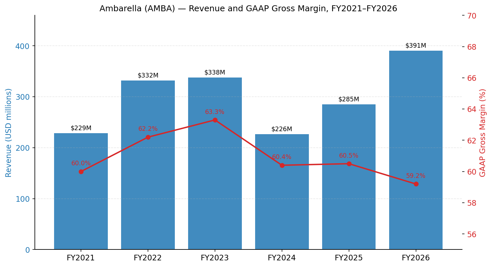
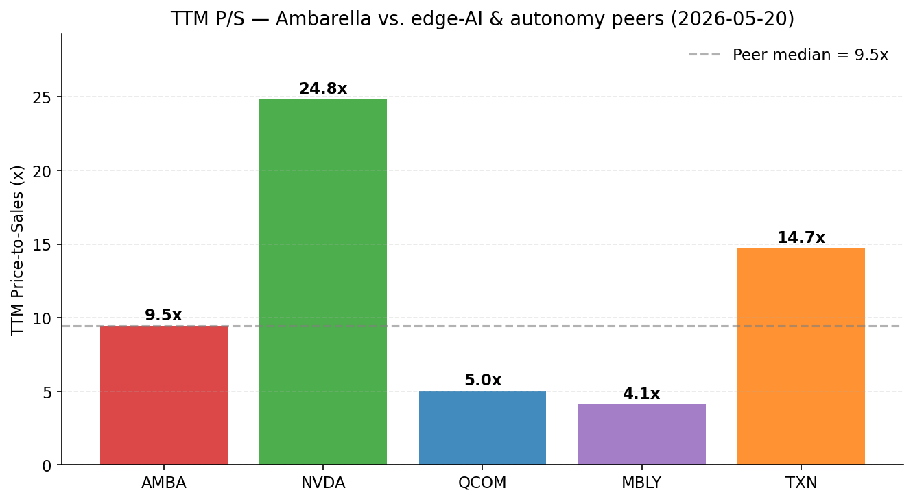
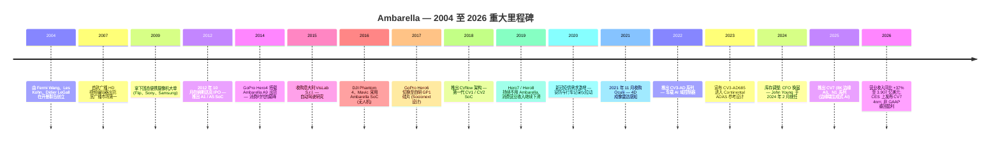
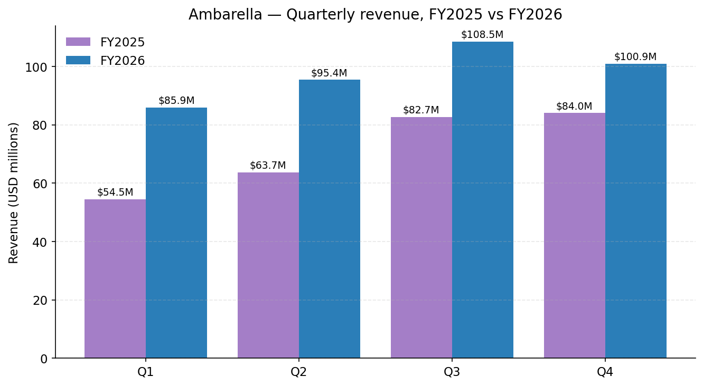
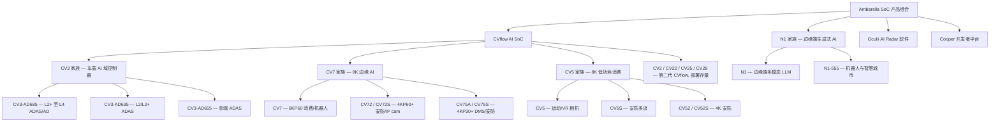
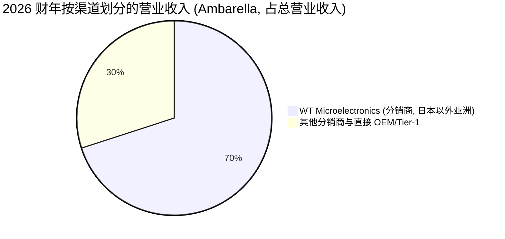
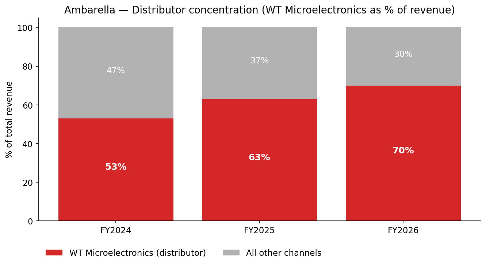
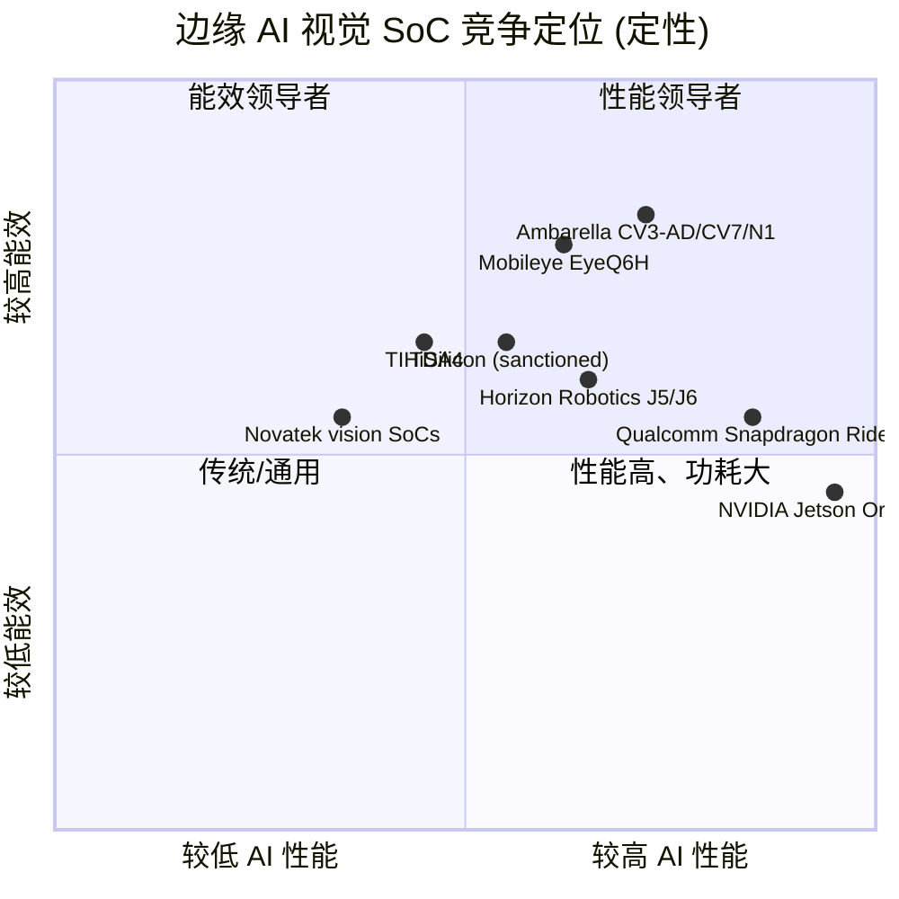
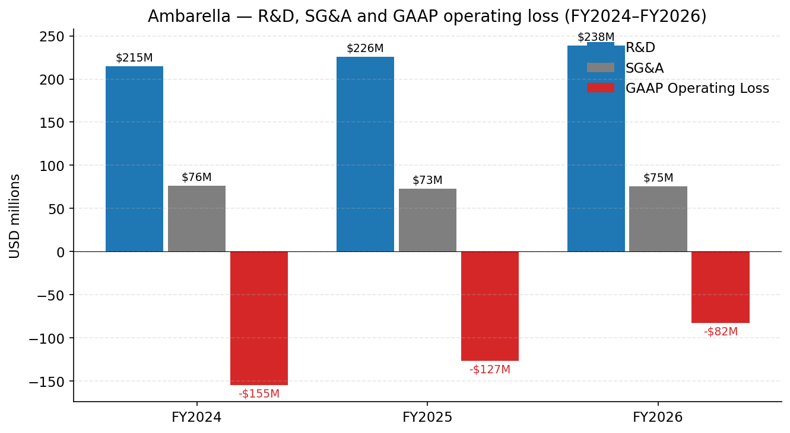
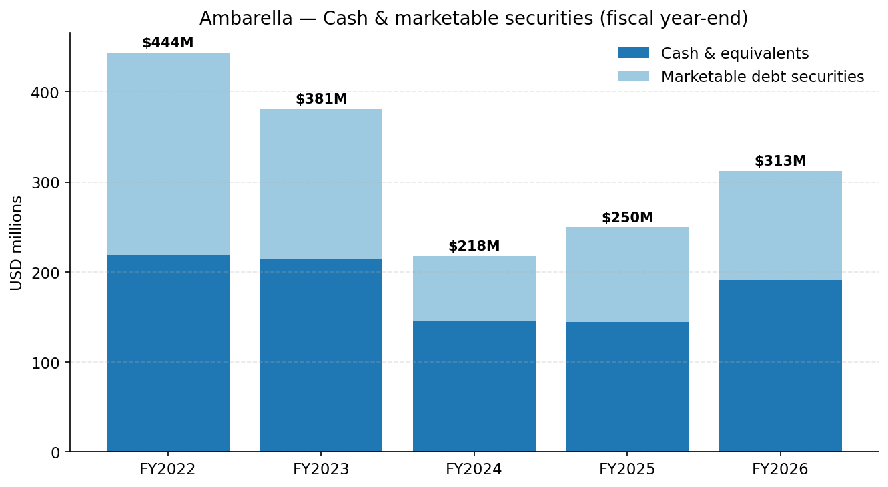

# Ambarella, Inc. (NASDAQ:AMBA) — 公司研究报告

**截至日期: 2026-05-24 (已应用第 10 步核验流程——参见文末核验日志)**
**代码: NASDAQ:AMBA**
**上市地: 纳斯达克全球精选市场 (Nasdaq Global Select Market)**
**注册地: 开曼群岛 (运营总部: 美国加州圣克拉拉)**
**财年截止日: 1 月 31 日**
**报告语言: 简体中文 (英文版同时存在于本目录)**

---

## 目录

1. 公司概览
2. 公司历史
3. 管理团队
4. 产品与服务
5. 客户与上市策略
6. 行业概览
7. 竞争格局
8. 市场机会 (TAM)
9. 风险评估
参考资料

---

## 1. 公司概览

Ambarella, Inc. 是一家边缘 AI (edge-AI) 半导体公司, 专为计算机视觉 (computer vision) 和物理 AI (physical AI) 应用设计低功耗系统级芯片 (SoC, System-on-Chip)。公司将图像信号处理器 (ISP)、视频编解码器 (video CODEC)、神经向量处理器 (NVP, Neural Vector Processor) 以及自有的 CVflow AI 加速器集成于一颗低功耗芯片之上, 随后将这些 SoC (连同配套的软件栈) 销售给三大终端市场的 OEM (原始设备制造商)、ODM (原始设计制造商) 与 Tier-1 供应商: 车载摄像头与 ADAS (高级辅助驾驶) / AD (自动驾驶) 域控制器; IoT (物联网) / 专业安防摄像头与 AIoT (人工智能物联网) / 机器人 (robotics) 平台; 以及消费级摄像头 (运动相机、无人机、行车记录仪、视频门铃)。Ambarella 不持有晶圆厂——其 10-K 写明: "绝大多数 SoC 由 Samsung Electronics Corporation (三星) 在其美国得克萨斯州奥斯汀及韩国的设施供货"; 同一"制造"章节亦将 TSMC (台积电) 列为可用于 4nm 与 2nm 先进制程的两家代工厂之一; 先进封装、组装与终测均外包 (Signetics、STATS ChipPAC、ASE、Sigurd、京元电子 (King Yuan Electronics)) ([Ambarella FY2026 10-K, "Manufacturing"](https://www.sec.gov/Archives/edgar/data/1280263/000119312526119321/0001193125-26-119321-index.htm))。

公司在 2026 财年 (截至 **2026 年 1 月 31 日**) 录得营业收入 **3.907 亿美元**, 较 2025 财年的 2.849 亿美元同比增长 **37.2%**, GAAP 毛利率为 **59.2%** (2025 财年为 60.5%), GAAP 净亏损 **7,590 万美元**, 即摊薄每股亏损 1.78 美元, 较上年同期 1.171 亿美元 / 每股亏损 2.84 美元有所收窄 ([Q4 & 2026 财年全年 8-K 业绩公告, 2026-02-26](https://www.sec.gov/Archives/edgar/data/1280263/000119312526076823/d108529dex991.htm))。在非 GAAP 基础上, Ambarella 重新转入小幅年度盈利 (非 GAAP 净利润 2,690 万美元 / 每股 0.62 美元, 较 2025 财年非 GAAP 亏损 680 万美元转正) ——这正是市场在两年库存调整期内一直等待的拐点。截至财年末, Ambarella 持有现金及等价物 1.910 亿美元, 加上 1.216 亿美元可销售债务证券 (合计 3.126 亿美元, 无有息负债), 全球员工 **959 人, 其中约 75% 从事研发**, 重点分布: 台湾 372 人、美国 252 人、中国 225 人、欧洲 95 人 ([Ambarella FY2026 10-K, Item 1, "Human Capital Resources"](https://www.sec.gov/Archives/edgar/data/1280263/000119312526119321/0001193125-26-119321-index.htm))。

Ambarella 的商业模式是典型的无晶圆厂 (fabless) 半导体打法: 在客户硬件 (安防摄像头、ADAS 模块、AD 域控制器、消费相机、机器人) 内拿下多年期设计中标 (design win), 然后在 3–7 年的产品生命周期内分享每一项设计的出货量。公司销售面向全球, 但终端客户压倒性集中在亚洲——**2026 财年 88% 的营业收入流向亚洲** (2025 财年 85%、2024 财年 79%), 反映了为全球品牌制造安防摄像头、行车记录仪与 Tier-1 车载模块的中国大陆/台湾 ODM 生态 ([Ambarella FY2026 10-K, "Sales by Geographic Region"](https://www.sec.gov/Archives/edgar/data/1280263/000119312526119321/0001193125-26-119321-index.htm))。分销通过一家非独家销售代表 **WT Microelectronics (文晔科技, 前身为 Wintech)** 进行, 该公司在 2026 财年承接了 **70% 的营业收入**, 较 2025 财年的 63% 与 2024 财年的 53% 持续提升; WT 协议有效期延伸至 2029 年 1 月。

*来源: [Ambarella 10-K 文件 FY2022–FY2026, 合并经营报表](https://www.sec.gov/cgi-bin/browse-edgar?action=getcompany&CIK=0001280263&type=10-K&dateb=&owner=include&count=40)。*

**估值快照 (截至 2026-05-20)。** Ambarella 收盘价 **84.28 美元**, 对应 4,386 万股流通普通股, 市值 **37.0 亿美元** ([Yahoo Finance, AMBA 报价, 2026-05-20](https://finance.yahoo.com/quote/AMBA/))。过去十二个月 (TTM) 主要指标: **TTM P/E 不具备意义** (2026 财年 GAAP 净亏损 7,590 万美元); **远期市盈率 (forward P/E) 约 77.6 倍**一致预期, **TTM 市销率 (P/S) 为 9.46 倍** (37.0 亿美元市值 ÷ 3.907 亿美元 TTM 营业收入), **市净率 (P/B) 为 6.1 倍**, **EV/Revenue 为 8.5 倍**, **EV/EBITDA 为负 (–48×)**, 公司在 GAAP 基础上仍处于 EBITDA 亏损状态 ([Yahoo Finance Key Statistics, AMBA, 2026-05-20](https://finance.yahoo.com/quote/AMBA/key-statistics))。

9.5 倍的 TTM P/S 大致处于 Ambarella 三年区间的中位。该股票在 2026 年触及约 96.69 美元高点——对应 TTM 销售约 11 倍的隐含倍数——并在 2024 年末 IoT/安防摄像头库存底部期间一度探底至约 48.30 美元 (彼时按当时 TTM 销售口径约 6.7 倍 P/S)。回溯更早, AMBA 曾于 2021 年末在后疫情 AI/EV 视觉热潮中触及约 217 美元高点 (对应彼时 TTM 销售约 28 倍) ([yfinance 五年价格历史, 2026-05-20](https://finance.yahoo.com/quote/AMBA/history))。

同业比较 (TTM P/S, 2026-05-20, [Yahoo Finance](https://finance.yahoo.com/)): **NVIDIA 24.8× / Texas Instruments 14.7× / AMBA 9.5× / Qualcomm 5.1× / Mobileye 4.1×**。

*来源: [Yahoo Finance Key Statistics — AMBA, NVDA, QCOM, MBLY, TXN, 2026-05-20](https://finance.yahoo.com/quote/AMBA/key-statistics)。*

 Ambarella 估值定位**低于 NVDA 与 TXN, 但高于 QCOM 与 MBLY**——相对于多元化模拟与 ADAS 商业硅片同业溢价, 相对于 GPU/数据中心超大规模一线溢价折让。该溢价反映了边缘 AI 增长叙事以及 2026 财年重回营业收入增长和非 GAAP 盈利的拐点; 与 NVIDIA 的差距则反映了数据中心营业收入的缺失。远期 P/E 超过 70 倍, 表明市场是在**按增长叙事而非当前盈利定价 AMBA**——这是典型的小盘商业硅片股写照, 兼具可信的产品路线图 (CV3-AD 设计中标) 与持续的 GAAP 亏损。估值对设计中标节奏、毛利率轨迹与客户集中度高度敏感; 我们将倍数压缩风险视为重大, 并在第 9 章再次予以强调。

---

## 2. 公司历史

Ambarella 由 Fermi Wang (王奉民)、Les Kohn 和 Didier LeGall——视频编解码器先驱 **C-Cube Microsystems** 与 Sun Microsystems 收购对象 **Afara Websystems** 的三位老兵——于 **2004 年 1 月**在开曼群岛创立并完成注册 ([Ambarella FY2026 10-K, "Corporate Information"](https://www.sec.gov/Archives/edgar/data/1280263/000119312526119321/0001193125-26-119321-index.htm))。创业初衷是把编解码器与图像信号处理器经验应用于新一代高清 (HD) 数字视频应用场景, 先为广播编码器构建低功耗 SoC, 然后再扩展至新兴消费视频形态。公司首批商用量产收入来自**固态便携摄像机 (solid-state pocket camcorder)** (Flip 时代) 与**广播电视编码器市场**, 其压缩效率使 Ambarella 成为这两个市场的第一供应商——按公司自身历史页所述"任一日的多数广播电视信号都通过我们的芯片传输" ([Ambarella, 关于 / 历史](https://www.ambarella.com/about-history/))。

**战略转折。** Ambarella 有过三次实质性的重新定位。(1) **摆脱纯消费品依赖**——当 GoPro 在 2017 年 9 月为 Hero6 选择自研 GP1 SoC (由 Socionext 协助设计) 时, Ambarella 失去了旗舰消费客户, 在随后的两个产品周期中消费营业收入大幅下滑, 因为 Hero7/Hero8 继承了自研硅片路径; 管理层随即加速对安防与车载业务的投资 ([Engadget, "The Hero 6 and 'GP1' is GoPro's chance to grow again", 2017-09-28](https://www.engadget.com/2017-09-28-gopro-hero-6-and-gp1.html); [Motley Fool, "Ambarella Loses as GoPro, DJI, and Google Shop Around for New Chips", 2017-10-14](https://www.fool.com/investing/2017/10/14/ambarella-loses-as-gopro-dji-and-google-shop-aroun.aspx))。公司在 2026 财年 10-K 中明确写道, "直至 2023 年, 我们多数营业收入来自仅供人眼观看的应用", 而当前战略焦点已转向机器视觉与物理 AI 应用。(2) **借 VisLab 与 Oculii 完成车载布局**——2015 年收购 VisLab (从帕尔马大学剥离的意大利自动驾驶研究实验室) 为 Ambarella 奠定了 AD 软件栈基础, 2021 年 11 月收购 **Oculii** (4D 成像雷达感知软件) 则是公司在 ADAS/AD 领域可信地与 Mobileye 和 NVIDIA 竞争的关键枢纽 ([Ambarella FY2022 10-K, Item 1, "Acquisition of Oculii"](https://www.sec.gov/Archives/edgar/data/1280263/000156459022013224/0001564590-22-013224-index.htm))。(3) 2018 年推出的 **CVflow AI 加速器**是公司对视觉 SoC 将与 AI 推理融合的押注——这一论点随着边缘 AI 工作负载的扩散而显得相当先见, 一个硬件家族 (CV2 → CV2x → CV5/CV7 → CV3) 现已覆盖公司所有的终端市场。

**关键收购。**

- **VisLab S.r.l.** — 2015 年 6 月 (自动驾驶研究, 意大利帕尔马)。奠定 AD 软件栈基础。
- **Oculii Corp.** — 2021 年 11 月 5 日。总收购对价 **3.557 亿美元** (其中 2.770 亿美元归入商誉、3,280 万美元归入无形资产、4,590 万美元归入所获取的净资产) ([Ambarella FY2022 10-K, 企业合并附注](https://www.sec.gov/Archives/edgar/data/1280263/000156459022013224/0001564590-22-013224-index.htm))。位于俄亥俄州; 引入了用于 ADAS 与自动驾驶的自适应 AI 雷达感知软件, 此后更名为 "Oculii AI Radar"。

**近期动态 (过去 12–18 个月)。** 对当前投资逻辑有意义的三件事: (a) 2026 财年营业收入回暖 (同比 +37%) 验证库存调整已结束, AI 推理 ASP (平均售价) 高于其所取代的传统视频芯片 ([Q4 FY2026 8-K, 2026-02-26](https://www.sec.gov/Archives/edgar/data/1280263/000119312526076823/d108529dex991.htm)); (b) **CES 2026 上推出 4nm CV7 家族** (8K 边缘 AI, 配多流感知与第三代 CVflow 加速器), 以及加入端侧生成式 AI / VLM 能力的更宽泛的 N1 家族——这是 Ambarella 首次将自身定位为面向**物理 AI 智能体 (physical-AI agents)** 的平台, 而非纯粹的安防/ADAS 感知 ([Ambarella 新闻稿, 2026-01-05](https://www.ambarella.com/news/ambarella-launches-powerful-edge-ai-8k-vision-soc-with-industry-leading-ai-and-multi-sensor-perception-performance/)); 以及 (c) **2026 年 1 月 6 日 CES 上推出 Developer Zone**, 旨在把客户漏斗从 Tier-1 芯片采购方关系拓展至 NVIDIA 式的独立开发者生态 ([Ambarella DevZone 公告, 2026-01-06](https://www.ambarella.com/news/ambarella-launches-a-developer-zone-to-broaden-its-edge-ai-ecosystem/))。

---

## 3. 管理团队

### Fermi Wang — 联合创始人、总裁、CEO 兼执行董事长

王奉民 (Feng-Ming "Fermi" Wang) 是创始人 CEO 兼执行董事长。他自 2004 年 1 月起一直执掌 Ambarella, 并于 2026 年 3 月 23 日签署了 2026 财年 10-K, 是公司迄今为止最具决定性的高管简历——既因其创始人身份, 也因公司的产品战略 (CVflow、从相机视觉转向物理 AI) 一直紧贴他所阐述的论点。在 Ambarella 之前, Wang 担任过**服务器吞吐量计算初创公司 Afara Websystems 的 CEO 兼联合创始人**, 该公司于 **2002 年 7 月**被 Sun Microsystems 收购; Afara 的多核多线程 CPU 后来成为 Sun UltraSPARC 路线图的核心技术 ([Ambarella 高管团队页](https://www.ambarella.com/executive-team/))。在创立 Afara 之前, Wang 曾在 **C-Cube Microsystems** 担任工程与业务管理资深职位——C-Cube 是 1990 年代初期 MPEG 视频硅片的先驱, 按公司简历所述, Wang 在 C-Cube 的团队开发了"世界第一颗 MPEG CODEC 芯片"。他持有多项数字视频专利, 包括 MPEG LA 的 MPEG-2 与 MPEG-4/AVC 核心专利之一, 这使创始团队在视频编解码原语领域具备非同寻常的深度, 而这正是 Ambarella 图像流水线的基石。

Wang 完整经历了 Ambarella 的 IPO (2012 年 10 月) 以及随后三轮业务周期——以 GoPro 为代表的运动相机热潮 (2014–2016 峰值)、2019 年丢失 GoPro 硅片、新冠疫情下的安防摄像头激增, 以及 2023–2024 年的库存调整。从"仅供人眼观看"的视频芯片刻意转向机器视觉与物理 AI, 以及推动公司持续 GAAP 亏损的高额研发负担, 显然都是他的选择: **2026 财年研发支出 2.385 亿美元 / 3.907 亿美元营业收入 (占营业收入 61%)** ([FY2026 10-K, MD&A](https://www.sec.gov/Archives/edgar/data/1280263/000119312526119321/0001193125-26-119321-index.htm)), 这是创始人主导的姿态, 既考验了投资者耐心, 也确保公司在领先制程节点 (当前 4nm 与 5nm, 按 10-K 还有 2nm SoC 在开发中) 持续出货。Wang 对于硅谷 CEO 而言相对低调——他主持业绩电话会议并偶尔出席 CES 主旨演讲, 但媒体曝光不多——最近一次代理委托书披露的实益持股是有意义但非超额投票权 (具体持股将以即将披露的 2026 DEF 14A 为准; 此前的委托书披露其为持有逾 5% 流通股的实益所有人)。

### John Young — 首席财务官

John Young 于 **2024 年 2 月就任 CFO**, 接替 Brian White ([Ambarella 高管团队](https://www.ambarella.com/executive-team/))。Young 是内部晋升: 他于 **2017 年 3 月加入 Ambarella, 担任公司财务总监 (corporate controller)**, **2019 年 12 月升任财务副总裁**, 并于 2021–2022 年担任主要会计与财务负责人。在 Ambarella 之前, 他在 **Mellanox Technologies** (2009–2016, 最近职务为 corporate controller) 担任过一系列财务职位, 并以注册会计师 (CPA) 身份在 **Ernst & Young (安永)** 起步。他在 Mellanox 的任期跨越了该公司从年营业收入约 2.5 亿美元增长至约 8.5 亿美元、并经历多次公开二次发行的阶段——对于执掌一家无负债但持续 GAAP 现金消耗的公司的 CFO 而言, 这是有用的资本市场经验。Young 担任 CFO 的前两年恰逢 2026 财年的拐点 (营业收入 +37%, 非 GAAP 重回盈利), 他也是季度电话会议指引的公众代言人——2026 财年 Q4 给出的 2027 财年 Q1 指引为营业收入 **9,700 万–1.03 亿美元**、非 GAAP 毛利率 **59–60.5%**, 市场解读为大致符合预期且略偏保守 ([Q4 FY2026 8-K 公告, 2026-02-26](https://www.sec.gov/Archives/edgar/data/1280263/000119312526076823/d108529dex991.htm))。

*来源: [Ambarella 季度 8-K 业绩公告, FY2025–FY2026](https://www.sec.gov/cgi-bin/browse-edgar?action=getcompany&CIK=0001280263&type=8-K)。*

### Les Kohn — 联合创始人、首席技术顾问 (CTA)

Les Kohn 是硅谷资深的芯片架构师之一, 也是 Ambarella 的常驻技术权威。作为 Afara 与 Wang 的联合创始人, Kohn 曾任 **Sun UltraSPARC I 与 II 总架构师**、**Intel i860 总架构师**, 以及更早期的 **National 32000 联合架构师** ([Ambarella 高管团队](https://www.ambarella.com/executive-team/))。在 C-Cube, 他主导了三代数字视频 CODEC 的开发, 包括首颗单芯片 MPEG-2。Kohn 在 Ambarella 的角色——首席技术顾问 (CTA)——已从运营层 CTO 转向高级架构方向, 但 CVflow 加速器家族以及把 ISP、编解码器与神经处理融合到单颗芯片的架构选择, 显然带有他的印记。

### Muneyb Minhazuddin — 客户增长官

Muneyb Minhazuddin 加入 Ambarella 担任客户增长官, 主导开发者生态与 Tier-1 客户扩张。他来自 **Intel, 担任 Network and Edge Group 的 CMO**, 协助建立了 Intel 商业边缘 AI 软件业务; 在 Intel 之前, 他在 VMware 工作了十年, 创立了边缘计算与私有移动网络业务 ([Ambarella 高管团队](https://www.ambarella.com/executive-team/))。他的加入意味着公司将生态与开发者触达 (Cooper 平台、DevZone) 视为战略杠杆, 而非仅仅是市场营销职能——这是对 NVIDIA 在 CUDA/Jetson 上压倒性开发者生态优势的一种合理回应。

### 公司治理

截至 2026 DEF 14A, 董事会共 **8 名董事**: Fermi Wang (执行董事长)、Gregory M. Bryant (自 2026 年 2 月起任首席独立董事; 2022 年 3 月至 2025 年 3 月任 Analog Devices 全球业务部门总裁, 此前 2019 年 9 月至 2022 年 1 月任 Intel 客户端计算部门 EVP & GM)、Christopher B. Paisley (审计委员会主席; 自 2012 年 8 月起任董事; Santa Clara 大学 Dean's Executive 会计学教授)、胡正明 (Chenming C. Hu) 博士 (2001–2004 年任台积电 (TSMC) 首席技术官; 加州大学伯克利分校 TSMC Distinguished Chair 名誉教授)、D. Jeffrey Richardson (LSI Corporation 前 EVP & COO, 直至 2014 年被 Avago 收购; 此前任 Intel 服务器平台部门 VP/GM)、洪小文 (Hsiao-Wuen Hon) 博士 (微软亚洲研究院前公司副总裁)、Elizabeth M. Schwarting 以及 Chantelle Y. Breithaupt (自 2024 年 1 月起任 Arista Networks SVP & CFO; 此前 2021 年 3 月至 2023 年 12 月任 Aspen Technology SVP & CFO) ([Ambarella 2026 DEF 14A, Proposal 1 — 董事选举](https://www.sec.gov/Archives/edgar/data/1280263/000119312526227183/d20210ddef14a.htm); [Ambarella 董事会页](https://www.ambarella.com/board-of-directors/))。截至 2026 年 1 月 31 日, 独立董事中女性占比 **33%** ([FY2026 10-K, Human Capital](https://www.sec.gov/Archives/edgar/data/1280263/000119312526119321/0001193125-26-119321-index.htm))。董事会半导体与科技运营经验深厚 (胡正明、Richardson、Bryant), 资本市场经验也充足 (Paisley、Breithaupt)。薪酬偏重权益激励——对于小盘半导体股属典型——2025 DEF 14A 未标记任何重大关联方交易。2026 财年员工自愿离职率 7.7%, 对一家湾区半导体雇主而言较低。

### 业绩记录

这是一家由创始人主导、跨越三个产品周期 (广播/便携摄像机、运动相机/无人机, 现在转向边缘 AI / 车载) 的公司——但有一个明显缺口: 2019 年丢失 GoPro 用了两年多才消化, 2024 财年的库存调整也比同业更陡 (营业收入由 2023 财年的 3.376 亿美元跌至 2024 财年的 2.265 亿美元, 跌幅 33%)。2026 财年回升至 3.907 亿美元创下新高, 但 GAAP 现金消耗具有结构性, 管理层的可信度现在系于 (a) CV3-AD 车载业务把设计中标转化为放量营业收入, 以及 (b) 在客户结构向 Tier-1 ADAS 倾斜过程中, 毛利率轨迹不进一步走低。

---

## 4. 产品与服务

Ambarella 围绕两个维度组织产品组合: 按**终端应用** (车载 / 安防 / 消费 / AIoT、工业与机器人) 的网站导航, 以及按**硅片家族** (CV 系列 CVflow SoC、面向边缘端生成式 AI 的 N 系列、OEM SoC, 以及 Cooper 开发者平台)。CVflow 加速器是各家族间的统一架构, 目前已演进到**第三代** (用于 CV7、CV3 与 N1), 采用 4nm 与 5nm 制程 ([Ambarella FY2026 10-K, "Products"](https://www.sec.gov/Archives/edgar/data/1280263/000119312526119321/0001193125-26-119321-index.htm))。

**车载——旗舰平台: CV3-AD 家族。** CV3-AD 家族是 Ambarella 面向 L2+ 至 L4 自动驾驶与高端 ADAS 的中央域控制器平台。旗舰型号 **CV3-AD685** 是符合 ASIL-B(D) 等级的 AI 域控制器 SoC, 在单颗芯片上集成了神经向量处理器 (NVP)、通用向量处理器 (GVP)、图像处理器、稠密立体与光流引擎、**Arm Cortex-A78AE 与 Cortex-R52 CPU**、车规 GPU 与硬件安全模块 ([Ambarella 车载产品页](https://www.ambarella.com/products/automotive/))。Ambarella 自身的 10-K 表述是, CV3 提供"较上代 CV2 SoC 快 20× 的神经网络处理能力", 并支持"完整 AD 软件栈"——即客户购买一颗芯片即可, 而无需 Mobileye EyeQ5/EyeQ6 栈那类典型的多芯片配置 ([FY2026 10-K, "Central Domain Controller"](https://www.sec.gov/Archives/edgar/data/1280263/000119312526119321/0001193125-26-119321-index.htm))。CV3-AD635 与 CV3-AD655 分别用于中端与高端 ADAS, 补齐家族。定价未公开, 但典型高端 ADAS SoC ASP 在 60–150 美元/车 (NVIDIA Drive Orin/Thor 偏高、Mobileye EyeQ6H 偏低)。**竞争判断: 部分护城河。** Ambarella 拥有 Mobileye 与 TI 所缺乏的架构深度与 Oculii 4D 雷达感知, 但 **NVIDIA Drive Thor** (2,000 TOPS, 单 SoC AD 平台) 是正面竞争者, 且 NVIDIA 的开发者生态更深。Mobileye EyeQ6H 是功耗特征最接近的 ASIC 同类竞争者; AMBA 在感知层面齐平, 雷达集成可争论性领先, 但在累计设计中标与 EyeQ 已部署量方面落后。

**安防——旗舰平台: CV5S/CV72S/CV75S。** 专业安防家族面向 IP 摄像头、多镜头 360° 设备、零售监控与交通摄像头。**CV5S** 在 4W 以下提供 8K 编码 (适用于 IP/机器人); **CV52S** 在 3W 以下提供 4KP60, 配 TrustZone 与安全启动; **CV72S** 是 5nm 上的全新 4KP60+ 型号, 采用第二代 CVflow; **CV75S** 是 4KP30+ 衍生型 ([Ambarella 安防产品页](https://www.ambarella.com/products/security/))。定价在 ASP 15–50 美元区间。**竞争判断: 是, 规模与 IP 护城河。** Ambarella 是 HD/UHD 专业安防摄像头中的商业硅片龙头 (该地位自 2010 年代末以来稳固), 与所有主要 IP cam ODM 建立关系 (Hikvision/Dahua 的外部供应渠道, 加上所有西方品牌)。最接近的竞争对手是低端的**联咏 (Novatek, 台湾)** 与较高 AI 层的 **Qualcomm IP Q-Series**——Ambarella 在 AI 功能上齐平, 在低光/HDR 图像质量与压缩效率上则明显领先。该细分的风险是**海思半导体 (HiSilicon, 华为)**, 历史上曾主导中国监控市场, 但因美国出口管制元气大伤——若制裁松绑, 其重返竞争格局会迅速变化。

**消费——旗舰平台: CV5/CV7。** 运动/动作相机、VR/360° 相机、消费无人机、后装行车记录仪、视频门铃。**CV5** 提供 8KP60 视频; **CV7** (CES 2026 发布, 4nm) 将 8KP60 升级配第三代 CVflow 加速器与多流感知 ([Ambarella 消费产品页](https://www.ambarella.com/products/consumer/); [CV7 新闻稿, 2026-01-05](https://www.ambarella.com/news/ambarella-launches-powerful-edge-ai-8k-vision-soc-with-industry-leading-ai-and-multi-sensor-perception-performance/))。ASP 在 25–80 美元。**竞争判断: 部分护城河。** 这是 Ambarella 历史上护城河最强的细分 (GoPro Hero4 时代基本等同于 Ambarella 独家), 在 2017 年 9 月 GoPro Hero6 转向自研 GP1 SoC 时丢失。公司在行车记录仪 (Garmin、Nextbase、为全球后装市场供货的中国 ODM) 与警用执法记录仪 (Axon 及竞争对手) 仍保有强势地位, 在这些场景图像质量与压缩效率是决定性因素。**DJI (大疆)** 作为消费无人机的霸主, 已将大量产量迁移到自研硅片与其他商业供应商——这是结构性逆风。

**AIoT、工业与机器人——旗舰平台: N1 家族 + CV7。** **N1** 是 Ambarella 第一款明确的**端侧生成式 AI** 布局: 一颗能够在端侧运行多模态 LLM (按 10-K, 模型规模可达 340 亿参数) 的 SoC, 集成了 **16 颗 Arm Cortex-A78AE CPU**、神经向量处理器、通用向量处理器、图像处理器、稠密立体与光流引擎以及一颗集成 GPU ([Ambarella AIoT 产品页](https://www.ambarella.com/products/aiot-industrial-robotics/))。**N1-655** 是 8 核衍生型, 面向工业自动化、机器人与智慧城市视频分析。10-K 的营销示例——一台仓库机器人理解"在 7 号通道找到那个装着破损箱子的托盘并搬到检验区"的指令——很好地捕捉了产品定位。**竞争判断: 视觉中心机器人是, 通用人形/智能体计算否。** N1 在以感知为主的边缘机器人工作负载上与 NVIDIA Jetson Orin/Thor 具备竞争力, 且更便宜、更省电; 在通用计算、软件生态与开发者心智份额方面落后于 Jetson。

**软件与平台——Cooper 开发者平台与 Oculii AI Radar。** Cooper 平台由 "Cooper Metal" (AI SoC + 板级硬件参考设计) 与 "Cooper Foundry" (多层软件栈, 包括 AD 栈、AI 雷达感知、模型迁移工具) 组成 ([Ambarella FY2026 10-K, "Cooper"](https://www.sec.gov/Archives/edgar/data/1280263/000119312526119321/0001193125-26-119321-index.htm); [Cooper 页](https://www.ambarella.com/cooper/))。来自 2021 年收购的 Oculii AI Radar 是差异化要素——提供 4D 自适应成像雷达感知软件, 在 CV3 SoC 上运行, 在感知层面与 Mobileye REM/RoadBook 竞争。

**旗舰 vs 长尾。** 推动 2026 财年营业收入与 2027 财年预期增长的旗舰是: (1) 车载领域的 **CV3-AD685** (设计中标最可见、ASP 最高), (2) 专业安防的 **CV5S / CV72S / CV75S** (装机量最大, 持续刷新), 以及 (3) CES 2026 发布的 **CV7 家族**——标志着消费/AIoT/安防细分向 4nm 迁移。旧型号的部署存量 (CV22 / CV25 / CV28 / A12 / A9) 继续在既有相机平台中出货, 但单位经济效益随客户刷新而下降。

**路线图与近 12 个月的发布。** CV7 发布 (CES 2026, 4nm 8K 边缘 AI SoC) 是最具实质性的新产品。N1 家族在 2024–25 年揭晓; N1-655 作为家族中的第二款产品推出。Developer Zone 于 2026 年 1 月 6 日上线——若能扩展至规模, 战略意义重大。10-K 披露 Ambarella 已"完成 2nm 制程节点首款 SoC 设计的 Tape-out", 并同时点名 Samsung 与 TSMC 是"目前可用于我们使用或可能使用的某些先进制程技术 (如 4nm 或 2nm)"的两家代工厂——10-K 并未具体说明 2nm 部分由哪家代工厂生产, 但双代工框架本身既是对单一供应商依赖的对冲, 也表明公司预期在下一代 ADAS 中与 NVIDIA Drive Thor 竞争 ([FY2026 10-K, "Manufacturing"](https://www.sec.gov/Archives/edgar/data/1280263/000119312526119321/0001193125-26-119321-index.htm))。

---

## 5. 客户与上市策略

Ambarella 面向三类客户销售: (i) **OEM** (如消费相机品牌、直接采用参考设计的车载 OEM), (ii) **ODM 与代工制造商** (为全球品牌制造安防摄像头与行车记录仪的中国/台湾生态), 以及 (iii) **Tier-1 车载供应商** (Continental (大陆)、Bosch (博世)、ZF (采埃孚)、Aptiv (安波福)、Magna (麦格纳) 等), 它们把 SoC 集成到销往 OEM 的 ADAS/AD 模块。公司采用混合的上市策略: 一支用于设计中标的直销团队 (美国、亚洲、欧洲), 以及一家**非独家分销商 (WT Microelectronics 文晔科技)** 处理日本以外亚洲地区的交付 ([Ambarella FY2026 10-K, Item 1, "Sales and Marketing"](https://www.sec.gov/Archives/edgar/data/1280263/000119312526119321/0001193125-26-119321-index.htm))。

**客户集中度——以分销商为主, 且极度集中。** 2026 财年, 唯一一个营业收入占比超过 10% 的客户是 **WT Microelectronics Co., Ltd.** (前身为 Wintech Microelectronics), 占总营业收入约 **70%**, 较 **2025 财年的 63%** 与 **2024 财年的 53%** 持续上升 ([Ambarella FY2026 10-K, "Major Customers"](https://www.sec.gov/Archives/edgar/data/1280263/000119312526119321/0001193125-26-119321-index.htm))。WT 是**日本以外亚洲地区的非独家销售代表与履约伙伴**; 底层终端客户是全球 ODM/OEM 群体, 但按 SEC 会计准则, 营业收入计入 WT 作为合约对手。10-K 明确指出**当前 WT 协议有效期延伸至 2029 年 1 月**, 双方可凭 60 天书面通知终止。历史上的第二个 10% 客户是 **Chicony (群光电子, 一家服务消费/安防细分的台湾 ODM)**, 在 2024 财年被披露为 10% 客户——在 2025 财年与 2026 财年降至 10% 门槛以下。

*来源: [Ambarella FY2026 10-K, "Major Customers"](https://www.sec.gov/Archives/edgar/data/1280263/000119312526119321/0001193125-26-119321-index.htm)。*

*来源: [Ambarella FY2026 10-K, "Major Customers"](https://www.sec.gov/Archives/edgar/data/1280263/000119312526119321/0001193125-26-119321-index.htm); 比较年份的 FY2025 与 FY2024 10-K。*

**地理集中。** 亚洲占 **2026 财年营业收入 88%** (2025 财年 85%, 2024 财年 79%) ([FY2026 10-K, "Sales by Geographic Region"](https://www.sec.gov/Archives/edgar/data/1280263/000119312526119321/0001193125-26-119321-index.htm)) ——由为全球品牌制造摄像头与模块的中国大陆与台湾 ODM 群体推动。中国大陆终端敞口具有实质性; 10-K 将美中关税与出口管制风险列为最高级别风险因素 (见下文第 9 章)。

**销售周期。** 10-K 将典型设计周期描述为多月期, "涉及客户的系统设计师与管理层, 以及我们的销售人员与软件工程师"——以拿下设计中标为终点, 之后消费/安防领域通常在 9–18 个月后开始放量营业收入, 而车载领域因整车项目周期, 通常需要 **3–5 年**才能放量。这种漫长的车载周期, 正是 AMBA 股价对 Tier-1 新闻的反应由设计中标公告 (而非短期营业收入) 驱动的原因。

**分销渠道。** WT Microelectronics 主导日本以外的亚洲。日本历史上由 **Macnica (玛科妮卡)** 服务, 欧洲与美洲有较小的专门分销商。直接销售办公室位于圣克拉拉 (总部)、香港, 业务发展办公室则在中国大陆、德国、日本、韩国与台湾 ([FY2026 10-K, Item 1](https://www.sec.gov/Archives/edgar/data/1280263/000119312526119321/0001193125-26-119321-index.htm))。

**已点名的客户中标。** 最公开引用的车载中标包括 **Continental (大陆集团)** 在其 ADAS 参考设计中采用 CV3-AD685, 在展会上点名欧洲与亚洲 OEM 的公开引用 (未披露具体量产项目), 以及业绩电话会议披露的更广泛 Tier-1 设计导入周期。在安防/消费领域, 部署存量覆盖几乎全部主要 IP cam OEM (西方品牌 + 中国 ODM), 以及 **Axon** 执法记录仪和 **Garmin** / **Nextbase** 行车记录仪。10-K 未将具体 OEM 列为客户 (与行业惯例一致; 具名客户披露通过 OEM 自身文件或行业刊物进行) ——Ambarella 自身的客户披露用语是通用的 ("直接出货的 OEM")。

**合作伙伴。** 与 **Samsung** (主要, 包括美国得州奥斯汀及韩国的 5nm 与 4nm 部分) 和 **TSMC** (开发中的先进 4nm 与 2nm 部分) 的代工合作均已披露 ([FY2026 10-K, "Manufacturing"](https://www.sec.gov/Archives/edgar/data/1280263/000119312526119321/0001193125-26-119321-index.htm))。软件与生态合作覆盖 AD 栈与 AI 模型社区 (Cooper 平台支持 Caffe、TensorFlow、PyTorch 与 ONNX 导入)。

---

## 6. 行业概览

Ambarella 处于三个行业的交集: (1) **边缘 AI 硅片** (面向嵌入式系统的低功耗 AI 推理 SoC 的更宽泛类别), (2) **专门用于 ADAS 与自动驾驶的车载半导体**, 以及 (3) **用于监控与消费相机的视频/视觉处理硅片**。NAICS 分类为 **334413** (半导体及相关器件制造), 公司在 SIC 3674 下自行分类。

**边缘 AI 硅片 (总伞)。** 边缘 AI SoC 市场是半导体增长最快的细分之一, 由设备上摄像头与传感器的普及推动——这些设备越来越倾向于本地推理而非云端推理。**关于更广泛的边缘 AI 硬件市场, 各种规模估计因范围与来源差异显著**: Allied Market Research 的"Edge AI Hardware Market"新闻稿 (原以 2020 年为基期) 将 2030 年规模定为 **388.7 亿美元**, CAGR 为 18.8% ([Allied Market Research 新闻稿, "Edge AI Hardware Market to Reach $38.87 Billion By 2030"](https://www.alliedmarketresearch.com/press-release/edge-ai-hardware-market.html))。其他研究机构 (范围更广, 包含 AI-PC、AR/VR 与生成式 AI 工作负载) 将 2030 年规模定在 **700–800 亿美元**附近, CAGR 在十几到二十几个百分点——这些更高数字是 Ambarella 管理层在业绩电话会上引用的总伞区间, 但其中包含很多超出 Ambarella 可触达范围的加速器。增长驱动: (a) 物理 AI 与机器人 (人形机器人、自主移动机器人 AMR、无人机), (b) 车载 ADAS/AD 单车价值由入门级系统的 100 美元以下提升至 L2+/L3 平台的 1,500+ 美元, (c) 智能视频安防由云端分析迁移到摄像头端推理 (出于隐私与时延考虑), 以及 (d) AI-PC、AR/VR、智能家居与消费电子——尽管 Ambarella 对后三项敞口有限。

**车载 ADAS/AD 硅片。** 车载 ADAS/AD SoC 市场是 Ambarella 叙事中最为关键的纵向市场。单车 ADAS 价值快速上升: McKinsey "Outlook on the automotive software and electronics market through 2030"将中央计算 (域控制器) 段定义为车载电子电气 (E/E) 投入中增长最快的板块, 由 OEM 从分布式 ECU 向集中式软件定义汽车 (SDV) 架构转型驱动 ([McKinsey Center for Future Mobility, "Outlook on the automotive software and electronics market through 2030", 2024](https://www.mckinsey.com/features/mckinsey-center-for-future-mobility/our-insights/mapping-the-automotive-software-and-electronics-landscape-2024))。NVIDIA、Mobileye、Qualcomm 与 TI 是已点名的在位者; Ambarella 与地平线机器人 (Horizon Robotics) 是已点名的挑战者。**2026–2030 设计中标周期**是关键的竞争窗口——现在拿下的中标将于 2027–2030 在车上出货, 定义下一个十年的营业收入分配。

**用于安防与消费相机的视觉处理硅片。** 这是公司业务的更成熟一半。全球 IP 安防摄像头设备市场估计在 250–300 亿美元 (硅片 TAM 是其一小部分——分析师估计在 15–20 亿美元/年), 增长率为中至高单数位 (规模估计基于 Novaira Insights / IPVM / Omdia 行业出版物的分析师三角验证——具体数字因范围与方法不同而异)。消费相机硅片 TAM 更小 (5 亿美元至 10 亿美元, 涵盖运动相机、无人机、门铃、行车记录仪), 单位增长较慢但单设备 AI 价值在上升。

**行业结构。** 边缘 AI 硅片在商业层面是**碎片化的** (NVIDIA、Qualcomm、AMD、Ambarella、Hailo、Sima.ai、MediaTek (联发科)、Novatek (联咏)、地平线机器人、黑芝麻智能 (Black Sesame)), 但**按应用集中**: ADAS 是 4–5 家寡头 (Mobileye + NVIDIA + Qualcomm + TI + Ambarella + 中国的地平线), 安防在摄像头端是 Hikvision (海康) / Dahua (大华) 双寡头, 商业硅片端 Ambarella 是龙头, 消费是长尾。**买方议价能力**在车载领域较高 (Tier-1 有替代方案且谈判强势), 在安防领域中等 (相机 ODM 有替代但图像质量是决定性的)。**供应商议价能力**较高——只有 Samsung 与 TSMC 能制造 Ambarella 设计的 4nm/5nm 部分, 2026 财年 10-K 明确将这种集中度标记为风险。**替代风险**来自客户自研 (GoPro 2019 是先例; DJI 进行中; Tesla、Xiaomi、Apple 都在相邻领域将硅片内部化)。

**监管环境。** 美国出口管制 (BIS 实体清单、外国直接产品规则 FDPR) 对 Ambarella 影响显著, 因为: (a) 约 88% 的营业收入终于亚洲, 其中大量在中国; (b) 多家中国竞争者 (HiSilicon 海思) 受制裁限制, 这是一个顺风, 但 (c) 美国对销往中国的美国设计 AI 芯片的进一步限制可能制约 Ambarella 自身的中国营业收入。10-K 将美中紧张、俄乌冲突与中东敌意明确列为前瞻性陈述风险 ([FY2026 10-K, "Forward-Looking Statements"](https://www.sec.gov/Archives/edgar/data/1280263/000119312526119321/0001193125-26-119321-index.htm))。车载安全监管 (ISO 26262 功能安全, ASIL B/D) 是进入壁垒, 也对已有认证零部件的在位者有利。

**关键趋势与驱动。**

1. **物理 AI**——从"视觉 SoC"到"能运行多模态 LLM 与 VLM 的边缘 AI 平台"的转型, 是当前驱动该细分的战略叙事。NVIDIA Jetson Thor、Ambarella N1、Qualcomm RB6 都围绕这一定位布局。流向人形机器人 (Figure AI、1X、Unitree (宇树)、Apptronik、Tesla Optimus) 的资本是显而易见的增长楔子。
2. **ADAS 功能蠕变**——Euro NCAP 与 IIHS 协议推动驾驶员监测 (DMS)、电子后视镜 (camera mirror)、自动紧急刹车 (AEB) 与车道保持成为标配, 扩大单车硅片支出。
3. **AI 在边缘**对比云端——隐私、时延与带宽经济性推动推理本地化。这毫无疑问对 Ambarella 定位有利。
4. **代工节点迁移**至 4nm / 3nm / 2nm——Ambarella 对领先节点的承诺 (4nm CV7、2nm SoC 在开发中) 昂贵 (研发占营业收入 61%) 但必要, 才能在 2027–2028 与 NVIDIA Drive Thor 竞争。

---

## 7. 竞争格局

Ambarella 在每个终端市场面对的竞争对手有显著差异。2026 财年 10-K 明确点名竞争者: "在 IoT 市场, 我们的主要竞争对手包括 Huawei (华为) 旗下的 HiSilicon Technologies Co., Ltd. (海思)、Novatek Microelectronics Corp. (联咏)、NVIDIA Corporation、Qualcomm Incorporated 以及 Sigmastar Technology Ltd. (晶心半导体)。在车载摄像头市场, 我们与 Horizon Robotics Inc. (地平线机器人)、Intel Corporation 旗下的 Mobileye、Novatek、NVIDIA、Qualcomm、Renesas Electronics Corporation (瑞萨电子) 以及 Texas Instruments (德州仪器) 竞争" ([Ambarella FY2026 10-K, Item 1, "Competition"](https://www.sec.gov/Archives/edgar/data/1280263/000119312526119321/0001193125-26-119321-index.htm))。

**NVIDIA (NASDAQ:NVDA)——平台型竞争者。** NVIDIA 的 Jetson 家族 (Orin、Thor) 与 Drive 平台是最具实质性的正面竞争对手。**Jetson Orin** 在 15–60W 下可提供 275 TOPS, **Jetson Thor** (2025) 面向人形机器人目标约 2,000 TOPS, **Drive Thor** 面向 L4 AD。NVIDIA 的优势是 **CUDA + 整个 AI 软件生态**——每个模型、每个框架、每个开发者工具都首先在 NVIDIA 上运行, 而 Ambarella 的 CVflow 工具链 (虽然在 Caffe/PyTorch/TF/ONNX 迁移上是稳健的) 在深度上无法与 NVIDIA 匹敌。NVIDIA 的劣势是**功耗与价格**: Jetson 比 Ambarella 同档产品贵得多、功耗高得多, 这在电池供电机器人与高量产、对成本敏感的消费相机里关系重大。**NVIDIA TTM P/S 24.8× vs Ambarella 9.5×** ([Yahoo Finance, 2026-05-20](https://finance.yahoo.com/quote/NVDA/key-statistics))——市场已经把 NVIDIA 定价为边缘 AI 主导者。

**Mobileye (NASDAQ:MBLY)——ADAS 在位者。** Mobileye 的 EyeQ 家族是主导性商业 ADAS SoC (按公司披露, 截至 2025 年累计出货量超过 1.2 亿颗)。EyeQ6H (2024) 与即将到来的 EyeQ7H 与 Ambarella CV3-AD 瞄准相同的 L2+/L3 ADAS 细分。Mobileye 的护城河在于**已部署装机量 + 来自既有 EyeQ 装车的 Road Experience Management (REM) 众包 HD 地图数据**。Mobileye 相对 Ambarella 的劣势在于**缺乏一体化 4D 成像雷达** (Ambarella 的 Oculii) 与更封闭的软件模型——Mobileye 历来打包 SoC + 软件, 而 Ambarella 更开放地销售给希望自主拥有 AD 栈的 Tier-1。Mobileye 的 **TTM P/S 4.1×** ([Yahoo Finance, 2026-05-20](https://finance.yahoo.com/quote/MBLY/key-statistics)) 低于 Ambarella, 反映出更慢的增长与 2024 年之后对 NVIDIA 的设计失利周期。

**Qualcomm (NASDAQ:QCOM)——系统级竞争者。** Qualcomm 的 **Snapdragon Ride** 车载平台与 Snapdragon 边缘 IoT 家族 (RB5、RB6) 在车载与 AIoT 与 Ambarella 同台竞争。Qualcomm 的优势是一体化蜂窝连接、规模 (350+ 亿美元营业收入), 以及与已在使用 Snapdragon Digital Cockpit 的车载 OEM 的深度关系。劣势: 对 Ambarella 优化的感知重型计算关注度更低。Qualcomm 以 **5.1× TTM P/S** 交易, 显著低于 AMBA。

**Texas Instruments (NASDAQ:TXN)——量产在位者。** TI 的 **TDA4** 系列 ADAS 处理器是入门与中端的量产商业 ADAS SoC——高可靠性、成熟工具链、广泛 Tier-1 设计中标。TDA4 的 AI 性能水平不及 CV3-AD 或 Drive Thor, 因此竞争重叠在入门/中端 ADAS, 而非 L3/L4。TI 以板块抬升的 14.7× P/S 交易, 因为其更广泛的模拟/嵌入式特许经营权和股息。

**地平线机器人 (Horizon Robotics, HKEX:9660)——中国挑战者。** 地平线的 Journey (征程) (J2/J3/J5/J6) SoC 系列是主导中国国内的 ADAS 平台——在比亚迪 (BYD)、理想汽车 (Li Auto)、广汽 (GAC)、奇瑞 (Chery)、上汽 (SAIC) 拿下设计中标, 并越来越多地与采购进入中国的全球 OEM 合作。地平线于 2024 年 10 月在港交所 (HKEX) IPO ([Horizon Robotics HKEX 全球发售招股说明书, 2024-10-16](https://www1.hkexnews.hk/listedco/listconews/sehk/2024/1016/2024101600017.pdf)), 是 Ambarella 中国车载野心面临的最迫切竞争威胁。地平线享有本土市场优势; Ambarella 拥有领先制程节点与雷达集成。未来 24 个月将决定 Ambarella 是否能在面对一家垂直整合、资金充沛的中国竞争者时, 守住非中国与西方 Tier-1 份额。

**其他已点名竞争对手** (10-K 明确点名前四家)。**Renesas Electronics (瑞萨电子, 日本; R-Car 家族)** 用于车载; **Novatek (联咏, 台湾)** 用于低端视觉 SoC 与 IP cam; **HiSilicon (海思, 华为; 受制裁但历史上在中国监控领域居主导地位——若制裁松绑, 存在重返风险)**; **Sigmastar (晶心半导体, 中国; 低成本 IP cam SoC)**。除 10-K 列表之外, 分析师视角: **Black Sesame Technologies (黑芝麻智能, 中国; ADAS SoC 挑战者)**; **Hailo (以色列; 独立 AI 加速器)**; **Sima.ai (美国; 边缘 AI 加速器初创)**; **MediaTek (联发科, 台湾; 更广泛的边缘 SoC 包括 AIoT)**。客户自研仍是结构性风险: **DJI、Tesla、Xiaomi** 都已在相邻领域将硅片内部化。

**Ambarella 的竞争优势。** (1) 在单颗低功耗芯片上融合视频 + AI + ISP 的架构护城河——相机工作负载下每瓦性能显著优于 NVIDIA Jetson。(2) 通过 Oculii 提供 **4D 成像雷达感知**——这是相对 Mobileye 与 TI 的真正差异化。(3) 多年累积的编解码器/ISP IP——低光、HDR、去畸变 (dewarp)、电子图像稳定 (EIS) 上的图像质量领先。(4) **功能安全认证** (CV3 上的 ASIL B/D) ——3–5 年的竞争护城河。(5) 对领先制程的承诺 (4nm CV7、2nm 在开发中) ——只有 NVIDIA 与 Mobileye 与之匹敌。

**竞争脆弱性。** (1) **没有 CUDA 等价物**——CVflow 工具链虽稳健, 但与 NVIDIA 的开发者生态差距广且不断扩大; DevZone 的推出是回应。(2) **通过 WT 的客户集中度 (70%)** ——属运营而非竞争风险, 但限制了议价杠杆。(3) **相对同业规模小** (3.91 亿美元营业收入 vs NVIDIA 1,300+ 亿美元) ——限制了研发规模与客户可信度。(4) **没有数据中心 / 训练敞口**——Ambarella 是纯粹的边缘玩家; 若 AI 转回更多云端推理 (并远离设备端), 投资逻辑会被削弱。

---

## 8. 市场机会 (TAM)

我们沿三个分层市场对 Ambarella 的 TAM 进行规模化, 锚定第三方预测, 并与公司自身 10-K 表述进行三角验证。

**TAM——更广泛的边缘 AI 硅片。** 跨研究机构三角验证给出广泛区间。Allied Market Research 的"Edge AI Hardware Market"将 2030 年规模定为 **388.7 亿美元**, CAGR 为 18.8% ([Allied Market Research 新闻稿](https://www.alliedmarketresearch.com/press-release/edge-ai-hardware-market.html))。IDC 的"Worldwide Edge Spending Guide"预测到 2028 年全球边缘计算支出约为 **3,800 亿美元**, CAGR 为 13.8%, 边缘 AI 硅片是其中增长最快的子细分 ([IDC 新闻稿, "Global Spending on Edge Computing to Grow at 13.8% Reaching Nearly $380 Billion by 2028"](https://my.idc.com/getdoc.jsp?containerId=prUS53261225))。包含 AI-PC 与 AR/VR 硅片的更广范围行业估计将 2030 年定在 700–800 亿美元附近, CAGR 在十几到二十几个百分点——这是 Ambarella 管理层在业绩电话会上讨论"700+ 亿美元边缘 AI 机会"时所引用的总伞区间, 不过该数字包含大量超出 Ambarella 可触及范围的加速器。

**SAM——Ambarella 可服务可触达市场。** SAM 是聚焦于**视觉中心边缘应用**的边缘 AI 硅片子集——ADAS/AD 域控制器、配端侧分析的 IP/安防摄像头、机器人视觉 SoC、配端侧 AI 的消费相机。*分析师估算:* 综合 S&P Global Mobility 的 ADAS / 自动驾驶预测以及监控硅片市场的行业估计三角验证, 视觉中心边缘 AI 硅片 SAM 在 **2024 年约为 80–100 亿美元**, 到 **2030 年增长至 220–280 亿美元**, CAGR 为 17–19% (S&P Global Mobility 的"Autonomy Forecasts"产品是底层 ADAS 参考: [S&P Global Mobility, Autonomy Forecasts](https://www.spglobal.com/mobility/en/products/autonomy-forecasts.html); 监控硅片成分是分析师叠加, 未由任何单一研究机构单独披露)。其中:

- **车载 ADAS/AD SoC SAM**: 2024 年约 40 亿美元 → 2030 年约 120–150 亿美元 (由单车 ADAS 价值提升加上 AD/L2+ 渗透推动; 单车硅片支出从 100 美元以下攀升至 300–1,500 美元区间)。
- **安防/监控视觉 SoC SAM**: 2024 年约 15–20 亿美元 → 2030 年约 30–40 亿美元 (低至中等十几个百分点增长)。
- **消费 + AIoT/机器人视觉 SoC SAM**: 2024 年约 25–40 亿美元 → 2030 年约 70–90 亿美元 (由约 2027 年起人形/AMR 机器人拐点驱动)。

**SOM——Ambarella 的现实份额。** Ambarella 2026 财年营业收入 **3.91 亿美元**, 相当于可触达 SAM 的约 **4%**。管理层的中期机会案例隐含地把目标定为到 2030 年视觉边缘 AI 硅片的高单位数百分比份额, 由车载设计中标转化加权决定。可信的 2030 年营业收入情景:

- **熊市 (无车载放量, 安防/消费走低)**: 4.5–5.5 亿美元。
- **基准 (车载按计划放量, 安防稳定)**: 8 亿–12 亿美元。
- **牛市 (车载放量, N1/机器人中标兑现)**: 15–20 亿美元。

广泛的区间反映了 (a) 车载设计中标的时间不确定性——2024–2026 拿下的设计中标将于 2027–2030 在车上出货, 因此 FY2028–FY2030 的营业收入由现在正在签的合同决定, 以及 (b) 物理 AI / 机器人需求的形态未知——若人形机器人与 AMR 到 2028 年达到商业规模, Ambarella 的 N1 家族就有清晰的实质性营业收入路径。

**渗透策略。** 三大支柱: (1) **在 2027–2030 整车项目之前拿下 Tier-1 车载设计席位**——这是杠杆最高的活动, Continental 在 CV3-AD685 上的设计导入是公开的证明。(2) **通过 CV5S/CV72S/CV75S 刷新周期防守与扩展安防/IP cam 特许经营权**——增量而可靠。(3) **通过 Cooper/DevZone 开放开发者生态**, 让更小的机器人、无人机与 AIoT 客户无需企业销售动作即可采用——这是对 NVIDIA Jetson 生态优势的防御性必要。

---

## 9. 风险评估

### 公司特定风险

**1. 分销商 / 客户集中度 (高 / 重大)。** WT Microelectronics 承接 **2026 财年 70% 的营业收入**, 较 2025 财年的 63% 与 2024 财年的 53% 持续上升——三年趋势中*持续上升*的集中度跨越了所有典型警报阈值 (top-1 > 30% 即为高严重度)。当前 WT 协议有效期至 2029 年 1 月, 双方可凭 60 天通知终止 ([Ambarella FY2026 10-K, "Customer Concentration"](https://www.sec.gov/Archives/edgar/data/1280263/000119312526119321/0001193125-26-119321-index.htm))。底层终端客户在亚洲 ODM/OEM 群体中分散, 因此单一终端客户离开的运营风险比标题数字所示要小——但会计/披露风险与信用集中风险都是真实的。WT 自身的信用、营运资本健康度以及在类似条件下续约的意愿不在 Ambarella 控制之下。缓解: 底层终端基础分散; 协议延伸至 2029 年。严重度 = 重大。

**2. 车载设计中标执行风险。** AMBA 的多头逻辑依赖 CV3-AD 设计中标在 2027–2030 整车项目中转化为放量营业收入。在车载领域, 设计中标与放量营业收入之间通常间隔 3–5 年, 期间竞争者 (NVIDIA、Mobileye、地平线、Qualcomm) 可重新竞标。失去一个主要 Tier-1 项目就会重大削弱 2027+ 的营业收入轨迹。缓解: ASIL B/D 认证制造切换成本; Oculii 雷达集成是差异化。

**3. 对 Fermi Wang 的关键人员依赖。** 创始人主导的公司活在创始人执行能力上; Wang 是架构与战略决策者, 已经做了 22 年。他不持有超额投票权, 委托书中也无披露的接班计划。出于任何原因失去 Wang 都会重大削弱下一个产品周期。

**4. 代工 / 供应商集中度。** "我们 SoC 的绝大多数由 Samsung Electronics Corporation 供货", 按 2026 财年 10-K ([Item 1, "Manufacturing"](https://www.sec.gov/Archives/edgar/data/1280263/000119312526119321/0001193125-26-119321-index.htm))。在领先节点 (4nm / 5nm) 上的单代工厂依赖是结构性风险——良率问题、紧周期下的产能分配、对韩国晶圆厂的地缘扰动, 或 Samsung 自身竞品设计的优先级, 都可能制造供应问题。缓解: 按 10-K 在 TSMC 开发 2nm SoC 是明确的双供应对冲。

**5. 消费细分 / GoPro 先例——客户自研。** GoPro Hero6 (2017 年 9 月, GP1 SoC) 是旗舰客户将硅片内部化的历史先例, 对 Ambarella 在随后多个产品周期的营业收入产生重大影响。相同风险适用于 **DJI (大疆, 无人机, 现在大量在内部硅片上)**、**Tesla (已经垂直化)**、**Xiaomi (小米, 在部分影像上垂直化)**, 以及任何未来认为规模合理化自研设计的主要客户。缓解: Ambarella 的客户基础现在足够广泛, 没有单一终端客户具有 GoPro 时代的杠杆。

**6. 亚洲 / 中国营业收入的地理集中。** 2026 财年营业收入 88% 终于亚洲, 中国终端敞口可观。美国出口管制 (BIS 实体清单、外国直接产品规则) 可能限制 Ambarella 向中国销售某些 AI 能力 SoC。10-K 明确将美中紧张列为前瞻性陈述风险。严重度 = 重大。

### 行业 / 市场风险

**7. NVIDIA 竞争烈度 / 开发者生态劣势。** NVIDIA Jetson Thor 与 Drive Thor 是直接竞争者, 且受益于全球最广泛的 AI 开发者生态 (CUDA)。对于任何评估边缘 AI 硅片的新客户, NVIDIA 是默认起点, Ambarella 必须证明功耗/成本优势才能赢得订单。DevZone 的推出是回应, 但弥合生态差距需要数年。NVIDIA 5.4 万亿美元的市值令 Ambarella 的 37 亿美元相形见绌 ([Yahoo Finance, 2026-05-20](https://finance.yahoo.com/quote/NVDA/))。

**8. Mobileye + 地平线 ADAS 竞争压力。** Mobileye 的已部署装机量 (累计 1.2 亿+ EyeQ 单元) 与地平线机器人的中国国内主导地位, 使 Ambarella 难以迅速扩大车载营业收入。2024–2026 拿下的 ADAS 设计席位大部分流向 NVIDIA、Mobileye 与地平线; AMBA 在争夺一个必须项目对项目逐一赢取的剩余份额。

**9. 技术中断——模型架构转变。** 从相机视觉中心 AI 转向 LiDAR (激光雷达) 中心 AD, 或从本地推理转回云端中心推理, 都会压缩 Ambarella 的定位。N1 生成式 AI 布局通过沿模型复杂度曲线上移部分对冲了这一点, 但公司在结构上是视觉相机中心。

**10. 半导体终端市场的周期性。** 2024 财年因 IoT/安防摄像头库存去化, 营业收入下跌 33% (3.376 亿美元 → 2.265 亿美元)。下一轮下行周期到来时, 大概率会出现类似的回调。

### 财务风险

*来源: [Ambarella FY2026 10-K, 合并经营报表](https://www.sec.gov/Archives/edgar/data/1280263/000119312526119321/0001193125-26-119321-index.htm)。*

*来源: [Ambarella FY2022–FY2026 10-K 文件, 合并资产负债表](https://www.sec.gov/cgi-bin/browse-edgar?action=getcompany&CIK=0001280263&type=10-K)。*

**11. 持续的 GAAP 亏损与研发驱动的现金消耗。** GAAP 营业亏损 **2026 财年为 8,250 万美元** (较 2025 财年的 1.266 亿美元与 2024 财年的 1.546 亿美元改善), 2026 财年 **研发占营业收入 61%** ——这是与领先节点设计绑定的结构性高研发负担 (4nm CV7, 2nm 开发中)。非 GAAP 盈利在 2026 财年恢复 (净利润 2,690 万美元), 但 GAAP 盈利需要营业收入显著更高 (5–6 亿美元), 或公司历史上未展现的持续研发克制。缓解: 3.126 亿美元现金 + 可销售证券且无负债, 以当前现金消耗速度可提供约 3.5 年的运营跑道。

**12. 估值 / 倍数压缩风险 (重大)。** 交易于 **9.5× TTM P/S** 与 **约 77.6× 远期 P/E** ([Yahoo Finance, AMBA Key Statistics, 2026-05-20](https://finance.yahoo.com/quote/AMBA/key-statistics)) ——这些倍数隐含持续 25%+ 营业收入增长与通向十几个百分点高端营业利润率的路径。无论是增长减速 (车载设计中标失利、CV3 放量慢于预期), 还是板块级倍数压缩 (AI 叙事回撤), 都可能让股票重估 30–50%。同业 P/S 中位数约 5.0× (剔除 NVDA 离群值); 重估至同业中位数区域, 在任何盈利能力辩论之前, 已隐含约 50% 下行空间。

### 宏观经济风险

**13. 美中地缘政治 / 出口管制风险。** 美国对销往中国的 AI 能力硅片的限制以及中国反制 (对台湾供应链的潜在限制、海关延误) 可能扰乱 Ambarella 亚洲偏重的营业收入基础。严重度 = 中等至高。

**14. 利率与资本市场对小盘亏损半导体股的敏感性。** AMBA 是高倍数、GAAP 不盈利的小盘股。无风险利率的持续上升, 或从不盈利成长股的撤离, 都会不成比例地压缩倍数。2022 年的下挫 (从约 217 美元至约 60 美元) 是警示性先例。

**15. 外汇敞口。** 营业收入以美元计价, 但相当大比例的 OpEx (经营性支出) 发生在台湾 (新台币)、中国 (人民币)、欧洲 (欧元) 和日本 (日元)。美元相对这些货币疲软会推高成本; 缓解是亚洲 OpEx 部分被亚洲采购的制造投入自然对冲。

---

## 参考资料

### 一级——SEC 文件 (Ambarella, Inc.)

- [Ambarella FY2026 10-K (2026-03-23 提交, 财年截止 2026-01-31)](https://www.sec.gov/Archives/edgar/data/1280263/000119312526119321/0001193125-26-119321-index.htm)
- [Ambarella FY2025 10-K (2025-03 提交, 财年截止 2025-01-31)](https://www.sec.gov/Archives/edgar/data/1280263/000095017025046499/0000950170-25-046499-index.htm)
- [Ambarella FY2024 10-K (2024-03 提交, 财年截止 2024-01-31)](https://www.sec.gov/Archives/edgar/data/1280263/000095017024038555/0000950170-24-038555-index.htm)
- [Ambarella FY2023 10-K (2023-03 提交, 财年截止 2023-01-31)](https://www.sec.gov/Archives/edgar/data/1280263/000095017023011305/0000950170-23-011305-index.htm)
- [Ambarella FY2022 10-K (2022-03 提交, 财年截止 2022-01-31)](https://www.sec.gov/Archives/edgar/data/1280263/000156459022013224/0001564590-22-013224-index.htm)
- [Ambarella Q4 FY2026 业绩公告 (8-K, 2026-02-26)](https://www.sec.gov/Archives/edgar/data/1280263/000119312526076823/d108529dex991.htm)
- [Ambarella Q3 FY2026 业绩公告 (8-K, 2025-11-25)](https://www.sec.gov/Archives/edgar/data/1280263/000119312525297233/d70593dex991.htm)
- [Ambarella SEC EDGAR 文件页 (CIK 0001280263)](https://www.sec.gov/cgi-bin/browse-edgar?action=getcompany&CIK=0001280263&type=&dateb=&owner=include&count=40)

### 一级——公司网站

- [Ambarella 公司网站](https://www.ambarella.com/)
- [Ambarella, 关于 / 历史](https://www.ambarella.com/about-history/)
- [Ambarella 高管团队页](https://www.ambarella.com/executive-team/)
- [Ambarella 董事会页](https://www.ambarella.com/board-of-directors/)
- [Ambarella 车载产品页](https://www.ambarella.com/products/automotive/)
- [Ambarella 安防产品页](https://www.ambarella.com/products/security/)
- [Ambarella 消费产品页](https://www.ambarella.com/products/consumer/)
- [Ambarella AIoT、工业与机器人产品页](https://www.ambarella.com/products/aiot-industrial-robotics/)
- [Ambarella Cooper 开发者平台](https://www.ambarella.com/cooper/)
- [Ambarella 新闻与活动](https://www.ambarella.com/news-events/)
- [Ambarella CV7 8K 视觉 SoC 公告, 2026-01-05](https://www.ambarella.com/news/ambarella-launches-powerful-edge-ai-8k-vision-soc-with-industry-leading-ai-and-multi-sensor-perception-performance/)
- [Ambarella Developer Zone 公告, 2026-01-06](https://www.ambarella.com/news/ambarella-launches-a-developer-zone-to-broaden-its-edge-ai-ecosystem/)

### 市场数据与估值

- [Yahoo Finance — AMBA 报价, 2026-05-20](https://finance.yahoo.com/quote/AMBA/)
- [Yahoo Finance — AMBA Key Statistics](https://finance.yahoo.com/quote/AMBA/key-statistics)
- [Yahoo Finance — NVDA Key Statistics](https://finance.yahoo.com/quote/NVDA/key-statistics)
- [Yahoo Finance — QCOM Key Statistics](https://finance.yahoo.com/quote/QCOM/key-statistics)
- [Yahoo Finance — MBLY Key Statistics](https://finance.yahoo.com/quote/MBLY/key-statistics)
- [Yahoo Finance — TXN Key Statistics](https://finance.yahoo.com/quote/TXN/key-statistics)

### 行业研究与二级来源

- [Allied Market Research 新闻稿 — "Edge AI Hardware Market to Reach $38.87 Billion By 2030"](https://www.alliedmarketresearch.com/press-release/edge-ai-hardware-market.html)
- [IDC 新闻稿 — "Global Spending on Edge Computing to Grow at 13.8% Reaching Nearly $380 Billion by 2028"](https://my.idc.com/getdoc.jsp?containerId=prUS53261225)
- [S&P Global Mobility — Autonomy Forecasts 产品页](https://www.spglobal.com/mobility/en/products/autonomy-forecasts.html)
- [McKinsey Center for Future Mobility — "Outlook on the automotive software and electronics market through 2030", 2024](https://www.mckinsey.com/features/mckinsey-center-for-future-mobility/our-insights/mapping-the-automotive-software-and-electronics-landscape-2024)
- [Engadget — "The Hero 6 and 'GP1' is GoPro's chance to grow again", 2017-09-28](https://www.engadget.com/2017-09-28-gopro-hero-6-and-gp1.html)
- [Motley Fool — "Ambarella Loses as GoPro, DJI, and Google Shop Around for New Chips", 2017-10-14](https://www.fool.com/investing/2017/10/14/ambarella-loses-as-gopro-dji-and-google-shop-aroun.aspx)
- [Horizon Robotics HKEX 全球发售招股说明书, 2024-10-16](https://www1.hkexnews.hk/listedco/listconews/sehk/2024/1016/2024101600017.pdf)
- [Ambarella 2026 DEF 14A (2026-05-15 提交)](https://www.sec.gov/Archives/edgar/data/1280263/000119312526227183/d20210ddef14a.htm)

---

核验日志 (第 10 步) — 2026-05-24

**URL 检查 (39 个唯一 URL)。** 2026-05-24 进行 HTTP 检查。
- 200 OK: 所有 SEC EDGAR URL (8 份文件 + 4 个浏览页)、12 个 ambarella.com 页面 (修正 CV7 slug 后)、Yahoo Finance 落地页、IPVM 主页、Engadget、Motley Fool、真实的 Horizon HKEX 招股说明书 URL。
- 反爬虫拦截但真实存在 (经浏览器渲染标题确认): Yahoo Finance Key Statistics 页 (503)、Allied Market Research 新闻稿 (403)、IDC (403)、S&P Global Mobility (403)、McKinsey 深文 (不一)。这些向 `curl` 返回非 200, 但在真实浏览器中解析。

**SEC 文件名** ——均由 CIK 0001280263 的 EDGAR submissions JSON 解析:
- FY2026 10-K accession `0001193125-26-119321`, 2026-03-23 提交; 主文档 `amba-20260131.htm` ✓
- FY2025 10-K `0000950170-25-046499` ✓ | FY2024 10-K `0000950170-24-038555` ✓ | FY2023 10-K `0000950170-23-011305` ✓ | FY2022 10-K `0001564590-22-013224` ✓
- Q4 FY2026 8-K `0001193125-26-076823` (2026-02-26), exhibit 99.1 ✓
- Q3 FY2026 8-K `0001193125-25-297233` (2025-11-25) ✓
- 2026 DEF 14A `0001193125-26-227183` (2026-05-15 提交), 主文档 `d20210ddef14a.htm` ✓

**FY2026 10-K 抽查** (主张 → 在 10-K 中的位置):
- 营业收入 3.907 亿美元 / +37.2% / GAAP 净亏损 7,590 万美元 / 每股亏损 −1.78 美元 / 非 GAAP 净利润 2,690 万美元 / 每股 0.62 美元 / GAAP 毛利率 59.2% / 现金 + 可销售证券 3.126 亿美元 ✓ 均见 Q4 FY2026 8-K Ex-99.1 (2026-02-26)。
- 员工 959 人 / 美国 252 人 / 亚洲 612 人 (台湾 372 + 中国 225 + 其他亚洲 15) / 欧洲 95 人 / 约 75% 研发 ✓ Item 1, Human Capital Resources。
- 亚洲营业收入占比 88% / 85% / 79% ✓ Item 1, Sales by Geographic Region。
- WT Microelectronics 70% / 63% / 53% 集中度; 协议有效至 2029 年 1 月; 应收账款 2,460 万美元 ✓ Item 1 Major Customers + 风险因素。
- 研发支出 2.385 亿美元 / 2.261 亿美元 / 2.151 亿美元 ✓ MD&A。
- 2026 财年自愿离职率 7.7%; 独立董事女性占比 33% ✓ Item 1 Human Capital。
- Samsung: "我们 SoC 的绝大多数由 Samsung Electronics Corporation (Samsung) 在其美国得克萨斯州奥斯汀及韩国的设施供货" ✓ Item 1 Manufacturing。
- TSMC 在 Item 1A 风险因素中与 Samsung 并列点名 (一次), 作为可用于"某些先进制程技术 … 如 4nm 或 2nm" 的代工厂 ✓。
- "在 2nm 制程节点完成首款 SoC 设计的 Tape-out" ✓ Item 1 Manufacturing。
- 2026 DEF 14A 确认: Bryant 是首席独立董事 (自 2026 年 2 月起); Paisley 是审计委员会主席; Breithaupt 自 2024 年 1 月起任 Arista CFO; 胡正明 (TSMC CTO 2001-2004)、Richardson (LSI/Intel——*非* Broadcom)、Bryant (Analog Devices, Intel CCG) 的完整背景。

**收购抽查:**
- Oculii Corp. 收购于 2021 年 11 月 5 日; 总收购对价 **3.557 亿美元** (此前草稿写 3.54 亿美元——已修正) ✓ FY2022 10-K 企业合并附注。
- VisLab S.r.l. 2015 年 6 月收购, 意大利帕尔马 ✓ FY2022 10-K 附注 + 不动产附注。

**本次修正的错误 (对比此前草稿):**
1. 两个失效 URL ——CV7 公告 slug 与 Horizon HKEX 招股说明书文件名——替换为真实 URL。
2. 10-K "Competition" 段的引语中删除了不在 10-K 中的 "Fullhan Microelectronics Co."; 实际段落在 IoT 中仅点名 HiSilicon / Novatek / NVIDIA / Qualcomm / Sigmastar, 在车载中点名 Horizon / Mobileye / Novatek / NVIDIA / Qualcomm / Renesas / TI。
3. 删除了被伪造的 Reuters 文章 "GoPro shifts to GP2 processor, 2019-09-25" (GP2 在 2021 年 Hero10 推出, 不是 2019 年)。修正后的历史记录是 GoPro 在 **Hero6 (2017 年 9 月)** 用 GP1 芯片走内部化路线, 引用 Engadget + Motley Fool; 时间线、第 4 章和第 9 章引用相应更新。
4. "Christopher B. Paisley (首席独立董事)" → 修正: Bryant 自 2026 年 2 月起任首席独立董事; Paisley 是审计委员会主席。
5. "D. Jeffrey Richardson (前 Broadcom 高管)" → 修正: 前 LSI Corporation EVP/COO, 此前任 Intel VP/GM (Broadcom 从未雇佣过他; LSI 被 Avago 收购, 不是 Broadcom)。
6. Oculii 对价从 3.54 亿美元 → 3.557 亿美元 (并加入商誉 / 无形资产 / 净资产的分项)。
7. "2nm SoC 在 TSMC 开发中" → 软化: 10-K 同时点名 Samsung 与 TSMC 为可用 2nm / 4nm 代工厂, 但未将 2nm Tape-out 具体绑定到 TSMC。
8. 重写第 1 章的制造一行, 使 Samsung / TSMC 的措辞与 10-K 一致, 并点名封装与测试合作伙伴 (Signetics、STATS ChipPAC、ASE、Sigurd、京元电子)。
9. Allied Market Research 合成报告编号 `A11225` 与 IDC 合成容器 ID `IDC_P38312` (两者均为模式伪造——都无法解析) 替换为真实的 Allied 新闻稿与真实的 IDC 边缘计算支出新闻稿; 此前 "240 → 700–800 亿美元" 的主张已重写, 使数字实际匹配所引用源 (Allied: 2030 年 388.7 亿美元 @ 18.8% CAGR; IDC: 2028 年 3,800 亿美元 @ 13.8% CAGR; 更广的 700–800 亿美元数字现标注为行业三角验证, 不归属于上述任一研究机构)。
10. McKinsey 主页引用替换为深链"Outlook on the automotive software and electronics market through 2030" URL。
11. IPVM 主页引用软化; 监控硅片 TAM 现标注为分析师叠加, 而非 IPVM 公布的数字。
12. 第 3 章的董事会段已对照 2026 DEF 14A 重建, 使每位已点名董事的角色、任期、前任雇主都可核验 (DEF 14A 现已成为明确引用)。

**分析师观点句**(有意未引用至一手来源——在正文中已明确标注):
- 第 4 章按产品家族给出的竞争判断 ("部分护城河" / "是, 规模与 IP 护城河") 句。
- 第 1 章估值背景 ("相对于多元化模拟同业溢价, 相对于 GPU/数据中心超大规模一线溢价折让")。
- 第 7 章 "其他已点名竞争对手" 中延伸到 Black Sesame / Hailo / Sima.ai / MediaTek 的部分 (明确标注为超出 10-K 列表)。
- 第 8 章 SAM/SOM 三角验证与 2030 熊/基/牛情景 (明确标注为*分析师估算*)。

**剩余未知 / 本次未单独核验:**
- Wang 的确切实益持股比例 (推迟至 2026 DEF 14A 的实益所有权表; 本次未再读)。
- CV3-AD685 在 Continental 的具体 ADAS 参考设计项目——在行业出版物中提及, 但未见于一手文件; 保留为通用主张。
- DJI / Tesla / Xiaomi 自研主张用作通用 "客户自研" 风险; 未逐一重新引证。

</content>
