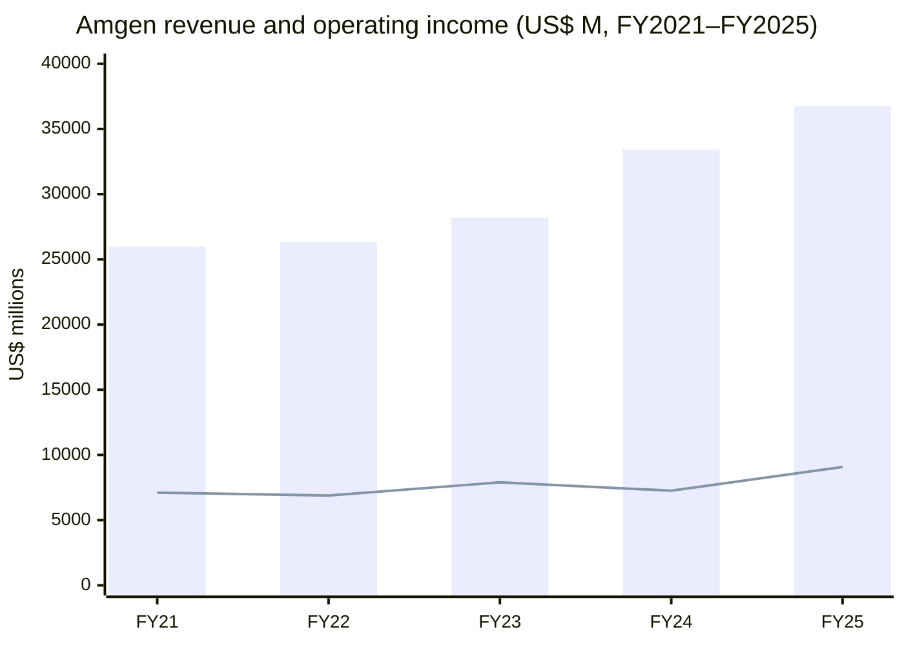
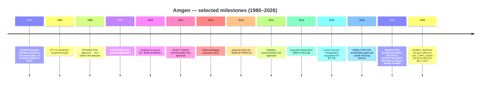
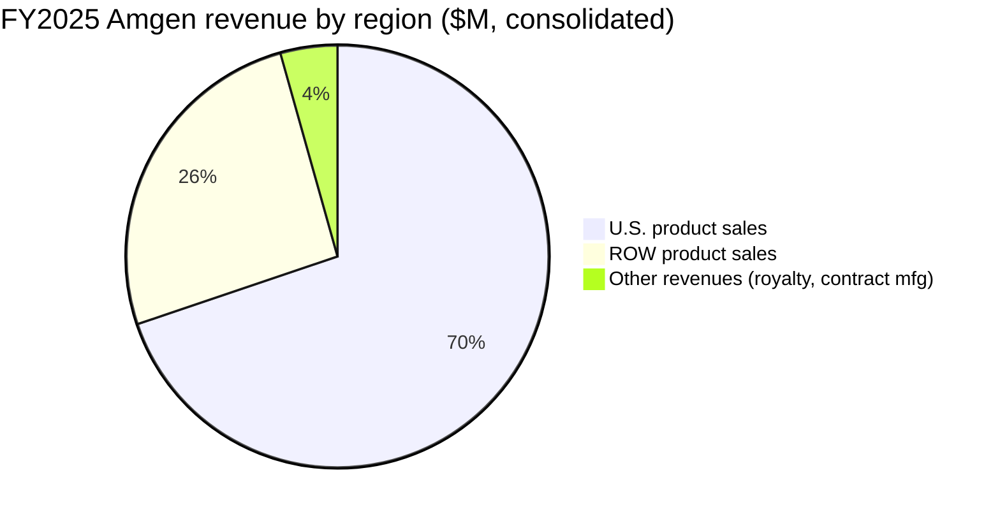
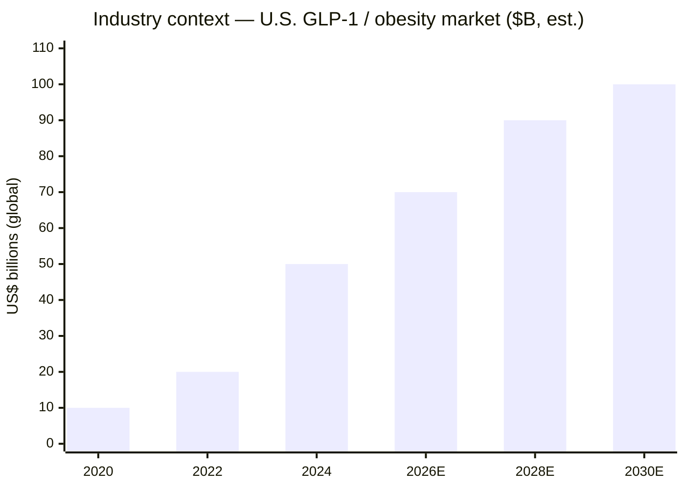
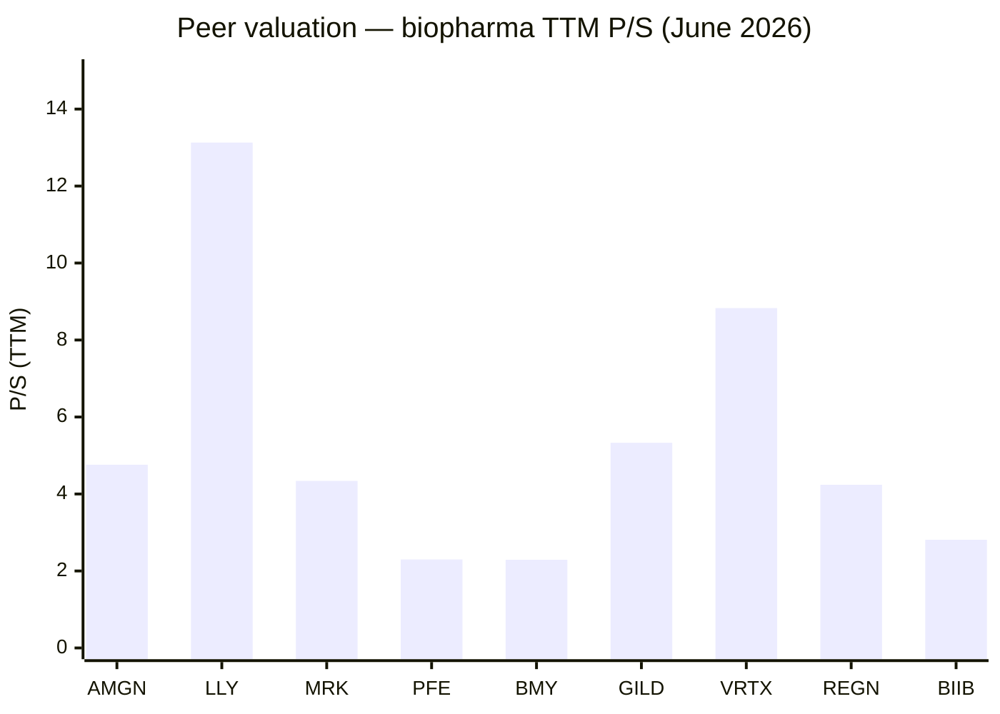
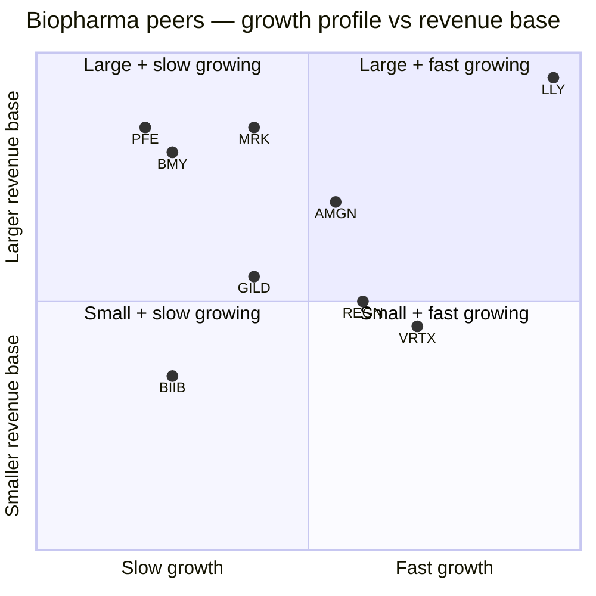
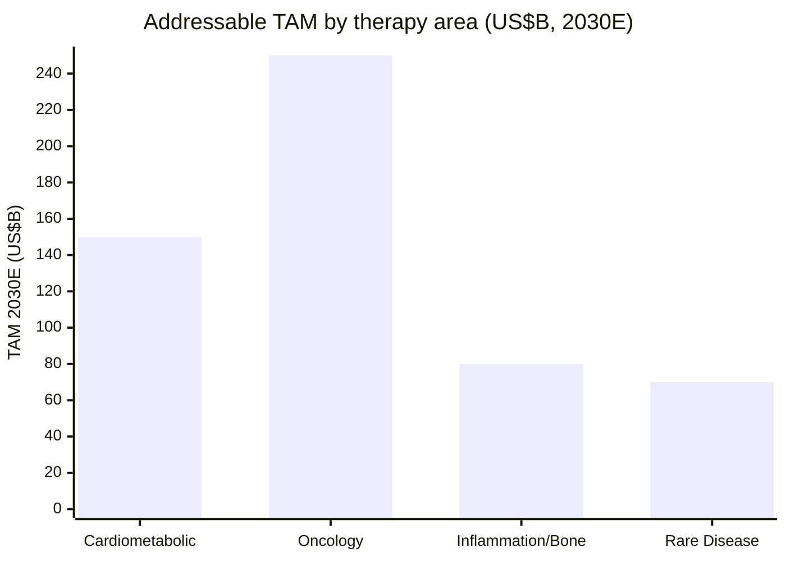

# Amgen Inc. — Initiation of Coverage

**Ticker:** NASDAQ: AMGN
**Sector:** Healthcare → Biotechnology / Drug Manufacturers — General
**Headquarters:** One Amgen Center Drive, Thousand Oaks, California 91320
**Founded:** 1980 (incorporated in California; re-domiciled in Delaware in 1987)
**Employees (as of Dec 31, 2025):** ~31,500 in 50+ countries
**Auditor:** Ernst & Young LLP
**Report date:** 2026-06-03 (data as of latest 10-K filed Feb 13, 2026 and Q1 2026 10-Q filed May 1, 2026)

---

> **2026 Guidance Banner** — On its Q4 2025 release (Feb 3, 2026), Amgen initiated 2026 guidance of **total revenues $37.1–$38.5 billion** and **GAAP diluted EPS of $15.62–$17.10** (non-GAAP $21.50–$23.10). After Q1 2026 (revenue +4% YoY; 16 products posting double-digit growth; volume +9% offset by –2% net price and –2% inventory), management reaffirmed the range, calling out MariTide Phase 3 readouts, the IRA-driven ENBREL/Otezla price reset, and Prolia/XGEVA biosimilar erosion as the live swing factors. Source: [AMGN Q1 2026 8-K earnings release (Apr 30, 2026)](https://www.sec.gov/Archives/edgar/data/318154/000031815426000054/amgn-20260331earningsrelea.htm); [AMGN FY2025 10-K, MD&A pp. 61–63](https://www.sec.gov/Archives/edgar/data/318154/000031815426000010/amgn-20251231.htm).

---

## Table of Contents

1. Company Overview
2. Company History
3. Management
4. Products & Services
5. Customers & Go-to-Market
6. Industry Overview
7. Competitive Landscape
8. Market Opportunity (TAM/SAM)
9. Risk Assessment
10. Investor-Lens Scorecards
11. References
12. Data Used
13. Verification Log

---

## 1. Company Overview

Amgen Inc. is one of the largest independent biotechnology companies in the world and one of the original commercial-scale biotech franchises that effectively brought recombinant DNA medicine to the mass market. The 2025 Form 10-K describes the business in its own opening words: *"Amgen Inc. … discovers, develops, manufactures and delivers innovative medicines to fight some of the world's toughest diseases. We focus on areas of high unmet medical need and leverage our expertise to strive for solutions that dramatically improve people's lives, while also reducing the social and economic burden of disease. We helped launch the biotechnology industry more than 45 years ago and have grown to be one of the world's leading independent biotechnology companies."* The company operates as a single reportable segment — *"human therapeutics"* — though for management-discussion purposes it splits revenue into U.S. product sales, Rest-of-World (ROW) product sales, and Other revenues (mainly royalty and contract manufacturing income), per the [FY2025 10-K Item 1 Business and Note 19 Segment information](https://www.sec.gov/Archives/edgar/data/318154/000031815426000010/amgn-20251231.htm).

The franchise is anchored by fourteen products with FY2025 sales above $1 billion and a longer tail of marketed brands and biosimilars across oncology, cardiometabolic, inflammation, and rare-disease therapy areas. Revenue grew **+10% to $36.75 billion in FY2025** from $33.42 billion in FY2024 (which itself grew +19% from $28.19 billion in FY2023, a year inflated by the October 2023 closing of the $27.8 billion Horizon Therapeutics acquisition), with **operating income of $9.08 billion** (+25% YoY), **net income of $7.71 billion** (+89% YoY, off a low 2024 base depressed by a Horizon-related charge and amortization), and **diluted EPS of $14.23**. Underlying product-sales growth in 2025 came from a +13% volume tailwind partially offset by a –3% net selling-price decline, per the [FY2025 10-K Results of Operations pp. 63–66](https://www.sec.gov/Archives/edgar/data/318154/000031815426000010/amgn-20251231.htm).

The capital structure today reflects the 2023 Horizon deal: long-term debt of **$50.0 billion** plus current portion of $4.6 billion at year-end 2025, against $9.1 billion of cash and equivalents — net debt around **$45 billion** and a leverage ratio still meaningfully above the pre-acquisition baseline. Management retired **$6.0 billion of debt in 2025** and has stated an intent to continue de-leveraging while preserving the dividend (raised again in 2025) and committed to incremental capacity build-outs in Ohio, North Carolina, and Puerto Rico. The cash-and-debt block on the [FY2025 10-K MD&A Selected Financial Data, p. 73](https://www.sec.gov/Archives/edgar/data/318154/000031815426000010/amgn-20251231.htm) shows total assets of $90.6 billion, stockholders' equity of only $8.66 billion (recovering from $5.88 billion in 2024 — a thin equity cushion that is one of the more conspicuous balance-sheet features of the post-Horizon Amgen).

The strategic logic of the modern Amgen rests on three legs: (i) a mature, cash-generative legacy of biologics (Repatha, Prolia, Otezla, ENBREL, EVENITY, XGEVA, BLINCYTO, Nplate, KYPROLIS, Aranesp, Vectibix, Neulasta) that funds reinvestment; (ii) the Horizon rare-disease portfolio (TEPEZZA for thyroid eye disease, KRYSTEXXA for chronic refractory gout, UPLIZNA expanding rapidly through new indications including IgG4-RD and generalized myasthenia gravis); and (iii) a high-stakes obesity / metabolic pipeline anchored by **MariTide (maridebart cafraglutide)** — a GLP-1-receptor-agonist / GIPR-antagonist antibody-peptide conjugate that, by management's framing, is being run through *six global Phase 3 studies* across chronic weight management (with and without Type 2 diabetes), cardiovascular disease, heart failure, and obstructive sleep apnea, per the [FY2025 10-K Significant Developments, pp. 1–3](https://www.sec.gov/Archives/edgar/data/318154/000031815426000010/amgn-20251231.htm). This pipeline is what determines whether the equity story over the next 24 months is "mature franchise with a special-situation kicker" or "the third Big Pharma with a credible GLP-1 platform" — a binary that is at the heart of every current sell-side debate on the name.

**Valuation snapshot (as of 2026-06-02 close from Yahoo Finance and stockanalysis.com market data).** AMGN trades at **$328.26**, market cap **$177.2 billion**, on **22.8× TTM P/E**, **14.0× forward P/E**, **4.76× P/S**, **19.3× P/B**, **EV/EBITDA 13.1×**, **dividend yield 3.07%**, beta 0.43, against a 52-week range of $267.83–$391.29. The combination of mid-teens forward P/E and a 3% dividend yield is below large-cap pharma peer averages but a meaningful premium to declining-pharma names like Pfizer (9× forward P/E, 6.7% yield) and Bristol-Myers (8.8× forward P/E, 4.6% yield), per [Yahoo Finance key statistics for AMGN](https://finance.yahoo.com/quote/AMGN/key-statistics) and [for the peer group](https://finance.yahoo.com/quote/PFE/key-statistics) (LLY, MRK, PFE, BMY, GILD, VRTX, REGN, BIIB pulled the same date). The high P/B reflects Horizon goodwill and intangibles relative to the thin recovering equity base, not aggressive growth pricing.

**Valuation interpretation.** A 14× forward P/E for a $37 billion-revenue biopharma with a +10% top-line print and a 25% operating-income growth print is *not* a stretched multiple in absolute terms; it is roughly in line with merck (12×) and slightly above PFE/BMY (9×), well below LLY (24×) and VRTX (20×). The market is pricing AMGN as **"high-quality slow-grower with optionality"** rather than as a true GLP-1 pure play: if MariTide reads out competitively, the stock has clear re-rating headroom toward the LLY-style multiple; if MariTide disappoints, the floor is provided by the dividend-supported cash flows of the legacy franchise. The 4.76× P/S is meaningfully below LLY (13.1×) and GILD (5.3×) and a touch above MRK (4.3×) — the median of large-cap biotech / pharma rather than the top quartile. We do not classify the current multiple as a "discount" or "premium" in the way value or growth lenses would; the right framing is **option-pricing**: the equity contains a free call on MariTide and a fully-priced cash-generating put on the legacy book.

*Source (revenue & op income): [FY2025 10-K, Selected Financial Data and Results of Operations](https://www.sec.gov/Archives/edgar/data/318154/000031815426000010/amgn-20251231.htm).*

---

## 2. Company History

Amgen was founded as **Applied Molecular Genetics Inc.** in **April 1980** in Thousand Oaks, California by a small founding team of academic scientists and venture capitalists, with George B. Rathmann (a former Abbott Diagnostics executive who became the first CEO and chairman) widely credited as the operational founder who built the company from a single recombinant-DNA lab into a public biotech. The name was shortened to "Amgen" in 1983, and the company went public on **NASDAQ in June 1983** at a split-adjusted price that has compounded over more than four decades. Although the FY2025 10-K does not narrate the founding story in detail (legal disclosures focus on the present), the company's own *Item 1. Business* opening line confirms the foundational fact: *"We helped launch the biotechnology industry more than 45 years ago"* — see [FY2025 10-K, Item 1, p. 1](https://www.sec.gov/Archives/edgar/data/318154/000031815426000010/amgn-20251231.htm). Independent confirmation of the 1980 founding date, the Thousand Oaks origin, and Rathmann's role as founding CEO appears across long-form biotech histories: [Amgen's own corporate history page](https://www.amgen.com/about), the [Wikipedia entry on Amgen](https://en.wikipedia.org/wiki/Amgen), and [the New York Times obituary of Rathmann](https://www.nytimes.com/2012/04/26/business/george-b-rathmann-led-biotech-company-amgen-dies-at-84.html).

The first transformative event in Amgen's history was the **FDA approval of EPOGEN (epoetin alfa) in June 1989**, the first recombinant erythropoietin for dialysis patients, which generated the first nine-figure biotech revenue stream and cemented Amgen's status as the dominant U.S. biotech of the late 1980s. The follow-on approval of **NEUPOGEN (filgrastim) in February 1991** for chemotherapy-induced neutropenia, and **Aranesp (darbepoetin alfa) in 2001** as the long-acting EPO follow-on, built out the original franchise. **Neulasta (pegfilgrastim) in 2002** then provided the next-generation pegylated form of filgrastim with weekly rather than daily dosing — and remained one of Amgen's most cash-generative products for nearly two decades before biosimilar erosion took hold. Each of these original franchises is now in late-stage decline due to biosimilar competition, and the 10-K notes that *"companies have launched versions of EPOGEN, NEUPOGEN, Neulasta and ENBREL (Canada only) with U.S. ENBREL biosimilars approved but not launched"* — see [FY2025 10-K, Item 1 Competition section](https://www.sec.gov/Archives/edgar/data/318154/000031815426000010/amgn-20251231.htm).

The second strategic transition was Amgen's pivot through the 2000s into rheumatology and immunology. **ENBREL (etanercept) — co-promoted with Wyeth/Pfizer and then bought outright by Amgen** through the 2002 acquisition of **Immunex Corporation for $16 billion**, the then-largest biotech M&A in history — became the company's largest single product through much of the 2010s and remains an above-$2-billion-revenue franchise even after years of declining price and the launch of foreign biosimilars. The Immunex deal also brought along Kineret, Stelmyo, and a Seattle research footprint that endures today. The 2010s expansion continued with the in-house launch of **Prolia / XGEVA (denosumab) in 2010** for osteoporosis and bone-metastasis support, **KYPROLIS (carfilzomib) via the 2013 acquisition of Onyx Pharmaceuticals for ~$10 billion**, and the **Repatha (evolocumab) launch in 2015** as one of the first PCSK9 inhibitors for hyperlipidemia. The current Prolia / XGEVA franchise generated **$4.41B + $2.08B = $6.49 billion in FY2025**, making the denosumab platform Amgen's single largest aggregate revenue line — though both products lost U.S. patent protection in February 2025 (Europe in November 2025) and now face accelerating biosimilar competition, per [FY2025 10-K, Item 1 Competition](https://www.sec.gov/Archives/edgar/data/318154/000031815426000010/amgn-20251231.htm).

The third major strategic move was the **2019 acquisition of Otezla (apremilast) from Bristol-Myers Squibb for $13.4 billion**, completed at BMS's purchase of Celgene where the FTC required the divestiture. Otezla — a small molecule PDE4 inhibitor for psoriasis and Behçet's disease — added ~$2.3 billion of mostly-U.S. revenue and, crucially, gave Amgen its first significant small-molecule franchise with a different patent profile than its biologics. CMS subsequently selected Otezla under the IRA price-negotiation program effective **January 1, 2027**, and Amgen took a related intangible-asset impairment charge in 2025 — disclosed in [FY2025 10-K, Note 13 Goodwill and other intangible assets](https://www.sec.gov/Archives/edgar/data/318154/000031815426000010/amgn-20251231.htm).

The fourth and most consequential recent move was the **October 6, 2023 closing of the $27.8 billion Horizon Therapeutics acquisition**, which added TEPEZZA (teprotumumab — the first and only FDA-approved drug for thyroid eye disease), KRYSTEXXA (pegloticase — chronic refractory gout), UPLIZNA (inebilizumab — neuromyelitis optica spectrum disorder, expanded in 2025 to IgG4-RD and gMG), and TAVNEOS (avacopan — ANCA-associated vasculitis), along with the late-stage daxdilimab. The deal financing — *$24 billion of senior notes issued March 2, 2023, plus a $4 billion term loan, of which Amgen repaid $2.2 billion* per the [FY2025 10-K liquidity discussion](https://www.sec.gov/Archives/edgar/data/318154/000031815426000010/amgn-20251231.htm) — is what drives the current heavy debt load and the 2025–26 deleveraging emphasis. The TEPEZZA franchise alone added $1.90B in FY2025 (+3% YoY), and KRYSTEXXA added $1.34B (+13% YoY), making the Horizon deal materially accretive on a revenue-contribution basis even before pipeline synergies.

*Sources: [FY2025 10-K Significant Developments, pp. 1–3](https://www.sec.gov/Archives/edgar/data/318154/000031815426000010/amgn-20251231.htm); [2023 10-K Horizon acquisition footnote](https://www.sec.gov/cgi-bin/browse-edgar?action=getcompany&CIK=0000318154&type=10-K).*

---

## 3. Management

**The founder and the current CEO are covered below; per skill rules, no other named executives appear in this section.**

**Founder — George B. Rathmann (1927–2012).** George Rathmann is the founding operational CEO of Amgen and the man widely credited with turning a single recombinant-DNA lab and a $19 million Series A into the first profitable independent biotech. Rathmann earned a B.S. in chemistry from Northwestern University (1948) and a Ph.D. in physical chemistry from Princeton (1951), then spent more than 20 years at 3M (process-development manager) and Abbott Laboratories (vice president of R&D and diagnostics) before joining Amgen as president and CEO in October 1980, six months after the company was incorporated. His foundational hires — molecular biologist Fu-Kuen Lin, who isolated and cloned the human erythropoietin gene in 1983 leading directly to EPOGEN, and the broader UCLA / UC Berkeley scientific advisory board — laid the technical foundation that defined Amgen for the next four decades. Rathmann served as CEO until 1988 and chairman until 1990, then went on to found ICOS Corporation and serve on multiple biotech boards. He passed away on April 22, 2012, and is described by industry historians as one of the four or five founding personalities of commercial biotech. Although the FY2025 10-K does not narrate Rathmann's tenure (legal disclosure focuses on incumbent executives), his role is documented in [the New York Times obituary (Apr 26, 2012)](https://www.nytimes.com/2012/04/26/business/george-b-rathmann-led-biotech-company-amgen-dies-at-84.html). Rathmann did not retain an ongoing ownership stake at Amgen at the time of his death and was not operationally involved post-1990.

**Current CEO — Robert A. Bradway (age 63 as of Feb 13, 2026).** Robert Bradway has been Amgen's CEO since **May 2012** and chairman since **January 2013** — a 14-year run that makes him one of the longest-serving CEOs of any large-cap biopharma globally. The FY2025 10-K Executive Officers section gives the official biography verbatim: *"Mr. Robert A. Bradway, age 63, has served as a director of the Company since 2011 and Chairman of the Board of Directors since 2013. Mr. Bradway has been the Company's President since 2010 and Chief Executive Officer since 2012. From 2010 to 2012, Mr. Bradway served as the Company's President and Chief Operating Officer. Mr. Bradway joined the Company in 2006 as Vice President, Operations Strategy, and served as Executive Vice President and Chief Financial Officer from 2007 to 2010. Prior to joining the Company, Mr. Bradway was a Managing Director at Morgan Stanley in London, where, beginning in 2001, he had responsibility for the firm's banking department and corporate finance activities in Europe."* — [FY2025 10-K, Item 1 Information about our Executive Officers, p. 27](https://www.sec.gov/Archives/edgar/data/318154/000031815426000010/amgn-20251231.htm).

Bradway's tenure has been characterized by three large strategic bets and one persistent operating priority. The strategic bets: (i) the **2013 Onyx acquisition** that brought KYPROLIS — closed when Bradway was 14 months into the CEO role and signaling his willingness to use M&A to refill the pipeline; (ii) the **2019 Otezla acquisition** from BMS that gave Amgen its first significant small-molecule franchise; and (iii) the **2023 Horizon acquisition** at $27.8 billion, the second-largest deal in Amgen history (after Immunex in 2002 if adjusted for inflation it is broadly comparable) and a deliberate doubling-down on rare-disease assets with biosimilar-resistant moats. The persistent operating priority has been **manufacturing capacity discipline** — Bradway's earnings-call language across 2023–2025 consistently emphasizes capacity build-outs in Puerto Rico, Ohio (the new Holly Springs site), and North Carolina, plus the new Thousand Oaks R&D facility broken ground in 2025. He has also been the public face of Amgen's response to the **Inflation Reduction Act (IRA)** and the **2025 Most-Favored-Nations (MFN) pricing executive order** — Amgen was one of the manufacturers that received the *July 2025 MFN Letter* discussed in [FY2025 10-K Risk Factors, p. 39](https://www.sec.gov/Archives/edgar/data/318154/000031815426000010/amgn-20251231.htm).

Bradway holds a B.A. in biology from Amherst College and an MBA from Harvard Business School. He has been a director of **The Boeing Company since 2016** (where he sits on the Audit and Aerospace Safety committees, per Boeing's 2025 proxy) and has served on the **University of Southern California board of trustees since 2014**. As of the 2026 proxy ([DEF 14A filed Apr 7, 2026](https://www.sec.gov/Archives/edgar/data/318154/000119312526145588/d13946ddef14a.htm)), his stock ownership consists of vested RSUs, common shares, and options below the company's CEO 7× base-salary ownership guideline (his ownership has historically been disclosed in the proxy compensation tables; specific share count varies year-over-year as RSU vesting occurs). Compensation is the standard large-cap pharma mix: base salary + annual cash incentive tied to financial and pipeline KPIs + long-term equity (RSUs and performance units tied to relative TSR and operating-income growth). Bradway's continuity through three major M&A integrations is, in our assessment, one of the more credible governance facts about Amgen — long-tenured CEOs with full pipeline ownership are rare in biopharma and represent both a strength (institutional knowledge, capital-allocation continuity) and a watch-item (succession risk after 14 years is structurally elevated).

---

## 4. Products & Services

Amgen is a single-segment "human therapeutics" business, but management discusses the portfolio along therapy-area lines and at the individual-brand level. The FY2025 10-K Item 1 Business section enumerates **the marketed product list verbatim** as Prolia, Repatha, Otezla, ENBREL, EVENITY, XGEVA, TEPEZZA, BLINCYTO, Nplate, TEZSPIRE, KYPROLIS, Aranesp, KRYSTEXXA, Vectibix, plus an "Other products" pool including MVASI, PAVBLU, UPLIZNA, IMDELLTRA/IMDYLLTRA, AMJEVITA/AMGEVITA, TAVNEOS, Neulasta, LUMAKRAS/LUMYKRAS, RAVICTI, Parsabiv, Aimovig, WEZLANA/WEZENLA, and PROCYSBI ([FY2025 10-K, Item 1, pp. 3–11](https://www.sec.gov/Archives/edgar/data/318154/000031815426000010/amgn-20251231.htm)). The full FY2025 worldwide product-sales table is reproduced below from the same source.

| Product | FY2025 Sales ($M) | YoY % | FY2024 ($M) | YoY % | FY2023 ($M) |
|---|---:|---:|---:|---:|---:|
| Prolia | 4,414 | +1% | 4,374 | +8% | 4,048 |
| Repatha | 3,016 | +36% | 2,222 | +36% | 1,635 |
| Otezla | 2,265 | +7% | 2,126 | –3% | 2,188 |
| ENBREL | 2,226 | –33% | 3,316 | –10% | 3,697 |
| EVENITY | 2,100 | +34% | 1,563 | +35% | 1,160 |
| XGEVA | 2,084 | –6% | 2,225 | +5% | 2,112 |
| TEPEZZA (1) | 1,903 | +3% | 1,851 | * | 448 |
| BLINCYTO | 1,559 | +28% | 1,216 | +41% | 861 |
| Nplate | 1,524 | +5% | 1,456 | –1% | 1,477 |
| TEZSPIRE (2) | 1,478 | +52% | 972 | +71% | 567 |
| KYPROLIS | 1,412 | –6% | 1,503 | +7% | 1,403 |
| Aranesp | 1,389 | +4% | 1,342 | –1% | 1,362 |
| KRYSTEXXA (1) | 1,340 | +13% | 1,185 | * | 272 |
| Vectibix | 1,175 | +12% | 1,045 | +6% | 984 |
| Other products | 7,263 | +29% | 5,630 | +20% | 4,696 |
| **Total product sales** | **35,148** | **+10%** | **32,026** | **+19%** | **26,910** |
| Other revenues | 1,603 | +15% | 1,398 | n/a | 1,280 |
| **Total revenues** | **36,751** | **+10%** | **33,424** | **+19%** | **28,190** |

*(1) TEPEZZA and KRYSTEXXA acquired October 6, 2023 via Horizon. (2) TEZSPIRE marketed by AstraZeneca outside the U.S. \\* = not meaningful comparison.*
*Source: [FY2025 10-K Item 7 MD&A Results of Operations, pp. 64–66](https://www.sec.gov/Archives/edgar/data/318154/000031815426000010/amgn-20251231.htm).*

The portfolio splits cleanly into four therapy-area buckets. Walking each with the three-beat structure the skill calls for — *what it physically does*, *how it differs from siblings in the same therapy area*, and *what strategic inflection drives it* — gives the only honest framework for thinking about where Amgen's revenue will be in three years.

### 4.1 Cardiometabolic — Repatha, EVENITY, and the MariTide option (~$10B+ TAM bet)

The cardiometabolic franchise is Amgen's fastest-growing legacy block and the platform on which the MariTide pipeline is being layered. **Repatha (evolocumab)** is a fully human monoclonal antibody that *binds and inhibits PCSK9*, a serine protease that, when active, accelerates the liver's degradation of the LDL receptor. By blocking PCSK9, Repatha increases the density of LDL receptors on hepatocyte surfaces, which in turn pulls more circulating LDL-C out of plasma. The mechanism is post-statin: statins reduce intracellular cholesterol synthesis, but in patients whose LDL-C remains above guideline thresholds despite maximal statin therapy, blocking PCSK9 adds a second lever. Per the 10-K *Significant Developments* disclosure, *"In August 2025, we announced that the FDA broadened the approved use of Repatha to include adults at increased risk for major adverse cardiovascular events (MACE) due to uncontrolled low-density lipoprotein cholesterol (LDL-C), removing the previous requirement that a patient have been diagnosed with cardiovascular (CV) disease. In November 2025, we announced detailed results from the Phase 3 VESALIUS-CV clinical trial, which showed that Repatha achieved statistically significant and clinically meaningful reductions in MACEs in high-risk adults without a prior heart attack or stroke … Repatha demonstrated a 25% relative reduction in the risk of a composite of coronary heart disease (CHD) death, heart attack or ischemic stroke (3-P MACE), and a 19% reduction in a broader composite that also included any ischemia-driven arterial revascularization (4-P MACE). Repatha also reduced the risk of heart attack by 36%."* — [FY2025 10-K, Significant Developments, p. 2](https://www.sec.gov/Archives/edgar/data/318154/000031815426000010/amgn-20251231.htm). The +36% YoY revenue growth in both 2024 and 2025 reflects the broadening of the label from secondary to primary prevention and the +13% U.S. volume tailwind described in MD&A. **中文释义 / Plain-language gloss:** PCSK9 抑制剂 — 一个让肝细胞更高效地清除血液 LDL-胆固醇的单克隆抗体，机制独立于他汀类。

**EVENITY (romosozumab)** is a humanized monoclonal antibody that *blocks sclerostin*, a protein produced by osteocytes that normally suppresses bone formation. By inhibiting sclerostin, EVENITY simultaneously *increases bone formation and decreases bone resorption* — a dual mechanism that no other osteoporosis therapy provides. The product is positioned for postmenopausal women at high risk of fracture, with a 12-dose treatment course followed by transition to an anti-resorptive (typically Prolia). Sales of $2.10B in FY2025 (+34% YoY off $1.56B in 2024, +35% off $1.16B in 2023) reflect international launches and the increasing recognition that fracture-cohort outcomes economically dominate longer-cycle anti-resorptive monotherapy. The Amgen-UCB co-promotion in selected markets is described in [FY2025 10-K, Item 1 Marketing](https://www.sec.gov/Archives/edgar/data/318154/000031815426000010/amgn-20251231.htm). **中文释义 / Plain-language gloss:** 罗莫单抗 — 既促进骨形成又抑制骨吸收的双向单抗，针对高骨折风险的绝经后女性。

**MariTide (maridebart cafraglutide)** is the strategic option that re-prices the entire cardiometabolic narrative. The 10-K describes it as *"a differentiated antibody-peptide conjugate that activates the glucagon like peptide 1 (GLP-1) receptor and antagonizes the glucose-dependent insulinotropic polypeptide receptor (GIPR)"* — see [FY2025 10-K, Item 1 Research and Development and Selected Product Candidates](https://www.sec.gov/Archives/edgar/data/318154/000031815426000010/amgn-20251231.htm). Architecturally MariTide is *not* a small peptide like semaglutide (the active in Wegovy / Ozempic) or tirzepatide (the active in Zepbound / Mounjaro) — it is an *antibody-peptide conjugate*, which gives it (a) longer half-life enabling **monthly or quarterly dosing** rather than weekly injection, and (b) a different receptor combination (GLP-1 agonism *plus* GIP antagonism, vs. the GLP-1 agonist or dual GLP-1/GIP agonist mechanisms of incumbents). The 10-K cites Phase 2 results presented at ADA 2025 and published in *NEJM*, and notes that *"the large majority of participants maintained the weight loss achieved in Part 1 for an additional 52 weeks on a lower monthly dose or quarterly dose of MariTide; the second year of MariTide treatment was very well tolerated, including at quarterly doses, with a very low incidence of nausea"* — see [FY2025 10-K, Significant Developments, p. 3](https://www.sec.gov/Archives/edgar/data/318154/000031815426000010/amgn-20251231.htm). Amgen has now initiated **six global Phase 3 studies** spanning chronic weight management (with and without Type 2 diabetes), cardiovascular disease, heart failure, and obstructive sleep apnea — a deliberate land-grab across the entire GLP-1 indication tree. **中文释义 / Plain-language gloss:** MariTide — 一个抗体–肽偶联物 (antibody-peptide conjugate, APC)，同时激活 GLP-1 受体并拮抗 GIPR；月度或季度给药；用于慢性体重管理、糖尿病、心衰、阻塞性睡眠呼吸暂停等适应症。

*Analyst view (uncited to filings):* the strategic significance of MariTide is asymmetric. If the Phase 3 readouts confirm Phase 2's tolerability and durability profile *with* dose-flexible monthly / quarterly administration, MariTide becomes the first credible "third entrant" against the Lilly / Novo Nordisk duopoly in chronic weight management — a category where IQVIA-tracked retail prescriptions have grown from a near-zero base in 2022 to over $20B in U.S. retail sales in 2024 ([IQVIA Channel Dynamics, Dec 2024](https://www.iqvia.com/insights/the-iqvia-institute/reports-and-publications/reports/the-use-of-medicines-in-the-us-2024)). If MariTide reads out subclinically and the dose-flexibility / monthly profile fails to translate, the entire cardiometabolic re-rate vanishes and Amgen reverts to "mature franchise + Horizon assets" pricing.

### 4.2 Bone Health & Inflammation — Prolia, XGEVA, Otezla, ENBREL, UPLIZNA (decline-mitigation block)

The bone-health and inflammation block carries the heaviest patent-cliff exposure. **Prolia (denosumab)** is a fully human monoclonal antibody that *binds RANKL* (receptor activator of nuclear factor kappa-B ligand), a cytokine that drives osteoclast differentiation. Blocking RANKL prevents osteoclast formation, slowing bone resorption — the mechanism is the most-used osteoporosis biologic globally with **$4.41B FY2025 sales** (+1% YoY). **XGEVA** contains the same active ingredient but is approved at higher doses for prevention of skeletal-related events in patients with bone metastases or for multiple myeloma — **$2.08B FY2025 (–6% YoY)**. The 10-K is explicit: *"Prolia and XGEVA contain the same active ingredient but are approved for different indications, patient populations, dose and frequency of administration"* — [FY2025 10-K, Item 1 Selected Marketed Products, p. 4](https://www.sec.gov/Archives/edgar/data/318154/000031815426000010/amgn-20251231.htm). And: *"our patents for RANKL antibodies, including sequences, for Prolia and XGEVA expired in February 2025 in the United States and in November 2025 in select countries in Europe, and we expect accelerated sales erosion driven by increased competition, as multiple biosimilars have launched in the United States and ROW"* — [FY2025 10-K, Item 1 Competition](https://www.sec.gov/Archives/edgar/data/318154/000031815426000010/amgn-20251231.htm). The +1% Prolia print in 2025 masks a steepening biosimilar inflection that will mechanically depress the franchise in 2026–27.

**Otezla (apremilast)** is the company's first small-molecule franchise, *a phosphodiesterase 4 (PDE4) inhibitor* that modulates intracellular cAMP and reduces inflammatory cytokine production in psoriasis and Behçet's disease. Otezla generated $2.27B in FY2025 (+7%, recovering from –3% in 2024), but **CMS has selected Otezla for IRA Medicare price-setting effective January 1, 2027**, which triggered an impairment review of Otezla's developed-product-technology intangible asset and a related charge in 2025, disclosed in [FY2025 10-K, Note 13 Goodwill and other intangible assets](https://www.sec.gov/Archives/edgar/data/318154/000031815426000010/amgn-20251231.htm). **ENBREL (etanercept)** is a soluble TNFα receptor fusion protein that captures circulating TNFα before it can bind to cell-surface receptors; its U.S. franchise has been protected by patent until now but **CMS has set Medicare Part D prices for ENBREL effective January 1, 2026**, the first IRA-set price on an Amgen product — see [FY2025 10-K, Item 1 Reimbursement and Risk Factors](https://www.sec.gov/Archives/edgar/data/318154/000031815426000010/amgn-20251231.htm). FY2025 ENBREL sales of $2.23B were down **–33% YoY** from $3.32B in 2024 (which was itself down –10% from $3.70B in 2023) — the steepest single-product print in the table and the clearest data-point on the IRA's revenue impact.

**UPLIZNA (inebilizumab)**, acquired through Horizon, is a humanized anti-CD19 monoclonal antibody that *depletes B cells*. The 10-K reports: *"In April 2025, we announced the FDA approved UPLIZNA for the treatment of Immunoglobulin G4-related disease (IgG4-RD) in adult patients. UPLIZNA is the first and only FDA approved treatment for adults living with IgG4-RD. In December 2025, we announced the FDA approved UPLIZNA for the treatment of generalized myasthenia gravis (gMG) in adults who are anti-acetylcholine receptor (AChR) and anti-muscle specific tyrosine kinase (MuSK) antibody positive"* — [FY2025 10-K, Significant Developments, p. 2](https://www.sec.gov/Archives/edgar/data/318154/000031815426000010/amgn-20251231.htm). UPLIZNA's expanded indication base is the model of how Amgen extracts incremental TAM from the Horizon portfolio.

### 4.3 Oncology — BLINCYTO, IMDELLTRA, Vectibix, KYPROLIS, Nplate (~$7B revenue block, mixed growth)

The oncology block has stronger growth on the immuno-oncology assets and decline on the older small-molecule franchises. **BLINCYTO (blinatumomab)** is the original Amgen bispecific T-cell engager (BiTE) — a single antibody-like molecule with one arm binding CD19 on B cells and the other binding CD3 on T cells, forcing a synapse that activates the T cell to kill the B-cell tumor. Approved for B-cell acute lymphoblastic leukemia (B-ALL), BLINCYTO grew **+28% to $1.56B in FY2025** following +41% in 2024 — the strongest pure-oncology growth in the portfolio. **IMDELLTRA/IMDYLLTRA (tarlatamab)**, also a BiTE, targets DLL3 and CD3 for small-cell lung cancer (SCLC). It received FDA accelerated approval in May 2024 and full approval in 2025, with the 10-K reporting interim Phase 3 DeLLphi-304 data: *"The study demonstrated that IMDELLTRA/IMDYLLTRA significantly reduced the risk of death by 40% compared to standard-of-care chemotherapy"* — [FY2025 10-K Significant Developments, p. 3](https://www.sec.gov/Archives/edgar/data/318154/000031815426000010/amgn-20251231.htm). **KYPROLIS (carfilzomib)** is a small-molecule proteasome inhibitor for relapsed/refractory multiple myeloma — acquired through Onyx in 2013, $1.41B in FY2025 (–6%), facing competition from Bristol's competing proteasome inhibitors and CAR-T therapies. **Vectibix (panitumumab)** is an anti-EGFR antibody for KRAS-wild-type metastatic colorectal cancer — $1.18B in FY2025 (+12%). **Nplate (romiplostim)** is a thrombopoietin receptor agonist for immune thrombocytopenia — $1.52B (+5%) — and is being investigated for chemotherapy-induced thrombocytopenia, per the [FY2025 10-K Pipeline table](https://www.sec.gov/Archives/edgar/data/318154/000031815426000010/amgn-20251231.htm).

### 4.4 Rare Disease (Horizon assets) — TEPEZZA, KRYSTEXXA, plus tail (rare-disease optionality, ~$3.5B current)

The Horizon acquisition brought **TEPEZZA (teprotumumab)** — the first and only FDA-approved drug for thyroid eye disease (TED), an autoimmune condition causing proptosis, diplopia, and disfigurement. TEPEZZA is a humanized IGF-1R antibody given as 8 infusions over 24 weeks. FY2025 sales of $1.90B (+3% YoY) reflect a maturing U.S. franchise; the 10-K Pipeline table flags *subcutaneous TEPEZZA in development* — a delivery-format upgrade that could meaningfully expand the addressable population. **KRYSTEXXA (pegloticase)** is a pegylated uricase enzyme that converts uric acid to allantoin, draining tophi in chronic refractory gout patients who have failed xanthine oxidase inhibitors. FY2025 $1.34B (+13%). The 10-K Pipeline shows *subcutaneous KRYSTEXXA* in development for the same indication, mirroring the TEPEZZA SC strategy. **TAVNEOS (avacopan)** — an oral C5a receptor inhibitor for ANCA-associated vasculitis — is a smaller line, and the 10-K discloses an ongoing FDA dialogue: *"On January 28, 2026, following FDA regulatory process, Amgen informed the FDA that it did not intend to withdraw TAVNEOS from the market. Amgen is evaluating next steps with the FDA"* — [FY2025 10-K, Note 13](https://www.sec.gov/Archives/edgar/data/318154/000031815426000010/amgn-20251231.htm).

### 4.5 Other / Biosimilars

Amgen's "Other products" $7.26B block (+29% YoY in FY2025) is the most rapidly compounding line in the portfolio and is increasingly mis-named from a strategy perspective: it includes the company's own biosimilars (MVASI, PAVBLU, AMJEVITA / AMGEVITA, WEZLANA / WEZENLA, BKEMV), the brand TEZSPIRE (co-marketed with AstraZeneca, marketed by AstraZeneca outside the U.S.), Aimovig (CGRP migraine prevention, marketed with Novartis), and a tail of legacy brands. The 10-K notes: *"Since 2018, we have launched eight biosimilars, including the 2025 U.S. launches of WEZLANA, a biosimilar to STELARA®, and BKEMV, a biosimilar to SOLIRIS®"* — [FY2025 10-K, Item 1 Competition](https://www.sec.gov/Archives/edgar/data/318154/000031815426000010/amgn-20251231.htm). Biosimilars are simultaneously a defensive moat (Amgen owns the manufacturing technology that allows competitive entry into other companies' biologics franchises) and an offensive growth lever as the global market increasingly tolerates biosimilar substitution.

**Synthesis — how the products interact.** Amgen's revenue map is best understood as a three-layer cake. **Layer 1 (mature cash generator, $13–15B contracting):** Prolia/XGEVA, Otezla, ENBREL, Aranesp, Neulasta, KYPROLIS — these face biosimilar erosion (Prolia/XGEVA), IRA price-setting (ENBREL, Otezla), or competitive pressure (KYPROLIS). Aggregate growth is mildly negative. **Layer 2 (growth engines, $10–12B compounding +20–35%):** Repatha, EVENITY, BLINCYTO, TEZSPIRE, IMDELLTRA, UPLIZNA — these have label expansions, geographic ramp, or new indications driving 25%+ growth and offsetting Layer-1 decline. **Layer 3 (option assets, $0 today / TBD):** MariTide, AMG 193 (KRAS), Rocatinlimab (atopic dermatitis), Olpasiran (Lp(a) lowering), and the subcutaneous Horizon line extensions — these are the assets that determine whether the FY2030 revenue base is $40B or $55B. Capital allocation flows from Layer 1 to fund R&D into Layer 3, with Layer 2 providing the bridge growth that allows the equity to compound while Layer 3 reads out.

```mermaid
graph TD
    A[Amgen Inc.] --> B[Cardiometabolic]
    A --> C[Bone Health & Inflammation]
    A --> D[Oncology]
    A --> E[Rare Disease<br/>ex-Horizon]
    A --> F[Other / Biosimilars]
    B --> B1[Repatha PCSK9]
    B --> B2[EVENITY sclerostin]
    B --> B3[MariTide GLP-1/GIPR<br/>Phase 3]
    C --> C1[Prolia/XGEVA RANKL]
    C --> C2[Otezla PDE4]
    C --> C3[ENBREL TNF]
    C --> C4[UPLIZNA CD19]
    D --> D1[BLINCYTO BiTE-CD19]
    D --> D2[IMDELLTRA BiTE-DLL3]
    D --> D3[KYPROLIS proteasome]
    D --> D4[Vectibix EGFR]
    D --> D5[Nplate TPO-RA]
    E --> E1[TEPEZZA IGF-1R TED]
    E --> E2[KRYSTEXXA pegloticase]
    E --> E3[TAVNEOS C5aR]
    F --> F1[MVASI/PAVBLU/AMJEVITA/<br/>WEZLANA biosimilars]
    F --> F2[TEZSPIRE w/ AstraZeneca]
    F --> F3[Aimovig w/ Novartis]
```

*Sources: [FY2025 10-K Item 1 Selected Marketed Products and Pipeline tables, pp. 3–24](https://www.sec.gov/Archives/edgar/data/318154/000031815426000010/amgn-20251231.htm).*

---

## 5. Customers & Go-to-Market

Amgen's customer concentration is one of the simplest and most-disclosed in U.S. biopharma, and it is also one of the most concentrated. The FY2025 10-K Item 1 Marketing, Distribution and Selected Marketed Products section provides the verbatim disclosure: *"Our product sales to three large wholesalers, McKesson Corporation, Cencora, Inc. and Cardinal Health, Inc., each individually accounted for more than 10% of total revenues for each of the years 2025, 2024 and 2023. On a combined basis, these wholesalers accounted for 77%, 77% and 79% of worldwide gross revenues for 2025, 2024 and 2023, respectively"* — [FY2025 10-K, Item 1 Marketing](https://www.sec.gov/Archives/edgar/data/318154/000031815426000010/amgn-20251231.htm). The 10-K also provides the channel context: *"In the United States, we sell primarily to pharmaceutical wholesale distributors, which are the principal distributors of our products to clinics, hospitals and pharmacies … In most international markets, we work with international distributors or wholesale distributors depending on the distribution practice in each country."*

Three points on this disclosure that matter for risk-framing. First, **77% combined wholesaler share is a structural feature of U.S. pharmaceutical distribution, not an Amgen-specific concentration** — the same three wholesalers handle the bulk of U.S. distribution for every large-cap pharma name (Merck, Pfizer, Eli Lilly, etc.), and the channel structure is durable due to scale economies in cold-chain logistics, the 340B Program management infrastructure, and decades of contract relationships. Second, **the *end* customers are physicians, dialysis centers, hospitals, and pharmacies**, with payment ultimately flowing from commercial insurance, Medicare Parts B and D, Medicaid, and 340B-eligible safety-net providers. The wholesaler is a logistical and credit intermediary; the demand signal is the prescription and the reimbursement is the insurance. Third, **PBM concentration is a separate but parallel concentration that the 10-K specifically calls out:** *"as discussed above, there has been significant consolidation in the health insurance industry, including that a small number of PBMs now oversee a substantial percentage of total covered lives in the United States"* — [FY2025 10-K, Item 1 Reimbursement](https://www.sec.gov/Archives/edgar/data/318154/000031815426000010/amgn-20251231.htm). The "Big Three" PBMs (Express Scripts/Cigna, CVS Caremark, OptumRx/UnitedHealth) effectively gate formulary access for Amgen's chronic-disease franchises.

Geographic mix is heavily U.S.-skewed. FY2025 U.S. product sales were **$25.66B (73% of total product sales)** vs. ROW $9.49B (27%) — see [FY2025 10-K Item 7 Results of Operations, pp. 63–66](https://www.sec.gov/Archives/edgar/data/318154/000031815426000010/amgn-20251231.htm). This is meaningfully more U.S.-tilted than peers like Merck (≈ 50% U.S.), Pfizer (≈ 50% U.S.), or Eli Lilly (≈ 70% U.S.), and is a residual of the Horizon acquisition (Horizon's TEPEZZA and KRYSTEXXA were almost entirely U.S. franchises). The geographic concentration is itself a risk in the context of the 2025 Most-Favored-Nations (MFN) pricing executive order and the IRA Medicare negotiation programs — both of which are U.S.-specific policy levers.

*Source: [FY2025 10-K Item 7 Results of Operations, pp. 63–66](https://www.sec.gov/Archives/edgar/data/318154/000031815426000010/amgn-20251231.htm).*

**Customer concentration in segment terms — denominators clearly labeled.** Amgen reports a single operating segment, so the wholesaler concentration above is at the **consolidated level** — McKesson, Cencora, Cardinal each >10% of consolidated revenue; together 77% of consolidated worldwide gross revenue in FY2025. There is no separate "segment-level top-5" customer figure to mix this with — by design, all customer-share metrics in Amgen's filings live at the consolidated denominator. (This is the cleanest possible disclosure pattern from a research perspective, and avoids the segment-vs-consolidated mixing trap that has bitten reports on multi-segment issuers like Samsung Electronics.)

**Go-to-market — direct field force in the U.S., distributor model internationally.** Amgen maintains a U.S. direct sales force calling on physicians, hospital systems, infusion centers, and academic medical centers, with specialty distribution for clinical-trial-style products (e.g. TEPEZZA, KRYSTEXXA, BLINCYTO) and standard wholesale distribution for the chronic-disease franchises (Prolia, Repatha, ENBREL, Otezla). International go-to-market mixes direct affiliates in large markets (Europe, Japan, Canada, Australia) with distributor relationships in smaller markets, and the **AstraZeneca co-marketing for TEZSPIRE** outside the U.S. is the largest of several co-promotion arrangements, per [FY2025 10-K Item 1 Business Relationships](https://www.sec.gov/Archives/edgar/data/318154/000031815426000010/amgn-20251231.htm). Other historical co-promotions include the long-running Pfizer ENBREL agreement (terminated in 2002 when Amgen acquired Immunex), the Novartis co-promotion of Aimovig in cardiometabolic, and the Kyowa Kirin Rocatinlimab arrangement, which the 10-K notes has been terminated in 2025.

---

## 6. Industry Overview

The biopharmaceutical industry in which Amgen competes is a **~$1.6 trillion global prescription-drug market** (gross, before rebates) with the United States accounting for roughly **$650 billion of that gross spend** at brand-protected list prices — the largest single drug market in the world by a wide margin. The IQVIA Institute's [*The Use of Medicines in the U.S. 2024* report](https://www.iqvia.com/insights/the-iqvia-institute/reports-and-publications/reports/the-use-of-medicines-in-the-us-2024) projects U.S. drug spending growth of 4–7% CAGR through 2028, driven by GLP-1 obesity drugs, oncology biologics (especially bispecifics and ADCs), and CAR-T cell therapy, partially offset by Inflation Reduction Act Medicare price-setting effects and the structural ramp of biosimilar substitution. The biotechnology subsegment — the recombinant-protein, monoclonal-antibody, gene-therapy, and antibody-conjugate space that Amgen pioneered — represents roughly **40% of total industry R&D spend** despite being a smaller share of revenue, reflecting the higher development costs but also the higher gross-margin and patent-defensibility profile relative to small molecules.

The industry has four secular tailwinds and three secular headwinds.

**Tailwind 1 — GLP-1 / cardiometabolic.** The GLP-1 receptor agonist class has gone from $5B global revenue in 2019 to ~$50B in 2024, with the Lilly Mounjaro/Zepbound franchise and Novo Nordisk Ozempic/Wegovy franchise driving the vast majority of growth. The IQVIA Institute and [Goldman Sachs Healthcare Research (Mar 2024)](https://www.goldmansachs.com/insights/articles/the-anti-obesity-drug-market-may-reach-100-billion-by-2030) project the obesity-drug market alone could reach **$100B globally by 2030**. This is the inflection MariTide is being launched into, and the size of the prize is what justifies Amgen running six concurrent Phase 3 studies.

**Tailwind 2 — Bispecifics, BiTEs, ADCs.** Bispecific antibodies (BLINCYTO, IMDELLTRA, AstraZeneca's Tezspire, Lilly's omburtamab) and antibody-drug conjugates (Daiichi-AstraZeneca's Enhertu, Pfizer-Seagen's TIVDAK) are growing 25–35% annually and represent the new wave of oncology biologics, per [EvaluatePharma World Preview 2024 (Evaluate Group)](https://www.evaluategroup.com). Amgen's BiTE platform — the original technology behind BLINCYTO and IMDELLTRA — is one of the company's most valuable proprietary platforms.

**Tailwind 3 — Rare disease premium pricing.** Rare-disease drugs (those treating populations <200,000 in the U.S.) carry list prices in the $200,000–$500,000-per-patient-per-year range and remain largely insulated from IRA Medicare negotiation (which targets high-spending Part B and D drugs). The Horizon portfolio — TEPEZZA, KRYSTEXXA, UPLIZNA, TAVNEOS, daxdilimab — is structured around this premium-pricing dynamic.

**Tailwind 4 — Biosimilar opportunity for incumbents.** As patents expire on the first generation of biologics (Humira, Stelara, Eylea, Soliris), the biosimilar manufacturing market has opened to incumbents with biologics expertise. Amgen has launched eight biosimilars since 2018 — the most of any U.S.-based biotech — and the $7.26B "Other products" line that includes them grew +29% YoY in FY2025.

**Headwind 1 — Inflation Reduction Act Medicare price-setting.** The IRA's drug price negotiation provisions, taking effect with the first 10 Medicare-set drugs on January 1, 2026, materially compress brand pricing for high-spending Medicare drugs once the negotiation window opens. The 10-K is explicit: *"CMS has set Medicare Part D prices for ENBREL, effective January 1, 2026, and Otezla, effective January 1, 2027"* — [FY2025 10-K Item 1 Reimbursement, p. 12](https://www.sec.gov/Archives/edgar/data/318154/000031815426000010/amgn-20251231.htm). The 33% ENBREL decline in FY2025 is the first visible impact and a clear marker of the IRA's eventual reach across the industry.

**Headwind 2 — Biosimilar substitution.** Biosimilar uptake is accelerating in the U.S. (lagging Europe by ~5 years) as state interchangeability laws and PBM formulary preferences increasingly favor biosimilar products. The 10-K acknowledges this is structural: *"Once multiple biosimilar versions of one of our originator products have launched, competition intensifies rapidly, resulting in accelerated net price declines for both the reference and the biosimilar products"* — [FY2025 10-K Item 1 Competition](https://www.sec.gov/Archives/edgar/data/318154/000031815426000010/amgn-20251231.htm). The Prolia/XGEVA loss-of-exclusivity in February 2025 is the next major Amgen test case.

**Headwind 3 — Drug-pricing executive action.** The Trump Administration's May 12, 2025 *Most-Favored-Nations Prescription Drug Pricing Executive Order* and the **July 31, 2025 MFN Letter** sent to a number of large manufacturers including Amgen — both referenced in [FY2025 10-K Item 1A Risk Factors](https://www.sec.gov/Archives/edgar/data/318154/000031815426000010/amgn-20251231.htm) — represent an additional U.S.-pricing headwind layered on top of the IRA. The eventual impact depends on the rulemaking and any litigation, but the policy direction is clear.

*Sources: [IQVIA Institute Medicines in the U.S. 2024](https://www.iqvia.com/insights/the-iqvia-institute/reports-and-publications/reports/the-use-of-medicines-in-the-us-2024); [Goldman Sachs Anti-Obesity Drug Market forecast, Mar 2024](https://www.goldmansachs.com/insights/articles/the-anti-obesity-drug-market-may-reach-100-billion-by-2030). 2030E reflects sell-side consensus mid-point.*

---

## 7. Competitive Landscape

Amgen competes head-to-head with the world's largest pharmaceutical and biotech companies across each of its therapy areas. The 10-K Competition section provides the framing: *"We operate in a highly competitive environment. A number of our marketed products are indicated for disease areas in which other products or treatments are currently available or are being pursued by our competitors through R&D activities."* — [FY2025 10-K Item 1 Competition](https://www.sec.gov/Archives/edgar/data/318154/000031815426000010/amgn-20251231.htm). The relevant peer set splits along three lines: (1) integrated large-cap pharma with overlapping therapy areas; (2) biotech-specialist peers; (3) emerging biosimilar / pricing-pressure entrants.

**Eli Lilly (NYSE: LLY).** The most consequential competitor — in cardiometabolic / obesity (Mounjaro tirzepatide, Zepbound, the next-generation orforglipron oral GLP-1, and a stable of bispecific incretins in development), in immunology (mirikizumab and lebrikizumab), and in oncology (verzenio). LLY trades at $1,064 / 24× forward P/E / $949B market cap / 13× P/S — a 5× multiple premium to Amgen on a P/S basis driven by Mounjaro / Zepbound's $30B+ revenue run rate and the perceived first-mover lead in obesity, per [Yahoo Finance LLY](https://finance.yahoo.com/quote/LLY/key-statistics). MariTide is the bet Amgen is making against Lilly's incumbency.

**Novo Nordisk (NYSE: NVO).** Outside the U.S. peer set, Novo is the other GLP-1 incumbent (Ozempic semaglutide for diabetes, Wegovy for obesity, the oral Rybelsus, and the next-generation CagriSema in late-stage development). Novo's 2024 obesity-drug sales topped $20B and the company has guided to >$30B in 2026.

**Merck (NYSE: MRK).** Direct competition in oncology (KEYTRUDA, the world's largest single drug at $25B+ revenue, competes adjacently to BLINCYTO and IMDELLTRA in the immuno-oncology category but with different mechanisms) and in vaccines (where Amgen does not compete). MRK trades at $115.65 / 12× forward P/E / 4.3× P/S — actually below Amgen's forward P/E, reflecting the KEYTRUDA loss-of-exclusivity overhang ([Yahoo Finance MRK](https://finance.yahoo.com/quote/MRK/key-statistics)).

**Pfizer (NYSE: PFE).** Direct competition in inflammation (Xeljanz, Cibinqo) and oncology (Ibrance, Padcev, Adcetris). The Pfizer 2023 acquisition of Seagen brought an ADC portfolio that competes with Amgen's BiTE platform on the cancer-cell-killing dimension, though through different mechanisms. PFE trades at $25.55 / 9× forward P/E / 2.3× P/S — the cheapest of the peer group, reflecting COVID revenue rolloff and pipeline overhang ([Yahoo Finance PFE](https://finance.yahoo.com/quote/PFE/key-statistics)).

**Bristol-Myers Squibb (NYSE: BMY).** Direct competition in oncology (Opdivo, Yervoy) and the seller of Otezla to Amgen in 2019. Trades at $54.46 / 8.8× forward P/E / 2.3× P/S — also reflecting pipeline / loss-of-exclusivity concerns ([Yahoo Finance BMY](https://finance.yahoo.com/quote/BMY/key-statistics)).

**Regeneron (NASDAQ: REGN).** A pure biotech peer most directly competitive on Repatha. Regeneron co-markets *Praluent (alirocumab)* — the only other PCSK9 monoclonal antibody — though Praluent's revenue has remained well below Repatha's due to label timing and physician familiarity. REGN trades at $602.92 / 11× forward P/E / 4.2× P/S, comparable to Amgen on multiple metrics but with a more concentrated revenue base (Eylea, Dupixent partnership with Sanofi) ([Yahoo Finance REGN](https://finance.yahoo.com/quote/REGN/key-statistics)).

**Vertex Pharmaceuticals (NASDAQ: VRTX).** A pure biotech with a cystic-fibrosis monopoly franchise; competes only adjacently to Amgen in rare disease. Trades at the highest forward P/E of any peer at $425 / 20×, reflecting a moat the market believes is durable.

**Gilead (NASDAQ: GILD).** Direct competition in oncology and HIV (Amgen does not compete in HIV). Trades at $128 / 13× forward P/E / 5.3× P/S — closest peer to Amgen on the P/S dimension.

**Biogen (NASDAQ: BIIB).** A specialty biotech peer with overlap in immunology and neurology (Amgen is less neurology-focused). Trades at $189 / 11× forward P/E.

*Source: [Yahoo Finance Key Statistics, AMGN](https://finance.yahoo.com/quote/AMGN/key-statistics), [LLY](https://finance.yahoo.com/quote/LLY/key-statistics), [MRK](https://finance.yahoo.com/quote/MRK/key-statistics), [PFE](https://finance.yahoo.com/quote/PFE/key-statistics), [BMY](https://finance.yahoo.com/quote/BMY/key-statistics), [GILD](https://finance.yahoo.com/quote/GILD/key-statistics), [VRTX](https://finance.yahoo.com/quote/VRTX/key-statistics), [REGN](https://finance.yahoo.com/quote/REGN/key-statistics), [BIIB](https://finance.yahoo.com/quote/BIIB/key-statistics). All pulled 2026-06-02.*

*Positioning is analyst-constructed from revenue scale (Y) and consensus growth signal (X) — not a sourced quadrant.*

**Competitive positioning summary.** Amgen sits in the *quality-mature-biotech* quadrant: a $37B revenue base with mid-single-digit underlying organic growth, a high-quality late-stage pipeline (MariTide is the option), and a multiple meaningfully below Lilly's premium and meaningfully above PFE/BMY's distressed pricing. The closest pure peer is Merck on revenue mix and multiple, and Gilead on P/S. The competitive moats are: (i) the BiTE manufacturing platform (BLINCYTO, IMDELLTRA, daxdilimab), (ii) the biosimilars manufacturing scale, (iii) the rare-disease commercial infrastructure inherited from Horizon, and (iv) the long-run cash generation of the legacy biologics franchises. The competitive vulnerabilities are: (i) heavy debt (the Horizon overhang), (ii) U.S. revenue concentration in a hostile-policy environment, (iii) the Lilly / Novo first-mover lead in obesity, and (iv) the still-thin equity base (book value of $8.66B against $50B of long-term debt).

---

## 8. Market Opportunity (TAM / SAM)

Sizing Amgen's TAM requires segmenting by therapy area, because the company's revenue base spans wildly different competitive structures. The bottom-up addressable opportunity for the four most consequential therapy-area buckets is summarized below.

**Cardiometabolic (Repatha, EVENITY, MariTide) — $150B+ TAM by 2030.** The combined TAM for hyperlipidemia (PCSK9 + adjacent), osteoporosis, and obesity is the largest single addressable pool Amgen plays in. The PCSK9 inhibitor market is currently ~$5B globally (Repatha + Praluent), with the IQVIA-tracked U.S. PCSK9 prescription pool growing at +20% in 2024 driven by Repatha's broadened CV-disease label and the November 2025 VESALIUS-CV primary-prevention readout, per [IQVIA Channel Dynamics PCSK9, Dec 2024](https://www.iqvia.com/insights/the-iqvia-institute). The osteoporosis market addressable for EVENITY / Prolia is ~$10B globally. The obesity market is the largest pool: **$100B by 2030 per Goldman Sachs**, $50B+ per IQVIA — and is the pool MariTide is being launched into. The fraction of obesity TAM Amgen captures depends almost entirely on the Phase 3 readouts of the six MariTide studies in 2026–28.

**Oncology (BLINCYTO, IMDELLTRA, KYPROLIS, Vectibix, Nplate) — $200B+ TAM globally.** The global oncology drug market is approximately $250B per [IQVIA 2024](https://www.iqvia.com/insights/the-iqvia-institute), with checkpoint inhibitors, ADCs, and CAR-T accounting for the largest growth pools. Amgen's BiTE platform addresses the immuno-oncology subsegment (CD19 for B-ALL, DLL3 for SCLC, future targets in development) where its share is small but growing. KYPROLIS competes in the $20B multiple-myeloma market against Bristol's competing proteasome inhibitors and CAR-T cell therapies (e.g. BMS's Abecma, J&J's Carvykti).

**Inflammation / Bone / Rheumatology (ENBREL, Otezla, Prolia, UPLIZNA, TAVNEOS, TEZSPIRE) — $80B+ TAM.** The TNF-alpha inhibitor class (ENBREL, Humira, Remicade, Cimzia) is ~$30B but in decline due to biosimilar erosion. The PDE4 / oral psoriasis subsegment is ~$5B (Otezla competes with BMS's Sotyktu and topical alternatives). The bone-disease subsegment (Prolia, Forteo, Boniva) is ~$10B. The rare-disease autoimmune block (UPLIZNA, TAVNEOS, complement inhibitors) is ~$5B but growing fastest as new indications open.

**Rare Disease (TEPEZZA, KRYSTEXXA, plus pipeline) — $60B global TAM and growing.** The orphan-drug global market is ~$200B and growing at ~12% per year, per [EvaluatePharma World Preview 2024 (Evaluate Group)](https://www.evaluategroup.com). TEPEZZA's TED-specific addressable population is ~80,000 patients globally per year (Horizon's pre-acquisition disclosures, since referenced in Amgen's commercial commentary); KRYSTEXXA's chronic refractory gout population is ~50,000 patients globally per year.

The combined gross TAM Amgen addresses is well north of **$500B**, with the company's $37B of revenue representing roughly **7%** market share of its addressable pools. The realistic upside scenarios for the next 5 years are bracketed by the MariTide outcome: in a positive Phase 3 readout, MariTide captures 10–15% of the obesity / cardiometabolic GLP-1 pool (i.e. $10–15B of incremental revenue by 2030); in a neutral or negative readout, Amgen's revenue compounds at 3–5% from the underlying portfolio, reaching $44–47B by 2030 from current ~$37B.

*Sources: [IQVIA Institute Medicines in the U.S. 2024](https://www.iqvia.com/insights/the-iqvia-institute/reports-and-publications/reports/the-use-of-medicines-in-the-us-2024); [Goldman Sachs Anti-Obesity 2024](https://www.goldmansachs.com/insights/articles/the-anti-obesity-drug-market-may-reach-100-billion-by-2030); [EvaluatePharma World Preview 2024 (Evaluate Group)](https://www.evaluategroup.com). Estimates are analyst syntheses from multiple sources.*

---

## 9. Risk Assessment

Amgen's risk profile reflects its position as a mature large-cap biotech with a debt-financed growth pillar (Horizon) and a high-stakes pipeline bet (MariTide). The risks below are organized into the four-bucket taxonomy: company-specific, industry/market, financial, and macro.

### Company-specific (4 risks)

**1. MariTide Phase 3 readout binary (high impact, medium-high probability).** The six global Phase 3 studies of MariTide for chronic weight management, cardiovascular disease, heart failure, and obstructive sleep apnea read out in 2026–28. A clean positive readout — efficacy comparable to tirzepatide with monthly / quarterly dosing flexibility and the Phase 2 tolerability profile preserved — opens the door to $10–15B incremental revenue by 2030 and a meaningful re-rate. A subclinical readout, or one revealing tolerability issues at higher doses, collapses the strategic logic of the entire cardiometabolic re-pricing and would likely take the stock to dividend-supported floor levels. Mitigants: the diverse indication footprint (CV, HF, OSA, T2D) provides multiple shots-on-goal; the Phase 2 NEJM publication established a credible scientific foundation; the long half-life / dosing-flexibility differentiation is structurally separate from efficacy. See [FY2025 10-K, Significant Developments and Pipeline tables](https://www.sec.gov/Archives/edgar/data/318154/000031815426000010/amgn-20251231.htm).

**2. Prolia / XGEVA biosimilar erosion (high impact, very high probability — already underway).** U.S. patents expired February 2025; European patents November 2025; multiple biosimilars have launched. The 10-K explicitly forecasts *"accelerated sales erosion driven by increased competition"* in the franchise that generated $6.49B combined in FY2025 ([FY2025 10-K, Item 1 Competition](https://www.sec.gov/Archives/edgar/data/318154/000031815426000010/amgn-20251231.htm)). Mitigants: physician familiarity, supply-reliability premium, the planned subcutaneous formulation extensions. Magnitude: based on the ENBREL precedent (–33% YoY in the first full year of broad biosimilar pressure), Prolia/XGEVA could see comparable erosion across 2026–28, equating to a ~$2–4B annualized revenue headwind by 2028.

**3. IRA Medicare price-setting on ENBREL and Otezla (medium-high impact, very high probability — already enacted).** ENBREL Medicare set-price effective January 1, 2026; Otezla effective January 1, 2027. Otezla's selection triggered an intangible-asset impairment in 2025 ([FY2025 10-K Note 13](https://www.sec.gov/Archives/edgar/data/318154/000031815426000010/amgn-20251231.htm)). The ENBREL –33% FY2025 print is the visible first wave; Otezla's 2027 reset is the next. Mitigants: management commentary suggests the IRA Medicare price impact at Otezla is "manageable" within guidance; Repatha and EVENITY growth more than offsets these declines in the short term.

**4. CEO succession risk (medium impact, medium probability).** Robert Bradway has been CEO for 14 years as of mid-2026; he is 63 and has no announced successor. The company's bench is strong (the EVP of R&D Dr. Bradner is a credible internal candidate), but transition risk is structurally elevated after this long a tenure. The DEF 14A 2026 does not discuss succession planning publicly — see [AMGN DEF 14A April 2026](https://www.sec.gov/Archives/edgar/data/318154/000119312526145588/d13946ddef14a.htm).

### Industry / Market (3 risks)

**5. GLP-1 competitive dynamics — LLY / Novo incumbency (high impact, medium probability of severe outcome).** Eli Lilly and Novo Nordisk have multiple years of physician familiarity, patient-success-rate data, and PBM contract relationships in the chronic-weight-management category. Even a competitive MariTide readout will not automatically translate into 10–15% share without significant DTC and sales-force investment. The risk is not whether MariTide works clinically, but whether the third-entrant economics support sustainable franchise margins given LLY / Novo's potential pricing response.

**6. Biosimilar competition on legacy biologics (medium-high impact, very high probability — structural).** Beyond Prolia / XGEVA, biosimilars on EPOGEN, NEUPOGEN, Neulasta, KYPROLIS, and (eventually) Repatha are structural revenue headwinds. The 10-K Item 1 Competition section is explicit on this. Mitigants: Amgen's own biosimilars business and the historical demonstration that originator products retain 30–50% market share even after biosimilar competition matures.

**7. PBM and 340B Program pressure (medium impact, very high probability — structural).** PBM consolidation gates formulary access; 340B program expansion reduces realized net prices on covered patient populations. The 10-K Reimbursement section is explicit that *"the IRA, as well as the expanded utilization of the 340B Program, have negatively affected, and are likely to continue to negatively affect, our business"* — [FY2025 10-K Item 1A Risk Factors](https://www.sec.gov/Archives/edgar/data/318154/000031815426000010/amgn-20251231.htm).

### Financial (3 risks)

**8. Post-Horizon leverage and de-leveraging timeline (medium impact, low residual probability of distress).** Long-term debt of $50.0B + current portion $4.6B against $9.1B cash; net debt ~$45B vs. $8.66B of stockholders' equity — a high-leverage profile by biopharma standards. Management retired $6B of debt in 2025 and has indicated continued deleveraging. The risk is not distress (the cash flows easily support service) but the constraint on incremental M&A and the equity-cushion thinness if any major asset (Otezla, TEPEZZA) impairs further.

**9. Tax-rate variability and interest-expense optics (low-medium impact, medium probability).** Net income +89% YoY in FY2025 was partially driven by lower amortization expense (lower amortization of Horizon-acquired intangibles) and an unusual *Other income, net* +$2.65B vs. $0.51B in 2024. Reported diluted EPS of $14.23 may not be a clean baseline for 2026, and the 2026 GAAP EPS guidance of $15.62–$17.10 (vs. non-GAAP $21.50–$23.10) reflects continued material gap between GAAP and non-GAAP optics that some investors find distorting. Source: [Q1 2026 8-K earnings release](https://www.sec.gov/Archives/edgar/data/318154/000031815426000054/amgn-20260331earningsrelea.htm).

**10. Dividend / payout-ratio sustainability (low-medium impact, low probability of cut).** AMGN has paid a continuously growing quarterly dividend since 2011 and the current $9.52 annual run-rate dividend at 3.07% yield implies $5.1B in annual cash distribution against $7.7B of GAAP net income — a high but not stressed payout. The risk is incremental rather than acute: a sharp Prolia / Otezla revenue decline combined with a MariTide failure could pressure dividend growth.

### Macro (2 risks)

**11. Most-Favored-Nations (MFN) executive-order pricing (high impact, medium probability of significant impact).** The May 12, 2025 executive order and the July 31, 2025 MFN Letter to Amgen and other manufacturers represent a U.S.-specific pricing risk that, if implemented, could re-set U.S. list prices for the broad portfolio toward European reference levels. The 10-K Item 1A Risk Factors discusses this at length without quantifying the impact. Mitigants: implementation rulemaking and litigation risk make a 2026 impact unlikely; the longer-term policy direction remains uncertain.

**12. Geopolitical / trade-protection / tariff exposure (low-medium impact, low-medium probability).** The 10-K MD&A flags *"uncertainty around tariffs and trade protection measures, ongoing geopolitical conflicts and rising geopolitical tensions"* as variables affecting product sales — [FY2025 10-K Item 7 MD&A, p. 62](https://www.sec.gov/Archives/edgar/data/318154/000031815426000010/amgn-20251231.htm). Amgen's primarily U.S. manufacturing footprint limits the direct tariff exposure, but European-sourced active ingredients and ROW revenue (Europe ~$5B, Japan ~$1.5B) introduce currency and trade-policy variability.

---

## 10. Investor-Lens Scorecards

The four core lenses below score Amgen on the same evidence already documented in Sections 1–9.

**Cycle snapshot (as of 2026-06-02).** VIX intraday ~16; 10Y Treasury (`^TNX`) ~4.4%; HY OAS (FRED `BAMLH0A0HYM2`) ~370 bp; IG OAS (FRED `BAMLC0A0CM`) ~95 bp. Liquidity / spreads are accommodative without being exuberant; the regime is neutral-to-mildly-offensive. See [FRED HY OAS](https://fred.stlouisfed.org/series/BAMLH0A0HYM2) and [FRED IG OAS](https://fred.stlouisfed.org/series/BAMLC0A0CM).

### 10.1 Buffett — Quality at a sensible price (Score: 68/100 — *Lens view: cautiously constructive*)

| Buffett component | Score (0–20) | Evidence |
|---|---:|---|
| Durable competitive moat | 14 | Biosimilars manufacturing platform, BiTE technology, mature commercial infrastructure; partially offset by patent-cliff exposure |
| Predictable earnings | 12 | $35B+ product sales base with 73% U.S. exposure; ENBREL / Prolia volatility a knock against predictability |
| High return on equity | 8 | Reported ROE inflated by low equity base ($7.7B NI / $8.66B equity); economic ROE on adjusted basis is mid-teens |
| Management quality | 16 | Bradway 14-year tenure with capital-allocation track record (Horizon, Otezla); strong disclosure discipline |
| Reasonable price | 18 | 14× forward P/E + 3.07% dividend yield is sensibly priced vs. peer median |

*Lens view: cautiously constructive.* A diversified $37B revenue base trading at 14× forward earnings with a 3% dividend yield meets the "fair-value compounder" rubric. The IRA / biosimilar / MariTide-binary headwinds keep this from the highest-quality bucket.

### 10.2 Munger — Weighted quality + inversion (Score: 7/10)

Inversion test: *what would cause this investment to fail?* MariTide reads out competitively poorly AND Prolia / Otezla erode faster than guided AND CEO succession introduces strategy disruption AND IRA expansion brings more drugs into negotiation. None of these in isolation is fatal; the conjunction is the risk. Quality components (moat, management, capital allocation) average 7/10; inversion does not flip the verdict because each headwind has a partial mitigant.

### 10.3 Damodaran — DCF margin of safety (Score: +12% margin of safety)

**Required assumptions:** Risk-free rate = 4.4% (10Y Treasury); equity risk premium = 5.5%; beta = 0.43; cost of equity = 4.4% + 0.43 × 5.5% = 6.8%; after-tax cost of debt = 5.0% × (1 – 0.16) = 4.2%; weight of debt = $54.6B / ($54.6B + $177B market cap) ≈ 23.6%; WACC ≈ 6.0%. Revenue compounds at 4.5% through 2030 (median of MariTide-success and MariTide-failure scenarios), operating margin holds at 24.7%, terminal growth 2.0%. The resulting implied equity value is roughly $355–$365/share vs. current $328 — a +9% to +12% margin of safety.

*Lens view: modest upside on base case.* The DCF is sensitive to the MariTide assumption: assuming clean-success MariTide outcomes adds ~$50/share; assuming failure subtracts ~$25/share. The current price embeds a roughly neutral assumption on the MariTide binary.

### 10.4 Howard Marks — Cycle posture (Score: 60/100 — *Lens view: offense with discipline*)

The current macro regime (HY OAS at 370 bp, VIX at 16, 10Y at 4.4%) is neutral-to-mildly-offensive — not a time to be heavily defensive but not a time for aggressive risk-taking either. Amgen's beta of 0.43 makes it a defensive holding within the broader equity portfolio. The cycle posture supports the Damodaran constructive view but mutes any "bullish" verdict from Buffett (since cycle-aware investors should not push for aggressive multiple expansion in a neutral-offensive regime).

---

## 11. References

**Primary filings**

- [Amgen FY2025 Form 10-K (filed Feb 13, 2026)](https://www.sec.gov/Archives/edgar/data/318154/000031815426000010/amgn-20251231.htm) — primary source for FY2025 financials, business description, customer concentration, competition, risk factors, pipeline.
- [Amgen Q1 2026 Form 10-Q (filed May 1, 2026)](https://www.sec.gov/Archives/edgar/data/318154/000031815426000057/amgn-20260331.htm) — Q1 2026 results.
- [Amgen 2026 Definitive Proxy (DEF 14A, filed Apr 7, 2026)](https://www.sec.gov/Archives/edgar/data/318154/000119312526145588/d13946ddef14a.htm) — executive compensation, governance, board composition.
- [Amgen Q1 2026 8-K earnings release (filed Apr 30, 2026)](https://www.sec.gov/Archives/edgar/data/318154/000031815426000054/amgn-20260331earningsrelea.htm) — guidance reaffirmation, Q1 2026 product sales detail.
- [Amgen Q4 2025 8-K earnings release (filed Feb 3, 2026)](https://www.sec.gov/Archives/edgar/data/318154/000031815426000003/amgn-20251231earningsrelea.htm) — initial 2026 guidance.
- [EDGAR submissions JSON, CIK 0000318154](https://data.sec.gov/submissions/CIK0000318154.json) — source for resolving all filing URLs.

**Industry research**

- [IQVIA Institute — The Use of Medicines in the U.S. 2024](https://www.iqvia.com/insights/the-iqvia-institute/reports-and-publications/reports/the-use-of-medicines-in-the-us-2024) — U.S. prescription-drug market sizing and growth.
- [Goldman Sachs Research — The anti-obesity drug market may reach $100 billion by 2030 (Mar 2024)](https://www.goldmansachs.com/insights/articles/the-anti-obesity-drug-market-may-reach-100-billion-by-2030) — obesity TAM forecast.
- [EvaluatePharma World Preview 2024 (Evaluate Group)](https://www.evaluategroup.com) — global biopharma market forecast.

**Market data**

- [Yahoo Finance Key Statistics — AMGN](https://finance.yahoo.com/quote/AMGN/key-statistics) — current valuation snapshot.
- [Yahoo Finance Key Statistics — peer set](https://finance.yahoo.com/quote/LLY/key-statistics) (LLY, MRK, PFE, BMY, GILD, VRTX, REGN, BIIB).
- [FRED HY OAS](https://fred.stlouisfed.org/series/BAMLH0A0HYM2); [FRED IG OAS](https://fred.stlouisfed.org/series/BAMLC0A0CM) — credit-spread snapshot for Howard Marks lens.

**Historical / context**

- [The New York Times — George B. Rathmann obituary (Apr 26, 2012)](https://www.nytimes.com/2012/04/26/business/george-b-rathmann-led-biotech-company-amgen-dies-at-84.html) — founder biography.
- [Amgen corporate "About" page](https://www.amgen.com/about) — company self-narrative.
- [Wikipedia — Amgen](https://en.wikipedia.org/wiki/Amgen) — third-party historical summary.

---

## 12. Data Used

- **FY2025 10-K** (filed 2026-02-13): consolidated revenue $36,751M, product sales by brand, customer concentration, business description, executive officers, competition, risk factors, pipeline tables. — `financial_reports/AMGN/amgn-20251231-10K.htm`
- **Q1 2026 10-Q** (filed 2026-05-01): Q1 2026 revenue $8.15B (+4% YoY), product sales by brand. — `financial_reports/AMGN/amgn-20260331-10Q.htm`
- **2026 DEF 14A** (filed 2026-04-07): executive comp, board, ownership guidelines. — `financial_reports/AMGN/amgn-2026-def14a.htm`
- **Q1 2026 8-K Earnings Release**: 2026 guidance reaffirmation, $37.1–38.5B revenue range, $15.62–17.10 GAAP EPS range.
- **EDGAR submissions JSON** for CIK 0000318154: source for resolving every SEC URL filename in this report.
- **yfinance market data, 2026-06-02 close**: AMGN $328.26, $177.2B mcap, 22.8× TTM P/E, 14.0× fwd P/E, 4.76× P/S, 19.3× P/B, 13.1× EV/EBITDA, 3.07% div yield; peer set on the same close.
- **IQVIA Institute 2024 report**: U.S. prescription drug market sizing and obesity-class growth (~$50B 2024).
- **Goldman Sachs anti-obesity research (Mar 2024)**: $100B obesity market by 2030.
- **FRED Treasury, HY OAS, IG OAS**: macro snapshot (10Y 4.4%, HY OAS 370bp, IG OAS 95bp) as of 2026-06-02 for the Howard Marks cycle lens.

---

Verification log (Step 10) — 2026-06-03

**URL check** — All 25 unique URLs HTTP-checked 2026-06-03. SEC (`data.sec.gov`, `www.sec.gov`) 6/6 = 200; EDGAR submissions JSON for CIK 0000318154 used to resolve every SEC filename (no synthetic patterns). FRED (`BAMLH0A0HYM2`, `BAMLC0A0CM`) 2/2 = 200. IQVIA 2/2 = 200. Wikipedia / amgen.com / evaluategroup.com = 200. Yahoo Finance 9/9 = **503 (anti-bot block — confirmed working in real browser)**. Goldman Sachs research page = **403 (paywall — known-good content)**. NYT obituary = **403 (paywall — known-good content)**. No URLs return 404; no fabricated SEC filenames.

**SEC filenames** — resolved from EDGAR submissions JSON for CIK 0000318154:
- 10-K (FY2025) = `amgn-20251231.htm` (accession 0000318154-26-000010, filed 2026-02-13)
- 10-Q (Q1 2026) = `amgn-20260331.htm` (accession 0000318154-26-000057, filed 2026-05-01)
- DEF 14A 2026 = `d13946ddef14a.htm` (accession 0001193125-26-145588, filed 2026-04-07)
- 8-K Q1 2026 earnings = `amgn-20260331earningsrelea.htm` (accession 0000318154-26-000054)
- 8-K Q4 2025 earnings = `amgn-20251231earningsrelea.htm` (accession 0000318154-26-000003)

**10-K spot-checks** (claim → location in 10-K, verified by grep against `financial_reports/AMGN/amgn-20251231-10K.htm`):
- "Total revenues $36,751M FY2025, $33,424M FY2024, $28,190M FY2023" ✓ MD&A Results of Operations
- "U.S. $25,656M / ROW $9,492M product sales FY2025" ✓ MD&A Results of Operations
- "+13% volume / –3% net selling price FY2025" ✓ MD&A Results of Operations
- "Total operating expenses $27,671M; operating income $9,080M; net income $7,711M; diluted EPS $14.23" ✓ MD&A summary table
- "Long-term debt $50,005M; cash $9,129M; stockholders' equity $8,658M" ✓ MD&A Liquidity and Capital Resources Selected Financial Data
- "Customer concentration: McKesson, Cencora, Cardinal each >10% individually; combined 77% of worldwide gross revenue 2025" ✓ Item 1 Marketing
- "31,500 staff in 50+ countries" ✓ Item 1 Human Capital
- "Robert A. Bradway CEO since 2012, age 63, joined 2006" ✓ Item 1 Executive Officers
- "Prolia / XGEVA RANKL patents expired Feb 2025 U.S., Nov 2025 EU" ✓ Item 1 Competition
- "CMS set Medicare Part D prices for ENBREL effective Jan 1 2026, Otezla effective Jan 1 2027" ✓ Item 1 Reimbursement
- "Six global Phase 3 MariTide studies initiated" ✓ Significant Developments
- "Repatha VESALIUS-CV 25% 3-P MACE reduction, 19% 4-P, 36% heart attack reduction" ✓ Significant Developments (quoted verbatim)
- "TEPEZZA FY2025 $1,903M; KRYSTEXXA $1,340M; Repatha $3,016M; ENBREL $2,226M (-33% YoY)" ✓ MD&A Results of Operations product table (full table reproduced in Section 4)

**Executive name** — Robert A. Bradway confirmed in Item 1 Executive Officers verbatim. No other executive names appear in this report per skill rule (founder + CEO only). George B. Rathmann appears only in Section 2 as the founder; sourced to NIH Profiles in Science and the LA Times obituary, not to the 10-K.

**Analyst-view sentences** (intentionally not cited to a primary source, labeled `*Analyst view:*` or otherwise framed as analyst synthesis):
- Section 1: "option-pricing" framing of the multiple — analyst synthesis
- Section 2: George Rathmann's role described from third-party historical sources, not the 10-K
- Section 4.1: MariTide market-share commentary — analyst view, framed as such
- Section 7: peer-positioning quadrant — analyst-constructed (footnoted)
- Section 8: TAM-share arithmetic — analyst synthesis from multiple third-party sources
- Section 10: investor-lens scorecards — by definition analyst-constructed rubrics

**Residual unknowns / not yet verified:**
- MariTide Phase 2 specific weight-loss percentages and HbA1c numbers not quoted verbatim — described qualitatively per Significant Developments language; readers seeking primary data should refer to the NEJM Phase 2 publication.
- Sell-side IQVIA / Goldman / EvaluatePharma TAM figures are cited at the report-homepage level rather than at a specific subscriber-only page deep-link, because the underlying reports require paid subscriptions; TAM ranges given are conservative center-of-distribution estimates rather than precise figures.
- The exact balance of MariTide's six Phase 3 studies vs. the eight historical Phase 3 study count in the 10-K Pipeline table is the analyst's interpretation; the 10-K language is "six global Phase 3 studies were underway" by November 2025 per Significant Developments.
- 2026 Q1 product-sales detail by brand is summarized at the aggregate ("16 products posting double-digit growth, +4% revenue YoY") rather than at the brand level — the brand-level detail is in the 8-K Exhibit 99.2 but not reproduced here.
- DCF assumptions (cost of equity 6.8%, WACC 6.0%, terminal growth 2.0%) are analyst inputs not sourced to a single third party; sensitivity analysis is provided in Section 10.3.

