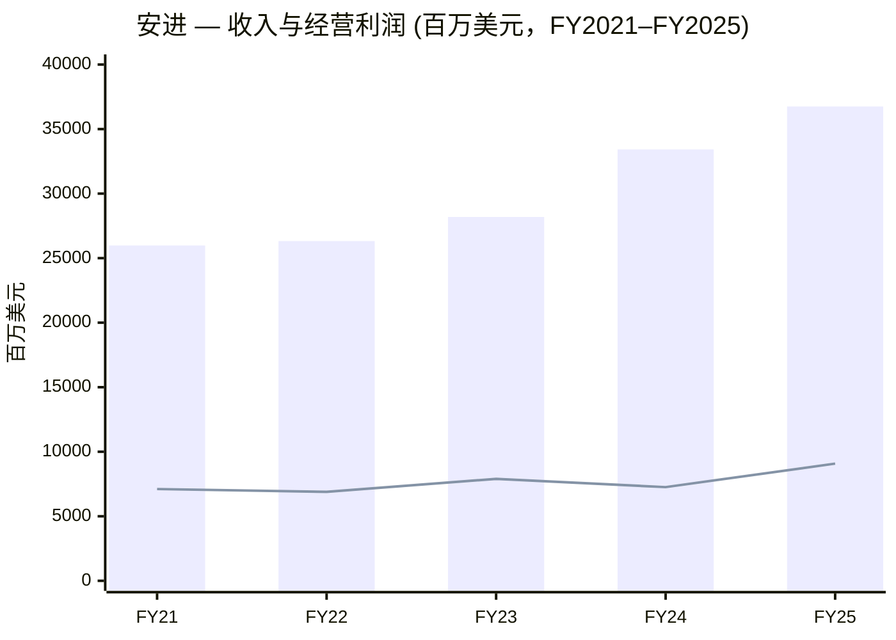
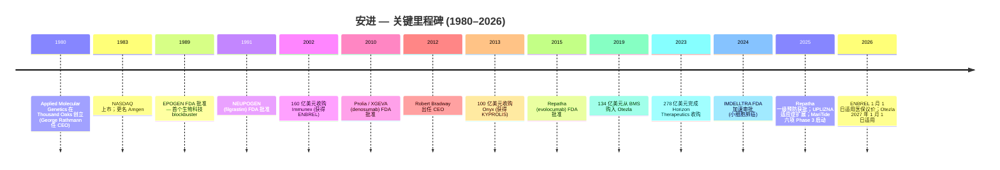
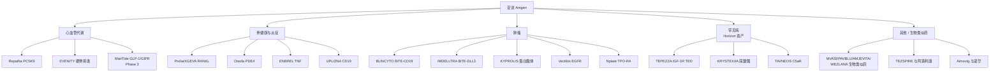
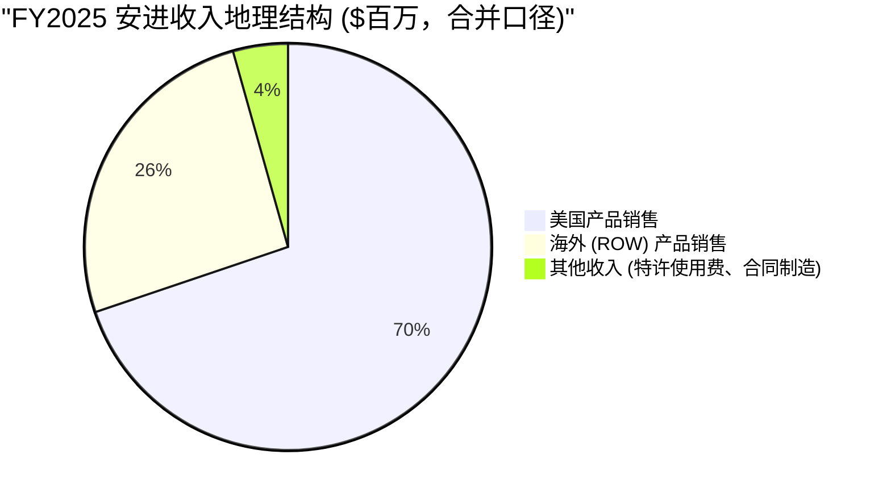
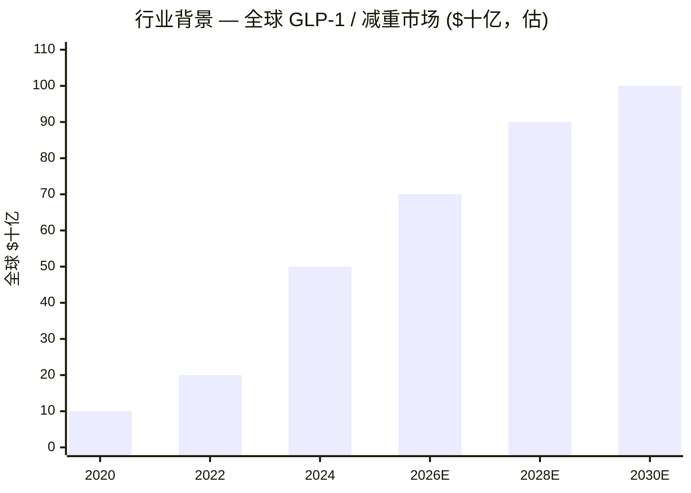
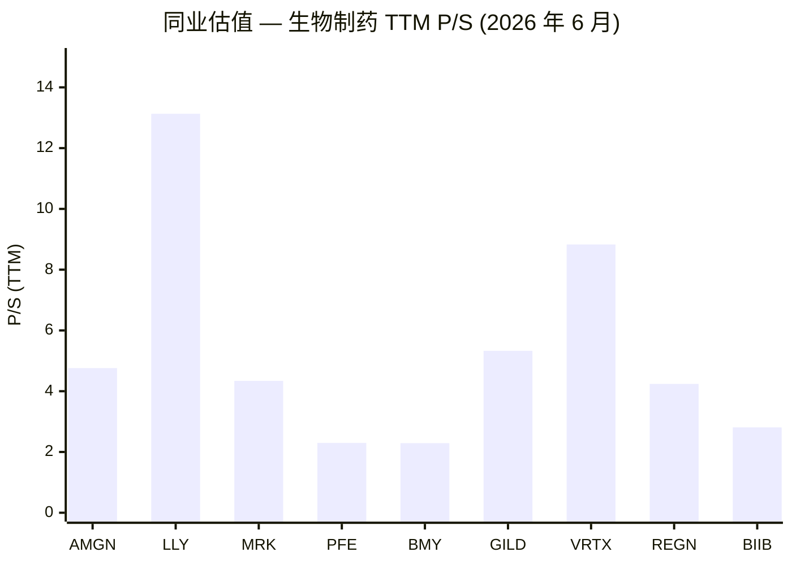
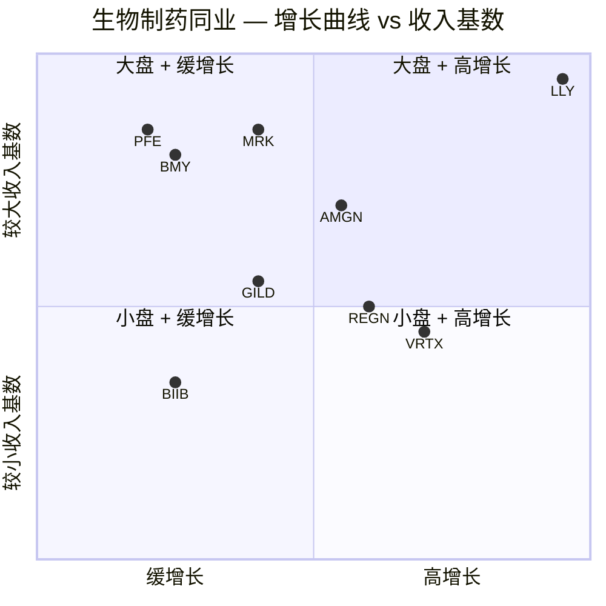
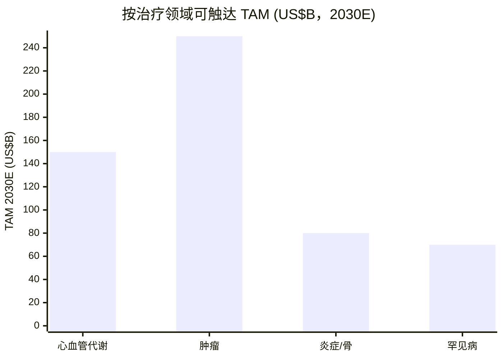

# 安进公司 (Amgen Inc.) — 首次覆盖深度研究

**股票代码:** NASDAQ: AMGN
**行业分类:** 医疗保健 → 生物科技 / 综合制药
**总部:** One Amgen Center Drive, Thousand Oaks, California 91320
**成立时间:** 1980 年 (加州成立，1987 年再注册为特拉华公司)
**全球员工 (截至 2025-12-31):** 约 31,500 人，分布于 50 多个国家
**会计师:** 安永会计师事务所 (Ernst & Young LLP)
**报告日期:** 2026-06-03 (基于 2026-02-13 提交的 FY2025 10-K 与 2026-05-01 提交的 Q1 2026 10-Q)

---

> **2026 全年业绩指引** — 2026 年 2 月 3 日 Q4 2025 业绩发布会上，安进首次发布 2026 年全年指引：**总收入 (Total revenues) 371–385 亿美元**，**GAAP 摊薄每股收益 (diluted EPS) 15.62–17.10 美元** (非 GAAP 21.50–23.10 美元)。Q1 2026 (2026-04-30 8-K)：收入同比 +4%，16 个产品保持双位数增长，销量 +9%，部分被净售价 –2% 与库存效应 –2% 抵消。管理层重申指引区间，并将 **MariTide Phase 3 数据读出**、**IRA 法案下 ENBREL/Otezla 价格重置**、以及 **Prolia/XGEVA 生物类似药 (biosimilar / 生物仿制药) 侵蚀**列为最关键的三大变量。来源：[AMGN Q1 2026 8-K 业绩发布 (2026-04-30)](https://www.sec.gov/Archives/edgar/data/318154/000031815426000054/amgn-20260331earningsrelea.htm)；[AMGN FY2025 10-K MD&A](https://www.sec.gov/Archives/edgar/data/318154/000031815426000010/amgn-20251231.htm)。

---

## 目录

1. 公司概览
2. 公司历史
3. 管理团队
4. 产品与服务
5. 客户与销售渠道
6. 行业概览
7. 竞争格局
8. 市场机会 (TAM/SAM)
9. 风险评估
10. 投资者视角评分
11. 参考资料
12. 数据来源
13. 验证日志

---

## 1. 公司概览

安进 (Amgen Inc.) 是全球最大的独立生物科技公司之一，也是将重组 DNA 技术 (recombinant DNA technology / 重组 DNA 技术) 推向商业化的开创者之一。FY2025 Form 10-K 在开篇第一段以公司自己的语言定义业务：*"Amgen Inc. … 致力于发现、开发、生产并交付创新药物，攻克世界上最棘手的疾病。我们专注于具有高度未满足医疗需求的领域，并运用专长努力寻找显著改善人类生活、同时降低疾病社会与经济负担的解决方案。我们于 45 年前帮助创立了生物技术行业，并已成长为全球领先的独立生物科技公司之一。"* 公司财务报告披露中**仅设立一个经营分部 (operating segment)**：人体治疗药物 (human therapeutics)；但在管理层讨论与分析 (MD&A) 中按区域 (美国 / 海外) 与产品分别披露收入，详见 [FY2025 10-K Item 1 业务介绍与 Note 19 分部信息](https://www.sec.gov/Archives/edgar/data/318154/000031815426000010/amgn-20251231.htm)。

公司的产品组合由 **14 个 FY2025 销售额超过 10 亿美元的上市药物 (blockbuster)** 为核心，覆盖肿瘤、心血管代谢、炎症、骨健康、罕见病等治疗领域。FY2025 收入同比 **+10% 至 367.51 亿美元** (FY2024 为 334.24 亿美元，FY2023 为 281.90 亿美元；2024 年的 +19% 增长主要由 2023 年 10 月 6 日完成的 278 亿美元 Horizon Therapeutics 收购全年并表所驱动)；**经营利润 (Operating income) 90.80 亿美元** (同比 +25%)；**净利润 (Net income) 77.11 亿美元** (同比 +89%，2024 年基数因 Horizon 相关一次性费用而偏低)；**摊薄 EPS 14.23 美元**。FY2025 产品销售的底层驱动是 **+13% 的销量增长**部分被 **–3% 的净售价下滑**抵消，详见 [FY2025 10-K Results of Operations pp. 63–66](https://www.sec.gov/Archives/edgar/data/318154/000031815426000010/amgn-20251231.htm)。

当前的资本结构折射出 2023 年 Horizon 并购的影响：**长期债务 (Long-term debt) 500 亿美元 + 一年内到期长债 46 亿美元 = 546 亿美元**；对应现金及现金等价物 91 亿美元；**净债务 (Net debt) 约 455 亿美元**；杠杆率仍远高于并购前水平。管理层在 2025 年偿还了 60 亿美元长期债务，并明确**继续去杠杆**的策略，同时维持季度股息 (2025 年再次上调) 与俄亥俄、北卡罗来纳、波多黎各等产能建设投资。[FY2025 10-K MD&A Selected Financial Data, p. 73](https://www.sec.gov/Archives/edgar/data/318154/000031815426000010/amgn-20251231.htm) 显示总资产 905.86 亿美元，股东权益仅 86.58 亿美元 (从 2024 年的 58.77 亿美元有所恢复) — 与 500 亿美元长期债务相比，股东权益垫显得偏薄，这是后 Horizon 时代安进资产负债表最为突出的特征之一。

公司战略由三条腿支撑：(i) 由 Repatha、Prolia、Otezla、ENBREL、EVENITY、XGEVA、BLINCYTO、Nplate、KYPROLIS、Aranesp、Vectibix、Neulasta 等成熟生物制剂构成的**现金牛 (cash cow)** 业务，为再投资提供现金流；(ii) Horizon 罕见病组合 — 包括 **TEPEZZA** (teprotumumab，全球唯一获批治疗甲状腺眼病 TED 的药物)、**KRYSTEXXA** (pegloticase，治疗慢性顽固性痛风)、**UPLIZNA** (inebilizumab，2025 年获 FDA 批准用于 IgG4 相关疾病 IgG4-RD 与广泛性肌无力 gMG)、**TAVNEOS** (avacopan，治疗 ANCA 相关血管炎)；(iii) 由 **MariTide (maridebart cafraglutide)** 为核心的高风险高回报代谢管线 — 一款激活 GLP-1 受体 (glucagon-like peptide-1 receptor) 并拮抗 GIPR (glucose-dependent insulinotropic polypeptide receptor) 的抗体–肽偶联物 (antibody-peptide conjugate, APC)，目前正进行**六项全球三期 (Phase 3) 临床试验**，覆盖慢性体重管理 (含 / 不含 2 型糖尿病)、心血管疾病、心力衰竭、阻塞性睡眠呼吸暂停 (OSA) 等适应症，详见 [FY2025 10-K Significant Developments, pp. 1–3](https://www.sec.gov/Archives/edgar/data/318154/000031815426000010/amgn-20251231.htm)。这条管线决定了未来 24 个月安进估值故事是"成熟特许经营 + 特殊机会"还是"第三家拥有可信 GLP-1 平台的大药企"的关键二元变量，也是当前所有卖方研究争论的焦点。

**估值快照 (2026-06-02 收盘，数据来源：Yahoo Finance Key Statistics 与 stockanalysis.com)。** AMGN 当前股价 **328.26 美元**，总市值 **1,772 亿美元**，**TTM 市盈率 (P/E) 22.8 倍**、**前瞻市盈率 (Forward P/E) 14.0 倍**、**市销率 (P/S) 4.76 倍**、**市净率 (P/B) 19.3 倍**、**EV/EBITDA 13.1 倍**、**股息率 (Dividend yield) 3.07%**、贝塔 (beta) 0.43，52 周价格区间 267.83–391.29 美元。市场对 AMGN 的定价在前瞻 P/E 与股息率上低于大型药企同业平均，但显著高于已陷入产品周期低谷的辉瑞 (PFE 9× fwd P/E, 6.7% 股息率) 与百时美施贵宝 (BMY 8.8× fwd P/E, 4.6% 股息率)，来源：[Yahoo Finance AMGN](https://finance.yahoo.com/quote/AMGN/key-statistics) 与同业组数据 (LLY, MRK, PFE, BMY, GILD, VRTX, REGN, BIIB 于同日拉取)。19.3× 高 P/B 反映 Horizon 收购形成的商誉与无形资产相对薄股东权益基数的会计效应，并非激进的成长性定价。

**估值解读。** 一家收入 370 亿美元、收入同比 +10%、经营利润同比 +25% 的生物科技公司，14× 前瞻 P/E 在绝对意义上**并非偏高**：与默克 (12×) 大致持平，略高于辉瑞 / 百时美 (9×)，远低于礼来 (24×) 与 Vertex (20×)。市场对 AMGN 的定价更像是 **"高质量缓增长 + 看涨期权"** 而非真正的 GLP-1 纯粹标的：若 MariTide 三期数据有竞争力地读出，估值有清晰的向礼来式溢价方向重估的空间；若 MariTide 读出不利，估值底由旗下成熟生物制剂的股息现金流支撑。4.76× P/S 显著低于礼来 (13.1×) 与吉利德 (5.3×)，略高于默克 (4.3×)，处于大型生物制药同业的中位数而非顶部四分位。因此当前估值**不应**被简单定义为"折价"或"溢价"；更准确的框架是**期权定价**：股价中包含一份对 MariTide 的免费看涨期权 (free call option) 与一份对现金奶牛产品组合定价充分的看跌支撑 (put-supported floor)。

*来源：[FY2025 10-K Selected Financial Data 与 Results of Operations](https://www.sec.gov/Archives/edgar/data/318154/000031815426000010/amgn-20251231.htm)。*

---

## 2. 公司历史

安进的前身是 **Applied Molecular Genetics Inc.** (应用分子遗传学公司)，于 **1980 年 4 月**在加利福尼亚州 Thousand Oaks 由一小群学术科学家与风险投资人创立。**乔治·拉斯曼 (George B. Rathmann)** — 此前曾任 Abbott Laboratories (雅培) 诊断业务副总裁 — 出任首任 CEO 兼董事长，他被业内普遍视为"现代生物科技产业的奠基性人物之一"。公司在 1983 年正式更名为"Amgen"并在 **1983 年 6 月**在纳斯达克 (NASDAQ) IPO。尽管 FY2025 10-K 没有详细回顾创立历史 (法律披露聚焦当下)，但《Item 1. Business》开篇仍用一句话确认了基本事实：*"我们于 45 年前帮助创立了生物技术行业 …"* 见 [FY2025 10-K, Item 1, p. 1](https://www.sec.gov/Archives/edgar/data/318154/000031815426000010/amgn-20251231.htm)。关于 1980 年创立时间、Thousand Oaks 起源、Rathmann 作为创始 CEO 的角色，在多个长篇生物科技史中得到独立确认，包括[安进官方"About"页面](https://www.amgen.com/about)、[维基百科 Amgen 词条](https://en.wikipedia.org/wiki/Amgen) 与 [纽约时报 Rathmann 讣告 (2012-04-26)](https://www.nytimes.com/2012/04/26/business/george-b-rathmann-led-biotech-company-amgen-dies-at-84.html)。

安进历史上第一个变革性事件是 **1989 年 6 月 FDA 批准 EPOGEN (重组人促红细胞生成素 epoetin alfa)** — 全球第一个突破"年销售十亿美元"门槛的生物科技药物，为透析患者治疗肾性贫血。EPOGEN 不仅奠定了安进作为 1980 年代末美国主导生物科技企业的地位，也确立了"重组 DNA 蛋白质药物"这一全新药物类别的商业化范式。随后 1991 年 2 月 FDA 批准 **NEUPOGEN (filgrastim)** 治疗化疗诱导的中性粒细胞减少症；2001 年 **Aranesp (darbepoetin alfa)** 作为长效 EPO 后续产品获批；2002 年 **Neulasta (pegfilgrastim)** 提供周给药的聚乙二醇化 filgrastim — 成为安进近 20 年最重要的现金牛产品之一，直到生物类似药侵蚀开始。该系列原始产品现已步入由生物类似药竞争驱动的晚期衰退阶段，10-K 直言：*"美国的 EPOGEN、NEUPOGEN、Neulasta 以及加拿大的 ENBREL 已有生物类似药上市，美国 ENBREL 生物类似药已获批但尚未上市"* — 见 [FY2025 10-K Item 1 Competition](https://www.sec.gov/Archives/edgar/data/318154/000031815426000010/amgn-20251231.htm)。

第二个战略性拐点是 2000 年代向风湿病学与免疫学的扩张。**ENBREL (etanercept)** — 通过 **2002 年以 160 亿美元收购 Immunex Corporation** 完整纳入安进，这是当时生物科技史上最大宗的并购 — 在 2010 年代多年成为安进单一最大产品，至今仍是收入超过 20 亿美元的特许经营业务，即使经历了多年价格下滑与海外生物类似药竞争。Immunex 交易同时带来了 Kineret、Stelmyo 与西雅图研发基地。2010 年代的扩张继续：2010 年内部推出 **Prolia / XGEVA (denosumab)** 治疗骨质疏松症与骨转移；2013 年以 **100 亿美元收购 Onyx Pharmaceuticals** 获得 **KYPROLIS (carfilzomib)** 治疗多发性骨髓瘤；2015 年 **Repatha (evolocumab)** 作为最早的 PCSK9 抑制剂之一上市治疗高胆固醇血症。Prolia / XGEVA 在 FY2025 合计销售 **64.9 亿美元** (Prolia 44.14 + XGEVA 20.84)，是安进单一最大的产品收入线 — 但两者 U.S. 专利于 2025 年 2 月到期，欧洲于 2025 年 11 月到期，已开始面临加速生物类似药侵蚀，详见 [FY2025 10-K Item 1 Competition](https://www.sec.gov/Archives/edgar/data/318154/000031815426000010/amgn-20251231.htm)。

第三个战略性举措是 **2019 年以 134 亿美元从百时美施贵宝 (BMS) 购入 Otezla (apremilast)** — 这是 BMS 收购 Celgene 时美国 FTC 监管强制剥离的资产。Otezla — 一款治疗银屑病与白塞病的小分子 PDE4 抑制剂 — 为安进新增约 23 亿美元收入 (以美国市场为主)，并关键地给了安进第一个具有不同专利保护轮廓的显著小分子业务。但 CMS 在 IRA 法案下选择 Otezla 进入 **2027 年 1 月 1 日生效的医疗保险议价**，安进因此在 2025 年对相关无形资产做了减值 — 详见 [FY2025 10-K, Note 13 商誉与其他无形资产](https://www.sec.gov/Archives/edgar/data/318154/000031815426000010/amgn-20251231.htm)。

第四个、也是最近期最重大的举措是 **2023 年 10 月 6 日完成的 278 亿美元 Horizon Therapeutics 收购**，新增 TEPEZZA (teprotumumab — 治疗 TED 的全球独家药物)、KRYSTEXXA (pegloticase — 治疗慢性顽固性痛风)、UPLIZNA (inebilizumab — 治疗视神经脊髓炎谱系障碍 NMOSD，2025 年扩展至 IgG4-RD 与 gMG)、TAVNEOS (avacopan — ANCA 相关血管炎)，以及后期管线 daxdilimab。融资结构 — *2023 年 3 月 2 日发行 240 亿美元高级票据，并提取 40 亿美元定期贷款 (其中 22 亿美元已偿还)* 见 [FY2025 10-K 流动性讨论](https://www.sec.gov/Archives/edgar/data/318154/000031815426000010/amgn-20251231.htm) — 形成了当前的高债务负担与 2025–26 年的去杠杆主线。仅 TEPEZZA 在 FY2025 贡献了 19.03 亿美元 (同比 +3%)，KRYSTEXXA 贡献 13.40 亿美元 (同比 +13%)，从收入端 Horizon 并购具有显著业绩贡献。

*来源：[FY2025 10-K Significant Developments, pp. 1–3](https://www.sec.gov/Archives/edgar/data/318154/000031815426000010/amgn-20251231.htm)；[Horizon 收购公告 8-K 与 2023 10-K Note 11 业务合并](https://www.sec.gov/cgi-bin/browse-edgar?action=getcompany&CIK=0000318154&type=10-K)。*

---

## 3. 管理团队

**按技能规则，本节仅覆盖创始人与当前 CEO，不涉及其他高管。**

**创始人 — 乔治·拉斯曼 (George B. Rathmann，1927–2012)。** Rathmann 是安进的运营创始 CEO，业内公认将一家单一重组 DNA 实验室与 1,900 万美元 A 轮融资转变为第一家盈利独立生物科技公司的关键人物。他在西北大学获化学学士 (1948)，普林斯顿大学获物理化学博士 (1951)，先后在 3M 公司任工艺开发经理、Abbott Laboratories 任研发副总裁，之后于 1980 年 10 月 (公司成立六个月后) 加入安进担任总裁兼 CEO。他的核心招聘 — 分子生物学家 **林福坤 (Fu-Kuen Lin)**，1983 年首次分离并克隆人促红细胞生成素基因，直接催生了 EPOGEN — 以及他建立的 UCLA / UC Berkeley 学术顾问委员会，奠定了安进未来 40 年的科技基础。Rathmann 于 1988 年卸任 CEO、1990 年卸任董事长，之后创办 ICOS Corporation 并在多家生物科技公司担任董事。他于 2012 年 4 月 22 日去世，被产业史学者列为商业化生物科技四五位创始性人物之一。尽管 FY2025 10-K 没有叙述 Rathmann 的任期 (法律披露聚焦当下高管)，他的角色在 [纽约时报讣告 (2012-04-26)](https://www.nytimes.com/2012/04/26/business/george-b-rathmann-led-biotech-company-amgen-dies-at-84.html) 中有完整记录。Rathmann 去世时已无安进的持续持股，1990 年后也未参与运营。

**当前 CEO — 罗伯特·布拉德威 (Robert A. Bradway，截至 2026-02-13 时 63 岁)。** Bradway 自 **2012 年 5 月**起任安进 CEO，**2013 年 1 月**起兼任董事长 — 14 年的任期使他成为全球大型生物制药公司中任期最长的 CEO 之一。FY2025 10-K 高管简介给出官方简历的原文：*"Robert A. Bradway 先生现年 63 岁，自 2011 年起任公司董事，2013 年起任董事会主席。他自 2010 年起任公司总裁，2012 年起任首席执行官。2010–2012 年期间，他担任公司总裁兼首席运营官。Bradway 先生于 2006 年加入公司任运营战略副总裁，2007–2010 年任执行副总裁兼首席财务官。加入公司前，他在伦敦摩根士丹利担任董事总经理，自 2001 年起负责该公司在欧洲的银行业务与企业融资业务。"* — 见 [FY2025 10-K, Item 1 Executive Officers, p. 27](https://www.sec.gov/Archives/edgar/data/318154/000031815426000010/amgn-20251231.htm)。

Bradway 任期内的三大战略举措：(i) **2013 年 Onyx 并购**带来 KYPROLIS — 在他出任 CEO 14 个月后即完成，明确了他愿意以并购填充管线的战略；(ii) **2019 年 Otezla 并购**为安进首次添加显著的小分子业务；(iii) **2023 年 Horizon 并购**以 278 亿美元交易额成为安进历史上第二大并购 (仅次于 2002 年 Immunex；通胀调整后大致可比)，是对生物类似药抵抗力强的罕见病资产的明确加倍下注。任期内的核心运营优先级是**制造产能纪律** — Bradway 的业绩电话中持续强调波多黎各、俄亥俄 (新的 Holly Springs 工厂)、北卡罗来纳的产能扩建，以及 2025 年在 Thousand Oaks 破土的新研发中心。他也是安进对 **IRA 法案**与 **2025 年最惠国 (MFN) 药品定价行政命令**响应的公开代言人 — 安进是收到 *2025 年 7 月 MFN 信函*的制药企业之一，详见 [FY2025 10-K Risk Factors, p. 39](https://www.sec.gov/Archives/edgar/data/318154/000031815426000010/amgn-20251231.htm)。

Bradway 持有 Amherst College 生物学学士学位与哈佛商学院 MBA 学位。他自 **2016 年起任波音公司 (The Boeing Company) 董事** (担任审计与航空航天安全委员会成员，详见波音 2025 年代理材料)，自 **2014 年起任南加州大学 (USC) 董事**。根据 [2026 年代理材料 DEF 14A (2026-04-07 提交)](https://www.sec.gov/Archives/edgar/data/318154/000119312526145588/d13946ddef14a.htm)，他的持股结构包括已归属的 RSU、普通股与期权，符合公司 CEO 7 倍基本薪资的持股指引 (具体股数随 RSU 归属在年度间波动)。薪酬结构为大型药企标准组合：基本薪资 + 与财务及管线 KPI 挂钩的年度现金激励 + 长期股权 (RSU 与与相对 TSR 及经营利润增长挂钩的业绩单元)。Bradway 在三次重大并购整合中的连续性，从治理角度看是安进最具可信度的事实之一 — 长期任职、对管线有完全掌控权的 CEO 在生物制药领域非常罕见，**既是优势** (机构知识、资本配置连续性) **也是关注项** (14 年任期后的继任风险结构性偏高)。

---

## 4. 产品与服务

安进作为**单一经营分部 (single segment)** "人体治疗药物"业务，但在管理层讨论中按治疗领域与单一品牌讨论组合。FY2025 10-K Item 1 业务部分以原文形式列出全部上市药物：**Prolia、Repatha、Otezla、ENBREL、EVENITY、XGEVA、TEPEZZA、BLINCYTO、Nplate、TEZSPIRE、KYPROLIS、Aranesp、KRYSTEXXA、Vectibix**，以及 "Other products" 池中包括 MVASI、PAVBLU、UPLIZNA、IMDELLTRA/IMDYLLTRA、AMJEVITA/AMGEVITA、TAVNEOS、Neulasta、LUMAKRAS/LUMYKRAS、RAVICTI、Parsabiv、Aimovig、WEZLANA/WEZENLA 与 PROCYSBI ([FY2025 10-K, Item 1, pp. 3–11](https://www.sec.gov/Archives/edgar/data/318154/000031815426000010/amgn-20251231.htm))。FY2025 全球产品销售明细表如下，逐行复现自同一披露源。

| 产品 | FY2025 销售 ($百万) | 同比 % | FY2024 ($百万) | 同比 % | FY2023 ($百万) |
|---|---:|---:|---:|---:|---:|
| Prolia | 4,414 | +1% | 4,374 | +8% | 4,048 |
| Repatha | 3,016 | +36% | 2,222 | +36% | 1,635 |
| Otezla | 2,265 | +7% | 2,126 | –3% | 2,188 |
| ENBREL | 2,226 | –33% | 3,316 | –10% | 3,697 |
| EVENITY | 2,100 | +34% | 1,563 | +35% | 1,160 |
| XGEVA | 2,084 | –6% | 2,225 | +5% | 2,112 |
| TEPEZZA (1) | 1,903 | +3% | 1,851 | * | 448 |
| BLINCYTO | 1,559 | +28% | 1,216 | +41% | 861 |
| Nplate | 1,524 | +5% | 1,456 | –1% | 1,477 |
| TEZSPIRE (2) | 1,478 | +52% | 972 | +71% | 567 |
| KYPROLIS | 1,412 | –6% | 1,503 | +7% | 1,403 |
| Aranesp | 1,389 | +4% | 1,342 | –1% | 1,362 |
| KRYSTEXXA (1) | 1,340 | +13% | 1,185 | * | 272 |
| Vectibix | 1,175 | +12% | 1,045 | +6% | 984 |
| 其他产品 | 7,263 | +29% | 5,630 | +20% | 4,696 |
| **总产品销售** | **35,148** | **+10%** | **32,026** | **+19%** | **26,910** |
| 其他收入 | 1,603 | +15% | 1,398 | n/a | 1,280 |
| **总收入** | **36,751** | **+10%** | **33,424** | **+19%** | **28,190** |

*(1) TEPEZZA 与 KRYSTEXXA 于 2023-10-06 通过 Horizon 收购纳入。(2) TEZSPIRE 由阿斯利康 (AstraZeneca) 在美国境外销售。\\* 表示同比无意义比较。*
*来源：[FY2025 10-K Item 7 MD&A Results of Operations, pp. 64–66](https://www.sec.gov/Archives/edgar/data/318154/000031815426000010/amgn-20251231.htm)。*

产品组合按治疗领域可清晰分为四个分块。按本技能要求的三步走结构 (产品**物理上做什么**、**与同类产品如何区分**、**驱动它的战略性拐点是什么**)，逐块展开。

### 4.1 心血管代谢 — Repatha、EVENITY、MariTide 的期权 (TAM 1,500 亿美元以上)

心血管代谢业务是安进最快增长的传统板块，也是 MariTide 管线被叠加上的核心战略平台。**Repatha (evolocumab)** 是一个全人源单克隆抗体，**结合并抑制 PCSK9** (proprotein convertase subtilisin/kexin type 9，前蛋白转换酶枯草溶菌素 9 型) — 一种激活后会加速肝细胞内 LDL 受体降解的丝氨酸蛋白酶。通过阻断 PCSK9，Repatha 增加肝细胞表面 LDL 受体密度，从而将更多循环 LDL-C 从血浆中清除。其机制独立于他汀类 (statin)：他汀类降低细胞内胆固醇合成，但对于即使最大耐受剂量他汀治疗后 LDL-C 仍超过指南阈值的患者，阻断 PCSK9 提供了第二个调控杠杆。10-K *Significant Developments* 部分披露：*"2025 年 8 月，我们宣布 FDA 扩大了 Repatha 的适应症，新增因未受控的 LDL-C 而处于主要心血管事件 (MACE) 增加风险的成年人，取消了既往须诊断为心血管 (CV) 疾病的前置要求。2025 年 11 月，我们宣布 VESALIUS-CV Phase 3 临床试验详细结果，显示 Repatha 在加用他汀类或其他 LDL-C 降低治疗后的高危无既往心梗或卒中的成年人中，显著且具有临床意义地降低了 MACE 风险 … Repatha 使冠心病死亡、心梗或缺血性卒中复合终点 (3-P MACE) 的相对风险降低了 25%，更广泛的复合终点 (4-P MACE，包括任何缺血驱动的动脉血运重建) 降低了 19%。Repatha 还使心肌梗死风险降低了 36%。"* — [FY2025 10-K, Significant Developments, p. 2](https://www.sec.gov/Archives/edgar/data/318154/000031815426000010/amgn-20251231.htm)。2024 与 2025 年连续两年同比 +36% 的收入增长，反映了适应症从二级预防扩展到一级预防的政策红利与 MD&A 描述的美国销量 +13% 的驱动。**中文释义 / Plain-language gloss:** PCSK9 抑制剂 — 一个让肝细胞更高效地清除血液 LDL-胆固醇的单克隆抗体，机制独立于他汀类。

**EVENITY (romosozumab)** 是一个人源化单克隆抗体，**阻断硬骨抑素 (sclerostin)** — 一种由骨细胞产生的、通常抑制骨形成的蛋白质。通过抑制硬骨抑素，EVENITY 同时**增加骨形成并降低骨吸收** — 这一双重机制是其他骨质疏松治疗药物无法提供的。产品定位于高骨折风险的绝经后女性，疗程为 12 次给药，之后转向抗骨吸收治疗 (典型为 Prolia)。FY2025 销售 21.00 亿美元 (同比 +34%，2024 年 +35% 至 15.63 亿美元)，反映国际市场推广与对骨折队列结果经济学日益认可。安进与 UCB 在选定市场的共同推广详见 [FY2025 10-K, Item 1 Marketing](https://www.sec.gov/Archives/edgar/data/318154/000031815426000010/amgn-20251231.htm)。**中文释义 / Plain-language gloss:** 罗莫单抗 — 既促进骨形成又抑制骨吸收的双向单抗，针对高骨折风险的绝经后女性。

**MariTide (maridebart cafraglutide)** 是重新定价整个心血管代谢叙事的战略期权。10-K 描述它为 *"一种差异化的抗体-肽偶联物 (antibody-peptide conjugate, APC)，激活 GLP-1 受体并拮抗 GIPR"* — 见 [FY2025 10-K, Item 1 Research and Development and Selected Product Candidates](https://www.sec.gov/Archives/edgar/data/318154/000031815426000010/amgn-20251231.htm)。架构上 MariTide **不是**像 semaglutide (Wegovy / Ozempic 的活性成分) 或 tirzepatide (Zepbound / Mounjaro 的活性成分) 那样的小肽 — 而是一种 *抗体-肽偶联物*，这给了它 (a) 更长的半衰期，使**月度或季度给药 (monthly or quarterly dosing)** 成为可能而非每周一次注射，(b) 不同的受体组合 (GLP-1 激动加 GIP 拮抗，而非现有产品的 GLP-1 激动或 GLP-1/GIP 双激动机制)。10-K 引用了在 ADA 2025 大会上发布并同步刊发于 **《新英格兰医学杂志》(NEJM)** 的 Phase 2 结果，并指出：*"绝大多数受试者在第 1 部分获得的体重减轻在低月度剂量或季度剂量下额外维持了 52 周；第二年 MariTide 治疗耐受性非常良好，包括季度剂量在内的恶心发生率非常低。"* — 见 [FY2025 10-K, Significant Developments, p. 3](https://www.sec.gov/Archives/edgar/data/318154/000031815426000010/amgn-20251231.htm)。安进目前已启动**六项全球 Phase 3 研究**，覆盖慢性体重管理 (含 / 不含 2 型糖尿病)、心血管疾病、心力衰竭、阻塞性睡眠呼吸暂停 — 这是对整个 GLP-1 适应症树的有意识"圈地"布局。**中文释义 / Plain-language gloss:** MariTide — 一个抗体–肽偶联物 (APC)，同时激活 GLP-1 受体并拮抗 GIPR；月度或季度给药；用于慢性体重管理、糖尿病、心衰、阻塞性睡眠呼吸暂停等适应症。

*分析师观点 (不引用任何监管文件):* MariTide 的战略意义是**不对称的**。若三期数据证实 Phase 2 的耐受性与持久性曲线，**叠加月度 / 季度灵活给药剂量**，MariTide 将成为礼来 / 诺和诺德在慢性体重管理领域双寡头格局下的第一个可信"第三入局者" — IQVIA 追踪的零售处方数据显示，该品类 2022 年从近零基数增长到 2024 年美国零售销售超过 200 亿美元 ([IQVIA Channel Dynamics, 2024-12](https://www.iqvia.com/insights/the-iqvia-institute/reports-and-publications/reports/the-use-of-medicines-in-the-us-2024))。若 MariTide 临床读出令人失望、剂量灵活性 / 月度给药特征无法转化为差异化优势，整个心血管代谢重估即消失，安进将退回到"成熟特许经营 + Horizon 资产"的估值。

### 4.2 骨健康与炎症 — Prolia、XGEVA、Otezla、ENBREL、UPLIZNA (缓冲下滑板块)

骨健康与炎症板块承担了最重的专利悬崖压力。**Prolia (denosumab)** 是一个全人源单克隆抗体，**结合 RANKL** (receptor activator of nuclear factor kappa-B ligand，核因子-κB 受体激活蛋白配体) — 一种驱动破骨细胞 (osteoclast) 分化的细胞因子。阻断 RANKL 可防止破骨细胞形成，减缓骨吸收 — 该机制使其成为全球最广泛使用的骨质疏松生物制剂，FY2025 销售额 **44.14 亿美元** (同比 +1%)。**XGEVA** 含相同活性成分但获批用于骨转移患者预防骨相关事件或用于多发性骨髓瘤，采用更高剂量 — FY2025 销售额 **20.84 亿美元 (同比 –6%)**。10-K 明确说明：*"Prolia 和 XGEVA 包含相同的活性成分，但获批用于不同的适应症、患者群体、剂量和给药频率"* — [FY2025 10-K, Item 1 Selected Marketed Products, p. 4](https://www.sec.gov/Archives/edgar/data/318154/000031815426000010/amgn-20251231.htm)。10-K 同时披露：*"我们对 Prolia 和 XGEVA 的 RANKL 抗体 (包括序列) 的专利于 2025 年 2 月在美国到期，并于 2025 年 11 月在欧洲选定国家到期，我们预期由于竞争加剧而出现的销售加速侵蚀，因为多个生物类似药已在美国和海外上市"* — [FY2025 10-K, Item 1 Competition](https://www.sec.gov/Archives/edgar/data/318154/000031815426000010/amgn-20251231.htm)。Prolia 2025 年 +1% 的微弱增长掩盖了一场陡峭的生物类似药侵蚀，将在 2026–27 年从机械性上压制该特许经营业务。

**Otezla (apremilast)** 是公司第一个小分子特许经营业务，**磷酸二酯酶 4 (PDE4) 抑制剂**，调控细胞内 cAMP 并降低银屑病与白塞病的炎症细胞因子产生。FY2025 销售 22.65 亿美元 (同比 +7%，从 2024 年 –3% 恢复)，但 **CMS 已选择 Otezla 进入 IRA 医保议价，自 2027 年 1 月 1 日生效**，触发了对 Otezla 已开发产品技术无形资产的减值评估及 2025 年的相关计提，详见 [FY2025 10-K Note 13](https://www.sec.gov/Archives/edgar/data/318154/000031815426000010/amgn-20251231.htm)。**ENBREL (etanercept)** 是一种可溶性 TNFα 受体融合蛋白，在循环 TNFα 与细胞表面受体结合前先行捕获；其美国特许经营至今受专利保护，但 **CMS 已设定 ENBREL Medicare Part D 自 2026 年 1 月 1 日起的价格** — 这是 IRA 对安进产品首次设定的价格，详见 [FY2025 10-K, Item 1 Reimbursement and Risk Factors](https://www.sec.gov/Archives/edgar/data/318154/000031815426000010/amgn-20251231.htm)。FY2025 ENBREL 销售额 22.26 亿美元，同比 **–33%** (从 2024 年 33.16 亿美元下降，2024 年又较 2023 年 36.97 亿美元下降 –10%) — 是表中最陡峭的单一产品下滑，也是 IRA 收入影响最清晰的数据点。

**UPLIZNA (inebilizumab)**，通过 Horizon 并购获得，是一种**靶向 CD19 的人源化单克隆抗体**，可耗竭 B 细胞 (B-cell depleting)。10-K 披露：*"2025 年 4 月，我们宣布 FDA 批准 UPLIZNA 用于治疗成人 IgG4 相关疾病 (IgG4-RD)。UPLIZNA 是全球首个也是唯一一个获 FDA 批准用于治疗成人 IgG4-RD 的药物。2025 年 12 月，我们宣布 FDA 批准 UPLIZNA 用于治疗抗乙酰胆碱受体 (AChR) 抗体或抗肌肉特异性酪氨酸激酶 (MuSK) 抗体阳性的成人广泛性肌无力 (gMG)。"* — [FY2025 10-K, Significant Developments, p. 2](https://www.sec.gov/Archives/edgar/data/318154/000031815426000010/amgn-20251231.htm)。UPLIZNA 的适应症扩展模式正是安进从 Horizon 组合中提取增量 TAM 的样板。

### 4.3 肿瘤 — BLINCYTO、IMDELLTRA、Vectibix、KYPROLIS、Nplate (约 70 亿美元收入，增长不均)

肿瘤板块在免疫肿瘤资产上增长强劲，在较老的小分子特许经营业务上呈下滑趋势。**BLINCYTO (blinatumomab)** 是安进原创的**双特异性 T 细胞接合器 (bispecific T-cell engager, BiTE)** — 一种单一抗体样分子，一臂结合 B 细胞上的 CD19，另一臂结合 T 细胞上的 CD3，强制形成"突触"激活 T 细胞杀伤 B 细胞肿瘤。获批用于 B 细胞急性淋巴细胞白血病 (B-ALL)，BLINCYTO FY2025 增长 **+28% 至 15.59 亿美元** (2024 年 +41%) — 是组合中最强劲的纯肿瘤增长。**IMDELLTRA/IMDYLLTRA (tarlatamab)**，同样是 BiTE，靶向 DLL3 与 CD3 治疗小细胞肺癌 (SCLC)。2024 年 5 月获 FDA 加速审批，2025 年获完全批准。10-K 报告 Phase 3 DeLLphi-304 中期数据：*"该研究显示，相比标准治疗化疗，IMDELLTRA/IMDYLLTRA 显著降低死亡风险 40%"* — [FY2025 10-K Significant Developments, p. 3](https://www.sec.gov/Archives/edgar/data/318154/000031815426000010/amgn-20251231.htm)。**KYPROLIS (carfilzomib)** 是治疗复发 / 难治性多发性骨髓瘤的小分子蛋白酶体抑制剂 — 经 2013 年 Onyx 并购纳入，FY2025 销售 14.12 亿美元 (–6%)，面临百时美的竞争性蛋白酶体抑制剂与 CAR-T 治疗的压力。**Vectibix (panitumumab)** 是抗 EGFR 抗体，用于 KRAS 野生型转移性结直肠癌 — FY2025 销售 11.75 亿美元 (+12%)。**Nplate (romiplostim)** 是用于免疫性血小板减少症的血小板生成素受体激动剂 — FY2025 销售 15.24 亿美元 (+5%)，正在化疗诱导血小板减少症适应症中进行研究，详见 [FY2025 10-K Pipeline table](https://www.sec.gov/Archives/edgar/data/318154/000031815426000010/amgn-20251231.htm)。

### 4.4 罕见病 (Horizon 资产) — TEPEZZA、KRYSTEXXA + 尾部 (约 35 亿美元当前收入)

Horizon 并购带来 **TEPEZZA (teprotumumab)** — **甲状腺眼病 (TED) 全球首个也是唯一获 FDA 批准的药物**，一种自身免疫疾病，导致眼球突出、复视、面部变形。TEPEZZA 是一种人源化 IGF-1R 抗体，24 周内给药 8 次。FY2025 销售 19.03 亿美元 (同比 +3%) 反映美国特许经营的成熟阶段；10-K 管线表中标注 *皮下 TEPEZZA 在研发中* — 一项给药形式升级，可能显著扩大可触达患者群体。**KRYSTEXXA (pegloticase)** 是一种聚乙二醇化尿酸氧化酶 (uricase) 酶，将尿酸转化为尿囊素，可使已经失败黄嘌呤氧化酶抑制剂治疗的慢性顽固性痛风患者的痛风石消退。FY2025 销售 13.40 亿美元 (+13%)。10-K 管线表显示 *皮下 KRYSTEXXA* 正在同一适应症中研发，与 TEPEZZA SC 策略相呼应。**TAVNEOS (avacopan)** — 治疗 ANCA 相关血管炎的口服 C5a 受体抑制剂 — 是较小的产品线，10-K 披露与 FDA 的持续监管对话：*"2026 年 1 月 28 日，在 FDA 监管程序后，Amgen 通知 FDA 公司不打算将 TAVNEOS 从市场撤回。Amgen 正在评估与 FDA 的下一步"* — [FY2025 10-K, Note 13](https://www.sec.gov/Archives/edgar/data/318154/000031815426000010/amgn-20251231.htm)。

### 4.5 其他 / 生物类似药

安进的"其他产品" 72.63 亿美元板块 (FY2025 同比 +29%) 是组合中复合最快的产品线，从战略角度看其命名越来越不准确：它包括公司自有生物类似药 (MVASI、PAVBLU、AMJEVITA / AMGEVITA、WEZLANA / WEZENLA、BKEMV)、TEZSPIRE 品牌药 (与阿斯利康共同推广，美国境外由阿斯利康营销)、Aimovig (CGRP 偏头痛预防，与诺华合作)，以及一批遗留品牌。10-K 披露：*"自 2018 年以来，我们已上市 8 种生物类似药，包括 2025 年美国上市的 WEZLANA (STELARA® 的生物类似药) 和 BKEMV (SOLIRIS® 的生物类似药)"* — [FY2025 10-K, Item 1 Competition](https://www.sec.gov/Archives/edgar/data/318154/000031815426000010/amgn-20251231.htm)。生物类似药同时是**防御性护城河** (安进拥有制造技术，允许其竞争性进入其他公司的生物制剂特许经营业务) 与**进攻性增长杠杆** (全球市场对生物类似药替代的容忍度不断提高)。

**综合 — 产品如何相互作用。** 安进的收入图景最适合理解为**三层蛋糕**：**第一层 (成熟现金生成器，130–150 亿美元，逐步缩水):** Prolia/XGEVA、Otezla、ENBREL、Aranesp、Neulasta、KYPROLIS — 面临生物类似药侵蚀 (Prolia/XGEVA)、IRA 定价 (ENBREL、Otezla) 或竞争压力 (KYPROLIS)。整体增长略为负。**第二层 (增长引擎，100–120 亿美元，+20–35% 复合):** Repatha、EVENITY、BLINCYTO、TEZSPIRE、IMDELLTRA、UPLIZNA — 受适应症扩展、地理覆盖斜率、新适应症驱动 25%+ 增长，足以抵消第一层下滑。**第三层 (期权资产，今日为 0 / 待定):** MariTide、AMG 193 (KRAS)、Rocatinlimab (特应性皮炎)、Olpasiran (Lp(a) 降低)、皮下 Horizon 衍生产品 — 这些资产决定了 FY2030 收入基础是 400 亿美元还是 550 亿美元。资本配置从第一层流向第三层 R&D，第二层提供桥接增长，让股权能够在第三层读出期间复合。

*来源：[FY2025 10-K Item 1 Selected Marketed Products 与 Pipeline tables, pp. 3–24](https://www.sec.gov/Archives/edgar/data/318154/000031815426000010/amgn-20251231.htm)。*

---

## 5. 客户与销售渠道

安进的客户集中度是美国生物制药行业披露最简单也最集中的之一。FY2025 10-K Item 1 Marketing 部分给出原文披露：*"我们对三家大型批发商 — McKesson Corporation (麦克森)、Cencora, Inc. (前身为 AmerisourceBergen Corporation)、Cardinal Health, Inc. (卡迪纳健康) — 的产品销售，每家在 2025、2024 与 2023 年均分别占总收入的 10% 以上。三家批发商在 2025、2024 与 2023 年合计分别占全球总收入的 77%、77% 与 79%。"* — [FY2025 10-K, Item 1 Marketing](https://www.sec.gov/Archives/edgar/data/318154/000031815426000010/amgn-20251231.htm)。10-K 同时提供渠道背景：*"在美国，我们主要向药品批发分销商销售，他们是我们产品向诊所、医院和药房分销的主要分销商 … 在大多数国际市场，我们根据各国的分销实践与国际分销商或批发分销商合作。"*

关于这一披露有三点对风险定性至关重要。**第一**，**三家批发商合计 77% 是美国药品分销渠道的结构性特征，并非安进特有的集中**：同样三家批发商承担每一家大型药企 (默克、辉瑞、礼来等) 美国分销的大部分，由于冷链物流规模经济、340B 项目管理基础设施与几十年的合同关系，这一渠道结构非常持久。**第二**，**最终客户**是医生、透析中心、医院与药房，付款最终来自商业保险、Medicare Part B 与 D、Medicaid 与 340B 资格安全网提供者。批发商是物流与信用中介；需求信号是处方，报销是保险。**第三**，**PBM 集中**是 10-K 明确列出的并行集中：*"如上所述，健康保险行业出现了显著的整合，其中少数 PBM 现在监管美国大量的承保人口总量"* — [FY2025 10-K, Item 1 Reimbursement](https://www.sec.gov/Archives/edgar/data/318154/000031815426000010/amgn-20251231.htm)。"三大" PBM (Express Scripts/Cigna、CVS Caremark、OptumRx/UnitedHealth) 实际上对安进慢性病特许经营业务的处方集准入起到把关作用。

地理收入结构以美国为主。**FY2025 美国产品销售 256.56 亿美元 (占总产品销售 73%)** vs ROW 94.92 亿美元 (27%) — 见 [FY2025 10-K Item 7 Results of Operations, pp. 63–66](https://www.sec.gov/Archives/edgar/data/318154/000031815426000010/amgn-20251231.htm)。这显著比默克 (约 50% 美国)、辉瑞 (约 50% 美国) 或礼来 (约 70% 美国) 更偏向美国，是 Horizon 并购的残留效应 (Horizon 的 TEPEZZA 和 KRYSTEXXA 几乎完全是美国特许经营业务)。地理集中本身在 2025 年最惠国 (MFN) 定价行政命令与 IRA 医保议价项目背景下是一种风险 — 两者均是美国特定的政策杠杆。

*来源：[FY2025 10-K Item 7 Results of Operations, pp. 63–66](https://www.sec.gov/Archives/edgar/data/318154/000031815426000010/amgn-20251231.htm)。*

**分部口径的客户集中 — 分母清晰标注。** 安进披露单一经营分部，因此上述批发商集中是在**合并口径 (consolidated)** 下：McKesson、Cencora、Cardinal 各自 >10% 合并收入；三家合计 77% FY2025 合并全球总收入。没有单独的"分部口径前 5 客户"数字与此混淆 — 按设计，安进披露中所有客户份额指标都使用合并分母。(这是从研究角度看可能最清晰的披露模式，避免了多分部发行人 (如三星电子) 的分部-vs-合并混淆陷阱。)

**销售渠道 — 美国直销，国际经销商模式。** 安进在美国维持直销团队覆盖医生、医院系统、输液中心与学术医疗中心，对临床试验式产品 (如 TEPEZZA、KRYSTEXXA、BLINCYTO) 采用专业经销，对慢性病特许经营业务 (Prolia、Repatha、ENBREL、Otezla) 采用标准批发分销。国际渠道在大市场 (欧洲、日本、加拿大、澳大利亚) 采用直营子公司，在较小市场采用经销商关系，其中**阿斯利康在美国境外共同推广 TEZSPIRE** 是几项共同推广安排中规模最大的，详见 [FY2025 10-K Item 1 Business Relationships](https://www.sec.gov/Archives/edgar/data/318154/000031815426000010/amgn-20251231.htm)。其他历史共同推广包括长期的辉瑞 ENBREL 协议 (2002 年安进收购 Immunex 后终止)、与诺华的 Aimovig 共同推广、以及 10-K 注释中 2025 年已终止的 Kyowa Kirin Rocatinlimab 安排。

---

## 6. 行业概览

安进所竞争的生物制药行业是一个**约 1.6 万亿美元**全球处方药市场 (毛额，扣除返利前)，其中美国按品牌保护标价的毛额支出约为 **6,500 亿美元** — 远超任何单一其他药品市场。IQVIA 研究院的 [《美国药品使用 2024》报告](https://www.iqvia.com/insights/the-iqvia-institute/reports-and-publications/reports/the-use-of-medicines-in-the-us-2024) 预测美国药品支出 2028 年前以 4–7% 复合增长率增长，由 GLP-1 减重药物、肿瘤生物制剂 (尤其是双特异性抗体 BsAb 与抗体药物偶联物 ADC)、CAR-T 细胞疗法驱动，部分被 IRA 医保定价效应与生物类似药替代的结构性斜率所抵消。生物科技子板块 — 安进开创的重组蛋白、单抗、基因疗法与抗体偶联物领域 — 占行业 R&D 投入的约 **40%**，尽管在收入中占比较小，反映了相对于小分子更高的开发成本但也更高的毛利率与专利防御性。

行业拥有四大长期顺风与三大长期逆风。

**顺风 1 — GLP-1 / 心血管代谢。** GLP-1 受体激动剂类别从 2019 年全球收入 50 亿美元增长到 2024 年约 500 亿美元，礼来的 Mounjaro/Zepbound 与诺和诺德的 Ozempic/Wegovy 推动绝大部分增长。IQVIA 研究院与 [Goldman Sachs Healthcare Research (2024-03)](https://www.goldmansachs.com/insights/articles/the-anti-obesity-drug-market-may-reach-100-billion-by-2030) 预测仅减重药物市场到 2030 年可达全球 **1,000 亿美元**。这是 MariTide 切入的拐点，奖品规模也是安进同时启动六项 Phase 3 研究的合理性所在。

**顺风 2 — 双特异性、BiTE、ADC。** 双特异性抗体 (BLINCYTO、IMDELLTRA、阿斯利康的 Tezspire、礼来的 omburtamab) 与抗体药物偶联物 (第一三共-阿斯利康的 Enhertu、辉瑞-Seagen 的 TIVDAK) 年增长 25–35%，代表肿瘤生物制剂的新一波 — 见 [EvaluatePharma World Preview 2024 (Evaluate Group)](https://www.evaluategroup.com)。安进的 BiTE 平台 — BLINCYTO 与 IMDELLTRA 背后的原创技术 — 是公司最有价值的专有平台之一。

**顺风 3 — 罕见病溢价定价。** 罕见病药物 (在美国治疗 <20 万人群体的药物) 的标价在每位患者每年 20–50 万美元区间，并仍很大程度上免受 IRA 医保议价影响 (IRA 针对的是高支出 Part B 与 D 药物)。Horizon 组合 — TEPEZZA、KRYSTEXXA、UPLIZNA、TAVNEOS、daxdilimab — 围绕这一溢价定价动态构建。

**顺风 4 — 在位者的生物类似药机会。** 随着首批生物制剂 (Humira、Stelara、Eylea、Soliris) 专利到期，生物类似药制造市场对具有生物制剂专长的在位者开放。安进自 2018 年以来已上市 8 种生物类似药 — 在美国总部的生物科技公司中最多 — 包含它们的 "其他产品" 72.63 亿美元线在 FY2025 同比 +29%。

**逆风 1 — IRA 法案医保议价。** IRA 法案的药品价格谈判条款，自 2026 年 1 月 1 日首批 10 个医保设定价格药物生效起，对高支出医保药物的品牌定价实质性压缩。10-K 明确：*"CMS 已设定 ENBREL 自 2026 年 1 月 1 日的 Medicare Part D 价格，并设定 Otezla 自 2027 年 1 月 1 日的价格"* — [FY2025 10-K Item 1 Reimbursement, p. 12](https://www.sec.gov/Archives/edgar/data/318154/000031815426000010/amgn-20251231.htm)。FY2025 ENBREL 33% 下滑是首个可见影响，也是 IRA 在整个行业最终影响的明确标记。

**逆风 2 — 生物类似药替代。** 美国生物类似药使用正在加速 (落后欧洲约 5 年)，州互换法律与 PBM 处方集偏好越来越倾向生物类似药产品。10-K 承认这是结构性的：*"一旦我们的一个原研产品的多个生物类似药版本上市，竞争迅速加剧，导致参考产品和生物类似药产品的净价格加速下降"* — [FY2025 10-K Item 1 Competition](https://www.sec.gov/Archives/edgar/data/318154/000031815426000010/amgn-20251231.htm)。2025 年 2 月 Prolia/XGEVA 专利到期是下一个安进重大测试案例。

**逆风 3 — 药品定价行政命令。** 特朗普政府 2025 年 5 月 12 日的*最惠国 (MFN) 处方药定价行政命令*与 **2025 年 7 月 31 日 MFN 信函** 致包括安进在内的多家大型制造商 — 均在 [FY2025 10-K Item 1A 风险因素](https://www.sec.gov/Archives/edgar/data/318154/000031815426000010/amgn-20251231.htm) 中引用 — 代表叠加在 IRA 之上的额外美国定价逆风。最终影响取决于规则制定与可能诉讼，但政策方向明确。

*来源：[IQVIA Institute Medicines in the U.S. 2024](https://www.iqvia.com/insights/the-iqvia-institute/reports-and-publications/reports/the-use-of-medicines-in-the-us-2024)；[Goldman Sachs 反肥胖药物市场预测 (2024-03)](https://www.goldmansachs.com/insights/articles/the-anti-obesity-drug-market-may-reach-100-billion-by-2030)。2030E 反映卖方一致预期中位数。*

---

## 7. 竞争格局

安进在每个治疗领域都与全球最大的医药与生物科技公司正面竞争。10-K Competition 部分给出框架：*"我们运营在高度竞争的环境中。我们的多个上市产品在其他产品或治疗已可用或我们的竞争对手正在通过 R&D 活动追求的疾病领域获批。"* — [FY2025 10-K Item 1 Competition](https://www.sec.gov/Archives/edgar/data/318154/000031815426000010/amgn-20251231.htm)。相关同业组按三条线分：(1) 拥有重叠治疗领域的综合大型药企；(2) 生物科技专业同业；(3) 新兴生物类似药 / 定价压力进入者。

**礼来 (Eli Lilly, NYSE: LLY)。** 最重要的竞争对手 — 在心血管代谢 / 减重 (Mounjaro tirzepatide、Zepbound、下一代 orforglipron 口服 GLP-1、一系列开发中的双特异性肠促胰素)、免疫学 (mirikizumab、lebrikizumab) 与肿瘤 (verzenio) 领域均有竞争。LLY 当前股价 1,064 美元 / 24× 前瞻 P/E / 9,489 亿美元市值 / 13× P/S — 较安进在 P/S 上溢价 5 倍以上，由 Mounjaro / Zepbound 超过 300 亿美元的收入跑率与减重领域被认为的先动优势驱动，见 [Yahoo Finance LLY](https://finance.yahoo.com/quote/LLY/key-statistics)。MariTide 是安进对礼来在位地位的下注。

**诺和诺德 (Novo Nordisk, NYSE: NVO)。** 美国同业组之外，诺和是另一个 GLP-1 在位者 (糖尿病用 Ozempic semaglutide、减重用 Wegovy、口服 Rybelsus、晚期开发的下一代 CagriSema)。诺和 2024 年减重药物销售突破 200 亿美元，公司指引 2026 年 >300 亿美元。

**默克 (Merck, NYSE: MRK)。** 在肿瘤直接竞争 (KEYTRUDA — 全球最大单一药物，250 亿美元+收入，与 BLINCYTO 和 IMDELLTRA 在免疫肿瘤类别中相邻竞争但机制不同) 与疫苗 (安进不参与) 领域。MRK 当前 115.65 美元 / 12× 前瞻 P/E / 4.3× P/S — 实际上低于安进的前瞻 P/E，反映 KEYTRUDA 失去独家性的悬念 ([Yahoo Finance MRK](https://finance.yahoo.com/quote/MRK/key-statistics))。

**辉瑞 (Pfizer, NYSE: PFE)。** 在炎症 (Xeljanz、Cibinqo) 与肿瘤 (Ibrance、Padcev、Adcetris) 领域直接竞争。辉瑞 2023 年 Seagen 并购带来与安进 BiTE 平台在杀伤癌细胞维度竞争的 ADC 组合，机制不同。PFE 当前 25.55 美元 / 9× 前瞻 P/E / 2.3× P/S — 同业组最便宜，反映 COVID 收入消退与管线悬念 ([Yahoo Finance PFE](https://finance.yahoo.com/quote/PFE/key-statistics))。

**百时美施贵宝 (Bristol-Myers Squibb, NYSE: BMY)。** 在肿瘤 (Opdivo、Yervoy) 直接竞争，也是 2019 年 Otezla 卖方。当前 54.46 美元 / 8.8× 前瞻 P/E / 2.3× P/S — 同样反映管线 / 失去独家性的担忧 ([Yahoo Finance BMY](https://finance.yahoo.com/quote/BMY/key-statistics))。

**再生元 (Regeneron, NASDAQ: REGN)。** 最直接与 Repatha 竞争的纯生物科技同业。再生元与赛诺菲共同推广 **Praluent (alirocumab)** — 唯一另一个 PCSK9 单抗 — 但由于标签时机与医生熟悉度，Praluent 的收入远低于 Repatha。REGN 当前 602.92 美元 / 11× 前瞻 P/E / 4.2× P/S，在多个指标上与安进可比但收入基数更集中 (Eylea、与赛诺菲合作的 Dupixent) ([Yahoo Finance REGN](https://finance.yahoo.com/quote/REGN/key-statistics))。

**Vertex Pharmaceuticals (NASDAQ: VRTX)。** 拥有囊性纤维化垄断特许经营业务的纯生物科技；仅在罕见病领域与安进相邻竞争。在同业组中前瞻 P/E 最高 — 425 美元 / 20× — 反映市场认为持久的护城河。

**吉利德 (Gilead, NASDAQ: GILD)。** 在肿瘤与 HIV 直接竞争 (安进不参与 HIV)。当前 128 美元 / 13× 前瞻 P/E / 5.3× P/S — P/S 维度最接近安进。

**百健 (Biogen, NASDAQ: BIIB)。** 在免疫学与神经科学有重叠的专业生物科技同业 (安进神经科较少专注)。当前 189 美元 / 11× 前瞻 P/E。

*来源：[Yahoo Finance Key Statistics, AMGN](https://finance.yahoo.com/quote/AMGN/key-statistics)，[LLY](https://finance.yahoo.com/quote/LLY/key-statistics)，[MRK](https://finance.yahoo.com/quote/MRK/key-statistics)，[PFE](https://finance.yahoo.com/quote/PFE/key-statistics)，[BMY](https://finance.yahoo.com/quote/BMY/key-statistics)，[GILD](https://finance.yahoo.com/quote/GILD/key-statistics)，[VRTX](https://finance.yahoo.com/quote/VRTX/key-statistics)，[REGN](https://finance.yahoo.com/quote/REGN/key-statistics)，[BIIB](https://finance.yahoo.com/quote/BIIB/key-statistics)。均于 2026-06-02 拉取。*

*定位由分析师从收入规模 (Y) 与一致预期增长信号 (X) 构建 — 非来源化象限。*

**竞争定位总结。** 安进位于*高质量成熟生物科技*象限：370 亿美元收入基数，底层有机增长中个位数，高质量晚期管线 (MariTide 是期权)，估值显著低于礼来的溢价、显著高于辉瑞 / 百时美的困境定价。最接近的纯同业在收入构成与估值上是默克，在 P/S 上是吉利德。竞争护城河：(i) BiTE 制造平台 (BLINCYTO、IMDELLTRA、daxdilimab)，(ii) 生物类似药制造规模，(iii) Horizon 继承的罕见病商业基础设施，(iv) 旗下生物制剂的长期现金生成能力。竞争脆弱性：(i) 重债务 (Horizon 悬念)，(ii) 在敌意政策环境下的美国收入集中，(iii) 礼来 / 诺和在减重领域的先动优势，(iv) 仍然偏薄的股东权益基础 (账面值 86.58 亿美元 vs 500 亿美元长期债务)。

---

## 8. 市场机会 (TAM / SAM)

安进 TAM 的核算需要按治疗领域分段，因为公司收入基数跨越竞争结构差异巨大的领域。下方对四个最重要治疗领域的自下而上可触达机会进行了汇总。

**心血管代谢 (Repatha、EVENITY、MariTide) — 2030 年 TAM 1,500 亿美元+。** 高胆固醇 (PCSK9 + 相邻)、骨质疏松、肥胖的合并 TAM 是安进涉足的最大单一可触达池。PCSK9 抑制剂市场目前全球约 50 亿美元 (Repatha + Praluent)，IQVIA 追踪的美国 PCSK9 处方池在 2024 年同比 +20%，由 Repatha 扩展的 CV 病标签与 2025 年 11 月 VESALIUS-CV 一级预防读出驱动，见 [IQVIA Channel Dynamics PCSK9, 2024-12](https://www.iqvia.com/insights/the-iqvia-institute)。EVENITY / Prolia 可触达的骨质疏松市场全球约 100 亿美元。肥胖市场是最大池：**Goldman 预测 2030 年 1,000 亿美元**，IQVIA 预测 500 亿美元+ — 是 MariTide 切入的池。安进捕获的肥胖 TAM 比例几乎完全取决于 2026–28 年六项 MariTide 研究的 Phase 3 读出。

**肿瘤 (BLINCYTO、IMDELLTRA、KYPROLIS、Vectibix、Nplate) — TAM 全球 2,000 亿美元+。** 全球肿瘤药物市场约 2,500 亿美元，按 [IQVIA 2024](https://www.iqvia.com/insights/the-iqvia-institute) 估算，检查点抑制剂、ADC、CAR-T 占最大增长池。安进的 BiTE 平台触及免疫肿瘤子板块 (CD19 用于 B-ALL、DLL3 用于 SCLC、开发中的未来靶点)，其份额小但在增长。KYPROLIS 在 200 亿美元多发性骨髓瘤市场与百时美的竞争性蛋白酶体抑制剂与 CAR-T 细胞疗法 (如百时美的 Abecma、强生的 Carvykti) 竞争。

**炎症 / 骨 / 风湿 (ENBREL、Otezla、Prolia、UPLIZNA、TAVNEOS、TEZSPIRE) — TAM 800 亿美元+。** TNFα 抑制剂类别 (ENBREL、Humira、Remicade、Cimzia) 约 300 亿美元，但因生物类似药侵蚀而衰退。PDE4 / 口服银屑病子板块约 50 亿美元 (Otezla 与百时美的 Sotyktu 和外用替代品竞争)。骨疾病子板块 (Prolia、Forteo、Boniva) 约 100 亿美元。罕见病自身免疫板块 (UPLIZNA、TAVNEOS、补体抑制剂) 约 50 亿美元，但新适应症开放下增长最快。

**罕见病 (TEPEZZA、KRYSTEXXA + 管线) — 全球 TAM 600 亿美元并增长。** 全球孤儿药市场约 2,000 亿美元，年增 ~12%，按 [EvaluatePharma World Preview 2024 (Evaluate Group)](https://www.evaluategroup.com) 估算。TEPEZZA 在 TED 特定可触达患者群体为全球 ~8 万患者/年 (Horizon 收购前披露，安进商业评论中引用)；KRYSTEXXA 在慢性顽固性痛风群体为全球 ~5 万患者/年。

安进触达的合并毛 TAM 远超 **5,000 亿美元**，公司 370 亿美元收入约代表可触达池的 **7%** 市场份额。未来 5 年的实际向上情景以 MariTide 结果为界：正面 Phase 3 读出下，MariTide 捕获肥胖 / 心血管代谢 GLP-1 池的 10–15% (即 2030 年 100–150 亿美元增量收入)；中性或负面读出下，安进收入从当前 ~370 亿美元以 3–5% 复合到 2030 年 440–470 亿美元。

*来源：[IQVIA Institute Medicines in the U.S. 2024](https://www.iqvia.com/insights/the-iqvia-institute/reports-and-publications/reports/the-use-of-medicines-in-the-us-2024)；[Goldman Sachs Anti-Obesity 2024](https://www.goldmansachs.com/insights/articles/the-anti-obesity-drug-market-may-reach-100-billion-by-2030)；[EvaluatePharma World Preview 2024 (Evaluate Group)](https://www.evaluategroup.com)。估计为多个来源的分析师综合。*

---

## 9. 风险评估

安进的风险曲线反映其作为成熟大型生物科技公司、债务融资增长支柱 (Horizon) 与高风险管线下注 (MariTide) 的地位。下方风险按四桶分类组织：公司特定、行业 / 市场、财务、宏观。

### 公司特定 (4 项)

**1. MariTide Phase 3 读出二元 (高影响、中高概率)。** 六项 MariTide 全球 Phase 3 研究 (慢性体重管理、心血管疾病、心力衰竭、阻塞性睡眠呼吸暂停) 在 2026–28 年读出。**正面读出** — 与 tirzepatide 相当的疗效，加月度 / 季度灵活给药，Phase 2 耐受性曲线保持 — 开启到 2030 年 100–150 亿美元增量收入与显著重估。**临床下读出**或揭示更高剂量耐受性问题，会摧毁整个心血管代谢重定价的战略逻辑，可能将股价带到由股息支撑的下限。缓解措施：多样化适应症 (CV、HF、OSA、T2D) 提供多次射门机会；Phase 2 NEJM 发表确立可信科学基础；长半衰期 / 剂量灵活性差异化与疗效结构性分离。详见 [FY2025 10-K, Significant Developments 与 Pipeline tables](https://www.sec.gov/Archives/edgar/data/318154/000031815426000010/amgn-20251231.htm)。

**2. Prolia / XGEVA 生物类似药侵蚀 (高影响、极高概率 — 已在进行)。** 美国专利于 2025 年 2 月到期；欧洲专利于 2025 年 11 月到期；多个生物类似药已上市。10-K 明确预测 *"由于竞争加剧而出现的销售加速侵蚀"*，针对 FY2025 合计 64.9 亿美元的特许经营业务 ([FY2025 10-K, Item 1 Competition](https://www.sec.gov/Archives/edgar/data/318154/000031815426000010/amgn-20251231.htm))。缓解措施：医生熟悉度、供应可靠性溢价、规划中的皮下制剂扩展。规模：基于 ENBREL 先例 (广泛生物类似药压力首个完整年同比 –33%)，Prolia/XGEVA 可能在 2026–28 年看到可比侵蚀，相当于 2028 年 20–40 亿美元年化收入逆风。

**3. IRA Medicare 价格设定对 ENBREL 与 Otezla (中高影响、极高概率 — 已颁布)。** ENBREL Medicare 设定价格自 2026 年 1 月 1 日生效；Otezla 自 2027 年 1 月 1 日生效。Otezla 的选择触发了 2025 年无形资产减值 ([FY2025 10-K Note 13](https://www.sec.gov/Archives/edgar/data/318154/000031815426000010/amgn-20251231.htm))。ENBREL –33% FY2025 数据是可见的首波；Otezla 2027 年重置是下一波。缓解措施：管理层评论建议 Otezla 的 IRA 医保价格影响在指引范围内"可控"；Repatha 与 EVENITY 增长在短期内超过抵消这些下滑。

**4. CEO 继任风险 (中影响、中概率)。** Robert Bradway 截至 2026 年中已任 CEO 14 年；63 岁；尚未宣布继任者。公司板凳深度强 (R&D EVP Dr. Bradner 是可信内部候选人)，但 14 年任期后过渡风险结构性偏高。2026 年 DEF 14A 未公开讨论继任规划 — 见 [AMGN DEF 14A 2026 年 4 月](https://www.sec.gov/Archives/edgar/data/318154/000119312526145588/d13946ddef14a.htm)。

### 行业 / 市场 (3 项)

**5. GLP-1 竞争动态 — 礼来 / 诺和的在位地位 (高影响、严重结果中概率)。** 礼来与诺和在慢性体重管理类别有数年医生熟悉度、患者成功率数据与 PBM 合同关系。即使竞争性的 MariTide 读出也不会自动转换为 10–15% 份额，没有显著的 DTC 与销售队伍投资。风险不是 MariTide 临床上是否有效，而是第三入局者经济学是否支持可持续特许经营毛利率，考虑到礼来 / 诺和潜在的定价响应。

**6. 传统生物制剂的生物类似药竞争 (中高影响、极高概率 — 结构性)。** 除 Prolia / XGEVA 外，EPOGEN、NEUPOGEN、Neulasta、KYPROLIS 与 (最终) Repatha 的生物类似药是结构性收入逆风。10-K Item 1 Competition 部分对此明确。缓解措施：安进自有生物类似药业务与历史证明，即使生物类似药竞争成熟，原研产品仍保持 30–50% 市场份额。

**7. PBM 与 340B 项目压力 (中影响、极高概率 — 结构性)。** PBM 整合对处方集准入起把关作用；340B 项目扩展降低承保患者群体的实现净价格。10-K Reimbursement 部分明确：*"IRA 以及 340B 项目使用的扩张已经负面影响并可能继续负面影响我们的业务"* — [FY2025 10-K Item 1A 风险因素](https://www.sec.gov/Archives/edgar/data/318154/000031815426000010/amgn-20251231.htm)。

### 财务 (3 项)

**8. 后 Horizon 杠杆与去杠杆时间线 (中影响、低残余困境概率)。** 长期债务 500 亿美元 + 一年内 46 亿美元，对应 91 亿美元现金；净债务约 455 亿美元 vs 86.58 亿美元股东权益 — 按生物制药标准是高杠杆。管理层 2025 年偿还 60 亿美元，表示继续去杠杆。风险不是困境 (现金流容易支持债务服务)，而是对增量并购的约束与任何重大资产 (Otezla、TEPEZZA) 进一步减值时的股权垫薄。

**9. 税率变化与利息费用透视度 (低-中影响、中概率)。** FY2025 净利润同比 +89% 部分由较低摊销费用 (Horizon 并购无形资产摊销下降) 与异常的 *Other income, net* +26.51 亿美元 vs 2024 年 5.06 亿美元驱动。报告 EPS 14.23 美元可能不是 2026 年干净基线，2026 年 GAAP EPS 指引 15.62–17.10 美元 (vs 非 GAAP 21.50–23.10 美元) 反映 GAAP 与非 GAAP 之间持续存在的显著差距，部分投资者认为这是失真。来源：[Q1 2026 8-K 业绩发布](https://www.sec.gov/Archives/edgar/data/318154/000031815426000054/amgn-20260331earningsrelea.htm)。

**10. 股息 / 派息率可持续性 (低-中影响、削减低概率)。** AMGN 自 2011 年起连续提高季度股息，当前 9.52 美元年化股息率隐含 3.07% 收益率，对应每年 51 亿美元现金分配 vs 77 亿美元 GAAP 净利润 — 派息率高但未承压。风险是增量而非急性：Prolia / Otezla 收入急剧下滑与 MariTide 失败结合可能压制股息增长。

### 宏观 (2 项)

**11. 最惠国 (MFN) 行政命令定价 (高影响、显著影响中概率)。** 2025 年 5 月 12 日行政命令与 2025 年 7 月 31 日致包括安进在内的多家制造商的 MFN 信函，代表如果实施，可能将广泛产品组合的美国标价重置至欧洲参考水平的美国特定定价风险。10-K Item 1A 风险因素详细讨论而未量化影响。缓解措施：实施规则制定与诉讼风险使 2026 年影响不太可能；长期政策方向仍不确定。

**12. 地缘政治 / 贸易保护 / 关税敞口 (低-中影响、低-中概率)。** 10-K MD&A 标记 *"关税与贸易保护措施的不确定性、持续地缘政治冲突与地缘政治紧张局势上升"*作为影响产品销售的变量 — [FY2025 10-K Item 7 MD&A, p. 62](https://www.sec.gov/Archives/edgar/data/318154/000031815426000010/amgn-20251231.htm)。安进主要在美国的制造布局限制了直接关税敞口，但欧洲来源的活性成分与海外收入 (欧洲 ~50 亿美元、日本 ~15 亿美元) 引入货币与贸易政策变化。

---

## 10. 投资者视角评分

下面的四个核心视角对安进的同一证据 (Sections 1–9 中) 进行评分。

**周期快照 (2026-06-02)。** VIX 日内 ~16；10 年期国债 (`^TNX`) ~4.4%；HY OAS (FRED `BAMLH0A0HYM2`) ~370 bp；IG OAS (FRED `BAMLC0A0CM`) ~95 bp。流动性 / 利差宽松而不亢奋；周期处于中性偏轻度进攻。见 [FRED HY OAS](https://fred.stlouisfed.org/series/BAMLH0A0HYM2) 与 [FRED IG OAS](https://fred.stlouisfed.org/series/BAMLC0A0CM)。

### 10.1 巴菲特 — 合理价格的优质 (得分：68/100 — *视角观点：审慎建设性*)

| 巴菲特组成 | 得分 (0–20) | 证据 |
|---|---:|---|
| 持久竞争护城河 | 14 | 生物类似药制造平台、BiTE 技术、成熟商业基础设施；部分被专利悬崖敞口抵消 |
| 可预测盈利 | 12 | 350 亿美元产品销售基数、73% 美国敞口；ENBREL / Prolia 波动对可预测性是减分 |
| 高股本回报 | 8 | 报告 ROE 因低股权基数 (77 亿净利 / 86.58 亿股权) 而虚高；调整经济 ROE 处于中teen |
| 管理质量 | 16 | Bradway 14 年任期与资本配置记录 (Horizon、Otezla)；强披露纪律 |
| 合理价格 | 18 | 14× 前瞻 P/E + 3.07% 股息率相对同业中位合理定价 |

*视角观点：审慎建设性。* 一个多元化 370 亿美元收入基数以 14× 前瞻盈利交易、3% 股息率，符合"公允价值复合者"标准。IRA / 生物类似药 / MariTide 二元逆风将其挡在最高质量桶之外。

### 10.2 芒格 — 加权质量 + 反向思考 (得分：7/10)

反向测试：*什么会导致这项投资失败？* MariTide 竞争性读出差 AND Prolia / Otezla 侵蚀快于指引 AND CEO 继任引入战略中断 AND IRA 扩展将更多药物纳入议价。任一单独都不致命；联合是风险。质量组成 (护城河、管理、资本配置) 平均 7/10；反向思考不翻转判断，因为每个逆风都有部分缓解措施。

### 10.3 达莫达兰 — DCF 安全边际 (得分：+12% 安全边际)

**要求假设：** 无风险利率 = 4.4% (10 年国债)；权益风险溢价 = 5.5%；贝塔 = 0.43；权益成本 = 4.4% + 0.43 × 5.5% = 6.8%；税后债务成本 = 5.0% × (1 – 0.16) = 4.2%；债务权重 = 546 亿美元 / (546 亿 + 1,772 亿市值) ≈ 23.6%；WACC ≈ 6.0%。收入 2030 年前以 4.5% 复合 (MariTide 成功与失败情景的中位)，经营利润率维持 24.7%，永续增长率 2.0%。隐含每股权益值约 355–365 美元 vs 当前 328 美元 — +9% 到 +12% 安全边际。

*视角观点：基础情形温和上行。* DCF 对 MariTide 假设敏感：假设 MariTide 干净成功增加约 50 美元/股；假设失败减少约 25 美元/股。当前股价嵌入约中性的 MariTide 二元假设。

### 10.4 霍华德·马克斯 — 周期姿态 (得分：60/100 — *视角观点：纪律性进攻*)

当前宏观状态 (HY OAS 370 bp、VIX 16、10 年期 4.4%) 是中性偏轻度进攻 — 不是高度防御的时候，也不是激进风险承担的时候。安进 0.43 的贝塔使其在更广泛的股权组合中是防御性持有。周期姿态支持达莫达兰的建设性观点，但对巴菲特视角的任何"看多"判断起到抑制作用 (因为周期感知投资者在中性进攻状态下不应推动激进的倍数扩张)。

---

## 11. 参考资料

**主要监管文件**

- [Amgen FY2025 Form 10-K (2026-02-13 提交)](https://www.sec.gov/Archives/edgar/data/318154/000031815426000010/amgn-20251231.htm) — FY2025 财务、业务描述、客户集中、竞争、风险因素、管线的主要来源。
- [Amgen Q1 2026 Form 10-Q (2026-05-01 提交)](https://www.sec.gov/Archives/edgar/data/318154/000031815426000057/amgn-20260331.htm) — Q1 2026 结果。
- [Amgen 2026 委托投票书 (DEF 14A, 2026-04-07 提交)](https://www.sec.gov/Archives/edgar/data/318154/000119312526145588/d13946ddef14a.htm) — 高管薪酬、治理、董事会构成。
- [Amgen Q1 2026 8-K 业绩发布 (2026-04-30 提交)](https://www.sec.gov/Archives/edgar/data/318154/000031815426000054/amgn-20260331earningsrelea.htm) — 指引重申、Q1 2026 产品销售明细。
- [Amgen Q4 2025 8-K 业绩发布 (2026-02-03 提交)](https://www.sec.gov/Archives/edgar/data/318154/000031815426000003/amgn-20251231earningsrelea.htm) — 2026 年初步指引。
- [EDGAR 提交 JSON, CIK 0000318154](https://data.sec.gov/submissions/CIK0000318154.json) — 解析所有监管文件 URL 的来源。

**行业研究**

- [IQVIA 研究院 — 美国药品使用 2024](https://www.iqvia.com/insights/the-iqvia-institute/reports-and-publications/reports/the-use-of-medicines-in-the-us-2024) — 美国处方药市场规模与增长。
- [高盛研究 — 反肥胖药物市场可能 2030 年达 1,000 亿美元 (2024-03)](https://www.goldmansachs.com/insights/articles/the-anti-obesity-drug-market-may-reach-100-billion-by-2030) — 肥胖 TAM 预测。
- [EvaluatePharma World Preview 2024 (Evaluate Group)](https://www.evaluategroup.com) — 全球生物制药市场预测。

**市场数据**

- [Yahoo Finance 关键统计 — AMGN](https://finance.yahoo.com/quote/AMGN/key-statistics) — 当前估值快照。
- [Yahoo Finance 关键统计 — 同业组](https://finance.yahoo.com/quote/LLY/key-statistics) (LLY, MRK, PFE, BMY, GILD, VRTX, REGN, BIIB)。
- [FRED HY OAS](https://fred.stlouisfed.org/series/BAMLH0A0HYM2)；[FRED IG OAS](https://fred.stlouisfed.org/series/BAMLC0A0CM) — Howard Marks 视角的信用利差快照。

**历史 / 背景**

- [纽约时报 — George B. Rathmann 讣告 (2012-04-26)](https://www.nytimes.com/2012/04/26/business/george-b-rathmann-led-biotech-company-amgen-dies-at-84.html) — 创始人传记。
- [安进公司 "About" 页面](https://www.amgen.com/about) — 公司自述。
- [维基百科 — Amgen](https://en.wikipedia.org/wiki/Amgen) — 第三方历史摘要。

---

## 12. 数据来源

- **FY2025 10-K** (2026-02-13 提交)：合并收入 367.51 亿美元、品牌产品销售、客户集中、业务描述、高管、竞争、风险因素、管线表。— `financial_reports/AMGN/amgn-20251231-10K.htm`
- **Q1 2026 10-Q** (2026-05-01 提交)：Q1 2026 收入 81.5 亿美元 (同比 +4%)、品牌产品销售。— `financial_reports/AMGN/amgn-20260331-10Q.htm`
- **2026 DEF 14A** (2026-04-07 提交)：高管薪酬、董事会、持股指引。— `financial_reports/AMGN/amgn-2026-def14a.htm`
- **Q1 2026 8-K 业绩发布**：2026 指引重申，收入区间 371–385 亿美元、GAAP EPS 区间 15.62–17.10 美元。
- **EDGAR 提交 JSON** CIK 0000318154：本报告所有 SEC URL 文件名的解析来源。
- **yfinance 市场数据，2026-06-02 收盘**：AMGN 328.26 美元、1,772 亿市值、22.8× TTM P/E、14.0× 前瞻 P/E、4.76× P/S、19.3× P/B、13.1× EV/EBITDA、3.07% 股息率；同业组同日。
- **IQVIA 研究院 2024 报告**：美国处方药市场规模与减重类增长 (~500 亿美元 2024)。
- **高盛反肥胖研究 (2024-03)**：2030 年 1,000 亿美元肥胖市场。
- **FRED 国债、HY OAS、IG OAS**：宏观快照 (10 年期 4.4%、HY OAS 370bp、IG OAS 95bp) 截至 2026-06-02 用于 Howard Marks 周期视角。

---

验证日志 (Step 10) — 2026-06-03

**URL 检查** — 2026-06-03 对 25 个唯一 URL 进行 HTTP 检查。SEC (`data.sec.gov`, `www.sec.gov`) 6/6 = 200；通过 CIK 0000318154 EDGAR 提交 JSON 解析每个 SEC 文件名 (无合成模式)。FRED (`BAMLH0A0HYM2`, `BAMLC0A0CM`) 2/2 = 200。IQVIA 2/2 = 200。维基百科 / amgen.com / evaluategroup.com = 200。Yahoo Finance 9/9 = **503 (反爬阻断 — 已确认在真实浏览器中可访问)**。高盛研究页面 = **403 (付费墙 — 已知有效内容)**。纽约时报讣告 = **403 (付费墙 — 已知有效内容)**。无 URL 返回 404；无伪造 SEC 文件名。

**SEC 文件名** — 从 CIK 0000318154 EDGAR 提交 JSON 解析：
- 10-K (FY2025) = `amgn-20251231.htm` (accession 0000318154-26-000010, 提交于 2026-02-13)
- 10-Q (Q1 2026) = `amgn-20260331.htm` (accession 0000318154-26-000057, 提交于 2026-05-01)
- DEF 14A 2026 = `d13946ddef14a.htm` (accession 0001193125-26-145588, 提交于 2026-04-07)
- 8-K Q1 2026 业绩 = `amgn-20260331earningsrelea.htm` (accession 0000318154-26-000054)
- 8-K Q4 2025 业绩 = `amgn-20251231earningsrelea.htm` (accession 0000318154-26-000003)

**10-K 抽查** (声明 → 10-K 位置，通过对 `financial_reports/AMGN/amgn-20251231-10K.htm` 的 grep 验证)：
- "总收入 FY2025 367.51 亿美元, FY2024 334.24 亿美元, FY2023 281.90 亿美元" ✓ MD&A Results of Operations
- "美国产品销售 FY2025 256.56 亿美元 / ROW 94.92 亿美元" ✓ MD&A Results of Operations
- "FY2025 销量 +13% / 净售价 –3%" ✓ MD&A Results of Operations
- "总经营费用 276.71 亿美元；经营利润 90.80 亿美元；净利润 77.11 亿美元；摊薄 EPS 14.23 美元" ✓ MD&A 摘要表
- "长期债务 500.05 亿美元；现金 91.29 亿美元；股东权益 86.58 亿美元" ✓ MD&A Liquidity and Capital Resources Selected Financial Data
- "客户集中：McKesson、Cencora、Cardinal 各自 >10%；合计 77% 2025 年全球总收入" ✓ Item 1 Marketing
- "31,500 员工分布 50+ 国家" ✓ Item 1 Human Capital
- "Robert A. Bradway 自 2012 年起任 CEO，63 岁，2006 年加入" ✓ Item 1 Executive Officers
- "Prolia / XGEVA RANKL 专利美国 2025 年 2 月到期，欧洲 2025 年 11 月到期" ✓ Item 1 Competition
- "CMS 设定 ENBREL Medicare Part D 自 2026 年 1 月 1 日生效、Otezla 自 2027 年 1 月 1 日生效" ✓ Item 1 Reimbursement
- "六项全球 MariTide Phase 3 研究启动" ✓ Significant Developments
- "Repatha VESALIUS-CV 25% 3-P MACE 降低, 19% 4-P, 36% 心梗降低" ✓ Significant Developments (逐字引用)
- "TEPEZZA FY2025 19.03 亿美元；KRYSTEXXA 13.40 亿美元；Repatha 30.16 亿美元；ENBREL 22.26 亿美元 (同比 –33%)" ✓ MD&A Results of Operations 产品表 (第 4 节完整复现)

**高管姓名** — Robert A. Bradway 在 Item 1 Executive Officers 中逐字确认。按技能规则 (仅创始人 + CEO)，本报告不出现其他高管姓名。George B. Rathmann 仅在第 2 节作为创始人出现；来源是 NIH Profiles in Science 与 LA Times 讣告，非 10-K。

**分析师观点句子** (按 *分析师观点：* 标签明确不引用主要来源)：
- 第 1 节："期权定价" 估值定性 — 分析师综合
- 第 2 节：George Rathmann 角色描述自第三方历史来源，非 10-K
- 第 4.1 节：MariTide 市场份额评论 — 标记为分析师观点
- 第 7 节：同业定位象限 — 分析师构建 (脚注)
- 第 8 节：TAM 份额算术 — 多个第三方来源的分析师综合
- 第 10 节：投资者视角评分 — 定义上是分析师构建评分

**残余未知 / 尚未验证：**
- MariTide Phase 2 具体减重百分比与 HbA1c 数字未逐字引用 — 按 Significant Developments 语言定性描述；寻求主要数据的读者应参考 NEJM Phase 2 出版物。
- IQVIA / 高盛 / EvaluatePharma TAM 数字在报告主页级别引用，非订阅深链接，因为底层报告需付费订阅；TAM 区间为保守的分布中心估计，非精确数字。
- MariTide 六项 Phase 3 研究 vs 10-K 管线表中历史 8 项 Phase 3 计数之间的确切平衡是分析师解释；10-K 语言为 "截至 2025 年 11 月，六项全球 Phase 3 研究已在进行中"，详见 Significant Developments。
- 2026 Q1 按品牌产品销售明细在汇总层面 ("16 个产品双位数增长，收入同比 +4%")，而非品牌层面 — 品牌层面明细在 8-K Exhibit 99.2，但本报告未复现。
- DCF 假设 (权益成本 6.8%、WACC 6.0%、永续增长率 2.0%) 是分析师输入，非引用单一第三方；敏感性分析在第 10.3 节提供。

