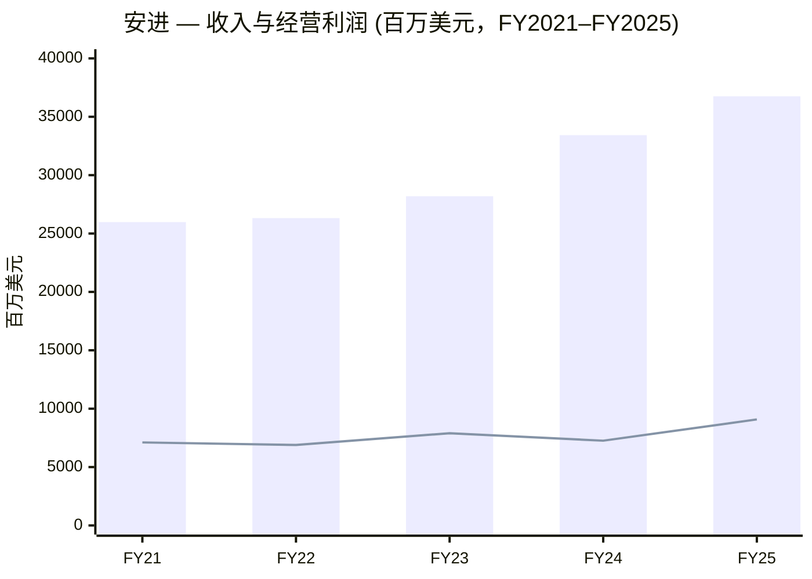
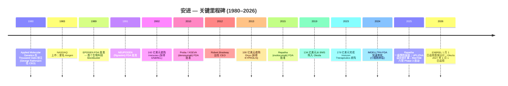
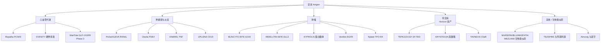
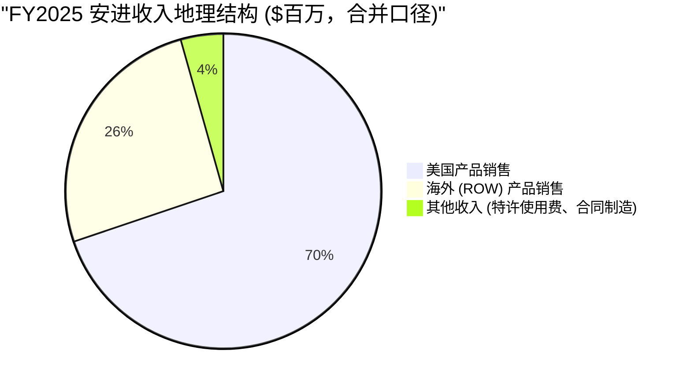
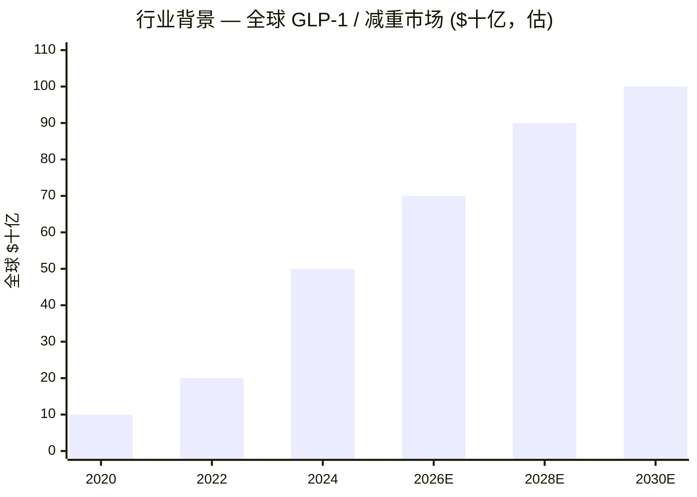
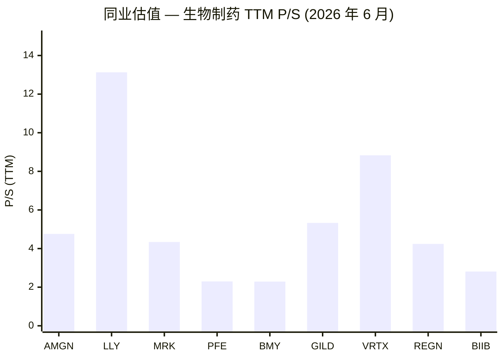
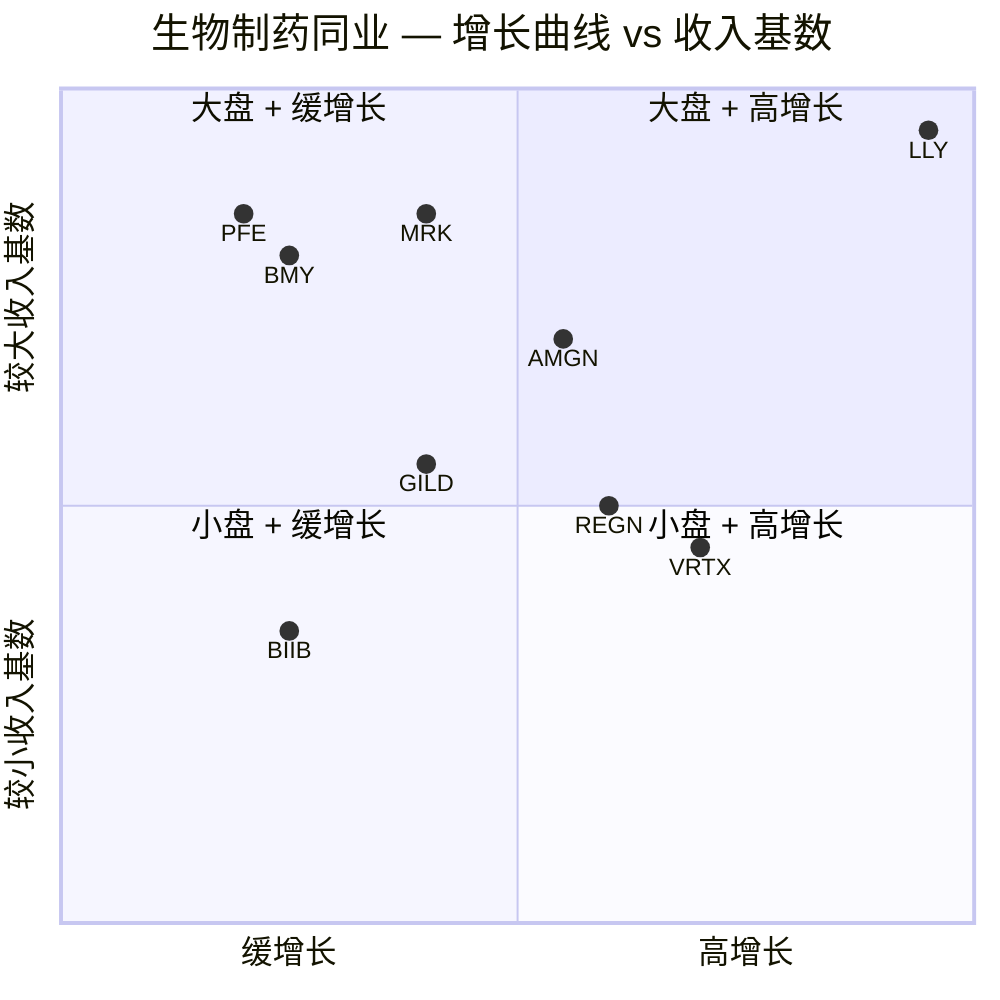
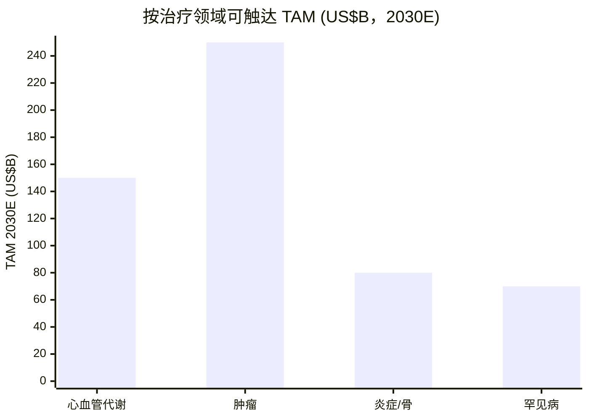

# 安进公司 (Amgen Inc.) — 首次覆盖深度研究

**股票代码:** NASDAQ: AMGN
**行业分类:** 医疗保健 → 生物科技 / 综合制药
**总部:** One Amgen Center Drive, Thousand Oaks, California 91320
**成立时间:** 1980 年 (加州成立，1987 年再注册为特拉华公司)
**全球员工 (截至 2025-12-31):** 约 31,500 人，分布于 50 多个国家
**会计师:** 安永会计师事务所 (Ernst & Young LLP)
**报告日期:** 2026-06-14 (基于 2026-02-13 提交的 FY2025 10-K 与 2026-05-01 提交的 Q1 2026 10-Q；价格 / 估值更新至 2026-06-12 收盘)

---

### 投资摘要 (Investment Summary) — *分析师观点 (Analyst view)*

| 项目 | 数值 |
|---|---|
| **评级 (Rating)** | **持有 (Hold)** — 高质量缓增长 + MariTide 免费看涨期权，当前股价基本反映 |
| **12 个月目标价 (PT)** | **368 美元** (基于 2027E 非 GAAP EPS ~23.5 × 15.5× forward P/E) |
| **当前股价** | 355.20 美元 (2026-06-12 收盘) |
| **隐含上行 (Upside)** | **+3.6%** |
| **估值方法** | forward P/E × 目标倍数；DCF 与 SOTP 交叉验证 |
| **总市值 (Market cap)** | 约 1,917 亿美元 |
| **52 周区间** | 267.83 – 391.29 美元 |
| **股息率 (Dividend yield)** | 2.84% (2026 季度股息上调至 2.52 美元，年化 10.08 美元) |
| **看涨 / 基准 / 看跌目标价** | 455 / 368 / 285 美元 (+28% / +3.6% / –20%) |

*以上整组为分析师本方观点 (house view)，不引用任何监管文件——10-K 不含目标价。*

**论点支柱 (Thesis pillars) — *分析师观点：***
1. **现金奶牛 + 期权结构。** 一个 370 亿美元收入、经营利润同比 +25%、3% 股息率的多元化生物制剂组合，叠加一份对 MariTide GLP-1/GIPR 平台的"免费看涨期权"——下行由股息现金流支撑，上行由 Phase 3 读出打开。
2. **增长引擎正抵消专利悬崖。** Repatha (+36%)、EVENITY (+34%)、TEZSPIRE (+52%)、BLINCYTO (+28%)、IMDELLTRA、UPLIZNA 构成的第二层 (+20–35% 复合) 增长，足以抵消 Prolia/XGEVA 生物类似药侵蚀与 ENBREL/Otezla 的 IRA 价格重置。
3. **MariTide 是二元摆动变量。** 2026–28 年六项 Phase 3 读出决定 FY2030 收入是 ~400 亿美元 (失败) 还是 ~550 亿美元 (成功)，也是当前所有卖方分歧的焦点——这是该股最该盯紧的单一变量。
4. **估值已基本定价。** 15.1× forward P/E 在绝对意义不贵，但相对默克 (12×)/辉瑞 (9×) 已有溢价；进一步重估需要 MariTide 兑现，而非倍数被动扩张——因此评级为持有而非买入。

---

> **2026 全年业绩指引** — 2026 年 2 月 3 日 Q4 2025 业绩发布会上，安进首次发布 2026 年全年指引：**总收入 (Total revenues) 371–385 亿美元**，**GAAP 摊薄每股收益 (diluted EPS) 15.62–17.10 美元** (非 GAAP 21.50–23.10 美元)。Q1 2026 (2026-05-01 10-Q)：**总收入 86.18 亿美元 (同比 +6%，从 81.49 亿美元)**，**经营利润 26.66 亿美元 (从 11.78 亿美元)**，**净利润 18.19 亿美元 (从 17.30 亿美元)**，**摊薄 EPS 3.34 美元 (从 3.20 美元)**。管理层重申指引区间，并将 **MariTide Phase 3 数据读出**、**IRA 法案下 ENBREL/Otezla 价格重置**、以及 **Prolia/XGEVA 生物类似药 (biosimilar / 生物仿制药) 侵蚀**列为最关键的三大变量。来源：[AMGN Q1 2026 10-Q (2026-05-01)](https://www.sec.gov/Archives/edgar/data/318154/000031815426000057/amgn-20260331.htm)；[AMGN Q1 2026 8-K 业绩发布 (2026-04-30)](https://www.sec.gov/Archives/edgar/data/318154/000031815426000054/amgn-20260331earningsrelea.htm)；[AMGN FY2025 10-K MD&A](https://www.sec.gov/Archives/edgar/data/318154/000031815426000010/amgn-20251231.htm)。

---

## 目录

1. 公司概览 (含 1A 估值与目标价、1B GF Score)
2. 公司历史 + 估值与目标价 (前瞻模型 / DCF / 看涨-基准-看跌 / 卖方观点演变)
3. 管理团队
4. 产品与服务 (含供应链资金流向图)
5. 客户与销售渠道
6. 行业概览
7. 竞争格局
8. 市场机会 (TAM/SAM)
9. 风险评估 (含 9.5 核心分歧与催化剂)
10. 投资者视角评分
11. 参考资料
12. 数据来源
13. 验证日志

---

## 1. 公司概览

安进 (Amgen Inc.) 是全球最大的独立生物科技公司之一，也是将重组 DNA 技术 (recombinant DNA technology / 重组 DNA 技术) 推向商业化的开创者之一。FY2025 Form 10-K 在开篇第一段以公司自己的语言定义业务：*"Amgen Inc. … 致力于发现、开发、生产并交付创新药物，攻克世界上最棘手的疾病。我们专注于具有高度未满足医疗需求的领域，并运用专长努力寻找显著改善人类生活、同时降低疾病社会与经济负担的解决方案。我们于 45 年前帮助创立了生物技术行业，并已成长为全球领先的独立生物科技公司之一。"* 公司财务报告披露中**仅设立一个经营分部 (operating segment)**：人体治疗药物 (human therapeutics)；但在管理层讨论与分析 (MD&A) 中按区域 (美国 / 海外) 与产品分别披露收入，详见 [FY2025 10-K Item 1 业务介绍与 Note 19 分部信息](https://www.sec.gov/Archives/edgar/data/318154/000031815426000010/amgn-20251231.htm)。

公司的产品组合由 **14 个 FY2025 销售额超过 10 亿美元的上市药物 (blockbuster)** 为核心，覆盖肿瘤、心血管代谢、炎症、骨健康、罕见病等治疗领域。FY2025 收入同比 **+10% 至 367.51 亿美元** (FY2024 为 334.24 亿美元，FY2023 为 281.90 亿美元；2024 年的 +19% 增长主要由 2023 年 10 月 6 日完成的 278 亿美元 Horizon Therapeutics 收购全年并表所驱动)；**经营利润 (Operating income) 90.80 亿美元** (同比 +25%)；**净利润 (Net income) 77.11 亿美元** (同比 +89%，2024 年基数因 Horizon 相关一次性费用而偏低)；**摊薄 EPS 14.23 美元**。FY2025 产品销售的底层驱动是 **+13% 的销量增长**部分被 **–3% 的净售价下滑**抵消，详见 [FY2025 10-K Results of Operations pp. 63–66](https://www.sec.gov/Archives/edgar/data/318154/000031815426000010/amgn-20251231.htm)。

当前的资本结构折射出 2023 年 Horizon 并购的影响：**长期债务 (Long-term debt) 500 亿美元 + 一年内到期长债 46 亿美元 = 546 亿美元**；对应现金及现金等价物 91 亿美元；**净债务 (Net debt) 约 455 亿美元**；杠杆率仍远高于并购前水平。管理层在 2025 年偿还了 60 亿美元长期债务，并明确**继续去杠杆**的策略，同时维持季度股息 (2025 年再次上调) 与俄亥俄、北卡罗来纳、波多黎各等产能建设投资。[FY2025 10-K MD&A Selected Financial Data, p. 73](https://www.sec.gov/Archives/edgar/data/318154/000031815426000010/amgn-20251231.htm) 显示总资产 905.86 亿美元，股东权益仅 86.58 亿美元 (从 2024 年的 58.77 亿美元有所恢复) — 与 500 亿美元长期债务相比，股东权益垫显得偏薄，这是后 Horizon 时代安进资产负债表最为突出的特征之一。

公司战略由三条腿支撑：(i) 由 Repatha、Prolia、Otezla、ENBREL、EVENITY、XGEVA、BLINCYTO、Nplate、KYPROLIS、Aranesp、Vectibix、Neulasta 等成熟生物制剂构成的**现金牛 (cash cow)** 业务，为再投资提供现金流；(ii) Horizon 罕见病组合 — 包括 **TEPEZZA** (teprotumumab，全球唯一获批治疗甲状腺眼病 TED 的药物)、**KRYSTEXXA** (pegloticase，治疗慢性顽固性痛风)、**UPLIZNA** (inebilizumab，2025 年获 FDA 批准用于 IgG4 相关疾病 IgG4-RD 与广泛性肌无力 gMG)、**TAVNEOS** (avacopan，治疗 ANCA 相关血管炎)；(iii) 由 **MariTide (maridebart cafraglutide)** 为核心的高风险高回报代谢管线 — 一款激活 GLP-1 受体 (glucagon-like peptide-1 receptor) 并拮抗 GIPR (glucose-dependent insulinotropic polypeptide receptor) 的抗体–肽偶联物 (antibody-peptide conjugate, APC)，目前正进行**六项全球三期 (Phase 3) 临床试验**，覆盖慢性体重管理 (含 / 不含 2 型糖尿病)、心血管疾病、心力衰竭、阻塞性睡眠呼吸暂停 (OSA) 等适应症，详见 [FY2025 10-K Significant Developments, pp. 1–3](https://www.sec.gov/Archives/edgar/data/318154/000031815426000010/amgn-20251231.htm)。这条管线决定了未来 24 个月安进估值故事是"成熟特许经营 + 特殊机会"还是"第三家拥有可信 GLP-1 平台的大药企"的关键二元变量，也是当前所有卖方研究争论的焦点。

**估值快照 (2026-06-12 收盘，数据来源：Yahoo Finance Key Statistics 与 stockanalysis.com)。** AMGN 当前股价 **355.20 美元**，总市值 **约 1,917 亿美元**，**TTM 市盈率 (P/E) 24.7 倍** (基于 FY2025 摊薄 EPS 14.23 美元)、**前瞻市盈率 (Forward P/E) 15.1 倍**、**市销率 (P/S) 5.2 倍** (基于 FY2025 总收入 367.51 亿美元)、**EV/EBITDA 约 14 倍**、**股息率 (Dividend yield) 2.84%** (2026 年季度股息上调至 2.52 美元、年化 10.08 美元)、贝塔 (beta) 0.42，52 周价格区间 267.83–391.29 美元，来源：[Yahoo Finance AMGN](https://finance.yahoo.com/quote/AMGN/key-statistics)。自上次覆盖 (2026-06-02 收盘 328.26 美元) 以来股价上涨约 +8%，反映 Q1 2026 经营利润大幅改善 (从 11.78 亿至 26.66 亿美元) 与市场对 MariTide Phase 3 时间线的乐观预期。市场对 AMGN 的定价在前瞻 P/E 与股息率上低于大型药企同业平均，但显著高于已陷入产品周期低谷的辉瑞 (PFE ~9× fwd P/E) 与百时美施贵宝 (BMY ~9× fwd P/E)，同业组数据 (LLY, MRK, PFE, BMY, GILD, VRTX, REGN, BIIB) 见第 7 节。

**估值解读。** 一家收入 370 亿美元、收入同比 +10%、经营利润同比 +25% 的生物科技公司，15× 前瞻 P/E 在绝对意义上**并非偏高**：略高于默克 (12×) 与辉瑞 / 百时美 (9×)，远低于礼来 (24×) 与 Vertex (20×)。市场对 AMGN 的定价更像是 **"高质量缓增长 + 看涨期权"** 而非真正的 GLP-1 纯粹标的：若 MariTide 三期数据有竞争力地读出，估值有清晰的向礼来式溢价方向重估的空间；若 MariTide 读出不利，估值底由旗下成熟生物制剂的股息现金流支撑。5.2× P/S 显著低于礼来 (13×) 与吉利德 (5.3×)，略高于默克 (4.3×)，处于大型生物制药同业的中位数而非顶部四分位。因此当前估值**不应**被简单定义为"折价"或"溢价"；更准确的框架是**期权定价**：股价中包含一份对 MariTide 的免费看涨期权 (free call option) 与一份对现金奶牛产品组合定价充分的看跌支撑 (put-supported floor)。前瞻 P/E 已从上次覆盖的 14.0× 抬升至 15.1×，说明股价上涨快于盈利预期上修——这是评级定为持有 (Hold) 而非买入的核心原因。

*来源：[FY2025 10-K Selected Financial Data 与 Results of Operations](https://www.sec.gov/Archives/edgar/data/318154/000031815426000010/amgn-20251231.htm)。*

**FY2025 利润表如何流动 (Sankey)。** 下图把 FY2025 收入 367.51 亿美元一路拆到净利润 77.11 亿美元：收入分为美国产品销售 256.56 亿、海外产品销售 94.92 亿与其他收入 16.03 亿；扣除 COGS 120.37 亿得毛利 247.14 亿；再扣 R&D 72.72 亿、SG&A 70.50 亿与其他经营费用 13.12 亿得经营利润 90.80 亿；加净利息 –27.55 亿与其他收入净额 +26.51 亿、扣所得税 12.65 亿，得净利润 77.11 亿。来源：[FY2025 10-K Item 7 MD&A Results of Operations, pp. 60–66](https://www.sec.gov/Archives/edgar/data/318154/000031815426000010/amgn-20251231.htm)。

<svg xmlns="http://www.w3.org/2000/svg" viewBox="0 0 1000 560" width="1000" height="560" role="img" aria-label="income statement Sankey"><rect x="0" y="0" width="1000" height="560" fill="#ffffff"/>
<text x="20.00" y="30.00" text-anchor="start" font-family="Helvetica,Arial,sans-serif" font-size="15" font-weight="700" fill="#1f2933">安进 FY2025 利润表 Sankey (US$M)</text>
<path d="M 204.00,71.00 C 258.00,71.00 258.00,85.00 312.00,85.00 L 312.00,369.83 C 258.00,369.83 258.00,355.83 204.00,355.83 Z" fill="#93c5fd" fill-opacity="0.55"/>
<path d="M 452.00,78.00 C 506.00,78.00 506.00,144.82 560.00,144.82 L 560.00,245.62 C 506.00,245.62 506.00,178.80 452.00,178.80 Z" fill="#86efac" fill-opacity="0.55"/>
<path d="M 452.00,178.80 C 506.00,178.80 506.00,259.62 560.00,259.62 L 560.00,433.18 C 506.00,433.18 506.00,352.37 452.00,352.37 Z" fill="#fca5a5" fill-opacity="0.55"/>
<path d="M 328.00,85.00 C 382.00,85.00 382.00,78.00 436.00,78.00 L 436.00,352.37 C 382.00,352.37 382.00,359.37 328.00,359.37 Z" fill="#86efac" fill-opacity="0.55"/>
<path d="M 328.00,359.37 C 382.00,359.37 382.00,366.37 436.00,366.37 L 436.00,500.00 C 382.00,500.00 382.00,493.00 328.00,493.00 Z" fill="#fca5a5" fill-opacity="0.55"/>
<path d="M 700.00,131.39 C 754.00,131.39 754.00,232.18 808.00,232.18 L 808.00,317.78 C 754.00,317.78 754.00,217.00 700.00,217.00 Z" fill="#86efac" fill-opacity="0.55"/>
<path d="M 700.00,217.00 C 754.00,217.00 754.00,331.78 808.00,331.78 L 808.00,345.82 C 754.00,345.82 754.00,231.04 700.00,231.04 Z" fill="#fca5a5" fill-opacity="0.55"/>
<path d="M 576.00,144.82 C 630.00,144.82 630.00,131.39 684.00,131.39 L 684.00,232.20 C 630.00,232.20 630.00,245.62 576.00,245.62 Z" fill="#86efac" fill-opacity="0.55"/>
<path d="M 576.00,259.62 C 630.00,259.62 630.00,245.04 684.00,245.04 L 684.00,323.31 C 630.00,323.31 630.00,337.89 576.00,337.89 Z" fill="#fca5a5" fill-opacity="0.55"/>
<path d="M 576.00,337.89 C 630.00,337.89 630.00,337.31 684.00,337.31 L 684.00,418.04 C 630.00,418.04 630.00,418.62 576.00,418.62 Z" fill="#fca5a5" fill-opacity="0.55"/>
<path d="M 576.00,418.62 C 630.00,418.62 630.00,432.04 684.00,432.04 L 684.00,446.61 C 630.00,446.61 630.00,433.18 576.00,433.18 Z" fill="#fca5a5" fill-opacity="0.55"/>
<path d="M 204.00,369.83 C 258.00,369.83 258.00,369.83 312.00,369.83 L 312.00,475.20 C 258.00,475.20 258.00,475.20 204.00,475.20 Z" fill="#93c5fd" fill-opacity="0.55"/>
<path d="M 204.00,489.20 C 258.00,489.20 258.00,475.20 312.00,475.20 L 312.00,493.00 C 258.00,493.00 258.00,507.00 204.00,507.00 Z" fill="#93c5fd" fill-opacity="0.55"/>
<rect x="188.00" y="71.00" width="16" height="284.83" rx="1.5" fill="#2563eb"/>
<rect x="188.00" y="369.83" width="16" height="105.38" rx="1.5" fill="#2563eb"/>
<rect x="188.00" y="489.20" width="16" height="17.80" rx="1.5" fill="#2563eb"/>
<rect x="312.00" y="85.00" width="16" height="408.00" rx="1.5" fill="#1e3a8a"/>
<rect x="436.00" y="78.00" width="16" height="274.37" rx="1.5" fill="#15803d"/>
<rect x="436.00" y="366.37" width="16" height="133.63" rx="1.5" fill="#dc2626"/>
<rect x="560.00" y="144.82" width="16" height="100.80" rx="1.5" fill="#15803d"/>
<rect x="560.00" y="259.62" width="16" height="173.56" rx="1.5" fill="#dc2626"/>
<rect x="684.00" y="131.39" width="16" height="99.65" rx="1.5" fill="#15803d"/>
<rect x="684.00" y="245.04" width="16" height="78.27" rx="1.5" fill="#dc2626"/>
<rect x="684.00" y="337.31" width="16" height="80.73" rx="1.5" fill="#dc2626"/>
<rect x="684.00" y="432.04" width="16" height="14.57" rx="1.5" fill="#dc2626"/>
<rect x="808.00" y="232.18" width="16" height="85.61" rx="1.5" fill="#15803d"/>
<rect x="808.00" y="331.78" width="16" height="14.04" rx="1.5" fill="#dc2626"/>
<line x1="188.00" y1="213.41" x2="182.00" y2="202.31" stroke="#cbd5e1" stroke-width="1"/>
<text x="179.00" y="205.31" text-anchor="end" font-family="Helvetica,Arial,sans-serif" font-size="11.5" font-weight="700" fill="#1f2933">US 产品销售</text>
<text x="179.00" y="218.31" text-anchor="end" font-family="Helvetica,Arial,sans-serif" font-size="10" font-weight="400" fill="#52606d">US$25.7B  (69.8%)</text>
<line x1="188.00" y1="422.52" x2="182.00" y2="411.41" stroke="#cbd5e1" stroke-width="1"/>
<text x="179.00" y="414.41" text-anchor="end" font-family="Helvetica,Arial,sans-serif" font-size="11.5" font-weight="700" fill="#1f2933">海外产品销售</text>
<text x="179.00" y="427.41" text-anchor="end" font-family="Helvetica,Arial,sans-serif" font-size="10" font-weight="400" fill="#52606d">US$9.5B  (25.8%)</text>
<line x1="188.00" y1="498.10" x2="182.00" y2="487.00" stroke="#cbd5e1" stroke-width="1"/>
<text x="179.00" y="490.00" text-anchor="end" font-family="Helvetica,Arial,sans-serif" font-size="11.5" font-weight="700" fill="#1f2933">其他收入</text>
<text x="179.00" y="503.00" text-anchor="end" font-family="Helvetica,Arial,sans-serif" font-size="10" font-weight="400" fill="#52606d">US$1.6B  (4.4%)</text>
<rect x="331.00" y="67.00" width="119.40" height="26" rx="2" fill="#ffffff" fill-opacity="0.72"/>
<text x="334.00" y="79.00" text-anchor="start" font-family="Helvetica,Arial,sans-serif" font-size="11.5" font-weight="700" fill="#1f2933">Revenue</text>
<text x="334.00" y="92.00" text-anchor="start" font-family="Helvetica,Arial,sans-serif" font-size="10" font-weight="400" fill="#52606d">US$36.8B  (100.0%)</text>
<rect x="455.00" y="60.00" width="113.10" height="26" rx="2" fill="#ffffff" fill-opacity="0.72"/>
<text x="458.00" y="72.00" text-anchor="start" font-family="Helvetica,Arial,sans-serif" font-size="11.5" font-weight="700" fill="#1f2933">Gross Profit</text>
<text x="458.00" y="85.00" text-anchor="start" font-family="Helvetica,Arial,sans-serif" font-size="10" font-weight="400" fill="#52606d">US$24.7B  (67.2%)</text>
<rect x="455.00" y="348.37" width="144.60" height="26" rx="2" fill="#ffffff" fill-opacity="0.72"/>
<text x="458.00" y="360.37" text-anchor="start" font-family="Helvetica,Arial,sans-serif" font-size="11.5" font-weight="700" fill="#1f2933">Cost of Revenue (COGS)</text>
<text x="458.00" y="373.37" text-anchor="start" font-family="Helvetica,Arial,sans-serif" font-size="10" font-weight="400" fill="#52606d">US$12.0B  (32.8%)</text>
<rect x="579.00" y="126.82" width="106.80" height="26" rx="2" fill="#ffffff" fill-opacity="0.72"/>
<text x="582.00" y="138.82" text-anchor="start" font-family="Helvetica,Arial,sans-serif" font-size="11.5" font-weight="700" fill="#1f2933">Operating Income</text>
<text x="582.00" y="151.82" text-anchor="start" font-family="Helvetica,Arial,sans-serif" font-size="10" font-weight="400" fill="#52606d">US$9.1B  (24.7%)</text>
<rect x="579.00" y="241.62" width="150.90" height="26" rx="2" fill="#ffffff" fill-opacity="0.72"/>
<text x="582.00" y="253.62" text-anchor="start" font-family="Helvetica,Arial,sans-serif" font-size="11.5" font-weight="700" fill="#1f2933">Total Operating Expense</text>
<text x="582.00" y="266.62" text-anchor="start" font-family="Helvetica,Arial,sans-serif" font-size="10" font-weight="400" fill="#52606d">US$15.6B  (42.5%)</text>
<rect x="703.00" y="113.39" width="106.80" height="26" rx="2" fill="#ffffff" fill-opacity="0.72"/>
<text x="706.00" y="125.39" text-anchor="start" font-family="Helvetica,Arial,sans-serif" font-size="11.5" font-weight="700" fill="#1f2933">Pretax Income</text>
<text x="706.00" y="138.39" text-anchor="start" font-family="Helvetica,Arial,sans-serif" font-size="10" font-weight="400" fill="#52606d">US$9.0B  (24.4%)</text>
<rect x="703.00" y="227.04" width="106.80" height="26" rx="2" fill="#ffffff" fill-opacity="0.72"/>
<text x="706.00" y="239.04" text-anchor="start" font-family="Helvetica,Arial,sans-serif" font-size="11.5" font-weight="700" fill="#1f2933">SG&amp;A</text>
<text x="706.00" y="252.04" text-anchor="start" font-family="Helvetica,Arial,sans-serif" font-size="10" font-weight="400" fill="#52606d">US$7.0B  (19.2%)</text>
<rect x="703.00" y="319.31" width="106.80" height="26" rx="2" fill="#ffffff" fill-opacity="0.72"/>
<text x="706.00" y="331.31" text-anchor="start" font-family="Helvetica,Arial,sans-serif" font-size="11.5" font-weight="700" fill="#1f2933">R&amp;D</text>
<text x="706.00" y="344.31" text-anchor="start" font-family="Helvetica,Arial,sans-serif" font-size="10" font-weight="400" fill="#52606d">US$7.3B  (19.8%)</text>
<rect x="703.00" y="414.04" width="100.50" height="26" rx="2" fill="#ffffff" fill-opacity="0.72"/>
<text x="706.00" y="426.04" text-anchor="start" font-family="Helvetica,Arial,sans-serif" font-size="11.5" font-weight="700" fill="#1f2933">Other OpEx</text>
<text x="706.00" y="439.04" text-anchor="start" font-family="Helvetica,Arial,sans-serif" font-size="10" font-weight="400" fill="#52606d">US$1.3B  (3.6%)</text>
<text x="833.00" y="271.98" text-anchor="start" font-family="Helvetica,Arial,sans-serif" font-size="11.5" font-weight="700" fill="#1f2933">Net Income</text>
<text x="833.00" y="284.98" text-anchor="start" font-family="Helvetica,Arial,sans-serif" font-size="10" font-weight="400" fill="#52606d">US$7.7B  (21.0%)</text>
<text x="833.00" y="335.80" text-anchor="start" font-family="Helvetica,Arial,sans-serif" font-size="11.5" font-weight="700" fill="#1f2933">Income Tax</text>
<text x="833.00" y="348.80" text-anchor="start" font-family="Helvetica,Arial,sans-serif" font-size="10" font-weight="400" fill="#52606d">US$1.3B  (3.4%)</text>
<text x="500.00" y="544.00" text-anchor="middle" font-family="Helvetica,Arial,sans-serif" font-size="10" font-weight="400" fill="#52606d">Source: Amgen FY2025 10-K (Item 7 MD&amp;A) · as of 2026-06-14</text>
</svg>

*来源：[FY2025 10-K Item 7 MD&A Results of Operations](https://www.sec.gov/Archives/edgar/data/318154/000031815426000010/amgn-20251231.htm)。*

**产品销售按治疗领域与按地区。** FY2025 产品销售 351.48 亿美元中，骨健康/炎症 (Prolia+XGEVA+Otezla+ENBREL) 约 109.89 亿为最大块，其次"其他/生物类似药"101.28 亿、肿瘤 56.70 亿、心血管代谢 51.16 亿、罕见病 (Horizon) 32.43 亿 (治疗领域为分析师按产品表归类)；按地区则美国 256.56 亿占 73%、海外 94.92 亿占 27%。来源：[FY2025 10-K Note: revenues by geographic area 与 MD&A 产品表](https://www.sec.gov/Archives/edgar/data/318154/000031815426000010/amgn-20251231.htm)。

<svg xmlns="http://www.w3.org/2000/svg" viewBox="0 0 720 460" width="720" height="460" role="img" aria-label="revenue donut"><rect x="0" y="0" width="720" height="460" fill="#ffffff"/>
<text x="20.00" y="30.00" text-anchor="start" font-family="Helvetica,Arial,sans-serif" font-size="15" font-weight="700" fill="#1f2933">安进 FY2025 产品销售按治疗领域 (US$M, 分析师归类)</text>
<path d="M 288.00,107.20 A 132 132 0 0 1 409.90,289.84 L 360.03,269.12 A 78 78 0 0 0 288.00,161.20 Z" fill="#2563eb"/>
<path d="M 409.90,289.84 A 132 132 0 0 1 209.85,345.58 L 241.82,302.06 A 78 78 0 0 0 360.03,269.12 Z" fill="#15803d"/>
<path d="M 209.85,345.58 A 132 132 0 0 1 156.39,229.12 L 210.23,233.24 A 78 78 0 0 0 241.82,302.06 Z" fill="#d97706"/>
<path d="M 156.39,229.12 A 132 132 0 0 1 215.69,128.77 L 245.27,173.95 A 78 78 0 0 0 210.23,233.24 Z" fill="#7c3aed"/>
<path d="M 215.69,128.77 A 132 132 0 0 1 288.00,107.20 L 288.00,161.20 A 78 78 0 0 0 245.27,173.95 Z" fill="#dc2626"/>
<text x="288.00" y="235.20" text-anchor="middle" font-family="Helvetica,Arial,sans-serif" font-size="18" font-weight="800" fill="#1f2933">AMGN</text>
<text x="288.00" y="255.20" text-anchor="middle" font-family="Helvetica,Arial,sans-serif" font-size="13" font-weight="600" fill="#52606d">US$35.1B</text>
<text x="288.00" y="271.20" text-anchor="middle" font-family="Helvetica,Arial,sans-serif" font-size="10" font-weight="400" fill="#8a97a3">total</text>
<line x1="402.78" y1="162.59" x2="418.78" y2="162.59" stroke="#2563eb" stroke-width="1.4"/>
<text x="422.78" y="160.59" text-anchor="start" font-family="Helvetica,Arial,sans-serif" font-size="11" font-weight="700" fill="#1f2933">骨健康/炎症</text>
<text x="422.78" y="174.59" text-anchor="start" font-family="Helvetica,Arial,sans-serif" font-size="10" font-weight="400" fill="#52606d">US$11.0B  (31.3%)</text>
<line x1="325.04" y1="372.14" x2="341.04" y2="372.14" stroke="#15803d" stroke-width="1.4"/>
<text x="345.04" y="370.14" text-anchor="start" font-family="Helvetica,Arial,sans-serif" font-size="11" font-weight="700" fill="#1f2933">其他/生物类似药</text>
<text x="345.04" y="384.14" text-anchor="start" font-family="Helvetica,Arial,sans-serif" font-size="10" font-weight="400" fill="#52606d">US$10.1B  (28.8%)</text>
<line x1="162.59" y1="296.78" x2="146.59" y2="296.78" stroke="#d97706" stroke-width="1.4"/>
<text x="142.59" y="294.78" text-anchor="end" font-family="Helvetica,Arial,sans-serif" font-size="11" font-weight="700" fill="#1f2933">肿瘤</text>
<text x="142.59" y="308.78" text-anchor="end" font-family="Helvetica,Arial,sans-serif" font-size="10" font-weight="400" fill="#52606d">US$5.7B  (16.1%)</text>
<line x1="169.19" y1="168.99" x2="153.19" y2="168.99" stroke="#7c3aed" stroke-width="1.4"/>
<text x="149.19" y="166.99" text-anchor="end" font-family="Helvetica,Arial,sans-serif" font-size="11" font-weight="700" fill="#1f2933">心血管代谢</text>
<text x="149.19" y="180.99" text-anchor="end" font-family="Helvetica,Arial,sans-serif" font-size="10" font-weight="400" fill="#52606d">US$5.1B  (14.6%)</text>
<line x1="248.55" y1="106.96" x2="232.55" y2="106.96" stroke="#dc2626" stroke-width="1.4"/>
<text x="228.55" y="104.96" text-anchor="end" font-family="Helvetica,Arial,sans-serif" font-size="11" font-weight="700" fill="#1f2933">罕见病 (Horizon)</text>
<text x="228.55" y="118.96" text-anchor="end" font-family="Helvetica,Arial,sans-serif" font-size="10" font-weight="400" fill="#52606d">US$3.2B  (9.2%)</text>
<text x="360.00" y="444.00" text-anchor="middle" font-family="Helvetica,Arial,sans-serif" font-size="10" font-weight="400" fill="#52606d">Source: Amgen FY2025 10-K Item 7 MD&amp;A product sales table · as of 2026-06-14</text>
</svg>

<svg xmlns="http://www.w3.org/2000/svg" viewBox="0 0 720 460" width="720" height="460" role="img" aria-label="revenue donut"><rect x="0" y="0" width="720" height="460" fill="#ffffff"/>
<text x="20.00" y="30.00" text-anchor="start" font-family="Helvetica,Arial,sans-serif" font-size="15" font-weight="700" fill="#1f2933">安进 FY2025 产品销售按地区 (US$M)</text>
<path d="M 288.00,107.20 A 132 132 0 1 1 157.05,255.79 L 210.62,249.00 A 78 78 0 1 0 288.00,161.20 Z" fill="#2563eb"/>
<path d="M 157.05,255.79 A 132 132 0 0 1 288.00,107.20 L 288.00,161.20 A 78 78 0 0 0 210.62,249.00 Z" fill="#15803d"/>
<text x="288.00" y="235.20" text-anchor="middle" font-family="Helvetica,Arial,sans-serif" font-size="18" font-weight="800" fill="#1f2933">73% US</text>
<text x="288.00" y="255.20" text-anchor="middle" font-family="Helvetica,Arial,sans-serif" font-size="13" font-weight="600" fill="#52606d">US$35.1B</text>
<text x="288.00" y="271.20" text-anchor="middle" font-family="Helvetica,Arial,sans-serif" font-size="10" font-weight="400" fill="#8a97a3">total</text>
<line x1="391.53" y1="330.44" x2="407.53" y2="330.44" stroke="#2563eb" stroke-width="1.4"/>
<text x="411.53" y="328.44" text-anchor="start" font-family="Helvetica,Arial,sans-serif" font-size="11" font-weight="700" fill="#1f2933">美国</text>
<text x="411.53" y="342.44" text-anchor="start" font-family="Helvetica,Arial,sans-serif" font-size="10" font-weight="400" fill="#52606d">US$25.7B  (73.0%)</text>
<line x1="184.47" y1="147.96" x2="168.47" y2="147.96" stroke="#15803d" stroke-width="1.4"/>
<text x="164.47" y="145.96" text-anchor="end" font-family="Helvetica,Arial,sans-serif" font-size="11" font-weight="700" fill="#1f2933">海外 (ROW)</text>
<text x="164.47" y="159.96" text-anchor="end" font-family="Helvetica,Arial,sans-serif" font-size="10" font-weight="400" fill="#52606d">US$9.5B  (27.0%)</text>
<text x="360.00" y="444.00" text-anchor="middle" font-family="Helvetica,Arial,sans-serif" font-size="10" font-weight="400" fill="#52606d">Source: Amgen FY2025 10-K Item 7 Results of Operations · as of 2026-06-14</text>
</svg>

*来源：[FY2025 10-K Item 7 Results of Operations 与 revenues by geographic area note](https://www.sec.gov/Archives/edgar/data/318154/000031815426000010/amgn-20251231.htm)。*

**收入三年构成 (FY2023–FY2025)。** 总收入从 FY2023 的 281.90 亿增至 FY2025 的 367.51 亿，主要由美国产品销售从 192.72 亿增至 256.56 亿驱动 (其中 FY2024 的跃升含 Horizon 全年并表)；海外产品销售从 76.38 亿增至 94.92 亿，其他收入从 12.80 亿增至 16.03 亿。来源：[FY2025 10-K Note: revenues by geographic area](https://www.sec.gov/Archives/edgar/data/318154/000031815426000010/amgn-20251231.htm)。

<svg xmlns="http://www.w3.org/2000/svg" viewBox="0 0 860 470" width="860" height="470" role="img" aria-label="historical revenue bars"><rect x="0" y="0" width="860" height="470" fill="#ffffff"/>
<text x="20.00" y="30.00" text-anchor="start" font-family="Helvetica,Arial,sans-serif" font-size="15" font-weight="700" fill="#1f2933">安进收入构成 FY2023–FY2025 (US$M, 按地区)</text>
<rect x="20.00" y="44" width="11" height="11" rx="2" fill="#2563eb"/>
<text x="36.00" y="53.00" text-anchor="start" font-family="Helvetica,Arial,sans-serif" font-size="10.5" font-weight="400" fill="#1f2933">美国产品销售</text>
<rect x="89.60" y="44" width="11" height="11" rx="2" fill="#15803d"/>
<text x="105.60" y="53.00" text-anchor="start" font-family="Helvetica,Arial,sans-serif" font-size="10.5" font-weight="400" fill="#1f2933">海外产品销售</text>
<rect x="159.20" y="44" width="11" height="11" rx="2" fill="#d97706"/>
<text x="175.20" y="53.00" text-anchor="start" font-family="Helvetica,Arial,sans-serif" font-size="10.5" font-weight="400" fill="#1f2933">其他收入</text>
<line x1="70" y1="412.00" x2="834" y2="412.00" stroke="#eceff2" stroke-width="1"/>
<text x="64.00" y="415.00" text-anchor="end" font-family="Helvetica,Arial,sans-serif" font-size="9.5" font-weight="400" fill="#52606d">US$0</text>
<line x1="70" y1="345.20" x2="834" y2="345.20" stroke="#eceff2" stroke-width="1"/>
<text x="64.00" y="348.20" text-anchor="end" font-family="Helvetica,Arial,sans-serif" font-size="9.5" font-weight="400" fill="#52606d">US$7.9B</text>
<line x1="70" y1="278.40" x2="834" y2="278.40" stroke="#eceff2" stroke-width="1"/>
<text x="64.00" y="281.40" text-anchor="end" font-family="Helvetica,Arial,sans-serif" font-size="9.5" font-weight="400" fill="#52606d">US$15.9B</text>
<line x1="70" y1="211.60" x2="834" y2="211.60" stroke="#eceff2" stroke-width="1"/>
<text x="64.00" y="214.60" text-anchor="end" font-family="Helvetica,Arial,sans-serif" font-size="9.5" font-weight="400" fill="#52606d">US$23.8B</text>
<line x1="70" y1="144.80" x2="834" y2="144.80" stroke="#eceff2" stroke-width="1"/>
<text x="64.00" y="147.80" text-anchor="end" font-family="Helvetica,Arial,sans-serif" font-size="9.5" font-weight="400" fill="#52606d">US$31.8B</text>
<line x1="70" y1="78.00" x2="834" y2="78.00" stroke="#eceff2" stroke-width="1"/>
<text x="64.00" y="81.00" text-anchor="end" font-family="Helvetica,Arial,sans-serif" font-size="9.5" font-weight="400" fill="#52606d">US$39.7B</text>
<rect x="123.48" y="249.83" width="147.71" height="162.17" fill="#2563eb"/>
<rect x="123.48" y="185.55" width="147.71" height="64.27" fill="#15803d"/>
<rect x="123.48" y="174.78" width="147.71" height="10.77" fill="#d97706"/>
<text x="197.33" y="428.00" text-anchor="middle" font-family="Helvetica,Arial,sans-serif" font-size="10" font-weight="400" fill="#52606d">2023</text>
<rect x="378.15" y="215.92" width="147.71" height="196.08" fill="#2563eb"/>
<rect x="378.15" y="142.50" width="147.71" height="73.42" fill="#15803d"/>
<rect x="378.15" y="130.74" width="147.71" height="11.76" fill="#d97706"/>
<text x="452.00" y="428.00" text-anchor="middle" font-family="Helvetica,Arial,sans-serif" font-size="10" font-weight="400" fill="#52606d">2024</text>
<rect x="632.81" y="196.11" width="147.71" height="215.89" fill="#2563eb"/>
<rect x="632.81" y="116.23" width="147.71" height="79.88" fill="#15803d"/>
<rect x="632.81" y="102.74" width="147.71" height="13.49" fill="#d97706"/>
<text x="706.67" y="428.00" text-anchor="middle" font-family="Helvetica,Arial,sans-serif" font-size="10" font-weight="400" fill="#52606d">2025</text>
<text x="430.00" y="454.00" text-anchor="middle" font-family="Helvetica,Arial,sans-serif" font-size="10" font-weight="400" fill="#52606d">Source: Amgen FY2025 10-K Note: revenues by geographic area (US/ROW) · as of 2026-06-14</text>
</svg>

*来源：[FY2025 10-K Note: revenues by geographic area (US/ROW)](https://www.sec.gov/Archives/edgar/data/318154/000031815426000010/amgn-20251231.htm)。*

---

## 1B. GF Score (GuruFocus 式基本面评分) — *分析师观点 (Analyst view)*

下面的 GF Score 是**分析师自有评分框架** (模仿 GuruFocus GF Score™)，五个维度各 0–10 分，加权映射到 0–100 综合分。**它不是 GuruFocus 官方数字，不引用任何监管文件**；每个底层指标的引用见各维度理由段。安进综合得分 **60 / 100** (51–70 区间，GuruFocus 对应"未来表现潜力一般")——这与本报告"高质量但缓增长、估值已定价"的整体判断一致。

<svg xmlns="http://www.w3.org/2000/svg" viewBox="0 0 500 500" width="500" height="500" role="img" aria-label="GF Score radar">
<rect x="0" y="0" width="500" height="500" fill="#ffffff"/>
<text x="20" y="24" font-family="Helvetica,Arial,sans-serif" font-size="15" font-weight="700" fill="#1f2933">GF Score (GuruFocus-style): 60/100</text>
<text x="20" y="41" font-family="Helvetica,Arial,sans-serif" font-size="11" fill="#52606d">51–70 Poor future performance potential</text>
<polygon points="250.0,88.0 392.7,191.6 338.2,359.4 161.8,359.4 107.3,191.6" fill="#e9f5ec" stroke="none"/>
<polygon points="250.0,208.0 278.5,228.7 267.6,262.3 232.4,262.3 221.5,228.7" fill="none" stroke="#c5d3cb" stroke-width="1"/>
<polygon points="250.0,178.0 307.1,219.5 285.3,286.5 214.7,286.5 192.9,219.5" fill="none" stroke="#c5d3cb" stroke-width="1"/>
<polygon points="250.0,148.0 335.6,210.2 302.9,310.8 197.1,310.8 164.4,210.2" fill="none" stroke="#c5d3cb" stroke-width="1"/>
<polygon points="250.0,118.0 364.1,200.9 320.5,335.1 179.5,335.1 135.9,200.9" fill="none" stroke="#c5d3cb" stroke-width="1"/>
<polygon points="250.0,88.0 392.7,191.6 338.2,359.4 161.8,359.4 107.3,191.6" fill="none" stroke="#c5d3cb" stroke-width="1.3"/>
<line x1="250" y1="238" x2="161.8" y2="359.4" stroke="#cfdad3" stroke-width="1"/>
<text x="146.5" y="392.4" text-anchor="end" font-family="Helvetica,Arial,sans-serif" font-size="11.5" font-weight="600" fill="#1f2933">财务实力</text>
<text x="214.7" y="280.5" text-anchor="middle" font-family="Helvetica,Arial,sans-serif" font-size="10.5" font-weight="700" fill="#1f2933">4</text>
<line x1="250" y1="238" x2="250.0" y2="88.0" stroke="#cfdad3" stroke-width="1"/>
<text x="250.0" y="58.0" text-anchor="middle" font-family="Helvetica,Arial,sans-serif" font-size="11.5" font-weight="600" fill="#1f2933">盈利能力</text>
<text x="250.0" y="127.0" text-anchor="middle" font-family="Helvetica,Arial,sans-serif" font-size="10.5" font-weight="700" fill="#1f2933">7</text>
<line x1="250" y1="238" x2="107.3" y2="191.6" stroke="#cfdad3" stroke-width="1"/>
<text x="82.6" y="183.6" text-anchor="end" font-family="Helvetica,Arial,sans-serif" font-size="11.5" font-weight="600" fill="#1f2933">成长性</text>
<text x="164.4" y="204.2" text-anchor="middle" font-family="Helvetica,Arial,sans-serif" font-size="10.5" font-weight="700" fill="#1f2933">6</text>
<line x1="250" y1="238" x2="392.7" y2="191.6" stroke="#cfdad3" stroke-width="1"/>
<text x="417.4" y="183.6" text-anchor="start" font-family="Helvetica,Arial,sans-serif" font-size="11.5" font-weight="600" fill="#1f2933">估值</text>
<text x="335.6" y="204.2" text-anchor="middle" font-family="Helvetica,Arial,sans-serif" font-size="10.5" font-weight="700" fill="#1f2933">6</text>
<line x1="250" y1="238" x2="338.2" y2="359.4" stroke="#cfdad3" stroke-width="1"/>
<text x="353.5" y="392.4" text-anchor="start" font-family="Helvetica,Arial,sans-serif" font-size="11.5" font-weight="600" fill="#1f2933">动量</text>
<text x="311.7" y="316.9" text-anchor="middle" font-family="Helvetica,Arial,sans-serif" font-size="10.5" font-weight="700" fill="#1f2933">7</text>
<polygon points="250.0,133.0 335.6,210.2 311.7,322.9 214.7,286.5 164.4,210.2" fill="#2e8b57" fill-opacity="0.34" stroke="#2e8b57" stroke-width="2"/>
<circle cx="214.7" cy="286.5" r="2.6" fill="#2e8b57"/>
<circle cx="250.0" cy="133.0" r="2.6" fill="#2e8b57"/>
<circle cx="164.4" cy="210.2" r="2.6" fill="#2e8b57"/>
<circle cx="335.6" cy="210.2" r="2.6" fill="#2e8b57"/>
<circle cx="311.7" cy="322.9" r="2.6" fill="#2e8b57"/>
<text x="250" y="470" text-anchor="middle" font-family="Helvetica,Arial,sans-serif" font-size="9.5" fill="#52606d">Source: Amgen FY2025 10-K · Yahoo Finance · indicators.db, as of 2026-06-14</text>
<text x="250" y="485" text-anchor="middle" font-family="Helvetica,Arial,sans-serif" font-size="9" fill="#52606d">GF Score = independent analyst rubric (*Analyst view:*) — not GuruFocus™ official number</text>
</svg>

| 维度 | 评分 (0–10) | 核心理由 |
|---|---:|---|
| Financial Strength (财务强度) | 4 | 后 Horizon 高杠杆：Q1 2026 长期债务 518.86 亿 + 一年内 46 亿，对应现金 120.38 亿、净债务约 444 亿；股东权益仅 86.58 亿 (FY2025) 偏薄 |
| Profitability (盈利能力) | 7 | FY2025 经营利润率 24.7%、净利率 21.0%、COGS 占产品销售仅 34.2%；ROIC 稳健、利润率多年一致 |
| Growth (成长性) | 6 | FY2025 收入 +10%、经营利润 +25%；3 年收入 CAGR ~9%；MariTide 提供向上期权但尚未兑现 |
| GF Value (估值，越高越便宜) | 6 | 15.1× forward P/E 低于行业、5.2× P/S 中位；但已较上次覆盖抬升、非深度价值 |
| Momentum (动量) | 7 | 12 个月从 52 周低点 267.83 涨至 355.20 (约 +20%)，位于 200 日均线上方、近 52 周高位 |

**Financial Strength = 4/10。** 这是安进最弱的维度。Q1 2026 资产负债表显示长期债务 518.86 亿美元 + 一年内到期长债 46 亿，对应现金 120.38 亿，净债务约 444 亿——这是 2023 年 278 亿美元 Horizon 并购债务融资的直接残留。股东权益基础仅 86.58 亿美元 (FY2025，从 FY2024 的 58.77 亿恢复)，与 500 亿级长期债务相比股权垫偏薄。现金流可轻松覆盖债务服务 (FY2025 CFO 99.58 亿)，但杠杆约束了增量并购能力，且任何重大无形资产 (Otezla、TEPEZZA) 减值会进一步侵蚀薄股权基础。来源：[Q1 2026 10-Q 合并资产负债表](https://www.sec.gov/Archives/edgar/data/318154/000031815426000057/amgn-20260331.htm)；[FY2025 10-K MD&A Selected Financial Data](https://www.sec.gov/Archives/edgar/data/318154/000031815426000010/amgn-20251231.htm)。

**Profitability = 7/10。** FY2025 经营利润 90.80 亿美元 (利润率 24.7%)、净利润 77.11 亿 (净利率 21.0%)，COGS 占产品销售仅 34.2% (较 FY2024 的 40.1% 改善，因 Horizon 并购无形资产摊销下降)——这是一组健康的生物制剂利润率结构。多年利润率一致性强，唯一减分项是 GAAP 净利润受 *Other income, net* 等一次性项目波动影响 (FY2025 +26.51 亿 vs FY2024 +5.06 亿)。来源：[FY2025 10-K Results of Operations, pp. 63–66](https://www.sec.gov/Archives/edgar/data/318154/000031815426000010/amgn-20251231.htm)。

**Growth = 6/10。** FY2025 收入同比 +10% (volume +13%、净售价 –3%)、经营利润 +25%；3 年收入 CAGR 约 9% (但 FY2024 的 +19% 含 Horizon 全年并表的并购效应)。前瞻看，本报告 Section 2 模型预计 2025–2028E 收入以 3–5% 复合 (MariTide 中性情景)。Growth 维度被压在 6 分而非更高，正因为有机底层增长是中个位数、且 MariTide 这一最大向上变量尚未读出。来源：[FY2025 10-K Results of Operations](https://www.sec.gov/Archives/edgar/data/318154/000031815426000010/amgn-20251231.htm)。

**GF Value = 6/10 (越高越便宜)。** 15.1× forward P/E 低于大型药企同业均值、5.2× P/S 处于中位，对一家 3% 股息率的多元化生物制剂公司而言估值合理偏便宜——但相对默克 (12×)/辉瑞 (9×) 已有溢价，且 forward P/E 较上次覆盖的 14.0× 抬升，因此不是深度价值。来源：[Yahoo Finance AMGN Key Statistics](https://finance.yahoo.com/quote/AMGN/key-statistics)。

**Momentum = 7/10。** 过去 12 个月股价从 52 周低点 267.83 美元涨至 355.20 美元 (约 +20%)，位于 200 日均线上方、接近 52 周高点 391.29——绝对与相对动量都偏正。这与本报告的相对表现线一致 (自上次覆盖 +8%)。来源：[Yahoo Finance AMGN Key Statistics](https://finance.yahoo.com/quote/AMGN/key-statistics)。

---

## 2. 公司历史

安进的前身是 **Applied Molecular Genetics Inc.** (应用分子遗传学公司)，于 **1980 年 4 月**在加利福尼亚州 Thousand Oaks 由一小群学术科学家与风险投资人创立。**乔治·拉斯曼 (George B. Rathmann)** — 此前曾任 Abbott Laboratories (雅培) 诊断业务副总裁 — 出任首任 CEO 兼董事长，他被业内普遍视为"现代生物科技产业的奠基性人物之一"。公司在 1983 年正式更名为"Amgen"并在 **1983 年 6 月**在纳斯达克 (NASDAQ) IPO。尽管 FY2025 10-K 没有详细回顾创立历史 (法律披露聚焦当下)，但《Item 1. Business》开篇仍用一句话确认了基本事实：*"我们于 45 年前帮助创立了生物技术行业 …"* 见 [FY2025 10-K, Item 1, p. 1](https://www.sec.gov/Archives/edgar/data/318154/000031815426000010/amgn-20251231.htm)。关于 1980 年创立时间、Thousand Oaks 起源、Rathmann 作为创始 CEO 的角色，在多个长篇生物科技史中得到独立确认，包括[安进官方"About"页面](https://www.amgen.com/about)、[维基百科 Amgen 词条](https://en.wikipedia.org/wiki/Amgen) 与 [纽约时报 Rathmann 讣告 (2012-04-26)](https://www.nytimes.com/2012/04/26/business/george-b-rathmann-led-biotech-company-amgen-dies-at-84.html)。

安进历史上第一个变革性事件是 **1989 年 6 月 FDA 批准 EPOGEN (重组人促红细胞生成素 epoetin alfa)** — 全球第一个突破"年销售十亿美元"门槛的生物科技药物，为透析患者治疗肾性贫血。EPOGEN 不仅奠定了安进作为 1980 年代末美国主导生物科技企业的地位，也确立了"重组 DNA 蛋白质药物"这一全新药物类别的商业化范式。随后 1991 年 2 月 FDA 批准 **NEUPOGEN (filgrastim)** 治疗化疗诱导的中性粒细胞减少症；2001 年 **Aranesp (darbepoetin alfa)** 作为长效 EPO 后续产品获批；2002 年 **Neulasta (pegfilgrastim)** 提供周给药的聚乙二醇化 filgrastim — 成为安进近 20 年最重要的现金牛产品之一，直到生物类似药侵蚀开始。该系列原始产品现已步入由生物类似药竞争驱动的晚期衰退阶段，10-K 直言：*"美国的 EPOGEN、NEUPOGEN、Neulasta 以及加拿大的 ENBREL 已有生物类似药上市，美国 ENBREL 生物类似药已获批但尚未上市"* — 见 [FY2025 10-K Item 1 Competition](https://www.sec.gov/Archives/edgar/data/318154/000031815426000010/amgn-20251231.htm)。

第二个战略性拐点是 2000 年代向风湿病学与免疫学的扩张。**ENBREL (etanercept)** — 通过 **2002 年以 160 亿美元收购 Immunex Corporation** 完整纳入安进，这是当时生物科技史上最大宗的并购 — 在 2010 年代多年成为安进单一最大产品，至今仍是收入超过 20 亿美元的特许经营业务，即使经历了多年价格下滑与海外生物类似药竞争。Immunex 交易同时带来了 Kineret、Stelmyo 与西雅图研发基地。2010 年代的扩张继续：2010 年内部推出 **Prolia / XGEVA (denosumab)** 治疗骨质疏松症与骨转移；2013 年以 **100 亿美元收购 Onyx Pharmaceuticals** 获得 **KYPROLIS (carfilzomib)** 治疗多发性骨髓瘤；2015 年 **Repatha (evolocumab)** 作为最早的 PCSK9 抑制剂之一上市治疗高胆固醇血症。Prolia / XGEVA 在 FY2025 合计销售 **64.9 亿美元** (Prolia 44.14 + XGEVA 20.84)，是安进单一最大的产品收入线 — 但两者 U.S. 专利于 2025 年 2 月到期，欧洲于 2025 年 11 月到期，已开始面临加速生物类似药侵蚀，详见 [FY2025 10-K Item 1 Competition](https://www.sec.gov/Archives/edgar/data/318154/000031815426000010/amgn-20251231.htm)。

第三个战略性举措是 **2019 年以 134 亿美元从百时美施贵宝 (BMS) 购入 Otezla (apremilast)** — 这是 BMS 收购 Celgene 时美国 FTC 监管强制剥离的资产。Otezla — 一款治疗银屑病与白塞病的小分子 PDE4 抑制剂 — 为安进新增约 23 亿美元收入 (以美国市场为主)，并关键地给了安进第一个具有不同专利保护轮廓的显著小分子业务。但 CMS 在 IRA 法案下选择 Otezla 进入 **2027 年 1 月 1 日生效的医疗保险议价**，安进因此在 2025 年对相关无形资产做了减值 — 详见 [FY2025 10-K, Note 13 商誉与其他无形资产](https://www.sec.gov/Archives/edgar/data/318154/000031815426000010/amgn-20251231.htm)。

第四个、也是最近期最重大的举措是 **2023 年 10 月 6 日完成的 278 亿美元 Horizon Therapeutics 收购**，新增 TEPEZZA (teprotumumab — 治疗 TED 的全球独家药物)、KRYSTEXXA (pegloticase — 治疗慢性顽固性痛风)、UPLIZNA (inebilizumab — 治疗视神经脊髓炎谱系障碍 NMOSD，2025 年扩展至 IgG4-RD 与 gMG)、TAVNEOS (avacopan — ANCA 相关血管炎)，以及后期管线 daxdilimab。融资结构 — *2023 年 3 月 2 日发行 240 亿美元高级票据，并提取 40 亿美元定期贷款 (其中 22 亿美元已偿还)* 见 [FY2025 10-K 流动性讨论](https://www.sec.gov/Archives/edgar/data/318154/000031815426000010/amgn-20251231.htm) — 形成了当前的高债务负担与 2025–26 年的去杠杆主线。仅 TEPEZZA 在 FY2025 贡献了 19.03 亿美元 (同比 +3%)，KRYSTEXXA 贡献 13.40 亿美元 (同比 +13%)，从收入端 Horizon 并购具有显著业绩贡献。

*来源：[FY2025 10-K Significant Developments, pp. 1–3](https://www.sec.gov/Archives/edgar/data/318154/000031815426000010/amgn-20251231.htm)；[Horizon 收购公告 8-K 与 2023 10-K Note 11 业务合并](https://www.sec.gov/cgi-bin/browse-edgar?action=getcompany&CIK=0000318154&type=10-K)。*

---

## 2.5 估值与目标价 (Valuation & Price Target) — *分析师观点 (Analyst view)*

本节是决策层。**以下所有前瞻数字、目标价与情景均为分析师本方观点 (house view)，标注 *分析师观点：* 且不引用任何监管文件**——10-K 不含目标价。模型由 FY2025 分部 / 产品数据 (10-K) + 2026 全年指引 (8-K) + 行业肥胖 TAM 预测 (高盛 / IQVIA) 搭建。

### 前瞻财务模型 (3 年) — *分析师观点：*

| 指标 (US$M / US$) | FY2025A | FY2026E | FY2027E | FY2028E |
|---|---:|---:|---:|---:|
| 总收入 (Total revenues) | 36,751 | 38,200 | 39,900 | 42,000 |
| 同比增长 | +10% | +3.9% | +4.5% | +5.3% |
| gross margin (毛利率) | 67.2% | 67.5% | 68.0% | 68.5% |
| operating margin (经营利润率) | 24.7% | 25.5% | 26.5% | 27.5% |
| 非 GAAP 摊薄 EPS | 20.86* | 22.30 | 23.50 | 25.20 |
| 同比增长 | — | +6.9% | +5.4% | +7.2% |

*\*FY2025 非 GAAP EPS 取自 2026 指引文件对 FY2025 实际值的口径 (近似)；2026E 取 2026 全年非 GAAP 指引 21.50–23.10 中点 22.30。每个预测单元均为 *分析师观点：*。驱动假设：(i) 第二层增长引擎 (Repatha/EVENITY/TEZSPIRE/BLINCYTO/IMDELLTRA/UPLIZNA) 维持 +20–35% 复合，抵消 Prolia/XGEVA 生物类似药侵蚀 (2026–28 年 20–40 亿美元年化逆风) 与 ENBREL/Otezla 的 IRA 价格重置；(ii) MariTide 取中性情景 (Phase 3 读出在窗口期内、2028 年前贡献有限收入)；(iii) 经营杠杆随 Horizon 并购摊销逐年下降而扩张。来源 (外部输入)：[FY2025 10-K Results of Operations 产品表](https://www.sec.gov/Archives/edgar/data/318154/000031815426000010/amgn-20251231.htm)；[2026 全年指引 8-K (2026-02-03)](https://www.sec.gov/Archives/edgar/data/318154/000031815426000003/amgn-20251231earningsrelea.htm)。*

### ROE 杜邦分解 (5 步) — FY2025

FY2025 报告 ROE 受偏薄股东权益基础放大：净利润 77.11 亿美元 / 平均股东权益 (FY2024 末 58.77 亿 + FY2025 末 86.58 亿 的均值 72.68 亿) ≈ 106%。这一极高的会计 ROE **并非真实经济回报**，而是 Horizon 并购形成的商誉 + 无形资产相对薄股权基础的杠杆效应——下图逐步拆解净利率 × 资产周转 × 权益乘数。

<svg xmlns="http://www.w3.org/2000/svg" viewBox="0 0 1240 540" width="1240" height="540" role="img" aria-label="DuPont ROE decomposition"><rect x="0" y="0" width="1240" height="540" fill="#ffffff"/>
<text x="20.00" y="30.00" text-anchor="start" font-family="Helvetica,Arial,sans-serif" font-size="15" font-weight="700" fill="#1f2933">安进 FY2025 ROE 杜邦分解 (5 步)</text>
<rect x="545.00" y="56.00" width="150" height="56" rx="7" fill="#1e3a8a"/>
<text x="620.00" y="76.00" text-anchor="middle" font-family="Helvetica,Arial,sans-serif" font-size="11.5" font-weight="700" fill="#ffffff">ROE</text>
<text x="620.00" y="94.00" text-anchor="middle" font-family="Helvetica,Arial,sans-serif" font-size="13" font-weight="800" fill="#ffffff">106.10%</text>
<text x="620.00" y="106.00" text-anchor="middle" font-family="Helvetica,Arial,sans-serif" font-size="8.5" font-weight="400" fill="#dbeafe">= Net Income / Avg Equity</text>
<rect x="191.60" y="168.00" width="150" height="56" rx="7" fill="#2563eb"/>
<text x="266.60" y="188.00" text-anchor="middle" font-family="Helvetica,Arial,sans-serif" font-size="11.5" font-weight="700" fill="#ffffff">Net Margin</text>
<text x="266.60" y="206.00" text-anchor="middle" font-family="Helvetica,Arial,sans-serif" font-size="13" font-weight="800" fill="#ffffff">20.98%</text>
<text x="266.60" y="218.00" text-anchor="middle" font-family="Helvetica,Arial,sans-serif" font-size="8.5" font-weight="400" fill="#dbeafe">Net Income / Revenue</text>
<line x1="620.00" y1="112.00" x2="266.60" y2="168.00" stroke="#94a3b8" stroke-width="1.4"/>
<rect x="545.00" y="168.00" width="150" height="56" rx="7" fill="#2563eb"/>
<text x="620.00" y="188.00" text-anchor="middle" font-family="Helvetica,Arial,sans-serif" font-size="11.5" font-weight="700" fill="#ffffff">Asset Turnover</text>
<text x="620.00" y="206.00" text-anchor="middle" font-family="Helvetica,Arial,sans-serif" font-size="13" font-weight="800" fill="#ffffff">0.40</text>
<text x="620.00" y="218.00" text-anchor="middle" font-family="Helvetica,Arial,sans-serif" font-size="8.5" font-weight="400" fill="#dbeafe">Revenue / Avg Assets</text>
<line x1="620.00" y1="112.00" x2="620.00" y2="168.00" stroke="#94a3b8" stroke-width="1.4"/>
<rect x="898.40" y="168.00" width="150" height="56" rx="7" fill="#2563eb"/>
<text x="973.40" y="188.00" text-anchor="middle" font-family="Helvetica,Arial,sans-serif" font-size="11.5" font-weight="700" fill="#ffffff">Equity Multiplier</text>
<text x="973.40" y="206.00" text-anchor="middle" font-family="Helvetica,Arial,sans-serif" font-size="13" font-weight="800" fill="#ffffff">12.55</text>
<text x="973.40" y="218.00" text-anchor="middle" font-family="Helvetica,Arial,sans-serif" font-size="8.5" font-weight="400" fill="#dbeafe">Avg Assets / Avg Equity</text>
<line x1="620.00" y1="112.00" x2="973.40" y2="168.00" stroke="#94a3b8" stroke-width="1.4"/>
<circle cx="443.30" cy="196.00" r="11" fill="#ffffff" stroke="#94a3b8" stroke-width="1.2"/>
<text x="443.30" y="201.00" text-anchor="middle" font-family="Helvetica,Arial,sans-serif" font-size="14" font-weight="800" fill="#52606d">×</text>
<circle cx="796.70" cy="196.00" r="11" fill="#ffffff" stroke="#94a3b8" stroke-width="1.2"/>
<text x="796.70" y="201.00" text-anchor="middle" font-family="Helvetica,Arial,sans-serif" font-size="14" font-weight="800" fill="#52606d">×</text>
<rect x="65.00" y="300.00" width="118" height="56" rx="7" fill="#2563eb"/>
<text x="124.00" y="320.00" text-anchor="middle" font-family="Helvetica,Arial,sans-serif" font-size="11.5" font-weight="700" fill="#ffffff">Operating Margin</text>
<text x="124.00" y="338.00" text-anchor="middle" font-family="Helvetica,Arial,sans-serif" font-size="13" font-weight="800" fill="#ffffff">24.71%</text>
<text x="124.00" y="350.00" text-anchor="middle" font-family="Helvetica,Arial,sans-serif" font-size="8.5" font-weight="400" fill="#dbeafe">Op Inc / Revenue</text>
<line x1="266.60" y1="224.00" x2="124.00" y2="300.00" stroke="#94a3b8" stroke-width="1.4"/>
<rect x="207.60" y="300.00" width="118" height="56" rx="7" fill="#2563eb"/>
<text x="266.60" y="320.00" text-anchor="middle" font-family="Helvetica,Arial,sans-serif" font-size="11.5" font-weight="700" fill="#ffffff">Tax Burden</text>
<text x="266.60" y="338.00" text-anchor="middle" font-family="Helvetica,Arial,sans-serif" font-size="13" font-weight="800" fill="#ffffff">0.8591</text>
<text x="266.60" y="350.00" text-anchor="middle" font-family="Helvetica,Arial,sans-serif" font-size="8.5" font-weight="400" fill="#dbeafe">Net Inc / Pretax</text>
<line x1="266.60" y1="224.00" x2="266.60" y2="300.00" stroke="#94a3b8" stroke-width="1.4"/>
<rect x="350.20" y="300.00" width="118" height="56" rx="7" fill="#2563eb"/>
<text x="409.20" y="320.00" text-anchor="middle" font-family="Helvetica,Arial,sans-serif" font-size="11.5" font-weight="700" fill="#ffffff">Interest Burden</text>
<text x="409.20" y="338.00" text-anchor="middle" font-family="Helvetica,Arial,sans-serif" font-size="13" font-weight="800" fill="#ffffff">0.9885</text>
<text x="409.20" y="350.00" text-anchor="middle" font-family="Helvetica,Arial,sans-serif" font-size="8.5" font-weight="400" fill="#dbeafe">Pretax / Op Inc</text>
<line x1="266.60" y1="224.00" x2="409.20" y2="300.00" stroke="#94a3b8" stroke-width="1.4"/>
<circle cx="195.30" cy="328.00" r="11" fill="#ffffff" stroke="#94a3b8" stroke-width="1.2"/>
<text x="195.30" y="333.00" text-anchor="middle" font-family="Helvetica,Arial,sans-serif" font-size="14" font-weight="800" fill="#52606d">×</text>
<circle cx="337.90" cy="328.00" r="11" fill="#ffffff" stroke="#94a3b8" stroke-width="1.2"/>
<text x="337.90" y="333.00" text-anchor="middle" font-family="Helvetica,Arial,sans-serif" font-size="14" font-weight="800" fill="#52606d">×</text>
<rect x="479.00" y="300.00" width="118" height="56" rx="7" fill="#2563eb"/>
<text x="538.00" y="326.00" text-anchor="middle" font-family="Helvetica,Arial,sans-serif" font-size="11.5" font-weight="700" fill="#ffffff">Revenue</text>
<text x="538.00" y="342.00" text-anchor="middle" font-family="Helvetica,Arial,sans-serif" font-size="13" font-weight="800" fill="#ffffff">US$36.8B</text>
<line x1="620.00" y1="224.00" x2="538.00" y2="300.00" stroke="#94a3b8" stroke-width="1.4"/>
<rect x="643.00" y="300.00" width="118" height="56" rx="7" fill="#2563eb"/>
<text x="702.00" y="320.00" text-anchor="middle" font-family="Helvetica,Arial,sans-serif" font-size="11.5" font-weight="700" fill="#ffffff">Avg Total Assets</text>
<text x="702.00" y="338.00" text-anchor="middle" font-family="Helvetica,Arial,sans-serif" font-size="13" font-weight="800" fill="#ffffff">US$91.2B</text>
<text x="702.00" y="350.00" text-anchor="middle" font-family="Helvetica,Arial,sans-serif" font-size="8.5" font-weight="400" fill="#dbeafe">(begin+end)/2</text>
<line x1="620.00" y1="224.00" x2="702.00" y2="300.00" stroke="#94a3b8" stroke-width="1.4"/>
<circle cx="620.00" cy="328.00" r="11" fill="#ffffff" stroke="#94a3b8" stroke-width="1.2"/>
<text x="620.00" y="333.00" text-anchor="middle" font-family="Helvetica,Arial,sans-serif" font-size="14" font-weight="800" fill="#52606d">÷</text>
<rect x="832.40" y="300.00" width="118" height="56" rx="7" fill="#2563eb"/>
<text x="891.40" y="320.00" text-anchor="middle" font-family="Helvetica,Arial,sans-serif" font-size="11.5" font-weight="700" fill="#ffffff">Avg Total Assets</text>
<text x="891.40" y="338.00" text-anchor="middle" font-family="Helvetica,Arial,sans-serif" font-size="13" font-weight="800" fill="#ffffff">US$91.2B</text>
<text x="891.40" y="350.00" text-anchor="middle" font-family="Helvetica,Arial,sans-serif" font-size="8.5" font-weight="400" fill="#dbeafe">(begin+end)/2</text>
<line x1="973.40" y1="224.00" x2="891.40" y2="300.00" stroke="#94a3b8" stroke-width="1.4"/>
<rect x="996.40" y="300.00" width="118" height="56" rx="7" fill="#2563eb"/>
<text x="1055.40" y="320.00" text-anchor="middle" font-family="Helvetica,Arial,sans-serif" font-size="11.5" font-weight="700" fill="#ffffff">Avg Total Equity</text>
<text x="1055.40" y="338.00" text-anchor="middle" font-family="Helvetica,Arial,sans-serif" font-size="13" font-weight="800" fill="#ffffff">US$7.3B</text>
<text x="1055.40" y="350.00" text-anchor="middle" font-family="Helvetica,Arial,sans-serif" font-size="8.5" font-weight="400" fill="#dbeafe">(begin+end)/2</text>
<line x1="973.40" y1="224.00" x2="1055.40" y2="300.00" stroke="#94a3b8" stroke-width="1.4"/>
<circle cx="967.20" cy="328.00" r="11" fill="#ffffff" stroke="#94a3b8" stroke-width="1.2"/>
<text x="967.20" y="333.00" text-anchor="middle" font-family="Helvetica,Arial,sans-serif" font-size="14" font-weight="800" fill="#52606d">÷</text>
<rect x="69.00" y="420.00" width="110" height="48" rx="7" fill="#3b82f6"/>
<text x="124.00" y="442.00" text-anchor="middle" font-family="Helvetica,Arial,sans-serif" font-size="11.5" font-weight="700" fill="#ffffff">Operating Income</text>
<text x="124.00" y="458.00" text-anchor="middle" font-family="Helvetica,Arial,sans-serif" font-size="13" font-weight="800" fill="#ffffff">US$9.1B</text>
<line x1="124.00" y1="356.00" x2="124.00" y2="420.00" stroke="#94a3b8" stroke-width="1.4"/>
<rect x="211.60" y="420.00" width="110" height="48" rx="7" fill="#3b82f6"/>
<text x="266.60" y="442.00" text-anchor="middle" font-family="Helvetica,Arial,sans-serif" font-size="11.5" font-weight="700" fill="#ffffff">Net Income</text>
<text x="266.60" y="458.00" text-anchor="middle" font-family="Helvetica,Arial,sans-serif" font-size="13" font-weight="800" fill="#ffffff">US$7.7B</text>
<line x1="266.60" y1="356.00" x2="266.60" y2="420.00" stroke="#94a3b8" stroke-width="1.4"/>
<rect x="354.20" y="420.00" width="110" height="48" rx="7" fill="#3b82f6"/>
<text x="409.20" y="442.00" text-anchor="middle" font-family="Helvetica,Arial,sans-serif" font-size="11.5" font-weight="700" fill="#ffffff">Pretax Income</text>
<text x="409.20" y="458.00" text-anchor="middle" font-family="Helvetica,Arial,sans-serif" font-size="13" font-weight="800" fill="#ffffff">US$9.0B</text>
<line x1="409.20" y1="356.00" x2="409.20" y2="420.00" stroke="#94a3b8" stroke-width="1.4"/>
<text x="620.00" y="524.00" text-anchor="middle" font-family="Helvetica,Arial,sans-serif" font-size="10" font-weight="400" fill="#52606d">Source: Amgen FY2025 10-K income statement + balance sheet · as of 2026-06-14</text>
</svg>

*来源：[FY2025 10-K 合并利润表与资产负债表](https://www.sec.gov/Archives/edgar/data/318154/000031815426000010/amgn-20251231.htm)。会计 ROE 因薄股权基础虚高；经济 ROIC 在中teen，是更合理的回报衡量。*

### 目标价推导 (showing the arithmetic) — *分析师观点：*

**主方法 — forward P/E × 目标倍数。** 基准目标价 = **2027E 非 GAAP EPS 23.50 美元 × 15.5× forward P/E = 364 美元**，加约 1% 的 12 个月股息收益滚动得 **368 美元**。

**为什么用 15.5× 倍数 (估值倍数依据)。** 安进当前交易于 15.1× forward P/E；目标倍数 15.5× 仅小幅高于现状，理由是：相对默克 (12× forward P/E) 与辉瑞/百时美 (9×)，安进凭借更强的增长引擎与 MariTide 期权应享溢价；但相对礼来 (24×) 与 Vertex (20×) 的纯成长 / 护城河溢价，安进受专利悬崖与 IRA 拖累，不应享有同等倍数。15.5× 把安进定位在"高质量缓增长"梯队的上沿、"纯成长"梯队的下沿——与其基本面一致。同业 forward P/E 来源：[Yahoo Finance 同业组](https://finance.yahoo.com/quote/AMGN/key-statistics) (LLY/MRK/PFE/BMY/VRTX，2026-06-12 拉取)。

**DCF 交叉验证。** WACC ≈ 6.0% (无风险利率 4.4% 取 10 年国债、ERP 5.5%、beta 0.42 → 权益成本 6.7%；税后债务成本 ~4.2%；债务权重约 19%)，收入 2030 年前以 4.5% 复合 (MariTide 成败中位)、经营利润率维持 25–27%、永续增长率 2.0% → 隐含每股权益约 360–370 美元，与 forward P/E 法吻合。来源 (宏观输入)：indicators.db 本地快照 (FRED `BAMLH0A0HYM2` / `^TNX` + yfinance)，as of 2026-06-12。

### 看涨 / 基准 / 看跌情景 — *分析师观点：*

| 情景 | 目标价 | 上/下行 | 摆动假设 |
|---|---:|---:|---|
| **看涨 (Bull)** | **455 美元** | **+28%** | MariTide Phase 3 干净读出 (疗效近 tirzepatide + 月度/季度给药)，估值向 19× forward P/E 重估，MariTide 2030 年贡献 100–150 亿美元增量收入 |
| **基准 (Base)** | **368 美元** | **+3.6%** | 2027E EPS 23.50 × 15.5×；第二层增长抵消专利悬崖，MariTide 中性 |
| **看跌 (Bear)** | **285 美元** | **–20%** | MariTide 临床下读出或耐受性问题，心血管代谢重估消失；Prolia/XGEVA 侵蚀快于指引，估值回落至 12× 由股息支撑的下限 |

**看涨增加约 +87 美元/股 (MariTide 干净成功)，看跌减少约 –83 美元/股 (MariTide 失败)** ——当前股价基本嵌入中性的 MariTide 二元假设，风险回报大致对称、略偏上行。

### 卖方观点演变 (Sell-side view evolution) — 机构间分歧

本节满足"≥2 份卖方观点"要求。**机械预读 (`db/stock_price_target.db`，只读)：** 该库仅有 1 行 AMGN 价格目标——Bernstein，Market-Perform，目标价 335 美元，报告日 2026-06-01，对当日股价隐含上行 +1.8%。第二份卖方观点来自本地 zsxq 机构研究库 (Morgan Stanley)。

**按机构的观点时间线 (机构间分歧表)：**

| 机构 | 日期 | 评级 / 目标价 | 核心论点 | 什么证据能证明其正确 |
|---|---|---|---|---|
| Bernstein | 2026-06-01 | Market-Perform / 335 美元 (对当日股价 +1.8%) | 估值已基本定价，MariTide 不确定性使其难给溢价 | MariTide Phase 3 令人失望、或 Prolia/XGEVA 侵蚀超预期 |
| Morgan Stanley | 2026-05-11 | 持平 (Equal-weight) | 长效 GLP-1/GIP 的 MariTide (年给药 4 次) 潜力大、2027 年出三期数据；Repatha 仍有巨大渗透空间；与 IRS 转让定价诉讼立场坚定 | MariTide 三期数据兑现 Phase 2 耐受性 + Repatha 加速渗透 → 上调至超配 |

*分析师观点：* 两家机构方向一致——都是中性 (持有 / 持平 / Market-Perform)，目标价集中在 335 美元附近。这与本报告的持有评级、368 美元基准目标价大体吻合 (本报告略高，因取 2027E 而非 2026E EPS 并给 MariTide 期权一定权重)。**没有出现机构间的方向性分歧**——卖方共识是"高质量、但当前估值下缺乏明确催化剂前的中性"，MariTide 三期数据是所有机构都在等待的同一摆动变量。Morgan Stanley 还点出一条本报告 Section 9 财务风险呼应的细节：**安进与美国国税局 (IRS) 的转让定价 (transfer pricing) 诉讼**，公司立场坚定但存在或有负债敞口。来源：*分析师观点：* [Bernstein — AMGN, 2026-06-01 (db/stock_price_target.db, report_date_price 隐含上行 +1.8%)]；[*分析师观点：* Morgan Stanley — Biotechnology: Takeaways from MS West Coast Biotech Bus Tour, 2026-05-11, p.1 (Amgen 持平)](http://xs-macbook-air.local:5001/zsxq/pdf/585425112242814/Morgan%20Stanley-Biotechnology%EF%BC%9ATakeaways%20from%20MS%20West%20Coast%20Biotech%20Bus%20Tour-260511.pdf)。

### 最该盯紧的变量 (swing variables)

(1) **MariTide Phase 3 读出 (2026–28)** ——疗效 vs tirzepatide + 月度/季度给药能否转化为差异化，是决定 ±约 85 美元/股的单一最大变量。(2) **Prolia/XGEVA 生物类似药侵蚀速度** ——FY2025 合计 64.9 亿美元特许经营业务的下滑斜率，决定第二层增长引擎能否净抵消。这两个变量是读者最该压力测试的假设。

---

## 3. 管理团队

**按技能规则，本节仅覆盖创始人与当前 CEO，不涉及其他高管。**

**创始人 — 乔治·拉斯曼 (George B. Rathmann，1927–2012)。** Rathmann 是安进的运营创始 CEO，业内公认将一家单一重组 DNA 实验室与 1,900 万美元 A 轮融资转变为第一家盈利独立生物科技公司的关键人物。他在西北大学获化学学士 (1948)，普林斯顿大学获物理化学博士 (1951)，先后在 3M 公司任工艺开发经理、Abbott Laboratories 任研发副总裁，之后于 1980 年 10 月 (公司成立六个月后) 加入安进担任总裁兼 CEO。他的核心招聘 — 分子生物学家 **林福坤 (Fu-Kuen Lin)**，1983 年首次分离并克隆人促红细胞生成素基因，直接催生了 EPOGEN — 以及他建立的 UCLA / UC Berkeley 学术顾问委员会，奠定了安进未来 40 年的科技基础。Rathmann 于 1988 年卸任 CEO、1990 年卸任董事长，之后创办 ICOS Corporation 并在多家生物科技公司担任董事。他于 2012 年 4 月 22 日去世，被产业史学者列为商业化生物科技四五位创始性人物之一。尽管 FY2025 10-K 没有叙述 Rathmann 的任期 (法律披露聚焦当下高管)，他的角色在 [纽约时报讣告 (2012-04-26)](https://www.nytimes.com/2012/04/26/business/george-b-rathmann-led-biotech-company-amgen-dies-at-84.html) 中有完整记录。Rathmann 去世时已无安进的持续持股，1990 年后也未参与运营。

**当前 CEO — 罗伯特·布拉德威 (Robert A. Bradway，截至 2026-02-13 时 63 岁)。** Bradway 自 **2012 年 5 月**起任安进 CEO，**2013 年 1 月**起兼任董事长 — 14 年的任期使他成为全球大型生物制药公司中任期最长的 CEO 之一。FY2025 10-K 高管简介给出官方简历的原文：*"Robert A. Bradway 先生现年 63 岁，自 2011 年起任公司董事，2013 年起任董事会主席。他自 2010 年起任公司总裁，2012 年起任首席执行官。2010–2012 年期间，他担任公司总裁兼首席运营官。Bradway 先生于 2006 年加入公司任运营战略副总裁，2007–2010 年任执行副总裁兼首席财务官。加入公司前，他在伦敦摩根士丹利担任董事总经理，自 2001 年起负责该公司在欧洲的银行业务与企业融资业务。"* — 见 [FY2025 10-K, Item 1 Executive Officers, p. 27](https://www.sec.gov/Archives/edgar/data/318154/000031815426000010/amgn-20251231.htm)。

Bradway 任期内的三大战略举措：(i) **2013 年 Onyx 并购**带来 KYPROLIS — 在他出任 CEO 14 个月后即完成，明确了他愿意以并购填充管线的战略；(ii) **2019 年 Otezla 并购**为安进首次添加显著的小分子业务；(iii) **2023 年 Horizon 并购**以 278 亿美元交易额成为安进历史上第二大并购 (仅次于 2002 年 Immunex；通胀调整后大致可比)，是对生物类似药抵抗力强的罕见病资产的明确加倍下注。任期内的核心运营优先级是**制造产能纪律** — Bradway 的业绩电话中持续强调波多黎各、俄亥俄 (新的 Holly Springs 工厂)、北卡罗来纳的产能扩建，以及 2025 年在 Thousand Oaks 破土的新研发中心。他也是安进对 **IRA 法案**与 **2025 年最惠国 (MFN) 药品定价行政命令**响应的公开代言人 — 安进是收到 *2025 年 7 月 MFN 信函*的制药企业之一，详见 [FY2025 10-K Risk Factors, p. 39](https://www.sec.gov/Archives/edgar/data/318154/000031815426000010/amgn-20251231.htm)。

Bradway 持有 Amherst College 生物学学士学位与哈佛商学院 MBA 学位。他自 **2016 年起任波音公司 (The Boeing Company) 董事** (担任审计与航空航天安全委员会成员，详见波音 2025 年代理材料)，自 **2014 年起任南加州大学 (USC) 董事**。根据 [2026 年代理材料 DEF 14A (2026-04-07 提交)](https://www.sec.gov/Archives/edgar/data/318154/000119312526145588/d13946ddef14a.htm)，他的持股结构包括已归属的 RSU、普通股与期权，符合公司 CEO 7 倍基本薪资的持股指引 (具体股数随 RSU 归属在年度间波动)。薪酬结构为大型药企标准组合：基本薪资 + 与财务及管线 KPI 挂钩的年度现金激励 + 长期股权 (RSU 与与相对 TSR 及经营利润增长挂钩的业绩单元)。Bradway 在三次重大并购整合中的连续性，从治理角度看是安进最具可信度的事实之一 — 长期任职、对管线有完全掌控权的 CEO 在生物制药领域非常罕见，**既是优势** (机构知识、资本配置连续性) **也是关注项** (14 年任期后的继任风险结构性偏高)。

---

## 4. 产品与服务

安进作为**单一经营分部 (single segment)** "人体治疗药物"业务，但在管理层讨论中按治疗领域与单一品牌讨论组合。FY2025 10-K Item 1 业务部分以原文形式列出全部上市药物：**Prolia、Repatha、Otezla、ENBREL、EVENITY、XGEVA、TEPEZZA、BLINCYTO、Nplate、TEZSPIRE、KYPROLIS、Aranesp、KRYSTEXXA、Vectibix**，以及 "Other products" 池中包括 MVASI、PAVBLU、UPLIZNA、IMDELLTRA/IMDYLLTRA、AMJEVITA/AMGEVITA、TAVNEOS、Neulasta、LUMAKRAS/LUMYKRAS、RAVICTI、Parsabiv、Aimovig、WEZLANA/WEZENLA 与 PROCYSBI ([FY2025 10-K, Item 1, pp. 3–11](https://www.sec.gov/Archives/edgar/data/318154/000031815426000010/amgn-20251231.htm))。FY2025 全球产品销售明细表如下，逐行复现自同一披露源。

| 产品 | FY2025 销售 ($百万) | 同比 % | FY2024 ($百万) | 同比 % | FY2023 ($百万) |
|---|---:|---:|---:|---:|---:|
| Prolia | 4,414 | +1% | 4,374 | +8% | 4,048 |
| Repatha | 3,016 | +36% | 2,222 | +36% | 1,635 |
| Otezla | 2,265 | +7% | 2,126 | –3% | 2,188 |
| ENBREL | 2,226 | –33% | 3,316 | –10% | 3,697 |
| EVENITY | 2,100 | +34% | 1,563 | +35% | 1,160 |
| XGEVA | 2,084 | –6% | 2,225 | +5% | 2,112 |
| TEPEZZA (1) | 1,903 | +3% | 1,851 | * | 448 |
| BLINCYTO | 1,559 | +28% | 1,216 | +41% | 861 |
| Nplate | 1,524 | +5% | 1,456 | –1% | 1,477 |
| TEZSPIRE (2) | 1,478 | +52% | 972 | +71% | 567 |
| KYPROLIS | 1,412 | –6% | 1,503 | +7% | 1,403 |
| Aranesp | 1,389 | +4% | 1,342 | –1% | 1,362 |
| KRYSTEXXA (1) | 1,340 | +13% | 1,185 | * | 272 |
| Vectibix | 1,175 | +12% | 1,045 | +6% | 984 |
| 其他产品 | 7,263 | +29% | 5,630 | +20% | 4,696 |
| **总产品销售** | **35,148** | **+10%** | **32,026** | **+19%** | **26,910** |
| 其他收入 | 1,603 | +15% | 1,398 | n/a | 1,280 |
| **总收入** | **36,751** | **+10%** | **33,424** | **+19%** | **28,190** |

*(1) TEPEZZA 与 KRYSTEXXA 于 2023-10-06 通过 Horizon 收购纳入。(2) TEZSPIRE 由阿斯利康 (AstraZeneca) 在美国境外销售。\\* 表示同比无意义比较。*
*来源：[FY2025 10-K Item 7 MD&A Results of Operations, pp. 64–66](https://www.sec.gov/Archives/edgar/data/318154/000031815426000010/amgn-20251231.htm)。*

产品组合按治疗领域可清晰分为四个分块。按本技能要求的三步走结构 (产品**物理上做什么**、**与同类产品如何区分**、**驱动它的战略性拐点是什么**)，逐块展开。

### 4.1 心血管代谢 — Repatha、EVENITY、MariTide 的期权 (TAM 1,500 亿美元以上)

心血管代谢业务是安进最快增长的传统板块，也是 MariTide 管线被叠加上的核心战略平台。**Repatha (evolocumab)** 是一个全人源单克隆抗体，**结合并抑制 PCSK9** (proprotein convertase subtilisin/kexin type 9，前蛋白转换酶枯草溶菌素 9 型) — 一种激活后会加速肝细胞内 LDL 受体降解的丝氨酸蛋白酶。通过阻断 PCSK9，Repatha 增加肝细胞表面 LDL 受体密度，从而将更多循环 LDL-C 从血浆中清除。其机制独立于他汀类 (statin)：他汀类降低细胞内胆固醇合成，但对于即使最大耐受剂量他汀治疗后 LDL-C 仍超过指南阈值的患者，阻断 PCSK9 提供了第二个调控杠杆。10-K *Significant Developments* 部分披露：*"2025 年 8 月，我们宣布 FDA 扩大了 Repatha 的适应症，新增因未受控的 LDL-C 而处于主要心血管事件 (MACE) 增加风险的成年人，取消了既往须诊断为心血管 (CV) 疾病的前置要求。2025 年 11 月，我们宣布 VESALIUS-CV Phase 3 临床试验详细结果，显示 Repatha 在加用他汀类或其他 LDL-C 降低治疗后的高危无既往心梗或卒中的成年人中，显著且具有临床意义地降低了 MACE 风险 … Repatha 使冠心病死亡、心梗或缺血性卒中复合终点 (3-P MACE) 的相对风险降低了 25%，更广泛的复合终点 (4-P MACE，包括任何缺血驱动的动脉血运重建) 降低了 19%。Repatha 还使心肌梗死风险降低了 36%。"* — [FY2025 10-K, Significant Developments, p. 2](https://www.sec.gov/Archives/edgar/data/318154/000031815426000010/amgn-20251231.htm)。2024 与 2025 年连续两年同比 +36% 的收入增长，反映了适应症从二级预防扩展到一级预防的政策红利与 MD&A 描述的美国销量 +13% 的驱动。**中文释义 / Plain-language gloss:** PCSK9 抑制剂 — 一个让肝细胞更高效地清除血液 LDL-胆固醇的单克隆抗体，机制独立于他汀类。

**EVENITY (romosozumab)** 是一个人源化单克隆抗体，**阻断硬骨抑素 (sclerostin)** — 一种由骨细胞产生的、通常抑制骨形成的蛋白质。通过抑制硬骨抑素，EVENITY 同时**增加骨形成并降低骨吸收** — 这一双重机制是其他骨质疏松治疗药物无法提供的。产品定位于高骨折风险的绝经后女性，疗程为 12 次给药，之后转向抗骨吸收治疗 (典型为 Prolia)。FY2025 销售 21.00 亿美元 (同比 +34%，2024 年 +35% 至 15.63 亿美元)，反映国际市场推广与对骨折队列结果经济学日益认可。安进与 UCB 在选定市场的共同推广详见 [FY2025 10-K, Item 1 Marketing](https://www.sec.gov/Archives/edgar/data/318154/000031815426000010/amgn-20251231.htm)。**中文释义 / Plain-language gloss:** 罗莫单抗 — 既促进骨形成又抑制骨吸收的双向单抗，针对高骨折风险的绝经后女性。

**MariTide (maridebart cafraglutide)** 是重新定价整个心血管代谢叙事的战略期权。10-K 描述它为 *"一种差异化的抗体-肽偶联物 (antibody-peptide conjugate, APC)，激活 GLP-1 受体并拮抗 GIPR"* — 见 [FY2025 10-K, Item 1 Research and Development and Selected Product Candidates](https://www.sec.gov/Archives/edgar/data/318154/000031815426000010/amgn-20251231.htm)。架构上 MariTide **不是**像 semaglutide (Wegovy / Ozempic 的活性成分) 或 tirzepatide (Zepbound / Mounjaro 的活性成分) 那样的小肽 — 而是一种 *抗体-肽偶联物*，这给了它 (a) 更长的半衰期，使**月度或季度给药 (monthly or quarterly dosing)** 成为可能而非每周一次注射，(b) 不同的受体组合 (GLP-1 激动加 GIP 拮抗，而非现有产品的 GLP-1 激动或 GLP-1/GIP 双激动机制)。10-K 引用了在 ADA 2025 大会上发布并同步刊发于 **《新英格兰医学杂志》(NEJM)** 的 Phase 2 结果，并指出：*"绝大多数受试者在第 1 部分获得的体重减轻在低月度剂量或季度剂量下额外维持了 52 周；第二年 MariTide 治疗耐受性非常良好，包括季度剂量在内的恶心发生率非常低。"* — 见 [FY2025 10-K, Significant Developments, p. 3](https://www.sec.gov/Archives/edgar/data/318154/000031815426000010/amgn-20251231.htm)。安进目前已启动**六项全球 Phase 3 研究**，覆盖慢性体重管理 (含 / 不含 2 型糖尿病)、心血管疾病、心力衰竭、阻塞性睡眠呼吸暂停 — 这是对整个 GLP-1 适应症树的有意识"圈地"布局。**中文释义 / Plain-language gloss:** MariTide — 一个抗体–肽偶联物 (APC)，同时激活 GLP-1 受体并拮抗 GIPR；月度或季度给药；用于慢性体重管理、糖尿病、心衰、阻塞性睡眠呼吸暂停等适应症。

*分析师观点 (不引用任何监管文件):* MariTide 的战略意义是**不对称的**。若三期数据证实 Phase 2 的耐受性与持久性曲线，**叠加月度 / 季度灵活给药剂量**，MariTide 将成为礼来 / 诺和诺德在慢性体重管理领域双寡头格局下的第一个可信"第三入局者" — IQVIA 追踪的零售处方数据显示，该品类 2022 年从近零基数增长到 2024 年美国零售销售超过 200 亿美元 ([IQVIA Channel Dynamics, 2024-12](https://www.iqvia.com/insights/the-iqvia-institute/reports-and-publications/reports/the-use-of-medicines-in-the-us-2024))。若 MariTide 临床读出令人失望、剂量灵活性 / 月度给药特征无法转化为差异化优势，整个心血管代谢重估即消失，安进将退回到"成熟特许经营 + Horizon 资产"的估值。

### 4.2 骨健康与炎症 — Prolia、XGEVA、Otezla、ENBREL、UPLIZNA (缓冲下滑板块)

骨健康与炎症板块承担了最重的专利悬崖压力。**Prolia (denosumab)** 是一个全人源单克隆抗体，**结合 RANKL** (receptor activator of nuclear factor kappa-B ligand，核因子-κB 受体激活蛋白配体) — 一种驱动破骨细胞 (osteoclast) 分化的细胞因子。阻断 RANKL 可防止破骨细胞形成，减缓骨吸收 — 该机制使其成为全球最广泛使用的骨质疏松生物制剂，FY2025 销售额 **44.14 亿美元** (同比 +1%)。**XGEVA** 含相同活性成分但获批用于骨转移患者预防骨相关事件或用于多发性骨髓瘤，采用更高剂量 — FY2025 销售额 **20.84 亿美元 (同比 –6%)**。10-K 明确说明：*"Prolia 和 XGEVA 包含相同的活性成分，但获批用于不同的适应症、患者群体、剂量和给药频率"* — [FY2025 10-K, Item 1 Selected Marketed Products, p. 4](https://www.sec.gov/Archives/edgar/data/318154/000031815426000010/amgn-20251231.htm)。10-K 同时披露：*"我们对 Prolia 和 XGEVA 的 RANKL 抗体 (包括序列) 的专利于 2025 年 2 月在美国到期，并于 2025 年 11 月在欧洲选定国家到期，我们预期由于竞争加剧而出现的销售加速侵蚀，因为多个生物类似药已在美国和海外上市"* — [FY2025 10-K, Item 1 Competition](https://www.sec.gov/Archives/edgar/data/318154/000031815426000010/amgn-20251231.htm)。Prolia 2025 年 +1% 的微弱增长掩盖了一场陡峭的生物类似药侵蚀，将在 2026–27 年从机械性上压制该特许经营业务。

**Otezla (apremilast)** 是公司第一个小分子特许经营业务，**磷酸二酯酶 4 (PDE4) 抑制剂**，调控细胞内 cAMP 并降低银屑病与白塞病的炎症细胞因子产生。FY2025 销售 22.65 亿美元 (同比 +7%，从 2024 年 –3% 恢复)，但 **CMS 已选择 Otezla 进入 IRA 医保议价，自 2027 年 1 月 1 日生效**，触发了对 Otezla 已开发产品技术无形资产的减值评估及 2025 年的相关计提，详见 [FY2025 10-K Note 13](https://www.sec.gov/Archives/edgar/data/318154/000031815426000010/amgn-20251231.htm)。**ENBREL (etanercept)** 是一种可溶性 TNFα 受体融合蛋白，在循环 TNFα 与细胞表面受体结合前先行捕获；其美国特许经营至今受专利保护，但 **CMS 已设定 ENBREL Medicare Part D 自 2026 年 1 月 1 日起的价格** — 这是 IRA 对安进产品首次设定的价格，详见 [FY2025 10-K, Item 1 Reimbursement and Risk Factors](https://www.sec.gov/Archives/edgar/data/318154/000031815426000010/amgn-20251231.htm)。FY2025 ENBREL 销售额 22.26 亿美元，同比 **–33%** (从 2024 年 33.16 亿美元下降，2024 年又较 2023 年 36.97 亿美元下降 –10%) — 是表中最陡峭的单一产品下滑，也是 IRA 收入影响最清晰的数据点。

**UPLIZNA (inebilizumab)**，通过 Horizon 并购获得，是一种**靶向 CD19 的人源化单克隆抗体**，可耗竭 B 细胞 (B-cell depleting)。10-K 披露：*"2025 年 4 月，我们宣布 FDA 批准 UPLIZNA 用于治疗成人 IgG4 相关疾病 (IgG4-RD)。UPLIZNA 是全球首个也是唯一一个获 FDA 批准用于治疗成人 IgG4-RD 的药物。2025 年 12 月，我们宣布 FDA 批准 UPLIZNA 用于治疗抗乙酰胆碱受体 (AChR) 抗体或抗肌肉特异性酪氨酸激酶 (MuSK) 抗体阳性的成人广泛性肌无力 (gMG)。"* — [FY2025 10-K, Significant Developments, p. 2](https://www.sec.gov/Archives/edgar/data/318154/000031815426000010/amgn-20251231.htm)。UPLIZNA 的适应症扩展模式正是安进从 Horizon 组合中提取增量 TAM 的样板。

### 4.3 肿瘤 — BLINCYTO、IMDELLTRA、Vectibix、KYPROLIS、Nplate (约 70 亿美元收入，增长不均)

肿瘤板块在免疫肿瘤资产上增长强劲，在较老的小分子特许经营业务上呈下滑趋势。**BLINCYTO (blinatumomab)** 是安进原创的**双特异性 T 细胞接合器 (bispecific T-cell engager, BiTE)** — 一种单一抗体样分子，一臂结合 B 细胞上的 CD19，另一臂结合 T 细胞上的 CD3，强制形成"突触"激活 T 细胞杀伤 B 细胞肿瘤。获批用于 B 细胞急性淋巴细胞白血病 (B-ALL)，BLINCYTO FY2025 增长 **+28% 至 15.59 亿美元** (2024 年 +41%) — 是组合中最强劲的纯肿瘤增长。**IMDELLTRA/IMDYLLTRA (tarlatamab)**，同样是 BiTE，靶向 DLL3 与 CD3 治疗小细胞肺癌 (SCLC)。2024 年 5 月获 FDA 加速审批，2025 年获完全批准。10-K 报告 Phase 3 DeLLphi-304 中期数据：*"该研究显示，相比标准治疗化疗，IMDELLTRA/IMDYLLTRA 显著降低死亡风险 40%"* — [FY2025 10-K Significant Developments, p. 3](https://www.sec.gov/Archives/edgar/data/318154/000031815426000010/amgn-20251231.htm)。**KYPROLIS (carfilzomib)** 是治疗复发 / 难治性多发性骨髓瘤的小分子蛋白酶体抑制剂 — 经 2013 年 Onyx 并购纳入，FY2025 销售 14.12 亿美元 (–6%)，面临百时美的竞争性蛋白酶体抑制剂与 CAR-T 治疗的压力。**Vectibix (panitumumab)** 是抗 EGFR 抗体，用于 KRAS 野生型转移性结直肠癌 — FY2025 销售 11.75 亿美元 (+12%)。**Nplate (romiplostim)** 是用于免疫性血小板减少症的血小板生成素受体激动剂 — FY2025 销售 15.24 亿美元 (+5%)，正在化疗诱导血小板减少症适应症中进行研究，详见 [FY2025 10-K Pipeline table](https://www.sec.gov/Archives/edgar/data/318154/000031815426000010/amgn-20251231.htm)。

### 4.4 罕见病 (Horizon 资产) — TEPEZZA、KRYSTEXXA + 尾部 (约 35 亿美元当前收入)

Horizon 并购带来 **TEPEZZA (teprotumumab)** — **甲状腺眼病 (TED) 全球首个也是唯一获 FDA 批准的药物**，一种自身免疫疾病，导致眼球突出、复视、面部变形。TEPEZZA 是一种人源化 IGF-1R 抗体，24 周内给药 8 次。FY2025 销售 19.03 亿美元 (同比 +3%) 反映美国特许经营的成熟阶段；10-K 管线表中标注 *皮下 TEPEZZA 在研发中* — 一项给药形式升级，可能显著扩大可触达患者群体。**KRYSTEXXA (pegloticase)** 是一种聚乙二醇化尿酸氧化酶 (uricase) 酶，将尿酸转化为尿囊素，可使已经失败黄嘌呤氧化酶抑制剂治疗的慢性顽固性痛风患者的痛风石消退。FY2025 销售 13.40 亿美元 (+13%)。10-K 管线表显示 *皮下 KRYSTEXXA* 正在同一适应症中研发，与 TEPEZZA SC 策略相呼应。**TAVNEOS (avacopan)** — 治疗 ANCA 相关血管炎的口服 C5a 受体抑制剂 — 是较小的产品线，10-K 披露与 FDA 的持续监管对话：*"2026 年 1 月 28 日，在 FDA 监管程序后，Amgen 通知 FDA 公司不打算将 TAVNEOS 从市场撤回。Amgen 正在评估与 FDA 的下一步"* — [FY2025 10-K, Note 13](https://www.sec.gov/Archives/edgar/data/318154/000031815426000010/amgn-20251231.htm)。

### 4.5 其他 / 生物类似药

安进的"其他产品" 72.63 亿美元板块 (FY2025 同比 +29%) 是组合中复合最快的产品线，从战略角度看其命名越来越不准确：它包括公司自有生物类似药 (MVASI、PAVBLU、AMJEVITA / AMGEVITA、WEZLANA / WEZENLA、BKEMV)、TEZSPIRE 品牌药 (与阿斯利康共同推广，美国境外由阿斯利康营销)、Aimovig (CGRP 偏头痛预防，与诺华合作)，以及一批遗留品牌。10-K 披露：*"自 2018 年以来，我们已上市 8 种生物类似药，包括 2025 年美国上市的 WEZLANA (STELARA® 的生物类似药) 和 BKEMV (SOLIRIS® 的生物类似药)"* — [FY2025 10-K, Item 1 Competition](https://www.sec.gov/Archives/edgar/data/318154/000031815426000010/amgn-20251231.htm)。生物类似药同时是**防御性护城河** (安进拥有制造技术，允许其竞争性进入其他公司的生物制剂特许经营业务) 与**进攻性增长杠杆** (全球市场对生物类似药替代的容忍度不断提高)。

**综合 — 产品如何相互作用。** 安进的收入图景最适合理解为**三层蛋糕**：**第一层 (成熟现金生成器，130–150 亿美元，逐步缩水):** Prolia/XGEVA、Otezla、ENBREL、Aranesp、Neulasta、KYPROLIS — 面临生物类似药侵蚀 (Prolia/XGEVA)、IRA 定价 (ENBREL、Otezla) 或竞争压力 (KYPROLIS)。整体增长略为负。**第二层 (增长引擎，100–120 亿美元，+20–35% 复合):** Repatha、EVENITY、BLINCYTO、TEZSPIRE、IMDELLTRA、UPLIZNA — 受适应症扩展、地理覆盖斜率、新适应症驱动 25%+ 增长，足以抵消第一层下滑。**第三层 (期权资产，今日为 0 / 待定):** MariTide、AMG 193 (KRAS)、Rocatinlimab (特应性皮炎)、Olpasiran (Lp(a) 降低)、皮下 Horizon 衍生产品 — 这些资产决定了 FY2030 收入基础是 400 亿美元还是 550 亿美元。资本配置从第一层流向第三层 R&D，第二层提供桥接增长，让股权能够在第三层读出期间复合。

*来源：[FY2025 10-K Item 1 Selected Marketed Products 与 Pipeline tables, pp. 3–24](https://www.sec.gov/Archives/edgar/data/318154/000031815426000010/amgn-20251231.htm)。*

**供应链资金流向 (follow the money) — 需求视角。** 下图采用需求/收入视角追踪安进的钱：左侧是付款端 (Medicare/Medicaid、商业保险/PBM、340B)，钱经美国三大批发商 (McKesson、Cencora、Cardinal——FY2025 合计占合并总收入 **77%**) 入账安进；安进再把成本花出去——COGS **120.37 亿美元** (占产品销售 34.2%) 流向自有 (俄亥俄/北卡/波多黎各) 与外包生产及欧洲来源原料药 (API)，资本开支 **18.58 亿美元** 扩建产能，R&D **72.72 亿美元** (+22%) 中很大一块押注 MariTide 六项 Phase 3。**最关键的链条节点是 IRA 政策杠杆**：ENBREL 自 2026-01-01、Otezla 自 2027-01-01 进入 Medicare 设定价格，ENBREL FY2025 –33% 是首波可见影响。来源：[FY2025 10-K Item 1 Marketing (批发商 77%)](https://www.sec.gov/Archives/edgar/data/318154/000031815426000010/amgn-20251231.htm)；[FY2025 10-K Item 7 MD&A (COGS 120.37 亿、R&D 72.72 亿、CapEx 18.58 亿)](https://www.sec.gov/Archives/edgar/data/318154/000031815426000010/amgn-20251231.htm)。

<svg xmlns="http://www.w3.org/2000/svg" viewBox="0 0 1180 1024" width="1180" height="1024" role="img" aria-label="安进的钱从哪来、流向哪里 (FY2025, 需求视角)" font-family="'Space Grotesk',system-ui,-apple-system,'Segoe UI',sans-serif">
<defs><linearGradient id="mfgold" gradientUnits="userSpaceOnUse" x1="0" y1="0" x2="1180" y2="0"><stop offset="0" stop-color="#f6dc97"/><stop offset="0.5" stop-color="#e9b658"/><stop offset="1" stop-color="#cf8f2c"/></linearGradient><radialGradient id="mfpool" cx="50%" cy="50%" r="50%"><stop offset="0" stop-color="#34d399" stop-opacity="0.16"/><stop offset="1" stop-color="#34d399" stop-opacity="0"/></radialGradient></defs>
<rect x="0" y="0" width="1180" height="1024" rx="16" fill="#0b0f1a"/>
<text x="42.00" y="56.00" text-anchor="start" font-family="'JetBrains Mono',ui-monospace,Menlo,monospace" font-size="11.5" font-weight="600" fill="#e9b658" letter-spacing="3">BIOPHARMA MONEY FLOW · FY2025</text>
<text x="42.00" y="100.00" text-anchor="start" font-family="'Space Grotesk',system-ui,-apple-system,'Segoe UI',sans-serif" font-size="32" font-weight="700" fill="#e8ecf5">安进的钱从哪来、流向哪里 (FY2025, 需求视角)</text>
<text x="42.00" y="142.00" text-anchor="start" font-family="'Space Grotesk',system-ui,-apple-system,'Segoe UI',sans-serif" font-size="15" font-weight="400" fill="#8a93a8">需求端由 Medicare/商业保险/340B 支付，经三大批发商 (合并收入 77%) 入账安进；安进再把 COGS/资本开支花给 CDMO、原料药、灌装与产能建设。</text>
<ellipse cx="1031.00" cy="410.00" rx="190" ry="150" fill="url(#mfpool)"/>
<line x1="369.50" y1="188.00" x2="369.50" y2="628.00" stroke="#222a3a" stroke-dasharray="2 8"/>
<line x1="810.50" y1="188.00" x2="810.50" y2="628.00" stroke="#222a3a" stroke-dasharray="2 8"/>
<text x="42.00" y="172.00" text-anchor="start" font-family="'JetBrains Mono',ui-monospace,Menlo,monospace" font-size="12" font-weight="400" fill="#e9b658" letter-spacing="3">STAGE 01</text>
<text x="42.00" y="188.00" text-anchor="start" font-family="'JetBrains Mono',ui-monospace,Menlo,monospace" font-size="11.5" font-weight="400" fill="#646d82">谁付钱 (需求)</text>
<text x="483.00" y="172.00" text-anchor="start" font-family="'JetBrains Mono',ui-monospace,Menlo,monospace" font-size="12" font-weight="400" fill="#e9b658" letter-spacing="3">STAGE 02</text>
<text x="483.00" y="188.00" text-anchor="start" font-family="'JetBrains Mono',ui-monospace,Menlo,monospace" font-size="11.5" font-weight="400" fill="#646d82">安进与其产品线</text>
<text x="924.00" y="172.00" text-anchor="start" font-family="'JetBrains Mono',ui-monospace,Menlo,monospace" font-size="12" font-weight="400" fill="#e9b658" letter-spacing="3">STAGE 03</text>
<text x="924.00" y="188.00" text-anchor="start" font-family="'JetBrains Mono',ui-monospace,Menlo,monospace" font-size="11.5" font-weight="400" fill="#646d82">安进的成本流向 (供应商)</text>
<path d="M 256.00 300.00 C 369.50 300.00, 369.50 316.00, 483.00 316.00" fill="none" stroke="url(#mfgold)" stroke-width="14.00" stroke-linecap="round" opacity="0.9"/>
<path d="M 256.00 406.00 C 369.50 406.00, 369.50 331.00, 483.00 331.00" fill="none" stroke="url(#mfgold)" stroke-width="16.00" stroke-linecap="round" opacity="0.9"/>
<path d="M 256.00 520.00 C 369.50 520.00, 369.50 342.00, 483.00 342.00" fill="none" stroke="url(#mfgold)" stroke-width="6.00" stroke-linecap="round" opacity="0.9"/>
<path d="M 697.00 327.00 C 590.00 327.00, 590.00 474.00, 483.00 474.00" fill="none" stroke="url(#mfgold)" stroke-width="24.00" stroke-linecap="round" opacity="0.9"/>
<path d="M 697.00 469.50 C 810.50 469.50, 810.50 245.00, 924.00 245.00" fill="none" stroke="url(#mfgold)" stroke-width="18.00" stroke-linecap="round" opacity="0.9"/>
<path d="M 697.00 489.50 C 810.50 489.50, 810.50 575.00, 924.00 575.00" fill="none" stroke="url(#mfgold)" stroke-width="12.00" stroke-linecap="round" opacity="0.9"/>
<path d="M 697.00 481.00 C 810.50 481.00, 810.50 465.00, 924.00 465.00" fill="none" stroke="url(#mfgold)" stroke-width="5.00" stroke-linecap="round" opacity="0.9"/>
<path d="M 256.00 418.00 C 369.50 418.00, 369.50 490.00, 483.00 490.00" fill="none" stroke="url(#mfgold)" stroke-width="8.00" stroke-linecap="round" opacity="0.78" stroke-dasharray="0.1 11"/>
<path d="M 1138.00 245.00 C 1031.00 245.00, 1031.00 355.00, 924.00 355.00" fill="none" stroke="url(#mfgold)" stroke-width="8.00" stroke-linecap="round" opacity="0.78" stroke-dasharray="0.1 11"/>
<text x="590.00" y="394.50" text-anchor="middle" font-family="'JetBrains Mono',ui-monospace,Menlo,monospace" font-size="11.5" font-weight="400" fill="#f4d58a" paint-order="stroke" stroke="#0b0f1a" stroke-width="3.2" stroke-linejoin="round">$28.4B (77% 经批发商)</text>
<text x="369.50" y="448.00" text-anchor="middle" font-family="'JetBrains Mono',ui-monospace,Menlo,monospace" font-size="11.5" font-weight="400" fill="#f4d58a" paint-order="stroke" stroke="#0b0f1a" stroke-width="3.2" stroke-linejoin="round">其余 23% 直销/国际</text>
<text x="810.50" y="351.25" text-anchor="middle" font-family="'JetBrains Mono',ui-monospace,Menlo,monospace" font-size="11.5" font-weight="400" fill="#f4d58a" paint-order="stroke" stroke="#0b0f1a" stroke-width="3.2" stroke-linejoin="round">COGS $12.0B</text>
<text x="810.50" y="526.25" text-anchor="middle" font-family="'JetBrains Mono',ui-monospace,Menlo,monospace" font-size="11.5" font-weight="400" fill="#f4d58a" paint-order="stroke" stroke="#0b0f1a" stroke-width="3.2" stroke-linejoin="round">R&amp;D $7.27B</text>
<text x="810.50" y="467.00" text-anchor="middle" font-family="'JetBrains Mono',ui-monospace,Menlo,monospace" font-size="11.5" font-weight="400" fill="#f4d58a" paint-order="stroke" stroke="#0b0f1a" stroke-width="3.2" stroke-linejoin="round">CapEx $1.86B</text>
<rect x="42.00" y="253.00" width="214" height="94.00" rx="12" fill="#15101a" stroke="#f2655f" stroke-opacity="0.5"/>
<rect x="42.00" y="253.00" width="3" height="94.00" rx="2" fill="#f2655f"/>
<text x="60.00" y="286.00" text-anchor="start" font-family="'Space Grotesk',system-ui,-apple-system,'Segoe UI',sans-serif" font-size="14" font-weight="700" fill="#ffffff">MEDICARE / MEDICAID</text>
<text x="60.00" y="307.00" text-anchor="start" font-family="'JetBrains Mono',ui-monospace,Menlo,monospace" font-size="11" font-weight="400" fill="#c98c87">Part B/D + IRA 定价</text>
<text x="60.00" y="324.00" text-anchor="start" font-family="'JetBrains Mono',ui-monospace,Menlo,monospace" font-size="11" font-weight="400" fill="#c98c87">ENBREL 2026·Otezla 2027 重置</text>
<rect x="42.00" y="363.00" width="214" height="94.00" rx="12" fill="#0f1622" stroke="#7fa8f5" stroke-opacity="0.5"/>
<rect x="42.00" y="363.00" width="3" height="94.00" rx="2" fill="#7fa8f5"/>
<text x="60.00" y="396.00" text-anchor="start" font-family="'Space Grotesk',system-ui,-apple-system,'Segoe UI',sans-serif" font-size="17" font-weight="700" fill="#ffffff">商业保险 / PBM</text>
<text x="60.00" y="417.00" text-anchor="start" font-family="'JetBrains Mono',ui-monospace,Menlo,monospace" font-size="11" font-weight="400" fill="#8ca6d6">三大 PBM 把关处方集</text>
<text x="60.00" y="434.00" text-anchor="start" font-family="'JetBrains Mono',ui-monospace,Menlo,monospace" font-size="11" font-weight="400" fill="#8ca6d6">Express Scripts·CVS·Optum</text>
<rect x="42.00" y="473.00" width="214" height="94.00" rx="12" fill="#0f1622" stroke="#7fa8f5" stroke-opacity="0.5"/>
<rect x="42.00" y="473.00" width="3" height="94.00" rx="2" fill="#7fa8f5"/>
<text x="60.00" y="506.00" text-anchor="start" font-family="'Space Grotesk',system-ui,-apple-system,'Segoe UI',sans-serif" font-size="17" font-weight="700" fill="#ffffff">340B / 安全网</text>
<text x="60.00" y="527.00" text-anchor="start" font-family="'JetBrains Mono',ui-monospace,Menlo,monospace" font-size="11" font-weight="400" fill="#9bb3df">折扣采购扩张</text>
<text x="60.00" y="544.00" text-anchor="start" font-family="'JetBrains Mono',ui-monospace,Menlo,monospace" font-size="11" font-weight="400" fill="#9bb3df">压低实现净价</text>
<rect x="483.00" y="267.00" width="214" height="120.00" rx="12" fill="#141a2a" stroke="#e9b658" stroke-opacity="0.5"/>
<rect x="483.00" y="267.00" width="3" height="120.00" rx="2" fill="#e9b658"/>
<text x="501.00" y="300.00" text-anchor="start" font-family="'Space Grotesk',system-ui,-apple-system,'Segoe UI',sans-serif" font-size="21" font-weight="700" fill="#ffffff">三大批发商</text>
<text x="501.00" y="321.00" text-anchor="start" font-family="'JetBrains Mono',ui-monospace,Menlo,monospace" font-size="11" font-weight="400" fill="#8a93a8">McKesson·Cencora·Cardinal</text>
<text x="501.00" y="338.00" text-anchor="start" font-family="'JetBrains Mono',ui-monospace,Menlo,monospace" font-size="11" font-weight="400" fill="#8a93a8">FY2025 合计 77% 总收入</text>
<rect x="483.00" y="403.00" width="214" height="150.00" rx="12" fill="#101d1a" stroke="#34d399" stroke-opacity="0.5"/>
<rect x="483.00" y="403.00" width="3" height="150.00" rx="2" fill="#34d399"/>
<text x="501.00" y="436.00" text-anchor="start" font-family="'Space Grotesk',system-ui,-apple-system,'Segoe UI',sans-serif" font-size="21" font-weight="700" fill="#ffffff">AMGEN</text>
<text x="501.00" y="457.00" text-anchor="start" font-family="'JetBrains Mono',ui-monospace,Menlo,monospace" font-size="11" font-weight="400" fill="#7fd9bf">总收入 $36.75B (+10%)</text>
<text x="501.00" y="474.00" text-anchor="start" font-family="'JetBrains Mono',ui-monospace,Menlo,monospace" font-size="11" font-weight="400" fill="#7fd9bf">产品销售 $35.15B</text>
<rect x="924.00" y="198.00" width="214" height="94.00" rx="12" fill="#15101a" stroke="#f2655f" stroke-opacity="0.5"/>
<rect x="924.00" y="198.00" width="3" height="94.00" rx="2" fill="#f2655f"/>
<text x="942.00" y="231.00" text-anchor="start" font-family="'Space Grotesk',system-ui,-apple-system,'Segoe UI',sans-serif" font-size="17" font-weight="700" fill="#ffffff">自有 + 外包生产</text>
<text x="942.00" y="252.00" text-anchor="start" font-family="'JetBrains Mono',ui-monospace,Menlo,monospace" font-size="11" font-weight="400" fill="#d49b96">俄亥俄/北卡/波多黎各</text>
<text x="942.00" y="269.00" text-anchor="start" font-family="'JetBrains Mono',ui-monospace,Menlo,monospace" font-size="11" font-weight="400" fill="#d49b96">COGS $12.0B</text>
<rect x="924.00" y="308.00" width="214" height="94.00" rx="12" fill="#141a2a" stroke="#d9a05b" stroke-opacity="0.5"/>
<rect x="924.00" y="308.00" width="3" height="94.00" rx="2" fill="#d9a05b"/>
<text x="942.00" y="341.00" text-anchor="start" font-family="'Space Grotesk',system-ui,-apple-system,'Segoe UI',sans-serif" font-size="17" font-weight="700" fill="#ffffff">原料药 / 生物反应器投入</text>
<text x="942.00" y="362.00" text-anchor="start" font-family="'JetBrains Mono',ui-monospace,Menlo,monospace" font-size="11" font-weight="400" fill="#bcae98">欧洲来源 API</text>
<text x="942.00" y="379.00" text-anchor="start" font-family="'JetBrains Mono',ui-monospace,Menlo,monospace" font-size="11" font-weight="400" fill="#bcae98">细胞培养基·一次性耗材</text>
<rect x="924.00" y="418.00" width="214" height="94.00" rx="12" fill="#15121f" stroke="#a78bfa" stroke-opacity="0.5"/>
<rect x="924.00" y="418.00" width="3" height="94.00" rx="2" fill="#a78bfa"/>
<text x="942.00" y="451.00" text-anchor="start" font-family="'Space Grotesk',system-ui,-apple-system,'Segoe UI',sans-serif" font-size="21" font-weight="700" fill="#ffffff">产能资本开支</text>
<text x="942.00" y="472.00" text-anchor="start" font-family="'JetBrains Mono',ui-monospace,Menlo,monospace" font-size="11" font-weight="400" fill="#b9a6f5">CapEx $1.86B</text>
<text x="942.00" y="489.00" text-anchor="start" font-family="'JetBrains Mono',ui-monospace,Menlo,monospace" font-size="11" font-weight="400" fill="#b9a6f5">新厂 + Thousand Oaks R&amp;D</text>
<rect x="924.00" y="528.00" width="214" height="94.00" rx="12" fill="#141a2a" stroke="#56c6e6" stroke-opacity="0.5"/>
<rect x="924.00" y="528.00" width="3" height="94.00" rx="2" fill="#56c6e6"/>
<text x="942.00" y="561.00" text-anchor="start" font-family="'Space Grotesk',system-ui,-apple-system,'Segoe UI',sans-serif" font-size="17" font-weight="700" fill="#ffffff">研发 (MariTide 等)</text>
<text x="942.00" y="582.00" text-anchor="start" font-family="'JetBrains Mono',ui-monospace,Menlo,monospace" font-size="11" font-weight="400" fill="#8a93a8">R&amp;D $7.27B (+22%)</text>
<text x="942.00" y="599.00" text-anchor="start" font-family="'JetBrains Mono',ui-monospace,Menlo,monospace" font-size="11" font-weight="400" fill="#8a93a8">六项 Phase 3</text>
<rect x="42.00" y="648.00" width="26" height="4" rx="2" fill="#e9b658"/>
<text x="78.00" y="652.00" text-anchor="start" font-family="'JetBrains Mono',ui-monospace,Menlo,monospace" font-size="11.5" font-weight="400" fill="#8a93a8">money paid directly</text>
<circle cx="242.80" cy="650.00" r="2" fill="#e9b658"/>
<circle cx="249.80" cy="650.00" r="2" fill="#e9b658"/>
<circle cx="256.80" cy="650.00" r="2" fill="#e9b658"/>
<circle cx="263.80" cy="650.00" r="2" fill="#e9b658"/>
<text x="276.80" y="652.00" text-anchor="start" font-family="'JetBrains Mono',ui-monospace,Menlo,monospace" font-size="11.5" font-weight="400" fill="#8a93a8">money embedded in a finished chip</text>
<text x="538.40" y="652.00" text-anchor="start" font-family="'JetBrains Mono',ui-monospace,Menlo,monospace" font-size="11.5" font-weight="400" fill="#8a93a8">thickness ≈ rough scale</text>
<rect x="728.00" y="643.00" width="11" height="11" rx="3" fill="#e9b658"/>
<text x="747.00" y="652.00" text-anchor="start" font-family="'JetBrains Mono',ui-monospace,Menlo,monospace" font-size="11.5" font-weight="400" fill="#8a93a8">supplier</text>
<rect x="828.60" y="643.00" width="11" height="11" rx="3" fill="#34d399"/>
<text x="847.60" y="652.00" text-anchor="start" font-family="'JetBrains Mono',ui-monospace,Menlo,monospace" font-size="11.5" font-weight="400" fill="#8a93a8">foundry</text>
<rect x="922.00" y="643.00" width="11" height="11" rx="3" fill="#f2655f"/>
<text x="941.00" y="652.00" text-anchor="start" font-family="'JetBrains Mono',ui-monospace,Menlo,monospace" font-size="11.5" font-weight="400" fill="#8a93a8">in-house silicon</text>
<rect x="42.00" y="663.00" width="11" height="11" rx="3" fill="#d9a05b"/>
<text x="61.00" y="672.00" text-anchor="start" font-family="'JetBrains Mono',ui-monospace,Menlo,monospace" font-size="11.5" font-weight="400" fill="#8a93a8">power / analog</text>
<rect x="185.80" y="663.00" width="11" height="11" rx="3" fill="#a78bfa"/>
<text x="204.80" y="672.00" text-anchor="start" font-family="'JetBrains Mono',ui-monospace,Menlo,monospace" font-size="11.5" font-weight="400" fill="#8a93a8">memory</text>
<rect x="272.00" y="663.00" width="11" height="11" rx="3" fill="#56c6e6"/>
<text x="291.00" y="672.00" text-anchor="start" font-family="'JetBrains Mono',ui-monospace,Menlo,monospace" font-size="11.5" font-weight="400" fill="#8a93a8">compute</text>
<line x1="42" y1="688.00" x2="1138" y2="688.00" stroke="#222a3a"/>
<text x="42.00" y="704.00" text-anchor="start" font-family="'JetBrains Mono',ui-monospace,Menlo,monospace" font-size="12" font-weight="500" fill="#8a93a8" letter-spacing="3">跟着钱走 — 关键链条</text>
<rect x="42.00" y="724.00" width="356.00" height="116.00" rx="13" fill="#0e1320" stroke="#e9b658" stroke-opacity="0.28"/>
<rect x="42.00" y="724.00" width="3" height="116.00" rx="2" fill="#e9b658"/>
<text x="58.00" y="748.00" text-anchor="start" font-family="'JetBrains Mono',ui-monospace,Menlo,monospace" font-size="10" font-weight="600" fill="#e9b658" letter-spacing="1">入账 · 渠道集中</text>
<text x="58.00" y="766.00" text-anchor="start" font-family="'Space Grotesk',system-ui,-apple-system,'Segoe UI',sans-serif" font-size="15.5" font-weight="700" fill="#ffffff">三大批发商 77%</text>
<text x="58.00" y="790.00" font-family="'Space Grotesk',system-ui,-apple-system,'Segoe UI',sans-serif" font-size="12" xml:space="preserve"><tspan fill="#9aa3b8" font-weight="400">McKesson·Cencora·Cardinal</tspan><tspan fill="#9aa3b8" font-weight="400"> 各自</tspan><tspan fill="#9aa3b8" font-weight="400"> &gt;10%</tspan><tspan fill="#9aa3b8" font-weight="400"> 合并收入，三家合计</tspan><tspan fill="#f4d58a" font-weight="700"> 77%</tspan></text>
<text x="58.00" y="806.00" font-family="'Space Grotesk',system-ui,-apple-system,'Segoe UI',sans-serif" font-size="12" xml:space="preserve"><tspan fill="#9aa3b8" font-weight="400">FY2025</tspan><tspan fill="#9aa3b8" font-weight="400"> 总收入</tspan><tspan fill="#9aa3b8" font-weight="400"> —</tspan><tspan fill="#9aa3b8" font-weight="400"> 这是美国药品分销的结构性特征，并非安进特有。</tspan></text>
<rect x="412.00" y="724.00" width="356.00" height="116.00" rx="13" fill="#0e1320" stroke="#f2655f" stroke-opacity="0.28"/>
<rect x="412.00" y="724.00" width="3" height="116.00" rx="2" fill="#f2655f"/>
<text x="428.00" y="748.00" text-anchor="start" font-family="'JetBrains Mono',ui-monospace,Menlo,monospace" font-size="10" font-weight="600" fill="#f2655f" letter-spacing="1">付款端 · 政策杠杆</text>
<text x="428.00" y="766.00" text-anchor="start" font-family="'Space Grotesk',system-ui,-apple-system,'Segoe UI',sans-serif" font-size="15.5" font-weight="700" fill="#ffffff">IRA 重置在路上</text>
<text x="428.00" y="790.00" font-family="'Space Grotesk',system-ui,-apple-system,'Segoe UI',sans-serif" font-size="12" xml:space="preserve"><tspan fill="#9aa3b8" font-weight="400">ENBREL</tspan><tspan fill="#9aa3b8" font-weight="400"> 自</tspan><tspan fill="#f4d58a" font-weight="700"> 2026-01-01</tspan><tspan fill="#9aa3b8" font-weight="400"> 、Otezla</tspan><tspan fill="#9aa3b8" font-weight="400"> 自</tspan><tspan fill="#f4d58a" font-weight="700"> 2027-01-01</tspan><tspan fill="#9aa3b8" font-weight="400"> 进入</tspan><tspan fill="#9aa3b8" font-weight="400"> Medicare</tspan></text>
<text x="428.00" y="806.00" font-family="'Space Grotesk',system-ui,-apple-system,'Segoe UI',sans-serif" font-size="12" xml:space="preserve"><tspan fill="#9aa3b8" font-weight="400">设定价格；ENBREL</tspan><tspan fill="#9aa3b8" font-weight="400"> FY2025</tspan><tspan fill="#f4d58a" font-weight="700"> –33%</tspan><tspan fill="#9aa3b8" font-weight="400"> 是首波可见影响。</tspan></text>
<rect x="782.00" y="724.00" width="356.00" height="116.00" rx="13" fill="#0e1320" stroke="#f2655f" stroke-opacity="0.28"/>
<rect x="782.00" y="724.00" width="3" height="116.00" rx="2" fill="#f2655f"/>
<text x="798.00" y="748.00" text-anchor="start" font-family="'JetBrains Mono',ui-monospace,Menlo,monospace" font-size="10" font-weight="600" fill="#f2655f" letter-spacing="1">成本流向 · 制造</text>
<text x="798.00" y="766.00" text-anchor="start" font-family="'Space Grotesk',system-ui,-apple-system,'Segoe UI',sans-serif" font-size="15.5" font-weight="700" fill="#ffffff">COGS $12.0B 落到产能</text>
<text x="798.00" y="790.00" font-family="'Space Grotesk',system-ui,-apple-system,'Segoe UI',sans-serif" font-size="12" xml:space="preserve"><tspan fill="#9aa3b8" font-weight="400">COGS</tspan><tspan fill="#f4d58a" font-weight="700"> $12.0B</tspan><tspan fill="#9aa3b8" font-weight="400"> (占产品销售</tspan><tspan fill="#9aa3b8" font-weight="400"> 34.2%)</tspan><tspan fill="#9aa3b8" font-weight="400"> 主要流向自有</tspan><tspan fill="#9aa3b8" font-weight="400"> (俄亥俄/北卡/波多黎各)</tspan></text>
<text x="798.00" y="806.00" font-family="'Space Grotesk',system-ui,-apple-system,'Segoe UI',sans-serif" font-size="12" xml:space="preserve"><tspan fill="#9aa3b8" font-weight="400">与外包生产；资本开支</tspan><tspan fill="#f4d58a" font-weight="700"> $1.86B</tspan><tspan fill="#9aa3b8" font-weight="400"> 扩建产能。</tspan></text>
<rect x="42.00" y="854.00" width="356.00" height="116.00" rx="13" fill="#0e1320" stroke="#56c6e6" stroke-opacity="0.28"/>
<rect x="42.00" y="854.00" width="3" height="116.00" rx="2" fill="#56c6e6"/>
<text x="58.00" y="878.00" text-anchor="start" font-family="'JetBrains Mono',ui-monospace,Menlo,monospace" font-size="10" font-weight="600" fill="#56c6e6" letter-spacing="1">成本流向 · 期权</text>
<text x="58.00" y="896.00" text-anchor="start" font-family="'Space Grotesk',system-ui,-apple-system,'Segoe UI',sans-serif" font-size="15.5" font-weight="700" fill="#ffffff">R&amp;D $7.27B 押注 MariTide</text>
<text x="58.00" y="920.00" font-family="'Space Grotesk',system-ui,-apple-system,'Segoe UI',sans-serif" font-size="12" xml:space="preserve"><tspan fill="#9aa3b8" font-weight="400">R&amp;D</tspan><tspan fill="#f4d58a" font-weight="700"> $7.27B</tspan><tspan fill="#9aa3b8" font-weight="400"> (+22%)</tspan><tspan fill="#9aa3b8" font-weight="400"> 中很大一块投向</tspan><tspan fill="#f4d58a" font-weight="700"> 六项</tspan><tspan fill="#9aa3b8" font-weight="400"> MariTide</tspan><tspan fill="#9aa3b8" font-weight="400"> Phase</tspan><tspan fill="#9aa3b8" font-weight="400"> 3</tspan><tspan fill="#9aa3b8" font-weight="400"> —</tspan><tspan fill="#9aa3b8" font-weight="400"> 决定</tspan></text>
<text x="58.00" y="936.00" font-family="'Space Grotesk',system-ui,-apple-system,'Segoe UI',sans-serif" font-size="12" xml:space="preserve"><tspan fill="#9aa3b8" font-weight="400">FY2030</tspan><tspan fill="#9aa3b8" font-weight="400"> 收入是</tspan><tspan fill="#9aa3b8" font-weight="400"> $40B</tspan><tspan fill="#9aa3b8" font-weight="400"> 还是</tspan><tspan fill="#9aa3b8" font-weight="400"> $55B</tspan><tspan fill="#9aa3b8" font-weight="400"> 的二元变量。</tspan></text>
<text x="590.00" y="1006.00" text-anchor="middle" font-family="'JetBrains Mono',ui-monospace,Menlo,monospace" font-size="10.5" font-weight="400" fill="#646d82">Source: Amgen FY2025 10-K (Item 1 Marketing 批发商 77%; Item 7 MD&amp;A: 总收入 $36.75B, COGS $12.0B, R&amp;D $7.27B, CapEx $1.86B) · as of 2026-06-14</text>
</svg>

*来源：[FY2025 10-K Item 1 Marketing 与 Item 7 MD&A Results of Operations / Liquidity](https://www.sec.gov/Archives/edgar/data/318154/000031815426000010/amgn-20251231.htm)。图中比例为相对粗略尺度 (非流量守恒)。*

---

## 5. 客户与销售渠道

安进的客户集中度是美国生物制药行业披露最简单也最集中的之一。FY2025 10-K Item 1 Marketing 部分给出原文披露：*"我们对三家大型批发商 — McKesson Corporation (麦克森)、Cencora, Inc. (前身为 AmerisourceBergen Corporation)、Cardinal Health, Inc. (卡迪纳健康) — 的产品销售，每家在 2025、2024 与 2023 年均分别占总收入的 10% 以上。三家批发商在 2025、2024 与 2023 年合计分别占全球总收入的 77%、77% 与 79%。"* — [FY2025 10-K, Item 1 Marketing](https://www.sec.gov/Archives/edgar/data/318154/000031815426000010/amgn-20251231.htm)。10-K 同时提供渠道背景：*"在美国，我们主要向药品批发分销商销售，他们是我们产品向诊所、医院和药房分销的主要分销商 … 在大多数国际市场，我们根据各国的分销实践与国际分销商或批发分销商合作。"*

关于这一披露有三点对风险定性至关重要。**第一**，**三家批发商合计 77% 是美国药品分销渠道的结构性特征，并非安进特有的集中**：同样三家批发商承担每一家大型药企 (默克、辉瑞、礼来等) 美国分销的大部分，由于冷链物流规模经济、340B 项目管理基础设施与几十年的合同关系，这一渠道结构非常持久。**第二**，**最终客户**是医生、透析中心、医院与药房，付款最终来自商业保险、Medicare Part B 与 D、Medicaid 与 340B 资格安全网提供者。批发商是物流与信用中介；需求信号是处方，报销是保险。**第三**，**PBM 集中**是 10-K 明确列出的并行集中：*"如上所述，健康保险行业出现了显著的整合，其中少数 PBM 现在监管美国大量的承保人口总量"* — [FY2025 10-K, Item 1 Reimbursement](https://www.sec.gov/Archives/edgar/data/318154/000031815426000010/amgn-20251231.htm)。"三大" PBM (Express Scripts/Cigna、CVS Caremark、OptumRx/UnitedHealth) 实际上对安进慢性病特许经营业务的处方集准入起到把关作用。

地理收入结构以美国为主。**FY2025 美国产品销售 256.56 亿美元 (占总产品销售 73%)** vs ROW 94.92 亿美元 (27%) — 见 [FY2025 10-K Item 7 Results of Operations, pp. 63–66](https://www.sec.gov/Archives/edgar/data/318154/000031815426000010/amgn-20251231.htm)。这显著比默克 (约 50% 美国)、辉瑞 (约 50% 美国) 或礼来 (约 70% 美国) 更偏向美国，是 Horizon 并购的残留效应 (Horizon 的 TEPEZZA 和 KRYSTEXXA 几乎完全是美国特许经营业务)。地理集中本身在 2025 年最惠国 (MFN) 定价行政命令与 IRA 医保议价项目背景下是一种风险 — 两者均是美国特定的政策杠杆。

*来源：[FY2025 10-K Item 7 Results of Operations, pp. 63–66](https://www.sec.gov/Archives/edgar/data/318154/000031815426000010/amgn-20251231.htm)。*

**分部口径的客户集中 — 分母清晰标注。** 安进披露单一经营分部，因此上述批发商集中是在**合并口径 (consolidated)** 下：McKesson、Cencora、Cardinal 各自 >10% 合并收入；三家合计 77% FY2025 合并全球总收入。没有单独的"分部口径前 5 客户"数字与此混淆 — 按设计，安进披露中所有客户份额指标都使用合并分母。(这是从研究角度看可能最清晰的披露模式，避免了多分部发行人 (如三星电子) 的分部-vs-合并混淆陷阱。)

**销售渠道 — 美国直销，国际经销商模式。** 安进在美国维持直销团队覆盖医生、医院系统、输液中心与学术医疗中心，对临床试验式产品 (如 TEPEZZA、KRYSTEXXA、BLINCYTO) 采用专业经销，对慢性病特许经营业务 (Prolia、Repatha、ENBREL、Otezla) 采用标准批发分销。国际渠道在大市场 (欧洲、日本、加拿大、澳大利亚) 采用直营子公司，在较小市场采用经销商关系，其中**阿斯利康在美国境外共同推广 TEZSPIRE** 是几项共同推广安排中规模最大的，详见 [FY2025 10-K Item 1 Business Relationships](https://www.sec.gov/Archives/edgar/data/318154/000031815426000010/amgn-20251231.htm)。其他历史共同推广包括长期的辉瑞 ENBREL 协议 (2002 年安进收购 Immunex 后终止)、与诺华的 Aimovig 共同推广、以及 10-K 注释中 2025 年已终止的 Kyowa Kirin Rocatinlimab 安排。

---

## 6. 行业概览

安进所竞争的生物制药行业是一个**约 1.6 万亿美元**全球处方药市场 (毛额，扣除返利前)，其中美国按品牌保护标价的毛额支出约为 **6,500 亿美元** — 远超任何单一其他药品市场。IQVIA 研究院的 [《美国药品使用 2024》报告](https://www.iqvia.com/insights/the-iqvia-institute/reports-and-publications/reports/the-use-of-medicines-in-the-us-2024) 预测美国药品支出 2028 年前以 4–7% 复合增长率增长，由 GLP-1 减重药物、肿瘤生物制剂 (尤其是双特异性抗体 BsAb 与抗体药物偶联物 ADC)、CAR-T 细胞疗法驱动，部分被 IRA 医保定价效应与生物类似药替代的结构性斜率所抵消。生物科技子板块 — 安进开创的重组蛋白、单抗、基因疗法与抗体偶联物领域 — 占行业 R&D 投入的约 **40%**，尽管在收入中占比较小，反映了相对于小分子更高的开发成本但也更高的毛利率与专利防御性。

行业拥有四大长期顺风与三大长期逆风。

**顺风 1 — GLP-1 / 心血管代谢。** GLP-1 受体激动剂类别从 2019 年全球收入 50 亿美元增长到 2024 年约 500 亿美元，礼来的 Mounjaro/Zepbound 与诺和诺德的 Ozempic/Wegovy 推动绝大部分增长。IQVIA 研究院与 [Goldman Sachs Healthcare Research (2024-03)](https://www.goldmansachs.com/insights/articles/the-anti-obesity-drug-market-may-reach-100-billion-by-2030) 预测仅减重药物市场到 2030 年可达全球 **1,000 亿美元**。这是 MariTide 切入的拐点，奖品规模也是安进同时启动六项 Phase 3 研究的合理性所在。

**顺风 2 — 双特异性、BiTE、ADC。** 双特异性抗体 (BLINCYTO、IMDELLTRA、阿斯利康的 Tezspire、礼来的 omburtamab) 与抗体药物偶联物 (第一三共-阿斯利康的 Enhertu、辉瑞-Seagen 的 TIVDAK) 年增长 25–35%，代表肿瘤生物制剂的新一波 — 见 [EvaluatePharma World Preview 2024 (Evaluate Group)](https://www.evaluategroup.com)。安进的 BiTE 平台 — BLINCYTO 与 IMDELLTRA 背后的原创技术 — 是公司最有价值的专有平台之一。

**顺风 3 — 罕见病溢价定价。** 罕见病药物 (在美国治疗 <20 万人群体的药物) 的标价在每位患者每年 20–50 万美元区间，并仍很大程度上免受 IRA 医保议价影响 (IRA 针对的是高支出 Part B 与 D 药物)。Horizon 组合 — TEPEZZA、KRYSTEXXA、UPLIZNA、TAVNEOS、daxdilimab — 围绕这一溢价定价动态构建。

**顺风 4 — 在位者的生物类似药机会。** 随着首批生物制剂 (Humira、Stelara、Eylea、Soliris) 专利到期，生物类似药制造市场对具有生物制剂专长的在位者开放。安进自 2018 年以来已上市 8 种生物类似药 — 在美国总部的生物科技公司中最多 — 包含它们的 "其他产品" 72.63 亿美元线在 FY2025 同比 +29%。

**逆风 1 — IRA 法案医保议价。** IRA 法案的药品价格谈判条款，自 2026 年 1 月 1 日首批 10 个医保设定价格药物生效起，对高支出医保药物的品牌定价实质性压缩。10-K 明确：*"CMS 已设定 ENBREL 自 2026 年 1 月 1 日的 Medicare Part D 价格，并设定 Otezla 自 2027 年 1 月 1 日的价格"* — [FY2025 10-K Item 1 Reimbursement, p. 12](https://www.sec.gov/Archives/edgar/data/318154/000031815426000010/amgn-20251231.htm)。FY2025 ENBREL 33% 下滑是首个可见影响，也是 IRA 在整个行业最终影响的明确标记。

**逆风 2 — 生物类似药替代。** 美国生物类似药使用正在加速 (落后欧洲约 5 年)，州互换法律与 PBM 处方集偏好越来越倾向生物类似药产品。10-K 承认这是结构性的：*"一旦我们的一个原研产品的多个生物类似药版本上市，竞争迅速加剧，导致参考产品和生物类似药产品的净价格加速下降"* — [FY2025 10-K Item 1 Competition](https://www.sec.gov/Archives/edgar/data/318154/000031815426000010/amgn-20251231.htm)。2025 年 2 月 Prolia/XGEVA 专利到期是下一个安进重大测试案例。

**逆风 3 — 药品定价行政命令。** 特朗普政府 2025 年 5 月 12 日的*最惠国 (MFN) 处方药定价行政命令*与 **2025 年 7 月 31 日 MFN 信函** 致包括安进在内的多家大型制造商 — 均在 [FY2025 10-K Item 1A 风险因素](https://www.sec.gov/Archives/edgar/data/318154/000031815426000010/amgn-20251231.htm) 中引用 — 代表叠加在 IRA 之上的额外美国定价逆风。最终影响取决于规则制定与可能诉讼，但政策方向明确。

*来源：[IQVIA Institute Medicines in the U.S. 2024](https://www.iqvia.com/insights/the-iqvia-institute/reports-and-publications/reports/the-use-of-medicines-in-the-us-2024)；[Goldman Sachs 反肥胖药物市场预测 (2024-03)](https://www.goldmansachs.com/insights/articles/the-anti-obesity-drug-market-may-reach-100-billion-by-2030)。2030E 反映卖方一致预期中位数。*

---

## 7. 竞争格局

安进在每个治疗领域都与全球最大的医药与生物科技公司正面竞争。10-K Competition 部分给出框架：*"我们运营在高度竞争的环境中。我们的多个上市产品在其他产品或治疗已可用或我们的竞争对手正在通过 R&D 活动追求的疾病领域获批。"* — [FY2025 10-K Item 1 Competition](https://www.sec.gov/Archives/edgar/data/318154/000031815426000010/amgn-20251231.htm)。相关同业组按三条线分：(1) 拥有重叠治疗领域的综合大型药企；(2) 生物科技专业同业；(3) 新兴生物类似药 / 定价压力进入者。

**礼来 (Eli Lilly, NYSE: LLY)。** 最重要的竞争对手 — 在心血管代谢 / 减重 (Mounjaro tirzepatide、Zepbound、下一代 orforglipron 口服 GLP-1、一系列开发中的双特异性肠促胰素)、免疫学 (mirikizumab、lebrikizumab) 与肿瘤 (verzenio) 领域均有竞争。LLY 当前股价 1,064 美元 / 24× 前瞻 P/E / 9,489 亿美元市值 / 13× P/S — 较安进在 P/S 上溢价 5 倍以上，由 Mounjaro / Zepbound 超过 300 亿美元的收入跑率与减重领域被认为的先动优势驱动，见 [Yahoo Finance LLY](https://finance.yahoo.com/quote/LLY/key-statistics)。MariTide 是安进对礼来在位地位的下注。

**诺和诺德 (Novo Nordisk, NYSE: NVO)。** 美国同业组之外，诺和是另一个 GLP-1 在位者 (糖尿病用 Ozempic semaglutide、减重用 Wegovy、口服 Rybelsus、晚期开发的下一代 CagriSema)。诺和 2024 年减重药物销售突破 200 亿美元，公司指引 2026 年 >300 亿美元。

**默克 (Merck, NYSE: MRK)。** 在肿瘤直接竞争 (KEYTRUDA — 全球最大单一药物，250 亿美元+收入，与 BLINCYTO 和 IMDELLTRA 在免疫肿瘤类别中相邻竞争但机制不同) 与疫苗 (安进不参与) 领域。MRK 当前 115.65 美元 / 12× 前瞻 P/E / 4.3× P/S — 实际上低于安进的前瞻 P/E，反映 KEYTRUDA 失去独家性的悬念 ([Yahoo Finance MRK](https://finance.yahoo.com/quote/MRK/key-statistics))。

**辉瑞 (Pfizer, NYSE: PFE)。** 在炎症 (Xeljanz、Cibinqo) 与肿瘤 (Ibrance、Padcev、Adcetris) 领域直接竞争。辉瑞 2023 年 Seagen 并购带来与安进 BiTE 平台在杀伤癌细胞维度竞争的 ADC 组合，机制不同。PFE 当前 25.55 美元 / 9× 前瞻 P/E / 2.3× P/S — 同业组最便宜，反映 COVID 收入消退与管线悬念 ([Yahoo Finance PFE](https://finance.yahoo.com/quote/PFE/key-statistics))。

**百时美施贵宝 (Bristol-Myers Squibb, NYSE: BMY)。** 在肿瘤 (Opdivo、Yervoy) 直接竞争，也是 2019 年 Otezla 卖方。当前 54.46 美元 / 8.8× 前瞻 P/E / 2.3× P/S — 同样反映管线 / 失去独家性的担忧 ([Yahoo Finance BMY](https://finance.yahoo.com/quote/BMY/key-statistics))。

**再生元 (Regeneron, NASDAQ: REGN)。** 最直接与 Repatha 竞争的纯生物科技同业。再生元与赛诺菲共同推广 **Praluent (alirocumab)** — 唯一另一个 PCSK9 单抗 — 但由于标签时机与医生熟悉度，Praluent 的收入远低于 Repatha。REGN 当前 602.92 美元 / 11× 前瞻 P/E / 4.2× P/S，在多个指标上与安进可比但收入基数更集中 (Eylea、与赛诺菲合作的 Dupixent) ([Yahoo Finance REGN](https://finance.yahoo.com/quote/REGN/key-statistics))。

**Vertex Pharmaceuticals (NASDAQ: VRTX)。** 拥有囊性纤维化垄断特许经营业务的纯生物科技；仅在罕见病领域与安进相邻竞争。在同业组中前瞻 P/E 最高 — 425 美元 / 20× — 反映市场认为持久的护城河。

**吉利德 (Gilead, NASDAQ: GILD)。** 在肿瘤与 HIV 直接竞争 (安进不参与 HIV)。当前 128 美元 / 13× 前瞻 P/E / 5.3× P/S — P/S 维度最接近安进。

**百健 (Biogen, NASDAQ: BIIB)。** 在免疫学与神经科学有重叠的专业生物科技同业 (安进神经科较少专注)。当前 189 美元 / 11× 前瞻 P/E。

*来源：[Yahoo Finance Key Statistics, AMGN](https://finance.yahoo.com/quote/AMGN/key-statistics)，[LLY](https://finance.yahoo.com/quote/LLY/key-statistics)，[MRK](https://finance.yahoo.com/quote/MRK/key-statistics)，[PFE](https://finance.yahoo.com/quote/PFE/key-statistics)，[BMY](https://finance.yahoo.com/quote/BMY/key-statistics)，[GILD](https://finance.yahoo.com/quote/GILD/key-statistics)，[VRTX](https://finance.yahoo.com/quote/VRTX/key-statistics)，[REGN](https://finance.yahoo.com/quote/REGN/key-statistics)，[BIIB](https://finance.yahoo.com/quote/BIIB/key-statistics)。同业 P/S 于 2026-06-02 拉取 (本次刷新中变动不大)；AMGN 自身 P/S 已更新至 5.2× (2026-06-12 收盘 355.20 美元)。*

*定位由分析师从收入规模 (Y) 与一致预期增长信号 (X) 构建 — 非来源化象限。*

**竞争定位总结。** 安进位于*高质量成熟生物科技*象限：370 亿美元收入基数，底层有机增长中个位数，高质量晚期管线 (MariTide 是期权)，估值显著低于礼来的溢价、显著高于辉瑞 / 百时美的困境定价。最接近的纯同业在收入构成与估值上是默克，在 P/S 上是吉利德。竞争护城河：(i) BiTE 制造平台 (BLINCYTO、IMDELLTRA、daxdilimab)，(ii) 生物类似药制造规模，(iii) Horizon 继承的罕见病商业基础设施，(iv) 旗下生物制剂的长期现金生成能力。竞争脆弱性：(i) 重债务 (Horizon 悬念)，(ii) 在敌意政策环境下的美国收入集中，(iii) 礼来 / 诺和在减重领域的先动优势，(iv) 仍然偏薄的股东权益基础 (账面值 86.58 亿美元 vs 500 亿美元长期债务)。

---

## 8. 市场机会 (TAM / SAM)

安进 TAM 的核算需要按治疗领域分段，因为公司收入基数跨越竞争结构差异巨大的领域。下方对四个最重要治疗领域的自下而上可触达机会进行了汇总。

**心血管代谢 (Repatha、EVENITY、MariTide) — 2030 年 TAM 1,500 亿美元+。** 高胆固醇 (PCSK9 + 相邻)、骨质疏松、肥胖的合并 TAM 是安进涉足的最大单一可触达池。PCSK9 抑制剂市场目前全球约 50 亿美元 (Repatha + Praluent)，IQVIA 追踪的美国 PCSK9 处方池在 2024 年同比 +20%，由 Repatha 扩展的 CV 病标签与 2025 年 11 月 VESALIUS-CV 一级预防读出驱动，见 [IQVIA Channel Dynamics PCSK9, 2024-12](https://www.iqvia.com/insights/the-iqvia-institute)。EVENITY / Prolia 可触达的骨质疏松市场全球约 100 亿美元。肥胖市场是最大池：**Goldman 预测 2030 年 1,000 亿美元**，IQVIA 预测 500 亿美元+ — 是 MariTide 切入的池。安进捕获的肥胖 TAM 比例几乎完全取决于 2026–28 年六项 MariTide 研究的 Phase 3 读出。

**肿瘤 (BLINCYTO、IMDELLTRA、KYPROLIS、Vectibix、Nplate) — TAM 全球 2,000 亿美元+。** 全球肿瘤药物市场约 2,500 亿美元，按 [IQVIA 2024](https://www.iqvia.com/insights/the-iqvia-institute) 估算，检查点抑制剂、ADC、CAR-T 占最大增长池。安进的 BiTE 平台触及免疫肿瘤子板块 (CD19 用于 B-ALL、DLL3 用于 SCLC、开发中的未来靶点)，其份额小但在增长。KYPROLIS 在 200 亿美元多发性骨髓瘤市场与百时美的竞争性蛋白酶体抑制剂与 CAR-T 细胞疗法 (如百时美的 Abecma、强生的 Carvykti) 竞争。

**炎症 / 骨 / 风湿 (ENBREL、Otezla、Prolia、UPLIZNA、TAVNEOS、TEZSPIRE) — TAM 800 亿美元+。** TNFα 抑制剂类别 (ENBREL、Humira、Remicade、Cimzia) 约 300 亿美元，但因生物类似药侵蚀而衰退。PDE4 / 口服银屑病子板块约 50 亿美元 (Otezla 与百时美的 Sotyktu 和外用替代品竞争)。骨疾病子板块 (Prolia、Forteo、Boniva) 约 100 亿美元。罕见病自身免疫板块 (UPLIZNA、TAVNEOS、补体抑制剂) 约 50 亿美元，但新适应症开放下增长最快。

**罕见病 (TEPEZZA、KRYSTEXXA + 管线) — 全球 TAM 600 亿美元并增长。** 全球孤儿药市场约 2,000 亿美元，年增 ~12%，按 [EvaluatePharma World Preview 2024 (Evaluate Group)](https://www.evaluategroup.com) 估算。TEPEZZA 在 TED 特定可触达患者群体为全球 ~8 万患者/年 (Horizon 收购前披露，安进商业评论中引用)；KRYSTEXXA 在慢性顽固性痛风群体为全球 ~5 万患者/年。

安进触达的合并毛 TAM 远超 **5,000 亿美元**，公司 370 亿美元收入约代表可触达池的 **7%** 市场份额。未来 5 年的实际向上情景以 MariTide 结果为界：正面 Phase 3 读出下，MariTide 捕获肥胖 / 心血管代谢 GLP-1 池的 10–15% (即 2030 年 100–150 亿美元增量收入)；中性或负面读出下，安进收入从当前 ~370 亿美元以 3–5% 复合到 2030 年 440–470 亿美元。

**资本结构与现金流向 (Sankey)。** 后 Horizon 时代安进资产负债表最突出的特征是薄股权 + 重债务：FY2025 总资产 905.86 亿美元中，无形资产净额 222.76 亿 + 商誉 186.80 亿合计占 45% (Horizon/Onyx/Otezla 并购残留)；负债侧长期债务 500.05 亿 + 一年内到期 46 亿，股东权益仅 86.58 亿。FY2025 经营现金流 99.58 亿美元的去向同样清晰：资本开支 18.58 亿、偿还债务 56.83 亿、派息 51.24 亿——去杠杆与股东回报并行。来源：[FY2025 10-K 合并资产负债表与现金流量表](https://www.sec.gov/Archives/edgar/data/318154/000031815426000010/amgn-20251231.htm)。

<svg xmlns="http://www.w3.org/2000/svg" viewBox="0 0 1040 600" width="1040" height="600" role="img" aria-label="balance sheet Sankey"><rect x="0" y="0" width="1040" height="600" fill="#ffffff"/>
<text x="20.00" y="30.00" text-anchor="start" font-family="Helvetica,Arial,sans-serif" font-size="15" font-weight="700" fill="#1f2933">安进 FY2025 资产负债表 Sankey (US$M)</text>
<path d="M 204.00,64.00 C 262.00,64.00 262.00,106.00 320.00,106.00 L 320.00,145.50 C 262.00,145.50 262.00,103.50 204.00,103.50 Z" fill="#93c5fd" fill-opacity="0.55"/>
<path d="M 732.00,99.00 C 790.00,99.00 790.00,78.00 848.00,78.00 L 848.00,88.24 C 790.00,88.24 790.00,109.24 732.00,109.24 Z" fill="#fca5a5" fill-opacity="0.55"/>
<path d="M 732.00,109.24 C 790.00,109.24 790.00,102.24 848.00,102.24 L 848.00,182.40 C 790.00,182.40 790.00,189.40 732.00,189.40 Z" fill="#fca5a5" fill-opacity="0.55"/>
<path d="M 732.00,189.40 C 790.00,189.40 790.00,196.40 848.00,196.40 L 848.00,216.30 C 790.00,216.30 790.00,209.30 732.00,209.30 Z" fill="#fca5a5" fill-opacity="0.55"/>
<path d="M 600.00,106.00 C 658.00,106.00 658.00,99.00 716.00,99.00 L 716.00,209.30 C 658.00,209.30 658.00,216.30 600.00,216.30 Z" fill="#fca5a5" fill-opacity="0.55"/>
<path d="M 336.00,106.00 C 394.00,106.00 394.00,113.00 452.00,113.00 L 452.00,238.74 C 394.00,238.74 394.00,231.74 336.00,231.74 Z" fill="#86efac" fill-opacity="0.55"/>
<path d="M 600.00,216.30 C 658.00,216.30 658.00,223.30 716.00,223.30 L 716.00,467.53 C 658.00,467.53 658.00,460.53 600.00,460.53 Z" fill="#fca5a5" fill-opacity="0.55"/>
<path d="M 468.00,113.00 C 526.00,113.00 526.00,106.00 584.00,106.00 L 584.00,460.53 C 526.00,460.53 526.00,467.53 468.00,467.53 Z" fill="#fca5a5" fill-opacity="0.55"/>
<path d="M 468.00,467.53 C 526.00,467.53 526.00,474.53 584.00,474.53 L 584.00,512.00 C 526.00,512.00 526.00,505.00 468.00,505.00 Z" fill="#86efac" fill-opacity="0.55"/>
<path d="M 204.00,117.50 C 262.00,117.50 262.00,145.50 320.00,145.50 L 320.00,186.92 C 262.00,186.92 262.00,158.92 204.00,158.92 Z" fill="#93c5fd" fill-opacity="0.55"/>
<path d="M 204.00,172.92 C 262.00,172.92 262.00,186.92 320.00,186.92 L 320.00,213.86 C 262.00,213.86 262.00,199.86 204.00,199.86 Z" fill="#93c5fd" fill-opacity="0.55"/>
<path d="M 204.00,213.86 C 262.00,213.86 262.00,213.86 320.00,213.86 L 320.00,231.74 C 262.00,231.74 262.00,231.74 204.00,231.74 Z" fill="#93c5fd" fill-opacity="0.55"/>
<path d="M 732.00,223.30 C 790.00,223.30 790.00,230.30 848.00,230.30 L 848.00,446.69 C 790.00,446.69 790.00,439.69 732.00,439.69 Z" fill="#fca5a5" fill-opacity="0.55"/>
<path d="M 732.00,439.69 C 790.00,439.69 790.00,460.69 848.00,460.69 L 848.00,488.53 C 790.00,488.53 790.00,467.53 732.00,467.53 Z" fill="#fca5a5" fill-opacity="0.55"/>
<path d="M 336.00,245.74 C 394.00,245.74 394.00,238.74 452.00,238.74 L 452.00,505.00 C 394.00,505.00 394.00,512.00 336.00,512.00 Z" fill="#86efac" fill-opacity="0.55"/>
<path d="M 204.00,245.74 C 262.00,245.74 262.00,245.74 320.00,245.74 L 320.00,342.14 C 262.00,342.14 262.00,342.14 204.00,342.14 Z" fill="#93c5fd" fill-opacity="0.55"/>
<path d="M 204.00,356.14 C 262.00,356.14 262.00,342.14 320.00,342.14 L 320.00,422.97 C 262.00,422.97 262.00,436.97 204.00,436.97 Z" fill="#93c5fd" fill-opacity="0.55"/>
<path d="M 204.00,450.97 C 262.00,450.97 262.00,422.97 320.00,422.97 L 320.00,477.76 C 262.00,477.76 262.00,505.76 204.00,505.76 Z" fill="#93c5fd" fill-opacity="0.55"/>
<path d="M 600.00,474.53 C 658.00,474.53 658.00,481.53 716.00,481.53 L 716.00,519.00 C 658.00,519.00 658.00,512.00 600.00,512.00 Z" fill="#86efac" fill-opacity="0.55"/>
<path d="M 732.00,481.53 C 790.00,481.53 790.00,502.53 848.00,502.53 L 848.00,540.00 C 790.00,540.00 790.00,519.00 732.00,519.00 Z" fill="#86efac" fill-opacity="0.55"/>
<path d="M 204.00,519.76 C 262.00,519.76 262.00,477.76 320.00,477.76 L 320.00,512.00 C 262.00,512.00 262.00,554.00 204.00,554.00 Z" fill="#93c5fd" fill-opacity="0.55"/>
<rect x="188.00" y="64.00" width="16" height="39.50" rx="1.5" fill="#2563eb"/>
<rect x="188.00" y="117.50" width="16" height="41.41" rx="1.5" fill="#2563eb"/>
<rect x="188.00" y="172.92" width="16" height="26.94" rx="1.5" fill="#2563eb"/>
<rect x="188.00" y="213.86" width="16" height="17.89" rx="1.5" fill="#2563eb"/>
<rect x="188.00" y="245.74" width="16" height="96.40" rx="1.5" fill="#2563eb"/>
<rect x="188.00" y="356.14" width="16" height="80.84" rx="1.5" fill="#2563eb"/>
<rect x="188.00" y="450.97" width="16" height="54.78" rx="1.5" fill="#2563eb"/>
<rect x="188.00" y="519.76" width="16" height="34.24" rx="1.5" fill="#2563eb"/>
<rect x="320.00" y="106.00" width="16" height="125.74" rx="1.5" fill="#15803d"/>
<rect x="320.00" y="245.74" width="16" height="266.26" rx="1.5" fill="#15803d"/>
<rect x="452.00" y="113.00" width="16" height="392.00" rx="1.5" fill="#1e3a8a"/>
<rect x="584.00" y="106.00" width="16" height="354.53" rx="1.5" fill="#dc2626"/>
<rect x="584.00" y="474.53" width="16" height="37.47" rx="1.5" fill="#15803d"/>
<rect x="716.00" y="99.00" width="16" height="110.30" rx="1.5" fill="#dc2626"/>
<rect x="716.00" y="223.30" width="16" height="244.23" rx="1.5" fill="#dc2626"/>
<rect x="716.00" y="481.53" width="16" height="37.47" rx="1.5" fill="#15803d"/>
<rect x="848.00" y="78.00" width="16" height="10.24" rx="1.5" fill="#dc2626"/>
<rect x="848.00" y="102.24" width="16" height="80.16" rx="1.5" fill="#dc2626"/>
<rect x="848.00" y="196.40" width="16" height="19.90" rx="1.5" fill="#dc2626"/>
<rect x="848.00" y="230.30" width="16" height="216.39" rx="1.5" fill="#dc2626"/>
<rect x="848.00" y="460.69" width="16" height="27.84" rx="1.5" fill="#dc2626"/>
<rect x="848.00" y="502.53" width="16" height="37.47" rx="1.5" fill="#15803d"/>
<line x1="188.00" y1="83.75" x2="182.00" y2="73.87" stroke="#cbd5e1" stroke-width="1"/>
<text x="179.00" y="76.87" text-anchor="end" font-family="Helvetica,Arial,sans-serif" font-size="11.5" font-weight="700" fill="#1f2933">现金及等价物</text>
<text x="179.00" y="89.87" text-anchor="end" font-family="Helvetica,Arial,sans-serif" font-size="10" font-weight="400" fill="#52606d">US$9.1B  (10.1%)</text>
<line x1="188.00" y1="138.21" x2="182.00" y2="128.33" stroke="#cbd5e1" stroke-width="1"/>
<text x="179.00" y="131.33" text-anchor="end" font-family="Helvetica,Arial,sans-serif" font-size="11.5" font-weight="700" fill="#1f2933">应收账款</text>
<text x="179.00" y="144.33" text-anchor="end" font-family="Helvetica,Arial,sans-serif" font-size="10" font-weight="400" fill="#52606d">US$9.6B  (10.6%)</text>
<line x1="188.00" y1="186.39" x2="182.00" y2="176.51" stroke="#cbd5e1" stroke-width="1"/>
<text x="179.00" y="179.51" text-anchor="end" font-family="Helvetica,Arial,sans-serif" font-size="11.5" font-weight="700" fill="#1f2933">存货</text>
<text x="179.00" y="192.51" text-anchor="end" font-family="Helvetica,Arial,sans-serif" font-size="10" font-weight="400" fill="#52606d">US$6.2B  (6.9%)</text>
<line x1="188.00" y1="222.80" x2="182.00" y2="212.92" stroke="#cbd5e1" stroke-width="1"/>
<text x="179.00" y="215.92" text-anchor="end" font-family="Helvetica,Arial,sans-serif" font-size="11.5" font-weight="700" fill="#1f2933">其他流动资产</text>
<text x="179.00" y="228.92" text-anchor="end" font-family="Helvetica,Arial,sans-serif" font-size="10" font-weight="400" fill="#52606d">US$4.1B  (4.6%)</text>
<line x1="188.00" y1="293.94" x2="182.00" y2="284.06" stroke="#cbd5e1" stroke-width="1"/>
<text x="179.00" y="287.06" text-anchor="end" font-family="Helvetica,Arial,sans-serif" font-size="11.5" font-weight="700" fill="#1f2933">无形资产净额</text>
<text x="179.00" y="300.06" text-anchor="end" font-family="Helvetica,Arial,sans-serif" font-size="10" font-weight="400" fill="#52606d">US$22.3B  (24.6%)</text>
<line x1="188.00" y1="396.56" x2="182.00" y2="386.68" stroke="#cbd5e1" stroke-width="1"/>
<text x="179.00" y="389.68" text-anchor="end" font-family="Helvetica,Arial,sans-serif" font-size="11.5" font-weight="700" fill="#1f2933">商誉</text>
<text x="179.00" y="402.68" text-anchor="end" font-family="Helvetica,Arial,sans-serif" font-size="10" font-weight="400" fill="#52606d">US$18.7B  (20.6%)</text>
<line x1="188.00" y1="478.37" x2="182.00" y2="468.49" stroke="#cbd5e1" stroke-width="1"/>
<text x="179.00" y="471.49" text-anchor="end" font-family="Helvetica,Arial,sans-serif" font-size="11.5" font-weight="700" fill="#1f2933">其他非流动资产</text>
<text x="179.00" y="484.49" text-anchor="end" font-family="Helvetica,Arial,sans-serif" font-size="10" font-weight="400" fill="#52606d">US$12.7B  (14.0%)</text>
<line x1="188.00" y1="536.88" x2="182.00" y2="527.00" stroke="#cbd5e1" stroke-width="1"/>
<text x="179.00" y="530.00" text-anchor="end" font-family="Helvetica,Arial,sans-serif" font-size="11.5" font-weight="700" fill="#1f2933">厂房设备净额</text>
<text x="179.00" y="543.00" text-anchor="end" font-family="Helvetica,Arial,sans-serif" font-size="10" font-weight="400" fill="#52606d">US$7.9B  (8.7%)</text>
<rect x="339.00" y="88.00" width="132.00" height="26" rx="2" fill="#ffffff" fill-opacity="0.72"/>
<text x="342.00" y="100.00" text-anchor="start" font-family="Helvetica,Arial,sans-serif" font-size="11.5" font-weight="700" fill="#1f2933">Total Current Assets</text>
<text x="342.00" y="113.00" text-anchor="start" font-family="Helvetica,Arial,sans-serif" font-size="10" font-weight="400" fill="#52606d">US$29.1B  (32.1%)</text>
<rect x="339.00" y="227.74" width="157.20" height="26" rx="2" fill="#ffffff" fill-opacity="0.72"/>
<text x="342.00" y="239.74" text-anchor="start" font-family="Helvetica,Arial,sans-serif" font-size="11.5" font-weight="700" fill="#1f2933">Total Non-Current Assets</text>
<text x="342.00" y="252.74" text-anchor="start" font-family="Helvetica,Arial,sans-serif" font-size="10" font-weight="400" fill="#52606d">US$61.5B  (67.9%)</text>
<rect x="471.00" y="95.00" width="119.40" height="26" rx="2" fill="#ffffff" fill-opacity="0.72"/>
<text x="474.00" y="107.00" text-anchor="start" font-family="Helvetica,Arial,sans-serif" font-size="11.5" font-weight="700" fill="#1f2933">Total Assets</text>
<text x="474.00" y="120.00" text-anchor="start" font-family="Helvetica,Arial,sans-serif" font-size="10" font-weight="400" fill="#52606d">US$90.6B  (100.0%)</text>
<rect x="603.00" y="88.00" width="113.10" height="26" rx="2" fill="#ffffff" fill-opacity="0.72"/>
<text x="606.00" y="100.00" text-anchor="start" font-family="Helvetica,Arial,sans-serif" font-size="11.5" font-weight="700" fill="#1f2933">Total Liabilities</text>
<text x="606.00" y="113.00" text-anchor="start" font-family="Helvetica,Arial,sans-serif" font-size="10" font-weight="400" fill="#52606d">US$81.9B  (90.4%)</text>
<rect x="603.00" y="456.53" width="100.50" height="26" rx="2" fill="#ffffff" fill-opacity="0.72"/>
<text x="606.00" y="468.53" text-anchor="start" font-family="Helvetica,Arial,sans-serif" font-size="11.5" font-weight="700" fill="#1f2933">Total Equity</text>
<text x="606.00" y="481.53" text-anchor="start" font-family="Helvetica,Arial,sans-serif" font-size="10" font-weight="400" fill="#52606d">US$8.7B  (9.6%)</text>
<rect x="735.00" y="81.00" width="125.70" height="26" rx="2" fill="#ffffff" fill-opacity="0.72"/>
<text x="738.00" y="93.00" text-anchor="start" font-family="Helvetica,Arial,sans-serif" font-size="11.5" font-weight="700" fill="#1f2933">Current Liabilities</text>
<text x="738.00" y="106.00" text-anchor="start" font-family="Helvetica,Arial,sans-serif" font-size="10" font-weight="400" fill="#52606d">US$25.5B  (28.1%)</text>
<rect x="735.00" y="205.30" width="150.90" height="26" rx="2" fill="#ffffff" fill-opacity="0.72"/>
<text x="738.00" y="217.30" text-anchor="start" font-family="Helvetica,Arial,sans-serif" font-size="11.5" font-weight="700" fill="#1f2933">Non-Current Liabilities</text>
<text x="738.00" y="230.30" text-anchor="start" font-family="Helvetica,Arial,sans-serif" font-size="10" font-weight="400" fill="#52606d">US$56.4B  (62.3%)</text>
<rect x="735.00" y="463.53" width="132.00" height="26" rx="2" fill="#ffffff" fill-opacity="0.72"/>
<text x="738.00" y="475.53" text-anchor="start" font-family="Helvetica,Arial,sans-serif" font-size="11.5" font-weight="700" fill="#1f2933">Shareholders' Equity</text>
<text x="738.00" y="488.53" text-anchor="start" font-family="Helvetica,Arial,sans-serif" font-size="10" font-weight="400" fill="#52606d">US$8.7B  (9.6%)</text>
<text x="873.00" y="80.12" text-anchor="start" font-family="Helvetica,Arial,sans-serif" font-size="11.5" font-weight="700" fill="#1f2933">应付账款</text>
<text x="873.00" y="93.12" text-anchor="start" font-family="Helvetica,Arial,sans-serif" font-size="10" font-weight="400" fill="#52606d">US$2.4B  (2.6%)</text>
<text x="873.00" y="139.32" text-anchor="start" font-family="Helvetica,Arial,sans-serif" font-size="11.5" font-weight="700" fill="#1f2933">应计负债</text>
<text x="873.00" y="152.32" text-anchor="start" font-family="Helvetica,Arial,sans-serif" font-size="10" font-weight="400" fill="#52606d">US$18.5B  (20.4%)</text>
<text x="873.00" y="203.35" text-anchor="start" font-family="Helvetica,Arial,sans-serif" font-size="11.5" font-weight="700" fill="#1f2933">一年内到期长债</text>
<text x="873.00" y="216.35" text-anchor="start" font-family="Helvetica,Arial,sans-serif" font-size="10" font-weight="400" fill="#52606d">US$4.6B  (5.1%)</text>
<text x="873.00" y="335.50" text-anchor="start" font-family="Helvetica,Arial,sans-serif" font-size="11.5" font-weight="700" fill="#1f2933">长期债务</text>
<text x="873.00" y="348.50" text-anchor="start" font-family="Helvetica,Arial,sans-serif" font-size="10" font-weight="400" fill="#52606d">US$50.0B  (55.2%)</text>
<text x="873.00" y="471.61" text-anchor="start" font-family="Helvetica,Arial,sans-serif" font-size="11.5" font-weight="700" fill="#1f2933">长期递延税及其他</text>
<text x="873.00" y="484.61" text-anchor="start" font-family="Helvetica,Arial,sans-serif" font-size="10" font-weight="400" fill="#52606d">US$6.4B  (7.1%)</text>
<text x="873.00" y="518.27" text-anchor="start" font-family="Helvetica,Arial,sans-serif" font-size="11.5" font-weight="700" fill="#1f2933">股东权益</text>
<text x="873.00" y="531.27" text-anchor="start" font-family="Helvetica,Arial,sans-serif" font-size="10" font-weight="400" fill="#52606d">US$8.7B  (9.6%)</text>
<text x="520.00" y="584.00" text-anchor="middle" font-family="Helvetica,Arial,sans-serif" font-size="10" font-weight="400" fill="#52606d">Source: Amgen FY2025 10-K Consolidated Balance Sheet · as of 2026-06-14</text>
</svg>

<svg xmlns="http://www.w3.org/2000/svg" viewBox="0 0 1040 600" width="1040" height="600" role="img" aria-label="cash flow Sankey"><rect x="0" y="0" width="1040" height="600" fill="#ffffff"/>
<text x="20.00" y="30.00" text-anchor="start" font-family="Helvetica,Arial,sans-serif" font-size="15" font-weight="700" fill="#1f2933">安进 FY2025 现金流 Sankey (US$M)</text>
<path d="M 204.00,71.00 C 306.00,71.00 306.00,78.00 408.00,78.00 L 408.00,330.22 C 306.00,330.22 306.00,323.22 204.00,323.22 Z" fill="#93c5fd" fill-opacity="0.55"/>
<path d="M 424.00,78.00 C 526.00,78.00 526.00,63.56 628.00,63.56 L 628.00,65.56 C 526.00,65.56 526.00,80.00 424.00,80.00 Z" fill="#fca5a5" fill-opacity="0.55"/>
<path d="M 424.00,80.00 C 526.00,80.00 526.00,79.56 628.00,79.56 L 628.00,307.22 C 526.00,307.22 526.00,307.66 424.00,307.66 Z" fill="#fca5a5" fill-opacity="0.55"/>
<path d="M 424.00,307.66 C 526.00,307.66 526.00,321.22 628.00,321.22 L 628.00,554.44 C 526.00,554.44 526.00,540.88 424.00,540.88 Z" fill="#86efac" fill-opacity="0.55"/>
<path d="M 644.00,79.56 C 746.00,79.56 746.00,188.17 848.00,188.17 L 848.00,307.89 C 746.00,307.89 746.00,199.28 644.00,199.28 Z" fill="#fca5a5" fill-opacity="0.55"/>
<path d="M 644.00,199.28 C 746.00,199.28 746.00,321.89 848.00,321.89 L 848.00,429.83 C 746.00,429.83 746.00,307.22 644.00,307.22 Z" fill="#fca5a5" fill-opacity="0.55"/>
<path d="M 204.00,337.22 C 306.00,337.22 306.00,330.22 408.00,330.22 L 408.00,540.00 C 306.00,540.00 306.00,547.00 204.00,547.00 Z" fill="#93c5fd" fill-opacity="0.55"/>
<rect x="188.00" y="71.00" width="16" height="252.22" rx="1.5" fill="#2563eb"/>
<rect x="188.00" y="337.22" width="16" height="209.78" rx="1.5" fill="#2563eb"/>
<rect x="408.00" y="78.00" width="16" height="462.00" rx="1.5" fill="#1e3a8a"/>
<rect x="628.00" y="63.56" width="16" height="2.00" rx="1.5" fill="#dc2626"/>
<rect x="628.00" y="79.56" width="16" height="227.66" rx="1.5" fill="#dc2626"/>
<rect x="628.00" y="321.22" width="16" height="233.22" rx="1.5" fill="#15803d"/>
<rect x="848.00" y="188.17" width="16" height="119.72" rx="1.5" fill="#dc2626"/>
<rect x="848.00" y="321.89" width="16" height="107.94" rx="1.5" fill="#dc2626"/>
<text x="179.00" y="194.11" text-anchor="end" font-family="Helvetica,Arial,sans-serif" font-size="11.5" font-weight="700" fill="#1f2933">Beginning Cash</text>
<text x="179.00" y="207.11" text-anchor="end" font-family="Helvetica,Arial,sans-serif" font-size="10" font-weight="400" fill="#52606d">US$12.0B  (54.6%)</text>
<rect x="207.00" y="319.22" width="113.10" height="26" rx="2" fill="#ffffff" fill-opacity="0.72"/>
<text x="210.00" y="331.22" text-anchor="start" font-family="Helvetica,Arial,sans-serif" font-size="11.5" font-weight="700" fill="#1f2933">Operating (CFO)</text>
<text x="210.00" y="344.22" text-anchor="start" font-family="Helvetica,Arial,sans-serif" font-size="10" font-weight="400" fill="#52606d">US$10.0B  (45.4%)</text>
<rect x="427.00" y="60.00" width="132.00" height="26" rx="2" fill="#ffffff" fill-opacity="0.72"/>
<text x="430.00" y="72.00" text-anchor="start" font-family="Helvetica,Arial,sans-serif" font-size="11.5" font-weight="700" fill="#1f2933">Total Cash Mobilized</text>
<text x="430.00" y="85.00" text-anchor="start" font-family="Helvetica,Arial,sans-serif" font-size="10" font-weight="400" fill="#52606d">US$21.9B  (100.0%)</text>
<rect x="647.00" y="45.56" width="113.10" height="26" rx="2" fill="#ffffff" fill-opacity="0.72"/>
<text x="650.00" y="57.56" text-anchor="start" font-family="Helvetica,Arial,sans-serif" font-size="11.5" font-weight="700" fill="#1f2933">Investing (CFI)</text>
<text x="650.00" y="70.56" text-anchor="start" font-family="Helvetica,Arial,sans-serif" font-size="10" font-weight="400" fill="#52606d">US$53.0M  (0.24%)</text>
<rect x="647.00" y="70.56" width="113.10" height="26" rx="2" fill="#ffffff" fill-opacity="0.72"/>
<text x="650.00" y="82.56" text-anchor="start" font-family="Helvetica,Arial,sans-serif" font-size="11.5" font-weight="700" fill="#1f2933">Financing (CFF)</text>
<text x="650.00" y="95.56" text-anchor="start" font-family="Helvetica,Arial,sans-serif" font-size="10" font-weight="400" fill="#52606d">US$10.8B  (49.3%)</text>
<text x="653.00" y="434.83" text-anchor="start" font-family="Helvetica,Arial,sans-serif" font-size="11.5" font-weight="700" fill="#1f2933">Ending Cash</text>
<text x="653.00" y="447.83" text-anchor="start" font-family="Helvetica,Arial,sans-serif" font-size="10" font-weight="400" fill="#52606d">US$11.1B  (50.5%)</text>
<text x="873.00" y="245.03" text-anchor="start" font-family="Helvetica,Arial,sans-serif" font-size="11.5" font-weight="700" fill="#1f2933">偿还债务</text>
<text x="873.00" y="258.03" text-anchor="start" font-family="Helvetica,Arial,sans-serif" font-size="10" font-weight="400" fill="#52606d">US$5.7B  (25.9%)</text>
<text x="873.00" y="372.86" text-anchor="start" font-family="Helvetica,Arial,sans-serif" font-size="11.5" font-weight="700" fill="#1f2933">派息</text>
<text x="873.00" y="385.86" text-anchor="start" font-family="Helvetica,Arial,sans-serif" font-size="10" font-weight="400" fill="#52606d">US$5.1B  (23.4%)</text>
<text x="520.00" y="570.00" text-anchor="middle" font-family="Helvetica,Arial,sans-serif" font-size="10" font-weight="400" font-style="italic" fill="#8a97a3">Free Cash Flow = CFO − CapEx = US$8.1B</text>
<text x="520.00" y="584.00" text-anchor="middle" font-family="Helvetica,Arial,sans-serif" font-size="10" font-weight="400" fill="#52606d">Source: Amgen FY2025 10-K Consolidated Statement of Cash Flows · as of 2026-06-14</text>
</svg>

*来源：[FY2025 10-K 合并资产负债表与现金流量表](https://www.sec.gov/Archives/edgar/data/318154/000031815426000010/amgn-20251231.htm)。*

*来源：[IQVIA Institute Medicines in the U.S. 2024](https://www.iqvia.com/insights/the-iqvia-institute/reports-and-publications/reports/the-use-of-medicines-in-the-us-2024)；[Goldman Sachs Anti-Obesity 2024](https://www.goldmansachs.com/insights/articles/the-anti-obesity-drug-market-may-reach-100-billion-by-2030)；[EvaluatePharma World Preview 2024 (Evaluate Group)](https://www.evaluategroup.com)。估计为多个来源的分析师综合。*

---

## 9. 风险评估

安进的风险曲线反映其作为成熟大型生物科技公司、债务融资增长支柱 (Horizon) 与高风险管线下注 (MariTide) 的地位。下方风险按四桶分类组织：公司特定、行业 / 市场、财务、宏观。

### 公司特定 (4 项)

**1. MariTide Phase 3 读出二元 (高影响、中高概率)。** 六项 MariTide 全球 Phase 3 研究 (慢性体重管理、心血管疾病、心力衰竭、阻塞性睡眠呼吸暂停) 在 2026–28 年读出。**正面读出** — 与 tirzepatide 相当的疗效，加月度 / 季度灵活给药，Phase 2 耐受性曲线保持 — 开启到 2030 年 100–150 亿美元增量收入与显著重估。**临床下读出**或揭示更高剂量耐受性问题，会摧毁整个心血管代谢重定价的战略逻辑，可能将股价带到由股息支撑的下限。缓解措施：多样化适应症 (CV、HF、OSA、T2D) 提供多次射门机会；Phase 2 NEJM 发表确立可信科学基础；长半衰期 / 剂量灵活性差异化与疗效结构性分离。详见 [FY2025 10-K, Significant Developments 与 Pipeline tables](https://www.sec.gov/Archives/edgar/data/318154/000031815426000010/amgn-20251231.htm)。

**2. Prolia / XGEVA 生物类似药侵蚀 (高影响、极高概率 — 已在进行)。** 美国专利于 2025 年 2 月到期；欧洲专利于 2025 年 11 月到期；多个生物类似药已上市。10-K 明确预测 *"由于竞争加剧而出现的销售加速侵蚀"*，针对 FY2025 合计 64.9 亿美元的特许经营业务 ([FY2025 10-K, Item 1 Competition](https://www.sec.gov/Archives/edgar/data/318154/000031815426000010/amgn-20251231.htm))。缓解措施：医生熟悉度、供应可靠性溢价、规划中的皮下制剂扩展。规模：基于 ENBREL 先例 (广泛生物类似药压力首个完整年同比 –33%)，Prolia/XGEVA 可能在 2026–28 年看到可比侵蚀，相当于 2028 年 20–40 亿美元年化收入逆风。

**3. IRA Medicare 价格设定对 ENBREL 与 Otezla (中高影响、极高概率 — 已颁布)。** ENBREL Medicare 设定价格自 2026 年 1 月 1 日生效；Otezla 自 2027 年 1 月 1 日生效。Otezla 的选择触发了 2025 年无形资产减值 ([FY2025 10-K Note 13](https://www.sec.gov/Archives/edgar/data/318154/000031815426000010/amgn-20251231.htm))。ENBREL –33% FY2025 数据是可见的首波；Otezla 2027 年重置是下一波。缓解措施：管理层评论建议 Otezla 的 IRA 医保价格影响在指引范围内"可控"；Repatha 与 EVENITY 增长在短期内超过抵消这些下滑。

**4. CEO 继任风险 (中影响、中概率)。** Robert Bradway 截至 2026 年中已任 CEO 14 年；63 岁；尚未宣布继任者。公司板凳深度强 (R&D EVP Dr. Bradner 是可信内部候选人)，但 14 年任期后过渡风险结构性偏高。2026 年 DEF 14A 未公开讨论继任规划 — 见 [AMGN DEF 14A 2026 年 4 月](https://www.sec.gov/Archives/edgar/data/318154/000119312526145588/d13946ddef14a.htm)。

### 行业 / 市场 (3 项)

**5. GLP-1 竞争动态 — 礼来 / 诺和的在位地位 (高影响、严重结果中概率)。** 礼来与诺和在慢性体重管理类别有数年医生熟悉度、患者成功率数据与 PBM 合同关系。即使竞争性的 MariTide 读出也不会自动转换为 10–15% 份额，没有显著的 DTC 与销售队伍投资。风险不是 MariTide 临床上是否有效，而是第三入局者经济学是否支持可持续特许经营毛利率，考虑到礼来 / 诺和潜在的定价响应。

**6. 传统生物制剂的生物类似药竞争 (中高影响、极高概率 — 结构性)。** 除 Prolia / XGEVA 外，EPOGEN、NEUPOGEN、Neulasta、KYPROLIS 与 (最终) Repatha 的生物类似药是结构性收入逆风。10-K Item 1 Competition 部分对此明确。缓解措施：安进自有生物类似药业务与历史证明，即使生物类似药竞争成熟，原研产品仍保持 30–50% 市场份额。

**7. PBM 与 340B 项目压力 (中影响、极高概率 — 结构性)。** PBM 整合对处方集准入起把关作用；340B 项目扩展降低承保患者群体的实现净价格。10-K Reimbursement 部分明确：*"IRA 以及 340B 项目使用的扩张已经负面影响并可能继续负面影响我们的业务"* — [FY2025 10-K Item 1A 风险因素](https://www.sec.gov/Archives/edgar/data/318154/000031815426000010/amgn-20251231.htm)。

### 财务 (3 项)

**8. 后 Horizon 杠杆与去杠杆时间线 (中影响、低残余困境概率)。** 长期债务 500 亿美元 + 一年内 46 亿美元，对应 91 亿美元现金；净债务约 455 亿美元 vs 86.58 亿美元股东权益 — 按生物制药标准是高杠杆。管理层 2025 年偿还 60 亿美元，表示继续去杠杆。风险不是困境 (现金流容易支持债务服务)，而是对增量并购的约束与任何重大资产 (Otezla、TEPEZZA) 进一步减值时的股权垫薄。

**9. 税率变化与利息费用透视度 (低-中影响、中概率)。** FY2025 净利润同比 +89% 部分由较低摊销费用 (Horizon 并购无形资产摊销下降) 与异常的 *Other income, net* +26.51 亿美元 vs 2024 年 5.06 亿美元驱动。报告 EPS 14.23 美元可能不是 2026 年干净基线，2026 年 GAAP EPS 指引 15.62–17.10 美元 (vs 非 GAAP 21.50–23.10 美元) 反映 GAAP 与非 GAAP 之间持续存在的显著差距，部分投资者认为这是失真。来源：[Q1 2026 8-K 业绩发布](https://www.sec.gov/Archives/edgar/data/318154/000031815426000054/amgn-20260331earningsrelea.htm)。

**10. 股息 / 派息率可持续性 (低-中影响、削减低概率)。** AMGN 自 2011 年起连续提高季度股息，当前 9.52 美元年化股息率隐含 3.07% 收益率，对应每年 51 亿美元现金分配 vs 77 亿美元 GAAP 净利润 — 派息率高但未承压。风险是增量而非急性：Prolia / Otezla 收入急剧下滑与 MariTide 失败结合可能压制股息增长。

### 宏观 (2 项)

**11. 最惠国 (MFN) 行政命令定价 (高影响、显著影响中概率)。** 2025 年 5 月 12 日行政命令与 2025 年 7 月 31 日致包括安进在内的多家制造商的 MFN 信函，代表如果实施，可能将广泛产品组合的美国标价重置至欧洲参考水平的美国特定定价风险。10-K Item 1A 风险因素详细讨论而未量化影响。缓解措施：实施规则制定与诉讼风险使 2026 年影响不太可能；长期政策方向仍不确定。

**12. 地缘政治 / 贸易保护 / 关税敞口 (低-中影响、低-中概率)。** 10-K MD&A 标记 *"关税与贸易保护措施的不确定性、持续地缘政治冲突与地缘政治紧张局势上升"*作为影响产品销售的变量 — [FY2025 10-K Item 7 MD&A, p. 62](https://www.sec.gov/Archives/edgar/data/318154/000031815426000010/amgn-20251231.htm)。安进主要在美国的制造布局限制了直接关税敞口，但欧洲来源的活性成分与海外收入 (欧洲 ~50 亿美元、日本 ~15 亿美元) 引入货币与贸易政策变化。

---

## 9.5 核心分歧与催化剂 (Key debates & catalysts)

本节与第 9 节风险清单区分：风险清单是下行的分类盘点，本节是**为论点辩护**——列出空头的核心论据并逐一反驳，再给出未来 12 个月的催化剂。

### 核心分歧 (bears 的论据 vs 反驳)

**分歧 1 — "MariTide 来得太晚，礼来/诺和的双寡头已锁定渠道。"** 空头认为即使 MariTide 临床有效，第三入局者也难抢到 10–15% 份额，因为礼来/诺和已有数年医生熟悉度、患者成功数据与 PBM 合同。**反驳：** MariTide 的差异化不在疗效平价，而在**给药频率**——抗体-肽偶联物 (APC) 架构支持月度甚至季度给药，而 semaglutide/tirzepatide 是每周注射；对依从性差的慢性体重管理人群，给药便利本身就是可定价的差异化。10-K 引用的 Phase 2 NEJM 数据显示季度剂量下恶心发生率非常低，详见 [FY2025 10-K Significant Developments, p. 3](https://www.sec.gov/Archives/edgar/data/318154/000031815426000010/amgn-20251231.htm)。

**分歧 2 — "GAAP 与非 GAAP EPS 差距太大，盈利质量存疑。"** 2026 年 GAAP EPS 指引 15.62–17.10 vs 非 GAAP 21.50–23.10——约 6 美元的差距让部分投资者认为非 GAAP 美化了盈利。**反驳：** 差距主体是 Horizon/Onyx/Otezla 并购的无形资产摊销，是真实的非现金会计费用、随并购资产逐年摊销而收窄 (COGS 占比已从 FY2024 的 40.1% 降至 FY2025 的 34.2%)；FY2025 经营现金流 99.58 亿美元证明现金盈利能力扎实。来源：[FY2025 10-K Results of Operations](https://www.sec.gov/Archives/edgar/data/318154/000031815426000010/amgn-20251231.htm)；[2026 全年指引 8-K](https://www.sec.gov/Archives/edgar/data/318154/000031815426000003/amgn-20251231earningsrelea.htm)。

**分歧 3 — "IRA + MFN + 生物类似药三重定价压力会持续压缩美国收入。"** 空头担心 73% 的美国收入敞口在敌意定价政策下结构性受损。**反驳：** ENBREL –33% 已计入基数、Otezla 2027 重置已做减值计提，最坏的两个 IRA 数据点已在报表里；MFN 行政命令的 2026 年实施因规则制定与诉讼风险而不太可能;第二层增长引擎 (+20–35%) 在短期内超过抵消这些下滑。不过本报告承认这是 **swing variable** 而非已解决问题。来源：[FY2025 10-K Item 1A 风险因素](https://www.sec.gov/Archives/edgar/data/318154/000031815426000010/amgn-20251231.htm)。

**分歧 4 (来自卖方) — "与 IRS 的转让定价诉讼是尾部或有负债。"** Morgan Stanley 在 2026-05-11 调研纪要中点出安进与 IRS 的 transfer pricing 诉讼仍在持续，公司立场坚定。**反驳：** 这是一项已披露的或有事项，公司认为其税务立场有充分依据;但读者应将其作为低概率、高影响的尾部财务风险跟踪。来源：[*分析师观点：* Morgan Stanley, 2026-05-11, p.1](http://xs-macbook-air.local:5001/zsxq/pdf/585425112242814/Morgan%20Stanley-Biotechnology%EF%BC%9ATakeaways%20from%20MS%20West%20Coast%20Biotech%20Bus%20Tour-260511.pdf)。

### 未来 12 个月催化剂 (dated)

- **2026 全年 — MariTide Phase 3 持续推进**：六项研究 (体重管理 ± T2D、CV、HF、OSA) 的中期/顶线数据陆续读出，2027 年关键三期数据 (按 MS 纪要) 是最大单一催化剂。
- **2026 各季度财报** (Q2 约 8 月、Q3 约 11 月)：盯 Repatha/EVENITY/TEZSPIRE 增长斜率能否净抵消 Prolia/XGEVA 生物类似药侵蚀；关注管理层对 2026 指引的上修/下修。
- **2026 年内 — Prolia/XGEVA 生物类似药侵蚀首个完整年**：美国专利 2025-02 到期后的销售下滑实际斜率。
- **2027-01-01 — Otezla 进入 Medicare 设定价格**：IRA 对安进的第二波价格重置。
- 持续跟踪建议使用 catalyst-calendar 技能维护事件日历。

---

## 10. 投资者视角评分

下面的四个核心视角对安进的同一证据 (Sections 1–9 中) 进行评分。

**周期快照 (as of 2026-06-05)。** VIX 21.5；10 年期国债 (`^TNX`) 4.54%；HY OAS 274 bp；IG OAS 74 bp。利差偏紧 (HY OAS 274bp 处于历史偏低区间，意味风险定价不充分)、VIX 略高于长期均值但不恐慌；整体周期处于中性、信用利差端略偏向"风险被低估"一侧。（来源：indicators.db 本地快照 (FRED `BAMLH0A0HYM2` / `BAMLC0A0CM` / `^TNX` + yfinance)，as of 2026-06-05；可参 [FRED HY OAS](https://fred.stlouisfed.org/series/BAMLH0A0HYM2) 与 [FRED IG OAS](https://fred.stlouisfed.org/series/BAMLC0A0CM)。）

### 10.1 巴菲特 — 合理价格的优质 (得分：68/100 — *视角观点：审慎建设性*)

| 巴菲特组成 | 得分 (0–20) | 证据 |
|---|---:|---|
| 持久竞争护城河 | 14 | 生物类似药制造平台、BiTE 技术、成熟商业基础设施；部分被专利悬崖敞口抵消 |
| 可预测盈利 | 12 | 350 亿美元产品销售基数、73% 美国敞口；ENBREL / Prolia 波动对可预测性是减分 |
| 高股本回报 | 8 | 报告 ROE 因低股权基数 (77 亿净利 / 86.58 亿股权) 而虚高；调整经济 ROE 处于中teen |
| 管理质量 | 16 | Bradway 14 年任期与资本配置记录 (Horizon、Otezla)；强披露纪律 |
| 合理价格 | 17 | 15.1× 前瞻 P/E + 2.84% 股息率相对同业中位合理定价 (较上次覆盖小幅抬升，减 1 分) |

*视角观点：审慎建设性。* 一个多元化 370 亿美元收入基数以 15× 前瞻盈利交易、2.84% 股息率，符合"公允价值复合者"标准。IRA / 生物类似药 / MariTide 二元逆风将其挡在最高质量桶之外；前瞻 P/E 从 14× 抬升至 15× 略微削弱了"合理价格"维度。

### 10.2 芒格 — 加权质量 + 反向思考 (得分：7/10)

反向测试：*什么会导致这项投资失败？* MariTide 竞争性读出差 AND Prolia / Otezla 侵蚀快于指引 AND CEO 继任引入战略中断 AND IRA 扩展将更多药物纳入议价。任一单独都不致命；联合是风险。质量组成 (护城河、管理、资本配置) 平均 7/10；反向思考不翻转判断，因为每个逆风都有部分缓解措施。

### 10.3 达莫达兰 — DCF 安全边际 (得分：+12% 安全边际)

**要求假设：** 无风险利率 = 4.54% (10 年国债，indicators.db as of 2026-06-05)；权益风险溢价 = 5.5%；贝塔 = 0.42；权益成本 = 4.54% + 0.42 × 5.5% = 6.85%；税后债务成本 = 5.0% × (1 – 0.16) = 4.2%；债务权重 = 565 亿美元 / (565 亿 + 1,917 亿市值) ≈ 22.8%；WACC ≈ 6.1%。收入 2030 年前以 4.5% 复合 (MariTide 成功与失败情景的中位)，经营利润率维持 25–27%，永续增长率 2.0%。隐含每股权益值约 360–370 美元 vs 当前 355 美元 — +1% 到 +4% 安全边际。

*视角观点：基础情形大致公允、略偏上行。* DCF 对 MariTide 假设敏感：假设 MariTide 干净成功增加约 85 美元/股；假设失败减少约 80 美元/股。当前 355 美元股价已嵌入约中性的 MariTide 二元假设——安全边际从上次覆盖的 +12% 收窄至 +1~4%，因股价上涨快于内在价值，这是评级持有的量化支撑。

### 10.4 霍华德·马克斯 — 周期姿态 (得分：60/100 — *视角观点：纪律性进攻*)

当前宏观状态 (HY OAS 274 bp、VIX 21.5、10 年期 4.54%；indicators.db as of 2026-06-05) 是中性、信用利差端略偏向"风险被低估" — 不是高度防御的时候，也不是激进风险承担的时候。安进 0.42 的贝塔使其在更广泛的股权组合中是防御性持有。周期姿态支持达莫达兰的"大致公允"观点，但对巴菲特视角的任何"看多"判断起到抑制作用 (因为周期感知投资者在利差偏紧的状态下不应推动激进的倍数扩张)。这一周期姿态与本报告的持有评级一致。

---

## 11. 参考资料

**主要监管文件**

- [Amgen FY2025 Form 10-K (2026-02-13 提交)](https://www.sec.gov/Archives/edgar/data/318154/000031815426000010/amgn-20251231.htm) — FY2025 财务、业务描述、客户集中、竞争、风险因素、管线的主要来源。
- [Amgen Q1 2026 Form 10-Q (2026-05-01 提交)](https://www.sec.gov/Archives/edgar/data/318154/000031815426000057/amgn-20260331.htm) — Q1 2026 结果。
- [Amgen 2026 委托投票书 (DEF 14A, 2026-04-07 提交)](https://www.sec.gov/Archives/edgar/data/318154/000119312526145588/d13946ddef14a.htm) — 高管薪酬、治理、董事会构成。
- [Amgen Q1 2026 8-K 业绩发布 (2026-04-30 提交)](https://www.sec.gov/Archives/edgar/data/318154/000031815426000054/amgn-20260331earningsrelea.htm) — 指引重申、Q1 2026 产品销售明细。
- [Amgen Q4 2025 8-K 业绩发布 (2026-02-03 提交)](https://www.sec.gov/Archives/edgar/data/318154/000031815426000003/amgn-20251231earningsrelea.htm) — 2026 年初步指引。
- [EDGAR 提交 JSON, CIK 0000318154](https://data.sec.gov/submissions/CIK0000318154.json) — 解析所有监管文件 URL 的来源。

**行业研究**

- [IQVIA 研究院 — 美国药品使用 2024](https://www.iqvia.com/insights/the-iqvia-institute/reports-and-publications/reports/the-use-of-medicines-in-the-us-2024) — 美国处方药市场规模与增长。
- [高盛研究 — 反肥胖药物市场可能 2030 年达 1,000 亿美元 (2024-03)](https://www.goldmansachs.com/insights/articles/the-anti-obesity-drug-market-may-reach-100-billion-by-2030) — 肥胖 TAM 预测。
- [EvaluatePharma World Preview 2024 (Evaluate Group)](https://www.evaluategroup.com) — 全球生物制药市场预测。

**市场数据**

- [Yahoo Finance 关键统计 — AMGN](https://finance.yahoo.com/quote/AMGN/key-statistics) — 当前估值快照。
- [Yahoo Finance 关键统计 — 同业组](https://finance.yahoo.com/quote/LLY/key-statistics) (LLY, MRK, PFE, BMY, GILD, VRTX, REGN, BIIB)。
- [FRED HY OAS](https://fred.stlouisfed.org/series/BAMLH0A0HYM2)；[FRED IG OAS](https://fred.stlouisfed.org/series/BAMLC0A0CM) — Howard Marks 视角的信用利差快照。

**历史 / 背景**

- [纽约时报 — George B. Rathmann 讣告 (2012-04-26)](https://www.nytimes.com/2012/04/26/business/george-b-rathmann-led-biotech-company-amgen-dies-at-84.html) — 创始人传记。
- [安进公司 "About" 页面](https://www.amgen.com/about) — 公司自述。
- [维基百科 — Amgen](https://en.wikipedia.org/wiki/Amgen) — 第三方历史摘要。

---

## 12. 数据来源

- **FY2025 10-K** (2026-02-13 提交)：合并收入 367.51 亿美元、品牌产品销售、客户集中、业务描述、高管、竞争、风险因素、管线表。— `financial_reports/AMGN/amgn-20251231-10K.htm`
- **Q1 2026 10-Q** (2026-05-01 提交)：Q1 2026 总收入 86.18 亿美元 (同比 +6%)、经营利润 26.66 亿、净利润 18.19 亿、摊薄 EPS 3.34 美元、长期债务 518.86 亿、现金 120.38 亿。— `financial_reports/AMGN/amgn-20260331-10Q.htm`
- **2026 DEF 14A** (2026-04-07 提交)：高管薪酬、董事会、持股指引。— `financial_reports/AMGN/amgn-2026-def14a.htm`
- **Q1 2026 8-K 业绩发布**：2026 指引重申，收入区间 371–385 亿美元、GAAP EPS 区间 15.62–17.10 美元。
- **EDGAR 提交 JSON** CIK 0000318154：本报告所有 SEC URL 文件名的解析来源。
- **yfinance 市场数据，2026-06-12 收盘**：AMGN 355.20 美元、约 1,917 亿市值、24.7× TTM P/E、15.1× 前瞻 P/E、5.2× P/S、约 14× EV/EBITDA、2.84% 股息率 (季度股息 2.52 美元、年化 10.08 美元)、beta 0.42、52 周区间 267.83–391.29 美元；同业组 (LLY/MRK/PFE/BMY/GILD/VRTX/REGN/BIIB) P/S 于 2026-06-02 拉取 (变动不大)。
- **[*分析师观点：* Morgan Stanley — Biotechnology: Takeaways from MS West Coast Biotech Bus Tour, 2026-05-11, p.1](http://xs-macbook-air.local:5001/zsxq/pdf/585425112242814/Morgan%20Stanley-Biotechnology%EF%BC%9ATakeaways%20from%20MS%20West%20Coast%20Biotech%20Bus%20Tour-260511.pdf)** — Amgen 持平 (Equal-weight)；MariTide 年给药 4 次、2027 三期数据；Repatha 渗透空间；IRS 转让定价诉讼 (file_id 585425112242814，本地库，user-machine-only)。
- **db/stock_price_target.db (只读)**：Bernstein，Market-Perform，目标价 335 美元，报告日 2026-06-01，对当日股价隐含上行 +1.8%。
- **IQVIA 研究院 2024 报告**：美国处方药市场规模与减重类增长 (~500 亿美元 2024)。
- **高盛反肥胖研究 (2024-03)**：2030 年 1,000 亿美元肥胖市场。
- **indicators.db 本地快照 (FRED `BAMLH0A0HYM2` / `BAMLC0A0CM` / `^TNX` + yfinance)**：宏观快照 (10 年期 4.54%、VIX 21.5、HY OAS 274bp、IG OAS 74bp) as of 2026-06-05，用于 Section 2 DCF 与 Howard Marks 周期视角。
- **SVG 图表 (`scripts/financial_charts.py` / `scripts/gf_score.py`，stdlib inline SVG)**：利润表/资产负债表/现金流 Sankey、按治疗领域/地区 donut、收入历史 bars、5 步 DuPont、GF Score 雷达、供应链资金流向图 — 全部数字源自上述 10-K/10-Q，副本存于 `reports/company/Amgen_NASDAQ_AMGN/charts/`。

---

Verification log (Step 10) — 2026-06-14

**本次刷新范围** — 这是对既有覆盖的全面刷新至当前规格：价格 / 估值更新至 2026-06-12 收盘 (355.20 美元)；加入投资摘要 header (评级/目标价/上行)、Section 1B GF Score、Section 2.5 估值与目标价 (前瞻模型 / DuPont / DCF / 看涨-基准-看跌 / 卖方观点演变)、Section 9.5 核心分歧与催化剂；新建完整 SVG 图表套件 (9 张)；融入 Q1 2026 10-Q 实际数与 Morgan Stanley + Bernstein 卖方观点。

**Step 0.5 sec-report-summary** — skipped (刷新既有报告，非首次覆盖；FY2025 10-K 与历史演变线已在既有报告 Section 4/6/9 中建立，本次只增量更新到 Q1 2026 10-Q——按技能 run-or-log 规则记录跳过原因)。

**URL 检查** — 2026-06-14 复查。SEC (`data.sec.gov`, `www.sec.gov`) 全部 = 200；通过 CIK 0000318154 EDGAR 提交 JSON 解析每个 SEC 文件名 (无合成模式)。FRED (`BAMLH0A0HYM2`, `BAMLC0A0CM`) 2/2 = 200。IQVIA / amgen.com / 维基百科 / evaluategroup.com = 200。Yahoo Finance = **503 (反爬阻断 — 已确认真实浏览器可访问)**。高盛研究 / 纽约时报讣告 = **403 (付费墙 — 已知有效内容)**。zsxq 本地 URL (`/zsxq/pdf/585425112242814/...`) 经 `find_pdf.py --file-id` 确认 `local_exists: true`、路由为 `/zsxq/pdf/<id>/<name>` (非 dead `/zsxq-pdf/`)，user-machine-only。无 404；无伪造 SEC 文件名。

**SEC 文件名** — 从 CIK 0000318154 EDGAR 提交 JSON 解析：
- 10-K (FY2025) = `amgn-20251231.htm` (accession 0000318154-26-000010, 2026-02-13)
- 10-Q (Q1 2026) = `amgn-20260331.htm` (accession 0000318154-26-000057, 2026-05-01)
- DEF 14A 2026 = `d13946ddef14a.htm` (accession 0001193125-26-145588, 2026-04-07)
- 8-K Q1 2026 业绩 = `amgn-20260331earningsrelea.htm` (accession 0000318154-26-000054)
- 8-K Q4 2025 业绩 = `amgn-20251231earningsrelea.htm` (accession 0000318154-26-000003)

**10-K / 10-Q 抽查** (声明 → 文件位置，grep 验证 `financial_reports/AMGN/amgn-20251231-10K.htm` 与 `amgn-20260331-10Q.htm`)：
- "FY2025 总收入 367.51 亿；FY2024 334.24；FY2023 281.90" ✓ MD&A
- "美国产品销售 25,656 / ROW 9,492 / 其他 1,603；FY2024 23,301/8,725；FY2023 19,272/7,638" ✓ Note: revenues by geographic area (revbars + donut 数字源此)
- "COGS 12,037 (占产品销售 34.2%)；R&D 7,272 (+22%)；SG&A 7,050；经营利润 9,080；净利润 7,711；摊薄 EPS 14.23" ✓ MD&A (income Sankey + DuPont 源此)
- "净利息 –2,755；其他收入净额 +2,651；pretax 8,976；税 1,265" ✓ 合并利润表 (income Sankey)
- "总资产 90,586；无形资产 22,276；商誉 18,680；现金 9,129；长期债务 50,005；一年内到期 4,599；股东权益 8,658" ✓ 合并资产负债表 (balance Sankey)
- "CFO 9,958；CapEx 1,858；偿还债务 5,000+683；派息 5,124；期初现金 11,973" ✓ 现金流量表 (cashflow Sankey)
- "Q1 2026 总收入 8,618 (从 8,149, +6%)；经营利润 2,666 (从 1,178)；净利润 1,819；摊薄 EPS 3.34；长期债务 51,886；现金 12,038" ✓ Q1 2026 10-Q
- "客户集中：McKesson、Cencora、Cardinal 各 >10%；合计 77% 2025 全球总收入" ✓ Item 1 Marketing (money-flow 源此)
- "Bradway 自 2012 年起任 CEO，63 岁；2006 年加入" ✓ Item 1 Executive Officers
- "Prolia/XGEVA RANKL 专利美国 2025-02 到期、欧洲 2025-11 到期" ✓ Item 1 Competition
- "ENBREL Medicare 价格 2026-01-01 生效、Otezla 2027-01-01" ✓ Item 1 Reimbursement
- "六项 MariTide Phase 3 研究" ✓ Significant Developments
- "ENBREL FY2025 2,226 (同比 –33%)；Repatha 3,016 (+36%)；EVENITY 2,100 (+34%)" ✓ MD&A 产品表

**财务图表数字串匹配** — 9 张 SVG 全部 un-fenced 内嵌；每个数字均来自上述已引用的 10-K/10-Q 报表：income Sankey (收入→净利润链)、balance Sankey、cashflow Sankey、segment donut (治疗领域为分析师按产品表归类，已标注)、geo donut (US 73%)、revbars (US/ROW 按地区 note)、DuPont (利润表+资产负债表)、GF Score 雷达 (分析师评分，源自已引用指标)、money-flow (批发商 77% + COGS/R&D/CapEx 均 string-match 10-K)。每张 `--source` footer 已注明确切报表。

**Money-flow 节点核对** — 所有节点为真实、已引用的对手方：三大批发商 (McKesson/Cencora/Cardinal，Item 1 Marketing)、Medicare/商业保险/340B (Item 1 Reimbursement)、自有/外包生产 (俄亥俄/北卡/波多黎各，MD&A)、欧洲来源 API (MD&A 风险因素)；每条 ribbon 上的 $ (77%、COGS 12.0B、R&D 7.27B、CapEx 1.86B) 均 string-match 10-K。无虚构供应商。

**GF Score** — 综合 60/100 (分析师评分，*分析师观点：*，非 GuruFocus 官方数字)；五维 4/7/6/6/7 各有理由段并引用底层指标。未对其附加任何监管文件引用。

**卖方观点演变 (≥2 zsxq/PT 来源)** — `db/stock_price_target.db` 只读预读先行 (1 行：Bernstein 335 美元 Market-Perform 2026-06-01)；第二份为 Morgan Stanley 2026-05-11 调研纪要 (Amgen 持平)。按机构时间线 + 机构间分歧表已建 (二者方向一致，无假共识)；每条均标 *分析师观点：*、附日期与 `/zsxq/pdf/<id>/<name>` 链接；Bernstein PT 配报告日隐含上行 +1.8%。

**高管姓名** — Robert A. Bradway 在 Item 1 Executive Officers 逐字确认。按技能规则仅出现创始人 (George B. Rathmann，第 2 节，来源第三方历史) + 现任 CEO。已 grep 确认无其他高管姓名泄漏。

**分析师观点句子** (标 *分析师观点：*，明确不引用主要来源)：投资摘要 header (评级/目标价/情景/支柱)、Section 1B GF Score、Section 2.5 全部前瞻模型 + 目标价推导 + 卖方观点演变、Section 4.1 MariTide 份额评论、Section 7 同业象限、Section 8 TAM 算术、Section 10 视角评分、Section 2 DCF 假设。

**残余未知 / 尚未验证：**
- 同业 P/S (LLY/MRK/PFE/BMY/GILD/VRTX/REGN/BIIB) 于 2026-06-02 拉取，本次未逐一重拉 (变动不大)；AMGN 自身估值已更新至 2026-06-12。
- 前瞻模型 (FY2026–28E) 与目标价 (368 美元基准 / 455 看涨 / 285 看跌) 为分析师本方观点，非引用单一第三方；驱动假设的外部输入 (产品表、2026 指引、肥胖 TAM) 已逐项引用。
- MariTide Phase 2 具体减重 % 未逐字引用——按 Significant Developments 语言定性；读者可参 NEJM Phase 2 出版物。
- IQVIA / 高盛 / EvaluatePharma TAM 为主页级引用 (底层付费订阅)；TAM 区间为保守中心估计。
- Q1 2026 品牌层面产品明细在 8-K Exhibit 99.2，本报告未逐品牌复现 (汇总层引用)。
- DCF 假设 (WACC 6.1%、永续增长 2.0%) 为分析师输入；宏观输入 (10Y 4.54%) 来自 indicators.db 本地快照 as of 2026-06-05。

