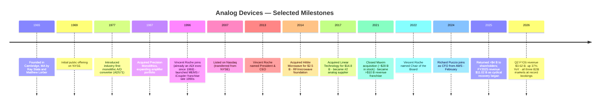
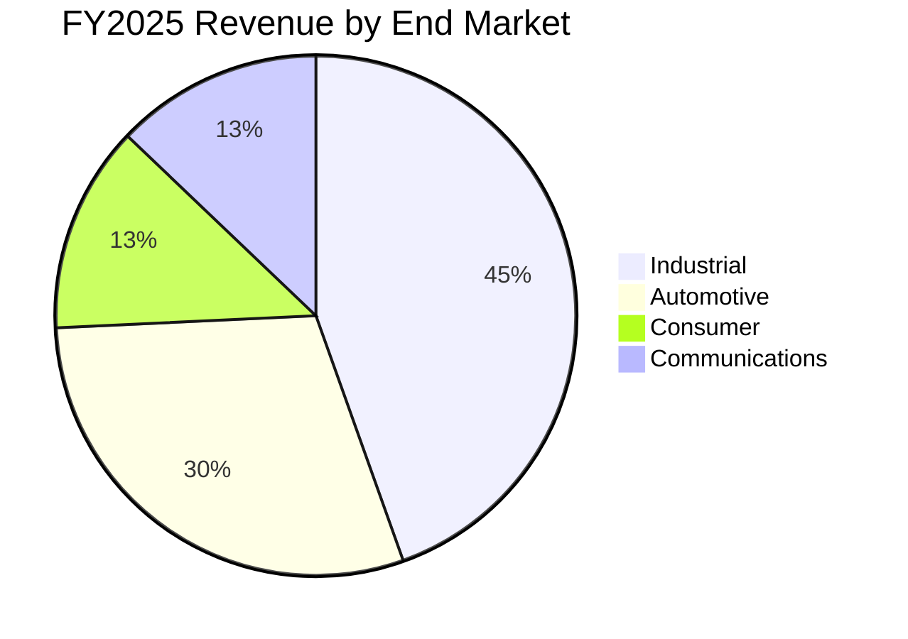
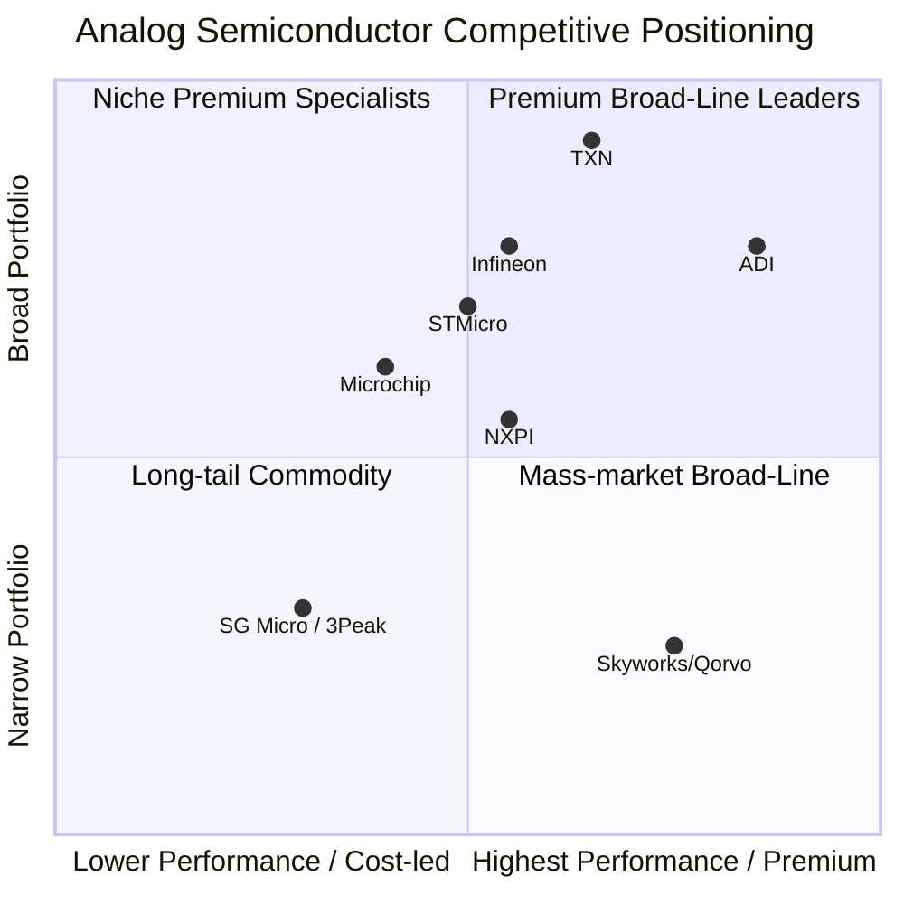

# COMPANY RESEARCH REPORT: Analog Devices, Inc. (NASDAQ: ADI)
Date: 2026-05-20

> **Update — FY2026 guidance reaffirmed at elevated levels (2026-05-20):** Concurrent with the 2Q FY2026 release, management guided 3Q FY2026 revenue to **$3.9 B ± $100 M** (implied ~+33% YoY), adjusted EPS to **$3.30 ± $0.15**, and adjusted operating margin to ~**49.0% ± 100 bps** — extending the broad-based recovery that began in 1Q FY2026. CFO Richard Puccio cited "record bookings across our B2B markets of Industrial, Automotive, and Communications" as the demand driver. Source: [Q2 FY2026 earnings press release, 2026-05-20](https://www.sec.gov/Archives/edgar/data/0000006281/000000628126000050/adi2q26exhibit991earnings.htm).

## TABLE OF CONTENTS
1. Company Overview
2. Company History
3. Management Team
4. Products & Services
5. Customers & Go-to-Market
6. Industry Overview
7. Competitive Landscape
8. Market Opportunity (TAM)
9. Risk Assessment

---

## 1. Company Overview

Analog Devices, Inc. (Nasdaq: ADI) is a Wilmington, Massachusetts-headquartered global semiconductor leader specializing in **high-performance analog, mixed-signal, power-management, RF and sensor integrated circuits** that bridge the physical and digital worlds. The company describes itself as providing "the building blocks to sense, measure, interpret, connect and power" the systems its customers design ([Analog Devices FY2025 10-K, Item 1 Business](https://www.sec.gov/Archives/edgar/data/0000006281/000000628125000153/adi-20251101.htm)). With more than **75,000 distinct SKUs** spanning data converters, amplifiers, power-management ICs, RF/microwave ICs, MEMS sensors, isolation products and edge processors and DSPs, ADI is one of the world's two largest pure-play high-performance analog suppliers, alongside Texas Instruments ([ADI FY2025 10-K, Products section](https://www.sec.gov/Archives/edgar/data/0000006281/000000628125000153/adi-20251101.htm)).

ADI's revenue model is straightforward: it designs and either internally fabricates or outsources the manufacture of differentiated analog ICs, then sells them to OEMs and contract manufacturers either directly (43% of FY2025 revenue) or through global distributors (56% of FY2025 revenue), with the balance flowing through government and other channels ([ADI FY2025 10-K, MD&A — Revenue by Sales Channel](https://www.sec.gov/Archives/edgar/data/0000006281/000000628125000153/adi-20251101.htm)). The catalog is dominated by general-purpose, long-life-cycle parts — many ADI products remain in production for 15 years or more — and is augmented by application-specific products targeting narrower verticals where ADI's analog domain expertise commands a premium. Gross margins on a GAAP basis were **61.5% in FY2025** (61.5% reported; 69.3% on an adjusted, non-GAAP basis), among the highest in semiconductors and a defining feature of ADI's investment thesis ([ADI 2026 Proxy Statement, FY2025 Performance Highlights](https://www.sec.gov/Archives/edgar/data/0000006281/000000628126000010/)).

ADI ended FY2025 (year ended November 1, 2025) with **$11.02 B in revenue**, up 17% versus FY2024 but still 10% below the cyclical peak of $12.31 B in FY2023 ([ADI FY2025 10-K, Results of Operations](https://www.sec.gov/Archives/edgar/data/0000006281/000000628125000153/adi-20251101.htm)). Operating cash flow of $4.81 B and free cash flow of $4.28 B represented 44% and 39% of revenue respectively. The company employs approximately **24,500 people globally, of whom ~13,000 are engineers** — roughly 53% of total headcount, a remarkably engineer-heavy mix that underwrites its 16%-of-revenue R&D intensity ([ADI FY2025 10-K, Human Capital](https://www.sec.gov/Archives/edgar/data/0000006281/000000628125000153/adi-20251101.htm)). ADI holds approximately **4,780 issued U.S. patents** plus roughly 500 published pending applications as of November 1, 2025 ([ADI FY2025 10-K, Intellectual Property](https://www.sec.gov/Archives/edgar/data/0000006281/000000628125000153/adi-20251101.htm)). Manufacturing is split roughly 50/50 between internal fabs (Wilmington MA, Camas WA, Beaverton OR, Limerick Ireland) and external foundry partners led by TSMC, with assembly and test concentrated in Penang (Malaysia), the Philippines and Thailand alongside third-party OSATs.

Geographically, FY2025 revenue split (by ship-to / distributor location, not always end-customer location) was United States $3.24 B (29%), China $2.86 B (26%), Europe $2.29 B (21%), Rest of Asia $1.49 B (13%), Japan $0.99 B (9%) and Rest of Americas $0.16 B (1%) ([ADI FY2025 10-K, Geographic Revenue](https://www.sec.gov/Archives/edgar/data/0000006281/000000628125000153/adi-20251101.htm)). China was the fastest-growing major region in FY2025, up 34% YoY. End-market mix in FY2025 was Industrial 45%, Automotive 30%, Consumer 13%, Communications 13% — a deliberate B2B-skewed mix that management calls out as ~87% of revenue ([ADI 2026 Proxy Statement](https://www.sec.gov/Archives/edgar/data/0000006281/000000628126000010/)).

*Source: [ADI FY2025 10-K, Results of Operations](https://www.sec.gov/Archives/edgar/data/0000006281/000000628125000153/adi-20251101.htm); [ADI 4Q21 8-K earnings release](https://www.sec.gov/Archives/edgar/data/0000006281/000000628121000280/adiq421exhibit991.htm) (FY2021 revenue $7.318 B includes only ~10 weeks of Maxim post-close); [ADI Q2 FY2026 8-K earnings release](https://www.sec.gov/Archives/edgar/data/0000006281/000000628126000050/adi2q26exhibit991earnings.htm) (TTM 2Q26 revenue derived as FY25 − 1H FY25 + 1H FY26 = $11.020 B − $5.063 B + $6.784 B = $12.741 B).*

**Valuation snapshot (as of 2026-05-20).** ADI closed at **$392.71**, equivalent to a **market capitalization of ~$191.7 B** and an **enterprise value of ~$206.9 B** on 488.2 M diluted shares outstanding ([Yahoo Finance — ADI Key Statistics, accessed 2026-05-20](https://finance.yahoo.com/quote/ADI/key-statistics/)). Key multiples — **TTM P/E 71.8×, forward P/E 29.6×, TTM P/S 16.3×, P/B 5.7×, EV/EBITDA 37.9×, dividend yield 0.98%, beta 1.19** — sit meaningfully above ADI's own long-term averages and above both Texas Instruments (TTM P/E 51.5×, P/S 14.9×) and the broader analog-semi peer group (NXPI TTM P/E 29.5× / P/S 6.2×; IFNNY 83.8× / 6.8×; MCHP 425.7× / 10.8× — distorted by trough TTM earnings; STM 405.5× / 4.7× — also trough-distorted). The reference S&P Semiconductors index has historically traded in the high-20s to mid-30s TTM P/E.

**Why is the multiple stretched?** Three forces. First, **cyclical-trough earnings**: FY2024 GAAP EPS was $3.28, depressed by the 23% revenue decline and 690 bps of gross-margin compression from low fab utilization. Even FY2025 EPS of $4.56 sits below the FY2023 peak of $6.55. The TTM P/E denominator therefore overstates the long-run "true" multiple — at consensus forward EPS, the forward P/E of 29.6× is more representative ([Yahoo Finance, accessed 2026-05-20](https://finance.yahoo.com/quote/ADI/key-statistics/)). Second, **a clear cyclical-recovery thesis**: Q2 FY2026 revenue grew 37% YoY with bookings hitting record levels across all three B2B markets per the CFO, and adjusted operating margin recovered to 49.0% — back to the 41–49% post-Maxim historical band ([Q2 FY26 release](https://www.sec.gov/Archives/edgar/data/0000006281/000000628126000050/adi2q26exhibit991earnings.htm)). Third, an **edge-AI / data-center narrative premium** — Communications revenue jumped 79% YoY in Q2 FY2026 driven by ADI's power-management, optical-connectivity and high-speed-converter content in AI data-center infrastructure, and the market is awarding ADI a partial AI-infrastructure multiple even though that segment is only ~15% of revenue.

Today's multiple is justifiable only if (a) FY2026E EPS recovers strongly toward $9–10 adjusted, getting forward P/E into the high-20s, and (b) the structural mid-single to high-single digit revenue CAGR thesis through the cycle holds. Either a stall in industrial recovery or a sharp deceleration in AI data-center capex would expose the multiple — see the valuation-compression risk in Section 9.

---

## 2. Company History

Analog Devices was **founded in 1965 in Cambridge, Massachusetts** by MIT-trained engineers **Ray Stata** and **Matthew Lorber**, initially with $100,000 of seed capital. The founding bet was that the emerging market for high-performance operational amplifiers could be served better by a focused independent than by the integrated electronics conglomerates of the era. Within six years the company had gone public (NYSE, 1969); within twenty it had become the leading independent supplier of high-precision data converters; within forty it had moved its listing to Nasdaq, entered the S&P 500, and built a multibillion-dollar analog franchise around three core verticals (industrial, automotive and communications) that remain its anchor end-markets today ([ADI FY2025 10-K, Company Overview](https://www.sec.gov/Archives/edgar/data/0000006281/000000628125000153/adi-20251101.htm)). Ray Stata still sits on the board sixty years later as a non-independent director — a rare continuity ([ADI 2026 Proxy Statement, Director Nominees](https://www.sec.gov/Archives/edgar/data/0000006281/000000628126000010/)).

Two strategic pivots define the modern ADI. The **first** was the 2014 decision under Vincent Roche, who became CEO in May 2013, to refocus the company on **high-performance "B2B" markets** (Industrial, Automotive, Communications infrastructure) and away from the volatile, low-margin consumer segments that had previously absorbed a larger share of revenue. The **second** was the **shift from organic-only growth to large-scale M&A**: ADI acquired Hittite Microwave for $2.5 B in 2014 (cementing its RF/microwave franchise), Linear Technology for $14.8 B in 2017 (a transformational deal that doubled the power-management business and added Linear's premium-pricing model), and Maxim Integrated for ~$28 B in stock in August 2021 (adding deep automotive content, additional power IP, and broader catalog reach). With Maxim, ADI consolidated its position as the world's largest independent high-performance analog supplier outside of Texas Instruments ([ADI FY2024 10-K, Note 6 Acquisitions](https://www.sec.gov/Archives/edgar/data/0000006281/000000628124000204/adi-20241102.htm); [ADI press release on Maxim close, 2021-08-26](https://investor.analog.com/news-releases/news-release-details/analog-devices-completes-acquisition-maxim-integrated)).

Source: [ADI FY2025 10-K](https://www.sec.gov/Archives/edgar/data/0000006281/000000628125000153/adi-20251101.htm), [ADI 2026 Proxy](https://www.sec.gov/Archives/edgar/data/0000006281/000000628126000010/), [Q2 FY26 8-K](https://www.sec.gov/Archives/edgar/data/0000006281/000000628126000050/adi2q26exhibit991earnings.htm).

The **acquisition cadence reshaped the financial profile**. Pre-Linear ADI revenue was roughly $3.4 B with mid-60s gross margins; Maxim closed at ~$9 B run-rate with similar margin structure. The combined post-Maxim ADI peaked at $12.31 B in FY2023 before the inventory-correction downturn drove revenue down 23% to $9.43 B in FY2024 ([ADI FY2024 10-K, Results of Operations](https://www.sec.gov/Archives/edgar/data/0000006281/000000628124000204/adi-20241102.htm)). Management has telegraphed that the most consequential M&A is behind it; the FY2025 10-K and 2026 proxy speak of "targeted shareholder value creation from acquisitions to complement our R&D," language consistent with smaller bolt-ons rather than another transformational deal ([ADI FY2025 10-K, Strategy](https://www.sec.gov/Archives/edgar/data/0000006281/000000628125000153/adi-20251101.htm)). Recent corporate actions include announcement in late FY2025 of the planned divestment of the Penang assembly facility (held-for-sale at FY2025 year-end), a continuing Global Repositioning program (severance and facility actions totaling ~$70 M in FY2025), and the appointment of Yoky Matsuoka — a robotics and AI scientist who has served at Google X, Apple and Panasonic — to the board in January 2026, a signal that ADI's "Physical Intelligence" / edge-AI direction is becoming a strategic priority and that the board is being refreshed accordingly ([ADI 2026 Proxy Statement, Director Nominees](https://www.sec.gov/Archives/edgar/data/0000006281/000000628126000010/)).

---

## 3. Management Team

**Vincent Roche, 65 — Chair of the Board and Chief Executive Officer.** Roche has run Analog Devices since May 2013, and was elevated to Chair in March 2022 — combining the roles ([ADI 2026 Proxy Statement, Executive Officers](https://www.sec.gov/Archives/edgar/data/0000006281/000000628126000010/)). His tenure at the company began in **1988** in marketing roles in Ireland — Roche is a graduate of the University of Limerick and has spent his entire executive career at ADI. Across his more than 30-year ADI run, he held senior positions spanning worldwide sales, strategic marketing, business development and product management before becoming President in 2012 ([ADI 2026 Proxy](https://www.sec.gov/Archives/edgar/data/0000006281/000000628126000010/)). Two accomplishments anchor his record. **First**, he executed the strategic refocus on high-performance B2B markets that lifted ADI's gross margins from the mid-60s pre-Linear to a non-GAAP gross margin of 73.0% in Q2 FY2026 — one of the highest in semiconductors ([Q2 FY26 8-K earnings release](https://www.sec.gov/Archives/edgar/data/0000006281/000000628126000050/adi2q26exhibit991earnings.htm)). **Second**, he orchestrated the Linear Technology ($14.8 B, 2017) and Maxim Integrated (~$28 B, 2021) deals, both stock-funded and both delivered against committed synergy targets while maintaining investment-grade credit and growing dividends every year. Total shareholder return over the 10 years ended November 1, 2025 was **>375%, ahead of the S&P 500's 292%** over the same window, per the 2026 proxy. Roche was recognized by Forbes in 2019 as one of "America's Most Innovative Leaders." His compensation in FY2025 totaled $27.46 M (per the Summary Compensation Table in the 2026 proxy), with the large majority equity-linked and performance-vested. Insider ownership of executive officers and directors combined remains modest (Roche personally holds a few hundred thousand shares per the proxy beneficial-ownership table), reflecting a manager-CEO rather than founder profile.

**Richard C. Puccio, Jr., 58 — Executive Vice President and Chief Financial Officer.** Puccio joined ADI in **February 2024** from **Amazon Web Services**, where he had been CFO since 2021 — running finance for an "$88 B revenue business" partnering with the AWS CEO on revenue growth, profitability and strategic financial objectives ([ADI 2026 Proxy Statement, Executive Officer bios](https://www.sec.gov/Archives/edgar/data/0000006281/000000628126000010/)). Prior to AWS he spent 31 years at PricewaterhouseCoopers (1990–2021, with a two-year sojourn at Hanover Insurance and Digital Equipment), and was made Partner in 2000 — including a 21-year partnership tenure during which he led PwC's services to large semiconductor and semi-capital-equipment clients and ultimately led a large team supporting Dell. He holds an AB in Economics from Harvard and an MBA from Boston University. The transition from a hyperscaler operating CFO to a fabless/IDM analog CFO has been smooth: he has been the face of the cyclical-trough narrative through FY2024–FY2025 and now the recovery narrative in FY2026. Notably his external-hire profile (vs. the typical internal-finance-promote) signals ADI's appetite for outside operating discipline.

**Martin Cotter — Senior Vice President, Vertical Business Units.** Cotter is a long-tenured ADI executive responsible for the four end-market vertical business units (Industrial, Automotive, Consumer, Communications). He is named in the 2026 proxy as a Named Executive Officer ([ADI 2026 Proxy](https://www.sec.gov/Archives/edgar/data/0000006281/000000628126000010/)). The vertical-BU operating model — distinct P&Ls for each end market with shared technology platforms — is core to ADI's resource-allocation discipline and is a key reason ADI's revenue mix has been actively rebalanced toward Industrial / Automotive / Communications and away from Consumer.

**Vivek Jain — Executive Vice President, Global Operations and Technology.** Jain runs ADI's worldwide manufacturing, supply chain, and IT/technology infrastructure — encompassing the internal fabs (Wilmington, Camas, Beaverton, Limerick), the assembly/test sites (Penang in divestiture, Philippines, Thailand), the foundry relationships (led by TSMC), and the OSAT subcontractor network. His mandate during the cyclical trough was difficult — manage fab utilization down through inventory normalization without losing the long-cycle process know-how — and his mandate now is to scale capacity for the recovery without rebuilding the inventory overhang that caused the FY2024 correction.

**Katsu Nakamura — Senior Vice President and Chief Customer Officer.** Nakamura oversees customer relationships and the global sales organization. His role bridges to the field-applications engineer model that ADI relies on (FAEs co-design with customers, embedding ADI parts into multi-year customer roadmaps) and is critical to defending the high-margin, long-life-cycle nature of the catalog.

**Governance.** The board has 11 directors, of whom 9 are deemed independent under Nasdaq rules ([ADI 2026 Proxy](https://www.sec.gov/Archives/edgar/data/0000006281/000000628126000010/)). Average director age is 66; average independent-director tenure is 3.75 years (a deliberately refreshed board). Notable members include **Stephen M. Jennings** (Lead Independent Director, former Deloitte principal), **Mercedes Johnson** (former Avago/Broadcom CFO; brings semiconductor-CFO experience to audit), **Edward H. Frank** (Ph.D., Executive Chair of Gradient Technologies; previously Broadcom VP of R&D), **Karen M. Golz** (former Global Vice Chair of EY), **Peter B. Henry** (Stanford Hoover Senior Fellow, former NYU Stern Dean), **Yoky Matsuoka** (added January 2026; Panasonic exec, formerly Google X, Apple Health, Nest CTO — a robotics and AI specialist), **Andrea F. Wainer** (former EVP Rapid & Molecular Diagnostics at Abbott), **André Andonian** (former McKinsey Asia Senior Partner) and **Ray Stata** (Co-Founder, age 91, board member since 1965). The combined Chair / CEO role is balanced by the Lead Independent Director (Jennings). 40% of nominees are female. The independence and tenure mix are well within investor norms. Compensation is heavily equity-linked and performance-vested; the 2026 proxy includes a re-approval of the Amended and Restated 2020 Equity Incentive Plan. There are no material related-party transactions disclosed.

**Track record synthesis.** This is a team with a long, demonstrated capital-allocation record: three transformational acquisitions, all delivered against synergy targets; ten consecutive years of dividend growth (10-year dividend CAGR of 9.5% per the 2026 proxy); cumulative shareholder returns of >$24 B over the last decade ([ADI 2026 Proxy](https://www.sec.gov/Archives/edgar/data/0000006281/000000628126000010/)). The single open question is succession: Roche turns 66 in 2026 and there is no publicly identified internal successor, although Puccio's CFO arrival (with prior AWS scale-operator experience) reads as one possible internal candidate over time. Cotter, Jain and Nakamura are also plausible internal candidates.

---

## 4. Products & Services

ADI's product portfolio is organized around five technology platforms that map across all four end markets. The 10-K identifies the categories as: (i) **Analog and Mixed-Signal** (data converters — the historical core of the company and still its largest single product family); (ii) **Power Management & Reference** (power conversion, driver monitoring, sequencing, energy management — substantially expanded by the Linear Technology and Maxim deals); (iii) **Amplifiers / RF and Microwave** (high-performance operational amplifiers, instrumentation amplifiers, broadband RF amplifiers and a full RF signal chain from Hittite-era IP through 6G-ready microwave); (iv) **Sensors & Actuators** (MEMS accelerometers, gyroscopes and IMUs; high-performance temperature, magnetic and isolation devices including the proprietary *i*Coupler® isolator family that competes with optocouplers); (v) **DSPs and System Products** (programmable Sharc and Blackfin DSPs); plus a recently-elevated sixth pillar — **Software, Digital Platforms and AI**, exemplified by CodeFusion Studio 2.0 (an embedded development platform launched in FY2025) and Power Studio (a digital simulation environment for power-system design), both branded under management's "Physical Intelligence" vision ([ADI FY2025 10-K, Products](https://www.sec.gov/Archives/edgar/data/0000006281/000000628125000153/adi-20251101.htm); [Analog Devices product portfolio page](https://www.analog.com/en/product-category.html)).

```mermaid
graph TD
    ADI[Analog Devices]
    ADI --> AMS[Analog & Mixed-Signal]
    ADI --> PMR[Power Mgmt & Reference]
    ADI --> ARF[Amplifiers / RF & Microwave]
    ADI --> SA[Sensors & Actuators]
    ADI --> DSP[DSP & System Products]
    ADI --> SW[Software / AI / Digital Platforms]
    AMS --> ADC[ADCs / DACs - data converters]
    AMS --> Precision[Precision converters]
    AMS --> HS[High-speed converters]
    PMR --> SwReg[Switching regulators]
    PMR --> LDO[Linear regulators]
    PMR --> BMS[Battery management - automotive / industrial]
    PMR --> uModule[uModule integrated power - ex-Linear]
    ARF --> OpAmp[Op-amps / instrumentation]
    ARF --> RFMW[RF / microwave ICs]
    ARF --> Beamform[Beamforming for 5G / satellite]
    SA --> MEMS[MEMS IMU / accelerometer / gyroscope]
    SA --> Iso[iCoupler digital isolators]
    SA --> TempMag[Temperature / magnetic sensors]
    DSP --> Sharc[SHARC family]
    DSP --> Blackfin[Blackfin family]
    SW --> CFS[CodeFusion Studio 2.0]
    SW --> PowerStudio[Power Studio]
```

Source: [ADI FY2025 10-K, Products](https://www.sec.gov/Archives/edgar/data/0000006281/000000628125000153/adi-20251101.htm); [analog.com product categories](https://www.analog.com/en/product-category.html).

**Per-platform competitive-advantage assessment:**

- **Data converters (ADCs / DACs) — moat: YES (technology + scale).** ADI is the global leader in high-performance precision and high-speed converters; the 10-K explicitly states "Data converters remain our largest and most diverse product family" ([ADI FY2025 10-K, Products](https://www.sec.gov/Archives/edgar/data/0000006281/000000628125000153/adi-20251101.htm)). Moat is driven by 60 years of accumulated process know-how on bipolar and custom-CMOS converter flows, six decades of customer integration into legacy designs (long product life cycles, often 15+ years), and patent depth. **Closest competitor product:** Texas Instruments' ADS series of high-speed converters (TI is the only other competitor with a comparable converter breadth). ADI is *ahead* in highest-end precision and high-speed bands; TI is broadly competitive in the mid-tier mass-market. Third-party reviews — e.g., the long-running EDN Analog Survey — have consistently ranked ADI #1 for converter performance for over a decade.

- **Power Management / *u*Module — moat: YES (technology + brand, partial in mid-tier).** Through the Linear and Maxim acquisitions, ADI now owns two of the most premium power-management brands in semiconductors: Linear's *LTC* / LTM-branded *u*Module products (integrated DC/DC converters in tiny BGA packages) and Maxim's MAXM / MAX17x BMS portfolio. Moat is **strongest at the high end** (precision, low-noise, integrated-passive power for instrumentation, medical, defense, and automotive battery-management systems) and **partial at the mid-tier**, where TI is a formidable competitor on both performance and cost. **Closest competitor product:** TI's TPS series and Infineon's OPTIREG products in automotive BMS. ADI is *ahead* on integration and ultra-low-noise precision; *at parity* on standard buck/boost converters. The Q2 FY2026 50% gross-margin print (well above semiconductor norms) is a direct read on power-business pricing power ([Q2 FY26 8-K](https://www.sec.gov/Archives/edgar/data/0000006281/000000628126000050/adi2q26exhibit991earnings.htm)).

- **Amplifiers / RF & Microwave — moat: YES (technology, partial in commodity op-amps).** The Hittite acquisition and decades of in-house RF gallium-arsenide and silicon-germanium process work make ADI the leading independent supplier of high-performance RF and microwave ICs for cellular base stations, aerospace, defense, automotive radar and test instrumentation. **Closest competitor product:** Qorvo and Skyworks for RF discretes (different segment); MACOM in microwave and defense (closer competitor); TI in op-amps. ADI is *ahead* in high-frequency precision and beamforming ICs; *at parity* with TI in standard op-amps.

- **MEMS and Sensors — moat: YES (technology + manufacturing) in industrial-grade MEMS, partial in consumer.** ADI's MEMS franchise is built around industrial-grade IMUs used in stabilizing platforms, surveying equipment, agricultural autonomy, and aerospace — markets where Bosch and STM lead in consumer-volume MEMS but where ADI's precision and reliability commands a price premium ([analog.com MEMS / IMU products](https://www.analog.com/en/product-category/mems-inertial-measurement-units.html)). *i*Coupler digital isolators — a Linear/Maxim legacy and a unique ADI invention — substitute for traditional optocouplers in industrial and EV power-electronics applications and have very few direct competitors (Silicon Labs / Skyworks Isolation, Texas Instruments). **Closest competitor product:** Bosch / STMicroelectronics MEMS for consumer; Silicon Labs Si864x isolators. ADI is *ahead* in industrial / EV applications.

- **DSPs (SHARC, Blackfin) — moat: PARTIAL (legacy / installed base).** This is a smaller and slower-growth franchise; the DSP market has been disrupted by general-purpose Arm Cortex-M cores and by Xilinx/AMD FPGAs at the high end. ADI's DSP franchise is sustained by deep installed-base relationships in audio (high-end pro and automotive), industrial motor control, and some defense applications. **Closest competitor product:** Arm cores integrated into competitor MCUs; NXP i.MX RT processors. ADI is *at parity / slightly behind* on price-performance for new designs, but *ahead* on incumbency in long-life-cycle applications.

- **Software / AI / Physical Intelligence — moat: EMERGING / unclear.** CodeFusion Studio 2.0 and Power Studio are tools rather than revenue products — they reduce design friction for customers using ADI hardware. The strategic bet is that ADI's analog/sensor/power IP combined with on-device AI ("Physical Intelligence" — small, edge-deployed models that reason about sensor data) becomes a differentiator over the next 5–10 years. **Verdict: no moat today** but a credible long-horizon option ([ADI FY2025 10-K, Strategy](https://www.sec.gov/Archives/edgar/data/0000006281/000000628125000153/adi-20251101.htm)).

**Flagship vs. long-tail.** The 1–3 product families that drive the business are **data converters, power management, and amplifiers** — collectively, by industry consensus, more than two-thirds of revenue. The company does not break out exact platform-level revenue. The Industrial end market (45% of FY2025 revenue) is the largest *customer-side* driver, and inside Industrial the most material sub-segments are Industrial Automation, Instrumentation & Measurement (automated test equipment, broadly identified with the AI infrastructure boom), Aerospace/Defense, Healthcare and Energy Management ([ADI FY2025 10-K, Markets](https://www.sec.gov/Archives/edgar/data/0000006281/000000628125000153/adi-20251101.htm)).

**Recent product launches (last 12 months).** In FY2025 ADI launched CodeFusion Studio 2.0, the Power Studio family of design tools, and continued expansion of its automotive A²B (Automotive Audio Bus) connectivity platform and its GMSL (Gigabit Multimedia Serial Link) display-link IP. The company also pushed deeper into AI data-center content with high-speed-converter and power-delivery sockets that began ramping aggressively in Q2 FY2026, driving 79% YoY Communications growth ([Q2 FY26 8-K](https://www.sec.gov/Archives/edgar/data/0000006281/000000628126000050/adi2q26exhibit991earnings.htm)).

---

## 5. Customers & Go-to-Market

ADI sells to **tens of thousands of OEM and contract-manufacturer customers globally** through three channels: (i) **third-party distributors** ($6.14 B / 56% of FY2025 revenue — led by Arrow Electronics, Avnet and Future Electronics, plus regional partners); (ii) **direct customers** ($4.72 B / 43%) which include named global OEMs in industrial, automotive, communications and consumer; (iii) **other channels** ($156 M / 1%) which includes the U.S. government, government prime contractors and certain over-time recognized commercial customers ([ADI FY2025 10-K, Revenue by Sales Channel](https://www.sec.gov/Archives/edgar/data/0000006281/000000628125000153/adi-20251101.htm)). The relative mix between distributors and direct customers has remained stable over the past four fiscal years.

Source: [ADI FY2025 10-K, MD&A](https://www.sec.gov/Archives/edgar/data/0000006281/000000628125000153/adi-20251101.htm).

*Source: [ADI FY2025 10-K Results of Operations](https://www.sec.gov/Archives/edgar/data/0000006281/000000628125000153/adi-20251101.htm) for FY2023–FY2025; [Q2 FY26 8-K earnings release](https://www.sec.gov/Archives/edgar/data/0000006281/000000628126000050/adi2q26exhibit991earnings.htm) for 1H FY26.*

**Customer concentration — disclosed and low.** The FY2025 10-K's Concentrations of Risk note (Note 2l) discloses that one distributor accounted for **>10% of total consolidated revenue** in fiscal 2023, but the FY2025 10-K specifically marks the table noting that no distributor exceeded 10% in fiscal 2025 or fiscal 2024 ("Revenue for this distributor was not greater than 10% of total revenue for this period"; see the XBRL footnote near the top of [the FY2025 10-K filing](https://www.sec.gov/Archives/edgar/data/0000006281/000000628125000153/adi-20251101.htm)). No individual *end* customer is disclosed as 10%+ of revenue. This is materially lower customer concentration than peers like NXPI (where Apple and several automotive Tier-1s exceed 10%) or single-thesis specialists like Cirrus Logic. **The combination of (i) ~75,000 SKUs across 100,000+ end customers, (ii) the largest single channel being distributors (where end-customer concentration is diffused across thousands of long-tail buyers), and (iii) the dominance of the Industrial end market — itself a fragmented buyer base — produces one of the lowest customer-concentration profiles in semiconductors.** This is an underrated structural strength of the ADI model: no single customer "owns" ADI's growth rate.

**Sales motion: design-in and field-applications engineering.** ADI's go-to-market is anchored by a global field-applications-engineering (FAE) organization that works alongside customers' design engineers to embed ADI parts in customer reference designs. Once designed in, ADI parts typically remain in the customer BOM for the life of the product — 5 to 20+ years for industrial and aerospace systems, 5–7 years for automotive platforms. This produces a "sticky" revenue base with high switching costs and gives ADI considerable pricing power over the design lifecycle. The downside is long sales cycles (12–24+ months for a new design-in) and limited ability to gain share rapidly when not in the design cycle.

**Named-customer color (from 10-K and public references):** ADI's customers include the largest global Tier-1 automotive suppliers (Bosch, Continental, ZF, Aptiv, Magna), automotive OEMs directly for high-voltage battery-management content (multiple EV programs), aerospace and defense primes (Lockheed Martin, Raytheon Technologies, Northrop Grumman, BAE), instrumentation OEMs (Keysight, Teradyne — particularly relevant in the FY2025–FY2026 ATE-driven industrial recovery), healthcare-equipment OEMs (GE Healthcare, Philips, Medtronic, Abbott), wireless-infrastructure OEMs (Ericsson, Nokia, Samsung Networks), and AI-data-center hyperscaler and infrastructure customers via both direct and ODM channels ([Q2 FY26 8-K commentary on Communications growth driven by AI data-center infrastructure](https://www.sec.gov/Archives/edgar/data/0000006281/000000628126000050/adi2q26exhibit991earnings.htm); [ADI FY2025 10-K Markets section](https://www.sec.gov/Archives/edgar/data/0000006281/000000628125000153/adi-20251101.htm)).

**Distribution partnerships.** Arrow, Avnet, Future and several regional distributors are critical channel partners. Distributors typically receive price-adjustment credits and certain return rights for slow-moving inventory; the FY2025 reduction in distributor channel share (58% → 56%) was attributed by management to the relative decline in Industrial revenue mix (Industrial flows disproportionately through distributors) ([ADI FY2025 10-K, MD&A](https://www.sec.gov/Archives/edgar/data/0000006281/000000628125000153/adi-20251101.htm)).

**Geographic concentration in China — a managed risk.** China represented 26% of FY2025 revenue ($2.86 B, up 34% YoY), the second-largest country market behind the U.S. ($3.24 B, 29%). The Chinese revenue is broadly distributed across local industrial automation, automotive, consumer and communications customers, but concentration is now sufficient that export-control and tariff policy is a quantifiable risk; the Q2 FY26 earnings commentary specifically referenced "recently announced tariffs and other trade restrictions" as a stock-price-affecting factor ([ADI FY2025 10-K, Risk Factors](https://www.sec.gov/Archives/edgar/data/0000006281/000000628125000153/adi-20251101.htm)).

---

## 6. Industry Overview

Analog Devices participates in the **high-performance analog and mixed-signal integrated-circuit industry**, a subset of the broader semiconductor market estimated at **roughly $750–800 B in 2025** (WSTS projects the total semiconductor market to approach $1 trillion in 2026) ([WSTS Industry News Release](https://www.wsts.org/76/Recent-News-Release)). Within that total, the **analog semiconductor sub-market** is variously estimated at **$93–105 B in 2025** by Fortune Business Insights, Precedence Research and Coherent Market Insights — i.e., 12–14% of total semiconductors ([Fortune Business Insights — Analog Semiconductor Market 2025](https://www.fortunebusinessinsights.com/analog-semiconductor-market-112121); [Precedence Research — Analog Semiconductor Market](https://www.precedenceresearch.com/analog-semiconductor-market)). Growth forecasts cluster around a **6–7% CAGR through 2030–2034**, with Precedence Research projecting the market to grow from ~$101 B in 2024 to ~$180 B by 2034 (6.0% CAGR) and Technavio modeling a 6.9% CAGR through 2029.

The analog market is structurally **less cyclical than memory or logic** because (i) the typical analog die is fabricated on mature trailing-edge nodes (180 nm to 65 nm CMOS, BCD, SiGe and GaAs) where capex cycles are longer, (ii) products have 10–20-year lifecycles versus 1–3 years for memory, and (iii) the buyer base is fragmented across thousands of OEMs serving end markets with multi-year design cycles. Cyclicality nonetheless exists at the inventory level — the FY2024 23% revenue decline at ADI (and broadly similar declines at TI, NXPI and Microchip) reflects a sharp inventory destock at industrial and automotive customers after the 2021–2022 overbuild, rather than a structural shrinkage.

**Key growth drivers** for the analog industry over the medium term:

1. **Electrification of mobility** — Each fully electrified vehicle contains 2–5× the dollar content of analog ICs versus an ICE vehicle, driven primarily by battery management systems (BMS), high-voltage isolation, on-board chargers, traction inverters and power-distribution architectures. ADI is a leading supplier of wireless BMS, isolated gate drivers and high-voltage power-management products into EV platforms.

2. **Industrial automation and robotics** — Factory-floor digitization, condition-based monitoring (CbM), and the build-out of humanoid and industrial robotics drive demand for precision sensing, motion control, edge processing and industrial communication (Ethernet APL, single-pair Ethernet, time-sensitive networking). The board's January-2026 addition of robotics specialist Yoky Matsuoka signals strategic intent in this area.

3. **AI data-center infrastructure** — Hyperscale AI training and inference cluster build-out drives demand for high-current point-of-load power delivery (vertical and lateral power conversion to feed accelerator chips), high-speed optical and copper connectivity, precision clocking and thermal-management sensing. This was the explicit driver of ADI's Q2 FY2026 79% YoY Communications growth ([Q2 FY26 8-K](https://www.sec.gov/Archives/edgar/data/0000006281/000000628126000050/adi2q26exhibit991earnings.htm)).

4. **5G / wireless infrastructure modernization** — Cellular base-station upgrades, satellite and broadband fixed-wireless deployments, and microwave backhaul drive RF/microwave demand. The next 6G cycle (mid-decade) will add millimeter-wave content.

5. **Healthcare digitization and home-medical devices** — Continuous glucose monitoring, vital-signs wearables, point-of-care diagnostics, robotic surgery — all expand analog content per system.

6. **Aerospace and defense modernization** — Radar modernization, electronic warfare, space-launch cadence (commercial space, mega-constellations) and increased defense budgets in NATO countries lift demand for radiation-hardened and high-reliability analog content.

**Industry structure: oligopolistic and barrier-protected.** The top 6–10 suppliers (Texas Instruments, Analog Devices, Infineon, STMicroelectronics, NXP, Microchip, ON Semiconductor, Renesas, Skyworks, Qorvo) collectively account for the substantial majority of revenue, with the top two (TI and ADI) accounting for roughly 25–30% of the global analog market. Per einvestingforbeginners' Spring 2024 publicly-traded-analog-industry survey, Infineon and Texas Instruments were tied at ~19.5% TTM revenue share of publicly-traded analog peers, followed by STMicroelectronics 19.1% and NXP 15.4% ([einvestingforbeginners — Analog Industry Report Spring 2024](https://einvestingforbeginners.com/publicly-traded-analog-semiconductor-industry-report-spring-2024-results-schil/)) — note that this measure excludes private and JV manufacturers and counts Infineon at full breadth (including power-discretes and microcontrollers). **Barriers to entry are very high**: (i) accumulated process IP across decades of bipolar, CMOS, BCD and specialty processes is not replicable on a short horizon; (ii) the engineering talent base is scarce; (iii) the design-in / customer-relationship model creates 5–20-year customer lock-in; (iv) regulatory and qualification requirements (automotive AEC-Q100, defense MIL-STD, medical-grade) impose multi-year qualification cycles. Chinese state-funded entrants (Will Semiconductor, SG Micro, 3Peak) have grown rapidly in commodity and mid-tier analog but remain meaningfully behind in high-performance segments.

**Regulatory environment.** The U.S. CHIPS Act (2022) and EU Chips Act provide capex incentives for onshore fabrication; ADI received a Massachusetts state award in 2024 and continues to invest at its Wilmington and Camas fabs. Export controls on advanced semiconductors to China primarily target advanced logic and AI accelerators, not high-performance analog, but ADI must comply with U.S. Entity List restrictions on named Chinese customers. Tariff policy — including the 2025 reciprocal-tariff announcements — has injected near-term volatility but has not yet materially impaired ADI's China revenue trajectory.

**Cyclicality.** Semiconductor industry cycles average 3–5 years peak-to-peak. ADI's last cycle: FY2023 peak ($12.31 B), FY2024 trough ($9.43 B, –23%), FY2025 recovery ($11.02 B, +17%), and FY2026 acceleration into a new growth phase (3Q26 guide $3.9 B, implying ~+33% YoY). On the current trajectory, the cycle's expansion phase will run at least through FY2027 unless demand reverses.

---

## 7. Competitive Landscape

ADI competes with a focused set of high-performance analog suppliers and a broader set of cross-platform semiconductor companies. Direct competitors named in the 10-K include "a number of semiconductor companies in markets that are highly competitive" with "well-funded efforts by foreign governments to create indigenous semiconductor industries" — without naming them explicitly ([ADI FY2025 10-K, Competition](https://www.sec.gov/Archives/edgar/data/0000006281/000000628125000153/adi-20251101.htm)).

**Direct (high-performance analog) competitors:**

1. **Texas Instruments (NASDAQ: TXN, market cap ~$275 B)** — The #1 analog supplier globally and ADI's most direct peer. TI is broader (~$15.5 B in 2024 revenue) but slightly less skewed to the highest-performance bins; it owns more of its manufacturing capacity (a long-term advantage as TI builds out 300 mm fabs at Lehi UT and Sherman TX). TI's TTM P/E of 51.5× and P/S of 14.9× sit modestly below ADI's, reflecting a less premium gross-margin profile (low-60s GAAP vs. ADI's 61.5%). **Where ADI wins:** highest-performance precision converters and amplifiers; specialized RF/microwave; industrial/aerospace MEMS. **Where TI wins:** breadth and cost in mid-tier power and mass-market amplifiers; scale economies from 300 mm internal manufacturing.

2. **Infineon Technologies (FRA: IFX / OTC: IFNNY, market cap ~$103 B)** — German specialist with leadership in automotive microcontrollers, power discretes (especially SiC and IGBT for EV traction), and security ICs. Less of a pure-analog competitor than TI but increasingly overlapping with ADI in automotive BMS and isolated gate drivers. TTM P/E 83.8× / P/S 6.8× ([Yahoo Finance — IFNNY](https://finance.yahoo.com/quote/IFNNY/)).

3. **STMicroelectronics (NYSE: STM, market cap ~$58 B)** — European franchise strong in automotive microcontrollers, MEMS (especially consumer-grade), SiC power, and general-purpose analog. TTM P/E 405× (trough earnings) / P/S 4.7×. STM is currently in deeper cyclical trough than ADI; recovery timing varies.

4. **NXP Semiconductors (NASDAQ: NXPI, market cap ~$78 B)** — Automotive-and-IoT focused; leads in automotive infotainment, secure connectivity (UWB, NFC) and microcontrollers. Less direct overlap with ADI's industrial-precision franchise. TTM P/E 29.5× / P/S 6.2× — the cheapest in the cohort, reflecting both a more cyclical end-market mix (50%+ automotive) and lower gross margins (mid-50s).

5. **Microchip Technology (NASDAQ: MCHP, market cap ~$51 B)** — MCU-led but increasingly broad analog/mixed-signal. Currently in deep cyclical trough — TTM P/E 425× / P/S 10.8×.

*Source: [Yahoo Finance — Key Statistics for ADI, TXN, MCHP, NXPI, STM, IFNNY, accessed 2026-05-20](https://finance.yahoo.com/quote/ADI/key-statistics/). MCHP and STM P/E figures are inflated by cyclically depressed TTM earnings.*

**Adjacent / cross-platform competitors:**

6. **ON Semiconductor (NASDAQ: ON)** — Power management, image sensors, automotive. Closer to NXP than ADI in profile.

7. **Renesas (TSE: 6723)** — Japanese giant, automotive MCU-led; expanded into analog via Dialog and IDT acquisitions; closer to NXP/STM than ADI.

8. **Skyworks (NASDAQ: SWKS) and Qorvo (NASDAQ: QRVO)** — RF specialists for mobile handsets; overlapping in some RF-infrastructure sockets but quite different customer mix.

**Emerging Chinese competitors:** Will Semiconductor, SG Micro (SZ:300661), 3Peak Inc. (SH:688536), Run Semiconductor and dozens of smaller analog startups have grown rapidly in domestic Chinese markets aided by national semiconductor self-sufficiency policy. **Where they are competitive:** mid-tier commodity analog (general-purpose op-amps, standard converters, mid-tier power management). **Where they are not (yet):** highest-performance precision converters, automotive-qualified BMS, aerospace and defense, high-frequency RF — segments protected by deep IP, regulatory qualification and customer trust.

**ADI's competitive advantages:**

- **Performance leadership in precision analog** — a defensible position cultivated over 60 years of accumulated process know-how, IP and engineering talent. Industry surveys consistently rank ADI #1 in precision converters and instrumentation amplifiers.
- **Diversified end-market mix** — 45/30/13/13 Industrial/Auto/Comms/Consumer protects ADI from single-end-market downturns (the FY2024 correction was concentrated in Industrial, partially offset by relative Automotive resilience).
- **Premium gross margins** — 61.5% GAAP / 69.3% adjusted in FY2025 ([ADI 2026 Proxy](https://www.sec.gov/Archives/edgar/data/0000006281/000000628126000010/)) — ahead of all named peers and reflecting product-mix differentiation, not commodity exposure.
- **Demonstrated capital-allocation discipline** — three transformational acquisitions all delivered on synergy commitments; >$24 B returned to shareholders over the last decade ([ADI 2026 Proxy](https://www.sec.gov/Archives/edgar/data/0000006281/000000628126000010/)).
- **Scale of engineering bench** — ~13,000 engineers vs. typical peer of 5,000–10,000 — funds continuous innovation across more product platforms simultaneously than smaller competitors can sustain.

Source: author analysis, drawing on FY2024–FY2025 disclosures of each named company.

**ADI's vulnerabilities:**

- **Lower internal-manufacturing footprint** than TI — ADI sources >50% of its wafers from external foundries (led by TSMC), while TI is building toward majority-internal 300 mm production. In a future capacity-constrained cycle, TI's manufacturing self-sufficiency could be an advantage.
- **Acquisition integration risk** — three large deals integrated, but ongoing rationalization (the Global Repositioning charges in FY2025 of $70 M, the Penang divestiture announced in FY2025) means execution remains in motion.
- **CEO succession** — Vincent Roche is 65; no public successor designated.
- **Lower automotive content per vehicle than NXPI or Infineon** in some EV architectures — ADI's high-voltage BMS is best-in-class, but ADI is not the dominant supplier of automotive microcontrollers or in-cabin connectivity.

---

## 8. Market Opportunity (TAM)

ADI's served addressable market spans the high-performance segments of the analog semiconductor industry plus the adjacent power-management and RF/microwave categories that overlap with broader semiconductors.

**TAM sizing.** Taking the analog semiconductor industry at **$95–105 B in 2025** (consensus of Fortune Business Insights, Coherent Market Insights and Precedence Research — see Section 6) and projecting forward at the consensus 6–7% CAGR through 2030, the analog market reaches roughly **$135–155 B by 2030**. Within this:

- **Industrial analog** (the largest single sub-market): ~$30–35 B in 2025, projected to grow at 6–8% CAGR driven by automation, robotics and test instrumentation. ADI's FY2025 Industrial revenue of $4.93 B implies roughly **14–16% share of the industrial-analog TAM** — already a leadership position with room to expand in aerospace/defense, healthcare and energy management ([ADI FY2025 10-K, MD&A](https://www.sec.gov/Archives/edgar/data/0000006281/000000628125000153/adi-20251101.htm)).
- **Automotive analog**: ~$30 B in 2025, projected at 8–10% CAGR through 2030 driven by electrification and ADAS content per vehicle. ADI's FY2025 Automotive revenue of $3.28 B implies roughly **10–12% share** — a smaller relative position than in Industrial, with NXPI, Infineon and STM larger players overall. The wireless BMS and in-cabin connectivity (A²B) franchises are the relative differentiators.
- **Communications analog** (wireline + wireless infrastructure): ~$15 B in 2025, growing rapidly (>10% CAGR) on AI-data-center build-out. ADI's FY2025 Communications revenue of $1.38 B implies **~9% share**; the Q2 FY2026 79% YoY growth suggests share gains accelerating as AI infrastructure ramps.
- **Consumer analog**: ~$25–30 B (broad category including audio, portable, home appliances). ADI's $1.43 B FY2025 Consumer revenue is **~5% share** — a relatively small position by design, given the strategic deprioritization of consumer in favor of B2B markets.

*Source: [ADI FY2024–FY2025 10-Q and 10-K filings](https://www.sec.gov/cgi-bin/browse-edgar?action=getcompany&CIK=0000006281&type=10-Q&dateb=&owner=include&count=40); [ADI Q1 and Q2 FY2026 8-K earnings releases](https://www.sec.gov/Archives/edgar/data/0000006281/000000628126000050/adi2q26exhibit991earnings.htm). FY25 quarter-of-year revenue computed by subtraction.*

**ADI's serviceable market and share-gain path.** Putting the four end-market sub-TAMs together yields an addressable market of roughly **$100 B today, growing toward $135–155 B by 2030**. Against ADI's FY2025 revenue of $11.02 B, that implies ~11% share of served TAM today — comfortably room for the kind of mid-to-high-single-digit revenue growth management has historically guided to through the cycle. The Q2 FY2026 booking strength, the AI-data-center inflection in Communications, and the industrial-automation / Aerospace / Healthcare secular tailwinds together support a credible path to a **$15 B+ revenue run-rate by FY2028–FY2029**, implying steady cycle-average share gains of 50–100 basis points per year.

**Penetration strategy.** Three vectors: (i) **deepening content per system** — adding ADI parts on customer reference designs ("more sockets per board"); (ii) **vertical software/AI platforms** — CodeFusion Studio 2.0, Power Studio, and the broader Physical Intelligence vision, intended to make ADI hardware easier to design in than competitor products and to attach software/IP-licensing revenue over time; (iii) **bolt-on M&A** — likely smaller deals adding capability in specific verticals (robotics, edge-AI, advanced power) rather than another transformational platform deal.

**SOM (realistic 5-year share):** ~13–14% of served analog TAM by 2030, implying ~$18–22 B revenue at 6–7% market growth and 100–150 bp/year share gain. Bear case (cyclical reversal, China share loss): $13–14 B; bull case (sustained AI-infra ramp, accelerated industrial recovery): $20–24 B.

---

## 9. Risk Assessment

### Company-Specific Risks

**1. Cyclical-recovery durability and forecasting risk.** FY2026 revenue is forecast to grow >30% YoY based on Q2 results and Q3 guidance, but the duration of the upcycle is uncertain. The most recent peak in FY2023 ($12.31 B) was followed by a 23% revenue decline in FY2024 ([ADI FY2024 10-K](https://www.sec.gov/Archives/edgar/data/0000006281/000000628124000204/adi-20241102.htm)). If industrial-automation demand re-stalls or hyperscaler AI capex slows in late FY2026, the revenue trajectory could disappoint vs. consensus. *Mitigants:* end-market diversification (45/30/13/13 mix) limits any one segment's drag; book-to-bill is currently above 1.0 across all three B2B markets per the CFO; pricing has held firm.

**2. CEO and senior-management succession.** Vincent Roche is 65 and has been CEO since 2013. No public successor has been identified. The CFO, Richard Puccio, joined only in February 2024 from AWS, so he is relatively new to the analog industry. *Severity:* moderate. *Mitigants:* deep bench in Cotter, Jain, Nakamura; refreshed board (Yoky Matsuoka added January 2026; average independent-director tenure 3.75 years).

**3. M&A integration and rationalization risk.** Three large acquisitions over the last decade (Hittite, Linear, Maxim) are largely integrated, but ongoing rationalization continues: $70 M in Global Repositioning charges in FY2025, the announced Penang assembly divestiture, and continuing portfolio pruning ([ADI FY2025 10-K, Special Charges](https://www.sec.gov/Archives/edgar/data/0000006281/000000628125000153/adi-20251101.htm)). *Severity:* low. *Mitigants:* historical track record on M&A synergy delivery is strong; non-GAAP gross margins of 73.0% in Q2 FY2026 ([Q2 FY26 8-K](https://www.sec.gov/Archives/edgar/data/0000006281/000000628126000050/adi2q26exhibit991earnings.htm)) suggest synergies are being captured.

**4. Customer concentration — low and diffused (RISK = LOW).** No customer or end-customer accounts for >10% of revenue in FY2025 ([ADI FY2025 10-K, Concentrations of Risk](https://www.sec.gov/Archives/edgar/data/0000006281/000000628125000153/adi-20251101.htm)). One distributor exceeded 10% historically (FY2023) but not in FY2024–FY2025. *Severity:* low. Listed here for completeness given the skill's requirement to evaluate. The diffused customer base across 100,000+ end customers is actually a competitive advantage rather than a risk.

**5. Foundry concentration on TSMC.** ADI sources >50% of wafers from external foundries, led by Taiwan Semiconductor Manufacturing Company ([ADI FY2025 10-K, Production Resources](https://www.sec.gov/Archives/edgar/data/0000006281/000000628125000153/adi-20251101.htm)). A geopolitical disruption to TSMC supply (Taiwan-Strait tensions; severe natural disaster; export-control escalation) would impair ADI's ability to ship a meaningful portion of its catalog. *Severity:* high in tail scenarios; *Mitigants:* internal fabs in U.S. and Ireland; ongoing capacity additions; ability to multi-source many parts within ~12-month horizon.

**6. Product / technology obsolescence in DSPs.** ADI's DSP franchise (SHARC, Blackfin) faces secular pressure from Arm-core integration into competitor MCUs and from FPGAs at the high end. *Severity:* low (DSPs are a small share of revenue); *Mitigants:* long-life-cycle customer lock-in; transition to "Physical Intelligence" / edge-AI platforms.

### Industry / Market Risks

**7. Competitive intensity — TI's 300 mm scale advantage.** Texas Instruments is investing tens of billions of dollars in 300 mm internal capacity (Lehi UT, Sherman TX) to drive structurally lower cost-per-die. Over the next 3–5 years, TI's manufacturing-scale advantage could compress ADI's gross-margin spread in commodity-tier analog. *Severity:* moderate; *Mitigants:* ADI's product mix is more skewed to specialty processes and high-performance segments where 300 mm is not the binding constraint.

**8. Chinese analog entrants.** SG Micro, 3Peak, Will Semi and dozens of smaller domestic players are growing rapidly in commodity Chinese analog. The Chinese government's semiconductor-self-sufficiency policy provides patient capital. *Severity:* moderate over a 5–10-year horizon, low in high-performance segments where ADI primarily plays. *Mitigants:* ADI's IP and engineering depth in highest-performance bins are unlikely to be matched on a 5-year horizon.

**9. Technology disruption — edge-AI and software-defined hardware.** A shift toward software-defined functions running on general-purpose compute fabrics could reduce demand for some specialized analog ICs over a 10-year horizon. *Severity:* low-to-moderate; *Mitigants:* ADI's analog content is the *interface* between physical signals and digital compute — that interface is not eliminable, only re-located.

**10. Regulatory / export-control risk on China revenue.** China = 26% of FY2025 revenue ([ADI FY2025 10-K](https://www.sec.gov/Archives/edgar/data/0000006281/000000628125000153/adi-20251101.htm)). U.S. export controls and tariff actions could restrict or tax ADI's Chinese revenue. *Severity:* moderate; *Mitigants:* high-performance analog has thus far been excluded from the most-restrictive U.S. export controls (which target advanced logic and AI accelerators); diversified Chinese customer base; ability to ship to non-restricted customers.

### Financial Risks

**11. Valuation / multiple-compression risk.** TTM P/E of 71.8× sits at >2× the S&P 500 multiple and is materially above ADI's historical median (low- to mid-30s). The forward P/E of 29.6× is more reasonable but still demands the cyclical-recovery + AI-data-center-content theses to deliver ([Yahoo Finance — ADI Key Statistics, accessed 2026-05-20](https://finance.yahoo.com/quote/ADI/key-statistics/)). Catalysts for de-rating: a miss vs. guidance, slowdown in industrial recovery, hyperscaler AI capex pause, or sector rotation out of semis. The 52-week range is $206–$436, suggesting a $200+ swing is well within the range of plausible 12-month outcomes. *Severity:* high; *Mitigants:* strong FCF generation and capital-return policy create a yield floor; consensus FY2026/FY2027 estimates are still being raised.

**12. Tax-rate and earnings-quality risk.** Adjusted (non-GAAP) operating margin in Q2 FY2026 was 49.0% vs. GAAP 38.1% — an 11-point bridge driven by amortization of acquired intangibles ($750 M in FY2025) and "acquisition-related" expenses ([ADI FY2025 10-K MD&A](https://www.sec.gov/Archives/edgar/data/0000006281/000000628125000153/adi-20251101.htm); [Q2 FY26 8-K](https://www.sec.gov/Archives/edgar/data/0000006281/000000628126000050/adi2q26exhibit991earnings.htm)). The bridge is shrinking over time as intangibles amortize, but the gap between GAAP and adjusted EPS will remain >$2/share for several more years. *Severity:* low; *Mitigants:* the underlying cash earnings are strong (FCF margin 36% TTM).

### Macroeconomic Risks

**13. Geopolitical — Taiwan / China.** Beyond foundry concentration (Risk 5), a broad China-Taiwan conflict would simultaneously disrupt foundry supply, eliminate Chinese end-customer demand, and depress global semi sentiment. *Severity:* high (tail risk); *Mitigants:* not specifically mitigable beyond geographic diversification.

**14. Industrial / capex cyclicality.** Industrial is 45% of revenue and is sensitive to manufacturing PMI and global capex. A return of recessionary conditions in Europe, China or the U.S. would re-impair industrial bookings. *Severity:* moderate; *Mitigants:* the current cycle is in its expansion phase, customer inventories have normalized, and book-to-bill is above 1.0.

**15. FX exposure.** Substantial revenue (~71% of FY2025) is non-U.S. but largely U.S.-dollar invoiced through distributors; most cost is U.S.-dollar denominated (with the notable exception of the Limerick, Ireland fab, which has Euro and Irish operational exposure). *Severity:* low.

### Capital Return Track Record (Context)

*Source: [ADI 10-K filings FY2022–FY2025](https://www.sec.gov/cgi-bin/browse-edgar?action=getcompany&CIK=0000006281&type=10-K&dateb=&owner=include&count=40), [Q2 FY26 8-K](https://www.sec.gov/Archives/edgar/data/0000006281/000000628126000050/adi2q26exhibit991earnings.htm). Trailing-twelve-month figures from Q2 FY2026 release: dividends $1.998 B, buybacks $3.045 B, total $5.043 B; prior-year figures are author approximations derived from 10-K cash-flow statements.*

*Source: [ADI FY2025 10-K Cash Flow Statement](https://www.sec.gov/Archives/edgar/data/0000006281/000000628125000153/adi-20251101.htm); [Q2 FY26 8-K](https://www.sec.gov/Archives/edgar/data/0000006281/000000628126000050/adi2q26exhibit991earnings.htm) — TTM 2Q26 FCF $4.565 B.*

The capital-return engine — ~$24 B returned over the last decade, with a 9.5% 10-year dividend CAGR ([ADI 2026 Proxy](https://www.sec.gov/Archives/edgar/data/0000006281/000000628126000010/)) — provides a meaningful yield floor for the equity even in adverse scenarios. The November 24, 2025 dividend declaration of $0.99/share quarterly (subsequently raised to $1.10 with the Q2 FY26 declaration) and the $9.65 B remaining repurchase authorization at FY2025 year-end ([ADI FY2025 10-K, Issuer Purchases](https://www.sec.gov/Archives/edgar/data/0000006281/000000628125000153/adi-20251101.htm)) demonstrate continued capital-return commitment through the cycle.

---

## REFERENCES

### Primary SEC Filings (ADI)
- [Analog Devices FY2025 Form 10-K (filed 2025-11-25; fiscal year ended November 1, 2025)](https://www.sec.gov/Archives/edgar/data/0000006281/000000628125000153/adi-20251101.htm) — Annual report covering all of FY2025.
- [Analog Devices FY2024 Form 10-K (filed 2024-11-26; fiscal year ended November 2, 2024)](https://www.sec.gov/Archives/edgar/data/0000006281/000000628124000204/adi-20241102.htm) — Prior-year annual report referenced for Maxim acquisition note and FY2023 comparisons.
- [Analog Devices Q2 FY2026 Form 10-Q (filed 2026-05-20; quarter ended May 2, 2026)](https://www.sec.gov/Archives/edgar/data/0000006281/000000628126000052/) — Latest quarterly report.
- [Analog Devices Q2 FY2026 Earnings Release, 8-K Exhibit 99.1 (2026-05-20)](https://www.sec.gov/Archives/edgar/data/0000006281/000000628126000050/adi2q26exhibit991earnings.htm) — Q2 FY26 results, Q3 guide.
- [Analog Devices Q1 FY2026 Earnings Release, 8-K Exhibit 99.1 (2026-02-18)](https://www.sec.gov/Archives/edgar/data/0000006281/000000628126000015/) — Q1 FY26 results.
- [Analog Devices 2026 Definitive Proxy Statement (DEF 14A, filed 2026-01-23)](https://www.sec.gov/Archives/edgar/data/0000006281/000000628126000010/) — Director nominees, executive bios, compensation, governance.
- [Analog Devices Q4 FY2021 Earnings Release (2021-11-23)](https://www.sec.gov/Archives/edgar/data/0000006281/000000628121000280/adiq421exhibit991.htm) — FY2021 total-year revenue of $7.318 B (referenced for chart 1).

### Company Sources
- [Analog Devices corporate website and product portfolio (analog.com)](https://www.analog.com/) — Product categories, application descriptions, ESG report.
- [Analog Devices Investor Relations](https://investor.analog.com/) — Press releases, dividend history, capital-return history.
- [Analog Devices press release: completion of Maxim acquisition, 2021-08-26](https://investor.analog.com/news-releases/news-release-details/analog-devices-completes-acquisition-maxim-integrated) — Maxim transaction terms.

### Market Data
- [Yahoo Finance — ADI Key Statistics, accessed 2026-05-20](https://finance.yahoo.com/quote/ADI/key-statistics/) — Price, market cap, TTM P/E, forward P/E, P/S, P/B, EV/EBITDA, dividend yield, beta, 52-week range.
- [Yahoo Finance — TXN Key Statistics, accessed 2026-05-20](https://finance.yahoo.com/quote/TXN/key-statistics/) — Peer valuation.
- [Yahoo Finance — MCHP Key Statistics, accessed 2026-05-20](https://finance.yahoo.com/quote/MCHP/key-statistics/) — Peer valuation.
- [Yahoo Finance — NXPI Key Statistics, accessed 2026-05-20](https://finance.yahoo.com/quote/NXPI/key-statistics/) — Peer valuation.
- [Yahoo Finance — STM Key Statistics, accessed 2026-05-20](https://finance.yahoo.com/quote/STM/key-statistics/) — Peer valuation.
- [Yahoo Finance — IFNNY Key Statistics, accessed 2026-05-20](https://finance.yahoo.com/quote/IFNNY/key-statistics/) — Peer valuation.

### Industry Sources
- [World Semiconductor Trade Statistics — Recent News Release](https://www.wsts.org/76/Recent-News-Release) — Global semiconductor market sizing.
- [Fortune Business Insights — Analog Semiconductor Market, 2025](https://www.fortunebusinessinsights.com/analog-semiconductor-market-112121) — Analog TAM and growth forecast.
- [Precedence Research — Analog Semiconductor Market, 2024–2034](https://www.precedenceresearch.com/analog-semiconductor-market) — Analog TAM growth projection.
- [Coherent Market Insights — Analog IC Market, 2026–2033](https://www.coherentmarketinsights.com/market-insight/analog-ic-market-3344) — Analog TAM and growth forecast.
- [Technavio — Analog Semiconductor Market, 2025–2029](https://www.technavio.com/report/analog-semiconductor-market-industry-analysis) — Analog market CAGR.
- [einvestingforbeginners — Publicly Traded Analog Semiconductor Industry Report Spring 2024](https://einvestingforbeginners.com/publicly-traded-analog-semiconductor-industry-report-spring-2024-results-schil/) — Analog market-share comparison among publicly traded peers.

---

*End of report. All figures cited herein are sourced as indicated; the author has made no estimates not flagged as such. Any apparent discrepancy between sources has been resolved in favor of primary filings (ADI 10-K / 10-Q / 8-K / DEF 14A) over secondary commentary.*
