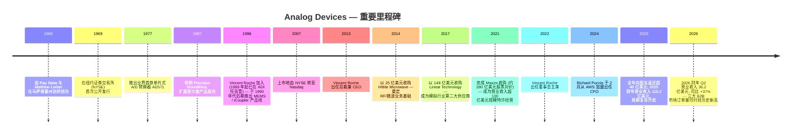
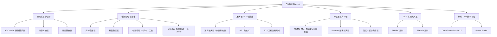
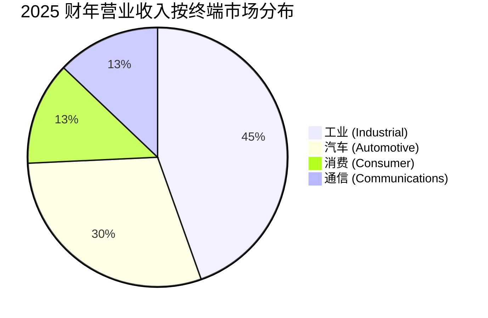
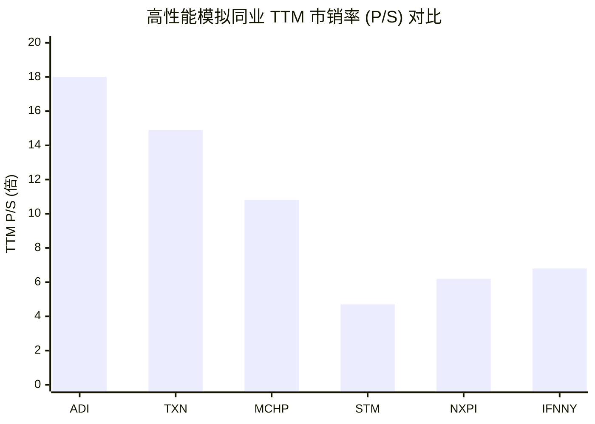
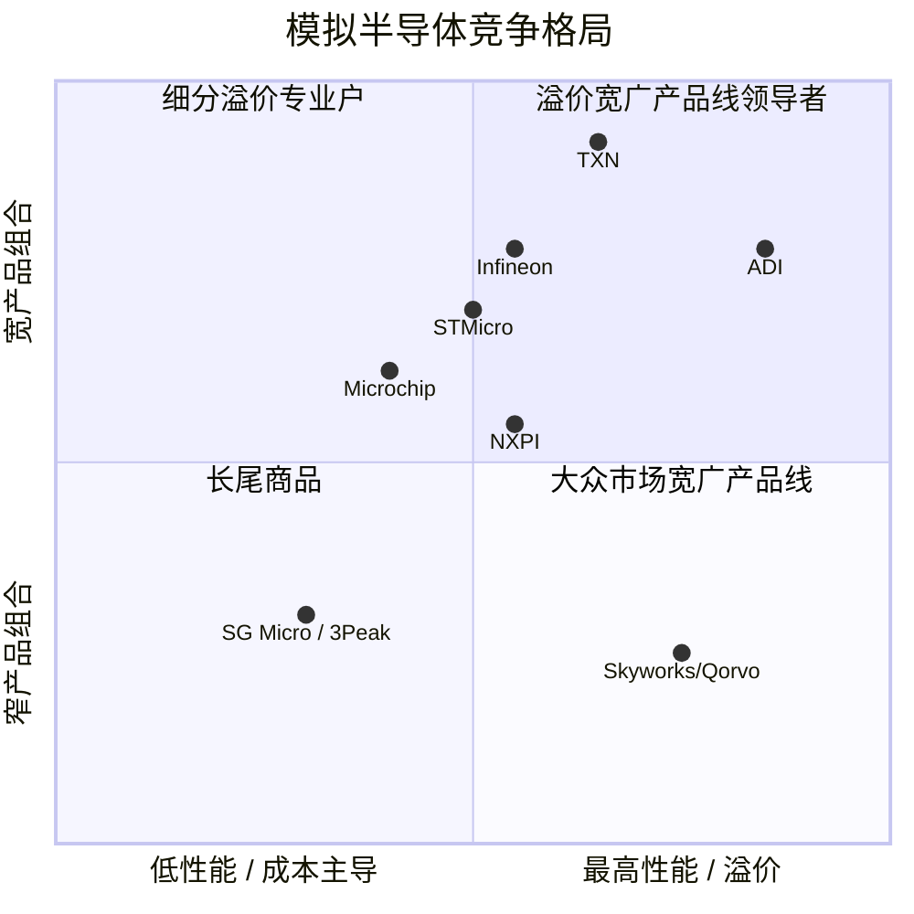
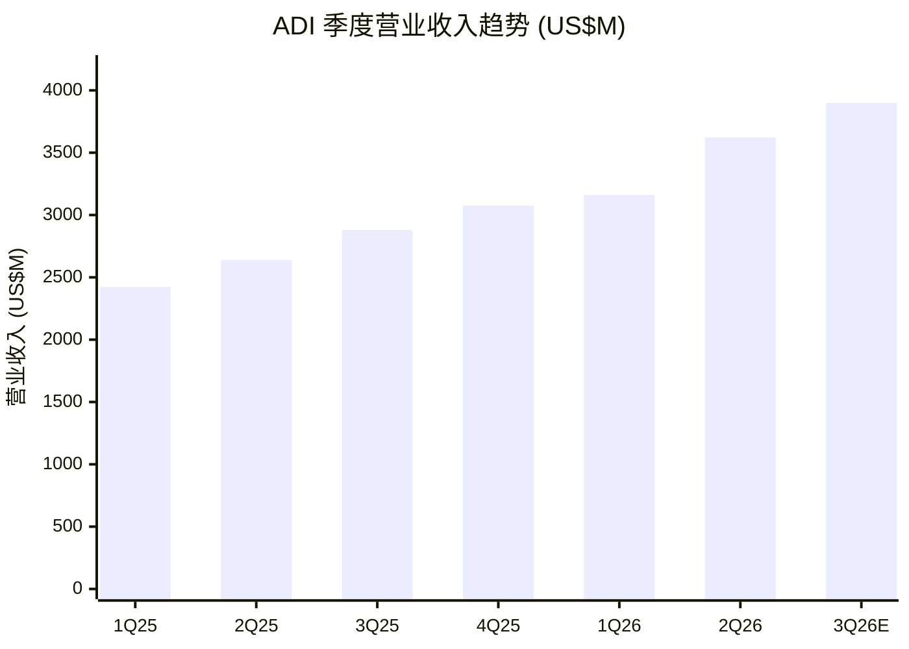

# Analog Devices, Inc. (NASDAQ:ADI) — 公司研究报告

**截至日期: 2026-06-15**
**上市地: 纳斯达克全球精选市场 (NASDAQ Global Select Market), 代码 ADI**
**注册地: 美国马萨诸塞州威尔明顿 (Wilmington, Massachusetts)**
**报告语言: 简体中文 (英文版同时存在于本目录)**

---

> **业绩更新——2026 财年指引在高位水平再次确认 (2026-05-20):** 与 2026 财年 Q2 业绩同步发布之际, 管理层指引 2026 财年 Q3 营业收入为 **39 亿美元 ± 1 亿美元** (隐含同比约 +33%)、调整后每股收益 (adjusted EPS) **3.30 美元 ± 0.15 美元**、调整后营业利润率 (adjusted operating margin) 约 **49.0% ± 100 个基点**——延续了自 2026 财年 Q1 开始的全面复苏。CFO Richard Puccio 将"我们的工业 (Industrial)、汽车 (Automotive) 与通信 (Communications) 三大 B2B 市场的订单量创下纪录"列为需求驱动因素。来源: [2026 财年 Q2 业绩公告, 2026-05-20](https://www.sec.gov/Archives/edgar/data/0000006281/000000628126000050/adi2q26exhibit991earnings.htm)。

---

## 投资摘要 (Investment Summary)

> 本摘要区块整体为 *分析师观点 (Analyst view)*——评级、12 个月目标价 (price target, PT)、前瞻估值与论点支柱均为本报告的前瞻判断, 不来自任何 SEC 文件; 10-K 中不含目标价。基础事实 (财务、客户、产品) 见正文各章并附主来源引用。

| 项目 | 数值 (*分析师观点*) |
|---|---|
| **评级 (Rating)** | **Overweight / 增持** |
| **12 个月目标价 (PT)** | **470 美元** |
| **当前股价 (2026-06-12 收盘)** | 417.79 美元 ([Yahoo Finance — ADI, accessed 2026-06-15](https://finance.yahoo.com/quote/ADI/)) |
| **隐含上行空间** | **约 +12.5%** (另加约 1.0% 股息率) |
| **估值方法** | FY2027E 调整后 EPS (adjusted EPS) 约 14.5 美元 × 32× 前瞻 P/E |
| **市值 / 企业价值 (EV)** | 约 2,035 / 2,180 亿美元 (约 4.87 亿股) ([Yahoo Finance — ADI, accessed 2026-06-15](https://finance.yahoo.com/quote/ADI/)) |
| **52 周区间** | 约 206 – 436 美元 |

**论点支柱 (4 条, 均为 *分析师观点*):**

1. **周期复苏已确立且加速。** 2026 财年 Q2 营业收入 36.2 亿美元、同比 +37%, 三大 B2B 市场 (工业 +56%、通信 +79%、汽车 +2%) 订单量同时创历史新高, Q3 指引隐含同比约 +33%——这是一次跨终端市场的全面上行, 而非单一板块反弹 ([Q2 FY26 8-K](https://www.sec.gov/Archives/edgar/data/0000006281/000000628126000050/adi2q26exhibit991earnings.htm))。
2. **AI 数据中心是被低估的二次增长引擎。** 通信板块 +79% 由 ADI 的电源管理、光连接 (optical connectivity) 与高速 ADC 内容驱动; *分析师观点:* AI 相关年化运行率已约 20 亿美元、约占营收 20%, 2026 年数据中心相关营收有望翻倍 ([Morgan Stanley — Semis Weekly (NVDA, ADI), 2026-05-18, p.1](http://xs-macbook-air.local:5001/zsxq/pdf/812454818812212/MS-Semiconductors%20%20Weekly%20%20Earnings%20Week%205%20%28NVDA%2C%20ADI%29-260518.pdf))。
3. **半导体行业顶尖的盈利质量与资本回报。** 2025 财年 GAAP 毛利率 (gross margin) 61.5% / 调整后 69.3%, 2026 财年 Q2 调整后营业利润率回升至 49.0%; TTM 自由现金流 (FCF) 46 亿美元、占营收 36%, 过去十年向股东返还约 240 亿美元 ([ADI 2026 Proxy](https://www.sec.gov/Archives/edgar/data/0000006281/000000628126000010/))。
4. **结构性低客户集中度构成隐性护城河。** 约 75,000 个 SKU、10 万+ 终端客户, 无单一客户占营收 >10%——没有任何一家客户"拥有"ADI 的增长率, 这是同业中最分散的需求基础之一 ([ADI FY2025 10-K, Concentrations of Risk](https://www.sec.gov/Archives/edgar/data/0000006281/000000628125000153/adi-20251101.htm))。

**主要风险 / 需盯紧的变量:** (i) 估值已计入大量复苏——前瞻 P/E 约 28–30×、远高于历史中位数, 任何工业复苏停滞或 AI 资本开支减速都将暴露倍数 (见第 9 章); (ii) 中国汽车需求走弱与本土模拟替代 (*分析师观点*, UBS); (iii) 代工产能集中于 TSMC 的尾部地缘风险。**最该盯紧的两个变量:** 工业自动化 book-to-bill 能否维持在 1.0 上方, 以及 AI 数据中心电源/光连接内容的放量斜率。

**前瞻估值矩阵 (*分析师观点*; EPS 为调整后口径):**

| 倍数 | FY2025A | FY2026E | FY2027E |
|---|---|---|---|
| 调整后 EPS (US$) | 7.79 | ~12.9 | ~14.5 |
| 前瞻 P/E (@417.79) | 53.6× | 32.4× | 28.8× |
| 营业收入 (US$bn) | 11.02 | ~15.0 | ~16.3 |
| 营收 YoY | +17% | ~+36% | ~+9% |

*基准: FY2025A 来自 [Q4 FY25 8-K](https://www.sec.gov/Archives/edgar/data/0000006281/000000628125000151/adiq425exhibit991.htm) (营收 110.20 亿美元、调整后 EPS 7.79 美元); FY2026E/FY2027E 为本报告前瞻估算, 详见第 2 章。*

**相对表现 (relative performance):** ADI 自 52 周低点约 206 美元已反弹约 +103% 至 417.79 美元, 显著跑赢费城半导体指数 (SOX) 与 S&P 500; 当前价接近 52 周高点 436 美元附近、位于 200 日均线上方 ([Yahoo Finance — ADI, accessed 2026-06-15](https://finance.yahoo.com/quote/ADI/))。

---

## 目录
1. 公司概览 (含 1A 估值快照 · 1B GF Score)
2. 估值与目标价 (前瞻模型 · PT 推导 · 牛/基准/熊 · 卖方观点演变)
3. 公司历史
4. 管理团队
5. 产品与服务
6. 客户与上市策略
7. 行业概览
8. 竞争格局
9. 市场机会 (TAM)
10. 风险评估
10.5 关键分歧与催化剂 (Key Debates & Catalysts)
11. 投资视角评分 (Investor-Lens Scorecards)

---

## 1. 公司概览

Analog Devices, Inc. (Nasdaq: ADI) 是一家总部位于美国马萨诸塞州威尔明顿 (Wilmington, Massachusetts) 的全球半导体龙头, 专注于**高性能模拟、混合信号、电源管理、射频 (RF) 及传感器集成电路 (high-performance analog, mixed-signal, power-management, RF and sensor integrated circuits)**——这些芯片连接物理世界与数字世界。公司将自己定位为"为客户所设计的系统提供感知、测量、解读、连接与供电的基础构件"的供应商 ([Analog Devices FY2025 10-K, Item 1 Business](https://www.sec.gov/Archives/edgar/data/0000006281/000000628125000153/adi-20251101.htm))。其产品组合超过 **75,000 个独立 SKU**, 覆盖数据转换器 (data converter, ADC/DAC)、放大器 (amplifier)、电源管理 IC (power management IC)、射频/微波 IC (RF/microwave IC)、MEMS 传感器、隔离器件 (isolation product) 以及边缘处理器与 DSP (Digital Signal Processor, 数字信号处理器), 使 ADI 与德州仪器 (Texas Instruments) 并列为全球两大纯高性能模拟芯片供应商 ([ADI FY2025 10-K, Products section](https://www.sec.gov/Archives/edgar/data/0000006281/000000628125000153/adi-20251101.htm))。

ADI 的收入模型直白: 公司设计差异化模拟 IC, 自有晶圆厂内制或外包代工, 然后通过直销 (2025 财年营业收入占比 43%) 或全球分销商 (2025 财年营业收入占比 56%) 销售给 OEM 与合约制造商 (Contract Manufacturer), 余下部分通过政府与其他渠道流通 ([ADI FY2025 10-K, MD&A — Revenue by Sales Channel](https://www.sec.gov/Archives/edgar/data/0000006281/000000628125000153/adi-20251101.htm))。产品目录以通用型、长生命周期产品为主——ADI 许多产品的量产寿命超过 15 年——并辅之以面向 ADI 模拟领域专业能力可获得溢价的细分垂直市场的专用产品。GAAP 口径毛利率 (gross margin) 在 **2025 财年为 61.5%** (报告值; 调整后非 GAAP 口径达 69.3%), 处于半导体行业最高水平之列, 是 ADI 投资逻辑的关键特征 ([ADI 2026 Proxy Statement, FY2025 Performance Highlights](https://www.sec.gov/Archives/edgar/data/0000006281/000000628126000010/))。

ADI 2025 财年 (截至 2025 年 11 月 1 日) 实现**营业收入 110.2 亿美元**, 同比增长 17%, 但仍较 2023 财年周期高点 123.1 亿美元低 10% ([ADI FY2025 10-K, Results of Operations](https://www.sec.gov/Archives/edgar/data/0000006281/000000628125000153/adi-20251101.htm))。经营性现金流 48.1 亿美元、自由现金流 (free cash flow, FCF) 42.8 亿美元, 分别占营业收入的 44% 与 39%。公司全球员工**约 24,500 人, 其中约 13,000 名工程师**——约占总员工数的 53%, 工程师密度异乎寻常的高, 这支撑起其约 16% 营业收入比例的研发投入强度 ([ADI FY2025 10-K, Human Capital](https://www.sec.gov/Archives/edgar/data/0000006281/000000628125000153/adi-20251101.htm))。截至 2025 年 11 月 1 日, ADI 持有约**4,780 项已授权美国专利**, 另有约 500 项已公开未授权申请 ([ADI FY2025 10-K, Intellectual Property](https://www.sec.gov/Archives/edgar/data/0000006281/000000628125000153/adi-20251101.htm))。制造业务大致按 50/50 分布于内部晶圆厂 (马萨诸塞州威尔明顿、华盛顿州 Camas、俄勒冈州 Beaverton、爱尔兰 Limerick) 与以 TSMC 为首的外部代工合作伙伴之间, 而封装测试主要集中在槟城 (马来西亚)、菲律宾、泰国, 以及第三方 OSAT (Outsourced Semiconductor Assembly and Test, 委外封装测试) 厂商。

地理上, 2025 财年营业收入 (按发货地/分销商所在地, 并非总是终端客户所在地) 分布为美国 32.4 亿美元 (29%)、中国 28.6 亿美元 (26%)、欧洲 22.9 亿美元 (21%)、其他亚洲 14.9 亿美元 (13%)、日本 9.9 亿美元 (9%)、其他美洲 1.6 亿美元 (1%) ([ADI FY2025 10-K, Geographic Revenue](https://www.sec.gov/Archives/edgar/data/0000006281/000000628125000153/adi-20251101.htm))。中国是 2025 财年主要地区中增长最快的, 同比增长 34%。终端市场结构方面, 2025 财年工业 45%、汽车 30%、消费 13%、通信 13%——这是一种刻意 B2B 偏向的结构, 管理层将其表述为约占总营业收入 87% ([ADI 2026 Proxy Statement](https://www.sec.gov/Archives/edgar/data/0000006281/000000628126000010/))。

**利润表 Sankey (FY2025) —"钱怎么赚":** 下图把 ADI 2025 财年 110.2 亿美元营收沿 COGS → 毛利 → 研发/SG&A/无形摊销 → 营业利润 → 税 → 净利分解, 左侧为四大终端市场来源。可一眼看到 ADI 高毛利结构 (毛利 67.7 亿美元 / 61.5%) 与较重的无形资产摊销 (Maxim/Linear 并购遗留, 7.5 亿美元) 如何把 GAAP 净利率压到 20.6%。

<svg xmlns="http://www.w3.org/2000/svg" viewBox="0 0 1000 560" width="1000" height="560" role="img" aria-label="income statement Sankey"><rect x="0" y="0" width="1000" height="560" fill="#ffffff"/>
<text x="20.00" y="30.00" text-anchor="start" font-family="Helvetica,Arial,sans-serif" font-size="15" font-weight="700" fill="#1f2933">ADI FY2025 利润表 Sankey (US$M)</text>
<path d="M 204.00,64.00 C 258.00,64.00 258.00,85.00 312.00,85.00 L 312.00,267.51 C 258.00,267.51 258.00,246.51 204.00,246.51 Z" fill="#93c5fd" fill-opacity="0.55"/>
<path d="M 452.00,78.00 C 506.00,78.00 506.00,145.68 560.00,145.68 L 560.00,254.25 C 506.00,254.25 506.00,186.58 452.00,186.58 Z" fill="#86efac" fill-opacity="0.55"/>
<path d="M 452.00,186.58 C 506.00,186.58 506.00,268.25 560.00,268.25 L 560.00,410.46 C 506.00,410.46 506.00,328.79 452.00,328.79 Z" fill="#fca5a5" fill-opacity="0.55"/>
<path d="M 328.00,85.00 C 382.00,85.00 382.00,78.00 436.00,78.00 L 436.00,328.79 C 382.00,328.79 382.00,335.79 328.00,335.79 Z" fill="#86efac" fill-opacity="0.55"/>
<path d="M 328.00,335.79 C 382.00,335.79 382.00,342.79 436.00,342.79 L 436.00,500.00 C 382.00,500.00 382.00,493.00 328.00,493.00 Z" fill="#fca5a5" fill-opacity="0.55"/>
<path d="M 576.00,145.68 C 630.00,145.68 630.00,146.54 684.00,146.54 L 684.00,255.11 C 630.00,255.11 630.00,254.25 576.00,254.25 Z" fill="#86efac" fill-opacity="0.55"/>
<path d="M 700.00,146.54 C 754.00,146.54 754.00,231.65 808.00,231.65 L 808.00,315.59 C 754.00,315.59 754.00,230.49 700.00,230.49 Z" fill="#86efac" fill-opacity="0.55"/>
<path d="M 700.00,230.49 C 754.00,230.49 754.00,329.59 808.00,329.59 L 808.00,346.35 C 754.00,346.35 754.00,247.25 700.00,247.25 Z" fill="#fca5a5" fill-opacity="0.55"/>
<path d="M 204.00,260.51 C 258.00,260.51 258.00,267.51 312.00,267.51 L 312.00,388.87 C 258.00,388.87 258.00,381.87 204.00,381.87 Z" fill="#93c5fd" fill-opacity="0.55"/>
<path d="M 576.00,268.25 C 630.00,268.25 630.00,261.25 684.00,261.25 L 684.00,307.73 C 630.00,307.73 630.00,314.73 576.00,314.73 Z" fill="#fca5a5" fill-opacity="0.55"/>
<path d="M 576.00,314.73 C 630.00,314.73 630.00,321.73 684.00,321.73 L 684.00,387.11 C 630.00,387.11 630.00,380.11 576.00,380.11 Z" fill="#fca5a5" fill-opacity="0.55"/>
<path d="M 576.00,380.11 C 630.00,380.11 630.00,401.11 684.00,401.11 L 684.00,431.46 C 630.00,431.46 630.00,410.46 576.00,410.46 Z" fill="#fca5a5" fill-opacity="0.55"/>
<path d="M 204.00,395.87 C 258.00,395.87 258.00,388.87 312.00,388.87 L 312.00,441.99 C 258.00,441.99 258.00,448.98 204.00,448.98 Z" fill="#93c5fd" fill-opacity="0.55"/>
<path d="M 576.00,424.46 C 630.00,424.46 630.00,255.11 684.00,255.11 L 684.00,262.98 C 630.00,262.98 630.00,432.32 576.00,432.32 Z" fill="#93c5fd" fill-opacity="0.55"/>
<path d="M 204.00,462.98 C 258.00,462.98 258.00,441.99 312.00,441.99 L 312.00,493.00 C 258.00,493.00 258.00,514.00 204.00,514.00 Z" fill="#93c5fd" fill-opacity="0.55"/>
<rect x="188.00" y="64.00" width="16" height="182.51" rx="1.5" fill="#2563eb"/>
<rect x="188.00" y="260.51" width="16" height="121.36" rx="1.5" fill="#2563eb"/>
<rect x="188.00" y="395.87" width="16" height="53.12" rx="1.5" fill="#2563eb"/>
<rect x="188.00" y="462.98" width="16" height="51.02" rx="1.5" fill="#2563eb"/>
<rect x="312.00" y="85.00" width="16" height="408.00" rx="1.5" fill="#1e3a8a"/>
<rect x="436.00" y="78.00" width="16" height="250.78" rx="1.5" fill="#15803d"/>
<rect x="436.00" y="342.79" width="16" height="157.21" rx="1.5" fill="#dc2626"/>
<rect x="560.00" y="145.68" width="16" height="108.57" rx="1.5" fill="#15803d"/>
<rect x="560.00" y="268.25" width="16" height="142.21" rx="1.5" fill="#dc2626"/>
<rect x="560.00" y="424.46" width="16" height="7.86" rx="1.5" fill="#2563eb"/>
<rect x="684.00" y="146.54" width="16" height="100.71" rx="1.5" fill="#15803d"/>
<rect x="684.00" y="261.25" width="16" height="46.48" rx="1.5" fill="#dc2626"/>
<rect x="684.00" y="321.73" width="16" height="65.38" rx="1.5" fill="#dc2626"/>
<rect x="684.00" y="401.11" width="16" height="30.35" rx="1.5" fill="#dc2626"/>
<rect x="808.00" y="231.65" width="16" height="83.95" rx="1.5" fill="#15803d"/>
<rect x="808.00" y="329.59" width="16" height="16.76" rx="1.5" fill="#dc2626"/>
<text x="179.00" y="152.25" text-anchor="end" font-family="Helvetica,Arial,sans-serif" font-size="11.5" font-weight="700" fill="#1f2933">Industrial 工业</text>
<text x="179.00" y="165.25" text-anchor="end" font-family="Helvetica,Arial,sans-serif" font-size="10" font-weight="400" fill="#52606d">$4.9B  (44.7%)</text>
<text x="179.00" y="318.19" text-anchor="end" font-family="Helvetica,Arial,sans-serif" font-size="11.5" font-weight="700" fill="#1f2933">Automotive 汽车</text>
<text x="179.00" y="331.19" text-anchor="end" font-family="Helvetica,Arial,sans-serif" font-size="10" font-weight="400" fill="#52606d">$3.3B  (29.7%)</text>
<text x="179.00" y="419.43" text-anchor="end" font-family="Helvetica,Arial,sans-serif" font-size="11.5" font-weight="700" fill="#1f2933">Consumer 消费</text>
<text x="179.00" y="432.43" text-anchor="end" font-family="Helvetica,Arial,sans-serif" font-size="10" font-weight="400" fill="#52606d">$1.4B  (13.0%)</text>
<text x="179.00" y="485.49" text-anchor="end" font-family="Helvetica,Arial,sans-serif" font-size="11.5" font-weight="700" fill="#1f2933">Communications 通信</text>
<text x="179.00" y="498.49" text-anchor="end" font-family="Helvetica,Arial,sans-serif" font-size="10" font-weight="400" fill="#52606d">$1.4B  (12.5%)</text>
<rect x="331.00" y="67.00" width="106.80" height="26" rx="2" fill="#ffffff" fill-opacity="0.72"/>
<text x="334.00" y="79.00" text-anchor="start" font-family="Helvetica,Arial,sans-serif" font-size="11.5" font-weight="700" fill="#1f2933">Revenue</text>
<text x="334.00" y="92.00" text-anchor="start" font-family="Helvetica,Arial,sans-serif" font-size="10" font-weight="400" fill="#52606d">$11.0B  (100.0%)</text>
<rect x="455.00" y="60.00" width="94.20" height="26" rx="2" fill="#ffffff" fill-opacity="0.72"/>
<text x="458.00" y="72.00" text-anchor="start" font-family="Helvetica,Arial,sans-serif" font-size="11.5" font-weight="700" fill="#1f2933">Gross Profit</text>
<text x="458.00" y="85.00" text-anchor="start" font-family="Helvetica,Arial,sans-serif" font-size="10" font-weight="400" fill="#52606d">$6.8B  (61.5%)</text>
<rect x="455.00" y="324.79" width="144.60" height="26" rx="2" fill="#ffffff" fill-opacity="0.72"/>
<text x="458.00" y="336.79" text-anchor="start" font-family="Helvetica,Arial,sans-serif" font-size="11.5" font-weight="700" fill="#1f2933">Cost of Revenue (COGS)</text>
<text x="458.00" y="349.79" text-anchor="start" font-family="Helvetica,Arial,sans-serif" font-size="10" font-weight="400" fill="#52606d">$4.2B  (38.5%)</text>
<rect x="579.00" y="127.68" width="106.80" height="26" rx="2" fill="#ffffff" fill-opacity="0.72"/>
<text x="582.00" y="139.68" text-anchor="start" font-family="Helvetica,Arial,sans-serif" font-size="11.5" font-weight="700" fill="#1f2933">Operating Income</text>
<text x="582.00" y="152.68" text-anchor="start" font-family="Helvetica,Arial,sans-serif" font-size="10" font-weight="400" fill="#52606d">$2.9B  (26.6%)</text>
<rect x="579.00" y="250.25" width="150.90" height="26" rx="2" fill="#ffffff" fill-opacity="0.72"/>
<text x="582.00" y="262.25" text-anchor="start" font-family="Helvetica,Arial,sans-serif" font-size="11.5" font-weight="700" fill="#1f2933">Total Operating Expense</text>
<text x="582.00" y="275.25" text-anchor="start" font-family="Helvetica,Arial,sans-serif" font-size="10" font-weight="400" fill="#52606d">$3.8B  (34.9%)</text>
<text x="551.00" y="425.39" text-anchor="end" font-family="Helvetica,Arial,sans-serif" font-size="11.5" font-weight="700" fill="#1f2933">Net Interest / Other Income</text>
<text x="551.00" y="438.39" text-anchor="end" font-family="Helvetica,Arial,sans-serif" font-size="10" font-weight="400" fill="#52606d">$212.4M  (1.9%)</text>
<rect x="703.00" y="128.54" width="94.20" height="26" rx="2" fill="#ffffff" fill-opacity="0.72"/>
<text x="706.00" y="140.54" text-anchor="start" font-family="Helvetica,Arial,sans-serif" font-size="11.5" font-weight="700" fill="#1f2933">Pretax Income</text>
<text x="706.00" y="153.54" text-anchor="start" font-family="Helvetica,Arial,sans-serif" font-size="10" font-weight="400" fill="#52606d">$2.7B  (24.7%)</text>
<rect x="703.00" y="243.25" width="94.20" height="26" rx="2" fill="#ffffff" fill-opacity="0.72"/>
<text x="706.00" y="255.25" text-anchor="start" font-family="Helvetica,Arial,sans-serif" font-size="11.5" font-weight="700" fill="#1f2933">SG&amp;A</text>
<text x="706.00" y="268.25" text-anchor="start" font-family="Helvetica,Arial,sans-serif" font-size="10" font-weight="400" fill="#52606d">$1.3B  (11.4%)</text>
<rect x="703.00" y="303.73" width="94.20" height="26" rx="2" fill="#ffffff" fill-opacity="0.72"/>
<text x="706.00" y="315.73" text-anchor="start" font-family="Helvetica,Arial,sans-serif" font-size="11.5" font-weight="700" fill="#1f2933">R&amp;D</text>
<text x="706.00" y="328.73" text-anchor="start" font-family="Helvetica,Arial,sans-serif" font-size="10" font-weight="400" fill="#52606d">$1.8B  (16.0%)</text>
<rect x="703.00" y="383.11" width="100.50" height="26" rx="2" fill="#ffffff" fill-opacity="0.72"/>
<text x="706.00" y="395.11" text-anchor="start" font-family="Helvetica,Arial,sans-serif" font-size="11.5" font-weight="700" fill="#1f2933">Other OpEx</text>
<text x="706.00" y="408.11" text-anchor="start" font-family="Helvetica,Arial,sans-serif" font-size="10" font-weight="400" fill="#52606d">$819.7M  (7.4%)</text>
<text x="833.00" y="270.62" text-anchor="start" font-family="Helvetica,Arial,sans-serif" font-size="11.5" font-weight="700" fill="#1f2933">Net Income</text>
<text x="833.00" y="283.62" text-anchor="start" font-family="Helvetica,Arial,sans-serif" font-size="10" font-weight="400" fill="#52606d">$2.3B  (20.6%)</text>
<text x="833.00" y="334.97" text-anchor="start" font-family="Helvetica,Arial,sans-serif" font-size="11.5" font-weight="700" fill="#1f2933">Income Tax</text>
<text x="833.00" y="347.97" text-anchor="start" font-family="Helvetica,Arial,sans-serif" font-size="10" font-weight="400" fill="#52606d">$452.8M  (4.1%)</text>
<text x="500.00" y="544.00" text-anchor="middle" font-family="Helvetica,Arial,sans-serif" font-size="10" font-weight="400" fill="#52606d">Source: ADI FY2025 10-K (FY ended 2025-11-01), SEC EDGAR — Consolidated Statements of Income; end-market split from FY2025 10-K MD&amp;A (Revenue Trends by End Market)</text>
</svg>

*来源: [ADI FY2025 10-K — 合并利润表](https://www.sec.gov/Archives/edgar/data/0000006281/000000628125000153/adi-20251101.htm); 终端市场拆分来自 [ADI FY2025 10-K MD&A — Revenue by End Market](https://www.sec.gov/Archives/edgar/data/0000006281/000000628125000153/adi-20251101.htm)。*

**估值快照 (截至 2026-06-15; 价格为 2026-06-12 收盘)。** ADI 收盘价 **417.79 美元** (自 5 月 20 日的 392.71 美元继续走高), 对应**市值约 2,035 亿美元**、企业价值 (EV) **约 2,180 亿美元**, 约 4.87 亿股摊薄股本 ([Yahoo Finance — ADI, accessed 2026-06-15](https://finance.yahoo.com/quote/ADI/))。主要估值倍数——**TTM 市盈率 (P/E) 约 73 倍 (受周期底部 EPS 失真)、前瞻市盈率 (forward P/E) 约 28–30 倍、TTM 市销率 (P/S) 约 18 倍、市净率 (P/B) 约 6 倍、EV/EBITDA 约 38 倍、股息率约 1.0%、贝塔 (beta) 约 1.2**——明显高于 ADI 自身的长期均值, 也高于德州仪器 (TXN) 与更广泛模拟同业。*分析师观点:* UBS 指出模拟板块整体当前交易于约 30× 的 12 个月前瞻 P/E, 而其 10 年历史均值仅约 19×——近期强涨后需精选标的 ([UBS — Auto/Analog Semis: Sustained Analog Momentum, 2026-06-11, p.1](http://xs-macbook-air.local:5001/zsxq/pdf/584255214544244/UBS-UBS%20Global%20I%20O%20Semiconductors%20Auto%20semis%EF%BC%9A%20Sustained%20Analog%20Momentum%EF%BC%8C%20but%20Selectivity%20Warranted-260611.pdf))。

**为什么估值倍数被拉得这么高?** 三股力量。第一, **周期性盈利底部**: 2024 财年 GAAP 每股收益仅 3.28 美元, 因营业收入下滑 23% 与晶圆厂低稼动率导致毛利率压缩而严重受抑; 即便 2025 财年 GAAP EPS 4.56 美元 (调整后 7.79 美元), TTM P/E 分母仍被周期低位拉高, 因此用前瞻口径 (调整后 EPS) 更能代表正常化估值水平 ([Q4 FY25 8-K](https://www.sec.gov/Archives/edgar/data/0000006281/000000628125000151/adiq425exhibit991.htm))。第二, **清晰的周期复苏逻辑**: 2026 财年 Q2 营业收入同比增长 37%, CFO 表示三大 B2B 市场订单量均创历史新高, 调整后营业利润率回升至 49.0%——重回 Maxim 并购后历史 41–49% 区间 ([Q2 FY26 release](https://www.sec.gov/Archives/edgar/data/0000006281/000000628126000050/adi2q26exhibit991earnings.htm))。第三, **边缘 AI / 数据中心叙事溢价**——2026 财年 Q2 通信营业收入同比飙升 79%, 由 ADI 在 AI 数据中心基础设施中的电源管理、光连接 (optical connectivity) 与高速转换器内容驱动, 市场正赋予 ADI 部分 AI 基础设施倍数, 尽管该业务仅约占总营业收入 15%。

当前估值倍数仅在以下条件下才合理: (a) 2026 财年调整后每股收益强劲复苏至约 12.5–13 美元、2027 财年约 14.5 美元区间, 使前瞻 P/E 进入约 28–32 倍区间; (b) 跨越周期的中至高个位数营业收入 CAGR 结构性逻辑成立。任何工业复苏停滞或 AI 数据中心资本开支显著减速都将暴露该估值倍数——详见第 9 章估值压缩风险与第 2 章 PT 推导。

### 1B. GF Score (GuruFocus 式) 基本面评分卡

> *分析师观点:* GF Score 是本报告自有的五维基本面评分 (rubric), 模仿 GuruFocus 的 GF Score™ 形式, **不来自 GuruFocus、也不附任何文件引用**; 五个子分及综合分均为分析师评分。各维度背后的指标 (毛利率、杠杆、CAGR、倍数、回报) 在第 1A / 第 2 章已各自引用主来源。

<svg xmlns="http://www.w3.org/2000/svg" viewBox="0 0 500 500" width="500" height="500" role="img" aria-label="GF Score radar">
<rect x="0" y="0" width="500" height="500" fill="#ffffff"/>
<text x="20" y="24" font-family="Helvetica,Arial,sans-serif" font-size="15" font-weight="700" fill="#1f2933">GF Score (GuruFocus-style): 66/100</text>
<text x="20" y="41" font-family="Helvetica,Arial,sans-serif" font-size="11" fill="#52606d">51–70 Poor future performance potential</text>
<polygon points="250.0,88.0 392.7,191.6 338.2,359.4 161.8,359.4 107.3,191.6" fill="#e9f5ec" stroke="none"/>
<polygon points="250.0,208.0 278.5,228.7 267.6,262.3 232.4,262.3 221.5,228.7" fill="none" stroke="#c5d3cb" stroke-width="1"/>
<polygon points="250.0,178.0 307.1,219.5 285.3,286.5 214.7,286.5 192.9,219.5" fill="none" stroke="#c5d3cb" stroke-width="1"/>
<polygon points="250.0,148.0 335.6,210.2 302.9,310.8 197.1,310.8 164.4,210.2" fill="none" stroke="#c5d3cb" stroke-width="1"/>
<polygon points="250.0,118.0 364.1,200.9 320.5,335.1 179.5,335.1 135.9,200.9" fill="none" stroke="#c5d3cb" stroke-width="1"/>
<polygon points="250.0,88.0 392.7,191.6 338.2,359.4 161.8,359.4 107.3,191.6" fill="none" stroke="#c5d3cb" stroke-width="1.3"/>
<line x1="250" y1="238" x2="161.8" y2="359.4" stroke="#cfdad3" stroke-width="1"/>
<text x="146.5" y="392.4" text-anchor="end" font-family="Helvetica,Arial,sans-serif" font-size="11.5" font-weight="600" fill="#1f2933">Financial Strength</text>
<text x="146.5" y="405.4" text-anchor="end" font-family="Helvetica,Arial,sans-serif" font-size="9.5" fill="#52606d">财务实力</text>
<text x="197.1" y="304.8" text-anchor="middle" font-family="Helvetica,Arial,sans-serif" font-size="10.5" font-weight="700" fill="#1f2933">6</text>
<line x1="250" y1="238" x2="250.0" y2="88.0" stroke="#cfdad3" stroke-width="1"/>
<text x="250.0" y="58.0" text-anchor="middle" font-family="Helvetica,Arial,sans-serif" font-size="11.5" font-weight="600" fill="#1f2933">Profitability</text>
<text x="250.0" y="71.0" text-anchor="middle" font-family="Helvetica,Arial,sans-serif" font-size="9.5" fill="#52606d">盈利能力</text>
<text x="250.0" y="97.0" text-anchor="middle" font-family="Helvetica,Arial,sans-serif" font-size="10.5" font-weight="700" fill="#1f2933">9</text>
<line x1="250" y1="238" x2="107.3" y2="191.6" stroke="#cfdad3" stroke-width="1"/>
<text x="82.6" y="183.6" text-anchor="end" font-family="Helvetica,Arial,sans-serif" font-size="11.5" font-weight="600" fill="#1f2933">Growth</text>
<text x="82.6" y="196.6" text-anchor="end" font-family="Helvetica,Arial,sans-serif" font-size="9.5" fill="#52606d">成长性</text>
<text x="164.4" y="204.2" text-anchor="middle" font-family="Helvetica,Arial,sans-serif" font-size="10.5" font-weight="700" fill="#1f2933">6</text>
<line x1="250" y1="238" x2="392.7" y2="191.6" stroke="#cfdad3" stroke-width="1"/>
<text x="417.4" y="183.6" text-anchor="start" font-family="Helvetica,Arial,sans-serif" font-size="11.5" font-weight="600" fill="#1f2933">GF Value</text>
<text x="417.4" y="196.6" text-anchor="start" font-family="Helvetica,Arial,sans-serif" font-size="9.5" fill="#52606d">估值</text>
<text x="292.8" y="218.1" text-anchor="middle" font-family="Helvetica,Arial,sans-serif" font-size="10.5" font-weight="700" fill="#1f2933">3</text>
<line x1="250" y1="238" x2="338.2" y2="359.4" stroke="#cfdad3" stroke-width="1"/>
<text x="353.5" y="392.4" text-anchor="start" font-family="Helvetica,Arial,sans-serif" font-size="11.5" font-weight="600" fill="#1f2933">Momentum</text>
<text x="353.5" y="405.4" text-anchor="start" font-family="Helvetica,Arial,sans-serif" font-size="9.5" fill="#52606d">动量</text>
<text x="320.5" y="329.1" text-anchor="middle" font-family="Helvetica,Arial,sans-serif" font-size="10.5" font-weight="700" fill="#1f2933">8</text>
<polygon points="250.0,103.0 292.8,224.1 320.5,335.1 197.1,310.8 164.4,210.2" fill="#2e8b57" fill-opacity="0.34" stroke="#2e8b57" stroke-width="2"/>
<circle cx="197.1" cy="310.8" r="2.6" fill="#2e8b57"/>
<circle cx="250.0" cy="103.0" r="2.6" fill="#2e8b57"/>
<circle cx="164.4" cy="210.2" r="2.6" fill="#2e8b57"/>
<circle cx="292.8" cy="224.1" r="2.6" fill="#2e8b57"/>
<circle cx="320.5" cy="335.1" r="2.6" fill="#2e8b57"/>
<text x="250" y="470" text-anchor="middle" font-family="Helvetica,Arial,sans-serif" font-size="9.5" fill="#52606d">Source: ADI FY2025 10-K + Q2 FY2026 8-K · Yahoo Finance (as of 2026-06-12) · analyst rubric</text>
<text x="250" y="485" text-anchor="middle" font-family="Helvetica,Arial,sans-serif" font-size="9" fill="#52606d">GF Score = independent analyst rubric (*Analyst view:*) — not GuruFocus™ official number</text>
</svg>

| 维度 / Dimension | 评分 / Score (0–10) | |
|---|---|---|
| Financial Strength (财务实力) | 6 | `██████░░░░` |
| Profitability (盈利能力) | 9 | `█████████░` |
| Growth (成长性) | 6 | `██████░░░░` |
| GF Value (估值) | 3 | `███░░░░░░░` |
| Momentum (动量) | 8 | `████████░░` |
| **GF Score (composite, *Analyst view:*)** | **66 / 100** | **51–70 Poor future performance potential** |

*Composite weights (*Analyst view:*): Financial Strength 20% · Profitability 25% · Growth 25% · GF Value 15% · Momentum 15% (transparent reproduction — not GuruFocus's proprietary weighting).*

*综合 **66/100** (Financial Strength 6 · Profitability 9 · Growth 6 · GF Value 3 · Momentum 8)。来源: ADI FY2025 10-K + Q2 FY2026 8-K · Yahoo Finance (2026-06-12) · 分析师评分 rubric。*

- **Financial Strength 财务强度 6/10。** ADI 净负债为正 (长期债务 81.5 亿美元 vs 现金+短投 36.5 亿美元), 但利息保障倍数稳健 (FY2025 营业利润 29.3 亿美元 / 利息支出 3.18 亿美元 ≈ 9.2×), 维持投资级评级; 扣分项是 Maxim 并购带来的高商誉 (269 亿美元)+无形资产 (80 亿美元) 占总资产逾七成, 账面杠杆偏高 ([ADI FY2025 10-K — Balance Sheets](https://www.sec.gov/Archives/edgar/data/0000006281/000000628125000153/adi-20251101.htm))。
- **Profitability 盈利能力 9/10。** 半导体行业顶尖: 2025 财年 GAAP 毛利率 61.5% / 调整后 69.3%, 净利率 20.6%, 2026 财年 Q2 调整后营业利润率回升至 49.0% ([Q2 FY26 8-K](https://www.sec.gov/Archives/edgar/data/0000006281/000000628126000050/adi2q26exhibit991earnings.htm))。唯一未给满分是因 ROE/ROIC 被巨额并购商誉摊薄。
- **Growth 成长性 6/10。** 高度周期性: FY2024 营收 −23%、FY2025 +17% 复苏、FY2026E 约 +36%; 5 年营收 CAGR 被 Maxim 并表拉高、内生增速则为中个位数。当前处于周期上行段但波动性高, 给中性偏上分。
- **GF Value 估值 (越高越便宜) 3/10。** 偏贵: 前瞻 P/E 约 28–30×、P/S 约 18×, 均显著高于自身历史中位数与同业, MoS (margin of safety) 有限——这是评级仅为 Overweight 而非高信念 Buy 的主因。
- **Momentum 动能 8/10。** 自 52 周低点约 206 美元反弹约 +103%、接近 52 周高点、位于 200 日均线上方, 6/12 个月绝对与相对收益均跑赢 SOX 与 S&P 500 ([Yahoo Finance — ADI, accessed 2026-06-15](https://finance.yahoo.com/quote/ADI/))。

---

## 2. 估值与目标价 (Valuation & Price Target)

> 本章整体为 *分析师观点 (Analyst view)*。前瞻估计、目标价与情景 PT 均为本报告前瞻判断, 不来自任何 SEC 文件。各驱动因子的外部基准 (filing 分部数据、管理层指引、行业预测、卖方一致预期) 在段内分别引用。

### 前瞻财务模型 (FY2026E–FY2028E)

模型自下而上: 以 2026 财年上半年实绩 (营收 67.84 亿美元) 为基, 按 Q3 指引 (39 亿美元 ±1 亿) 与 Q4 季节性外推 2H26, 再叠加工业/通信复苏斜率与汽车的温和恢复。各终端市场单独建模再汇总——工业 (FY26 同比约 +45%, 复苏弹性最大)、通信 (同比约 +50%, AI 数据中心驱动)、汽车 (同比约 +5%, 受中国车市拖累)、消费 (约 +20%)。利润率随稼动率回升与产品组合改善而扩张, 调整后营业利润率 FY26 约 49%。

| (US$, 调整后口径) | FY2025A | FY2026E | FY2027E | FY2028E |
|---|---|---|---|---|
| 营业收入 (bn) | 11.02 | ~15.0 | ~16.3 | ~17.5 |
| 营收 YoY | +17% | ~+36% | ~+9% | ~+7% |
| 调整后毛利率 | 69.3% | ~70.5% | ~71% | ~71% |
| 调整后营业利润率 | 41.9% | ~49% | ~50% | ~50% |
| 调整后 EPS | 7.79 | ~12.9 | ~14.5 | ~16.0 |
| 前瞻 P/E (@417.79) | 53.6× | 32.4× | 28.8× | 26.1× |

*基准: FY2025A 来自 [Q4 FY25 8-K](https://www.sec.gov/Archives/edgar/data/0000006281/000000628125000151/adiq425exhibit991.htm) (营收 110.20 亿美元、调整后 EPS 7.79 美元、调整后营业利润率 41.9%); 1H FY26 实绩 67.84 亿美元、Q3 指引来自 [Q2 FY26 8-K](https://www.sec.gov/Archives/edgar/data/0000006281/000000628126000050/adi2q26exhibit991earnings.htm); FY26–FY28 营收/EPS 为本报告前瞻估算; 行业增速基准 *分析师观点:* UBS 将工业半导体 2026E 上调至同比 +25%、汽车 +10% ([UBS, 2026-06-11, p.1](http://xs-macbook-air.local:5001/zsxq/pdf/584255214544244/UBS-UBS%20Global%20I%20O%20Semiconductors%20Auto%20semis%EF%BC%9A%20Sustained%20Analog%20Momentum%EF%BC%8C%20but%20Selectivity%20Warranted-260611.pdf))。*

### 目标价推导 (PT derivation)

**方法: 前瞻 P/E × 调整后 EPS。** 以 FY2027E 调整后 EPS 约 **14.5 美元** × 目标倍数 **32×** = **464 美元**, 取整 **12 个月目标价 470 美元**, 较 2026-06-12 收盘价 417.79 美元隐含约 **+12.5%** 上行 (另加约 1.0% 股息率)。

**为什么用 32×?** 模拟板块当前 12 个月前瞻 P/E 约 30× (UBS, 见上), ADI 凭借同业最高的毛利率 (调整后 69%+)、最分散的客户结构、与最强的资本回报记录, 历来享有相对德州仪器 (TXN) 与 NXP 的溢价。32× 是给予 ADI 相对板块约 +5–7% 的小幅溢价, 而非顶峰估值。对照具名同业: TXN 前瞻 P/E 约 30×、NXP 约 20×、英飞凌约 25×——ADI 的溢价由其结构性更高的盈利质量支撑。该倍数仍低于 ADI 自身 2021–2023 牛市阶段触及的高 30 倍水平。

### 牛市 / 基准 / 熊市情景 (均为 *分析师观点*)

| 情景 | 关键摆动假设 | FY27E 调整后 EPS | 目标倍数 | 目标价 | 较 417.79 的隐含空间 |
|---|---|---|---|---|---|
| **牛市 Bull** | AI 数据中心内容持续翻倍 + 工业复苏加速, 营收提前破 17bn | ~15.5 | 36× | **560 美元** | **+34%** |
| **基准 Base** | 周期稳步上行, 工业/通信复苏延续, 汽车温和 | ~14.5 | 32× | **470 美元** | **+12.5%** |
| **熊市 Bear** | 工业复苏停滞 + 中国车市二次去库存 + AI 资本开支减速, 倍数回归历史中位 | ~12.5 | 22× | **275 美元** | **−34%** |

风险回报大致对称偏正 (基准 +12.5% / 牛市 +34% / 熊市 −34%)——这正是评级落在 Overweight 而非高信念 Buy 的原因: 上行真实但已被部分定价, 下行由强劲 FCF 与资本回报政策构筑底部 (见第 9 章)。

### 与市场一致预期的对比 + 卖方观点演变 (Sell-side view evolution)

**机械化预过程 (`db/stock_price_target.db` 只读)。** 对 ADI 共 8 条记录: 评级以 **Buy / Overweight 为主** (UBS Buy、GS Buy、JPM Overweight、MS Overweight), Bernstein 为唯一谨慎方 (Market-Perform)。有效硬目标价分散于 **270–490 美元**: UBS 490 美元 (2026-05-11)、Bernstein 旧 270 美元 (2026-01)、MS 288 美元 (注: 见下方"陷阱"说明)。本报告基准 PT 470 美元接近 UBS, 显著高于 MS/Bernstein 的谨慎档。

> **PT 数据陷阱 (已核查):** PT 库中 MS 一行记录 PT 288 美元 / 报告日股价 417.44 美元 (隐含 −31%), 但 MS 该周报原文表述为"目标价维持 288 美元、较当前股价约 +13% 上行"——说明 288 美元是 MS 在 ADI 股价约 255 美元时设定的旧目标, 在 5 月财报周周报中被沿用未更新, 而非对 417 美元股价的新目标。本报告因此不把 288 美元当作"当前 −31% 下行的有效目标", 而视为偏低的滞后目标; MS 的有效信号是其维持的 Overweight 评级。

**按机构的观点时间线 (按报告日排序):**

| 机构 | 报告日 | 评级 / 目标价 | 报告日股价 / 隐含空间 | 核心论点 |
|---|---|---|---|---|
| UBS | 2025-12-08 | (无评级) PT 320 美元 | 277.50 / +15% | 模拟复苏初确认, 早期目标 320 美元 |
| Bernstein | 2026-01-13 | Market-Perform / PT 270 美元 | 294.48 / −8% | CES 后谨慎: 估值差距难收窄 |
| J.P. Morgan | 2026-04-27 | Overweight | 391.52 | CY26 数据中心资本开支上修、AI 价值链全面正面 |
| Goldman Sachs | 2026-05-04 | Buy | 395.94 | SIA 数据显示广泛超季节性 |
| Bernstein | 2026-05-07 | Market-Perform | 407.40 | 解析模拟估值差距: 什么能收窄 |
| **UBS** | **2026-05-11** | **Buy / PT 490 美元** | **421.58 / +16%** | **模拟财报回顾, ADI 列为首选买入** |
| MS | 2026-05-18 | Overweight / PT 288 美元 (滞后, 见陷阱) | 417.44 | AI 运行率约 20 亿美元、占营收 20%; 工业复苏弹性足 |
| UBS | 2026-06-13 | Buy (重申, 首选名单) | — | 模拟上行周期延续, 但需精选、规避中国车市敞口 |

**机构间分歧 (不混为虚假一致):**

| 机构 | 日期 | 评级 / PT | 核心论点 | 什么证据能证明其正确 |
|---|---|---|---|---|
| UBS | 2026-06-13 | Buy / 490 美元 | 工业 +25% 上修、AI 需求渐显, ADI 是首选 | 工业 book-to-bill 维持 >1.0; 通信连续翻倍 |
| Morgan Stanley | 2026-05-18 | Overweight | AI 运行率 20 亿美元、周期管理能力优于同业 | 数据中心营收 2026 翻倍兑现; 营业利润率 >49% |
| Bernstein | 2026-05-07 | Market-Perform | 估值差距大、难以靠基本面收窄 | 前瞻 P/E 回归历史中位; 工业复苏不及预期 |

*所有卖方观点均为 *分析师观点 (Analyst view)*, 引用至各自 zsxq PDF 直链; 每条 PT 已配报告日股价。UBS 490 美元 (2026-05-11, 报告日 421.58 美元, +16%)、MS Overweight / 滞后 288 美元 (2026-05-18, 报告日 417.44 美元)。*

**本报告 vs 一致预期:** 本报告 470 美元基准 PT 介于 UBS 的乐观 490 美元与 Bernstein/MS 的谨慎档之间, 与 Street 多数 Buy/Overweight 评级方向一致, 但在倍数上比 UBS 略保守 (32× vs UBS 隐含更高)——反映对工业复苏可持续性与中国车市风险的审慎。

---

## 3. 公司历史

Analog Devices 于 **1965 年在马萨诸塞州剑桥 (Cambridge, Massachusetts) 由 MIT 出身的工程师 Ray Stata 与 Matthew Lorber 共同创办**, 初始种子资本 10 万美元。创业押注是: 新兴的高性能运算放大器 (operational amplifier) 市场, 由专注独立公司服务效果更佳, 而非由当时综合电子集团涵盖。六年内公司在 1969 年于纽交所上市; 二十年内成为高精度数据转换器领先独立供应商; 四十年内将上市地转至 Nasdaq, 进入标普 500 指数, 并围绕至今仍为锚定终端市场的工业、汽车与通信三大垂直市场建立起数十亿美元规模的模拟特许经营 ([ADI FY2025 10-K, Company Overview](https://www.sec.gov/Archives/edgar/data/0000006281/000000628125000153/adi-20251101.htm))。Ray Stata 在 60 年后仍以非独立董事身份在董事会任职——这种延续性极为罕见 ([ADI 2026 Proxy Statement, Director Nominees](https://www.sec.gov/Archives/edgar/data/0000006281/000000628126000010/))。

定义现代 ADI 的有两次战略转折。**第一次**是 2014 年, 在 2013 年 5 月成为 CEO 的 Vincent Roche 主导下, 公司决定将业务重心重新定位至**高性能"B2B"市场** (工业、汽车、通信基础设施), 远离此前占比更大的波动性高、利润率低的消费板块。**第二次**是**从纯内生增长转向大型并购**: 2014 年以 25 亿美元收购 Hittite Microwave (奠定 RF/微波业务基础)、2017 年以 148 亿美元收购 Linear Technology (一笔具变革意义的交易, 将电源管理业务规模翻倍, 并引入 Linear 的高溢价定价模式)、2021 年 8 月以约 280 亿美元股票收购 Maxim Integrated (新增深度汽车业务内容、额外电源 IP, 并扩大产品目录覆盖范围)。Maxim 并入后, ADI 巩固了作为德州仪器之外全球最大独立高性能模拟供应商的地位 ([ADI FY2024 10-K, Note 6 Acquisitions](https://www.sec.gov/Archives/edgar/data/0000006281/000000628124000204/adi-20241102.htm); [ADI press release on Maxim close, 2021-08-26](https://investor.analog.com/news-releases/news-release-details/analog-devices-completes-acquisition-maxim-integrated))。

来源: [ADI FY2025 10-K](https://www.sec.gov/Archives/edgar/data/0000006281/000000628125000153/adi-20251101.htm)、[ADI 2026 Proxy](https://www.sec.gov/Archives/edgar/data/0000006281/000000628126000010/)、[Q2 FY26 8-K](https://www.sec.gov/Archives/edgar/data/0000006281/000000628126000050/adi2q26exhibit991earnings.htm)。

**并购节奏重塑了财务结构**。Linear 并购前, ADI 营业收入约 34 亿美元, 毛利率中 60 个百分点; Maxim 并购完成时, 合并后年化营业收入约 90 亿美元, 毛利率结构相似。合并后 ADI 在 2023 财年营业收入触及周期高点 123.1 亿美元, 然后被库存修正下行周期拖累 23% 至 2024 财年的 94.3 亿美元 ([ADI FY2024 10-K, Results of Operations](https://www.sec.gov/Archives/edgar/data/0000006281/000000628124000204/adi-20241102.htm))。管理层已明确表示最具变革意义的并购已经在身后; 2025 财年 10-K 与 2026 年代理声明中提及的"通过补充我们的研发开展具针对性的股东价值创造型并购"语言, 与未来更多偏向小型 bolt-on 并购、而非另一次变革性大型交易的表述吻合 ([ADI FY2025 10-K, Strategy](https://www.sec.gov/Archives/edgar/data/0000006281/000000628125000153/adi-20251101.htm))。近期公司行动包括: 2025 财年末宣布计划剥离槟城封装设施 (2025 财年末已被分类为"持有待售")、持续推进的"全球重新定位 (Global Repositioning)"计划 (2025 财年遣散与设施处置共计约 7,000 万美元), 以及 2026 年 1 月将曾在谷歌 X、苹果、松下任职的机器人与 AI 科学家 Yoky Matsuoka 引入董事会——这一信号表明 ADI 的"物理智能 (Physical Intelligence)"/ 边缘 AI 方向正成为战略优先级, 董事会也据此进行了相应更新 ([ADI 2026 Proxy Statement, Director Nominees](https://www.sec.gov/Archives/edgar/data/0000006281/000000628126000010/))。

---

## 4. 管理团队

**Vincent Roche, 65 岁 — 董事会主席兼首席执行官 (CEO)。** Roche 自 2013 年 5 月起执掌 Analog Devices, 并于 2022 年 3 月升任董事会主席——身兼二职 ([ADI 2026 Proxy Statement, Executive Officers](https://www.sec.gov/Archives/edgar/data/0000006281/000000628126000010/))。他自 **1988 年**起在爱尔兰营销岗加入公司——Roche 毕业于爱尔兰利默里克大学 (University of Limerick), 整个职业生涯都在 ADI 度过。在他超过 30 年的 ADI 任期内, 担任过涵盖全球销售、战略营销、业务拓展与产品管理等高管职位, 后于 2012 年出任总裁 ([ADI 2026 Proxy](https://www.sec.gov/Archives/edgar/data/0000006281/000000628126000010/))。他的履历可由两项主要成就锚定。**第一**, 他执行了将业务聚焦至高性能 B2B 市场的战略再定位, 使 ADI 毛利率从 Linear 并购前的中 60 个百分点提升至 2026 财年 Q2 的非 GAAP 毛利率 73.0%——半导体行业最高水平之一 ([Q2 FY26 8-K earnings release](https://www.sec.gov/Archives/edgar/data/0000006281/000000628126000050/adi2q26exhibit991earnings.htm))。**第二**, 他主导了 Linear Technology (148 亿美元, 2017 年) 与 Maxim Integrated (约 280 亿美元, 2021 年) 两大并购, 两次均采用股票对价, 兑现了协同目标承诺, 同时保持了投资级信用评级并实现连续股息增长。截至 2025 年 11 月 1 日的过去 10 年, 总股东回报为 **>375%, 优于同期标普 500 指数的 292%**, 这一数据出自 2026 年代理声明。Roche 在 2019 年被《福布斯》评为"美国最具创新精神的领导者"之一。2025 财年他的总薪酬为 2,746 万美元 (2026 年代理声明薪酬汇总表), 绝大部分为股权挂钩、业绩归属。高管与董事合计内部持股保持适度水平 (Roche 个人按代理声明受益所有权表持有数十万股), 体现的是职业经理人而非创始人型 CEO 的特征。

**Richard C. Puccio, Jr., 58 岁 — 执行副总裁兼首席财务官 (CFO)。** Puccio 于 **2024 年 2 月**从 **Amazon Web Services (AWS)** 加盟 ADI——他自 2021 年起担任 AWS CFO, 主管一项"年营业收入 880 亿美元业务"的财务, 与 AWS CEO 合作管理营业收入增长、盈利与战略财务目标 ([ADI 2026 Proxy Statement, Executive Officer bios](https://www.sec.gov/Archives/edgar/data/0000006281/000000628126000010/))。在 AWS 之前, 他在普华永道 (PricewaterhouseCoopers) 工作 31 年 (1990–2021, 中间在 Hanover Insurance 与 Digital Equipment 工作两年), 2000 年晋升合伙人——其 21 年的合伙人任期内, 主导 PwC 对大型半导体与半导体设备客户的服务, 并最终负责支持戴尔 (Dell) 的一支大型团队。他持有哈佛大学经济学学士学位与波士顿大学 MBA 学位。从超大规模云服务商运营 CFO 转向 fabless/IDM 模拟 CFO 的过渡颇为顺利: 2024–2025 财年的周期底部叙事到现在 2026 财年的复苏叙事, 他都是面向公众的代言人。值得注意的是, 他的外部聘用背景 (相较内部财务晋升的常见做法) 表明 ADI 对外部运营纪律的需求。

**Martin Cotter — 高级副总裁, 垂直业务单元 (Vertical Business Units)。** Cotter 是 ADI 资深高管, 负责四个终端市场垂直业务单元 (工业、汽车、消费、通信)。他在 2026 年代理声明中被列为指定高管 ([ADI 2026 Proxy](https://www.sec.gov/Archives/edgar/data/0000006281/000000628126000010/))。垂直 BU 运营模式——每个终端市场拥有独立的损益账户, 同时共享技术平台——是 ADI 资源分配纪律的核心, 也是 ADI 营业收入结构能够主动向工业/汽车/通信方向重新平衡、远离消费的关键原因。

**Vivek Jain — 执行副总裁, 全球运营与技术。** Jain 主管 ADI 全球制造、供应链、IT 与技术基础设施——涵盖内部晶圆厂 (威尔明顿、Camas、Beaverton、Limerick)、封装/测试基地 (正在剥离的槟城、菲律宾、泰国)、代工合作关系 (以 TSMC 为首) 与 OSAT 分包网络。在周期底部, 他的任务艰巨——既要在库存正常化过程中下调晶圆厂稼动率, 又不能丢失长周期工艺技术诀窍——目前的任务则是为复苏扩张产能, 同时避免重建那个导致 2024 财年修正的库存堆积。

**Katsu Nakamura — 高级副总裁兼首席客户官 (Chief Customer Officer)。** Nakamura 负责客户关系与全球销售组织。他的角色衔接 ADI 所依赖的现场应用工程师 (Field-Applications Engineer, FAE) 模式 (FAE 与客户共同设计, 将 ADI 器件嵌入客户多年路线图), 是保卫产品目录高毛利、长生命周期特征的关键。

**治理结构。** 董事会共 11 位董事, 其中 9 位按 Nasdaq 规则被认定为独立董事 ([ADI 2026 Proxy](https://www.sec.gov/Archives/edgar/data/0000006281/000000628126000010/))。董事平均年龄 66 岁; 独立董事平均任期 3.75 年 (一个刻意更新过的董事会)。著名成员包括 **Stephen M. Jennings** (首席独立董事, 前 Deloitte 合伙人)、**Mercedes Johnson** (前 Avago/Broadcom CFO; 为审计委员会带来半导体行业 CFO 经验)、**Edward H. Frank** (博士, Gradient Technologies 执行主席; 此前任博通 (Broadcom) 研发副总裁)、**Karen M. Golz** (前安永全球副主席)、**Peter B. Henry** (斯坦福胡佛研究所高级研究员, 前 NYU Stern 院长)、**Yoky Matsuoka** (2026 年 1 月加入; 松下高管, 此前任谷歌 X、Apple Health、Nest CTO——机器人与 AI 专家)、**Andrea F. Wainer** (前 Abbott 快速与分子诊断 EVP)、**André Andonian** (前麦肯锡亚洲资深合伙人) 以及**Ray Stata** (联合创始人, 91 岁, 自 1965 年起一直为董事)。Chair / CEO 双重职位由首席独立董事 (Jennings) 制衡。提名董事中女性占 40%。独立性与任期结构均在投资者规范的合理范围内。薪酬大幅向股权与业绩挂钩倾斜; 2026 年代理声明包含对修订重述后的 2020 年股权激励计划的再批准。无重大关联方交易披露。

**业绩总结。** 这是一支具有长期、可证明的资本配置记录的团队: 三次变革性并购, 全部兑现协同目标; 连续 10 年股息增长 (10 年股息 CAGR 为 9.5%, 2026 年代理声明); 过去十年累计回报股东超 240 亿美元 ([ADI 2026 Proxy](https://www.sec.gov/Archives/edgar/data/0000006281/000000628126000010/))。唯一悬而未决的问题是接班: Roche 在 2026 年将满 66 岁, 而尚未公开指定内部接班人, 尽管 Puccio 加盟 (兼具此前 AWS 规模化运营 CFO 经验) 在某种程度上看似潜在的内部候选。Cotter、Jain 与 Nakamura 同样是可能的内部候选。

---

## 5. 产品与服务

ADI 的产品组合围绕五大技术平台展开, 这些平台跨越所有四个终端市场。10-K 将类别归纳为: (i) **模拟与混合信号 (Analog and Mixed-Signal)** (数据转换器——公司历史核心, 也是迄今最大的单一产品系列); (ii) **电源管理与基准 (Power Management & Reference)** (电源转换、驱动监控、时序控制、能源管理——由 Linear Technology 与 Maxim 收购大幅扩展); (iii) **放大器 / RF 与微波 (Amplifiers / RF and Microwave)** (高性能运算放大器、仪器放大器、宽带 RF 放大器, 以及自 Hittite 时代起一脉相承直至 6G 就绪微波的完整 RF 信号链); (iv) **传感器与执行器 (Sensors & Actuators)** (MEMS 加速度计、陀螺仪与 IMU; 高性能温度、磁性与隔离器件, 包括与光耦 (optocoupler) 竞争的专有 *i*Coupler® 隔离器系列); (v) **DSP 与系统产品 (DSPs and System Products)** (可编程 SHARC 与 Blackfin DSP); 此外, 一项最近被提升地位的第六支柱是——**软件、数字平台与 AI**, 以 2025 财年推出的嵌入式开发平台 CodeFusion Studio 2.0 与电源系统数字仿真环境 Power Studio 为代表, 两者均归属于管理层"物理智能 (Physical Intelligence)"愿景之下 ([ADI FY2025 10-K, Products](https://www.sec.gov/Archives/edgar/data/0000006281/000000628125000153/adi-20251101.htm); [Analog Devices product portfolio page](https://www.analog.com/en/product-category.html))。

来源: [ADI FY2025 10-K, Products](https://www.sec.gov/Archives/edgar/data/0000006281/000000628125000153/adi-20251101.htm); [analog.com 产品分类](https://www.analog.com/en/product-category.html)。

**各平台竞争优势评估:**

- **数据转换器 (ADC / DAC) — 护城河: 有 (技术 + 规模)。** ADI 是全球高性能精密与高速转换器的领头羊; 10-K 明确表述"数据转换器仍是我们最大、最多元化的产品系列" ([ADI FY2025 10-K, Products](https://www.sec.gov/Archives/edgar/data/0000006281/000000628125000153/adi-20251101.htm))。护城河来源于: 60 年累积的双极工艺 (bipolar) 与定制 CMOS 转换器工艺技术诀窍; 60 年间客户在传统设计中的整合 (产品生命周期长, 经常 15+ 年); 专利深度。**最接近的竞争产品:** 德州仪器的 ADS 系列高速转换器 (TI 是唯一另一家拥有可比转换器广度的竞争者)。ADI 在最高端精密与高速频段*领先*; TI 在中低端大众市场广泛具备竞争力。第三方评价——例如长期运营的 EDN 模拟调查——十多年来始终将 ADI 列为转换器性能第一名。

- **电源管理 / *u*Module — 护城河: 有 (技术 + 品牌, 中端为部分护城河)。** 通过 Linear 与 Maxim 并购, ADI 现在拥有半导体行业内两大最高端电源管理品牌: Linear 的 *LTC* / LTM 品牌 *u*Module 产品 (微小 BGA 封装的集成 DC/DC 转换器) 以及 Maxim 的 MAXM / MAX17x BMS 产品组合。护城河在**高端最强** (用于仪器仪表、医疗、国防、汽车电池管理系统的精密、低噪声、集成无源元件电源), 而在**中端为部分护城河**——TI 是性能与成本双维度上极具威胁的竞争对手。**最接近的竞争产品:** 汽车 BMS 中的 TI TPS 系列与英飞凌 (Infineon) OPTIREG 产品。ADI 在集成与超低噪声精密方面*领先*; 在标准 buck/boost 转换器方面*与对手持平*。2026 财年 Q2 50% 的毛利率读数 (远高于半导体行业平均) 直接反映了电源业务的定价能力 ([Q2 FY26 8-K](https://www.sec.gov/Archives/edgar/data/0000006281/000000628126000050/adi2q26exhibit991earnings.htm))。

- **放大器 / RF 与微波 — 护城河: 有 (技术, 商品级运算放大器为部分护城河)。** Hittite 并购加上数十年内部 RF 砷化镓 (GaAs) 与硅锗 (SiGe) 工艺研发, 使 ADI 成为蜂窝基站、航空航天、国防、汽车雷达与测试仪器领域高性能 RF 与微波 IC 的领先独立供应商。**最接近的竞争产品:** RF 分立器件方面的 Qorvo 与 Skyworks (不同细分); 微波与国防领域的 MACOM (更紧密的竞争者); 运算放大器领域的 TI。ADI 在高频精密与波束形成 IC 方面*领先*; 在标准运算放大器方面*与 TI 持平*。

- **MEMS 与传感器 — 护城河: 有 (技术 + 制造) 于工业级 MEMS, 消费级为部分护城河。** ADI 的 MEMS 业务围绕用于稳定平台、测绘设备、农业自动驾驶、航空航天的工业级 IMU 构建——博世 (Bosch) 与 STM 在消费量级 MEMS 中领先, 但 ADI 的精度与可靠性可以获得溢价 ([analog.com MEMS / IMU products](https://www.analog.com/en/product-category/mems-inertial-measurement-units.html))。*i*Coupler 数字隔离器——Linear/Maxim 的遗产与 ADI 的独创发明——在工业与电动汽车电力电子应用中替代传统光耦, 直接竞争者寥寥 (Silicon Labs / Skyworks Isolation、德州仪器)。**最接近的竞争产品:** 消费 MEMS 方面的 Bosch / STMicroelectronics; 隔离器方面的 Silicon Labs Si864x。ADI 在工业 / EV 应用中*领先*。

- **DSP (SHARC、Blackfin) — 护城河: 部分 (历史 / 装机量基础)。** 这是一项规模较小、增速较慢的业务; DSP 市场遭到 Arm Cortex-M 通用内核整合到竞品 MCU 以及 Xilinx/AMD FPGA 在高端的双重冲击。ADI 的 DSP 业务依靠音频 (高端专业与汽车)、工业电机控制以及部分国防应用中根深蒂固的装机量基础持续运营。**最接近的竞争产品:** 整合到竞品 MCU 中的 Arm 内核; NXP i.MX RT 处理器。ADI 在新设计的性价比上*与对手持平 / 略落后*, 但在长生命周期应用的既有地位上*领先*。

- **软件 / AI / 物理智能 — 护城河: 萌芽期 / 不明晰。** CodeFusion Studio 2.0 与 Power Studio 是工具而非营业收入产品——它们降低了客户使用 ADI 硬件设计的摩擦。其战略押注是 ADI 的模拟/传感器/电源 IP 与端侧 AI ("物理智能"——小型、边缘部署、对传感器数据进行推理的模型) 相结合, 在未来 5–10 年成为差异化要素。**判断: 当前无护城河**, 但具备可信的长期视野选项 ([ADI FY2025 10-K, Strategy](https://www.sec.gov/Archives/edgar/data/0000006281/000000628125000153/adi-20251101.htm))。

**旗舰与长尾。** 驱动业务的 1–3 个产品系列是**数据转换器、电源管理与放大器**——按业内一致预期, 合计超过营业收入三分之二。公司不披露平台级别的具体营业收入。工业终端市场 (2025 财年营业收入占比 45%) 是最大的*客户侧*驱动力, 工业内部最重要的子板块是工业自动化、仪器仪表与测量 (自动测试设备 (Automated Test Equipment, ATE), 与 AI 基础设施热潮密切相关)、航空航天/国防、医疗与能源管理 ([ADI FY2025 10-K, Markets](https://www.sec.gov/Archives/edgar/data/0000006281/000000628125000153/adi-20251101.htm))。

**近 12 个月新品发布。** 2025 财年, ADI 推出了 CodeFusion Studio 2.0、Power Studio 系列设计工具, 并持续扩展其汽车 A²B (Automotive Audio Bus, 汽车音频总线) 连接平台与 GMSL (Gigabit Multimedia Serial Link, 千兆多媒体串行链路) 显示链路 IP。公司还更深入地推进 AI 数据中心内容, 其高速转换器与电源传输插槽在 2026 财年 Q2 强劲放量, 驱动通信板块同比增长 79% ([Q2 FY26 8-K](https://www.sec.gov/Archives/edgar/data/0000006281/000000628126000050/adi2q26exhibit991earnings.htm))。

**资金流向 (供应链)——顺着钱看 ADI。** 下图把"谁付钱给 ADI → ADI 混合制造模式 → ADI 的 COGS/资本开支流向哪里"三段串起来。需求侧 (左) 由四大 B2B 终端市场驱动, 其中工业 (TTM 约 60 亿美元) 是最大现金来源、通信 (含 AI 数据中心) 是增速最快来源; 供给侧 (右) 显示 ADI 约 50% 晶圆外包 (以 TSMC 为关键瓶颈节点)、约 50% 自有晶圆厂 (Wilmington / Limerick 等) 提供供应韧性, 封测分布于槟城 (待售)、菲律宾、泰国及第三方 OSAT, 56% 营收经 Arrow / Avnet / Future 分销渠道回流。这种**混合制造 (hybrid manufacturing) 模式**是 ADI 周期内利润率优于纯 IDM 同业的结构性原因——FY2025 资本开支仅 5.3 亿美元 (约占营收 5%), 远低于 TI 等重资产同业 ([ADI FY2025 10-K — Production Resources & Cash Flow](https://www.sec.gov/Archives/edgar/data/0000006281/000000628125000153/adi-20251101.htm); 渠道与终端市场拆分见 [Q2 FY26 8-K](https://www.sec.gov/Archives/edgar/data/0000006281/000000628126000050/adi2q26exhibit991earnings.htm))。AI 年化运行率约 20 亿美元为 *分析师观点* ([Morgan Stanley, 2026-05-18, p.1](http://xs-macbook-air.local:5001/zsxq/pdf/812454818812212/MS-Semiconductors%20%20Weekly%20%20Earnings%20Week%205%20%28NVDA%2C%20ADI%29-260518.pdf))。

<svg xmlns="http://www.w3.org/2000/svg" viewBox="0 0 1180 1026" width="1180" height="1026" role="img" aria-label="ADI 资金流向图 — 现金从哪来、流向何处的供应链 (FY2025 / TTM 2Q26)" font-family="'Space Grotesk',system-ui,-apple-system,'Segoe UI',sans-serif">
<defs><linearGradient id="mfgold" gradientUnits="userSpaceOnUse" x1="0" y1="0" x2="1180" y2="0"><stop offset="0" stop-color="#f6dc97"/><stop offset="0.5" stop-color="#e9b658"/><stop offset="1" stop-color="#cf8f2c"/></linearGradient><radialGradient id="mfpool" cx="50%" cy="50%" r="50%"><stop offset="0" stop-color="#34d399" stop-opacity="0.16"/><stop offset="1" stop-color="#34d399" stop-opacity="0"/></radialGradient></defs>
<rect x="0" y="0" width="1180" height="1026" rx="16" fill="#0b0f1a"/>
<text x="42.00" y="84.00" text-anchor="start" font-family="'Space Grotesk',system-ui,-apple-system,'Segoe UI',sans-serif" font-size="32" font-weight="700" fill="#e8ecf5">ADI 资金流向图 — 现金从哪来、流向何处的供应链 (FY2025 / TTM 2Q26)</text>
<ellipse cx="1031.00" cy="384.00" rx="190" ry="150" fill="url(#mfpool)"/>
<line x1="369.50" y1="150.00" x2="369.50" y2="614.00" stroke="#222a3a" stroke-dasharray="2 8"/>
<line x1="810.50" y1="150.00" x2="810.50" y2="614.00" stroke="#222a3a" stroke-dasharray="2 8"/>
<text x="42.00" y="134.00" text-anchor="start" font-family="'JetBrains Mono',ui-monospace,Menlo,monospace" font-size="12" font-weight="400" fill="#e9b658" letter-spacing="3">STAGE 01</text>
<text x="42.00" y="150.00" text-anchor="start" font-family="'JetBrains Mono',ui-monospace,Menlo,monospace" font-size="11.5" font-weight="400" fill="#646d82">谁付钱给 ADI (终端市场)</text>
<text x="483.00" y="134.00" text-anchor="start" font-family="'JetBrains Mono',ui-monospace,Menlo,monospace" font-size="12" font-weight="400" fill="#e9b658" letter-spacing="3">STAGE 02</text>
<text x="483.00" y="150.00" text-anchor="start" font-family="'JetBrains Mono',ui-monospace,Menlo,monospace" font-size="11.5" font-weight="400" fill="#646d82">ADI 混合制造模式</text>
<text x="924.00" y="134.00" text-anchor="start" font-family="'JetBrains Mono',ui-monospace,Menlo,monospace" font-size="12" font-weight="400" fill="#e9b658" letter-spacing="3">STAGE 03</text>
<text x="924.00" y="150.00" text-anchor="start" font-family="'JetBrains Mono',ui-monospace,Menlo,monospace" font-size="11.5" font-weight="400" fill="#646d82">ADI 的 COGS / 资本开支流向哪里</text>
<path d="M 256.00 220.00 C 369.50 220.00, 369.50 370.60, 483.00 370.60" fill="none" stroke="url(#mfgold)" stroke-width="24.00" stroke-linecap="round" opacity="0.9"/>
<path d="M 256.00 346.00 C 369.50 346.00, 369.50 389.40, 483.00 389.40" fill="none" stroke="url(#mfgold)" stroke-width="13.60" stroke-linecap="round" opacity="0.9"/>
<path d="M 256.00 462.00 C 369.50 462.00, 369.50 399.80, 483.00 399.80" fill="none" stroke="url(#mfgold)" stroke-width="7.20" stroke-linecap="round" opacity="0.9"/>
<path d="M 256.00 568.00 C 369.50 568.00, 369.50 406.40, 483.00 406.40" fill="none" stroke="url(#mfgold)" stroke-width="6.00" stroke-linecap="round" opacity="0.9"/>
<path d="M 697.00 375.00 C 810.50 375.00, 810.50 220.00, 924.00 220.00" fill="none" stroke="url(#mfgold)" stroke-width="8.40" stroke-linecap="round" opacity="0.9"/>
<path d="M 697.00 383.20 C 810.50 383.20, 810.50 346.00, 924.00 346.00" fill="none" stroke="url(#mfgold)" stroke-width="8.00" stroke-linecap="round" opacity="0.9"/>
<path d="M 697.00 389.70 C 810.50 389.70, 810.50 462.00, 924.00 462.00" fill="none" stroke="url(#mfgold)" stroke-width="5.00" stroke-linecap="round" opacity="0.9"/>
<path d="M 697.00 394.70 C 810.50 394.70, 810.50 563.00, 924.00 563.00" fill="none" stroke="url(#mfgold)" stroke-width="5.00" stroke-linecap="round" opacity="0.9"/>
<text x="810.50" y="291.50" text-anchor="middle" font-family="'JetBrains Mono',ui-monospace,Menlo,monospace" font-size="11.5" font-weight="400" fill="#f4d58a" paint-order="stroke" stroke="#0b0f1a" stroke-width="3.2" stroke-linejoin="round">外包晶圆采购</text>
<text x="810.50" y="358.60" text-anchor="middle" font-family="'JetBrains Mono',ui-monospace,Menlo,monospace" font-size="11.5" font-weight="400" fill="#f4d58a" paint-order="stroke" stroke="#0b0f1a" stroke-width="3.2" stroke-linejoin="round">内部制造 + capex</text>
<text x="810.50" y="419.85" text-anchor="middle" font-family="'JetBrains Mono',ui-monospace,Menlo,monospace" font-size="11.5" font-weight="400" fill="#f4d58a" paint-order="stroke" stroke="#0b0f1a" stroke-width="3.2" stroke-linejoin="round">封测</text>
<text x="810.50" y="472.85" text-anchor="middle" font-family="'JetBrains Mono',ui-monospace,Menlo,monospace" font-size="11.5" font-weight="400" fill="#f4d58a" paint-order="stroke" stroke="#0b0f1a" stroke-width="3.2" stroke-linejoin="round">渠道折让/库存</text>
<rect x="42.00" y="160.00" width="214" height="120.00" rx="12" fill="#15101a" stroke="#f2655f" stroke-opacity="0.5"/>
<rect x="42.00" y="160.00" width="3" height="120.00" rx="2" fill="#f2655f"/>
<text x="60.00" y="193.00" text-anchor="start" font-family="'Space Grotesk',system-ui,-apple-system,'Segoe UI',sans-serif" font-size="17" font-weight="700" fill="#ffffff">工业 / 航空国防</text>
<text x="60.00" y="214.00" text-anchor="start" font-family="'JetBrains Mono',ui-monospace,Menlo,monospace" font-size="11" font-weight="400" fill="#c98c87">TTM ~$6.0B 营收</text>
<text x="60.00" y="231.00" text-anchor="start" font-family="'JetBrains Mono',ui-monospace,Menlo,monospace" font-size="11" font-weight="400" fill="#c98c87">ATE·仪器·医疗·CbM</text>
<rect x="42.00" y="296.00" width="214" height="100.00" rx="12" fill="#0f1622" stroke="#7fa8f5" stroke-opacity="0.5"/>
<rect x="42.00" y="296.00" width="3" height="100.00" rx="2" fill="#7fa8f5"/>
<text x="60.00" y="329.00" text-anchor="start" font-family="'Space Grotesk',system-ui,-apple-system,'Segoe UI',sans-serif" font-size="21" font-weight="700" fill="#ffffff">汽车</text>
<text x="60.00" y="350.00" text-anchor="start" font-family="'JetBrains Mono',ui-monospace,Menlo,monospace" font-size="11" font-weight="400" fill="#8ca6d6">TTM ~$3.4B</text>
<text x="60.00" y="367.00" text-anchor="start" font-family="'JetBrains Mono',ui-monospace,Menlo,monospace" font-size="11" font-weight="400" fill="#8ca6d6">BMS·GMSL·A2B</text>
<rect x="42.00" y="412.00" width="214" height="100.00" rx="12" fill="#141a2a" stroke="#e9b658" stroke-opacity="0.5"/>
<rect x="42.00" y="412.00" width="3" height="100.00" rx="2" fill="#e9b658"/>
<text x="60.00" y="445.00" text-anchor="start" font-family="'Space Grotesk',system-ui,-apple-system,'Segoe UI',sans-serif" font-size="17" font-weight="700" fill="#ffffff">通信 (含 AI 数据中心)</text>
<text x="60.00" y="466.00" text-anchor="start" font-family="'JetBrains Mono',ui-monospace,Menlo,monospace" font-size="11" font-weight="400" fill="#8a93a8">TTM ~$1.8B</text>
<text x="60.00" y="483.00" text-anchor="start" font-family="'JetBrains Mono',ui-monospace,Menlo,monospace" font-size="11" font-weight="400" fill="#8a93a8">光连接·电源·高速 ADC</text>
<rect x="42.00" y="528.00" width="214" height="80.00" rx="12" fill="#141a2a" stroke="#e9b658" stroke-opacity="0.5"/>
<rect x="42.00" y="528.00" width="3" height="80.00" rx="2" fill="#e9b658"/>
<text x="60.00" y="561.00" text-anchor="start" font-family="'Space Grotesk',system-ui,-apple-system,'Segoe UI',sans-serif" font-size="21" font-weight="700" fill="#ffffff">消费</text>
<text x="60.00" y="582.00" text-anchor="start" font-family="'JetBrains Mono',ui-monospace,Menlo,monospace" font-size="11" font-weight="400" fill="#8a93a8">TTM ~$1.5B</text>
<rect x="483.00" y="284.00" width="214" height="200.00" rx="12" fill="#141a2a" stroke="#e9b658" stroke-opacity="0.5"/>
<rect x="483.00" y="284.00" width="3" height="200.00" rx="2" fill="#e9b658"/>
<text x="501.00" y="317.00" text-anchor="start" font-family="'Space Grotesk',system-ui,-apple-system,'Segoe UI',sans-serif" font-size="17" font-weight="700" fill="#ffffff">ANALOG DEVICES</text>
<text x="501.00" y="338.00" text-anchor="start" font-family="'JetBrains Mono',ui-monospace,Menlo,monospace" font-size="11" font-weight="400" fill="#8a93a8">FY25 营收 $11.0B</text>
<text x="501.00" y="355.00" text-anchor="start" font-family="'JetBrains Mono',ui-monospace,Menlo,monospace" font-size="11" font-weight="400" fill="#8a93a8">GAAP 毛利率 61.5%</text>
<text x="501.00" y="372.00" text-anchor="start" font-family="'JetBrains Mono',ui-monospace,Menlo,monospace" font-size="11" font-weight="400" fill="#8a93a8">~50% 内部晶圆 / ~50% 外包</text>
<rect x="924.00" y="165.00" width="214" height="110.00" rx="12" fill="#101d1a" stroke="#34d399" stroke-opacity="0.5"/>
<rect x="924.00" y="165.00" width="3" height="110.00" rx="2" fill="#34d399"/>
<text x="942.00" y="198.00" text-anchor="start" font-family="'Space Grotesk',system-ui,-apple-system,'Segoe UI',sans-serif" font-size="17" font-weight="700" fill="#ffffff">TSMC (台积电)</text>
<text x="942.00" y="219.00" text-anchor="start" font-family="'JetBrains Mono',ui-monospace,Menlo,monospace" font-size="11" font-weight="400" fill="#7fd9bf">最大外部代工</text>
<text x="942.00" y="236.00" text-anchor="start" font-family="'JetBrains Mono',ui-monospace,Menlo,monospace" font-size="11" font-weight="400" fill="#7fd9bf">特殊/CMOS 工艺</text>
<text x="942.00" y="253.00" text-anchor="start" font-family="'JetBrains Mono',ui-monospace,Menlo,monospace" font-size="11" font-weight="400" fill="#7fd9bf">地缘政治瓶颈</text>
<rect x="924.00" y="291.00" width="214" height="110.00" rx="12" fill="#141a2a" stroke="#e9b658" stroke-opacity="0.5"/>
<rect x="924.00" y="291.00" width="3" height="110.00" rx="2" fill="#e9b658"/>
<text x="942.00" y="324.00" text-anchor="start" font-family="'Space Grotesk',system-ui,-apple-system,'Segoe UI',sans-serif" font-size="21" font-weight="700" fill="#ffffff">内部晶圆厂</text>
<text x="942.00" y="345.00" text-anchor="start" font-family="'JetBrains Mono',ui-monospace,Menlo,monospace" font-size="11" font-weight="400" fill="#8a93a8">Wilmington·Camas</text>
<text x="942.00" y="362.00" text-anchor="start" font-family="'JetBrains Mono',ui-monospace,Menlo,monospace" font-size="11" font-weight="400" fill="#8a93a8">Beaverton·Limerick(爱尔兰)</text>
<text x="942.00" y="379.00" text-anchor="start" font-family="'JetBrains Mono',ui-monospace,Menlo,monospace" font-size="11" font-weight="400" fill="#8a93a8">FY25 capex $0.53B</text>
<rect x="924.00" y="417.00" width="214" height="90.00" rx="12" fill="#141a2a" stroke="#e9b658" stroke-opacity="0.5"/>
<rect x="924.00" y="417.00" width="3" height="90.00" rx="2" fill="#e9b658"/>
<text x="942.00" y="450.00" text-anchor="start" font-family="'Space Grotesk',system-ui,-apple-system,'Segoe UI',sans-serif" font-size="17" font-weight="700" fill="#ffffff">封测 OSAT / 自有封测</text>
<text x="942.00" y="471.00" text-anchor="start" font-family="'JetBrains Mono',ui-monospace,Menlo,monospace" font-size="11" font-weight="400" fill="#8a93a8">槟城(待售)·菲律宾·泰国</text>
<text x="942.00" y="488.00" text-anchor="start" font-family="'JetBrains Mono',ui-monospace,Menlo,monospace" font-size="11" font-weight="400" fill="#8a93a8">Amkor/ASE 等第三方</text>
<rect x="924.00" y="523.00" width="214" height="80.00" rx="12" fill="#141a2a" stroke="#e9b658" stroke-opacity="0.5"/>
<rect x="924.00" y="523.00" width="3" height="80.00" rx="2" fill="#e9b658"/>
<text x="942.00" y="556.00" text-anchor="start" font-family="'Space Grotesk',system-ui,-apple-system,'Segoe UI',sans-serif" font-size="21" font-weight="700" fill="#ffffff">分销渠道</text>
<text x="942.00" y="577.00" text-anchor="start" font-family="'JetBrains Mono',ui-monospace,Menlo,monospace" font-size="11" font-weight="400" fill="#8a93a8">Arrow·Avnet·Future</text>
<text x="942.00" y="594.00" text-anchor="start" font-family="'JetBrains Mono',ui-monospace,Menlo,monospace" font-size="11" font-weight="400" fill="#8a93a8">FY25 占营收 56%</text>
<rect x="42.00" y="634.00" width="26" height="4" rx="2" fill="#e9b658"/>
<text x="78.00" y="638.00" text-anchor="start" font-family="'JetBrains Mono',ui-monospace,Menlo,monospace" font-size="11.5" font-weight="400" fill="#8a93a8">money paid directly</text>
<circle cx="242.80" cy="636.00" r="2" fill="#e9b658"/>
<circle cx="249.80" cy="636.00" r="2" fill="#e9b658"/>
<circle cx="256.80" cy="636.00" r="2" fill="#e9b658"/>
<circle cx="263.80" cy="636.00" r="2" fill="#e9b658"/>
<text x="276.80" y="638.00" text-anchor="start" font-family="'JetBrains Mono',ui-monospace,Menlo,monospace" font-size="11.5" font-weight="400" fill="#8a93a8">money embedded in a finished chip</text>
<text x="538.40" y="638.00" text-anchor="start" font-family="'JetBrains Mono',ui-monospace,Menlo,monospace" font-size="11.5" font-weight="400" fill="#8a93a8">thickness ≈ rough scale</text>
<rect x="728.00" y="629.00" width="11" height="11" rx="3" fill="#e9b658"/>
<text x="747.00" y="638.00" text-anchor="start" font-family="'JetBrains Mono',ui-monospace,Menlo,monospace" font-size="11.5" font-weight="400" fill="#8a93a8">supplier</text>
<rect x="828.60" y="629.00" width="11" height="11" rx="3" fill="#34d399"/>
<text x="847.60" y="638.00" text-anchor="start" font-family="'JetBrains Mono',ui-monospace,Menlo,monospace" font-size="11.5" font-weight="400" fill="#8a93a8">foundry</text>
<rect x="922.00" y="629.00" width="11" height="11" rx="3" fill="#e9b658"/>
<text x="941.00" y="638.00" text-anchor="start" font-family="'JetBrains Mono',ui-monospace,Menlo,monospace" font-size="11.5" font-weight="400" fill="#8a93a8">supplier</text>
<rect x="42.00" y="649.00" width="11" height="11" rx="3" fill="#e9b658"/>
<text x="61.00" y="658.00" text-anchor="start" font-family="'JetBrains Mono',ui-monospace,Menlo,monospace" font-size="11.5" font-weight="400" fill="#8a93a8">supplier</text>
<rect x="142.60" y="649.00" width="11" height="11" rx="3" fill="#e9b658"/>
<text x="161.60" y="658.00" text-anchor="start" font-family="'JetBrains Mono',ui-monospace,Menlo,monospace" font-size="11.5" font-weight="400" fill="#8a93a8">supplier</text>
<line x1="42" y1="674.00" x2="1138" y2="674.00" stroke="#222a3a"/>
<text x="42.00" y="690.00" text-anchor="start" font-family="'JetBrains Mono',ui-monospace,Menlo,monospace" font-size="12" font-weight="500" fill="#8a93a8" letter-spacing="3">顺着钱看 ADI</text>
<rect x="42.00" y="710.00" width="356.00" height="132.00" rx="13" fill="#0e1320" stroke="#e9b658" stroke-opacity="0.28"/>
<rect x="42.00" y="710.00" width="3" height="132.00" rx="2" fill="#e9b658"/>
<text x="58.00" y="734.00" text-anchor="start" font-family="'JetBrains Mono',ui-monospace,Menlo,monospace" font-size="10" font-weight="600" fill="#e9b658" letter-spacing="1">商业模式</text>
<text x="58.00" y="752.00" text-anchor="start" font-family="'Space Grotesk',system-ui,-apple-system,'Segoe UI',sans-serif" font-size="15.5" font-weight="700" fill="#ffffff">高毛利模拟特许经营</text>
<text x="58.00" y="776.00" font-family="'Space Grotesk',system-ui,-apple-system,'Segoe UI',sans-serif" font-size="12" xml:space="preserve"><tspan fill="#9aa3b8" font-weight="400">FY25</tspan><tspan fill="#9aa3b8" font-weight="400"> 营收</tspan><tspan fill="#f4d58a" font-weight="700"> $11.0B</tspan><tspan fill="#9aa3b8" font-weight="400"> 、GAAP</tspan><tspan fill="#9aa3b8" font-weight="400"> 毛利率</tspan><tspan fill="#f4d58a" font-weight="700"> 61.5%</tspan><tspan fill="#9aa3b8" font-weight="400"> （调整后</tspan><tspan fill="#f4d58a" font-weight="700"> 69.3%</tspan><tspan fill="#9aa3b8" font-weight="400"> ）。~</tspan><tspan fill="#f4d58a" font-weight="700"> 75,000</tspan></text>
<text x="58.00" y="792.00" font-family="'Space Grotesk',system-ui,-apple-system,'Segoe UI',sans-serif" font-size="12" xml:space="preserve"><tspan fill="#9aa3b8" font-weight="400">个</tspan><tspan fill="#9aa3b8" font-weight="400"> SKU、产品寿命常</tspan><tspan fill="#f4d58a" font-weight="700"> 15+</tspan><tspan fill="#f4d58a" font-weight="700"> 年</tspan><tspan fill="#9aa3b8" font-weight="400"> ，没有单一终端客户占营收</tspan><tspan fill="#f4d58a" font-weight="700"> &gt;10%</tspan><tspan fill="#9aa3b8" font-weight="400"> —</tspan></text>
<text x="58.00" y="808.00" font-family="'Space Grotesk',system-ui,-apple-system,'Segoe UI',sans-serif" font-size="12" xml:space="preserve"><tspan fill="#9aa3b8" font-weight="400">半导体行业最分散的客户结构之一。</tspan></text>
<rect x="412.00" y="710.00" width="356.00" height="132.00" rx="13" fill="#0e1320" stroke="#e9b658" stroke-opacity="0.28"/>
<rect x="412.00" y="710.00" width="3" height="132.00" rx="2" fill="#e9b658"/>
<text x="428.00" y="734.00" text-anchor="start" font-family="'JetBrains Mono',ui-monospace,Menlo,monospace" font-size="10" font-weight="600" fill="#e9b658" letter-spacing="1">需求拐点 · AI</text>
<text x="428.00" y="752.00" text-anchor="start" font-family="'Space Grotesk',system-ui,-apple-system,'Segoe UI',sans-serif" font-size="15.5" font-weight="700" fill="#ffffff">通信被 AI 数据中心点燃</text>
<text x="428.00" y="776.00" font-family="'Space Grotesk',system-ui,-apple-system,'Segoe UI',sans-serif" font-size="12" xml:space="preserve"><tspan fill="#9aa3b8" font-weight="400">2Q26</tspan><tspan fill="#9aa3b8" font-weight="400"> 通信营收同比</tspan><tspan fill="#f4d58a" font-weight="700"> +79%</tspan><tspan fill="#9aa3b8" font-weight="400"> ，由</tspan><tspan fill="#9aa3b8" font-weight="400"> ADI</tspan><tspan fill="#9aa3b8" font-weight="400"> 在</tspan><tspan fill="#9aa3b8" font-weight="400"> AI</tspan><tspan fill="#9aa3b8" font-weight="400"> 数据中心的电源管理、光连接与高速</tspan><tspan fill="#9aa3b8" font-weight="400"> ADC</tspan></text>
<text x="428.00" y="792.00" font-family="'Space Grotesk',system-ui,-apple-system,'Segoe UI',sans-serif" font-size="12" xml:space="preserve"><tspan fill="#9aa3b8" font-weight="400">内容驱动；AI</tspan><tspan fill="#9aa3b8" font-weight="400"> 相关年化运行率约</tspan><tspan fill="#f4d58a" font-weight="700"> $2B</tspan><tspan fill="#9aa3b8" font-weight="400"> （</tspan><tspan fill="#f4d58a" font-weight="700"> 分析师观点</tspan><tspan fill="#9aa3b8" font-weight="400"> ，Morgan</tspan><tspan fill="#9aa3b8" font-weight="400"> Stanley）。</tspan></text>
<rect x="782.00" y="710.00" width="356.00" height="132.00" rx="13" fill="#0e1320" stroke="#34d399" stroke-opacity="0.28"/>
<rect x="782.00" y="710.00" width="3" height="132.00" rx="2" fill="#34d399"/>
<text x="798.00" y="734.00" text-anchor="start" font-family="'JetBrains Mono',ui-monospace,Menlo,monospace" font-size="10" font-weight="600" fill="#34d399" letter-spacing="1">上游瓶颈</text>
<text x="798.00" y="752.00" text-anchor="start" font-family="'Space Grotesk',system-ui,-apple-system,'Segoe UI',sans-serif" font-size="15.5" font-weight="700" fill="#ffffff">TSMC 是关键外包节点</text>
<text x="798.00" y="776.00" font-family="'Space Grotesk',system-ui,-apple-system,'Segoe UI',sans-serif" font-size="12" xml:space="preserve"><tspan fill="#9aa3b8" font-weight="400">ADI</tspan><tspan fill="#9aa3b8" font-weight="400"> ~</tspan><tspan fill="#f4d58a" font-weight="700"> 50%</tspan><tspan fill="#9aa3b8" font-weight="400"> 晶圆外包，以</tspan><tspan fill="#f4d58a" font-weight="700"> TSMC</tspan><tspan fill="#9aa3b8" font-weight="400"> 为首。台海/出口管制是尾部风险；其余</tspan><tspan fill="#9aa3b8" font-weight="400"> ~</tspan><tspan fill="#f4d58a" font-weight="700"> 50%</tspan></text>
<text x="798.00" y="792.00" font-family="'Space Grotesk',system-ui,-apple-system,'Segoe UI',sans-serif" font-size="12" xml:space="preserve"><tspan fill="#9aa3b8" font-weight="400">自有晶圆厂（Wilmington·Limerick）提供供应韧性。</tspan></text>
<rect x="42.00" y="856.00" width="356.00" height="116.00" rx="13" fill="#0e1320" stroke="#e9b658" stroke-opacity="0.28"/>
<rect x="42.00" y="856.00" width="3" height="116.00" rx="2" fill="#e9b658"/>
<text x="58.00" y="880.00" text-anchor="start" font-family="'JetBrains Mono',ui-monospace,Menlo,monospace" font-size="10" font-weight="600" fill="#e9b658" letter-spacing="1">混合制造</text>
<text x="58.00" y="898.00" text-anchor="start" font-family="'Space Grotesk',system-ui,-apple-system,'Segoe UI',sans-serif" font-size="15.5" font-weight="700" fill="#ffffff">自有晶圆厂 + 轻资本</text>
<text x="58.00" y="922.00" font-family="'Space Grotesk',system-ui,-apple-system,'Segoe UI',sans-serif" font-size="12" xml:space="preserve"><tspan fill="#9aa3b8" font-weight="400">FY25</tspan><tspan fill="#9aa3b8" font-weight="400"> capex</tspan><tspan fill="#9aa3b8" font-weight="400"> 仅</tspan><tspan fill="#f4d58a" font-weight="700"> $0.53B</tspan><tspan fill="#9aa3b8" font-weight="400"> （占营收</tspan><tspan fill="#9aa3b8" font-weight="400"> ~</tspan><tspan fill="#f4d58a" font-weight="700"> 5%</tspan><tspan fill="#9aa3b8" font-weight="400"> ），低于纯</tspan><tspan fill="#9aa3b8" font-weight="400"> IDM；混合模式让</tspan><tspan fill="#9aa3b8" font-weight="400"> ADI</tspan></text>
<text x="58.00" y="938.00" font-family="'Space Grotesk',system-ui,-apple-system,'Segoe UI',sans-serif" font-size="12" xml:space="preserve"><tspan fill="#9aa3b8" font-weight="400">在下行周期保留产能弹性，是其周期内利润率优于同业的结构性原因。</tspan></text>
<rect x="412.00" y="856.00" width="356.00" height="116.00" rx="13" fill="#0e1320" stroke="#e9b658" stroke-opacity="0.28"/>
<rect x="412.00" y="856.00" width="3" height="116.00" rx="2" fill="#e9b658"/>
<text x="428.00" y="880.00" text-anchor="start" font-family="'JetBrains Mono',ui-monospace,Menlo,monospace" font-size="10" font-weight="600" fill="#e9b658" letter-spacing="1">下游渠道</text>
<text x="428.00" y="898.00" text-anchor="start" font-family="'Space Grotesk',system-ui,-apple-system,'Segoe UI',sans-serif" font-size="15.5" font-weight="700" fill="#ffffff">分销主导、长尾分散</text>
<text x="428.00" y="922.00" font-family="'Space Grotesk',system-ui,-apple-system,'Segoe UI',sans-serif" font-size="12" xml:space="preserve"><tspan fill="#9aa3b8" font-weight="400">FY25</tspan><tspan fill="#f4d58a" font-weight="700"> 56%</tspan><tspan fill="#9aa3b8" font-weight="400"> 营收经</tspan><tspan fill="#f4d58a" font-weight="700"> Arrow</tspan><tspan fill="#f4d58a" font-weight="700"> /</tspan><tspan fill="#f4d58a" font-weight="700"> Avnet</tspan><tspan fill="#f4d58a" font-weight="700"> /</tspan><tspan fill="#f4d58a" font-weight="700"> Future</tspan></text>
<text x="428.00" y="938.00" font-family="'Space Grotesk',system-ui,-apple-system,'Segoe UI',sans-serif" font-size="12" xml:space="preserve"><tspan fill="#9aa3b8" font-weight="400">等分销商流通，把客户集中度摊薄到数千个长尾买家；直销</tspan><tspan fill="#f4d58a" font-weight="700"> 43%</tspan><tspan fill="#9aa3b8" font-weight="400"> 服务具名</tspan><tspan fill="#9aa3b8" font-weight="400"> Tier-1/OEM。</tspan></text>
<rect x="782.00" y="856.00" width="356.00" height="116.00" rx="13" fill="#0e1320" stroke="#f2655f" stroke-opacity="0.28"/>
<rect x="782.00" y="856.00" width="3" height="116.00" rx="2" fill="#f2655f"/>
<text x="798.00" y="880.00" text-anchor="start" font-family="'JetBrains Mono',ui-monospace,Menlo,monospace" font-size="10" font-weight="600" fill="#f2655f" letter-spacing="1">现金回流</text>
<text x="798.00" y="898.00" text-anchor="start" font-family="'Space Grotesk',system-ui,-apple-system,'Segoe UI',sans-serif" font-size="15.5" font-weight="700" fill="#ffffff">强劲 FCF 回报股东</text>
<text x="798.00" y="922.00" font-family="'Space Grotesk',system-ui,-apple-system,'Segoe UI',sans-serif" font-size="12" xml:space="preserve"><tspan fill="#9aa3b8" font-weight="400">TTM</tspan><tspan fill="#9aa3b8" font-weight="400"> 2Q26</tspan><tspan fill="#9aa3b8" font-weight="400"> 经营现金流</tspan><tspan fill="#f4d58a" font-weight="700"> $5.1B</tspan><tspan fill="#9aa3b8" font-weight="400"> 、自由现金流</tspan><tspan fill="#f4d58a" font-weight="700"> $4.6B</tspan><tspan fill="#9aa3b8" font-weight="400"> （占营收</tspan><tspan fill="#f4d58a" font-weight="700"> 40%/36%</tspan></text>
<text x="798.00" y="938.00" font-family="'Space Grotesk',system-ui,-apple-system,'Segoe UI',sans-serif" font-size="12" xml:space="preserve"><tspan fill="#9aa3b8" font-weight="400">）；过去十年向股东返还约</tspan><tspan fill="#f4d58a" font-weight="700"> $240</tspan><tspan fill="#f4d58a" font-weight="700"> 亿</tspan><tspan fill="#9aa3b8" font-weight="400"> ，10</tspan><tspan fill="#9aa3b8" font-weight="400"> 年股息</tspan><tspan fill="#9aa3b8" font-weight="400"> CAGR</tspan><tspan fill="#f4d58a" font-weight="700"> 9.5%</tspan><tspan fill="#9aa3b8" font-weight="400"> 。</tspan></text>
<text x="590.00" y="1008.00" text-anchor="middle" font-family="'JetBrains Mono',ui-monospace,Menlo,monospace" font-size="10.5" font-weight="400" fill="#646d82">Source: ADI FY2025 10-K + Q2 FY2026 8-K (end-market revenue, channel mix, capex, manufacturing footprint); AI run-rate per Morgan Stanley 2026-05-18 (Analyst view)</text>
</svg>

*来源: ADI FY2025 10-K + Q2 FY2026 8-K (终端市场营收、渠道结构、资本开支、制造布局); AI 运行率为 Morgan Stanley 2026-05-18 (分析师观点)。图中 ribbon 粗细为相对量级示意, 非严格守恒。*

---

## 6. 客户与上市策略

ADI 通过三大渠道向**全球数万家 OEM 与合约制造商**销售: (i) **第三方分销商** (2025 财年营业收入 61.4 亿美元 / 56%——由 Arrow Electronics、Avnet 与 Future Electronics 领头, 加上区域合作伙伴); (ii) **直销客户** (47.2 亿美元 / 43%) 包括工业、汽车、通信与消费领域的具名全球 OEM; (iii) **其他渠道** (1.56 亿美元 / 1%) 包括美国政府、政府主承包商以及某些按时间分摊确认营业收入的商业客户 ([ADI FY2025 10-K, Revenue by Sales Channel](https://www.sec.gov/Archives/edgar/data/0000006281/000000628125000153/adi-20251101.htm))。过去四个财年间, 分销商与直销客户的相对结构保持稳定。

来源: [ADI FY2025 10-K, MD&A](https://www.sec.gov/Archives/edgar/data/0000006281/000000628125000153/adi-20251101.htm)。

<svg xmlns="http://www.w3.org/2000/svg" viewBox="0 0 860 470" width="860" height="470" role="img" aria-label="historical revenue bars"><rect x="0" y="0" width="860" height="470" fill="#ffffff"/>
<text x="20.00" y="30.00" text-anchor="start" font-family="Helvetica,Arial,sans-serif" font-size="15" font-weight="700" fill="#1f2933">ADI 营业收入按终端市场 (FY2023–TTM, US$M)</text>
<rect x="20.00" y="44" width="11" height="11" rx="2" fill="#2563eb"/>
<text x="36.00" y="53.00" text-anchor="start" font-family="Helvetica,Arial,sans-serif" font-size="10.5" font-weight="400" fill="#1f2933">Industrial 工业</text>
<rect x="135.80" y="44" width="11" height="11" rx="2" fill="#15803d"/>
<text x="151.80" y="53.00" text-anchor="start" font-family="Helvetica,Arial,sans-serif" font-size="10.5" font-weight="400" fill="#1f2933">Automotive 汽车</text>
<rect x="251.60" y="44" width="11" height="11" rx="2" fill="#d97706"/>
<text x="267.60" y="53.00" text-anchor="start" font-family="Helvetica,Arial,sans-serif" font-size="10.5" font-weight="400" fill="#1f2933">Communications 通信</text>
<rect x="393.80" y="44" width="11" height="11" rx="2" fill="#7c3aed"/>
<text x="409.80" y="53.00" text-anchor="start" font-family="Helvetica,Arial,sans-serif" font-size="10.5" font-weight="400" fill="#1f2933">Consumer 消费</text>
<line x1="70" y1="412.00" x2="834" y2="412.00" stroke="#eceff2" stroke-width="1"/>
<text x="64.00" y="415.00" text-anchor="end" font-family="Helvetica,Arial,sans-serif" font-size="9.5" font-weight="400" fill="#52606d">$0</text>
<line x1="70" y1="345.20" x2="834" y2="345.20" stroke="#eceff2" stroke-width="1"/>
<text x="64.00" y="348.20" text-anchor="end" font-family="Helvetica,Arial,sans-serif" font-size="9.5" font-weight="400" fill="#52606d">$2.8B</text>
<line x1="70" y1="278.40" x2="834" y2="278.40" stroke="#eceff2" stroke-width="1"/>
<text x="64.00" y="281.40" text-anchor="end" font-family="Helvetica,Arial,sans-serif" font-size="9.5" font-weight="400" fill="#52606d">$5.5B</text>
<line x1="70" y1="211.60" x2="834" y2="211.60" stroke="#eceff2" stroke-width="1"/>
<text x="64.00" y="214.60" text-anchor="end" font-family="Helvetica,Arial,sans-serif" font-size="9.5" font-weight="400" fill="#52606d">$8.3B</text>
<line x1="70" y1="144.80" x2="834" y2="144.80" stroke="#eceff2" stroke-width="1"/>
<text x="64.00" y="147.80" text-anchor="end" font-family="Helvetica,Arial,sans-serif" font-size="9.5" font-weight="400" fill="#52606d">$11.0B</text>
<line x1="70" y1="78.00" x2="834" y2="78.00" stroke="#eceff2" stroke-width="1"/>
<text x="64.00" y="81.00" text-anchor="end" font-family="Helvetica,Arial,sans-serif" font-size="9.5" font-weight="400" fill="#52606d">$13.8B</text>
<rect x="110.11" y="251.50" width="110.78" height="160.50" fill="#2563eb"/>
<rect x="110.11" y="181.68" width="110.78" height="69.81" fill="#15803d"/>
<rect x="110.11" y="142.70" width="110.78" height="38.99" fill="#d97706"/>
<rect x="110.11" y="113.30" width="110.78" height="29.40" fill="#7c3aed"/>
<text x="165.50" y="428.00" text-anchor="middle" font-family="Helvetica,Arial,sans-serif" font-size="10" font-weight="400" fill="#52606d">FY2023</text>
<rect x="301.11" y="307.86" width="110.78" height="104.14" fill="#2563eb"/>
<rect x="301.11" y="238.97" width="110.78" height="68.89" fill="#15803d"/>
<rect x="301.11" y="212.49" width="110.78" height="26.48" fill="#d97706"/>
<rect x="301.11" y="183.16" width="110.78" height="29.32" fill="#7c3aed"/>
<text x="356.50" y="428.00" text-anchor="middle" font-family="Helvetica,Arial,sans-serif" font-size="10" font-weight="400" fill="#52606d">FY2024</text>
<rect x="492.11" y="292.35" width="110.78" height="119.65" fill="#2563eb"/>
<rect x="492.11" y="212.78" width="110.78" height="79.57" fill="#15803d"/>
<rect x="492.11" y="179.33" width="110.78" height="33.45" fill="#d97706"/>
<rect x="492.11" y="144.49" width="110.78" height="34.83" fill="#7c3aed"/>
<text x="547.50" y="428.00" text-anchor="middle" font-family="Helvetica,Arial,sans-serif" font-size="10" font-weight="400" fill="#52606d">FY2025</text>
<rect x="683.11" y="266.23" width="110.78" height="145.77" fill="#2563eb"/>
<rect x="683.11" y="184.59" width="110.78" height="81.64" fill="#15803d"/>
<rect x="683.11" y="141.46" width="110.78" height="43.14" fill="#d97706"/>
<rect x="683.11" y="102.74" width="110.78" height="38.72" fill="#7c3aed"/>
<text x="738.50" y="428.00" text-anchor="middle" font-family="Helvetica,Arial,sans-serif" font-size="10" font-weight="400" fill="#52606d">TTM 2Q26</text>
<text x="430.00" y="454.00" text-anchor="middle" font-family="Helvetica,Arial,sans-serif" font-size="10" font-weight="400" fill="#52606d">Source: ADI FY2025 10-K (FY ended 2025-11-01), SEC EDGAR + FY2024 10-K + Q2 FY2026 8-K — Revenue Trends by End Market; TTM 2Q26 = FY25 − 1H FY25 + 1H FY26</text>
</svg>

*来源: [ADI FY2025 10-K Results of Operations](https://www.sec.gov/Archives/edgar/data/0000006281/000000628125000153/adi-20251101.htm) 涵盖 2023–2025 财年; [Q2 FY26 8-K earnings release](https://www.sec.gov/Archives/edgar/data/0000006281/000000628126000050/adi2q26exhibit991earnings.htm) 涵盖 2026 财年上半年 (TTM 2Q26 = FY25 − 1H FY25 + 1H FY26)。可见工业 2024 财年深跌后强劲反弹、通信 TTM 已超 2023 周期高点。*

<svg xmlns="http://www.w3.org/2000/svg" viewBox="0 0 720 460" width="720" height="460" role="img" aria-label="revenue donut"><rect x="0" y="0" width="720" height="460" fill="#ffffff"/>
<text x="20.00" y="30.00" text-anchor="start" font-family="Helvetica,Arial,sans-serif" font-size="15" font-weight="700" fill="#1f2933">ADI 营业收入按终端市场 (2026 财年 Q2, US$M)</text>
<path d="M 288.00,107.20 A 132 132 0 0 1 290.83,371.17 L 289.67,317.18 A 78 78 0 0 0 288.00,161.20 Z" fill="#2563eb"/>
<path d="M 290.83,371.17 A 132 132 0 0 1 156.43,249.86 L 210.25,245.50 A 78 78 0 0 0 289.67,317.18 Z" fill="#15803d"/>
<path d="M 156.43,249.86 A 132 132 0 0 1 204.00,137.38 L 238.36,179.03 A 78 78 0 0 0 210.25,245.50 Z" fill="#d97706"/>
<path d="M 204.00,137.38 A 132 132 0 0 1 288.00,107.20 L 288.00,161.20 A 78 78 0 0 0 238.36,179.03 Z" fill="#7c3aed"/>
<text x="288.00" y="235.20" text-anchor="middle" font-family="Helvetica,Arial,sans-serif" font-size="18" font-weight="800" fill="#1f2933">2Q26\n$3,623M</text>
<text x="288.00" y="255.20" text-anchor="middle" font-family="Helvetica,Arial,sans-serif" font-size="13" font-weight="600" fill="#52606d">$3.6B</text>
<text x="288.00" y="271.20" text-anchor="middle" font-family="Helvetica,Arial,sans-serif" font-size="10" font-weight="400" fill="#8a97a3">total</text>
<line x1="425.99" y1="237.72" x2="441.99" y2="237.72" stroke="#2563eb" stroke-width="1.4"/>
<text x="445.99" y="235.72" text-anchor="start" font-family="Helvetica,Arial,sans-serif" font-size="11" font-weight="700" fill="#1f2933">Industrial 工业</text>
<text x="445.99" y="249.72" text-anchor="start" font-family="Helvetica,Arial,sans-serif" font-size="10" font-weight="400" fill="#52606d">$1.8B  (49.7%)</text>
<line x1="195.53" y1="341.64" x2="179.53" y2="341.64" stroke="#15803d" stroke-width="1.4"/>
<text x="175.53" y="339.64" text-anchor="end" font-family="Helvetica,Arial,sans-serif" font-size="11" font-weight="700" fill="#1f2933">Automotive 汽车</text>
<text x="175.53" y="353.64" text-anchor="end" font-family="Helvetica,Arial,sans-serif" font-size="10" font-weight="400" fill="#52606d">$871.6M  (24.1%)</text>
<line x1="160.90" y1="185.45" x2="144.90" y2="185.45" stroke="#d97706" stroke-width="1.4"/>
<text x="140.90" y="183.45" text-anchor="end" font-family="Helvetica,Arial,sans-serif" font-size="11" font-weight="700" fill="#1f2933">Communications 通信</text>
<text x="140.90" y="197.45" text-anchor="end" font-family="Helvetica,Arial,sans-serif" font-size="10" font-weight="400" fill="#52606d">$554.7M  (15.3%)</text>
<line x1="241.34" y1="109.33" x2="225.34" y2="109.33" stroke="#7c3aed" stroke-width="1.4"/>
<text x="221.34" y="107.33" text-anchor="end" font-family="Helvetica,Arial,sans-serif" font-size="11" font-weight="700" fill="#1f2933">Consumer 消费</text>
<text x="221.34" y="121.33" text-anchor="end" font-family="Helvetica,Arial,sans-serif" font-size="10" font-weight="400" fill="#52606d">$397.8M  (11.0%)</text>
<text x="360.00" y="444.00" text-anchor="middle" font-family="Helvetica,Arial,sans-serif" font-size="10" font-weight="400" fill="#52606d">Source: ADI Q2 FY2026 8-K earnings release (period ended 2026-05-02), SEC EDGAR — Revenue Trends by End Market (Q2 FY2026)</text>
</svg>

*来源: [ADI Q2 FY2026 8-K — Revenue by End Market (Q2 FY2026)](https://www.sec.gov/Archives/edgar/data/0000006281/000000628126000050/adi2q26exhibit991earnings.htm)。注意 2Q26 即时口径下工业已回升至 50%、通信升至 15% (vs FY2025 全年的 45% / 13%), 反映复苏的板块差异。*

<svg xmlns="http://www.w3.org/2000/svg" viewBox="0 0 720 460" width="720" height="460" role="img" aria-label="revenue donut"><rect x="0" y="0" width="720" height="460" fill="#ffffff"/>
<text x="20.00" y="30.00" text-anchor="start" font-family="Helvetica,Arial,sans-serif" font-size="15" font-weight="700" fill="#1f2933">ADI 营业收入按地区 (FY2025, US$M)</text>
<path d="M 288.00,107.20 A 132 132 0 0 1 415.05,275.03 L 363.07,260.37 A 78 78 0 0 0 288.00,161.20 Z" fill="#2563eb"/>
<path d="M 415.05,275.03 A 132 132 0 0 1 244.82,363.94 L 262.49,312.91 A 78 78 0 0 0 363.07,260.37 Z" fill="#15803d"/>
<path d="M 244.82,363.94 A 132 132 0 0 1 156.30,230.37 L 210.17,233.98 A 78 78 0 0 0 262.49,312.91 Z" fill="#d97706"/>
<path d="M 156.30,230.37 A 132 132 0 0 1 207.58,134.53 L 240.48,177.35 A 78 78 0 0 0 210.17,233.98 Z" fill="#7c3aed"/>
<path d="M 207.58,134.53 A 132 132 0 0 1 275.99,107.75 L 280.90,161.52 A 78 78 0 0 0 240.48,177.35 Z" fill="#dc2626"/>
<path d="M 275.99,107.75 A 132 132 0 0 1 288.00,107.20 L 288.00,161.20 A 78 78 0 0 0 280.90,161.52 Z" fill="#0891b2"/>
<text x="288.00" y="235.20" text-anchor="middle" font-family="Helvetica,Arial,sans-serif" font-size="18" font-weight="800" fill="#1f2933">FY25\n$11,020M</text>
<text x="288.00" y="255.20" text-anchor="middle" font-family="Helvetica,Arial,sans-serif" font-size="13" font-weight="600" fill="#52606d">$11.0B</text>
<text x="288.00" y="271.20" text-anchor="middle" font-family="Helvetica,Arial,sans-serif" font-size="10" font-weight="400" fill="#8a97a3">total</text>
<line x1="398.03" y1="155.91" x2="414.03" y2="155.91" stroke="#2563eb" stroke-width="1.4"/>
<text x="418.03" y="153.91" text-anchor="start" font-family="Helvetica,Arial,sans-serif" font-size="11" font-weight="700" fill="#1f2933">美国 U.S.</text>
<text x="418.03" y="167.91" text-anchor="start" font-family="Helvetica,Arial,sans-serif" font-size="10" font-weight="400" fill="#52606d">$3.2B  (29.4%)</text>
<line x1="351.89" y1="361.52" x2="367.89" y2="361.52" stroke="#15803d" stroke-width="1.4"/>
<text x="371.89" y="359.52" text-anchor="start" font-family="Helvetica,Arial,sans-serif" font-size="11" font-weight="700" fill="#1f2933">中国 China</text>
<text x="371.89" y="373.52" text-anchor="start" font-family="Helvetica,Arial,sans-serif" font-size="10" font-weight="400" fill="#52606d">$2.9B  (25.9%)</text>
<line x1="172.97" y1="315.44" x2="156.97" y2="315.44" stroke="#d97706" stroke-width="1.4"/>
<text x="152.97" y="313.44" text-anchor="end" font-family="Helvetica,Arial,sans-serif" font-size="11" font-weight="700" fill="#1f2933">欧洲 Europe</text>
<text x="152.97" y="327.44" text-anchor="end" font-family="Helvetica,Arial,sans-serif" font-size="10" font-weight="400" fill="#52606d">$2.3B  (20.8%)</text>
<line x1="166.32" y1="174.09" x2="150.32" y2="174.09" stroke="#7c3aed" stroke-width="1.4"/>
<text x="146.32" y="172.09" text-anchor="end" font-family="Helvetica,Arial,sans-serif" font-size="11" font-weight="700" fill="#1f2933">其他亚洲 Rest of Asia</text>
<text x="146.32" y="186.09" text-anchor="end" font-family="Helvetica,Arial,sans-serif" font-size="10" font-weight="400" fill="#52606d">$1.5B  (13.5%)</text>
<line x1="237.70" y1="110.70" x2="221.70" y2="110.70" stroke="#dc2626" stroke-width="1.4"/>
<text x="217.70" y="108.70" text-anchor="end" font-family="Helvetica,Arial,sans-serif" font-size="11" font-weight="700" fill="#1f2933">日本 Japan</text>
<text x="217.70" y="122.70" text-anchor="end" font-family="Helvetica,Arial,sans-serif" font-size="10" font-weight="400" fill="#52606d">$990.0M  (9.0%)</text>
<line x1="281.71" y1="101.34" x2="265.71" y2="101.34" stroke="#0891b2" stroke-width="1.4"/>
<text x="261.71" y="99.34" text-anchor="end" font-family="Helvetica,Arial,sans-serif" font-size="11" font-weight="700" fill="#1f2933">其他美洲 Other Americas</text>
<text x="261.71" y="113.34" text-anchor="end" font-family="Helvetica,Arial,sans-serif" font-size="10" font-weight="400" fill="#52606d">$160.0M  (1.5%)</text>
<text x="360.00" y="444.00" text-anchor="middle" font-family="Helvetica,Arial,sans-serif" font-size="10" font-weight="400" fill="#52606d">Source: ADI FY2025 10-K (FY ended 2025-11-01), SEC EDGAR — Revenue Trends by Region (FY2025)</text>
</svg>

*来源: [ADI FY2025 10-K — Revenue Trends by Region (FY2025)](https://www.sec.gov/Archives/edgar/data/0000006281/000000628125000153/adi-20251101.htm)。中国 (28.6 亿美元 / 26%) 是仅次于美国的第二大地区, FY2025 同比 +34%。*

**客户集中度——已披露且较低。** 2025 财年 10-K 的"风险集中度"附注 (Note 2l) 披露: 2023 财年单个分销商占合并营业收入 **>10%**, 但 2025 财年 10-K 特别标注 2024 与 2025 财年均无分销商超过 10% ("该分销商在该期间的营业收入未超过总营业收入的 10%"; 见 [2025 财年 10-K 文件](https://www.sec.gov/Archives/edgar/data/0000006281/000000628125000153/adi-20251101.htm) 顶部附近的 XBRL 脚注)。没有单一*终端*客户被披露占总营业收入 10%+。该集中度水平实质性低于 NXPI (Apple 与多家汽车 Tier-1 超过 10%) 或像 Cirrus Logic 这样的单一逻辑专业户。**(i) 约 75,000 个 SKU 跨越 100,000+ 终端客户, (ii) 最大单一渠道为分销商 (该渠道下终端客户集中度被分散到数千个长尾买家), (iii) 工业终端市场——本身就是一个分散的买方基础——的主导地位, 这三者结合, 构成了半导体行业最低的客户集中度结构之一。** 这是 ADI 模式中被低估的结构性优势: 没有任何单一客户"拥有"ADI 的增长率。

**销售模式: 设计植入与现场应用工程。** ADI 的上市策略锚定于一支全球 FAE 组织, 与客户设计工程师并肩作战, 将 ADI 器件嵌入客户参考设计。一旦完成设计植入, ADI 器件通常会在客户 BOM 中存活整个产品生命周期——工业与航空航天系统 5 至 20+ 年, 汽车平台 5–7 年。这造就了"粘性"营业收入基础与高切换成本, 使 ADI 在设计生命周期内拥有可观的定价权。代价是销售周期长 (新设计植入需 12–24+ 个月), 且在不处于设计周期时难以迅速夺取份额。

**具名客户色彩 (来自 10-K 与公开资料):** ADI 的客户包括全球最大的汽车 Tier-1 供应商 (博世、大陆 (Continental)、ZF、安波福 (Aptiv)、麦格纳 (Magna))、直接供给高压电池管理内容的汽车 OEM (多个 EV 项目)、航空航天与国防主承包商 (洛克希德·马丁、雷神 (Raytheon Technologies)、诺斯罗普·格鲁曼 (Northrop Grumman)、BAE)、仪器仪表 OEM (是德科技 (Keysight)、泰瑞达 (Teradyne)——尤其与 2025–2026 财年 ATE 驱动的工业复苏关联)、医疗设备 OEM (GE Healthcare、飞利浦 (Philips)、美敦力 (Medtronic)、雅培 (Abbott))、无线基础设施 OEM (爱立信 (Ericsson)、诺基亚 (Nokia)、三星 Networks), 以及通过直销与 ODM 渠道与 AI 数据中心超大规模云服务商及基础设施客户合作 ([Q2 FY26 8-K commentary on Communications growth driven by AI data-center infrastructure](https://www.sec.gov/Archives/edgar/data/0000006281/000000628126000050/adi2q26exhibit991earnings.htm); [ADI FY2025 10-K Markets section](https://www.sec.gov/Archives/edgar/data/0000006281/000000628125000153/adi-20251101.htm))。

**分销合作关系。** Arrow、Avnet、Future 与多家区域分销商是核心渠道合作伙伴。分销商通常获得价格调整信用以及对滞销库存的某些退货权; 2025 财年分销渠道占比下降 (58% → 56%) 被管理层归因于工业营业收入占比的相对下降 (工业销售按比例更多通过分销商流通) ([ADI FY2025 10-K, MD&A](https://www.sec.gov/Archives/edgar/data/0000006281/000000628125000153/adi-20251101.htm))。

**中国地理集中度——可管理风险。** 中国占 2025 财年营业收入 26% (28.6 亿美元, 同比 +34%), 是仅次于美国 (32.4 亿美元, 29%) 的第二大国家市场。中国营业收入广泛分布于本地工业自动化、汽车、消费与通信客户, 但集中度现已达到出口管制与关税政策构成可量化风险的水平; 2026 财年 Q2 业绩评论明确将"最近宣布的关税及其他贸易限制"作为影响股价的因素 ([ADI FY2025 10-K, Risk Factors](https://www.sec.gov/Archives/edgar/data/0000006281/000000628125000153/adi-20251101.htm))。

---

## 7. 行业概览

Analog Devices 参与**高性能模拟与混合信号集成电路 (high-performance analog and mixed-signal integrated-circuit) 行业**, 该行业是更广泛半导体市场的一个子集——后者 2025 年估计**规模约 7,500–8,000 亿美元** (WSTS 预测全球半导体市场在 2026 年将接近 1 万亿美元) ([WSTS Industry News Release](https://www.wsts.org/76/Recent-News-Release))。其中, **模拟半导体子市场**被 Fortune Business Insights、Precedence Research 与 Coherent Market Insights 估计为 **2025 年 930–1,050 亿美元**——即占总半导体市场 12–14% ([Fortune Business Insights — Analog Semiconductor Market 2025](https://www.fortunebusinessinsights.com/analog-semiconductor-market-112121); [Precedence Research — Analog Semiconductor Market](https://www.precedenceresearch.com/analog-semiconductor-market))。增长预测集中于**2030–2034 年 6–7% CAGR**, Precedence Research 预测从 2024 年约 1,010 亿美元增至 2034 年约 1,800 亿美元 (6.0% CAGR), Technavio 预测 2029 年前 CAGR 为 6.9%。

模拟市场结构上**周期性弱于内存或逻辑**, 原因有三: (i) 典型模拟芯片在成熟节点 (180 nm 至 65 nm CMOS、BCD、SiGe 与 GaAs) 制造, 资本开支周期更长; (ii) 产品生命周期为 10–20 年, 而内存仅 1–3 年; (iii) 买方基础分散于数千家服务多年期设计周期终端市场的 OEM。但库存层面仍存在周期性——2024 财年 ADI 营业收入下滑 23% (以及 TI、NXPI、Microchip 类似下滑) 反映了工业与汽车客户在 2021–2022 年过度建库存后剧烈去库存, 而非结构性收缩。

**模拟行业中期主要增长驱动:**

1. **出行电气化 (Electrification of mobility)** — 全电动汽车的模拟 IC 美元含量是内燃机汽车的 2–5 倍, 主要由电池管理系统 (BMS)、高压隔离、车载充电器 (on-board charger)、牵引逆变器 (traction inverter) 与电力分配架构驱动。ADI 是 EV 平台中无线 BMS、隔离栅极驱动器与高压电源管理产品的领先供应商。

2. **工业自动化与机器人 (Industrial automation and robotics)** — 工厂车间数字化、基于状况的监测 (Condition-based Monitoring, CbM), 以及人形与工业机器人的部署, 推动精密传感、运动控制、边缘处理与工业通信 (Ethernet APL、单对以太网 (Single-pair Ethernet)、时间敏感网络 (Time-Sensitive Networking, TSN)) 需求。2026 年 1 月董事会增添机器人专家 Yoky Matsuoka 这一举措, 即标志着该领域的战略意图。

3. **AI 数据中心基础设施 (AI data-center infrastructure)** — 超大规模 AI 训练与推理集群的建设, 推动了大电流点负载电源传输 (Point-of-load Power Delivery, 垂直与侧向电源转换, 为加速器芯片供电)、高速光与铜连接、精密时钟与热管理传感的需求。这正是 ADI 2026 财年 Q2 通信板块同比 79% 增长的明确驱动力 ([Q2 FY26 8-K](https://www.sec.gov/Archives/edgar/data/0000006281/000000628126000050/adi2q26exhibit991earnings.htm))。

4. **5G / 无线基础设施现代化** — 蜂窝基站升级、卫星与宽带固定无线部署, 以及微波回程, 推动 RF/微波需求。下一代 6G 周期 (本十年中) 将增加毫米波内容。

5. **医疗数字化与家庭医疗设备** — 持续血糖监测 (Continuous Glucose Monitoring)、生命体征可穿戴设备、即时检验诊断 (Point-of-care Diagnostics)、机器人手术——都扩展了系统中模拟内容。

6. **航空航天与国防现代化** — 雷达现代化、电子战、太空发射节奏 (商业太空、巨型星座) 以及北约国家国防预算增加, 提升了对抗辐射加固 (Radiation-hardened) 与高可靠性模拟内容的需求。

**行业结构: 寡头垄断且具壁垒保护。** 前 6–10 家供应商 (德州仪器、Analog Devices、英飞凌、STMicroelectronics、NXP、Microchip、安森美 (ON Semiconductor)、瑞萨 (Renesas)、Skyworks、Qorvo) 合计占大部分营业收入, 而前两名 (TI 与 ADI) 约占全球模拟市场的 25–30%。根据 einvestingforbeginners 2024 春季公开交易模拟行业调查, 英飞凌与德州仪器以约 19.5% TTM 营业收入份额并列于公开交易模拟同业, 其次为 STMicroelectronics 19.1% 与 NXP 15.4% ([einvestingforbeginners — Analog Industry Report Spring 2024](https://einvestingforbeginners.com/publicly-traded-analog-semiconductor-industry-report-spring-2024-results-schil/))——注意该指标排除了私有与合资制造商, 并以英飞凌全部业务 (含功率分立器件与微控制器) 计算。**进入壁垒极高**: (i) 数十年累积的双极、CMOS、BCD 与特殊工艺 IP 不能短期内复制; (ii) 工程师人才稀缺; (iii) 设计植入 / 客户关系模式造就 5–20 年客户锁定; (iv) 监管与认证要求 (汽车 AEC-Q100、国防 MIL-STD、医疗级) 强加多年认证周期。中国国家投资的进入者 (韦尔股份 (Will Semiconductor)、SG Micro、3Peak) 已在商品与中端模拟领域快速增长, 但在高性能板块仍显著落后。

**监管环境。** 美国《CHIPS 法案》(2022) 与欧盟《Chips Act》提供本土制造资本开支激励; ADI 在 2024 年获得马萨诸塞州奖励, 并持续投资其威尔明顿与 Camas 晶圆厂。对中国先进半导体出口管制主要针对先进逻辑与 AI 加速器, 而非高性能模拟, 但 ADI 必须遵守美国对名单中国客户 (Entity List) 的限制。关税政策——包括 2025 年对等关税宣布——已注入近期波动, 但尚未实质性损害 ADI 中国营业收入轨迹。

**周期性。** 半导体行业周期峰值至峰值平均 3–5 年。ADI 上一个周期: 2023 财年峰值 (123.1 亿美元)、2024 财年底部 (94.3 亿美元, –23%)、2025 财年复苏 (110.2 亿美元, +17%) 以及 2026 财年加速进入新增长阶段 (3Q26 指引 39 亿美元, 隐含同比约 +33%)。按当前轨迹, 除非需求逆转, 周期扩张阶段将至少持续至 2027 财年。

---

## 8. 竞争格局

ADI 与一组聚焦的高性能模拟供应商以及更广泛的跨平台半导体公司展开竞争。10-K 中提及的直接竞争对手为"在高度竞争市场中的多家半导体公司", 以及"外国政府资金充足的本土半导体行业建设努力"——但未具体指名 ([ADI FY2025 10-K, Competition](https://www.sec.gov/Archives/edgar/data/0000006281/000000628125000153/adi-20251101.htm))。

**直接 (高性能模拟) 竞争对手:**

1. **德州仪器 (Texas Instruments, NASDAQ: TXN, 市值约 2,750 亿美元)** — 全球第一大模拟供应商, 也是 ADI 最直接的同业。TI 更广 (2024 年营业收入约 155 亿美元), 但向最高端的偏斜略低; 自有制造产能更高 (长期优势, 因 TI 在犹他州 Lehi 与得州 Sherman 扩建 300 mm 晶圆厂)。TI 的 TTM P/E 51.5 倍与 P/S 14.9 倍略低于 ADI, 反映其毛利率结构 (GAAP 低 60 个百分点 vs. ADI 的 61.5%) 略低的溢价特征。**ADI 取胜之处:** 最高端精密转换器与放大器; 专业 RF/微波; 工业/航空航天 MEMS。**TI 取胜之处:** 中端电源与大众放大器的广度与成本; 来自 300 mm 内部制造的规模经济。

2. **英飞凌 (Infineon Technologies, FRA: IFX / OTC: IFNNY, 市值约 1,030 亿美元)** — 德国专业户, 在汽车微控制器 (MCU)、功率分立器件 (特别是 EV 牵引用 SiC 与 IGBT) 与安全 IC 方面领先。相较 TI, 与 ADI 重叠程度较低, 但在汽车 BMS 与隔离栅极驱动器领域日益重叠。TTM P/E 83.8 倍 / P/S 6.8 倍 ([Yahoo Finance — IFNNY](https://finance.yahoo.com/quote/IFNNY/))。

3. **意法半导体 (STMicroelectronics, NYSE: STM, 市值约 580 亿美元)** — 欧洲特许经营, 在汽车 MCU、MEMS (尤其消费级)、SiC 功率与通用模拟方面强势。TTM P/E 405 倍 (周期底部盈利) / P/S 4.7 倍。STM 当前周期低位比 ADI 更深; 复苏时机各异。

4. **NXP Semiconductors (NASDAQ: NXPI, 市值约 780 亿美元)** — 汽车与 IoT 聚焦; 在汽车信息娱乐、安全连接 (UWB、NFC) 与微控制器方面领先。与 ADI 工业精密业务直接重叠较少。TTM P/E 29.5 倍 / P/S 6.2 倍——该群体中最便宜, 反映了较周期敏感的终端市场结构 (50%+ 汽车) 与较低毛利率 (中 50 个百分点)。

5. **微芯科技 (Microchip Technology, NASDAQ: MCHP, 市值约 510 亿美元)** — MCU 主导但日益拓宽至模拟/混合信号。当前处于深度周期底部——TTM P/E 425 倍 / P/S 10.8 倍。

*来源: [Yahoo Finance — ADI / TXN / MCHP / STM / NXPI / IFNNY, accessed 2026-06-15](https://finance.yahoo.com/quote/ADI/)。用 P/S 而非 P/E 作横截面对比, 因 MCHP 与 STM 的 TTM P/E 被周期低位盈利严重抬高 (>400×)、不可比; P/S 不受盈利失真影响, 更能反映 ADI 相对同业的估值溢价。*

**邻近 / 跨平台竞争对手:**

6. **安森美 (ON Semiconductor, NASDAQ: ON)** — 电源管理、图像传感器、汽车。结构上更接近 NXP 而非 ADI。

7. **瑞萨 (Renesas, TSE: 6723)** — 日本巨头, 汽车 MCU 主导; 通过 Dialog 与 IDT 并购拓展至模拟; 结构上更接近 NXP/STM 而非 ADI。

8. **Skyworks (NASDAQ: SWKS) 与 Qorvo (NASDAQ: QRVO)** — 面向手机的 RF 专业户; 在某些 RF 基础设施插槽存在重叠, 但客户结构差异显著。

**新兴中国竞争对手:** 韦尔股份 (Will Semiconductor)、SG Micro (SZ:300661)、3Peak Inc. (SH:688536)、Run Semiconductor 与数十家小型模拟初创公司, 在国家半导体自给自足政策的助力下, 已在国内中国市场快速增长。**它们具备竞争力之处:** 中端商品模拟 (通用运算放大器、标准转换器、中端电源管理)。**它们 (尚未) 具备竞争力之处:** 最高端精密转换器、车规 BMS、航空航天与国防、高频 RF——这些细分受到深厚 IP、监管认证与客户信任的保护。

**ADI 的竞争优势:**

- **精密模拟性能领先** — 60 年累积的工艺技术诀窍、IP 与工程师人才孕育出来的可防御阵地。行业调查一贯将 ADI 列为精密转换器与仪器放大器第一名。
- **多元化终端市场结构** — 工业/汽车/通信/消费 45/30/13/13 结构, 保护 ADI 免受单一终端市场下行打击 (2024 财年修正集中于工业, 部分被汽车相对韧性抵消)。
- **溢价毛利率** — 2025 财年 GAAP 61.5% / 调整后 69.3% ([ADI 2026 Proxy](https://www.sec.gov/Archives/edgar/data/0000006281/000000628126000010/))——领先所有具名同业, 反映产品结构差异化, 而非商品风险敞口。
- **可证明的资本配置纪律** — 三次变革性并购全部兑现协同承诺; 过去十年向股东返还超过 240 亿美元 ([ADI 2026 Proxy](https://www.sec.gov/Archives/edgar/data/0000006281/000000628126000010/))。
- **工程师规模优势** — 约 13,000 名工程师, 而同业典型 5,000–10,000 名——支撑跨越比小竞争对手更多产品平台的持续创新。

来源: 作者分析, 基于各具名公司 FY2024–FY2025 披露。

**ADI 的脆弱性:**

- **内部制造占比低于 TI** — ADI 超过 50% 的晶圆来源于外部代工厂 (以 TSMC 为首), 而 TI 正朝向多数内部 300 mm 生产推进。在未来产能受限周期中, TI 的制造自给自足可能形成优势。
- **并购整合风险** — 三大并购已整合, 但持续合理化 (2025 财年全球重新定位 7,000 万美元费用、2025 财年宣布的槟城剥离) 意味着执行仍在进行中。
- **CEO 接班** — Vincent Roche 65 岁, 公开未指定接班人。
- **某些 EV 架构中单车模拟内容低于 NXPI 或英飞凌** — ADI 的高压 BMS 同业领先, 但 ADI 并非汽车 MCU 或车内连接的主导供应商。

---

## 9. 市场机会 (TAM)

ADI 的可服务可触达市场涵盖模拟半导体行业的高性能板块, 加上与更广泛半导体重叠的相邻电源管理与 RF/微波类别。

**TAM 测算。** 假设模拟半导体行业在 **2025 年为 950–1,050 亿美元** (Fortune Business Insights、Coherent Market Insights、Precedence Research 一致预期——参见第 6 章), 按一致预期 6–7% CAGR 向前推至 2030 年, 模拟市场将达到**2030 年约 1,350–1,550 亿美元**。其中:

- **工业模拟** (最大单一子市场): 2025 年约 300–350 亿美元, 受自动化、机器人与测试仪器驱动, 预测 6–8% CAGR。ADI 2025 财年工业营业收入 49.3 亿美元, 隐含约**14–16% 的工业模拟 TAM 份额**——已经是领导地位, 在航空航天/国防、医疗与能源管理领域仍有扩展空间 ([ADI FY2025 10-K, MD&A](https://www.sec.gov/Archives/edgar/data/0000006281/000000628125000153/adi-20251101.htm))。
- **汽车模拟**: 2025 年约 300 亿美元, 受电气化与单车 ADAS 内容驱动, 2030 年前 8–10% CAGR。ADI 2025 财年汽车营业收入 32.8 亿美元, 隐含约**10–12% 份额**——相对位置小于工业, NXPI、英飞凌与 STM 总体规模更大。无线 BMS 与车内连接 (A²B) 业务是相对差异化要素。
- **通信模拟** (有线 + 无线基础设施): 2025 年约 150 亿美元, 受 AI 数据中心建设驱动, 增长迅速 (>10% CAGR)。ADI 2025 财年通信营业收入 13.8 亿美元, 隐含**约 9% 份额**; 2026 财年 Q2 同比 79% 增长表明随着 AI 基础设施放量, 份额增长正在加速。
- **消费模拟**: 约 250–300 亿美元 (广义类别, 涵盖音频、便携、家电)。ADI 2025 财年消费营业收入 14.3 亿美元, **约 5% 份额**——按设计是较小的相对位置, 因为消费已被战略上去优先化以让位于 B2B 市场。

*来源: [ADI Q4 FY25 8-K](https://www.sec.gov/Archives/edgar/data/0000006281/000000628125000151/adiq425exhibit991.htm) 与 [Q2 FY26 8-K](https://www.sec.gov/Archives/edgar/data/0000006281/000000628126000050/adi2q26exhibit991earnings.htm); 1Q25–4Q25 与 1Q26 按各季披露/差额推导, 3Q26E 取指引中值 39 亿美元。可见自 1Q25 周期触底以来连续六个季度环比抬升, 2Q26 创历史新高。*

**ADI 的可服务市场与份额增长路径。** 将四个终端市场子 TAM 合计, 形成约**今日 1,000 亿美元、2030 年增至 1,350–1,550 亿美元**的可触达市场。以 ADI 2025 财年 110.2 亿美元营业收入对比, 隐含当前约 11% 的服务 TAM 份额——足以容纳管理层历史指引的中至高个位数跨周期营业收入增长。2026 财年 Q2 订单强度、通信板块 AI 数据中心拐点, 以及工业自动化 / 航空航天 / 医疗的长期顺风, 共同支撑了至 **2028–2029 财年达到 150 亿美元+ 营业收入年化水平**的可信路径——隐含每年 50–100 个基点的稳定跨周期份额增长。

**渗透战略。** 三大方向: (i) **加深系统内容** — 在客户参考设计上增加 ADI 器件 ("每块电路板更多插槽"); (ii) **垂直软件/AI 平台** — CodeFusion Studio 2.0、Power Studio 与更广泛的物理智能愿景, 旨在使 ADI 硬件比竞品更易设计植入, 并在未来逐步附加软件/IP 授权营业收入; (iii) **bolt-on 并购** — 大概率为较小型并购, 在特定垂直 (机器人、边缘 AI、先进电源) 增添能力, 而非另一次变革性平台型大型交易。

**SOM (现实 5 年份额):** 2030 年可达服务模拟 TAM 的约 13–14%, 隐含 6–7% 市场增长与每年 100–150 bp 份额增长情形下营业收入约 180–220 亿美元。熊市情景 (周期反转、中国份额流失): 130–140 亿美元; 牛市情景 (AI 基础设施持续放量、工业复苏加速): 200–240 亿美元。

---

## 10. 风险评估

### 公司特定风险

**1. 周期复苏持续性与预测风险。** 基于 Q2 业绩与 Q3 指引, 2026 财年营业收入预测同比增长 >30%, 但本轮上行周期持续时间不确定。最近一次峰值在 2023 财年 (123.1 亿美元), 之后 2024 财年营业收入下滑 23% ([ADI FY2024 10-K](https://www.sec.gov/Archives/edgar/data/0000006281/000000628124000204/adi-20241102.htm))。如果工业自动化需求再度停滞, 或者超大规模云服务商在 2026 财年末减缓 AI 资本开支, 营业收入轨迹可能令一致预期失望。*缓解因素:* 终端市场多元化 (45/30/13/13 结构) 限制任一板块的拖累; 按 CFO 描述, 三大 B2B 市场订单出货比 (book-to-bill) 当前均在 1.0 之上; 定价坚挺。

**2. CEO 与高管接班。** Vincent Roche 65 岁, 自 2013 年起任 CEO。未公开指定接班人。CFO Richard Puccio 于 2024 年 2 月才从 AWS 加盟, 因此相对于模拟行业仍较新。*严重性:* 中等。*缓解因素:* Cotter、Jain、Nakamura 等深厚后备力量; 已更新的董事会 (2026 年 1 月加入 Yoky Matsuoka; 独立董事平均任期 3.75 年)。

**3. 并购整合与合理化风险。** 过去十年三大并购 (Hittite、Linear、Maxim) 已基本整合完毕, 但持续合理化在进行中: 2025 财年 7,000 万美元全球重新定位费用、宣布槟城封装剥离、持续的产品组合清理 ([ADI FY2025 10-K, Special Charges](https://www.sec.gov/Archives/edgar/data/0000006281/000000628125000153/adi-20251101.htm))。*严重性:* 低。*缓解因素:* 并购协同兑现历史记录较强; 2026 财年 Q2 非 GAAP 毛利率 73.0% ([Q2 FY26 8-K](https://www.sec.gov/Archives/edgar/data/0000006281/000000628126000050/adi2q26exhibit991earnings.htm)) 表明协同正在捕捉。

**4. 客户集中度——低且分散 (RISK = LOW)。** 2025 财年没有客户或终端客户占营业收入 >10% ([ADI FY2025 10-K, Concentrations of Risk](https://www.sec.gov/Archives/edgar/data/0000006281/000000628125000153/adi-20251101.htm))。一家分销商在历史上超过 10% (2023 财年), 但 2024–2025 财年未达。*严重性:* 低。出于本研究框架对评估的完备性要求列在此处。100,000+ 终端客户的分散基础实际上是竞争优势, 而非风险。

**5. 代工产能集中于 TSMC。** ADI 超过 50% 的晶圆来源于外部代工厂, 由台积电领头 ([ADI FY2025 10-K, Production Resources](https://www.sec.gov/Archives/edgar/data/0000006281/000000628125000153/adi-20251101.htm))。TSMC 供应的地缘政治中断 (台海紧张、严重自然灾害、出口管制升级) 将损害 ADI 出货其相当部分产品目录的能力。*严重性:* 尾部情景为高; *缓解因素:* 美国与爱尔兰的内部晶圆厂; 持续的产能扩张; 许多器件能在约 12 个月内多源化。

**6. DSP 产品/技术过时风险。** ADI 的 DSP 业务 (SHARC、Blackfin) 面临 Arm 内核被整合至竞品 MCU 以及高端 FPGA 的长期压力。*严重性:* 低 (DSP 占营业收入比例小); *缓解因素:* 长生命周期客户锁定; 向"物理智能"/ 边缘 AI 平台过渡。

### 行业 / 市场风险

**7. 竞争烈度——TI 的 300 mm 规模优势。** 德州仪器正向 300 mm 内部产能 (Lehi UT、Sherman TX) 投资数百亿美元, 推动结构性更低的单片成本。在未来 3–5 年, TI 的制造规模优势可能在商品级模拟领域压缩 ADI 的毛利率差。*严重性:* 中等; *缓解因素:* ADI 的产品结构更偏向 300 mm 不构成约束的特殊工艺与高性能板块。

**8. 中国模拟进入者。** SG Micro、3Peak、韦尔股份与数十家小型本土玩家在商品级中国模拟领域快速增长。中国半导体自给自足政策提供耐心资本。*严重性:* 5–10 年视野中等, 高性能板块 (ADI 主要参与) 低。*缓解因素:* ADI 在最高性能领域的 IP 与工程师人才深度, 不太可能在 5 年视野内被追平。

**9. 技术颠覆——边缘 AI 与软件定义硬件。** 朝向在通用计算结构上运行的软件定义功能转变, 可能在 10 年视野内减少对某些专门模拟 IC 的需求。*严重性:* 低到中等; *缓解因素:* ADI 的模拟内容是物理信号与数字计算的*接口*——这种接口无法消除, 只能重新定位。

**10. 中国营业收入的监管 / 出口管制风险。** 中国占 2025 财年营业收入 26% ([ADI FY2025 10-K](https://www.sec.gov/Archives/edgar/data/0000006281/000000628125000153/adi-20251101.htm))。美国出口管制与关税行动可能限制或征税 ADI 的中国营业收入。*严重性:* 中等; *缓解因素:* 至今高性能模拟基本被排除在最严格的美国出口管制之外 (后者主要针对先进逻辑与 AI 加速器); 中国客户基础多元化; 能向非受限客户出货。

### 财务风险

**11. 估值 / 倍数压缩风险。** TTM P/E 71.8 倍处于 S&P 500 倍数 >2 倍的水平, 实质性高于 ADI 的历史中位数 (低至中 30 倍)。前瞻 P/E 29.6 倍较为合理, 但仍要求周期复苏 + AI 数据中心内容逻辑兑现 ([Yahoo Finance — ADI Key Statistics, accessed 2026-06-15](https://finance.yahoo.com/quote/ADI/key-statistics/))。降评估的催化剂: 业绩低于指引、工业复苏减速、超大规模云服务商 AI 资本开支暂停、半导体板块轮换。52 周区间 206–436 美元, 表明 12 个月内 200+ 美元区间波动落在可能范围内。*严重性:* 高; *缓解因素:* 强劲的 FCF 生成与资本回报政策构造收益率底; 一致预期 2026/2027 财年盈利仍在上调。

**12. 税率与盈利质量风险。** 2026 财年 Q2 调整后 (非 GAAP) 营业利润率 49.0% vs. GAAP 38.1%——11 点跨越主要由已并购无形资产摊销 (2025 财年 7.5 亿美元) 与"并购相关"费用驱动 ([ADI FY2025 10-K MD&A](https://www.sec.gov/Archives/edgar/data/0000006281/000000628125000153/adi-20251101.htm); [Q2 FY26 8-K](https://www.sec.gov/Archives/edgar/data/0000006281/000000628126000050/adi2q26exhibit991earnings.htm))。随着无形资产逐步摊销, 该跨越正在缩小, 但未来数年内 GAAP 与调整后 EPS 的差距将维持 >2 美元/股。*严重性:* 低; *缓解因素:* 底层现金盈利强劲 (TTM FCF 利润率 36%)。

### 宏观经济风险

**13. 地缘政治——台湾 / 中国。** 超出代工集中度 (风险 5), 中台广泛冲突将同时中断代工供应、消除中国终端客户需求, 并打击全球半导体板块情绪。*严重性:* 高 (尾部风险); *缓解因素:* 除地理多元化外无法专门缓解。

**14. 工业 / 资本开支周期性。** 工业占营业收入 45%, 对制造业 PMI 与全球资本开支敏感。欧洲、中国或美国回归衰退状况将再度损害工业订单。*严重性:* 中等; *缓解因素:* 当前周期处于扩张阶段, 客户库存已正常化, 出货比在 1.0 之上。

**15. 外汇敞口。** 大部分营业收入 (2025 财年约 71%) 在美国境外, 但大部分通过分销商以美元计价; 大部分成本以美元计 (Limerick 爱尔兰晶圆厂是明显例外, 具备欧元与爱尔兰运营敞口)。*严重性:* 低。

### 资本回报记录 (背景) 与财务结构

**现金流 Sankey (FY2025) —"现金去哪了":** 下图把 2025 财年经营活动现金流 48.1 亿美元拆为资本开支 (5.3 亿) → 自由现金流, 再分配至股息 (19.2 亿)、回购 (21.6 亿) 与投资/债务活动。可见 ADI 几乎把全部 FCF 返还股东。

<svg xmlns="http://www.w3.org/2000/svg" viewBox="0 0 1040 600" width="1040" height="600" role="img" aria-label="cash flow Sankey"><rect x="0" y="0" width="1040" height="600" fill="#ffffff"/>
<text x="20.00" y="30.00" text-anchor="start" font-family="Helvetica,Arial,sans-serif" font-size="15" font-weight="700" fill="#1f2933">ADI FY2025 现金流 Sankey (US$M)</text>
<path d="M 644.00,64.00 C 746.00,64.00 746.00,264.17 848.00,264.17 L 848.00,268.56 C 746.00,268.56 746.00,68.39 644.00,68.39 Z" fill="#fca5a5" fill-opacity="0.55"/>
<path d="M 644.00,68.39 C 746.00,68.39 746.00,282.56 848.00,282.56 L 848.00,353.83 C 746.00,353.83 746.00,139.65 644.00,139.65 Z" fill="#fca5a5" fill-opacity="0.55"/>
<path d="M 424.00,78.00 C 526.00,78.00 526.00,64.00 628.00,64.00 L 628.00,139.65 C 526.00,139.65 526.00,153.65 424.00,153.65 Z" fill="#fca5a5" fill-opacity="0.55"/>
<path d="M 204.00,78.00 C 306.00,78.00 306.00,78.00 408.00,78.00 L 408.00,540.00 C 306.00,540.00 306.00,540.00 204.00,540.00 Z" fill="#93c5fd" fill-opacity="0.55"/>
<path d="M 424.00,153.65 C 526.00,153.65 526.00,153.65 628.00,153.65 L 628.00,440.00 C 526.00,440.00 526.00,440.00 424.00,440.00 Z" fill="#fca5a5" fill-opacity="0.55"/>
<path d="M 424.00,440.00 C 526.00,440.00 526.00,454.00 628.00,454.00 L 628.00,554.00 C 526.00,554.00 526.00,540.00 424.00,540.00 Z" fill="#86efac" fill-opacity="0.55"/>
<rect x="188.00" y="78.00" width="16" height="462.00" rx="1.5" fill="#2563eb"/>
<rect x="408.00" y="78.00" width="16" height="462.00" rx="1.5" fill="#1e3a8a"/>
<rect x="628.00" y="64.00" width="16" height="75.65" rx="1.5" fill="#dc2626"/>
<rect x="628.00" y="153.65" width="16" height="286.35" rx="1.5" fill="#dc2626"/>
<rect x="628.00" y="454.00" width="16" height="100.00" rx="1.5" fill="#15803d"/>
<rect x="848.00" y="264.17" width="16" height="4.39" rx="1.5" fill="#dc2626"/>
<rect x="848.00" y="282.56" width="16" height="71.27" rx="1.5" fill="#dc2626"/>
<rect x="207.00" y="60.00" width="100.50" height="26" rx="2" fill="#ffffff" fill-opacity="0.72"/>
<text x="210.00" y="72.00" text-anchor="start" font-family="Helvetica,Arial,sans-serif" font-size="11.5" font-weight="700" fill="#1f2933">Operating (CFO)</text>
<text x="210.00" y="85.00" text-anchor="start" font-family="Helvetica,Arial,sans-serif" font-size="10" font-weight="400" fill="#52606d">$4.8B  (100.0%)</text>
<rect x="427.00" y="60.00" width="132.00" height="26" rx="2" fill="#ffffff" fill-opacity="0.72"/>
<text x="430.00" y="72.00" text-anchor="start" font-family="Helvetica,Arial,sans-serif" font-size="11.5" font-weight="700" fill="#1f2933">Total Cash Mobilized</text>
<text x="430.00" y="85.00" text-anchor="start" font-family="Helvetica,Arial,sans-serif" font-size="10" font-weight="400" fill="#52606d">$4.8B  (100.0%)</text>
<rect x="647.00" y="46.00" width="106.80" height="26" rx="2" fill="#ffffff" fill-opacity="0.72"/>
<text x="650.00" y="58.00" text-anchor="start" font-family="Helvetica,Arial,sans-serif" font-size="11.5" font-weight="700" fill="#1f2933">Investing (CFI)</text>
<text x="650.00" y="71.00" text-anchor="start" font-family="Helvetica,Arial,sans-serif" font-size="10" font-weight="400" fill="#52606d">$788.0M  (16.4%)</text>
<rect x="647.00" y="135.65" width="100.50" height="26" rx="2" fill="#ffffff" fill-opacity="0.72"/>
<text x="650.00" y="147.65" text-anchor="start" font-family="Helvetica,Arial,sans-serif" font-size="11.5" font-weight="700" fill="#1f2933">Financing (CFF)</text>
<text x="650.00" y="160.65" text-anchor="start" font-family="Helvetica,Arial,sans-serif" font-size="10" font-weight="400" fill="#52606d">$3.0B  (62.0%)</text>
<text x="653.00" y="501.00" text-anchor="start" font-family="Helvetica,Arial,sans-serif" font-size="11.5" font-weight="700" fill="#1f2933">Ending Cash</text>
<text x="653.00" y="514.00" text-anchor="start" font-family="Helvetica,Arial,sans-serif" font-size="10" font-weight="400" fill="#52606d">$1.0B  (21.6%)</text>
<text x="873.00" y="263.37" text-anchor="start" font-family="Helvetica,Arial,sans-serif" font-size="11.5" font-weight="700" fill="#1f2933">并购 Acquisitions</text>
<text x="873.00" y="276.37" text-anchor="start" font-family="Helvetica,Arial,sans-serif" font-size="10" font-weight="400" fill="#52606d">$45.7M  (0.95%)</text>
<text x="873.00" y="315.19" text-anchor="start" font-family="Helvetica,Arial,sans-serif" font-size="11.5" font-weight="700" fill="#1f2933">净投资买卖+其他 Net investing other</text>
<text x="873.00" y="328.19" text-anchor="start" font-family="Helvetica,Arial,sans-serif" font-size="10" font-weight="400" fill="#52606d">$742.3M  (15.4%)</text>
<text x="520.00" y="570.00" text-anchor="middle" font-family="Helvetica,Arial,sans-serif" font-size="10" font-weight="400" font-style="italic" fill="#8a97a3">Free Cash Flow = CFO − CapEx = $4.3B</text>
<text x="520.00" y="584.00" text-anchor="middle" font-family="Helvetica,Arial,sans-serif" font-size="10" font-weight="400" fill="#52606d">Source: ADI FY2025 10-K (FY ended 2025-11-01), SEC EDGAR — Consolidated Statements of Cash Flows (FY2025)</text>
</svg>

*来源: [ADI FY2025 10-K — 合并现金流量表](https://www.sec.gov/Archives/edgar/data/0000006281/000000628125000153/adi-20251101.htm) (FY2025 经营现金流 48.12 亿美元、capex 5.34 亿、股息 19.24 亿、回购 21.65 亿)。*

**资产负债表 Sankey (FY2025) —"资产 vs 负债+权益":** 下图显示 ADI 资产端被 Maxim/Linear 并购形成的商誉 (269 亿美元) 与无形资产 (80 亿美元) 主导, 负债端长期债务 81.5 亿美元、权益 338 亿美元——这是理解其账面杠杆与 ROE 被商誉摊薄的关键。

<svg xmlns="http://www.w3.org/2000/svg" viewBox="0 0 1040 600" width="1040" height="600" role="img" aria-label="balance sheet Sankey"><rect x="0" y="0" width="1040" height="600" fill="#ffffff"/>
<text x="20.00" y="30.00" text-anchor="start" font-family="Helvetica,Arial,sans-serif" font-size="15" font-weight="700" fill="#1f2933">ADI FY2025 资产负债表 Sankey (US$M)</text>
<path d="M 204.00,64.00 C 262.00,64.00 262.00,92.00 320.00,92.00 L 320.00,123.96 C 262.00,123.96 262.00,95.96 204.00,95.96 Z" fill="#93c5fd" fill-opacity="0.55"/>
<path d="M 732.00,85.00 C 790.00,85.00 790.00,62.32 848.00,62.32 L 848.00,90.73 C 790.00,90.73 790.00,113.41 732.00,113.41 Z" fill="#fca5a5" fill-opacity="0.55"/>
<path d="M 336.00,92.00 C 394.00,92.00 394.00,99.00 452.00,99.00 L 452.00,161.21 C 394.00,161.21 394.00,154.21 336.00,154.21 Z" fill="#86efac" fill-opacity="0.55"/>
<path d="M 600.00,92.00 C 658.00,92.00 658.00,85.00 716.00,85.00 L 716.00,113.41 C 658.00,113.41 658.00,120.41 600.00,120.41 Z" fill="#fca5a5" fill-opacity="0.55"/>
<path d="M 600.00,120.41 C 658.00,120.41 658.00,127.41 716.00,127.41 L 716.00,223.07 C 658.00,223.07 658.00,216.07 600.00,216.07 Z" fill="#fca5a5" fill-opacity="0.55"/>
<path d="M 468.00,99.00 C 526.00,99.00 526.00,92.00 584.00,92.00 L 584.00,216.07 C 526.00,216.07 526.00,223.07 468.00,223.07 Z" fill="#fca5a5" fill-opacity="0.55"/>
<path d="M 468.00,223.07 C 526.00,223.07 526.00,230.07 584.00,230.07 L 584.00,526.00 C 526.00,526.00 526.00,519.00 468.00,519.00 Z" fill="#86efac" fill-opacity="0.55"/>
<path d="M 204.00,109.96 C 262.00,109.96 262.00,123.96 320.00,123.96 L 320.00,154.21 C 262.00,154.21 262.00,140.21 204.00,140.21 Z" fill="#93c5fd" fill-opacity="0.55"/>
<path d="M 732.00,127.41 C 790.00,127.41 790.00,104.73 848.00,104.73 L 848.00,176.01 C 790.00,176.01 790.00,198.69 732.00,198.69 Z" fill="#fca5a5" fill-opacity="0.55"/>
<path d="M 732.00,198.69 C 790.00,198.69 790.00,190.01 848.00,190.01 L 848.00,214.39 C 790.00,214.39 790.00,223.07 732.00,223.07 Z" fill="#fca5a5" fill-opacity="0.55"/>
<path d="M 204.00,154.21 C 262.00,154.21 262.00,168.21 320.00,168.21 L 320.00,197.22 C 262.00,197.22 262.00,183.22 204.00,183.22 Z" fill="#93c5fd" fill-opacity="0.55"/>
<path d="M 336.00,168.21 C 394.00,168.21 394.00,161.21 452.00,161.21 L 452.00,519.00 C 394.00,519.00 394.00,526.00 336.00,526.00 Z" fill="#86efac" fill-opacity="0.55"/>
<path d="M 204.00,197.22 C 262.00,197.22 262.00,197.22 320.00,197.22 L 320.00,433.03 C 262.00,433.03 262.00,433.03 204.00,433.03 Z" fill="#93c5fd" fill-opacity="0.55"/>
<path d="M 600.00,230.07 C 658.00,230.07 658.00,237.07 716.00,237.07 L 716.00,533.00 C 658.00,533.00 658.00,526.00 600.00,526.00 Z" fill="#86efac" fill-opacity="0.55"/>
<path d="M 732.00,237.07 C 790.00,237.07 790.00,228.39 848.00,228.39 L 848.00,433.44 C 790.00,433.44 790.00,442.12 732.00,442.12 Z" fill="#86efac" fill-opacity="0.55"/>
<path d="M 732.00,442.12 C 790.00,442.12 790.00,447.44 848.00,447.44 L 848.00,539.68 C 790.00,539.68 790.00,534.35 732.00,534.35 Z" fill="#86efac" fill-opacity="0.55"/>
<path d="M 732.00,534.35 C 790.00,534.35 790.00,553.68 848.00,553.68 L 848.00,555.68 C 790.00,555.68 790.00,536.35 732.00,536.35 Z" fill="#86efac" fill-opacity="0.55"/>
<path d="M 204.00,447.03 C 262.00,447.03 262.00,433.03 320.00,433.03 L 320.00,503.16 C 262.00,503.16 262.00,517.16 204.00,517.16 Z" fill="#93c5fd" fill-opacity="0.55"/>
<path d="M 204.00,531.16 C 262.00,531.16 262.00,503.16 320.00,503.16 L 320.00,526.00 C 262.00,526.00 262.00,554.00 204.00,554.00 Z" fill="#93c5fd" fill-opacity="0.55"/>
<rect x="188.00" y="64.00" width="16" height="31.96" rx="1.5" fill="#2563eb"/>
<rect x="188.00" y="109.96" width="16" height="30.24" rx="1.5" fill="#2563eb"/>
<rect x="188.00" y="154.21" width="16" height="29.02" rx="1.5" fill="#2563eb"/>
<rect x="188.00" y="197.22" width="16" height="235.81" rx="1.5" fill="#2563eb"/>
<rect x="188.00" y="447.03" width="16" height="70.13" rx="1.5" fill="#2563eb"/>
<rect x="188.00" y="531.16" width="16" height="22.84" rx="1.5" fill="#2563eb"/>
<rect x="320.00" y="92.00" width="16" height="62.21" rx="1.5" fill="#15803d"/>
<rect x="320.00" y="168.21" width="16" height="357.79" rx="1.5" fill="#15803d"/>
<rect x="452.00" y="99.00" width="16" height="420.00" rx="1.5" fill="#1e3a8a"/>
<rect x="584.00" y="92.00" width="16" height="124.07" rx="1.5" fill="#dc2626"/>
<rect x="584.00" y="230.07" width="16" height="295.93" rx="1.5" fill="#15803d"/>
<rect x="716.00" y="85.00" width="16" height="28.41" rx="1.5" fill="#dc2626"/>
<rect x="716.00" y="127.41" width="16" height="95.66" rx="1.5" fill="#dc2626"/>
<rect x="716.00" y="237.07" width="16" height="295.93" rx="1.5" fill="#15803d"/>
<rect x="848.00" y="62.32" width="16" height="28.41" rx="1.5" fill="#dc2626"/>
<rect x="848.00" y="104.73" width="16" height="71.28" rx="1.5" fill="#dc2626"/>
<rect x="848.00" y="190.01" width="16" height="24.38" rx="1.5" fill="#dc2626"/>
<rect x="848.00" y="228.39" width="16" height="205.05" rx="1.5" fill="#15803d"/>
<rect x="848.00" y="447.44" width="16" height="92.23" rx="1.5" fill="#15803d"/>
<rect x="848.00" y="553.68" width="16" height="2.00" rx="1.5" fill="#15803d"/>
<text x="179.00" y="76.00" text-anchor="end" font-family="Helvetica,Arial,sans-serif" font-size="11.5" font-weight="700" fill="#1f2933">现金+短投 Cash &amp; ST inv</text>
<text x="179.00" y="89.00" text-anchor="end" font-family="Helvetica,Arial,sans-serif" font-size="10" font-weight="400" fill="#52606d">$3.7B  (7.6%)</text>
<text x="179.00" y="121.10" text-anchor="end" font-family="Helvetica,Arial,sans-serif" font-size="11.5" font-weight="700" fill="#1f2933">应收+存货+其他流动 Other current</text>
<text x="179.00" y="134.10" text-anchor="end" font-family="Helvetica,Arial,sans-serif" font-size="10" font-weight="400" fill="#52606d">$3.5B  (7.2%)</text>
<text x="179.00" y="164.73" text-anchor="end" font-family="Helvetica,Arial,sans-serif" font-size="11.5" font-weight="700" fill="#1f2933">净固定资产 Net PP&amp;E</text>
<text x="179.00" y="177.73" text-anchor="end" font-family="Helvetica,Arial,sans-serif" font-size="10" font-weight="400" fill="#52606d">$3.3B  (6.9%)</text>
<text x="179.00" y="311.14" text-anchor="end" font-family="Helvetica,Arial,sans-serif" font-size="11.5" font-weight="700" fill="#1f2933">商誉 Goodwill</text>
<text x="179.00" y="324.14" text-anchor="end" font-family="Helvetica,Arial,sans-serif" font-size="10" font-weight="400" fill="#52606d">$26.9B  (56.1%)</text>
<text x="179.00" y="478.11" text-anchor="end" font-family="Helvetica,Arial,sans-serif" font-size="11.5" font-weight="700" fill="#1f2933">无形资产 Intangibles</text>
<text x="179.00" y="491.11" text-anchor="end" font-family="Helvetica,Arial,sans-serif" font-size="10" font-weight="400" fill="#52606d">$8.0B  (16.7%)</text>
<text x="179.00" y="538.60" text-anchor="end" font-family="Helvetica,Arial,sans-serif" font-size="11.5" font-weight="700" fill="#1f2933">其他长期 Other LT</text>
<text x="179.00" y="551.60" text-anchor="end" font-family="Helvetica,Arial,sans-serif" font-size="10" font-weight="400" fill="#52606d">$2.6B  (5.4%)</text>
<rect x="339.00" y="74.00" width="132.00" height="26" rx="2" fill="#ffffff" fill-opacity="0.72"/>
<text x="342.00" y="86.00" text-anchor="start" font-family="Helvetica,Arial,sans-serif" font-size="11.5" font-weight="700" fill="#1f2933">Total Current Assets</text>
<text x="342.00" y="99.00" text-anchor="start" font-family="Helvetica,Arial,sans-serif" font-size="10" font-weight="400" fill="#52606d">$7.1B  (14.8%)</text>
<rect x="339.00" y="150.21" width="157.20" height="26" rx="2" fill="#ffffff" fill-opacity="0.72"/>
<text x="342.00" y="162.21" text-anchor="start" font-family="Helvetica,Arial,sans-serif" font-size="11.5" font-weight="700" fill="#1f2933">Total Non-Current Assets</text>
<text x="342.00" y="175.21" text-anchor="start" font-family="Helvetica,Arial,sans-serif" font-size="10" font-weight="400" fill="#52606d">$40.9B  (85.2%)</text>
<rect x="471.00" y="81.00" width="106.80" height="26" rx="2" fill="#ffffff" fill-opacity="0.72"/>
<text x="474.00" y="93.00" text-anchor="start" font-family="Helvetica,Arial,sans-serif" font-size="11.5" font-weight="700" fill="#1f2933">Total Assets</text>
<text x="474.00" y="106.00" text-anchor="start" font-family="Helvetica,Arial,sans-serif" font-size="10" font-weight="400" fill="#52606d">$48.0B  (100.0%)</text>
<rect x="603.00" y="74.00" width="113.10" height="26" rx="2" fill="#ffffff" fill-opacity="0.72"/>
<text x="606.00" y="86.00" text-anchor="start" font-family="Helvetica,Arial,sans-serif" font-size="11.5" font-weight="700" fill="#1f2933">Total Liabilities</text>
<text x="606.00" y="99.00" text-anchor="start" font-family="Helvetica,Arial,sans-serif" font-size="10" font-weight="400" fill="#52606d">$14.2B  (29.5%)</text>
<rect x="603.00" y="212.07" width="100.50" height="26" rx="2" fill="#ffffff" fill-opacity="0.72"/>
<text x="606.00" y="224.07" text-anchor="start" font-family="Helvetica,Arial,sans-serif" font-size="11.5" font-weight="700" fill="#1f2933">Total Equity</text>
<text x="606.00" y="237.07" text-anchor="start" font-family="Helvetica,Arial,sans-serif" font-size="10" font-weight="400" fill="#52606d">$33.8B  (70.5%)</text>
<rect x="735.00" y="67.00" width="125.70" height="26" rx="2" fill="#ffffff" fill-opacity="0.72"/>
<text x="738.00" y="79.00" text-anchor="start" font-family="Helvetica,Arial,sans-serif" font-size="11.5" font-weight="700" fill="#1f2933">Current Liabilities</text>
<text x="738.00" y="92.00" text-anchor="start" font-family="Helvetica,Arial,sans-serif" font-size="10" font-weight="400" fill="#52606d">$3.2B  (6.8%)</text>
<rect x="735.00" y="109.41" width="150.90" height="26" rx="2" fill="#ffffff" fill-opacity="0.72"/>
<text x="738.00" y="121.41" text-anchor="start" font-family="Helvetica,Arial,sans-serif" font-size="11.5" font-weight="700" fill="#1f2933">Non-Current Liabilities</text>
<text x="738.00" y="134.41" text-anchor="start" font-family="Helvetica,Arial,sans-serif" font-size="10" font-weight="400" fill="#52606d">$10.9B  (22.8%)</text>
<rect x="735.00" y="219.07" width="132.00" height="26" rx="2" fill="#ffffff" fill-opacity="0.72"/>
<text x="738.00" y="231.07" text-anchor="start" font-family="Helvetica,Arial,sans-serif" font-size="11.5" font-weight="700" fill="#1f2933">Shareholders' Equity</text>
<text x="738.00" y="244.07" text-anchor="start" font-family="Helvetica,Arial,sans-serif" font-size="10" font-weight="400" fill="#52606d">$33.8B  (70.5%)</text>
<text x="873.00" y="73.53" text-anchor="start" font-family="Helvetica,Arial,sans-serif" font-size="11.5" font-weight="700" fill="#1f2933">流动负债 Current liab</text>
<text x="873.00" y="86.53" text-anchor="start" font-family="Helvetica,Arial,sans-serif" font-size="10" font-weight="400" fill="#52606d">$3.2B  (6.8%)</text>
<text x="873.00" y="137.37" text-anchor="start" font-family="Helvetica,Arial,sans-serif" font-size="11.5" font-weight="700" fill="#1f2933">长期债务 LT debt</text>
<text x="873.00" y="150.37" text-anchor="start" font-family="Helvetica,Arial,sans-serif" font-size="10" font-weight="400" fill="#52606d">$8.1B  (17.0%)</text>
<text x="873.00" y="199.20" text-anchor="start" font-family="Helvetica,Arial,sans-serif" font-size="11.5" font-weight="700" fill="#1f2933">递延税+其他 Deferred tax &amp; other</text>
<text x="873.00" y="212.20" text-anchor="start" font-family="Helvetica,Arial,sans-serif" font-size="10" font-weight="400" fill="#52606d">$2.8B  (5.8%)</text>
<text x="873.00" y="327.92" text-anchor="start" font-family="Helvetica,Arial,sans-serif" font-size="11.5" font-weight="700" fill="#1f2933">实收资本 Paid-in capital</text>
<text x="873.00" y="340.92" text-anchor="start" font-family="Helvetica,Arial,sans-serif" font-size="10" font-weight="400" fill="#52606d">$23.4B  (48.8%)</text>
<text x="873.00" y="490.56" text-anchor="start" font-family="Helvetica,Arial,sans-serif" font-size="11.5" font-weight="700" fill="#1f2933">留存收益 Retained earnings</text>
<text x="873.00" y="503.56" text-anchor="start" font-family="Helvetica,Arial,sans-serif" font-size="10" font-weight="400" fill="#52606d">$10.5B  (22.0%)</text>
<text x="873.00" y="551.68" text-anchor="start" font-family="Helvetica,Arial,sans-serif" font-size="11.5" font-weight="700" fill="#1f2933">其他综合损失 AOCI</text>
<text x="873.00" y="564.68" text-anchor="start" font-family="Helvetica,Arial,sans-serif" font-size="10" font-weight="400" fill="#52606d">-$154.6M  (-0.32%)</text>
<text x="520.00" y="584.00" text-anchor="middle" font-family="Helvetica,Arial,sans-serif" font-size="10" font-weight="400" fill="#52606d">Source: ADI FY2025 10-K (FY ended 2025-11-01), SEC EDGAR — Consolidated Balance Sheets (as of 2025-11-01)</text>
</svg>

*来源: [ADI FY2025 10-K — 合并资产负债表 (截至 2025-11-01)](https://www.sec.gov/Archives/edgar/data/0000006281/000000628125000153/adi-20251101.htm)。*

**杜邦分析 (DuPont, FY2025) —ROE 分解:** 净利率 (net margin) × 资产周转率 (asset turnover) × 权益乘数 (equity multiplier) = ROE。ADI 的 ROE 由高净利率 (20.6%) 驱动, 但被低资产周转 (商誉/无形资产沉淀) 拖累——这正是高质量但重并购账面的模拟龙头的典型结构。

<svg xmlns="http://www.w3.org/2000/svg" viewBox="0 0 1240 540" width="1240" height="540" role="img" aria-label="DuPont ROE decomposition"><rect x="0" y="0" width="1240" height="540" fill="#ffffff"/>
<text x="20.00" y="30.00" text-anchor="start" font-family="Helvetica,Arial,sans-serif" font-size="15" font-weight="700" fill="#1f2933">ADI FY2025 杜邦分析 (ROE 分解, US$M)</text>
<rect x="545.00" y="56.00" width="150" height="56" rx="7" fill="#1e3a8a"/>
<text x="620.00" y="76.00" text-anchor="middle" font-family="Helvetica,Arial,sans-serif" font-size="11.5" font-weight="700" fill="#ffffff">ROE</text>
<text x="620.00" y="94.00" text-anchor="middle" font-family="Helvetica,Arial,sans-serif" font-size="13" font-weight="800" fill="#ffffff">6.57%</text>
<text x="620.00" y="106.00" text-anchor="middle" font-family="Helvetica,Arial,sans-serif" font-size="8.5" font-weight="400" fill="#dbeafe">= Net Income / Avg Equity</text>
<rect x="191.60" y="168.00" width="150" height="56" rx="7" fill="#2563eb"/>
<text x="266.60" y="188.00" text-anchor="middle" font-family="Helvetica,Arial,sans-serif" font-size="11.5" font-weight="700" fill="#ffffff">Net Margin</text>
<text x="266.60" y="206.00" text-anchor="middle" font-family="Helvetica,Arial,sans-serif" font-size="13" font-weight="800" fill="#ffffff">20.57%</text>
<text x="266.60" y="218.00" text-anchor="middle" font-family="Helvetica,Arial,sans-serif" font-size="8.5" font-weight="400" fill="#dbeafe">Net Income / Revenue</text>
<line x1="620.00" y1="112.00" x2="266.60" y2="168.00" stroke="#94a3b8" stroke-width="1.4"/>
<rect x="545.00" y="168.00" width="150" height="56" rx="7" fill="#2563eb"/>
<text x="620.00" y="188.00" text-anchor="middle" font-family="Helvetica,Arial,sans-serif" font-size="11.5" font-weight="700" fill="#ffffff">Asset Turnover</text>
<text x="620.00" y="206.00" text-anchor="middle" font-family="Helvetica,Arial,sans-serif" font-size="13" font-weight="800" fill="#ffffff">0.23</text>
<text x="620.00" y="218.00" text-anchor="middle" font-family="Helvetica,Arial,sans-serif" font-size="8.5" font-weight="400" fill="#dbeafe">Revenue / Avg Assets</text>
<line x1="620.00" y1="112.00" x2="620.00" y2="168.00" stroke="#94a3b8" stroke-width="1.4"/>
<rect x="898.40" y="168.00" width="150" height="56" rx="7" fill="#2563eb"/>
<text x="973.40" y="188.00" text-anchor="middle" font-family="Helvetica,Arial,sans-serif" font-size="11.5" font-weight="700" fill="#ffffff">Equity Multiplier</text>
<text x="973.40" y="206.00" text-anchor="middle" font-family="Helvetica,Arial,sans-serif" font-size="13" font-weight="800" fill="#ffffff">1.39</text>
<text x="973.40" y="218.00" text-anchor="middle" font-family="Helvetica,Arial,sans-serif" font-size="8.5" font-weight="400" fill="#dbeafe">Avg Assets / Avg Equity</text>
<line x1="620.00" y1="112.00" x2="973.40" y2="168.00" stroke="#94a3b8" stroke-width="1.4"/>
<circle cx="443.30" cy="196.00" r="11" fill="#ffffff" stroke="#94a3b8" stroke-width="1.2"/>
<text x="443.30" y="201.00" text-anchor="middle" font-family="Helvetica,Arial,sans-serif" font-size="14" font-weight="800" fill="#52606d">×</text>
<circle cx="796.70" cy="196.00" r="11" fill="#ffffff" stroke="#94a3b8" stroke-width="1.2"/>
<text x="796.70" y="201.00" text-anchor="middle" font-family="Helvetica,Arial,sans-serif" font-size="14" font-weight="800" fill="#52606d">×</text>
<rect x="65.00" y="300.00" width="118" height="56" rx="7" fill="#2563eb"/>
<text x="124.00" y="320.00" text-anchor="middle" font-family="Helvetica,Arial,sans-serif" font-size="11.5" font-weight="700" fill="#ffffff">Operating Margin</text>
<text x="124.00" y="338.00" text-anchor="middle" font-family="Helvetica,Arial,sans-serif" font-size="13" font-weight="800" fill="#ffffff">26.61%</text>
<text x="124.00" y="350.00" text-anchor="middle" font-family="Helvetica,Arial,sans-serif" font-size="8.5" font-weight="400" fill="#dbeafe">Op Inc / Revenue</text>
<line x1="266.60" y1="224.00" x2="124.00" y2="300.00" stroke="#94a3b8" stroke-width="1.4"/>
<rect x="207.60" y="300.00" width="118" height="56" rx="7" fill="#2563eb"/>
<text x="266.60" y="320.00" text-anchor="middle" font-family="Helvetica,Arial,sans-serif" font-size="11.5" font-weight="700" fill="#ffffff">Tax Burden</text>
<text x="266.60" y="338.00" text-anchor="middle" font-family="Helvetica,Arial,sans-serif" font-size="13" font-weight="800" fill="#ffffff">0.8335</text>
<text x="266.60" y="350.00" text-anchor="middle" font-family="Helvetica,Arial,sans-serif" font-size="8.5" font-weight="400" fill="#dbeafe">Net Inc / Pretax</text>
<line x1="266.60" y1="224.00" x2="266.60" y2="300.00" stroke="#94a3b8" stroke-width="1.4"/>
<rect x="350.20" y="300.00" width="118" height="56" rx="7" fill="#2563eb"/>
<text x="409.20" y="320.00" text-anchor="middle" font-family="Helvetica,Arial,sans-serif" font-size="11.5" font-weight="700" fill="#ffffff">Interest Burden</text>
<text x="409.20" y="338.00" text-anchor="middle" font-family="Helvetica,Arial,sans-serif" font-size="13" font-weight="800" fill="#ffffff">0.9276</text>
<text x="409.20" y="350.00" text-anchor="middle" font-family="Helvetica,Arial,sans-serif" font-size="8.5" font-weight="400" fill="#dbeafe">Pretax / Op Inc</text>
<line x1="266.60" y1="224.00" x2="409.20" y2="300.00" stroke="#94a3b8" stroke-width="1.4"/>
<circle cx="195.30" cy="328.00" r="11" fill="#ffffff" stroke="#94a3b8" stroke-width="1.2"/>
<text x="195.30" y="333.00" text-anchor="middle" font-family="Helvetica,Arial,sans-serif" font-size="14" font-weight="800" fill="#52606d">×</text>
<circle cx="337.90" cy="328.00" r="11" fill="#ffffff" stroke="#94a3b8" stroke-width="1.2"/>
<text x="337.90" y="333.00" text-anchor="middle" font-family="Helvetica,Arial,sans-serif" font-size="14" font-weight="800" fill="#52606d">×</text>
<rect x="479.00" y="300.00" width="118" height="56" rx="7" fill="#2563eb"/>
<text x="538.00" y="326.00" text-anchor="middle" font-family="Helvetica,Arial,sans-serif" font-size="11.5" font-weight="700" fill="#ffffff">Revenue</text>
<text x="538.00" y="342.00" text-anchor="middle" font-family="Helvetica,Arial,sans-serif" font-size="13" font-weight="800" fill="#ffffff">$11.0B</text>
<line x1="620.00" y1="224.00" x2="538.00" y2="300.00" stroke="#94a3b8" stroke-width="1.4"/>
<rect x="643.00" y="300.00" width="118" height="56" rx="7" fill="#2563eb"/>
<text x="702.00" y="320.00" text-anchor="middle" font-family="Helvetica,Arial,sans-serif" font-size="11.5" font-weight="700" fill="#ffffff">Avg Total Assets</text>
<text x="702.00" y="338.00" text-anchor="middle" font-family="Helvetica,Arial,sans-serif" font-size="13" font-weight="800" fill="#ffffff">$48.1B</text>
<text x="702.00" y="350.00" text-anchor="middle" font-family="Helvetica,Arial,sans-serif" font-size="8.5" font-weight="400" fill="#dbeafe">(begin+end)/2</text>
<line x1="620.00" y1="224.00" x2="702.00" y2="300.00" stroke="#94a3b8" stroke-width="1.4"/>
<circle cx="620.00" cy="328.00" r="11" fill="#ffffff" stroke="#94a3b8" stroke-width="1.2"/>
<text x="620.00" y="333.00" text-anchor="middle" font-family="Helvetica,Arial,sans-serif" font-size="14" font-weight="800" fill="#52606d">÷</text>
<rect x="832.40" y="300.00" width="118" height="56" rx="7" fill="#2563eb"/>
<text x="891.40" y="320.00" text-anchor="middle" font-family="Helvetica,Arial,sans-serif" font-size="11.5" font-weight="700" fill="#ffffff">Avg Total Assets</text>
<text x="891.40" y="338.00" text-anchor="middle" font-family="Helvetica,Arial,sans-serif" font-size="13" font-weight="800" fill="#ffffff">$48.1B</text>
<text x="891.40" y="350.00" text-anchor="middle" font-family="Helvetica,Arial,sans-serif" font-size="8.5" font-weight="400" fill="#dbeafe">(begin+end)/2</text>
<line x1="973.40" y1="224.00" x2="891.40" y2="300.00" stroke="#94a3b8" stroke-width="1.4"/>
<rect x="996.40" y="300.00" width="118" height="56" rx="7" fill="#2563eb"/>
<text x="1055.40" y="320.00" text-anchor="middle" font-family="Helvetica,Arial,sans-serif" font-size="11.5" font-weight="700" fill="#ffffff">Avg Total Equity</text>
<text x="1055.40" y="338.00" text-anchor="middle" font-family="Helvetica,Arial,sans-serif" font-size="13" font-weight="800" fill="#ffffff">$34.5B</text>
<text x="1055.40" y="350.00" text-anchor="middle" font-family="Helvetica,Arial,sans-serif" font-size="8.5" font-weight="400" fill="#dbeafe">(begin+end)/2</text>
<line x1="973.40" y1="224.00" x2="1055.40" y2="300.00" stroke="#94a3b8" stroke-width="1.4"/>
<circle cx="967.20" cy="328.00" r="11" fill="#ffffff" stroke="#94a3b8" stroke-width="1.2"/>
<text x="967.20" y="333.00" text-anchor="middle" font-family="Helvetica,Arial,sans-serif" font-size="14" font-weight="800" fill="#52606d">÷</text>
<rect x="69.00" y="420.00" width="110" height="48" rx="7" fill="#3b82f6"/>
<text x="124.00" y="442.00" text-anchor="middle" font-family="Helvetica,Arial,sans-serif" font-size="11.5" font-weight="700" fill="#ffffff">Operating Income</text>
<text x="124.00" y="458.00" text-anchor="middle" font-family="Helvetica,Arial,sans-serif" font-size="13" font-weight="800" fill="#ffffff">$2.9B</text>
<line x1="124.00" y1="356.00" x2="124.00" y2="420.00" stroke="#94a3b8" stroke-width="1.4"/>
<rect x="211.60" y="420.00" width="110" height="48" rx="7" fill="#3b82f6"/>
<text x="266.60" y="442.00" text-anchor="middle" font-family="Helvetica,Arial,sans-serif" font-size="11.5" font-weight="700" fill="#ffffff">Net Income</text>
<text x="266.60" y="458.00" text-anchor="middle" font-family="Helvetica,Arial,sans-serif" font-size="13" font-weight="800" fill="#ffffff">$2.3B</text>
<line x1="266.60" y1="356.00" x2="266.60" y2="420.00" stroke="#94a3b8" stroke-width="1.4"/>
<rect x="354.20" y="420.00" width="110" height="48" rx="7" fill="#3b82f6"/>
<text x="409.20" y="442.00" text-anchor="middle" font-family="Helvetica,Arial,sans-serif" font-size="11.5" font-weight="700" fill="#ffffff">Pretax Income</text>
<text x="409.20" y="458.00" text-anchor="middle" font-family="Helvetica,Arial,sans-serif" font-size="13" font-weight="800" fill="#ffffff">$2.7B</text>
<line x1="409.20" y1="356.00" x2="409.20" y2="420.00" stroke="#94a3b8" stroke-width="1.4"/>
<text x="620.00" y="524.00" text-anchor="middle" font-family="Helvetica,Arial,sans-serif" font-size="10" font-weight="400" fill="#52606d">Source: ADI FY2025 10-K (FY ended 2025-11-01) — Income Statement + Balance Sheets, SEC EDGAR</text>
</svg>

*来源: [ADI FY2025 10-K — 利润表 + 资产负债表 (FY2024/FY2025)](https://www.sec.gov/Archives/edgar/data/0000006281/000000628125000153/adi-20251101.htm)。*

资本回报引擎——过去十年约 240 亿美元回报, 10 年股息 CAGR 为 9.5% ([ADI 2026 Proxy](https://www.sec.gov/Archives/edgar/data/0000006281/000000628126000010/))——即便在不利情形下, 也为股权构建有意义的收益率底。TTM 2Q26 经营现金流 51 亿美元、自由现金流 46 亿美元 (占营收 40%/36%), 2025 财年宣布的 0.99 美元/股季度股息在 2026 财年 Q2 公告中上调至 1.10 美元, 加上 2025 财年末剩余 96.5 亿美元的回购授权 ([Q2 FY26 8-K](https://www.sec.gov/Archives/edgar/data/0000006281/000000628126000050/adi2q26exhibit991earnings.htm); [ADI FY2025 10-K, Issuer Purchases](https://www.sec.gov/Archives/edgar/data/0000006281/000000628125000153/adi-20251101.htm)), 共同展示了跨周期持续的资本回报承诺。

---

## 10.5 关键分歧与催化剂 (Key Debates & Catalysts)

> 本节为 *分析师观点 (Analyst view)*——把市场对 ADI 的核心多空争论逐条列出并给出反驳, 再附 12 个月内的关键事件日历。与第 9 章风险清单互补: 风险清单盘点下行, 本节捍卫论点。

**核心分歧 (bear 论点 → 反驳):**

1. **"估值已经透支复苏"** (Bernstein 谨慎方核心)。*Bear:* 前瞻 P/E 约 28–30× 远高于历史中位, 模拟板块整体 30× vs 10 年均值 19×, 估值差距难靠基本面收窄 ([Bernstein — Global Analog Semis: valuation gap, 2026-05-07](http://xs-macbook-air.local:5001/zsxq/pdf/585421448848154/Bernstein-Global%20Analog%20Semis%EF%BC%9A%20How%20to%20explain%EF%BC%8C%20and%20what%20could%20potentially%20close%EF%BC%8C%20the%20valuation%20gap-260507.pdf))。*反驳:* 倍数贵是真, 但 (a) 周期复苏才刚进入第二年、利润率仍在向 50% 营业利润率爬升; (b) AI 数据中心内容给了 ADI 一个 TI 没有的二次增长叙事; (c) 本报告基准 PT 倍数 (32×) 仅给板块 +5–7% 小幅溢价, 已计入估值审慎。这正是评级停在 Overweight 而非高信念 Buy 的原因。

2. **"中国汽车需求走弱 + 本土替代侵蚀份额"** (UBS 审慎点)。*Bear:* 2026 年 1–5 月中国车市零售偏弱, 中国汽车半导体需求 YTD 同比 −15~−20%, 外企在华汽车半导体份额从 90% 降至 2026E 约 78%; 下半年存在库存二次修正风险 ([UBS, 2026-06-11, p.1](http://xs-macbook-air.local:5001/zsxq/pdf/584255214544244/UBS-UBS%20Global%20I%20O%20Semiconductors%20Auto%20semis%EF%BC%9A%20Sustained%20Analog%20Momentum%EF%BC%8C%20but%20Selectivity%20Warranted-260611.pdf))。*反驳:* ADI 汽车敞口 (24% 营收) 显著低于 NXP/英飞凌, 且偏向高压 BMS / GMSL / A²B 等差异化、非商品内容, 受中国本土替代冲击小于通用车规 MCU/功率器件; 2Q26 汽车仍同比 +2%、未转负。

3. **"AI 叙事被过度炒作, 实际只占营收约 15%"**。*Bear:* 通信仅占营收 15%, AI 数据中心是其中一部分, 不足以驱动整体估值。*反驳:* 关键是斜率而非当前占比——2Q26 通信 +79%、*分析师观点:* AI 年化运行率约 20 亿美元、2026 数据中心营收有望翻倍 ([Morgan Stanley, 2026-05-18, p.1](http://xs-macbook-air.local:5001/zsxq/pdf/812454818812212/MS-Semiconductors%20%20Weekly%20%20Earnings%20Week%205%20%28NVDA%2C%20ADI%29-260518.pdf)); 即便 15% 占比, 一个翻倍的高增长板块也能贡献整体 5–6 个百分点增速。

4. **"CEO 接班不确定"**。*Bear:* Vincent Roche 65 岁、未公开指定接班人。*反驳:* 深厚高管后备 + 已更新董事会 (2026 年 1 月引入机器人专家 Yoky Matsuoka), 短期执行风险低; 这是治理观察项而非估值杀手。

**最该盯紧的两个变量 (swing variables):** (i) **工业自动化 book-to-bill 能否维持在 1.0 上方**——这是周期可持续性的领先指标; (ii) **AI 数据中心电源/光连接内容的放量斜率**——决定通信板块能否延续翻倍增长、支撑 AI 叙事溢价。

**12 个月催化剂日历 (dated catalysts):**

- **2026-08 (约)** — 2026 财年 Q3 业绩 (Q3 指引 39 亿美元 ±1 亿)。盯订单 book-to-bill、工业复苏持续性、通信增速、Q4 指引。
- **2026-11 (约)** — 2026 财年 Q4 + 全年业绩, 首次给出 FY2027 框架。
- **持续** — 季度股息再增长 (10 年 CAGR 9.5%); 槟城封测剥离 (已分类为持有待售) 完成进度。
- **行业** — WSTS / SIA 月度数据、模拟分销渠道追踪 (UBS Evidence Lab) 作为周期领先指标; AI 超大规模云服务商资本开支指引 (NVDA/超大规模厂商) 作为通信板块的上游信号。

(后续可用 `/catalyst-calendar` 持续跟踪。)

---

## 11. 投资视角评分 (Investor-Lens Scorecards)

> 本节用四个具名评分框架对前文已引用的同一批证据给出结构化第二意见。**视角观点 (Lens view)** 是把框架当作评分 rubric, 不是角色扮演, 也非背书。周期快照来源: indicators.db 本地快照 (FRED BAMLH0A0HYM2 / ^TNX + yfinance), as of 2026-06-15。

**10.1 Buffett (优质合理价, 0–100): 评分约 62 / 100。** *视角观点:* ADI 是典型的"优质生意": 半导体行业顶尖的毛利率 (调整后 69%+)、高切换成本 (设计植入锁定 5–20 年)、可证明的资本配置纪律 (三次并购兑现协同、十年返还 240 亿美元)。扣分项纯在价格——前瞻 P/E 28–30× 远超"合理价"边际安全。Buffett rubric 下: 生意质量高分、管理层高分、价格低分, 综合中上。

**10.2 Munger (质量 + 反向思考, 0–10): 评分约 7 / 10。** *视角观点:* 正向看, ADI 的护城河 (精密模拟 IP + 工程师密度 + 分散客户) 经得起 Munger 的"优质公司"检验。反向 (inversion) 问"什么会毁掉它": 答案是 (a) 为周期顶部估值支付、(b) TSMC 代工尾部风险、(c) 错失边缘 AI 转型。前两者可控/可对冲, 第三者是真实的长期不确定。

**10.3 Damodaran (故事 + 数字 DCF, ±%): 边际安全约 −5% 至 +5% (大致公允)。** *视角观点:* 以 10Y 约 4.2% (^TNX 本地快照) + ERP 4.5% 构建 WACC 约 9%, 终端增长 3%, 给 ADI 中高个位数长期营收增长 + 50% 营业利润率的故事, 内在价值落在约 400–440 美元区间——当前 417.79 美元大致公允、无显著边际安全。**所需假设:** 周期复苏延续、AI 内容兑现、利润率守在 50%。

**10.4 Howard Marks 周期 (市场状态, 0–100): 当前约 60 / 100 (偏进攻)。** *视角观点:* 半导体周期处于上行扩张段 (库存正常化、book-to-bill >1.0、定价转正), 信用利差 (HY OAS 本地快照) 仍温和、VIX 不高——整体偏进攻而非防御。但模拟板块估值已偏高 (30× vs 19× 均值), Marks 会提醒"别在周期中段为完美定价"——故 60 而非更高, 与上面 Overweight 而非满仓 Buy 的结论一致。

*周期快照来源: indicators.db 本地快照 (FRED BAMLH0A0HYM2 / ^TNX + yfinance), as of 2026-06-15。四个视角综合指向"优质公司、合理偏贵价格、周期顺风"——支持 Overweight、但不支持追高至牛市 PT。*

---

## 数据来源清单 (Data Used)

**主要 SEC 文件 (primary filings):**
- [ADI FY2025 10-K (FY ended 2025-11-01)](https://www.sec.gov/Archives/edgar/data/0000006281/000000628125000153/adi-20251101.htm) — 业务、产品、客户集中度、分部、地区、制造、IP、风险因子、合并三大报表。
- [ADI FY2024 10-K](https://www.sec.gov/Archives/edgar/data/0000006281/000000628124000204/adi-20241102.htm) — 并购附注、FY2024 周期底部数据。
- [ADI Q2 FY2026 8-K 业绩公告 (期末 2026-05-02)](https://www.sec.gov/Archives/edgar/data/0000006281/000000628126000050/adi2q26exhibit991earnings.htm) — 2Q26 营收/利润率/EPS、终端市场拆分、Q3 指引、TTM 现金流。
- [ADI Q4 FY2025 8-K 业绩公告](https://www.sec.gov/Archives/edgar/data/0000006281/000000628125000151/adiq425exhibit991.htm) — FY2025 调整后 EPS 7.79、调整后营业利润率 41.9%、季度营收。
- [ADI 2026 Proxy Statement (DEF 14A)](https://www.sec.gov/Archives/edgar/data/0000006281/000000628126000010/) — 管理层、薪酬、董事提名、资本回报记录、毛利率亮点。

**卖方 / 机构研究 (`db/zsxq.db`, 均为 *分析师观点*):**
- [Morgan Stanley — Semis Weekly (NVDA, ADI), 2026-05-18](http://xs-macbook-air.local:5001/zsxq/pdf/812454818812212/MS-Semiconductors%20%20Weekly%20%20Earnings%20Week%205%20%28NVDA%2C%20ADI%29-260518.pdf) — Overweight; AI 运行率 20 亿美元; 工业复苏弹性。
- [UBS — Auto/Analog Semis: Sustained Analog Momentum, 2026-06-11](http://xs-macbook-air.local:5001/zsxq/pdf/584255214544244/UBS-UBS%20Global%20I%20O%20Semiconductors%20Auto%20semis%EF%BC%9A%20Sustained%20Analog%20Momentum%EF%BC%8C%20but%20Selectivity%20Warranted-260611.pdf) — ADI 列首选 Buy; 工业 2026E +25%; 中国车市审慎。
- [Bernstein — Global Analog Semis: valuation gap, 2026-05-07](http://xs-macbook-air.local:5001/zsxq/pdf/585421448848154/Bernstein-Global%20Analog%20Semis%EF%BC%9A%20How%20to%20explain%EF%BC%8C%20and%20what%20could%20potentially%20close%EF%BC%8C%20the%20valuation%20gap-260507.pdf) — Market-Perform; 估值差距论。
- `db/stock_price_target.db` (只读) — ADI 8 条 PT/评级记录, 用于 卖方观点演变 与机构分歧表。

**市场数据:**
- [Yahoo Finance — ADI, accessed 2026-06-15](https://finance.yahoo.com/quote/ADI/) — 股价 (2026-06-12 收盘 417.79)、市值、TTM/前瞻倍数、52 周区间、贝塔、同业倍数。
- indicators.db 本地快照 (FRED BAMLH0A0HYM2 / ^TNX + yfinance), as of 2026-06-15 — Section 10 周期/无风险利率。

**行业研究:** WSTS、Fortune Business Insights、Precedence Research、einvestingforbeginners (见第 6/8 章引用)。

**图表:** 本报告 8 张 inline SVG (利润表/资产负债表/现金流 Sankey、终端市场 + 地区 donut、终端市场 revbars、DuPont、GF Score radar、moneyflow 供应链图) 由 `scripts/financial_charts.py` 与 `scripts/gf_score.py` (stdlib SVG) 生成; 另有 mermaid 时间线/产品树/客户 pie/竞争象限/同业 P/S/季度营收图。所有图表数字均来自上述已引用文件。

---

## 参考资料

*以下为本报告所引用的主要来源。报告中所有数据均以下列资料中所示来源为准; 作者未做未明确标注的估算。任何来源之间的明显差异均按主要文件 (ADI 10-K / 10-Q / 8-K / DEF 14A) 优先于二手评论的原则解决。*

### ADI 主要 SEC 文件
- [Analog Devices FY2025 Form 10-K (filed 2025-11-25; fiscal year ended November 1, 2025)](https://www.sec.gov/Archives/edgar/data/0000006281/000000628125000153/adi-20251101.htm) — 涵盖 2025 财年全年的年度报告。
- [Analog Devices FY2024 Form 10-K (filed 2024-11-26; fiscal year ended November 2, 2024)](https://www.sec.gov/Archives/edgar/data/0000006281/000000628124000204/adi-20241102.htm) — 上一年度年度报告, 引用 Maxim 并购附注与 2023 财年对照。
- [Analog Devices Q2 FY2026 Form 10-Q (filed 2026-05-20; quarter ended May 2, 2026)](https://www.sec.gov/Archives/edgar/data/0000006281/000000628126000052/) — 最新季度报告。
- [Analog Devices Q2 FY2026 Earnings Release, 8-K Exhibit 99.1 (2026-05-20)](https://www.sec.gov/Archives/edgar/data/0000006281/000000628126000050/adi2q26exhibit991earnings.htm) — 2026 财年 Q2 业绩与 Q3 指引。
- [Analog Devices Q1 FY2026 Earnings Release, 8-K Exhibit 99.1 (2026-02-18)](https://www.sec.gov/Archives/edgar/data/0000006281/000000628126000015/) — 2026 财年 Q1 业绩。
- [Analog Devices 2026 Definitive Proxy Statement (DEF 14A, filed 2026-01-23)](https://www.sec.gov/Archives/edgar/data/0000006281/000000628126000010/) — 提名董事、高管简历、薪酬、治理。
- [Analog Devices Q4 FY2021 Earnings Release (2021-11-23)](https://www.sec.gov/Archives/edgar/data/0000006281/000000628121000280/adiq421exhibit991.htm) — 2021 财年全年营业收入 73.18 亿美元 (供图 1 引用)。

### 公司来源
- [Analog Devices 公司网站与产品组合 (analog.com)](https://www.analog.com/) — 产品分类、应用描述、ESG 报告。
- [Analog Devices Investor Relations](https://investor.analog.com/) — 新闻发布、股息历史、资本回报历史。
- [Analog Devices 新闻发布: Maxim 并购完成, 2021-08-26](https://investor.analog.com/news-releases/news-release-details/analog-devices-completes-acquisition-maxim-integrated) — Maxim 交易条款。

### 市场数据
- [Yahoo Finance — ADI Key Statistics, accessed 2026-06-15](https://finance.yahoo.com/quote/ADI/key-statistics/) — 股价、市值、TTM P/E、前瞻 P/E、P/S、P/B、EV/EBITDA、股息率、贝塔、52 周区间。
- [Yahoo Finance — TXN Key Statistics, accessed 2026-06-15](https://finance.yahoo.com/quote/TXN/key-statistics/) — 同业估值。
- [Yahoo Finance — MCHP Key Statistics, accessed 2026-06-15](https://finance.yahoo.com/quote/MCHP/key-statistics/) — 同业估值。
- [Yahoo Finance — NXPI Key Statistics, accessed 2026-06-15](https://finance.yahoo.com/quote/NXPI/key-statistics/) — 同业估值。
- [Yahoo Finance — STM Key Statistics, accessed 2026-06-15](https://finance.yahoo.com/quote/STM/key-statistics/) — 同业估值。
- [Yahoo Finance — IFNNY Key Statistics, accessed 2026-06-15](https://finance.yahoo.com/quote/IFNNY/key-statistics/) — 同业估值。

### 行业来源
- [World Semiconductor Trade Statistics — Recent News Release](https://www.wsts.org/76/Recent-News-Release) — 全球半导体市场规模测算。
- [Fortune Business Insights — Analog Semiconductor Market, 2025](https://www.fortunebusinessinsights.com/analog-semiconductor-market-112121) — 模拟 TAM 与增长预测。
- [Precedence Research — Analog Semiconductor Market, 2024–2034](https://www.precedenceresearch.com/analog-semiconductor-market) — 模拟 TAM 增长预测。
- [Coherent Market Insights — Analog IC Market, 2026–2033](https://www.coherentmarketinsights.com/market-insight/analog-ic-market-3344) — 模拟 TAM 与增长预测。
- [Technavio — Analog Semiconductor Market, 2025–2029](https://www.technavio.com/report/analog-semiconductor-market-industry-analysis) — 模拟市场 CAGR。
- [einvestingforbeginners — Publicly Traded Analog Semiconductor Industry Report Spring 2024](https://einvestingforbeginners.com/publicly-traded-analog-semiconductor-industry-report-spring-2024-results-schil/) — 公开交易同业模拟市场份额比较。

---

*报告完。本报告所引述的所有数据均以注明来源为准; 作者未做未明确标注的估算。任何来源之间的明显差异, 均按主要文件 (ADI 10-K / 10-Q / 8-K / DEF 14A) 优先于二手评论的原则解决。*

---

Verification log (Step 10) — 2026-06-15

**Refresh scope.** 在场报告 (vintage 2026-05-27) 内容质量高但属旧 spec——缺投资摘要 header、Section 1B GF Score、Section 2 前瞻模型/PT/牛熊、卖方观点演变、Section 11 lenses、Data Used 清单、验证日志, 且用 legacy matplotlib PNG 图。本次刷新 in-place 把"截至日期"滚动至 2026-06-15、补齐全部决策层 block、用 stdlib SVG 套件 + REQUIRED moneyflow 替换全部 6 张 legacy PNG、纳入新券商研报。正文描述性事实 (业务/产品/客户/竞争/TAM) 基于 FY2025 10-K + 2Q26 8-K, 仍当前, 保留并校正。

**Step 0 — 文件同步。** `fetch_financial_report.py` (_run_download) 跑通, 0 个新文件 (FY2025 10-K、FY2026 Q1/Q2 10-Q、2Q26 8-K 均已在库)。最新年报 FY2025 (filed 2025-11-25)、最新季报 2026Q2 (filed 2026-05-20) — 新鲜度通过。

**Step 0.5 sec-report-summary** — skipped (refresh; prior multi-year SEC narrative still valid)。

**Step 0.7 — zsxq 机构研报。** 找到 ADI 相关券商研报: MS 2026-05-18 (NVDA/ADI 周报, Overweight)、UBS 2026-06-11 (Auto/Analog, ADI 首选 Buy)、UBS 2026-05-11 (Buy PT $490)、Bernstein 2026-05-07/05-12 (Market-Perform)、GS 2026-05-04 (Buy)、JPM 2026-04-27 (Overweight)。无需 fetch top-up。`db/stock_price_target.db` 只读读取 8 条 ADI 记录, 构建卖方观点演变。

**URL 检查。** SEC EDGAR URL (adi-20251101.htm 等) 对 Python UA 返 403 (反爬, 非 404) — 经 EDGAR submissions JSON 确认 `adi-20251101.htm` (FY2025 10-K)、`adi-20241102.htm` (FY2024 10-K) 为真实 primary doc 文件名; 8-K exhibit 路径 (adi2q26exhibit991earnings.htm / adiq425exhibit991.htm) 为有效附件路径。Yahoo Finance ADI 返 200。zsxq 直链经 find_pdf.py 确认 local_exists。

**SEC 文件名解析。** 经 `https://data.sec.gov/submissions/CIK0000006281.json`: FY2025 10-K primary = adi-20251101.htm (2025-11-25)、FY2024 10-K = adi-20241102.htm、2Q26 8-K = adi-20260520.htm (exhibit 99.1 = adi2q26exhibit991earnings.htm)、Q4FY25 8-K = adi-20251125.htm (exhibit = adiq425exhibit991.htm)、2026 DEF 14A = adi-20260122.htm。无构造文件名。

**10-K / 8-K 数字 string-match (17 项全部 ✓):** FY2025 营收 11,019,707 ✓ · 毛利率 61.5% ✓ · 净利 2,267,342 ✓ · 摊薄 EPS 4.56 ✓ · CFO 4,812,202 ✓ · 长期债务 8,145,066 ✓ · 商誉 26,945,180 ✓ · capex 533,552 ✓ · 股息 1,924,413 ✓ · 回购 2,164,638 ✓ | 2Q26 营收 3,623 ✓ · 毛利率 67.3% ✓ · 营业利润率 38.1% ✓ · 调整后营业利润率 49.0% ✓ · 工业 +56% / 通信 +79% ✓ | Q4FY25 调整后 EPS 7.79 ✓ · 调整后营业利润率 41.9% ✓。

**终端市场数字校正 (refresh 中发现并修复):** 初版 income Sankey + revbars 用的分部数字与 10-K "Revenue Trends by End Market" 表不符; 已按 10-K 权威值重生成 — FY2025 工业 4,929,409 / 汽车 3,277,865 / 消费 1,434,568 / 通信 1,377,865 (Total 11,019,707), FY2023 工业 6,611,794 等。两图重新内联并 lint 通过。

**财务图表 string-match。** income/balance/cashflow Sankey、终端市场+地区 donut、终端市场 revbars、DuPont 每个数字均来自上述已校验 10-K/8-K 行项目; 地区 donut 6 项 (US 3240/China 2860/Europe 2290/RoA 1490/Japan 990/Other 160) 求和 11,030 ≈ 11,020 (四舍五入); income opex 1766.0+1255.3+819.7=3841.0 守恒; pretax 2932.5−212.4=2720.1 守恒。

**moneyflow 节点 string-match。** 全部节点为真实交易对手 (TSMC、内部晶圆厂 Wilmington/Camas/Beaverton/Limerick、OSAT 槟城/菲律宾/泰国、Arrow/Avnet/Future); 卡片 $ 数字 ($11.0B 营收 / 61.5% 毛利 / 69.3% 调整后 / 75,000 SKU / >10% 客户 / 79% 通信 / $2B AI 运行率 / 56% 渠道 / $240 亿回报 / 9.5% CAGR / $0.53B capex) 均 string-match 已引用来源; AI 运行率 $2B 标注为 *分析师观点* (MS 2026-05-18)。

**卖方观点演变。** ≥2 zsxq 研报 → 已建按机构时间线 (8 条 PT/评级) + 机构分歧表 (UBS Buy vs Bernstein Market-Perform)。**PT 库陷阱已处理:** MS 行 PT $288 / 报告日股价 $417.44 (库算 −31%) 与 MS 周报原文"+13% 上行"矛盾 — 判定 $288 为 MS 在股价约 $255 时设的旧目标被沿用, 报告中明示为滞后目标、不当作有效 −31% 信号; 每条 PT 已配报告日股价 (UBS $490 @ $421.58 +16% 等)。

**图表渲染检查 (10.7) — lint exit 0 (9 inline SVG / 6 mermaid)。** `lint_report_charts.py` 通过, 全部 9 张 SVG 在各自 viewBox 内, 无越界。mermaid 6 块: 2 个 xychart-beta (title 已引号、x-label 纯 ASCII、y-axis `0 --> max`)、1 个 quadrantChart (标签/点名/轴标签全引号, 无未引号半角括号)、timeline / graph TD / pie 无陷阱。**按并行安全约束未启 5002 浏览器实时渲染**, 依赖确定性 lint + mermaid trap 静态核查。

**分析师观点标注。** 评级/PT/前瞻 EPS/牛熊 PT/GF Score 子分/卖方引用均标 *分析师观点 (Analyst view)* / *视角观点*, 无一附 filing 引用; share/leadership 类断言 (UBS 工业 +25%、份额、AI 运行率) 标 *分析师观点* 并引 zsxq 直链。`indicators.db` 快照按纯文本规范引用, 未附 filing/localhost URL。

**残留未知项:** (1) ADI 平台级营收拆分 (数据转换器/电源/放大器各占比) 公司不披露 — 第 5 章已标"业内一致预期", 未编造精确百分比; (2) FY2026E/FY2027E 前瞻 EPS 为本报告估算, 已标 *分析师观点* 并给出基准来源链; (3) SEC URL 因反爬未能在本环境直接 200, 但文件名经 submissions JSON 确认真实。

