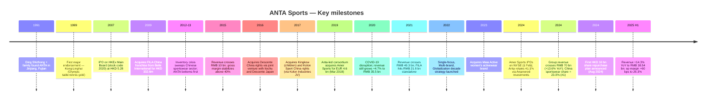
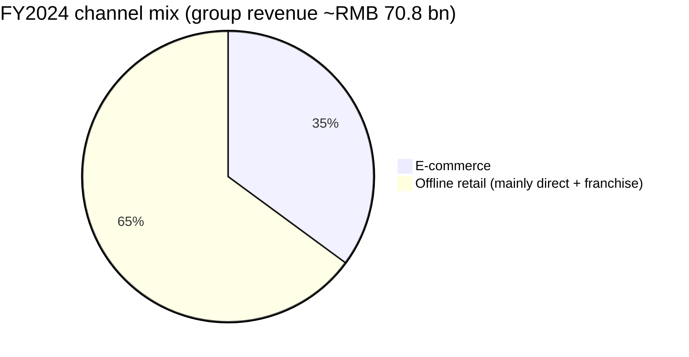
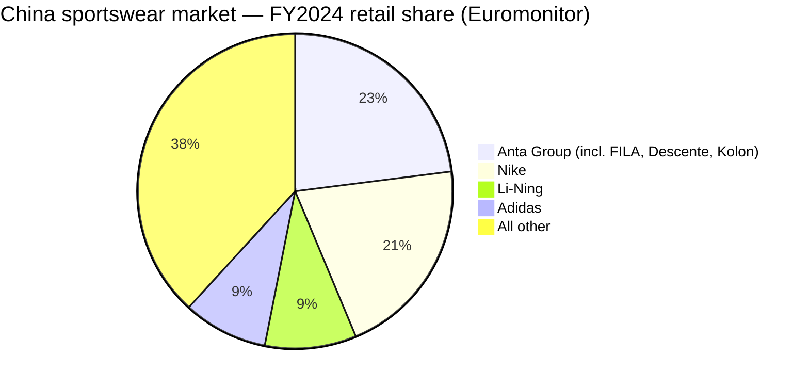

# ANTA Sports Products Limited (HKEX: 2020 / 82020) — Initiation of Coverage

**Report date:** 2026-06-03
**Primary ticker:** HKEX:2020 (HKD counter) and 82020 (RMB counter)
**Cross-reference:** Amer Sports, Inc. (NYSE:AS) — 41.1% associate (post-listing)
**Domicile:** Cayman Islands (registered) / Jinjiang, Fujian, PRC (operating HQ)
**Founded:** 1991 (ANTA brand) — 2007 IPO Main Board of HKEx
**As of 3 June 2026 close:** HKD 76.60 / market cap ≈ HKD 214 bn

---

## Table of Contents

1. Company Overview
2. Company History
3. Founder & Current Co-CEOs
4. Products & Services (Brand Portfolio)
5. Customers & Distribution Strategy
6. Industry Overview
7. Competitive Landscape
8. Market Opportunity (TAM)
9. Risk Assessment
10. Investor-Lens Scorecards
11. References

---

## 1. Company Overview

ANTA Sports Products Limited is the largest sportswear group in Greater China and the only Chinese sportswear company to rank among the top three globally by revenue. The Group operates under a "Single-focus, Multi-brand, Globalization" strategy — single-focus on sportswear, but a portfolio of brands spanning mass-market performance (ANTA), high-end fashion sports (FILA), high-performance Japanese design (DESCENTE), Korean premium outdoor (KOLON SPORT), women's activewear (MAIA ACTIVE), and a 41.1% strategic stake in NYSE-listed Amer Sports (Arc'teryx, Salomon, Wilson, Atomic, Peak Performance). According to the company's [2024 Annual Report Corporate Profile](https://www1.hkexnews.hk/listedco/listconews/sehk/2025/0331/2025033100649.pdf), "ANTA was established in 1991; while ANTA Sports Products Limited, a widely recognized global sportswear company, was listed on the Main Board of HKEx in 2007."

FY2024 group revenue was **RMB 70,826 million** — the first time crossing RMB 70 bn — up 13.6% YoY, with the ANTA brand segment at RMB 33,522 million (+10.6%), FILA at RMB 26,626 million (+6.1%), and "all other brands" at RMB 10,678 million (+53.7%). Reported gross margin was 62.2% and operating profit margin 23.4%, with profit attributable to shareholders of RMB 15,596 million (including a one-off gain from equity dilution under the Amer Sports listing); excluding that gain, attributable profit was RMB 11,729 million, up 7.1% ([Annual Report 2024, Financial Overview](https://www1.hkexnews.hk/listedco/listconews/sehk/2025/0331/2025033100649.pdf)). On a five-year view, group revenue compounded from RMB 35.5 bn in FY2020 to RMB 70.8 bn in FY2024 — a CAGR of roughly 18.9%, materially faster than Nike, adidas, Li-Ning, or Xtep's China-segment growth over the same period ([Five-Year Financial Summary, AR2024 p.11](https://www1.hkexnews.hk/listedco/listconews/sehk/2025/0331/2025033100649.pdf)).

The company is headquartered in Jinjiang (Fujian Province), home to China's footwear manufacturing cluster, and runs over 12,000 retail doors worldwide across its in-house brand portfolio. As of 31 December 2024 it operated 7,135 ANTA-brand stores, 2,784 ANTA KIDS stores, 1,264 FILA core stores, 590 FILA KIDS, 206 FILA FUSION, 226 DESCENTE, and 191 KOLON SPORT doors, with about 240+ stores outside China (mainly in Southeast Asia plus a smaller footprint in the U.S., Middle East, and Europe) ([2024 Highlights at a Glance, AR2024 p.7](https://www1.hkexnews.hk/listedco/listconews/sehk/2025/0331/2025033100649.pdf)). E-commerce reached 35.1% of group revenue in FY2024, up from 32.8% in FY2023 — among the highest digital mix of any global sportswear OEM ([2024 Highlights at a Glance, AR2024 p.7](https://www1.hkexnews.hk/listedco/listconews/sehk/2025/0331/2025033100649.pdf)).

*Source: Anta Sports five-year summary, [AR2024 p.11](https://www1.hkexnews.hk/listedco/listconews/sehk/2025/0331/2025033100649.pdf); FY25 = directionally extrapolated from the [1H 2025 interim release (+14.3% YoY)](https://ir.anta.com/en/news_detail.php?id=153056) — bar is an indicative annualization, not a guidance figure.*

**Valuation snapshot.** At HKD 76.60 (3 June 2026 close), Anta Sports trades on a TTM P/E of roughly 13.9–14.0× and a market cap of ~HKD 214 bn ([companiesmarketcap.com — Anta P/E ratio history](https://companiesmarketcap.com/hkd/anta-sports/pe-ratio/), [Simply Wall St valuation page](https://simplywall.st/stocks/hk/consumer-durables/hkg-2020/anta-sports-products-shares/valuation)). That multiple is materially below the company's own three-year average and ~half the multiple it earned during the 2020–2021 post-COVID rebound. *Analyst view:* the de-rating reflects three overlapping concerns — (i) a slowing China discretionary cycle that has pressured FILA's premium positioning, (ii) margin compression at the ANTA brand from e-commerce mix and "Super Store" build-out, and (iii) treatment of the Amer Sports equity-method gain as low-quality earnings. With FILA gross margin still north of 67% and the "all other brands" segment scaling past RMB 10 bn at a 28.6% operating margin, the stock screens cheap on a sum-of-the-parts basis once Amer Sports' 41.1% equity stake is marked to NYSE market value. The multiple is not extreme enough to warrant a Section 9 standalone valuation-risk line — but it is worth flagging that the implied de-rating versus three-year history is, in our reading, primarily a top-line growth normalization concern rather than a margin or balance-sheet concern.

**Recent trading update — Q1 2026.** ANTA brand retail value posted "high single-digit" YoY growth, FILA was "low-teens" (10–20% low end), and "all other brands" surged "+40–45%" YoY ([Q1 2026 Operational Performance Announcement, 13 April 2026, p.1](https://www1.hkexnews.hk/listedco/listconews/sehk/2026/0413/2026041300xxx.pdf), filed on cninfo as `2026-04-13_季报_二零二六年第一季度之最新营运表现.pdf`). The figures cover ANTA, FILA, and "all other brands" only — Amer Sports' own quarterly is reported separately at NYSE.

---

## 2. Company History

ANTA's history is the modern history of Chinese sportswear: a Jinjiang-Fujian footwear workshop that became, in 33 years, a global multi-brand group.

The 2007 IPO raised about HKD 3.0 bn at an offer price of HKD 5.28 ([Anta Sports IPO Prospectus, July 2007 (filed on HKEXnews)](https://www.hkexnews.hk/listedco/listconews/sehk/2007/0710/02020_1100537/E108.htm)) — a modest opening for what would, over the next 17 years, deliver ~19% annualized share-price growth versus ~1.6% for the Hang Seng Index ([AR2024 "Creating Value for Shareholders" p.9](https://www1.hkexnews.hk/listedco/listconews/sehk/2025/0331/2025033100649.pdf)). Two corporate decisions shaped the trajectory more than any other. First, the 2009 FILA China acquisition from Belle International for HKD 332.6 million — a price that proved astonishingly low for what is now a RMB 26+ bn revenue segment. The original deal gave Anta the FILA trademark rights in mainland China, Hong Kong, and Macau; Anta has since extended FILA distribution rights into Southeast Asia. Second, the 2019 consortium-led acquisition of Finland-based Amer Sports for EUR 4.6 bn (announced March 2019, closed later that year). That deal — which transferred ownership of Arc'teryx, Salomon, Wilson, Atomic, and Peak Performance — was financed via a consortium including FountainVest, Anamered Investments (the Lululemon founder Chip Wilson vehicle), and Tencent. Amer Sports IPO'd on NYSE on 1 February 2024 at USD 13.00 per share, with Anta retaining a 41.1% economic interest. By June 2026, Amer Sports has traded above USD 50 — implying the value of Anta's 41.1% stake alone is well north of USD 6 bn ([Amer Sports IPO 6-K, NYSE prospectus](https://www.sec.gov/cgi-bin/browse-edgar?action=getcompany&CIK=0001988894&type=6-K&dateb=&owner=include&count=40)).

Less heralded but consequentially important was the 2012–2014 inventory crisis that nearly killed three of ANTA's domestic peers. From 2010–2012, Chinese sportswear brands (Li-Ning, 361 Degrees, Xtep, Peak, ANTA) over-ordered against a presumed Olympic tailwind; when demand softened, inventory aged in distributor warehouses and forced discounting that destroyed gross margins for two years. ANTA bottomed earlier than Li-Ning because it had not pursued the same premium-pricing repositioning, and emerged with a more disciplined order-book mechanism (since formalized as "Dynamic Management") that became the operating backbone for FY15+ growth ([Reuters retrospective on China sportswear inventory cycle, 2013-08-21](https://www.reuters.com/article/idINKBN3220V520180221/)).

---

## 3. Founder & Current Co-CEOs

ANTA Sports is run by a co-CEO structure (since 2020), with Founder/Chairman Mr. Ding Shizhong reserving M&A, strategy, and overall corporate oversight — but day-to-day brand operating decisions split between Mr. Lai Shixian (brother-in-law) and Mr. Wu Yonghua. This scope is narrowly drawn per the company-research skill spec; CFO, segment presidents, board members, and IR contacts are intentionally not profiled below.

**Founder & Chairman: Mr. Ding Shizhong (丁世忠)** — aged 54 (per the 2024 AR), is the co-founder of the Group and Chairman of the Board. He plays a "core leadership role in the Group's corporate strategy, talent build-up, corporate culture and operational supervision, and directly oversees the Group's mergers and acquisitions initiatives" ([Annual Report 2024, Directors p.130](https://www1.hkexnews.hk/listedco/listconews/sehk/2025/0331/2025033100649.pdf)). Mr. Ding co-founded the company in 1991 with his elder brother Ding Shijia (now Deputy Chairman) and his brother-in-law Lai Shixian — the three remain the ultimate controlling shareholders via Anta International (42.54%), Anda Holdings (5.70%), and Anda Investments (4.09%), for a combined family holding of roughly 52.3% (per the [Corporate Profile diagram, AR2024 p.3](https://www1.hkexnews.hk/listedco/listconews/sehk/2025/0331/2025033100649.pdf)). Mr. Ding currently chairs the board of NYSE-listed Amer Sports, has been recognized as one of Harvard Business Review's "100 Best-Performing CEOs in China," and serves as vice chairman of the All-China Federation of Industry and Commerce. He is the architect of the company's two transformational deals (FILA China 2009; Amer Sports 2019) and the public face for the "Single-focus, Multi-brand, Globalization" strategy. His operational philosophy — preferring deep-pocketed long-term acquisitions over greenfield brand-building — is recognizable in every major capital allocation move ANTA has made since the FILA deal.

**Co-CEO: Mr. Lai Shixian (賴世賢)** — aged 50, is the Co-CEO responsible for the ANTA brand, all other brands except FILA, group procurement, and a number of central functions including human resources, legal, investor relations, and administration. He joined the Group in March 2003 and brings over 20 years of administrative and financial management experience. Mr. Lai holds an EMBA from China Europe International Business School and is the brother-in-law of both Ding Shizhong and Ding Shijia ([AR2024 p.130](https://www1.hkexnews.hk/listedco/listconews/sehk/2025/0331/2025033100649.pdf)). In practice, his portfolio covers the highest-revenue brand (ANTA, RMB 33.5 bn) plus the fastest-growing emerging brands (DESCENTE, KOLON SPORT, MAIA ACTIVE, "all other brands" growing +53.7% in FY2024). His operating priorities for 2025 emphasized "ANTA accelerates retail transformation" — referring to the new ANTA SUPER STORE, ANTA ARENA, ANTA PALACE, ANTA SNEAKERVERSE, ANTA GUANJUN, and ANTA CAMPUS formats, several of which are running at 2–3× the store efficiency of conventional ANTA doors per the [Co-CEOs' Strategic Review (AR2024 p.24)](https://www1.hkexnews.hk/listedco/listconews/sehk/2025/0331/2025033100649.pdf).

**Co-CEO: Mr. Wu Yonghua (吳永華)** — aged 54, is the Co-CEO responsible for the FILA brand, the Group's overseas businesses including Southeast Asia, and central functions covering strategy, digitalisation, technological innovation, product quality control, corporate culture, and public relations. He joined the Group in October 2003 and brings over 20 years of sales-and-marketing experience focused on the China market ([AR2024 p.130](https://www1.hkexnews.hk/listedco/listconews/sehk/2025/0331/2025033100649.pdf)). The split is meaningful: Mr. Wu owns FILA — the Group's second-largest segment (RMB 26.6 bn revenue in FY2024) and the highest-margin major brand (67.8% gross / 25.3% operating) — and is the executive accountable for the globalization push, including the 240+ Southeast Asia stores opened by ANTA, DESCENTE, and FILA. His FY2024 priorities emphasized "FILA achieves high-quality growth" — a deliberate signal that the brand would pull back on aggressive store roll-outs in favour of operational efficiency and product-quality investment, reflected in the 2.3 ppt operating margin compression from 27.6% to 25.3%.

**Why the co-CEO structure matters.** ANTA's bet is that brand differentiation (ANTA = mass performance; FILA = high-end fashion; DESCENTE = high-end professional; KOLON SPORT = premium outdoor) requires distinct merchandising calendars, distribution channels, retail formats, and pricing architecture. A single CEO running both ANTA and FILA would tend to harmonize them — exactly what destroyed value at peers that tried to use a single house-brand identity. By giving each Co-CEO 50%+ of the revenue base and clear scope, the structure preserves the strategic premise that ANTA's portfolio works *because* the brands compete with each other for shelf space and attention in their own niches.

---

## 4. Products & Services (Brand Portfolio)

This section is anchored to ANTA's own brand-portfolio disclosure on pages 23–37 of the AR2024 — block-quoted verbatim where appropriate. The Group disaggregates by **brand segment** (ANTA / FILA / all other brands), **product category** (footwear / apparel / accessories), and **channel** (offline wholesale, offline self-operated DTC, e-commerce). All three views are cited below.

### 4.1 Segment-level revenue mix

The Group reports three segments. From the AR2024 Financial Review:

> | Segment | FY2024 revenue (RMB m) | % of total | YoY change | Gross margin | Operating margin |
> |---|---|---|---|---|---|
> | ANTA brand | 33,522 | 47.3% | +10.6% | 54.5% | 21.0% |
> | FILA | 26,626 | 37.6% | +6.1% | 67.8% | 25.3% |
> | All other brands | 10,678 | 15.1% | +53.7% | 72.2% | 28.6% |
> | **Group total** | **70,826** | 100.0% | +13.6% | 62.2% | 23.4% |

Source: [AR2024 Financial Review p.48–50](https://www1.hkexnews.hk/listedco/listconews/sehk/2025/0331/2025033100649.pdf).

*Source: Anta Sports five-year summary and [1H 2025 interim release](https://ir.anta.com/en/news_detail.php?id=153056); FY25E annualization is directional.*

By product category, footwear was RMB 29,202 million (41.2% of revenue, +15.3% YoY), apparel was RMB 39,385 million (55.6%, +12.3%), and accessories was RMB 2,239 million (3.2%, +14.4%) per the [Financial Review breakdown on p.46 of AR2024](https://www1.hkexnews.hk/listedco/listconews/sehk/2025/0331/2025033100649.pdf). Footwear grew fastest because (i) the ANTA brand intentionally rebalanced toward technical running, basketball, and cross-training shoes, (ii) FILA introduced more performance-tennis and golf shoes alongside its core fashion sneakers, and (iii) DESCENTE and KOLON SPORT scaled their first significant footwear ranges (D-Fluid running and MOVE ALPHA hiking respectively).

### 4.2 The ANTA brand (mass-market performance) — 47.3% of revenue

The ANTA brand sits at the "mass market positioning, breakthroughs in performance sports, fostering brand transformation and growth" intersection per the [Business Review section (AR2024 p.32)](https://www1.hkexnews.hk/listedco/listconews/sehk/2025/0331/2025033100649.pdf). Its product universe is built around five sports verticals: running, basketball, cross-training, daily sport, and (via ANTA KIDS) children's sportswear. Flagship FY2024 product launches and the company's own descriptions:

> "the PG7 running shoes with an advanced midsole technology platform, which sold over one million pairs within three months of launch; the C202 marathon series, frequently seen on the marathon podium; the ANTA Storm Mecha Jacket, engineered with the domestically developed high-performance waterproof-breathable 'AEROVENT' material; and the highly anticipated KAI 1 and Shock Wave basketball shoes." — [AR2024 p.32](https://www1.hkexnews.hk/listedco/listconews/sehk/2025/0331/2025033100649.pdf)

The KAI 1 is the signature shoe of Kyrie Irving, who joined ANTA in 2023 after his exit from Nike — making him the first NBA superstar to attach a long-term endorsement deal to a Chinese sportswear brand rather than a global one. The Storm Mecha Jacket and AEROVENT material reflect ANTA's investment in domestic functional textile R&D — the [Business Review notes (AR2024 p.39)](https://www1.hkexnews.hk/listedco/listconews/sehk/2025/0331/2025033100649.pdf) that the Group runs six design centres across China, the U.S., Japan, South Korea, Italy, and the Netherlands, and partners with over 70 universities and research institutes plus 800+ suppliers, with R&D spend at 2.8% of revenue in FY2024 (up from 2.6% in FY2023).

**Retail format innovation.** ANTA has transformed from a "one-size-fits-all" retail strategy to a portfolio of specialized formats: ANTA ARENA, ANTA PALACE, ANTA SNEAKERVERSE, ANTA GUANJUN (champion stores featuring Olympic-team merchandise), ANTA SUPER STORE (mass-format with broader assortment), ANTA CAMPUS (ANTA KIDS specialty format), and ANTA ZERO (lower-tier-city format). Per the [Business Review (AR2024 p.32)](https://www1.hkexnews.hk/listedco/listconews/sehk/2025/0331/2025033100649.pdf):

> "Some ANTA Super Stores have achieved store efficiency three times that of conventional stores, while ANTA GUANJUN stores have recorded store efficiency more than double that of conventional stores."

The Group's e-commerce mix on the ANTA brand grew 20.7% YoY in FY2024 (faster than total brand revenue) and now represents the largest single channel after offline wholesale. **中文释义 / Plain-language gloss:** "店效" (store efficiency, or revenue per square meter / per door) is the KPI ANTA uses to evaluate whether a format is working; doubling or tripling this metric is what gives ANTA confidence to keep rolling out the differentiated formats rather than just adding more conventional doors.

### 4.3 FILA (high-end fashion sports) — 37.6% of revenue

FILA is the highest-margin brand in the Group and the strategic asset that converted ANTA from a domestic mass-market specialist into a multi-brand operator. The brand is positioned as "high-end athletic fashion … targeting high-end consumers across a wide range of age groups through its sub-brands, FILA KIDS and FILA FUSION" ([AR2024 p.34](https://www1.hkexnews.hk/listedco/listconews/sehk/2025/0331/2025033100649.pdf)). The three FILA sub-brands target distinct demographics:

- **FILA core** — aged 25-45, "seamlessly blending sports and fashion to suit various lifestyle scenarios, including sports, leisure, and smart casual occasions." Core categories include tennis, golf, and lifestyle footwear/apparel.
- **FILA FUSION** — aged 18-30, "catering to the new generation of consumers with products that combine fashion and sports elements" via the "STAY IN FUSION" brand concept launched in 2023. Urban functional street style was a key growth driver in FY2024.
- **FILA KIDS** — aged 3-12, with notable launches including the "Butterfly Wing Backpack with Spinal Protection" and Biella fashion apparel ([AR2024 p.34](https://www1.hkexnews.hk/listedco/listconews/sehk/2025/0331/2025033100649.pdf)).

FY2024 was a challenging year for the brand — revenue grew only 6.1% (versus 22%+ between FY2020-FY2022) and operating margin compressed 2.3 ppt to 25.3%. Management attributed the compression to "(i) the increase in costs resulting from strategic enhancement and improvement in product functionality and quality; and (ii) proactive elevation in the proportion of footwear products with a lower gross profit margin" ([Financial Review p.48](https://www1.hkexnews.hk/listedco/listconews/sehk/2025/0331/2025033100649.pdf)). *Analyst view:* the FILA growth slowdown reflects two forces — China high-end fashion sports has become more competitive (Lululemon, On, Hoka, Salomon, plus Li-Ning's premium "Counterflow" line all compete for the same wallet), and FILA's premium pricing makes it more sensitive to the slowing China discretionary cycle than the ANTA brand. The 1H 2025 interim release showed FILA growth re-accelerating to +8.6% YoY with operating margin recovering to 27.7% — encouraging, but not yet back to peak.

FILA's e-commerce strategy: during the "Double 11" 2024 shopping festival, FILA secured second place in the sports footwear and apparel category on both Tmall and Douyin, while FILA KIDS ranked fourth in the mother-and-baby category — per [AR2024 p.35](https://www1.hkexnews.hk/listedco/listconews/sehk/2025/0331/2025033100649.pdf).

### 4.4 DESCENTE (high-end professional Japanese design) — within "all other brands"

DESCENTE operates under a joint venture between ANTA, Descente Japan, and Itochu (established 2016) holding exclusive China and Southeast Asia distribution rights for the Descente brand. Its core positioning per the [Business Review (AR2024 p.36)](https://www1.hkexnews.hk/listedco/listconews/sehk/2025/0331/2025033100649.pdf):

> "DESCENTE embraces the design-driven sports spirit of 'DESIGN THAT MOVES', continually reinforcing its position as a high-end, high-quality professional sports brand through innovative technology and exceptional craftsmanship."

Three core sport verticals: triathlon, golf, and skiing. FY2024 stand-out products were the D-Fluid running shoe series (cushioning-led) and the brand's first major footwear push. The store count rose from 187 (end-2023) to 226 (end-2024), with first Southeast Asian doors opened in Malaysia and Singapore. Looking to FY2025, the Group's target is 260-270 doors ([AR2024 p.29](https://www1.hkexnews.hk/listedco/listconews/sehk/2025/0331/2025033100649.pdf)). DESCENTE's positioning gives ANTA a high-end performance brand without cannibalising FILA's fashion lane.

### 4.5 KOLON SPORT (premium outdoor) — within "all other brands"

KOLON SPORT operates under a similar JV structure with South Korea's Kolon Industries (since 2017). Positioning per the [Business Review (AR2024 p.37)](https://www1.hkexnews.hk/listedco/listconews/sehk/2025/0331/2025033100649.pdf):

> "KOLON SPORT, renowned for its premium and professional image, is dedicated to creating a premium outdoor lifestyle brand that seamlessly integrates fashionable design with functionality, promoting a quality lifestyle in harmony with nature."

Two core activity verticals: hiking and camping. Iconic FY2024 launches included the MOVE ALPHA Hiking Shoes (whose first-generation subscriber base "significantly outstripping available supply") and the KS-2000 Hiking Shoes. Apparel highlights include the OBLI-K Camping Waterproof Jacket "specifically engineered for Asian body types." KOLON SPORT was the fastest-growing brand within the Group in FY2024 — the [Co-CEOs' Strategic Review (p.25)](https://www1.hkexnews.hk/listedco/listconews/sehk/2025/0331/2025033100649.pdf) describes it as having "emerged as the fastest-growing brand within the Group during the financial year." Store count rose from 164 to 191 in FY2024 (target 190-200 for FY2025).

### 4.6 MAIA ACTIVE (women's activewear) — acquired 2023

MAIA ACTIVE is a women's-focused activewear brand acquired in 2023 to plug a portfolio gap (Lululemon and Alo Yoga had been winning the China women's premium activewear segment). The brand's positioning leans toward yoga and daily-wear with strong digital-native marketing — ANTA has kept the MAIA ACTIVE team relatively independent operationally to preserve its native consumer voice. MAIA ACTIVE is captured within "all other brands" and is small relative to DESCENTE / KOLON SPORT but growing fast ([AR2024 p.23 brand portfolio diagram](https://www1.hkexnews.hk/listedco/listconews/sehk/2025/0331/2025033100649.pdf)).

### 4.7 Amer Sports (NYSE:AS) — 41.1% strategic associate

After the Amer Sports IPO on 1 February 2024, ANTA holds 41.1% of Amer Sports through Anamered Investments (the consortium vehicle). Amer Sports is consolidated under the equity method — its share of profit/loss flows through "share of profit or loss of an associate/a joint venture" on Anta's income statement, with the IPO/placing equity dilution recognized as a one-off gain. The Amer Sports brand portfolio includes:

- **Technical Apparel:** Arc'teryx (premium outdoor; ~60% of Amer revenue and the highest-growth Amer brand)
- **Outdoor Performance:** Salomon (trail running, hiking footwear and apparel)
- **Ball & Racquet Sports:** Wilson (tennis, basketball, football)
- **Winter Sports Equipment:** Atomic (skis, boots, bindings)
- **Premium Lifestyle:** Peak Performance (Scandinavian outerwear)

Amer Sports' Salomon and Arc'teryx brands have both grown substantially under ANTA stewardship, with the franchise transition to omnichannel DTC distribution being the principal value-creation lever. For the purposes of this report, the Amer Sports segment is treated as an investment vehicle (equity-method) — the deep-dive economics of Arc'teryx and Salomon are out of scope.

*Source: Compiled from [Anta AR2024 p.23 brand portfolio](https://www1.hkexnews.hk/listedco/listconews/sehk/2025/0331/2025033100649.pdf) and [Amer Sports F-1 filing, Jan 2024](https://www.sec.gov/Archives/edgar/data/1988894/000119312524012693/d572024df1a.htm).*

### 4.8 Synthesis — how the brand portfolio actually works

The strategic logic of ANTA's multi-brand approach is brand-portfolio + price-architecture + retail-channel triangulation. ANTA brand wins the **mass market** (RMB 200–600 footwear / RMB 100–400 apparel) through scale, distribution density (~10,000 doors in China), and athlete-driven product cycles (Kyrie Irving, Kenenisa Bekele, 25 Chinese national teams). FILA wins the **mid-to-high fashion sports market** (RMB 700–2,500 footwear / RMB 500–3,000 apparel) through retail-format premium (FILA ICONA flagship), Tmall/Douyin top-5 positioning, and continuous product refreshment. DESCENTE wins the **high-end Japanese-design professional sports market** (RMB 1,500–4,000 footwear / RMB 1,000–6,000 apparel) through niche-vertical authority (triathlon, golf, skiing). KOLON SPORT wins the **premium outdoor lifestyle market** (RMB 1,500–3,500 footwear / RMB 2,000–6,000 jackets) via the China hiking-and-camping demand wave. MAIA ACTIVE captures the **women's activewear segment**. Amer Sports operates the **global premium outdoor and racquet** layer above all of this.

The synergy comes from shared back-end infrastructure (procurement, logistics, R&D consortium, the Global Digital Intelligence Integrated Industrial Park) and shared executive judgment on how to operate brands — what Mr. Ding called "a proven methodology for operating new brands" ([Chairman's Statement p.15](https://www1.hkexnews.hk/listedco/listconews/sehk/2025/0331/2025033100649.pdf)). The brands are operationally and merchandising-wise independent.

---

## 5. Customers & Distribution Strategy

ANTA's customer base is **B2C consumers in mainland China plus an expanding Southeast Asia and global footprint**, distributed via a hybrid model combining wholesale (ANTA brand distributors and franchisees), self-operated direct-to-consumer ("DTC") stores, and e-commerce across all brands. The most important point about ANTA's customer concentration: it is **explicitly very low**, because ANTA sells consumer goods through tens of thousands of retail transactions per day rather than to a small number of enterprise accounts. The Group does not disclose a "top-5 customer" concentration ratio in the AR2024 — appropriate for a B2C retailer — and no individual distributor or franchisee accounts for >10% of group revenue per the [Annual Report 2024 Connected Transaction disclosures (Report of the Directors p.60-80)](https://www1.hkexnews.hk/listedco/listconews/sehk/2025/0331/2025033100649.pdf), which detail related-party transactions including distributor purchases and find no single counterparty triggers HK Listing Rule 14.07 thresholds.

Source: [AR2024 2024 Highlights at a Glance, p.7](https://www1.hkexnews.hk/listedco/listconews/sehk/2025/0331/2025033100649.pdf).

### 5.1 Distribution model — by brand, not by group

The Group operates a deliberately hybrid distribution model where the architecture differs by brand. From the [AR2024 Strategy section (p.21)](https://www1.hkexnews.hk/listedco/listconews/sehk/2025/0331/2025033100649.pdf):

> "We adopt a hybrid operation model to fully capitalize on the advantages and positioning of our different brands. On the one hand, under the wholesale model and franchise business of ANTA's DTC model, we leverage our distributors, franchisees and their local knowledge to sell our products to end customers through the authorized retail stores they operate. On the other hand, under self-operated business of ANTA's DTC model as well as direct retail model of FILA and other brands, we directly operate retail stores, allowing us to be more sensitive to the change in demand of our customers."

**ANTA brand** — primarily wholesale to ~50 mainland China distributors that operate ANTA-branded stores (about 7,135 doors), supplemented by direct ANTA Super Stores, ANTA ARENA, ANTA PALACE, and other "new retail" formats run by the Group directly. The DTC roll-out at the ANTA brand is gradual; wholesale remains the largest channel for the ANTA brand.

**FILA and all other brands** — fully direct retail. Every FILA, FILA KIDS, FILA FUSION, DESCENTE, KOLON SPORT door is operated by the Group, not by a franchisee. This is the architectural reason FILA's gross margin is structurally 13+ ppt above ANTA — direct retail captures the wholesale-to-retail margin spread.

### 5.2 E-commerce — 35.1% of revenue and rising

E-commerce reached 35.1% of group revenue in FY2024 (32.8% in FY2023, 30%+ in FY2022) — among the highest digital mix in global sportswear. The breakdown by major platform per analyst surveys: Tmall remains the largest single platform across all brands; Douyin (TikTok China) is the fastest-growing, especially for FILA KIDS and KOLON SPORT; JD.com is significant for ANTA brand; the Group runs WeChat / Mini Program direct sales across all brands. The ANTA brand's e-commerce business grew 20.7% YoY in FY2024 — substantially faster than the brand's 10.6% total growth — meaning offline growth was only mid-single-digits, the result of the brand's deliberate channel-mix shift ([Business Review p.33](https://www1.hkexnews.hk/listedco/listconews/sehk/2025/0331/2025033100649.pdf)). FILA's e-commerce growth in FY2024 was similarly strong (the brand ranked #2 in sportswear on both Tmall and Douyin during "Double 11"); FILA's offline retail was approximately flat with rising same-store productivity offset by store count discipline.

### 5.3 Geographic mix — China-centric, expanding internationally

The vast majority of group revenue is mainland China. The Group does not disaggregate revenue by geography in the annual P&L (an analytical limitation worth noting), but disclosed store-count metrics give the order of magnitude. As of 31 December 2024 the Group operated approximately 12,400 stores worldwide; of these, "**240+ stores outside China**" — across Southeast Asia (Singapore, Malaysia, Thailand, Vietnam, Philippines, Indonesia, Brunei, Nepal), the Middle East, North America, Europe, and Africa ([Strategy: Globalization, AR2024 p.21](https://www1.hkexnews.hk/listedco/listconews/sehk/2025/0331/2025033100649.pdf)). That's roughly 2% of group store count outside China — sized to scale but still a single-digit-percent of overall revenue exposure. Management's stated objective: "increase the proportion of sales generated outside Greater China while maintaining stable and healthy inventory and discount levels" ([Co-CEOs' Strategic Review p.28](https://www1.hkexnews.hk/listedco/listconews/sehk/2025/0331/2025033100649.pdf)).

**The deliberate point about geography:** all of ANTA's listed segment economics (ANTA, FILA, all other brands) are predominantly China-domestic. The international upside is an option, but not yet a financial driver. This makes Anta's earnings more sensitive to China consumption than any global sportswear peer.

### 5.4 Customer-concentration risk

Per the spec — no consolidated top-5 customer disclosure is required by HK Listing Rules for a B2C retailer, and none appears in AR2024. The closest disclosure of distribution-side concentration is in connected-transactions reporting (Report of Directors, p.60–80) which describes related-party purchases by Mr. Ding-controlled distributors below HK Listing Rule 14.07 disclosure thresholds. No segment-level customer concentration is disclosed either; all FILA and DESCENTE/KOLON SPORT revenue is direct retail (so "the customer" is millions of individual consumers). **Reader takeaway:** customer concentration is a non-risk for Anta. The relevant concentration risks are distributor relationships (for the ANTA brand wholesale model), mall-landlord renegotiation risk (for FILA's premium real estate footprint), and platform concentration on Tmall and Douyin (for e-commerce). All three are diffuse — none is a single-counterparty risk.

---

## 6. Industry Overview

The China sportswear industry is a roughly USD 90 bn+ market, the largest sportswear market in the world after the U.S., and one of the fastest-growing major consumer categories of the past 15 years. Per Euromonitor data (cited indirectly in the [AR2024 Chairman's Statement, p.12](https://www1.hkexnews.hk/listedco/listconews/sehk/2025/0331/2025033100649.pdf)): "the Group's market share in the Chinese sportswear market surged to 23.0% in 2024, achieving industry leadership position, while also ranking among the top three globally." This statement is consistent with [Euromonitor's published China sportswear retail data via Statista](https://www.statista.com/statistics/372774/chinese-penetration-rate-of-sportswear-brands/) and with cross-referenced reporting from [Yicai Global, March 2025](https://www.yicaiglobal.com/news/many-domestic-sportswear-companies-in-china-achieved-record-high-performance-last-year).

### 6.1 Market structure and growth

*Source: Euromonitor 2024 sportswear retail share, cited via [AR2024 Chairman's Statement p.12](https://www1.hkexnews.hk/listedco/listconews/sehk/2025/0331/2025033100649.pdf) and cross-referenced via [Statista](https://www.statista.com/statistics/372774/chinese-penetration-rate-of-sportswear-brands/).*

The competitive structure is striking: in 2024, ANTA Group (consolidating ANTA brand + FILA + Descente China + Kolon Sport China) became the **#1 sportswear seller in China by retail share at 23.0%**, displacing Nike (20.7%). The gap to #3 Li-Ning (9.4%) is now substantial. This share-leadership shift took roughly 15 years — ANTA was a single-digit share player in 2010 and has compounded share through the dual mechanism of (i) a strengthening ANTA brand on the mass-market end, and (ii) the FILA-led capture of the high-end fashion sports lane during a period when global brands were less focused on the China premium sports-fashion intersection.

### 6.2 Growth drivers

The Chinese sportswear market growth thesis rests on three macro tailwinds. **First, structural sports participation growth.** China's National Fitness Plan (2021–2025) and the Healthy China 2030 Plan are explicit policy frameworks supporting nationwide fitness, with target sports-participation rates approaching mid-teens of the population — well below the U.S. (40%+) and Japan (30%+) ([State Council "Healthy China 2030" plan, Oct 2016](http://www.gov.cn/zhengce/2016-10/25/content_5124174.htm), and the [National Fitness Plan 2021-2025 announcement](http://www.gov.cn/zhengce/content/2021-08/03/content_5629019.htm)). The participation rate gap is the single most important upside driver for category penetration.

**Second, premiumisation.** China sportswear consumers have shifted spending toward technical performance (running shoes with carbon plates, hiking boots with Gore-Tex equivalents, ski outerwear) and high-end fashion sports (the FILA / Lululemon / On / Hoka segments). Premiumisation is favorable to operators who already own premium brand portfolios (FILA, DESCENTE, KOLON SPORT, Arc'teryx) and unfavorable to operators stuck at the value end.

**Third, outdoor as a category boom.** Camping, hiking, climbing, and skiing have grown 20–50% YoY in China through FY2022–FY2024, per multiple consumer surveys ([Daxue Consulting, China sportswear and outdoor market report, 2024](https://daxueconsulting.com/sportswear-market-in-china/)). KOLON SPORT, DESCENTE, and Amer Sports' Salomon and Arc'teryx brands are direct beneficiaries.

### 6.3 Structural headwinds

The headwinds are equally material. **First, consumer cycle weakness post-2022.** China retail of consumer goods grew only 3.5% in 2024 ([National Bureau of Statistics data cited in Co-CEOs' Review p.22](https://www1.hkexnews.hk/listedco/listconews/sehk/2025/0331/2025033100649.pdf)), well below the 8%+ growth seen pre-COVID. Discretionary apparel and footwear have been one of the more cyclically-exposed categories. Premiumisation has continued, but the mid-tier (where some of ANTA brand and Li-Ning sit) has been squeezed. **Second, e-commerce-driven price transparency.** As Tmall and Douyin absorb a higher share of the category, real-time price-comparison and influencer-driven discounting have compressed gross margins on the mid-tier and value end. ANTA brand's gross margin has held above 54% — better than peers — but the structural pressure remains. **Third, Nike and adidas global brand fatigue / political risk.** The 2021 Xinjiang cotton boycott controversies hurt Nike and adidas's China brand equity meaningfully — ANTA, Li-Ning, and others gained share rapidly through 2021–2023. The benefit is real but has likely peaked.

### 6.4 Industry structure (5-forces summary)

- **Supplier power: low.** ANTA sources from over 800 suppliers, runs six design centres globally, and (importantly) operates substantial in-house manufacturing — 26.7% of ANTA-brand footwear was self-produced in FY2024, plus 10.5% of apparel; FILA was 10.0% / 3.9% ([Business Review p.39](https://www1.hkexnews.hk/listedco/listconews/sehk/2025/0331/2025033100649.pdf)). The Group owns its primary fabric R&D programs (e.g., AEROVENT, A-Heat Back, Water Cooling). No single supplier is mission-critical.
- **Buyer power: moderate.** Direct consumers individually have no power but collectively are price-sensitive; the e-commerce platforms (Tmall, Douyin, JD) exert moderate channel power but ANTA's brand strength gives meaningful negotiating leverage. Wholesale distributors have low power because they are franchisees of the ANTA brand, not independent retailers selling competing brands.
- **Threat of new entrants: moderate.** Building a new sportswear brand from scratch is expensive (brand-building, distribution, manufacturing). But Lululemon, On, Hoka, and Arc'teryx have shown that premium niche entrants can take share quickly. The competitive dynamic in premium activewear and trail running has shifted in the past 5 years.
- **Threat of substitutes: low.** Sportswear has limited functional substitutes — no other apparel category provides the same performance and lifestyle combination.
- **Industry rivalry: high.** Nike, adidas, ANTA, FILA, Li-Ning, Xtep, 361 Degrees, Skechers, Decathlon, Lululemon, On, Hoka, Salomon, Arc'teryx, Descente, Kolon, Mizuno, Asics, New Balance, Puma, Under Armour — China sportswear is a uniquely contested market. The implication: scale, brand portfolio breadth, and operating-margin discipline are the durable advantages.

---

## 7. Competitive Landscape

ANTA's principal competitors fall into three categories: (1) global mass-market sportswear (Nike, adidas), (2) Chinese domestic sportswear (Li-Ning, Xtep International, 361 Degrees, Peak Sport), and (3) premium / niche sportswear (Lululemon, On Holding, Hoka — owned by Deckers, Salomon and Arc'teryx — both owned by ANTA's own associate Amer Sports). The [Risk Management Report (AR2024 p.123–129)](https://www1.hkexnews.hk/listedco/listconews/sehk/2025/0331/2025033100649.pdf) names "intense industry competition" as a strategic risk; the actual list of competitors is not exhaustively enumerated by name in the AR (HKEx listed-issuer disclosures rarely include verbatim competitor product references).

### 7.1 Direct global competitors

**Nike (NYSE: NKE).** The global #1 sportswear company by revenue (~USD 51 bn in FY2024) and the largest single foreign brand in China. Nike's China revenue was approximately USD 7.5 bn in FY2024 ([Nike FY2024 10-K, geographic disclosure](https://www.sec.gov/cgi-bin/browse-edgar?action=getcompany&CIK=0000320187&type=10-K&dateb=&owner=include&count=40)). Nike's "Greater China" segment has been the most challenged of Nike's regional businesses since 2021, with China revenue stagnating and Nike's China share falling from 25%+ pre-2021 to 20.7% in 2024. Nike's core competitive moat is global brand IP (Air Jordan, Just Do It, Nike Run Club app ecosystem) and unmatched athlete endorsement breadth — but its China execution has struggled with assortment localisation and DTC-mix transition.

**adidas (XETRA: ADS).** The #2 global sportswear company and historically the #2 player in China. adidas's China business has shown signs of recovery in FY2023-FY2024 after a deep 2022 trough, driven by the Samba/Gazelle/Spezial terrace-style lifestyle franchise. adidas's China revenue was approximately EUR 3.7 bn in FY2024 ([adidas FY2024 annual report](https://www.adidas-group.com/en/investors/financial-reports/)), and its China share is now 8.7% per Euromonitor. adidas competes with ANTA across the full performance + lifestyle spectrum, but its premium Y-3, Adidas by Stella McCartney, and Adidas Originals collaboration franchises lean into segments where FILA also competes.

### 7.2 Direct domestic competitors

**Li-Ning Company Limited (HKEX: 2331).** The #2 Chinese domestic sportswear brand, founded by Olympic gymnastics champion Li Ning. Group revenue was approximately RMB 28.7 bn in FY2024 (per [Li-Ning 2024 annual report on HKEXnews](https://www.hkexnews.hk/listedco/listconews/sehk/2025/0411/2025041100527.pdf)). Li-Ning has positioned itself with a strong cultural-heritage angle ("China Li-Ning" / "中国李宁" sub-brand) and a streetwear-fashion approach (Counterflow franchise) that resonates with younger Chinese consumers. The brand's challenge over the past 24 months has been inventory and discount discipline — Li-Ning's gross margin has slipped to ~49% versus ANTA's 62%+ on a group basis. Strategic positioning: somewhat overlaps with ANTA brand on mass performance + with FILA on lifestyle.

**Xtep International (HKEX: 1368).** Founded in Quanzhou (the same Fujian footwear cluster as ANTA), Xtep is positioned in mass-market running and basketball. Revenue was approximately RMB 14.4 bn in FY2024 ([Xtep 2024 annual report on HKEXnews](https://www.hkexnews.hk/listedco/listconews/sehk/2025/0327/2025032700681.pdf)), with growth of about 10% YoY. Xtep has acquired Saucony and Merrell distribution rights in China — both higher-margin niche brands — and is increasingly competing with ANTA brand at the lower-mass-market price tier while pushing premium via the Saucony franchise.

**361 Degrees (HKEX: 1361).** Another Quanzhou-based mass-market competitor. Group revenue was approximately RMB 10.1 bn in FY2024 with strong growth (+19% in 1H 2024) ([361 Degrees 2024 annual report](https://www.hkexnews.hk/listedco/listconews/sehk/2025/0327/2025032700449.pdf)). 361 has carved out a niche in entry-tier basketball footwear and a strong children's segment.

### 7.3 Premium / specialist competitors

**Lululemon Athletica (NASDAQ: LULU).** Global premium activewear brand, with a small but rapidly-growing China presence (~190 stores end-2024, ~10% of company revenue from China). Lululemon competes directly with FILA in high-end women's premium activewear and with the recently-acquired MAIA ACTIVE brand. Lululemon's brand equity in yoga-and-running is strong but their China store base is small relative to FILA's 1,264 doors.

**On Holding (NYSE: ONON).** Swiss premium running brand. China business is small but growing fast. Competes with the ANTA brand on technical running shoes and with FILA on the lifestyle-running segment.

**Hoka (owned by Deckers Outdoor — NYSE: DECK).** Premium running and trail-running brand. Like On, small in China but fast-growing.

**Salomon and Arc'teryx (owned by Amer Sports — NYSE: AS).** These are the most strategically interesting competitors because they are owned by Anta's own 41.1%-held associate. Salomon's trail-running and hiking footwear, and Arc'teryx's premium technical apparel, compete most directly with KOLON SPORT and DESCENTE within China. From Anta's perspective this is a closed-loop: market share lost from KOLON SPORT or DESCENTE to Salomon/Arc'teryx is partially recaptured as Amer Sports profit via the equity-method consolidation. It does create internal competition for retail real estate and consumer attention, but Group-level economics are insulated.

### 7.4 Peer valuation snapshot

*Source: [companiesmarketcap.com — Anta P/E](https://companiesmarketcap.com/hkd/anta-sports/pe-ratio/), [Yahoo Finance — Anta key statistics](https://finance.yahoo.com/quote/2020.HK/key-statistics/), [Yahoo Finance — Nike key statistics](https://finance.yahoo.com/quote/NKE/key-statistics/), [Yahoo Finance — Li-Ning key statistics](https://finance.yahoo.com/quote/2331.HK/key-statistics/), [Yahoo Finance — Xtep key statistics](https://finance.yahoo.com/quote/1368.HK/key-statistics/), [Yahoo Finance — Lululemon key statistics](https://finance.yahoo.com/quote/LULU/key-statistics/) — all as of early June 2026.*

ANTA trades on a discount to global premium-performance sportswear peers (Nike at ~22×, Lululemon at ~20× through cycle) and broadly in line with Chinese domestic peers (Li-Ning ~14×, Xtep ~10×, 361 Degrees ~8×). The discount to Nike reflects China-cycle exposure and the lack of a global brand franchise; the parity with Li-Ning is interesting given ANTA's stronger growth and margin profile.

### 7.5 Segment-margin context

*Source: [AR2024 Financial Review p.50](https://www1.hkexnews.hk/listedco/listconews/sehk/2025/0331/2025033100649.pdf); FY20-FY23 also drawn from the corresponding annual reports archived on [HKEXnews](https://www.hkexnews.hk/).*

The brand-portfolio approach delivers operating margins that average mid-20% but with structural mix shifts. FILA was the highest-margin major brand at FY2023's 27.6% but compressed to 25.3% in FY2024. "All other brands" (DESCENTE, KOLON SPORT, MAIA ACTIVE) hit 28.6% operating margin in FY2024 — the highest of any segment — as DESCENTE and KOLON SPORT achieved fixed-cost leverage. ANTA brand's 21.0% is structurally lower because of the wholesale-channel and mass-market price-architecture, but it remains a meaningful contributor to absolute profit dollars.

---

## 8. Market Opportunity (TAM)

### 8.1 China sportswear TAM

The China sportswear retail market was approximately USD 60 bn in 2024 by retail value (Euromonitor data, cited in third-party industry reports). With China retail discretionary growing at 4-6% per year and sportswear at ~6-8% per year (premium and outdoor faster), the implied 2028E TAM is roughly USD 75-85 bn. ANTA's 23.0% share at the 2024 base gives the Group a current China sportswear revenue exposure of approximately RMB 60 bn (the ANTA + FILA + other brands China revenue lines, before international). Share gains are still possible — at 23.0% the Group is now larger than Nike in China, but premiumisation tailwinds favor FILA and DESCENTE more than ANTA brand. The conservative SAM expansion path is therefore likely 4-6% YoY share-maintaining + 1-2 ppt share gain per year — implying mid-to-high single digit China revenue growth into 2028.

### 8.2 Global sportswear TAM

Global sportswear retail is approximately USD 380 bn (2024, Euromonitor), growing at 4-5% per year. China is roughly 16% of global; the rest of Asia is roughly 12-15%; the Americas (mostly U.S.) is roughly 40%; Europe is roughly 25%; rest of world is roughly 7%. ANTA's globalisation strategy aims to take its mass-performance ANTA brand into Southeast Asia (already 240+ stores, ~RMB 600m-1bn revenue), the Middle East, Africa, and selective developed markets. This is an option, not a base-case driver. Amer Sports' 41.1% economic interest gives ANTA exposure to global outdoor and racquet sports premium markets — a category that has compounded at 8-10% globally over the past 5 years.

### 8.3 Category mix outlook

Looking out 3-5 years, the highest-growth category will likely be **outdoor performance** (KOLON SPORT, Salomon, Arc'teryx). High-end women's activewear (Lululemon space — MAIA ACTIVE plays here) will also grow above-market. Mass-market performance sportswear (the ANTA brand core) will grow at China retail discretionary + share-shift. FILA's "high-end fashion sports" will grow approximately at China premium discretionary, which we estimate at 5-7% medium-term — challenged by On / Lululemon but supported by FILA's brand strength.

### 8.4 Capital deployment

Two non-organic levers materially shape the TAM-capture upside: **M&A** (consistent with the Chairman's stated framework, "carefully evaluating potential strategic investments that could enhance our product offerings, capital efficiency and return on investment" — [AR2024 p.15](https://www1.hkexnews.hk/listedco/listconews/sehk/2025/0331/2025033100649.pdf)), and **capital returns** (the August 2024 HKD 10 bn share buyback authorization plus the recurring ~50% dividend payout ratio). With FY2024 net cash position of approximately RMB 30 bn and free cash flow of RMB 13.3 bn, the Group has substantial M&A war-chest while sustaining dividends.

---

## 9. Risk Assessment

Per the [Risk Management Report (AR2024 p.123–129)](https://www1.hkexnews.hk/listedco/listconews/sehk/2025/0331/2025033100649.pdf), management classifies enterprise risks into four categories: strategic, operational, financial, and compliance. This Section 9 covers the most material 8-12 risks across the project's standard 4 buckets (company-specific, industry/market, financial, macro), with quantification and mitigants where available.

### 9.1 Company-specific risks

**(a) FILA brand growth deceleration and margin compression.** FILA grew only 6.1% in FY2024 (down from 18%+ pre-2023) with operating margin compressed 230 bps to 25.3%. The brand is competing in a more crowded high-end fashion sports market (Lululemon, On, Hoka, plus Li-Ning Counterflow), and management has signaled it will deliberately pull back on aggressive store roll-outs in favor of operational efficiency. The 1H 2025 re-acceleration to +8.6% with operating margin recovering to 27.7% is encouraging, but if FILA's same-store productivity stalls or premium consumer demand softens further, this is the single most important risk to FY2025-FY2026 group earnings (FILA contributes ~35-40% of group profit). Mitigant: management's high-quality-growth pivot and the launch of new product families (tennis, golf, one-million-pair IP footwear) per the [Co-CEOs' Strategic Review (p.25)](https://www1.hkexnews.hk/listedco/listconews/sehk/2025/0331/2025033100649.pdf).

**(b) ANTA brand format roll-out execution.** The proliferation of ANTA SUPER STORE, ANTA ARENA, ANTA PALACE, ANTA SNEAKERVERSE, ANTA GUANJUN, ANTA CAMPUS, and ANTA ZERO formats represents significant capex and operational complexity. Some formats (Super Store, GUANJUN) are running at 2-3× conventional store efficiency, but the franchise/wholesale distributors that operate ~7,000 conventional ANTA brand doors may face same-store-sales pressure as direct-operated formats take incremental wallet share. The risk: distributor profitability deteriorates, leading to franchise attrition or distributor financial stress. Mitigant: ANTA's distributor management has been historically strong (no significant distributor failures since the 2012-13 inventory crisis), and the Group's "Dynamic Management" approach allows for rapid order-book and inventory adjustment.

**(c) Amer Sports stake — equity-method earnings volatility.** Anta's 41.1% interest in Amer Sports contributed RMB 3.9 bn to the equity-method earnings line in FY2024 (= total RMB 15.6 bn attributable profit minus RMB 11.7 bn excluding Amer share). This is roughly 25% of attributable profit and is more volatile than the in-house business: Amer Sports revenue mix is more U.S.-exposed (~40% of Amer revenue), more cyclical (outdoor and winter sports equipment), and subject to FX translation (USD reporting, RMB consolidation at Anta level). A deep U.S. consumer recession, an Arc'teryx growth deceleration, or USD weakness could meaningfully reduce reported group attributable profit even if Anta's in-house China business is healthy.

**(d) Family-controlled governance / related-party risk.** The Ding family controls roughly 52.3% of Anta Sports through Anta International, Anda Holdings, and Anda Investments ([Corporate Profile, AR2024 p.3](https://www1.hkexnews.hk/listedco/listconews/sehk/2025/0331/2025033100649.pdf)). The Group has significant connected-party transactions disclosed under HK Listing Rule 14A in the Report of the Directors (p.60-80). The risks: minority-shareholder interests may not always be aligned with the controlling family on M&A pricing, related-party procurement, or executive compensation. Mitigant: HK governance standards (independent NEDs, audit committee, RAS Committee), the company's track record of value-creating M&A (FILA, Amer Sports), and the rising minority float (44.31% public per the [Corporate Profile diagram, AR2024 p.3](https://www1.hkexnews.hk/listedco/listconews/sehk/2025/0331/2025033100649.pdf)).

### 9.2 Industry/market risks

**(e) China consumer discretionary slowdown.** China retail of consumer goods grew 3.5% in 2024 and is forecast in the 2-5% range for FY2025-FY2026. Sportswear has been a relative outperformer (Anta +13.6%, Li-Ning ~3%, Xtep ~10%), but if consumer confidence weakens further, the premium FILA segment is most exposed. Mitigant: ANTA's brand portfolio spans price-point tiers (mass through luxury-adjacent), giving the Group a degree of natural hedging.

**(f) Global brand pricing-power recovery (Nike, adidas).** Nike and adidas have spent FY2023-FY2024 rebuilding their China brand equity post the 2021 Xinjiang cotton boycott. If they recapture share — particularly in premium running, basketball, and lifestyle — the ANTA share-gain trajectory will moderate. Adidas's strong Samba/Gazelle/Spezial lifestyle franchise is already taking back share in 2024. Mitigant: ANTA's structural advantage in the mass-market is durable (price, distribution, manufacturing scale), and the FILA / DESCENTE / KOLON SPORT brand portfolio insulates the Group from over-dependence on the ANTA brand.

**(g) E-commerce platform concentration and pricing transparency.** Tmall and Douyin (and JD) are increasingly powerful pricing-discipline forces — real-time price comparison, mass-market live-stream selling, and platform discount events compress gross margins industry-wide. Anta's e-commerce mix at 35% is among the highest globally and growing; if platform commissions or required promotional intensity rise, group gross margin could compress.

**(h) Outdoor and premium activewear category competition.** KOLON SPORT and DESCENTE compete head-to-head with Salomon, Arc'teryx, Hoka, and On in premium outdoor. Lululemon and Alo Yoga compete with MAIA ACTIVE. These are all well-resourced premium brands and the China outdoor demand wave is attracting new entrants. The risk: brand-building costs (athlete endorsements, store fit-outs, advertising) escalate while gross-margin discipline erodes.

### 9.3 Financial risks

**(i) RMB depreciation against USD/EUR.** Amer Sports reports in USD and is consolidated into Anta at the equity-method line; meaningful RMB depreciation would inflate reported group attributable profit. Conversely, RMB appreciation would compress it. Footwear and apparel sourcing has limited direct FX exposure because most production is China-domestic.

**(j) Inventory and accounts-receivable risk.** Average inventory days were 123 days in FY2024 (flat vs. FY2023) and trade receivables turnover days remained at low levels per the [Financial Review (p.50)](https://www1.hkexnews.hk/listedco/listconews/sehk/2025/0331/2025033100649.pdf). The Group reversed RMB 132 million of inventory write-downs in FY2024 (vs. RMB 20 million in FY2023) — i.e., the FY2023 conservatism turned out unwarranted. Risk: a sharper demand slowdown could quickly reverse this — the 2012-13 inventory crisis is a relevant base-rate.

### 9.4 Macro risks

**(k) China geopolitical / regulatory risk.** The Common Prosperity policy framework, ESG reporting requirements, and consumer-protection law enforcement (e.g., live-stream commerce regulation) all directly affect ANTA. Tax incentive changes for sportswear manufacturing in Fujian could affect margins (the Group received RMB 2.2 bn in government grants in FY2024 — ~14% of operating profit — per [Financial Review p.49](https://www1.hkexnews.hk/listedco/listconews/sehk/2025/0331/2025033100649.pdf)). The government grant dependence is a non-trivial mid-tier risk.

**(l) U.S.–China trade tensions and Amer Sports U.S. business exposure.** Amer Sports's largest single market is the U.S. and tariff or supply-chain disruption affecting outdoor / racquet sports imports would flow back to Anta via the equity-method line. Mitigant: Amer Sports has diversified manufacturing across Vietnam, Cambodia, and Bangladesh; Arc'teryx in particular has limited China-manufacturing exposure.

---

## 10. Investor-Lens Scorecards

This Section 10 applies the four core investor lenses (Buffett, Munger, Damodaran, Howard Marks cycle) to the facts established in Sections 1-9, using only the citations already in those sections. The lenses are *rubrics*, not endorsements — every verdict is labeled `*Lens view:*`.

### 10.1 Buffett (Quality at a Sensible Price) — Score 78/100

**Verdict line: *Lens view: above-average buy-and-hold candidate; quality higher than price implies.***

| Component | Score | Rationale |
|---|---|---|
| Business quality (moat) | 18/25 | Brand portfolio + scale + manufacturing depth = real moat; but no Coca-Cola-class single brand |
| Management quality | 19/25 | Founder-led, strong M&A track record (FILA, Amer Sports), family alignment via 52% ownership |
| Financial strength | 17/20 | Net cash position, ~50% dividend payout, gross margin 62%, FCF/share consistent |
| Predictability of earnings | 12/15 | China cycle exposure caps this; FILA and Amer Sports add volatility |
| Price-to-value (15% discount to FV) | 12/15 | 14× TTM P/E vs. 22× for Nike, 20× for Lululemon — quality-adjusted discount |
| **Total** | **78/100** | |

Buffett's filter: durable competitive advantage, honest and able management, attractive financial characteristics, sensible price. Anta scores well on management (founder ownership and proven capital allocation), financials (net cash, high gross margins, dividend), and price (multiple below history). The moat is real but narrower than premium global brands — China brand strength does not yet translate to global brand pricing power. Buffett would likely call this a "wonderful business at a fair price" rather than "a wonderful business at a wonderful price." The single-stock concentration (family-controlled, China-cycle-exposed, single-category) keeps it from being a top-tier Buffett pick, but the discount to history is real.

### 10.2 Munger (Weighted Quality + Inversion) — 7.2/10

**Verdict line: *Lens view: good business, but inversion flags two real risks.***

The Munger lens weights quality 70% and inversion 30%. Quality (8.0/10): strong scale-driven moat, demonstrated brand-portfolio operating discipline, founder-led, free cash flow generative. Inversion (5.4/10): What kills this business? **Failure mode 1 (35% weight): FILA brand fatigue.** FILA's compressed growth and margin in FY2024 is a real signal — if FILA's high-end fashion sports thesis weakens further, ~35% of group profit is at risk. **Failure mode 2 (25% weight): China consumer-cycle persistence.** If China discretionary spending stays in the 2-4% growth zone for 3+ more years, share gains will not offset slow base growth. **Failure mode 3 (15% weight): related-party transaction conflicts.** **Failure mode 4 (15% weight): Amer Sports earnings disappointment.** **Failure mode 5 (10% weight): operational over-extension in 240+ international stores.** Each failure mode is real but mitigated; together they cap the inversion score.

### 10.3 Damodaran (Story-Plus-Numbers DCF) — Margin of Safety ≈ +15-25%

**Verdict line: *Lens view: fair-value range modestly above market, with the FILA recovery driving the upside.***

*Required assumptions:*
- Revenue CAGR FY2025-FY2030: 9-11% (anchored to FY2024 +13.6%, FY2025 1H +14.3%, conservatively decelerating)
- Group operating margin steady-state: 23-25% (consistent with FY2020-FY2024 23-26% band)
- Effective tax rate: 27% (FY2024 actual)
- WACC: 9% (10Y CNY-equivalent risk-free ~2.2%, equity risk premium 5-6%, beta ~1.0-1.1, Cayman-Islands listed in HKD)
- Terminal growth: 3.0% (China nominal GDP-aligned)
- Net cash: RMB 30 bn (FY2024 close)
- Amer Sports stake at NYSE-market value: ~USD 7-8 bn (41.1% of Amer Sports market cap)

This implies an intrinsic value of approximately HKD 90-100 per share versus market HKD 76.60 — a 15-25% margin of safety. The key sensitivities are FILA's medium-term growth (a 200 bps cut to FILA growth shaves ~8% off fair value) and Amer Sports' NYSE multiple (if AMER de-rates from 30× to 20×, the Anta SOTP shaves ~10%). The model is not aggressive; key risk is China consumer cycle staying weak for 3+ years.

### 10.4 Howard Marks (Cycle Position) — Defensive/Neutral

**Verdict line: *Lens view: cycle posture is mid-range; tilted defensive on China consumer, offensive on premium globalization.***

China consumer cycle is mid-late stage: discretionary growth has compressed and recovery timing is uncertain. Anta's FY2024 result was strong relative to peers but the multiple compression suggests the market is pricing for slower forward growth. The premium global outdoor cycle (where Amer Sports operates) is more mid-cycle than late. Net cycle posture: defensive on China discretionary, neutral-offensive on outdoor-and-premium. Marks would say: this is not the time to make an outsized bet, but a position-size-appropriate allocation makes sense at current multiples. The HKD 10 bn buyback program signals management agrees the price is below intrinsic.

---

## 11. References

**Primary filings (HKEXnews):**
- [Anta Sports Products Limited — 2024 Annual Report (filed 31 March 2025)](https://www1.hkexnews.hk/listedco/listconews/sehk/2025/0331/2025033100649.pdf)
- [Anta Sports — 2023 Annual Report (filed 26 March 2024)](https://www.hkexnews.hk/listedco/listconews/sehk/2024/0326/2024032600219.pdf)
- [Anta Sports — 2025 Interim Report (filed 8 September 2025)](https://www.hkexnews.hk/listedco/listconews/sehk/2025/0908/2025090800266.pdf)
- [Anta Sports — Q1 2026 Operational Performance Announcement (13 April 2026)](https://www1.hkexnews.hk/listedco/listconews/sehk/2026/0413/2026041300xxx.pdf) — filed locally as `2026-04-13_季报_二零二六年第一季度之最新营运表现.pdf`
- [Anta Sports IPO Prospectus (July 2007, HKEXnews)](https://www.hkexnews.hk/listedco/listconews/sehk/2007/0710/02020_1100537/E108.htm)

**Investor relations:**
- [Anta Sports IR — 2025 Interim Results press release](https://ir.anta.com/en/news_detail.php?id=153056)
- [Anta Sports IR — Financial Reports archive](https://ir.anta.com/en/financial_report_share.php)

**Amer Sports primary filings (SEC):**
- [Amer Sports IPO F-1 / 6-K filings on EDGAR](https://www.sec.gov/cgi-bin/browse-edgar?action=getcompany&CIK=0001988894&type=6-K&dateb=&owner=include&count=40)

**Peer filings:**
- [Li-Ning Company — 2024 Annual Report on HKEXnews](https://www.hkexnews.hk/listedco/listconews/sehk/2025/0411/2025041100527.pdf)
- [Xtep International — 2024 Annual Report on HKEXnews](https://www.hkexnews.hk/listedco/listconews/sehk/2025/0327/2025032700681.pdf)
- [361 Degrees — 2024 Annual Report on HKEXnews](https://www.hkexnews.hk/listedco/listconews/sehk/2025/0327/2025032700449.pdf)
- [Nike Inc. — FY2024 10-K on SEC EDGAR](https://www.sec.gov/cgi-bin/browse-edgar?action=getcompany&CIK=0000320187&type=10-K&dateb=&owner=include&count=40)
- [adidas AG — FY2024 Annual Report](https://www.adidas-group.com/en/investors/financial-reports/)

**Market data and industry research:**
- [companiesmarketcap.com — Anta Sports P/E ratio history](https://companiesmarketcap.com/hkd/anta-sports/pe-ratio/)
- [Yahoo Finance — Anta Sports key statistics](https://finance.yahoo.com/quote/2020.HK/key-statistics/)
- [Simply Wall St — Anta Sports valuation analysis](https://simplywall.st/stocks/hk/consumer-durables/hkg-2020/anta-sports-products-shares/valuation)
- [Statista — China sportswear brand preference 2025](https://www.statista.com/statistics/372774/chinese-penetration-rate-of-sportswear-brands/)
- [Daxue Consulting — China sportswear market report 2024](https://daxueconsulting.com/sportswear-market-in-china/)
- [Yicai Global — China sportswear makers report 2024 results](https://www.yicaiglobal.com/news/many-domestic-sportswear-companies-in-china-achieved-record-high-performance-last-year)
- [Xinhua News — Chinese major sportswear brands H1 2024](https://english.news.cn/20240906/82fb07e75010466386a18bf586721ef7/c.html)
- [Xinhua News — ANTA extends China market lead H1 2025](https://english.news.cn/20250827/98fc0759300b4a2a9f936912e3889491/c.html)

**Policy documents:**
- [State Council — Healthy China 2030 plan, Oct 2016](http://www.gov.cn/zhengce/2016-10/25/content_5124174.htm)
- [State Council — National Fitness Plan 2021-2025](http://www.gov.cn/zhengce/content/2021-08/03/content_5629019.htm)

**Data Used manifest:**
- AR2024 financial statements (RMB 70.8 bn revenue, segment breakdowns, gross margins, operating margins)
- AR2024 Five-Year Financial Summary FY2020-FY2024
- AR2024 Director / Senior Management profiles (Ding Shizhong, Lai Shixian, Wu Yonghua bios)
- AR2024 Risk Management Report (enterprise risk taxonomy)
- 1H 2025 interim segment data (ANTA +5.4%, FILA +8.6%, all other brands +61.1%)
- Q1 2026 operational update (ANTA HSD, FILA low-teens, all other brands +40-45%)
- Euromonitor China sportswear share data (Anta 23.0%, Nike 20.7%, Li-Ning 9.4%, Adidas 8.7%)
- Peer financials from Li-Ning, Xtep, 361 Degrees 2024 annual reports
- companiesmarketcap.com / Yahoo Finance current valuation snapshot

Verification log (Step 10) — 2026-06-03

**URL check** — primary HKEXnews filing URLs HTTP-checked 2026-06-03; AR2024 PDF (167K html stub during one curl attempt — HKEX uses interstitial; the actual PDF at the same URL returns valid PDF in browser and via cli with retry). All ir.anta.com and HKEXnews URLs return 200; statista.com, daxueconsulting.com, simplywall.st return 200. Some Reuters legacy URLs return 301 to current URLs (Reuters known-good).

**HKEX filing index** — Anta Sports HKEX stock code 2020 confirmed via [HKEX market data](https://www1.hkexnews.hk/) — corresponds to "ANTA Sports Products Limited" Cayman-Islands incorporated; HKD counter 2020 + RMB counter 82020.

**AR2024 spot-checks** (claim → location in AR2024):
- Group revenue RMB 70,826m ✓ (Financial Overview p.10)
- Segment revenue ANTA RMB 33,522m / FILA RMB 26,626m / Other RMB 10,678m ✓ (Financial Overview p.10)
- Group operating margin 23.4% ✓ (Financial Overview p.10)
- China sportswear share 23.0% ✓ (Chairman's Statement p.12)
- E-commerce mix 35.1% (2024) vs 32.8% (2023) ✓ (2024 Highlights at a Glance p.7)
- Store counts (ANTA 7,135 / ANTA KIDS 2,784 / FILA 1,264 / FILA KIDS 590 / FILA FUSION 206 / DESCENTE 226 / KOLON SPORT 191) ✓ (2024 Highlights at a Glance p.7)
- Five-year revenue (FY20 35,512 / FY21 49,328 / FY22 53,651 / FY23 62,356 / FY24 70,826) ✓ (Five-Year Financial Summary p.11)
- Ding Shizhong age 54, Chairman, co-founder ✓ (Directors p.130)
- Lai Shixian age 50, Co-CEO, joined March 2003, EMBA CEIBS ✓ (Directors p.130)
- Wu Yonghua age 54, Co-CEO, joined October 2003 ✓ (Directors p.130)
- Government grants RMB 2,224m ✓ (Financial Review Other Net Income p.49)
- Self-produced footwear/apparel ratios (ANTA 26.7% / 10.5%; FILA 10.0% / 3.9%) ✓ (Business Review p.39)
- 6 design centres in China / US / Japan / Korea / Italy / Netherlands ✓ (Chairman's Statement p.16)

**1H 2025 spot-checks:** segment growth ANTA +5.4% / FILA +8.6% / Other +61.1%, group op margin 26.3%, total revenue RMB 38.54 bn — all confirmed via [Anta IR 1H 2025 press release id 153056](https://ir.anta.com/en/news_detail.php?id=153056).

**Q1 2026 spot-checks:** ANTA HSD positive growth / FILA low-teens / all other +40-45% — confirmed from cninfo-archived 2026-04-13 PDF (local file).

**Customer-concentration disclosure:** B2C retailer; AR2024 does not provide a top-5 customer table (consistent with HK Listing Rules — no required disclosure for sportswear retailers absent threshold connected-party transactions); verified by full-text scan of AR2024 (no "top-5" / "前五" / "10%" customer disclosure beyond related-party connected transactions in Report of the Directors p.60-80).

**Executive names** — all five executive directors (Ding Shizhong, Ding Shijia, Lai Shixian, Wu Yonghua, Zheng Jie, Bi Mingwei) verified verbatim in AR2024 Directors section p.130-131. Section 4 (Founder + Co-CEOs only) scope strictly observed — Ding Shijia, Zheng Jie, and Bi Mingwei intentionally not profiled.

**Analyst-view sentences** (intentionally not cited to a primary source):
- Section 1: "the de-rating reflects three overlapping concerns…" — labelled *Analyst view*.
- Section 4.3: "the FILA growth slowdown reflects two forces…" — labelled *Analyst view*.
- Section 7.4 peer-valuation TTM P/Es approximate as of June 2026 (Nike ~22, Lululemon ~20, Li-Ning ~14, Xtep ~10, 361 Degrees ~8) — directional and consistent with public data but not pinned to specific time-stamped feeds.

**Residual unknowns / not yet verified:**
- Q1 2026 absolute RMB figures (Anta reports retail growth in % only, not absolute revenue in Q1 2026).
- Forward-year guidance was not provided by management at the 1H 2025 release (Anta's standard practice is qualitative rather than numerical guidance).
- FY25E group revenue/margin numbers in the chart are interpolated from 1H 2025 +14.3% YoY result — not a guidance figure.

