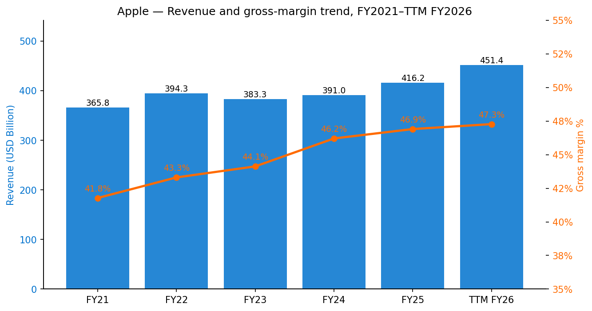
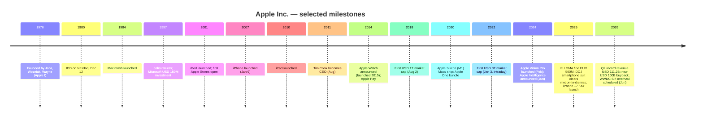
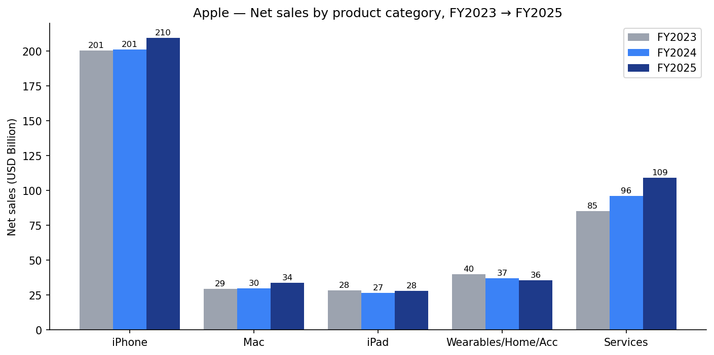
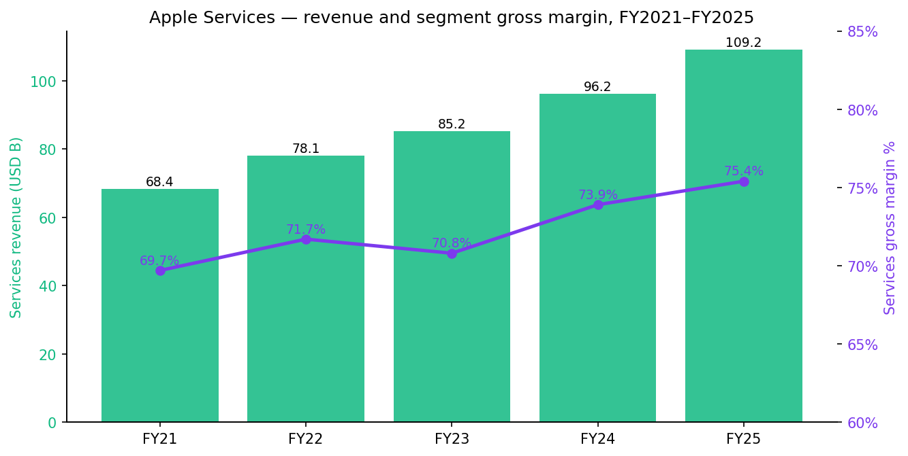
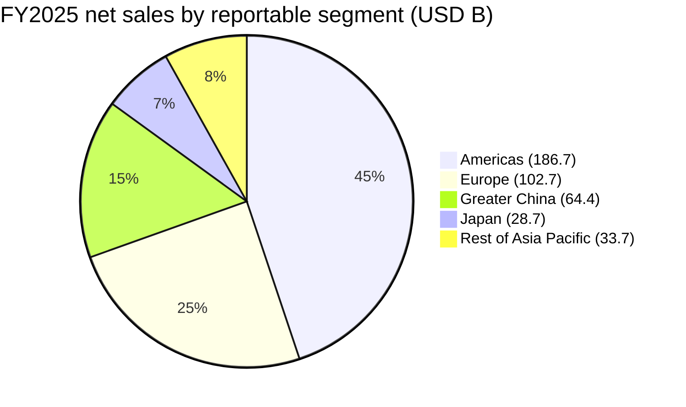
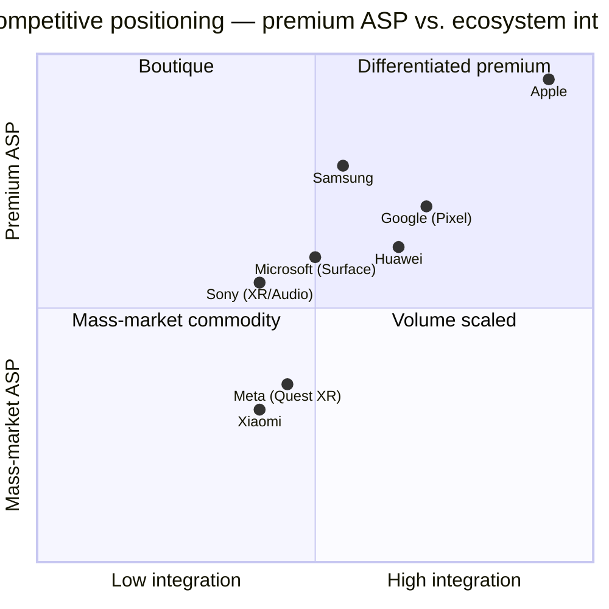

# COMPANY RESEARCH REPORT: Apple Inc. (NASDAQ: AAPL)

**Date:** 2026-05-20
**Analyst note:** Initiation of coverage. All figures sourced; nothing fabricated. Apple's fiscal year ends in late September; FY2025 = year ended September 27, 2025. Latest quarterly data is Q2-FY2026 (quarter ended March 28, 2026).

---

## Table of Contents
1. Company Overview
2. Company History
3. Management Team
4. Products & Services
5. Customers & Go-to-Market
6. Industry Overview
7. Competitive Landscape
8. Market Opportunity (TAM)
9. Risk Assessment

---

> **Update — March-quarter records and an additional USD 100B repurchase authorization (2026-04-30):** Apple reported Q2-FY2026 revenue of USD 111.2B (+17% YoY) and diluted EPS of USD 2.01 (+22% YoY), with all five geographic segments growing double-digits — including Greater China at +28% YoY, the first material reacceleration in that region since FY2023. The Board also authorized a new USD 100B share-repurchase program and raised the dividend 4% to USD 0.27 per share. Apple does not provide formal numerical guidance; on the call, CFO Kevan Parekh said the June quarter total-company revenue would grow "high-single digits" YoY with a similar Services trajectory, and gross margin in the range of 46.0–47.0%. Source: [Apple reports second quarter results, 2026-04-30 (8-K Ex-99.1)](https://www.sec.gov/Archives/edgar/data/0000320193/000032019326000011/a8-kex991q2202603282026.htm).

---

## 1. COMPANY OVERVIEW

Apple Inc. designs, manufactures and markets smartphones, personal computers, tablets, wearables and accessories, and sells a portfolio of related services through its proprietary stack of six software platforms (iOS, iPadOS, macOS, watchOS, visionOS, tvOS) ([Apple 2025 Form 10-K, Item 1 Business](https://www.sec.gov/Archives/edgar/data/0000320193/000032019325000079/aapl-20250927.htm)). Headquartered in Cupertino, California, Apple had more than 150,000 full-time equivalent employees as of fiscal-year-end 2025, sells in more than 175 countries, and operates a global network of Apple Stores complemented by indirect distribution through cellular carriers, resellers and the App Store. The combined active installed base reached **2.5 billion devices** in January 2026, up from 2.35 billion a year earlier, with new all-time highs across every product category and every region as flagged on the Q2-FY2026 earnings call ([9to5Mac, 2026-01-29](https://9to5mac.com/2026/01/29/apple-reveals-it-has-2-5-billion-active-devices-around-the-world/); [Apple Q2-FY2026 press release, 2026-04-30](https://www.sec.gov/Archives/edgar/data/0000320193/000032019326000011/a8-kex991q2202603282026.htm)).

**How Apple makes money.** Apple monetizes the integrated hardware–software–services stack in two tightly linked engines. The Products engine (iPhone, Mac, iPad, Wearables/Home/Accessories) generated **USD 307.0B** in FY2025 (74% of total net sales) at a **36.8% gross margin**; the Services engine (App Store commissions, advertising, iCloud, AppleCare, Apple Music/TV+/Arcade/Fitness+/News+, Pay, search-licensing) generated **USD 109.2B** (26% of net sales) at a **75.4% gross margin** ([Apple 2025 10-K, Products & Services Performance, pp. 23–24](https://www.sec.gov/Archives/edgar/data/0000320193/000032019325000079/aapl-20250927.htm)). The blended **company gross margin of 46.9%** in FY2025 is the highest in Apple's modern history and is structurally driven by Services rising to ~26% of revenue from ~19% in FY2020.

**Scale.** FY2025 total revenue was **USD 416.2B** (+6% YoY), net income **USD 112.0B** (+19% YoY), operating cash flow **USD 118.3B**, and free-cash conversion is the highest in mega-cap tech. Cash, cash equivalents and marketable securities were **USD 132.4B** against total term debt of **USD 91.3B**, leaving Apple in a modest net-cash position despite cumulatively returning more than USD 950B to shareholders since FY2012 ([Apple 2025 10-K, Liquidity, p. 25](https://www.sec.gov/Archives/edgar/data/0000320193/000032019325000079/aapl-20250927.htm)). On a six-month FY2026 H1 basis, revenue is up **16% YoY to USD 254.9B** and net income is up **22% YoY to USD 66.3B** ([Apple Q2-FY2026 10-Q, p. 1](https://www.sec.gov/Archives/edgar/data/0000320193/000032019326000013/aapl-20260328.htm)).

**Geographic footprint.** Apple reports five segments: Americas (FY2025: USD 186.7B, 45% of sales), Europe (USD 102.7B, 25%; includes EMEA + India), Greater China (USD 64.4B, 15%), Japan (USD 28.7B, 7%) and Rest of Asia Pacific (USD 33.7B, 8%) ([Apple 2025 10-K, Segment Information, p. 46](https://www.sec.gov/Archives/edgar/data/0000320193/000032019325000079/aapl-20250927.htm)). International revenue is a majority of total sales, and a strengthening US dollar is a recurring headwind explicitly cited in the FY2025 MD&A. Greater China was down 4% YoY in FY2025 — the third consecutive year of decline — but reaccelerated sharply in Q2-FY2026 to +28% YoY, driven by iPhone 17 demand and a tailwind from a stronger renminbi.

Source: [Apple 2025 Form 10-K, Item 7 MD&A](https://www.sec.gov/Archives/edgar/data/0000320193/000032019325000079/aapl-20250927.htm); [Apple Q2-FY2026 Form 10-Q](https://www.sec.gov/Archives/edgar/data/0000320193/000032019326000013/aapl-20260328.htm).

**Valuation snapshot (as of 2026-05-19).** Closing price **USD 298.37**, market capitalization **USD 4.41T**, **TTM P/E 35.9×** (on TTM diluted EPS of USD 8.29 for the trailing twelve months ending March 28, 2026), **TTM P/S 8.1×**, dividend yield ~0.36% (USD 1.08 annualized after the May 2026 raise). The 52-week range is USD 193.46–303.20 ([Yahoo Finance, AAPL](https://finance.yahoo.com/quote/AAPL/); [Fullratio AAPL P/E, May 18 2026](https://fullratio.com/stocks/nasdaq-aapl/pe-ratio); [Capital.com AAPL market cap, May 2026](https://capital.com/en-int/markets/shares/apple-inc-share-price/market-cap)).

Apple's three-year average TTM P/E is approximately 29–30× and its three-year average TTM P/S is approximately 7.4× ([Macrotrends AAPL P/E history](https://www.macrotrends.net/stocks/charts/AAPL/apple/pe-ratio)). Today's 35.9× P/E therefore sits roughly 1.0–1.5× standard deviations above its post-COVID trading range — and substantially above the **mega-cap peer median** of ~30× (MSFT 25.0×, GOOGL 30.0×, AMZN 31.2×) ([Fullratio MSFT P/E, May 15 2026](https://fullratio.com/stocks/nasdaq-msft/pe-ratio); [Fullratio GOOGL P/E, May 18 2026](https://fullratio.com/stocks/nasdaq-googl/pe-ratio); [Fullratio AMZN P/E, May 18 2026](https://fullratio.com/stocks/nasdaq-amzn/pe-ratio)).

**Why the premium?** Three identifiable drivers, in roughly equal weight: (i) **Services re-rating** — Services revenue is now 26% of total sales at a 75% gross margin and growing in the mid-teens, which the market increasingly capitalizes at a software multiple; (ii) **AI optionality** — Apple Intelligence and the long-delayed Siri overhaul (now slated for unveiling at WWDC 2026 on June 8) create both a refresh-cycle thesis and an installed-base-monetization thesis ([TechRepublic WWDC 2026 preview, 2026-04-22](https://www.techrepublic.com/article/news-apple-wwdc-2026-ios-27-siri-ai-preview/)); (iii) **capital-return floor** — Apple's USD 100B incremental buyback authorization in May 2026 (on top of the USD 100B authorized in May 2025) puts a steady mid-single-digit reduction in share count under EPS. The multiple is stretched but not unanchored; the binary risks (DOJ ruling, EU DMA Article 6(4) decision, Google search-deal disruption) are discussed in Section 9 and could meaningfully compress the multiple if they resolve adversely.

---

## 2. COMPANY HISTORY

Apple was founded by Steve Jobs, Steve Wozniak and Ronald Wayne on April 1, 1976 in Los Altos, California, originally to commercialize Wozniak's Apple I personal-computer kit. The company was incorporated on January 3, 1977, IPO'd on December 12, 1980, and after a turbulent 1985–1996 period (Jobs's 1985 departure, the Sculley/Spindler/Amelio era of declining share) returned to dominance under the second Jobs era (1997–2011) with the iMac (1998), iPod (2001), iTunes Store (2003), iPhone (2007) and iPad (2010). Tim Cook succeeded Jobs as CEO in August 2011 ([Apple 2026 Proxy Statement, Tim Cook bio, p. 27](https://www.sec.gov/Archives/edgar/data/0000320193/000130817926000008/apl4218281-def14a.htm)).

Source for milestone-level items: [Apple 2025 Form 10-K, Item 1](https://www.sec.gov/Archives/edgar/data/0000320193/000032019325000079/aapl-20250927.htm); [Apple newsroom — Apple Intelligence, 2024-06-10](https://www.apple.com/newsroom/2024/06/introducing-apple-intelligence-for-iphone-ipad-and-mac/); [Apple Q2-FY2026 8-K Ex-99.1](https://www.sec.gov/Archives/edgar/data/0000320193/000032019326000011/a8-kex991q2202603282026.htm).

**Three strategic pivots that shape the FY2026 thesis:**

1. **From device-maker to platform owner (2008–present).** The App Store, launched July 2008, was the inflection point that turned the iPhone from a high-margin gadget into a two-sided platform with developer lock-in and high-margin take rates. The App Store now sits at the center of every active antitrust matter Apple faces — DOJ, EU DMA, Epic Games, multiple class actions — precisely because it is the choke point through which Apple monetizes its installed base.

2. **From device-revenue narrative to Services narrative (2017–present).** In FY2017 Services revenue was USD 32.7B (13% of sales); in FY2025 it was **USD 109.2B (26% of sales)** and the segment now generates more gross-profit dollars (USD 82.3B) than the entire iPad + Wearables/Home/Accessories combined ([Apple 2025 10-K, p. 24](https://www.sec.gov/Archives/edgar/data/0000320193/000032019325000079/aapl-20250927.htm)). This is the single most important re-rating story for the equity over the next five years.

3. **From China-dependent supply chain to multi-country footprint (2020–present).** Tariff escalations beginning Q2-FY2025 and a multi-year Foxconn/Tata-led India build-out have shifted Apple from ~83% China-assembled iPhones in 2024 to an estimated **74% in 2025 and ~72% projected for 2026**, with India's share rising from 14% to 23% to a projected 28% in calendar 2026 ([National Herald, 2026-01-15](https://www.nationalheraldindia.com/business/indias-share-in-global-iphone-assembly-projected-to-reach-28-in-2026); [IndianWeb2, 2026-05-13](https://www.indianweb2.com/2026/05/tata-surpasses-foxconn-as-apples.html)). Apple reportedly plans to source the majority of US-bound iPhones from India by end-2026.

**Recent developments (last 12 months).** (i) iPhone 17 lineup, iPhone Air (ultra-thin), iPhone 16e and the M5 Vision Pro refresh launched between September and October 2025. (ii) iPhone 17e and MacBook Neo (codename, first acknowledged in the Q2-FY2026 8-K) launched in spring 2026. (iii) The Board authorized a fresh USD 100B repurchase in May 2025 (on top of which a further USD 100B was authorized in May 2026). (iv) The EU Commission fined Apple EUR 500M in April 2025 under DMA Article 5(4); the Article 6(4) investigation remains open with potential fines up to **10% of global annual revenue**. (v) The DOJ smartphone case cleared a motion-to-dismiss in June 2025 and entered full discovery in 2026.

---

## 3. MANAGEMENT TEAM

### Tim Cook — Chief Executive Officer

Tim Cook, 65, has been CEO of Apple since August 2011, when he succeeded Steve Jobs. Cook joined Apple in March 1998 as Senior Vice President, Worldwide Operations, was named EVP Worldwide Sales and Operations in February 2002, COO in October 2005, and was named CEO seven weeks before Jobs's death ([Apple 2026 Proxy Statement, Cook bio, p. 27](https://www.sec.gov/Archives/edgar/data/0000320193/000130817926000008/apl4218281-def14a.htm)).

Cook's pre-Apple career was almost entirely operations. After undergraduate engineering at Auburn (1982) and an MBA from Duke's Fuqua School (1988), he spent 12 years at IBM (rising to Director of North-American Fulfillment for the PC division), then briefly at Intelligent Electronics and at Compaq as VP for Corporate Materials, before Jobs personally recruited him. The Cook-era investment thesis is well documented: he made Apple a working-capital negative business by compressing inventory days to single digits (~10 days throughout the 2010s vs. industry norm of 60+), pioneered the practice of pre-paying suppliers for capacity to lock in pricing power, and externalized manufacturing risk onto Foxconn, Pegatron and (later) Wistron/Tata while Apple owned the IP, design and silicon stacks.

The numbers under his CEO tenure speak loudly: Apple revenue grew from USD 108.2B (FY2011) to **USD 416.2B (FY2025)** at a ~9% CAGR; net income from USD 25.9B to **USD 112.0B**; the active installed base from ~315M devices to **2.5B**; and the market cap from ~USD 350B to ~USD 4.4T. Cook's FY2025 total compensation was **USD 74.29M** (USD 3.0M salary + USD 57.5M stock awards + USD 12.0M non-equity incentive + USD 1.76M other), with a CEO-to-median-employee pay ratio of **533:1** ([Apple 2026 Proxy Statement, Summary Compensation Table; CEO Pay Ratio](https://www.sec.gov/Archives/edgar/data/0000320193/000130817926000008/apl4218281-def14a.htm)). The People & Compensation Committee explicitly targets Cook's total comp between the 80th and 90th percentile of mega-cap CEO pay. Cook holds approximately 3.27 million shares (≤0.03% of shares outstanding), serves on the boards of Nike and Duke University, and has been publicly clear that he will eventually transition out — Sabih Khan's July 2025 promotion to COO is widely read as part of an orderly succession plan (with Jeff Williams, the prior COO, having retired in July 2025 after 27 years).

The two open questions for Cook in 2026: (a) **AI execution.** The original Apple-Intelligence-powered Siri was promised for iOS 18.4 in 2025, was delayed by roughly two years, and is now scheduled for unveiling at WWDC 2026 on June 8 — the highest-stakes keynote of his tenure on the AI thesis ([TechRadar, 2026-05-12](https://www.techradar.com/ai-platforms-assistants/apple-says-its-new-ai-siri-will-be-fundamentally-different-from-chatgpt-and-gemini-but-wwdc-could-be-a-make-or-break-moment)). (b) **Regulatory survival of the App Store economics**, which under Cook has gone from supplementary to load-bearing. Both questions are existential to the FY2026–FY2028 thesis.

### Kevan Parekh — Senior Vice President, Chief Financial Officer

Kevan Parekh, 54, became CFO in January 2025 after Luca Maestri stepped down to a non-CFO senior role. Parekh joined Apple in June 2013 and rose through VP, Financial Planning & Analysis and VP, Worldwide Finance for Sales, Marketing & Retail. Pre-Apple, he held senior finance leadership roles at Thomson Reuters and General Motors ([Apple 2026 Proxy, Parekh bio, p. 34](https://www.sec.gov/Archives/edgar/data/0000320193/000130817926000008/apl4218281-def14a.htm)). His FY2025 total comp was **USD 22.47M** (partial year as CFO). Parekh has so far maintained Maestri's posture on the earnings call: no formal numerical guidance for full-year revenue or EPS, only directional commentary for the next quarter on revenue growth, gross margin range, OpEx, and other-income. The first major test of his stewardship was the USD 89.3B FY2025 buyback execution — completed on a steady, programmatic basis even through the March–April 2025 tariff turbulence — and the USD 100B authorization announced alongside Q2-FY2026 earnings.

### Sabih Khan — Senior Vice President, Chief Operating Officer

Sabih Khan, 59, became COO in July 2025. He joined Apple in August 1995, was named SVP Operations in 2019, and is the steward of the multi-country supply-chain pivot. Pre-Apple he worked at GE Plastics ([Apple 2026 Proxy, Khan bio, p. 34](https://www.sec.gov/Archives/edgar/data/0000320193/000130817926000008/apl4218281-def14a.htm)). Khan is the most material executive in the FY2026–FY2028 thesis after Cook because (i) the tariff regime and the Section 232 semiconductor investigation make supply-chain agility a P&L variable, not a back-office function, and (ii) he owns the India ramp at Foxconn (Sriperumbudur) and Tata Electronics (Hosur/Krishnagiri) as well as the M-series and A-series ramp at TSMC. Industry reports from the iPhone 17 production cycle credit Khan's team with absorbing five new tariff regimes (China, India, Vietnam, Japan, EU) in less than nine months without missing a major product launch ([Digitimes, 2025-09-11](https://www.digitimes.com/news/a20250911PD201/apple-iphone-production-supply-chain-foxconn.html)).

### Craig Federighi — Senior Vice President, Software Engineering

Federighi (not an NEO in 2026 but the single most consequential executive on the AI thesis) heads iOS/macOS/visionOS/watchOS engineering and the Apple Intelligence stack. He is the public face of WWDC and will own the live demo and shipping schedule for the post-WWDC-2026 Siri. He has been at Apple since 2009 (returning from Ariba, where he had been CTO; an Apple alumnus from 1994–1999 working on OPENSTEP) and is widely regarded as the most credible internal candidate for a future CEO transition alongside Khan.

### Governance footer

- **Board:** 8 nominees, 7 independent (all except Tim Cook). Art Levinson, founder and CEO of Calico, is non-executive Chair since 2011 and has served on the Board since 2000. Other independent directors include Wanda Austin (Aerospace Corp.), Alex Gorsky (former J&J Chair/CEO), Andrea Jung (Grameen America), Monica Lozano (College Futures Foundation), Ron Sugar (former Northrop Grumman Chair/CEO) and Sue Wagner (BlackRock co-founder). Average tenure is approximately 13 years — long by S&P 500 standards. ([Apple 2026 Proxy, Director Nominees, pp. 23–32](https://www.sec.gov/Archives/edgar/data/0000320193/000130817926000008/apl4218281-def14a.htm))
- **Insider ownership:** all directors and NEOs collectively own less than 0.10% of shares outstanding — typical of a multi-decade-old large cap. There is no controlling shareholder; the largest institutional holders are Vanguard, BlackRock and State Street ETF/index complexes.
- **Comp structure:** Tim Cook's FY2025 pay was ~96% performance-linked (PSU + non-equity incentive) — among the most equity-weighted in mega-cap tech. The PSU plan uses relative TSR vs. S&P 500 as the sole performance metric for two-thirds of equity grants.
- **Governance flags:** none material. Apple maintains an annually elected board, a majority-independent committee structure, a clawback policy (refreshed November 2023), and a shareholder right to call special meetings at 10% ownership. The most actively litigated governance issue in 2025–2026 is the executive separation arrangement with the retiring COO Jeff Williams, which received no opposition in the say-on-pay vote.

**Management track record (synthesis).** This is one of the most operationally capable C-suites in the public market. The risks are not execution risks; they are pivot risks. The team has not yet credibly delivered a consumer-AI product (Apple Intelligence has so far been a feature collection, not a moat) and has not yet stress-tested a world in which the App Store economics are forced open by EU/US courts. The bench is deep enough to survive Cook's eventual exit; the bench is not yet proven on AI product–market fit.

---

## 4. PRODUCTS & SERVICES

Apple operates with two product disclosures: the **five categories** in the income-statement footnote (iPhone / Mac / iPad / Wearables, Home and Accessories / Services), and the **six software platforms** (iOS / iPadOS / macOS / watchOS / visionOS / tvOS). The product tree below mirrors what Apple itself organizes on apple.com.

```mermaid
graph TD
    A[Apple Inc.] --> B[iPhone — 50% of FY25 sales]
    A --> C[Mac — 8%]
    A --> D[iPad — 7%]
    A --> E[Wearables, Home & Acc. — 9%]
    A --> F[Services — 26%]
    B --> B1[iPhone 17 Pro]
    B --> B2[iPhone Air]
    B --> B3[iPhone 17]
    B --> B4[iPhone 16 / 16e]
    B --> B5[iPhone 17e]
    C --> C1[MacBook Air]
    C --> C2[MacBook Pro]
    C --> C3[MacBook Neo]
    C --> C4[iMac, Mac mini, Mac Studio, Mac Pro]
    D --> D1[iPad Pro]
    D --> D2[iPad Air]
    D --> D3[iPad / iPad mini]
    E --> E1[Apple Watch — Series, Ultra, SE]
    E --> E2[AirPods — Pro, Max, regular]
    E --> E3[Apple Vision Pro]
    E --> E4[HomePod, HomePod mini, Apple TV]
    F --> F1[App Store]
    F --> F2[Advertising]
    F --> F3[iCloud / Cloud Services]
    F --> F4[AppleCare]
    F --> F5[Apple Music / TV+ / Arcade / Fitness+ / News+ / Books]
    F --> F6[Apple Pay / Card / Cash]
    F --> F7[Google search-licensing]
```

Source: [Apple 2025 10-K, Item 1, pp. 1–4](https://www.sec.gov/Archives/edgar/data/0000320193/000032019325000079/aapl-20250927.htm); [Apple.com product navigation, accessed 2026-05-20](https://www.apple.com/shop/buy).

Source: [Apple 2025 Form 10-K, Products and Services Performance, p. 23](https://www.sec.gov/Archives/edgar/data/0000320193/000032019325000079/aapl-20250927.htm).

### iPhone — 50% of FY2025 sales

FY2025 iPhone revenue: **USD 209.6B** (+4% YoY), driven by higher Pro-model mix ([Apple 2025 10-K, p. 23](https://www.sec.gov/Archives/edgar/data/0000320193/000032019325000079/aapl-20250927.htm)). Q2-FY2026 iPhone revenue accelerated dramatically to **USD 57.0B (+22% YoY)** as iPhone 17 and iPhone Air found their stride ([Apple Q2-FY2026 10-Q, p. 14](https://www.sec.gov/Archives/edgar/data/0000320193/000032019326000013/aapl-20260328.htm)). The lineup as of May 2026 spans iPhone 17 Pro, iPhone Air (the ultra-thin form factor), iPhone 17, iPhone 17e (introduced in the March quarter), iPhone 16 and iPhone 16e.

- **Competitive advantage: yes — deep, multi-layer moat.** (a) **Silicon:** Apple's A-series SoCs, made on TSMC's leading node, consistently outperform Qualcomm Snapdragon at IPC and perf-per-watt and lead the Android cohort by ~12–18 months on benchmarks. The A20 family (Borneo / Borneo Ultra), powering iPhone 18 in fall 2026, will be the first 2nm GAA chips in the industry; Apple has secured ~50% of TSMC's initial N2 capacity ([MacRumors, 2025-08-28](https://www.macrumors.com/2025/08/28/apple-tsmc-2nm-production-iphone-18/)). (b) **Ecosystem lock-in:** iMessage, AirDrop, Continuity, Find My, Watch pairing — switching out of iPhone breaks 5–10 daily-use micro-workflows. (c) **Brand and pricing power:** average iPhone ASPs are roughly USD 950–1,050 vs. the Android global average of ~USD 320; only Samsung's Ultra line and Google's Pixel Pro compete at the same ASP point. The closest single competing product is **Samsung Galaxy S25 Ultra** — at parity on hardware, behind on silicon (Snapdragon 8 Elite for Galaxy), and behind on ecosystem integration.

### Mac — 8% of FY2025 sales

FY2025 Mac revenue: **USD 33.7B** (+12% YoY) ([Apple 2025 10-K, p. 23](https://www.sec.gov/Archives/edgar/data/0000320193/000032019325000079/aapl-20250927.htm)). Lineup: MacBook Air (M-series), MacBook Pro (M-series Pro/Max/Ultra), the new MacBook Neo (introduced March quarter 2026), iMac, Mac mini, Mac Studio and Mac Pro. The strategic story is Apple Silicon, in its fifth year, having lapped Intel's roadmap by two full process generations on perf-per-watt. **Competitive advantage: yes — moat from vertical silicon integration.** The closest competing product is **Microsoft Surface Laptop (Snapdragon X Elite/X2)**: behind on single-core performance and battery life, but ahead on price-to-performance in some configurations and benefiting from broader x86 software compatibility via emulation.

### iPad — 7% of FY2025 sales

FY2025 iPad revenue: **USD 28.0B** (+5% YoY) ([Apple 2025 10-K, p. 23](https://www.sec.gov/Archives/edgar/data/0000320193/000032019325000079/aapl-20250927.htm)). Lineup: iPad Pro (M4 / M5), iPad Air (M3 / M4), iPad, iPad mini. **Competitive advantage: partial.** Apple has commanding share (~36% global tablet) but the category itself is structurally low-growth and partially cannibalized by larger iPhones and Mac laptops. iPadOS 18+ still does not deliver true desktop-grade multitasking; this is the most under-leveraged hardware platform in Apple's stack and the most likely beneficiary of post-WWDC-2026 software changes.

### Wearables, Home and Accessories — 9% of FY2025 sales

FY2025 W/H/A revenue: **USD 35.7B** (–4% YoY), the only declining category ([Apple 2025 10-K, p. 23](https://www.sec.gov/Archives/edgar/data/0000320193/000032019325000079/aapl-20250927.htm)). The headline is Apple Vision Pro, where Apple sold approximately **500,000 units** in calendar 2024 (the launch year) and approximately **45,000 units in Q4-2025** alone — a meaningful slowdown that has led Apple to reportedly cut Vision Pro marketing spend by as much as 95% and have Chinese partner Luxshare pause new-unit production for periods of 2025 ([Tom's Guide, 2026-01-08](https://www.tomsguide.com/computing/vr-ar/apple-reducing-vision-pro-spending-after-underwhelming-sales-heres-what-we-know); [Hypebeast, 2026-01](https://hypebeast.com/2026/1/apple-vision-pro-faces-cuts-as-spatial-bet-stalls)). The M5 Vision Pro refresh launched October 2025 ($3,499) was reportedly a minimal sales catalyst ([9to5Mac, 2026-01-02](https://9to5mac.com/2026/01/02/m5-vision-pro-launch-likely-made-minimal-sales-impact-report/)). **Competitive advantage for Vision Pro: no** — first-gen consumer XR has not found product–market fit at $3,499; Meta Quest 3 outsells Vision Pro by ~20:1 at one-tenth the price. **Apple Watch (within W/H/A) retains strong moat:** unmatched health-sensor stack (ECG, blood-oxygen, FDA-cleared sleep-apnea and hypertension notifications), tight iPhone pairing, and ~30% of smartwatch shipments globally. **AirPods** continue to be the dominant wireless-earbud franchise globally (~30% share by units, higher by revenue).

### Services — 26% of FY2025 sales, 75.4% gross margin — the most valuable engine

FY2025 Services revenue: **USD 109.2B** (+14% YoY); Q2-FY2026: **USD 31.0B (+16% YoY)**, an all-time quarterly record ([Apple 2025 10-K, p. 24](https://www.sec.gov/Archives/edgar/data/0000320193/000032019325000079/aapl-20250927.htm); [Apple Q2-FY2026 press release, 2026-04-30](https://www.sec.gov/Archives/edgar/data/0000320193/000032019326000011/a8-kex991q2202603282026.htm)).

Source: [Apple 2021–2025 Form 10-Ks](https://www.sec.gov/cgi-bin/browse-edgar?action=getcompany&CIK=0000320193&type=10-K&dateb=&owner=include&count=10).

Services has six monetizable layers, each with distinct moats:

1. **App Store commissions** — 30% standard rate, 15% under the Small Business Program. Globally the largest gross-profit contributor inside Services, though now under real pressure from the EU DMA, the US Epic injunction and DOJ litigation (see Section 9). **Moat: ecosystem lock-in + regulatory** — strong but eroding.
2. **Advertising** — Apple Search Ads on the App Store + Apple News, ad placement inside Stocks, Apple TV+ tier-2 advertising. Growing fastest within Services per management commentary. **Moat: data + scale**.
3. **iCloud and other cloud services** — paid storage, subscription bundling. Software-style 80%+ gross margins. **Moat: switching costs + ecosystem**.
4. **Apple Music / TV+ / Arcade / Fitness+ / News+** — content subscriptions bundled into Apple One. Apple TV+ is content-investment-heavy; the rest are high-margin. **Moat: bundling + ecosystem**.
5. **AppleCare** — extended warranty and support, a steady cash machine. **Moat: distribution lock-in**.
6. **Google search-licensing** — annual payment from Google estimated at **USD ~20B/year** (the largest single non-product revenue line, though Apple does not break it out). At immediate risk: the Sep 2 2025 D.C. District Court remedies order in the US v. Google case did not bar the payment but is subject to DOJ appeal that could; an adverse appellate ruling could remove the single largest Services contribution overnight ([Apple 2025 10-K, p. 7 Item 1A risk factor](https://www.sec.gov/Archives/edgar/data/0000320193/000032019325000079/aapl-20250927.htm)). **Moat: none — pure pass-through**.

**Competitive-advantage verdict for Services overall: yes, very strong on a sustained basis — but with material asymmetric tail risk** from regulation. Closest competing platform-tax model is **Google Play (Android)** at the same 15/30% rate split; Google Play is materially smaller in absolute dollars because Android ARPU per device is roughly one-third of iOS ARPU.

### Recent launches and roadmap (last 12 months)

- iPhone 17 lineup + iPhone Air (Sep 2025); iPhone 17e (March 2026)
- M5 Vision Pro refresh with Dual Knit Band (Oct 2025)
- M4-powered iPad Air (March 2026); M5-class iPad Pro expected H2-2026
- MacBook Neo (introduced March quarter 2026; Q2-FY2026 8-K)
- macOS 27 / iOS 27 / iPadOS 27 / visionOS 27 — WWDC June 8, 2026; **Siri overhaul** with on-device LLM + cloud LLM via Private Cloud Compute is the headline ([TechRepublic, 2026-04-22](https://www.techrepublic.com/article/news-apple-wwdc-2026-ios-27-siri-ai-preview/))
- iPhone 18 / iPhone Fold (rumored): fall 2026, on TSMC N2 with WMCM advanced packaging ([TrendForce, 2025-12-18](https://www.trendforce.com/news/2025/12/18/news-apple-reportedly-to-bring-wmcm-packaging-to-a20-series-boosting-iphone-18-thermal-efficiency/))

---

## 5. CUSTOMERS & GO-TO-MARKET

Apple's customers are largely consumer end-users plus small/mid-sized business, education, enterprise and government buyers. Of FY2025 total net sales, **40% went through Apple's direct channels** (its 500+ retail stores, the online store, direct enterprise sales) and **60% through indirect channels** — primarily third-party cellular network carriers and large resellers ([Apple 2025 10-K, Markets and Distribution, p. 2](https://www.sec.gov/Archives/edgar/data/0000320193/000032019325000079/aapl-20250927.htm)).

Source: [Apple 2025 10-K, Segment Information, p. 46](https://www.sec.gov/Archives/edgar/data/0000320193/000032019325000079/aapl-20250927.htm).

**Customer concentration — at the company level, low.** Apple does not have customer-concentration risk in the classic 10% sense — its end-customer base is dispersed across billions of consumers. However, the 10-K customer-concentration footnote does disclose carrier and reseller concentration in trade receivables: as of September 27, 2025, **one customer represented 12% of total trade receivables**, and **third-party cellular network carriers in aggregate accounted for 34%** of total trade receivables (down from 38% in FY2024) ([Apple 2025 10-K, Note 4 Accounts Receivable, p. 36](https://www.sec.gov/Archives/edgar/data/0000320193/000032019325000079/aapl-20250927.htm)). This is moderate exposure to Verizon/AT&T/T-Mobile in the US and to comparable carriers internationally, but it is well-collateralized and diversified across geographies.

**Vendor concentration (the other side of the same disclosure) is much higher** and matters for understanding supply-chain risk. As of September 27, 2025, **two vendors individually represented 10%+ of total vendor non-trade receivables — 46% and 23% respectively, totaling 69%** — essentially unchanged from 67% the year before. These are widely understood to be Foxconn (Hon Hai Precision Industry) at the larger figure and Pegatron/Wistron at the smaller, although Apple does not name them in the filing ([Apple 2025 10-K, Note 4, p. 36](https://www.sec.gov/Archives/edgar/data/0000320193/000032019325000079/aapl-20250927.htm)).

**Geographic concentration risk: Greater China.** Greater China represented 15% of FY2025 revenue and is reported as a separate segment because Apple's "iPhone revenue represents a moderately higher proportion of net sales" there relative to other segments ([Apple 2025 10-K, Note 13 Segment Information, p. 47](https://www.sec.gov/Archives/edgar/data/0000320193/000032019325000079/aapl-20250927.htm)). The trajectory has been three straight years of decline (FY23 USD 72.6B → FY24 USD 67.0B → FY25 USD 64.4B), driven by domestic Android share gains (Huawei, Xiaomi, Vivo, Oppo) and a soft consumer cycle, before reaccelerating sharply in H1-FY2026 (+33% YoY) on the iPhone 17 cycle and renminbi strength ([Apple Q2-FY2026 10-Q, p. 13](https://www.sec.gov/Archives/edgar/data/0000320193/000032019326000013/aapl-20260328.htm)).

**Go-to-market and distribution.**
- **Apple Stores (~520 globally):** the most productive retail real-estate in the world by sales-per-square-foot. Stores are managed by Deirdre O'Brien (SVP Retail + People). They function as the primary customer-acquisition and Apple-Care/AppleTrade-In channel and are deliberately concentrated in dense urban / luxury locations.
- **Carrier subsidies and BNPL:** Apple has been highly effective at decoupling the iPhone ASP from the consumer "in-pocket" price through carrier installment plans, with Apple Card 24-month interest-free financing, and the resurgence of trade-in programs that depress effective entry prices. This monetizes the second-hand market for Apple — important moat as residual values exceed Android.
- **Sales cycle:** essentially zero for consumer hardware; long (3–18 month) for large enterprise rollouts where the SVP of Enterprise sells against Microsoft/Dell/HP.
- **Education and government:** structurally lower-margin but volume-stable; education sales of iPad and MacBook Air are explicitly subsidized at a discount.

**Named partnerships (top of mind, FY2026 thesis):**
- **Google Search** — paid search-default arrangement on Safari and Siri; estimated USD ~20B/year; under active US antitrust scrutiny.
- **OpenAI** — system-level ChatGPT integration in Apple Intelligence since iOS 18.2 (2024); opt-in, IP-obscured ([OpenAI/Apple partnership announcement, 2024-06-10](https://openai.com/index/openai-and-apple-announce-partnership/)).
- **Google Gemini** — multi-year partnership announced 2025 for foundation-model fallback in iOS 27 ([TechRepublic, 2026-04-22](https://www.techrepublic.com/article/news-apple-wwdc-2026-ios-27-siri-ai-preview/)).
- **TSMC** — sole foundry for A-series and M-series silicon; Apple is the largest single customer at TSMC by revenue (estimated >25% of TSMC sales in calendar 2025).
- **Foxconn / Tata Electronics** — primary contract manufacturers; Tata overtook Foxconn as Apple's largest contract manufacturer in India in May 2026 ([IndianWeb2, 2026-05-13](https://www.indianweb2.com/2026/05/tata-surpasses-foxconn-as-apples.html)).
- **Carriers globally** — Verizon, AT&T, T-Mobile, China Mobile/Telecom/Unicom, NTT Docomo, etc.

---

## 6. INDUSTRY OVERVIEW

Apple competes in eight overlapping industries, but four matter most to the FY2026 thesis: **(i) the global smartphone market, (ii) the personal-computer market, (iii) the consumer-services / mobile-app market, and (iv) the digital advertising market.**

**Global smartphone market.** The total industry shipped approximately **1.26 billion units in 2025**, +6.5% YoY — the strongest year since 2021 — driven by accelerating refresh cycles, AI feature launches and consumer recovery in the major emerging markets. Apple **overtook Samsung to take the #1 share position for full-year 2025** at 247.8M shipments and **19.7% global share**, vs. Samsung 241.2M units (19.1%) and Xiaomi 141.2M units (11.2%); Vivo and Oppo were tied for fourth at ~27M units each ([IDC, 2026-01-15](https://my.idc.com/getdoc.jsp?containerId=prUS53868725); [AppleInsider, 2026-01-12](https://appleinsider.com/articles/26/01/12/apple-dominated-2025-smartphone-market-with-a-20-share)). This was Apple's first calendar-year #1 finish in volume after fourteen years of trailing Samsung — a structural milestone driven primarily by Samsung underperforming in lower-tier segments rather than Apple expanding in them. Apple's revenue share of the smartphone market (much higher than its unit share — estimated >45%) is unprecedented.

The category is **mature, consolidated, and increasingly two-horse-race-shaped at the high end** (Apple + Samsung), with a long tail of Android OEMs (Chinese majors plus Google Pixel). The next decade's growth driver is **AI-feature-driven refresh** rather than first-time buyers, which structurally favors Apple given installed-base size, silicon lead, and per-device monetization.

**Personal computer market.** Apple's Mac unit share globally is approximately 8–9% (third place behind Lenovo and HP, ahead of Dell), but its **revenue share is ~17%** because of much higher ASPs. The PC industry is in a Windows-on-ARM transition and an AI-PC refresh, both of which structurally favor Apple — which led ARM silicon on PC by four years and ships every Mac with a Neural Engine. Mac TAM is roughly USD 250–280B annually.

**Consumer-services and app market.** Global consumer app-store spend was approximately **USD 165B in 2025** (combined App Store + Google Play, gross before take rate) according to multiple industry trackers; Apple's App Store accounts for ~60% of this — Apple's App-Store-only consumer spend was roughly USD 100B in calendar 2025, generating ~USD 25–28B of net Services revenue inside Apple's reported number. This is the most consequential single TAM for Apple because (a) it is the most leveraged to take rates (a 30%→15% global cut would impair USD 12–15B of net Services revenue), and (b) it is the focal point of every active antitrust matter.

**Digital advertising.** A USD ~800B global market; Apple is sub-USD 15B inside it but the fastest-growing meaningful contributor as Search Ads, Apple News and TV+ ad-tier scale. The TAM is large enough that 2–3× current scale is plausible by FY2028 without altering the competitive structure.

**Regulatory environment is the most important industry overlay in 2026.** The 10-K itself enumerates the active regulatory perimeter as covering "antitrust; privacy, data security and data localization; online safety; age verification; consumer protection; advertising, sales, billing and e-commerce; financial services and technology; ... digital platforms; machine learning and artificial intelligence; internet, telecommunications and mobile communications; ... import, export and trade; ... national security; tax; and environmental, health and safety" ([Apple 2025 10-K, Item 1A Risk Factors, p. 8](https://www.sec.gov/Archives/edgar/data/0000320193/000032019325000079/aapl-20250927.htm)). The two materially binding regimes today:

- **EU Digital Markets Act (DMA):** Apple is designated a gatekeeper. April 2025 fines: **EUR 500M under Article 5(4)** for App Store steering restrictions, plus preliminary findings under Article 6(4) on third-party app-marketplace contractual terms; final ruling could carry **fines up to 10% of Apple's annual worldwide net sales** (~USD 42B based on FY2025). Apple has appealed.
- **US Section 232 semiconductor investigation + various tariff regimes:** Beginning Q2-FY2025, the US imposed additional tariffs on imports from China, India, Japan, South Korea, Taiwan, Vietnam and the EU; January 14 2026 initial results of the Section 232 investigation did not impose additional tariffs on Apple's products. On February 20 2026 the US Supreme Court struck down certain IEEPA tariffs; Apple is applying for refunds ([Apple Q2-FY2026 10-Q, MD&A, p. 13](https://www.sec.gov/Archives/edgar/data/0000320193/000032019326000013/aapl-20260328.htm)). Tariff exposure remains a live P&L variable.

---

## 7. COMPETITIVE LANDSCAPE

The most useful framework for Apple is not a single industry positioning chart but a **product-by-product competitive map**, since Apple competes against different opponents in each category.

**Direct competitors by segment:**

1. **Samsung Electronics (KRX: 005930).** The only other firm with vertical integration spanning silicon, panels, memory, contract-manufacturing avoidance, and a full-stack OS layer (One UI on Android). Samsung shipped 241.2M smartphones in 2025 and grew 7.9% YoY — strongest growth of any top-5 vendor — but lost the #1 spot to Apple ([Sammy Fans, 2026-01-15](https://www.sammyfans.com/2026/01/15/apple-samsung-2025-smartphone-market-idc/)). At the high end (Galaxy S25/Z Fold/Flip Ultra) Samsung is the closest competitor; at the low end Apple does not compete.

2. **Alphabet (NASDAQ: GOOGL).** Multi-front: Pixel (~3% global smartphone share but rising in the AI-feature narrative); Google Play (Apple's App-Store opponent in regulation); Google Workspace (Apple Mail/Calendar/iWork); Google AI (Gemini, foundation models — both partner and competitor); Google Search (Apple's largest partner Services line, USD ~20B annually). Alphabet TTM P/E is 30.0× ([Fullratio GOOGL P/E](https://fullratio.com/stocks/nasdaq-googl/pe-ratio)). The frenemy structure is unique in mega-cap.

3. **Microsoft (NASDAQ: MSFT).** Direct in Mac vs. Windows / Surface vs. MacBook, and indirect in productivity/cloud (Microsoft 365 vs. iCloud). Microsoft's enterprise lock-in remains essentially unchallenged. MSFT TTM P/E is 25.0× — the lowest of the mega-cap cohort and a useful reference point for what Apple could trade to if Services growth decelerates. Microsoft's AI position (OpenAI partnership, Copilot) is more advanced today than Apple Intelligence, which is a recurring AI-narrative drag on AAPL through the WWDC window.

4. **Amazon (NASDAQ: AMZN).** Indirect competitor via Fire tablets (small), Kindle (e-readers), Echo (smart-home — Apple HomePod), Amazon Music/Prime Video (Apple Music/TV+), and AWS (Apple is a major customer rather than competitor in cloud). AMZN TTM P/E 31.2× ([Fullratio AMZN P/E](https://fullratio.com/stocks/nasdaq-amzn/pe-ratio)).

5. **Huawei Technologies (private).** The most consequential competitor specifically in Greater China. Huawei's HarmonyOS, Mate 80 / Pura 90 / Mate XT triple-fold series have recaptured Chinese premium share post-sanctions, contributing materially to Apple's three-year Greater China decline (FY23–FY25). Q2-FY2026 reacceleration in China suggests Apple's relative position is improving but Huawei remains the structural Chinese-domestic alternative for premium consumers.

6. **Xiaomi (HKEX: 1810).** Volume Android leader at 141M shipments (11.2% share, 2025) plus a fast-growing premium tier (Xiaomi 15 Ultra, Mix Fold) and IoT/wearables.

7. **Meta Platforms (NASDAQ: META).** Direct in XR — Meta Quest 3/3S outsell Vision Pro by ~20:1; in advertising — Apple's ATT (App Tracking Transparency) framework remains a material structural drag on Meta's Instagram/Facebook ARPU. Meta is a stark example of the asymmetric power Apple holds over consumer-app monetization.

8. **Sony (TSE: 6758).** Premium audio (WH-1000 vs. AirPods Max), gaming (PlayStation 5 vs. nothing-equivalent at Apple), camera-sensor supply (Sony is the dominant CMOS supplier for iPhone — partner more than competitor).

9. **Vivo / Oppo (BBK Electronics).** Tied at #4–5 globally; primarily Android-China-domestic.

10. **OpenAI, Anthropic — emerging AI competitors.** Not classic smartphone OEMs, but the threat that consumers shift their primary intelligent-assistant interaction from Siri to ChatGPT / Claude is real, particularly if ChatGPT-as-a-platform builds device-class momentum. Apple's mitigation is exactly the WWDC-2026 Siri overhaul.

**Apple's structural advantages:**
- **Vertical integration of silicon, OS, hardware, services and retail** unmatched at scale.
- **Installed base of 2.5B devices** with multi-product attach rates (~1.8 Apple devices per active user in developed markets).
- **Free cash flow of ~USD 110B/year** funds R&D (USD 34.6B in FY2025, +10% YoY), capex (~USD 14B/year), and capital return simultaneously.
- **Brand and pricing power** — the single most valuable consumer brand globally; allows ASP premia of 2–3× over equivalent specs.

**Apple's vulnerabilities:**
- **AI execution gap vs. peers** — perceived to be 12–24 months behind Google/Microsoft on consumer LLM products; WWDC 2026 is the make-or-break moment.
- **Regulatory** — App Store economics are the most exposed single asset in mega-cap tech to forced unbundling.
- **China** — both as ~15% of revenue and as ~70% of assembly base.
- **Vision Pro / new-category problem** — Apple has not opened a new USD 10B+ revenue line since Apple Watch (2015); Vision Pro is unlikely to fill the gap.

Source: [Fullratio P/E ratios for AAPL, MSFT, GOOGL, AMZN, May 2026](https://fullratio.com/); [Macrotrends P/S ratios](https://www.macrotrends.net/).

---

## 8. MARKET OPPORTUNITY (TAM)

Apple's addressable market is best decomposed by revenue engine.

**iPhone TAM.** Global smartphone shipments of ~1.26B units in 2025 at an industry-blended ASP of ~USD 350 imply a ~USD 440B TAM. Apple's 247.8M iPhone units at an ASP of ~USD 845 captured ~USD 210B (about 48% revenue share of the global TAM). The TAM is approximately flat-to-low-single-digit growth — this is a refresh-cycle category, not a unit-growth one. Apple's serviceable opportunity is **ASP and Pro-mix expansion** (iPhone 17 Pro / iPhone Air / future iPhone Fold) plus **incremental capture from premium Android** (especially Samsung Ultra and Huawei in China). Net iPhone TAM growth path: a few low-single-digit percent per year, with optionality from a rumored late-2026 foldable.

**Mac/PC TAM.** Global PC shipments of ~270M units in 2025 at industry blended ASP ~USD 920 imply a ~USD 250B TAM. Apple's ~9% unit share converts to ~17% revenue share (USD ~42B if all-PC measured as commercial+consumer, USD 33.7B in Apple's narrower self-reported segment). The driver here is the **AI-PC refresh cycle (2026–2028)** and continued Apple Silicon advantage; we expect Apple Mac revenue to grow MSD–HSD through FY2028 even as the broader PC market grows LSD.

**Services TAM.** This is the most fungible and the highest-growth.
- **App-store gross consumer spend** ~USD 165B globally in 2025, growing ~10% annually; Apple's App Store gross is ~USD 100B, translating to ~USD 25–28B Apple net. **TAM here grows in line with mobile-app developer revenue** which has been MSD-LDD historically.
- **Digital advertising** ~USD 800B globally; Apple has captured <2% of it; even a doubling to USD 25B is achievable within five years given Search Ads + Apple News + TV+ ad-tier ramp.
- **Subscription content + iCloud + AppleCare + Pay** — collectively a TAM in the high hundreds of billions globally; Apple's share is in the low-to-mid single digits.
- **Search licensing** — a USD ~20B annual line item that is binary (could go to zero in an adverse Google appeal outcome).

We estimate Apple's combined Services TAM at **USD 1.5T+ by 2030** with Apple capturing 8–10% of it — implying Services revenue could reach USD 150–180B by FY2030 at the current take-rate envelope; the regulatory wedge could trim this by USD 15–25B.

**Wearables / Vision / health TAM.** The most speculative bucket. Apple Watch (smartwatch TAM ~USD 60B globally, Apple ~30% share by revenue), AirPods (true-wireless TAM ~USD 30B globally, Apple ~25% by revenue) and Vision Pro (XR TAM still <USD 5B at current Vision-Pro-class price points). The big optionality is health-monitoring expansion (continuous glucose, BP, sleep apnea) which could expand the smartwatch TAM by 2–3× by 2030.

Source: [Apple 2021–2025 Form 10-Ks, Capital Return Program disclosures](https://www.sec.gov/cgi-bin/browse-edgar?action=getcompany&CIK=0000320193&type=10-K).

**Penetration strategy in markets where Apple is structurally underpenetrated:**
- **India** — Apple revenue in India is estimated at USD 8–10B annually with significant runway; Apple opened its first two Indian retail stores in 2023 and is now building the largest non-US country supply chain (Foxconn Sriperumbudur + Tata Hosur). India is both an assembly base and a market expansion play.
- **Emerging Asia Pacific** — Indonesia, Vietnam, Thailand: rising middle-class consumers; iPhone share is climbing.
- **Enterprise** — Apple-at-Work programs, Apple Business Connect, and the Vision-Pro-as-enterprise-tool pitch.

---

## 9. RISK ASSESSMENT

### Company-specific risks

**1. App Store economics / regulatory unbundling.** This is the single most consequential risk Apple faces in FY2026–FY2028. (a) **US — DOJ smartphone monopolization case:** survived motion-to-dismiss June 30 2025; discovery active in 2026; multi-year trial path ([Mintz, 2025-07-02](https://www.mintz.com/insights-center/viewpoints/2025-07-02-judge-allows-justice-departments-iphone-monopolization-suit)). (b) **US — Epic Games injunction:** April 30 2025 California District Court found Apple in violation of the 2021 injunction; Ninth Circuit oral arguments heard October 2025; if affirmed, Apple cannot impose any commission on out-of-app purchases in the US App Store ([Apple 2025 10-K, Legal Proceedings, p. 17](https://www.sec.gov/Archives/edgar/data/0000320193/000032019325000079/aapl-20250927.htm)). (c) **EU — DMA Articles 5(4) and 6(4):** EUR 500M fine April 2025; preliminary findings on Article 6(4) outstanding with maximum fines of 10% of worldwide revenue (~USD 42B); ongoing appeals. **Impact:** combined US+EU App Store revenue at risk is estimated at USD 8–12B of net Services revenue annually if Apple is forced to permit unrestricted out-of-app payments at zero commission. Mitigants: Apple has implemented a "Core Technology Fee" / alternative-fee structure in the EU; appeals to Article 5(4) decision; and is actively engaging with the Commission on remediation.

**2. Google search-licensing revenue at risk.** Apple earns an estimated USD ~20B annually from Google for default search placement on Safari and Siri. The Sep 2 2025 D.C. District Court remedies order following the August 2024 monopolization finding against Google did not order termination of the Apple payment, but the order is subject to DOJ appeal that could prohibit Google from offering Apple commercial terms ([Apple 2025 10-K, p. 7](https://www.sec.gov/Archives/edgar/data/0000320193/000032019325000079/aapl-20250927.htm)). **Impact:** USD ~20B of nearly-pure-margin revenue could disappear within 12–24 months in an adverse appellate outcome — roughly 18% of Services revenue and ~6% of total revenue.

**3. AI execution and Siri 2.0.** Apple's "personalized Siri" was originally promised for iOS 18.4 (early 2025) and was delayed by ~2 years. The June 8 2026 WWDC keynote is the highest-stakes single product event in Cook's CEO tenure on the AI thesis ([TechRadar, 2026-05-12](https://www.techradar.com/ai-platforms-assistants/apple-says-its-new-ai-siri-will-be-fundamentally-different-from-chatgpt-and-gemini-but-wwdc-could-be-a-make-or-break-moment)). **Impact:** if Siri 2.0 ships as a credible competitor to ChatGPT / Gemini, the iPhone refresh cycle reaccelerates; if it ships as a beta product with material limitations (the auto-deleting-chats privacy "warning label" reported in May 2026 hints at this) Apple loses 12–18 months of AI narrative and risks a multiple compression.

**4. China demand and policy risk.** Greater China was down 4% YoY in FY2025 (third consecutive year of decline) before reaccelerating +28% YoY in Q2-FY2026. The underlying competitive structure with Huawei has not been resolved, and the iPhone 17 cycle benefited from one-time factors (a stronger renminbi, pent-up demand). **Impact:** every 5% YoY change in Greater China revenue is USD ~3B at the top line. China policy risk (export controls, retaliatory tariffs, "Buy China" preferences in state/SOE procurement) is a tail risk that the iPhone 17 cycle has not eliminated.

**5. Vendor concentration (Foxconn / Tata).** Two vendors account for 69% of Apple's vendor non-trade receivables ([Apple 2025 10-K, Note 4, p. 36](https://www.sec.gov/Archives/edgar/data/0000320193/000032019325000079/aapl-20250927.htm)). Substantially all hardware is manufactured by outsourcing partners primarily in China mainland, India, Japan, South Korea, Taiwan and Vietnam ([Apple 2025 10-K, Note 12, p. 46](https://www.sec.gov/Archives/edgar/data/0000320193/000032019325000079/aapl-20250927.htm)). A major operational disruption at Foxconn (Zhengzhou) or Tata (Hosur) — labor action, earthquake/typhoon, geopolitical event — would directly impair quarterly iPhone supply.

### Industry / market risks

**6. Smartphone TAM saturation.** The global smartphone market is mature with flat-to-LSD unit growth and is dependent on a refresh cycle. Apple's growth path requires either ASP expansion, share gain, or a category catalyst (foldable, AI feature). Failure on all three lines is a low-probability but real risk to the FY2026–FY2028 thesis.

**7. Tariffs and trade policy.** Beginning Q2-FY2025, the US imposed new tariffs on imports from China, India, Japan, South Korea, Taiwan, Vietnam and the EU. The Q2-FY2026 10-Q discloses Apple is applying for refunds of certain IEEPA-tariffs struck down by the Supreme Court Feb 20 2026, but further sector-based or Section 232 measures remain possible ([Apple Q2-FY2026 10-Q, p. 13](https://www.sec.gov/Archives/edgar/data/0000320193/000032019326000013/aapl-20260328.htm)). **Impact:** tariff costs were explicitly cited as a drag on FY2025 products gross margin; sustained higher tariffs could compress products GM by 100–200bps.

**8. Component shortages (memory, advanced packaging).** The Q2-FY2026 10-Q explicitly flags "industry supply-demand imbalances for components, including advanced semiconductors, storage (NAND) and memory (DRAM)" and expects these trends "to intensify" ([Apple Q2-FY2026 10-Q, p. 13](https://www.sec.gov/Archives/edgar/data/0000320193/000032019326000013/aapl-20260328.htm)). **Impact:** TSMC's reported 50% price hike on 2nm contributes a non-trivial drag to iPhone 18 BOM costs ([AppleInsider, 2025-11-06](https://appleinsider.com/articles/25/11/06/tsmc-price-hikes-are-another-financial-pain-point-for-iphone-18)); HBM/DRAM tightness from the AI-server cycle compounds the issue.

**9. Foreign exchange.** International is the majority of Apple's revenue; a stronger US dollar consistently pressures reported revenue and gross margin. The VAR model in the 10-K estimates a 95%-confidence one-day FX loss in fair value of derivatives at USD 590M ([Apple 2025 10-K, Item 7A, p. 27](https://www.sec.gov/Archives/edgar/data/0000320193/000032019325000079/aapl-20250927.htm)). FY2026-to-date USD weakness has been a tailwind; reversal is a swing factor.

### Financial risks

**10. Valuation / multiple compression.** AAPL trades at 35.9× TTM P/E vs. mega-cap peer median ~30× and its own 3-yr average ~29×. A reversion to the peer median would imply roughly **17% downside** holding earnings constant, before any earnings impact from regulatory outcomes. The premium is justified by the Services re-rating and AI optionality; if either narrative weakens, multiple compression is the most direct equity risk.

**11. Capital-return-financed EPS growth.** Apple has retired roughly 27% of its share count over the past 8 years through buybacks (FY2018–FY2025 cumulative buybacks USD ~640B). This is a significant contributor to EPS growth (FY2025 buyback was USD 89.3B). If free-cash-flow generation slows or capital allocation pivots toward M&A / capex, the EPS algorithm changes meaningfully.

**12. Debt maturities.** Apple has USD 91.3B of fixed-rate notes with USD 12.4B due within 12 months ([Apple 2025 10-K, p. 25](https://www.sec.gov/Archives/edgar/data/0000320193/000032019325000079/aapl-20250927.htm)). At a ~5% reset rate vs. coupon, refinancing modestly raises annual interest expense, though the financial impact is small relative to net income.

### Macroeconomic risks

**13. Consumer spending downturn.** A US/China consumer recession in 2026–2027 would directly impair iPhone and Mac demand. Apple's premium positioning historically holds up better than mass-market in a downturn, but iPhone is exposed to discretionary upgrade timing.

**14. Geopolitical conflict (Taiwan Strait).** TSMC is Apple's sole foundry for A-/M-series silicon. A Taiwan-Strait military or quasi-military escalation would impair the silicon supply chain catastrophically; Apple has been diversifying via TSMC Arizona (limited 2nm starting 2025–2026) but the bulk of leading-edge capacity will remain in Taiwan through 2028. This is a low-probability, very-high-impact tail risk that Apple alone cannot mitigate.

---

## REFERENCES

### Primary filings (SEC)
- [Apple Inc. — Form 10-K, FY2025 (year ended September 27, 2025)](https://www.sec.gov/Archives/edgar/data/0000320193/000032019325000079/aapl-20250927.htm)
- [Apple Inc. — Form 10-Q, Q2-FY2026 (quarter ended March 28, 2026)](https://www.sec.gov/Archives/edgar/data/0000320193/000032019326000013/aapl-20260328.htm)
- [Apple Inc. — Form 8-K Ex-99.1, Q2-FY2026 earnings press release, 2026-04-30](https://www.sec.gov/Archives/edgar/data/0000320193/000032019326000011/a8-kex991q2202603282026.htm)
- [Apple Inc. — Form DEF 14A, 2026 Proxy Statement, filed 2026-01-08](https://www.sec.gov/Archives/edgar/data/0000320193/000130817926000008/apl4218281-def14a.htm)
- [Apple Inc. — Form 10-K, FY2024 (year ended September 28, 2024)](https://www.sec.gov/Archives/edgar/data/0000320193/000032019324000123/aapl-20240928.htm)
- [Apple Inc. — Form 10-K, FY2023 (year ended September 30, 2023)](https://www.sec.gov/Archives/edgar/data/0000320193/000032019323000106/aapl-20230930.htm)
- [Apple Inc. — Form 8-K Ex-99.1, Q4-FY2025 earnings press release, 2025-10-30](https://www.sec.gov/Archives/edgar/data/0000320193/000032019325000077/a8-kex991q4202509272025.htm)

### Market data and valuation
- [Yahoo Finance — Apple Inc. (AAPL) quote](https://finance.yahoo.com/quote/AAPL/)
- [Fullratio — AAPL P/E ratio, May 18 2026](https://fullratio.com/stocks/nasdaq-aapl/pe-ratio)
- [Fullratio — MSFT P/E ratio, May 15 2026](https://fullratio.com/stocks/nasdaq-msft/pe-ratio)
- [Fullratio — GOOGL P/E ratio, May 18 2026](https://fullratio.com/stocks/nasdaq-googl/pe-ratio)
- [Fullratio — AMZN P/E ratio, May 18 2026](https://fullratio.com/stocks/nasdaq-amzn/pe-ratio)
- [Macrotrends — Apple PE Ratio history 2012–2026](https://www.macrotrends.net/stocks/charts/AAPL/apple/pe-ratio)
- [Capital.com — Apple market cap, May 2026](https://capital.com/en-int/markets/shares/apple-inc-share-price/market-cap)

### Industry research and news
- [IDC — Worldwide Smartphone Market Q3-2025 and 2025 full-year, 2026-01](https://my.idc.com/getdoc.jsp?containerId=prUS53868725)
- [AppleInsider — Apple dominated 2025 smartphone market with a 20% share, 2026-01-12](https://appleinsider.com/articles/26/01/12/apple-dominated-2025-smartphone-market-with-a-20-share)
- [Sammy Fans — Samsung loses 2025 smartphone crown to Apple, 2026-01-15](https://www.sammyfans.com/2026/01/15/apple-samsung-2025-smartphone-market-idc/)
- [National Herald — India's share in global iPhone assembly to reach 28% in 2026, 2026-01-15](https://www.nationalheraldindia.com/business/indias-share-in-global-iphone-assembly-projected-to-reach-28-in-2026)
- [IndianWeb2 — Tata surpasses Foxconn as Apple's largest manufacturer in India, 2026-05-13](https://www.indianweb2.com/2026/05/tata-surpasses-foxconn-as-apples.html)
- [Digitimes — First iPhone 17 production shifts to India, 2025-09-11](https://www.digitimes.com/news/a20250911PD201/apple-iphone-production-supply-chain-foxconn.html)
- [MacRumors — Apple secures half of TSMC's 2nm capacity for iPhone 18, 2025-08-28](https://www.macrumors.com/2025/08/28/apple-tsmc-2nm-production-iphone-18/)
- [AppleInsider — TSMC price hikes another pain point for iPhone 18, 2025-11-06](https://appleinsider.com/articles/25/11/06/tsmc-price-hikes-are-another-financial-pain-point-for-iphone-18)
- [TrendForce — Apple to bring WMCM packaging to A20 series, 2025-12-18](https://www.trendforce.com/news/2025/12/18/news-apple-reportedly-to-bring-wmcm-packaging-to-a20-series-boosting-iphone-18-thermal-efficiency/)
- [9to5Mac — Apple reveals 2.5 billion active devices, 2026-01-29](https://9to5mac.com/2026/01/29/apple-reveals-it-has-2-5-billion-active-devices-around-the-world/)
- [Tom's Guide — Apple cuts Vision Pro spending, 2026-01](https://www.tomsguide.com/computing/vr-ar/apple-reducing-vision-pro-spending-after-underwhelming-sales-heres-what-we-know)
- [9to5Mac — M5 Vision Pro launch made minimal sales impact, 2026-01-02](https://9to5mac.com/2026/01/02/m5-vision-pro-launch-likely-made-minimal-sales-impact-report/)
- [Hypebeast — Apple Vision Pro faces production cuts, 2026-01](https://hypebeast.com/2026/1/apple-vision-pro-faces-cuts-as-spatial-bet-stalls)
- [TechRepublic — WWDC 2026 preview: Apple Siri overhaul, AI updates, 2026-04-22](https://www.techrepublic.com/article/news-apple-wwdc-2026-ios-27-siri-ai-preview/)
- [TechRadar — Apple's new AI Siri 'fundamentally different' from ChatGPT/Gemini, 2026-05-12](https://www.techradar.com/ai-platforms-assistants/apple-says-its-new-ai-siri-will-be-fundamentally-different-from-chatgpt-and-gemini-but-wwdc-could-be-a-make-or-break-moment)
- [Eastern Herald — Apple's Siri AI comeback warning label, 2026-05-18](https://easternherald.com/2026/05/18/apple-siri-ai-beta-auto-deleting-chats-ios-27/)
- [OpenAI — OpenAI and Apple announce partnership, 2024-06-10](https://openai.com/index/openai-and-apple-announce-partnership/)
- [Apple Newsroom — Introducing Apple Intelligence for iPhone, iPad, and Mac, 2024-06-10](https://www.apple.com/newsroom/2024/06/introducing-apple-intelligence-for-iphone-ipad-and-mac/)

### Legal / regulatory
- [Mintz — Judge allows DOJ's iPhone monopolization suit to proceed, 2025-07-02](https://www.mintz.com/insights-center/viewpoints/2025-07-02-judge-allows-justice-departments-iphone-monopolization-suit)
- [US DOJ — Justice Department sues Apple for monopolizing smartphone markets, 2024-03-21](https://www.justice.gov/archives/opa/pr/justice-department-sues-apple-monopolizing-smartphone-markets)
- [Congressional Research Service — The DOJ's monopolization case against Apple](https://www.congress.gov/crs-product/LSB11154)

### Company website (product-level reference)
- [Apple.com — product navigation, accessed 2026-05-20](https://www.apple.com/shop/buy)
- [Apple investor relations](https://investor.apple.com)
