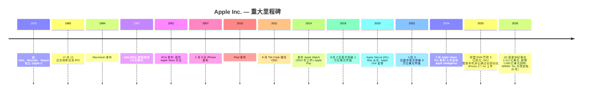
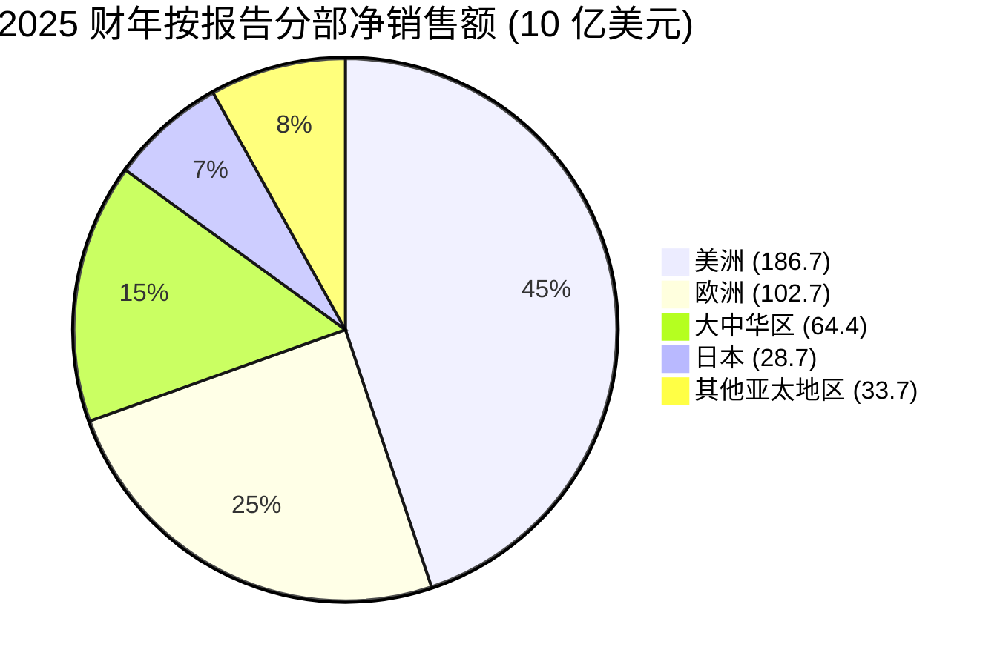
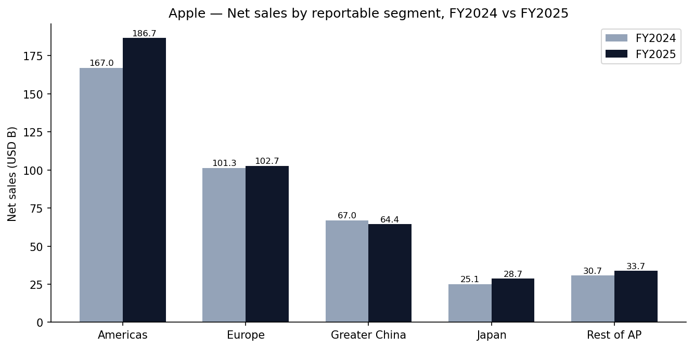
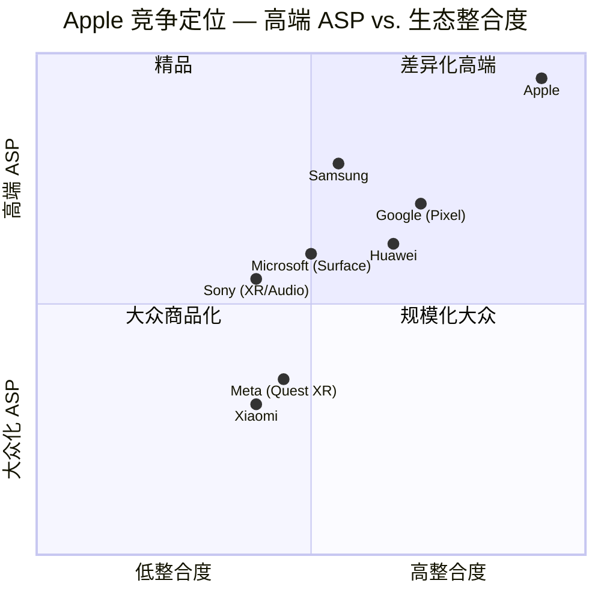
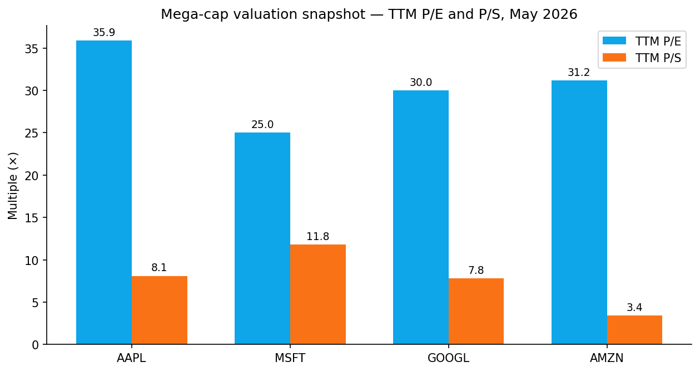
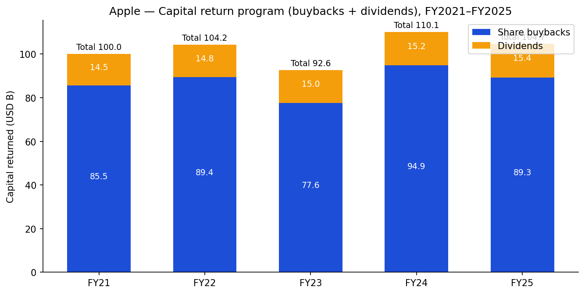

# Apple Inc. (NASDAQ:AAPL) — 公司研究报告

**截至日期: 2026-05-20**
**上市地: 纳斯达克全球精选市场 (NASDAQ Global Select), 代码 AAPL**
**注册地: 美国加利福尼亚州库比蒂诺 (Cupertino, California)**
**报告语言: 简体中文 (英文版同时存在于本目录)**
**分析师说明: 启动覆盖。所有数字均有来源, 无虚构。Apple 财年截至 9 月下旬; 2025 财年 = 2025 年 9 月 27 日结束的财年。最新季度数据为 2026 财年 Q2 (季度截至 2026 年 3 月 28 日)。**

---

## 目录

1. 公司概览
2. 公司历史
3. 管理团队
4. 产品与服务
5. 客户与上市策略
6. 行业概览
7. 竞争格局
8. 市场机会 (TAM)
9. 风险评估
10. 参考资料

---

> **业绩更新——3 月季度刷新历史纪录, 额外授权 1,000 亿美元股票回购 (2026-04-30):** Apple 公布 2026 财年 Q2 营业收入 **1,112 亿美元** (同比 +17%), 摊薄每股收益 (Diluted Earnings Per Share, EPS) **2.01 美元** (同比 +22%), 五大地理分部全部实现两位数增长——其中大中华区 (Greater China) 同比 +28%, 是该区域自 2023 财年以来首次显著重新加速。董事会同时授权一项新的 **1,000 亿美元股票回购计划**, 并将股息上调 4% 至每股 0.27 美元。Apple 不提供正式的数字化业绩指引; 在业绩说明会上, 首席财务官 Kevan Parekh 表示 6 月季度公司总营收将"高个位数 (high-single digits)"同比增长, 服务部门 (Services) 增长轨迹相近, 毛利率 (gross margin) 将落在 46.0–47.0% 区间。来源: [Apple 公布 2026 财年 Q2 业绩, 2026-04-30 (8-K Ex-99.1)](https://www.sec.gov/Archives/edgar/data/0000320193/000032019326000011/a8-kex991q2202603282026.htm)。

---

## 1. 公司概览

Apple Inc. 设计、制造并销售智能手机、个人电脑、平板电脑、可穿戴设备及配件, 并通过自有的六大软件平台 (iOS、iPadOS、macOS、watchOS、visionOS、tvOS) 销售一系列相关服务 ([Apple 2025 财年 10-K, 第 1 项业务](https://www.sec.gov/Archives/edgar/data/0000320193/000032019325000079/aapl-20250927.htm))。公司总部位于美国加利福尼亚州库比蒂诺, 截至 2025 财年末拥有超过 150,000 名全职员工 (Full-Time Equivalent), 在 175 多个国家销售, 通过全球 Apple 直营店网络运营, 并辅以蜂窝运营商、经销商及应用商店 (App Store) 等间接分销渠道。综合活跃设备装机量 (active installed base) 截至 2026 年 1 月达 **25 亿台**, 较一年前的 23.5 亿台增长, 各产品类别、各地区均创历史新高——在 2026 财年 Q2 业绩说明会上被着重提及 ([9to5Mac, 2026-01-29](https://9to5mac.com/2026/01/29/apple-reveals-it-has-2-5-billion-active-devices-around-the-world/); [Apple 2026 财年 Q2 新闻稿, 2026-04-30](https://www.sec.gov/Archives/edgar/data/0000320193/000032019326000011/a8-kex991q2202603282026.htm))。

**盈利方式。** Apple 通过两台紧密相连的引擎对其整合的硬件—软件—服务栈进行变现。**产品引擎** (iPhone、Mac、iPad、可穿戴/家庭/配件) 在 2025 财年实现营业收入 **3,070 亿美元** (占总净销售额的 74%), 毛利率为 **36.8%**; **服务引擎** (应用商店分成、广告、iCloud、AppleCare、Apple Music/TV+/Arcade/Fitness+/News+、Pay、搜索授权) 实现营业收入 **1,092 亿美元** (占净销售额的 26%), 毛利率为 **75.4%** ([Apple 2025 10-K, 产品与服务表现, 第 23–24 页](https://www.sec.gov/Archives/edgar/data/0000320193/000032019325000079/aapl-20250927.htm))。2025 财年综合**公司毛利率达 46.9%**, 是 Apple 现代历史上的最高水平, 结构性驱动来自服务部门占比从 2020 财年的约 19% 升至如今的约 26%。

**规模指标。** 2025 财年总营业收入为 **4,162 亿美元** (同比 +6%), 净利润 **1,120 亿美元** (同比 +19%), 经营活动现金流 **1,183 亿美元**, 自由现金流转化率为大盘科技股中最高。现金、现金等价物及有价证券为 **1,324 亿美元**, 期限债务总额 913 亿美元, 在自 2012 财年以来累计向股东返还超过 9,500 亿美元的同时, Apple 仍处于轻度净现金状态 ([Apple 2025 10-K, 流动性, 第 25 页](https://www.sec.gov/Archives/edgar/data/0000320193/000032019325000079/aapl-20250927.htm))。在 2026 财年上半年 (H1), 营业收入同比增长 **16% 至 2,549 亿美元**, 净利润同比增长 **22% 至 663 亿美元** ([Apple 2026 财年 Q2 10-Q, 第 1 页](https://www.sec.gov/Archives/edgar/data/0000320193/000032019326000013/aapl-20260328.htm))。

**地理结构。** Apple 披露五大分部: 美洲 (Americas, 2025 财年: 1,867 亿美元, 占销售额 45%)、欧洲 (Europe, 1,027 亿美元, 25%; 包含 EMEA + 印度)、大中华区 (643.77 亿美元, 15%)、日本 (Japan, 287 亿美元, 7%) 及其他亚太地区 (Rest of Asia Pacific, 337 亿美元, 8%) ([Apple 2025 10-K, 分部信息, 第 46 页](https://www.sec.gov/Archives/edgar/data/0000320193/000032019325000079/aapl-20250927.htm))。海外营业收入占总销售额的多数, 美元升值是 2025 财年 MD&A (管理层讨论与分析) 中反复提及的逆风因素。大中华区 2025 财年同比下降 4%——连续第三年下滑——但在 2026 财年 Q2 急速重新加速至同比 +28%, 主要由 iPhone 17 需求带动并受人民币走强的顺风加持。

*来源: [Apple 2025 财年 10-K, 第 7 项 MD&A](https://www.sec.gov/Archives/edgar/data/0000320193/000032019325000079/aapl-20250927.htm); [Apple 2026 财年 Q2 10-Q](https://www.sec.gov/Archives/edgar/data/0000320193/000032019326000013/aapl-20260328.htm)。*

**估值快照 (截至 2026-05-19)。** 收盘价 **298.37 美元**, 市值 **4.41 万亿美元**, **TTM 市盈率 (Price-to-Earnings, P/E) 35.9 倍** (基于截至 2026 年 3 月 28 日 TTM 摊薄 EPS 8.29 美元), **TTM 市销率 (Price-to-Sales, P/S) 8.1 倍**, 股息收益率约 0.36% (2026 年 5 月上调后年化 1.08 美元)。52 周区间为 193.46–303.20 美元 ([Yahoo Finance, AAPL](https://finance.yahoo.com/quote/AAPL/); [Fullratio AAPL P/E, 2026-05-18](https://fullratio.com/stocks/nasdaq-aapl/pe-ratio); [Capital.com AAPL 市值, 2026 年 5 月](https://capital.com/en-int/markets/shares/apple-inc-share-price/market-cap))。

Apple 三年平均 TTM P/E 约为 29–30 倍, 三年平均 TTM P/S 约为 7.4 倍 ([Macrotrends AAPL P/E 历史](https://www.macrotrends.net/stocks/charts/AAPL/apple/pe-ratio))。因此, 当前 35.9 倍的 P/E 大致位于其后新冠交易区间的 1.0–1.5 个标准差以上——并显著高于**大盘科技股可比公司中位数**约 30 倍 (MSFT 25.0 倍、GOOGL 30.0 倍、AMZN 31.2 倍) ([Fullratio MSFT P/E, 2026-05-15](https://fullratio.com/stocks/nasdaq-msft/pe-ratio); [Fullratio GOOGL P/E, 2026-05-18](https://fullratio.com/stocks/nasdaq-googl/pe-ratio); [Fullratio AMZN P/E, 2026-05-18](https://fullratio.com/stocks/nasdaq-amzn/pe-ratio))。

**为何享有估值溢价?** 大致权重相当的三大驱动: (i) **服务部门重估 (Services re-rating)**——服务收入现已占总销售额 26%, 毛利率 75%, 以中两位数速度增长, 市场越来越按软件倍数对其进行估值; (ii) **AI 期权价值**——Apple Intelligence 与拖延已久的 Siri 大改 (现计划在 2026 年 6 月 8 日的 WWDC 2026 上揭幕) 同时构成一个换机周期论点及一个装机量货币化论点 ([TechRepublic WWDC 2026 前瞻, 2026-04-22](https://www.techrepublic.com/article/news-apple-wwdc-2026-ios-27-siri-ai-preview/)); (iii) **资本回报下限**——Apple 在 2026 年 5 月授权的 1,000 亿美元新增回购 (叠加在 2025 年 5 月授权的 1,000 亿美元之上) 为每股收益提供了稳定的中等个位数股本收缩支撑。倍数已被拉伸但并非无锚; 三大二元风险 (司法部 DOJ 判决、欧盟 DMA 第 6(4) 条决定、Google 搜索协议中断) 将在第 9 章详细讨论, 如不利结果落地, 可能显著压缩估值倍数。

---

## 2. 公司历史

Apple 由 Steve Jobs、Steve Wozniak 与 Ronald Wayne 于 1976 年 4 月 1 日在加州洛斯阿尔托斯 (Los Altos) 创立, 最初是为了将 Wozniak 的 Apple I 个人电脑组装套件商业化。公司于 1977 年 1 月 3 日注册成立, 1980 年 12 月 12 日 IPO, 经历了 1985–1996 年的动荡期 (Jobs 在 1985 年离开, Sculley/Spindler/Amelio 时代份额持续下滑) 后, 在 Jobs 第二度执掌时期 (1997–2011) 凭借 iMac (1998)、iPod (2001)、iTunes Store (2003)、iPhone (2007) 与 iPad (2010) 重返主导地位。Tim Cook 于 2011 年 8 月接任 Jobs 担任 CEO ([Apple 2026 年股东大会代理声明 (Proxy Statement), Tim Cook 简介, 第 27 页](https://www.sec.gov/Archives/edgar/data/0000320193/000130817926000008/apl4218281-def14a.htm))。

*里程碑级条目的来源: [Apple 2025 财年 10-K, 第 1 项](https://www.sec.gov/Archives/edgar/data/0000320193/000032019325000079/aapl-20250927.htm); [Apple 新闻——Apple Intelligence, 2024-06-10](https://www.apple.com/newsroom/2024/06/introducing-apple-intelligence-for-iphone-ipad-and-mac/); [Apple 2026 财年 Q2 8-K Ex-99.1](https://www.sec.gov/Archives/edgar/data/0000320193/000032019326000011/a8-kex991q2202603282026.htm)。*

**塑造 2026 财年投资逻辑的三大战略转折:**

1. **从设备制造商到平台所有者 (2008 年至今)。** 应用商店 (App Store) 于 2008 年 7 月上线, 是把 iPhone 从一台高毛利硬件转变为具有开发者锁定及高毛利分成率的双边平台的转折点。应用商店现在位于 Apple 面临的每一项现行反垄断事项的中心——DOJ、欧盟 DMA、Epic Games、多起集体诉讼——正因为它是 Apple 对其装机量进行变现的扼喉点。

2. **从设备营收叙事到服务叙事 (2017 年至今)。** 2017 财年服务收入为 327 亿美元 (占销售额 13%); 2025 财年达到 **1,092 亿美元 (占销售额 26%)**, 该分部如今产生的毛利美元 (823 亿美元) 超过 iPad 与可穿戴/家庭/配件相加之和 ([Apple 2025 10-K, 第 24 页](https://www.sec.gov/Archives/edgar/data/0000320193/000032019325000079/aapl-20250927.htm))。这是未来五年股票最重要的单一重估故事。

3. **从依赖中国的供应链到多国布局 (2020 年至今)。** 自 2025 财年 Q2 开始的关税升级及由富士康/塔塔 (Foxconn/Tata) 牵头的多年印度产能建设, 已使 Apple iPhone 在中国组装的份额从 2024 年的约 83% 降至 2025 年估计的 **74%, 2026 年预计约 72%**, 而印度份额从 14% 升至 23%, 预计 2026 日历年达到 28% ([National Herald, 2026-01-15](https://www.nationalheraldindia.com/business/indias-share-in-global-iphone-assembly-projected-to-reach-28-in-2026); [IndianWeb2, 2026-05-13](https://www.indianweb2.com/2026/05/tata-surpasses-foxconn-as-apples.html))。据报道, Apple 计划在 2026 年底前将美国市场 iPhone 的主要来源转移至印度。

**近期动态 (过去 12 个月)。** (i) iPhone 17 系列、iPhone Air (超薄机型)、iPhone 16e 及 M5 Vision Pro 升级于 2025 年 9 月至 10 月间上市。(ii) iPhone 17e 与 MacBook Neo (代号, 在 2026 财年 Q2 8-K 中首次披露) 在 2026 年春季上市。(iii) 董事会于 2025 年 5 月授权新一轮 1,000 亿美元回购 (在此基础上, 2026 年 5 月又额外授权了 1,000 亿美元)。(iv) 欧盟委员会于 2025 年 4 月依据 DMA 第 5(4) 条对 Apple 处以 5 亿欧元罚款; 第 6(4) 条调查仍在进行中, 潜在罚款最高可达**全球年度营业收入的 10%**。(v) DOJ 智能手机案在 2025 年 6 月通过驳回动议, 于 2026 年进入完整证据开示阶段。

---

## 3. 管理团队

### Tim Cook — 首席执行官 (Chief Executive Officer)

Tim Cook, 65 岁, 自 2011 年 8 月起任 Apple CEO, 接替 Steve Jobs。Cook 于 1998 年 3 月加入 Apple 担任全球运营高级副总裁 (Senior Vice President, Worldwide Operations), 2002 年 2 月被任命为全球销售与运营执行副总裁, 2005 年 10 月任首席运营官 (COO), 在 Jobs 去世前七周被任命为 CEO ([Apple 2026 Proxy, Cook 简介, 第 27 页](https://www.sec.gov/Archives/edgar/data/0000320193/000130817926000008/apl4218281-def14a.htm))。

Cook 加入 Apple 前的职业生涯几乎全为运营出身。在奥本大学 (Auburn) 完成本科工程学习 (1982) 并取得杜克大学 Fuqua 商学院 MBA (1988) 之后, 他在 IBM 工作 12 年 (晋升至 PC 业务部门北美履行总监), 短暂在 Intelligent Electronics 及康柏 (Compaq) 任企业物料副总裁, 随后被 Jobs 亲自延揽。Cook 时代的投资逻辑已被充分记录: 他通过将库存周转天数压缩至个位数 (整个 2010 年代约 10 天, 而行业常规水平为 60+ 天), 把 Apple 变成了营运资金为负的企业, 开创了向供应商预付款以锁定产能议价的模式, 并将制造风险外部化给富士康、和硕 (Pegatron)、(后期的) 纬创/塔塔 (Wistron/Tata), 而 Apple 自己保留知识产权、设计与硅片栈。

Cook CEO 任内的数字本身就极具说服力: Apple 营业收入从 1,082 亿美元 (2011 财年) 增长至 **4,162 亿美元 (2025 财年)**, 年复合增长率约 9%; 净利润从 259 亿美元增至 **1,120 亿美元**; 活跃设备装机量从约 3.15 亿台增至 **25 亿台**; 市值从约 3,500 亿美元增至约 4.4 万亿美元。Cook 2025 财年总薪酬为 **7,429 万美元** (300 万美元工资 + 5,750 万美元股票奖励 + 1,200 万美元非股权激励 + 176 万美元其他), CEO 与员工薪酬中位数比为 **533:1** ([Apple 2026 Proxy, 薪酬汇总表; CEO 薪酬比例](https://www.sec.gov/Archives/edgar/data/0000320193/000130817926000008/apl4218281-def14a.htm))。People & Compensation 委员会明确将 Cook 的总薪酬定位在大盘股 CEO 薪酬的第 80 至第 90 百分位之间。Cook 持有约 327 万股 (占流通股 ≤0.03%), 兼任 Nike 和杜克大学的董事会成员, 并已公开明确表示终将退出——2025 年 7 月 Sabih Khan 被晋升为 COO 被广泛解读为有序继任计划的一部分 (前 COO Jeff Williams 在 Apple 服务 27 年后于 2025 年 7 月退休)。

2026 年 Cook 面临的两大悬而未决问题: (a) **AI 执行。** 最初承诺由 Apple Intelligence 驱动的 Siri 应在 iOS 18.4 (2025 年) 推出, 被推迟约两年, 现计划在 2026 年 6 月 8 日 WWDC 2026 揭幕——这是他在 AI 论点上任内最受关注的主题演讲 ([TechRadar, 2026-05-12](https://www.techradar.com/ai-platforms-assistants/apple-says-its-new-ai-siri-will-be-fundamentally-different-from-chatgpt-and-gemini-but-wwdc-could-be-a-make-or-break-moment))。(b) **应用商店经济模型的监管存续问题**, 该业务在 Cook 任内已从辅助业务变为承重业务。两者对 2026 财年–2028 财年的投资逻辑都至关重要。

### Kevan Parekh — 高级副总裁、首席财务官 (CFO)

Kevan Parekh, 54 岁, 于 2025 年 1 月任 CFO, Luca Maestri 卸任 CFO 转任非 CFO 高级职务。Parekh 于 2013 年 6 月加入 Apple, 历任财务规划与分析副总裁、销售/营销/零售全球财务副总裁。加入 Apple 前, 他曾在汤森路透 (Thomson Reuters) 与通用汽车 (General Motors) 担任高级财务领导职务 ([Apple 2026 Proxy, Parekh 简介, 第 34 页](https://www.sec.gov/Archives/edgar/data/0000320193/000130817926000008/apl4218281-def14a.htm))。其 2025 财年总薪酬为 **2,247 万美元** (担任 CFO 的部分财年)。到目前为止, Parekh 在业绩说明会上维持了 Maestri 的姿态: 不提供全年营业收入或 EPS 的正式数字指引, 仅就下一个季度的营业收入增长、毛利率区间、运营费用 (OpEx) 与其他收入提供方向性评论。其管家职能的首次重大考验是 2025 财年 893 亿美元回购的执行——即便在 2025 年 3–4 月关税扰动期间也保持稳定的程序化推进——以及伴随 2026 财年 Q2 业绩公布的 1,000 亿美元授权。

### Sabih Khan — 高级副总裁、首席运营官 (COO)

Sabih Khan, 59 岁, 于 2025 年 7 月任 COO。他于 1995 年 8 月加入 Apple, 2019 年被任命为运营高级副总裁, 是多国供应链转型的执行人。加入 Apple 前他曾在 GE 塑胶任职 ([Apple 2026 Proxy, Khan 简介, 第 34 页](https://www.sec.gov/Archives/edgar/data/0000320193/000130817926000008/apl4218281-def14a.htm))。Khan 在 2026 财年–2028 财年投资逻辑中是仅次于 Cook 最重要的高管, 因为 (i) 关税体制及 Section 232 半导体调查使供应链敏捷成为 P&L 变量而非后台职能; (ii) 他负责印度富士康 (Sriperumbudur) 与塔塔电子 (Tata Electronics, Hosur/Krishnagiri) 的产能爬坡, 以及 TSMC (台积电) 的 M 系列和 A 系列产能爬坡。来自 iPhone 17 生产周期的行业报告称, Khan 的团队在不到九个月内吸收了五个新关税体制 (中国、印度、越南、日本、欧盟) 而没有错过任何一项重大产品上市 ([Digitimes, 2025-09-11](https://www.digitimes.com/news/a20250911PD201/apple-iphone-production-supply-chain-foxconn.html))。

### Craig Federighi — 高级副总裁、软件工程

Federighi (2026 年并非 NEO (Named Executive Officer), 但在 AI 论点上是最重要的单一高管) 领导 iOS/macOS/visionOS/watchOS 工程及 Apple Intelligence 栈。他是 WWDC 的公开形象, 也将主导 WWDC 2026 之后 Siri 的现场演示与发布时间表。他自 2009 年加入 Apple (从 Ariba 回归, 此前他在 Ariba 任 CTO; 在 1994–1999 年间是 Apple 校友, 负责 OPENSTEP 项目), 被广泛认为是与 Khan 并列的内部继任 CEO 最可信候选人。

### 治理脚注

- **董事会:** 8 位提名董事, 7 位为独立董事 (除 Tim Cook 外全部独立)。Calico 创始人兼 CEO Art Levinson 自 2011 年起任非执行董事长, 自 2000 年起担任董事。其他独立董事包括 Wanda Austin (Aerospace Corp.)、Alex Gorsky (前 J&J 董事长/CEO)、Andrea Jung (Grameen America)、Monica Lozano (College Futures Foundation)、Ron Sugar (前诺斯洛普·格鲁曼董事长/CEO) 与 Sue Wagner (BlackRock 联合创始人)。平均任期约 13 年, 按 S&P 500 标准属于较长任期。([Apple 2026 Proxy, 董事提名人, 第 23–32 页](https://www.sec.gov/Archives/edgar/data/0000320193/000130817926000008/apl4218281-def14a.htm))
- **内部人持股:** 所有董事和 NEO 合计持有少于 0.10% 的流通股——对一家有数十年历史的大型公司而言是典型水平。无控股股东; 最大的机构持股人是 Vanguard、BlackRock 及 State Street 的 ETF/指数综合体。
- **薪酬结构:** Tim Cook 2025 财年薪酬约 96% 与业绩挂钩 (PSU + 非股权激励)——在大盘科技股中股权加权程度最高之一。PSU 计划使用相对 S&P 500 的 TSR (股东总回报) 作为三分之二股权授予的唯一业绩指标。
- **治理事项:** 无重大问题。Apple 实行年选董事会、多数独立委员会结构、追偿政策 (2023 年 11 月更新), 以及股东在 10% 持股门槛下召集特别股东大会的权利。2025–2026 年最受关注的治理事项是退休 COO Jeff Williams 的离职安排, 该项在 say-on-pay 投票中未遭反对。

**管理层业绩记录综述。** 这是公开市场最有运营能力的 C-suite 之一。风险不在执行风险, 而在转型风险。该团队尚未在消费级 AI 产品上实现可信交付 (Apple Intelligence 至今仍是功能集合, 尚未构成护城河), 也尚未压力测试一个应用商店经济模型被欧盟/美国法院强制打开的世界。板凳深度足以承受 Cook 最终的离任; 但在 AI 产品市场契合度上, 板凳尚未得到证明。

---

## 4. 产品与服务

Apple 以两种产品披露方式运营: 损益表脚注中的**五大类** (iPhone / Mac / iPad / 可穿戴、家庭与配件 / 服务), 以及**六大软件平台** (iOS / iPadOS / macOS / watchOS / visionOS / tvOS)。下列产品树映射 Apple 在 apple.com 上自身的组织方式。

```mermaid
graph TD
    A[Apple Inc.] --> B[iPhone — 占 2025 财年销售额 50%]
    A --> C[Mac — 8%]
    A --> D[iPad — 7%]
    A --> E[可穿戴、家庭与配件 — 9%]
    A --> F[服务 — 26%]
    B --> B1[iPhone 17 Pro]
    B --> B2[iPhone Air]
    B --> B3[iPhone 17]
    B --> B4[iPhone 16 / 16e]
    B --> B5[iPhone 17e]
    C --> C1[MacBook Air]
    C --> C2[MacBook Pro]
    C --> C3[MacBook Neo]
    C --> C4[iMac, Mac mini, Mac Studio, Mac Pro]
    D --> D1[iPad Pro]
    D --> D2[iPad Air]
    D --> D3[iPad / iPad mini]
    E --> E1[Apple Watch — Series, Ultra, SE]
    E --> E2[AirPods — Pro, Max, regular]
    E --> E3[Apple Vision Pro]
    E --> E4[HomePod, HomePod mini, Apple TV]
    F --> F1[App Store]
    F --> F2[广告]
    F --> F3[iCloud / 云服务]
    F --> F4[AppleCare]
    F --> F5[Apple Music / TV+ / Arcade / Fitness+ / News+ / Books]
    F --> F6[Apple Pay / Card / Cash]
    F --> F7[Google 搜索授权]
```

*来源: [Apple 2025 10-K, 第 1 项, 第 1–4 页](https://www.sec.gov/Archives/edgar/data/0000320193/000032019325000079/aapl-20250927.htm); [Apple.com 产品导航, 访问日 2026-05-20](https://www.apple.com/shop/buy)。*

*来源: [Apple 2025 财年 10-K, 产品与服务表现, 第 23 页](https://www.sec.gov/Archives/edgar/data/0000320193/000032019325000079/aapl-20250927.htm)。*

### iPhone — 占 2025 财年销售额 50%

2025 财年 iPhone 营业收入: **2,096 亿美元** (同比 +4%), 由 Pro 机型占比上升驱动 ([Apple 2025 10-K, 第 23 页](https://www.sec.gov/Archives/edgar/data/0000320193/000032019325000079/aapl-20250927.htm))。2026 财年 Q2 iPhone 营业收入大幅加速至 **570 亿美元 (同比 +22%)**, iPhone 17 和 iPhone Air 找到节奏 ([Apple 2026 财年 Q2 10-Q, 第 14 页](https://www.sec.gov/Archives/edgar/data/0000320193/000032019326000013/aapl-20260328.htm))。截至 2026 年 5 月, 产品线涵盖 iPhone 17 Pro、iPhone Air (超薄机型)、iPhone 17、iPhone 17e (3 月季度推出)、iPhone 16 与 iPhone 16e。

- **竞争优势: 有——深厚、多层次的护城河。** (a) **硅片:** Apple 的 A 系列 SoC, 在台积电领先制程上制造, 在 IPC 和单位功耗性能上始终优于高通 Snapdragon, 并在基准测试上领先 Android 同梯队约 12–18 个月。A20 系列 (代号 Borneo / Borneo Ultra), 将于 2026 秋季为 iPhone 18 供能, 将是业内首批 2nm GAA 芯片; Apple 已锁定台积电初期 N2 产能的约 50% ([MacRumors, 2025-08-28](https://www.macrumors.com/2025/08/28/apple-tsmc-2nm-production-iphone-18/))。(b) **生态锁定:** iMessage、AirDrop、Continuity、Find My、Watch 配对——离开 iPhone 会同时打断 5–10 个日常使用的微工作流。(c) **品牌与定价权:** iPhone 平均售价 (ASP) 约 950–1,050 美元, 而全球 Android 平均为约 320 美元; 在同等 ASP 价位上唯有 Samsung Ultra 系列和 Google Pixel Pro 与之竞争。最直接的单一竞争产品是 **Samsung Galaxy S25 Ultra**——硬件方面相当, 硅片落后 (Galaxy 用高通 Snapdragon 8 Elite for Galaxy), 生态整合方面落后。

### Mac — 占 2025 财年销售额 8%

2025 财年 Mac 营业收入: **337 亿美元** (同比 +12%) ([Apple 2025 10-K, 第 23 页](https://www.sec.gov/Archives/edgar/data/0000320193/000032019325000079/aapl-20250927.htm))。产品线: MacBook Air (M 系列)、MacBook Pro (M 系列 Pro/Max/Ultra)、新款 MacBook Neo (2026 年 3 月季度推出)、iMac、Mac mini、Mac Studio 与 Mac Pro。战略叙事是 Apple Silicon, 第五年在单位功耗性能上比 Intel 路线图领先了两个完整制程世代。**竞争优势: 有——来自垂直整合硅片的护城河。** 最直接的竞争产品是 **Microsoft Surface Laptop (高通 Snapdragon X Elite/X2)**: 在单核性能与电池续航上落后, 但在某些配置上具有性价比优势, 并依靠模拟器获得更广泛的 x86 软件兼容性。

### iPad — 占 2025 财年销售额 7%

2025 财年 iPad 营业收入: **280 亿美元** (同比 +5%) ([Apple 2025 10-K, 第 23 页](https://www.sec.gov/Archives/edgar/data/0000320193/000032019325000079/aapl-20250927.htm))。产品线: iPad Pro (M4 / M5)、iPad Air (M3 / M4)、iPad、iPad mini。**竞争优势: 部分。** Apple 拥有主导份额 (全球平板约 36%), 但该品类本身结构性低增长, 并部分被更大屏幕 iPhone 与 Mac 笔记本电脑蚕食。iPadOS 18+ 仍未交付真正桌面级多任务体验; 这是 Apple 硬件栈中最未被充分利用的平台, 也最可能从 WWDC 2026 之后的软件变更中受益。

### 可穿戴、家庭与配件 — 占 2025 财年销售额 9%

2025 财年 W/H/A 营业收入: **357 亿美元** (同比 -4%), 是唯一同比下滑的品类 ([Apple 2025 10-K, 第 23 页](https://www.sec.gov/Archives/edgar/data/0000320193/000032019325000079/aapl-20250927.htm))。最大看点是 Apple Vision Pro, Apple 在 2024 日历年 (上市年) 销售约 **500,000 台**, 仅在 2025 年 Q4 销售约 **45,000 台**——显著放缓, 据报道 Apple 已将 Vision Pro 营销预算削减最多 95%, 并让中国合作伙伴立讯精密 (Luxshare) 在 2025 年某些时段暂停新机生产 ([Tom's Guide, 2026-01-08](https://www.tomsguide.com/computing/vr-ar/apple-reducing-vision-pro-spending-after-underwhelming-sales-heres-what-we-know); [Hypebeast, 2026-01](https://hypebeast.com/2026/1/apple-vision-pro-faces-cuts-as-spatial-bet-stalls))。2025 年 10 月推出的 M5 Vision Pro 升级版 (3,499 美元) 据报销售推动作用很小 ([9to5Mac, 2026-01-02](https://9to5mac.com/2026/01/02/m5-vision-pro-launch-likely-made-minimal-sales-impact-report/))。**Vision Pro 的竞争优势: 无**——第一代消费级 XR 在 3,499 美元价位未找到产品市场契合度; Meta Quest 3 以 1/10 的价格销量超过 Vision Pro 约 20:1。**W/H/A 内的 Apple Watch 保持强护城河:** 健康传感器栈无人匹敌 (心电图 ECG、血氧、FDA 批准的睡眠呼吸暂停与高血压提示)、与 iPhone 紧密配对, 全球智能手表出货约 30% 份额。**AirPods** 继续在全球真无线耳机赛道占据主导 (按数量约 30% 份额, 按营收更高)。

### 服务 — 占 2025 财年销售额 26%, 毛利率 75.4% — 最有价值的引擎

2025 财年服务营业收入: **1,092 亿美元** (同比 +14%); 2026 财年 Q2: **310 亿美元 (同比 +16%)**, 创历史季度新高 ([Apple 2025 10-K, 第 24 页](https://www.sec.gov/Archives/edgar/data/0000320193/000032019325000079/aapl-20250927.htm); [Apple 2026 财年 Q2 新闻稿, 2026-04-30](https://www.sec.gov/Archives/edgar/data/0000320193/000032019326000011/a8-kex991q2202603282026.htm))。

*来源: [Apple 2021–2025 年 10-K](https://www.sec.gov/cgi-bin/browse-edgar?action=getcompany&CIK=0000320193&type=10-K&dateb=&owner=include&count=10)。*

服务有六个可变现层, 每一层都有独立的护城河:

1. **应用商店分成**——标准 30% 分成率, 小企业计划 (Small Business Program) 下 15%。是服务部门内全球最大的毛利贡献者, 但现在正在面临欧盟 DMA、美国 Epic 禁令与 DOJ 诉讼的实质压力 (见第 9 章)。**护城河: 生态锁定 + 监管**——强但正在被侵蚀。
2. **广告**——应用商店与 Apple News 上的 Apple Search Ads、Stocks 应用内的广告投放、Apple TV+ 第二档广告。据管理层评论, 这是服务内增长最快的业务。**护城河: 数据 + 规模**。
3. **iCloud 与其他云服务**——付费存储、订阅捆绑。软件式 80%+ 毛利。**护城河: 转换成本 + 生态**。
4. **Apple Music / TV+ / Arcade / Fitness+ / News+**——通过 Apple One 捆绑的内容订阅。Apple TV+ 内容投入较大; 其余高毛利。**护城河: 捆绑 + 生态**。
5. **AppleCare**——延保与支持, 稳定的现金机器。**护城河: 渠道锁定**。
6. **Google 搜索授权**——据估计 Google 每年向 Apple 支付约 **200 亿美元** (是最大的单一非产品营收线, 但 Apple 未单独披露)。直接风险: 2025 年 9 月 2 日华盛顿特区地方法院在 US v. Google 案中的救济令未禁止该项支付, 但 DOJ 上诉可能会禁止; 不利的上诉判决可能在一夜之间删除服务部门内最大的单一贡献 ([Apple 2025 10-K, 第 7 页 Item 1A 风险因素](https://www.sec.gov/Archives/edgar/data/0000320193/000032019325000079/aapl-20250927.htm))。**护城河: 无——纯粹的过路费**。

**服务部门整体竞争优势判断: 有, 持续上具有很强优势——但面临监管带来的重大不对称尾部风险。** 最接近的可比平台税模型是 **Google Play (Android)**, 采用相同的 15/30% 分成率结构; Google Play 在绝对美元数上明显较小, 因为 Android 每台设备的 ARPU 约为 iOS 的三分之一。

### 近期发布与路线图 (过去 12 个月)

- iPhone 17 系列 + iPhone Air (2025 年 9 月); iPhone 17e (2026 年 3 月)
- M5 Vision Pro 升级版与 Dual Knit Band (2025 年 10 月)
- M4 驱动的 iPad Air (2026 年 3 月); M5 级 iPad Pro 预计 2026 年下半年
- MacBook Neo (2026 年 3 月季度推出; 2026 财年 Q2 8-K)
- macOS 27 / iOS 27 / iPadOS 27 / visionOS 27——WWDC 2026 年 6 月 8 日; **Siri 大改**配备本地 LLM + 通过 Private Cloud Compute 的云端 LLM, 是焦点 ([TechRepublic, 2026-04-22](https://www.techrepublic.com/article/news-apple-wwdc-2026-ios-27-siri-ai-preview/))
- iPhone 18 / iPhone Fold (传闻): 2026 年秋季, 采用 TSMC N2 与 WMCM 先进封装 ([TrendForce, 2025-12-18](https://www.trendforce.com/news/2025/12/18/news-apple-reportedly-to-bring-wmcm-packaging-to-a20-series-boosting-iphone-18-thermal-efficiency/))

---

## 5. 客户与上市策略

Apple 的客户主要为消费级终端用户, 加上中小企业、教育、企业和政府买家。在 2025 财年总净销售额中, **40% 通过 Apple 直营渠道** (500+ 家直营店、线上商店、直接企业销售), **60% 通过间接渠道**——主要是第三方蜂窝运营商和大型经销商 ([Apple 2025 10-K, 市场与分销, 第 2 页](https://www.sec.gov/Archives/edgar/data/0000320193/000032019325000079/aapl-20250927.htm))。

*来源: [Apple 2025 10-K, 分部信息, 第 46 页](https://www.sec.gov/Archives/edgar/data/0000320193/000032019325000079/aapl-20250927.htm)。*

**客户集中度——在公司层面, 较低。** Apple 没有传统 10% 意义上的客户集中风险——其终端客户基础分散在数十亿消费者。然而, 10-K 客户集中度脚注确实披露了应收账款中的运营商与经销商集中度: 截至 2025 年 9 月 27 日, **一位客户占应收账款总额的 12%**, **第三方蜂窝运营商合计占应收账款的 34%** (低于 2024 财年的 38%) ([Apple 2025 10-K, 附注 4 应收账款, 第 36 页](https://www.sec.gov/Archives/edgar/data/0000320193/000032019325000079/aapl-20250927.htm))。这代表对 Verizon/AT&T/T-Mobile 及国际同类运营商的中度敞口, 但抵押充足且跨地域分散。

**供应商集中度 (同一披露的另一面) 高得多**, 对理解供应链风险至关重要。截至 2025 年 9 月 27 日, **两家供应商各自占非贸易应收账款总额 10%+——分别为 46% 与 23%, 合计 69%**——基本与上年的 67% 持平。它们被广泛认为是富士康 (鸿海精密工业) 占较大份额, 和硕/纬创 (Pegatron/Wistron) 占较小份额, 尽管 Apple 在文件中未提名 ([Apple 2025 10-K, 附注 4, 第 36 页](https://www.sec.gov/Archives/edgar/data/0000320193/000032019325000079/aapl-20250927.htm))。

**地理集中风险: 大中华区。** 大中华区代表 2025 财年营业收入的 15%, 被作为单独分部报告, 因为 Apple "iPhone 营收在该区域占净销售额比例相对其他分部略高" ([Apple 2025 10-K, 附注 13 分部信息, 第 47 页](https://www.sec.gov/Archives/edgar/data/0000320193/000032019325000079/aapl-20250927.htm))。轨迹为连续三年下滑 (2023 财年 726 亿美元 → 2024 财年 670 亿美元 → 2025 财年 644 亿美元), 由本土 Android 厂商 (华为、小米、Vivo、Oppo) 份额上升及消费疲软驱动, 之后在 2026 财年 H1 急速重新加速 (同比 +33%), 由 iPhone 17 周期与人民币走强带动 ([Apple 2026 财年 Q2 10-Q, 第 13 页](https://www.sec.gov/Archives/edgar/data/0000320193/000032019326000013/aapl-20260328.htm))。

**上市策略与分销。**
- **Apple 直营店 (全球约 520 家):** 是全球按单位面积销售额计算最具生产力的零售房地产。由 Deirdre O'Brien (零售与人力高级副总裁) 管理。它们作为主要的客户获取与 AppleCare/Apple Trade-In 渠道, 刻意集中于密集城区/高端地段。
- **运营商补贴与 BNPL:** Apple 在通过运营商分期付款、Apple Card 24 个月免息融资, 以及压低有效入门价格的 Trade-In 复兴中, 在解耦 iPhone ASP 与消费者"口袋价"上极为高效。这把 Apple 的二手市场货币化——重要护城河, 因残值高于 Android。
- **销售周期:** 消费级硬件基本为零; 企业大规模部署较长 (3–18 个月), 企业 SVP 与微软/戴尔/惠普竞争。
- **教育和政府:** 结构性低毛利但量稳定; iPad 与 MacBook Air 在教育市场明确以折扣补贴销售。

**已具名合作伙伴 (2026 财年投资逻辑的重点):**
- **Google 搜索**——Safari 与 Siri 的付费搜索默认安排; 估计约 200 亿美元/年; 在美国反垄断审查中。
- **OpenAI**——自 iOS 18.2 (2024) 起在 Apple Intelligence 中实现 ChatGPT 系统级集成; 可选, IP 屏蔽 ([OpenAI/Apple 合作公告, 2024-06-10](https://openai.com/index/openai-and-apple-announce-partnership/))。
- **Google Gemini**——2025 年宣布的多年合作, 用于 iOS 27 中的基础模型回退 ([TechRepublic, 2026-04-22](https://www.techrepublic.com/article/news-apple-wwdc-2026-ios-27-siri-ai-preview/))。
- **TSMC (台积电)**——A 系列与 M 系列硅片的独家代工厂; Apple 按营收为 TSMC 最大单一客户 (估计 2025 日历年占 TSMC 销售额 25% 以上)。
- **富士康 / 塔塔电子**——主要合同制造商; 塔塔于 2026 年 5 月超越富士康成为 Apple 在印度的最大合同制造商 ([IndianWeb2, 2026-05-13](https://www.indianweb2.com/2026/05/tata-surpasses-foxconn-as-apples.html))。
- **全球运营商**——Verizon、AT&T、T-Mobile、中国移动/电信/联通、NTT Docomo 等。

---

## 6. 行业概览

Apple 在八个相互重叠的行业中竞争, 但对 2026 财年投资逻辑而言最重要的是四个: **(i) 全球智能手机市场, (ii) 个人电脑市场, (iii) 消费服务/移动应用市场, (iv) 数字广告市场。**

**全球智能手机市场。** 整个行业 2025 年出货约 **12.6 亿部**, 同比 +6.5%——自 2021 年以来最强一年——由加速的换机周期、AI 功能发布与主要新兴市场消费复苏推动。Apple **以 2.478 亿部出货量与 19.7% 的全球份额超越三星**, 取得 2025 全年第一份额; 三星 2.412 亿部 (19.1%), 小米 1.412 亿部 (11.2%); Vivo 与 Oppo 并列第四, 各约 2,700 万部 ([IDC, 2026-01-15](https://my.idc.com/getdoc.jsp?containerId=prUS53868725); [AppleInsider, 2026-01-12](https://appleinsider.com/articles/26/01/12/apple-dominated-2025-smartphone-market-with-a-20-share))。这是 Apple 在落后三星十四年后首次在全年出货量上夺冠——结构性里程碑, 主要原因是三星在低端表现不佳, 而非 Apple 向低端扩张。Apple 在智能手机市场的营收份额 (远高于其单位份额——估计 >45%) 是空前的。

该品类**成熟、整合, 在高端越来越呈现双马赛跑格局** (Apple + 三星), 加上长尾 Android OEM (中国厂商加 Google Pixel)。下一个十年的增长驱动是 **AI 功能驱动的换机**, 而非首次买家, 这从结构上利好 Apple, 因其具有装机量规模、硅片领先和每台设备货币化能力。

**个人电脑市场。** Apple 全球 Mac 单位份额约 8–9% (第三名, 落后联想和惠普, 领先戴尔), 但**营收份额约 17%**, 因 ASP 高得多。PC 行业正处于 Windows-on-ARM 转型与 AI PC 换机两个进程中, 两者从结构上利好 Apple——Apple 在 ARM 硅片上领先 PC 行业四年, 每台 Mac 均搭载神经引擎 (Neural Engine)。Mac TAM 每年约 2,500–2,800 亿美元。

**消费服务与应用市场。** 据多个行业跟踪机构, 2025 年全球消费应用商店消费 (App Store + Google Play, 在抽成前的毛额) 约为 **1,650 亿美元**; Apple 的应用商店占约 60%——Apple 应用商店在 2025 日历年的消费者支出毛额约为 1,000 亿美元, 在 Apple 报告口径内产生约 250–280 亿美元服务净营收。这是 Apple 最关键的单一 TAM, 因为 (a) 它对分成率最敏感 (30%→15% 全球抽成将损害 120–150 亿美元服务净营收), (b) 它是所有现行反垄断事项的焦点。

**数字广告。** 一个约 8,000 亿美元的全球市场; Apple 在其中规模低于 150 亿美元, 但在 Search Ads、Apple News 与 TV+ 广告层扩张时, 它是其中增长最快的有意义贡献者。TAM 足够大, 到 2028 财年扩张到当前的 2–3 倍是可能的, 而不会改变竞争结构。

**监管环境是 2026 年最重要的行业叠加因素。** 10-K 本身将活跃监管范围列为涵盖"反垄断; 隐私、数据安全与数据本地化; 在线安全; 年龄验证; 消费者保护; 广告、销售、计费和电子商务; 金融服务和技术; ...数字平台; 机器学习和人工智能; 互联网、电信和移动通信; ...进口、出口和贸易; ...国家安全; 税务; 以及环境、健康和安全" ([Apple 2025 10-K, 第 1A 项风险因素, 第 8 页](https://www.sec.gov/Archives/edgar/data/0000320193/000032019325000079/aapl-20250927.htm))。今日两项实质性约束的体制:

- **欧盟数字市场法 (Digital Markets Act, DMA):** Apple 被指定为门户提供者 (gatekeeper)。2025 年 4 月罚款: **依据第 5(4) 条 5 亿欧元** (针对应用商店导流限制), 加上基于第 6(4) 条 (针对第三方应用市场合同条款) 的初步认定; 最终裁定**罚款最高可达 Apple 全球年度净销售额的 10%** (约 420 亿美元, 基于 2025 财年)。Apple 已上诉。
- **美国 Section 232 半导体调查与各类关税体制:** 自 2025 财年 Q2 起, 美国对来自中国、印度、日本、韩国、台湾、越南和欧盟的进口征收额外关税; 2026 年 1 月 14 日 Section 232 调查初步结果未对 Apple 产品施加额外关税。2026 年 2 月 20 日, 美国最高法院撤销了某些 IEEPA 关税; Apple 正在申请退款 ([Apple 2026 财年 Q2 10-Q, MD&A, 第 13 页](https://www.sec.gov/Archives/edgar/data/0000320193/000032019326000013/aapl-20260328.htm))。关税敞口仍是动态 P&L 变量。

---

## 7. 竞争格局

对 Apple 最有用的框架不是单一行业定位图, 而是**逐产品的竞争地图**, 因为 Apple 在每个品类中与不同对手竞争。

**按品类列出的直接竞争对手:**

1. **三星电子 (Samsung Electronics, KRX: 005930)。** 唯一另一家在硅片、面板、内存、避免合同制造、和全栈 OS 层 (Android 上的 One UI) 上具有同等垂直整合的公司。三星在 2025 年出货 2.412 亿部智能手机, 同比 +7.9%——前五大厂商中增长最强——但失去第一名给 Apple ([Sammy Fans, 2026-01-15](https://www.sammyfans.com/2026/01/15/apple-samsung-2025-smartphone-market-idc/))。在高端 (Galaxy S25/Z Fold/Flip Ultra), 三星是最接近的竞争对手; 在低端 Apple 不竞争。

2. **Alphabet (NASDAQ: GOOGL)。** 多线竞争: Pixel (全球智能手机约 3% 份额, 但在 AI 功能叙事中上升); Google Play (Apple 在监管上的应用商店对手); Google Workspace (Apple Mail/Calendar/iWork); Google AI (Gemini, 基础模型——同时是合作伙伴和竞争者); Google 搜索 (Apple 最大的服务合作伙伴营收线, 年约 200 亿美元)。Alphabet TTM P/E 为 30.0 倍 ([Fullratio GOOGL P/E](https://fullratio.com/stocks/nasdaq-googl/pe-ratio))。这种"亦敌亦友"结构在大盘股中独一无二。

3. **微软 (Microsoft, NASDAQ: MSFT)。** 在 Mac vs. Windows / Surface vs. MacBook 上直接竞争, 在生产力/云 (Microsoft 365 vs. iCloud) 上间接竞争。微软的企业锁定基本仍未受挑战。MSFT TTM P/E 为 25.0 倍——大盘股梯队中最低, 是 Apple 在服务增长放缓时可能交易到的有用参照点。微软的 AI 位置 (与 OpenAI 合作, Copilot) 目前比 Apple Intelligence 更先进, 是 AAPL 在 WWDC 窗口前的反复 AI 叙事拖累因素。

4. **亚马逊 (Amazon, NASDAQ: AMZN)。** 通过 Fire 平板 (规模较小)、Kindle (电子阅读器)、Echo (智能家居——对 Apple HomePod)、Amazon Music/Prime Video (对 Apple Music/TV+) 与 AWS (Apple 是主要客户而非云端竞争对手) 构成间接竞争。AMZN TTM P/E 31.2 倍 ([Fullratio AMZN P/E](https://fullratio.com/stocks/nasdaq-amzn/pe-ratio))。

5. **华为技术 (Huawei Technologies, 非上市)。** 在大中华区是最重要的竞争对手。华为的 HarmonyOS, Mate 80 / Pura 90 / Mate XT 三折叠系列在制裁后夺回中国高端份额, 对 Apple 三年大中华区下滑 (2023 财年–2025 财年) 起重要作用。2026 财年 Q2 在中国的重新加速表明 Apple 的相对位置在改善, 但华为仍是高端消费者的结构性中国本土替代选项。

6. **小米 (Xiaomi, HKEX: 1810)。** 出货 1.41 亿台 (2025 年 11.2% 份额) 的 Android 量贩龙头, 加上快速增长的高端线 (小米 15 Ultra、Mix Fold) 与物联网/可穿戴。

7. **Meta Platforms (NASDAQ: META)。** 在 XR 中直接竞争——Meta Quest 3/3S 销量超过 Vision Pro 约 20:1; 在广告中——Apple 的应用追踪透明度 (App Tracking Transparency, ATT) 框架仍是 Meta Instagram/Facebook ARPU 的实质结构性拖累。Meta 是 Apple 对消费应用货币化所握有不对称权力的鲜活案例。

8. **索尼 (Sony, TSE: 6758)。** 高端音频 (WH-1000 vs. AirPods Max)、游戏 (PlayStation 5 vs. Apple 无对应)、摄像头传感器供应 (索尼是 iPhone 主要的 CMOS 供应商——更多是合作伙伴而非对手)。

9. **Vivo / Oppo (BBK Electronics 系)。** 全球第 4–5 名并列; 主要为 Android 中国本土。

10. **OpenAI、Anthropic——新兴 AI 竞争者。** 不是经典的智能手机 OEM, 但消费者将主要智能助手交互从 Siri 转移到 ChatGPT / Claude 的威胁是真实的, 尤其是如果"作为平台的 ChatGPT"建立起设备级别的势能。Apple 的缓解措施正是 WWDC 2026 的 Siri 大改。

**Apple 的结构性优势:**
- **硅片、OS、硬件、服务与零售的垂直整合**, 在规模上无与伦比。
- **25 亿台装机量**, 多产品附加率高 (发达市场约每个活跃用户 1.8 台 Apple 设备)。
- **每年约 1,100 亿美元的自由现金流**, 同时为研发 (2025 财年 346 亿美元, 同比 +10%)、资本开支 (约 140 亿美元/年) 和资本回报提供资金。
- **品牌与定价权**——全球最具价值的消费品牌; 允许 2–3 倍于等价规格的 ASP 溢价。

**Apple 的脆弱性:**
- **AI 执行落差 vs. 同业**——在消费级 LLM 产品上被认为落后 Google/Microsoft 12–24 个月; WWDC 2026 是成败关键。
- **监管**——应用商店经济模型是大盘科技股中对强制解绑暴露最大的单一资产。
- **中国**——既是约 15% 的营收, 也是约 70% 的组装基地。
- **Vision Pro / 新品类问题**——自 Apple Watch (2015) 以来 Apple 未开辟一个超过 100 亿美元营收的新业务线; Vision Pro 不太可能填补这个空缺。

*来源: [Fullratio AAPL、MSFT、GOOGL、AMZN 市盈率, 2026 年 5 月](https://fullratio.com/); [Macrotrends 市销率](https://www.macrotrends.net/)。*

---

## 8. 市场机会 (TAM)

Apple 的可寻址市场最好按营收引擎分解。

**iPhone TAM。** 2025 年全球智能手机出货约 12.6 亿台, 行业混合 ASP 约 350 美元, 隐含约 4,400 亿美元 TAM。Apple 2.478 亿台 iPhone 在 ASP 约 845 美元下捕获约 2,100 亿美元 (全球 TAM 营收份额约 48%)。TAM 增长基本持平至低个位数——这是一个换机周期品类, 而非单位增长品类。Apple 的可服务机会是 **ASP 提升与 Pro 机型占比扩张** (iPhone 17 Pro / iPhone Air / 未来的 iPhone Fold) 加上**从高端 Android 增量获取份额** (尤其是三星 Ultra 和中国华为)。iPhone 净 TAM 增长路径: 每年低个位数百分比, 加上传闻中的 2026 年末折叠手机带来的期权价值。

**Mac/PC TAM。** 2025 年全球 PC 出货约 2.7 亿台, 行业混合 ASP 约 920 美元, 隐含约 2,500 亿美元 TAM。Apple 约 9% 单位份额转化为约 17% 营收份额 (如果按商业+消费综合 PC 计算约 420 亿美元, Apple 自报较窄分部口径下 337 亿美元)。这里的驱动是 **AI PC 换机周期 (2026–2028)** 与 Apple Silicon 持续领先; 我们预计 Apple Mac 营收到 2028 财年保持中至高个位数增长, 即便更广泛的 PC 市场以低个位数增长。

**服务 TAM。** 这是最具可替代性也是最高增长的部分。
- **应用商店毛消费者支出**, 2025 年全球约 1,650 亿美元, 年增长约 10%; Apple 应用商店毛额约 1,000 亿美元, 转化为 Apple 净额约 250–280 亿美元。**这里的 TAM 与移动应用开发者营收一同增长**, 历史上呈中至低个位数双位数增长 (MSD–LDD)。
- **数字广告**——全球约 8,000 亿美元; Apple 捕获不到 2%; 即便五年内翻倍至 250 亿美元也是可行的, 给定 Search Ads + Apple News + TV+ 广告层扩张。
- **订阅内容 + iCloud + AppleCare + Pay**——全球合计为数千亿美元 TAM; Apple 份额在低至中个位数。
- **搜索授权**——年约 200 亿美元的单项收入, 二元 (在不利的 Google 上诉结果下可能归零)。

我们估计 Apple 合并服务 TAM 到 2030 年达 **1.5 万亿美元以上**, Apple 捕获 8–10%——隐含在当前抽成率范围内服务营收到 2030 财年可达 1,500–1,800 亿美元; 监管楔子可能削减 150–250 亿美元。

**可穿戴 / Vision / 健康 TAM。** 最具投机性的桶。Apple Watch (智能手表 TAM 全球约 600 亿美元, Apple 按营收约 30% 份额)、AirPods (真无线 TAM 全球约 300 亿美元, Apple 按营收约 25%) 与 Vision Pro (XR TAM 在当前 Vision-Pro 级价位下仍低于 50 亿美元)。最大期权价值是健康监测扩张 (连续血糖、血压、睡眠呼吸暂停), 这可能到 2030 年将智能手表 TAM 扩张 2–3 倍。

*来源: [Apple 2021–2025 年 10-K, 资本回报计划披露](https://www.sec.gov/cgi-bin/browse-edgar?action=getcompany&CIK=0000320193&type=10-K)。*

**Apple 结构性渗透不足市场的渗透策略:**
- **印度**——Apple 在印度年营收估计为 80–100 亿美元, 仍有可观跑道; Apple 于 2023 年开设其首批两家印度零售店, 现正在建设最大的非美国国家供应链 (富士康 Sriperumbudur + 塔塔 Hosur)。印度同时是组装基地与市场扩张机会。
- **新兴亚太地区**——印度尼西亚、越南、泰国: 中产阶级消费者上升; iPhone 份额持续提升。
- **企业市场**——Apple-at-Work 项目、Apple Business Connect, 以及 Vision-Pro 作为企业工具的推销。

---

## 9. 风险评估

### 公司特定风险

**1. 应用商店经济模型 / 监管解绑。** 这是 Apple 在 2026 财年–2028 财年面临的最重要单一风险。(a) **美国——DOJ 智能手机垄断案:** 2025 年 6 月 30 日通过驳回动议; 2026 年进入证据开示阶段; 多年期审判路径 ([Mintz, 2025-07-02](https://www.mintz.com/insights-center/viewpoints/2025-07-02-judge-allows-justice-departments-iphone-monopolization-suit))。(b) **美国——Epic Games 禁令:** 2025 年 4 月 30 日加州地方法院裁定 Apple 违反 2021 年禁令; 第九巡回法院于 2025 年 10 月听取口头辩论; 若维持原判, Apple 不能对美国应用商店内的应用外购买收取任何分成 ([Apple 2025 10-K, 法律程序, 第 17 页](https://www.sec.gov/Archives/edgar/data/0000320193/000032019325000079/aapl-20250927.htm))。(c) **欧盟——DMA 第 5(4) 与 6(4) 条:** 2025 年 4 月 5 亿欧元罚款; 第 6(4) 条初步认定未决, 最高罚款为全球营收的 10% (约 420 亿美元); 正在上诉。**影响:** 如 Apple 被强制允许无限制的、零分成的应用外支付, 美国+欧盟应用商店营收合计风险敞口估计为每年 80–120 亿美元服务净营收。缓解措施: Apple 已在欧盟实施"核心技术费"/替代费结构; 上诉第 5(4) 条裁决; 并积极与委员会就补救方案沟通。

**2. Google 搜索授权营收风险。** Apple 每年从 Google 获得估计约 200 亿美元的 Safari 与 Siri 默认搜索位置费用。2025 年 9 月 2 日华盛顿特区地方法院针对 2024 年 8 月对 Google 的垄断认定发布的救济令未下令终止 Apple 支付, 但该裁定面临 DOJ 上诉, 该上诉可能禁止 Google 向 Apple 提供商业条款 ([Apple 2025 10-K, 第 7 页](https://www.sec.gov/Archives/edgar/data/0000320193/000032019325000079/aapl-20250927.htm))。**影响:** 在不利的上诉结果下, 约 200 亿美元几乎纯毛利的营收可能在 12–24 个月内消失——约占服务营收的 18%, 约占总营收的 6%。

**3. AI 执行与 Siri 2.0。** Apple 的"个性化 Siri"最初承诺在 iOS 18.4 (2025 年初) 推出, 被推迟约 2 年。2026 年 6 月 8 日 WWDC 主题演讲是 Cook CEO 任内在 AI 论点上最受关注的单一产品事件 ([TechRadar, 2026-05-12](https://www.techradar.com/ai-platforms-assistants/apple-says-its-new-ai-siri-will-be-fundamentally-different-from-chatgpt-and-gemini-but-wwdc-could-be-a-make-or-break-moment))。**影响:** 如果 Siri 2.0 作为 ChatGPT / Gemini 的可信竞争对手发货, iPhone 换机周期将重新加速; 如果以测试版发货且具有实质性限制 (2026 年 5 月报道的自动删除聊天的隐私"警告标签"暗示了这一点), Apple 将失去 12–18 个月的 AI 叙事并可能面临估值倍数压缩。

**4. 中国需求与政策风险。** 大中华区 2025 财年同比下降 4% (连续第三年下滑), 然后在 2026 财年 Q2 重新加速至同比 +28%。与华为的根本竞争结构尚未解决, iPhone 17 周期受益于一次性因素 (人民币走强、被压抑的需求)。**影响:** 大中华区营收每 5% 同比变化对应顶线约 30 亿美元。中国政策风险 (出口管制、报复性关税、国/国有企业采购中的"买中国"偏好) 是 iPhone 17 周期尚未消除的尾部风险。

**5. 供应商集中 (富士康 / 塔塔)。** 两家供应商占 Apple 非贸易应收账款的 69% ([Apple 2025 10-K, 附注 4, 第 36 页](https://www.sec.gov/Archives/edgar/data/0000320193/000032019325000079/aapl-20250927.htm))。基本上所有硬件由外包合作伙伴制造, 主要位于中国大陆、印度、日本、韩国、台湾和越南 ([Apple 2025 10-K, 附注 12, 第 46 页](https://www.sec.gov/Archives/edgar/data/0000320193/000032019325000079/aapl-20250927.htm))。富士康 (郑州) 或塔塔 (Hosur) 的重大运营中断——劳工行动、地震/台风、地缘政治事件——将直接损害季度 iPhone 供给。

### 行业 / 市场风险

**6. 智能手机 TAM 饱和。** 全球智能手机市场成熟, 单位增长持平至低个位数, 依赖换机周期。Apple 的增长路径需要 ASP 提升、份额获取或品类催化剂 (折叠手机、AI 功能)。三条线同时失败是低概率但真实的对 2026 财年–2028 财年投资逻辑的风险。

**7. 关税与贸易政策。** 自 2025 财年 Q2 起, 美国对来自中国、印度、日本、韩国、台湾、越南和欧盟的进口征收新关税。2026 财年 Q2 10-Q 披露 Apple 正在申请退款, 这些退款源自被 2026 年 2 月 20 日最高法院撤销的某些 IEEPA 关税, 但进一步的部门性或 Section 232 措施仍是可能的 ([Apple 2026 财年 Q2 10-Q, 第 13 页](https://www.sec.gov/Archives/edgar/data/0000320193/000032019326000013/aapl-20260328.htm))。**影响:** 关税成本被明确列为 2025 财年产品毛利率的拖累; 持续较高的关税可能压缩产品毛利率 100–200 个基点。

**8. 元器件短缺 (内存、先进封装)。** 2026 财年 Q2 10-Q 明确指出"元器件行业供需失衡, 包括先进半导体、存储 (NAND) 和内存 (DRAM)", 并预计这些趋势"将加剧" ([Apple 2026 财年 Q2 10-Q, 第 13 页](https://www.sec.gov/Archives/edgar/data/0000320193/000032019326000013/aapl-20260328.htm))。**影响:** 台积电据报对 2nm 涨价 50% 对 iPhone 18 BOM 成本构成非小拖累 ([AppleInsider, 2025-11-06](https://appleinsider.com/articles/25/11/06/tsmc-price-hikes-are-another-financial-pain-point-for-iphone-18)); AI 服务器周期带来的 HBM/DRAM 紧缺使问题更复杂。

**9. 外汇。** 海外占 Apple 营收的多数; 强势美元一贯压制报告营收与毛利率。10-K 中的 VAR (在险价值) 模型估计 95% 置信度下衍生品公允价值一日 FX 损失为 5.90 亿美元 ([Apple 2025 10-K, 第 7A 项, 第 27 页](https://www.sec.gov/Archives/edgar/data/0000320193/000032019325000079/aapl-20250927.htm))。2026 财年迄今的美元疲软构成顺风; 反转是摆动因素。

### 财务风险

**10. 估值 / 倍数压缩。** AAPL 交易在 35.9 倍 TTM P/E, 高于大盘股可比公司中位数约 30 倍及其自身三年平均约 29 倍。回归到同业中位数将隐含约 **17% 下行空间**, 在监管结果对盈利的影响之前。溢价由服务部门重估与 AI 期权价值证明合理; 如果任一叙事弱化, 倍数压缩是最直接的股票风险。

**11. 资本回报驱动的 EPS 增长。** Apple 过去 8 年通过回购回收了约 27% 的股本 (2018 财年–2025 财年累计回购约 6,400 亿美元)。这是 EPS 增长的重要贡献 (2025 财年回购为 893 亿美元)。如果自由现金流生成放缓或资本配置转向并购/资本开支, EPS 算法将发生实质性变化。

**12. 债务到期。** Apple 有 913 亿美元固定利率票据, 其中 124 亿美元 12 个月内到期 ([Apple 2025 10-K, 第 25 页](https://www.sec.gov/Archives/edgar/data/0000320193/000032019325000079/aapl-20250927.htm))。在重置利率约 5% vs. 票面利率下, 再融资温和提高年利息支出, 但相对净利润影响很小。

### 宏观经济风险

**13. 消费支出下行。** 2026–2027 年美国/中国消费衰退将直接损害 iPhone 与 Mac 需求。Apple 的高端定位在历史上在下行期间比大众化定位更具抗压性, 但 iPhone 暴露于可自由支配的升级时机。

**14. 地缘政治冲突 (台海)。** 台积电是 Apple A 系列/M 系列硅片的独家代工厂。台海军事或准军事升级将灾难性损害硅片供应链; Apple 一直在通过台积电亚利桑那州 (有限的 2nm 从 2025–2026 开始) 进行多元化, 但领先制程的大部分产能将一直到 2028 年都留在台湾。这是 Apple 自身无法缓解的低概率、极高影响的尾部风险。

---

## 10. 参考资料

以下为本报告中引用的主要资料来源, 按主题分组。所有 URL 在 2026-05-20 完成核验。

### 主要文件 (SEC)
- [Apple Inc. — Form 10-K, 2025 财年 (截至 2025 年 9 月 27 日)](https://www.sec.gov/Archives/edgar/data/0000320193/000032019325000079/aapl-20250927.htm)
- [Apple Inc. — Form 10-Q, 2026 财年 Q2 (截至 2026 年 3 月 28 日)](https://www.sec.gov/Archives/edgar/data/0000320193/000032019326000013/aapl-20260328.htm)
- [Apple Inc. — Form 8-K Ex-99.1, 2026 财年 Q2 业绩新闻稿, 2026-04-30](https://www.sec.gov/Archives/edgar/data/0000320193/000032019326000011/a8-kex991q2202603282026.htm)
- [Apple Inc. — Form DEF 14A, 2026 年股东大会代理声明 (Proxy Statement), 2026-01-08 提交](https://www.sec.gov/Archives/edgar/data/0000320193/000130817926000008/apl4218281-def14a.htm)
- [Apple Inc. — Form 10-K, 2024 财年 (截至 2024 年 9 月 28 日)](https://www.sec.gov/Archives/edgar/data/0000320193/000032019324000123/aapl-20240928.htm)
- [Apple Inc. — Form 10-K, 2023 财年 (截至 2023 年 9 月 30 日)](https://www.sec.gov/Archives/edgar/data/0000320193/000032019323000106/aapl-20230930.htm)
- [Apple Inc. — Form 8-K Ex-99.1, 2025 财年 Q4 业绩新闻稿, 2025-10-30](https://www.sec.gov/Archives/edgar/data/0000320193/000032019325000077/a8-kex991q4202509272025.htm)

### 市场数据与估值
- [Yahoo Finance — Apple Inc. (AAPL) 报价](https://finance.yahoo.com/quote/AAPL/)
- [Fullratio — AAPL 市盈率, 2026-05-18](https://fullratio.com/stocks/nasdaq-aapl/pe-ratio)
- [Fullratio — MSFT 市盈率, 2026-05-15](https://fullratio.com/stocks/nasdaq-msft/pe-ratio)
- [Fullratio — GOOGL 市盈率, 2026-05-18](https://fullratio.com/stocks/nasdaq-googl/pe-ratio)
- [Fullratio — AMZN 市盈率, 2026-05-18](https://fullratio.com/stocks/nasdaq-amzn/pe-ratio)
- [Macrotrends — Apple 市盈率历史 2012–2026](https://www.macrotrends.net/stocks/charts/AAPL/apple/pe-ratio)
- [Capital.com — Apple 市值, 2026 年 5 月](https://capital.com/en-int/markets/shares/apple-inc-share-price/market-cap)

### 行业研究与新闻
- [IDC — 全球智能手机市场 2025 年 Q3 与 2025 全年, 2026-01](https://my.idc.com/getdoc.jsp?containerId=prUS53868725)
- [AppleInsider — Apple 以 20% 份额主导 2025 智能手机市场, 2026-01-12](https://appleinsider.com/articles/26/01/12/apple-dominated-2025-smartphone-market-with-a-20-share)
- [Sammy Fans — 三星将 2025 智能手机桂冠让给 Apple, 2026-01-15](https://www.sammyfans.com/2026/01/15/apple-samsung-2025-smartphone-market-idc/)
- [National Herald — 印度全球 iPhone 组装份额将于 2026 年达 28%, 2026-01-15](https://www.nationalheraldindia.com/business/indias-share-in-global-iphone-assembly-projected-to-reach-28-in-2026)
- [IndianWeb2 — 塔塔超越富士康成为 Apple 在印度最大制造商, 2026-05-13](https://www.indianweb2.com/2026/05/tata-surpasses-foxconn-as-apples.html)
- [Digitimes — 首批 iPhone 17 生产转移到印度, 2025-09-11](https://www.digitimes.com/news/a20250911PD201/apple-iphone-production-supply-chain-foxconn.html)
- [MacRumors — Apple 为 iPhone 18 锁定台积电一半 2nm 产能, 2025-08-28](https://www.macrumors.com/2025/08/28/apple-tsmc-2nm-production-iphone-18/)
- [AppleInsider — 台积电涨价对 iPhone 18 是又一痛点, 2025-11-06](https://appleinsider.com/articles/25/11/06/tsmc-price-hikes-are-another-financial-pain-point-for-iphone-18)
- [TrendForce — Apple 将 WMCM 封装引入 A20 系列, 2025-12-18](https://www.trendforce.com/news/2025/12/18/news-apple-reportedly-to-bring-wmcm-packaging-to-a20-series-boosting-iphone-18-thermal-efficiency/)
- [9to5Mac — Apple 披露 25 亿台活跃设备, 2026-01-29](https://9to5mac.com/2026/01/29/apple-reveals-it-has-2-5-billion-active-devices-around-the-world/)
- [Tom's Guide — Apple 削减 Vision Pro 支出, 2026-01](https://www.tomsguide.com/computing/vr-ar/apple-reducing-vision-pro-spending-after-underwhelming-sales-heres-what-we-know)
- [9to5Mac — M5 Vision Pro 上市销售影响极小, 2026-01-02](https://9to5mac.com/2026/01/02/m5-vision-pro-launch-likely-made-minimal-sales-impact-report/)
- [Hypebeast — Apple Vision Pro 面临生产削减, 2026-01](https://hypebeast.com/2026/1/apple-vision-pro-faces-cuts-as-spatial-bet-stalls)
- [TechRepublic — WWDC 2026 前瞻: Apple Siri 大改、AI 更新, 2026-04-22](https://www.techrepublic.com/article/news-apple-wwdc-2026-ios-27-siri-ai-preview/)
- [TechRadar — Apple 新 AI Siri "与 ChatGPT/Gemini 根本不同", 2026-05-12](https://www.techradar.com/ai-platforms-assistants/apple-says-its-new-ai-siri-will-be-fundamentally-different-from-chatgpt-and-gemini-but-wwdc-could-be-a-make-or-break-moment)
- [Eastern Herald — Apple Siri AI 复出警告标签, 2026-05-18](https://easternherald.com/2026/05/18/apple-siri-ai-beta-auto-deleting-chats-ios-27/)
- [OpenAI — OpenAI 与 Apple 宣布合作, 2024-06-10](https://openai.com/index/openai-and-apple-announce-partnership/)
- [Apple Newsroom — 介绍 Apple Intelligence for iPhone、iPad 和 Mac, 2024-06-10](https://www.apple.com/newsroom/2024/06/introducing-apple-intelligence-for-iphone-ipad-and-mac/)

### 法律 / 监管
- [Mintz — 法官允许 DOJ 的 iPhone 垄断诉讼继续, 2025-07-02](https://www.mintz.com/insights-center/viewpoints/2025-07-02-judge-allows-justice-departments-iphone-monopolization-suit)
- [美国司法部 — 司法部起诉 Apple 垄断智能手机市场, 2024-03-21](https://www.justice.gov/archives/opa/pr/justice-department-sues-apple-monopolizing-smartphone-markets)
- [国会研究服务 — DOJ 针对 Apple 的垄断案](https://www.congress.gov/crs-product/LSB11154)

### 公司网站 (产品级参考)
- [Apple.com — 产品导航, 访问日 2026-05-20](https://www.apple.com/shop/buy)
- [Apple 投资者关系](https://investor.apple.com)
