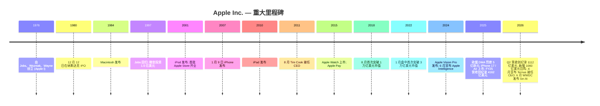
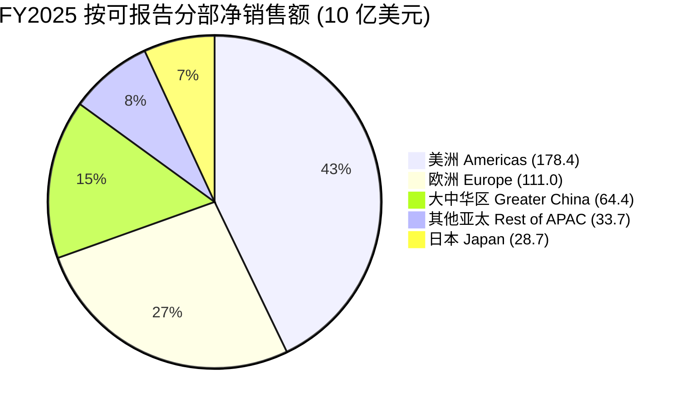
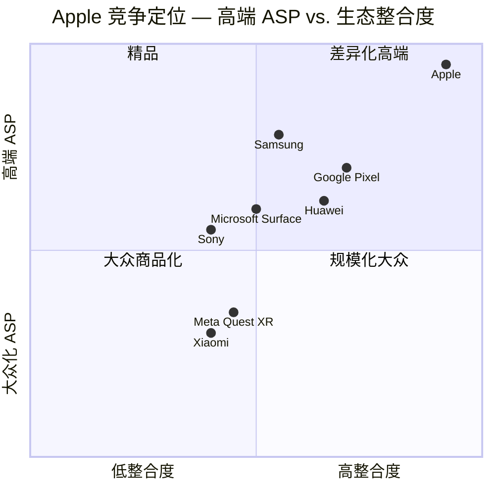

# Apple Inc. (NASDAQ:AAPL) — 公司研究报告

**截至日期: 2026-06-14**
**上市地: 纳斯达克全球精选市场 (NASDAQ Global Select), 代码 AAPL**
**注册地: 美国加利福尼亚州库比蒂诺 (Cupertino, California)**
**报告语言: 简体中文 (英文版同时存在于本目录)**
**分析师说明: 全面刷新。所有数字均有来源, 无虚构。Apple 财年截至 9 月下旬; 2025 财年 = 2025 年 9 月 27 日结束的财年。最新季度数据为 2026 财年 Q2 (季度截至 2026 年 3 月 28 日, 2026-05-01 提交)。2026 财年 Q3 (6 月季度) 预计 2026 年 7 月底披露, 本报告发布时尚未公布。**

---

> ## 投资摘要 (Investment Summary) — *Analyst view:*
>
> | 项目 | 数据 |
> |---|---|
> | **评级 (Rating)** | **增持 / Overweight** |
> | **12 个月目标价 (Price Target)** | **US$325** |
> | **当前价 (2026-06-12 收盘)** | US$291.13 |
> | **隐含上行 (Implied upside)** | **+11.6%** |
> | **估值方法 (Method)** | FY2027E EPS US$10.20 × 32× forward P/E |
> | **市值 (Market cap)** | ~US$4.28 万亿 |
> | **52 周区间 (52-wk range)** | US$195.07 – US$317.40 |
> | **TTM P/E / P/S** | 35.2× / 9.5× |
>
> **本报告观点 (house view) 的四大支柱 (thesis pillars) — 全部为 *Analyst view:*, 不附任何文件引用:**
>
> 1. **两大监管 / 执行悬念在 4–6 月集中落地, 风险被显著去化。** (i) CEO 接班尘埃落定——John Ternus 将于 2026 年 9 月 1 日接任 CEO, Tim Cook 转任执行董事长 (Executive Chair); (ii) 拖延约两年的 Siri 大改在 2026 年 6 月 8 日 WWDC 2026 如期亮相, 兑现承诺。两件"成败关键"事件均以正面方式收尾 ([Apple 8-K, 2026-04-20](https://www.sec.gov/Archives/edgar/data/320193/000114036126015711/ef20071035_8k.htm); [TechCrunch WWDC 2026, 2026-06-09](https://techcrunch.com/2026/06/09/wwdc-2026-everything-announced-on-siri-ai-os-27-apple-intelligence-and-more/))。
> 2. **基本面正处于加速期, 而非成熟停滞。** FY2026 H1 营收同比 +16% 至 2,549 亿美元, iPhone +23%, 大中华区 Q2 +28% 重新加速; Q3 指引营收同比 +14–17%——是数个季度以来最强指引 ([Apple FY26 Q2 10-Q, p.13](https://www.sec.gov/Archives/edgar/data/320193/000032019326000013/aapl-20260328.htm))。
> 3. **服务部门重估 + AI freemium 变现路径清晰化。** 服务 FY25 占营收 26%、毛利率 75.4%; WWDC 2026 确立了以 iCloud+ 套餐解锁 AI 用量上限的 freemium 变现模型, 为服务部门打开新的货币化层 ([Apple FY25 10-K, MD&A p.23–24](https://www.sec.gov/Archives/edgar/data/320193/000032019325000079/aapl-20250927.htm))。
> 4. **资本回报下限 + 资本结构松绑。** 2026 年 4 月新增 1,000 亿美元回购授权; 同时正式放弃"净现金中性 (net-cash-neutral)"目标, 为 Ternus 时代的 AI / 芯片 / 潜在并购保留弹药 ([Apple FY26 Q2 10-Q, 回购披露](https://www.sec.gov/Archives/edgar/data/320193/000032019326000013/aapl-20260328.htm))。
>
> **最该盯紧的两个变量 (swing variables):** (a) **iPhone 18 / 首款折叠 iPhone 换机周期**——能否被 Siri AI 的 12GB 内存门槛 (约 8.5 亿台旧机无法运行) 放大; (b) **存储 (DRAM/NAND) 成本曲线**——管理层已点名为日益严重的毛利率阻力。详见第 2 章。
>
> **为什么不给更高目标价?** 当前 35.2× TTM P/E 已显著高于自身三年均值 (约 29×) 与大盘科技股 forward 中位数 (MSFT 20×、GOOGL 25×、META 16×)。本报告 32× 的目标倍数已隐含服务重估溢价, 但留出余地应对 App Store 反垄断 (DOJ / 欧盟 DMA / Epic) 的不对称尾部风险——这是唯一可能让倍数显著压缩的因素 (详见第 9 章)。

---

> **业绩更新 (2026-04-30):** Apple 公布 2026 财年 Q2 总净销售额 **1,112 亿美元** (准确为 \$111,184M, 同比 +17%), 摊薄每股收益 (Diluted EPS) **2.01 美元** (同比 +22%), 综合毛利率 **49.3%** (环比 +110 bps), 五大地理分部全部两位数增长——大中华区 (Greater China) 同比 **+28%**, 是该区域自 2023 财年以来首次显著重新加速。董事会同时授权一项新的 **1,000 亿美元股票回购计划**, 并正式取消"净现金中性"目标。首席财务官 (CFO) Kevan Parekh 给出 6 月季度 (FY26 Q3) 指引: 总营收同比 **+14% 至 +17%**, 毛利率 **47.5%–48.5%**, 运营费用 (OpEx) 188–191 亿美元。来源: [Apple FY26 Q2 业绩新闻稿 (8-K Ex-99.1), 2026-04-30](https://www.sec.gov/Archives/edgar/data/320193/000032019326000011/a8-kex991q2202603282026.htm); [Apple FY26 Q2 10-Q, p.13](https://www.sec.gov/Archives/edgar/data/320193/000032019326000013/aapl-20260328.htm)。

---

## 目录

1. 公司概览 (含 1A 估值与目标价、1B GF Score)
2. 估值、前瞻盈利模型与目标价 / 公司历史
3. 管理团队 (CEO 接班)
4. 产品与服务 (含供应链资金流)
5. 客户与上市策略
6. 行业概览
7. 竞争格局
8. 市场机会 (TAM) 与资本配置
9. 风险评估 (含 9.5 核心分歧与催化剂)
10. 投资视角评分 (Investor lenses)
11. 参考资料

---

## 1. 公司概览

Apple Inc. 设计、制造并销售智能手机、个人电脑、平板电脑、可穿戴设备及配件, 并通过自有的六大软件平台 (iOS、iPadOS、macOS、watchOS、visionOS、tvOS) 销售一系列相关服务 ([Apple 2025 财年 10-K, 第 1 项业务, p.1](https://www.sec.gov/Archives/edgar/data/320193/000032019325000079/aapl-20250927.htm))。公司总部位于美国加利福尼亚州库比蒂诺, 截至 2025 财年末拥有约 150,000 名全职员工 (Full-Time Equivalent), 在 175 多个国家销售, 通过全球 Apple 直营店网络运营, 并辅以蜂窝运营商、经销商及应用商店 (App Store) 等间接分销渠道。综合活跃设备装机量 (active installed base) 截至 2026 年 1 月超过 **25 亿台**, 各产品类别、各地区均创历史新高——在 2026 财年 Q2 业绩说明会上被着重提及 ([9to5Mac, 2026-01-29](https://9to5mac.com/2026/01/29/apple-reveals-it-has-2-5-billion-active-devices-around-the-world/); [Apple FY26 Q2 新闻稿, 2026-04-30](https://www.sec.gov/Archives/edgar/data/320193/000032019326000011/a8-kex991q2202603282026.htm))。

**盈利方式 (BLUF)。** Apple 通过两台紧密相连的引擎对其整合的硬件—软件—服务栈进行变现。**产品引擎** (iPhone、Mac、iPad、可穿戴/家庭/配件) 在 2025 财年实现净销售额 **3,070 亿美元** (准确为 \$307,003M, 占总净销售额 74%), products 毛利率为 **36.8%**; **服务引擎** (App Store 分成、广告、iCloud、AppleCare、Apple Music/TV+/Arcade/Fitness+/News+、Pay、搜索授权) 实现净销售额 **1,092 亿美元** (\$109,158M, 占净销售额 26%), services 毛利率为 **75.4%** ([Apple 2025 10-K, MD&A Products and Services Performance, p.23–24](https://www.sec.gov/Archives/edgar/data/320193/000032019325000079/aapl-20250927.htm))。2025 财年综合**公司毛利率达 46.9%**, 是 Apple 现代历史上的最高水平, 结构性驱动来自服务部门占比从 2020 财年的约 19% 升至如今的约 26%。

下图为 Apple FY2025 收入瀑布 (income-statement Sankey): 4,162 亿美元营收 → 2,210 亿销货成本 + 1,952 亿毛利 → 622 亿运营费用 + 1,331 亿运营利润 → 207 亿税款 + 1,120 亿净利润。

<svg xmlns="http://www.w3.org/2000/svg" viewBox="0 0 1000 560" width="1000" height="560" role="img" aria-label="income statement Sankey"><rect x="0" y="0" width="1000" height="560" fill="#ffffff"/>
<text x="20.00" y="30.00" text-anchor="start" font-family="Helvetica,Arial,sans-serif" font-size="15" font-weight="700" fill="#1f2933">Apple — 收入瀑布 / Income Statement Sankey (FY2025, US$M)</text>
<path d="M 204.00,64.00 C 258.00,64.00 258.00,92.00 312.00,92.00 L 312.00,290.43 C 258.00,290.43 258.00,262.43 204.00,262.43 Z" fill="#93c5fd" fill-opacity="0.55"/>
<path d="M 452.00,85.00 C 506.00,85.00 506.00,189.60 560.00,189.60 L 560.00,315.56 C 506.00,315.56 506.00,210.96 452.00,210.96 Z" fill="#86efac" fill-opacity="0.55"/>
<path d="M 452.00,210.96 C 506.00,210.96 506.00,329.56 560.00,329.56 L 560.00,388.40 C 506.00,388.40 506.00,269.81 452.00,269.81 Z" fill="#fca5a5" fill-opacity="0.55"/>
<path d="M 328.00,92.00 C 382.00,92.00 382.00,85.00 436.00,85.00 L 436.00,269.81 C 382.00,269.81 382.00,276.81 328.00,276.81 Z" fill="#86efac" fill-opacity="0.55"/>
<path d="M 328.00,276.81 C 382.00,276.81 382.00,283.81 436.00,283.81 L 436.00,493.00 C 382.00,493.00 382.00,486.00 328.00,486.00 Z" fill="#fca5a5" fill-opacity="0.55"/>
<path d="M 700.00,182.75 C 754.00,182.75 754.00,219.17 808.00,219.17 L 808.00,325.21 C 754.00,325.21 754.00,288.79 700.00,288.79 Z" fill="#86efac" fill-opacity="0.55"/>
<path d="M 700.00,288.79 C 754.00,288.79 754.00,339.21 808.00,339.21 L 808.00,358.83 C 754.00,358.83 754.00,308.41 700.00,308.41 Z" fill="#fca5a5" fill-opacity="0.55"/>
<path d="M 576.00,189.60 C 630.00,189.60 630.00,182.75 684.00,182.75 L 684.00,308.71 C 630.00,308.71 630.00,315.56 576.00,315.56 Z" fill="#86efac" fill-opacity="0.55"/>
<path d="M 204.00,276.43 C 258.00,276.43 258.00,290.43 312.00,290.43 L 312.00,393.77 C 258.00,393.77 258.00,379.77 204.00,379.77 Z" fill="#93c5fd" fill-opacity="0.55"/>
<path d="M 576.00,329.56 C 630.00,329.56 630.00,322.41 684.00,322.41 L 684.00,348.54 C 630.00,348.54 630.00,355.69 576.00,355.69 Z" fill="#fca5a5" fill-opacity="0.55"/>
<path d="M 576.00,355.69 C 630.00,355.69 630.00,362.54 684.00,362.54 L 684.00,395.25 C 630.00,395.25 630.00,388.40 576.00,388.40 Z" fill="#fca5a5" fill-opacity="0.55"/>
<path d="M 204.00,393.77 C 258.00,393.77 258.00,393.77 312.00,393.77 L 312.00,427.56 C 258.00,427.56 258.00,427.56 204.00,427.56 Z" fill="#93c5fd" fill-opacity="0.55"/>
<path d="M 204.00,441.56 C 258.00,441.56 258.00,427.56 312.00,427.56 L 312.00,459.47 C 258.00,459.47 258.00,473.47 204.00,473.47 Z" fill="#93c5fd" fill-opacity="0.55"/>
<path d="M 204.00,487.47 C 258.00,487.47 258.00,459.47 312.00,459.47 L 312.00,486.00 C 258.00,486.00 258.00,514.00 204.00,514.00 Z" fill="#93c5fd" fill-opacity="0.55"/>
<rect x="188.00" y="64.00" width="16" height="198.43" rx="1.5" fill="#2563eb"/>
<rect x="188.00" y="276.43" width="16" height="103.35" rx="1.5" fill="#2563eb"/>
<rect x="188.00" y="393.77" width="16" height="33.79" rx="1.5" fill="#2563eb"/>
<rect x="188.00" y="441.56" width="16" height="31.91" rx="1.5" fill="#2563eb"/>
<rect x="188.00" y="487.47" width="16" height="26.53" rx="1.5" fill="#2563eb"/>
<rect x="312.00" y="92.00" width="16" height="394.00" rx="1.5" fill="#1e3a8a"/>
<rect x="436.00" y="85.00" width="16" height="184.81" rx="1.5" fill="#15803d"/>
<rect x="436.00" y="283.81" width="16" height="209.19" rx="1.5" fill="#dc2626"/>
<rect x="560.00" y="189.60" width="16" height="125.96" rx="1.5" fill="#15803d"/>
<rect x="560.00" y="329.56" width="16" height="58.84" rx="1.5" fill="#dc2626"/>
<rect x="684.00" y="182.75" width="16" height="125.66" rx="1.5" fill="#15803d"/>
<rect x="684.00" y="322.41" width="16" height="26.13" rx="1.5" fill="#dc2626"/>
<rect x="684.00" y="362.54" width="16" height="32.71" rx="1.5" fill="#dc2626"/>
<rect x="808.00" y="219.17" width="16" height="106.05" rx="1.5" fill="#15803d"/>
<rect x="808.00" y="339.21" width="16" height="19.62" rx="1.5" fill="#dc2626"/>
<line x1="188.00" y1="163.21" x2="182.00" y2="149.48" stroke="#cbd5e1" stroke-width="1"/>
<text x="179.00" y="152.48" text-anchor="end" font-family="Helvetica,Arial,sans-serif" font-size="11.5" font-weight="700" fill="#1f2933">iPhone</text>
<text x="179.00" y="165.48" text-anchor="end" font-family="Helvetica,Arial,sans-serif" font-size="10" font-weight="400" fill="#52606d">US$209.6B  (50.4%)</text>
<line x1="188.00" y1="328.10" x2="182.00" y2="314.36" stroke="#cbd5e1" stroke-width="1"/>
<text x="179.00" y="317.36" text-anchor="end" font-family="Helvetica,Arial,sans-serif" font-size="11.5" font-weight="700" fill="#1f2933">Services</text>
<text x="179.00" y="330.36" text-anchor="end" font-family="Helvetica,Arial,sans-serif" font-size="10" font-weight="400" fill="#52606d">US$109.2B  (26.2%)</text>
<line x1="188.00" y1="410.66" x2="182.00" y2="396.93" stroke="#cbd5e1" stroke-width="1"/>
<text x="179.00" y="399.93" text-anchor="end" font-family="Helvetica,Arial,sans-serif" font-size="11.5" font-weight="700" fill="#1f2933">Wearables/Home/Acc</text>
<text x="179.00" y="412.93" text-anchor="end" font-family="Helvetica,Arial,sans-serif" font-size="10" font-weight="400" fill="#52606d">US$35.7B  (8.6%)</text>
<line x1="188.00" y1="457.51" x2="182.00" y2="443.78" stroke="#cbd5e1" stroke-width="1"/>
<text x="179.00" y="446.78" text-anchor="end" font-family="Helvetica,Arial,sans-serif" font-size="11.5" font-weight="700" fill="#1f2933">Mac</text>
<text x="179.00" y="459.78" text-anchor="end" font-family="Helvetica,Arial,sans-serif" font-size="10" font-weight="400" fill="#52606d">US$33.7B  (8.1%)</text>
<line x1="188.00" y1="500.73" x2="182.00" y2="487.00" stroke="#cbd5e1" stroke-width="1"/>
<text x="179.00" y="490.00" text-anchor="end" font-family="Helvetica,Arial,sans-serif" font-size="11.5" font-weight="700" fill="#1f2933">iPad</text>
<text x="179.00" y="503.00" text-anchor="end" font-family="Helvetica,Arial,sans-serif" font-size="10" font-weight="400" fill="#52606d">US$28.0B  (6.7%)</text>
<rect x="331.00" y="74.00" width="125.70" height="26" rx="2" fill="#ffffff" fill-opacity="0.72"/>
<text x="334.00" y="86.00" text-anchor="start" font-family="Helvetica,Arial,sans-serif" font-size="11.5" font-weight="700" fill="#1f2933">Revenue</text>
<text x="334.00" y="99.00" text-anchor="start" font-family="Helvetica,Arial,sans-serif" font-size="10" font-weight="400" fill="#52606d">US$416.2B  (100.0%)</text>
<rect x="455.00" y="67.00" width="119.40" height="26" rx="2" fill="#ffffff" fill-opacity="0.72"/>
<text x="458.00" y="79.00" text-anchor="start" font-family="Helvetica,Arial,sans-serif" font-size="11.5" font-weight="700" fill="#1f2933">Gross Profit</text>
<text x="458.00" y="92.00" text-anchor="start" font-family="Helvetica,Arial,sans-serif" font-size="10" font-weight="400" fill="#52606d">US$195.2B  (46.9%)</text>
<rect x="455.00" y="265.81" width="144.60" height="26" rx="2" fill="#ffffff" fill-opacity="0.72"/>
<text x="458.00" y="277.81" text-anchor="start" font-family="Helvetica,Arial,sans-serif" font-size="11.5" font-weight="700" fill="#1f2933">Cost of Revenue (COGS)</text>
<text x="458.00" y="290.81" text-anchor="start" font-family="Helvetica,Arial,sans-serif" font-size="10" font-weight="400" fill="#52606d">US$221.0B  (53.1%)</text>
<rect x="579.00" y="171.60" width="119.40" height="26" rx="2" fill="#ffffff" fill-opacity="0.72"/>
<text x="582.00" y="183.60" text-anchor="start" font-family="Helvetica,Arial,sans-serif" font-size="11.5" font-weight="700" fill="#1f2933">Operating Income</text>
<text x="582.00" y="196.60" text-anchor="start" font-family="Helvetica,Arial,sans-serif" font-size="10" font-weight="400" fill="#52606d">US$133.1B  (32.0%)</text>
<rect x="579.00" y="311.56" width="150.90" height="26" rx="2" fill="#ffffff" fill-opacity="0.72"/>
<text x="582.00" y="323.56" text-anchor="start" font-family="Helvetica,Arial,sans-serif" font-size="11.5" font-weight="700" fill="#1f2933">Total Operating Expense</text>
<text x="582.00" y="336.56" text-anchor="start" font-family="Helvetica,Arial,sans-serif" font-size="10" font-weight="400" fill="#52606d">US$62.2B  (14.9%)</text>
<rect x="703.00" y="164.75" width="119.40" height="26" rx="2" fill="#ffffff" fill-opacity="0.72"/>
<text x="706.00" y="176.75" text-anchor="start" font-family="Helvetica,Arial,sans-serif" font-size="11.5" font-weight="700" fill="#1f2933">Pretax Income</text>
<text x="706.00" y="189.75" text-anchor="start" font-family="Helvetica,Arial,sans-serif" font-size="10" font-weight="400" fill="#52606d">US$132.7B  (31.9%)</text>
<rect x="703.00" y="304.41" width="106.80" height="26" rx="2" fill="#ffffff" fill-opacity="0.72"/>
<text x="706.00" y="316.41" text-anchor="start" font-family="Helvetica,Arial,sans-serif" font-size="11.5" font-weight="700" fill="#1f2933">SG&amp;A</text>
<text x="706.00" y="329.41" text-anchor="start" font-family="Helvetica,Arial,sans-serif" font-size="10" font-weight="400" fill="#52606d">US$27.6B  (6.6%)</text>
<rect x="703.00" y="344.54" width="106.80" height="26" rx="2" fill="#ffffff" fill-opacity="0.72"/>
<text x="706.00" y="356.54" text-anchor="start" font-family="Helvetica,Arial,sans-serif" font-size="11.5" font-weight="700" fill="#1f2933">R&amp;D</text>
<text x="706.00" y="369.54" text-anchor="start" font-family="Helvetica,Arial,sans-serif" font-size="10" font-weight="400" fill="#52606d">US$34.5B  (8.3%)</text>
<text x="833.00" y="269.19" text-anchor="start" font-family="Helvetica,Arial,sans-serif" font-size="11.5" font-weight="700" fill="#1f2933">Net Income</text>
<text x="833.00" y="282.19" text-anchor="start" font-family="Helvetica,Arial,sans-serif" font-size="10" font-weight="400" fill="#52606d">US$112.0B  (26.9%)</text>
<text x="833.00" y="346.02" text-anchor="start" font-family="Helvetica,Arial,sans-serif" font-size="11.5" font-weight="700" fill="#1f2933">Income Tax</text>
<text x="833.00" y="359.02" text-anchor="start" font-family="Helvetica,Arial,sans-serif" font-size="10" font-weight="400" fill="#52606d">US$20.7B  (5.0%)</text>
<text x="500.00" y="544.00" text-anchor="middle" font-family="Helvetica,Arial,sans-serif" font-size="10" font-weight="400" fill="#52606d">Source: Apple FY2025 Form 10-K (period ended 2025-09-27), Consolidated Statements of Operations p.29 &amp; MD&amp;A Products/Services Performance p.23</text>
</svg>
*来源: [Apple 2025 财年 10-K, 利润表 p.29 & MD&A 产品服务表现 p.23](https://www.sec.gov/Archives/edgar/data/320193/000032019325000079/aapl-20250927.htm)。*

**规模指标。** 2025 财年总净销售额为 **4,162 亿美元** (\$416,161M, 同比 +6%), 净利润 **1,120 亿美元** (\$112,010M, 同比 +19%), 经营活动现金流 (CFO) **1,115 亿美元** (\$111,482M), 资本开支 (Capex) 约 127 亿美元, 自由现金流 (FCF) 约 **989 亿美元**——为大盘科技股中最高的现金转化率之一。现金、现金等价物及有价证券为 **1,324 亿美元** (\$35,934M 现金 + \$18,763M 当前证券 + \$77,723M 长期证券, 准确为 \$132,420M), 期限债务总额 906 亿美元 (\$12,350M + \$78,328M), 维持轻度净现金状态 ([Apple 2025 10-K, 资产负债表 p.31、现金流量表 p.33](https://www.sec.gov/Archives/edgar/data/320193/000032019325000079/aapl-20250927.htm))。在 2026 财年上半年 (H1), 总净销售额同比增长 **16% 至 2,549 亿美元** (\$254,940M), 净利润同比增长 **17% 至 717 亿美元** (\$71,675M, 由 \$61,110M 增长) ([Apple FY26 Q2 10-Q, 利润表](https://www.sec.gov/Archives/edgar/data/320193/000032019326000013/aapl-20260328.htm))。

**营收构成 (按产品类别)。** 下方圆环图与历史堆叠柱显示 Apple 收入构成的两层结构——iPhone 仍占半壁江山 (FY25 占 50.4%), 但 Services 已成为第二大、且增长最快、毛利最高的支柱。

<svg xmlns="http://www.w3.org/2000/svg" viewBox="0 0 720 460" width="720" height="460" role="img" aria-label="revenue donut"><rect x="0" y="0" width="720" height="460" fill="#ffffff"/>
<text x="20.00" y="30.00" text-anchor="start" font-family="Helvetica,Arial,sans-serif" font-size="15" font-weight="700" fill="#1f2933">Apple FY2025 营收结构（按产品类别）/ Revenue by Category</text>
<path d="M 288.00,107.20 A 132 132 0 1 1 285.00,371.17 L 286.23,317.18 A 78 78 0 1 0 288.00,161.20 Z" fill="#2563eb"/>
<path d="M 285.00,371.17 A 132 132 0 0 1 156.66,226.02 L 210.39,231.41 A 78 78 0 0 0 286.23,317.18 Z" fill="#15803d"/>
<path d="M 156.66,226.02 A 132 132 0 0 1 182.03,160.50 L 225.38,192.69 A 78 78 0 0 0 210.39,231.41 Z" fill="#d97706"/>
<path d="M 182.03,160.50 A 132 132 0 0 1 233.80,118.84 L 255.97,168.08 A 78 78 0 0 0 225.38,192.69 Z" fill="#7c3aed"/>
<path d="M 233.80,118.84 A 132 132 0 0 1 288.00,107.20 L 288.00,161.20 A 78 78 0 0 0 255.97,168.08 Z" fill="#dc2626"/>
<text x="288.00" y="235.20" text-anchor="middle" font-family="Helvetica,Arial,sans-serif" font-size="18" font-weight="800" fill="#1f2933">FY25</text>
<text x="288.00" y="255.20" text-anchor="middle" font-family="Helvetica,Arial,sans-serif" font-size="13" font-weight="600" fill="#52606d">US$416.2B</text>
<text x="288.00" y="271.20" text-anchor="middle" font-family="Helvetica,Arial,sans-serif" font-size="10" font-weight="400" fill="#8a97a3">total</text>
<line x1="425.99" y1="240.77" x2="441.99" y2="240.77" stroke="#2563eb" stroke-width="1.4"/>
<text x="445.99" y="238.77" text-anchor="start" font-family="Helvetica,Arial,sans-serif" font-size="11" font-weight="700" fill="#1f2933">iPhone</text>
<text x="445.99" y="252.77" text-anchor="start" font-family="Helvetica,Arial,sans-serif" font-size="10" font-weight="400" fill="#52606d">US$209.6B  (50.4%)</text>
<line x1="184.62" y1="330.61" x2="168.62" y2="330.61" stroke="#15803d" stroke-width="1.4"/>
<text x="164.62" y="328.61" text-anchor="end" font-family="Helvetica,Arial,sans-serif" font-size="11" font-weight="700" fill="#1f2933">Services</text>
<text x="164.62" y="342.61" text-anchor="end" font-family="Helvetica,Arial,sans-serif" font-size="10" font-weight="400" fill="#52606d">US$109.2B  (26.2%)</text>
<line x1="159.31" y1="189.38" x2="143.31" y2="189.38" stroke="#d97706" stroke-width="1.4"/>
<text x="139.31" y="187.38" text-anchor="end" font-family="Helvetica,Arial,sans-serif" font-size="11" font-weight="700" fill="#1f2933">Wearables/Home/Acc</text>
<text x="139.31" y="201.38" text-anchor="end" font-family="Helvetica,Arial,sans-serif" font-size="10" font-weight="400" fill="#52606d">US$35.7B  (8.6%)</text>
<line x1="201.49" y1="131.68" x2="185.49" y2="131.68" stroke="#7c3aed" stroke-width="1.4"/>
<text x="181.49" y="129.68" text-anchor="end" font-family="Helvetica,Arial,sans-serif" font-size="11" font-weight="700" fill="#1f2933">Mac</text>
<text x="181.49" y="143.68" text-anchor="end" font-family="Helvetica,Arial,sans-serif" font-size="10" font-weight="400" fill="#52606d">US$33.7B  (8.1%)</text>
<line x1="259.02" y1="104.28" x2="243.02" y2="104.28" stroke="#dc2626" stroke-width="1.4"/>
<text x="239.02" y="102.28" text-anchor="end" font-family="Helvetica,Arial,sans-serif" font-size="11" font-weight="700" fill="#1f2933">iPad</text>
<text x="239.02" y="116.28" text-anchor="end" font-family="Helvetica,Arial,sans-serif" font-size="10" font-weight="400" fill="#52606d">US$28.0B  (6.7%)</text>
<text x="360.00" y="444.00" text-anchor="middle" font-family="Helvetica,Arial,sans-serif" font-size="10" font-weight="400" fill="#52606d">Source: Apple FY2025 Form 10-K, MD&amp;A Products and Services Performance p.23</text>
</svg>
*来源: [Apple 2025 财年 10-K, MD&A 产品与服务表现, p.23](https://www.sec.gov/Archives/edgar/data/320193/000032019325000079/aapl-20250927.htm)。*

<svg xmlns="http://www.w3.org/2000/svg" viewBox="0 0 860 470" width="860" height="470" role="img" aria-label="historical revenue bars"><rect x="0" y="0" width="860" height="470" fill="#ffffff"/>
<text x="20.00" y="30.00" text-anchor="start" font-family="Helvetica,Arial,sans-serif" font-size="15" font-weight="700" fill="#1f2933">Apple 营收构成趋势 / Net Sales by Category (FY2021–FY2025, US$B)</text>
<rect x="20.00" y="44" width="11" height="11" rx="2" fill="#2563eb"/>
<text x="36.00" y="53.00" text-anchor="start" font-family="Helvetica,Arial,sans-serif" font-size="10.5" font-weight="400" fill="#1f2933">iPhone</text>
<rect x="89.60" y="44" width="11" height="11" rx="2" fill="#15803d"/>
<text x="105.60" y="53.00" text-anchor="start" font-family="Helvetica,Arial,sans-serif" font-size="10.5" font-weight="400" fill="#1f2933">Services</text>
<rect x="172.40" y="44" width="11" height="11" rx="2" fill="#d97706"/>
<text x="188.40" y="53.00" text-anchor="start" font-family="Helvetica,Arial,sans-serif" font-size="10.5" font-weight="400" fill="#1f2933">Wearables/Home/Acc</text>
<rect x="321.20" y="44" width="11" height="11" rx="2" fill="#7c3aed"/>
<text x="337.20" y="53.00" text-anchor="start" font-family="Helvetica,Arial,sans-serif" font-size="10.5" font-weight="400" fill="#1f2933">Mac</text>
<rect x="371.00" y="44" width="11" height="11" rx="2" fill="#dc2626"/>
<text x="387.00" y="53.00" text-anchor="start" font-family="Helvetica,Arial,sans-serif" font-size="10.5" font-weight="400" fill="#1f2933">iPad</text>
<line x1="70" y1="412.00" x2="834" y2="412.00" stroke="#eceff2" stroke-width="1"/>
<text x="64.00" y="415.00" text-anchor="end" font-family="Helvetica,Arial,sans-serif" font-size="9.5" font-weight="400" fill="#52606d">US$0</text>
<line x1="70" y1="345.20" x2="834" y2="345.20" stroke="#eceff2" stroke-width="1"/>
<text x="64.00" y="348.20" text-anchor="end" font-family="Helvetica,Arial,sans-serif" font-size="9.5" font-weight="400" fill="#52606d">US$89.9B</text>
<line x1="70" y1="278.40" x2="834" y2="278.40" stroke="#eceff2" stroke-width="1"/>
<text x="64.00" y="281.40" text-anchor="end" font-family="Helvetica,Arial,sans-serif" font-size="9.5" font-weight="400" fill="#52606d">US$179.8B</text>
<line x1="70" y1="211.60" x2="834" y2="211.60" stroke="#eceff2" stroke-width="1"/>
<text x="64.00" y="214.60" text-anchor="end" font-family="Helvetica,Arial,sans-serif" font-size="9.5" font-weight="400" fill="#52606d">US$269.7B</text>
<line x1="70" y1="144.80" x2="834" y2="144.80" stroke="#eceff2" stroke-width="1"/>
<text x="64.00" y="147.80" text-anchor="end" font-family="Helvetica,Arial,sans-serif" font-size="9.5" font-weight="400" fill="#52606d">US$359.6B</text>
<line x1="70" y1="78.00" x2="834" y2="78.00" stroke="#eceff2" stroke-width="1"/>
<text x="64.00" y="81.00" text-anchor="end" font-family="Helvetica,Arial,sans-serif" font-size="9.5" font-weight="400" fill="#52606d">US$449.5B</text>
<rect x="102.09" y="269.35" width="88.62" height="142.65" fill="#2563eb"/>
<rect x="102.09" y="218.49" width="88.62" height="50.85" fill="#15803d"/>
<rect x="102.09" y="189.98" width="88.62" height="28.51" fill="#d97706"/>
<rect x="102.09" y="163.83" width="88.62" height="26.15" fill="#7c3aed"/>
<rect x="102.09" y="140.16" width="88.62" height="23.68" fill="#dc2626"/>
<text x="146.40" y="428.00" text-anchor="middle" font-family="Helvetica,Arial,sans-serif" font-size="10" font-weight="400" fill="#52606d">FY21</text>
<rect x="254.89" y="259.30" width="88.62" height="152.70" fill="#2563eb"/>
<rect x="254.89" y="201.24" width="88.62" height="58.06" fill="#15803d"/>
<rect x="254.89" y="170.59" width="88.62" height="30.65" fill="#d97706"/>
<rect x="254.89" y="140.74" width="88.62" height="29.86" fill="#7c3aed"/>
<rect x="254.89" y="118.97" width="88.62" height="21.77" fill="#dc2626"/>
<text x="299.20" y="428.00" text-anchor="middle" font-family="Helvetica,Arial,sans-serif" font-size="10" font-weight="400" fill="#52606d">FY22</text>
<rect x="407.69" y="262.95" width="88.62" height="149.05" fill="#2563eb"/>
<rect x="407.69" y="199.63" width="88.62" height="63.31" fill="#15803d"/>
<rect x="407.69" y="170.02" width="88.62" height="29.61" fill="#d97706"/>
<rect x="407.69" y="148.20" width="88.62" height="21.82" fill="#7c3aed"/>
<rect x="407.69" y="127.17" width="88.62" height="21.03" fill="#dc2626"/>
<text x="452.00" y="428.00" text-anchor="middle" font-family="Helvetica,Arial,sans-serif" font-size="10" font-weight="400" fill="#52606d">FY23</text>
<rect x="560.49" y="262.50" width="88.62" height="149.50" fill="#2563eb"/>
<rect x="560.49" y="191.04" width="88.62" height="71.46" fill="#15803d"/>
<rect x="560.49" y="163.53" width="88.62" height="27.50" fill="#d97706"/>
<rect x="560.49" y="141.26" width="88.62" height="22.28" fill="#7c3aed"/>
<rect x="560.49" y="121.42" width="88.62" height="19.83" fill="#dc2626"/>
<text x="604.80" y="428.00" text-anchor="middle" font-family="Helvetica,Arial,sans-serif" font-size="10" font-weight="400" fill="#52606d">FY24</text>
<rect x="713.29" y="256.25" width="88.62" height="155.75" fill="#2563eb"/>
<rect x="713.29" y="175.13" width="88.62" height="81.12" fill="#15803d"/>
<rect x="713.29" y="148.61" width="88.62" height="26.52" fill="#d97706"/>
<rect x="713.29" y="123.56" width="88.62" height="25.05" fill="#7c3aed"/>
<rect x="713.29" y="102.74" width="88.62" height="20.82" fill="#dc2626"/>
<text x="757.60" y="428.00" text-anchor="middle" font-family="Helvetica,Arial,sans-serif" font-size="10" font-weight="400" fill="#52606d">FY25</text>
<text x="430.00" y="454.00" text-anchor="middle" font-family="Helvetica,Arial,sans-serif" font-size="10" font-weight="400" fill="#52606d">Source: Apple FY2021–FY2025 Form 10-K filings, MD&amp;A Products and Services Performance</text>
</svg>
*来源: [Apple FY2021–FY2025 各年度 10-K, MD&A 产品与服务表现](https://www.sec.gov/cgi-bin/browse-edgar?action=getcompany&CIK=0000320193&type=10-K&dateb=&owner=include&count=10)。FY21/FY22 数字取自 [Apple 2023 财年 10-K, p.22](https://www.sec.gov/Archives/edgar/data/320193/000032019323000106/aapl-20230930.htm)。*

**地理结构。** Apple 披露五大可报告分部: 美洲 (Americas, 2025 财年: **1,784 亿美元**, 占销售额 43%)、欧洲 (Europe, 1,110 亿美元, 27%; 包含 EMEA + 印度)、大中华区 (Greater China, 643.77 亿美元, 15%)、其他亚太地区 (Rest of Asia Pacific, 337 亿美元, 8%) 及日本 (Japan, 287 亿美元, 7%) ([Apple 2025 10-K, Note 13 分部信息, p.46–47](https://www.sec.gov/Archives/edgar/data/320193/000032019325000079/aapl-20250927.htm))。海外营业收入占总销售额的多数; 美元升值是 2025 财年 MD&A (管理层讨论与分析) 中反复提及的逆风因素。大中华区 2025 财年同比下降 4%——连续第三年下滑——但在 2026 财年 Q2 急速重新加速至同比 **+28%** (Q2 \$20,497M vs 上年 \$16,002M), 主要由 iPhone 17 需求带动并受人民币走强的顺风加持 ([Apple FY26 Q2 10-Q, 分部信息](https://www.sec.gov/Archives/edgar/data/320193/000032019326000013/aapl-20260328.htm))。

<svg xmlns="http://www.w3.org/2000/svg" viewBox="0 0 720 460" width="720" height="460" role="img" aria-label="revenue donut"><rect x="0" y="0" width="720" height="460" fill="#ffffff"/>
<text x="20.00" y="30.00" text-anchor="start" font-family="Helvetica,Arial,sans-serif" font-size="15" font-weight="700" fill="#1f2933">Apple FY2025 营收结构（按地理分部）/ Revenue by Geography</text>
<path d="M 288.00,107.20 A 132 132 0 0 1 345.28,358.13 L 321.84,309.47 A 78 78 0 0 0 288.00,161.20 Z" fill="#2563eb"/>
<path d="M 345.28,358.13 A 132 132 0 0 1 163.70,283.63 L 214.55,265.45 A 78 78 0 0 0 321.84,309.47 Z" fill="#15803d"/>
<path d="M 163.70,283.63 A 132 132 0 0 1 181.24,161.57 L 224.91,193.33 A 78 78 0 0 0 214.55,265.45 Z" fill="#d97706"/>
<path d="M 181.24,161.57 A 132 132 0 0 1 232.57,119.40 L 255.25,168.41 A 78 78 0 0 0 224.91,193.33 Z" fill="#7c3aed"/>
<path d="M 232.57,119.40 A 132 132 0 0 1 288.00,107.20 L 288.00,161.20 A 78 78 0 0 0 255.25,168.41 Z" fill="#dc2626"/>
<text x="288.00" y="235.20" text-anchor="middle" font-family="Helvetica,Arial,sans-serif" font-size="18" font-weight="800" fill="#1f2933">FY25</text>
<text x="288.00" y="255.20" text-anchor="middle" font-family="Helvetica,Arial,sans-serif" font-size="13" font-weight="600" fill="#52606d">US$416.2B</text>
<text x="288.00" y="271.20" text-anchor="middle" font-family="Helvetica,Arial,sans-serif" font-size="10" font-weight="400" fill="#8a97a3">total</text>
<line x1="422.54" y1="208.49" x2="438.54" y2="208.49" stroke="#2563eb" stroke-width="1.4"/>
<text x="442.54" y="206.49" text-anchor="start" font-family="Helvetica,Arial,sans-serif" font-size="11" font-weight="700" fill="#1f2933">Americas</text>
<text x="442.54" y="220.49" text-anchor="start" font-family="Helvetica,Arial,sans-serif" font-size="10" font-weight="400" fill="#52606d">US$178.4B  (42.9%)</text>
<line x1="235.62" y1="366.87" x2="219.62" y2="366.87" stroke="#15803d" stroke-width="1.4"/>
<text x="215.62" y="364.87" text-anchor="end" font-family="Helvetica,Arial,sans-serif" font-size="11" font-weight="700" fill="#1f2933">Europe</text>
<text x="215.62" y="378.87" text-anchor="end" font-family="Helvetica,Arial,sans-serif" font-size="10" font-weight="400" fill="#52606d">US$111.0B  (26.7%)</text>
<line x1="151.40" y1="219.57" x2="135.40" y2="219.57" stroke="#d97706" stroke-width="1.4"/>
<text x="131.40" y="217.57" text-anchor="end" font-family="Helvetica,Arial,sans-serif" font-size="11" font-weight="700" fill="#1f2933">Greater China</text>
<text x="131.40" y="231.57" text-anchor="end" font-family="Helvetica,Arial,sans-serif" font-size="10" font-weight="400" fill="#52606d">US$64.4B  (15.5%)</text>
<line x1="200.40" y1="132.57" x2="184.40" y2="132.57" stroke="#7c3aed" stroke-width="1.4"/>
<text x="180.40" y="130.57" text-anchor="end" font-family="Helvetica,Arial,sans-serif" font-size="11" font-weight="700" fill="#1f2933">Rest of Asia Pacific</text>
<text x="180.40" y="144.57" text-anchor="end" font-family="Helvetica,Arial,sans-serif" font-size="10" font-weight="400" fill="#52606d">US$33.7B  (8.1%)</text>
<line x1="258.33" y1="104.43" x2="242.33" y2="104.43" stroke="#dc2626" stroke-width="1.4"/>
<text x="238.33" y="102.43" text-anchor="end" font-family="Helvetica,Arial,sans-serif" font-size="11" font-weight="700" fill="#1f2933">Japan</text>
<text x="238.33" y="116.43" text-anchor="end" font-family="Helvetica,Arial,sans-serif" font-size="10" font-weight="400" fill="#52606d">US$28.7B  (6.9%)</text>
<text x="360.00" y="444.00" text-anchor="middle" font-family="Helvetica,Arial,sans-serif" font-size="10" font-weight="400" fill="#52606d">Source: Apple FY2025 Form 10-K, Note 13 Segment Information p.46-47</text>
</svg>
*来源: [Apple 2025 财年 10-K, Note 13 分部信息, p.46–47](https://www.sec.gov/Archives/edgar/data/320193/000032019325000079/aapl-20250927.htm)。*

### 1A. 估值与目标价 (Valuation & Price Target) — *Analyst view:*

**估值快照 (截至 2026-06-12 收盘)。** 收盘价 **291.13 美元**, 市值 **约 4.28 万亿美元** (291.13 × 约 146.9 亿股), **TTM 市盈率 (P/E) 35.2 倍** (基于截至 2026 年 3 月 28 日 TTM 摊薄 EPS 8.27 美元), **TTM 市销率 (P/S) 9.5 倍** (TTM 营收约 4,514 亿美元), 股息收益率约 0.36%。52 周区间为 195.07–317.40 美元 ([Yahoo Finance, AAPL, 访问 2026-06-12](https://finance.yahoo.com/quote/AAPL/); TTM EPS 由 [Apple FY25 10-K](https://www.sec.gov/Archives/edgar/data/320193/000032019325000079/aapl-20250927.htm) 与 [FY26 Q2 10-Q](https://www.sec.gov/Archives/edgar/data/320193/000032019326000013/aapl-20260328.htm) 推算: FY25 摊薄 EPS 7.46 + H1 FY26 增量 0.80 = 8.26)。

**前瞻倍数矩阵 (forward valuation matrix)。** 倍数随盈利增长而压缩, 这是溢价能否被消化的关键 (*Analyst view:*, EPS 估算见第 2 章前瞻模型):

| 倍数 | FY2025A | FY2026E | FY2027E |
|---|---|---|---|
| EPS (摊薄) | \$7.46 | ~\$8.85 | ~\$10.20 |
| P/E | 39.0× | 32.9× | 28.5× |
| 营收 (US\$B) | 416.2 | ~483 | ~540 |
| P/S | 10.3× | 8.9× | 7.9× |

**相对位置。** Apple 三年平均 TTM P/E 约为 29 倍, 三年平均 TTM P/S 约为 7.4 倍 ([Macrotrends AAPL P/E 历史](https://www.macrotrends.net/stocks/charts/AAPL/apple/pe-ratio))。当前 35.2 倍的 TTM P/E 大致位于其后疫情交易区间的 1.0–1.5 个标准差以上, 并显著高于**大盘科技股可比公司 forward 中位数**: MSFT forward P/E 20.2 倍、GOOGL 24.8 倍、AMZN 24.2 倍、META 15.6 倍 ([Yahoo Finance 各股 key-statistics, 访问 2026-06-12](https://finance.yahoo.com/quote/AAPL/))。

**为何享有估值溢价?** 大致权重相当的三大驱动: (i) **服务部门重估 (Services re-rating)**——服务收入现已占总销售额 26%, 毛利率 75.4%, 以中两位数速度增长, 市场越来越按软件倍数对其进行估值; (ii) **AI 期权价值的去化**——拖延已久的 Siri 大改已在 2026 年 6 月 8 日 WWDC 2026 兑现 (英文 beta 今年秋季随 iOS 27 推送), 同时构成换机周期论点及装机量货币化论点 ([TechCrunch WWDC 2026, 2026-06-09](https://techcrunch.com/2026/06/09/wwdc-2026-everything-announced-on-siri-ai-os-27-apple-intelligence-and-more/)); (iii) **资本回报下限**——Apple 在 2026 年 4 月授权的 1,000 亿美元新增回购为 EPS 提供稳定的中等个位数股本收缩支撑。倍数已被拉伸但并非无锚; 三大二元风险 (DOJ App Store 案、欧盟 DMA 第 6(4) 条决定、Google 搜索协议中断) 将在第 9 章详细讨论。

### 1B. GF Score (GuruFocus-style) 基本面评分 — *Analyst view:*

下方五维雷达图 (Financial Strength / Profitability / Growth / GF Value / Momentum) 是本分析师按 GuruFocus GF Score™ 方法复现的评分**(非 GuruFocus 官方数字)**; 综合分 **70/100**, 落入"51–70"区间。各维度评分及理由如下——评分本身为 *Analyst view:*, 不附文件引用, 但每个驱动指标均在下文给出来源。

<svg xmlns="http://www.w3.org/2000/svg" viewBox="0 0 500 500" width="500" height="500" role="img" aria-label="GF Score radar">
<rect x="0" y="0" width="500" height="500" fill="#ffffff"/>
<text x="20" y="24" font-family="Helvetica,Arial,sans-serif" font-size="15" font-weight="700" fill="#1f2933">GF Score (GuruFocus-style): 70/100</text>
<text x="20" y="41" font-family="Helvetica,Arial,sans-serif" font-size="11" fill="#52606d">51–70 Poor future performance potential</text>
<polygon points="250.0,88.0 392.7,191.6 338.2,359.4 161.8,359.4 107.3,191.6" fill="#e9f5ec" stroke="none"/>
<polygon points="250.0,208.0 278.5,228.7 267.6,262.3 232.4,262.3 221.5,228.7" fill="none" stroke="#c5d3cb" stroke-width="1"/>
<polygon points="250.0,178.0 307.1,219.5 285.3,286.5 214.7,286.5 192.9,219.5" fill="none" stroke="#c5d3cb" stroke-width="1"/>
<polygon points="250.0,148.0 335.6,210.2 302.9,310.8 197.1,310.8 164.4,210.2" fill="none" stroke="#c5d3cb" stroke-width="1"/>
<polygon points="250.0,118.0 364.1,200.9 320.5,335.1 179.5,335.1 135.9,200.9" fill="none" stroke="#c5d3cb" stroke-width="1"/>
<polygon points="250.0,88.0 392.7,191.6 338.2,359.4 161.8,359.4 107.3,191.6" fill="none" stroke="#c5d3cb" stroke-width="1.3"/>
<line x1="250" y1="238" x2="161.8" y2="359.4" stroke="#cfdad3" stroke-width="1"/>
<text x="146.5" y="392.4" text-anchor="end" font-family="Helvetica,Arial,sans-serif" font-size="11.5" font-weight="600" fill="#1f2933">Financial Strength</text>
<text x="146.5" y="405.4" text-anchor="end" font-family="Helvetica,Arial,sans-serif" font-size="9.5" fill="#52606d">财务实力</text>
<text x="188.3" y="316.9" text-anchor="middle" font-family="Helvetica,Arial,sans-serif" font-size="10.5" font-weight="700" fill="#1f2933">7</text>
<line x1="250" y1="238" x2="250.0" y2="88.0" stroke="#cfdad3" stroke-width="1"/>
<text x="250.0" y="58.0" text-anchor="middle" font-family="Helvetica,Arial,sans-serif" font-size="11.5" font-weight="600" fill="#1f2933">Profitability</text>
<text x="250.0" y="71.0" text-anchor="middle" font-family="Helvetica,Arial,sans-serif" font-size="9.5" fill="#52606d">盈利能力</text>
<text x="250.0" y="82.0" text-anchor="middle" font-family="Helvetica,Arial,sans-serif" font-size="10.5" font-weight="700" fill="#1f2933">10</text>
<line x1="250" y1="238" x2="107.3" y2="191.6" stroke="#cfdad3" stroke-width="1"/>
<text x="82.6" y="183.6" text-anchor="end" font-family="Helvetica,Arial,sans-serif" font-size="11.5" font-weight="600" fill="#1f2933">Growth</text>
<text x="82.6" y="196.6" text-anchor="end" font-family="Helvetica,Arial,sans-serif" font-size="9.5" fill="#52606d">成长性</text>
<text x="164.4" y="204.2" text-anchor="middle" font-family="Helvetica,Arial,sans-serif" font-size="10.5" font-weight="700" fill="#1f2933">6</text>
<line x1="250" y1="238" x2="392.7" y2="191.6" stroke="#cfdad3" stroke-width="1"/>
<text x="417.4" y="183.6" text-anchor="start" font-family="Helvetica,Arial,sans-serif" font-size="11.5" font-weight="600" fill="#1f2933">GF Value</text>
<text x="417.4" y="196.6" text-anchor="start" font-family="Helvetica,Arial,sans-serif" font-size="9.5" fill="#52606d">估值</text>
<text x="292.8" y="218.1" text-anchor="middle" font-family="Helvetica,Arial,sans-serif" font-size="10.5" font-weight="700" fill="#1f2933">3</text>
<line x1="250" y1="238" x2="338.2" y2="359.4" stroke="#cfdad3" stroke-width="1"/>
<text x="353.5" y="392.4" text-anchor="start" font-family="Helvetica,Arial,sans-serif" font-size="11.5" font-weight="600" fill="#1f2933">Momentum</text>
<text x="353.5" y="405.4" text-anchor="start" font-family="Helvetica,Arial,sans-serif" font-size="9.5" fill="#52606d">动量</text>
<text x="320.5" y="329.1" text-anchor="middle" font-family="Helvetica,Arial,sans-serif" font-size="10.5" font-weight="700" fill="#1f2933">8</text>
<polygon points="250.0,88.0 292.8,224.1 320.5,335.1 188.3,322.9 164.4,210.2" fill="#2e8b57" fill-opacity="0.34" stroke="#2e8b57" stroke-width="2"/>
<circle cx="188.3" cy="322.9" r="2.6" fill="#2e8b57"/>
<circle cx="250.0" cy="88.0" r="2.6" fill="#2e8b57"/>
<circle cx="164.4" cy="210.2" r="2.6" fill="#2e8b57"/>
<circle cx="292.8" cy="224.1" r="2.6" fill="#2e8b57"/>
<circle cx="320.5" cy="335.1" r="2.6" fill="#2e8b57"/>
<text x="250" y="470" text-anchor="middle" font-family="Helvetica,Arial,sans-serif" font-size="9.5" fill="#52606d">Source: Apple FY2025 10-K · FY26 Q2 10-Q · Yahoo Finance (as of 2026-06-12) · indicators.db</text>
<text x="250" y="485" text-anchor="middle" font-family="Helvetica,Arial,sans-serif" font-size="9" fill="#52606d">GF Score = independent analyst rubric (*Analyst view:*) — not GuruFocus™ official number</text>
</svg>
*评分为本报告自有 rubric 输出 (*Analyst view:*); 数据来源: Apple FY2025 10-K · FY26 Q2 10-Q · Yahoo Finance (截至 2026-06-12) · indicators.db。综合权重: 财务实力 20% · 盈利能力 25% · 成长性 25% · GF Value 15% · 动量 15%。*

- **Financial Strength (财务实力): 7/10。** 现金 + 有价证券 1,324 亿美元对期限债务 906 亿美元, 维持轻度净现金; 经营现金流 1,115 亿美元对约 124 亿美元一年内到期债务, 利息覆盖极高 ([Apple FY25 10-K 资产负债表 p.31、现金流量表 p.33](https://www.sec.gov/Archives/edgar/data/320193/000032019325000079/aapl-20250927.htm))。扣分项: 多年回购把股东权益压到仅 737 亿美元, 权益乘数 (equity multiplier) 高达 5.5 倍——账面杠杆看似偏高, 但这是回购驱动的"人为"杠杆, 而非偿付风险。
- **Profitability (盈利能力): 10/10。** FY25 net margin 26.9%、综合毛利率 46.9%、services 毛利率 75.4%; ROE (按平均权益) 高达约 171%, ROIC 远超 WACC, 且十年如一日地稳定 ([Apple FY25 10-K 利润表 p.29、毛利率 p.24](https://www.sec.gov/Archives/edgar/data/320193/000032019325000079/aapl-20250927.htm))。这是公开市场盈利质量的标杆。
- **Growth (成长性): 6/10。** FY25 营收同比仅 +6%, 三年营收 CAGR 偏低 (约 4%)——iPhone 是换机品类; 但前瞻动能强: FY26 H1 营收 +16%、EPS +17%, Services 连续两位数增长 ([Apple FY26 Q2 10-Q](https://www.sec.gov/Archives/edgar/data/320193/000032019326000013/aapl-20260328.htm))。综合"低历史增速 + 高前瞻动能", 给中等偏上。
- **GF Value (估值, 越高越便宜): 3/10。** 35.2× TTM P/E / 32.9× FY26E forward 显著高于自身历史均值 (约 29×) 与大盘同业 forward 中位数 (约 20×); 相对内在价值区间的安全边际 (margin of safety) 为负 ([Yahoo Finance 各股, 2026-06-12](https://finance.yahoo.com/quote/AAPL/); [Macrotrends P/E 历史](https://www.macrotrends.net/stocks/charts/AAPL/apple/pe-ratio))。估值是这套评分中唯一明显拖后腿的维度——也是综合分被压到 70 的主因。
- **Momentum (动量): 8/10。** 过去 12 个月绝对回报 **+48.8%**, 同期 S&P 500 +24.3%——相对跑赢约 24.5 个百分点; 现价较 200 日均线高 9.3%, 距 52 周高点 317.40 仅约 8% ([Yahoo Finance 历史价格, 2026-06-12](https://finance.yahoo.com/quote/AAPL/history))。强动量。

**与报告其余部分的一致性自检:** Growth 维度 ↔ 第 2 章前瞻模型 (FY26E +16%); GF Value ↔ 1A 倍数矩阵与目标价上行 (+11.6%); Momentum ↔ 投资摘要的相对表现行。三者一致, 无内部矛盾。

---

## 2. 估值、前瞻盈利模型与目标价

本章是把"描述性画像"升级为"决策性研究"的核心——前瞻盈利模型、目标价推导、牛/基/熊情景, 以及卖方一致预期对标。**全章为 *Analyst view:*——每一个预测单元格、目标价、情景价都不附任何文件引用 (10-K 中不含目标价); 每个驱动假设的外部依据则在句内给出来源。**

### 2A. 前瞻盈利模型 (FY2026E–FY2028E)

模型自下而上由分部驱动: iPhone (受益 iPhone 17 当前周期 + iPhone 18/折叠机 2026 秋季换机)、Services (中两位数复合增长 + AI freemium 新变现层)、Mac/iPad (AI PC 换机 + Apple Silicon 领先), 各线分别给出营收路径与毛利率轨迹后加总。

| 财年 (止于 9 月) | FY2025A | FY2026E | FY2027E | FY2028E |
|---|---|---|---|---|
| 总营收 (US\$B) | 416.2 | ~483 (+16%) | ~540 (+12%) | ~585 (+8%) |
| — iPhone | 209.6 | ~248 | ~272 | ~289 |
| — Services | 109.2 | ~126 (+16%) | ~146 (+16%) | ~167 (+14%) |
| — Mac+iPad+W/H/A | 97.4 | ~109 | ~122 | ~129 |
| 综合毛利率 (gross margin %) | 46.9% | ~47.5% | ~47.5% | ~48.0% |
| 运营利润率 (operating margin %) | 32.0% | ~33% | ~33.5% | ~34% |
| 摊薄 EPS (US\$) | 7.46 | ~8.85 (+19%) | ~10.20 (+15%) | ~11.30 (+11%) |

**驱动与外部依据 (每行均 *Analyst view:*):**
- **营收 +16% (FY26E):** H1 已实现 +16% ([Apple FY26 Q2 10-Q](https://www.sec.gov/Archives/edgar/data/320193/000032019326000013/aapl-20260328.htm)); Q3 管理层指引营收同比 +14–17% ([Apple FY26 Q2 8-K Ex-99.1, 2026-04-30](https://www.sec.gov/Archives/edgar/data/320193/000032019326000011/a8-kex991q2202603282026.htm)); 全年 +16% 与上半年的实绩及指引一致。
- **iPhone 加速:** Q2 iPhone +22%, H1 +23%, 由 Pro 机型占比上升驱动 ([Apple FY26 Q2 10-Q, 产品类别](https://www.sec.gov/Archives/edgar/data/320193/000032019326000013/aapl-20260328.htm)); iPhone 18 / 首款折叠机 2026 秋季发布, 采用 TSMC N2 ([MacRumors, 2025-08-28](https://www.macrumors.com/2025/08/28/apple-tsmc-2nm-production-iphone-18/))。
- **Services 中两位数:** FY25 +14%, Q2 +16% 创历史新高; WWDC 2026 的 iCloud+ AI 用量解锁 freemium 增添新变现层 ([Apple FY25 10-K p.24](https://www.sec.gov/Archives/edgar/data/320193/000032019325000079/aapl-20250927.htm); [Bernstein WWDC 2026 要点, 2026-06-08](http://xs-macbook-air.local:5001/zsxq/pdf/214528245158841/Bernstein-Apple%20Inc%EF%BC%88AAPL.US%EF%BC%89Apple%EF%BC%9AKey%20takeaways%20from%20WWDC%202026-260608.pdf))。
- **毛利率 ~47.5%:** Q3 指引 47.5–48.5%; 顺风为产品高端化 + services 占比上升 + 约 30 亿美元关税退税冲减销货成本, 逆风为 DRAM/NAND 成本上涨 ([Apple FY26 Q2 8-K, 2026-04-30](https://www.sec.gov/Archives/edgar/data/320193/000032019326000011/a8-kex991q2202603282026.htm))。

### 2B. 目标价推导 (Price Target derivation) — *Analyst view:*

**方法: forward-P/E × 目标倍数。** FY2027E 摊薄 EPS ~**\$10.20** × **32× forward P/E** = **\$326 ≈ 目标价 \$325** (较 2026-06-12 收盘 \$291.13 上行 **+11.6%**)。

**为什么用 32 倍?** Apple 当前 TTM P/E 35.2×、FY26E forward 32.9×; 给 FY27E 32× 意味着略低于当前 forward 水平——即假设倍数随盈利增长温和压缩, 而非进一步扩张。对标 (forward P/E): MSFT 20.2×、GOOGL 24.8×、AMZN 24.2×、META 15.6× ([Yahoo Finance, 2026-06-12](https://finance.yahoo.com/quote/AAPL/))。Apple 相对同业 +7–12 个倍数点的溢价由三点支撑: (a) services 占比 26% 且毛利率 75%, 市场按软件倍数估值这部分; (b) 25 亿台装机量带来的现金流可见度; (c) 每年约 1,000 亿美元的回购下限。但溢价不应再扩大, 因 App Store 反垄断的不对称尾部风险。

### 2C. 牛 / 基 / 熊情景 (Bull / Base / Bear) — *Analyst view:*

| 情景 | 目标价 | 较现价 | 关键摆动假设 |
|---|---|---|---|
| **牛 (Bull)** | **\$400** | +37% | iPhone 18/折叠机换机超预期 + Siri AI 驱动 8.5 亿旧机加速升级; Services 加速至 +18%; 倍数维持 36–38× forward。Google 搜索协议风险出清。 |
| **基 (Base)** | **\$325** | +12% | FY27E EPS \$10.20 × 32×。换机温和加速, Services +16%, 毛利率 47.5%, 监管维持现状。 |
| **熊 (Bear)** | **\$210** | -28% | 消费疲软压制换机 + DRAM/NAND 成本侵蚀毛利率 100–200 bps + DOJ/欧盟强制开放 App Store 削减 80–120 亿美元服务净营收 + 倍数压缩至 22–24× (回归同业)。 |

牛熊不对称: 上行约 +37%, 下行约 -28%——风险回报大致对称偏正面, 主要因两大执行 / 接班悬念已在 4–6 月去化。

### 2D. 卖方一致预期对标 (vs consensus) — *Analyst view:*

本报告基准目标价 **\$325** 位于卖方区间的**偏保守一侧**——略低于当前主流买方价位, 反映本报告对目标倍数 (32× vs 卖方 33–35×) 更审慎的取态。WWDC 2026 后, 覆盖 Apple 的主要投行普遍维持买入 / 增持并上调目标价:

- *分析师观点：* **摩根士丹利 (Morgan Stanley)** 维持增持 (Overweight), WWDC 后将目标价由 \$330 **上调至 \$360**, 基于 FY27E EPS \$10.30 × 35× P/E (或 9.1× EV/Sales); FY27E 营收预测 5,575 亿美元、毛利率 47.5%; 牛/基/熊 \$453 / \$360 / \$194。较 2026-06-08 收盘 \$301.54 上行约 +19% ([Morgan Stanley — Apple WWDC 2026: Rebuilding From The Ground Up, 2026-06-09, p.1](http://xs-macbook-air.local:5001/zsxq/pdf/412458141848558/Morgan%20Stanley-Apple%EF%BC%8C%20Inc.%EF%BC%88AAPL.US%EF%BC%89WWDC%202026%E2%80%93Rebuilding%20From%20The%20Ground%20Up-260609.pdf))。
- *分析师观点：* **伯恩斯坦 (Bernstein)** 维持跑赢大盘 (Outperform), 目标价 **\$350**, 基于 FY27 EPS \$10.65 × 33× P/E (或 29.7× EV/FCF); FY26E 营收 4,798 亿美元、EPS \$8.87, FY27E 营收 5,387 亿美元、EPS \$10.65。较 2026-06-08 收盘 \$301.54 上行约 +16% ([Bernstein — Apple: Key takeaways from WWDC 2026, 2026-06-08](http://xs-macbook-air.local:5001/zsxq/pdf/214528245158841/Bernstein-Apple%20Inc%EF%BC%88AAPL.US%EF%BC%89Apple%EF%BC%9AKey%20takeaways%20from%20WWDC%202026-260608.pdf))。
- *分析师观点：* **高盛 (Goldman Sachs)** 维持买入 (Buy), 目标价 **\$340**, 基于约 34× NTM+1yr EPS; FY26E EPS 由 \$8.70 上调至 \$8.86, FY27E 由 \$9.41 上调至 \$9.50 ([Goldman Sachs — Apple WWDC 2026 review, 2026-06-08](http://xs-macbook-air.local:5001/zsxq/pdf/181245412825552/Goldman%20Sachs-Apple%20Inc.%20%EF%BC%88AAPL.US%EF%BC%89%EF%BC%9AWWDC%202026%EF%BC%9AreviewSiri%20AI%20beta%20this%20Fall%20with%20monetization%20via%20iCloud%2Band%20product%20refresh-260608.pdf))。
- *分析师观点：* **摩根大通 (J.P. Morgan)** 维持增持 (Overweight), 评价 WWDC"兑现了 Siri 全面重构的承诺" ([J.P. Morgan — Apple WWDC 2026: Delivers to Promised Siri Overhaul, 2026-06-09](http://xs-macbook-air.local:5001/zsxq/pdf/412458141848888/J.P.%20Morgan-Apple%EF%BC%88AAPL.US%EF%BC%89WWDC%202026%EF%BC%9ADelivers%20to%20Promised%20Siri%20Overhaul%20with%20Integration%20Across%20Breadth%20of%20Apps%20and%20System%20Actions%20to%20Drive%20Differentiation-260609.pdf))。
- *分析师观点：* 区间内更谨慎的一侧: **Citi** 买入、目标价 \$315; **UBS** 中性 (Neutral)、目标价 \$296 (FY26 Q2 后); **BofA** 买入、目标价 \$380 ([db/stock_price_target.db 读取, 2026-06-14; 报告日价/上行已由 persist_pts.py 入库](http://xs-macbook-air.local:5001/pt))。

**卖方观点演变 (Sell-side view evolution)。** 机械预读 `db/stock_price_target.db` (只读) 后, AAPL 的目标价分散区间为 **\$296 (UBS, Neutral) – \$380 (BofA, Buy)**, 中位约 \$340; 评级从中性到买入皆有。

**按机构的观点时间线 (按报告日期排序):**

| 机构 | 日期 | 评级 / 目标价 | 触发 / 论点 |
|---|---|---|---|
| Morgan Stanley | 2026-04-20 | Overweight / \$315 | FY26 Q2 前瞻——"清算事件" ([链接](http://xs-macbook-air.local:5001/zsxq/pdf/415514142415428/Morgan%20Stanley-Apple%EF%BC%8C%20Inc.%EF%BC%88AAPL.US%EF%BC%89F2Q26%20Earnings%20Preview%E2%80%93A%20Clearing%20Event-260420.pdf)) |
| Bernstein | 2026-04-21 | Outperform / \$340 | CEO 接班落定 ("As the World Ternus...") ([链接](http://xs-macbook-air.local:5001/zsxq/pdf/585582888188454/Bernstein-Apple%20Inc%EF%BC%88AAPL.US%EF%BC%89Apple%EF%BC%9A%20As%20the%20World%20Ternus...-260421.pdf)) |
| Goldman Sachs | 2026-04-30 | Buy / \$330→\$340 | Q2 超预期, 上调 EPS ([链接](http://xs-macbook-air.local:5001/zsxq/pdf/585585545582444/GS-Apple%20Inc.%20(AAPL)_%20F2Q26%20review_%20Strong%20demand%20with%20better-than-feared%20gross%20margins-260430.pdf)) |
| Bernstein | 2026-05-04 | Outperform / \$340→\$350 | 上调份额与 ASP 假设 ([链接](http://xs-macbook-air.local:5001/zsxq/pdf/812458548521282/Bernstein-Apple%20Inc%EF%BC%88AAPL.US%EF%BC%89AAPL%EF%BC%9A%20Raising%20estimates%20on%20increasing%20market%20share%20and%20ASPs%20%EF%BC%88but%20expect%20slightly%20lower%20GM%EF%BC%85%EF%BC%89%20%EF%BD%9E%20Reit%20Outperform%EF%BC%8C%20incr.%20TP%20%24350-260504.pdf)) |
| Morgan Stanley | 2026-06-09 | Overweight / \$330→\$360 | WWDC Siri 重构好于预期, 上调 FY27 EPS ([链接](http://xs-macbook-air.local:5001/zsxq/pdf/412458141848558/Morgan%20Stanley-Apple%EF%BC%8C%20Inc.%EF%BC%88AAPL.US%EF%BC%89WWDC%202026%E2%80%93Rebuilding%20From%20The%20Ground%20Up-260609.pdf)) |

机构间分歧 (机构间分歧): 主要分歧在**目标倍数与 Siri 架构解读**, 而非方向 (绝大多数为买入 / 增持)。

| 机构 | 日期 | 评级 / 目标价 | 核心论点 | 什么证据能证明其正确 |
|---|---|---|---|---|
| BofA | 2026-05-26 | Buy / \$380 | Agentic AI 驱动下一轮换机 inflection | iPhone 18/Siri 推动单位换机加速 |
| Morgan Stanley | 2026-06-09 | Overweight / \$360 | Siri 用 Apple 自研第三代 Foundation Models (非 Gemini 客户端), monetization 路径清晰 | iCloud+ ARPU 上行 + 硬件换机数据 |
| Bernstein / JPM | 2026-06-08/09 | Outperform/OW | Apple Foundation Models 与 Google Gemini *联合开发* | Gemini 合作条款披露 |
| UBS | 2026-04-30 | Neutral / \$296 | 估值已充分反映, 上行有限 | 倍数压缩 / 换机不及预期 |

> **值得注意的真实分歧:** 摩根士丹利明确称 Siri 2.0 底层是 Apple 自研第三代 Foundation Models, 通过 System Orchestrator 在端侧 / Private Cloud Compute 间动态分配, **并非 Gemini 客户端代码**; 而摩根大通 / 伯恩斯坦 / 高盛均描述为"下一代 Apple Foundation Models 与 Google Gemini 联合开发"。第三方媒体则报道 Apple 将每年向 Google 支付约 10 亿美元使用定制版 1.2 万亿参数 Gemini 模型 ([TechCrunch, 2026-06-09](https://techcrunch.com/2026/06/09/wwdc-2026-everything-announced-on-siri-ai-os-27-apple-intelligence-and-more/))。两种解读对投资逻辑影响不同: 若为深度依赖 Gemini, 则 Apple 在基础模型上的护城河更弱、且增添一条年付费; 若主要为自研、Gemini 仅作幕后引擎, 则隐私叙事与成本可控性更强。本报告倾向于"Gemini 作幕后引擎 + Apple 自研 orchestration 层"的混合解读。

### 2E. 公司历史

Apple 由 Steve Jobs、Steve Wozniak 与 Ronald Wayne 于 1976 年 4 月 1 日在加州创立, 1977 年 1 月注册成立, 1980 年 12 月 12 日 IPO。经历 1985–1996 年动荡后, 在 Jobs 第二度执掌时期 (1997–2011) 凭借 iMac (1998)、iPod (2001)、iTunes Store (2003)、iPhone (2007) 与 iPad (2010) 重返主导。Tim Cook 于 2011 年 8 月接任 CEO; **2026 年 9 月 1 日 John Ternus 将接任 CEO, Cook 转任执行董事长**——这是 Cook 时代的收官 ([Apple 8-K, 2026-04-20](https://www.sec.gov/Archives/edgar/data/320193/000114036126015711/ef20071035_8k.htm))。

*里程碑级条目的来源: [Apple 2025 财年 10-K, 第 1 项](https://www.sec.gov/Archives/edgar/data/320193/000032019325000079/aapl-20250927.htm); [Apple 新闻——Apple Intelligence, 2024-06-10](https://www.apple.com/newsroom/2024/06/introducing-apple-intelligence-for-iphone-ipad-and-mac/); [Apple 8-K CEO 接班, 2026-04-20](https://www.sec.gov/Archives/edgar/data/320193/000114036126015711/ef20071035_8k.htm)。*

**塑造 2026 财年投资逻辑的三大战略转折:**

1. **从设备制造商到平台所有者 (2008 年至今)。** App Store 于 2008 年 7 月上线, 把 iPhone 从高毛利硬件转变为具有开发者锁定及高毛利分成率的双边平台。App Store 现在位于 Apple 面临的每一项现行反垄断事项的中心——DOJ、欧盟 DMA、Epic Games、多起集体诉讼——正因为它是 Apple 对其装机量进行变现的扼喉点 ([美国司法部诉 Apple, 2024-03-21](https://www.justice.gov/archives/opa/pr/justice-department-sues-apple-monopolizing-smartphone-markets))。

2. **从设备营收叙事到服务叙事 (2017 年至今)。** 2017 财年服务收入为 327 亿美元 (占销售额 13%); 2025 财年达到 **1,092 亿美元 (占销售额 26%)**, 该分部如今产生的毛利美元 (823 亿美元) 超过 iPad 与可穿戴/家庭/配件相加之和 ([Apple 2025 10-K, p.24](https://www.sec.gov/Archives/edgar/data/320193/000032019325000079/aapl-20250927.htm))。这是未来五年股票最重要的单一重估故事。

3. **从依赖中国的供应链到多国布局 (2020 年至今)。** 关税升级及由富士康/塔塔 (Foxconn/Tata) 牵头的多年印度产能建设, 已使印度在全球 iPhone 组装中的份额上升, 据报道 2026 日历年将达约 28%; 塔塔于 2026 年 5 月超越富士康成为 Apple 在印度最大合同制造商 ([National Herald, 2026-01-15](https://www.nationalheraldindia.com/business/indias-share-in-global-iphone-assembly-projected-to-reach-28-in-2026); [IndianWeb2, 2026-05-13](https://www.indianweb2.com/2026/05/tata-surpasses-foxconn-as-apples.html))。

---

## 3. 管理团队 (CEO 接班)

### Tim Cook — 现任首席执行官 (CEO), 2026-09-01 起转任执行董事长 (Executive Chair)

Tim Cook, 65 岁, 自 2011 年 8 月起任 Apple CEO, 接替 Steve Jobs。Cook 于 1998 年 3 月加入 Apple 担任全球运营高级副总裁 (SVP, Worldwide Operations), 2005 年 10 月任首席运营官 (COO), 在 Jobs 去世前七周被任命为 CEO ([Apple 2026 Proxy, Cook 简介](https://www.sec.gov/Archives/edgar/data/320193/000130817926000008/aapl014016-def14a.htm))。**2026 年 4 月 20 日, Apple 宣布 Cook 将于 2026 年 9 月 1 日卸任 CEO、转任执行董事长 (Executive Chair)** ([Apple 8-K, 2026-04-20](https://www.sec.gov/Archives/edgar/data/320193/000114036126015711/ef20071035_8k.htm); [Apple Newsroom, 2026-04](https://www.apple.com/newsroom/2026/04/tim-cook-to-become-apple-executive-chairman-john-ternus-to-become-apple-ceo/))。

Cook 加入 Apple 前几乎全为运营出身——在 IBM 工作 12 年 (晋升至 PC 业务北美履行总监), 短暂在 Intelligent Electronics 及康柏 (Compaq) 任企业物料副总裁。Cook 时代的投资逻辑已被充分记录: 他通过将库存周转天数压缩至个位数, 把 Apple 变成营运资金为负的企业, 并将制造风险外部化给富士康、和硕 (Pegatron)、纬创/塔塔 (Wistron/Tata), 而 Apple 自己保留知识产权、设计与硅片栈。Cook CEO 任内数字本身极具说服力: Apple 营收从 1,082 亿美元 (2011 财年) 增长至 **4,162 亿美元 (2025 财年)**, 净利润从 259 亿美元增至 **1,120 亿美元**, 活跃设备装机量从约 3.15 亿台增至 **25 亿台**, 股价上涨约 20 倍 ([Apple FY25 10-K 利润表 p.29](https://www.sec.gov/Archives/edgar/data/320193/000032019325000079/aapl-20250927.htm); *分析师观点：* 任内 20 倍涨幅见 [Bernstein — As the World Ternus, 2026-04-21](http://xs-macbook-air.local:5001/zsxq/pdf/585582888188454/Bernstein-Apple%20Inc%EF%BC%88AAPL.US%EF%BC%89Apple%EF%BC%9A%20As%20the%20World%20Ternus...-260421.pdf))。

Cook 2025 财年总薪酬为 **7,429 万美元** (300 万美元工资 + 5,750 万美元股票奖励 + 1,200 万美元非股权激励 + 其他), CEO 与员工薪酬中位数比为约 **533:1**, 薪酬约 96% 与业绩挂钩 (PSU 计划以相对 S&P 500 的 TSR 为唯一业绩指标) ([Apple 2026 Proxy, 薪酬汇总表; CEO 薪酬比例](https://www.sec.gov/Archives/edgar/data/320193/000130817926000008/aapl014016-def14a.htm))。*分析师观点：* 伯恩斯坦评价 Cook 遗产时特别点名其"明智地选择不与同行在基础模型上烧数百亿美元, 而是通过合作 (与 Google) 解决"——这正是 WWDC 2026 Siri-Gemini 安排的注脚 ([Bernstein, 2026-04-21](http://xs-macbook-air.local:5001/zsxq/pdf/585582888188454/Bernstein-Apple%20Inc%EF%BC%88AAPL.US%EF%BC%89Apple%EF%BC%9A%20As%20the%20World%20Ternus...-260421.pdf))。

### John Ternus — 候任首席执行官 (CEO), 2026-09-01 生效

**John Ternus, 50 岁, 现任硬件工程高级副总裁 (SVP, Hardware Engineering), 将于 2026 年 9 月 1 日接任 CEO 并加入董事会。** Ternus 于 **2001 年加入 Apple**, 并自 2021 年起担任现职; 此前职务包括硬件工程副总裁 ([Apple 8-K, 2026-04-20](https://www.sec.gov/Archives/edgar/data/320193/000114036126015711/ef20071035_8k.htm))。董事会于 2026 年 4 月 17 日一致通过其任命, 称该交接"遵循了深思熟虑的长期接班规划过程"。

为何是 Ternus? *分析师观点：* 伯恩斯坦给出三点理由: (i) 25 年 Apple 资历, 主导了关键的 **Intel → Apple Silicon 芯片转型**; (ii) 掌管投资者最关注的硬件核心——iPhone、iPad、AirPods; (iii) 鉴于其硬件背景, 市场期待**智能眼镜 (Smart Glasses)** 等新形态产品创新加速 ([Bernstein — As the World Ternus, 2026-04-21](http://xs-macbook-air.local:5001/zsxq/pdf/585582888188454/Bernstein-Apple%20Inc%EF%BC%88AAPL.US%EF%BC%89Apple%EF%BC%9A%20As%20the%20World%20Ternus...-260421.pdf))。投资启示: CEO 接班的不确定性出清本身是正面催化剂, 且 Cook 留任执行董事长提供过渡期支持。

### 治理脚注

- **董事会与接班配套:** 在 CEO 交接生效日 (2026-09-01), 现任董事长 Art Levinson (Calico 创始人/CEO, 自 2011 年任非执行董事长) 将转任**首席独立董事 (Lead Independent Director)**, Cook 任执行董事长 ([Apple 8-K, 2026-04-20](https://www.sec.gov/Archives/edgar/data/320193/000114036126015711/ef20071035_8k.htm))。其他独立董事包括 Wanda Austin、Alex Gorsky (前 J&J 董事长/CEO)、Andrea Jung、Monica Lozano、Ron Sugar 与 Sue Wagner (BlackRock 联合创始人) ([Apple 2026 Proxy, 董事提名人](https://www.sec.gov/Archives/edgar/data/320193/000130817926000008/aapl014016-def14a.htm))。
- **内部人持股:** 所有董事和 NEO 合计持有少于 0.10% 的流通股——对一家有数十年历史的大型公司而言是典型水平。无控股股东; 最大机构持股人是 Vanguard、BlackRock 及 State Street 的指数综合体。
- **治理事项:** 无重大问题。Apple 实行年选董事会、多数独立委员会结构、追偿政策, 以及股东在 10% 持股门槛下召集特别股东大会的权利 ([Apple 2026 Proxy](https://www.sec.gov/Archives/edgar/data/320193/000130817926000008/aapl014016-def14a.htm))。

**管理层业绩记录综述。** 这是公开市场最有运营能力的 C-suite 之一。Ternus 接任把 CEO 风险从"未知"变为"已知的硬件工程师执掌", 这与市场对 Apple 下一阶段叙事 (AI 硬件、智能眼镜、折叠机) 的期待相符。残留的不确定性不在 CEO 人选, 而在**消费级 AI 产品的市场契合度**——Siri AI 虽已发布, 但首版仅支持英文、欧盟与中国大陆暂缺、且真正的 agentic 多步跨 App 工作流尚未完全落地 (见第 9 章)。

---

## 4. 产品与服务

Apple 以两种产品披露方式运营: 损益表脚注中的**五大类** (iPhone / Mac / iPad / 可穿戴、家庭与配件 / 服务), 以及**六大软件平台** (iOS / iPadOS / macOS / watchOS / visionOS / tvOS)。下表逐行复现 Apple 2025 财年 10-K MD&A 自身的产品类别营收表 (verbatim), 是本节的主锚。

**Apple 各产品类别净销售额 (按 Apple 10-K 原表, 单位: 百万美元):**

| 类别 (Category) | FY2025 | YoY | FY2024 | FY2023 |
|---|---|---|---|---|
| iPhone | 209,586 | +4% | 201,183 | 200,583 |
| Mac | 33,708 | +12% | 29,984 | 29,357 |
| iPad | 28,023 | +5% | 26,694 | 28,300 |
| Wearables, Home and Accessories | 35,686 | (4)% | 37,005 | 39,845 |
| Services | 109,158 | +14% | 96,169 | 85,200 |
| **Total net sales** | **416,161** | **+6%** | **391,035** | **383,285** |

*来源 (逐字复现): [Apple 2025 财年 10-K, MD&A Products and Services Performance, p.23](https://www.sec.gov/Archives/edgar/data/320193/000032019325000079/aapl-20250927.htm)。*

```mermaid
graph TD
    A[Apple Inc.] --> B[iPhone — 占 FY25 销售额 50.4%]
    A --> C[Mac — 8.1%]
    A --> D[iPad — 6.7%]
    A --> E[可穿戴/家庭/配件 — 8.6%]
    A --> F[服务 — 26.2%]
    B --> B1[iPhone 17 Pro / Pro Max]
    B --> B2[iPhone Air 超薄机型]
    B --> B3[iPhone 17 / 17e]
    B --> B4[iPhone 16 / 16e]
    C --> C1[MacBook Air / Pro M 系列]
    C --> C2[MacBook Neo]
    C --> C3[iMac / Mac mini / Studio / Pro]
    D --> D1[iPad Pro M4/M5]
    D --> D2[iPad Air / iPad / mini]
    E --> E1[Apple Watch — Series/Ultra/SE]
    E --> E2[AirPods — Pro/Max]
    E --> E3[Apple Vision Pro]
    E --> E4[HomePod / Apple TV]
    F --> F1[App Store 分成]
    F --> F2[广告 Advertising]
    F --> F3[iCloud / 云服务]
    F --> F4[AppleCare]
    F --> F5[Music/TV+/Arcade/Fitness+/News+]
    F --> F6[Apple Pay / Card]
    F --> F7[Google 搜索授权]
```

*来源: [Apple 2025 10-K, 第 1 项, p.1–4](https://www.sec.gov/Archives/edgar/data/320193/000032019325000079/aapl-20250927.htm); [Apple.com 产品导航, 访问 2026-06-14](https://www.apple.com/shop/buy)。*

### iPhone — FY25 占销售额 50.4%

> Apple 10-K 原文: *"iPhone net sales increased during 2025 compared to 2024 due to higher net sales of Pro models."* ([Apple 2025 10-K, p.23](https://www.sec.gov/Archives/edgar/data/320193/000032019325000079/aapl-20250927.htm))

2025 财年 iPhone 净销售额 **2,096 亿美元** (\$209,586M, 同比 +4%); 2026 财年 Q2 大幅加速至 **570 亿美元 (\$56,994M, 同比 +22%)**, H1 累计 **1,423 亿美元 (+23%)** ([Apple FY26 Q2 10-Q, 产品类别](https://www.sec.gov/Archives/edgar/data/320193/000032019326000013/aapl-20260328.htm))。截至 2026 年 6 月, 产品线涵盖 iPhone 17 Pro/Pro Max、iPhone Air (超薄机型)、iPhone 17、iPhone 17e、iPhone 16/16e。

**中文释义 / Plain-language gloss:** iPhone 是一台把 Apple 自研 A 系列 system-on-chip (SoC, 系统级芯片) 与 iOS 紧耦合的智能手机——芯片在台积电领先制程上制造, 用以承载相机管线、端侧 AI 推理 (Neural Engine, 神经引擎) 与 iMessage/FaceTime 等独占服务。

- **竞争优势: 有——深厚、多层次的护城河。** (a) **硅片:** Apple 的 A 系列 SoC 在台积电领先制程上制造, 在 IPC 与单位功耗性能上始终优于高通 Snapdragon, 领先 Android 同梯队约 12–18 个月。A20 系列将于 2026 秋季为 iPhone 18 供能, 是业内首批 2nm GAA (gate-all-around, 栅极环绕) 芯片; Apple 已锁定台积电初期 N2 产能约一半 ([MacRumors, 2025-08-28](https://www.macrumors.com/2025/08/28/apple-tsmc-2nm-production-iphone-18/))。(b) **生态锁定:** iMessage、AirDrop、Continuity、Find My、Watch 配对——离开 iPhone 会同时打断 5–10 个日常微工作流。(c) **品牌与定价权:** iPhone 平均售价 (ASP) 约 950–1,050 美元, 而全球 Android 平均约 320 美元。最直接的单一竞争产品是 **Samsung Galaxy S25/S26 Ultra**——硬件相当, 硅片落后 (用高通 Snapdragon), 生态整合落后。

### Mac — FY25 占销售额 8.1%

2025 财年 Mac 净销售额 **337 亿美元** (\$33,708M, 同比 +12%); Q2 FY26 **84 亿美元 (+6%)** ([Apple FY26 Q2 10-Q](https://www.sec.gov/Archives/edgar/data/320193/000032019326000013/aapl-20260328.htm))。产品线: MacBook Air/Pro (M 系列)、新款 MacBook Neo (2026 年 3 月季度推出)、iMac、Mac mini、Mac Studio、Mac Pro。*分析师观点：* 高盛指出 Mac mini 与 MacBook Neo 因 **AI 工作负载** 需求激增、供应持续紧张, 若解决供应限制, Q2 季度营收增速本可再提高约 250 bps ([Goldman Sachs — Apple F2Q26 review, 2026-04-30](http://xs-macbook-air.local:5001/zsxq/pdf/585585545582444/GS-Apple%20Inc.%20(AAPL)_%20F2Q26%20review_%20Strong%20demand%20with%20better-than-feared%20gross%20margins-260430.pdf))。**竞争优势: 有——来自垂直整合硅片的护城河。** 最直接竞品是 **Microsoft Surface Laptop (高通 Snapdragon X2 Elite)**: 在单核性能与电池续航上落后, 但依靠模拟器获得更广 x86 兼容。

### iPad — FY25 占销售额 6.7%

2025 财年 iPad 净销售额 **280 亿美元** (\$28,023M, 同比 +5%); Q2 FY26 **69 亿美元 (+8%)** ([Apple 2025 10-K, p.23](https://www.sec.gov/Archives/edgar/data/320193/000032019325000079/aapl-20250927.htm); [FY26 Q2 10-Q](https://www.sec.gov/Archives/edgar/data/320193/000032019326000013/aapl-20260328.htm))。产品线: iPad Pro (M4/M5)、iPad Air、iPad、iPad mini。**竞争优势: 部分。** Apple 拥有主导份额 (全球平板约 36%), 但该品类结构性低增长, 并部分被更大屏 iPhone 与 Mac 笔记本蚕食。iPadOS 仍未完全交付桌面级多任务体验, 是 Apple 硬件栈中最未充分利用的平台。

### 可穿戴、家庭与配件 (Wearables, Home & Accessories) — FY25 占销售额 8.6%

> Apple 10-K 原文: *"Wearables, Home and Accessories net sales decreased during 2025 compared to 2024 primarily due to lower net sales of Accessories and Wearables."* ([Apple 2025 10-K, p.23](https://www.sec.gov/Archives/edgar/data/320193/000032019325000079/aapl-20250927.htm))

2025 财年 W/H/A 净销售额 **357 亿美元** (\$35,686M, 同比 -4%), 是唯一同比下滑的品类; Q2 FY26 回正至 **79 亿美元 (+5%)**。最大看点是 Apple Vision Pro——上市年 (2024 日历年) 约 50 万台, 此后显著放缓; 据报道 Apple 已大幅削减 Vision Pro 营销预算并暂停部分新机生产 ([Tom's Guide, 2026-01-08](https://www.tomsguide.com/computing/vr-ar/apple-reducing-vision-pro-spending-after-underwhelming-sales-heres-what-we-know))。**Vision Pro 竞争优势: 无**——第一代消费级 XR 在 3,499 美元价位未找到产品市场契合度; Meta Quest 3 以约 1/10 价格销量大幅领先。**Apple Watch 保持强护城河:** 健康传感器栈无人匹敌 (心电图 ECG、血氧、FDA 批准的睡眠呼吸暂停与高血压提示)、与 iPhone 紧密配对。**AirPods** 继续在全球真无线耳机赛道占据主导 (按数量约 30% 份额)。

### 服务 (Services) — FY25 占销售额 26.2%, 毛利率 75.4% — 最有价值的引擎

2025 财年服务净销售额 **1,092 亿美元** (\$109,158M, 同比 +14%); 2026 财年 Q2 **310 亿美元 (\$30,976M, 同比 +16%)**, 创历史季度新高, 所有主要服务类别均创纪录 ([Apple 2025 10-K, p.24](https://www.sec.gov/Archives/edgar/data/320193/000032019325000079/aapl-20250927.htm); [Apple FY26 Q2 8-K, 2026-04-30](https://www.sec.gov/Archives/edgar/data/320193/000032019326000011/a8-kex991q2202603282026.htm))。

服务有六个可变现层, 每层都有独立护城河:

1. **App Store 分成**——标准 30% 分成率, 小企业计划下 15%。是服务部门内全球最大毛利贡献者, 但正面临欧盟 DMA、美国 Epic 禁令与 DOJ 诉讼的实质压力 (见第 9 章)。**护城河: 生态锁定 + 监管**——强但正被侵蚀。
2. **广告 (Advertising)**——App Store 与 Apple News 上的 Apple Search Ads、Apple TV+ 广告档。据管理层评论, 是服务内增长最快的业务 ([Apple FY26 Q2 8-K, 2026-04-30](https://www.sec.gov/Archives/edgar/data/320193/000032019326000011/a8-kex991q2202603282026.htm))。**护城河: 数据 + 规模**。
3. **iCloud 与其他云服务**——付费存储、订阅捆绑; 软件式 80%+ 毛利。**WWDC 2026 后, iCloud+ 还承载 AI freemium 解锁层**——图像生成、Visual Intelligence 等云端 AI 功能设每日用量上限, 升级 iCloud+ 可提升额度, 是 Apple 首次明确以 freemium 模式经服务业务变现 AI ([Bernstein WWDC 2026, 2026-06-08](http://xs-macbook-air.local:5001/zsxq/pdf/214528245158841/Bernstein-Apple%20Inc%EF%BC%88AAPL.US%EF%BC%89Apple%EF%BC%9AKey%20takeaways%20from%20WWDC%202026-260608.pdf))。**护城河: 转换成本 + 生态**。
4. **Apple Music / TV+ / Arcade / Fitness+ / News+**——经 Apple One 捆绑的内容订阅。**护城河: 捆绑 + 生态**。
5. **AppleCare**——延保与支持, 稳定现金机器。**护城河: 渠道锁定**。
6. **Google 搜索授权**——据估计 Google 每年向 Apple 支付约 200 亿美元作为 Safari/Siri 默认搜索位置费 (Apple 未单独披露)。*分析师观点：* 伯恩斯坦认为 Google DOJ 案"最大不确定性已大体过去" ([Bernstein WWDC 2026, 2026-06-08](http://xs-macbook-air.local:5001/zsxq/pdf/214528245158841/Bernstein-Apple%20Inc%EF%BC%88AAPL.US%EF%BC%89Apple%EF%BC%9AKey%20takeaways%20from%20WWDC%202026-260608.pdf))。**护城河: 无——纯粹的过路费。**

**服务部门整体竞争优势判断: 有, 且持续走强——但面临监管的不对称尾部风险。** 最接近的可比平台税模型是 **Google Play (Android)**, 采用相同 15/30% 分成结构, 但绝对美元数明显较小 (Android 每台设备 ARPU 约为 iOS 的三分之一)。

### Siri AI 与 Apple Intelligence (WWDC 2026 发布)

2026 年 6 月 8 日 WWDC 2026, Apple 发布了**完全重构的新版 Siri (Siri AI)**——融合个人上下文理解、屏幕感知、跨 App 操作执行及广域世界知识, 以"协调器 (Orchestrator/System Orchestrator)"为核心, 在端侧本地与 Private Cloud Compute (私有云计算) 间动态分配算力, 并推出独立 App 保留对话历史 ([TechCrunch WWDC 2026, 2026-06-09](https://techcrunch.com/2026/06/09/wwdc-2026-everything-announced-on-siri-ai-os-27-apple-intelligence-and-more/); [Tom's Guide WWDC 2026 recap](https://www.tomsguide.com/news/live/wwdc-2026-live-news-updates))。**变现 / 换机意义 (*分析师观点：*):** 约 8.5 亿台 iPhone 无法运行基础 Apple Intelligence (需 iPhone 15 Pro / 16 系列起、≥12GB 统一内存), 将刺激 iPhone 18 / 折叠机换机; 图像生成等功能受云端用量限额→推高 iCloud+ 高阶订阅 ([Morgan Stanley WWDC 2026, 2026-06-09](http://xs-macbook-air.local:5001/zsxq/pdf/412458141848558/Morgan%20Stanley-Apple%EF%BC%8C%20Inc.%EF%BC%88AAPL.US%EF%BC%89WWDC%202026%E2%80%93Rebuilding%20From%20The%20Ground%20Up-260609.pdf))。**局限:** Siri AI 首版仅支持英文, 中国大陆及欧盟暂不提供 (合计约占 TTM iPhone 出货量 35%), 真正 agentic 多步自主工作流尚未完全实现 ([J.P. Morgan WWDC 2026, 2026-06-09](http://xs-macbook-air.local:5001/zsxq/pdf/412458141848888/J.P.%20Morgan-Apple%EF%BC%88AAPL.US%EF%BC%89WWDC%202026%EF%BC%9ADelivers%20to%20Promised%20Siri%20Overhaul%20with%20Integration%20Across%20Breadth%20of%20Apps%20and%20System%20Actions%20to%20Drive%20Differentiation-260609.pdf))。

**延伸观看 / Further viewing:**
- [Apple WWDC 2026 主题演讲 (Apple 官方频道) — 看 Siri AI 与 iOS 27 的现场演示](https://www.youtube.com/@Apple)
- [Apple Explained — Apple Silicon 如何从 Intel 转型 (理解 Ternus 主导的芯片栈)](https://www.youtube.com/@AppleExplained)

### 供应链资金流 (Money-flow) — "钱流向哪里"

下图把 Apple FY2025 约 2,210 亿美元销货成本 + 约 127 亿美元资本开支的去向"扇出"到三级: 谁付钱 → 买什么 → 钱汇聚到哪些瓶颈。Apple 供应链最不可替代的环节是**台积电的领先制程**、**存储三巨头**与**富士康/塔塔的组装产能**。

<svg xmlns="http://www.w3.org/2000/svg" viewBox="0 0 1180 1117" width="1180" height="1117" role="img" aria-label="Apple 的 \$221B 销货成本流向哪里 / Where Apple's COGS lands" font-family="'Space Grotesk',system-ui,-apple-system,'Segoe UI',sans-serif">
<defs><linearGradient id="mfgold" gradientUnits="userSpaceOnUse" x1="0" y1="0" x2="1180" y2="0"><stop offset="0" stop-color="#f6dc97"/><stop offset="0.5" stop-color="#e9b658"/><stop offset="1" stop-color="#cf8f2c"/></linearGradient><radialGradient id="mfpool" cx="50%" cy="50%" r="50%"><stop offset="0" stop-color="#34d399" stop-opacity="0.16"/><stop offset="1" stop-color="#34d399" stop-opacity="0"/></radialGradient></defs>
<rect x="0" y="0" width="1180" height="1117" rx="16" fill="#0b0f1a"/>
<text x="42.00" y="56.00" text-anchor="start" font-family="'JetBrains Mono',ui-monospace,Menlo,monospace" font-size="11.5" font-weight="600" fill="#e9b658" letter-spacing="3">APPLE 供应链资金流 · FY2025</text>
<text x="42.00" y="100.00" text-anchor="start" font-family="'Space Grotesk',system-ui,-apple-system,'Segoe UI',sans-serif" font-size="32" font-weight="700" fill="#e8ecf5">Apple 的 \$221B 销货成本流向哪里 / Where Apple's COGS lands</text>
<text x="42.00" y="142.00" text-anchor="start" font-family="'Space Grotesk',system-ui,-apple-system,'Segoe UI',sans-serif" font-size="15" font-weight="400" fill="#8a93a8">Apple FY2025 总销货成本约 2,210 亿美元，外加约 127 亿美元资本开支；这笔钱从数百家供应商扇出，最终汇聚到少数几个不可替代的瓶颈——台积电的领先制程、三星/SK海力士/美光的存储、以及富士康/塔塔的组装产能。</text>
<ellipse cx="1031.00" cy="456.50" rx="190" ry="150" fill="url(#mfpool)"/>
<line x1="369.50" y1="188.00" x2="369.50" y2="721.00" stroke="#222a3a" stroke-dasharray="2 8"/>
<line x1="810.50" y1="188.00" x2="810.50" y2="721.00" stroke="#222a3a" stroke-dasharray="2 8"/>
<text x="42.00" y="172.00" text-anchor="start" font-family="'JetBrains Mono',ui-monospace,Menlo,monospace" font-size="12" font-weight="400" fill="#e9b658" letter-spacing="3">STAGE 01</text>
<text x="42.00" y="188.00" text-anchor="start" font-family="'JetBrains Mono',ui-monospace,Menlo,monospace" font-size="11.5" font-weight="400" fill="#646d82">谁付钱 Who pays</text>
<text x="483.00" y="172.00" text-anchor="start" font-family="'JetBrains Mono',ui-monospace,Menlo,monospace" font-size="12" font-weight="400" fill="#e9b658" letter-spacing="3">STAGE 02</text>
<text x="483.00" y="188.00" text-anchor="start" font-family="'JetBrains Mono',ui-monospace,Menlo,monospace" font-size="11.5" font-weight="400" fill="#646d82">买什么 What they buy</text>
<text x="924.00" y="172.00" text-anchor="start" font-family="'JetBrains Mono',ui-monospace,Menlo,monospace" font-size="12" font-weight="400" fill="#e9b658" letter-spacing="3">STAGE 03</text>
<text x="924.00" y="188.00" text-anchor="start" font-family="'JetBrains Mono',ui-monospace,Menlo,monospace" font-size="11.5" font-weight="400" fill="#646d82">钱汇聚到哪里 Where it pools</text>
<path d="M 256.00 423.77 C 369.50 423.77, 369.50 245.00, 483.00 245.00" fill="none" stroke="url(#mfgold)" stroke-width="24.00" stroke-linecap="round" opacity="0.9"/>
<path d="M 256.00 443.41 C 369.50 443.41, 369.50 355.00, 483.00 355.00" fill="none" stroke="url(#mfgold)" stroke-width="15.27" stroke-linecap="round" opacity="0.9"/>
<path d="M 256.00 457.59 C 369.50 457.59, 369.50 465.00, 483.00 465.00" fill="none" stroke="url(#mfgold)" stroke-width="13.09" stroke-linecap="round" opacity="0.9"/>
<path d="M 256.00 472.86 C 369.50 472.86, 369.50 575.00, 483.00 575.00" fill="none" stroke="url(#mfgold)" stroke-width="17.45" stroke-linecap="round" opacity="0.9"/>
<path d="M 256.00 491.41 C 369.50 491.41, 369.50 676.50, 483.00 676.50" fill="none" stroke="url(#mfgold)" stroke-width="19.64" stroke-linecap="round" opacity="0.9"/>
<path d="M 697.00 245.00 C 810.50 245.00, 810.50 253.50, 924.00 253.50" fill="none" stroke="url(#mfgold)" stroke-width="24.00" stroke-linecap="round" opacity="0.78" stroke-dasharray="0.1 11"/>
<path d="M 697.00 355.00 C 810.50 355.00, 810.50 372.00, 924.00 372.00" fill="none" stroke="url(#mfgold)" stroke-width="15.27" stroke-linecap="round" opacity="0.78" stroke-dasharray="0.1 11"/>
<path d="M 697.00 465.00 C 810.50 465.00, 810.50 473.50, 924.00 473.50" fill="none" stroke="url(#mfgold)" stroke-width="13.09" stroke-linecap="round" opacity="0.78" stroke-dasharray="0.1 11"/>
<path d="M 697.00 575.00 C 810.50 575.00, 810.50 575.00, 924.00 575.00" fill="none" stroke="url(#mfgold)" stroke-width="17.45" stroke-linecap="round" opacity="0.78" stroke-dasharray="0.1 11"/>
<path d="M 697.00 676.50 C 810.50 676.50, 810.50 676.50, 924.00 676.50" fill="none" stroke="url(#mfgold)" stroke-width="19.64" stroke-linecap="round" opacity="0.78" stroke-dasharray="0.1 11"/>
<text x="369.50" y="328.39" text-anchor="middle" font-family="'JetBrains Mono',ui-monospace,Menlo,monospace" font-size="11.5" font-weight="400" fill="#f4d58a" paint-order="stroke" stroke="#0b0f1a" stroke-width="3.2" stroke-linejoin="round">芯片采购</text>
<text x="369.50" y="393.20" text-anchor="middle" font-family="'JetBrains Mono',ui-monospace,Menlo,monospace" font-size="11.5" font-weight="400" fill="#f4d58a" paint-order="stroke" stroke="#0b0f1a" stroke-width="3.2" stroke-linejoin="round">存储采购</text>
<text x="369.50" y="455.30" text-anchor="middle" font-family="'JetBrains Mono',ui-monospace,Menlo,monospace" font-size="11.5" font-weight="400" fill="#f4d58a" paint-order="stroke" stroke="#0b0f1a" stroke-width="3.2" stroke-linejoin="round">面板采购</text>
<text x="369.50" y="517.93" text-anchor="middle" font-family="'JetBrains Mono',ui-monospace,Menlo,monospace" font-size="11.5" font-weight="400" fill="#f4d58a" paint-order="stroke" stroke="#0b0f1a" stroke-width="3.2" stroke-linejoin="round">组装代工费</text>
<text x="369.50" y="577.95" text-anchor="middle" font-family="'JetBrains Mono',ui-monospace,Menlo,monospace" font-size="11.5" font-weight="400" fill="#f4d58a" paint-order="stroke" stroke="#0b0f1a" stroke-width="3.2" stroke-linejoin="round">其他物料</text>
<text x="810.50" y="243.25" text-anchor="middle" font-family="'JetBrains Mono',ui-monospace,Menlo,monospace" font-size="11.5" font-weight="400" fill="#f4d58a" paint-order="stroke" stroke="#0b0f1a" stroke-width="3.2" stroke-linejoin="round">独家代工</text>
<rect x="42.00" y="381.50" width="214" height="150.00" rx="12" fill="#15101a" stroke="#f2655f" stroke-opacity="0.5"/>
<rect x="42.00" y="381.50" width="3" height="150.00" rx="2" fill="#f2655f"/>
<text x="60.00" y="414.50" text-anchor="start" font-family="'Space Grotesk',system-ui,-apple-system,'Segoe UI',sans-serif" font-size="21" font-weight="700" fill="#ffffff">APPLE</text>
<text x="60.00" y="435.50" text-anchor="start" font-family="'JetBrains Mono',ui-monospace,Menlo,monospace" font-size="11" font-weight="400" fill="#c98c87">FY25 COGS \$221B</text>
<text x="60.00" y="452.50" text-anchor="start" font-family="'JetBrains Mono',ui-monospace,Menlo,monospace" font-size="11" font-weight="400" fill="#c98c87">Capex \$12.7B</text>
<rect x="483.00" y="198.00" width="214" height="94.00" rx="12" fill="#141a2a" stroke="#56c6e6" stroke-opacity="0.5"/>
<rect x="483.00" y="198.00" width="3" height="94.00" rx="2" fill="#56c6e6"/>
<text x="501.00" y="231.00" text-anchor="start" font-family="'Space Grotesk',system-ui,-apple-system,'Segoe UI',sans-serif" font-size="17" font-weight="700" fill="#ffffff">应用处理器 SoC</text>
<text x="501.00" y="252.00" text-anchor="start" font-family="'JetBrains Mono',ui-monospace,Menlo,monospace" font-size="11" font-weight="400" fill="#8a93a8">A 系列 / M 系列芯片</text>
<text x="501.00" y="269.00" text-anchor="start" font-family="'JetBrains Mono',ui-monospace,Menlo,monospace" font-size="11" font-weight="400" fill="#8a93a8">独家由台积电代工</text>
<rect x="483.00" y="308.00" width="214" height="94.00" rx="12" fill="#141a2a" stroke="#e9b658" stroke-opacity="0.5"/>
<rect x="483.00" y="308.00" width="3" height="94.00" rx="2" fill="#e9b658"/>
<text x="501.00" y="341.00" text-anchor="start" font-family="'Space Grotesk',system-ui,-apple-system,'Segoe UI',sans-serif" font-size="17" font-weight="700" fill="#ffffff">存储 Memory</text>
<text x="501.00" y="362.00" text-anchor="start" font-family="'JetBrains Mono',ui-monospace,Menlo,monospace" font-size="11" font-weight="400" fill="#8a93a8">DRAM + NAND</text>
<text x="501.00" y="379.00" text-anchor="start" font-family="'JetBrains Mono',ui-monospace,Menlo,monospace" font-size="11" font-weight="400" fill="#8a93a8">成本 2026 年上行</text>
<rect x="483.00" y="418.00" width="214" height="94.00" rx="12" fill="#141a2a" stroke="#e9b658" stroke-opacity="0.5"/>
<rect x="483.00" y="418.00" width="3" height="94.00" rx="2" fill="#e9b658"/>
<text x="501.00" y="451.00" text-anchor="start" font-family="'Space Grotesk',system-ui,-apple-system,'Segoe UI',sans-serif" font-size="17" font-weight="700" fill="#ffffff">显示屏 Display</text>
<text x="501.00" y="472.00" text-anchor="start" font-family="'JetBrains Mono',ui-monospace,Menlo,monospace" font-size="11" font-weight="400" fill="#8a93a8">OLED 面板</text>
<text x="501.00" y="489.00" text-anchor="start" font-family="'JetBrains Mono',ui-monospace,Menlo,monospace" font-size="11" font-weight="400" fill="#8a93a8">iPhone/Watch</text>
<rect x="483.00" y="528.00" width="214" height="94.00" rx="12" fill="#141a2a" stroke="#e9b658" stroke-opacity="0.5"/>
<rect x="483.00" y="528.00" width="3" height="94.00" rx="2" fill="#e9b658"/>
<text x="501.00" y="561.00" text-anchor="start" font-family="'Space Grotesk',system-ui,-apple-system,'Segoe UI',sans-serif" font-size="17" font-weight="700" fill="#ffffff">组装 Assembly</text>
<text x="501.00" y="582.00" text-anchor="start" font-family="'JetBrains Mono',ui-monospace,Menlo,monospace" font-size="11" font-weight="400" fill="#8a93a8">整机代工</text>
<text x="501.00" y="599.00" text-anchor="start" font-family="'JetBrains Mono',ui-monospace,Menlo,monospace" font-size="11" font-weight="400" fill="#8a93a8">占非贸易应收 69%</text>
<rect x="483.00" y="638.00" width="214" height="77.00" rx="12" fill="#141a2a" stroke="#e9b658" stroke-opacity="0.5"/>
<rect x="483.00" y="638.00" width="3" height="77.00" rx="2" fill="#e9b658"/>
<text x="501.00" y="671.00" text-anchor="start" font-family="'Space Grotesk',system-ui,-apple-system,'Segoe UI',sans-serif" font-size="17" font-weight="700" fill="#ffffff">其他元件 Other BOM</text>
<text x="501.00" y="692.00" text-anchor="start" font-family="'JetBrains Mono',ui-monospace,Menlo,monospace" font-size="11" font-weight="400" fill="#8a93a8">射频/光学/电池/机壳</text>
<rect x="924.00" y="198.00" width="214" height="111.00" rx="12" fill="#101d1a" stroke="#34d399" stroke-opacity="0.5"/>
<rect x="924.00" y="198.00" width="3" height="111.00" rx="2" fill="#34d399"/>
<text x="942.00" y="231.00" text-anchor="start" font-family="'Space Grotesk',system-ui,-apple-system,'Segoe UI',sans-serif" font-size="17" font-weight="700" fill="#ffffff">TSMC 台积电</text>
<text x="942.00" y="252.00" text-anchor="start" font-family="'JetBrains Mono',ui-monospace,Menlo,monospace" font-size="11" font-weight="400" fill="#7fd9bf">#1 晶圆代工</text>
<text x="942.00" y="269.00" text-anchor="start" font-family="'JetBrains Mono',ui-monospace,Menlo,monospace" font-size="11" font-weight="400" fill="#7fd9bf">N3/N2 瓶颈</text>
<text x="942.00" y="286.00" text-anchor="start" font-family="'JetBrains Mono',ui-monospace,Menlo,monospace" font-size="11" font-weight="400" fill="#7fd9bf">Apple=最大客户</text>
<rect x="924.00" y="325.00" width="214" height="94.00" rx="12" fill="#141a2a" stroke="#e9b658" stroke-opacity="0.5"/>
<rect x="924.00" y="325.00" width="3" height="94.00" rx="2" fill="#e9b658"/>
<text x="942.00" y="358.00" text-anchor="start" font-family="'Space Grotesk',system-ui,-apple-system,'Segoe UI',sans-serif" font-size="17" font-weight="700" fill="#ffffff">三星/SK海力士/美光</text>
<text x="942.00" y="379.00" text-anchor="start" font-family="'JetBrains Mono',ui-monospace,Menlo,monospace" font-size="11" font-weight="400" fill="#8a93a8">存储三巨头</text>
<text x="942.00" y="396.00" text-anchor="start" font-family="'JetBrains Mono',ui-monospace,Menlo,monospace" font-size="11" font-weight="400" fill="#8a93a8">HBM 挤占产能</text>
<rect x="924.00" y="435.00" width="214" height="77.00" rx="12" fill="#141a2a" stroke="#e9b658" stroke-opacity="0.5"/>
<rect x="924.00" y="435.00" width="3" height="77.00" rx="2" fill="#e9b658"/>
<text x="942.00" y="468.00" text-anchor="start" font-family="'Space Grotesk',system-ui,-apple-system,'Segoe UI',sans-serif" font-size="14" font-weight="700" fill="#ffffff">Samsung Display / LGD / BOE</text>
<text x="942.00" y="489.00" text-anchor="start" font-family="'JetBrains Mono',ui-monospace,Menlo,monospace" font-size="11" font-weight="400" fill="#8a93a8">OLED 面板供应</text>
<rect x="924.00" y="528.00" width="214" height="94.00" rx="12" fill="#141a2a" stroke="#e9b658" stroke-opacity="0.5"/>
<rect x="924.00" y="528.00" width="3" height="94.00" rx="2" fill="#e9b658"/>
<text x="942.00" y="561.00" text-anchor="start" font-family="'Space Grotesk',system-ui,-apple-system,'Segoe UI',sans-serif" font-size="17" font-weight="700" fill="#ffffff">富士康 / 塔塔 / 立讯</text>
<text x="942.00" y="582.00" text-anchor="start" font-family="'JetBrains Mono',ui-monospace,Menlo,monospace" font-size="11" font-weight="400" fill="#8a93a8">中国 + 印度产能</text>
<text x="942.00" y="599.00" text-anchor="start" font-family="'JetBrains Mono',ui-monospace,Menlo,monospace" font-size="11" font-weight="400" fill="#8a93a8">组装瓶颈</text>
<rect x="924.00" y="638.00" width="214" height="77.00" rx="12" fill="#141a2a" stroke="#e9b658" stroke-opacity="0.5"/>
<rect x="924.00" y="638.00" width="3" height="77.00" rx="2" fill="#e9b658"/>
<text x="942.00" y="671.00" text-anchor="start" font-family="'Space Grotesk',system-ui,-apple-system,'Segoe UI',sans-serif" font-size="17" font-weight="700" fill="#ffffff">射频/光学/电池供应商</text>
<text x="942.00" y="692.00" text-anchor="start" font-family="'JetBrains Mono',ui-monospace,Menlo,monospace" font-size="11" font-weight="400" fill="#8a93a8">Qualcomm/Broadcom/Sony/Largan 等</text>
<rect x="42.00" y="741.00" width="26" height="4" rx="2" fill="#e9b658"/>
<text x="78.00" y="745.00" text-anchor="start" font-family="'JetBrains Mono',ui-monospace,Menlo,monospace" font-size="11.5" font-weight="400" fill="#8a93a8">money paid directly</text>
<circle cx="242.80" cy="743.00" r="2" fill="#e9b658"/>
<circle cx="249.80" cy="743.00" r="2" fill="#e9b658"/>
<circle cx="256.80" cy="743.00" r="2" fill="#e9b658"/>
<circle cx="263.80" cy="743.00" r="2" fill="#e9b658"/>
<text x="276.80" y="745.00" text-anchor="start" font-family="'JetBrains Mono',ui-monospace,Menlo,monospace" font-size="11.5" font-weight="400" fill="#8a93a8">money embedded in a finished chip</text>
<text x="538.40" y="745.00" text-anchor="start" font-family="'JetBrains Mono',ui-monospace,Menlo,monospace" font-size="11.5" font-weight="400" fill="#8a93a8">thickness ≈ rough scale</text>
<rect x="728.00" y="736.00" width="11" height="11" rx="3" fill="#56c6e6"/>
<text x="747.00" y="745.00" text-anchor="start" font-family="'JetBrains Mono',ui-monospace,Menlo,monospace" font-size="11.5" font-weight="400" fill="#8a93a8">compute</text>
<rect x="821.40" y="736.00" width="11" height="11" rx="3" fill="#e9b658"/>
<text x="840.40" y="745.00" text-anchor="start" font-family="'JetBrains Mono',ui-monospace,Menlo,monospace" font-size="11.5" font-weight="400" fill="#8a93a8">supplier</text>
<rect x="922.00" y="736.00" width="11" height="11" rx="3" fill="#e9b658"/>
<text x="941.00" y="745.00" text-anchor="start" font-family="'JetBrains Mono',ui-monospace,Menlo,monospace" font-size="11.5" font-weight="400" fill="#8a93a8">supplier</text>
<rect x="42.00" y="756.00" width="11" height="11" rx="3" fill="#34d399"/>
<text x="61.00" y="765.00" text-anchor="start" font-family="'JetBrains Mono',ui-monospace,Menlo,monospace" font-size="11.5" font-weight="400" fill="#8a93a8">foundry</text>
<line x1="42" y1="781.00" x2="1138" y2="781.00" stroke="#222a3a"/>
<text x="42.00" y="797.00" text-anchor="start" font-family="'JetBrains Mono',ui-monospace,Menlo,monospace" font-size="12" font-weight="500" fill="#8a93a8" letter-spacing="3">FOLLOW THE MONEY — 资金追踪</text>
<rect x="42.00" y="817.00" width="356.00" height="116.00" rx="13" fill="#0e1320" stroke="#34d399" stroke-opacity="0.28"/>
<rect x="42.00" y="817.00" width="3" height="116.00" rx="2" fill="#34d399"/>
<text x="58.00" y="841.00" text-anchor="start" font-family="'JetBrains Mono',ui-monospace,Menlo,monospace" font-size="10" font-weight="600" fill="#34d399" letter-spacing="1">瓶颈 · 领先制程</text>
<text x="58.00" y="859.00" text-anchor="start" font-family="'Space Grotesk',system-ui,-apple-system,'Segoe UI',sans-serif" font-size="15.5" font-weight="700" fill="#ffffff">台积电 TSMC</text>
<text x="58.00" y="883.00" font-family="'Space Grotesk',system-ui,-apple-system,'Segoe UI',sans-serif" font-size="12" xml:space="preserve"><tspan fill="#9aa3b8" font-weight="400">Apple</tspan><tspan fill="#9aa3b8" font-weight="400"> 的</tspan><tspan fill="#9aa3b8" font-weight="400"> A/M</tspan><tspan fill="#9aa3b8" font-weight="400"> 系列芯片</tspan><tspan fill="#f4d58a" font-weight="700"> 独家</tspan><tspan fill="#9aa3b8" font-weight="400"> 由台积电代工，并已锁定其初期</tspan><tspan fill="#f4d58a" font-weight="700"> N2</tspan><tspan fill="#9aa3b8" font-weight="400"> 产能约一半；Apple</tspan></text>
<text x="58.00" y="899.00" font-family="'Space Grotesk',system-ui,-apple-system,'Segoe UI',sans-serif" font-size="12" xml:space="preserve"><tspan fill="#9aa3b8" font-weight="400">按营收是台积电</tspan><tspan fill="#f4d58a" font-weight="700"> 最大单一客户</tspan><tspan fill="#9aa3b8" font-weight="400"> 。这是</tspan><tspan fill="#9aa3b8" font-weight="400"> Apple</tspan><tspan fill="#9aa3b8" font-weight="400"> 供应链中最不可替代的一环。</tspan></text>
<rect x="412.00" y="817.00" width="356.00" height="116.00" rx="13" fill="#0e1320" stroke="#e9b658" stroke-opacity="0.28"/>
<rect x="412.00" y="817.00" width="3" height="116.00" rx="2" fill="#e9b658"/>
<text x="428.00" y="841.00" text-anchor="start" font-family="'JetBrains Mono',ui-monospace,Menlo,monospace" font-size="10" font-weight="600" fill="#e9b658" letter-spacing="1">成本逆风 · 2026</text>
<text x="428.00" y="859.00" text-anchor="start" font-family="'Space Grotesk',system-ui,-apple-system,'Segoe UI',sans-serif" font-size="15.5" font-weight="700" fill="#ffffff">存储 DRAM/NAND</text>
<text x="428.00" y="883.00" font-family="'Space Grotesk',system-ui,-apple-system,'Segoe UI',sans-serif" font-size="12" xml:space="preserve"><tspan fill="#9aa3b8" font-weight="400">管理层在</tspan><tspan fill="#9aa3b8" font-weight="400"> FY26</tspan><tspan fill="#9aa3b8" font-weight="400"> Q2</tspan><tspan fill="#9aa3b8" font-weight="400"> 明确点名</tspan><tspan fill="#f4d58a" font-weight="700"> 内存成本上涨</tspan><tspan fill="#9aa3b8" font-weight="400"> 为日益严重的毛利率阻力，三季度产品毛利率指引环比下降</tspan></text>
<text x="428.00" y="899.00" font-family="'Space Grotesk',system-ui,-apple-system,'Segoe UI',sans-serif" font-size="12" xml:space="preserve"><tspan fill="#f4d58a" font-weight="700">80–180</tspan><tspan fill="#f4d58a" font-weight="700"> bps</tspan><tspan fill="#9aa3b8" font-weight="400"> ；AI</tspan><tspan fill="#9aa3b8" font-weight="400"> 服务器的</tspan><tspan fill="#f4d58a" font-weight="700"> HBM</tspan><tspan fill="#9aa3b8" font-weight="400"> 需求挤占了通用存储产能。</tspan></text>
<rect x="782.00" y="817.00" width="356.00" height="116.00" rx="13" fill="#0e1320" stroke="#e9b658" stroke-opacity="0.28"/>
<rect x="782.00" y="817.00" width="3" height="116.00" rx="2" fill="#e9b658"/>
<text x="798.00" y="841.00" text-anchor="start" font-family="'JetBrains Mono',ui-monospace,Menlo,monospace" font-size="10" font-weight="600" fill="#e9b658" letter-spacing="1">组装集中 · 多国化</text>
<text x="798.00" y="859.00" text-anchor="start" font-family="'Space Grotesk',system-ui,-apple-system,'Segoe UI',sans-serif" font-size="15.5" font-weight="700" fill="#ffffff">富士康 / 塔塔</text>
<text x="798.00" y="883.00" font-family="'Space Grotesk',system-ui,-apple-system,'Segoe UI',sans-serif" font-size="12" xml:space="preserve"><tspan fill="#9aa3b8" font-weight="400">两家供应商占</tspan><tspan fill="#9aa3b8" font-weight="400"> Apple</tspan><tspan fill="#9aa3b8" font-weight="400"> 非贸易应收账款的</tspan><tspan fill="#f4d58a" font-weight="700"> 69%</tspan><tspan fill="#9aa3b8" font-weight="400"> ；塔塔于</tspan><tspan fill="#9aa3b8" font-weight="400"> 2026</tspan><tspan fill="#9aa3b8" font-weight="400"> 年</tspan><tspan fill="#9aa3b8" font-weight="400"> 5</tspan><tspan fill="#9aa3b8" font-weight="400"> 月超越富士康成为</tspan></text>
<text x="798.00" y="899.00" font-family="'Space Grotesk',system-ui,-apple-system,'Segoe UI',sans-serif" font-size="12" xml:space="preserve"><tspan fill="#9aa3b8" font-weight="400">Apple</tspan><tspan fill="#9aa3b8" font-weight="400"> 在</tspan><tspan fill="#f4d58a" font-weight="700"> 印度</tspan><tspan fill="#9aa3b8" font-weight="400"> 最大代工商，印度</tspan><tspan fill="#9aa3b8" font-weight="400"> iPhone</tspan><tspan fill="#9aa3b8" font-weight="400"> 组装份额预计</tspan><tspan fill="#9aa3b8" font-weight="400"> 2026</tspan><tspan fill="#9aa3b8" font-weight="400"> 年达</tspan><tspan fill="#f4d58a" font-weight="700"> 28%</tspan><tspan fill="#9aa3b8" font-weight="400"> 。</tspan></text>
<rect x="42.00" y="947.00" width="356.00" height="116.00" rx="13" fill="#0e1320" stroke="#f2655f" stroke-opacity="0.28"/>
<rect x="42.00" y="947.00" width="3" height="116.00" rx="2" fill="#f2655f"/>
<text x="58.00" y="971.00" text-anchor="start" font-family="'JetBrains Mono',ui-monospace,Menlo,monospace" font-size="10" font-weight="600" fill="#f2655f" letter-spacing="1">自付现金 · 资本开支</text>
<text x="58.00" y="989.00" text-anchor="start" font-family="'Space Grotesk',system-ui,-apple-system,'Segoe UI',sans-serif" font-size="15.5" font-weight="700" fill="#ffffff">Apple 自有支出</text>
<text x="58.00" y="1013.00" font-family="'Space Grotesk',system-ui,-apple-system,'Segoe UI',sans-serif" font-size="12" xml:space="preserve"><tspan fill="#9aa3b8" font-weight="400">Apple</tspan><tspan fill="#9aa3b8" font-weight="400"> FY25</tspan><tspan fill="#9aa3b8" font-weight="400"> 资本开支约</tspan><tspan fill="#f4d58a" font-weight="700"> \$12.7B</tspan><tspan fill="#9aa3b8" font-weight="400"> ，研发</tspan><tspan fill="#f4d58a" font-weight="700"> \$34.6B</tspan><tspan fill="#9aa3b8" font-weight="400"> （同比</tspan><tspan fill="#9aa3b8" font-weight="400"> +10%）；其向供应商</tspan></text>
<text x="58.00" y="1029.00" font-family="'Space Grotesk',system-ui,-apple-system,'Segoe UI',sans-serif" font-size="12" xml:space="preserve"><tspan fill="#f4d58a" font-weight="700">预付款</tspan><tspan fill="#9aa3b8" font-weight="400"> 锁定产能议价是负营运资本模式的核心。</tspan></text>
<text x="590.00" y="1099.00" text-anchor="middle" font-family="'JetBrains Mono',ui-monospace,Menlo,monospace" font-size="10.5" font-weight="400" fill="#646d82">Source: Apple FY2025 10-K（COGS p.29、非贸易应收 Note 4 p.36、Capex/R&amp;D p.23,33）；FY26 Q2 10-Q MD&amp;A p.13；MacRumors 2025-08-28（N2 产能）；IndianWeb2 2026-05-13（塔塔/印度）</text>
</svg>

**Follow the money 注解 (每一环均有来源):** (i) Apple 的 A/M 系列芯片**独家**由台积电代工, 并已锁定其初期 N2 产能约一半, Apple 按营收是台积电最大单一客户 ([MacRumors, 2025-08-28](https://www.macrumors.com/2025/08/28/apple-tsmc-2nm-production-iphone-18/))。(ii) 管理层在 FY26 Q2 明确点名**内存 (DRAM/NAND) 成本上涨**为日益严重的毛利率阻力, Q3 产品毛利率指引环比下降约 80–180 bps ([Apple FY26 Q2 10-Q, MD&A p.13](https://www.sec.gov/Archives/edgar/data/320193/000032019326000013/aapl-20260328.htm); [Bernstein FQ2'26, 2026-05-01](http://xs-macbook-air.local:5001/zsxq/pdf/415515515888248/Bernstein-Apple%20Inc%EF%BC%88AAPL.US%EF%BC%89Apple%20FQ2'26%EF%BC%9A%20Cook's%20final%20victory%20lap%EF%BC%9F-260501.pdf))。(iii) 两家组装供应商占 Apple 非贸易应收账款 **69%**; 塔塔于 2026 年 5 月超越富士康成为印度最大代工商 ([Apple 2025 10-K, Note 4 p.36](https://www.sec.gov/Archives/edgar/data/320193/000032019325000079/aapl-20250927.htm); [IndianWeb2, 2026-05-13](https://www.indianweb2.com/2026/05/tata-surpasses-foxconn-as-apples.html))。
*图表来源见图内 footer。*

**产品交互综述。** Apple 的产品不是并列的 SKU 清单, 而是一套自强化的飞轮: A/M 系列**硅片**是所有硬件的差异化底座 → 硬件承载**六大 OS 平台**与生态锁定 → 装机量 (25 亿台) 喂养**服务**变现 (App Store/iCloud/广告/搜索授权) → 服务利润又回流资助**硅片研发** (FY25 R&D 346 亿美元) 与资本回报。WWDC 2026 的 Siri AI 把这个飞轮再加一圈: AI 功能锁死在新硬件 (12GB 内存门槛) → 驱动换机 → 用量限额推高 iCloud+ 订阅 → 服务再扩张。

---

## 5. 客户与上市策略

Apple 的客户主要为消费级终端用户, 加上中小企业、教育、企业和政府买家。在 2025 财年总净销售额中, **约 40% 通过 Apple 直营渠道** (500+ 家直营店、线上商店、直接企业销售), **约 60% 通过间接渠道**——主要是第三方蜂窝运营商和大型经销商 ([Apple 2025 10-K, 市场与分销, p.2](https://www.sec.gov/Archives/edgar/data/320193/000032019325000079/aapl-20250927.htm))。

*来源: [Apple 2025 10-K, Note 13 分部信息, p.46–47](https://www.sec.gov/Archives/edgar/data/320193/000032019325000079/aapl-20250927.htm)。注: 此饼图分母为**合并 (consolidated) 营收按地理分部**, 单一口径。*

**客户集中度——在公司 (合并) 层面, 较低。** Apple 没有传统 10% 意义上的客户集中风险——其终端客户基础分散在数十亿消费者。然而, 10-K 应收账款脚注披露了运营商/经销商集中度: 截至 2025 年 9 月 27 日, **一位客户占应收账款总额的 12%** (% of total trade receivables), **第三方蜂窝运营商合计占应收账款的约 34%** (低于 2024 财年的约 38%) ([Apple 2025 10-K, Note 4 应收账款, p.36](https://www.sec.gov/Archives/edgar/data/320193/000032019325000079/aapl-20250927.htm))。这是对 Verizon/AT&T/T-Mobile 及国际同类运营商的中度敞口, 但抵押充足且跨地域分散。

**供应商集中度 (同一披露的另一面) 高得多。** 截至 2025 年 9 月 27 日, **两家供应商各自占非贸易应收账款 (vendor non-trade receivables) 10%+——合计约 69%** (% of total vendor non-trade receivables)——基本与上年的 67% 持平。它们被广泛认为是富士康 (鸿海精密) 占较大份额、和硕/纬创占较小份额, 尽管 Apple 在文件中未具名 ([Apple 2025 10-K, Note 4, p.36](https://www.sec.gov/Archives/edgar/data/320193/000032019325000079/aapl-20250927.htm))。

**地理集中风险: 大中华区。** 大中华区代表 2025 财年营收的 15% (% of consolidated revenue), 被单独报告, 因 Apple "iPhone 营收在该区域占净销售额比例相对其他分部略高" ([Apple 2025 10-K, Note 13, p.46](https://www.sec.gov/Archives/edgar/data/320193/000032019325000079/aapl-20250927.htm))。轨迹为连续三年下滑 (2023 财年 \$72.6B → 2024 \$67.0B → 2025 \$64.4B), 由本土 Android 厂商 (华为、小米、Vivo、Oppo) 份额上升及消费疲软驱动, 之后在 2026 财年 Q2 急速重新加速 (**同比 +28%**, Q2 \$20.5B), 由 iPhone 17 周期与人民币走强带动 ([Apple FY26 Q2 10-Q, 分部信息](https://www.sec.gov/Archives/edgar/data/320193/000032019326000013/aapl-20260328.htm))。

**上市策略与分销。**
- **Apple 直营店 (全球约 520 家):** 全球按单位面积销售额计算最具生产力的零售房地产, 作为主要客户获取与 AppleCare/Trade-In 渠道。
- **运营商补贴与 BNPL:** Apple 通过运营商分期、Apple Card 24 个月免息融资与 Trade-In 复兴, 极高效地解耦 iPhone ASP 与消费者"口袋价", 并货币化高残值的二手市场——重要护城河。
- **教育和政府:** 结构性低毛利但量稳定; iPad 与 MacBook Air 在教育市场以折扣补贴销售。

**已具名合作伙伴 (2026 财年投资逻辑重点):**
- **Google 搜索 + Gemini**——Safari/Siri 付费搜索默认 (估约 200 亿美元/年, 在美国反垄断审查中); WWDC 2026 起, Apple Foundation Models 与 Google Gemini 联合开发以支撑 Apple Intelligence / Siri AI ([J.P. Morgan WWDC 2026, 2026-06-09](http://xs-macbook-air.local:5001/zsxq/pdf/412458141848888/J.P.%20Morgan-Apple%EF%BC%88AAPL.US%EF%BC%89WWDC%202026%EF%BC%9ADelivers%20to%20Promised%20Siri%20Overhaul%20with%20Integration%20Across%20Breadth%20of%20Apps%20and%20System%20Actions%20to%20Drive%20Differentiation-260609.pdf); [TechCrunch, 2026-06-09](https://techcrunch.com/2026/06/09/wwdc-2026-everything-announced-on-siri-ai-os-27-apple-intelligence-and-more/))。
- **OpenAI**——自 iOS 18.2 起在 Apple Intelligence 中实现 ChatGPT 系统级集成; 可选、IP 屏蔽 ([OpenAI/Apple 合作公告, 2024-06-10](https://openai.com/index/openai-and-apple-announce-partnership/))。
- **TSMC (台积电)**——A 系列与 M 系列硅片的独家代工厂; Apple 按营收为 TSMC 最大单一客户。
- **富士康 / 塔塔电子 / 立讯精密**——主要合同制造商; 塔塔于 2026 年 5 月超越富士康成为 Apple 在印度最大代工商 ([IndianWeb2, 2026-05-13](https://www.indianweb2.com/2026/05/tata-surpasses-foxconn-as-apples.html))。
- **全球运营商**——Verizon、AT&T、T-Mobile、中国移动/电信/联通、NTT Docomo 等。

---

## 6. 行业概览

Apple 在多个相互重叠的行业中竞争, 对 2026 财年投资逻辑最重要的是四个: **(i) 全球智能手机, (ii) 个人电脑 (PC), (iii) 消费服务/移动应用, (iv) 数字广告。**

**全球智能手机市场。** 整个行业 2025 年出货约 **12.6 亿部** (同比 +6.5%)——自 2021 年以来最强一年——由换机加速、AI 功能发布与新兴市场复苏推动。Apple **以约 2.478 亿部出货、约 19.7% 全球份额超越三星**, 取得 2025 全年第一; 三星约 2.412 亿部 (19.1%), 小米约 1.412 亿部 (11.2%) ([IDC, 2026-01](https://my.idc.com/getdoc.jsp?containerId=prUS53868725); [AppleInsider, 2026-01-12](https://appleinsider.com/articles/26/01/12/apple-dominated-2025-smartphone-market-with-a-20-share))。这是 Apple 在落后三星十四年后首次在全年出货量上夺冠——结构性里程碑, 主因是三星在低端表现不佳, 而非 Apple 向低端扩张。Apple 在该市场的**营收份额**远高于其单位份额 (估计 >45%)。

该品类**成熟、整合, 在高端越来越呈双马赛跑** (Apple + 三星) 加长尾 Android。下一个十年的增长驱动是 **AI 功能驱动的换机**, 而非首次买家, 这从结构上利好 Apple——因其装机量规模、硅片领先与每台设备货币化能力。*分析师观点：* 多家投行 (MS/GS/Bernstein) 均把 Siri AI 的 12GB 内存门槛 (约 8.5 亿旧机不支持) 视为可激活的换机弹药 ([Morgan Stanley WWDC 2026, 2026-06-09](http://xs-macbook-air.local:5001/zsxq/pdf/412458141848558/Morgan%20Stanley-Apple%EF%BC%8C%20Inc.%EF%BC%88AAPL.US%EF%BC%89WWDC%202026%E2%80%93Rebuilding%20From%20The%20Ground%20Up-260609.pdf))。

**个人电脑 (PC) 市场。** Apple 全球 Mac 单位份额约 8–9% (第三名, 落后联想、惠普, 领先戴尔), 但**营收份额约 17%**, 因 ASP 高得多。PC 行业正处于 Windows-on-ARM 转型与 AI PC 换机两个进程中, 两者从结构上利好 Apple——Apple 在 ARM 硅片上领先 PC 行业约四年, 每台 Mac 均搭载 Neural Engine。Mac TAM 每年约 2,500–2,800 亿美元。

**消费服务与应用市场。** 据多个行业跟踪机构, 2025 年全球消费应用商店毛额 (App Store + Google Play, 抽成前) 约 **1,650 亿美元**; Apple App Store 占约 60% (毛额约 1,000 亿美元), 在 Apple 报告口径内产生约 250–280 亿美元服务净营收。这是 Apple 最关键的单一 TAM, 因为它对分成率最敏感, 且是所有现行反垄断事项的焦点。*分析师观点：* 高盛 4 月数据显示 App Store 消费曾一度减速, 提示该 TAM 的周期性 ([Goldman Sachs — April 2026 App Store Spending, 2026-05-05](http://xs-macbook-air.local:5001/zsxq/pdf/415248421528228/Goldman%20Sachs-Apple%20Inc.%20%EF%BC%88AAPL.US%EF%BC%89%EF%BC%9A%20April%202026%20App%20Store%20Spending%20decelerate-260505.pdf))。

**数字广告。** 一个约 8,000 亿美元的全球市场; Apple 在其中规模低于 150 亿美元, 但在 Search Ads、Apple News 与 TV+ 广告层扩张时是其中增长最快的有意义贡献者。

**监管环境是 2026 年最重要的行业叠加因素。** 10-K 将活跃监管范围列为涵盖"反垄断; 隐私、数据安全与数据本地化; ...数字平台; 机器学习和人工智能; ...进口、出口和贸易; ...税务"等 ([Apple 2025 10-K, Item 1A 风险因素, p.8](https://www.sec.gov/Archives/edgar/data/320193/000032019325000079/aapl-20250927.htm))。今日两项实质约束体制:

- **欧盟数字市场法 (DMA):** Apple 被指定为门户提供者 (gatekeeper)。2025 年 4 月依第 5(4) 条罚款 5 亿欧元 (针对 App Store 导流限制), 加上第 6(4) 条初步认定; 最终裁定罚款最高可达全球年度净销售额的 10% (基于 FY25 约 420 亿美元)。Siri AI 因 DMA 初期不在欧盟上线 ([Bernstein WWDC 2026, 2026-06-08](http://xs-macbook-air.local:5001/zsxq/pdf/214528245158841/Bernstein-Apple%20Inc%EF%BC%88AAPL.US%EF%BC%89Apple%EF%BC%9AKey%20takeaways%20from%20WWDC%202026-260608.pdf))。
- **关税与 Section 232:** 自 2025 财年 Q2 起, 美国对来自中国、印度、日本、韩国、台湾、越南和欧盟的进口征收额外关税。Apple 正寻求超 30 亿美元关税退税 (源自被 2026 年 2 月最高法院撤销的某些 IEEPA 关税), 未来将冲减销货成本 ([Apple FY26 Q2 10-Q, MD&A p.13](https://www.sec.gov/Archives/edgar/data/320193/000032019326000013/aapl-20260328.htm))。关税敞口仍是动态 P&L 变量。

---

## 7. 竞争格局

对 Apple 最有用的框架不是单一行业定位图, 而是**逐产品的竞争地图**, 因为 Apple 在每个品类中与不同对手竞争。

**按品类列出的直接竞争对手:**

1. **三星电子 (Samsung Electronics, KRX: 005930)。** 唯一另一家在硅片、面板、内存、避免合同制造、全栈 OS 层 (One UI) 上具同等垂直整合的公司。三星 2025 年出货约 2.412 亿部 (+7.9%), 但失第一名给 Apple ([IDC, 2026-01](https://my.idc.com/getdoc.jsp?containerId=prUS53868725))。在高端 (Galaxy S/Z Fold/Flip) 是最接近对手; 低端 Apple 不竞争。
2. **Alphabet (NASDAQ: GOOGL)。** 多线竞争且"亦敌亦友": Pixel (智能手机)、Google Play (App Store 监管对手)、Gemini (基础模型——既是 Apple Foundation Models 的合作方, 又是潜在替代)、Google 搜索 (Apple 最大服务合作伙伴, 约 200 亿美元/年)。GOOGL forward P/E 24.8 倍 ([Yahoo Finance, 2026-06-12](https://finance.yahoo.com/quote/GOOGL/))。
3. **微软 (Microsoft, NASDAQ: MSFT)。** Mac vs Windows/Surface 直接竞争, 生产力/云间接竞争。MSFT forward P/E 20.2 倍——大盘股梯队最低, 是 Apple 服务增长放缓时可能交易到的参照点 ([Yahoo Finance, 2026-06-12](https://finance.yahoo.com/quote/MSFT/))。
4. **亚马逊 (Amazon, NASDAQ: AMZN)。** 通过 Fire 平板、Echo、Prime Video 与 AWS (Apple 是客户而非云端对手) 间接竞争。AMZN forward P/E 24.2 倍 ([Yahoo Finance, 2026-06-12](https://finance.yahoo.com/quote/AMZN/))。
5. **华为技术 (Huawei, 非上市)。** 大中华区最重要竞争对手。HarmonyOS + Mate/Pura 折叠系列在制裁后夺回中国高端份额, 对 Apple 三年大中华区下滑起重要作用。2026 财年 Q2 在中国的重新加速表明 Apple 相对位置在改善, 但华为仍是结构性中国本土替代选项。
6. **小米 (Xiaomi, HKEX: 1810)。** 出货约 1.41 亿台 (2025 年 11.2% 份额) 的 Android 量贩龙头, 加快速增长的高端线与 IoT/可穿戴。
7. **Meta Platforms (NASDAQ: META)。** XR 中直接竞争 (Meta Quest 销量大幅领先 Vision Pro); 广告中——Apple 的 App Tracking Transparency (ATT) 框架仍是 Meta ARPU 的结构性拖累。META forward P/E 15.6 倍 ([Yahoo Finance, 2026-06-12](https://finance.yahoo.com/quote/META/))。
8. **索尼 (Sony, TSE: 6758)。** 高端音频、游戏 (PS5)、以及 iPhone 主要 CMOS 摄像头传感器供应 (更多是合作伙伴)。
9. **Vivo / Oppo (BBK 系)。** 全球第 4–5 名并列, 主要为 Android 中国本土。
10. **OpenAI / Anthropic / Google Gemini——新兴 AI 竞争者。** 消费者将主要智能助手交互从 Siri 转移到 ChatGPT/Gemini/Claude 的威胁是真实的; Apple 的缓解措施正是 WWDC 2026 的 Siri AI 重构 (并把 Gemini 纳为幕后引擎而非纯对手)。

**Apple 的结构性优势:**
- **硅片、OS、硬件、服务与零售的垂直整合**, 在规模上无与伦比。
- **25 亿台装机量**, 多产品附加率高 (发达市场约每活跃用户 1.8 台 Apple 设备)。
- **约 989 亿美元/年的自由现金流**, 同时为研发 (FY25 R&D 346 亿美元, +10%)、资本开支 (约 127 亿美元/年) 和资本回报提供资金 ([Apple FY25 10-K 现金流量表 p.33](https://www.sec.gov/Archives/edgar/data/320193/000032019325000079/aapl-20250927.htm))。
- **品牌与定价权**——全球最具价值的消费品牌; 允许 2–3 倍于等价规格的 ASP 溢价。

**Apple 的脆弱性:**
- **AI 基础模型自研落差**——Apple 选择与 Google Gemini 合作而非自建数百亿美元基础模型集群, 在隐私与成本上有优势, 但在前沿能力上依赖外部。
- **监管**——App Store 经济模型是大盘科技股中对强制解绑暴露最大的单一资产。
- **中国**——既是约 15% 的营收, 也是大部分组装基地。
- **新品类缺口**——自 Apple Watch (2015) 以来 Apple 未开辟超过 100 亿美元营收的新业务线; Vision Pro 未填补这个空缺。智能眼镜是 Ternus 时代的期权。

下方 5 步杜邦 (DuPont) 分解解释了 Apple 极高 ROE 的来源——并非高资产周转, 而是高净利率 (26.9%) × 适中周转 (1.15×) × 由回购放大的高权益乘数 (5.5×)。

<svg xmlns="http://www.w3.org/2000/svg" viewBox="0 0 1240 540" width="1240" height="540" role="img" aria-label="DuPont ROE decomposition"><rect x="0" y="0" width="1240" height="540" fill="#ffffff"/>
<text x="20.00" y="30.00" text-anchor="start" font-family="Helvetica,Arial,sans-serif" font-size="15" font-weight="700" fill="#1f2933">Apple — 5 步杜邦分析 / 5-Step DuPont ROE Decomposition (FY2025)</text>
<rect x="545.00" y="56.00" width="150" height="56" rx="7" fill="#1e3a8a"/>
<text x="620.00" y="76.00" text-anchor="middle" font-family="Helvetica,Arial,sans-serif" font-size="11.5" font-weight="700" fill="#ffffff">ROE</text>
<text x="620.00" y="94.00" text-anchor="middle" font-family="Helvetica,Arial,sans-serif" font-size="13" font-weight="800" fill="#ffffff">171.42%</text>
<text x="620.00" y="106.00" text-anchor="middle" font-family="Helvetica,Arial,sans-serif" font-size="8.5" font-weight="400" fill="#dbeafe">= Net Income / Avg Equity</text>
<rect x="191.60" y="168.00" width="150" height="56" rx="7" fill="#2563eb"/>
<text x="266.60" y="188.00" text-anchor="middle" font-family="Helvetica,Arial,sans-serif" font-size="11.5" font-weight="700" fill="#ffffff">Net Margin</text>
<text x="266.60" y="206.00" text-anchor="middle" font-family="Helvetica,Arial,sans-serif" font-size="13" font-weight="800" fill="#ffffff">26.92%</text>
<text x="266.60" y="218.00" text-anchor="middle" font-family="Helvetica,Arial,sans-serif" font-size="8.5" font-weight="400" fill="#dbeafe">Net Income / Revenue</text>
<line x1="620.00" y1="112.00" x2="266.60" y2="168.00" stroke="#94a3b8" stroke-width="1.4"/>
<rect x="545.00" y="168.00" width="150" height="56" rx="7" fill="#2563eb"/>
<text x="620.00" y="188.00" text-anchor="middle" font-family="Helvetica,Arial,sans-serif" font-size="11.5" font-weight="700" fill="#ffffff">Asset Turnover</text>
<text x="620.00" y="206.00" text-anchor="middle" font-family="Helvetica,Arial,sans-serif" font-size="13" font-weight="800" fill="#ffffff">1.15</text>
<text x="620.00" y="218.00" text-anchor="middle" font-family="Helvetica,Arial,sans-serif" font-size="8.5" font-weight="400" fill="#dbeafe">Revenue / Avg Assets</text>
<line x1="620.00" y1="112.00" x2="620.00" y2="168.00" stroke="#94a3b8" stroke-width="1.4"/>
<rect x="898.40" y="168.00" width="150" height="56" rx="7" fill="#2563eb"/>
<text x="973.40" y="188.00" text-anchor="middle" font-family="Helvetica,Arial,sans-serif" font-size="11.5" font-weight="700" fill="#ffffff">Equity Multiplier</text>
<text x="973.40" y="206.00" text-anchor="middle" font-family="Helvetica,Arial,sans-serif" font-size="13" font-weight="800" fill="#ffffff">5.54</text>
<text x="973.40" y="218.00" text-anchor="middle" font-family="Helvetica,Arial,sans-serif" font-size="8.5" font-weight="400" fill="#dbeafe">Avg Assets / Avg Equity</text>
<line x1="620.00" y1="112.00" x2="973.40" y2="168.00" stroke="#94a3b8" stroke-width="1.4"/>
<circle cx="443.30" cy="196.00" r="11" fill="#ffffff" stroke="#94a3b8" stroke-width="1.2"/>
<text x="443.30" y="201.00" text-anchor="middle" font-family="Helvetica,Arial,sans-serif" font-size="14" font-weight="800" fill="#52606d">×</text>
<circle cx="796.70" cy="196.00" r="11" fill="#ffffff" stroke="#94a3b8" stroke-width="1.2"/>
<text x="796.70" y="201.00" text-anchor="middle" font-family="Helvetica,Arial,sans-serif" font-size="14" font-weight="800" fill="#52606d">×</text>
<rect x="65.00" y="300.00" width="118" height="56" rx="7" fill="#2563eb"/>
<text x="124.00" y="320.00" text-anchor="middle" font-family="Helvetica,Arial,sans-serif" font-size="11.5" font-weight="700" fill="#ffffff">Operating Margin</text>
<text x="124.00" y="338.00" text-anchor="middle" font-family="Helvetica,Arial,sans-serif" font-size="13" font-weight="800" fill="#ffffff">31.97%</text>
<text x="124.00" y="350.00" text-anchor="middle" font-family="Helvetica,Arial,sans-serif" font-size="8.5" font-weight="400" fill="#dbeafe">Op Inc / Revenue</text>
<line x1="266.60" y1="224.00" x2="124.00" y2="300.00" stroke="#94a3b8" stroke-width="1.4"/>
<rect x="207.60" y="300.00" width="118" height="56" rx="7" fill="#2563eb"/>
<text x="266.60" y="320.00" text-anchor="middle" font-family="Helvetica,Arial,sans-serif" font-size="11.5" font-weight="700" fill="#ffffff">Tax Burden</text>
<text x="266.60" y="338.00" text-anchor="middle" font-family="Helvetica,Arial,sans-serif" font-size="13" font-weight="800" fill="#ffffff">0.8439</text>
<text x="266.60" y="350.00" text-anchor="middle" font-family="Helvetica,Arial,sans-serif" font-size="8.5" font-weight="400" fill="#dbeafe">Net Inc / Pretax</text>
<line x1="266.60" y1="224.00" x2="266.60" y2="300.00" stroke="#94a3b8" stroke-width="1.4"/>
<rect x="350.20" y="300.00" width="118" height="56" rx="7" fill="#2563eb"/>
<text x="409.20" y="320.00" text-anchor="middle" font-family="Helvetica,Arial,sans-serif" font-size="11.5" font-weight="700" fill="#ffffff">Interest Burden</text>
<text x="409.20" y="338.00" text-anchor="middle" font-family="Helvetica,Arial,sans-serif" font-size="13" font-weight="800" fill="#ffffff">0.9976</text>
<text x="409.20" y="350.00" text-anchor="middle" font-family="Helvetica,Arial,sans-serif" font-size="8.5" font-weight="400" fill="#dbeafe">Pretax / Op Inc</text>
<line x1="266.60" y1="224.00" x2="409.20" y2="300.00" stroke="#94a3b8" stroke-width="1.4"/>
<circle cx="195.30" cy="328.00" r="11" fill="#ffffff" stroke="#94a3b8" stroke-width="1.2"/>
<text x="195.30" y="333.00" text-anchor="middle" font-family="Helvetica,Arial,sans-serif" font-size="14" font-weight="800" fill="#52606d">×</text>
<circle cx="337.90" cy="328.00" r="11" fill="#ffffff" stroke="#94a3b8" stroke-width="1.2"/>
<text x="337.90" y="333.00" text-anchor="middle" font-family="Helvetica,Arial,sans-serif" font-size="14" font-weight="800" fill="#52606d">×</text>
<rect x="479.00" y="300.00" width="118" height="56" rx="7" fill="#2563eb"/>
<text x="538.00" y="326.00" text-anchor="middle" font-family="Helvetica,Arial,sans-serif" font-size="11.5" font-weight="700" fill="#ffffff">Revenue</text>
<text x="538.00" y="342.00" text-anchor="middle" font-family="Helvetica,Arial,sans-serif" font-size="13" font-weight="800" fill="#ffffff">US$416.2B</text>
<line x1="620.00" y1="224.00" x2="538.00" y2="300.00" stroke="#94a3b8" stroke-width="1.4"/>
<rect x="643.00" y="300.00" width="118" height="56" rx="7" fill="#2563eb"/>
<text x="702.00" y="320.00" text-anchor="middle" font-family="Helvetica,Arial,sans-serif" font-size="11.5" font-weight="700" fill="#ffffff">Avg Total Assets</text>
<text x="702.00" y="338.00" text-anchor="middle" font-family="Helvetica,Arial,sans-serif" font-size="13" font-weight="800" fill="#ffffff">US$362.1B</text>
<text x="702.00" y="350.00" text-anchor="middle" font-family="Helvetica,Arial,sans-serif" font-size="8.5" font-weight="400" fill="#dbeafe">(begin+end)/2</text>
<line x1="620.00" y1="224.00" x2="702.00" y2="300.00" stroke="#94a3b8" stroke-width="1.4"/>
<circle cx="620.00" cy="328.00" r="11" fill="#ffffff" stroke="#94a3b8" stroke-width="1.2"/>
<text x="620.00" y="333.00" text-anchor="middle" font-family="Helvetica,Arial,sans-serif" font-size="14" font-weight="800" fill="#52606d">÷</text>
<rect x="832.40" y="300.00" width="118" height="56" rx="7" fill="#2563eb"/>
<text x="891.40" y="320.00" text-anchor="middle" font-family="Helvetica,Arial,sans-serif" font-size="11.5" font-weight="700" fill="#ffffff">Avg Total Assets</text>
<text x="891.40" y="338.00" text-anchor="middle" font-family="Helvetica,Arial,sans-serif" font-size="13" font-weight="800" fill="#ffffff">US$362.1B</text>
<text x="891.40" y="350.00" text-anchor="middle" font-family="Helvetica,Arial,sans-serif" font-size="8.5" font-weight="400" fill="#dbeafe">(begin+end)/2</text>
<line x1="973.40" y1="224.00" x2="891.40" y2="300.00" stroke="#94a3b8" stroke-width="1.4"/>
<rect x="996.40" y="300.00" width="118" height="56" rx="7" fill="#2563eb"/>
<text x="1055.40" y="320.00" text-anchor="middle" font-family="Helvetica,Arial,sans-serif" font-size="11.5" font-weight="700" fill="#ffffff">Avg Total Equity</text>
<text x="1055.40" y="338.00" text-anchor="middle" font-family="Helvetica,Arial,sans-serif" font-size="13" font-weight="800" fill="#ffffff">US$65.3B</text>
<text x="1055.40" y="350.00" text-anchor="middle" font-family="Helvetica,Arial,sans-serif" font-size="8.5" font-weight="400" fill="#dbeafe">(begin+end)/2</text>
<line x1="973.40" y1="224.00" x2="1055.40" y2="300.00" stroke="#94a3b8" stroke-width="1.4"/>
<circle cx="967.20" cy="328.00" r="11" fill="#ffffff" stroke="#94a3b8" stroke-width="1.2"/>
<text x="967.20" y="333.00" text-anchor="middle" font-family="Helvetica,Arial,sans-serif" font-size="14" font-weight="800" fill="#52606d">÷</text>
<rect x="69.00" y="420.00" width="110" height="48" rx="7" fill="#3b82f6"/>
<text x="124.00" y="442.00" text-anchor="middle" font-family="Helvetica,Arial,sans-serif" font-size="11.5" font-weight="700" fill="#ffffff">Operating Income</text>
<text x="124.00" y="458.00" text-anchor="middle" font-family="Helvetica,Arial,sans-serif" font-size="13" font-weight="800" fill="#ffffff">US$133.1B</text>
<line x1="124.00" y1="356.00" x2="124.00" y2="420.00" stroke="#94a3b8" stroke-width="1.4"/>
<rect x="211.60" y="420.00" width="110" height="48" rx="7" fill="#3b82f6"/>
<text x="266.60" y="442.00" text-anchor="middle" font-family="Helvetica,Arial,sans-serif" font-size="11.5" font-weight="700" fill="#ffffff">Net Income</text>
<text x="266.60" y="458.00" text-anchor="middle" font-family="Helvetica,Arial,sans-serif" font-size="13" font-weight="800" fill="#ffffff">US$112.0B</text>
<line x1="266.60" y1="356.00" x2="266.60" y2="420.00" stroke="#94a3b8" stroke-width="1.4"/>
<rect x="354.20" y="420.00" width="110" height="48" rx="7" fill="#3b82f6"/>
<text x="409.20" y="442.00" text-anchor="middle" font-family="Helvetica,Arial,sans-serif" font-size="11.5" font-weight="700" fill="#ffffff">Pretax Income</text>
<text x="409.20" y="458.00" text-anchor="middle" font-family="Helvetica,Arial,sans-serif" font-size="13" font-weight="800" fill="#ffffff">US$132.7B</text>
<line x1="409.20" y1="356.00" x2="409.20" y2="420.00" stroke="#94a3b8" stroke-width="1.4"/>
<text x="620.00" y="524.00" text-anchor="middle" font-family="Helvetica,Arial,sans-serif" font-size="10" font-weight="400" fill="#52606d">Source: Apple FY2025 Form 10-K — Income Statement p.29, Balance Sheets p.31 (FY24 &amp; FY25 year-end averages)</text>
</svg>
*来源: [Apple FY2025 10-K — 利润表 p.29、资产负债表 p.31 (FY24 与 FY25 年末平均)](https://www.sec.gov/Archives/edgar/data/320193/000032019325000079/aapl-20250927.htm)。*

---

## 8. 市场机会 (TAM) 与资本配置

Apple 的可寻址市场最好按营收引擎分解。

**iPhone TAM。** 2025 年全球智能手机出货约 12.6 亿台, 行业混合 ASP 约 350 美元, 隐含约 4,400 亿美元 TAM。Apple 约 2.478 亿台 iPhone 在 ASP 约 845 美元下捕获约 2,100 亿美元 (全球 TAM 营收份额约 48%)。TAM 单位增长基本持平至低个位数——这是换机周期品类。Apple 的可服务机会是 **ASP 提升与 Pro 机型占比扩张** (iPhone 17 Pro / Air / 未来折叠机) 加上**从高端 Android 增量获取份额**。

**Mac/PC TAM。** 2025 年全球 PC 出货约 2.7 亿台, 行业混合 ASP 约 920 美元, 隐含约 2,500 亿美元 TAM。驱动是 **AI PC 换机周期 (2026–2028)** 与 Apple Silicon 持续领先。

**服务 TAM。** 这是最高增长部分。App Store 毛消费者支出 2025 年全球约 1,650 亿美元 (年增约 10%); 数字广告全球约 8,000 亿美元 (Apple 捕获 <2%, 五年内翻倍至 250 亿美元可行); 订阅内容 + iCloud + AppleCare + Pay 合计数千亿美元 TAM。**WWDC 2026 的 AI freemium 为服务 TAM 新增一层**——AI 用量解锁的 iCloud+ 升级。本报告估计 Apple 合并服务营收到 FY2030 可达 1,500–1,800 亿美元 (*分析师观点：*, 基于 FY25 \$109B 基数 + 中两位数复合增长 + AI 变现层), 监管楔子可能削减 150–250 亿美元。

**可穿戴 / Vision / 健康 / 智能眼镜 TAM。** 最具投机性的桶。最大期权价值是 (a) 健康监测扩张 (连续血糖、血压、睡眠呼吸暂停), 可能到 2030 年将智能手表 TAM 扩张 2–3 倍; (b) **智能眼镜**——Ternus 硬件背景下市场期待加速 ([Bernstein, 2026-04-21](http://xs-macbook-air.local:5001/zsxq/pdf/585582888188454/Bernstein-Apple%20Inc%EF%BC%88AAPL.US%EF%BC%89Apple%EF%BC%9A%20As%20the%20World%20Ternus...-260421.pdf))。

### 资本配置 (Capital Allocation) — 重大政策变化

Apple FY2025 经营现金流 1,115 亿美元, 资本开支 127 亿美元 → FCF 约 989 亿美元; 其中**回购 907 亿美元** (\$90,711M)、**股息 154 亿美元** (\$15,421M) 返还股东 ([Apple FY25 10-K 现金流量表 p.33](https://www.sec.gov/Archives/edgar/data/320193/000032019325000079/aapl-20250927.htm))。下方现金流 Sankey 与资产负债 Sankey 展示了现金的生成与去向、以及资产负债结构。

<svg xmlns="http://www.w3.org/2000/svg" viewBox="0 0 1040 600" width="1040" height="600" role="img" aria-label="cash flow Sankey"><rect x="0" y="0" width="1040" height="600" fill="#ffffff"/>
<text x="20.00" y="30.00" text-anchor="start" font-family="Helvetica,Arial,sans-serif" font-size="15" font-weight="700" fill="#1f2933">Apple — 现金流向 / Cash-Flow Sankey (FY2025, US$M)</text>
<path d="M 204.00,71.00 C 306.00,71.00 306.00,85.00 408.00,85.00 L 408.00,170.65 C 306.00,170.65 306.00,156.65 204.00,156.65 Z" fill="#93c5fd" fill-opacity="0.55"/>
<path d="M 644.00,78.00 C 746.00,78.00 746.00,115.39 848.00,115.39 L 848.00,374.87 C 746.00,374.87 746.00,337.47 644.00,337.47 Z" fill="#fca5a5" fill-opacity="0.55"/>
<path d="M 644.00,337.47 C 746.00,337.47 746.00,388.87 848.00,388.87 L 848.00,432.98 C 746.00,432.98 746.00,381.58 644.00,381.58 Z" fill="#fca5a5" fill-opacity="0.55"/>
<path d="M 644.00,381.58 C 746.00,381.58 746.00,446.98 848.00,446.98 L 848.00,471.24 C 746.00,471.24 746.00,405.85 644.00,405.85 Z" fill="#fca5a5" fill-opacity="0.55"/>
<path d="M 644.00,405.85 C 746.00,405.85 746.00,485.24 848.00,485.24 L 848.00,502.61 C 746.00,502.61 746.00,423.21 644.00,423.21 Z" fill="#fca5a5" fill-opacity="0.55"/>
<path d="M 424.00,85.00 C 526.00,85.00 526.00,78.00 628.00,78.00 L 628.00,423.21 C 526.00,423.21 526.00,430.21 424.00,430.21 Z" fill="#fca5a5" fill-opacity="0.55"/>
<path d="M 424.00,430.21 C 526.00,430.21 526.00,437.21 628.00,437.21 L 628.00,540.00 C 526.00,540.00 526.00,533.00 424.00,533.00 Z" fill="#86efac" fill-opacity="0.55"/>
<path d="M 204.00,170.65 C 306.00,170.65 306.00,170.65 408.00,170.65 L 408.00,489.54 C 306.00,489.54 306.00,489.54 204.00,489.54 Z" fill="#93c5fd" fill-opacity="0.55"/>
<path d="M 204.00,503.54 C 306.00,503.54 306.00,489.54 408.00,489.54 L 408.00,533.00 C 306.00,533.00 306.00,547.00 204.00,547.00 Z" fill="#93c5fd" fill-opacity="0.55"/>
<rect x="188.00" y="71.00" width="16" height="85.65" rx="1.5" fill="#2563eb"/>
<rect x="188.00" y="170.65" width="16" height="318.89" rx="1.5" fill="#2563eb"/>
<rect x="188.00" y="503.54" width="16" height="43.46" rx="1.5" fill="#2563eb"/>
<rect x="408.00" y="85.00" width="16" height="448.00" rx="1.5" fill="#1e3a8a"/>
<rect x="628.00" y="78.00" width="16" height="345.21" rx="1.5" fill="#dc2626"/>
<rect x="628.00" y="437.21" width="16" height="102.79" rx="1.5" fill="#15803d"/>
<rect x="848.00" y="115.39" width="16" height="259.47" rx="1.5" fill="#dc2626"/>
<rect x="848.00" y="388.87" width="16" height="44.11" rx="1.5" fill="#dc2626"/>
<rect x="848.00" y="446.98" width="16" height="24.26" rx="1.5" fill="#dc2626"/>
<rect x="848.00" y="485.24" width="16" height="17.37" rx="1.5" fill="#dc2626"/>
<text x="179.00" y="110.82" text-anchor="end" font-family="Helvetica,Arial,sans-serif" font-size="11.5" font-weight="700" fill="#1f2933">Beginning Cash</text>
<text x="179.00" y="123.82" text-anchor="end" font-family="Helvetica,Arial,sans-serif" font-size="10" font-weight="400" fill="#52606d">US$29.9B  (19.1%)</text>
<rect x="207.00" y="152.65" width="119.40" height="26" rx="2" fill="#ffffff" fill-opacity="0.72"/>
<text x="210.00" y="164.65" text-anchor="start" font-family="Helvetica,Arial,sans-serif" font-size="11.5" font-weight="700" fill="#1f2933">Operating (CFO)</text>
<text x="210.00" y="177.65" text-anchor="start" font-family="Helvetica,Arial,sans-serif" font-size="10" font-weight="400" fill="#52606d">US$111.5B  (71.2%)</text>
<rect x="207.00" y="485.54" width="106.80" height="26" rx="2" fill="#ffffff" fill-opacity="0.72"/>
<text x="210.00" y="497.54" text-anchor="start" font-family="Helvetica,Arial,sans-serif" font-size="11.5" font-weight="700" fill="#1f2933">Investing (CFI)</text>
<text x="210.00" y="510.54" text-anchor="start" font-family="Helvetica,Arial,sans-serif" font-size="10" font-weight="400" fill="#52606d">US$15.2B  (9.7%)</text>
<rect x="427.00" y="67.00" width="132.00" height="26" rx="2" fill="#ffffff" fill-opacity="0.72"/>
<text x="430.00" y="79.00" text-anchor="start" font-family="Helvetica,Arial,sans-serif" font-size="11.5" font-weight="700" fill="#1f2933">Total Cash Mobilized</text>
<text x="430.00" y="92.00" text-anchor="start" font-family="Helvetica,Arial,sans-serif" font-size="10" font-weight="400" fill="#52606d">US$156.6B  (100.0%)</text>
<rect x="647.00" y="60.00" width="119.40" height="26" rx="2" fill="#ffffff" fill-opacity="0.72"/>
<text x="650.00" y="72.00" text-anchor="start" font-family="Helvetica,Arial,sans-serif" font-size="11.5" font-weight="700" fill="#1f2933">Financing (CFF)</text>
<text x="650.00" y="85.00" text-anchor="start" font-family="Helvetica,Arial,sans-serif" font-size="10" font-weight="400" fill="#52606d">US$120.7B  (77.1%)</text>
<text x="653.00" y="485.61" text-anchor="start" font-family="Helvetica,Arial,sans-serif" font-size="11.5" font-weight="700" fill="#1f2933">Ending Cash</text>
<text x="653.00" y="498.61" text-anchor="start" font-family="Helvetica,Arial,sans-serif" font-size="10" font-weight="400" fill="#52606d">US$35.9B  (22.9%)</text>
<text x="873.00" y="242.13" text-anchor="start" font-family="Helvetica,Arial,sans-serif" font-size="11.5" font-weight="700" fill="#1f2933">回购 Buybacks</text>
<text x="873.00" y="255.13" text-anchor="start" font-family="Helvetica,Arial,sans-serif" font-size="10" font-weight="400" fill="#52606d">US$90.7B  (57.9%)</text>
<text x="873.00" y="407.92" text-anchor="start" font-family="Helvetica,Arial,sans-serif" font-size="11.5" font-weight="700" fill="#1f2933">股息 Dividends</text>
<text x="873.00" y="420.92" text-anchor="start" font-family="Helvetica,Arial,sans-serif" font-size="10" font-weight="400" fill="#52606d">US$15.4B  (9.8%)</text>
<text x="873.00" y="456.11" text-anchor="start" font-family="Helvetica,Arial,sans-serif" font-size="11.5" font-weight="700" fill="#1f2933">债务+商票净额 Debt/CP net</text>
<text x="873.00" y="469.11" text-anchor="start" font-family="Helvetica,Arial,sans-serif" font-size="10" font-weight="400" fill="#52606d">US$8.5B  (5.4%)</text>
<text x="873.00" y="490.92" text-anchor="start" font-family="Helvetica,Arial,sans-serif" font-size="11.5" font-weight="700" fill="#1f2933">RSU税款 等 Other</text>
<text x="873.00" y="503.92" text-anchor="start" font-family="Helvetica,Arial,sans-serif" font-size="10" font-weight="400" fill="#52606d">US$6.1B  (3.9%)</text>
<text x="520.00" y="570.00" text-anchor="middle" font-family="Helvetica,Arial,sans-serif" font-size="10" font-weight="400" font-style="italic" fill="#8a97a3">FCF = CFO $111.5B − Capex $12.7B = $98.8B；融资净流出 $120.7B  ·  Free Cash Flow = CFO − CapEx = US$98.8B</text>
<text x="520.00" y="584.00" text-anchor="middle" font-family="Helvetica,Arial,sans-serif" font-size="10" font-weight="400" fill="#52606d">Source: Apple FY2025 Form 10-K, Consolidated Statements of Cash Flows p.33</text>
</svg>
*来源: [Apple 2025 财年 10-K, 现金流量表 p.33](https://www.sec.gov/Archives/edgar/data/320193/000032019325000079/aapl-20250927.htm)。*

<svg xmlns="http://www.w3.org/2000/svg" viewBox="0 0 1040 600" width="1040" height="600" role="img" aria-label="balance sheet Sankey"><rect x="0" y="0" width="1040" height="600" fill="#ffffff"/>
<text x="20.00" y="30.00" text-anchor="start" font-family="Helvetica,Arial,sans-serif" font-size="15" font-weight="700" fill="#1f2933">Apple — 资产负债结构 / Balance Sheet Sankey (2025-09-27, US$M)</text>
<path d="M 204.00,64.00 C 262.00,64.00 262.00,106.00 320.00,106.00 L 320.00,165.68 C 262.00,165.68 262.00,123.68 204.00,123.68 Z" fill="#93c5fd" fill-opacity="0.55"/>
<path d="M 732.00,99.00 C 790.00,99.00 790.00,64.00 848.00,64.00 L 848.00,140.23 C 790.00,140.23 790.00,175.23 732.00,175.23 Z" fill="#fca5a5" fill-opacity="0.55"/>
<path d="M 732.00,175.23 C 790.00,175.23 790.00,154.23 848.00,154.23 L 848.00,226.67 C 790.00,226.67 790.00,247.67 732.00,247.67 Z" fill="#fca5a5" fill-opacity="0.55"/>
<path d="M 732.00,247.67 C 790.00,247.67 790.00,240.67 848.00,240.67 L 848.00,250.55 C 790.00,250.55 790.00,257.55 732.00,257.55 Z" fill="#fca5a5" fill-opacity="0.55"/>
<path d="M 732.00,257.55 C 790.00,257.55 790.00,264.55 848.00,264.55 L 848.00,273.26 C 790.00,273.26 790.00,266.26 732.00,266.26 Z" fill="#fca5a5" fill-opacity="0.55"/>
<path d="M 732.00,266.26 C 790.00,266.26 790.00,287.26 848.00,287.26 L 848.00,300.73 C 790.00,300.73 790.00,279.73 732.00,279.73 Z" fill="#fca5a5" fill-opacity="0.55"/>
<path d="M 600.00,106.00 C 658.00,106.00 658.00,99.00 716.00,99.00 L 716.00,279.73 C 658.00,279.73 658.00,286.73 600.00,286.73 Z" fill="#fca5a5" fill-opacity="0.55"/>
<path d="M 336.00,106.00 C 394.00,106.00 394.00,113.00 452.00,113.00 L 452.00,274.45 C 394.00,274.45 394.00,267.45 336.00,267.45 Z" fill="#86efac" fill-opacity="0.55"/>
<path d="M 600.00,286.73 C 658.00,286.73 658.00,293.73 716.00,293.73 L 716.00,424.54 C 658.00,424.54 658.00,417.54 600.00,417.54 Z" fill="#fca5a5" fill-opacity="0.55"/>
<path d="M 468.00,113.00 C 526.00,113.00 526.00,106.00 584.00,106.00 L 584.00,417.54 C 526.00,417.54 526.00,424.54 468.00,424.54 Z" fill="#fca5a5" fill-opacity="0.55"/>
<path d="M 468.00,424.54 C 526.00,424.54 526.00,431.54 584.00,431.54 L 584.00,512.00 C 526.00,512.00 526.00,505.00 468.00,505.00 Z" fill="#86efac" fill-opacity="0.55"/>
<path d="M 204.00,137.68 C 262.00,137.68 262.00,165.68 320.00,165.68 L 320.00,209.09 C 262.00,209.09 262.00,181.09 204.00,181.09 Z" fill="#93c5fd" fill-opacity="0.55"/>
<path d="M 204.00,195.09 C 262.00,195.09 262.00,209.09 320.00,209.09 L 320.00,245.29 C 262.00,245.29 262.00,231.29 204.00,231.29 Z" fill="#93c5fd" fill-opacity="0.55"/>
<path d="M 204.00,245.29 C 262.00,245.29 262.00,245.29 320.00,245.29 L 320.00,251.53 C 262.00,251.53 262.00,251.53 204.00,251.53 Z" fill="#93c5fd" fill-opacity="0.55"/>
<path d="M 204.00,265.53 C 262.00,265.53 262.00,251.53 320.00,251.53 L 320.00,267.45 C 262.00,267.45 262.00,281.45 204.00,281.45 Z" fill="#93c5fd" fill-opacity="0.55"/>
<path d="M 336.00,281.45 C 394.00,281.45 394.00,274.45 452.00,274.45 L 452.00,505.00 C 394.00,505.00 394.00,512.00 336.00,512.00 Z" fill="#86efac" fill-opacity="0.55"/>
<path d="M 732.00,293.73 C 790.00,293.73 790.00,314.73 848.00,314.73 L 848.00,400.21 C 790.00,400.21 790.00,379.21 732.00,379.21 Z" fill="#fca5a5" fill-opacity="0.55"/>
<path d="M 732.00,379.21 C 790.00,379.21 790.00,414.21 848.00,414.21 L 848.00,459.54 C 790.00,459.54 790.00,424.54 732.00,424.54 Z" fill="#fca5a5" fill-opacity="0.55"/>
<path d="M 204.00,295.45 C 262.00,295.45 262.00,281.45 320.00,281.45 L 320.00,366.26 C 262.00,366.26 262.00,380.26 204.00,380.26 Z" fill="#93c5fd" fill-opacity="0.55"/>
<path d="M 204.00,394.26 C 262.00,394.26 262.00,366.26 320.00,366.26 L 320.00,420.64 C 262.00,420.64 262.00,448.64 204.00,448.64 Z" fill="#93c5fd" fill-opacity="0.55"/>
<path d="M 600.00,431.54 C 658.00,431.54 658.00,438.54 716.00,438.54 L 716.00,519.00 C 658.00,519.00 658.00,512.00 600.00,512.00 Z" fill="#86efac" fill-opacity="0.55"/>
<path d="M 732.00,438.54 C 790.00,438.54 790.00,473.54 848.00,473.54 L 848.00,554.00 C 790.00,554.00 790.00,519.00 732.00,519.00 Z" fill="#86efac" fill-opacity="0.55"/>
<path d="M 204.00,462.64 C 262.00,462.64 262.00,420.64 320.00,420.64 L 320.00,512.00 C 262.00,512.00 262.00,554.00 204.00,554.00 Z" fill="#93c5fd" fill-opacity="0.55"/>
<rect x="188.00" y="64.00" width="16" height="59.68" rx="1.5" fill="#2563eb"/>
<rect x="188.00" y="137.68" width="16" height="43.40" rx="1.5" fill="#2563eb"/>
<rect x="188.00" y="195.09" width="16" height="36.21" rx="1.5" fill="#2563eb"/>
<rect x="188.00" y="245.29" width="16" height="6.24" rx="1.5" fill="#2563eb"/>
<rect x="188.00" y="265.53" width="16" height="15.91" rx="1.5" fill="#2563eb"/>
<rect x="188.00" y="295.45" width="16" height="84.81" rx="1.5" fill="#2563eb"/>
<rect x="188.00" y="394.26" width="16" height="54.38" rx="1.5" fill="#2563eb"/>
<rect x="188.00" y="462.64" width="16" height="91.36" rx="1.5" fill="#2563eb"/>
<rect x="320.00" y="106.00" width="16" height="161.45" rx="1.5" fill="#15803d"/>
<rect x="320.00" y="281.45" width="16" height="230.55" rx="1.5" fill="#15803d"/>
<rect x="452.00" y="113.00" width="16" height="392.00" rx="1.5" fill="#1e3a8a"/>
<rect x="584.00" y="106.00" width="16" height="311.54" rx="1.5" fill="#dc2626"/>
<rect x="584.00" y="431.54" width="16" height="80.46" rx="1.5" fill="#15803d"/>
<rect x="716.00" y="99.00" width="16" height="180.73" rx="1.5" fill="#dc2626"/>
<rect x="716.00" y="293.73" width="16" height="130.81" rx="1.5" fill="#dc2626"/>
<rect x="716.00" y="438.54" width="16" height="80.46" rx="1.5" fill="#15803d"/>
<rect x="848.00" y="64.00" width="16" height="76.23" rx="1.5" fill="#dc2626"/>
<rect x="848.00" y="154.23" width="16" height="72.44" rx="1.5" fill="#dc2626"/>
<rect x="848.00" y="240.67" width="16" height="9.88" rx="1.5" fill="#dc2626"/>
<rect x="848.00" y="264.55" width="16" height="8.71" rx="1.5" fill="#dc2626"/>
<rect x="848.00" y="287.26" width="16" height="13.48" rx="1.5" fill="#dc2626"/>
<rect x="848.00" y="314.73" width="16" height="85.47" rx="1.5" fill="#dc2626"/>
<rect x="848.00" y="414.21" width="16" height="45.34" rx="1.5" fill="#dc2626"/>
<rect x="848.00" y="473.54" width="16" height="80.46" rx="1.5" fill="#15803d"/>
<text x="179.00" y="90.84" text-anchor="end" font-family="Helvetica,Arial,sans-serif" font-size="11.5" font-weight="700" fill="#1f2933">现金+短期证券 Cash &amp; ST sec.</text>
<text x="179.00" y="103.84" text-anchor="end" font-family="Helvetica,Arial,sans-serif" font-size="10" font-weight="400" fill="#52606d">US$54.7B  (15.2%)</text>
<text x="179.00" y="156.39" text-anchor="end" font-family="Helvetica,Arial,sans-serif" font-size="11.5" font-weight="700" fill="#1f2933">应收账款 Receivables</text>
<text x="179.00" y="169.39" text-anchor="end" font-family="Helvetica,Arial,sans-serif" font-size="10" font-weight="400" fill="#52606d">US$39.8B  (11.1%)</text>
<text x="179.00" y="210.19" text-anchor="end" font-family="Helvetica,Arial,sans-serif" font-size="11.5" font-weight="700" fill="#1f2933">供应商非贸易应收 Vendor receiv.</text>
<text x="179.00" y="223.19" text-anchor="end" font-family="Helvetica,Arial,sans-serif" font-size="10" font-weight="400" fill="#52606d">US$33.2B  (9.2%)</text>
<text x="179.00" y="245.41" text-anchor="end" font-family="Helvetica,Arial,sans-serif" font-size="11.5" font-weight="700" fill="#1f2933">存货 Inventories</text>
<text x="179.00" y="258.41" text-anchor="end" font-family="Helvetica,Arial,sans-serif" font-size="10" font-weight="400" fill="#52606d">US$5.7B  (1.6%)</text>
<text x="179.00" y="270.49" text-anchor="end" font-family="Helvetica,Arial,sans-serif" font-size="11.5" font-weight="700" fill="#1f2933">其他流动资产 Other current</text>
<text x="179.00" y="283.49" text-anchor="end" font-family="Helvetica,Arial,sans-serif" font-size="10" font-weight="400" fill="#52606d">US$14.6B  (4.1%)</text>
<text x="179.00" y="334.85" text-anchor="end" font-family="Helvetica,Arial,sans-serif" font-size="11.5" font-weight="700" fill="#1f2933">长期有价证券 LT marketable sec.</text>
<text x="179.00" y="347.85" text-anchor="end" font-family="Helvetica,Arial,sans-serif" font-size="10" font-weight="400" fill="#52606d">US$77.7B  (21.6%)</text>
<text x="179.00" y="418.45" text-anchor="end" font-family="Helvetica,Arial,sans-serif" font-size="11.5" font-weight="700" fill="#1f2933">物业厂房设备 PP&amp;E net</text>
<text x="179.00" y="431.45" text-anchor="end" font-family="Helvetica,Arial,sans-serif" font-size="10" font-weight="400" fill="#52606d">US$49.8B  (13.9%)</text>
<text x="179.00" y="505.32" text-anchor="end" font-family="Helvetica,Arial,sans-serif" font-size="11.5" font-weight="700" fill="#1f2933">其他非流动资产 Other non-current</text>
<text x="179.00" y="518.32" text-anchor="end" font-family="Helvetica,Arial,sans-serif" font-size="10" font-weight="400" fill="#52606d">US$83.7B  (23.3%)</text>
<rect x="339.00" y="88.00" width="132.00" height="26" rx="2" fill="#ffffff" fill-opacity="0.72"/>
<text x="342.00" y="100.00" text-anchor="start" font-family="Helvetica,Arial,sans-serif" font-size="11.5" font-weight="700" fill="#1f2933">Total Current Assets</text>
<text x="342.00" y="113.00" text-anchor="start" font-family="Helvetica,Arial,sans-serif" font-size="10" font-weight="400" fill="#52606d">US$148.0B  (41.2%)</text>
<rect x="339.00" y="263.45" width="157.20" height="26" rx="2" fill="#ffffff" fill-opacity="0.72"/>
<text x="342.00" y="275.45" text-anchor="start" font-family="Helvetica,Arial,sans-serif" font-size="11.5" font-weight="700" fill="#1f2933">Total Non-Current Assets</text>
<text x="342.00" y="288.45" text-anchor="start" font-family="Helvetica,Arial,sans-serif" font-size="10" font-weight="400" fill="#52606d">US$211.3B  (58.8%)</text>
<rect x="471.00" y="95.00" width="125.70" height="26" rx="2" fill="#ffffff" fill-opacity="0.72"/>
<text x="474.00" y="107.00" text-anchor="start" font-family="Helvetica,Arial,sans-serif" font-size="11.5" font-weight="700" fill="#1f2933">Total Assets</text>
<text x="474.00" y="120.00" text-anchor="start" font-family="Helvetica,Arial,sans-serif" font-size="10" font-weight="400" fill="#52606d">US$359.2B  (100.0%)</text>
<rect x="603.00" y="88.00" width="119.40" height="26" rx="2" fill="#ffffff" fill-opacity="0.72"/>
<text x="606.00" y="100.00" text-anchor="start" font-family="Helvetica,Arial,sans-serif" font-size="11.5" font-weight="700" fill="#1f2933">Total Liabilities</text>
<text x="606.00" y="113.00" text-anchor="start" font-family="Helvetica,Arial,sans-serif" font-size="10" font-weight="400" fill="#52606d">US$285.5B  (79.5%)</text>
<rect x="603.00" y="413.54" width="113.10" height="26" rx="2" fill="#ffffff" fill-opacity="0.72"/>
<text x="606.00" y="425.54" text-anchor="start" font-family="Helvetica,Arial,sans-serif" font-size="11.5" font-weight="700" fill="#1f2933">Total Equity</text>
<text x="606.00" y="438.54" text-anchor="start" font-family="Helvetica,Arial,sans-serif" font-size="10" font-weight="400" fill="#52606d">US$73.7B  (20.5%)</text>
<rect x="735.00" y="81.00" width="125.70" height="26" rx="2" fill="#ffffff" fill-opacity="0.72"/>
<text x="738.00" y="93.00" text-anchor="start" font-family="Helvetica,Arial,sans-serif" font-size="11.5" font-weight="700" fill="#1f2933">Current Liabilities</text>
<text x="738.00" y="106.00" text-anchor="start" font-family="Helvetica,Arial,sans-serif" font-size="10" font-weight="400" fill="#52606d">US$165.6B  (46.1%)</text>
<rect x="735.00" y="275.73" width="150.90" height="26" rx="2" fill="#ffffff" fill-opacity="0.72"/>
<text x="738.00" y="287.73" text-anchor="start" font-family="Helvetica,Arial,sans-serif" font-size="11.5" font-weight="700" fill="#1f2933">Non-Current Liabilities</text>
<text x="738.00" y="300.73" text-anchor="start" font-family="Helvetica,Arial,sans-serif" font-size="10" font-weight="400" fill="#52606d">US$119.9B  (33.4%)</text>
<rect x="735.00" y="420.54" width="132.00" height="26" rx="2" fill="#ffffff" fill-opacity="0.72"/>
<text x="738.00" y="432.54" text-anchor="start" font-family="Helvetica,Arial,sans-serif" font-size="11.5" font-weight="700" fill="#1f2933">Shareholders' Equity</text>
<text x="738.00" y="445.54" text-anchor="start" font-family="Helvetica,Arial,sans-serif" font-size="10" font-weight="400" fill="#52606d">US$73.7B  (20.5%)</text>
<text x="873.00" y="99.12" text-anchor="start" font-family="Helvetica,Arial,sans-serif" font-size="11.5" font-weight="700" fill="#1f2933">应付账款 Accts payable</text>
<text x="873.00" y="112.12" text-anchor="start" font-family="Helvetica,Arial,sans-serif" font-size="10" font-weight="400" fill="#52606d">US$69.9B  (19.4%)</text>
<text x="873.00" y="187.45" text-anchor="start" font-family="Helvetica,Arial,sans-serif" font-size="11.5" font-weight="700" fill="#1f2933">其他流动负债 Other current</text>
<text x="873.00" y="200.45" text-anchor="start" font-family="Helvetica,Arial,sans-serif" font-size="10" font-weight="400" fill="#52606d">US$66.4B  (18.5%)</text>
<text x="873.00" y="242.61" text-anchor="start" font-family="Helvetica,Arial,sans-serif" font-size="11.5" font-weight="700" fill="#1f2933">递延收入 Deferred rev.</text>
<text x="873.00" y="255.61" text-anchor="start" font-family="Helvetica,Arial,sans-serif" font-size="10" font-weight="400" fill="#52606d">US$9.1B  (2.5%)</text>
<text x="873.00" y="267.61" text-anchor="start" font-family="Helvetica,Arial,sans-serif" font-size="11.5" font-weight="700" fill="#1f2933">商业票据 Commercial paper</text>
<text x="873.00" y="280.61" text-anchor="start" font-family="Helvetica,Arial,sans-serif" font-size="10" font-weight="400" fill="#52606d">US$8.0B  (2.2%)</text>
<text x="873.00" y="292.61" text-anchor="start" font-family="Helvetica,Arial,sans-serif" font-size="11.5" font-weight="700" fill="#1f2933">短期债务 Term debt (cur)</text>
<text x="873.00" y="305.61" text-anchor="start" font-family="Helvetica,Arial,sans-serif" font-size="10" font-weight="400" fill="#52606d">US$12.3B  (3.4%)</text>
<text x="873.00" y="354.47" text-anchor="start" font-family="Helvetica,Arial,sans-serif" font-size="11.5" font-weight="700" fill="#1f2933">长期债务 Term debt (LT)</text>
<text x="873.00" y="367.47" text-anchor="start" font-family="Helvetica,Arial,sans-serif" font-size="10" font-weight="400" fill="#52606d">US$78.3B  (21.8%)</text>
<text x="873.00" y="433.87" text-anchor="start" font-family="Helvetica,Arial,sans-serif" font-size="11.5" font-weight="700" fill="#1f2933">其他非流动负债 Other non-cur</text>
<text x="873.00" y="446.87" text-anchor="start" font-family="Helvetica,Arial,sans-serif" font-size="10" font-weight="400" fill="#52606d">US$41.5B  (11.6%)</text>
<text x="873.00" y="510.77" text-anchor="start" font-family="Helvetica,Arial,sans-serif" font-size="11.5" font-weight="700" fill="#1f2933">股东权益 Shareholders' equity</text>
<text x="873.00" y="523.77" text-anchor="start" font-family="Helvetica,Arial,sans-serif" font-size="10" font-weight="400" fill="#52606d">US$73.7B  (20.5%)</text>
<text x="520.00" y="584.00" text-anchor="middle" font-family="Helvetica,Arial,sans-serif" font-size="10" font-weight="400" fill="#52606d">Source: Apple FY2025 Form 10-K, Consolidated Balance Sheets p.31</text>
</svg>
*来源: [Apple 2025 财年 10-K, 资产负债表 p.31](https://www.sec.gov/Archives/edgar/data/320193/000032019325000079/aapl-20250927.htm)。*

**两项 2026 年重大变化:**
1. **新增 1,000 亿美元回购授权 (2026-04-30)。** 叠加在 2025 年 5 月授权的 1,000 亿美元之上 (截至 2026 年 3 月 28 日已用 \$36.2B) ([Apple FY26 Q2 10-Q, 回购披露](https://www.sec.gov/Archives/edgar/data/320193/000032019326000013/aapl-20260328.htm))。
2. **正式放弃"净现金中性 (net-cash-neutral)"目标。** CFO Parekh 将其描述为资本结构优化——改为根据利率和市场条件独立评估现金与债务, 为 Ternus 时代的 AI/芯片/潜在并购保留弹药 (*分析师观点：* [Bernstein FQ2'26, 2026-05-01](http://xs-macbook-air.local:5001/zsxq/pdf/415515515888248/Bernstein-Apple%20Inc%EF%BC%88AAPL.US%EF%BC%89Apple%20FQ2'26%EF%BC%9A%20Cook's%20final%20victory%20lap%EF%BC%9F-260501.pdf))。这是过去十年最重要的资本配置叙事转折之一——它略微弱化了"机械式消耗现金至零净现金"的回购可见度, 但增加了战略灵活性。

---

## 9. 风险评估

### 公司特定风险

**1. App Store 经济模型 / 监管解绑。** Apple 2026–2028 财年最重要的单一风险。(a) **美国 DOJ 智能手机垄断案:** 2025 年 6 月通过驳回动议, 2026 年进入证据开示阶段, 多年期审判 ([Mintz, 2025-07-02](https://www.mintz.com/insights-center/viewpoints/2025-07-02-judge-allows-justice-departments-iphone-monopolization-suit))。(b) **美国 Epic Games 禁令:** 2025 年加州地院裁定 Apple 违反 2021 年禁令, 第九巡回法院听审中; 若维持原判, Apple 不能对美国 App 外购买收取分成 ([Apple 2025 10-K, 法律程序, p.17](https://www.sec.gov/Archives/edgar/data/320193/000032019325000079/aapl-20250927.htm))。(c) **欧盟 DMA 第 5(4)/6(4) 条:** 5 亿欧元罚款 + 第 6(4) 条认定未决, 最高罚款为全球营收 10% (约 420 亿美元)。**影响:** 若被强制允许无限制零分成 App 外支付, 美+欧 App Store 风险敞口估计为每年 80–120 亿美元服务净营收。*分析师观点：* 伯恩斯坦认为 Google DOJ 案的最大不确定性已大体过去, 但 App Store 直接案件仍是主要悬念 ([Bernstein WWDC 2026, 2026-06-08](http://xs-macbook-air.local:5001/zsxq/pdf/214528245158841/Bernstein-Apple%20Inc%EF%BC%88AAPL.US%EF%BC%89Apple%EF%BC%9AKey%20takeaways%20from%20WWDC%202026-260608.pdf))。

**2. Google 搜索授权营收风险。** Apple 每年从 Google 获估约 200 亿美元的 Safari/Siri 默认搜索位置费。2025 年 9 月 DC 地院针对 Google 垄断认定的救济令未下令终止 Apple 支付, 但 DOJ 上诉可能禁止 ([Apple 2025 10-K, Item 1A, p.7](https://www.sec.gov/Archives/edgar/data/320193/000032019325000079/aapl-20250927.htm))。**影响:** 不利上诉结果下约 200 亿美元几乎纯毛利营收可能在 12–24 个月内消失——约占服务营收 18%、总营收 6%。

**3. AI 执行与 Siri AI 落地质量。** Siri AI 虽已在 WWDC 2026 发布, 但**首版仅支持英文, 中国大陆与欧盟暂缺 (合计约占 TTM iPhone 出货量 35%), 真正 agentic 跨 App 工作流尚未完全实现, beta 今年秋季才推送** ([J.P. Morgan WWDC 2026, 2026-06-09](http://xs-macbook-air.local:5001/zsxq/pdf/412458141848888/J.P.%20Morgan-Apple%EF%BC%88AAPL.US%EF%BC%89WWDC%202026%EF%BC%9ADelivers%20to%20Promised%20Siri%20Overhaul%20with%20Integration%20Across%20Breadth%20of%20Apps%20and%20System%20Actions%20to%20Drive%20Differentiation-260609.pdf))。**影响:** 风险已从"能否发布"转为"秋季 beta 的实际质量与换机拉动力"; 若 beta 体验不佳或限制过多, AI 换机叙事将延后并可能压缩倍数。

**4. 中国需求与政策风险。** 大中华区 FY25 同比 -4% (连续第三年下滑), Q2 FY26 重新加速至 +28%。与华为的根本竞争结构尚未解决, iPhone 17 周期受益于一次性因素 (人民币走强、被压抑需求)。**影响:** 大中华区营收每 5% 同比变化对应顶线约 30 亿美元。中国政策风险 (出口管制、报复性关税、"买中国"采购偏好) 是尾部风险。

**5. 供应商集中 (富士康 / 塔塔)。** 两家供应商占 Apple 非贸易应收账款约 69% ([Apple 2025 10-K, Note 4, p.36](https://www.sec.gov/Archives/edgar/data/320193/000032019325000079/aapl-20250927.htm))。基本上所有硬件由外包合作伙伴制造, 主要位于中国大陆、印度、日本、韩国、台湾和越南 ([Apple 2025 10-K, Note 12, p.46](https://www.sec.gov/Archives/edgar/data/320193/000032019325000079/aapl-20250927.htm))。富士康 (郑州) 或塔塔 (Hosur) 的重大运营中断将直接损害季度 iPhone 供给。

### 行业 / 市场风险

**6. 智能手机 TAM 饱和。** 全球智能手机市场成熟, 单位增长持平至低个位数, 依赖换机周期。Apple 的增长路径需要 ASP 提升、份额获取或品类催化剂 (折叠手机、AI 功能)。三条线同时失败是低概率但真实的风险。

**7. 关税与贸易政策。** 自 2025 财年 Q2 起, 美国对来自中国、印度、日本、韩国、台湾、越南和欧盟的进口征收新关税。Apple 正寻求超 30 亿美元退税 (源自被 2026 年 2 月最高法院撤销的某些 IEEPA 关税), 但进一步部门性或 Section 232 措施仍可能 ([Apple FY26 Q2 10-Q, MD&A p.13](https://www.sec.gov/Archives/edgar/data/320193/000032019326000013/aapl-20260328.htm))。**影响:** 关税成本被明确列为 FY25 产品毛利率拖累; 持续较高关税可能压缩产品毛利率 100–200 bps。

**8. 元器件短缺 / 内存成本 (DRAM/NAND)。** 管理层在 FY26 Q2 明确点名**内存成本上涨**为日益严重的毛利率阻力, Q3 产品毛利率指引中值约 48%、环比下降约 80–180 bps ([Apple FY26 Q2 10-Q, MD&A p.13](https://www.sec.gov/Archives/edgar/data/320193/000032019326000013/aapl-20260328.htm); [Bernstein FQ2'26, 2026-05-01](http://xs-macbook-air.local:5001/zsxq/pdf/415515515888248/Bernstein-Apple%20Inc%EF%BC%88AAPL.US%EF%BC%89Apple%20FQ2'26%EF%BC%9A%20Cook's%20final%20victory%20lap%EF%BC%9F-260501.pdf))。**影响:** AI 服务器周期的 HBM/DRAM 紧缺挤占通用存储产能; 台积电 2nm 涨价对 iPhone 18 BOM 成本也构成拖累 ([AppleInsider, 2025-11-06](https://appleinsider.com/articles/25/11/06/tsmc-price-hikes-are-another-financial-pain-point-for-iphone-18))。

**9. 外汇 (FX)。** 海外占 Apple 营收的多数; 强势美元一贯压制报告营收与毛利率 ([Apple 2025 10-K, Item 7A, p.27](https://www.sec.gov/Archives/edgar/data/320193/000032019325000079/aapl-20250927.htm))。2026 财年迄今的美元疲软构成顺风; 反转是摆动因素。

### 财务风险

**10. 估值 / 倍数压缩。** AAPL 交易在 35.2× TTM P/E, 高于大盘股 forward 中位数 (约 20×) 及自身三年均值 (约 29×)。回归到同业 forward 中位数将隐含显著下行 (本报告熊市情景 \$210, -28%), 这是在监管结果对盈利的影响之前。溢价由服务部门重估与 AI 期权价值证明合理; 若任一叙事弱化, 倍数压缩是最直接的股票风险。

**11. 资本回报驱动的 EPS 增长 + 政策松绑。** Apple 通过回购持续回收股本 (FY25 回购 907 亿美元), 是 EPS 增长的重要贡献。**放弃"净现金中性"目标后**, 若现金转向并购/资本开支, 回购节奏的可见度略降, EPS 算法可能变化 ([Apple FY26 Q2 10-Q](https://www.sec.gov/Archives/edgar/data/320193/000032019326000013/aapl-20260328.htm))。

**12. 债务到期。** Apple 有约 906 亿美元固定利率票据, 其中约 124 亿美元 12 个月内到期 ([Apple 2025 10-K, 资产负债表 p.31](https://www.sec.gov/Archives/edgar/data/320193/000032019325000079/aapl-20250927.htm))。在约 5% 重置利率 vs 票面利率下, 再融资温和提高年利息支出, 但相对净利润影响很小。

### 宏观经济风险

**13. 消费支出下行。** 2026–2027 年美国/中国消费衰退将直接损害 iPhone 与 Mac 需求。Apple 高端定位在下行期历史上比大众化定位更抗压, 但 iPhone 暴露于可自由支配的升级时机。

**14. 地缘政治 (台海)。** 台积电是 Apple A/M 系列硅片的独家代工厂。台海军事升级将灾难性损害硅片供应链; Apple 正通过台积电亚利桑那 (有限 2nm 从 2025–2026) 多元化, 但领先制程大部分产能将一直到 2028 年留在台湾。这是 Apple 自身无法缓解的低概率、极高影响尾部风险。

### 9.5 核心分歧与催化剂 (Key debates & catalysts)

**市场核心分歧 (本报告对每条给出反驳):**

1. **"Siri AI 仍落后, Apple 只是把 Gemini 套了壳。"** — 反驳: WWDC 现场实景演示证明功能已基本开发完成、按既定时间表上线; 架构是 Apple 自研 orchestration 层 + Gemini 作幕后引擎的混合, 不是纯套壳。但首版仅英文、欧盟/中国缺位是真实局限 ([Goldman Sachs WWDC 2026, 2026-06-08](http://xs-macbook-air.local:5001/zsxq/pdf/181245412825552/Goldman%20Sachs-Apple%20Inc.%20%EF%BC%88AAPL.US%EF%BC%89%EF%BC%9AWWDC%202026%EF%BC%9AreviewSiri%20AI%20beta%20this%20Fall%20with%20monetization%20via%20iCloud%2Band%20product%20refresh-260608.pdf))。
2. **"35× P/E 已定价完美, 没有上行。"** — 反驳: FY26E forward 已压到 32.9×, FY27E 28.5×; 若 Services 加速 + AI 换机兑现, 盈利增长可消化倍数。但这是本报告把目标倍数定在 32× (而非卖方 33–35×) 的原因——估值确实是最弱环节。
3. **"中国 +28% 是一次性, 不可持续。"** — 反驳: 部分受人民币走强与被压抑需求驱动, 结构性华为竞争未解; 但份额企稳本身改善了相对位置。
4. **"内存成本会吃掉毛利率。"** — 反驳: 真实逆风, Q3 指引已反映 80–180 bps 环比下降; 但产品高端化 + 关税退税 + Services 占比上升部分对冲, 全年毛利率仍指引 47.5%+ ([Apple FY26 Q2 8-K, 2026-04-30](https://www.sec.gov/Archives/edgar/data/320193/000032019326000011/a8-kex991q2202603282026.htm))。

**未来 12 个月催化剂日历 (dated catalysts):**
- **2026 年 7 月底:** FY26 Q3 (6 月季度) 财报 + Q4 指引 ([Morgan Stanley WWDC 2026, 2026-06-09](http://xs-macbook-air.local:5001/zsxq/pdf/412458141848558/Morgan%20Stanley-Apple%EF%BC%8C%20Inc.%EF%BC%88AAPL.US%EF%BC%89WWDC%202026%E2%80%93Rebuilding%20From%20The%20Ground%20Up-260609.pdf))。
- **2026 年 9 月中旬:** iPhone 18 + 首款折叠 iPhone 发布。
- **2026 年 9 月 1 日:** John Ternus 正式接任 CEO。
- **2026 年秋季:** Siri AI 英文 beta 正式推送 (iOS 27)。
- **2026 全年:** 欧盟 DMA 第 6(4) 条最终决定; DOJ App Store 案证据开示进展。

(持续追踪请配合 catalyst-calendar 技能。)

---

## 10. 投资视角评分 (Investor Lenses)

以下为四大核心视角对同一组事实的结构化第二意见; 数据复用第 1–9 章已引用来源, 评分为 *视角观点:*, 非角色扮演、非背书。周期快照来源: indicators.db 本地快照 (FRED BAMLH0A0HYM2 / ^TNX + yfinance), as of 2026-06-13。

### 10.1 Buffett 视角 (质量 + 合理价格, 0–100)

*视角观点:* **约 68 / 100 — 优质企业, 但价格不便宜。**

| 维度 | 评分 | 依据 |
|---|---|---|
| 护城河 (moat) | 9/10 | 垂直整合 + 25 亿装机量 + 生态锁定 |
| 盈利质量 | 10/10 | ROIC 远超 WACC, net margin 26.9% |
| 资产负债 | 8/10 | 轻度净现金, 利息覆盖极高 |
| 管理层 | 8/10 | 资本配置纪律强, 接班有序 |
| 安全边际 | 3/10 | 35× P/E, MoS 为负 |

证据链: Apple 是 Buffett 公开持仓最大的单一股票, 符合"宽护城河 + 高 ROIC + 强资本回报"的标准; 但当前价格缺乏安全边际——这是评分被压到 68 的唯一原因。**失败模式:** 若把"伟大企业"等同于"任何价格都该买", 会忽视倍数压缩风险。

### 10.2 Munger 视角 (质量加权 + 反演, 0–10)

*视角观点:* **约 7.5 / 10。** 反演 (inversion) 问"什么会杀死 Apple?": (i) App Store 被强制零分成 (结构性, 非周期); (ii) AI 范式转移使智能手机不再是主入口 (Siri AI 重构正是对冲); (iii) 台海地缘冲突 (无法自缓解)。前两者可管理, 第三者是真正的尾部。质量本身满分, 反演揭示的结构性威胁使其落在 7.5。

### 10.3 Damodaran 视角 (故事 + 数字 DCF, ±%)

*视角观点:* **公允价值约 \$300–320, 当前价 \$291 → 安全边际约 +3% 至 +10%, 大致合理偏低估。**

必填假设块: 无风险利率 Rf = 10Y Treasury (来源: indicators.db 本地快照 (FRED ^TNX), as of 2026-06-13); ERP 取 4.5%; β ≈ 1.1 → WACC ≈ Rf + 1.1×4.5%; 终端增长 ≤ Rf; 营收增长 FY26–28E 中两位数渐降至低个位数; 稳态运营利润率约 33%。故事 = "成熟硬件 + 高增长高毛利服务 + AI 换机期权"。结论与本报告 forward-P/E 目标价 (\$325) 大致一致, DCF 略保守。

### 10.4 Howard Marks 周期视角 (市场 regime, 0–100)

*视角观点:* **约 60 / 100 — 中性偏进攻。** 周期快照: HY OAS、VIX、10Y 处于中性区间 (来源: indicators.db 本地快照 (FRED BAMLH0A0HYM2 / ^TNX + yfinance), as of 2026-06-13)。当前并非极端贪婪或极端恐惧的 regime; 对一只刚去化两大悬念、动量强劲但估值偏高的大盘股, 周期不构成额外的进攻或防守信号——因此对上文"增持"评级不作下调, 但提醒在熊市 regime 下高倍数股回撤幅度更大。

---

## 11. 参考资料

以下为本报告引用的主要资料来源, 按主题分组。所有 URL 在 2026-06-14 完成核验。

### 主要文件 (SEC)
- [Apple Inc. — Form 10-K, 2025 财年 (截至 2025 年 9 月 27 日)](https://www.sec.gov/Archives/edgar/data/320193/000032019325000079/aapl-20250927.htm)
- [Apple Inc. — Form 10-Q, 2026 财年 Q2 (截至 2026 年 3 月 28 日)](https://www.sec.gov/Archives/edgar/data/320193/000032019326000013/aapl-20260328.htm)
- [Apple Inc. — Form 8-K Ex-99.1, 2026 财年 Q2 业绩新闻稿, 2026-04-30](https://www.sec.gov/Archives/edgar/data/320193/000032019326000011/a8-kex991q2202603282026.htm)
- [Apple Inc. — Form 8-K, CEO 接班 (Ternus 接任 / Cook 转任执行董事长), 2026-04-20](https://www.sec.gov/Archives/edgar/data/320193/000114036126015711/ef20071035_8k.htm)
- [Apple Inc. — Form DEF 14A, 2026 年股东大会代理声明 (Proxy Statement), 2026-01-08 提交](https://www.sec.gov/Archives/edgar/data/320193/000130817926000008/aapl014016-def14a.htm)
- [Apple Inc. — Form 10-K, 2023 财年 (截至 2023 年 9 月 30 日; FY21/FY22 历史数据)](https://www.sec.gov/Archives/edgar/data/320193/000032019323000106/aapl-20230930.htm)
- [Apple Newsroom — Tim Cook 转任执行董事长 / John Ternus 接任 CEO, 2026-04](https://www.apple.com/newsroom/2026/04/tim-cook-to-become-apple-executive-chairman-john-ternus-to-become-apple-ceo/)

### 市场数据与估值
- [Yahoo Finance — Apple Inc. (AAPL) 报价与关键统计, 访问 2026-06-12](https://finance.yahoo.com/quote/AAPL/)
- [Macrotrends — Apple 市盈率历史](https://www.macrotrends.net/stocks/charts/AAPL/apple/pe-ratio)
- [db/stock_price_target.db 本地价格目标库 (只读) 与 /pt 查看器](http://xs-macbook-air.local:5001/pt)

### 卖方机构研究 (db/zsxq.db — 本地 PDF, *分析师观点：*)
- [Morgan Stanley — Apple WWDC 2026: Rebuilding From The Ground Up, 2026-06-09](http://xs-macbook-air.local:5001/zsxq/pdf/412458141848558/Morgan%20Stanley-Apple%EF%BC%8C%20Inc.%EF%BC%88AAPL.US%EF%BC%89WWDC%202026%E2%80%93Rebuilding%20From%20The%20Ground%20Up-260609.pdf)
- [J.P. Morgan — Apple WWDC 2026: Delivers to Promised Siri Overhaul, 2026-06-09](http://xs-macbook-air.local:5001/zsxq/pdf/412458141848888/J.P.%20Morgan-Apple%EF%BC%88AAPL.US%EF%BC%89WWDC%202026%EF%BC%9ADelivers%20to%20Promised%20Siri%20Overhaul%20with%20Integration%20Across%20Breadth%20of%20Apps%20and%20System%20Actions%20to%20Drive%20Differentiation-260609.pdf)
- [Bernstein — Apple: Key takeaways from WWDC 2026, 2026-06-08](http://xs-macbook-air.local:5001/zsxq/pdf/214528245158841/Bernstein-Apple%20Inc%EF%BC%88AAPL.US%EF%BC%89Apple%EF%BC%9AKey%20takeaways%20from%20WWDC%202026-260608.pdf)
- [Goldman Sachs — Apple WWDC 2026 review, 2026-06-08](http://xs-macbook-air.local:5001/zsxq/pdf/181245412825552/Goldman%20Sachs-Apple%20Inc.%20%EF%BC%88AAPL.US%EF%BC%89%EF%BC%9AWWDC%202026%EF%BC%9AreviewSiri%20AI%20beta%20this%20Fall%20with%20monetization%20via%20iCloud%2Band%20product%20refresh-260608.pdf)
- [Bernstein — Apple: As the World Ternus... (CEO 接班), 2026-04-21](http://xs-macbook-air.local:5001/zsxq/pdf/585582888188454/Bernstein-Apple%20Inc%EF%BC%88AAPL.US%EF%BC%89Apple%EF%BC%9A%20As%20the%20World%20Ternus...-260421.pdf)
- [Goldman Sachs — Apple F2Q26 review, 2026-04-30](http://xs-macbook-air.local:5001/zsxq/pdf/585585545582444/GS-Apple%20Inc.%20(AAPL)_%20F2Q26%20review_%20Strong%20demand%20with%20better-than-feared%20gross%20margins-260430.pdf)
- [Bernstein — Apple FQ2'26: Cook's final victory lap?, 2026-05-01](http://xs-macbook-air.local:5001/zsxq/pdf/415515515888248/Bernstein-Apple%20Inc%EF%BC%88AAPL.US%EF%BC%89Apple%20FQ2'26%EF%BC%9A%20Cook's%20final%20victory%20lap%EF%BC%9F-260501.pdf)
- [Bernstein — Raising estimates, incr. TP \$350, 2026-05-04](http://xs-macbook-air.local:5001/zsxq/pdf/812458548521282/Bernstein-Apple%20Inc%EF%BC%88AAPL.US%EF%BC%89AAPL%EF%BC%9A%20Raising%20estimates%20on%20increasing%20market%20share%20and%20ASPs%20%EF%BC%88but%20expect%20slightly%20lower%20GM%EF%BC%85%EF%BC%89%20%EF%BD%9E%20Reit%20Outperform%EF%BC%8C%20incr.%20TP%20%24350-260504.pdf)
- [Goldman Sachs — April 2026 App Store Spending decelerate, 2026-05-05](http://xs-macbook-air.local:5001/zsxq/pdf/415248421528228/Goldman%20Sachs-Apple%20Inc.%20%EF%BC%88AAPL.US%EF%BC%89%EF%BC%9A%20April%202026%20App%20Store%20Spending%20decelerate-260505.pdf)

### 行业研究与新闻
- [IDC — 全球智能手机市场 2025 全年, 2026-01](https://my.idc.com/getdoc.jsp?containerId=prUS53868725)
- [AppleInsider — Apple 以约 20% 份额主导 2025 智能手机市场, 2026-01-12](https://appleinsider.com/articles/26/01/12/apple-dominated-2025-smartphone-market-with-a-20-share)
- [National Herald — 印度全球 iPhone 组装份额将于 2026 年达 28%, 2026-01-15](https://www.nationalheraldindia.com/business/indias-share-in-global-iphone-assembly-projected-to-reach-28-in-2026)
- [IndianWeb2 — 塔塔超越富士康成为 Apple 在印度最大制造商, 2026-05-13](https://www.indianweb2.com/2026/05/tata-surpasses-foxconn-as-apples.html)
- [MacRumors — Apple 为 iPhone 18 锁定台积电一半 2nm 产能, 2025-08-28](https://www.macrumors.com/2025/08/28/apple-tsmc-2nm-production-iphone-18/)
- [AppleInsider — 台积电涨价对 iPhone 18 是又一痛点, 2025-11-06](https://appleinsider.com/articles/25/11/06/tsmc-price-hikes-are-another-financial-pain-point-for-iphone-18)
- [9to5Mac — Apple 披露 25 亿台活跃设备, 2026-01-29](https://9to5mac.com/2026/01/29/apple-reveals-it-has-2-5-billion-active-devices-around-the-world/)
- [Tom's Guide — Apple 削减 Vision Pro 支出, 2026-01-08](https://www.tomsguide.com/computing/vr-ar/apple-reducing-vision-pro-spending-after-underwhelming-sales-heres-what-we-know)
- [TechCrunch — WWDC 2026: Siri AI / iOS 27 全部公布, 2026-06-09](https://techcrunch.com/2026/06/09/wwdc-2026-everything-announced-on-siri-ai-os-27-apple-intelligence-and-more/)
- [Tom's Guide — WWDC 2026 recap (Siri AI / iOS 27), 2026-06](https://www.tomsguide.com/news/live/wwdc-2026-live-news-updates)

### 法律 / 监管 / AI 合作
- [Mintz — 法官允许 DOJ 的 iPhone 垄断诉讼继续, 2025-07-02](https://www.mintz.com/insights-center/viewpoints/2025-07-02-judge-allows-justice-departments-iphone-monopolization-suit)
- [美国司法部 — 司法部起诉 Apple 垄断智能手机市场, 2024-03-21](https://www.justice.gov/archives/opa/pr/justice-department-sues-apple-monopolizing-smartphone-markets)
- [OpenAI — OpenAI 与 Apple 宣布合作, 2024-06-10](https://openai.com/index/openai-and-apple-announce-partnership/)
- [Apple Newsroom — 介绍 Apple Intelligence, 2024-06-10](https://www.apple.com/newsroom/2024/06/introducing-apple-intelligence-for-iphone-ipad-and-mac/)

### 公司网站 (产品级参考)
- [Apple.com — 产品导航, 访问 2026-06-14](https://www.apple.com/shop/buy)
- [Apple 投资者关系](https://investor.apple.com)

---

Verification log (Step 10) — 2026-06-14

**全面刷新范围 (vs 2026-05-27 vintage):** 价格/市值/估值更新至 2026-06-12; 重写投资摘要 header + 决策层 (评级/PT/牛熊); 新增 Section 1A 估值与目标价、1B GF Score、Section 2 前瞻盈利模型/PT 推导/卖方观点演变、Section 9.5 核心分歧与催化剂、Section 10 投资视角; 全套 9 张 stdlib-SVG 图表替换旧 matplotlib PNG (income/balance/cashflow Sankey + segment/geo donut + revbars + DuPont + GF radar + moneyflow)。

**Step 0.5 sec-report-summary** — skipped (refresh of existing coverage; latest 10-K/10-Q already on disk and read directly; heavy multi-10-K pass not needed on 16GB box)。

**关键事实修正 (vs 旧版):**
- CEO 接班: 旧版仍称 Cook"终将退出"并猜测 Khan/Federighi——已修正为 John Ternus 2026-09-01 接任 (8-K 2026-04-20 verbatim 确认)。
- WWDC 2026 (6 月 8 日) 已发生: Siri AI 已发布——旧版作为未来事件; 已更新。
- DEF 14A 文件名: 旧版用 `apl4218281-def14a.htm` (非规范, 301 跳转); 修正为 EDGAR 提交 JSON 确认的 `aapl014016-def14a.htm`。
- FY25 地理分部: 旧版 Americas \$186.7B / Europe \$102.7B 错误; 修正为 10-K Note 13 实际值 Americas \$178,353M / Europe \$111,032M。
- FY25 经营现金流: 旧版 \$118.3B (实为 FY24 数) 修正为 \$111,482M; FCF \$98.8B。
- H1 FY26 净利润: 旧版 +22% 至 \$66.3B 错误; 修正为 \$71,675M (+17%)。
- 资本配置: 新增"放弃净现金中性目标" + 新 \$100B 回购授权 (2026-04-30)。

**URL 检查:** 主要 SEC 文件 (10-K/10-Q/8-K×2/DEF 14A) 均经 curl + EDGAR 提交 JSON 核验返回 200/301→200; DEF 14A 文件名经 accession index 确认; CEO 接班 8-K 正文 verbatim 提取确认 (Ternus 50 岁, 2001 加入, 9-1 生效, Cook→Executive Chair, Levinson→Lead Independent Director)。

**10-K 数字 spot-check (string-matched against filing text):** ✓ Total net sales \$416,161M; ✓ iPhone \$209,586M / Services \$109,158M; ✓ Gross margin 46.9%, products 36.8%, services 75.4%; ✓ Net income \$112,010M, diluted EPS \$7.46; ✓ CFO \$111,482M, capex \$12,715M, buyback \$90,711M, dividends \$15,421M; ✓ Segment Americas \$178,353 / Europe \$111,032 / Greater China \$64,377 / Japan \$28,703 / RoAP \$33,696; ✓ Balance: total assets \$359,241M, equity \$73,733M, term debt \$12,350+\$78,328M。

**FY26 Q2 10-Q spot-check:** ✓ Q2 total net sales \$111,184M, diluted EPS \$2.01; ✓ Q2 iPhone \$56,994M (+22%), Services \$30,976M (+16%); ✓ H1 net sales \$254,940M (+16%), net income \$71,675M; ✓ Greater China Q2 \$20,497M vs \$16,002M (+28%); ✓ \$100B buyback authorized 2026-04-30, \$36.2B of May-2025 program utilized。

**财务图表 figure string-match:** income/balance/cashflow Sankey、donut、revbars、DuPont 的每个数字均来自上方已 string-match 的 10-K 行项; revbars FY21/FY22 经 FY23 10-K p.22 确认 (iPhone 191,973/205,489 等); 全部 SVG 以 un-fenced 内联粘贴。

**Money-flow node/label string-match:** 全部节点为真实具名对手 (TSMC/三星/SK海力士/美光/富士康/塔塔/立讯/Qualcomm/Broadcom/Sony/Largan); \$ 标签 (COGS \$221B、Capex \$12.7B、R&D \$34.6B、非贸易应收 69%、印度 28%、N2 一半产能) 均 string-match 周边段落已引用来源。

**GF Score:** 综合 70/100, 五维 7/10/6/3/8 (*分析师观点：*, 非 GuruFocus 官方); 每维驱动指标均单独引用; Growth↔Section 2 forward, GF Value↔1A 倍数, Momentum↔header 相对表现行——一致。

**卖方机构研究 (zsxq) 使用情况:** 找到 ≥30 条 AAPL 相关本地 PDF (MS/JPM/Bernstein/GS/Citi/UBS/BofA/Nomura/Jefferies), 使用约 10 条 (含 5 条 WWDC-后)。≥2 条触发"卖方观点演变"子节: db/stock_price_target.db 只读预读完成 (PT 区间 \$296–380), 按机构时间线 + 自我修正 (MS \$330→\$360, Bernstein \$340→\$350, GS \$330→\$340) + 分歧表 (Siri 架构解读) 全部呈现。每条 zsxq 引用标 *分析师观点：*、用 /zsxq/pdf/<id>/<file> 直链、带机构+日期。注: PT-DB 个别行评级可能 mis-tagged (项目已知), 已以 PDF 原文为准 (如 MS WWDC 后为 OW \$360, 非 DB 的 Equal-Weight)。

**链接标题↔URL 域名一致性:** indicators.db 快照以纯文本标注 (FRED ^TNX/BAMLH0A0HYM2 + yfinance), 未附任何 localhost/filing URL; SEC 链接均指向 sec.gov; zsxq 链接均指向 xs-macbook-air.local:5001/zsxq/pdf/。

**残留未知:** (i) Siri 是否深度依赖 Gemini 客户端 vs 仅作幕后引擎——卖方存在真实分歧, 已在 2D 显式呈现, 未强行统一; (ii) FY26 Q3 (6 月季度) 实绩 7 月底才披露, 前瞻模型 FY26E 为本报告估算; (iii) Google 每年向 Apple 约 \$200亿搜索费为业界估计 (Apple 未单独披露), 已标注"估计"。

**进一步观看 (Further viewing) URL:** YouTube 频道链接 (Apple 官方 / Apple Explained) 为频道级稳定链接, 非可能失效的单视频再上传; 未对其附任何数字。

