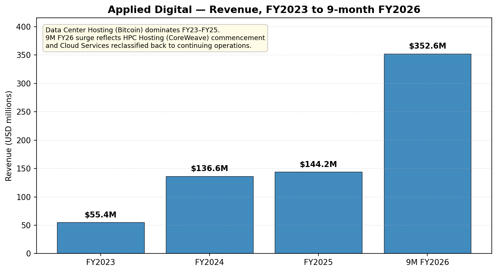
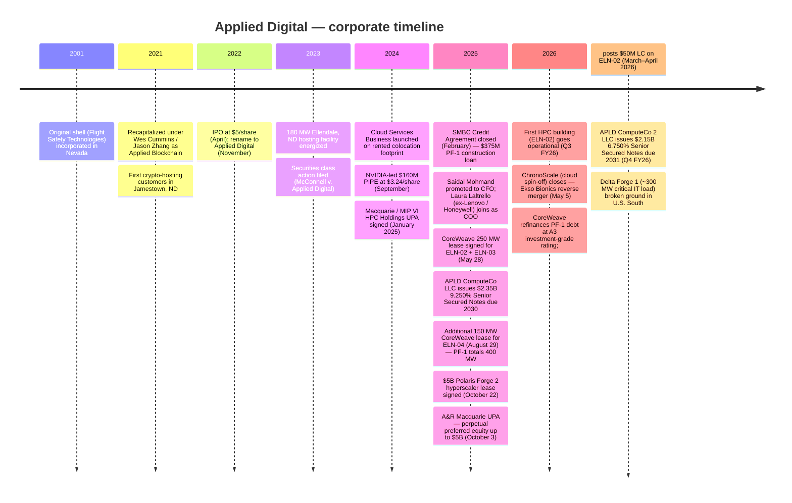
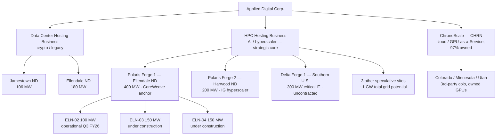
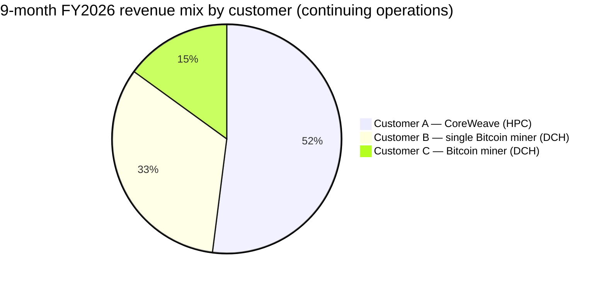
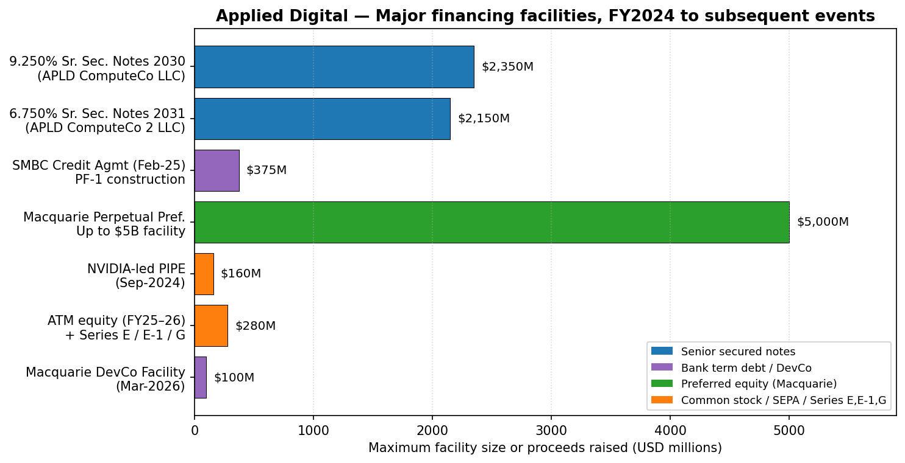
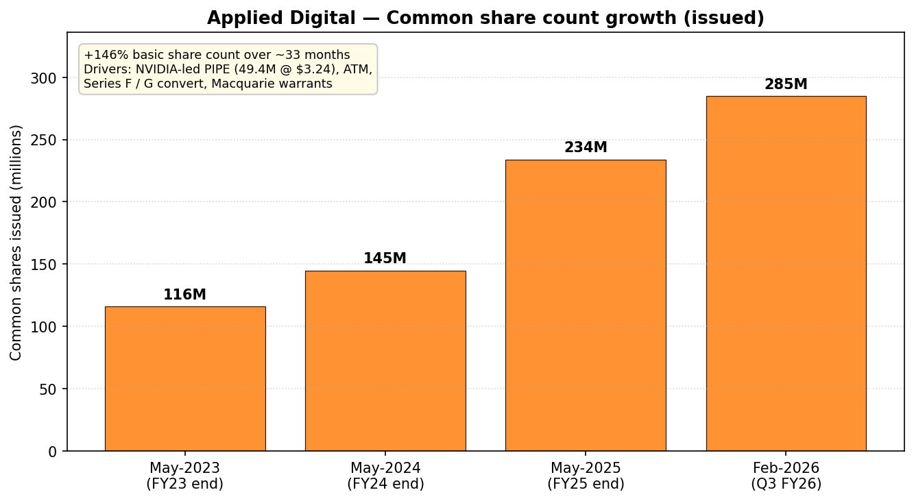
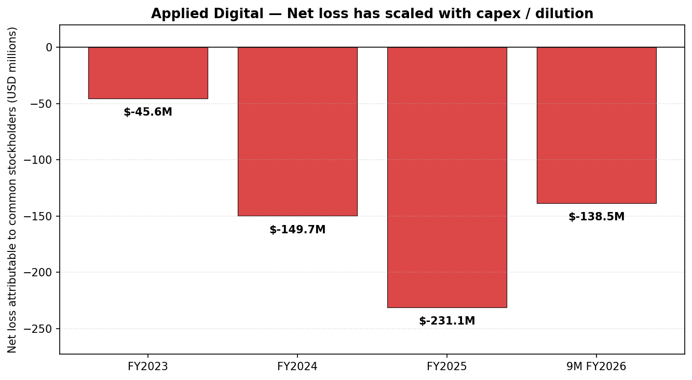

# Applied Digital Corporation (NASDAQ: APLD) — Initiation of Coverage

**Report date: 2026-05-20**
**Industry: AI / HPC data center infrastructure (build-to-suit neocloud landlord)**
**Listing: Nasdaq Global Select Market**

> **Update — Q3 FY2026 results were the first quarter with material HPC Hosting revenue (2026-04-08):** Total revenue jumped to **$126.6M (+139% YoY)** driven by **$71.0M of new HPC Hosting revenue** as the first 100 MW data center at the Polaris Forge 1 campus ("ELN-02") completed construction and was fully operating under its 15-year lease to **CoreWeave** ([Q3 FY2026 earnings release, 2026-04-08](https://www.sec.gov/Archives/edgar/data/1144879/000114487926000029/apldq326earningsrelease.htm)). GAAP net loss attributable to common stockholders was **$100.9M, or $(0.36)/sh**, but non-GAAP "Adjusted Net Income" was **$33.2M ($0.09 diluted)** and Adjusted EBITDA was $44.1M. Subsequent to quarter-end, CoreWeave's project debt was refinanced at an **A3 investment-grade rating** (vs. CoreWeave parent's BB), and CoreWeave posted a **$50M letter of credit** on the ELN-02 lease — a material credit upgrade for APLD's project debt ([8-K/A, 2026-04-01](https://www.sec.gov/Archives/edgar/data/1144879/000149315226014498/form8-ka.htm)). Management did not provide formal full-year guidance; the long-term aspiration of **$1B in NOI within five years** was reiterated.

## Table of Contents
1. Company Overview
2. Company History
3. Management Team
4. Products & Services (Segments)
5. Customers & Go-to-Market
6. Industry Overview
7. Competitive Landscape
8. Market Opportunity (TAM)
9. Risk Assessment

---

## 1. Company Overview

Applied Digital Corporation ("APLD," "Applied Digital," or "the Company") is a U.S. designer, developer, and operator of next-generation data center infrastructure across North America, focused on the **high-power-density, liquid-cooled facilities needed for AI training and HPC workloads** ([2025 Form 10-K, FY ended May 31, 2025](https://www.sec.gov/Archives/edgar/data/1144879/000114487925000021/apld-20250531.htm)). It is headquartered in Dallas, Texas, was incorporated in Nevada in 2001 (the listed shell was originally "Flight Safety Technologies"), and was recapitalized into the present operating business in 2021 under founder-CEO Wes Cummins ([2025 DEF 14A](https://www.sec.gov/Archives/edgar/data/1144879/000149315225014495/form-defxxxxx14a.htm)).

The company operates **two reportable segments plus one discontinued / spin-off operation**, all anchored in 286 MW of operational capacity in North Dakota plus four under-construction or speculative campuses totaling roughly 1 GW of additional grid capacity:

1. **Data Center Hosting Business (legacy crypto-mining colocation).** 286 MW operational across two facilities: a 106 MW campus in Jamestown, ND, and a 180 MW campus in Ellendale, ND. Provides energized space to a **single Bitcoin-mining customer (93% of FY25 segment revenue)** on a five-year contract with ~2.5 years remaining. Generated **$144.2M of FY25 revenue and $63.9M segment operating profit** including a one-time $24.6M gain on classification of held-for-sale ([10-K FY2025, segment note](https://www.sec.gov/Archives/edgar/data/1144879/000114487925000021/apld-20250531.htm)). Highest return on assets in the company ($13.9M segment op profit on $119.6M of assets in Q3 FY26).

2. **HPC Hosting Business (AI / hyperscaler colocation — the strategic core).** Build-to-suit ~15-year leases of fully-fitted, liquid-cooled GPU campuses to neoclouds and hyperscalers. The flagship is **Polaris Forge 1** in Ellendale, ND — a 400 MW campus comprising three buildings (ELN-02 100 MW, ELN-03 150 MW, ELN-04 150 MW), all leased to **CoreWeave** (NASDAQ: CRWV) for **~$11B of aggregate base-rent revenue** over the lease term ([Applied Digital press release, 2025-08-29](https://www.globenewswire.com/news-release/2025/08/29/3141455/0/en/Applied-Digital-Finalizes-Additional-150MW-Lease-with-CoreWeave-in-North-Dakota.html)). The second campus, **Polaris Forge 2** near Harwood, ND, is a $3B, 200 MW initial build (with first-right-of-refusal on the remaining 800 MW of a planned 1 GW build-out) leased to **an unnamed U.S. investment-grade hyperscaler** for ~$5B over ~15 years ([Polaris Forge 2 press release, 2025-10-22](https://www.globenewswire.com/news-release/2025/10/22/3171024/0/en/Applied-Digital-Announces-5-Billion-AI-Factory-Lease-with-U-S-Based-Investment-Grade-Hyperscaler-at-Polaris-Forge-2-ND-Campus.html)). A third campus, **Delta Forge 1** in the U.S. South (300 MW critical IT load, 600+ acres), broke ground during Q3 FY26 with first capacity expected mid-CY2027 ([Q3 FY2026 earnings release, 2026-04-08](https://www.sec.gov/Archives/edgar/data/1144879/000114487926000029/apldq326earningsrelease.htm)). HPC contributed **$71.0M to Q3 FY26 revenue** — its first full operating quarter.

3. **Cloud Services Business (GPU-as-a-service — being spun off as "ChronoScale").** A GPU-rental business operating out of leased colocation in Colorado, Minnesota, and Utah. Generated $84.4M in FY25 revenue ([10-K FY2025](https://www.sec.gov/Archives/edgar/data/1144879/000114487925000021/apld-20250531.htm)). On **May 5, 2026**, APLD closed a reverse-merger contribution into Nasdaq-listed Ekso Bionics, renamed **ChronoScale Corporation (NASDAQ: CHRN)**, with APLD retaining ~97% ownership and contributing $15.75M of additional cash ([Applied Digital ChronoScale closing 8-K, 2026-05-05](https://www.sec.gov/Archives/edgar/data/1144879/000149315226021333/ex99-1.htm)).



*Source: [Applied Digital 10-K FY2025, segment note](https://www.sec.gov/Archives/edgar/data/1144879/000114487925000021/apld-20250531.htm) and [Q3 FY2026 10-Q, condensed statement of operations](https://www.sec.gov/Archives/edgar/data/1144879/000114487926000030/apld-20260228.htm). FY2026 column is the nine-month period ended Feb 28, 2026; Cloud Services has been reclassified back into continuing operations per the 10-Q.*

**Scale indicators (as of February 28, 2026 unless noted):**
- **Total revenue, 9M FY2026:** $352.6M (+99% YoY vs. the same period a year earlier, when continuing-ops revenue was $177.5M) ([Q3 FY2026 10-Q](https://www.sec.gov/Archives/edgar/data/1144879/000114487926000030/apld-20260228.htm))
- **Total assets:** $6.25B (vs. $1.87B at FY25 close — driven by $3.0B of PP&E, including ~$1.6B of Polaris Forge capex during 9M FY26)
- **Cash and cash equivalents:** $1.73B (+ restricted cash $198M)
- **Total debt:** $2.69B (current $98M + long-term $2.59B), dominated by **$2.35B of 9.250% Senior Secured Notes due 2030** issued by subsidiary APLD ComputeCo LLC at 97% of par to fund Polaris Forge 1 ([Form 8-K, 2025-06-02](https://www.sec.gov/Archives/edgar/data/0001144879/000164117225013199/ex99-1.htm)), plus the **$2.15B 6.750% Senior Secured Notes due 2031** issued by APLD ComputeCo 2 LLC at 98% of par to fund Polaris Forge 2 (subsequent event, March 2026)
- **Common shares issued / outstanding:** 292.5M / 285.4M (vs. 234.2M / 224.9M at FY25 close — see dilution discussion)
- **Employees:** approximately 1,200 skilled craft professionals are deployed on construction across the Polaris Forge campuses ([Q3 FY2026 earnings release](https://www.sec.gov/Archives/edgar/data/1144879/000114487926000029/apldq326earningsrelease.htm)); the core APLD W-2 employee base is materially smaller

**Valuation snapshot (market data as of 2026-05-20 close, source: [Yahoo Finance APLD key statistics](https://finance.yahoo.com/quote/APLD/key-statistics)):**
- Last price: **$38.87**, 52-week range $6.53 – $47.79 (a ~6x range in 12 months)
- Market capitalization: **$11.11B**
- Enterprise value: **$12.55B** (incl. $2.83B debt − $1.73B cash)
- Shares outstanding: 285.8M; float 253.9M; beta 5.7 (high)
- **TTM P/E: not meaningful — negative** (TTM net loss attributable to common stockholders is approximately $280M after $231M FY25 GAAP loss and $100.9M Q3 FY26 alone; APLD has never reported a full GAAP year of net profit)
- **TTM P/S: 34.8x** (on $319M TTM revenue per Yahoo data) — extremely elevated
- **EV/Revenue: 39.3x** | **EV/EBITDA (TTM): 902x** — meaningless because trailing EBITDA is barely positive on a GAAP basis
- **P/B: 7.0x**

**Interpreting the negative TTM P/E and the high P/S.** Applied Digital is a **negative-earnings, pre-stabilization HPC-data-center developer**. Its accounting losses come from three structural sources: (a) FY25 reported a $231.1M net loss, with **$143M of HPC Hosting segment costs (SG&A + cost of revenue) booked before HPC revenue began** (revenue commenced only in late FY26); (b) FY25 and FY26 carry heavy stock-based compensation — the FY25 NEO compensation table totals $47.4M for three executives, almost entirely PSU/RSU equity grants ([2025 DEF 14A](https://www.sec.gov/Archives/edgar/data/1144879/000149315225014495/form-defxxxxx14a.htm)); (c) HPC project debt at 9.25% / 6.75% generates large interest expense before the assets stabilize. The negative P/E is therefore a **growth-stage / pre-stabilization signal, not a value-trap signal** — but it does mean equity holders are betting purely on the eventual stabilized run-rate from the 600 MW of contracted HPC leases.

The **34.8x P/S** is well above the average S&P 500 stock but is consistent with the AI-infrastructure cohort: bitcoin miners pivoting to HPC trade at 38x (CIFR), 64x (WULF), 38x (HUT) per Yahoo Finance TTM data; CoreWeave itself trades at 8.8x P/S on $6.2B of revenue because it has a much larger and rapidly-growing revenue base. The **right peer for APLD** is the build-to-suit AI-infra REIT-like cohort that includes **IREN** (P/S 24.8x, $0.76B revenue) and **WULF** (P/S 63.5x, $0.17B revenue) — APLD's 34.8x sits in the middle of that group ([yfinance data, 2026-05-20]). The implicit market view is that contracted-but-not-yet-recognized revenue (~$16B at Polaris Forge 1 + Polaris Forge 2) is highly probable, and that NOI will scale to the $1B 5-year aspiration ([Q3 FY2026 management commentary](https://www.sec.gov/Archives/edgar/data/1144879/000114487926000029/apldq326earningsrelease.htm)).

The 52-week range from $6.53 to $47.79 — a ~6x move — and beta of 5.7 underscore that APLD trades as a high-conviction binary call on HPC-lease delivery. The valuation risk is asymmetric: a Polaris Forge 1 delivery slip, a CoreWeave credit event, or a hyperscaler capex pullback all compress the multiple sharply.

---

## 2. Company History

Applied Digital's listed shell traces back to **Flight Safety Technologies**, a small Connecticut-based wake-vortex-detection company that filed its first 10-K in 2002 under what is now APLD's SEC CIK 0001144879. After Flight Safety wound down its operations, the shell was effectively recapitalized in 2021 into a **bitcoin-mining colocation business** founded by Wes Cummins (then a Texas-based investor and the founder of investment firm 272 Capital LP) and co-founder Jason Zhang ([2025 DEF 14A](https://www.sec.gov/Archives/edgar/data/1144879/000149315225014495/form-defxxxxx14a.htm)). The original strategic insight was simple: cheap stranded power on the North Dakota grid plus a flood of post-2021-halving bitcoin-mining demand made low-cost hosting an attractive arbitrage. The Company IPO'd at $5/share in April 2022 under the name **Applied Blockchain, Inc.**, then changed its corporate name to **Applied Digital Corporation** in November 2022 to reflect the broader data-center positioning.



**Strategic pivots.** Three pivots are central to understanding what APLD is today:

1. **Crypto-hosting → HPC hosting (FY2024).** Management saw demand for GPU compute exploding post-ChatGPT and recognized that their stranded-power, low-temperature-ambient North Dakota footprint was unusually well-suited to direct-to-chip liquid cooling. The Ellendale 100 MW build (now ELN-02) began as a speculative HPC build with no anchor tenant — the **CoreWeave lease was only signed on May 28, 2025, more than two years after construction began** ([10-K FY2025](https://www.sec.gov/Archives/edgar/data/1144879/000114487925000021/apld-20250531.htm)). This was a high-risk pivot that worked.

2. **GPU-as-a-Service launch and then exit (FY2024 → FY2026).** APLD launched the Cloud Services Business in Q3 FY24 to compete head-on with CoreWeave / Lambda / Crusoe in renting GPU compute. Less than two years later, in Q4 FY25, the board classified Cloud Services as held-for-sale, and in May 2026 the segment was spun out into Nasdaq-listed **ChronoScale Corp. (CHRN)** via a reverse-merger contribution into Ekso Bionics ([ChronoScale closing 8-K, 2026-05-05](https://www.sec.gov/Archives/edgar/data/1144879/000149315226021333/ex99-1.htm)). APLD retains ~97% economic ownership but has separated the operating P&L and the financing of the two businesses — explicitly because hyperscale leasing is a long-duration, predictable-cash-flow business while GPU-as-a-Service is a shorter-cycle, higher-risk business.

3. **JV / project-finance pivot (CY2025).** Rather than carry every project on the corporate balance sheet, APLD has structured each large campus into a **JV with Macquarie Asset Management** ("MAM"). APLD owns 90% of the equity in each HPC TopCo joint venture; MAM contributes preferred equity through its $5B perpetual-preferred facility; and project debt is non-recourse to APLD parent ([Q3 FY2026 10-Q, Note 12](https://www.sec.gov/Archives/edgar/data/1144879/000114487926000030/apld-20260228.htm)). This is the financing template the company is replicating at Polaris Forge 2 and Delta Forge 1.

**Key recent developments (last 12 months).**
- May 28, 2025 — CoreWeave 250 MW lease signed for ELN-02 + ELN-03 ([10-K FY2025](https://www.sec.gov/Archives/edgar/data/1144879/000114487925000021/apld-20250531.htm)).
- Aug 18, 2025 — Polaris Forge 2 ground-breaking near Harwood, ND.
- Aug 29, 2025 — Third CoreWeave lease (150 MW, ELN-04) brings Polaris Forge 1 to a fully-leased 400 MW campus worth ~$11B in contracted base rent ([GlobeNewswire, 2025-08-29](https://www.globenewswire.com/news-release/2025/08/29/3141455/0/en/Applied-Digital-Finalizes-Additional-150MW-Lease-with-CoreWeave-in-North-Dakota.html)).
- Oct 3, 2025 — Amended & Restated Macquarie UPA expands MAM's role to a **$5B perpetual-preferred-equity facility**, drawable as new investment-grade leases are signed.
- Oct 22, 2025 — Polaris Forge 2 200 MW investment-grade hyperscaler lease signed, ~$5B over 15 years ([GlobeNewswire, 2025-10-22](https://www.globenewswire.com/news-release/2025/10/22/3171024/0/en/Applied-Digital-Announces-5-Billion-AI-Factory-Lease-with-U-S-Based-Investment-Grade-Hyperscaler-at-Polaris-Forge-2-ND-Campus.html)).
- Feb 28, 2026 — Q3 FY26 close: ELN-02 fully operational with $44.1M of base rent recognized in the quarter; Adjusted EBITDA $44.1M, Adjusted net income $33.2M.
- Mar–Apr 2026 — CoreWeave refinances Polaris Forge 1 project debt at **A3 investment grade** (Moody's), posts $50M LC; APLD restructures leases to flow through a credit-enhanced CoreWeave SPV ([8-K/A, 2026-04-01](https://www.sec.gov/Archives/edgar/data/1144879/000149315226014498/form8-ka.htm)).
- May 5, 2026 — ChronoScale (CHRN) cloud spin-off closes.

---

## 3. Management Team

### Wes Cummins — Chairman, President, Chief Executive Officer (founder)

Wes Cummins is the central figure at APLD. He served on the board of the predecessor shell from 2007 to 2020 and returned as a director on **March 11, 2021** when he recapitalized the entity into the present operating business. He is also **founder and CEO of 272 Capital LP**, the registered investment advisor that was acquired by **B. Riley Financial (NASDAQ: RILY)** in August 2021, where Cummins ran the technology / hardware / services strategy ([2025 DEF 14A, p. 9](https://www.sec.gov/Archives/edgar/data/1144879/000149315225014495/form-defxxxxx14a.htm)). Before founding 272 Capital, Cummins was an analyst at Nokomis Capital LLC (October 2012 – February 2020) and previously **president of B. Riley & Co. from 2002 to 2011**. He holds a BSBA in finance and accounting from Washington University in St. Louis. Outside APLD he sits on the board of **Sequans Communications (NYSE: SQNS)**, a cellular semiconductor designer, and previously served on the boards of Telenav (TNAV) and Vishay Precision Group (VPG).

His **fiscal-2025 compensation totaled $27.7M**, of which $25.5M was a one-time PSU grant tied to multi-year stock-price hurdles and only $706k was base salary ([2025 DEF 14A summary compensation table](https://www.sec.gov/Archives/edgar/data/1144879/000149315225014495/form-defxxxxx14a.htm)). The PSU structure aligns him with shareholders for the next three fiscal years (2026–2028) — but at the cost of a very large equity dilution if the share-price hurdles are hit. Cummins is named as a defendant alongside the Company in the **McConnell v. Applied Digital securities class action (N.D. Tex., filed August 2023)**, which alleges materially misleading statements about the profitability of the legacy crypto hosting business and the company's cloud-services pivot; the defendants' motion to dismiss was briefed by January 2025 and remains pending ([10-K FY2025, Part II Item 3](https://www.sec.gov/Archives/edgar/data/1144879/000114487925000021/apld-20250531.htm)). Investors should weight this carefully — Cummins is the architect of the strategy, but his personal credibility is partially exposed to the outcome of the litigation and to disciplined execution on the HPC pivot.

The honest read on Cummins is that he is a **financial operator who repositioned a shell into a tier-1 hyperscaler counterparty in ~4 years** — that is unusual execution. He took an aggressive build-ahead-of-tenant bet on ELN-02 (capex began before CoreWeave was signed), and it worked. He is now compounding the bet by building Delta Forge 1 speculatively and marketing four additional sites totaling ~1 GW. The asymmetric risk is concentrated in his ability to keep signing investment-grade tenants at favorable cost-of-debt as scale increases — a skill set adjacent to capital markets and project finance, where his B. Riley background is directly relevant.

### Saidal Mohmand — Chief Financial Officer

Saidal Mohmand was promoted to CFO effective **October 15, 2024**, replacing David Rench (who became Chief Administrative Officer and then a consultant by January 2025). Mohmand had served as APLD's EVP of Finance since September 2021. Crucially, he was **Director of Research at 272 Capital LP from July 2020**, then continued in the same role at B. Riley Asset Management from August 2021 to February 2024 — so he has worked alongside Cummins for ~6 years before his elevation to CFO. He earlier spent 2013 – 2020 at GrizzlyRock Capital (a Chicago value-oriented long/short fund) as Director of Research. He holds a BBA in finance and accounting from Western Michigan University ([2025 DEF 14A, p. 16](https://www.sec.gov/Archives/edgar/data/1144879/000149315225014495/form-defxxxxx14a.htm)). His FY25 total comp was $9.8M, including an $8.9M equity grant; base salary was raised from $250k to $475k effective October 2024.

Mohmand's track record at the Company specifically is the capital-markets execution since the 2022 IPO: ATM offerings, the NVIDIA-led $160M PIPE, the SMBC project-finance loan, the $2.35B / $2.15B Senior Secured Notes offerings, and the structuring of the Macquarie joint venture. By any benchmark this is a heavy capital-markets quarterly run-rate for a CFO with no prior public-company CFO experience, and the company has so far achieved its funding milestones on time. The risk is that Mohmand has not yet been tested through a tight credit cycle — both the 9.25% notes (2030) and the 6.75% notes (2031) carry significant refinancing risk if rates harden before stabilization.

### Laura Laltrello — Chief Operating Officer

Laltrello joined on **January 6, 2025**, bringing the operational depth the company materially lacked. From May 2005 to December 2020 she was at **Lenovo Group Limited**, including **Vice President and General Manager of Global DataCenter Services from May 2016 to December 2020**. She then served as **VP and GM of Building Automation Services at Honeywell International** from December 2020 to December 2024 ([2025 DEF 14A, p. 16](https://www.sec.gov/Archives/edgar/data/1144879/000149315225014495/form-defxxxxx14a.htm)). She holds a BAS in applied mathematics from Clemson and completed IMD's Executive Leadership Program. Her FY25 comp totaled $9.9M including a $9.5M sign-on equity grant. With construction on Polaris Forge 1, Polaris Forge 2, and Delta Forge 1 happening in parallel and ~1,200 craft personnel on site, Laltrello is the single most important operational hire the company has made — her credentials suggest she can scale the construction-to-commissioning playbook, which is the limiting factor on near-term revenue.

### Jason Zhang — President & co-founder, formerly Chief Strategy Officer

Jason Zhang is a co-founder of APLD (he was a director from April 2022 to November 2022 and rejoined as Chief Strategy Officer on **August 1, 2025**; the Q3 FY26 release announced his promotion to **President** to "strengthen leadership as the Company scales its AI Factory platform"). Prior to APLD he founded Valuefinder (2019) and was an investment analyst at **Sequoia Capital (2017–2019)** focused on AI, blockchain, digital infrastructure, and enterprise software, and at **MSD Capital (Michael Dell's family office) from 2015 to 2017** ([2025 DEF 14A, p. 16](https://www.sec.gov/Archives/edgar/data/1144879/000149315225014495/form-defxxxxx14a.htm)). BA in economics from Harvard. He is the company's external-facing strategy figure with venture-capital relationships.

### Governance and board

- **Six-person board, five independent.** Wes Cummins is the only non-independent director (CEO + Chairman). Other directors: Ella Benson (Director at Oasis Management; finance), Chuck Hastings (former CEO of B. Riley Wealth Management; B. Riley connection), Rachel Lee (former Partner & Head of Consumer Private Equity, Ares Management), Douglas Miller (audit-committee chair; former CFO of Telenav, CareDx, Synplicity), Richard Nottenburg (Executive Chairman, NxBeam; former EVP / Chief Strategy & Technology Officer of Motorola).
- **B. Riley nexus.** Cummins (former President), Hastings (former B. Riley Wealth Management CEO), and Mohmand (former Director of Research, B. Riley Asset Management) all came through B. Riley Financial. This creates a tightly-knit insider group with overlapping financial-services pedigree but no historical operating-company executive depth at the board level — which is why Laltrello's hire matters disproportionately.
- **Insider ownership** of NEOs and directors collectively was disclosed at **approximately 9.1%** as of the 2025 DEF 14A; with subsequent PSU grants and ATM-funded dilution this figure has likely moved.
- **Securities class action (McConnell v. Applied Digital)** pending in the Northern District of Texas — investors should track the outcome ([10-K FY2025, Part I Item 3](https://www.sec.gov/Archives/edgar/data/1144879/000114487925000021/apld-20250531.htm)).

**Track-record synthesis.** This is a **founder-led capital-markets operator with a recently-strengthened operational team**. Cummins has executed a difficult shell-to-hyperscaler pivot. The team has not yet been tested through a credit downcycle or a hyperscaler capex pause. The PSU-heavy comp structure is well-aligned to long-term shareholders but creates short-term reported losses.

---

## 4. Products & Services



### Segment 1 — Data Center Hosting (crypto)

- **What it is.** Energized rack space for Bitcoin / cryptoasset miners on a fixed-price-per-MW-per-month basis. APLD owns the buildings, transformers, and switchgear; the customer brings ASICs.
- **Capacity.** 286 MW operational across Jamestown (106 MW) and Ellendale 180 MW (10-K FY2025).
- **Customer.** One Bitcoin-mining tenant after several prior customers terminated in Q1 FY25; the **single remaining customer accounted for 93% of FY25 continuing-ops revenue** ([10-K FY2025, p. 9](https://www.sec.gov/Archives/edgar/data/1144879/000114487925000021/apld-20250531.htm)).
- **Economics.** Q3 FY26 generated $37.5M revenue (+7% YoY) and $13.9M segment operating profit on $119.6M of reported assets — **the highest return on assets in the company**. This is a steady-state, modestly-growing cash-flow business with ~2.5 years left on the contract.
- **Competitive position.** Direct competitors include **Riot Platforms, Bitdeer, Marathon Digital, CleanSpark, Cipher Mining**, and private operators. **Verdict: no moat.** Crypto hosting is a power-arbitrage business; APLD's only advantage is cheap North Dakota grid power, which competitors also access. The contract is short, the customer is concentrated, and there is a high probability that the same physical infrastructure will be repurposed to AI hosting once the contract expires (ELN-180 in particular has the cooling profile to be retrofitted).
- **Strategic value.** Cash flow that funds the HPC pivot. Management explicitly preserves this segment because of its high ROA, but does not expect it to grow.

### Segment 2 — HPC Hosting (AI / hyperscaler — strategic core)

The HPC Hosting Business is APLD's investment thesis. Each "AI Factory" is a purpose-built, **direct-to-chip liquid-cooled** data center designed for >100 kW/rack power density and signed under **~15-year triple-net leases with credit-enhanced counterparties**.

- **Polaris Forge 1 (Ellendale, ND) — 400 MW, fully leased to CoreWeave for ~$11B base rent.**
  - **ELN-02 (100 MW)** is operational as of Q3 FY26. The Q3 FY26 release confirms this is one of the only 100 MW direct-to-chip liquid-cooled data centers online globally ([Q3 FY2026 earnings release](https://www.sec.gov/Archives/edgar/data/1144879/000114487926000029/apldq326earningsrelease.htm)).
  - **ELN-03 (150 MW)** is under construction, expected operational mid-CY2026.
  - **ELN-04 (150 MW)** is under construction, expected operational mid-CY2027.
  - All three are leased to **CoreWeave, Inc. (NASDAQ: CRWV)** under **APLD ELN-02 / ELN-03 / ELN-04 LLC** subsidiaries (the original ELN-02 and ELN-03 leases were signed May 28, 2025; the ELN-04 lease was added August 29, 2025).
- **Polaris Forge 2 (Harwood, ND) — 200 MW under construction, $5B base rent.**
  - Lease signed October 22, 2025 to a **U.S. investment-grade hyperscaler** for ~15 years; the hyperscaler holds **first right of refusal on the remaining 800 MW** of the 1 GW campus build-out.
  - Initial capacity in CY2026, full at-200 MW by early CY2027.
- **Delta Forge 1 (U.S. South, undisclosed exact location) — 300 MW critical IT load, 600+ acres.**
  - Ground broken Q3 FY26; first operations expected mid-CY2027. **Currently uncontracted** ("speculative" per industry parlance), which is the most aggressive part of the build.
- **Three additional sites under active marketing** with ~1 GW of cumulative grid capacity — one in North Dakota and two in unnamed states.

**Lease economics.** The Polaris Forge 1 leases are structured as triple-net colocation leases — APLD provides the energized envelope (building, power, cooling, security) and charges base rent plus tenant fit-out reimbursements plus power pass-through. Q3 FY26 broke this out: of $71.0M HPC revenue, $44.1M was base rent, $18.9M was tenant fit-out, and $8.1M was power pass-through / ancillary ([Q3 FY2026 earnings release](https://www.sec.gov/Archives/edgar/data/1144879/000114487926000029/apldq326earningsrelease.htm)).

**Competitive advantage assessment.**
- **Yes, partial moat.** The moat is a combination of (1) **first-mover liquid-cooling design** — ELN-02 was one of the first ~100 MW direct-to-chip facilities to come online globally and required several years of speculative capex before signing CoreWeave; (2) **stranded-power site control in the Dakotas**, which is a multi-year permitting and substation-construction cycle that competitors cannot replicate quickly; (3) **contractual switching costs** — once CoreWeave or the IG hyperscaler is installed in a 100+ MW facility with custom liquid cooling, moving GPUs to a different campus mid-contract is impractical.
- **What is NOT a moat.** APLD is a landlord. Construction know-how is available from any major data-center GC. Once the campus is stabilized, the asset is an income-stream that competes purely on cost-of-capital. Hyperscalers are increasingly building self-perform shells (Microsoft, Google, Meta) and pushing for lower-cost colocation pricing.
- **Closest competing product.** Equinix and Digital Realty serve broader connectivity-rich enterprise / hyperscaler demand but generally do not specialize in 100+ MW liquid-cooled HPC build-to-suit. The closest direct competitors are **Crusoe Energy** (private; ~$10B valuation; explicitly AI-power-arbitrage), **Switch / DigitalBridge**, and increasingly the public neoclouds themselves (CoreWeave is co-developing its own sites at Plano, TX). On a single-tenant 100+ MW build-out APLD is currently at parity with Crusoe and ahead of legacy bitcoin miners (IREN, WULF, CIFR) that are still ramping into HPC.

### Segment 3 — Cloud Services / ChronoScale (CHRN) (GPU-as-a-Service, spun out May 2026)

- **What it is.** Renting Company-owned GPU compute (largely NVIDIA H100-class) out of third-party colocation in Colorado, Minnesota, and Utah.
- **Status.** Closed contribution into **Ekso Bionics Holdings → ChronoScale Corp. (NASDAQ: CHRN)** on May 5, 2026; APLD retains ~97% ownership and contributed $15.75M cash for an additional ~1.4M CHRN shares ([ChronoScale closing 8-K, 2026-05-05](https://www.sec.gov/Archives/edgar/data/1144879/000149315226021333/ex99-1.htm)).
- **Strategic rationale (Cummins quote).** "Our data center hosting platform is built on long-duration contracts and predictable infrastructure returns, while the cloud compute layer operates on shorter cycles with a different risk profile. We believe separating these businesses allows each to be capitalized and scaled appropriately."
- **Verdict: no moat.** GPU-as-a-Service is a brutally competitive cohort dominated by CoreWeave and the hyperscalers' own offerings (AWS p5, Azure ND, GCP A3). Spinning out CHRN reduces APLD-level operating-loss volatility and lets the cloud-compute business raise capital separately.

### Roadmap and recent launches (last 12 months)

- ELN-02 commissioning (Q3 FY26 — first revenue-generating HPC facility)
- Polaris Forge 2 ground-break (August 2025)
- Delta Forge 1 ground-break (Q3 FY26)
- ChronoScale spin-off (May 2026)
- A&R Macquarie UPA → $5B perpetual-preferred facility (October 2025)
- A3 investment-grade refinancing on CoreWeave's project debt (April 2026), which materially improves the credit profile of APLD's $2.35B 9.250% Senior Secured Notes


*Source: capacities and statuses compiled from [10-K FY2025](https://www.sec.gov/Archives/edgar/data/1144879/000114487925000021/apld-20250531.htm), [Q3 FY2026 earnings release, 2026-04-08](https://www.sec.gov/Archives/edgar/data/1144879/000114487926000029/apldq326earningsrelease.htm), [Polaris Forge 2 press release, 2025-10-22](https://www.globenewswire.com/news-release/2025/10/22/3171024/0/en/Applied-Digital-Announces-5-Billion-AI-Factory-Lease-with-U-S-Based-Investment-Grade-Hyperscaler-at-Polaris-Forge-2-ND-Campus.html), and [ELN-04 lease press release, 2025-08-29](https://www.globenewswire.com/news-release/2025/08/29/3141455/0/en/Applied-Digital-Finalizes-Additional-150MW-Lease-with-CoreWeave-in-North-Dakota.html).*

---

## 5. Customers & Go-to-Market

### Customer concentration



Customer concentration at Applied Digital is **severe and is the single most important risk factor**. From the Q3 FY26 10-Q, the three customer disclosure:

| 9-month period ended | Customer A | Customer B | Customer C | Customer D |
|---|---|---|---|---|
| Feb 28, 2026 | **52%** | 33% | 15% | — |
| Feb 28, 2025 | — | 54% | 29% | 11% |

Source: [Applied Digital Q3 FY2026 10-Q, Note 4 Revenue from Contracts with Customers](https://www.sec.gov/Archives/edgar/data/1144879/000114487926000030/apld-20260228.htm).

For full fiscal year 2025, **Customer A accounted for 93% of continuing-operations revenue** — i.e., one Bitcoin-mining tenant essentially defined the income statement of the data center hosting business ([10-K FY2025, Note 4](https://www.sec.gov/Archives/edgar/data/1144879/000114487925000021/apld-20250531.htm)).

Combined, APLD's HPC Hosting Business is a **single-customer business segment** — CoreWeave is the only HPC tenant under the disclosed leases (Polaris Forge 2's hyperscaler is undisclosed but the 200 MW lease has only just commenced construction; revenue had not yet been recognized as of Feb 28, 2026). The 10-K explicitly states: *"We have material customer concentration in our HPC Hosting Business. We currently have one customer in this business segment, which is a party to two fifteen-year term leases with us"* ([10-K FY2025, Risk Factors](https://www.sec.gov/Archives/edgar/data/1144879/000114487925000021/apld-20250531.htm)).

**Implication.** With Polaris Forge 2 (IG hyperscaler) coming online from CY2026, customer mix will improve; but for the next 12–18 months, **CoreWeave alone drives the HPC P&L**. CoreWeave's underlying credit (BB at the parent, A3 at the refinanced SPV) is therefore a load-bearing assumption for APLD's equity story. The April 2026 A3 refinancing and the $50M LC posted by CoreWeave Parent are partial mitigants — they materially improve APLD's lender-side credit profile — but they do not eliminate the operating exposure to CoreWeave's enterprise demand.

### Anchor tenants — named exposures

- **CoreWeave, Inc. (NASDAQ: CRWV).** The flagship "neocloud" with $6.2B of TTM revenue (Yahoo Finance, 2026-05-20). Counter-party to all three Polaris Forge 1 leases (~$11B aggregate base rent). Has its own customer concentration with Microsoft, OpenAI, and Meta — exposure to those names indirectly flows through to APLD. CoreWeave's parent rating is BB (sub-investment grade); the SPV that became APLD's tenant via the April 2026 lease restructuring is A3 (investment grade).
- **Bitcoin-mining tenant at Ellendale 180 MW + Jamestown 106 MW.** Identity not disclosed in current filings; previously included related-party customers (Customer B was a subsidiary of an entity that briefly owned >5% of APLD common stock during Q1 FY25; Customer C was 60%-owned by an individual who briefly owned >5% — both ceased to be 5% holders by July 25, 2024 per Schedule 13G filings ([10-K FY2025, Note 6](https://www.sec.gov/Archives/edgar/data/1144879/000114487925000021/apld-20250531.htm))). The Company's historical hosting customer list per the exhibits includes prior contracts with **Bitmain Technologies** and **Marathon Digital Holdings** ([Exhibit 10 list, 10-K FY2025](https://www.sec.gov/Archives/edgar/data/1144879/000114487925000021/apld-20250531.htm)).
- **Polaris Forge 2 hyperscaler (undisclosed; described as "U.S. based investment grade").** Industry speculation in publications such as [DataCenterDynamics](https://www.datacenterdynamics.com/en/news/) has tagged this as one of the three U.S. hyperscalers, but APLD has not confirmed identity. The $5B / 15-year structure with 800 MW ROFR is characteristic of Microsoft / Google / Meta-tier procurement.

### Go-to-market

APLD's GTM is **highly customized, low-volume, very-large-deal**. Each lease is 100–200 MW, 15 years, multi-hundred-million-dollar-per-year base rent. The sales motion is direct, executive-led, and driven by site availability, time-to-power, and cost-of-debt. Cummins' Q3 FY26 commentary noted that aggregate U.S. hyperscaler capex has risen from a referenced $400B annual to "nearly $700B" over a three-month window — the bottleneck is power and infrastructure, not demand ([Q3 FY2026 earnings release](https://www.sec.gov/Archives/edgar/data/1144879/000114487926000029/apldq326earningsrelease.htm)).

Key GTM differentiators APLD highlights:
- **Time-to-power.** ELN-02 was delivered in roughly 24 months from ground-break to ready-for-service — competitive with Crusoe and faster than most legacy colos for 100 MW liquid-cooled builds.
- **North Dakota climate / cooling profile.** Waterless, direct-to-chip closed-loop liquid cooling targeting 1.18-class PUE. APLD's own marketing claims "Best Data Center in the Americas 2025" recognition from Datacloud.
- **Stranded power.** Bismarck-area substations have the spare grid capacity to deliver 1 GW+ over multi-year windows that competitors near Northern Virginia, Phoenix, or Dallas cannot match.

**Customer case studies (publicly disclosed).** The CoreWeave Polaris Forge 1 deployment is the flagship; the IG-hyperscaler Polaris Forge 2 deployment is the second proof point. Both are first-of-kind for APLD at this scale.

---

## 6. Industry Overview

### Industry definition

Applied Digital sits at the intersection of three industries: (a) **wholesale colocation real estate** (NAICS 518210 — data processing & hosting services), (b) **HPC / AI infrastructure** (chip-adjacent, GPU-centric), and (c) **independent power producer / land developer** in the United States. For investor framing, the right comparison set is the **AI / HPC wholesale colocation cohort** — the publicly listed names include Equinix, Digital Realty, CoreSite (now part of American Tower), and the "AI-native" cohort represented by Applied Digital, Iris Energy (IREN), TeraWulf (WULF), Cipher Mining (CIFR), and private peers such as Crusoe, Lambda, and CoreScientific.

### Market size and growth

The market backdrop is the strongest in data-center history.

- **Total AI-data-center TAM.** McKinsey's 2025 analysis cites a **~$7T cumulative capital outlay required by 2030** to scale data centers for AI workloads, with **$5.2T attributable to AI-processing-capable facilities** specifically ([McKinsey, "The cost of compute: A $7 trillion race", 2025](https://www.mckinsey.com/industries/technology-media-and-telecommunications/our-insights/the-cost-of-compute-a-7-trillion-dollar-race-to-scale-data-centers)).
- **Capacity build.** [JLL Research, 2026 Market Outlook](https://www.jll.com/en-us/insights/market-outlook/data-center-outlook) projects nearly 100 GW of new data centers added between 2026 and 2030, roughly doubling global capacity, at a ~14% CAGR through 2030.
- **Hyperscale count.** Synergy Research Group counts 1,297 operational hyperscale data centers globally as of late 2025 plus a pipeline of 770 facilities in planning or build-out ([Synergy Research / Q3 2025 hyperscale tracker, cited via various industry reports]).
- **Hyperscaler capex.** Aggregate U.S. hyperscaler capex (Microsoft, Google, Amazon, Meta) ran at the **$400B annual** range entering 2025 and was tracked to **$700B annualized** by early 2026, according to multiple analyst surveys and APLD management ([Q3 FY2026 earnings release commentary, 2026-04-08](https://www.sec.gov/Archives/edgar/data/1144879/000114487926000029/apldq326earningsrelease.htm)).

### Key trends and drivers

1. **Liquid cooling becomes table stakes for HPC.** GPU power-densities have moved from ~30 kW/rack (Hopper) to 100+ kW/rack (Blackwell B200) to >130 kW/rack (planned Rubin), forcing direct-to-chip and immersion cooling. Air-cooled legacy halls are obsolete for AI training.
2. **Power, not silicon, is the binding constraint.** Permitting timelines for new substations and transmission, plus grid-interconnect queues at PJM and ERCOT, are routinely 4–7 years. Stranded-power markets (the Dakotas, West Texas, Wyoming, Quebec) have re-emerged as preferred destinations for HPC build-out.
3. **Neocloud emergence.** CoreWeave (NASDAQ: CRWV), Lambda, Crusoe, and Nebius have raised tens of billions in equity and debt to build out GPU compute clusters competing with the hyperscalers' own retail offerings. They lease capacity rather than self-build, which is APLD's customer base.
4. **Hyperscaler self-build vs. lease arbitrage.** Microsoft, Google, and Meta increasingly toggle between self-built campuses (Azure / Hyperion) and leased capacity. When time-to-power is the constraint, hyperscalers tilt toward lease.
5. **Bitcoin-mining-to-HPC pivot.** APLD's peer set — IREN, WULF, CIFR, HUT, Core Scientific — is universally pivoting hosting capacity from crypto to AI. The cohort has raised $20B+ of equity and convertibles in the last 18 months to fund the transition.
6. **Investment-grade lessor structures.** Hyperscaler procurement increasingly requires investment-grade credit at the operating SPV level. This is precisely the structure CoreWeave used in April 2026 (A3 refinancing + LC) and is the template for future leases — driving APLD's cost-of-debt lower as more leases stabilize.
7. **Sustainability scrutiny.** PUE, water usage, and grid-curtailment-impact disclosures are becoming customer-mandated. APLD's waterless closed-loop cooling is a positive differentiator.

### Regulatory environment

- **Energy regulation.** Federal Energy Regulatory Commission (FERC) and state PUCs govern interconnect and transmission siting. North Dakota has been broadly business-friendly for data center development, with state-level tax incentives for IT-equipment purchases.
- **Cryptoasset regulation.** APLD's legacy hosting business is exposed to regulatory action against Bitcoin mining (SEC enforcement against miners, state-level energy-use restrictions, the 2024 halving event reducing mining economics). The 10-K Risk Factors devote ~30 paragraphs to "ability to continue as a going concern" language tied to crypto-asset regulatory action ([10-K FY2025, Risk Factors](https://www.sec.gov/Archives/edgar/data/1144879/000114487925000021/apld-20250531.htm)).
- **AI-specific regulation.** The EU AI Act is operative; U.S. federal AI rules remain unsettled. APLD has no direct AI-output exposure (it is purely landlord), but a sharp slowdown in AI training spend would compress demand.

### Industry structure

- Wholesale-colocation is **highly fragmented at the country level** (Equinix and Digital Realty dominate retail; hyperscale build-to-suit is more fragmented).
- **Supplier power** is rising — Vertiv, Schneider Electric, Eaton, and Caterpillar (gensets) face multi-year backlogs. Transformer lead times of 24–36 months are now industry-standard.
- **Buyer power.** Hyperscalers and neoclouds have enormous buyer power on price, but very limited buyer power on time-to-power. APLD's positioning leans on the latter.
- **Substitutes.** Hyperscaler self-build is the only meaningful substitute.

---

## 7. Competitive Landscape

```mermaid
quadrantChart
    title HPC / AI colocation positioning
    x-axis Limited liquid-cooled HPC focus --> Pure-play HPC liquid-cooled
    y-axis Smaller MW pipeline --> Larger MW pipeline
    quadrant-1 Hyperscale leaders
    quadrant-2 Diversified colos
    quadrant-3 Niche operators
    quadrant-4 AI-native pure-plays
    Equinix: [0.20, 0.85]
    Digital Realty: [0.30, 0.95]
    Iron Mountain: [0.15, 0.60]
    Switch / DigitalBridge: [0.55, 0.70]
    Crusoe Energy (private): [0.85, 0.55]
    Applied Digital APLD: [0.85, 0.60]
    Iris Energy IREN: [0.75, 0.45]
    TeraWulf WULF: [0.70, 0.30]
    Cipher Mining CIFR: [0.65, 0.30]
    Riot Platforms RIOT: [0.30, 0.40]
    Marathon MARA: [0.30, 0.50]
    CoreWeave CRWV: [0.95, 0.80]
```

### Direct and indirect competitors

1. **CoreWeave (NASDAQ: CRWV).** APLD's largest customer is also, paradoxically, the closest direct competitor — CoreWeave is increasingly self-developing its own campuses (Plano, TX, and others). Has $6.2B TTM revenue, 8.8x P/S, ~$55B market cap. The risk is that CoreWeave shifts a higher share of incremental capacity onto self-built infrastructure as it scales — though the existing 15-year APLD leases are non-cancellable.
2. **Crusoe Energy (private).** Most directly comparable AI-data-center pure-play. Stranded-power-driven, similar 100+ MW liquid-cooled builds in Texas and Wyoming. Has raised $1B+ in equity and project debt; private valuations of $10B+ have been reported. Effectively at parity with APLD on build-quality but more geographically dispersed.
3. **Iris Energy / IREN (NASDAQ: IREN).** Pure-play former-Bitcoin-miner pivoting to AI. 2.91 GW pipeline (per company website); $0.76B TTM revenue at 24.8x P/S. Located in Childress, TX and West Texas — direct competition for hyperscaler builds.
4. **TeraWulf (NASDAQ: WULF).** 750 MW pipeline; $0.17B TTM revenue; 63.5x P/S — heavily speculative valuation on contracted HPC. Lake Mariner, NY site is a direct comp to Ellendale.
5. **Cipher Mining (NASDAQ: CIFR).** Pivoting to HPC; $0.21B TTM revenue; 38.2x P/S. Texas-focused.
6. **Hut 8 / Hive / Riot / Marathon.** Legacy crypto miners with smaller or slower HPC pivots. Less direct competitive overlap.
7. **Digital Realty (NYSE: DLR), Equinix (NASDAQ: EQIX).** Retail- and wholesale-colocation incumbents. Larger, slower-moving, but undeniably the gold-standard hyperscaler counterparties. Compete with APLD on the IG-hyperscaler segment (Polaris Forge 2) but typically not on the neocloud / HPC purpose-built segment.
8. **Switch (now part of DigitalBridge).** Privately-held high-end colocation. Some hyperscale exposure.
9. **CoreSite (acquired by American Tower).** Edge / metro colocation; not a direct overlap.
10. **Vantage Data Centers (private; DigitalBridge-controlled).** Large pipeline; direct competition for hyperscaler builds at scale.

### Peer valuation comparison


*Source: [Yahoo Finance APLD key statistics](https://finance.yahoo.com/quote/APLD/key-statistics) and peer pages, pulled 2026-05-20 via yfinance. P/E is "n/m" for all peers except IREN because none are GAAP-profitable on a TTM basis. Peer median P/S of 31.0x is shown as dashed line.*

### APLD's competitive advantages

1. **Land + power optionality in the Dakotas.** ~1 GW of grid capacity assembled, much of it pre-permitted. Difficult to replicate inside any reasonable AI-capex cycle.
2. **Liquid-cooled build expertise at 100+ MW.** ELN-02 is now in commercial service — a proof point most competitors do not yet have.
3. **Macquarie / SMBC capital relationship.** Project-debt and preferred-equity facilities up to $5B+ pre-arranged. Critical because cost-of-capital is the single most-important variable in long-term lease economics.
4. **CoreWeave as anchor.** Single largest neocloud customer is already deployed. Provides a marketing reference that helped close Polaris Forge 2.

### APLD's vulnerabilities

1. **Founder-led, capital-markets-heavy, operational-light leadership.** Has hired Laltrello to address this gap, but the team has not yet stabilized a >100 MW campus through a full operating year.
2. **No revenue diversification.** As noted, CoreWeave alone drives the HPC P&L for the next 12+ months.
3. **Dilution.** Common share count up ~146% in <3 years (see Section 9). The PSU-heavy comp structure adds further dilution if hurdles are met.
4. **High project-debt cost of capital relative to investment-grade colos.** Equinix and Digital Realty issue investment-grade unsecured debt at sub-5%. APLD's 9.25% / 6.75% senior secured notes reflect the credit-grade gap; even after CoreWeave's A3 SPV refinancing, the gap is meaningful.

---

## 8. Market Opportunity (TAM)

### TAM and methodology

The relevant TAM for Applied Digital is **purpose-built AI-grade wholesale colocation, leased build-to-suit to hyperscalers and large neoclouds, in the U.S.**

We size it three ways and triangulate.

1. **Top-down from McKinsey's $5.2T AI-capable capex through 2030.** Of $5.2T of cumulative AI-capable data-center capex projected by 2030 ([McKinsey, "The cost of compute"](https://www.mckinsey.com/industries/technology-media-and-telecommunications/our-insights/the-cost-of-compute-a-7-trillion-dollar-race-to-scale-data-centers)), historical industry mix suggests **~30–40% is leased rather than self-built** — implying a **leasable AI-colocation TAM of $1.5–2.0T cumulative through 2030**. U.S. is roughly 50–55% of global, so the **U.S. leasable AI-colocation TAM is approximately $0.8–1.1T cumulative through 2030**.
2. **Bottom-up from MW build.** ~100 GW of new data-center capacity is forecast 2026–2030 globally ([JLL Research, 2026 Outlook](https://www.jll.com/en-us/insights/market-outlook/data-center-outlook)). At an average build cost of roughly $10M/MW critical IT for a high-density liquid-cooled facility (a benchmark used across the industry), that implies ~**$1T of global new-build capex 2026–2030**, with the U.S. at ~50%. Of that, leased build-to-suit is on the order of 30–40%, so **U.S. leased build-to-suit ~$150–200B 2026–2030**, run-rating to ~$30–40B annual leasable demand.
3. **Bottom-up from hyperscaler / neocloud annual capex.** ~$700B annualized U.S. hyperscaler capex (Q1 2026 run-rate) — of which ~25% is data-center shell and power infrastructure — implies ~$175B/year of U.S. data-center procurement, with one-quarter to one-third of that running through leased build-to-suit channels. **~$50B annual U.S. lease-procurement run-rate.**

The triangulation lands on **$30–50B of annual U.S. addressable lease procurement in the AI / HPC build-to-suit channel**.

### Serviceable / obtainable market

- APLD's **contracted base-rent run-rate at full Polaris Forge 1 + Polaris Forge 2 stabilization (mid-2027)** is approximately **$1.0–1.3B annual** (calculated as $11B / 15 years + $5B / 15 years).
- That implies an **eventual market share of ~2–4% of the U.S. leasable AI-colocation pool** — meaningful for an entity that did not exist five years ago, but still very small in absolute terms.
- The four-additional-sites pipeline (~1 GW grid potential) could roughly **double the run-rate to $2–2.5B annual base rent** if all four are contracted at similar economics by 2028.
- Management's $1B NOI within five years aspiration appears consistent with full Polaris Forge 1 + Polaris Forge 2 stabilization plus one additional 200+ MW lease at Delta Forge or similar.

### Penetration strategy

- **Anchor with neocloud (CoreWeave).** Already executed.
- **Diversify to investment-grade hyperscalers (Polaris Forge 2).** Already executed.
- **Speculative builds in adjacent power-rich geographies (Delta Forge 1).** In progress; carries the most binary risk.
- **Project-finance template via Macquarie / SMBC.** Already executed; the $5B perpetual-preferred facility provides the equity capacity to scale to ~$10B of additional project-level capex without recourse to APLD parent.

---

## 9. Risk Assessment

### Company-specific risks

1. **Customer concentration — CoreWeave is the HPC P&L.** Customer A (CoreWeave) was 52% of 9M FY26 revenue; CoreWeave alone is the contractual HPC tenant at all three Polaris Forge 1 buildings. A material credit event, contract dispute, or CoreWeave-end demand pullback would compress APLD's stabilized HPC revenue by ~$700M+/year. The April 2026 A3 refinancing and $50M letter of credit are partial mitigants — the lease counterparty is now an investment-grade SPV with Parent springing guarantee, but operating exposure to CoreWeave's enterprise demand remains. **High-impact, medium-probability.**

2. **Polaris Forge 2 hyperscaler identity not disclosed; ROFR is non-binding.** The undisclosed "U.S. investment-grade hyperscaler" controls a first-right-of-refusal on 800 MW of incremental capacity, but ROFR is not a commitment — if the hyperscaler does not exercise, APLD must re-market that capacity speculatively. **Medium-impact, medium-probability.**

3. **Construction execution risk.** Polaris Forge 1 ELN-03 (mid-2026 RFS) and ELN-04 (mid-2027 RFS) plus Polaris Forge 2 (early-2027 full) plus Delta Forge 1 (mid-2027) are all in parallel construction with ~1,200 craft personnel. Schedule slip translates directly to delayed lease commencement and missed earn-out / project-debt covenants. **High-impact, medium-probability.**

4. **Founder / governance concentration.** Cummins is Chairman + CEO + President (Jason Zhang is also President — a dual-President structure is unusual). The PSU-heavy comp structure ($25.5M PSU grant to Cummins, ~$8.9M and $9.5M to Mohmand and Laltrello in FY25) creates large potential dilution and material SBC drag on GAAP results. Securities class action (McConnell) remains pending with a January 2025 motion-to-dismiss briefing. **Medium-impact, low-probability.**

5. **Delta Forge 1 is speculative.** The 300 MW Southern U.S. campus has broken ground without an anchor lease. If the AI-capex cycle softens before a tenant is signed, APLD will have incurred ~$0.5B+ of capex for an unleased asset. **Medium-impact, low-probability.**

6. **Operational scaling.** APLD has not yet operated a fully-loaded 100+ MW liquid-cooled HPC campus for a complete operating year. The first such year is FY27 (mid-CY26 → mid-CY27). Operational issues (cooling failures, power events, SLA breaches with a $50M+/quarter customer) could damage the still-thin commercial track record. **Medium-impact, medium-probability.**

### Industry / market risks

7. **AI capex cycle compression.** If hyperscaler training spend slows materially — for example because of a frontier-model commoditization step or a regulatory pause — leasing demand for build-to-suit AI campuses would compress, and APLD's uncontracted pipeline would stall. **High-impact, low-probability** in the next 12 months given current capex run-rates, but a real tail risk.

8. **CoreWeave-level neocloud competition.** Microsoft, Google, and Meta are pushing back on neocloud margins via own-build campuses and longer-term price negotiation. If neocloud economics compress, CoreWeave could renegotiate or stop expansion. APLD's existing CoreWeave leases are 15-year non-cancellable, but follow-on capacity at Polaris Forge 1 or elsewhere is at risk. **Medium-impact, medium-probability.**

9. **Power and supply-chain inflation.** Transformer lead times of 24–36 months and rising labor costs threaten margin expansion. APLD's HPC leases are largely triple-net (tenant bears power), so cost pass-through is direct, but construction-cost overruns are a parent-level risk. **Medium-impact, medium-probability.**

10. **Regulatory action on cryptoasset hosting.** The Data Center Hosting Business is ~$140M of FY25 revenue and the highest-ROA segment. Federal or state regulation that restricts Bitcoin mining (e.g., proof-of-work bans modeled on China / NY) would impair this cash flow. Mitigant: the 286 MW could be retrofitted to AI hosting, but at material capex. **Low-impact, low-probability** in current Federal political environment.

### Financial risks

11. **Refinancing risk on 9.250% Notes due 2030 and 6.750% Notes due 2031.** APLD ComputeCo LLC and APLD ComputeCo 2 LLC carry $4.5B of senior secured project debt at materially-above-investment-grade rates. If rates harden before stabilization, refinancing into permanent project debt at lower coupons may not be achievable on time, and a default would be limited-recourse to the project entities but would damage APLD's broader funding capacity. **High-impact, medium-probability** at long horizon.

12. **Dilution.** Common shares issued have grown from ~116M (May 2023) to 292.5M (Feb 2026), a **~146% increase in ~33 months**, plus 56k Series E / 62k Series E-1 / 78k Series G preferred outstanding at year-end, plus Macquarie warrants and convertibles. Approximately 138M shares were also issued in the ChronoScale transaction at the ChronoScale level (not APLD level, but APLD's 97% economic claim is now embedded in a separately-traded subsidiary). The PSU-based comp pipeline will continue this trajectory if hurdles are met. **Medium-impact, high-probability.**

13. **Going-concern language in 10-K.** The FY25 10-K Risk Factors include the standard "ability to continue as a going concern" language tied to cryptoasset regulation and HPC execution. As of Feb 28, 2026, the Company has $1.93B of cash + restricted cash on hand and $2.69B of debt — liquidity is currently strong but the cash runway depends entirely on continued lease commencement and Macquarie preferred-equity drawdowns. **Medium-impact, low-probability** at current liquidity.

14. **Valuation / multiple-compression risk.** At 34.8x TTM P/S and 39.3x EV/Revenue, APLD trades at a premium that prices in near-perfect execution on Polaris Forge 1 + 2 and at least one additional lease at Delta Forge or beyond. Any operating misstep — a CoreWeave credit event, a Polaris Forge 1 delivery slip, a hyperscaler pause — could compress the multiple sharply. The 52-week range from $6.53 to $47.79 (a ~6x move) and beta of 5.7 quantify this. **High-impact, medium-probability.**

### Macroeconomic risks

15. **Interest-rate sensitivity.** APLD is project-debt-funded at >6% coupons. A 200 bp rise in long rates compresses lease-residual valuations and increases refinancing risk meaningfully. **Medium-impact, low-probability** in current Fed cutting cycle.

16. **Recession / capex contraction.** A 2009-style hyperscaler capex contraction would freeze the uncontracted pipeline (Delta Forge 1 and the three additional speculative sites). Existing leases are largely insulated but capex-funded growth is not. **High-impact, low-probability.**



*Source: [10-K FY2025](https://www.sec.gov/Archives/edgar/data/1144879/000114487925000021/apld-20250531.htm), [Q3 FY2026 10-Q](https://www.sec.gov/Archives/edgar/data/1144879/000114487926000030/apld-20260228.htm), [Q3 FY2026 earnings release, 2026-04-08](https://www.sec.gov/Archives/edgar/data/1144879/000114487926000029/apldq326earningsrelease.htm), and [Polaris Forge 2 lease press release, 2025-10-22](https://www.globenewswire.com/news-release/2025/10/22/3171024/0/en/Applied-Digital-Announces-5-Billion-AI-Factory-Lease-with-U-S-Based-Investment-Grade-Hyperscaler-at-Polaris-Forge-2-ND-Campus.html). Macquarie preferred is a maximum committed facility size; drawn amount is materially less.*



*Source: [10-K FY2023, 10-K FY2024, 10-K FY2025, and Q3 FY2026 10-Q](https://www.sec.gov/cgi-bin/browse-edgar?action=getcompany&CIK=0001144879&type=10-K&dateb=&owner=include&count=40) — basic shares issued at each respective period-end.*



*Source: [10-K FY2023](https://www.sec.gov/Archives/edgar/data/1144879/000114487923000176/apld-20230531.htm), [10-K FY2024](https://www.sec.gov/Archives/edgar/data/1144879/000114487924000216/apld-20240531.htm), [10-K FY2025](https://www.sec.gov/Archives/edgar/data/1144879/000114487925000021/apld-20250531.htm), and [Q3 FY2026 10-Q](https://www.sec.gov/Archives/edgar/data/1144879/000114487926000030/apld-20260228.htm). 9M FY2026 net loss attributable to common stockholders is $138.5M; significant components include $59.7M write-down on Cloud Services held-for-sale reclassification and stock-based compensation acceleration.*

---

## References

### Primary — SEC filings
- [Applied Digital Corporation — Form 10-K for FY ended May 31, 2025, filed 2025-08-29](https://www.sec.gov/Archives/edgar/data/1144879/000114487925000021/apld-20250531.htm)
- [Applied Digital Corporation — Form 10-Q for fiscal Q3 (period ended Feb 28, 2026), filed April 2026](https://www.sec.gov/Archives/edgar/data/1144879/000114487926000030/apld-20260228.htm)
- [Applied Digital Corporation — Form DEF 14A (proxy statement), filed 2025-09-22](https://www.sec.gov/Archives/edgar/data/1144879/000149315225014495/form-defxxxxx14a.htm)
- [Form 8-K — Q3 FY2026 Earnings Press Release, 2026-04-08](https://www.sec.gov/Archives/edgar/data/1144879/000114487926000029/apldq326earningsrelease.htm)
- [Form 8-K/A — CoreWeave A3 refinancing / credit enhancements, 2026-04-01](https://www.sec.gov/Archives/edgar/data/1144879/000149315226014498/form8-ka.htm)
- [Form 8-K — ChronoScale Corp. spin-off closing, 2026-05-05](https://www.sec.gov/Archives/edgar/data/1144879/000149315226021333/ex99-1.htm)
- [Form 8-K — Polaris Forge 2 hyperscaler lease announcement, 2025-10-22](https://www.sec.gov/Archives/edgar/data/0001144879/000114487925000076/ad-harwood_prxfinal102225.htm)
- [Form 8-K — Q1 FY2026 Earnings Press Release, 2025-10-09](https://www.sec.gov/Archives/edgar/data/1144879/000114487925000068/apldq126earningsrelease.htm)
- [Form 8-K — Q2 FY2026 Earnings Press Release, 2026-01-07](https://www.sec.gov/Archives/edgar/data/1144879/000114487926000002/apldq226earningsrelease.htm)

### Primary — company press releases
- [Applied Digital Investor Relations — Press Releases](https://ir.applieddigital.com/news-events/press-releases)
- [Applied Digital Finalizes Additional 150MW Lease with CoreWeave in North Dakota — GlobeNewswire, 2025-08-29](https://www.globenewswire.com/news-release/2025/08/29/3141455/0/en/Applied-Digital-Finalizes-Additional-150MW-Lease-with-CoreWeave-in-North-Dakota.html)
- [Applied Digital Announces $5 Billion AI Factory Lease at Polaris Forge 2 — GlobeNewswire, 2025-10-22](https://www.globenewswire.com/news-release/2025/10/22/3171024/0/en/Applied-Digital-Announces-5-Billion-AI-Factory-Lease-with-U-S-Based-Investment-Grade-Hyperscaler-at-Polaris-Forge-2-ND-Campus.html)
- [Applied Digital Reports Fiscal Third Quarter 2026 Results — GlobeNewswire, 2026-04-08](https://www.globenewswire.com/news-release/2026/04/08/3270506/0/en/Applied-Digital-Reports-Fiscal-Third-Quarter-2026-Results.html)

### Industry and market data
- [McKinsey — "The cost of compute: A $7 trillion race to scale data centers", 2025](https://www.mckinsey.com/industries/technology-media-and-telecommunications/our-insights/the-cost-of-compute-a-7-trillion-dollar-race-to-scale-data-centers)
- [McKinsey — "AI power: Expanding data center capacity to meet growing demand", 2024](https://www.mckinsey.com/industries/technology-media-and-telecommunications/our-insights/ai-power-expanding-data-center-capacity-to-meet-growing-demand)
- [JLL Research — 2026 Market Outlook for Global Data Centers](https://www.jll.com/en-us/insights/market-outlook/data-center-outlook)
- [DataCenterKnowledge — AI-First Hyperscalers: 2026's Sprint Meets the Power Bottleneck](https://www.datacenterknowledge.com/hyperscalers/hyperscalers-in-2026-what-s-next-for-the-world-s-largest-data-center-operators-)
- [DataCenterDynamics — CoreWeave signs on for another 150MW of capacity at Applied Digital data center campus, 2025-08-29](https://www.datacenterdynamics.com/en/news/coreweave-signs-on-for-another-150mw-of-capacity-at-applied-digital-data-center-campus/)

### Market data — valuation snapshots
- [Yahoo Finance — APLD key statistics](https://finance.yahoo.com/quote/APLD/key-statistics) (retrieved 2026-05-20)
- [Yahoo Finance — CRWV key statistics](https://finance.yahoo.com/quote/CRWV/key-statistics) (retrieved 2026-05-20)
- [Yahoo Finance — IREN, WULF, CIFR, HUT, MARA, RIOT key statistics](https://finance.yahoo.com/quote/IREN/key-statistics) (peer set retrieved 2026-05-20 via yfinance)

### Third-party coverage
- [Jim Cramer on Applied Digital: A $7.5 Billion Contract Isn't Enough Without Profits — 24/7 Wall St., 2026-05-03](https://247wallst.com/investing/2026/05/03/jim-cramer-on-applied-digital-a-7-5-billion-contract-isnt-enough-without-profits/)
- [TipRanks — APLD Earnings: Applied Digital Stock Gains on Triple-Digit Q3 Revenue Growth](https://www.tipranks.com/news/apld-earnings-applied-digital-stock-soars-on-triple-digit-q3-revenue-growth)
- [The Motley Fool — Applied Digital (APLD) Q3 2026 Earnings Transcript](https://www.fool.com/earnings/call-transcripts/2026/04/09/applied-digital-apld-q3-2026-earnings-transcript/)
- [TheEnergyMag — Applied Digital Modifies Ellendale Data Center Leases Following CoreWeave Credit Upgrade](https://www.theenergymag.com/news/market-news/applied-digital-modifies-ellendale-data-center-leases-following-coreweave-credit-upgrade)

---

*This research report is provided for informational purposes only. It is not investment advice and does not constitute a recommendation to buy or sell any security. All factual claims are sourced inline and at the References section. Prices and valuation multiples are as of close on 2026-05-20.*
