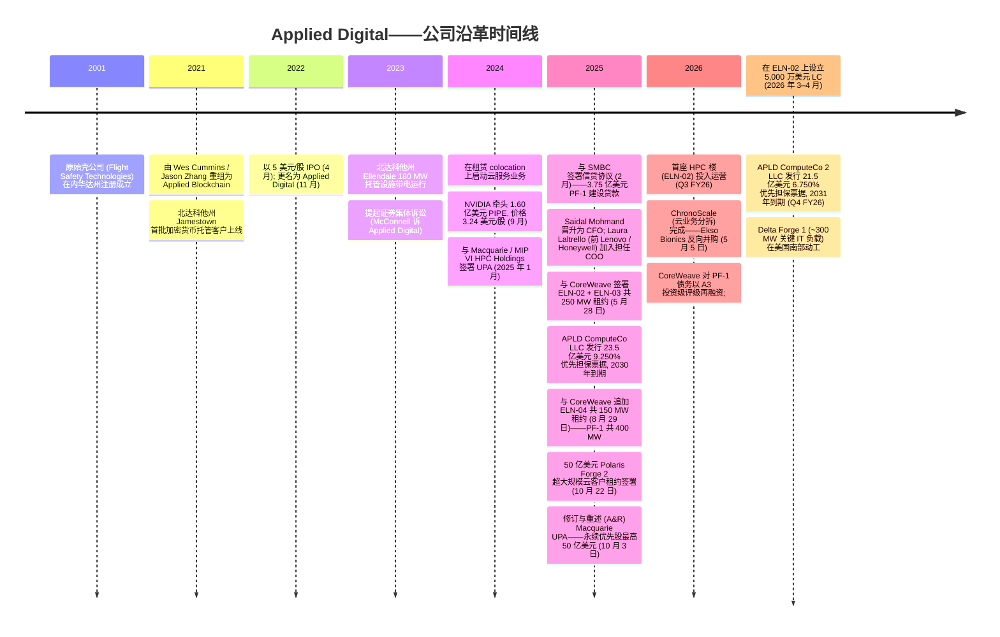
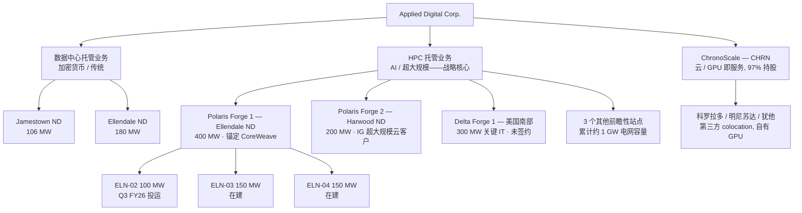
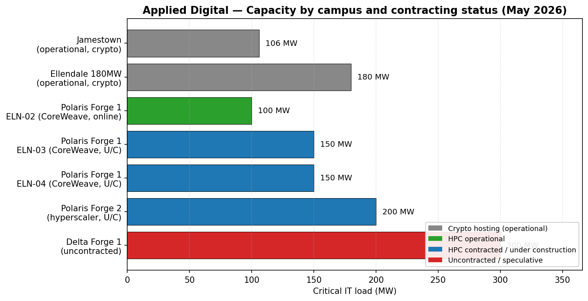
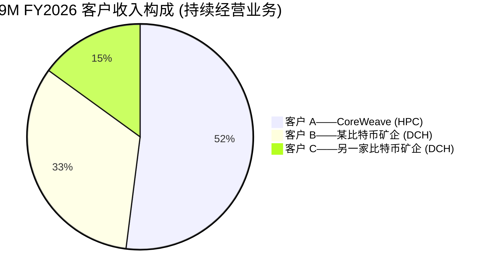
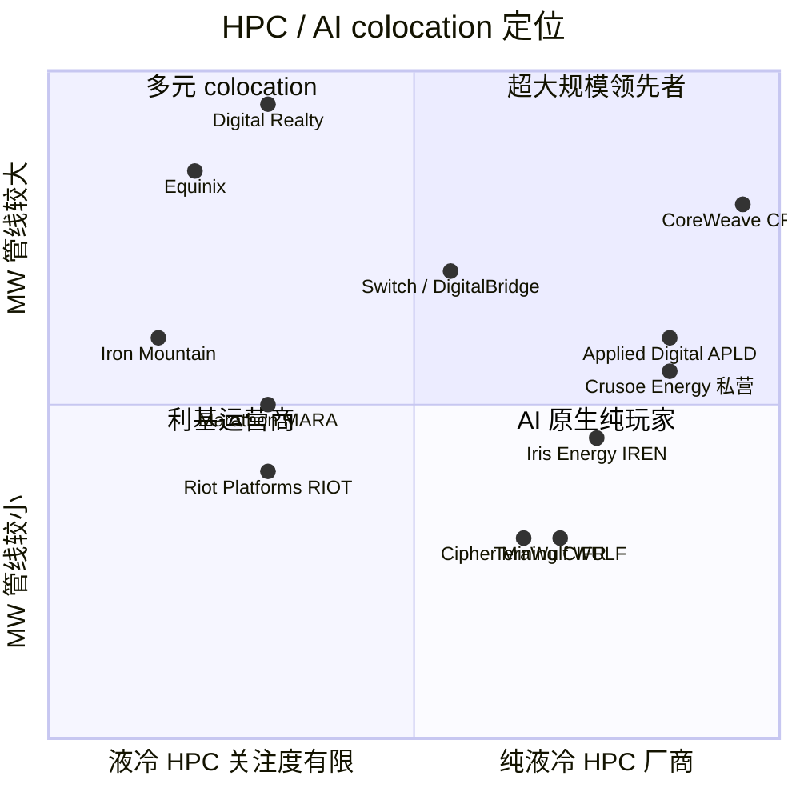
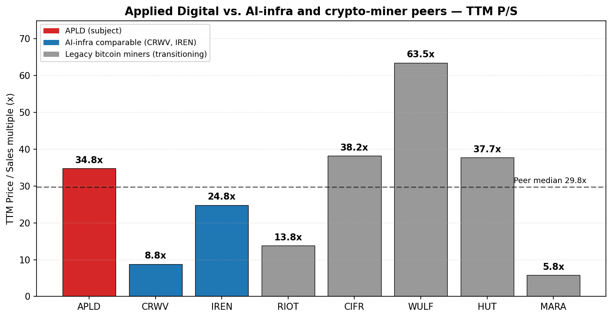

# Applied Digital Corporation (NASDAQ:APLD) — 公司研究报告

**报告日期: 2026-05-20**
**行业: AI / HPC (高性能计算) 数据中心基础设施 (build-to-suit 新型云数据中心地主)**
**上市地: 纳斯达克全球精选市场 (Nasdaq Global Select Market)**
**报告语言: 简体中文 (英文版同时存在于本目录)**

> **业绩更新——2026 财年 Q3 是首个录得实质性 HPC 托管收入的季度 (2026-04-08):** 总营业收入跃升至 **1.266 亿美元 (同比 +139%)**, 由 **7,100 万美元的全新 HPC 托管收入**驱动——位于 Polaris Forge 1 园区的首座 100 MW 数据中心 ("ELN-02") 完成建设, 并已在 15 年期租约下全面运行, 承租方为 **CoreWeave** ([Q3 FY2026 业绩公告, 2026-04-08](https://www.sec.gov/Archives/edgar/data/1144879/000114487926000029/apldq326earningsrelease.htm))。GAAP 口径下归属于普通股股东的净亏损为 **1.009 亿美元, 折合每股 $(0.36)**, 但非 GAAP 口径下的"调整后净利润"为 **3,320 万美元 (摊薄后每股 $0.09)**, 调整后 EBITDA 为 4,410 万美元。季后, CoreWeave 项目债务以 **A3 投资级评级**完成再融资 (相较 CoreWeave 母公司 BB 评级有显著提升), 同时 CoreWeave 在 ELN-02 租约上设立了 **5,000 万美元的备用信用证 (LC)**——对 APLD 项目债务而言是一次实质性的信用升级 ([8-K/A, 2026-04-01](https://www.sec.gov/Archives/edgar/data/1144879/000149315226014498/form8-ka.htm))。管理层并未提供正式的全年指引; 但重申了**五年内实现 10 亿美元 NOI (净营业收入)** 的长期目标。

## 目录
1. 公司概览
2. 公司历史
3. 管理团队
4. 产品与服务 (业务板块)
5. 客户与上市策略
6. 行业概览
7. 竞争格局
8. 市场机会 (TAM)
9. 风险评估
10. 参考资料

---

## 1. 公司概览

Applied Digital Corporation ("APLD"、"Applied Digital"或"公司") 是一家美国的下一代数据中心基础设施设计、开发与运营商, 业务覆盖北美, 重点专注于 **AI 训练与 HPC (高性能计算) 工作负载所需的高功率密度、液冷型数据中心 (high-power-density, liquid-cooled facilities)** ([2025 财年 Form 10-K, 财年截至 2025 年 5 月 31 日](https://www.sec.gov/Archives/edgar/data/1144879/000114487925000021/apld-20250531.htm))。公司总部位于德克萨斯州达拉斯, 2001 年在内华达州注册成立 (上市壳公司最初名为 "Flight Safety Technologies"), 于 2021 年由创始 CEO Wes Cummins 主导, 重组为当前的运营业务 ([2025 DEF 14A](https://www.sec.gov/Archives/edgar/data/1144879/000149315225014495/form-defxxxxx14a.htm))。

公司运营**两个可报告业务板块加上一个停运/分拆业务**, 全部依托于位于北达科他州的 286 MW 运营产能, 以及四个在建或前瞻性新建园区, 共计约 1 GW 的额外电网容量:

1. **数据中心托管业务 (Data Center Hosting Business, 传统加密货币挖矿托管)。** 286 MW 运营产能, 分布于两个设施: 北达科他州 Jamestown 的 106 MW 园区与北达科他州 Ellendale 的 180 MW 园区。在五年期合同下向**单一比特币挖矿客户 (占 FY25 业务板块收入的 93%)** 提供电力空间, 合同尚余约 2.5 年。该板块 **FY25 营业收入 1.442 亿美元, 业务板块经营利润 6,390 万美元**, 其中包括一次性 2,460 万美元的待售分类收益 ([10-K FY2025, 业务板块附注](https://www.sec.gov/Archives/edgar/data/1144879/000114487925000021/apld-20250531.htm))。公司内资产回报率最高 (Q3 FY26 板块经营利润 1,390 万美元, 板块资产 1.196 亿美元)。

2. **HPC 托管业务 (HPC Hosting Business, AI / 超大规模云客户托管——战略核心)。** 通过 build-to-suit 模式向新型云数据中心 (neocloud) 及超大规模云客户出租约 15 年期、全套配套、液冷型 GPU 园区。旗舰项目是位于北达科他州 Ellendale 的 **Polaris Forge 1**——一座由三栋楼组成的 400 MW 园区 (ELN-02 100 MW、ELN-03 150 MW、ELN-04 150 MW), 全部出租给 **CoreWeave** (NASDAQ:CRWV), 租赁期累计基础租金收入约 **110 亿美元** ([Applied Digital 新闻稿, 2025-08-29](https://www.globenewswire.com/news-release/2025/08/29/3141455/0/en/Applied-Digital-Finalizes-Additional-150MW-Lease-with-CoreWeave-in-North-Dakota.html))。第二个园区 **Polaris Forge 2** 位于北达科他州 Harwood 附近, 初始投入 30 亿美元、200 MW 建设 (并对该规划 1 GW 总产能中剩余的 800 MW 享有优先认购权), 出租给**一家未公开姓名的美国投资级超大规模云客户**, 15 年期租约累计金额约 50 亿美元 ([Polaris Forge 2 新闻稿, 2025-10-22](https://www.globenewswire.com/news-release/2025/10/22/3171024/0/en/Applied-Digital-Announces-5-Billion-AI-Factory-Lease-with-U-S-Based-Investment-Grade-Hyperscaler-at-Polaris-Forge-2-ND-Campus.html))。第三个园区 **Delta Forge 1** 位于美国南部 (关键 IT 负载 300 MW、占地 600+ 英亩), 已于 Q3 FY26 动工, 首批产能预计在 2027 年年中前后投运 ([Q3 FY2026 业绩公告, 2026-04-08](https://www.sec.gov/Archives/edgar/data/1144879/000114487926000029/apldq326earningsrelease.htm))。HPC 板块在 Q3 FY26 贡献了 **7,100 万美元收入**, 这是首个完整运营季度。

3. **云服务业务 (Cloud Services Business, GPU 即服务 (GPU-as-a-Service)——正以 "ChronoScale" 名义被分拆)。** 一项 GPU 出租业务, 通过在科罗拉多、明尼苏达与犹他州租用的 colocation (托管) 站点开展业务。FY25 营业收入 8,440 万美元 ([10-K FY2025](https://www.sec.gov/Archives/edgar/data/1144879/000114487925000021/apld-20250531.htm))。**2026 年 5 月 5 日**, APLD 完成了反向并入纳斯达克上市的 Ekso Bionics, 后者更名为 **ChronoScale Corporation (NASDAQ:CHRN)**, APLD 保留约 97% 股权, 并额外注资 1,575 万美元现金 ([Applied Digital ChronoScale 完成交割 8-K, 2026-05-05](https://www.sec.gov/Archives/edgar/data/1144879/000149315226021333/ex99-1.htm))。

*来源: [Applied Digital 10-K FY2025, 业务板块附注](https://www.sec.gov/Archives/edgar/data/1144879/000114487925000021/apld-20250531.htm) 与 [Q3 FY2026 10-Q, 简明经营成果表](https://www.sec.gov/Archives/edgar/data/1144879/000114487926000030/apld-20260228.htm)。FY2026 一栏为截至 2026 年 2 月 28 日的九个月期间; 云服务业务已根据 10-Q 重新分类回持续经营范围。*

**规模指标 (除特别注明外, 截至 2026 年 2 月 28 日):**
- **总营业收入, 9M FY2026:** 3.526 亿美元 (同比 +99%, 上年同期持续经营收入为 1.775 亿美元) ([Q3 FY2026 10-Q](https://www.sec.gov/Archives/edgar/data/1144879/000114487926000030/apld-20260228.htm))
- **总资产:** 62.5 亿美元 (相较 FY25 年末的 18.7 亿美元——由 30 亿美元的固定资产 (PP&E) 驱动, 包括 9M FY26 期间约 16 亿美元的 Polaris Forge 资本开支)
- **现金及现金等价物:** 17.3 亿美元 (加上受限现金 1.98 亿美元)
- **总债务:** 26.9 亿美元 (流动 9,800 万 + 长期 25.9 亿美元), 主要由子公司 APLD ComputeCo LLC 以面值 97% 发行、用于资助 Polaris Forge 1 的 **23.5 亿美元 9.250% 优先担保票据 (Senior Secured Notes), 2030 年到期** ([Form 8-K, 2025-06-02](https://www.sec.gov/Archives/edgar/data/0001144879/000164117225013199/ex99-1.htm)), 以及子公司 APLD ComputeCo 2 LLC 以面值 98% 发行、用于资助 Polaris Forge 2 的 **21.5 亿美元 6.750% 优先担保票据, 2031 年到期** (期后事项, 2026 年 3 月) 构成
- **普通股已发行 / 流通:** 2.925 亿股 / 2.854 亿股 (相较 FY25 年末的 2.342 亿 / 2.249 亿股——见稀释讨论)
- **员工:** 约有 **1,200 名熟练工程技术人员**部署于 Polaris Forge 各园区的建设现场 ([Q3 FY2026 业绩公告](https://www.sec.gov/Archives/edgar/data/1144879/000114487926000029/apldq326earningsrelease.htm)); APLD 自身 W-2 雇佣的核心员工基数则显著更小

**估值快照 (市场数据截至 2026-05-20 收盘, 来源: [Yahoo Finance APLD 关键统计指标](https://finance.yahoo.com/quote/APLD/key-statistics)):**
- 收盘价: **38.87 美元**, 52 周区间 6.53–47.79 美元 (12 个月内约 6 倍的振幅)
- 总市值: **111.1 亿美元**
- 企业价值 (EV): **125.5 亿美元** (含 28.3 亿美元债务 − 17.3 亿美元现金)
- 流通股: 2.858 亿股; 自由流通股 2.539 亿股; 贝塔系数 5.7 (高)
- **TTM 市盈率 (P/E): 不具备意义——为负** (TTM 归属于普通股股东的净亏损约 2.80 亿美元, 包括 FY25 GAAP 亏损 2.31 亿美元和 Q3 FY26 单季亏损 1.009 亿美元; APLD 从未实现 GAAP 口径下任何完整年度的净利润)
- **TTM 市销率 (P/S): 34.8x** (基于 Yahoo 数据的 TTM 营业收入 3.19 亿美元)——极高
- **EV/营业收入: 39.3x** | **EV/EBITDA (TTM): 902x**——无实际意义, 因 TTM EBITDA 在 GAAP 口径下仅勉强为正
- **市净率 (P/B): 7.0x**

**如何解读负值 TTM P/E 与高 P/S。** Applied Digital 是一家**净亏损、未稳态运营 (pre-stabilization) 的 HPC 数据中心开发商**。其会计层面亏损来自三个结构性源头: (a) FY25 录得净亏损 2.311 亿美元, 其中 **HPC 托管业务的 1.43 亿美元成本 (SG&A + 营业成本) 在 HPC 收入开始之前就已入账** (该收入直到 FY26 末才开始确认); (b) FY25 和 FY26 承担大额股权激励 (stock-based compensation)——FY25 高管薪酬披露表中, 三位高管的薪酬合计 4,740 万美元, 几乎全部为 PSU/RSU 股权奖励 ([2025 DEF 14A](https://www.sec.gov/Archives/edgar/data/1144879/000149315225014495/form-defxxxxx14a.htm)); (c) HPC 项目债务以 9.25% / 6.75% 利率发行, 在资产稳态运营前产生大量利息支出。负 P/E 因此是**成长阶段 / 未稳态运营信号, 而非价值陷阱信号**——但意味着股东实际上是单纯押注最终来自 600 MW 已签约 HPC 租约的稳态运营状态。

**34.8x 的 P/S** 远高于标普 500 平均水平, 但与 AI 基础设施同业组保持一致: 转向 HPC 的比特币矿业公司根据 Yahoo Finance TTM 数据分别交易于 38x (CIFR)、64x (WULF)、38x (HUT); 而 CoreWeave 自身的 P/S 为 8.8x (基于 62 亿美元营业收入), 因为其拥有规模大得多且快速增长的收入基数。**APLD 的恰当同业对标**是 build-to-suit AI 基础设施类 REIT 同业组, 包括 **IREN** (P/S 24.8x, 营业收入 7.6 亿美元) 与 **WULF** (P/S 63.5x, 营业收入 1.7 亿美元)——APLD 的 34.8x 位于该组的中段位置 ([yfinance 数据, 2026-05-20])。市场隐含的观点是, 已签约但尚未确认的收入 (Polaris Forge 1 + Polaris Forge 2 共约 160 亿美元) 实现概率极高, NOI 将逐步扩大至五年内 10 亿美元的目标 ([Q3 FY2026 管理层评述](https://www.sec.gov/Archives/edgar/data/1144879/000114487926000029/apldq326earningsrelease.htm))。

52 周价格区间从 6.53 美元至 47.79 美元——约 6 倍的振幅——以及 5.7 的贝塔系数都表明: APLD 实际交易为一项对 HPC 租约交付的高确信度二元押注。估值风险是非对称的: Polaris Forge 1 交付延迟、CoreWeave 信用事件或超大规模云客户资本开支放缓, 均将大幅压缩估值倍数。

---

## 2. 公司历史

Applied Digital 的上市壳可追溯至 **Flight Safety Technologies**, 一家位于康涅狄格州的小型尾流涡探测公司, 2002 年首次以现在 APLD 的 SEC CIK 0001144879 提交了 10-K 报告。Flight Safety 业务收尾后, 该壳公司在 2021 年实际上由 Wes Cummins (当时为德州投资人, 投资公司 272 Capital LP 创始人) 与共同创始人 Jason Zhang 重组为**比特币挖矿托管业务** ([2025 DEF 14A](https://www.sec.gov/Archives/edgar/data/1144879/000149315225014495/form-defxxxxx14a.htm))。最初的战略洞察很简单: 北达科他州廉价的搁置电力 (stranded power), 加上 2021 年减半后比特币挖矿需求的爆发, 使低成本托管成为一个具有吸引力的套利机会。公司于 2022 年 4 月以 5 美元/股的发行价 IPO, 上市时使用的名称为 **Applied Blockchain, Inc.**, 之后于 2022 年 11 月更名为 **Applied Digital Corporation**, 以体现更广泛的数据中心业务定位。

**战略转型。** 三次转型对于理解今天的 APLD 至关重要:

1. **加密货币托管 → HPC 托管 (FY2024)。** 管理层目睹了 ChatGPT 后 GPU 算力需求的爆发, 并意识到他们位于北达科他州的搁置电力、低温环境据点尤其适合直接到芯片液冷 (direct-to-chip liquid cooling)。Ellendale 100 MW 建设 (今 ELN-02) 起初作为没有锚定承租方的投机性 HPC 建设——**CoreWeave 租约直到 2025 年 5 月 28 日才签署, 而那时建设已经开工两年多** ([10-K FY2025](https://www.sec.gov/Archives/edgar/data/1144879/000114487925000021/apld-20250531.htm))。这是一项成功的高风险转型。

2. **GPU 即服务 (GPU-as-a-Service) 的启动到退出 (FY2024 → FY2026)。** APLD 在 FY24 Q3 启动云服务业务, 与 CoreWeave / Lambda / Crusoe 在 GPU 出租领域正面竞争。不到两年后的 FY25 Q4, 董事会将云服务业务归类为待售。2026 年 5 月, 该板块通过反向并入 Ekso Bionics 的方式分拆为纳斯达克上市的 **ChronoScale Corp. (CHRN)** ([ChronoScale 完成交割 8-K, 2026-05-05](https://www.sec.gov/Archives/edgar/data/1144879/000149315226021333/ex99-1.htm))。APLD 保留约 97% 经济权益, 但已将两类业务的经营 P&L 与融资分开——明确原因是超大规模租赁是一项长久期、可预测现金流的业务, 而 GPU 即服务则属于较短周期、较高风险的业务。

3. **合资 / 项目融资模式转型 (CY2025)。** APLD 没有将每个项目背在母公司资产负债表上, 而是把每个大型园区结构化为**与 Macquarie Asset Management ("MAM") 的合资 (JV)**。APLD 持有每个 HPC TopCo 合资公司 90% 的股权; MAM 通过其 50 亿美元永续优先股授信贡献优先股资金; 项目债务对 APLD 母公司无追索权 ([Q3 FY2026 10-Q, 附注 12](https://www.sec.gov/Archives/edgar/data/1144879/000114487926000030/apld-20260228.htm))。这是公司在 Polaris Forge 2 和 Delta Forge 1 上复制的融资模板。

**近期关键动态 (近 12 个月)。**
- 2025 年 5 月 28 日——与 CoreWeave 签署 ELN-02 + ELN-03 共 250 MW 租约 ([10-K FY2025](https://www.sec.gov/Archives/edgar/data/1144879/000114487925000021/apld-20250531.htm))。
- 2025 年 8 月 18 日——Polaris Forge 2 在北达科他州 Harwood 附近动工。
- 2025 年 8 月 29 日——第三份 CoreWeave 租约 (150 MW, ELN-04) 使 Polaris Forge 1 成为完全租出 400 MW 园区, 已签约基础租金累计约 110 亿美元 ([GlobeNewswire, 2025-08-29](https://www.globenewswire.com/news-release/2025/08/29/3141455/0/en/Applied-Digital-Finalizes-Additional-150MW-Lease-with-CoreWeave-in-North-Dakota.html))。
- 2025 年 10 月 3 日——修订与重述的 Macquarie UPA 将 MAM 的角色扩展为**50 亿美元永续优先股授信**, 随着新增投资级租约签署逐步提取。
- 2025 年 10 月 22 日——Polaris Forge 2 200 MW 投资级超大规模云客户租约签署, 15 年累计约 50 亿美元 ([GlobeNewswire, 2025-10-22](https://www.globenewswire.com/news-release/2025/10/22/3171024/0/en/Applied-Digital-Announces-5-Billion-AI-Factory-Lease-with-U-S-Based-Investment-Grade-Hyperscaler-at-Polaris-Forge-2-ND-Campus.html))。
- 2026 年 2 月 28 日——Q3 FY26 收官: ELN-02 完全投运, 当季确认 4,410 万美元基础租金; 调整后 EBITDA 4,410 万美元, 调整后净利润 3,320 万美元。
- 2026 年 3–4 月——CoreWeave 以**A3 投资级 (Moody's)** 对 Polaris Forge 1 项目债务进行再融资, 设立 5,000 万美元备用信用证; APLD 重组租约使其经由信用增级的 CoreWeave SPV 流转 ([8-K/A, 2026-04-01](https://www.sec.gov/Archives/edgar/data/1144879/000149315226014498/form8-ka.htm))。
- 2026 年 5 月 5 日——ChronoScale (CHRN) 云业务分拆完成交割。

---

## 3. 管理团队

### Wes Cummins——董事会主席、总裁、CEO (创始人)

Wes Cummins 是 APLD 的核心人物。他于 2007 至 2020 年间任前身壳公司的董事, 并于 **2021 年 3 月 11 日**, 即他将该实体重组为当前的运营业务时回任董事。他也是 **272 Capital LP 的创始人和 CEO**, 这是一家经注册的投资顾问机构, 已于 2021 年 8 月被 **B. Riley Financial (NASDAQ:RILY)** 收购, Cummins 在该处主导科技 / 硬件 / 服务的投资策略 ([2025 DEF 14A, 第 9 页](https://www.sec.gov/Archives/edgar/data/1144879/000149315225014495/form-defxxxxx14a.htm))。在创办 272 Capital 之前, Cummins 曾是 Nokomis Capital LLC 的分析师 (2012 年 10 月–2020 年 2 月), 此前还曾任 **B. Riley & Co. 总裁 (2002–2011)**。他持有华盛顿大学 (圣路易斯) 金融与会计 BSBA 学位。在 APLD 之外, 他还担任 **Sequans Communications (NYSE:SQNS)** (一家蜂窝半导体设计公司) 的董事, 并曾任 Telenav (TNAV) 和 Vishay Precision Group (VPG) 的董事。

他的 **FY2025 薪酬合计 2,770 万美元**, 其中 2,550 万美元为一次性与多年期股价门槛挂钩的 PSU 授予, 仅 70.6 万美元为基本工资 ([2025 DEF 14A 高管薪酬披露表](https://www.sec.gov/Archives/edgar/data/1144879/000149315225014495/form-defxxxxx14a.htm))。PSU 结构使他在未来三个财年 (2026–2028) 与股东利益保持一致——但代价是, 如果触发股价门槛, 将带来非常显著的股权稀释。Cummins 与公司同为**McConnell 诉 Applied Digital 证券集体诉讼 (N.D. Tex., 2023 年 8 月立案)** 的被告, 该案指控公司就传统加密货币托管业务盈利能力及云服务转型作出重大误导性陈述; 被告方驳回动议的简报于 2025 年 1 月完成提交, 目前案件仍处于审理中 ([10-K FY2025, 第二部分 第 3 项](https://www.sec.gov/Archives/edgar/data/1144879/000114487925000021/apld-20250531.htm))。投资者应慎重权衡这一点——Cummins 是战略的设计者, 但他个人的可信度部分暴露于诉讼结果以及 HPC 转型的严格执行之中。

对 Cummins 的诚实评判是: 他是一位**金融运营者, 在约 4 年内把一家壳公司重新定位为一线超大规模云客户的对手方**——这是非比寻常的执行力。他在 ELN-02 上做出了激进的"先建设后租约"押注 (在 CoreWeave 签约前就开工资本开支), 并且成功了。他现在正通过投机性建造 Delta Forge 1, 以及在四个新增站点 (累计约 1 GW) 上推进招商, 来不断加码。非对称风险集中于他能否在规模上升时持续以有利的债务成本签下投资级承租方——这是与资本市场和项目融资相邻的技能组合, 而他在 B. Riley 的背景正好直接相关。

### Saidal Mohmand——首席财务官 (CFO)

Saidal Mohmand 于 **2024 年 10 月 15 日**起任 CFO, 取代了 David Rench (后者转任首席行政官 (CAO), 并在 2025 年 1 月之前转为顾问)。Mohmand 自 2021 年 9 月起一直任 APLD 财务执行副总裁 (EVP of Finance)。关键的是, 他**从 2020 年 7 月起任 272 Capital LP 的研究总监**, 后于 2021 年 8 月至 2024 年 2 月以相同职务在 B. Riley Asset Management 继续工作——因此他在升任 CFO 前已与 Cummins 共事约 6 年。他在更早的 2013 – 2020 年间任 GrizzlyRock Capital (芝加哥的一家价值型多空对冲基金) 研究总监。他持有西密歇根大学金融与会计 BBA 学位 ([2025 DEF 14A, 第 16 页](https://www.sec.gov/Archives/edgar/data/1144879/000149315225014495/form-defxxxxx14a.htm))。其 FY25 总薪酬为 980 万美元, 其中包括 890 万美元股权授予; 基本工资在 2024 年 10 月起从 25 万美元提至 47.5 万美元。

Mohmand 在公司层面的具体战绩是 2022 年 IPO 以来的资本市场执行: ATM 增发、NVIDIA 牵头的 1.60 亿美元 PIPE、SMBC 项目融资贷款、23.5 亿美元 / 21.5 亿美元优先担保票据发行, 以及 Macquarie 合资公司架构搭建。按任何基准, 这都是一位此前没有任何上市公司 CFO 经验的财务负责人极为繁重的季度资本市场执行节奏, 公司迄今实现了所有按时融资里程碑。风险在于 Mohmand 尚未在严峻的信贷周期中被检验——9.25% 票据 (2030) 与 6.75% 票据 (2031) 都在稳态运营之前承担显著的再融资风险, 如果利率在此之前上行。

### Laura Laltrello——首席运营官 (COO)

Laltrello 于 **2025 年 1 月 6 日**加入, 弥补了公司在运营深度上长期存在的明显缺口。她从 2005 年 5 月至 2020 年 12 月在 **Lenovo Group Limited** 任职, 期间于 **2016 年 5 月至 2020 年 12 月任全球数据中心服务副总裁兼总经理**。随后从 2020 年 12 月至 2024 年 12 月担任 **Honeywell International 楼宇自动化服务副总裁兼总经理** ([2025 DEF 14A, 第 16 页](https://www.sec.gov/Archives/edgar/data/1144879/000149315225014495/form-defxxxxx14a.htm))。她持有 Clemson 大学应用数学 BAS, 并完成 IMD 高管领导力项目。其 FY25 薪酬合计 990 万美元, 包括 950 万美元的签约股权授予。Polaris Forge 1、Polaris Forge 2 和 Delta Forge 1 的建设并行推进, 现场约 1,200 名工程技术人员, Laltrello 是公司迄今最重要的运营级招聘——她的资历表明她能将建设到调试的工作手册规模化, 这正是限制近期收入的瓶颈。

### Jason Zhang——总裁 & 共同创始人, 此前任首席战略官

Jason Zhang 是 APLD 的共同创始人 (2022 年 4 月至 11 月间任董事, 后于 **2025 年 8 月 1 日**回任首席战略官; Q3 FY26 业绩公告宣布他晋升为**总裁**, 用以"在公司扩展 AI Factory 平台规模过程中加强领导力")。在 APLD 之前他创办了 Valuefinder (2019), 此前在 **红杉资本 (Sequoia Capital, 2017–2019)** 任投资分析师, 关注 AI、区块链、数字基础设施和企业软件; 更早还曾任职于 **MSD Capital (Michael Dell 的家族办公室), 2015 至 2017 年** ([2025 DEF 14A, 第 16 页](https://www.sec.gov/Archives/edgar/data/1144879/000149315225014495/form-defxxxxx14a.htm))。他持有哈佛大学经济学 BA 学位。他是公司对外的战略代表, 拥有 VC 圈的人脉关系。

### 治理与董事会

- **六人董事会, 五人独立。** Wes Cummins 是唯一一位非独立董事 (兼任 CEO + 董事长)。其他董事包括: Ella Benson (Oasis Management 董事; 金融背景)、Chuck Hastings (前 B. Riley Wealth Management CEO; B. Riley 关联)、Rachel Lee (前 Ares Management 合伙人兼消费品私募负责人)、Douglas Miller (审计委员会主席; 前 Telenav、CareDx、Synplicity 的 CFO)、Richard Nottenburg (NxBeam 执行主席; 前 Motorola EVP 兼首席战略与技术官)。
- **B. Riley 关系网。** Cummins (前总裁)、Hastings (前 B. Riley Wealth Management CEO) 以及 Mohmand (前 B. Riley Asset Management 研究总监) 都出身 B. Riley Financial。这构成了一个紧密的内部圈子, 拥有重叠的金融服务背景, 但董事会层面缺乏历史性的运营公司高管深度——这正是 Laltrello 加入的意义被反向放大的原因。
- **内部人持股**——根据 2025 DEF 14A 披露, NEO 与董事合计持股**约 9.1%**, 此后 PSU 授予与 ATM 融资稀释可能已使该比例变动。
- **证券集体诉讼 (McConnell 诉 Applied Digital)** 在德州北区联邦法院待审——投资者应跟踪结果 ([10-K FY2025, 第一部分 第 3 项](https://www.sec.gov/Archives/edgar/data/1144879/000114487925000021/apld-20250531.htm))。

**履历综合评判。** 这是一支**创始人主导、资本市场操盘风格、近期加强了运营团队的管理层**。Cummins 已经执行了一次困难的从壳公司到超大规模云客户对手方的转型。该团队尚未经过信贷下行周期或超大规模云客户资本开支暂停的检验。重 PSU 的薪酬结构与长期股东高度一致, 但会带来短期的报告期亏损。

---

## 4. 产品与服务

### 业务板块 1——数据中心托管 (加密货币)

- **是什么。** 在固定每 MW 月单价基础上向比特币 / 加密资产矿工提供已通电机柜空间。APLD 拥有建筑、变压器和开关柜; 客户自带 ASIC。
- **产能。** 286 MW 运营产能, 分布于 Jamestown (106 MW) 和 Ellendale 180 MW (10-K FY2025)。
- **客户。** FY25 Q1 几位早期客户终止合作后, 现仅余一家比特币挖矿承租方;**唯一剩下的客户占 FY25 持续经营收入的 93%** ([10-K FY2025, 第 9 页](https://www.sec.gov/Archives/edgar/data/1144879/000114487925000021/apld-20250531.htm))。
- **经济模型。** Q3 FY26 录得收入 3,750 万美元 (同比 +7%), 在 1.196 亿美元报告资产上实现 1,390 万美元业务板块经营利润——**为公司内资产回报率最高的板块**。这是一项稳态、温和增长的现金流业务, 合同剩余约 2.5 年。
- **竞争位置。** 直接竞争对手包括 **Riot Platforms、Bitdeer、Marathon Digital、CleanSpark、Cipher Mining** 以及私营运营商。**结论: 无护城河。** 加密货币托管是一种电力套利业务; APLD 唯一的优势是北达科他州廉价电网电力, 这一点竞争对手也能利用。合同较短、客户高度集中, 而且很有可能在合同到期后, 同样的物理基础设施会被改造用于 AI 托管 (尤其是 ELN-180, 其冷却特性具备改造潜力)。
- **战略价值。** 为 HPC 转型提供资金的现金流。管理层明确保留该板块, 是因为其高 ROA, 但并不期望它增长。

### 业务板块 2——HPC 托管 (AI / 超大规模云客户——战略核心)

HPC 托管业务是 APLD 的投资逻辑。每座"AI Factory"都是为 >100 kW/机柜功率密度设计、**直接到芯片液冷 (direct-to-chip liquid-cooled)** 的专建数据中心, 并以**约 15 年期、信用增级对手方的三重净租赁 (triple-net leases)** 形式签约。

- **Polaris Forge 1 (Ellendale, ND)——400 MW, 全部租给 CoreWeave, 基础租金约 110 亿美元。**
  - **ELN-02 (100 MW)** 自 Q3 FY26 起投入运营。Q3 FY26 业绩公告确认这是全球极少数已投运的 100 MW 直接到芯片液冷数据中心之一 ([Q3 FY2026 业绩公告](https://www.sec.gov/Archives/edgar/data/1144879/000114487926000029/apldq326earningsrelease.htm))。
  - **ELN-03 (150 MW)** 在建, 预计 2026 年年中投运。
  - **ELN-04 (150 MW)** 在建, 预计 2027 年年中投运。
  - 三栋均通过 **APLD ELN-02 / ELN-03 / ELN-04 LLC** 子公司租给 **CoreWeave, Inc. (NASDAQ:CRWV)** (原始 ELN-02 与 ELN-03 租约签订于 2025 年 5 月 28 日; ELN-04 租约于 2025 年 8 月 29 日追加)。
- **Polaris Forge 2 (Harwood, ND)——200 MW 在建, 基础租金 50 亿美元。**
  - 2025 年 10 月 22 日签约, 出租给一家**美国投资级超大规模云客户**, 15 年期; 该超大规模云客户对 1 GW 园区其余 **800 MW 享有优先认购权**。
  - 初始产能 CY2026, 全部 200 MW 在 CY2027 初前完成。
- **Delta Forge 1 (美国南部, 具体位置未披露)——300 MW 关键 IT 负载, 占地 600+ 英亩。**
  - Q3 FY26 动工; 首次投运预计在 2027 年年中。**目前未签约** (业内术语为"投机性"建设), 这是建设计划中风险最高的部分。
- **3 个新增站点处于积极招商阶段**, 累计电网容量约 1 GW——其中一个位于北达科他州, 两个位于未公开的州。

**租约经济模型。** Polaris Forge 1 的租约结构为三重净 colocation 租约——APLD 提供已通电的外壳 (建筑、电力、冷却、安保), 并收取基础租金 + 承租人装修偿付 + 电力转嫁。Q3 FY26 对此作了拆分: 7,100 万美元 HPC 收入中, 4,410 万美元为基础租金、1,890 万美元为承租人装修、810 万美元为电力转嫁 / 其他附属项 ([Q3 FY2026 业绩公告](https://www.sec.gov/Archives/edgar/data/1144879/000114487926000029/apldq326earningsrelease.htm))。

**竞争优势评估。**
- **是的, 有部分护城河。** 护城河由以下几部分组合构成: (1) **首发液冷设计 (first-mover liquid-cooling design)**——ELN-02 是全球率先投运的~100 MW 直接到芯片设施之一, 其投运前进行了数年的投机性资本开支, 才与 CoreWeave 签约; (2) **达科他州的搁置电力站点控制权**, 这是竞争对手在短期内无法复制的多年期许可与变电站建设周期; (3) **合同性切换成本**——一旦 CoreWeave 或投资级超大规模云客户入驻定制液冷 100+ MW 设施, 在合同中途将 GPU 迁移到另一个园区在现实中并不可行。
- **不属于护城河的部分。** APLD 是一个房东。建筑专长可在任何主要数据中心总承包商获得。园区一旦稳态运营, 该资产就成为纯粹依靠资本成本竞争的收入流。超大规模云客户越来越倾向于自建外壳 (Microsoft、Google、Meta) 并推动更低的 colocation 价格。
- **最接近的竞品。** Equinix 和 Digital Realty 服务于更广泛的、连通性丰富的企业 / 超大规模云客户需求, 但通常不专注于 100+ MW 液冷 HPC build-to-suit。最直接的竞争对手是 **Crusoe Energy** (私营; ~100 亿美元估值; 明确为 AI 电力套利)、**Switch / DigitalBridge**, 以及越来越多的公开新型云数据中心自身 (CoreWeave 正在 Plano, TX 等地共同开发自己的站点)。在单租户 100+ MW build-out 方面, APLD 目前与 Crusoe 持平, 领先于尚处 HPC 爬坡阶段的传统比特币矿企 (IREN、WULF、CIFR)。

### 业务板块 3——云服务 / ChronoScale (CHRN) (GPU 即服务, 2026 年 5 月分拆)

- **是什么。** 在科罗拉多、明尼苏达和犹他州第三方 colocation 设施中, 出租公司自有的 GPU 算力 (主要为 NVIDIA H100 级)。
- **状态。** 2026 年 5 月 5 日完成贡献并入 **Ekso Bionics Holdings → ChronoScale Corp. (NASDAQ:CHRN)**; APLD 保留约 97% 股权, 出资 1,575 万美元现金以换取另外约 140 万股 CHRN 股份 ([ChronoScale 完成交割 8-K, 2026-05-05](https://www.sec.gov/Archives/edgar/data/1144879/000149315226021333/ex99-1.htm))。
- **战略理由 (Cummins 引述)。** "我们的数据中心托管平台建立在长期合同和可预测的基础设施回报之上, 而云计算层运营在更短周期、不同风险特征上。我们认为, 把这两类业务分开有助于各自获得适当的资本化和扩展。"
- **结论: 无护城河。** GPU 即服务是一个极为残酷的竞争市场, 由 CoreWeave 和超大规模云客户自身的产品 (AWS p5、Azure ND、GCP A3) 主导。分拆 CHRN 降低了 APLD 层面经营亏损的波动性, 也允许云计算业务独立融资。

### 业务规划与近期推出 (近 12 个月)

- ELN-02 调试 (Q3 FY26——首座产生收入的 HPC 设施)
- Polaris Forge 2 动工 (2025 年 8 月)
- Delta Forge 1 动工 (Q3 FY26)
- ChronoScale 分拆 (2026 年 5 月)
- 修订与重述的 Macquarie UPA → 50 亿美元永续优先股授信 (2025 年 10 月)
- 对 CoreWeave 项目债务实现 A3 投资级再融资 (2026 年 4 月), 这显著改善了 APLD 23.5 亿美元 9.250% 优先担保票据的信用状况

*来源: 产能与状态综合自 [10-K FY2025](https://www.sec.gov/Archives/edgar/data/1144879/000114487925000021/apld-20250531.htm)、[Q3 FY2026 业绩公告, 2026-04-08](https://www.sec.gov/Archives/edgar/data/1144879/000114487926000029/apldq326earningsrelease.htm)、[Polaris Forge 2 新闻稿, 2025-10-22](https://www.globenewswire.com/news-release/2025/10/22/3171024/0/en/Applied-Digital-Announces-5-Billion-AI-Factory-Lease-with-U-S-Based-Investment-Grade-Hyperscaler-at-Polaris-Forge-2-ND-Campus.html), 以及 [ELN-04 租约新闻稿, 2025-08-29](https://www.globenewswire.com/news-release/2025/08/29/3141455/0/en/Applied-Digital-Finalizes-Additional-150MW-Lease-with-CoreWeave-in-North-Dakota.html)。*

---

## 5. 客户与上市策略

### 客户集中度

Applied Digital 的客户集中度是**严重的, 也是单一最重要的风险因素**。Q3 FY26 10-Q 披露的三客户列示如下:

| 截至 9 个月期间 | 客户 A | 客户 B | 客户 C | 客户 D |
|---|---|---|---|---|
| 2026 年 2 月 28 日 | **52%** | 33% | 15% | — |
| 2025 年 2 月 28 日 | — | 54% | 29% | 11% |

来源: [Applied Digital Q3 FY2026 10-Q, 附注 4 客户合同收入](https://www.sec.gov/Archives/edgar/data/1144879/000114487926000030/apld-20260228.htm)。

就完整的 2025 财年来看, **客户 A 占持续经营收入的 93%**——即, 一家比特币挖矿承租方实际上定义了数据中心托管业务的利润表 ([10-K FY2025, 附注 4](https://www.sec.gov/Archives/edgar/data/1144879/000114487925000021/apld-20250531.htm))。

合在一起看, APLD 的 HPC 托管业务实际上是一个**单一客户业务板块**——在已披露的租约下, CoreWeave 是唯一的 HPC 承租方 (Polaris Forge 2 的超大规模云客户身份未披露, 而 200 MW 租约的建设刚刚开始, 截至 2026 年 2 月 28 日尚未确认任何收入)。10-K 明确表述:*"我们的 HPC 托管业务存在重大客户集中度。我们目前在该业务板块只有一家客户, 与我们订有两份 15 年期租约"* ([10-K FY2025, 风险因素](https://www.sec.gov/Archives/edgar/data/1144879/000114487925000021/apld-20250531.htm))。

**含义。** 随着 Polaris Forge 2 (IG 超大规模云客户) 在 CY2026 上线, 客户结构会改善; 但在未来 12 至 18 个月内, **CoreWeave 独自驱动 HPC P&L**。CoreWeave 底层信用 (母公司 BB, 再融资后的 SPV 为 A3) 因此是 APLD 股权故事中承重的假设。2026 年 4 月的 A3 再融资以及 CoreWeave Parent 设立的 5,000 万美元 LC 是部分缓释——它们实质性改善了 APLD 在贷款人侧的信用状况——但并未消除运营层面对 CoreWeave 企业需求的依赖。

### 锚定承租方——已披露暴露

- **CoreWeave, Inc. (NASDAQ:CRWV)。** 旗舰"新型云数据中心 (neocloud)", TTM 营业收入 62 亿美元 (Yahoo Finance, 2026-05-20)。是 Polaris Forge 1 全部三份租约的对手方 (累计基础租金约 110 亿美元)。它自身对 Microsoft、OpenAI 和 Meta 也存在客户集中度——这些名字的暴露间接流向 APLD。CoreWeave 母公司评级 BB (次投资级); 经 2026 年 4 月租约重组后, 成为 APLD 承租方的 SPV 评级为 A3 (投资级)。
- **位于 Ellendale 180 MW + Jamestown 106 MW 的比特币挖矿承租方。** 现行文件中未披露其身份; 早前包括关联方客户 (客户 B 是一家在 FY25 Q1 短暂持有 APLD 普通股超 5% 主体的子公司; 客户 C 由一名同样在那段时间内短暂持有超 5% 股权的自然人持有 60%——两者均在 2024 年 7 月 25 日前根据 Schedule 13G 不再是 5% 股东 ([10-K FY2025, 附注 6](https://www.sec.gov/Archives/edgar/data/1144879/000114487925000021/apld-20250531.htm)))。根据展示用附件, 公司的历史托管客户列表中曾包括**比特大陆 (Bitmain Technologies)** 与 **Marathon Digital Holdings** 的合同 ([Exhibit 10 列表, 10-K FY2025](https://www.sec.gov/Archives/edgar/data/1144879/000114487925000021/apld-20250531.htm))。
- **Polaris Forge 2 超大规模云客户 (未披露; 描述为"美国本土投资级")。** [DataCenterDynamics](https://www.datacenterdynamics.com/en/news/) 等业内出版物的猜测已将其标记为三家美国超大规模云客户之一, 但 APLD 并未确认身份。50 亿美元 / 15 年期附带 800 MW ROFR (优先认购权) 的结构, 是 Microsoft / Google / Meta 级采购的典型特征。

### 上市策略

APLD 的 GTM 是**高度定制化、低频次、超大交易**。每份租约规模 100–200 MW、15 年期、每年数亿美元基础租金。销售工作是直销、由高管主导, 由站点可用性、通电时间 (time-to-power) 和资本成本驱动。Cummins 在 Q3 FY26 评述中指出, 美国超大规模云客户的合计资本开支从此前所述每年 4,000 亿美元水平, 在三个月窗口内升至"接近 7,000 亿美元"——瓶颈是电力与基础设施, 而非需求 ([Q3 FY2026 业绩公告](https://www.sec.gov/Archives/edgar/data/1144879/000114487926000029/apldq326earningsrelease.htm))。

APLD 强调的 GTM 关键差异化:
- **通电时间 (time-to-power)。** ELN-02 从动工到投运用时大约 24 个月——对于 100 MW 液冷建造而言, 与 Crusoe 相当, 比大多数传统 colocation 更快。
- **北达科他州气候 / 冷却特性。** 无水、直接到芯片闭环液冷, 目标 1.18 级 PUE。APLD 自身营销称获得 Datacloud 评选的"2025 年美洲最佳数据中心"。
- **搁置电力 (stranded power)。** Bismarck 一带的变电站具备多年期窗口内交付 1 GW+ 的备用电网容量, 是北弗吉尼亚、凤凰城或达拉斯附近的竞争对手无法媲美的。

**客户案例 (公开披露)。** CoreWeave 在 Polaris Forge 1 的部署是旗舰; 投资级超大规模云客户在 Polaris Forge 2 的部署是第二个佐证。两者在该规模上对 APLD 而言均为首次。

---

## 6. 行业概览

### 行业界定

Applied Digital 处于三大行业的交叉点: (a) **批发型 colocation 房地产** (NAICS 518210——数据处理与托管服务); (b) **HPC / AI 基础设施** (邻芯片、GPU 中心); (c) 美国境内的**独立电力生产商 / 土地开发商**。出于投资者参照, 恰当的比较组是 **AI / HPC 批发 colocation 同业组**——已上市的名字包括 Equinix、Digital Realty、CoreSite (现属 American Tower); 以及"AI 原生"同业组, 包括 Applied Digital、Iris Energy (IREN)、TeraWulf (WULF)、Cipher Mining (CIFR), 以及私营同业如 Crusoe、Lambda、CoreScientific。

### 市场规模与增长

行业背景是数据中心历史上最强劲的。

- **AI 数据中心 TAM 整体。** McKinsey 2025 年分析援引数据指出, **到 2030 年累计资本支出需求约 7 万亿美元**, 用于扩展数据中心以支持 AI 工作负载, 其中**专门用于 AI 处理能力的设施约 5.2 万亿美元** ([McKinsey, "The cost of compute: A $7 trillion race", 2025](https://www.mckinsey.com/industries/technology-media-and-telecommunications/our-insights/the-cost-of-compute-a-7-trillion-dollar-race-to-scale-data-centers))。
- **产能建设。** [JLL Research, 2026 Market Outlook](https://www.jll.com/en-us/insights/market-outlook/data-center-outlook) 预计 2026 至 2030 年间将新增近 100 GW 数据中心容量, 大约使全球容量翻倍, 至 2030 年 CAGR 约 14%。
- **超大规模数据中心数量。** Synergy Research Group 计数显示, 截至 2025 年末全球已有 1,297 座运营中的超大规模数据中心, 另有 770 座正处于规划或建设管线之中 ([Synergy Research / Q3 2025 hyperscale tracker, 见多份行业报告引用])。
- **超大规模云客户资本开支。** 美国超大规模云客户合计资本开支 (Microsoft、Google、Amazon、Meta) 进入 2025 年时为**每年约 4,000 亿美元**, 并在 2026 年初按多份分析师调研及 APLD 管理层口径年化至**7,000 亿美元** ([Q3 FY2026 业绩公告评述, 2026-04-08](https://www.sec.gov/Archives/edgar/data/1144879/000114487926000029/apldq326earningsrelease.htm))。

### 关键趋势与驱动因素

1. **液冷成为 HPC 的入场券。** GPU 功率密度从 Hopper 的约 30 kW/机柜, 升至 Blackwell B200 的 100+ kW/机柜, 再到规划中的 Rubin 的 >130 kW/机柜, 迫使直接到芯片与浸没式冷却普及。空冷的传统机房在 AI 训练中已经过时。
- 2. **电力, 而非硅, 是关键约束。** 新建变电站与传输的许可周期, 加上 PJM 和 ERCOT 的电网接入排队, 通常需要 4–7 年。搁置电力市场 (达科他、西德州、怀俄明、魁北克) 重新成为 HPC 建设的首选目的地。
- 3. **新型云数据中心 (neocloud) 兴起。** CoreWeave (NASDAQ:CRWV)、Lambda、Crusoe 和 Nebius 已经募集了数百亿美元的股权与债务, 用于建造 GPU 算力集群, 与超大规模云客户自身的零售产品竞争。它们租用产能而非自建, 这正是 APLD 的客户基础。
- 4. **超大规模云客户自建 vs. 租用套利。** Microsoft、Google 与 Meta 越来越多地在自建园区 (Azure / Hyperion) 与租用产能之间切换。当通电时间是约束时, 超大规模云客户倾向于租用。
- 5. **比特币挖矿向 HPC 转型。** APLD 的同业组——IREN、WULF、CIFR、HUT、Core Scientific——普遍正在把托管产能从加密货币向 AI 转型。该群体在过去 18 个月内已经募集 200 亿美元以上的股权和可转债以资助这一转型。
- 6. **投资级出租方架构 (Investment-grade lessor structures)。** 超大规模云客户的采购越来越要求运营 SPV 层面的投资级信用。这正是 CoreWeave 在 2026 年 4 月所采用的结构 (A3 再融资 + LC), 也是未来租约的模板——它驱动 APLD 在更多租约稳态运营后实现更低的资本成本。
- 7. **可持续性审视。** PUE、用水量以及对电网调峰影响的披露正在被客户强制要求。APLD 的无水闭环冷却是一项正向差异化。

### 监管环境

- **能源监管。** 联邦能源监管委员会 (FERC) 与各州公用事业委员会 (PUC) 管辖电网接入与传输选址。北达科他州对数据中心开发整体友好, 并提供 IT 设备采购的州一级税收激励。
- **加密资产监管。** APLD 的传统托管业务暴露于针对比特币挖矿的监管行动 (SEC 对矿工的执法、各州一级用电限制、2024 年减半事件削减挖矿经济性)。10-K 风险因素中, 大约 30 段使用了与加密资产监管行动相关的"持续经营能力"措辞 ([10-K FY2025, 风险因素](https://www.sec.gov/Archives/edgar/data/1144879/000114487925000021/apld-20250531.htm))。
- **AI 专项监管。** 欧盟 AI 法案 (EU AI Act) 已生效; 美国联邦 AI 规则仍处不确定状态。APLD 没有直接的 AI 输出敞口 (它纯粹是房东), 但 AI 训练支出急剧放缓将压缩需求。

### 行业结构

- 批发 colocation 在国家级别上**高度分散** (零售由 Equinix 与 Digital Realty 主导; 超大规模 build-to-suit 则更分散)。
- **供应商议价能力**正在上升——Vertiv、Schneider Electric、Eaton 以及 Caterpillar (柴油发电机) 均面临多年订单积压。变压器交货期 24–36 个月已成为业内标准。
- **购买方议价能力。** 超大规模云客户和新型云数据中心在价格上具有巨大议价能力, 但在通电时间上议价能力非常有限。APLD 的定位倾向于后者。
- **替代品。** 超大规模云客户自建是唯一有意义的替代品。

---

## 7. 竞争格局

### 直接与间接竞争对手

1. **CoreWeave (NASDAQ:CRWV)。** APLD 最大的客户同时也是最接近的直接竞争对手——CoreWeave 正越来越多地自建园区 (Plano, TX 等)。TTM 营业收入 62 亿美元, P/S 8.8x, 市值约 550 亿美元。风险是 CoreWeave 随着规模上升将更多增量产能转移到自建基础设施上——尽管现有 15 年期 APLD 租约不可撤销。
2. **Crusoe Energy (私营)。** 最直接可比的 AI 数据中心纯玩家。受搁置电力驱动, 在德州和怀俄明州进行类似 100+ MW 液冷建造。已募集 10 亿美元以上股权与项目债, 私营估值据报道达 100 亿美元以上。在建造质量上与 APLD 大致持平, 但地理上更分散。
3. **Iris Energy / IREN (NASDAQ:IREN)。** 纯玩家、由前比特币矿工转型至 AI。2.91 GW 管线 (来自公司官网); TTM 营业收入 7.6 亿美元, P/S 24.8x。位于德州 Childress 与西德州——超大规模建设的直接竞争对手。
4. **TeraWulf (NASDAQ:WULF)。** 750 MW 管线; TTM 营业收入 1.7 亿美元; P/S 63.5x——已签约 HPC 的高度投机性估值。Lake Mariner, NY 站点是 Ellendale 的直接对标。
5. **Cipher Mining (NASDAQ:CIFR)。** 转向 HPC; TTM 营业收入 2.1 亿美元; P/S 38.2x。聚焦德州。
6. **Hut 8 / Hive / Riot / Marathon。** 较小或较慢推进 HPC 转型的传统加密货币矿企。直接竞争重叠较少。
7. **Digital Realty (NYSE:DLR)、Equinix (NASDAQ:EQIX)。** 零售与批发 colocation 的现有主导者。规模更大、推进较慢, 但确实是黄金标准的超大规模云客户对手方。在 IG 超大规模云客户业务上 (Polaris Forge 2) 与 APLD 竞争, 但通常不参与新型云数据中心 / HPC 专建领域。
8. **Switch (现属 DigitalBridge)。** 私营高端 colocation。有一定超大规模暴露。
9. **CoreSite (被 American Tower 收购)。** 边缘 / 都会 colocation; 没有直接重叠。
10. **Vantage Data Centers (私营; DigitalBridge 控股)。** 大型管线; 在超大规模建设上是规模化直接竞争对手。

### 同业估值比较

*来源: [Yahoo Finance APLD 关键统计指标](https://finance.yahoo.com/quote/APLD/key-statistics) 与同业页面, 2026-05-20 通过 yfinance 抓取。除 IREN 外, 所有同业的 P/E 均为"n/m" (不具备意义), 因为没有一家公司在 TTM 基础上实现 GAAP 盈利。同业 P/S 中位数 31.0x 以虚线显示。*

### APLD 的竞争优势

1. **达科他州的土地 + 电力可选性。** 约 1 GW 电网容量已经集结, 其中大部分已经预先取得许可。在任何合理的 AI 资本开支周期内难以复制。
2. **100+ MW 液冷建造专长。** ELN-02 现已进入商业运营——这是大多数竞争对手尚未具备的实证。
3. **Macquarie / SMBC 资本关系。** 已经预先安排了高达 50 亿美元以上的项目债与优先股授信。这至关重要, 因为资本成本是长期租约经济性中最重要的单一变量。
4. **CoreWeave 作为锚定承租方。** 最大新型云数据中心客户已经入驻。提供了一个营销参考, 帮助促成了 Polaris Forge 2 的成交。

### APLD 的弱点

1. **创始人主导、资本市场偏重、运营偏轻的领导层。** 已招募 Laltrello 来解决这一缺口, 但团队尚未稳态运营一座 >100 MW 园区一个完整运营年度。
2. **没有收入多元化。** 如前所述, 未来 12 个月以上 CoreWeave 单独驱动 HPC P&L。
3. **稀释。** 普通股已发行数在 <3 年内增长约 146% (见第 9 节)。重 PSU 的薪酬结构如果触发门槛将带来进一步稀释。
4. **相对于投资级 colocation 公司, 项目债的资本成本较高。** Equinix 和 Digital Realty 以低于 5% 的利率发行投资级无担保债。APLD 的 9.25% / 6.75% 优先担保票据反映了信用等级差距; 即便经过 CoreWeave 的 A3 SPV 再融资, 差距仍然显著。

---

## 8. 市场机会 (TAM)

### TAM 与方法论

Applied Digital 的相关 TAM 是**专建的 AI 级批发 colocation, 在美国境内通过 build-to-suit 模式租给超大规模云客户和大型新型云数据中心**。

我们用三种方法测算并三角校验。

1. **自上而下, 基于 McKinsey 至 2030 年 5.2 万亿美元 AI 级资本开支。** 在 McKinsey 预测的 2030 年累计 AI 级数据中心资本开支 5.2 万亿美元中 ([McKinsey, "The cost of compute"](https://www.mckinsey.com/industries/technology-media-and-telecommunications/our-insights/the-cost-of-compute-a-7-trillion-dollar-race-to-scale-data-centers)), 历史行业结构表明**约 30–40% 是租赁而非自建**——意味着至 2030 年累计**可租 AI colocation TAM 为 1.5–2.0 万亿美元**。美国大约占全球 50–55%, 因此**美国可租 AI colocation TAM 至 2030 年累计约 0.8–1.1 万亿美元**。
2. **自下而上, 基于 MW 建造。** 2026–2030 年全球新增数据中心容量预计约 100 GW ([JLL Research, 2026 Outlook](https://www.jll.com/en-us/insights/market-outlook/data-center-outlook))。按高密度液冷设施关键 IT 的平均建造成本约 1,000 万美元/MW (业内通用基准), 即意味着**全球 2026–2030 年新建资本开支约 1 万亿美元**, 美国约占 50%。其中租赁 build-to-suit 约占 30–40%, 因此**美国租赁 build-to-suit 2026–2030 约 1,500–2,000 亿美元**, 年化可租需求约 300–400 亿美元。
3. **自下而上, 基于超大规模云客户 / 新型云数据中心年度资本开支。** 美国超大规模云客户年化资本开支约 7,000 亿美元 (Q1 2026 节奏)——其中约 25% 用于数据中心外壳与电力基础设施——意味着每年美国数据中心采购约 1,750 亿美元, 其中 1/4 至 1/3 经由租赁 build-to-suit 渠道。**每年约 500 亿美元美国租赁采购节奏。**

三角校验落于**美国 AI / HPC build-to-suit 租赁渠道年化可寻址采购 300–500 亿美元**。

### 可服务 / 可获得市场

- APLD 在 **Polaris Forge 1 + Polaris Forge 2 完全稳态运营 (2027 年年中) 时的合同基础租金年化节奏**约为**每年 10–13 亿美元** (计算为 110 亿美元 / 15 年 + 50 亿美元 / 15 年)。
- 这意味着**最终美国可租 AI colocation 池中市场份额约 2–4%**——对于一家五年前还不存在的实体而言, 这是有意义的, 但在绝对值上仍然很小。
- 四个新增站点 (约 1 GW 电网潜力) 如果在 2028 年前以类似经济性全部签约, 大致可以**将年化节奏翻倍至每年 20–25 亿美元基础租金**。
- 管理层的"五年内 10 亿美元 NOI"目标看起来与 Polaris Forge 1 + Polaris Forge 2 完全稳态运营加上 Delta Forge 或类似地点的一份额外 200+ MW 租约一致。

### 渗透策略

- **以新型云数据中心 (CoreWeave) 作为锚。** 已执行。
- **多元化至投资级超大规模云客户 (Polaris Forge 2)。** 已执行。
- **在邻近电力丰富的地区进行投机性建造 (Delta Forge 1)。** 正在推进; 承担最大的二元风险。
- **通过 Macquarie / SMBC 的项目融资模板。** 已执行; 50 亿美元永续优先股授信为扩展至 100 亿美元以上额外项目级资本开支提供了股权能力, 而不对 APLD 母公司形成追索。

---

## 9. 风险评估

### 公司层面风险

1. **客户集中——CoreWeave 就是 HPC P&L。** 客户 A (CoreWeave) 占 9M FY26 收入的 52%; 在合同上 CoreWeave 是 Polaris Forge 1 全部三栋楼的 HPC 承租方。重大信用事件、合同纠纷或 CoreWeave 终端需求回撤将使 APLD 稳态运营 HPC 收入每年压缩 7 亿美元以上。2026 年 4 月的 A3 再融资与 5,000 万美元备用信用证是部分缓释——租约对手方现在是一家投资级 SPV 加上母公司"跳跃式担保 (springing guarantee)"——但对 CoreWeave 企业需求的运营暴露仍然存在。**影响度高, 概率中等。**

2. **Polaris Forge 2 超大规模云客户身份未披露; ROFR 不具约束性。** 未公开的"美国投资级超大规模云客户"持有对 800 MW 增量产能的优先认购权 (ROFR), 但 ROFR 不是承诺——如果该超大规模云客户不行权, APLD 必须以投机方式重新招商该等产能。**影响度中等, 概率中等。**

3. **施工执行风险。** Polaris Forge 1 的 ELN-03 (2026 年年中 RFS) 与 ELN-04 (2027 年年中 RFS) 加上 Polaris Forge 2 (2027 年初完成) 加上 Delta Forge 1 (2027 年年中) 都在并行施工, 约 1,200 名工程技术人员现场。工期滑动直接转化为租约延迟开始, 错过盈利门槛或项目债契约。**影响度高, 概率中等。**

4. **创始人 / 治理集中度。** Cummins 同时担任董事长 + CEO + 总裁 (Jason Zhang 也是总裁——双总裁结构不常见)。重 PSU 的薪酬结构 (FY25 中 Cummins 2,550 万美元 PSU 授予, Mohmand 和 Laltrello 分别约 890 万和 950 万美元) 带来大量潜在稀释以及对 GAAP 业绩的实质性 SBC 拖累。证券集体诉讼 (McConnell) 仍在审理中, 驳回动议简报于 2025 年 1 月完成提交。**影响度中等, 概率低。**

5. **Delta Forge 1 是投机性的。** 这座 300 MW 美国南部园区已经动工但没有锚定租约。如果 AI 资本开支周期在签约承租方之前转弱, APLD 将为未出租资产承担 5 亿美元以上资本开支。**影响度中等, 概率低。**

6. **运营规模化。** APLD 尚未在一个完整运营年度内运营一座满载 100+ MW 液冷 HPC 园区。首个完整年是 FY27 (CY26 年中 → CY27 年中)。运营问题 (冷却故障、电力事件、与每季 5,000 万美元以上客户的 SLA 违约) 可能损害仍然较薄的商业记录。**影响度中等, 概率中等。**

### 行业 / 市场风险

7. **AI 资本开支周期压缩。** 如果超大规模云客户训练支出大幅放缓——例如因前沿模型商品化转折或监管暂停——build-to-suit AI 园区的租赁需求将压缩, APLD 的未签约管线将停滞。鉴于当前资本开支节奏, 在未来 12 个月内**影响度高, 概率低**, 但确实是一种真实的尾部风险。

8. **CoreWeave 级别的新型云数据中心竞争。** Microsoft、Google 和 Meta 正在通过自建园区与更长期的价格谈判抵御新型云数据中心的利润率。如果新型云数据中心的经济性收紧, CoreWeave 可能重新议价或停止扩张。APLD 现有的 CoreWeave 租约是 15 年期不可撤销的, 但 Polaris Forge 1 之后或其他地点的后续产能存在风险。**影响度中等, 概率中等。**

9. **电力与供应链通胀。** 变压器交货期 24–36 个月、人工成本上升威胁到利润率扩张。APLD 的 HPC 租约基本上是三重净 (承租人承担电力), 因此成本转嫁是直接的, 但施工成本超支是母公司层面风险。**影响度中等, 概率中等。**

10. **加密资产托管的监管行动。** 数据中心托管业务在 FY25 的收入约为 1.4 亿美元, 是 ROA 最高的板块。限制比特币挖矿的联邦或州一级监管 (例如仿照中国 / 纽约的 PoW 禁令) 将损害该现金流。缓释: 286 MW 可以改造用于 AI 托管, 但需要实质性资本开支。在当前联邦政治环境下**影响度低, 概率低**。

### 财务风险

11. **9.250% 票据 (2030 到期) 与 6.750% 票据 (2031 到期) 的再融资风险。** APLD ComputeCo LLC 与 APLD ComputeCo 2 LLC 承担总计 45 亿美元的高级担保项目债, 利率显著高于投资级。如果在稳态运营之前利率上行, 在合适的时间以更低票面利率再融资为永久性项目债可能无法实现, 而违约对项目实体而言是有限追索, 但会损害 APLD 更广泛的融资能力。在长视野下**影响度高, 概率中等**。

12. **稀释。** 普通股已发行数从 2023 年 5 月的约 1.16 亿股增长至 2026 年 2 月的 2.925 亿股, **在约 33 个月内增长约 146%**, 此外年末还有 5.6 万 Series E / 6.2 万 Series E-1 / 7.8 万 Series G 优先股流通, 再加上 Macquarie 认股权证与可转债。ChronoScale 交易在 ChronoScale 层面还增发了约 1.38 亿股 (不在 APLD 层面, 但 APLD 的 97% 经济权益现在已嵌入一家独立交易的子公司)。基于 PSU 的薪酬管线如果触发门槛将延续这一轨迹。**影响度中等, 概率高。**

13. **10-K 中的持续经营 (going-concern) 措辞。** FY25 10-K 风险因素包括与加密资产监管与 HPC 执行挂钩的标准"持续经营能力"措辞。截至 2026 年 2 月 28 日, 公司账面有 19.3 亿美元现金 + 受限现金, 以及 26.9 亿美元债务——目前流动性强, 但现金跑道完全依赖于持续的租约开始与 Macquarie 优先股提取。在当前流动性下**影响度中等, 概率低**。

14. **估值 / 估值倍数压缩风险。** 在 34.8x TTM P/S 与 39.3x EV/营业收入下, APLD 的交易溢价隐含了 Polaris Forge 1 + 2 几乎完美执行以及至少在 Delta Forge 或之外有一份额外租约。任何执行失误——CoreWeave 信用事件、Polaris Forge 1 交付滑动、超大规模云客户暂停——都会大幅压缩估值倍数。52 周区间从 6.53 美元至 47.79 美元 (约 6 倍振幅) 以及 5.7 的贝塔系数量化了这一点。**影响度高, 概率中等。**

### 宏观经济风险

15. **利率敏感度。** APLD 由高于 6% 票面利率的项目债融资。长期利率上行 200 bp 将压缩租约残值估值并显著增加再融资风险。在当前美联储降息周期下**影响度中等, 概率低**。

16. **衰退 / 资本开支收缩。** 类似 2009 年的超大规模云客户资本开支收缩将冻结未签约管线 (Delta Forge 1 与三个其他前瞻性站点)。现有租约基本不受影响, 但依赖资本开支的增长则不然。**影响度高, 概率低。**

*来源: [10-K FY2025](https://www.sec.gov/Archives/edgar/data/1144879/000114487925000021/apld-20250531.htm)、[Q3 FY2026 10-Q](https://www.sec.gov/Archives/edgar/data/1144879/000114487926000030/apld-20260228.htm)、[Q3 FY2026 业绩公告, 2026-04-08](https://www.sec.gov/Archives/edgar/data/1144879/000114487926000029/apldq326earningsrelease.htm), 以及 [Polaris Forge 2 租约新闻稿, 2025-10-22](https://www.globenewswire.com/news-release/2025/10/22/3171024/0/en/Applied-Digital-Announces-5-Billion-AI-Factory-Lease-with-U-S-Based-Investment-Grade-Hyperscaler-at-Polaris-Forge-2-ND-Campus.html)。Macquarie 优先股为最高承诺规模; 实际提取额度显著较少。*

*来源: [10-K FY2023、10-K FY2024、10-K FY2025 以及 Q3 FY2026 10-Q](https://www.sec.gov/cgi-bin/browse-edgar?action=getcompany&CIK=0001144879&type=10-K&dateb=&owner=include&count=40)——各对应期末发行的基本股数。*

*来源: [10-K FY2023](https://www.sec.gov/Archives/edgar/data/1144879/000114487923000176/apld-20230531.htm)、[10-K FY2024](https://www.sec.gov/Archives/edgar/data/1144879/000114487924000216/apld-20240531.htm)、[10-K FY2025](https://www.sec.gov/Archives/edgar/data/1144879/000114487925000021/apld-20250531.htm), 以及 [Q3 FY2026 10-Q](https://www.sec.gov/Archives/edgar/data/1144879/000114487926000030/apld-20260228.htm)。9M FY2026 归属于普通股股东的净亏损为 1.385 亿美元; 重要构成项包括云服务待售再分类减值 5,970 万美元和股权激励加速摊销。*

---

## 10. 参考资料

本报告所有事实主张均以行内 markdown 链接溯源至 SEC 一手文件、公司新闻稿、行业研究与市场数据。下文按类别列出关键来源, 链接保留英文原标题以便核对。

### 一手——SEC 文件
- [Applied Digital Corporation——FY2025 Form 10-K, 财年截至 2025 年 5 月 31 日, 提交于 2025-08-29](https://www.sec.gov/Archives/edgar/data/1144879/000114487925000021/apld-20250531.htm)
- [Applied Digital Corporation——FY2026 Q3 Form 10-Q (截至 2026 年 2 月 28 日), 提交于 2026 年 4 月](https://www.sec.gov/Archives/edgar/data/1144879/000114487926000030/apld-20260228.htm)
- [Applied Digital Corporation——Form DEF 14A (代理委托书), 提交于 2025-09-22](https://www.sec.gov/Archives/edgar/data/1144879/000149315225014495/form-defxxxxx14a.htm)
- [Form 8-K——Q3 FY2026 业绩新闻稿, 2026-04-08](https://www.sec.gov/Archives/edgar/data/1144879/000114487926000029/apldq326earningsrelease.htm)
- [Form 8-K/A——CoreWeave A3 再融资 / 信用增级, 2026-04-01](https://www.sec.gov/Archives/edgar/data/1144879/000149315226014498/form8-ka.htm)
- [Form 8-K——ChronoScale Corp. 分拆完成交割, 2026-05-05](https://www.sec.gov/Archives/edgar/data/1144879/000149315226021333/ex99-1.htm)
- [Form 8-K——Polaris Forge 2 超大规模云客户租约公告, 2025-10-22](https://www.sec.gov/Archives/edgar/data/0001144879/000114487925000076/ad-harwood_prxfinal102225.htm)
- [Form 8-K——Q1 FY2026 业绩新闻稿, 2025-10-09](https://www.sec.gov/Archives/edgar/data/1144879/000114487925000068/apldq126earningsrelease.htm)
- [Form 8-K——Q2 FY2026 业绩新闻稿, 2026-01-07](https://www.sec.gov/Archives/edgar/data/1144879/000114487926000002/apldq226earningsrelease.htm)

### 一手——公司新闻稿
- [Applied Digital Investor Relations——Press Releases](https://ir.applieddigital.com/news-events/press-releases)
- [Applied Digital Finalizes Additional 150MW Lease with CoreWeave in North Dakota——GlobeNewswire, 2025-08-29](https://www.globenewswire.com/news-release/2025/08/29/3141455/0/en/Applied-Digital-Finalizes-Additional-150MW-Lease-with-CoreWeave-in-North-Dakota.html)
- [Applied Digital Announces $5 Billion AI Factory Lease at Polaris Forge 2——GlobeNewswire, 2025-10-22](https://www.globenewswire.com/news-release/2025/10/22/3171024/0/en/Applied-Digital-Announces-5-Billion-AI-Factory-Lease-with-U-S-Based-Investment-Grade-Hyperscaler-at-Polaris-Forge-2-ND-Campus.html)
- [Applied Digital Reports Fiscal Third Quarter 2026 Results——GlobeNewswire, 2026-04-08](https://www.globenewswire.com/news-release/2026/04/08/3270506/0/en/Applied-Digital-Reports-Fiscal-Third-Quarter-2026-Results.html)

### 行业与市场数据
- [McKinsey——"The cost of compute: A $7 trillion race to scale data centers", 2025](https://www.mckinsey.com/industries/technology-media-and-telecommunications/our-insights/the-cost-of-compute-a-7-trillion-dollar-race-to-scale-data-centers)
- [McKinsey——"AI power: Expanding data center capacity to meet growing demand", 2024](https://www.mckinsey.com/industries/technology-media-and-telecommunications/our-insights/ai-power-expanding-data-center-capacity-to-meet-growing-demand)
- [JLL Research——2026 Market Outlook for Global Data Centers](https://www.jll.com/en-us/insights/market-outlook/data-center-outlook)
- [DataCenterKnowledge——AI-First Hyperscalers: 2026's Sprint Meets the Power Bottleneck](https://www.datacenterknowledge.com/hyperscalers/hyperscalers-in-2026-what-s-next-for-the-world-s-largest-data-center-operators-)
- [DataCenterDynamics——CoreWeave signs on for another 150MW of capacity at Applied Digital data center campus, 2025-08-29](https://www.datacenterdynamics.com/en/news/coreweave-signs-on-for-another-150mw-of-capacity-at-applied-digital-data-center-campus/)

### 市场数据——估值快照
- [Yahoo Finance——APLD key statistics](https://finance.yahoo.com/quote/APLD/key-statistics) (截至 2026-05-20 抓取)
- [Yahoo Finance——CRWV key statistics](https://finance.yahoo.com/quote/CRWV/key-statistics) (截至 2026-05-20 抓取)
- [Yahoo Finance——IREN, WULF, CIFR, HUT, MARA, RIOT key statistics](https://finance.yahoo.com/quote/IREN/key-statistics) (同业组 2026-05-20 通过 yfinance 抓取)

### 第三方报道
- [Jim Cramer on Applied Digital: A $7.5 Billion Contract Isn't Enough Without Profits——24/7 Wall St., 2026-05-03](https://247wallst.com/investing/2026/05/03/jim-cramer-on-applied-digital-a-7-5-billion-contract-isnt-enough-without-profits/)
- [TipRanks——APLD Earnings: Applied Digital Stock Gains on Triple-Digit Q3 Revenue Growth](https://www.tipranks.com/news/apld-earnings-applied-digital-stock-soars-on-triple-digit-q3-revenue-growth)
- [The Motley Fool——Applied Digital (APLD) Q3 2026 Earnings Transcript](https://www.fool.com/earnings/call-transcripts/2026/04/09/applied-digital-apld-q3-2026-earnings-transcript/)
- [TheEnergyMag——Applied Digital Modifies Ellendale Data Center Leases Following CoreWeave Credit Upgrade](https://www.theenergymag.com/news/market-news/applied-digital-modifies-ellendale-data-center-leases-following-coreweave-credit-upgrade)

---

*本研究报告仅供参考之用。它不构成投资建议, 也不构成买入或卖出任何证券的推荐。所有事实主张均在文中以及参考资料部分行内溯源。价格与估值倍数均截至 2026-05-20 收盘。*
