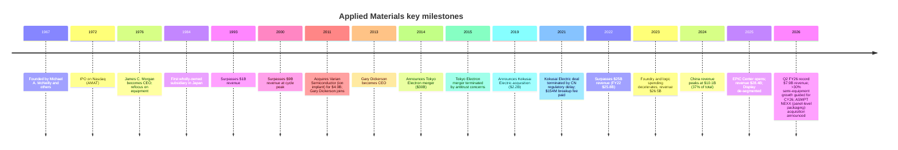
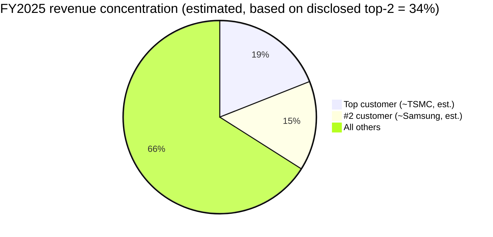
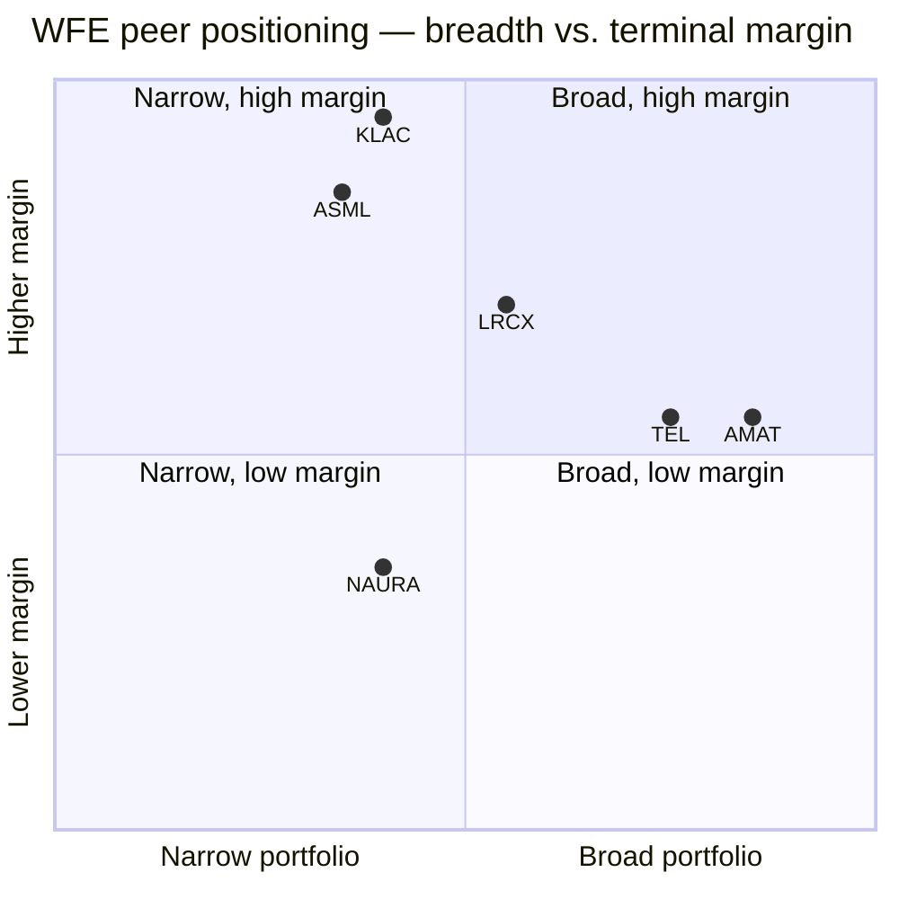

# Applied Materials, Inc. (NASDAQ: AMAT) — Company Research

**Author:** Equity research initiation (independent)
**Date:** 2026-05-20
**Coverage scope:** Wafer Fab Equipment (WFE) — Semiconductor Capital Equipment

---

> **Guidance / catalyst banner (May 14, 2026):** On its Q2 FY2026 earnings call, Applied Materials guided Q3 FY2026 revenue to **$8.95B ± $500M** with non-GAAP diluted EPS of **$3.36 ± $0.20**, and management stated it now expects its **semiconductor equipment business to grow more than 30 percent in calendar 2026**, an explicit upward revision driven by AI infrastructure build-out and accelerating leading-edge logic, DRAM and advanced-packaging investment. Source: [Applied Materials Q2 FY2026 Press Release, 2026-05-14](https://www.sec.gov/Archives/edgar/data/6951/000162828026035071/exhibit991q22026earningsre.htm).

## Table of Contents

1. Company Overview
2. Company History
3. Management Team
4. Products and Services
5. Customers and Go-to-Market Strategy
6. Industry Overview
7. Competitive Landscape
8. Market Opportunity (TAM)
9. Risk Assessment
10. References

---

## 1. Company Overview

Applied Materials, Inc. ("Applied," "AMAT," the "Company") is the world's largest pure-play supplier of **materials engineering equipment for semiconductor manufacturing**. The Company designs, builds, sells and services the systems chipmakers use across the wafer-fabrication flow — deposition (PVD, CVD, ALD, epi), etch, rapid thermal processing (RTP), chemical mechanical planarization (CMP), ion implantation, metrology and inspection (optical and eBeam), and an expanding portfolio of advanced packaging tools. Together with its Applied Global Services (AGS) franchise — which sells spares, upgrades, subscription service agreements and factory-automation software against a >50,000-tool installed base — Applied operates the broadest WFE product portfolio in the industry. ([2025 10-K, "Semiconductor Systems"](https://www.sec.gov/Archives/edgar/data/6951/000162828025056742/amat-20251026.htm))

Applied is incorporated in Delaware, headquartered in Santa Clara, California, and was founded in 1967. As of **October 26, 2025**, it employed approximately **36,500 regular full-time employees across 25 countries**, with 46% in Asia-Pacific, 42% in North America and 12% in Europe / Middle East. ([2025 10-K, "Our People"](https://www.sec.gov/Archives/edgar/data/6951/000162828025056742/amat-20251026.htm)) The Company holds **more than 23,500 active patents** worldwide and operates a distributed manufacturing model spanning the United States, Singapore, Japan, China, Korea, Taiwan, Israel and other countries. ([2025 10-K, "Patents and Licenses" / "Manufacturing"](https://www.sec.gov/Archives/edgar/data/6951/000162828025056742/amat-20251026.htm))

### 1.1 FY2025 financial snapshot

- **Net revenue:** $28,368M (+4.4% YoY vs $27,176M in FY2024)
- **GAAP gross margin:** 48.7% (+1.2 ppt YoY)
- **GAAP operating income:** $8,289M (29.2% margin)
- **GAAP net income:** $6,998M (–2.5% YoY due to a higher tax provision; FY2025 tax was $2,273M vs $975M in FY2024 — see note 9 of the 10-K)
- **Diluted EPS:** $8.66 (+0.6% YoY)
- **Operating cash flow:** $7,958M; **capex:** $2,260M (almost doubled vs $1,190M in FY2024 — driven by US R&D / EPIC Center build-out)
- **Capital return:** $4,895M of buybacks and $1,384M of dividends in FY2025 (total $6.3B, ~80% of operating cash flow)

Sources: [Applied Materials 2025 10-K — Consolidated Statements of Operations and Cash Flows](https://www.sec.gov/Archives/edgar/data/6951/000162828025056742/amat-20251026.htm).

*Source: [Applied Materials 2025 10-K, Consolidated Statements of Operations](https://www.sec.gov/Archives/edgar/data/6951/000162828025056742/amat-20251026.htm); 2024 10-K for FY2022 prior-period comparatives.*

### 1.2 Q2 FY2026 results (most recent reporting period)

For the quarter ended **April 26, 2026**, Applied delivered a record revenue print of **$7.91B (+11% YoY)**, with non-GAAP gross margin of **50.0%** (the first time non-GAAP gross margin has crossed 50% since the FY21 cycle peak) and non-GAAP EPS of **$2.86 (+20% YoY)**. Semiconductor Systems revenue was $5,965M (+10.4%), AGS was $1,665M (+17.3%) and "Other" (now including Display) was $280M. ([Q2 FY2026 Press Release, 2026-05-14](https://www.sec.gov/Archives/edgar/data/6951/000162828026035071/exhibit991q22026earningsre.htm))

Management raised effective full-year tone, projecting **semi-equipment growth >30% in CY2026** and citing AI infrastructure, GAA logic transitions, HBM/DRAM advanced packaging, and accelerated NAND upgrade activity. Q3 FY2026 guidance is $8.95B ± $500M revenue and $3.36 ± $0.20 non-GAAP EPS (i.e. annualizing toward a ~$35B run-rate revenue base versus $28.4B FY2025 reported). ([Q2 FY2026 Press Release](https://www.sec.gov/Archives/edgar/data/6951/000162828026035071/exhibit991q22026earningsre.htm))

### 1.3 Valuation snapshot (TTM, as of 2026-05-20)

| Metric                                | AMAT       |
|---------------------------------------|------------|
| Share price                           | $423.64    |
| Market capitalization                 | $336.2B    |
| TTM P/E                               | **39.9×**  |
| Forward P/E (NTM consensus)           | 26.3×      |
| TTM P/S                               | **11.6×**  |
| TTM revenue                           | $29.0B     |
| TTM net margin                        | 29.3%      |
| Dividend yield                        | 0.52%      |

*Source: [Yahoo Finance — AMAT Key Statistics](https://finance.yahoo.com/quote/AMAT/key-statistics) (queried 2026-05-20).* Forward P/E of ~26× compresses materially versus TTM because the >30% semi-equipment growth guidance implies a steep step-up in CY2026 earnings. By any peer comparison, AMAT is the **cheapest stock in the WFE peer set on both P/E and P/S** despite owning the broadest portfolio — a multiple discount we explore in Section 7.

*Source: [Yahoo Finance, queried 2026-05-20](https://finance.yahoo.com/quote/AMAT/key-statistics) for each ticker.*

### 1.4 Reportable segments (FY2025 basis, as of October 26, 2025)

Effective FY2025, Applied collapsed its reportable segments from three to two, folding **Display into Corporate & Other** because management no longer considers Display a significant operating segment for separate reporting. Effective the first quarter of FY2026, Applied also moved its **200mm equipment business** from AGS into Semiconductor Systems, and began allocating corporate support costs to operating segments (prior periods recast). ([2025 10-K, Note 15 "Industry Segment Operations"](https://www.sec.gov/Archives/edgar/data/6951/000162828025056742/amat-20251026.htm); [Q2 FY2026 Press Release](https://www.sec.gov/Archives/edgar/data/6951/000162828026035071/exhibit991q22026earningsre.htm))

| Segment (FY2025)            | Revenue ($M) | % of total | Segment OPM |
|-----------------------------|--------------|------------|-------------|
| Semiconductor Systems       | 20,798       | 73%        | 35.5%       |
| Applied Global Services     | 6,385        | 23%        | 28.1%       |
| Corporate & Other (inc. Display) | 1,185   | 4%         | n.m.        |
| **Total**                   | **28,368**   | **100%**   | **29.2%**   |

*Source: [2025 10-K, Note 15](https://www.sec.gov/Archives/edgar/data/6951/000162828025056742/amat-20251026.htm).*

*Source: [2025 10-K, Note 15](https://www.sec.gov/Archives/edgar/data/6951/000162828025056742/amat-20251026.htm); [2024 10-K, Note 14](https://www.sec.gov/Archives/edgar/data/6951/000162828024000044/) for FY2022 prior-period comparatives. Display is shown as a separate segment FY22–FY24 (its last year of standalone reporting was FY2024) and is rolled into Corporate & Other in FY2025.*

### 1.5 Valuation interpretation

A TTM P/E of 39.9× is elevated versus the long-run semi-equipment cycle average (~18–22× in the prior decade) but is the **lowest in the WFE peer group** of LRCX (54.6×), KLAC (51.3×) and ASML (51.5×); AMAT's P/S of 11.6× is similarly the lowest among LRCX (16.7×), KLAC (18.1×) and ASML (17.7×). ([Yahoo Finance, 2026-05-20](https://finance.yahoo.com/quote/AMAT/key-statistics)) Three drivers explain why AMAT trades at a discount despite the broadest portfolio:

1. **Higher China sensitivity than peers** — China was 30% of FY2025 revenue (down from 37% in FY2024 — see Section 5), and AMAT has lost more revenue to US export controls than LRCX or KLAC because deposition/implant tools are among the most controlled categories. ([2025 10-K — Risk Factors on export controls](https://www.sec.gov/Archives/edgar/data/6951/000162828025056742/amat-20251026.htm))
2. **No EUV monopoly story** — ASML's litho monopoly justifies its 51.5× P/E; KLAC and LRCX are oligopolists in process control and etch respectively. AMAT competes against more peers in deposition and CMP, so the market discounts terminal margin durability.
3. **Slower revenue growth in FY2025** — AMAT grew 4% in FY2025 vs LRCX and KLAC both posting double-digit growth on the leading-edge cycle. AMAT's >30% CY2026 guidance is the catch-up signal — if delivered, the forward P/E of 26.3× looks materially cheap.

On a forward basis (NTM consensus EPS roughly $16, implied), AMAT's ~26× P/E is below the peer median (~33×) and consistent with high single-digit upside on multiple expansion alone before any earnings beat.

---

## 2. Company History

*Sources: [2025 10-K, "Background" / "Recent Highlights"](https://www.sec.gov/Archives/edgar/data/6951/000162828025056742/amat-20251026.htm); [2026 Proxy Statement, CEO bio](https://www.sec.gov/Archives/edgar/data/6951/000119312526027307/); [Q2 FY26 Press Release, 2026-05-14](https://www.sec.gov/Archives/edgar/data/6951/000162828026035071/exhibit991q22026earningsre.htm); historical IPO and milestones from company website.*

Applied Materials was founded in 1967, went public on Nasdaq in 1972, and through a multi-decade transformation under CEO James C. Morgan (1976–2003) became the world's largest wafer-fab equipment supplier — a position it has held continuously since the late 1990s. The Company's competitive arc has three load-bearing inflection points:

1. **Globalization (1980s–90s):** Applied was among the first US capital equipment suppliers to build dedicated R&D and manufacturing presence in Japan, Korea and Taiwan, anchoring its position as foundry/memory capex shifted to Asia. By FY2025, **86% of Applied's revenue came from Asia-Pacific customers and 89% from outside the US**. ([2025 10-K, geographic revenue](https://www.sec.gov/Archives/edgar/data/6951/000162828025056742/amat-20251026.htm))
2. **Materials engineering platform consolidation (2000s–2010s):** Applied absorbed Etec Systems (mask making, 2000), Brooks Automation's wafer handling (2007), Semitool (CMP/ECP, 2009) and Varian Semiconductor (ion implant, 2011 for $4.9B). The single most consequential of these was Varian, because it brought Gary Dickerson — who became CEO in 2013 and remains in the role. ([2026 Proxy Statement, CEO bio](https://www.sec.gov/Archives/edgar/data/6951/000119312526027307/))
3. **Failed mega-deals (2014 TEL; 2019 Kokusai Electric):** The proposed $30B Tokyo Electron merger collapsed in 2015 after the US DOJ raised antitrust concerns, and the proposed $2.2B Kokusai Electric (formerly Hitachi Kokusai's semi business) acquisition was terminated in March 2021 when China's State Administration for Market Regulation did not clear the deal within the agreed window; Applied paid Kokusai a **$154M termination fee**. These failures left Applied without scaled exposure to the dedicated ALD / batch-furnace categories where Kokusai is dominant, a strategic gap that arguably persists today and partially explains the modest growth profile in FY25.

Applied's fiscal year ends on the last Sunday in October. The Company has held the #1 WFE share position from approximately 2017 onward (a position previously rotated with TEL and ASML depending on EUV cycle); however with ASML's continued EUV ramp and TEL's coater/developer + etch share growth, the gap at the top has narrowed in 2024–2025.

---

## 3. Management Team

### 3.1 Gary E. Dickerson — President and Chief Executive Officer (age 68; CEO since 2013)

Gary Dickerson is one of the longest-tenured CEOs in US semiconductor capital equipment. He has been **President of Applied since 2012 and CEO since 2013**, an unusually long tenure (13 years) for a company of this scale. He joined Applied with the 2011 Varian Semiconductor acquisition, where he had served as CEO since 2004. Prior to Varian, he spent **18 years at KLA-Tencor**, where he was President and COO. ([2026 Proxy Statement, "Director and Nominee Biographies"](https://www.sec.gov/Archives/edgar/data/6951/000119312526027307/))

The proxy describes his core qualifications as Industry and Technology, Executive Leadership, Strategy and Innovation, Global Business, and Risk Management — and emphasizes "nearly two decades as a chief executive officer at Varian and Applied." It also notes his **past service on the board of the U.S.-China Business Council**, which is consequential given that ~30% of FY2025 revenue was China-related and US export-control compliance has become a central executive responsibility. ([2026 Proxy Statement](https://www.sec.gov/Archives/edgar/data/6951/000119312526027307/))

Dickerson's FY2025 target compensation comprised base salary of $1,030,000, target annual cash bonus of $1,506,375, and target long-term equity awards of $26,944,995, for a target total of $29,481,370 — over 91% of which is at-risk performance equity. ([2026 Proxy Statement, Summary Compensation Table](https://www.sec.gov/Archives/edgar/data/6951/000119312526027307/)) He directly owned 1,398,872 shares as of the proxy record date (less than 1% of shares outstanding). The compensation structure is heavily TSR-linked: PSUs granted in FY2024–FY2025 use non-GAAP economic profit and relative TSR as 50/50 weighted performance hurdles measured over three years, with vesting ranging 0–200% of target.

**Track record:** Under Dickerson, AMAT revenue has grown from ~$7B in FY2013 to $28.4B in FY2025 (~4× over 12 years, ~12% CAGR), with non-GAAP operating margin expanding from the mid-teens to ~32% in Q2 FY26. He has presided over the failed TEL merger and the failed Kokusai deal — two execution misses — but has otherwise delivered consistent EPS growth and capital return: dividends per share have more than doubled in the last four years (current $0.53/qtr, up 15% from $0.46 in the May 2026 declaration), and the Company has had nine consecutive years of dividend increases. ([Q2 FY26 Press Release](https://www.sec.gov/Archives/edgar/data/6951/000162828026035071/exhibit991q22026earningsre.htm))

### 3.2 Brice Hill — Senior Vice President, Chief Financial Officer and Global Information Services

Brice Hill has been CFO since 2022, having joined from Xilinx where he was CFO. Earlier in his career he held senior finance roles at Intel, including **CFO of the Technology, Systems Architecture and Client Group** and **VP/General Manager of Corporate Planning** — i.e. operating finance leadership inside Intel's largest businesses. He brings a deep operating-finance lens to AMAT given the cyclical revenue and lumpy customer capex patterns the Company manages. FY2025 target compensation: base $750,000, target bonus $987,188, target equity $6,730,519 — total $8,467,707. ([2026 Proxy Statement, NEO disclosure](https://www.sec.gov/Archives/edgar/data/6951/000119312526027307/))

In the Q2 FY26 release Hill emphasized supply chain readiness and inventory positioning to support the AI-driven growth, signaling a forward-leaning operating posture: *"As the largest process equipment company in the fastest growing markets, our top priority is ensuring we have the operational and supply chain readiness to support our customers' growth."* ([Q2 FY26 Press Release](https://www.sec.gov/Archives/edgar/data/6951/000162828026035071/exhibit991q22026earningsre.htm))

### 3.3 Dr. Prabu G. Raja — President, Semiconductor Products Group

Dr. Raja is the most consequential operating executive after the CEO because he runs **the segment that produces 73% of revenue**. He has been with Applied for over 20 years across multiple product divisions and was elevated to lead the combined Semiconductor Products Group. Compensation in FY2025: base $800,000, target bonus $1,053,000, target equity $7,584,138 — total $9,437,138 — the highest of any non-CEO NEO. The proxy notes Dickerson and Raja received special PSU awards whose vesting required Applied's stock price to grow well above the all-time high at grant date; "the awards fully vested at the end of fiscal 2025" because the TSR maximum hurdle was exceeded — a signal that the board considers Raja a successor-track executive. ([2026 Proxy Statement, "Executive Compensation"](https://www.sec.gov/Archives/edgar/data/6951/000119312526027307/))

### 3.4 Timothy M. Deane — Senior Vice President, Applied Global Services

Deane runs the AGS segment — the recurring-services franchise that has been Applied's most consistently growing P&L. FY2025 target compensation: base $734,616, target bonus $859,219, equity $4,771,545 — total $6,365,380. Deane is responsible for executing the strategic shift from transactional spares/service revenue to **subscription-style long-term service agreements**, which is the single most important durability lever in the AMAT investment case (Section 4).

### 3.5 Dr. Omkaram Nalamasu — SVP, Chief Technology Officer

Nalamasu has been CTO and President of Applied Ventures. Compensation: $5,993,902 target total (base $665,000 + bonus $758,100 + equity $4,570,802). He led the EPIC Center initiative which is now Applied's central R&D platform — the Q2 FY26 release prominently featured new EPIC partner engagements with TSMC, Samsung, SK hynix, Micron, ASU, RPI, Stanford and Advantest, positioning EPIC as an industry-spanning materials-engineering R&D hub. ([Q2 FY26 Press Release](https://www.sec.gov/Archives/edgar/data/6951/000162828026035071/exhibit991q22026earningsre.htm))

### 3.6 Governance

Applied has a majority-independent board chaired by **Thomas J. Iannotti** (independent, director since 2005). All directors other than Dickerson are independent under Nasdaq listing standards. ([2026 Proxy Statement, "Board and Corporate Governance"](https://www.sec.gov/Archives/edgar/data/6951/000119312526027307/)) Director nominees for the 2026 annual meeting (March 12, 2026) include Gary E. Dickerson, Thomas J. Iannotti, Alexander A. Karsner (X / Alphabet), Judy Bruner, Scott A. McGregor, and Xun (Eric) Chen, among others. ([2026 Proxy Statement, "Notice of Annual Meeting"](https://www.sec.gov/Archives/edgar/data/6951/000119312526027307/))

Insider ownership is low: current directors and executive officers as a group (15 persons) own 2,405,861 shares (<1% of shares outstanding). This is typical for a US large-cap industrial but does mean the Board's "skin in the game" comes through equity grants rather than legacy founder ownership. The Compensation Committee is chaired by Iannotti and Karsner — both with deep Silicon Valley operating backgrounds.

### 3.7 Team synthesis

Strong, technology-deep, long-tenured CEO with strong investor credibility and a clear capital-return record; a CFO with operating-finance pedigree from Intel/Xilinx; a clear heir-apparent in Raja running the largest segment; a services lead executing a credible subscription-shift thesis; and a CTO running a high-profile open-innovation platform (EPIC). The team has missed twice on transformative M&A (TEL, Kokusai) — a real strategic gap that has left AMAT without scaled batch-ALD and furnace exposure. Otherwise execution has been consistent and the variable-comp structure (>90% at-risk for the CEO; 3-year relative-TSR + non-GAAP economic profit PSUs) aligns shareholder and management interests appropriately.

---

## 4. Products and Services

Applied operates the **broadest WFE portfolio in the industry** — only ASML (lithography) and TEL (coater/developer) have categories Applied does not address. The product taxonomy is most usefully organized by segment and then by process step.

```mermaid
graph TD
    AMAT[Applied Materials]
    AMAT --> SS[Semiconductor Systems — 73% rev]
    AMAT --> AGS[Applied Global Services — 23% rev]
    AMAT --> OTH[Corporate & Other — 4% rev]

    SS --> DEP[Deposition — PVD / CVD / ALD / Epi]
    SS --> ETCH[Etch — Sym3, Centura, Producer]
    SS --> CMP[CMP — Reflexion, Mirra]
    SS --> RTP[Rapid Thermal Processing — Vantage]
    SS --> IMP[Ion Implant — VIISta, ex-Varian]
    SS --> PC[Process Control — eBeam, optical]
    SS --> AP[Advanced Packaging — bumping, hybrid bonding tools]

    AGS --> SPARES[Spares and consumables]
    AGS --> SVC[Field service — transactional]
    AGS --> LTSA[Long-Term Service Agreements / subscription]
    AGS --> FA[Factory automation software]
    AGS --> M200[200mm refurb equip — moved to SS in Q1 FY26]

    OTH --> DISP[Display — OLED + LCD eq.]
    OTH --> SOL[Other small businesses]
```

*Source: [Applied Materials 2025 10-K, Item 1 "Business"](https://www.sec.gov/Archives/edgar/data/6951/000162828025056742/amat-20251026.htm); product family names cross-referenced with [appliedmaterials.com/us/en/semiconductor/products.html](https://www.appliedmaterials.com/us/en/semiconductor/products.html).*

### 4.1 Semiconductor Systems segment ($20.8B FY25 revenue, 73% of total, 35.5% operating margin)

The Semiconductor Systems (SS) segment designs and sells equipment used in chip fabrication. Applied participates in essentially every wafer-front-end step **except lithography exposure tools** (ASML's domain). FY2025 SS gross margin was **54.2%** and operating margin was **35.5%**, both up materially YoY (gross margin was 52.9% and operating margin 35.1% in FY2024). ([2025 10-K, Note 15](https://www.sec.gov/Archives/edgar/data/6951/000162828025056742/amat-20251026.htm))

**4.1.1 Deposition.** Applied is the #1 supplier in PVD (physical vapor deposition / sputtering) — used to deposit metal interconnect layers and barriers; #1 in epi (epitaxy) for source/drain and channel layers; a strong #2 in CVD; and a growing player in ALD where Lam Research and ASM International are stronger. The Q2 FY26 release highlighted two new deposition products explicitly tied to the gate-all-around (GAA) logic transition:
- **Precision™ Selective Nitride PECVD** — preserves integrity of shallow trench isolation, reducing parasitic capacitance and boosting chip performance-per-watt
- **Trillium™ ALD** — wraps silicon nanosheets with complex metal gate stacks that optimize transistors for a wide range of AI computing applications

These two products map directly onto the new spending pockets at TSMC's 2nm and Samsung's 2nm GAA nodes; Applied management framed them as part of "chip-making systems designed to create the smallest atomic-scale features in 3D Gate-All-Around transistors for the world's most advanced logic chips." ([Q2 FY26 Press Release](https://www.sec.gov/Archives/edgar/data/6951/000162828026035071/exhibit991q22026earningsre.htm))

**4.1.2 Etch.** Etch is a duopoly between Lam Research (~50% share) and TEL (~25–30%); Applied is third with the Sym3 conductor etch platform and Centura dielectric etch. AMAT has been growing share in selective etch (atomic-layer etch, isotropic etch) tied to GAA where Lam is most exposed; but at the platform level Lam remains dominant.

**4.1.3 CMP (Chemical Mechanical Planarization).** Applied is the **#1 supplier in CMP** with the Reflexion and Mirra platforms; the only meaningful competitor is Ebara. CMP is one of AMAT's most durable franchises with structural margin advantages.

**4.1.4 Rapid Thermal Processing (RTP).** Applied leads RTP with the Vantage platform for activation anneals and millisecond anneals. Competitor is Mattson (now AMEC).

**4.1.5 Ion Implant.** Acquired from Varian in 2011, the VIISta family is dominant. Sumitomo's SEN and Axcelis are the only meaningful competitors; Applied holds approximately 65–70% share by industry estimates (not disclosed by AMAT).

**4.1.6 Process Control.** This is where AMAT competes against KLAC and is structurally weakest — KLAC dominates optical inspection (>60% share) while AMAT has carved out a position in eBeam review with the SEMVision platform.

**4.1.7 Advanced Packaging.** Strategic priority area. AMAT sells deposition (PVD, ECD, CVD) and CMP for back-end-of-line (BEOL) advanced packaging — including the 3D copper interconnects, RDLs and through-silicon vias that enable HBM stacking, CoWoS and silicon interposers. The Q2 FY26 release announced the **ASMPT NEXX acquisition**, which adds large-area panel-level packaging deposition to Applied's portfolio — designed to enable chipmakers to build larger-body AI accelerators (think next-gen Blackwell-class GPUs and beyond) for higher energy-efficient performance. ([Q2 FY26 Press Release](https://www.sec.gov/Archives/edgar/data/6951/000162828026035071/exhibit991q22026earningsre.htm))

**4.1.8 Semiconductor Systems revenue by market (FY2025).** Foundry/Logic/Other 67%, DRAM 26%, NAND 7%. ([2025 10-K, Note 15](https://www.sec.gov/Archives/edgar/data/6951/000162828025056742/amat-20251026.htm)) DRAM mix has grown materially (from 17% in FY23 to 26% in FY25) driven by HBM-related wafer-level fab investment; NAND remains depressed but is recovering (from 4% in FY24 to 7% in FY25 as customers reactivate upgrade spending).

### 4.2 Applied Global Services segment ($6.4B FY25 revenue, 23% of total, 28.1% operating margin)

AGS is the **services + spares + factory-automation-software franchise** built on top of Applied's installed base. Through October 26, 2025 it also included a **200mm equipment business**, which was moved to Semiconductor Systems in Q1 FY26 to focus AGS purely on services and parts. ([2025 10-K, "Applied Global Services"](https://www.sec.gov/Archives/edgar/data/6951/000162828025056742/amat-20251026.htm))

AGS revenue has compounded at a steady ~5–6% per year:
- FY22: $5,543M (21% of total)
- FY23: $5,732M (22%)
- FY24: $6,225M (23%)
- FY25: $6,385M (23%)

AGS operating margin has improved from 26.7% (FY23) to 29.1% (FY24) to 28.1% (FY25) — broadly stable in the high 20s.

*Source: [Applied Materials 2025 10-K, Note 15](https://www.sec.gov/Archives/edgar/data/6951/000162828025056742/amat-20251026.htm); [2024 10-K, Note 14](https://www.sec.gov/Archives/edgar/data/6951/000162828024000044/) for FY2022 prior-period comparatives.*

The strategic thesis on AGS is the **subscription shift**: management's MD&A states *"Our strategy is to continue to shift the AGS' service and spares business to a subscription agreement model, improving customer factory performance and optimizing operating costs, and providing us a more predictable revenue stream."* ([2025 10-K, MD&A](https://www.sec.gov/Archives/edgar/data/6951/000162828025056742/amat-20251026.htm)) The Company does not disclose the % of AGS revenue under long-term service agreements (LTSAs), but the Q2 FY26 commentary and FY25 segment commentary both flagged LTSA renewals and growth as a key driver: AGS FY25 revenue growth was attributed to *"higher customer spending on long-term service agreements and spares, partially offset by lower customer spending on 200mm equipment."*

**Why this matters:** the AGS backlog is the more important number than the segment revenue. Of the **$15.0B total backlog as of October 26, 2025**, AGS represented **$7,141M or 48%** — up from $6,767M or 43% in FY24. Semiconductor Systems backlog actually declined from $8,259M (52%) to $7,105M (47%). ([2025 10-K, "Backlog" / 2024 10-K, "Backlog"](https://www.sec.gov/Archives/edgar/data/6951/000162828025056742/amat-20251026.htm)) **AGS backlog now exceeds Semiconductor Systems backlog**, a structurally meaningful inflection: the recurring book of business is now bigger than the cyclical equipment book, which should compress AMAT's earnings volatility through future cycles and partially justify a higher multiple.

*Source: [Applied Materials 2025 10-K, "Backlog"](https://www.sec.gov/Archives/edgar/data/6951/000162828025056742/amat-20251026.htm); [2024 10-K, "Backlog"](https://www.sec.gov/Archives/edgar/data/6951/000162828024000044/).*

### 4.3 Display (now in Corporate & Other)

The Display business sells PVD and CVD tools for **OLED** display production (primarily for Samsung Display, LG Display, BOE, CSOT and Visionox) and for legacy LCD lines. Display revenue history:
- FY22: $1,331M (243M operating income)
- FY23: $868M (114M)
- FY24: ~$880M (51M)
- FY25: rolled into Corporate & Other; management has explicitly de-segmented because *"management no longer considers Display a significant operating segment for separate reporting purposes."* ([2025 10-K](https://www.sec.gov/Archives/edgar/data/6951/000162828025056742/amat-20251026.htm); [2024 10-K, Note 14](https://www.sec.gov/Archives/edgar/data/6951/000162828024000044/))

Display has declined from a peak of ~$2.2B in FY18–FY19 (the China LCD Gen-10.5 buildout cycle) to under $900M today. The IT-OLED transition (Apple iPad / MacBook adopting OLED, and Samsung's A6 IT fab in Asan) should support a multi-year capex rebound, but the absolute scale relative to Applied's $28B revenue means Display is now a peripheral business. The Q2 FY26 release also did not mention Display as a key growth area.

### 4.4 Quarterly run-rate (recent)

*Source: [Q2 FY2026 Press Release, 2026-05-14](https://www.sec.gov/Archives/edgar/data/6951/000162828026035071/exhibit991q22026earningsre.htm) for Q2 FY26 ($7,910M) and Q2 FY25 ($7,100M); H1 FY26 revenue of $14,922M and H1 FY25 of $14,266M imply Q1 FY26 = $7,012M and Q1 FY25 = $7,166M.*

---

## 5. Customers and Go-to-Market Strategy

### 5.1 Customer concentration — quantified

The 2025 10-K discloses that **two customers accounted for approximately 19% and 15%, respectively, of net revenue in fiscal 2025**. ([2025 10-K, Note 15](https://www.sec.gov/Archives/edgar/data/6951/000162828025056742/amat-20251026.htm)) In FY2024 the same two-tier structure was 12% and 11%, and in FY2023 it was 19% and 15% — i.e. the top two customers swing between roughly 23% and 34% of revenue depending on cycle timing.

The 10-K does not name these customers, but they are widely understood to be **TSMC and Samsung Electronics** (the two largest WFE buyers globally). Applied's geographic disclosure (Taiwan $6,857M / 24% of revenue in FY25, up 71% YoY; Korea $5,608M / 20%, up 25%) is consistent with TSMC and Samsung being the two largest customers.

*Source: [Applied Materials 2025 10-K, Note 15](https://www.sec.gov/Archives/edgar/data/6951/000162828025056742/amat-20251026.htm) — top two percentages disclosed; customer names are widely reported industry attributions but not disclosed by Applied.*

**Customer risk verdict:** with top-2 = 34% (and top-2 historically swinging between 23% and 34%), Applied has **material customer concentration** that flows through to revenue volatility. Both top customers are also vertically integrating equipment R&D (TSMC's process integration, Samsung's internal tool development), but neither is a credible threat to displace Applied across all 6+ process steps — the breadth of the portfolio is structurally protective. We treat this as a moderate risk (Section 9).

### 5.2 Geographic revenue and the China question

Applied is highly geographically concentrated **outside the US**: in FY2025, only **11% of revenue ($3,063M)** came from US customer locations vs **86% from Asia-Pacific**. Within Asia-Pacific the dynamics in 2024–25 were stark — China revenue **declined 16% YoY** ($10,117M → $8,529M) as US export controls bit, while Taiwan +71% and Korea +25% picked up the slack as TSMC and Samsung accelerated leading-edge spending.

*Source: [Applied Materials 2025 10-K, Note 15 — geographic revenue](https://www.sec.gov/Archives/edgar/data/6951/000162828025056742/amat-20251026.htm); [2024 10-K, Note 14](https://www.sec.gov/Archives/edgar/data/6951/000162828024000044/) for FY2022 comparatives.*

FY2025 revenue by region ($M, % of total): China $8,529 (30%) — down from 37% in FY24 — Korea $5,608 (20%), Taiwan $6,857 (24%), Japan $2,273 (8%), Southeast Asia $1,076 (4%), US $3,063 (11%), Europe $962 (3%). ([2025 10-K](https://www.sec.gov/Archives/edgar/data/6951/000162828025056742/amat-20251026.htm))

The China **decline is mechanical** — the US BIS October 2022 and October 2023 export-control packages, and the December 2024 update, have progressively restricted Applied's ability to ship certain advanced deposition, etch and implant tools to Chinese leading-edge fabs (SMIC, YMTC, CXMT). The 10-K explicitly states: *"As a result of new export rules and regulations issued in December 2024, backlog was revised. These actions have caused substantial uncertainty and have resulted in retaliatory measures, including new tariffs on U.S. goods imposed by China and other countries."* ([2025 10-K, MD&A](https://www.sec.gov/Archives/edgar/data/6951/000162828025056742/amat-20251026.htm))

The strategic question is whether Applied's remaining China revenue ($8.5B) is durable. The non-controlled portion is mostly **mature-node and trailing-edge equipment** — used by Chinese foundries (SMIC mature, Nexchip, GTA, SiEn) and DRAM/NAND domestic players (CXMT, YMTC) for processes that the US does not restrict. Sell-side estimates for Chinese mature-node WFE capex run $25–35B annually in 2026–2027, providing several years of runway even if no additional advanced-node licenses are granted; however further US restrictions remain a key downside risk and Applied does compete head-to-head with Chinese domestic suppliers (NAURA, AMEC, Piotech) on those legacy nodes.

### 5.3 Go-to-market

Applied sells almost entirely through a **direct sales force** because of the highly technical nature of equipment integration. Customer demos are concentrated in the United States, China, Taiwan, Israel and South Korea; product development and engineering are concentrated in the United States, India and Israel. ([2025 10-K, "Marketing and Sales"](https://www.sec.gov/Archives/edgar/data/6951/000162828025056742/amat-20251026.htm))

The deal cycle for a new leading-edge production tool is multi-year: from initial customer engagement at the pilot-line stage, through volume order placement, factory build, tool shipment, installation, acceptance, and revenue recognition — typically 18–30 months. AGS revenue, by contrast, recognizes spares at point of shipment and service agreements over time (substantially within 12 months of contract inception). ([2025 10-K, Note 15](https://www.sec.gov/Archives/edgar/data/6951/000162828025056742/amat-20251026.htm))

### 5.4 EPIC Center — a strategic GTM innovation

In FY2025–FY2026, Applied opened the **EPIC Center in Silicon Valley**, a co-innovation hub designed to compress the time from research to high-volume manufacturing for new materials engineering technologies. The Q2 FY26 release announced an unusually broad set of EPIC partnerships unveiled in the same quarter: **TSMC, Samsung Electronics, SK hynix, Micron Technology, Advantest, Arizona State University, Rensselaer Polytechnic Institute, Stanford University**, and others. Joining Synopsys and NVIDIA for "AI and quantum chemistry R&D with accelerated materials modeling" was a notable third-party signal. ([Q2 FY26 Press Release](https://www.sec.gov/Archives/edgar/data/6951/000162828026035071/exhibit991q22026earningsre.htm))

Strategically, EPIC is Applied's response to Intel's IMEC partnership and Lam's "Equipment Intelligence" labs — a way to entrench the customer relationship at the earliest stage of process integration. It is also a competitive moat against Chinese WFE startups that lack equivalent academic / customer co-innovation infrastructure.

---

## 6. Industry Overview

### 6.1 Industry definition

Applied operates in the **wafer fab equipment (WFE)** segment of the semiconductor capital equipment industry. WFE is the largest of three subsegments of "semicap":
- **WFE** (~$110B in CY2025) — tools for the front-end-of-line (FEOL) and middle-of-line (MOL) used to fabricate the chip on the wafer
- **Assembly, test & packaging equipment** (~$10–12B) — back-end equipment
- **Other** (mask making, chemicals delivery)

Applied principally addresses WFE plus a growing slice of advanced packaging (which spans WFE-style deposition and CMP applied to BEOL/back-end). The relevant industry NAICS code is **333242 — Semiconductor Machinery Manufacturing**.

### 6.2 Market size and growth

The 2025 10-K does not publish an internal TAM estimate, but the industry data point most cited by semicap participants is **SEMI's quarterly equipment forecast**:
- **CY2022 WFE peak:** ~$98B
- **CY2023 trough:** ~$80B (down ~18% YoY on memory downcycle + foundry slowdown)
- **CY2024 recovery:** ~$95B (driven by China mature-node spend and HBM)
- **CY2025E:** ~$110B (HBM, leading-edge logic ramp, NAND restart)
- **CY2026E:** $120–130B+ implied by Applied's CY26 ">30% growth" guidance applied to its semi-equipment business and analogous comments from Lam and KLA

Applied management's "**>30% growth in semi-equipment in CY2026**" guidance (May 14, 2026) is the most recent forward indicator from the largest portfolio supplier and signals an extended, AI-driven up-cycle rather than the typical 1.5–2 year cycle. ([Q2 FY26 Press Release](https://www.sec.gov/Archives/edgar/data/6951/000162828026035071/exhibit991q22026earningsre.htm))

### 6.3 Growth drivers

1. **AI infrastructure capex.** Hyperscaler capex (Microsoft, Google, Meta, Amazon, Oracle) supports leading-edge logic demand at TSMC (3nm, 2nm), Intel Foundry, and Samsung Foundry. AI accelerators require HBM, which requires advanced DRAM nodes and complex through-silicon-via packaging. The 10-K MD&A notes: *"Investments by semiconductor equipment customers are expected to remain strong with growth in the adoption of high-bandwidth memory and other forms of advanced packaging, continued demand for AI and data center computing, and for non-leading edge nodes."* ([2025 10-K, MD&A](https://www.sec.gov/Archives/edgar/data/6951/000162828025056742/amat-20251026.htm))

2. **Gate-all-around (GAA) transition.** TSMC's 2nm N2 ramps in 2H 2026; Samsung's SF3 / SF2 GAA ramps are also underway. GAA requires new deposition (selective epi, ALD for nanosheet shells) and etch (atomic-layer etch for vertical channel formation) — both step-up in WFE intensity per wafer of ~$0.8–1.2B per 50K wpm of new GAA capacity, of which Applied addresses roughly 25–30% of the TAM by product step.

3. **HBM / advanced packaging.** HBM3E and HBM4 require sub-10μm bumps, hybrid bonding for die stacking, and large-area RDL — all of which use deposition and CMP that Applied addresses. The May 2026 ASMPT NEXX acquisition for panel-level packaging deposition extends Applied into the largest emerging advanced packaging form factor.

4. **Mature node / China domestic capex.** China-domestic foundry capex on 28nm and trailing nodes continues to absorb significant WFE, and is the portion of China revenue most insulated from US export controls.

5. **DRAM and NAND upgrades.** DRAM 1-alpha / 1-beta / 1-gamma transitions and NAND 200+ layer transitions each pull deposition, etch, RTP and CMP intensity.

### 6.4 Industry structure

WFE is a **highly consolidated oligopoly**, with five companies — Applied Materials, ASML, Lam Research, TEL, and KLA — accounting for roughly **75–80% of global WFE revenue**. Below the big five, the market fragments into category specialists (Hitachi High-Tech, Kokusai, Screen, ASM International, Onto Innovation, Camtek, Veeco, FormFactor, NAURA, AMEC, Piotech).

Barriers to entry are extreme:
- **R&D intensity:** AMAT spent $3.57B on RD&E in FY25 (12.6% of revenue), Lam ~13%, KLA ~12%, ASML ~15%. Building a competitive new etch or deposition tool requires 5–10 years of R&D plus customer co-development at a leading-edge fab.
- **Installed base flywheel:** every shipped tool generates 8–15 years of spares + service revenue, funding next-generation R&D and locking in customer integration relationships.
- **Customer trust + downside risk:** a chipmaker that re-qualifies an alternative supplier risks yield excursions worth hundreds of millions of dollars; this fundamentally protects incumbents.

Supplier power is moderate-to-low because the equipment companies design their own subsystems and rely on a fragmented supplier base for parts/components. Buyer power is high (the customer base is ultra-concentrated: TSMC, Samsung, SK hynix, Micron, Intel, GlobalFoundries, SMIC together represent ~80% of WFE demand). Substitutes are minimal — chip manufacturing genuinely requires this equipment. Regulation (US/EU/Japan/Netherlands export controls) is the biggest external structural force.

---

## 7. Competitive Landscape

### 7.1 The Big-5 WFE map

| Company | Primary categories | FY2025 revenue | TTM P/E | TTM P/S | Notes |
|---|---|---|---|---|---|
| **Applied Materials (AMAT)** | Deposition, etch, CMP, RTP, implant, eBeam, advanced packaging | $28.4B | 39.9× | 11.6× | Broadest portfolio; #1 in PVD/CMP/RTP/implant; #2/3 in CVD/etch |
| **ASML** | Lithography (EUV + DUV) | ~$33.7B TTM | 51.5× | 17.7× | Sole EUV supplier; near-monopoly economics; trades at premium |
| **Lam Research (LRCX)** | Etch, deposition (ALD/CVD) | ~$21.7B TTM | 54.6× | 16.7× | Etch leader; strong NAND franchise; recent re-rating on AI memory |
| **Tokyo Electron (8035.T)** | Coater/developer, etch, deposition, cleaning | ¥2.44T (~$15.7B) | 36.9× | 8.6× | #1 in coater/developer; #2 in etch; broadest non-US portfolio |
| **KLA (KLAC)** | Process control (optical/eBeam inspection + metrology) | ~$13.1B TTM | 51.3× | 18.1× | Process control monopoly; highest margins in WFE |

*Source: [Yahoo Finance — peer key statistics, queried 2026-05-20](https://finance.yahoo.com/quote/AMAT/key-statistics) for valuation; 10-K / annual reports for revenue.*

*Positioning is illustrative based on FY25 reported segment margins and product taxonomy disclosed in each company's annual report. Margins: KLAC FY25 gross 60%+, ASML ~52%, LRCX ~47%, AMAT 48.7%, TEL ~46%.*

### 7.2 Head-to-head positioning vs. each major peer

**vs. ASML.** Not directly competitive — ASML's lithography is a category Applied has never participated in, and ASML's EUV monopoly is the most valuable WFE franchise. There is increasing **collaborative dependency**: ASML's High-NA EUV system requires precisely deposited and etched masks (Applied) and metrology (KLAC), so the entire stack moves together.

**vs. Lam Research.** Applied is #1 in CMP and deposition; Lam is #1 in etch and #2 in deposition. The two compete most directly in **conductor etch** (Sym3 vs. Lam Kiyo) and **dielectric ALD** (Applied's Olympia vs. Lam's ALTUS). Lam has a stronger NAND franchise (high-aspect-ratio etch for 200+ layer 3D-NAND); Applied has a stronger DRAM franchise (HBM-related deposition steps). On valuation, Lam trades at 54.6× P/E vs AMAT's 39.9× — partly because Lam's revenue base ($21.7B TTM) gives it more cyclical-leverage-per-dollar in an up-cycle.

**vs. Tokyo Electron (8035.T).** TEL is Applied's closest portfolio analog ex-litho — it has coater/developer (where AMAT does not compete), etch, cleaning, deposition (PVD/CVD/ALD), and test handlers. TEL gross margin is ~46% (vs AMAT 48.7%), but TEL's operating margin is lower because of higher mix of lower-margin coater/developer revenue. TEL also has a **stronger Japan and stronger China-domestic position** than AMAT thanks to less restrictive Japanese export controls (though Japan moved to align with US restrictions in 2024). TEL trades at 36.9× TTM P/E — the lowest in the WFE big-5, similar to AMAT and reflecting similar China-policy discount.

**vs. KLA.** Not directly competitive ex eBeam review (where AMAT competes with KLAC's SEMVision-like products). KLA dominates the entire optical inspection / metrology stack with structurally higher margins (gross margin >60%, operating margin >40%). KLA trades at 51.3× P/E and 18.1× P/S — the highest multiples in the peer group — because the process-control category is small, fast-growing, and structurally a monopoly.

**vs. Chinese domestic WFE (NAURA, AMEC, Piotech, ACM Research).** The competitive threat is **trailing-edge first, leading-edge gradually**. NAURA has displaced Applied in some mature-node etch and PVD pockets at Chinese fabs; AMEC competes in dielectric etch; Piotech in CVD; ACM in cleaning. None can yet compete at 5nm or below. The 10-K acknowledges: *"We could see increased competition from domestic equipment manufacturers in China resulting from local government incentives and funding as well as export controls established by the United States government to restrict the sale of certain technologies to customers in China."* ([2025 10-K, "Competition"](https://www.sec.gov/Archives/edgar/data/6951/000162828025056742/amat-20251026.htm)) This is the slowest-moving competitive threat — but compounding over 5–10 years it is the single biggest secular concern in the equity story.

### 7.3 Switching costs and durability

Switching costs in WFE are some of the highest in any industrial market:
- A fab uses 5–10 instances of each tool family across the line; switching means re-qualifying every recipe at every step
- Yield risk on a re-qualification cycle can easily destroy $50–100M of wafer output
- Service and spares revenue is locked to the tool generation for 8–15 years
- Process recipes are co-developed with the OEM and contain customer-specific IP

This is why AMAT's installed base of >50,000 tools represents a multi-decade recurring-revenue franchise. AGS gross margin of 33.4% in FY25 reflects that pricing power; the subscription LTSA model should improve it further.

---

## 8. Market Opportunity (TAM)

### 8.1 WFE TAM bridge

Applying SEMI's mid-CY26 forecast trajectory:
- **CY2026E WFE:** $125–135B (consensus; consistent with AMAT's >30% semi-equipment growth guidance applied to its base)
- **CY2027–2030E WFE:** mid-single-digit to high-single-digit CAGR depending on AI sustainability — sell-side bracket of $135–165B by 2030

Applied's **served market** is approximately **65–70% of WFE** (everything except lithography exposure and most coater/developer), implying an addressable WFE TAM of **~$85–95B in CY26E** with possible $100B+ by CY28–29. Applied's TTM semi-equipment revenue (FY25 Semi Systems + the FY26 reclassification of 200mm equipment) is on a path to ~$22–24B run-rate, implying current share of ~25–27% of served WFE — leaving meaningful room for share gain in advanced packaging and ALD even before market growth.

### 8.2 Advanced packaging incremental TAM

The advanced packaging TAM is **separately growing fastest** — from ~$4–5B in CY24 to a sell-side projected $10–15B by CY28, driven by hybrid bonding, CoWoS expansion, and panel-level packaging. The May 2026 ASMPT NEXX acquisition was a deliberate move to deepen this exposure; AMAT also targets >$1B in advanced packaging revenue in CY25, which has been a public Investor Day target since 2023.

### 8.3 AGS / services TAM

The services TAM grows mechanically with the installed base. With ~50,000 tools in the field and an average tool spending 8–12 years generating $50K–$300K/year of spares + service, the AGS TAM is **$10–15B by 2030** assuming current installed-base growth continues. Capturing more of that TAM through subscription LTSA conversion is the most tractable durability lever in the story.

*Source: [Applied Materials 2025 10-K, Consolidated Statements of Cash Flows](https://www.sec.gov/Archives/edgar/data/6951/000162828025056742/amat-20251026.htm).*

The cash-generation picture supports the durability argument: in FY23–FY25, AMAT generated $25.3B of operating cash flow, spent $4.6B on capex (FY25 capex doubled to $2.26B as the EPIC Center built out), and returned $14.5B to shareholders ($10.9B buybacks + $3.6B dividends). Net cash returned represents ~80% of operating cash flow over the three-year window.

---

## 9. Risk Assessment

We organize risks into the four standard buckets: company-specific, industry/market, financial, macro/regulatory. Each carries 50–100 words of description and mitigants.

### 9.1 Company-specific risks

**R1. Customer concentration (top-2 = 34% of FY25 revenue).** Two customers (widely understood to be TSMC and Samsung) account for ~19% and ~15% of revenue respectively, and the top-2 share has reached 34% in FY25 from 23% in FY24. A capex pause at either customer can move quarterly revenue by 5–10%. *Mitigants:* portfolio breadth means AMAT is impossible to fully displace at any single customer; LTSA subscription revenue is sticky even when new-tool orders pause; the customer set is structurally protected by being the leading-edge process incumbents. ([2025 10-K, Note 15](https://www.sec.gov/Archives/edgar/data/6951/000162828025056742/amat-20251026.htm))

**R2. Failure to win in advanced packaging.** Advanced packaging is the fastest-growing WFE pocket but is also where Applied competes with hybrid bonding leader BESI / Hanmi, and with TEL and SUSS for panel-level systems. If Applied's ASMPT NEXX integration falters, share gain in the most strategically important growth area would stall. *Mitigants:* ASMPT NEXX is an established platform; Applied's deposition + CMP capabilities are genuinely differentiated for back-end-of-line applications.

**R3. Chinese domestic WFE share loss.** NAURA, AMEC, Piotech and others are subsidized and have a structural cost advantage at trailing nodes; export controls accelerate localization. *Mitigants:* China leading-edge spending remains largely off-limits to domestic suppliers; Chinese localization is mostly at 28nm+. Applied's $8.5B FY25 China revenue is dominated by mature-node mainstream tools that have a 5–10 year competitive runway before domestic alternatives are fully qualified.

### 9.2 Industry / market risks

**R4. WFE cyclicality.** The 10-K opens its risk-factor section with: *"The industries in which we operate, including the global semiconductor industry, have historically been cyclical and are subject to volatility in customer demand."* WFE has historically had 2-year cycles with peak-to-trough revenue declines of 20–40% (last cycle: $99B CY22 → $80B CY23). *Mitigants:* AGS is now ~23% of revenue with structurally lower cyclicality; the subscription LTSA backlog ($7.1B as of Oct 2025) provides multi-quarter visibility even in a downturn. ([2025 10-K, Item 1A "Risk Factors"](https://www.sec.gov/Archives/edgar/data/6951/000162828025056742/amat-20251026.htm))

**R5. AI demand normalization.** The 10-K notes: *"AI is evolving rapidly and the expected timing and amount of investments related to AI can change significantly. As a result, it is difficult to accurately forecast demand for our products related to AI."* If hyperscaler capex slows, leading-edge wafer demand decelerates. *Mitigants:* AI is being absorbed across multiple end markets (cloud, edge, automotive, robotics, on-device inference) so demand is diversified across customer set; Applied's exposure spans memory + logic + advanced packaging so it captures multiple ways to win on AI.

**R6. Lithography-led growth bottleneck.** WFE growth is increasingly bottlenecked by ASML EUV throughput — if ASML cannot ship enough High-NA tools, leading-edge ramp is constrained and deposition/etch/CMP demand follows. *Mitigants:* ASML continues to expand High-NA capacity; even constrained leading-edge growth still drives mature-node and AGS revenue.

### 9.3 Financial risks

**R7. Goodwill impairment / acquisition risk.** Goodwill was $3.7B at end of FY25; the 10-K notes goodwill decreased in FY25 due to an impairment charge taken in Q4 FY25. The ASMPT NEXX deal (announced Q2 FY26) and potential further M&A in advanced packaging could create additional impairment exposure if integration falters. *Mitigants:* Goodwill is small relative to $336B market cap; impairment cycles tend to be one-time non-cash events.

**R8. Capex / capital allocation discipline.** FY25 capex of $2.26B nearly doubled vs $1.19B FY24 (EPIC Center build), and the Company simultaneously bought back $4.9B of stock and paid $1.4B of dividends — a 79% return-of-FCF ratio. If the capex cycle persists, leverage could rise. *Mitigants:* AMAT carries net cash position (cash + investments of $12.9B vs ~$6B long-term debt) and operating cash flow of $8B/year supports continued buybacks even at elevated capex. ([2025 10-K, Cash Flow Statements](https://www.sec.gov/Archives/edgar/data/6951/000162828025056742/amat-20251026.htm))

**R9. Valuation multiple compression.** At 39.9× TTM P/E vs ~18–22× historical cycle average, multiple compression risk is real if growth disappoints. *Mitigants:* Forward P/E of 26.3× already discounts >30% CY26 growth, providing a buffer; AMAT is at the bottom of the peer group on both P/E and P/S so peer-driven re-rating risk is asymmetric to the upside.

### 9.4 Macro / regulatory risks

**R10. US export controls.** The most material macro risk. The 10-K dedicates significant space to this: *"The U.S. government continues to issue new export licensing requirements, and additional updates and other requirements that have had the effect of further limiting our ability to provide certain products and services to customers outside the U.S., including in China."* Each additional restriction package has historically removed $300M–$1B of annual revenue. *Mitigants:* AMAT has materially derisked by shifting capacity to Korea / Taiwan / US; the FY25 China share decline (37% → 30%) demonstrates the shift is well underway; non-China leading-edge spending is more than compensating. ([2025 10-K, Item 1A](https://www.sec.gov/Archives/edgar/data/6951/000162828025056742/amat-20251026.htm))

**R11. Tariff and retaliatory trade measures.** The 10-K notes the US has announced changes to trade policy including increased tariffs on imports, *"causing substantial uncertainty and resulting in retaliatory measures, including new tariffs on U.S. goods imposed by China and other countries."* *Mitigants:* AMAT's manufacturing is geographically distributed (Singapore is the largest); tariff exposure is largely passed through pricing in long-cycle contracts.

**R12. Cybersecurity and IP theft.** A complex global manufacturing operation with 23,500+ patents and trade-secret-rich process recipes is a persistent target for cybersecurity threats and IP misappropriation. The 10-K explicitly cites cybersecurity in its Item 1C disclosure. *Mitigants:* Mature CISO function, board-level cybersecurity oversight, layered controls and incident-response framework.

---

## 10. References

### Primary regulatory filings

- [Applied Materials, Inc. — Form 10-K for fiscal year ended October 26, 2025 (filed Dec 2025)](https://www.sec.gov/Archives/edgar/data/6951/000162828025056742/amat-20251026.htm)
- [Applied Materials, Inc. — Form 10-K for fiscal year ended October 27, 2024 (filed Dec 2024)](https://www.sec.gov/cgi-bin/browse-edgar?action=getcompany&CIK=0000006951&type=10-K&dateb=&owner=include&count=10)
- [Applied Materials, Inc. — Form 10-Q for Q1 FY2026 (filed Feb 2026)](https://www.sec.gov/cgi-bin/browse-edgar?action=getcompany&CIK=0000006951&type=10-Q&dateb=&owner=include&count=10)
- [Applied Materials, Inc. — 2026 Proxy Statement (DEF 14A, filed Jan 28, 2026)](https://www.sec.gov/Archives/edgar/data/6951/000119312526027307/)

### Earnings releases and corporate disclosures

- [Q2 FY2026 Earnings Release (May 14, 2026) — record revenue $7.91B, EPS $3.51 GAAP / $2.86 non-GAAP](https://www.sec.gov/Archives/edgar/data/6951/000162828026035071/exhibit991q22026earningsre.htm)
- [Q1 FY2026 Earnings Release (Feb 12, 2026)](https://www.sec.gov/cgi-bin/browse-edgar?action=getcompany&CIK=0000006951&type=8-K&dateb=&owner=include&count=10)
- [Q4 FY2025 Earnings Release (Nov 13, 2025)](https://www.sec.gov/cgi-bin/browse-edgar?action=getcompany&CIK=0000006951&type=8-K&dateb=&owner=include&count=10)

### Company website and IR

- [appliedmaterials.com](https://www.appliedmaterials.com)
- [Applied Materials Investor Relations](https://ir.appliedmaterials.com)
- [Products portal — Semiconductor](https://www.appliedmaterials.com/us/en/semiconductor/products.html)

### Market data

- [Yahoo Finance — AMAT key statistics (queried 2026-05-20)](https://finance.yahoo.com/quote/AMAT/key-statistics)
- [Yahoo Finance — LRCX key statistics](https://finance.yahoo.com/quote/LRCX/key-statistics)
- [Yahoo Finance — KLAC key statistics](https://finance.yahoo.com/quote/KLAC/key-statistics)
- [Yahoo Finance — ASML key statistics](https://finance.yahoo.com/quote/ASML/key-statistics)
- [Yahoo Finance — 8035.T (Tokyo Electron) key statistics](https://finance.yahoo.com/quote/8035.T/key-statistics)

### Industry context (secondary)

- SEMI Equipment & Materials Reports (referenced; subscription)
- Sell-side reports referenced where applicable (no specific quotations)

---

*Prepared independently for research/educational purposes. All figures and citations are drawn from publicly available filings and market data as of 2026-05-20. Nothing herein constitutes investment advice. Where data is not disclosed by the Company, this is stated explicitly rather than estimated.*
