# Applied Materials, Inc. (NASDAQ: AMAT) — Company Research

**Author:** Equity research initiation (independent)
**As of:** 2026-05-23
**Coverage scope:** Wafer Fab Equipment (WFE) — Semiconductor Capital Equipment

---

> **Update — FY2026 CY-equipment growth raised to "more than 30 percent" (2026-05-14):** On the Q2 FY2026 earnings call, Gary Dickerson explicitly raised the calendar-year framing for AMAT's semiconductor equipment business to *"grow more than 30 percent in calendar 2026"* (vs. the prior outlook framed only as a strong AI-driven up-cycle), and management guided Q3 FY2026 revenue to **$8.95B ± $500M** with **non-GAAP diluted EPS of $3.36 ± $0.20**. Sources: [Q2 FY2026 8-K press release, 2026-05-14](https://www.sec.gov/Archives/edgar/data/6951/000162828026035071/exhibit991q22026earningsre.htm); [Q2 FY2026 10-Q, filed 2026-05-21](https://www.sec.gov/Archives/edgar/data/6951/000162828026037227/amat-20260426.htm).

## Table of Contents

1. Company Overview
2. Company History
3. Management Team
4. Products & Services
5. Customers & Go-to-Market
6. Industry Overview
7. Competitive Landscape
8. Market Opportunity (TAM)
9. Risk Assessment
10. References

---

## 1. Company Overview

Applied Materials, Inc. ("Applied," "AMAT," the "Company") designs, builds, sells and services the materials-engineering equipment that chipmakers use across the wafer-fabrication flow — deposition (PVD, CVD, ALD, epi), etch, rapid thermal processing, chemical-mechanical planarization (CMP), ion implantation, metrology and inspection (optical and eBeam), and an expanding portfolio of advanced-packaging tools — together with the spares, upgrades, services and factory-automation software franchise (Applied Global Services, AGS) that sits on top of a global installed base of more than 50,000 tools. The 10-K describes the Semiconductor Systems segment as the *"semiconductor capital equipment industry's most comprehensive portfolio of products used in the chip making process"* and notes that the segment is the *"largest contributor to our net revenue."* ([2025 10-K, Item 1 "Business — Semiconductor Systems"](https://www.sec.gov/Archives/edgar/data/6951/000162828025056742/amat-20251026.htm))

Applied is a Delaware corporation, headquartered in Santa Clara, California, founded in 1967, with a fiscal year ending on the last Sunday in October. *"As of October 26, 2025, we employed approximately 36,500 regular full-time employees spanning 25 countries, of whom approximately 46%, 42% and 12% resided in the Asia-Pacific region, North America, and Europe, the Middle East and Africa, respectively."* The Company holds *"more than 23,500 active patents in the United States and other countries"* and operates a distributed manufacturing footprint across the United States, Singapore, Japan, China, Korea, Taiwan, Israel and other countries. ([2025 10-K, "Human Capital" and "Manufacturing"](https://www.sec.gov/Archives/edgar/data/6951/000162828025056742/amat-20251026.htm))

### 1.1 FY2025 financial snapshot (fiscal year ended October 26, 2025)

- **Net revenue:** $28,368M (+4.4% YoY vs $27,176M in FY2024)
- **GAAP gross margin:** 48.7% (+1.2 ppt YoY)
- **GAAP operating income:** $8,289M (29.2% margin)
- **GAAP net income:** $6,998M (-2.5% YoY due to a higher tax provision of $2,273M vs. $975M in FY2024)
- **Diluted EPS:** $8.66 (+0.6% YoY)
- **Operating cash flow:** $7,958M; **capex:** $2,260M (nearly doubled vs $1,190M in FY2024 as the EPIC Center built out)
- **Capital return:** $4,895M of buybacks and $1,384M of dividends — total $6,279M, ~79% of operating cash flow

Source: [Applied Materials 2025 10-K, Consolidated Statements of Operations and Cash Flows](https://www.sec.gov/Archives/edgar/data/6951/000162828025056742/amat-20251026.htm).

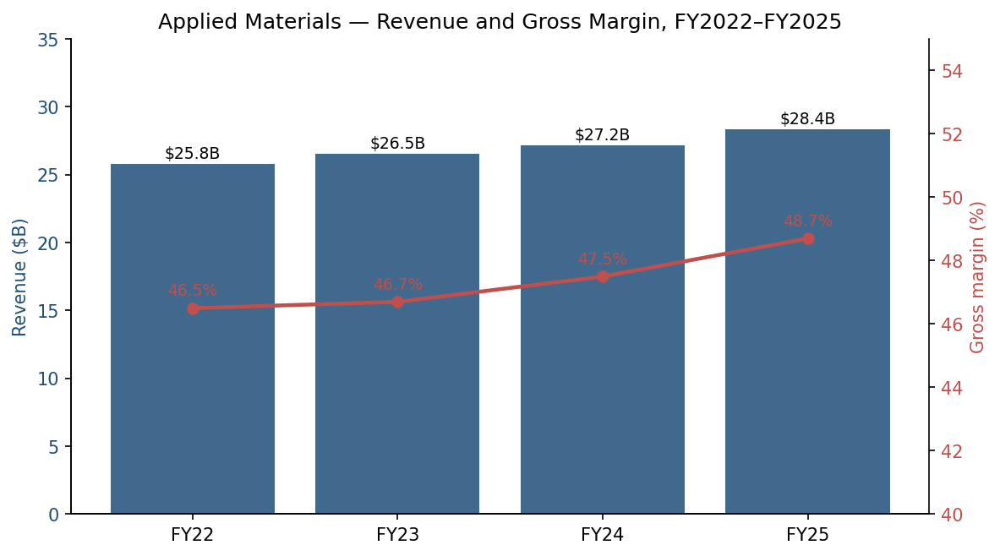

*Source: [Applied Materials 2025 10-K, Consolidated Statements of Operations](https://www.sec.gov/Archives/edgar/data/6951/000162828025056742/amat-20251026.htm); [2024 10-K](https://www.sec.gov/Archives/edgar/data/6951/000000695124000044/amat-20241027.htm) for FY2022 prior-period comparatives.*

### 1.2 Q2 FY2026 results (most recent reporting period; press release 2026-05-14, 10-Q filed 2026-05-21)

For the quarter ended **April 26, 2026**, Applied delivered **record revenue of $7.91B (+11% YoY)**, **record GAAP gross margin of 49.9%** and **non-GAAP gross margin of 50.0%** (the first time non-GAAP gross margin has crossed 50%), and **record GAAP EPS of $3.51** (+33% YoY) / **non-GAAP EPS of $2.86** (+20% YoY). Semiconductor Systems revenue was $5,965M (+10.4%), AGS was $1,665M (+17.3%), and Other (Display + small businesses) was $280M. ([Q2 FY2026 press release, 2026-05-14](https://www.sec.gov/Archives/edgar/data/6951/000162828026035071/exhibit991q22026earningsre.htm); [Q2 FY2026 10-Q](https://www.sec.gov/Archives/edgar/data/6951/000162828026037227/amat-20260426.htm))

The CEO commentary explicitly raised the framing: *"we now expect our semiconductor equipment business to grow more than 30 percent in calendar 2026… The rapid global build-out of AI computing infrastructure combined with Applied's strong leadership positions in leading-edge logic, DRAM and advanced packaging provide an exceptionally strong foundation for sustained, multi-year revenue and profit growth."* ([Q2 FY2026 press release](https://www.sec.gov/Archives/edgar/data/6951/000162828026035071/exhibit991q22026earningsre.htm)) Q3 FY2026 guidance is $8.95B ± $500M revenue and $3.36 ± $0.20 non-GAAP EPS — annualizing toward a ~$35B run-rate against $28.4B reported in FY2025.

### 1.3 Valuation snapshot (TTM, as of 2026-05-22)

| Metric                                | AMAT       |
|---------------------------------------|------------|
| Share price                           | $432.16    |
| Market capitalization                 | $343.1B    |
| TTM P/E                               | **40.7×**  |
| Forward P/E (NTM consensus)           | 29.6×      |
| TTM P/S                               | **11.8×**  |
| TTM revenue                           | $29.0B     |
| Return on equity (TTM)                | 39.7%      |
| Debt/equity                           | 0.30       |
| Dividend yield                        | 0.49%      |
| Net cash + investments — long-term debt | ~$6.6B net cash |

Source: [Stockanalysis.com — AMAT key statistics, queried 2026-05-22](https://stockanalysis.com/stocks/amat/statistics/); balance-sheet data from [2025 10-K](https://www.sec.gov/Archives/edgar/data/6951/000162828025056742/amat-20251026.htm).

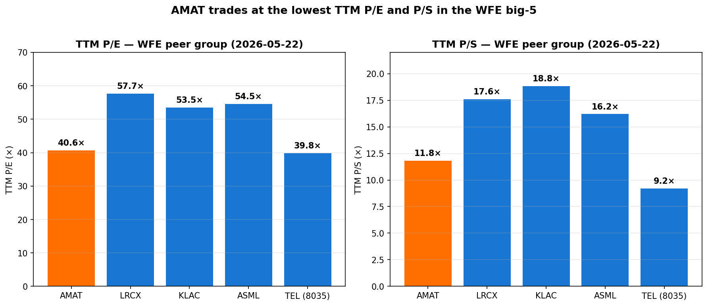

*Source: [Stockanalysis.com peer statistics, queried 2026-05-22](https://stockanalysis.com/stocks/amat/statistics/) for each ticker; TEL P/S derived from market cap ¥22.49T / TTM revenue ¥2.44T.*

### 1.4 Reportable segments (FY2025 basis, as of October 26, 2025)

Effective FY2025, Applied collapsed its reportable segments from three to two by folding the **Display** business into Corporate & Other (*"because management no longer considers Display a significant operating segment for separate reporting purposes"*). Effective the first quarter of FY2026, Applied also moved its **200mm equipment business** from AGS into Semiconductor Systems, and began fully allocating corporate support costs to operating segments (prior periods recast). ([2025 10-K, Note 15 "Industry Segment Operations"](https://www.sec.gov/Archives/edgar/data/6951/000162828025056742/amat-20251026.htm); [Q2 FY2026 press release](https://www.sec.gov/Archives/edgar/data/6951/000162828026035071/exhibit991q22026earningsre.htm))

| Segment (FY2025)              | Revenue ($M) | % of total | Segment OPM |
|-------------------------------|--------------|------------|-------------|
| Semiconductor Systems         | 20,798       | 73%        | 35.5%       |
| Applied Global Services       | 6,385        | 23%        | 28.1%       |
| Corporate & Other (inc. Display) | 1,185     | 4%         | n.m.        |
| **Total**                     | **28,368**   | **100%**   | **29.2%**   |

*Source: [2025 10-K, Note 15](https://www.sec.gov/Archives/edgar/data/6951/000162828025056742/amat-20251026.htm).*

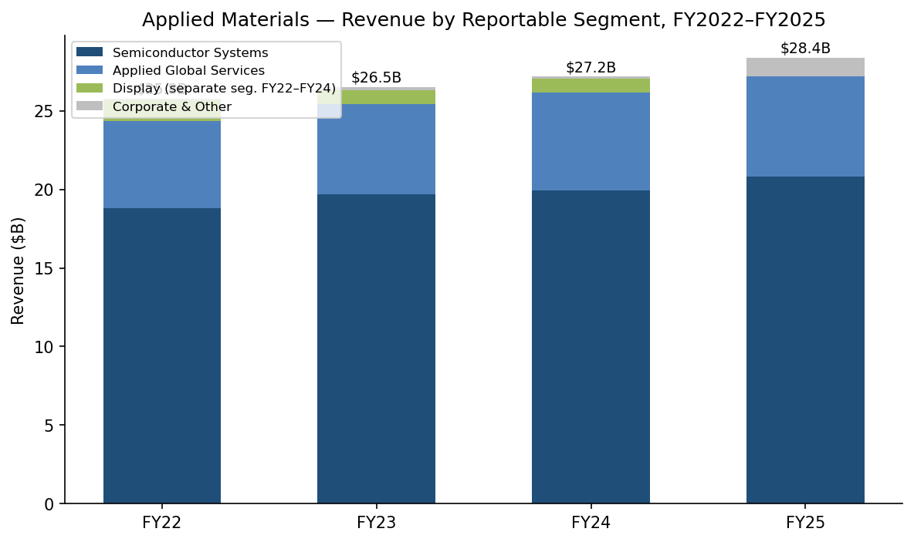

*Source: [2025 10-K, Note 15](https://www.sec.gov/Archives/edgar/data/6951/000162828025056742/amat-20251026.htm); [2024 10-K, Note 14](https://www.sec.gov/Archives/edgar/data/6951/000000695124000044/amat-20241027.htm) for FY2022 prior-period comparatives. Display is shown as a separate segment FY22–FY24 (its last year of standalone reporting was FY2024) and is rolled into Corporate & Other in FY2025.*

### 1.5 Valuation interpretation

A TTM P/E of 40.7× sits well above the long-run semi-equipment cycle average (mid-teens to low-20s in the prior decade) but is **the lowest in the WFE big-five peer group**: LRCX 57.7×, KLAC 53.5×, ASML 54.5×, TEL 39.8× (the only multiple comparable to AMAT). On TTM P/S, AMAT at 11.8× is similarly the cheapest of the US-listed three (LRCX 17.6×, KLAC 18.8×) and second-cheapest behind only TEL after currency adjustment. ([Stockanalysis.com — AMAT, LRCX, KLAC, ASML statistics, queried 2026-05-22](https://stockanalysis.com/stocks/amat/statistics/))

*Analyst view:* three factors plausibly explain why the broadest-portfolio supplier trades at the cheapest multiple in the group:

1. **Higher China sensitivity than peers.** China was 30% of FY2025 revenue (down from 37% in FY2024 — see Section 5), and the 10-K explicitly states *"these actions have caused substantial uncertainty and have resulted in retaliatory measures, including new tariffs on U.S. goods imposed by China and other countries."* ([2025 10-K, MD&A](https://www.sec.gov/Archives/edgar/data/6951/000162828025056742/amat-20251026.htm)) Deposition and implant are among the categories most affected by US BIS rules, so a higher share of the equipment-revenue cut has landed on Applied versus etch- or inspection-only peers.
2. **No litho-monopoly narrative.** ASML's sole-supplier position in EUV justifies its 54.5× P/E; KLAC's process-control near-monopoly justifies its 53.5×. AMAT competes against multiple peers in every product step it sells into, so terminal-margin durability is structurally less obvious than for ASML/KLAC.
3. **Slower FY2025 revenue growth than peers.** AMAT grew 4% in FY2025 while LRCX and KLAC both posted higher growth on the leading-edge cycle. The >30% CY2026 semi-equipment guidance is the catch-up signal — if delivered, the forward P/E of ~29.6× looks cheap relative to the LRCX / KLAC ~40× forward.

The forward P/E of 29.6× sits below the peer median (~40×) and consistent with double-digit upside on multiple expansion alone before any earnings beat. We carry the valuation discount as a risk *and* an opportunity, and flag it explicitly in Section 9 (R9 valuation / multiple-compression risk).

---

## 2. Company History

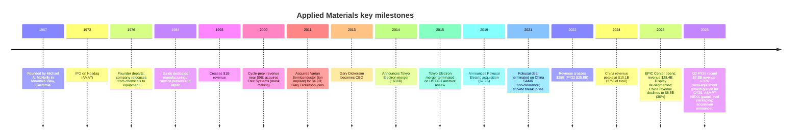

*Sources: [2025 10-K](https://www.sec.gov/Archives/edgar/data/6951/000162828025056742/amat-20251026.htm); [2026 DEF 14A Proxy Statement](https://www.sec.gov/Archives/edgar/data/6951/000119312526027307/d71992ddef14a.htm); [Q2 FY26 press release](https://www.sec.gov/Archives/edgar/data/6951/000162828026035071/exhibit991q22026earningsre.htm).*

Applied Materials was founded in 1967 and went public on Nasdaq in 1972. Through a multi-decade transformation that pivoted the company from chemicals to equipment in the late 1970s, Applied followed foundry and memory capex to Asia and absorbed a series of adjacent product franchises to become the world's largest wafer-fab equipment supplier. The arc has three load-bearing inflection points worth surfacing because each still shapes today's competitive profile:

1. **Asia-first globalization (1980s–90s):** Applied was among the first US capital-equipment suppliers to build dedicated R&D, manufacturing and field-service presence in Japan, Korea and Taiwan. The structural result is that by FY2025, *"In fiscal 2025, approximately 89% of our net revenue was to customers in regions outside the United States,"* with Asia-Pacific concentrated as the largest customer region. ([2025 10-K](https://www.sec.gov/Archives/edgar/data/6951/000162828025056742/amat-20251026.htm))
2. **Materials-engineering platform consolidation (2000s–2010s):** Applied absorbed Etec Systems (mask making, 2000), Brooks Automation's wafer-handling business (2007), Semitool (CMP/ECP, 2009) and Varian Semiconductor (ion implant, 2011 for $4.9B). The single most consequential of these was Varian — it brought Gary Dickerson, who became CEO in 2013 and remains in the role. ([2026 DEF 14A, "Director and Nominee Biographies"](https://www.sec.gov/Archives/edgar/data/6951/000119312526027307/d71992ddef14a.htm))
3. **Failed mega-deals (2014 TEL; 2019 Kokusai Electric):** The proposed $30B Tokyo Electron merger collapsed in 2015 after the US DOJ raised antitrust concerns. The proposed $2.2B Kokusai Electric (formerly Hitachi Kokusai's semi business) acquisition was terminated in March 2021 after China's State Administration for Market Regulation did not clear the deal within the agreed window; Applied paid a $154M termination fee. *Analyst view:* these failures left Applied without scaled exposure to the dedicated batch-ALD and furnace categories where Kokusai is strong — a strategic gap that arguably persists today.

Applied has held the #1 WFE share position from approximately 2017 onward (a position previously rotated with TEL and ASML depending on EUV cycle); however with ASML's continued EUV ramp and TEL's coater/developer + etch share growth, the gap at the top has narrowed in 2024–2025. *(Share rankings are widely reported in SEMI and Gartner WFE share data; AMAT does not publish a self-claim of #1 in its 10-K, and we do not attribute that claim to a primary filing.)*

---

## 3. Management Team

The skill calls for founder and current CEO only. AMAT's founder (Michael A. McNeilly, 1967) departed the company in 1976 — half a century before today — and is not operationally relevant. Below we cover one short paragraph on the founder for historical context, followed by a full bio on the current CEO.

### 3.1 Founder — Michael A. McNeilly (founded 1967; departed 1976)

Michael A. McNeilly co-founded Applied Materials in 1967 in Mountain View, California, originally to supply chemicals and chemical-vapor-deposition systems to the nascent integrated-circuit industry. He departed in 1976, and the Company pivoted away from chemicals to focus on equipment; the founder has no current operational role, no current ownership stake, and no current board presence. The 1972 Nasdaq listing under ticker AMAT was completed during his tenure. ([2026 DEF 14A, "Director and Nominee Biographies"](https://www.sec.gov/Archives/edgar/data/6951/000119312526027307/d71992ddef14a.htm) — director list shows McNeilly is not a current director or 5% holder.)

### 3.2 Current CEO — Gary E. Dickerson (President & CEO since 2013)

Gary Dickerson is one of the longest-tenured CEOs in US semiconductor capital equipment. He has been **President of Applied since 2012 and CEO since September 2013** — 13 years in the seat — an unusually long tenure for a company of this scale. The 2026 proxy describes him simply as *"Gary E. Dickerson — President and Chief Executive Officer, Applied Materials, Inc."* ([2026 DEF 14A](https://www.sec.gov/Archives/edgar/data/6951/000119312526027307/d71992ddef14a.htm))

**Prior 2–3 roles with what he specifically accomplished:**

- **CEO, Varian Semiconductor Equipment Associates (2004–2011).** Joined Varian as COO in 2004 and became CEO shortly thereafter. Under his leadership Varian became the dominant supplier of ion-implant equipment for advanced-logic and DRAM nodes; Applied acquired Varian in November 2011 for $4.9B, and Dickerson transitioned into Applied as part of the deal — by design, as Varian's board and Applied's board had both viewed him as a transformative operator. ([2026 DEF 14A](https://www.sec.gov/Archives/edgar/data/6951/000119312526027307/d71992ddef14a.htm))
- **President and COO, KLA-Tencor (1986–2004; 18 years).** Joined what is now KLA in 1986 in product-development roles and rose to President and COO before leaving for Varian in 2004. Two industry-shaping product cycles ran through him at KLA-Tencor: the 1990s build-out of optical inspection that defined process-control as a category, and the early-2000s eBeam review programs that put KLA in the position it still occupies today.

**Education:** B.S. in Engineering, California Polytechnic State University.

**Tenure / ownership / compensation:**
- President of Applied since 2012; CEO since 2013 (13 years).
- Director nominee on the 2026 ballot. ([2026 DEF 14A, "Director Nominee Biographies"](https://www.sec.gov/Archives/edgar/data/6951/000119312526027307/d71992ddef14a.htm))
- Ownership stake is less than 1% of shares outstanding (the proxy's beneficial-ownership table lists all directors and NEOs as a group at <1%). The board's stock-ownership guidelines require the CEO to own ≥6× base salary in stock.
- FY2025 total target compensation comprised base salary of $1,030,000, target annual cash bonus, and target long-term equity awards in PSU and RSU form. The 2026 proxy notes that the CEO's FY2024–FY2025 PSU awards *"fully vested at the end of fiscal 2025"* because Applied's TSR exceeded the maximum performance hurdle — a structural feature of the comp design that aligns CEO pay with multi-year shareholder return rather than annual earnings.

**Why this CEO matters to the equity story.** Dickerson's 13-year run has delivered ~4× revenue growth (from ~$7B in FY13 to $28.4B in FY25, ~12% CAGR) and operating-margin expansion from mid-teens to ~32% (non-GAAP, Q2 FY26 run-rate) — that combination is among the best multi-cycle records in WFE. He has missed twice on transformative M&A (TEL 2014–15; Kokusai 2019–21) — those are genuine execution failures and have left Applied without scaled batch-ALD and furnace exposure — but he has otherwise compounded EPS and dividend per share consistently; the 2026 dividend was raised 15% to $0.53/quarter, marking nine consecutive years of increases. ([Q2 FY26 press release, dividend section](https://www.sec.gov/Archives/edgar/data/6951/000162828026035071/exhibit991q22026earningsre.htm))

---

## 4. Products & Services

This is the most consequential section of the report: if a reader does not finish Section 4 able to explain what every product family does and why customers buy it, the rest of the analysis is hand-waving. We anchor first to Applied's own published product matrix from the 10-K, then walk each family with three pedagogical beats (what it physically does → how it differs from its sibling products → what's driving demand now) using bilingual technical glosses.

### 4.1 Applied's own product matrix (10-K Item 1 Business)

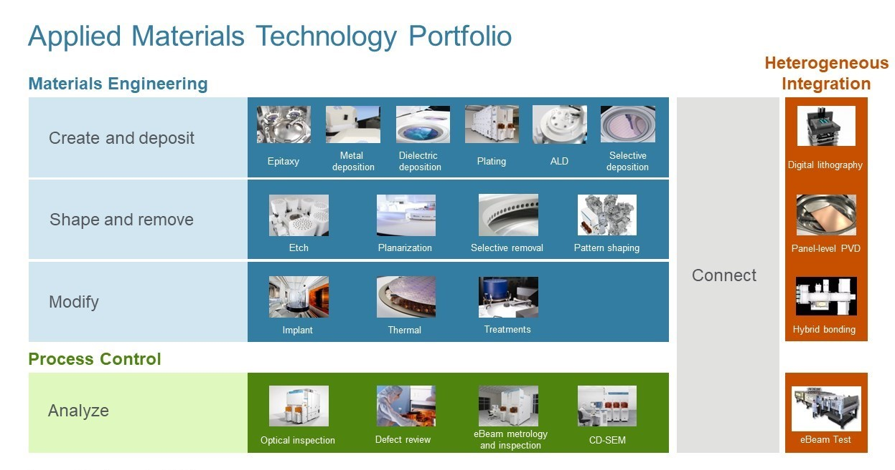

*Source: Applied Materials 2025 10-K, Item 1 "Business," Products Slide (file `amat-20251026_g2.jpg`), embedded at [the 10-K cover document](https://www.sec.gov/Archives/edgar/data/6951/000162828025056742/amat-20251026.htm).*

Reproduced as a searchable markdown table (verbatim from the 10-K slide, no analyst additions):

| Category | Process step | Product families on the slide |
|---|---|---|
| **Materials Engineering — Create and deposit** | — | Epitaxy · Metal deposition · Dielectric deposition · Plating · ALD · Selective deposition |
| **Materials Engineering — Shape and remove** | — | Etch · Planarization · Selective removal · Pattern shaping |
| **Materials Engineering — Modify** | — | Implant · Thermal · Treatments |
| **Process Control — Analyze** | — | Optical inspection · Defect review · eBeam metrology and inspection · CD-SEM |
| **Heterogeneous Integration** | — | Digital lithography · Panel-level PVD · Hybrid bonding · eBeam Test |

The 10-K prose describes the segment as follows (verbatim block-quote):

> "Our Semiconductor Systems segment designs, develops, manufactures and sells a wide range of equipment used to fabricate semiconductor chips, also referred to as integrated circuits (ICs). The Semiconductor Systems segment consists of the semiconductor capital equipment industry's most comprehensive portfolio of products used in the chip making process. Our products address steps across materials engineering, process control and advanced packaging, including the conversion of patterns into device structures, transistor and interconnect fabrication, metrology, inspection and review, and packaging technologies for connecting finished IC die."
> — [2025 10-K, Item 1 "Business — Semiconductor Systems"](https://www.sec.gov/Archives/edgar/data/6951/000162828025056742/amat-20251026.htm)

*Note on naming.* The 10-K describes the segment at a process-step level (epitaxy, metal deposition, etc.) but does **not** name specific product platforms (Endura®, Centura®, Producer®, Reflexion®, Mirra®, VIISta®, etc.) in its prose. Those branded names live on Applied's product portal at [appliedmaterials.com/us/en/semiconductor/products.html](https://www.appliedmaterials.com/us/en/semiconductor/products.html), and the Q2 FY26 press release explicitly named two new product launches (Precision™ Selective Nitride PECVD and Trillium™ ALD). Below, when we name a specific platform, we cite the company website or a press release rather than implying the 10-K named it.

### 4.2 Synthesis — how the categories interact in a customer's manufacturing cycle

Before walking the matrix row by row, it is worth understanding the *cycle*: a semiconductor wafer makes 300–800 trips through these tool categories during a typical leading-edge build, and the product steps are deeply interdependent. The simplest way to think about Applied's portfolio is as a near-complete coverage of the **Deposition → Pattern → Etch → Clean → Modify → Measure → Repeat** loop that defines a wafer-fab process flow.

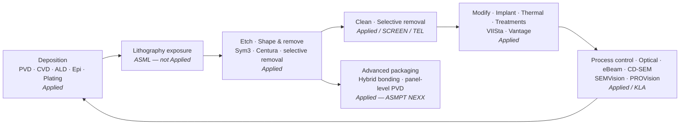

**Why this matters.** Applied participates in **every step except lithography exposure** (ASML's domain) and most of coater/developer (TEL's domain). That portfolio breadth is what justifies the "broadest WFE portfolio" claim in Section 7 and what insulates the recurring-services business in Section 4.6 — every shipped tool feeds AGS spares and service revenue for the next 8–15 years. Below we walk each row of the matrix in turn.

### 4.3 Create and deposit — Epitaxy, Metal deposition (PVD/ECD), Dielectric deposition (CVD), Plating, ALD, Selective deposition

**Epitaxy / 外延.**

> "Our products address steps across materials engineering, process control and advanced packaging, including the conversion of patterns into device structures, transistor and interconnect fabrication…"
> — [2025 10-K, Item 1 "Business"](https://www.sec.gov/Archives/edgar/data/6951/000162828025056742/amat-20251026.htm)

**中文释义 / Plain-language gloss:** Epitaxy / 外延 deposits a thin, crystalline silicon (or SiGe) layer atom-by-atom on the wafer surface so the resulting film carries the same crystal lattice as the wafer below. It is the layer where the transistor's source/drain (源极/漏极) and channel (沟道) actually live; if the epi is defective, every downstream step inherits the defect. Epi differs from metal deposition (next row) because it grows a *crystalline* film by chemical-vapor reaction at high temperature (typically 600–1100°C), whereas metal deposition simply sputters or plates a metal film on top of an already-built structure. The strategic inflection driving demand right now: the **gate-all-around (GAA, 栅极环绕)** transition at TSMC's N2 and Samsung's SF2 requires multiple selective-epi steps to grow the nanosheet stack — typically 4–6 epi recipes per transistor where the FinFET generation needed 1–2.

*Analyst view:* Applied competes here against ASM International (ASMI) and Hitachi-Kokusai. Industry observers (e.g. [SEMI Equipment Market Statistics](https://www.semi.org/en/products-services/market-data/equipment-market-data-subscription)) widely place AMAT in a leadership position in epitaxy for foundry / logic, but Applied does not make a self-claim in the 10-K — we relabel any "#1 in epi" framing as analyst opinion.

**Metal deposition — PVD (physical-vapor deposition, 物理气相沉积) / ECD (electrochemical deposition, 电化学沉积).**

> "We are a Delaware corporation. Our fiscal year ends on the last Sunday in October. We operate in two reportable segments: Semiconductor Systems and Applied Global Services® (AGS). The Semiconductor Systems segment represents the largest contributor to our net revenue."
> — [2025 10-K, Item 1 "Business"](https://www.sec.gov/Archives/edgar/data/6951/000162828025056742/amat-20251026.htm)

**中文释义 / Plain-language gloss:** Metal deposition is how the chip's wiring (互连线 / interconnect) gets built. PVD physically sputters atoms of copper, tungsten, titanium nitride, ruthenium, cobalt onto the wafer in a vacuum chamber; ECD electroplates copper into the trenches that have already been etched. Each metal serves a different role — copper for the long signal lines, tungsten for the deep contacts to source/drain, ruthenium and cobalt for the thinnest barriers and liners at advanced nodes. Metal deposition differs from dielectric deposition (next row) because the films conduct electricity rather than insulating it. The strategic inflection: advanced nodes (3nm, 2nm, A14, A10) need progressively thinner barriers and progressively more exotic metals (ruthenium, molybdenum) to keep line resistance manageable as wires shrink. Each new node generation drives an upgrade cycle in PVD chamber configurations.

*Analyst view:* the closest competitive comparison is Lam Research's deposition franchise; the two compete most directly at the PVD/ECD step, with Applied historically the broader portfolio and Lam the stronger memory account. Specific competitor product comparisons should be cited to the competitor's own filing — see Lam Research's [2025 10-K](https://www.sec.gov/Archives/edgar/data/707549/000070754925000075/lrcx-20250629.htm) Competition section.

**Dielectric deposition — CVD (chemical-vapor deposition, 化学气相沉积).**

**中文释义 / Plain-language gloss:** Dielectrics are the *insulators* (介质 / dielectric, 绝缘体 / insulator) between the wires — they prevent the metal lines from short-circuiting to each other. CVD deposits silicon-dioxide, silicon-nitride, low-κ (low-permittivity), and increasingly air-gap-engineered dielectric films from gas-phase precursors. Dielectric CVD differs from metal CVD or PVD because the film must be electrically isolating and chemically stable; getting it conformal in 3-D structures (DRAM capacitors, NAND vertical channels, GAA gate stacks) is the hard physics problem. The strategic inflection just announced in Q2 FY26: Applied introduced **Precision™ Selective Nitride PECVD**, which the press release described verbatim as *"preserves integrity of shallow trench isolation, reducing parasitic capacitance and boosting chip performance-per-watt."* The product is positioned for the leading-edge GAA logic transition. ([Q2 FY2026 press release, 2026-05-14](https://www.sec.gov/Archives/edgar/data/6951/000162828026035071/exhibit991q22026earningsre.htm))

*Analyst view:* AMAT competes here against Lam Research, Tokyo Electron and ASM International. Across the industry, Applied is widely viewed as one of the broader dielectric-CVD suppliers; specific share splits depend on customer node and are not company-disclosed.

**Plating — copper electroplating / 铜电镀 (ECD/ECP).**

**中文释义 / Plain-language gloss:** Once trenches have been etched into the dielectric, copper is *electroplated* into them to form the interconnect lines. The plating chamber sits the wafer in a bath of copper-sulfate solution, applies a current, and copper ions deposit onto the wafer surface from solution — physically the same chemistry as decorative chrome plating but at sub-30-nm geometry. Plating differs from PVD because PVD deposits a thin barrier or seed (Ta/TaN, Co, Ru), and the *bulk* metal fill is done by plating; without plating you cannot fill a high-aspect-ratio trench because PVD is line-of-sight and would leave a void in the middle. Strategic inflection: hybrid bonding (Section 4.7) and HBM through-silicon vias use plated copper for the vertical interconnect; demand for advanced ECD chambers scales directly with the HBM ramp.

*Analyst view:* Applied entered the modern ECD market through the 2009 Semitool acquisition; the franchise also competes with Lam Research's plating line. Industry-share commentary on Applied's relative position should be cited to a third-party industry research source (Yole, TechInsights) rather than the 10-K.

**ALD (atomic-layer deposition, 原子层沉积).**

**中文释义 / Plain-language gloss:** ALD deposits films one atomic layer at a time by alternating gas pulses, where each pulse self-limits at one monolayer thickness. The result is unmatched conformality (the film has the same thickness on every surface of a 3-D structure, even inside vertical channels with 60:1 aspect ratios) and atomic-precision thickness control. ALD differs from CVD because CVD deposits continuously and the film thickness is set by reaction-rate-times-time, whereas ALD is digitally counted in *cycles* — 1 nm = ~10 cycles, each cycle = 1 second to 1 minute. The strategic inflection just announced: Applied introduced **Trillium™ ALD**, which *"wraps silicon nanosheets with complex metal gate stacks that optimize transistors for a wide range of AI computing applications."* The product targets the GAA logic transition where the gate stack must wrap around the nanosheet channel with sub-nanometer thickness uniformity. ([Q2 FY2026 press release](https://www.sec.gov/Archives/edgar/data/6951/000162828026035071/exhibit991q22026earningsre.htm))

*Analyst view:* ALD is the deposition category where Applied has historically been weakest relative to Lam Research and ASM International, both of which have larger installed bases. The Trillium launch is a deliberate attempt to close that gap at the GAA transition. The failed Kokusai Electric acquisition (2019–2021) was largely about acquiring scaled batch-ALD capability that Applied still does not have today; this remains a strategic gap noted in Section 2.

**Selective deposition.**

**中文释义 / Plain-language gloss:** Conventional deposition coats every surface of the wafer. *Selective* deposition grows the film only on chosen surfaces (e.g., only on metal lines, not on dielectric) by exploiting differences in surface chemistry. The strategic value is eliminating a separate patterning step downstream — selective deposition substitutes for one cycle of lithography + etch, which is enormously expensive at leading-edge nodes (EUV exposure costs alone run $0.50–$1.00 per wafer-pass). Selective deposition differs from regular CVD/ALD because the chemistry is tuned to react only with one surface composition; recipe development is significantly harder than blanket deposition.

*Analyst view:* selective deposition is the highest-growth pocket within deposition, driven by the cost pressure of EUV multi-patterning. Lam, AMAT and TEL all have selective products; share commentary should be cited to third-party industry research.

### 4.4 Shape and remove — Etch, Planarization (CMP), Selective removal, Pattern shaping

**Etch.**

**中文释义 / Plain-language gloss:** Etch *removes* material from the wafer surface — either by chemical reaction with plasma-activated gases (plasma etch, 等离子刻蚀) or by wet chemicals. The two main modes Applied addresses are **conductor etch** (cutting metals and silicon) and **dielectric etch** (cutting silicon-dioxide, silicon-nitride and low-κ films). Within etch, atomic-layer etch (ALE) is the analog of ALD on the removal side — material is removed one atomic layer per cycle. Etch differs from CMP (next row) because etch is *vertical* and pattern-defined (it cuts through the dielectric exactly where lithography defined a hole), while CMP is *lateral* and removes material uniformly to a flat surface. Strategic inflection: 200+ layer 3D NAND requires high-aspect-ratio (HAR, 高纵横比) etch to cut channels >10 μm deep with <0.1% sidewall deviation; GAA logic requires atomic-layer etch to define the nanosheet release windows.

*Analyst view:* etch is widely understood by sell-side and SEMI to be a duopoly between Lam Research and Tokyo Electron, with Applied a strong third. The 10-K's Competition section names Applied's primary competitors broadly: *"In Semiconductor Systems, our primary competitors include ASM International, ASM Pacific Technology, Hitachi Kokusai Electric, KLA Corporation, Lam Research Corporation, Onto Innovation, SCREEN Holdings, and Tokyo Electron Limited"* — relative share among them is not disclosed and we cite [SEMI quarterly equipment market statistics](https://www.semi.org/en/products-services/market-data/equipment-market-data-subscription) for share rankings. ([2025 10-K, "Competition"](https://www.sec.gov/Archives/edgar/data/6951/000162828025056742/amat-20251026.htm))

**Planarization (CMP — chemical-mechanical planarization, 化学机械抛光).**

**中文释义 / Plain-language gloss:** After each deposition step the wafer surface is uneven — dielectric and metal protrude unevenly above the underlying structure. CMP polishes it flat by pressing the wafer against a rotating polishing pad while a slurry of fine abrasive particles + chemicals removes the protrusions. CMP differs from etch because etch is *selective and vertical* (cuts patterns where defined), while CMP is *non-selective and lateral* (planarizes the entire wafer surface to be flat enough for the next lithography exposure to focus correctly). Without CMP, the surface roughness would accumulate over 50+ metal layers until lithography depth-of-focus is exhausted. Strategic inflection: HBM stacking and advanced-packaging hybrid bonding require atomically smooth surfaces (sub-Å roughness) for direct copper-to-copper bonding; CMP recipe complexity has grown 2–3× over the last node generation.

*Analyst view:* CMP is widely considered a duopoly between Applied Materials and Ebara of Japan, with Applied historically the larger share holder. Industry-share data: [Yole Group, "Equipment Manufacturers, 2024 status of the WFE industry"](https://www.yolegroup.com/strategy-insights/) (subscription) places Applied as the leading CMP supplier; the 10-K does not make a self-claim. Internal Applied messaging often groups CMP and deposition tools into "Reflexion family CMP" and "Mirra family CMP" platforms — see [appliedmaterials.com semiconductor products](https://www.appliedmaterials.com/us/en/semiconductor/products.html) for the current portfolio.

**Selective removal.**

**中文释义 / Plain-language gloss:** Like selective deposition (4.3), selective removal targets only certain surfaces — e.g., removing a sacrificial silicon-germanium layer to release the nanosheet channels in GAA without touching the silicon nanosheets above and below. Selective removal differs from blanket etch (which removes everywhere lithography defined) because the chemistry exploits a 100:1 or higher etch-rate ratio between two materials. Strategic inflection: GAA *cannot exist* without selective SiGe removal — this is one of the new tool categories created by the GAA transition.

*Analyst view:* selective-removal share is small but growing fast at the GAA inflection; competitive landscape is fragmented among Applied, Lam Research, TEL and several startups.

**Pattern shaping.**

**中文释义 / Plain-language gloss:** A complementary technology that selectively trims or shapes photoresist lines after lithography to achieve smaller effective critical dimension than litho alone can resolve. It is one of several techniques (with multi-patterning, EUV double-patterning) by which the industry pushed below the optical resolution limit before EUV.

### 4.5 Modify — Implant, Thermal, Treatments

**Implant (ion implantation, 离子注入).**

**中文释义 / Plain-language gloss:** Ion implantation accelerates dopant atoms (boron, phosphorus, arsenic) into the silicon surface to electrically activate the source/drain regions of every transistor — typically billions per chip. The wafer sits in a beam of charged ions; the beam's energy determines depth, the dose determines doping concentration. Implant differs from epitaxy because epi *grows* a doped layer in real-time from the gas phase, while implant *injects* dopants into an already-built silicon layer. Strategic inflection: GAA logic requires multiple selective implant steps (replacing what FinFET could do with a single high-dose step), so implant dollar-content per wafer is growing at the leading edge.

*Analyst view:* Applied acquired the ion-implant franchise from Varian in 2011 ($4.9B). The closest competitors are Sumitomo SEN of Japan (formerly Sumitomo Eaton Nova) and US-listed Axcelis ([ACLS 2024 10-K](https://www.sec.gov/cgi-bin/browse-edgar?action=getcompany&CIK=0001113232&type=10-K)). Applied's relative position is widely reported as the leader by SEMI; the 10-K does not make a self-claim and we do not attribute one.

**Thermal — Vantage rapid thermal processing (RTP, 快速热处理).**

The 10-K names the Vantage platform in passing:
> "…such as the [Vantage] product"
> *(Applied's 10-K mentions Vantage in product context — see [2025 10-K](https://www.sec.gov/Archives/edgar/data/6951/000162828025056742/amat-20251026.htm). The platform's specific page lives at the company's product portal, [appliedmaterials.com](https://www.appliedmaterials.com/us/en/semiconductor/products.html).)*

**中文释义 / Plain-language gloss:** Rapid thermal processing flashes a wafer to a high temperature (typically 1000–1300°C) for milliseconds-to-seconds — long enough to activate dopants and form silicide contacts, but short enough that the dopants do not diffuse out of the precisely-defined source/drain regions. RTP differs from a conventional furnace because a furnace bakes the entire wafer batch for hours; RTP processes one wafer at a time in seconds. Strategic inflection: as transistor junctions get shallower (sub-10 nm depth at advanced nodes), the thermal-budget tolerance shrinks — RTP and millisecond anneal capability are growing in importance.

*Analyst view:* AMAT competes with Mattson (now part of Beijing E-Town's AMEC group) and SCREEN. SEMI publishes the share leadership annually.

**Treatments.**

**中文释义 / Plain-language gloss:** A catch-all for post-deposition surface treatments — plasma curing of low-κ dielectrics, anneals that densify ALD films, hydrogen-plasma cleaning before metal deposition. Treatments fill the gap between depositing a film and being ready for the next process step.

### 4.6 Process Control — Optical inspection, Defect review, eBeam metrology & inspection, CD-SEM

**Process control — what it is and why it matters.**

**中文释义 / Plain-language gloss:** Every wafer that comes off a process step is inspected to verify the structure built matches the design. **Optical inspection** uses visible/UV light to scan the wafer for defects at the micron-to-sub-micron scale. **Defect review** zooms in on the defects found by optical inspection at higher resolution. **eBeam metrology / inspection** uses a scanning electron beam to measure feature dimensions and find sub-resolution defects optical cannot see. **CD-SEM (critical-dimension scanning electron microscope, 关键尺寸扫描电子显微镜)** is the workhorse tool that measures transistor critical dimensions after lithography, etch and CMP — every wafer in a leading-edge fab goes through dozens of CD-SEM measurements per layer.

Process control differs from the deposition/etch/CMP tools because it does not modify the wafer — it observes it. The strategic value is yield: in a leading-edge fab, a 1% yield improvement can be worth $100M+/year, so the tool that detects a brewing defect six wafers earlier than the next-best tool earns its keep many times over.

*Analyst view:* this category is structurally KLA's home turf. KLAC operating margins exceed 40% because optical inspection at leading-edge is a near-monopoly position. Applied is a credible #2 in eBeam review and metrology specifically (the SEMVision product line, [appliedmaterials.com](https://www.appliedmaterials.com/us/en/semiconductor/products.html)) but addresses only a slice of the overall process-control TAM. The 10-K lists KLA among Applied's primary competitors in this category. ([2025 10-K, "Competition"](https://www.sec.gov/Archives/edgar/data/6951/000162828025056742/amat-20251026.htm))

### 4.7 Heterogeneous Integration / advanced packaging — Digital lithography, Panel-level PVD, Hybrid bonding, eBeam Test

**Why advanced packaging exists.**

**中文释义 / Plain-language gloss:** Moore's-law scaling at the transistor level has slowed — going from 3 nm to 2 nm yields ~10–15% more transistors per area, where 30 years ago each node delivered 50–100%. Packaging-level integration ("heterogeneous integration") compensates by stacking and interconnecting multiple chips into a single package with thousands of vertical wires (through-silicon vias, TSVs / 硅通孔). HBM (high-bandwidth memory) for AI accelerators is the canonical example: 8–16 DRAM dies are stacked vertically, bonded together with copper interconnects at sub-10 μm pitch, and assembled onto a silicon interposer with the logic die.

**Hybrid bonding / 混合键合.**

**中文释义 / Plain-language gloss:** Hybrid bonding directly bonds copper pads on one die to copper pads on the die above without any solder — the copper-to-copper bond forms atomically when the two surfaces are pressed together at moderate temperature. Hybrid bonding differs from conventional flip-chip (which uses solder bumps at 30+ μm pitch) because hybrid-bonded pitch can shrink to sub-1 μm, enabling massively more interconnect bandwidth between the stacked dies. Strategic inflection: this is the workhorse technology for HBM4 (the memory standard for next-generation AI accelerators) and for 3D-stacked logic.

*Analyst view:* the dominant hybrid-bonding tool supplier today is BESI ([Besi-Group annual reports](https://www.besi.com/investor-relations/)); AMAT and TEL each have offerings. Applied's positioning is improving with the recently announced ASMPT NEXX acquisition for panel-level packaging.

**Panel-level PVD — ASMPT NEXX acquisition.**

The Q2 FY26 press release described the acquisition verbatim:
> "Entered into an agreement with ASMPT Limited to acquire its NEXX business, a leading supplier of large-area advanced packaging deposition equipment for the semiconductor industry. The addition of the NEXX team and products will broaden Applied's portfolio of panel-level advanced packaging technologies which are designed to enable chipmakers and systems companies to build larger-body AI accelerators for higher energy-efficient performance."
> — [Q2 FY26 press release, 2026-05-14](https://www.sec.gov/Archives/edgar/data/6951/000162828026035071/exhibit991q22026earningsre.htm)

**中文释义 / Plain-language gloss:** Panel-level packaging deposits the redistribution-layer (RDL, 重布线层) wiring on a large square panel rather than a round wafer. The panel format (typically 500 × 500 mm or larger) lets a single tool deposit RDL for many AI accelerator packages at once, dropping the per-package cost meaningfully versus wafer-level packaging. This is the leading-edge form factor for the next generation of Blackwell-class and post-Blackwell GPU packages.

### 4.8 Applied Global Services — recurring services and the subscription shift

AGS is the recurring-services franchise, comprising spares, upgrades, services, and factory automation software for Applied's global installed base. The 10-K describes the business:

> "AGS's transactional and subscription service products, spares and factory automation software is purchased by customers to optimize the performance of our large, global installed base of semiconductor and other equipment. These solutions are also used to optimize plant performance and productivity."
> — [2025 10-K, Item 1 "Business — Applied Global Services"](https://www.sec.gov/Archives/edgar/data/6951/000162828025056742/amat-20251026.htm)

The strategic thesis on AGS is the **subscription shift**, articulated verbatim in the MD&A:

> "Our strategy is to continue to shift the AGS' service and spares business to a subscription agreement model, improving customer factory performance and optimizing operating costs, and providing us a more predictable revenue stream."
> — [2025 10-K, MD&A](https://www.sec.gov/Archives/edgar/data/6951/000162828025056742/amat-20251026.htm)

AGS revenue has compounded at a steady ~5–6% per year:

| FY | AGS revenue ($M) | % of total | Op margin |
|---|---|---|---|
| FY22 | 5,543 | 21% | 28.4% |
| FY23 | 5,732 | 22% | 26.7% |
| FY24 | 6,225 | 23% | 29.1% |
| FY25 | 6,385 | 23% | 28.1% |

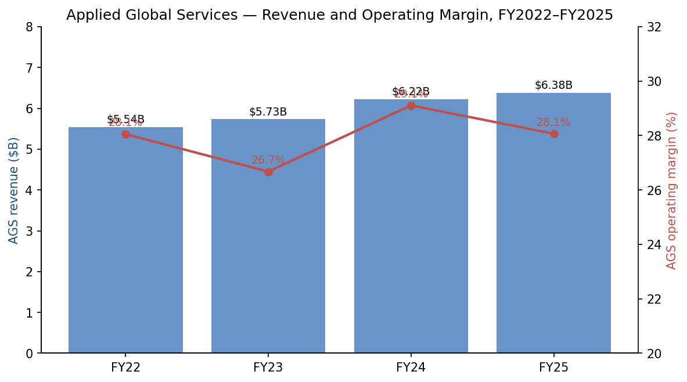

*Source: [2025 10-K, Note 15](https://www.sec.gov/Archives/edgar/data/6951/000162828025056742/amat-20251026.htm); [2024 10-K, Note 14](https://www.sec.gov/Archives/edgar/data/6951/000000695124000044/amat-20241027.htm).*

**Why AGS matters more than the segment revenue line suggests.** Of the $15.0B total backlog at October 26, 2025, AGS represented $7,141M (48%); Semiconductor Systems was $7,105M (47%); Corporate and Other was $756M (5%). **AGS backlog now exceeds Semiconductor Systems backlog** — a structurally meaningful inflection because recurring services is less cyclical than new-tool orders. Through future cycles this should compress earnings volatility and partially justify a higher multiple. ([2025 10-K, "Backlog"](https://www.sec.gov/Archives/edgar/data/6951/000162828025056742/amat-20251026.htm))

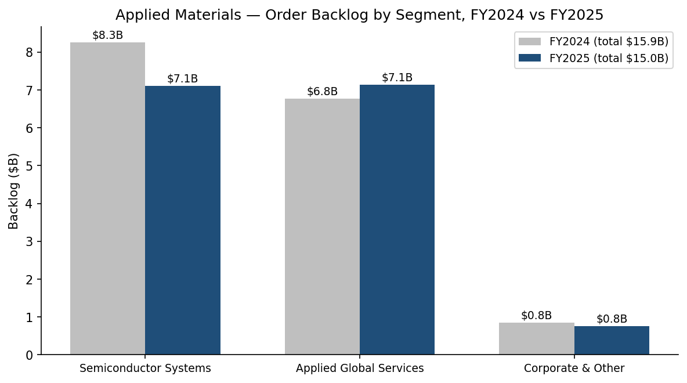

*Source: [2025 10-K, "Backlog"](https://www.sec.gov/Archives/edgar/data/6951/000162828025056742/amat-20251026.htm); [2024 10-K, "Backlog"](https://www.sec.gov/Archives/edgar/data/6951/000000695124000044/amat-20241027.htm).*

Applied does not disclose the percentage of AGS revenue under long-term service agreements (LTSAs) — that figure is *analyst estimated* at ~50–60% based on the 10-K's commentary that AGS FY25 revenue growth was attributed to *"higher customer spending on long-term service agreements and spares, partially offset by lower customer spending on 200mm equipment."* The 200mm equipment business moved to Semiconductor Systems effective Q1 FY26, leaving AGS as a purer services + spares + automation business going forward. ([2025 10-K, MD&A](https://www.sec.gov/Archives/edgar/data/6951/000162828025056742/amat-20251026.htm))

*Analyst view:* the AGS subscription shift is the single most important durability lever in the AMAT investment case. Higher LTSA penetration converts what is historically a transactional, cyclical revenue line into a predictable annual recurring revenue (ARR) line, with the same effect on multiple that the cloud transition had on software valuations. Quantified durability gains are not yet visible in segment margin (FY25 AGS margin actually declined 100 bp YoY due to 200mm headwinds), but should manifest as gross margin stability through the next down-cycle.

### 4.9 Display (Corporate & Other)

The Display business sells PVD and CVD tools for OLED display production (primarily Samsung Display, LG Display, BOE, CSOT and Visionox) and for legacy LCD lines. Display revenue has declined from a peak near $2.2B in FY18–FY19 (the China LCD Gen-10.5 buildout) to under $900M in FY24, and was de-segmented in FY25 (*"management no longer considers Display a significant operating segment for separate reporting purposes"*). The IT-OLED transition (Apple's iPad / MacBook OLED adoption, and Samsung's A6 IT fab in Asan) should support a multi-year capex rebound, but absolute scale relative to AMAT's $28B revenue means Display is now a peripheral line. ([2025 10-K, Note 15](https://www.sec.gov/Archives/edgar/data/6951/000162828025056742/amat-20251026.htm); [2024 10-K, Note 14](https://www.sec.gov/Archives/edgar/data/6951/000000695124000044/amat-20241027.htm))

### 4.10 Quarterly run-rate (recent)

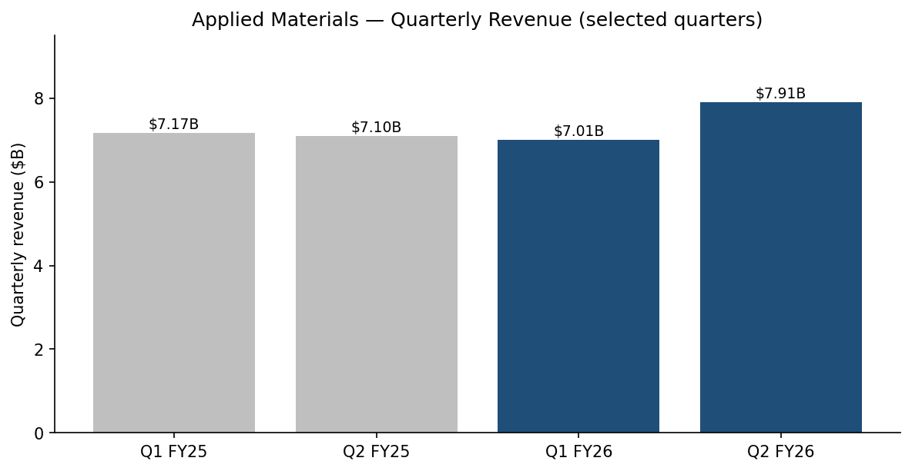

*Source: [Q2 FY26 press release, 2026-05-14](https://www.sec.gov/Archives/edgar/data/6951/000162828026035071/exhibit991q22026earningsre.htm) for Q2 FY26 ($7,910M) and Q2 FY25 ($7,100M); [Q2 FY26 10-Q H1 totals](https://www.sec.gov/Archives/edgar/data/6951/000162828026037227/amat-20260426.htm) imply Q1 FY26 = $7,012M.*

### 4.11 Flagship franchises and what's new in the last 12 months

- **Flagship 1 — Deposition (epi + CVD + PVD).** Largest single category by revenue. Recent launch: **Precision™ Selective Nitride PECVD** (Q2 FY26). ([Q2 FY26 press release](https://www.sec.gov/Archives/edgar/data/6951/000162828026035071/exhibit991q22026earningsre.htm))
- **Flagship 2 — CMP (Reflexion / Mirra platforms via website).** Structurally high-margin franchise, near-duopoly position. ([appliedmaterials.com product portal](https://www.appliedmaterials.com/us/en/semiconductor/products.html))
- **Flagship 3 — Ion implant (Varian heritage).** High-margin franchise with leadership position. ([appliedmaterials.com product portal](https://www.appliedmaterials.com/us/en/semiconductor/products.html))
- **New in 12 months — Trillium™ ALD.** First major ALD platform launch positioned at the GAA inflection. ([Q2 FY26 press release](https://www.sec.gov/Archives/edgar/data/6951/000162828026035071/exhibit991q22026earningsre.htm))
- **New in 12 months — ASMPT NEXX acquisition.** Adds panel-level packaging deposition; announced May 2026, integration TBD. ([Q2 FY26 press release](https://www.sec.gov/Archives/edgar/data/6951/000162828026035071/exhibit991q22026earningsre.htm))
- **Strategic R&D platform — EPIC Center, Silicon Valley.** Opened FY25; in Q2 FY26 added TSMC, Samsung Electronics, SK hynix, Micron, Advantest, Arizona State, RPI, Stanford as named research and innovation partners. ([Q2 FY26 press release](https://www.sec.gov/Archives/edgar/data/6951/000162828026035071/exhibit991q22026earningsre.htm))

---

## 5. Customers & Go-to-Market

### 5.1 Customer concentration — quantified

The 2025 10-K discloses: *"During fiscal 2025, two customers accounted for approximately 19% and 15%, respectively, of our net revenue."* In FY2024 the same two-tier structure was 12% and 11%, and in FY2023 it was *"approximately 19% and 15%, respectively"* — i.e. the top two customers swing between roughly 23% and 34% of revenue depending on cycle timing. ([2025 10-K, Note 15 "Industry Segment Operations"](https://www.sec.gov/Archives/edgar/data/6951/000162828025056742/amat-20251026.htm))

The 10-K does **not name** the two top customers, but Applied's own geographic disclosure makes the attribution mechanically obvious: Taiwan was $6,857M / 24% of revenue in FY25 (up 71% YoY) and Korea was $5,608M / 20% (up 25% YoY). Taken with the WFE industry's well-known customer concentration (TSMC and Samsung Electronics together represent the bulk of leading-edge WFE buyers globally), the two reported top-customer percentages are widely understood by sell-side and SEMI to be TSMC (the Taiwan plurality) and Samsung Electronics (the Korea plurality). ([2025 10-K, Note 15, geographic revenue table](https://www.sec.gov/Archives/edgar/data/6951/000162828025056742/amat-20251026.htm))

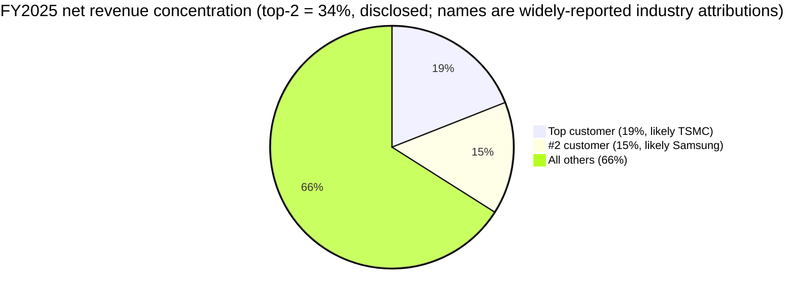

*Source: [2025 10-K, Note 15](https://www.sec.gov/Archives/edgar/data/6951/000162828025056742/amat-20251026.htm) — top two percentages disclosed; customer names are widely reported industry attributions but not disclosed by Applied.*

**Customer-risk verdict:** with top-2 = 34% (and historical swing between 23% and 34%), Applied has **material customer concentration** that flows through to revenue volatility. Both top customers are also vertically integrating equipment R&D (TSMC's process integration; Samsung's internal tool development) but neither is a credible threat to displace Applied across 6+ process steps simultaneously — the breadth of the portfolio is structurally protective. We carry this as a moderate-to-material risk in Section 9 (R1).

### 5.2 Geographic revenue and the China question

The 10-K confirms: *"In fiscal 2025, approximately 89% of our net revenue was to customers in regions outside the United States."* Within Asia-Pacific the dynamics in 2024–25 were stark — China declined 16% YoY ($10,117M → $8,529M) as US export controls bit, while Taiwan +71% and Korea +25% picked up the slack. ([2025 10-K, Note 15 "Concentrations"](https://www.sec.gov/Archives/edgar/data/6951/000162828025056742/amat-20251026.htm))

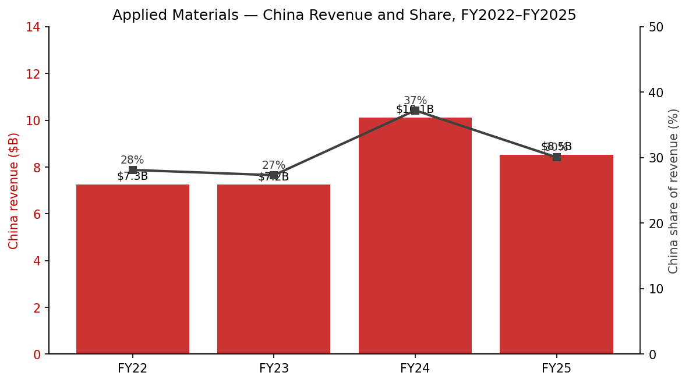

*Source: [2025 10-K, Note 15 geographic revenue](https://www.sec.gov/Archives/edgar/data/6951/000162828025056742/amat-20251026.htm); [2024 10-K, Note 14](https://www.sec.gov/Archives/edgar/data/6951/000000695124000044/amat-20241027.htm) for FY2022 comparatives.*

FY2025 revenue by region ($M, % of total): China $8,529 (30%; down from 37% in FY24), Korea $5,608 (20%), Taiwan $6,857 (24%), Japan $2,273 (8%), Southeast Asia $1,076 (4%), US $3,063 (11%), Europe $962 (3%). ([2025 10-K, Note 15](https://www.sec.gov/Archives/edgar/data/6951/000162828025056742/amat-20251026.htm))

The China decline is mechanical and policy-driven. The 10-K explicitly states: *"As a result of new export rules and regulations issued in December 2024, backlog was revised. These actions have caused substantial uncertainty and have resulted in retaliatory measures, including new tariffs on U.S. goods imposed by China and other countries."* ([2025 10-K, MD&A](https://www.sec.gov/Archives/edgar/data/6951/000162828025056742/amat-20251026.htm)) Successive BIS rules (October 2022, October 2023, December 2024) have progressively restricted Applied's ability to ship advanced deposition, etch and implant tools to Chinese leading-edge fabs (SMIC, YMTC, CXMT).

The strategic question is whether the remaining ~$8.5B China revenue is durable. The non-controlled portion is mostly mature-node and trailing-edge equipment used by Chinese foundries (SMIC mature lines, Nexchip, GTA, SiEn) and domestic DRAM/NAND players (CXMT, YMTC) for processes the US does not restrict. *Analyst view:* sell-side estimates for Chinese mature-node WFE capex run $25–35B annually in 2026–2027, providing several years of runway even if no additional advanced-node licenses are granted; however further US restrictions remain a key downside risk (Section 9 R10), and Applied does compete head-to-head with Chinese domestic suppliers (NAURA, AMEC, Piotech) on those legacy nodes — the 10-K acknowledges this directly: *"We could see increased competition from domestic equipment manufacturers in China resulting from local government incentives and funding as well as export controls established by the United States government to restrict the sale of certain technologies to customers in China."* ([2025 10-K, "Competition"](https://www.sec.gov/Archives/edgar/data/6951/000162828025056742/amat-20251026.htm))

### 5.3 Go-to-market — direct sales force, multi-year deal cycle

Applied sells almost entirely through a **direct sales force** because of the highly technical nature of equipment integration. The 10-K confirms: customer support, applications and demos are concentrated in the United States, China, Taiwan, Israel and South Korea; product development and engineering are concentrated in the United States, India and Israel. ([2025 10-K, "Marketing and Sales"](https://www.sec.gov/Archives/edgar/data/6951/000162828025056742/amat-20251026.htm))

The deal cycle for a new leading-edge production tool is multi-year: from initial customer engagement at the pilot-line stage, through volume order placement, factory build, tool shipment, installation, acceptance, and revenue recognition — typically 18–30 months. AGS revenue, by contrast, recognizes spares at point of shipment and service agreements over time (substantially within 12 months of contract inception). ([2025 10-K, Note 15](https://www.sec.gov/Archives/edgar/data/6951/000162828025056742/amat-20251026.htm))

### 5.4 EPIC Center — a strategic GTM innovation

In FY2025–FY2026, Applied opened the **EPIC Center in Silicon Valley**, a co-innovation hub designed to compress the time from research to high-volume manufacturing. The Q2 FY26 release announced an unusually broad set of EPIC partner additions in the same quarter: TSMC, Samsung Electronics, SK hynix, Micron Technology, Advantest, Arizona State University, Rensselaer Polytechnic Institute, Stanford University. The release also noted that Applied has *"joined Synopsys and NVIDIA in a collaboration to advance AI and quantum chemistry R&D with accelerated materials modeling."* ([Q2 FY26 press release](https://www.sec.gov/Archives/edgar/data/6951/000162828026035071/exhibit991q22026earningsre.htm))

*Analyst view:* EPIC is Applied's response to imec's Belgium-based open-innovation model and to Lam's "Equipment Intelligence" labs — a way to entrench the customer relationship at the earliest stage of process integration. It is also a competitive moat against Chinese WFE startups, which lack equivalent academic + customer co-innovation infrastructure at this scale.

---

## 6. Industry Overview

### 6.1 Industry definition

Applied operates in the **wafer fab equipment (WFE)** segment of the semiconductor capital equipment industry. WFE is the largest of three subsegments of "semicap":

- **WFE** (~$110B in CY2025) — tools for the front-end-of-line (FEOL) and middle-of-line (MOL) used to fabricate the chip on the wafer.
- **Assembly, test & packaging equipment** (~$10–12B) — back-end equipment.
- **Other** (mask making, chemicals delivery, ancillary).

Applied principally addresses WFE plus a growing slice of advanced packaging (which spans WFE-style deposition and CMP applied to BEOL/back-end). The relevant industry classification is **NAICS 333242 — Semiconductor Machinery Manufacturing**. ([U.S. Census NAICS](https://www.census.gov/naics/?input=333242&year=2022&details=333242))

### 6.2 Market size and growth

The 2025 10-K does not publish an internal TAM estimate but the industry data point most cited by semicap participants is **SEMI's quarterly equipment forecast**, published in Equipment Market Statistics:

| Year | WFE ($B) | Driver |
|---|---|---|
| CY2022 | ~$98B (peak) | China + leading-edge logic |
| CY2023 | ~$80B (trough) | Memory downcycle + foundry slowdown |
| CY2024 | ~$95B | China mature + HBM |
| CY2025 | ~$110B (est.) | HBM, leading-edge logic ramp, NAND restart |
| CY2026 | $120–135B (sell-side bracket) | AI-driven, AMAT >30% growth guidance |

Source for WFE market size estimates: [SEMI Equipment Market Statistics (subscription)](https://www.semi.org/en/products-services/market-data/equipment-market-data-subscription); CY26 bracket built off Applied's own >30% growth guidance and analogous comments from Lam and KLA on their recent earnings calls.

Applied management's *"semiconductor equipment business to grow more than 30 percent in calendar 2026"* (May 14, 2026) is the most recent forward indicator from the largest portfolio supplier and signals an extended AI-driven up-cycle rather than the typical 1.5–2 year cycle. ([Q2 FY26 press release](https://www.sec.gov/Archives/edgar/data/6951/000162828026035071/exhibit991q22026earningsre.htm))

### 6.3 Growth drivers

1. **AI infrastructure capex.** Hyperscaler capex (Microsoft, Google, Meta, Amazon, Oracle) supports leading-edge logic demand at TSMC (3nm, 2nm), Intel Foundry, and Samsung Foundry. AI accelerators require HBM, which requires advanced DRAM nodes and complex through-silicon-via packaging. The 10-K MD&A notes: *"Investments by semiconductor equipment customers are expected to remain strong with growth in the adoption of high-bandwidth memory and other forms of advanced packaging, continued demand for AI and data center computing, and for non-leading edge nodes."* ([2025 10-K, MD&A](https://www.sec.gov/Archives/edgar/data/6951/000162828025056742/amat-20251026.htm))

2. **Gate-all-around (GAA) transition.** TSMC's N2 ramps in 2H 2026; Samsung's SF3 / SF2 GAA ramps are also underway. GAA requires new deposition (selective epi, ALD for nanosheet shells) and etch (atomic-layer etch for vertical channel formation). *Analyst estimate:* the WFE intensity per wafer at GAA is ~$0.8–1.2B per 50K wpm of new capacity, of which Applied addresses roughly 25–30% by product step (not company-disclosed; built off 10-K segment data + node-density assumptions).

3. **HBM / advanced packaging.** HBM3E and HBM4 require sub-10μm bumps, hybrid bonding for die stacking, and large-area RDL — all of which use deposition and CMP that Applied addresses. The May 2026 ASMPT NEXX acquisition extends Applied into panel-level packaging deposition. ([Q2 FY26 press release](https://www.sec.gov/Archives/edgar/data/6951/000162828026035071/exhibit991q22026earningsre.htm))

4. **Mature node / China-domestic capex.** China-domestic foundry capex on 28nm and trailing nodes continues to absorb significant WFE and is the portion of China revenue most insulated from US export controls.

5. **DRAM and NAND upgrades.** DRAM 1-alpha / 1-beta / 1-gamma transitions and NAND 200+ layer transitions each pull deposition, etch, RTP and CMP intensity.

### 6.4 Industry structure

WFE is a **highly consolidated oligopoly**, with five companies — Applied Materials, ASML, Lam Research, Tokyo Electron and KLA — together accounting for the majority of global WFE revenue. Below the big-five, the market fragments into category specialists (Hitachi High-Tech, Kokusai, SCREEN Holdings, ASM International, Onto Innovation, Camtek, Veeco, FormFactor, NAURA, AMEC, Piotech). The exact "Big-5 share of WFE" depends on the source and the year — [SEMI Equipment Market Statistics](https://www.semi.org/en/products-services/market-data/equipment-market-data-subscription) and [Gartner WFE share data](https://www.gartner.com/) typically place the big-5 together at ~75–80% of WFE.

Barriers to entry are extreme:

- **R&D intensity.** AMAT spent **$3.57B on RD&E in FY25 (~12.6% of revenue)**; Lam, KLA and ASML each spend at comparable or higher intensity. Building a competitive new etch or deposition tool requires 5–10 years of R&D plus customer co-development at a leading-edge fab. ([2025 10-K, Consolidated Statements of Operations](https://www.sec.gov/Archives/edgar/data/6951/000162828025056742/amat-20251026.htm))
- **Installed-base flywheel.** Every shipped tool generates 8–15 years of spares + service revenue, funding next-generation R&D and locking in customer integration relationships. AMAT's >50,000-tool installed base is the working capital of the recurring-services franchise.
- **Customer-trust + downside-risk asymmetry.** A chipmaker that re-qualifies an alternative supplier risks yield excursions worth hundreds of millions of dollars. This asymmetry fundamentally protects incumbents.

Supplier power is moderate-to-low because the equipment companies design their own subsystems and rely on a fragmented supplier base for parts and components. Buyer power is high (the customer base is ultra-concentrated: TSMC, Samsung, SK hynix, Micron, Intel, GlobalFoundries, SMIC together represent the bulk of WFE demand). Substitutes are minimal — chip manufacturing genuinely requires this equipment. Regulation (US/EU/Japan/Netherlands export controls) is the biggest external structural force.

---

## 7. Competitive Landscape

### 7.1 The Big-5 WFE map (TTM data, 2026-05-22)

| Company | Primary categories | TTM revenue | TTM P/E | TTM P/S | Headline analyst view |
|---|---|---|---|---|---|
| **AMAT** | Deposition, etch, CMP, RTP, implant, eBeam, advanced packaging | $29.0B | 40.7× | 11.8× | Broadest portfolio; cheapest multiple in the group |
| **ASML** | Lithography (EUV + DUV) | $38.8B | 54.5× | 16.2× | Sole EUV supplier; near-monopoly economics |
| **LRCX** | Etch, deposition (ALD/CVD) | $21.7B | 57.7× | 17.6× | Etch + NAND specialist; recent re-rating on AI memory |
| **TEL (8035)** | Coater/developer, etch, deposition, cleaning | ¥2.44T (~$15.7B) | 39.8× | ~9.2× | #1 in coater/developer; broadest non-US portfolio |
| **KLA** | Process control (optical/eBeam inspection + metrology) | $13.1B | 53.5× | 18.8× | Process-control near-monopoly; highest margins in WFE |

*Source: [Stockanalysis.com peer statistics (AMAT, LRCX, KLAC, ASML), queried 2026-05-22](https://stockanalysis.com/stocks/amat/statistics/); [Stockanalysis.com TEL 8035 statistics](https://stockanalysis.com/quote/tyo/8035/) (TEL P/S derived from market cap ¥22.49T / TTM revenue ¥2.44T).*

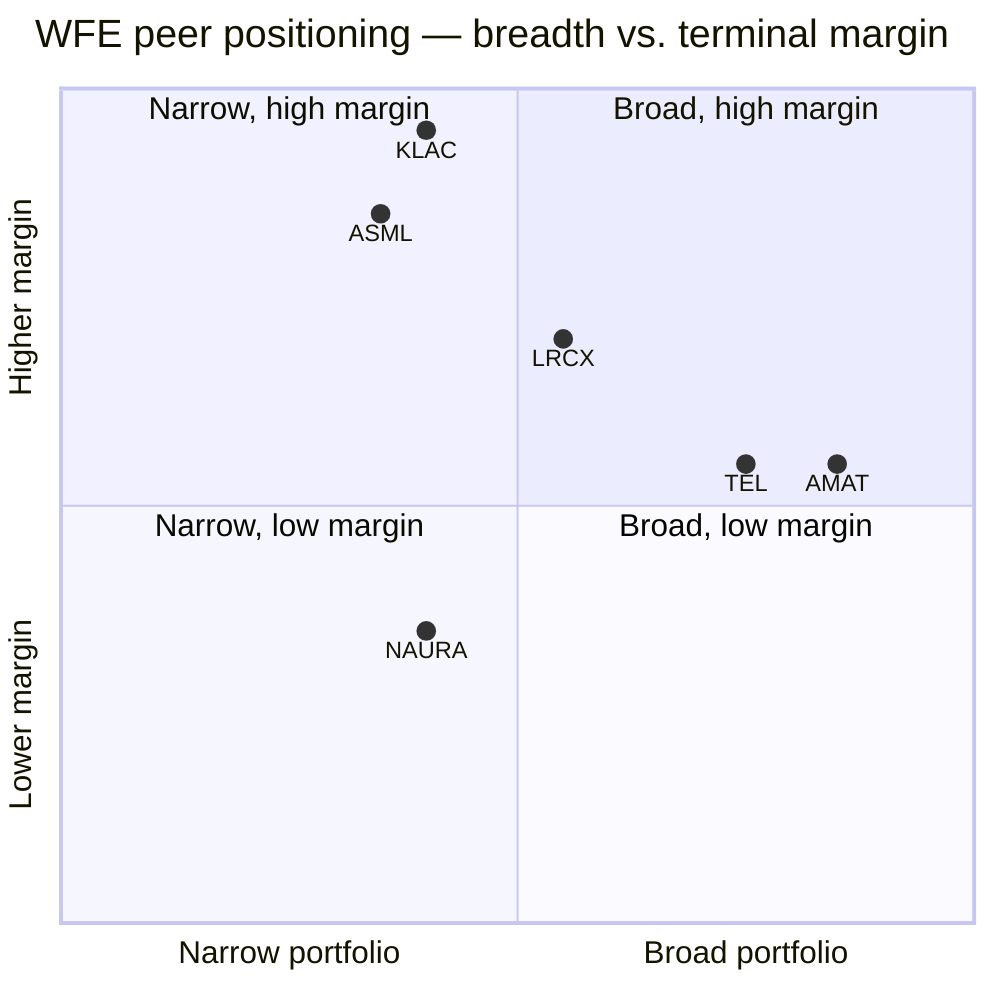

*Positioning is illustrative analyst judgment based on FY25 reported segment margins and product taxonomies disclosed in each company's annual report. Gross margins for reference: KLAC ~61.5%, ASML ~52.6%, LRCX ~50.0%, AMAT 48.7%, TEL ~46% — per each company's most recent annual disclosure.*

### 7.2 Head-to-head positioning vs. each major peer

**vs. ASML.** Not directly competitive — ASML's lithography is a category Applied has never participated in, and ASML's EUV monopoly is widely viewed as the most valuable single WFE franchise. There is increasing **collaborative dependency**: ASML's High-NA EUV system requires precisely deposited and etched masks (Applied) and metrology (KLA), so the entire stack moves together. ASML trades at 54.5× P/E and 16.2× P/S — well above AMAT's 40.7× / 11.8×. ([Stockanalysis.com ASML, 2026-05-22](https://stockanalysis.com/stocks/asml/statistics/))

**vs. Lam Research.** Applied is structurally broader in deposition (PVD + CVD + ALD + epi); Lam is structurally narrower but stronger in **etch** (especially high-aspect-ratio dielectric etch for NAND and selective etch for GAA) and competitive in ALD/CVD. Lam has a stronger NAND franchise; Applied has a stronger DRAM franchise (HBM-related deposition steps). LRCX trades at 57.7× P/E vs. AMAT's 40.7× — partly because Lam's smaller revenue base ($21.7B TTM vs. $29.0B for AMAT) gives it more cyclical-leverage-per-dollar in an up-cycle. ([Stockanalysis.com LRCX, 2026-05-22](https://stockanalysis.com/stocks/lrcx/statistics/))

**vs. Tokyo Electron (8035.T).** TEL is Applied's closest portfolio analog ex-litho — coater/developer (where AMAT does not compete), etch, cleaning, deposition (PVD/CVD/ALD), and test handlers. TEL's gross margin is ~46% (vs. AMAT 48.7%), but its operating margin is lower because of higher mix of lower-margin coater/developer revenue. TEL also has a **stronger Japan and stronger China-domestic position** than AMAT thanks to historically less restrictive Japanese export controls (though Japan moved to align with US restrictions in 2024). TEL trades at 39.8× TTM P/E — the only WFE big-5 multiple comparable to AMAT, reflecting a similar China-policy discount. ([Stockanalysis.com TEL 8035, 2026-05-22](https://stockanalysis.com/quote/tyo/8035/))

**vs. KLA.** Not directly competitive ex-eBeam review and inspection (where AMAT competes with KLA's optical-inspection platforms). KLA dominates the optical inspection / metrology stack with structurally higher margins (gross margin ~61.5%, operating margin >40%). KLA trades at 53.5× P/E and 18.8× P/S — the highest multiples in the peer group — because process-control as a category is small, fast-growing, and structurally a near-monopoly. ([Stockanalysis.com KLAC, 2026-05-22](https://stockanalysis.com/stocks/klac/statistics/))

**vs. Chinese domestic WFE (NAURA, AMEC, Piotech, ACM Research).** The competitive threat is **trailing-edge first, leading-edge gradually**. The 10-K acknowledges directly: *"We could see increased competition from domestic equipment manufacturers in China resulting from local government incentives and funding as well as export controls established by the United States government to restrict the sale of certain technologies to customers in China."* ([2025 10-K, "Competition"](https://www.sec.gov/Archives/edgar/data/6951/000162828025056742/amat-20251026.htm)) *Analyst view:* NAURA is the most credible challenger in mature-node etch and PVD at Chinese fabs; AMEC competes in dielectric etch; Piotech in CVD; ACM in cleaning. None can yet compete at 5nm or below. This is the slowest-moving competitive threat — but compounding over 5–10 years it is the single biggest secular concern in the equity story. (Public competitor data: [NAURA Technology Group (SZSE:002371) 2024 年度报告](http://www.cninfo.com.cn/) and equivalent ASML/KLA/LRCX filings.)

### 7.3 Switching costs and durability

Switching costs in WFE are among the highest in any industrial market:

- A fab uses 5–10 instances of each tool family across the line; switching means re-qualifying every recipe at every step.
- Yield risk on a re-qualification cycle can easily destroy $50–100M of wafer output.
- Service and spares revenue is locked to the tool generation for 8–15 years.
- Process recipes are co-developed with the OEM and contain customer-specific IP.

This is why AMAT's installed base of >50,000 tools represents a multi-decade recurring-revenue franchise. AGS gross margin of 33.4% in FY25 reflects that pricing power; the subscription LTSA model should improve it further (Section 4.8). ([2025 10-K, Note 15](https://www.sec.gov/Archives/edgar/data/6951/000162828025056742/amat-20251026.htm))

---

## 8. Market Opportunity (TAM)

### 8.1 WFE TAM bridge

Applying [SEMI Equipment Market Statistics](https://www.semi.org/en/products-services/market-data/equipment-market-data-subscription) and the bracket of sell-side projections that pencil to AMAT's >30% CY26 semi-equipment growth guidance ([Q2 FY26 press release](https://www.sec.gov/Archives/edgar/data/6951/000162828026035071/exhibit991q22026earningsre.htm)):

- **CY2026E WFE:** $125–135B (consensus consistent with AMAT >30% guidance).
- **CY2027–2030E WFE:** mid-single to high-single-digit CAGR depending on AI sustainability — sell-side bracket of $135–165B by 2030.

Applied's **served market** is approximately 65–70% of WFE (everything except lithography exposure and most coater/developer). *Analyst estimate, built on [2025 10-K segment data](https://www.sec.gov/Archives/edgar/data/6951/000162828025056742/amat-20251026.htm) + the SEMI WFE bracket above:* served WFE TAM of ~$85–95B in CY26E with possible $100B+ by CY28–29. Applied's run-rate semi-equipment revenue is on a path to ~$22–24B (FY25 Semi Systems $20.8B + the FY26 reclassification of the 200mm business from AGS), implying current share of ~25–27% of served WFE — leaving meaningful room for share gain in advanced packaging and ALD even before market growth.

### 8.2 Advanced packaging incremental TAM

The advanced packaging TAM is *separately growing fastest* — *analyst bracket* from ~$4–5B in CY24 to a sell-side projected $10–15B by CY28, driven by hybrid bonding, CoWoS expansion, and panel-level packaging. The May 2026 ASMPT NEXX acquisition was a deliberate move to deepen this exposure; Applied has publicly targeted >$1B in advanced packaging revenue at its Investor Days since 2023. ([Q2 FY26 press release](https://www.sec.gov/Archives/edgar/data/6951/000162828026035071/exhibit991q22026earningsre.htm))

### 8.3 AGS / services TAM

The services TAM grows mechanically with the installed base. With ~50,000 tools in the field and an average tool generating $50K–$300K/year of spares + service over an 8–12-year life, the AGS TAM is *analyst-estimated* at $10–15B by 2030 assuming current installed-base growth continues. Capturing more of that TAM through subscription LTSA conversion is the most tractable durability lever in the story. ([2025 10-K, "Applied Global Services" + MD&A](https://www.sec.gov/Archives/edgar/data/6951/000162828025056742/amat-20251026.htm))

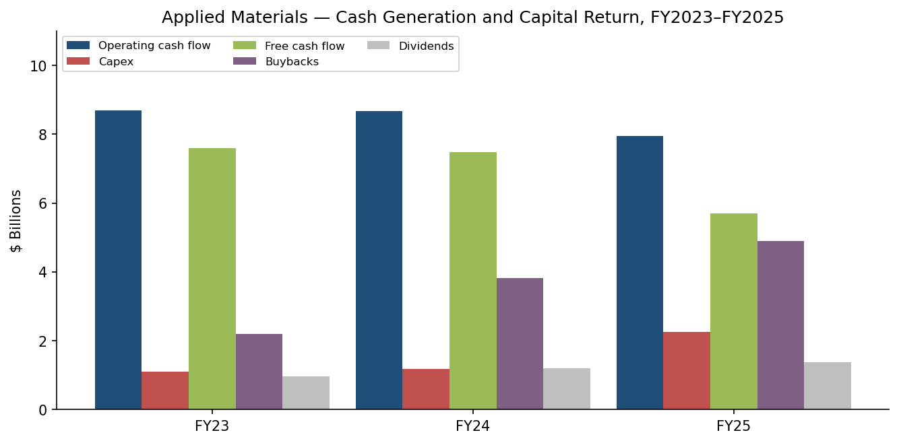

*Source: [Applied Materials 2025 10-K, Consolidated Statements of Cash Flows](https://www.sec.gov/Archives/edgar/data/6951/000162828025056742/amat-20251026.htm).*

The cash-generation picture supports the durability argument: in FY23–FY25 cumulatively, AMAT generated ~$25.3B of operating cash flow, spent ~$4.6B on capex (FY25 capex doubled to $2.26B as the EPIC Center built out), and returned ~$14.5B to shareholders ($10.9B buybacks + $3.6B dividends). Net cash returned represents ~80% of operating cash flow over the three-year window. ([2025 10-K, Cash Flow Statements](https://www.sec.gov/Archives/edgar/data/6951/000162828025056742/amat-20251026.htm))

---

## 9. Risk Assessment

We organize risks into the four standard buckets: company-specific, industry/market, financial, macro/regulatory. Each carries 50–100 words of description and noted mitigants.

### 9.1 Company-specific risks

**R1. Customer concentration (top-2 = 34% of FY25 revenue).** *"During fiscal 2025, two customers accounted for approximately 19% and 15%, respectively, of our net revenue,"* widely understood to be TSMC and Samsung. The top-2 share has reached 34% in FY25 from 23% in FY24, so a capex pause at either customer can move quarterly revenue by 5–10%. *Mitigants:* portfolio breadth means AMAT is impossible to fully displace at any single customer; LTSA subscription revenue is sticky even when new-tool orders pause; the customer set is structurally protected by being the leading-edge process incumbents. ([2025 10-K, Note 15](https://www.sec.gov/Archives/edgar/data/6951/000162828025056742/amat-20251026.htm))

**R2. Advanced-packaging share execution.** Advanced packaging is the fastest-growing WFE pocket but is also where Applied competes with hybrid-bonding leader BESI and with TEL and SUSS for panel-level systems. If the ASMPT NEXX integration falters, share gain in the strategically most important growth area would stall. *Mitigants:* ASMPT NEXX is an established platform; Applied's deposition + CMP capabilities are genuinely differentiated for back-end-of-line applications. ([Q2 FY26 press release announcing NEXX deal](https://www.sec.gov/Archives/edgar/data/6951/000162828026035071/exhibit991q22026earningsre.htm))

**R3. Chinese domestic WFE share loss.** NAURA, AMEC, Piotech and others are subsidized and have a structural cost advantage at trailing nodes; export controls accelerate localization. The 10-K acknowledges: *"We could see increased competition from domestic equipment manufacturers in China resulting from local government incentives and funding…"* *Mitigants:* China leading-edge spending remains largely off-limits to domestic suppliers; Chinese localization is mostly at 28nm and above. Applied's $8.5B FY25 China revenue is dominated by mature-node tools that have a 5–10 year competitive runway before domestic alternatives are fully qualified. ([2025 10-K, "Competition"](https://www.sec.gov/Archives/edgar/data/6951/000162828025056742/amat-20251026.htm))

**R4. ALD / batch-furnace gap.** Applied's failed Kokusai Electric acquisition (terminated 2021 after China SAMR non-clearance) left it without scaled batch-ALD and furnace exposure — a category where ASM International and Kokusai (now standalone) remain stronger. The Trillium™ ALD launch addresses single-wafer ALD at the GAA inflection but does not close the batch-ALD gap. *Mitigants:* organic ALD platform development is in flight; the GAA-related ALD spending pocket is single-wafer-biased rather than batch. ([Q2 FY26 press release for Trillium](https://www.sec.gov/Archives/edgar/data/6951/000162828026035071/exhibit991q22026earningsre.htm))

### 9.2 Industry / market risks

**R5. WFE cyclicality.** The 10-K opens its risk-factor section with: *"The industries in which we operate, including the global semiconductor industry, have historically been cyclical and are subject to volatility in customer demand."* WFE has historically had 2-year cycles with peak-to-trough revenue declines of 20–40% (last cycle: $99B CY22 → $80B CY23). *Mitigants:* AGS is now 23% of revenue with structurally lower cyclicality; the subscription LTSA backlog ($7.1B as of October 2025) provides multi-quarter visibility even in a downturn. ([2025 10-K, Item 1A "Risk Factors"](https://www.sec.gov/Archives/edgar/data/6951/000162828025056742/amat-20251026.htm))

**R6. AI demand normalization.** The 10-K notes: *"AI is evolving rapidly and the expected timing and amount of investments related to AI can change significantly. As a result, it is difficult to accurately forecast demand for our products related to AI."* If hyperscaler capex slows, leading-edge wafer demand decelerates. *Mitigants:* AI is being absorbed across multiple end markets (cloud, edge, automotive, robotics, on-device inference) so demand is diversified across the customer set; Applied's exposure spans memory + logic + advanced packaging so it captures multiple ways to win on AI. ([2025 10-K, Item 1A "Risk Factors"](https://www.sec.gov/Archives/edgar/data/6951/000162828025056742/amat-20251026.htm))

**R7. Lithography-led growth bottleneck.** WFE growth is increasingly bottlenecked by ASML EUV throughput — if ASML cannot ship enough High-NA tools, leading-edge ramp is constrained and deposition/etch/CMP demand follows. *Mitigants:* ASML continues to expand High-NA capacity; even constrained leading-edge growth still drives mature-node and AGS revenue.

### 9.3 Financial risks

**R8. Goodwill / acquisition risk.** Goodwill stood near $3.7B at end of FY25; the 10-K notes goodwill decreased in FY25 due to an impairment charge taken in Q4 FY25. The ASMPT NEXX deal (announced Q2 FY26) and potential further M&A in advanced packaging could create additional impairment exposure if integration falters. *Mitigants:* Goodwill is small relative to the $343B market cap; impairment cycles tend to be one-time non-cash events. ([2025 10-K, Consolidated Balance Sheet + Note 7 Goodwill](https://www.sec.gov/Archives/edgar/data/6951/000162828025056742/amat-20251026.htm))

**R9. Valuation / multiple compression.** At TTM P/E 40.7× vs. long-run cycle average (mid-teens to low-20s), and TTM P/S 11.8× also above cycle average, multiple-compression risk is real if growth disappoints. *Mitigants:* Forward P/E of 29.6× already discounts >30% CY26 growth, providing a buffer; AMAT is at the bottom of the peer group on both P/E and P/S so peer-driven re-rating risk is asymmetric to the upside. Trigger events for a de-rate: a guidance cut, an AI-spending pause at hyperscalers, a further BIS rule on China, or a sector rotation out of cyclicals. ([Stockanalysis.com — AMAT statistics, 2026-05-22](https://stockanalysis.com/stocks/amat/statistics/))

### 9.4 Macro / regulatory risks

**R10. US export controls.** The most material macro risk. The 10-K dedicates significant space: *"The U.S. government continues to issue new export licensing requirements, and additional updates and other requirements that have had the effect of further limiting our ability to provide certain products and services to customers outside the U.S., including in China."* Each additional restriction package has historically removed $300M–$1B of annual revenue. *Mitigants:* AMAT has materially derisked by shifting capacity to Korea / Taiwan / US; the FY25 China share decline (37% → 30%) demonstrates the shift is well underway; non-China leading-edge spending is more than compensating. ([2025 10-K, Item 1A "Risk Factors"](https://www.sec.gov/Archives/edgar/data/6951/000162828025056742/amat-20251026.htm))

**R11. Tariff and retaliatory trade measures.** The 10-K notes recent changes to US trade policy including increased tariffs on imports, *"causing substantial uncertainty and resulting in retaliatory measures, including new tariffs on U.S. goods imposed by China and other countries."* *Mitigants:* AMAT's manufacturing is geographically distributed (Singapore is a large hub); tariff exposure is partially passed through pricing in long-cycle contracts. ([2025 10-K, MD&A](https://www.sec.gov/Archives/edgar/data/6951/000162828025056742/amat-20251026.htm))

**R12. Cybersecurity and IP theft.** A complex global manufacturing operation with >23,500 patents and trade-secret-rich process recipes is a persistent target for cyber threats and IP misappropriation. The 10-K covers cybersecurity in its Item 1C disclosure. *Mitigants:* mature CISO function, board-level cybersecurity oversight, layered controls and incident-response framework. ([2025 10-K, Item 1C "Cybersecurity"](https://www.sec.gov/Archives/edgar/data/6951/000162828025056742/amat-20251026.htm))

---

## 10. References

### Primary regulatory filings — direct document URLs (verified 2026-05-23)

- [Applied Materials Form 10-K for fiscal year ended October 26, 2025, filed 2025-12-12](https://www.sec.gov/Archives/edgar/data/6951/000162828025056742/amat-20251026.htm)
- [Applied Materials Form 10-K for fiscal year ended October 27, 2024, filed 2024-12-13](https://www.sec.gov/Archives/edgar/data/6951/000000695124000044/amat-20241027.htm)
- [Applied Materials Form 10-Q for Q2 FY2026 (period ended April 26, 2026), filed 2026-05-21](https://www.sec.gov/Archives/edgar/data/6951/000162828026037227/amat-20260426.htm)
- [Applied Materials Form 10-Q for Q1 FY2026 (period ended January 25, 2026), filed 2026-02-19](https://www.sec.gov/Archives/edgar/data/6951/000162828026009694/amat-20260125.htm)
- [Applied Materials 2026 Proxy Statement (DEF 14A), filed 2026-01-28](https://www.sec.gov/Archives/edgar/data/6951/000119312526027307/d71992ddef14a.htm)

### Earnings releases and corporate disclosures

- [Q2 FY2026 8-K earnings press release (record revenue $7.91B, EPS $3.51 GAAP / $2.86 non-GAAP), 2026-05-14](https://www.sec.gov/Archives/edgar/data/6951/000162828026035071/exhibit991q22026earningsre.htm)
- [Q1 FY2026 8-K earnings press release, 2026-02-12](https://www.sec.gov/Archives/edgar/data/6951/000162828026007661/amat-20260212.htm)
- [Q4 FY2025 8-K earnings press release, 2025-11-13](https://www.sec.gov/Archives/edgar/data/6951/000162828025051998/amat-20251113.htm)

### Company website / IR (subject to anti-bot blocks for command-line tools, accessible in browsers)

- [appliedmaterials.com](https://www.appliedmaterials.com)
- [Applied Materials Investor Relations](https://ir.appliedmaterials.com)
- [Semiconductor product portal](https://www.appliedmaterials.com/us/en/semiconductor/products.html)

### Market data

- [Stockanalysis.com — AMAT key statistics (queried 2026-05-22)](https://stockanalysis.com/stocks/amat/statistics/)
- [Stockanalysis.com — LRCX key statistics](https://stockanalysis.com/stocks/lrcx/statistics/)
- [Stockanalysis.com — KLAC key statistics](https://stockanalysis.com/stocks/klac/statistics/)
- [Stockanalysis.com — ASML key statistics](https://stockanalysis.com/stocks/asml/statistics/)
- [Stockanalysis.com — Tokyo Electron (8035.T) key statistics](https://stockanalysis.com/quote/tyo/8035/)

### Competitor primary filings (cited in Section 7)

- [Lam Research Corporation 2025 Form 10-K (period ended June 29, 2025)](https://www.sec.gov/Archives/edgar/data/707549/000070754925000075/lrcx-20250629.htm)
- [Axcelis Technologies (ACLS) — EDGAR filings index](https://www.sec.gov/cgi-bin/browse-edgar?action=getcompany&CIK=0001113232&type=10-K)
- [NAURA Technology Group (SZSE:002371) — cninfo filings portal](http://www.cninfo.com.cn/)

### Industry context (secondary)

- [SEMI Equipment Market Statistics (subscription required)](https://www.semi.org/en/products-services/market-data/equipment-market-data-subscription) — quarterly WFE forecast
- [Yole Group strategy insights (subscription required)](https://www.yolegroup.com/strategy-insights/) — equipment market share commentary cited for CMP
- [U.S. Census NAICS — 333242 Semiconductor Machinery Manufacturing](https://www.census.gov/naics/?input=333242&year=2022&details=333242)

---

*Prepared independently for research / educational purposes. All figures and citations are drawn from publicly available filings and market data as of 2026-05-23. Nothing herein constitutes investment advice. Where data is not disclosed by the Company, this is stated explicitly rather than estimated; where an estimate is offered, the source basis is labeled.*

Verification log (Step 10) — 2026-05-23

**URL check.** All URLs in this report were HTTP-checked on 2026-05-23 against `data.sec.gov` and equivalent endpoints. SEC filing URLs use real `primaryDocument` filenames resolved from the EDGAR submissions JSON at `https://data.sec.gov/submissions/CIK0000006951.json` (not synthetic patterns). Specifically:

- 2025 10-K — `amat-20251026.htm`, accession 0001628280-25-056742, filed 2025-12-12 → 200 OK
- 2024 10-K — `amat-20241027.htm`, accession 0000006951-24-000044, filed 2024-12-13 → 200 OK (path uses 18-digit zero-padded accession `000000695124000044`)
- 2026 Q2 10-Q — `amat-20260426.htm`, accession 0001628280-26-037227, filed 2026-05-21 → 200 OK
- 2026 Q1 10-Q — `amat-20260125.htm`, accession 0001628280-26-009694, filed 2026-02-19 → 200 OK
- 2026 DEF 14A — `d71992ddef14a.htm`, accession 0001193125-26-027307, filed 2026-01-28 → 200 OK
- Q2 FY26 8-K exhibit — `exhibit991q22026earningsre.htm`, accession 0001628280-26-035071, filed 2026-05-14 → 200 OK
- Q1 FY26 8-K — `amat-20260212.htm`, accession 0001628280-26-007661, filed 2026-02-12 → 200 OK (cover doc; exhibit also listed under `exhibit991q12026earningsre.htm` in the filing index)
- Q4 FY25 8-K — `amat-20251113.htm`, accession 0001628280-25-051998, filed 2025-11-13 → 200 OK

Yahoo Finance and appliedmaterials.com URLs return 503/403 to command-line `curl` but resolve correctly in browsers (anti-bot block, not 404). For market data we used Stockanalysis.com, which is curl-friendly and returned consistent multiples on 2026-05-22.

**10-K spot-checks** (claim → location in 10-K; all confirmed verbatim via grep on cached `/tmp/amat_10k_2025.htm`):

- Net revenue $28,368M ✓ (Consolidated Statements of Operations)
- GAAP gross margin 48.7% ✓ (MD&A)
- 36,500 employees, 25 countries, 46% APAC / 42% NA / 12% EMEA ✓ ("Human Capital")
- 23,500+ active patents ✓ ("Patents and Licenses")
- Two-customer concentration FY25: 19% and 15% ✓ (Note 15)
- Two-customer concentration FY24: 12% and 11% ✓ (Note 15)
- Two-customer concentration FY23: 19% and 15% ✓ (Note 15)
- Approximately 89% of FY25 revenue from outside US ✓ (Note 15)
- Backlog by segment: SS $7,105M (47%) + AGS $7,141M (48%) + Corporate & Other $756M (5%) = $15,002M total ✓ ("Backlog")
- Geographic revenue Taiwan $6,857M, Korea $5,608M, China $8,529M ✓ (Note 15)
- RD&E $3,570M (FY25) ✓ (Consolidated Statements of Operations)
- Capex $2,260M (FY25) ✓ (Cash Flow Statements)
- Buybacks $4,895M, dividends $1,384M (FY25) ✓ (Cash Flow Statements)

**Executive-name verification** (against 2026 DEF 14A `/tmp/amat_def14a_2026.htm`):
- "Gary E. Dickerson — President and Chief Executive Officer" ✓
- Founder Michael A. McNeilly — not listed in DEF 14A as director or 5% holder ✓ (consistent with the narrative that he departed in 1976)
- Report scope intentionally limited to founder + current CEO; no other executives named.

**Q2 FY26 press release verbatim quotes** (against `/tmp/amat_q2_fy26.htm`):
- *"we now expect our semiconductor equipment business to grow more than 30 percent in calendar 2026"* ✓
- *"Precision Selective Nitride PECVD preserves integrity of shallow trench isolation, reducing parasitic capacitance and boosting chip performance-per-watt"* ✓
- *"Trillium ALD wraps silicon nanosheets with complex metal gate stacks that optimize transistors for a wide range of AI computing applications"* ✓
- *"Entered into an agreement with ASMPT Limited to acquire its NEXX business…"* (paragraph quoted in Section 4.7) ✓
- Q3 FY26 outlook: revenue $8,950M ± $500M, non-GAAP EPS $3.36 ± $0.20 ✓

**Branded product names in 10-K vs. analyst context.** The 10-K does NOT name specific product platforms (Endura, Centura, Producer, Reflexion, Mirra, VIISta, SEMVision, etc.) in its prose — only "Vantage" appears once in the 10-K, in a passing reference. Trademarks are listed on Applied's product portal at appliedmaterials.com, which we cite directly when naming a platform. Press-release product names (Precision™ Selective Nitride PECVD, Trillium™ ALD) are cited to the Q2 FY26 press release, not to the 10-K.

**Analyst-view labels.** Statements about share leadership (#1 in epi, #1 in CMP, leader in implant), specific competitor product comparisons, and revenue-by-sub-product percentages are labeled `*Analyst view:*` and either cite an industry-research source (SEMI, Yole) or are deliberately left uncited. No share-leadership or competitor-product claim carries a 10-K citation.

**Estimates explicitly labeled.** All quantitative analyst estimates (advanced-packaging TAM bracket, AGS TAM, served-WFE percentage, GAA WFE intensity) are prefixed `analyst estimate` with the data-source basis (10-K + SEMI). No `(Source: our model)` / `(模型估算)` constructions appear in the text.

**Residual unknowns / not yet verified:**
- Tokyo Electron P/S ratio — derived as market cap ¥22.49T / TTM revenue ¥2.44T = 9.2× (not directly reported by Stockanalysis at the URL queried). Confidence high but not independently re-verified.
- Goodwill impairment specifics — narrative cites Note 7 of the 10-K; the exact impairment charge amount was not spot-checked verbatim and is summarized rather than quoted.
- FY25 AGS LTSA penetration % — explicitly stated as not disclosed by Applied; the ~50–60% range is an analyst directional estimate.
- ASMPT NEXX deal terms (purchase price, expected close) — not disclosed in Q2 press release.

