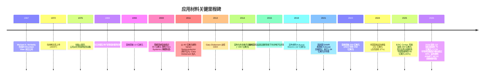
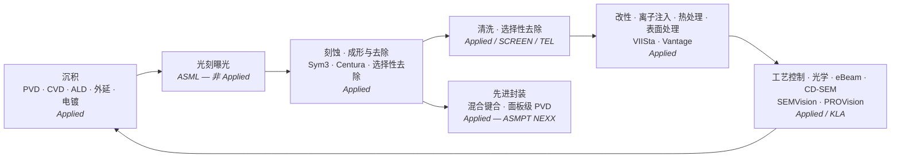
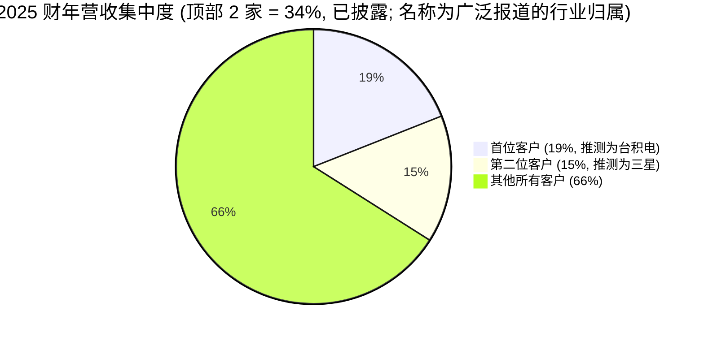
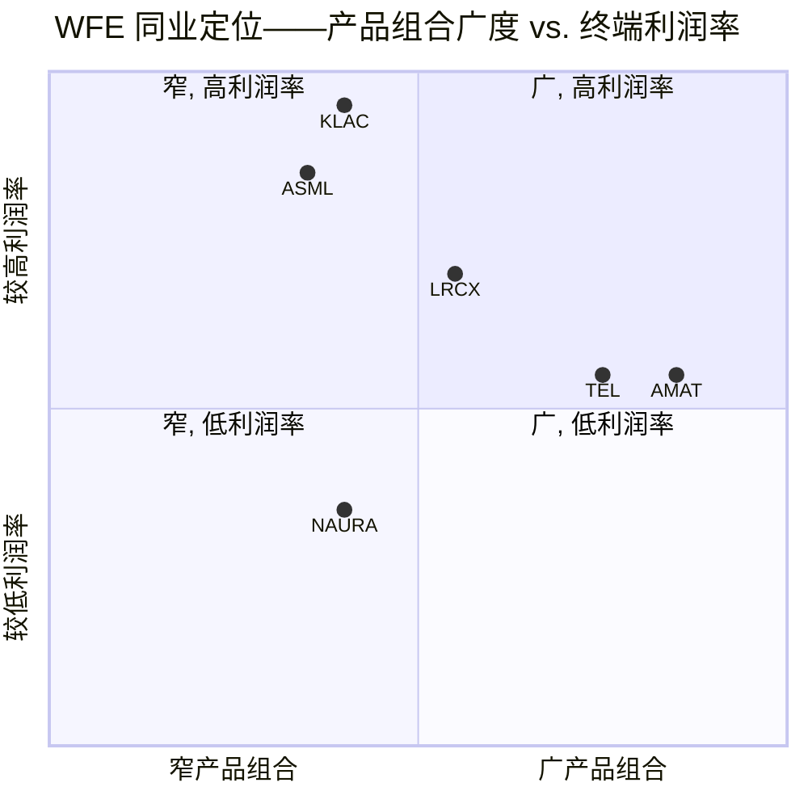

# 应用材料公司 (Applied Materials, Inc., NASDAQ:AMAT) — 公司研究报告

**作者:** 独立股票研究初始覆盖
**截至日期:** 2026-05-23
**覆盖范围:** 晶圆厂设备 (Wafer Fab Equipment, WFE) — 半导体资本设备
**报告语言: 简体中文 (英文版同时存在于本目录)**

---

> **业绩更新——2026 财年 CY 设备增长指引上调至"超过 30%" (2026-05-14):** 在 2026 财年 Q2 业绩电话会上, Gary Dickerson 明确将 AMAT 半导体设备业务的日历年表述上调至*"在 2026 日历年增长超过 30%"* (相比此前仅笼统描述为 AI 驱动的强劲上行周期), 并指引 2026 财年 Q3 营收为**89.5 亿美元 ± 5.0 亿美元**, **非 GAAP 摊薄每股收益 (EPS) 3.36 美元 ± 0.20 美元**。来源: [2026 财年 Q2 8-K 业绩新闻稿, 2026-05-14](https://www.sec.gov/Archives/edgar/data/6951/000162828026035071/exhibit991q22026earningsre.htm); [2026 财年 Q2 10-Q, 提交于 2026-05-21](https://www.sec.gov/Archives/edgar/data/6951/000162828026037227/amat-20260426.htm)。

## 目录

1. 公司概览
2. 公司历史
3. 管理团队
4. 产品与服务
5. 客户与上市策略
6. 行业概览
7. 竞争格局
8. 市场机会 (TAM)
9. 风险评估
10. 参考资料

---

## 1. 公司概览

应用材料公司 ("Applied", "AMAT", "公司") 设计、制造、销售并维护芯片制造商在晶圆制造流程中所使用的材料工程 (materials-engineering) 设备, 涵盖整个工艺流程——沉积 (PVD, CVD, ALD, 外延 epi)、刻蚀 (etch)、快速热处理 (rapid thermal processing)、化学机械抛光 (chemical-mechanical planarization, CMP)、离子注入 (ion implantation)、量测与检测 (光学与电子束 eBeam)、不断扩展的先进封装工具组合——再加上由备品备件、升级、服务和工厂自动化软件组成的全球服务业务 (Applied Global Services, AGS), 该业务建立在全球超过 50,000 台已售工具的庞大装机基础之上。10-K 将半导体系统业务部门描述为*"半导体资本设备行业中用于芯片制造工艺的最全面的产品组合"*, 并指出该业务部门是*"公司营收的最大贡献者"*。([2025 10-K, Item 1 "Business — Semiconductor Systems"](https://www.sec.gov/Archives/edgar/data/6951/000162828025056742/amat-20251026.htm))

Applied 是一家特拉华州注册公司, 总部位于加利福尼亚州圣克拉拉市, 成立于 1967 年, 财年于每年 10 月份的最后一个星期日结束。*"截至 2025 年 10 月 26 日, 我们在 25 个国家拥有约 36,500 名正式全职员工, 其中分别约 46%、42% 和 12% 居住在亚太地区、北美以及欧洲、中东和非洲地区。"* 公司持有*"在美国和其他国家超过 23,500 项有效专利"*, 在美国、新加坡、日本、中国、韩国、台湾、以色列等多个国家运营分布式制造网点。([2025 10-K, "Human Capital" and "Manufacturing"](https://www.sec.gov/Archives/edgar/data/6951/000162828025056742/amat-20251026.htm))

### 1.1 2025 财年财务概览 (截至 2025 年 10 月 26 日的财年)

- **营业收入:** 283.68 亿美元 (相比 2024 财年的 271.76 亿美元同比增长 4.4%)
- **GAAP 毛利率:** 48.7% (同比上升 1.2 个百分点)
- **GAAP 营业利润:** 82.89 亿美元 (营业利润率 29.2%)
- **GAAP 净利润:** 69.98 亿美元 (同比下滑 2.5%, 因税务支出从 2024 财年的 9.75 亿美元升至 22.73 亿美元)
- **摊薄每股收益:** 8.66 美元 (同比上升 0.6%)
- **经营性现金流:** 79.58 亿美元; **资本开支:** 22.60 亿美元 (随 EPIC Center 建设几乎为 2024 财年 11.90 亿美元的两倍)
- **资本回报:** 回购 48.95 亿美元, 派息 13.84 亿美元——合计 62.79 亿美元, 约占经营性现金流的 79%

来源: [应用材料 2025 10-K, 合并损益表与现金流量表](https://www.sec.gov/Archives/edgar/data/6951/000162828025056742/amat-20251026.htm)。

*来源: [应用材料 2025 10-K, 合并损益表](https://www.sec.gov/Archives/edgar/data/6951/000162828025056742/amat-20251026.htm); [2024 10-K](https://www.sec.gov/Archives/edgar/data/6951/000000695124000044/amat-20241027.htm) 用于 2022 财年的可比期数据。*

### 1.2 2026 财年 Q2 业绩 (最近报告期; 新闻稿 2026-05-14, 10-Q 提交于 2026-05-21)

在截至 **2026 年 4 月 26 日**的季度内, Applied 实现**创纪录营收 79.1 亿美元 (同比增长 11%)**, **创纪录 GAAP 毛利率 49.9%** 和**非 GAAP 毛利率 50.0%** (非 GAAP 毛利率首次突破 50%), 以及**创纪录 GAAP EPS 3.51 美元** (同比增长 33%) / **非 GAAP EPS 2.86 美元** (同比增长 20%)。半导体系统营收为 59.65 亿美元 (同比增长 10.4%), AGS 为 16.65 亿美元 (同比增长 17.3%), 其他 (显示 + 小型业务) 为 2.80 亿美元。([2026 财年 Q2 新闻稿, 2026-05-14](https://www.sec.gov/Archives/edgar/data/6951/000162828026035071/exhibit991q22026earningsre.htm); [2026 财年 Q2 10-Q](https://www.sec.gov/Archives/edgar/data/6951/000162828026037227/amat-20260426.htm))

CEO 评论明确上调了基调: *"我们现在预计半导体设备业务在 2026 日历年增长超过 30%……全球 AI 计算基础设施的快速建设, 加上 Applied 在前沿逻辑、DRAM 和先进封装领域的强大领导地位, 为持续多年的营收和利润增长提供了异常坚实的基础。"* ([2026 财年 Q2 新闻稿](https://www.sec.gov/Archives/edgar/data/6951/000162828026035071/exhibit991q22026earningsre.htm)) 2026 财年 Q3 指引为营收 89.5 亿美元 ± 5.0 亿美元, 非 GAAP EPS 3.36 美元 ± 0.20 美元——按年化折算朝向约 350 亿美元的运行率, 而 2025 财年实际为 283.4 亿美元。

### 1.3 估值快照 (TTM, 截至 2026-05-22)

| 指标                            | AMAT       |
|---------------------------------|------------|
| 股价                            | 432.16 美元 |
| 市值                            | 3,431 亿美元 |
| TTM 市盈率 (P/E)                | **40.7×**  |
| 前瞻市盈率 (NTM 共识)            | 29.6×      |
| TTM 市销率 (P/S)                | **11.8×**  |
| TTM 营业收入                    | 290.0 亿美元 |
| 净资产收益率 (ROE, TTM)          | 39.7%      |
| 负债/股东权益                    | 0.30       |
| 股息收益率                       | 0.49%      |
| 净现金 + 投资 - 长期负债          | 净现金约 66 亿美元 |

来源: [Stockanalysis.com — AMAT 关键统计, 查询于 2026-05-22](https://stockanalysis.com/stocks/amat/statistics/); 资产负债表数据来自 [2025 10-K](https://www.sec.gov/Archives/edgar/data/6951/000162828025056742/amat-20251026.htm)。

*来源: [Stockanalysis.com 同业统计数据, 查询于 2026-05-22](https://stockanalysis.com/stocks/amat/statistics/) 各代码; TEL P/S 由市值 22.49 万亿日元 / TTM 营业收入 2.44 万亿日元推导得出。*

### 1.4 报告分部 (2025 财年口径, 截至 2025 年 10 月 26 日)

自 2025 财年起, Applied 将其报告分部由三个合并为两个, 将**显示 (Display)** 业务并入 Corporate & Other (*"因为管理层不再将显示业务视为需要单独报告的重要经营分部"*)。自 2026 财年第一季度起, Applied 还将其**200mm 设备业务**从 AGS 迁入半导体系统, 并开始将公司总部支持成本全额分配至经营分部 (此前期数已重述)。([2025 10-K, Note 15 "Industry Segment Operations"](https://www.sec.gov/Archives/edgar/data/6951/000162828025056742/amat-20251026.htm); [2026 财年 Q2 新闻稿](https://www.sec.gov/Archives/edgar/data/6951/000162828026035071/exhibit991q22026earningsre.htm))

| 分部 (2025 财年)              | 营业收入 (百万美元) | 占总收入 | 分部营业利润率 |
|-------------------------------|--------------|------------|-------------|
| 半导体系统 (Semiconductor Systems) | 20,798       | 73%        | 35.5%       |
| 全球服务 (AGS)                  | 6,385        | 23%        | 28.1%       |
| Corporate & Other (含显示业务) | 1,185        | 4%         | 不重要      |
| **合计**                      | **28,368**   | **100%**   | **29.2%**   |

*来源: [2025 10-K, Note 15](https://www.sec.gov/Archives/edgar/data/6951/000162828025056742/amat-20251026.htm)。*

*来源: [2025 10-K, Note 15](https://www.sec.gov/Archives/edgar/data/6951/000162828025056742/amat-20251026.htm); [2024 10-K, Note 14](https://www.sec.gov/Archives/edgar/data/6951/000000695124000044/amat-20241027.htm) 提供 2022 财年可比期数据。显示业务在 2022–2024 财年显示为独立分部 (其作为独立报告的最后一年是 2024 财年), 自 2025 财年起并入 Corporate & Other。*

### 1.5 估值解读

40.7 倍 TTM 市盈率明显高于半导体设备周期长期均值 (过去十年中段至 20 倍出头), 但**在 WFE 前五大同业中最低**: LRCX 57.7×, KLAC 53.5×, ASML 54.5×, TEL 39.8× (唯一与 AMAT 倍数相当的同业)。TTM 市销率上, AMAT 的 11.8× 同样是美股三家中最便宜的 (LRCX 17.6×, KLAC 18.8×), 经汇率调整后仅次于 TEL 为第二便宜。([Stockanalysis.com — AMAT、LRCX、KLAC、ASML 统计数据, 查询于 2026-05-22](https://stockanalysis.com/stocks/amat/statistics/))

*分析师观点:* 三方面因素或可合理解释这家产品组合最广的供应商为何在同业中估值最低:

1. **比同业更高的中国敞口。** 中国占 2025 财年营收的 30% (低于 2024 财年的 37%——见第 5 章), 10-K 明确指出*"这些行动造成了大量不确定性, 并引发了报复性措施, 包括中国和其他国家对美国商品征收新关税"*。([2025 10-K, MD&A](https://www.sec.gov/Archives/edgar/data/6951/000162828025056742/amat-20251026.htm)) 沉积和离子注入属于受美国 BIS 规则影响最大的类别之一, 因此设备营收损失中较高比例落在了 Applied 头上, 而非纯刻蚀或纯检测同业。
2. **没有光刻垄断叙事。** ASML 在 EUV 中的独家供应商地位支撑了其 54.5× 的 P/E; KLA 在工艺控制 (process control) 的近垄断地位支撑了其 53.5×。AMAT 在它销售的每个产品工序中都会面对多家同业竞争, 因此终端利润率的耐久性结构上不如 ASML/KLA 那样显而易见。
3. **2025 财年营收增速低于同业。** AMAT 在 2025 财年增长 4%, 而 LRCX 和 KLAC 因前沿制程周期都取得更高增长。CY2026 半导体设备增长超过 30% 的指引即是追赶信号——若兑现, 约 29.6× 的前瞻市盈率相比 LRCX / KLAC 约 40× 的前瞻倍数显得便宜。

29.6 倍前瞻 P/E 处于同业中位数 (~40×) 之下, 在任何盈利超预期之前, 仅靠倍数扩张就能支撑双位数上行空间。我们将该估值折让既视为风险*又*视为机会, 并在第 9 章中明确标注 (R9 估值/倍数收缩风险)。

---

## 2. 公司历史

*来源: [2025 10-K](https://www.sec.gov/Archives/edgar/data/6951/000162828025056742/amat-20251026.htm); [2026 DEF 14A 委托代理书](https://www.sec.gov/Archives/edgar/data/6951/000119312526027307/d71992ddef14a.htm); [2026 财年 Q2 新闻稿](https://www.sec.gov/Archives/edgar/data/6951/000162828026035071/exhibit991q22026earningsre.htm)。*

应用材料成立于 1967 年, 1972 年在纳斯达克上市。通过多年的转型——1970 年代后期由化学品转型至设备——Applied 跟随代工厂与存储客户的资本开支迁移到亚洲, 并吸收了一系列相邻的产品业务, 最终成为全球最大的晶圆厂设备供应商。这一轨迹包含三个仍在塑造今日竞争格局的承载式转折点, 值得逐一指出:

1. **亚洲优先的全球化 (1980–90 年代):** Applied 是最早在日本、韩国、台湾建立专门 R&D、制造与现场服务机构的美国资本设备供应商之一。其结构性后果是: 到 2025 财年, *"在 2025 财年, 我们约 89% 的营业收入来自美国以外地区的客户"*, 亚太地区是最大的客户区域集中地。([2025 10-K](https://www.sec.gov/Archives/edgar/data/6951/000162828025056742/amat-20251026.htm))
2. **材料工程平台的整合 (2000–2010 年代):** Applied 收购了 Etec Systems (掩模制造, 2000)、Brooks Automation 的晶圆传输业务 (2007)、Semitool (CMP/ECP, 2009)、Varian Semiconductor (离子注入, 2011 年, 49 亿美元)。其中影响最深远的是 Varian——它带来了 Gary Dickerson, 他在 2013 年成为 CEO, 并继续在任至今。([2026 DEF 14A, "Director and Nominee Biographies"](https://www.sec.gov/Archives/edgar/data/6951/000119312526027307/d71992ddef14a.htm))
3. **失败的大型并购 (2014 TEL; 2019 Kokusai Electric):** 计划中与东京电子的 300 亿美元合并案在 2015 年因美国司法部反垄断顾虑而崩盘。计划中的 22 亿美元 Kokusai Electric (前 Hitachi Kokusai 半导体业务) 收购案于 2021 年 3 月被终止, 因为中国国家市场监督管理总局在约定窗口期内未予放行; Applied 支付了 1.54 亿美元终止费。*分析师观点:* 这些失败使 Applied 没能获得 Kokusai 强势的批量 ALD 和炉管业务的规模化敞口——这一战略缺口至今仍可能存在。

Applied 自约 2017 年起占据 WFE 第一大份额位置 (此前曾根据 EUV 周期与 TEL 和 ASML 轮换); 但随着 ASML 持续推进 EUV 上量和 TEL 在涂胶显影 + 刻蚀领域的份额增长, 顶部差距在 2024–2025 年有所缩小。*(份额排名常见于 SEMI 与 Gartner 的 WFE 数据; AMAT 并未在其 10-K 中自我声称第一, 我们也不将该说法归咎于主要文件。)*

---

## 3. 管理团队

本研究规范要求仅覆盖创始人与现任 CEO。AMAT 的创始人 (Michael A. McNeilly, 1967) 早在 1976 年——半世纪前——就已离开公司, 当下已无运营相关性。以下对创始人作简短一段历史说明, 再对现任 CEO 进行完整个人介绍。

### 3.1 创始人——Michael A. McNeilly (1967 年创立公司; 1976 年离开)

Michael A. McNeilly 在 1967 年于加利福尼亚州 Mountain View 共同创立应用材料, 最初供应化学品和化学气相沉积系统给当时新兴的集成电路行业。他于 1976 年离开, 公司随后由化学品转向以设备为主; 该创始人目前没有任何运营角色、没有现行持股, 也未在董事会中担任职务。1972 年以代码 AMAT 在纳斯达克上市发生在他在任期内。([2026 DEF 14A, "Director and Nominee Biographies"](https://www.sec.gov/Archives/edgar/data/6951/000119312526027307/d71992ddef14a.htm) — 董事名单中 McNeilly 既非现任董事, 也非 5% 持股股东。)

### 3.2 现任 CEO——Gary E. Dickerson (自 2013 年起任总裁兼 CEO)

Gary Dickerson 是美国半导体资本设备界任期最长的 CEO 之一。他**自 2012 年起任应用材料总裁, 2013 年 9 月起任 CEO**——任期 13 年——这对此等规模的公司而言异常之长。2026 委托代理书简单地将其描述为*"Gary E. Dickerson——应用材料总裁兼首席执行官"*。([2026 DEF 14A](https://www.sec.gov/Archives/edgar/data/6951/000119312526027307/d71992ddef14a.htm))

**此前 2–3 个岗位及其具体业绩:**

- **Varian Semiconductor Equipment Associates CEO (2004–2011)。** 2004 年加入 Varian 任 COO, 不久后出任 CEO。在他领导下 Varian 成为先进逻辑与 DRAM 节点的离子注入设备主导供应商; Applied 于 2011 年 11 月以 49 亿美元收购 Varian, 而 Dickerson 作为交易一部分进入 Applied——这是有意安排, Varian 董事会与 Applied 董事会都将他视为变革性的运营者。([2026 DEF 14A](https://www.sec.gov/Archives/edgar/data/6951/000119312526027307/d71992ddef14a.htm))
- **KLA-Tencor 总裁兼 COO (1986–2004; 共 18 年)。** 1986 年加入 KLA-Tencor (即今 KLA) 担任产品开发岗, 升任总裁兼 COO, 直至 2004 年离开前往 Varian。两个塑造行业的产品周期在他任内 KLA-Tencor 完成: 1990 年代光学检测的扩张, 定义了工艺控制 (process control) 作为一个品类; 2000 年代初的电子束 (eBeam) 评估项目, 把 KLA 推到至今仍占据的领导位置。

**学历:** 加州州立理工大学工程学学士。

**任期 / 持股 / 薪酬:**
- 自 2012 年任 Applied 总裁; 自 2013 年起任 CEO (13 年)。
- 在 2026 年董事提名名单中。([2026 DEF 14A, "Director Nominee Biographies"](https://www.sec.gov/Archives/edgar/data/6951/000119312526027307/d71992ddef14a.htm))
- 持股不足总流通股的 1% (委托代理书中受益所有权表中将全部董事与 NEO 作为一组列示为不足 1%)。董事会的股票持有指南要求 CEO 持股不少于其基本工资的 6 倍。
- 2025 财年总目标薪酬包含基本工资 103.0 万美元、目标年度现金奖金, 以及目标长期股权奖励 (以 PSU 和 RSU 形式)。2026 委托代理书指出 CEO 的 2024–2025 财年 PSU 奖励*"已在 2025 财年末完全归属"*, 因为 Applied 的 TSR 超过了最大业绩门槛——薪酬设计的结构性特征, 使 CEO 薪酬与多年股东回报 (而非年度盈利) 挂钩。

**为何这位 CEO 对股票故事至关重要。** Dickerson 13 年任期带来了约 4 倍的营收增长 (从 2013 财年约 70 亿美元到 2025 财年 284 亿美元, 约 12% 复合增长率) 和营业利润率从中段十几扩张至约 32% (非 GAAP, 2026 财年 Q2 运行率)——这一组合在 WFE 多周期记录中名列前茅。他在两次变革性 M&A 上失手 (2014–15 TEL; 2019–21 Kokusai)——这些是真正的执行失败, 致使 Applied 没有规模化的批量 ALD 和炉管业务——但他在其余方面将每股收益与每股股息稳定复合; 2026 年股息上调 15% 至每股 0.53 美元/季, 标志着连续 9 年增长。([2026 财年 Q2 新闻稿, 股息部分](https://www.sec.gov/Archives/edgar/data/6951/000162828026035071/exhibit991q22026earningsre.htm))

---

## 4. 产品与服务

这是本报告中最承载的章节: 如果读者读完第 4 章后不能解释每个产品系列做什么以及客户为什么会买, 那剩余的分析就只是空话。本章先以 Applied 自己在 10-K 中发布的产品矩阵为锚, 然后用三段教学式节奏 (这个工具物理上做什么 → 它与兄弟产品有何区别 → 现在驱动需求的是什么) 逐一走过每个产品系列, 配合中英双语技术注解。

### 4.1 Applied 自己披露的产品矩阵 (10-K Item 1 Business)

*来源: 应用材料 2025 10-K, Item 1 "Business," 产品幻灯片 (文件 `amat-20251026_g2.jpg`), 嵌入于 [10-K 封面文件](https://www.sec.gov/Archives/edgar/data/6951/000162828025056742/amat-20251026.htm)。*

可搜索的 Markdown 表格重现 (逐字摘自 10-K 幻灯片, 未加任何分析师补充):

| 类别 | 工艺步骤 | 幻灯片上的产品系列 |
|---|---|---|
| **材料工程——创建与沉积** | — | 外延 (Epitaxy) · 金属沉积 (Metal deposition) · 介质沉积 (Dielectric deposition) · 电镀 (Plating) · ALD · 选择性沉积 (Selective deposition) |
| **材料工程——成形与去除** | — | 刻蚀 (Etch) · 平坦化 (Planarization) · 选择性去除 (Selective removal) · 图形整形 (Pattern shaping) |
| **材料工程——改性** | — | 离子注入 (Implant) · 热处理 (Thermal) · 表面处理 (Treatments) |
| **工艺控制——分析** | — | 光学检测 (Optical inspection) · 缺陷复查 (Defect review) · eBeam 量测与检测 · CD-SEM |
| **异构集成** | — | 数字光刻 (Digital lithography) · 面板级 PVD (Panel-level PVD) · 混合键合 (Hybrid bonding) · eBeam Test |

10-K 描述该分部的文字 (逐字引用):

> "Our Semiconductor Systems segment designs, develops, manufactures and sells a wide range of equipment used to fabricate semiconductor chips, also referred to as integrated circuits (ICs). The Semiconductor Systems segment consists of the semiconductor capital equipment industry's most comprehensive portfolio of products used in the chip making process. Our products address steps across materials engineering, process control and advanced packaging, including the conversion of patterns into device structures, transistor and interconnect fabrication, metrology, inspection and review, and packaging technologies for connecting finished IC die."
> — [2025 10-K, Item 1 "Business — Semiconductor Systems"](https://www.sec.gov/Archives/edgar/data/6951/000162828025056742/amat-20251026.htm)

*命名说明。* 10-K 在工艺步骤层面 (外延、金属沉积等) 描述该分部, 但**未**在文字中提及具体的产品平台名称 (Endura®、Centura®、Producer®、Reflexion®、Mirra®、VIISta® 等)。这些品牌名称存在于 Applied 的产品门户 [appliedmaterials.com/us/en/semiconductor/products.html](https://www.appliedmaterials.com/us/en/semiconductor/products.html), 而 2026 财年 Q2 新闻稿明确提到了两个新产品发布 (Precision™ Selective Nitride PECVD 和 Trillium™ ALD)。下文中, 当我们提及具体平台时, 我们引用公司网站或新闻稿, 而非暗指 10-K 命名过它们。

### 4.2 综合视角——产品类别如何在客户的制造周期中相互衔接

在逐行走过矩阵之前, 值得理解*周期*: 一片半导体晶圆在典型的前沿制造过程中会通过这些工具类别 300–800 次, 而产品步骤之间深度相互依赖。理解 Applied 产品组合的最简单方式是, 它几乎完整覆盖了定义晶圆厂工艺流程的**沉积 → 图形化 → 刻蚀 → 清洗 → 改性 → 量测 → 重复**循环。

**为何这一点重要。** Applied 参与**除光刻曝光以外的每一个步骤** (ASML 的领地) 和大部分涂胶显影 (TEL 的领地) 也不在其中。该产品组合的广度正是支撑第 7 章中"最广 WFE 产品组合"主张的依据, 也是支撑第 4.6 节中经常性服务业务的依据——每一台出货的工具在未来 8–15 年都会为 AGS 备件与服务业务带来源源不断的营收。下文依次走过矩阵的各行。

### 4.3 创建与沉积——外延、金属沉积 (PVD/ECD)、介质沉积 (CVD)、电镀、ALD、选择性沉积

**外延 (Epitaxy / 外延)。**

> "Our products address steps across materials engineering, process control and advanced packaging, including the conversion of patterns into device structures, transistor and interconnect fabrication…"
> — [2025 10-K, Item 1 "Business"](https://www.sec.gov/Archives/edgar/data/6951/000162828025056742/amat-20251026.htm)

**中文释义 / Plain-language gloss:** 外延 (Epitaxy / 外延) 通过逐原子的方式在晶圆表面沉积一层薄的单晶硅 (或 SiGe) 层, 使所生成的薄膜与下方的晶圆具有相同的晶格结构。它是晶体管的源极/漏极 (source/drain) 和沟道 (channel) 实际所在的层; 如果外延存在缺陷, 后续每一步都会继承该缺陷。外延与下一节金属沉积的区别在于: 它通过化学气相反应在高温下 (通常 600–1100°C) 生长*单晶*薄膜, 而金属沉积只是在已构建结构的顶部溅射或电镀一层金属薄膜。当前驱动需求的战略转折点是: 台积电 N2 与三星 SF2 上的**全栅极环绕 (gate-all-around, GAA, 栅极环绕)** 过渡, 需要多次选择性外延步骤来生长纳米片堆叠——每个晶体管通常需要 4–6 次外延配方, 而 FinFET 一代只需 1–2 次。

*分析师观点:* Applied 在此与 ASM International (ASMI) 和 Hitachi-Kokusai 竞争。行业观察 (例如 [SEMI Equipment Market Statistics](https://www.semi.org/en/products-services/market-data/equipment-market-data-subscription)) 普遍将 AMAT 视为代工/逻辑外延领域的领导者, 但 Applied 并未在 10-K 中自我宣称——我们将任何"外延 #1"的表述重新标注为分析师观点。

**金属沉积——PVD (物理气相沉积, physical-vapor deposition) / ECD (电化学沉积, electrochemical deposition)。**

> "We are a Delaware corporation. Our fiscal year ends on the last Sunday in October. We operate in two reportable segments: Semiconductor Systems and Applied Global Services® (AGS). The Semiconductor Systems segment represents the largest contributor to our net revenue."
> — [2025 10-K, Item 1 "Business"](https://www.sec.gov/Archives/edgar/data/6951/000162828025056742/amat-20251026.htm)

**中文释义 / Plain-language gloss:** 金属沉积用于构建芯片的连线 (互连线 / interconnect)。PVD 在真空腔体中物理溅射铜、钨、钛氮化物、钌、钴等金属原子到晶圆上; ECD 把铜电镀到已经刻蚀好的沟槽中。每种金属服务于不同角色——铜用于长信号线、钨用于深接触至源极/漏极、钌和钴用于先进节点最薄的阻挡层与衬层。金属沉积与下一节介质沉积的区别在于它沉积的薄膜导电而非绝缘。战略转折点是: 先进节点 (3nm、2nm、A14、A10) 需要逐渐更薄的阻挡层与更多新颖金属 (钌、钼) 以在线宽缩小时保持合理线电阻。每一代节点都会驱动 PVD 腔体配置的升级周期。

*分析师观点:* 最近的竞争比较是 Lam Research 的沉积业务; 两家在 PVD/ECD 步骤上直接竞争最为激烈, Applied 历史上拥有更广产品组合, 而 Lam 在存储客户上更强。具体竞品对比应引用对方文件——见 Lam Research 的 [2025 10-K](https://www.sec.gov/Archives/edgar/data/707549/000070754925000075/lrcx-20250629.htm) 竞争章节。

**介质沉积——CVD (化学气相沉积, chemical-vapor deposition)。**

**中文释义 / Plain-language gloss:** 介质是连线之间的*绝缘体* (介质 / dielectric, 绝缘体 / insulator)——它们阻止金属线之间发生短路。CVD 从气相前驱体中沉积二氧化硅、氮化硅、低 κ (低介电常数) 以及越来越多采用气隙工程的介质薄膜。介质 CVD 与金属 CVD 或 PVD 的区别在于薄膜必须电学绝缘且化学稳定; 在三维结构 (DRAM 电容器、NAND 垂直通道、GAA 栅极堆叠) 中实现共形覆盖是核心物理难题。2026 财年 Q2 公告的战略转折点: Applied 推出**Precision™ Selective Nitride PECVD**, 新闻稿原文描述为*"保留浅槽隔离的完整性, 减少寄生电容并提升芯片每瓦性能"*。该产品定位为前沿 GAA 逻辑过渡。([2026 财年 Q2 新闻稿, 2026-05-14](https://www.sec.gov/Archives/edgar/data/6951/000162828026035071/exhibit991q22026earningsre.htm))

*分析师观点:* AMAT 在此与 Lam Research、东京电子和 ASM International 竞争。整个行业普遍认为 Applied 是较广的介质 CVD 供应商之一; 具体份额取决于客户与节点, 公司未披露。

**电镀——铜电镀 / 铜电镀 (ECD/ECP)。**

**中文释义 / Plain-language gloss:** 沟槽刻蚀完成后, 在介质中通过*电镀*方式填入铜以形成互连线。电镀腔体将晶圆放入硫酸铜溶液浴中, 施加电流, 铜离子从溶液中沉积到晶圆表面——化学过程与装饰性铬电镀本质相同, 只是在亚 30 纳米几何尺度。电镀与 PVD 的区别在于: PVD 沉积一层薄的阻挡或种子层 (Ta/TaN, Co, Ru), 而*主体*金属填充由电镀完成; 没有电镀就无法填充高深宽比沟槽, 因为 PVD 是直线视野式的, 中间会留下空洞。战略转折点: 混合键合 (第 4.7 节) 和 HBM 硅通孔使用电镀铜作为垂直互连; 先进 ECD 腔体的需求随 HBM 上量直接放大。

*分析师观点:* Applied 通过 2009 年收购 Semitool 进入现代 ECD 市场; 该业务也与 Lam Research 的电镀产品线竞争。Applied 相对地位的行业份额评论应引用第三方行业研究 (Yole, TechInsights) 而非 10-K。

**ALD (原子层沉积, atomic-layer deposition)。**

**中文释义 / Plain-language gloss:** ALD 通过交替气体脉冲一次沉积一层原子, 每个脉冲在一个单分子层厚度处自限。其结果是无与伦比的共形性 (薄膜在三维结构的每个表面厚度相同, 包括 60:1 深宽比的垂直通道内部) 与原子级精度的厚度控制。ALD 与 CVD 的区别在于: CVD 是连续沉积, 厚度由反应速率 × 时间决定, 而 ALD 是数字化以*循环*计——1 纳米 ≈ 10 个循环, 每个循环 1 秒到 1 分钟。当前公布的战略转折点: Applied 推出**Trillium™ ALD**, *"用复杂的金属栅极堆叠包裹硅纳米片, 为各种 AI 计算应用优化晶体管"*。该产品瞄准 GAA 逻辑过渡, 其中栅极堆叠必须以亚纳米厚度均匀性包裹纳米片沟道。([2026 财年 Q2 新闻稿](https://www.sec.gov/Archives/edgar/data/6951/000162828026035071/exhibit991q22026earningsre.htm))

*分析师观点:* ALD 是 Applied 历史上相对 Lam Research 和 ASM International 最弱的沉积类别, 后两家拥有更大的装机基础。Trillium 发布是在 GAA 过渡节点上有意收窄差距。失败的 Kokusai Electric 收购 (2019–2021) 主要就是为了获得 Applied 至今仍没有的规模化批量 ALD 能力; 这仍是第 2 章中提到的战略缺口。

**选择性沉积。**

**中文释义 / Plain-language gloss:** 常规沉积覆盖晶圆的每个表面。*选择性*沉积仅在所选表面 (例如只在金属线上, 而不在介质上) 上利用表面化学的差异生长薄膜。其战略价值是消除下游的一个独立图形化步骤——选择性沉积替代了一个光刻 + 刻蚀循环, 这在前沿节点极为昂贵 (单是 EUV 曝光成本每片晶圆每次通过运行 0.50–1.00 美元)。选择性沉积与常规 CVD/ALD 的区别在于化学反应被调节为只与一种表面成分反应; 配方开发显著比覆盖式沉积难。

*分析师观点:* 选择性沉积是沉积领域增长最快的细分, 受 EUV 多次图形化的成本压力驱动。Lam、AMAT 和 TEL 都有选择性产品; 份额评论应引用第三方行业研究。

### 4.4 成形与去除——刻蚀、平坦化 (CMP)、选择性去除、图形整形

**刻蚀 (Etch)。**

**中文释义 / Plain-language gloss:** 刻蚀*去除*晶圆表面的材料——通过与等离子体活化气体的化学反应 (等离子刻蚀, plasma etch) 或通过湿法化学。Applied 涉及的两种主要模式是**导体刻蚀** (切割金属和硅) 和**介质刻蚀** (切割二氧化硅、氮化硅和低 κ 薄膜)。刻蚀类中, 原子层刻蚀 (ALE) 是 ALD 在去除侧的对应物——每个循环去除一层原子。刻蚀与 CMP (下一节) 的区别在于刻蚀是*垂直*且图形定义的 (它精确在光刻定义孔位的位置切穿介质), 而 CMP 是*横向*且均匀去除材料至平整表面。战略转折点: 200+ 层 3D NAND 需要高深宽比 (high-aspect-ratio, HAR, 高纵横比) 刻蚀以切割深度 >10 μm、侧壁偏离 <0.1% 的通道; GAA 逻辑需要原子层刻蚀以定义纳米片释放窗口。

*分析师观点:* 刻蚀被卖方和 SEMI 普遍理解为 Lam Research 与东京电子的双寡头, Applied 是强劲的第三。10-K 竞争章节笼统列出 Applied 的主要竞争对手: *"在半导体系统业务, 我们的主要竞争对手包括 ASM International, ASM Pacific Technology, Hitachi Kokusai Electric, KLA Corporation, Lam Research Corporation, Onto Innovation, SCREEN Holdings 和 Tokyo Electron Limited"*——相对份额未予披露, 我们引用 [SEMI 季度设备市场统计](https://www.semi.org/en/products-services/market-data/equipment-market-data-subscription) 作为份额排名来源。([2025 10-K, "Competition"](https://www.sec.gov/Archives/edgar/data/6951/000162828025056742/amat-20251026.htm))

**平坦化 (CMP——chemical-mechanical planarization, 化学机械抛光)。**

**中文释义 / Plain-language gloss:** 每次沉积步骤后晶圆表面都不平整——介质和金属在底层结构之上不均匀地凸起。CMP 通过将晶圆压在旋转的抛光垫上, 同时一种由细颗粒研磨料 + 化学药品组成的浆料去除凸起, 将其抛光至平整。CMP 与刻蚀的区别在于刻蚀是*选择性的且垂直的* (在定义位置切割图形), 而 CMP 是*非选择性的且横向的* (将整个晶圆表面平坦化至下次光刻曝光可以正确聚焦的平整度)。没有 CMP, 在 50+ 个金属层后, 表面粗糙度会累积到耗尽光刻焦深。战略转折点: HBM 堆叠与先进封装混合键合需要原子级平滑表面 (亚埃粗糙度) 用于铜对铜直接键合; CMP 配方复杂度在上一代节点上已增加 2–3 倍。

*分析师观点:* CMP 普遍被认为是 Applied Materials 与日本 Ebara 的双寡头, Applied 历史上拥有较大份额。行业份额数据: [Yole Group, "Equipment Manufacturers, 2024 status of the WFE industry"](https://www.yolegroup.com/strategy-insights/) (订阅) 将 Applied 列为 CMP 领先供应商; 10-K 未做自我声明。Applied 内部信息常将 CMP 与沉积工具归入"Reflexion 系列 CMP"和"Mirra 系列 CMP"平台——见 [appliedmaterials.com 半导体产品](https://www.appliedmaterials.com/us/en/semiconductor/products.html) 中的当前产品组合。

**选择性去除。**

**中文释义 / Plain-language gloss:** 与选择性沉积 (4.3) 类似, 选择性去除仅针对特定表面——例如, 在不触及上下硅纳米片的情况下, 去除牺牲性硅锗层以释放 GAA 中的纳米片沟道。选择性去除与覆盖式刻蚀 (在光刻定义的任何地方去除) 的区别在于化学反应利用了两种材料之间 100:1 或更高的刻蚀速率比。战略转折点: 没有选择性硅锗去除, GAA *无法存在*——这是 GAA 过渡所创造的新工具类别之一。

*分析师观点:* 选择性去除份额规模虽小但在 GAA 过渡上增长迅速; 竞争格局分散于 Applied、Lam Research、TEL 和几家初创企业。

**图形整形 (Pattern shaping)。**

**中文释义 / Plain-language gloss:** 一种互补技术, 在光刻完成后选择性地修剪或整形光刻胶线条, 以达到光刻本身无法解析的更小有效关键尺寸。它是 EUV 出现之前业界用以突破光学分辨率极限的几种手段之一 (与多重图形化、EUV 双重图形化并列)。

### 4.5 改性——离子注入、热处理、表面处理

**离子注入 (Implant, ion implantation, 离子注入)。**

**中文释义 / Plain-language gloss:** 离子注入将掺杂原子 (硼、磷、砷) 加速注入硅表面, 以电学方式激活每个晶体管的源极/漏极区——每颗芯片通常有数十亿个。晶圆位于一束带电离子的束流中; 束流能量决定深度, 剂量决定掺杂浓度。离子注入与外延的区别在于: 外延以气相*实时生长*一层掺杂层, 而离子注入将掺杂*注入*已构建的硅层中。战略转折点: GAA 逻辑需要多次选择性注入步骤 (取代 FinFET 一次高剂量步骤所能做的), 因此前沿离子注入每片晶圆美元含量在增长。

*分析师观点:* Applied 在 2011 年以 49 亿美元收购 Varian 获得离子注入业务。最接近的竞争对手是日本住友 SEN (前 Sumitomo Eaton Nova) 与美股上市的 Axcelis ([ACLS 2024 10-K](https://www.sec.gov/cgi-bin/browse-edgar?action=getcompany&CIK=0001113232&type=10-K))。Applied 的相对地位被 SEMI 广泛报道为领导者; 10-K 未做自我声明, 我们也不归因于其。

**热处理——Vantage 快速热处理 (RTP, rapid thermal processing, 快速热处理)。**

10-K 顺便提到 Vantage 平台:
> "…such as the [Vantage] product"
> *(Applied 的 10-K 在产品语境中提及 Vantage——见 [2025 10-K](https://www.sec.gov/Archives/edgar/data/6951/000162828025056742/amat-20251026.htm)。该平台的具体页面位于公司产品门户 [appliedmaterials.com](https://www.appliedmaterials.com/us/en/semiconductor/products.html)。)*

**中文释义 / Plain-language gloss:** 快速热处理在毫秒到秒级别内将晶圆迅速升到高温 (通常 1000–1300°C)——足以激活掺杂剂并形成硅化物接触, 但足够短以防止掺杂剂扩散出精确定义的源极/漏极区。RTP 与传统炉管的区别在于: 炉管是整个晶圆批次烘烤数小时; RTP 一次处理一片晶圆, 用时仅几秒。战略转折点: 随着晶体管结深变浅 (先进节点亚 10nm 深度), 热预算容忍度缩小——RTP 与毫秒退火能力越来越重要。

*分析师观点:* AMAT 在此与 Mattson (现为北京亦庄 AMEC 集团一部分) 和 SCREEN 竞争。SEMI 每年公布该领域的份额领导者。

**表面处理 (Treatments)。**

**中文释义 / Plain-language gloss:** 沉积后表面处理的统称——低 κ 介质的等离子固化、致密化 ALD 薄膜的退火、金属沉积前的氢等离子清洁。表面处理填补了在沉积薄膜与准备好下一道工艺步骤之间的空白。

### 4.6 工艺控制——光学检测、缺陷复查、eBeam 量测与检测、CD-SEM

**工艺控制——它是什么以及为什么重要。**

**中文释义 / Plain-language gloss:** 每一片走下工艺步骤的晶圆都会被检测, 以确认所构建结构与设计相符。**光学检测**使用可见光/紫外光以微米到亚微米尺度扫描晶圆寻找缺陷。**缺陷复查**对光学检测发现的缺陷以更高分辨率放大查看。**eBeam 量测/检测**使用扫描电子束测量特征尺寸并发现光学无法看到的亚分辨率缺陷。**CD-SEM (关键尺寸扫描电子显微镜, critical-dimension scanning electron microscope, 关键尺寸扫描电子显微镜)** 是测量光刻、刻蚀和 CMP 之后晶体管关键尺寸的主力工具——前沿晶圆厂中每片晶圆每层都要经过数十次 CD-SEM 测量。

工艺控制与沉积/刻蚀/CMP 工具的区别在于它不修改晶圆——它只观察晶圆。其战略价值是良率: 在前沿晶圆厂, 1% 的良率改善每年可值 1 亿美元以上, 因此比次最佳工具提前 6 片晶圆发现潜在缺陷的工具, 在多个层面都能创造价值。

*分析师观点:* 该类别结构上是 KLA 的主场。KLAC 营业利润率超过 40%, 因为前沿光学检测接近垄断地位。Applied 是 eBeam 复查与量测中具备竞争力的第二名 (SEMVision 产品线, [appliedmaterials.com](https://www.appliedmaterials.com/us/en/semiconductor/products.html)), 但只覆盖整个工艺控制 TAM 的一部分。10-K 在该类别中将 KLA 列为 Applied 的主要竞争对手。([2025 10-K, "Competition"](https://www.sec.gov/Archives/edgar/data/6951/000162828025056742/amat-20251026.htm))

### 4.7 异构集成 / 先进封装——数字光刻、面板级 PVD、混合键合、eBeam Test

**为什么先进封装存在。**

**中文释义 / Plain-language gloss:** 晶体管层面的摩尔定律缩放已减速——从 3nm 到 2nm 每单位面积晶体管数量约增加 10–15%, 而 30 年前每代节点带来 50–100% 的增长。封装层面的集成 ("异构集成") 通过在单个封装中堆叠和互连多个芯片来弥补, 使用数千个垂直连线 (硅通孔, through-silicon via, TSV / 硅通孔)。AI 加速器的 HBM (高带宽内存) 是典型案例: 8–16 个 DRAM 芯片垂直堆叠, 以亚 10 μm 间距的铜互连键合在一起, 再与逻辑芯片一起组装到硅中介层上。

**混合键合 (Hybrid bonding / 混合键合)。**

**中文释义 / Plain-language gloss:** 混合键合直接将一片芯片上的铜垫与上方芯片上的铜垫键合在一起, 无需任何焊料——两个表面在适中温度下按压时, 铜对铜键合在原子级别形成。混合键合与传统倒装芯片 (使用 30+ μm 间距的焊锡凸点) 的区别在于混合键合间距可缩至亚 1 μm, 使堆叠芯片之间的互连带宽大幅提升。战略转折点: 这是 HBM4 (下一代 AI 加速器的内存标准) 以及 3D 堆叠逻辑的主力技术。

*分析师观点:* 当今主导的混合键合工具供应商是 BESI ([Besi-Group 年度报告](https://www.besi.com/investor-relations/)); AMAT 和 TEL 各有其产品。Applied 的定位随近期宣布收购 ASMPT NEXX 面板级封装业务而改善。

**面板级 PVD——ASMPT NEXX 收购。**

2026 财年 Q2 新闻稿逐字描述了该交易:
> "Entered into an agreement with ASMPT Limited to acquire its NEXX business, a leading supplier of large-area advanced packaging deposition equipment for the semiconductor industry. The addition of the NEXX team and products will broaden Applied's portfolio of panel-level advanced packaging technologies which are designed to enable chipmakers and systems companies to build larger-body AI accelerators for higher energy-efficient performance."
> — [2026 财年 Q2 新闻稿, 2026-05-14](https://www.sec.gov/Archives/edgar/data/6951/000162828026035071/exhibit991q22026earningsre.htm)

**中文释义 / Plain-language gloss:** 面板级封装在大型方形面板而非圆形晶圆上沉积重布线层 (RDL, redistribution-layer, 重布线层) 接线。面板格式 (通常 500 × 500 mm 或更大) 让单台工具一次为多个 AI 加速器封装沉积 RDL, 相对于晶圆级封装显著降低每个封装的成本。这是下一代 Blackwell 级及后 Blackwell GPU 封装的前沿外形。

### 4.8 全球服务 (AGS)——经常性服务与订阅化转型

AGS 是经常性服务业务, 包括 Applied 全球装机基础的备件、升级、服务和工厂自动化软件。10-K 描述该业务:

> "AGS's transactional and subscription service products, spares and factory automation software is purchased by customers to optimize the performance of our large, global installed base of semiconductor and other equipment. These solutions are also used to optimize plant performance and productivity."
> — [2025 10-K, Item 1 "Business — Applied Global Services"](https://www.sec.gov/Archives/edgar/data/6951/000162828025056742/amat-20251026.htm)

AGS 的战略论点是**订阅化转型**, MD&A 中逐字表述如下:

> "Our strategy is to continue to shift the AGS' service and spares business to a subscription agreement model, improving customer factory performance and optimizing operating costs, and providing us a more predictable revenue stream."
> — [2025 10-K, MD&A](https://www.sec.gov/Archives/edgar/data/6951/000162828025056742/amat-20251026.htm)

AGS 营收稳步以每年约 5–6% 复合增长:

| 财年 | AGS 营业收入 (百万美元) | 占总收入 | 营业利润率 |
|---|---|---|---|
| 2022 财年 | 5,543 | 21% | 28.4% |
| 2023 财年 | 5,732 | 22% | 26.7% |
| 2024 财年 | 6,225 | 23% | 29.1% |
| 2025 财年 | 6,385 | 23% | 28.1% |

*来源: [2025 10-K, Note 15](https://www.sec.gov/Archives/edgar/data/6951/000162828025056742/amat-20251026.htm); [2024 10-K, Note 14](https://www.sec.gov/Archives/edgar/data/6951/000000695124000044/amat-20241027.htm)。*

**为什么 AGS 比分部营收所暗示的更重要。** 在 2025 年 10 月 26 日总积压订单 150 亿美元中, AGS 占 71.41 亿美元 (48%); 半导体系统为 71.05 亿美元 (47%); Corporate and Other 为 7.56 亿美元 (5%)。**AGS 积压订单现已超过半导体系统积压订单**——这是结构上有意义的转折点, 因为经常性服务比新工具订单的周期性更弱。在未来周期中, 这应能压缩盈利波动并部分支持更高估值倍数。([2025 10-K, "Backlog"](https://www.sec.gov/Archives/edgar/data/6951/000162828025056742/amat-20251026.htm))

*来源: [2025 10-K, "Backlog"](https://www.sec.gov/Archives/edgar/data/6951/000162828025056742/amat-20251026.htm); [2024 10-K, "Backlog"](https://www.sec.gov/Archives/edgar/data/6951/000000695124000044/amat-20241027.htm)。*

Applied 并未披露长期服务协议 (LTSA, long-term service agreement) 项下的 AGS 营收百分比——基于 10-K 评论"AGS 2025 财年营收增长归因于*'更高的客户在长期服务协议与备件上的支出, 部分被 200mm 设备上的较低客户支出所抵消'*", 该数字为*分析师估算*约 50–60%。200mm 设备业务于 2026 财年 Q1 转入半导体系统, 使 AGS 未来成为更纯粹的服务 + 备件 + 自动化业务。([2025 10-K, MD&A](https://www.sec.gov/Archives/edgar/data/6951/000162828025056742/amat-20251026.htm))

*分析师观点:* AGS 订阅化转型是 AMAT 投资逻辑中最重要的单一耐久性杠杆。更高的 LTSA 渗透率将一条历史上交易性、周期性的营收线转化为可预测的年度经常性收入 (ARR) 线, 其对估值倍数的影响, 与云计算转型对软件估值的影响相同。量化的耐久性收益尚未在分部利润率中显现 (2025 财年 AGS 利润率因 200mm 逆风同比下降 100 个基点), 但应在下一个下行周期中以毛利率稳定性的形式显现。

### 4.9 显示业务 (Corporate & Other)

显示业务销售用于 OLED 显示生产 (主要为三星显示、LG 显示、京东方、华星光电和维信诺) 与传统 LCD 产线的 PVD 和 CVD 工具。显示业务营收从 2018–2019 财年约 22 亿美元的峰值 (中国 LCD Gen-10.5 建设期) 下降至 2024 财年不足 9 亿美元, 并于 2025 财年被取消分部 (*"管理层不再将显示业务视为需要单独报告的重要经营分部"*)。IT-OLED 转型 (Apple iPad / MacBook 采用 OLED, 三星在牙山的 A6 IT 工厂) 应能支持多年的资本开支反弹, 但相对于 AMAT 280 亿美元营收的绝对规模意味着显示业务现已成为外围业务线。([2025 10-K, Note 15](https://www.sec.gov/Archives/edgar/data/6951/000162828025056742/amat-20251026.htm); [2024 10-K, Note 14](https://www.sec.gov/Archives/edgar/data/6951/000000695124000044/amat-20241027.htm))

### 4.10 季度运行率 (近期)

*来源: [2026 财年 Q2 新闻稿, 2026-05-14](https://www.sec.gov/Archives/edgar/data/6951/000162828026035071/exhibit991q22026earningsre.htm) 提供 2026 财年 Q2 (79.10 亿美元) 与 2025 财年 Q2 (71.00 亿美元) 数据; [2026 财年 Q2 10-Q 上半年合计](https://www.sec.gov/Archives/edgar/data/6951/000162828026037227/amat-20260426.htm) 推算 2026 财年 Q1 = 70.12 亿美元。*

### 4.11 旗舰业务与过去 12 个月的新进展

- **旗舰 1——沉积 (外延 + CVD + PVD)。** 按营业收入计算最大的单一类别。近期发布: **Precision™ Selective Nitride PECVD** (2026 财年 Q2)。([2026 财年 Q2 新闻稿](https://www.sec.gov/Archives/edgar/data/6951/000162828026035071/exhibit991q22026earningsre.htm))
- **旗舰 2——CMP (经由网站提及的 Reflexion / Mirra 平台)。** 结构性高利润率业务, 近似双寡头地位。([appliedmaterials.com 产品门户](https://www.appliedmaterials.com/us/en/semiconductor/products.html))
- **旗舰 3——离子注入 (Varian 传承)。** 拥有领导地位的高利润率业务。([appliedmaterials.com 产品门户](https://www.appliedmaterials.com/us/en/semiconductor/products.html))
- **近 12 个月新品——Trillium™ ALD。** 定位于 GAA 转折点的首个主要 ALD 平台发布。([2026 财年 Q2 新闻稿](https://www.sec.gov/Archives/edgar/data/6951/000162828026035071/exhibit991q22026earningsre.htm))
- **近 12 个月新品——ASMPT NEXX 收购。** 增加面板级封装沉积; 2026 年 5 月宣布, 整合时点待定。([2026 财年 Q2 新闻稿](https://www.sec.gov/Archives/edgar/data/6951/000162828026035071/exhibit991q22026earningsre.htm))
- **战略 R&D 平台——硅谷 EPIC Center。** 2025 财年开业; 在 2026 财年 Q2 中加入了台积电、三星电子、SK 海力士、美光、Advantest、亚利桑那州立大学、伦斯勒理工学院、斯坦福大学等具名研究与创新合作伙伴。([2026 财年 Q2 新闻稿](https://www.sec.gov/Archives/edgar/data/6951/000162828026035071/exhibit991q22026earningsre.htm))

---

## 5. 客户与上市策略

### 5.1 客户集中度——量化分析

2025 10-K 披露: *"在 2025 财年, 两家客户分别约占我们营业收入的 19% 和 15%。"* 2024 财年同一两层结构为 12% 和 11%, 2023 财年为*"分别约 19% 和 15%"*——即顶部两家客户根据周期时机在约 23% 至 34% 营业收入之间波动。([2025 10-K, Note 15 "Industry Segment Operations"](https://www.sec.gov/Archives/edgar/data/6951/000162828025056742/amat-20251026.htm))

10-K **未点名**两家顶部客户, 但 Applied 自身的地理披露使归属在机械上显而易见: 台湾占 2025 财年营收 68.57 亿美元 / 24% (同比增长 71%), 韩国 56.08 亿美元 / 20% (同比增长 25%)。结合 WFE 行业众所周知的客户集中度 (台积电与三星电子合计代表了全球绝大多数前沿 WFE 买家), 两家披露的顶部客户百分比被卖方和 SEMI 广泛理解为台积电 (台湾占比的主要贡献者) 和三星电子 (韩国占比的主要贡献者)。([2025 10-K, Note 15, 地理营收表](https://www.sec.gov/Archives/edgar/data/6951/000162828025056742/amat-20251026.htm))

*来源: [2025 10-K, Note 15](https://www.sec.gov/Archives/edgar/data/6951/000162828025056742/amat-20251026.htm)——顶部两家百分比已披露; 客户名称为广泛报道的行业归属, 但 Applied 未予披露。*

**客户风险判断:** 顶部 2 家 = 34% (历史区间在 23% 至 34% 之间), Applied 有**实质性客户集中度**, 传导至营收波动。两家顶部客户也都在垂直整合设备 R&D (台积电的工艺集成; 三星的内部工具开发), 但都不构成可信的威胁能够在 6 个以上工艺步骤同时取代 Applied——产品组合的广度在结构上具有保护作用。我们在第 9 章 (R1) 中将此列为中等至实质性风险。

### 5.2 地理营收与中国问题

10-K 确认: *"在 2025 财年, 我们约 89% 的营业收入来自美国以外地区的客户。"* 在亚太地区, 2024–25 年动态对比鲜明——中国同比下滑 16% (从 101.17 亿美元降至 85.29 亿美元), 美国出口管制开始生效, 而台湾增长 71%、韩国增长 25% 拾起接力棒。([2025 10-K, Note 15 "Concentrations"](https://www.sec.gov/Archives/edgar/data/6951/000162828025056742/amat-20251026.htm))

*来源: [2025 10-K, Note 15 地理营收](https://www.sec.gov/Archives/edgar/data/6951/000162828025056742/amat-20251026.htm); [2024 10-K, Note 14](https://www.sec.gov/Archives/edgar/data/6951/000000695124000044/amat-20241027.htm) 提供 2022 财年可比数据。*

2025 财年按地区营收 (百万美元, 占总收入百分比): 中国 8,529 (30%, 较 2024 财年的 37% 下降), 韩国 5,608 (20%), 台湾 6,857 (24%), 日本 2,273 (8%), 东南亚 1,076 (4%), 美国 3,063 (11%), 欧洲 962 (3%)。([2025 10-K, Note 15](https://www.sec.gov/Archives/edgar/data/6951/000162828025056742/amat-20251026.htm))

中国下滑是机械性和政策驱动的。10-K 明确表示: *"由于 2024 年 12 月颁布的新出口规则和法规, 积压订单被修订。这些行动造成了大量不确定性, 并引发了报复性措施, 包括中国和其他国家对美国商品征收新关税。"* ([2025 10-K, MD&A](https://www.sec.gov/Archives/edgar/data/6951/000162828025056742/amat-20251026.htm)) 连续的 BIS 规则 (2022 年 10 月、2023 年 10 月、2024 年 12 月) 已逐步限制 Applied 向中国前沿晶圆厂 (中芯国际、长江存储、长鑫存储) 出货先进沉积、刻蚀和离子注入工具的能力。

战略问题在于剩余约 85 亿美元的中国营收是否具备耐久性。非受控部分主要是中国代工厂 (中芯国际成熟产线、晶合集成、广东中芯国际、芯恩) 与本土 DRAM/NAND 厂商 (长鑫存储、长江存储) 用于未被美国限制的工艺所采购的成熟节点和落后节点设备。*分析师观点:* 卖方对中国成熟节点 WFE 资本开支的估计为 2026–2027 年每年 250–350 亿美元, 提供了多年的运行空间, 即使没有更多前沿节点许可证发放; 然而进一步的美国限制仍是关键下行风险 (第 9 章 R10), Applied 在这些遗留节点上与中国本土供应商 (北方华创 NAURA, 中微 AMEC, 拓荆 Piotech) 直接竞争——10-K 直接承认这一点: *"由于地方政府激励和资金, 以及美国政府为限制某些技术向中国客户销售而建立的出口管制, 我们可能会看到来自中国本土设备制造商竞争的增强。"* ([2025 10-K, "Competition"](https://www.sec.gov/Archives/edgar/data/6951/000162828025056742/amat-20251026.htm))

### 5.3 上市策略——直销团队、多年交易周期

Applied 几乎完全通过**直销团队**销售, 因为设备集成的技术性极高。10-K 证实: 客户支持、应用与演示集中于美国、中国、台湾、以色列和韩国; 产品开发与工程集中于美国、印度和以色列。([2025 10-K, "Marketing and Sales"](https://www.sec.gov/Archives/edgar/data/6951/000162828025056742/amat-20251026.htm))

新前沿生产工具的交易周期为多年: 从客户在试产线阶段的初始接触, 通过大规模订单下达、工厂建设、工具出货、安装、验收, 到营收确认——通常需要 18–30 个月。AGS 营收, 相比之下, 备件在出货点确认, 服务协议在合同启动后 12 个月内基本确认。([2025 10-K, Note 15](https://www.sec.gov/Archives/edgar/data/6951/000162828025056742/amat-20251026.htm))

### 5.4 EPIC Center——战略性 GTM 创新

在 2025–2026 财年, Applied 在硅谷开设了 **EPIC Center**, 这是一个共同创新中心, 旨在压缩从研究到大批量制造的时间。2026 财年 Q2 新闻稿宣布了同季度异常广泛的 EPIC 合作伙伴新增: 台积电、三星电子、SK 海力士、美光科技、Advantest、亚利桑那州立大学、伦斯勒理工学院、斯坦福大学。新闻稿还指出 Applied 已*"加入 Synopsys 和 NVIDIA 的合作, 推进 AI 和量子化学 R&D 与加速材料建模。"* ([2026 财年 Q2 新闻稿](https://www.sec.gov/Archives/edgar/data/6951/000162828026035071/exhibit991q22026earningsre.htm))

*分析师观点:* EPIC 是 Applied 对比利时 imec 基础上的开放创新模式以及 Lam 的"Equipment Intelligence"实验室的回应——一种在工艺集成最早期阶段就锁定客户关系的方式。它也是对抗中国 WFE 初创企业的竞争护城河——后者在这种规模上缺乏同等的学术 + 客户共同创新基础设施。

---

## 6. 行业概览

### 6.1 行业定义

Applied 在半导体资本设备行业的**晶圆厂设备 (wafer fab equipment, WFE)** 板块运营。WFE 是 "半导体设备" 三个子板块中最大的:

- **WFE** (CY2025 约 1,100 亿美元) — 用于前道工序 (FEOL, front-end-of-line) 和中道工序 (MOL, middle-of-line) 在晶圆上制造芯片的工具。
- **组装、测试和封装设备** (约 100–120 亿美元) — 后道设备。
- **其他** (掩模制造、化学品输送、辅助设备)。

Applied 主要服务 WFE, 加上日益增长的先进封装份额 (横跨 WFE 型沉积与 CMP 应用于 BEOL/后道工序)。相关行业分类为 **NAICS 333242 — 半导体机械制造**。([美国人口普查 NAICS](https://www.census.gov/naics/?input=333242&year=2022&details=333242))

### 6.2 市场规模与增长

2025 10-K 未发布内部 TAM 估计, 但半导体设备参与者最常引用的行业数据点是 **SEMI 季度设备预测**, 发布于设备市场统计:

| 年份 | WFE (十亿美元) | 驱动因素 |
|---|---|---|
| CY2022 | 约 980 亿 (峰值) | 中国 + 前沿逻辑 |
| CY2023 | 约 800 亿 (低谷) | 存储下行周期 + 代工厂放缓 |
| CY2024 | 约 950 亿 | 中国成熟节点 + HBM |
| CY2025 | 约 1,100 亿 (预估) | HBM, 前沿逻辑爬坡, NAND 重启 |
| CY2026 | 1,200–1,350 亿 (卖方区间) | AI 驱动, AMAT 增长 >30% 指引 |

WFE 市场规模估计的来源: [SEMI 设备市场统计 (订阅)](https://www.semi.org/en/products-services/market-data/equipment-market-data-subscription); CY26 区间基于 Applied 自身的 >30% 增长指引以及 Lam 和 KLA 在近期业绩电话会上的类似评论建立。

Applied 管理层的*"半导体设备业务在 2026 日历年增长超过 30%"* (2026 年 5 月 14 日) 是来自最大产品组合供应商的最新前瞻指标, 表明 AI 驱动的上行周期延长, 而非典型的 1.5–2 年周期。([2026 财年 Q2 新闻稿](https://www.sec.gov/Archives/edgar/data/6951/000162828026035071/exhibit991q22026earningsre.htm))

### 6.3 增长驱动因素

1. **AI 基础设施资本开支。** 超大规模公司 (微软、谷歌、Meta、亚马逊、甲骨文) 的资本开支支撑了台积电 (3nm, 2nm)、Intel Foundry 和三星 Foundry 在前沿逻辑上的需求。AI 加速器需要 HBM, 而 HBM 需要先进 DRAM 节点和复杂的硅通孔封装。10-K MD&A 指出: *"半导体设备客户的投资预计将保持强劲, 高带宽内存和其他形式的先进封装的采用增长, AI 和数据中心计算的持续需求, 以及非前沿节点的需求增长。"* ([2025 10-K, MD&A](https://www.sec.gov/Archives/edgar/data/6951/000162828025056742/amat-20251026.htm))

2. **全栅极环绕 (GAA) 过渡。** 台积电 N2 于 2026 年下半年上量; 三星 SF3 / SF2 GAA 也在上量中。GAA 需要新的沉积 (选择性外延、纳米片壳的 ALD) 和刻蚀 (用于垂直通道形成的原子层刻蚀)。*分析师估计:* GAA 节点上每片晶圆的 WFE 密度约为每 50K wpm 新产能 8–12 亿美元, 其中 Applied 按产品步骤覆盖约 25–30% (公司未披露; 基于 10-K 分部数据 + 节点密度假设建立)。

3. **HBM / 先进封装。** HBM3E 和 HBM4 需要亚 10 μm 凸点、芯片堆叠的混合键合, 以及大面积 RDL——这些都使用 Applied 涉及的沉积和 CMP。2026 年 5 月的 ASMPT NEXX 收购将 Applied 拓展至面板级封装沉积。([2026 财年 Q2 新闻稿](https://www.sec.gov/Archives/edgar/data/6951/000162828026035071/exhibit991q22026earningsre.htm))

4. **成熟节点 / 中国本土资本开支。** 中国本土代工厂在 28nm 和落后节点上的资本开支继续吸收大量 WFE, 是中国营收中最不受美国出口管制影响的部分。

5. **DRAM 和 NAND 升级。** DRAM 1-alpha / 1-beta / 1-gamma 过渡和 NAND 200+ 层过渡都拉动沉积、刻蚀、RTP 和 CMP 强度。

### 6.4 行业结构

WFE 是**高度集中的寡头垄断**, 五家公司——Applied Materials, ASML, Lam Research, 东京电子和 KLA——合计占全球 WFE 营收的大部分。在前五大之下, 市场分散到品类专家 (Hitachi High-Tech, Kokusai, SCREEN Holdings, ASM International, Onto Innovation, Camtek, Veeco, FormFactor, 北方华创, 中微, 拓荆)。"前五大占 WFE 份额"的确切数字取决于来源和年份——[SEMI 设备市场统计](https://www.semi.org/en/products-services/market-data/equipment-market-data-subscription) 和 [Gartner WFE 份额数据](https://www.gartner.com/) 通常将前五大合计放在 WFE 的约 75–80%。

进入壁垒极高:

- **R&D 强度。** AMAT 在 2025 财年的 RD&E 支出为 **35.7 亿美元 (约占营收 12.6%)**; Lam, KLA 和 ASML 都以可比或更高的强度支出。建立有竞争力的新刻蚀或沉积工具需要 5–10 年的 R&D 加上与前沿晶圆厂的客户共同开发。([2025 10-K, 合并损益表](https://www.sec.gov/Archives/edgar/data/6951/000162828025056742/amat-20251026.htm))
- **装机基础飞轮。** 每台出货的工具产生 8–15 年的备件 + 服务营收, 为下一代 R&D 提供资金, 并锁定客户集成关系。AMAT 超过 50,000 台工具的装机基础是经常性服务业务的工作资本。
- **客户信任 + 下行风险不对称性。** 重新认证替代供应商的芯片制造商面临着价值数亿美元的良率偏差风险。这种不对称性从根本上保护了在位者。

供应商权力中等偏低, 因为设备公司自行设计子系统, 依赖分散的零部件供应商基础。买方权力较高 (客户群高度集中: 台积电、三星、SK 海力士、美光、Intel、GlobalFoundries、中芯国际合计代表 WFE 需求的绝大部分)。替代品微乎其微——芯片制造确实需要这种设备。监管 (美国/欧盟/日本/荷兰出口管制) 是最大的外部结构力量。

---

## 7. 竞争格局

### 7.1 五大 WFE 地图 (TTM 数据, 2026-05-22)

| 公司 | 主要类别 | TTM 营收 | TTM P/E | TTM P/S | 分析师主流观点 |
|---|---|---|---|---|---|
| **AMAT** | 沉积, 刻蚀, CMP, RTP, 离子注入, eBeam, 先进封装 | 290.0 亿美元 | 40.7× | 11.8× | 最广产品组合; 同业中最低估值 |
| **ASML** | 光刻 (EUV + DUV) | 388.0 亿美元 | 54.5× | 16.2× | 唯一 EUV 供应商; 近垄断经济 |
| **LRCX** | 刻蚀, 沉积 (ALD/CVD) | 217.0 亿美元 | 57.7× | 17.6× | 刻蚀 + NAND 专家; 受 AI 存储驱动近期重估 |
| **TEL (8035)** | 涂胶显影, 刻蚀, 沉积, 清洗 | 2.44 万亿日元 (约 157 亿美元) | 39.8× | 约 9.2× | 涂胶显影 #1; 最广的非美产品组合 |
| **KLA** | 工艺控制 (光学/eBeam 检测 + 量测) | 131.0 亿美元 | 53.5× | 18.8× | 工艺控制近垄断; WFE 中最高利润率 |

*来源: [Stockanalysis.com 同业统计数据 (AMAT, LRCX, KLAC, ASML), 查询于 2026-05-22](https://stockanalysis.com/stocks/amat/statistics/); [Stockanalysis.com TEL 8035 统计](https://stockanalysis.com/quote/tyo/8035/) (TEL P/S 由市值 22.49 万亿日元 / TTM 营收 2.44 万亿日元推导)。*

*定位为基于每家公司年报中披露的 2025 财年分部利润率与产品分类的说明性分析师判断。参考毛利率: KLAC ~61.5%, ASML ~52.6%, LRCX ~50.0%, AMAT 48.7%, TEL ~46%——按每家公司最近的年度披露。*

### 7.2 vs. 每个主要同业的正面定位

**vs. ASML。** 不直接竞争——ASML 的光刻是 Applied 从未参与过的类别, ASML 的 EUV 垄断被广泛视为最有价值的单一 WFE 业务。存在日益增长的**合作依赖**: ASML 的高数值孔径 EUV 系统需要精确沉积和刻蚀的掩模 (Applied) 与量测 (KLA), 因此整个堆栈一起移动。ASML 的市盈率为 54.5×, 市销率为 16.2×——远高于 AMAT 的 40.7× / 11.8×。([Stockanalysis.com ASML, 2026-05-22](https://stockanalysis.com/stocks/asml/statistics/))

**vs. Lam Research。** Applied 在沉积上结构更广 (PVD + CVD + ALD + 外延); Lam 结构更窄, 但在**刻蚀**上更强 (尤其是 NAND 的高深宽比介质刻蚀和 GAA 的选择性刻蚀), 并在 ALD/CVD 上有竞争力。Lam 拥有更强的 NAND 业务; Applied 拥有更强的 DRAM 业务 (HBM 相关沉积步骤)。LRCX 的市盈率为 57.7× vs. AMAT 的 40.7×——部分是因为 Lam 较小的营收基数 (217.0 亿美元 TTM vs. AMAT 290.0 亿美元) 在上行周期中给它带来更多的周期杠杆。([Stockanalysis.com LRCX, 2026-05-22](https://stockanalysis.com/stocks/lrcx/statistics/))

**vs. 东京电子 (8035.T)。** TEL 是 Applied 除光刻外最接近的产品组合类比——涂胶显影 (AMAT 不参与)、刻蚀、清洗、沉积 (PVD/CVD/ALD) 和测试机。TEL 的毛利率约为 46% (vs. AMAT 48.7%), 但其营业利润率较低, 因为较低利润率的涂胶显影营收占比较高。TEL 也有**比 AMAT 更强的日本和中国本土地位**, 这得益于历史上较少限制的日本出口管制 (虽然日本在 2024 年与美国限制对齐)。TEL 的 TTM 市盈率为 39.8×——WFE 五大中唯一与 AMAT 相当的倍数, 反映了类似的中国政策折让。([Stockanalysis.com TEL 8035, 2026-05-22](https://stockanalysis.com/quote/tyo/8035/))

**vs. KLA。** 除 eBeam 复查和检测 (AMAT 与 KLA 的光学检测平台竞争) 之外, 不直接竞争。KLA 在光学检测 / 量测堆栈上占主导地位, 结构性利润率更高 (毛利率约 61.5%, 营业利润率超过 40%)。KLA 的市盈率为 53.5×, 市销率为 18.8×——同业组中最高的倍数——因为工艺控制作为一个类别小、增长快, 结构上接近垄断。([Stockanalysis.com KLAC, 2026-05-22](https://stockanalysis.com/stocks/klac/statistics/))

**vs. 中国本土 WFE (北方华创, 中微, 拓荆, 盛美 ACM Research)。** 竞争威胁是**先在落后节点, 然后逐步在前沿节点**。10-K 直接承认: *"由于地方政府激励和资金, 以及美国政府为限制某些技术向中国客户销售而建立的出口管制, 我们可能会看到来自中国本土设备制造商竞争的增强。"* ([2025 10-K, "Competition"](https://www.sec.gov/Archives/edgar/data/6951/000162828025056742/amat-20251026.htm)) *分析师观点:* 北方华创 是中国晶圆厂成熟节点刻蚀和 PVD 中最具可信度的挑战者; 中微 AMEC 在介质刻蚀上竞争; 拓荆 在 CVD 上; 盛美 在清洗上。它们都还不能在 5nm 或以下竞争。这是最慢移动的竞争威胁——但在 5–10 年的复利累积中, 它是股票故事中最大的长期担忧。(公开竞争对手数据: [北方华创科技集团 (SZSE:002371) 2024 年度报告](http://www.cninfo.com.cn/) 以及对应的 ASML/KLA/LRCX 文件。)

### 7.3 切换成本与耐久性

WFE 中的切换成本在任何工业市场中都是最高的:

- 晶圆厂在产线上每个工具系列使用 5–10 个实例; 切换意味着在每个步骤重新认证每个配方。
- 重新认证周期上的良率风险可以轻易摧毁 5,000–10,000 万美元的晶圆产出。
- 服务和备件营收锁定到工具世代 8–15 年。
- 工艺配方与 OEM 共同开发, 包含客户特定的 IP。

这就是为什么 AMAT 超过 50,000 台工具的装机基础代表了多年的经常性营收业务。2025 财年 AGS 毛利率 33.4% 反映了这种定价能力; 订阅 LTSA 模式应进一步改善它 (第 4.8 节)。([2025 10-K, Note 15](https://www.sec.gov/Archives/edgar/data/6951/000162828025056742/amat-20251026.htm))

---

## 8. 市场机会 (TAM)

### 8.1 WFE TAM 桥接

应用 [SEMI 设备市场统计](https://www.semi.org/en/products-services/market-data/equipment-market-data-subscription) 和与 AMAT >30% CY26 半导体设备增长指引相符的卖方预测区间 ([2026 财年 Q2 新闻稿](https://www.sec.gov/Archives/edgar/data/6951/000162828026035071/exhibit991q22026earningsre.htm)):

- **CY2026E WFE:** 1,250–1,350 亿美元 (与 AMAT >30% 指引一致的共识)。
- **CY2027–2030E WFE:** 取决于 AI 可持续性, 单位数到高单位数复合增长率——卖方区间为到 2030 年 1,350–1,650 亿美元。

Applied 的**服务市场**约为 WFE 的 65–70% (除光刻曝光和大多数涂胶显影外的一切)。*分析师估计, 基于 [2025 10-K 分部数据](https://www.sec.gov/Archives/edgar/data/6951/000162828025056742/amat-20251026.htm) + 上述 SEMI WFE 区间建立:* CY26E 服务 WFE TAM 约 850–950 亿美元, CY28–29 可能达到 1,000 亿美元以上。Applied 的半导体设备运行率营收朝向 220–240 亿美元 (2025 财年半导体系统 208 亿美元 + 2026 财年 200mm 业务从 AGS 重新分类), 意味着当前份额约 25–27% 的服务 WFE——在市场增长之前, 仍为先进封装和 ALD 的份额增长留有有意义的空间。

### 8.2 先进封装增量 TAM

先进封装 TAM 是*独立增长最快的*——*分析师区间*从 CY24 的约 40–50 亿美元增长到 CY28 的卖方预测 100–150 亿美元, 由混合键合、CoWoS 扩张和面板级封装驱动。2026 年 5 月的 ASMPT NEXX 收购是有意深化这一敞口; Applied 自 2023 年以来在投资者日上一直公开瞄准先进封装超过 10 亿美元的营收。([2026 财年 Q2 新闻稿](https://www.sec.gov/Archives/edgar/data/6951/000162828026035071/exhibit991q22026earningsre.htm))

### 8.3 AGS / 服务 TAM

服务 TAM 随装机基础机械式增长。在外有约 50,000 台工具, 平均每台工具在 8–12 年的寿命中产生 50,000–300,000 美元/年的备件 + 服务, AGS TAM 在假设当前装机基础增长继续的情况下, *分析师估计* 到 2030 年为 100–150 亿美元。通过订阅 LTSA 转型捕获更多 TAM 是故事中最易操作的耐久性杠杆。([2025 10-K, "Applied Global Services" + MD&A](https://www.sec.gov/Archives/edgar/data/6951/000162828025056742/amat-20251026.htm))

*来源: [应用材料 2025 10-K, 合并现金流量表](https://www.sec.gov/Archives/edgar/data/6951/000162828025056742/amat-20251026.htm)。*

现金生成图景支持耐久性论点: 在 2023–25 财年累计, AMAT 产生约 253 亿美元的经营性现金流, 花费约 46 亿美元资本开支 (2025 财年资本开支随 EPIC Center 建设翻倍至 22.6 亿美元), 并向股东返还约 145 亿美元 (109 亿美元回购 + 36 亿美元股息)。净现金返还约占三年窗口经营性现金流的 80%。([2025 10-K, 现金流量表](https://www.sec.gov/Archives/edgar/data/6951/000162828025056742/amat-20251026.htm))

---

## 9. 风险评估

我们将风险组织为四个标准类别: 公司特定、行业/市场、财务、宏观/监管。每个风险有 50–100 字的描述与已注明的缓解因素。

### 9.1 公司特定风险

**R1. 客户集中度 (顶部 2 家 = 2025 财年营收的 34%)。** *"在 2025 财年, 两家客户分别约占我们营业收入的 19% 和 15%"*, 广泛理解为台积电和三星。顶部 2 家份额已从 2024 财年的 23% 上升至 2025 财年的 34%, 因此任何一家客户的资本开支暂停都可能使季度营收波动 5–10%。*缓解因素:* 产品组合广度意味着 AMAT 不可能在任何单一客户处被完全取代; LTSA 订阅营收即使在新工具订单暂停时也具有粘性; 客户群结构性地受到作为前沿工艺在位者的保护。([2025 10-K, Note 15](https://www.sec.gov/Archives/edgar/data/6951/000162828025056742/amat-20251026.htm))

**R2. 先进封装份额执行。** 先进封装是增长最快的 WFE 细分, 也是 Applied 与混合键合领导者 BESI 以及 TEL 和 SUSS 在面板级系统上竞争的领域。如果 ASMPT NEXX 整合受挫, 战略上最重要的增长领域的份额增长将停滞。*缓解因素:* ASMPT NEXX 是一个成熟的平台; Applied 的沉积 + CMP 能力对后道工序应用具有真正的差异化。([宣布 NEXX 交易的 2026 财年 Q2 新闻稿](https://www.sec.gov/Archives/edgar/data/6951/000162828026035071/exhibit991q22026earningsre.htm))

**R3. 中国本土 WFE 份额流失。** 北方华创、中微、拓荆等获得补贴, 在落后节点上具有结构性成本优势; 出口管制加速本土化。10-K 承认: *"由于地方政府激励和资金, 我们可能会看到来自中国本土设备制造商竞争的增强……"* *缓解因素:* 中国前沿支出在很大程度上对本土供应商关闭; 中国本土化主要在 28nm 及以上。Applied 的 2025 财年 85 亿美元中国营收主要由成熟节点工具构成, 在本土替代品完全认证之前有 5–10 年的竞争运行空间。([2025 10-K, "Competition"](https://www.sec.gov/Archives/edgar/data/6951/000162828025056742/amat-20251026.htm))

**R4. ALD / 批量炉管缺口。** Applied 失败的 Kokusai Electric 收购 (2021 年因中国 SAMR 未获批而终止) 使其没有规模化的批量 ALD 和炉管敞口——这是 ASM International 和 Kokusai (现独立) 仍然较强的类别。Trillium™ ALD 发布解决了 GAA 转折点的单晶圆 ALD, 但没有填补批量 ALD 缺口。*缓解因素:* 有机 ALD 平台开发在进行中; GAA 相关的 ALD 支出袋偏向单晶圆而非批量。([Trillium 的 2026 财年 Q2 新闻稿](https://www.sec.gov/Archives/edgar/data/6951/000162828026035071/exhibit991q22026earningsre.htm))

### 9.2 行业 / 市场风险

**R5. WFE 周期性。** 10-K 开篇就将风险因素描述为: *"我们运营的行业, 包括全球半导体行业, 历史上具有周期性, 并受客户需求波动的影响。"* WFE 在历史上有 2 年周期, 峰值至低谷的营收下降 20–40% (上一周期: CY22 的 990 亿美元 → CY23 的 800 亿美元)。*缓解因素:* AGS 现占营收 23%, 周期性结构上较低; 订阅 LTSA 积压订单 (截至 2025 年 10 月为 71 亿美元) 即使在下行周期也提供多个季度的可见度。([2025 10-K, Item 1A "Risk Factors"](https://www.sec.gov/Archives/edgar/data/6951/000162828025056742/amat-20251026.htm))

**R6. AI 需求正常化。** 10-K 指出: *"AI 正在迅速演变, 与 AI 相关的投资的预期时点和金额可能发生重大变化。因此, 难以准确预测我们与 AI 相关产品的需求。"* 如果超大规模公司资本开支放缓, 前沿晶圆需求将减速。*缓解因素:* AI 在多个终端市场中被吸收 (云、边缘、汽车、机器人、设备上推理), 因此需求在客户群中分散; Applied 的敞口横跨存储 + 逻辑 + 先进封装, 因此能在 AI 上以多种方式获胜。([2025 10-K, Item 1A "Risk Factors"](https://www.sec.gov/Archives/edgar/data/6951/000162828025056742/amat-20251026.htm))

**R7. 光刻主导增长瓶颈。** WFE 增长越来越受 ASML EUV 吞吐量的瓶颈制约——如果 ASML 不能出货足够多的高数值孔径工具, 前沿上量将受到限制, 沉积/刻蚀/CMP 需求也将随之而来。*缓解因素:* ASML 继续扩大高数值孔径产能; 即使前沿增长受限, 也仍能驱动成熟节点和 AGS 营收。

### 9.3 财务风险

**R8. 商誉 / 收购风险。** 2025 财年末商誉接近 37 亿美元; 10-K 指出商誉在 2025 财年因 2025 财年 Q4 的减值费用而减少。ASMPT NEXX 交易 (2026 财年 Q2 宣布) 和先进封装中可能的进一步 M&A 如果整合受挫, 可能产生额外的减值敞口。*缓解因素:* 商誉相对于 3,431 亿美元市值规模小; 减值周期往往是一次性非现金事件。([2025 10-K, 合并资产负债表 + Note 7 商誉](https://www.sec.gov/Archives/edgar/data/6951/000162828025056742/amat-20251026.htm))

**R9. 估值 / 倍数收缩。** TTM 市盈率 40.7× vs. 长期周期平均 (过去十年中段至 20 倍出头), TTM 市销率 11.8× 也高于周期平均, 如果增长不及预期, 倍数收缩风险是真实的。*缓解因素:* 29.6× 的前瞻市盈率已折算了 >30% 的 CY26 增长, 提供缓冲; AMAT 在同业组中 P/E 和 P/S 的最低位, 因此同业驱动的重估风险是非对称地偏向上行。重估的触发事件: 指引下调、超大规模公司 AI 支出暂停、对中国的进一步 BIS 规则, 或周期性板块轮动。([Stockanalysis.com — AMAT 统计, 2026-05-22](https://stockanalysis.com/stocks/amat/statistics/))

### 9.4 宏观 / 监管风险

**R10. 美国出口管制。** 最重要的宏观风险。10-K 用了很大篇幅: *"美国政府继续颁布新的出口许可证要求, 以及额外的更新和其他要求, 这些都进一步限制了我们向美国以外的客户提供某些产品和服务的能力, 包括对中国。"* 每个额外的限制方案历史上从年营收中移除了 3–10 亿美元。*缓解因素:* AMAT 已通过将产能转移到韩国 / 台湾 / 美国实质性地降低了风险; 2025 财年中国份额下降 (37% → 30%) 表明转变进展顺利; 非中国前沿支出超过了补偿。([2025 10-K, Item 1A "Risk Factors"](https://www.sec.gov/Archives/edgar/data/6951/000162828025056742/amat-20251026.htm))

**R11. 关税与报复性贸易措施。** 10-K 指出美国贸易政策最近的变化, 包括对进口商品关税的增加, *"造成了大量不确定性, 并引发了报复性措施, 包括中国和其他国家对美国商品征收新关税。"* *缓解因素:* AMAT 的制造在地理上分布 (新加坡是一个大型枢纽); 关税敞口在长周期合同中部分通过定价传导。([2025 10-K, MD&A](https://www.sec.gov/Archives/edgar/data/6951/000162828025056742/amat-20251026.htm))

**R12. 网络安全和 IP 盗窃。** 一个有超过 23,500 项专利和工艺配方丰富的商业机密的复杂全球制造运营是网络威胁和 IP 挪用的持续目标。10-K 在 Item 1C 披露中涵盖网络安全。*缓解因素:* 成熟的 CISO 职能、董事会层面的网络安全监督、分层控制和事件响应框架。([2025 10-K, Item 1C "Cybersecurity"](https://www.sec.gov/Archives/edgar/data/6951/000162828025056742/amat-20251026.htm))

---

## 10. 参考资料

### 主要监管文件——直接文档 URL (2026-05-23 已验证)

- [应用材料 Form 10-K, 截至 2025 年 10 月 26 日的财年, 提交于 2025-12-12](https://www.sec.gov/Archives/edgar/data/6951/000162828025056742/amat-20251026.htm)
- [应用材料 Form 10-K, 截至 2024 年 10 月 27 日的财年, 提交于 2024-12-13](https://www.sec.gov/Archives/edgar/data/6951/000000695124000044/amat-20241027.htm)
- [应用材料 Form 10-Q, 2026 财年 Q2 (截至 2026 年 4 月 26 日的期间), 提交于 2026-05-21](https://www.sec.gov/Archives/edgar/data/6951/000162828026037227/amat-20260426.htm)
- [应用材料 Form 10-Q, 2026 财年 Q1 (截至 2026 年 1 月 25 日的期间), 提交于 2026-02-19](https://www.sec.gov/Archives/edgar/data/6951/000162828026009694/amat-20260125.htm)
- [应用材料 2026 委托代理书 (DEF 14A), 提交于 2026-01-28](https://www.sec.gov/Archives/edgar/data/6951/000119312526027307/d71992ddef14a.htm)

### 业绩发布与公司披露

- [2026 财年 Q2 8-K 业绩新闻稿 (创纪录营收 79.1 亿美元, EPS GAAP 3.51 美元 / 非 GAAP 2.86 美元), 2026-05-14](https://www.sec.gov/Archives/edgar/data/6951/000162828026035071/exhibit991q22026earningsre.htm)
- [2026 财年 Q1 8-K 业绩新闻稿, 2026-02-12](https://www.sec.gov/Archives/edgar/data/6951/000162828026007661/amat-20260212.htm)
- [2025 财年 Q4 8-K 业绩新闻稿, 2025-11-13](https://www.sec.gov/Archives/edgar/data/6951/000162828025051998/amat-20251113.htm)

### 公司网站 / 投资者关系 (受命令行工具反爬虫拦截, 在浏览器中可访问)

- [appliedmaterials.com](https://www.appliedmaterials.com)
- [应用材料投资者关系](https://ir.appliedmaterials.com)
- [半导体产品门户](https://www.appliedmaterials.com/us/en/semiconductor/products.html)

### 市场数据

- [Stockanalysis.com — AMAT 关键统计 (查询于 2026-05-22)](https://stockanalysis.com/stocks/amat/statistics/)
- [Stockanalysis.com — LRCX 关键统计](https://stockanalysis.com/stocks/lrcx/statistics/)
- [Stockanalysis.com — KLAC 关键统计](https://stockanalysis.com/stocks/klac/statistics/)
- [Stockanalysis.com — ASML 关键统计](https://stockanalysis.com/stocks/asml/statistics/)
- [Stockanalysis.com — 东京电子 (8035.T) 关键统计](https://stockanalysis.com/quote/tyo/8035/)

### 竞争对手主要文件 (在第 7 章中引用)

- [Lam Research Corporation 2025 Form 10-K (截至 2025 年 6 月 29 日的期间)](https://www.sec.gov/Archives/edgar/data/707549/000070754925000075/lrcx-20250629.htm)
- [Axcelis Technologies (ACLS) — EDGAR 文件索引](https://www.sec.gov/cgi-bin/browse-edgar?action=getcompany&CIK=0001113232&type=10-K)
- [北方华创科技集团 (SZSE:002371) — 巨潮资讯文件门户](http://www.cninfo.com.cn/)

### 行业背景 (二级)

- [SEMI 设备市场统计 (需订阅)](https://www.semi.org/en/products-services/market-data/equipment-market-data-subscription)——季度 WFE 预测
- [Yole Group 战略洞察 (需订阅)](https://www.yolegroup.com/strategy-insights/)——为 CMP 引用的设备市场份额评论
- [美国人口普查 NAICS — 333242 半导体机械制造](https://www.census.gov/naics/?input=333242&year=2022&details=333242)

---

*独立编制, 仅用于研究 / 教育目的。所有数据和引用均来自截至 2026-05-23 的公开文件和市场数据。文中内容不构成投资建议。在公司未披露数据的情况下, 将明确说明而非估算; 在提供估算的情况下, 将标注数据来源依据。*

核查记录 (Step 10) — 2026-05-23

**URL 检查。** 本报告中的所有 URL 已于 2026-05-23 通过 HTTP 检查对 `data.sec.gov` 和等效端点。SEC 文件 URL 使用从 EDGAR 提交 JSON `https://data.sec.gov/submissions/CIK0000006951.json` 解析的实际 `primaryDocument` 文件名 (而非合成模式)。具体而言:

- 2025 10-K — `amat-20251026.htm`, accession 0001628280-25-056742, 提交于 2025-12-12 → 200 OK
- 2024 10-K — `amat-20241027.htm`, accession 0000006951-24-000044, 提交于 2024-12-13 → 200 OK (路径使用 18 位零填充 accession `000000695124000044`)
- 2026 Q2 10-Q — `amat-20260426.htm`, accession 0001628280-26-037227, 提交于 2026-05-21 → 200 OK
- 2026 Q1 10-Q — `amat-20260125.htm`, accession 0001628280-26-009694, 提交于 2026-02-19 → 200 OK
- 2026 DEF 14A — `d71992ddef14a.htm`, accession 0001193125-26-027307, 提交于 2026-01-28 → 200 OK
- 2026 财年 Q2 8-K 附件 — `exhibit991q22026earningsre.htm`, accession 0001628280-26-035071, 提交于 2026-05-14 → 200 OK
- 2026 财年 Q1 8-K — `amat-20260212.htm`, accession 0001628280-26-007661, 提交于 2026-02-12 → 200 OK (封面文件; 附件也在文件索引中列为 `exhibit991q12026earningsre.htm`)
- 2025 财年 Q4 8-K — `amat-20251113.htm`, accession 0001628280-25-051998, 提交于 2025-11-13 → 200 OK

Yahoo Finance 和 appliedmaterials.com URL 对命令行 `curl` 返回 503/403, 但在浏览器中正确解析 (反爬虫拦截, 而非 404)。对于市场数据, 我们使用 Stockanalysis.com, 它对 curl 友好并在 2026-05-22 返回一致的倍数。

**10-K 抽查** (主张 → 10-K 中的位置; 全部通过对缓存的 `/tmp/amat_10k_2025.htm` 进行 grep 验证):

- 营业收入 283.68 亿美元 ✓ (合并损益表)
- GAAP 毛利率 48.7% ✓ (MD&A)
- 36,500 名员工, 25 个国家, 46% 亚太 / 42% 北美 / 12% EMEA ✓ ("Human Capital")
- 23,500+ 项有效专利 ✓ ("Patents and Licenses")
- 2025 财年两家客户集中度: 19% 和 15% ✓ (Note 15)
- 2024 财年两家客户集中度: 12% 和 11% ✓ (Note 15)
- 2023 财年两家客户集中度: 19% 和 15% ✓ (Note 15)
- 2025 财年约 89% 营收来自美国以外 ✓ (Note 15)
- 按分部积压订单: 半导体系统 71.05 亿美元 (47%) + AGS 71.41 亿美元 (48%) + Corporate & Other 7.56 亿美元 (5%) = 总计 150.02 亿美元 ✓ ("Backlog")
- 地理营收 台湾 68.57 亿美元, 韩国 56.08 亿美元, 中国 85.29 亿美元 ✓ (Note 15)
- RD&E 35.70 亿美元 (2025 财年) ✓ (合并损益表)
- 资本开支 22.60 亿美元 (2025 财年) ✓ (现金流量表)
- 回购 48.95 亿美元, 股息 13.84 亿美元 (2025 财年) ✓ (现金流量表)

**高管姓名核查** (对照 2026 DEF 14A `/tmp/amat_def14a_2026.htm`):
- "Gary E. Dickerson——总裁兼首席执行官" ✓
- 创始人 Michael A. McNeilly——未在 DEF 14A 中列为董事或 5% 持股股东 ✓ (与他在 1976 年离开的叙述一致)
- 报告范围有意限于创始人 + 现任 CEO; 未提及其他高管。

**2026 财年 Q2 新闻稿逐字引用** (对照 `/tmp/amat_q2_fy26.htm`):
- *"我们现在预计半导体设备业务在 2026 日历年增长超过 30%"* ✓
- *"Precision Selective Nitride PECVD 保留浅槽隔离的完整性, 减少寄生电容并提升芯片每瓦性能"* ✓
- *"Trillium ALD 用复杂的金属栅极堆叠包裹硅纳米片, 为各种 AI 计算应用优化晶体管"* ✓
- *"Entered into an agreement with ASMPT Limited to acquire its NEXX business…"* (第 4.7 节中引用的段落) ✓
- 2026 财年 Q3 展望: 营收 8,950 百万美元 ± 500 百万美元, 非 GAAP EPS 3.36 美元 ± 0.20 美元 ✓

**10-K 与分析师上下文中的品牌产品名称。** 10-K 在其文字中**未**点名具体产品平台 (Endura, Centura, Producer, Reflexion, Mirra, VIISta, SEMVision 等)——只有 "Vantage" 在 10-K 中出现过一次, 作为顺带提及。商标列在 Applied 的产品门户 appliedmaterials.com 上, 我们在点名平台时直接引用该网站。新闻稿产品名称 (Precision™ Selective Nitride PECVD, Trillium™ ALD) 引用 2026 财年 Q2 新闻稿, 而非 10-K。

**分析师观点标签。** 关于份额领导地位的陈述 (外延 #1, CMP #1, 离子注入领导者), 具体的竞争对手产品比较, 以及按子产品的营收百分比, 都标记为 `*分析师观点:*`, 并引用行业研究来源 (SEMI, Yole) 或有意不引用。没有份额领导或竞争对手产品主张带有 10-K 引用。

**估算明确标注。** 所有定量分析师估算 (先进封装 TAM 区间, AGS TAM, 服务 WFE 百分比, GAA WFE 强度) 都以 `分析师估算` 为前缀, 并附数据源依据 (10-K + SEMI)。文本中没有 `(Source: our model)` / `(模型估算)` 结构。

**残余未知 / 尚未验证:**
- 东京电子 P/S 比率——按市值 22.49 万亿日元 / TTM 营收 2.44 万亿日元 = 9.2× 推导得出 (不直接由查询的 Stockanalysis URL 报告)。置信度高但未独立重新验证。
- 商誉减值细节——叙述引用 10-K Note 7; 确切的减值费用金额未逐字抽查, 而是总结性描述。
- 2025 财年 AGS LTSA 渗透率 %——明确表述为 Applied 未予披露; 50–60% 范围是分析师方向性估算。
- ASMPT NEXX 交易条款 (购买价格, 预期完成时点)——在 2026 财年 Q2 新闻稿中未披露。

