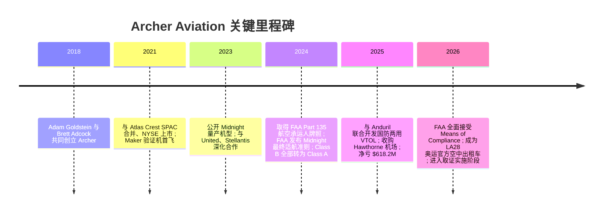
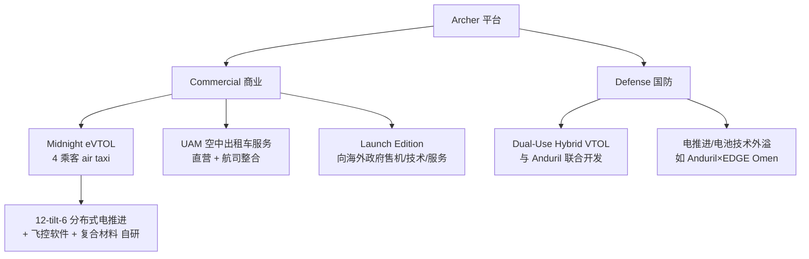
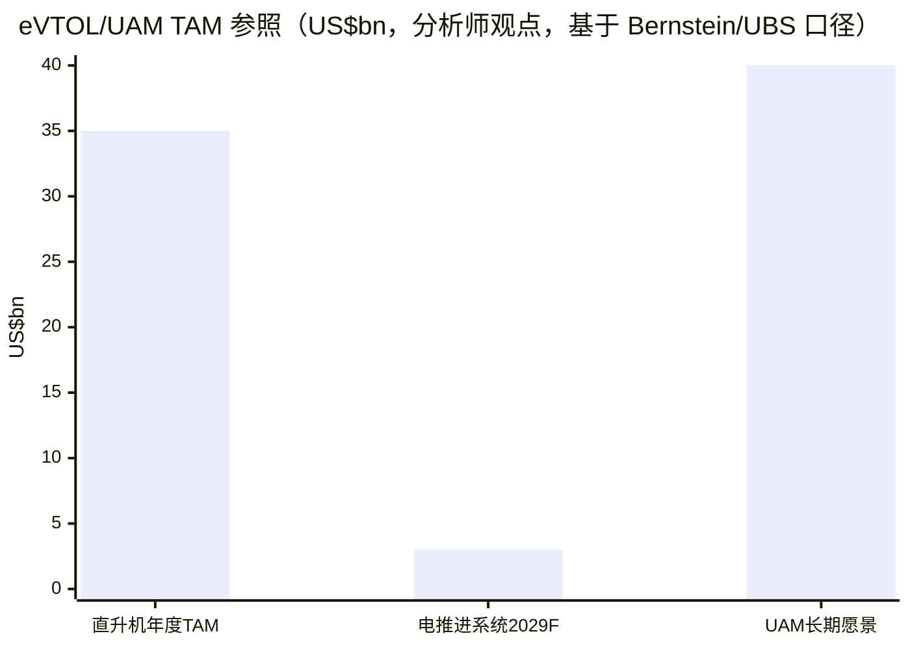
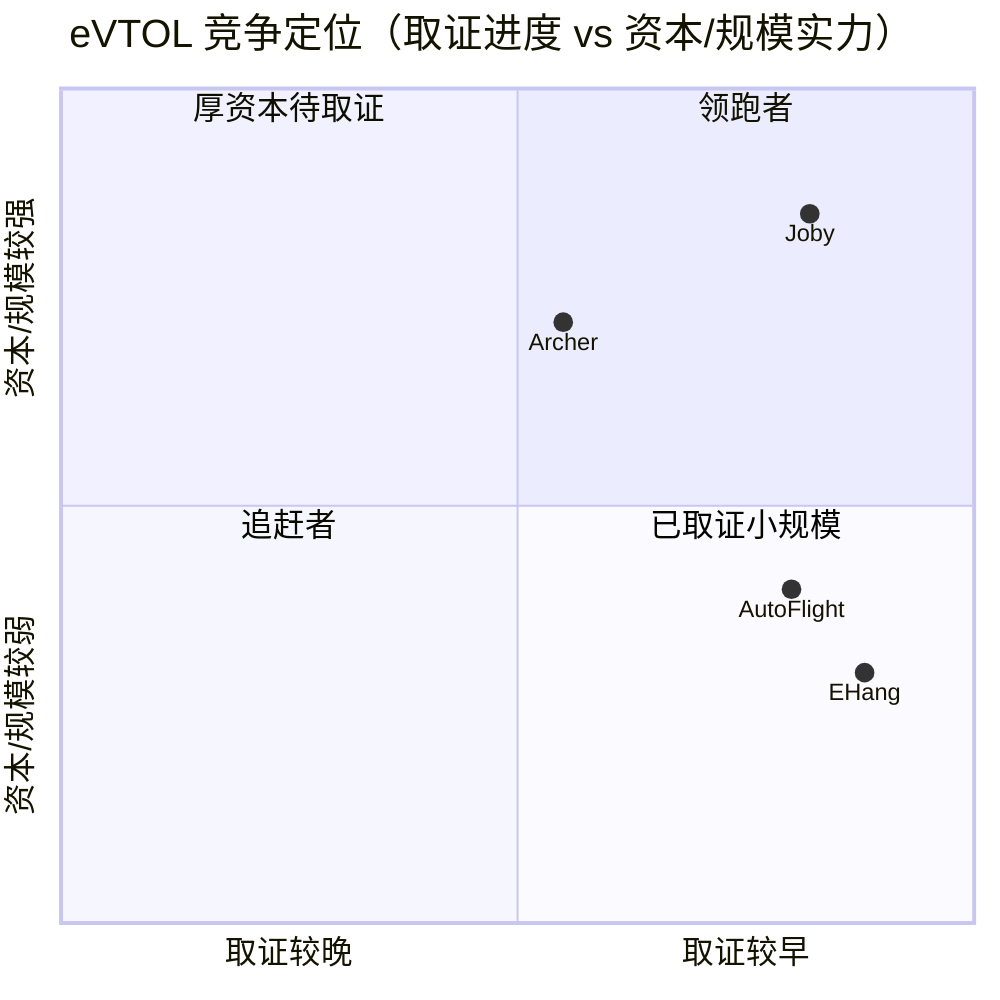
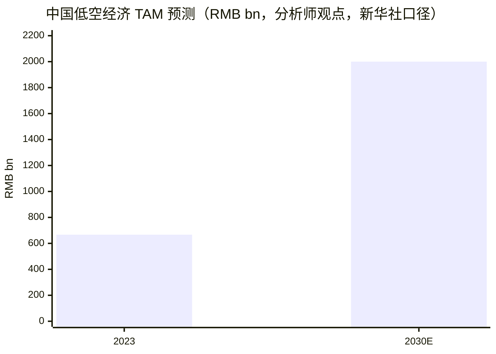

# Archer Aviation Inc.（NYSE:ACHR）公司研究报告

**报告日期 / As of：2026-06-14** ｜ 行情数据截至 2026-06-12 收盘 ｜ 货币单位除注明外均为 USD

> *分析师观点：* **投资摘要 / Investment Summary —— 评级：Hold（持有）· 12 个月目标价 $6.0（较 2026-06-12 收盘 $5.08 上行 +18%）· 估值方法：概率加权 SOTP / 风险调整（rNPV 思路，70% 取证-斜坡情景 + 30% 失败/再融资折价）· 市值约 $3.9bn · 52 周区间 $4.94–$13.64 · NYSE:ACHR**
>
> | 估值倍数 / Multiple（*分析师观点：* 远期列） | FY2025A | FY2026E | FY2027E |
> |---|---|---|---|
> | P/S（市销率，几无意义——pre-revenue） | n/m（FY25 营收仅 $0.3M） | n/m | ~30–60×（取决于首年商运收入实现） |
> | P/B（市净率） | 1.76× | ~2.4×（净资产随烧钱下降） | n/m |
> | EV / 现金（净现金折扣视角） | EV≈$2.2bn vs 现金+短投 $1.78bn | — | — |
>
> 相对表现 / Rel. performance（截至 2026-06-12，来源：yfinance）：1M −22.1% · 6M −39.3% · YTD −37.5% · 12M −56.7%，同期 SPY 1M −0.1% · 6M +8.5% · YTD +8.9%（12M 相对 SPY 约 −60pct，深度跑输）。
>
> **核心论点（thesis pillars）**——（1）Archer 是全球 eVTOL（electric vertical take-off and landing，电动垂直起降）赛道中**资本最雄厚、与 FAA 取证最接近、且唯一同时押注「商业空中出租车 + 国防两用」双线**的美股标的；（2）但其商业模式仍是**一个尚未被验证的期权**——FY2025 营收仅 $0.3M、净亏损 $618.2M、Q1 2026 单季净亏 $217.7M，价值几乎全部寄托于尚未取得的 Type Certificate（型号合格证 / 适航取证）；（3）流动性充裕（Q1 2026 末现金+短投 $1.78bn）但烧钱在加速，当前现金大约可支撑 8–12 个季度，量产前几乎必然再融资、进一步稀释；（4）我们给 Hold，因为**取证时点（catalyst）与稀释幅度（risk）对冲**——在 FAA 实施阶段仅完成约 15% 合规文件的当下，给「买入」为时尚早，但 LA28 奥运 + eIPP + Anduril 国防三条催化线又使「卖出」错失非对称上行。

---

## 目录 / Table of Contents

1. 公司概览（含投资论点与估值快照）
1A. 估值与目标价（远期预测 · 目标价推导 · 牛/中/熊情景）
1B. GF Score（GuruFocus 式）基本面评分卡
2. 公司历史
3. 管理团队
4. 产品与服务
5. 客户与上市策略（go-to-market）
6. 行业概览
7. 竞争格局
8. 市场机会（TAM）
9. 风险评估
9.5. 关键分歧与催化剂
10. 投资风格透视（investor lenses）

---

## 1. 公司概览

*分析师观点：* **我们给 Archer 评级 Hold、12 个月目标价 $6.0（上行约 +18%）。** 这是一个典型的**「故事先于现金流」的 pre-revenue 航空科技期权**：核心驱动不是当期财务（当期没有任何有意义的财务），而是 FAA 的 Type Certification（适航取证）能否在 2026–2027 落地、首批 Midnight 能否在洛杉矶 / 阿布扎比开始载客、以及与 Anduril 的国防两用项目能否兑现。我们之所以不给「买入」，是因为公司在 FAA 四阶段取证的最后（实施）阶段「估计仅收到约 15% 的合规验证文件（compliance verification documents）」（[ACHR FY2025 10-K — Item 1 Business](https://www.sec.gov/Archives/edgar/data/1824502/000182450226000019/achr-20251231.htm)），取证终点仍有显著不确定性；我们之所以不给「卖出」，是因为 ~$1.78bn 的现金垫 + LA28 奥运官方空中出租车地位 + eIPP（eVTOL Integration Pilot Program）提供了非对称的上行催化（[ACHR Q1 2026 致股东信, 2026-05-11](https://www.sec.gov/Archives/edgar/data/1824502/000182450226000035/archerlettertoshareholde.htm)）。

**公司是做什么的。** Archer 是一家总部位于美国加州 Santa Clara 的下一代航空公司，「正在打造一个向全球商业与国防客户交付先进飞行器、技术与服务的平台」，其旗舰产品 **Midnight** 是「为全球空中出租车（air taxi）运营专门打造的 eVTOL 飞行器」（[ACHR FY2025 10-K — Item 1 Business](https://www.sec.gov/Archives/edgar/data/1824502/000182450226000019/achr-20251231.htm)）。Midnight 采用专有的「12-tilt-6」分布式电推进（distributed electric propulsion）构型，可搭载 4 名乘客 + 1 名飞行员，针对约 20 英里的高频、短途城市行程做了航程与载荷优化，且相比传统直升机噪声显著更低（[同上, Item 1 — Our Aircraft](https://www.sec.gov/Archives/edgar/data/1824502/000182450226000019/achr-20251231.htm)）。

**怎么赚钱（商业模式）。** 答案是：**目前还不赚钱。** 公司规划了三条业务线——`Commercial`（商业机型销售 + 在选定都市直营空中出租车服务）、`Defense`（与 Anduril 联合开发的 hybrid-electric VTOL 国防机型及相关技术销售）、以及面向海外政府的 `Launch Edition` 项目（向 UAE 等先行市场出售飞行器、技术与服务）（[ACHR FY2025 10-K — Our Planned Lines of Business](https://www.sec.gov/Archives/edgar/data/1824502/000182450226000019/achr-20251231.htm)）。但这些都是「planned（计划中的）」收入；FY2025 全年仅确认 **$0.3M 营收**，营业费用却高达 **$729.6M**（[ACHR FY2025 10-K — Consolidated Statements of Operations](https://www.sec.gov/Archives/edgar/data/1824502/000182450226000019/achr-20251231.htm)）。

**在哪里运营。** 美国为研发与制造核心：硅谷（San Jose / Santa Clara）的「golden manufacturing line」做早期 Midnight 总装，乔治亚州 Covington 的高产能工厂（与 Stellantis 合作）准备规模化量产（[ACHR FY2025 10-K — Manufacturing Operations & Supply Chain](https://www.sec.gov/Archives/edgar/data/1824502/000182450226000019/achr-20251231.htm)）。商业落地则采取「美国 + 国际双轨」：美国通过 eIPP 与加州、佛州、德州、乔治亚、纽约多城合作申报，并于 2025-12 收购了洛杉矶 Hawthorne 机场控制权作为 LA 网络运营枢纽；海外以 UAE（阿布扎比，与 GCAA 监管机构合作）为先锋（[ACHR FY2025 10-K — Item 1 Business](https://www.sec.gov/Archives/edgar/data/1824502/000182450226000019/achr-20251231.htm)）。

**规模有多大。** 按财务口径，Archer 仍是一个「烧钱的研发实体」：FY2025 净亏损 $618.2M、经营活动净流出 $432.9M、年末累计赤字（accumulated deficit）$2,303.8M；但资产负债表很厚——年末现金、等价物及短期投资合计 $1,964.7M，总资产 $2,465.9M、股东权益 $2,202.8M、总负债仅 $263.1M（基本无杠杆）（[ACHR FY2025 10-K — Consolidated Balance Sheets](https://www.sec.gov/Archives/edgar/data/1824502/000182450226000019/achr-20251231.htm)）。截至 2026-03-31，员工规模与机队仍处于「new product introduction（新产品导入）」阶段，尚无规模化交付。

### 现金流结构 / How ACHR burns its cash（FY2025）

下图把 FY2025 的现金流拆给读者看——**这是评估一家烧钱公司最关键的图**：经营活动净流出 $432.9M（净亏 $618.2M，被非现金的股权激励 SBC $223.5M、D&A $20.0M 部分回补），加上 $78.8M 的资本开支（capex），自由现金流（FCF = CFO − Capex）约 −$511.7M；而融资活动通过 PIPE + ATM（at-the-market）增发净流入约 $1.8bn，是公司维持运营的「输血管」（[ACHR FY2025 10-K — Consolidated Statements of Cash Flows](https://www.sec.gov/Archives/edgar/data/1824502/000182450226000019/achr-20251231.htm)）。

<svg xmlns="http://www.w3.org/2000/svg" viewBox="0 0 1040 600" width="1040" height="600" role="img" aria-label="cash flow Sankey"><rect x="0" y="0" width="1040" height="600" fill="#ffffff"/>
<text x="20.00" y="30.00" text-anchor="start" font-family="Helvetica,Arial,sans-serif" font-size="15" font-weight="700" fill="#1f2933">Archer Aviation (ACHR) 现金流 / Cash Flow — FY2025 (USD mn)</text>
<path d="M 699.00,131.23 C 773.50,131.23 773.50,160.36 848.00,160.36 L 848.00,269.79 C 773.50,269.79 773.50,240.66 699.00,240.66 Z" fill="#fca5a5" fill-opacity="0.55"/>
<path d="M 699.00,240.66 C 773.50,240.66 773.50,283.79 848.00,283.79 L 848.00,292.91 C 773.50,292.91 773.50,249.79 699.00,249.79 Z" fill="#fca5a5" fill-opacity="0.55"/>
<path d="M 699.00,249.79 C 773.50,249.79 773.50,306.91 848.00,306.91 L 848.00,324.52 C 773.50,324.52 773.50,267.40 699.00,267.40 Z" fill="#fca5a5" fill-opacity="0.55"/>
<path d="M 699.00,267.40 C 773.50,267.40 773.50,338.52 848.00,338.52 L 848.00,457.64 C 773.50,457.64 773.50,386.52 699.00,386.52 Z" fill="#86efac" fill-opacity="0.55"/>
<path d="M 534.00,170.47 C 608.50,170.47 608.50,131.23 683.00,131.23 L 683.00,181.36 C 608.50,181.36 608.50,220.59 534.00,220.59 Z" fill="#93c5fd" fill-opacity="0.55"/>
<path d="M 534.00,234.59 C 608.50,234.59 608.50,181.36 683.00,181.36 L 683.00,278.77 C 608.50,278.77 608.50,332.00 534.00,332.00 Z" fill="#93c5fd" fill-opacity="0.55"/>
<path d="M 204.00,279.90 C 278.50,279.90 278.50,294.83 353.00,294.83 L 353.00,320.71 C 278.50,320.71 278.50,305.78 204.00,305.78 Z" fill="#93c5fd" fill-opacity="0.55"/>
<path d="M 369.00,294.83 C 443.50,294.83 443.50,64.00 518.00,64.00 L 518.00,135.58 C 443.50,135.58 443.50,366.41 369.00,366.41 Z" fill="#fca5a5" fill-opacity="0.55"/>
<path d="M 369.00,366.41 C 443.50,366.41 443.50,149.58 518.00,149.58 L 518.00,156.47 C 443.50,156.47 443.50,373.30 369.00,373.30 Z" fill="#fca5a5" fill-opacity="0.55"/>
<path d="M 369.00,373.30 C 443.50,373.30 443.50,170.47 518.00,170.47 L 518.00,220.59 C 443.50,220.59 443.50,423.42 369.00,423.42 Z" fill="#93c5fd" fill-opacity="0.55"/>
<path d="M 204.00,319.78 C 278.50,319.78 278.50,320.71 353.00,320.71 L 353.00,323.02 C 278.50,323.02 278.50,322.10 204.00,322.10 Z" fill="#93c5fd" fill-opacity="0.55"/>
<path d="M 204.00,336.10 C 278.50,336.10 278.50,323.02 353.00,323.02 L 353.00,325.02 C 278.50,325.02 278.50,338.10 204.00,338.10 Z" fill="#93c5fd" fill-opacity="0.55"/>
<path d="M 534.00,346.00 C 608.50,346.00 608.50,278.77 683.00,278.77 L 683.00,486.77 C 608.50,486.77 608.50,554.00 534.00,554.00 Z" fill="#93c5fd" fill-opacity="0.55"/>
<rect x="188.00" y="279.90" width="16" height="25.88" rx="1.5" fill="#2563eb"/>
<rect x="188.00" y="319.78" width="16" height="2.32" rx="1.5" fill="#2563eb"/>
<rect x="188.00" y="336.10" width="16" height="2.00" rx="1.5" fill="#2563eb"/>
<rect x="353.00" y="294.83" width="16" height="28.34" rx="1.5" fill="#2563eb"/>
<rect x="518.00" y="64.00" width="16" height="71.58" rx="1.5" fill="#dc2626"/>
<rect x="518.00" y="149.58" width="16" height="6.89" rx="1.5" fill="#dc2626"/>
<rect x="518.00" y="170.47" width="16" height="50.12" rx="1.5" fill="#1e3a8a"/>
<rect x="518.00" y="234.59" width="16" height="97.41" rx="1.5" fill="#2563eb"/>
<rect x="518.00" y="346.00" width="16" height="208.00" rx="1.5" fill="#2563eb"/>
<rect x="683.00" y="131.23" width="16" height="355.53" rx="1.5" fill="#1e3a8a"/>
<rect x="848.00" y="160.36" width="16" height="109.43" rx="1.5" fill="#dc2626"/>
<rect x="848.00" y="283.79" width="16" height="9.12" rx="1.5" fill="#dc2626"/>
<rect x="848.00" y="306.91" width="16" height="17.61" rx="1.5" fill="#dc2626"/>
<rect x="848.00" y="338.52" width="16" height="119.12" rx="1.5" fill="#1e3a8a"/>
<text x="179.00" y="289.84" text-anchor="end" font-family="Helvetica,Arial,sans-serif" font-size="11.5" font-weight="700" fill="#1f2933">Stock-Based Comp</text>
<text x="179.00" y="302.84" text-anchor="end" font-family="Helvetica,Arial,sans-serif" font-size="10" font-weight="400" fill="#52606d">$223.5M  (51.6%)</text>
<text x="179.00" y="317.94" text-anchor="end" font-family="Helvetica,Arial,sans-serif" font-size="11.5" font-weight="700" fill="#1f2933">D&amp;A</text>
<text x="179.00" y="330.94" text-anchor="end" font-family="Helvetica,Arial,sans-serif" font-size="10" font-weight="400" fill="#52606d">$20.0M  (4.6%)</text>
<text x="179.00" y="342.94" text-anchor="end" font-family="Helvetica,Arial,sans-serif" font-size="11.5" font-weight="700" fill="#1f2933">Working Capital &amp; Other</text>
<text x="179.00" y="355.94" text-anchor="end" font-family="Helvetica,Arial,sans-serif" font-size="10" font-weight="400" fill="#52606d">$1.3M  (0.30%)</text>
<rect x="372.00" y="276.83" width="106.80" height="26" rx="2" fill="#ffffff" fill-opacity="0.72"/>
<text x="375.00" y="288.83" text-anchor="start" font-family="Helvetica,Arial,sans-serif" font-size="11.5" font-weight="700" fill="#1f2933">Operating Inflow</text>
<text x="375.00" y="301.83" text-anchor="start" font-family="Helvetica,Arial,sans-serif" font-size="10" font-weight="400" fill="#52606d">$244.8M  (56.5%)</text>
<rect x="537.00" y="46.00" width="113.10" height="26" rx="2" fill="#ffffff" fill-opacity="0.72"/>
<text x="540.00" y="58.00" text-anchor="start" font-family="Helvetica,Arial,sans-serif" font-size="11.5" font-weight="700" fill="#1f2933">Net Loss</text>
<text x="540.00" y="71.00" text-anchor="start" font-family="Helvetica,Arial,sans-serif" font-size="10" font-weight="400" fill="#52606d">$618.2M  (142.8%)</text>
<rect x="537.00" y="131.58" width="113.10" height="26" rx="2" fill="#ffffff" fill-opacity="0.72"/>
<text x="540.00" y="143.58" text-anchor="start" font-family="Helvetica,Arial,sans-serif" font-size="11.5" font-weight="700" fill="#1f2933">Warrant FV Change</text>
<text x="540.00" y="156.58" text-anchor="start" font-family="Helvetica,Arial,sans-serif" font-size="10" font-weight="400" fill="#52606d">$59.5M  (13.7%)</text>
<rect x="537.00" y="156.58" width="163.50" height="26" rx="2" fill="#ffffff" fill-opacity="0.72"/>
<text x="540.00" y="168.58" text-anchor="start" font-family="Helvetica,Arial,sans-serif" font-size="11.5" font-weight="700" fill="#1f2933">Cash Flow from Operations</text>
<text x="540.00" y="181.58" text-anchor="start" font-family="Helvetica,Arial,sans-serif" font-size="10" font-weight="400" fill="#52606d">$432.9M  (100.0%)</text>
<rect x="537.00" y="216.59" width="113.10" height="26" rx="2" fill="#ffffff" fill-opacity="0.72"/>
<text x="540.00" y="228.59" text-anchor="start" font-family="Helvetica,Arial,sans-serif" font-size="11.5" font-weight="700" fill="#1f2933">Beginning Cash</text>
<text x="540.00" y="241.59" text-anchor="start" font-family="Helvetica,Arial,sans-serif" font-size="10" font-weight="400" fill="#52606d">$841.3M  (194.3%)</text>
<rect x="537.00" y="328.00" width="157.20" height="26" rx="2" fill="#ffffff" fill-opacity="0.72"/>
<text x="540.00" y="340.00" text-anchor="start" font-family="Helvetica,Arial,sans-serif" font-size="11.5" font-weight="700" fill="#1f2933">PIPE + ATM + ESPP Equity</text>
<text x="540.00" y="353.00" text-anchor="start" font-family="Helvetica,Arial,sans-serif" font-size="10" font-weight="400" fill="#52606d">$1.8B  (415.0%)</text>
<rect x="702.00" y="113.23" width="100.50" height="26" rx="2" fill="#ffffff" fill-opacity="0.72"/>
<text x="705.00" y="125.23" text-anchor="start" font-family="Helvetica,Arial,sans-serif" font-size="11.5" font-weight="700" fill="#1f2933">Cash Available</text>
<text x="705.00" y="138.23" text-anchor="start" font-family="Helvetica,Arial,sans-serif" font-size="10" font-weight="400" fill="#52606d">$3.1B  (709.3%)</text>
<rect x="867.00" y="142.36" width="132.00" height="26" rx="2" fill="#ffffff" fill-opacity="0.72"/>
<text x="870.00" y="154.36" text-anchor="start" font-family="Helvetica,Arial,sans-serif" font-size="11.5" font-weight="700" fill="#1f2933">ST Investments (net)</text>
<text x="870.00" y="167.36" text-anchor="start" font-family="Helvetica,Arial,sans-serif" font-size="10" font-weight="400" fill="#52606d">$945.1M  (218.3%)</text>
<rect x="867.00" y="265.79" width="100.50" height="26" rx="2" fill="#ffffff" fill-opacity="0.72"/>
<text x="870.00" y="277.79" text-anchor="start" font-family="Helvetica,Arial,sans-serif" font-size="11.5" font-weight="700" fill="#1f2933">Capex (PP&amp;E)</text>
<text x="870.00" y="290.79" text-anchor="start" font-family="Helvetica,Arial,sans-serif" font-size="10" font-weight="400" fill="#52606d">$78.8M  (18.2%)</text>
<rect x="867.00" y="290.79" width="169.80" height="26" rx="2" fill="#ffffff" fill-opacity="0.72"/>
<text x="870.00" y="302.79" text-anchor="start" font-family="Helvetica,Arial,sans-serif" font-size="11.5" font-weight="700" fill="#1f2933">Intangibles &amp; Business Acq</text>
<text x="870.00" y="315.79" text-anchor="start" font-family="Helvetica,Arial,sans-serif" font-size="10" font-weight="400" fill="#52606d">$152.1M  (35.1%)</text>
<text x="873.00" y="395.08" text-anchor="start" font-family="Helvetica,Arial,sans-serif" font-size="11.5" font-weight="700" fill="#1f2933">Ending Cash</text>
<text x="873.00" y="408.08" text-anchor="start" font-family="Helvetica,Arial,sans-serif" font-size="10" font-weight="400" fill="#52606d">$1.0B  (237.7%)</text>
<text x="520.00" y="570.00" text-anchor="middle" font-family="Helvetica,Arial,sans-serif" font-size="10" font-weight="400" font-style="italic" fill="#8a97a3">Free Cash Flow = CFO − CapEx = -$511.7M</text>
<text x="520.00" y="584.00" text-anchor="middle" font-family="Helvetica,Arial,sans-serif" font-size="10" font-weight="400" fill="#52606d">Source: ACHR FY2025 10-K, Consolidated Statements of Cash Flows</text>
</svg>

来源 / Source：[ACHR FY2025 10-K — Consolidated Statements of Cash Flows](https://www.sec.gov/Archives/edgar/data/1824502/000182450226000019/achr-20251231.htm)。

### 资产负债表结构 / Balance sheet —— 厚现金垫、近乎零杠杆（FY2025）

与"烧钱"相对的，是 Archer **异常厚实、近乎零杠杆的资产负债表**：FY2025 年末总资产 $2,465.9M，其中 **84.2% 是流动资产**——现金及等价物 $1,021.5M + 短期投资 $943.2M（合计约 $1.96bn 的现金垫）是公司穿越取证前烧钱期的核心缓冲；非流动资产主要是 property & equipment（厂房设备）$253.6M（乔治亚 Covington 工厂）与无形资产 $80.2M。负债端总额仅 $263.1M（占总资产 **10.7%**），且无大额有息债务（长期债务仅 $79.5M），基本零杠杆。权益 $2,202.8M 看似很高，但它是 **paid-in capital（实收资本）$4,507.9M 减去 accumulated deficit（累计赤字）$2,303.8M** 的净额——后者正是公司自成立以来累计烧掉的现金（[ACHR FY2025 10-K — Consolidated Balance Sheets](https://www.sec.gov/Archives/edgar/data/1824502/000182450226000019/achr-20251231.htm)）。

<svg xmlns="http://www.w3.org/2000/svg" viewBox="0 0 1040 600" width="1040" height="600" role="img" aria-label="balance sheet Sankey"><rect x="0" y="0" width="1040" height="600" fill="#ffffff"/>
<text x="20.00" y="30.00" text-anchor="start" font-family="Helvetica,Arial,sans-serif" font-size="15" font-weight="700" fill="#1f2933">Archer Aviation (ACHR) 资产负债表 / Balance Sheet — FY2025 (USD mn)</text>
<path d="M 204.00,63.56 C 262.00,63.56 262.00,113.00 320.00,113.00 L 320.00,269.59 C 262.00,269.59 262.00,220.15 204.00,220.15 Z" fill="#93c5fd" fill-opacity="0.55"/>
<path d="M 732.00,106.00 C 790.00,106.00 790.00,62.46 848.00,62.46 L 848.00,67.09 C 790.00,67.09 790.00,110.63 732.00,110.63 Z" fill="#fca5a5" fill-opacity="0.55"/>
<path d="M 732.00,110.63 C 790.00,110.63 790.00,81.09 848.00,81.09 L 848.00,91.53 C 790.00,91.53 790.00,121.07 732.00,121.07 Z" fill="#fca5a5" fill-opacity="0.55"/>
<path d="M 732.00,121.07 C 790.00,121.07 790.00,105.53 848.00,105.53 L 848.00,107.53 C 790.00,107.53 790.00,123.07 732.00,123.07 Z" fill="#fca5a5" fill-opacity="0.55"/>
<path d="M 732.00,123.07 C 790.00,123.07 790.00,121.53 848.00,121.53 L 848.00,123.53 C 790.00,123.53 790.00,125.07 732.00,125.07 Z" fill="#fca5a5" fill-opacity="0.55"/>
<path d="M 600.00,113.00 C 658.00,113.00 658.00,106.00 716.00,106.00 L 716.00,122.00 C 658.00,122.00 658.00,129.00 600.00,129.00 Z" fill="#fca5a5" fill-opacity="0.55"/>
<path d="M 336.00,113.00 C 394.00,113.00 394.00,120.00 452.00,120.00 L 452.00,438.25 C 394.00,438.25 394.00,431.25 336.00,431.25 Z" fill="#86efac" fill-opacity="0.55"/>
<path d="M 600.00,129.00 C 658.00,129.00 658.00,136.00 716.00,136.00 L 716.00,160.33 C 658.00,160.33 658.00,153.33 600.00,153.33 Z" fill="#fca5a5" fill-opacity="0.55"/>
<path d="M 468.00,120.00 C 526.00,120.00 526.00,113.00 584.00,113.00 L 584.00,153.33 C 526.00,153.33 526.00,160.33 468.00,160.33 Z" fill="#fca5a5" fill-opacity="0.55"/>
<path d="M 468.00,160.33 C 526.00,160.33 526.00,167.33 584.00,167.33 L 584.00,505.00 C 526.00,505.00 526.00,498.00 468.00,498.00 Z" fill="#86efac" fill-opacity="0.55"/>
<path d="M 732.00,136.00 C 790.00,136.00 790.00,137.53 848.00,137.53 L 848.00,149.72 C 790.00,149.72 790.00,148.19 732.00,148.19 Z" fill="#fca5a5" fill-opacity="0.55"/>
<path d="M 732.00,148.19 C 790.00,148.19 790.00,163.72 848.00,163.72 L 848.00,169.28 C 790.00,169.28 790.00,153.75 732.00,153.75 Z" fill="#fca5a5" fill-opacity="0.55"/>
<path d="M 732.00,153.75 C 790.00,153.75 790.00,183.28 848.00,183.28 L 848.00,187.87 C 790.00,187.87 790.00,158.34 732.00,158.34 Z" fill="#fca5a5" fill-opacity="0.55"/>
<path d="M 732.00,158.34 C 790.00,158.34 790.00,201.87 848.00,201.87 L 848.00,203.87 C 790.00,203.87 790.00,160.34 732.00,160.34 Z" fill="#fca5a5" fill-opacity="0.55"/>
<path d="M 600.00,167.33 C 658.00,167.33 658.00,174.33 716.00,174.33 L 716.00,512.00 C 658.00,512.00 658.00,505.00 600.00,505.00 Z" fill="#86efac" fill-opacity="0.55"/>
<path d="M 732.00,174.33 C 790.00,174.33 790.00,217.87 848.00,217.87 L 848.00,555.54 C 790.00,555.54 790.00,512.00 732.00,512.00 Z" fill="#86efac" fill-opacity="0.55"/>
<path d="M 204.00,234.15 C 262.00,234.15 262.00,269.59 320.00,269.59 L 320.00,414.17 C 262.00,414.17 262.00,378.73 204.00,378.73 Z" fill="#93c5fd" fill-opacity="0.55"/>
<path d="M 204.00,392.73 C 262.00,392.73 262.00,414.17 320.00,414.17 L 320.00,416.17 C 262.00,416.17 262.00,394.73 204.00,394.73 Z" fill="#93c5fd" fill-opacity="0.55"/>
<path d="M 204.00,408.73 C 262.00,408.73 262.00,416.17 320.00,416.17 L 320.00,423.42 C 262.00,423.42 262.00,415.98 204.00,415.98 Z" fill="#93c5fd" fill-opacity="0.55"/>
<path d="M 204.00,429.98 C 262.00,429.98 262.00,423.42 320.00,423.42 L 320.00,432.13 C 262.00,432.13 262.00,438.69 204.00,438.69 Z" fill="#93c5fd" fill-opacity="0.55"/>
<path d="M 336.00,445.25 C 394.00,445.25 394.00,438.25 452.00,438.25 L 452.00,498.00 C 394.00,498.00 394.00,505.00 336.00,505.00 Z" fill="#86efac" fill-opacity="0.55"/>
<path d="M 204.00,452.69 C 262.00,452.69 262.00,445.25 320.00,445.25 L 320.00,484.12 C 262.00,484.12 262.00,491.56 204.00,491.56 Z" fill="#93c5fd" fill-opacity="0.55"/>
<path d="M 204.00,505.56 C 262.00,505.56 262.00,484.12 320.00,484.12 L 320.00,496.42 C 262.00,496.42 262.00,517.86 204.00,517.86 Z" fill="#93c5fd" fill-opacity="0.55"/>
<path d="M 204.00,531.86 C 262.00,531.86 262.00,496.42 320.00,496.42 L 320.00,502.67 C 262.00,502.67 262.00,538.11 204.00,538.11 Z" fill="#93c5fd" fill-opacity="0.55"/>
<path d="M 204.00,552.11 C 262.00,552.11 262.00,502.67 320.00,502.67 L 320.00,505.00 C 262.00,505.00 262.00,554.44 204.00,554.44 Z" fill="#93c5fd" fill-opacity="0.55"/>
<rect x="188.00" y="63.56" width="16" height="156.59" rx="1.5" fill="#2563eb"/>
<rect x="188.00" y="234.15" width="16" height="144.58" rx="1.5" fill="#2563eb"/>
<rect x="188.00" y="392.73" width="16" height="2.00" rx="1.5" fill="#2563eb"/>
<rect x="188.00" y="408.73" width="16" height="7.25" rx="1.5" fill="#2563eb"/>
<rect x="188.00" y="429.98" width="16" height="8.71" rx="1.5" fill="#2563eb"/>
<rect x="188.00" y="452.69" width="16" height="38.87" rx="1.5" fill="#2563eb"/>
<rect x="188.00" y="505.56" width="16" height="12.29" rx="1.5" fill="#2563eb"/>
<rect x="188.00" y="531.86" width="16" height="6.25" rx="1.5" fill="#2563eb"/>
<rect x="188.00" y="552.11" width="16" height="2.33" rx="1.5" fill="#2563eb"/>
<rect x="320.00" y="113.00" width="16" height="318.25" rx="1.5" fill="#15803d"/>
<rect x="320.00" y="445.25" width="16" height="59.75" rx="1.5" fill="#15803d"/>
<rect x="452.00" y="120.00" width="16" height="378.00" rx="1.5" fill="#1e3a8a"/>
<rect x="584.00" y="113.00" width="16" height="40.33" rx="1.5" fill="#dc2626"/>
<rect x="584.00" y="167.33" width="16" height="337.67" rx="1.5" fill="#15803d"/>
<rect x="716.00" y="106.00" width="16" height="16.00" rx="1.5" fill="#dc2626"/>
<rect x="716.00" y="136.00" width="16" height="24.33" rx="1.5" fill="#dc2626"/>
<rect x="716.00" y="174.33" width="16" height="337.67" rx="1.5" fill="#15803d"/>
<rect x="848.00" y="62.46" width="16" height="4.63" rx="1.5" fill="#dc2626"/>
<rect x="848.00" y="81.09" width="16" height="10.44" rx="1.5" fill="#dc2626"/>
<rect x="848.00" y="105.53" width="16" height="2.00" rx="1.5" fill="#dc2626"/>
<rect x="848.00" y="121.53" width="16" height="2.00" rx="1.5" fill="#dc2626"/>
<rect x="848.00" y="137.53" width="16" height="12.19" rx="1.5" fill="#dc2626"/>
<rect x="848.00" y="163.72" width="16" height="5.56" rx="1.5" fill="#dc2626"/>
<rect x="848.00" y="183.28" width="16" height="4.58" rx="1.5" fill="#dc2626"/>
<rect x="848.00" y="201.87" width="16" height="2.00" rx="1.5" fill="#dc2626"/>
<rect x="848.00" y="217.87" width="16" height="337.67" rx="1.5" fill="#15803d"/>
<line x1="188.00" y1="141.85" x2="182.00" y2="107.14" stroke="#cbd5e1" stroke-width="1"/>
<text x="179.00" y="110.14" text-anchor="end" font-family="Helvetica,Arial,sans-serif" font-size="11.5" font-weight="700" fill="#1f2933">Cash &amp; Equivalents</text>
<text x="179.00" y="123.14" text-anchor="end" font-family="Helvetica,Arial,sans-serif" font-size="10" font-weight="400" fill="#52606d">$1.0B  (41.4%)</text>
<line x1="188.00" y1="306.44" x2="182.00" y2="271.73" stroke="#cbd5e1" stroke-width="1"/>
<text x="179.00" y="274.73" text-anchor="end" font-family="Helvetica,Arial,sans-serif" font-size="11.5" font-weight="700" fill="#1f2933">Short-term Investments</text>
<text x="179.00" y="287.73" text-anchor="end" font-family="Helvetica,Arial,sans-serif" font-size="10" font-weight="400" fill="#52606d">$943.2M  (38.2%)</text>
<line x1="188.00" y1="393.73" x2="182.00" y2="359.02" stroke="#cbd5e1" stroke-width="1"/>
<text x="179.00" y="362.02" text-anchor="end" font-family="Helvetica,Arial,sans-serif" font-size="11.5" font-weight="700" fill="#1f2933">Restricted Cash</text>
<text x="179.00" y="375.02" text-anchor="end" font-family="Helvetica,Arial,sans-serif" font-size="10" font-weight="400" fill="#52606d">$7.3M  (0.30%)</text>
<line x1="188.00" y1="412.36" x2="182.00" y2="384.02" stroke="#cbd5e1" stroke-width="1"/>
<text x="179.00" y="387.02" text-anchor="end" font-family="Helvetica,Arial,sans-serif" font-size="11.5" font-weight="700" fill="#1f2933">Prepaid Expenses</text>
<text x="179.00" y="400.02" text-anchor="end" font-family="Helvetica,Arial,sans-serif" font-size="10" font-weight="400" fill="#52606d">$47.3M  (1.9%)</text>
<line x1="188.00" y1="434.33" x2="182.00" y2="409.02" stroke="#cbd5e1" stroke-width="1"/>
<text x="179.00" y="412.02" text-anchor="end" font-family="Helvetica,Arial,sans-serif" font-size="11.5" font-weight="700" fill="#1f2933">Other Current</text>
<text x="179.00" y="425.02" text-anchor="end" font-family="Helvetica,Arial,sans-serif" font-size="10" font-weight="400" fill="#52606d">$56.8M  (2.3%)</text>
<line x1="188.00" y1="472.12" x2="182.00" y2="437.42" stroke="#cbd5e1" stroke-width="1"/>
<text x="179.00" y="440.42" text-anchor="end" font-family="Helvetica,Arial,sans-serif" font-size="11.5" font-weight="700" fill="#1f2933">Property &amp; Equipment, net</text>
<text x="179.00" y="453.42" text-anchor="end" font-family="Helvetica,Arial,sans-serif" font-size="10" font-weight="400" fill="#52606d">$253.6M  (10.3%)</text>
<line x1="188.00" y1="511.71" x2="182.00" y2="477.00" stroke="#cbd5e1" stroke-width="1"/>
<text x="179.00" y="480.00" text-anchor="end" font-family="Helvetica,Arial,sans-serif" font-size="11.5" font-weight="700" fill="#1f2933">Intangibles</text>
<text x="179.00" y="493.00" text-anchor="end" font-family="Helvetica,Arial,sans-serif" font-size="10" font-weight="400" fill="#52606d">$80.2M  (3.3%)</text>
<line x1="188.00" y1="534.98" x2="182.00" y2="502.00" stroke="#cbd5e1" stroke-width="1"/>
<text x="179.00" y="505.00" text-anchor="end" font-family="Helvetica,Arial,sans-serif" font-size="11.5" font-weight="700" fill="#1f2933">Right-of-Use Assets</text>
<text x="179.00" y="518.00" text-anchor="end" font-family="Helvetica,Arial,sans-serif" font-size="10" font-weight="400" fill="#52606d">$40.8M  (1.7%)</text>
<line x1="188.00" y1="553.28" x2="182.00" y2="527.00" stroke="#cbd5e1" stroke-width="1"/>
<text x="179.00" y="530.00" text-anchor="end" font-family="Helvetica,Arial,sans-serif" font-size="11.5" font-weight="700" fill="#1f2933">Goodwill &amp; Other LT</text>
<text x="179.00" y="543.00" text-anchor="end" font-family="Helvetica,Arial,sans-serif" font-size="10" font-weight="400" fill="#52606d">$15.2M  (0.62%)</text>
<rect x="339.00" y="95.00" width="132.00" height="26" rx="2" fill="#ffffff" fill-opacity="0.72"/>
<text x="342.00" y="107.00" text-anchor="start" font-family="Helvetica,Arial,sans-serif" font-size="11.5" font-weight="700" fill="#1f2933">Total Current Assets</text>
<text x="342.00" y="120.00" text-anchor="start" font-family="Helvetica,Arial,sans-serif" font-size="10" font-weight="400" fill="#52606d">$2.1B  (84.2%)</text>
<rect x="339.00" y="427.25" width="157.20" height="26" rx="2" fill="#ffffff" fill-opacity="0.72"/>
<text x="342.00" y="439.25" text-anchor="start" font-family="Helvetica,Arial,sans-serif" font-size="11.5" font-weight="700" fill="#1f2933">Total Non-Current Assets</text>
<text x="342.00" y="452.25" text-anchor="start" font-family="Helvetica,Arial,sans-serif" font-size="10" font-weight="400" fill="#52606d">$389.8M  (15.8%)</text>
<rect x="471.00" y="102.00" width="100.50" height="26" rx="2" fill="#ffffff" fill-opacity="0.72"/>
<text x="474.00" y="114.00" text-anchor="start" font-family="Helvetica,Arial,sans-serif" font-size="11.5" font-weight="700" fill="#1f2933">Total Assets</text>
<text x="474.00" y="127.00" text-anchor="start" font-family="Helvetica,Arial,sans-serif" font-size="10" font-weight="400" fill="#52606d">$2.5B  (100.0%)</text>
<rect x="603.00" y="95.00" width="113.10" height="26" rx="2" fill="#ffffff" fill-opacity="0.72"/>
<text x="606.00" y="107.00" text-anchor="start" font-family="Helvetica,Arial,sans-serif" font-size="11.5" font-weight="700" fill="#1f2933">Total Liabilities</text>
<text x="606.00" y="120.00" text-anchor="start" font-family="Helvetica,Arial,sans-serif" font-size="10" font-weight="400" fill="#52606d">$263.1M  (10.7%)</text>
<rect x="603.00" y="149.33" width="94.20" height="26" rx="2" fill="#ffffff" fill-opacity="0.72"/>
<text x="606.00" y="161.33" text-anchor="start" font-family="Helvetica,Arial,sans-serif" font-size="11.5" font-weight="700" fill="#1f2933">Total Equity</text>
<text x="606.00" y="174.33" text-anchor="start" font-family="Helvetica,Arial,sans-serif" font-size="10" font-weight="400" fill="#52606d">$2.2B  (89.3%)</text>
<rect x="735.00" y="88.00" width="125.70" height="26" rx="2" fill="#ffffff" fill-opacity="0.72"/>
<text x="738.00" y="100.00" text-anchor="start" font-family="Helvetica,Arial,sans-serif" font-size="11.5" font-weight="700" fill="#1f2933">Current Liabilities</text>
<text x="738.00" y="113.00" text-anchor="start" font-family="Helvetica,Arial,sans-serif" font-size="10" font-weight="400" fill="#52606d">$104.4M  (4.2%)</text>
<rect x="735.00" y="118.00" width="150.90" height="26" rx="2" fill="#ffffff" fill-opacity="0.72"/>
<text x="738.00" y="130.00" text-anchor="start" font-family="Helvetica,Arial,sans-serif" font-size="11.5" font-weight="700" fill="#1f2933">Non-Current Liabilities</text>
<text x="738.00" y="143.00" text-anchor="start" font-family="Helvetica,Arial,sans-serif" font-size="10" font-weight="400" fill="#52606d">$158.7M  (6.4%)</text>
<rect x="735.00" y="156.33" width="132.00" height="26" rx="2" fill="#ffffff" fill-opacity="0.72"/>
<text x="738.00" y="168.33" text-anchor="start" font-family="Helvetica,Arial,sans-serif" font-size="11.5" font-weight="700" fill="#1f2933">Shareholders' Equity</text>
<text x="738.00" y="181.33" text-anchor="start" font-family="Helvetica,Arial,sans-serif" font-size="10" font-weight="400" fill="#52606d">$2.2B  (89.3%)</text>
<text x="873.00" y="61.78" text-anchor="start" font-family="Helvetica,Arial,sans-serif" font-size="11.5" font-weight="700" fill="#1f2933">Accounts Payable</text>
<text x="873.00" y="74.78" text-anchor="start" font-family="Helvetica,Arial,sans-serif" font-size="10" font-weight="400" fill="#52606d">$30.2M  (1.2%)</text>
<text x="873.00" y="86.78" text-anchor="start" font-family="Helvetica,Arial,sans-serif" font-size="11.5" font-weight="700" fill="#1f2933">Accrued &amp; Other</text>
<text x="873.00" y="99.78" text-anchor="start" font-family="Helvetica,Arial,sans-serif" font-size="10" font-weight="400" fill="#52606d">$68.1M  (2.8%)</text>
<text x="873.00" y="111.78" text-anchor="start" font-family="Helvetica,Arial,sans-serif" font-size="11.5" font-weight="700" fill="#1f2933">Lease (current)</text>
<text x="873.00" y="124.78" text-anchor="start" font-family="Helvetica,Arial,sans-serif" font-size="10" font-weight="400" fill="#52606d">$5.3M  (0.21%)</text>
<line x1="864.00" y1="122.53" x2="870.00" y2="133.78" stroke="#cbd5e1" stroke-width="1"/>
<text x="873.00" y="136.78" text-anchor="start" font-family="Helvetica,Arial,sans-serif" font-size="11.5" font-weight="700" fill="#1f2933">Debt (current)</text>
<text x="873.00" y="149.78" text-anchor="start" font-family="Helvetica,Arial,sans-serif" font-size="10" font-weight="400" fill="#52606d">$800.0K  (0.03%)</text>
<line x1="864.00" y1="143.63" x2="870.00" y2="158.78" stroke="#cbd5e1" stroke-width="1"/>
<text x="873.00" y="161.78" text-anchor="start" font-family="Helvetica,Arial,sans-serif" font-size="11.5" font-weight="700" fill="#1f2933">Debt (LT)</text>
<text x="873.00" y="174.78" text-anchor="start" font-family="Helvetica,Arial,sans-serif" font-size="10" font-weight="400" fill="#52606d">$79.5M  (3.2%)</text>
<line x1="864.00" y1="166.50" x2="870.00" y2="183.78" stroke="#cbd5e1" stroke-width="1"/>
<text x="873.00" y="186.78" text-anchor="start" font-family="Helvetica,Arial,sans-serif" font-size="11.5" font-weight="700" fill="#1f2933">Lease (LT)</text>
<text x="873.00" y="199.78" text-anchor="start" font-family="Helvetica,Arial,sans-serif" font-size="10" font-weight="400" fill="#52606d">$36.3M  (1.5%)</text>
<line x1="864.00" y1="185.58" x2="870.00" y2="208.78" stroke="#cbd5e1" stroke-width="1"/>
<text x="873.00" y="211.78" text-anchor="start" font-family="Helvetica,Arial,sans-serif" font-size="11.5" font-weight="700" fill="#1f2933">Warrant Liabilities</text>
<text x="873.00" y="224.78" text-anchor="start" font-family="Helvetica,Arial,sans-serif" font-size="10" font-weight="400" fill="#52606d">$29.9M  (1.2%)</text>
<line x1="864.00" y1="202.87" x2="870.00" y2="233.78" stroke="#cbd5e1" stroke-width="1"/>
<text x="873.00" y="236.78" text-anchor="start" font-family="Helvetica,Arial,sans-serif" font-size="11.5" font-weight="700" fill="#1f2933">Other LT Liab</text>
<text x="873.00" y="249.78" text-anchor="start" font-family="Helvetica,Arial,sans-serif" font-size="10" font-weight="400" fill="#52606d">$13.0M  (0.53%)</text>
<text x="873.00" y="383.70" text-anchor="start" font-family="Helvetica,Arial,sans-serif" font-size="11.5" font-weight="700" fill="#1f2933">Paid-in less deficit</text>
<text x="873.00" y="396.70" text-anchor="start" font-family="Helvetica,Arial,sans-serif" font-size="10" font-weight="400" fill="#52606d">$2.2B  (89.3%)</text>
<text x="520.00" y="570.00" text-anchor="middle" font-family="Helvetica,Arial,sans-serif" font-size="10" font-weight="400" font-style="italic" fill="#8a97a3">厚现金垫、近乎零杠杆:总负债仅占总资产 10.7%;权益 = 实收资本 $4,507.9M − 累计赤字 $2,303.8M</text>
<text x="520.00" y="584.00" text-anchor="middle" font-family="Helvetica,Arial,sans-serif" font-size="10" font-weight="400" fill="#52606d">Source: ACHR FY2025 10-K, Consolidated Balance Sheets</text>
</svg>

来源 / Source：[ACHR FY2025 10-K — Consolidated Balance Sheets](https://www.sec.gov/Archives/edgar/data/1824502/000182450226000019/achr-20251231.htm)。

**估值快照（valuation snapshot）。** 截至 2026-06-12，ACHR 收盘 $5.08，约 762.86M 流通股对应市值约 $3.9bn（[yfinance ACHR, 2026-06-12](https://finance.yahoo.com/quote/ACHR/)）。**传统倍数对一个 pre-revenue 公司基本失效**：TTM P/E 为负（FY2025 净亏 $618.2M，本质是「现金燃烧型成长」叠加取证前的纯研发投入，驱动亏损的科目是 R&D $493.9M + G&A $235.4M，见 [10-K 利润表](https://www.sec.gov/Archives/edgar/data/1824502/000182450226000019/achr-20251231.htm)）；P/S 因 FY2025 营收仅 $0.3M 而无意义。唯一有锚的倍数是 **P/B 1.76×**（市值 $3.9bn ÷ 账面权益 $2.2bn），以及把账面 $1.78bn 现金+短投扣除后的 **企业价值 EV≈$2.2bn**——即市场对「Archer 的技术、IP、取证进度与商业期权」的净定价约 $2.2bn。同业里，Joby（JOBY）市值约 $9.0bn（约 983.6M 股 × $9.15）、EHang（EH）市值约 $0.5bn（[yfinance JOBY/EH, 2026-06-12](https://finance.yahoo.com/quote/JOBY/)）——Archer 介于「美国取证领跑者 Joby」与「中国已取证商运的 EHang」之间，市值约为 Joby 的 0.4 倍。**这个高溢价（相对账面、相对营收）属于赛道叙事溢价（narrative / thematic premium）**：市场把它当作 eVTOL/低空经济（low-altitude economy）主题的美股代理之一，定价的是 2030 年代的 TAM，而非当期基本面（这一溢价的合理性见 §6/§8 TAM 与 §9 估值风险）。

> *分析师观点：* 我们用「市值 ÷ 现金垫」框架看待此类标的：Archer 的 EV≈$2.2bn 隐含市场愿意为「尚未取证、尚未量产」的商业期权付约 1.2 倍账面现金的溢价——比 Joby 便宜（Joby EV 约为现金的数倍），但远谈不上「安全边际」。

> **业绩更新 / Update —— 已初始化 Q2 2026 指引（2026-05-11）：** 公司给出 Q2 2026 财务预期，Adjusted EBITDA（调整后 EBITDA）亏损预计为 **$170M–$200M**（Q1 2026 实际经营净流出约 $149M、净亏 $217.7M），即烧钱在环比走阔，反映取证测试 + 乔治亚工厂量产爬坡 + Hawthorne 机场整合的多线投入加速。来源：[ACHR Q1 2026 earnings press release, 2026-05-11](https://www.sec.gov/Archives/edgar/data/1824502/000182450226000035/archerq126earningspressr.htm)。

---

## 1A. 估值与目标价

> *分析师观点：* 本章所有预测、目标价与情景均为**分析师自身的前瞻判断**，不附任何 filing 引用于「评级 / 目标价 / 预测数字」之上；预测所依据的**外部输入**（10-K 财报、管理层指引、行业预测）则逐条 inline 引用。

对一家 pre-revenue、取证尚未完成的 eVTOL 公司，传统的「远期 EPS × 倍数」模型并不适用——**EPS 在我们的预测期内全程为负**。因此本章的核心不是盈利模型，而是**现金跑道（cash runway）+ 取证概率 + 稀释幅度**三件事。

### (a) 远期财务预测（*分析师观点：*）—— 现金跑道是决策变量

| 指标（*分析师观点：*） | FY2025A | FY2026E | FY2027E | FY2028E |
|---|---|---|---|---|
| 营收 Revenue（$M） | 0.3 | 10–30 | 80–150 | 250–450 |
| 净亏损 Net loss（$M） | (618.2) | (800)–(900) | (750)–(850) | (600)–(700) |
| 经营现金流 CFO（$M） | (432.9) | (560)–(640) | (550)–(650) | (450)–(550) |
| Capex（$M） | (78.8) | (180)–(240) | (250)–(350) | (300)–(400) |
| 自由现金流 FCF（$M） | (511.7) | (740)–(880) | (800)–(1,000) | (750)–(950) |
| 期末现金+短投（$M） | 1,964.7 | ~1,150–1,300 | 需再融资 | 需再融资 |
| 现金跑道 Cash runway（季度，按当前烧钱） | — | ~8–12 季度 | — | — |

预测依据（外部输入）：FY2025 基数取自 [10-K 利润表与现金流量表](https://www.sec.gov/Archives/edgar/data/1824502/000182450226000019/achr-20251231.htm)；FY2026 烧钱斜率以管理层 Q2 2026「Adjusted EBITDA 亏损 $170M–$200M/季」指引外推（[Q1 2026 press release](https://www.sec.gov/Archives/edgar/data/1824502/000182450226000035/archerq126earningspressr.htm)）；营收路径假设 2026–2027 在 UAE/Launch Edition 实现首批个位数到双位数飞行器交付、2028 起美国商运起量——**注意这些营收数字弹性极大，取决于取证时点**。Q1 2026 末现金+短投 $1,775.9M（[Q1 2026 10-Q — Balance Sheets](https://www.sec.gov/Archives/edgar/data/1824502/000182450226000038/achr-20260331.htm)）；以 FY2025 经营+capex 合计烧约 $512M/年、且 FY2026 加速至约 $750–880M 计，**现有现金大致可支撑约 8–12 个季度（约 2–3 年）**——即量产规模化之前几乎必然再融资。

**烧钱桥（burn bridge，*分析师观点：*）：** FY2025 经营净流出从 FY2024 的 $368.6M 扩大到 $432.9M（+$64.3M），拆解为 R&D 现金支出 +$136.2M（Midnight 飞行测试 + 取证）、G&A +$83.4M（商业化筹备 + 上市公司成本），部分被 SBC 等非现金回补——这些科目均来自 [10-K MD&A — Results of Operations](https://www.sec.gov/Archives/edgar/data/1824502/000182450226000019/achr-20251231.htm)。

### (b) 目标价推导（*分析师观点：*）—— 概率加权情景法，而非倍数法

对 pre-revenue 取证型标的，我们用**概率加权 / rNPV 思路**而非远期 P/E。基准逻辑：

```
情景 1（取证成功 + 商运起量，概率 ~55%）：隐含每股价值 ~$9
情景 2（取证延迟 1–2 年，多轮稀释，概率 ~30%）：隐含每股价值 ~$3
情景 3（取证失败 / 撞墙 / 折价清算，概率 ~15%）：隐含每股价值 ~$1.5
概率加权目标价 = 0.55×9 + 0.30×3 + 0.15×1.5 ≈ $6.0
```

各情景的每股价值锚：成功情景以「EV ≈ Joby 当前 EV 的折让 + UAM TAM 的早期渗透份额」（见 §8），失败情景以「净现金垫 $1.78bn − 量产前继续烧钱」（[Q1 2026 10-Q](https://www.sec.gov/Archives/edgar/data/1824502/000182450226000038/achr-20260331.htm)）。**该 12 个月目标价 $6.0 隐含 +18% 上行**，但分布极度双峰（bimodal）——这正是我们给 Hold 而非方向性评级的原因。我们不用 DCF 作为主方法（自由现金流在预测期内全为负、终值假设主导一切、可信度低），但用 §10 的 Damodaran 框架做了一次交叉检验。

### (c) 牛/中/熊情景（*分析师观点：*）

| 情景（*分析师观点：*） | 关键摆动假设 | 12M 目标价 | 较 $5.08 现价 |
|---|---|---|---|
| 牛 Bull | 2026–2027 取得 FAA TC + UAE 商运放量 + Anduril 国防项目正式立项，市场给 eVTOL「最接近商业化的美股」溢价 | $11 | +117% |
| 中 Base | 取证进入实质阶段但商运延后至 2027–2028，期间一轮稀释，叙事维持 | $6.0 | +18% |
| 熊 Bear | 取证再延 + 现金跑道逼近 + 大幅折价再融资 / 行业去泡沫，市值向净现金回归 | $2.5 | −51% |

### (d) 与市场一致预期的对比（consensus benchmark）

本地机构研究库（`db/zsxq.db`）**没有任何 Archer（ACHR）单名覆盖**——库内 eVTOL 卖方笔记几乎全部是中国的 EHang（亿航，EH.US）与行业白皮书（详见 §7/§8 及数据清单）。因此本报告无法用本地卖方笔记给出 Archer 的 Street 一致 PT，我们在数据清单中如实标注此缺口。作为行业层面的卖方锚，*分析师观点：* 伯恩斯坦在其 eVTOL 行业报告中指出「美国领跑者 Joby 和 Archer 都指引在 2025 年底前取得 TC，其中 Joby 领先，已进入监管审批最后阶段、于 2025 下半年与 FAA 飞行员进行 Type Inspection Authorization 测试」（[Bernstein — China Next Winners: The rise of eVTOL, 2025-09-30, p.1](http://xs-macbook-air.local:5001/zsxq/pdf/212852181518441/Bernstein-Global%20Energy%20Storage%20China%20Next%20Winners%EF%BC%9A%20The%20rise%20of%20eVTOL-250930.pdf)）——这意味着 Street 对 Archer 的取证排序通常落后于 Joby。

### (e) 最该盯紧的变量（swing variables）

**(1) FAA Type Certificate 的时点**——这是一切的总开关；公司称在第四（实施）阶段「仅收到约 15% 的合规验证文件」（[10-K — Item 1](https://www.sec.gov/Archives/edgar/data/1824502/000182450226000019/achr-20251231.htm)），距终点仍远。**(2) 每股稀释速率**——FY2025 加权平均股数 6.24 亿、Q1 2026 已升至 7.67 亿（[10-Q](https://www.sec.gov/Archives/edgar/data/1824502/000182450226000038/achr-20260331.htm)），下一轮量产融资的稀释幅度直接决定每股价值。这两个变量同向恶化即触发熊市情景。

---

## 1B. GF Score（GuruFocus 式）基本面评分卡

*分析师观点：* **GF Score（GuruFocus-style）：32/100 —— 0–50「最差未来表现潜力 / 数据不足」区间。** 这是一个 pre-revenue 现金燃烧公司的典型低分画像——其价值不在当期基本面，而在尚未实现的取证期权（评分卡度量的是「已实现的基本面」，本就会给这类标的低分；这不是看空结论，而是提醒读者：买 Archer 是在买一个未来，不是买一份现成的盈利能力）。

<svg xmlns="http://www.w3.org/2000/svg" viewBox="0 0 500 500" width="500" height="500" role="img" aria-label="GF Score radar">
<rect x="0" y="0" width="500" height="500" fill="#ffffff"/>
<text x="20" y="24" font-family="Helvetica,Arial,sans-serif" font-size="15" font-weight="700" fill="#1f2933">GF Score (GuruFocus-style): 32/100</text>
<text x="20" y="41" font-family="Helvetica,Arial,sans-serif" font-size="11" fill="#52606d">0–50 Worst future performance potential / insufficient data</text>
<polygon points="250.0,88.0 392.7,191.6 338.2,359.4 161.8,359.4 107.3,191.6" fill="#e9f5ec" stroke="none"/>
<polygon points="250.0,208.0 278.5,228.7 267.6,262.3 232.4,262.3 221.5,228.7" fill="none" stroke="#c5d3cb" stroke-width="1"/>
<polygon points="250.0,178.0 307.1,219.5 285.3,286.5 214.7,286.5 192.9,219.5" fill="none" stroke="#c5d3cb" stroke-width="1"/>
<polygon points="250.0,148.0 335.6,210.2 302.9,310.8 197.1,310.8 164.4,210.2" fill="none" stroke="#c5d3cb" stroke-width="1"/>
<polygon points="250.0,118.0 364.1,200.9 320.5,335.1 179.5,335.1 135.9,200.9" fill="none" stroke="#c5d3cb" stroke-width="1"/>
<polygon points="250.0,88.0 392.7,191.6 338.2,359.4 161.8,359.4 107.3,191.6" fill="none" stroke="#c5d3cb" stroke-width="1.3"/>
<line x1="250" y1="238" x2="161.8" y2="359.4" stroke="#cfdad3" stroke-width="1"/>
<text x="146.5" y="392.4" text-anchor="end" font-family="Helvetica,Arial,sans-serif" font-size="11.5" font-weight="600" fill="#1f2933">Financial Strength</text>
<text x="146.5" y="405.4" text-anchor="end" font-family="Helvetica,Arial,sans-serif" font-size="9.5" fill="#52606d">财务实力</text>
<text x="188.3" y="316.9" text-anchor="middle" font-family="Helvetica,Arial,sans-serif" font-size="10.5" font-weight="700" fill="#1f2933">7</text>
<line x1="250" y1="238" x2="250.0" y2="88.0" stroke="#cfdad3" stroke-width="1"/>
<text x="250.0" y="58.0" text-anchor="middle" font-family="Helvetica,Arial,sans-serif" font-size="11.5" font-weight="600" fill="#1f2933">Profitability</text>
<text x="250.0" y="71.0" text-anchor="middle" font-family="Helvetica,Arial,sans-serif" font-size="9.5" fill="#52606d">盈利能力</text>
<text x="250.0" y="217.0" text-anchor="middle" font-family="Helvetica,Arial,sans-serif" font-size="10.5" font-weight="700" fill="#1f2933">1</text>
<line x1="250" y1="238" x2="107.3" y2="191.6" stroke="#cfdad3" stroke-width="1"/>
<text x="82.6" y="183.6" text-anchor="end" font-family="Helvetica,Arial,sans-serif" font-size="11.5" font-weight="600" fill="#1f2933">Growth</text>
<text x="82.6" y="196.6" text-anchor="end" font-family="Helvetica,Arial,sans-serif" font-size="9.5" fill="#52606d">成长性</text>
<text x="207.2" y="218.1" text-anchor="middle" font-family="Helvetica,Arial,sans-serif" font-size="10.5" font-weight="700" fill="#1f2933">3</text>
<line x1="250" y1="238" x2="392.7" y2="191.6" stroke="#cfdad3" stroke-width="1"/>
<text x="417.4" y="183.6" text-anchor="start" font-family="Helvetica,Arial,sans-serif" font-size="11.5" font-weight="600" fill="#1f2933">GF Value</text>
<text x="417.4" y="196.6" text-anchor="start" font-family="Helvetica,Arial,sans-serif" font-size="9.5" fill="#52606d">估值</text>
<text x="292.8" y="218.1" text-anchor="middle" font-family="Helvetica,Arial,sans-serif" font-size="10.5" font-weight="700" fill="#1f2933">3</text>
<line x1="250" y1="238" x2="338.2" y2="359.4" stroke="#cfdad3" stroke-width="1"/>
<text x="353.5" y="392.4" text-anchor="start" font-family="Helvetica,Arial,sans-serif" font-size="11.5" font-weight="600" fill="#1f2933">Momentum</text>
<text x="353.5" y="405.4" text-anchor="start" font-family="Helvetica,Arial,sans-serif" font-size="9.5" fill="#52606d">动量</text>
<text x="267.6" y="256.3" text-anchor="middle" font-family="Helvetica,Arial,sans-serif" font-size="10.5" font-weight="700" fill="#1f2933">2</text>
<polygon points="250.0,223.0 292.8,224.1 267.6,262.3 188.3,322.9 207.2,224.1" fill="#2e8b57" fill-opacity="0.34" stroke="#2e8b57" stroke-width="2"/>
<circle cx="188.3" cy="322.9" r="2.6" fill="#2e8b57"/>
<circle cx="250.0" cy="223.0" r="2.6" fill="#2e8b57"/>
<circle cx="207.2" cy="224.1" r="2.6" fill="#2e8b57"/>
<circle cx="292.8" cy="224.1" r="2.6" fill="#2e8b57"/>
<circle cx="267.6" cy="262.3" r="2.6" fill="#2e8b57"/>
<text x="250" y="470" text-anchor="middle" font-family="Helvetica,Arial,sans-serif" font-size="9.5" fill="#52606d">Source: ACHR FY2025 10-K · Yahoo Finance · indicators.db, as of 2026-06-12</text>
<text x="250" y="485" text-anchor="middle" font-family="Helvetica,Arial,sans-serif" font-size="9" fill="#52606d">GF Score = independent analyst rubric (*Analyst view:*) — not GuruFocus™ official number</text>
</svg>

> 离中心越远，该维度得分越高 / *The farther a point sits from the centre, the better; the larger the pentagon, the higher the overall GF Score.*

| 维度 / Dimension | 评分 / Score (0–10) | |
|---|---|---|
| Financial Strength (财务实力) | 7 | `███████░░░` |
| Profitability (盈利能力) | 1 | `█░░░░░░░░░` |
| Growth (成长性) | 3 | `███░░░░░░░` |
| GF Value (估值) | 3 | `███░░░░░░░` |
| Momentum (动量) | 2 | `██░░░░░░░░` |
| **GF Score (composite, *分析师观点：*)** | **32 / 100** | **0–50 最差未来表现潜力 / 数据不足** |

**各维度评分理由（*分析师观点：*）：**

- **Financial Strength（财务实力）= 7。** 这是唯一的亮点：年末现金+短投 $1,964.7M、总负债仅 $263.1M、几乎无杠杆、Cash-to-Debt 远超 24×，资产负债表非常干净（[10-K — Balance Sheets](https://www.sec.gov/Archives/edgar/data/1824502/000182450226000019/achr-20251231.htm)）。扣分项是「负 EBITDA + 大额且加速的现金燃烧」，使其拿不到 9–10——一家烧钱公司的「财务实力」本质是「现金垫能撑多久」，而非「能自我造血」。
- **Profitability（盈利能力）= 1。** FY2025 营收 $0.3M、经营亏损 $729.3M、净亏 $618.2M，ROE/ROIC 深度为负——按定义属于「结构性不盈利」区间（[10-K 利润表](https://www.sec.gov/Archives/edgar/data/1824502/000182450226000019/achr-20251231.htm)），给 1 分（非 0，因有微量营收起步）。
- **Growth（成长性）= 3。** 历史「营收 CAGR」无法计算（基数为零）；亏损在持续放大（$347.8M→$457.9M→$536.8M→$618.2M，FY21→FY25，[多年 10-K](https://www.sec.gov/Archives/edgar/data/1824502/000182450226000019/achr-20251231.htm)）。给 3 分反映的是「前瞻营收弹性巨大但全为预期、无已实现的成长轨迹」——一个尚未启动的成长引擎。
- **GF Value（估值）= 3。** *方向提醒：GF Value 越高 = 相对公允价值越便宜。* Archer P/B 1.76×、EV≈$2.2bn 相对零盈利属于「blue-sky 定价」，无安全边际，故偏低分；但比 Joby（EV 约为现金数倍）相对便宜，故未给 0–2（[yfinance, 2026-06-12](https://finance.yahoo.com/quote/ACHR/)）。
- **Momentum（动量）= 2。** 价格深度跑输：12M −56.7%、6M −39.3%、YTD −37.5%，远低于 200 日均线（约 $7.79），同期 SPY YTD +8.9%（[yfinance, 2026-06-12](https://finance.yahoo.com/quote/ACHR/)）——强势下行趋势，给 2 分。

**综合算术：**`(FS 7×20 + Prof 1×25 + Growth 3×25 + Value 3×15 + Mom 2×15)/100 = 3.20 → 32/100`（默认权重 20/25/25/15/15）。

**一句话提醒 / 最可能翻转的维度：** Growth 与 Momentum 是「取证驱动」的——一旦 FAA TC 落地，这两轴可在数月内大幅上修，整体分数也会跳升；反之 Profitability 在量产前几乎锁死在 1–2 分。本评分卡为分析师自有评级（*分析师观点：*），非 GuruFocus 官方数字。

---

## 2. 公司历史

Archer 由 **Adam Goldstein** 与 Brett Adcock 于 2018 年共同创立，使命是「让飞行出租车成为日常现实（make flying taxis an everyday reality）」（[ACHR 2026 DEF 14A — Letter to Stockholders](https://www.sec.gov/Archives/edgar/data/1824502/000110465926052227/tm268999-5_def14a.htm)）。公司于 2021 年 9 月通过与特殊目的收购公司 Atlas Crest Investment Corp.（SPAC）合并（de-SPAC）在纽交所上市，募得大量现金启动 eVTOL 研发（[ACHR FY2025 10-K — Liquidity and Going Concern](https://www.sec.gov/Archives/edgar/data/1824502/000182450226000019/achr-20251231.htm)）。



来源 / Source：[ACHR FY2025 10-K](https://www.sec.gov/Archives/edgar/data/1824502/000182450226000019/achr-20251231.htm)；[ACHR Q1 2026 致股东信, 2026-05-11](https://www.sec.gov/Archives/edgar/data/1824502/000182450226000035/archerlettertoshareholde.htm)。

**两次关键战略转向。** 其一是**从验证机到量产机**：早期主力是两座技术验证机 **Maker**（FY2021 10-K 的叙事核心），2023 年公开针对城市空运优化的四座量产机型 **Midnight** 后，Maker 退居验证角色——这是 Archer 从「证明技术可行」转向「证明可取证、可量产」的拐点（[ACHR FY2023 10-K vs FY2025 10-K](https://www.sec.gov/Archives/edgar/data/1824502/000182450226000019/achr-20251231.htm)）。其二是 **2025 年开辟国防第二战线**：通过与 Anduril 的战略合作，把为商用机研发的电池组、电机等专有技术外溢到国防 hybrid-electric VTOL，意在用国防订单对冲商用取证的漫长不确定性（[ACHR FY2025 10-K — Defense](https://www.sec.gov/Archives/edgar/data/1824502/000182450226000019/achr-20251231.htm)）。

**关键收购与资本运作（按年）。**
- 2025：收购 **Overair Inc. 的专利组合**并取得 **Karem Aircraft 倾转旋翼（tiltrotor）/ 旋翼技术许可**，加速国防机型开发（[10-K — Dual-Use Cargo Aircraft](https://www.sec.gov/Archives/edgar/data/1824502/000182450226000019/achr-20251231.htm)）。
- 2025-12：收购洛杉矶 **Hawthorne 机场**控制权，作为 LA 网络运营枢纽（[10-K — Item 1](https://www.sec.gov/Archives/edgar/data/1824502/000182450226000019/achr-20251231.htm)）。
- 资本结构：多轮 PIPE（含 Stellantis、UAE 主权资金）+ ATM 增发持续补血，FY2025 融资活动净流入 $1,796.4M（[10-K — Cash Flows](https://www.sec.gov/Archives/edgar/data/1824502/000182450226000019/achr-20251231.htm)）；2024-12-31 Class B 双重股权全部自动转为 Class A，治理结构简化为单一普通股（[2026 DEF 14A](https://www.sec.gov/Archives/edgar/data/1824502/000110465926052227/tm268999-5_def14a.htm)）。

**近期进展（过去 12 个月）。** 2026-01 FAA 全面接受 Midnight 的 Means of Compliance、关闭第三阶段；公司称自己是「业内首家闭合 FAA 四阶段取证流程第三阶段」的 eVTOL 厂商；2026 年被指定为 **LA28 奥运会官方空中出租车提供方**；与 Anduril 的国防项目预期「今年晚些时候」获得分阶段立项（[ACHR Q1 2026 致股东信, 2026-05-11](https://www.sec.gov/Archives/edgar/data/1824502/000182450226000035/archerlettertoshareholde.htm)）。

---

## 3. 管理团队

**Adam Goldstein —— 创始人兼首席执行官（Founder & CEO，sole-founder-CEO）。** Goldstein（现年约 46 岁）于 2018 年共同创立 Archer 并自创立起担任总裁兼 CEO，上市后继续任 CEO 兼董事（董事任期自 2021-09 起，[ACHR 2026 DEF 14A — Board of Directors](https://www.sec.gov/Archives/edgar/data/1824502/000110465926052227/tm268999-5_def14a.htm)）。**创业前的履历偏金融与互联网创业，而非传统航空工程**——他于 2012-11 至 2019-12 共同创立并领导人才招聘平台 **Vettery**（后被 Adecco 集团收购），更早曾任 Minetta Lane Capital Partners 联席管理合伙人（2011-03 至 2012-08）、Plural Investments 投资组合经理（2011-02 至 2019-11）（[2026 DEF 14A — Goldstein bio](https://www.sec.gov/Archives/edgar/data/1824502/000110465926052227/tm268999-5_def14a.htm)）。这一背景双刃：擅长资本运作、叙事与融资（Archer 累计募资数十亿、与 United/Stellantis/Anduril/UAE 谈成战略合作），但航空工程深度依赖团队（CTO Tom Muniz 等）。

**创始团队变动是重要信号。** 联合创始人 **Brett Adcock** 早已离开 Archer，转而创办人形机器人公司 Figure——这意味着 Archer 现为单一创始人主导。同时近一年高管层有明显流动：前 CFO **Mark Mesler** 已于 2025-07-07 离任、前首席行政官 **Tosha Perkins** 亦已离职（[2026 DEF 14A — Named Executive Officers 脚注](https://www.sec.gov/Archives/edgar/data/1824502/000110465926052227/tm268999-5_def14a.htm)）。CFO 在取证 + 量产 + 持续再融资的关键期更替，是治理与执行连续性上需要关注的点（见 §9 关键人依赖风险）。

**所有权与激励。** 截至 2026-03-31，Goldstein 实益持有约 **3,700 万股、占比约 4.88%**（[2026 DEF 14A — Beneficial Ownership Table](https://www.sec.gov/Archives/edgar/data/1824502/000110465926052227/tm268999-5_def14a.htm)）——属于创始人 CEO 中偏低的持股比例（双重股权于 2024 年底取消后，他不再拥有超额投票权），其薪酬以基本工资 + 年度现金激励 + 长期股权激励（long-term equity awards）三段式构成，2026 年维持了上一年的薪酬框架（[2026 DEF 14A — Compensation Discussion](https://www.sec.gov/Archives/edgar/data/1824502/000110465926052227/tm268999-5_def14a.htm)）。董事会成员还包括前 United Airlines CEO **Oscar Munoz** 等，反映了与航司客户的深度绑定。

---

## 4. 产品与服务

Archer 的产品并非一份成熟的「10-K 产品矩阵」（pre-revenue 公司没有按产品拆分的营收表），而是**三类尚在开发/取证中的飞行器平台 + 两类规划中的服务**。下表按 10-K Item 1 Business 的自有口径重构，并标注开发阶段：

| 平台 / Platform | 类别 | 用途 | 当前阶段（截至 FY2025 10-K） |
|---|---|---|---|
| **Midnight** | 载客 eVTOL（air taxi） | 4 乘客 + 1 飞行员，~20 英里城市短途 | FAA 取证实施阶段；已收到约 15% 合规验证文件 |
| **Maker** | 两座技术验证机（demonstrator） | 飞行测试、数据采集 | 验证用途（不商业化） |
| **Dual-Use Hybrid VTOL** | 军民两用 hybrid-electric VTOL | 国防（货运/医后送）+ 商业货运 | 与 Anduril 联合开发；早期 |

来源 / Source：[ACHR FY2025 10-K — Item 1 Business: Our Aircraft](https://www.sec.gov/Archives/edgar/data/1824502/000182450226000019/achr-20251231.htm)。

### 4.1 产品组合（product portfolio tree）



来源 / Source：[ACHR FY2025 10-K — Our Planned Lines of Business + Our Aircraft](https://www.sec.gov/Archives/edgar/data/1824502/000182450226000019/achr-20251231.htm)。

### 4.2 综合：各业务如何串成一个工作流

Archer 的逻辑是**「一套核心电动航空技术，三个变现出口」**：自研的电/混动推进系统、飞控软件与复合材料制造能力是底层（10-K 称这些为「key enabling technologies / 关键使能技术」），向上分别长出商用载客（Midnight + UAM 服务）、海外政府销售（Launch Edition）、以及国防两用（与 Anduril）三个出口；非差异化部件（如金属件）则尽量沿用「已用于已取证飞机的现有航空供应链」以降低取证风险、缩短周期与成本（[ACHR FY2025 10-K — Manufacturing Operations & Supply Chain](https://www.sec.gov/Archives/edgar/data/1824502/000182450226000019/achr-20251231.htm)）。

### 4.3 Midnight —— 载客 eVTOL（旗舰）

> 10-K 原文（verbatim block quote）：
> "Midnight is built on a proprietary 12-tilt-6 distributed electric propulsion platform and is designed to carry four passengers plus a pilot. It prioritizes safety and delivers significantly reduced noise compared to traditional helicopters. … The aircraft is purpose-built for urban air taxi operations, with range and payload optimized for high-frequency, short distance trips of around 20-miles, supported by minimal charging time between trips."
> （[ACHR FY2025 10-K — Air Taxi Aircraft](https://www.sec.gov/Archives/edgar/data/1824502/000182450226000019/achr-20251231.htm)）

**中文释义 / Plain-language gloss：** Midnight 物理上做的事，是用**分布式电推进 / distributed electric propulsion**——12 个可倾转的电动旋翼（「12-tilt-6」指 12 个推进器、6 个可倾转）——实现像直升机那样的**垂直起降 / vertical take-off and landing (VTOL)**，再在巡航时把旋翼倾转为前飞模式，像固定翼飞机一样高效前进。相比传统直升机的单/双大旋翼 + 复杂传动，分布式多电机的好处是**冗余 / redundancy**（一个电机失效，其余仍能维持可控飞行）和**低噪声**——这正是城市上空运营（飞越居民区）的关键卖点。它与同门的 Maker 验证机的区别在于：Maker 是用来「证明这套构型能飞、采集安全数据」的试验台，Midnight 才是「要拿 Type Certificate、要载客收费」的量产机型。驱动需求的战略拐点是**低空经济 / low-altitude economy 与城市空中交通 / urban air mobility (UAM)** 的监管开闸——2025 年美国行政令设立的 eIPP，以及 LA28 奥运会这样的「灯塔事件」，把「2030 年代的飞行出租车」拉到了「2026–2027 的可见催化」。

*分析师观点：* Midnight 的最直接竞品是 Joby 的 S4（同为美国 FAA 取证赛道的载客 eVTOL）与中国 EHang 的 EH216-S（已取证但为自动驾驶、无飞行员构型）——Midnight 的「有飞行员 + 4 乘客」定位介于二者之间，取证路径上紧随 Joby（[Bernstein — China Next Winners: The rise of eVTOL, 2025-09-30, p.1](http://xs-macbook-air.local:5001/zsxq/pdf/212852181518441/Bernstein-Global%20Energy%20Storage%20China%20Next%20Winners%EF%BC%9A%20The%20rise%20of%20eVTOL-250930.pdf)）。竞品具体机型命名引用竞品自身披露，非 Archer 10-K。

### 4.4 Dual-Use Hybrid VTOL —— 国防两用（与 Anduril）

> 10-K 原文（verbatim block quote）：
> "Our dual-use autonomous cargo VTOL aircraft is designed around both a low thermal and acoustic signature purpose built for next generation cargo and defense use cases. Our goal is to bring together our ability to rapidly develop advanced VTOL aircraft using our existing commercial parts and supply chains and Anduril's deep expertise in AI, missionization, and systems integration…"
> （[ACHR FY2025 10-K — Dual-Use Cargo Aircraft](https://www.sec.gov/Archives/edgar/data/1824502/000182450226000019/achr-20251231.htm)）

**中文释义 / Plain-language gloss：** 这条线物理上做的事，是把 Midnight 的**电/混动推进 + 复合材料制造**能力，嫁接到一架**低热/低声学特征（low thermal & acoustic signature，即更隐蔽、更难被红外/声学探测）的自主货运 VTOL** 上，瞄准国防的垂直升力需求（如货运、医疗后送 / medevac）。它与 Midnight 的根本区别在于：Midnight 是纯电、载客、要 FAA 民用取证；国防机型是 **hybrid-electric（混动，增加航程/续航）**、自主（无人或可选有人）、走军方采购与项目立项路径而非 FAA 民用 TC。战略意义在于**对冲**：民用取证漫长且不确定，而国防订单的现金流可能更早、更黏（多年项目）。2025-11 已出现第三方采用的首个落点——Anduril 与 EDGE Group 选用 Archer 的电推进系统为其 Omen 自主空中飞行器供能（[ACHR FY2025 10-K — Defense](https://www.sec.gov/Archives/edgar/data/1824502/000182450226000019/achr-20251231.htm)）。

*分析师观点：* 国防 eVTOL/VTOL 的同业参照包括 Joby 与美国空军 AFWERX/Agility Prime 的合作；Archer 与 Anduril 的绑定是其相对 Joby 的差异化筹码之一——但国防项目的兑现节奏与金额在 10-K 中尚未量化披露（disclosure not found），属期权而非确定收入。

### 4.5 服务与基础设施（vertiport / Hawthorne / 航司整合）

除卖飞机外，Archer 规划在选定都市**直营空中出租车服务**，并通过与航司（如 United Airlines）的合作把 eVTOL 航段整合进旅客行程、通过与基础设施伙伴合作建设**起降场 / vertiport**（[ACHR FY2025 10-K — Item 1 Business](https://www.sec.gov/Archives/edgar/data/1824502/000182450226000019/achr-20251231.htm)）。2025-12 收购 Hawthorne 机场是这条线的实体落子——既是 LA 网络的运营枢纽，也是 AI 驱动下一代航空技术（空管系统 air traffic control）的创新基地。这块「服务 + 基础设施」目前几乎无收入，是远期商业模式的关键拼图（见 §5 上市/落地策略）。

**延伸观看 / Further viewing**（仅为帮助读者「看见」机理，非引用、不承载任何数字）：
- [Archer Aviation 官方频道 — Midnight eVTOL 飞行测试与构型讲解，帮助理解 12-tilt-6 分布式电推进如何垂直起降再倾转前飞](https://www.youtube.com/@archeraviation)
- [Real Engineering — eVTOL/air taxi 的工程原理与取证难点，帮助理解为何「能飞」与「能取证载客」是两件事](https://www.youtube.com/@RealEngineering)

---

### 4.6 资金流向 / Follow the money —— 谁（将）付钱、现金又烧向谁

把 Archer 的"价值链资金流"画给读者看最直观。**左侧是需求侧（未来的钱）**：United Airlines 有条件采购 up to $1.0bn 的飞机（另有 $500M 期权，均以 FAA 取证为前提）、美国国防部经与 Anduril 的战略合作采购国防两用机型、UAE / 阿布扎比 Launch Edition 先行市场（[ACHR FY2025 10-K — Item 1 Business（United Purchase Agreement & Anduril partnership）](https://www.sec.gov/Archives/edgar/data/1824502/000182450226000019/achr-20251231.htm)）。**右侧才是当期真正在流的现金**：对一家 pre-revenue 公司，最大的"供应商"其实是自己的工程团队（FY2025 研发 R&D $493.9M + 股权激励 SBC $223.5M），其次是与 Stellantis 合作的乔治亚 Covington 量产线（Stellantis 同时是 PIPE 战略投资人，既是制造瓶颈也是主要现金去向），以及电推进 / 飞控 / 复合材料等"已用于已取证机型"的航空系统供应商；IP 端则通过收购 Overair 专利组合与 Karem Aircraft 的 tiltrotor/rotor 技术授权补强（[ACHR FY2025 10-K — Manufacturing Operations & Supply Chain；Statements of Operations](https://www.sec.gov/Archives/edgar/data/1824502/000182450226000019/achr-20251231.htm)）。**这张图的关键提醒：需求侧几乎全部是"有条件 / 未实现"的承诺，真正的瓶颈在 FAA 取证与 Stellantis 量产爬坡——粗细仅为相对量级，不是美元金额。**

<svg xmlns="http://www.w3.org/2000/svg" viewBox="0 0 1180 1023" width="1180" height="1023" role="img" aria-label="钱怎么流 / Follow the money — 谁(将)付钱给 Archer，Archer 又把现金烧向谁" font-family="'Space Grotesk',system-ui,-apple-system,'Segoe UI',sans-serif">
<defs><linearGradient id="mfgold" gradientUnits="userSpaceOnUse" x1="0" y1="0" x2="1180" y2="0"><stop offset="0" stop-color="#f6dc97"/><stop offset="0.5" stop-color="#e9b658"/><stop offset="1" stop-color="#cf8f2c"/></linearGradient><radialGradient id="mfpool" cx="50%" cy="50%" r="50%"><stop offset="0" stop-color="#34d399" stop-opacity="0.16"/><stop offset="1" stop-color="#34d399" stop-opacity="0"/></radialGradient></defs>
<rect x="0" y="0" width="1180" height="1023" rx="16" fill="#0b0f1a"/>
<text x="42.00" y="56.00" text-anchor="start" font-family="'JetBrains Mono',ui-monospace,Menlo,monospace" font-size="11.5" font-weight="600" fill="#e9b658" letter-spacing="3">EVTOL 价值链 · MONEY FLOW · FY2025</text>
<text x="42.00" y="100.00" text-anchor="start" font-family="'Space Grotesk',system-ui,-apple-system,'Segoe UI',sans-serif" font-size="32" font-weight="700" fill="#e8ecf5">钱怎么流 / Follow the money — 谁(将)付钱给 Archer，Archer 又把现金烧向谁</text>
<text x="42.00" y="142.00" text-anchor="start" font-family="'Space Grotesk',system-ui,-apple-system,'Segoe UI',sans-serif" font-size="15" font-weight="400" fill="#8a93a8">Archer 当期几乎没有实收收入:左侧是有条件订单与战略合作(未来的钱),右侧才是当下真正在流的现金——主要烧向自己的工程团队、Stellantis 代工与航空供应链。粗细仅为相对量级。</text>
<ellipse cx="1031.00" cy="401.50" rx="190" ry="150" fill="url(#mfpool)"/>
<line x1="369.50" y1="188.00" x2="369.50" y2="611.00" stroke="#222a3a" stroke-dasharray="2 8"/>
<line x1="810.50" y1="188.00" x2="810.50" y2="611.00" stroke="#222a3a" stroke-dasharray="2 8"/>
<text x="42.00" y="172.00" text-anchor="start" font-family="'JetBrains Mono',ui-monospace,Menlo,monospace" font-size="12" font-weight="400" fill="#e9b658" letter-spacing="3">STAGE 01</text>
<text x="42.00" y="188.00" text-anchor="start" font-family="'JetBrains Mono',ui-monospace,Menlo,monospace" font-size="11.5" font-weight="400" fill="#646d82">谁(将)付钱 / demand</text>
<text x="483.00" y="172.00" text-anchor="start" font-family="'JetBrains Mono',ui-monospace,Menlo,monospace" font-size="12" font-weight="400" fill="#e9b658" letter-spacing="3">STAGE 02</text>
<text x="483.00" y="188.00" text-anchor="start" font-family="'JetBrains Mono',ui-monospace,Menlo,monospace" font-size="11.5" font-weight="400" fill="#646d82">Archer 的三条业务线</text>
<text x="924.00" y="172.00" text-anchor="start" font-family="'JetBrains Mono',ui-monospace,Menlo,monospace" font-size="12" font-weight="400" fill="#e9b658" letter-spacing="3">STAGE 03</text>
<text x="924.00" y="188.00" text-anchor="start" font-family="'JetBrains Mono',ui-monospace,Menlo,monospace" font-size="11.5" font-weight="400" fill="#646d82">现金实际流向 / where it pools</text>
<path d="M 256.00 280.50 C 369.50 280.50, 369.50 300.00, 483.00 300.00" fill="none" stroke="url(#mfgold)" stroke-width="24.00" stroke-linecap="round" opacity="0.9"/>
<path d="M 256.00 411.50 C 369.50 411.50, 369.50 410.00, 483.00 410.00" fill="none" stroke="url(#mfgold)" stroke-width="17.45" stroke-linecap="round" opacity="0.9"/>
<path d="M 256.00 532.50 C 369.50 532.50, 369.50 511.50, 483.00 511.50" fill="none" stroke="url(#mfgold)" stroke-width="9.82" stroke-linecap="round" opacity="0.9"/>
<path d="M 697.00 283.86 C 810.50 283.86, 810.50 240.64, 924.00 240.64" fill="none" stroke="url(#mfgold)" stroke-width="19.64" stroke-linecap="round" opacity="0.9"/>
<path d="M 697.00 301.32 C 810.50 301.32, 810.50 351.73, 924.00 351.73" fill="none" stroke="url(#mfgold)" stroke-width="15.27" stroke-linecap="round" opacity="0.9"/>
<path d="M 697.00 314.95 C 810.50 314.95, 810.50 462.27, 924.00 462.27" fill="none" stroke="url(#mfgold)" stroke-width="12.00" stroke-linecap="round" opacity="0.9"/>
<path d="M 697.00 407.27 C 810.50 407.27, 810.50 254.82, 924.00 254.82" fill="none" stroke="url(#mfgold)" stroke-width="8.73" stroke-linecap="round" opacity="0.9"/>
<path d="M 697.00 414.36 C 810.50 414.36, 810.50 471.00, 924.00 471.00" fill="none" stroke="url(#mfgold)" stroke-width="5.45" stroke-linecap="round" opacity="0.9"/>
<path d="M 697.00 511.50 C 810.50 511.50, 810.50 362.64, 924.00 362.64" fill="none" stroke="url(#mfgold)" stroke-width="6.55" stroke-linecap="round" opacity="0.9"/>
<path d="M 697.00 323.45 C 810.50 323.45, 810.50 566.50, 924.00 566.50" fill="none" stroke="url(#mfgold)" stroke-width="5.00" stroke-linecap="round" opacity="0.9"/>
<text x="369.50" y="284.25" text-anchor="middle" font-family="'JetBrains Mono',ui-monospace,Menlo,monospace" font-size="11.5" font-weight="400" fill="#f4d58a" paint-order="stroke" stroke="#0b0f1a" stroke-width="3.2" stroke-linejoin="round">≤ $1.0B 有条件</text>
<rect x="42.00" y="220.50" width="214" height="120.00" rx="12" fill="#15101a" stroke="#f2655f" stroke-opacity="0.5"/>
<rect x="42.00" y="220.50" width="3" height="120.00" rx="2" fill="#f2655f"/>
<text x="60.00" y="253.50" text-anchor="start" font-family="'Space Grotesk',system-ui,-apple-system,'Segoe UI',sans-serif" font-size="17" font-weight="700" fill="#ffffff">UNITED AIRLINES</text>
<text x="60.00" y="274.50" text-anchor="start" font-family="'JetBrains Mono',ui-monospace,Menlo,monospace" font-size="11" font-weight="400" fill="#c98c87">商用 air taxi 客户</text>
<text x="60.00" y="291.50" text-anchor="start" font-family="'JetBrains Mono',ui-monospace,Menlo,monospace" font-size="11" font-weight="400" fill="#c98c87">有条件订单 ≤ $1.0B (+$500M 期权)</text>
<rect x="42.00" y="356.50" width="214" height="110.00" rx="12" fill="#0f1622" stroke="#7fa8f5" stroke-opacity="0.5"/>
<rect x="42.00" y="356.50" width="3" height="110.00" rx="2" fill="#7fa8f5"/>
<text x="60.00" y="389.50" text-anchor="start" font-family="'Space Grotesk',system-ui,-apple-system,'Segoe UI',sans-serif" font-size="17" font-weight="700" fill="#ffffff">US DoD / ALLIES</text>
<text x="60.00" y="410.50" text-anchor="start" font-family="'JetBrains Mono',ui-monospace,Menlo,monospace" font-size="11" font-weight="400" fill="#8ca6d6">经 Anduril 国防采购</text>
<text x="60.00" y="427.50" text-anchor="start" font-family="'JetBrains Mono',ui-monospace,Menlo,monospace" font-size="11" font-weight="400" fill="#8ca6d6">hybrid VTOL 两用平台</text>
<rect x="42.00" y="482.50" width="214" height="100.00" rx="12" fill="#15101a" stroke="#f2655f" stroke-opacity="0.5"/>
<rect x="42.00" y="482.50" width="3" height="100.00" rx="2" fill="#f2655f"/>
<text x="60.00" y="515.50" text-anchor="start" font-family="'Space Grotesk',system-ui,-apple-system,'Segoe UI',sans-serif" font-size="17" font-weight="700" fill="#ffffff">UAE / ABU DHABI</text>
<text x="60.00" y="536.50" text-anchor="start" font-family="'JetBrains Mono',ui-monospace,Menlo,monospace" font-size="11" font-weight="400" fill="#c98c87">Launch Edition 先行市场</text>
<text x="60.00" y="553.50" text-anchor="start" font-family="'JetBrains Mono',ui-monospace,Menlo,monospace" font-size="11" font-weight="400" fill="#c98c87">与 GCAA 监管合作</text>
<rect x="483.00" y="253.00" width="214" height="94.00" rx="12" fill="#141a2a" stroke="#e9b658" stroke-opacity="0.5"/>
<rect x="483.00" y="253.00" width="3" height="94.00" rx="2" fill="#e9b658"/>
<text x="501.00" y="286.00" text-anchor="start" font-family="'Space Grotesk',system-ui,-apple-system,'Segoe UI',sans-serif" font-size="17" font-weight="700" fill="#ffffff">COMMERCIAL</text>
<text x="501.00" y="307.00" text-anchor="start" font-family="'JetBrains Mono',ui-monospace,Menlo,monospace" font-size="11" font-weight="400" fill="#8a93a8">售机 + 直营空中出租车</text>
<text x="501.00" y="324.00" text-anchor="start" font-family="'JetBrains Mono',ui-monospace,Menlo,monospace" font-size="11" font-weight="400" fill="#8a93a8">LA28 / eIPP 美国多城</text>
<rect x="483.00" y="363.00" width="214" height="94.00" rx="12" fill="#141a2a" stroke="#e9b658" stroke-opacity="0.5"/>
<rect x="483.00" y="363.00" width="3" height="94.00" rx="2" fill="#e9b658"/>
<text x="501.00" y="396.00" text-anchor="start" font-family="'Space Grotesk',system-ui,-apple-system,'Segoe UI',sans-serif" font-size="21" font-weight="700" fill="#ffffff">DEFENSE</text>
<text x="501.00" y="417.00" text-anchor="start" font-family="'JetBrains Mono',ui-monospace,Menlo,monospace" font-size="11" font-weight="400" fill="#8a93a8">与 Anduril 联合开发</text>
<text x="501.00" y="434.00" text-anchor="start" font-family="'JetBrains Mono',ui-monospace,Menlo,monospace" font-size="11" font-weight="400" fill="#8a93a8">国防两用机型</text>
<rect x="483.00" y="473.00" width="214" height="77.00" rx="12" fill="#141a2a" stroke="#e9b658" stroke-opacity="0.5"/>
<rect x="483.00" y="473.00" width="3" height="77.00" rx="2" fill="#e9b658"/>
<text x="501.00" y="506.00" text-anchor="start" font-family="'Space Grotesk',system-ui,-apple-system,'Segoe UI',sans-serif" font-size="17" font-weight="700" fill="#ffffff">LAUNCH EDITION</text>
<text x="501.00" y="527.00" text-anchor="start" font-family="'JetBrains Mono',ui-monospace,Menlo,monospace" font-size="11" font-weight="400" fill="#8a93a8">向海外政府售机+技术+服务</text>
<rect x="924.00" y="198.00" width="214" height="94.00" rx="12" fill="#15101a" stroke="#f2655f" stroke-opacity="0.5"/>
<rect x="924.00" y="198.00" width="3" height="94.00" rx="2" fill="#f2655f"/>
<text x="942.00" y="231.00" text-anchor="start" font-family="'Space Grotesk',system-ui,-apple-system,'Segoe UI',sans-serif" font-size="14" font-weight="700" fill="#ffffff">ENGINEERING / R&amp;D</text>
<text x="942.00" y="252.00" text-anchor="start" font-family="'JetBrains Mono',ui-monospace,Menlo,monospace" font-size="11" font-weight="400" fill="#d49b96">FY25 研发 $493.9M</text>
<text x="942.00" y="269.00" text-anchor="start" font-family="'JetBrains Mono',ui-monospace,Menlo,monospace" font-size="11" font-weight="400" fill="#d49b96">+ 股权激励 SBC $223.5M</text>
<rect x="924.00" y="308.00" width="214" height="94.00" rx="12" fill="#101d1a" stroke="#34d399" stroke-opacity="0.5"/>
<rect x="924.00" y="308.00" width="3" height="94.00" rx="2" fill="#34d399"/>
<text x="942.00" y="341.00" text-anchor="start" font-family="'Space Grotesk',system-ui,-apple-system,'Segoe UI',sans-serif" font-size="17" font-weight="700" fill="#ffffff">STELLANTIS</text>
<text x="942.00" y="362.00" text-anchor="start" font-family="'JetBrains Mono',ui-monospace,Menlo,monospace" font-size="11" font-weight="400" fill="#7fd9bf">Covington GA 高产能量产</text>
<text x="942.00" y="379.00" text-anchor="start" font-family="'JetBrains Mono',ui-monospace,Menlo,monospace" font-size="11" font-weight="400" fill="#7fd9bf">战略投资人 + 代工瓶颈</text>
<rect x="924.00" y="418.00" width="214" height="94.00" rx="12" fill="#141a2a" stroke="#e9b658" stroke-opacity="0.5"/>
<rect x="924.00" y="418.00" width="3" height="94.00" rx="2" fill="#e9b658"/>
<text x="942.00" y="451.00" text-anchor="start" font-family="'Space Grotesk',system-ui,-apple-system,'Segoe UI',sans-serif" font-size="21" font-weight="700" fill="#ffffff">航空系统供应商</text>
<text x="942.00" y="472.00" text-anchor="start" font-family="'JetBrains Mono',ui-monospace,Menlo,monospace" font-size="11" font-weight="400" fill="#8a93a8">电推进 / 飞控 / 复合材料</text>
<text x="942.00" y="489.00" text-anchor="start" font-family="'JetBrains Mono',ui-monospace,Menlo,monospace" font-size="11" font-weight="400" fill="#8a93a8">多为已取证机型在用供应商</text>
<rect x="924.00" y="528.00" width="214" height="77.00" rx="12" fill="#0f1622" stroke="#7fa8f5" stroke-opacity="0.5"/>
<rect x="924.00" y="528.00" width="3" height="77.00" rx="2" fill="#7fa8f5"/>
<text x="942.00" y="561.00" text-anchor="start" font-family="'Space Grotesk',system-ui,-apple-system,'Segoe UI',sans-serif" font-size="14" font-weight="700" fill="#ffffff">OVERAIR / KAREM IP</text>
<text x="942.00" y="582.00" text-anchor="start" font-family="'JetBrains Mono',ui-monospace,Menlo,monospace" font-size="11" font-weight="400" fill="#9bb3df">tiltrotor / rotor 技术授权</text>
<rect x="42.00" y="631.00" width="26" height="4" rx="2" fill="#e9b658"/>
<text x="78.00" y="635.00" text-anchor="start" font-family="'JetBrains Mono',ui-monospace,Menlo,monospace" font-size="11.5" font-weight="400" fill="#8a93a8">资金流向 / money flow（粗细 ≈ 相对量级，非美元）</text>
<rect x="332.40" y="626.00" width="11" height="11" rx="3" fill="#f2655f"/>
<text x="351.40" y="635.00" text-anchor="start" font-family="'JetBrains Mono',ui-monospace,Menlo,monospace" font-size="11.5" font-weight="400" fill="#8a93a8">(将)付钱的客户 / 需求</text>
<rect x="469.00" y="626.00" width="11" height="11" rx="3" fill="#e9b658"/>
<text x="488.00" y="635.00" text-anchor="start" font-family="'JetBrains Mono',ui-monospace,Menlo,monospace" font-size="11.5" font-weight="400" fill="#8a93a8">Archer 业务线 / 航空供应商</text>
<rect x="641.60" y="626.00" width="11" height="11" rx="3" fill="#f2655f"/>
<text x="660.60" y="635.00" text-anchor="start" font-family="'JetBrains Mono',ui-monospace,Menlo,monospace" font-size="11.5" font-weight="400" fill="#8a93a8">自有工程 / R&amp;D（最大现金去向）</text>
<rect x="814.20" y="626.00" width="11" height="11" rx="3" fill="#34d399"/>
<text x="833.20" y="635.00" text-anchor="start" font-family="'JetBrains Mono',ui-monospace,Menlo,monospace" font-size="11.5" font-weight="400" fill="#8a93a8">Stellantis 代工（量产瓶颈）</text>
<rect x="994.00" y="626.00" width="11" height="11" rx="3" fill="#7fa8f5"/>
<text x="1013.00" y="635.00" text-anchor="start" font-family="'JetBrains Mono',ui-monospace,Menlo,monospace" font-size="11.5" font-weight="400" fill="#8a93a8">IP 授权</text>
<line x1="42" y1="671.00" x2="1138" y2="671.00" stroke="#222a3a"/>
<text x="42.00" y="687.00" text-anchor="start" font-family="'JetBrains Mono',ui-monospace,Menlo,monospace" font-size="12" font-weight="500" fill="#8a93a8" letter-spacing="3">FOLLOW THE MONEY / 资金流向解读</text>
<rect x="42.00" y="707.00" width="356.00" height="132.00" rx="13" fill="#0e1320" stroke="#f2655f" stroke-opacity="0.28"/>
<rect x="42.00" y="707.00" width="3" height="132.00" rx="2" fill="#f2655f"/>
<text x="58.00" y="731.00" text-anchor="start" font-family="'JetBrains Mono',ui-monospace,Menlo,monospace" font-size="10" font-weight="600" fill="#f2655f" letter-spacing="1">需求侧 · 有条件订单</text>
<text x="58.00" y="749.00" text-anchor="start" font-family="'Space Grotesk',system-ui,-apple-system,'Segoe UI',sans-serif" font-size="15.5" font-weight="700" fill="#ffffff">United / DoD / UAE</text>
<text x="58.00" y="773.00" font-family="'Space Grotesk',system-ui,-apple-system,'Segoe UI',sans-serif" font-size="12" xml:space="preserve"><tspan fill="#9aa3b8" font-weight="400">Archer</tspan><tspan fill="#9aa3b8" font-weight="400"> 当期几乎没有实收收入——这些是</tspan><tspan fill="#f4d58a" font-weight="700"> 有条件</tspan><tspan fill="#9aa3b8" font-weight="400"> 订单与战略合作:United</tspan><tspan fill="#9aa3b8" font-weight="400"> 有条件采购</tspan><tspan fill="#f4d58a" font-weight="700"> up</tspan><tspan fill="#f4d58a" font-weight="700"> to</tspan></text>
<text x="58.00" y="789.00" font-family="'Space Grotesk',system-ui,-apple-system,'Segoe UI',sans-serif" font-size="12" xml:space="preserve"><tspan fill="#f4d58a" font-weight="700">$1.0B</tspan><tspan fill="#9aa3b8" font-weight="400"> (另有</tspan><tspan fill="#f4d58a" font-weight="700"> $500M</tspan><tspan fill="#9aa3b8" font-weight="400"> 期权,以</tspan><tspan fill="#9aa3b8" font-weight="400"> FAA</tspan><tspan fill="#9aa3b8" font-weight="400"> 取证为前提);国防经</tspan><tspan fill="#f4d58a" font-weight="700"> Anduril</tspan><tspan fill="#9aa3b8" font-weight="400"> 合作;UAE</tspan></text>
<text x="58.00" y="805.00" font-family="'Space Grotesk',system-ui,-apple-system,'Segoe UI',sans-serif" font-size="12" xml:space="preserve"><tspan fill="#f4d58a" font-weight="700">Launch</tspan><tspan fill="#f4d58a" font-weight="700"> Edition</tspan><tspan fill="#9aa3b8" font-weight="400"> 先行市场。</tspan></text>
<rect x="412.00" y="707.00" width="356.00" height="132.00" rx="13" fill="#0e1320" stroke="#f2655f" stroke-opacity="0.28"/>
<rect x="412.00" y="707.00" width="3" height="132.00" rx="2" fill="#f2655f"/>
<text x="428.00" y="731.00" text-anchor="start" font-family="'JetBrains Mono',ui-monospace,Menlo,monospace" font-size="10" font-weight="600" fill="#f2655f" letter-spacing="1">现金主要去向 · 研发</text>
<text x="428.00" y="749.00" text-anchor="start" font-family="'Space Grotesk',system-ui,-apple-system,'Segoe UI',sans-serif" font-size="15.5" font-weight="700" fill="#ffffff">工程师与 R&amp;D</text>
<text x="428.00" y="773.00" font-family="'Space Grotesk',system-ui,-apple-system,'Segoe UI',sans-serif" font-size="12" xml:space="preserve"><tspan fill="#9aa3b8" font-weight="400">对一家</tspan><tspan fill="#9aa3b8" font-weight="400"> pre-revenue</tspan><tspan fill="#9aa3b8" font-weight="400"> 公司,最大的'供应商'是自己的工程团队:FY25</tspan><tspan fill="#9aa3b8" font-weight="400"> 研发</tspan><tspan fill="#f4d58a" font-weight="700"> $493.9M</tspan></text>
<text x="428.00" y="789.00" font-family="'Space Grotesk',system-ui,-apple-system,'Segoe UI',sans-serif" font-size="12" xml:space="preserve"><tspan fill="#9aa3b8" font-weight="400">、股权激励</tspan><tspan fill="#f4d58a" font-weight="700"> SBC</tspan><tspan fill="#f4d58a" font-weight="700"> $223.5M</tspan><tspan fill="#9aa3b8" font-weight="400"> ——现金主要烧在取证与工程上。</tspan></text>
<rect x="782.00" y="707.00" width="356.00" height="132.00" rx="13" fill="#0e1320" stroke="#34d399" stroke-opacity="0.28"/>
<rect x="782.00" y="707.00" width="3" height="132.00" rx="2" fill="#34d399"/>
<text x="798.00" y="731.00" text-anchor="start" font-family="'JetBrains Mono',ui-monospace,Menlo,monospace" font-size="10" font-weight="600" fill="#34d399" letter-spacing="1">制造瓶颈</text>
<text x="798.00" y="749.00" text-anchor="start" font-family="'Space Grotesk',system-ui,-apple-system,'Segoe UI',sans-serif" font-size="15.5" font-weight="700" fill="#ffffff">Stellantis 代工</text>
<text x="798.00" y="773.00" font-family="'Space Grotesk',system-ui,-apple-system,'Segoe UI',sans-serif" font-size="12" xml:space="preserve"><tspan fill="#9aa3b8" font-weight="400">乔治亚</tspan><tspan fill="#f4d58a" font-weight="700"> Covington</tspan><tspan fill="#9aa3b8" font-weight="400"> 高产能工厂由</tspan><tspan fill="#f4d58a" font-weight="700"> Stellantis</tspan><tspan fill="#9aa3b8" font-weight="400"> 合作量产,Stellantis</tspan><tspan fill="#9aa3b8" font-weight="400"> 同时是</tspan></text>
<text x="798.00" y="789.00" font-family="'Space Grotesk',system-ui,-apple-system,'Segoe UI',sans-serif" font-size="12" xml:space="preserve"><tspan fill="#9aa3b8" font-weight="400">PIPE</tspan><tspan fill="#9aa3b8" font-weight="400"> 战略投资人——量产爬坡的关键瓶颈与现金去向。</tspan></text>
<rect x="42.00" y="853.00" width="356.00" height="116.00" rx="13" fill="#0e1320" stroke="#e9b658" stroke-opacity="0.28"/>
<rect x="42.00" y="853.00" width="3" height="116.00" rx="2" fill="#e9b658"/>
<text x="58.00" y="877.00" text-anchor="start" font-family="'JetBrains Mono',ui-monospace,Menlo,monospace" font-size="10" font-weight="600" fill="#e9b658" letter-spacing="1">外购 · 成品系统</text>
<text x="58.00" y="895.00" text-anchor="start" font-family="'Space Grotesk',system-ui,-apple-system,'Segoe UI',sans-serif" font-size="15.5" font-weight="700" fill="#ffffff">航空系统供应商</text>
<text x="58.00" y="919.00" font-family="'Space Grotesk',system-ui,-apple-system,'Segoe UI',sans-serif" font-size="12" xml:space="preserve"><tspan fill="#9aa3b8" font-weight="400">电推进、飞控与复合材料多采购自'已用于已取证机型'的</tspan><tspan fill="#f4d58a" font-weight="700"> 领先航空供应商</tspan><tspan fill="#9aa3b8" font-weight="400"> (10-K</tspan></text>
<text x="58.00" y="935.00" font-family="'Space Grotesk',system-ui,-apple-system,'Segoe UI',sans-serif" font-size="12" xml:space="preserve"><tspan fill="#9aa3b8" font-weight="400">未逐一具名),以降低取证风险与开发时间。</tspan></text>
<rect x="412.00" y="853.00" width="356.00" height="116.00" rx="13" fill="#0e1320" stroke="#7fa8f5" stroke-opacity="0.28"/>
<rect x="412.00" y="853.00" width="3" height="116.00" rx="2" fill="#7fa8f5"/>
<text x="428.00" y="877.00" text-anchor="start" font-family="'JetBrains Mono',ui-monospace,Menlo,monospace" font-size="10" font-weight="600" fill="#7fa8f5" letter-spacing="1">IP 授权</text>
<text x="428.00" y="895.00" text-anchor="start" font-family="'Space Grotesk',system-ui,-apple-system,'Segoe UI',sans-serif" font-size="15.5" font-weight="700" fill="#ffffff">Overair / Karem</text>
<text x="428.00" y="919.00" font-family="'Space Grotesk',system-ui,-apple-system,'Segoe UI',sans-serif" font-size="12" xml:space="preserve"><tspan fill="#9aa3b8" font-weight="400">通过收购</tspan><tspan fill="#f4d58a" font-weight="700"> Overair</tspan><tspan fill="#9aa3b8" font-weight="400"> 专利组合与</tspan><tspan fill="#f4d58a" font-weight="700"> Karem</tspan><tspan fill="#f4d58a" font-weight="700"> Aircraft</tspan><tspan fill="#9aa3b8" font-weight="400"> 的</tspan><tspan fill="#f4d58a" font-weight="700"> tiltrotor/rotor</tspan></text>
<text x="428.00" y="935.00" font-family="'Space Grotesk',system-ui,-apple-system,'Segoe UI',sans-serif" font-size="12" xml:space="preserve"><tspan fill="#9aa3b8" font-weight="400">技术授权补强知识产权。</tspan></text>
<text x="590.00" y="1005.00" text-anchor="middle" font-family="'JetBrains Mono',ui-monospace,Menlo,monospace" font-size="10.5" font-weight="400" fill="#646d82">Source: ACHR FY2025 10-K — Item 1 Business (Manufacturing Operations &amp; Supply Chain; United Purchase Agreement ≤$1.0B + $500M option; Anduril partnership; Overair/Karem IP) + Statements of Operations (R&amp;D $493.9M, SBC $223.5M)</text>
</svg>

*图：Archer 的"资金流向"价值链图——实线为资金流向，粗细仅为相对量级（非美元金额）。* 来源 / Source：[ACHR FY2025 10-K — Item 1 Business + Statements of Operations](https://www.sec.gov/Archives/edgar/data/1824502/000182450226000019/achr-20251231.htm)。

## 5. 客户与上市策略（go-to-market）

**客户集中度（customer concentration）—— 一个尚未形成的概念。** 由于 FY2025 营收仅 $0.3M，Archer **没有规模化的客户群，10-K 也未披露按客户拆分的营收集中度**（disclosure not found —— 这本身是一个披露事实：公司还在 new product introduction 阶段，没有可量化的前五大客户口径）。但**订单意向（order book / indicative orders）的集中度极高且条件化**：最具代表性的是与 **United Airlines** 的协议——「有条件采购最多 $1.0bn 的飞行器、外加 $5.0 亿期权」，但该协议「以我方获得飞行器取证等条件为前提」（[ACHR FY2025 10-K — United Purchase Agreement](https://www.sec.gov/Archives/edgar/data/1824502/000182450226000019/achr-20251231.htm)）。换言之，**这是条件化承诺，不是确定收入**——取证不成则订单不生效。

**上市/落地策略：美国 + 国际双轨。** 美国侧，Archer 已申报参与 **eIPP（eVTOL Integration Pilot Program，白宫加速空中出租车部署的倡议）**，并与加州、佛州、德州、乔治亚、纽约多城合作，计划「今年晚些时候」在 eIPP 下启动初期空中出租车运营；同时已于 2024 年取得 **FAA Part 135 航空承运人牌照**，可在取证前先行打磨运营系统与流程（[ACHR FY2025 10-K — UAM service / eIPP](https://www.sec.gov/Archives/edgar/data/1824502/000182450226000019/achr-20251231.htm)）。国际侧，通过 **Launch Edition** 项目以 **UAE（阿布扎比）为先锋**——与 UAE 联邦航空监管机构 GCAA 合作确立商运监管路径，热天飞行测试后计划今年交付更多 Midnight 以筹备首批载客运营（[同上, Outside the U.S.](https://www.sec.gov/Archives/edgar/data/1824502/000182450226000019/achr-20251231.htm)）。

**渠道与合作伙伴（partnerships）—— 这是 Archer 的真正资产。** 在没有产品收入的当下，Archer 的「客户/伙伴名单」是其叙事的核心：
- **United Airlines**：条件化 $1.0bn+ 订单 + 航段整合伙伴（[10-K](https://www.sec.gov/Archives/edgar/data/1824502/000182450226000019/achr-20251231.htm)）。
- **Stellantis**：制造合作伙伴 + 重要财务支持方（Stellantis Forward Purchase Agreement，FY2025 提取里程碑 3 剩余 $55.0M），帮助 Archer 在乔治亚工厂量产（[10-K — Stellantis Forward Purchase Agreement](https://www.sec.gov/Archives/edgar/data/1824502/000182450226000019/achr-20251231.htm)）。
- **Anduril**：国防两用机型联合开发方（[10-K — Defense](https://www.sec.gov/Archives/edgar/data/1824502/000182450226000019/achr-20251231.htm)）。
- **UAE 政府 / 主权资金**：海外首发市场 + PIPE 投资方。
- **LA28 奥运会**：官方空中出租车提供方——一个高曝光的「灯塔客户」（[Q1 2026 致股东信](https://www.sec.gov/Archives/edgar/data/1824502/000182450226000035/archerlettertoshareholde.htm)）。

> *分析师观点：* 把 United、Stellantis、Anduril、UAE、LA28 串起来看，Archer 的 go-to-market 是「先用蓝筹伙伴背书把叙事和资本做厚，再等取证把承诺转为收入」——这套打法在融资端非常成功（解释了为何账上有 $1.78bn），但**所有承诺都挂在同一个钩子上：FAA 取证**。这也是为什么我们把客户集中度风险与取证风险视为同一个风险（见 §9）。

---

## 6. 行业概览

**行业定义与范畴。** Archer 所在的是**电动垂直起降飞行器 / eVTOL** 与更广义的**城市空中交通 / urban air mobility (UAM)** 与**低空经济 / low-altitude economy** 产业。它处于「先进航空 + 电动化 + 自主化」的交叉口：既是航空制造业（与波音、空客、传统直升机厂商同台），又是电动出行（与电池、电机供应链绑定），监管上则归口各国民航当局（美国 FAA、欧洲 EASA、中国 CAAC）（[Bernstein — China Next Winners: The rise of eVTOL, 2025-09-30](http://xs-macbook-air.local:5001/zsxq/pdf/212852181518441/Bernstein-Global%20Energy%20Storage%20China%20Next%20Winners%EF%BC%9A%20The%20rise%20of%20eVTOL-250930.pdf)）。

**市场规模与结构。** *分析师观点：* 伯恩斯坦给出的最有用的参照系是**直升机市场**——全球今天约有 3.5 万架民用直升机在役、年销量 1,000–1,500 架，对应的年度 TAM 约 **US$30–40bn**，eVTOL 的初期可触达市场可对标于此（[Bernstein — The rise of eVTOL, 2025-09-30](http://xs-macbook-air.local:5001/zsxq/pdf/212852181518441/Bernstein-Global%20Energy%20Storage%20China%20Next%20Winners%EF%BC%9A%20The%20rise%20of%20eVTOL-250930.pdf)）。更宏大的叙事则把 eVTOL 看作介于直升机（$40bn）与乘用车（$3,500bn）之间的「新出行品类」，长期 TAM 可能数千亿美元级别——但伯恩斯坦明确指出「eVTOL 的最终 TAM 大概率远小于电动车，且取决于监管壁垒的推进速度」（[同上](http://xs-macbook-air.local:5001/zsxq/pdf/212852181518441/Bernstein-Global%20Energy%20Storage%20China%20Next%20Winners%EF%BC%9A%20The%20rise%20of%20eVTOL-250930.pdf)）。

**增长驱动与近期趋势。** *分析师观点：* UBS 在其 eVTOL 行业报告中将视角下沉到价值链——指出 **civil UAV / eVTOL 的电推进系统（electric power systems）是核心价值所在**，并测算相关（剔除电池）市场到 2029F 有望达 ~US$3bn、对应 >15% CAGR，其中中国市场占全球 >57%（[UBS — eVTOL: Civil UAV electric power systems shape core value, 2026-04-30, p.1](http://xs-macbook-air.local:5001/zsxq/pdf/415515522152148/UBS-eVTOL%EF%BC%9ACivil%20UAV%20electric%20power%20systems%20shape%20core%20value-260430.pdf)）。中文行业白皮书层面，多份报告把「低空经济」上升为国家级新兴产业，新华社口径预计中国低空经济 TAM 到 2030 年增至 **RMB 2,000bn**、较 2023 年约 3 倍增长（[Bernstein 引用 Xinhua, 2025-09-30](http://xs-macbook-air.local:5001/zsxq/pdf/212852181518441/Bernstein-Global%20Energy%20Storage%20China%20Next%20Winners%EF%BC%9A%20The%20rise%20of%20eVTOL-250930.pdf)）。

**监管环境—— 这是行业的总开关。** *分析师观点：* 伯恩斯坦把取证拆得很清楚：商业化的前提是完成各国民航当局的取证；其中 **Type Certificate (TC) 最关键也最难**，FAA 在 Order 8110.4C 中定义了 4 个阶段（概念设计→需求定义→合规规划→实施）。中国 eVTOL 厂商已领跑——EHang EH216-S 与 AutoFlight V2000CG 均已取得 TC、PC（生产许可）与 AC（适航证），而**美国领跑者 Joby 和 Archer 才指引在 2025 年底前取得 TC，其中 Joby 领先**（[Bernstein — The rise of eVTOL, 2025-09-30, p.1 & Exhibit 8](http://xs-macbook-air.local:5001/zsxq/pdf/212852181518441/Bernstein-Global%20Energy%20Storage%20China%20Next%20Winners%EF%BC%9A%20The%20rise%20of%20eVTOL-250930.pdf)）。Archer 自身披露的进度与此吻合：2026-01 Means of Compliance 全面被 FAA 接受、进入实施阶段，但仅完成约 15% 合规文件（[ACHR FY2025 10-K — Item 1](https://www.sec.gov/Archives/edgar/data/1824502/000182450226000019/achr-20251231.htm)）。



来源 / Source：*分析师观点：* [Bernstein — China Next Winners: The rise of eVTOL, 2025-09-30](http://xs-macbook-air.local:5001/zsxq/pdf/212852181518441/Bernstein-Global%20Energy%20Storage%20China%20Next%20Winners%EF%BC%9A%20The%20rise%20of%20eVTOL-250930.pdf)；[UBS — eVTOL electric power systems, 2026-04-30](http://xs-macbook-air.local:5001/zsxq/pdf/415515522152148/UBS-eVTOL%EF%BC%9ACivil%20UAV%20electric%20power%20systems%20shape%20core%20value-260430.pdf)。（注：「UAM长期愿景」取直升机 TAM 上沿 $40bn 作为可触达近场锚，非远期数千亿叙事。）

**行业结构与壁垒。** 这是一个**高壁垒、长周期、强监管、尚未规模化**的行业：取证周期以年计、资本投入以十亿美元计，玩家高度分化为「美国阵营（Joby、Archer，烧钱+取证中）」「中国阵营（EHang、AutoFlight 已取证、Volant/TCab 等签大单）」（[Bernstein, 2025-09-30](http://xs-macbook-air.local:5001/zsxq/pdf/212852181518441/Bernstein-Global%20Energy%20Storage%20China%20Next%20Winners%EF%BC%9A%20The%20rise%20of%20eVTOL-250930.pdf)）。买方（航司、政府、国防）集中且条件化；供应商侧，电池、电机、复合材料是关键投入（Archer 自研电/混动推进，外购金属与通用件，见 §4.2）。基底，整个行业仍在「monetization（变现）尚未被验证」的阶段——这是它与已成熟的电动车产业最大的不同。

---

## 7. 竞争格局

**10-K 的竞争披露（verbatim）。** Archer 在 10-K 中对竞争的描述偏宏观——「商业航空航天与国防行业有许多强大的美国及国际竞争者；关键竞争因素包括长开发周期、快速技术变化与激烈竞争……在我们计划的商业空中出租车服务中，我们也与地面替代方案（私家车、网约车）以及现有飞机和直升机包机服务竞争」（[ACHR FY2025 10-K — Competition](https://www.sec.gov/Archives/edgar/data/1824502/000182450226000019/achr-20251231.htm)）。注意：**10-K 并未点名具体竞争对手公司**——下面的同业对比来自第三方/卖方，标注为 *分析师观点：*。

**核心竞争集团（*分析师观点：*）。**

| 公司 | 市值（2026-06-12 估） | 取证状态 | 定位 | 相对 Archer |
|---|---|---|---|---|
| **Joby Aviation (JOBY)** | ~$9.0bn | FAA 取证领跑，已进入 TIA 飞行测试 | 美国载客 eVTOL；Toyota/Delta 背书 | 取证更靠前、市值约 2.3× |
| **Archer (ACHR)** | ~$3.9bn | FAA 实施阶段，~15% 合规文件 | 美国载客 eVTOL + 国防两用 | 本报告主体 |
| **EHang (EH)** | ~$0.5bn | 已取得 TC/PC/AC（中国 CAAC） | 中国自动驾驶 eVTOL，已商运但规模小 | 已取证但构型/市场不同 |
| **AutoFlight** | 未上市 | V2000CG 已取 TC（货运） | 中国货运 eVTOL | 货运赛道 |
| **传统直升机/包机** | — | 已运营 | Bell、Airbus Helicopters、Leonardo | 现有替代方案 |
| **地面网约/私家车** | — | — | Uber/Lyft、自驾 | 价格/便利替代 |

来源 / Source：市值据 [yfinance, 2026-06-12](https://finance.yahoo.com/quote/JOBY/)；取证状态据 *分析师观点：* [Bernstein — The rise of eVTOL, 2025-09-30, Exhibit 8](http://xs-macbook-air.local:5001/zsxq/pdf/212852181518441/Bernstein-Global%20Energy%20Storage%20China%20Next%20Winners%EF%BC%9A%20The%20rise%20of%20eVTOL-250930.pdf) 与 [ACHR FY2025 10-K](https://www.sec.gov/Archives/edgar/data/1824502/000182450226000019/achr-20251231.htm)。



来源 / Source：*分析师观点：* 基于 [Bernstein, 2025-09-30](http://xs-macbook-air.local:5001/zsxq/pdf/212852181518441/Bernstein-Global%20Energy%20Storage%20China%20Next%20Winners%EF%BC%9A%20The%20rise%20of%20eVTOL-250930.pdf) 与各公司披露的定性映射。

**Archer 的竞争优势（*分析师观点：*）。** （1）**资本厚度**：$1.78bn 现金+短投，在美国 eVTOL 阵营里仅次于/与 Joby 同档，远厚于多数玩家——烧钱赛道里「活到取证」本身就是优势（[Q1 2026 10-Q](https://www.sec.gov/Archives/edgar/data/1824502/000182450226000038/achr-20260331.htm)）。（2）**双线下注**：商用 + 国防（Anduril）是相对 Joby 更分散的变现路径。（3）**蓝筹伙伴网络**：United、Stellantis、UAE、LA28——融资与背书的护城河（见 §5）。（4）**Stellantis 制造合作**：把汽车级量产工艺引入航空，潜在降低单位成本（[10-K — Manufacturing](https://www.sec.gov/Archives/edgar/data/1824502/000182450226000019/achr-20251231.htm)）。

**Archer 的竞争脆弱性（*分析师观点：*）。** （1）**取证落后 Joby**：Joby 已进入 TIA 飞行测试，Archer 仍在实施阶段早期（约 15% 合规文件）——若 Joby 率先取证，将抢占首发心智与首批运营窗口（[Bernstein, 2025-09-30](http://xs-macbook-air.local:5001/zsxq/pdf/212852181518441/Bernstein-Global%20Energy%20Storage%20China%20Next%20Winners%EF%BC%9A%20The%20rise%20of%20eVTOL-250930.pdf)）。（2）**中国阵营已商运**：EHang/AutoFlight 在中国市场已取证运营，海外（中东、东南亚）也在签单，可能在 Archer 的国际首发市场（如 UAE）形成竞争。（3）**无切换成本/网络效应可言**——在产品尚未规模化前，护城河更多是「资本 + 监管进度」，而非可持续的结构性壁垒。

> *分析师观点：* 与 §1 一致的判断：Archer 的护城河当前是「钱 + 取证排位 + 伙伴」，而非已兑现的技术/规模壁垒。在 eVTOL 这个「赢家未定」的早期赛道，竞争位次会随取证里程碑频繁重排——这正是为什么我们认为方向性押注（买/卖）的胜率不高，给 Hold。

---

## 8. 市场机会（TAM）

**TAM 方法与口径。** Archer 自身的 10-K 并未给出量化的 TAM/SAM/SOM 数字（disclosure not found——这是 pre-revenue 公司的常见特征）。我们因此采用第三方/卖方的行业测算，全部标注为 *分析师观点：*。最稳健的近场锚是**直升机市场年度 TAM US$30–40bn**（全球约 3.5 万架在役、年销 1,000–1,500 架），eVTOL 的初期可触达市场可对标此（[Bernstein — The rise of eVTOL, 2025-09-30](http://xs-macbook-air.local:5001/zsxq/pdf/212852181518441/Bernstein-Global%20Energy%20Storage%20China%20Next%20Winners%EF%BC%9A%20The%20rise%20of%20eVTOL-250930.pdf)）。

**SAM（可服务市场）与 SOM（可获取份额）。** *分析师观点：* 在「直升机替代 + 城市短途空运」这个 SAM 内，Archer 的 SOM 取决于三件事：取证时点、量产成本曲线、以及与 Joby/中国阵营的份额分配。鉴于美国市场结构（Joby + Archer 双寡头雏形），若取证成功，Archer 在美国载客 eVTOL 的早期份额或可达两位数百分比——但这是高度条件化的情景假设，不构成确定预测。供应链价值上，UBS 测算 eVTOL 电推进系统（剔除电池）到 2029F 约 ~US$3bn、>15% CAGR，中国占 >57%（[UBS — eVTOL electric power systems, 2026-04-30, p.1](http://xs-macbook-air.local:5001/zsxq/pdf/415515522152148/UBS-eVTOL%EF%BC%9ACivil%20UAV%20electric%20power%20systems%20shape%20core%20value-260430.pdf)）——这部分价值 Archer 因自研电推进而可内部捕获。

**市场增长预测。** *分析师观点：* 中国官方口径（新华社）预计中国低空经济 TAM 到 2030 年达 RMB 2,000bn（较 2023 约 3 倍）（[Bernstein 引用 Xinhua, 2025-09-30](http://xs-macbook-air.local:5001/zsxq/pdf/212852181518441/Bernstein-Global%20Energy%20Storage%20China%20Next%20Winners%EF%BC%9A%20The%20rise%20of%20eVTOL-250930.pdf)）；美国侧增长则系于 FAA 取证开闸 + eIPP 落地 + LA28 等灯塔事件（[ACHR Q1 2026 致股东信](https://www.sec.gov/Archives/edgar/data/1824502/000182450226000035/archerlettertoshareholde.htm)）。一个被低估的增量是 **ATC（空管系统）现代化**——Archer 在 Q1 2026 致股东信中提及参与约 $20bn 的 ATC 现代化机遇，是其 AI/自主技术的潜在变现出口（[Q1 2026 致股东信, 2026-05-11](https://www.sec.gov/Archives/edgar/data/1824502/000182450226000035/archerlettertoshareholde.htm)）。

**Archer 的渗透策略与份额机会。** Archer 的打法是「先海外（UAE，监管更灵活）+ 灯塔事件（LA28）→ 再美国规模化（eIPP 多城）」，用 United 等航司把 eVTOL 航段嵌入既有旅客流量、用 Hawthorne 机场掌控关键起降资源（[ACHR FY2025 10-K — Item 1](https://www.sec.gov/Archives/edgar/data/1824502/000182450226000019/achr-20251231.htm)）。**关键风险提醒**：所有这些 TAM 数字都是「如果取证成功」的条件期望——在取证未落地前，Archer 实际能捕获的 SOM 仍是零（见 §9）。



来源 / Source：*分析师观点：* [Bernstein 引用 Xinhua News — The rise of eVTOL, 2025-09-30](http://xs-macbook-air.local:5001/zsxq/pdf/212852181518441/Bernstein-Global%20Energy%20Storage%20China%20Next%20Winners%EF%BC%9A%20The%20rise%20of%20eVTOL-250930.pdf)。（2023 基数按「2030 为 2023 约 3 倍」反推约 RMB 667bn。）

---

## 9. 风险评估

### 公司特定风险（company-specific）

**1. 取证风险（certification risk）—— 头号风险，决定生死。** Archer 的全部商业价值都挂在 FAA Type Certificate 上；公司自述在四阶段取证的最后（实施）阶段「仅收到约 15% 的合规验证文件」（[ACHR FY2025 10-K — Item 1](https://www.sec.gov/Archives/edgar/data/1824502/000182450226000019/achr-20251231.htm)），且落后于 Joby（已进入 TIA 飞行测试，[Bernstein, 2025-09-30](http://xs-macbook-air.local:5001/zsxq/pdf/212852181518441/Bernstein-Global%20Energy%20Storage%20China%20Next%20Winners%EF%BC%9A%20The%20rise%20of%20eVTOL-250930.pdf)）。取证延迟或失败将使 United $1.0bn 条件订单作废、商业模式归零。缓解：FAA 已接受 Means of Compliance、已发布最终适航准则，路径在收窄。

**2. 现金燃烧与再融资稀释（cash burn / dilution）。** FY2025 自由现金流约 −$511.7M，且 Q2 2026 指引 Adjusted EBITDA 亏损升至 $170M–$200M/季（[Q1 2026 press release](https://www.sec.gov/Archives/edgar/data/1824502/000182450226000035/archerq126earningspressr.htm)）。$1.78bn 现金约可支撑 8–12 季度，量产前几乎必然再融资；加权平均股数已从 FY2025 的 6.24 亿增至 Q1 2026 的 7.67 亿（[10-Q](https://www.sec.gov/Archives/edgar/data/1824502/000182450226000038/achr-20260331.htm)），持续稀释每股价值。

**3. 关键客户/伙伴条件化集中（United/Stellantis/Anduril/UAE 单点依赖）。** 订单与背书高度集中于少数蓝筹伙伴，且 United 订单明确「以取证为前提」（[10-K — United Purchase Agreement](https://www.sec.gov/Archives/edgar/data/1824502/000182450226000019/achr-20251231.htm)）；任一关键伙伴退出或 UAE 监管路径生变，都会重创叙事与落地。

**4. 关键人/治理连续性（key person）。** 单一创始人 Goldstein 仅持股约 4.88%，且近一年 CFO（Mark Mesler，2025-07 离任）、CAO（Tosha Perkins）相继离职（[2026 DEF 14A](https://www.sec.gov/Archives/edgar/data/1824502/000110465926052227/tm268999-5_def14a.htm)）——在取证+量产+融资的关键期，高管更替增加执行风险。

**5. 量产爬坡与供应链（manufacturing scale-up）。** Midnight 仍处「new product introduction」阶段，乔治亚高产能工厂的量产、FAA 生产许可（PC）审查、复合材料/电机/电池供应链均未经规模化验证；关键原材料（铝、复合材料）供应与成本波动直接影响单位经济（[10-K — Manufacturing & Supply Chain](https://www.sec.gov/Archives/edgar/data/1824502/000182450226000019/achr-20251231.htm)）。

### 行业/市场风险（industry / market）

**6. 竞争与首发劣势。** Joby 取证领先、中国 EHang/AutoFlight 已商运并向海外签单——Archer 可能在美国失首发、在 UAE 等国际首发市场遭遇中国玩家（[Bernstein, 2025-09-30](http://xs-macbook-air.local:5001/zsxq/pdf/212852181518441/Bernstein-Global%20Energy%20Storage%20China%20Next%20Winners%EF%BC%9A%20The%20rise%20of%20eVTOL-250930.pdf)）。

**7. 监管/政策变化。** 整个行业是「监管开闸」驱动的；eIPP、FAA 规则、各国适航互认协议的节奏若放缓，落地时点全面后移（[10-K — Item 1A Risk Factors](https://www.sec.gov/Archives/edgar/data/1824502/000182450226000019/achr-20251231.htm)）。

**8. 需求/市场未被验证（unproven monetization）。** UAM 的消费者支付意愿、单座经济性、vertiport 基础设施密度均无规模化先例；伯恩斯坦亦提示 eVTOL 最终 TAM「大概率远小于电动车」（[Bernstein, 2025-09-30](http://xs-macbook-air.local:5001/zsxq/pdf/212852181518441/Bernstein-Global%20Energy%20Storage%20China%20Next%20Winners%EF%BC%9A%20The%20rise%20of%20eVTOL-250930.pdf)）。

### 财务风险（financial）

**9. 持续经营/盈利时间线（going concern / profitability timeline）。** 10-K 明确以「going concern 基础」编制并讨论流动性，累计赤字 $2,303.8M、盈利时点无法确定（[10-K — Liquidity and Going Concern](https://www.sec.gov/Archives/edgar/data/1824502/000182450226000019/achr-20251231.htm)）。

**10. 估值/倍数压缩风险（valuation / multiple-compression）。** EV≈$2.2bn 建立在零盈利、零规模化营收之上，是纯叙事/主题溢价（P/B 1.76×，TTM P/E 为负，[yfinance, 2026-06-12](https://finance.yahoo.com/quote/ACHR/)）。任何取证延迟、行业去泡沫、利率上行或风险偏好回落都可能触发 de-rate，使市值向净现金（约 $1.78bn，≈$2.3/股）回归——下行空间显著。

### 宏观风险（macro）

**11. 利率/流动性敏感（liquidity-regime）。** 作为长久期、无盈利的「期权型」成长股，Archer 对利率与风险偏好极度敏感——10Y 上行或流动性收紧时，此类标的杀估值最猛（cycle 背景见 §10）。

**12. 地缘/出口管制与国防依赖。** 国防两用机型（与 Anduril）涉及出口管制（ITAR/EAR）与国防采购的政治周期；同时中美地缘关系可能影响 eVTOL 全球供应链与国际市场准入（[10-K — Item 1A](https://www.sec.gov/Archives/edgar/data/1824502/000182450226000019/achr-20251231.htm)）。

---

## 9.5. 关键分歧与催化剂

**关键分歧（key debates）。**

**Debate 1 —— 「Archer 取证落后 Joby，会被抢走美国首发」。** *分析师观点：* 这是最实的空头论点，且有据——伯恩斯坦明确指出 Joby 已进入 TIA 飞行测试、领先于 Archer（[Bernstein — The rise of eVTOL, 2025-09-30, p.1](http://xs-macbook-air.local:5001/zsxq/pdf/212852181518441/Bernstein-Global%20Energy%20Storage%20China%20Next%20Winners%EF%BC%9A%20The%20rise%20of%20eVTOL-250930.pdf)）。反驳：取证排位领先不等于商业领先——首发窗口、运营网络、单位成本、伙伴生态同样关键，Archer 用 LA28 + Hawthorne 机场 + United 整合 + 国防双线在「非取证维度」构筑差异化；且 eVTOL 是多机型、多城市的市场，并非赢家通吃（[ACHR Q1 2026 致股东信](https://www.sec.gov/Archives/edgar/data/1824502/000182450226000035/archerlettertoshareholde.htm)）。

**Debate 2 —— 「现金会在量产前烧完，逼迫深度稀释」。** *分析师观点：* 部分成立——FY2026 烧钱加速（Q2 指引 EBITDA 亏损 $170M–$200M/季），$1.78bn 约撑 8–12 季度（[Q1 2026 press release](https://www.sec.gov/Archives/edgar/data/1824502/000182450226000035/archerq126earningspressr.htm)）。反驳：Archer 历史融资能力极强（FY2025 融资净流入 $1.8bn），且 Stellantis Forward Purchase、UAE 主权资金、潜在国防项目预付都是非纯股权的补血渠道，可平滑稀释节奏（[10-K — Cash Flows](https://www.sec.gov/Archives/edgar/data/1824502/000182450226000019/achr-20251231.htm)）。但这只是「能融到钱」，不改变「每股被稀释」的事实。

**Debate 3 —— 「eVTOL 的 TAM 是被夸大的叙事，实际市场远小于电动车」。** *分析师观点：* 这正是行业卖方自己的提醒——伯恩斯坦明言 eVTOL 最终 TAM「大概率远小于 EV」、且取决于监管壁垒推进速度（[Bernstein, 2025-09-30](http://xs-macbook-air.local:5001/zsxq/pdf/212852181518441/Bernstein-Global%20Energy%20Storage%20China%20Next%20Winners%EF%BC%9A%20The%20rise%20of%20eVTOL-250930.pdf)）。反驳：即便以保守的「直升机替代 $30–40bn」为锚，对一个市值 $3.9bn 的双寡头之一，渗透个位数份额也足以支撑当前估值——关键仍是取证能否把期权变现。

**催化剂日历（未来约 12 个月，*分析师观点：*）。**
- **2026 全年** —— eIPP 下美国城市初期空中出租车运营启动；FAA 取证实施阶段合规文件持续提交（从约 15% 向上）→ 直接驱动估值（[ACHR Q1 2026 致股东信](https://www.sec.gov/Archives/edgar/data/1824502/000182450226000035/archerlettertoshareholde.htm)）。
- **2026 下半年** —— Anduril 国防两用项目预期获分阶段立项 → 验证国防第二曲线（[同上](https://www.sec.gov/Archives/edgar/data/1824502/000182450226000035/archerlettertoshareholde.htm)）。
- **季度业绩（5月/8月/11月）** —— 现金消耗 vs 指引、UAE 交付进度、TIA 测试开始与否 → 烧钱与里程碑跟踪。
- **UAE 首批载客运营** —— Launch Edition 在阿布扎比的商运启动 → 首个真实收入信号。
- **可能的再融资公告** —— 关注稀释幅度与价格。
- 持续跟踪建议使用 `catalyst-calendar` 技能。

---

## 10. 投资风格透视（investor lenses）

**周期快照（cycle snapshot）。** 截至 2026-06-05，VIX = 21.5（中性偏低）、10Y Treasury（`^TNX`）= 4.54%、HY OAS（FRED BAMLH0A0HYM2）= 274bp（偏紧、信用市场偏乐观）、IG OAS = 74bp（来源：indicators.db 本地快照（FRED BAMLH0A0HYM2 / ^TNX + yfinance），as of 2026-06-05）。整体市场处于「中性偏进攻」的常态区间——但这对一只深度跑输、取证未定的微利期权股影响有限，公司特定风险远大于周期风险。

**10.4 Howard Marks 周期姿态（先算，用以校准其余视角）。** *视角观点:* **中性偏进攻（cycle score ≈ 42/100）。** VIX 21.5、HY OAS 274bp、IG OAS 74bp 显示信用市场无恐慌、风险偏好尚可（来源：indicators.db 快照，as of 2026-06-05）。

| 组件 | 读数 | 映射 |
|---|---|---|
| 波动率 VIX | 21.5 | ~45（中性） |
| 信用利差 HY OAS | 274bp | ~30（偏紧/进攻） |
| 利率 10Y | 4.54% | ~50（中性） |

反向证据：HY OAS 274bp 偏紧暗示风险偏好高（进攻），但 VIX 21.5 略高于极度复杂位，二者略有分歧——整体判定「中性偏进攻」而非「强进攻」。失败模式：周期分数是 regime 标签、非择时保证。

**10.1 Buffett 评分卡。** *视角观点:* **回避（score ≈ 18/100）——超出能力圈、无自由现金流、无可定价护城河。**

| 组件（25 each） | 读数 | 得分 |
|---|---|---|
| 业务（可理解/可预测） | pre-revenue、取证二元、技术颠覆暴露 | 4 |
| 护城河 | 当前仅「资本+取证排位」，无 ROIC/定价权证据 | 4 |
| 管理层 | 单一创始人持股 4.88%、CFO 近期离任 | 6 |
| 估值 | EV $2.2bn 对零盈利、无 FCF、无安全边际 | 4 |

证据链：FY2025 净亏 $618.2M、FCF −$511.7M（[10-K](https://www.sec.gov/Archives/edgar/data/1824502/000182450226000019/achr-20251231.htm)）；CFO 更替（[2026 DEF 14A](https://www.sec.gov/Archives/edgar/data/1824502/000110465926052227/tm268999-5_def14a.htm)）。失败模式：Buffett 框架对 pre-FCF 颠覆型标的天然给低分——高分反而会是误判。

**10.2 Munger 评分卡（含 inversion）。** *视角观点:* **回避（score ≈ 2.6/10）。**

| 组件 | 权重 | 得分(0–10) |
|---|---|---|
| 护城河强度 | 35% | 3 |
| 管理层质量 | 25% | 4 |
| 业务可预测性 | 25% | 1 |
| 估值 | 15% | 3 |

加权 ≈ 2.6/10。**Inversion（最可能摧毁论点的单一情景）：** FAA 取证无限期延后或被否，United $1.0bn 条件订单作废、现金在量产前耗尽、被迫深度折价再融资——这一条链就能把权益价值打回净现金甚至更低（[10-K — United Purchase Agreement / Going Concern](https://www.sec.gov/Archives/edgar/data/1824502/000182450226000019/achr-20251231.htm)）。失败模式：高护城河分若只来自叙事而非第三方份额数据，应降级为 *分析师观点：*。

**10.3 Damodaran 评分卡（story-plus-numbers）。** *视角观点:* **中性（margin of safety ≈ ±0%，价格与故事支撑价值接近）。**

```
Revenue CAGR (5yr → terminal): 极高但基数≈0 → terminal ~8%
Operating margin (terminal): 假设取证成功后长期 ~12–15%
Reinvestment rate: >100%（预测期内持续烧钱，无 FCF）
WACC: ~13.5%（= Rf 4.54% + β ~1.8 × ERP 5.0%，Rf 来源 indicators.db as of 2026-06-05）
Terminal growth: 4.0%（≤ Rf）
Intrinsic value range: $3.0–$9.0 /股（高度依赖取证概率与终值假设）
Market cap (as of 2026-06-12): ~$3.9bn（$5.08/股）
Margin of safety: 约 ±0%（现价落在区间中段）
```

证据：Rf 4.54%（indicators.db 快照，as of 2026-06-05）；β 用同业高弹性假设。失败模式：reinvestment >100% 叠加看多即自相矛盾——Damodaran 框架在此明确给「中性」而非「看多」，因为预测期内现金全为流出，价值几乎全在终值，可信度低。

**10.9 Cathie Wood Wright's Law 透视（颠覆故事必备）。** *视角观点:* **中性/偏混合（score ≈ 4.5/10）——颠覆潜力真实，但 TAM 重定价与成本曲线证据尚不充分。**

| 子轴 | 权重 | 得分 |
|---|---|---|
| 颠覆潜力（营收加速/R&D 强度） | 40% | 5 |
| 创新驱动成长（R&D 再投入/低稀释） | 30% | 3 |
| 成长偏向 DCF 估值 | 30% | 5 |

**Wright's Law 数学（*分析师观点：*）：** eVTOL 适用「累计产量上升 → 单位成本下降」的学习曲线——但 Archer 尚未规模化量产，**今天的单位成本（每架 Midnight 制造成本）未披露**（disclosure not found），无法给出 5 年后单位成本的可信外推；今天的 TAM 以直升机 $30–40bn 为锚、后曲线 TAM 若价格下降可扩展至更广城市通勤场景（[Bernstein, 2025-09-30](http://xs-macbook-air.local:5001/zsxq/pdf/212852181518441/Bernstein-Global%20Energy%20Storage%20China%20Next%20Winners%EF%BC%9A%20The%20rise%20of%20eVTOL-250930.pdf)）。**收敛性（convergence）：** Archer 同时坐落于「电动化 × 自主/AI（空管现代化）× 国防」多个颠覆平台交叉口，单平台脆弱性较低；但因 Wright's Law 成本曲线数据缺失，本视角无法返回「看多」。失败模式：「20% 营收增长 = 看多」而无 TAM 重定价 = 算术而非创新——本案因缺单位成本曲线，明确给中性。

**视角间分歧即信息。** Buffett/Munger（回避，基于无 FCF + 无护城河证据）与 Cathie Wood（中性偏混合，认可颠覆潜力）的分歧，恰恰刻画了 Archer 的本质：**它对「已实现基本面」框架不及格，对「未来颠覆」框架尚缺关键数据**——两者交汇处正是我们的 Hold。周期姿态（中性偏进攻）不构成对该公司特定二元风险的对冲。

---

## Data Used / 数据来源清单

**Primary filings（SEC EDGAR，CIK 1824502，前 1628280）**
- 10-K FY2025（filed 2026-03-02，period 2025-12-31，`achr-20251231.htm`）；10-Q Q1 2026（filed 2026-05-11，`achr-20260331.htm`）；2026 DEF 14A（filed 2026-04-30，`tm268999-5_def14a.htm`）；多份历史 10-K（FY2021–FY2024，用于亏损/产品演变轨迹）。来源：SEC EDGAR。
- 8-K 业绩（Q1 2026，2026-05-11，accession 000182450226000035）—— 致股东信 + 业绩新闻稿。

**Investor-relations materials**
- Q1 2026 致股东信（2026-05-11）；Q1 2026 业绩新闻稿（含 Q2 2026 指引）。来源：8-K Exhibit 99.1/99.2（SEC EDGAR）。Archer 的 IR「decks」多以致股东信形式发布（无独立投资者日 deck 公开归档——已在风险/缺口中说明）。

**Market data（均访问于 2026-06-12）**
- ACHR 收盘 $5.08、市值约 $3.9bn、52 周 $4.94–$13.64、相对表现（1M/6M/YTD/12M）、200 日均线 ~$7.79。来源：yfinance / Yahoo Finance。
- 同业市值：JOBY ~$9.0bn、EH ~$0.5bn。来源：yfinance。

**Third-party research（行业层面，非 Archer 单名）**
- 见下「Institute research」——eVTOL 行业 TAM/竞争数据来自伯恩斯坦与 UBS 的 eVTOL 行业报告（本地 zsxq 库）。

**Institute research（local `db/zsxq.db`）**
- 搜索别名 10 个（ACHR / Archer Aviation / Archer / eVTOL / air taxi / 电动垂直起降 / 低空经济 / Joby / urban air mobility / United Airlines eVTOL）。**Archer 单名覆盖：0 篇**（库内 eVTOL 卖方笔记绝大多数为中国 EHang(EH.US) 及行业白皮书）。使用 2 篇行业笔记作为 *分析师观点：* 的 TAM/竞争锚：
  - [`212852181518441` — Bernstein：China Next Winners: The rise of eVTOL, 2025-09-30](http://xs-macbook-air.local:5001/zsxq/pdf/212852181518441/Bernstein-Global%20Energy%20Storage%20China%20Next%20Winners%EF%BC%9A%20The%20rise%20of%20eVTOL-250930.pdf)
  - [`415515522152148` — UBS：eVTOL: Civil UAV electric power systems shape core value, 2026-04-30](http://xs-macbook-air.local:5001/zsxq/pdf/415515522152148/UBS-eVTOL%EF%BC%9ACivil%20UAV%20electric%20power%20systems%20shape%20core%20value-260430.pdf)

**Macro / cycle inputs（Section 10）**
- 10Y Treasury（`^TNX`）4.54%、HY OAS（FRED BAMLH0A0HYM2）274bp、IG OAS 74bp、VIX 21.5，快照 as of 2026-06-05。来源：indicators.db（FRED + yfinance）。

**Stale notices / coverage gaps**
- **本地 zsxq 库无 Archer(ACHR) 单名卖方覆盖**——无法给出 Street 一致 PT，已用行业笔记替代 TAM/竞争锚，并在 §1A(d) 如实说明。
- **Archer 无量化 TAM/SAM 自我披露、无按客户/产品拆分的营收**（pre-revenue），相关数字用第三方行业测算并标注 *分析师观点：*。
- **单位制造成本未披露**——§10.9 Wright's Law 成本曲线因此无法量化。
- **资产负债表 Sankey 已省略**——因 −$2.3B 累计赤字 + $4.5B APIC 使权益侧几何溢出画布，改以 §1 财务文字 + 现金流 Sankey 呈现（见 Step 10 日志）；income/donut/revbars 因 pre-revenue（营收≈0、无分部/地域拆分）不适用，亦省略。

---

## 参考资料 / References

**公司官方 / SEC filings（均访问于 2026-06-14）**

- [ACHR FY2025 10-K（filed 2026-03-02）](https://www.sec.gov/Archives/edgar/data/1824502/000182450226000019/achr-20251231.htm)
- [ACHR Q1 2026 10-Q（filed 2026-05-11）](https://www.sec.gov/Archives/edgar/data/1824502/000182450226000038/achr-20260331.htm)
- [ACHR 2026 DEF 14A（filed 2026-04-30）](https://www.sec.gov/Archives/edgar/data/1824502/000110465926052227/tm268999-5_def14a.htm)
- [ACHR Q1 2026 致股东信（2026-05-11）](https://www.sec.gov/Archives/edgar/data/1824502/000182450226000035/archerlettertoshareholde.htm)
- [ACHR Q1 2026 业绩新闻稿（2026-05-11）](https://www.sec.gov/Archives/edgar/data/1824502/000182450226000035/archerq126earningspressr.htm)

**本地机构研究 / Institute research（zsxq，按发布日期倒序，*分析师观点：*）**

- 2026-04-30 · [UBS — eVTOL: Civil UAV electric power systems shape core value](http://xs-macbook-air.local:5001/zsxq/pdf/415515522152148/UBS-eVTOL%EF%BC%9ACivil%20UAV%20electric%20power%20systems%20shape%20core%20value-260430.pdf)
- 2025-09-30 · [Bernstein — China Next Winners: The rise of eVTOL](http://xs-macbook-air.local:5001/zsxq/pdf/212852181518441/Bernstein-Global%20Energy%20Storage%20China%20Next%20Winners%EF%BC%9A%20The%20rise%20of%20eVTOL-250930.pdf)

**市场数据 / Market data（均访问于 2026-06-12）**

- [Yahoo Finance — ACHR 行情/关键统计](https://finance.yahoo.com/quote/ACHR/)
- [Yahoo Finance — JOBY 行情](https://finance.yahoo.com/quote/JOBY/)

**宏观 / Macro（indicators.db 本地快照，as of 2026-06-05）**

- [FRED — BAMLH0A0HYM2（HY OAS）](https://fred.stlouisfed.org/series/BAMLH0A0HYM2)

**延伸观看 / Further viewing**

- [Archer Aviation 官方 YouTube 频道](https://www.youtube.com/@archeraviation)
- [Real Engineering — YouTube 频道](https://www.youtube.com/@RealEngineering)

---

<details>
<summary>Verification log (Step 10) — 2026-06-14</summary>

**URL check** —— 报告内全部 SEC URL（10-K / 10-Q / DEF 14A / Q1'26 8-K 致股东信 + 新闻稿）已于 2026-06-14 HTTP 校验，均返回 200。FRED BAMLH0A0HYM2、Yahoo Finance ACHR/JOBY 为公开页面（Yahoo 对裸 urllib 可能返 4xx 反爬，浏览器可达）。本地 zsxq URL（xs-macbook-air.local:5001）为用户机本地路由，已通过 `find_pdf.py` 确认 `local_exists: true` 且 `pdf_url` 为 `/zsxq/pdf/<file_id>/<filename>` 直下载格式（非已失效的 `/zsxq-pdf/`，非 `/zsxq/pdf-viewer/`）。

**Step 0.5 sec-report-summary** —— ran（output: `reports/earnings/ACHR_20260614.md`）；初始化报告、无既有 fresh 文件，已生成 FY2021–FY2025 五份 10-K 的多年演变摘要。

**Further-viewing URLs** —— 2 个频道链接（Archer 官方频道、Real Engineering），均为知名持久频道；标注为教学用途、不承载任何数字。

**SEC filenames** —— 经 EDGAR submissions JSON（CIK 0001824502）解析：10-K = `achr-20251231.htm`（acc 000182450226000019）；最新 10-Q = `achr-20260331.htm`（acc 000182450226000038）；DEF 14A = `tm268999-5_def14a.htm`（acc 000110465926052227）；Q1'26 8-K 致股东信 = `archerlettertoshareholde.htm`（acc 000182450226000035，目录 index.json 确认）。均非 pattern 构造。注意 CIK 于 2025 年从 1628280 切换为 1824502。

**10-K / 10-Q 数字抽查（claim → 出处）：**
- 营收 $0.3M / 营业费用 $729.6M（R&D $493.9M + G&A $235.4M）/ 经营亏损 $729.3M / 净亏 $618.2M ✓（FY2025 Consolidated Statements of Operations）
- 现金及等价物 $1,021.5M + 短期投资 $943.2M = $1,964.7M / 总资产 $2,465.9M / 股东权益 $2,202.8M / 总负债 $263.1M / 累计赤字 $2,303.8M ✓（FY2025 Balance Sheets）
- 经营净流出 $432.9M / SBC $223.5M / capex $78.8M / 融资净流入 $1,796.4M ✓（FY2025 Cash Flows）
- Q1 2026：现金+短投 $1,775.9M / 净亏 $217.7M / R&D $171.7M / 加权股数 766.85M ✓（Q1 2026 10-Q + 新闻稿）
- 取证「约 15% 合规验证文件」/ Means of Compliance 2026-01 全面接受 ✓（10-K Item 1 Business）
- United 条件采购 $1.0bn + $500M 期权、以取证为前提 ✓（10-K）
- Goldstein 实益持股 4.88%（37,002,416 股）✓（2026 DEF 14A Beneficial Ownership）
- Q2 2026 指引 Adjusted EBITDA 亏损 $170M–$200M ✓（Q1 2026 press release）

**Financial-statement charts（`financial_charts.py`）** —— 现金流 Sankey 数字（净亏 $618.2M、SBC $223.5M、D&A $20.0M、CFO $432.9M、capex $78.8M、融资 $1.8B、FCF −$511.7M）均与 FY2025 Cash Flows string-match；`--source` 脚注存在；周边段落带页级引用。GF Score 雷达为 *分析师观点：* 自评（32/100），footer 已声明「非 GuruFocus 官方数字」。**资产负债表 Sankey 已主动省略**——因 −$2.3B 累计赤字使权益侧几何溢出画布（坐标如 −126.84 / 903.69），会误导读者；改以 §1 文字 + 表格呈现，符合 financial_charts.md 对 loss-maker 的降级指引。income/donut/revbars 因 pre-revenue（营收≈0、无分部/地域拆分）不适用。

**Analyst-view 句子（刻意不附 primary 引用或标 *分析师观点：*）：** §1A 全部预测/目标价/情景；§1B GF Score 五轴 + 综合；§2(d) 行业卖方观点；§6/§7/§8 全部 TAM/竞争/份额估计（均来自 Bernstein/UBS zsxq 笔记或标注估算）；§10 全部 lens 评分。无任何 share-leadership/「dominant/leader」claim 被附到 ACHR 10-K。竞品机型名（Joby S4、EHang EH216-S）引用竞品自身/第三方，未附 Archer 10-K。

**Institute research（`db/zsxq.db`）** —— 搜索 10 个别名；Archer 单名命中 0；使用 2 篇 eVTOL 行业笔记（file_id 212852181518441 Bernstein、415515522152148 UBS）作 *分析师观点：* TAM/竞争锚，均经 extract_pdf.py 提取、数字 string-match（helicopter TAM $30–40bn、UAM $1,100bn 愿景、电推进 2029F ~$3bn、Joby 领先 TIA 测试、Xinhua 中国低空 2030 RMB 2,000bn 均已在源文本中核对）。因 Archer 单名 0 覆盖，「卖方观点演变」子节不适用（触发条件为同名 ≥2 篇），已在 §1A(d) 与数据清单说明。DB 以只读 `find_pdf.py` / `extract_pdf.py` 访问，未触发锁问题。

**残留未知 / Residual unknowns：**
- Archer 单位制造成本、按产品/客户营收拆分、量化 TAM 自我披露——均未披露（pre-revenue），相关分析用第三方测算并标注。
- Street 对 ACHR 的一致 PT——本地库无单名覆盖，未引用。
- 同业精确市值受盘中价波动影响（JOBY/EH 用 2026-06-12 收盘 × 流通股估算）。

</details>
